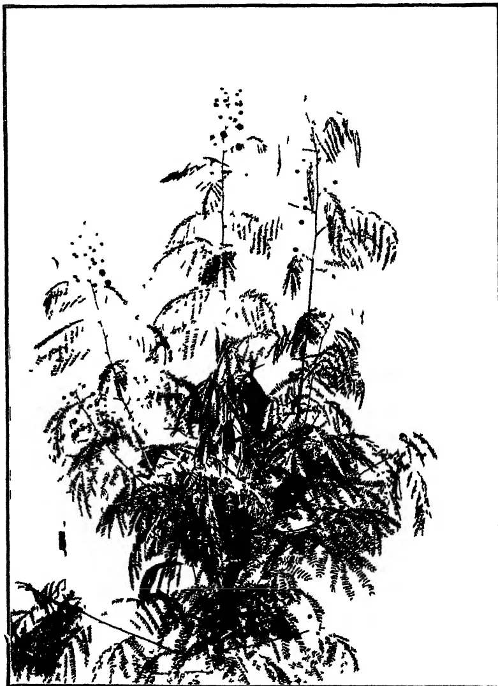
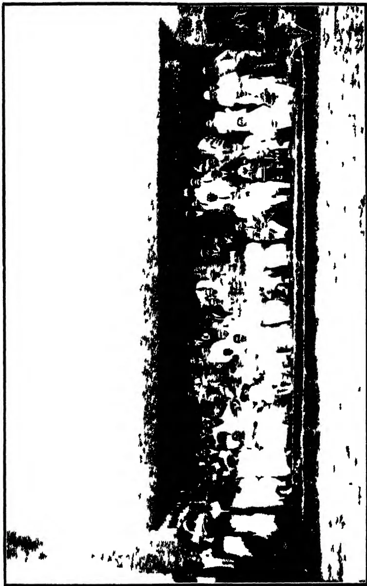
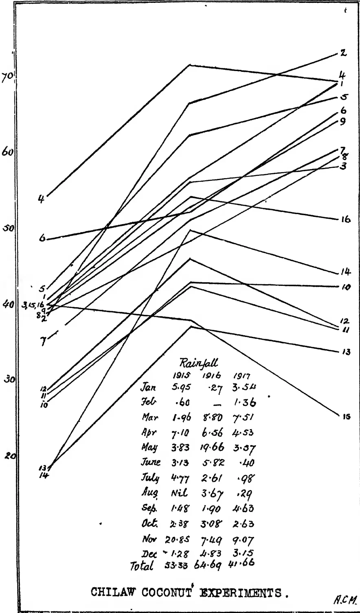
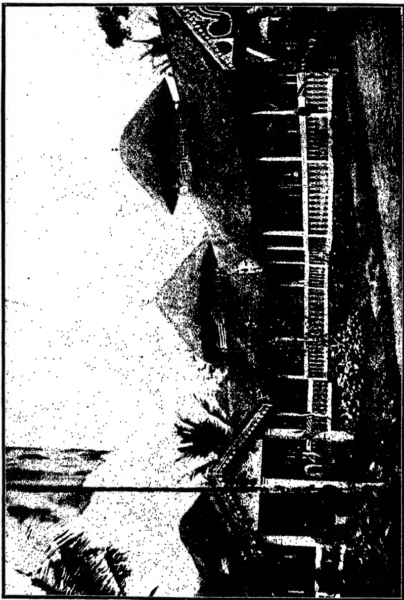

A completely blank white page with no visible content, text, or markings.

1------------------------------------------------

The image is a black and white illustration of the coat of arms of the Agricultural Research Institute Pusa. It features a central shield divided into four quadrants, each containing a different agricultural symbol: a plow, a sheaf of wheat, a bunch of grapes, and a bundle of sheaves. The shield is supported on the left by a lion rampant and on the right by a dragon rampant. Above the shield is a crown. A ribbon scrolls around the bottom of the shield with the motto 'DIEU ET MON DROIT'. The entire emblem is surrounded by decorative foliage.

**AGRICULTURAL RESEARCH INSTITUTE**  
**PUSA**

2------------------------------------------------

A completely blank white page with no visible content, text, or markings.

3------------------------------------------------

The  
— Tropical —  
Agriculturist:

JOURNAL OF THE  
CEYLON AGRICULTURAL SOCIETY.

.....

*Founded 1881*

*Vol. L.*

313884

IARI

.....

Containing Numbers I to VI  
January to June, 1918.

PRINTERS & PUBLISHERS  
H. W. CAVE & Co.,  
COLOMBO.

4------------------------------------------------

A completely blank white page with no visible content, text, or markings.

5------------------------------------------------

# CONTENTS.

---

<table style="width: 100%; border-collapse: collapse;">
<thead>
<tr>
<th style="text-align: left; width: 50%;">PAGE.</th>
<th style="text-align: right; width: 50%;">PAGE.</th>
</tr>
</thead>
<tbody>
<tr>
<td>Extension of the Agricultural Services</td>
<td style="text-align: right;">69</td>
</tr>
<tr>
<td>Fodder Crops in Bombay ...</td>
<td style="text-align: right;">71</td>
</tr>
<tr>
<td>Guinea Grass... ..</td>
<td style="text-align: right;">73</td>
</tr>
<tr>
<td>Dry Grains in the Madras Presidency</td>
<td style="text-align: right;">81</td>
</tr>
<tr>
<td>The Principal Forage Crops of the Philippines ... ..</td>
<td style="text-align: right;">82</td>
</tr>
<tr>
<td><i>Teuccena Glauca</i> . . .</td>
<td style="text-align: right;">90</td>
</tr>
<tr>
<td>Sisal in the Hawaiian Islands ...</td>
<td style="text-align: right;">93</td>
</tr>
<tr>
<td>Making and Storing Farm-Yard Manure ... ..</td>
<td style="text-align: right;">99</td>
</tr>
<tr>
<td>Potash from a New Source ...</td>
<td style="text-align: right;">102</td>
</tr>
<tr>
<td>Researches on Tobacco ... ..</td>
<td style="text-align: right;">103</td>
</tr>
<tr>
<td>Life History and Habits of the Tobacco Beetle <i>Lasioderma serricorne</i> Fabricius ... ..</td>
<td style="text-align: right;">104</td>
</tr>
<tr>
<td>Experiments with Laying Hens ...</td>
<td style="text-align: right;">107</td>
</tr>
<tr>
<td>Runner Ducks as Farm Layers ...</td>
<td style="text-align: right;">109</td>
</tr>
<tr>
<td>School of Tropical Agriculture, Peradeniya ... ..</td>
<td style="text-align: right;">111</td>
</tr>
<tr>
<td>Opening of Agricultural Schools in the Madras Presidency ..</td>
<td style="text-align: right;">114</td>
</tr>
<tr>
<td>Progress of Co-operative Societies in Baroda ... ..</td>
<td style="text-align: right;">117</td>
</tr>
<tr>
<td>A Co-operative Credit Bank in Bombay... ..</td>
<td style="text-align: right;">118</td>
</tr>
<tr>
<td>Progress of Co-operation in Madras</td>
<td style="text-align: right;">119</td>
</tr>
<tr>
<td>Tea in India ... ..</td>
<td style="text-align: right;">120</td>
</tr>
<tr>
<td>The Cultivation of Pepper (<i>Piper Nigrum</i>) in Mullaitivu District</td>
<td style="text-align: right;">122</td>
</tr>
<tr>
<td>Notes on Peasant Agriculture in Grenada ... ..</td>
<td style="text-align: right;">123</td>
</tr>
<tr>
<td>The Origin and Dispersal of the Coconut ... ..</td>
<td style="text-align: right;">124</td>
</tr>
<tr>
<td>Indigo, Natural and Artificial ...</td>
<td style="text-align: right;">125</td>
</tr>
<tr>
<td>Banana Borer ... ..</td>
<td style="text-align: right;">127</td>
</tr>
<tr>
<td>Composition and Properties of Butter</td>
<td style="text-align: right;">128</td>
</tr>
<tr>
<td>Gardens in War Time ... ..</td>
<td style="text-align: right;">129</td>
</tr>
<tr>
<td>Some Observations on the Occurrence of Infertility Under Trees in India ... ..</td>
<td style="text-align: right;">130</td>
</tr>
<tr>
<td>Animal Disease Return for the Month Ended 31st January, 1918 ..</td>
<td style="text-align: right;">131</td>
</tr>
<tr>
<td>Meteorological ... ..</td>
<td style="text-align: right;">131</td>
</tr>
<tr>
<td>Market Rates for Tropical Products</td>
<td style="text-align: right;">132</td>
</tr>
</tbody>
</table>

6------------------------------------------------

## INDEX TO THE FEBRUARY NUMBER

---

<table style="width: 100%; border-collapse: collapse;">
<thead>
<tr>
<th style="text-align: left; width: 60%;"></th>
<th style="text-align: right; width: 20%;">PAGE.</th>
<th style="text-align: right; width: 20%;">PAGE.</th>
</tr>
</thead>
<tbody>
<tr>
<td>Agricultural Schools in the Madras Presidency, Opening of ...</td>
<td style="text-align: right;">114</td>
<td><i>Leucaena glauca</i> ...</td>
<td style="text-align: right;">90</td>
</tr>
<tr>
<td>Agricultural Services, Extension of the Agriculture, Peradeniya, School of Tropical ...</td>
<td style="text-align: right;">69</td>
<td>Life History and Habits of the Tobacco Beetle <i>Lasioderma Serricorne</i> Fabricius ...</td>
<td style="text-align: right;">104</td>
</tr>
<tr>
<td>Animal Disease Return for the Month Ended 31st January, 1918</td>
<td style="text-align: right;">131</td>
<td>Making and Storing Farm Yard Manure ...</td>
<td style="text-align: right;">99</td>
</tr>
<tr>
<td>Banana Borer ...</td>
<td style="text-align: right;">127</td>
<td>Manure, Making and Storing Farm-Yard ...</td>
<td style="text-align: right;">99</td>
</tr>
<tr>
<td>Butter, Composition and Properties of Coconut, Origin and Dispersal of the Composition and Properties of Butter</td>
<td style="text-align: right;">128</td>
<td>Market Rates for Tropical Products</td>
<td style="text-align: right;">132</td>
</tr>
<tr>
<td>Co-operation in Madras, Progress of Co-operative Grain Bank in Bombay ..</td>
<td style="text-align: right;">119</td>
<td>Meteorological ..</td>
<td style="text-align: right;">131</td>
</tr>
<tr>
<td>.. Societies in Baroda, Progress of ...</td>
<td style="text-align: right;">117</td>
<td>Notes on Peasant Agriculture in Grenada ..</td>
<td style="text-align: right;">123</td>
</tr>
<tr>
<td>Crops in Bombay, Fodder ..</td>
<td style="text-align: right;">71</td>
<td>Occurrence of Infertility Under Trees in India, Some Observations on the</td>
<td style="text-align: right;">...</td>
</tr>
<tr>
<td>.. of the Philippines, The Principal Forage ...</td>
<td style="text-align: right;">82</td>
<td>Opening of Agricultural Schools in the Madras Presidency ...</td>
<td style="text-align: right;">114</td>
</tr>
<tr>
<td>Cultivation of Pepper (<i>Piper Nigrum</i>) in Mullaitivu district ...</td>
<td style="text-align: right;">122</td>
<td>Origin and Dispersal of the Coconut</td>
<td style="text-align: right;">124</td>
</tr>
<tr>
<td>Dispersal of the Coconut, Origin and Dry Grains in the Madras Presidency</td>
<td style="text-align: right;">124</td>
<td>Peasant Agriculture in Grenada, Notes on ...</td>
<td style="text-align: right;">123</td>
</tr>
<tr>
<td>Ducks as Farm Layers, Runner ..</td>
<td style="text-align: right;">109</td>
<td>Pepper (<i>Piper Nigrum</i>) in Mullaitivu District, Cultivation of ...</td>
<td style="text-align: right;">122</td>
</tr>
<tr>
<td>Ended 31st January, 1918, Animal Disease Return for the Month ..</td>
<td style="text-align: right;">131</td>
<td>Philippines, The Principal Forage Crops of the ...</td>
<td style="text-align: right;">82</td>
</tr>
<tr>
<td>Experiments with Laying Hens ...</td>
<td style="text-align: right;">107</td>
<td>Potash from a New Source ...</td>
<td style="text-align: right;">102</td>
</tr>
<tr>
<td>Extension of the Agricultural Services Farm Layers, Runner Ducks as ..</td>
<td style="text-align: right;">69</td>
<td>Principal Forage Crops of the Philippines... ..</td>
<td style="text-align: right;">...</td>
</tr>
<tr>
<td>.. Yard Manure, Making and Storing ...</td>
<td style="text-align: right;">99</td>
<td>Progress of Co-operation in Madras ..</td>
<td style="text-align: right;">...</td>
</tr>
<tr>
<td>Fodder Crops in Bombay ...</td>
<td style="text-align: right;">71</td>
<td>.. .. Co-operative Societies in Baroda ...</td>
<td style="text-align: right;">117</td>
</tr>
<tr>
<td>Forage Crops of the Philippines, The Principal ...</td>
<td style="text-align: right;">82</td>
<td>Properties of Butter, Composition and Researches on Tobacco ...</td>
<td style="text-align: right;">128</td>
</tr>
<tr>
<td>Gardens in War Time ..</td>
<td style="text-align: right;">129</td>
<td>Runner Ducks as Farm Layers ...</td>
<td style="text-align: right;">109</td>
</tr>
<tr>
<td>Credit Bank in Bombay, Co-operative Grains in the Madras Presidency, Dry Guinea Grass ...</td>
<td style="text-align: right;">118</td>
<td>Schools in the Madras Presidency, Opening of Agricultural ...</td>
<td style="text-align: right;">114</td>
</tr>
<tr>
<td>Habits of the Tobacco Beetle <i>Lasioderma Serricorne</i> Fabricius, Life History and ...</td>
<td style="text-align: right;">73</td>
<td>School of Tropical Agriculture, Peradeniya ...</td>
<td style="text-align: right;">111</td>
</tr>
<tr>
<td>Hawaiian Islands, Sisal in the</td>
<td style="text-align: right;">93</td>
<td>Sisal in the Hawaiian Islands ...</td>
<td style="text-align: right;">93</td>
</tr>
<tr>
<td>Hens, Experiments with Laying</td>
<td style="text-align: right;">107</td>
<td>Some Observations on the Occurrence of Infertility Under Trees in India</td>
<td style="text-align: right;">130</td>
</tr>
<tr>
<td>History and Habits of the Tobacco Beetle <i>Lasioderma Serricorne</i> Fabricius, Life ...</td>
<td style="text-align: right;">104</td>
<td>Storing Farm-Yard Manure, Making and ...</td>
<td style="text-align: right;">99</td>
</tr>
<tr>
<td>Indigo, Natural and Artificial ...</td>
<td style="text-align: right;">125</td>
<td>Tea in India ..</td>
<td style="text-align: right;">120</td>
</tr>
<tr>
<td>Infertility Under Trees in India, Some Observations on the Occurrence of ..</td>
<td style="text-align: right;">130</td>
<td>Tobacco Beetle <i>Lasioderma Serricorne</i> Fabricius, Life History and Habits of the ...</td>
<td style="text-align: right;">104</td>
</tr>
<tr>
<td>Layers, Runner Ducks as Farm</td>
<td style="text-align: right;">109</td>
<td>Tobacco, Researches on...</td>
<td style="text-align: right;">103</td>
</tr>
<tr>
<td>Laying Hens, Experiments with ...</td>
<td style="text-align: right;">107</td>
<td>Tropical Agriculture, Peradeniya, School of ...</td>
<td style="text-align: right;">111</td>
</tr>
<tr>
<td></td>
<td></td>
<td>Tropical Products, Market Rates for War Time, Gardens in ...</td>
<td style="text-align: right;">132</td>
</tr>
<tr>
<td></td>
<td></td>
<td></td>
<td style="text-align: right;">129</td>
</tr>
</tbody>
</table>

7------------------------------------------------

# CONTENTS.

---

<table style="width: 100%; border-collapse: collapse;">
<thead>
<tr>
<th style="text-align: left; padding-bottom: 10px;">PAGE.</th>
<th style="text-align: right; padding-bottom: 10px;">PAGE.</th>
</tr>
</thead>
<tbody>
<tr>
<td style="vertical-align: top; padding-top: 10px;">

Greater Local Food Production ... 133

Committee of Agricultural Experiments, Minutes of Meeting of 7-2-18 ... .. 135

Progress Report of the Expt. Stations, Peradeniya ... .. 141

,, Anuradhapura... .. 144

,, Mahailuppalama ... 145

Proposed Experiment Stations, etc. for the Northern Province ... 145

C. A. S. Progress Report, LXXIV. ... 153

Fungus Diseases of Food Crops in Ceylon ... .. 159

Importation of Plants &amp;c. into India 164

Sowing Sprouted Seed in Wet Paddy Seed Beds ... .. 166

Experiments on the Artificial Hybridisation of Rice in Java ... 167

Tobacco Seed-beds .. ... 168

Studies on Tobacco Seeds in Java ... 176

</td>
<td style="vertical-align: top; padding-top: 10px;">

Tobacco Experiments at Jaffna ... 176

The Influence of Light on the Germination of the Seeds of Different Varieties of Tobacco ... 177

Experiments on the Manuring of Tobacco Plantations in Java ... 177

The Changes taking place during the Storage of Farmyard Manure ... 178

The Ganeshhind Dairy Herd ... 182

A Model Village Co-operative Society 189

Philippine Methods of Coconut Oil Extraction ... .. 191

"Kafir" and "Milo" Sorghum as Grain Crops and Fodder Crops in Arid Soils, Experiments in the Argentine ... .. 193

Cultivated Aroids ... .. 194

Animal Disease Return for the Month Ended 28th February, 1918 ... 195

Meteorological ... .. 195

Market Rates for Tropical Products.. 196

</td>
</tr>
</tbody>
</table>

8------------------------------------------------

## INDEX TO THE MARCH NUMBER

<table style="width: 100%; border-collapse: collapse;">
<thead>
<tr>
<th style="text-align: left; width: 50%;">PAGE.</th>
<th style="text-align: right; width: 50%;">PAGE.</th>
</tr>
</thead>
<tbody>
<tr>
<td style="vertical-align: top;">

Agricultural Experiments, Committee of, Minutes of Meeting of 7-2-18 135

Animal Disease Return for the Month Ended 28th February, 1918 ... 195

Aroids, Cultivated ... 194

Artificial Hybridisation of Rice in Java, Experiments on the 167

C.A.S. Progress Report, LXXIV. .. 153

Changes taking Place during the Storage of Farmyard Manure, The... 178

Coconut Oil Extraction, Philippine Methods of ... 191

Committee of Agricultural Experiments, Minutes of Meeting of 7-2-18 135

Co-operative Society, A Model Village Crops in Ceylon, Fungus Diseases of Food ... 159

Cultivated Aroids ... 194

Dairy Herd, The Ganeshkhind ... 182

Diseases of Food Crops in Ceylon, Fungus ... 159

Experiment Stations, &amp;c., for the Northern Province, Proposed ... 145

Experiments on the Artificial Hybridisation of Rice in Java ... 167

Experiments on the Manuring of Tobacco Plantations in Java ... 177

Farmyard Manure, The changes taking place during the Storage of... 178

Food Crops in Ceylon, Fungus Diseases of ... 159

Fungus Diseases of Food Crops in Ceylon ... 159

Ganeshkhind Dairy Herd, The ... 182

Germination of the seeds of Different Varieties of Tobacco, The Influence of Light on the ... 177

Hybridisation of Rice in Java, Experiments on the Artificial ... 167

Importation of Plants, &amp;c., into India 164

Influence of Light on the Germination of the seeds of Different Varieties of Tobacco ... 177

Jaffna, Tobacco Experiments at ... 176

"Kafir" and "Milo" Sorghum as Grain Crops and Fodder Crops in Arid Soils, Experiments in the Argentine ... 193

Local Food Production, Greater ... 133

</td>
<td style="vertical-align: top;">

Manure, Changes taking place during the Storage of Farmyard ... 178

Market Rates for Tropical Products . 196

Meteorological .. 195

Minutes of Meeting of 7-2-18 of the Committee of Agricultural Experiments ... 135

Model Village Co-operative Society, A 189

Paddy Seed-Beds, Sowing Sprouted Seed in Wet ... 166

Philippine Methods of Coconut Oil Extraction ... 191

Plants &amp;c. into India, The Importation of ... 164

Progress Report of Experiment Station, Anuradhapura ... 144

Progress Report of Experiment Station, Mahailuppalama ... 145

Progress Report of Experiment Station, Peradeniya ... 141

Progress Report LXXIV of C.A.S. ... 153

Proposed Experiment Stations, &amp;c., for the Northern Province ... 145

Report of Experiment Station, Anuradhapura, Progress ... 144

Report of Experiment Station, Mahailuppalama, Progress ... 145

Report of Experiment Station, Peradeniya, Progress ... 141

Rice in Java, Experiments on the Artificial Hybridisation of .. 167

Seed Beds, Sowing Sprouted Seed in Wet Paddy .. 166

Seed-Beds, Tobacco ... 168

Sowing Sprouted Seed in Wet Paddy Seed Beds ... 166

Storage of Farmyard Manure, The Changes taking place during the 178

Studies on Tobacco Seeds in Java ... 176

Tobacco, The Influence of Light on the Germination of the Seeds of different Varieties of ... 177

Tobacco Experiments at Jaffna ... 176

" " Plantations in Java, Experiments on the Manuring of ... 177

" " Seed-Beds ... 168

" " Seeds in Java, Studies on ... 176

Tropical Products, Market Rates for 196

Village Co-operative Society, a Model 189

</td>
</tr>
</tbody>
</table>

9------------------------------------------------

# CONTENTS.

---

<table style="width: 100%; border-collapse: collapse;">
<thead>
<tr>
<th style="text-align: left; width: 50%;"></th>
<th style="text-align: right; width: 25%;">PAGE.</th>
<th style="text-align: left; width: 50%;"></th>
<th style="text-align: right; width: 25%;">PAGE.</th>
</tr>
</thead>
<tbody>
<tr>
<td>Obituary, Sir John Anderson ..</td>
<td style="text-align: right;">197</td>
<td>Change-over Tapping ..</td>
<td style="text-align: right;">230</td>
</tr>
<tr>
<td>The Value of Agricultural Shows ..</td>
<td style="text-align: right;">198</td>
<td>Henaratgoda Tapping Experiments...</td>
<td style="text-align: right;">231</td>
</tr>
<tr>
<td>The Beligamma Village Show ..</td>
<td style="text-align: right;">199</td>
<td>Tea Experiments at Gangaroowa ..</td>
<td style="text-align: right;">232</td>
</tr>
<tr>
<td>Mawatagoda Agricultural Show ..</td>
<td style="text-align: right;">201</td>
<td>The Growth of International Trade in Manures and Foods ..</td>
<td style="text-align: right;">234</td>
</tr>
<tr>
<td>Ruanwella Show ..</td>
<td style="text-align: right;">202</td>
<td>Influence of the Fineness of Division of Pulverized Limestone on Crop Yield ..</td>
<td style="text-align: right;">245</td>
</tr>
<tr>
<td>Committee of Agricultural Experi- ments (Meeting of 7-3-18) ..</td>
<td style="text-align: right;">203</td>
<td>Maintaining the Nitrogen Supply of the Soil ..</td>
<td style="text-align: right;">245</td>
</tr>
<tr>
<td>Ceylon Agricultural Society (Meet- ing of 25-2-18) ..</td>
<td style="text-align: right;">207</td>
<td>The Fixation of Nitrogen in Fæces</td>
<td style="text-align: right;">246</td>
</tr>
<tr>
<td>Coconut Experiments in Ceylon ..</td>
<td style="text-align: right;">209</td>
<td>Value of Duck Manure ..</td>
<td style="text-align: right;">246</td>
</tr>
<tr>
<td>Crop Return, Experiment Station, Maha Iluppalama ..</td>
<td style="text-align: right;">210</td>
<td>The Comparative Keeping Qualities of Palm Kernel, Coconut, Ground- nut and other Oil Cakes ..</td>
<td style="text-align: right;">247</td>
</tr>
<tr>
<td>Pitiakande Coconut Experiments ..</td>
<td style="text-align: right;">211</td>
<td>Experiments in Transplanting Coffee</td>
<td style="text-align: right;">255</td>
</tr>
<tr>
<td>Trial Ground, Negombo, Leaf Measure- ments ..</td>
<td style="text-align: right;">213</td>
<td>A Handbook of Vegetable Culture ..</td>
<td style="text-align: right;">256</td>
</tr>
<tr>
<td>Experiments with Coconuts ..</td>
<td style="text-align: right;">214</td>
<td>Cross Breeding for Increased Pro- duction, Tomatos and Cucum- bers ..</td>
<td style="text-align: right;">257</td>
</tr>
<tr>
<td>Cultivation of the Potato ..</td>
<td style="text-align: right;">216</td>
<td>Animal Disease Return for the Month ended 31st March, 1918 ..</td>
<td style="text-align: right;">259</td>
</tr>
<tr>
<td>Notes on Treatment given to <i>Cajanus</i> <i>Indicus</i> (Dhall) ..</td>
<td style="text-align: right;">224</td>
<td>Meteorological ..</td>
<td style="text-align: right;">259</td>
</tr>
<tr>
<td>Results of Experiments with Food Stuffs ..</td>
<td style="text-align: right;">225</td>
<td>Market Rates for Tropical Products</td>
<td style="text-align: right;">260</td>
</tr>
<tr>
<td>Rubber Tapping Experiments, Pera- deniya ..</td>
<td style="text-align: right;">227</td>
<td></td>
<td></td>
</tr>
<tr>
<td>Rubber Manuring Experiments, Pera- deniya ..</td>
<td style="text-align: right;">229</td>
<td></td>
<td></td>
</tr>
</tbody>
</table>

10------------------------------------------------

## INDEX TO THE APRIL NUMBER

<table style="width: 100%; border-collapse: collapse;">
<thead>
<tr>
<th style="text-align: left; width: 50%;">PAGE.</th>
<th style="text-align: right; width: 50%;">PAGE.</th>
</tr>
</thead>
<tbody>
<tr>
<td style="vertical-align: top;">

Agricultural Experiments, Committee of... .. 203

.. Society, Meeting of 25-2-18 207

.. Show, Mawatagoda ... 201

.. Shows, The Value of ... 198

Animal Disease Return for the Month ended 31st March, 1918 ... 259

Beligamma Village Show, The ... 199

<i>Cajanus indicus</i>, (Dhall) Notes on Treatment given to ... 224

C. A. S. Meeting of 25-2-18 ... 207

Change-over Tapping ... 230

Coconut Experiments in Ceylon ... 209

.. .., Pitiakande ... 211

Coconuts, Experiments with ... 214

Committee of Agricultural Experiments, Meeting of 7-3-18 ... 203

Comparative Keeping Qualities of Palm Kernel, Coconut, Ground-nut and other Oil Cakes, The ... 247

Crop Return, Experiment Station, Maha Illuppalama ... 210

Cross Breeding for Increased Production, Tomatoes and Cucumbers 257

Cultivation of the Potato ... 216

Culture, A Handbook of Vegetable... 256

Duck Manure, Value of ... 246

Experiments in Transplanting Coffee ... 255

.. with Coconuts ... 214

Fixation of Nitrogen in Faeces, The Foods, The Growth of International Trade in Manures and ... 234

Food Stuffs, Results of Experiments with ... .. 225

Growth of International Trade in Manures and Foods, The ... 234

Handbook of Vegetable Culture, A ... 256

Henaratgoda Tapping Experiments... 231

Influence of the Fineness of Division of Pulverized Limestone on Crop Yield ... .. 245

Maintaining the Nitrogen Supply of the Soil .. ... 245

Manure, Value of Duck ... 246

Manures and Foods, The Growth of International Trade in ... 234

</td>
<td style="vertical-align: top;">

Manuring Experiments, Peradeniya, Rubber ... .. 229

Market Rates for Tropical Products 260

Mawatagoda, Agricultural Show ... 201

Meteorological ... .. 259

Nitrogen in Faeces, The Fixation of... 246

Nitrogen Supply of the oil, Maintaining the ... .. 245

Notes on Treatment given to <i>Cajanus indicus</i> (Dhall) ... .. 224

Obituary, Sir John Anderson ... 197

Palm Kernel, Coconut, Ground-nut and other Oil Cakes, Comparative Keeping Qualities of .. 247

Pitiakande Coconut Experiments ... 211

Potato, Cultivation of the ... 216

Pulverized Limestone on Crop Yield, Influence of the Fineness of Division of ... .. 245

Results of Experiments with Food Stuffs ... .. 225

Ruanwella Show ... .. 202

Rubber Manuring Experiments, Peradeniya ... .. 229

.. Tapping Experiments, Peradeniya ... .. 227

Show, The Beligamma Village ... 199

.. Ruanwella ... .. 202

Shows, The Value of Agricultural... 198

Soil, Maintaining the Nitrogen Supply of the ... .. 245

Tapping, Change-over ... .. 230

.. Experiments, Henaratgoda 231

.. .. Peradeniya... 229

Tea Experiments at Gangaroowa ... 232

Trade in Manures and Foods, The Growth of International ... 234

Transplanting Coffee, Experiments in Trial Ground, Negombo... .. 213

Tropical Products, Market Rates for ... .. 260

Value of Agricultural Shows, The ... 198

.. .. Duck Manure... 246

Vegetable Culture, A Handbook of... 256

Village Show, The Beligamma ... 199

</td>
</tr>
</tbody>
</table>

11------------------------------------------------

# CONTENTS.

---

<table style="width: 100%; border-collapse: collapse;">
<thead>
<tr>
<th style="text-align: left; width: 50%;">PAGE.</th>
<th style="text-align: right; width: 50%;">PAGE.</th>
</tr>
</thead>
<tbody>
<tr>
<td>Experiments with Tobacco at Jaffna 261</td>
<td>Commercial Fixation of Atmospheric Nitrogen ... .. 302</td>
</tr>
<tr>
<td>The Food-Value of the Groundnut 263</td>
<td>Farmyard and other Manures ... 307</td>
</tr>
<tr>
<td>The Groundnut · ... .. 266</td>
<td>Co-operative Credit Societies in Mauritius ... .. 309</td>
</tr>
<tr>
<td>Cultivation of the Potato ... 270</td>
<td>Progress of Co-operative Societies in Central Provinces and Berar ... 312</td>
</tr>
<tr>
<td>The Value of Immature Potato Tubers as Seed ... .. 278</td>
<td>Co-operative Societies in the United Provinces of Agra and Oudh ... 313</td>
</tr>
<tr>
<td>Tobacco Trials at Jaffna... .. 279</td>
<td>The Effect of One Plant on Another 314</td>
</tr>
<tr>
<td>Fertilizer Tests with Tobacco Varieties on College Soils ... 281</td>
<td>Margarine Industry .. ... 319</td>
</tr>
<tr>
<td>Economic Planting of Paddy .. 282</td>
<td>Manurial Experiments with Arrow-root ... .. 322</td>
</tr>
<tr>
<td>Beekeeping in Ceylon ... .. 284</td>
<td>Animal Disease Return for the Month ended 30th April, 1918 ... 323</td>
</tr>
<tr>
<td>Revival of Interest in Beekeeping... 285</td>
<td>Meteorological .. .. 323</td>
</tr>
<tr>
<td>Field Notes and Observations on Brown Bast of Rubber .. 286</td>
<td>Market Rates for Tropical Products 324</td>
</tr>
<tr>
<td>Disease Investigations in Ceylon ... 290</td>
<td></td>
</tr>
<tr>
<td>The Growth of International Trade in Manures ... .. 291</td>
<td></td>
</tr>
</tbody>
</table>

12------------------------------------------------

# INDEX TO THE MAY NUMBER

---

<table style="width: 100%; border-collapse: collapse;">
<thead>
<tr>
<th style="text-align: left; width: 60%;"></th>
<th style="text-align: right; width: 20%;">PAGE.</th>
<th style="text-align: left; width: 60%;"></th>
<th style="text-align: right; width: 20%;">PAGE.</th>
</tr>
</thead>
<tbody>
<tr>
<td>Atmospheric Nitrogen, Commercial Fixation of ... ..</td>
<td style="text-align: right; vertical-align: bottom;">302</td>
<td>International Trade in Manures, The Growth of ... ..</td>
<td style="text-align: right; vertical-align: bottom;">291</td>
</tr>
<tr>
<td>Animal Disease Return for the Month ended 30th April, 1918 ... ..</td>
<td style="text-align: right; vertical-align: bottom;">323</td>
<td>Jaffna, Experiments with Tobacco at</td>
<td style="text-align: right; vertical-align: bottom;">261</td>
</tr>
<tr>
<td>Beekeeping in Ceylon ... ..</td>
<td style="text-align: right; vertical-align: bottom;">284</td>
<td>Market Rates for Tropical Products</td>
<td style="text-align: right; vertical-align: bottom;">324</td>
</tr>
<tr>
<td>Beekeeping, Revival of Interest in ... ..</td>
<td style="text-align: right; vertical-align: bottom;">285</td>
<td>Manures, Farmyard and other ... ..</td>
<td style="text-align: right; vertical-align: bottom;">307</td>
</tr>
<tr>
<td>Brown Bast of Rubber, Field Notes and Observations on .. ..</td>
<td style="text-align: right; vertical-align: bottom;">286</td>
<td>Manures, The Growth of Interna-tional Trade in .. ..</td>
<td style="text-align: right; vertical-align: bottom;">291</td>
</tr>
<tr>
<td>Commercial Fixation of Atmospheric Nitrogen ... ..</td>
<td style="text-align: right; vertical-align: bottom;">302</td>
<td>Manurial Experiments with Arrow-root ... ..</td>
<td style="text-align: right; vertical-align: bottom;">322</td>
</tr>
<tr>
<td>Co-operative Credit Societies in Mauritius ... ..</td>
<td style="text-align: right; vertical-align: bottom;">309</td>
<td>Margarine Industry ... ..</td>
<td style="text-align: right; vertical-align: bottom;">319</td>
</tr>
<tr>
<td>" Societies in Central Provinces and Berar, Progress of ... ..</td>
<td style="text-align: right; vertical-align: bottom;">312</td>
<td>Meteorological ... ..</td>
<td style="text-align: right; vertical-align: bottom;">323</td>
</tr>
<tr>
<td>" Societies in the United Provinces of Agra and Oudh ... ..</td>
<td style="text-align: right; vertical-align: bottom;">313</td>
<td>Nitrogen, Commercial Fixation of Atmospheric .. ..</td>
<td style="text-align: right; vertical-align: bottom;">302</td>
</tr>
<tr>
<td>Credit Societies in Mauritius, Co-operative ... ..</td>
<td style="text-align: right; vertical-align: bottom;">309</td>
<td>Notes and Observations on Brown Bast of Rubber, Field ... ..</td>
<td style="text-align: right; vertical-align: bottom;">286</td>
</tr>
<tr>
<td>Cultivation of the Potato ... ..</td>
<td style="text-align: right; vertical-align: bottom;">270</td>
<td>Observations on Brown Bast of Rubber, Field Notes and ... ..</td>
<td style="text-align: right; vertical-align: bottom;">286</td>
</tr>
<tr>
<td>Disease Investigations in Ceylon... ..</td>
<td style="text-align: right; vertical-align: bottom;">290</td>
<td>One Plant on Another, The Effect of</td>
<td style="text-align: right; vertical-align: bottom;">314</td>
</tr>
<tr>
<td>Economic Planting of Paddy ... ..</td>
<td style="text-align: right; vertical-align: bottom;">282</td>
<td>Paddy, Economic Planting of ... ..</td>
<td style="text-align: right; vertical-align: bottom;">282</td>
</tr>
<tr>
<td>Effect of One Plant on Another, The</td>
<td style="text-align: right; vertical-align: bottom;">314</td>
<td>Planting of Paddy, Economic ... ..</td>
<td style="text-align: right; vertical-align: bottom;">282</td>
</tr>
<tr>
<td>Experiments with Tobacco at Jaffna</td>
<td style="text-align: right; vertical-align: bottom;">261</td>
<td>Potato, Cultivation of the ... ..</td>
<td style="text-align: right; vertical-align: bottom;">270</td>
</tr>
<tr>
<td>Experiments with Arrowroot, Manu-rial . ... ..</td>
<td style="text-align: right; vertical-align: bottom;">322</td>
<td>Progress of Co-operative Societies in Central Provinces and Berar ... ..</td>
<td style="text-align: right; vertical-align: bottom;">312</td>
</tr>
<tr>
<td>Farmyard and other Manures .. ..</td>
<td style="text-align: right; vertical-align: bottom;">307</td>
<td>Revival of Interest in Beekeeping .. ..</td>
<td style="text-align: right; vertical-align: bottom;">285</td>
</tr>
<tr>
<td>Fertilizer Tests with Tobacco Varie-ties on College Soils .. ..</td>
<td style="text-align: right; vertical-align: bottom;">281</td>
<td>Rubber, Field Notes and Observa-tions on Brown Bast of ... ..</td>
<td style="text-align: right; vertical-align: bottom;">286</td>
</tr>
<tr>
<td>Field Notes and Observations on Brown Bast of Rubber ... ..</td>
<td style="text-align: right; vertical-align: bottom;">286</td>
<td>Societies in Mauritius, Co-operative Credit ... ..</td>
<td style="text-align: right; vertical-align: bottom;">309</td>
</tr>
<tr>
<td>Fixation of Atmospheric Nitrogen, Commercial ... ..</td>
<td style="text-align: right; vertical-align: bottom;">302</td>
<td>Societies in Central Provinces and Berar, Progress of Co-opera-tive ... ..</td>
<td style="text-align: right; vertical-align: bottom;">312</td>
</tr>
<tr>
<td>Food-Value of the Groundnut, The</td>
<td style="text-align: right; vertical-align: bottom;">263</td>
<td>" in the United Provinces of Agra and Oudh, Co-operative</td>
<td style="text-align: right; vertical-align: bottom;">313</td>
</tr>
<tr>
<td>Groundnut, The ... ..</td>
<td style="text-align: right; vertical-align: bottom;">266</td>
<td>Tobacco Trials at Jaffna ... ..</td>
<td style="text-align: right; vertical-align: bottom;">279</td>
</tr>
<tr>
<td>" , The Food-Value of the</td>
<td style="text-align: right; vertical-align: bottom;">263</td>
<td>Trade in Manures, The Growth of International ... ..</td>
<td style="text-align: right; vertical-align: bottom;">291</td>
</tr>
<tr>
<td>Growth of International Trade in Manures, The .. ..</td>
<td style="text-align: right; vertical-align: bottom;">291</td>
<td>Tropical Products, Market Rates for</td>
<td style="text-align: right; vertical-align: bottom;">324</td>
</tr>
<tr>
<td>Immature Potato Tubers as Seed, The Value of ... ..</td>
<td style="text-align: right; vertical-align: bottom;">278</td>
<td>Value of Immature Potato Tubers as Seed, The ... ..</td>
<td style="text-align: right; vertical-align: bottom;">278</td>
</tr>
<tr>
<td>Investigations in Ceylon, Disease ... ..</td>
<td style="text-align: right; vertical-align: bottom;">290</td>
<td>Value of the Groundnut, The Food</td>
<td style="text-align: right; vertical-align: bottom;">263</td>
</tr>
<tr>
<td></td>
<td></td>
<td>Varieties on College Soils, Fertilizer Tests with Tobacco ... ..</td>
<td style="text-align: right; vertical-align: bottom;">281</td>
</tr>
</tbody>
</table>

13------------------------------------------------

# CONTENTS.

---

<table>
<thead>
<tr>
<th></th>
<th>PAGE.</th>
<th></th>
<th>PAGE.</th>
</tr>
</thead>
<tbody>
<tr>
<td>Experiments with Coconuts ..</td>
<td>325</td>
<td>Progress Report of the Experiment Stations, Anuradhapura and Mahawiluppalama, 1-2-18—31-3-18 ...</td>
<td>369</td>
</tr>
<tr>
<td>Manurial Experiments with Young Rubber at Peradeniya ..</td>
<td>327</td>
<td>Nildandahinna Agricultural Show ...</td>
<td>370</td>
</tr>
<tr>
<td>Manuring Coconuts ...</td>
<td>329</td>
<td>Dedigama Show ... ..</td>
<td>371</td>
</tr>
<tr>
<td>Transplanting in the Control of "Wild" Rice in Italy ...</td>
<td>330</td>
<td><i>Leucaena Glauca</i> ... ..</td>
<td>372</td>
</tr>
<tr>
<td>A Study of Tobacco Worms and Methods of Control... ..</td>
<td>331</td>
<td><i>Leucaena Glauca</i> in Java ..</td>
<td>372</td>
</tr>
<tr>
<td>Tobacco Cultivation in Jaffna ...</td>
<td>337</td>
<td>Progress Report on Investigations into Shot-Hole Boiler of Tea ..</td>
<td>373</td>
</tr>
<tr>
<td>The Groundnut ... ..</td>
<td>339</td>
<td>Additional Facts Regarding Tea Tortrix ... ..</td>
<td>375</td>
</tr>
<tr>
<td>The Board of Agriculture (Meeting of 21-5-18). ... ..</td>
<td>346</td>
<td>Manufacture of Superphosphates in India ... ..</td>
<td>377</td>
</tr>
<tr>
<td>C.A.S. Progress Report No. LXXV. 349</td>
<td></td>
<td>The Poultry Industry ... ..</td>
<td>379</td>
</tr>
<tr>
<td>Report of Committee of Board of Agriculture on Sessional Paper No. 1 of 1918 ... ..</td>
<td>354</td>
<td>Indigo Manufacture in Madras ...</td>
<td>382</td>
</tr>
<tr>
<td>Report of Committee on Agri-Horticultural Shows ... ..</td>
<td>358</td>
<td>Indian Trade in Oilseeds ...</td>
<td>383</td>
</tr>
<tr>
<td>Committee of Agricultural Experiments (Meeting of 9-5-18) ...</td>
<td>362</td>
<td>The Wide-Spacing of Crops ...</td>
<td>386</td>
</tr>
<tr>
<td>Progress Report, Peradeniya Experiment Station from 1-2-18—30-4-18 ... ..</td>
<td>366</td>
<td>Animal Disease Return for the Month Ended 31st May, 1918 ...</td>
<td>387</td>
</tr>
<tr>
<td></td>
<td></td>
<td>Meteorological ... ..</td>
<td>387</td>
</tr>
<tr>
<td></td>
<td></td>
<td>Market Rates for Tropical Products</td>
<td>388</td>
</tr>
</tbody>
</table>

14------------------------------------------------

# INDEX TO THE JUNE NUMBER

<table style="width: 100%; border-collapse: collapse;">
<thead>
<tr>
<th style="text-align: left; width: 60%;"></th>
<th style="text-align: right; width: 20%;">PAGE.</th>
<th style="text-align: right; width: 20%;">PAGE</th>
</tr>
</thead>
<tbody>
<tr>
<td>A Study of Tobacco Worms and Methods of Control ...</td>
<td style="text-align: right;">331</td>
<td>Nildandahinna Agricultural Show...</td>
<td style="text-align: right;">370</td>
</tr>
<tr>
<td>Additional Facts Regarding Tea Tortrix ...</td>
<td style="text-align: right;">375</td>
<td>Oilseeds, Indian Trade in ...</td>
<td style="text-align: right;">383</td>
</tr>
<tr>
<td>Agricultural Experiments, Committee of (Meeting of May 9th, 1918)..</td>
<td style="text-align: right;">362</td>
<td>Peradeniya Experiment Station, Progress Report, 1-2-18—30-4-18 ...</td>
<td style="text-align: right;">366</td>
</tr>
<tr>
<td>Agricultural Show, Nildandahinna ...</td>
<td style="text-align: right;">370</td>
<td>Poultry Industry, The ...</td>
<td style="text-align: right;">379</td>
</tr>
<tr>
<td>" Society, Progress Report, No. LXXV, Ceylon ..</td>
<td style="text-align: right;">349</td>
<td>Progress Report, Experiment Station Peradeniya 1-2-18—30-4-18 ...</td>
<td style="text-align: right;">366</td>
</tr>
<tr>
<td>Agri-Horticultural Shows, Report of Committee on ...</td>
<td style="text-align: right;">358</td>
<td>Progress Report No. LXXV, C.A.S....</td>
<td style="text-align: right;">349</td>
</tr>
<tr>
<td>Animal Disease Return for the Month Ended 31st May, 1918 ...</td>
<td style="text-align: right;">387</td>
<td>" " on Investigations into Shot-Hole Borer of Tea ...</td>
<td style="text-align: right;">373</td>
</tr>
<tr>
<td>Anuradhapura and Mahailuppalama, Progress Report 1-2-18—31-3-18 of the Experiment Stations ...</td>
<td style="text-align: right;">369</td>
<td>Progress Report of the Experiment Stations, Anuradhapura and Mahailuppalama 1-2-18—31-3-18 ...</td>
<td style="text-align: right;">369</td>
</tr>
<tr>
<td>Board of Agriculture, Meeting of 21-5-18 ...</td>
<td style="text-align: right;">346</td>
<td>Report of the Experiment Stations, Anuradhapura and Mahailuppalama, 1-2-18—31-3-18, Progress Report, Peradeniya Experiment Station, 1-2-18—30-4-18, Progress</td>
<td style="text-align: right;">366</td>
</tr>
<tr>
<td>C.A.S. Progress Report No. LXXV. Coconuts, Experiments with ...</td>
<td style="text-align: right;">349</td>
<td>Report No. LXXV, C.A.S. Progress</td>
<td style="text-align: right;">349</td>
</tr>
<tr>
<td>Coconuts, Manuring ...</td>
<td style="text-align: right;">329</td>
<td>" of Committee of Board of Agriculture on Sessional Paper No. I of 1918 (Extension and Co-ordination of Agricultural Services) ...</td>
<td style="text-align: right;">354</td>
</tr>
<tr>
<td>Committee of Agricultural Experiments (Meeting of May 9th, 1918) Committee on Agri-Horticultural Shows. Report of ...</td>
<td style="text-align: right;">362</td>
<td>" of Committee on Agri-Horticultural Shows ..</td>
<td style="text-align: right;">358</td>
</tr>
<tr>
<td>" of Board of Agriculture on Sessional Paper No. I of 1918 (Extension and Co-ordination of Agricultural Services) Report of ...</td>
<td style="text-align: right;">354</td>
<td>" on Investigations into Shot-Hole Borer of Tea, Progress</td>
<td style="text-align: right;">373</td>
</tr>
<tr>
<td>Control of "Wild" Rice in Italy, Transplanting in the ...</td>
<td style="text-align: right;">330</td>
<td>Rice in Italy, Transplanting in the Control of "Wild"...</td>
<td style="text-align: right;">330</td>
</tr>
<tr>
<td>Crops, The Wide-Spacing of ...</td>
<td style="text-align: right;">386</td>
<td>Rubber at Peradeniya, Manurial Experiments with Young ...</td>
<td style="text-align: right;">327</td>
</tr>
<tr>
<td>Dedigama Show ...</td>
<td style="text-align: right;">371</td>
<td>Sessional Paper No. I of 1918, Report of Committee of Board of Agriculture on (Extension and Co-ordination of Agricultural Services) ...</td>
<td style="text-align: right;">354</td>
</tr>
<tr>
<td>Experiment Station, Peradeniya, Progress Report, 1-2-18—30-4-18 ...</td>
<td style="text-align: right;">366</td>
<td>Shot-Hole Borer of Tea, Progress Report on Investigations into</td>
<td style="text-align: right;">373</td>
</tr>
<tr>
<td>Experiment Stations, Anuradhapura, and Mahailuppalama, 1-2-18—31-3-18, Progress Report of the Experiments with Coconuts ...</td>
<td style="text-align: right;">369</td>
<td>Show, Dedigama ...</td>
<td style="text-align: right;">371</td>
</tr>
<tr>
<td>" " Young Rubber at Peradeniya, Manurial ...</td>
<td style="text-align: right;">325</td>
<td>" Nildandahinna Agricultural ..</td>
<td style="text-align: right;">370</td>
</tr>
<tr>
<td>Facts Regarding Tea Tortrix, Additional ..</td>
<td style="text-align: right;">375</td>
<td>Shows, Report of Committee on Agri-Horticultural ...</td>
<td style="text-align: right;">358</td>
</tr>
<tr>
<td><i>Glauca, Leucena</i> ..</td>
<td style="text-align: right;">372</td>
<td>Superphosphates in India, Manufacture of ...</td>
<td style="text-align: right;">377</td>
</tr>
<tr>
<td><i>Glauca</i> in Java, <i>Leucena</i> ..</td>
<td style="text-align: right;">372</td>
<td>Tea, Progress Report on Investigations into Shot-Hole Borer of ...</td>
<td style="text-align: right;">373</td>
</tr>
<tr>
<td>Groundnut, The ...</td>
<td style="text-align: right;">339</td>
<td>Tortrix, Additional Facts Regarding Tea ...</td>
<td style="text-align: right;">375</td>
</tr>
<tr>
<td>Indian Trade in Oilseeds ...</td>
<td style="text-align: right;">383</td>
<td>Tobacco Cultivation in Jaffna ...</td>
<td style="text-align: right;">337</td>
</tr>
<tr>
<td>Indigo Manufacture in Madras ...</td>
<td style="text-align: right;">382</td>
<td>" Worms and Methods of Control, A Study of ...</td>
<td style="text-align: right;">331</td>
</tr>
<tr>
<td>Investigations into Shot-Hole Borer of Tea, Progress Report on ...</td>
<td style="text-align: right;">373</td>
<td>Transplanting in the Control of "Wild" Rice in Italy ...</td>
<td style="text-align: right;">330</td>
</tr>
<tr>
<td><i>Leucena Glauca</i> ..</td>
<td style="text-align: right;">372</td>
<td>Trade in Oilseeds, Indian ...</td>
<td style="text-align: right;">383</td>
</tr>
<tr>
<td><i>Leucena Glauca</i> in Java..</td>
<td style="text-align: right;">372</td>
<td>Tropical Products, Market Rates for "Wild" Rice in Italy, Transplanting in the Control of ...</td>
<td style="text-align: right;">388</td>
</tr>
<tr>
<td>Mahailuppalama, Progress Report, 1-2-18—31-3-18, of the Experiment Stations, Anuradhapura and Manufacture of Superphosphates in India ...</td>
<td style="text-align: right;">369</td>
<td>Wide-Spacing of Crops, The ...</td>
<td style="text-align: right;">386</td>
</tr>
<tr>
<td>Manurial Experiments with Young Rubber at Peradeniya ..</td>
<td style="text-align: right;">377</td>
<td>Worms and Methods of Control, A Study of Tobacco ...</td>
<td style="text-align: right;">331</td>
</tr>
<tr>
<td>Manuring Coconuts ...</td>
<td style="text-align: right;">327</td>
<td>Young Rubber at Peradeniya, Manurial Experiments with ...</td>
<td style="text-align: right;">327</td>
</tr>
<tr>
<td>Market Rates for Tropical Products Meteorological ...</td>
<td style="text-align: right;">388</td>
<td></td>
<td></td>
</tr>
<tr>
<td></td>
<td style="text-align: right;">387</td>
<td></td>
<td></td>
</tr>
</tbody>
</table>

15------------------------------------------------

THE  
**TROPICAL AGRICULTURIST:**  
JOURNAL OF THE  
**CEYLON AGRICULTURAL SOCIETY.**

---

---

VOL. L.

PERADENIYA, JANUARY, 1918.

No. 1.

---

---

**AN AGRICULTURAL REVIEW FOR 1917.**

---

The year 1917 has presented many problems to the agriculturists of the Colony. The exchange difficulties which began at the latter part of 1916 have continued throughout the year and the majority of agricultural undertakings have had to give serious thought to the finance of their operations. Tea and rubber companies have had to pay their dividends in sterling drafts and have found difficulty in selling their produce locally except against drafts on London.

Owing to the shortage of freight and a limitation of the imports of tea into the United Kingdom, most estates found it necessary to restrict their output to some extent during the year but in the last few months more freight for tea offered. Tea was during the last months of the year taken under control in the United Kingdom by the Food Controller, and arrangements made for the purchase of Ceylon teas in London and in the Colony on Government account.

Rubber has not experienced such difficulty in freight and, despite a fall in price towards the end of the year, rubber estates have been able to carry on as usual. There have been some difficulties over manures and over local sales for cash, but these have been met and overcome. Diseases of rubber still receive close attention on the majority of estates, but the necessity of an adequate inspectorate force for the control of pests and diseases has been dealt with during the year. A bark disease, new to Ceylon, has recently been found in the drier districts and is under investigation.

Coconuts and coconut products have suffered severely during the year. Very little freight has offered, and coconut owners have seen prices, in spite of high values in Europe, of their produce gradually fall until they, at the end of the year,

16------------------------------------------------

2[JANUARY, 1918]

are barely above the cost of production. Continuous efforts have been made to relieve the situation, but with the shortage of tonnage no solution of the difficulty has been possible. It is feared that many smaller properties will be unable to carry on at present prices, but it is gratifying to record that all larger properties are endeavouring to carry on their cultivation programmes as far as possible as usual and are utilizing poonac largely in their manurial mixtures. A new disease of coconuts has come to light during the year in the Kurunegala district, but latest reports indicate that it is limited to a comparatively small area.

Cinnamon products were unsaleable until the last months of the year, and citronella grass continues to be replaced by other products.

Early in the year, it became evident that strenuous efforts should be made to encourage the greater production of food stuffs in the Colony. A gratifying response to the appeals for an increased planting of food products, curry stuffs and vegetables was made by all classes of the agricultural community, and a record distribution of seed and planting material was carried out. This important question cannot however be left with this distribution, and preparations are now being made for further efforts with the South-West monsoon in June next. The difficulties of the railway over coal should emphasize the necessity for this production of a greater amount of food products in all parts of the Colony. The formation of district food-production committees has been suggested, and one such committee has already begun operations. There is no doubt that such bodies can do much to assist in the food-production problem.

Deliberations have been carried on throughout the year over the question of the development of lands in the Dry Zone, and the report of the Committee has been favourably received. The Government have undertaken to make funds available for the formation of peasant settlements.

An increase in the number of agricultural instructors has been made during the year, and further demonstration gardens opened up. The organization of a series of such gardens throughout the Colony will be carried on as funds become available as there is little doubt that through them the agricultural methods of the villager can be improved.

17------------------------------------------------

JANUARY, 1918.]3

# CEYLON AGRICULTURE.

---

## LAND DEVELOPMENT IN THE DRY ZONE.

---

At the meeting of the Ceylon Agricultural Society on the 26th November, 1917, the following discussion took place on the Report of the Land Development Committee which was issued as a Supplement to the November issue of the journal:—

### LAND DEVELOPMENT COMMITTEE'S REPORT.

MR. STOCKDALE in submitting the report of the Land Development Committee of the Ceylon Agricultural Society said : " This Committee was appointed in 1916 to go into the question and consider the development of lands under tanks in the Dry Zone. It has had eleven meetings and its report is submitted to the Society to-day. The recommendations of the Committee comprise its views as to how development can take place and it recommends for the consideration of the Society whether peasant settlement could not be established under Nachchaduwa tank. Notes in respect to those proposals are printed as Annexure I. From that annexure you will see an initial expenditure of about Rs. 6,000 would be necessary. A further sum would be required next year to enable settlers to open up further lands. The Committee has considered several tank schemes and has decided upon Nachchaduwa tank as offering the best prospects for immediate success, because it is near Anuradhapura. The question of communications, markets for settlers would be assured. Several others have been considered and the Committee decided upon the Nachchaduwa Scheme. Further schemes would be considered if this one be successful. It was urged that the Committee should consider the settlement of Tamils under another tank and a settlement for Moors under another, but in the first instance they consider that a settlement of Sinhalese under the tank at Nachchaduwa should be tried.

### MR. BALASINGHAM'S REMARKS.

The HON. MR. BALASINGHAM said :—I wish to make a few observations on the report of this Land Development Committee. With much that is said there I am in complete agreement. But there are one or two points on which I beg to differ. I agree with SIR CHRISTOFFEL'S dissent on the subject of leases. I do not understand why the Committee thinks that the leasing system is the best means of assuring land development. When it was understood that the Government was contemplating the discontinuance of sales and introducing a system of leaseholds, the few who welcomed it, welcomed it on the ground that it was a splendid thing for the poor. It is now admitted by everybody, and even by this Committee, that freeholds are more attractive to men with moderate or little or no means. In fact, the best means of attracting the poor man is to offer land on the hire-purchase system and to spread out the payment of price over 30 or 40 years. Any condition that may be attached to leases as to cultivation may be attached to such sales. I fear that the Committee's recommendation is on behalf of the rich capitalist. This Committee was appointed at the annual meeting in 1916 as a result of the following observation in the annual report of this Society on the subject of cultivation of

18------------------------------------------------

4[JANUARY, 1918.

lands under tanks. The annual report for 1916 said :—“What is to be desired—at least as an initial measure—is that these lands should be given at nominal rates to individual capitalists or syndicates on the condition that a certain proportion of the area is brought under cultivation every year. We have waited long enough for colonisation by small settlers.” This present Committee reports that paddy cultivation does not appeal to the capitalists under present conditions : that tank areas can be more rapidly developed by capitalists ; that capitalists should be allowed to cultivate coconut and other like products; that capitalists will be interested only if they can secure land in large blocks for development upon estate lines; that for coconut cultivation 250 acres would be the minimum area that could be worked economically and it makes its recommendations accordingly. On what facts are these recommendations based ? Is it a fact as was stated in the annual report of this Society for 1916, that we have waited in vain long enough for colonisation by the small settler ? I think, Sir, it is not the small settler but the capitalist that has failed. The report of this very Committee shows that the small settler had very little encouragement in the past. We have not established State Banks for aiding the man without capital on the security of his land and produce as in Australia or New Zealand. We have not provided medical aid to protect the small settler against malaria. We sell lands by the auction system under which the poor man has no chance as against the capitalist. Then again, Sir, coconut is a product for which there is still plenty of land by the sea board and it is not necessary to give the lands under the tanks “at a nominal rate to capitalists” for the purpose of coconut cultivation. If the capitalists will pay a fair share of the cost of construction, say even half the cost of construction, there cannot be much objection to partitioning these tank areas into big estates. Paddy cultivation and the cultivation of other food products deserve some subsidy, and the money spent on our irrigation works is in the nature of a subsidy. Moreover, paddy cannot be successfully grown except under tanks or where there is a large rainfall ; but coconuts grow without irrigation even in the dry zone. Small plots of land may with advantage be put under coconuts in the tank districts, but I do not think that extensive cultivation of coconuts in the irrigable area on estate lines is a wise policy for the Government to adopt. The best method of encouraging the development of uncultivated land would be by imposing a higher Customs duty on such products as we can grow in this country. Onions and chillies, for instance, can be easily grown in this country. The duty on these may be raised. To guard against any possible hardship to the poor consumer, the duty on articles of food which cannot be easily grown here may be lowered or altogether abolished. Another means of encouraging development will be to appoint a Minister of Lands with Executive Council rank who will hold the portfolios of Irrigation, Agriculture, Forests, Land Sales, and Survey and Colonization. He will be able to co-ordinate the work of all these departments and give his whole time for the development of land. There can be no objection to lease if it is optional and freeholds are available. .

#### DR. H. M. FERNANDO'S REMARKS.

The HON. DR. H. M. FERNANDO made some observations on Mr. BALASINGHAM'S remarks. He feared that Mr. BALASINGHAM was suffering from a serious misapprehension. In connection with the Committee's report, he said, that a year ago himself and SIR PONNAMBALAM moved for the appointment of

19------------------------------------------------

JANUARY, 1918.]5

the Committee and the whole of the indictment against the report of 1916 in connection with the terms made for the development of tank irrigable lands had been met by the present Committee. They had gone into the whole question and every point raised by MR. BALASINGHAM had been met in the recommendations. As regards the leasing system they had not tried to upset any recommendations. In the matter of colonization the recommendations of the Lease Committee were quite plain and obvious. Holders of small blocks were actually given the land eventually as freehold, when the land had been properly developed. There was nothing in regard to small colonists that they cannot own property.

MR. BALASINGHAM : I am speaking of leaseholds.

DR. FERNANDO said that that was a different thing entirely. The observations of MR. BALASINGHAM would mean that under the colonization scheme the Committee recommended that holders of small blocks cannot be purchasers.

MR. BALASINGHAM : Not at all.

DR. FERNANDO continuing said that he differed from MR. BALASINGHAM. In the case of the Kalawewa Scheme, large blocks were held by capitalists, which had not been developed at all. It was very difficult to give these large blocks, which had been left undeveloped by the owners who had done nothing. In fact, in one case, a gentleman who owned 500 acres had never been to the site at all. That was a matter that had been fully met by the recommendations of the Committee. Finally, as regards the opportunity to be given for planting coconuts and other products in the irrigable area he was in sympathy with MR. BALASINGHAM. He did not think a case had been made out that other crops should be raised on irrigable areas. Until some scheme was carefully brought up that such lands could not be utilized with profit, they might leave the matter for the present. If irrigable paddy lands were treated properly and receive proper cultivation they would eventually become profitable. He felt sure the Director of Agriculture would be quite willing to make experimental tests on irrigable lands in various tank areas and show the cultivator how cultivation could be made to pay by improvements in the present methods. He personally felt certain that a large paddy growing industry would be put on a solid and successful basis. Then as increased encouragement to the growing of currustuff, etc., by protective duties, it was a very important question. Such a scheme cannot be lightly taken up. What did he mean by protective duty? Did he imagine a few cents difference would turn the scale? He feared that the protective duty would be a very big one and the whole fiscal system and Customs duties would have to be revised.

#### LEASEHOLD AND FREEHOLD.

THE HON. SIR S. C. OBEYSEKERE said he was in sympathy with everything that MR. BALASINGHAM stated. Nobody should be debarred from purchasing land if he had the means to purchase it. Those who wished to lease land might do so, while others, who desired to purchase land, should be permitted to do so. Therefore, means should be provided for a man who wished to purchase land and was able to do so. There should be no interference and Government should not interpose in the way of a poor man becoming a proprietor. Supposing a man obtained a ninety-nine years' lease and he wished to make his will and leave it to his descendants how could he do it, if he held the land on lease? There would be very few people who would like to be in that position. He (the speaker) for one would like it, had he the money to invest.

20------------------------------------------------

6[JANUARY, 1918.

### CRUSADE AGAINST CAPITALISTS.

SIR P. ARUNACHALAM said that DR. FERNANDO's arguments had not been met. Personally he felt that capitalists were given too great privileges and advantages. He should like to see a law restricting the amount of land capitalists could hold. As regards the poor man, the scheme put forward by the Committee provided sufficiently for him. Blocks under ten acres would be made available for small capitalists on a leasing system, with subsequent rights to freehold after development. Under the Colonization scheme, too, they got blocks under ten acres subject to certain conditions after development. It was very reasonable. As regards the big capitalists, it was said SIR COOMARASAMY once said the system of selling land was prejudicial to the interests of the country, as it was making away with the capital of the country.

SIR S. C. OBEYSEKERE said that with regard to the remarks about capitalists that there were few purchasers who were not in a position to colonize the lands they had purchased owing to various reasons, such as the want of dispensaries, medical wants, etc. Without such aids it was rather difficult, but once provision was made there would be a rush to the lands.

### REMARKS BY LIEUT.-COL. JAYAWARDENE.

LIEUT.-COL. T. G. JAYAWARDENE said: In reading through this very interesting and able report one could not help coming to the conclusion that the cause for the slow development of land under the irrigation tanks are mainly due to: (1). Want of a settled Government policy regarding the disposal of the Crown lands; (2). Want of properly constructed roads; (3). Want of adequate medical aid; and (4). Want of sufficient encouragement and assistance from Government. The want of a fixed policy on the part of Government is fatal to the development of any scheme whatever. There should be a settled Government policy, and a continuity of that policy. Once that is established, no Government Agent or Irrigation Officer, or any other Head of a Department should be allowed to interfere with that policy, just to suit his own whim or fancy. Government should make up its mind as to what it is going to do with the land; and declare its intention to the public. The policy of Government should be finally settled, and conditions of sale or lease widely published. I see from the paper now before us that several applications have been made from time to time for land under the tanks. Application has been made some years ago by a syndicate for an extensive track under Nachchaduwa. But the applicants were informed that it was inadmissible to allow one extensive block to large capitalists, and the proposal fell through. Again, about a year ago, an application was made by two Colombo capitalists, for 1,000 acres under Nachchaduwa. They were told that 500 acres could be given, and that also after the block survey, which had not been completed. It is also stated that when an application is made for the sale or leasing of Crown land, the matter is referred to the Irrigation Department who are in the first place unable to definitely state whether the lot selected would fall within the irrigable area; and if they think that it is likely to come within that area, then the application is promptly refused. These are serious statements to make against a Government Department, but under a settled and declared policy charges of this kind are bound to disappear. Government has at the back of its head the object of colonising these lands by means of peasant settlers. A very worthy object indeed, and we should wish it all success, for a happy and contented peasantry is the backbone of a

21------------------------------------------------

JANUARY, 1918.]7

country. Government is also, perhaps, anxious that any land once taken up by the small settler should not be alienated by him in favour of the large capitalist and Company promoter. It could not, therefore, do better than copy the Punjab Land Alienation Act of 1900 which, from all accounts, has worked wonders in the Punjab State. Then as regards roads.—No colonisation on any large scale is possible without properly constructed roads. We do not want fair weather roads, or mere tracts which are only apologies for roads. Properly constructed roads are necessary to make the lands better accessible and for the carting of produce. I am sure we all agree with the Government Agent who said that roads should not become impassable for vehicular traffic in wet weather. It is just at this time that sickness is chiefly prevalent, and good roads become of importance for the purpose of getting people to hospitals and dispensaries. As regards medical aid—a mere dispensary, with a stock of quinine powders and with no other medicine than for malarial cases is worse than useless. The G.A., N.C.P., says dispensaries will not suffice; hospital control is necessary to effect much improvement, especially in the case of parangi. I think all agree with that. A good doctor is also a *sine qua non*. Want of sufficient encouragement and assistance from Government.—Now, I come to the thorny question. We all know the benevolent intentions of Government towards the country's peasantry: with what good intentions the Waste Lands Ordinance was enacted, although it has not been worked with due sympathy in all cases. How solicitous Government Agents of the type of the late MR. IVERS, and MESSRS. FREEMAN and BARTLETT of the present day, are over the true interests of poor peasants in their provinces.

But Government, I am afraid, has been most seriously unmindful of the interests of the paddy cultivator under Tissamaharama Tank in the Southern Province and the reports of MESSRS. CORLETT and DRIEBERG make painful reading. This, I say, is a serious lack of encouragement and assistance on the part of Government. I trust that it is only an isolated case. Now, to return to the report of the Committee.—I think SIR CHRISTOFFEL OBEYSEKERE is somewhat unnecessarily alarmed. Although a Government Agent of the E. P. has given uncertainty of tenure, i.e. lands held on lease, as one of the reasons for the failure to make settlement in lands under Irrigation Works less attractive to the small cultivator, I do not think SIR CHRISTOFFEL OBEYSEKERE's fears about people being debarred from purchasing the freehold of any block is quite well founded. If he reads para 2 sec. 7 he will see that the Committee view with sympathy the desire of every *bona fide* settler to own his own land eventually, and they make their recommendations in paras 2 and 3 of sec. 15 to satisfy that natural desire. I am, however, not in full agreement with the Committee when it tries to prohibit alienation of land except to members of the settlement, or their descendants. If it is to be a perpetual prohibition, it would, I think, be quite unfair. I do not mind having it continued up to, say, the 3rd or 4th generation. For, with the turn of the wheel of life, the descendants of the settlers of to-day may, perhaps, be more interested in these now wild parts than the descendants of the upper ten of the present day. Now, regarding the proposals for the establishment of a peasant settlement under Nachchaduwa and the estimated cost for a settlement of 25 families.—According to GUNESKERA APPUHAMY, to aswedomise jungle it costs Rs. 80 per acre. So that it will cost Rs. 400 per

22------------------------------------------------

8[JANUARY, 1918.

family (5 acres) or Rs. 10,000 for the whole 25 families, but you are only giving them Rs. 3,625 for the six months (as per items 3, 4, 6 and 7), provision has, I find, been made for buffaloes. The Humumulla teacher says that he brought 25 acres under cultivation and that he had 10 buffaloes for cultivation work. He had purchased them in the locality at Rs. 30 or Rs. 40 each. These animals were not sufficient; he needed 4 or 5 head more. On this basis each family will require three buffaloes to cultivate its 5 acres or 75 buffaloes for the whole settlement which at Rs. 40 would come to Rs. 3,000. I do not see any provision for holding a dispensary or for sinking wells for drinking water. If I might make a suggestion it would, I think, be well to give the Colonization Officer, who, I presume, will be the Superintendent of Irrigation in charge of the scheme, an assistant to make that assistant live close to the settlement. He should be able to share the same building with the dispenser or doctor. In conclusion our thanks are due to the Director of Agriculture and the Committee for the enormous trouble taken in this matter and the able and businesslike report before us. This ought to simplify matters for Government to a large extent who should now be able to adopt the recommendations in their entirety or with modification.

#### MR. TILLEKERATNA'S REMARKS.

The HON. MR. O. C. TILLEKERATNE said that the report before them was a very carefully considered and an eminently fair one. As regards the leasing system the Committee itself stated that capital was not tied up in land and was available for development purposes. But once the villagers got the idea—the erroneous idea—that the object of the land development scheme was that the lands were to be leased in perpetuity, they would never come forward. Their great object was to own their own land, be it how infinitesimal a sub-division of an acre.

SIR P. ARUNACHALAM: That is obvious. Blocks under ten acres are made available for small capitalists as freehold. That meets the case.

MR. TILLEKERATNE, continuing, said that the report contained Rs. 6,000 as capital outlay, but there was no indication of medical facilities, and that was necessary. It would be necessary to have hospitals and dispensaries as suggested by COL. JAYAWARDENE. Somewhere he found that once, some years ago, when several families were sent out, that some seventy people died of malarial fever! That would be the worse way to popularize land settlement. Then about the land under the Tissa tank as pointed out by COL. JAYAWARDENE. The Yala sanctuary, which was at the disposal of the villagers as pasture land for their cattle, was a game sanctuary. It was quite a desirable thing to have a game sanctuary, but at the same time villagers have been deprived of their pasture land which they had used from time immemorial. It was not at all desirable to allow paddy lands to be converted into plantations of coconut and sugar-cane. The sooner they got the people to take to paddy cultivation, as it was long long ago, the better it would be, but they must not overlook the case of lands included under irrigable lands but subsequently found unirrigable. He was glad to find that the Forest Department officers were not to meddle with the settlers who were allowed to find their firewood and make use of the trees without interference. There was also reference to damage done by wild animals. He thought that some sort of firearms should be allowed to those people who went out as settlers. The

23------------------------------------------------

JANUARY, 1918.]9

greatest want would be the water supply. There should also be a depôt for the settlers to bring their produce for disposal instead of their carrying pingo-loads of a few brinjals for miles for sale.

**REMARKS BY MR. SENIOR WHITE.**

MR. SENIOR WHITE said there were one or two points in the report he wished to refer to. Paragraph 6, section 5, stated that it was necessary that settlers should have outside employment during the non-cultivating seasons. They might be employed in burning jungle and other works in large blocks belonging to others. He suggested that chena cultivation be absolutely prohibited. Each man must be made to clear and cultivate his own block of land continuously. With regard to financial assistance to be given he wished to know whether it was only for the commencement of the scheme or all throughout.

MR. STOCKDALE : At the commencement of the scheme.

MR. WHITE, continuing, said in regard to paragraph 13, it was most essential that Irrigation officers should be placed in charge of the scheme. He must be a sympathetic person, not merely a tax-gatherer. In regard to the Nachchaduwa scheme, the officer in charge might live at Anuradhapura, unless an Arachchi was selected out of those in the settlement, but that would have the effect of that man's land being neglected. There ought to be a resident headman, as it was quite possible that in a settlement a man should be on the spot to settle petty disputes. In regard to the half acre round the building he believed that it was for the purpose of planting vegetables for food, but then the men would be growing vegetables in their block of land. That would give the opportunity of the usual mess round the hut. The huts should be somewhat like coolie lines but not all under one roof or back to back. There should be spaces between and these spaces should be cemented as there was no chance of disease and dirt.

**MR. BALASINGHAM IN REPLY.**

THE HON. MR. BALASINGHAM, in replying, said that nobody made a point that under certain tanks lands were bought but undeveloped. What was there in the leasing system that would make that impossible and what was there in the sale system that could not make it impossible. If, under the leasing system, conditions were imposed that no purchaser was allowed to have the land undeveloped for a certain number of years, there was nothing whatever to prevent the purchase system to insist on the purchaser to bring under cultivation the land. As a matter of fact land in the Wanni was sold on the condition that if a portion of the land was not under cultivation within a prescribed period the land lapsed to the Crown.

**RACIAL DISTINCTIONS.**

THE HON. MR. A. SAPAPATHY said he was not prepared to make any detailed remarks on the report as he received a copy only that morning. From the statement made by the Director of Agriculture it would appear that settlement in the tank regions was put down on a racial basis. Some were to be set apart for Sinhalese, others for Tamils, and some others for Moors. He wished to be enlightened on the subject and desired to know the reason which actuated the Committee to make such a recommendation, as he failed to see why any one of the indigenous population of the Island could not settle in the tank regions.

24------------------------------------------------

10[JANUARY, 1918.

### DIRECTOR OF AGRICULTURE REPLIES.

MR. STOCKDALE said that they had a very interesting discussion on the paper. He would take the opportunity of saying one or two words on the points raised. The point brought up by COL. JAYAWARDENE in regard to the terms of the Nachchaduwa scheme. He referred to the fact that Rs. 25 per acre was recommended for the first year on the land. It generally took time to *asweddumise* the land for paddy. The reason why that was done was that the first thing to be done was to cultivate chena crops on the land and gradually to *asweddumise* it, and prepare it for cultivation. For preparing chena land Rs. 25 was considered sufficient for an acre of land. In the second year it would be brought under irrigation and the third year improved. Also there was no provision made for buffaloes. In evidence taken it was learnt that it would be possible to obtain buffaloes round Nachchaduwa. It did not seem desirable therefore to be involved in a large outlay of capital, which might be lost by death of animals. The question of dispensaries and houses for the officers were matters entirely for the Government and not for any scheme. Therefore no provision was made for building dispensaries or houses. There was a good deal of discussion in regard to leasing or sales. The Committee went into it very thoroughly. Opposite views were held by various members of the Committee. It was felt that where land was required by capitalists means should be taken to provide for development. It was felt that development could also be done by means of settlers—possibly a peasant settlement. It was pointed out that the lease-holders would sooner or later have the freehold of the land. What the Committee particularly desired to prevent was that in the peasant settlement, the peasants going to the nearest boutique-keeper and obtaining advances with a view to alienation of the land. That was prohibited except to members of the settlement or their descendants. The question of racial basis, which the HON. MR. SAPAPATHY had alluded to, he was not responsible for the misunderstanding. The Committee had made no such report. They went into the question of the Nachchaduwa scheme as a beginning. Everything pointed to the fact that a peasant settlement of Low-country Sinhalese would be more likely to be a success there. The Committee felt that other schemes might possibly be fixed for the settlement by Tamils and Moors. The Association of Nachchaduwa with Anuradhapura made it appear to be more desirable that a settlement colony there should be Sinhalese. They had the assurance of some members of the Committee and others who gave evidence that they could obtain Low-country Sinhalese to settle at Nachchaduwa. He formally moved the adoption of the report by the Agricultural Society which it adopted would be submitted to Government for consideration.

MR. N. H. M. ABDUL CADER seconded.—Carried.

### PROPOSALS FOR SHOWS.

The following Proposals for Agricultural Shows and Prize Competitions in 1918 were submitted to the Meeting of the Ceylon Agricultural Society on the 26th November, 1917, by the Organizing Vice-President:—

During the present financial year of the Society, a sum of Rs. 500/- was assigned for grants to Agricultural Shows. Of this Rs. 105.95 only has been spent in connection with the Poultry and Nuwera Eliya Shows and it is

25------------------------------------------------

JANUARY, 1918.]11

unlikely that there will be further expenditure before the close of the Society's accounts at the end of December.

With a view to encouraging the cultivation of food products, vegetables and curry stuffs, I would suggest for your favourable consideration that arrangements be made to make liberal grants for Village Shows during the forthcoming year.

Village Shows in the past have been recognised as a means towards encouraging greater interest in agricultural matters and the improvement of cultivations.

No definite system of grants to Shows has been organised and there have of late been no village Agricultural organizations which were able to take special interest in holding these Shows. The efforts of the Society have therefore been somewhat spasmodic, and the results of its efforts have not been, in some instances, as satisfactory as could have been hoped for. With the establishment of Co-operative Credit Societies in agricultural centres, it should now be possible to arrange for an organized system of village shows.

I would recommend that a certain number of Co-operative Credit Societies—and these are organizations for mutual co-operation through which improvements of agricultural methods can be effected—be encouraged to arrange for Shows every year. During the forthcoming year, I would suggest the following ten Societies scattered throughout the Colony be asked to arrange for shows and that the Agricultural Society make a monetary grant of Rs. 75'00 each for Prizes—the Credit Society being responsible for the collection of further sums for other prizes and expenses:—

1. 1. Magam Pattu
2. 2. Adikari Pattu
3. 3. Nagolle-Hulangamuwa
4. 4. Walapane (already arranged)
5. 5. Wellaboda Pattu (under consideration)
6. 6. Galboda-Kinigoda Korales (2 shows already arranged)
7. 8. Paranakuru Korale (2 shows under consideration)
8. 10. Beligal Korale

These Shows to be open for competition to all village cultivators within the sphere of action of the Credit Societies under whose ægis the Show is held and not limited to members of the Credit Society.

In addition to the above, I would suggest that a Prize Competition be organized amongst other Credit Societies, whereby the Agricultural Society offers two prizes, viz., 1st Rs. 15/- and 2nd Rs. 10/- payable in shares of the particular Credit Society for the best and for the second best garden of food stuffs, vegetables and curry stuffs amongst the members of the Credit Society. Prize holding schemes have met with great success amongst small cultivators in other parts of the tropical section of the Empire, and the scheme at present suggested should indicate to villagers that the Agricultural Society is in earnest in its desire to see greater attention given to the cultivation of food products in the Colony.

To provide for the judging for these prizes, I would suggest that officials of the Credit Societies select what they consider the best 6 gardens, and that the final decision for first and second prizes in every case be made by the Secretary of the Society and the Agricultural Instructor for the district.

26------------------------------------------------

12[JANUARY, 1918.

The following are the Credit Societies I would suggest for a trial of this proposed Prize Competition scheme :—

1. 1. Minuwangoda
2. 2. Handapangoda
3. 3. Akmimana
4. 4. Talpe Pattu
5. 5. Weligam Korale
6. 6. Pandatarippu
7. 7. Uduppiddi
8. 8. Hiriyala Hat Pattu
9. 9. Makulla
10. 10. Kumbukke Pattu

The Prize Competition scheme would absorb Rs. 250/-. making a total of Rs. 1000/- for grants to Village Communities for Shows and Prizes. Another question that requires consideration is the encouragement of Home Gardens by pupils attending village schools to which School Gardens are attached. The Director of Education is convinced that much can be done by encouraging the pupils who receive some training in School Gardens to carry their knowledge to the homes of their parents and thus establish Home Gardens. Liberal supplies of seeds have been issued for the establishment of these Gardens, and I now recommend that 25 Prizes of Rs. 10/- each be offered by the Society for competition during the year 1918.

If the Society approves of the above proposals, designed primarily to encourage a greater interest in food production at the present time, but also with the object of encouraging improvement in agricultural methods and in Co-operative Credit Societies, I will place the matter before the Finance Committee of the Board of Agriculture with a view to obtaining an increase in the Vote for Shows during the forthcoming year to Rs. 1500/-

#### DISCUSSION.

SIR P. ARUNACHALAM asked what the motion before the meeting was.

MR. STOCKDALE said it was that if the Society approved of the proposals, they would then be sent forward to the Finance Committee for provision in next year's estimate of Rs. 1,500 for the purpose. Continuing he said that there were 333 school gardens, but only a hundred had started home gardens and among these the twenty-five prizes would be given.

SIR P. ARUNACHALAM : May I ask whether any provision has been made for Tamil districts?

MR. STOCKDALE replied that provision for Tamil districts was made for competition as items 6 and 7, which were in the Northern Province, namely, Pandatarippu and Uduppiddi. In the Tamil districts there was not a large number of Co-operative Credit Societies at the present time. He did not think that societies there had yet progressed sufficiently far to warrant the grant of Rs. 75 for agricultural shows.

HON. MR. TILLEKERATNE : I would point out the Co-operative Credit Societies contained members who were rich people and headmen. Was it intended to give them prizes.

The CHAIRMAN : Would not the offer of prizes tend to induce other people to join the Societies?

27------------------------------------------------

JANUARY, 1918.]13

MR. STOCKDALE : The shows would not be limited to members of Co-operative Credit Societies.

COL. JAYAWARDENE : Prominent residents of the district can be asked to give some prizes.

The CHAIRMAN : They may be asked, that is a matter for the Society, whether they would give them is left to themselves.

MR. STOCKDALE said that for the Shows already arranged in Kegalle the Society had promised Rs. 75 each, but the promoters sent a paper round and obtained about five or six hundred rupees.

The CHAIRMAN : Anybody else desires to address the meeting?

There being none the proposals were adopted.

## THE CEYLON AGRICULTURAL SOCIETY.

*Minutes of Proceedings of a Meeting of the Agricultural Society held on  
26th November, 1917.*

The 3rd Quarterly Meeting of the Society for the year 1917 was held at 12 noon on Monday, the 26th November, 1917, at the Council Chamber, Colombo.

The HON'BLE THE COLONIAL SECRETARY presided.

There were present:—The HON. SIR S. C. OBEYSEKERE, SIR P. ARUNACHALAM, the HON. MESSRS. A. S. PAGDEN, SAPAPATHY, BALASINGHAM, ABDUL CADER, TILLEKERATNE, HON. DR. H. M. FERNANDO, The Director of Agriculture, Director of Education, MUDALIYAR A. E. RAJAPAKSE, LT.-COL. T. G. JAYAWARDENE, MESSRS. R. SENIOR-WHITE, A. B. THOMSON, A. W. BEVEN, H. A. DEUTROM, H. L. DE MEI, A. BRUCE, W. A. DE SILVA, GERARD JOSEPH, H. F. MACMILLAN, R. M. FERNANDO, ALEXANDER PERERA, J. S. DE SILVA, W. MOLEGODE, N. WICKRAMARATNE and MR. KELWAY BAMBER (Acting Secretary).

Minutes of the previous meeting held at Nuwara Eliya on the 10th April were read and confirmed.

Progress Report for the quarter ending 31st October was taken as read and the Statement of Accounts for the same period was tabled.

The Report of the Land Development Committee evoked considerable discussion in which the following took part:—MR. BALASINGHAM, DR. FERNANDO, SIR OBEYSEKERE, SIR ARUNACHALAM, LT.-COL. JAYAWARDENE, MR. TILLEKERATNE, MR. SENIOR-WHITE, MR. SAPAPATHY. The Director replied to the various speakers, explaining the points raised by them, after which he formally moved the adoption of the Report. The motion was seconded by MR. ABDUL CADER and carried, and it was decided to refer the report to Government for favourable consideration.

The proposals for grants to Village Agricultural Shows, after some discussion, were adopted, setting apart Rs. 1,500 in this connection for 1918.

The Director next proposed that a Committee consisting of the Government Agent, N.P., SIR A. KANAGASABAI, HON. MR. P. RAMANATHAN, HON. MR. SAPAPATHY, C. M. CHINNIAH Mudaliyar, MANIAGAR V. M. MUTTUKUMARU, MR. V. CASSIPILLAI, himself and the Secretary, C.A.S., be appointed to consider the establishing of Experiment Stations for the Northern Province. Seconded by SIR P. ARUNACHALAM; the resolution was carried.

With a vote of thanks to the Chair, the meeting terminated.

28------------------------------------------------

14[JANUARY, 1918.

# RUBBER.

## HEVEA BARK DISEASE.

[The following address was recently given by the Government Botanist and Mycologist, MR. T. PETCH, to the Haputale Planters' Association]

Diseases of Hevea have not hitherto been so prominent on this side of the Island as on the West. The principal disease has been Brown Root disease, especially where old cacao has been felled, and a few cases of *Fomes semilostus* have occurred. Nodules seem to have given most trouble, and it appears to be the general rule in Ceylon that these are most prevalent in the drier districts. Of the ordinary claret-coloured canker, we have had very few reports.

But this apparent immunity from disease appears to be rapidly disappearing. There is still no notable increase of the Hevea diseases which are common in the wetter districts, but, to keep the balance even, a new disease has appeared, which, up to the present, appears to be confined to those districts which depend solely, or chiefly, on the North-East Monsoon. This disease is a bark canker, different from the well-known claret-coloured canker of the western side of the Island.

The disease is usually discovered during tapping. The tree may go dry, the cortex apparently containing no latex, except very near the cambium in a layer about 2 millimetres thick. As ordinary tapping leaves a thickness of about a millimetre and a half of cortex overlying the wood, it scarcely touches this inner layer, and consequently the cooly has to tap deeper to obtain a satisfactory flow. But in such cases, one has to be cautious in deciding that the cortex is diseased, because, as has been known for many years, there is a type of tree in which all the latex is contained in a narrow zone next the cambium, so that the original bark yields very little with normal tapping.

In advanced cases, however, there is no doubt that something is wrong. The tapper, as he goes down the tree, cuts into an area in which the outer layers of the cortex are completely brown and dry, with a thin white lactiferous layer overlying the cambium. The outer layers are dead. In what seems to be the commoner case, a cortex, say 8 millimetres thick, will consist of a dead outer layer 6 millimetres thick and an inner living lactiferous layer, 2 millimetres thick. The dead outer layer forms a thick scale, or rather it should be a scale, but it does not seem to separate readily from the inner layer and drop out. In general, the dead scales appear to remain *in situ*. They are usually dry, and very hard and brittle.

29------------------------------------------------

JANUARY, 1918.]15

In the earlier stages, the bark does not show any well-marked signs of disease. It may be slightly greyish yellow and have a watery appearance. It appears to contain more stone cells than usual. A thin brown line then appears very near the cambium, and along this line the cortex forms a layer which cuts off all the tissues lying outside it. Consequently these tissues, the outer layers of the cortex, turn brown and dry up. The brown line may appear while the outer layer of the cortex is still green.

The inner surface of the brown scale is covered by the thin white layer which is always formed when a scale is corked out, and, as usual, it is irregularly elevated and pitted. This surface of separation, in the case of this disease, usually appears wet. The underlying lactiferous layer is white, but in wet weather it turns brownish rather rapidly. On cutting into it, one often finds that it is discoloured and brownish. In some cases red-brown streaks or sheets are found in this underlying cortex and extensive plate-like or netted nodules may develop round these streaks.

This development of nodules in the inner layer of the cortex has an important bearing upon RUTGERS' contention that nodules are a consequence of canker. So long as we were acquainted only with the Ceylon claret-coloured canker, RUTGERS' statement was inexplicable, but it is quite intelligible if it refers to this (to Ceylon) new disease. One would infer either that the two diseases have been confused with one another in Java, or that the claret-coloured canker does not occur there.

The disease is usually found on the lower three feet of the stem. Whether that is only because that area is being tapped, and consequently the disease is discovered, remains to be determined. It apparently very often descends along the tap root, and may go down to a distance of two feet.

In the majority of cases, there are very few outward indications of disease. The crown of the tree does not show any signs of dying back, even when the disease is well advanced. The dried bark may crack, usually longitudinally, and, as one observer put it, it looks hard. On the root, the cracking appears to be more pronounced, long cracks running right down the tap root. The dead scales on the root are generally red-brown when scraped, and they show a blue or bluish purple coloration along the cracks. The latter colour, however, is scarcely diagnostic. I find that in many cases dead Hevea roots turn blue. For instance, in cases of *Ustilina*, where the fungus has killed a tree by attacking it at the collar and has not gone down the root, the lower part of the tap root, which has not been attacked by the fungus, will sometimes turn blue.

In one case, which at present appears to be the same disease, the outer layers of the stem bark, after drying up, split vertically and horizontally into rectangular scales. Apparently this splitting extended into the lactiferous layer, as latex exuded copiously and ran down the stem, leaving long black lines of scrap. In this case the disease extended right through the cortex to

30------------------------------------------------

16[JANUARY, 1918.

the wood on many trees, and it occurred up to a height of six feet or more. The diseased areas were soon attacked by borers which riddled the stem to such an extent that it was broken off by the wind in some cases. The most remarkable feature of this attack was that, though the bark over a length of three feet of the stem might be completely killed all round, and the wood full of boring beetles, the crown of the tree showed no signs of diminution and the stem yielded latex freely below the diseased region. This attack occurred on trees which had been fairly severely scraped—a point to which I will return later.

The distribution of this disease, as far as it is known at present, is peculiar. It was first recorded from the Badulla and Haputale districts, and has since been found in the Dumbara district. In the latter district, it occurs within two miles of Kandy, but on the slope facing the Dumbara Valley. [It has since been found in the Galegedara district.]

It would seem possible that this disease is the same as that which has recently attracted attention in Malaya. Until last year canker of Hevea was said to be unknown in the Federated Malay States, but during the last twelve months, one or more bark diseases have made their appearance. It is not yet quite clear what they are. The first writers on the subject seem to have assumed that the chief disease there was the common Ceylon canker, and the earlier articles would appear to consist of three or four original observations extended to as many pages with details from Ceylon or Java publications. Hence the symptoms described are not those of the Malayan disease. Next it was declared that Ceylon had misled the world by talking of a claret-coloured canker when it ought to have been called brown. Now, however, the idea seems to be gaining ground that the Malayan disease is not the common Ceylon canker after all.

According to one correspondent, in the chief Malayan bark disease, the cortex becomes dirty yellowish-brown, and is waterlogged, or spongy, and latex is found only immediately next to the cambium. In old cases, the cortex rots down to the wood, but apparently only in certain patches. The attack not infrequently extends to the lateral roots and the tap root.

Another account states that the first sign observed is that the tree yields very little latex, and what does flow is only obtained by tapping very near the wood. If the tree is rested it may recover, but in other cases a dark line of cells divides the cortex into two layers; the outer layer soon becomes dark, and though moist at first, it ultimately dries and dies off, forming a thick dark layer. Sometimes the cortex dies right down to the wood and cracks into rectangular scales. The attack is said to originate on the tapping cut and to spread downwards into the untapped cortex.

It will be seen that the above details agree fairly closely with the disease now present in this district. Here perhaps it is more usual for the tapper to cut into affected patches than for the disease to begin on the tapping cut.

The cause of this disease is not yet known. Several fungi have been obtained from the diseased bark in Ceylon, but in many cases nothing has been developed on incubating diseased bark with the precautions necessary to

31------------------------------------------------

JANUARY, 1918.]17

avoid accidental contamination. It was recently announced that the F. M. S. disease, which is known as Brown Bast, was caused by a species of *Spongospora*, but this determination has since been withdrawn.

The treatment of the disease must follow the lines of the ordinary canker treatment. All the diseased patch must be cut out, and the shavings collected and burnt. If a separation layer has already formed, the diseased bark may be scaled off; if not, the patch should be scraped until latex appears. It should then be painted over with Brunolinum or Carbolineum, preferably pure, because these, undiluted, will penetrate to a slight depth into the underlying laticiferous layer and destroy any fungus which may have just begun to attack the latter. I have noted the attack beginning again beneath the scale. Failing Carbolineum, Brunolinum, or Jodelite, a mixture of tar and liquid fuel in equal quantities might be used.

It would seem possible that in some cases the early stages of nodule formation, especially the platelike form of nodule, are being confused with this disease. The first stage in the formation of a nodule is the coagulation of the latex in the latex tubes, with the production of a yellow colour in the walls of the tubes and the surrounding cells. If this occurs over an extensive area, the affected cortex appears greyish yellow. But this is followed by the formation of a nodule, and there is no brown continuous line which cuts off the greater part of the bark as a scale.

In some cases the attack of this disease appears to have been favoured by scraping the trees. It has now become the general fashion to scrape the stems periodically, not with the idea that it has any effect on the yield, but to make the tree look tidy—grooming is, I believe, the correct term. Now, the outer corky bark is the natural protective layer of the cortex, and if this is removed and the green layer exposed, the tree is more liable to infection until it has formed a new bark layer. "Oh," it is said, "we agree that it is wrong to cut into the green, but the cooly uses the back of a knife, and he has strict orders not to go so deep." Well, gentlemen, I have seen a good many scraped trees, and in the majority of cases it is quite evident that the cooly has gone below the green. The cooly will use the back of the knife—while he is watched—but naturally he prefers the sharp edge. And if he is given a piece of hoop iron, he will sharpen it on the nearest stone.

I have seen an extensive attack of this disease when wet weather set in soon after the scraping. As for scraping in dry weather, I have seen cases in the drier districts, where the exposed bark has died back naturally to a depth of a millimetre, and covered the stems with rectangular scales. It is certainly necessary to remove loose bark scales, and in the wetter districts it may be advisable to brush off the spongy layer on very corky-barked trees. But I think it is a matter for consideration whether the practice is not considerably overdone, and whether there is any justification for it in the drier districts. I would suggest that loose scales might be brushed off, say with a piece of coir, or a piece of coconut husk beaten out at the end, not with a solid piece of coconut husk. But wire brushes should certainly not be used.

It may be necessary to scrape trees in order to find bark diseases, the present disease in particular, but that is quite a different matter from the gratuitous scraping now in vogue.

32------------------------------------------------

18[JANUARY, 1918.

# RICE.

---

## PADDY EXPERIMENTS IN MADRAS PRESIDENCY.

---

### SPACING AND CULTURAL.

The spacing experiment at Samalkota was discontinued—the results were summarised in last year's report. The similar experiment at Coimbatore will be concluded in the current year when only final conclusions can be drawn. The average seed rate used at Coimbatore for producing excellent paddy crops on some 30 acres of wet land works out at  $16\frac{1}{2}$  lb. of seed sown on  $7\frac{1}{2}$  cents to transplant each acre of crop. At Anakapalle Hoogli jute and local gogu (*Hibiscus cannabinus*) were tried as a rotation with paddy. It was found that these crops exhausted the soil to the detriment of the succeeding paddy crops. At Samalkota experiments were in progress to test the value of hot weather cultivation for dry paddy. The results up to date are in favour of such cultivation. The experiment at Sirvel to compare drilled versus transplanted paddy was spoilt by the wet season which made drilling impossible.

### MANURIAL.

The new series of experiments at Coimbatore to test the conclusions to which DR. HARRISON'S work on paddy soils has drawn attention will be started in the current year on land which has been carefully tested for standardization for the last five years. It has been found that by taking duplicate plots the probable error of an experiment can be reduced to 3·2 per cent. This means that any variation over 12 per cent. in the yields of two series of plots may be safely taken as representing a real difference due to factors under test, while any difference in the neighbourhood of 3 per cent. means nothing at all as it is just as likely that it is due to chance. This is the first time that the probable error of a series of experiments has been worked out in advance and our thanks are due to MR. PARNELL and DR. HARRISON for drawing attention to the importance of doing this. It is probably due to failure to realize the importance of working on these lines in the past that several series of experiments have had to be abandoned without definite results. At Coimbatore a new experiment consisted in stacking a green manure crop (daincha), covering it with earth, and allowing it to decompose under anærobic conditions for a month before applying it to the land, instead of ploughing it in green which is the usual practice. This method, which was suggested by a bulletin of the Imperial Bacteriologist, promises to give useful results. A gratifying feature of the work at the central farm is the steady increase in the average yield of paddy over the whole of the 40 acres of wet land. The figures for the last four years are as follows: 2,570, 2,700, 2,870, 3,200 lb. per acre. This general increase has been brought about by steady improvements in cultivation and the continued application of phosphoric and green manures. That this improvement is a real economic success and not a mere increase in gross yield regardless of expenditure can be proved from the records of the cost of cultivation of each field which show a profit of at least Rs. 100 an acre in almost all cases and in some cases as much as Rs. 150. An experiment on manuring with superphosphate was

33------------------------------------------------

JANUARY, 1918 ]19

started at Anakapalle. The series of manurial experiments at Samalkota was continued in order to test the residual effects. A new experiment was started here to test the value of calcium cyanamide as a nitrogenous manure for paddy. The results indicate that it is of value but the experiment must be repeated for a series of years before conclusions can be drawn.

At Sirvel in spite of the bad season it was shown that superphosphate invariably increased the yield of paddy. At Palur the effect of continuous green manuring with daincha has resulted in a steady increase of yield from 2,528 lb. of grain per acre in 1913-14 to 3,920 lb. last year. The experiments on the use of artificial manures to supplant green manuring were continued. Fourteen different experiments on paddy manuring were in progress at Manganallur. It is found difficult to get comparative results on these heavy delta soils owing to the great effect of the capricious hot weather rains on the texture of these soils, an effect which persists throughout the subsequent cultivation season and greatly affects the yields. The results of the experiments are discussed at length by the Deputy Director in the Report on the Agricultural Station and cannot easily be summarized here. Speaking generally soluble phosphatic manures have given markedly increased yields, especially when used in combination with either green manuring or ammonia salts. Experiments of special interest were started at the suggestion of DR. HARRISON to test whether ammonium sulphate or cyanamide can replace green manuring. The results were inconclusive as these concentrated nitrogenous manures caused the paddy to grow so tall that it had to be cut back to prevent it becoming laid before it was in ear. The experiments will be tried again with smaller doses of these manures.

#### VARIETIES.

The work of evolving and preliminary testing of new strains of better paddy is being done by the Government Economic Botanist. These new strains will be further tested on a larger scale on our farms before being given out. A start has been made with this testing this year; some of the old selected strains are still being tried on the several farms; and comparisons are also made between the yields of unselected seed of various local and foreign varieties. Of two new strains tested on the Central Farm, Coimbatore, one, No. 24, was a success, yielding 3,600 lb. per acre and giving a grain yielding a high percentage of husked rice. The other selection proved a failure as it ripened very early and so suffered from the depredations of birds. Six of the old strains were again tested at Coimbatore and the best of these, Sadai Samba 20, gave the magnificent yield of 4,800 lb. per acre of paddy on a 10 cent plot. A comparison at Anakapalle between four local varieties and Godavari Konamani was in favour of the latter, the yield being just under 3,000 lb. of grain per acre. Six local varieties were compared at Samalkota but the results were vitiated by overmanuring which caused the crops to lodge badly. A start was made with testing two single plant selections from the local konamani paddy. At Palur twelve short-duration foreign varieties from the Central Provinces have been tested since 1910, with a view to finding one which would be suitable for lands with a precarious water-supply. It has been found that these imported varieties tend to become of longer and longer duration, and many now take a month longer than the local varieties to come to maturity. This experiment will therefore be discontinued. Thirteen second crop varieties have also been under comparative observation since 1909. Sufficient having been learnt about their duration and yield the experiment will be discontinued and the most suitable varieties grown as farm crops to supply seed for distribution to ryots.—REPT. ON THE OPERATIONS OF THE DEPT. OF AGRIC., MADRAS PRESIDENCY FOR THE OFFICIAL YEAR 1916-17,

34------------------------------------------------

20[JANUARY, 1918.

## THE CULTIVATION OF DRILLED PADDY IN SOUTH BOMBAY PRESIDENCY.

The above is the title of Bulletin No. 82 of 1916, Department of Agriculture, Bombay.

The country referred to is known geologically as the Transition Tract where the Deccan Trap Formation overlies or meets soils formed from granite and gneiss which characterise the whole of Southern India and Ceylon.

### RAINFALL.

The rainfall of this area varies from 30-40 inches in the more northerly parts to very nearly 70-80 inches in the Southern parts. Where the rainfall exceeds 80-100 inches rice is transplanted and grown in very much the same way as is common in Southern India. The bulk of the rain falls during the South-West Monsoon.

### SOILS.

The country is hilly with a good supply of water. The common feature of the rice soils is the extreme fineness of the particles causing them to set very hard when dry. They may broadly be distinguished according to situation e.g. the low-lying moist soils and the hillside fields with a gravelly soil.

Rice is grown irrigated or as a dry crop—the difference is really only one of degree. Fields may be terraced along valleys and hillsides. They may be watered by streams with some sort of a head-work of embankment unless they are controlled by a storage tank.

### THE COLD WEATHER PULSE CROP.

The low-lying fields give heavy crops and also allow of a cold weather crop of pulses being taken without irrigation. Peas and lentils are the commonest crops; they may be sown with two rows of mustard or linseed alternating with six or eight rows of the main crop. *Dolichos lablab* as a green fodder, a green vegetable or a dry grain is very common. Melons are grown on a small scale.

The pulses are sown in December-January after paddy harvest which is generally during November-December. The seed is sown behind the plough and covered over with a sort of plank harrow which is worked two or three times so as to crush any clods that may have been raised. The pulses are harvested at the end of March. The preparation of the soil for paddy then begins.

### THE CULTIVATION OF THE PADDY CROP.

Wherever soil conditions do not permit of the growth of a cold weather crop of pulses preparation of the land for next year's crop begins immediately after paddy harvest. This consists of a ploughing in November-December; a cross-ploughing in January; clod-crushing generally from December to end of March (the use of a clod-crusher about 6 times and also a hand implement about 3 times); harrowing 4 times in March-April; manuring in May and sowing in the same month when the rains begin. After covering the seed and levelling the soil is packed. During May-July the crop receives about six interculturings. Under wet cultivation a blade harrow is used which very efficiently eradicates weeds, these being picked out subsequently as they appear floating on the water. The subsequent weeding varies greatly needing the employment of about 16 women to an acre in July-August and say once again during August-October. In November the crop is harvested.

35------------------------------------------------

JANUARY, 1918.]21

### IMPLEMENTS.

The bulletin contains 23 figures drawn to scale with details of the various indigenous implements used. All of them with the exception of the plough are remarkably well adapted for the uses to which they are put. "The extraordinary variety of implements in use" is commented upon as "the most striking feature of the cultivation of drilled paddy." "They are designed, (1) to break the soil after harvest, (2) to level the surface and at the same time to break clods, (3) to reduce the soil to a very fine seed bed, (4) to sow the seed, (5) intercultivate and to remove weeds, (6) to puddle the soil and at the same time to remove weeds."

These implements are worthy of introduction in our Dry Zone where the drilling of paddy may with advantage be experimented with. The seed-drill consists essentially of a head piece of some heavy hard-grained wood which gives support to all other parts. Six coulter are set obliquely in the head piece. They are wooden prongs or tines with a round hole in each and shod each with an iron share. The distance between each coulter is about a foot apart. In each of the holes a vertical bamboo tube is inserted. These tubes as they rise incline towards each other and support the seed-bowl. The wooden bowl has as many perforations as there are tubes. The different parts of the seed-drill are held together by ropes. The seed is fed into the bowl and regulated by the sower. Thirty-six to seventy-two pounds of seed is sown, the smaller seed-rate on rich soils.

The interculturing implements consist essentially of a horizontal iron blade attached at an angle to the head-piece. This blade is of varying length and shape according to the width of the rows. They are worked between the rows, straddling the crop and very effectively eradicate weeds, loosen the soil and earth up the plants.

### VARIETIES.

The cultivators know a great deal about varieties. A very large number are grown. The finer varieties do not pay so well as the growing of "*Doddagya*, a coarse variety grown on hillsides which takes  $4\frac{1}{2}$  to 5 months to mature and yields 900-1200 lb. per acre." Small *mungad* and *autsali* yield 1200-1400 lb. per acre in fields that are intermediate in character. *Mungad* has white stems and *autsali* red stems, a difference whose importance is very great in the eradication of a wild awned rice (*gonad*) which occurs as a very bad weed. Big *mungad* and big *autsali* sown in low-lying moist fields yield about 1500 lb. per acre.

### THE GONAG WEED.

The wild awned rice which is carefully kept under control and at considerable expense is considered to be a cross between wild and cultivated rice. It is indistinguishable until it forms ears when the grain is found to mature unevenly and to fall down on maturing. Harvesting of this grain is therefore impracticable; otherwise it is not of a bad quality. "Every variety of paddy grown seems to be accompanied by its own special variety of *gonag*." The cultivators therefore rotate red and white stemmed paddies so as to distinguish *gonag* seedlings which can then be weeded out. They also often rotate drilled with transplanted paddy, so as to destroy the *gonag* seedlings during the puddling process. Sugarcane for the same reason is also often rotated with paddy so as to admit of cleaning the fields of *gonag*.

H. L. VAN B.

36------------------------------------------------

22[JANUARY, 1918.

# FRUIT.

## CULTIVATION OF THE MANGO.

BY M. SUBBAIYA, B.A.

Mango is called the King of fruits, the Apple of the Tropics and the fruit of Paradise. It well describes these appellations. There is no other fruit in creation that can equal it in shape, colour, fragrance, savour and variety. There are more than five hundred varieties grown in India, and the peculiarity is that each one possesses some qualities not found in others. Even the preparations of unripe fruits are superb, such as chutneys and pickles. Though it is said by WOODROW and others that the home of the fruit is Florida, yet by its constant mention in our Puranas and the perfect condition to which it is grown in almost all parts of India, we can safely conclude that it is a native of India. During the season no other fruit comes to the market and the mango reigns supreme.

The fruit finds a place on the table of the Rajas and is eaten by the beggars on the road side and no other fruit is so accessible to the rich and the poor alike. Yet strange to say there is no other fruit-tree that is so very neglected as the mango. It is planted generally in soils unsuitable for any other crop and made to get its supply of food from the air and mother earth, and water from the high heavens. With all this neglect, being a divine fruit, it showers its blessings upon those that fail to tend it. If it cannot assimilate enough food from the soil in one year to yield a good crop it takes rest that year and assimilating more bears abundantly the next year. The tree is very hardy and resists many insect and fungus diseases. It is a pity we do not bring up the tree with the care commensurate with the benefits we derive from it.

The worst soil is selected, a few handfuls of manure are thrown in while planting, and the plants are watered barely for a year or two after planting and then they are left to take care of themselves. The result is that the mango garden which should, under proper cultivation, give a profitable crop in four years does not begin to bear fruits even after six years. Grass, weeds and shrubby plants are allowed to grow wild in the garden which takes away from the soil the little fertility it possesses and also the moisture got from the rains. It is never ploughed or in any way opened out to receive all the rain water falling on it and retain it in the subsoil, so that the tree may draw on its reserve during drought. Under these circumstances the garden becomes impenetrable through over-growth and a breeding place for insect pests and other diseases. Parasites are allowed to grow on the trees which suck away much of the nourishment they possess.

People complain that a mango garden is not a paying concern, and how can it be if they keep it in this gross state of neglect?

Nitrogen, phosphoric acid, potash and lime and other materials which the tree absorbs from the soil, which the fruits accumulate in their luscious and juicy parts are removed when the fruits are plucked for the market. Unless these substances are returned to the soil in the form of manure, and the soil kept clean and opened out to receive air and moisture, for converting

37------------------------------------------------

JANUARY, 1918.]23

the crude materials it contains into soluble substances, so that the roots hairs may absorb them easily, it is very unwise and greedy on the part of man to expect any return from the trees. Treat it well, give it at least one-tenth of the attention you bestow upon other fruits, keep the garden free from weeds and shrubby growth, get the land ploughed up deep in the beginning of the rains and also in November or December, manure the trees once in two years or grow some green crops and plough it in, prune away all dead wood and remove all the parasites from the trees, and you will find that your labour will be repaid hundred-fold, and the garden so kept will be a legacy to your children. If properly taken care of there is no other crop that is so very profitable as the mango. A fruit which could be sold cheap and which the poorest could afford to purchase is the fruit that will pay well and such a fruit is the mango.

I do not think the trees need artificial irrigation when they are well established unless they are planted in an unretentive soil and with low water level. In such a case they should be irrigated thoroughly twice a month from December onwards till the fruits get ripe. If the land is kept open by constant ploughing rain water is quite ample to keep the trees in good condition. But manuring once in three years is quite necessary to renovate the trees. Trees that are planted near tanks, and on soils with high water level and those that were irrigated, are found to be more healthy than those that are planted in the plains away from any water reservoir; and I found that these trees were comparatively free from the honey disease that played havoc with the whole crop in Bangalore and the suburbs year before last.

The cause of this honey disease is not explained satisfactorily by any body. But what happened was, the rain we got in the N.E monsoon was very much below the average and continued only till November, and the cold weather was not practically felt. Summer and dry season began very early and *Raspuri* variety of mango trees began to blossom about the beginning of February, so much so that the trees were laden with blossom and so profusely in many instances that the foliage was entirely hidden by the flowers. Every body thought that if at least one per cent. of the flowers could set fruit, the local markets would be glutted and the price would be so low that they would sell at Re. 1 per 100. The weather was very dry. But about the 20th of February, for about three or four days, clouds appeared in the skies and the weather became very sultry and warm. Previous to this, although there were slight clouds, there was breeze also along with it, and the flowers did not suffer. But when the breeze stopped and the weather became sultry and suffocative and continued so for three or four days, the leaves were coated with a varnish like viscid sweet covering like honey dew and afterwards the flower stalks turned black. Gradually the flowers began to drop off and it was surprising to see trees so fully laden with flowers quite bare after a week. Those varieties that had set fruits partially before the advent of this severe weather, and those whose blossoms had not opened during that period escaped from the plague; as also those planted near tanks, and were well cultivated, and irrigated partially resisted the disease. It is these trees that yielded a moderate crop of fruits. Even after this, dry hot weather continued till the 8th of March and consequently a large percentage of the fruits that set, dropped. We had slight showers of rain on the 9th, 10th, and the 11th of this month and the half-ripen fruits stopped falling off.

38------------------------------------------------

24[JANUARY, 1918.

After the short cloudy weather and the commencement of this honey dew, the presence of the insects, called the mango-hopper, was observed and in a week's time they were to be found in myriads. The flying of these insects from leaf to leaf resembles the sound of a shower of rain falling on the leaves and any body going near the trees would feel their presence as they strike their face, enter their mouth and nostrils and dash against every part of their body and make them run away from the trees. Also between the 15th and 23rd of the month there was heavy dew which lasted till 9 a.m. in the mornings for two or three days. Fruit-sellers in Bangalore say that after a heavy dew, the honey disease appears. This happened also when the blooms had opened and I believe the dew must have interfered with the discharge of the pollen freely. This, added to the cloudy weather that followed, and the dryness of the soil, combined with the atmospheric drought, and abnormally high temperature caused the flowers to shrivel up. And this helped the advent of the disease.

Flower stalks of large trees that were exposed to the dew were the chief sufferers from the effect of the dew, but those that had been sheltered beneath the exposed branches and those on small trees practically escaped from the disease and bore fruit. All the trees will not be inflorescent at the same time : some varieties bloom and open early, some late, even on the same tree, some flowers would be unopen, some half open and some fully open. It is those that are fully open that suffer from the effects of the weather.

Whether the failure of the crop is caused by the presence of the mango hopper or the prevalence of dry sultry weather at the time when the flowers are about to be pollinised, or whether it was caused by the fall of heavy dew for three days or whether such weather assists the increase of the mango hopper, I am unable to say. It has been observed in the previous year that if there is a sharp shower of rain immediately after the existence of the above conditions the tree is freed from the mango hoppers provided the flowers are in bud or are pollinised by that time, but on the other hand if the flowers are open at that time pollanization does not take place as the pollen grains would be washed off and the fruits consequently do not set. Every mango gardener or contractor dreads the cloudy weather and heavy dew, his profit and loss depending upon this weather. Woodrow says that if the hot cloudy weather occurs while the trees are in blossom, the flowers mostly wither and fall off with one fertilization and then each flower has only one developed stamen ; and the remedy suggested is to spray the trees with a solution of crude kerosene emulsion (one pound of emulsion to ten gallons of water) before the flowers open. This should be done every time the new shoots appear so as to kill the nymphs.

It will be alright to do so provided the trees are small and the garden possesses only a few trees. But with large trees it may not be practicable. The best course which a wise gardener should adopt is to keep the garden clean, get it ploughed deep twice or thrice a year, and as stated above if the trees are planted in high plains with low water level and away from any water reservoirs, to irrigate copiously the plants twice or thrice a month till the fruit ripen, and then the trees would be able to resist all these diseases. It is always better to pay attention to intensive cultivation to fruit trees than having recourse to insecticides. The first and foremost duty is to make the plants strong, so strong as to resist any ravage of insects or pests.

39------------------------------------------------

JANUARY, 1918.]25

Any body visiting a large mango garden during inflorescence will have observed that trees in the edge of the garden and especially branches that are well exposed to the sun and air are the ones that are most in blossoms; while trees that are in the interior of the garden which are usually planted closely seldom have any flowers excepting at the end of the branches that are well exposed. When the weather becomes cloudy during the time the flowers are open and heat increases, one can also observe that the plants that suffer most and are liable to the mango-honey disease, are those that are planted in the middle of the garden. Those that are planted in the edge of the garden do not suffer so much, as they would get good breeze even though the weather is very close and suffocative. Hence the necessity of planting trees at certain distances apart, so that when they grow up to their full size they may be fully exposed to the action of the sun and air. There is also another advantage by so doing; insect pests that damage the leaves and fruit cannot get a hiding place, and by exposure to the sun many of them would be killed. Wide planting will also facilitate ploughing and other cultural operations.

#### PLANTING.

Plants grafted from fruit bearing trees should always be got from reliable nursery-men. It has been my experience that trees purchased from Salem and planted fifteen years ago have not borne fruit till now, while plants grafted in Bangalore have begun to bear fruits three years after planting. There is no other plausible explanation of this, but that the former was grafted from young plants while the latter from fruit bearing trees. The usual distance of planting should be at least thirty feet apart for reasons already given. Pits three feet deep should be dug and the top soil mixed with charcoal, manure that is well rotten and broken pieces of bone if available. It is better to get the pits dug the previous year and exposed to the action of the sun and air. By so doing any injurious pestilential insects and microbes in the soil and roots of injurious grasses would die, and the soil gets well aerated.

If the soil is sandy, pits may be made broader and red earth and loam mixed along with the manure. In clayey soils the pits should be made deeper to facilitate drainage, a few cracks are put in the bottom of the pit, the soil thrown out should be mixed with a basketful of manure, a few handfuls of bone meal, a potful of lime dust and a little charcoal. One or two basketfuls of sand may be mixed with the soil.

Pits should be filled up while rain is falling, a week or two before planting as instructed above. Before planting, the mixture in the pit should be turned over once or twice so that when planting the whole of the contents of the pits may settle down well.

When the weather is cloudy and there is likelihood of its raining in a day or two, take the plants with the pots near the pits, make a small hole in the middle of the pit so as to hold the ball of earth (*Hundi*) contained in the pot, break open the pot gently loosen the bottom of the *hundi* and place it gently in the hole, cover the hole with some extra soil and press gently around the tree with your right foot. Take care that the grafted portion is not buried in, but should stand at least nine inches above the soil. Tie a stick to the plant and water the pit copiously. If on the second day the soil has sunk put in some more soil to fill up the space.

40------------------------------------------------

26[JANUARY, 1918.

Plants should be watered if it does not rain after planting. If the sun is severe a covering should be provided for the plants to keep out the midday sun. An intercrop needing irrigation may be raised till the trees grow to about ten or twelve feet and begin to yield, and the cultivation given to the crop would be quite ample for the trees also. When the trees begin to bear they require the whole soil for themselves.

It is very essential that trees newly planted should receive no check in their growth. It is on that account pits are manured before planting. During the growing period till the wood is well developed and the trees begin to bear, manure should be supplied to the plants either in a solid or liquid form in the beginning and end of the rainy season, and if in spite of this the plants should halt in their growth some stimulant such as powdered oil-cake may be given in a liquid form once a fortnight till the plants resume their natural course.

There is difference of opinion as to manuring the trees in their adult stage, but I have found that ten to twenty baskets of farm-yard manure or five to ten baskets of night soil mixed with a basket or two of wood ashes given to the trees just before the rains cease in October, that is, in *Swathi* would benefit the trees considerably. The usual method is to spread the manure five feet away from the trunk of the tree to the extent to which the branches spread, and two or three feet beyond also, and plough in the manure with an iron plough deep into the soil. Another method is to dig a trench four or five feet broad and two feet deep around the tree where branches terminate and to apply the manure and close the pits with the soil. Ploughing and digging are also advantageous as they will also prune the small fibrous roots and then stimulate fresh growth in the tree.

As to irrigation, opinion is also divided as to whether the trees should be irrigated when they have grown to a large size, but in Bangalore at any rate no body irrigates mango gardens. Yet, trees planted, in high water level, as I have already pointed out, are in better condition than those planted in high levels, and those that are planted in a retentive soil thrive better than those planted in sandy soil; hence we may conclude that irrigation during dry season would be very advantageous to the trees. Copious irrigation twice a month from the time the flowers appear till the time of the ripening of the fruits is also very beneficial.

This may answer well for small gardens, but as it is not possible to irrigate large plantations, deep ploughing before the rains set in, so that the rain water falling on the plantation may soak into the soil and conserve in the subsoil for future use, and surface ploughing again after the rains are over, so that the land may not form a hard crust on the surface, and thus prevent the moisture coming to the surface by capillary action and get evaporated, should be resorted to.

*Propagation* is made by grafting and budding, but the latter method is not found successful in Bangalore. As there are many nursery-men that have made this work a profession it is not worth while for private men to try grafting, because large sized plants can be bought for about eight to ten annas a plant of the *Raspuri* variety. Some people recommend small plants for planting, but I have planted such plants about one foot high in my gardens, and though it is two years since they were planted have not grown

41------------------------------------------------

JANUARY, 1918.]27

at all; while plants eight feet high grafted in my garden and planted out two years ago have grown up to twelve feet high and are bearing fruit; but the stock must be as thick as the scion or else large plants will be a failure.

#### VARIETIES.

There are many varieties of which glowing descriptions are given in the catalogue of nurserymen in Calcutta, Poona, Saharanpur, Salem, etc.

It is but natural that people of a certain country should praise their own produce however inferior, comparatively speaking, they may be to others. I got from these places many of the varieties mentioned above but found that, with the exception of a few, almost all were far inferior to the famous Bangalore varieties, viz.: *Raspuri*, *Badami* and *Malgova*. *Raspuri* is called *Paire*, and *Badami* "alphonso" in other parts of India. The very fact that *Raspuri*, *Badami* and *Malgova* are exported by wagon loads to Madras, Bombay and other places prove the superiority of their quality. The following varieties are grown in Bangalore:—*Raspuri*, *Rajpuri*, *Badami*, *Malgova*, *Sundershaw*, *Neelam* and *Amini*.

#### DISEASES.

The mango tree is a very hardy one and so it is able to withstand any disease provided good cultivation is afforded to it.

The diseases that generally attack the tree and the fruit are the following:—

*Mango Fruit Fly.*—Fruit flies do harm generally when the fruits are ripe. Eggs are laid on fruits, being thrust just under the skin by the ovipositor of the female fly. The white grubs on hatching burrow into the fruit, tunnelling in it and completely spoiling it. When full grown they emerge and pupate in the soil. The total life-cycle occupies about fifteen days. When badly attacked, fruits are opened, maggots jump about, the pupa is seed like and white. The adult has got orange banded wings. This is a serious pest of mangos. The attacked fruit changes its colour and there will be unhealthy patches on the fruit.

*Control.*—Prompt destruction of all attacked fruits by burning or burying them deeply under ground. It is not of the slightest use to throw the fruit down on the ground as maggots will emerge in due course as flies, which will attack other fruits. In some countries a net is tied all round the tree, to prevent the flies coming to the tree and laying eggs in the fruits.

*The Mango Stem Boring Grub.*—This is found everywhere, and seems to emerge at the beginning of rains in May and October. Eggs are laid in or under the bark and the grubs tunnel into the stem. They are big in size and have strong jaws. They pupate in the stem.

*Control.*—We can remove the grub by a hooked wire or inject carbon bisulphide into the hole made by the grub where accessible, or light traps can be put in the garden as the beetles are attracted by the light.

*The Mango Weevil.*—This pest is found where mangos are grown in Southern India, usually in June and July.

Life history is not fully worked out. This is a small creature black in colour, one-third inch long. Eggs are probably laid in the young fruit into which the newly hatched grub bores, taking up its position inside the embryo mango stone, whose interior it devours. When full fed, the grub

42------------------------------------------------

28[JANUARY, 1918.

pupates inside the stone and the weevil bores its way out. The weevil survives as adult until the next mango season. This is not a serious pest as a rule. Remedies are not yet known.

*The Mango Hopper.*—This pest is found everywhere. The insect is very active, the flying of these insects from leaf to leaf resembles the sound of a shower of rain falling on leaves. Small eggs are laid in shoots of the food plant. The young are similar to the adult but wingless and the legs are comparatively longer. The bugs, both nymphs and adults feed on the sap of shoots and flower stalks, excreting a sticky substance (Honey dew) which when bugs are numerous, is produced in very large quantities and a characteristic black fungus soon grows in the honey dew. Flowers fail to set fruit.

*Remedies.*—Spraying of mango trees with crude oil emulsion (one pound of emulsion to ten gallons of water), before the flowers open. This should be done at every time when new shoots appear so as to kill nymphs. After the flowers are opened the bugs may sometimes be driven from the trees by kindling smoky fires below them.—MYSORE ECONOMIC JOURNAL, October 1917.

## THE NEGLECTED POMEGRANATE.

- - - -

Of all fruits at present grown, merely as a fruit pleasant to the taste, the pomegranate is probably the one of which we have the earliest records in history. It is mentioned with honour in the earliest writings extant of the nations who are the parents of modern civilization. HOMER mentions it in the Odyssey as grown in the gardens of Phœnicia, and the references to it in the Bible, from the Mosaic books onward, are frequent, as will be easily remembered.

The pomegranate is probably a native of the western parts of Persia. Thence it was dispersed eastward and westward to China on the east, and along the borders of the Mediterranean to the west, very early in historic times. Wherever it was introduced it was held in high esteem as a fruit. The conquerors of the Western Hemisphere, among other fruits, such as the orange and its relatives, did not fail to introduce the pomegranate, so long cultivated in Southern Spain. Since then the cultivation of the pomegranate has spread through all the tropical and semi-tropical regions of the new world. And yet to-day it is one of the most neglected fruits in these parts of the world; the reason being probably want of care in cultivation, and no attention to selection, which has caused deterioration of the fruit.

In the United States, however, there has been of late more interest in this neglected fruit. There are still descendants of the old pomegranate trees planted by the first Spanish settlers in California. These are still of a fair quality, but distinctly of a mongrel seedling type. As a possible fruit for export to northern markets the pomegranate has been the subject of experiments at the College of Agriculture Experiment Station, Berkeley, California.

43------------------------------------------------

JANUARY, 1918.]29

From BULLETIN No. 276, January 1, 1917, the following particulars as to variety and culture are taken :—

There are two general types of pomegranate grown in California at present, the white flowered type and the pink or red-flowered type. The white-flowered type is considered undesirable for cultivation as wanting in attractiveness, flavour, and keeping quality. As to the red-coloured type, the different varieties vary in every direction, but among them there seem to have been evolved varieties of great merit. There are only five which at present are found to be of value in the fruit market. Of these the one which is most in favour in California, and which has taken a place in northern market, is the one which is designated "Wonderful." Apparently this is a sport from Florida cutting brought to California in 1896. Both from description and from illustration it must be an attractive fruit.

As was said above, the pomegranate is a very neglected fruit in these islands, because, like the California variety before selection was brought to bear on it, the pomegranate in the West Indies is only a mongrel seedling. The importation of fine varieties, the selection of promising native varieties, and a little attention paid to its cultivation might bring to public favour in these islands this most ancient fruit.

The climate suits the pomegranate, for although it is grown in the East in almost desert regions, being well adapted to withstand drought, yet it will grow and fruit well under conditions of heavy rainfall, thus making it adaptable to dry islands such as Antigua, or to wet ones such as Dominica. The pomegranate, therefore, in its improved varieties may be well worth experimenting with by our West Indian horticulturists.

The propagation of the pomegranate in the West Indies, as far as is known by the writer of this article, is only by seedlings. These can never be depended upon to reproduce exactly the characteristics of the parent plant : hence the failure to keep up a good type of plant. It may however be easily grown from cuttings. Hardwood cuttings 10 to 12 inches long, and from  $\frac{1}{4}$  to  $\frac{1}{2}$  inch diameter, cut from the shoots or suckers of a pomegranate tree, will grow readily when planted in the open ground. In this way a desirable variety can be maintained and multiplied. In this way also the pomegranate may be employed to form a most efficient and ornamental hedge. Cuttings set out in double row, say, 8 feet by 4 feet and pruned strongly in early stages of growth, will soon form by growth of suckers an impenetrable hedge, and one which in the blossoming season is a thing of beauty.

The pomegranate is no more exacting in its soil requirements than it is in the moisture that it needs. It does best, however, on deep soils, of a fairly heavy nature.

It is not probable that any trade to northern markets in pomegranates will soon be accessible to West Indian growers, although the tough rind of the pomegranate endues it with remarkable keeping powers ; yet as a most refreshing and piquant fruit, when of good variety and in good condition, it is to be recommended to more attention on the part of our local horticulturists for local markets.—AGRICULTURAL NEWS, Barbados, September 22, 1917.

44------------------------------------------------

30[JANUARY, 1918.

# FOOD STUFFS.

---

## THE SWEET POTATO AND ITS CULTIVATION.

---

*(Being a Lecture delivered by Mr. H. E. Wright, Fairfield, to the Jamaica Agricultural Society.)*

Of late years the sweet potato has become one of the most generally cultivated of the food plants of Jamaica, and indeed of the West India Islands.

It is not known by botanists where this plant was first discovered but it is thought to be a native of both the Old and New World.

In NICHOLLS' TROPICAL AGRICULTURE we are told that it formerly grew in the woods of the Malayan Archipelago, and the name *batatas* is the one by which it is known in the Far East. It is mentioned in history as far back as the year 1510 by an author named PIGAFELLA, who visited Brazil and found the potato as an article of food among the Indians. After that it was introduced into Spain and other European countries, and in England it was at first sold as a great delicacy. As an article of food the sweet potato is said to contain more nutritious material than the common or "Irish" potato, but perhaps on account of the amount of sugar it contains it is not as popular with the natives of temperate climes as the common potato. In this country potatos are of all sizes, varying from a few ounces in weight to as much as twelve or fifteen pounds weight; but it is stated that in the island of Java, they have attained the enormous weight of fifty pounds a piece.

In speaking of suitable soil for sweet potatos, it is generally conceded that the best soil is a light friable one, as free as possible from roots of trees and stones. The plant also does best in a warm climate, although it will thrive in the mountains of the tropics up to high elevations.

There are a great many varieties of sweet potatos no doubt as a result of cross fertilization, and those various kinds are known, many of them, by different names in different districts. In my early boyhood days the chief potato that I knew was one called "Prince," so named because it was introduced into the parish by a Minister of that name. Then later on the most renowned was one called "Joseph" a potato with large leaves and stems.

At the present time we have Sarey, Lewis Daly, Tom Tom, Costa Rica, Yellow Coby, Black-slip, Prison-farm, Pigtail, Mingo, etc. Of all these the Sarey potato ranks first in point of popularity. It has become popular because of the fact that it thrives almost anywhere, and it matures quicker than any other, and is very easily cooked. Its disadvantages are that after one season unless great care is exercised it soon dies off; and the owner of a field of Sarey unless he is quick in getting plants while the field is in full vigour, will soon find himself without plants. Next in popularity to Sarey come Lewis Daly, which in my opinion is a cross between the Joseph and

45------------------------------------------------

JANUARY, 1918.]31

some varieties of a harder nature. This is another variety that will thrive on any kind of land—rich or poor, sometimes the richer the better, provided the ground is well dug up. The plants are not easily killed by drought, and while the tubers of the Sarey cannot keep long in the ground when they are ripe, those of the Lewis Daly can remain much longer, getting more delicious as they become more mature.

The variety known as Tom-Tom in this locality is losing its popularity, perhaps because it cannot move along as quickly as those I have already named, but it is a better eating potato than any of the others already mentioned; and when roasted or baked in the stove is very appetising; but, as already stated, you must give it from seven to eight months.

The next variety to which I now wish to draw your attention is the one called Yellow Coby, a specimen patch of which can now be seen growing in the school garden here. This is a variety that requires rich soil, but not exactly the soil of "new" lands; what it wants is a portion of the garden which has been well forked, and to which a liberal supply of farm-yard manure has been added. MR. J. H. LEWISON of Knockpatrick, in this parish, is my authority for saying that at present it is the kind which lends itself best to good tillage and heavy manuring; but if you are in a hurry to get potatoes don't plant Yellow Coby.

Leaving varieties, let us briefly consider how to prevent the good kinds which we have from "running down." At present we go to an old field when we want plants for a new field, and then next season we take plants from the last field, repeating the process until we begin to discover that this or that variety is not doing as well as it used to do, and then we rush off to the next district for the latest good bearer.

Now the above system is not the correct one to follow. Those who have studied the matter carefully tell us that a better way would be to select some good sized tubers, and in the spring time plant them at a place where they will be sure to grow and produce a good quantity of "slips." Then when the planting season comes in the fall of the year, we will be able to cut from the above planting, slips that are vigorous; and we will find that we will have strengthened our plants with better chances of a good crop when the time of reaping comes.

Perhaps one of these days, the Department of Agriculture, or better still some private individual will succeed by cross fertilization to evolve new and more prolific varieties than those which are being grown at present.

There is another important principle which must not be overlooked if we wish to keep up the various kinds which we have voted to be good ones, and that is we must be careful in planting not to mix the different kinds; but to plant each kind in its own separate patch. There is no great difficulty connected with doing this, because in setting about gathering plants for a new field all you have to do is to make separate bundles according to the number of varieties you intend to plant, and plant each bundle in its own proper place. This will prevent the plants of stronger growth from killing out or weakening those of a more delicate nature; and it will also prevent us from interfering with those that take a longer time, when we go to dig in the quicker ones.

46------------------------------------------------

32[JANUARY, 1918.

Respecting how sweet potatoes should be planted. I ought perhaps to say very little, seeing that nearly all the gentlemen present are growers of sweet potatoes, and from their experience must know the best way to plant; and it seems to me that a good deal of success of planting most of these articles depends upon the kind of soil with which the plant has to contend. I have seen people just wrap up an indifferent bundle of slips and fling it into an indifferently dug hole, and hurriedly cover up the whole bundle, getting fair and good results when the reaping time came; yet if the majority of us were to try such a method we could not hope for a good crop.

Sweet potatoes can be planted to advantage either in hills, holes or ridges. The last way is not practised except when planting is done on a small scale. The advantage of planting in hills is that the crop is very easily gathered in; but on the other hand the prædial thief finds it quite easy, even in the dark, to plunder and take away his neighbour's potatoes. Planting in holes that are properly dug allows the field to be more quickly covered over with the slips, and thus to check the growth of weeds, the getting out of which is one of the greatest items of labour in cultivating a field of sweet potatoes. If larger areas of potatoes are to be planted out, and if the ground will allow it, the use of the plough will very much lessen the work and reduce the cost of planting.

As regards time the best period in most localities is between September and January, but there should always be some amount of planting in the spring time, so as to insure a good supply of plants for the fall of the year.

These are but a few brief hints by way of opening up the subject for the discussion which I am sure you are prepared now to begin; if anything which I have mentioned will help in any way towards the improvement of sweet potato cultivation, especially during this period of the war, then I shall conclude that my short paper has not been written in vain.—JAMAICA AGRICULTURAL SOCIETY JOURNAL, August 1917.

## ECONOMIC VALUE OF PEANUTS.

### EXCELLENT FEED FOR STOCK.

Hawaii now imports a very large percentage of the fat consumed by her population. This fat is chiefly contained in butter, lard and lard substitutes, meats, milk, eggs, fish, soya beans and olive oil.

If required to produce substitutes which will supply the fat now imported in the above-mentioned commodities, we shall have to rely to a very large extent upon the humble peanuts. The seeds of this easily-grown and quick-maturing plant contain a very palatable fat which, as peanut oil and peanut butter, may be substituted for olive oil, lard and butter with more or less success. If no other fat was available we could, no doubt, worry along quite comfortably on peanut fat alone.

The peanut belongs to the bean family. Like the common garden bean it has developed two general types of vines, the "bunch" or "bush," and the "running" or "creeping." It produces pods in much the same manner as the garden bean, but before these develop to any size the flower-stalks elongate and, growing downward, thrust the young pods into the ground, where they develop into so-called nuts. If the plant does not succeed in burying its young pods, it matures no nuts.

47------------------------------------------------

JANUARY, 1918.]33

In the Southern States it has been found that profitable crops of peanuts can be raised on soils too poor for any other crop, but the big crops of peanuts are raised on soils of high fertility.

Peanuts delight in a light, well-drained sandy loam containing a high percentage of lime. They will grow well in an acid soil, and produce few nuts when grown in a stiff, hard soil. They may be planted and cultivated much the same as garden beans. The bush varieties should be planted 4 to 8 inches apart in rows 2 to 3 feet apart, and the running varieties in rows 3 to 4 feet apart. The smaller seeded varieties may well be planted in the pods, but the larger varieties should be shelled. There is a special peanut planter on the market and doubtless the various types of corn and bean planters can be used to plant the shelled peanuts. One to two bushels of nuts are required to plant an acre.

Peanuts require from 150 to 170 days in which to mature a crop from seed. The ripening of the plants is indicated by a yellowing of the foliage. If the plants are growing in a loose, friable soil, most of the nuts can be obtained by simply pulling up the plants, but it is usually advisable to employ a fork and turn each plant out, as you would a hill of potatoes. A horse-drawn digger, similar to a potato digger, may be used where there is any considerable area to be harvested. The uprooted vines should be stacked in small shooks or piles, and allowed to cure, after which the dry nuts may be picked off by hand.

According to the Bureau of Crop Estimates of the United States Department of Agriculture, the average yield per acre of peanuts in the Southern States for the past five years has been as follows :—

<table>
<thead>
<tr>
<th></th>
<th>Bushels.</th>
<th></th>
<th>Bushels.</th>
</tr>
</thead>
<tbody>
<tr>
<td>North Carolina</td>
<td>... 42</td>
<td>Alabama</td>
<td>... 37</td>
</tr>
<tr>
<td>South Carolina</td>
<td>... 45</td>
<td>Louisiana</td>
<td>... 32</td>
</tr>
<tr>
<td>Georgia</td>
<td>... 40</td>
<td>Mississippi</td>
<td>... 34</td>
</tr>
<tr>
<td>Florida</td>
<td>... 36</td>
<td>Texas</td>
<td>... 33</td>
</tr>
<tr>
<td>Tennessee</td>
<td>.. 48</td>
<td>Oklahoma</td>
<td>... 38</td>
</tr>
</tbody>
</table>

The average yield for the entire peanut-growing area in the United States for the same period has been 38.6 bushels per acre.

The highest yield of peanuts on record, so far as we have been able to determine, was obtained in Alabama where one DR. J. F. YARBOROUGH is said to have harvested 214½ bushels (5,148 lb.) of nuts from one acre. He employed the Spanish variety and planted the nuts four inches apart in rows seventeen inches apart. His soil was deep, loose sand, and he gave it a very heavy dressing of ground limestone, acid phosphate and kainit.

Peanut butter is prepared by simply grinding up the roasted kernels into a fine pulp. If too stiff, the pulp may be rendered more plastic by the addition of peanut oil or olive oil. The dry peas of the better varieties of peanuts contain about 45 per cent. oil and home samples have run as high as 54 per cent. The commercial oil is obtained by grinding and pressing the nuts or the shelled kernels. The best quality of oil is obtained from shelled peas which have been sorted by hand, blanched and degermed before grinding. The inclusion of a few rancid peas will render a large quantity of oil unpalatable.

48------------------------------------------------

34[JANUARY, 1918.

Peanuts make an excellent food for stock, but, because of the high percentage of fat and protein contained, they should be combined with starchy feeds, such as corn or sweet potatoes in order to produce a balanced ration. The same is true of the cake or meal left after the oil has been expressed. Peanut vines are readily eaten by hogs, cattle and horses. Even the dry hulls have some food value and may be used for roughage in feeding cattle. SPENCER and BROWNE give the following analyses for various peanut products in Florida : —

<table>
<tbody>
<tr>
<td>Vines</td>
<td>...</td>
<td>...</td>
<td>13.5</td>
<td>36.3</td>
<td>15.1</td>
</tr>
<tr>
<td>Nuts</td>
<td>...</td>
<td>...</td>
<td>20.4</td>
<td>16.4</td>
<td>36.2</td>
</tr>
<tr>
<td>Kernels</td>
<td>...</td>
<td>...</td>
<td>26.8</td>
<td>17.5</td>
<td>44.9</td>
</tr>
<tr>
<td>Meal from kernels</td>
<td>...</td>
<td>...</td>
<td>47.6</td>
<td>23.7</td>
<td>8.0</td>
</tr>
<tr>
<td>Meal, hulls included</td>
<td>...</td>
<td>...</td>
<td>28.4</td>
<td>27.0</td>
<td>11.1</td>
</tr>
<tr>
<td>Hulls</td>
<td>...</td>
<td>...</td>
<td>7.3</td>
<td>18.9</td>
<td>2.6</td>
</tr>
</tbody>
</table>

Peanuts have been tested as stock feed in competition with other grain and forage crops at many of the Southern experiment stations, and all published results show peanuts superior to any other crop. "The peanut vine and peas, when chopped or ground together, form almost a balanced ration for a dairy cow." Horses and mules are better nourished when fed entirely on peanut plants (vines and nuts) than when fed the usual ration of hay and grain. In Florida they found that "in comparison with other pasture crops, when one half ration concentrates was fed; one acre of peanuts fed 10 hogs 53 days; one acre of sorghum fed 10 hogs 46.6 days; one acre of soy beans fed 10 hogs 34.4 days; one acre of chufas fed 10 hogs 32.2 days." In Arkansas they produced 313 pounds of pork on a one-fourth acre plot planted with peanuts, while from another plot of the same size planted to corn they realized only 109 pounds of pork.

The peanut has been very much neglected in Hawaii. It has been grown enough, however, to show that it is a crop, well adapted to our conditions. There are hundreds of acres of land now practically idle in Hawaii that fulfil the requirements of this crop, yet during the year 1916 Hawaii imported 194,264 pounds of peanuts at a cost of 6,833 dollars.

During the winter of 1910-11 we grew four varieties of peanuts at the Experiment Station at Honolulu. The seed was obtained from a dealer in New Orleans under the names of Red Tennessee, White Virginia, Mammoth and Spanish. They were all harvested 170 days after planting. The White Virginia made the best growth, suffered least from insect and fungus attacks, and yielded the greatest weight of nuts. We obtained  $17\frac{1}{2}$  quarts of cured nuts, weighing  $10\frac{1}{4}$  lb. from one 70 foot row. MR. F. G. KROUSS, who has grown peanuts for several years in Hawaii, now recommends a variety known as the "improved Valencia" as superior to all others under our conditions.—  
(Reprinted from the Hawaiian Planters' Record in the Fiji Planters' Journal, Vol V., No. 49.)

49------------------------------------------------

JANUARY 1918.]35

## SAFFRON.

As *Saffron* is so often confused with turmeric (from the root of which we obtain the common condiment of that name) the following note may prove of interest :—

Saffron belongs to the same family as the *Crocus* and bears flowers with a deep mauve corolla, orange stamens and scarlet pistils.

In Kashmir, where saffron is a State monopoly, the fields present in early November great sheets of purple bloom which in the distance resembles heather.

At harvest time cloths are spread on the ground and the flowers are collected and dried on them.

When free from moisture the flowers are turned and shaken repeatedly to detach the pistils which are the only parts of the flowers that yield the saffron of commerce.

The dried blooms are next put into water which enables the pistils to be separated from the rest of the flower, since the pistils sink while the rest of the flower floats.

After removal of the parts of the flower that float the water is passed through a muslin strainer and the pistils collected and dried.

By this crude process there is much wastage since a good deal of the scented golden yellow dye yielded by the red pistils is either dissolved out by the water or caught up by the sheets.

Sometimes the pistils alone are picked, but this method though less wasteful is more expensive.

Dried pistils, ready for extracting the dye, are sold on the spot at Rs. 2/- per tola (Re. 1/- weight.)

C. D.

## CURRY-STUFFS.

An officer of the Ceylon Agricultural Society who visited Welimada recently states : " I had the opportunity of seeing samples of the following *caddy* stuffs locally raised : Fenugreek, coriander and aniseed. The stuff was quite up to the standard of what is obtained in the market. It is felt that the fact that these crops can be profitably grown in the district is not sufficiently known." The following figures from an actual cultivator in the district are given :—

<table>
<thead>
<tr>
<th></th>
<th>Extent Sown.</th>
<th>Quantity Sown.</th>
<th>Yield.</th>
</tr>
</thead>
<tbody>
<tr>
<td>Coriander</td>
<td>... 24 x 18</td>
<td>1 lb.</td>
<td>8 lb.</td>
</tr>
<tr>
<td>Fenugreek</td>
<td>... do.</td>
<td><math>\frac{1}{2}</math> lb.</td>
<td>14 lb.</td>
</tr>
<tr>
<td>Aniseed</td>
<td>... do.</td>
<td><math>\frac{1}{4}</math> lb.</td>
<td>12 lb.</td>
</tr>
</tbody>
</table>

50------------------------------------------------

36[JANUARY, 1918.

# SOILS AND MANURES.

✠

## THE CONTROL OF IRRIGATION ACCORDING TO THE PHYSICAL PROPERTIES OF SOILS.

SUMMARY OF RESEARCHES BY MUNTZ AND LAINE.

### H. HITIER.

From 1905 to 1910 MESSRS. MUNTZ and LAINE were engaged upon a series of researches, conducted both in laboratory and field in various parts of France, on the capacity of soils to utilise irrigation water and the most favourable conditions of distribution of this water.

The writer points out the value of such a study and the importance of knowing how best to use and to draw the maximum amount of profit from the invariably limited amount of irrigation water. Unfortunately, death has interrupted the course of the work. The results already obtained, however, are of great importance and it is to be hoped that others will carry on the research.

MESSRS. MUNTZ and LAINE have shown that it is indispensable to include, among the preliminary plans of an irrigation scheme, a study of the physical properties and particularly of the permeability of the soils contained in the irrigation area. They have shown that, contrary to generally received opinion, soils even of similar geological formation show enormous differences among themselves in this respect. They conclude the account of their 1905 to 1907 experiments in the following manner :

Apparently, soils can be divided into 3 categories :

(1) Those which can be regarded as almost impermeable, that is to say in which the water only penetrates a few millimetres in an hour and which, consequently, are not capable of allowing water to penetrate in ordinary irrigation conditions. In the authors' opinion, therefore, these soils are only worth irrigation in quite special economic and technical conditions.

(2) Slightly permeable soils, which the water, in the ordinary conditions of practical irrigation, can penetrate at about the rate of 1 cm. per hour and which would be suited by light irrigations repeated more or less often.

(3) Soils which the water penetrates to a depth of a few centimetres or more and which may be regarded as permeable, that is to say readily absorbing water and meriting heavier irrigation. Above a certain degree of permeability there is no longer any object in determining the exact degree to which the soils belong in the scale. Such soils are all capable of absorbing sufficient water. At this point there intervenes the determination of the amount of water actually useful to vegetation in order that it should be just this amount which is administered and not the undoubtedly greater quantity that such soils are capable of absorbing.

51------------------------------------------------

JANUARY, 1918.]37

After 1908, MESSRS. MUNTZ and LAINE gave their researches another trend, devoting their chief attention to organising irrigation tests in different localities and in different classes of soils in order to discover the method of irrigation which gives the best effect on the crops.

*Practical value of such researches.*—The experiments made in the district of the Bourne Channel (Department of the Isère) show the practical scope of such researches. The Bourne channel, the Bourne being a tributary of the Isère, waters the plain situated on the left bank of the Rhône, to the south of the junction of this river and the Isère. The soils of this region are extremely permeable. According to the scale of MESSRS. MUNTZ and LAINE\* this permeability varies from 30 to over 150, whilst soils of average permeability have an index varying from 5 to 20.

The water is led on to the land through narrow trenches which are dammed in order to make them overflow. When, as in the case in question, the permeability is very great, the process of infiltration is extremely rapid and unless the overflow is of considerable volume it only reaches the points closest to the trench. It then happens that a portion of the plots derives no benefit from the irrigation, whilst the soil near the trench is washed out by an excess of water; the soluble fertilising elements are carried off into the subsoil and are lost to the plants, whence the paradoxical result: the irrigation diminishes the fertility.

Further, the head of water supplied to the user at the highest point of his property is too small for the canal in question, with the result that in view of the permeability of the soil, the speed of the water is insufficient to allow of its reaching points any great distance away. The water is also too clear to allow of the permeability being diminished by means of the deposit of matter in suspension.

Good results may be obtained from the irrigation, however, if, in spite of the small water supply, sufficient rapidity can be imparted to the flood water to allow of the plots if shortened, receiving water over its whole surface without the land around the supply trench receiving an excess.

*Permeability of soils and their capacity to benefit by irrigation.*—The best results have invariably been obtained in soils of average permeability.

When contemplating an irrigation project, a study of the physical properties of the soil is absolutely indispensable and it is particularly necessary also to determine the quantity of water permeating in a given time.

When this is done, soils may be classed in two great categories :

(1) Those possessing a degree of permeability corresponding to the two extremes of the scale; these extremes forming exceptions though occurring fairly frequently;

(2) Soils of average permeability.

In these latter, irrigations regulated according to the degree of permeability give remunerative results, that is to say barring exceptions independent of the nature of the soil.

In the case of the former, on the contrary, success is uncertain and before proceeding with the project it must be first considered whether the increase in yield is likely to be such as to compensate for the expense, which

---

\* Each degree of the scale constructed by MESSRS. MUNTZ and LAINE, corresponds to a 1 cm layer of water permeating in an hour.

52------------------------------------------------

38[JANUARY, 1918.

may necessarily be considerable. In soils of low permeability, in which the water penetrates at the rate of 1 to 2 mm. per hour, it may be advisable to anticipate a careful arrangement of the land; regular slopes with sufficient drop which would not allow any surplus water to remain on the land, and sometimes even draining. In highly permeable soils in which the water penetrates at the rate of more than 40 to 60 cm. per hour, expenses may be equally high, especially with exaggerated wages to labour. With these extreme types of land, when channels already exist it is advisable to turn them to account as much as possible.

In the case of very permeable soils a big volume of water is required at the head, the rapidity of the irrigating water being increased and the land divided into plots of small area.

For soils classed at the other end of the scale, the pressure of water at the head should be just sufficient, thus allowing the section of the laterals to be reduced; the speed of the irrigation water should then be reduced and the length of the plots increased.

*General results of 1908, 1909 and 1910 experiments.*—The quantity of water supplied by the irrigation is expected by what is known as the *débit continu* (continuous supply). This is the volume of water given during the growing period related to an area of 1 hectare (24,711 acres) and a time-period of 1 second.

The *débit continu* is the resultant of 3 dimensions:

1. (1) The pressure at which the water is supplied to the plot by the ultimate branchings of the channel.
2. (2) The duration of each irrigation.
3. (3) The period of elapsing till the next irrigation.

The experiments of MESSRS. MUNTZ and LAINE were conducted in order to fix these data. They were only concerned with natural meadowland irrigated by the flooding method. The experimental fields varied as widely as possible both as regards nature and permeability of soil. Both the volume of water and the intervals between irrigations were made to vary and the influence of such variations on the crop yield determined.

The experimental fields were classed as follows, according to the authors' own scale:

<table border="0">
<thead>
<tr>
<th colspan="3"></th>
<th style="text-align: right;">Permeability.</th>
</tr>
</thead>
<tbody>
<tr>
<td>Fourcadel</td>
<td>...</td>
<td>...</td>
<td style="text-align: right;">0.5 to 0.1</td>
</tr>
<tr>
<td>Ondes</td>
<td>...</td>
<td>...</td>
<td style="text-align: right;">0.6</td>
</tr>
<tr>
<td>Cheval-blanc (near Cavaillon)</td>
<td>...</td>
<td>...</td>
<td style="text-align: right;">2.0</td>
</tr>
<tr>
<td rowspan="3">Carpentras</td>
<td rowspan="3">{</td>
<td>Pernes-Garrigue</td>
<td style="text-align: right;">3.0</td>
</tr>
<tr>
<td>Carpentras-Terradou</td>
<td style="text-align: right;">10.0</td>
</tr>
<tr>
<td>Hernes-Croix-Couverte</td>
<td style="text-align: right;">12.0</td>
</tr>
<tr>
<td>Valence</td>
<td>...</td>
<td>...</td>
<td style="text-align: right;">50 to 60</td>
</tr>
</tbody>
</table>

The following data were determined in each field:—

1. (1) the "module" or head of water at highest point of property;
2. (2) the quantity of water which had the most favourable effect upon the crop yield, with irrigations at identical intervals;

53------------------------------------------------

JANUARY, 1918.]39

(3) the influence on the yield of a same total quantity of water distributed in smaller or greater amounts at more or less frequent intervals.

I. The "*Module*."—The "module" (head of water at highest point of property) is equal to the product of the volume of the flood water and the width of the plot to be flooded.

The volume and speed of the flood water should vary between wide limits according to the rapidity with which the water penetrates, and should increase with the increase of this latter. The experiments have shown that, in very slightly permeable soils, like those of Fourcadel or Ondes for example, the "module" should be such that the capacity of the irrigation flood should be about 0.30 of a litre per metre of width per second; in soils of average permeability, as at Carpentras, it should be equivalent to a capacity of 1.5 to 2 litres per metre, per second; in lands of extreme permeability, such as those watered by the Bourne channel, it should exceed 9 litres per metre, per second.

In order to water more rapidly and to diminish labour the beds should be given the maximum width, still this width must not be exaggerated, otherwise it will make regular distribution of the water difficult.

II. *Quantity of water to be distributed at each flooding.*—The trials have shown that the amount of water to be employed should be just sufficient to allow of its reaching the extremity of the bed.

A quantity of water in excess of this represents a loss and might be employed for watering other surfaces; it might also be actually harmful owing to its washing out the soil and carrying off nutrient matter. If, in some cases, more plentiful watering gives a slight increase in the crop yield, this increase is not proportional to the extra cost of the water.

III. *Intervals between floodings.*—Generally speaking, the best results are obtained with irrigations repeated every 7 or 8 days.

Floodings at very close intervals often give an increased crop but this increase is neither sufficiently uniform nor important to compensate for the extra cost of labour.

Floodings at intervals of a fortnight and, especially of 3 weeks, give markedly inferior results.

*Water Supply.*—Hitherto it has been held that the normal supply should be equivalent to 1 litre per hectare per second, for all lands. MESSRS. MUNTZ and LAINE have now found that, varying with the nature of the land, the correct supply should be as follows:

<table>
<tbody>
<tr>
<td>Fourcadel</td>
<td>0.23 litres</td>
<td>instead of</td>
<td>0.75 litres</td>
<td>as fixed by agreement.</td>
</tr>
<tr>
<td>Ondes</td>
<td>0.64</td>
<td>"</td>
<td>0.75</td>
<td>" not fixed.</td>
</tr>
<tr>
<td>Cavaillon</td>
<td>0.55</td>
<td>"</td>
<td>0.75</td>
<td>" not fixed.</td>
</tr>
<tr>
<td>Carpentras</td>
<td>0.71 to 0.85</td>
<td>"</td>
<td>1.275</td>
<td>" as fixed by agreement.</td>
</tr>
</tbody>
</table>

This proves that wastage usually occurs.

MESSRS. MUNTZ and LAINE add that the ideal irrigation would be one which supplied the soil with the quantity of water strictly necessary to obtain a maximum crop. In experiments at the Meudon Station of Plant Chemistry, the amount of water evaporated which corresponds to 1 kg. of dry crop, never

54------------------------------------------------

40[JANUARY, 1918.

exceeded 550 litres. According to this, there would be required for the plus crop values obtained by irrigation, the following quantities of water.

<table border="1">
<thead>
<tr>
<th rowspan="2">Stations</th>
<th rowspan="2"></th>
<th rowspan="2">Plus-value of crop.</th>
<th colspan="3">Quantity of water.</th>
</tr>
<tr>
<th>Evaporated by the crop, cubic metres.</th>
<th colspan="2">Usually given. cubic metres.</th>
</tr>
</thead>
<tbody>
<tr>
<td rowspan="3">{</td>
<td>Fourcadel</td>
<td>... 2700</td>
<td>... 1485</td>
<td>... 5880</td>
<td></td>
</tr>
<tr>
<td>Ondes</td>
<td>... 3500</td>
<td>... 1925</td>
<td>... 3500</td>
<td></td>
</tr>
<tr>
<td>Carpentras</td>
<td>... 10000</td>
<td>... 5500</td>
<td>... 20700</td>
<td></td>
</tr>
</tbody>
</table>

The quantities usually given are consequently greatly exaggerated. One must take into account, however, that irrigation channel must respond to the calls made upon it at times of greater drought. If a fresh calculation is made for a second crop (aftermath) during a similar period, the following figures are obtained :

<table border="1">
<thead>
<tr>
<th rowspan="2">Stations</th>
<th rowspan="2"></th>
<th rowspan="2">Plus value furnished by the irrigation kg.</th>
<th rowspan="2">Number of floodings.</th>
<th colspan="2">Volume of water per flooding</th>
</tr>
<tr>
<th>Usually given cubic metres.</th>
<th>Utilised by the plant, cubic metres.</th>
</tr>
</thead>
<tbody>
<tr>
<td rowspan="3">{</td>
<td>Fourcadel</td>
<td>... 2200</td>
<td>... 6</td>
<td>... 490</td>
<td>... 202</td>
</tr>
<tr>
<td>Ondes</td>
<td>... 2225</td>
<td>... 4</td>
<td>... 500</td>
<td>... 306</td>
</tr>
<tr>
<td>Carpentras</td>
<td>... 4330</td>
<td>... 8</td>
<td>... 830</td>
<td>... 298</td>
</tr>
</tbody>
</table>

These data, though of a somewhat abstract character, show that the real water requirements are markedly exceeded in practice. Although it is impossible to obtain the ideal quantity in practice nevertheless efforts should be made to approximate to it.—BULI. INTERNAT INST. OF AGRIC. Year viii., No. 7, July 1917.

## LIMING AND LIME REQUIREMENT OF SOIL.

J. W. AMES & C. J. SCHOLLENBERGER.

The work of others bearing on the subject is briefly reviewed, and data obtained from several years' study of fertility plots under various conditions of liming and treatment and the results of certain pot experiments are reviewed and summarized.

It was found that, "the chemical composition and mechanical condition of lime materials are probably of primary importance in relation to speed of reaction with soil, rate of loss, and usefulness as soil amendments. The comparatively small amount of carbonate residual from applications of various lime materials after relatively brief periods indicate that the speed of reaction with soil of commercial lime materials is of a high order. From data obtained for a silt loam soil quite deficient in basic material and receiving different accounts of ground limestone under normal conditions, it can be considered that under similar conditions 70 per cent. of the calcium supplied by a moderate application of limestone—say 2 tons per acre—will have left the carbonate form within a year. From heavy applications—6 to 13 tons per acre—the percentage of calcium and magnesium combining with the soil and the proportion carried downward and lost are less when referred to the total amount applied, but, expressed as pounds per acre, the quantities are really greater than those from smaller applications. . . .

55------------------------------------------------

JANUARY, 1918.]41

"With regard to the effect of fertilizer treatment upon carbonates residual from applications, it was found that ammonium sulphate was capable of accelerating the decomposition of carbonates, and is the only fertilizer in common use the effects of which in this direction are unmistakably apparent. In distinction from ammonium sulphate, a physiologically acid salt, sodium nitrate, a physiologically alkaline salt, appears to have a general tendency toward the conservation of carbonates."

Manure appeared to exert an influence toward the conservation of carbonates. Of the bases added and not accounted for by the presence of carbonates, a considerable proportion was retained by the first 12 in. of soil. The unfertilized plots retained much less than the average of the fertilized. The differences in amounts of bases retained in form other than carbonate by the fertilized plots were not great. The soil of the lime extension plot to which were applied 6 and 13 tons of limestone per acre with and without manure retained more calcium and magnesium in the first 12 in. than the soils from five-year rotation plots, although not by any means a proportionate amount. The bases retained were mainly in the first 8 in. but increases were apparent as deep as the samples were taken (24 in.). The manure appeared to have caused increased fixation of calcium by the soil and to have had a tendency toward equalizing its distribution in the several depths sampled. Leaching was the most important source of loss of carbonates and basic calcium.

Very coarse limestone ( $\frac{1}{3}$  to  $\frac{1}{20}$  in.) is probably of little value unless applied in excessive amounts. In general, dolomitic stone ground to different degrees of fineness and applied to the soil suffered a less degree of decomposition than corresponding applications of a higher calcium stone. Crop yields from small plots gave no consistent indications of superiority for either form of stone. Soils containing water-soluble acid constituents in determinable quantity were rarely encountered.

"The litmus paper test, when carefully conducted and intelligently interpreted, is probably as good as any chemical test for the determination of the soil's need of lime. All the lime requirement methods tried indicated marked differences between limed and unlimed soil of the same character and treatment, and all, except the Veitch method, loss in bases due to a long period of cultivation.

"The data available indicate that the vacuum method is the best adapted of the procedures tested for use as a quantitative method in studying the relations between the soil and its supply of bases. There is no evidence that any of the lime requirement methods tested furnished reliable indications as to the optimum rate of application for field practice. For the several soils investigated, there was found to be an approximately quantitative relationship between the bases soluble in fifth-normal nitric acid (excluding carbonates) and differences in lime requirement by the vacuum method.

"Acidity of soil, as the term is usually employed, is a negative property; that is, due to qualities inherent in all soils, but manifested only by those deficient in basic constituents. Too much emphasis has been laid upon soil acidity, and the more important theme, soil basicity, has been neglected.

"Calcium and magnesium are retained in the soil mainly as silicates, possibly partly in combination with organic matter.

56------------------------------------------------

42[JANUARY, 1918.

"Field tests show that the yields of clover on plots treated with acid phosphate have been less than on plots where bone meal and basic slag were used as carriers of phosphorus. The evidence obtained by laboratory studies, however, does not indicate that acid phosphate has any important influence toward the depletion of the soil's supply of bases; effects due to the acid nature of this fertilizer are insignificant when compared with those attributable to the use of ammonium sulphate.

"Dried and green crop residues mixed with soil did not increase its lime requirement as determined in the laboratory. Field observations and tests made do not indicate that organic matter furnished by green crops causes acidity in soil. A mulch of fermenting material (apple pomace) caused the lime requirement of the soil beneath to be increased. Sawdust similarly used had little effect.

"Pot experiments indicate that the base of various silicates, including blast-furnace slag, may be of benefit to crop growth.

"Lime requirement determinations on samples taken at various depths of a lime soil indicate that the effect of lime applied is perceptible to a depth of 24 in. or more.

"Unusual weather conditions to which the soil may have been exposed in the field have had no great effect upon the lime requirements as determined in the laboratory."—EXPT. STN. RECORD, VOL. 37, No. 2, August, 1917.

## TOO LITTLE OXYGEN OR TOO MUCH CARBON DIOXIDE?

Recent researches summarized or reviewed in this Journal appear to show that the oxygen supply in the soil can and does become a limiting factor in the growth and yield of crops.

Since the work of nitrifying organisms in the soil is, generally speaking, known to be promoted by the same factors as forward the growth of plants, it is interesting to know whether the oxygen supply of the soil ever becomes under such conditions so low as to effect detrimentally the bacterial activities in question.

GAINES and METZLER (JOUR. AGRIC. RESEARCH vol. xi. No. 2. p. 43) have studied "Some Factors affecting Nitrate-Nitrogen in Soil" and in discussing their results summarize the data available on the effect of different degrees of aeration upon nitrate formation. It is concluded that "the oxygen content of the soil atmosphere can be reduced to one-half normal atmospheric oxygen content or below without any appreciable effect upon the processes."

Is there any probability that sufficient quantities of oxygen will not be available under field conditions?

Recent researches upon soil gases are reviewed amongst which is LEATHER'S work upon soil gases at Pusa, India (cf. MEM. DEPT. AGR. IND., CHEM. SER., Vol. iv. No. 3) and the conclusions arrived at are that "the percentage of oxygen contained in the free soil atmosphere is normally only slightly below that in the atmospheric air." Even several feet below the surface where the soil has never artificially been disturbed the percentage of air by volume in soil rarely ever falls below 20. Such exceptional reductions

57------------------------------------------------

JANUARY, 1918.]43

may be caused by heavy monsoon rains, by excessive trampling of cattle, by heavy applications of green or stable manure as well as the presence of certain growing plants. The carbon-dioxide content of the soil, however, is usually higher than that of the atmospheric air. The proportion rarely ever exceeds 2% and usually is only "a few tenths of 1 per cent." Owing to the greater solubility of carbon dioxide, the dissolved soil air usually contains a large proportion of this constituent which LEATHER suggests as being probably in loose chemical combination as an acid carbonate.

These show that biochemical activity in the soil will rarely be affected by an insufficient oxygen supply. It makes one also to inquire whether HOWARD's set of phenomena recorded ought to be explained by an excessive supply of carbon-dioxide rather than an insufficient supply of oxygen. HOLE in his researches on *Sal (Shorea robusta)* seedlings could not definitely say whether the growth and development of these seedlings were affected by an injurious factor as the carbon dioxide supply or a limiting factor as the oxygen supply. The fact that the carbon dioxide content of the soil air increases at the expense of oxygen complicates the issue.

According to LEATHER, the beneficial effect of cultivating the soil to whatever factor or factors it may be attributed cannot be attributed to increased aeration. GAINES and METZLER, in the paper above mentioned, sum up their results by saying "We do not believe, however, that one is justified in attributing the major effect of cultivation upon nitrification to better aeration. There is no question but that cultivation may beneficially influence nitrate formation other than through increasing aeration."

RUSSELL and APPLEYARD (JOURN. AGRIC. SCI. vol. iii. Pt. 3 p. 315) show in their studies of the decomposition of organic matter in the soil that a growing crop exerts a depressing effect on biochemical activity. The investigations that are in progress will attempt to make it clear whether this is due to the crop taking up the dissolved oxygen that the bacteria need, or to an excessive formation of carbon-dioxide or to other causes.

H. L. VAN B.

## FERTILIZATION OF RICE.

C. BALANGUE Y. RULLODA.

Fertilizer trials are reported with upland and lowland rice at three centres in the Philippines, using wood, grass, and rice ashes; stable manure; acid phosphate; ammonium sulphate, and lime. The results obtained from the various fields are reported in tabular form and discussed. Simple systems of fertilization of both upland and lowland rice were found profitable. Stable manure proved to be the best of the locally available fertilizers, with ashes next, and a combination of stable manure and ashes giving good results. Liming increased production, especially on the "old" fields.—EXPT. STN., REC. VOL. 37. NO. 4, September, 1917.

58------------------------------------------------

44[JANUARY, 1918.

# CO-OPERATION.

## WORKING OF SOCIETIES, CEYLON, IN 1916-17.

### WESTERN PROVINCE.

#### *Colombo District.*

*Minuwangoda Society* (registered January, 1914) continues to make satisfactory progress, and is the most successful society in the district. During the year under review a large quantity of manure was distributed through the society. Through the activity of this society two other societies were started in the korale (Alukuru korale north). A large measure of the success of this society is due to the interest taken by the President (MUDALIYAR SAMARAKODY) and the energetic Secretary (MR. D. M. P. R. SĖNANAYAKA). This Society has proposed to open an experimental garden, and this is now under consideration.

*Kalapaluwawa Society* (registered October, 1914) has shown good progress. Its area of operation extends only to one village. The keen interest shown by its President (MR. ADVOCATE BOTEJU) and the Treasurer (MR. S. F. AMARASINHA) has contributed to the success of the society. The society received a small loan from Government and paid its first instalment. Its meetings are regularly held, and "these meetings were always preceded by informal meetings of the members, at which addresses were sometimes given and articles from the 'Govikam San garawa' read," says the Secretary in his annual report. This is the only society which compelled the members to make a saving by a small monthly deposit.

*Udugaha-Meda Depathuwa Society* (registered September, 1914) is making some progress in spite of many obstacles. Sufficient support from the President and Vice-President is lacking, but the Secretary and the Treasurer and a few of the Committee have worked conscientiously for the welfare of the society.

*Alurugiriya-Kollawa Society* (registered February, 1914).—Progress is slow. Its members evinced great interest in the matter of manuring paddy, coconut, vegetables, and even betel. This has been a means of enrolling new members. If the society holds its meetings more regularly, the society will show better progress. The society also participated in the co-operative purchase of implements.

*Henaratgoda Society* (registered September, 1913) has been slack in holding its meetings and in its business transactions. This society, which had a good start, should now take a lesson from its neighbour, the Minuwangoda Society, and keep pace with it.

*Gangaboda Pattu of Siyane Korale East Society* (registered June, 1914) has not yet recovered from the effects of the riots. The Organizing President had to sever his connection with the Government, and the Vice-President was transferred from the district. The newly-appointed Muhandiram of the

59------------------------------------------------

JANUARY, 1918.]45

korale was appointed President of the society, but until he has settled down progress is not to be expected. With the assistance of a good Secretary the society ought to progress.

*Dakunu Talangama Society* (registered July, 1914) has already shown what a village society can do. It has made a very satisfactory start as regards the number of members, its paid-up capital, and the volume of business done within this period. This society was started on the initiation of the Treasurer of the society, who is also Secretary of another society.

*Godakaha Palata Society* (registered March, 1916) was started as a result of the good work being done by the Minuwangoda society. The Head Teacher of the Hunumulla School, who is the Secretary of the society, takes a great interest in the work. MUDALIYAR SAMARAKODY is the President.

*Siduwa Society* (registered July, 1916) is another outcome of the good work being done by the Minuwangoda society, and the same MUDALIYAR is its President. It must be stated to the credit of REV. J. S. B. MENDIS, who is the Secretary of the society, that the prospects of the formation of a Society in this centre became brighter since his co-operation was promised. MUDALIYAR A. E. RAJAPAKSA has donated a sum of money to meet the initial expenses of the society, and has also offered to deposit Rs. 1,000 without interest as soon as the society has collected an equal amount as its paid-up capital.

*Colombo Plumbago Employees Society* (registered July, 1916) was established by the Ceylon Social Service League, and proposes to assist a very deserving class of people, the employees of plumbago stores within the Municipality of Colombo. The Society took a considerable time to get into working order, but it has made a start. The society has before it a great and useful field of work for the amelioration of the condition of the people for whose benefit it was started.

*Jayawardeneapura Kolte Society* (registered March, 1915), started with the Muhandiram of Salpitikorale as President two years ago, has done nothing beyond collecting share money from a few members.

*Kosagama-Kalugala Society* (registered March, 1915) was started by the late Muhandiram of the Hewagam korale at the request of a few headmen. The Muhandiram had to leave the place, and the others do not take any interest.

#### *Kalutara District.*

*Kumbukke Pattu Society* (registered March, 1914) is a very progressive society. It holds its meetings regularly, and is carrying on its business satisfactorily. Members understand their business, and look upon the society as a great asset. Hardly any loans become overdue. The Secretary ungrudgingly attends to all the clerical work of the society. This Society received a loan of Rs. 1,000 from the Government.

*Adikari Pattu Society* (registered June, 1914) was started about the same time, and works on the same lines as the last. The Secretary of this society is also enthusiastic, and attends to the work in a satisfactory manner. A few members, through a misunderstanding, had to withdraw from the society. There are a few more who do not understand the importance of punctuality in repayment of loans. The society declared a bonus of 8 per cent. this year against 12 per cent. last year, being profit accumulated for three years.

60------------------------------------------------

46[JANUARY, 1918.

*Handapangoda Society* (registered October, 1913).—Last year's progress has been continued, and the work of the society has increased in all directions. The village headmen who did not join the society at the beginning are now joining. This society declared a bonus of 25 per cent. after carrying a very satisfactory amount to the reserve fund. The affairs of the society are managed by the villagers themselves, with the help of the school-master, who is the President of the society.

*Galpatha Society* (registered March, 1914, is the fourth society in the korale, and has not progressed so satisfactorily as the other societies have done. The members are now taking an increased interest in the society.

*Hallota Society* (registered July, 1916), the fifth in the korale, established only recently, is making very rapid progress. It has collected a satisfactory sum as paid-up capital, and the affairs of the society are conducted in a satisfactory manner.

All these five societies are situated in Rayigam korale, and were started by the Mudaliyar of the korale, GATE MUDALIYAR WIRASINHA, who takes a very keen interest in them. In each of the societies the village schoolmaster as Secretary assists the society. It may be mentioned here that the example set by this Mudaliyar is slowly bearing good fruit in other korales. All the five societies deal in manure, the value of such co-operative dealings having been fully realized by the members.

*Maha Pallu North Society* (registered September, 1916) was started in August last by the Mudaliyar of Pasdum korale West, and has made a good start. With a good Secretary this society ought to prove its usefulness to the villager.

*Mahagama Society* (registered September, 1916) started about the same time by the villagers of Mahagama, with the advice of the Mudaliyar. Its working became slow owing to the continued illness of the Secretary. A new Secretary has since been appointed.

*Panadure-Talpitibadda Society* (registered March, 1917), the latest society to be started in the district, is organized under the presidency of the Totamune Mudaliyar, and has secured the services of a good Secretary, and there is every prospect of its doing good work.

## CENTRAL PROVINCE.

### *Kandy District.*

*Harispattu Society* (registered July, 1913) was the first to be started in the Province, and as it has not justified its existence, steps have been taken to cancel its registration.

*Udagampaha Society* (registered February, 1914), with the loss of the assistance of its founder, the late MR. N. P. CAMPBELL, of the Social Service Union of the Trinity College, is at a standstill. Unless the society is revived, its continuance will be of no use.

*Galagedara Society* (registered November, 1913) had a good start, but no progress has subsequently been made. If sufficient co-operation were to be rendered by the Chief Headman of the division, it would prove a useful society.

*Uda Dumbara Society* (registered September, 1914) is making a very poor progress. The society started with a very large area of operation, with the

61------------------------------------------------

JANUARY, 1918.]47

purpose of making it a big society, but the riots interfered with its working, and the organizers, the Secretary and the President, were somewhat disappointed at the results.

*Hataralyadda Society* (registered October, 1914) showed very rapid progress at the beginning, but owing to various reasons deteriorated later. It is a pure village society, and the villagers are very keen about it. The society's work has recently been revived.

*Uduwawela Society* (registered October, 1914), of which great progress was expected, proved disappointing, and the work has come to a standstill. Its future will have to be considered.

*Kandyana Association Society* (registered December, 1916), started only a few months ago, is expected to give a stimulus to the spread of the co-operative movement in the Kandyana districts. It has a number of energetic and enthusiastic young men as members, and has opportunities for good work.

#### *Nuwara Eliya District.*

*Walapane Society* (registered September, 1913) is the best society in the Kandyana districts, RATEMAHATMAYA ALAWATUGODA has continued to take an interest in the society, which is making a good progress. Some of the members have repeatedly failed to pay their loans at due dates. This matter is receiving attention. The society paid its second instalment on account of the Government loan, with interest due. After setting apart the required amount for the reserve fund, it declared a bonus of 3 per cent. for this year against 4 per cent. last year, being accumulated profits for the first three years' working. The opening of an experimental garden and the holding of a village agricultural show are receiving the attention of the society.

*Uda Hewaheta Society* (registered October, 1913), met with various difficulties, and the good work started did not bear fruit. The Organizing President resigned, and the new Ratemahatmaya of Uda Hewaheta was appointed President in his place and has taken charge of the society's affairs.

#### *Matale District.*

*Nagolla-Hulangamuwa Society* (registered September, 1914), makes very satisfactory progress since the appointment of the new Secretary and the Treasurer, both of whom have ably assisted the President. Among various other matters, the society proposes to undertake the establishment of an experimental garden. The co-operative purchase of produce from members is also another subject which is receiving the attention of the society.

*Udugama-Dombawala Society* (registered February, 1915) has done nothing beyond registration, and no credit will go to those who initiated the society.

### **SOUTHERN PROVINCE.**

#### *Galle District.*

*Talpe Pullu Society* (registered September, 1913) is the best working society in the district. The President of the society, MUDALIYAR GOONETILLEKE, and the Secretary, MR. SENEVIRATNE, are taking very great interest in its working. It has been the source of opening out new village lands for food and other agricultural products, and has been helping quite a number of cultivators to this end. Its working is very methodical. With more help the society's scope can be enlarged.

62------------------------------------------------

48[JANUARY, 1918.

*Wellaboda Pattu Society* (registered November, 1912).—The first to be registered under the Ordinance, and the thanks of the people should go to its founder, MUDALIYAR J. P. GUNATILAKE. But for the unsatisfactory Secretary, the society would have progressed much more. A new Secretary has been appointed, and the society's progress is assured.

*Akmimana Society* (registered June, 1913) is making slow progress. If the members of the Committee had taken a little more interest, the President and the Secretary of the society would have done better work.

*Galle Gangaboda Pattu Society* (registered June, 1913) though it does not show marked progress, is doing its work in a small way. The area of this society is too large, and a village society has already been established in the pattu.

*Hinidum Pathu Society* (registered November, 1913) suffered the loss of its Organizing President by his transfer, and the new Mudaliyar of the pattu has been appointed President in his place. The society recovered a number of overdue loans within the year, and has paid the first instalment of the Government loan which was taken at the end of last year.

*Unanwitiya Society* (registered February, 1917) was started by the villagers of Unanwitiya village, and has made a very good start. The society has appointed two Joint Secretaries. Both are enthusiastic workers. Its area of operation extends to a couple of hamlets in the neighbourhood. As a result of the working of this society, an interest is already evinced in the adjoining villages to start societies.

#### *Matara District.*

*Kandaboda Pattu Society* (registered October, 1913) has done the best and most systematic work in the district. Its work is progressing year after year. The success of the society is due to the interest taken by MUDALIYAR GOONERATNE.

*Weligam Korale Society* (registered December, 1912).—This society's good work started by the late President has revived since the appointment of the new President, MUDALIYAR ILANGAKOON, who has begun to take a lively interest in the working of the society. The first Secretary having resigned, another village headman who understands the working very well has been appointed as Secretary. In the hands of these two office-bearers the society is sure to do very useful work.

#### *Hambantota District.*

*Magam Pattu Society* (registered July, 1913) continues to do its useful work to the benefit of the cultivators. As a result of the activities of the society, the amount advanced to cultivators for an amunam of paddy has been increased by a rupee, which means a rupee gained by the cultivator, which is quite a good income for a season. It may be repeated here that MUDALIYAR AMERASEKERA, the President of the society, should be given more support to extend the scope of the society's work—MUHANDIRAM USUPH, the Secretary, is doing his work satisfactorily.

*Giruwwa Pattu Society* (registered January, 1915) was lately revived, and a large number of members joined the society. With a new Secretary the society should start its working.

63------------------------------------------------

JANUARY, 1918.]49NORTHERN PROVINCE.*Jaffna District.*

*Uduppiddi Society* (registered November, 1913) has continued to do its useful work very successfully. It is a model village society, which should be copied by others. The society declared a bonus of 5 cents per rupee share from its accumulated profits, after carrying the usual amount to the reserve fund.

*Tellipalai Society* (registered August, 1913) was revived, and a new President and Secretary were appointed in August last. Since then it shows progress.

*Jaffna Industrial Society* (registered August, 1914), the only one of its kind in the Island, continues its work in a small way. The society's usefulness can be extended if its President and Secretary receive more outside support in the keeping of books and such other work. MR. B. HORSBURGH, the Government Agent of the Province, graced one of the meetings of the society, and spoke to the members in their own tongue. This was greatly appreciated, and has served as an encouragement to them.

*Copay Society's* (registered September, 1913) activities are very limited, and the interest taken by the Secretary is not recompensed by the amount of work done. However, with the appointment of the new President (REV. C. T. WILLIAMS) the society is expected to extend its work.

*Jaffna Central Society* (registered September, 1914) failed to realize expectations, and has done no work.

*Pandalarippu Society* (registered August, 1916) started in August last, has shown what a society with an energetic President can do. It not only raised a satisfactory capital, but also obtained a loan from Government. Its meetings are regular, and work is methodical. The success of the society is due to the interest taken by MANIAGAR SANDRASAGRA, the President, and also to the Secretary and Treasurer.

*Karaveddi Society* (registered September, 1916) was also started at the same time, and has also made satisfactory progress under the presidency of MANIAGAR CHINNATAMBY. It was proposed to erect an irrigation pump for the benefit of the members, but the project has had to be kept back for the present. The loan applied for by this society from Government was also granted, but the society postponed taking it until the next planting season.

*Puloli Society* (registered September, 1916) is another society worked by MANIAGAR CHINNATAMBY, but its progress is not so marked as that of the Karaveddi.

*Talikamam West Headmen's Society* (registered September, 1916) is confined to the headmen of the Maniagar's division, and is a useful institution. It has made a very satisfactory beginning. MANIAGAR SANDRASAGRA is the President of the society.

*Aunaiikkoddai Society* (registered September, 1916) is also a new society, with the GATE MUDALIYAR CHINNIAM as President. The society should show more activity by holding meetings regularly and enrolling more members.

*American Mission Agents' Society* (registered September, 1916) is the outcome of the efforts of the REV. WARD, of Manipay Mission. It proposes to assist teachers and other employees of the Mission in the Jaffna District who

64------------------------------------------------

50[JANUARY, 1918.

are in need of financial help. The founder of the society, by his many years' experience, has seen the want of such an institution, which should in time to come prove of great benefit to its members. The society has had to overcome many difficulties before a beginning could be made.

*Mannar District.*

*Nanaddan East Society* (registered August, 1913) continues to lead the societies in the district in the matter of doing real good business. MR. EDIRAMANASINHA, Udaiyar, the Treasurer of the society, who has since been elected President, is mainly responsible for its progress. The number of members and the working capital are on the increase. The nominal capital of the society has been increased to double the original capital. The society proposes to apply for a loan from Government. MR. SEEMAMPILLAI, a passed student of the School of Tropical Agriculture, has been appointed Secretary, and has begun his work well.

*Nanaddan West Society* (registered August, 1913), with the Adigar, the Chief Headman of the division, as President, has failed to do anything after registration.

*Mantai South Society* (registered August, 1913, is in the same state as it was a year ago.

*Mantai North Society* (registered August, 1913) is somewhat better than the Mantai South Society, and with a little more perseverance can be made to work.

*Mannar East Co-operative Fish Supply Society* (registered July, 1916) was registered in June last, but did not proceed further, as its by-laws were not acceptable under the Ordinance.

**NORTH-WESTERN PROVINCE.**

*Kurunegala District.*

*Hiriyala Hatpattu Society* (registered October, 1913) is doing its work steadily under the presidency of the Chief Headman of the division, RATEMAHATMAYA TENNEKOON. This is the only society in the district.

*Puttalam District.*

*Puttalam Society* (registered April, 1913) revived its work in April last, and is doing business now. It would have done better, if not for frequent changes of the President and other office bearers. Of the two Sub-Committees, that for Demala hatpattu is making good progress.

**PROVINCE OF SABARAGAMUWA.**

*Ratnapura District.*

*Kadawata Korale Society* (registered January, 1914), is the only society registered in the district, and it failed to perform anything beyond registration. The registration of this society will have to be cancelled.

*Kegalle District.*

*Galboda and Kinigoda Korales Society* (registered March, 1913) has started its work with earnestness after many months of stagnation. Difficulties were overcome by the efforts of RATEMAHATMAYA BOYAGODA, and with the assistance of the present Secretary the Society will continue to work.

65------------------------------------------------

JANUARY, 1918.]51

*Three Korales Society* (registered September, 1913) has not made any progress for the last two years. The share capital collected at the start is lying idle in the Post Office Savings Bank.

### NORTH-CENTRAL PROVINCE.

#### *Anuradhapura District.*

*Anuradhapura Society* (registered February, 1915) lost its original President and Secretary, and as a result its work was retarded. Early this year its work was revived, a new President and Secretary being appointed. Since then the society is doing some useful work.

*Tamankaduwa Society* (registered October, 1913), has not justified its existence, and steps will have to be taken to cancel its registration.

### EASTERN PROVINCE.

#### *Batticaloa District.*

*Batticaloa District Society* (registered October, 1913), since it lost its original President and Vice-President, does not show any activity, and the society is almost defunct.

*Tampiluwillu Society's* (registered October, 1913) registration will have to be cancelled.

### PROVINCE OF UVA.

#### *Badulla District.*

*Uva Society* (registered September, 1913) lost its Secretary by the transfer of MUDALIYAR AMARASEKERA to another station. In his place MUDALIYAR ABEYWARDENE has been elected Secretary, and the society's work was revived.

*Makulla Society* (registered December, 1913) is making satisfactory progress. The society has a large number of members, and the paid-up capital is not sufficient to meet all the requirements.

*Medagama Society* (registered December, 1913) is also working satisfactorily, but it is not so progressive as the Makulla society. It also has a large number of members.

*Bibile-Nilgala Society* (registered January, 1915) has made a good start. It has enrolled a good number of members, and has given a number of loans. MR. C. W. BIBILE, a very successful student of the School of Tropical Agriculture, has been appointed Secretary of this society. The above three societies are situated in the Wellassa district, and are doing quite useful work. The villagers, who were persuaded to become members through the influence of RATEMAHATMAYA BIBILE, President of all the three societies, have now come to realize the usefulness of the societies, and are very keen on becoming members. If the societies have sufficient funds to enlarge their work and to meet the demand of every member, the societies will without doubt go a great way to redeem these poor villages from their present unsatisfactory situation. The societies have saved a large amount of money from going as interest to usurers, who usually charge very exorbitant rates. It is usual for the villager to borrow a rupee or 75 cents at the time of sowing and to give in exchange a bushel of paddy or kurakkan, which when sold will realize Rs. 2. The societies now lend money—each member's requirements now being more than Rs. 10, and not less than Rs. 3—at 12 per cent. per annum, that is, the member pays only 6 cents as interest on a rupee for the same period, instead of a rupee.

N. WICKRAMARATNE,

Secretary, Board of Control, Co-operative Credit Societies.

66------------------------------------------------

52[JANUARY, 1918.

## THE RATE OF CO-OPERATIVE PROGRESS IN DIFFERENT PARTS OF INDIA.

Under the above heading a very useful and interesting article appears in the June number of the "Bombay Co-operative Quarterly" by the pen of MR. R. B. EWBANK, Registrar of Co-operative Societies, Bombay. MR. EWBANK deals with this difficult subject in an able manner and is fully qualified to handle it with his knowledge gained not only as Registrar of one of India's premier dependencies but also as the Secretary of the Committee on co-operation appointed by the Government of India under the presidency of SIR E. D. MACLAGAN.

The writer observes that nothing is more difficult than to establish a fair criterion by which the rate of progress in co-operation in various parts of India can be judged. All good co-operators are jealous for the honour of their own province and are disturbed when they find it lagging behind its rivals. Every province has its own strong points. Therefore it is not an easy thing to say which province has progressed more than the other. The Government of India publishes an abstract of progress annually in which (a) the number of societies, (b) the number of members, (c) Capital and disbursements are given as the four fundamental factors of progress and the writer of this article has taken these four factors as a reasonable form of progress with the provision that it should always be remembered that their value is relative and not absolute. In this the figures of seven provinces of India viz:—Punjab, United Provinces, Central Provinces, Bengal, Madras, Bombay, Bihar and Orissa, and those of Burma and of the Native State Mysore are given. The figures quoted are those for 1914-15.

(a) The total number of societies in all these provinces is 16,325 which is distributed as follows:—Punjab comes first with 3,337 with an average of 16.7 societies per lakh of population. United Provinces comes 2nd with 2,962 with an average of 6.3 societies per lakh of population. Central Provinces, Bengal, Madras, Burma, Bihar and Orissa, Bombay and the Mysore State come next in order with 2,297, 1,992, 1,600, 1,489, 1,087, 836 and 725 societies respectively. And their averages are 16.5 societies per lakh of population in Central Provinces, 4.4 in Bengal, 3.9 in Madras, 14.1 in Burma, 3.1 in Bihar and Orissa, 4.3 in Bombay and 12.5 in the Mysore State.

(b) The number of members per society in each Province is as follows:—Bombay 103, Madras 74, Mysore State 73, Bengal 54, Bihar and Orissa 50, Punjab 47, United Provinces 40, Burma, 26 and the Central Provinces 20.

(c) The total working capital of all the Societies in all the Provinces is Rs. 9,87,94,700. Punjab comes first with Rs. 2,05,63,000 and the other provinces come in the following order, Madras with Rs. 1,68,88,000, Bengal Rs. 1,24,48,000, United Provinces Rs. 1,20,34,000, Burma Rs. 1,03,39,000, Bombay Rs. 90,66,000, Central Provinces Rs. 87,09,000, Mysore State Rs. 44,20,700 and Bihar and Orissa comes last with Rs. 43,27,000.

67------------------------------------------------

JANUARY, 1918.]53

The following table shows the average working capital per society and per member in each of the Provinces :—

<table border="1">
<thead>
<tr>
<th>Name of Province.</th>
<th>Average working capital per society.</th>
<th>Average working capital per member.</th>
</tr>
<tr>
<td></td>
<td>Rs.</td>
<td>Rs.</td>
</tr>
</thead>
<tbody>
<tr>
<td>Bombay</td>
<td>9,775</td>
<td>91 6th place</td>
</tr>
<tr>
<td>Madras</td>
<td>8,880</td>
<td>123 4th ,,</td>
</tr>
<tr>
<td>Punjab</td>
<td>5,738</td>
<td>139 2nd ,,</td>
</tr>
<tr>
<td>Burma</td>
<td>5,586</td>
<td>221 1st ,,</td>
</tr>
<tr>
<td>Bengal</td>
<td>5,519</td>
<td>102 5th place in both</td>
</tr>
<tr>
<td>Mysore State</td>
<td>4,256</td>
<td>68 last ,,</td>
</tr>
<tr>
<td>United Provinces</td>
<td>3,966</td>
<td>90 7th place in both</td>
</tr>
<tr>
<td>Bihar and Orissa</td>
<td>3,359</td>
<td>70 8th ,, ,,</td>
</tr>
<tr>
<td>Central Provinces</td>
<td>3,143</td>
<td>132 3rd place.</td>
</tr>
</tbody>
</table>

" A fallacy lurks under the figures in the above statement showing the working capital per member because the working capital of Provincial Banks, Central Banks, and primary societies has been taken together in order to obtain these totals. The capital of the primary societies to which it is advanced and is therefore reckoned twice over in the provinces, like the United Provinces, which depend on a Central Bank system. Where there is also a Provincial Bank, as the Central Provinces and Bihar, the same capital frequently appears three times over." The writer has inserted the following statement to avoid this error and in order to show what is the actual amount of working capital available per head to members of primary agricultural societies, for whose benefit ultimately the whole system exists.

The working capital available per member in agricultural primary societies in Burma comes first with Rs. 130 and averages of other Provinces are as follows:—Punjab Rs. 105, Madras Rs. 74, Central Provinces Rs. 70: Bombay and Bengal Rs. 60 each, United Provinces Rs. 48, Mysore State Rs. 44, and Bihar and Orissa Rs. 39. Apart from these there are other factors which go to show the progress of Co-operation such as the amounts of Reserve, share capital, and deposits. The Committee on Co-operation insisted on the prime importance of all societies building up their own "owned capital" by increasing their reserves. MR. WOLFF is never tired of reiterating the importance of that and local deposits as the real basis of all genuine co-operation.

Punjab again comes first in the amount of deposits in the agricultural societies and with the total reserve fund with Rs. 24'53 lakhs and Rs. 29'10 lakhs respectively. The following are the figures of other provinces, Bombay Rs. 15'23 and Rs. 4'70 lakhs, Bengal Rs. 8'80 and Rs. 8'31 lakhs, Madras Rs. 7'78 and Rs. 8'06 lakhs, Bihar and Orissa Rs. 4'50 and Rs. 2'69 lakhs, United Provinces Rs. 2'63 and Rs. 9'90 lakhs, Central Provinces Rs. 1'48 and Rs. 3'77 lakhs, Burma Rs. 1'30 and Rs. 8'18 lakhs, and the Mysore State Rs. 1'14 and Rs. 1'59 lakhs respectively.

68------------------------------------------------

54[JANUARY, 1918.

It will be seen from the above figures that of all the provinces Punjab alone maintains a high place in all the factors.

MR. EWBANK mentions that there are three main conditions for rapid progress of the movement. These are (1) a keen demand for cheaper credit for agriculture; (2) an educated peasantry, or failing that, strong educating and supervising agencies to control societies: (3) an organization which can ensure to village societies prompt and adequate finance. To these, he concludes, that a fourth should be added, i.e., the development cannot be rapid unless the controlling staff of the co-operative department is experienced and sufficient in number.

N. W.

---

## CO-OPERATIVE SOCIETIES IN TRAVANCORE.

---

Co-operative societies have been started in Travancore for the first time in 1915 after passing of the Local Ordinance No. X of 1089 corresponding to April 1914.

The number of societies according to the first report of the Registrar of Co-operative Societies for the year 1915-16 were 26. Of these, 20 are credit societies 19 being rural credit and one central. Two of these credit societies fall under non-agricultural credit. Of the remaining 6 societies four are for purchase and sale, one for purchase and sale coupled with production and sale, and as well as credit and the remaining one for production and sale along with distribution and credit.

*Members.*—The total number of members of all the societies were 945 of which 16 were members of the Central Society.

*Share Capital.*—The total share capital collected during the year under review by all the societies was Rs. 13,537 of which Rs. 8,340 were collected by the Central Society, Rs. 2,670 by agricultural societies and Rs. 2,527 by the other societies.

*Deposit.*—Rs. 402 have been received during the year and deposit Rs. 213 have been withdrawn.

*Reserve Fund.*—A sum of Rs. 261 was lying to the credit of the Reserve Fund at the end of the year.

*Loan from Government.*—The State Government has advanced on loan a sum of Rs. 29,800 to the Central Society and the Central Society too issued loans to other societies.

N. W.

69------------------------------------------------

JANUARY, 1918.]55

# GENERAL.

## BABUL: ITS COMMERCIAL VALUE.

The following note on Babul (*Acacia Arabica*) Willd. by J. D. MAITLAND KIRWAN, I.F.S., Deputy Conservator of Forests, and Instructor, Forest Research Institute and College, Dehra Dun, has been published as FOREST BULLETIN No. 35 of 1917:—

### INTRODUCTION.

The data, on which this note is based, are those collected by the Forest Economist, and consist chiefly of reports from Divisional Forest Officers, and extracts from works of reference, and from articles which have appeared from time to time in the INDIAN FORESTER. The subject will be dealt with under four heads:—I.—Distribution, II.—Silviculture and Managements, III.—Timber, and IV.—Minor Products. As the series of bulletins, of which this note forms a part, is designed to treat of forest trees, chiefly from a commercial point of view, the silviculture of the tree will be dealt with as shortly as possible.

### I. DISTRIBUTION.

Babul is indigenous in Sind, Rajputana, Berar and the Central Provinces, Gujarat, and the North Deccan, but it is also cultivated and grown in the drier parts of India and, to a small extent, in Upper Burma.

It occurs as far north as Jammu, etc., where it is found at the lower elevations, especially near cultivated lands, and extends to the very south of the Peninsula. This does not mean that there are large Babul forests all over India. On the contrary, a large proportion of the growth occurs in Revenue lands in the form of small patches of isolated trees. The District Forest Officer, Guntur, Madras Presidency, for instance, states that "isolated trees are everywhere met with;" and he estimates the Babul-bearing area in his district at 19,093 acres, of which only 4,817 acres are reserved forest—a state of affairs which must be typical of many Indian districts.

The only provinces in which Babul forests in any extent occur are Bombay (including Sind), Berar (Central Provinces) and Madras. By far the finest and most extensive forests are found in Sind which may, in fact, be termed the home of the Babul. The Hyderabad Division alone contains 90,000 acres of Babul forest and the Jerruck Division follows close with 80,000 acres. Several divisions of the Bombay Presidency proper contain fairly large tracts, notably Poona with 12,440 acres, and East Khandesh 4,220 acres. Three of the four Berar districts, namely, Amraoti, Buldana and Akola also furnish substantial Babul-bearing tracts, while important tracts also occur in some Madras districts.

70------------------------------------------------

56[JANUARY, 1918.

The following statement gives roughly the areas of Babul forest in the provinces above referred to :—

<table border="1">
<tr>
<td>Bombay</td>
<td>...</td>
<td>{ Sind Circle</td>
<td>172,000 acres.</td>
</tr>
<tr>
<td></td>
<td></td>
<td>{ Central Circle</td>
<td>22,000 "</td>
</tr>
<tr>
<td>Central Provinces</td>
<td></td>
<td>Berar</td>
<td>15,000 "</td>
</tr>
<tr>
<td>Madras</td>
<td>...</td>
<td>All Circles</td>
<td>77,000 "</td>
</tr>
</table>

It does not seem necessary to give detailed information regarding the numberless small areas of Babul occurring in the various Provinces. Enough has been said to indicate where the tree is at present growing on a commercial scale, and further details regarding its distribution would no doubt be gladly furnished by the Conservators of the various Circles.

## II. SILVICULTURE AND MANAGEMENT.

### (a) LOCALITY.

Babul is seen at its best on alluvial soil in riverain areas which are subject to annual inundation. The truth of this is very evident from an examination of the Sind Forests. These forests fringe the banks of the Indus, and areas which benefit by the inundation, and of which the soil is not too salty, produce excellent crops of Babul; whereas areas which are too high or too far from the river to benefit from the inundation either bear no forest at all or forests of other species, such as *Prosopis spicigera*, in which Babul is largely or wholly absent.

Next to alluvian—black cotton soil is most favoured by the tree: Babul may, in fact, be said to be the tree most typical of black cotton soil areas. It is also very generally found growing in tank beds in cultivated land, and along ravines, and it is also a common road-side tree.

As a rule, Babul requires subsoil moisture to be near to the surface, as it is a shallow-rooted species, and it is no uncommon sight in Sind to see crops of Babul dying of drought, owing to the river having changed its course, thus depriving the trees of the moisture to which they had been accustomed. The tree is, however, satisfied with a very moderate rainfall, and can, of course, dispense with rainfall altogether if subject to annual inundation. Babul prefers very low elevations and rarely grows above 2,000 feet above sea-level.

### (b) SHAPE AND DEVELOPMENT.

Babul is a small to moderate-sized tree with a large spreading crown and a comparatively short bole. Its dark brown bark is much fissured, its leaves are bipinnate, and its flowers, which appear in the rains in axillary globose heads, are yellow and fragrant. A distinctive feature of the tree is its straight, white, sharply pointed spines which are often half an inch long and sometimes even longer. It is, generally speaking, a shallow-rooted tree and as such subject to danger from wind-fall. Although reliable figures are not available, Babul may be said to be a fast growing tree, at any rate during the first 20 years or so of its life. The Divisional Forest Officer, Hyderabad, Sind, states that in less than 5 years the tree, under favourable conditions of soil and moisture, attains a girth of  $1\frac{1}{2}$  feet at breast-height, while its average girth at 35 years is about 4 feet. It attains its highest development in Sind, where trees often reach a height of between 50 to 60 feet, with a clear bole

71------------------------------------------------

JANUARY, 1918.]57

of 20 to 25 feet, in favourable localities, and where girths of from 8 to 10 feet are not uncommon. Berar and some of the Deccan divisions also contain well-developed Babul, but the height-growth is on an average considerably less than that in Sind; while in Madras the growth is much poorer, the height being rarely over 30 feet, and usually considerably less. The above remarks apply to localities suited to the tree; in unsuitable localities such, for instance, as stony shallow dry soils, the development is very poor, the tree having a stunted appearance and being of very slow growth.

It may here be stated, on information kindly supplied by the Forest Botanist, that the three following varieties of Babul are commonly recognized:—

(1) *Telia or Godi*. Bark blackish brown, slightly cracked, spines short, pod distinctly constricted between the seeds.

(2) *Kauria or Vedi*. Bark gray brown, deeply cracked, spines long, pods, very little constricted between the seeds.

(3) *Ramkanta Kabuli Kikar, Kikari*, a broom-like tree with close ascending branches, somewhat like a cypress.

In this note Babul is, however, treated as one species, the question of varieties being ignored because although the varieties are commonly recognized, their constancy and detailed botanical characteristics have not yet been finally determined, and consequently precise information regarding the distribution and relative economic importance of the different forms is not yet available. At the same time, it may be noted that BRANDIS states that the wood of *Telia* is prized while that of *Kauria* is only fit for firewood. The matter is, however, under study by the Forest Botanist.

### (c) REPRODUCTION.

In localities favourable to the growth of Babul, the question of its regeneration presents little difficulty. Although natural regeneration is said to be excellent in some districts, yet it is generally found that to collect and sow seed which has passed through cattle, sheep or goats (which eat the pods greedily), gives the best results; or the animals may be fed on the pods and stalled on the area which it is wished to regenerate. The frequent failure of green seed to germinate is believed to be due to insect damage.

In favourable areas such, for instance, as the best Sind Forests it is quite sufficient to broadcast the seeds, but in localities which are not so suitable, sowing in pits and patches and on ridges and mounds have all been tried with more or less success. In places where broadcast sowing is not successful, however, some form of ploughing before sowing, where this is feasible, will usually give the best results. The area may be full ploughed, ploughed in single lines, or cross ploughed, and the seed broadcasted (in the case of full ploughing), or sown in the furrows; provided that the seed ~~used~~ has passed through cattle, this method should ensure success. The 'agri-silvicultural method of regenerating Babul has been tried with great success in various districts and especially in Berar. According to this method, Babul seedlings are raised with field crops, and thus obtain all the advantages of ploughing, while the latter is carried out without expense to the Department.

72------------------------------------------------

58[JANUARY, 1918.

Many forest officers look on Babul as a non-coppicer, and it is a fact that, in most of the important forests, the tree is, for all practical purposes, a non-coppicer.

In several districts, however, among which may be mentioned several Madras districts, notably Anantapur and Guntur, the Jhansi district of the United Provinces, the Surat district of Bombay, and the Ajmer-Morwara district, the tree is said to coppice well, but it does not appear to send up good shoots after it has passed about 15 years of age.

It may here be mentioned that the tree pollards well. Young Babul seedlings are fairly hardy, and it is never necessary to raise them in a nursery. They suffer a good deal from frost in districts where this occurs, but more often than not, put out fresh shoots.

Another foe to young plantations is a Lamiid beetle, *Cælosterna Scabrata*, Fab., commonly known as the Babul root-boring longicorn. The Forest Zoologist states that this is a pest of the first importance, since it is capable of obtaining a complete mastery over a young plantation. It attacks the stems and roots of young plants, usually in the second or third year, and plants seriously attacked are certain to die. The Sind forest do not appear to suffer from the attacks of this insect, details of whose life-history together with instructions for preservative and remedial measures can be obtained from the Forest Zoologist.

#### (d) MANAGEMENT.

Seeing that Babul tends to form pure even-aged crops, and that the regeneration of the species, as has been explained above, usually presents no difficulty, the management of such forests is quite simple. Typically, the clear felling method, with a rotation of 30 or 40 years, followed by artificial regeneration, is applied, and this gives excellent results. In cases where the primary object of management is the production of bark for tanning purposes, the rotation should be much less, say 10 or 15 years.

In districts where the tree coppices well, the coppice-with-standards method has been adopted with varying success. Surat and Anantapur are examples of such districts, and the Guntur and Tinnevelly forests were also worked according to this method, for some years, on a 20-year rotation, but the treatment was found unsatisfactory, and abandoned in favour of selection fellings.

### III. TIMBER.

#### (a) Description and Properties of the Wood.

##### *Heart-wood and Sap-wood.*

The heart-wood is pink, and turns reddish-brown on exposure, being mottled with dark streaks. It polishes well without absorbing much polish. The sap-wood is yellowish white in colour, and, in mature trees, forms a small proportion, say, less than 20 per cent. of the total volume. The annual rings are not very distinctly marked.

73------------------------------------------------

JANUARY, 1918.]59*Durability.*

The heart-wood is hard and very durable; if well seasoned, it is tough and somewhat difficult to work. It is said to be not readily attacked by insects; whereas the sap-wood is soft, is readily attacked by insects, and decays rapidly.

*Weight.*

The average weight of the timber is 54 lb. per cubic foot.

*Strength.*

The value of *P*, which represents the strength of a bar of timber, calculated from the length between supports, breadth, and thickness of the bar, and the weight in pounds, which, when placed in the middle of the bar, causes it to break, is from 875 (Cunningham) to 884 (Skinner). As the same co-efficient for teak is 600, for Sal 790, and for Shisham 796, it will be realized what a very strong wood Babul is.

*Fissibility.*

No experiments, as regards the fissibility of Babul timber, have yet been made.

**CALORIFIC POWER.**

The following table gives the calorific value of Babul charcoal and fuel :—

<table border="1">
<thead>
<tr>
<th>Charcoal prepared in.</th>
<th>Calories.</th>
<th>Br. Thermal Unit.</th>
<th>Water evaporated at 212° F. by 1 lb. of charcoal or fuel.</th>
</tr>
</thead>
<tbody>
<tr>
<td>(a) Open kilns</td>
<td>6,675</td>
<td>12,015</td>
<td>12'47</td>
</tr>
<tr>
<td>(b) Closed kilns</td>
<td>6,831</td>
<td>12,295</td>
<td>12'71</td>
</tr>
<tr>
<td>Fuel</td>
<td>4,814</td>
<td>8,665</td>
<td>8'95</td>
</tr>
</tbody>
</table>

**SEASONING POWER.**

The timber seasons well without much warping or splitting. Various methods of seasoning, such as immersing in water and burying in the ground, have been tried, but natural seasoning in the air seems to be quite satisfactory. The bark should be removed first in order to minimise the chances of insect damage, and large logs should be roughly squared.

**(b) Felling and Extraction.**

Babul coupes are, as a rule, sold standing to contractors, who usually fell small trees with the axe, and sometimes use the saw for larger ones. As the tree typically grows on comparatively level land, its extraction presents no difficulty; carts or camels being the usual means employed in conjunction with carriage by boat, where, as in Sind, a suitable river is available.

**(c) Size of Timber Obtainable.**

The wood forms such an excellent fuel, and is, therefore, so extensively used for fire-wood that Babul forests are worked under a short rotation usually roundabout 30—40 years, which is long enough to produce the class

74------------------------------------------------

60[JANUARY, 1918.

of material most in demand, such as, in addition to fuel, small timber pieces for agricultural implements and the like. The consequence is that the only large logs available ( and many of these are unsound ) are those cut from the old trees which are gradually being removed, and whose place will be filled by much smaller stuff. The supply of large Babul timber is thus being rapidly exhausted, and it is significant of this that, in discussing the uses to which the timber may be put, the Divisional Forest Officer, Jerruck (Sind), states that while his Division used to supply timber for the Gun Carriage Factory, timber of the necessary dimensions is not now available. Should, however, a supply of large Babul timber be required, there would be no difficulty in growing it, and selected areas could be set apart for that purpose.

#### (d) Outturn and Price.

It is not possible to give figures of outturn in any detail, as these are generally either not available or unimportant. The table on page 61 contains statistics supplied by the officers in charge of the divisions, in which the most important Babul-bearing areas are situated. These statistics are entered as received, and no attempt has been made to convert them to a uniform standard of measurement ; they are merely intended to indicate roughly the quantities of Babul wood available from Government forests at these centres. No details are to hand as regards the outturn in Revenue lands, but it may be remarked that neither from forest nor from Revenue lands does there appear to be any appreciable quantity of timber available for export.

#### (e) Uses of Timber.

The timber is used chiefly for firewood, and a good deal of it is made into charcoal. It is also used for a large variety of agricultural and domestic purposes, such as the following :—Posts, rafters, beams, door-frames and other parts of houses, bodies of carts and carriages, yokes, axles, shafts, naves, spokes and felloes, solid wheels, boat-building, oars, sugar and oil-presses, rice-pounders, ploughs, harrows, clod-crushers, Persian wheels, well-curbs, cattle-yokes, tent-pegs, boat-handles, bed-steads, cooperage, packings of buffers of railway rolling-stock, carving and turning including carved dies for cloth-stamping, etc. The Divisional Forest Officer, Sukkur, states that it is used as pit-props in the Khost and coal-mines in Baluchistan.

As explained above, the timber was formerly used in the Gun Carriage Factory, and it has also been tried as a Railway sleeper wood, but in small quantities only. The sleepers are reported to have had a life of about ten years, if laid in places where they are not liable to attack by white-ants, and to have been supplied by contractors at the rate of Rs. 2-12-0 each. The Port Engineer, Karachi, states that in Karachi Babul sleepers, measuring about 10+ 10+ 5, " were laid down for the Port Trust yard railway lines, but as they were found to be subject to early destruction by white-ants their use was discontinued."

75------------------------------------------------

JANUARY, 1918.]61OUTTURN AND PRICES OF BABUL IN DIFFERENT LOCALITIES.

<table border="1">
<thead>
<tr>
<th rowspan="2">DIVISION</th>
<th colspan="2">Outturn during last five years</th>
<th colspan="2">Estimated future annual outturn</th>
<th rowspan="2">PRICE</th>
<th rowspan="2">REMARKS</th>
</tr>
<tr>
<th>Timber</th>
<th>Fuel</th>
<th>Timber</th>
<th>Fuel</th>
</tr>
</thead>
<tbody>
<tr>
<td colspan="7" style="text-align: center;"><i>Bombay and Sind</i></td>
</tr>
<tr>
<td>Hyderabad</td>
<td>- 141,979 (c. ft.)</td>
<td>...</td>
<td>60,000 (c. ft.)</td>
<td>1,640,000 (c. ft.)</td>
<td>Average price of timber 0-11-0 per c. ft.</td>
<td></td>
</tr>
<tr>
<td>Jerrick</td>
<td>- 150,058 (c. ft.)</td>
<td>...</td>
<td>31,611 (c. ft.)</td>
<td>...</td>
<td>Average price of timber 0-14-0 per c. ft.</td>
<td>Estimated outturn of fuel not stated.</td>
</tr>
<tr>
<td>Poona</td>
<td>- 1,777,980 (c. ft.)</td>
<td></td>
<td>300,000 (c. ft.)</td>
<td></td>
<td>Rs. 12-0 to Rs. 14-0 per Khandy of 20 maunds</td>
<td>Figures give gross outturn of timber and fuel.</td>
</tr>
<tr>
<td colspan="7" style="text-align: center;"><i>Berar</i></td>
</tr>
<tr>
<td>Amraoti</td>
<td>- 7,157 (tons)</td>
<td>...</td>
<td>1,450 (tons)</td>
<td>...</td>
<td>Rs. 17-0 per ton for split fuel</td>
<td>Figures probably include fuel.</td>
</tr>
<tr>
<td>Buldana</td>
<td>- 92,809 (c. ft.)</td>
<td>...</td>
<td>14,605 (c. ft.)</td>
<td>...</td>
<td>Rs. 10-0 per ton green Rs. 13-0 per ton dry</td>
<td>Figures probably include fuel.</td>
</tr>
<tr>
<td>Akola</td>
<td>- ...</td>
<td>366,209 (c. ft.)</td>
<td>..</td>
<td>73,242</td>
<td>Rs. 9-0 to Rs. 15-0 per ton of fuel</td>
<td>Not sold as timber.</td>
</tr>
<tr>
<td colspan="7" style="text-align: center;"><i>Madras</i></td>
</tr>
<tr>
<td>Guntur</td>
<td>- ..</td>
<td>623,320</td>
<td>...</td>
<td>...</td>
<td>Rs. 15-0 to Rs. 20-0 per ton</td>
<td>No estimates of future outturn have been made.</td>
</tr>
<tr>
<td>Tinnevelly-Ramnad</td>
<td>- 9,000 (tons)</td>
<td>...</td>
<td>...</td>
<td>...</td>
<td>Rs. 10-0 to Rs. 14-0 per ton</td>
<td>Pieces useful for agricultural implements sell at higher rates.</td>
</tr>
</tbody>
</table>

76------------------------------------------------

62[JANUARY, 1918.

#### IV. MINOR PRODUCTS.

##### (a) Leaves.

The leaves form a useful cattle-fodder and are sometimes farmed out, together with the pods, for the purpose. They also yield a dye.

##### (b) Pods.

The pods form an important item of cattle-fodder and the late MR. MCKENZIE, when he was Divisional Forest Officer of Jerruck, wrote that, in that Division, they were almost solely used for that purpose. He says: "the pods are sold annually as they stand on the trees. . . Cattle eat Babul pods in their green state, and, in years of very plentiful pod crops, the seed is sometimes stored, to be used as fodder at a later date, when their use is so postponed the pods are usually boiled before being given to the cattle."

In some divisions, the sale of pods for fodder forms an important item of revenue, but in others, notably in Madras, their collection is allowed free. The Divisional Forest Officer, Poona, writes that, in that division, the right to collect pods is sold with the condition attached that a proportion of the undigested seed is returned for sowing purposes; while the Divisional Forest Officer, Tinnevelly, states that though the collection of pods is now allowed free, they fetched as much as Rs. 6,800 per annum before the privilege was granted.

Babul pods also form a tanning and dyeing material, but MR. MCKENZIE writing from Jerruck stated that "they yield an inferior tan, Babul bark is preferred for this purpose." According to WATT'S COMMERCIAL PRODUCTS OF INDIA, "Babul pods impart a beautiful colour to leather, and mainly on that account enjoy a certain local reputation as a weak tanning and dyeing material, useful in conjunction with other substances. At the Cawnpore tanneries, the pods are employed almost exclusively for the purpose of removing the line from skins and hides, before the leather is tanned with Babul bark or other substances. The dyers of India often use Babul pods to obtain certain shades that are admired in calico printing."

The following is the result of an analysis of these pods made by the Technical College in 1913 :—

<table>
<thead>
<tr>
<th></th>
<th>Whole pod.</th>
<th>Husk only</th>
</tr>
<tr>
<th></th>
<th>Per cent.</th>
<th>Per cent.</th>
</tr>
</thead>
<tbody>
<tr>
<td>Tanning matter absorbed by hide</td>
<td></td>
<td></td>
</tr>
<tr>
<td>    powder      ...      ...</td>
<td>12.6</td>
<td>21.0</td>
</tr>
<tr>
<td>Soluble non-tannin matter      ...      ...</td>
<td>15.4</td>
<td>25.6</td>
</tr>
<tr>
<td>Moisture      ...      ...</td>
<td>18.0</td>
<td>...</td>
</tr>
<tr>
<td>Insoluble      ...      ...</td>
<td>54.0</td>
<td>...</td>
</tr>
<tr>
<td></td>
<td>100.0</td>
<td></td>
</tr>
</tbody>
</table>

Since the seeds were said to form 40 per cent. and the bark 60 per cent. of the whole pod, it will be seen that according to this analysis, 60 per cent. of the bark contains 21 per cent. of tan.

##### (c) Gum.

The gum of *Acacia arabica* is an important minor product. It is not true gum arabic, which is obtained from *Acacia Senegal*, but is the Indian gum arabic of the commerce or "gum ghati." The gum exudes spontaneously,

77------------------------------------------------

JANUARY, 1918.]63

or is procured by incisions in the bark in the form of small lumps varying in form and size. A good tree is stated to yield about 2 lb. of gum in a year. The gum is extensively used for calico printing and sizing paper, for fixing paint and white wash, as a mucilage, and to a limited extent in medicine. It is also eaten, and used in preparing sweet-meats. The price varies according to quality and colour; large light coloured tears from Sind Babul fetch the highest prices, a fair average being about 4 annas per lb., while the fine qualities fetch as much as 8 annas per lb.

The gum is not, as a rule, collected departmentally, but by contractors as in Tinnevelley, and can generally be purchased in large bazaars. In the latter case, however, it will very likely be mixed with that of other species, for, as the Dictionary of Economic Products states, "the gum designated 'gum ghati' would embrace very possibly a wide range of gums (besides those obtained from species of *Acacia*), and very often it is believed degrees of quality must denote the extent of admixture rather than the nature of specific variation."

There is a considerable export trade in Indian gum arabic, and the latest figures available, those for the year 1913-14, show that 41,691 cwts. valued at £62,485, were exported from India to the United Kingdom and various foreign countries. Practically the whole of the amount came from Bombay.

#### (d) Bark.

Babul bark is used to some extent as a dye and, according to "Dyes and Tans of Bengal" by H. McCANN, the following is a recipe for dyeing cloth a dark brown colour:—

"For dyeing a yard of cloth, a pound of the bark is cut or broken into very small chips, and is boiled in about 5 lb. of water until about 3 lbs. of water remain. The solution is then allowed to cool. A pice weight of alum (about 1/5 oz.) is then pounded and mixed with the solution. The cloth to be dyed is washed in pure water, and the moisture well wrung out of it. It is then steeped in the above solution, and is afterwards put to dry in the shade. This steeping and drying is repeated two or three times."

It is, however, chiefly as a tanning agent that the bark of *Acacia arabica* is of value.

#### PROPERTIES.

Although Babul bark is a good tan bark, it is stated that it can only be used alone for certain purposes; such as for the soles of boots, for it is a "harsh" bark, that is, it produces brittle leather. If, however, the bark of *Cassia auriculata* is added to the Babul bark this brittleness is overcome.

The following figures, from the analysis made by an English firm on raw hides sent home, are of interest as showing, in the case of Babul and other well-known tan bark trees, the amount of tannin matter absorbed by a hide, or, in other words, the percentage of tannin in the bark which can be utilized.

<table>
<thead>
<tr>
<th></th>
<th>Trunk bark.</th>
<th>Twig bark.</th>
</tr>
<tr>
<th></th>
<th>Per cent.</th>
<th>Per cent.</th>
</tr>
</thead>
<tbody>
<tr>
<td><i>Acacia arabica</i> ...</td>
<td>17.1</td>
<td>11.7</td>
</tr>
<tr>
<td>" <i>Leucophloea</i> ...</td>
<td>15.6</td>
<td>5.8</td>
</tr>
<tr>
<td><i>Shorea robusta</i> ...</td>
<td>8.2</td>
<td>9.0</td>
</tr>
<tr>
<td><i>Cassia auriculata</i> ...</td>
<td>18.7</td>
<td>...</td>
</tr>
<tr>
<td><i>Terminalia Chebula</i> ...</td>
<td>30.0</td>
<td>...</td>
</tr>
</tbody>
</table>

78------------------------------------------------

64[JANUARY, 1918.

### METHOD OF TANNING.

MR. PETHE, Extra-Assistant Conservator of Forests, Bombay, gives an interesting account of the method of tanning adopted in Poona, of which the following is the substance :—

The bark of the best or "Godi," variety of Babul only is used for tanning, and this bark is removed from the trees as soon as possible after felling, and before it has had time to dry up. The only instrument used for removing the bark is a wooden mallet which loosens it until it is easily stripped from the tree.

After removal the bark is allowed to dry, and is then beaten up into small pieces by the same mallet, it cannot be kept in this state for more than a year ; for if kept longer than this, it begins to lose its tanning colour. The prepared bark is then mixed with myrabolans, which have also been broken up into small pieces, in the proportion of 160 lb. of Babul bark to 100 lb. of myrabolans. The object of this mixture is stated to be to ensure a good colour, since if Babul bark alone is employed the resulting colour is deep yellow instead of brown.

A sufficient quantity of water (exact proportion not stated) is added to the mixture and into this preparation the skin to be tanned, which has already been soaked in lime for about 15 days, is dipped. It remains immersed for three or four days, and is then taken out and sewn into a sort of bag with aloe fibres. It is then filled with the same preparation and hung up for four or five days by the end of which time the tanning process is complete.

### QUALITY OF BARK.

MR. PETHE states that bark from the branches, trunks and roots are all valued for tanning, but bark from the branches is the best. This does not agree with the analysis given above, in which trunk bark is shown to contain the largest percentage of tannin.

Probably MR. PETHE had in mind large trees with very thick trunk bark, for it is generally agreed that young trees yield the best bark for tanning purposes.

The late MR. C. S. MCKENZIE writing from Sind says : " although the quantity of tannin in the bark increases with the size and age of the tree, old bark yields a darker coloured tannin, and for this reason the barks of the younger trees and branches is preferred." MR. PETHE says : "young trees of 5 to 10 years old give the best bark for tanning."

In contrast with these statements, the author of an article entitled "Tannin Materials" in Volume XXI. of the TEXTILE JOURNAL writes : "the larger the tree, the greater the tannin contents of the bark become, and it also becomes a little darker in colour, and consequently in some districts, where Babul is very plentiful, the local tanners only use the bark of the larger branches, as they get a better coloured leather from this than the trunk bark."

79------------------------------------------------

JANUARY, 1918.]65

Both MESSRS. GAMBLE and the author of the *DICTIONARY OF ECONOMIC PRODUCTS*, however, agree that eight to ten years would probably be the most profitable rotation under which to grow Babul for tanning purposes; and MESSRS. COOPER ALLEN AND COMPANY of Cawnpore, who probably have more experience in the matter than any other firm, state in a note on Babul planting drawn up by them, that "the best age for a tree from which bark is to be taken is ten years." Their opinion may be accepted as final.

#### OUTTURN AND PRICE.

That there is a large demand for Babul bark in India is evidenced by the fact that the Cawnpore tanneries alone are stated to consume 500,000 maunds annually, and, since the local supply is declining, the establishment of plantations within an economic radius of Cawnpore has been mooted.

It is also stated that in Hyderabad and Kotri, which are the chief centres of the bark trade in Sind, some 115,000 maunds of Babul bark are sold annually for tanning purposes and also for making country liquor.

It is exceedingly difficult to obtain any reliable figures regarding outturn and price; for Babul trees are, as a rule, sold standing to contractors, and the bark trade is therefore not in the hands of the Department. The Chief Conservator of Forests of the Central Provinces in 1913, however, gave it as his opinion that arrangements could be made to sell the bark separately, if necessary.

The price will obviously depend largely on the local labour supply and the distances from the Railway. Although no general figures can be quoted, the following statistics may be of interest:—

<table border="1">
<thead>
<tr>
<th>Forest Division</th>
<th>Amount of bark available annually (in maunds).</th>
<th>Cost of extraction to rail per maund.</th>
</tr>
</thead>
<tbody>
<tr>
<td colspan="2"><i>Central Provinces.</i></td>
<td>Rs. A.P.</td>
</tr>
<tr>
<td>Amraoti ... ..</td>
<td>...</td>
<td>0'14'0</td>
</tr>
<tr>
<td>Akola ... ..</td>
<td>204</td>
<td>1' 2'0</td>
</tr>
<tr>
<td>Buldana ... ..</td>
<td>1,400</td>
<td>1'12'0</td>
</tr>
<tr>
<td colspan="2"><i>Sind.</i></td>
<td></td>
</tr>
<tr>
<td>Jerruck ... ..</td>
<td>15,000</td>
<td>0'12'0</td>
</tr>
<tr>
<td>Sukkur ... ..</td>
<td>300</td>
<td>0' 0'0</td>
</tr>
<tr>
<td>Hyderabad ... ..</td>
<td>7,000 to 8,000</td>
<td>0' 4'0 to 0' 7'0</td>
</tr>
</tbody>
</table>

From an experiment carried out in the Berar Circle of the Central Province it was estimated that the cost of collection alone, without carriage to rail, or railway freight, would be Re. 0-10-6 per maund in the Amraoti Division, and Re. 0-13-8 per maund in the Akola Division.

In his "Forest Economic Products of India" published in 1912, MR. PEARSON states: "The prices vary in different localities from 10 annas to Rs. 1-4-0 per maund of 82 lb. In Cawnpore the ruling prices at present are from 13 to 14 annas per maund. WATT states that the bark fetches from 8 annas to Rs. 2-4-0 per 100 lb." No statistics collected since the publication of the above materially alter the statement quoted.

#### (e) Lac.

In conclusion, it may be stated that the Babul tree forms an excellent host tree for the lac insect, and the Sind Babul forests, particularly those of the Hyderabad Division, constitute one of the chief lac-producing areas of India.—INDIAN TRADE JOURNAL, NOV. 16, 1917.

80------------------------------------------------

66[JANUARY, 1918.

## THE EFFECT OF WEEDS UPON CEREAL CROPS.

WINIFRED E. BRENCHELY.

The practical results of the competition of weeds and crops are well known, but the exact cause of this competition is less obvious. It is common knowledge that the weeds utilise food and water from the soil and, above ground, tend to rob the crop of much of the sunlight essential to full development. Apart from this, however, it has often been questioned whether the weeds may not excrete from their roots some poisonous substance which actually inhibits the growth of the crops, but the whole matter is very undecided.

The present paper gives the results of pot and water-culture experiments carried out at Rothamsted over a period of 4 years with crops and weeds grown in association. The following combinations were tested, the conditions being varied as far as possible to imitate natural conditions except that the pots were protected from birds.

The pots with wheat or weed alone received twice as much seed as was sown in the mixed pots; i.e. two parts of wheat or weed when alone and one part wheat + one part weed when mixed.

I. Pot Experiments. *Papaver Rhoeas* + *Papaver Rhoeas*, *Papaver Rhoeas* + *Wheat*, *Wheat* + *Wheat*, *Wheat* + *Alopecurus agrestis*, *Alopecurus agrestis* + *Alopecurus agrestis*, *Brassica alba* + *Brassica alba*, *Brassica alba* + *Wheat*, *Wheat* + *Spergula arvensis*, *Spergula arvensis* + *Spergula arvensis*.

II. Water culture Experiments. *Wheat* + *Spergula arvensis*, *Wheat* + *Alopecurus agrestis*.

The conditions and results of the various experiments are set out in detail, the total dry weights of the resulting crops of cereal and weed being given in each case. The conclusions are as follows :

There is no evidence, and indeed no indication, that any direct toxic action comes into play,

It is evident that the mere competition of plant with plant, irrespective of species, has much to do with development and that the time and duration of competitive check are the chief factors involved. Purely vegetative competition is more potent than is generally realised. In the experiment all the crop plants were at least 4 or 5 inches apart, and the effects of overcrowding were most obvious. In a field where weeds are at all prevalent, the plants are still more closely placed, and the struggle must be still keener. Even when the weeds are suppressed by cultivating and hoeing, the roots remain in the soil to a large extent, and those of the perennials at least continue functioning in a normal way, though to a less degree; nevertheless, such suppression of weeds is all to the advantage of the crop, owing to the removal of the aerial competition.

The vital factor in competition is the mere presence of other plants, be they what they may, and, up to a certain limit, two plants cannot make such good individual growth in a given restricted area as can one plant.

In those cases where the same soil was allowed to serve for experiments in successive years a comparison of the dry weights, pot for pot, did not show any evidence that the crop obtained from any individual pot in the first year in any way affected that obtained in the year following. This is a further proof of the absence of toxic effects from the roots. If toxins had been present a pot which carried a relatively small crop in 1915 might have been expected to carry a relatively large one in 1916 and vice-versa, as the large crop would have left a larger supply of toxin in the soil. As no such correlation was proved it seems evident that no toxin capable of remaining unchanged from one season to the other was present in the soils.—BULL. INTERNAT. INST. OF AGRIC., YEAR VIII No. 7. JULY 1917.

81------------------------------------------------

JANUARY, 1918]

67

**METEOROLOGICAL.  
DECEMBER, 1917.**

<table border="1">
<thead>
<tr>
<th rowspan="2">Station.</th>
<th colspan="2">Temperature</th>
<th rowspan="2">Mean Humidity %</th>
<th rowspan="2">Mean amount of cloud cover</th>
<th rowspan="2">Mean Wind direction during month</th>
<th rowspan="2">Daily mean Velocity Miles</th>
<th colspan="2">Rainfall</th>
</tr>
<tr>
<th>Mean Daily Shade</th>
<th>Difference from average</th>
<th>Amount</th>
<th>Days</th>
<th>Difference from average</th>
</tr>
</thead>
<tbody>
<tr>
<td>Colombo Observatory</td>
<td>77.6</td>
<td>-1.4</td>
<td>80</td>
<td>5.3</td>
<td>N</td>
<td>112</td>
<td>4.30</td>
<td>9</td>
</tr>
<tr>
<td>Puttalam</td>
<td>76.2</td>
<td>-1.4</td>
<td>84</td>
<td>4.8</td>
<td>NNE</td>
<td>86</td>
<td>4.23</td>
<td>9</td>
</tr>
<tr>
<td>Mannar</td>
<td>78.3</td>
<td>-0.7</td>
<td>77</td>
<td>6.7</td>
<td>N</td>
<td>170</td>
<td>5.46</td>
<td>2.08</td>
</tr>
<tr>
<td>Jaffna</td>
<td>76.7</td>
<td>-0.9</td>
<td>82</td>
<td>5.5</td>
<td>NNE</td>
<td>80</td>
<td>4.99</td>
<td>9</td>
</tr>
<tr>
<td>Trinco'mee</td>
<td colspan="2">Return not received</td>
<td colspan="2"></td>
<td colspan="4"></td>
</tr>
<tr>
<td>Batticaloa</td>
<td>77.3</td>
<td>-0.7</td>
<td>82</td>
<td>5.8</td>
<td>N</td>
<td>122</td>
<td>14.93</td>
<td>14</td>
</tr>
<tr>
<td>Hambantota</td>
<td>77.2</td>
<td>-1.3</td>
<td>84</td>
<td>5.1</td>
<td>Variable</td>
<td>173</td>
<td>8.13</td>
<td>13</td>
</tr>
<tr>
<td>Galle</td>
<td>77.5</td>
<td>-1.0</td>
<td>83</td>
<td>6.4</td>
<td>NW</td>
<td>114</td>
<td>3.71</td>
<td>12</td>
</tr>
<tr>
<td>Ratnapura</td>
<td>78.4</td>
<td>-1.1</td>
<td>78</td>
<td>6.2</td>
<td>—</td>
<td>—</td>
<td>6.86</td>
<td>11</td>
</tr>
<tr>
<td>Anu'pura</td>
<td>77.0</td>
<td>-0.1</td>
<td>80</td>
<td>6.6</td>
<td>—</td>
<td>—</td>
<td>5.30</td>
<td>12</td>
</tr>
<tr>
<td>Kurunegala</td>
<td>76.8</td>
<td>-2.5</td>
<td>76</td>
<td>7.0</td>
<td>—</td>
<td>—</td>
<td>2.41</td>
<td>10</td>
</tr>
<tr>
<td>Kandy</td>
<td>73.8</td>
<td>-0.7</td>
<td>74</td>
<td>6.6</td>
<td>—</td>
<td>—</td>
<td>5.13</td>
<td>14</td>
</tr>
<tr>
<td>Badulla</td>
<td>69.8</td>
<td>-1.1</td>
<td>82</td>
<td>7.3</td>
<td>—</td>
<td>—</td>
<td>7.94</td>
<td>21</td>
</tr>
<tr>
<td>Diyatalawa</td>
<td>64.4</td>
<td>-0.6</td>
<td>79</td>
<td>8.2</td>
<td>—</td>
<td>—</td>
<td>6.67</td>
<td>20</td>
</tr>
<tr>
<td>Hakgala</td>
<td>57.0</td>
<td>-0.9</td>
<td>86</td>
<td>8.4</td>
<td>—</td>
<td>—</td>
<td>10.06</td>
<td>20</td>
</tr>
<tr>
<td>N'Eliya</td>
<td>57.8</td>
<td>+1.1</td>
<td>78</td>
<td>7.3</td>
<td>—</td>
<td>—</td>
<td>3.63</td>
<td>10</td>
</tr>
</tbody>
</table>

Cyclonic storms, of slight intensity, in the vicinity of the Island influenced the weather for the greater part of the month.

Only during the last week was the weather consistently fine and bright.

Air pressure, mean shade temperature and humidity were mostly below normal and the cloud amount was greater than usual, especially inland.

The rainfall for the month was mostly below normal, the South central portion of the Island alone showing a decided excess over normal.

J. E. EVANS,  
Acting Supdt, Observatory.

**ANIMAL DISEASE RETURN FOR THE  
MONTH ENDED 31st DECEMBER, 1917.**

<table border="1">
<thead>
<tr>
<th>Province.</th>
<th>Disease.</th>
<th>No. of cases to date since Jan. 1st. month 1917.</th>
<th>Fresh cases during the month</th>
<th>Recovered</th>
<th>Deaths.</th>
<th>Bal-ance all</th>
<th>No. shot.</th>
</tr>
</thead>
<tbody>
<tr>
<td rowspan="2">Western</td>
<td>Rinderpest</td>
<td>675</td>
<td>26</td>
<td>118</td>
<td>528</td>
<td>2</td>
<td>27</td>
</tr>
<tr>
<td>Foot &amp; mouth disease</td>
<td>737</td>
<td>52</td>
<td>735</td>
<td>2</td>
<td>—</td>
<td>—</td>
</tr>
<tr>
<td rowspan="3">Colombo Municipality</td>
<td>Rinderpest</td>
<td>805</td>
<td>—</td>
<td>—</td>
<td>—</td>
<td>—</td>
<td>—</td>
</tr>
<tr>
<td>Anthrax</td>
<td>5</td>
<td>—</td>
<td>—</td>
<td>—</td>
<td>—</td>
<td>—</td>
</tr>
<tr>
<td>Foot &amp; mouth disease</td>
<td>344</td>
<td>—</td>
<td>—</td>
<td>—</td>
<td>—</td>
<td>—</td>
</tr>
<tr>
<td rowspan="3">Quarantine Station</td>
<td>Rabies</td>
<td>51</td>
<td>1</td>
<td>—</td>
<td>—</td>
<td>—</td>
<td>—</td>
</tr>
<tr>
<td>Anthrax</td>
<td>331</td>
<td>146</td>
<td>—</td>
<td>—</td>
<td>—</td>
<td>—</td>
</tr>
<tr>
<td>Foot &amp; mouth disease</td>
<td>10</td>
<td>—</td>
<td>—</td>
<td>—</td>
<td>—</td>
<td>—</td>
</tr>
<tr>
<td rowspan="3">Central</td>
<td>Rinderpest</td>
<td>1</td>
<td>1</td>
<td>—</td>
<td>—</td>
<td>—</td>
<td>—</td>
</tr>
<tr>
<td>Rinderpest</td>
<td>85</td>
<td>—</td>
<td>27</td>
<td>52</td>
<td>—</td>
<td>6</td>
</tr>
<tr>
<td>Anthrax</td>
<td>33</td>
<td>—</td>
<td>—</td>
<td>26</td>
<td>—</td>
<td>7</td>
</tr>
<tr>
<td rowspan="2">Northern</td>
<td>Foot &amp; mouth disease</td>
<td>401</td>
<td>—</td>
<td>398</td>
<td>—</td>
<td>3</td>
<td>—</td>
</tr>
<tr>
<td>Anthrax</td>
<td>155</td>
<td>—</td>
<td>151</td>
<td>4</td>
<td>—</td>
<td>—</td>
</tr>
<tr>
<td rowspan="3">North-Western</td>
<td>Rinderpest</td>
<td>22</td>
<td>—</td>
<td>—</td>
<td>22</td>
<td>—</td>
<td>—</td>
</tr>
<tr>
<td>Foot &amp; mouth disease</td>
<td>408</td>
<td>72</td>
<td>99</td>
<td>229</td>
<td>6</td>
<td>4</td>
</tr>
<tr>
<td>Rabies</td>
<td>1195</td>
<td>2</td>
<td>1191</td>
<td>1</td>
<td>2</td>
<td>1</td>
</tr>
<tr>
<td rowspan="2">Eastern</td>
<td>Foot &amp; mouth disease</td>
<td>1</td>
<td>—</td>
<td>—</td>
<td>1</td>
<td>—</td>
<td>—</td>
</tr>
<tr>
<td>Rinderpest</td>
<td>944</td>
<td>1</td>
<td>916</td>
<td>19</td>
<td>—</td>
<td>9</td>
</tr>
<tr>
<td rowspan="3">Sabaragamuwa</td>
<td>Rinderpest</td>
<td>49</td>
<td>1</td>
<td>7</td>
<td>35</td>
<td>—</td>
<td>7</td>
</tr>
<tr>
<td>Foot &amp; mouth disease</td>
<td>526</td>
<td>—</td>
<td>526</td>
<td>—</td>
<td>—</td>
<td>—</td>
</tr>
<tr>
<td>Rabies</td>
<td>1</td>
<td>—</td>
<td>—</td>
<td>1</td>
<td>—</td>
<td>—</td>
</tr>
<tr>
<td rowspan="2">Uva</td>
<td>Rinderpest</td>
<td>33</td>
<td>5</td>
<td>8</td>
<td>19</td>
<td>—</td>
<td>6</td>
</tr>
<tr>
<td>Foot &amp; mouth disease</td>
<td>925</td>
<td>—</td>
<td>899</td>
<td>26</td>
<td>—</td>
<td>—</td>
</tr>
<tr>
<td rowspan="2">North-Central</td>
<td>Foot &amp; mouth disease</td>
<td>1858</td>
<td>318</td>
<td>950</td>
<td>13</td>
<td>895</td>
<td>—</td>
</tr>
<tr>
<td>Rinderpest</td>
<td>20</td>
<td>—</td>
<td>—</td>
<td>—</td>
<td>—</td>
<td>9</td>
</tr>
<tr>
<td rowspan="3">Southern</td>
<td>Foot &amp; mouth disease</td>
<td>37</td>
<td>—</td>
<td>37</td>
<td>—</td>
<td>—</td>
<td>—</td>
</tr>
<tr>
<td>Anthrax</td>
<td>7</td>
<td>7</td>
<td>—</td>
<td>7</td>
<td>—</td>
<td>—</td>
</tr>
<tr>
<td>Rabies</td>
<td>2</td>
<td>—</td>
<td>—</td>
<td>2</td>
<td>—</td>
<td>—</td>
</tr>
</tbody>
</table>

G. W. STURGESS, G.V.S.

82------------------------------------------------

68

[JANUARY, 1918.

**MARKET RATES FOR TROPICAL PRODUCTS.**

(From Lewis & Peat's Latest Monthly Prices Current)

<table border="1">
<thead>
<tr>
<th colspan="2">QUALITY.</th>
<th>Quotations</th>
<th colspan="2">QUALITY.</th>
<th>Quotation.</th>
</tr>
</thead>
<tbody>
<tr>
<td>ALOE, Socotrine cwt</td>
<td>Fair to fine</td>
<td>95 a 100/</td>
<td>NUTMEGS, - lb</td>
<td></td>
<td></td>
</tr>
<tr>
<td>Zanzibar &amp; Hepatic</td>
<td>Common to good</td>
<td>40 a 105/</td>
<td>Singapore &amp; Penang "</td>
<td>64s to 57s</td>
<td>2 a 26</td>
</tr>
<tr>
<td>ARROWROOT (Natal) lb</td>
<td>Fair to fine</td>
<td>7d a 8d</td>
<td></td>
<td>80s</td>
<td>1/11</td>
</tr>
<tr>
<td>BEES WAX cwt</td>
<td></td>
<td></td>
<td></td>
<td>110s</td>
<td>1/6</td>
</tr>
<tr>
<td>Zanzibar Yellow "</td>
<td>Slightly drossy to good</td>
<td>£9 10 a £9 15/</td>
<td>NUX VOMICA, Cochin</td>
<td>Ordinary to good</td>
<td>42/6 a 45</td>
</tr>
<tr>
<td>East Indian bleached "</td>
<td>Fair to good</td>
<td>£11 12s a £12</td>
<td>per cwt</td>
<td>Bengal "</td>
<td>35/ a 40</td>
</tr>
<tr>
<td>unbleached "</td>
<td>Dark to good genuine</td>
<td>£9 a £9 10</td>
<td></td>
<td>Madras "</td>
<td>37/6 a 42/6</td>
</tr>
<tr>
<td>Madagascar "</td>
<td>Dark to good palish</td>
<td>£9 5s a £9 15/</td>
<td>DII OF ANISEED lb</td>
<td>Fair merchantable</td>
<td>4/3</td>
</tr>
<tr>
<td>CAMPHOR, Japan lb</td>
<td>Refined</td>
<td>3/6 a 4/3</td>
<td>CASSIA "</td>
<td>According to analysis</td>
<td>6 a 6 3</td>
</tr>
<tr>
<td>China cwt</td>
<td>Fair iver age quality</td>
<td>Nominal</td>
<td>LEMONGRASS or.</td>
<td>Good flavour &amp; colour</td>
<td>5d</td>
</tr>
<tr>
<td>CARDAMOMS, Tuticorin</td>
<td>Good to fine bold</td>
<td>3/6 a 4/6 nom</td>
<td>NUTMEG "</td>
<td>Dingy to white</td>
<td>13d a 11d</td>
</tr>
<tr>
<td>per lb</td>
<td>Mudding lean</td>
<td>2 a 29 "</td>
<td>CINNAMON (Ceylon)</td>
<td>Ordinary to fair sweet</td>
<td>6d a 2s</td>
</tr>
<tr>
<td>Malabar, Tellicherry "</td>
<td>Good to fine bold</td>
<td>3/1 a 4/1 "</td>
<td>CITRONELLE, " lb</td>
<td>Bright &amp; good flavour</td>
<td>2/4</td>
</tr>
<tr>
<td>Calicut "</td>
<td>Brownish</td>
<td>1/9 a 2/6 "</td>
<td></td>
<td></td>
<td></td>
</tr>
<tr>
<td>Mangalore "</td>
<td>Med Brown to good bold</td>
<td>2/6 a 3/3 "</td>
<td>OLIBANUM, drop cwt</td>
<td>Good to fine white</td>
<td>130 a 150</td>
</tr>
<tr>
<td>Ceylon, Mysore "</td>
<td>Small fair to fine plump</td>
<td>2 a 5/</td>
<td></td>
<td>Mudding to fair</td>
<td>100/ a 120</td>
</tr>
<tr>
<td>Malabar "</td>
<td>Fair to good</td>
<td>1/7 a 1/8</td>
<td></td>
<td>Low to good pile</td>
<td>22/6 a 40</td>
</tr>
<tr>
<td>Seed, E I &amp; Ceylon "</td>
<td>Fair to good</td>
<td>2 a 2/3</td>
<td></td>
<td>Slightly foul to fine</td>
<td>35/ a 45</td>
</tr>
<tr>
<td>Ceylon "Long Wild" "</td>
<td>Shelly to good</td>
<td>1 a 1/6 nom</td>
<td>ORCHELLA WELD cwt</td>
<td>Fair</td>
<td>10/6</td>
</tr>
<tr>
<td>CHILLIES, Zanzibar cwt</td>
<td>Dull to fine bright</td>
<td>75 a 85</td>
<td>Ceylon "</td>
<td>Fair</td>
<td>10/6</td>
</tr>
<tr>
<td>Japan "</td>
<td>Fair bright small</td>
<td>60 a 70</td>
<td>Madagascar "</td>
<td>Fair</td>
<td>10/6</td>
</tr>
<tr>
<td>CINCHONA BARK, - lb</td>
<td>Crown, Renewed</td>
<td>3/3d a 7d</td>
<td>Zanzibar "</td>
<td>Fair</td>
<td>10/6</td>
</tr>
<tr>
<td>Ceylon "</td>
<td>Red, Org Stem</td>
<td>2d a 6d</td>
<td>PEPPER, - (Black) lb</td>
<td>Fair</td>
<td>13 a 13 1/2</td>
</tr>
<tr>
<td></td>
<td>Red, Org Stem</td>
<td>1/1d a 4/1d</td>
<td>Alleppy &amp; Tellicherry "</td>
<td>Fair to fine bold heavy</td>
<td>1/2 a 1/4</td>
</tr>
<tr>
<td></td>
<td>Renewed</td>
<td>3d a 5/1d</td>
<td>Ceylon "</td>
<td>Fair</td>
<td>1/2</td>
</tr>
<tr>
<td></td>
<td>Root</td>
<td>1/1d a 4/1d</td>
<td>Singapore "</td>
<td>Fair to fine</td>
<td>1/8</td>
</tr>
<tr>
<td>CINNAMON, Ceylon 1sts</td>
<td>Fair to stout quill</td>
<td>2/6</td>
<td>Acheon &amp; W. C Penang</td>
<td>Dull to fine</td>
<td>1/8 1/2</td>
</tr>
<tr>
<td>per lb</td>
<td>2nds "</td>
<td>2/3</td>
<td>(White) Singapore "</td>
<td>Fair to fine</td>
<td>1/8</td>
</tr>
<tr>
<td></td>
<td>3rds "</td>
<td>2/</td>
<td>Siam "</td>
<td>Fair</td>
<td>1/8 1/2</td>
</tr>
<tr>
<td></td>
<td>4ths "</td>
<td>1/1d</td>
<td>Penang "</td>
<td>Fair</td>
<td>1/8</td>
</tr>
<tr>
<td>Chips</td>
<td>Fair to fine bold</td>
<td>10/1d a 1</td>
<td>Muntok "</td>
<td>Fair</td>
<td>1/8</td>
</tr>
<tr>
<td>CLOVES, Penang lb</td>
<td>Dull to fine bright pld</td>
<td>3/6 a 4/</td>
<td>RHUBARB, Shenzi "</td>
<td>Ordinary to good</td>
<td>1/4 a 3</td>
</tr>
<tr>
<td>Amboyna "</td>
<td>Dull to fine</td>
<td>2 a 2/6</td>
<td>Canton "</td>
<td>Ordinary to good</td>
<td>1/3 a 2/6</td>
</tr>
<tr>
<td>Zanzibar "</td>
<td>Fair and fine bright</td>
<td>1/9 a 1/10</td>
<td>High Dried, "</td>
<td>Fair to fine flat</td>
<td>1/7 a 1/9</td>
</tr>
<tr>
<td>Madagascar "</td>
<td>Fair</td>
<td>1/9 a 1/10</td>
<td></td>
<td></td>
<td></td>
</tr>
<tr>
<td>Stems "</td>
<td>Fair</td>
<td>7/1d</td>
<td>RUBBER, INDIA lb</td>
<td>Standard smoked sheet</td>
<td>2/4</td>
</tr>
<tr>
<td>COFFEE</td>
<td></td>
<td></td>
<td>Ceylon, Straits, "</td>
<td>Standard Crepu</td>
<td>2/5</td>
</tr>
<tr>
<td>Ceylon Plantation cwt</td>
<td>Medium to bold</td>
<td>Nominal</td>
<td>Malay Straits, etc "</td>
<td>Scrap fair to hnp</td>
<td>1/8</td>
</tr>
<tr>
<td>Libesian "</td>
<td>Fair to bold</td>
<td>87 a 90</td>
<td>Awam "</td>
<td>Fair to ord red No 1</td>
<td>1/4</td>
</tr>
<tr>
<td>COCO A, Ceylon Plant "</td>
<td>Special Marks</td>
<td>80 a 88</td>
<td>Rangoun "</td>
<td>" "</td>
<td>1/6</td>
</tr>
<tr>
<td>Native Estate "</td>
<td>Ordinary to red</td>
<td>50 a 76</td>
<td>Borneo "</td>
<td>Common to good "</td>
<td>1/6</td>
</tr>
<tr>
<td>Java "</td>
<td>Small to good red</td>
<td>70 a 96</td>
<td>Java "</td>
<td>Good to fine red</td>
<td>1/8 a 1/10</td>
</tr>
<tr>
<td>COLOMBO ROOT "</td>
<td>Mudding to good</td>
<td>100 a 120</td>
<td>Penang "</td>
<td>Low white to prime red</td>
<td>1/2 a 1/9</td>
</tr>
<tr>
<td>CROTON SEEDS, sifted, "</td>
<td>Dull to fair</td>
<td>70 a 75</td>
<td>Pennang "</td>
<td>Sauage, fair to good</td>
<td>1/6 a 2</td>
</tr>
<tr>
<td>CUBEBB "</td>
<td>Ord stalky to good</td>
<td>£16/ a £18</td>
<td>Nyasaland "</td>
<td>Fair to fine bull</td>
<td>1/6 a 2</td>
</tr>
<tr>
<td>FIBRE, Katul lb</td>
<td>OOO good long</td>
<td>10d a 11d</td>
<td>Madagascar "</td>
<td>Fair to fine pinky &amp; white</td>
<td>1/4 a 1/7</td>
</tr>
<tr>
<td></td>
<td>OO "</td>
<td>8/1d</td>
<td></td>
<td>Matung &amp; blk coated</td>
<td>1/</td>
</tr>
<tr>
<td></td>
<td>No 1 fair</td>
<td>7d</td>
<td>New Guinea "</td>
<td>Nigres, low to good</td>
<td>9d a 1/6</td>
</tr>
<tr>
<td>Palmyrah ton</td>
<td>Common to fair</td>
<td>£30 a £35 nom</td>
<td></td>
<td>Ordinary to fine ball</td>
<td>1/6 a 2</td>
</tr>
<tr>
<td></td>
<td>Medium to good med</td>
<td>£40/ a £45</td>
<td>SAGO, PEARL, large-cwt</td>
<td>Fair to fine</td>
<td>50 a 65</td>
</tr>
<tr>
<td></td>
<td>Good to fine</td>
<td>£50/ a £60 "</td>
<td>medium</td>
<td>" "</td>
<td>50 a 65</td>
</tr>
<tr>
<td>GINGER, Bengal, rough cwt</td>
<td>Fair</td>
<td>62/6</td>
<td>small</td>
<td>" "</td>
<td>50 a 65</td>
</tr>
<tr>
<td>Calicut, Cut A "</td>
<td>Medium to fine bold</td>
<td>100 a 110</td>
<td></td>
<td>Good pinky to white</td>
<td>40 a 77/6</td>
</tr>
<tr>
<td>B &amp; C "</td>
<td>Small and medium</td>
<td>90/ a 100</td>
<td>SEEDLAC cwt</td>
<td>Ordinary to gd soluble</td>
<td>225/ a 250/ nom</td>
</tr>
<tr>
<td>Cochin, Rough "</td>
<td>Common to fine bold</td>
<td>67/6 a 72/6</td>
<td>SENNA, Tinnevelly lb</td>
<td>Good to fine bold green</td>
<td>10d a 11d</td>
</tr>
<tr>
<td></td>
<td>Small and D's</td>
<td>67/6</td>
<td></td>
<td>Fair greenish</td>
<td>6d a 9d</td>
</tr>
<tr>
<td>Japan "</td>
<td>Unpdy</td>
<td>50 a 52/6</td>
<td></td>
<td>Common specky &amp; small</td>
<td>3/4d a 5/1d</td>
</tr>
<tr>
<td>GUM, Ammoniacum "</td>
<td>Ord blocky to fair clean</td>
<td>175 a 200 nom.</td>
<td>SHELLS, M of PEARL-</td>
<td>Small to bold</td>
<td>40 a £5 10 nom</td>
</tr>
<tr>
<td>Anim, Zanzibar "</td>
<td>Pale and amber, str arts</td>
<td>£14 10s a £16 10/</td>
<td>Egyptian cwt</td>
<td>" "</td>
<td>55 a £5 15</td>
</tr>
<tr>
<td></td>
<td>" little red</td>
<td>£11 a £12</td>
<td>Bombay "</td>
<td>Chicken to bold</td>
<td>£6 15/ a £10 15</td>
</tr>
<tr>
<td></td>
<td>Bean and Pea size ditto</td>
<td>70 a £11</td>
<td>Mergui "</td>
<td>" "</td>
<td>£8 a £10 nom</td>
</tr>
<tr>
<td></td>
<td>Fair to good red sorts</td>
<td>£8 10/ a £10 10/</td>
<td>Manilla "</td>
<td>Sorts "</td>
<td>50 a 4/6</td>
</tr>
<tr>
<td></td>
<td>Med. and bold glassy sorts</td>
<td>£5 10 a £7 5</td>
<td>Bandu "</td>
<td>Small to large</td>
<td>40 a 75</td>
</tr>
<tr>
<td>Madagascar "</td>
<td>Fair to good palish</td>
<td>£4 a £8</td>
<td>Green Small "</td>
<td>Mid to fine blk not stony</td>
<td>45/ a 50</td>
</tr>
<tr>
<td></td>
<td>" red</td>
<td>£4 a £7</td>
<td>TAMARINDS, Calcutta...</td>
<td>Inferior to good</td>
<td>25/ a 35</td>
</tr>
<tr>
<td>Arabic, E I &amp; Aden "</td>
<td>Ordinary to good pale</td>
<td>55/ a 75/</td>
<td>per cwt</td>
<td></td>
<td></td>
</tr>
<tr>
<td>Tukey sorts "</td>
<td>" "</td>
<td>85/ a 87/6</td>
<td>Madras "</td>
<td></td>
<td></td>
</tr>
<tr>
<td>Ghatti "</td>
<td>Sorts to fine pale</td>
<td>30 a 50</td>
<td>TORTOISE SHELL--</td>
<td>Small to bold</td>
<td>10/ a 25</td>
</tr>
<tr>
<td>Kurrahee "</td>
<td>Reddish to good pale</td>
<td>35/ a 50 nom.</td>
<td>Zanzibar &amp; Bombay lb,</td>
<td>Pickings</td>
<td>5/ a 15</td>
</tr>
<tr>
<td>Madras "</td>
<td>Dark to fine pale</td>
<td>30 a 45/ nom.</td>
<td></td>
<td>Small to bold</td>
<td>10/ a 22/</td>
</tr>
<tr>
<td>Assafotidia "</td>
<td>Clean fr to gd almonds</td>
<td>£15 a £20</td>
<td>Ceylon</td>
<td>" "</td>
<td>10/ a 25/</td>
</tr>
<tr>
<td></td>
<td>com. stony to good block</td>
<td>£4 a £10</td>
<td>Mauninus &amp; Seychelles</td>
<td>Fair</td>
<td>50</td>
</tr>
<tr>
<td>INDIGO, E I Bengal lb</td>
<td>Shipping mid to gd violet</td>
<td>10/ a 13/</td>
<td>Bengal cwt.</td>
<td>Finger fair to fine bold</td>
<td>55 a 60/</td>
</tr>
<tr>
<td></td>
<td>Consuming mid to gd.</td>
<td>9/ a 10/</td>
<td>Madras "</td>
<td>Bulbs, " [bright</td>
<td>45/ nom.</td>
</tr>
<tr>
<td></td>
<td>Ordinary to middling</td>
<td>8/6 a 9/6</td>
<td>Do "</td>
<td>Finger fair</td>
<td>50/ nom.</td>
</tr>
<tr>
<td></td>
<td>Mid. to fine Kurpah</td>
<td>7/ a 9/</td>
<td>Cochin "</td>
<td>Bulbs "</td>
<td>37/6</td>
</tr>
<tr>
<td></td>
<td>Low to ordinary</td>
<td>5/ a 6/</td>
<td>VANILLA, - lb</td>
<td>Gd crystallized 3/4s 8/4 in</td>
<td>5/6 a 9/6</td>
</tr>
<tr>
<td>KAPOK-Ceylon lb</td>
<td>Mid. to fine Madras</td>
<td>2/6 a 4/6</td>
<td>Mauritius ... 1sts.</td>
<td>Foxy &amp; reddish 3/4s "</td>
<td>5 a 7</td>
</tr>
<tr>
<td>KINO lb</td>
<td>Ordinary to good</td>
<td>1/1 a 1/4</td>
<td>Madagascar ... 2nds</td>
<td>Lean and inferior</td>
<td>5/ a 5/9</td>
</tr>
<tr>
<td>MYRRH, Aden sorts cwt</td>
<td>Fair to fine bright</td>
<td>6d a 1/5</td>
<td>Seychelles ... 3rds</td>
<td></td>
<td></td>
</tr>
<tr>
<td>Somali "</td>
<td>Middling to good</td>
<td>170/ a 200/</td>
<td></td>
<td></td>
<td></td>
</tr>
<tr>
<td></td>
<td>" "</td>
<td>140/ a 180/</td>
<td></td>
<td></td>
<td></td>
</tr>
<tr>
<td>MACE, Bombay &amp; Penang per lb</td>
<td>Pale reddish to fine</td>
<td>3/6 a 4/</td>
<td>WAX, Japan, squares, cwt.</td>
<td>Good white hard</td>
<td>92/5</td>
</tr>
<tr>
<td>Java "</td>
<td>Ordinary to fair</td>
<td>3/ a 3/6</td>
<td></td>
<td></td>
<td></td>
</tr>
<tr>
<td>Bombay "</td>
<td>" good pale</td>
<td>3/6 a 4/</td>
<td></td>
<td></td>
<td></td>
</tr>
<tr>
<td></td>
<td>Wild</td>
<td>8d</td>
<td></td>
<td></td>
<td></td>
</tr>
</tbody>
</table>

83------------------------------------------------

THE  
**TROPICAL AGRICULTURIST:**  
JOURNAL OF THE  
**CEYLON AGRICULTURAL SOCIETY.**

---

---

VOL L

PERADENIYA, FEBRUARY, 1918.

No. 2.

---

---

**EXTENSION OF THE AGRICULTURAL  
SERVICES.**

Within the past month proposals for the co-ordination and extension of the agricultural services within the Colony have been placed before the Legislature in the form of a Sessional Paper. These have also been referred for consideration and discussion by those bodies and associations connected with agriculture.

In all countries there is felt the need of scientific assistance towards agriculture, and provision is being made to meet these requirements. In Ceylon, opinions have been expressed in many quarters that greater assistance should be given to agricultural investigation and education and therefore comprehensive proposals have been submitted to the country in outline.

It is expected that these proposals may require some modifications—especially in details, and therefore the opinions of agriculturists and others interested in the economic development of the country are being sought with the object of framing a general policy. The proposals which have been prepared provide for an adequate central research establishment and divisional organizations for the investigation of local problems and for the translation of the results of research into the terms of the cultivator.

Provision for dealing with the question of pests and diseases is made and the establishment of provincial agricultural schools advocated, whilst it is suggested that agricultural officers and assistants should undertake duties in connection with the establishment, supervision and inspection of co-operative credit societies throughout the colony.

84------------------------------------------------

70[FEBRUARY, 1918]

During the recent work in connection with the encouragement of the greater cultivation of food stuffs, vegetables and curry stuffs in the colony, it has been forcibly emphasized that divisional agricultural officers are essential if any considerable agricultural development is to be looked for. Districts have come to realize the assistance they can obtain from officers trained in the sciences of agriculture and requests for the services of such officers have been made.

Such trained men are at present unavailable and it is urged that steps should be taken for training these technical officers so that it may be possible to meet the demands not only of the present but also of the future. That this demand will increase in the future there is little doubt and there is little prospect of being able to meet it unless a general policy is outlined which meets with the approval and requirements of the country.

The proposals now under consideration have been framed with this object, for it is felt that a liberal policy by the State towards agricultural investigation and research is essential in a country whose interests are mainly agricultural. Investigations into old established industries are not only necessary but there are possible new industries that require to be thoroughly studied. The problems of agriculture are many and varied and no person doubts the advantage of careful and thorough scientific enquiry and investigation.

It is not expected for a moment that the proposals for a co-ordinated agricultural service can be brought into force in a day. It will be necessary to recruit some officers from abroad and to train others locally. This will take time, and therefore the scheme which has been outlined can only be brought into force as trained officers become available.

The demands of agricultural and economic investigation and research are so varied that the value of these investigations must depend to a great extent upon the training of the officers to whom they are entrusted.

A progressive policy towards agriculture in the Colony is desirable, and the co-operation of agriculturists towards framing this policy is being invited. Much has been done in Ceylon in the past in agricultural and botanical research but the threshold has barely been passed. The demands of the future will undoubtedly be greater and steps should be taken to meet these demands.

85------------------------------------------------

FEBRUARY, 1918.]71

# FOOD & FEEDING STUFFS.

## FODDER CROPS IN BOMBAY.

"It is beginning to be recognised," says DR. H. H. MANN, "that if an animal is expected to do more than live, that is to say, if it is expected to work or to produce milk, better food than can be picked up during a large part of the year by wandering over the bare fields and stony hills of the Deccan and corresponding places in Western India or than can be furnished by rice straw or a limited amount of *Jowar kadbi* [Sorghum fodder] must be provided. An interest in the growth of purely fodder crops is therefore rising."

It must be remembered that with the excellent organization in India against famine there is no likely chance of large numbers of people actually dying of starvation as they did about 40 or 50 years ago. The danger to be now combated in long periods of drought is the loss of agricultural cattle through starvation. This has been the immediate stimulus for the growing of crops for fodder purposes. The demand for fodder in large cities and military cantonments has also helped to give this subject a new aspect and DR. MANN's bulletin on "*Fodder Crops of Western India*" is very timely in its appearance.

The situation here in Ceylon is similar only that there is not even a small fraction of the interest evinced in the subject by our paddy cultivators as is noticeable in Western India.

It has been more than once pointed out in Ceylon that the degeneration of our cattle is responsible in a large manner for the degeneration of our agriculture to which cattle form the chief source of power. It is not by complaining against the wirefencing of our grazing grounds that matters can be remedied. The evils of the open or common field system are so great that many countries have had to legislate against it. It is only by such enclosures that it was found possible to shake the people out of the deep rut of custom and make room for more progressive methods.

The future of Ceylon agriculture lies with the peasant farmers who will recognise that fodder crops should form a necessary part of crop rotation on their lands.

When this is realised and when it is recognised that bullocks or cows should be properly fed to maintain their efficiency to the proper standard then might it be said that we have taken a definite step in advancing Ceylon agriculture to a point where we can compare ourselves with Indian agriculturists.

DR. MANN's bulletin has much in it that is of interest. It is "a compilation of what has at present been found out as to be the most suitable fodder crops in Western India, the parts where each of them are likely to be useful, the methods of growing them which have given the best results, the yield which has been obtained, and the value of fodder produced." An examination of some 140 pages which comprise the bulletin show how thoroughly

86------------------------------------------------

72[FEBRUARY, 1918]

the subject has been worked out, the foot-notes and references indicate an extensive search of all farm reports, journals and bulletins not merely confined to Western India nor India alone.

Before describing the crops, the features of a good fodder crop are considered, then the crops themselves are considered. These are divided according as they fall into the two large natural orders *Graminacæ* and *Leguminosæ*.

*Andropogon sorghum* and its varieties "probably stand first in being capable under a great variety of conditions of producing a very large quantity of palatable fodder in a minimum of time and under fairly dry conditions." The varieties of sorghum suitable for fodder are those that "produce thin stalks and numerous side leaves, have generally either small heads of grain or the heads of grain have the form of a graceful much branched panicle. The best grain varieties, on the other hand, have thick woody stalks which support large heads of grain with usually a curved peduncle so that the grain head droops as the grain ripens."

In the more generally moist conditions in the South of the Bombay Presidency which approximate closest to our conditions "Fulgar yellow" is described as the best variety. This grows slowly and gives about four to five tons of dry fodder on good well-tilled and well-manned land. In the Konkan coastal strip with a rainfall of about 100" two American sorghums "Amber" and "Collier" flourish as a rains crop when planted on sloping hill sides.

Where the sorghums are grown for fodder purposes the seed should be sown very thickly as much as 50 lb. per acre, with a four-coulttered drill with nine inches between the drills.

The sowing of mixtures as sorghum and cowpeas or sorghum and *Dolichos biflorus* (on light soils) is advocated as the resulting fodder is much more valuable. Sorghums should not be grown continuously on the same land. They should be rotated with cowpeas or *Dolichos lab-lab*. Mustard forms a good rotation in the Central Provinces.

With regard to the poisonous character of young sorghum plants—a fact which will always place this crop at a disadvantage—Dr. MANN advises that regular growth should be aimed at and that in any case the fodder should not be used till after flowering. The ratoon crop is much relished by cattle but when young is much more poisonous than the original crop.

As to the utilisation of the fodder, the usual way is to cut the crop as required and feed green to stock. It is of great importance that the material should be fed in pieces not more than 1/3rd of an inch long or else there is great wastage.

Maize stands second to jowar as a producer of fodder. Notes on this crop have already been extracted and have appeared in a previous issue of this journal. [See T. A. Vol. xlix., No. 6, pp. 369-376.—ED ]

Of the millets and small dry grains the opinion is that they "have no great utility as fodder crops, and though they will always be grown in light soils, yet they are not likely to attain a very important position in Western India."

Of other grass fodder crops, *teosinte* because it needs rich soils will not enjoy much popularity. Johnson grass (*Andropogon halepensis*) is poisonous

87------------------------------------------------

FEBRUARY, 1918.]73

in its early stages like sorghums and does not have many advantages over other plants. *Paspalum di'atatum* is "a very valuable grass but in no way specially suited for resisting drought." *Mauritius Water Grass* is good for damp, low-lying and water-logged places. Of *Rhodes grass* (*Chloris gayana*) "experiments made at Bangalore indicate that it has quite probably a large field in Western India." This grass is deserving of trial here in Ceylon.

Amongst leguminous fodder crops, Lucerne holds a unique place. The crop is not able to stand the heavy monsoon rains. In the Konkan it is recommended that it be sown after harvesting the rice crop in October or November. The crop will then give four or five cuttings before the setting in of the monsoon rains for the next rice crop. Berseem has a good future in Sindh and the Punjab. "Elsewhere, its value is still a matter for experiment."

Of the pulses Cowpea (*Vigna catjang*) and *Dolichos lab-lab* appear to have a very considerable future as leguminous fodder crops. Cowpea is spoken of very highly as of "exceeding high feeding value, easy to grow, and which stands ahead of all other known annual leguminous fodders for growing in the hot weather under irrigation or in the rainy season." Cuttings should take place when the pods are well formed but are still green, the proteids increase till this stage. The plants will sprout again and give a small second fodder crop. The yield when grown in the rains is about 10,000 lb. per acre.

*Dolichos lab-lab* grows on a stiffer soil than that on which Cowpea thrives. The seed is difficult of germination, it should be rubbed roughly and thoroughly with wet sand before sowing. The crop is cut when the beans are formed, i.e.,  $2\frac{1}{2}$  to 3 months after sowing. The fodder is equal if not superior to cowpea.

H. L. VAN B.

## GUINEA GRASS.

HAROLD H. MANN D.Sc.,

*Principal, Poona Agricultural College.*

A very special place among fodder grass crops must be given in Western India to guinea grass. This has proved itself of extreme value as supplying a good succulent nutritious fodder throughout the year, and its use is spreading rapidly. The peculiar advantage of this grass is that it grows well under shade, and especially so under mango trees, while a small daily supply of good green feed can be obtained without any cost by planting it on the sides of permanent water channels\*.

Guinea grass (*Panicum maximum* or *Panicum jumentorum*) is a native of tropical Africa, but its cultivation has been recommended in India since 1793. The general character of the plant is well described by MOLLISON as follows:—"This perennial grass grows in tufts or hussocks many stems springing from one root. The roots are fibrous, and form a network in the soil near the surface. In countries of moderately temperate climate such as that of the plains of Northern India, the grass remains more or less

\* See Leaflet No. 22 of 1909 of the Bombay Agricultural Department.

88------------------------------------------------

74[FEBRUARY, 1918.

dormant in the cold weather, but flushes up again with warmth and moisture afterwards. In the hotter part of India the grass remains green throughout the year under irrigation. It may even exist without irrigation in the fair season. Such plants as survive spring up into vigorous growth when the rains come. In the monsoon and sometimes at other seasons the grass flowers and produces seed freely in India. When in full flower, the stalks are five to eight feet high, and the graceful branching panicles give the crop a very handsome appearance. During the greater part of the year, leaves are produced rather than flower stalks. The best results are obtained with copious irrigation throughout the year and with heavy applications of manure. In the warmer parts of India guinea grass grows best in the monsoon and the early part of the cold weather. It has no dead season, but gives a decidedly poorer outturn in the fair season than in the monsoon."

#### CLIMATE REQUIRED BY GUINEA GRASS.

The conditions under which guinea grass grows successfully seem exceedingly varied. It has been recommended and grown in almost every part of India. Outside of India it has been found valuable in nearly every tropical country, whether wet or dry. In the Philippine Islands it has given extraordinary yields†; in the wetter regions of the United States it has been successful‡ and also in the drier regions of Texas.§ It seems as if it will go on growing as long as the temperature is sufficiently high, and sufficient moisture is provided. As MOLLISON remarks (*vide supra*) in the more temperate parts of India it ceases to yield in the cold weather, though the temperature never goes below 40° to 45°F. Even at Surat, with a minimum temperature five degrees higher, its cultivation was abandoned in 1906-7 as the yield outside the monsoon season was very small, and a better fodder return was thought to be obtained by growing *jowar* in the monsoon.¶ Though the abandonment there seems hardly justified, it illustrates how the yield of the plant drops when the temperature falls, in spite of irrigation.

All over Western India irrigation is required if the crop is to be grown economically and commercially. If not irrigated, it does not possess sufficient advantage for its cultivation to be recommended. In the United Provinces it has been stated not to require much water on account of its deep rooting habit||. Our experience in Western India is, however, that it can hardly have too much.

At present its cultivation in Bombay is steadily growing. The demand on Poona for root stocks as seed is continuous, and considerable, and though its area is not separately measured or recorded, yet it is grown in every part of the Bombay Presidency, including Sind, except in the Konkan. Even in the Konkan it has been recently introduced and grows luxuriantly,¶ though sufficient evidence has not been accumulated for us to know how it will stand continuous growth there.

† 32 tons of green fodder per acre in four cuttings. JACOBSON—PHILIPPINE AGRICULTURAL REVIEW, Vol. VII (1914).

‡ SCOTT—Florida Agricultural Experiment Station Report, 1912.

§ HASTINGS.—U.S. Bureau of Plant Industry, Circular No. 106 (1913).

¶ Surat Agricultural Station Report, 1906-07.

|| United Provinces Agricultural Department—Bulletin No. 6 (1897).

¶ Ratnagiri Agricultural Station Report, 1913-14.

89------------------------------------------------

FEBRUARY, 1918.]75

### SOILS.

Guinea grass will grow in almost any soil, provided it is not water logged. It does best perhaps on medium loam which can be irrigated to advantage, or on light deep sandy soil.1 It may even be grown with advantage on land treated with town sweepings or even with nightsoil, if only it is kept free from weeds and the top surface kept soft.†

### CULTIVATION, PLANTING AND TREATMENT.‡

The soil should be friable down to a considerable depth, and this condition can be obtained by two ploughings, three or four harrowings and clod crushing if necessary. Thirty cart-loads of farm yard manure should be worked into the soil during the tillage.§

The grass is propagated by seed or by division of the tussocks. The latter method is almost invariably used, and five or six root bearing stems should be planted in one place. The group of sets should be eighteen to twenty-four inches apart in each direction and the lines should be laid straight both lengthwise and across, so that interculturing may be done easily. This planting should be done on flat ground in the rains. June and July are the best months in Western India, wherever the monsoon rains occur. If the planting takes place at any other season, the field should be flooded with irrigation water immediately after planting. In the monsoon the sets can be planted during rain on light land, and soon after rain on heavier soil. When the plants have taken root, they should be ridged up (they remaining on the ridges) so that irrigation water may flow among the furrows.

If guinea grass is grown from seed, the seed should be thinly broadcast in a well prepared seed bed. When the seedlings are well grown and have each produced three or four shoots, they should be transplanted into rows in the manner already described (MOLLISON).

After a plantation has been established, "guinea grass can hardly get too much water or manure."|| The richer the land the more succulent and tender will the fodder be.¶ Each year at least fifteen cartloads (12,000 pounds) of farmyard manure per acre should be applied before the rains,§ or well rotted manure should be given in dressings of at least five tons per acre every fourth time the grass is cut. Few experiments in other forms of manure except with farmyard manure seems to have been made, but it has been found that guinea grass responds very quickly to well selected artificial manures, even more than to organic manures like oilcake or dried blood. In an experiment in Florida, it was found that guinea grass manured with a mixture of nitrate of soda, superphosphate and potash manure gave a yield of 3,370 pounds of cured dry hay per acre, while a similar plot manured with dried blood only gave 2,341 pounds similarly cured.¶¶

\* MOLLISON.—*Loc. cit.*

† MEAGHER and WILLIAMS.—Farm Manual.

‡ We owe practically all the details of cultivation to MOLLISON. No better methods have been evolved since his time.

§ MOLLISON.—*Loc. cit.*

|| MOLLISON.—*Loc. cit.*

¶ MEAGHER and WILLIAMS.—*Loc. cit.*

§ Leaflet No. 22 of 1909 of the Bombay Agricultural Department

¶¶ Florida Agricultural Experiment Station Report, 1911.

90------------------------------------------------

76[FEBRUARY, 1918.

If guinea grass be grown under sewage or sewage effluent very high and sometimes extraordinary yields may be obtained. At Poona, with septic tank effluent in 1899-1900, 56,508 pounds of green fodder per acre were grown. At Karachi, under raw sewage, eight cuttings have been secured per annum with 25,000 to 30,000 pounds of green fodder per cutting, or over 200,000 pounds per annum.

On the other hand without manure its yield rapidly declines. In Surat it has been stated that only when guinea grass obtained much manure it give good yields; when put in fields without manure it only gave half yields†, and less than is given by a single rains crop of *jowar* fodder. The necessity of continuous and heavy manuring could not be better illustrated.

If the rainfall be normal, the crop will not require in the monsoon over the greater part of Western India, except in Sind. But as soon as the rains are over, it should be irrigated every ten or twelve days throughout the year.

Guinea grass is very apt to become over-run with weeds, and hence fairly frequent weeding is necessary. In ordinary practice here, this has usually been done by running a country plough or a country bullock hoe between the rows in both directions, and completing the operation by hand weeding where the bullock implement cannot reach. The country bullock hoe can probably hardly be improved for this purpose,

Though the grass is perennial the plantation is not and, if not dug up and replanted frequently its yield will rapidly decline, and it is usually necessary to re-establish it after three years. The same land can usually be used again, but the tussocks of grass become over-grown and form big stumps with many dead shoots in them. The roots become thickly matted together, and digging out is essential. The way this replanting should be carried out is as follows. New sets should in the first instance be chopped off the old tussocks and planted in the furrows at the required distance apart, and when these are established the old tussocks should be removed. This makes it possible for the new plants to be almost in full vigour before the old ones are taken away.

One method of planting, which has been already referred to, is that along the sides of irrigation channels. Here the guinea grass serves a very useful and profitable purpose. It is the usual custom to leave the sides of irrigation channels to the care of nature. Abundance of weeds and grasses grow along them, and sometimes even spread into the channels and partially block them. Moreover many weed seeds are scattered on the irrigated land adjoining. If, however, guinea grass sets are planted in this position, the sets being placed twenty-four inches apart, the grass grows very well indeed and smothers the weeds, besides protecting the sides of the channel from erosion. It also produces a considerable amount of good fodder from an

---

\* KELKAR.—Bulletin No. 34 (1909) Bombay Agricultural Department.

† Surat Agricultural Experiment Station Report, 1906-07.

91------------------------------------------------

FEBRUARY, 1918.]77

area usually almost entirely wasted. The amount of profit thus obtained is indicated by experience on the Agricultural College Farm, Poona, in 1913-14, where from 2,596 feet of water channels, with guinea grass on both sides, 9,272 pounds of green guinea grass fodder were produced, which at 150 pounds per rupee was worth Rs. 62.1 This is obtained without any special expenditure and the fodder is available in some quantity throughout the year.

The crop has so far, in Western India, been free from disease, and the remark of MOLLISON to this effect can be confirmed after fourteen years' further experience. Smut occasionally attacks the ears, but when the plant is grown for fodder this is not a matter of importance.

### REAPING THE CROP.

The first cutting of guinea grass can be obtained in three months after planting the sets. When first cut it should be three or four feet high as, if it is allowed to grow more than this, it becomes very coarse. This is also the case when the flower stalks are allowed to form. The leaves and stalks under these conditions become very fibrous and are not liked either by cattle or horses.

Subsequent crops should be cut at a height of two to three feet, as the oftener it is cut, the finer will be the fodder, and the larger the outturn. In Poona it is the custom to take cuttings about every six or seven weeks when the plantation is established, or about nine or ten in a year, but in some parts of India, as many as twelve cuttings have been obtained annually.

In reaping guinea grass it is very important to cut it as close to the ground as possible. If this is not done the stubble remains as dead matter in the grass tuft, and prevents the further cutting of the grass as low as might be desired, as well as tends to check the growth.

*Yield of the Crop.*—The yield of guinea grass obtainable seems to vary very much, but the highest on record seem to have been obtained under sewage at Karachi as already stated, namely, over 200,000 pounds (green) per annum. Apart from this the highest on record are in Northern India. MEAGHER and WILLIAMS state that they have obtained 1,500, maunds or 120,000 pounds (53½ tons) of green fodder per acre in twelve cuttings† This is an extraordinary amount and far in excess of any other record I have seen except that quoted from Karachi. Thirty-two tons per acre have, however, been obtained in the Philippines, and this in four cuttings.‡ Under ordinary circumstances in India, however, it yields between thirty and forty thousand pounds of green fodder per acre as a maximum and the yield of a plantation even when renewed frequently tends to fall to half this amount. At Pusa§ in 1911-12 the maximum yield quoted was 28,700 pounds per acre.

\* Agricultural College Farm Report, Poona, 1913-14.

† Farm Manual.

‡ JACOBSON.—PHILIPPINE AGRICULTURAL REVIEW, Vol. 7 (1914).

§ MILLIGAN.—Report, Imperial Agriculturist, 1911-12.

92------------------------------------------------

78[FEBRUARY, 1918,

In Bombay the yield has been exceedingly variable. MOLLISON considers from 20,000 to 35,000 pounds per acre as normal yields with eight cuttings but the actual records from various centres in Western India are as follows:—

**POONA.**

<table border="1">
<thead>
<tr>
<th>Year</th>
<th>Yield per acre</th>
<th>Cost per acre</th>
<th>Value of crop per acre</th>
<th>Number of cuttings</th>
</tr>
<tr>
<th></th>
<th>lb.</th>
<th>Rs.</th>
<th>Rs.</th>
<th></th>
</tr>
</thead>
<tbody>
<tr>
<td>1893</td>
<td>35,028</td>
<td>110</td>
<td>233</td>
<td>10</td>
</tr>
<tr>
<td>1894</td>
<td>21,295</td>
<td>82</td>
<td>106</td>
<td>10</td>
</tr>
<tr>
<td>1896</td>
<td>19,167</td>
<td>49</td>
<td>96</td>
<td>No record</td>
</tr>
<tr>
<td>1897</td>
<td>16,106</td>
<td>73</td>
<td>80</td>
<td>"</td>
</tr>
<tr>
<td>1898</td>
<td>15,493</td>
<td>53</td>
<td>77</td>
<td>"</td>
</tr>
<tr>
<td>1899</td>
<td>13,552</td>
<td>67</td>
<td>68</td>
<td>"</td>
</tr>
<tr>
<td>1900</td>
<td>17,103</td>
<td>61</td>
<td>114</td>
<td>"</td>
</tr>
<tr>
<td>1902</td>
<td>13,662</td>
<td>60</td>
<td>91</td>
<td>"</td>
</tr>
<tr>
<td>1903</td>
<td>12,252</td>
<td>No record</td>
<td>(Profit Rs. 46)</td>
<td>"</td>
</tr>
<tr>
<td>1904</td>
<td>12,551</td>
<td>49</td>
<td>84</td>
<td>4</td>
</tr>
<tr>
<td>1905</td>
<td>12,569</td>
<td>34</td>
<td>89</td>
<td>No record</td>
</tr>
<tr>
<td>1906</td>
<td>15,566</td>
<td>42</td>
<td>78</td>
<td>"</td>
</tr>
</tbody>
</table>

These records of yield in Poona tell of the very large yields which may be obtained. They tell also how essential it is for a plantation to get full attention and to be fully renewed. In the present instance this renewal was not attended to, for in 1904 it was noted that "the plantation is old and needs renewal." The result was a decline in yield, and a reduction in the number of cuttings. During the years from 1893 to 1900 the average yield was 19,700 pounds or 8.8 tons of green fodder per acre—equivalent to slightly under four tons of dry fodder per acre. The average annual yield is thus a little below what would be expected for a single crop of *sundhia* fodder, though of course, the crops cannot be compared purely on a basis of yield. In the following years (1902-1905) when the plantation was confessedly old and needed renewal, the average yield was only 12,750 or 5.8 tons of green fodder, equivalent to 2.5 tons of dry fodder per acre. The yield of an old plantation may go down as low as 4,100 pounds of green fodder per acre. The urgent necessity of the frequent renewal of a guinea grass plantation could not be better illustrated than by these figures, especially as they are confirmed by experience at Surat to be given later.

When a guinea grass plantation is commenced at the beginning of June, the yield in the first year is small, that at Poona, for instance, in 1906-07 yielding 4,323 pounds of green fodder per acre before the following March.†

\* The extra cost in these years is due to manuring being done in these years only, in the years before 1900.

† Poona Dairy Farm Report, 1908-09.

93------------------------------------------------

FEBRUARY, 1918.]79SURAT.

At Surat, on somewhat deep black soil, and with a rather brackish irrigation water our experience has not been as long as at Poona, but the results are as follows :—

<table border="1">
<thead>
<tr>
<th>Year</th>
<th>Yield per acre</th>
<th>Cost per acre</th>
<th>Value per acre</th>
</tr>
<tr>
<th></th>
<th>lb.</th>
<th>Rs.</th>
<th>Rs.</th>
</tr>
</thead>
<tbody>
<tr>
<td>1898-99</td>
<td>28,580</td>
<td>172</td>
<td>190</td>
</tr>
<tr>
<td>1899-1900</td>
<td>29,549</td>
<td>116</td>
<td>197</td>
</tr>
<tr>
<td>1900-01</td>
<td>42,594</td>
<td>170</td>
<td>213</td>
</tr>
<tr>
<td>1901-02</td>
<td>22,802</td>
<td>No record</td>
<td>114</td>
</tr>
<tr>
<td>1902-03</td>
<td>29,341</td>
<td>175</td>
<td>147</td>
</tr>
<tr>
<td>1903-04</td>
<td>25,835</td>
<td>176</td>
<td>172</td>
</tr>
<tr>
<td>1904-05</td>
<td>13,972</td>
<td>167</td>
<td>93</td>
</tr>
<tr>
<td>1905-06</td>
<td>18,613</td>
<td>194</td>
<td>124</td>
</tr>
<tr>
<td>1906-07</td>
<td>13,484</td>
<td>113</td>
<td>90</td>
</tr>
</tbody>
</table>

Here we get a clear illustration of the deterioration of a plantation which does not receive frequent renewal and full quantities of manure. In 1903 the plantation was reported to be choked with dry stumps, and thereafter it deteriorated rapidly, till in 1907 it was abandoned as unprofitable.

It was however planted again in 1912, and yielded, in heavy soil, 17,274 and 15,869 pounds per acre of green fodder in two successive years.

Experience elsewhere in Western India where records are obtainable has been shorter, but may be indicated as a guide in the various districts. At Dhulia\* (West Khandesh) guinea grass planted under trees gave 11,000 pounds of green fodder per acre in the year of planting—an exceedingly good result—and 30,620 pounds in the following year. This is in one of the typical black soil districts of the Deccan.

On light sandy land at Gokak† it was equally successful, and gave six cuttings in the first year and the same number in the second. This took place in spite of the land being somewhat salt (*karal*), and the soil having to be mixed with nala-silt before it would grow any crop. At Ratnagiri,‡ as already stated, where the rainfall is much heavier, it has been exceedingly luxuriant during the last two years, though it is still a question whether it will stand the heavy rainfall of the monsoon there. In Sind§ it is very successful indeed.

As far as our experience goes, in fact, there seems no part of Western India in which guinea grass will not grow and grow luxuriantly, and for its own purposes, it is one of our most valuable fodder resources.

FEEDING VALUE.

Except when allowed to go to seed, guinea grass makes an exceedingly valuable and nutritious fodder. Analyses by LEATHER¶ have given the following results. The first two samples given were obtained from Poona and analysed in the fresh condition; the third is an average of many

\* Report, Dhulia Agricultural Station, 1912-13.

† Report, Gokak Agricultural Station, 1912-13 and 1913-14.

‡ Report, Ratnagiri Agricultural Station, 1913-14.

§ Report, Mirpurkhas Agricultural Station, 1913-14.

¶ LEATHER.—Agricultural Ledger No. 10 of 1901 and No. 7 of 1903.

94------------------------------------------------

80[FEBRUARY, 1918.

examinations of the dried grass, and the analysis is given on a basis of ten per cent. of water.

<table border="1">
<thead>
<tr>
<th></th>
<th>1 fresh grass (Poona)</th>
<th>2 fresh grass (Poona)</th>
<th>3 Dried grass (Average)</th>
</tr>
</thead>
<tbody>
<tr>
<td></td>
<td>p. c.</td>
<td>p.c.</td>
<td>p.c.</td>
</tr>
<tr>
<td>Water ... ..</td>
<td>63+ †</td>
<td>715</td>
<td>100</td>
</tr>
<tr>
<td>Ether Extract (oil, etc) ... ..</td>
<td>08</td>
<td>10</td>
<td>26</td>
</tr>
<tr>
<td>|| Albuminoids (proteid nitrogen × 6‡) ... ..</td>
<td>19</td>
<td>26</td>
<td>62</td>
</tr>
<tr>
<td>Soluble carbohydrates ... ..</td>
<td>194</td>
<td>137</td>
<td>458</td>
</tr>
<tr>
<td>Fibre ... ..</td>
<td>88</td>
<td>57</td>
<td>201</td>
</tr>
<tr>
<td>Ash .. ..</td>
<td>57</td>
<td>53</td>
<td>154</td>
</tr>
<tr>
<td>Total ... ..</td>
<td>1000</td>
<td>1000</td>
<td>1000</td>
</tr>
<tr>
<td>|| Total nitrogen ... ..</td>
<td>041</td>
<td>53</td>
<td>13</td>
</tr>
<tr>
<td>Proteid nitrogen ... ..</td>
<td>030</td>
<td>42</td>
<td>10</td>
</tr>
</tbody>
</table>

It is thus an exceedingly fine fodder for all descriptions of farm animals, and experience in Western India has confirmed the result of analysis. For horses it has been used for many years on the military grass farms and remount depôts. "At the remount farm, Ahmednagar, the young horse stock are regularly fed with it. The daily ration increases with age, twenty-five pounds chaffed with dry food being the daily allowance."\* It is very much liked by horses of all ages. For dairy cattle it is equally good†, and has been fed to them for many years at Poona with success. The same has been the case elsewhere, and in Porto Rico it is stated that "it is best adapted as a pasture for cows, the fat content averaging considerably higher for cows so fed." It can be fed up to forty pounds per day per head to dairy cattle with advantage.‡. For working cattle it is regularly used in many parts of the country, and at Saidapet it was used for ewes and lambs with success.

In India the crop has been hitherto almost entirely cut and fed green. At Saidapet a well established plantation was however grazed with success, and abroad this is often done. But it must not be grazed too closely, or it will not recover quickly. The principal advantage as a fodder is that it secures a supply of green fodder during the dry parts of the year from areas which would otherwise be largely waste (such as places under shade, or the banks of irrigation channels), and at this time the green soiling system is by far the most applicable.

During the rains, however, when there is abundance of green fodder, and when it grows luxuriantly it can be used to make very good silage, and for this purpose it is as good as any grass we have. After the rains are over, say from the third or fourth cutting from the commencement of the season in June, it can be made into fairly good hay without any difficulty, provided the weather is favourable. As the season proceeds, there is less and less danger of any difficulty through rain, and several crops of hay may easily be obtained if the grass is not needed as green fodder.—DEPARTMENT OF AGRICULTURE, BOMBAY BULLETIN No. 77 OF 1916.

\* MOLLISON.—*Loc. cit.*

† "For young horse stock and dairy cattle it cannot be surpassed."—(MOLLISON)

‡ LUCAS.—*JOURNAL, Indust, and Engin. Chem.* Vol. VI (1914).

95------------------------------------------------

FEBRUARY, 1918.]81

## DRY GRAINS IN THE MADRAS PRESIDENCY.

*Methods of cultivation, rotation, etc.*—Good crops of dry cholam were obtained at Coimbatore, one field giving 1,318 lb. of grain and 6,800 lb. of straw per acre. A new experiment was made in cultivating cholam in lines 3 feet and 4 feet apart in order to enable weeds to be thoroughly eradicated by continued working of hoes between the lines. Five hoeings were given at a cost of 6 annas per acre and excellent yields of over 1,000 lb. per acre obtained. This method will be thoroughly tried, as it shows how it is possible to eradicate weeds without sacrificing anything of the yield. Similar wide spacing and hoeing of red gram was tried and is recommended for keeping down weeds. Measurements of the water needed by irrigated cholam grown in the hot weather showed that some 18 inches were required. Similar measurements were made for ragi. Many other dry crops were grown, including a small area of soya beans received from Madanapalle. This did well and will be tried more extensively together with a further consignment of seed which has been obtained from China. The rotation experiments with cereals and Bengal gram which have been in progress at Hagari since 1906 will be discontinued and experiments with groundnut as the leguminous member of the rotation substituted, since groundnut is now becoming an important crop on the black soils of this area. The experiment on the relative merits of planting irrigated ragi in beds or on ridges again gave inconclusive results, the slightly increased yield of the bed method being counter-balanced by the increased cost. This experiment will therefore be discontinued. The rotation experiments at Nandyal were continued. As at Hagari groundnut will be substituted for Bengal gram in future. An experiment on spacing cholam at Nandyal showed that rows 14 inches apart gave better yields than the local practice of drilling rows 9 inches apart. It is possible that wider spacing still will give even better yields and this point will be tested.

*Manurial.*—The permanent manurial experiments on dry crops at Coimbatore were continued, three more crops being taken. The results up to date, which indicate phosphorous starvation in all the plots which have not received this ingredient, were summarised in the Year Book. The experiments on the application of cattle and sheep manures at Hagari and Nandyal were continued. The use of oil-cake on these black soils does not appear to give results sufficient to cover the cost of application even when the cake is previously rotted before application so as to make it available quickly.

*Seed selection and varieties—Sorghum (cholam).*—At Hagari five single plant selections were tried again, and their yield compared with that of ordinary bazaar seed. The yields were better all round than in last year so that differences were not so well marked. Some of the selections were distinctly promising. Six selected strains were similarly tried at Nandyal. At Hagari a number of varieties from different parts of the Presidency are being grown to provide material for further selection.

*Ragi, cumbu, etc.*—Five selected strains of ragi were grown at Hagari for comparison with each other. The Belgian Congo cumbu when tried at Coimbatore grew well, but ripened very unevenly and displayed great variations. Seed selection work on this is being carried out by the senior students

96------------------------------------------------

82[FEBRUARY, 1918.

This is also being grown at Koilpatti where it did well, as also a strain of cholam from the same locality which yielded very well and gave a good ratoon crop. Strain No. 9 of Italia 1 millet gave good results at Coimbatore, over 1,100 lb. to the acre. There is room for much more work on selecting improved strains of these dry grain crops, but it is difficult for our limited staff of agricultural officers to find time for it --REPORT ON THE OPERATIONS OF THE DEPT. OF AGRIC., MADRAS PRESIDENCY, 1916-17.

## THE PRINCIPAL FORAGE CROPS OF THE PHILIPPINES.

**F. C. KINGMAN**, *Chief, Agronomy Section*, and **E. D. DORYLAND**,  
*Station Superintendent.*

Other than the native "zacates" (grasses), which are the sole forage crops in some localities, the following crops are the principal forages of the Islands. Although some of the crops enumerated below are not as yet widely diffused throughout the Archipelago, yet there is every possibility that they will be so diffused in the course of a very few years, since the carabao and hardy native ponies subsist almost entirely on forage, and receive little or no grain food. Hence, there is every likelihood that any crop of a forage nature that is well adapted to the diverse conditions of the Islands will receive consideration from both native and foreign farmers.

### GUINEA GRASS (*Panicum maximum*).

Guinea grass, a native of tropical Africa, is cultivated at the present time for forage purposes, throughout practically the whole of the tropics. Its introduction into the Philippine Islands dates from 1907, when 20 root clumps of a shipment from the Hawaiian Experiment Station, to the Philippine Bureau of Agriculture, arrived in Manila in good condition. In 1909, these 20 roots had furnished sixty-one thousand plants for distribution, and early in 1914, the Bureau of Agriculture had distributed to different concerns and private individuals throughout the Islands, some hundreds of thousands of root bunches, each bunch containing from twelve to twenty-five stems. This tremendous increase was made possible by a process of divisioning and re-planting every few months. It is estimated at the present time, 1917, that the twenty root clumps received in 1907, are now the parents of some millions of plants, distributed throughout the Archipelago, mostly to large estates, where the crop enjoys high favour as a forage for horses and cattle.

Under Philippine conditions Guinea grass grows best where plenty of water is available for irrigation purposes during the dry season. The grass readily responds to almost any kind of organic nitrogenous fertiliser, and when well watered and fertilised, produces green forage 2 to 2.5 metres high, and to the amount of about 50 metric tons per hectare per cutting. It can be cut approximately five times each year without fertilization and proper irrigation, however, production is between 15 to 20 tons of green feed per hectare per cutting, and thus drops from its higher level of production to that of the native "zacates."

Guinea grass grows well in most Philippine soils, but prefers the open well-drained sandy loams found in the valleys to that of the heavier types.

97------------------------------------------------

FEBRUARY, 1918.]83

To get the maximum yield, with the methods of culture practised in the islands, it is necessary to dig up the roots and replant them to a new field every two, or not more than four years, this sort of procedure is a very simple operation and is practised where the crop is cultivated on an intensive basis.

The method of planting employed throughout the Islands is the row system, that is, the rows are planted 1 metre apart, and the plants are set one-half metre apart in the row, giving a stand of 20 000 plants per hectare; this applies to that planted for forage purposes, but that planted for pasturage is set 60 to 80 centimetres apart, and the plants are set about three to four per metre in the row.

The analyses of the green plant as compared with other Philippine-grown grasses, is as given in the following table :—

<table border="1">
<thead>
<tr>
<th></th>
<th>Bali'i zacate</th>
<th>Baril</th>
<th>Guinea grass</th>
<th>Manimanihan</th>
</tr>
<tr>
<th></th>
<th><i>Per cent</i></th>
<th><i>Per cent</i></th>
<th><i>Per cent</i></th>
<th><i>Per cent</i></th>
</tr>
</thead>
<tbody>
<tr>
<td>Water</td>
<td>85.56</td>
<td>68.84</td>
<td>77.85</td>
<td>67.39</td>
</tr>
<tr>
<td>Ash</td>
<td>2.19</td>
<td>6.64</td>
<td>2.85</td>
<td>3.69</td>
</tr>
<tr>
<td>Protein</td>
<td>2.96</td>
<td>2.76</td>
<td>3.34</td>
<td>4.28</td>
</tr>
<tr>
<td>Carbohydrates</td>
<td>6.71</td>
<td>11.88</td>
<td>8.09</td>
<td>7.86</td>
</tr>
<tr>
<td>Fat</td>
<td>.90</td>
<td>1.51</td>
<td>.57</td>
<td>8.09</td>
</tr>
<tr>
<td>Fibre</td>
<td>4.68</td>
<td>8.37</td>
<td>7.30</td>
<td>8.69</td>
</tr>
</tbody>
</table>

#### UBA (JAPANESE FORAGE CANE) *Saccharum* sp.

This is probably the most popular forage crop in the Philippines, because the Filipino farmer is more familiar with its planting than he is with the planting of any other forage crop. This familiarity with the planting methods is due to its similarity to sugar cane, large quantities of which are planted yearly, over nearly the whole of the Islands.

Uba cane is planted from points. These are set in rows 75 centimetres apart and three points per metre in the row. It thus requires about 40,000 points to plant one hectare. This cane when allowed to obtain its full growth reaches the height of  $1\frac{1}{2}$  to 3 metres, and can be cut several times per annum, as it ratoons almost indefinitely. Twenty tons of green fodder per hectare is considered a very moderate crop. Uba, like any other cane variety requires a considerable amount of water during the dry weather for its best production. Consequently, in very dry sections where irrigation water is not obtainable, Uba is to be avoided and some of the more drought-resistant crops selected.

#### SUDAN GRASS (*Holcus sudanensis*).

This remarkable forage plant, under Philippine conditions, grows to the height of 2 to 3 metres, and matures the first crop within three months from the time of planting.

The seed is sown in rows 75 centimetres to 1 metre apart, or is broadcasted upon well-prepared ground. Two kilos of seed are usually considered sufficient to plant 1 hectare, when planted in rows; broadcasting requires from three to four times this amount of seed. This grass grows very rank but stands up well for its extreme length. From three to five crops may be expected yearly, depending upon the local environment. The seed is usually planted just before the beginning of the rainy period so as to obtain the

98------------------------------------------------

84[FEBRUARY, 1918.

impetus of growth from the heavy rains. Sudan grass is perennial in the Philippines if not allowed to seed, and one planting is good for two or more years.

Sudan grass as compared with Guinea grass is equal in yield, but has the added advantage of requiring less water. The forage or hay is slightly coarse; however, if pastured or cut before the seed forms it is quite palatable to stock. It makes a good soiling crop for native cattle and carabao.

#### DESERT INDIAN MAIZE (*Zea mays*, varieties).

During the latter part of 1914, three varieties of Indian corn obtained originally by the United States Department of Agriculture from the Pueblo Indian reservation, United States of America, were introduced into the Islands, and in 1917, six more varieties were received by the Bureau from the same source. This corn in its native habitat is capable of reaching the surface when planted to the depth of 32 centimetres (COLLINS' JOURNAL OF HEREDITY, 1914), so there is not much danger of it not coming through when planted to a good depth sufficient to obtain moisture for germination during dry weather. It is purely a dry weather crop, and such it should be considered, as it grows luxuriantly under Philippine drought conditions, but fails almost entirely when planted during the wet weather.

This type of corn has the same colouration as those varieties in the United States known as "Squaw corn," that is, the kernels are of purple, blue, yellow, white, and red colours. The starchy portion of the kernels is somewhat powdery and the cuticle is fairly loose, but with due precautions the seed can be preserved from weevil attacks. The ears are short, averaging about 5 to 6 inches in length, but are of fair circumference.

This corn produces exceedingly well and reaches maturity in from sixty to eighty days from the time of planting. All these varieties are dwarfish in character, averaging less than 90 centimetres in height, and having a small stalk densely covered with foliage, sucker abundantly and develop to the roasting-ear stage within forty to fifty days from the time of planting.

For forage purposes, they are planted in rows 75 centimetres apart, 15 centimetres apart in the row, and are cut at a little past the roasting-ear stage. Eighteen liters of seed is considered sufficient to plant 1 hectare and at this rate of seeding 2 to 5 tons of dry feed can be expected from one hectare. No irrigation is necessary to start germination provided the seeds are planted in moist soil, and this can usually be obtained in well cultivated land at a depth of from 10 to 15 centimetres. A crop of about 3,750 liters of seed per hectare is obtained when left to mature.

#### PEANUTS (*Arachis hypogea*).

The Philippines have the necessary requirements for a peanut country, namely, a long growing season without frost, a high temperature, a sandy soil, and a dry season for harvesting the crop.

In the Philippine Islands, peanuts are planted so that they will ripen before or after the rainy season. If they mature during the rainy weather it is hard to handle the crop, and unless they are harvested immediately after ripening, they soon decay, or burst open and start to germinate. There are several varieties of peanuts that are grown in the Philippine Islands, the following being the most important: The Virginia runner, North Carolina, Virginia bunch, Improved Valencia and the Spanish (introduced from the

99------------------------------------------------

FEBRUARY, 1918.]85

United States), the large-India, large native, Pondicherry-India, Japan-India and the Spanish-India. The names suggest the source of introduction and origin. Of these several varieties, the Pondicherry, the Spanish, the Virginia varieties, and the large native are perhaps the best known and the most widely grown.

Although in these Islands peanuts are not put to the many uses that are made of them in other countries, yet their rate of consumption is rapidly on the increase. During 1914, besides the amount produced in the Islands, \$80,633 worth of peanuts were imported, most of which came from the neighbouring coast of China. The above figure does not include those imported in the form of peanut butter, oil, etc.

Under Philippine conditions the Spanish peanut matures in from four to five months, while it requires from six to eight months for the large varieties to mature. When planted in rows from 60 centimetres to 1 metre apart 3,750 to 4,000 liters of unshelled peanuts per hectare can be expected, depending of course upon variety, season, etc.

Aside from the many varied uses of the nuts themselves the entire peanut plant is valuable both as a hay and forage crop.

The tops of the peanut plant when cut and cured in the same manner as cowpeas produce a very palatable hay which is almost equal in feeding value to some of the best hay plants of the Temperate Zone, for instance clover and alfalfa hay.

By planting the Spanish peanut in rows from 60 to 70 centimetres apart and quite closely in the row and giving the crop two or three cultivations, a yield of from 3 to 5 tons per hectare may be reasonably expected. After the hay is removed the pods can be turned out by means of a plough, cured, and stored for subsequent feeding, or hogs may be turned in to gather the crop.

Where the entire peanut plant is to be stored and used as a forage for feeding to stock the work of curing and caring for the vines is very much the same as in curing cowpea hay, although the peanut vines will cure more rapidly than those of the cowpea.

The vines may be ploughed from the soil or pulled up by labourers, and after being allowed to lie exposed for a few hours are gathered together in windrows. After partially drying in the windrows the vines are put up in small shocks. The main object in handling peanut vines for forage is to properly cure the stems and nuts without losing the leaves, and in order to do this it is necessary to keep them in bunches and to dry them gradually. After the vines are dry they may be either stacked in the field or hauled to a shed and stored.

It for any reason it may be undesirable or impracticable to make peanut hay or forage a convenient method of harvesting both vines and nuts is by pasturing the crop to hogs, cattle or carabaos.

Although the peanut is not a new crop in the Philippine Islands, its chance for future development as a stable crop may nevertheless be considered as one of the agricultural possibilities of the Islands, as its usage is becoming more common each year.

100------------------------------------------------

86[FEBRUARY, 1918.**COWPEAS** (*Vigna unguiculata*).

Cowpea varieties have been introduced into the Philippine Islands by the Bureau of Agriculture, with more or less success, for a period of several years. The greatest find along this particular line, however, has been the New Era, which has proved to have no rival for abundant growth and sound seed production, either from tropic or temperate-grown seed of other varieties, when subjected to Philippine conditions.

New Era cowpeas, as grown by the Bureau of Agriculture, have proved to be the best cover crop obtainable, for planting in such locations as banana plantations, papaya orchards, etc. Not only have they proved good nitrogen restorers, but they have aided materially in the killing of weeds, thus greatly reducing expenses for the upkeep of such plantations.

If such plantations as mentioned above are planted to cowpeas during rainy season and if weeds are not too abundant, the broadcast method of planting is advisable, for usually sufficient water is available at this time to carry the crop through without injury to the other plants. However, when planted during the dry season, or when weeds are prevalent, the row method is employed and during the worst drought it is advisable to irrigate to insure a crop, and to prevent injury to the other plants. Where the row method is used, the rows are made 75 centimetres apart and seeded at the rate of five to six seeds to the one-half metre, but where the broadcast method is deemed advisable, the seeds are sown so as to allow 15 to 20 square centimetres for each fertile seed. Thus, if the seed is poor, thick planting is necessary.

On rich soils or on soils that have grown some other legume previously, these distances are increased. From 60 to 120 liters of seed are used to plant 1 hectare, depending upon whether the broadcast or row method is used.

The value of New Era cowpeas as a cover crop for banana orchards, etc., under conditions as mentioned above, is due to the fact that the vine runners are not of sufficient length to climb the banana or papaya stalks for any considerable distance, thus eliminating the possibility of injury from climbing vines, which often occurs where running plants like the stizolobium are used.

As a catch crop, the New Era cowpea has proved to be at its best, as it requires only a short time, three to four months, for the crop to mature. In this length of time it has been known to store up 100 kilos or more of nitrogen to the hectare. Besides its value as a nitrogen gatherer, the forage that can be harvested from the New Era cowpea is a considerable item, and in a country like the Philippine Islands where alfalfa and clover do not grow, the hay thus obtained proves valuable as a food for animals.

The vines at any time are excellent forage, especially if partly dried. If cut just before maturity, from 3 to 7 tons of dry forage per hectare can be expected.

Cowpeas grow well during both the wet and dry seasons, but for haying purposes, planting is done during the latter part of the wet season so the crop can be cut during the dry weather.

As green manure and soiling crops, the cowpeas are very useful, as they grow prone upon the ground which makes them comparatively easy to plough

101------------------------------------------------

FEBRUARY, 1918.]87

under, especially for the small-type one-handled ploughs so common in the Philippines, while their low-growing, luxuriant growth has proved a tempting food for native hogs, sheep, chickens, and goats.

The young beans when fresh and green are similar to the garden bean as a vegetable food, and by some people are thought to be far superior, as the cowpeas at such a time have an exceptional flavour; they are used throughout almost the whole of the Islands for much the same purpose as green beans are used in America.

#### **NON-SACCHARINE SORGHUMS** (*Holcus* species)

This group is composed of the kafirs, sorghums, milos, feterita, etc., and is particularly well adapted to a dry climate, such as the dry season of the Philippines.

The following plants were introduced into the Islands by the Bureau of Agriculture in 1915, the seeds being obtained direct from the United States Department of Agriculture: Black-hulled white kafir, pink kafir, red kafir, feterita, doura, orange sorghum, Minnesota amber sorghum, gooseneck sorghum, dwarf negari, honey sorghum, sumac sorghum, and dwarf milo.

These plants grew rapidly when planted and were admirably adapted to their new environment, producing all the way from  $8\frac{1}{2}$  up to  $32\frac{3}{4}$  metric tons of green forage per hectare. The planting methods employed are the same as those used in the United States, namely, sown thickly in rows from 90 centimetres to 1 meter apart. The following is the calculated production of green forage per hectare as taken from the experimental data: White kafir, 12.2 tons; red kafir, 12.6 tons; orange sorghum, 17.2 tons; feterita, 12.25 tons, pink kafir, 9.5 tons; Minnesota amber sorghum, 18.25; goose neck, 8.5 tons; dwarf milo, 13.5; honey sorghum, 25.5; sumac sorghum, 32.75; dwarf milo, 13.5; and black-hulled white kafir, 17 tons. It will be observed that the "sorghum" produced approximately twice the amount of green forage that the kafirs and the milo did, and this is to be expected because of the normal ranker growth of the sorghums in favourable environments. All the plants produced exceedingly well, both in Manila and Occidental Negros, maturing in from sixty to ninety days from the time of planting. A small amount of the seed has been distributed by the Bureau of Agriculture to different people, but there seems to be no great demand for the seed at present, because of the abundance of other forages that have already received a somewhat permanent foothold, in districts where forage is needed. Regardless of this fact, however, there is doubtless a great future in the Philippine Islands for the non-saccharine sorghums as a dry-season forage, as they are well adapted to the climate, produce well, and are suitable feed for native stock.

#### **MUNGO** (*Phaseolus radiatus*).

Mungo is a plant indigenous to the Old World, more probably to India, but is now quite generally cultivated throughout the Tropics. The plant is widely disseminated throughout the Philippines and has been cultivated for

102------------------------------------------------

88[FEBRUARY, 1918.

ages, but can scarcely be said to appear as spontaneous. The seed of mungos are of a variety of colours, those of the Philippines being yellow, black, and green, or a mixture of all three colours. Of these three varieties the green is far more popular than the others and is to be found under cultivation in practically every province of the Archipelago.

Three native varieties of mungo, one green seeded, one black seeded and one yellow seeded, were tested out by the Bureau of Agriculture at the Lamao station; all three varieties gave good results producing from one-half to three-fourths of a metric ton of seed per hectare. One red variety introduced from Japan was also given a trial but failed to become properly acclimated, and had to be discarded. The mungo is used at the present time by up-to-date rice growers as a soil renovator, after the rice crop has been harvested, and it has proved quite successful for this purpose.

Mungo hay is somewhat similar to cowpea hay, and is harvested, gathered, and stored in the same way. The green plant is considered a good soiling crop for all kinds of live stock, more especially for hogs and chickens.

The mungo is one of the most popular legumes in the Philippines and is rightly so, because it is second to none as a green-manure cover, and hay crop, when grown under the proper conditions.

#### FIELD CORN (*Zea mays*),

The two principal varieties of corn in the Philippine Islands are the "Moro white," and "Calamba yellow," both of which are perhaps as well adapted to the diverse conditions of the Islands as any varieties that could be found. There are several other varieties that receive recognition, such as Lobo yellow, Cagayan yellow, etc., but they are not so widely distributed as the first two.

The ear length of these two varieties is considerably less than that of the average ear from the corn-belt states of America. The kernels are shallow and the ears lack cylindricalness, usually tapering uniformly, but to an extreme degree. The ears of the yellow variety somewhat resemble the northern type of the American corn, being small, flinty or resinous, and having a more pop-corn appearance than the white variety, which is larger and more cylindrical, but has larger cobs and a less compact type of ear.

The cuticle of the kernel of both varieties is hard and horny like, a characteristic very suitable to Philippine conditions, as such a condition of the cuticle is necessary to prevent wholesale consumption by weevils, "the bane of all Philippine seed growers."

The name "white Moro" is a misnomer, since the corn is a stable hybrid between Mexican June, a variety of American white corn, and a native variety, and has nothing to do with Mindanao (Moroland), except that it is grown there as a field crop. The so-called "white Moro" variety is a very productive corn, enjoying the greatest popularity and is used quite extensively as human food throughout the Islands. Sweet corn attracts ants

103------------------------------------------------

FEBRUARY, 1918.]89

so readily when planted that it cannot be grown successfully for roasting-ear purposes, unless great care is taken to preserve the seed from attack. Consequently, both white and yellow field corn are used for this purpose, but the white variety is generally preferred.

Corn is usually planted in the Philippines immediately at the end of, or sometimes after the end of the rainy season; that is, in such parts of the Islands as have a well defined rainy period.

Growing as it does only after the rainy season, corn has a certain amount of dry growing weather to endure, the amount of such weather of course depending upon whether planted in the early or late season. Due to the dry condition prevailing at this time, corn is given more space than it would be given were it planted in a more favourable environment. The planting distance is 1 meter between hills. Where the rainfall is evenly distributed throughout the year the corn is planted somewhat closer, the average distance being about 90 centimetres, and about three stalks per metre in the row. The yield per hectare under nominally good cultivation is from 3,600 to 4,800 liters of shelled corn per hectare. However, yields of 8,250 liters of shelled corn per hectare have been realized in the Calamba, Laguna, district.

Although field corn is not much used as a forage except in a few localities where the live stock industry has taken a hold, yet its potential possibilities as such will be of great value as the live-stock industry of the country develops, since it is already widely diffused throughout the Islands. Corn is cherished as a human food in all islands of the Archipelago, but more particularly in the southern, or Visayan group,

No one knows the exact date, or place from which corn was first introduced into the Philippines; some hold out for China as the source of introduction, but the greater consensus of opinion is unanimous in the belief that it was introduced from America by the early Spaniards. At any rate it is almost ancient cultivation since it is to be found growing under cultivation in out-of-the-way places, where the residents insist it has been cultivated for generations.

The use of corn leaves for fodder, while not generally practised here, is nevertheless, to be recommended. As soon as the ears reach the stage of maturity when no milk can be pressed out of the grains, the fodder is ready for pulling. Pulling the leaves at this time will not materially reduce the yield of corn. Only green blades should be pulled.

The leaves are tied in small bundles and hung over the ear which remains on the stalk. The bundles are allowed to cure in the sun for a day or two, then collected and stacked in the field. When thoroughly cured the fodder may be restored under sheds in bulk and will keep for quite a long time. Corn leaves saved in this manner make a hay which is palatable feed for stock and which is an acceptable substitute for the more nutritive hays.

—THE PHILIPPINE AGRICULTURAL REVIEW, VOL. X., No. 3.

104------------------------------------------------

90[FEBRUARY, 1918

## LEUCÆNA GLAUCA.

(Leaflet No. 7, Department of Agriculture, 'Ceylon)

There have been numerous requests during the past few months for information in regard to *Leucæna glauca*, its value as a green manure and as fuel

This plant is a small leguminous tree, native of Tropical America, at present to be found acclimatized in many parts of the low country of Ceylon. It is common in Java up to 4000 feet where it is used as shade for coffee

 A detailed black and white botanical illustration of the plant Leucæna glauca. The drawing shows a central stem with several large, bipinnate leaves. The leaves have a pinnate structure with many small, oval-shaped leaflets. At the top of the plant, there are several tall, slender flower spikes (racemes) bearing numerous small, round flowers. The illustration is rendered with fine lines and cross-hatching to show texture and depth.

LEUCÆNA GLAUCA.

and for fuel, and is abundant throughout the whole of the low-country of Mauritius, Reunion, and many parts of Madagascar, being used for fuel and fodder. In the Philippines also it appears to have spread within recent years and is reported as being then used for planting in wild grass lands and as light shade for forest plantations.

*Leucæna glauca* has been used for some years on the Experiment Station, Peradeniya, as a green manure for rubber, and has been regularly

105------------------------------------------------

FEBRUARY, 1918.]91

cut 4-5 times a year with the object of adding humus to the soil. The average quantity of green material per acre per year has been found to be: first year after planting 29,000 lb., second year 77,000 lb. (5 cuttings), and third year 91,900 lb. (6 cuttings). Under these conditions it is kept at an average height of 2 ft. In Java it is likewise used as a green manure plant. It is commonly employed in young coffee and rubber plantations up to 3,500 feet, and has been experimented within tea. It is lopped every 3-5 months, and gives a fair quantity of green mulch per acre.

As a green manure in young rubber it was found to be sometimes rather difficult to establish, but when a good cover had been obtained it has stood frequent cutting well, and does not appear to suffer from spells of dry weather.

It is used in Java as a light shade for Robusta coffee and is being similarly employed at the Peradeniya Experiment Station. It seems to be well suited for this crop. These shade trees are allowed to grow to about 10 feet in height, and they are lopped twice a year, the loppings being mulched around the coffee trees.

In Mauritius, where the plant grows wild over extensive areas of land it is coppiced regularly every year or every alternate year for fuel. The individual stems of the plants cut have a diameter of between 2-3 inches and its use as fuel is mainly confined to suction gas plants and to household purposes. Under Mauritian conditions trees left for years uncut rarely attain a diameter of more than 4-8 inches, or a height of more than 15-18 ft. In Java the trees grow up to a height of up to 24 feet. The plant in Mauritius is found mainly in the dry zone, with an average rainfall of 50-60 inches of rain, and is encouraged as a light shade in aloe fibre plantations. In the neighbouring island of Rodriguez large tracts of Crown land are covered with *Leucaena glauca*. Fuel is cut from these lands for household purposes, while the leaves are collected for feeding cattle and goats, and the dry seed for export to Mauritius, where they are greatly appreciated as food for cattle.

Cattle are very fond of the leaves of *Leucaena glauca*, and in some places herds of goats are housed and fed solely upon leaves of this plant with the object of producing manure. The leaves are rich in nitrogen and potash salts, as the following analysis shows:—

<table>
<thead>
<tr>
<th></th>
<th></th>
<th></th>
<th>Per cent.</th>
</tr>
</thead>
<tbody>
<tr>
<td>Ash</td>
<td>...</td>
<td>...</td>
<td>9.26</td>
</tr>
<tr>
<td>Nitrogen</td>
<td>...</td>
<td>...</td>
<td>2.52</td>
</tr>
<tr>
<td>Potash</td>
<td>...</td>
<td>...</td>
<td>2.38</td>
</tr>
<tr>
<td>Phosphoric acid</td>
<td>...</td>
<td>...</td>
<td>0.45</td>
</tr>
</tbody>
</table>

The seeds are also a valuable food, rich in nitrogen, and may be fed to cattle, sheep, or goats. It should, however, not be fed to horses, as it causes an irritation of the skin, with subsequent loss of hair from the mane and tail, and sometimes coat.

Analysis of the seed give the following average results:—

<table>
<thead>
<tr>
<th></th>
<th></th>
<th>Ceylon By Agricultural Chemist Per cent.</th>
<th></th>
<th>Mauritius By P. BONAME Per cent.</th>
</tr>
</thead>
<tbody>
<tr>
<td>Water</td>
<td>...</td>
<td>4.50</td>
<td>...</td>
<td>9.59</td>
</tr>
<tr>
<td>Ash</td>
<td>...</td>
<td>4.55</td>
<td>...</td>
<td>3.69</td>
</tr>
<tr>
<td>Woody fibre</td>
<td>..</td>
<td>14.50</td>
<td>...</td>
<td>14.00</td>
</tr>
<tr>
<td>Fats</td>
<td>...</td>
<td>6.40</td>
<td>...</td>
<td>4.84</td>
</tr>
<tr>
<td>Non-nitrogenous matter</td>
<td></td>
<td>40.11</td>
<td>...</td>
<td>38.24</td>
</tr>
<tr>
<td>Nitrogenous matter</td>
<td></td>
<td>29.94</td>
<td>...</td>
<td>29.64</td>
</tr>
<tr>
<td></td>
<td></td>
<td>100.00</td>
<td></td>
<td>100.00</td>
</tr>
<tr>
<td>Nitrogen</td>
<td>...</td>
<td>4.79</td>
<td>...</td>
<td>4.74</td>
</tr>
</tbody>
</table>

The outer coat of the seed is very tough, and accounts for 50 per cent. of its weight.

106------------------------------------------------

92[FEBRUARY, 1918.

Laboratory tests were made by BONAME in Mauritius in 1897, where he separated the seed from the seed coat and then analysed them. The results were as follows:—

<table>
<thead>
<tr>
<th></th>
<th>Meal from inner part of seed. Per cent.</th>
<th>Husk Per cent</th>
</tr>
</thead>
<tbody>
<tr>
<td>Water ...</td>
<td>11.44</td>
<td>12.58</td>
</tr>
<tr>
<td>Ash ...</td>
<td>4.78</td>
<td>3.42</td>
</tr>
<tr>
<td>Woody fibre ...</td>
<td>7.80</td>
<td>13.90</td>
</tr>
<tr>
<td>Non-nitrogenous matter</td>
<td>37.09</td>
<td>55.03</td>
</tr>
<tr>
<td>Nitrogenous matter ...</td>
<td>31.87</td>
<td>11.87</td>
</tr>
<tr>
<td></td>
<td>
100.00</td>
<td>
100.00</td>
</tr>
</tbody>
</table>

On account of this hard seed coat, it is usual in practice either to boil the seed until the seed coats burst or to crush the seed dry in an ordinary seed crusher. The latter practice is generally recognized in Mauritius as being the more satisfactory, and is in agreement with the general practice of feeding cattle with dry food rather than with mashes or slops. In the Philippines it is recorded that *Leucaena glauca* has been successfully used by forest officers against illuk (*Imperata arundinacea*) for it is quick growing and eventually shades the illuk sufficiently to effectively kill it out. It is also used as stated above to provide shelter for seedlings of the forest plantations. The young forest trees are afforded a light shade by the *Leucaena glauca*, and when they have attained a fair size, it is cut out and used as fuel. Actual figures are available from the Philippines as to the quantities of fuel yielded by this tree. Experimental plots have yielded average returns of 10 cords (nearly 50 cubic yards) of fuel per acre per year. The fuel has a high calorific value, and it is considered to be a high class fuel wood. It has a straight grain, and splits easily.

In Java it is reported that plantations of this plant are being made for fuel purposes, and it is worthy of consideration whether it would not be useful in Ceylon for providing fuel for tea factories in some districts where a shortage of fuel is now being felt. The wood is also employed in Java for wagon bars, and for such it is favourably reported upon.

No accurate data appear to be available as to the age at which plantations could be first coppiced in the Colony, but judging from growth at the Experiment Station, Peradeniya, it might be expected that the first cutting would be possible at the end of three years under average conditions.

*Leucaena glauca* is also known as a soil renovator. It is the general experience in all countries that soil under this plant subsequently taken into cultivation is of good fertility, and there are instances of poor land being improved by being allowed to remain for some years under it.

Whilst there are no recorded or known instances of *Leucaena glauca* spreading rapidly on its own accord in any parts of Ceylon, it appears to grow satisfactorily under varied soil and climatic conditions. It would appear that the plant is most suited to semi-tropical conditions and to those localities that do not have too high a rainfall.

In view of the possibility of a fuel shortage for certain tea growing areas in the not far distant future, it is probable that the plant is worthy of experimental trial, and any records of its growth in various districts of the Colony would be welcomed by the Department.

For those who would desire to make experiments with this plant either for fuel, green manure, or for fodder or stock food, seed will be available from the Manager, Experiment Station, Peradeniya, at Rs. 2.00 per lb.

107------------------------------------------------

FEBRUARY, 1918.]93

# FIBRES.

## SISAL IN THE HAWAIIAN ISLANDS.

**VAUGHAN MacCAUGHEY**, *Professor of Botany, College of Hawaii* and  
**WILLIAM WEINRICH**, *Manager of the Hawaiian Fibre Company*.

Sisal is second only to cotton in being the most extensively used fibre in the United States. Its importance as the basis of binder-twine is steadily increasing. It is a tropical crop, however, and is practically unknown to the average American farmer. The peninsula of Yucatan is the greatest sisal-producing region in the world, and supplies 90 per cent. of the world's sisal.

The only important sisal-growing part of the United States is the Territory of Hawaii. Sisal has been raised successfully in the Hawaiian Islands for over two decades, and is now firmly established as an important agricultural industry. There has been no recent or comprehensive account of the sisal industry in Hawaii, and the present paper undertakes to give an up-to-date statement concerning this valuable crop plant.

Sisal fibre owes its name to the fact that it was first exported through the port of Sisal, Yucatan, just as Manila hemp received its name from its chief shipping point. Sisal is derived from the leaves of two closely related plants,—*Agave rigida* var. *elongata* Baker, the henequen, and var. *Sisalana* Engelman, the true sisal. Both are native to Yucatan. They belong to the Amaryllis family and are similar in appearance to the ornamental agaves. All species of this group are natives of Mexico, where they are called *maguey*. They furnish a variety of economic products, among which fibre, cloth, a food, soap, *pulque*, and *mescal* are prominent. The Agaves flower so infrequently in the temperate zone that they have long been known under the misleading name of "century plants."

The sisal industry was probably started in Yucatan by the Toltecs, who emigrated to Campeachy from Central America about A.D. 1060. The economic value of the fibre was quickly perceived by the early Spanish explorers, whose navy was in need of cordage to replace the depleted stores of Manila hemp (*abaca*). In 1783 a Spanish commission made investigations in Yucatan, reported favourably, and industrial development began. The plantations rapidly became so lucrative that the Spanish owners made every effort to maintain a close monopoly. No plants suitable for propagation were permitted to leave the country. When international courtesy demanded a few plants for research, they were treated, before shipment, so as not to grow.

However, in 1836 before the value of the sisal monopoly had been fully realized by the Spaniards themselves, DR. HENRY PERRINE, United States Consul at Campeachy, introduced into Florida a few plants from the vicinity of Merida, Yucatan. In later years stock from the Florida plants was carried to the Bahamas, Trinidad, and many other parts of the world.

In 1893 the Hawaiian Commissioner of Agriculture and Forestry imported about 20,000 sisal plants from REASONER BROS., Oneca, Florida. The favourable results of the experimental work in Hawaii led to the organization, in

108------------------------------------------------

94[FEBRUARY, 1918.

1898, of the Hawaiian Fibre Company. This corporation secured about 300 acres on the coral limestone coastal plain which skirts leeward Oahu, and began planting on a commercial basis. The original investment represented about \$37,000. The lands of this company now (1917) comprise about 3,000 acres, with a capitalization of \$150,000, and an annual yield of about 500 tons. The company employs about 60 labourers, men and women; at present all are Japanese. The minimum wage is \$1.25 per day (U. S. gold); in addition to this, living quarters, land for gardens, water, fuel, insurance and medical attendance are furnished gratis by the company. These overhead expenses for labour represent about 25 cents per day per labourer. These wages correspond with those of the sugar and pine-apple plantations for the same classes of labour, and strikingly indicate that Hawaii, contrary to popular opinion upon the mainland, does not possess "cheap labour."

During the decade 1895-1905 sisal plantings were started under various auspices on all the large islands of the group, but most of these are now neglected or virtually abandoned. There are now (1917) commercial plantations only on the islands of Oahu and Hawaii. On the latter island are two,—that of McWAYNE, at Kailua, 500 acres; and that of the Hawaiian Agricultural Company at Pahala, about 500 acres.

Both varieties of sisal, *elongata* and *Sisalana*, are perennial, with rosettes of 50-75 leaves. These are nearly straight, erect or spreading, 3-6 ft. long, 3-5½ in. wide, and about ¼ in. thick above the base. The apex terminates in a sharp spine about 1 in. long. The henequen (*elongata*) develops a distinct trunk 3-6 ft. high. Its leaves are 2-2½ in. thick at the base, and are always armed with conspicuous marginal spines or hooks. It has a life period of 15-25 years.

Sisal (*Sisalana*) has a very short trunk. The leaves are rarely more than 1 in. thick at the base; are pale green but not glaucous and are 4-6 ft. long by 4-5½ in. wide. They are usually smooth-margined but sometimes bear here and there a few unequal spines. The young Hawaiian sisal plants have foliage with marginal spines, but these spines disappear as the plants grow older. This fact corroborates the theory that *Sisalana* is derived from *elongata* or an equivalent form; the latter probably represents a more primitive condition. The terminal spine of sisal is stout, and purplish-black in colour. Sisal produces a stronger, softer, whiter fibre than henequen, but in somewhat less quantity. Its life period is about 8-10 years, as contrasted with the 15-25 year life of henequen and this shortness of life constitutes one of the large problems of sisal culture. *Sisalana* is raised in the Bahamas, Turks and Caicos Islands, Santo Domingo, Central America, East Africa, India, Java, and the Hawaiian Islands. However, the production of henequen in Yucatan greatly exceeds the combined production of all other localities.

Upon maturity the sisal plant sends up a flowering pole or scape 20-30 ft. high. The pole is 3-6 in. in diameter at the base; the outer layer or rind becomes hard and dry, whereas the interior is soft and pithy. Economically the poles constitute a waste product; they have a low fuel value and but few practical uses. The panicle is about 8 ft. long and 4 ft. wide. There are 30-40 horizontal candelabrum-like branches in the panicle; the largest, near the middle, are 2 or more feet long, the upper and lower ones are shorter. At the ends of the branches are borne dense clusters of erect flowers. These are almost invariably sterile; seed capsules are very rare, except when

109------------------------------------------------

FEBRUARY, 1918.]95

produced artificially by means of careful hand pollination. Normally, in the course of a few days the flowers wither and drop, functionless, and are quickly succeeded by the vegetative bulbils, which will be described later. In its flowering habit the sisal may be compared with the Hawaiian bananas, which produce huge quantities of flowers that never seed : reproduction has become wholly vegetative and asexual.

The root system of the sisal plant is relatively simple. The roots extend out near the surface, rarely descending below 12-18 inches. When given sufficient room the roots will generally spread out over an area equal to that covered by the mature leaves.

The so-called "Malina" sisal is *Furcraea gigantea*, allied to the agaves. It is common in old gardens and along roadsides and waste places. It is now thoroughly naturalized, and is known to the Hawaiians as "Malina" (their rendering of Manila, in reference to its hemp-like qualities). The plant is a gigantic rosette, resembling sisal in aspect, except that the leaves of *Furcraea* are larger, broader, and thinner, and much darker green. The fibre, known commercially as *pila*, is long and fine, but inferior to sisal in strength. It is extensively cultivated in Mauritius, and is commercially called "Mauritius hemp."

Sisal fibre is hard or harsh, 3-5 ft. long, and tending to be somewhat coarse and stiff. It is light yellow or nearly white in colour, lighter in shade than henequen, and much paler than Manila. It is heavier than Manila but its working strength is about one-tenth less than that of Manila of the same size and type. Sisal fibre is used most extensively for binder twine. It is also used for lariats and general small cordage of one inch diameter and under, for use on land. Sisal is not generally considered suitable for hoisting ropes or for marine cordage. This is its greatest handicap ; on the other hand, alleged sisal rope is often heavily adulterated.

Hawaiian sisal for many years has demonstrated in the open market its superiority over that produced elsewhere. This has been corroborated repeatedly by fibre experts. It has uniformly commanded better prices than the best grades of henequengrown in Yucatan.

The yield of fibre is 3-4% of the weight of the green leaves. The average yield of clean dry fibre is 500-1,200 lb. per acre. One thousand leaves produce about 50 lb. of clean fibre. Of the 4% available fibre in the sisal leaves, a certain percentage is wasted in the machine-milling. This waste can be dried, carded, and worked into a material for stuffing mattresses. This sisal mattress-fibre is excellent for the tropics, being light and cool and distinctly sanitary. The short waste fibres also can be used for making a paper, much like Manila, and used for wrapping, etc.

The watery leaf-pulp, which is very acid, is returned to the fields as a fertilizer. This material possesses possibilities as a by-product that have not yet been developed.

Sisal fibre has a world market and shipments go from Hawaii to many ports. San Francisco, New York, and Japan are the chief markets. Practically the only competition is that of Yucatan, which raises 90% of the world crop. Hawaii contributes about one-tenth of one per cent., and does not begin to supply the demands for her sisal. The United States imports

110------------------------------------------------

96[FEBRUARY, 1918.

annually from 15 to 18 million dollars worth of sisal and henequen fibre, most of which goes into binder-twine. The steadily increasing demand for sisal fibre is concomitant with the rapidly extending utilization of mechanical grain binders, using twine, throughout the world. The shipments of sisal from Hawaii to the United States mainland for the past six years, have been as follows:—

<table>
<thead>
<tr>
<th colspan="2">Year ending June 30.</th>
<th colspan="2">Tons.</th>
<th colspan="2">Value.</th>
</tr>
</thead>
<tbody>
<tr>
<td>1916</td>
<td>...</td>
<td>...</td>
<td>445</td>
<td>..</td>
<td>$68,764</td>
</tr>
<tr>
<td>1915</td>
<td>...</td>
<td>..</td>
<td>474</td>
<td>...</td>
<td>52,608</td>
</tr>
<tr>
<td>1914</td>
<td>...</td>
<td>...</td>
<td>457</td>
<td>...</td>
<td>59,915</td>
</tr>
<tr>
<td>1913</td>
<td>...</td>
<td>...</td>
<td>325</td>
<td>...</td>
<td>44,221</td>
</tr>
<tr>
<td>1912</td>
<td>...</td>
<td>...</td>
<td>334</td>
<td>.</td>
<td>34,499</td>
</tr>
<tr>
<td>1911</td>
<td>...</td>
<td>..</td>
<td>151</td>
<td>..</td>
<td>15,096</td>
</tr>
</tbody>
</table>

Sisal is characteristic of regions possessing a continuous warm and somewhat dry climate. Contrary to popular opinion, it is not highly xerophytic, but it is destroyed by light frosts. It is erroneously reported to successfully endure the latter in the Tamaulipas district; the lowest recorded temperature in the sisal-growing districts of Yucatan is  $48^{\circ}$ ; the annual precipitation is 29.39 inches. The altitudinal range is relatively narrow. Most sisal land lies at elevations of not more than 100 feet above sea level. It is successfully grown, however, up to altitude of 2,500 ft. The main plantings of the Hawaiian Fibre Company lie at about 700 ft.

Sisal is exacting in its requirements with reference to shade and soil water. It will not grow in swampy soil where its roots are immersed in stagnant water; it is intolerant of shade. The best sisal lands are brilliantly illuminated, thoroughly drained plains, with rich soil and fairly abundant rainfall. Although sisal can and does grow successfully on thin, dry, rocky soil, the quality and yield of fibre is markedly improved when the plant is raised under optimum conditions of rainfall, soil fertility, and cultivation.

The rainfall on the Oahu sisal lands is about 30 inches per annum. No artificial irrigation is undertaken as there is no available water. Despite the popular impression that sisal has very low water requirements, it is unquestionably true that this crop will respond generously to increased water supply. If water could be obtained at low cost the increased yield of fibre would probably more than pay for the expense of irrigation, and the life of the plant lengthened. There seems to be practically no data concerning the response of sisal to irrigation.

Sisal planted on the same land indefinitely without rotation contrary to popular tradition does *not* deteriorate and become unprofitable. The plant feeds most heavily on lime, magnesia, potash and phosphoric acid. The important ash constituent of the green leaves and fibre are—

<table>
<thead>
<tr>
<th></th>
<th></th>
<th colspan="2">Green leaves.</th>
<th colspan="2">Fibre.</th>
</tr>
</thead>
<tbody>
<tr>
<td>Lime</td>
<td>...</td>
<td>...</td>
<td>33.4 %</td>
<td>...</td>
<td>36.2 %</td>
</tr>
<tr>
<td>Potash</td>
<td>...</td>
<td>...</td>
<td>18.8</td>
<td>...</td>
<td>15.8</td>
</tr>
<tr>
<td>Magnesia</td>
<td>...</td>
<td>...</td>
<td>15.4</td>
<td>...</td>
<td>1.4</td>
</tr>
<tr>
<td>Phosphoric acid</td>
<td>...</td>
<td>...</td>
<td>3.3</td>
<td>...</td>
<td>2.6</td>
</tr>
</tbody>
</table>

The optimum conditions for sisal seem to be,—an arable lava, limestone or coral soil, high temperature subject to only moderate changes, and a moderate degree of moisture.

111------------------------------------------------

FEBRUARY, 1918.]97

Hawaiian sisal is notably free from insect pests and fungous diseases. The plants are uniformly clean and sound, and their life is terminated only by their own physiological boundaries. Occasionally, through carelessness or misfortune, a fire gets started in the dry weeds and brush between the rows. This ruins all of the sisal plants with which it comes in contact. Fires of this kind are counted among the most serious enemies of sisal.

Sisal leaves do not drop off or separate themselves from the parent plant. Normally, upon maturity, they droop groundward and become dry, leathery, and shrivelled. When the whole plant finally dies it remains *in situ* for a number of years, a mass of debris, surrounded by offshoots in various stages of development.

Two wholly distinct sets of structures for vegetative reproduction are produced by the sisal plant,—offshoots and bulbils. The offshoots or suckers (rhizomes) are formed after the first or second year in the field and their production continues until the death of the plant. Bulbils ("pole" or "mast" plants) are formed only upon the pole or scape, and thus come only once in the life history of the plant, just prior to its death. The offshoots develop from the roots and come up through the soil in the immediate vicinity of the parent plants, although sometimes at a distance of 6-12 feet. There are usually 6-18 offshoots around a mature sisal plant. The aerial portion is 8-24 inches high, and is a miniature rosette, resembling the parent plant. It obtains food not only from its own roots, but also from the runner from the parent plant. These suckers correspond in structure and function to the suckers that occur on such other tropical plants as the targo, date palm, pine-apple plant, banana, etc.

The bulbils are formed on the branches of the pole, after the flowers have fallen. One to four-thousand bulbils are borne upon a single pole. The bulbils are 1-6 inches long, and comprise several fleshy leaves upon a short stem. They fall to the ground and root, and may be gathered for propagation. Bulbils are not as good as offshoots however, as they require 1-2 years in a nursery before they are suitable for planting out in the fields. When about 1 ft. high the nursery plants are dug, all the roots and about half of the leaves are cut off, and the plants are allowed to dry for 1-3 months. Plants thus treated are better for transplanting and respond more quickly in the field.

After a year's growth the offshoots are suitable for propagation. It is customary to dry them for several months before planting, just as in the case of the bulbils; this drying appears to aid the plant in making a good start after being set out. In general, offshoots are universally used for propagation, except for starting plantations at long distances, where bulbils are sometimes used, as they are smaller and more easily transported.

The young plants are usually set out at the beginning of the rainy season, in order that they may receive its full benefits. In the Hawaiian Islands the rains begin in November and continue until March or April. The difference between summer and winter is slight, however, both as to rainfall and as to temperature. From 500 to 1000 plants are set to the acre, the number varying with topography and soil conditions. The planting distances are 6 × 6, 9 × 10, 9 × 12 feet, etc. The Hawaiian Fibre Company uses 9 × 6 feet as its standard for planting. The land is kept free from weeds and brush by occasional cultivations, averaging once every 3-6 months.

The Hawaiian sisal leaves are not cut until the plants are four years old. After the first cutting the plants live about five years; then the flowering

112------------------------------------------------

98[FEBRUARY, 1918.

poles are thrown up and the life of the plant soon terminates. 10-20 leaves are taken off each plant at each harvesting. The leaves are cut when 3-5 ft. long and when the lower ones are nearly horizontal. Only the lower leaves are taken. In the Bahamas the first crop is cut the third or fourth year after the plants are set and annual crops are secured thereafter for 6-12 years. In Yucatan the first crop is not cut until the sixth or seventh year, and after that a crop is gathered every 8 months for 15-25 years. The leaves are tied into bundles of 50 each, for transporting to the mill. At the time of poling the average sisal plant has produced about 135 leaves, of which 100 are mature or nearly so, and 35 leaves which will mature within one year, providing the pole is cut off just at the base of the uppermost leaves.

Sisal fibre is removed from the leaf in two ways, by hand and by machinery. Practically all of the commercial fibre is removed by machinery. As is true of other fibres, however, the hand-cleaned sisal fibre is distinctly superior for certain purposes to the machine-cleaned product. In certain sections of Yucatan and Mexico the natives clean the fibre by hand; one man can clean 6-9 lb. per day. This fibre is used exclusively for the manufacture of fine hammocks, which sell for their weight in silver.

The various types of scutching or decorticating machines closely resemble one another in principle. The fresh green leaves are fed sideways into the machine at the rate of 30,000-40,000 leaves per day. About 20 seconds are required in which to clean a single leaf. The green juicy pulp or parenchymous tissue, which comprises the bulk of the interior of the leaf, is crushed, beaten, and scraped away by blunt knives fastened to 2 rapidly revolving drums. As an excellent instance of the unnecessary complexity of some of this sisal machinery may be cited the case of the Hawaiian Fibre Company. *Two tons* of gear-wheels were removed from a single machine, greatly increasing its efficiency and at the same time reducing the cost of operation.

The sisal juice contains very strong acids that are destructive to all sorts of common materials,—iron, cement, leather, wood, etc.,—with the exception of bronze. All working parts of the sisal machine, that come in direct contact with the sisal juice, are therefore constructed of bronze. In some machines streams of water play upon the fibre as the latter passes through the scutching wheels.

The fibre is taken directly from the machine to the drying yard where it is spread out in the hot sunshine to dry and bleach. It is laid flat on the smooth floor of crushed coral, and turned once. This process requires about 6 hours. The dry fibre is well brushed, so that all the fibres are parallel with one another. The short, kinked, and waste fibre is sorted out. Finally the fibre is baled into bales weighing about 700 lb. The baling box is 4 ft. 6 in. × 2 ft. 6 in. × 2 ft. 6 in. and is operated by hydraulic pressure. The bales require no covering, and are tied with ropes made of the twisted fibre. They are taken to the shipping point, Honolulu, by railroad train.

During the past two years experiments have been carried on in Hawaii to produce a hybrid sisal derived from the two parents *elongata* and *sisalana*. It is hoped that this hybrid will produce the superior qualities of fibre from the *sisalana* and partake of the much desired quality of long life of the *henequen*. Experimentation of this kind is not known by the authors to have been attempted in any other part of the world.

There are also under way, in Hawaii, chemical investigations of the waste product. These studies indicate that valuable properties are undoubtedly latent in the sisal wastes.

It is to be greatly regretted that many of the uses of sisal and its numerous varieties have passed out with the passing of a great race, the Toltecs, who thoroughly understood the culture and uses of this plant.

113------------------------------------------------

FEBRUARY, 1918.]99

# SOILS AND MANURES.

## MAKING AND STORING FARM-YARD MANURE.

Wherever there is a farmer in any part of the world, whatever the crop he cultivates, he has to face the question of preserving or increasing the productiveness of his land. The fact, that the fertility of soil decreases after continually taking crops off it, was recognized long before the reason of this decrease was known, and the practical method of preserving fertility by the application of manure was acted on probably long before the beginning of history. It is certain that the earliest writers on practical agriculture whose books have come down to our age knew the value of farm-yard manure, and gave directions about its use as the great fertilizer of the soil.

VARRO, who lived from 116 to 27 B.C., has been called the father of agriculture, because of his treatise in three books, *De Re Rustica*, which treats systematically of agricultural practice, and is the earliest work of the kind which has survived to the present day. He has much to say about the art of managing the manure on a farm. He insists on two points: first, that the manure should be rotted before being applied to the land, and that there must therefore be two heaps—one fresh and one rotted; secondly, that the heaps should be kept moist by allowing water to run on to them, and by protecting their sides with twigs and leaves. COLUMELLA, another Latin writer, whose treatise in twelve books, under the same title as that of VARRO's, has also survived to our day, gives many directions as to the storing and utilization of farm-yard manure. He gives instructions as to the manner of constructing the place or pit where the manure is to be kept, and also emphasizes the necessity of applying only rotted manure to corn, although fresh manure might be well applied to grass. These precepts of VARRO and COLUMELLA became the recognised method of dealing with farm-yard manure through Europe until well into the 18th century. This practice may be summed up as follows:—

1. 1. The manure must not be allowed to become dry.
2. 2. It must be rotted before being applied to corn.

No attention was paid to bad effects of rain on a manure heap, as neither of those authors had anything to say about it.

A paper in THE JOURNAL OF THE ROYAL AGRICULTURAL SOCIETY OF ENGLAND, Vol. 77, 1915, by E. J. RUSSELL, D. Sc., and E. H. RICHARDS, from which the present article largely draws, deals with this subject from the point of view of results of experiments during the previous three years at Rothamsted and Cambridge.

114------------------------------------------------

100[FEBRUARY, 1918.

The subject is of quite as much importance to modern agriculturists as it was to the ancients, and to those of tropical countries as to those in the temperate zone. For not only is farmyard manure the most widely used fertilizer, but the amount used much exceeds both in weight and value that of all other fertilizers put together. In the United Kingdom alone the weight of farmyard manure made use of in the year before the war was estimated at 37,000,000 tons, valued at £11,000,000, while the weight of all other fertilizers used was 1,105,000 tons, valued at £4,540,000. In most other agricultural countries the proportion of farm-yard to artificial manures is probably still greater. Seeing then that farm-yard manure is of such prime importance in agricultural economy, it is evident that waste of its most valuable constituents should be minimized as much as possible, unfortunately this is under ordinary conditions of making and storing, very considerable. Investigation into the causes of this wastage is by no means easy, for farm-yard manure is variable in composition, and difficult to sample and analyse satisfactorily, so as to obtain reliable conclusions. The problem is being definitely attacked, however, and some definite results have been reached.

It must be remembered that, apart from litter, straw, etc., added to it, what is known as farm-yard manure is made up of two kinds of excretions; the solid fæces, which is the undigested material that the animals' alimentary canal has been unable to deal with; and the urine, containing the digested material, after it has been dissolved, assimilated, and passed out of the animal's body.

Now modern analyses have shown that the urine contains a far greater percentage of the most valuable fertilizers, nitrogen and potash, than the solid fæces; and further that the nitrogen and potash of the urine are of more fertilizing value than the same constituents of the fæces, because the former are already dissolved, and capable of immediate assimilation by plants.

It is impossible, however, in making farm-yard manure to collect all the urine; consequent on this are the differences noted in analyses of farm-yard manures. It has been demonstrated, however, that the manure coming from animals well fed on oil cake is richer in nitrogen and phosphates than that from animals deprived of such nitrogenous food.

Experiments at Rothamsted were planned for the purpose of finding out how to preserve the best elements in farm-yard manure. In the first place it was demonstrated that a manure heap should be compacted as a measure of precaution, because the loss of nitrogen, and phosphates from a compacted heap, as compared with that from a loose heap, shows that the expense of compacting is quite justified. The common practice in the West Indies of keeping the manure in the cattle shed until wanted for use, is to be commended in this connection. The continual trampling of the cattle does much towards effective compacting.

The next series of experiments was to discover whether sheltering of a manure heap from weather and rain was of any benefit. Here the result showed that between unexposed and exposed manure there was a very great

115------------------------------------------------

FEBRUARY, 1918.]101

difference emphasizing the necessity of shelter for manure heaps. The conclusion drawn from this series of experiments is that the provision of shelter for the manure heap is very important, and that serious losses arise when manure is exposed to the weather. Compacting the heap only slightly diminishes the losses; the only way of dealing with them is to provide a shelter or some sort to the heap.

An objection to sheltering a manure heap is that it tends to make the manure too dry, which is correct to a certain extent, inasmuch as dryness tends to encourage nitrate formation which is not especially desirable and to discourage the decomposition of the litter, which is eminently desirable. But to try and add water to a sheltered heap only makes matters worse; the loss of nitrogen only becomes more marked. Direct field experiments show that the best course to pursue is to shelter the manure heap, but to check the tendency to become dry by keeping it as compact as possible.

Further experiments showed that manure retains its fertilizing constituents best when it is:—

1. a. Kept compact.
2. b. Sufficiently moist, but not too wet
3. c. Under shelter, and not stirred up.

Yet all these precautions only retard inevitable loss. So the question is, can not the loss in the beneficial constituents of manure be altogether avoided?

Experiments designed to find out what processes go on in a manure heap, and why losses arise, have to be carried out primarily in the laboratory. But what is discovered in the laboratory holds good in the field. From careful laboratory experiments the following conclusions were arrived at:—

1. 1. The loss of nitrogen from a manure heap is partly due to three causes: (a) the washing away of soluble substances; (b) the volatilization of ammonia; (c) the liberation of some other gas, presumably gaseous nitrogen.
2. 2. These losses begin as soon as the air is allowed to enter the heap, and they become more intense as the temperature rises.
3. 3. The losses do not take place when air is completely excluded from the manure.
4. 4. When air is completely excluded, and the temperature is caused to rise, not only is there no loss, but a distinct improvement in quality takes place.

Both the laboratory analyses and field experiments thus show that exposure to atmospheric influences causes a loss in quantity and quality of the manure. No manure heap, however, has yet been made which will absolutely meet the conditions of conclusions 3 and 4. Still it is clear that it is to the advantage of the farmer to endeavour to store his manure in such a way as to approximate to those conditions as nearly as possible.

The common method of making up manure in the open with no shelter over it must be condemned, as most surely causing very considerable loss in quality. There is no question but that some shelter from rain is most necessary, and that the heap should be compacted as closely as possible. In all

116------------------------------------------------

102[FEBRUARY, 1918.

cases special care must be taken of any liquid draining away from the manure heap. Some kind of a tank ought to be made to hold it. This liquid should not be poured back on the manure except just before spreading, but it ought to be applied to the land separately. The use of this and of urine as liquid manure produces excellent results.

Even with these precautions it is still certain that large wastage takes place at present in the making and storing of farm-yard manure. The laboratory experiments show that not only can manure be stored without loss, if air and water are completely excluded, but that positive gain in quality is produced, if, in addition, the temperature is raised. The conclusion, therefore, is that the only method of excluding the air in practice would be to store the manure in air-tight tanks or pits.

In the West Indies the question of increased temperature is arranged for by nature. The details of construction of such tanks or pits would have to be carefully worked out, so as to discover how far the gain in fertilizing power of the manure would counterbalance the expense of such a tank or pit. It would seem, however, that any attempts to avoid loss in making and storing manure will have to be on these lines, and the possible gain to the former makes it a subject worth most careful attention.—THE AGRIC. NEWS, Barbados, Oct. 30, 1917.

## POTASH FROM A NEW SOURCE.

A new source of supply for potash has been found. Since the war has, in a large measure, shut off the supply of potash and so much depends upon the cultivation of the soil, every new supply counts.

It has been discovered that large quantities of the dust that accumulates in certain portions of the apparatus used in making pig iron from iron ore—that is, in the blast furnaces—contains appreciable quantities of potash. The amount found depends upon the kind of ore used in the blast furnace charge. As the charge of ore, limestone, coke, etc., passes down the blunt furnace, quantities of dust, fine ore and products of the smelting operation are carried out at the top of the gases. From these gases the dust is collected or deposits itself in various places in the system of flues and stoves.

The recovery of potash from blast furnace operation has been particularly investigated by the superintendent of blast furnaces of one of the largest steel companies in the country. He states that the ores used by his company are of such a nature that potash is now more abundantly produced as a by-product than at some other plants using iron ores. From April 1, 1915, to July 1, 1916, he states that 1,074 net tons of dust in carloads containing an average potash (K2O) content of 9.9 per cent. were collected. Instead of being dumped into a dirt car this dust was simply emptied into a central bin. Knowing just what dust to recover reclamation was commenced after the war started because of the advance in the price of potash, and a satisfactory contract for its sale was negotiated. The company has been disposing of the dust at a good profit ever since.—MYSORE ECONOMIC JOURNAL, October, 1917.

117------------------------------------------------

FEBRUARY, 1918.]103

# TOBACCO.

## RESEARCHES ON TOBACCO.

There is much that is of interest to tobacco planters in Ridgeway's studies on "Grain of the Tobacco Leaf" (JOURN. AGRIC. RESEARCH vii. 6.p. 269). Such suggestions as 'Rapid curing ("haying-down") causes an imperfect aggregation of grain and poor burning qualities' and 'a low degree of grain aggregation is apparently connected with a high-chlorine content' or 'storage of leaf improves the burning qualities because of its connection with slow aggregation of grain bodies rather than due to the loss through aging of some substances injurious to the burning quality' are startling in their novelty. If further researches confirm the validity of these beliefs our views on curing etc. might have to undergo a revision.

Grain bodies develop only after harvesting. Their development might be connected with highly refractive droplets which on the drying of the leaf seem to migrate towards those which had produced crystal nuclei and thus increase by accretion to form a solid grain body. The factors which determine the number and distribution of these nuclei are not known but it is thought that the rate of desiccation and the degree of maturity of the curing leaves are of importance. This appears to be supported by the fact that all air-cured [cigar] types possess grain in some degree whilst in flue-cured types it is not evident. In flue-cured leaf the substance which would have aggregated into more or less definite grain bodies are deposited in the form of a haze of minute crystals throughout the tissues of the leaf,—curing and drying being too rapid to permit of such aggregations. When undergoing fermentation it is believed that the highwater content of the fermenting tissue results in a re-solution of the grain substance particularly of the smaller bodies and this aggregates round other grains. It is to this that the improvement of the burning qualities of the leaf with storage is attributed as above mentioned.

The grain of cigar tobacco, based upon microscopic features enable the recognition of five forms the significance of which is still a matter to be investigated. They are shown to consist chiefly of calcium with a little magnesium and potassium in combination with citric and malic acid rather than of oxalic acid. There is thus no foundation whatever for the view held by many that they are composed of potassium nitrate.

The assertion by experts that a "close grained" leaf will burn poorly whilst one possessing an "open-grain" will have a greater fire-holding capacity is correct. This is stated to be due to the fact that the grain substance is injurious to the burn retarding the advance of fire. In an "open-grain" leaf the substances are aggregated and sufficiently far apart to permit fire to advance rapidly through cells emptied of grain material. Thus it is that the degree of aggregation influences the burning quality.

The influence of the degree of aggregation of the grain substance upon such factors as colour, texture, and elasticity of the leaf is still to be investigated. Whilst the character of the grain is only a minor consideration in

118------------------------------------------------

104[FEBRUARY, 1918.

fixing the value of a given sample, its correlation with other factors will undoubtedly lead to making it more important than has hitherto been supposed.

ALLARD (Am. Journ. of Bot. iii. 9, p. 493) confirms by physiological experiments what EAST, HAYES and REINHART had previously shown from statistical studies that environmental conditions have little if no effect upon the *number* of leaves produced by a tobacco plant. Drought may stunt the size of leaf, plant or even inflorescence but the variation in the number of leaves is not due to drought or to conditions unfavourable to growth. It is tentatively suggested that "nutritional differences during some initial period of embryonic development determine leaf number."

H. L. VAN B.

## LIFE HISTORY AND HABITS OF THE TOBACCO BEETLE *LASIODERMA SERRICORNE* FABRICIUS.

- - - - -  
G. A. RUNNER.

### THE EGGS.

*Period of Incubation.*—The egg stage at ordinary temperatures in summer lasts from 6 to 10 days. In warm weather during summer it averages about 8 days. Eggs kept at a constant temperature of 80°F. nearly all hatch the sixth or seventh day after they are laid. Cool weather may retard hatching for a considerable time.

### THE LARVÆ.

Newly hatched larvæ are somewhat more active than later, and owing to their extremely small size readily enter boxes or containers holding tobacco. When exposed to light, the larvæ disappear within the food substance or under cover as quickly as possible. They are able to crawl for short distances and often migrate from infested to uninfested material. This habit sometimes accounts for the quick appearance of injury in freshly made cigars. Partly grown larvæ shaken from leaf tobacco have been found on cigar makers' tables. These larvæ easily enter the open ends of the cigars, and in a very short time their work may be noticed in the bundle or box of finished cigars. Several cigars in a box or package may be injured by a single larvæ. Preference is shown for the thinner or chaffy leaves of cured tobacco, and for certain types of high grade that are mild and sweet flavoured. Strong, heavy types of leaf tobacco ordinarily are not injured to such an extent as are the milder or thinner types, unless stored for a long time. Leaf tobacco which is fire cured or smoke cured, such as that grown in the dark-tobacco sections of Virginia and in the "black patch" of Kentucky and Tennessee, seldom is badly injured. This is due in part, perhaps, to the flavour or quality given the leaf by the smoke, as well as to the natural qualities of tobacco of this type. The smoke seems to act for a time as a repellent, since the same type of leaf, flue cured, is attacked readily, although not to so great an extent as lighter bodied types. These types, as well as all others, however, are more likely to be injured after the leaf has

119------------------------------------------------

FEBRUARY, 1918.]105

become aged. The changes brought about by long storage of any tobacco seem in some way to make it more acceptable as food for the larvæ.

*Length of Larva Stage.*—At ordinary room temperatures in summer the larva or feeding stage extends over a period of from 30 to 70 days, depending mainly on the temperature and on the character, abundance, and condition of food. In cold weather the larvæ become dormant and may remain in this condition for some time. It is mainly in this stage, in cool climates, that the insect passes the winter. When the larvæ have finished feeding and are incased within the pupal cells they are able, either as larvæ or as pupæ, to stand a considerable degree of cold. Larvæ within the cells are also more able to resist treatment with fumigants. Activity in the larva stage ceases at temperatures ranging from 60° to 67° F. The most favourable conditions for rapid development of larvæ are a suitable food substance in a compact or concentrated form, high and uniform temperature, high humidity, and protection from strong light and from rapid evaporation.

*The Pupal Cells.*—After the larvæ have become fully grown and ready to transform to the pupa stage they construct cells or cocoons, usually within the food substance. In leaf tobacco these cells usually are found along the midrib or in folds of the leaf. In boxes of cigars some of the cells may be found between the cigars and the sides of the box, but the greater number are found within the cigar. In leaf tobacco the cells frequently are incomplete, the larvæ using folds of the leaf for part of the cells. Within dense substances the surrounding material forms the necessary protection, the walls of the cell being fragile and thinly lined. The cells are more or less egg-shaped and about one-fifth of an inch long. Often they are without definite shape.

*The Prepupa Stage.*—Before transformation to pupæ there is ordinarily a period of from 4 to 12 days during which the larvæ within the cells undergo structural changes, but if exposed to low temperatures they may remain in the cells for a considerable time before these changes take place. Before changing to pupæ the larvæ lie in a curved position within their cells, and their movements cause the cells to become considerably larger than the larvæ. Their bodies then contract and become more deeply wrinkled.

### THE PUPÆ.

The pupa stage of the tobacco beetle at room temperatures during the warmer months of the year lasts from 5 to 10 days. The average of 38 records obtained at Tampa, Fla., during July, 1913, was found to be 7.8 days.

### THE ADULTS.

When the change to the beetle or adult stage has taken place the beetles remain inactive in the cells for from 3 to 7 days. After emerging they remain at rest for a day or more, their colour gradually deepening to reddish brown. At first the beetles are comparatively soft, and they do not attain their final degree of hardness until they are ready to move away from the pupal cell. They crawl or fly about actively and are capable of flying for a considerable distance. They avoid intense light and move about most actively in subdued light or in darkness. When in the dark they are attracted toward subdued daylight or to artificial light. In tobacco warehouses they may often be found in large numbers at the windows in late

120------------------------------------------------

106[FEBRUARY, 1918]

afternoon, the flight toward the windows being heaviest at sunset. During the day the beetles will be found most numerous in secluded places, such as crevices in the walls or in the leaf tobacco. They have a habit of feigning death when disturbed. The adults generally begin to mate the second or third day after becoming fully mature. In tobacco warehouses the beetles seldom are found active at temperatures below 65° F. Activity increases as the temperature becomes higher, but ceases between 117° and 120° F.

*Length of the Adult Stage.*—In warm rooms, or in summer, the beetles die much sooner than when emergence occurs during cooler weather. Although they may gnaw through tobacco or other food substances to escape from the locality where transformation took place, little evidence of feeding has been observed. Adults have been found to lay eggs and live the normal length of time whether food was present or not. Under usual conditions they live from three to six weeks.

*Oviposition.*—Egg laying usually begins in from two to six days after emergence. In warm places where tobacco is not subjected to temperatures much below 70° F., eggs may be found at any time. In the Middle and Northern States, where tobacco is kept in unheated buildings and the temperature is about the same as out of doors, the eggs are laid only during the warmer months of the year. In experiments at Richmond, Va., the last eggs were obtained from beetles kept in an unheated building on October 28th, 1914, and the first eggs were obtained the following spring on May 2nd. There seems to be a rather common belief that the eggs are laid on the leaf of tobacco in the fields or during the process of curing, and that these eggs do not develop until the tobacco is handled or made up into cigars or other products. This is not the case, as the eggs at ordinary temperatures hatch a few days after they are laid, and the beetle does not infest tobacco until after it is cured. The eggs adhere very lightly to leaf tobacco and are dislodged easily by handling. The beetles deposit their eggs in crevices or folds of the leaf, or in secluded places away from the light, and where the closely packed food substances protects the eggs from evaporation. The egg-laying period normally lasts from 2 to 17 days, and the number laid by each female is approximately 25 to 30.

#### SUMMARY OF LIFE HISTORY.

The insect lives in its food substance during all stages of its existence. In tobacco or other food substance kept constantly warm breeding is continuous, and there may be as many as five or six generations a year. Under such conditions in tobacco warehouses in the latitude of Virginia and Tennessee there are three or four generations a year. The time required to complete the life cycle of the insect depends mainly upon temperature and may be as short as 45 days, normally varying in summer from 45 to 70 days. Eggs are laid in the food substance. They hatch in from 6 to 10 days. The larva period is from 30 to 50 days and the pupa period from 6 to 10 days. Under usual conditions adults live from three to six weeks. In temperate climates the insect passes the winter mainly in the larva stage. It thrives best where the temperature and humidity are high and in tobacco or other food substances protected from rapid evaporation.—EXTRACT FROM FARMERS' BULLETIN 846, UNITED STATES DEPARTMENT OF AGRICULTURE.

121------------------------------------------------

FEBRUARY, 1918.]107

# POULTRY.

A small decorative separator consisting of a horizontal line with a central diamond-shaped ornament.

## EXPERIMENTS WITH LAYING HENS.

W. J. BUSS.

### SUMMARY.

#### RANGE Vs. CONFINEMENT.

*Experiment Ia.*—This experiment was begun May 4, 1912, and lasted 882 days. The fowls used were S. C. White Leghorns hatched in the spring of 1910.

The mortality was 23.23 per cent. for the confined lot and 15.53 per cent. for the lot on range.

There was practically no difference between the two lots in the amount of grain and mash consumed per hen.

The average egg production of the hens on range was 15.4 per cent. higher than that of the hens that were confined.

The cost of feed per dozen eggs produced was 1.8 per cent. higher for the confined lot than for the lot on range. No charge for the range is included in these calculations.

The difference between cost of feed and value of eggs was 27.4 per cent. greater for the range lot than for the confined lot.

The value of range in this experiment was 62 cents per hen.

Both lots of hens were kept in confinement from the time they began to produce eggs in December, 1910, until the beginning of this experiment. This doubtless accounts for the relatively small difference in the egg production by the two lots.

*Experiment Ib.*—This experiment was begun November 30, 1913, with S. C. White Leghorn pullets and was continued for 728 days.

The mortality was 17.5 per cent. for the confined lot and 12.3 per cent. for the lot on range.

The average grain and mash consumption per hen was 1.8 per cent. higher for the range lot than for the confined lot.

The average egg production per hen was 29.8 per cent. higher for the range lot than for the lot in confinement. The egg production of the range lot was unusually high. The average production per hen for the first year was 181.2 eggs, and for the second year 133.3 eggs.

The cost of feed per dozen eggs produced was 26.1 per cent. higher for the confined lot than for the range lot.

The difference between cost of feed and value of eggs was 48.3 per cent. greater for the lot on range than for the confined lot.

The value of range was 86 cents per hen during the first year and 55 cents per hen during the second year.

122------------------------------------------------

108[FEBRUARY, 1918.

*Experiment Ic.*—S. C. White Leghorn pullets were used in this experiment, which was begun November 29, 1914, and lasted 364 days. The pullets gained almost half a pound in weight during the experiment, indicating that they were not as well matured as is desirable at the time of the year when this experiment was begun.

The mortality was practically the same for both lots.

The pullets on range consumed 4.6 per cent. more grain and mash than did those that were confined.

The average egg production was 43.9 per cent. higher for the range lot than for the lot in confinement.

The cost of feed per dozen eggs produced was 36.3 per cent. higher for the confined lot than for the lot on range.

The difference between cost of feed and value of eggs was 70.5 per cent. higher for the lot on range than for the confined lot.

The value of range per pullet in this experiment was 68 cents.

#### VARIETY vs. SIMPLE RATIONS.

*Experiment IIa.*—This experiment was begun with S. C. White Leghorn pullets, November 24, 1912, and closed October 6, 1915, lasting 1,047 days.

The mortality was slightly higher for Lot 2, receiving a ration of corn, bran and meat scrap, and Lot 3, receiving a ration of corn, wheat, oats, bran and meat scrap, than for Lot 1, receiving a ration of corn and meat scrap. This difference in mortality may not have been due to the rations fed. The mortality was lower for Lot 3 during the first two years, but much higher during the last period, than for Lots 1 and 2.

The average feed consumption per hen was 9.3 per cent. more for Lot 3, and 3.2 per cent. less for Lot 2 than for Lot 1.

The egg production for Lot 1 was 5.2 per cent. lower than for Lot 3 and 20 per cent higher than for Lot 2.

The cost of feed per dozen eggs was 16.1 per cent. higher for Lots 2 and 3 than for Lot 1.

The difference between cost of feed per hen and value of eggs per hen was \$4.18, \$3.09, and \$4.11 for Lots 1, 2 and 3, respectively.

*Experiment IIb.*—In this experiment, which was begun December 4, 1913, and covered 672 days, S. C. White Leghorns hatched in the spring of 1913 were used.

The mortality was 20, 32 and 8 per cent for Lots 1, 2 and 3, receiving rations of corn and meat scrap; corn, bran and meat scrap; and corn, wheat, oats, bran, middlings, oilmeal and meat scrap, respectively.

The average feed consumption per hen was 17.4 per cent. more for Lot 3 than for Lots 1 and 2.

The average egg production per hen was 2.1 per cent. higher for Lot 2, and 8.4 per cent. higher for Lot 3 than for Lot 1.

The cost of feed per dozen eggs produced was 27 per cent. higher for Lot 3 than for Lots 1 and 2.

The difference between cost of feed and value of eggs was \$2.09, \$2.15 and \$1.98 per hen, for Lots 1, 2 and 3 respectively.

123------------------------------------------------

FEBRUARY, 1918.]109

### VARIOUS AMOUNTS OF PROTEIN IN RATIONS : FOR BARRED PLYMOUTH ROCKS.

Pullets hatched in the spring of 1914 were used in this experiment, which was begun December 13, 1914, and lasted 364 days.

The mortality was 28.8, 24.6 and 33.9 per cent. for Lots 1, 2 and 3. receiving rations carrying approximately 10, 15 and 20 per cent. of crude protein, respectively.

The food consumption per pullet for Lot 2 was 13.6 per cent. higher than for Lot 1 and 5.3 per cent. higher than for Lot 3.

Lot 2 produced 50.9 per cent. more eggs per pullet than Lot 1 and 27.8 per cent. more than Lot 3.

The cost of feed per dozen eggs produced was 15.5 per cent. higher for Lot 1 and 36.9 per cent. for Lot 3 than for Lot 2.

The difference between the cost of feed and the value of eggs was \$1.09, \$1.81, and \$1.05 per pullet for Lots 1, 2 and 3, respectively.

Lot 1 consumed 32.1 per cent. more, and Lot 3, 22 per cent. more dry matter per dozen eggs produced than did Lot 2.

### FOR S. C. WHITE LEGHORNS.

The mortality was 8.3, 13.3 and 6.7 per cent. for Lots 1, 2 and 3 respectively.

The feed consumption was practically the same for Lots 2 and 3, Lot 1 consumed 10.9 per cent. less feed per pullet than did Lots 2 and 3.

The egg production per pullet was 53 per cent. higher for Lot 2 than for Lot 1 and 6.6 per cent. higher than for Lot 3.

The cost of feed per dozen eggs produced was 18.7 per cent. higher for Lot 1 and 22.6 per cent. higher for Lot 3 than for Lot 2.

The difference between cost of feed and value of eggs was \$1.04, \$1.78 and \$1.47 for Lots 1, 2 and 3 respectively.

Lot 1 consumed 36.3 per cent. more dry matter per dozen eggs produced, and Lot 3, 8.6 per cent. more than did Lot 1.

The Leghorns required less feed per unit of eggs produced than did the Rocks. The cost of feed per dozen eggs produced was 27.4 per cent. higher for the Rocks than for the Leghorns.

The dry matter required per dozen eggs produced was also approximately 27 per cent. for the Rocks than for the Leghorns.

Experiments similar to those discussed in this bulletin are being continued, and results secured will be published later.—BULL. No. 291, OHIO AGRICULTURAL EXPERIMENT STATION.

### RUNNER DUCKS AS FARM LAYERS.

The following note has been communicated to the Board by Mr. A. JOHNSON, of Troed-y-Rhiw, North Wales :—

It has often been contended—and, indeed, proved by actual test—that a good strain of laying ducks is more profitable than hens to the average farmer when egg-production is the main object. There are many reasons why this should be so. In the first place, ducks can better withstand extreme cold than ordinary fowls, and this means, that as layers, they are not so easily checked during winter. They are also much less prone to disease, require less attention, are more easily satisfied in the matter of diet and housing, and remain in a condition of prolificacy to a far greater age than does the average hen.

124------------------------------------------------

110[FEBRUARY, 1918.

### GENERAL CHARACTERISTICS.

The Indian Runner duck is the greatest layer of all waterfowl. Flocks of this breed from a good strain will often average a higher egg-production than hens of selected quality, and most of the eggs will be produced in the winter months. Being great foragers for natural food, Runners are more at home on a farm than anywhere else and given the opportunity, they will roam far and wide the whole day long, and for the greater part of the year practically keep themselves. Feeding is thus reduced to a minimum, and pasture and arable land derive great benefit from such inveterate destroyers of noxious insect pests.

Another important point must not pass unnoticed in regard to this useful little duck. Many farmers say that they will not keep waterfowl because they foul the cattle's drinking water. This is very true in many instances and with most breeds, but the Runner is curiously unlike the remainder of its genus, since it prefers to roam the fields rather than to dabble about in pond and stream. A few years ago a farm was rented by the writer upon which the water supply had to be rigorously conserved. Yet the flock of Indian Runners, which occupied colony houses about the fields, seldom gave any trouble in this respect. These ducks do not possess the same instinct for water and boggy land as others. They can, indeed, be kept in perfect health with nothing more than an ordinary vessel for drinking purposes, and swimming water is not essential to the successful fertilisation of the eggs.

### HOUSING.

One of the first essentials to the success of keeping Runner ducks for egg-production on farms is good housing. It is a bad practice to allow the stock to lead a makeshift life if an abundant supply of eggs is required. The birds should be given a dry, well-littered floor, and they should be closed in at night. At least one side of the house should consist of open wire netting, and it is necessary to erect a temporary fence of the same material round the sleeping place. In this improvised pen the flock must remain until about 10 a.m., and there the birds may be given water and their first feed of the day. If this precaution is not taken, many eggs will be laid away and lost. All breeds of duck lay, as a general rule, before the hour stated.

### EGG LAYING.

The eggs of the Indian Runner are rather smaller than those of the other breeds, and generally white or cream in colour. A good duck will lay all the year round, with brief intervals, commencing in her first autumn at the age of six months, and continuing in profit until she attains her fourth or fifth year. In individual cases the ducks will often lay longer than that. Indeed, one should not consider a Runner to be at her best until she is at least two-and-a-half years old, though, naturally, individuals vary very considerably. For general purposes the eggs of this wonderfully prolific breed usually fetch rather a higher price than hens' eggs, for they are not only larger but, being entirely free from that strong or "ducky" flavour common to the average duck's egg, they are used for precisely the same purposes as the former.

### VARIETY.

There are several varieties of Indian Runner ducks, the fawn and white being perhaps the most reliable. The whites, however, have often proved themselves remarkable layers, and they possess the advantage on the farm that they can more easily be seen. This latter is worth considering in some circumstances, but Runners, though they are such keen foragers, and long-distance wanderers, rarely fail to return to their house at dusk. Some of the writer's flocks would roam half-a-mile away, but they were always at home before night-fall.—JOURN. OF THE BD. OF AGRIC., Oct. 1917.

125------------------------------------------------

FEBRUARY, 1918.]111

# AGRICULTURAL EDUCATION.

## SCHOOL OF TROPICAL AGRICULTURE, PERADENIYA.

### REPORT OF HEADMEN'S COURSE, 1917.

1. In terms of Sessional Paper XXXVII, 1909, paras. 7 & 8, Government Agents were circularised with regard to a course in Agriculture for Headmen. Arrangements were based on the replies received and on considerations of accommodation in Peradeniya. The course commenced on May 15th and ended on December 18th, 1917, covering 26 weeks of work. There was one vacation from September 29th to November 6th.

2. 16 Headmen reported for admission. Of them 13 were Sinhalese and 3 Tamil. They represented the seven following provinces: Western (4), Central (3), North-Western (3), Uva (2), Eastern (2), Northern (1) and Southern (1); and the nine following districts: Kandy (3), Colombo (2), Badulla (2), Kurunegala (2), Kalutara (2), Trincomalee (2), Galle (1), Jaffna (1), and Chilaw (1). The North-Central and Sabaragamuwa Provinces were unrepresented. These classified according to office were as follows:—2 Koralas, 1 Native Writer, 8 Police Headmen, 4 Arachchies, and 1 Vel Vidane.

3. A house was rented and furnished for the accommodation of the 16 headmen. While in attendance, they received free furnished lodging, free tuition and an allowance of Rs 10/- per mensem towards the cost of their board. One of the headmen was selected to control the discipline of the hostel as Prefect; and the hostel was inspected at regular intervals by the lecturers in charge, the Registrar and the Principal. The hostel was kept consistently clean and orderly and the conduct of those in residence was excellent. Their health during the course was good; there was no case of epidemic disease. There were a few cases of malaria and influenza.

4. All work was conducted in the vernacular, in Sinhalese by MR. HULUGALLE and in Tamil by MR. COOKE. The weekly programme allowed 4 mornings for fieldwork, 2 for notebook work and 5 afternoons for lecture and demonstration work. The average age of the men was 34 years. The theory work was in consequence reduced to a minimum and the demonstrations proportionately increased. With slight alterations, the work covered averages two-thirds of the "One Year's Course" of the School Prospectus.

5. The work of the course groups itself into two divisions,—Fieldwork and Classroom work. The fieldwork comprised the cultivation of plots of land and demonstrations in Planting and Horticulture. In the classroom were given lectures in the science of agriculture closely correlated with the work done in the field. The work covered may be summarised as follows:—

FIELDWORK 1. PLOTS. 52 2-hour periods were employed in the experimental cultivation of crops. Each headman was allotted  $1/16$  acre and the crops cultivated were: Sorghum, Maize, Kurakkan, Bandakka, Brinjal,

126------------------------------------------------

112[FEBRUARY, 1918.

Chillies, Lima Bean, Mè, Dhall, Mun, and Curry Stuffs. 2. PLANTING 26 2-hour periods were devoted to demonstrations on the cultivation of,—Paddy, Coconuts, Tobacco, Orchard and Vegetable crops, Green Manures, Vanilla, Tea, Coffee, Cacao and Rubber. 3. HORTICULTURE. 26 2-hour periods were given to,—Nurseries, Pot-culture, Sowing, Cuttings, Layering, Grafting, Inarching, Budding, Pruning, Planting and Transplanting, Packing and Transporting plants and seeds, Storing, Felling, Making of paths and roads.

LECTURE WORK.—The lecture work was largely interspersed with demonstrations and arranged so as to go hand-in-hand with the operations in which the headmen were engaged in the field. It was divided into 5 sections as follows,—1. Soil and Manures. 2. Plant, Economic Products, and Plant Diseases. 3. Animals and Pests. 4. Farm Implements, Buildings, and Chain Surveying. 5. Co-operation and Accounts. The following topics were included under the above:—Tillage, Soil Organisms, Dry Farming; Farmyard, Green and Artificial manures; Improvement of cultivated plants; Diseases of cultivated plants; Foods and Feeding of Animals, Common Ailments, Improvement of stock, Dairying; Control of Pests; Relative merits of Native and Imported Implements; the Formation and Working of Co-operative Credit Societies. In all 220 hours were devoted to classroom work.

6. The Tamil Headmen were given a mid-term vacation of one fortnight in August to allow them to return to their homes for harvest. The work lost in this interval was made good during the School vacation in October. Packets of Vegetable and Curry Stuff seeds were distributed to headmen during the vacation and were used for sowing at home and in the villages, in the hope that this would serve to encourage local cultivation of suitable food crops and as useful demonstration work. The reports received of this vacation work were highly satisfactory.

7. The men evinced a keen appreciation of the nature of the instruction given to them and engaged in all the work prescribed with eagerness. Special mention is made of the high standard reached by them in all field operations, particularly on their plots which were inspected and commended by the Hon. the Government Agent, C. P., on his visit on September 13th. Much good is anticipated as a result of the course; and it might here be recorded that already three new Co-operative Credit Societies have been started by these headmen in their districts.

8. Thirteen headmen completed the full course creditably and have earned certificates. Two others have been granted partial certificates. One failed to complete the course or take the final examination. Government has approved the award of two silver and three bronze medals to the first five candidates in recognition of the high standard of results gained by them. A third silver medal, presented by the Principal, has been awarded to the sixth for the best work in the field plots.

ST. L. H. DE ZYLVA,

Registrar, School of Tropical Agriculture.

Peradeniya 10th January, 1918.

127------------------------------------------------

FEBRUARY, 1918.]

113

**RESULTS OF HEADMEN'S COURSE, SCHOOL OF TROPICAL AGRICULTURE, PERADENIYA,  
MAY-DECEMBER, 1917.**

<table border="1">
<thead>
<tr>
<th data-bbox="185 885 245 930">Province</th>
<th data-bbox="215 550 245 880">Names in order of merit on results of course.</th>
<th data-bbox="205 395 235 455">Admitted.</th>
<th data-bbox="205 215 235 275">Awarded.</th>
</tr>
</thead>
<tbody>
<tr>
<td data-bbox="290 885 315 930">C. P.</td>
<td data-bbox="290 585 315 880">H. B. Rambukwella, Korala, Kandy District</td>
<td data-bbox="285 395 310 475">... 14-5-1917</td>
<td data-bbox="285 215 310 375">Silver medal &amp; certificate.</td>
</tr>
<tr>
<td data-bbox="320 885 345 930">E. P.</td>
<td data-bbox="320 530 345 880">K. U. Sinnetamby, Police Headman, Trinco. District</td>
<td data-bbox="315 395 340 475">... 4-6-1917</td>
<td data-bbox="315 215 340 375">Silver medal &amp; certificate.</td>
</tr>
<tr>
<td data-bbox="350 885 375 930">Uva</td>
<td data-bbox="350 530 375 880">M. B. Wettewe, Additional Native Writer, Badulla Kachcheri</td>
<td data-bbox="365 395 390 475">... 14-5-1917</td>
<td data-bbox="365 215 390 375">Bronze medal &amp; certificate.</td>
</tr>
<tr>
<td data-bbox="380 885 405 930">C. P.</td>
<td data-bbox="380 585 405 880">D. M. Punchirala, Arachchi, Kandy District</td>
<td data-bbox="375 395 400 475">... 14-5-1917</td>
<td data-bbox="375 215 400 375">Bronze medal &amp; certificate.</td>
</tr>
<tr>
<td data-bbox="410 885 435 930">E. P.</td>
<td data-bbox="410 550 435 880">K. Subramaniam, Police Headman, Trinco. Town</td>
<td data-bbox="405 395 430 475">... 4-6-1917</td>
<td data-bbox="405 215 430 375">Bronze medal &amp; certificate.</td>
</tr>
<tr>
<td data-bbox="440 885 465 930">N.W. P.</td>
<td data-bbox="440 590 465 880">*G. M. D' Silva, Police Headman, Madampe</td>
<td data-bbox="435 395 460 475">... 14-5-1917</td>
<td data-bbox="435 215 460 375">Certificate</td>
</tr>
<tr>
<td data-bbox="470 885 495 930">N.W. P.</td>
<td data-bbox="470 560 495 880">T. B. Wijesuriya, Arachchi, Kurunegala District</td>
<td data-bbox="465 395 490 475">... 1-6-1917</td>
<td data-bbox="465 335 490 355">do</td>
</tr>
<tr>
<td data-bbox="500 885 525 930">N.W. P.</td>
<td data-bbox="500 590 525 880">D. M. Kiribanda, Arachchi, do</td>
<td data-bbox="495 395 520 475">... 1-6-1917</td>
<td data-bbox="495 335 520 355">do</td>
</tr>
<tr>
<td data-bbox="530 885 555 930">Uva</td>
<td data-bbox="530 520 555 880">C. B. Galagoda, Korala and Inquirer, Badulla District</td>
<td data-bbox="525 395 550 475">... 14-5-1917</td>
<td data-bbox="525 335 550 355">do</td>
</tr>
<tr>
<td data-bbox="560 885 585 930">W. P.</td>
<td data-bbox="560 520 585 880">M. A. Baron Perera, Police Vidane, Colombo District</td>
<td data-bbox="555 395 580 475">... 1-8-1917</td>
<td data-bbox="555 335 580 355">do</td>
</tr>
<tr>
<td data-bbox="590 885 615 930">S. P.</td>
<td data-bbox="590 560 615 880">D. C. Abeywickrema, Vel Vidane, Galle District</td>
<td data-bbox="585 395 610 475">... 5-7-1917</td>
<td data-bbox="585 335 610 355">do</td>
</tr>
<tr>
<td data-bbox="620 885 645 930">W. P.</td>
<td data-bbox="620 520 645 880">P. C. Chandrasekera, Police Vidane, Colombo District</td>
<td data-bbox="615 395 640 475">... 1-8-1917</td>
<td data-bbox="615 335 640 355">do</td>
</tr>
<tr>
<td data-bbox="650 885 675 930">W. P.</td>
<td data-bbox="650 550 675 880">G. Don Abillas, Police Vidane, Kalutara District</td>
<td data-bbox="645 395 670 475">... 21-8 1917</td>
<td data-bbox="645 335 670 355">do</td>
</tr>
<tr>
<td data-bbox="680 885 705 930">N. P.</td>
<td data-bbox="680 550 705 880">A. Coomaraswamy, Police Vidhan, Jaffna District</td>
<td data-bbox="675 395 700 475">... 14-5-1917</td>
<td data-bbox="675 255 700 375">Partial certificate.</td>
</tr>
<tr>
<td data-bbox="710 885 735 930">C. P.</td>
<td data-bbox="710 600 735 880">S. B. Galagoda, Arachchi, Kandy District</td>
<td data-bbox="705 395 730 475">... 14-5-1917</td>
<td data-bbox="705 255 730 375">Partial certificate.</td>
</tr>
<tr>
<td data-bbox="740 885 765 930">W. P.</td>
<td data-bbox="740 485 765 880">J. D. D. Jayawardene, sometime Police Headman, Kalutara District. Did not complete course or take Final Examination</td>
<td data-bbox="735 465 760 475">...</td>
<td></td>
</tr>
</tbody>
</table>

\* Silver Medal presented by Principal for Plot Work.

128------------------------------------------------

114[FEBRUARY, 1918.

## OPENING OF AGRICULTURAL SCHOOLS IN THE MADRAS PRESIDENCY.

The HON'BLE MR. P. SIVA RAO:—"Your Excellency, I need not take very long over this resolution. The resolution reads thus:—

"XXII. 'This Council recommends to His Excellency the Governor in Council that agricultural schools may be opened in some convenient centres in the Presidency.'

"The subject is one of paramount importance. It is impossible to exaggerate its usefulness in a country where almost the entire population live on agriculture. In fact agriculture is the one industry which maintains the millions of India and in this matter there are infinite possibilities before the country. It is highly essential that the average cultivator should be made familiar with the modern and scientific methods in agriculture.

"The Agricultural College at Coimbatore which is now supplying the highest scientific needs of the country cannot go far to popularize scientific agricultural education. We are aware that the Government have the best interests of this department at heart and are already taking steps to spread agricultural education by leaflets and other ways and also by the opening of the additional agricultural farms throughout the Presidency. We are highly thankful to your Excellency's Government for their kind endeavours in this matter. In October, 1913, the question of the curricula of studies in the Agricultural College at Coimbatore was raised by the Director of Agriculture. Then he proposed a revision of the courses of studies in the college—one of two years' duration for agriculturists and another of four years' duration for candidates for diploma for Government service. The fact is, that the instruction given at Coimbatore is high and is given in English, and practically deters even willing students from completing their course on account of their deficient knowledge of English, and the gentlemen farmers whom it originally intended to benefit have not been so benefited. In December, 1913, the Agricultural Conference met at Coimbatore and approved of the two years' course at Coimbatore. This proposal for the opening of the agricultural schools in some convenient centres of the Presidency practically gives effect to the recommendations of the Agricultural Conference. Instead of starting the proposed bifurcation of courses in the Coimbatore College itself the Government may open schools in which the two years' course is provided and the instruction is imparted in the vernaculars so that these schools may serve as feeders to the college. The students who show special aptitude for highly scientific education may pursue their studies further in the college after completing their courses in the proposed schools. Besides Coimbatore College is situated in one corner of the Presidency and is not easily accessible to all the students coming from the various districts. It is highly desirable therefore that the Coimbatore College should fulfil the purpose of a central institution and the proposed schools which provide for a lower course of instruction should be within the reach of all. It is equally expedient to open these schools in convenient centres in the Presidency as the local conditions vary; and practical agricultural education in order that it may be effective should be with strict reference to local conditions. There are also considerations of distance and expense for undergoing a course at Coimbatore which can be avoided by opening schools in convenient centres.

"The present Agricultural College is very popular and the growing demand for the agricultural institutions is tested by the fact of the

129------------------------------------------------

FEBRUARY, 1918.]115

number of applications received for entry into the college and increased interest shown by the cultivators in attending cattle shows and competing therein and also in visiting model farms. Only a limited number of applications could be admitted under the present state of accommodation in the college. One feature of the proposed schools should be that they should impart instruction in elementary agriculture in the vernacular. I think that vernacular should be made the medium of instruction in the lower standards.

"Mere issue of leaflets and circulars will not do. The schools should diffuse agricultural knowledge throughout the country.

"In the report on the introduction of improvement into Indian agriculture in the year 1909 it is stated: 'In many countries one of the best means of bringing practical information to the cultivators of the land has been the issue of leaflets and circulars couched in the popular language. In India, where the standard of education is lower than most western countries, the value of such publication is more problematical but they have been used with success.'

"At the Agricultural Conference held at Coimbatore the resolution was passed:—'The Board should recommend for the consideration of the Local Governments the importance of the schools on the model of vernacular agricultural schools in Bombay.'

"It is futile to teach agriculture in primary schools. It cannot be appended to any system of general education. The schools should always be attached to some farms. There should be technical institutions solely devoted to the study of agricultural education.

"The HON'BLE SIR JOHN ATKINSON when this resolution was moved in the Legislative Council in May, 1914, stated in his reply: 'The object of these proposals have the full sympathy of the Government. They deserve and it is their most earnest desire to promote not only the study but the practice of agriculture in every way they can. The present difficulty is the want of trained and educated staff. The staff of the Agricultural department is small. It is certainly inadequate to the staffing of schools. I think it is highly probable that in due course we shall follow the example set in Poona. At Poona there is a regular agricultural school. It is a residential school with hostels and the pupils live in it. It will be the endeavour of the Government at the very earliest moment to take into consideration whether we ought not to follow in the footsteps of the experiment that has been made at Poona.' Further, he stated: 'I can only say that the Government hope to be able to open schools when they have increased the staff.'

"His Excellency the President said on the same occasion: 'I can assure the Council that this Government are entirely desirous, as SIR JOHN ATKINSON has said, of going ahead in this matter, so far as funds permit and so far as the trained men can be obtained.'

"The Agricultural Educational Conference met last on the 18th of June, 1917, at Simla, and in his opening speech SIR CLAUDE HILL stated: 'The ultimate goal, in fact, which I put before myself is one agricultural high school in each district with several lower grade schools in the district attached perhaps to demonstration farms leading up to the high schools.'

"The question considered by the conference was 'Whether it was desirable to lay down as the ultimate goal the establishment in each district of one agricultural school of the status of high school and of one or more of agricultural schools of the status of the middle or Anglo-vernacular schools leading up to the high school.' In explaining his position in regard to this question, SIR CLAUDE HILL stated that there was no other country in which agriculture bulked so large in the daily life, hence he thought that it would be but right to have a scheme like the one contemplated in question as a goal. In the course of the discussion MR. WOOD, the representative of Madras, stated that in Madras they had pinned their faith in agricultural

130------------------------------------------------

116[FEBRUARY, 1918.

matters to the belief in demonstration farms and any attempt to start schools for agriculture would act as a handicap on their present programme of work. All that he would like to see done under the present circumstances was to assist in giving an agricultural tint to primary education. After an elaborate discussion the conference unanimously resolved that it was desirable to start one or more agricultural schools in rural districts usually near demonstration or experimental farms but it was divided as to advisability of having any agricultural high school. MR. WOOD did not of course subscribe to this. He gave out his belief that in Madras special attention for some time to come should be given to demonstration farms the interests of which would suffer if the men who passed out from the Agricultural College should be drafted away to serve as teachers in agricultural schools.

'The last conference held at Pusa was of opinion that it was not possible to teach agriculture directly in primary schools though it re-affirmed the desirability of adapting rural education to rural needs. SIR JOHN ATKINSON in his reply already referred to stated: 'The fact is that it is impracticable—it is impossible—to teach agriculture as a course in primary schools.' The same Honourable Member quoted MR. MACKENNA on the subject as saying: 'There is now a large consensus of opinion that agriculture as such is not a fit subject for teaching in schools. It is not, in fact, a subject at all and rural education should be as general as agricultural education should be technical.' The Honourable Member further stated: 'I am told by everybody who knows that the subject of agricultural education in primary schools is an anathema.'

"With these words, I wish to commend the resolution to your acceptance."

The HON'BLE MR. K. R. V. KRISHNA RAO:—"My Lord, I beg to second this resolution. A similar resolution was brought before this Council in 1914 and then it was said on behalf of Government by SIR JOHN ATKINSON that, as soon as the requisite staff was available, Government would be only too glad to open such schools. Your Excellency was also kind enough to express all sympathy with this matter and I believe that conditions now are more favourable and the object of my Honourable Friend MR. SIVA RAO in bringing this resolution at present is to remind the Government about the necessity of opening agricultural schools in suitable centres in the Presidency. With these words, I second this resolution."

The HON'BLE DIWAN BAHADUR P. RAJAGOPALA ACHARIYAR:—"Your Excellency, I am by no means certain that conditions have greatly improved. I do not know whether the Honourable Member means that we have more funds at our disposal or more staff than we had two or three years ago. But that is not the point that I wish just now to bring to the notice of this Council. The Honourable Mover referred to the recommendation made by the conference held at Simla in June 1917 on the subject and the fact that the Madras delegate MR. WOOD qualified the acceptance of that recommendation, so far as Madras was concerned, by expressing the view that concentration and demonstration were more desirable than the establishment of schools. The proceedings of that conference have come to us from the Government of India for consideration and the question has been referred to the Director of Agriculture. Till the Director has gone into the matter and till he submits a report, it is not possible for me to commit the Government to any expression of opinion in regard to the subject and all that I can say now is that the whole question will be carefully considered. I promise that what has been said by the HON'BLE MR. SIVA RAO and the HON'BLE MR. KRISHNA RAO will be considered. In view of that I hope the resolution will not be pressed."

The HON'BLE MR. P. SIVA RAO:—"I beg to withdraw the resolution."

With the permission of His Excellency the President, the resolution was then withdrawn. PROCEEDINGS OF THE LEGISLATIVE COUNCIL OF MADRAS, 21st November, 1917.

131------------------------------------------------

FEBRUARY, 1918.]117

# CO-OPERATION.

---

## PROGRESS OF CO-OPERATIVE SOCIETIES IN BARODA.

The Report of the Registrar of Co-operative Societies, Baroda State, on the working of Co-operative Societies for the year 1915-16 contains as usual an interesting account of the work done during the year.

*Societies.*—The societies are grouped in the following classes, viz.: Central Banks and Banking Unions: Agricultural Societies, Credit and Non-Credit and Non-Agricultural Societies. Credit and Non-Credit have increased to 323 from 307 last year. The increase is not so great a number but considering the adverse circumstances of the year and that the Department has paid more attention to consolidation rather than the expansion the increase is satisfactory.

Of these 3 come under the first group, with no increase for the year, 295 under the second group with an increase of 9 societies over that of last year and 25 under the last group with an increase of 7 societies.

Out of the 295 Agricultural Societies, 292 are Credit Societies and 3 are Non-Credit Societies. Of the latter, two are milk supply societies and one is an Agricultural Machinery Society for irrigation purposes. A few of the Agricultural Credit Societies have transacted distributive and purchasing business for their members.

Of the Non-Agricultural 22 are Credit and 3 are Non-Credit Societies. Out of the Non-Credit Societies, one was a Co-operative Milk Depôt and the other two were Stores.

*Members.*—The total number of members of all the societies at the end of the year was 10,620 which is an increase of 1,353. Of these 244 are members of Central Banks and Banking Unions, 8,647 are members of Agricultural Societies and 1,729 belonging to Non-Agricultural Societies. The average number of membership has increased from 30.15 in the past year to 32.50 in the year under report.

*Capital.*—A satisfactory progress has been made in the working capital of Societies. The working capital of the year under review is Rs. 954,141 as against Rs. 800,280 last year. This works out an average of Rs. 2,944 against Rs. 2,607 last year—an increase of Rs. 337. There is a similar rise in the working capital per member from Rs. 86 to Rs. 87.

*Deposit.*—At the end of last year there was only Rs. 237,827 under this head to the credit of members in the societies and at the end of the year under review this sum rose to Rs. 319,395—a very satisfactory increase. These three items which constitute a proper criterion of improvement thus show an appreciable increase.

*Profit.*—The net profits earned by all the Societies has also increased to Rs. 39,576 from Rs. 35,221 in the previous year.

*Reserve Fund.*—A sum of Rs. 29,006 has been added to the Reserve Fund bringing the total to Rs. 98,591. At the end of previous year this

132------------------------------------------------

118[FEBRUARY, 1918.

stood at Rs. 69,585. A considerable increase has also been made in the matter of loans and the amount thus given exceeded the figures of last year by Rs. 46,349.

*Other Resources.*—Of the various sources of the working capital the next important item is the loans from Government of a sum of Rs. 228,847 which goes to form 23·9 per cent. of the total working capital. But it is interesting to observe that this amount is not given out to societies actually as loans but a very great portion of it is deposit made by the Accountant-General of the State of the Surplus Balances of the Government funds at current rate of interest, thus getting the people to place confidence in these societies.

Other matters contained in the report such as disputes and litigation, audit and inspection, Acts, rules and by-laws, etc., are of a general nature and are not of much importance to be reviewed here.

N. W.

---

## A CO-OPERATIVE GRAIN BANK IN BOMBAY.

---

In the latest issue of the BOMBAY CO-OPERATIVE QUARTERLY (VOL. 1 No. 3) an account is given of a Co-operative Grain Bank at Kodni, a remote village in the Belgaum district in the Bombay Presidency. There are 2,000 inhabitants in the village who are not in a prosperous condition and are plunged in debt. They borrow from local money lenders on the security of landed property for cultivation of their small patches of land with "jowar, groundnut, tobacco which go to form the chief crops and sugar cane. The staple food crop of the village is jowar."

The Bank was first started in the form of a grain store in 1896 for the purpose of supplying grain for food of needy cultivators and others at cheap and easy rates, the necessary grains being collected by levying almost voluntary contributions. The Bank began work with 17 maunds of grain in the first year which increased to 30 in the succeeding year. At about this time the Bank also received a sum of Rs. 20 realized by the sale of a bull. Since then the Bank started its work with transactions both in kind and money.

In 1906, ten years after its inauguration, the Bank was brought under the Co-operative Credit Societies Act by registration. At this time the capital of the bank had accumulated to about Rs. 1,000 in kind and cash together, thus showing that the Bank worked on sound and business-like principles.

It is now eleven years since its inauguration and the Bank has made rapid progress and it can now safely be said that it is the largest and best managed village grain bank in the Presidency. Its founder takes an interest in the institution. It has a membership of 147 persons. Its working capital is Rs. 5,400 both in grain and money of which Rs. 1,500 represents the value of the grain. It has a Reserve Fund of Rs. 2,450 which is its owned capital made out of the accumulated profits made by the Bank.

The Bank lends out grain at 20 per cent. interest and money for domestic purposes and agricultural needs at 9½ per cent. per annum. But its profits were all not earned in this way out of interest. The Bank used to sell extra grains—what is left after the requirements of the members were met, when favourable opportunities occurred. In this way the Bank earned much profits and accumulated more cash. It is feared that in the course of time the real nature of the origin of the grain bank which was meant for transaction in kind will be shadowed and money transactions become more promiscuous.

133------------------------------------------------

FEBRUARY, 1918.]119

The Reserve Fund is held partly in cash, viz. Rs. 2,000 and partly in grain value Rs. 450. The remaining capital is made up of deposits by members which amount to Rs. 600, Rs. 2,000 belonging to the Panches, and a loan of Rs. 720 from Government.

The rule of the Bank is that cash loans should be repaid in cash and loans of grain in kind. Grain is lent out to members just before the sowing season and repaid after the crop is gathered, thus renewing the stock of grain annually which prevents the deterioration of seed.

The Bank proposes to erect its own grain cellar with a capacity of holding the maximum quantity of grain required by the members in any one year.

The affairs of the Bank are managed by the Committee which consists of all the leading castes of the village in strict conformity with the by-laws of the Bank. They work with a co-operative spirit. The accounts of the society are as a rule well kept and it maintains a very high standard. The Bank has not lost, so it is said, a grain of what was lent ever since the establishment of the Bank.

The writer of the article sounds a note of warning to those intending to open grain banks. As the storing of grain for long periods renders the grain liable to deterioration the necessity of renewing the stock by sale from time to time as the Kodni Bank has done is emphasised.

N. W.

## PROGRESS OF CO-OPERATION IN MADRAS.

The annual report of the Registrar of Co-operative Societies, Madras, on the working of Co-operative Societies in the Presidency of Madras for 1916-17 is to hand and shows a considerable improvement within the year in the matter of higher co-operation. The Madras Central Urban Bank Ltd., has been converted into a Provincial Bank and the Vizagapatam District Supervising Union into a Banking Union and the number of Administrative Unions has been increased to 56 which at the present time supervise the work of 1,758 local societies.

*Societies.* 421 societies have been registered during the year and the total number of societies has increased to 2,216. The registration of 6 societies has been cancelled. These are 1 Provincial Bank, 13 Central Banks, 224 non-agricultural societies and 1,921 agricultural societies.

*Members.* The number of members of all the societies (excluding 57 unions and the liquidated societies) was 163,121 as against 136,286 in the previous year showing an increase of 26,835 members. The average number of members per society was 74 against 76 in the previous year.

*Capital.* The working capital of all the societies was Rs. 20,498,851'00. as against Rs. 16,888,833'00 in the previous year. This is composed of the following items. Share capital Rs. 2,048,564'00. Deposits of members Rs. 7,284,185'00. Loans from other societies Rs. 9,043,269'00. Loans and deposits from non-members Rs. 1,264,458'00. Loans from Government Rs. 9,795'00 and the Reserve Fund Rs. 848,580'00. The loans from Government have only been given to agricultural societies. The amount standing to the credit of non-members in the previous year was Rs. 5,576,503'00. The decrease was due to the stringency of the money market due to the War. Following figures speak for themselves as to the volume of business done :— Demand Rs. 8,066,429'00; Collection Rs. 6,397,324'00 and the balance outstanding was Rs. 1,629,105'00. The interest collected during the year was Rs. 1,450,075'00.

*Reserve Fund.* The total amount to the credit of the Reserve Fund was Rs. 848,580'00. The amount carried to the Reserve Fund during the year under review was Rs. 114,132'00. Of this the sum of Rs. 743,833'00 has been invested.

N. W.

134------------------------------------------------

120[FEBRUARY, 1918.

# GENERAL.

---

## TEA IN INDIA.

The twenty-second Report on the Production of Tea in India deals with the production in the calendar year 1916, and also as regards trade figures, with the fiscal year 1916-17.

The year under review was not so prosperous as its predecessor, when a record outturn and a record price level were reached. Nevertheless, owing to increased acreage and scientific manuring, the outturn was larger than in any previous year except 1915, and the average price was only three pies less per lb. than the record of that year.

The total area under tea in 1916 was 650,800 acres, which is 2.5 per cent. greater than that in the preceding year. The area abandoned in the year was 4,600 acres, while the new extensions (including replanting in areas abandoned in previous years) amounted to 20,500 acres. Thus the net increase during the year was 15,900 acres. The figures are for the most part those reported by planters. In the case of those plantations for which figures are not so reported, estimates have been prepared by local officers. Special efforts were, however, made to procure returns direct from non-reporting gardens, and these efforts have so far been successful except in Southern India. The cultivation of tea in India has been mainly concentrated in tracts where a heavy rainfall and a humid and equable climate permit of repeated flushes and pluckings of the leaf. Eighty-five per cent. of the total area under tea in India lies in Assam (in the Brahmaputra and Burma Valleys) and the two contiguous districts (Darjeeling and Jalpaiguri) of Northern Bengal. The elevated region over the Malabar Coast in Southern India (including the native state of Travancore and the districts of Malabar, Nilgiris, and Coimbatore) contains over 11 per cent. of the total.

Of the total area of 650,800 acres, for which either returns or complete estimates have been received, 601,400 acres were reported to have been plucked during the year, as against 584,900 acres in the preceding year. Of the remaining 49,400 acres, the plants were either too young to be plucked or were not plucked at all.

The total number of plantations was 4,486 in 1916, as against 4,437 in the preceding year. In Burma, where tea plants are grown scattered in the jungle, each village tract having tea plants has been taken to represent one plantation. The plantations vary greatly in size in the different provinces. In Assam 786 plantations are reported to have a total area of 389,200 acres under tea in 1916, that is, an average of 495 acres per plantation. In Bengal the average size of 301 plantations is 551 acres and in Travancore the average of 107 plantations is 394 acres. In Madras, the United Provinces, and

135------------------------------------------------

FEBRUARY, 1918.]121

Bihar and Orissa the average is much smaller, being about 170 acres, 131 acres, and 98 acres respectively. In the Punjab, where tea cultivation is conducted on a small scale, the average area is about 3 acres. These figures, which refer to the year 1916, relate only to tea-bearing areas and do not include the area in the occupation of planters but not under tea cultivation.

The total production of both black and green teas in 1916 is reported to have been 368,437,000 lb. (excluding Burma) divided between the different parts of India as shown below :—

<table>
<thead>
<tr>
<th></th>
<th></th>
<th>1916.</th>
<th></th>
<th>1915</th>
</tr>
<tr>
<th></th>
<th></th>
<th>lb.</th>
<th></th>
<th>lb.</th>
</tr>
</thead>
<tbody>
<tr>
<td>Assam</td>
<td>...</td>
<td>242,185,000</td>
<td>...</td>
<td>245,386,000</td>
</tr>
<tr>
<td>Bengal</td>
<td>...</td>
<td>92,645,000</td>
<td>...</td>
<td>89,526,000</td>
</tr>
<tr>
<td>Southern India</td>
<td>...</td>
<td>29,324,000</td>
<td>...</td>
<td>31,010,000</td>
</tr>
<tr>
<td>Northern India</td>
<td>...</td>
<td>3,883,000</td>
<td>...</td>
<td>4,876,000</td>
</tr>
<tr>
<td>Bihar and Orissa</td>
<td>...</td>
<td>400,000</td>
<td>...</td>
<td>293,000</td>
</tr>
<tr>
<td>Total</td>
<td>...</td>
<td>368,437,000</td>
<td></td>
<td>371,691,000</td>
</tr>
</tbody>
</table>

Black tea represents 365,760,000 lb. The net decrease as compared with the preceding year amounts to about 3 million lb. or 0·9 per cent. It should, however, be borne in mind that these figures cannot be taken as entirely accurate, for, as already stated above under "Area." (page 120), estimates had to be made for as many as 57 gardens for which returns were not furnished by planters. It is noticeable that, while the area under cultivation has increased by 21 per cent. in the decade, the increase in production has been one of 51 per cent. Burma is excluded from these calculations because the produce of the Burma tea gardens is almost wholly converted into *letpot* (wet pickled tea), which is eaten as a condiment. In 1916, 563,300 lb. of *letpot* were manufactured as against only 5,300 lb. of leaf tea (black).

The average production of tea per acre varies very greatly in the different districts. The highest production in the year was in Lakhimpur (Assam), namely, 788 lb. per acre, and the lowest in Garhwal (United Provinces), namely, 52 lb. The average production in the whole of India (excluding Burma) was 61·4 lb. per acre plucked, as against 637 lb. in the previous year. At the beginning of the season weather conditions were somewhat disappointing, and it was not until the season had considerably advanced that conditions became favourable for the growth of the crop. Exceptionally good yields were obtained, except in Cachar and Sylhet, during August and September, but from then onwards the outturn steadily decreased. In parts of Cachar heavy floods occurred during October and greatly affected the outturn at the time, although it resulted in some very heavy flushes at the close of the season. Intensive cultivation undoubtedly accounts for the exceptional outturns again obtained during the latter part of the year, which, although not quite up to those of 1915, were exceedingly heavy. As regards the quality of the tea manufactured, a leading tea firm aptly summarises the position as follows:— "Quality has been of useful standard throughout, though the available quantity of really good tea has been less than usual.

136------------------------------------------------

122[FEBRUARY, 1918.

Early arrivals from Darjeeling were good and quite a number of attractive second flush teas were seen, but the proportion of really fine tea proved small. Terai made some unusually nice teas at the start. Dooar's quality was about up to average. Some fair autumnal teas were seen, but the quality was limited. A useful though irregular selection came from Assam. Fine second flush quality tea was not in very great supply, and the character of offerings at the close was a little disappointing. Cachar and Sylhet again made a large quantity of good sweet liquoring tea. Early manufacture was, however, not good, and the floods experienced during the latter part of the year to a great extent accounted for some unusually poor teas at the finish."\*

The figures of production given above include both black and green teas. The difference between the kinds of tea arises from the different methods of preparation. Briefly, the distinction is that the process of fermentation, which gives to black tea its colour, is avoided or arrested in the case of green tea. The total quantity of green tea reported to have been manufactured in the year under review is 2,677,000 lb. as compared with 3,043,000 lb., in 1915 and 3,050,000 lb. in 1914. Bounties were paid on green tea from the Tea Cess Fund up to March, 1909, but since that date no bounties have been paid and the production continues to decline.—REPORT ON THE PRODUCTION OF TEA IN INDIA IN THE CALENDAR YEAR 1916.

## THE CULTIVATION OF PEPPER (PIPER NIGRUM) IN MULLAITTIVU DISTRICT.

For many years the cultivation of the pepper vine has been carried on in Mulliyavalai and Kanukerni villages in the Mullaitivu district. Almost in every living compound these vines are seen climbing on one or two Palmyra or Coconut palms and these villages are said to produce from 300 to 500 measures of pepper annually. The cultivators reserve a portion of their crop for the use of their family and sell the remaining portion at 50 to 75 cents per measure, mostly to Jaffna traders, who buy for medicinal purposes as this pepper is considered to be of a better quality than the imported one.

The soil on which these vines are cultivated is a sandy loam of a poor quality and no manure is applied at all.

These vines are propagated by cuttings obtained from the terminal shoots and the planting commences about the months of July-August.

After selecting the tree on which these vines are to climb up, the ground close to the trunk of the tree is raised a little so that the bed can be well drained and 3 to 4 cuttings are planted around the tree and watered at intervals during dry weather until the vines are a year old.

About the third year of planting the flower spikes appear in the months of October-November and the crop is produced from March to May.

As soon as the berries are ripe and begin to turn reddish they are gathered and kept in a basket for about 3 days and then dried in the sun for another 3 days when the pepper is ready for the market.

V. RAMANATHAN,  
Agric. Instructor, N.P.

\**Vide* MESSRS. J. THOMAS & CO.'S ANNUAL REVIEW, 1916-17.

137------------------------------------------------

FEBRUARY, 1918.]123

## NOTES ON PEASANT AGRICULTURE IN GRENADA.

A very high standard was attained in the work done by the peasant proprietors who competed under the Prize Holdings Scheme for bearing cacao cultivation. Meritorious work was performed by 191 competitors, who owned holdings of 5 acres and under in the parishes of St. David, St. Andrew, and St. Patrick. Marked progress was made in draining and mulching, and the more general use of pen manure. Satisfactory progress has also to be recorded in the appreciation of the services of the Agricultural instructors by the peasants.

A satisfactory feature to be noted is that many districts which were quite indifferent have during the year come into line with lively interest. Although satisfactory progress has been made during the year, only a small percentage of the peasant proprietors have been affected directly. These, however, will be as leaven to the majority, and their holdings are good demonstration plots as to the success which can be achieved by the best work.

It cannot be said that any improvement has yet been made in the methods of growing cotton in Carriacou. The crop has been very unsatisfactory, although the season has been favourable. The cause of the falling off is entirely due to want of tillage, and draining, lengthy ratooning, and lack of seed selection.

The instruction and demonstration work done by the Department during the year has awakened a larger measure of interest than was at first anticipated. With the additional stimulus of a Prize Holdings Competition in 1917-18, it is hoped to induce the peasants to give some attention to the improvement of their cotton.

The greatest obstacle in the way of improvement in cultivation methods among the peasants in Carriacou is the unsettled and migratory male population, which is located in the island in comparatively small numbers during the planting season. Another retarding factor is the metayer or share system, which is employed to a considerable extent by even the smallest peasant owners.

The peasantry in Grenada are keen on growing sugar-cane, and immediately a sugar factory is erected all the available land in its vicinity is taken up and planted. It is regrettable, however, that the cultivation methods employed leave much to be desired, and a rather low yield is the general rule.

The production of garden vegetables such as cabbages, carrots, turnips, chive, thyme, shallots, etc., for the supply of the whole island, is practically confined to one district, from Snug Corner to Vendome. The supply is kept up with fair regularity, and is taken weekly to market in the several parishes. Good carrots and turnips are produced, but there is room for improvement in other lines.

There has not been much improvement in the cultivation of the peasants' provision gardens, although some progress has been made during the past year under the prize Holdings Scheme in the parishes of St. GEORGE, St. MARK, and St. JOHN. The competition in provision gardens is being set on foot in the other parishes during the 1917 season.—REPT. ON THE AGRIC. DEPT., GRENADA, 1916-17.

138------------------------------------------------

124[FEBRUARY, 1918.

## THE ORIGIN AND DISPERSAL OF THE COCONUT.

In the PHILIPPINE JOURNAL OF SCIENCE (Botanical Section)—for January this subject is dealt with by MR. O. BECCARI who combats the theory enunciated by MR. O. F. COOK, viz., that America is the home of the coconut and that its dissemination was effected by navigators.

He favours the idea that it is a native of the East Indian Islands, including Ceylon, or of land that once existed between Africa and India, and that the nuts were carried to the Pacific Isles by ocean currents.

He refutes COOK's dictum that the coconut existed in America before its discovery by COLUMBUS, and that the fruits were not and cannot be disseminated by sea water but they need the help of man for their propagation.

COOK would appear to have made some strange statements which go to show his unfamiliarity with the habits of the palm. For instance, he mentions that ripe nuts in falling from a tree are so injured as to be unfit for germination; again that the palm seldom grows within reach of the waves.

Incidentally reference is made to the extraordinary thickness of the pericarp of the nut, generally considered a provision for favouring dispersal by water or for deadening shock when it falls. MR. BECCARI would add to these that it is a condition for protecting it against damage from such predatory agents as *Birgus*, the robber crab.

BECCARI considers the coconut palm a halophilous (salt-resisting) plant, specially suited to tropical sea coasts and to oceanic dispersal, and that Coral Islands are best adapted to its spontaneous reproduction.

The following extract referring to the value of salt to the coconut will be read with interest by those who advocate the application of salt to palms on inland plantations:—

A chemical analysis of the ash of the coconut palm shows that all its organs contain chloride of sodium in considerable quantity; this salt, indeed, after the salts of potassium and of lime and the phosphates, being their most abundant constituent; it is even more abundant than silica, which in the state of crystals is found to be especially abundant in the leaves.

According to the summing up of PRUDHOMME, a plantation of 1 hectare of the coconut palm annually draws out of the soil 120 kilograms of marine salt. And from FERGUSON's report we learn that an adult plant requires each year 134 kilograms of chloride of sodium. Salt, therefore, is considered an important manure for the coconut palm—far more than the quantity found in its ashes appears to demonstrate.

From the same source I learn that DOCTOR GARDNER, to show the value that the Brasilians attribute to salt as a fertilizer for coconuts, states that "a man would walk many miles for it, pay high for a load, and then apply it to a single tree." Elsewhere, it is stated that sea weeds and the ashes of plants that contain much salt are used as manures for the coconut palm. FERGUSON also states (p. 142) that the Sinhalese "invariably throw a little salt into the holes before they place the coconut plants in them." And on page 111. speaking of a new plantation of coconuts which is being made

139------------------------------------------------

FEBRUARY, 1918.]125

inland and at a distance from the sea, he says: "It is customary to throw a considerable quantity, as much as half a bushel, of salt into the hole which receives the coconuts."

PRUDHOMME, writing of the toleration of the coconut palm for marine salt, asks if marine salt should not be reckoned among the fertilizers to be administered to this palm, as it seemed to him, that instead of merely tolerating it, the coconut had a real preference for this salt. The excessive toxicity of sodium chloride for plants is well known; the coconut palm, however, is one of the few that can live on a salt soil. For that reason I am not able to understand how a plant endowed with such high hereditary halophitism—which, therefore, not only tolerates, but actually prefers, a salt soil and, moreover bears fruit so constituted as to be, as SEEMAN writes, "often tossed about the ocean for months without losing its germinating power from the effect of salt water"—can have been plasmated or brought into existence in a region remote from the sea. C. D.

## INDIGO, NATURAL AND ARTIFICIAL.

Some idea of the extent and importance of the dyeing industry may be formed when it is stated that in England alone some £2,000,000 worth of dyes are consumed annually, which are essential to industrial products valued at something like £200,000,000. Of dyes of this value, barely one-tenth was produced in England before the outbreak of War.

In Egypt the consumption of coloured dyes is comparatively small. The use of indigo is somewhat extensive, in normal years (e.g., in 1913) Egypt imported 574 metric tons of indigo to 292 m. tons of other aniline dyes.

On the outbreak of War the supplies from Germany stopped. The Egyptian Government recognising the difficulties and distress among the dyers in Egypt purchased from the Prize Court some quantities of artificial indigo and re-sold them at cost price to the dyers.

In Egypt there is even in normal times, when the synthetic product is available a certain demand for the natural indigo supplied by India. This is used for certain special purposes as for Government uniforms and finer class goods. The difficulty about the natural product is that it cannot be obtained in the same amount of regularity in degree of strength. Unlike the synthetic product, too, it is not ready for immediate use as it has to undergo fermentation in the dyeing vats for three or four days or even a week before it is reduced and rendered soluble. The synthetic indigo imported into Egypt was of a very high quality containing about 40 to 50% paste. The lower grades containing about 20% paste is used chiefly in the Far East.

These notes are obtained from an article by KINGSFORD on "Dyes, Natural and Artificial" written for the AGRICULTURAL JOURNAL OF EGYPT Vol. VII., pp. 134-149. The writer is a member of the Commission of Agricultural Commerce who was specially delegated to superintend the disposal of dyes acquired by the Egyptian Government.

He considers that taking advantage of Indian experience and improvements in cultivation, indigo growing and manufacture might be carried out profitably in the Sudan. The Sudan holds an advantageous position in this respect as it is not troubled with the wet and rainy seasons that in India cause a deterioration of the quality of the crop. The previous attempts in Egypt were short-lived as there was "absence of expert supervision and the indispensable care necessary for the extraction process."

140------------------------------------------------

126[FEBRUARY, 1918.

One of the newer varieties successfully experimented with in India, *Indigo Sumatrana* had been tried by the Director of Agriculture, Khartoum, and "there does not appear to be any doubt that the crop would thrive in the Sudan." A difficulty in Egypt will be owing to the fact that labour and land values exceed those in India. This may prevent the opening out of extensive tracts of land under indigo.

It is well established now that the general lines of organization needed in producing natural indigo profitably so as to compete with the synthetic product is a wholesale reduction in the expenditure on raising and preparing the product for the market combined with cultivation on an extensive scale so as to meet a narrower margin of profit.

Research work at Pusa has made considerable progress towards laying down the general lines to take on such matters as (1) seed selection and seed supply, (2) cultivation with a view to larger yields of plant and colouring matter, (3) the preparation of the product in a standard form of high purity.

Of some 300 species of *Indigofera*, *I. tinctoria* and its varieties have for a long time occupied the most important place. More recently, *I. arrecta* has become popular. This originated in Abyssinia and Natal. Seed was introduced into India from those of wild plants grown in Java, hence its name Natal-Java Indigo. This species is believed to be less adversely affected by wet weather. HOWARD recommends that under monsoon conditions obtaining at Bihar the type of plant to select is a rapidly-growing, early-flowering, bushy form with a large proportion of lateral roots concentrated near to the surface. The seed must be planted in well-drained soil and the surface-soil constantly cultivated.

The leaves are richest in *indican* when the plant is ready to flower. The manufacturing season in India commences about the middle of June. A second cutting is obtained two or three months later. The plants are cut early in the morning, often before day break, and brought to the factory in carts. Each factory deals with plants from within a radius of four or five miles. The average amount of indigo produced on a manufacturing scale from 100 lb. of green plant is about four ounces. "An acre of land with an average crop yields about fifteen pounds of good Bengal indigo."

A small factory in India consists of six steeping vats and two beating vats. The amount of green plant put into a vat of 1,000 c. ft. capacity varies from 11,000 to 15,000 lb.

An abundant supply of good water is indispensable; "every pound requires 300 to 500 gallons, and upon its quality largely depends the success of the operation." Water containing organic matter in suspension or solution gives bad results. Rain-water is generally collected in tanks for this purpose.

The plants are steeped from nine to fourteen hours depending upon the temperature of the water and climatic conditions. Two or three hours are required for the operation of beating. This in modern factories is done by a wheel consisting of a shaft armed with three sets of spokes.

After beating the indigo "fecula" is allowed to settle and the supernatant liquid ("seeth water") is run off; the "fecula" is elevated into a steam injector and heated (not boiled) up to a temperature varying from 190° F. to 212° F. This causes the indigo particles to settle more quickly, purifies the product, and prevents putrefaction. After this the pulp is dressed and dried and packed in chests.

H. L. VAN B.

141------------------------------------------------

FEBRUARY, 1918.]127

## BANANA BORER.

In a long memorandum, dated 7th April, 1917, the Commissioner of Agriculture for the West Indies, SIR FRANCIS WATTS, expresses the opinion that the black weevil borer of bananas (*Cosmopolites sordidus*) while capable of creating a certain amount of trouble in banana fields can be prevented from becoming a grave menace to the banana industry by careful cultivation. Under ordinary circumstances the attack of the weevil is directed to the bulb of the plant, eggs being laid on the surface of the bulb, below the ground-level,\* the larvæ penetrating into the bulb, where the life-cycle is completed, the whole cycle taking about a month. Observations and records all tend to show that those parts of the bulb are attacked where the tissues from some cause lack vitality. In every banana plants there is the old bulb present, the fruiting bulb and the sucker, and in almost every case of infestation the old bulbs, which are in a dying condition, are attacked, while there is little tendency for the grubs to penetrate into the more vigorous or actively growing bulb.† In badly infested districts under examination, the bananas were found to be in a badly neglected condition and infested with the fungus. *Marasmius semiustus*; in these circumstances the weevil attacks are much deeper and more extensive than in healthier districts, and even here the bulbs were generally attacked at the base. It is suggested that experiments should be made in a weevil-infested area, small plots being planted and thoroughly manured and cultivated against disease or injurious influences other than the borer, when it is hoped that marked resistance would be shown to weevil attack. Attention is drawn to the fact that the allied weevil, *Metamasius* (*Sphenophorus*) *sericeus*, which is found on bananas, was supposed to be a direct pest of sugarcane, but careful investigation showed that the insect only attacks unhealthy and previously injured cane-tissue. In cases of deep-seated infestation of the bulbs, which will generally be found accompanied by *Marasmius* and imperfect cultural methods, it would be well to eradicate the bananas, which could be done under the advice of agricultural instructors. The destruction of the bulb-tissue would seem in that case to be of primary importance; this is probably best accomplished by cutting down and slicing up the stems in the usual manner and then digging up and slicing the bulbs, the slices being spread over the ground and stirred at intervals to promote decay. Eggs will probably be laid for preference on these slices, which must be cut the right thickness so that they will have decayed before mature weevil can develop in them. The insects might be attracted in such numbers as to make hand-collection advantageous. Growers should be careful to select only healthy planting material. The suggestion has been made that immersing banana bulbs in water for about 36 hours will kill all weevils present. If this simple remedy proves efficacious, growers should adopt the precaution. More knowledge is required concerning the natural enemies of the borer in Jamaica. The question of introducing a Histerid beetle from Java as a control is also being considered. Problems of dissemination of the pest and alternative host-plants also need elucidating. The views expressed in this memorandum are put forward tentatively and experimental evidence is desired before they can be regarded as conclusive.—THE REVIEW OF APPLIED ENTOMOLOGY, Series A., Vol. V., Pt. 10., Oct. 1917.

\* Other observers state that eggs are usually laid in the stem several inches above the soil.—ED.

† In the Congo, where this weevil has recently appeared and has destroyed considerable areas of bananas, M. MAYNE found that it was the young plants that were chiefly attacked. (See this *Review*, Series A., v. p. 364).—ED.

142------------------------------------------------

128[FEBRUARY, 1918]

## COMPOSITION & PROPERTIES OF BUTTER.

C. M. ECKLES AND L. S. PALMER.

For many years research work has been carried out at the Missouri Agricultural Experiment Station on the influence of various foodstuffs on the composition of milk and butter. Recently, a new series of experiments has been started on cottonseed products, in order to explain, if possible, the varied and inconsistent results obtained on this subject by other investigators. These experiments have shown that the roughage which forms the base of the ration is the real factor in the effect of cottonseed products on the composition and properties of butter. The amount of cottonseed products fed, particularly the quantity of cottonseed oil they contain, is also important.

Concerning the character of the roughage, the data obtained show convincingly that with certain roughages, such as timothy hay and corn stover, (dried maize stems with cobs removed), timothy hay alone, alfalfa hay alone or cottonseed hulls, very marked effects on the composition and properties of butter accompany the feeding of cottonseed products, in some cases even in moderate amount. On the other hand, certain roughages, particularly corn silage, so counteract the effects of cottonseed products that moderate quantities, e.g., 3 or 4 lb. of meal, in some cases even as much as 6 lb. may be fed daily without lowering the quality of the butter or changing appreciably the composition of the fat.

This paper includes: (1) an historical part, with a chronological bibliography on the subject studied and 4 tables of numerical data; (2) an experimental part illustrated by 12 tables of analytical data.

The results obtained led to the following conclusions:—

(1) The feeding of cottonseed produces characteristic effects upon the physical and chemical constants of butter fat and upon the properties of butter. These are manifested, in general, by a decrease in the saponification value and REICHERT-MEISSL number, and an increase in the iodine absorption value and the melting point of the butter fat. The effects on the butter are to cause a firmer body, frequently a gummy consistency, a higher standing up quality or ability to withstand a higher temperature without losing its body, a flat, oily taste, and a better keeping quality.

(2) The effects of feeding cottonseed products in the directions indicated are due largely if not entirely, to the amount of cottonseed oil which they contain.

(3) The extent of these effects is largely modified by the character of the raw foodstuffs which form the base of the ration. The effects are more marked when cottonseed products are fed with dry roughage, but less so if a fairly large amount of corn silage is given, as, in this case, the effects are sometimes neutralised. Further experiments are in progress to determine whether other roughages have similar properties.

(4) Small amounts of cottonseed products may be fed to cows on fresh pasture with very beneficial effects upon the body and keeping qualities of the butter.

(5) The effects of feeding cottonseed meal upon certain of the constants of the butter fat, particularly the REICHERT-MEISSL number and iodine value, may be somewhat modified by continuous feeding. The effects of the melting point of the fat and the other properties of the butter continue, however, as long as the cottonseed meal is fed.

(6) The feeding of large quantities of cottonseed meal and whole cottonseed as still practised in many localities in the South must be considerably modified if the butter industry of that part of the country is to attain its proper place in the butter industry of the nation. The use of the whole seed as a feed for dairy cattle is to be strongly discouraged on account of its excessive oil content.—BULL. INTERNAT. INST. OF AGRIC., YEAR VIII—NUMBER 7, JULY 1917.

143------------------------------------------------

FEBRUARY, 1918.]129

## GARDENS IN WAR TIME.

The following suggestions have been drawn up with a view to helping those who are inexperienced in gardening:—

Vegetables should be grown instead of flowers, or at most only a small part should be devoted to flowers

A small part of the garden, a warm corner well drained but not heavily manured, should be set aside for the purpose of seed saving.

Sow in this garden say, one dozen or more seeds of each of the following:—Scarlet runners, dwarf beans and haricot beans. Scarlet runners may be grown without stakes or poles. Sow the seed 2 ft. apart each way, and as soon as the point (the curling tip which makes the twining stem) is visible, pinch it out and similarly pinch out any branches which later on show signs of running. Do not pick any of the pods for eating purposes. When the pods are thoroughly ripe and beginning to turn yellow, pull up the plants and hang them in bundles in a warm, dry place. As soon as the pods are thoroughly dry they may be shelled, any bad seeds thrown away, and the good seeds spread on sheets of brown paper in a warm (but not hot), dry place. As soon as the pods are thoroughly dry they should be placed in paper bags or in seed packets, and kept in a cool, dry room.

To test germination of seed to be sown, place moistened, but not wet pieces of flannel or blotting paper in two saucers. Place in one of the saucers 20 or more seeds which have been soaked in water overnight. Cover the saucer containing the seed with the other and place it in a warm room, taking care, however, that the flannel or other material does not get dry. Inspect daily, and as soon as a seed shows its root remove it and after a time, varying according to the different seeds from a week or a fortnight, work out the percentage of germination. If the sample seeds have germinated well the remainder should be kept for next year.

Seed left over from last year should be tested and used in preference to this year's seed if it germinated fairly well.

All gardeners should exercise economy in seed sowing. Many gardeners sow seed too thickly. Seed is precious now and no more should be sown than is necessary. Before sowing, the number of plants required for the ground may usefully be estimated. A good rule is to sow no more than twice as many seeds as the number of plants required, although in the case of seeds which do not long retain their powers of germination (parsnips for instance), rather more should be sown.

Seed liable to be eaten by mice or birds should be moistened, rubbed in powdered red lead (a poison), and then planted.

Late summer sowing should be practised, and a good breadth of garden beet should be sown in the latter part of July or at the beginning of August, for winter use.

Onions and carrots should not be sown on freshly turned-up land.

Soot or lime dusted along the rows will help to keep down slugs.

Strands of black cotton stretched along the rows will protect seedlings from birds.

The tips of broad beans should be pinched out when the plants are about 2 ft. high in order to lessen the effect of attack by aphids (black fly).

If space is limited and it is desired to use a lawn without destroying the grass, turves 1 ft. square may be taken out at intervals of 3 ft. The ground should be broken up with a fork, a little well-rotted manure added, and the surface raked, after which climbing French beans may be sown. When the seedlings appear, they should be staked. After the crop is gathered the turves may be replaced (these should have been laid in any convenient part of the garden), and in a month or two the lawn will be as good as ever.—

JOURNAL OF THE BOARD OF AGRICULTURE, MAY, 1917.

144------------------------------------------------

130[FEBRUARY, 1918.

## SOME OBSERVATIONS ON THE OCCURRENCE OF INFERTILITY UNDER TREES IN INDIA.

JATINDRA NATH SEN.

It is well known that trees often give rise to the formation of infertile patches round themselves. The theory of shade which is usually adduced does not wholly explain the phenomenon. In the first place the affected tract of land does not always coincide with the shade-limit and secondly, lands under bamboos are known to remain infertile even after the removal of the clumps—the source of obstruction of the sun's rays.

Pot experiments with plants grown in soil taken from under a tamarind tree showed that the "tamarind" soil contained something which was evidently positively harmful to plant growth. In this case, the trouble was found to be due to the accumulation of an excessive amount of soluble salts, but this is not invariably so. The nature of the salts is also of importance, some salts being more toxic than others.

This accumulation of soluble salts might be due partly to the leaching out of the mineral matter in the dead remains of the plant (decayed roots and fallen leaves) but transpiration of the plant is likely to be an important factor. A growing tree transpires an enormous amount of water. The roots have to abstract this water from the soil particles with which they come in contact. On account of the soil near about the roots thus getting drier than the rest of the mass of soil, there sets up a movement of water from the wetter to the drier zone to restore the equilibrium. This movement goes on continuously with the growth of the tree. Along with the water, the dissolved salts present in the soil solution also move towards the tree.

On this assumption plants having a high transpiration ratio would produce harmful results quickly. It may be that plants having thin or small leaves—tamarind, "pipal" (*Ficus religiosa*)—transpire relatively more water than trees having thick leaves—"bar" (*Ficus bengalensis*). The extent and distribution of the root-system are also of importance. Plants having a smaller root-range relatively to the transpiration would, of course, effect a greater local concentration of salts. Again, the injurious effect may be apparent soon if the roots are mostly in the top layers of soil.

These considerations might probably hold in the case of bamboos. Other factors are competition for sunlight and plant food and inability to get rid of some of the injurious products of the vital activities of the plant (including carbonic acid) sufficiently rapidly.

With regard to remedies in such cases of infertility, the removal of the trees is the first step. After this attempts should be made to effect a permanent improvement in the texture of the soil by means of deep cultivation and the addition of organic manures. Proper drainage facilities should be provided so that the salts may readily pass out of the soil. In some cases it may be necessary to have recourse to an efficient system of irrigation (combined with suitable drainage) to get rid of the accumulated salts.—BULL. INTERNAT. INST. OF AGRICULTURE, Oct. 1917.

145------------------------------------------------

FEBRUARY, 1918.]

131

**METEOROLOGICAL.**  
JANUARY, 1918.

<table border="1">
<thead>
<tr>
<th rowspan="2">Station.</th>
<th colspan="3">Temperature</th>
<th rowspan="2">Mean amount of cloud clear. 10 = Overcast</th>
<th rowspan="2">Mean Wind direction during month</th>
<th rowspan="2">Daily mean velocity Miles</th>
<th colspan="3">Rainfall</th>
</tr>
<tr>
<th>Mean Daily Shade</th>
<th>Difference from average</th>
<th>Mean Humidity %</th>
<th>Amount</th>
<th>20 days</th>
<th>Difference from average</th>
</tr>
</thead>
<tbody>
<tr>
<td>Colombo</td>
<td>77.5</td>
<td>-1.5</td>
<td>80</td>
<td>6.2</td>
<td>NNW</td>
<td>119</td>
<td>4.25</td>
<td>10</td>
<td>+1.16</td>
</tr>
<tr>
<td>Observatory</td>
<td>77.5</td>
<td>-1.5</td>
<td>80</td>
<td>5.4</td>
<td>NNE</td>
<td>101</td>
<td>7.67</td>
<td>15</td>
<td>+5.30</td>
</tr>
<tr>
<td>Puttalam</td>
<td>75.9</td>
<td>-0.7</td>
<td>87</td>
<td>7.4</td>
<td>NNE</td>
<td>202</td>
<td>8.94</td>
<td>13</td>
<td>+6.57</td>
</tr>
<tr>
<td>Mannar</td>
<td>77.1</td>
<td>-0.3</td>
<td>82</td>
<td>5.4</td>
<td>NE</td>
<td>122</td>
<td>5.06</td>
<td>12</td>
<td>+2.95</td>
</tr>
<tr>
<td>Jaffna</td>
<td>77.1</td>
<td>-0.3</td>
<td>82</td>
<td>7.4</td>
<td>NE</td>
<td>179</td>
<td>13.49</td>
<td>20</td>
<td>+7.62</td>
</tr>
<tr>
<td>Trincoinee</td>
<td>76.8</td>
<td>-1.9</td>
<td>86</td>
<td>6.8</td>
<td>NNE</td>
<td>143</td>
<td>15.49</td>
<td>18</td>
<td>+5.74</td>
</tr>
<tr>
<td>Batticaloa</td>
<td>77.0</td>
<td>-0.8</td>
<td>83</td>
<td>5.7</td>
<td>ENE</td>
<td>241</td>
<td>4.91</td>
<td>12</td>
<td>+1.54</td>
</tr>
<tr>
<td>Hambantota</td>
<td>76.6</td>
<td>-1.9</td>
<td>86</td>
<td>5.7</td>
<td>ENE</td>
<td>106</td>
<td>5.30</td>
<td>13</td>
<td>+0.96</td>
</tr>
<tr>
<td>Galle</td>
<td>77.1</td>
<td>-1.3</td>
<td>83</td>
<td>6.7</td>
<td>Variable</td>
<td>—</td>
<td>4.67</td>
<td>14</td>
<td>-0.42</td>
</tr>
<tr>
<td>Ratnapura</td>
<td>77.8</td>
<td>-2.0</td>
<td>78</td>
<td>6.7</td>
<td>—</td>
<td>—</td>
<td>12.77</td>
<td>18</td>
<td>+9.49</td>
</tr>
<tr>
<td>Anu'pura</td>
<td>76.4</td>
<td>-0.2</td>
<td>82</td>
<td>8.2</td>
<td>—</td>
<td>—</td>
<td>5.32</td>
<td>14</td>
<td>+2.07</td>
</tr>
<tr>
<td>Kurunegala</td>
<td>76.6</td>
<td>-1.6</td>
<td>74</td>
<td>7.2</td>
<td>—</td>
<td>—</td>
<td>9.20</td>
<td>15</td>
<td>+0.25</td>
</tr>
<tr>
<td>Kandy</td>
<td>73.6</td>
<td>-0.8</td>
<td>74</td>
<td>7.2</td>
<td>—</td>
<td>—</td>
<td>6.23</td>
<td>17</td>
<td>+0.13</td>
</tr>
<tr>
<td>Badulla</td>
<td>69.2</td>
<td>-1.0</td>
<td>82</td>
<td>7.6</td>
<td>—</td>
<td>—</td>
<td>11.51</td>
<td>23</td>
<td>+2.01</td>
</tr>
<tr>
<td>Diyalalawa</td>
<td>64.0</td>
<td>-0.6</td>
<td>80</td>
<td>8.4</td>
<td>—</td>
<td>—</td>
<td>6.38</td>
<td>15</td>
<td>+0.72</td>
</tr>
<tr>
<td>Hakgala</td>
<td>57.0</td>
<td>+0.1</td>
<td>88</td>
<td>8.1</td>
<td>—</td>
<td>—</td>
<td>—</td>
<td>—</td>
<td>—</td>
</tr>
<tr>
<td>N'Ehiya</td>
<td>57.6</td>
<td>+0.5</td>
<td>80</td>
<td>7.5</td>
<td>—</td>
<td>—</td>
<td>—</td>
<td>—</td>
<td>—</td>
</tr>
</tbody>
</table>

The weather for January was somewhat unsettled and only at the commencement of the month, a few days in the third week and the last few days was it fine over the whole of the Island.

For the greater part of the Island the rainfall was above normal. The districts in which less than usual was experienced were, roughly, the extreme Southeast, Uva and the South and Southwest slopes of the Hills. The temperature, on the whole, was in deficit and at times this deficit was very marked.

Humidity and the clouded state of the sky were in excess of normal. Over the Island as a whole, the wind both in strength and direction was much about that of the average.

J. E. EVANS,  
Acting Supdt, Observatory.

**ANIMAL DISEASE RETURN FOR THE MONTH ENDED 31st JANUARY, 1918.**

<table border="1">
<thead>
<tr>
<th>Province.</th>
<th>Disease</th>
<th>No. of cases to date since Jan. 1st, 1918.</th>
<th>Fresh cases</th>
<th>Recoveries</th>
<th>Deaths</th>
<th>Bal. since ill.</th>
<th>No. shot.</th>
</tr>
</thead>
<tbody>
<tr>
<td rowspan="2">Western</td>
<td>Rinderpest</td>
<td>14</td>
<td>—</td>
<td>5</td>
<td>9</td>
<td>—</td>
<td>—</td>
</tr>
<tr>
<td>Foot &amp; mouth disease</td>
<td>3</td>
<td>—</td>
<td>3</td>
<td>—</td>
<td>—</td>
<td>—</td>
</tr>
<tr>
<td rowspan="2">Colombo Municipality</td>
<td>Rinderpest</td>
<td>—</td>
<td>—</td>
<td>—</td>
<td>—</td>
<td>—</td>
<td>—</td>
</tr>
<tr>
<td>Foot &amp; mouth disease</td>
<td>2</td>
<td>—</td>
<td>—</td>
<td>—</td>
<td>—</td>
<td>—</td>
</tr>
<tr>
<td rowspan="2">Quarantine Station</td>
<td>—</td>
<td>—</td>
<td>—</td>
<td>—</td>
<td>—</td>
<td>—</td>
<td>—</td>
</tr>
<tr>
<td>—</td>
<td>—</td>
<td>—</td>
<td>—</td>
<td>—</td>
<td>—</td>
<td>—</td>
</tr>
<tr>
<td rowspan="2">Central</td>
<td>Foot &amp; mouth disease</td>
<td>14</td>
<td>—</td>
<td>12</td>
<td>—</td>
<td>2</td>
<td>—</td>
</tr>
<tr>
<td>—</td>
<td>—</td>
<td>—</td>
<td>—</td>
<td>—</td>
<td>—</td>
<td>—</td>
</tr>
<tr>
<td rowspan="2">Northern</td>
<td>—</td>
<td>—</td>
<td>—</td>
<td>—</td>
<td>—</td>
<td>—</td>
<td>—</td>
</tr>
<tr>
<td>—</td>
<td>—</td>
<td>—</td>
<td>—</td>
<td>—</td>
<td>—</td>
<td>—</td>
</tr>
<tr>
<td rowspan="2">North-Western</td>
<td>Rinderpest</td>
<td>7</td>
<td>—</td>
<td>—</td>
<td>4</td>
<td>3</td>
<td>—</td>
</tr>
<tr>
<td>Foot &amp; mouth disease</td>
<td>7</td>
<td>—</td>
<td>3</td>
<td>—</td>
<td>4</td>
<td>—</td>
</tr>
<tr>
<td rowspan="2">Eastern</td>
<td>Foot &amp; mouth disease</td>
<td>115</td>
<td>—</td>
<td>65</td>
<td>1</td>
<td>49</td>
<td>—</td>
</tr>
<tr>
<td>—</td>
<td>—</td>
<td>—</td>
<td>—</td>
<td>—</td>
<td>—</td>
<td>—</td>
</tr>
<tr>
<td rowspan="2">Sabaragamuwa</td>
<td>—</td>
<td>—</td>
<td>—</td>
<td>—</td>
<td>—</td>
<td>—</td>
<td>—</td>
</tr>
<tr>
<td>—</td>
<td>—</td>
<td>—</td>
<td>—</td>
<td>—</td>
<td>—</td>
<td>—</td>
</tr>
<tr>
<td rowspan="2">Uva</td>
<td>Foot &amp; mouth disease</td>
<td>8</td>
<td>—</td>
<td>5</td>
<td>—</td>
<td>3</td>
<td>—</td>
</tr>
<tr>
<td>—</td>
<td>—</td>
<td>—</td>
<td>—</td>
<td>—</td>
<td>—</td>
<td>—</td>
</tr>
<tr>
<td rowspan="2">North-Central</td>
<td>Foot &amp; mouth disease</td>
<td>Foot &amp; mouth disease exists largely</td>
<td>Correct figures are not to hand</td>
<td>—</td>
<td>—</td>
<td>—</td>
<td>—</td>
</tr>
<tr>
<td>—</td>
<td>—</td>
<td>—</td>
<td>—</td>
<td>—</td>
<td>—</td>
<td>—</td>
</tr>
<tr>
<td rowspan="2">Southern</td>
<td>—</td>
<td>—</td>
<td>—</td>
<td>—</td>
<td>—</td>
<td>—</td>
<td>—</td>
</tr>
<tr>
<td>—</td>
<td>—</td>
<td>—</td>
<td>—</td>
<td>—</td>
<td>—</td>
<td>—</td>
</tr>
</tbody>
</table>

G. W. STURGESS, G.V.S.

146------------------------------------------------

132

[FEBRUARY, 1918

**MARKET RATES FOR TROPICAL PRODUCTS.**

(From Lewis & Peat's Latest Monthly Prices Current.)

<table border="1">
<thead>
<tr>
<th colspan="2">QUALITY.</th>
<th>Quotations.</th>
<th colspan="2">QUALITY.</th>
<th>Quotations.</th>
</tr>
</thead>
<tbody>
<tr>
<td>ALOES, Socotrine cwt.</td>
<td>Fair to fine</td>
<td>95/1 a 100/</td>
<td>NUTMEGS.— lb.</td>
<td>64's to 57's</td>
<td>2/1 a 2/6</td>
</tr>
<tr>
<td>Zanzibar &amp; Hepatic</td>
<td>Common to good</td>
<td>40/1 a 105/</td>
<td>Singapore &amp; Penang "</td>
<td>80's</td>
<td>1/11</td>
</tr>
<tr>
<td>ARROWROOT (Natal) lb.</td>
<td>Fair to fine</td>
<td>7d a 8d</td>
<td></td>
<td>110's</td>
<td>1/6</td>
</tr>
<tr>
<td>BEES' WAX cwt.</td>
<td></td>
<td></td>
<td></td>
<td></td>
<td></td>
</tr>
<tr>
<td>Zanzibar Yellow "</td>
<td>Slightly drossy to good</td>
<td>£9 10/1 a £9 15/</td>
<td>NUX VOMICA, Cochin</td>
<td>Ordinary to good</td>
<td>42/6 a 45/</td>
</tr>
<tr>
<td>East Indian bleached "</td>
<td>Fair to good</td>
<td>£11 12/6 a £12</td>
<td>per cwt.</td>
<td>" "</td>
<td>35/1 a 40/</td>
</tr>
<tr>
<td>unbleached "</td>
<td>Dark to good genuine</td>
<td>£9 5/1 a £9 10/</td>
<td>Bengal</td>
<td>" "</td>
<td>37/6 a 42/6</td>
</tr>
<tr>
<td>Madagascar "</td>
<td>Dark to good palish</td>
<td>£9 5/1 a £9 15/</td>
<td>Madras</td>
<td>" "</td>
<td>4/3</td>
</tr>
<tr>
<td>CAMPHOR, Japan lb.</td>
<td>Refined</td>
<td>3/6 a 4/3</td>
<td>OIL OF ANISEED lb</td>
<td>Fair merchantable</td>
<td>6/1 a 6/3</td>
</tr>
<tr>
<td>China cwt.</td>
<td>Fair average quality</td>
<td>Nominal</td>
<td>CASSIA "</td>
<td>According to analysis</td>
<td>5d</td>
</tr>
<tr>
<td>CARDAMOMS, Taticotin per lb.</td>
<td>Good to fine bold</td>
<td>3/6 a 4/6 nom.</td>
<td>LEMONGRASS "</td>
<td>Good flavour &amp; colour</td>
<td>1/3d a 1/1d</td>
</tr>
<tr>
<td>Malabar, Tellicherry "</td>
<td>Middling lean</td>
<td>3/2 a 2/9 "</td>
<td>NUTMEG "</td>
<td>Dingy to white</td>
<td>6d a 2s</td>
</tr>
<tr>
<td>Calicut "</td>
<td>Good to fine bold</td>
<td>3/1 a 4/1 "</td>
<td>CINNAMON (Ceylon)</td>
<td>Ordinary to fair sweet</td>
<td>2/4</td>
</tr>
<tr>
<td>Mangalore "</td>
<td>Brownish</td>
<td>1/9 a 2/6 "</td>
<td>CITRONELLE " lb.</td>
<td>Bright &amp; good flavour</td>
<td></td>
</tr>
<tr>
<td>Ceylon, Mysore "</td>
<td>Med Brown to good bold</td>
<td>2/6 a 5/3 "</td>
<td></td>
<td></td>
<td></td>
</tr>
<tr>
<td>Malabar "</td>
<td>Small fair to fine plump</td>
<td>2 a 5/1 "</td>
<td>OLIBANUM, drop cwt</td>
<td>Good to fine white</td>
<td>130/1 a 150/</td>
</tr>
<tr>
<td>Seeds, E. I. &amp; Ceylon "</td>
<td>Fair to good</td>
<td>1/7 a 1/8 "</td>
<td>" "</td>
<td>Middling to fair</td>
<td>100/1 a 120/</td>
</tr>
<tr>
<td>Ceylon "Long Wild" "</td>
<td>Fair to good</td>
<td>2/1 a 2/3 "</td>
<td>pickings "</td>
<td>Low to good pale</td>
<td>22/0 a 40/</td>
</tr>
<tr>
<td>CHILLIES, Zanzibar cwt.</td>
<td>Shelly to good</td>
<td>1/1 a 1/6 nom</td>
<td>siftings "</td>
<td>Slightly foul to fine</td>
<td>35/1 a 45/</td>
</tr>
<tr>
<td>Japan "</td>
<td>Dull to fine bright</td>
<td>75/1 a 85/</td>
<td>ORCHELLA WEED—cwt</td>
<td></td>
<td></td>
</tr>
<tr>
<td>CINCHONA BARK. lb.</td>
<td>Fair bright small</td>
<td>60/1 a 70/</td>
<td>Ceylon "</td>
<td>Fair</td>
<td>10/6</td>
</tr>
<tr>
<td>Ceylon "</td>
<td>Crown, Renewed</td>
<td>3/3d a 7d</td>
<td>Madagascar "</td>
<td>Fair</td>
<td>10/6</td>
</tr>
<tr>
<td></td>
<td>Org. Stem</td>
<td>2d a 6d</td>
<td>Zanzibar "</td>
<td>Fair</td>
<td>10/6</td>
</tr>
<tr>
<td></td>
<td>Red</td>
<td>1/1d a 4/1d</td>
<td>PEPPER—(Black) lb.</td>
<td></td>
<td></td>
</tr>
<tr>
<td></td>
<td>Org. Stem</td>
<td>3d a 5/1d</td>
<td>Alleppy &amp; Tellicherry</td>
<td>Fair</td>
<td>1/3 a 1/3½</td>
</tr>
<tr>
<td></td>
<td>Renewed</td>
<td>1/3d a 4d</td>
<td>Ceylon "</td>
<td>Fair to fine bold heavy</td>
<td>1/2 a 1/4</td>
</tr>
<tr>
<td></td>
<td>Root</td>
<td>2/6</td>
<td>Singapore "</td>
<td>Fair</td>
<td>1/2½</td>
</tr>
<tr>
<td>CINNAMON, Ceylon 1sts.</td>
<td>Fair to stout quill</td>
<td>2/3</td>
<td>Acheen &amp; W. C. Penang</td>
<td>Dull to fine</td>
<td>1/2</td>
</tr>
<tr>
<td>per lb.</td>
<td>2nds. "</td>
<td>2</td>
<td>(White) Singapore "</td>
<td>Fair to fine</td>
<td>1/8½</td>
</tr>
<tr>
<td></td>
<td>3rds. "</td>
<td>11d</td>
<td>Siam "</td>
<td>Fair</td>
<td>1/8</td>
</tr>
<tr>
<td></td>
<td>4ths. "</td>
<td>10/1d a 1/1</td>
<td>Penang "</td>
<td>Fair</td>
<td>none</td>
</tr>
<tr>
<td></td>
<td>Chips. "</td>
<td>3/6 a 4/</td>
<td>Muntok "</td>
<td>Fair</td>
<td>1/8½</td>
</tr>
<tr>
<td>CLOVES, Penang lb.</td>
<td>Fair to fine bold</td>
<td>2/1 a 2/6</td>
<td>RHUBARB, Shenri "</td>
<td>Ordinary to good</td>
<td>1/4 a 3/1</td>
</tr>
<tr>
<td>Amboyna "</td>
<td>Dull to fine bright pkd.</td>
<td>2/1 a 2/6</td>
<td>Canton "</td>
<td>Ordinary to good</td>
<td>1/3 a 2/6</td>
</tr>
<tr>
<td>Zanzibar "</td>
<td>Fair and fine bright</td>
<td>1/9 a 1/10</td>
<td>High Drier. "</td>
<td>Fair to fine flat</td>
<td>1/7 a 1/9</td>
</tr>
<tr>
<td>Madagascar "</td>
<td>Fair</td>
<td>1/9 a 1/10</td>
<td></td>
<td></td>
<td></td>
</tr>
<tr>
<td>Stems "</td>
<td>Fair</td>
<td>7/1d</td>
<td>RUBBER, INDIA lb.</td>
<td>Standard smoked sheets</td>
<td>2/4½</td>
</tr>
<tr>
<td>COFFEE</td>
<td>Medium to bold</td>
<td>Nominal</td>
<td>Ceylon, Straits, "</td>
<td>Standard Crepe</td>
<td>2/3½</td>
</tr>
<tr>
<td>Ceylon Plantation cwt.</td>
<td>Fair to bold</td>
<td>87/1 a 90/</td>
<td>Malay Strait, etc. "</td>
<td>Scrap fair to fine</td>
<td>1/8</td>
</tr>
<tr>
<td>Liberian "</td>
<td>Special Marks</td>
<td>80/1 a 88</td>
<td>Assam "</td>
<td>Fair 11 to ord. red No. 1.</td>
<td>1/4</td>
</tr>
<tr>
<td>COCO, Ceylon Plant. "</td>
<td>Red to good</td>
<td>50/1 a 76/</td>
<td>Rangoon "</td>
<td>" "</td>
<td>1/6</td>
</tr>
<tr>
<td>Native Estate "</td>
<td>Ordinary to red</td>
<td>70/1 a 96/</td>
<td>Borneo "</td>
<td>Common to good</td>
<td>1/6</td>
</tr>
<tr>
<td>Java "</td>
<td>Small to good red</td>
<td>100/1 a 120</td>
<td>Java "</td>
<td>Good to fine red</td>
<td>1/8 a 1/10</td>
</tr>
<tr>
<td>COLOMBO ROOT "</td>
<td>Middling to good</td>
<td>70/1 a 75½</td>
<td>Penang "</td>
<td>Low white to prime red</td>
<td>1/6 a 1/9</td>
</tr>
<tr>
<td>CROTON SEEDS, sifted. "</td>
<td>Dull to fair</td>
<td>£16 a £18</td>
<td>Mozambique "</td>
<td>Sausage, fair to good</td>
<td>1/6 a 2/</td>
</tr>
<tr>
<td>CUBEBB lb.</td>
<td>Ord. stalky to good</td>
<td>10d a 11d</td>
<td>Nyasaland "</td>
<td>Fair to fine ball</td>
<td>1/4 a 2/</td>
</tr>
<tr>
<td>FIBRE, Kitul lb.</td>
<td>OOO good long</td>
<td>8d</td>
<td>Madagascar "</td>
<td>Fr to fine pinky &amp; white</td>
<td>1/</td>
</tr>
<tr>
<td></td>
<td>OO " medium</td>
<td>7d</td>
<td></td>
<td>Majiunga &amp; blk coated</td>
<td>9d a 1/6</td>
</tr>
<tr>
<td></td>
<td>No. 1 fair</td>
<td>£30 a £35 nom.</td>
<td>New Guinea "</td>
<td>Niggers, low to good</td>
<td>1/6 a 2/</td>
</tr>
<tr>
<td>Palmyrah ton.</td>
<td>Common to fair</td>
<td>£40 a £45</td>
<td></td>
<td>Ordinary to fine ball</td>
<td></td>
</tr>
<tr>
<td>" "</td>
<td>Medium to good med</td>
<td>£50 a £60 "</td>
<td></td>
<td></td>
<td></td>
</tr>
<tr>
<td></td>
<td>Good to fine</td>
<td>62/6</td>
<td>SAGO, PEARL, large—cwt</td>
<td>Fair to fine</td>
<td>50/1 a 65/</td>
</tr>
<tr>
<td>GINGER, Bengal, rough cwt.</td>
<td>Fair</td>
<td>100/1 a 110</td>
<td>medium "</td>
<td>" "</td>
<td>50/1 a 65/</td>
</tr>
<tr>
<td>Calicut, Cut A "</td>
<td>Medium to fine bold</td>
<td>90/1 a 100</td>
<td>small "</td>
<td>" "</td>
<td>50/1 a 65/</td>
</tr>
<tr>
<td>B &amp; C "</td>
<td>Small and medium</td>
<td>67/6 a 72/6</td>
<td></td>
<td></td>
<td></td>
</tr>
<tr>
<td>Cochin, Rough "</td>
<td>Common to fine bold</td>
<td>50/1 a 52/6</td>
<td>SEEDLAC cwt.</td>
<td>Good pinky to white</td>
<td>40 a 77/6</td>
</tr>
<tr>
<td>Japan "</td>
<td>Small and D's</td>
<td>175/1 a 200 nom.</td>
<td>Flour "</td>
<td>Ordinary to gd. soluble</td>
<td>225/1 a 250/ nom.</td>
</tr>
<tr>
<td>Ammoniacum "</td>
<td>Unspilt</td>
<td>£14 10/1 a £16 10/</td>
<td>SENNA, Tinnevelly lb.</td>
<td>Good to fine bold green</td>
<td>10d a 11d</td>
</tr>
<tr>
<td>Animi, Zanzibar "</td>
<td>Ord. blocky to fair clean</td>
<td>£11 a £12</td>
<td></td>
<td>Fair greenish</td>
<td>6½d a 9d</td>
</tr>
<tr>
<td>" "</td>
<td>Pale and amber, str. srts</td>
<td>70/1 a £11</td>
<td>SHELLS, M. of PEARL—</td>
<td>Common specky &amp; small</td>
<td>3½d a 5½d</td>
</tr>
<tr>
<td>" "</td>
<td>little red</td>
<td>£8 10/1 a £10 10/</td>
<td>Egyptian cwt.</td>
<td>Small to bold</td>
<td>40/1 a £5 10/ nom</td>
</tr>
<tr>
<td>" "</td>
<td>Bean and Pea size ditto</td>
<td>£5 10/1 a £7 5/</td>
<td>Bombay "</td>
<td>" "</td>
<td>55/1 a £5 15/</td>
</tr>
<tr>
<td>" "</td>
<td>Fair to good red sorts</td>
<td>£4 a £8</td>
<td>Mergui "</td>
<td>Chicken to bold</td>
<td>£6 15/1 a £10 15/</td>
</tr>
<tr>
<td>Madagascar "</td>
<td>Med. and bold glossy sorts</td>
<td>£4 a £8</td>
<td>Mamila "</td>
<td>" "</td>
<td>£6 a £10/ nom</td>
</tr>
<tr>
<td>" "</td>
<td>Fair to good palish</td>
<td>£4 a £7</td>
<td>Ganda "</td>
<td>Sorts "</td>
<td>40/1 a 45/ "</td>
</tr>
<tr>
<td>Arabic, E. I. &amp; Aden "</td>
<td>" red</td>
<td>55/1 a 75/</td>
<td>Green Snail. "</td>
<td>Small to large</td>
<td>50/1 a 75/ "</td>
</tr>
<tr>
<td>Turkey sorts "</td>
<td>Ordinary to good pale</td>
<td>65/1 a 87/6</td>
<td>TAMARINDS, Calcutta...</td>
<td>Mid to fine blk not stony</td>
<td>45/1 a 50/</td>
</tr>
<tr>
<td>Ghatti "</td>
<td>" "</td>
<td>30/1 a 50/</td>
<td>Madras "</td>
<td>Inferior to good</td>
<td>25/1 a 35/</td>
</tr>
<tr>
<td>Kurreechee "</td>
<td>Sorts to fine pale</td>
<td>35/1 a 50/ nom.</td>
<td>TORTOISE SHELL—</td>
<td></td>
<td></td>
</tr>
<tr>
<td>Madras "</td>
<td>Reddish to good pale</td>
<td>30/1 a 45/ nom.</td>
<td>Zanzibar &amp; Bombay lb.</td>
<td>Small to bold</td>
<td>10/1 a 25/</td>
</tr>
<tr>
<td>Assafetida "</td>
<td>Dark to fine pale</td>
<td>£15 a £20</td>
<td>Ceylon "</td>
<td>Pickings</td>
<td>3/1 a 15/</td>
</tr>
<tr>
<td>INDIGO, E. I. Bengal lb.</td>
<td>Clean fr. to gd. almonds</td>
<td>£4 a £10</td>
<td>Mauritius &amp; Seychelles</td>
<td>Small to bold</td>
<td>10/1 a 25/</td>
</tr>
<tr>
<td>" "</td>
<td>com. stony to gd. violet</td>
<td>9/1 a 10</td>
<td>TURMERIC, Bengal cwt.</td>
<td>Fair</td>
<td>50/1</td>
</tr>
<tr>
<td>" "</td>
<td>Shipping mid to gd. block</td>
<td>8/6 a 9/6</td>
<td>Madras "</td>
<td>Finger fair to fine bold</td>
<td>55/1 a 60/</td>
</tr>
<tr>
<td>" "</td>
<td>Consuming mid. to gd.</td>
<td>7/1 a 9/</td>
<td>Do. "</td>
<td>Bulbs "</td>
<td>45/ nom.</td>
</tr>
<tr>
<td>" "</td>
<td>Ordinary to middling</td>
<td>3/1 a 6/9</td>
<td>Cochin "</td>
<td>Finger fair</td>
<td>50/ nom.</td>
</tr>
<tr>
<td>" "</td>
<td>Mid. to fine Kurrah</td>
<td>2/1 a 4/6</td>
<td>Bulbs "</td>
<td>" "</td>
<td>37/6</td>
</tr>
<tr>
<td>KAPOK—Ceylon lb.</td>
<td>Low to ordinary</td>
<td>1/1 a 1/4</td>
<td>VANILLA.— lb.</td>
<td>Gd. crystallized 3½ a 8½ in.</td>
<td>5/6 a 9/6</td>
</tr>
<tr>
<td>KINO lb.</td>
<td>Ordinary to good</td>
<td>6d a 1/5</td>
<td>Mauritius ... 1sts.</td>
<td>Poxy &amp; reddish 3¾ a 3</td>
<td>5/1 a 7/</td>
</tr>
<tr>
<td>MYRRH, Aden sorts cwt.</td>
<td>Fair to fine bright</td>
<td>170/1 a 200/</td>
<td>Madagascar ... 2nds.</td>
<td>Lean and inferior</td>
<td>5/1 a 5/9</td>
</tr>
<tr>
<td>Somali "</td>
<td>Middling to good</td>
<td>140/1 a 160/</td>
<td>Seychelles ... 3rds.</td>
<td></td>
<td></td>
</tr>
<tr>
<td>MACE, Bombay &amp; Penang per lb.</td>
<td>" "</td>
<td>3/6 a 4/</td>
<td>WAX, Japan, squares, cwt.</td>
<td>Good white hard</td>
<td>92/5</td>
</tr>
<tr>
<td>Java "</td>
<td>Pale reddish to fine</td>
<td>3/1 a 3/6</td>
<td></td>
<td></td>
<td></td>
</tr>
<tr>
<td>Bombay "</td>
<td>Ordinary to fair</td>
<td>3/6 a 4/</td>
<td></td>
<td></td>
<td></td>
</tr>
<tr>
<td>" "</td>
<td>" good pale</td>
<td>3/6 a 4/</td>
<td></td>
<td></td>
<td></td>
</tr>
<tr>
<td>" "</td>
<td>Wild</td>
<td>8d</td>
<td></td>
<td></td>
<td></td>
</tr>
</tbody>
</table>

147------------------------------------------------

THE  
**TROPICAL AGRICULTURIST:**  
JOURNAL OF THE  
**CEYLON AGRICULTURAL SOCIETY.**

---

VOL. L.

PERADENIYA, MARCH, 1918.

**No. 3.**

---

**GREATER LOCAL FOOD PRODUCTION.**

---

The results of the efforts that were made with the North-East Monsoon are now beginning to come to hand. The reports that have been received by the Department of Agriculture and the Agricultural Society are, on the whole, favourable.

A decided effort has been made throughout the various districts of the colony to produce a greater quantity of food-stuffs, vegetables and curry-stuffs

Visits to estates up-country show that greater attention has been paid by estate labourers to their vegetable gardens. They are more cared for and fuller of produce than formerly. There have been some disappointments and some estate managements have undertaken to demonstrate that these cultivations are to the interest of the labourers.

A greater production of manioc, yams, sweet potatoes and other tubers is this year assured. An effort to encourage the cultivation of these crops in the principal rubber-growing areas has been made. In one section of the Kalutara district an increase of over 100 acres is recorded, and this is mainly under yam crops and vegetables.

In the Northern districts the cultivation of curry-stuffs have not given satisfactory results and unfavourable results are also recorded from the Hambantota division of the Southern Province.

148------------------------------------------------

134[MARCH, 1918.

This division suffered from a spell of drought in October, which greatly interfered with the North East monsoon cultivations.

In the Sabaragamuwa Province coriander and aniseed is growing satisfactorily and favourable reports have also been received from certain parts of the North-Western Province, but the most favourable reports in regard to curry-stuffs have been received from the Walapane district of the Central Province and from certain parts of Uva.

The coriander and aniseed crops at Harasbedde Demonstration Garden are most satisfactory and these crops have grown well in the chenas of that district. It would therefore appear that the higher and drier parts of the colony are likely to be quite suited to the cultivation of certain curry stuffs, and it is to be noted that already small quantities of locally grown curry stuffs have found their way to the Welimada bazaars.

The general results of the various trials may be summarized as follows :—Onions succeed in many districts and much larger quantities could be grown with profit. The output of chillies could be considerably increased and our dependence upon the imported article reduced. Dhall (*Cajanus Indicus*) has grown most luxuriantly in all districts and has yielded heavy crops. A great extension of this pulse could readily be secured, as well as of green gram, kollu and other pulses that the colony at present import. Aniseed is at present being grown in the Matale district with success and it has also grown well in various other localities. Coriander is suited to the cooler and drier altitudes, and fenugreek might be grown successfully. Cumin is really the only disappointment. Germination has been poor and growth unsatisfactory. Further trials with this crop will have to be undertaken.

From the above it will be gathered that useful information has already been obtained. The colony can grow much greater quantities of its food requirements, and steps are being taken for making further efforts towards encouraging this cultivation with the south-west season beginning in May and June.

149------------------------------------------------

MARCH, 1918.]135

# CEYLON AGRICULTURE.

## COMMITTEE OF AGRICULTURAL EXPERIMENTS.

Minutes of a meeting of the Committee of Agricultural Experiments held at the Experiment Station, Peradeniya, on 7th February, 1918.

Present :—The Director of Agriculture (Chairman); the Botanist and Mycologist; the acting Entomologist; the Government Chemist; the Superintendent, Botanic Gardens; the Superintendent, Low-Country Products and School Gardens; the Hon'ble the Government Agent, C.P.; the Hon'ble the Rural Member of the Legislative Council; the Chairman, Planters' Association of Ceylon; MESSRS. A. E. DE S. RAJAPAKSE Mudaliyar, J. B. COLES, E. W. KEITH, T. Y. WRIGHT, R. G. COOMBE, J. S. PATTERSON, W. SINCLAIR, H. D. GARRICK, A. S. LONG-PRICE, N. G. CAMPBELL, G. H. MASEFIELD, A. J. AUSTIN DICKSON, G. H. GOLLEDGE, and H. A. DEUTROM (Acting Secretary); and as visitors, MESSRS H. STOREY, ALEX. PERERA, H. A. BEACHCROFT, R. AGAR, G. O. TREVALDWIN, R. WILKINSON, C. A. EVANS and E. C. VILLIERS.

The minutes of the previous meeting having been confirmed, the Chairman stated that letters and telegrams expressing inability to attend had been received from Lt.-COL. DICKSON, MESSRS. M. L. WILKINS, N. J. MARTIN, and the Assistant Government Agent, Puttalam.

2. *Progress Reports.*—The Chairman announced that as the Progress Reports were not ready in time for circulation they had to be tabled. The Chairman stated that there was an increase of Shot-hole borer in the Experiment Station Tea plots, and that Mr. SPEYER was carrying out experiments with various insecticidal mixtures. He reviewed the work of the Experiment Stations, as detailed in the reports, and called for comments. He stated that at Anuradhapura the oil palms were doing very well. Coffee robusta was bearing quite good crops and the paddy was making most satisfactory growth.

MR. T. Y. WRIGHT enquired what was the age of the Robusta coffee at Anuradhapura, and whether it was being grown under irrigation. The Chairman stated that the plants were now 3 years old and that they were regularly irrigated.

On an enquiry by MR. J. S. PATTERSON, the Chairman stated that Rs. 13'75 was the highest offer received for coconuts at the auction sale, but the highest bidder eventually undertook to buy the nuts at Rs. 15 per 1,000. MR. LONG-PRICE thought that this was a fair price for November, when the sale was held. The Progress Reports were then adopted.

150------------------------------------------------

136[MARCH, 1918.

3. *The best Way of Preserving Coconuts in Husks*—This question was to have been brought up by MR. MARTIN, who was unfortunately prevented from attending the meeting. The Chairman stated that MUDALIYAR RAJAPAKSE had carried out some interesting experiments on this subject. MR. BAMBER referred to the careful experiments made by MUDALIYAR RAJAPAKSE on the preservation of coconuts by storing them under different conditions. Nuts stored in the open lost their water in 9 months, and all germinated between the seventh and ninth month. The nuts kept in a dry store lost their water in six months and were all sound at the end of twelve months. He also stated that in storing nuts care would have to be taken that no heating took place by over-heaping and that the husk should be perfectly dry before storing. MUDALIYAR RAJAPAKSE then gave details of his experiments together with figures, which showed that nuts could be preserved for a longer period if stored under shade in a dry place. The Mudaliyar undertook to carry on a further experiment of storing nuts on a larger scale. The Chairman said that the results were valuable and would be published in the TROPICAL AGRICULTURIST. He thought that the Committee was indebted to MUDALIYAR RAJAPAKSE for his interesting figures. MR. SINCLAIR stated that MR. MARTIN has also made some experiments and he had also received some information as to the storage of nuts for long periods on the Malabar Coast.

4. *The best Way of Cultivating Coconut land without the help of Cattle which are difficult to obtain and still more difficult to upkeep.*—The Chairman stated that the nature of the information desired by MR. MARTIN, who brought up this question on the agenda was not known. He proposed postponing discussion of the question to the next meeting, and stated that he would write to MR. MARTIN asking for further information.

5. *The New Coconut Disease.*—The Chairman stated that MR. PETCH would give to the meeting the latest information as to this disease. The Botanist and Mycologist stated that the Officer lent to the Plant Pest Board of Kurunegala, as Inspector, has inspected the Gannawa, Weuda and Madure Korales. In Gannawa Korale, diseased trees were found in four villages, on 9 properties : nut fall was observed in four cases. In Weuda Korale, diseased trees were found in 5 villages, on 6 properties : chiefly leaf droop : nut fall observed in four cases. No disease was noted in Madure Korale.

The Agricultural Instructor of the North-Western Province had inspected villages in Hiriya Hatpattu, and reported that he had practically found no disease.

On the road from Delwita to Kurunegala, the inspector has found the disease on 14 estates, with nut fall in 11 cases. On the road from Weuda to Kurunegala, 16 estates have been inspected, all but 2 of which were affected. One estate was visited on the Dambul Road. No leaf droop was noticed, but nut fall from one tree. On the Puttalam Road, the disease was found on four properties—nut fall on three of them. In Kurunegala, the disease has been recorded on two estates—nut fall being very bad in one case. MR. PATTERSON exhibited specimens of diseased leaves and nuts and said that the disease

151------------------------------------------------

MARCH, 1918.]137

could be found on many properties. He had seen it, he thought, in several districts but at the present time the amount of nut fall was not serious. MR. T. Y. WRIGHT asked for information as to how the inspectors did their work, he had had one case reported to him which he thought should be investigated. The Chairman said that in this instance the inspector had been placed at the disposal of the Plant Pest Board of Kurunegala, and he would enquire into the case brought to his notice by MR. WRIGHT. The disease could be found spread over a fairly large area but it did not appear at the present time to be doing much damage. MR. LONG-PRICE stated that he thought the disease was not a new one and he had not as yet seen very much damage occasioned by it. MR. PATTERSON emphasized the importance of not overlooking the existence of this disease.

6. *Proposals submitted to Government in regard to the Co-ordination and Extension of the Agricultural Services of the Colony.*—The Director of Agriculture stated that the next matter on the Agenda was the consideration of proposals submitted to Government in regard to the co-ordination and extension of the Agricultural Services and that he had invited MR. H. STOREY, as the only member of the Technical Committee of the Rubber Research not a member of the Committee of Agricultural Experiments, to be present. He said that Government had placed these proposals before the Legislative Council and was inviting the opinions of the various agricultural bodies as to their suitability to the requirements of the Colony. He gave a brief summary of the proposals, which had been in the hands of members of the Committee for some weeks and invited a general discussion upon them. He said that those proposals had been submitted to Government after he had had only seven months experience in the Colony, but they were based not only upon experience gained in various other tropical Colonies of the Empire but also upon careful investigations made personally during circuits through various districts of the Colony. He had now visited the main agricultural districts and he was convinced that there was ample scope for an enormous amount of work by an Agricultural Department. He took it, that the duties of an Agricultural Department in a Colony, such as Ceylon, necessitated adequate provision being made for the protection of existing agricultural crops against losses from pests and diseases, for researches into existing agricultural practices and for experiments to test where improvements can be effected. There were not only the existing main crops to consider but the possibilities of new ones to be considered. It is, he thought, possible that the Colony could produce its own requirements of sugar instead of introducing 25,000 to 30,000 tons at a cost of several millions of rupees. The possibilities of the cultivation of fibres in the dry zone, of limes for the manufacture of citric acid and of cotton in the Hambantota district deserved close investigation. All these industries can be industries of small cultivators, but experience in other parts of the tropics showed that progress in new industries was very slow unless assistance was given in the shape of scientific advice, of machinery and factories on a co-operative basis, or of concessions or pecuniary assistance. But it was not in connection with possible new industries that

152------------------------------------------------

138[MARCH, 1918.

the first work was required. There were over  $2\frac{1}{2}$  million acres in the Colony under cultivation at the present time and yet the imports of cattle, goats and sheep ran nearly into 6 figures, the value of rice, potato, curry stuffs imports was 50 to 60 million rupees, of butter and ghee over Rs. 600,000 and of organic manures such as castor and groundnut cakes of a value of nearly Rs. 4 millions. It was unnecessary for him to follow the usual time-worn arguments as to Ceylon being essentially an Agricultural country nor to emphasize that 64% of the total population of the Colony depended upon agriculture and pasturage. The agriculture of the villager required very careful investigation and was capable of considerable improvement and extension. The question of agricultural education was a most important one and necessitated that agricultural training should be made available for prospective landowners and superintendents of estates, for village headmen, for teachers in rural schools and for the smaller cultivators. The schemes now submitted may be defined as being designed to meet Research and Education, and it was unnecessary for him before this Committee to urge the advantages of Research and Education in agricultural matters.

It had been stated in some quarters that the scheme as submitted was a somewhat ambitious one. It might appear to be ambitious in the light of past provision for agriculture, but he would ask members to consider the expenditure on agriculture in other purely agricultural countries and also to remember that the proposals now before the meeting would take some time to bring into force and that during that time there was every reason to believe that the Colony would progress at a rate not behind the rate of progress during the past few years. Evidence gathered since the proposals were written appeared to indicate that they were along lines suited to the conditions of the Colony and it was pleasing to find that they were receiving support from members of all classes of the community. He had received various letters since the Sessional Paper appeared from Planters, Government Headmen and from Government Officers. A letter from the Assistant Government Agent, Puttalam, who is a member of this Committee, was read in which it was stated that he thought the "Provincial" system was the correct one as "the needs, conditions and capabilities of the various provinces are so varied. In no other way is it possible to consider fully and to develop the needs of each or to reach and educate the cultivators in each district." A telegram from MR. N. J. MARTIN strongly supporting the proposals was also read.

Reference to the proposals showed that the appointment of an Economic Botanist had been urged. This has in principle since been independently placed before the Secretary of State for the Colonies by the Rubber Growers' Association and others interested in the question of seed selection in Hevea. The appointment of an additional Mycologist for rubber is asked for. This has been urged for on the motion of the Haputale Planters' Association within the past few months. The establishment of an inspectorate force for plant pests and diseases has already been discussed in detail by this Committee and Government has indicated its approval of such appointments and has authorized provision to be made for training sub-inspectors from October

153------------------------------------------------

MARCH, 1918 ]139

next. The proposals for the establishment of an agricultural school and experiment station, with agricultural assistants in various districts of the Northern division has with some small amendments met with the unanimous support of a Committee of the Board of Agriculture appointed at the instance of Government, and there are outstanding requests at the present time for Agricultural Instructors for the Trincomalee and Matale districts.

These instances are of the greatest encouragement to the Department and it emphasizes the fact that more men and more money must be made available to the Department if it is to be adequately equipped to meet the demands that agriculturists and agricultural industries will and should make upon it.

But of course the question of cost was the main difficulty. He felt that Government would be prepared to meet the annual recurring cost if agriculturists supported the proposals, and he was certain that if agriculturists could in any way indicate that they really needed early provision for the proposals and would collect some money to meet some part of the capital costs, that the proposals would be carried out completely within say the next 5 or 6 years. The agriculturists of other Colonies had devised means for raising money for agricultural research when the Government did not feel able to meet all their requirements from General Revenue, and here in Ceylon we have previous instances of the same principle, viz., the employment of Mycologists by the Planters' Association and within recent years the Rubber Research Scheme contributions for researches in rubber chemistry.

Another question to which the Director invited particular attention was the amalgamation on the score of better efficiency of the Agricultural Society and the Agricultural Department and of the various Committees now dealing with agricultural matters. He thought a strong Central Committee to be known as the Board of Agriculture with sub-committees would be advisable. Such organizations would be not only of great assistance to the Department but would no doubt eventually be consulted by Government on all matters affecting the agricultural development and welfare of the Colony.

Questions had been raised in some quarters as to the employment of members of the permanent population of the Colony in the superior posts of the Department. This matter has been already dealt with in the Legislative Council by the Hon'ble the Colonial Secretary when it was stated that Government would be prepared to make these appointments from members of the permanent population of the Colony if applicants with the required scientific knowledge and training were forthcoming. His personal view was that the agricultural service should be made sufficiently attractive, so as to encourage the best of the science students of the Colony's secondary schools to take up agriculture as a profession, and he would welcome any efforts that might be made to teach agricultural science in those secondary schools. Some officers would have to be recruited from abroad and provision would have to be made for the training of officers for the Department in the Colony, in India, and possibly further afield.

154------------------------------------------------

140[MARCH, 1918.

The decision of Government on the proposals could only be expected when the degree of support by agriculturists—for whom the proposals had been outlined—had been ascertained.

THE HON'BLE MR. R. HUYSHF ELIOT in proposing a hearty vote of thanks to the Chairman stated that the planting community owed a debt of gratitude to the Chairman for what he had done during the short period of 12 months he had been in the Island. He stated that the attention of the Chairman for greater assistance to agriculture had been drawn by members of this Committee soon after his arrival and he thought the proposals now submitted had been carefully thought out and would be supported by all interested in the agricultural progress of the Colony. If the money could be found the proposals would tend to place the Department on a good footing.

MR. T. Y. WRIGHT commended the proposals re Provincial Councils, and stated that there should be no difficulty in forming these Committees at once.

MR. GOLLEDGE asked whether the suggestion that some of the export taxes might be earmarked for agricultural services referred to the existing taxes—to which the Chairman replied in the affirmative.

THE HON'BLE MR. R. HUYSHF ELIOT asked for details concerning the suggestion that some of the costs, say of agricultural schools, and demonstration plots could be borne from local funds and not from general revenue.

THE CHAIRMAN gave details of the existing arrangements in regard to some of the demonstration gardens at present being carried on by the Agricultural Society and local authorities.

MR. GRAEME SINCLAIR asked for particulars as to the proposed duties of plant pest and disease inspectors and thought that some agriculturists would wish that means could be found to allow appeals. He thought that the Provincial Councils might be the bodies to whom appeals would be submitted. A general discussion on this question took place and MR. SINCLAIR stated that he would bring the question up in fuller details at a subsequent meeting.

MR. GRAEME SINCLAIR proposed and MR. J. S. PATTERSON seconded, the following resolution, which was carried unanimously:—"That the proposals submitted to Government in regard to the co-ordination and extension of the Agricultural Services of the Colony meet with the approval of and are strongly supported by this Committee."

MR. GARRICK then proposed the following resolution, which was seconded by MR. R. G. COOMBE and carried unanimously:—"That this Committee considers it desirable that Government should inaugurate a scheme for the provision of a system of scholarships in connection with the training of suitable individuals to fill appointments in the higher grades of Agricultural Research."

The meeting terminated with a vote of thanks to the chair, and the members afterwards inspected the Experimental plots of tea.

155------------------------------------------------

MARCH, 1918.]141

## PROGRESS REPORTS OF THE EXPERIMENT STATIONS.

*From 1st November, 1917, to 31st January, 1918.*

### PERADENIYA.

#### TEA.

1. The yield for the month of November was 3,815 lb. green leaf, for December 4,113 lb. from 11 acres and for January 3,189 lb. from 6 acres. The September and October made tea fetched in Colombo 52 cents per lb. for Broken Orange Pekoe, and an average of 38 cents for all grades.

2. The total output of green leaf for 1917 is 42,835 lb. from 11 acres, of which 6 acres were pruned in June.

3. Plot 149 (Manipuri Indigenous) planted with dadaps has given the highest yield, 6 761 lb. green leaf, equal to 1,632 lb. made tea per acre per year.

4. Plots 146—150 were pruned in January leaving a live branch to carry the bushes through the dry weather.

5. An increase of Shot-hole borer has taken place, the bushes in the upper portion bordering the jungle being more heavily affected than formerly. In plot 149 there were 178 bushes affected and in plot 150, 392.

6. The newly cleared two acres of land have been planted with stumps from Huldubari Dooars seed. The stumps were shaded with ferns and the majority are coming on well. One acre has been planted with Dadap cuttings 16 ft.  $\times$  16 ft. and the other with *Gliricidia*. The two plots were interplanted with Sword bean (1 seed being put in the centre of 4 stumps) as a green manure.

7. The remaining 4 acres of jungle between the tea and Hill Top rubber is being cleared for extending experiments with Tea.

8. In the year 1917, the dadaps in plot 144 were pruned three times, yielding 10,053 lb. of mulch. In plot 149 the dadaps were cut three times, yielding 8,693 lb. of mulch.

9. The Albizzias in plot 150 were pruned once yielding 8,752 lb. of mulch.

10. Goipani Hybrid Tea seeds received from Assam have been put out in nurseries. The percentage of germination is satisfactory.

#### RUBBER.

11. The two young plantations have been supplied with stumps from our own nurseries.

12. Plots 11, 12 and 13 have been planted out with *Cajanus Indicus* (Dhall) 5 ft.  $\times$  5 ft. The plants are all coming up well.

13. The following new experiments have been started in January on plot 80c. which was resting :—

(a) The 10 trees previously tapped by a single cut are now being tapped by a single V.

(b) and the 10 trees previously tapped by a V are now being tapped by a single cut to the left.

156------------------------------------------------

142[MARCH, 1918.

14. The work of putting up short contour walls on the hill side rubber plantation has been completed.

15. All old stumps in the rubber plantations have been uprooted.

16. The yields of tapping and manurial experiments for 1917 have been worked up for presentation to the meeting to be held in March.

#### CACAO.

17. Two rounds of picking have been completed since the last meeting. A very fair crop was gathered. The autumn crop is a satisfactory one.

18. The total for the year 1917 from all the plots was 18,080 lb. of dried cacao.

19. The old cacao is being thoroughly pruned and cut back. It had become too dense and heavy.

20. 263 cwt. of cacao have been sent for sale in Colombo, the top price realised being Rs. 37 per cwt.

21. All the leguminous plants, except dadaps and gliricidia, were uprooted in plots 68—76a (young cacao), as they had become too thick.

22. The artificial manures necessary for manuring the cacao experiment plots have been ordered and will be applied as usual in February. Potash from burnt coconut shells will be substituted for Sulphate of Potash, which is not procurable.

#### COCONUTS.

23. The price realised for coconuts at the last sale by auction in November was Rs. 15 per 1,000 good nuts, this being the lowest rate so far obtained.

24. The 10 acre plot of coconuts has been ploughed,

25. Several trees attacked by Red-weevil (*Rhynchophorus ferrugineus*) have been treated.

#### COFFEE.

26. The dadaps and *Leucaena glauca* shade over the coffee has been pruned and mulched round the plants.

27. All the varieties have been topped and pruned.

28. The total quantity of Robusta berries picked and sold during the year was  $249\frac{1}{2}$  lb. from  $\frac{1}{2}$  an acre, as against  $192\frac{1}{2}$  lb. in the previous year.

The total quantity of hybrid berries picked and sold during the year was  $393\frac{1}{2}$  lb. from  $\frac{1}{4}$  of an acre, as against 351 lb. in the previous year.

29. The different strains of coffee received from numbered trees on the Experiment Station of the Department of Agriculture, Java, are doing exceptionally well, and will be ready for planting out in the South-west monsoon.

#### PADDY.

30. Of the 14 varieties of paddy sown in nurseries on 29th September and transplanted on 8th October, three have proved unsuitable to the district. Most of the plots are in ear and some of them will be ready for harvesting in a fortnight's time.

31. A selection of plants from the best varieties has been made, for seed purposes for the next crop. Two strains of paddy from Mauritius were sown, but were not a success as the seeds did not germinate well.

157------------------------------------------------

MARCH, 1918.]143

### VANILLA.

32. The vanilla pods are being harvested and cured. There is every promise of the crop exceeding that of last year.

### FOOD PRODUCTS AND CURRY STUFFS.

33. Two acres of land have been planted with the following crops:—Dhall, grams, beans, (sword, French, Lima and cow peas), aniseed, fennel, fenugreek, mustard, garlic, coriander, cummins (Sudu duru and Maha duru), chillies, and onions (acclimatised, giant red country, and giant Spanish). The seeds have all germinated well.

### VEGETABLES.

34. The following English and local vegetable seeds have been planted out in the fruit plots:—Beetroot, carrot, lettuce, tomates, celery, brinjals, chillies, gourds, yams, pumpkins and cucumbers.

### SHOW PLOTS.

35. New beds have been planted with the following green manures:—*Crotalaria muijussi*, *C. alata*, *C. incana*, *C. striata*, *C. verrucosa*, *Indigofera suffruticosa*, *I. longaracemosa*, *I. arrecta*, *I. hirsuta*, *Tephrosia Hookeriana*, *T. vogelii*, *T. villosa*, *T. candida*, *Trifolium resupinatum*, *Cassia terra*, *Mauritius* sword bean, Florida Beggar weed and *Desmodium* sp.

### GENERAL.

36. The river bank by the ferry has been planted with *Teosinte* (*Euchlaena*) (*Reana*) (*luxurians*). This is a highly valuable forage plant and yields an immense crop of excellent fodder. It is excellent food for cows. The plants are making vigorous growth.

37. The plot of *Indigofera arrecta* has been uprooted having run its course. The seed is still being threshed.

The land is being ploughed and got ready for planting sweet potato varieties from Mauritius.

38. A further consignment of different varieties of manioc received from Mauritius have been planted out in the nurseries. Most of these have come up well.

Plots of different varieties of sugar cane and manioc have been established.

39. All the castor plants growing on the Station have again been uprooted and burnt.

40. All the old stumps on the Station, excepting a few very large ones, have been removed.

41. Steps have been taken to clear up and open an old abandoned road above the tea plots to meet the road on the Hill Top rubber.

### VISITORS.

42. 52 visitors have been shown round the Station since the last report.

### RAINFALL.

<table>
<tbody>
<tr>
<td>43.</td>
<td>November</td>
<td>. 16.49 inches</td>
<td>... rainy days</td>
<td>... 18</td>
</tr>
<tr>
<td></td>
<td>December</td>
<td>... 6.49 "</td>
<td>... "</td>
<td>... 13</td>
</tr>
<tr>
<td></td>
<td>January, 1918</td>
<td>... 4.53 "</td>
<td>... "</td>
<td>.. 13</td>
</tr>
</tbody>
</table>

158------------------------------------------------

144[MARCH, 1918.

## ANURADHAPURA.

1. The Director of Agriculture and the Acting Secretary, Ceylon Agricultural Society, inspected the station on the 30th January, 1918. The Manager has made three visits since the last report.

2. *Paddy*. The different varieties of paddy mentioned in the last report were transplanted in the fields. Single plants were put out at a distance of 6 inches apart. All the varieties are showing a remarkably vigorous growth, and stooing very well. There are a few poor patches on land where the levelling necessitated the removal of the surface soil to fill in the lower portions. These will receive special attention before the next crop is planted and will recover with cultivation and manuring.

3. The Hatial and Maccan Pina paddy are in flower, two months after transplanting.

4. The area reserved for Mauritius Hemp has been clean weeded and sown with Dhall (*Cajanus Indicus*). Plants of Mauritius Hemp procured from Balangoda are being planted out 5 × 5 feet.

5. The jungle along the main road to Jaffna up to the Railway line has been felled and burnt. Estate labour being not sufficient to push on the work, it is proposed to give out the rest of the jungle on contract, the work to be completed by the end of March, the latest.

6. The different Food products and curry stuffs detailed in the Director's report in September have been planted out. The abnormally heavy rainfall in January has, without exception, adversely affected all the crops. Many have died out completely.

The plots are being ploughed, and will be resown within a few days.

7. The old tea plot has been planted with 500 Betel cuttings from Jaffna.

8. Vacancies in the 3 acre plot of coconuts planted in December, 1916, have all been supplied. The land has been discharrowed and sown with Lima beans.

9. A plot of four varieties of plantains—Suvandal, Alukehel, Hondarawalu, and Kolikuttu, have been planted out.

10. A plot of lime plants raised in Peradeniya from seed received from British Guiana has been added to the Citrus plots. All plants have been well forked round with cattle manure and mulched.

11. All drains have been deepened, but even now many of the plot have suffered by flooding in the continuous showers experienced in December and January, the resulting stagnant water killing the crops.

12. All cooly lines, the store and cattle shed have been rethatched with cadjans obtained from Mahailuppalama.

159------------------------------------------------

MARCH, 1918.]145

## MAHAILUPPALAMA.

13. *Coconuts*. The fifth crop for the year 1917 was picked in November. The number of nuts picked during the year was 36,042 an increase of 7,811 nuts over last year, from an area of  $23\frac{1}{2}$  acres—composed of plot A, 17 acres of  $9\frac{1}{2}$  year old palms, and Plot B,  $6\frac{1}{2}$  acres of  $10\frac{1}{2}$  year old palms (number of trees per acre 70).

14. All the trees in the unirrigable plots were weeded round and the soil loosened within a radius of 6 feet from the stem. Mimosa weed has been uprooted and burnt.

15. A part of the nine acres of paddy land, which had been left fallow since 1914, was prepared and planted with the following varieties of chillies:—Nagpur round and long, American round and ordinary Jaffna chillies. A large proportion of the plants have been eaten by stray cattle.

Government have decided that the Station should be offered on a ticket of occupancy and arrangements are being made for the transfer of all machinery, tools and live stock, and to dispose of all produce in stock.

H. A. DEUTROM,  
Acting Manager Experiment Station.

## PROPOSED EXPERIMENT STATIONS, ETC., FOR THE NORTHERN PROVINCE.

### REPORT OF THE COMMITTEE.

This Committee was appointed at the request of Government on the motion of the Director of Agriculture seconded by SIR P. ARUNACHALAM at the meeting of the Board of Agriculture held on 26th November, 1917, to investigate the question of establishing Experiment and Demonstration Stations in the Northern Province.

It has held two meetings, the minutes of which are attached, and has inspected lands around Jaffna that might be suitable for a main experiment station.

The Committee is of opinion that early attention should be given to the investigation of agricultural problems and supports the proposals for the establishment of experiment and demonstration stations. It is convinced that agricultural development is only likely to take place as the result of research, education and demonstration.

The general proposals of the Director of Agriculture, as far as they relate to the Northern division of the Colony, have been discussed in detail. Although the Committee was only appointed to consider the Northern Province, it was thought that they might consider the suggestions made for those parts of the North of the Colony, viz., the North-Central Province and Trincomalee district of the Eastern Province included in the Northern agricultural division.

The Committee find themselves in agreement with these proposals with the addition of an agricultural assistant for the Trincomalee district and with such modifications of estimates as detailed in Annexure 11.

160------------------------------------------------

146[MARCH, 1918.

The following recommendations are made as the outcome of careful deliberations over these proposals :—

1. That a qualified scientific agriculturist be appointed with Headquarters at Jaffna to have executive control over the agricultural and co-operative credit investigations and operations in the Northern division.

2. That a local assistant to this divisional officer be provided as soon as a suitably trained officer is available.

3. That an agricultural school be established in or near Jaffna sufficient for 30 students—provision to be made for 24 residents. To this should be attached an experiment station of from 25—30 acres in extent.

4. That the school be staffed with a trained farm school officer who shall be responsible for the education in the school and the general supervision of the experiment station and with an agricultural assistant mainly for the field works.

5. That trained agricultural assistants be provided for the Jaffna, Mannar, Mullaitivu and Trincomalee districts who shall be responsible for minor experiment stations and for agricultural demonstrations. These minor stations should be from 2—3 acres in extent and should deal with paddy and other crops of agricultural importance in the respective districts.

6. That the Anuradhapura Experiment Station should be developmental mainly on lines of testing possible agricultural development of the large uncultivated tracts of the North-Central Province,—and that any promising crops be grown on a sufficient scale to test their commercial possibilities.

7. That some provision should be made for advisory bodies, with a full knowledge of local agricultural methods and requirements, to assist the divisional agricultural officer and his staff.

The Committee desire to emphasize their well-considered opinion that only officers trained in agriculture should be appointed, that the salaries should be on a scale that will prove to be attractive to good men and that provision should be made by means of literature, lectures, short-courses at the school and by demonstration to encourage cultivators to take an interest in agricultural development and improvement.

They also wish to emphasize that in their opinion one of the main problems of agriculture of the Jaffna peninsula is centred around well irrigation and desire that early investigation be made in this branch of agricultural engineering.

<table>
<tbody>
<tr>
<td>(Signed)</td>
<td>B. HORSBURGH</td>
</tr>
<tr>
<td>"</td>
<td>F. A. STOCKDALE</td>
</tr>
<tr>
<td>"</td>
<td>A. KANAGASABAI</td>
</tr>
<tr>
<td>"</td>
<td>P. RAMANATHAN</td>
</tr>
<tr>
<td>"</td>
<td>A. SABAPATHY</td>
</tr>
<tr>
<td>"</td>
<td>C. M. SINNAYAH</td>
</tr>
<tr>
<td>"</td>
<td>V. M. MUTTUKUMARU</td>
</tr>
<tr>
<td>"</td>
<td>V. CASIPILLAI</td>
</tr>
<tr>
<td>"</td>
<td>M. KELWAY BAMBER</td>
</tr>
</tbody>
</table>

#### ANNEXURES ATTACHED TO REPORT.

1. 1. Minutes of Proceedings of Meetings.
2. 2. Detailed estimate as amended and approved.

161------------------------------------------------

MARCH, 1918.]147**MINUTES OF PROCEEDINGS**

of 1st Meeting of Committee appointed to consider the establishment of Experiment Stations, etc., in the Northern Province :—

First Meeting held at the Council Chamber at noon on December 20th, 1917.

*Present* :—MR. F. A. STOCKDALE, Director of Agriculture; MR. B. HORSBURGH, Government Agent, N.P.; SIR A. KANAGASABAI, Kt.; HON'BLE MR. P. RAMANATHAN, HON'BLE MR. A. SABAPATHY, MR. C. M. SINNAVAYAH, Gate Mudaliyar; MR. V. M. MUTTUKUMARU, Maniagar, Jaffna; MR. M. KELWAY BAMBER, Acting Secretary, Ceylon Agricultural Society.

At the request of members, the Director of Agriculture occupied the Chair.

The Chairman stated that at the Meeting of the Select Committee on the Supply Bill for 1917-1918, the question of establishing experimental agricultural stations in the Northern Province was discussed. It was decided to refer the whole question to a Committee of the Agricultural Society for report and at the last meeting of that Society this Committee had been appointed. He stated that he had in July last submitted to Government proposals for the general re-organization and correlation of the agricultural services of the Colony. These would shortly be submitted to the Legislature for consideration and would then be placed before the agriculturists of the Colony for discussion and elaboration. A brief review of those proposals was given and explanations made on various points in connection with the working of Co-operative Credit Societies, Experiment Stations and Demonstration Plots, the relationship of the Agricultural Society with the Department, and of the work of the Agricultural Instructors.

The proposals as relating to the Northern agricultural division were explained in detail. It was stated that what seemed to be indicated was a central experiment station in Jaffna to which could be attached an agricultural school, a small experiment station for paddy, and demonstration plots scattered throughout the Province. It was stated that it was thought that the Experiment Station at Anuradhapura should be a developmental station with a view to testing whether crops suited to the large tracts of undeveloped land in the Dry Zone could not be grown with commercial success while the proposed Experiment Station at Jaffna would be used for researches into the cultivations carried on in the Northern part of the Colony. It was felt that much more work should be done for agriculture. The people of the country were desirous of information and instruction in agricultural methods, but that it was useless attempting to teach until actual research had provided the data on which such teaching should be based. The experience of India, which had been carrying out extensive research in tropical agriculture since 1904, could be drawn upon but this was not sufficient and adequate provision for agricultural research within the Colony was most desirable.

The HON'BLE MR. P. RAMANATHAN and the HON'BLE MR. A. SABAPATHY asked various questions regarding the general proposals and the working of the proposed experiment station and school. They both thought that further agricultural work was required in the Northern Province, and indicated

162------------------------------------------------

148[MARCH, 1918.

various problems that required to be worked at. The HON'BLE MR. RAMANATHAN stated that he particularly desired to see agricultural education begun and made various enquiries as to the work being carried on at the School of Tropical Agriculture at Peradeniya. The HON'BLE MR. SABAPATHY stated that if the number of applicants was in excess of the accommodation available he thought that a preliminary entrance examination should be instituted, and that the Peradeniya rule with regard to candidates having passed the 8th standard should not be too rigorously enforced in the case of Jaffna. It was suggested that arrangements should be made for short Courses in the vernacular.

The Government Agent, N.P. stated that he was in entire sympathy with the desire to see an agricultural school and experiment station established in Jaffna, and he thought the benefit of such an establishment would be considerable in the Province. He thought that every endeavour should be made to obtain the best men possible for the various posts and that it was most essential that only fully trained men should be employed.

The HON'BLE MR. RAMANATHAN asked details of the work of the present Agricultural Instructor in Jaffna and of the work of other instructors throughout the Colony.

The question of costs was then gone into and the possible location for the Experiment Station and School was discussed.

In considering the proposals regarding a small station for paddy experiments, a letter was read from MR. V. CASIPILLAI, who was unavoidably absent from the meeting. This letter is annexed.

The Director of Agriculture undertook to consider carefully the discussion on the estimates of costs and to submit detailed estimates for the consideration of the Committee at its next meeting which it was proposed to hold at the Kachcheri, Jaffna, on Monday January 28th, 1918, to be followed on Tuesday January 29th by visits to the Tobacco Trial Ground and to lands which might be selected for the proposed Experiment Station. The meeting then adjourned.

(Confirmed at meeting held on January 28th.)

B. HORSBURGH,  
Government Agent, N.P., *Chairman*.

COPY.

From V. CASIPILLAI, Jaffna.

To the Secretary, Ceylon Agricultural Society, Peradeniya.

Jaffna, 18th December, 1917.

Sir,

With reference to your circular, No. 4731 of the 29th November, 1917, I have the honour to inform you that I am willing to serve on the Committee but I much regret to say that I am unable to attend the meeting of the 20th instant, as I am laid up with a sore foot.

163------------------------------------------------

MARCH, 1918.]149

2. I do not know what the agenda for the date would be, and if the question of selecting a site for the experimental station in Jaffna is to be discussed, I beg to offer the following suggestions :—

(a) Having regard to the nature of the soils in Jaffna and the facilities for irrigation (for which only wells are available) it is necessary that there should be two stations, one of which should be for fruit trees and garden produce and the other for paddy. Very good garden lands, which are to be found at Maviddapuram, Alaveddy, Kantharodai, Ilevalai, and Chandilippay, cannot be acquired except at high prices, it being necessary to pay as much as from Rs. 1,000/- to Rs. 1,600/- per acre, and even then, I doubt if a large area in one block can be purchased. As we must acquire at least 10 acres, the above rate of value will be prohibitive. The next best land can be found on the East or South of the Ramanathan College at Enivil where lands are cheaper than in the aforesaid villages.

(b) The land for cultivation of paddy must be low land, as the cultivator will have to depend on rain only, there being no means of irrigation. There are very good paddy lands at Alaveddy, Kantharodai and Chandilippay, but an acre of land in these places will cost not less than Rs. 2,000 and therefore we will have to go elsewhere. Very good paddy lands can be bought at Pooneryn where the price per acre will range from Rs. 100 to Rs. 150. As against this, there is the difficulty of access to Pooneryn lands from Jaffna Town. One will have to cross the Jaffna lagoon by boat and then travel by cart to the land which may be about two miles distant from Pooneryn Fort. In favourable weather the lagoon can be crossed in about three hours but when the weather is adverse it will take from six to ten hours. Failing Pooneryn (where, by the way, a large block can be easily acquired) the next place will be Navatkuly or Maravampulo which are about six miles from Jaffna and where paddy lands can be bought for between Rs. 500 and Rs. 600 per acre.

I will suggest the village of Copay also which is about five miles from the town and where we can get paddy lands (not very good) for about Rs. 300 per acre. If land for paddy can be secured at Copay, the garden land also may be secured close to it, so that supervision of both would be easy. Good garden lands may be bought here close to the paddy lands.

3. I thought of suggesting that each chief Headman should be in charge of an experiment plot of land in his village in which products suitable to the place may be raised and demonstrated to the villagers. But in view of the comprehensive nature of the scheme put forward by the Director of Agriculture as stated in his confidential communication, my suggestion may stand over for the present.

If the Committee approves, the consideration of the acquisition of sites may be postponed till after the next meeting proposed to be held in Jaffna.

I am, Sir,  
Your Obedient Servant,  
(Sgd.) V. CASIPILLAI,

164------------------------------------------------

150[MARCH, 1918

### MINUTES OF PROCEEDINGS

of 2nd Meeting of Committee appointed to consider the establishment of Experiment Stations, etc., in the Northern Provinces :—

Second Meeting held at Kachcheri, Jaffna, at 2 P.M., on January 28th. 1918.

*Present* :—MR. HORSBURGH, Government Agent, N.P., in the Chair: MR. F. A. STOCKDALE, Director of Agriculture; SIR A. KANAGASABAI, Kt.; HON'BLE MR. P. RAMANATHAN; HON'BLE MR. A. SABAPATHY; MR. C. M. SINNAYAH, Gate Mudaliyar; Mr. V. M. MUTTUKUMARU, Mainagar, Jaffna; Mr. M. KELWAY-BAMBER, Acting Secretary, Ceylon Agricultural Society.

A letter was read from MR. V. CASIPILLAI, Proctor, S.C., regretting his inability to attend owing to illness. The Committee desired to convey to MR. CASIPILLAI their regret at his inability to attend the meeting.

The minutes of the first meeting of the Committee which had been circulated amongst members were after amendment confirmed.

The estimates of expenses for a proposed agricultural establishment for the Northern division of the Colony as submitted by the Director of Agriculture were next considered. The Director of Agriculture explained that these estimates were not confined entirely to the Northern Province but included establishment for the North-Central Province and the Trincomalee district of the Eastern Province to comprise the Northern Agricultural Division as outlined in Sessional Paper 1 of 1918 which was now before all members. The estimates for buildings were subject to revision by the Public Works Department.

The estimates were then gone through in detail. The HON'BLE MR. RAMANATHAN asked for particulars of the Farm School officer and suggested that the salary for this post which he considered was a most important one in the proposals, should be carried out at Rs. 1,800 to Rs. 2,400. He stated that this officer would have responsible duties in respect of agricultural education in the Province and of the supervision of the Experiment Station attached to the proposed agricultural school. He thought that the agricultural services should provide salaries which were adequate to attract capable men.

The DIRECTOR OF AGRICULTURE stated that he was glad that the HON'BLE MR. RAMANATHAN had raised this question, as he thought that these Farm School officers should hold good positions in the scheme for trained men and he thought that by grading the assistants for research officers at Headquarters that the salaries from the Farm School officers could be raised to the salary asked for without additional cost for the whole of the proposals. The raising of the salary to Rs. 1,800-2,400 was unanimously agreed to, and that of the Manager, Anuradhapura Experiment Station, placed on a minimum of Rs. 1,500/- in place of Rs 1,320/. The estimate for labour and upkeep of main Experiment Station was discussed in detail on the instance of the Director of Agriculture and raised from Rs. 10,000 to Rs. 12,000 for 1918-19 and from Rs. 15,000 to Rs. 17,500 as the ultimate expenditure. With these modifications and after discussion on the item for lines for labourers raised by the HON'BLE MR. SABAPATHY the estimates submitted were adopted.

The appointment of Assistant to the Divisional Officer was dealt with. The question of obtaining a suitable officer from India was raised but the

165------------------------------------------------

MARCH, 1918.]151

unanimous opinion was that provision should be made for training a local man for the post. It was pointed out that this appointment would not be essential from the outset and that it was essential that it should be filled by an officer who had a good training in scientific agriculture.

Finally, on the motion of the HON'BLE MR. RAMANATHAN and seconded by the HON'BLE MR. SABAPATHY the following motion was unanimously adopted by the Committee :—

"That this Committee appointed by the Board of Agriculture having considered the estimates of expenditure for the agricultural scheme for the Northern Division submitted by the Director of Agriculture is of opinion that the various items of personal emoluments and other charges shown therein are necessary, that the provision for costs, as amended, is also necessary, and that within the figures shown for the total expenditure the Committee recommends that the Board of Agriculture approve the draft scheme."

The Director of Agriculture raised the question as to whether any funds could be raised locally to meet some part of the capital expenditure, but the Committee thought that this would not be possible nor could it be looked for.

The meeting adjourned for an inspection of likely sites for the Experiment Station and School on the 29th and for the consideration of the Report.

(Confirmed at meeting held on January 29th.)

B. HORSBURGH,  
Government Agent, N.P.,  
Chairman.

## ESTIMATE OF EXPENSES—NORTHERN DIVISION.

*As amended and approved at Meeting held on January 28th, 1918.*

### FULL STAFF.

<table border="1">
<thead>
<tr>
<th colspan="2"><i>Personal Emoluments.</i></th>
<th></th>
<th><i>1918-19</i></th>
<th><i>Ultimate.</i></th>
</tr>
</thead>
<tbody>
<tr>
<td>Divisional Agricultural Officer</td>
<td></td>
<td>£ 400—700</td>
<td>7,500</td>
<td>10,500</td>
</tr>
<tr>
<td>Assistant</td>
<td>"</td>
<td>Rs. 2,400—3,000</td>
<td></td>
<td>3,000</td>
</tr>
<tr>
<td rowspan="2">Clerical Assistants</td>
<td rowspan="2">2</td>
<td rowspan="2">{ " 600—1,200</td>
<td></td>
<td></td>
</tr>
<tr>
<td>" 600— 780</td>
<td>1,200</td>
<td>1,980</td>
</tr>
<tr>
<td>Farm School Officer</td>
<td></td>
<td>" 1,800—2,400</td>
<td>1,800</td>
<td>2,400</td>
</tr>
<tr>
<td>Manager, Expt. Station, A'pura</td>
<td></td>
<td>" 1,500—1,800</td>
<td>1,500</td>
<td>1,800</td>
</tr>
<tr>
<td>Agric. Assistant, Farm Jaffna</td>
<td></td>
<td>" 1,020—1,200</td>
<td>1,020</td>
<td>1,200</td>
</tr>
<tr>
<td></td>
<td>Jaffna</td>
<td></td>
<td></td>
<td></td>
</tr>
<tr>
<td>Agric. Assts.</td>
<td>Mannar</td>
<td rowspan="3">{</td>
<td></td>
<td></td>
</tr>
<tr>
<td>(4 not 3)</td>
<td>Mullaittivu</td>
<td>780— 960</td>
<td>2,340</td>
<td>3,840</td>
</tr>
<tr>
<td></td>
<td>Tincomalee</td>
<td></td>
<td>(3)</td>
<td>(4)</td>
</tr>
<tr>
<td>Conductors (5 possibly 6)</td>
<td></td>
<td>" 300— 600</td>
<td>1,200</td>
<td>3,600</td>
</tr>
<tr>
<td></td>
<td></td>
<td></td>
<td>(4)</td>
<td></td>
</tr>
<tr>
<td>Agric. Demonstrators (5 ultimately 10)</td>
<td></td>
<td>Rs. 240—300</td>
<td></td>
<td>3,000</td>
</tr>
<tr>
<td></td>
<td></td>
<td></td>
<td>16,560</td>
<td>31,320</td>
</tr>
<tr>
<td>Peons</td>
<td>Head Office 1</td>
<td rowspan="3">Rs. 180—240</td>
<td></td>
<td></td>
</tr>
<tr>
<td></td>
<td>Farm School 1</td>
<td>540</td>
<td>720</td>
</tr>
<tr>
<td></td>
<td>Anuradhapura 1</td>
<td>17,100</td>
<td>32,040</td>
</tr>
</tbody>
</table>

166------------------------------------------------

152[MARCH, 1918.

<table>
<thead>
<tr>
<th></th>
<th style="text-align: right;"><i>1918-19.</i></th>
<th style="text-align: right;"><i>Ultimate.</i></th>
</tr>
</thead>
<tbody>
<tr>
<td><i>Personal Emoluments</i> (brought forward)</td>
<td style="text-align: right;">Rs. 17,100</td>
<td style="text-align: right;">Rs. 32,040</td>
</tr>
<tr>
<td colspan="3"><i>Other Charges. Annually Recurrent.</i></td>
</tr>
<tr>
<td>Labour and Upkeep of Main Expt. Stations</td>
<td style="text-align: right;">12,000</td>
<td style="text-align: right;">17,500</td>
</tr>
<tr>
<td>" " Minor Stations and Demonstration Plots</td>
<td style="text-align: right;">2,000</td>
<td style="text-align: right;">5,000</td>
</tr>
<tr>
<td>Upkeep of School</td>
<td></td>
<td style="text-align: right;">1,000</td>
</tr>
<tr>
<td>Labour and Upkeep of School Gardens</td>
<td style="text-align: right;">500</td>
<td style="text-align: right;">750</td>
</tr>
<tr>
<td>Co-operative Credit Societies</td>
<td style="text-align: right;">200</td>
<td style="text-align: right;">200</td>
</tr>
<tr>
<td>Incidentals ... ..</td>
<td style="text-align: right;">300</td>
<td style="text-align: right;">550</td>
</tr>
<tr>
<td>Travelling ... ..</td>
<td style="text-align: right;">5,000</td>
<td style="text-align: right;">7,000</td>
</tr>
<tr>
<td></td>
<td style="text-align: right;">
20,000</td>
<td style="text-align: right;">
32,000</td>
</tr>
</tbody>
</table>

Capital Outlay.

<table>
<tbody>
<tr>
<td>Experimental Station, Jaffna, Acquisition of land 30 acres ... ..</td>
<td style="text-align: right;">Rs. 30,000</td>
<td></td>
</tr>
<tr>
<td>School and Farm Buildings, Jaffna</td>
<td style="text-align: right;">,, 30,000</td>
<td></td>
</tr>
<tr>
<td>Buildings-Anuradhapura</td>
<td style="text-align: right;">,, 5,000</td>
<td>Building estimates subject to revision by Public Works Department.</td>
</tr>
<tr>
<td>Residences { 1. Farm School Officer, Jaffna 2. Agric. Assist. Farm, Jaffna 3. Manager, Expt. Stn., A'pura }</td>
<td style="text-align: right;">} 17,000</td>
<td></td>
</tr>
<tr>
<td>Lines for labourers Jaffna and Anuradhapura</td>
<td style="text-align: right;">10,000</td>
<td></td>
</tr>
<tr>
<td>Acquisition of land for paddy experiments</td>
<td style="text-align: right;">1,000</td>
<td></td>
</tr>
<tr>
<td>Engine, Silo, Dipping tank, etc.</td>
<td style="text-align: right;">7,000</td>
<td></td>
</tr>
<tr>
<td></td>
<td style="text-align: right;">
100,000</td>
<td></td>
</tr>
</tbody>
</table>

Annually Recurrent on Buildings

<table>
<tbody>
<tr>
<td>Repairs</td>
<td style="text-align: right;">1,000</td>
</tr>
<tr>
<td>Improvements and Additions</td>
<td style="text-align: right;">2,000</td>
</tr>
<tr>
<td></td>
<td style="text-align: right;">
3,000</td>
</tr>
</tbody>
</table>

Recapitulation.

<table>
<thead>
<tr>
<th></th>
<th style="text-align: right;"><i>1918-19.</i></th>
<th style="text-align: right;"><i>Additional.</i></th>
<th style="text-align: right;"><i>Ultimate.</i></th>
</tr>
</thead>
<tbody>
<tr>
<td>Capital Outlay ... ..</td>
<td style="text-align: right;">75,000</td>
<td style="text-align: right;">25,000</td>
<td style="text-align: right;">100,000</td>
</tr>
<tr>
<td>Personal Emoluments ... ..</td>
<td style="text-align: right;">17,100</td>
<td style="text-align: right;">14,940</td>
<td style="text-align: right;">32,040</td>
</tr>
<tr>
<td>Other Charges ... ..</td>
<td style="text-align: right;">20,000</td>
<td style="text-align: right;">12,000</td>
<td style="text-align: right;">32,000</td>
</tr>
<tr>
<td>Repairs and Improvements</td>
<td></td>
<td style="text-align: right;">3,000</td>
<td style="text-align: right;">3,000</td>
</tr>
<tr>
<td></td>
<td style="text-align: right;">
112,100</td>
<td style="text-align: right;">
42,940</td>
<td style="text-align: right;">
167,040</td>
</tr>
</tbody>
</table>

The above report and its annexures were considered by the Board of Agriculture held at Colombo on February 25th, when it was decided on the motion of the Director of Agriculture, seconded by MR. G. A. JOSEPH, that the report should be submitted to Government with the recommendation that it should receive favourable consideration,

167------------------------------------------------

MARCH, 1918.]153

## THE CEYLON AGRICULTURAL SOCIETY.

### PROGRESS REPORT No. LXXIV.

#### MEETINGS.

The last meeting of the Board was held in Colombo on 26th November last at the Council Chamber and was presided over by the Hon. the Colonial Secretary. There was a good attendance at this meeting, and an interesting discussion on the Land Development Committee's Report took place.

#### MEMBERSHIP.

The following members have joined since the last meeting :—Administrator, Northern Territory of Australia, Darwin ; JONATHAN M. P. W, GUNAWARDENA ; RUNAR OLSSON-SEFFER, Calcutta ; P. G. BOILLAU ; H. C. BUTLER, F.M.S., Superintendent, Alauwa Estate ; W. MURRAY, W. ALFRED SILVA, T. AMARASURIYA, DR. F. ALLES, T. OZAKI, Johore ; M. B. PAGE & Co., U. S. A. ; FRED. S. ELSON ; MRS. GRACE M. BROMLEY, F. E. PATTISON, DIRECTOR, Central Rubber Station, Buitenzorg ; KENNETH MORFORD, R. VAN STARREX, R. L. PEREIRA, W. J. DE SILVA, M. SAMUEL MENDIS, Superintendent, Pelenda Estate, Agalawatte ; D. C. WICKREMASEKERA, T. W. P. CROWTHER, D. C. WIJEWARDENE, W. L. LLOYD, B. J. A. CARRIM ; G. P. GADDUM, RICHARD FERNANDO, B. JOHN MENDIS, ARTHUR ELLAWALA, M. YAMAMOTO, Taiwan, Japan ; TAIWAN-SOTOKUFU NOJISHIKENJO, Taiwan, Japan ; H. BENJAMIN, Talalla ; and H. G. GREIG.

#### STAFF, INSPECTIONS, ETC.

The Secretary returned from leave and resumed duties on February 1st, relieving MR. KELWAY BAMBER, who acted for him.

The Organising Vice-President and Acting Secretary visited Kegalla, Hettipola, Anuradhapura, and the Northern Province.

The Agricultural Instructors were engaged in extensive travelling in connection with seed distribution, extended cultivation of food crops, plant pests inspection, etc.

#### PROPOSED DEVELOPMENT OF THE AGRICULTURAL DEPARTMENT.

The publication, as a Sessional Paper, of the Director of Agriculture's Scheme for the Extension and Co-ordination of the Agricultural Services of the Colony, deserves to be recorded here as an event of the greatest importance in our local agricultural history.

In his Scheme MR. STOCKDALE indicates what he considers necessary in the way of men and money for satisfactory direction of the agricultural affairs of the Island, and the opinion expressed by the Government as well as the public is favourable to the adoption of the Scheme.

Its chief feature is the apportionment of the Island into divisions for the purposes of provincial administration, which would appear to be as essential for the proper control of agricultural as of other Government departmental work.

The pioneer service rendered (under the greatest difficulties and disabilities) by this Society are duly acknowledged. Having laid the trails, the Society must now look to the Department to develop the broad highways.

168------------------------------------------------

154[MARCH, 1918.

### INCREASING THE LOCAL FOOD SUPPLY.

The efforts made to extend the cultivation of food crops in the Colony were steadily maintained during the last cultivating season, with the result that this year's distribution of seeds, bulbs, cuttings, yams, paddy, etc., constitutes a record, the total quantity being far in excess of any previous distribution.

The demand for seeds, etc., from various quarters surpassed all anticipations, and judging from the quantities handled, the cultivation of food crops has been considerably increased.

The following details will afford an idea as to total quantities distributed up to end of December, 1917 :—

<table>
<tbody>
<tr>
<td>Total number of applications served</td>
<td>...</td>
<td>...</td>
<td>1,267</td>
</tr>
<tr>
<td>Value of seeds supplied to Government Departments</td>
<td>...</td>
<td>Rs.</td>
<td>5,571.50</td>
</tr>
</tbody>
</table>

<table>
<thead>
<tr>
<th>Government Departments.</th>
<th>Currystuffs.</th>
<th>Vegetables.</th>
</tr>
<tr>
<th></th>
<th>Rs. c.</th>
<th>Rs. c.</th>
</tr>
</thead>
<tbody>
<tr>
<td>Government Agents and Assistant</td>
<td></td>
<td></td>
</tr>
<tr>
<td>Government Agents ..</td>
<td>3,312 40</td>
<td>682 30</td>
</tr>
<tr>
<td>School Gardens ..</td>
<td>133 20</td>
<td>58 90</td>
</tr>
<tr>
<td>School Boys' Home Gardens ..</td>
<td>98 20</td>
<td>1,079 20</td>
</tr>
<tr>
<td>Co-operative Credit Societies'</td>
<td></td>
<td></td>
</tr>
<tr>
<td>Gardens ..</td>
<td>88 00</td>
<td>119 30</td>
</tr>
<tr>
<td></td>
<td>3,631 80</td>
<td>1,939 70</td>
</tr>
</tbody>
</table>

Varieties and Quantities distributed :—

<table>
<tbody>
<tr>
<td>Paddy ..</td>
<td>25 bushels</td>
</tr>
<tr>
<td>Potato (English) ..</td>
<td>1,000 lbs.</td>
</tr>
<tr>
<td>Yams (Dioscoreas and Tarias) ..</td>
<td>750 "</td>
</tr>
<tr>
<td>Sweet potato ..</td>
<td>9,600 cuttings</td>
</tr>
<tr>
<td>Manioc ..</td>
<td>1,500 "</td>
</tr>
<tr>
<td>Fruit plants ..</td>
<td>140</td>
</tr>
<tr>
<td>Vegetable Seeds (Local and Foreign) ..</td>
<td>54,245 packets</td>
</tr>
<tr>
<td>Currystuffs and Foodstuffs ..</td>
<td>67,779 "</td>
</tr>
</tbody>
</table>

Under the last head the varieties dealt with were :—

Dhall, Maize, Sorghum, Italian Millet, Bengal Gram, Green Gram, Black Gram, Horse Gram, Chillie, Lentil, Cow Pea, Turmeric, Onion, Garlic, Cumin, Coriander, Fenugreek, Mustard, Groundnut, Ginger, Anise, Fennel.

### CURRYSTUFFS.

The growing of currystuffs was purely of the nature of an experiment, as the Island has hitherto depended mainly on India for its requirements which annually cost some Rs. 5,173,000. Anise, fennel, and fenugreek are known to grow in certain districts, but no one appears before now to have taken up their cultivation as regular crops. The Society's main object, therefore, in distributing these seeds was to discover which particular district would be most suitable for any given crop.

169------------------------------------------------

MARCH, 1918.]155

The Agricultural Instructor at Harasbedde reports that the following currystuffs did well at the places named :—

<table>
<thead>
<tr>
<th><i>Variety.</i></th>
<th></th>
<th><i>Place.</i></th>
</tr>
</thead>
<tbody>
<tr>
<td>Anise</td>
<td>...</td>
<td>Teripeha.</td>
</tr>
<tr>
<td>Fenugreek</td>
<td>...</td>
<td>Kumbalgamuwa and Nildandahena.</td>
</tr>
<tr>
<td>Chillie</td>
<td>...</td>
<td>Nildandahena, Walapane, and U'da Hewaheta.</td>
</tr>
<tr>
<td>Coriander</td>
<td>...</td>
<td>Kotmale, U'da Hewaheta, and Walapane. Coriander has done very well.</td>
</tr>
<tr>
<td>Fennel</td>
<td>...</td>
<td>Teripeha.</td>
</tr>
<tr>
<td>Turmeric</td>
<td>..</td>
<td>Kotmale and Maswela.</td>
</tr>
<tr>
<td>Ginger</td>
<td>...</td>
<td>Maswela and Ketakandura in Walapane.</td>
</tr>
</tbody>
</table>

### THE LAND DEVELOPMENT SCHEME.

As was decided at the last meeting of the Board, the report of the C. A. S. Committee was submitted to Government, whose reply will be submitted to the Board to-day. The offer of Rs. 20,000 for making an immediate start with the Nachchaduwa Scheme should be gratifying news to all who are interested in the development of tank areas.

### PADDY.

*Perennial Rice.*—Some seed of this variety, referred to in last Progress Report as having been introduced from Queensland, was secured by Agricultural Instructor, Nugawala, and has been distributed for propagation at the Experiment Station, Peradeniya, Government Stock Garden and at Jaffna.

*Manuring Experiment at Galagama.*—The Agricultural Instructor, Ratnapura, carried out an experiment with artificial manure supplied free of cost by the Colombo Commercial Co., Ltd. A field of approximately an acre was selected, with a control plot of the same extent, in Pelmadulla, belonging to Petiyagoda Korala. The preparation of the land was started on 15th April, 1917, and completed on 25th May, and the fertiliser applied on 30th May. Seed was sown broadcast on 15th June. The yield was 22 bushels, as compared with 10 under ordinary cultivation. The growth in the fertilised plot was luxuriant at the start, but the yield was not commensurate with the growth.

*Caterpillar Pest* in paddy was reported from Hinidum pattu in the early part of December, but heavy rain in a few days having flooded the affected fields they were rid of the pest without much damage.

*Experiments in New Centres.*—MR. KAPUWATTE stationed at Harasbedda reports that arrangements have been made for experiments in transplanting and seed selection at Boragolla, Teripeha, Kumbukewela, Kumbalgamuwa, Padiyapelella, and Maturata.

### RICE HULLERS.

The huller imported from Calcutta having proved satisfactory, it was decided that the Society should have one set up at the Experiment Station for regular use, and accordingly a machine has been ordered. Two other machines have been ordered—one for REV. FR. STANISLAUS, and the other for MR. J. C. RATWATTE.

170------------------------------------------------

156[MARCH, 1918.

### DEMONSTRATION AND EXPERIMENTAL GARDENS.

The *Hellipola* garden in charge of MR. NUGAWELA is carrying the following crops for the season :—(1) Lima bean, (2) black gram, (3) Bengal gram, (4) sword bean, (5) cowpea, (6) fenugreek, (7) cumin, (8) coriander, (9) chillies, (10) dhurra, (11) maize, (12) tarias. (13) manioc, (14) sweet potatoes, (15) onions, (16) shallot, and (17) dhall. The latest report on above is (1) fairly good, (2) growing well—in pod, (3) very poor, (4) good—in pod, (5) very good growth, but poor in bearing, (6) bad, (7) fair growth—in flower, (8) unsatisfactory, (9) fairly good, (10) and (11) very good, but birds damage crop, (12) to (17) growing well.

The *Medagama* Garden in Uva curries crops of yams, cereals, legumes, currystuffs and foodstuffs, including sweet potatoes, manioc, maize, millet, beans, gram, groundnut, dhall, green gram, cumin, anise, coriander, fenugreek, chillie, onions, and varieties of vegetables.

*Hurasbedde* has been planted with chillie, anise, cumin, coriander, onion, ginger, cowpea, green gram, sword bean, Lima bean, dhall, kurakkan, Italian millet, dhurra, maize, horse gram, tarias, dioscorea yams, sweet potatoes, manioc.

A new garden is being opened at *Godakcawela*, in Ratnapura district, in addition to the *Balangoda* Garden, which has proved a great success. The new garden will be under the control of MR. L. A. D. Silva, Agricultural Instructor.

### REPORTS.

The following is a report made by the Assistant Government Entomologist on Insect Pests attacking Paddy in the Galle district :—

" Paddy fields at Wakwella, Hagoda, and the lands in between these were inspected in company with the Agricultural Instructor, who had reported that the pest was spreading like fire and doing a deal of damage, particularly at Hagoda where the paddy was said by him to be totally destroyed. Difficulty was found in determining which of the numerous insects found in the fields was really responsible for the damage, but at last it appeared that the small Jessid Bug, *Nephrotettix bipunctatus*, was the probable pest.

But little damage to the paddy plants was observed, except in a few small patches where all the plants were brown and no grain was ripening. The cultivators said that the recent rains had stopped the outbreak. In July, 1912, a similar outbreak took place in the Kalutara district, when 610 acres of paddy land were badly affected, and the monetary loss was estimated at Rs. 12,810. The pest mainly responsible for this damage was another small bug, *Nilaparavata Greeni*, but a considerable number of *Nephrotettix bipunctatus* was also present.

171------------------------------------------------

MARCH, 1918.]157

Many Coccinellid beetles were observed in the affected areas at Wakwella. Specimens of these brought to Peradeniya have been observed to feed on specimens of *Nephotettix*, which were given to them, so there is little doubt that they are predatory on this bug and probably assisted in reducing the outbreak. The effect of the outbreak of *Nephotettix* differed from that of the "paddy fly" (*Leptocorisa varicornis*) in its localitised nature, and in the plants as a whole being injured; whereas paddy-fly only injures the ripening ears. The effect of *Nephotettix* on the latter is however very similar, the grains turning colourless and empty. *Leptocorisa* was present in the paddy fields examined, but in very small quantity.

As *Nephotettix bipunctatus* is well-known to fly to light on dark nights very readily, it is probable that future outbreaks may be prevented, or to some extent controlled, by the systematic uses of light traps. Experiments are being conducted with a view to ascertaining whether light traps are likely to prove effective, and the result of these will be reported later on.

#### LIVE STOCK.

A stud bull of a suitable size was procured from the Government Dairy and sent to Mannar, at the request of the Assistant Government Agent with a view to improving the breed of local cattle.

The Society's Kongayam stud bull is at present at the Experimental Station at Anuradhapura, and is available for service on application to the Resident Conductor.

#### AGRI-HORTICULTURAL SHOWS.

The following Shows have been arranged under the auspices of the Society: the local Co-operative Credit Society having organised them:—

Mawanella, February 25th and 26th.

Pinnawela, March 22nd and 23rd.

In connection with these the Society has offered the following prizes:—

<table>
<tbody>
<tr>
<td>Rs. 15 and Rs. 10 for the best, and second best School Garden in each Korale, Rs. 25 × 2</td>
<td>...</td>
<td>Rs. 50'00</td>
</tr>
</tbody>
</table>

<table>
<tbody>
<tr>
<td>Rs. 10 and Rs. 5 for the first and second best Village Garden in each Korale, Rs. 15 × 2</td>
<td>...</td>
<td>Rs. 30'00</td>
</tr>
</tbody>
</table>

<table>
<tbody>
<tr>
<td>Rs. 10 and 5 for the 1st and 2nd best Home Garden attached to each Registered School Garden, Beddewela, Pinnawela, Wakirigala, and Mawanella</td>
<td>...</td>
<td>...</td>
<td>...</td>
<td>...</td>
<td>Rs. 60'00</td>
</tr>
</tbody>
</table>

A Show is to be held on 16th and 17th March at Mawatagoda, in connection with which the Society has decided to give prizes up to Rs. 75.

Two Village Shows are likely to be held in Ruanwella and Yatiyantota in March, but no definite dates have been fixed.

A Village Show will probably be held at Dedigama by the local Co-operative Credit Society, of which details have yet to be settled.

#### COTTON.

A sample of Cotton grown at Kegalla was received from the Assistant Government Agent with a request for a report and valuation. On reference to the Spinning and Weaving Mills, Colombo, the Manager reported:—

"The cotton has nearly 1 in. fine silky staple, and resembles American middling cotton except colour, as American cotton is pure white. The cotton, according to sample, is worth Rs. 60 per cwt."

172------------------------------------------------

158[MARCH, 1918.

The Director has characterised the cotton as of a fair length, rather harsh and somewhat discoloured—the latter defect probably due to wet weather at time of ripening.

The following is a report on a sample of Cambodia cotton raised at Ambalantota in the Hambantota district and submitted to the British Cotton Growing Association :—

"We have had the sample ginned here, and now give you copy of our expert's report and valuation on the same as follows :—'Good colour and grade, American style, staple  $1\frac{1}{3}$ , rather rough. Value 25*d.* on. Price of August Futures 18'40*d.*'

#### SEED AND PLANT EXCHANGES.

A quantity of pepper vine cuttings from the Experiment Station, Peradeniya, was distributed through the Agricultural Instructor, Northern Province, in Jaffna, Tenmaradchi and Uduppidi.

A number of Gootee layerings of mango, orange, mandarin, etc., from the Weragoda Garden were sent for planting in the Bandaragama Garden during the last season.

Seeds of the Burdwan and Kali varieties of brinjal received from the Government Botanic Gardens, Bangalore, were sent in October last to Ukuwela, Kegalla, Matara, Jaffna, Hettipola, Galle, Kalutara, Kandy and Peradeniya.

*Chestnuts (Castanopsis tribuloides)*.—Through the courtesy of the Conservator of Forests, Southern Circle, Burma, a quantity of edible chestnut seeds collected in the Maymyo range of the Mandalay Forest Division, was received and is under trial at Peradeniya and Hakgala.

*Soya Beans*.—The following eighteen varieties of Soya Bean were received from the Economic Botanist of Bihar and Orissa :—

<table>
<tbody>
<tr>
<td>Black, late</td>
<td>Nepali, twining</td>
</tr>
<tr>
<td>Black, early</td>
<td>Yellow, erect</td>
</tr>
<tr>
<td>Yellow, hilum brown</td>
<td>Black, erect</td>
</tr>
<tr>
<td>Green yellow, large hilum dark brown</td>
<td>Barmeli, twining</td>
</tr>
<tr>
<td>Assam</td>
<td>Barchet</td>
</tr>
<tr>
<td>Chocolate</td>
<td>Riceland</td>
</tr>
<tr>
<td>Pale Chocolate</td>
<td>Black mottled, Java</td>
</tr>
<tr>
<td>Barmeli, erect</td>
<td>Dull Terra Cotta brown</td>
</tr>
<tr>
<td>Nepali, erect</td>
<td>Dull brownish black</td>
</tr>
</tbody>
</table>

These will be tried in localities likely to prove suitable.

*Plectranthus tuberosus* (Innala S.).—A quantity of this was supplied to the Deputy Director of Agriculture, Burma.

#### MISCELLANEOUS.

Thanks are due to MUDALIYAR A. E. RAJAPAKSE for the gift of a collection of Ceylon coconuts for the U. S. Department of Agriculture, consisting of 18 varieties.

MR. P. M. ELIAS, Tea Planter and Seed Merchant, has to be thanked for a gift of a quantity of tea seed for the Walapane Co-operative Credit Society.

C. DRIEBERG,  
Secretary, C. A. S.

Peradeniya, 25th February, 1918.

173------------------------------------------------

MARCH, 1918.]159

# PLANT SANITATION.

## FUNGUS DISEASES OF FOOD CROPS IN CEYLON.

T. PETCH B.A., B.Sc.,

*Botanist and Mycologist.*

It is a common experience that plants which have grown vigorously and have given their owners every prospect of an abundant crop suddenly begin to die off. At first, one or two plants only may succumb, but the trouble generally spreads, gradually or rapidly, until all the plants are affected. To those who grow food crops for market, the losses occasioned in this way are often very serious, while those who grow vegetables merely for their own consumption suffer disappointment which frequently deters them from making further attempts.

At the present time, when food of all descriptions is urgently required, it is of the greatest importance that growers should recognise what these losses are due to, and take steps to minimise them.

If no insect can be found attacking the plants, it is a fair assumption that their death or injury is caused by a fungus. A fungus, it may be explained, is a plant which feeds on other plants. Some fungi attack only dead plants and therefore cause no damage, but others attack living plants and set up diseases which result in injury or death to the plant attacked. These latter, parasitic, fungi are responsible for enormous annual losses in our cultivated crops.

It is to be noted that, as a rule, the body of a parasitic fungus consists of fine threads which penetrate the tissues of the plant attacked and cannot be detected without a microscopic examination. To the cultivator, the disease has to be recognised by its effect on the plant. When the fungus fruits, its fructification may be visible to the naked eye, often in the form of a fine powder. This powder consists of innumerable spores, which can infect other plants if they are conveyed to them by the wind or by other means.

Diseases of plants are caused by parasitic organisms, and are infectious.

The most serious diseases of vegetables, etc., are the root diseases. When attacked by a root disease, the whole plant generally turns brown and dries up. In some cases, the leaves of the plant first of all droop, as though it was suffering from a lack of water. This, indeed, is actually the case, as the fungus attacks and destroys the root, and often blocks the water channels of the plant, so that the supply of water to the leaves is cut off. From the sudden drooping of the leaves, such root diseases are often known under the general name of wilt.

A plant attacked by root disease cannot be cured. All that can be done is to prevent the spread of the disease to other plants. With that object in view, the dying or dead plants must be dug up and burnt. If the disease is caused by a fungus, lime should be scattered over the place where the affected plants grew, and lightly forked in. But unfortunately many of

174------------------------------------------------

160[MARCH, 1918.

our wilt diseases are caused by *Bacteria*, and in such cases liming is of little use.

The root disease of cabbages known as Club root may be minimised by liberal liming prior to planting. Lime should also be used in the root diseases caused by *Sclerotium*. But the common wilt disease of Tomatoes is caused by bacteria.

When plants have been seriously attacked by root disease, the plot should not be used for the same kind of plant for a considerable period. In the case of the Tomato wilt, neither Tomatoes, Brinjals, nor Chillies should be planted on the diseased area for several years.

Leaf diseases are indicated by the occurrence, on the leaves, of various-coloured irregular patches, or by a white powdery coating in the case of the Mildews, or by a scattered brown powder in the case of the rusts. As a rule, leaf diseases do not kill the plant, but they weaken it and reduce the crop, thereby making it less profitable. It is customary to treat leaf diseases by spraying, but if this is impracticable for the small grower, something may be done at the beginning of an attack by gathering and burning diseased leaves.

The Powdery Mildews (not the Downy Mildews) may be stopped by dusting the plants with Flowers of Sulphur. Many Mildews grow on common weeds, and hence the vegetable garden must be kept clean-weeded.

In Fruit Diseases, the fungus attacks the fruit and causes it to decay, usually in a soft rot over a limited patch at first. Here again, spraying is the recognised method of preventing fruit diseases. The only other remedy is to gather and burn the diseased fruits, and in doing this none but diseased fruits should be handled. It when gathering diseased fruits the sound fruits are handled to see whether they are attacked, the spores of the disease will inevitably be conveyed to them.

It will be noted that in all cases diseased plants or parts of plants must be burnt. This is an elementary precaution which is within the reach of all growers, but one which is only too often neglected. Diseased plants must not be thrown on the rubbish heap and left there to decay, or perhaps to be returned to the garden later in manure or mulch. Such methods merely propagate diseases.

Much can be done to minimise the risk of disease by a close attention to cleanliness in the garden. All weeds should be eradicated, nothing but the crops being allowed to occupy the ground. Rubbish should be periodically cleaned up and burnt, and the rubbish heap should not be situated in the garden itself. It is a good plan to burn the refuse of past crops, especially cabbage stalks, pea and bean vines, tomato plants.

The rotation of crops is another measure which tends to lessen the amount of disease, as it prevents the diseases of the preceding crop passing on to the next. But in this, care must be taken not to plant in succession closely-related species, such as Brinjals or Chillies after Tomatoes, Ginger or Turmeric after Arrowroot, etc.

175------------------------------------------------

MARCH, 1918.]161**CEYLON DISEASES.—AMU.**

**Smut.** (*Sorosporium Paspali*). Converts the grain, or the whole head within its sheath, into a black powder.

**Rust** (*Uredo Paspali-scrobiculati*). Forms narrow red-brown powdery streaks along the leaves.

**ANISEED.**

**Wilt.** caused by bacteria. Leaves collapse and hang down in dry brown tassels. Leaf stalks and stems turn yellow. Tap root blackens upwards from the tip, and its outer layers are soft and watery and separate easily from the central wood.

**ARROWROOT.**

**Soft rot** (*Sphaerostilbe repens*). The underground stem becomes soft and rotten. On the outside are found broad red strands, which penetrate into the interior. Burn diseased stems, and fork in lime over the affected soil.

**ARTICHOKE.**

**Root and tuber disease** (*Sclerotium* sp.). White strands overrun the tubers and the base of the stem, and spread over the surface of the soil to neighbouring plants. Small hard brown grains, like mustard seed, are produced on these strands: these propagate the disease. Collect and burn diseased stems and tubers, and any white patches on the soil; and fork in lime.

**BANDAKKA.**

**Mosaic disease.** Cause unknown. Leaves become mottled, green and yellow, and frequently misshapen. Burn affected plants.

**BEANS.**

**Broad Bean Rust** (*Uromyces Fabae*). Leaves covered with a brown powder. Diseased plants should be burnt after the crop has been gathered.

**French Bean.** Rust (*Uromyces appendiculatus*). Small brown spots on the leaves, on which minute brown powdery masses are produced. This disease occurs on many kinds of bean in Ceylon, e.g. Lima bean, Cowpea, Daradambala, Kollu, etc., but does not appear to cause serious damage. It might be reduced by always burning bean stems, e.c., after the crop has been gathered.

**Lima Bean.**—Downy Mildew (*Phytophthora Phaseoli*). Attacks the pods, which become covered with a white fluffy mass.

**BEETROOT.**

**Leaf spot** (*Cercospora beticola*). Red brown spots which turn black and crack, forming irregular holes in the leaf.

**BRINJAL.**

**Dieback** (? *Fusarium* sp.). The side shoots die back to the main stem, which is then attacked by the disease at the joints. Fluffy white masses are produced at the joints. Prune off and burn the diseased shoots.

**Little Leaf.** Cause unknown. The plant produces large numbers of small leaves in clusters at the ends of the branches instead of the normal large leaves and flowers. Affected plants should be uprooted and burnt. Any wild chillies which show the same abnormality should also be burnt.

**Mildew.** (*Oidium* sp.). A white powdery coating on the leaves.

176------------------------------------------------

162[MARCH, 1918.

### CABBAGE, CAULIFLOWER.

Club Root (*Plasmodomorphia Brassicæ*). Forms nodules or swellings on the roots, which afterwards decay. A very infectious disease which is conveyed from place to place in soil adhering to tools, etc., Burn all diseased plants and apply lime at the rate of eighty bushels per acre.

### CABBAGE, CHOU MœLLIER, KNOL-KOHL.

Soft rot (Bacterial). Attacks the stem and converts the tissues into a soft decaying mass.

### CASSAVA.

Leaf Spot (*Septoglæum Mamholis*). Brown spots on the leaves.

### CELERY.

Leaf Disease (*Septoria Petroselinæ*). This disease is introduced with the seed. The seed should be steeped for three hours before sowing in a dilute solution of formalin (one part of commercial formalin to six hundred parts of water). See TROPICAL AGRICULTURIST, August 1917, pp. 102-104.

### CHILLIES.

Fruit Disease (*Permicularia Capsici*). Circular discoloured spots on the fruit, covered with minute black points. Gather and burn diseased fruits.

Mildew (*Oidium*). A white powdery coat on the leaves. Common on the wild Bird Chillies.

Root Disease (*Sclerotium* sp.). Same as on Artichoke.

Root Disease (*Rosellinia*). Black or grey strands on the root.

Little Leaf. Cause unknown. The plants produce large clusters of small leaves at the ends of the branches. Common on wild chillies. See Brinjal

### CUCUMBER, PUMPKIN.

Mildew (*Oidium*). A white powdery coat on the leaves.

### DHALL.

Rust (*Hormonella umbilicata*). Minute red swellings on the stems and leaves, which burst and produce an orange-red powder. Prune off and burn diseased branches.

### GINGELLY.

Mildew (*Oidium*). A white powdery covering on the leaves.

Leaf spot (*Cercospora Sesami*). Small whitish spots with a purple margin; the affected leaves fall off.

### GROUND-NUT.

Leaf Spot (*Septoglæum Arachidis*). Small black spots on the leaves. When Ground nuts are grown in new localities the seeds should be steeped, before sowing, in dilute formalin, one part commercial formalin in four hundred parts of water.

### HORSE RADISH.

Leaf Spot (*Macrosporium hunculeum*).

### MUSTARD.

White Rust (*Cystopus candidus*). White swollen spots on the leaves, at first smooth, then powdery. The upper part of the plant is often distorted. Badly affected plants should be removed and burnt. This disease occurs on Shepherd's Purse, which is a frequent weed in upcountry gardens and should always be destroyed when found.

Downy Mildew (*Peronospora parasitica*). White downy patches on the underside of the leaves. Collect and burn.

177------------------------------------------------

MARCH, 1918.]163**PADDY.**

Sclerotial disease. Plants stunted; head small and empty; stems weak and hollow at the base. usually with large numbers of roots at the joints. Diseased plants usually occur in patches, and should be uprooted and burnt.

**PEA.**

Leaf spot (*Ascochyla Pisi*). Leaves covered with yellowish-white spots.

Mildew (*Erysiphe Polygoni*). A white powdery covering on the leaves.

**SORGHUM (DHURRA)**

Smut (*Contraclia Sorghi-vulgaris*). The grains are converted into cylindrical columns filled with a black powder. The seed should be steeped for fifteen minutes before sowing in a solution of copper sulphate, half an ounce of copper sulphate to one bottle of water.

Wet Weather Mould (*Cladosporium* sp.). This occurs if the grain ripens in wet weather. The whole head turns black, owing to the growth of a dark coloured mould on the grain.

**TOMATO.**

Wilt (*Bacillus Solanacearum*). The leaves droop and the stem is usually discoloured internally at the base. Diseased plants must be uprooted and burnt. Tomatos, Brinjals, or Chillies should not be planted in the affected ground.

Leaf Disease (*Cladosporium fulvum*). Dark spots on the leaf, with a brown velvety covering on the under surface.

Leaf Curl. Leaves curl towards the under surface, and frequently bear small warts along the veins. Not caused by a fungus, but attributed to an excess of moisture.

Fruit Disease (*Glauosporium phomoides*). Spots circular, sunken, yellow-green, black in the centre with a continuous hard black crust underlying the skin; sometimes with black strands extending to the centre of the fruit.

Fruit Disease. Blossom End Rot (Cause uncertain). Spots circular round the style or blossom end of the fruit, at first watery green, becoming mottled light and dark brown, and dry.

Fruit Disease (*Vermicularia Capsici*). Spots circular, not sunken, greyish brown or pale, covered with minute, black pustules.

Fruit and Leaf Disease (*Phytophthora*). Leaves turn black, and black patches appear on the stem. On the fruit the diseased spots are brown, mottled with blackish brown, often in concentric rings.

Fruit cracking. Due to variation in the water supply, especially when rain falls after a period of drought. Thorough cultivation or mulching is the only remedy.

N.B.—To avoid fruit diseases of Tomatos, the planting should be timed so that the fruits will ripen in the drier seasons.

**YAMS.**

*Gahala*, etc.—Tuber and Leaf Rot (*Sclerotium* sp.) See Artichoke.

Leaf Spot (*Phytophthora Colocasiae*). Large brown spots on the leaves.

**YAMS.**

*Kiri-kondol*, etc.—Rust (*Uredo Dioscoreæ*). Orange powdery masses on leaves and stems.

178------------------------------------------------

164[MARCH, 1918.

## IMPORTATION OF PLANTS &C. INTO INDIA.

The Department of Agriculture, Ceylon, has received the following notification on the subject of importation of plants etc. into India from the Agricultural Adviser to the Government of India:—

No. 13—C.

GOVERNMENT OF INDIA.

• DEPARTMENT OF REVENUE AND AGRICULTURE.

### AGRICULTURE.

*Dellu, the 7th November, 1917.*

In exercise of the powers conferred by section 3, sub-section (1) of the Destructive Insects and Pests Act, 1914 (II of 1914), the Governor General in Council is pleased to issue the following order for the purpose of prohibiting, regulating and restricting the import into British India of the articles hereinafter specified.

1. In this order:—

- (i) "Official certificate" means a certificate granted by the proper officer or authority in the country of origin; and the officers and authorities named in the third column of the Schedule are the proper officers and authorities to grant in the countries named in the second column the certificates required by the provisions referred to in the first column thereof;

"plant" means a living plant or part thereof but does not include seeds; and "prescribed port" means any of the following ports, namely, Bombay, Calcutta, Dhanushkodi, Karachi, Madras, Negapatam, Rangoon and Tuticorin;

- (ii) All provisions referring to plants or seeds shall apply also to all packing material used in packing or wrapping such plants or seeds.

2. No plant shall be imported into British India by land or sea by means of the letter or sample post.

3. No plants other than fruits and vegetables intended for consumption, potatoes and sugarcane shall be imported into British India by sea except after fumigation with Hydrocyanic Acid Gas and at a prescribed port:

Provided that plants which are infested with living parasitized insects and are intended for the introduction of such parasites may be imported without such fumigation if they are accompanied by a special certificate from the Imperial Entomologist to the Government of India that such plants are imported for the purpose of introducing such parasites.

4. Potatos shall not be imported into British India by sea, unless they are accompanied by—

- (i) a certificate from the consignor stating fully in what country and in what district of such country the potatoes were grown and guaranteeing that warty disease was not known to exist on the farms where the potatoes were grown; and
- (ii) an official certificate that no case of warty disease of potatoes has been known during the twelve months preceding the date of the certificate within five miles of the place where the potatoes were grown.

5. Rubber plants shall not be imported into British India by sea unless they are accompanied by an official certificate that the estate from which the plants have originated or the individual plants are free from *Fomes semitosus* and *Sphaerostilbe repens*.

6. Sugarcane shall not be imported into British India by sea unless it is accompanied by an official certificate that it has been examined and found free from cane borers, scale insects, *Aleurodes*, root disease (any form),

179------------------------------------------------

MARCH, 1918.]165

apple disease (*Thiela viopsis ethaceticus*), "Sereh" and cane gummosis:

Provided that canes for planting intended to be grown under the personal supervision of the Government Sugarcane Expert may be imported direct by such Expert without such certificate.

7. Coffee plants shall not be imported into British India by sea from America (including the West Indies) except by the Madras Department of Agriculture.

8. Seeds of coffee, flax, *bersim* and cotton shall not be imported by land or by sea by letter or sample post.

9. Coffee seeds shall not be imported into British India by sea from America (including the West Indies) except by the Madras Department of Agriculture.

10. Flax seeds and *bersim* (Egyptian clover) seeds shall not be imported into British India by sea, unless the consignee produces before the Collector of Customs a license from a Department of Agriculture in India in that behalf.

11. Cotton seeds shall not be imported by sea except after fumigation with carbon bisulphide and at a prescribed port.

R. A. MANT,

Secretary to the Government of India.

**SCHEDULE.**

[Paragraph 1 (i)]

<table border="1">
<thead>
<tr>
<th>1 Para graph</th>
<th>2 Country of Origin</th>
<th>3 Authority.</th>
</tr>
</thead>
<tbody>
<tr>
<td>4 (ii)</td>
<td>Great Britain and Ireland</td>
<td>The Board of Agriculture and Fisheries, England. The Board of Agriculture for Scotland. The Dept. of Agriculture &amp; Technical Instruction for Ireland.</td>
</tr>
<tr>
<td></td>
<td>Sweden ... ..</td>
<td>The Ministry of Agriculture.</td>
</tr>
<tr>
<td></td>
<td>Norway ... ..</td>
<td>The Norwegian Board of Agriculture.</td>
</tr>
<tr>
<td></td>
<td>Denmark ... ..</td>
<td>The Ministry of Agriculture.</td>
</tr>
<tr>
<td></td>
<td>France ... ..</td>
<td>The Ministry of Agriculture.</td>
</tr>
<tr>
<td></td>
<td>Japan (including Formosa)</td>
<td>The Department of Agriculture and Commerce.</td>
</tr>
<tr>
<td></td>
<td>Italy ... ..</td>
<td>The Ministry of Agriculture.</td>
</tr>
<tr>
<td></td>
<td>British East Africa</td>
<td>The Department of Agriculture.</td>
</tr>
<tr>
<td></td>
<td>Australia ... ..</td>
<td>The Departments of Agriculture, Victoria, South Australia, New South Wales, Queensland, Tasmania and Western Australia.</td>
</tr>
<tr>
<td>5</td>
<td>Ceylon ... ..</td>
<td>The Department of Agriculture.</td>
</tr>
<tr>
<td></td>
<td>Malay Peninsula</td>
<td>The Dept. of Agriculture, Federated Malay States.</td>
</tr>
<tr>
<td></td>
<td>Dutch Indies ... ..</td>
<td>The Dept. of Agriculture, Industry and Commerce.</td>
</tr>
<tr>
<td></td>
<td>Belgian Congo ... ..</td>
<td>The Department of Agriculture.</td>
</tr>
<tr>
<td></td>
<td>British East Africa</td>
<td>The Department of Agriculture.</td>
</tr>
<tr>
<td></td>
<td>Uganda Protectorate</td>
<td>The Department of Agriculture.</td>
</tr>
<tr>
<td></td>
<td>Nyassaland ... ..</td>
<td>The Department of Agriculture.</td>
</tr>
<tr>
<td></td>
<td>South Africa ... ..</td>
<td>The Union of South Africa Dept. of Agriculture.</td>
</tr>
<tr>
<td>6</td>
<td>Dutch Indies ... ..</td>
<td>The Dept. of Agriculture, Industry and Commerce</td>
</tr>
<tr>
<td></td>
<td>Mauritius ... ..</td>
<td>The Department of Agriculture.</td>
</tr>
<tr>
<td></td>
<td>Philippine Islands</td>
<td>The Bureau of Agriculture.</td>
</tr>
<tr>
<td></td>
<td>Japan (including Formosa.)</td>
<td>The Department of Agriculture and Commerce.</td>
</tr>
<tr>
<td></td>
<td>South Africa ... ..</td>
<td>The Union of South Africa Dept of Agriculture.</td>
</tr>
<tr>
<td></td>
<td>Egypt ... ..</td>
<td>The Ministry of Agriculture.</td>
</tr>
<tr>
<td></td>
<td>West Indies ... ..</td>
<td>The Imperial Department of Agriculture, Barbados</td>
</tr>
<tr>
<td></td>
<td>British Guiana</td>
<td>The Department of Science and Agriculture.</td>
</tr>
<tr>
<td></td>
<td>Trinidad ... ..</td>
<td>The Department of Agriculture.</td>
</tr>
<tr>
<td></td>
<td>Jamaica ... ..</td>
<td>The Department of Agriculture.</td>
</tr>
<tr>
<td></td>
<td>United States ... ..</td>
<td>The Department of Agriculture.</td>
</tr>
<tr>
<td></td>
<td>Ceylon ... ..</td>
<td>The Department of Agriculture.</td>
</tr>
<tr>
<td></td>
<td>Malay Peninsula ... ..</td>
<td>The Dept. of Agriculture, Federated Malay States.</td>
</tr>
<tr>
<td></td>
<td>British East Africa</td>
<td>The Department of Agriculture</td>
</tr>
<tr>
<td></td>
<td>Queensland ... ..</td>
<td>The Department of Agriculture and Stock.</td>
</tr>
</tbody>
</table>

180------------------------------------------------

166[MARCH, 1918.

# RICE.

## SOWING SPROUTED SEED IN WET PADDY SEED BEDS.

It is the common, almost the universal, practice to sow seed in wet paddy seed beds which has been allowed to germinate slightly. The exact method of doing this varies in different places,—the practice is common all over India—but generally the seed is moistened either in a vessel or in a bundle of twisted paddy straw and kept for a period of 24 to 36 hours by which time the small rootlet has definitely emerged. The exact reason for this practice is not quite clear and in order to elucidate the matter, the opinions of the Deputy and the Assistant Directors were recently asked. The replies received do not show perfect unanimity; one officer considers that the question is largely one of temperature; more than one think that elimination of light seed is thereby obtained, while all agree that more even germination is thus obtained. This is conceded on all hands, but just how or why needs a little working out. Let us consider just what the conditions are in a wet i.e. puddled seed bed, for it is only in these conditions that sprouted seed is used. There is a layer of about a couple of inches of water over the surface, a very soft well puddled layer of soil, on to which the seed is to fall. After sowing the water is drained off, and the land subsequently only lightly watered till the seedlings are well established.

What now will be the effect of germinating the seed? Firstly it will probably be of higher specific gravity, as though its bulk has slightly increased, it has absorbed a considerable quantity of water. This will make it more inclined to remain where it is on reaching the soil and this is at once an advantage since if the seed moved about with the movement of the water admitted into and drained from the plot, it would stand little chance of success. The question of quick establishment is probably of the greatest importance in the whole business. The young rootlet can penetrate at once into the soft mud, so that any slight drying of the surface will not harm it. It is of course impossible to cover seed sown on puddled land; it must lie on the surface, and ungerminated seed would run the risk of finding the surfaces too dry and hard to penetrate with its tiny rootlets. It is suggested also that the sprouting, by producing a seed with a small projecting radicle, is thus instrumental in preventing this seed from sinking too far into the soil, and this is certainly a consideration. The question of the elimination of "deaf" or "shavi" grain is probably of less importance. There should not be much of this, and in any case it would be easily seen if the dry seed was sown in the nursery, while the process of soaking, often adopted in a bag or in a straw twist would not differentiate between good and bad seed.

Finally the germination of the seeds all together in the best conditions of temperature and moisture undoubtedly accelerates and facilitates germination. We know little about the actual germination reached by the seed sown under field conditions, but the percentage of failures must be in certain circumstances very high. Pre-germination, by giving every seed a good chance undoubtedly aid in getting a quick even plant. It seems a pity that the care used in producing the seedlings is so often neutralised by the carelessness in planting them.—R. C. WOOD in the JOURNAL OF THE MADRAS AGRICULTURAL STUDENTS' UNION, January, 1918,

181------------------------------------------------

MARCH, 1918.]167

## EXPERIMENTS ON THE ARTIFICIAL HYBRIDISATION OF RICE IN JAVA.

L. KOCK.

The advantages of selection by hybridisation are first summarised in an introduction, then the results obtained by applying this method to rice, at Buitenzorg (Java), are described.

Among the varieties of rice cultivated in this district are:—"Karang Serang," a native of Carolina, characterised by its earliness and the good quality of its grain (heavy and bulky), and "Skrivimankotti," a native of Surinam, well-known for its high yields. In 1907, VAN DER STOK undertook hybridisation experiments with these two varieties in order to unite in one and the same type the productivity of "Skrivimankotti" and the high quality grain characteristic of "Karang Serang." Selection from the hybrids of the 2nd generation ( $F_2$ ) was begun by isolating those plants which best correspond to the type aimed at in order to derive new lines from them. At the beginning the results of these experiments were not very satisfactory owing to the heterogeneity and lack of stability among the progeny. This may, perhaps, be explained by the co-existence of *many* determinants for *one* character, which tend to diminish the number of and the opportunities for combinations showing the value. A further proof of this is the appearance in the hybrids of new characters found in neither of the parents, as, for example, black or pink awns, whereas "Karang Serang" has white awns and "Skrivimankotti" none at all.

It was only from 1913 onwards that some of the hybrids of the "Skrivimankotti" type began to show a certain uniformity and stability, an obvious sign that homozygosis had been reached, at least for certain characters.

Below are given, for some of the hybrids obtained: (1) the weight per grain; (2) the yield of paddy per acre. The corresponding figures for the stock-plant "Skrivimankotti" are also given.

<table>
<thead>
<tr>
<th rowspan="2"></th>
<th rowspan="2"></th>
<th rowspan="2">Weight per grain.</th>
<th>Yield of paddy</th>
</tr>
<tr>
<th>per acre.</th>
</tr>
<tr>
<th></th>
<th></th>
<th>mgr.</th>
<th>tons</th>
</tr>
</thead>
<tbody>
<tr>
<td>Stock plant "Skrivimankotti"</td>
<td>...</td>
<td>31.05</td>
<td>1.80</td>
</tr>
<tr>
<td>Hybrid No. 1</td>
<td>...</td>
<td>30.01</td>
<td>2.09</td>
</tr>
<tr>
<td>Hybrid No. 2</td>
<td>...</td>
<td>34.74</td>
<td>1.94</td>
</tr>
<tr>
<td>Hybrid No. 3</td>
<td>...</td>
<td>34.46</td>
<td>1.89</td>
</tr>
<tr>
<td>Hybrid No. 4</td>
<td>..</td>
<td>33.01</td>
<td>1.97</td>
</tr>
</tbody>
</table>

These hybrids, which surpass "Skrivimankotti" both in the quality of their grain and in yield, correspond fairly well to the desired end. The "Karang Serang" variety is still superior with regard to the weight per grain (37.23 mgr.), but it is quite possible that by selection and hybridisation still better gametic combinations may be obtained.

The most efficacious method of hybridisation is as follows:—Cut the top of the glumes with scissors a few hours before flowering, then remove the anthers with a fine needle, pollinate a few hours after with the pollen of another plant. It is not necessary to reclose the hybridised flowers, but the panicles are enclosed in a gauze envelope, which is protected at night and during rain by a little cover of dry leaves.

By this method the author, in one case, obtained 43.3% of successes. On the other hand, the results were sometimes less good, or even negative, given the difficulties inherent to this method of hybridisation, and were largely dependent on the condition of the pollen at the time of pollination.—

BULL. INTERNAT. INST. OF AGRIC., September 1917.

182------------------------------------------------

168[MARCH, 1918.

# TOBACCO.

## TOBACCO SEED-BEDS.

**H. W. TAYLOR, B.Agr.**

*Assistant Chief, Tobacco and Cotton Division, and Officer in charge, Tobacco and Cotton Experiment Station, Rustenburg.*

The growing of seedlings for transplanting is the first step in tobacco production. Unfortunately many tobacco growers do not realize the importance of properly preparing and caring for their seed-beds and are often disappointed by not having sufficient plants for their requirements.

Tobacco seed are very small and therefore require a well prepared seed-bed in order that proper germination may be secured. On account of the smallness of the seed, their store of plant food is quickly utilized by the young plants which are then forced, very early in life, to draw on the soil for their food supply. For this reason, tobacco seed-beds should be in a high state of fertility and the soil should have an abundance of available plant food at the time germination takes place and a sufficient store to maintain a steady growth of the seedlings until they are ready for transplanting in the field.

### TYPES OF TOBACCO SEED-BEDS.

In the colder tobacco producing countries where the growing season is short, tobacco seedlings are reared in either hot-house beds or in cold frames covered with glass. On account of our mild spring weather and long growing season it is not necessary for growers in South Africa to use either type of these expensive seed-beds as the open-frame type of seed-bed gives satisfactory results. The following remarks refer to the open-frame type of tobacco seed-bed and the steps which lead to successful results are outlined in more or less detail.

### SELECTION OF SITE.

At the first tobacco seed-beds are sown in the late winter or early spring they should be placed where they will be sheltered as much as possible from the cold winds and at the same time be so situated that they will receive the maximum amount of sunlight, especially the sunlight of early morning. That the early morning sunlight is essential for the proper growth of certain plants was well established by RAWSON,\* and the writer has noticed in many instances that this is true of the tobacco plant. The seed-beds should be located conveniently to water and should be near the homestead so that they will be constantly under the owner's supervision.

An eastern or north-eastern exposure is best while southern and south-western exposures should be avoided. If no natural shelter exists it will fully repay tobacco growers to provide artificial shelter, in certain districts, where heavy, cold winds prevail. These may be made with maize stalks, brush wood, or long grass. At the Piet Retief Tobacco and Cotton Experiment Station an excellent shelter was made with maize stalks, held in position

TRANSVAAL AGRICULTURAL JOURNAL, Vol. IV., No. 15.

183------------------------------------------------

MARCH, 1918.]169

by double strands of wire. Seed-beds should not be placed too near large trees as the roots of the latter may rob the young plants of food and moisture and may also shade the beds too much. The site should be as level as possible to provide drainage as it is easier to prepare beds with an even surface on level land than on land with a slope. If the surface of the beds is not level there is danger of the seed being washed from the higher to the lower parts of the beds which results in an uneven stand.

#### SOIL.

The best soil for tobacco seed-beds is a deep, friable, light sandy loam of good fertility. This type of soil is usually well drained, retentive of moisture, and easily brought into good tilth. Very often this type of soil is not to be found on farms where tobacco is grown; then the grower must resort to the best type to be found on his place. Light sandy soils are preferable to heavy stiff clays. Where the proper soil for seed-beds cannot be found much can be done to change the texture of the soil and thus render it more suitable. The area required for seed-beds is not large, and if the soil is a stiff clay a few wagon loads of sand spread on the surface and thoroughly mixed with the soil, by several times ploughing or forking the land, will render it more suitable for the purpose. Black turf soil is rather too heavy for seed-beds and the plants are very slow in the early stages of growth. By applying sand to turf soil and thoroughly mixing the two, the writer has had excellent results; the plants being ready for transplanting sixty days from date of sowing. If the soil is too light and porous the texture can be considerably improved by an application of clay and *vlei* soil which should be thoroughly incorporated with the soil of the site.

#### PREPARATION.

The preparation of the soil for tobacco seed-beds should be commenced during the summer, previous to the spring, in which the beds are to be sown. About December or January the soil should be deeply ploughed and smoothed with the harrow. After about fourteen days the soil should be given a liberal application of old well pulverized kraal manure which should be turned under and the surface soil again finely pulverized. By applying the manure several months before the final preparation of the beds the farmer is certain that the manure will be entirely decayed before sowing time and will have changed into humus which is a most desirable form for manure to assume in tobacco seed-beds. Thereafter the soil should be ploughed at intervals until time for the final preparation of the beds. The frequent stirrings destroy weed and grass seeds and will thoroughly mix the manure with the soil which is highly important.

In the final preparation the site should be lined off into beds with pathways between. The size of the beds can be made to suit the site and the inclination of the grower. Beds in South Africa are usually made 3 feet wide when grass is used as a covering, but when cheese cloth is used for protection 5 feet is a more suitable width. After the beds have been aligned they should be sterilized.

There are various methods of sterilizing tobacco seed-beds and several methods are set forth in Bulletin No. 13 of the Union Department of Agriculture. The several methods of sterilizing enumerated therein, viz., open fire method, boiling water treatment, steaming, roasting the soil, and the

184------------------------------------------------

170[MARCH, 1918.

formalin treatment were tried at the several Experiment Stations of the Tobacco and Cotton Division, and the results uniformly proved that burning the soil with an open fire was the most effective means of sterilizing the soil as well as being the simplest in operation.

There are numerous reasons why tobacco seed-beds should be sterilized by the open fire method. RUSSELL and HUTCHINSON have clearly shown that when soils are heated to 98° C. and then moistened with water, that after a few days there is an increase in the available nitrogen content of the soil. The burning of clay soils makes them more porous and also renders their plant food more soluble.

By this burning process weed and grass seeds are killed, nematode and insects are destroyed, and the ash which results is an excellent fertilizer, as it contains carbonate of potash which is the best form in which potash salts can be applied to tobacco.

In burning seed-beds by the open fire method sufficient brush wood, cotton stalks, or other material should be placed on the soil to thoroughly heat it to a depth of at least 3 inches. When the soil is well burned it will have a light, dull red colour and will be very friable and easily pulverized. A very good test is to bury a potato about 3 inches below the surface, and when the potato has been cooked until the skin slips off easily the soil has been sufficiently sterilized. Seed-beds should not be burned when the soil is saturated with water, and on the other hand the soil should not be entirely dry. Soil containing just sufficient moisture to make cultural operations easy is in the proper condition for sterilizing by this method.

After burning, the soil should be allowed to cool; the beds are then enclosed with boards, burned brick or sheets of iron. The beds are then ready for an application of fertilizer before digging them over. An excellent fertilizer can be made up of 1 lb. nitrate of soda, 1 lb. of sulphate of potash, and 2 lb. of superphosphates. The several ingredients should be thoroughly mixed together and immediately applied to a seed-bed 3 feet wide by 30 feet long. After the application of fertilizer the seed-bed should be dug over to a depth of 3 inches, care being taken to thoroughly mix the fertilizer and ash with the soil. The seed-bed should then be brought to a fine tilth with the hand rake, special care being taken to leave the surface of the bed level, both longitudinally and transversely. If the surface of the beds is not level there is danger of the seed being washed from the higher to the lower portions of the bed which causes an uneven stand of plants. In this case the plants will be too thin in some places and too thick in other parts. When the surface has been properly levelled and thoroughly pulverized the seed-bed is ready for sowing.

#### SOWING.

Generally speaking, tobacco beds are seeded too thickly in South Africa. On account of the small size of the seed, tobacco growers do not realize the large number in a single teaspoonful. If growers will bear in mind that in each ounce of tobacco seed there are approximately 300,000 seeds and in each teaspoonful about 25,000 seeds, they will be able to more intelligently regulate the rate of seeding.

Tobacco seed when shelled from the seed pods contains a large proportion of dust and chaff, besides a very high percentage of light inferior seeds.

185------------------------------------------------

MARCH, 1918.]171

Both impurities and light inferior seed should be removed before sowing. It is not expected that every farmer will provide himself with the necessary apparatus for this work and such is not necessary. Every tobacco grower can send his seed to the Tobacco and Cotton Division, Union Buildings, Pretoria, and the seed will be graded and returned to him free from any charges. The fact has been definitely established that tobacco produced from heavy well developed seed is more uniform, both in size and colour, and produces a larger yield per acre than tobacco grown from light inferior seed.

If the seed has been properly graded one ounce is sufficient for 120 square yards of seed-bed. As every farmer does not have a scale which will weigh fractions of an ounce, the seed can be measured with sufficient accuracy with an ordinary teaspoon. In one ounce there are sufficient tobacco seed to fill an ordinary teaspoon level full twelve times. A seed-bed 3 feet wide and 30 feet long has an area of 10 square yards. If one level teaspoonful of seed is sown on a bed this size the rate of seeding will be approximately one ounce of seed to 120 square yards. If the seed has not been properly graded the amount should be increased 50 to 100 per cent. according to the proportion of impurities and immature seed in the stock. Tobacco seed when properly cared for will retain its vitality for a number of years. This enables the farmer to retain seed from an unusually healthy, uniform, and vigorous crop for several years, or until his crop again nears perfection, rather than save seed for each year regardless of the condition of the growing crop.

When such a small quantity of seed as one teaspoonful is to be evenly distributed over an area of ten square yards some fine substance must be used as a distributing medium. It has been found by practical experience that the most satisfactory materials are wood ashes and mealie meal, and both of these are usually at hand. Both are white and indicate plainly where they have been sown. The proportion of seed to the distributing medium is one teaspoonful of seed to one quart of wood ashes or mealie meal. The seed should be thoroughly mixed with the ash or meal and the whole distributed evenly over a bed 3 feet by 30 feet. It is best to sow the mixture both lengthwise and crosswise so that an absolutely even distribution is secured. After sowing, the seed should be lightly covered with either clean white sand or leaf mold. Great care should be taken that the seed are not covered too deeply or the tiny young plants will not be able to push through to the surface of the soil. It is a good practice to gently firm the soil after lightly covering the seed, and for this operation a plastering trowel is a very handy implement. Immediately after sowing, the bed should be watered with a sprinkling can which has a finely perforated "rose." From this time on the beds should not be allowed to become dry.

#### TIME FOR SOWING.

In the Transvaal many farmers sow their seed-beds too early. Often seed-beds are prepared and sown in May or June for October transplanting. The writer has found from practical results that the 1st of August is the best time for seeding beds which are to supply plants for October transplanting, provided the beds are properly prepared and well cared for. Sixty days from the date of seeding is ample time for plants to reach the proper size for transplanting when the beds are properly handled. With this time in mind farmers in most parts of the Union can prepare and seed their beds so that the plants will be ready for transplanting at the proper date.

186------------------------------------------------

172[MARCH, 1918.

All of the seed-beds should not be sown at the same time, but should be sown in succession, with intervals of about fourteen days. When this practice is followed the plants can be transplanted in succession as they reach the proper stage, and the other operations of cultivation and harvesting will take place in the same order, which makes the work of handling a large crop less difficult.

#### COVERING.

Some form of covering is necessary to protect the tender young plants from the hot sun during the day and the cold at night. In most of the tobacco growing areas in South Africa grass is used for covering tobacco seed beds, but there are several objections to its use. Grass often harbours the moth of the tobacco split worm (*Phthorimaea operculella*) which causes severe damage to the young plants and in some cases completely destroys the seed beds.

In addition, grass covering does not properly protect the young plants from cold winds, and it also causes the beds to be littered with trash which attracts white ants. Cheese cloth is the most suitable covering for tobacco seed-beds. KEILLEGREW says: "Nothing that has ever been invented or devised has effected so much for the tobacco grower, at such a small cost, as canvas (cheese cloth) covering for the seed-bed. It is an absolute protection against the ravages of insects; it hastens the growth of the plants by keeping the bed moist and warm; and it prevents the accumulation, on the bed, of drifted leaves and trash. The heat absorbed by the soil from the sun's rays during the day is radiated and lost at night in the open air; but under this covering it is reflected by the cheese cloth to the soil again, and thus a warm temperature is preserved, highly promotive of the growth of plants. A given area, protected by cheese cloth covering, will furnish at least a third more plants." Cheese cloth, if properly cared for, will last for several years, so that the cost per season for this covering is very low. If proper tobacco cheese cloth cannot be obtained butter muslin or coarsely woven hessian can be substituted.

#### CARE.

Tobacco seed-beds require constant care to secure the best results. Lack of attention for a few days will often cause the entire loss of seedlings through insect attacks or lack of moisture. There is probably no stage in the production of tobacco during which the crop demands such careful supervision and which will so amply repay any expenditure of time and money. The first and constant care of the tobacco grower is to see that the seed-beds are properly watered. This should be done with the watering can and not by irrigation. When the seed are first sown, and while the plants are small, the perforations in the "rose" of the watering can should be small, so that the fine seed are not displaced nor the soil washed from the roots of the tiny plants. When the plants have leaves, the size of a shilling, a "rose" with large perforations can be used if the grower desires, and after the plants reach a height of about 3 inches or 4 inches the "rose" may be removed from the watering can so that the work may be carried out more rapidly. Seed-beds should never be allowed to become dry, and on the other hand they should not be flooded with water. Moist, but not wet, is the proper condition for the soil of tobacco seed-beds. Should weeds and grass appear in the seed-beds these should be removed as they shade the young plants and also deprive them of food and moisture.

During the early stages of growth the cheese cloth covering should remain on the seed-beds during the whole of the day, it being folded along

187------------------------------------------------

MARCH, 1918.]173

one side of the bed only while the plants are being watered. Later the plants must be given sunlight for a short time each morning to prevent them from producing thin weak stems. The sunning period is gradually increased as the plants grow. About ten days before transplanting the cheese cloth is entirely removed to allow the plants to harden so that they can better withstand the shock of transplanting. During the last few days of the hardening period the beds are only given sufficient water to keep the plants from wilting. The plants are ready for extracting and transplanting in the field when they are about 6 inches in height. Just before the plants are extracted the seed-beds should be thoroughly watered so that the plants can be easily drawn without injury, and after all suitable plants have been removed the beds should be again watered to settle the soil around the roots of the remaining seedlings in order that their growth may not be checked.

Under certain conditions the plants in seed-beds fail to grow properly. The farmer should then ascertain the cause, which can usually be traced to water-logged soil, lack of plant food, or insect attacks. In case the trouble is caused by water-fogged soil the treatment is obvious. In addition to decreasing the water supply to a minimum the condition of the plants is often improved by slightly stirring the soil to promote aeration. Sometimes the young plants turn yellow and growth ceases. This trouble is usually due to one of three causes, viz., excess of moisture in the soil; plants standing too close together; or lack of plant food. In cases of excessive moisture in the soil the seed-beds should be treated as explained in the preceding paragraphs. If the plants stand too thickly on the ground the remedy is of course to thin them out so that they receive sufficient air and sunlight. Thinning also loosens the soil which promotes aeration and accelerates growth. The beds should be watered immediately after the plants are thinned. When plants turn yellow through lack of food, nitrogen is usually the element required. This plant food can be supplied by using guano, nitrate of soda, or fowl manure. The latter is the cheapest and is always at hand. It is best used in the form of liquid manure, but can be pulverized and broadcasted over the beds. If used as a liquid manure the solution is prepared as follows:—Fill a four gallon paraffin tin about half full of fowl manure and then fill with water. Let the mixture stand for several days, stirring at intervals. After about six days the solution is ready for use and should be applied at the rate of one quart of liquid manure to two gallons of water. A few days later a second application may be given. Nitrate of soda is used at the rate of one pound to eight gallons of water, and the solution can be applied immediately. Guano is used at the rate of one pound to six gallons of water. After applying any of the above solutions the seed-beds should be watered lightly to wash the solution from the leaves of the plants.

The principal pests which attack tobacco plants in the seed-beds are nematode (*Heterada radidicola*) and the tobacco split-worm (*Phthorimæa operculella*).

*Nematode*.—This is not an insect but a worm. There are many families of this group of worms, but the one in particular which attacks tobacco is known as the gall-worm.

This is the most serious pest with which tobacco growers have to contend, in many localities, and as the area of land infested is gradually becoming larger every effort should be made to control its spread and to exterminate it in soils already infested.

188------------------------------------------------

174[MARCH, 1918.

FULLER\* states that "the life cycle of this nematode, from egg to egg, may take place in four weeks, or longer, depending on the temperature of the soil. The larval stage is that in which entry into the host takes place. It then becomes motionless and soon enlarges and undergoes a sort of metamorphosis, the males eventually recovering the original worm shape, while the females become pear or flask shaped and very much enlarged in their transverse dimensions. Each female lays 500 or more eggs. The winter is passed probably most frequently in the larval stage in the soil, but in case of galls on perennial roots the nematode may overwinter in these in a more advanced stage, even as practically mature and perhaps already fertilized females." On account of their minute size nematodes may be easily distributed in several ways. They may be conveyed from field to field by irrigation and in the soil which is washed from one field to another during heavy rains. Soil containing nematode is often conveyed from one field to another on tillage implements, the hoofs of animals or the boots of workmen. They may also be introduced into fields through using tobacco seedlings, or other host plants, which are infected. Once a field is infected the pest spreads rapidly, more particularly in sandy and sandy loam soils.

For rapid propagation the nematode requires a certain amount of warmth in the soil: the soil must be of loose texture and friable; a rather moist soil: and a host plant for food supply. These conditions can be taken advantage of in combating the pest. For land infested with nematode and not bearing perennial crops, FULLER recommends the following methods: "(a) Keeping the land free from vegetation of all kinds for two years. This is the most effective method but it is not practical in many cases; (b) planting the land to non-susceptible crops for at least (perhaps better three) years, using in the winter small grains, such as wheat, rye, or oats, and in the summer the velvet bean, Florida beggarweed, the iron cow-pea, or even peanuts. Scrupulously destroying all weeds that might harbour nematode; (c) making heavy applications of fertilizers, especially those containing potash, except where soils already contain this in abundance—this treatment often reduces nematode injury greatly; (d) flooding the land for a period of some weeks: (e) where rain is not likely to interfere, ploughing and allowing the soil to dry out for several months; (f) prevent by the use of embankments, ditches, etc., the washing of soil from infected fields to the field which it is desired to free from the pest."

Besides tobacco this nematode attacks potatoes, beet, soya bean, sweet potato, lucerne, vetches, tomato, celery, watermelon, muskmelon, cucumber, squash, pumpkin, carrot, lettuce, egg plant, beans, parsnip, peas, and spinach, as well as a large number of garden plants and fruit trees.

After nematodes attack plants there is no practical remedy, so that every measure possible should be taken to prevent infection. The nematode attacks the roots of the host plant causing a knotted warty condition and abnormal thickness of the roots. On examination the roots are found to be usually soft and pulpy and lack the growth of fine rootlets found on healthy plants.

On account of the large number of plants attacked by the nematode the greatest care should be exercised in selecting a site for tobacco seed-beds which is not infected with this pest. Even though the spot selected is thought to be free from nematode the soil should be thoroughly sterilized by

---

\* AGRICULTURAL JOURNAL, UNION OF SOUTH AFRICA. Vol. VI., No. 5.

189------------------------------------------------

MARCH, 1918.]175

the open-fire method to be certain that the seed-beds will be entirely clean. If the seed-beds are thoroughly sterilized by the open-fire method, and are protected from flooding by storm or irrigation water by earth embankments or open furrows, and if only clean water is used for watering, the seedlings should be free from nematode.

*Tobacco Split-worm.*—This insect attacks potatoes as well as tobacco. For this reason, tobacco seed-beds should not be placed in soil which has just previously produced potatoes. The split-worm attacks tobacco plants, both in the seed-beds and in the field, but the damage is usually comparatively light after the plants have been removed from the beds.

The injury is done by the insect in the worm or larval stage. The small greyish moth deposits its eggs on the stem or leaf of the plant. When the worm emerges from the egg it penetrates either the stem or leaf of the tobacco plant. If it enters the stem it eats out the interior and causes a gall like swelling of the stem around the place of injury. In this case there is no remedy, and the plants should be pulled out and destroyed as they are useless for transplanting in the field. Plants so affected never make satisfactory growth in the field, and reduce the yield by occupying space which could be utilized by healthy plants. When the worm enters the leaf it burrows between the two surfaces forming irregular transparent areas. It seldom remains for the whole larval stage in one leaf, but may attack two or more leaves. This habit is taken advantage of to combat the pest. The most effective remedy is arsenate of lead, applied at the rate of one pound to sixteen gallons of water. The plants should be sprayed thoroughly with this solution once every fortnight from the time the leaves are the size of a shilling until the plants are transplanted in the field. Prevention, however, is better than a cure. If the seed-beds are properly enclosed with boards or burned brick and covered with cheese cloth, the moth cannot get at the plants to deposit its eggs until the cheese cloth is removed to harden the plants, and then one application of arsenate of lead will be sufficient to prevent injury as the cheese cloth is not removed more than a fortnight before the seedlings are transplanted into the field. Grass coverings apparently attract the split-worm moth to the seed-beds, and this can easily be understood as the grass provides an excellent hiding place for the moth during the day.

The failures of the past season in the production of tobacco seedlings should cause the farmers to realize fully the importance of careful preparation and proper handling of tobacco seed-beds. In the Rustenburg District the short crop this season is largely due to the lack of seedling for transplanting. This shows plainly that lack of care at this stage in production may, and often does, mean the loss of a large part of the tobacco crop. If every tobacco grower will properly prepare his seed-bed, sterilize the soil by burning to kill nematode and insects, enclose the beds with cheese cloth to prevent insect attacks from without, and keep the beds properly watered there should be no shortage of strong healthy plants for transplanting. It should be borne in mind that a smaller area will be required to produce sufficient plants, and that the saving in time and labour by reducing the seed-bed area will offset any extra expense and care required to properly prepare and care for a sufficient number of tobacco seed-beds. It is also well to remind farmers that strong, vigorous, well-grown plants are better able to withstand the shock of transplanting than are weak and sickly ones.

To secure the best crop of tobacco the seedlings should be kept growing steadily from the time of germination until ready for transplanting. This period should not exceed sixty days when the seed-beds are so prepared and cared for that the conditions for growth are favourable.—BULL. No. 7., 1917, DEPT. OF AGRIC., UNION OF SOUTH AFRICA.

190------------------------------------------------

176[MARCH, 1918.

## STUDIES ON TOBACCO SEEDS, IN JAVA.

HJ. JENSEN.

The author summarises the results of his studies on tobacco seeds as follows :—

1. (1) The small quantity of reserve food contained in the tobacco seed makes it necessary for the young plant to provide early for itself ; for this reason, the first few days following germination are most critical for tobacco.
2. (2) From 15 to 20 grm. of seed may be collected from each plant.
3. (3) Seed-capsules smaller than 17.5 mm. are of no value.
4. (4) By removing some of the seed-vessels from a plant, the number of the seeds is greatly diminished without improving their quality.
5. (5) The leaves may be removed from a plant without danger as soon as the first seed-capsules begin to ripen.
6. (6) The germinating capacity of seeds collected when they begin to mature is greater than that of half-ripe seeds.

This fact may be explained thus : The reserves of completely ripe tobacco seeds are composed of oils rendered assimilable by the ferments of the germ (lipase and others). At the beginning of maturation the oils are not yet formed, the reserve material is still directly assimilable by the embryo, and germination may take place. When the seed is about half ripe the oils begin to form, but it is only when the seed is completely ripe that the ferments form in sufficient quantity. It follows that the germ of half-ripe seeds cannot assimilate nutriment and germination does not occur. On the other hand in certain cases, the germinating capacity has been proved by drying half-ripe seeds; in other cases, drying unripe seeds (i.e. seeds collected at the beginning of ripening) or half-ripe seeds, has been detrimental.

For this reason preference should be given to seeds which are as ripe as possible.

(7) The seeds may be sorted with a sieve or a blower : the second method gives the best results.

(8) The seeds may be kept in tin boxes with lime without there being any danger of their germinating.—BULL. INTERNAT. INST. OF AGRIC., Oct., 1917.

## TOBACCO EXPERIMENTS AT JAFFNA.

The experiments with White Burley Tobacco are being continued at Jaffna. A total of 10 acres have been planted with this variety and about two-thirds of this area is growing satisfactorily. In the sandier portions of the Trial Ground the general growth is not coming up to expectations but where the soil is of a heavier nature growth is promising.

Irrigation is being regularly carried on and further experiments with manures are being conducted.

Of all the imported varieties of tobacco with which experiments have been made at Jaffna, the White Burley kind is the only one that gives any promise, and there has recently been a demand from Europe for tobacco of the White Burley type which was grown and harvested at Jaffna in 1917.

191------------------------------------------------

MARCH, 1918.]177

## THE INFLUENCE OF LIGHT ON THE GERMINATION OF THE SEEDS OF DIFFERENT VARIETIES OF TOBACCO.

J. A. HONING.

According to RACIBORSKI tobacco seeds do not germinate in the dark, a fact that is confirmed by experiments at the Deli Station. Therefore the writer was much surprised at GASSNER's classification of seeds, wherein he placed the seeds of *Nicotiana tabacum* in the group of seeds insensible to light. As he found 80.5% germination both for seeds in diffuse daylight, as well as in darkness, probably there must exist large differences between the varieties of *Nicotiana tabacum* in the need of light for germination.

An experiment with many varieties proved this supposition to be true. Just as RACIBORSKI states, the Deli-tobacco cannot germinate without the presence of light, (or only a very small percentage germinates), and the differences between the seeds of different origin or plants are small. But there are some other varieties which germinate in darkness almost as well as in light, though somewhat more slowly.

Experiments were carried out with 51 samples of seeds, 8 of Deli tobacco, 6 of West or Central European types, received from Scafati, 14 samples of varieties from the Balkans and Asia Minor, also from Scafati, and 21 of American species received from Washington, 1 of *Nicotiana quadrivalvis* and 1 of *N. rustica*. As a rule types from the Balkans and Asia Minor are the quickest in germinating in darkness and give the highest percentages.

Of the American varieties, some do not germinate without irradiation, just as Deli tobacco, and others germinate for a small percentage, not a single one coming above 50%.

The types from West and Central Europe take, with one exception, an intermediate position.

Only the seeds of *Nicotiana quadrivalvis* agreed in their behaviour in darkness with the sample of *N. tabacum* used by GASSNER.—BULL. INTERNAT. INST. OF AGRIC., September, 1917.

## EXPERIMENTS ON THE MANURING OF TOBACCO PLANTATIONS IN JAVA.

A. N. J. BEETS.

The difficulty of obtaining sufficient quantities of potassium sulphate lead the author to undertake experiments with a view to replacing this fertiliser by potassium silicate and the double sulphate of potassium and magnesium. The first contained 10.9% of soluble potassium, and the other 22.6%. The chlorine content was 2.75%.

The experiments were carried out on soil in which the advantage of potassic manures had been proved by previous tests. A fertiliser composed of sulphate of ammonia, double superphosphate and potassium phosphate gave satisfactory results. The substitution of potassium silicate for potassium sulphate was also satisfactory. Still better results were obtained by the substitution of double sulphate of potassium and magnesium for potassium sulphate. The author points out, however, that the actions of the chlorine in this fertiliser may affect the burning qualities of the tobacco.—BULL. INTERNAT. INST. OF AGRIC., November, 1917.

192------------------------------------------------

178[MARCH, 1918.

# SOILS AND MANURES.

## THE CHANGES TAKING PLACE DURING THE STORAGE OF FARMYARD MANURE.

E. J. RUSSELL AND E. H. RICHARDS.

*Summary of Results, and Application to the Storage of Manure.*

We can now bring together the various results obtained during the course of our investigations.

We find that the changes are at a minimum under *anaerobic* conditions, and they are as follows:—

1. In the laboratory experiments as much as 17% of the dry matter may be converted into gas: in the heap the proportion is less.

2. The non-nitrogenous constituents are particularly affected, as much as one quarter of the pentosans may disappear during the process and other constituents break down in like proportion. The gas evolved contains carbon dioxide, marsh gas, and hydrogen.

3. In the laboratory experiments the nitrogenous compounds also break down, part of the complex compounds giving rise to ammonia. More ammonia is found at 26°C. than at 158°C.

4. No nitrates are formed.

5. In the only heap where we were satisfied that the conditions were anaerobic there was no accumulation of ammonia.

6. There is no loss of nitrogen during the process: the whole of the initial nitrogen being recovered within the error of the experiment.

The *aerobic* changes are as follows:

1. The loss of dry matter is greater and the temperature rises higher than under anaerobic conditions. The gases evolved contain no hydrogen or marsh gas.

2. The loss of dry matter shows some relationship to the aggregate rise of temperature.

3. There is almost always a larger decomposition of complex nitrogen compounds than under anaerobic conditions. There is not usually an accumulation of ammonia in the laboratory, and in the heap there is invariably a loss.

4. Nitrate is found in the dry outer portions of the heap, but not in the moist interior, nor was it found in the laboratory experiments where the manure remained moist: the necessary conditions appear to be dryness and sufficient air.

5. Under ordinary conditions of incomplete aeration there is an evolution of gaseous nitrogen, though this is not observed when the conditions are wholly aerobic without any local anaerobic action.

6. The loss of ammonia shows some relationship to the maximum temperature attained.

7. The loss of dry matter is greater from exposed heaps than from sheltered heaps and so is the loss of ammonia, unless this is already at a minimum; but the loss of total nitrogen is not always greater.

193------------------------------------------------

MARCH, 1918.]179

8. The loss of nitrogen is not wholly dependent on that of dry matter, since as already stated it does not occur under purely æroobic or purely anæroobic conditions, although other constituents are lost. But the loss of nitrogen that occurs in the mixed æroobic and anæroobic conditions occurring in practice varies under comparable conditions, with the loss of dry matter, all constituents of the heap apparently breaking down simultaneously. An exception occurs when the temperature has risen high, e.g., to 70°C. after which decomposition of nitrogen compounds and loss of nitrogen proceed more slowly than loss of dry matter: an actual concentration of nitrogen in the heap therefore occurs. A second exception is seen in exposed heaps, when the loss of dry matter is usually proportionally greater than that of nitrogen.

9. The loss of nitrogen might occur by

- (a) washing away of soluble nitrogen compounds.
- (b) volatilisation of ammonia,
- (c) evolution of nitrogen,
- (d) other ways.

From the sheltered heap (a) is excluded.

It is further shown that (b) can hardly account for the observed losses in the heap, and certainly not for those in the laboratory experiments, where the extent of volatilisation was measured, and found to be only small. In the laboratory experiment an evolution of nitrogen has been demonstrated and presumably a similar change goes on in the heap.

10. In the laboratory experiments decomposition never proceeded very far, the maximum losses being 17% of dry matter, 30% of complex nitrogen compounds, and 33% of total nitrogen.

11. In our heap experiments we find this last fraction of complex nitrogen compounds, representing 50 to 60% of the original total nitrogen, only decomposes very slowly indeed.

We can now come to the application of these results to the practical problem of storing farmyard manure. It is unnecessary for us to go into details as this has already been done elsewhere.\* We may, however, indicate the general outlines. In the first instance we must be quite clear as to what is wanted. This can only be determined by field trials, and our experiments recorded on pp. 505-507 show that the main factors which determine the value of farmyard manure are the total nitrogen and the ammonia: indeed it is possible to evaluate the manures on this basis provided the ammonia figures are adequately "weighted." The total dry matter is of obvious importance in view of physical effects, but we have no information as to the value of any particular non-nitrogenous constituents SÖLLEMA and DE WILDT regarded the pentosans as undesirable on the theoretical ground that they favour denitrification, but there is no sufficient evidence that the loss of nitrogen would be less without them.

The objects to aim at in a manure heap must be to secure

- (1) as much dry matter,
- (2) as much ammonia, and
- (3) as little loss of nitrogen as possible.

Now the laboratory experiments show that these objects can all be attained by storing the manure heaps under anæroobic conditions at about 26°C. There is a considerable formation of ammonia and no loss of nitrogen, although some loss of dry matter occurs.

\* JOUR. ROY. AGRIC. SOC. 1917, 77, 1-35.

194------------------------------------------------

180[MARCH, 1918.

The heap experiments, on the other hand, show that these desirable results are not attained in manure heaps, however well put up. However compact the heap some nitrogen is always lost and there is never an accumulation, but commonly a loss of ammonia. This result is not peculiar to our heaps; it has been obtained by all other investigators whose papers we have been able to find. We conclude then, that the heap is not the ideal method of storing manure.

The conditions to be aimed at are complete anaerobic conditions and a temperature of 26°C. and it is obvious that these can best be attained in a watertight pit or tank that could be closed so as to keep out oxygen and to keep in the carbon dioxide produced by fermentation. This would be the ideal method for storing farmyard manure.

But as this ideal method presents certain practical difficulties we must see how far the best methods of practice approximate to it, and whether any further improvements can be suggested.

Two cases arise :

1. 1. Manure that can be left undisturbed under the beasts, e.g., manure made in the covered yards or stalls by fatting beasts.
2. 2. Manure that has to be thrown out daily, e.g., manure made from dairy stock or from the horse stables.

1. All experiments show that manure left under the beasts suffers a loss of about 15% of its nitrogen; there is no accumulation of ammonia, but, on the contrary, less ammonia than corresponds with the digestible nitrogen in the food.

This method, therefore, is far from being perfect; but in comparative experiments it has always come out better than heaps, and if the buildings are good and the manure is well made there is probably little scope for further improvement.

Further losses set in as soon as the beasts are removed or the manure is hauled out into a clamp. We have been unable to reproduce the strict anaerobic results in a heap, however well it was compacted, and in only one case—the compact cow manure heap—were we even partially successful. There we lost only 4% of the dry matter, and none of the nitrogen, but we had no accumulation of ammonia. The other compacted heaps showed all the aerobic actions in different degree, in particular there was always a loss of nitrogen.

The losses become more serious if the heap is not properly compacted or if it is left exposed to the weather.

By omitting to compact the heap we lost an additional 3% of dry matter, and 24% of ammonia; but in two cases out of three there was no change in total nitrogen as compared with compacted heaps. In general the effect of compacting is to delay rather than prevent decomposition. By leaving it exposed to the weather we lost an additional 8% of dry matter, 33% of ammonia in two experiments, and 10 per cent. in another, and 21% of total nitrogen in two experiments and 2% in two others, as compared with sheltered heaps. Field experiments showed that the crop producing power of the manure was considerably lowered by exposure and that even a slight shelter was beneficial.\*

---

\*JOURN. ROYAL AGRIC. SOC., 1917-77, 1-35.

195------------------------------------------------

MARCH, 1918.]181

It appears then that the heap is at best an imperfect method of storage, but that its defects are lessened by keeping it compact and sheltered, where it will neither be washed by rain nor suffer too much loss on drying, and in particular by avoiding summer storage.

It is difficult to suggest any alteration in method of clamping that would be a further improvement; the best practical men have probably developed the method as far as its fundamental imperfections allow, and the only hope of further advancement seems to be in the wholly fresh direction we suggest, —to set up some pit or tank where absolute anaerobic conditions can be attained, and where the temperature can be kept at 26°C, or thereabouts. This has been successfully done for silage, the old stack silo having given place to the air-light concrete structure, and it may yet be accomplished for manure.

2. *Manure thrown out daily.*—From the start the conditions here are aerobic, which, as we have seen, involve marked losses of dry matter, of ammonia, and to a less extent of total nitrogen as well, and these are aggravated when the heaps are thrown out in the open and exposed to the washing of the rain and the drying effects of the sun.

Much can be done to improve matters by carrying the manure into a shelter, such as the Cheshire dungstead, a structure like a small Dutch barn surrounded on three sides by a low wall, the fourth being open to allow the cart to back in, and connect the manure. The Oxford manure house does not allow the manure to be so readily compacted. It is probable that the dungstead could be improved in some details, but at the best it still retains some of the imperfections of the clamp.

We think the best prospect of dealing with manure from dairy cows, is to aim straight away at storage in a pit or tank; but as no practicable device has been worked out\* for the whole of the manure we are making a commencement with the most valuable part, the liquid excretions. A modification of the Belgian liquid manure tank, which is built under the animal to receive the liquid, furnished a suitable starting point. These new experiments are being carried out by one of us on the farm of the Hon. RUPERT GUINNESS at Hoebridge.

The solid excretions and the litter would still require to be dealt with, but even if no advance on present methods were made with these the loss would be shorn of most of its seriousness once the liquid were better treated.

The practical conclusions that we draw are:—

(a) The method of leaving manure under the beast in boxes or covered yards until it is wanted, remains the best that we can suggest where it is practicable.

(b) If the manure has to be stored it should be under anaerobic conditions, and if possible at a temperature of about 26°C.

(c) No heap, however well compacted or sheltered, fully satisfied these requirements. Probably the making of the heap has been developed to as perfect a pitch as possible, and we have no further improvement to suggest.

(d) The best hope for improvement lies in storing the manure in watertight tanks or pits so made that they can be completely closed, and thereby allow the attainment of perfect anaerobic conditions. The proper temperature would have to be maintained.

We are hoping the experience gained in the new Woking experiments will indicate a method whereby this end can be achieved in practice.—JOURN. OF AGRIC. SCI., Vol. viii., Part 4, Dec. 1917.

---

\* It is difficult to suggest anything wholly new in agriculture. An illustration of a manure pit can be seen in *HALE'S Complete body of Husbandry*, 1756, and another in an interesting pamphlet by BOUSSINGAULT, *La Fosse à Fumier*, Paris, Béchet Jeune, 1858.

196------------------------------------------------

182[MARCH, 1918.

# DAIRYING.

---

## THE GANESHKHIND DAIRY HERD.

---

H. E. LORD WILLINGDON, G. C. I. E.,

*Governor of Bombay.*

In venturing to write a short description of my home farm at Ganeshkhind, I do so in the hope that it may stimulate greater interest in a branch of our agricultural industry, which, if properly developed, may prove to be an important addition to the activities and profits of those who are engaged in the occupation of farming.

In comparing the agricultural conditions of England with those of India we necessarily observe many disparities, of which perhaps the chief is the prevalence in India of peasant holdings and in England of considerable or large estates. There are, however, many exceptions to the normal state of affairs in both countries, and there are many parts of India where large holdings predominate. In such cases the main point of difference between our two countries lies in this fact, that the landowner in England is in most cases a farmer himself who has his own home farm, breeds his own stock, and cultivates some of his own land, and thus acquires a practical knowledge of agricultural life and takes a keen and sympathetic interest in the welfare of his tenants and labourers. In this country, on the other hand, the great landowner, who is himself a practical agriculturist on a large scale, is unfortunately rare. But an important feature of similarity for our present purpose in both countries is the existence of various fine breeds of cattle from which the breeder can select that best suited for his locality and purposes.

It is, I am convinced, largely the fact that the landowner has in England been a keen breeder of stock himself, which has produced the fine herds of cattle in that country, and which has encouraged the numerous agricultural shows, where we often find our King-Emperor, great landowners, and tenant farmers all competing in friendly rivalry, and the tenant farmer not uncommonly proving successful over his sovereign and his other august rivals. Is it too much to hope that a similar development in cattle breeding may take place in this country? That in future years we may find fine stud herds of the various breeds in India? And that landowners and farmers may add interest to their own lives and profit in their occupation by producing good stock true to type throughout the country? I am glad to be able to state that already in this Presidency two ruling princes are establishing stud herds in their States, His Highness the RAJA of RAJPIPLA having started a herd of Kankreji cattle at Nandod, and His Highness the Nawab

197------------------------------------------------

MARCH, 1918.]183

of Junagadh a herd of Gir cattle at Junagadh, while the Chiefs of Sangli, Jamkhandi, and Aundh are directing attention to the Krishna Valley and Khillari breeds—examples which I trust may be followed by many more princes, chiefs and landowners.

I do not wish it to be thought that I am of opinion that there are no good cattle bred in this country. On the contrary, in this Presidency alone there are several fine breeds, notably the Kankreji in the north, the Krishna Valley and Khillari in the south, the Gir cattle from Kathiawar, and the Karachi cattle from Sind. It is the very fact that at various agricultural shows I have seen magnificent animals that makes me urge a further and more organized development of this industry. Let me state the objections which I often hear raised to the encouragement of dairy cattle. It is said that the farmer in India care little for milk production but breeds entirely to produce good draught stock. My answer to that is that a good milking cow will produce just as good a draught bullock as a bad milker, that milk is becoming more urgently necessary for the inhabitants of our big cities; that a good milker costs no more to keep than a bad milker and therefore it must be a more profitable animal for the farmer. Again, it is objected that the buffalo is *par excellence* the milking animal of India, as it is claimed that its milk contains more butter fat than that of the ordinary cow, which is essential for the production of *ghee*. That may be true at the moment, but I am inclined to think that, with careful selection and breeding from the best milking strains and good management, dairy cattle may be produced in this country economically as paying an animal as the buffalo. Of this I am certain that no lover of cattle would prefer to keep a herd of buffalos, if he can secure equally good results from the many beautiful animals I have seen since I have lived in India. It is further objected that it is very difficult in some localities to find the men to look after the cattle, and that the conditions of the climate render the dangers of starvation to valuable stock constantly a matter of extreme anxiety. To the first of these objections I would reply that everything must have a beginning, and I see no reason to suppose that it is impossible to raise up a class of men who could take a keen interest in the care of cattle and become as efficient in this country as is the case in other countries. To the second I would say that the fears of famine are so much lessened by the conservation of fodder, by the development of railways to carry it to any stricken area and by the constant extension of all forms of irrigation, that this peril is becoming less and less every year. That there are difficulties I freely admit, but difficulties are made to be overcome. The main essential to success lies in the interest and supervision of the owner himself, without which little will be achieved.

I approach this question with all diffidence, for I have only the experience of four years in India, though I can claim to have had cattle for many years in England; but I think it is true to say that it has been a practical experience which few individuals have attempted, and which

198------------------------------------------------

184[MARCH, 1918.

confirms me in my view that there should be a great future for cattle-breeding in this country. Let me, therefore, express the hope that the example of my humble effort in this direction may be followed by others, and that our best breeds of cattle will be bred and perpetuated on the most scientific lines in future years.

May I, in conclusion, venture to give a few hints and suggestions to those who may be encouraged after reading this paper to start a dairy farm themselves?

1. The owner should personally supervise and pay constant visits to the farm. He should not expect results for the first three years, until the young stock he breeds are coming into profit. He will then be able to add to his herd the young heifers which he thinks are likely to prove the best milkers, and sell off the surplus stock by auction or otherwise, which will go to improve the cattle in his neighbourhood. He should keep a register of each cow in his herd, showing the calves she produces year by year and the amount of milk she gives through the year. I would further suggest that in starting stud herds every owner should, as we often do in England, name each animal by the name of the State or locality where it is bred, e.g., "Marie of Junagadh," "Rose of Rajpipla;" by this means it is possible to trace the stock of any herd, and buyers will always know from what foundation stock they come.

2. Give the cattle lots of exercise, and let them lead as far as possible their natural lives. Never tie young stock up; let them run in a paddock as soon as they can, and when shut up, put them in a shed with an open yard to run into.

3. Give the cattle lots of food. No animal can prosper unless it is properly fed, but with food and careful tending the cows will become more regular in their breeding and produce more milk, and young stock will come to maturity earlier if they are well fed and cared for in their early years.

4. Keep the farm and stables absolutely clean, and give the cows ample bedding when they are in the byre.

These are among the chief essentials which are necessary to the successful management of a farm. I have endeavoured to carry them out on my own, and I think my facts and figures will prove with not unsatisfactory results.

#### GOVERNMENT HOUSE DAIRY AND FARM.

Ganeshkhind Dairy and Farm were started in October 1913. They are situated in the Park at Ganeshkhind about a quarter of mile from Government House.

*Buildings.* The farm buildings consist of a cow byre containing 16 stalls built on the latest American system, a small dairy, silo, Dutch barn, sheds for young stock, and a calving shed. The buildings are all made of stone, and the cow byre is stone-floored throughout, thus enabling the herdsmen to keep the byre clean, which is the first important step if cattle are to be kept healthy and well. Each stall has a separate feeding trough with cold water laid on, thus making it possible for each trough to be kept clean, after each meal. The dairy has a tiled floor and glazed

199------------------------------------------------

MARCH, 1918.]185

tile walls, and is about twenty feet by ten, and consists of two small rooms, one containing the churn and butter-maker and the other a milk separator.

*Silo.* This is a stone building in which green fodder is stored and made into ensilage, which gives an excellent food for the cattle when fodder is scarce and expensive.

*Dutch Barn.* This is a stone building, backed up on three sides, with one side left open, and is used for stacking any crops that have been cut until they may be required, and also for housing farm implements.

*Acreage.* The arable land consists of about 26 acres in which the principal crop is lucerne which is cut green for the use of the stable horses. The surplus is sold and finds a ready market. Maize, jowar (*Andropogon sorghum*), and other fodder crops are also grown for the cattle.

*Stock.* The farm started with eight cows, eight heifers, and one bull, and the breed is pure Karachi, or as it is sometimes, though less accurately, called Sindhi. To day the stock consists of 53 head including 16 cows, 1 stud bull, and the remainder young stock. At an auction sale in September 1916, the sum of Rs. 3,200 was obtained for 16 surplus young stock, or an average of Rs. 200 per head.

*Fodder.* The cattle have good grazing during some months of the year in the park of 400 acres. They are turned out morning and evening to graze, and during the day the cows are tied up in the cow byre. Besides what they can pick up in this way, every cow has a daily ration of *chooni*, bran, cotton-seed and salt.

*Milk.* The supply of milk has been yearly increasing, and the amount of milk received from April 1916 to March 1917 totals 37,309 lb., or an average of a little over 3,100 lb., per month.

*Milk received monthly from April, 1916, to March, 1917.*

<table border="1">
<thead>
<tr>
<th>Month</th>
<th>Quantity in lb.</th>
<th>Average number of cows in milk during the month</th>
</tr>
</thead>
<tbody>
<tr>
<td colspan="3">1916.</td>
</tr>
<tr>
<td>April</td>
<td>2,868</td>
<td>10</td>
</tr>
<tr>
<td>May</td>
<td>3,902</td>
<td>11</td>
</tr>
<tr>
<td>June</td>
<td>2,771</td>
<td>9</td>
</tr>
<tr>
<td>July</td>
<td>2,985</td>
<td>10</td>
</tr>
<tr>
<td>August</td>
<td>2,641</td>
<td>9</td>
</tr>
<tr>
<td>September</td>
<td>3,702</td>
<td>10</td>
</tr>
<tr>
<td>October</td>
<td>3,781</td>
<td>11</td>
</tr>
<tr>
<td>November</td>
<td>3,337</td>
<td>11</td>
</tr>
<tr>
<td>December</td>
<td>3,231</td>
<td>11</td>
</tr>
<tr>
<td colspan="3">1917</td>
</tr>
<tr>
<td>January</td>
<td>2,815</td>
<td>9</td>
</tr>
<tr>
<td>February</td>
<td>2,377</td>
<td>8</td>
</tr>
<tr>
<td>March</td>
<td>2,899</td>
<td>8</td>
</tr>
<tr>
<td></td>
<td>37,309</td>
<td></td>
</tr>
</tbody>
</table>

Accounts as per statement below show for 1915-16 a profit of Rs. 376-1-4 and for 1916-17 Rs. 1,166-12-8 after allowing interest on capital outlay on buildings, Rs. 12,000, and purchase of stock Rs. 3,000, at 5 per cent.

200------------------------------------------------

186[MARCH, 1918.GOVERNMENT HOUSE DAIRY AND FARM.

Statement of Accounts from 1st April, 1915, to 31st March, 1916.

Cr.

Dr.

<table border="1">
<thead>
<tr>
<th></th>
<th>Rs.</th>
<th>A. P.</th>
<th>Rs.</th>
<th>A. P.</th>
</tr>
</thead>
<tbody>
<tr>
<td>By Income of milk, etc.</td>
<td></td>
<td></td>
<td></td>
<td></td>
</tr>
<tr>
<td>" lucerne grass sold</td>
<td>5,201</td>
<td>- 2 - 0</td>
<td></td>
<td></td>
</tr>
<tr>
<td>" <i>kadbi</i> sold</td>
<td>279</td>
<td>- 2 - 10</td>
<td></td>
<td></td>
</tr>
<tr>
<td>" value of live stock sold</td>
<td>66</td>
<td>- 11 - 6</td>
<td></td>
<td></td>
</tr>
<tr>
<td>" firewood sold</td>
<td>350</td>
<td>- 0 - 0</td>
<td></td>
<td></td>
</tr>
<tr>
<td>" Stock of lucerne grass, <i>kadbi</i>, and hay in hand on 31st March, 1916, debited to next account</td>
<td>48</td>
<td>- 0 - 0</td>
<td>5,945</td>
<td>- 0 - 4</td>
</tr>
<tr>
<td></td>
<td></td>
<td></td>
<td>1,620</td>
<td>- 0 - 0</td>
</tr>
<tr>
<td>To stock of lucerne, <i>kadbi</i>, and hay, etc., brought over from last account</td>
<td></td>
<td></td>
<td></td>
<td></td>
</tr>
<tr>
<td>" Establishment and labour</td>
<td></td>
<td></td>
<td>1,669</td>
<td>- 15 - 0</td>
</tr>
<tr>
<td>" Ploughing expenses</td>
<td></td>
<td></td>
<td>203</td>
<td>- 0 - 0</td>
</tr>
<tr>
<td>" Hay making do</td>
<td></td>
<td></td>
<td>29</td>
<td>- 0 - 0</td>
</tr>
<tr>
<td>" Value of seeds purchased</td>
<td></td>
<td></td>
<td>259</td>
<td>- 8 - 0</td>
</tr>
<tr>
<td>" " fodder do</td>
<td></td>
<td></td>
<td>3,628</td>
<td>- 6 - 3</td>
</tr>
<tr>
<td>" Railway freight, and allowances</td>
<td></td>
<td></td>
<td>320</td>
<td>- 15 - 6</td>
</tr>
<tr>
<td>" Value of new dairy appliances purchased, and repairs, etc.</td>
<td></td>
<td></td>
<td>314</td>
<td>- 15 - 0</td>
</tr>
<tr>
<td>" Drugs and Veterinary Dispensary bills</td>
<td></td>
<td></td>
<td>100</td>
<td>- 14 - 0</td>
</tr>
<tr>
<td>" Stationery, etc.</td>
<td></td>
<td></td>
<td>26</td>
<td>- 3 - 0</td>
</tr>
<tr>
<td>" Manure purchased</td>
<td></td>
<td></td>
<td>50</td>
<td>- 0 - 0</td>
</tr>
<tr>
<td>" Contingencies</td>
<td></td>
<td></td>
<td>285</td>
<td>- 6 - 3</td>
</tr>
<tr>
<td>" Cost of ensilage</td>
<td></td>
<td></td>
<td>70</td>
<td>- 15 - 0</td>
</tr>
<tr>
<td>" Value of live stock purchased</td>
<td></td>
<td></td>
<td>229</td>
<td>- 13 - 0</td>
</tr>
<tr>
<td></td>
<td></td>
<td></td>
<td></td>
<td>7,188</td>
<td>- 15 - 0</td>
</tr>
<tr>
<td>Credit</td>
<td></td>
<td></td>
<td></td>
<td>7,188</td>
<td>- 15 - 0</td>
</tr>
<tr>
<td></td>
<td></td>
<td></td>
<td></td>
<td>376</td>
<td>- 1 - 4</td>
</tr>
<tr>
<td></td>
<td></td>
<td></td>
<td></td>
<td></td>
<td></td>
</tr>
<tr>
<td>Total</td>
<td></td>
<td></td>
<td></td>
<td>7,565</td>
<td>- 0 - 4</td>
</tr>
</tbody>
</table>

201------------------------------------------------

MARCH, 1918]

187

**GOVERNMENT HOUSE DAIRY FARM.**

*Statement of Accounts from 1st April, 1916, to 31st March, 1917*

<table border="1">
<thead>
<tr>
<th rowspan="2">Cr.</th>
<th colspan="3">Rs.</th>
<th colspan="3">Dr.</th>
</tr>
<tr>
<th>A</th>
<th>P</th>
<th>Rs.</th>
<th>A</th>
<th>P</th>
<th>Rs.</th>
</tr>
</thead>
<tbody>
<tr>
<td>By Income of milk, etc</td>
<td>4,663</td>
<td>-0</td>
<td></td>
<td></td>
<td></td>
<td></td>
</tr>
<tr>
<td>" lucerne grass sold</td>
<td>1,471</td>
<td>-13</td>
<td></td>
<td></td>
<td></td>
<td></td>
</tr>
<tr>
<td>" <i>kadbi</i> sold</td>
<td>265</td>
<td>-0</td>
<td></td>
<td></td>
<td></td>
<td></td>
</tr>
<tr>
<td>" Value of live stock sold</td>
<td>3,474</td>
<td>-0</td>
<td></td>
<td></td>
<td></td>
<td></td>
</tr>
<tr>
<td>" Stock of lucerne grass, <i>kadbi</i>, and hay in hand on 31st March, 1917, to be debited to next account</td>
<td></td>
<td></td>
<td>9,874</td>
<td>-7</td>
<td>-3</td>
<td></td>
</tr>
<tr>
<td>To Stock of lucerne grass, <i>kadbi</i> and hay, etc., brought over from last account</td>
<td></td>
<td></td>
<td>1,620</td>
<td>-0</td>
<td>-0</td>
<td></td>
</tr>
<tr>
<td>" Establishment and labour</td>
<td></td>
<td></td>
<td>1,947</td>
<td>-2</td>
<td>11</td>
<td></td>
</tr>
<tr>
<td>" Ploughing expenses,</td>
<td></td>
<td></td>
<td>205</td>
<td>-8</td>
<td>0</td>
<td></td>
</tr>
<tr>
<td>" Hay making do</td>
<td></td>
<td></td>
<td>65</td>
<td>-8</td>
<td>6</td>
<td></td>
</tr>
<tr>
<td>" Value of seeds purchased</td>
<td></td>
<td></td>
<td>614</td>
<td>-12</td>
<td>-3</td>
<td></td>
</tr>
<tr>
<td>" " <i>roddei</i> do</td>
<td></td>
<td></td>
<td>3,395</td>
<td>-0</td>
<td>-2</td>
<td></td>
</tr>
<tr>
<td>" Railway freight etc., and allowances</td>
<td></td>
<td></td>
<td>1,039</td>
<td>-5</td>
<td>-6</td>
<td></td>
</tr>
<tr>
<td>" Value of dairy appliances and repaire,</td>
<td></td>
<td></td>
<td></td>
<td></td>
<td></td>
<td></td>
</tr>
<tr>
<td>" Drugs &amp; Veterinary Dispersary bills</td>
<td></td>
<td></td>
<td></td>
<td>42</td>
<td>-12</td>
<td>-0</td>
</tr>
<tr>
<td>" Stationery, etc</td>
<td></td>
<td></td>
<td></td>
<td>164</td>
<td>-6</td>
<td>-0</td>
</tr>
<tr>
<td>" Manure purchased</td>
<td></td>
<td></td>
<td></td>
<td>110</td>
<td>-6</td>
<td>-0</td>
</tr>
<tr>
<td>" Contingencies</td>
<td></td>
<td></td>
<td></td>
<td>69</td>
<td>-9</td>
<td>0</td>
</tr>
<tr>
<td>" Cost of ensilage</td>
<td></td>
<td></td>
<td></td>
<td>648</td>
<td>-12</td>
<td>-0</td>
</tr>
<tr>
<td>" Value of live stock purchased</td>
<td></td>
<td></td>
<td></td>
<td>67</td>
<td>-6</td>
<td>-3</td>
</tr>
<tr>
<td>" Interest on capital (buildings)</td>
<td></td>
<td></td>
<td></td>
<td>261</td>
<td>-2</td>
<td>-0</td>
</tr>
<tr>
<td>Rs 12,000, and purchase of stock Rs 3,000 (@ 5%)</td>
<td></td>
<td></td>
<td></td>
<td>750</td>
<td>0</td>
<td>-7</td>
</tr>
<tr>
<td>Credit</td>
<td></td>
<td></td>
<td></td>
<td></td>
<td></td>
<td></td>
</tr>
<tr>
<td></td>
<td></td>
<td></td>
<td></td>
<td></td>
<td></td>
<td>11,001</td>
</tr>
<tr>
<td></td>
<td></td>
<td></td>
<td></td>
<td></td>
<td></td>
<td>1,168</td>
</tr>
<tr>
<td></td>
<td></td>
<td></td>
<td></td>
<td></td>
<td></td>
<td>12</td>
</tr>
<tr>
<td></td>
<td></td>
<td></td>
<td></td>
<td></td>
<td></td>
<td>-8</td>
</tr>
<tr>
<td>Total</td>
<td></td>
<td></td>
<td>12,170</td>
<td>-7</td>
<td>-3</td>
<td></td>
</tr>
<tr>
<td>Total</td>
<td></td>
<td></td>
<td>12,170</td>
<td>-7</td>
<td>-3</td>
<td></td>
</tr>
</tbody>
</table>

202------------------------------------------------

188[MARCH, 1918.

## LIST OF COWS IN MILK.

THE PROPERTY OF H. E. LORD WILLINGDON, G. C. I. E.

<table border="1">
<thead>
<tr>
<th>No</th>
<th>Name of Cow.</th>
<th>Date of Birth</th>
<th>Date when purchased</th>
<th>Purchased from.</th>
<th>Sire.</th>
<th>Dam</th>
<th>Calf</th>
<th>Amount of yield of milk for 12 months April 1916 to March 1917</th>
<th>Date when calved</th>
<th>Date when covered</th>
<th>Remarks</th>
</tr>
</thead>
<tbody>
<tr>
<td>1</td>
<td>Sunder</td>
<td>1907</td>
<td>1913</td>
<td>Govt. House</td>
<td>Battasha</td>
<td>Pilwari</td>
<td>5th</td>
<td>1b. 2,593<math>\frac{1}{2}</math></td>
<td>17-8-17</td>
<td>19-11-16</td>
<td>Sold 20th Sept. 1917.</td>
</tr>
<tr>
<td>2</td>
<td>Krishni</td>
<td>1909</td>
<td>do</td>
<td>do</td>
<td>do</td>
<td>Sawah</td>
<td>3rd</td>
<td>1,190<math>\frac{1}{2}</math></td>
<td>3-5-16</td>
<td>20-7-17</td>
<td>" "</td>
</tr>
<tr>
<td>3</td>
<td>Rungi</td>
<td>do</td>
<td>do</td>
<td>do</td>
<td>do</td>
<td>Pilwari</td>
<td>4th</td>
<td>3,245<math>\frac{1}{2}</math></td>
<td>6-6-16</td>
<td>29-6-17</td>
<td>" "</td>
</tr>
<tr>
<td>4</td>
<td>Radhi</td>
<td>not known</td>
<td>21-6-13</td>
<td>Milky. Dairy</td>
<td>not known</td>
<td>not known</td>
<td>8th</td>
<td>1,435<math>\frac{1}{2}</math></td>
<td>31-3-17</td>
<td>1-2-17</td>
<td>" "</td>
</tr>
<tr>
<td>5</td>
<td>Nandi</td>
<td>do</td>
<td>do</td>
<td>do</td>
<td>do</td>
<td>do</td>
<td>8th</td>
<td>2,635<math>\frac{1}{2}</math></td>
<td>2-12-16</td>
<td>11-8-17</td>
<td>" "</td>
</tr>
<tr>
<td>6</td>
<td>Lali</td>
<td>1-1-07</td>
<td>do</td>
<td>do</td>
<td>do</td>
<td>do</td>
<td>5th</td>
<td>3,760</td>
<td>13-4-17</td>
<td>8-5-17</td>
<td>" "</td>
</tr>
<tr>
<td>7</td>
<td>Mor</td>
<td>not known</td>
<td>5-8-13</td>
<td>Karachi</td>
<td>do</td>
<td>do</td>
<td>7th</td>
<td>14</td>
<td>22-2-17</td>
<td>15-8-17</td>
<td>" "</td>
</tr>
<tr>
<td>8</td>
<td>Mari</td>
<td>do</td>
<td>27-8-13</td>
<td>do</td>
<td>do</td>
<td>do</td>
<td>6th</td>
<td>4,100</td>
<td>13-4-17</td>
<td>18-1-17</td>
<td>" "</td>
</tr>
<tr>
<td>9</td>
<td>Luckdi</td>
<td>do</td>
<td>5-8-13</td>
<td>do</td>
<td>do</td>
<td>do</td>
<td>7th</td>
<td>4,387</td>
<td>1-9-16</td>
<td></td>
<td></td>
</tr>
<tr>
<td>10</td>
<td>Luxumi</td>
<td>do</td>
<td>12-8-13</td>
<td>do</td>
<td>do</td>
<td>do</td>
<td>8th</td>
<td>2,384<math>\frac{1}{2}</math></td>
<td>13-8-17</td>
<td></td>
<td></td>
</tr>
<tr>
<td>11</td>
<td>Shevanti</td>
<td>do</td>
<td>May 1914</td>
<td>do</td>
<td>do</td>
<td>do</td>
<td>4th</td>
<td>3,217<math>\frac{1}{2}</math></td>
<td>28-7-17</td>
<td>14-7-17</td>
<td></td>
</tr>
<tr>
<td>12</td>
<td>Piri</td>
<td>do</td>
<td>do</td>
<td>do</td>
<td>do</td>
<td>do</td>
<td>4th</td>
<td>3,713<math>\frac{1}{2}</math></td>
<td>16-2-17</td>
<td></td>
<td></td>
</tr>
<tr>
<td>13</td>
<td>Yeshi</td>
<td>do</td>
<td>do</td>
<td>do</td>
<td>do</td>
<td>do</td>
<td>5th</td>
<td>4,175<math>\frac{1}{2}</math></td>
<td>31-8-17</td>
<td>13-7-17</td>
<td></td>
</tr>
<tr>
<td>14</td>
<td>Tulsi</td>
<td>5-2-14</td>
<td>do</td>
<td>do</td>
<td>do</td>
<td>Tapti</td>
<td>1st</td>
<td></td>
<td>21-2-17</td>
<td>do</td>
<td></td>
</tr>
<tr>
<td>15</td>
<td>Mahaluxumi</td>
<td>11-11-14</td>
<td></td>
<td></td>
<td>Saria</td>
<td>Mari</td>
<td>1st</td>
<td></td>
<td>24-4-17</td>
<td></td>
<td></td>
</tr>
<tr>
<td>16</td>
<td>Tansa</td>
<td>3-1-15</td>
<td></td>
<td></td>
<td>do</td>
<td>Tapti</td>
<td>1st</td>
<td></td>
<td>4-8-17</td>
<td></td>
<td></td>
</tr>
</tbody>
</table>

—AGRICULTURAL JOURNAL OF INDIA VOL. XIII. PART I, JANUARY, 1918

203------------------------------------------------

MARCH, 1918.]189

# CO-OPERATION.

## A MODEL VILLAGE CO-OPERATIVE SOCIETY.

In the beginning of 1910, one or two members of the Servants of India Society selected Hadapsar village, some eight or nine miles outside Poona, to start a co-operative credit society for the benefit of the poor Agriculturists. The original number of villagers at the time of registration of the society slowly grew to 30; and to-day it stands at 161. The members come from all the sections of the village community, and the society is thus truly representative of the various interests residing in the village. The society commenced its operations in April 1910, with the members' capital of roughly Rs. 2,500, supplemented by a Government loan of Rs. 2,000. The by-laws allowed, during the first year, borrowing by the society to the extent of Rs. 8,000, and an individual member could be given a loan up to Rs. 300 only on personal security. To-day the society is authorised to borrow up to Rs. 125,000 and can give to an individual member a loan of Rs. 2,000 purely on personal security. The society paid interest at the rate of 6 per cent. during the first year on deposits fixed for one year. Now it has been able to bring it down to  $5\frac{1}{2}$  per cent, on fixed deposits for one year, 6 per cent. is allowed on those fixed for two years, and  $6\frac{1}{4}$  per cent, on sums that are fixed for three years and upwards. Loans are given to members at  $9\frac{3}{8}$  per cent. or half a pice per rupee per month, while some of the poorer members were paying interest to their money-lenders at 18 per cent. on the security of land and the crop. During the first year the amount collected by way of deposits from members, and outsiders amounted to Rs. 7,449. How far the society has been able to win the confidence of its members and the general public can be well gauged from the fact that the deposits received by the society last year amounted to Rs. 47,393, which sum is distributed as follows: Rs. 13,203 from members; Rs. 3,410 from women-members; Rs. 8,177 from male non-members in the village; Rs. 5,487 women non-members in the same village; and Rs. 17,116 from outsiders.

*Women's contribution.* The reserve fund during the seven years of transactions amounts to Rs. 11,520, and including this and other items such as deposits, entrance fees, gifts, etc., etc., the society has at its disposal to-day a capital of over Rs. 100,000. An interesting feature of these deposits is to be noted in the fact that about one-fourth of these comes from women including outsiders. An educational fund collected mostly by members for the purpose of affording greater educational facilities to the children of the villagers has been deposited and it now amounts to over Rs. 2,000. Even buried money amounting to nearly Rs. 4,000 has been unearthed by the society. Nearly as much interest as was earned by the society, during the first four years of its existence, was earned by it during the last year only. A sum of Rs. 24,656 has been procured so far, as interest by the society; on this basis it can be roughly estimated that the net gain to the members effected in respect of payment of interest can be roughly put at Rs. 25,000, and including other charges which every borrower has to pay in various shapes, it may be even put at nearly Rs. 50,000.

204------------------------------------------------

190[MARCH, 1918.

In all these transactions there has been no loss of a single rupee, members being as a rule prompt in their payments. Most of the loans are short-term, i.e., for 12 months; in a few cases the term of loan is extended to 20 months when the crop of sugarcane of a particular kind is delayed. Thus the working of the society has been extremely satisfactory; and so far there have been no suits in court. Members generally borrow for productive purposes, money being applied to agricultural needs, such as manure, seed, bullocks, agricultural implements, land improvements, fodder, water-tax, land-tax, sinking of new wells and repairing old ones. The members of the society own nearly half the sugarcane area of the village. Improved methods of agriculture are being steadily introduced. Supply of capital at a low rate of interest has also given an impetus to the improvement of agriculture. The area under sugarcane has increased, and 40 acres of these are cultivated according to the methods adopted by Government at the Manjari Farm. Ammonium sulphate, which the people had never heard of before, is now used to the extent of Rs. 2,000 nearly per year. Over 60 ploughs of the modern type have been bought by the villagers, and 10 new wells have been sunk. The work of the society has been done at a considerably low cost, the amount spent last year was less than Rs. 200, and this included the secretaries' pay, contingencies, etc., while the total turn over was Rs. 159,700.

*Lord Willingdon's appreciation.*—Speaking at the seventh annual meeting of so useful an institution. His Excellency LORD WILLINGDON said that co-operation was the corner-stone of agriculture and he wished to see as many agricultural co-operative credit societies established in India as possible. The Hadapsar Co-operative Credit Society was one of the model societies of this presidency. There was one point that had struck him rather forcibly, and that was the reference to the desire for litigation inherent in the people. As he saw it in the presidency, that desire had been followed by tragic and serious consequences, and he was delighted to find that through the work of their society they had reduced litigation. They had introduced a spirit of honest rivalry and, as it seemed to him, had fostered in their midst a spirit of co-operation and self-help. He congratulated them on what they had done. His Excellency wished at that stage to give expression to the obligation he felt himself under, to the selfless work and untiring energy displayed by the members of the Servants of India Society. To him it seemed as if the Servants of India Society, of which MR. DEVDAHAR was a senior member, was never weary of well-doing for the benefit of the people of India. They must bear in mind the fact that if they wished to raise the people of India to a higher plane, they must do whatever lay in their power to better their condition. Unless they could infuse a brighter atmosphere into the homes of the people of India, unless they could help to render those homes more happy, and healthier than they were, they could not expect to uplift the people of the country. It was for this reason he was so pleased to be there that evening. They had started in a very small way as a co-operative credit society, but, as he understood, they had branched out. They now owned their own oil-engine and crusher, and he believed he had now to open the machine for crushing oilcake.

His Excellency hoped that responsible persons would come forward to take a real and particular interest in agricultural co-operation. If they could get up such a spirit throughout the length and breadth of India they would do an immense amount of good. Political reforms would come, personally he wanted them to come, but unless they raised up a class of citizens capable of giving sound advice to the people of this country, their work would not be well done. His Excellency was perfectly confident that as the society had done so well in the past it would be equally successful in the future. —REPRODUCED IN THE AGRIC. JOURN. OF INDIA. JANUARY 1918. FROM COMMERCE, dated 4th October, 1917.

205------------------------------------------------

MARCH, 1918.]191

# GENERAL.

## PHILIPPINE METHODS OF COCONUT OIL EXTRACTION.

In the Philippines, coconut oil is manufactured by modern methods with the use of hydraulic presses as well as by the natives who use ruder appliances. VILLYAR of the College of Agriculture presents as a thesis for graduation his investigations of native methods (*cf.* PHILIPPINE AGRIC. AND FORESTER VOL. VI. Nos. 2—3).

There are two methods adopted by the natives described as the "hand-press" and "machine-press" methods.

The "hand-press" method is very similar to the method adopted in Ceylon when oil is needed for domestic purposes. Such oil known as "home-made coconut oil" is considered to be of very superior quality.

The meat is scraped out and as much of the milk as possible is squeezed out by hand. This milk is boiled till all the water evaporates. As the milk contains about 50% to 60% of oil, the yield is very low.

In the "machine-press" method, the coconuts are described as first being husked. This is done in the same way as in Ceylon and is considered very efficient especially when done by expert workmen. The nuts are then broken into halves. The meat is grated out by means of a native machine called the "*kabyawan*." It consists essentially of a convex iron burr mounted on the end of an axle and so arranged as to work by pedals. This apparatus was introduced sometime back into Ceylon by the Agricultural Society. It is considered very effective as in less than 30 seconds the meat can be removed from the half-nut. The meat, however, is very coarsely grated due to the large teeth of the burr. An improved American machine based on the principle of the *kabyawan* is used in some factories. Three men are used to run it instead of one as in the *kabyawan*. The meat is grated very fine and it is claimed for the improved machine that by its use 25 gallons of oil are produced from 1,000 nuts as against 20 gallons when the *kabyawan* is used.

Both machines are estimated to require three men to scrape in one day a thousand nuts.

The grated meal is next cooked with water in shallow iron pots. Of the types of furnaces used, the one recommended is a rectangular furnace built up with brick and mortar. Two openings are provided. One for putting fuel in and raking out the ashes. The other opening on the opposite end is fitted with a chimney. On the top of the furnace are two depressions into which the iron pans fit snugly. Iron pans with higher sides as used in soap factories are recommended instead of the shallow ones which need watching during the boiling process to prevent the milk boiling over.

206------------------------------------------------

192[MARCH, 1918.

The resulting white mash is put into rattan mat-bags and then pressed in a vertical press consisting of two large boards and a wooden screw. One end of the screw is fastened to the wall. The other end passes through the wooden boards into a threaded block. By turning this block great pressure can be applied to the front board.

A press with two wooden screws is recommended as this can press three bags at a time. No better substitute can be suggested for the mat-bags.

The juice squeezed out falls into a large wooden trough (galvanised troughs are to be preferred). The liquid is then boiled to obtain the oil by evaporating the water. This oil is of good quality and is used for culinary purposes.

After expression, the cake is allowed to ferment, it is then ground by means of wooden, stone or cement grinders. This is done six or more times till all the oil is squeezed out. This oil is of inferior quality and is used for illumination and soap manufacture. This method is a very slow one as the extraction of a charge of 1,000 to 12,000 nuts (depending on the size of the factory) requires from 5 to 8½ days.

This delay is due to the fact that for thorough expression certain chemical actions (fermentation) must take place in the coconut meat.

The efficiency of the method ranges from 41·4% to 75·2% and averages 65·5% in the eleven native factories studied.

Of the 35% of oil lost, it has been calculated from actual analyses of samples that about 6% is lost in scraping operation, 2% in boiling 10·7% grinding and that the "latic" or refuse contains about 6% oil. The rest must have been lost through leakage, handling, etc. This can be counteracted and may give a higher percentage of extraction than that calculated. Compared with modern methods the efficiency is low as it is stated that 93% is effected in the Philippines by modern methods.

The study of eleven factories show very well how the business qualities, management of labour, quality of nuts etc., affect the calculated efficiency. Under factory conditions the quantity of oil expressed from 1,000 nuts show considerable variation ranging from 16·25 to 27·5 gallons. The probable explanation of this variation is the difference in the size of the nuts and in the degree of ripeness when they are opened. This variation can be so considerable as to show in the working out of costs that many factories are run actually at a loss or with a most narrow margin of profit.

The best method of picking and aging the nuts is to allow them to fall by themselves and to store them for about three months before opening. It is advocated for this method that the copra and oil thus increases proportionately.

Labour management is another important item. The practice of paying separately for husking (e.g. \$0·50 per 100), for scraping (\$1·50 per 1,000) and for each can of oil extracted (e.g. \$0·50), gives the fairest wages. By other practices the labourers are either underpaid or if they are well paid they bring up costs so high as to threaten the running of the factory with a loss or with a most narrow margin of profit.

H. L. VAN B.

207------------------------------------------------

MARCH, 1918.]193

## “KAFIR” AND “MILO” SORGHUM AS GRAIN CROPS AND FODDER CROPS IN ARID SOILS.

### EXPERIMENTS MADE IN THE ARGENTINE.

ABRAHAM VILLALBA.

With the exception of the most important varieties (*halepensis*, *saccharatum*, *scoparium*), the cultivation of sorghum as a fodder and grain crop is unknown in the Argentine. The author wished to test its suitability for the arid, dry-wind beaten districts of the southern part of the Republic. These districts are not suited to the cultivation of wheat or maize and are largely uncultivated. The experiments were carried out in various districts in collaboration with the farmers, and those made at Vilelas, in the centre of the Chaco of Santiago del Estero are specially described. Three varieties were used: (1) white kafir with black glumes; (2) “colorado,” or red, kafir; (3) yellow milo. They were all sown on maize stubble, the soil being prepared by two consecutive harrowings; a Planet cultivator was used. The yields per acre were:—white kafir with black glumes, 28½ cwt.; red kafir, 29¾ cwt.; yellow milo, 39¾ cwt.

The milo ripened 8 to 10 days before the kafir and, in other districts as well, gave a higher yield than kafir.

The advantage of sorghum lies in its great vitality; if it be destroyed by the teeth of animals, locusts, or other causes, it produces new shoots and still yields a harvest. Moreover, the grain ripens before the culm, and when it is harvested there remains an excellent and abundant yield of fodder. By sowing sorghum early, that is to say, in August or in September, one or two crops of green fodder and one or two crops of grain are obtained, according to whether, at the first harvest, the culms are cut low. Sorghum is very sensitive to frost. It does not encroach on the land and has very few enemies, the most harmful of which are birds.

The cultivation of non-sugar sorghum in the arid soils of the Argentine is strongly advised for the following reasons:—

(1) The above-mentioned varieties are more resistant to drought and hot winds than either maize or wheat;

(2) Their cost price is less and their yield greater than those of maize or wheat. The following table is based on the average cost price and average unit yield for maize and wheat throughout the Republic, and for kafir in the Chaco Santiagneno:

*Cost Prices and Unit Yields of Wheat, Maize and Kafir.*

<table border="1">
<thead>
<tr>
<th rowspan="2">Expenses.</th>
<th colspan="3">Wheat.</th>
<th colspan="3">Maize.</th>
<th colspan="3">Kafir.</th>
</tr>
<tr>
<th>£</th>
<th>s.</th>
<th>d.</th>
<th>£</th>
<th>s.</th>
<th>d.</th>
<th>£</th>
<th>s.</th>
<th>d.</th>
</tr>
</thead>
<tbody>
<tr>
<td>Preparation of the soil, sowing, cultivation, etc. ...</td>
<td>2</td>
<td>4</td>
<td>0</td>
<td>1</td>
<td>15</td>
<td>2</td>
<td>1</td>
<td>15</td>
<td>2</td>
</tr>
<tr>
<td>Rent of Ground ...</td>
<td>0</td>
<td>17</td>
<td>7</td>
<td>1</td>
<td>6</td>
<td>4</td>
<td>0</td>
<td>8</td>
<td>9</td>
</tr>
<tr>
<td>Threshing, sacks, transport ...</td>
<td>1</td>
<td>4</td>
<td>7½</td>
<td>1</td>
<td>19</td>
<td>6½</td>
<td>2</td>
<td>12</td>
<td>9</td>
</tr>
<tr>
<td>Total Expenses ...</td>
<td>4</td>
<td>6</td>
<td>2½</td>
<td>5</td>
<td>1</td>
<td>0½</td>
<td>4</td>
<td>16</td>
<td>8</td>
</tr>
<tr>
<td>Yield per Acre ...</td>
<td colspan="3">5½ cwt.</td>
<td colspan="3">12 cwt.</td>
<td colspan="3">24 cwt.</td>
</tr>
</tbody>
</table>

208------------------------------------------------

194[MARCH, 1918.

(3) The food value of kafir flour is equal to that of wheat flour as the following table shows:—

*Analyses of kafir and wheat flours.*

<table>
<thead>
<tr>
<th></th>
<th></th>
<th>Kafir flour.</th>
<th></th>
<th>Flour of Santa-Fé Wheat.</th>
</tr>
</thead>
<tbody>
<tr>
<td>Moisture</td>
<td>...</td>
<td>12.06%</td>
<td>...</td>
<td>14.10%</td>
</tr>
<tr>
<td>Nitrogen</td>
<td>...</td>
<td>9.52</td>
<td>...</td>
<td>12.60</td>
</tr>
<tr>
<td>Fat</td>
<td>...</td>
<td>1.55</td>
<td>..</td>
<td>1.60</td>
</tr>
<tr>
<td>Fibre</td>
<td>..</td>
<td>2.60</td>
<td>...</td>
<td>0.60</td>
</tr>
<tr>
<td>Starch</td>
<td>...</td>
<td>73.47</td>
<td>...</td>
<td>70.50</td>
</tr>
<tr>
<td>Ash</td>
<td>...</td>
<td>0.80</td>
<td>...</td>
<td>0.60</td>
</tr>
</tbody>
</table>

In starch value kafir is inferior to one cereal only—rice.

(4) Sorghum replaces maize very effectively as a food for human beings, domestic animals and poultry.

(5) In pig breeding sorghum offers great possibilities on account of: (1) cheap land in the arid or semi-arid region of the Argentine; (2) high yield in grain; (3) low cost price.

(6) The culms form an important supplement to green fodder; sometimes 2 crops of fodder and 2 crops of grain may be obtained per annum.—

BULL. INTERNAT. INST. OF AGRIC., September, 1917.

## CULTIVATED AROIDS.

ABDILLA in the PHILIPPINE AGRICULTURIST AND FORESTER VOL. VI Nos. 2-3 records some tests made with yautias and gabis. This is a continuation of the work begun by QUISUMBING and OCFEMIA, (c.f. T A. May 1917 for a summary of their work).

These tests confirm the previous results that the yautias (*Xanthosoma* sp. "Désé Ala" *Smh.*) are the most profitable as field crops. In fact, the gabis and dasheens (*Colocasia* spp. "gahala" varieties) are shown to yield so poorly that they cannot be cultivated successfully under field conditions. To be a commercial success the yield should be at least 625 lb. of rootstock per acre. The *Colocasia* spp. at their very best do not give more than 450 lb. per acre.

The yautias show a wide range of variation in the yield of different varieties. It is recommended that they be planted 1 × 1 meter (or 3 × 3 feet) apart. On poor soils, closer spacing is advisable. The yield varies from about 1,200 lb. to over a ton of rootstocks per acre. The best soil for them is a rich, loose, sandy loam. It pays to cultivate them. This consisted of weekly intertillage and weeding during the first month of growth, fortnightly weeding and intertillage during the 2nd and 3rd months and after this till the time of harvest (seventh month), monthly weeding. With those planted in coconut and coffee plantations after the third month up to the time of harvest it was found that only one cleaning up was necessary.

The best yautias give about 4½ lb. of rootstock per plant. It is recommended that the upper parts of the rootstock be used for planting instead of tubers.

H. L. VAN B.

209------------------------------------------------

MARCH 1918]

195

**ANIMAL DISEASE RETURN FOR THE MONTH ENDED 28th FEBRUARY, 1918.**

<table border="1">
<thead>
<tr>
<th>Province</th>
<th>Disease</th>
<th>No. of cases for date since Jan 1st 1918</th>
<th>Fresh cases</th>
<th>1/2 cases</th>
<th>Bid. inc. all</th>
<th>No. shot</th>
</tr>
</thead>
<tbody>
<tr>
<td rowspan="3">Western (Excluding Colombo Town)</td>
<td>Rinderpest</td>
<td>20</td>
<td>0</td>
<td>5</td>
<td>13</td>
<td>—</td>
</tr>
<tr>
<td>Foot &amp; mouth disease</td>
<td>3</td>
<td>—</td>
<td>3</td>
<td>—</td>
<td>—</td>
</tr>
<tr>
<td>Anthrax</td>
<td>2</td>
<td>9</td>
<td>—</td>
<td>2</td>
<td>—</td>
</tr>
<tr>
<td>Colombo</td>
<td>Rinderpest</td>
<td>9</td>
<td>2</td>
<td>—</td>
<td>—</td>
<td>—</td>
</tr>
<tr>
<td rowspan="3">Municipality</td>
<td>Foot &amp; mouth disease</td>
<td>22</td>
<td>20</td>
<td>—</td>
<td>—</td>
<td>—</td>
</tr>
<tr>
<td>Anthrax</td>
<td>1</td>
<td>1</td>
<td>—</td>
<td>—</td>
<td>—</td>
</tr>
<tr>
<td>Rabies</td>
<td>1</td>
<td>1</td>
<td>—</td>
<td>—</td>
<td>—</td>
</tr>
<tr>
<td rowspan="2">Quat. Intine Station</td>
<td>Anthrax</td>
<td>343</td>
<td>101</td>
<td>—</td>
<td>—</td>
<td>—</td>
</tr>
<tr>
<td>Foot &amp; mouth disease</td>
<td>62</td>
<td>45</td>
<td>22</td>
<td>1</td>
<td>30</td>
</tr>
<tr>
<td>Central</td>
<td>—</td>
<td>—</td>
<td>—</td>
<td>—</td>
<td>—</td>
<td>—</td>
</tr>
<tr>
<td>Northern</td>
<td>—</td>
<td>—</td>
<td>—</td>
<td>—</td>
<td>—</td>
<td>—</td>
</tr>
<tr>
<td>North Western</td>
<td>Rinderpest</td>
<td>8</td>
<td>1</td>
<td>3</td>
<td>3</td>
<td>—</td>
</tr>
<tr>
<td rowspan="2">Eastern</td>
<td>Foot &amp; mouth disease</td>
<td>7</td>
<td>7</td>
<td>—</td>
<td>—</td>
<td>—</td>
</tr>
<tr>
<td>Foot &amp; mouth disease</td>
<td>178</td>
<td>63</td>
<td>121</td>
<td>17</td>
<td>40</td>
</tr>
<tr>
<td>Sabaragamuwa</td>
<td>—</td>
<td>—</td>
<td>—</td>
<td>—</td>
<td>—</td>
<td>—</td>
</tr>
<tr>
<td>Uva</td>
<td>Foot &amp; mouth disease</td>
<td>8</td>
<td>8</td>
<td>—</td>
<td>—</td>
<td>—</td>
</tr>
<tr>
<td>North-Central</td>
<td>Foot &amp; mouth disease</td>
<td>2145</td>
<td>1017</td>
<td>1965</td>
<td>37</td>
<td>143</td>
</tr>
<tr>
<td>Southern</td>
<td>Free</td>
<td>—</td>
<td>—</td>
<td>—</td>
<td>—</td>
<td>—</td>
</tr>
</tbody>
</table>

**G W STURGESS G.V.S**

**METEOROLOGICAL.  
FEBRUARY, 1918.**

<table border="1">
<thead>
<tr>
<th rowspan="2">Station</th>
<th colspan="2">Temperature</th>
<th rowspan="2">Max. Wind direct N or N.W.</th>
<th rowspan="2">Daily mean velocity</th>
<th rowspan="2">Amount of rain</th>
<th colspan="2">Rainfall</th>
</tr>
<tr>
<th>Max. Daily shade</th>
<th>Min. Daily shade</th>
<th>inches</th>
<th>inches</th>
</tr>
</thead>
<tbody>
<tr>
<td>Colombo</td>
<td>77.3</td>
<td>-26.7</td>
<td>NW</td>
<td>131</td>
<td>0.10</td>
<td>2</td>
<td>205</td>
</tr>
<tr>
<td>Puttalam</td>
<td>75.6</td>
<td>30.5</td>
<td>NW</td>
<td>100</td>
<td>0.06</td>
<td>1</td>
<td>127</td>
</tr>
<tr>
<td>Yanmud</td>
<td>78.0</td>
<td>21.7</td>
<td>NW</td>
<td>160</td>
<td>1.07</td>
<td>4</td>
<td>001</td>
</tr>
<tr>
<td>Jaffna</td>
<td>70.0</td>
<td>30.7</td>
<td>N</td>
<td>70</td>
<td>1.25</td>
<td>4</td>
<td>004</td>
</tr>
<tr>
<td>Tinco Mace</td>
<td>77.5</td>
<td>26.7</td>
<td>N</td>
<td>115</td>
<td>1.57</td>
<td>5</td>
<td>050</td>
</tr>
<tr>
<td>Batticaloa</td>
<td>76.0</td>
<td>25.7</td>
<td>N</td>
<td>125</td>
<td>0.67</td>
<td>5</td>
<td>283</td>
</tr>
<tr>
<td>Hambantota</td>
<td>75.7</td>
<td>34.7</td>
<td>N</td>
<td>308</td>
<td>1.62</td>
<td>2</td>
<td>108</td>
</tr>
<tr>
<td>Galle</td>
<td>77.2</td>
<td>22.7</td>
<td>N</td>
<td>100</td>
<td>0.00</td>
<td>0</td>
<td>279</td>
</tr>
<tr>
<td>Ketaputa</td>
<td>78.8</td>
<td>22.6</td>
<td>N</td>
<td>—</td>
<td>0.30</td>
<td>5</td>
<td>020</td>
</tr>
<tr>
<td>Anupura</td>
<td>76.1</td>
<td>20.7</td>
<td>—</td>
<td>—</td>
<td>0.00</td>
<td>0</td>
<td>121</td>
</tr>
<tr>
<td>Kurunegala</td>
<td>76.0</td>
<td>42.6</td>
<td>—</td>
<td>—</td>
<td>0.00</td>
<td>2</td>
<td>166</td>
</tr>
<tr>
<td>Kandy</td>
<td>73.3</td>
<td>27.6</td>
<td>—</td>
<td>—</td>
<td>0.00</td>
<td>0</td>
<td>241</td>
</tr>
<tr>
<td>Bidoli</td>
<td>67.3</td>
<td>56.7</td>
<td>—</td>
<td>—</td>
<td>0.57</td>
<td>2</td>
<td>268</td>
</tr>
<tr>
<td>Diyatulla</td>
<td>62.7</td>
<td>31.6</td>
<td>—</td>
<td>—</td>
<td>0.25</td>
<td>2</td>
<td>256</td>
</tr>
<tr>
<td>Hikala</td>
<td>54.6</td>
<td>34.7</td>
<td>—</td>
<td>—</td>
<td>0.44</td>
<td>1</td>
<td>294</td>
</tr>
<tr>
<td>Nelveli</td>
<td>54.2</td>
<td>34.6</td>
<td>—</td>
<td>—</td>
<td>0.03</td>
<td>1</td>
<td>217</td>
</tr>
</tbody>
</table>

February is usually fine during the month and was no exception this year. The outstanding feature was a heavy cold wave, being on the whole but one with less than 3° below normal. The wind between the maximum and minimum readings was stronger than usual as was the difference between the wet and dry bulbs the month.

At present we are distinctly in the rainy season, and the average for the greater part of the island is 10 inches. It is recorded in the extreme S.W. at 21 inches, and the farthest out of the N.W. at 11 inches. The wind direction was normal and the force normal to the North but stronger than usual to the South.

The cloud amount did not deviate much from normal. From records of February under conditions somewhat similar to that just experienced it is found to be usually followed by a period of either depression or rainfall, especially in the first half of the year.

J. J. IVAN'S Acting Supdt. Observations

210------------------------------------------------

196

[MARCH, 1918.

**MARKET RATES FOR TROPICAL PRODUCTS.**

(From Lewis & Peat's Latest Monthly Prices Current)

<table border="1">
<thead>
<tr>
<th colspan="2"></th>
<th>QUALITY</th>
<th>Quotations</th>
<th colspan="2"></th>
<th>QUALITY</th>
<th>Quotations</th>
</tr>
</thead>
<tbody>
<tr>
<td><b>ALCOES</b>, Socotrine cwt</td>
<td></td>
<td>Fair to fine</td>
<td>95 a 100</td>
<td><b>NUTMEGS</b>,— lb</td>
<td></td>
<td></td>
<td></td>
</tr>
<tr>
<td>Zanzibar &amp; Hepatic</td>
<td></td>
<td>Common to good</td>
<td>40 a 105</td>
<td>Singapore &amp; Penang</td>
<td></td>
<td>64s to 57s</td>
<td>2/ a 26</td>
</tr>
<tr>
<td><b>ARROWROOT</b> (Natal) lb</td>
<td></td>
<td>Fair to fine</td>
<td>7d a 8d</td>
<td></td>
<td></td>
<td>80s</td>
<td>1/11</td>
</tr>
<tr>
<td><b>BEES' WAX</b> cwt</td>
<td></td>
<td></td>
<td></td>
<td></td>
<td></td>
<td>110s</td>
<td>1/6</td>
</tr>
<tr>
<td>Zanzibar Yellow "</td>
<td></td>
<td>Slightly drosy to good</td>
<td>£9 10 a £9 15</td>
<td><b>NUX VOMICA</b>, Cochin</td>
<td></td>
<td>Ordinary to good</td>
<td>42/6 a 45</td>
</tr>
<tr>
<td>East Indian bleached "</td>
<td></td>
<td>Fair to good</td>
<td>£11 12 6 a £12</td>
<td>per cwt</td>
<td></td>
<td>" "</td>
<td>35 a 40/</td>
</tr>
<tr>
<td>unbleached "</td>
<td></td>
<td>Dark to good genuine</td>
<td>£9 a £9 10</td>
<td>Bengal</td>
<td></td>
<td>" "</td>
<td>37/6 a 42/6</td>
</tr>
<tr>
<td>Madagascar "</td>
<td></td>
<td>Dark to good palith</td>
<td>£9 5 a £9 15</td>
<td>Madras</td>
<td></td>
<td></td>
<td></td>
</tr>
<tr>
<td><b>CAMPHOR</b>, Japan lb</td>
<td></td>
<td>Refined</td>
<td>3/6 a 4/3</td>
<td><b>OIL OF ANISEED</b> lb</td>
<td></td>
<td>Fair merchantable</td>
<td>4/3</td>
</tr>
<tr>
<td>Cima cwt</td>
<td></td>
<td>Fair average quality</td>
<td>Nominal</td>
<td>CASSIA</td>
<td></td>
<td>According to analysis</td>
<td>6 a 6 1/3</td>
</tr>
<tr>
<td><b>CARDAMOMS</b>, Tutiicorn</td>
<td></td>
<td>Good to fine bold</td>
<td>3/6 a 4/6 nom</td>
<td>LEMONGRASS</td>
<td></td>
<td>Good flavour &amp; colour</td>
<td>5d</td>
</tr>
<tr>
<td>per lb</td>
<td></td>
<td>Middling lean</td>
<td>2 a 2 9</td>
<td>NUTMEG</td>
<td></td>
<td>Dingy to white</td>
<td>1 1/3d a 1 1/4d</td>
</tr>
<tr>
<td>Malabar, Tellicherry</td>
<td></td>
<td>Good to fine bold</td>
<td>3/1 a 4/1</td>
<td>CINNAMON (Ceylon)</td>
<td></td>
<td>Ordinary to fair sweet</td>
<td>6d a 2s</td>
</tr>
<tr>
<td>Calcutt</td>
<td></td>
<td>Brownish</td>
<td>1/9 a 2/6</td>
<td>CITRONELLE</td>
<td></td>
<td>Bright &amp; good flavour</td>
<td>2/4</td>
</tr>
<tr>
<td>Mangalore</td>
<td></td>
<td>Med Brown to good bold</td>
<td>2/6 a 5/3</td>
<td><b>OLIBANUM</b> drop</td>
<td>cwt</td>
<td>Good to fine white</td>
<td>130/ a 150</td>
</tr>
<tr>
<td>Ceylon, Mysore</td>
<td></td>
<td>Small fair to fine plump</td>
<td>2 a 5</td>
<td>"</td>
<td></td>
<td>Middling to fair</td>
<td>100 a 120</td>
</tr>
<tr>
<td>Malabar</td>
<td></td>
<td>Fair to good</td>
<td>1/7 a 1/8</td>
<td>pickings</td>
<td></td>
<td>Low to good pale</td>
<td>22/6 a 40</td>
</tr>
<tr>
<td>Seeds E. I &amp; Ceylon</td>
<td></td>
<td>Fair to good</td>
<td>2 a 2 3</td>
<td>siftings</td>
<td></td>
<td>Slightly foul to fine</td>
<td>35/ a 45</td>
</tr>
<tr>
<td>Ceylon Long Wild</td>
<td></td>
<td>Shelly to good</td>
<td>1 a 1/6 nom</td>
<td><b>ORCHELLA WEED</b>—cwt</td>
<td></td>
<td></td>
<td></td>
</tr>
<tr>
<td><b>CHILLIES</b>, Zanzibar cwt</td>
<td></td>
<td>Dull to fine bright</td>
<td>75 a 85</td>
<td>Ceylon</td>
<td></td>
<td>Fair</td>
<td>10/6</td>
</tr>
<tr>
<td>Japan</td>
<td></td>
<td>Fair bright small</td>
<td>60 a 70</td>
<td>Madagascar</td>
<td></td>
<td>"</td>
<td>10/6</td>
</tr>
<tr>
<td><b>CINCHONA BARK</b>—lb</td>
<td></td>
<td>Crown, Renewed</td>
<td>3 1/2 a 7d</td>
<td>Zanzibar</td>
<td></td>
<td>Fair</td>
<td>10/6</td>
</tr>
<tr>
<td>Ceylon</td>
<td></td>
<td>Red, Org Stem</td>
<td>2d a 6d</td>
<td><b>PEPPER</b>—(Black) lb</td>
<td></td>
<td></td>
<td></td>
</tr>
<tr>
<td></td>
<td></td>
<td>Red, Org Stem</td>
<td>1 1/4d a 4d</td>
<td>Alleppey &amp; Tellicherry</td>
<td></td>
<td>Fair</td>
<td>1 1/3 a 1 3/8</td>
</tr>
<tr>
<td></td>
<td></td>
<td>Red, Renewed</td>
<td>3d a 5 1/2d</td>
<td>Ceylon</td>
<td></td>
<td>Fair to fine bold heavy</td>
<td>1/2 a 1/4</td>
</tr>
<tr>
<td></td>
<td></td>
<td>Root</td>
<td>1 1/4d a 4d</td>
<td>Singapore</td>
<td></td>
<td>Fair</td>
<td>1/2</td>
</tr>
<tr>
<td><b>CINNAMON</b>, Ceylon 1sts</td>
<td></td>
<td>Fair to stout quill</td>
<td>2/6</td>
<td>Acheen &amp; W C Penang</td>
<td></td>
<td>Dull to fine</td>
<td>1/8</td>
</tr>
<tr>
<td>per lb</td>
<td></td>
<td></td>
<td>2/3</td>
<td>(White) Singapore</td>
<td></td>
<td>Fair to fine</td>
<td>1/8</td>
</tr>
<tr>
<td>2nds</td>
<td></td>
<td></td>
<td>2</td>
<td>Siam</td>
<td></td>
<td>Fair</td>
<td>1/8</td>
</tr>
<tr>
<td>3rds</td>
<td></td>
<td></td>
<td>1 1/2d</td>
<td>Penang</td>
<td></td>
<td>Fair</td>
<td>none</td>
</tr>
<tr>
<td>4ths</td>
<td></td>
<td></td>
<td>10d a 1/10</td>
<td>Muntok</td>
<td></td>
<td>Fair</td>
<td>1/8</td>
</tr>
<tr>
<td><b>CLOVES</b>, Penang lb</td>
<td></td>
<td>Fair to fine bold</td>
<td>10d a 1/10</td>
<td><b>RHUBARB</b>, Shenzi</td>
<td></td>
<td>Ordinary to good</td>
<td>1/4 a 3</td>
</tr>
<tr>
<td>Amboyna</td>
<td></td>
<td>Dull to fine bright pkd</td>
<td>3/6 a 4</td>
<td>Canton</td>
<td></td>
<td>Ordinary to good</td>
<td>1 3 a 2/6</td>
</tr>
<tr>
<td>Zanzibar</td>
<td></td>
<td>Fair and fine bright</td>
<td>1/9 a 1/10</td>
<td>High Dried</td>
<td></td>
<td>Fair to fine flat</td>
<td>1/7 a 1/9</td>
</tr>
<tr>
<td>Madagascar</td>
<td></td>
<td>Fair</td>
<td>1/9 a 1/10</td>
<td><b>RUBBER</b>, INDIA lb</td>
<td></td>
<td>Standard smoked sheets</td>
<td>2/4</td>
</tr>
<tr>
<td>Stems</td>
<td></td>
<td>Fair</td>
<td>7 1/2d</td>
<td>Ceylon Straits</td>
<td></td>
<td>Standard Crepe</td>
<td>2 5/8</td>
</tr>
<tr>
<td><b>COFFEE</b>, Ceylon Plantation cwt</td>
<td></td>
<td>Medium to bold</td>
<td>Nominal</td>
<td>Milay Strits, etc</td>
<td></td>
<td>Scrap fair to fine</td>
<td>1/8</td>
</tr>
<tr>
<td>Libenan</td>
<td></td>
<td>Fair to bold</td>
<td>87 a 90</td>
<td>Asiam</td>
<td></td>
<td>Fair 11 to ord red No 1</td>
<td>1/4</td>
</tr>
<tr>
<td><b>COCOA</b>, Ceylon Plant "</td>
<td></td>
<td>Special Marks</td>
<td>80 a 88</td>
<td>Rangoon</td>
<td></td>
<td>"</td>
<td>1/6</td>
</tr>
<tr>
<td>Native Estate</td>
<td></td>
<td>Ordinary to red</td>
<td>50 a 76</td>
<td>Borneo</td>
<td></td>
<td>Common to good</td>
<td>1/6</td>
</tr>
<tr>
<td>Java</td>
<td></td>
<td>Small to good red</td>
<td>70 a 96</td>
<td>Java</td>
<td></td>
<td>Good to fine red</td>
<td>1/8 a 1/10</td>
</tr>
<tr>
<td><b>COLOMBO ROOT</b></td>
<td></td>
<td>Middling to good</td>
<td>100 a 120</td>
<td>Penang</td>
<td></td>
<td>Low white to prime red</td>
<td>1/6 a 1/9</td>
</tr>
<tr>
<td><b>CROTON SEEDS</b>, sifted,</td>
<td></td>
<td>Dull to fair</td>
<td>70 a 75</td>
<td>Mozambique</td>
<td></td>
<td>Sausage, fair to good</td>
<td>1/6 a 2</td>
</tr>
<tr>
<td><b>CUBEB</b></td>
<td></td>
<td>Ord stalky to good</td>
<td>£16 a £18</td>
<td>Nyasaland</td>
<td></td>
<td>Fair to fine ball</td>
<td>1/6 a 2</td>
</tr>
<tr>
<td><b>FIBRE</b>, Kitul lb</td>
<td></td>
<td>OOO good long</td>
<td>10d a 11d</td>
<td>Madagascar</td>
<td></td>
<td>Fr to fine pinky &amp; white</td>
<td>1/4 a 1/7</td>
</tr>
<tr>
<td></td>
<td></td>
<td>OO " medium</td>
<td>8d</td>
<td></td>
<td></td>
<td>Majunga &amp; blk coated</td>
<td>1</td>
</tr>
<tr>
<td></td>
<td></td>
<td>No 1 fair</td>
<td>7d</td>
<td><b>New Guinea</b></td>
<td></td>
<td>Niggers, low to good</td>
<td>9d a 1/6</td>
</tr>
<tr>
<td>Palmyrah ton</td>
<td></td>
<td>Common to fair</td>
<td>£30 a £35 nom</td>
<td></td>
<td></td>
<td>Ordinary to fine ball</td>
<td>1/6 a 2</td>
</tr>
<tr>
<td></td>
<td></td>
<td>Medium to good med</td>
<td>£40 a £45 "</td>
<td><b>SAGO PEARL</b>, large—cwt</td>
<td></td>
<td>Fair to fine</td>
<td>50/ a 65</td>
</tr>
<tr>
<td></td>
<td></td>
<td>Good to fine</td>
<td>£50 a £60 "</td>
<td>medium</td>
<td></td>
<td>" "</td>
<td>50/ a 65</td>
</tr>
<tr>
<td><b>GINGER</b>, Bengal, rough cwt</td>
<td></td>
<td>Fair</td>
<td>62/6</td>
<td>small</td>
<td></td>
<td>" "</td>
<td>50/ a 65</td>
</tr>
<tr>
<td>Calcutt, Cut A</td>
<td></td>
<td>Medium to fine bold</td>
<td>100 a 110</td>
<td><b>SEEDLAC</b> cwt</td>
<td></td>
<td>Good pinky to white</td>
<td>40 a 77/6</td>
</tr>
<tr>
<td>B &amp; C</td>
<td></td>
<td>Small and medium</td>
<td>90 a 100</td>
<td>Flour</td>
<td></td>
<td>Ordinary to gd soluble</td>
<td>225/ a 250 nom</td>
</tr>
<tr>
<td>Cochin, Rough</td>
<td></td>
<td>Common to fine bold</td>
<td>67/6 a 72/6</td>
<td><b>SENNA</b>, Tinnevelly lb</td>
<td></td>
<td>Good to fine bold green</td>
<td>10d a 11d</td>
</tr>
<tr>
<td>Japan</td>
<td></td>
<td>Small and D's</td>
<td>67/6</td>
<td>Fair greenish</td>
<td></td>
<td>Fair greenish</td>
<td>6 3/4 a 9d</td>
</tr>
<tr>
<td><b>GUM</b> Ammoniacum</td>
<td></td>
<td>Unsplit</td>
<td>50 a 52/6</td>
<td>Common specky &amp; small</td>
<td></td>
<td>3 3/4d a 5 1/2d</td>
<td></td>
</tr>
<tr>
<td>Anmi, Zanzibar</td>
<td></td>
<td>Ord blocky to fair clean</td>
<td>175 a 200 nom.</td>
<td><b>SHELLS</b>, M of PEARL—</td>
<td></td>
<td></td>
<td></td>
</tr>
<tr>
<td></td>
<td></td>
<td>Pale and amber, str str</td>
<td>£14 10/ a £16 10</td>
<td>Egyptian cwt</td>
<td></td>
<td>Small to bold</td>
<td>40/ a 5 10 nom</td>
</tr>
<tr>
<td></td>
<td></td>
<td>" little red</td>
<td>£11 a £12</td>
<td>Bombay</td>
<td></td>
<td>" "</td>
<td>55 a 15</td>
</tr>
<tr>
<td></td>
<td></td>
<td>Bean and Pea size ditto</td>
<td>70 a £11</td>
<td>Mergu</td>
<td></td>
<td>Chicken to bold</td>
<td>£6 15/ a £10 15/</td>
</tr>
<tr>
<td></td>
<td></td>
<td>Fair to good red sorts</td>
<td>£8 10/ a £10 10</td>
<td>Manilla</td>
<td></td>
<td>" "</td>
<td>£6 a £10</td>
</tr>
<tr>
<td></td>
<td></td>
<td>Med and bold glassy sorts</td>
<td>£5 10 a £7 5</td>
<td>Banda</td>
<td></td>
<td>Sorts</td>
<td>40 a 45</td>
</tr>
<tr>
<td></td>
<td></td>
<td>Fair to good palith</td>
<td>£4 a £7</td>
<td>Green Small</td>
<td></td>
<td>Small to large</td>
<td>50 a 75</td>
</tr>
<tr>
<td></td>
<td></td>
<td>" red</td>
<td>55 a 75</td>
<td><b>TAMARINDS</b>, Calcutta.</td>
<td></td>
<td>Mid to fine bl'k not stony</td>
<td>45/ a 50</td>
</tr>
<tr>
<td>Arabic, E. I &amp; Aden</td>
<td></td>
<td>Ordinary to good pale</td>
<td>85 a 87/6</td>
<td>per cwt</td>
<td></td>
<td>Inferior to good</td>
<td>25/ a 35</td>
</tr>
<tr>
<td>Turkey sorts</td>
<td></td>
<td>" "</td>
<td>30 a 50</td>
<td><b>TORTOISE SHELL</b>—</td>
<td></td>
<td></td>
<td></td>
</tr>
<tr>
<td>Ghain</td>
<td></td>
<td>Sorts to fine pale</td>
<td>35 a 50 nom.</td>
<td>Zanzibar &amp; Bombay lb</td>
<td></td>
<td>Small to bold</td>
<td>10/ a 25</td>
</tr>
<tr>
<td>Kurrachee</td>
<td></td>
<td>Reddish to good pale</td>
<td>30 a 45 nom.</td>
<td></td>
<td></td>
<td>Pickings</td>
<td>3 a 15</td>
</tr>
<tr>
<td>Madras</td>
<td></td>
<td>Dark to fine pale</td>
<td>£15 a £20</td>
<td>Ceylon</td>
<td></td>
<td>Small to bold</td>
<td>10 a 22</td>
</tr>
<tr>
<td>Assalotida</td>
<td></td>
<td>Clean fr to gd almonds</td>
<td>£4 a £10</td>
<td>Mauritius &amp; Seychelles</td>
<td></td>
<td>" "</td>
<td>10/ a 25/</td>
</tr>
<tr>
<td><b>INDIGO</b>, E I Bengal lb</td>
<td></td>
<td>com stony to good block</td>
<td>9 a 10</td>
<td>FURMERIC, Bengal cwt</td>
<td></td>
<td>Fair</td>
<td>50</td>
</tr>
<tr>
<td></td>
<td></td>
<td>Shipping mud to gd violet</td>
<td>10 a 13</td>
<td>Madras</td>
<td></td>
<td>Finger fair to fine bold</td>
<td>35 a 60</td>
</tr>
<tr>
<td></td>
<td></td>
<td>Consuming mud to gd</td>
<td>9 a 10</td>
<td>Do</td>
<td></td>
<td>Bulbs</td>
<td>45 nom</td>
</tr>
<tr>
<td></td>
<td></td>
<td>Ordinary to middling</td>
<td>8/6 a 9/6</td>
<td>Cochin</td>
<td></td>
<td>Finger fair</td>
<td>50 nom</td>
</tr>
<tr>
<td></td>
<td></td>
<td>Mid to fine Karpah</td>
<td>7 a 9</td>
<td><b>VANILI A</b>— lb</td>
<td></td>
<td>Bulbs</td>
<td>37/6</td>
</tr>
<tr>
<td></td>
<td></td>
<td>Low to ordinary</td>
<td>3 a 6/9</td>
<td>Mauritius</td>
<td>1sts</td>
<td>Gd crystallized 3 1/2 a 8 1/2 in</td>
<td>5/6 a 9/6</td>
</tr>
<tr>
<td><b>KAPOK</b>, Ceylon lb</td>
<td></td>
<td>Mid to fine Madras</td>
<td>2/6 a 4/6</td>
<td>Madagascar</td>
<td>2nds</td>
<td>Foxy &amp; reddish 3 1/2 a "</td>
<td>5/ a 7</td>
</tr>
<tr>
<td>KINO</td>
<td></td>
<td>Ordinary to good</td>
<td>1/1 a 1/4</td>
<td>Seychelles</td>
<td>3rds</td>
<td>Lean and inferior</td>
<td>5/ a 5/9</td>
</tr>
<tr>
<td><b>MYRRH</b>, Aden sorts cwt</td>
<td></td>
<td>Fair to fine bright</td>
<td>6d a 1/5</td>
<td></td>
<td></td>
<td></td>
<td></td>
</tr>
<tr>
<td>Somali</td>
<td></td>
<td>Middling to good</td>
<td>170 a 200/</td>
<td><b>WAX</b>, Japan, squares— cwt</td>
<td></td>
<td>Good white hard</td>
<td>92/5</td>
</tr>
<tr>
<td><b>MACE</b>, Bombay &amp; Penang</td>
<td></td>
<td>" "</td>
<td>140 a 160/</td>
<td></td>
<td></td>
<td></td>
<td></td>
</tr>
<tr>
<td>per lb</td>
<td></td>
<td>Pale reddish to fine</td>
<td>3/6 a 4</td>
<td></td>
<td></td>
<td></td>
<td></td>
</tr>
<tr>
<td></td>
<td></td>
<td>Ordinary to fair</td>
<td>3/1 a 3/6</td>
<td></td>
<td></td>
<td></td>
<td></td>
</tr>
<tr>
<td>Java</td>
<td></td>
<td>" good pale</td>
<td>3/6 a 4</td>
<td></td>
<td></td>
<td></td>
<td></td>
</tr>
<tr>
<td>Bombay</td>
<td></td>
<td>Wild</td>
<td>8d</td>
<td></td>
<td></td>
<td></td>
<td></td>
</tr>
</tbody>
</table>

211------------------------------------------------

A completely blank white page with no visible content, text, or markings.

212------------------------------------------------

A high-contrast, black and white portrait of Sir John Anderson. He is shown from the chest up, facing slightly to the left. He has a full, dark beard and mustache, and is wearing a dark suit jacket, a white shirt, and a dark tie. The background is solid black, and the entire portrait is enclosed within a thick black rectangular border.

Page

HIS EXCELLENCY THE LATE SIR JOHN ANDERSON, GCMG, KCB, LL.D  
Late Governor of Ceylon and President Ceylon Agricultural Society

213------------------------------------------------

THE  
**TROPICAL AGRICULTURIST:**  
JOURNAL OF THE  
**CEYLON AGRICULTURAL SOCIETY.**

---

VOL. L.

PERADENIYA, APRIL, 1918.

No. 4.

---

**OBITUARY.**

**SIR JOHN ANDERSON, G.C.M.G., K.C.B., LL.D.**

It is with the deepest regret that we have to record the death on March 24th of SIR JOHN ANDERSON, G.C.M.G., K.C.B., LL.D., Governor and Commander-in-Chief in and over the Island of Ceylon, with the Dependencies thereof.

SIR JOHN ANDERSON assumed the administration of the Colony on April 15th, 1916, and throughout has taken the greatest interest in its agricultural industries. As President of the Agricultural Society he has presided over meetings of the Board of Agriculture and the Society.

His first association with the Board was at its Annual General Meeting held on June 6th, 1916, when it was decided to appoint a Committee to enquire into the question of Land Development under the Irrigation Tanks in the Dry Zone of the Colony. The report of this Committee recommending a trial settlement in the North-Central Province was favourably considered and funds promised at an early date.

His Excellency was also interested in the paddy cultivation of the Colony and anxious to encourage the production of better crops by means of seed selection, transplanting and manuring. He was solicitous for the welfare of the small grower, and for the spread of the co-operative credit movement.

His sympathetic guidance will be missed and his loss to the Colony and to the Empire will be mourned by all members of the Ceylon Board of Agriculture and its Agricultural Society.

214------------------------------------------------

198[APRIL, 1918.

## EDITORIAL.

---

### THE VALUE OF AGRICULTURAL SHOWS.

---

The value of Agricultural Shows has been discussed in detail in many countries and many varied opinions have been expressed. All are agreed however, that if properly arranged, these shows afford useful lessons of an educational value and encourage a spirit of healthy competition amongst the agriculturists.

To be of real educational value, shows must be organized and must be held at regular and definite intervals. Agricultural shows which are held only at irregular intervals of time do not serve any purpose beyond catering for the pleasure-seeking of visitors.

While amusements serve as an attraction to visitors, it must not be overlooked that the real value of an Agricultural Show is to be seen only in the pavilions provided for the exhibits. It is here that useful comparisons of exhibits can be made, and useful hints on the cultivation and the varieties of crops gained. These exhibits must be systematically arranged and in the exhibition of agricultural produce there are details that have to receive the attention of the Show Committees as well as of the exhibitors themselves.

During the past month, a beginning has been made with this year's agricultural shows and brief accounts of three of such shows are given in the present issue.

These shows are village shows and have been organized by Chief Headmen through Co-operative Credit Societies. They are limited in their areas of operations, in the hope that exhibits have been produced by the exhibitors upon land near to the centre in which the show is held.

They have been organized mainly with a view to demonstrating the variety and the quality of vegetable produce that can be grown in the various districts of the colony, and visitors to those shows already held have testified to the interest taken in them by the small cultivator and to the excellence of much of the produce grown.

These shows have shown that our main food products, vegetables and curry stuffs can be readily grown locally and it is to be hoped that they will serve as a further stimulus to the planting of further areas with these products with the South-West Monsoon season shortly to commence.

215------------------------------------------------

A high-contrast, black and white photograph showing a large crowd of people gathered in front of a building, likely the Paddy Pavilion at the Bellgammana Agriculture Show in 1918. The image is oriented horizontally on the page. The crowd is dense, and the building in the background is partially obscured by the people. The overall scene suggests a busy, public event.

THE PADDY PAVILION  
Bellgammana Agriculture Show 1918

216------------------------------------------------

A completely blank white page with no visible content, text, or markings.

217------------------------------------------------

APRIL, 1918.]199

# CEYLON AGRICULTURE.

## AGRICULTURAL SHOWS.

### THE BELIGAMMANA VILLAGE SHOW.

Village shows were some years ago held with more or less regularity in different districts—notably in the Kalutara district, where the encouragement they afforded to cultivators was very marked.

Of recent years, and particularly since the beginning of the war, there have been very few fixtures, and except the annual exhibition held in Nuwara-Eliya no shows have been held in any part of the Island.

The necessity for giving an impetus to the cultivation of food-crops at the present juncture is no doubt responsible for the revival of interest in village shows, and the Organising Vice-President in a memo. submitted to the Board of Agriculture brought out this fact and suggested that the initiative should be taken by Co-operative societies.

The Agricultural Society supported the proposal by offering grants in aid, and up to date no less than 10 shows are on the cards.

To Kegalle district must be given the credit of being first in the field. Five shows have been arranged for this area, the first of which was held at Beligammana (just below the Kadugannawa Pass on the Colombo-Kandy road) on the 25th and 26th February. The Assistant Government Agent, Kegalle, opened the show on the afternoon of the 1st day in the presence of the chief residents of Kegalle and a number of planters of neighbouring estates. On the first day the Agricultural Society and Department were represented by the Secretary of the Society and the Superintendent of Botanic Gardens.

The DIRECTOR OF AGRICULTURE (Organising Vice-President of the Society), who was unavoidably kept away by other pressing engagements on the opening day, made a point of inspecting the exhibits on the second day.

BOYAGODA RATEMAHATMAYA who was the organiser of the show was assisted by MESSRS N. WICKRAMARATNE (Secretary, Board of Control, Co-operative Credit Societies) W. MOLEGODE (Senior Agricultural Instructor), and C. P. CRISPEYN (Agricultural Instructor of the district), as well as MR. ALEX. PERERA, Inspector of School Gardens, whose report on the show is given below:

"This Agricultural Show was the first of a series of village Shows held in Kegalle district under the auspices of the Co-operative Credit Societies scheme to encourage the increased production of food and curry stuffs in the country. The venue of the show was the temple grounds of Beligammana, a hamlet about a mile from Mawanella, and it was organised by MR. H. W. BOYAGODA, the Ratemahatmaya of Galboda and Kinigoda Korales. A special feature of this show was the leading part taken by the teachers and pupils of both boys' and girls' schools with school gardens who brought in large numbers of exhibits grown or produced, for the most part, by themselves.

"In the vegetable section, chillies and capsicums were specially well represented. Cucumbers, pumpkins, snake-bitter- and bottle-gourds of

218------------------------------------------------

200[APRIL, 1918]

good quality were to be seen. Beans of various kinds, mē, binjal and okra were well represented. Radish, luffa, and collections of herbs were fair. Tomato and bread-fruit were of poor quality. Curry plantain should have made a better show.

"The fruit section was only fair as was to be expected, considering the time of the year. The few mangos exhibited were green, and only a few samples of oranges were good, whilst mandarins were badly represented. The collection of limes was large and of fair average quality, and the collection of pumeloes good. A number of Kew pines were shown as well as Mauritius pines, but the quality was not very high. A good collection of bacl fruits was to be seen. A few good papaws were also shown. Pomegranate, anona, and jambu were poor, whilst eating plantains were disappointing. Very good samples of jak were exhibited.

"*Yams*.—The collection of yams was remarkably large and good. Quantities of manioc, yams and innala were shown and there were many good specimens of these, as well as edible canna, arrow root, sweet-potatos, king yam, engili ala, hingurala, etc.,

"In the economic products section, large collections of arecanuts and coconuts were exhibited. Ginger, turmeric, onions, betel, paddy and kurakkan were well represented—as also green-gram, kollu and gingelly. Specimens of Indian corn and dhurra were seen, also a few collections of chena products.

"Prepared products consisted of Oils—coconut, gingelly, na, kekuna, ni, and a collection of medicinal oils. Flour prepared from rice, kurakkan, kitul arrow-root, manioc and plantain were exhibited, as well as ghee, dried garcinia, nutmeg and mace, clove, cardamoms, black and white pepper, mustard, cinnamon and a few specimens of curry stuffs locally produced.

"Small collections of fibres of kitul, coconut, sanziviera were exhibited. Some samples of cotton and kapok were also shown and an interesting collection of manufactures by Rodiyas such as, brooms, ropes, etc. Among prepared products were jams and jellies, pickles and chutneys, honey and sweet meats.

"Manufactured articles consisted of agricultural implements locally made, viz, Mamoties, katties, knives etc., the workmanship of which was very fair. There were some samples of wood carvings and a few good samples of ivory carvings and silver Kandyan art work. A few neat specimens of pots and pans may be mentioned, as well as good pieces of needle work.

"The live stock section consisted of some native and cross-bred cattle, a few goats, pea fowl and pigeons.

"Prizes were awarded to the best School gardens, Villagers' gardens in the district, and Home gardens of school children.

"There were competitions among the Kandyan dancers and recitations by school children.

"The school treat on the 2nd day consisted of viewing the show, followed by breakfast to over 1,400 boys and girls. Then came competition recitation, drill and sports followed by tea and the awarding of prizes.

It is needless to say that the show was a success, far beyond the expectations of those who organised it and those who visited it."

C. DRIEBERG.

219------------------------------------------------

THE SHOW PAVILIONS  
Beligamma Agricultural Show 1918

220------------------------------------------------

A completely blank white page with no visible content, text, or markings.

221------------------------------------------------

APRIL, 1918.]201

## MAWATUGODA AGRICULTURAL SHOW.

This Agricultural Show, held on the 16th and 17th of March, at the village of Mawatugoda (Aranayake) was the third of the series of shows organised by the Co-operative Credit Societies of the Kegalle district—the first two being held at Beligammana and Ruanwella.

The grounds and some of the wards of the fine newly constructed Aranyake Hospital were kindly lent for the occasion by the Director of Public Works, and Mr. M. B. MAPITIGAMA RATEMAHATMEYA of Parana Kuru Korale and his headmen to whose energy the successful working of the show was due, decorated both grounds and buildings in Kandyan style.

The Assistant Government Agent of Kegalle (Mr. G. F. R. BROWNING) formally opened the show in the afternoon of the 16th and a large number of visitors from Kegalle and the neighbouring estates were present.

There were over 2,500 exhibits so that the display was from the point of numbers decidedly good.

The vegetable section was on the whole good. Brinjals, Snake and Bitter gourds, beans, chillies and cowpeas and luffa were of the average quality. Two specimens of Capsicums grown in pots made a striking exhibit. Okra, onion and tomatoes were very fair. Very good khol-rabi and turnip grown in the School Garden were exhibited. Cucumbers, pumpkins and jak were of average quality. A good collection of curry plantains was to be seen.

*Yams.* The collection of yams was not very large, but very good specimens of King yam, Kidaran, Engili-ala and very fair samples of Manioc, Sweet potato, Coco yam, ginger, turmeric, etc., were exhibited.

*School Gardens.* Mawatugoda School had not only the best garden, but the best and largest collection of vegetables, both from the school gardens and home gardens. Rosella, Hettimulla and Kehelwatte School Gardens also sent good collections of vegetables. Boys of most of the schools in the neighbourhood brought in individually a large number of vegetables and fruit, etc., which swelled the number of exhibits.

There was a very large collection of Kew pines in the fruit section of fair average quality; also a few Mauritius and Sugar-loaf pines. All the mangos and most of the oranges were unripe, but there was one good sample each of sweet oranges and mandarins. Pumelos were not up to standard, but a large collection of limes were exhibited. A few good specimens of papaw were shown and there was a good collection of Bael fruit and plantains; the latter, however, were not ripe.

In the section for Economic Products, big collections of locally grown paddy and rice were exhibited and very good specimens of coconuts (husked and unhusked) and fine collections of arecanuts. Sugar cane of good length grown in villages and very fair exhibits of Indian Corn and Dhurra were to be seen. Curry stuffs were represented by well grown coriander, dried chillies, aniseed, white and black pepper. Collections of kurakkan, amu, kollu and mençris represented chena products. A few cacao beans and pods were also to be seen. Prepared products consisted of a good collection of oils (coconut, king coconut, gingelly, mi, kekuna and medicinal), and flour prepared from rice, kurakkan, kitul, madu, manioc and arrowroot. There were very fair specimens of cotton and fibres and good exhibits of papain.

A few samples of good copra were to be seen and also an exhibit of coconut poonac. A fair collection of preserved pickles and native sweets were exhibited.

The collection of industrial products was very large and varied and some of the exhibits were of very good workmanship; also carved and inlaid

222------------------------------------------------

202[APRIL, 1918.

wood-work of various designs, brass, silver and ivory carvings. A large number of ancient Kandyan articles, models of garden and field implements, samples of pottery, brick and tiles were exhibited. A good collection of needle work was also sent in.

The Rodiyas had a booth to themselves where they exhibited well finished brooms and switches, ropes of hide and fibres, walking sticks, etc.

The live stock section was represented by some country and cross-bred cattle, a few buffaloes and goats, some poultry, pigeons and peafowl.

At the end of the first day there was a competition in Kandyan dancing while on the following day all the school children in the district after viewing the show were provided with breakfast and afterwards they indulged in sports and took part in songs and recitations for which prizes were offered, ending up with tea. The distribution of awards by the Assistant Government Agent and MAPITIGAMA KUMARIHAMY brought the show to a close.

The Officers of the Agricultural Department who were present at the show were the Director of Agriculture, Messrs. N. WICKRAMARATNE, W. MOLEGODE, C. CRISPEYN and myself; all of whom helped in various ways. The members of the Kegalle Kachcheri staff and a number of ladies and gentlemen were also of considerable assistance in receiving, arranging and judging the exhibits.

ALEX. PERERA.

### RUANWELLA SHOW.

*Fruits.*—Considering the season, this section was not badly represented. Kew pines were particularly fine specimens. The two prize fruits weighed 19 and 16 lb. Oranges were of good quality but not many were shown. Other satisfactory kinds were jak and table plantains.

*Vegetables.*—Brinjals and Chillies exceptionally fine. Snake gourd, bitter gourd and bottle gourd excellent. Good specimens of luffa and bandakka but over-ripe. Pumpkin should have been better. Cabbage (without heads), turnip, tomato, carrot and radish showed what can be produced with careful cultivation. Dwarf beans were not up to standard: long beans much better. Curry plantains and pumpkins should have been better. A good show of cucumber and kekiri.

*Tuberous crops.*—A very good show. Sweet potatos, innala, cassava, yams, and tanias were well represented. Good specimens of arrowroot and edible canna.

*Cereals and Pulses.*—Another good section. Exhibits of paddy were clean and fairly numerous. The prize rice was particularly fine. Among dry grains amu, menêri and maize were shown. Green gram was absent. There was a good specimen of local dhall.

*Currystuffs.*—Coriander and anise (grown for the first time), onions, ginger and turmeric were all good. Mustard and pepper were also shown.

*Miscellaneous products.*—Some fine specimens of coconuts were shown. Arecanuts particularly good. Betel and sugar cane poor. Among fibres 2 or 3 fine specimens of cotton were sent in.

*School Garden Exhibits.*—There should have been better competition. The prize was awarded to Ruanwella School garden. A striking feature was the large display of exhibits from Home gardens—over 200 in number. I judged these myself and awarded 10 well deserved prizes.

C. DRIEBERG

223------------------------------------------------

APRIL, 1918.]203

## COMMITTEE OF AGRICULTURAL EXPERIMENTS.

Minutes of a meeting of the Committee of Agricultural Experiments held at the Peradeniya Experiment Station, on Thursday March 7, 1918.

Present:—The Director of Agriculture (Chairman), the Botanist and Mycologist, the Acting Entomologist, MESSRS. N. K. JARDINE (Entomologist for Tea Tortrix), J. S. PATTERSON, M. L. WILKINS, T. Y. WRIGHT, A. E. DE S. RAJAPAKSE, Mudaliyar, A. W. BEVEN, C. E. G. PANDITESLKERA, N. G. CAMPBELL, E. W. KEITH, H. D. GARRICK, R. G. COOMBE, A. J. AUSTIN DICKSON, and H. A. DEUTROM (Acting Secretary), and as visitors, MESSRS. W. H. BIDDULPH, L. C. MAUDSLAY, J. FORSYTH, E. G. BEILBY, and T. FINCH NOYES.

The minutes of the previous meeting having been confirmed, the Chairman stated that letters had been received from the Hon. the Government Agent, C.P., the Assistant Government Agent, Puttalam, MESSRS. J. GRAEME SINCLAIR, G. H. GOLLEDGE, G. H. MASEFIELD, J. B. COLES, A. S. LONG-PRICE, and a telegram from the HON'BLE MR. HUYSHÉ ELIOT, regretting their inability to attend the meeting. He had also received a letter from LT.-COL. W. G. B. DICKSON, tendering his resignation, as it was not possible for him to attend meetings regularly, owing to great increase of military work, caused by compulsory training, and other work. It was, however, decided that he should be asked to remain on the Committee and to attend such meetings as is possible while compulsory military service is continued.

MR. A. W. BEVEN suggested the name of SIR SOLOMON DIAS BANDARANAIKA to fill the vacancy caused by MUDALIYAR A. E. DE S. RAJAPAKSE, who becomes an ex-officio member of the Committee having been appointed Chairman of the Low Country Products Association. It was resolved to recommend to Government that the Maha Mudaliyar be nominated to fill this vacancy.

2. *Progress Reports.*—The Chairman explained that the Progress Reports of the Experiment Stations had not been prepared for this meeting, the period covered being only a month.

3. *Yields of Tea plots, Peradeniya, 1915-1917.*—The Chairman in the absence of MR. BAMBER explained the figures on the statements circulated, and called for comment. He drew attention to the high yields of the dadap plots.

MR. R. G. COOMBE enquired whether any information was available with regard to the manurial experiments carried out at Portswood and Dessford Estates. He was of opinion that records of higher elevations would be of considerable value. The Chairman thereupon undertook to make the necessary enquiries.

It was decided to make another complete census of the actual number of bushes in each plot at Peradeniya at an early date.

224------------------------------------------------

204[APRIL, 1918.

4. *Results of Rubber Tapping Experiments at Henaratgoda and Peradeniya.*—The Botanist and Mycologist gave a summary of the rubber tapping experiments at Henaratgoda and Peradeniya.

At Henaratgoda, the yields from two cuts and one cut had been compared. The cuts were placed on opposite sides of the same tree, one cut on a quarter on one side and two cuts on a quarter on the opposite side. In one series the two cuts were one foot apart, and in the other series two feet apart. The yields of the upper cut on the two-cut side gave about half as much as the lower in each case, but does not appear to have had any appreciable, if any, effect upon the yield of the lower cut.

At Peradeniya the previous experiments had been continued. In the time-interval experiment, the yields for 1917 had been 5.9 pounds per tree in alternate day tapping, 5 pounds in three-day tapping, and 2.4 pounds in weekly tapping. In the "change-over" tapping the double tapping at the time of change was given up in 1917; the yields from the single cut on one quarter still showed an advantage in changing over, but those from the V cut on one half did not. In the experiment with a V cut on one-third compared with a single cut to the left on one-third, the yields for three and a half years showed no difference. An experimental tapping of renewed bark of different ages  $5\frac{1}{2}$ ,  $4\frac{2}{3}$ , and  $3\frac{1}{2}$  years old, respectively, at the beginning of the experiment, the yields for 18 months from a single cut on one-third, tapped on alternate days were very close for the two younger barks, but nearly 30 per cent. greater from the oldest. The ratio was as 18 : 15 : 13. It was also mentioned that the increase in thickness of the renewed bark between the  $4\frac{2}{3}$  years bark and the  $5\frac{1}{2}$  year old bark had not been very great.

A general discussion took place and it was finally decided to publish the results in bulletin form and to issue a summary in the TROPICAL AGRICULTURIST.

Several suggestions were made as to further tapping experiments at Peradeniya, and the Chairman undertook to report to the Committee, at its next meeting, the actual number of trees which were available for such experiments.

5. *Time intervals in rubber tapping.*—MESSRS. WILKINS and PATTERSON brought up the question of the relative merits of daily, alternate-day and three-day tapping. It was suggested that another time-interval experiment should be instituted with a single cut only, and it was agreed that this should be done if the required number of trees was available.

6. *Use of liquid fuel on tapped surfaces as a preventive of bark rot.*—Mr. J. S. PATTERSON stated that several estates were using liquid fuel on tapped surfaces for the prevention of bark rot, and enquired whether its application had any injurious effect on the tree.

The Botanist and Mycologist stated that experiments to ascertain the effect of various preventatives on renewing bark had been carried out with

225------------------------------------------------

APRIL, 1918.]205

coal tar and liquid fuel, and mixtures of these in the proportion of eighty per cent. coal tar and twenty per cent. liquid fuel, fifty per cent. coal tar and fifty per cent. liquid fuel, and twenty per cent. coal tar and eighty per cent. liquid fuel. In no case had any wound or exudation of latex been caused. The renewing bark on the cut in these experiments was usually 1.5 millimetres thick. On estates, however, he had seen exudation of latex after the application of tar and liquid fuel, and tar and tallow, not only on the youngest bark but up to four inches above the cut. In many instances this occurred at the edge of a wound, but in others there was no wound. The cause of this had not yet been ascertained. It appeared to occur more generally in the dry weather, but it had not happened on trees on the Experiment Station to which pure coal tar, pure liquid fuel, and the fifty per cent. mixture had been applied when the trees were leafless, after a period of drought extending over five weeks. He would advise that these mixtures should not be applied during the dry season, but immediately before the rains.

7. *Borers on tapped surfaces of rubber.*—MR. SPEYER gave information concerning Rubber Borers and said that he had 56 records since 1903, of which 31 showed that the various species of Scolytid borers had entered trees or parts of trees already killed by fungi. A further 11 records were from dead and decaying wood. There was no record of successful attack in healthy trees or healthy portions of trees. In the recent reports of these borers in tapped and untapped surfaces treated with tar and liquid fuel, it is probable that the borers are attracted to small diseased patches, and in no case had the beetles been able to pass the latex layers. There can be no doubt that the attack, though ending in death of the beetles which are drowned in the latex on entry, is most unsatisfactory, and the remedy is to be found, not in ceasing the application of preservatives, but in removing the source from which the beetles originate, namely dead rubber-wood. Surfaces treated with preservatives of various kinds in the Peradeniya experiment plots show no signs of beetle attack, and the absence of beetles in scars points to the fact that there are no beetles in the vicinity to make the attack. This is due to the early removal and destruction of dead trees and branches.

Several specimens of dead rubber trunks sent in recently by Superintendents of Estates had beetles emerging from them, so that the wood must have been dead at least two months to give time for the development of the broods.

The remedy for the trouble is therefore the early and quick removal of all dead trees and portions of trees, and their immediate destruction by fire.

8. *Results of experiments in manuring rubber at Peradeniya for 1917.*—The Chairman explained the figures in the statements circulated. The highest yields had been obtained where excess of phosphoric acid had been given, while the plots with the lowest yields were those receiving excess of potash and the mineral mixture. These plots had however not been thinned

226------------------------------------------------

206[APRIL, 1918.

and therefore a comparison of the figures was not really satisfactory. It was resolved to thin out the plot of rubber manured with excess of potash, at an early date. It was stated that the manure has been applied in trenches with leaves, between the rows of trees. The results of these experiments not having been published for the last three years, it was decided that this should be done in bulletin form.

9. *Results of Experiments with coconuts.*—The Chairman stated that the figures of the various experiments had been tabulated and circulated up to the end of the year 1917. He passed round charts showing increase and decrease in yields from 1914 to 1917. He said that at Pitiakande continued increases in yields had been obtained on those plots which (1) had been cultivated monthly and (2) had been treated with cattle manure. At Chilaw, half the plots had shown satisfactory progress but those on the sandy soils had not done well in 1917. On the heavier land the best yields were being obtained from the plot which was cultivated every month. At Negombo, the most marked increase during the year has also been made on the plot which has been regularly cultivated. At Maha Iluppalama the coconut crops had increased during the year—those receiving irrigation gave an average of 25.8 nuts per palm and those which were not irrigated an average of 9.8 nuts.

MR. PATTERSON pointed out that 10 tons of lime was excessive, and MR. A. W. BEVEN was also of the same opinion.

MR. BEVEN suggested that from next year the lime should be omitted from Plot No. 8 in the Chilaw experiments, and that 10 cwt. of lime be applied to another plot. The Chairman promised to consider the matter.

It was resolved to publish all details of the Coconut Experiments in the TROPICAL AGRICULTURIST.

10. MUDALIYAR A. E. RAJAPAKSE explained certain experiments he was conducting at Negombo to determine the fertility of a coconut land, and how its productivity could be maintained if its products be returned to the soil, the droppings including the water, leaves, shells, and one-third of the weight of copra and poonac, being returned once a year.

The Chairman stated that the figures would be useful to ascertain the quantity returned into the land from what had been actually taken out of it.

The Chairman tendered his apologies for the long agenda, but he had taken the earliest opportunity of presenting the latest figures of the various experiments being carried out by the Department.

11. MR. H. D. GARRICK enquired about the latrines built by the Public Works Department for coolies of the Experiment Station, Peradeniya, which were recently inspected by the Committee.

The Chairman stated that they were reported to be of the type plan, and had recently been inspected by Public Works Officers.

227------------------------------------------------

APRIL, 1918.]207

## CEYLON AGRICULTURAL SOCIETY.

*Minutes of Proceedings of a meeting of the Agricultural Society, held on the 25th February, 1918.*

The first meeting of the Society for the year 1918 was held at the Council Chamber, Colombo, at 12.30 p.m. on Monday the 25th February, 1918.

The Hon'ble the COLONIAL SECRETARY presided.

There were also present:—SIR S. C. OBEYESEKERE, SIR SOLOMON DIAS BANDARANAIKE, The HON'BLE MESSRS. HARRY CREASY, O. C. TILLEKERATNE, K. BALASINGHAM, DR. H. M. FERNANDO, The Director of Agriculture, Superintendent of Royal Botanic Gardens, LT. COL. T. G. JAYAWARDENE, DUNUWILE DISAVA, MUDALIYARS J. A. WIRASINGHE and A. E. RAJAPAKSE, MANIAGAR V. M. MUTTUKUNARU, MESSRS. W. A. de SILVA, GERARD JOSEPH, G. W. STURGESS, A. W. BEVEN, F. L. DANIEL, A. BRUCE, R. M. FERNANDO, H. A. DEUTROM, J. S. DE SILVA, M. J. A. KARUNANAYAKE, J. C. DRIEBERG, L. DE Z. JAYATILLEKE, E. SHELTON STORER, J. G. TENNEKOON, R. M., DR. GERALD DE SARAM, MR. JAMES PEIRIS, MR. C. DRIEBERG (Secretary).

Minutes of the previous meeting held on the 26th November, 1917, were read and confirmed.

Progress report was adopted on the proposal of the Chairman and seconded by SIR SOLOMON DIAS BANDARANAIKE, as was the Statement of Expenditure to the end of December, 1917, proposed by the Director of Agriculture and seconded by MR. JOSEPH.

Estimates of revenue and expenditure for 1918 were adopted on the motion of the Director seconded by HON'BLE DR. H. M. FERNANDO.

The Secretary read letter from Government dated December 18th in reply to the report on the Land Development Scheme, offering the sum of Rs. 20,000 in connection with the Nachchaduwa peasant settlement. On the motion of the Director of Agriculture, seconded by SIR BANDARANAIKE it was agreed that the Board acknowledge the offer of Government and express their appreciation of this sympathetic treatment of the report.

The Proposals for Co-ordination and Extension of Agricultural Services by the Director of Agriculture were next taken up. The various details that should receive consideration by the Board were explained by the Director in some introductory remarks. MR. STURGESS read a memorandum urging for a more comprehensive scheme to include not only agriculture but also commerce and industry. After discussion, LT.-COL. JAYAWARDENE proposed that proposals be submitted to a Special Committee of the Board. This was seconded by MR. JOSEPH and adopted, the following Committee being appointed:—HON'BLE MR. P. RAMANATHAN, MUDALIYAR A. E. RAJAPAKSE, HON. DR. H. M. FERNANDO, MESSRS. A. W. BEVEN, W. A. de SILVA, H. L. DE MEL, HON. MR. A. SABAPATHY, HON. MR. O. C. TILLEKERATNE and DUNUWILE DISAVA with the Director of Agriculture and Secretary, C.A.S.

DR. FERNANDO said that the congratulations of the Board were due to the Director of Agriculture for the proposals submitted.

The report of the Committee appointed to consider the establishment of Experiment Stations in the Northern Province was then dealt with, HON. DR. FERNANDO and MR. DE SILVA offered remarks regarding the standard of education test suggested. The Director spoke on the standard required at the School of Agriculture at Peradeniya for the present courses and reviewed the work that was being accomplished. On the motion of the Director and seconded by MR. G. JOSEPH the report was adopted and it was decided to forward it to Government for consideration.

This concluded the business of the meeting which dispersed at 2 p.m.

228------------------------------------------------

208

[APRIL, 1918.

1915

1916

1917

<table border="1">
<thead>
<tr>
<th></th>
<th>1915</th>
<th>1916</th>
<th>1917</th>
</tr>
</thead>
<tbody>
<tr>
<td>Jan</td>
<td>5.95</td>
<td>2.7</td>
<td>3.54</td>
</tr>
<tr>
<td>Feb</td>
<td>.60</td>
<td>—</td>
<td>1.36</td>
</tr>
<tr>
<td>Mar</td>
<td>1.96</td>
<td>8.80</td>
<td>7.51</td>
</tr>
<tr>
<td>Apr</td>
<td>7.10</td>
<td>6.56</td>
<td>4.53</td>
</tr>
<tr>
<td>May</td>
<td>3.83</td>
<td>19.66</td>
<td>3.57</td>
</tr>
<tr>
<td>June</td>
<td>3.13</td>
<td>5.82</td>
<td>.40</td>
</tr>
<tr>
<td>July</td>
<td>4.77</td>
<td>2.61</td>
<td>.98</td>
</tr>
<tr>
<td>Aug</td>
<td>Nil</td>
<td>3.67</td>
<td>.29</td>
</tr>
<tr>
<td>Sep</td>
<td>1.48</td>
<td>1.90</td>
<td>4.63</td>
</tr>
<tr>
<td>Oct</td>
<td>2.38</td>
<td>3.08</td>
<td>2.63</td>
</tr>
<tr>
<td>Nov</td>
<td>20.85</td>
<td>7.49</td>
<td>9.07</td>
</tr>
<tr>
<td>Dec</td>
<td>1.28</td>
<td>4.83</td>
<td>3.15</td>
</tr>
<tr>
<td>Total</td>
<td>53.33</td>
<td>64.69</td>
<td>41.66</td>
</tr>
</tbody>
</table>

CHILAW COCONUT EXPERIMENTS.

A.C.M.

229------------------------------------------------

APRIL, 1918.]209

# COCONUTS.

## COCONUT EXPERIMENTS IN CEYLON.

In the TROPICAL AGRICULTURIST for April 1917 records were given of yields for 1916 of the experiments carried out at Chilaw and Pittakande. The results for 1917 are tabulated below with such comparisons with previous years as are considered desirable. The results of trials at Negombo and Maha Iluppalama are also given. These results were all discussed at the meeting of the Committee of Agricultural Experiments held at Peradeniya on March 7th when it was resolved to publish all details of the coconut experiments in the TROPICAL AGRICULTURIST.

### STATEMENT OF RETURNS FROM CHILAW COCONUT EXPERIMENTS PLOTS.

<table border="1">
<thead>
<tr>
<th rowspan="2">Plot</th>
<th rowspan="2">No. of Palms</th>
<th rowspan="2">Treatment</th>
<th colspan="2">1915</th>
<th colspan="2">1916</th>
<th colspan="2">1917</th>
</tr>
<tr>
<th>Yields</th>
<th>Yields per palm</th>
<th>Yields</th>
<th>Yields per palm</th>
<th>Yields</th>
<th>Yields per palm</th>
</tr>
</thead>
<tbody>
<tr>
<td>1</td>
<td>47</td>
<td>Clean weeded</td>
<td>1931</td>
<td>41.1</td>
<td>2677</td>
<td>57.0</td>
<td>3262</td>
<td>69.2</td>
</tr>
<tr>
<td>2</td>
<td>72</td>
<td>Sulphate of Ammonia 2½ lb. per palm, 1915 ...</td>
<td>...</td>
<td>...</td>
<td>4810</td>
<td>66.8</td>
<td>5267</td>
<td>73.1</td>
</tr>
<tr>
<td>3</td>
<td>89</td>
<td>Disc harrowed monthly, 1916, 1917 ...</td>
<td>2804</td>
<td>38.9</td>
<td>5014</td>
<td>56.3</td>
<td>5217</td>
<td>58.6</td>
</tr>
<tr>
<td>4</td>
<td>81</td>
<td>Groundnut cake 6 lb. per palm, 1916, 1917 ...</td>
<td>3581</td>
<td>40.2</td>
<td>5800</td>
<td>71.6</td>
<td>5648</td>
<td>69.7</td>
</tr>
<tr>
<td>5</td>
<td>84</td>
<td>Steamed bone meal 8 lb. per palm, 1915, 1916, 1917 ...</td>
<td>4429</td>
<td>54.7</td>
<td>5225</td>
<td>62.2</td>
<td>5690</td>
<td>67.7</td>
</tr>
<tr>
<td>6</td>
<td>78</td>
<td>Sulphate of potash 2½ lb. per palm, 1915, 1916, 1917 ...</td>
<td>3542</td>
<td>42.2</td>
<td>4074</td>
<td>52.2</td>
<td>5114</td>
<td>65.5</td>
</tr>
<tr>
<td>7</td>
<td>92</td>
<td>Ammonium sulphate 4 lb. per palm, 1915, 1916, 1917 ...</td>
<td>3829</td>
<td>49.0</td>
<td>4714</td>
<td>51.2</td>
<td>5585</td>
<td>60.7</td>
</tr>
<tr>
<td>8</td>
<td>68</td>
<td>Mineral mixture 6 lb. per palm, 1915, 1916, 1917 ...</td>
<td>3304</td>
<td>35.9</td>
<td>3306</td>
<td>48.6</td>
<td>4057</td>
<td>59.6</td>
</tr>
<tr>
<td>9</td>
<td>85</td>
<td>Lime 10 tons per acre, 1916, 1917 ...</td>
<td>2674</td>
<td>39.3</td>
<td>4499</td>
<td>52.9</td>
<td>5464</td>
<td>64.2</td>
</tr>
<tr>
<td>10</td>
<td>107</td>
<td>Mixed manure 10 lb. per palm, 1915, 1916, 1917 ...</td>
<td>3383</td>
<td>39.8</td>
<td>...</td>
<td>...</td>
<td>...</td>
<td>...</td>
</tr>
<tr>
<td>11</td>
<td>100</td>
<td>Mulched with husks in 1915 ...</td>
<td>2933</td>
<td>27.4</td>
<td>4616</td>
<td>43.1</td>
<td>4576</td>
<td>42.7</td>
</tr>
<tr>
<td>12</td>
<td>101</td>
<td>Mulched with husks in rings round palms ...</td>
<td>2861</td>
<td>28.6</td>
<td>4286</td>
<td>42.9</td>
<td>3713</td>
<td>37.1</td>
</tr>
<tr>
<td>13</td>
<td>99</td>
<td>Ploughed ...</td>
<td>2036</td>
<td>29.1</td>
<td>4691</td>
<td>46.4</td>
<td>3772</td>
<td>37.3</td>
</tr>
<tr>
<td>14</td>
<td>46</td>
<td>Ploughed and disced 1917 ...</td>
<td>1859</td>
<td>18.7</td>
<td>3694</td>
<td>37.3</td>
<td>3384</td>
<td>34.1</td>
</tr>
<tr>
<td>15</td>
<td>81</td>
<td>Dug with mamoty and mulched with leaves ...</td>
<td>2338</td>
<td>18.4</td>
<td>2294</td>
<td>50.0</td>
<td>2054</td>
<td>44.6</td>
</tr>
<tr>
<td>16</td>
<td>59</td>
<td>Watered ...</td>
<td>...</td>
<td>...</td>
<td>3087</td>
<td>38.1</td>
<td>2094</td>
<td>25.8</td>
</tr>
<tr>
<td></td>
<td></td>
<td>No treatment (store etc.)</td>
<td>2373</td>
<td>40.2</td>
<td>3222</td>
<td>54.0</td>
<td>3055</td>
<td>51.7</td>
</tr>
</tbody>
</table>

230------------------------------------------------

210[APRIL, 1918.*Notes by Supervisor.—*

Plots Nos. 1 to 10 are the portions that were originally good. Even now the portions adjoining these are good.

The soil in plots Nos. 11, 12, 13, & 14 is of course sand and has no body in it. No. 15 requires something more than irrigating. I do not consider Ring mulching (No. 11) any good unless the soil round the trees is yearly tilled and then mulched. No. 16 is a part of No. 8 plot and is the same kind of soil but while the latter has had a good deal of lime the former has had none. I would suggest that the present treatment of blocks Nos. 11 & 16 should be abandoned and some other treatment resorted to.

*Remarks.—*

These results indicate improvement in yields on half the trial ground, the most satisfactory yield having been obtained from plot No. 2 which has received no manure since 1915 but has been disc cultivated monthly during the years 1916 and 1917. Plot No. 1—clean weeded—has also shown a satisfactory increase in crops. The poorer half of the field shows a fall off in yields but whether this is only temporary or not can only be ascertained after a further year's experiments. The lime plot No. 8 has shown satisfactory improvement and it has been decided to reduce the application to 10 cwt. per acre in future.

EXPERIMENT STATION, MAHA ILUPPALAMA.CROP RETURN.

<table border="1">
<thead>
<tr>
<th colspan="4">Plot A.</th>
<th colspan="4">Plot B.</th>
</tr>
<tr>
<th>Year</th>
<th>Total No. of trees</th>
<th>Total No. of nuts</th>
<th>Average nuts per tree in whole plantation</th>
<th>Year</th>
<th>Total No. of trees</th>
<th>Total No. of nuts</th>
<th>Average nuts per tree in whole plantation</th>
</tr>
</thead>
<tbody>
<tr>
<td>1913 from March (10 months)</td>
<td>1224</td>
<td>3389</td>
<td>2.77</td>
<td>1913 from March (10 months)</td>
<td>449</td>
<td>253</td>
<td>.56</td>
</tr>
<tr>
<td>1914</td>
<td>1224</td>
<td>14222</td>
<td>11.60</td>
<td>1914</td>
<td>449</td>
<td>1229</td>
<td>2.70</td>
</tr>
<tr>
<td>1915</td>
<td>1224</td>
<td>21069</td>
<td>17.20</td>
<td>1915</td>
<td>449</td>
<td>1829</td>
<td>4.00</td>
</tr>
<tr>
<td>1916</td>
<td>1224</td>
<td>27132</td>
<td>22.20</td>
<td>1916</td>
<td>449</td>
<td>3150</td>
<td>7.00</td>
</tr>
<tr>
<td>1917</td>
<td>1224</td>
<td>31613</td>
<td>25.82</td>
<td>1917</td>
<td>449</td>
<td>4429</td>
<td>9.86</td>
</tr>
</tbody>
</table>

231------------------------------------------------

APRIL, 1918 ]211

## PITIAKANDE COCONUT EXPERIMENTS.

<table border="1">
<thead>
<tr>
<th rowspan="2">Plot Treatment</th>
<th rowspan="2"></th>
<th rowspan="2">1917</th>
<th colspan="4">Nuts per tree</th>
</tr>
<tr>
<th>1914</th>
<th>1915</th>
<th>1916</th>
<th>1917</th>
</tr>
</thead>
<tbody>
<tr>
<td>1. Estate Mixture</td>
<td>- No Manuring</td>
<td>- 64</td>
<td>103</td>
<td>76</td>
<td>71</td>
</tr>
<tr>
<td>2. Lime</td>
<td>- Lime broad casted</td>
<td>- 59</td>
<td>96</td>
<td>76</td>
<td>84</td>
</tr>
<tr>
<td>3. Ploughed twice (yearly)</td>
<td>- Ploughed with village plough</td>
<td>- 37</td>
<td>68</td>
<td>55</td>
<td>76</td>
</tr>
<tr>
<td>4. Soil stirred (monthly)</td>
<td>- Clean weeded and stir soil</td>
<td>- 28</td>
<td>54</td>
<td>64</td>
<td>86</td>
</tr>
<tr>
<td>5. Cattle tied</td>
<td>- Cattle tied round trees</td>
<td>- 44</td>
<td>55</td>
<td>71</td>
<td>77</td>
</tr>
<tr>
<td>6. Control (in grass)</td>
<td>- Control (kept in grass)</td>
<td>- 43</td>
<td>48</td>
<td>40</td>
<td>42</td>
</tr>
<tr>
<td>7. Phosphoric acid (omitted)</td>
<td>- No manuring</td>
<td>- 49</td>
<td>59</td>
<td>53</td>
<td>59</td>
</tr>
<tr>
<td>8. Mineral Mixture</td>
<td>- do</td>
<td>49</td>
<td>55</td>
<td>55</td>
<td>49</td>
</tr>
<tr>
<td>9. Organic Mixture</td>
<td>- do</td>
<td>30</td>
<td>37</td>
<td>37</td>
<td>56</td>
</tr>
<tr>
<td>10. Control</td>
<td>- Control (no Tephrosia planted)</td>
<td>- 27</td>
<td>34</td>
<td>30</td>
<td>28</td>
</tr>
<tr>
<td>11. Potash omitted</td>
<td>- No manuring</td>
<td>- 53</td>
<td>38</td>
<td>37</td>
<td>55</td>
</tr>
</tbody>
</table>

### RAINFALL.

<table border="1">
<thead>
<tr>
<th></th>
<th>1914.</th>
<th>1915.</th>
<th>1916.</th>
<th>1917.</th>
</tr>
</thead>
<tbody>
<tr>
<td>January ..</td>
<td>2.47</td>
<td>10.47</td>
<td>.67</td>
<td>5.80</td>
</tr>
<tr>
<td>February ...</td>
<td>.22</td>
<td>4.62</td>
<td>.03</td>
<td>7.04</td>
</tr>
<tr>
<td>March ...</td>
<td>12.21</td>
<td>3.24</td>
<td>6.59</td>
<td>12.83</td>
</tr>
<tr>
<td>April ...</td>
<td>9.98</td>
<td>8.03</td>
<td>10.51</td>
<td>2.42</td>
</tr>
<tr>
<td>May ...</td>
<td>8.59</td>
<td>2.55</td>
<td>8.38</td>
<td>8.44</td>
</tr>
<tr>
<td>June ...</td>
<td>13.18</td>
<td>9.16</td>
<td>13.62</td>
<td>11.14</td>
</tr>
<tr>
<td>July ...</td>
<td>1.94</td>
<td>12.40</td>
<td>12.19</td>
<td>4.49</td>
</tr>
<tr>
<td>August ...</td>
<td>5.31</td>
<td>.88</td>
<td>7.73</td>
<td>4.08</td>
</tr>
<tr>
<td>September ...</td>
<td>10.94</td>
<td>8.18</td>
<td>5.61</td>
<td>16.07</td>
</tr>
<tr>
<td>October ..</td>
<td>18.66</td>
<td>5.25</td>
<td>10.12</td>
<td>8.93</td>
</tr>
<tr>
<td>November .</td>
<td>11.91</td>
<td>14.86</td>
<td>14.47</td>
<td>15.68</td>
</tr>
<tr>
<td>December ...</td>
<td>16.24</td>
<td>7.66</td>
<td>3.60</td>
<td>3.88</td>
</tr>
<tr>
<td style="text-align: right;">Total</td>
<td>111.65</td>
<td>87.30</td>
<td>93.52</td>
<td>100.80</td>
</tr>
</tbody>
</table>

Remarks.—

A study of the graph given on page 212 in connection with the Pitiakande Coconut Experiments is interesting. It clearly shows the effect of weather conditions on coconut yields. In 1915, good yields were obtained from all plots, in 1916 there was a general fall and in 1917 a general rise again. But beside these results it can be seen that there are two plots which have been giving increasing yields, despite weather effects, since the commencement of the experiments. These are plot No. 4 which has been cultivated monthly and plot No. 5 around the trees of which cattle has been tied. The value of cultivation of coconuts is being demonstrated by these experiments and the local value placed upon cattle manure is being substantiated.

232------------------------------------------------

212

[APRIL, 1918

### PITIYAKANDE COCONUT EXPERIMENTS.

The graph displays the performance of various coconut cultivation treatments over four years. The Y-axis measures yield, ranging from 30 to 100. The X-axis marks the years 1914, 1915, 1916, and 1917. The treatments are identified by numbered lines on the right side of the graph.

<table border="1">
<thead>
<tr>
<th>Treatment</th>
<th>1914</th>
<th>1915</th>
<th>1916</th>
<th>1917</th>
</tr>
</thead>
<tbody>
<tr>
<td>1 Estate mixture</td>
<td>63</td>
<td>103</td>
<td>76</td>
<td>86</td>
</tr>
<tr>
<td>2 Lime</td>
<td>58</td>
<td>95</td>
<td>76</td>
<td>84</td>
</tr>
<tr>
<td>3 Ploughed</td>
<td>37</td>
<td>37</td>
<td>37</td>
<td>77</td>
</tr>
<tr>
<td>4 Stirred monthly</td>
<td>28</td>
<td>37</td>
<td>37</td>
<td>84</td>
</tr>
<tr>
<td>5 Cattle tied around trees</td>
<td>43</td>
<td>47</td>
<td>40</td>
<td>56</td>
</tr>
<tr>
<td>6 Control - kept in grass</td>
<td>42</td>
<td>47</td>
<td>40</td>
<td>56</td>
</tr>
<tr>
<td>7 Nitrogen and Sulphate of Potash</td>
<td>48</td>
<td>58</td>
<td>55</td>
<td>58</td>
</tr>
<tr>
<td>8 Solubles</td>
<td>48</td>
<td>55</td>
<td>55</td>
<td>55</td>
</tr>
<tr>
<td>9 Organic</td>
<td>29</td>
<td>34</td>
<td>29</td>
<td>29</td>
</tr>
<tr>
<td>10 Control</td>
<td>28</td>
<td>34</td>
<td>29</td>
<td>29</td>
</tr>
<tr>
<td>11 Nitrogen and Basic Slag</td>
<td>51</td>
<td>55</td>
<td>55</td>
<td>55</td>
</tr>
<tr>
<td>Unlabeled 1</td>
<td>48</td>
<td>55</td>
<td>55</td>
<td>55</td>
</tr>
<tr>
<td>Unlabeled 2</td>
<td>48</td>
<td>55</td>
<td>55</td>
<td>55</td>
</tr>
</tbody>
</table>

A.C.M

233------------------------------------------------

APRIL, 1918.]213TRIAL GROUND, NEGOMBO.

<table border="1">
<thead>
<tr>
<th rowspan="2">Average length of last mature leaf</th>
<th rowspan="2">Treatment *</th>
<th colspan="4">Leaf Measurements.</th>
<th colspan="3">Height of Trees</th>
<th colspan="2">Height of Trees</th>
</tr>
<tr>
<th>June 1914</th>
<th>Decr. 1914</th>
<th>June 1915</th>
<th>Decr. 1915</th>
<th>June 1916</th>
<th>Decr. 1916</th>
<th>June 1917</th>
<th>Decr. 1917</th>
</tr>
</thead>
<tbody>
<tr>
<td rowspan="3">Plot 1</td>
<td>Gd. nut</td>
<td rowspan="3">60.29</td>
<td rowspan="3">78.85</td>
<td rowspan="3">107.62</td>
<td rowspan="3">132.52</td>
<td rowspan="3">153.83</td>
<td rowspan="3">183.54</td>
<td rowspan="3">204.86</td>
<td rowspan="3">217.46</td>
</tr>
<tr>
<td>St. B. D.</td>
</tr>
<tr>
<td>S of P.</td>
</tr>
<tr>
<td rowspan="3">Plot 2</td>
<td>Bone meal</td>
<td rowspan="3">61.64</td>
<td rowspan="3">74.19</td>
<td rowspan="3">100.61</td>
<td rowspan="3">125.78</td>
<td rowspan="3">147.25</td>
<td rowspan="3">182.26</td>
<td rowspan="3">188.32</td>
<td rowspan="3">212.25</td>
</tr>
<tr>
<td>S of P.</td>
</tr>
<tr>
<td></td>
</tr>
<tr>
<td rowspan="3">Plot 3</td>
<td>Gd. nut cake</td>
<td rowspan="3">60.99</td>
<td rowspan="3">74.84</td>
<td rowspan="3">102.58</td>
<td rowspan="3">128.90</td>
<td rowspan="3">144.76</td>
<td rowspan="3">177.55</td>
<td rowspan="3">181.86</td>
<td rowspan="3">214.64</td>
</tr>
<tr>
<td>S of Potash</td>
</tr>
<tr>
<td></td>
</tr>
<tr>
<td rowspan="3">Plot 4</td>
<td>Gd. nut cake</td>
<td rowspan="3">55.75</td>
<td rowspan="3">72.58</td>
<td rowspan="3">101.58</td>
<td rowspan="3">123.61</td>
<td rowspan="3">142.99</td>
<td rowspan="3">166.98</td>
<td rowspan="3">176.45</td>
<td rowspan="3">197.58</td>
</tr>
<tr>
<td>Bone meal</td>
</tr>
<tr>
<td></td>
</tr>
<tr>
<td rowspan="3">Plot 5</td>
<td>No manure, ploughed every month</td>
<td rowspan="3">50.93</td>
<td rowspan="3">65.83</td>
<td rowspan="3">97.29</td>
<td rowspan="3">121.52</td>
<td rowspan="3">143.90</td>
<td rowspan="3">168.70</td>
<td rowspan="3">188.88</td>
<td rowspan="3">227.54</td>
</tr>
<tr>
<td></td>
</tr>
<tr>
<td></td>
</tr>
<tr>
<td rowspan="3">Plot 6</td>
<td>Green manure</td>
<td rowspan="3">47.36</td>
<td rowspan="3">62.90</td>
<td rowspan="3">86.97</td>
<td rowspan="3">107.17</td>
<td rowspan="3">120.65</td>
<td rowspan="3">149.51</td>
<td rowspan="3">153.54</td>
<td rowspan="3">207.50</td>
</tr>
<tr>
<td>Basic slag</td>
</tr>
<tr>
<td>S of P.</td>
</tr>
<tr>
<td rowspan="3">Plot 7</td>
<td>Solubles</td>
<td rowspan="3">42.64</td>
<td rowspan="3">54.46</td>
<td rowspan="3">80.94</td>
<td rowspan="3">117.29</td>
<td rowspan="3">136.65</td>
<td rowspan="3">160.80</td>
<td rowspan="3">186.48</td>
<td rowspan="3">215.00</td>
</tr>
<tr>
<td></td>
</tr>
<tr>
<td></td>
</tr>
<tr>
<td rowspan="3">Plot 8</td>
<td>No manure</td>
<td rowspan="3">44.07</td>
<td rowspan="3">57.71</td>
<td rowspan="3">91.44</td>
<td rowspan="3">108.12</td>
<td rowspan="3">125.56</td>
<td rowspan="3">145.76</td>
<td rowspan="3">171.49</td>
<td rowspan="3">213.15</td>
</tr>
<tr>
<td></td>
</tr>
<tr>
<td></td>
</tr>
<tr>
<td rowspan="3">Plot 9</td>
<td>No manure, clean weeded †</td>
<td rowspan="3">46.97</td>
<td rowspan="3">58.88</td>
<td rowspan="3">80.53</td>
<td rowspan="3">94.91</td>
<td rowspan="3">105.99</td>
<td rowspan="3">119.71</td>
<td rowspan="3">136.82</td>
<td rowspan="3">151.23</td>
</tr>
<tr>
<td></td>
</tr>
<tr>
<td></td>
</tr>
<tr>
<td rowspan="3">Plot 10</td>
<td>Mineral mixture with lime</td>
<td rowspan="3">45.53</td>
<td rowspan="3">56.48</td>
<td rowspan="3">79.70</td>
<td rowspan="3">95.91</td>
<td rowspan="3">112.36</td>
<td rowspan="3">133.93</td>
<td rowspan="3">154.62</td>
<td rowspan="3">181.44</td>
</tr>
<tr>
<td></td>
</tr>
<tr>
<td></td>
</tr>
<tr>
<td rowspan="3"></td>
<td></td>
<td rowspan="3">45.85</td>
<td rowspan="3">56.69</td>
<td rowspan="3">51.83</td>
<td rowspan="3">97.71</td>
<td rowspan="3">116.78</td>
<td rowspan="3">134.35</td>
<td rowspan="3">150.06</td>
<td rowspan="3">174.99</td>
</tr>
<tr>
<td></td>
</tr>
<tr>
<td></td>
</tr>
</tbody>
</table>

\* 1914 and 1915, 15 lb. each of Potash, Phos. Acid and Nitrogen were applied to the plots.  
1916 and 1917, 20 lb. each of Potash, Phos. Acid and Nitrogen were applied to the plots.

† Has received an application of Potash since June 1916.

234------------------------------------------------

214[APRIL, 1918.

## EXPERIMENTS WITH COCONUTS.

MUDALIYAR A. E. RAJAPAKSE.

*To Test the Keeping Qualities of Nuts.*

The following experiment commenced on December 16th, 1916, and was concluded on November 30th, 1917.

Two hundred and forty nuts were selected and separated into 24 lots of 10 nuts each. Each lot weighed about 40 lb. They were all weighed, each nut being weighed separately. Twelve lots (1-12) were numbered and stored in a room while the other twelve (13-24) lots were heaped up on the ground in the open.

When the experiment was begun lot 1 in the room and lot 13 heaped up outside were husked for conversion into copra. The nuts were weighed before husking—the weights of the husks, water, kernels and shells being recorded separately. The kernels (with the shells) were exposed for drying and were weighed daily until converted into copra and the shells were weighed on separation. The copra thus made was stored and was weighed once in 15 days for 3 or 4 months.

The lots 2 and 14 were similarly treated a month later, and similarly weights of other lots were recorded monthly until the end of the year.

An interesting series of figures was obtained, of which the following summary is worthy of close study :—

**Nuts stored in Room.**

<table border="1">
<thead>
<tr>
<th>Lot No.</th>
<th>Weights of green nuts ozs.</th>
<th>Weight of kernels ozs.</th>
<th>%</th>
<th>Weight of copra ozs.</th>
<th>%</th>
<th>Weight of water ozs.</th>
<th>%</th>
<th>No. of nuts per candy (560 lb.) of copra</th>
</tr>
</thead>
<tbody>
<tr>
<td>1</td>
<td>627.25</td>
<td>173.00</td>
<td>27.58</td>
<td>96.50</td>
<td>15.38</td>
<td>57.50</td>
<td>9.17</td>
<td>910</td>
</tr>
<tr>
<td>2</td>
<td>629.00</td>
<td>152.00</td>
<td>24.17</td>
<td>89.50</td>
<td>14.23</td>
<td>51.50</td>
<td>8.19</td>
<td>984</td>
</tr>
<tr>
<td>3</td>
<td>563.00</td>
<td>133.75</td>
<td>23.76</td>
<td>85.00</td>
<td>14.92</td>
<td>28.00</td>
<td>4.97</td>
<td>938</td>
</tr>
<tr>
<td>4</td>
<td>579.00</td>
<td>127.00</td>
<td>21.93</td>
<td>76.75</td>
<td>13.26</td>
<td>24.00</td>
<td>4.14</td>
<td>1056</td>
</tr>
<tr>
<td>5</td>
<td>642.00</td>
<td>143.00</td>
<td>22.27</td>
<td>96.50</td>
<td>15.03</td>
<td>16.50</td>
<td>2.57</td>
<td>931</td>
</tr>
<tr>
<td>6</td>
<td>677.00</td>
<td>143.00</td>
<td>21.12</td>
<td>94.75</td>
<td>13.99</td>
<td>9.00</td>
<td>1.33</td>
<td>1001</td>
</tr>
<tr>
<td>7</td>
<td>665.00</td>
<td>124.50</td>
<td>18.72</td>
<td>89.00</td>
<td>13.38</td>
<td>3.00</td>
<td>.45</td>
<td>1046</td>
</tr>
<tr>
<td>8</td>
<td>608.00</td>
<td>115.50</td>
<td>19.00</td>
<td>92.50</td>
<td>15.21</td>
<td>nil</td>
<td>nil</td>
<td>920</td>
</tr>
<tr>
<td>9</td>
<td>676.50</td>
<td>124.00</td>
<td>18.33</td>
<td>99.00</td>
<td>14.63</td>
<td>nil</td>
<td>nil</td>
<td>957</td>
</tr>
<tr>
<td>10</td>
<td>625.00</td>
<td>120.00</td>
<td>19.20</td>
<td>94.00</td>
<td>15.04</td>
<td>nil</td>
<td>nil</td>
<td>931</td>
</tr>
<tr>
<td>11</td>
<td>530.50</td>
<td>98.00</td>
<td>18.47</td>
<td>81.00</td>
<td>15.27</td>
<td>nil</td>
<td>nil</td>
<td>917</td>
</tr>
<tr>
<td>12</td>
<td>534.00</td>
<td>86.00</td>
<td>16.10</td>
<td>69.00</td>
<td>12.92</td>
<td>nil</td>
<td>nil</td>
<td>1084</td>
</tr>
</tbody>
</table>

From these figures it is seen that the percentage weights of copra varied but slightly throughout the whole year while the weights of the water after two months showed a diminution of one half and a total disappearance of the water after seven months.

235------------------------------------------------

APRIL, 1918.]215Nuts heaped in Open.

<table border="1">
<thead>
<tr>
<th>Lots No</th>
<th>Weights of green nuts ozs</th>
<th>Weight of kernels ozs</th>
<th>o</th>
<th>Weight of copra ozs</th>
<th>o</th>
<th>Weight of water ozs.</th>
<th>o</th>
<th>No. of nuts per candy (560 lb.) of copra</th>
</tr>
</thead>
<tbody>
<tr>
<td>13</td>
<td>627.00</td>
<td>163.50</td>
<td>26.08</td>
<td>96.25</td>
<td>15.35</td>
<td>58.25</td>
<td>9.29</td>
<td>912</td>
</tr>
<tr>
<td>14</td>
<td>583.00</td>
<td>139.00</td>
<td>23.84</td>
<td>88.25</td>
<td>15.14</td>
<td>38.50</td>
<td>6.60</td>
<td>925</td>
</tr>
<tr>
<td>15</td>
<td>603.00</td>
<td>139.00</td>
<td>23.05</td>
<td>87.00</td>
<td>14.43</td>
<td>31.50</td>
<td>5.22</td>
<td>970</td>
</tr>
<tr>
<td>16</td>
<td>657.00</td>
<td>161.50</td>
<td>24.58</td>
<td>100.00</td>
<td>15.22</td>
<td>47.00</td>
<td>7.15</td>
<td>920</td>
</tr>
<tr>
<td>17</td>
<td>754.00</td>
<td>156.00</td>
<td>20.42</td>
<td>102.00</td>
<td>13.53</td>
<td>29.00</td>
<td>3.85</td>
<td>1035</td>
</tr>
<tr>
<td>18</td>
<td>675.50</td>
<td>145.50</td>
<td>21.54</td>
<td>95.00</td>
<td>14.06</td>
<td>16.00</td>
<td>2.37</td>
<td>996</td>
</tr>
<tr>
<td>19</td>
<td>686.00</td>
<td>148.00</td>
<td>21.57</td>
<td>83.25</td>
<td>12.12</td>
<td>11.50</td>
<td>1.67</td>
<td>1155</td>
</tr>
<tr>
<td>20</td>
<td>732.50</td>
<td>139.00</td>
<td>18.98</td>
<td>80.25</td>
<td>10.95</td>
<td>17.00</td>
<td>2.30</td>
<td>1279</td>
</tr>
<tr>
<td>21</td>
<td>679.00</td>
<td>106.00</td>
<td>15.61</td>
<td>80.50</td>
<td>11.85</td>
<td>10.00</td>
<td>1.47</td>
<td>1181</td>
</tr>
<tr>
<td>22</td>
<td>630.00</td>
<td>88.00</td>
<td>13.97</td>
<td>62.00</td>
<td>9.84</td>
<td>nil</td>
<td>nil</td>
<td>1423</td>
</tr>
<tr>
<td>23</td>
<td>647.00</td>
<td>94.00</td>
<td>14.53</td>
<td>68.00</td>
<td>10.51</td>
<td>4.00</td>
<td>.62</td>
<td>1332</td>
</tr>
<tr>
<td>24</td>
<td>746.00</td>
<td>144.00</td>
<td>19.30</td>
<td>65.00</td>
<td>8.71</td>
<td>6.00</td>
<td>.80</td>
<td>1607</td>
</tr>
</tbody>
</table>

The figures show that the water in the nuts heaped up in the open diminishes after the first month of storage but does not totally disappear. After the fourth month there is a deterioration in the copra out-turn and this deterioration becomes marked after the sixth month.

These experiments tend to show that small quantities of nuts can be stored without marked deterioration for at least twelve months, provided that they are under shelter. It remains to be ascertained whether large quantities can be similarly dealt with.

MAINTENANCE OF SOIL FERTILITY.

The experiment was begun on February 14th, 1917, to determine the fertility of a coconut land and whether its productivity could be maintained if its products are returned to it.

The fallings from the palms, including the leaves, husks of nuts, water of nuts, shells of nuts and 1/3 of the weight of the copra in the form of poonac are all returned to the soil once a year.

*1st Year's Report.*

Trees, 35.

Crop, 6 (once in two months).

Bunches cut, 406—average, 11.60 per tree.

Branches (leaves) fallen, 410—average, 11.71 per tree.

Nuts, 2,165—average 61.86 per tree.

Weight of the nuts on picking dates: 7,935 lb. and 1½ oz.—average weight of a nut, 3.66.

Weight of the nuts after two months: 5,903 lb. 8 oz.—average weight of a nut, 2.73 (dry).

Weight of husks: 2,728 lb.—average weight ... 1.26 (dry)

Weight of water, 577 lb. 7 oz. average ... .. 27

Shell weight, 743 lb. and 3 oz. average ... .. 34

Copra weight: 1,015 and 15½ lb. ... .. 47

Weight of the fallings returned to the soil.

<table>
<thead>
<tr>
<th></th>
<th>lb.</th>
<th>oz.</th>
</tr>
</thead>
<tbody>
<tr>
<td>Leaves (or branches) ... ..</td>
<td>2,644</td>
<td>1½</td>
</tr>
<tr>
<td>Fallings ... ..</td>
<td>759</td>
<td>7½</td>
</tr>
<tr>
<td>Husks .. ..</td>
<td>2,728</td>
<td>0</td>
</tr>
<tr>
<td>Water ... ..</td>
<td>577</td>
<td>7</td>
</tr>
<tr>
<td>Poonac (1/3 of the weight of copra)... ..</td>
<td>338</td>
<td>10</td>
</tr>
<tr>
<td>Shells ... ..</td>
<td>743</td>
<td>3</td>
</tr>
<tr>
<td></td>
<td><u>7,790</u></td>
<td><u>12</u></td>
</tr>
</tbody>
</table>

236------------------------------------------------

216[APRIL, 1918.

# FOOD STUFFS.

## CULTIVATION OF THE POTATO.

BY THE EDITOR,

*Queensland Agricultural Journal.*

Next to the cereals, the potato is probably the most important food plant grown for man. It is a native of America, and was brought to England between the years 1580 and 1585 by SIR WALTER RALEIGH, from Virginia. It was received, however, with great disfavour; and the Church condemned it as an unholy article of diet, seeing the race and place from which it originated. It was not until the year 1805 that, by the exertions of DR. BUCHAN, it became popular. In France it was quite neglected until a certain gardener, who had grown some and found no sale for them, induced one of the kings of France to wear a potato blossom as a button-hole. This at once popularised the despised potato in that kingdom. Chemically, the potato consists of starch, gluten, and woody fibre, with, of course, water. On the authority of the late JOHN WILSON, Professor of Agriculture, Edinburgh, an 8-ton crop of potatoes, taken from 1 acre of land, removes from the soil in which the tubers were grown—of the bases of alkaline earths, 90 lb. of potash, 8 lb. of soda, 5 lb. of lime, 7 lb. of magnesia; and of acid, 34 lb. of sulphuric acid, 20 lb. of phosphoric acid, 10 lb. of hydrochloric acid—in all 170 lb. of inorganic matter. This was for tubers alone; and, if an equal quantity were allowed for the tops, the quantity taken from the soil would be almost doubled.

### MANURES.

It is, therefore, evident that, to grow potatoes to perfection, the foregoing constituent elements must be present in the soil. PROFESSOR WILSON found the best results to be obtained by preparing the soil early, and applying phosphatic and potash manures some time before planting, in the proportion of about 150 lb. to the acre. At the time of planting, nitrate of soda is sown in the drills at the rate of 1 cwt. per acre, and from  $\frac{1}{2}$  to  $\frac{3}{4}$  cwt. at earthing-up time.

On light, poor, sandy soils, nitrogenous manures in the form of sulphate of ammonia should be supplied at the rate of from 140 lb. to 170 lb. to the acre—one-half to be used at the time of planting, and the other half at the final earthing-up.

The matter of farmyard manures in growing potatoes is a somewhat vexed question. Undoubtedly farmyard manure is good, provided that it has been properly fermented and well decomposed; but there is nothing more fatal to good results with potatoes than putting fresh manure and potato sets together, for the young plant can never force its way through the fermenting mass of decay consequent upon slow decomposition.

Some interesting experiments, made in England by MR. E. B. HODLEY, Agricultural Superintendent to the Wilts County Council, threw considerable light on the matter of the use of artificial manures. The seasons were dry ones and therefore more favourable to farmyard manures than to artificials,

237------------------------------------------------

APRIL, 1918.]217

the yield from its use being considerably in excess of that obtained from the heaviest dressing ( $12\frac{3}{4}$  cwt.) of mixed artificial manures. Where nitrogen, phosphoric acid, and potash have been applied in artificials, excellent crops have been obtained; but the heaviest crop of all was 14 tons per acre as the average of four years, grown where 8 tons of farmyard manure and 4 cwt. of sulphate of ammonia per acre were applied. The complete chemical manure was applied on different plots at the rate of 4 cwt., 8 cwt. and 12 cwt., respectively. Taking the averages for the four years, the 8 cwt. dressing proved the most economical, although the 12-cwt. dressing gave a somewhat heavier yield. When any one of the three constituents of the complete manure was omitted, there was a decrease of yield. Where the nitrate was omitted, the increase resulting from the application of kainit and superphosphate was not sufficient to pay for the cost; where superphosphate was omitted, the application of nitrate and kainit gave very little profit in excess of that obtained from the unmanured plots; and although where kainit was omitted the yield most nearly approached that obtained from the completely manured plots, yet, even in this case, the profit was less than that obtained with a cheaper dressing of complete manure.

In conducting experiments of this nature, it should be remembered that artificial or farmyard manures will not invariably produce the same results on different soils. The rich, black soils of the Darling Downs, for instance, contain certain constituents which are wanting in lighter western or coast soils. In some there may be already a sufficiency of phosphoric acid; consequently, an application of superphosphate might prove injurious. Where cultivation grounds are deficient, as most of them are, in phosphoric acid, it becomes necessary, in order to obtain a better crop, to secure support in the form of an easily soluble phosphoric acid. Bonedust is a phosphoric acid manure which gives this result; but superphosphates produce better and quicker results.

For potatoes, a fertiliser rich in potash is essential. For general purposes a good mixed fertiliser for this crop should consist of—Available phosphoric acid, 7 per cent.; potash, 11 per cent.; nitrogen, 3 per cent.; 700 lb. to the acre.

Sulphate of potash is mostly employed as a source of potash for potatoes. Muriate of potash is said to give even better results than the former.

Dried blood contains, on an average, 11 to 13 per cent. of nitrogen, but it is less soluble than sulphate of ammonia and nitrate of soda. Manures containing sulphate of ammonia should not be mixed with lime, nor applied to land which has been recently limed.

The value of kainit lies in its potash, of which it contains 12 per cent. It is the cheapest of the potash manures.

Following are the results of some experiments carried out by Mr. H. C. QUODLING, Director of Agriculture, when Manager of Westbrook State Farm. The manures used were—

Superphosphate, at the rate of 4 cwt. per acre.

Bonedust, at the rate of 4 cwt. per acre.

Blood, at the rate of 4 cwt. per acre.

Kainit, at the rate of 4 cwt. per acre.

238------------------------------------------------

218[APRIL, 1918.

One plot was unmanured, and planted with cut potatos, and in the last plot, also unmanured, the potatos were planted whole.

<table border="1">
<thead>
<tr>
<th rowspan="2">Manure.</th>
<th>Rate</th>
<th>Weight of</th>
<th rowspan="2">Cut or Uncut</th>
<th>Yield</th>
<th>Area</th>
</tr>
<tr>
<th>per Acre.</th>
<th>Seed Planted.</th>
<th>per Plot.</th>
<th>of each Plot</th>
</tr>
<tr>
<th></th>
<th>cwt.</th>
<th>lb.</th>
<th></th>
<th>lb.</th>
<th>Acre</th>
</tr>
</thead>
<tbody>
<tr>
<td>Superphosphate -</td>
<td>+</td>
<td>178</td>
<td>Cut.</td>
<td>716</td>
<td><math>\frac{1}{4}</math></td>
</tr>
<tr>
<td>Bonedust -</td>
<td>+</td>
<td>178</td>
<td>"</td>
<td>704</td>
<td><math>\frac{1}{4}</math></td>
</tr>
<tr>
<td>Blood -</td>
<td>+</td>
<td>178</td>
<td>"</td>
<td>712</td>
<td><math>\frac{1}{4}</math></td>
</tr>
<tr>
<td>Kainit -</td>
<td>+</td>
<td>178</td>
<td>"</td>
<td>722</td>
<td><math>\frac{1}{4}</math></td>
</tr>
<tr>
<td>Unmanured -</td>
<td>...</td>
<td>178</td>
<td>"</td>
<td>751</td>
<td><math>\frac{1}{4}</math></td>
</tr>
<tr>
<td>Unmanured -</td>
<td>...</td>
<td>178</td>
<td>Uncut.</td>
<td>708</td>
<td><math>\frac{1}{4}</math></td>
</tr>
</tbody>
</table>

The best manure then, for potatos, is a mixture of farmyard manure and some artificial. For instance, 16 tons of stable manure per acre will produce a larger crop than the most remunerative dressing of artificial manure; but, employ a mixture of 8 tons of stable manure and 3 cwt. of nitrate of soda, or an equivalent quantity of sulphate of ammonia, and a far greater yield will be obtained—in fact, such a dressing gives the greatest yield and the most remunerative results of any. If stable manure is unavailable, any artificial dressing for potatos should contain nitrogen, phosphorus, and potash. Omit one of these (as has already been shown), and the result will be a poor crop. The omission of nitrogen will cause the greatest loss, and that of potash the least.

### SOILS.

Of all crops grown, the potato is the one which shows the greatest content of potash in the mineral constituents withdrawn from the soil. Hence the well-known value of soil derived from granitic detritus for potato culture. In it, we have abundance of potassium silicated derived from the decomposing felspar and slowly set free in other forms, for the uses of the plant. Where ground has been annually cropped with potatos for many years without a rotation, it is mainly owing to the potash having been used up that the soil is not liberal in its return of tubers.

Some of our scrub soils yield a fairly good crop of tubers, but rarely over 4 tons to the acre, and these are usually somewhat watery and bad keepers, while there is frequently an abnormal growth of tops. The best potato lands in this State are the black and red soils of the Darling Downs, notably at Allora, and, nearer the coast, at Forest Hill, Laidley, and Gatton, where an 8-ton crop is no rarity. Generally, it may be said that potatos may be grown on any soil, but that those grown on clay soils are waxy and of bad quality; light, granitic soils produce nice, mealy potatos; and fertile loams yield the best tubers—best both in quality and quantity.

### SEED POTATOS.

When we speak of seed potatos, we mean potato tubers which are planted, whole or cut, to produce a crop. Potato seed is a very different thing. The potato is a *Solanum*, which produces flowers and seed vessels. The latter appear in the form of a small green apple or tomato, which contains a quantity of small seeds, and it is by sowing many thousands of these

239------------------------------------------------

APRIL, 1918.]219

seeds that new varieties are produced, in very limited numbers compared with the enormous numbers of seeds sown, by scientific-growers, who make the production of new kinds of potatoes a business, and a very profitable business it has often proved to these experimenters. Here, however, I am dealing only with the tubers or so-called seed potatoes.

There is a good deal to be studied in the selection, care, and treatment of seed potatoes, and many farmers take far too little care of them. When the summer crop is dug, the small potatoes are hauled to the barn, and either left in bags till the next planting season comes round, or else in a large uncovered heap on the floor. Then, when planting time has arrived, it is considered time enough to overhaul the heap, bags, or pit, and pick out the rotten ones. Too often the seed is found in a matted condition, owing to the potatoes not having been turned. This necessitates the whole mass being stirred up—a process which breaks off the majority of the shoots. All this means loss—a loss which can easily be avoided by being careful to turn the seed over occasionally, say about once a fortnight, or, at any event, a fortnight before planting, by which a gain in growth may be brought about. New shoots will then form, and they will be up as early as those which were planted immediately after the last turning. An important point is to plant no potatoes except those which have sprouted. This was conclusively proved to be correct at the Queensland Agricultural College, when one plot was planted with sprouted, and another with unsprouted seed. The former came up uniformly with scarcely any misses, whilst the latter plot showed an irregular growth and wide vacant spaces. In trials which were carried out for the Irish Department, at sixty-seven centres in sixteen countries, there was an average increase of 2 tons per acre from sprouting, and in the four preceding seasons the increase due to sprouting ranged from 1 ton to 2 tons 13 cwt. No stronger testimony could be desired.

Now, concerning the size of seed tubers. Opinions differ as to whether small or large seed gives the best results. A trial was made in England to settle the question. Three rows of equal length and with an equal number of sets were planted with Northern Star potatoes as follows:—

Row No. 1 : 38 sets, weighing 3 lb., produced 54 lb. of potatoes.

Row No. 2 : 38 sets, weighing 4 lb., produced 64 lb. of potatoes.

Row No. 3 : 38 sets, weighing 7 lb., produced 92 lb. of potatoes.

Assuming that the seed cost 1*d.* per lb. and the produce sold at 1*d.*, we find that row 1, returned 4*s.* 3*d.*; row 2, 5*s.*; and row 3, 7*s.* 1*d.*—clearly a great gain in favour of the larger sets. All were planted on the same day, in equal ground, and all had the same amount of cultivation.

This leads to the subject of planting whole or cut tubers. Here again opinions differ. Some think it a waste to plant the sets whole, while others think the best results are got with uncut seed. Now, at the Guelph Farm, Michigan, U.S.A., experiments were made which lasted for four years, to decide the matter. These experiments are reliable, and emphatically show the advantage of planting good sets.

The experiments were made to test the effect of the number of eyes in the sets. The difference in the yield between those with one eye and those

240------------------------------------------------

220[APRIL, 1918.

with five was found to be very considerable, amounting to about 28 bushels, the results being as follows :—

- From 1 eye, 136'41 bushels per acre.
- From 2 eyes, 144'70 bushels per acre.
- From 3 eyes, 153'13 bushels per acre.
- From 4 eyes, 162'82 bushels per acre.
- From 5 eyes, 164'37 bushels per acre.

Up to four eyes in each sett, the increase in the field is, roughly, 9 bushels for each additional eye, so that, up to that extent, the increase in eyes would be well repaid in the field.

Against this experience, I place that of a Queensland potato-grower, MR. JAMES PINK, of Wellington Point. He says :—It has been the practice to select for propagation the refuse of the potato heap; small, ugly, ill-shaped tubers have been considered good enough for seed, and where the result has not come up to expectations, the cry is raised that the potato is degenerating. In carrying out this practice for years, was it possible to arrive at any other result? But the very art of gardening is to lift Nature above her normal state, by raising new and improved varieties of seed, and by selection.

The method of selection is peculiarly adapted to the principle of growing from single eyes. If we take an average good-shaped potato, weighing from 6 to 10 oz., we shall find that it has from 12 to 18 eyes, which, if cut into single eyes, would give as many setts, which would naturally produce a more even sample than the same number of whole tubers of different sizes. The principle of growing from single eyes has two great advantages—namely, economy of seed, and, upon suitable, well-tilled land, a larger crop of marketable potatoes.

When whole tubers are planted, two or three eyes start into growth first : these keep the lead during the entire growing season, and from their stolons the largest potatoes are produced. The weaker eyes start later into growth, and produce only small tubers of little value ; but, when single eyes are planted, the whole strength of the sett is devoted to one growth ; all the young tubers are formed nearly at the same time, and the plant, having no other calls on it for nutriment, these continue to grow and form large tubers. The whole tuber produces the largest number of potatoes, but the single eye will produce the most uniform sample and the heaviest crop per acre.

With a view to ascertain the relative productiveness of tubers and setts, a series of experiments was carried out in the gardens of the London Horticultural Society. A piece of ground was divided into 4-ft. squares, and in the centre of each square was planted either a whole tuber, or a single eye, or a sett containing three eyes on the whole surface of the tuber pared off so as to leave the eyes safe, but removing the centre—a practice not uncommon in Scotland. These were, in fact, potato peelings. If we consider the results of the whole sixteen experiments as being but one experiment, we shall find their proportions expressed by the following figures :—

<table>
<tbody>
<tr>
<td>Whole tuber</td>
<td>...</td>
<td>...</td>
<td>...</td>
<td>333'38, or 2</td>
<td rowspan="4">} nearly</td>
</tr>
<tr>
<td>Single eyes</td>
<td>...</td>
<td>...</td>
<td>...</td>
<td>717'87, or 11</td>
</tr>
<tr>
<td>Three eyes</td>
<td>...</td>
<td>...</td>
<td>...</td>
<td>613'94, or 5</td>
</tr>
<tr>
<td>Parings</td>
<td>...</td>
<td>...</td>
<td>...</td>
<td>504'69, or 4</td>
</tr>
</tbody>
</table>

241------------------------------------------------

APRIL, 1918.]221

In adopting the principle of the single-eye culture, it is requisite that the eye should be taken from large or averaged sized potatoes, for the smaller the potato the weaker its producing powers. The crown eye always grows the strongest, and produces the largest potatoes. The eyes taken from the middle of the potato produce the best-shaped and most uniform tubers.

There are several ways of cutting the potato into single eyes. The principal thing to aim at is, to obtain a fair share of flesh of the tubers to each eye, with the least amount of cut surface. Take any potato and hold it before you with the stem end down. You will notice that the eyes are arranged around the tuber in regular ascending rotation from the bottom to the top, similar to the thread of a corkscrew. Now, take a sharp thin-bladed knife and remove the first eye by placing the knife equally distant between it and the eye next in rotation above it, sloping it to the indenture left by the stem, removing the flesh with it.

When the first eye is removed, turn the potato in your hand till the next eye appears; remove this in the same manner, and keep on turning the potato, removing each eye as it appears. These sets should be planted as soon as cut, and a little hot lime thrown over them will absorb the moisture, prevent premature decay, and also the attacks of insects. The above method could, however, scarcely be adopted by a farmer who plants large areas of potatoes. As an experiment, it is, of course, very interesting and instructive, and useful as being a simple means of increasing valuable new varieties of potatoes.

Some farmers utterly condemn the time-honoured practice of cutting up the potato into sets. One man says:—In all the trials which have been recorded of the potato crops produced from cut and uncut seed, I have never met with an instance of the cut tubers yielding the most or best. This fact must surely be generally known, and it is most surprising that it is not acted on. The process of cutting may increase the sets by about 30 per cent., but, if the time taken in cutting them, and the decreased yield be taken into consideration, no advantage whatever is secured, but the reverse. A man is far better off with a piece of land planted with 25 or even 30 cwt. of whole tubers than if it were planted with 1 ton cut up to cover the same space. If cutting the potato is done to save seeds, that is a very poor reason.

In dealing with the cutting of potatoes, the large tubers are mostly cut into three pieces, the medium ones into two, and the small ones are let go whole. Plant the best and largest cut sett side by side with a whole tuber; it will invariably be found that the whole tuber produces the greatest number of potatoes, and certainly the largest ones. The difference in favour of the whole sett I have frequently found to be 2 lb. to one plant, and imagine what this means in the case of thousands or tens of thousands of plants. The scarcer and more expensive a variety is, the more it is cut; and, consequently, the worse for the crop, and productive of certain degeneration. It appears to the writer, from his own practical experience, that, if potatoes are cut into sets with at least three eyes, the result is equally as good as when the whole tubers are planted, and that in the latter case there will be a larger proportion of small potatoes.

242------------------------------------------------

222[APRIL, 1918.

### SPROUTING SEED POTATOS BEFORE PLANTING.

This is more often practised by cultivators of gardens than on the farm, but it has some decided advantages which all potato-growers may benefit by.

Seed potatoes are often badly prepared for planting, and still more often are not prepared at all. As a rule, they are kept in heaps in the barn or in bags till they are wanted in February or in August, or in a damp shed, where it is usually found that the growths have made considerable progress. The sprouts may be 2, 3, or 4 in. in length. They grow over and amongst the tubers like a network, and the greater part of them are broken off in moving the tubers, or before they can be separated. Many have little regret in doing this. They think it is necessary, and it is; but it is also exceedingly harmful, and this ought to be remembered, as deteriorated seed is always more or less unproductive. Fancy what the result would be were we to allow our corn to sprout unduly before sowing! The excuse is that potatoes will resprout, and they will; but never so robustly as in the first instance. These long growths take a great deal out of the tuber which ought to be kept in reserve to facilitate the ordinary growth in the soil, and superfluous growth should be wholly prevented. This is easily accomplished if given timely attention, and I would urge growers that they look to their seed tubers at once.

The first treatment should consist of preventing the growths from becoming long or of a pale colour, which occurs when they are kept in the dark. Begin keeping them in the right way by turning the tubers over and removing any diseased one meets with. Do not put them in a heap again, but lay them out in a single layer on the barn floor or some other building where they will be fully exposed to the light and receive a good deal of air. This will not only check the production of long, weakly shoots, but it will green and harden the tubers, and this is a great benefit to them, as a greened tuber is much more hardy to come in contact with the soil than one that has been kept from light and air for six months or more. The growths, which will be slowly produced when laid out in a single layer and in light and air, will be short and robust and altogether different and superior to the shoots drawn up in the heap.

### THE LEAST EXPENSIVE WAY.

This laying out is one way of sprouting potatoes which should be followed by every farmer who attempts potato culture. It is the least expensive way of treating them, and will always pay handsomely, as the first growth and subsequent results from prepared tubers are infinitely better than when they are taken straight from the heap and planted, which very many are, unfortunately. But there is another way of sprouting which is still better. This is to get a number of wood trays from 2 in. to 3 in. deep, and of any width and length; from 3 ft. to 4 ft. long, and 2 ft. to 3 ft. wide, are handy sizes. A little fine soil is put in the bottom, and the tubers are stood up on end as close as they can be packed in the trays. The ends with the eyes or buds on them are kept up, and the trays are placed in light, airy sheds, or such like places. Forcing them into growth is not advisable, the object being to get hardy little shoots on the tubers, which will not be checked when they come in contact with the soil in planting. The growths should not be more than 1 in. long when planted, and  $\frac{1}{2}$ -in. is quite as useful a length. If trays cannot be provided for all of them, there is no reason why the whole should not be laid out in sheds, or the early sorts may be sprouted in trays first,

243------------------------------------------------

APRIL, 1918.]223

planted, and the trays again filled with late kinds. The right time to put them in trays is before growth begins, and many of the early ones will require attention at once. Sometimes there are blind tubers. When these are planted there is a blank, but in sprouting none but growing tubers should be planted. If it is seen that the growths are likely to exceed 1 in. in length before they can be planted, check them by admitting more air, but in doing this take care that a cold cutting wind does not reach them, and always be sure that they are protected from frost if that is occurring, as it still may. When the tubers are planted quite dormant it is often a long time before growth shows above ground. It might often be earlier without much chance of being injured by frost. All, too, desire their crops as early as possible if grown to meet early markets, and there is no better way of helping them on than the process of sprouting before planting, and having both tuber and growths in a sturdy, hardy condition when put in the soil. I have found this brings the crops in a fortnight or three weeks sooner at digging time than dealing with unsprouted tubers or those sprouted in the heaps, and the yield is also better from sprouted sets than unsprouted sets. Do not run away with the idea that there is a good deal of hiddling labour about it, and if not worth the bother, but look on it as a very important aid to successful culture and extra remunerative returns, and you will not be disappointed.

There can be no doubt that seed potatoes are weakened by rubbing off the shoots when they have sprouted badly, but that a good crop may be obtained from a second sprouting has often been proved. Potatoes have even been planted when every vestige of a sprout was rubbed off and not an unsprouted eye appeared, yet they sent up vigorous shoots.

#### FLOWERING AND SEEDING.

Under favourable conditions the potato plant flowers freely, and produces a green berry which contains the true seed of the plant. It is from these seeds that the different new kinds of potatoes are produced. I need not here go into the matter of the production of seedling potatoes, as what is intended here is merely instruction to young farmers who have had little or no experience previously in the art of successful potato-growing. The work of raising new varieties is expensive and tedious, and is only undertaken by certain growers (as I shall presently show when I come to the cross-fertilising of potatoes), who practically devote their lives to the business, sowing hundreds of thousands of seeds, to find sometimes only one new plant worth cultivating.

The potato plant does not produce seed so freely in this State as in colder climates, and it is, perhaps, as well that it does not flower heavily, since experiments on

#### THE EFFECT OF FLOWERING OF POTATOS

made by a German scientist, some years ago, to ascertain whether blossoming was detrimental to the development of potato tubers, showed that the effort of the plant to provide for its reproduction by means of seeds seemed to result in a corresponding weakness in its root growth and in the size and numbers of the tubers. The experiments were carried out on a number of plots on similar soil, every condition being exactly the same. On one plot the plants were allowed to bloom as much as they liked, but the blooms of

244------------------------------------------------

224[APRIL, 1918.

the plants in the other plots were cut off at different times. The crop that had not been topped at all was the worst yield, and the best crop was the one that had been prevented from blooming by being topped at frequent intervals. Those that were topped at the latest stage of the plant's growth were not so satisfactory as in the case of the crop frequently topped off.

(To be Continued.)

## NOTES ON TREATMENT GIVEN TO *CAJANUS INDICUS* (DHALL).

The Director of Agriculture, Mysore, has kindly furnished the following memorandum on the preparation of dhall for the market :—

Large quantities of *Cajanus Indicus* are soaked in water for a night and the next morning the soaked seed is mixed with puddled red earth and heaped up with a long wooden pole inserted in the centre of the heap. The heap is left undisturbed for 24 hours by which time the water in the heap drains away. The next morning the wooden pole is shaken in all directions so as to loosen the seeds from each other, and any seeds attached together are detached by gentle pressure of the hand. The seeds thus treated are now ready to be dried. They have to be dried from 3 to 6 days depending upon the severity of the sun. Soaking is usually done during bright sun-shine. When the seeds are thoroughly dried they are passed through sieves so as to separate them from the red earth which passes through. The seed thus treated is now ready for the grindstone which removes the husk and splits the seed. Small pieces of husk may still be found attached to the split seed, but in the dhall coming into the market this is overlooked and the consumer is expected to thoroughly clean the dhall by gentle pounding and winnowing.

Points to be noticed :—

1. 1. Brackish water should not be used for soaking *Cajanus Indicus*.
2. 2. Red earth is preferred but if it is not available any other earth may be used : but the earth should not be of a saline character.
3. 3. If the soaking is followed by rainy or cloudy days the dhall will become mouldy and will not cook well.
4. 4. If the grain is treated by the consumer himself he should split the seed in small quantities as required, as freshly split dhall has a better flavour than dhall split long before consumption.

245------------------------------------------------

APRIL, 1918.]225

## RESULTS OF EXPERIMENTS WITH FOOD STUFFS.

The following are the reports on experiments conducted by the Senior Agricultural Instructor of the Society with paddy, shallot, and dhall:—

### PADDY SEED SELECTION AT PERADENIYA.

*Extent:*  $2\frac{1}{2}$  acres.

*Sown:* November 14th, 1917.

*Harvested:* February 13th, 1918,

*Manure Used:* Nil.

*Pests and Diseases:* The paddy borer caused a little damage.

*General Reports on the Growth:* Satisfactory. Only about 8 bushels of seed were selected.

*Yield of the Plot:* 64 bushels paddy.

### SHALLOT EXPERIMENT AT UDUWAWELA, HARISPATTU.

*Nature and Object of Experiment.* To demonstrate the possibility of growing onion locally.

*Extent:* 4 beds, 8 ft.  $\times$  3 ft.

*Sown:* 8th December, 1917.

*Harvested:* 28th February, 1918.

*Nature of Soil:* Sandy loam.

*Manure Used:* Nil.

*Cost of Experiment:* 8 lb. seed bulbs (48 cents).

*Pests and Diseases:* Nil.

*General Reports on the Growth:* Good.

*Yield of the Plot:* 72 lb. bulbs fresh, 24 lb. dry.

„ *per Acre:* 36,000 lb. bulbs fresh, 12,000 lb. dry.

### DHALL EXPERIMENT AT DUNUWILE.

*Nature and Object of Experiment:* To find out if dhall will suit the country.

*Extent:* Along drains and paths and in small lots in all about 300 plants.

*Sown:* 24th June.

*Harvested:* January—March.

*Nature of Soil:* Sandy loam.

*Manure Used:* Nil.

*Cost of Experiment:* No record kept.

*Pests and Diseases:* Nil.

*General Reports on the Growth:* Very steady growth and heavy crop.

*Yield of the Plot:* 16 lb. of cured seed.

„ *per Acre:* 600 lb.

*Results Previous to Experiment:* Nil. Further trials are being made.

246------------------------------------------------

226[APRIL, 1918.

### PADDY EXPERIMENT AT YATIWAWELA.

*Nature and Object of Experiment:* Reduction of seed paddy. 3/5 of the usual quantity was only used. i.e. instead of 10 lahas only 6 were used and transplanted 2 seedlings 6 inches apart.

*Extent:*  $\frac{1}{2}$  acre (10 lahas=1 bush.)

*Sown:* 2nd September, 1917

*Transplanted:* 22nd October, 1917.

*Harvested:* 4th March, 1918.

*Nature of Field:* Well watered, fertile.

*Manure Used:* Nil.

*Cost of Experiment:* No record kept.

*Pests and Diseases:* Nil.

*General Reports on the Growth:* Plants grew up very steadily and bushed out excellently. The height of the plants were well over 5 feet and carried full of ear heads.

*Yield of the Plot:* 40 bushels.

„ *per Acre:* 80 bushels.

*N.B.*—This saving of seed can be effected all over.

### TRANSPLANTING PADDY.

The following report is on an experiment conducted by Agricultural Instructor KARUNANAYAKE of Matara on Paddy (transplanting) in the village of Meddewatte in the Matara District:—

*Nature and Object of Experiment:* This field adjoins the river and is subject to damage by brackish water running into it at high tide sometimes when the seedlings are young. The object of the experiment was to see if bigger plants when transplanted would resist.

*Extent:* One acre.

*Sown:* 25th July, 1917.

*Transplanted:* 15th September.

*Harvested:* 8th February.

*Nature of Soil:* Rather saline.

*Manure Used:* Nil.

*Cost of Experiment:* No record kept

*General Reports on the Growth:* About 30% of the seedlings died but these were replaced at once from the nurseries. Growth much better than previous year.

*Yield of the Plot:* 20 bushels (4 kurunies sown).

„ *per Acre:* „ „

*Results Previous to Experiment:* 8 bushels ( $2\frac{1}{2}$  bushels sown).

247------------------------------------------------

APRIL, 1918.]227

# RUBBER.

## RUBBER TAPPING EXPERIMENTS, PERADENIYA.

The results of the rubber tapping experiments being carried out at the Peradeniya Experiment Station were presented to the Committee of Agricultural Experiments at its meeting held on the 7th March. The following is a brief summary of the results of these experiments :—

### TIME INTERVALS.

*4 cuts on one-third circumference.*

<table border="1">
<thead>
<tr>
<th></th>
<th>80 C.</th>
<th>78 A.</th>
<th>78 B.</th>
</tr>
<tr>
<th></th>
<th>Three times per week.</th>
<th>Twice per week.</th>
<th>Once per week.</th>
</tr>
<tr>
<th></th>
<th>grams</th>
<th>grams</th>
<th>grams.</th>
</tr>
</thead>
<tbody>
<tr>
<td>1912-14 (<math>2\frac{1}{2}</math> years)</td>
<td>... 3657</td>
<td>... 3518</td>
<td>... 1972</td>
</tr>
<tr>
<td>1915</td>
<td>... 2058</td>
<td>... 1830</td>
<td>... 915</td>
</tr>
<tr>
<td>1916</td>
<td>... 2199</td>
<td>... 2135</td>
<td>... 880</td>
</tr>
<tr>
<td>1917</td>
<td>... 2697</td>
<td>... 2267</td>
<td>... 1088</td>
</tr>
<tr>
<td></td>
<td>lb</td>
<td>lb.</td>
<td>lb.</td>
</tr>
<tr>
<td>1917</td>
<td>... 5.9</td>
<td>... 5</td>
<td>... 2.4</td>
</tr>
<tr>
<td>from 1912</td>
<td>... 23.4</td>
<td>... 21.5</td>
<td>... 10.6</td>
</tr>
</tbody>
</table>

These experiments give information regarding the yields from series of trees that were tapped at different intervals of time. These experiments are carried out with 4 cuts on 1/3 circumference, having been started in 1912, and it is proposed, if possible, to arrange for further time interval experiments with one and with two cuts.

### TAPPING SYSTEMS.

*Tapping on one-third circumference.*

- 80 C. 4 cuts, 1 foot apart, three times per week.
- 81 A. 2 cuts, 1 foot apart, three times per week.
- 81 B. 2 cuts, 2 feet apart, three times per week.
- 81 C. 1 cut at 3 feet, six times per week.

<table border="1">
<thead>
<tr>
<th></th>
<th>80 C.</th>
<th>81 A.</th>
<th>81 B.</th>
<th>81 C.</th>
</tr>
<tr>
<th></th>
<th>grams.</th>
<th>grams.</th>
<th>grams.</th>
<th>grams.</th>
</tr>
</thead>
<tbody>
<tr>
<td>1912-1914</td>
<td>... 3657</td>
<td>... 3373</td>
<td>... 3617</td>
<td>... 3197</td>
</tr>
<tr>
<td>1915</td>
<td>... 2058</td>
<td>... 1815</td>
<td>... 1587</td>
<td>... 1535</td>
</tr>
<tr>
<td>1916</td>
<td>... 2199</td>
<td>... 1863</td>
<td>... 1651</td>
<td>... 1810</td>
</tr>
<tr>
<td>1917</td>
<td>... 2697</td>
<td>... 1624</td>
<td>... 1531</td>
<td>... 1555</td>
</tr>
<tr>
<td></td>
<td>lb.</td>
<td>lb.</td>
<td>lb.</td>
<td>lb.</td>
</tr>
<tr>
<td>1917</td>
<td>... 5.9</td>
<td>... 3.6</td>
<td>... 3.4</td>
<td>... 3.4</td>
</tr>
</tbody>
</table>

These figures show but little difference between the 81A, 81B and 81C groups, and that tapping four cuts does not give double the yield of two cuts. Group 81A has given slightly better results than group 81B.

248------------------------------------------------

228[APRIL, 1918.*Change-over Tapping.*

78C. Single cutting at 15 inches on one quarter, alternate days.

<table>
<thead>
<tr>
<th></th>
<th></th>
<th>Continuous. grams.</th>
<th></th>
<th>Changed-over every three months. grams.</th>
<th></th>
</tr>
</thead>
<tbody>
<tr>
<td>1914</td>
<td>...</td>
<td>1023</td>
<td>...</td>
<td>901</td>
<td rowspan="3">} Double tapping at change.</td>
</tr>
<tr>
<td>1915</td>
<td>...</td>
<td>1029</td>
<td>...</td>
<td>1378</td>
</tr>
<tr>
<td>1916</td>
<td>...</td>
<td>978</td>
<td>...</td>
<td>1394</td>
</tr>
<tr>
<td>1917</td>
<td>...</td>
<td>1306</td>
<td>...</td>
<td>1465</td>
<td>No double tapping.</td>
</tr>
<tr>
<td>Total</td>
<td>...</td>
<td><u>4336</u></td>
<td>...</td>
<td><u>5138</u></td>
<td></td>
</tr>
</tbody>
</table>

This group appears to demonstrate an advantage in the change-over tapping system even when there is no double tapping at change.

88C. V cut on half circumference, at 3 ft., alternate day.

<table>
<thead>
<tr>
<th></th>
<th></th>
<th>Continuous. grams.</th>
<th></th>
<th>Changed-over every three months. grams.</th>
<th></th>
</tr>
</thead>
<tbody>
<tr>
<td>1915</td>
<td>...</td>
<td>1468</td>
<td>...</td>
<td>1348</td>
<td rowspan="2">} Double tapping at change.</td>
</tr>
<tr>
<td>1916</td>
<td>...</td>
<td>1489</td>
<td>...</td>
<td>1545</td>
</tr>
<tr>
<td>1917</td>
<td>...</td>
<td>1616</td>
<td>...</td>
<td>1276</td>
<td>No double tapping.</td>
</tr>
<tr>
<td>Total</td>
<td>...</td>
<td><u>4573</u></td>
<td>...</td>
<td><u>4169</u></td>
<td></td>
</tr>
</tbody>
</table>

This group, however, shows no advantage from the change-over system, there having been a fall in 1917 when no double tapping at change was carried on.

*V cut versus single cut.*

80C. etc. cut on one-third at 3 ft., alternate days.

<table>
<thead>
<tr>
<th></th>
<th></th>
<th></th>
<th>V cut. grams.</th>
<th></th>
<th>Simple oblique cut to left. grams.</th>
</tr>
</thead>
<tbody>
<tr>
<td>1914</td>
<td>...</td>
<td>...</td>
<td>1170</td>
<td>...</td>
<td>1265</td>
</tr>
<tr>
<td>1915</td>
<td>...</td>
<td>...</td>
<td>1422</td>
<td>...</td>
<td>1454</td>
</tr>
<tr>
<td>1916</td>
<td>...</td>
<td>...</td>
<td>1564</td>
<td>..</td>
<td>1517</td>
</tr>
<tr>
<td>1917 (6 mo.)</td>
<td>...</td>
<td>...</td>
<td><u>678</u></td>
<td>...</td>
<td><u>659</u></td>
</tr>
<tr>
<td>Total</td>
<td>...</td>
<td>...</td>
<td><u>4834</u></td>
<td>...</td>
<td><u>4895</u></td>
</tr>
</tbody>
</table>

These trees have been rested for 6 months and the tapping on the next third has been reversed.

*Tapping on Renewed Bark.*

82B. Single cut on one-third at 15 inches, alternate days.

<table>
<thead>
<tr>
<th>Age of renewed bark (Mar. 1918)</th>
<th></th>
<th>5 yrs. 9 mo. grams.</th>
<th></th>
<th>4 yrs. 8 mo. grams,</th>
<th></th>
<th>3 yrs. 7 mo. grams.</th>
</tr>
</thead>
<tbody>
<tr>
<td>1916 (6 mo.)</td>
<td>...</td>
<td>1017</td>
<td>...</td>
<td>750</td>
<td>...</td>
<td>791</td>
</tr>
<tr>
<td>1917</td>
<td>...</td>
<td>1796</td>
<td>...</td>
<td>1465</td>
<td>...</td>
<td>1278</td>
</tr>
</tbody>
</table>

These results give some indication of yields from renewed bark of different ages. Measurements of the thickness of the bark show a slower rate of increase between 4 years 8 months and 5 years 9 months than between 2 years 7 months and 4 years 8 months.

249------------------------------------------------

APRIL, 1918.]229

## RUBBER MANURING EXPERIMENTS, PERADENIYA.

All trees were tapped with one cut on one-third left to right on alternate days. Manures were applied first in 1913 and from 1915 annually.

<table border="1">
<thead>
<tr>
<th>Per cent. of caoutchouc.</th>
<th>Gen Manure.</th>
<th>Ex. Nitrogen.</th>
<th>Ex. Phos. Acid.</th>
<th>Ex. Potash.</th>
<th>Min. Mix.</th>
<th>Control no manures</th>
</tr>
</thead>
<tbody>
<tr>
<td>1914</td>
<td>34.7%</td>
<td>33.4%</td>
<td>32.7%</td>
<td>35.0%</td>
<td>33.0%</td>
<td>32.8%</td>
</tr>
<tr>
<td>1915</td>
<td>33.8,,</td>
<td>33.9,,</td>
<td>33.8,,</td>
<td>31.4,,</td>
<td>32.3,,</td>
<td>32.5,,</td>
</tr>
<tr>
<td>1916</td>
<td>32.9,,</td>
<td>32.1,,</td>
<td>33.2,,</td>
<td>30.8,,</td>
<td>31.5,,</td>
<td>31.2,,</td>
</tr>
<tr>
<td>1917</td>
<td>35.6,,</td>
<td>35.9,,</td>
<td>37.3,,</td>
<td>34.7,,</td>
<td>35.3,,</td>
<td>33.9,,</td>
</tr>
<tr>
<td>Average for 4 years</td>
<td>34.2,,</td>
<td>33.8,,</td>
<td>34.2,,</td>
<td>32.5,,</td>
<td>33.0,,</td>
<td>32.6,,</td>
</tr>
<tr>
<td>Yld per tree</td>
<td>lb. oz.</td>
<td>lb. oz.</td>
<td>lb. oz.</td>
<td>lb. oz.</td>
<td>lb. oz.</td>
<td>lb. oz.</td>
</tr>
<tr>
<td>1914</td>
<td>2 4</td>
<td>2 6</td>
<td>2 7</td>
<td>2 3</td>
<td>2 5</td>
<td>2 11</td>
</tr>
<tr>
<td>1915</td>
<td>3 0</td>
<td>3 8</td>
<td>3 9</td>
<td>2 11</td>
<td>3 3</td>
<td>3 10</td>
</tr>
<tr>
<td>1916</td>
<td>3 15</td>
<td>3 14</td>
<td>4 4</td>
<td>3 8</td>
<td>3 11</td>
<td>3 15</td>
</tr>
<tr>
<td>1917</td>
<td>4 6</td>
<td>4 7</td>
<td>4 10</td>
<td>3 11</td>
<td>3 9</td>
<td>4 1</td>
</tr>
<tr>
<td>Total for 4 years.</td>
<td>13 9</td>
<td>14 3</td>
<td>14 14</td>
<td>12 1</td>
<td>12 12</td>
<td>14 5</td>
</tr>
<tr>
<td>Average per annum.</td>
<td>3 6</td>
<td>3 9</td>
<td>3 11</td>
<td>3 0</td>
<td>3 3</td>
<td>3 9</td>
</tr>
</tbody>
</table>

The composition of the manures applied have been as follows:—

### General Manure.

<table>
<tbody>
<tr>
<td>Groundnut cake</td>
<td>..</td>
<td>200 lb.</td>
<td>containing</td>
<td></td>
</tr>
<tr>
<td>Bloodmeal</td>
<td>...</td>
<td>200 lb.</td>
<td>Nitrogen</td>
<td>50 lb.</td>
</tr>
<tr>
<td>Steamed bone meal</td>
<td>...</td>
<td>136 lb.</td>
<td>Phos. acid</td>
<td>30 lb.</td>
</tr>
<tr>
<td>Sulphate of Potash</td>
<td>...</td>
<td>75 lb.</td>
<td>Potash</td>
<td>30 lb.</td>
</tr>
<tr>
<td>Sulphate of ammonia</td>
<td>..</td>
<td>60 lb.</td>
<td></td>
<td></td>
</tr>
</tbody>
</table>

671 lb. per acre.

or 6.71 lb. per tree

### Excess of Nitrogen.

<table>
<tbody>
<tr>
<td>Groundnut cake</td>
<td>...</td>
<td>182 lb.</td>
<td>containing</td>
<td></td>
</tr>
<tr>
<td>Steamed bone meal</td>
<td>...</td>
<td>53 lb.</td>
<td>Nitrogen</td>
<td>80 lb.</td>
</tr>
<tr>
<td>Bloodmeal</td>
<td>...</td>
<td>300 lb.</td>
<td>Phos. Acid</td>
<td>9.5 lb.</td>
</tr>
<tr>
<td>Sulphate of ammonia</td>
<td>...</td>
<td>150 lb.</td>
<td></td>
<td></td>
</tr>
</tbody>
</table>

675 lb. per acre.

or 6.75 lb. per tree.

### Excess of Phosphoric acid.

<table>
<tbody>
<tr>
<td>Groundnut cake</td>
<td>...</td>
<td>50 lb.</td>
<td>containing</td>
<td></td>
</tr>
<tr>
<td>Steamed bone dust</td>
<td>...</td>
<td>200 lb.</td>
<td>Nitrogen</td>
<td>9.5 lb.</td>
</tr>
<tr>
<td>Basic slag</td>
<td>...</td>
<td>200 lb.</td>
<td>Phos. acid</td>
<td>80 lb.</td>
</tr>
</tbody>
</table>

450 lb. per acre.

or 4.5 lb. per tree containing 0.8 lb. Potash.

### Excess of Potash.

<table>
<tbody>
<tr>
<td>Groundnut cake</td>
<td>...</td>
<td>136 lb.</td>
<td>containing Nitrogen</td>
<td>9.5 lb.</td>
</tr>
<tr>
<td>Sulphate of Potash</td>
<td>...</td>
<td>200 lb.</td>
<td>K2O</td>
<td>80 lb.</td>
</tr>
</tbody>
</table>

336 lb. per acre.

or 3.36 lb. per tree containing 0.8 lb. Phos. acid.

250------------------------------------------------

230[APRIL 1918]*Mineral Mixture.*

<table>
<tr>
<td>Nitrolim</td>
<td>...</td>
<td>278 lb. containing 50 lb. N.</td>
<td></td>
</tr>
<tr>
<td>Basic slag</td>
<td>...</td>
<td>176 lb.</td>
<td>30 <math>P_2O_5</math></td>
</tr>
<tr>
<td>Sulph. Potash</td>
<td>...</td>
<td>75</td>
<td>30 <math>K_2O</math></td>
</tr>
</table>

529 lb. per acre.

or 5.29 lb. per tree.

The results over 4 years indicate a slightly higher yield from the plot to which an excess of phosphoric acid has been applied. The lowest yields are given by the excess potash and mineral mixture plots but as these plots have not been thinned in a manner similar to the other plots, it has been decided to have the necessary thinning carried out.

## CHANGE-OVER TAPPING.

The figures given below give the percentage of caoutchouc and the yield per tree in experiments testing the relative value of the simple alternate day system of tapping as against the change-over system :—

<table>
<thead>
<tr>
<th colspan="2"></th>
<th>Alternate</th>
<th></th>
<th></th>
<th></th>
</tr>
<tr>
<th colspan="2"></th>
<th>day.</th>
<th>Change-Over.</th>
<th>Rainfall.</th>
<th>Wet days.</th>
</tr>
</thead>
<tbody>
<tr>
<td>1914.</td>
<td></td>
<td></td>
<td></td>
<td></td>
<td></td>
</tr>
<tr>
<td>1st quarter</td>
<td>...</td>
<td>39.7%</td>
<td>38.8%</td>
<td>7.09</td>
<td>21</td>
</tr>
<tr>
<td>2nd quarter</td>
<td>...</td>
<td>28.9%</td>
<td>35.8%</td>
<td>23.17</td>
<td>48</td>
</tr>
<tr>
<td>3rd quarter</td>
<td>...</td>
<td>30.8%</td>
<td>33.0%</td>
<td>18.48</td>
<td>44</td>
</tr>
<tr>
<td>4th quarter</td>
<td>...</td>
<td>31.4%</td>
<td>30.1%</td>
<td>33.98</td>
<td>65</td>
</tr>
<tr>
<td></td>
<td></td>
<td>
</td>
<td>
</td>
<td>
</td>
<td>
</td>
</tr>
<tr>
<td>Average</td>
<td>...</td>
<td>32.7%</td>
<td>34.4%</td>
<td>82.72</td>
<td>178</td>
</tr>
<tr>
<td>Yield per tree</td>
<td>.</td>
<td>2.4 oz.</td>
<td>1.15 oz.</td>
<td></td>
<td></td>
</tr>
</tbody>
</table>

<table>
<tbody>
<tr>
<td>1915.</td>
<td></td>
<td></td>
<td></td>
<td></td>
<td></td>
</tr>
<tr>
<td>1st quarter</td>
<td>...</td>
<td>36.2%</td>
<td>35.9%</td>
<td>15.42</td>
<td>23</td>
</tr>
<tr>
<td>2nd quarter</td>
<td>...</td>
<td>32.9%</td>
<td>34.4%</td>
<td>17.43</td>
<td>30</td>
</tr>
<tr>
<td>3rd quarter</td>
<td>...</td>
<td>26.6%</td>
<td>29.8%</td>
<td>28.81</td>
<td>49</td>
</tr>
<tr>
<td>4th quarter</td>
<td>...</td>
<td>33.4%</td>
<td>33.6%</td>
<td>26.73</td>
<td>51</td>
</tr>
<tr>
<td></td>
<td></td>
<td>
</td>
<td>
</td>
<td>
</td>
<td>
</td>
</tr>
<tr>
<td>Average</td>
<td>...</td>
<td>32.3%</td>
<td>33.4%</td>
<td>87.59</td>
<td>153</td>
</tr>
<tr>
<td>Yield per tree</td>
<td>...</td>
<td>2.3 oz.</td>
<td>3.0 oz.</td>
<td></td>
<td></td>
</tr>
</tbody>
</table>

<table>
<tbody>
<tr>
<td>1916.</td>
<td></td>
<td></td>
<td></td>
<td></td>
<td></td>
</tr>
<tr>
<td>1st quarter</td>
<td>...</td>
<td>36.6%</td>
<td>37.5%</td>
<td>11.13</td>
<td>15</td>
</tr>
<tr>
<td>2nd quarter</td>
<td>...</td>
<td>31.1%</td>
<td>33.3%</td>
<td>29.07</td>
<td>39</td>
</tr>
<tr>
<td>3rd quarter</td>
<td>...</td>
<td>25.4%</td>
<td>26.0%</td>
<td>23.89</td>
<td>58</td>
</tr>
<tr>
<td>4th quarter</td>
<td>...</td>
<td>32.6%</td>
<td>34.5%</td>
<td>19.97</td>
<td>43</td>
</tr>
<tr>
<td></td>
<td></td>
<td>
</td>
<td>
</td>
<td>
</td>
<td>
</td>
</tr>
<tr>
<td>Average</td>
<td>...</td>
<td>31.4%</td>
<td>32.8%</td>
<td>84.06</td>
<td>155</td>
</tr>
<tr>
<td>Yield per tree</td>
<td>...</td>
<td>2.2 oz.</td>
<td>3.1 oz.</td>
<td></td>
<td></td>
</tr>
</tbody>
</table>

<table>
<tbody>
<tr>
<td>1917.</td>
<td></td>
<td></td>
<td></td>
<td></td>
<td></td>
</tr>
<tr>
<td>1st quarter</td>
<td>...</td>
<td>32.2%</td>
<td>35.7%</td>
<td>18.44</td>
<td>42</td>
</tr>
<tr>
<td>2nd quarter</td>
<td>...</td>
<td>36.4%</td>
<td>38.3%</td>
<td>17.02</td>
<td>21</td>
</tr>
<tr>
<td>3rd quarter</td>
<td>...</td>
<td>39.5%</td>
<td>38.1%</td>
<td>31.39</td>
<td>47</td>
</tr>
<tr>
<td>4th quarter</td>
<td>...</td>
<td>36.2%</td>
<td>32.8%</td>
<td>32.61</td>
<td>44</td>
</tr>
<tr>
<td></td>
<td></td>
<td>
</td>
<td>
</td>
<td>
</td>
<td>
</td>
</tr>
<tr>
<td>Average</td>
<td>...</td>
<td>34.6%</td>
<td>35.9%</td>
<td>99.46</td>
<td>154</td>
</tr>
<tr>
<td>Yield per tree</td>
<td>...</td>
<td>2.12 oz.</td>
<td>3.3½ oz.</td>
<td></td>
<td></td>
</tr>
</tbody>
</table>

The results indicate an advantage for the change-over system—the system used in these experiments.

The percentage of caoutchouc in the latex also shows a very slight advantage for the change-over system of tapping.

251------------------------------------------------

APRIL, 1918.]231

## HENARATGODA TAPPING EXPERIMENTS.

Two groups of twenty trees each were tapped on opposite quarters, on the one side with a single cut and on the other side with two super-imposed cuts.

In the first group, the single cut A is at 15 inches from the ground, B, on the opposite side is at the same height and C is 2 feet above B.

In the second group A is at 15 inches, B, at the same height, and C, 1 foot above B.

The object of the experiment was to determine the relative yields of one cut and two cuts, and whether the upper cut had any influence on the lower.

Tapping began on September 1st. 1916 and has been continued to date. The trees are tapped three times per week. The yields from the three cuts are weighed separately.

In Group 1 (cuts 2 feet apart) the average girth of the trees is 47 inches. The yields for the 16 months ending December 1917 were :—

<table>
<thead>
<tr>
<th></th>
<th>A.</th>
<th>B.</th>
<th>C.</th>
</tr>
</thead>
<tbody>
<tr>
<td></td>
<td>32,429 grams</td>
<td>35,671 grams</td>
<td>18,283 grams</td>
</tr>
<tr>
<td>or per tree</td>
<td>1,621 grams</td>
<td>1,783 grams</td>
<td>914 grams</td>
</tr>
<tr>
<td>or</td>
<td>3'6 lb.</td>
<td>3'9 lb.</td>
<td>2 lb.</td>
</tr>
</tbody>
</table>

Taking the yield of the single cut A as 100, the ratios of the yields are 100 ; 110 ; 56 ; while the ratio of B to C is 100 ; 51.

The ratios of the yields for each month are :—

<table>
<tbody>
<tr>
<td>Sept.</td>
<td>...</td>
<td>100</td>
<td>124</td>
<td>78</td>
<td>May</td>
<td>...</td>
<td>100</td>
<td>108</td>
<td>64</td>
</tr>
<tr>
<td>Oct.</td>
<td>...</td>
<td>100</td>
<td>127</td>
<td>65</td>
<td>June</td>
<td>...</td>
<td>100</td>
<td>95</td>
<td>62</td>
</tr>
<tr>
<td>Nov.</td>
<td>...</td>
<td>100</td>
<td>127</td>
<td>63</td>
<td>July</td>
<td>...</td>
<td>100</td>
<td>106</td>
<td>52</td>
</tr>
<tr>
<td>Dec.</td>
<td>...</td>
<td>100</td>
<td>115</td>
<td>64</td>
<td>Aug</td>
<td>...</td>
<td>100</td>
<td>102</td>
<td>52</td>
</tr>
<tr>
<td>Jan.</td>
<td>...</td>
<td>100</td>
<td>109</td>
<td>70</td>
<td>Sept.</td>
<td>...</td>
<td>100</td>
<td>105</td>
<td>48</td>
</tr>
<tr>
<td>Feb.</td>
<td>...</td>
<td>100</td>
<td>96</td>
<td>72</td>
<td>Oct.</td>
<td>..</td>
<td>100</td>
<td>103</td>
<td>44</td>
</tr>
<tr>
<td>Mar.</td>
<td>...</td>
<td>100</td>
<td>103</td>
<td>67</td>
<td>Nov.</td>
<td>...</td>
<td>100</td>
<td>107</td>
<td>41</td>
</tr>
<tr>
<td>Apr.</td>
<td>...</td>
<td>100</td>
<td>110</td>
<td>56</td>
<td>Dec.</td>
<td>...</td>
<td>100</td>
<td>118</td>
<td>47</td>
</tr>
</tbody>
</table>

In group 2, (cuts one foot apart) the average girth of the trees is 55 inches. The yields for the sixteen months are

<table>
<thead>
<tr>
<th></th>
<th>A.</th>
<th>B.</th>
<th>C.</th>
</tr>
</thead>
<tbody>
<tr>
<td></td>
<td>51,020 grams</td>
<td>50,185 grams</td>
<td>22,953 grams</td>
</tr>
<tr>
<td>or per tree</td>
<td>2,551 grams</td>
<td>2,509 grams</td>
<td>1,197 grams</td>
</tr>
<tr>
<td>or</td>
<td>5'6 lb.</td>
<td>5'5 lb.</td>
<td>2'6 lb.</td>
</tr>
</tbody>
</table>

Taking the yield of the single cut A as 100, the ratios of the yields are 100 : 98 : 45 ; while the ratio of B to C is 100 : 45'7.

The ratios of the yields for each month are :—

<table>
<tbody>
<tr>
<td>Sept.</td>
<td>...</td>
<td>100</td>
<td>104</td>
<td>49</td>
<td>May</td>
<td>...</td>
<td>100</td>
<td>103</td>
<td>47</td>
</tr>
<tr>
<td>Oct.</td>
<td>...</td>
<td>100</td>
<td>108</td>
<td>46</td>
<td>June</td>
<td>...</td>
<td>100</td>
<td>93</td>
<td>45</td>
</tr>
<tr>
<td>Nov.</td>
<td>...</td>
<td>100</td>
<td>103</td>
<td>44</td>
<td>July</td>
<td>..</td>
<td>100</td>
<td>95</td>
<td>44</td>
</tr>
<tr>
<td>Dec.</td>
<td>...</td>
<td>100</td>
<td>92</td>
<td>45</td>
<td>August</td>
<td>...</td>
<td>100</td>
<td>95</td>
<td>44</td>
</tr>
<tr>
<td>Janry.</td>
<td>...</td>
<td>100</td>
<td>95</td>
<td>49</td>
<td>Sept.</td>
<td>...</td>
<td>100</td>
<td>96</td>
<td>52</td>
</tr>
<tr>
<td>Feb.</td>
<td>..</td>
<td>100</td>
<td>103</td>
<td>48</td>
<td>Oct.</td>
<td>...</td>
<td>100</td>
<td>97</td>
<td>44</td>
</tr>
<tr>
<td>March</td>
<td>...</td>
<td>100</td>
<td>96</td>
<td>44</td>
<td>Nov.</td>
<td>...</td>
<td>100</td>
<td>95</td>
<td>41</td>
</tr>
<tr>
<td>April</td>
<td>...</td>
<td>100</td>
<td>101</td>
<td>42</td>
<td>Dec.</td>
<td>...</td>
<td>100</td>
<td>99</td>
<td>40</td>
</tr>
</tbody>
</table>

The cuts have been tapped in the order, A. C. B. From December 1917, the order has been C. B. A,

252------------------------------------------------

232[APRIL, 1918]

# TEA.

## TEA EXPERIMENTS AT GANGAROOWA.

All the tea runs two years between the prunings, the Hybrid and single plots being pruned in the S. W. Monsoon and the Manipuri Indigenous Plots in January.

As several of the plots have been untreated for some years it was decided to begin Annual Artificial manuring experiments. This began in July 1917 and the following plots were divided into two and manured with mixtures containing one or more of the chief manurial ingredients, 20 lb. of each constituent being applied in each case.

Plots 141 to 143; 146 to 148 and 155 have been divided into half acre plots by planting at a short distance from each other jungle posts painted with white on top. These plots have been manured with the following:—

<table>
<tbody>
<tr>
<td>141 A.</td>
<td rowspan="2">} 286 lb. groundnut cake</td>
<td rowspan="2">} each</td>
<td>20 lb. N.</td>
</tr>
<tr>
<td>146 A.</td>
<td>50 lb. sulphate of potash</td>
<td>20 lb. <math>P_2O_5</math>.</td>
</tr>
<tr>
<td>141 B.</td>
<td rowspan="2">} 286 lb. groundnut cake</td>
<td rowspan="2">each</td>
<td>20 lb. N.</td>
</tr>
<tr>
<td>146 B.</td>
<td></td>
<td></td>
</tr>
<tr>
<td>142 A.</td>
<td rowspan="2">} 286 lb. groundnut cake</td>
<td rowspan="2">} each</td>
<td>20 lb. N.</td>
</tr>
<tr>
<td>147 A.</td>
<td>111 lb. superphosphate</td>
<td>20 lb. <math>P_2O_5</math></td>
</tr>
<tr>
<td>142 B.</td>
<td rowspan="2">} 286 lb. groundnut cake</td>
<td rowspan="2">each</td>
<td>20 lb. N.</td>
</tr>
<tr>
<td>147 B.</td>
<td></td>
<td></td>
</tr>
<tr>
<td>143 A.</td>
<td rowspan="2">} 111 lb. superphosphate</td>
<td rowspan="2">} each</td>
<td>20 lb. <math>P_2O_5</math></td>
</tr>
<tr>
<td>148 A.</td>
<td>50 lb. sulphate of potash</td>
<td>20 lb. <math>N_2O</math></td>
</tr>
<tr>
<td>143 B.</td>
<td rowspan="2">} 286 lb. groundnut cake</td>
<td rowspan="2">} each</td>
<td>20 lb. N.</td>
</tr>
<tr>
<td>148 B.</td>
<td>111 lb. superphosphate</td>
<td>20 lb. <math>P_2O_5</math></td>
</tr>
<tr>
<td></td>
<td>50 lb. sulphate of potash</td>
<td></td>
<td>20 lb. <math>N_2O</math></td>
</tr>
</tbody>
</table>

The dadaps in plots 144 and 149 have been cut down to a height of 7 feet as they were growing too high.

The two dadap plots Nos. 144 planted with dadaps in 1912 and plot 149 planted in 1904 continue to show improvement and are not being otherwise manured except with the 100 lb. Basic slag and 60 lb Sulphate of potash applied at each pruning.

The Albizzia plot No. 150 also maintains a high yield but does not show further improvement.

The average yield per annum for two yearly periods since 1910 are:—

<table>
<thead>
<tr>
<th></th>
<th>Plot 144</th>
<th>Plot 149</th>
<th>Plot 150</th>
</tr>
<tr>
<th></th>
<th>Dadaps</th>
<th>Dadaps</th>
<th>Albizzia.</th>
</tr>
</thead>
<tbody>
<tr>
<td>1910 &amp; 1911</td>
<td>1075 lb.</td>
<td>1582 lb.</td>
<td>1162 lb.</td>
</tr>
<tr>
<td>1912 &amp; 1913</td>
<td>1021 lb.</td>
<td>1511 lb.</td>
<td>1252 lb.</td>
</tr>
<tr>
<td>1914 &amp; 1915</td>
<td>1290 lb.</td>
<td>1757 lb.</td>
<td>1141 lb.</td>
</tr>
<tr>
<td>1916 &amp; 1917</td>
<td>1363 lb.</td>
<td>1770 lb.</td>
<td>1179 lb.</td>
</tr>
</tbody>
</table>

253------------------------------------------------

APRIL, 1918.]233EXPERIMENT STATION TEA PLOTS.

*Actual yield of Green leaf per plot during the years 1915, 1916, and 1917.*

<table border="1">
<thead>
<tr>
<th rowspan="2">Plot</th>
<th colspan="12">Singlo</th>
<th colspan="12">Assam HYBRID</th>
<th colspan="12">Manipuri Indigenous (Kotiyagala and Norwood)</th>
<th colspan="12">Singlo</th>
<th colspan="12">Assam Hybrid</th>
<th colspan="12">Rainfall</th>
</tr>
<tr>
<th>141</th><th>142</th><th>143</th><th>144</th><th>145</th><th>146</th><th>147</th><th>148</th><th>149</th><th>150</th><th>151</th><th>152</th><th>153</th><th>154</th><th>155</th>
<th>141</th><th>142</th><th>143</th><th>144</th><th>145</th><th>146</th><th>147</th><th>148</th><th>149</th><th>150</th><th>151</th><th>152</th><th>153</th><th>154</th><th>155</th>
<th>141</th><th>142</th><th>143</th><th>144</th><th>145</th><th>146</th><th>147</th><th>148</th><th>149</th><th>150</th><th>151</th><th>152</th><th>153</th><th>154</th><th>155</th>
<th>141</th><th>142</th><th>143</th><th>144</th><th>145</th><th>146</th><th>147</th><th>148</th><th>149</th><th>150</th><th>151</th><th>152</th><th>153</th><th>154</th><th>155</th>
<th>141</th><th>142</th><th>143</th><th>144</th><th>145</th><th>146</th><th>147</th><th>148</th><th>149</th><th>150</th><th>151</th><th>152</th><th>153</th><th>154</th><th>155</th>
</tr>
</thead>
<tbody>
<tr>
<td>Jat of bushes</td>
<td colspan="12">Singlo Indigenous</td>
<td colspan="12">Assam HYBRID (Horagala)</td>
<td colspan="12">Manipuri Indigenous (Kotiyagala and Norwood)</td>
<td colspan="12">Singlo</td>
<td colspan="12">Assam Hybrid</td>
<td colspan="12">Rainfall</td>
</tr>
<tr>
<td>Year</td>
<td colspan="12"></td>
<td colspan="12"></td>
<td colspan="12"></td>
<td colspan="12"></td>
<td colspan="12"></td>
<td colspan="12"></td>
</tr>
<tr>
<td>1915</td>
<td>1790<math>\frac{1}{2}</math></td><td>1864</td><td>1725</td><td>2901</td><td>3057<math>\frac{1}{2}</math></td><td>4635</td><td>4273</td><td>3752</td><td>6270</td><td>5786</td><td>1082</td><td>1012</td><td>1118</td><td>1129</td><td>2269</td><td>8759</td>
<td>1790<math>\frac{1}{2}</math></td><td>1864</td><td>1725</td><td>2901</td><td>3057<math>\frac{1}{2}</math></td><td>4635</td><td>4273</td><td>3752</td><td>6270</td><td>5786</td><td>1082</td><td>1012</td><td>1118</td><td>1129</td><td>2269</td><td>8759</td>
<td>1790<math>\frac{1}{2}</math></td><td>1864</td><td>1725</td><td>2901</td><td>3057<math>\frac{1}{2}</math></td><td>4635</td><td>4273</td><td>3752</td><td>6270</td><td>5786</td><td>1082</td><td>1012</td><td>1118</td><td>1129</td><td>2269</td><td>8759</td>
<td>1790<math>\frac{1}{2}</math></td><td>1864</td><td>1725</td><td>2901</td><td>3057<math>\frac{1}{2}</math></td><td>4635</td><td>4273</td><td>3752</td><td>6270</td><td>5786</td><td>1082</td><td>1012</td><td>1118</td><td>1129</td><td>2269</td><td>8759</td>
<td>1790<math>\frac{1}{2}</math></td><td>1864</td><td>1725</td><td>2901</td><td>3057<math>\frac{1}{2}</math></td><td>4635</td><td>4273</td><td>3752</td><td>6270</td><td>5786</td><td>1082</td><td>1012</td><td>1118</td><td>1129</td><td>2269</td><td>8759</td>
</tr>
<tr>
<td>1916</td>
<td>3283</td><td>4014</td><td>3336<math>\frac{1}{2}</math></td><td>4563<math>\frac{1}{2}</math></td><td>5260</td><td>3918<math>\frac{1}{2}</math></td><td>3935<math>\frac{1}{2}</math></td><td>3405</td><td>4726<math>\frac{1}{2}</math></td><td>5086<math>\frac{1}{2}</math></td><td>1084</td><td>970</td><td>878</td><td>895</td><td>5340<math>\frac{1}{2}</math></td><td>8406</td>
<td>3283</td><td>4014</td><td>3336<math>\frac{1}{2}</math></td><td>4563<math>\frac{1}{2}</math></td><td>5260</td><td>3918<math>\frac{1}{2}</math></td><td>3935<math>\frac{1}{2}</math></td><td>3405</td><td>4726<math>\frac{1}{2}</math></td><td>5086<math>\frac{1}{2}</math></td><td>1084</td><td>970</td><td>878</td><td>895</td><td>5340<math>\frac{1}{2}</math></td><td>8406</td>
<td>3283</td><td>4014</td><td>3336<math>\frac{1}{2}</math></td><td>4563<math>\frac{1}{2}</math></td><td>5260</td><td>3918<math>\frac{1}{2}</math></td><td>3935<math>\frac{1}{2}</math></td><td>3405</td><td>4726<math>\frac{1}{2}</math></td><td>5086<math>\frac{1}{2}</math></td><td>1084</td><td>970</td><td>878</td><td>895</td><td>5340<math>\frac{1}{2}</math></td><td>8406</td>
<td>3283</td><td>4014</td><td>3336<math>\frac{1}{2}</math></td><td>4563<math>\frac{1}{2}</math></td><td>5260</td><td>3918<math>\frac{1}{2}</math></td><td>3935<math>\frac{1}{2}</math></td><td>3405</td><td>4726<math>\frac{1}{2}</math></td><td>5086<math>\frac{1}{2}</math></td><td>1084</td><td>970</td><td>878</td><td>895</td><td>5340<math>\frac{1}{2}</math></td><td>8406</td>
<td>3283</td><td>4014</td><td>3336<math>\frac{1}{2}</math></td><td>4563<math>\frac{1}{2}</math></td><td>5260</td><td>3918<math>\frac{1}{2}</math></td><td>3935<math>\frac{1}{2}</math></td><td>3405</td><td>4726<math>\frac{1}{2}</math></td><td>5086<math>\frac{1}{2}</math></td><td>1084</td><td>970</td><td>878</td><td>895</td><td>5340<math>\frac{1}{2}</math></td><td>8406</td>
</tr>
<tr>
<td>1917</td>
<td>2028</td><td>2242</td><td>2067</td><td>3140</td><td>3016</td><td>5026</td><td>4996</td><td>3894</td><td>6761</td><td>6127</td><td>—</td><td>—</td><td>—</td><td>—</td><td>3548</td><td>9946</td>
<td>2028</td><td>2242</td><td>2067</td><td>3140</td><td>3016</td><td>5026</td><td>4996</td><td>3894</td><td>6761</td><td>6127</td><td>—</td><td>—</td><td>—</td><td>—</td><td>3548</td><td>9946</td>
<td>2028</td><td>2242</td><td>2067</td><td>3140</td><td>3016</td><td>5026</td><td>4996</td><td>3894</td><td>6761</td><td>6127</td><td>—</td><td>—</td><td>—</td><td>—</td><td>3548</td><td>9946</td>
<td>2028</td><td>2242</td><td>2067</td><td>3140</td><td>3016</td><td>5026</td><td>4996</td><td>3894</td><td>6761</td><td>6127</td><td>—</td><td>—</td><td>—</td><td>—</td><td>3548</td><td>9946</td>
<td>2028</td><td>2242</td><td>2067</td><td>3140</td><td>3016</td><td>5026</td><td>4996</td><td>3894</td><td>6761</td><td>6127</td><td>—</td><td>—</td><td>—</td><td>—</td><td>3548</td><td>9946</td>
</tr>
</tbody>
</table>

*Abstract of yield of Made Tea estimated at 24.15 per cent. of the fresh leaf.*

<table border="1">
<thead>
<tr>
<th rowspan="2">Plot</th>
<th colspan="12">Singlo</th>
<th colspan="12">Assam HYBRID</th>
<th colspan="12">Manipuri Indigenous</th>
<th colspan="12">Singlo</th>
<th colspan="12">Assam Hybrid</th>
<th colspan="12">Rainfall</th>
</tr>
<tr>
<th>141</th><th>142</th><th>143</th><th>144</th><th>145</th><th>146</th><th>147</th><th>148</th><th>149</th><th>150</th><th>151</th><th>152</th><th>153</th><th>154</th><th>155</th>
<th>141</th><th>142</th><th>143</th><th>144</th><th>145</th><th>146</th><th>147</th><th>148</th><th>149</th><th>150</th><th>151</th><th>152</th><th>153</th><th>154</th><th>155</th>
<th>141</th><th>142</th><th>143</th><th>144</th><th>145</th><th>146</th><th>147</th><th>148</th><th>149</th><th>150</th><th>151</th><th>152</th><th>153</th><th>154</th><th>155</th>
<th>141</th><th>142</th><th>143</th><th>144</th><th>145</th><th>146</th><th>147</th><th>148</th><th>149</th><th>150</th><th>151</th><th>152</th><th>153</th><th>154</th><th>155</th>
<th>141</th><th>142</th><th>143</th><th>144</th><th>145</th><th>146</th><th>147</th><th>148</th><th>149</th><th>150</th><th>151</th><th>152</th><th>153</th><th>154</th><th>155</th>
<th>141</th><th>142</th><th>143</th><th>144</th><th>145</th><th>146</th><th>147</th><th>148</th><th>149</th><th>150</th><th>151</th><th>152</th><th>153</th><th>154</th><th>155</th>
</tr>
</thead>
<tbody>
<tr>
<td>Year</td>
<td colspan="12"></td>
<td colspan="12"></td>
<td colspan="12"></td>
<td colspan="12"></td>
<td colspan="12"></td>
<td colspan="12"></td>
</tr>
<tr>
<td>1915</td>
<td colspan="12">Soluble manure mixture 100 lb. for last time 1909</td>
<td colspan="12">Dadaps planted, 1912</td>
<td colspan="12">Crotalearia uprooted in Nov. 1910</td>
<td colspan="12">Dadap plot</td>
<td colspan="12">Albizia plot</td>
<td colspan="12">Crotalearia 1910</td>
<td colspan="12">Cattle manure, Mar. 1908</td>
<td colspan="12">8759</td>
</tr>
<tr>
<td>1916</td>
<td colspan="12">Soluble manure mixture 100 lb. Indifera 1909</td>
<td colspan="12">Prunings buried</td>
<td colspan="12">Crotalearia uprooted in Nov. 1910</td>
<td colspan="12">Dadap plot</td>
<td colspan="12">Albizia plot</td>
<td colspan="12">Crotalearia 1910</td>
<td colspan="12">Cattle manure, Mar. 1908</td>
<td colspan="12">8406</td>
</tr>
<tr>
<td>1917</td>
<td colspan="12">Soluble manure mixture 100 lb. for last time 1909</td>
<td colspan="12">Dadaps planted, 1912</td>
<td colspan="12">Crotalearia uprooted in Nov. 1910</td>
<td colspan="12">Dadap plot</td>
<td colspan="12">Albizia plot</td>
<td colspan="12">Crotalearia 1910</td>
<td colspan="12">Cattle manure, Mar. 1908</td>
<td colspan="12">9946</td>
</tr>
</tbody>
</table>

254------------------------------------------------

234[APRIL, 1918.

# SOILS AND MANURES.

—+—

## THE GROWTH OF INTERNATIONAL TRADE IN MANURES AND FOODS.

**PROF. JAMES HENDRICK, B.Sc., F.I.C. UNIVERSITY OF  
ABERDEEN.**

There are few people who realise how great is the international trade in manures and materials which go to make manures, and what enormous strides it has made during the past few years. Many know that there is an immense volume of trade in foods, which employs millions of tons of shipping; and we have all been brought during the past few months, under the perils of the world war, to realise the vital importance of this trade to the United Kingdom. There are still many, however, who seem to think that we have depended since time immemorial on overseas sources for our food supplies, and who neither understand the extent to which this trade has developed since the last great world war was fought, just over a century ago, nor how unprecedented are the present conditions of food supply, especially in this country, nor how greatly these new conditions have modified our military position and security. The present enormous volume of international commerce in manures and foods is practically a growth of the last century, and mainly of the last fifty years.

It is the intention to deal in this paper especially with the trade in manures; but manures and foods have been taken together since they are very closely interrelated, and even, to a certain extent, interchangeable. When the farmer applies manures to the soil, he does so to increase his crops—that is, to increase the quantity of food raised from his soil. Therefore, if we import manures, we do so to increase the volume of food produced in the country; and by importing manure we increase the national supply of food and render it unnecessary—other things being equal—to import so much food. Also, the weight of fertilising material is not nearly so great as the increased weight of food which is raised by its aid; and thus by importing fertilising materials, up to a certain point we save shipping, for a far smaller tonnage will carry the manures than would be necessary to carry a weight of food equivalent to the increase which we expect to obtain by the use of the manures.

Conversely, when we import foodstuffs, we are importing manurial material, for every foodstuff has a certain manurial value, and when imported from abroad it brings to our shores manurial constituents drawn from the soil of the country where it was grown. No doubt much of this imported foodstuff is consumed in towns, and its manurial value is squandered down our sewers into the sea; but certain parts—such as the offals derived from the milling of cereals, and the oil-cakes obtained from the crushing of oil-seeds—are used to feed stock, and the manurial value is, or should be, largely recovered in the dung of the farm. Hence farms which consume much imported foodstuff should not require to consume so much imported manure.

255------------------------------------------------

APRIL, 1918.]235

For many years we have been, in a general way, conscious of the importance of our overseas commerce in foodstuffs, and of the danger which would arise in case of war if our importation of foodstuffs should be interfered with; but neither our statesmen nor the people, except in the case of a few exceptional individuals, had knowledge, foresight, and imagination enough to realise adequately the position, or to take in advance the measures which might have been taken to provide safeguards against the dangers which have now arisen. This lack of foresight and technical knowledge has been shown not merely in regard to the direct supply of foodstuffs from abroad, but in the failure to safeguard the supply of manures by which the produce of our land at home is maintained, and to foster and promote the increased use of manures by which the produce of our soil is increased. For instance, to take only two examples, the outbreak of war found us almost entirely dependent on Germany for potash manures, and little or nothing had been done in the past to explore and develop home sources of potash compounds; and in recent years industries have been developed in other countries for the preparation of synthetic nitrogen compounds, the world-wide importance of which has, in nearly all great industrial and agricultural countries except Britain, attracted the intense attention of statesmen and capitalists. Here these new industries have merely been smiled at as the play of theorists and men of science.

#### MANURES.

*Early History.*—There has always, since international commerce existed at all, been international trade in foodstuffs, and, especially in earlier times, in the more expensive and less essential foodstuffs, but international commerce in fertilisers may be said to have originated about 1840. Before that date the bulky and locally produced dung and lime were almost the only fertilisers. A certain amount of trade in bones existed before that date, and there was probably a small amount of trade in other refuse materials of animal origin and in oil-cakes which were used as manure. By 1840 agricultural chemistry had made considerable progress. Much had already been learned as the requirements of plants and as to the sources from which they derived the constituents which they needed. The time was ripe for practical applications of the knowledge which had been gained, and the necessary scientific stimulus was given by the great German chemist LIEBIG, who propounded his theory of manuring, which attracted much attention and led to much discussion and experiment. At the same time, the introduction of Peruvian guano supplied a concentrated manure of a unique kind which more readily attracted the attention of practical agriculturists than purely chemical substances like superphosphate and ammonia salts, which began to be used about the same time.

Guano is said to have been used in Peru as a fertiliser before Europeans discovered America. It was first brought to Europe about 1804 by the famous traveller HUMBOLDT,\* but it was not till 1839 that it began to be imported in bulk. Its use was a revelation to people who had been accustomed only to bulky manures like dung, or to slow-acting manures like bones. There is no manure on the market at the present day of such all-round excellence as the

---

\* SIR HUMPHRY DAVY in his *ELEMENTS OF AGRICULTURAL CHEMISTRY*, 1813, mentions guano as "the manure that fertilises the sterile plains of Peru," and states that he had tried experiments with some specimens sent to the Board of Agriculture in 1805.

256------------------------------------------------

236[APRIL, 1918.

Peruvian guano, which was obtained from the Chincha islands, and contained about 14 per cent. of nitrogen, together with 20 per cent. or more of phosphates and a little potash. It contained these constituents in a highly available state, much of the nitrogen, phosphate, and potash being water soluble, and the remainder in readily available forms. It was also in its favour, in the estimation of ordinary farmers, that it was a natural manurial material derived mainly from the dung of sea-birds. Birds' dung has been held in high regard since time immemorial as a fertiliser, and the fact that this wonderful new manure was composed of birds' dung, and had a strong manurial smell, undoubtedly helped it to come rapidly into favour among farmers. Be that as it may, no concentrated manure ever sprang more rapidly into extensive use than guano,\* and that with a generation quite unfamiliar with concentrated manure. Its introduction did more to accustom farmers to the idea of concentrated fertilisers and their use than anything else could have done. Naturally, it met with opposition and ridicule, but still people tried it, and probably no amount of writing and teaching could have so rapidly taught the agricultural public a great new lesson in the use of manures as did the placing of guano on the market. Its opportune introduction probably did more to advance the use of concentrated manures throughout the country than all the work of the early experimenters and all the writings of the agricultural scientists of the period.

It is difficult to get accurate figures of the production and consumption of fertilisers in the early period of the industry, and in the case of many manures it is not till after 1880, or even after 1900, that any complete statistics are available. Before that time the main deposits of Peruvian guano were worked out. It is said that so rapidly did the use of guano increase that by 1855 over 400,000 tons per annum were exported from South America, of which about 200,000 tons were used in the United Kingdom. Some estimates placed the consumption in the United Kingdom much higher. During the height of the Peruvian guano trade the export reached about half a million tons per annum, but as the deposits were limited, they soon began to be worked out, and after 1870 the industry began to decline. Even in 1855, DR. T. H. WAY, chemist to the Royal Agricultural Society,† stated. "Although importations of guano are enormous, the supply is not always equal to the demand." It is interesting to note, however, that according to the prices he gives for manures in that year, guano was much cheaper per unit of nitrogen than either nitrate of soda or sulphate of ammonia, and much cheaper per unit of phosphate than bones, ground coprolites, or superphosphate. Though other parts of the world were ransacked for guano, and deposits were worked in many places other than Peru, the industry fell away to comparatively small proportions after 1880. The Peruvian guano industry was the first international manure industry which involved a great overseas commerce, and employed a large fleet of ships.

Meantime other manure industries, which were destined to reach even greater dimensions and to be more permanent, had been founded and were

---

\* JOHN SHIER, in his edition of DAVY'S ELEMENTS OF AGRICULTURAL CHEMISTRY, published in 1844, gives a long account of guano, which, he states, "within the last few years has been largely imported into Britain, and.....it is generally esteemed the most valuable of extraneous manures."

† JOURNAL ROYAL AGRICULTURAL SOCIETY, XVI, 540, 1856.

257------------------------------------------------

APRIL, 1918.]237

gradually extending. Of these, the most important was the dissolved phosphate industry. In 1836, LIEBIG suggested the dissolving of bones by acid in order to make them more available to plants. According to SMETHAM, MESSRS. T. and H. PROCTOR of Bristol entered into communication with LIEBIG and BOUSSINGAULT, and began, before 1840, to place dissolved phosphates, made from bones, bone ash, and bone black, upon the market. Soon afterwards LAWES began to dissolve ground coprolites, and started at Deptford the first factory for the manufacture of mineral superphosphate. This new industry at first grew slowly, as it was quite eclipsed by the rapid rise of the guano industry; and it was not till the supplies of guano began to fail that the manufacture of mineral superphosphate increased to really great proportions, and that a world-wide trade in raw mineral phosphates for the manufacture of superphosphate arose.

It was about 1840 also that the use of ammonium salts as manure gradually arose, and about the same time nitrate of soda, which was already being imported into Europe from South America for other purposes, began to be tried as a fertiliser. The use of these increased slowly during the period when guano was the supreme concentrated manure.

This early period in the use of artificial manures extended from about 1840 and during it, though much experimental and scientific work was carried out on the Continent. Britain was the great home of the manure industry, and was the pioneer and most extensive user of artificial manures. During this period our knowledge of the requirements of plants and of the effects of manures was greatly extended,—in Britain by the work of the Rothamsted Experiment Station, founded and carried on by SIR JOHN LAWES, and by the experimental work carried on under the auspices of the great Agricultural Societies and by many private individuals; and on the Continent by the many Agricultural Research Stations and Agricultural teaching institutions which had arisen mainly with state support. During this period Britain was also supreme in the practice of agriculture, and was looked up to by other countries, not as at present merely as the great breeding-place for pure-bred stock, but as the leading exponent of good arable farming.

While it is difficult to get any accurate statistics of the increase in production per acre which took place about the middle of the nineteenth century owing to the use of guano and other concentrated manures, evidence is given in the writings of the period that such increases, which have been estimated at 50 per cent, did take place. Thus the distinguished agriculturist and President of the Royal Agricultural Society of England, PHILIP PUSEY, in his last published paper, † gives the following quotation from a Norfolk corn-dealer's circular: "The yield of wheat has gradually increased during the past four years, mainly through the use of artificial manures used as top-dressings, that it is difficult to define what is an average crop;" but PUSEY himself adds, "Over the greater part of England no one would say that this practice, even if known, has become an ordinary act of husbandry." He then goes on to make the statement that if our "French neighbours and friends" would adopt the practice, it would be an "easy method of preventing deficient crops from which France has lately suffered." This seems to

\* JOUR. SOCY. CHEM. IND. XVII, 900, 1898.

† JOURNAL ROYAL AGRICULTURAL SOCIETY, XVI, 532-3, 1856.

258------------------------------------------------

238[APRIL, 1918.

indicate not only that an increase of crop might be obtained by the use of artificial manures, but that these were not used in France as they were, in parts at any rate, of Britain.

From the beginning of the nineteenth century Britain was looked up to by Germany and other Continental countries as the home of good arable farming, and probably no part of Britain had a greater reputation in this respect than the South-East of Scotland. After the introduction of artificial manures crop production seems to have increased considerably in those parts of the country where these manures were used, and for all the period from the beginning of the century up till, at any rate, 1880 we retained a high reputation for production per acre of all the leading crops we grow.

After 1880 the great period of agricultural depression set in, and arable farming began to decline in Britain. It is not the purpose of this paper to deal with the decline of agriculture in Britain and its causes, but the result has been that, in the modern period between 1880 and the present day, when the fertiliser industry rapidly grew to a great world industry, employing immense numbers of people in the mining, manufacturing, and transport of fertilising materials, Britain has only developed slowly as a manufacturer and user of artificial manures, and has been overtaken and passed by other countries, till now we occupy a quite secondary place in the world's fertiliser markets, in which at one time we were supreme. The enormous increases which have taken place in the production, transport, and consumption of fertilisers have been due almost entirely to the rapid advance of other countries, and this, as will be shown later, has re-acted on our crop-producing capacity as compared with others. It is not so much that we have gone back, as that others have gone forward rapidly, while we have relatively stood still and allowed them to pass us. Several countries which started much behind us have now caught us and passed us by as manufacturers, importers, and users, of fertilisers, and, consequently, as producers of crops.

We may next take in order the leading artificial manures, and trace the growth in their production and use, so as to bring out how rapidly the fertiliser industry has been developing, especially since the beginning of the twentieth century. As has been already pointed out, the industry increased only gradually, except in the case of Peruvian guano, till after 1880, and was chiefly a British industry. After 1880 other countries rapidly came to the front as users of fertilisers,—first, the leading countries of Western Europe, Germany, France, Belgium, Holland, etc., in which there were well-developed systems of agricultural education and research, began to reap the fruit of the systematic training of their people in agricultural science, which along with other factors, led to a very rapid increase in the consumption of fertilisers; second, new countries like the United States, which had paid little attention to fertilisers so long as they had plenty of virgin soil to break up, began to pay attention to the subject, and have rapidly become great manufacturers and users of artificial manures; and third, ancient Eastern countries like Japan and India have become important markets for fertilisers.

In recent years it has become easy to obtain statistics of the international use and production of manures, since the International Institute of Agriculture, Rome, collects and publishes such figures. These are to be found in the half-yearly reports on "The International Movement of Fertilisers," published

259------------------------------------------------

APRIL, 1918.]239

in the September and March numbers of the "Monthly Bulletin of Agricultural Intelligence and Plant Diseases," issued by the Institute, and in the "Annuaire International de Statistique Agricole," issued by the Service de la Statistique General of the Institute. The Bureau of Agricultural Intelligence and Plant Diseases of the Institute, also issued in 1913 a pamphlet entitled "Production et Consommation des Engrais Chimiques dans le Monde." All these publications have been drawn upon for the statistics which follow.

The admirable statistics issued by the International Institute, however, take us back, as a rule, only to 1903 or 1905. The Institute was itself established under International treaty in 1905. If earlier information is wanted, it has to be collected with much trouble, from a great many sources, both official and unofficial. Many such sources have been drawn upon for what follows. The further one goes back the more difficult it is, as a rule, to get reliable figures. Great Britain also has not distinguished itself in the past, in comparison with some other countries, for the laborious and accurate compilation of industrial statistics, though a great improvement has been effected in recent times.

The three great classes of artificial manures—nitrogenous, phosphatic, and potassic—will be taken in turn.

#### NITROGENOUS MANURES.

When the use of concentrated nitrogenous manures began about 1840, nitrate of soda was already being imported from South America. Early trials showed its great value, and though it did not impress the popular imagination like guano, it came steadily and increasingly into use. The following table, prepared from figures kindly supplied by the Chilian Nitrate Committee, gives the average annual export from South America for five-yearly periods from the start of the industry to the present day. The official figures are given in Spanish quintals, and have been converted into tons (22 Spanish quintals equal to 1 ton).

TABLE I.

#### AVERAGE EXPORT FROM CHILI FOR FIVE-YEARLY PERIODS.

<table>
<thead>
<tr>
<th>Year.</th>
<th>Tons.</th>
<th>Year.</th>
<th>Tons.</th>
</tr>
</thead>
<tbody>
<tr>
<td>1830-1834</td>
<td>3,201</td>
<td>1876-1879</td>
<td>243,069</td>
</tr>
<tr>
<td>1835-1839</td>
<td>6,759</td>
<td>1880-1884</td>
<td>332,828</td>
</tr>
<tr>
<td>1840-1844</td>
<td>14,684</td>
<td>1885-1889</td>
<td>667,145</td>
</tr>
<tr>
<td>1845-1849</td>
<td>18,770</td>
<td>1890-1894</td>
<td>929,255</td>
</tr>
<tr>
<td>1850-1854</td>
<td>29,641</td>
<td>1895-1899</td>
<td>1,206,300</td>
</tr>
<tr>
<td>1855-1859</td>
<td>51,259</td>
<td>1900-1904</td>
<td>1,340,636</td>
</tr>
<tr>
<td>1860-1864</td>
<td>72,667</td>
<td>1905-1909</td>
<td>1,821,845</td>
</tr>
<tr>
<td>1865-1869</td>
<td>105,400</td>
<td>1910-1914</td>
<td>2,344,627</td>
</tr>
<tr>
<td>1870-1874</td>
<td>207,519</td>
<td>1915</td>
<td>1,999,272</td>
</tr>
<tr>
<td>1875-1879</td>
<td>243,069</td>
<td>1916</td>
<td>2,944,909</td>
</tr>
</tbody>
</table>

It will be seen that there is an increase in export each five-yearly period. At first the increase is comparatively slow, and it is not till the period 1865-69 that the average export passes 100,000 tons. Then the increase is somewhat more rapid till after 1880, when once more the pace increases, and continues very rapid till the present day.

Up to 1870 the United Kingdom was the great consumer of nitrate of soda, and took far more than all other countries put together. The Chilian

260------------------------------------------------

240[APRIL, 1918.

Nitrate Committee was formed in 1889, and it has not been found possible to obtain any complete statistics of the world's deliveries for consumption of nitrate of soda before that date. In 1873, 124,000 tons of nitrate were imported into the United Kingdom, and the total export from Chili was 284,717 tons, which was much over the average for the ten years from 1870 to 1879. In other words, at this period the United Kingdom still took about half of the total nitrate exported from South America. The great expansion in consumption which has taken place is shown in the next table, in which "deliveries for consumption" is shown at intervals of five years, from statistics supplied by the Chilean Nitrate Committee.

**TABLE II.**  
**NITRATE OF SODA.**  
**DELIVERIES FOR CONSUMPTION.**

<table border="1">
<thead>
<tr>
<th>Year.</th>
<th>Tons.</th>
<th>Year.</th>
<th>Tons.</th>
</tr>
</thead>
<tbody>
<tr>
<td>1889</td>
<td>734,860</td>
<td>1909</td>
<td>1,922,000</td>
</tr>
<tr>
<td>1894</td>
<td>987,550</td>
<td>1913</td>
<td>2,464,540</td>
</tr>
<tr>
<td>1899</td>
<td>1,344,550</td>
<td>1914</td>
<td>2,181,646</td>
</tr>
<tr>
<td>1904</td>
<td>1,429,150</td>
<td>1915</td>
<td>1,731,910</td>
</tr>
</tbody>
</table>

The greatest consumer of nitrate is now Germany, though the United States has been coming up rapidly during recent years; but probably the greatest consumer per arable acre before the war was Belgium, which little country consumed more than the whole of the United Kingdom. The following Table, III., shows the approximate consumption (import less export) of nitrate by certain countries for the years 1905 and 1913, and is derived from the statistics of the International Institute of Agriculture.

**TABLE III.**  
**NITRATE OF SODA.**

Consumption in Different Countries. (Import less Export).

<table border="1">
<thead>
<tr>
<th></th>
<th>1905</th>
<th>1913</th>
</tr>
<tr>
<th></th>
<th>Metric tons.</th>
<th>Metric tons.</th>
</tr>
</thead>
<tbody>
<tr>
<td>United Kingdom</td>
<td>99,311</td>
<td>143,187</td>
</tr>
<tr>
<td>Belgium</td>
<td>143,426</td>
<td>164,145</td>
</tr>
<tr>
<td>France</td>
<td>226,753</td>
<td>316,847</td>
</tr>
<tr>
<td>Germany</td>
<td>520,386</td>
<td>746,791</td>
</tr>
<tr>
<td>Italy</td>
<td>46,093</td>
<td>67,368</td>
</tr>
<tr>
<td>Holland</td>
<td>37,238</td>
<td>82,490</td>
</tr>
<tr>
<td>United States</td>
<td>326,386</td>
<td>635,905</td>
</tr>
</tbody>
</table>

The above statistics show that the United Kingdom was already consuming about 100,000 tons of nitrate in the seventies, and table III shows that this rate of consumption had not been seriously increased right up to the eve of the outbreak of the present war. On the other hand, Continental countries, and especially Belgium, France, and Germany, have increased their consumption at a very rapid rate, as has also the United States.

For a long period the only serious rival of nitrate of soda as a concentrated nitrogenous manure was sulphate of ammonia. Ammonia compounds were experimented with as fertilisers early in the nineteenth century. A small supply of these salts was already being produced before 1840 from the ammoniacal liquor of gas-works, and ammoniacal liquor itself had been tried as a manure. About 1840 sulphate of ammonia had not yet established its

261------------------------------------------------

APRIL, 1918.]241

position as the standard form in which ammoniacal salt was to be used for agriculture. Thus we find that in the Rothamsted experiments both sulphate and muriate of ammonia were used. In other early experiments carbonate of ammonia was also tried. After a time, however, it was found that the sulphate was the most cheaply and readily prepared salt of ammonia, and it has for a long period now been practically the only salt of ammonia used as manure.

For many years after 1840 the production of ammonium salts was small, and little was used for agricultural purposes. Up to 1880, or even 1890, the manufacture of sulphate of ammonia appears to have taken place mainly in Britain, in which country also most of it appears to have been consumed. Since 1880 the growth of the industry has been rapid, and Germany and the United States have become large producers, while many other countries, notably France, Belgium, and Austria-Hungary, produce considerable quantities. Table IV shows the production of the chief producing countries—the United Kingdom, Germany, and the United States—for every fifth year up to 1910, and yearly after that date. Most of these figures were kindly supplied by Messrs. BRADBURY and HIRSCH, Liverpool, and by the Sulphate of Ammonia, Committee, London, but some of the later figures are taken from statistics published by the International Institute of Agriculture. (N.B.—All figures quoted from the returns of the International Institute are in metric tons of 1,000 kilos. equal to 2205 lb.)

**TABLE IV.**  
**PRODUCTION OF SULPHATE OF AMMONIA.**

<table border="1">
<thead>
<tr>
<th></th>
<th colspan="2">United Kingdom.</th>
<th colspan="2">Germany.</th>
<th colspan="2">United States.</th>
</tr>
<tr>
<th></th>
<th colspan="2">Tons.</th>
<th colspan="2">Tons.</th>
<th colspan="2">Tons.</th>
</tr>
</thead>
<tbody>
<tr>
<td>1870</td>
<td>...</td>
<td>40,000</td>
<td>...</td>
<td>—</td>
<td>...</td>
<td>—</td>
</tr>
<tr>
<td>1875</td>
<td>...</td>
<td>46,000</td>
<td>...</td>
<td>—</td>
<td>...</td>
<td>—</td>
</tr>
<tr>
<td>1880</td>
<td>...</td>
<td>60,000</td>
<td>...</td>
<td>—</td>
<td>...</td>
<td>—</td>
</tr>
<tr>
<td>1885</td>
<td>...</td>
<td>97,000</td>
<td>..</td>
<td>—</td>
<td>...</td>
<td>—</td>
</tr>
<tr>
<td>1890</td>
<td>...</td>
<td>134,000</td>
<td>...</td>
<td>—</td>
<td>...</td>
<td>—</td>
</tr>
<tr>
<td>1895</td>
<td>...</td>
<td>171,000</td>
<td>about</td>
<td>50,000</td>
<td>..</td>
<td>—</td>
</tr>
<tr>
<td>1900</td>
<td>...</td>
<td>213,000</td>
<td>...</td>
<td>130,000</td>
<td>...</td>
<td>24,600</td>
</tr>
<tr>
<td>1905</td>
<td>...</td>
<td>268,500</td>
<td>...</td>
<td>190,000</td>
<td>...</td>
<td>69,250</td>
</tr>
<tr>
<td>1910</td>
<td>...</td>
<td>367,500</td>
<td>...</td>
<td>373,000</td>
<td>...</td>
<td>105,140</td>
</tr>
<tr>
<td>1911</td>
<td>..</td>
<td>385,000</td>
<td>...</td>
<td>418,000</td>
<td>...</td>
<td>115,245</td>
</tr>
<tr>
<td>1912</td>
<td>...</td>
<td>388,000</td>
<td>...</td>
<td>492,000</td>
<td>...</td>
<td>149,700</td>
</tr>
<tr>
<td>1913</td>
<td>..</td>
<td>432,000</td>
<td>...</td>
<td>549,000</td>
<td>...</td>
<td>176,900</td>
</tr>
<tr>
<td>1914</td>
<td>...</td>
<td>426,000</td>
<td>...</td>
<td>—</td>
<td>...</td>
<td>166,010</td>
</tr>
<tr>
<td>1915</td>
<td>...</td>
<td>426,000</td>
<td>...</td>
<td>—</td>
<td>...</td>
<td>220,000</td>
</tr>
<tr>
<td>1916</td>
<td>...</td>
<td>438,000</td>
<td>...</td>
<td>—</td>
<td>...</td>
<td>—</td>
</tr>
</tbody>
</table>

It is to be remembered that all these figures are more or less accurate estimates, and that figures published by different authorities differ slightly from one another.

THE CHEMICAL WORLD for January, 1912, stated the world's production of sulphate of ammonia, as follows:—

<table border="1">
<thead>
<tr>
<th></th>
<th colspan="2">Tons.</th>
<th></th>
<th colspan="2">Tons.</th>
</tr>
</thead>
<tbody>
<tr>
<td>1860</td>
<td>...</td>
<td>2,000</td>
<td>1905</td>
<td>...</td>
<td>625,000</td>
</tr>
<tr>
<td>1900</td>
<td>...</td>
<td>450,000</td>
<td>1910</td>
<td>...</td>
<td>1,100,000</td>
</tr>
</tbody>
</table>

262------------------------------------------------

242[APRIL, 1918.

The International Institute of Agriculture gave the world's production for 1913 as 1,412,032 metric tons.

Germany overtook the United Kingdom as a producer of sulphate of ammonia in 1910, and just before the war had passed us by over 100,000 tons per annum. Since the outbreak of war there is every reason to believe that the production in Germany has been very greatly increased, mainly, by the development of the HABER process for the synthetic production of ammonia from nitrogen obtained from the atmosphere. Reports which have reached this country, and which may not be very trustworthy, state that in 1916 Germany produced ammonia equivalent to nearly a million tons of sulphate of ammonia.

Before the war the United Kingdom was by far the greatest exporter of sulphate of ammonia. We exported practically three-fourths of what we produced, and imported none, therefore only about one-fourth of our production was used at home for all purposes. While the principal use was as a fertilizer, this was by no means the only use of sulphate of ammonia. From 1900 to 1914 the amount of sulphate of ammonia consumed in the United Kingdom for all purposes was estimated by MESSRS. BRADBURY and HIRSCH at from 65,000 to 97,000 tons per annum, while we exported to many countries, and especially during recent years, to Japan, Spain, the United States and Java.

On the other hand, other countries, and in particular Germany, consumed most of what they produced. At one time we exported a large amount of sulphate of ammonia annually to Germany, and as late as 1905 Germany imported more than she exported, and the same was true of that intensively manured and cultivated country, Belgium. It is estimated that in 1900 Germany consumed 126,000 tons; in 1910, 350,000 tons; and in 1913, 500,000 tons of sulphate of ammonia. The United States consumed the whole of what she produced, and was also a large importer from 1910 onwards; and Japan in recent years has been the greatest importer of all, importing in each of the years 1913 and 1914 over 100,000 tons, and, in addition, consuming the whole of the small supply produced at home. It is evident, then, that as in the case of nitrate of soda, so in the case of the still more concentrated nitrogenous manure sulphate of ammonia, we have been far surpassed as consumers by other countries.†

One of the most important developments in connection with nitrogenous manures during the twentieth century has been the development of the manufacture of synthetic nitrogenous manures from the nitrogen of the atmosphere. As the above statistics show, the world's consumption of concentrated nitrogenous manures is increasing at a very rapid rate. Though the known supplies in the nitrate beds of Chili are very large, still, if the consumption goes on increasing at its present rate, they will be exhausted in a comparatively limited space of time. The estimates of the available supplies of nitrate of soda in these beds, and of the time which they will last, vary very greatly, but even the most optimistic estimates indicate that exhaustion

---

\* Monthly BULLETIN OF AGRICULTURAL INTELLIGENCE AND PLANT DISEASES, March 1915, p. 332.

† In 1916, war conditions caused a large increase in the consumption of sulphate of ammonia in the United Kingdom, and it is probable that in 1917 the consumption will increase still further. It is estimated by MESSRS. BRADBURY & HIRSCH that the consumption in 1916 was 178,500 tons.

263------------------------------------------------

APRIL, 1918.]243

will begin to be felt at no very remote period if the agriculture of the world is to continue to develop in the future as it has been doing during the past thirty years. No doubt the supplies of sulphate of ammonia obtained from coal, and produced synthetically, can be, and will be, greatly increased. Yet it is obvious that not only is it necessary to look ahead and consider the requirements of the future, but that there is a great opportunity for the exploitation of new nitrogenous manures, and that the possibilities for the discoverers of workable commercial processes for preparing such manures are limitless. Consequently, many minds were applied to this problem in Britain, as well as in other countries, but with this difference, that in Britain only scientific work was done upon it, and in commercial and financial circles it attracted little or no serious attention. On the other hand, in countries such as Germany and America, not only were able scientific workers engaged upon the subject, but they were encouraged and supported by capitalists who had a sufficiently wide outlook to realise the world-wide commercial possibilities of a successful process. Several processes have now been devised, and are working on a large scale. To treat of these would require a separate paper, but already before the war two processes, at any rate, had become subjects for international commerce on a considerable scale. These are the Kirkeland and Eyde process for the manufacture of nitrates, and in particular nitrate of lime, and the cyanamide process. In both of these processes the atmosphere, in which there are unlimited free supplies, is used as the source of nitrogen, and cheap supplies of electric energy, generally obtained from water power, are also made use of. The cyanamide manufacture is carried out in many countries, while the nitrate of lime process is practically confined at present to Norway. Calcium cyanamide, which is commonly known in this country as nitrolim, began to be produced in commercial quantities early in the present century in Germany and Italy. It is difficult to get accurate figures for the actual production, but Table V gives figures for 1910 and 1913, taken from statistics published by the International Institute of Agriculture.\*

TABLE V.

**PRODUCTION OF CALCIUM CYANAMIDE (NITROLIM).**  
(Metric Tons.)

<table>
<thead>
<tr>
<th></th>
<th></th>
<th>1910.</th>
<th>1913.</th>
</tr>
</thead>
<tbody>
<tr>
<td>Germany</td>
<td>..</td>
<td>11,500</td>
<td>24,000</td>
</tr>
<tr>
<td>Austria-Hungary</td>
<td>...</td>
<td>—</td>
<td>7,500</td>
</tr>
<tr>
<td>France</td>
<td>...</td>
<td>1,000</td>
<td>7,500</td>
</tr>
<tr>
<td>Italy</td>
<td>...</td>
<td>3,715</td>
<td>14,980</td>
</tr>
<tr>
<td>Norway</td>
<td>..</td>
<td>4,280</td>
<td>22,110</td>
</tr>
<tr>
<td>Sweden</td>
<td>...</td>
<td>—</td>
<td>18,350</td>
</tr>
<tr>
<td>Switzerland</td>
<td>...</td>
<td>—</td>
<td>7,500</td>
</tr>
<tr>
<td>United States and Canada</td>
<td>...</td>
<td>—</td>
<td>48,000</td>
</tr>
<tr>
<td>Japan</td>
<td>...</td>
<td>—</td>
<td>7,000</td>
</tr>
<tr>
<td>Total</td>
<td>...</td>
<td>20,495</td>
<td>156,940</td>
</tr>
</tbody>
</table>

This table shows the rapid increase in the number of producing countries and in the amount produced. None is produced in the United Kingdom, which obtains the small amount which it consumes from Norway.

The production of synthetic nitrate of lime was, before the war, confined to Norway, and the rapid increase in production is shown in table VI.

\* ANNUAIRE INTERNATIONALE DE STATISTIQUE AGRICOLE, 1913 et 1914, p. 679.

264------------------------------------------------

244[APRIL, 1918.

**TABLE VI.**  
**PRODUCTION OF NITRATE OF LIME IN NORWAY.**  
(Metric Tons.)

<table style="width: 100%; border-collapse: collapse;">
<thead>
<tr>
<th style="text-align: left;">Year.</th>
<th>1905.</th>
<th>1906.</th>
<th>1907.</th>
<th>1908.</th>
<th>1909.</th>
<th>1910.</th>
<th>1911.</th>
<th>1912.</th>
<th>1913.</th>
</tr>
</thead>
<tbody>
<tr>
<td style="text-align: left;">Metric tons.</td>
<td>127</td>
<td>1,181</td>
<td>1,601</td>
<td>5,102</td>
<td>11,953</td>
<td>18,569</td>
<td>13,152</td>
<td>36,468</td>
<td>73,214</td>
</tr>
</tbody>
</table>

Most of the nitrate of lime produced by Norway was, before the war, exported to Germany. Since the outbreak of war this has been a most valuable source of nitrate to that Country, which normally imported such great quantities of nitrate of soda from Chili, and has been almost entirely deprived of that valuable material for more than two years. The nitrate industry in Norway also produces nitric acid and nitrate of ammonia, both substances most valuable and necessary to Germany for munition purposes, and this new source of supply must have been of incalculable value to our enemies during the present conflict. It is also understood that, since the outbreak of war, Germany has manufactured great quantities of synthetic nitrates and nitric acid in her own country for the supply of her munition factories and her agriculture. Our great enemy is being well repaid for the earnest attention her men of science and her capitalists gave before the war to the development of synthetic processes for the manufacture of nitrogen compounds.

The International Institute of Agriculture does not give separate returns for the export and import of cyanamide and nitrate of lime, but classes all synthetic nitrogenous manures under one head in the statistics of export and import. There are few figures for import given till 1912, and the following Table (VII.) shows the imports in that year and 1913 for the chief importing countries:—

**TABLE VII.**  
**IMPORTS OF SYNTHETIC NITROGENOUS MANURES.**  
(Metric Tons.)

<table style="width: 100%; border-collapse: collapse;">
<thead>
<tr>
<th></th>
<th>1912.</th>
<th>1913.</th>
</tr>
</thead>
<tbody>
<tr>
<td>France ... ..</td>
<td>3,160</td>
<td>10,010</td>
</tr>
<tr>
<td>Germany ... ..</td>
<td>44,612</td>
<td>72,257</td>
</tr>
<tr>
<td>Russia ... ..</td>
<td>2,244</td>
<td>2,326</td>
</tr>
<tr>
<td>United States ... ..</td>
<td>7,248</td>
<td>14,891</td>
</tr>
</tbody>
</table>

It will be seen that Germany was by far the most important importing country. Unfortunately statistics are not available since the outbreak of war.

Norway, on the other hand, is the chief exporting country for synthetic nitrogenous manures, as she exports most of what she produces. The exports of Norway during the past few years are given in Table VIII., which shows that the industry in synthetic nitrogenous compounds is rapidly becoming a very valuable one for Norway.

**TABLE VIII.**  
**EXPORTS OF SYNTHETIC NITROGENOUS MANURES**  
**FROM NORWAY.**

(Metric Tons.)

<table style="width: 100%; border-collapse: collapse;">
<thead>
<tr>
<th></th>
<th>1910.</th>
<th>1911.</th>
<th>1912.</th>
<th>1913.</th>
<th>1914.</th>
</tr>
</thead>
<tbody>
<tr>
<td>Nitrate of lime ... ..</td>
<td>13,531</td>
<td>9,805</td>
<td>51,700</td>
<td>70,927</td>
<td>75,034</td>
</tr>
<tr>
<td>Nitrate of ammonia ... ..</td>
<td>—</td>
<td>3,023</td>
<td>4,270</td>
<td>9,107</td>
<td>11,941</td>
</tr>
<tr>
<td>Cyanamide ... ..</td>
<td>4,281</td>
<td>13,182</td>
<td>13,892</td>
<td>22,111</td>
<td>14,688</td>
</tr>
</tbody>
</table>

Germany and Sweden are also considerable exporters of calcium cyanamide.—TRANSACTIONS OF THE HIGHLAND AND AGRICULTURAL SOCIETY OF SCOTLAND, 5th Series, Vol. xxix, 1917.

(To be Continued.)

265------------------------------------------------

APRIL, 1918.]245

## INFLUENCE OF THE FINENESS OF DIVISION OF PULVERIZED LIMESTONE ON CROP YIELD.

A correspondent who sends us the following extract from the SCIENTIFIC AMERICAN states that only a percentage of the coral burnt lime supplied to estates would stand the 40 mesh test.

Two samples tested, No. 1, from a European firm of manure dealers, No. 2, from a native firm.

No. 1, gave the unusual low percentage of 9 per cent. unburnt coral lumps, No. 2, turned out 35 per cent. Betwixt and between would be about the usual percentage

One can always detect where lime has been applied by the coral on the surface, years after application.

The cost of sifting or grinding should be commensurate with the benefit derived.

### *Extract referred to.*

An increase of the fineness of division of powdered limestone, added to soil, from 20 to 40 mesh, 100 to 200 mesh to finer than 200 mesh produces a proportional increase in the yield and total nitrogen content of crimson clover on several types of soil. The finer the division of the limestone the more rapid is the neutralization of the soil acidity and the greater the increase in the activity of the bacteriological processes of ammonification, nitrification and nitrogen-fixation. In the case of barley, buckwheat, and rape, fine limestone without supplementary addition of nitrogen fertilizers, gives as high a yield as coarse limestone with an application of 600 lb. of ammonium sulphate per acre; 200 mesh limestone may be regarded as being as effective as burnt lime.—Note in the JOURNAL OF THE SOCIETY OF CHEMICAL INDUSTRY on an article by N. KOPELOFF in SOIL SCIENCE.

## MAINTAINING THE NITROGEN SUPPLY OF THE SOIL.

A. W. BLAIR.

A general discussion of the soil nitrogen supply and its maintenance is followed by the results of an eight-year experiment in which wheat and rye were grown continuously on one-twentieth-acre plots of sandy loam soil with and without a leguminous green manure crop of cowpeas and soy beans grown between the time of harvesting the grain crop and the fall seeding of the following crop. While the yields of wheat and rye were small on all plots, those on plots receiving green manure treatment were from 50 to 100 per cent. greater than those without green manure treatment.

The average yields for the legume plots and also those without legumes for the last four years were smaller than the corresponding averages for the entire eight years. This is taken as an indication that the nitrogen supply of the soil is not being maintained even where the leguminous crop is grown. The average gain in nitrogen for the legume plots for the last four years, as indicated by the amount recovered in the crop, amounted to about 15 lb. annually.

It is suggested that farmers endeavour to maintain the nitrogen supply of their soils by growing leguminous crops either as a part of the regular rotation or as green manure crops between the main crops of the rotation as often as possible and that for the most crops they further supplement the nitrogen thus secured by the use of a few hundred pounds of a material supplying nitrogen in a readily available form.—EXPERIMENT STATION RECORD, Vol. 37, No. 5,

266------------------------------------------------

246[APRIL, 1918.

## THE FIXATION OF NITROGEN IN FÆCES.

E. H. RICHARDS.

In the course of a general study of the chemical changes taking place in the manure heap, a number of experiments were made with the object of determining the loss of nitrogen during the aerobic fermentation of urine, straw and fæces; in the case of the last, however, instead of a loss of nitrogen, appreciable gains were recorded, and this decided the writer to devote special attention to the subject of this article.

He states in the first place, that horse fæces contains materials capable of fixing nitrogen when fermented aerobically in presence of sufficient moisture and calcium carbonate. This fixation is a function of the diet, for when horses are fed on grass alone, instead of oats and hay, the amount of nitrogen fixed is much reduced. Under the most favourable circumstances, 1 gram of dry matter in the fæces will fix 4 mgms. of nitrogen. Bullock fæces will also fix nitrogen, but to a much smaller extent than horse fæces. This is also a function of diet, for it only occurs when the animals are fed with cake; on grass alone, no nitrogen is fixed.

The writer has found that the organisms concerned in the fixation of nitrogen are present in garden soil. Fixation is brought about by a mixed culture of *Azotobacter* and *B. lactis aerogenes*. Of these, the latter is normally present in fæces, and though *Azotobacter* is not, it readily infects fæces. The inoculation of fæces with both organisms fixes a considerable amount of nitrogen which disappears after sterilisation. Raw fæces, when inoculated with soil, also fixes nitrogen; this fixation power was retained after sterilisation in the autoclave in some experiments which gave the greatest increase in nitrogen. It therefore seems probable that the nitrogen fixation is only a last link in a chain of biological changes brought about by organisms normally present in the fæces or soil.

The practical importance of this fixation is probably small; at most it means that when a soil is manured with horse dung, there is a possible addition of atmospheric nitrogen, which may amount, under the most favourable conditions, to 30 per cent. of the nitrogen in the complete manure.

On the other hand, the discovery might be of practical use in increasing the nitrogen of the soil, by fixing atmospheric nitrogen on industrial by-products containing actual or potential food for organisms of the types active in horse fæces.—BULL. OF INTERNAT. INST. OF AGRIC., September, 1917.

## VALUE OF DUCK MANURE.

The high value of duck manure is recognised by those who have kept ducks, but does not appear to be appreciated by farmers generally. Upon this question scientific observation is needed, but those who keep large numbers of ducks bear testimony to the remarkable improvement in the herbage of pastures upon which the ducks have been thickly kept for one season, and their practical experience leads to the conclusion that the manurial effect is felt for three or four years. In some instances the number of birds kept is so large that the grass appears to be entirely eaten off, and the earth is quite bare; the grass, however, springs up luxuriantly the following year, the manure apparently favouring the finer grasses. Hence ducks may have an economic value in the improvement of pastures, apart from any profit which they may yield. Upon farms where fresh ground can be used for the ducks annually they may take the place of larger stock, and avoid the necessity of using so much artificial fertilisers.—BULL. INTERNAT. INST. OF AGRIC., November, 1917.

267------------------------------------------------

APRIL, 1918.]247

# GENERAL.

## THE COMPARATIVE KEEPING QUALITIES OF PALM KERNEL, COCONUT, GROUND-NUT AND OTHER OIL-CAKES.

WILLIAM GODDEN.

(*Department of Agriculture, the University, Leeds*)

One of the difficulties which hinder the extended use of the nut-oil-cakes (palm kernel, coconut and ground-nut) is the prevalent impression that these cakes deteriorate rapidly on keeping. In recent articles dealing with these cakes frequent reference has been made to this point. Thus VOELCKER(1) in his Annual Report for 1914 states that "one inconvenience attaching to the palm-nut and coconut cakes is that they do not keep as well as linseed and cotton cakes and that there is a tendency for them to turn rancid." In his Report for 1915, however, he says, "I have come across but few instances either with palm-nut cake or meal, in which these have been rancid or not in good condition." MURRAY(2) states that manufacturers should realise that they still have to reassure farmers regarding the keeping qualities of palm kernel cake. In a later article in the JOURNAL OF THE BOARD OF AGRICULTURE(3) it is stated that "palm-nut kernel cakes in the past have had the reputation of soon going rancid . . . At the present day before the kernels are crushed they are subjected to a process of cooking, by which the ferment that causes the oil to turn rancid is rendered inactive." The validity of this latter assertion seems doubtful in the light of the recent work of CALDER(4) which shows that the lipase, present in the resting seed in the form of its zymogen, is not destroyed during the manufacture of the cake, the mass of crushed kernels not being sufficiently heated in every part prior to pressing to secure this object completely. Similar statements have been made as to the liability of coconut and ground-nut cakes to become rancid on storing.(5, 6)

In view of these facts and of the endeavours which are being made to increase the use of these cakes in this country, it was thought advisable to re-examine the whole subject of the keeping qualities of these cakes and to compare them, in this respect, with other cakes, which are already widely used by British farmers. The three nut-cakes were therefore compared with linseed, undecorticated cottonseed, "soycot" and soya cakes, the cakes being kept

(a) under ordinary farm conditions in the cake store at The Manor Farm, Garforth;

(b) in the laboratory under conditions most likely to promote decomposition.

268------------------------------------------------

248[APRIL, 1918.

Of each particular kind of cake four adjacent cakes from the middle of a press were obtained fresh from the crushers. Of these four cakes, two were stored at Garforth in the cake store, stacked in the usual way alongside the cakes then being fed on the farm, whilst, of the other two, one was used for the laboratory trials and the other kept in reserve. When the cakes were sampled for analysis, strips about eight inches wide were taken from the middle of each cake, ground up, mixed separately and sampled by quartering in the usual way.

In addition to careful observation of the appearance, physical condition and other external characteristics of the cakes, the following points were examined :

(1) The changes in the composition of the cake with respect to (a) crude protein, (b) true protein, (c) oil, due allowance being made for the variation in the moisture content of the cake during storage.

(2) The increase in the amount of the free fatty acids in the oil during storage.

(3) The part played by the oil in any changes undergone by the nitrogenous constituents of the cake.

#### FARM TESTS.

The two cakes of each kind were put into the cake store on March 28th, 1916, the first cake being sampled on June 15th, and the second on September 13, 1916, by the method described above. The samples were thus obtained, roughly after three and six months storage respectively. The six months storage covered the whole of the summer months, the cakes thus being kept at temperatures very suitable for the activity of micro-organisms. The percentage composition of the dry matter of the cakes at each stage is given in Table 1.

At the end of the six months there was no sign of mould on any of the cakes nor was any unpleasant smell noticeable. The coconut cake had become quite soft and could be crumbled in the hand and was, therefore, difficult to handle. In view of the difficulty which MACKENZIE and POWELL (6) experienced in getting cattle to clean up coconut cake, even when it was mixed with cottonseed and linseed cakes, unless the coconut cake was in moderately big pieces, this softening would be an apparent objection to the lengthy storage of this cake. The palm kernel cake could be broken with moderate ease, whilst all the other cakes were still quite hard.

**Table I.**

*Cakes stored at the farm.*

Percentages calculated on the dry matter

<table border="1">
<thead>
<tr>
<th rowspan="2">Kind of cake</th>
<th rowspan="2">Length of time stored.</th>
<th>Crude Protein.</th>
<th>True Protein</th>
<th>Oil.</th>
<th>Free fatty Acids as % of Oleic Acid in the Oil.</th>
</tr>
<tr>
<th>%</th>
<th>%</th>
<th>%</th>
<th>%</th>
</tr>
</thead>
<tbody>
<tr>
<td rowspan="3">Linseed</td>
<td>Nil</td>
<td>32.78</td>
<td>28.77</td>
<td>13.43</td>
<td>11.23</td>
</tr>
<tr>
<td>3 months</td>
<td>31.19</td>
<td>28.07</td>
<td>13.46</td>
<td>18.07</td>
</tr>
<tr>
<td>6 months</td>
<td>32.35</td>
<td>28.01</td>
<td>14.02</td>
<td>29.82</td>
</tr>
</tbody>
</table>

269------------------------------------------------

APRIL, 1918.]249

<table border="1">
<thead>
<tr>
<th rowspan="2">Kind of cake.</th>
<th rowspan="2">Length of time stored</th>
<th colspan="4">Percentages calculated on the dry matter</th>
</tr>
<tr>
<th>Crude Protein</th>
<th>True Protein</th>
<th>Oil</th>
<th>Free fatty Acids as % of Oleic Acid in the Oil</th>
</tr>
</thead>
<tbody>
<tr>
<td rowspan="3">Ground-nut</td>
<td>Nil</td>
<td>34.08</td>
<td>31.21</td>
<td>11.27</td>
<td>14.65</td>
</tr>
<tr>
<td>3 months</td>
<td>31.98</td>
<td>28.19</td>
<td>10.72</td>
<td>37.65</td>
</tr>
<tr>
<td>6 months</td>
<td>32.99</td>
<td>27.92</td>
<td>10.25</td>
<td>56.02</td>
</tr>
<tr>
<td rowspan="3">Coconut</td>
<td>Nil</td>
<td>20.68</td>
<td>19.92</td>
<td>15.59</td>
<td>5.84</td>
</tr>
<tr>
<td>3 months</td>
<td>20.29</td>
<td>19.42</td>
<td>14.46</td>
<td>45.39</td>
</tr>
<tr>
<td>6 months</td>
<td>21.21</td>
<td>19.95</td>
<td>12.55</td>
<td>73.45</td>
</tr>
<tr>
<td rowspan="3">Palm kernel</td>
<td>Nil</td>
<td>19.49</td>
<td>18.88</td>
<td>10.38</td>
<td>5.70</td>
</tr>
<tr>
<td>3 months</td>
<td>19.00</td>
<td>18.51</td>
<td>10.68</td>
<td>25.34</td>
</tr>
<tr>
<td>6 months</td>
<td>19.02</td>
<td>19.01</td>
<td>10.76</td>
<td>40.93</td>
</tr>
<tr>
<td rowspan="3">Undecorticated cottonseed</td>
<td>Nil</td>
<td>25.55</td>
<td>23.69</td>
<td>5.33</td>
<td>61.48</td>
</tr>
<tr>
<td>3 months</td>
<td>25.03</td>
<td>22.93</td>
<td>5.77</td>
<td>82.85</td>
</tr>
<tr>
<td>6 months</td>
<td>24.99</td>
<td>23.85</td>
<td>5.47</td>
<td>87.44</td>
</tr>
<tr>
<td rowspan="3">"Soycot"</td>
<td>Nil</td>
<td>34.66</td>
<td>33.87</td>
<td>6.01</td>
<td>20.95</td>
</tr>
<tr>
<td>3 months</td>
<td>36.01</td>
<td>32.91</td>
<td>6.04</td>
<td>37.42</td>
</tr>
<tr>
<td>6 months</td>
<td>36.07</td>
<td>33.44</td>
<td>5.85</td>
<td>65.33</td>
</tr>
<tr>
<td rowspan="3">Soya</td>
<td>Nil</td>
<td>47.94</td>
<td>46.35</td>
<td>6.61</td>
<td>5.18</td>
</tr>
<tr>
<td>3 months</td>
<td>48.75</td>
<td>46.79</td>
<td>6.90</td>
<td>8.80</td>
</tr>
<tr>
<td>6 months</td>
<td>48.41</td>
<td>46.52</td>
<td>7.22</td>
<td>16.37</td>
</tr>
</tbody>
</table>

It will be seen that, with the possible exception of coconut cake, the cakes show no change in the percentage composition of their dry matter, beyond the limits of error due to sampling and the possible slight variation between the cakes as manufactured, during the six months storage. The one noticeable change, common to all the cakes, though in varying degree, is the increase in the amount of free fatty acids present in the extracted oil. In this connection the most striking feature is the high initial acidity in the case of the cottonseed cake, due to the fact, subsequently ascertained, that the cottonseed cakes used were made from a not very satisfactory sample of cottonseed from the notoriously bad crop of 1915. This explanation is borne out by the following data obtained from a number of samples of cottonseed cake examined very soon after their manufacture.

**Table II.**  
*Acidity of fresh Cottonseed Cake.*

<table border="1">
<thead>
<tr>
<th rowspan="2">Kind.</th>
<th rowspan="2">Year of crop.</th>
<th rowspan="2">No. of Samples</th>
<th colspan="4">Free fatty Acids expressed as % of oleic acid in the oil</th>
</tr>
<tr>
<th>Oil (average)</th>
<th>Max.</th>
<th>Min.</th>
<th>Average</th>
</tr>
</thead>
<tbody>
<tr>
<td>Egyptian</td>
<td>1915</td>
<td>14</td>
<td>4.72</td>
<td>80.67*</td>
<td>11.44</td>
<td>34.71</td>
</tr>
<tr>
<td>Egyptian</td>
<td>1916</td>
<td>6</td>
<td>4.76</td>
<td>22.33</td>
<td>8.57</td>
<td>12.71</td>
</tr>
<tr>
<td>Bombay</td>
<td>1915</td>
<td>2</td>
<td>4.79</td>
<td>12.11</td>
<td>7.46</td>
<td>9.78</td>
</tr>
<tr>
<td>S. American</td>
<td>1915</td>
<td>1</td>
<td>3.80</td>
<td>—</td>
<td>—</td>
<td>13.84</td>
</tr>
<tr>
<td>Soudanese</td>
<td>1915</td>
<td>1</td>
<td>4.27</td>
<td>—</td>
<td>—</td>
<td>7.32</td>
</tr>
</tbody>
</table>

The final acidities, as shown in Table I, are all high, even the soya cake, which is the lowest, having an acidity more than three times the initial value. Leaving out of consideration the abnormal case of cottonseed cake the

\* Described by the crushers as made from the oldest seed of a very poor crop.

270------------------------------------------------

250[APRIL, 1918.

highest final acidity is shown by the coconut cake, which also shows the greatest relative increase, the lowest relative increase being given by linseed cake. If this final free acidity be taken as a measure of the keeping qualities of the cakes then, after soya and linseed cakes, palm kernel cake is the most satisfactory. These results would indicate that the presence of a fat splitting enzyme is common to all the oil-cakes and cannot be adduced as a specific disadvantage of palm kernel cake.

It is difficult to say just what practical significance should be attributed to this increase in acidity. The presence of appreciable quantities of free fatty acids in a feeding-stuff is commonly regarded as undesirable but, provided the acidity be not so high as to cause actual derangement of the digestive functions, it is at least doubtful whether the nutritive value of the oil is seriously lowered by this liberation of the fatty acids present in it. Such direct evidence as is available points at least to this conclusion. Thus in experiments carried out by MUNK (7) equally good results were obtained whether mixed fatty acids were fed as much or in the form of their glycerides, the results indicating that the animal body is capable of building up neutral fat from these free acids and depositing them in the body.

#### LABORATORY TESTS:

For the purpose of the laboratory experiments a strip from the middle of each cake was used. This was ground as finely as possible, a sample drawn for immediate analysis, and then lots of 200 grams of each cake taken and incubated under the following conditions:

*Exp. 1.* The ground cake was placed in a wide-mouthed bottle, 8% of water was mixed in with it, the bottle loosely corked, and the whole incubated at 37° for twenty-six days.

*Exp. 2.* Similar to Exp. 1. The cakes were weighted before and after incubation.

*Exp. 3.* In addition to the 8% of water, 5 c.c. of toluene were added to each cake in order to prevent mould formation.

It will be noted that, in each case, the cakes were kept in a confined space, in moist condition and at a relatively high temperature, conditions which may be regarded as likely to ensure a severe test of keeping properties.

During the periods of incubation in experiments (1) and (2) the first cake to show mould was the "soycot," which was distinctly mouldy at the end of two days. This was closely followed by cottonseed, ground-nut and soya cakes in the order named. At the end of four days the palm kernel and coconut cakes, though showing no signs of mould formation, had an ethereal and at the same time a somewhat cheesy smell. At the end of the period of incubation the four first-named cakes were mouldy throughout the whole mass, the "soycot" and soya cakes having a smell resembling that of fish meal. The linseed cake showed a development of mould at one spot but, apart from a slightly mouldy smell, no other change was apparent. Neither the palm kernel nor coconut cakes showed any sign of mould formation, but a cheesy smell was intensified in the case of the former. During the incubation in the presence of toluene (Exp. 3) there was no development of mould on any of the cakes, nor was there any noticeable change in appearance or smell.

271------------------------------------------------

APRIL, 1918.]251

As in the case of the cakes stored at the farm, the oil extracted after incubation shows a much higher free fatty acid content than before, the rise in most cases being of the same order as that found in the farm tests. The one exception is the soya cake where the rise is much greater as a result of incubation in the moist state than from storing at the farm, this difference being due probably to the fat-splitting action of the moulds formed on the cake during incubation. In contrast with the results obtained in the farm tests a marked decrease in the percentage of oil in the dry matter was found with all the cakes, except coconut cake. There is a marked rise in the percentage of "crude protein" in the dry matter of the "soycot" and soya cakes and to a lesser extent in the cottonseed and ground-nut cakes. During incubation in the presence of toluene (Exp. 3) there is no apparent change in the percentage composition of the dry matter of any of the cakes examined.

TABLE III.  
INCUBATION OF MOIST CAKES AT 37°.

<table border="1">
<thead>
<tr>
<th rowspan="2">Kinds of Cake.</th>
<th rowspan="2">Before or after Incubation.</th>
<th colspan="4">Percentages calculated on the dry matter.</th>
</tr>
<tr>
<th>Crude Protein.</th>
<th>True Protein</th>
<th>Oil.</th>
<th>Free fatty Acids as <math>\frac{1}{2}</math> of Oleic Acid in the Soil</th>
</tr>
</thead>
<tbody>
<tr>
<td rowspan="4">Linseed</td>
<td>Before</td>
<td>32.78</td>
<td>28.77</td>
<td>13.43</td>
<td>11.23</td>
</tr>
<tr>
<td>After (1)</td>
<td>33.11</td>
<td>30.59</td>
<td>9.33</td>
<td>56.90</td>
</tr>
<tr>
<td>After (2)</td>
<td>32.83</td>
<td>28.88</td>
<td>11.18</td>
<td>70.50</td>
</tr>
<tr>
<td>After (3)</td>
<td>32.53</td>
<td>28.30</td>
<td>13.40</td>
<td>36.50</td>
</tr>
<tr>
<td rowspan="4">Ground-nut</td>
<td>Before</td>
<td>34.08</td>
<td>31.21</td>
<td>11.27</td>
<td>14.65</td>
</tr>
<tr>
<td>After (1)</td>
<td>37.35</td>
<td>34.85</td>
<td>4.27</td>
<td>71.40</td>
</tr>
<tr>
<td>After (2)</td>
<td>35.95</td>
<td>34.23</td>
<td>3.93</td>
<td>68.60</td>
</tr>
<tr>
<td>After (3)</td>
<td>32.44</td>
<td>31.06</td>
<td>10.84</td>
<td>62.50</td>
</tr>
<tr>
<td rowspan="4">Coconut</td>
<td>Before</td>
<td>20.68</td>
<td>19.92</td>
<td>15.59</td>
<td>5.84</td>
</tr>
<tr>
<td>After (1)</td>
<td>21.25</td>
<td>19.78</td>
<td>14.72</td>
<td>64.10</td>
</tr>
<tr>
<td>After (2)</td>
<td>20.89</td>
<td>19.55</td>
<td>15.84</td>
<td>61.20</td>
</tr>
<tr>
<td>After (3)</td>
<td>20.37</td>
<td>20.08</td>
<td>15.65</td>
<td>75.40</td>
</tr>
<tr>
<td rowspan="4">Palm Kernel</td>
<td>Before</td>
<td>19.49</td>
<td>18.88</td>
<td>10.38</td>
<td>5.70</td>
</tr>
<tr>
<td>After (1)</td>
<td>20.13</td>
<td>19.51</td>
<td>2.95</td>
<td>58.90</td>
</tr>
<tr>
<td>After (2)</td>
<td>19.54</td>
<td>19.22</td>
<td>4.44</td>
<td>64.30</td>
</tr>
<tr>
<td>After (3)</td>
<td>19.19</td>
<td>18.87</td>
<td>9.99</td>
<td>65.70</td>
</tr>
<tr>
<td rowspan="4">Undecorticated cottonseed.</td>
<td>Before</td>
<td>25.55</td>
<td>23.69</td>
<td>5.33</td>
<td>61.48</td>
</tr>
<tr>
<td>After (1)</td>
<td>27.59</td>
<td>25.95</td>
<td>1.07</td>
<td>68.70</td>
</tr>
<tr>
<td>After (2)</td>
<td>28.16</td>
<td>25.89</td>
<td>0.58</td>
<td>71.40</td>
</tr>
<tr>
<td>After (3)</td>
<td>25.00</td>
<td>23.58</td>
<td>5.15</td>
<td>93.80</td>
</tr>
<tr>
<td rowspan="4">"Soycot"</td>
<td>Before</td>
<td>34.66</td>
<td>33.87</td>
<td>6.01</td>
<td>20.95</td>
</tr>
<tr>
<td>After (1)</td>
<td>43.54</td>
<td>40.68</td>
<td>0.65</td>
<td>54.90</td>
</tr>
<tr>
<td>After (2)</td>
<td>43.73</td>
<td>40.35</td>
<td>0.60</td>
<td>57.90</td>
</tr>
<tr>
<td>After (3)</td>
<td>34.44</td>
<td>33.23</td>
<td>5.94</td>
<td>65.80</td>
</tr>
<tr>
<td rowspan="4">Soya</td>
<td>Before</td>
<td>47.94</td>
<td>46.35</td>
<td>6.61</td>
<td>5.18</td>
</tr>
<tr>
<td>After (1)</td>
<td>55.44</td>
<td>52.78</td>
<td>4.75</td>
<td>56.10</td>
</tr>
<tr>
<td>After (2)</td>
<td>55.96</td>
<td>55.14</td>
<td>1.54</td>
<td>64.00</td>
</tr>
<tr>
<td>After (3)</td>
<td>47.75</td>
<td>46.40</td>
<td>6.70</td>
<td>9.29</td>
</tr>
</tbody>
</table>

The figures in brackets in the second column indicate the conditions of incubation as set out above.

272------------------------------------------------

252[APRIL, 1918.

There is in all cases a rise in the free fatty acid content of the oil, due to the lipases present in the cakes. A clearer idea of the real significance of the changes in composition indicated can be obtained by comparing the absolute weights of each ingredient of the dry matter present before and after incubation. For the samples used in experiments (2) and (3) it was possible, from the data obtained, to calculate these absolute weights and they are given in Table IV.

TABLE IV.INCUBATION OF MOIST CAKES AT 37°.

<table border="1">
<thead>
<tr>
<th>Kind of Cake</th>
<th>Before or After Incubation</th>
<th>Total dry matter Grams</th>
<th>Crude Protein. Grams.</th>
<th>True Protein. Grams.</th>
<th>Oil Grams.</th>
</tr>
</thead>
<tbody>
<tr>
<td rowspan="3">Linseed</td>
<td>Before</td>
<td>177.64</td>
<td>58.2</td>
<td>51.1</td>
<td>23.9</td>
</tr>
<tr>
<td>After (2)</td>
<td>176.09</td>
<td>57.8</td>
<td>50.8</td>
<td>19.7</td>
</tr>
<tr>
<td>After (3)</td>
<td>178.48</td>
<td>58.1</td>
<td>50.5</td>
<td>23.9</td>
</tr>
<tr>
<td rowspan="3">Ground-nut</td>
<td>Before</td>
<td>182.2</td>
<td>62.1</td>
<td>56.9</td>
<td>20.5</td>
</tr>
<tr>
<td>After (2)</td>
<td>171.1</td>
<td>61.6</td>
<td>58.1</td>
<td>6.7</td>
</tr>
<tr>
<td>After (3)</td>
<td>187.5</td>
<td>61.6</td>
<td>57.6</td>
<td>20.3</td>
</tr>
<tr>
<td rowspan="3">Coconut</td>
<td>Before</td>
<td>179.4</td>
<td>37.1</td>
<td>35.7</td>
<td>27.9</td>
</tr>
<tr>
<td>After (2)</td>
<td>176.5</td>
<td>36.7</td>
<td>34.4</td>
<td>27.8</td>
</tr>
<tr>
<td>After (3)</td>
<td>179.6</td>
<td>36.6</td>
<td>36.0</td>
<td>28.1</td>
</tr>
<tr>
<td rowspan="3">Palm Kernel</td>
<td>Before</td>
<td>178.9</td>
<td>34.9</td>
<td>33.8</td>
<td>18.6</td>
</tr>
<tr>
<td>After (2)</td>
<td>175.0</td>
<td>34.2</td>
<td>33.7</td>
<td>7.8</td>
</tr>
<tr>
<td>After (3)</td>
<td>180.9</td>
<td>34.7</td>
<td>34.1</td>
<td>18.1</td>
</tr>
<tr>
<td rowspan="3">Undecorticated cottonseed</td>
<td>Before</td>
<td>176.1</td>
<td>45.0</td>
<td>41.7</td>
<td>9.4</td>
</tr>
<tr>
<td>After (2)</td>
<td>156.7</td>
<td>44.1</td>
<td>40.6</td>
<td>0.9</td>
</tr>
<tr>
<td>After (3)</td>
<td>177.7</td>
<td>44.4</td>
<td>41.9</td>
<td>9.2</td>
</tr>
<tr>
<td rowspan="3">"Soycot"</td>
<td>Before</td>
<td>176.0</td>
<td>61.0</td>
<td>59.6</td>
<td>10.7</td>
</tr>
<tr>
<td>After (2)</td>
<td>151.0</td>
<td>66.0</td>
<td>60.9</td>
<td>0.9</td>
</tr>
<tr>
<td>After (3)</td>
<td>180.1</td>
<td>62.9</td>
<td>59.8</td>
<td>10.7</td>
</tr>
<tr>
<td rowspan="3">Soya</td>
<td>Before</td>
<td>175.0</td>
<td>83.9</td>
<td>81.1</td>
<td>11.6</td>
</tr>
<tr>
<td>After (2)</td>
<td>154.1</td>
<td>86.2</td>
<td>84.9</td>
<td>2.4</td>
</tr>
<tr>
<td>After (3)</td>
<td>177.1</td>
<td>84.5</td>
<td>82.2</td>
<td>11.8</td>
</tr>
</tbody>
</table>

It will be seen from these figures that, during the incubation in the presence of toluene (Exp. 3) there was no loss of dry matter, crude protein or oil in any case. Under the conditions of experiment (2) an increase in weight of crude protein is shown by the "soycot" cake to the extent of 5 grams on 61 grams and by the soya cake of about half that amount. The results for these two cakes are quite abnormal in this respect as compared with the other cakes examined. On this account, further samples of cottonseed, "soycot" and soya cakes were obtained from the crushers and 100 gram lots were incubated under the conditions set out in Table V.

In this series there was no development of mould of any of the cakes until the moisture content at the commencement of the incubation exceeded 13 per cent. that is in the sets where the moisture content was made up to 18 per cent. and 21 per cent. respectively. The moulds which developed on the various cakes were examined by Miss K. SAMPSON, B.Sc., and in all cases species of *Aspergillus* were found, of which the following were identified, viz:—*A. Candidus*, *A. Herbariorum*, and *A. niger*, in addition *Mucor racemosus* and *Rhizopus nigricans* were found on the "Soycot" and cottonseed cakes.

273------------------------------------------------

APRIL, 1918.]253TABLE V. INCUBATION OF CAKES WITH VARYING MOISTURE CONTENT.

<table border="1">
<thead>
<tr>
<th rowspan="2"></th>
<th rowspan="2"></th>
<th colspan="5">After incubation Moisture content at the start</th>
</tr>
<tr>
<th>Before incubation grams</th>
<th>As per sample grams</th>
<th>Made to 13 grams</th>
<th>Made to 18 % grams</th>
<th>Made to 21 % grams</th>
</tr>
</thead>
<tbody>
<tr>
<td colspan="7" style="text-align: center;"><b>UNDECORTICATED COTTONSEED CAKE.</b></td>
</tr>
<tr>
<td>Total dry matter</td>
<td>...</td>
<td>89.01</td>
<td>88.24</td>
<td>88.32</td>
<td>84.99</td>
<td>75.55</td>
</tr>
<tr>
<td>Oil</td>
<td>...</td>
<td>4.97</td>
<td>5.10</td>
<td>4.80</td>
<td>2.51</td>
<td>0.42</td>
</tr>
<tr>
<td>Crude Protein</td>
<td>...</td>
<td>22.56</td>
<td>22.79</td>
<td>22.25</td>
<td>22.62</td>
<td>21.24</td>
</tr>
<tr>
<td>Crude Fibre</td>
<td>...</td>
<td>23.10</td>
<td>22.37</td>
<td>22.39</td>
<td>22.39</td>
<td>25.37</td>
</tr>
<tr>
<td>Sol. Carbohydrates</td>
<td>...</td>
<td>33.18</td>
<td>32.92</td>
<td>33.10</td>
<td>32.46</td>
<td>23.50</td>
</tr>
<tr>
<td>Free fatty acids as % of oleic acid in oil</td>
<td>...</td>
<td>31.75</td>
<td>71.09</td>
<td>81.53</td>
<td>75.76</td>
<td>50.62</td>
</tr>
<tr>
<td colspan="7" style="text-align: center;"><b>"SOYCOT" CAKE.</b></td>
</tr>
<tr>
<td>Total Dry matter</td>
<td>...</td>
<td>87.19</td>
<td>87.13</td>
<td>86.86</td>
<td>85.19</td>
<td>80.17</td>
</tr>
<tr>
<td>Oil</td>
<td>...</td>
<td>4.95</td>
<td>4.86</td>
<td>4.91</td>
<td>3.50</td>
<td>2.44</td>
</tr>
<tr>
<td>Crude Protein</td>
<td>...</td>
<td>30.37</td>
<td>30.40</td>
<td>29.95</td>
<td>30.46</td>
<td>29.91</td>
</tr>
<tr>
<td>Crude Fibre</td>
<td>...</td>
<td>12.45</td>
<td>12.52</td>
<td>12.55</td>
<td>12.83</td>
<td>14.24</td>
</tr>
<tr>
<td>Sol. carbohydrates</td>
<td>...</td>
<td>33.61</td>
<td>33.40</td>
<td>33.52</td>
<td>32.44</td>
<td>27.74</td>
</tr>
<tr>
<td>Free fatty acids as % of oleic acid in oil</td>
<td>...</td>
<td>9.04</td>
<td>17.50</td>
<td>19.26</td>
<td>48.59</td>
<td>49.92</td>
</tr>
<tr>
<td colspan="7" style="text-align: center;"><b>SOYA CAKE.</b></td>
</tr>
<tr>
<td>Total dry matter</td>
<td>...</td>
<td>89.72</td>
<td>89.00</td>
<td>89.23</td>
<td>77.78</td>
<td>80.68</td>
</tr>
<tr>
<td>Oil</td>
<td>...</td>
<td>5.57</td>
<td>5.62</td>
<td>5.26</td>
<td>1.15</td>
<td>2.21</td>
</tr>
<tr>
<td>Crude Protein</td>
<td>..</td>
<td>42.75</td>
<td>41.84</td>
<td>42.49</td>
<td>41.87</td>
<td>42.97</td>
</tr>
<tr>
<td>Crude Fibre</td>
<td>...</td>
<td>5.46</td>
<td>5.76</td>
<td>5.56</td>
<td>5.76</td>
<td>5.93</td>
</tr>
<tr>
<td>Sol. carbohydrates</td>
<td>...</td>
<td>30.58</td>
<td>30.44</td>
<td>30.60</td>
<td>23.94</td>
<td>24.33</td>
</tr>
<tr>
<td>Free fatty acids as % of oleic acid in oil</td>
<td>...</td>
<td>7.86</td>
<td>14.03</td>
<td>14.06</td>
<td>47.94</td>
<td>34.75</td>
</tr>
</tbody>
</table>

The foregoing results obtained with these fresh cakes and the examination of further samples of similar cakes did not confirm the previous results to the increase in the crude protein content of "soycot" and soya cakes during incubation, and it must be concluded therefore that the increases shown in the first case are due to some peculiarity in the particular samples of cake used.

From an examination of the behaviour of cottonseed meal on incubation with varying water content, KONIG (5) and BREMER (1) have shown that mould formation first occurred with a water content of 14 per cent., the moulds predominating until the water content exceeded 30 per cent., when the bacteria obtained the upper hand, the mould flora changing with varying water content. They further found that the mould formation was always accompanied by a loss of organic matter, which in the first stages of moulding fell upon the oil fraction, but with a higher water content and the appearance of *Penicillium glaucum*, the N-free extractives were largely consumed. The results given in the Tables IV. and V. are in full accord with these statements. In the first series (Table IV.) a marked loss in dry matter only occurred where there was a development of moulds, namely in the case of the cottonseed, "soycot," soya and ground-nut cakes. In the second series (Table V.) a loss in dry matter is shown only by the two sets of cakes, where the moisture content had been brought up to 18 per cent. and 21 per cent. respectively, and it was only on these sets that there was any mould formation. This loss in dry matter was divided between the oil and the soluble carbohydrates, falling largely on the oil fraction where the moisture content was only 18 per cent.

274------------------------------------------------

254[APRIL, 1918.

In order to determine the part played by the oil in the changes which the cake undergo during incubation, portions of the ground cakes were extracted with light petroleum to remove the oil, the residues being dried in a steam oven and then freely exposed to the air for several hours. Portions of 50 grams of each extracted cake were then incubated for three weeks at 37°C., 8 per cent. of water being added to the cakes which had already taken up from 6-10 per cent. of moisture from the air.

TABLE VI.  
CAKES EXTRACTED WITH LIGHT PETROLEUM.

<table border="1">
<thead>
<tr>
<th rowspan="2">Kind of Cake.</th>
<th colspan="3">Before Incubation</th>
<th colspan="3">After Incubation.</th>
</tr>
<tr>
<th>Total dry matter, grams.</th>
<th>Crude protein, grams.</th>
<th>True protein, grams.</th>
<th>Total dry matter, grams.</th>
<th>Crude protein, grams.</th>
<th>True protein, grams.</th>
</tr>
</thead>
<tbody>
<tr>
<td>Linseed</td>
<td>... 45.20</td>
<td>16.59</td>
<td>14.10</td>
<td>44.70</td>
<td>16.53</td>
<td>13.83</td>
</tr>
<tr>
<td>Ground-nut</td>
<td>... 47.80</td>
<td>17.22</td>
<td>15.83</td>
<td>48.00</td>
<td>16.86</td>
<td>16.03</td>
</tr>
<tr>
<td>Coconut</td>
<td>... 44.70</td>
<td>10.50</td>
<td>10.03</td>
<td>43.80</td>
<td>10.20</td>
<td>9.64</td>
</tr>
<tr>
<td>Palm kernel</td>
<td>... 45.19</td>
<td>9.37</td>
<td>9.26</td>
<td>45.10</td>
<td>9.18</td>
<td>9.11</td>
</tr>
<tr>
<td>Undecort. cotton seed</td>
<td>46.67</td>
<td>11.76</td>
<td>11.65</td>
<td>46.20</td>
<td>12.25</td>
<td>11.80</td>
</tr>
<tr>
<td>"Soycott"</td>
<td>... 47.06</td>
<td>16.65</td>
<td>15.81</td>
<td>47.06</td>
<td>17.00</td>
<td>15.91</td>
</tr>
<tr>
<td>Soya</td>
<td>... 46.95</td>
<td>23.95</td>
<td>23.28</td>
<td>46.37</td>
<td>24.37</td>
<td>23.17</td>
</tr>
</tbody>
</table>

In no case was there any development of mould on the cake or any change in smell noticeable at the end of three weeks, although the cakes had been freely exposed to the air and were incubated under conditions suitable for their re-infection, owing to the presence in the incubator of other samples of cake covered with mould. As will be seen from Table VI there was no change in total dry matter or protein during the incubation. The presence of oil appears, therefore, to be one of the conditions favouring the development of moulds on oil cakes, and the consequent loss of organic matter.

#### CONCLUSIONS.

1. So far as keeping properties are concerned, palm kernel cake compares favourably with most of the oil-cakes commonly used on the farm.

2. The only change which occurs during storage under ordinary farm conditions is one which is common to all the oil-cakes examined, viz., an increase in the free fatty acid content of the oil.

3. During incubation at 37°, in a moist state, on only four of the cakes examined, namely cottonseed, ground-nut, "soycot" and soya cakes, was there any marked development of moulds.

4. This development of moulds is always accompanied by loss of organic matter, the loss being distributed between the oil and the soluble carbohydrates of the cake.

5. Moulds did not develop, during incubation, on cakes from which the oil had been previously extracted.

6. To prevent moulding of cakes and the consequent loss of organic matter, dry storage is essential. Where cakes are stored under very damp conditions serious reduction in their oil-content may take place.

In conclusion I have to thank PROFESSOR CROWTHER for his helpful advice during the progress of the work, and I wish also to thank the Olympia Oil Co., Ltd., Selby; the various branches of the British Oil and Cake Mills, Ltd.; and MESSRS. JOHN CURTIS & Co., Bristol, for kindly supplying me with the various cakes, used in this enquiry.

#### LITERATURE.

<table border="0">
<tbody>
<tr>
<td>(1) BREMER, W., CHEM. CONTRALBLATT, 1903, 1, 890.</td>
<td>(6) MACKENZIE, K. J. J., and POWELL, E. H., JOURN. OF BOARD AGRIC., 1916, 23, 117-123.</td>
</tr>
<tr>
<td>(2) CALDER, R. B., JOURN. OF AGRIC. SC., 1916, 7, 470-472.</td>
<td>(7) MUNK, J., ARCH. F. ANAT. U. PHYSIOL., 1879, 371.</td>
</tr>
<tr>
<td>(3) JOURN. OF BOARD AGRIC., 1915, 21, 1029.</td>
<td>MUNK, VIRCH. ARCH., 80, 10.</td>
</tr>
<tr>
<td>(4) JOURN. OF BOARD AGRIC., 1915, 22, 308-313.</td>
<td>MUNK, NATURFORSCHER, 1883, 25, 239.</td>
</tr>
<tr>
<td>(5) KONIG, J., FUHLINGS LANDW. ZEIT., 1902, 77.</td>
<td>(8) MURRAY, J. ALAN, JOURN. OF BOARD AGRIC. 1914, 21, 700.</td>
</tr>
<tr>
<td></td>
<td>(9) VOELCKER, J. A., JOURN. R. AGRIC. SOC. 1914, 75, 271; 1915, 76, 302.</td>
</tr>
</tbody>
</table>

275------------------------------------------------

APRIL, 1918.]255

## EXPERIMENTS IN TRANSPLANTING COFFEE.

T. B. McCLELLAND.

In Porto Rico, the general practice in transplanting coffee has been to pull, or dig out without any adhering soil, a young tree several feet high with little care as to how many small roots were broken off, and to transplant with no leaf pruning.

In a previous publication, the Porto Rico Experiment Station suggested the advisability of selecting seed from vigorous trees and making nurseries for the production of vigorous seedlings . . . . .

Coffee seedlings with only 5 to 6 pairs of leaves, when transplanted with the roots incased in a ball of earth from the nursery, show little difference in early growth and yield as a result of transplanting from those transplanted with roots bare of earth, provided the latter transplanting is properly done.

By leaving the seedling in the nursery 1 year longer, that is to say by transplanting them at the time of the second rainy season after sowing, a more even stand may be obtained, since the plants are thrifter and better able to cope with unfavourable conditions. The fact that it is more economical to leave the plants in the nursery than to transplant them, makes it also advisable to adopt this method.

When the seedlings are removed from the nursery to the plantation at approximately 18 to 20 months after the seed has been planted, a considerably earlier growth and increased yield may be expected to result from transplanting the roots incased in a block of soil, rather than with the roots free of soil. This difference should be considerably greater in average planting than in the experiments when care was taken to avoid breaking and drying out the roots. In the 1st experiment, the plants removed with a ball of earth measured at the end of the 1st year 35 per cent. more in height than those transplanted with bare roots; at the end of the 2nd year they were 23 per cent. higher than the check. Their yield the second year was double that of the check. In a 2nd test, the increased growth for the 1st year was nearly 12 per cent. greater, while their yield the 2nd year was 3 times as great. In the 3rd experiment, the increase in height was 43 per cent. greater than that of the check at the end of 2 years, while the crop was more than doubled. The writer therefore recommends the following methods of handling young coffee seedlings: mature seed selected from trees of desirable types may be planted immediately after pulping, or may be washed free of the mucilaginous coating, and kept in an airy shaded place for a period of not longer than 3 or 4 months previous to planting. Excessive drying must be avoided, as this will destroy the viability of the seed . . . . .

Where the soil is a heavy clay, it is necessary to transplant the seedlings with their roots incased in a ball of the soil. The plant should be so set that in its permanent location it is not deeper than it was in the nursery, with the root collar just below the surface of the soil. A very common practice, and one which is to be condemned, is that of setting a tree in a depression in which the soil gradually accumulates, burying deeply those roots which should remain near the surface and facilitating the entrance of root fungi.—

BULL. INTERNAT. OF AGRIC., September, 1917.

276------------------------------------------------

256[APRIL, 1918.

# LIBRARY.

## A HANDBOOK OF VEGETABLE CULTURE.

W. MOLEGODE.

The first Edition of this useful little booklet by the Senior Agricultural Instructor of the Ceylon Agricultural Society was issued early in 1916, and such was the local demand that the Edition was rapidly exhausted and steps had to be taken for the issue of a second Edition.

This second Edition appears at an opportune moment when the thoughts of all are directed towards the encouragement of a greater production of food products, vegetables and curry stuffs. It should prove most useful, especially as amendments and additions, based upon further knowledge gathered in the various districts of the Colony, have been made by the author.

The first portion of the booklet is devoted to brief cultural notes on the vegetable products of the Tropics. These notes are arranged in alphabetical order and are thereby of easy reference, and they include hints on the cultivation of the principal curry stuffs which are now being imported in large quantities. These cultural notes are concise and should afford practical assistance to cultivators.

The next portion includes brief notes on seeds, nurseries, seedlings, drainage and irrigation, soils and tillage, while special emphasis is laid upon manures and fertilizers, and the formulæ for special fertilizing mixtures for certain garden crops are provided.

The concluding portion of the booklet gives information as to those particular varieties of garden crops which have proved the most popular amongst the gardeners of the Colony. This information should prove to be of assistance and guidance to those who desire to order seeds from abroad. A concluding chapter has been added on the insect pests and fungus diseases that affect vegetable crops. This gives in general outline information required by the grower and makes suggestions as to possible measures for control.

The Colony is capable of producing larger quantities of food products, vegetables and curry stuffs. Every endeavour is being made to encourage this greater production, and the present volume can be recommended to those that desire to endeavour to assist in this direction. The time for the South-West Monsoon planting is rapidly approaching and all cultivators should begin to make their plans and preparations. There is increasing evidence of the greater cultivation of food products, and with the restriction of work with plumbago, rubber and other products many cultivators are making plans for growing food crops for consumption and for sale. Estate and mine owners can assist to encourage this work and might find useful suggestions in the above booklet which is based largely upon local knowledge and experience.

---

\* A HANDBOOK OF VEGETABLE CULTURE BY W. MOLEGODÉ, Senior Agricultural Instructor, Ceylon Agricultural Society. Published by Times of Ceylon Company, Limited, Colombo. Price Rs. 2/00.

277------------------------------------------------

APRIL, 1918.]257

## CROSS-BREEDING FOR INCREASED PRODUCTION, TOMATOS AND CUCUMBERS.

It is a well-established fact that in certain plants—Maize, for example—hybrids produced by cross-fertilisation show a marked superiority in productiveness over the parents between which the cross was made.

Hence the suggestion has often been made that it should be possible in the case of food plants which are habitually self-fertilised and are easily cross-fertilised by artificial means, to raise seed each year by cross-artificial fertilisation, and thereby obtain first generation hybrids which would repay the trouble by their extra yield.

One of the plants which lends itself readily to experimentation along these lines is the Tomato. It is self-fertile, and yet can be easily crossed by artificial means. In ordinary conditions of cultivation it is almost, but not quite, always self-fertilised. In the open, at all events, occasional crosses occur. Hence it might be supposed that this plant, grown year after year from self-fertilised seed, might be all the better for occasional or regular crossing. Against this idea, however, is the striking fact that the yield from the best varieties of Tomato is already remarkably high. It is, for example not uncommon for Tomatoes grown under glass in the Lea Valley and elsewhere to yield so much as 40 tons to the acre, and this amount is said to be exceeded occasionally.

It spite of the apparent improbability of obtaining yet higher yields, it is most desirable that the question should be answered by the authoritative method of experiment. Trials made at the beginning of the war at Wisley, where the varieties Sunrise and Merivale were crossed with one another, gave only negative results. The hybrid was as good as either parent, but no better so far as yield was concerned. Unfortunately, the trials had to be broken off owing to the exigencies of the war. In the meantime the subject has been taken up independently by MESSRS. HAYES and JONES\* with results which cannot fail to be of interest to the tomato grower.

As a preliminary the yields resulting from self-fertilised seed of selected varieties were ascertained over a period of several years, and it was found that self-fertilisation during three or four years caused no noteworthy diminution of yield. All that happened was that a number of types was isolated, some of which were of higher—and some of lower-yielding capacity. In other words, self-fertilisation gives an opportunity to the grower to select seed from the higher yielding strains. This, of course, is what good growers already do. But, in spite of the fact that there was no falling-off in yield in self-fertilised strains, it was ascertained experimentally that in the case of some varieties the result of cross-fertilisation was to produce a definite superiority of yield over either parent. Thus in the case of the Cross Stone and Dwarf Champion the first generation hybrid gave a regular 8 per cent. over the parental average. This, in terms of yield per acre, would mean an extra ton and upwards—to be obtained at the very slight expenditure of time

\* *The Effect of Cross-and Self-Fertilisation in Tomatoes.* REPORT OF THE CONNECTICUT AGRIC. EXP. STATION, NEW HAVEN, CONN.

278------------------------------------------------

258[APRIL, 1918.

and trouble required for the work of artificial fertilisation. That operation is of the simplest. When the plants are growing under glass the chance of accidental fertilisation may be ignored. All that is required is that the ring of stamens should be lifted off before they burst. This may be done with the point of a penknife. Pollen from the other parent should be dusted in the stigma of the emasculated flowers which are marked by a coloured thread and left to set their fruits. It absolute certainty is required, the emasculated flower may be covered with a paper bag so as to prevent any pollen—other than that of the variety chosen as the male parent—from reaching the stigma. In MESSRS. HAYES and JONES' experiments with the two varieties already named (Stone and Dwarf Champion), not only did the first generation hybrid show an 8 per cent increase in weight over the parental average, but it also produced about the same number of fruits as the better parent, so that producing as many, or nearly as many, fruits as the one parent, and as heavy, or nearly as heavy, fruits as the other parent, the superiority of the first generation hybrid over the better parent was not 8 but 15 per cent. In the course of the four years during which the experiment was conducted the superiority of the hybrid ranged from 11 to 17 per cent.

It must be borne in mind that the hybrid seed must be raised artificially each year, for hybrid vigour only manifests itself to the full in the first generation.

It is also to be remembered that it is not to be expected that any two varieties mated together will inevitably produce so good a result as that yielded by Stone and Dwarf Champion. Thus the authors found that when Lorillard and Best of All were crossed together the hybrid gave no higher yield than that given by the better parent.

No less interesting, and possibly of greater practical importance is the observation by MESSRS. HAYES and JONES that when two varieties of tomatoes differing with respect to earliness are crossed with one another, the first generation hybrid is earlier than either parent, whereas in the actual experiment the earlier of the parent varieties (Dwarf Champion) produced 55 per cent. of its crop by a given date, the first generation hybrid produced 59 per cent. of its crop by that date. The importance of a market gardener being able to modify in this way the time at which his produce is marketable is self-evident. As the authors point out, the vigour imparted to the hybrid as a result of crossing differs from vigour induced by specially favourable external conditions; for whereas the latter tends to prolong the vegetative and delay the fruiting stage, hybrid vigour hastens the stage of fruit formation.

MESSRS. HAYES and JONES have also extended their experiments to Cucumbers, with similar results. The varieties used for the purpose were: Early Russian, White Spine, London Long Green, and Fordhook Famous. In all the crosses the first generation hybrid exceeded the more prolific parent by an average of from 1.6 to 8 fruits per plant—that is, from 6.27 per cent. The smallest result was obtained from the cross London Long Green and Fordhook Famous, which two varieties are of very similar habit and character. Where, as was the case in the other crosses, the parents differed markedly from one another, the hybrid vigour of the first generation was pronounced.—THE GARDENERS' CHRONICLE, VOL. LXII, No 1618.

279------------------------------------------------

APRIL 1918 ]

259

METEOROLOGICAL.

MARCH, 1918.

<table border="1">
<thead>
<tr>
<th rowspan="2">Station</th>
<th colspan="2">Temperature</th>
<th colspan="2">Humidity</th>
<th rowspan="2">Mean daily cloud cover</th>
<th rowspan="2">Mean daily visibility</th>
<th rowspan="2">Daily mean velocity</th>
<th colspan="2">Wind</th>
</tr>
<tr>
<th>Max. daily shade</th>
<th>Min. daily shade</th>
<th>%</th>
<th>%</th>
<th>Miles</th>
<th>Inches</th>
<th>Inches</th>
</tr>
</thead>
<tbody>
<tr>
<td>Colombo</td>
<td>80.8</td>
<td>-0.6</td>
<td>78</td>
<td>42</td>
<td>W</td>
<td>86</td>
<td>1.85</td>
<td>6</td>
<td>2.9</td>
</tr>
<tr>
<td>Obayakota</td>
<td>80.9</td>
<td>0.3</td>
<td>77</td>
<td>32</td>
<td>Variable</td>
<td>109</td>
<td>2.28</td>
<td>5</td>
<td>0.61</td>
</tr>
<tr>
<td>Pulitalim</td>
<td>82.6</td>
<td>0.3</td>
<td>70</td>
<td>35</td>
<td>Variable</td>
<td>135</td>
<td>0.34</td>
<td>1</td>
<td>1.02</td>
</tr>
<tr>
<td>Mannar</td>
<td>81.6</td>
<td>1.3</td>
<td>73</td>
<td>27</td>
<td>1</td>
<td>132</td>
<td>0.05</td>
<td>2</td>
<td>0.89</td>
</tr>
<tr>
<td>Jaffna</td>
<td>81.8</td>
<td>0.7</td>
<td>75</td>
<td>46</td>
<td>1</td>
<td>133</td>
<td>0.15</td>
<td>2</td>
<td>1.39</td>
</tr>
<tr>
<td>Trincomalee</td>
<td>80.4</td>
<td>0.4</td>
<td>75</td>
<td>44</td>
<td>1</td>
<td>157</td>
<td>1.60</td>
<td>8</td>
<td>1.39</td>
</tr>
<tr>
<td>Batticaloa</td>
<td>79.4</td>
<td>1.0</td>
<td>80</td>
<td>41</td>
<td>1</td>
<td>273</td>
<td>3.26</td>
<td>7</td>
<td>1.13</td>
</tr>
<tr>
<td>Hambantota</td>
<td>80.6</td>
<td>0.6</td>
<td>78</td>
<td>50</td>
<td>Variable</td>
<td>96</td>
<td>1.32</td>
<td>10</td>
<td>2.89</td>
</tr>
<tr>
<td>Galle</td>
<td>82.0</td>
<td>0.2</td>
<td>71</td>
<td>48</td>
<td>—</td>
<td>—</td>
<td>11.37</td>
<td>20</td>
<td>+3.03</td>
</tr>
<tr>
<td>Ritnapura</td>
<td>82.0</td>
<td>0</td>
<td>66</td>
<td>60</td>
<td>—</td>
<td>—</td>
<td>+8.9</td>
<td>5</td>
<td>+2.32</td>
</tr>
<tr>
<td>Anupura</td>
<td>82.2</td>
<td>0.9</td>
<td>66</td>
<td>47</td>
<td>—</td>
<td>—</td>
<td>3.31</td>
<td>10</td>
<td>1.37</td>
</tr>
<tr>
<td>Kurunegala</td>
<td>75.5</td>
<td>+0.1</td>
<td>64</td>
<td>+8</td>
<td>—</td>
<td>—</td>
<td>+9.1</td>
<td>9</td>
<td>+1.21</td>
</tr>
<tr>
<td>Kandy</td>
<td>73.4</td>
<td>+0.2</td>
<td>72</td>
<td>54</td>
<td>—</td>
<td>—</td>
<td>+3.10</td>
<td>12</td>
<td>0.01</td>
</tr>
<tr>
<td>Bidalli</td>
<td>66.6</td>
<td>1.4</td>
<td>71</td>
<td>58</td>
<td>—</td>
<td>—</td>
<td>5.48</td>
<td>10</td>
<td>+1.26</td>
</tr>
<tr>
<td>Diyatlawi</td>
<td>59.2</td>
<td>1.1</td>
<td>80</td>
<td>64</td>
<td>—</td>
<td>—</td>
<td>11.55</td>
<td>17</td>
<td>+0.73</td>
</tr>
<tr>
<td>Hikigili</td>
<td>76.5</td>
<td>0.7</td>
<td>75</td>
<td>62</td>
<td>—</td>
<td>—</td>
<td>6.71</td>
<td>12</td>
<td>+2.49</td>
</tr>
<tr>
<td>N.Liya</td>
<td></td>
<td></td>
<td></td>
<td></td>
<td></td>
<td></td>
<td></td>
<td></td>
<td></td>
</tr>
</tbody>
</table>

During the month thunderstorms resulted in 1 unall sh-bdy being more than usual being experienced. In the latter part of the low country the 1 unall was below normal.

It would be expected the cloud amount and the number of rainy days was above that of the average inland and below near the coast.

The temperature was mostly slightly below normal.  
In direction and force the wind was about normal.

J. J. LANS  
Acting Supdt. Observatory

ANIMAL DISEASE RETURN FOR THE MONTH ENDED 31st MARCH, 1918.

<table border="1">
<thead>
<tr>
<th>Province</th>
<th>Disease</th>
<th>No. of cases to date since Jan 1st 1918</th>
<th>Inc. cases since Jan 1st 1918</th>
<th>Acc. cases since Jan 1st 1918</th>
<th>% ill</th>
<th>Total ill</th>
<th>No. shot</th>
</tr>
</thead>
<tbody>
<tr>
<td rowspan="3">Western</td>
<td>Rinderpest</td>
<td>25</td>
<td>5</td>
<td>8</td>
<td>17</td>
<td>—</td>
<td>—</td>
</tr>
<tr>
<td>Foot &amp; mouth disease</td>
<td>14</td>
<td>11</td>
<td>14</td>
<td>—</td>
<td>—</td>
<td>—</td>
</tr>
<tr>
<td>Anthrax</td>
<td>2</td>
<td>—</td>
<td>—</td>
<td>2</td>
<td>—</td>
<td>—</td>
</tr>
<tr>
<td rowspan="3">Colombo</td>
<td>Swine Plague</td>
<td>30</td>
<td>30</td>
<td>—</td>
<td>30</td>
<td>—</td>
<td>—</td>
</tr>
<tr>
<td>Rinderpest</td>
<td>9</td>
<td>—</td>
<td>—</td>
<td>—</td>
<td>—</td>
<td>—</td>
</tr>
<tr>
<td>Foot &amp; mouth disease</td>
<td>22</td>
<td>—</td>
<td>—</td>
<td>—</td>
<td>—</td>
<td>—</td>
</tr>
<tr>
<td rowspan="2">Municipality</td>
<td>Anthrax</td>
<td>1</td>
<td>—</td>
<td>—</td>
<td>—</td>
<td>—</td>
<td>—</td>
</tr>
<tr>
<td>Rabies</td>
<td>2</td>
<td>1</td>
<td>—</td>
<td>—</td>
<td>—</td>
<td>—</td>
</tr>
<tr>
<td rowspan="2">Quarantine Station</td>
<td>Anthrax</td>
<td>667</td>
<td>324</td>
<td>—</td>
<td>—</td>
<td>—</td>
<td>—</td>
</tr>
<tr>
<td>Rabies</td>
<td>—</td>
<td>—</td>
<td>—</td>
<td>—</td>
<td>—</td>
<td>—</td>
</tr>
<tr>
<td>Central</td>
<td>Foot &amp; mouth disease</td>
<td>68</td>
<td>4</td>
<td>37</td>
<td>1</td>
<td>30</td>
<td>—</td>
</tr>
<tr>
<td rowspan="2">Northern</td>
<td>—</td>
<td>—</td>
<td>—</td>
<td>—</td>
<td>—</td>
<td>—</td>
<td>—</td>
</tr>
<tr>
<td>—</td>
<td>—</td>
<td>—</td>
<td>—</td>
<td>—</td>
<td>—</td>
<td>—</td>
</tr>
<tr>
<td rowspan="2">North Western</td>
<td>Rinderpest</td>
<td>8</td>
<td>—</td>
<td>3</td>
<td>—</td>
<td>—</td>
<td>—</td>
</tr>
<tr>
<td>Foot &amp; mouth disease</td>
<td>9</td>
<td>2</td>
<td>9</td>
<td>—</td>
<td>—</td>
<td>—</td>
</tr>
<tr>
<td>Eastern</td>
<td>Foot &amp; mouth disease</td>
<td>183</td>
<td>5</td>
<td>163</td>
<td>20</td>
<td>—</td>
<td>—</td>
</tr>
<tr>
<td rowspan="2">Sabaragamuwa</td>
<td>—</td>
<td>—</td>
<td>—</td>
<td>—</td>
<td>—</td>
<td>—</td>
<td>—</td>
</tr>
<tr>
<td>—</td>
<td>—</td>
<td>—</td>
<td>—</td>
<td>—</td>
<td>—</td>
<td>—</td>
</tr>
<tr>
<td>Uva</td>
<td>Foot &amp; mouth disease</td>
<td>8</td>
<td>—</td>
<td>8</td>
<td>—</td>
<td>—</td>
<td>—</td>
</tr>
<tr>
<td>North Central</td>
<td>Foot &amp; mouth disease</td>
<td>3139</td>
<td>1994</td>
<td>2996</td>
<td>45</td>
<td>98</td>
<td>—</td>
</tr>
<tr>
<td>Southern</td>
<td>Black quarter</td>
<td>11</td>
<td>—</td>
<td>—</td>
<td>11</td>
<td>—</td>
<td>—</td>
</tr>
</tbody>
</table>

G. W. STURGESS G.V.S.

280------------------------------------------------

260

[APRIL, 1918.

**MARKET RATES FOR TROPICAL PRODUCTS.**

(From *Levis & Peat's* Latest Monthly *Prices Current*.)

<table border="1">
<thead>
<tr>
<th colspan="2"></th>
<th>QUALITY.</th>
<th>Quotations.</th>
<th colspan="2"></th>
<th>QUALITY.</th>
<th>Quotations.</th>
</tr>
</thead>
<tbody>
<tr>
<td>ALCOES, Socotrine</td>
<td>cwt.</td>
<td>Fair to fine</td>
<td>110' a 120</td>
<td>NUTMEGS,--</td>
<td>lb.</td>
<td></td>
<td></td>
</tr>
<tr>
<td>Zanzibar &amp; Hepatic</td>
<td></td>
<td>Common to good</td>
<td>40 a 105/</td>
<td>Singapore &amp; Penang</td>
<td>"</td>
<td>64's to 57's</td>
<td>2 a 26</td>
</tr>
<tr>
<td>ARROWROOT (Natal)</td>
<td>lb.</td>
<td>Fair to fine</td>
<td>9d a 9d</td>
<td></td>
<td></td>
<td>80's</td>
<td>1/11</td>
</tr>
<tr>
<td>BEES' WAX</td>
<td>cwt.</td>
<td></td>
<td></td>
<td></td>
<td></td>
<td>110's</td>
<td>1/6</td>
</tr>
<tr>
<td>Zanzibar Yellow</td>
<td>"</td>
<td>Slightly drossy to good</td>
<td>29 a 29 5/8 nom</td>
<td>VUX VOMICA, Cochin</td>
<td></td>
<td>Ordinary to good</td>
<td>42 6 a 45</td>
</tr>
<tr>
<td>East Indian bleached</td>
<td>"</td>
<td>Fair to good</td>
<td>21 11 1/2 a 12 "</td>
<td>per cwt.</td>
<td>Bengal</td>
<td>"</td>
<td>40 a 42</td>
</tr>
<tr>
<td>unbleached</td>
<td>"</td>
<td>Dark to good genuine</td>
<td>28 1/5 a 29 "</td>
<td></td>
<td>Madras</td>
<td>"</td>
<td>40 a 43</td>
</tr>
<tr>
<td>Madagascar</td>
<td>"</td>
<td>Dark to good palish</td>
<td>29 a 29 7/6 "</td>
<td></td>
<td></td>
<td></td>
<td></td>
</tr>
<tr>
<td>CAMPHOR, Japan</td>
<td>lb.</td>
<td>Refined</td>
<td>3 10 a 4/3</td>
<td>OIL OF ANISEED</td>
<td>lb</td>
<td>Fair merchantable</td>
<td>4/2</td>
</tr>
<tr>
<td>China</td>
<td>cwt.</td>
<td>Fair average quality</td>
<td>Nominal</td>
<td>CASSIA</td>
<td>"</td>
<td>According to analysis</td>
<td>6' a 6/6</td>
</tr>
<tr>
<td>CARDAMOMS, Tutiوريا</td>
<td></td>
<td>Good to fine bold</td>
<td>3 6 a 4 6 nom.</td>
<td>LEMONGRASS</td>
<td>oz.</td>
<td>Good flavour &amp; colour</td>
<td>1/4d</td>
</tr>
<tr>
<td></td>
<td></td>
<td>per lb. Middling lean</td>
<td>2 a 2 9/10 "</td>
<td>NUTMEG</td>
<td>"</td>
<td>Dingsy to white</td>
<td>1/2d a 13d</td>
</tr>
<tr>
<td>Malabar, Tellicherry</td>
<td>"</td>
<td>'Good to fine bold</td>
<td>3 1/4 a 4/ "</td>
<td>CINNAMON (Ceylon)</td>
<td></td>
<td>Ordinary to fair sweet</td>
<td>6d a 2s 6d</td>
</tr>
<tr>
<td>Calicut</td>
<td>"</td>
<td>Brownish</td>
<td>1 9 a 2 6 "</td>
<td>CITRONELLE</td>
<td>lb.</td>
<td>Bright &amp; good flavour</td>
<td>2 8</td>
</tr>
<tr>
<td>Mangalore</td>
<td>"</td>
<td>Med Brown to good bold</td>
<td>2 6 a 5 3 "</td>
<td></td>
<td></td>
<td></td>
<td></td>
</tr>
<tr>
<td>Ceylon, Mysore</td>
<td>"</td>
<td>Small fair to fine plump</td>
<td>2 a 5/ "</td>
<td>OLIBANUM, drop</td>
<td>cwt</td>
<td>Good to fine white</td>
<td>130/ a 150/</td>
</tr>
<tr>
<td>Malabar</td>
<td>"</td>
<td>Fair to good</td>
<td>1 7 a 1 8 "</td>
<td></td>
<td></td>
<td>Middling to fair</td>
<td>100/ a 120</td>
</tr>
<tr>
<td>Seeds, E. I &amp; Ceylon</td>
<td>"</td>
<td>Fair to good</td>
<td>2 3 a 2 6 "</td>
<td></td>
<td></td>
<td>Low to good pale</td>
<td>22/6 a 40</td>
</tr>
<tr>
<td>Ceylon "Long Wild"</td>
<td>"</td>
<td>Shelly to good</td>
<td>1 a 1/6 nom</td>
<td></td>
<td></td>
<td>Slightly foul to fine</td>
<td>35/ a 45</td>
</tr>
<tr>
<td>CHILLIES, Zanzibar</td>
<td>cwt.</td>
<td>Dull to fine bright</td>
<td>75 a 85/</td>
<td>ORCHELLA WEED--cwt</td>
<td></td>
<td></td>
<td></td>
</tr>
<tr>
<td>Japan</td>
<td>"</td>
<td>Fair bright small</td>
<td>60' a 70</td>
<td>Ceylon</td>
<td>"</td>
<td>Fair</td>
<td>10/6</td>
</tr>
<tr>
<td>CINCHONA BARK--lb.</td>
<td></td>
<td>Crown, Renewed</td>
<td>3 1/2 a 7d</td>
<td>Madagascar</td>
<td>"</td>
<td>Fair</td>
<td>10/6</td>
</tr>
<tr>
<td>Ceylon</td>
<td></td>
<td>Org. Stem</td>
<td>2d a 6d</td>
<td>Zanzibar</td>
<td>"</td>
<td>Fair</td>
<td>10/6</td>
</tr>
<tr>
<td></td>
<td></td>
<td>Red</td>
<td>1 1/4 a 4d</td>
<td></td>
<td></td>
<td></td>
<td></td>
</tr>
<tr>
<td></td>
<td></td>
<td>Org. Stem</td>
<td>3d a 5 1/2</td>
<td>PEPPER--(Black)</td>
<td>lb.</td>
<td></td>
<td></td>
</tr>
<tr>
<td></td>
<td></td>
<td>Renewed</td>
<td>1 1/2 a 4d</td>
<td>Alleppy &amp; Tellicherry</td>
<td>"</td>
<td>Fair</td>
<td>1/3 a 1 3/4</td>
</tr>
<tr>
<td></td>
<td></td>
<td>Root</td>
<td>1 1/2 a 4d</td>
<td>Ceylon</td>
<td>"</td>
<td>Fair to fine bold heavy</td>
<td>1/2 a 1/4</td>
</tr>
<tr>
<td>CINNAMON, Ceylon</td>
<td>1sts.</td>
<td>Fair</td>
<td>2 6</td>
<td>Singapore</td>
<td>"</td>
<td>Fair</td>
<td>1/2</td>
</tr>
<tr>
<td>per lb.</td>
<td>2nds.</td>
<td>"</td>
<td>2 3</td>
<td>Acheen &amp; W. C. Penang</td>
<td>"</td>
<td>Dull to fine</td>
<td>1/2</td>
</tr>
<tr>
<td></td>
<td>3rds.</td>
<td>"</td>
<td>2</td>
<td>(White) Singapore</td>
<td>"</td>
<td>Fair to fine</td>
<td>1/7 a 1 7/8</td>
</tr>
<tr>
<td></td>
<td>4ths.</td>
<td>"</td>
<td>1 1/2</td>
<td>Siam</td>
<td>"</td>
<td>Fair</td>
<td>1 8/1</td>
</tr>
<tr>
<td></td>
<td>Chips</td>
<td>Fair to fine bold</td>
<td>10 1/2 a 1</td>
<td>Penang</td>
<td>"</td>
<td>Fair</td>
<td>none</td>
</tr>
<tr>
<td>CLOVES, Penang</td>
<td>lb.</td>
<td>Dull to fine bright pkd.</td>
<td>3 6 a 4</td>
<td>Muntok</td>
<td>"</td>
<td>Fair</td>
<td>1 8/4</td>
</tr>
<tr>
<td>Amboyna</td>
<td>"</td>
<td>Dull to fine</td>
<td>2 a 2 6</td>
<td></td>
<td></td>
<td>Ordinary to good</td>
<td>1 8 a 3</td>
</tr>
<tr>
<td>Zanzibar</td>
<td>"</td>
<td>Fair and fine bright</td>
<td>1 9 a 2</td>
<td>RHUBARB, Shenzi</td>
<td>"</td>
<td>Ordinary to good</td>
<td>1/6 a 2/6</td>
</tr>
<tr>
<td>Madagascar</td>
<td>"</td>
<td>Fair</td>
<td>1 9 a 1 10</td>
<td>Canton</td>
<td>"</td>
<td>High Dried</td>
<td>2 a 2 3/4</td>
</tr>
<tr>
<td>Stems</td>
<td>"</td>
<td>Fair</td>
<td>7d</td>
<td></td>
<td></td>
<td>Fair to fine flat</td>
<td></td>
</tr>
<tr>
<td>COFFEE</td>
<td></td>
<td></td>
<td></td>
<td>RUBBER, INDIA</td>
<td>lb.</td>
<td>Standard smoked sheets</td>
<td>2 3/4</td>
</tr>
<tr>
<td>Ceylon Plantation</td>
<td>cwt.</td>
<td>Medium to bold</td>
<td>Nominal</td>
<td>Ceylon, Straits,</td>
<td>"</td>
<td>Standard Crepe</td>
<td>2 4/3</td>
</tr>
<tr>
<td>Liberian</td>
<td>"</td>
<td>Fair to bold</td>
<td>87" a 95</td>
<td>Malay Straits, etc.</td>
<td>"</td>
<td>Scrap fair to fine</td>
<td>1 9/4</td>
</tr>
<tr>
<td>COCOA, Ceylon Plant.</td>
<td>"</td>
<td>Special Marks</td>
<td>80" a 88</td>
<td>Assam</td>
<td>"</td>
<td>Fair 11 to ord. red No. 1</td>
<td>1 1/4</td>
</tr>
<tr>
<td>Native Estate</td>
<td>"</td>
<td>Ordinary to red</td>
<td>50 a 83/</td>
<td>Rangoon</td>
<td>"</td>
<td>"</td>
<td>1/6</td>
</tr>
<tr>
<td>Java</td>
<td>"</td>
<td>Small to good red</td>
<td>70 a 100</td>
<td>Borneo</td>
<td>"</td>
<td>"</td>
<td>1/6</td>
</tr>
<tr>
<td>COLOMBO ROOT</td>
<td>"</td>
<td>Middling to good</td>
<td>160 a 170'</td>
<td>Java</td>
<td>"</td>
<td>Good to fine red</td>
<td>1 8 a 1 10</td>
</tr>
<tr>
<td>CROTON SEEDS, sifted</td>
<td>"</td>
<td>Dull to fair</td>
<td>70 a 75/</td>
<td>Penang</td>
<td>"</td>
<td>Low white to prime red</td>
<td>1/6 a 1/9</td>
</tr>
<tr>
<td>CUBES</td>
<td>"</td>
<td>Ord. stalky to good</td>
<td>1 16 a 17/10</td>
<td>Mozambique</td>
<td>"</td>
<td>Sausage, fair to good</td>
<td>1/6 a 2</td>
</tr>
<tr>
<td>FIBRE, Kitul</td>
<td>lb.</td>
<td>OOO good long</td>
<td>10d a 11d [nom.</td>
<td>Nyasaland</td>
<td>"</td>
<td>Fair to fine ball</td>
<td>1 6 a 2/1</td>
</tr>
<tr>
<td></td>
<td></td>
<td>OO</td>
<td>8d</td>
<td>Madagascar</td>
<td>"</td>
<td>Fr. to fine pinky &amp; white</td>
<td>1 4 a 1/7</td>
</tr>
<tr>
<td></td>
<td></td>
<td>No. 1 fair</td>
<td>7d</td>
<td></td>
<td></td>
<td>Majunga &amp; blk coated</td>
<td>1/</td>
</tr>
<tr>
<td>Palmyrab</td>
<td>ton</td>
<td>Common to fair</td>
<td>2 30 a 2 35 nom.</td>
<td>New Guinea</td>
<td>"</td>
<td>Niggers, low to good</td>
<td>9d a 1/6</td>
</tr>
<tr>
<td></td>
<td></td>
<td>Medium to good med</td>
<td>2 40 a 2 45 "</td>
<td></td>
<td></td>
<td>Ordinary to fine ball</td>
<td>1/6 a 2</td>
</tr>
<tr>
<td></td>
<td></td>
<td>Good to fine</td>
<td>2 50 a 2 60 "</td>
<td>SAGO, PEARL, large--cwt</td>
<td></td>
<td>Fair to fine</td>
<td>65/ a 70/</td>
</tr>
<tr>
<td>GINGER, Bengal, rough</td>
<td>cwt.</td>
<td>Fair</td>
<td>62 6</td>
<td>medium</td>
<td>"</td>
<td>"</td>
<td>65 a 70/</td>
</tr>
<tr>
<td>Calicut, Cut A</td>
<td>"</td>
<td>Medium to fine bold</td>
<td>100 a 110/</td>
<td>small</td>
<td>"</td>
<td>"</td>
<td>65/ a 70/</td>
</tr>
<tr>
<td>B &amp; C</td>
<td>"</td>
<td>Small and medium</td>
<td>90 a 100</td>
<td>Flour</td>
<td>"</td>
<td>"</td>
<td>75 a 77 6</td>
</tr>
<tr>
<td>Cochin, Rough</td>
<td>"</td>
<td>Common to fine bold</td>
<td>67 6 a 72/6</td>
<td>SEEDLAC</td>
<td>cwt.</td>
<td>Good pinky to white</td>
<td>225/ a 250 nom</td>
</tr>
<tr>
<td>Japan</td>
<td>"</td>
<td>Small and D's</td>
<td>67 6</td>
<td></td>
<td></td>
<td>Ordinary to gd. soluble</td>
<td>9d a 10d</td>
</tr>
<tr>
<td>GUM Ammoniacum</td>
<td>"</td>
<td>Unsplit</td>
<td>52 6 a 55/</td>
<td>SENNA, Tinnevelly</td>
<td>lb.</td>
<td>Good to fine bold green</td>
<td>5d a 8d</td>
</tr>
<tr>
<td>Animi, Zanzibar</td>
<td>"</td>
<td>Ord. blocky to fair clean</td>
<td>175/ a 200</td>
<td></td>
<td></td>
<td>Fair greenish</td>
<td>3d a 4d</td>
</tr>
<tr>
<td></td>
<td></td>
<td>Pale and amber, str. strts</td>
<td>2 14 10 a 2 16 10/</td>
<td>SHELLS, M. of PEARL--</td>
<td></td>
<td>Common specky &amp; small</td>
<td></td>
</tr>
<tr>
<td></td>
<td></td>
<td>" little red</td>
<td>2 11 a 2 12</td>
<td>Egyptian</td>
<td>cwt.</td>
<td>Small to bold</td>
<td>40/ a 2 3 10/ nom</td>
</tr>
<tr>
<td></td>
<td></td>
<td>Bean and Pea size ditto</td>
<td>70/ a 11</td>
<td>Bombay</td>
<td>"</td>
<td>"</td>
<td>55/ a 2 5 15/ "</td>
</tr>
<tr>
<td></td>
<td></td>
<td>Fair to good red sorts</td>
<td>28 10/ a 2 10 10/</td>
<td>Mergui</td>
<td>"</td>
<td>Chicken to bold</td>
<td>2 6 15/ a 2 14 "</td>
</tr>
<tr>
<td></td>
<td></td>
<td>Med. and bold glassy sorts</td>
<td>2 5 10 a 2 7 5/</td>
<td>Mamlila</td>
<td>"</td>
<td>"</td>
<td>2 6 a 2 10 nom</td>
</tr>
<tr>
<td>Madagascar</td>
<td>"</td>
<td>Fair to good palish</td>
<td>2 4 a 2 8</td>
<td>Banda</td>
<td>"</td>
<td>Sorts</td>
<td>40/ a 45</td>
</tr>
<tr>
<td></td>
<td></td>
<td>" red</td>
<td>2 4 a 2 7</td>
<td>Green Snail</td>
<td>"</td>
<td>Small to large</td>
<td>50/ a 75</td>
</tr>
<tr>
<td>Arabic, E. I. &amp; Aden</td>
<td>"</td>
<td>Ordinary to good pale</td>
<td>55/ a 75/</td>
<td>TAMARINDS, Calcutta...</td>
<td></td>
<td>Mid to fine bl'k not stony</td>
<td>45/ a 50</td>
</tr>
<tr>
<td>Turkey sorts</td>
<td>"</td>
<td>"</td>
<td>85/ a 87 6</td>
<td>per cwt.</td>
<td>Madras</td>
<td>Inferior to good</td>
<td>25/ a 35/</td>
</tr>
<tr>
<td>Ghatti</td>
<td>"</td>
<td>Sorts to fine pale</td>
<td>30 a 50</td>
<td>TORTOISE SHELL--</td>
<td></td>
<td></td>
<td></td>
</tr>
<tr>
<td>Kurreshee</td>
<td>"</td>
<td>Reddish to good pale</td>
<td>35/ a 50/ nom.</td>
<td>Zanzibar &amp; Bombay lb.</td>
<td></td>
<td>Small to bold</td>
<td>10/ a 25</td>
</tr>
<tr>
<td>Madras</td>
<td>"</td>
<td>Dark to fine pale</td>
<td>30/ a 45/ nom.</td>
<td></td>
<td></td>
<td>Pickings</td>
<td>5/ a 15</td>
</tr>
<tr>
<td>Assafotida</td>
<td>"</td>
<td>Clean fr. to gd. almonds</td>
<td>2 15 a 2 20</td>
<td>Ceylon</td>
<td></td>
<td>Small to bold</td>
<td>10/ a 22/</td>
</tr>
<tr>
<td></td>
<td></td>
<td>com. stony to good block</td>
<td>2 4 a 2 10</td>
<td>Mauritius &amp; Seychelles</td>
<td></td>
<td>"</td>
<td>10/ a 25/</td>
</tr>
<tr>
<td>INDIGO, E. I. Bengal</td>
<td>lb.</td>
<td>Shipping mid to gd. violet</td>
<td>10 1/2 a 12/6</td>
<td>TURMERIC, Bengal cwt.</td>
<td></td>
<td>Fair</td>
<td>50/</td>
</tr>
<tr>
<td></td>
<td></td>
<td>Consuming mid. to gd.</td>
<td>9/ a 10,</td>
<td>Madras</td>
<td>"</td>
<td>Finger fair to fine bold</td>
<td>60 a 65/</td>
</tr>
<tr>
<td></td>
<td></td>
<td>Ordinary to middling</td>
<td>7/6 a 9/</td>
<td>Do.</td>
<td>"</td>
<td>Bulbs " [bright</td>
<td>45/ nom.</td>
</tr>
<tr>
<td></td>
<td></td>
<td>Mid. to fine Kurrah</td>
<td>7/ a 9</td>
<td>Cochin</td>
<td>"</td>
<td>Finger fair</td>
<td>50/ nom.</td>
</tr>
<tr>
<td></td>
<td></td>
<td>Low to ordinary</td>
<td>4/6 a 6/9</td>
<td></td>
<td></td>
<td>Bulbs</td>
<td>37 6</td>
</tr>
<tr>
<td></td>
<td></td>
<td>Mid. to fine Madras</td>
<td>2/6 a 4/6</td>
<td>VANILLA--</td>
<td>lb.</td>
<td></td>
<td></td>
</tr>
<tr>
<td>KAPOK</td>
<td>lb.</td>
<td>Ordinary to good</td>
<td>1/ a 1/4</td>
<td>Mauritius</td>
<td>...</td>
<td>1sts.</td>
<td>Gd. crystallized 3 1/2 a 8 1/2</td>
</tr>
<tr>
<td>KINO</td>
<td>lb.</td>
<td>Fair to fine bright</td>
<td>6d a 1/5</td>
<td>Madagascar</td>
<td>...</td>
<td>2nds.</td>
<td>Foxy &amp; reddish 3 1/4 "</td>
</tr>
<tr>
<td>MYRRH, Aden sorts</td>
<td>cwt.</td>
<td>Middling to good</td>
<td>190/ a 210/</td>
<td>Seychelles</td>
<td>...</td>
<td>3rds.</td>
<td>Lean and inferior</td>
<td>5/ a 5 9</td>
</tr>
<tr>
<td>Small</td>
<td>"</td>
<td>"</td>
<td>160/ a 180/</td>
<td></td>
<td></td>
<td></td>
<td></td>
</tr>
<tr>
<td>MAGE, Bombay &amp; Penang</td>
<td></td>
<td></td>
<td></td>
<td>WAX, Japan, squares, cwt.</td>
<td></td>
<td>Good white hard</td>
<td>102/5</td>
</tr>
<tr>
<td></td>
<td></td>
<td>Pale reddish to fine</td>
<td>3/6 a 4/</td>
<td></td>
<td></td>
<td></td>
<td></td>
</tr>
<tr>
<td></td>
<td></td>
<td>Ordinary to fair</td>
<td>3/ a 3/6</td>
<td></td>
<td></td>
<td></td>
<td></td>
</tr>
<tr>
<td></td>
<td></td>
<td>" good pale</td>
<td>2/3 a 4/</td>
<td></td>
<td></td>
<td></td>
<td></td>
</tr>
<tr>
<td></td>
<td></td>
<td>Wax</td>
<td>8d</td>
<td></td>
<td></td>
<td></td>
<td></td>
</tr>
</tbody>
</table>

281------------------------------------------------

# The Tropical Agriculturist:

[Founded in 1881 by the late Mr. John Ferguson, C.M.G.]

## Journal of the Ceylon Agricultural Society.

### PUBLISHED MONTHLY.

Editor: The Director of Agriculture, Ceylon.

Asst. Editor: The Secretary, Agricultural Society, Ceylon.

Subscription, Ceylon:—Rs. 10 per annum.

Subscription, Foreign:—£1, Rs. 15, or \$5 per annum post free.

The **Tropical Agriculturist** occupies the leading place amongst British journals dealing with tropical agriculture. Articles on all branches of the tropical agricultural industries are included. Special reference is given to tea, rubber, cacao, coconuts, rice and other products of Ceylon, and extracts from other agricultural journals and magazines are included. Important articles are given on the co-operative credit society movement.

### CIRCULATION.

**Europe.**—Belgium, France, Holland, Italy, Norway, Portugal, Russia, Spain, Switzerland, United Kingdom.

**Asia.**—Andaman and Nicobar Islands, Aroe Islands, Br. North Borneo, Burma, Ceylon, China, Cyprus, India, Japan, Java, Malay States, Philippine Islands, Sarawak, Siam, Straits Settlements, Sumatra, Tonquin, Cochin-China.

**Africa.**—Br. Central Africa, Br. East Africa, Br. West Africa, Egypt, Italian Somaliland, Madagascar, Mauritius, Portuguese East Africa, Seychelles, Union of South Africa, Tripoli, Nigeria, Eritrea.

**America.**—Brazil, Canada, Cuba, Costa Rica, Guetamala, Mexico, Nicaragua, Paraguay, Peru, United States, Venezuela, West Indies

**Australasia.** Bismark Archipelago, Cook Islands, New Hebrides, New South Wales, New Zealand, Queensland, Solomon Islands, Tasmania, Victoria, West Australia, New Guinea, Oceania, New Caledonia, South Australia.

### ADVERTISEMENT RATES:

Per Line 1s, or 75 Cents.

<table border="1">
<thead>
<tr>
<th colspan="4">SINGLE INSERTIONS.</th>
<th colspan="4">TWELVE INSERTIONS.</th>
</tr>
<tr>
<th></th>
<th>£</th>
<th>s.</th>
<th>d.</th>
<th></th>
<th>£</th>
<th>s.</th>
<th>d. Net per insertion</th>
</tr>
</thead>
<tbody>
<tr>
<td>ONE PAGE</td>
<td>Rs. 30</td>
<td>0</td>
<td>3</td>
<td>0</td>
<td>Rs. 22</td>
<td>50</td>
<td>1 10 0</td>
</tr>
<tr>
<td>HALF "</td>
<td>" 17</td>
<td>0</td>
<td>1</td>
<td>2</td>
<td>6</td>
<td>0</td>
<td>17 6</td>
</tr>
<tr>
<td>QRT. "</td>
<td>" 8</td>
<td>50</td>
<td>0</td>
<td>12</td>
<td>6</td>
<td>0</td>
<td>10 6</td>
</tr>
<tr>
<td>1/8 PAGE or 1in.</td>
<td>" 5</td>
<td>00</td>
<td>0</td>
<td>7</td>
<td>0</td>
<td>5</td>
<td>6</td>
</tr>
</tbody>
</table>

Full particulars re Advertisements on application to

**Messrs. Maclaren & Sons, Ltd., 37 & 38, Shoe Lane, London, E.C.**  
or to the *Secretary, Ceylon Agricultural Society, PERADENIYA.*

Obtainable from **Secretary, C. A. S., Peradeniya;** the **Publishers Messrs. H. W. Cave & Co.,** Colombo, Ceylon; **Messrs. Maclaren & Sons Ltd.** (Ceylon Department), 37 & 38, Shoe Lane, London, E.C.

### ALSO FROM

<table border="1">
<tbody>
<tr>
<td>BATAVIA</td>
<td>G. KOLFF &amp; Co.,</td>
<td>PAPUA</td>
<td>WHITTEN BROS, LTD.,</td>
</tr>
<tr>
<td>CALCUTTA</td>
<td>THACKER, SPINK &amp; Co.,</td>
<td>PORT MORESBY.</td>
<td></td>
</tr>
<tr>
<td>JAPAN</td>
<td>MARUZEN-KABUSHIKI</td>
<td>PAPUA</td>
<td>WHITTEN BROS., LTD.,</td>
</tr>
<tr>
<td></td>
<td>KAISHA, 11-16 NIHONBASHI,</td>
<td>SAMARAI.</td>
<td></td>
</tr>
<tr>
<td></td>
<td>TORT-TAMCHOME, JAPAN.</td>
<td>SAMARANG</td>
<td>G.C.T. VANDORP &amp; Co.,</td>
</tr>
<tr>
<td>MADRAS</td>
<td>HIGGINBOTHAMS LTD.</td>
<td>SINGAPORE</td>
<td>KELLY &amp; WALSH, LTD.,</td>
</tr>
<tr>
<td>MELBOURNE</td>
<td>GORDON &amp; GOTCH</td>
<td>SURABAYA</td>
<td>G.C.T. VANDORP &amp; Co.,</td>
</tr>
<tr>
<td></td>
<td></td>
<td>SYDNEY</td>
<td>GORDON &amp; GOTCH.</td>
</tr>
</tbody>
</table>

**N.B.**—Postal and Money orders should be made payable at **Kandy** Post Office.

282------------------------------------------------

FENNEL (*Foeniculum vulgare*)

On the Students Plots School of Tropical Agriculture, Peideniya

283------------------------------------------------

THE  
**TROPICAL AGRICULTURIST:**  
JOURNAL OF THE  
**CEYLON AGRICULTURAL SOCIETY.**

---

VOL. L

PERADENIYA, MAY, 1918.

No. 5.

---

## EXPERIMENTS WITH TOBACCO AT JAFFNA.

---

The experiments with tobacco at Jaffna began in October 1914 with a view to finding if any varieties of tobacco could be grown which would be suited to tobacco markets other than the Ceylon and South Indian.

A revision of tobacco duties in Southern India foreshadowed that the Northern Province was likely to be cut off from its chief and principal market for its main crop, and although relief was obtained on representations from the Ceylon Government, it was felt that experiments should be carried out to ascertain if a better type of tobacco could not be grown and manufactured for markets other than the South Indian.

The first experiments consisted of growing a large number of different varieties of tobacco with the view of ascertaining which, if any, were suited to the Jaffna conditions. Trials were also made with flue-curing to ascertain if a bright tobacco suited for cigarette manufacture could be produced.

The experiments with flue-curing demonstrated that at Jaffna cigarette tobacco with a sufficiently light colour could not be produced, while the variety tests indicated that the White Burley, Sumatra and Turkish types were worthy of extended trial.

Subsequent crops indicated that the White Burley was becoming acclimatized to the district in which the trials were being made and there was every indication that a satisfactory

284------------------------------------------------

262[MAY, 1918]

type of tobacco was being produced. It was therefore decided to concentrate upon growing the White Burley type and the reports from the Imperial Institute published in the present number of the TROPICAL AGRICULTURIST are encouraging and indicate that a useful type of tobacco is being evolved.

During the past season, only White Burley has been grown and it is expected that 3,000 lb. of sound leaf will be available for the European market. Offers have already been received for this tobacco and they would appear to indicate that there is a decided promise of this class of tobacco being acceptable at remunerative prices in England at the present time.

The White Burley type has now become thoroughly acclimatized to the Jaffna conditions and is justifying the opinions expressed by MR. B. F. SCHERFFIUS, Tobacco Adviser, that a gradual improvement was taking place.

The chlorine content of the tobacco is still high, and therefore its burn is not so satisfactory as could be hoped for. Experiments have been made to ascertain how this excess of chlorine is to be accounted for. Analysis of the soil indicates that the excess is not due to the soil and analyses of irrigation water have given negative results. It can only be concluded therefore that the excess of chlorine is due to the strong salt-laden breezes that blow at Jaffna, and that therefore it will not be possible entirely to eliminate this excess of chlorine content.

This conclusion, coupled with the comparative failure of many cigar types of tobacco, tends to illustrate that leaves of a cigar type suited to European markets is not likely to be produced at Jaffna and that further trials should be made in other districts.

Arrangements are therefore being made for the continuance of the trials at Jaffna with White Burley for at least another season and for commencing experiments at Teldeniya with cigar and cigarette types under the supervision of an Adviser with American and South African experience.

285------------------------------------------------

MAY, 1918.]263

# FOOD STUFFS.

## THE FOOD-VALUE OF THE GROUNDNUT.

A Press Note, dated 6th November, 1917, issued by the Government of Bombay, says:—

The groundnut, pea-nut, earth-nut, or monkey-nut (*Arachis hypogaea*) is a leguminous creeping plant indigenous to India. Although the fruit resembles a nut in that it contains fat it is really a legume. After flowering, the stalk of the plant bends over and enters the soil, where the seeds grow and mature. These seeds are contained in paper-like pods or husks, and there are usually two, but in some varieties four seeds in each pod. For commercial use these nuts have to be decorticated, and the shell is usually broken by special machinery. The inner red skin covering the kernel is then removed as completely as possible by a blast of air. The separated and cleaned kernels are ground up and subjected to hydraulic pressure to obtain the oil. This oil, known as *Arachis oil*, or *Katchung oil* in India, is obtained either by two, or sometimes three expressions.

The first expression of oil takes place at the ordinary temperature, and yields a cold drawn oil, which is nearly colourless, has a pleasant taste and odour, and forms a most valuable substitute for olive oil. It keeps very well, but on exposure for some time it has a tendency to thicken, and only then does it turn rancid.

The second expression is carried out at a temperature of 30° to 32° C., and the resulting oil may be used for culinary purposes, for the manufacture of margarine, as a lubricant, and also for burning purposes.

The third expression requires a still higher temperature, viz., 50° to 55° C., and this represents a lower grade oil, which is suitable for soap-making.

After expressing all the oil the press-cake is usually sold as a cattle food and is much valued as such, since it contains the highest protein content of all known cakes, and further has the advantage of easy digestibility. It is the purpose of this article to demonstrate the value of this cake as a foodstuff, and also the lines along which this industry may be developed with success.

In India, more particularly in the Bombay and Madras Presidencies, this groundnut industry is a large one, and before the war the nuts were exported from India in very large quantities, chiefly to France.

Here the oil was expressed (of which from 45 to 50 per cent. is present in the Indian samples) and used for soap-making, and the result of this was that groundnut oil, or *Arachis oil* as it is commonly called, was cheaper in France than in India. The true kernel of the Indian groundnut has the following composition:—

<table>
<thead>
<tr>
<th></th>
<th></th>
<th>Grammes per cent</th>
<th></th>
<th></th>
<th>Grammes per cent,</th>
</tr>
</thead>
<tbody>
<tr>
<td>Water</td>
<td>...</td>
<td>7.5</td>
<td>Carbohydrates</td>
<td>...</td>
<td>15.7</td>
</tr>
<tr>
<td>Protein</td>
<td>...</td>
<td>27.5</td>
<td>Fibre</td>
<td>...</td>
<td>2.2</td>
</tr>
<tr>
<td>Fat (<i>Arachis</i> oil)</td>
<td>..</td>
<td>44.5</td>
<td>Ash</td>
<td>...</td>
<td>2.5</td>
</tr>
</tbody>
</table>

286------------------------------------------------

264[MAY, 1918.

After the Arachis oil has been removed, and the resulting cake allowed to dry in the sun and finally reduced to a fine powder, this powder has the following composition :—

<table>
<thead>
<tr>
<th></th>
<th></th>
<th>Grammes per cent.</th>
<th></th>
<th></th>
<th>Grammes per cent.</th>
</tr>
</thead>
<tbody>
<tr>
<td>Water</td>
<td>...</td>
<td>9.8</td>
<td>Fat</td>
<td>...</td>
<td>9.2</td>
</tr>
<tr>
<td>Protein</td>
<td>...</td>
<td>44.5</td>
<td>Fibre</td>
<td>...</td>
<td>5.2</td>
</tr>
<tr>
<td>Carbohydrates</td>
<td>...</td>
<td>23.8</td>
<td>Ash</td>
<td>...</td>
<td>7.5</td>
</tr>
</tbody>
</table>

It is evident from the analysis that this groundnut meal represents a highly nutritious food, not only for cattle, but for human beings. At present this press-cake is either used as cattle food or as a manure. Now this flour is not only rich in proteins which are essential constituents of all foods, but these same proteins have a peculiar composition, which make them particularly effective in supplementing food products of cereals whose proteins lack these special constituents. The proteins in our ordinary food are built up of certain amino-acids which are linked together just like the building stones of a house. Now all proteins contain these amino-acids, or building stones, but some essential ones are missing from the proteins of certain foods, and others again are present in varying proportions. Thus it has been shown that neither animals nor men can maintain their body, weight and proper growth and nutriment when fed on maize, or certain legumes. Similarly the proteins in wheat and barley, whilst sufficient to maintain body nutriment, will not suffice to promote growth. The first two have been shown to be due to the absence of a certain building stone, an amino-acid known as tryptophane, and the second two proteins to an absence of another building stone known as lysine. In order therefore to maintain proper nourishment and growth, the proteins taken in with the food must contain these two amino-acids, viz., tryptophane and lysine, and it is because meat proteins satisfy this condition that they form such a valuable food. Now it is well known that vegetable proteins will not replace animal proteins in a dietary, and hence a perfect food must be made up so that all these building stones are not only present, but also occur in suitable proportions.

Now, we find that groundnut cake, besides containing a high proportion of protein, contains certain amino-acids in quantity. These amino-acids belong to the same group as those found to be deficient in the proteins of wheat and barley, viz., lysine. By mixing groundnut meal with wheat flour and other cereals we are able to add these missing building stones. Again the particular proteins in the groundnut meal are deficient in the amino-acid tryptophane, so in order to overcome this deficiency we add dried milk in certain proportions. The groundnut cake when mixed with dried milk therefore gives us a flour of very high protein content, these proteins contain, as far as we know, all the various building stones necessary for growth and maintenance of nutrition. We find, however, that these two constituents do not go into solution very readily, hence the flour is mixed with sodium carbonate or bicarbonate, in which the other two constituents are readily soluble. The new flour thus consists of groundnut cake, dried milk, and bicarbonate of soda. The bicarbonate of soda acts also as a preservative, and assists in the process of baking. All these three constituents can be obtained in India in any quantity, and at a very cheap rate. The materials used may be prepared with the use of the existing mill machinery so that no additional outlay of capital is required.

287------------------------------------------------

MAY, 1918.]265

Now, besides containing a large amount of protein, this new flour is rich in fat and mineral salts. Of the latter the most important feature is its richness in phosphates (phosphoric acid). In all foods, mineral salts cannot be replaced by any of the other forms of nutritive material present, e.g., proteins, fats, and carbohydrates. The carbohydrates and fats in the food supply the chief source of energy for the production of heat and work, and to a certain extent these may be interchanged, but neither of these nutritive constituents can replace proteins in the diet. The new flour is found to be deficient in carbohydrates so that for ordinary purposes of breadmaking it is suggested that ordinary wheat flour be mixed with it in the proper proportion (3-1) to make up this deficiency. The resulting product has now the following composition.

<table>
<thead>
<tr>
<th colspan="3"></th>
<th>Grammes per cent.</th>
</tr>
</thead>
<tbody>
<tr>
<td>Water</td>
<td>..</td>
<td>...</td>
<td>6.8</td>
</tr>
<tr>
<td>Protein</td>
<td>...</td>
<td>...</td>
<td>15.9</td>
</tr>
<tr>
<td>Fat</td>
<td>...</td>
<td>...</td>
<td>10.3</td>
</tr>
<tr>
<td>Carbohydrates</td>
<td>...</td>
<td>...</td>
<td>66.0</td>
</tr>
<tr>
<td>Ash</td>
<td>...</td>
<td>...</td>
<td>1.0</td>
</tr>
</tbody>
</table>

This represents as nearly as possible a "perfect" food, and as such approximates very closely to a patent German food sold in India before the war at Rs. 6 per pound. This flour can be made in India at about one-twenty-fourth of the cost of the German product. If the wheat flour is not added, the new flour makes a valuable food for invalids and for patients suffering from diabetes and allied conditions.

Bread made from the new flour has been subjected to analysis, and sent out for trial. The results of these trials are very encouraging, as the bread is described as pleasant to the taste, easily manipulated, and possessing good keeping qualities.

The above account represents an attempt to bring forward evidence to show the possibilities of great improvement in the groundnut industry. Not only can the production of *Arachis* oil be improved, but the resulting groundnut cake has a very high food value. The paper-like husks serve an useful purpose for stuffing mattresses and cushions, and also as a possible source of cellulose (55 per cent) for paper-making, or as a source of fuel. The thin brown coating over the kernel may be used for manure, as also the ashes from the shells, if these are used as fuel. The leaves and branches of the plant form excellent fodder for cattle, and the groundnut cake also is a valuable cattle food. From the above account it will be seen that there is absolutely no waste in the groundnut industry, and for the oil alone the commercial value is great.

Now that the export trade is cut off, there should be a great demand for this oil in India as a substitute for olive oil, and there are several oil-crushing mills in this country capable of carrying it out. A glance at the figures of the Indian export trade before the war shows in what large quantities these oil yielding nuts left the country. With the German sources of supply cut off by reason of our acquisition of most of their colonies in Africa, practically the whole trade in oil-containing seeds rests in the hands of the British Empire and America, two great allies. The whole groundnut industry in India has therefore a great future if properly worked, well supervised, and advantage taken of the means of utilizing all the various by-products.

For further details the reader may be referred to *HANDBOOK OF COMMERCIAL PRODUCTS, INDIAN SECTION*, No. 24, Calcutta, 1893; *THE COMMERCIAL PRODUCTS OF INDIA*, 1908, SIR GEORGE WATT; Article in *INDIAN JOURNAL OF MEDICAL RESEARCH*, Volume IV, No. 4, April 1917, page 786.

All inquiries on this subject should be addressed to the Secretary Indigenous Industries Committee, Secretariat, Bombay.—*AGRIC. JOURN. OF INDIA*, VOL. XIII, PT. II., APRIL 1918.

288------------------------------------------------

266[MAY, 1918.

## THE GROUNDNUT.

W. D. KERLE.

*Assistant Inspector of Agriculture, and Experimentalist,  
Hawkesbury Agricultural College.*

### INTRODUCTION.

An investigation of the possibilities of peanut cultivation, both as to production and market, together with numerous inquiries by farming interests, has led to this summary of the available information from departmental and other sources. It is only too apparent that our own information must be very largely supplemented by the accumulated knowledge of countries with an extensive peanut experience.

Free use has also been made of reports of field trials made by the Experimentalists at Grafton Experiment Farm (Mr. K. B. MACPHERSON) and at Yanco Experiment Farm (Messrs. A. N. SHEPHERD and J. M. PITT).

The peanut (*Arachis hypogaea* Linn.) is known in different localities as the groundnut, earthnut, goober, ground pea, pindar, and mandubi.

Its native habitat has been for a long period a matter for dispute among botanists, and has never been definitely settled. Some favour an African origin, but the weight of evidence brought by DE CANDOLLE\* seems to indicate beyond doubt a Brazilian origin. It has never been found in a wild state, but the fact that six other species of the genus have been found wild in Brazil is significant. It became an extensively cultivated plant between the tropics of the eastern continents many years before its merits were recognized in the supposed land of its origin. Authentic records show it to have been an important article of food of the African natives in the seventeenth century, for it to have been included in the cargoes of slave ships as part of the provisions for the captive negroes. This has led many botanists to believe it is of Eastern origin, and to endeavour to trace its spread from Japan or China through India to Africa. If it is of Brazilian origin, then we might well ask how the species came to be distributed in the old world. DE CANDOLLE, than whom we have no more reliable authority, is inclined to believe "that the first slave ships carried it from Brazil to Guinea, and the Portuguese from Brazil into the Islands to the south of Asia in the end of the fifteenth century."\*

One of the greatest peanut-producing countries of the present day is the United States of America. The commercial importance of the peanut there dates from between 1865 and 1875, although it was introduced in the early days of settlement. The development of the industry in the last forty years has been phenomenal, owing to the soil and climate, particularly of the eastern states, being admirably suited to its growth, and to the increasing demand for home consumption in the wide range of purposes for which it is adapted. In the last ten years the increase in production has been very rapid, and the most recent valuation in the peanut belt gave the holdings as worth £4,000,000. No less than 220,000 farms, aggregating 885,000 acres, are engaged in peanut production.

---

\* L'origine des Plantes cultivées.

289------------------------------------------------

May, 1918.]267

In 1908 the estimated value of the commercial crop was £2,400,000, and since then there has been an increase of 25 per cent.

With regard to the cultivation of the crop in Australia, practically nothing has been done on a commercial scale. In New South Wales the first introduction of American varieties by the Department of Agriculture was made in 1912, since which year they have been given a thorough trial and have proved beyond doubt that they are eminently suitable for our climate and soils. Excellent yields have been obtained, and when their commercial value is thoroughly realised and the proper labour saving implements have been obtained, etc., there should be a big future for the crop in New South Wales, Queensland, and Victoria. We should at least endeavour to produce £30,000 worth of nuts annually imported from China and Japan to supply the local domestic demand.

Although peanuts are usually regarded only as the roasted article, this is only one form in which they are used. They are used very extensively in the manufacture of confections and food products. It is, for example, one of the most important of the world's oil products, the United States alone utilizing nearly 1,000,000 gallons annually in the manufacture of oleomargarine.

As a farm product it is of considerable importance, for the entire plant is almost a balanced ration, being rich in protein, carbohydrates and fat.

#### BOTANY.

The peanut belongs to the order *Leguminosæ*, and is botanically named *Arachis hypogea* Linn., in reference to the characteristic manner in which the fruit is matured underground. Among the members of the order it is unique, for no other plant possesses this peculiar habit.

It is an annual; and strictly speaking, its fruit is not a nut but a true pea. Its stems are procumbent, spreading or erect, angular, thick, pale-green and hairy, especially towards the extremities. The leaves are compound leaflets obovate, mucronate, margin entire, ciliate when young, smooth and almost leathery with age, leaves closing slightly at night and in rainy weather. The flowers are small and yellow in colour, and carried at the end of a calyx tube with the ovary at the base. As soon as fertilisation takes place the petals fall, the peduncle, or short thick stem that carries the lower portion of the flower elongates and penetrates the soil, where the ovary at its extremity begins to enlarge and develop into a pale, wrinkled slightly curved pod containing edible seeds. If after the fall of the flower the peduncle does not, through accident, penetrate the soil it withers off and dies. The pod is woody and veined, the testa red or brown, and the embryo possesses two large fleshy cotyledons and a very short radicle. The roots of the plant are branched, but not fibrous. Characteristic of the *Leguminosæ*, it contains on its rootlets tubercles of various sizes. These tubercles or nodules contain myriads of microscopic organisms (rhizobia), which have the power of collecting the free nitrogen of the atmosphere and storing it within the tubercle, where it can be utilised by the plant or may supplement the nitrogen content of the soil. For this reason the peanut is a most desirable crop for soil renovating or improvement.

#### CLIMATE.

The peanut will thrive under a wide range of climatic conditions, but that best suited to the production of profitable crops is one in which maize will

290------------------------------------------------

268[MAY, 1918.

grow luxuriously. Ideal climatic conditions are an early spring, a moderately hot summer of even temperatures with light rainfall, and a comparatively dry autumn, so that harvesting may take place with the minimum of injury to the nuts and vines. The crop is very susceptible to frost; a climate in which there is a season of five months free from frost is necessary.

Being such a largely cultivated plant and a native of intertropical countries, it might be regarded as only suitable for warm, moist climates, but it has been very successfully cultivated in the United States as far north as the southern portion of the States of Illinois and New Jersey. It has been noticed, however, that the climate affects the quality of the nuts, those grown in tropical countries having a considerably higher oil content than the same varieties grown in the temperate zones, and consequently are the more valuable for human food. Analysis of the same varieties grown in different latitudes would seem to indicate that "the content of oil is in inverse proportion to the distance from the Equator."\*

That portion of our own State which most nearly approximates the ideal climatic conditions for the peanut is the North Coast. There are, however, other districts where it could be grown with a similar measure of success, particularly for oil production and for feeding to stock. In the United States the limits of profitable production are between the parallels of 26 degrees and 40 degrees north latitude, the nuts most in demand for human food being those raised between 36 degrees and 37 degrees. The whole of New South Wales lies within the corresponding parallels of south latitude. While taking cognisance of this similarity of latitudes, we must not lose sight of the modifications in climate due to the very different distribution of land masses and ocean currents in the two hemispheres. The Department's experience indicates the Murrumbidgee Irrigation Area and the North and Central Coast as climatically suitable districts, but it is exceedingly likely that the establishment of the peanut in those localities will lead to its profitable production in most parts of the State, with the exception of the highlands and southern slopes.

### SOIL.

The class of soil that will produce the most marketable nut for roasting is a light, sandy, calcareous loam, greyish in colour, and with a well-drained clay subsoil. Darker soils contain a high percentage of iron or other mineral or organic matter, which may impart to the pods a dark stain and depreciate their market value. It is important to realize that this staining of the shell has no detrimental influence on the quality of the kernels. However, as is the case with all other crops, cognisance must be taken by the producer of market prejudices, and he can only hope that the future will see a more rational and scientific basis for market standards.

Although a sandy soil with a moderate amount of humus and rich in lime is regarded as ideal, the largest nuts and often the heaviest yields are obtained on clay soils containing a high lime content. Practically any soil that can be reduced to, and kept in, a friable condition will grow peanuts. It is essential for the soil to contain a fair percentage of lime in an available form, or unfilled pods will result. Stiff tenacious clays (which are invariably cold and inert), sour badly drained soils, and those which become so set and

---

\*FARMERS' BULLETIN No 25. U. S. Dept. of Agric.

291------------------------------------------------

MAY, 1918.]269

firm on the surface as to prevent penetration of the peduncle and consequent failure to pod, are quite unsuitable for peanut growing.

In this State there is an abundance of soils that will produce to perfection the bright, clean pod required for roasting, and an even larger area is available for the production of the less attractive, though often larger nut, for use in the manufacture of confections, peanut oil, etc., or for use on the farm as food for live stock.

#### PREPARATION OF THE SOIL.

The factors chiefly influencing the preparation of the soil are its physical nature, the climate, and the time of sowing. The object is to have available at sowing time a deep, friable seed-bed, with 5 or 6 inches of well-worked soil. The cultural methods adopted to obtain these conditions will depend on the district. In the coastal districts, where the cropping is usually intense, only short periods are available for preparation. As soon as the preceding crop has been harvested, the land should be ploughed, care being taken to completely cover any stubble or organic matter, which must be well decayed before sowing is attempted.

The ploughing should be deep (6 or 7 inches), but the subsoil must not be brought to the surface. After ploughing, harrows and cultivators should be employed to work the soil, which can be allowed to lie idle until sowing time, when, if it has been set by rain, it should be cross-ploughed to a depth of 4 or 5 inches, harrowed and sown. If it is still in a fairly loose condition, it will only be necessary to cultivate to prepare for sowing, using the spring-tooth or disc cultivator. A handy implement which following the plough, turns, pulverises and levels the soil in one operation, leaving it in a good condition for sowing is the pulverising harrow. When the surface is cloddy or, in the case of sandy soils, rather too loose, a very effective implement that will leave the soil in a compact, fine, but not smooth condition is the packer.

It is essential that all possible means should be adopted to destroy weed growth, so that a clean fallow is presented when the seed is sown, otherwise the young peanut plant will be suffocated. In general it might be said, for the coastal districts, that the preparation necessary for maize is equally as efficacious for peanuts. In less favoured districts where the rainfall is normally meagre, more thorough cultivation is necessary to conserve the moisture that falls before sowing, and thus to augment the rainfall of the growing period.

In these districts early autumn ploughing is necessary, as is harrowing or cultivating after every rain of any magnitude in order to conserve all the moisture possible. At seeding time it is only necessary to cultivate and harrow to prepare the soil for sowing; in fact, ploughing at that time may result in serious loss of moisture by evaporation.

In districts where the rainfall is excessive for several months of the year, or where the drainage is poor, slight sowing ridges should be constructed in preference to drilling.

The peanut responds to thorough cultivation more quickly than most crops, and every effort should be made to produce a seed-bed characteristically fine, mellow and clean.—AGRICULTURAL GAZETTE of N. S. W., Feb. 2, 1918.

*(To be continued).*

292------------------------------------------------

270[MAY, 1918.

## CULTIVATION OF THE POTATO.

THE EDITOR.

*Queensland Agricultural Journal.*

(Continued from p. 224.)

### CROSS FERTILISATION.

MR. FINDLAY, the celebrated raiser of so many new varieties of potatoes, in the course of a lecture before the Glasgow and West of Scotland Agricultural Discussion Society, spoke as follows on cross-fertilising and raising new varieties from seed :—

In the first place, I am distinctly of opinion that natural cross-fertilisation never took place in any part of the world at any period of the world's history. The blossom of the potato has a faintly sweet smell, yet it secretes no honey or nectar, and the pollen seems to be a bit too sharp and tasty to suit the palate of even the most voracious insect. In fact, it is highly poisonous, and I daresay that is where their objection comes in. I have seen now and again a bumble bee, no doubt attracted by the sweet smell of the blossom, alight on the edge of the petal, but never saw one explore the bloom, as is their habit where they expect to find either nectar or pollen. As the most casual observer will have noticed, the potato is an early closer, shutting up its blossoms between 2 and 3 o'clock in the afternoon, and, by reason of a certain twisting process, put it out of the power of any nocturnal moth or other insect to gain access to either nectar or pollen, even though they both were there. In the second place, I hold it is utterly impossible for the pollen of one blossom to be wide-borne, and so fertilise another, even on the same plant, one reason being that it is too heavy, and another, and more important one, being that it is a bi-sexual plant. Both the sexual organs are in the same bloom, the anthers or pollen cases being the male parts, and the pistil representing the female. And it further appears to me that, for some reason which I have not been able to discover, the potato plant is by nature opposed to cross-fertilisation, for, immediately the pollen in the anthers is matured, the bloom twists itself up harder than ever round the pistil, and no longer opens out to greet the sun. The bloom then no longer stands erect on its stem, but begins to hang down, swaying in the breeze. The pollen falls down into the narrow space formed by the twisting of the petals, all around the bulbous point of the pistil. The bloom thus remains for the matter of two days, and then falls off. Strange to say, the pistil only absorbs a very limited portion of the pollen. Yet what is left, so far as I have been able to discover, is perfectly inert. The potato, as I have already said, is, in my opinion, opposed to cross-fertilisation.

### HOW HE RAISES FROM THE SEED.

Continuing, MR. FINDLAY said, dealing with his method of working :— First I get a shallow seed pan, such as gardeners use, attend to the drainage, fill it up, or nearly, with well-decomposed leaf mould, to which has been added a little fine sand. I take a flat piece of wood, and beat it down fairly firm and level, and sow the seeds thinly and evenly over the flat and firm surface. That done, I take and sift, after adding more sand, some more of

293------------------------------------------------

MAY, 1918.]271

this leaf mould. The sifting will remove all grit and stones. Now sprinkle a small portion over the seeds, but see that you do it evenly and not over thick—as near to an eighth of an inch as you can; give also a slight beat down. If the mould is fairly moist, you need not give any water for at least two days. Set your tray, to be out of the way of mishap, into the sunny corner of a cold frame. Put a piece of old newspaper or other paper over the tray, covering up with a piece of glass. Your great care now is to see that you do not allow the earth or mould to get dry; at the same time you must guard against making it too wet. In a week or ten days your seed should begin to braid. You must then give them more light and air. With average care, in a very short time you will have nice plants. When about an inch high, put them out in small pots singly. In another three weeks or so, if the weather is suitable, and the season far enough advanced, plant them out in the open where you mean them to be permanently. After this, your work is all in the ordinary course; only, remember this, you must take care when you harvest them to keep the produce of every plant by itself—I mean those you intend to grow again. Fifty per cent. or more will be of no use to go further with; and this 50 per cent. left year by year, you, if wise, will further reduce, until at the end of four years you have only one or two left as the sole representatives of your labour and care.

I am not aware that any attempts have been made by Queensland potato-growers to raise new varieties from seed. The potato plant flowers freely in this State, although the flowers usually drop off before the fruit or "apple" is formed. Where, however, the "fruit" as distinct from the "tuber" comes to maturity, there is no other reason why Australian growers should not evolve a prolific disease-resisting potato equal to some of those lately raised from seed in England and sold at such enormous prices. A correspondent of the AGRICULTURAL GAZETTE, London, has, through the inquiry column of that journal, elicited the following instructions for raising new varieties from seed:—

Those who desire to produce new varieties of potatoes must first practise the art of cross-fertilisation, and must possess abundant patience. Like many other species which are not habitually multiplied by seed, the potato has a remarkable tendency to revert to the wild form. It may be necessary to cultivate 100 or even 1,000 seedlings, before finding one which is really worthy of a place among the better varieties already existing. M. VILMORIN says that in France the raising of seed potatoes has been proceeded with in a somewhat haphazard manner; whereas in England, on the other hand, a more systematic method has been followed, richness in starch, excellence of flavour, power of resisting disease, with little tendency to develop haulm, being the characters we on this side of the channel generally seek. With regard to cross-fertilisation, it is rather a delicate operation, and needs time and attention to details. Directly the flower begins to open, the anthers must be removed carefully with a pair of fine-pointed scissors. This is necessary to prevent its own pollen from falling on the stigma and self-fertilising the ovary. It is well also to tie a piece of soft muslin round the emasculated flower. You have now to examine the flowers of the other variety which is to act as the male or husband. You may have to examine dozens of flowers before you will find one with its anthers bearing the

294------------------------------------------------

272[MAY, 1918.

precious pollen in a powdery form, as some varieties are exceedingly shy pollen-bearers, owing to the energies of the plant being occupied in producing tubers at the expense of full development of its masculine attributes. When you find the pollen dust, collect it carefully on the point of a clean, dry camel-hair brush, and gently brush it on the point of the stigma or female organ that you had previously protected by means of muslin. You must, however, not do this prematurely, but wait till you observe the point of the stigma covered with a viscous-looking fluid. Then, and then only, the stigma is ready for the nuptial rites to be performed. Do not remove the muslin; this will serve to prevent the berry when ripe from falling and scattering its precious seeds. It will easily be ascertained when the berry is ripe, and then the latter should be gathered, placed in a box in a room to become thoroughly dry, after which remove the seeds, place them in a packet, and store them away safely till spring. But, when the seed has been saved after much pains and trouble, it will require some humouring when it is time to sow. Then the seeds should be sown in pans or shallow boxes 3 in. deep, containing an inch of drainage, then a layer of moss, and sufficient compost, equal parts of light loam and leaf-mould, to fill the box or pan to the top. Press the compost down firmly with a piece of board, and sprinkle some fine sand over it. Sow the seeds thinly, and then cover with an inch of finely sifted mould. The soil must not be too moist or too dry, as the seeds may die in one case or rot in the other. The seedlings should appear in about ten days, and they must have abundance of fresh air. Some writers suggest that the soil should be baked before sugaring it over the seeds, as the damping-off fungus is rather to be dreaded.

#### JUDGING POTATOS AT SHOWS.

Because a potato has a high-sounding name, and because it is a new variety, judges are satisfied to examine the interior and exterior of the raw potato and award it a prize or disqualify it according as its symmetry and healthy appearance appeal to their judgment. But does this examination satisfy the public? What the farmer wants to know is, its cropping power and its powers of resisting disease, and its early or late appearance on the market. What the housewife wants to know is, what are its cooking properties. It is of little importance that a certain potato exhibit has obtained first prize, for a crop must be a very poor one if, out of 5, 10, or 20 acres a bag or two of tubers cannot be obtained which will satisfy a judge in all that concerns the eye. But there are splendid-looking potatos which will not stand the cooking test. Some, when cooked, smell of the earth; others show none of that beautiful mealy appearance which is the characteristic of a good cooking potato. One that bursts its jacket when properly cooked, and shows a beautiful dry mealy exudation is surely preferable to one that is soapy or waxy. The market price of potatos depends largely on the quality of the cooked tuber. At some shows the judges are supplied with a plate of hot cooked potatos of each variety exhibited, and thus are able to determine what, after all, is the only true test of the value of a potato—its cooking qualities. Size is certainly not everything. It would be a move in the right direction if all potato exhibits at shows were accompanied on judging day by a dish of each variety cooked by an artist—for to cook a potato properly is a work of the culinary art not understood by all cooks.

295------------------------------------------------

MAY, 1918.]273

### QUANTITY OF SEED POTATOS REQUIRED TO PLANT AN ACRE OF LAND.

Those farmers who have been planting potatoes year after year do not require to be told how many hundredweights or tons they require to plant a given area, but there are many taking up farming nowadays for the first time, and not being brought up to the business, have a very little, if any, idea of the quantities of any kind of seed required per acre for field crops. To such amateur farmers the following advice will be acceptable:—

The quantity required to plant an acre of land with potatoes is, of course, regulated by the size of sets and the distance apart they are planted. There is a great difference of opinion as to the size of sets to use. Generally, when potato growers are discussing the size of sets to use, if they are asked what weight the sets should be, they don't seem to know what is meant. One man says he prefers a good big set, another man prefers a small set—neither man seems to know the weight of the sets he is advocating. It will perhaps be a guide to some growers to know that a potato as large as an egg weighs as much as the egg and an ordinary hen egg weighs 2 oz. Some growers consider a potato as large as a hen's egg will make two sets—this would be 1 oz. for each set. With potatoes planted 2 ft. from row to row and 1 ft. apart in the rows, it would take 21,780 sets, and the sets weighing 1 oz. each it would take 12 cwt. 0 qr. 17 lb. 4 oz. of seed to plant an acre; this is about the distance apart generally adopted in small gardens. On the farm, potatoes would require to be planted about 2 ft. 6 in. by 1 ft.—this would take 9 cwt. 2 qr. 25 lb. of seed; with 1 oz. sets at 2 ft. 6 in. by 1 ft. 3 in. it takes nearly 8 cwt. of seed. The size of sets is one of the most important things the farmer that has to buy his seed has to consider. Seed potatoes the size of hen eggs are the most economical to buy; each potato will make two sets, and each set will grow as good a plant as a whole potato the size of an egg.

### DISEASES OF POTATOS.

It is perhaps not stating too much to say that a very large percentage of disease is due to two specific causes, both of which could be prevented.

Unfortunately, the means of prevention do not generally commend themselves to the majority of Queensland potato-growers. An important fact which has been observed is, that when diseased potatoes are planted, after the crop has been lifted, the remains of the old seed potatoes, when brought to the surface of the ground, will produce a crop of fungus bearing myriads of spores. If such old seed potatoes are kept buried in soil until the following season, and then exposed to light under favourable conditions, fungus fruit is still produced, and continues to grow so long as a scrap of the old potato remains. One often sees in horticultural periodicals, statements to the effect that, say, 10 acres of badly diseased potatoes were ploughed in, not being considered worth lifting. Now, in the face of this, it is not difficult to understand where the germs that first infest a crop come from, and with the well-known necessary conditions of moisture and warmth, an epidemic breaks out at once. If the necessary conditions are wanting, however, the fungus, although present, cannot attack the potato leaves; but the absence of disease does not necessarily prove the absence of the fungus, but only the absence of the conditions necessary to enable the fungus to attack

296------------------------------------------------

274[MAY, 1918.

its host. In all probability, the fungus is always present in land where potatoes are grown at short intervals, as in this State.

It is just as important to collect the old "sets," or the whole crop of diseased potatoes, as it is to gather the sound ones. "But," says the farmer, "such work would never pay." It might not appear so, but eventually it would more than pay.

A second very fertile source of disease is due to planting infected potatoes. Perhaps no farmer would plant obviously diseased potatoes, but the danger arises when the potatoes exhibit none of the external signs of the disease, but when cut, just show indications of the discoloured patches characteristic of the fungus. The obvious check to this source of danger is to cut all potatoes used for planting, refusing those suspected of being diseased.

### POTATO SCAB.

This disease, characterised by the presence of scurvy or scab-like patches on the skin of the potato, is very prevalent during certain seasons; and, although the edible portion of the potato is not injured, the market value is much depreciated. There is also another form of scab superficially resembling the one described, caused by an organism called *Oospora scabies*. The disease is prevented in both cases by steeping seed potatoes for two hours in a half a pint of formalin mixed with 15 gallons of water.

Another remedy is said to be efficacious, and that is, to dissolve 2 oz. of corrosive sublimate in 16 gallons of water; when fully dissolved, put the seed potatoes in a bag and immerse them in the mixture, not leaving them to soak, but only long enough to ensure that all the seed is thoroughly wetted. Corrosive sublimate is highly poisonous, and must be handled carefully, a wooden vessel being used to dissolve it in. A potato affection was, in 1899, brought under the notice of the Queensland Department of Agriculture as occurring in the Gramzow and Alberton districts of Beenleigh, and it was found to be identical with the new disease of the potato plant whose nature and cause were first made known in 1894 by MR. HENRY TRYON, Government Entomologist. The disease was probably brought into the Beenleigh district many years since in seed potatoes.

The symptoms of the disease are as follows:—

When the potato plant is in process of vigorous growth, and exhibits every evidence of health, it suddenly commences to droop as if lacking moisture; after a few hours it generally becomes flaccid, its branches bend downwards, and its leaves have their edges turned inwards so as to expose their under surface. These events happen in a few hours, and the plant thus smitten never revives, but gradually succumbs. On examination, the roots and tubers will be found, to all appearances, perfectly sound. But careful examination reveals a faint, ring-shaped line, which is seen on the section of a healthy tuber at a short distance within and parallel to the surface. This ring of the healthy tuber is more evident than usual from having become darkened in colour. Later on, an opaque, thick, white, tenacious fluid exudes in minute quantity from the eyes of the tuber; and it is this which causes the earth to strongly adhere to these points when the tuber is taken from the ground and permitted to dry. If kept perfectly dry,

297------------------------------------------------

MAY, 1918.]275

the tuber usually undergoes no destructive changes; but if left in the soil, or placed in a damp atmosphere, destructive changes occur and eventually the whole potato becomes a mere mass of corruption. MR. TRYON has described minutely the whole course of the disease in the issue of this Journal for July, 1899, to which I refer my readers.

#### TREATMENT.

As soon as the disease is recognised, every part of the affected plants should be removed, leaving not a particle behind. Then the ground should be opened up and lime applied to kill the plant microbe. Once the disease has shown itself, potatoes should not be again planted for the succeeding crop on the same land, but two or more crops of, say, maize or brown millet, should be taken off. It should be noted that no plants of the same order should be planted on the infected ground, especially not tomatoes.

#### THE IMPORTANCE OF SPRAYING POTATOS

A few experiments conducted by the University College of North Wales in spraying potatoes clearly emphasise the importance of conforming to this modern innovation in farm practice. These trials were carried out on different farms in the counties of Anglesey, Carnarvon, Denbigh, and Flint. In every single instance spraying gave good results, in some cases markedly so. In the matter of marketable potatoes the average in the unsprayed crops was 7 tons 19 cwt. 96 lb. per acre. When sprayed once there was an increase of 1 ton 8 cwt. 91 lb.; sprayed twice, 2 tons 1 cwt. 26 lb.; but the late spraying did not effect such a large increase. There were fewer small potatoes by the use of the sprayer, and less than half the diseased tubers when twice sprayed. The following directions have been issued by PROFESSOR WINTER, indicating how the operations may be carried out:—

##### *Directions for Spraying Potatos.*

The following dressing is sufficient for 1 acre:—24 lb. sulphate of copper (98 per cent. pure), 30 lb. pure washing soda, 120 gallons of water. Washing soda is recommended in preference to lime. As in practice it will usually be difficult to dissolve the above quantity at one operation, we would suggest that the mixture should be prepared in a wooden vessel which will hold 25 gallons of water. First wash out this vessel thoroughly, and pour into it 15 gallons of clean water; then take 4 lb. sulphate of copper broken to a fine powder; place it in a canvas bag and stir it about in the water until the sulphate of copper is all dissolved. Next dissolve 5 lb. of washing soda in 5 gallons of water in a separate tub; then pour the washing soda solution into the sulphate of copper solution, and stir well. The mixture should then be tested with blue litmus paper; if the litmus is turned red more washing soda should be dissolved, and steadily added until fresh litmus paper put into the solution remains blue. The quantity of material thus prepared is sufficient for one-sixth of an acre. As the nozzles of spraying machines are easily choked, the mixture should be poured into the machine through a canvas cloth. Spraying should be done twice, three weeks apart.

#### PREPARATION OF THE SOIL.

In regard to ordinary tillage cultivation, it is indisputable that land intended to bear a good yield can scarcely be brought to too fine a tilth. The rootlet will spread with greater rapidity, and be enabled to take up their nutriment better, if the soil is well pulverised.

298------------------------------------------------

276[MAY, 1918.

If forest land is to be operated on, the first work necessary is, of course, stumping and clearing off the growing timber at least two months before the land is to be broken up. If the soil is black and heavy, as it is in many parts of the State, notably in the Lockyer district and on the Darling Downs, it should be broken up in the autumn, and allowed to be fallow until the end of June, when it should be harrowed down as fine as possible, and then well rolled. Then the land should be ploughed a second time, crossways, to a depth of 8 in. or more. By so doing the sour soil is turned to the top, and the soil which has been mellowed by sun and rain will be laid under.

Now let the land lie till the end of July. At that time, scarify it with a cultivator, and then give it a final ploughing and harrowing, when it will be in fit condition to be planted in September.

If new scrub land has to be dealt with, when the scrub has been felled and burnt off, the stumps will remain in the ground for some three years, when most of them will have rotted out or can more easily be removed than when they were green. But although the whole of the land is permeated with a network of roots, potatos may be planted by breaking it up in rows 2 ft. wide with a strong hoe, which easily cuts through the soft roots of the scrub trees. There is no danger in this case of stagnant water collecting in the rows as the porous scrub soil will drain off the superfluous moisture; hence potatos can endure far more rain in such soil than if planted on forest land or on black soil plains.

The season for planting having arrived, the next thing to consider is whether whole potatos or cut sets should be planted. This will all depend upon the season, whether the autumn or the spring sowing. For the winter crop whole seed is preferable, whilst cut sets are usually planted for the summer crop. I have already given the quantity of seed potatos required per acre as varying from 8 to 12 cwt., according to circumstances, distance between rows and plants, and the use of whole or cut potatos being the chief factors determining the quantity needed. When the seed is cut, it is well to sprinkle the sets with dry ashes, which will have the effect of hardening the cut surfaces and preventing the possibility of rotting should the seed lie over long in the ground before coming up. If, however, the seed has been properly sprouted before planting, there is little danger to be apprehended. The seed should be carted to the field in bags and placed at convenient distances along the rows, which are now being drawn to a depth of about 5 to 6 in., at a distance of 2 ft. 6 in. apart. The sets are laid in the furrow at from 12 to 14 in. apart, cut side down. The planted rows may be covered with the harrow. . . . .

#### **AFTER-CULTIVATION.**

Cultivation follows planting very closely, but interference is not needed, if the land is clean, until the haulms begin to show above the ground; then it is necessary to run a light, one-horse harrow over them, which can be safely done until the stalks are up some 2 in. above the ground, without any injury to the after-growth. This method will save a great deal of labour with the hoe, of which, however, there will be plenty needed before the potatos are fit to hill. The more work that is done among the roots in the way of loosening the soil, either with hoe or scuffler, between the rows, the more likely is the farmer to get a fair return for his labour, provided always that

299------------------------------------------------

May, 1918.]277

the season be favourable. But even if the weather be dry cultivation will be a great help to the plants by preventing evaporation of what moisture may be present in the soil. The farmer must, however, be careful to avoid disturbing the plant after the tubers are formed on the rootlets, and, therefore, he should not cultivate too closely.

As the haulms grow higher, fresh soil must be drawn around them; in other words, they must be hilled up as the plants grow. This provides fresh plant food, supports the haulms, and keeps off superabundant moisture.

### HARVESTING.

The first thing to make sure of before digging the crop is whether the tubers are sufficiently ripe to be lifted. The surest signs of maturity are the drying off of the haulms, and the firm setting of the potato skin. The winter crop may safely be left in the ground until the tubers are dead ripe, as there is little fear of any damage being done to them by flies and other insects; but the summer crop runs great risk from the potato fly and from sun heat. It is therefore advisable to take the latter up as soon as the haulms begin to wither and turn brown. The skin will not be so firmly set, and hence the potatos will have a ragged appearance, and will not keep so well as if they had been allowed to remain in the ground until perfectly ripe.

Potatos may either be taken up with a digging fork, with a long handled shovel, with an ordinary plough, with a potato-digging plough, with the potato-digging machine, of which latter there are several in the market, and two—the DANIELS and the JACKSON—lately invented and perfected in Queensland by the inventors whose names they bear.

In the early days of potato growing in the light scrub soils, I found the long-handled shovel a better implement than the fork, no potatos being left in the ground; the labour also being less back-breaking. One ton a day was a fair day's work with this implement, and none of the potatos were injured by a tine of the fork being stuck into them. A swing plough will do the work more expeditiously, of course, and without the same risk of damage, but still there is always some damage done by scratching the tubers; and, if the ground is at all weedy, many potatos will be left behind, which will have to be picked up by hand when cultivating for the succeeding crop.

In the absence of a regular digging machine, perhaps the cleanest way to take up a potato crop is to strip each side of the rows and then run a light plough down their centre, turning up all the potatos

Of the digging machines, the lightest and easiest worked by two horses are the two abovementioned. The JACKSON machine simply digs the potatos, but does not grade them. Both machines are equal to digging 5 acres a day.

Where the land is free, and there are no weeds, such as fat-hen and thistles, the machines do excellent work, and are a great saving of labour. To make the best work, the dry top of haulms and all weeds and rubbish should be removed prior to the machine being put to work. Since the advent of the blight, even if the digging is to be done by hand, it is advisable to clear the "shaws" off, and burn to stop further infection by their coming in contact with the sound tubers after they are brought to the surface. In old times it was customary to make use of the haulms for covering heaps of

300------------------------------------------------

278[MAY, 1918.

roots that had to be left in the field over night. But as it is almost impossible to be certain that no small spores of disease are lurking in the haulms, even in what are considered clean crops, it is advisable to run no risks and have the tops destroyed right away, fire being the best thing if the weather will allow.

### STORING POTATOS.

When handling potatoes for storing, treat them as eggs, careful handling means much as to the keeping qualities of potatoes. When extra labour has to be employed in raising potatoes, the greatest trouble is not slovenly digging; that can be rectified by after-cultivation with harrow and plough. After the cleanest of diggers there will be some left, so that it is only a question of a few extra bags to be picked up when ploughing. It is in getting men to sort them as they should be where the trouble lies.

There are several methods in practice in the matter of storing potatoes; one is effected by putting a covering of some 6 in. of straw on a prepared heap of potatoes, and, on the top of the straw, laying another 6 in. of dry earth. But experience has shown that such a covering is too air-tight, causing fermentation and decay. The method I adopted was to place potatoes in a heap upon a high and dry patch of land and cover well with blady grass. By this plan, I succeeded in saving all my seed potatoes in the sixties, at Oxley Creek, when heavy rains culminated in high floods. There is another way, which is to lay them on the barn floor and cover them with straw. This covering, whether out of doors or indoors, is necessary to keep them in serviceable condition. To heap up the summer crop, when first lifted, is a great mistake, as they are sure to heat and decay. In any case potatoes should not be heaped up whilst in a damp condition, as they will very quickly become valueless. Stored potatoes should be carefully sorted a week or so after they are taken out of the ground.

## THE VALUE OF IMMATURE POTATO TUBERS AS SEED.

H. P. HUTCHINSON.

This is a general discussion of the experimental work relating to the use of immature potato tubers for seed.

It is concluded that immature seed is superior because (1) in using immature tubers for seed the largest tubers of the most productive plants will naturally be selected, thus resulting in increased yields, or, at least, in maintaining previous yields. (2) The cortex of immature tubers is thinner than that of mature tubers, thus lessening the check on the imbibition of water from without, which is necessary during the early stages of growth. (3) The amount and availability of the reserve plant food material may be greater in the immature tubers than in the mature ones. (4) The length of time of storage may materially affect the amount and form of plant food material, which would favour immature tubers due to the longer period of storage to which they are subjected. The use of immature tubers for seed also promotes earliness, vigor, and an ability to form tubers under adverse seasonal conditions.

Directions are given for procuring and storing immature tubers.—  
EXPERIMENT STATION RECORD, Vol. 37, No. 4.

301------------------------------------------------

May, 1918.]279

# TOBACCO.

## TOBACCO TRIALS AT JAFFNA.

The following report has been received on samples of tobacco grown during the 1917 crop which were forwarded to the Imperial Institute by the Department of Agriculture in June of last year :—

The samples of tobacco which are the subject of this report were forwarded to the Imperial Institute by the Director of Agriculture at Peradeniya, and are referred to in his letter No. 5018, dated 27th October, 1917. It was stated that the samples had been grown at the tobacco trial ground at Jaffna in 1917.

### DESCRIPTION OF SAMPLES.

Five samples of tobacco were forwarded as follows :—

(1). "*Specially selected Trash Grade, White Burley.*" This sample weighed 1 lb. 2 oz. and consisted of five hands, composed of light yellowish or orange-brown leaves 17½ to 24 inches long and from 8 to 11 inches wide. The leaves were fairly thin but of fair strength; they all showed some stains and many of them were badly marked.

(2). "*Specially selected Lug Grade, White Burley.*" This sample weighed 14 oz. and consisted of four hands, composed of light orange-brown leaves 21 to 27 inches long and 8½ to 14 inches wide. The leaves had fair body and strength but were slightly thinner than those of sample No. 3 (Leaf Grade). All the leaves showed stains and some of them were badly marked.

(3). "*Specially selected Leaf Grade, White Burley.*" This sample weighed 1 lb. 6 oz. and consisted of four hands composed of leaves from 21½ to 29 inches long and 8½ to 14 inches wide and of light to medium reddish-brown colour. The leaves had good substance and fair strength, and were of rather finer texture than the leaves of the bulk sample (No. 4). Most of them showed stains.

(4). "*White Burley (Bulk sample).*" This sample weighed 40 lb. and consisted of a number of labelled hands, composed of leaves from 22 to 30 inches long and 9 to 14 inches wide, mostly of a medium reddish-brown colour; some of the leaves were similar to those of sample No. 2 (Lug Grade). The leaves were of good substance and fair strength; most of them showed some stains.

(5). "*Turkish Cigarettes, imported seed.*" This sample weighed 2 oz. and consisted of a bundle of leaves varying from 6½ to 10½ inches in length and from 2½ to 5¼ inches in width. The colour was mainly a medium warm brown, with many dark brown discolourations principally along the midrib, whilst several leaves were of yellow or orange tint and a few greenish-yellow. The leaves were of fine texture and fairly strong; but many had been badly attacked by tobacco grubs, and many also showed stains.

302------------------------------------------------

280[MAY, 1918.

### RESULTS OF EXAMINATION.

*Analysis.* The "bulk" sample (No. 4) of White Burley leaf was submitted to chemical examination with the following results, compared with those obtained for a previous sample of "White Burley Lugs" from Ceylon examined at the Imperial Institute (see Imperial Institute report, dated 23rd February, 1916):—

<table border="1">
<thead>
<tr>
<th></th>
<th></th>
<th></th>
<th>Present sample of "White Burley" grown at Jaffna, (1917). per cent.</th>
<th></th>
<th>Previous sample of "White Burley Lugs" grown at Jaffna, (1914-1915). per cent.</th>
</tr>
</thead>
<tbody>
<tr>
<td>Moisture</td>
<td>...</td>
<td>...</td>
<td>14.0</td>
<td>...</td>
<td>14.0</td>
</tr>
<tr>
<td>Nicotine</td>
<td>...</td>
<td>...</td>
<td>4.6</td>
<td>...</td>
<td>2.1</td>
</tr>
<tr>
<td>Nitrogen</td>
<td>...</td>
<td>..</td>
<td>3.4</td>
<td>...</td>
<td>1.9</td>
</tr>
<tr>
<td>Ash</td>
<td>...</td>
<td>...</td>
<td>19.0</td>
<td>...</td>
<td>24.6</td>
</tr>
</tbody>
</table>

Calculated to correspond to 14 per cent. of moisture. The ash was analysed with the following results:—

<table border="1">
<thead>
<tr>
<th></th>
<th></th>
<th></th>
<th></th>
<th>Present sample</th>
<th>Previous sample.</th>
</tr>
</thead>
<tbody>
<tr>
<td>Lime</td>
<td>...</td>
<td>...</td>
<td>CaO</td>
<td>34.7</td>
<td>33.4</td>
</tr>
<tr>
<td>Magnesia</td>
<td>...</td>
<td>..</td>
<td>MgO</td>
<td>7.0</td>
<td>5.5</td>
</tr>
<tr>
<td>Potash</td>
<td>...</td>
<td>...</td>
<td>K2O</td>
<td>14.4</td>
<td>16.3</td>
</tr>
<tr>
<td>Soda</td>
<td>...</td>
<td>...</td>
<td>Na2O</td>
<td>2.5</td>
<td>2.8</td>
</tr>
<tr>
<td>Sulphates, expressed as sulphuric acid</td>
<td>...</td>
<td>...</td>
<td>SO3</td>
<td>3.5</td>
<td>2.7</td>
</tr>
<tr>
<td>Chlorides, expressed as chlorine</td>
<td>...</td>
<td>...</td>
<td>Cl</td>
<td>14.2</td>
<td>15.0</td>
</tr>
<tr>
<td>Carbonates, expressed as carbon dioxide</td>
<td>...</td>
<td>...</td>
<td>CO2</td>
<td>15.8</td>
<td>11.3</td>
</tr>
</tbody>
</table>

*Smoking trials.* The four samples of White Burley showed very fair burning properties for this type of tobacco, but there was an almost entire absence of pleasant flavour. A mixture of the Burley tobacco with three times its weight of Nyasaland "Gold Leaf" was found to burn satisfactorily.

The sample of Turkish leaf, although of poor colour, had a fairly good flavour and "Turkish" aroma, but it did not burn well and the smoke was somewhat pungent.

### COMMERCIAL VALUATION.

Owing to the inferior appearance of the Turkish tobacco it was not submitted for valuation, but the following reports on the four samples of White Burley tobacco were obtained from three firms of manufacturers and a firm of merchants.

(1). One firm of manufacturers stated that the colour and length of the leaves were both particularly good, although the stalk appeared to be rather heavy in proportion to the leaf which would cause a heavy loss in stripping. They considered that the tobacco would be useful for blending, and stated that at the present time there would be a good market for them, as this description of leaf is very scarce and much wanted. The present value in London of tobacco similar to these samples would be from 1s. to 1s. 4d. per lb., according to colour.

(2). Another firm of manufacturers reported that the colour of the tobacco was very good and the "body" a good average for Burley tobacco. They considered that the current American prices for tobacco represented

303------------------------------------------------

MAY, 1918.]281

by the samples would be as follows :—

<table>
<tr>
<td>Trash Grade</td>
<td>...</td>
<td>...</td>
<td>...</td>
<td>7<i>d.</i> per lb.</td>
</tr>
<tr>
<td>Lug "</td>
<td>...</td>
<td>...</td>
<td>...</td>
<td>9<i>d.</i> " "</td>
</tr>
<tr>
<td>Leaf "</td>
<td>...</td>
<td>...</td>
<td>...</td>
<td>10<i>d.</i> " "</td>
</tr>
<tr>
<td>Bulk sample</td>
<td>...</td>
<td>...</td>
<td>...</td>
<td>1<i>s.</i> " "</td>
</tr>
</table>

(3). The third firm of manufacturers were of opinion that the tobaccos would not be very suitable for use in the United Kingdom owing to the woody stalks and the lack of flavour. The firm could not assign a value to the samples under present conditions, but they stated that in normal times the tobaccos might be worth 3*d.* or 4*d.* per lb. in London.

(4). The merchants reported that the tobaccos were well grown and handled, and quite suitable for the United Kingdom market. They valued them as follows :—

<table>
<tr>
<td>Trash Grade</td>
<td>...</td>
<td>...</td>
<td>...</td>
<td>7<i>d.</i> per lb.</td>
</tr>
<tr>
<td>Lug "</td>
<td>...</td>
<td>...</td>
<td>..</td>
<td>9<i>d.</i> " "</td>
</tr>
<tr>
<td>Leaf "</td>
<td>...</td>
<td>...</td>
<td>..</td>
<td>11<i>d.</i> " "</td>
</tr>
<tr>
<td>Bulk sample</td>
<td>...</td>
<td>...</td>
<td>...</td>
<td>1<i>s.</i> " "</td>
</tr>
</table>

#### REMARKS.

The present samples of White Burley tobacco are on the whole of good appearance and of much better quality than those previously received from Ceylon (see Imperial Institute report, dated 23rd February, 1916), the leaves being larger and superior in substance and texture. The burning properties were very fair.

The Chemical examination of the tobacco shows that they contain a high percentage of chlorides and are deficient in potash, which would adversely affect the burning properties. The amount of nicotine and nitrogen in the present samples are also unduly high, being much higher than in the specimens previously examined. The results indicate that the samples were grown in soil containing sufficient nitrogenous manure and an excess of chlorides but deficient in potash. The effect of these soil conditions on the character of the tobacco produced was discussed in the previous report to which reference should be made.

7th February, 1917.

---

## FERTILIZER TESTS WITH TOBACCO. VARIETIES ON COLLEGE SOILS.

G. PALAFOX Y DE LA CUESTA.

A series of fertilizer trials with five varieties of tobacco in the Philippines is reported.

All the varieties used responded creditably in height, vigour, and yield to fertilizer treatment. The largest grains were realized from the use of stable manure alone and legumes alone. From an economic standpoint green manuring with cowpeas and the use of stable manure was the cheapest source of material for obtaining increased production. Applications of commercial fertilizers by large growers are recommended.—EXPT. STN. REC., Vol. 37, No. 4.

304------------------------------------------------

282[MAY, 1918.

# RICE.

---

## ECONOMIC PLANTING OF PADDY.

H. C. SAMPSON.

*Deputy Director of Agriculture, I and VII Circles, Trichinopoly.*

Perhaps many of the readers of this Calendar are tired of seeing articles on this subject, but travelling about the country and noticing the paddy crops, the writer has observed that in very many tracts this system has not been adopted and in some places the ryots have never heard of it. This is strange, because every village munsif and every headmaster of a school has a copy of the Calendar sent to him each year written in his own vernacular. Perhaps the village munsifs or the school masters do not read these articles or perhaps it is that they do not tell others what they have read about. This is not right because prosperity of the village depends on the prosperity of the people who compose the village and if any means can be adopted, by which the cost of cultivation is reduced or the yield of the crop is increased, such information should be made public property. This is therefore, my excuse, in bringing this subject again to the notice of the readers of the Calendar.

For the last ten years this department has been advocating this simple improvement which is within the means of every wet land cultivator to try. It is more than that, it is to the advantage of every wet land cultivator to try this.

I will describe the system briefly and will then deal with the objections which are raised by farmers to the adoption of this practice.

The seed bed should be thoroughly ploughed, properly manured and levelled. If the dry method of raising seedlings is adopted the land should be well manured either by applying cattle manure or village manure or by penning sheep and cattle. If the wet method of raising seedlings is adopted, the land should be thoroughly puddled and manured by trampling in green manure leaves after which it should be carefully levelled.

For every acre of land to be transplanted not more than seven Madras measures of paddy seed should be sown in seven cents of land. With some varieties this area of seed bed will plant two acres and even more as in the case of those which grow very tall and tiller freely, but seven Madras measures is sufficient seed rate for all varieties. The seedlings should be transplanted at the proper time. For a four-month variety they should be planted when four weeks old, for a five-month variety when five weeks old, for a six month variety, when six weeks old. The seed bed should be well wetted before the seedlings are pulled out. These are big well grown seedlings and if the seed bed is not wetted they are apt to break as they have developed a firm root hold on the land.

The distance apart from planting the seedlings should be the same as for the ordinary method of planting. In rich soils these are planted singly wide apart and on poor soils they are singly planted close together. The after-treatment of the field is the same as in the ordinary method of planting.

305------------------------------------------------

MAY, 1918.]283

In a few words the whole system is—raise good, strong, stout seedlings and when planting give them plenty of room to develop properly. The advantages are :—

1. 1. You save seed.
2. 2. When you plant singly the seedling becomes established sooner. It sends out roots in all directions instead of having to struggle for room with other seedlings planted in the same bunch.
3. 3. The plant, being by itself, can utilise all the food in the soil instead of having to share this with ten or twenty or even fifty other plants. I have counted 56 seedlings in one bunch and one often comes across fields where more than 30 seedlings are planted together.
4. 4. The singly planted plants being able to establish their roots more quickly than if planted in bunches, and being better grown in the nursery can withstand flooding better and can also withstand scarcity of water better.
5. 5. As all the plants become established at the same time the crop ripens more evenly and fills its grain better.

The following objections are often raised to the adoption of this system :—

1. 1. That unless the land is manured the soil becomes less fertile. Any person who makes this statement is not a farmer. Every farmer knows that if he uses suitable manure in proper quantity this will return to him at least 100 per cent. on the money spent on the manure.
2. 2. That there is no certainty as to when irrigation water will be received and that if seed beds are thickly sown they can stand longer in the seed bed. This is quite true but it is only a lazy man's objection.

A thick sown seed bed uses from four to seven times as much seed ; that is, the seed costs from four to seven times as much. It is cheaper, although it involves a little more labour and supervision, to raise two seed beds sowing one, two to three weeks before the other. If water is received early then the first seedlings can be used, if late, then the second seed bed can be used. If the first nursery is used it is usually possible to sell the second nursery to some less careful farmer who is late with his planting and has not good seedlings of his own. It has the further advantage that the seedlings are strong and stout, whereas, those from the thick sown seed bed are pale and dwarfed.

3. That women find it difficult to transplant singly. If this is so then the seed bed is at fault, either it has not been manured properly or levelled properly or else the seed has been badly sown and not evenly distributed. There is no difficulty in separating well grown stout seedlings.

4. That the seed beds may be damaged by grasshoppers or other insects and that there may not be sufficient seedlings for planting. This is true, but if this is feared, it is still much cheaper to sow 10 Madras measures of seed on ten cents of seed bed to allow for this, than to sow 30-40 Madras measures as the case may be on seven cents of land. Further, if an insect attack such as this is feared, these insects are much more liable to do worse damage to the puny seedlings of a thick sown seed bed than to the healthy seedlings in a thinly sown seed bed. If the reader is still unwilling to take the risk of raising healthy seed beds, let him take the strong healthy seedlings from the margin of his thickly sown seed bed and transplant these singly in a small area. I think, if he tries this, he will satisfy himself as to the soundness of the advice now given to him.—**AGRIC. CALENDAR, MADRAS AGRIC. DEPT.**

306------------------------------------------------

284[MAY, 1918.

# APICULTURE.

## BEEKEEPING IN CEYLON.

(Second Series.)

A. P. GOONATILLAKE.

Beekeeping is becoming common in Siyane Korale East where the Mudaliyar as well as other leading residents have been showing the people the way. It is not an unusual sight now to see a hive or two in the houses of villagers between Attanagalla and Waturugama.

While passing through the villages I took the opportunity of examining some of the hives, and was sorry to find that though they were an improvement on the clay pot they were not properly constructed, and as a result the combs are found attached to each other owing to faulty spacing.

Hives, if they are to answer their purpose satisfactorily, should be constructed by an expert workman according to rigidly correct dimensions. They should also be made of good timber. Such hives can hardly be completed for less than Rs. 6/- which is a prohibitive price for a villager to pay.

The hives I have seen in common use are in my opinion, to begin with, too large, besides being faultily constructed by the village carpenter who cannot be trusted with work calling for strict accuracy.

I have kept (and am still keeping) bees in the large standard English hive as well as the small one which I consider best suited to the Indian honey bee, namely, one of the dimensions  $10\frac{1}{2} \times 5\frac{1}{4}$  in.

My chief objection to a large hive for our local honey bees is that it encourages the swarming tendency. I have often removed queen cells from such hives, but was seldom able to prevent the bees from swarming.

In large hives there is also a tendency for bees to both breed and store in the same comb, so that in trying to remove the upper part in which honey is stored, the lower part, in which pollen and brood cells are found, are also removed; with the result that the extracted honey is not pure.

To obtain pure honey from a large hive one must resort to the use of the queen excluder and extract only from the combs in the chamber from which the queen has been excluded. A super is not practicable in large hives as it further encourages the swarming tendency, and prevents the hive being brought to its "boiling point."

By using the small-sized hive adopted by me, the swarming tendency is reduced to a minimum. When, however, any sign of swarming is observed, it is advisable to remove the queen cells and at the same time remove a comb with the queen and her attendant bees, and put them into an empty super inserting an empty frame or better still, one with foundation comb, in the place of the frame that has been removed from the main hive.

The super with the frame of bees and queen and the rest of the frames fixed with foundation comb may be placed on the main hive over a queen excluder. A "super" is thus easily established and the swarming tendency checked. Indeed it will be found that in a few days the excluder could be safely removed. In this way super over super can be established.

Of course, experience and careful handling are necessary for this. The beekeeper must be able to cut out the queen cells, which is in itself a somewhat delicate operation, as well as easily recognise the queen amidst the crowd of her attendants so as to remove the proper frame.

307------------------------------------------------

MAY, 1918.]285

The objection may be raised that by restricting the size of the hive the breeding capacity of a prolific queen may be limited: but to this I would reply that there is no reason why the queen should not be allowed to lay in the supers till about 3 weeks before the honey flow. when she should be induced to go down to the parent hive. After the flow is over the queen may be given access to the supers again.

My experience is that the breeding space in an 8-frame hive of the size I have adopted is sufficient to keep two supers full to over flowing, with an ordinary good queen: but with extra vigorous layers I have used as many as five supers by allowing the queen to lay in the first super only.

What I favour is, therefore, limited space to begin with and the provision of extra accommodation by the use of supers.

While the free distribution of my book on beekeeping has encouraged many villagers to keep bees I am sorry to say that they have not set about the business in the correct way. One properly constructed hive is to be preferred to many bad ones. The capturing of a queen and the clipping of her wings must be done carefully so that she will not be injured. Rough and ready methods and haphazard handling of bees will never lead to success. Beekeeping is a "gentle art" and requires a delicate touch. With skilful handling there is no fear of bee-stings. Bees resent being hustled: and beekeeping teaches one patience and gentleness.

(To be continued.)

## REVIVAL OF INTEREST IN BEEKEEPING.

Some years ago the Agricultural Society appointed a sub-committee with the object of encouraging the keeping of bees as a pleasant and profitable cottage industry. At that period the only experienced apiarist in our midst was MR. MATHEW SHANKS, who kindly undertook to advise and assist beginners. Under MR. SHANKS's guidance some half a dozen amateurs made a start. At first the tendency was to keep imported bees—chiefly Italians—but the indifferent success that attended those early efforts resulted in concentrating the attention of local apiarists to the common honey bee of the East, *Apis indica*.

Though the Committee referred to has not met for a considerable time, the local interest in bees has slowly spread, mainly through the enthusiasm of pioneers in the field of apiculture, chief among whom was (and is) MR. A. P. GOONATILLEKA, who by persistent study of the habits of our bees, and by making himself proficient in the handling of them, has induced a number of his neighbours to follow his example.

MR. GOONATILLEKA recently published a Sinhalese handbook on beekeeping, two thousand copies of which he presented to the Society for free distribution to school teachers and others to whom the work was likely to prove useful. The publication of this work gave a further impetus to beekeeping as a village industry, and the present seems to be a suitable time for forming an association to foster the industry and direct it along proper lines. To this end the Secretary of the Agricultural Society has called a meeting of all those interested in beekeeping, with a view to launching the proposed association. At the same time it is intended to discuss the possibility of raising a fund, the appointment of an honorary inspector and instructor, the standardizing of hives and supplying them on easy terms, providing assistance in stocking hives, engaging the services of a man to capture swarms, to consider bee-pasturage and the cultivation of honey plants, study the seasons and the different strains of *Apis indica* and the raising of queens, keeping a register of beekeepers and working hives, circulating bee literature, publishing a monthly or quarterly leaflet, etc.

C. D.

308------------------------------------------------

286[MAY, 1918.

# PLANT SANITATION.

## FIELD NOTES AND OBSERVATIONS ON BROWN BAST OF RUBBER.

W. N. C. BELGRAVE and F. W. SOUTH.

This disease has been attracting much attention recently both from planters and scientific workers in the Federated Malay States and Sumatra, and it is felt that some observations on the information gathered up to the present may be of service to planters in enabling them to decide what action to adopt towards controlling the disease on their estates. These observations are at present incomplete, as the necessary research work is not finished, and it may require some time yet before definite measures can be laid down. Certain points have, however, been determined fairly definitely from field observations; these suggest provisional measures to be adopted according to the nature and intensity of the infection on each individual estate. The measures are based upon the assumption that the disease is due to a definite causative organism; it may be pointed out that if the alternative theory of a physiological disease is correct, prevention may be expected to be extremely difficult, if not impossible. The conflicting ideas on the subject of this disease require to be cleared up, as soon as may be, and observations made up to the present suggest that a note of warning should be struck against the hasty adoption of too drastic measures, so far insufficiently tested, which may later prove to have been a mistake.

It must always be remembered that this disease, however undesirable from the point of view of the planter, is in reality practically harmless to the tree itself. No instances are known to us where trees have been killed by this disease; on the other hand, many old trees are known which have been badly burried by the disease for years and are still vigorous and healthy in appearance except for the burrs, showing a good spread of branches and abundant leaves. As an extreme instance certain trees about 30 years old may be cited whose original main trunks have disappeared, so that they are entirely hollow at the base but are supported on and supplied by a cylinder of wood and bark that is entirely of burr formation. Therefore if infected trees are left standing, though the condition of their bark for tapping steadily deteriorates, there is no danger that they will die; moreover, some satisfactory method of treatment may later be devised; consequently it is not desirable to cut out these trees too hurriedly, unless thinning out operations render such action suitable, especially when it is remembered that attacked trees are often the healthiest and best grown in the field.

Observations so far lead to the conclusion that the causative organism does not fruit on the surface of the bark of infected trees, so that these *when unslapped on infected areas* are probably not a source of spread of the disease. Therefore there is no reason for their removal on this account.

### SYMPTOMS.

The first symptoms of this disease in the field, in fact the only sign that the tree is diseased and therefore the only means of recognizing it, is a

309------------------------------------------------

MAY, 1918.]287

decrease in the yield of latex followed by the drying up of all or part or different parts of the tapping cut. This symptom alone must not, however, be taken as conclusive evidence of the presence of brown bast. To determine if brown bast is present or not the tapping cut should be freshly opened and should be carefully examined; at the same time it is useful to cut into the bark just below the tapping cut with a gouge. This cutting must be done carefully. The first cut may go in to a sufficient depth to remove all the dry outer dead tissues and about half the thickness of the cortex and then successive cuts should remove comparatively thin layers because the infected layer is often very thin and deep cutting may remove it. If brown bast is present a layer will be found, usually well underneath the pinkish cortex, which shows brown, grey, or greenish lines and patches dirty and water-soaked. The recently opened tapping cut shows this layer as a row of discoloured spots and lines lying about  $1/8$  inch outside the wood. The depth of this layer varies and in some cases it almost coincides with the cambium, though usually it is placed as stated. Beneath it the cortex is healthy and gives a little latex and outside it also the cortex appears normal. This discoloured layer is usually found in early stages just about the position occupied by the outermost latex tubes. As the disease progresses the discolourations become deeper in colour and often contain darker streaks where cells have died, while at the same time the area of bark infected increases considerably in size in all directions but specially vertically; later the discoloured layer becomes continuous along the whole length of the tapping cut. The cambium forms healthy tissue beneath the diseased layer and forces the latter outward causing vertical splits to appear in the bark. At this stage there is usually a considerable return of latex and the inner healthy layer will have been found to have increased in width. Later, however, a new diseased layer of diseased tissue is continued and it eventually comes away as a thick slab of dry outer bark, leaving a slight but definite depression, the surface of which is of a fresher colour than the surrounding bark. If the cortex is cut into on such a depression the peculiar streaky brown colouration which may be described as a "pepper and salt" appearance will often be found in a definite layer not very far below the surface showing that the disease is still present.

At different stages in the development of the disease, but usually after the first partial return of the latex, burrs begin to form in the bark. These may appear comparatively soon after a definite infection has been observed, or they may be delayed for some months. They gradually increase in size until at least the whole tapping section, sometimes all the bark round the bottom 2 or 3 feet of the tree finally become so badly burred as to be no longer tappable. Were it not for the roughness of the burred surface tapping would usually be possible since the bark of burred portions generally contains an average amount of latex.

At this point it should be noted that the disease makes its appearance at one or two distinct points on a tree, either at the tapping cut, or at the collar. The symptoms vary somewhat in each case and the matter is important from the point of view of treatment. When the infection has commenced on the tapping cut it will be found in early stages that the bark is only affected for a limited distance below the cut and for a smaller distance in the renewal above the cut. The collar is free from the disease. It will also be found

310------------------------------------------------

288[May, 1918.

that the infection is confined to the section of the tree that is being tapped. As the disease progresses it spreads downwards more rapidly than upwards and eventually reaches the ground level. Splitting of the bark shows first just below the tapping cut as would be expected and burring commences at or just below the cut. A prominent burr development forms both above and below the cut, usually extending further down the tree than up. In this stage tapping cut infections are easy to identify; in earlier stages it is necessary to examine the cortex at intervals down the trees to the ground to determine if the collar and lower parts of the bark are healthy. It has been observed that the tapping cut infections frequently remain confined to one tapping section only, especially if the vertical channels have been cut fairly deeply. It may remain confined to the one section for some time.

Collar infections commence at the soil level or just below it and spread upwards. As the disease spreads more rapidly in some parts than in others, the upper margin of infected tissue is uneven and promontories or finger-like projections of diseased cortex are formed. As the tapping cut moves down the tree it may one day cut through one or two of these projections and comparatively suddenly show one or more dry or nearly dry spots, though just previously the latex flow may have been satisfactory. The lower down the cut moves, the longer become the dry lengths of the cut until finally practically no latex is obtained where the cut runs entirely through diseased bark. Collar infections often spread some distance down the main root and also out along any superficial lateral roots arising near the infected part. On lateral roots the infection may be confined to the bark on the damp under surface where they are in contact with the soil. In these cases, the disease is more liable to spread all round or nearly all round the tree than in the case of tapping cut infections, especially in virgin bark free from vertical channels. Such infections are apparently as common on virgin bark on newly opened trees as on renewed bark and one instance is reported where a young untapped tree was infected. Bark splitting and burring in these cases commence near the soil level and spread upwards; bark splitting may often be seen on the exposed surfaces of lateral roots near the trunk.

Apart from any other considerations, the fact that this disease may make its appearance at either of two different and definite places on a tree, the collar or the tapping cut, appears to the writers a strong indication that it is caused by a definite organic parasite. The theory suggested by these facts is that a soil organism enters trees at the collar possibly through the lenticels or through small wounds and is then conveyed from cuts running through infected bark by way of the tapping knife and the coolies' hands to cuts on other trees. At present this is merely a theory, however, and awaits the results of further investigation for proof or disproof.

Trees are often found which appear to have dried up owing to causes other than brown bast. Such trees show no discolouration in the cortex and the drying up is often only temporary. They should be left untapped until the latex returns.

#### **TREATMENT AND PREVENTION.**

Practically all the methods suggested for the treatment and prevention of this disease are still in a purely experimental stage; some of them are both expensive and drastic. So far nothing recommended for trial has been conclusively proved successful either as treatment or preventive. Under these circumstances caution is advised. Empirical measures may prove successful, but equally or more probably may prove wasteful and harmful. The period of waiting while the necessary knowledge is being obtained may, however, be bridged over by certain palliatives and by the more harmless and inexpensive empirical measures suggested by field observations and recommended by various writers on this subject.

311------------------------------------------------

MAY, 1918.]289

### (a) TAPPING CUT INFECTIONS.

When these are recognized in an early stage so that the disease has not spread more than about 3 inches below and one to 2 inches above the cut, it would probably be found beneficial to adopt the stripping method described by MAGILL in the MALAYAN TIN AND RUBBER JOURNAL, 30th July, 1917. Two vertical cuts should be made on either side of the infected area; their positions usually coincide approximately with those of the vertical channels, a horizontal cut should be made above the area and another cut should be run round below it. All should include a small margin of healthy tissue and should extend down to the wood. The bark should then be eased away from the wood from the bottom, upwards, as the renewing bark does not come away easily. Care should be taken in levering up the bark along the edge not to press the knife into the wood below more than is unavoidable. When the edge has been freed it should be taken firmly in the fingers and the whole piece of infected bark should then be stripped off. The exposed surface must not be touched and must be shielded from the sun and wind for a few days with a piece of damp cloth stretched on wires so that it cannot touch the exposed tissues.

An alternative course is to scrape the infected surface, having previously isolated it by means of narrow cuts with a gouge extending down to the wood. These cuts should be made in the same positions as those described above for stripping. They must be kept open and should be painted with a mixture of 50 per cent. Tar and 50 per cent. Jodelite applied with a fine brush. Scraping may be comparatively superficial removing only the outer bark and very little of the cortex. In this case the surface should be painted with a 15 per cent. solution of Izal in water or 20 per cent. Brunolinum in soft soap and water. This method does not seem likely to give satisfactory results judging by experiments that have been tried. Preferably scraping should extend down to the point at which latex is just commencing to ooze out, and a weak disinfectant, 2 or 3 per cent. Izal or 5 per cent. Brunolinum solution should be applied. This method is more likely to be successful, but experiments indicate that if even a small piece of infected tissue is left the disease is likely to spread again from it.

Probably the best course is to isolate all the infected patches by means of narrow cuts down to the wood as described and then to try the other measures on a limited number of trees, at least as a commencement.

When the diseased area has been isolated as described a fresh tapping cut may be opened on the tree, preferably on the next oldest tapping section. It is preferable to place this cut at such a height as will allow of a proper renewal without including the original diseased area in the intended scheme in case this area fails to recover satisfactorily. New cuts on infected trees should not be opened unless preventive painting is adopted.

When trees are in later stages of disease resulting from tapping cut infections, the diseased area, usually one tapping section, should be isolated as described above by opening up the vertical channels down to the wood and putting in the necessary horizontal cuts above and below the infected bark. Stripping and scraping being uncertain in their results cannot yet be recommended generally. The cut should, in these cases, always be transferred to a new section. The removal of a strip of bark 3 or 4 inches in vertical length recommended for early stages of infection is very different from removing a strip 2 or 3 feet long as is necessary in older cases.

The proportion of trees infected at the tapping cut to those infected at the collar varies greatly from one estate to another. In one case noted about 30 per cent. were cut infections and 70 per cent. collar; in another case 70 or 80 per cent. were cut infections and only about 20 or 30 per cent. collar. It happened that the trees on both estates were much about the same age, 7 to 8 years and the types of soil were not very different. Whenever even

312------------------------------------------------

290[MAY, 1918.

a few definite tapping cut infections occur, preventive daily or alternate daily painting with 5 per cent. Izal or "Formalin-bisulphite" solutions should be undertaken at any rate on all the infected tasks. Even if collar infections only occur and it is intended to continue tapping the infected trees, preventive painting should be done as a safeguard.

One other point requires mentioning. When a tree tapped on the V system becomes infected with either brown bast or "black-stripe" disease, both sides of the cut are almost always affected. This leaves only half the tree for further tapping. In the case of brown bast at any rate, requiring isolation methods and perhaps more drastic treatment, there may be too small a portion of uninterrupted bark left, if even one more quarter is tapped. Therefore it would seem advisable to drop V tapping and substitute a quarter system on estates having more than 2 or 3 trees per acre affected with brown bast.

#### (b) COLLAR INFECTIONS.

These are usually more extensively diseased before the attack is discovered. If the disease has not spread far round the tree, the infected bark may be isolated by gouge cuts as described above, but care must be taken to make sure how far round it has extended. If only a small area is affected, a new tapping cut may be opened as described, if preventive painting is done. More usually, however, the area is fairly extensive and it is wiser to isolate it and leave the tree alone in case measures may be found in the future to render it useful again. On smaller patches of infected bark, scraping may be done, at any rate experimentally, or even stripping if the patch is not too large.

If thinning out has not been completed, trees affected with brown bast at the collar should be removed. If it has been finished, such trees may remain as stated above.

#### (c) BURRS.

Burred trees should either be removed in thinning out, or when this operation has been completed should be left untapped. Possibly they may have to be removed in the end, but they might wait until something more definite is known of the possibility of treating them. In this connection it should be remembered that burred tissues often contain latex in paying quantities as stated above and that excision with a tapping knife is not the only means of obtaining it.—*AGRIC. BULL. OF THE F.M.S.*, VOL. VI. NO. 4.

## DISEASE INVESTIGATIONS IN CEYLON.

The following is an extract from the Quarterly Report of the Botanist and Mycologist for the first quarter, 1918 :—

Among the new diseases recorded during the last three months are a fruit rot of Tomato caused by *Termitularia Capsici*, Downy Mildew (*Peronospora parasitica*) on mustard, Wilt (Bacterial) of Fennel.

Investigations have been made on the damping off of seedlings at Hakgala, a die back of *Cedrela toona* at Haputale, Casuarina disease from Mauritius.

The false smut of rice has been sent in from Badulla. This is the first record of this disease in Ceylon. It is known to occur in almost every rice growing country, but does very little damage. Only two diseased heads were sent in, and a further search did not reveal any more. The paddy was grown from local seed.

An extensive development of *Fomes semitosus* on stumps and logs of Bois immortelle (*Erythrina umbrosa*) was recorded from the Matale district. The trees which had been planted as shade in cacao in the eighties had been ringed several years ago when hevea was planted through the cacao, and had recently fallen.

313------------------------------------------------

May, 1918.]291

# SOILS AND MANURES.

---

## THE GROWTH OF INTERNATIONAL TRADE IN MANURES.

---

PROFESSOR JAMES HENDRICK, B.Sc., F.I.C., UNIVERSITY OF ABERDEEN.

*( Continued from page 244 ).*  
**PHOSPHATIC MANURES.**

Phosphatic manures are the most extensively used of all artificial fertilisers, and give rise to a greater volume of international commerce and to a more wide-spread manufacturing industry than any others. The earliest distinctively phosphatic manure used was bones, which contains a little nitrogen as well as its phosphate.

Bones were used to a certain extent as a fertiliser long before 1840, and there seems to have been in 1840, an industry in this country in bone manures, almost as great as that which exists at the present day. JOHN SHIER, the first Fordyce Lecturer in the University of Aberdeen, states in an edition of SIR H. DAVY'S 'Elements of Agricultural Chemistry,' which he published in 1844, with additions and notes: "Bones have for many years been imported into this country from almost all the principal ports of North Europe, and for some time, though in less quantity, from the south of Europe, and even South America. MR NEALE'S report on Agricultural Produce and Shipping in Northern Europe, printed by order of the House of Commons in February 1842, furnishes some data from which an idea of the extent of the trade in this article may be obtained. Of eleven ports reported on, two were found to export none. Concerning Hamburg, which is known to export largely, no information could be obtained; but the remaining eight, namely Rotterdam, Bremen, Kiel, Luback, Rostock, Stettin, Dantzic, and Elsinore, the total export amount to 13,084 tons." He also states: "During the year, from 1st June 1840, to 1st June 1841, there were imported into Aberdeen from foreign ports 4,355½ tons, and on an average of the last six years 3,461 tons annually." Bones still continue to be a very popular manure in the Aberdeen neighbourhood. Statistics kindly supplied by the Harbour Treasurer show that during the ten years, 1907-1916, the average annual import of bones, bone ash, and bone meal through Aberdeen harbour was 7,246 tons.

This interesting reference also shows that at that period we drew large quantities of bones from German ports, and presumably at that period German agriculture, which was in a very backward condition, did not use bones to any great extent as a fertiliser. It was about this period also that the famous German chemist LIEBIG accused England of rifling the battle-fields of Europe and the catacombs of Sicily in her insatiate search for bones, which she "squanders down her sewers to the sea."

We probably still use bones as large as ever, and many of our farmers have greater faith in them than in any other manure. All other manure-using countries also use bones, and no doubt so far as they can be obtained

314------------------------------------------------

292[MAY, 1918.

they are fully utilised for fertilising the soil. Though the import and export of bones make a respectable show in the world's trade returns, they are quite a small and secondary matter compared with such fertilisers as mineral phosphates, superphosphates, and basic slag, which are handled by the million tons, whereas in the case of bones the greatest figure which appears in the returns is a little over 100,000 tons for the export in certain years from India. Bones are also largely exported from the Argentine and from Russia. The mean export from India for the five years, 1908-1912, was 87,376 tons per annum, and little was used in the country itself. Table IX. shows the exports for 1912 and 1913 from the chief exporting countries, and the imports into the chief consuming countries. The figures include not merely raw bones but treated bones, such as steamed bone flour and bone ash.

**TABLE IX.**  
**EXPORTS AND IMPORTS OF BONE MANURES.**

<table style="width: 100%; border-collapse: collapse;">
<thead>
<tr>
<th rowspan="3"></th>
<th colspan="4" style="text-align: center;">(Metric Tons).</th>
</tr>
<tr>
<th colspan="2" style="text-align: center;">Exports</th>
<th colspan="2" style="text-align: center;">Imports</th>
</tr>
<tr>
<th style="text-align: center;">1912.</th>
<th style="text-align: center;">1913.</th>
<th style="text-align: center;">1912.</th>
<th style="text-align: center;">1913.</th>
</tr>
</thead>
<tbody>
<tr>
<td>British India</td>
<td style="text-align: right;">111,990</td>
<td style="text-align: right;">107,105</td>
<td style="text-align: right;">52</td>
<td style="text-align: right;">243</td>
</tr>
<tr>
<td>Argentine</td>
<td style="text-align: right;">31,878</td>
<td style="text-align: right;">31,611</td>
<td style="text-align: center;">—</td>
<td style="text-align: center;">—</td>
</tr>
<tr>
<td>China ...</td>
<td style="text-align: right;">29,976</td>
<td style="text-align: right;">33,682</td>
<td style="text-align: center;">—</td>
<td style="text-align: center;">—</td>
</tr>
<tr>
<td>Russia ...</td>
<td style="text-align: right;">43,228</td>
<td style="text-align: right;">39,723</td>
<td style="text-align: right;">668</td>
<td style="text-align: right;">2,527</td>
</tr>
<tr>
<td>Germany ...</td>
<td style="text-align: right;">36,795</td>
<td style="text-align: right;">33,125</td>
<td style="text-align: right;">53,185</td>
<td style="text-align: right;">55,326</td>
</tr>
<tr>
<td>Belgium ...</td>
<td style="text-align: right;">16,365</td>
<td style="text-align: right;">22,748</td>
<td style="text-align: right;">41,656</td>
<td style="text-align: right;">45,509</td>
</tr>
<tr>
<td>France ...</td>
<td style="text-align: right;">11,939</td>
<td style="text-align: right;">13,985</td>
<td style="text-align: right;">38,987</td>
<td style="text-align: right;">39,395</td>
</tr>
<tr>
<td>United Kingdom</td>
<td style="text-align: center;">—</td>
<td style="text-align: center;">—</td>
<td style="text-align: right;">41,862</td>
<td style="text-align: right;">41,336</td>
</tr>
<tr>
<td>United States</td>
<td style="text-align: center;">—</td>
<td style="text-align: center;">—</td>
<td style="text-align: right;">34,703</td>
<td style="text-align: right;">35,173</td>
</tr>
<tr>
<td>Japan ...</td>
<td style="text-align: center;">—</td>
<td style="text-align: center;">—</td>
<td style="text-align: right;">39,302</td>
<td style="text-align: right;">47,894</td>
</tr>
</tbody>
</table>

Belgium, France, and Germany are both importers and exporters, as they import large quantities of raw bones and export treated bones. In all the countries which use bones extensively large quantities of home bones are consumed in addition to the imported bones. In the United Kingdom it is estimated that the home bones amount to between 50,000 and 50,000 tons per annum. The total supply of bones of all kinds, including both raw and treated bones, available for use as manure, amounts therefore to about 100,000 tons per annum.

Great as are these quantities of bones, they are small in comparison with the mineral phosphates which are used in the preparation of fertilisers. As already stated, the use of mineral phosphates for the manufacture of superphosphate started soon after 1840. In the early years of the manufacture coprolites, obtained from Cambridge, Suffolk, and other English counties, were used. The production of coprolites in England attained considerable dimensions after the middle of last century, but fell away again to almost nothing during the last quarter of the century. No figures are known to the author for the years before 1874, but MR. G. CAMPBELL ARNOTT, the Technical Adviser of the Fertiliser Manufacturers' Association, has kindly supplied statistics of the output of phosphate of lime in the United Kingdom from that year onwards. These show that for the five years, 1874-1878, the average annual production was 156,186 tons. It fell to 26,852 tons for the five years, 1884-88, and to 1,950 tons for the five years, 1894-98. Since 1900

315------------------------------------------------

MAY, 1918.]293

the production has been practically nil. Phosphorites, apatites, and phosphatic guanos also were imported from France, Spain, Germany, Belgium and other parts of the world, and used for preparing dissolved manures during the early years of the industry. In recent times, however, the world's supply of raw phosphates has been drawn principally from two regions—the United States and North Africa—though important quantities have also been produced in France and Belgium and in certain islands in the Pacific Ocean, and small quantities in a number of other countries. Raw phosphates are found very widely distributed throughout the world, and there are few countries where some kind of phosphatic rock cannot be obtained. The industry has, however, in recent years concentrated in a few centres where great supplies are obtained comparatively easily and cheaply, where transport is good so that the rock can readily be brought to the world's markets, and where the quality of the phosphate is such that it is suitable for the preparation of dissolved manures. English coprolites are no longer worked, because the supplies are limited and expensive to obtain, and because the material is of low quality from the manure manufacturer's point of view. On the other hand, Florida has become a great centre of the industry, because mineral of high quality is plentiful and easily mined, and can be readily transported to where it can be shipped all over the world. The production of raw phosphates by the principal producing countries for certain years from 1900 onwards is shown in Table X.

**TABLE X.**  
**PRODUCTION OF RAW PHOSPHATES.**  
(Metric Tons).

<table border="1">
<thead>
<tr>
<th></th>
<th>1900</th>
<th>1903</th>
<th>1905</th>
<th>1910</th>
<th>1912</th>
<th>1913</th>
</tr>
</thead>
<tbody>
<tr>
<td>Belgium ...</td>
<td>...</td>
<td>184,120</td>
<td>193,305</td>
<td>202,880</td>
<td>203,100</td>
<td>219,420</td>
</tr>
<tr>
<td>France ...</td>
<td>...</td>
<td>475,783</td>
<td>476,720</td>
<td>333,506</td>
<td>330,000</td>
<td>335,000</td>
</tr>
<tr>
<td>United States</td>
<td>1,491,216</td>
<td>...</td>
<td>1,964,210</td>
<td>2,724,849</td>
<td>3,231,636</td>
<td>3,202,636</td>
</tr>
<tr>
<td>Algiers ...</td>
<td>about 300,000</td>
<td>320,834</td>
<td>334,784</td>
<td>319,079</td>
<td>388,515</td>
<td>461,030</td>
</tr>
<tr>
<td>Tunis ...</td>
<td>171,288</td>
<td>352,088</td>
<td>559,645</td>
<td>1,286,262</td>
<td>2,057,498</td>
<td>2,284,678</td>
</tr>
<tr>
<td>Egypt ...</td>
<td>none</td>
<td>none</td>
<td>none</td>
<td>2,397</td>
<td>69,958</td>
<td>101,311</td>
</tr>
<tr>
<td>Christmas, Ocean and Nauru Islands</td>
<td>...</td>
<td>...</td>
<td>211,052</td>
<td>456,000</td>
<td>459,512</td>
<td>...</td>
</tr>
<tr>
<td>All countries</td>
<td>...</td>
<td>2,433,779</td>
<td>3,955,686</td>
<td>5,344,981</td>
<td>6,886,299</td>
<td>6,935,677</td>
</tr>
</tbody>
</table>

The figures from certain countries for 1912 and 1913 are not complete, as much delay takes place in certain cases in issuing statistics, so that the figures for the total production of the world for these years, and especially for 1913, require to be increased somewhat. The table is sufficient, however, to show the very rapid rate at which the world's production of raw phosphates is increasing. The United States, which has been for many years the largest producer of raw phosphates, embarked on this industry just fifty years ago—in 1867. An article by W. G. PHALEN of the United States Geological Survey, published in the AMERICAN FERTILISER HANDBOOK for 1914, gives interesting statistics of the development of the industry from 1867 to 1912. From this publication the figures in Table XI are taken.

316------------------------------------------------

294[MAY, 1918.TABLE XI.PHOSPHATE ROCK PRODUCTION IN UNITED STATES OF AMERICA.

From 1867 to 1887 production was 4,442,945 tons.

<table>
<tbody>
<tr>
<td>1888</td>
<td>...</td>
<td>...</td>
<td>448,567</td>
<td>,</td>
</tr>
<tr>
<td>1890</td>
<td>...</td>
<td>...</td>
<td>510,499</td>
<td>,</td>
</tr>
<tr>
<td>1895</td>
<td>...</td>
<td>...</td>
<td>1,038,551</td>
<td>,</td>
</tr>
<tr>
<td>1900</td>
<td>...</td>
<td>...</td>
<td>1,491,216</td>
<td>,</td>
</tr>
<tr>
<td>1905</td>
<td>...</td>
<td>...</td>
<td>1,947,190</td>
<td>,</td>
</tr>
<tr>
<td>1910</td>
<td>...</td>
<td>...</td>
<td>2,654,988</td>
<td>,</td>
</tr>
<tr>
<td>1913</td>
<td>...</td>
<td>...</td>
<td>3,097,021</td>
<td>,</td>
</tr>
</tbody>
</table>

The first United States' desposits to be worked were in South Carolina. It was not till 1888 that the Florida deposits began to be mined, but they soon became more important than those of Carolina. In 1896 production began in Tennessee, and this soon became of importance also. Practically all the American phosphates are obtained from these three States, over 80 per cent. of the whole coming from Florida. There are also extensive deposits known to exist in several other States, such as Utah, Idaho, Wyoming and Montana. The Bureau of Soils, U. S. Department of Agriculture, estimates that the reserves of natural phosphates in the United States, calculated as high grade material of 75 per cent. tricalcic phosphate, amounts to 10,677,673,125 tons\*, of which over ten thousand million tons exist in the almost untouched deposits of the Western States of Utah, Idaho, Wyoming and Montana. There is no prospect, therefore, of a failure of phosphate supplies in the United States, even if the present consumption increases many times over.

Though the North African deposits do not produce quite so much phosphate as those of the United States, Tunis increased its production in the ten years preceding the war even more rapidly than Florida, and had become during these years the greatest exporter of raw phosphate in the world. While the United States still produce more phosphate than North Africa, the greater part of that production is consumed at home. On the other hand, nearly the whole production of Tunis and Algiers is exported, chiefly to the markets of Europe, of which it now forms the principal source of supply.

With regard to the consumption of phosphates there is much the same tale to tell as with regard to nitrogenous manures. Britain, which at one time occupied a leading position as a consumer of mineral phosphates, has in comparatively recent times been passed by several other countries, and is not increasing her consumption nearly so rapidly as most other civilised countries. This is illustrated by Table XII, which gives the import of raw phosphates for several of the chief consuming countries in 1905, 1910, and 1913, taken from statistics published by the International Institute of Agriculture.

---

\* International Institute of Agriculture, Bulletin of Agricultural Intelligence and Plant Diseases, 1915, p. 326.

317------------------------------------------------

MAY, 1918.]295

**TABLE XII.**  
**IMPORTS OF RAW PHOSPHATES.**

<table border="1">
<thead>
<tr>
<th></th>
<th colspan="5" style="text-align: center;">(Metric Tons)</th>
</tr>
<tr>
<th></th>
<th colspan="2" style="text-align: center;">1905.</th>
<th colspan="2" style="text-align: center;">1910.</th>
<th style="text-align: center;">1913.</th>
</tr>
</thead>
<tbody>
<tr>
<td>United Kingdom</td>
<td>427,744</td>
<td>..</td>
<td>462,904</td>
<td>...</td>
<td>547,666</td>
</tr>
<tr>
<td>France</td>
<td>... 446,722</td>
<td>...</td>
<td>687,673</td>
<td>...</td>
<td>940,791</td>
</tr>
<tr>
<td>Germany</td>
<td>... 501,048</td>
<td>...</td>
<td>723,271</td>
<td>...</td>
<td>928,798</td>
</tr>
<tr>
<td>Italy</td>
<td>... 240,144</td>
<td>...</td>
<td>422,714</td>
<td>...</td>
<td>529,776</td>
</tr>
<tr>
<td>Japan</td>
<td>... 88,932</td>
<td>...</td>
<td>168,231</td>
<td>...</td>
<td>331,288</td>
</tr>
<tr>
<td>Australia</td>
<td>... 15,575</td>
<td>..</td>
<td>107,300</td>
<td>...</td>
<td>162,599</td>
</tr>
</tbody>
</table>

The table shows that the import of phosphates by European countries like France, Germany and Italy, as also the import by countries like Japan and Australia, was, before the war, increasing at a far more rapid rate than was the import by the United Kingdom. In addition to her import, France uses at home most of the large amount of raw phosphate produced in the country, and is the largest consumer of mineral phosphate in Europe, though Germany is not far behind. The largest consumer of all countries is the United States, which is increasing her consumption with great rapidity.

Mineral phosphates are used mainly for the manufacture of superphosphate, only small quantities being used directly as manure and for other purposes. The manufacture of superphosphate is, then, the use to which nearly all of the mineral phosphate is put, and it is as superphosphate, or as mixed manures containing superphosphate, that nearly the whole of it is consumed in agriculture. Table XIII., the figures of which are taken from the returns of the International Institute, shows the production of superphosphate in some of the chief producing countries, and tells a similar tale to preceding tables. In France, Germany, and Italy the production has grown with astonishing rapidity, and the same is true of most of the countries which produce smaller quantities, while in Britain the growth of production is only moderate. The case of the United States is the most remarkable of all. Complete figures are not given, but the production in 1904 is stated at 695,068 tons, and in 1909 at 1,089,600 tons.\* The production has therefore increased nearly fivefold in ten years, and in 1913 far exceeded that of any other country in the world.

**TABLE XIII.**  
**PRODUCTION OF SUPERPHOSPHATE.**

<table border="1">
<thead>
<tr>
<th></th>
<th colspan="5" style="text-align: center;">(Metric Tons.)</th>
</tr>
<tr>
<th></th>
<th style="text-align: center;">1900.</th>
<th style="text-align: center;">1903.</th>
<th style="text-align: center;">1905.</th>
<th style="text-align: center;">1910.</th>
<th style="text-align: center;">1913.</th>
</tr>
</thead>
<tbody>
<tr>
<td>United Kingdom..</td>
<td>621,000</td>
<td>655,200</td>
<td>772,200</td>
<td>756,900</td>
<td>820,000</td>
</tr>
<tr>
<td>France</td>
<td>... 945,000</td>
<td>1,053,000</td>
<td>1,314,000</td>
<td>1,634,000</td>
<td>1,920,000</td>
</tr>
<tr>
<td>Germany</td>
<td>... 644,400</td>
<td>765,000</td>
<td>873,000</td>
<td>1,353,000</td>
<td>1,818,700</td>
</tr>
<tr>
<td>Italy</td>
<td>... 252,000</td>
<td>392,400</td>
<td>480,000</td>
<td>1,050,200</td>
<td>972,500</td>
</tr>
<tr>
<td>United States</td>
<td>...</td>
<td>...</td>
<td>...</td>
<td>...</td>
<td>3,248,000</td>
</tr>
</tbody>
</table>

The world's production in 1913 is estimated to have exceeded eleven million tons. By far the most important use of sulphuric acid before the war was in the manufacture of superphosphate.

\* Production et Consommation des Engrais Chimiques dans le Monde, p. 54.

318------------------------------------------------

296[MAY, 1918.

The greatest rival of superphosphate in recent times has been basic slag. This is a by-product of the purification of steel by the basic process. It began to be produced at Middlesborough by the Thomas-Gilchrist or basic modification of the Bessemer process in 1879, and was for some time a waste product. Its value was soon recognised in Germany, and the slag produced in Britain was for a time entirely exported to Germany. Even up to the outbreak of war much of the slag produced in Britain was exported. The basic process of steel manufacture proved of much greater advantage to the steel industry of Germany, Belgium, and Luxemburg, than to that of the country of its origin, and in a few years Germany was producing far larger quantities of basic slag than the United Kingdom. Also the use of slag in agriculture became popular in Germany very rapidly, and the consumption of slag in that country has always far exceeded that of any other country. Even when its value began to be recognised in Britain the supply of the material remained for years largely in the hands of German firms. It was from the late German firm of H. & E. ALBERT, London, that the following figures showing the world's production of slag up to 1900 were received.

TABLE XIV.WORLD'S PRODUCTION OF BASIC SLAG.

<table>
<thead>
<tr>
<th>Year.</th>
<th>Tons.</th>
<th>Year.</th>
<th>Tons.</th>
</tr>
</thead>
<tbody>
<tr>
<td>1880.</td>
<td>10,000</td>
<td>1895.</td>
<td>845,000</td>
</tr>
<tr>
<td>1885.</td>
<td>150,000</td>
<td>1900.</td>
<td>1,760,000</td>
</tr>
<tr>
<td>1890.</td>
<td>410,000</td>
<td>—</td>
<td>—</td>
</tr>
</tbody>
</table>

The production of slag in Germany, including Luxemburg,\* was 4326 tons in 1880, 358,320 tons in 1890, and 953,370 tons in 1899.

The increase in production in the chief producing countries since 1900 is shown in Table XV., the figures for which are taken from the returns of the International Institute of Agriculture.

TABLE XV.PRODUCTION OF BASIC SLAG.

<table>
<thead>
<tr>
<th></th>
<th colspan="4">(Metric Tons).</th>
</tr>
<tr>
<th></th>
<th>1900.</th>
<th>1905.</th>
<th>1910.</th>
<th>1913.</th>
</tr>
</thead>
<tbody>
<tr>
<td>United Kingdom</td>
<td>123,000</td>
<td>244,500</td>
<td>260,000</td>
<td>404,000</td>
</tr>
<tr>
<td>France ...</td>
<td>230,000</td>
<td>338,000</td>
<td>534,000</td>
<td>—</td>
</tr>
<tr>
<td>Belgium ...</td>
<td>112,000</td>
<td>225,000</td>
<td>488,000</td>
<td>655,000</td>
</tr>
<tr>
<td>Germany (including Luxemburg)</td>
<td>1,035,300</td>
<td>1,551,000</td>
<td>2,007,000</td>
<td>2,500,000</td>
</tr>
</tbody>
</table>

The net export of slag (export less import) is shown for the chief exporting countries in the next table.

TABLE XVI.NET EXPORT (EXPORT LESS IMPORT) OF BASIC SLAG.

<table>
<thead>
<tr>
<th></th>
<th colspan="4">(Metric Tons).</th>
</tr>
<tr>
<th></th>
<th></th>
<th>1905.</th>
<th>1910.</th>
<th>1913.</th>
</tr>
</thead>
<tbody>
<tr>
<td>United Kingdom ...</td>
<td>...</td>
<td>—</td>
<td>218,134</td>
<td>115,796</td>
</tr>
<tr>
<td>Belgium ...</td>
<td>...</td>
<td>213,240</td>
<td>422,644</td>
<td>541,354</td>
</tr>
<tr>
<td>Germany ...</td>
<td>...</td>
<td>72,142</td>
<td>71,366</td>
<td>272,809</td>
</tr>
</tbody>
</table>

\* JOUR. SOCY. CHEM. IND., 1901, XX. 521.

319------------------------------------------------

May, 1918.]297

The tables show that Germany consumed nearly the whole of her immense production of slag, while, in spite of her moderate production, up to the outbreak of war, Britain exported a considerable proportion of what she produced. Belgium had by far the greatest net export, but still retained a considerable quantity for home use relatively to her small acreage.

### POTASH MANURES.

Until recent times the ashes of plants and the lees of wine formed almost the only sources of potash and its salts. Nitrate of potash or nitre was obtained as an efflorescence from certain soils in India and some other hot countries; but most potash compounds, whether for use as manure or for other purposes, were obtained from wood ash, kelp—the ash of sea-weed, —batilla, and other such sources, or from the tartar or argol of wine. The great German deposits of potash salts began to be developed about 1860, and since then the German potash industry has continually grown and increased until it had before the war almost a monopoly of the world's supply of potash salts for use as manure and for other purposes. The industry was developed with the help of the Prussian Government, which had a direct interest in the mines. All the producing companies were formed into a syndicate, which regulated production and prices, and conducted a thorough, well-organised and scientific propaganda, at first in Germany itself, then in Western Europe and the United States, and latterly throughout the whole world. Probably no branch of the fertiliser industry has been so thoroughly controlled and organised as the potash industry, and in the use made of agricultural science for propaganda purposes it has been the model and example which has been distantly followed in recent times by older branches, such as those which deal with nitrate of soda, sulphate of ammonia, and mineral phosphates.

The older, badly organised potash industries, such as the kelp industry had before the war almost ceased to struggle against this great, well-organised syndicate. Until the United States, owing to a fiscal dispute, began a few years ago to search seriously for home sources of potash compounds, all countries seemed to be content to draw their supplies from the unlimited stores of the organised and efficient German syndicate, and to allow any feeble home potash industry they had to go to the wall. From this lethargy we have recently been roused by the war, and the scarcity and rapid rise in price of potash compounds has caused feverish activity in the search for independent sources of these valuable products.

The German Potash Syndicate has always published very complete statistics of its production and export of potash compounds, and has freely used these throughout the world for propaganda purposes. There was therefore little difficulty in obtaining complete returns of the production and consumption, before the war, of the Syndicate's products in agriculture and industry throughout the world. These statistics, naturally, make no mention of potash compounds derived from other sources, but during the past twenty years, at any rate, production from all other sources was very small in comparison with the German production.

320------------------------------------------------

298[MAY, 1918.

The following table, compiled from statistics published by the Syndicate before the war, shows the rapid and continuous growth of the industry from 1861 onwards :—

**TABLE XVII.**  
**GERMAN PRODUCTION OF POTASH COMPOUNDS.**

<table style="width: 100%; border-collapse: collapse;">
<thead>
<tr>
<th colspan="8" style="text-align: center;">(Metric Tons).</th>
</tr>
<tr>
<th></th>
<th></th>
<th style="text-align: center;">Crude Salts.</th>
<th style="text-align: center;">Concentrated Salts.</th>
<th></th>
<th></th>
<th style="text-align: center;">Crude Salts</th>
<th style="text-align: center;">Concentrated Salts.</th>
</tr>
</thead>
<tbody>
<tr>
<td>1861.</td>
<td>...</td>
<td style="text-align: right;">2,293</td>
<td style="text-align: center;">—</td>
<td>1890.</td>
<td>...</td>
<td style="text-align: right;">1,279,265</td>
<td style="text-align: right;">209,961</td>
</tr>
<tr>
<td>1865.</td>
<td>...</td>
<td style="text-align: right;">89,060</td>
<td style="text-align: center;">—</td>
<td>1895.</td>
<td>...</td>
<td style="text-align: right;">1,531,585</td>
<td style="text-align: right;">212,558</td>
</tr>
<tr>
<td>1870.</td>
<td>...</td>
<td style="text-align: right;">288,598</td>
<td style="text-align: center;">—</td>
<td>1900.</td>
<td>...</td>
<td style="text-align: right;">3,037,035</td>
<td style="text-align: right;">409,582</td>
</tr>
<tr>
<td>1875.</td>
<td>...</td>
<td style="text-align: right;">522,866</td>
<td style="text-align: center;">—</td>
<td>1905.</td>
<td>...</td>
<td style="text-align: right;">4,878,598</td>
<td style="text-align: right;">579,448</td>
</tr>
<tr>
<td>1880.</td>
<td>...</td>
<td style="text-align: right;">668,596</td>
<td style="text-align: center;">—</td>
<td>1910.</td>
<td>...</td>
<td style="text-align: right;">8,160,778</td>
<td style="text-align: right;">1,124,629</td>
</tr>
<tr>
<td>1885.</td>
<td>...</td>
<td style="text-align: right;">929,050</td>
<td style="text-align: right;">144,850</td>
<td>1913.</td>
<td>...</td>
<td style="text-align: right;">11,607,510</td>
<td style="text-align: right;">1,647,906</td>
</tr>
</tbody>
</table>

The crude salts are the raw salts as raised from the mines. These are partly used as fertilisers without further treatment, except grinding and grading, and partly used for the manufacture of such concentrated salts as muriate of potash and sulphate of potash. Under "Crude Salts," in Table XVII, is included the well-known manure kainite. The chief crude salts raised from the mines are carnalite and kainite. Carnalite is used chiefly for the manufacture of the concentrated salt muriate of potash.

The chief concentrated salts produced are muriate of potash and potash manure salts. Sulphate of potash is produced in much smaller, though still large quantities.

The table shows that the expansion has been specially rapid since 1905. both for crude and for concentrated salts. During the eight years, 1905-1913, the production of crude salts has increased at an average rate of over 800,000 tons per annum, and the manufacture of concentrated salts at an average rate of over 130,000 tons per annum. These are remarkable figures, and indicate the possibilities of the potash industry in the future and the importance of developing all independent economic sources of potash salts.

By far the most important use of potash salts is in agriculture. In the earlier days of the industry the German potash salts were used principally in industries other than agriculture, but the Syndicate soon recognised that their greatest field for expansion was in agriculture, and both at home and abroad they have diligently cultivated the agricultural market. The great expansion in the industry shown in Table XVII. has been mainly due to the increase in the agricultural use of potash. This is illustrated in Table XVIII., in which all German potash compounds are reduced to the common terms of pure potash, which gives the best basis of comparison for such a purpose :—

**TABLE XVIII.**  
**CONSUMPTION OF POTASH IN AGRICULTURE AND INDUSTRY.**

<table style="width: 100%; border-collapse: collapse;">
<thead>
<tr>
<th></th>
<th style="text-align: center;">1880.</th>
<th style="text-align: center;">1890.</th>
<th style="text-align: center;">1900.</th>
<th style="text-align: center;">1910.</th>
</tr>
<tr>
<th></th>
<th style="text-align: center;">tons</th>
<th style="text-align: center;">tons</th>
<th style="text-align: center;">tons</th>
<th style="text-align: center;">tons</th>
</tr>
</thead>
<tbody>
<tr>
<td>Pure Potash used for Agricultural purposes ...</td>
<td style="text-align: right;">29,127</td>
<td style="text-align: right;">71,679</td>
<td style="text-align: right;">255,722</td>
<td style="text-align: right;">766,584</td>
</tr>
<tr>
<td>Pure Potash used for Industrial purposes ...</td>
<td style="text-align: right;">39,453</td>
<td style="text-align: right;">50,623</td>
<td style="text-align: right;">70,257</td>
<td style="text-align: right;">91,299</td>
</tr>
<tr>
<td>Per cent. used for Agriculture</td>
<td style="text-align: right;">42.4</td>
<td style="text-align: right;">58.7</td>
<td style="text-align: right;">78.4</td>
<td style="text-align: right;">89.3</td>
</tr>
</tbody>
</table>

321------------------------------------------------

MAY, 1918.]299

In 1880 only 42·4 per cent. of the German production of potash was used for agriculture, while in 1910 almost 90 per cent. of the enormously increased production was used as fertiliser, and the use in all industries other than agriculture was relatively small. Putting it another way, in the thirty years from 1880 to 1910, the consumption of German potash in all industries other than agriculture was a little more than doubled, while the agricultural consumption increased more than twenty-six fold.

Germany is the chief user of her own potash salts, whether for agriculture or otherwise. In Table XIX. some statistics for recent years are given in terms of pure potash.

TABLE XIX.CONSUMPTION OF POTASH IN GERMANY AND OTHER COUNTRIES.

Stated in Terms of Pure Potash in Metric Tons.

<table border="1">
<thead>
<tr>
<th rowspan="2"></th>
<th colspan="2">Agriculture</th>
<th colspan="2">Industry.</th>
</tr>
<tr>
<th>Germany</th>
<th>All other countries</th>
<th>Germany</th>
<th>All other countries</th>
</tr>
</thead>
<tbody>
<tr>
<td>1903</td>
<td>153,630</td>
<td>147,784</td>
<td>39,370</td>
<td>25,636</td>
</tr>
<tr>
<td>1906</td>
<td>228,485</td>
<td>241,883</td>
<td>48,731</td>
<td>28,435</td>
</tr>
<tr>
<td>1909</td>
<td>305,960</td>
<td>284,067</td>
<td>55,281</td>
<td>32,024</td>
</tr>
<tr>
<td>1911</td>
<td>422,341</td>
<td>426,060</td>
<td>57,498</td>
<td>34,028</td>
</tr>
</tbody>
</table>

Germany uses practically as much potash for agricultural purposes as all other countries put together, and uses much more than all other countries for other industries. These figures, which are derived from the statistics of the Potash Syndicate, do not take account of potash produced in other countries than Germany, such as the potash derived from kelp in this country and Japan, and the nitrate of potash produced in India. As already pointed out, however, the production from these sources is small, and would not make a very serious alteration in the figures given in the table. The increase in the consumption has proceeded fairly equally both in Germany and in other countries, whether for agriculture or for other industries, and both in Germany itself and in other countries it is the agricultural market which is the important one.

After Germany, by far the most important consumer of potash salts is the United States, and, before the supply was cut off by the war, the market there was rapidly expanding. Other important consuming countries were the United Kingdom, France, Belgium, Holland, the Scandinavian countries, and Austria-Hungary. In the United Kingdom the consumption increased rapidly between 1900 and 1913. Per acre of arable land Scotland was one of the chief consumers of potash manures before the war, though much Scottish soil stands less in need of special potash manuring than the light potash-hungry soils which form such large areas in Germany itself, and others of the chief potash-using countries.

In spite of the predominance of the German potash industry, the manufacture of potash compounds from seaweed ash or kelp survives to a certain extent in Scotland. It has not been found possible to obtain exact figures of the production of potash salts from kelp, but it probably amounts to two or three thousand tons of concentrated potash salts per annum. This industry could, no doubt, be considerably developed.

322------------------------------------------------

300[MAY, 1918.

### OTHER MANURES.

Besides the great classes of Nitrogenous, Phosphatic, and Potassic manures discussed above, there is a very large trade in a number of other fertilisers, several of which are organic waste products from other industries. In addition to the industry in real guano, which is composed of the dung and waste of sea-birds, there is a considerable industry in substances called guano, the chief of which is fish manure or fish guano, made from fish refuse. The net import of guano—import less export—calculated from the returns of the International Institute of Agriculture for the years 1905, 1910, and 1913 for the chief importing countries, is shown in the following table:—

TABLE XX

#### NET IMPORT (IMPORT LESS EXPORT) OF GUANO, NATURAL AND ARTIFICIAL.

<table>
<thead>
<tr>
<th colspan="4">(Metric Tons)</th>
</tr>
<tr>
<th></th>
<th>1905</th>
<th>1910</th>
<th>1913</th>
</tr>
</thead>
<tbody>
<tr>
<td>United Kingdom ...</td>
<td>26,810</td>
<td>15,035</td>
<td>22,590</td>
</tr>
<tr>
<td>France ...</td>
<td>5,498</td>
<td>2,079</td>
<td>1,035</td>
</tr>
<tr>
<td>Belgium ...</td>
<td>8,735</td>
<td>—10,721</td>
<td>20,095</td>
</tr>
<tr>
<td>Germany ...</td>
<td>71,485</td>
<td>40,244</td>
<td>55,792</td>
</tr>
<tr>
<td>United States ...</td>
<td>26,063</td>
<td>44,978</td>
<td>19,412</td>
</tr>
</tbody>
</table>

That these imports of guano are largely made up of artificial guanos, such as fish guano, is evident from the following considerations: (1) The total production of natural guano in Peru in 1913 was 74,707 metric tons, of which 37,177 tons were reserved for home consumption, the other 37,530 tons being exported. The production of natural guano elsewhere was about 6,000 tons in South Africa, and 2,100 tons in the New Caledonian islands. The total export of natural guano, therefore, did not exceed 46,000 tons in 1913. The net import shown in Table XX. for the same year was nearly 120,000 tons. (2) In the returns Norway figures as an exporting country, and is not an importer. The only guano exported by Norway is fish guano. The quantity exported by Norway in 1913 was 14,214 tons.

In Table XX. Belgium has a minus import of over 10,000 tons in 1910. This is accounted for by the fact that large quantities of manure, as of other substances, pass through Belgian ports into Germany. In 1910 the Belgian import was below the average, but there were specially large imports in 1909 and 1911.

A class of manures, of which there is not only a very large production and internal trade, but a very large international trade, consists of organic nitrogenous materials of animal and vegetable origin. The chief of these manures of animal origin are prepared from horns, hoofs, wool waste, hair, feathers, blood, skin and leather, while the chief vegetable products are cakes and meals left as by-products after the extraction of oil from certain oil-seeds. Such materials have been used as manure to a certain extent since early times, long before the present great industry in mineral or chemical manures had its origin. Thus we find that DAVY, in his 'Elements of Agricultural Chemistry,' published in 1813, not only mentions the use of fish refuse as manure, but also points out that horn, hair, feathers, woollen rags, rape-cake, and malt dust all form valuable manures. He states that MR. COCK of Holkham, who was so well known in the history of the improvement of

323------------------------------------------------

MAY, 1918.]301

agriculture in the East of England, brought the practice of the use of rape-cake as a manure for turnip crops to "its highest degree of perfection."

At the present day there is still a considerable industry in these articles, some of which are very popular and trusted manures in certain districts. Rape-dust or rape-meal, for instance, is extensively used as a manure in certain parts of England, and in India large quantities of castor-cake and meal are used. In the International Returns of Imports, Germany and France appear as the largest importers of animal refuse materials. Germany is stated to have imported in 1913, 2899 tons of residues of horns and noofs for manurial use, and 64,421 tons of "various animal residues"; while France imported in the same year 82,044 tons of "various animal residues."

All these figures, however, are dwarfed by the enormous import by Japan of soya-bean cakes and other oil-cakes for use as manure, which in 1913 amounted to 859,008 tons. Such cakes are the principal concentrated manure used in Japan. We have seen above that in recent times Japan has rapidly increased her consumption of chemical fertilisers—such as sulphate of ammonia and superphosphate—but the traditional imported manure used in that country is bean-cake, which is imported mainly from China. Japan also appears in the returns as having imported, in 1913, 4,820 tons of "various animal residues." The above figures show that the international exchange of oil-cakes for fertilisers is a very large industry in the far East, and must employ a great amount of shipping.

*Lime.*—Though very large quantities of lime are applied to the soil in different countries, practically it is not an article of international exchange. Though statistics can be obtained in different countries of the production of lime, much of this lime is used for industries other than agriculture, and there is no means of determining how much is used for agriculture and how much for other purposes.

We are safe to say, however, that since 1880 the use of lime for agriculture in Britain has diminished, and in this respect we have not progressed, but have gone seriously backwards.

To sum up the position with regard to manures, the whole of the statistics show that, since 1880, an enormous development has taken place in the world's fertiliser industries, and a great world-wide commerce has sprung up in materials for making fertilisers, and in the finished fertilisers themselves. Fertilisers are now consumed in millions of tons per annum in the chief countries in which intensive agriculture is pursued. The United States, for instance, which is stated \* to have consumed in 1880 1,150,000 tons of fertilisers, and to have increased this consumption to 2,200,000 tons in 1900, developed the industry at a greatly increased ratio after that date, and, according to the official census of production, produced 5,096,778 tons in 1909, and 7,633,925 tons in 1914, an increase of nearly 50 per cent. or over two and a half million tons in five years. During this period of development the growth of the British production and consumption of fertilisers has been relatively slow.—TRANSACTIONS OF THE HIGHLAND AND AGRICULTURAL SOCIETY OF SCOTLAND.

---

\* AMERICAN FERTILISER HANDBOOK, 1914.

324------------------------------------------------

302[MAY, 1918.

## COMMERCIAL FIXATION OF ATMOSPHERIC NITROGEN.

H. A. TEMPANY, D.Sc.,  
*Director of Agriculture, Mauritius.*

The following Memorandum prepared for the Board of Agriculture, Mauritius, is of general interest :—

In view of the existing difficulties in obtaining supplies of artificial manures from other parts of the world owing to war conditions it is but natural that interest should have been aroused in Mauritius, concerning the possibilities of making good deficiencies from local sources, and in this connection attention specially centres on the question of the production of synthetic Nitrogenous manures from the atmosphere.

Additional weight is lent to possibilities in this direction inasmuch as there are available in Mauritius considerable reserves of unutilised energy in the shape of water power, part of which at any rate might be capable of employment with such an end in view.

As this question is of a considerable permanent interest and is capable of being fraught with results of importance, the following summary of information has been prepared from available literature indicating the present position in relation to the production of synthetic Nitrogenous manures and the possibility of the development of their production in the Colony.

That it is possible to fix Nitrogen from the air by electrical means has long been known, the discovery dating back to the time of PRIESTLEY, who showed that under the influence of the electrical discharge, Oxygen and Nitrogen slowly combine to form oxides of Nitrogen which subsequently change by more or less complex chemical processes into Nitric and Nitrous acids or Nitrates and Nitrites; this discovery was subsequently verified and amplified by CAVENDISH in 1784. There the matter rested until about 25 years ago when attention first became seriously attracted to the possibility of producing Nitrate on a commercial scale by such means, the first effort being made in Switzerland by ALOYS NOVILLE in collaboration with C. E. and P. A. GUYE.

Since then, the synthetic production of Nitrogenous compounds from atmospheric Nitrogen has developed enormously, while two other important alternative processes have also been evolved. Figures for the total production of such products are naturally difficult to obtain at the present moment but there seems reason to believe that in the aggregate they may approach 2,000,000 tons per annum, of which it has been stated that 1,000,000 tons alone is being produced by the Badische Anilin and Soda Fabrik in Germany.

There is no doubt that the war has exercised an enormous influence on the development of the manufacture of such products; at the present time the bulk of the out-turn is being absorbed for the manufacture of explosives, but with the return of peace conditions, it is practically certain that a revolution will be found to have taken place in the production of these substances for manurial purposes, while the fears which were at one time entertained of the consequences of the possible exhaustion of the naturally occurring supplies of Nitrogenous fertilisers will have been banished for ever,

325------------------------------------------------

MAY, 1918.]303

As stated there are three important processes at present being worked on a commercial scale for the production of synthetical Nitrogenous compounds from the atmosphere.

The first of these, termed the Cyanamide process, depends on the fact that under suitable conditions Nitrogen will unite with Calcium Carbide to form Calcium Cyanamide, a product which has been on the market for some years as a fertiliser under the name of Nitrolim. More recently the fact that this compound is capable of decomposition by water vapour to give Calcium Carbonate and Ammonia has been taken advantage of in manufacturing processes, and a considerable proportion of the synthetically prepared Calcium Cyanamide is, it is understood, being converted into Ammonia at the present time in this way.

The second process has during the war attained very considerable application in Germany. It is based on the development of the fact which has long been known that on leading a mixture of Nitrogen and Hydrogen over certain catalysts such, for instance, as iron or Manganese, small traces of Ammonia are produced. The practical operation of the process is due to the work of HAHN who discovered catalysts capable of operating at relatively low temperature, while the subsequent commercial development of his methods was carried out by the Badische Anilin and Soda Fabrik. Essentially the process consists in the preparation of Nitrogen by fractionation from liquid air, and of Hydrogen by the catalytic action of activated iron oxide on a mixture of water gas and steam, the combination of the Nitrogen and Hydrogen under pressure through the influence of a catalytic agent, and the further subsequent oxidation of the Ammonia so produced to Nitric acid again under the influence of a suitable catalyst. This process has already obtained phenomenal development in Germany and is also being practised in England on a limited scale.

The third process is that previously alluded to, namely the direct combination of the Nitrogen and the Oxygen of the air under the influence of the electric discharge to form Oxides of Nitrogen and subsequently Nitric acid. It may be termed the direct process.

Of the three processes the catalytic process has probably attained the widest application, while it is claimed that the efficiency of production per unit of power is in its case more than twice as efficient as the cyanamide process and nearly eight times as efficient as the direct process. Against this, however, must be set the fact that the cyanamide and more especially the catalytic processes require a considerable amount of highly skilled supervision, while the necessary power requires to be supplied in the form of fuel; the direct process is relatively simpler to control, and readily lends itself to the exploitation of cheap natural sources of power, notably water power, which the other processes do not. Moreover, it is highly probable that the efficiency of the direct process can be and will be very greatly increased in course of time, the efficiency depending on the type of electrical furnace employed. Even at the present time the direct process is apparently able to compete successfully with the other two under European conditions when fuel is normally cheap and plentiful and skilled labour can be readily procured, and in the Colonies where water power facilities exist, there would appear to be reasonable expectation that a properly worked and equipped plant for producing Nitrates by the direct process deriving its power from natural

326------------------------------------------------

304[MAY, 1918.

sources, might be able to hold its own against importation from foreign countries, bearing in mind the advantages capable of being derived owing to the cost of transport and other factors.

For the above reason the following condensed account of the direct process as at present operated, so far as can be ascertained, is subjoined:

In its essential form the plant consists of an electric furnace connected to a blowing apparatus which is employed in feeding air to the furnace. The chemical combination of Nitrogen and Oxygen takes place in the arc, Nitric oxide being formed and it is then necessary to cool the product very rapidly to prevent subsequent dissociation of the compounds produced. Subsequently the Nitric oxide formed is oxidised to Nitrogen peroxide and absorbed in water to produce Nitric acid. The oxidation and absorption are performed in a series of towers of special construction.

Finally the Nitric acid produced is neutralised to form Nitrates, the neutralising agent employed depending on the type of product it is desired to turn out.

#### **TYPES OF FURNACE EMPLOYED.**

On the type of furnace employed the efficiency of the process largely depends. The principal types employed are as follows:—

##### **1. THE BIRKELAND EYDE FURNACE.**

This is the oldest and best known type; it is employed at the Notodden and Saarheim works in Norway. At Notodden there are 32 such furnaces of 600 to 1,000 kilowatts each. The furnace consists of built up cylindrical steel casings with a disc-shaped chamber in the centre. Air enters by a pipe at the base of the furnace and enters the central chamber by a large number of small holes. Two U-shaped copper electrodes project into the disc chamber from each side, they are adjustable laterally and are cooled by means of an insulated current of cold water. The flame is deflected and made to spread into a circle by means of a special arrangement of electro magnets. In the 1,000 kilowatt furnace the flame is about 6½ feet in diameter. The furnace employs single phase alternating current for the production of the arc and direct current for the electro magnets.

##### **2. THE SCHONHEER FURNACE.**

This consists of four annular steel tubes arranged vertically. The tubes are arranged concentrically and the innermost which is about 6 in. in diameter forms the reaction chamber; up the centre of this a standing arc flame is maintained by means of a whirling current of air.

##### **3. THE PAULING FURNACE.**

This presents the special feature that it possesses horn-shaped electrodes having a fan-shaped space between them, while an air blast impinges thereon and fills the fan-shaped space with flame.

##### **4. THE MOSCICKI FURNACE.**

This possesses the distinctive feature of a water cooled air chamber and works with a single electrode, the lower edge of the reaction chamber functioning as the other electrode at earth potential, the arc being magnetically blown as in the Birkeland Eyde Furnace.

All of these types of furnace work with single phase current.

##### **5. THE KILBURN SCOTT FURNACE.**

This is designed to work with three phase currents.

The furnace consists essentially of three tabular electrodes separated from one another by columns of fire-brick and enclosed in a chamber in the shape of an inverted cone. The electrodes are of special construction and are water cooled. The arc is air-blown as in the Schonheer and Pauling Furnaces.

327------------------------------------------------

MAY, 1918.]305

A special feature of this furnace lies in the adoption of a boiler as a special cooling device. The boiler, which is of the multubular type, forms the roof of the furnace and effects the rapid cooling of the combined gases while the steam generated can be used as a source of power.

The advantage is claimed for the use of three phase currents that there is less fluctuation in the power of the furnace, and thereby the working efficiency is increased.

In some types of furnaces, notably the Kilburn Scott, it is usual to preheat the reaction mixture in some form of preheater; in the case of the Kilburn Scott furnace the necessary heat is derived from the mixture of combined gases which is made to yield up some of its heat to the uncombined materials. The effectiveness of the operation of the synthesis may be and is often increased by the addition to the air of a surplus of oxygen thereby enabling a larger proportion of the nitrogen of the air to enter into combination. This addition of make-up oxygen is however only possible when the production of synthetic nitric acid is conducted in conjunction with other manufacturing processes yielding free oxygen as a bye-product.

#### ABSORPTION SYSTEM.

When the air passes through the furnace some of it is converted into nitric oxide. Subsequently the mixture of air and nitric oxide passes to a nest of cooling tubes made of aluminium over which water is flowing, then to the preheater where some of the heat is imparted to the supply to the furnace, then to a circular tower made of steel plates lined with acid-proof bricks.

This tower is very large and serves the purpose of permitting the nitric oxide formed as the result of reaction, to be oxidised to nitrogen peroxide. It then passes to the first of four Acid Absorption Towers, each of which has acid-proof open work filling so as to allow gas and liquid to pass freely through but at the same time to bring them into intimate contact. The gases travel up Tower 1, down Tower 2, up Tower 3, and down Tower 4. Pure water is supplied at the top of Tower 4 and passing down forms with the oxides of nitrogen present, nitric and nitrous acids. The latter becomes subsequently oxidised to nitric acid, and nitric acid of about 5% strength flows out of the bottom of the Tower, this is then transferred to Tower 3, where it meets with stronger gas, then to Tower 2, and finally back to Tower 1 on the principle of contra flow.

The final product runs up to 50 % concentration. After passing Tower 4 the gases may still contain some nitrogen oxides which are absorbed either by sodium carbonate or milk of lime. The movement of gases through the Towers is usually effected by means of fans of aluminium.

If desired the resulting acid product may be concentrated by heating, or over sulphuric acid, and subsequently neutralised to form sodium, or calcium nitrate.

To obtain the best results from a furnace a nice adjustment of conditions is necessary, and there are several factors influencing this, e.g.: (1) Voltage and current on which depends the temperature of the furnace, (2) Pressure and velocity of flow of air through the arc flame, and (3) Amount of preheat of air and effectiveness of coolness. All of these factors require careful and constant watching.

NERST gives the following percentage, as the theoretical maxim yields for different temperatures:—

<table>
<thead>
<tr>
<th colspan="4">Absolute temperature.</th>
<th>Nitric Oxide formed</th>
</tr>
<tr>
<th colspan="4">°C.</th>
<th>per cent.</th>
</tr>
</thead>
<tbody>
<tr>
<td>1,500</td>
<td>...</td>
<td>...</td>
<td>...</td>
<td>0.1</td>
</tr>
<tr>
<td>1,928</td>
<td>...</td>
<td>...</td>
<td>...</td>
<td>0.5</td>
</tr>
</tbody>
</table>

328------------------------------------------------

306[MAY. 1918.

<table border="1">
<thead>
<tr>
<th colspan="3">Absolute temperature.</th>
<th colspan="2">Nitric Oxide formed.</th>
</tr>
<tr>
<th colspan="3">°C.</th>
<th colspan="2">per cent.</th>
</tr>
</thead>
<tbody>
<tr>
<td>2,202</td>
<td>...</td>
<td>...</td>
<td>...</td>
<td>1'0</td>
</tr>
<tr>
<td>2,403</td>
<td>...</td>
<td>...</td>
<td>...</td>
<td>1'5</td>
</tr>
<tr>
<td>2,511</td>
<td>...</td>
<td>...</td>
<td>...</td>
<td>2'0</td>
</tr>
<tr>
<td>2,854</td>
<td>...</td>
<td>...</td>
<td>...</td>
<td>3'0</td>
</tr>
<tr>
<td>3,103</td>
<td>...</td>
<td>...</td>
<td>...</td>
<td>4'0</td>
</tr>
<tr>
<td>3,227</td>
<td>...</td>
<td>...</td>
<td>...</td>
<td>5'0</td>
</tr>
</tbody>
</table>

It is important to note that the percentage efficiency increases rapidly with rise of temperature.

Regarding the yield per kilowatt year HOFER has calculated that the maximum theoretical yield per kilowatt year is 1,850 kilos at a temperature of 3,200°C.

PAULING guarantees for his furnace the production of 60 grams nitric acid per kilowatt hour of electrical energy, or for 8,000 hours a year, 480 kilos.

At the Notodden factory the output per kilowatt year is 850 to 938 kilos of nitrate of lime containing 13 % nitrogen.

The annual production of Notodden is given at 20,000 tons of nitrate of lime, and 4,000 tons of nitrate of ammonia. The production of the Saarhein factory has been given as 70,000 tons of nitrate of lime, and 8,000 tons of sodium nitrate.

Data regarding cost of the plant and the size of the smallest workable commercial unit are not very abundant. It has, however, been authoritatively stated that a practicable commercial unit would be about 1,000 kilowatts having any three furnaces of 330 kilowatts each.

Such a plant it was estimated might be put down in England under normal conditions for about £6 to £7 per kilowatt including all necessary apparatus but not apparently building. Making all allowances for increased cost of erection in Mauritius, such a price is by no means prohibitive, and if anything like the outturn quoted was realised, it would seem that if the necessary power was available such an undertaking might be capable of successfully functioning under Mauritius conditions.

The following data taken from the Mauritius Almanac give the gaugings of the principal waterfalls of the Colony.

<table border="1">
<thead>
<tr>
<th>Name of River.</th>
<th>Name or description of waterfalls.</th>
<th>Height of waterfall in feet.</th>
<th>Volume in cubic ft. per minute.</th>
</tr>
</thead>
<tbody>
<tr>
<td>River Profonde ...</td>
<td>Near District Board's dam...</td>
<td>14</td>
<td>550</td>
</tr>
<tr>
<td>R. Françoise ...</td>
<td>... ..</td>
<td>14</td>
<td>230</td>
</tr>
<tr>
<td>G. R. South-East ...</td>
<td>On Midland Estate ...</td>
<td>9</td>
<td>800</td>
</tr>
<tr>
<td></td>
<td>Pave Citron ...</td>
<td>34</td>
<td>800</td>
</tr>
<tr>
<td></td>
<td>Des Hirondelles... ..</td>
<td>28</td>
<td>1,000</td>
</tr>
<tr>
<td></td>
<td>Deschiens ... ..</td>
<td>19</td>
<td>1,530</td>
</tr>
<tr>
<td></td>
<td>Diamamoo ... ..</td>
<td>63</td>
<td>2,315</td>
</tr>
<tr>
<td></td>
<td>(As available head, 100 feet). ...</td>
<td>...</td>
<td>1,590</td>
</tr>
<tr>
<td></td>
<td>(Available head probably 50 feet by going a little above the Cascade Beau-Champ..</td>
<td>25</td>
<td>4,000</td>
</tr>
<tr>
<td>Le Chaux River ...</td>
<td>Mme. Keen ...</td>
<td>15</td>
<td>150</td>
</tr>
<tr>
<td>R. du Poste ...</td>
<td>Near Railway Station ...</td>
<td>56</td>
<td>175</td>
</tr>
<tr>
<td>Bain des Negresses..</td>
<td>Near Gris-Gris ...</td>
<td>35</td>
<td>150</td>
</tr>
<tr>
<td>Savane River ...</td>
<td>C. Cecile ...</td>
<td>105</td>
<td>580</td>
</tr>
<tr>
<td>Do. ...</td>
<td>Below Terracine dam. ...</td>
<td>77</td>
<td>250</td>
</tr>
<tr>
<td>R. des Galets ...</td>
<td>C. Pigeons ...</td>
<td>22</td>
<td>190</td>
</tr>
<tr>
<td>R. du Cap ...</td>
<td>Chamarel ...</td>
<td>320</td>
<td>330</td>
</tr>
<tr>
<td>R. Profonde ...</td>
<td>Near Martindale Bridge ...</td>
<td>17</td>
<td>225</td>
</tr>
</tbody>
</table>

329------------------------------------------------

MAY, 1918.]307

## FARMYARD AND OTHER MANURES.

---

In an article under this heading, THE FIELD of September 15, 1917, draws attention to a possible divergence of opinion between farmers and their scientific observers concerning the relative merits of farmyard and artificial manures; in this it states: 'There are two points upon which it looks as if practice and science were to come into conflict. The latter has a greater belief in the virtues of the concentrated artificial manures than the former. The farmer appreciates the qualities of artificials, but in his estimation, based upon personal experience and careful observation, they can be used to better advantage to supplement dung than to displace it. It will take a great deal to shake this conviction, for it is rooted in generations of careful study and practical achievement. The modern manufactures, and natural materials of commerce have a very important province to fulfil, but there is proof both here and on the Continent, particularly in Germany, to show that continuous exclusive artificial manuring is detrimental to the health and ultimate productivity of the soil. This may be due to chemical action, but it is quite as likely to result from the absence of the beneficent influence of farmyard manure upon the physical state of the land. It is known that while concentrated fertilizers may, in certain circumstances, be more effective than dung in forcing crops safely through critical stages of development, and, used freely, will produce more vigorous growth than farmyard manure alone, the latter acts as a valuable corrective to weather extremes; it conserves moisture in dry seasons, and facilitates drainage when there is an excess of water in the surface soil. The confidence reposed in manure made in the yards, therefore, is firmly founded upon solid economic teaching coupled with practical attainments. . . . Dressings of artificial manures may be added with varying advantage, often very great benefit, but animal manure should, wherever practicable, form the foundation in the general scheme of manuring land."

As regards West Indian agriculture and the advice given by scientific advisers to planters, we think it may safely be asserted that this is mainly in accord with the view of the writer of the article quoted above. Here both scientist and planter realize the value, indeed the necessity, of using farmyard manure or its equivalent, though the advisers of the planters may at times urge that more farmyard manure should be used, that more effort should be made to increase the quantity that is available, and that greater pains should be taken to conserve it so as to avoid waste of its valuable qualities.

As THE FIELD's article indicates, farmyard manure performs two distinct functions: it provides material which acts, more or less directly, as food for the crop, and it exerts certain beneficial effects upon the soil. The former of these functions can be fulfilled to a very large extent by artificial manures, but the function of soil amelioration is largely confined to farmyard manure, or to the somewhat similar substances employed by way of 'green dressings.' The provision of decaying vegetable matter, to form what is familiarly spoken of as humus, is recognized to be essential to the production of fertile fields, and it is also acknowledged that this provision is even more necessary in the tropics than in temperate regions, on account of the rapidity with which humus decays and disappears under tropical conditions of heat and moisture.

At the present moment the difficulty of the West Indian planter lies in the fact that he is unable to obtain those quantities of artificial manures which practice has informed him to be desirable for supplementing the farmyard manure commonly used.

330------------------------------------------------

308[MAY, 1918.

It is quite true that the employment of artificial manures is often regarded both in England and in the colonies as evidence of scientific agriculture, and so it is to a certain extent; it may be true also, that the undue or wasteful use of these manures often characterizes the less skilful planter, whose practical experience may not have kept pace with his theoretical ideas, but it cannot be said that scientific workers who have had much experience in the tropics underrate the value of farmyard manure, or advise planters to neglect its use in favour of artificials.

'The other point,' says THE FIELD, 'upon which a division of opinion is probable is the influence of the ration upon the fertilizing value of the dung. Science appears to be changing its view in respect to this question. It has been suggested that existing beliefs concerning the fertilizing properties of manure made from stock fed liberally with meals and cake are not justified by actual results. The evidence upon which this far-reaching pronouncement is based has not yet been made known, but should this plea be seriously advanced, a sharp conflict with practical experience is assured. Farmers, who had the support of early scientists and many still living, hold decided views on the value of high feeding as a source of soil fertility, and, as a matter of fact, the whole system of farming is based upon the acceptance of this principle. There are not a few who believe that the present estimate is founded upon too generous a scale, but science will tackle a difficult problem if it should now set out to disprove what its earlier exponents and successive generations of competent farmers established as a fundamental condition in good husbandry.'

This question receives much less consideration in the West Indies than it does in Britain; it is perhaps a pity that it does so, for a fuller perception of the points at issue would lead to more careful conservation of the farmyard manure produced upon estates.

There is one point in connexion with the use of farmyard manure which may perhaps be worth raising at this point, and that is, the value of farmyard manure as a means whereby certain necessary beneficial bacteria are conveyed to the soil. It is probable that the beneficial effect of farmyard manure is largely influenced by the manner and the rate at which it undergoes change in the soil. The changes are, doubtless, largely caused by certain bacteria which have the property of decomposing the cellulose of the tissues of the vegetable matter existing in the manure. The necessary bacteria exist in the alimentary tract of the animals producing the manure, and continue their functions in the manure heap and in the field. In this way they help to render more immediately useful the tissues contained in the litter which forms a large part of most farmyard manure and the vegetable matter from other sources which is added to the soil. In this connexion the suggestion has been made that probably the addition of small quantities of farmyard manure, with its attendant bacteria, to the soil at the same time that green dressings are applied, will prove useful, the idea being that, in the event of there being a deficiency of these organisms in the soil, the green dressing will only become available at a slow rate, and so may fail in its efficiency, whereas the addition of the required bacteria may speed the process of decay, and so hasten and increase the activity of the green dressing.

It is probably on account of this bacterial action that planters prefer, when possible, to put the extra material in the way of bush, grass, and the like, into the pens to mingle with the farmyard manure, rather than to bury it directly in the land. It would be a useful matter for experiment, to determine whether similar useful action will go on in the field if additions of farmyard manure are added to green dressings. If this is the case, it may possibly lead to an increased use of the practice of green dressing, which appears to be suffering some neglect.—AGRIC. NEWS, BARBADOS, Vol. XVII, No. 412.

331------------------------------------------------

MAY, 1918.]309

# CO-OPERATION.

## CO-OPERATIVE CREDIT SOCIETIES IN MAURITIUS.

There have been no additions to the number of Societies in operation during the past year; the total number of Societies operating has been 23 comprising 2,823 shareholders. The liquidation of the Phoenix-Vacoas Society has not yet been entirely completed, there appears however to be reason to believe that the settlement will shortly be forthcoming.

A close control has continued to be kept over the operation of the Societies. The books of all Societies were inspected by MR. F. BIRKINSHAW in January 1917, and by MR. SHAND HARVEY in March and June of the same year. It is found that it is still necessary to exercise a very careful supervision of accounts in the case of many of the Societies; the system of book-keeping in force is by no means simple and in the case of the less intelligent Secretaries entries of items under wrong sub-heads are not infrequent. The general principles involved, however, appear to be fully grasped by the members of the various societies and it is satisfactory to be able to record that when wrong records were made the errors were always readily recognisable.

The work of the managing committees has continued to be supervised by the Inspector and advice and assistance freely given on all points. In addition to visits to individual societies, the plan has been adopted by the Inspector of setting aside one morning a week for attendance at the Town office of the Department of Agriculture, to afford an opportunity for officers and members of the various societies consulting him on any special points which may arise. This system has been productive of good results and the officers of the various societies have freely availed themselves of the facilities thus afforded.

The principal loans have been issued for purposes of cultivation while in special cases loans have been also issued for such objects as weddings and funerals; some cases of advances for the purchase of land have been recorded, but in view of the high values for cane land at present in Mauritius every effort has been made to discourage advances for such purposes, except when the purchase price proposed to be paid was such as to allow of the land being profitably worked under more normal conditions.

The necessity for prompt repayment of loans has been emphasised to all societies, and it is gratifying to be able to record that although the total of loans is very considerably larger than on any previous occasion, the outstanding debts show an appreciable decrease over the total recorded in 1916. On June 30th, 1917 four societies showed a total of outstanding debts exceeding Rs. 1,000. The total outstanding debts would show a considerable further diminution had it not been for the fact that in the case of one Society a Factory which received the canes of members had not on June 30th, 1917, completed settlement of the cane transactions of the previous crop. It need

332------------------------------------------------

310[MAY, 1918]

hardly be pointed out that such a condition of affairs operates very hardly on the working of Societies, and offers an unfortunate precedent in relation to the principles of prompt settlement which it is the aim of the responsible officers to inculcate into Society members.

In some few instances it has been observed that members of the managing committees of Societies are in arrears with the repayment of loans which they have received; such a state of affairs constitutes a very bad example for the bulk of the members of the Societies and the question is under consideration of making additional provision in the bye-laws of the Societies to the effect that any member of a managing committee who is in arrear with the repayment of loans should ipso facto cease to be a member of the committee, unless good and sufficient reason for the non-operation of this provision can be shown to exist to the satisfaction of the Registrar in any particular case.

The tendency is also witnessed in some cases to grant disproportionately large loans to members of managing committees. While it is of course essential that the committee should endeavour to ensure issues of loans to persons who will employ the money to the best advantage and are fully capable of repayment, too great a tendency in this direction is to be deprecated as it may involve an unfair distribution, in the shape of loans, of available funds, for it should be a guiding principle of such undertakings that so far as possible equal facilities should be afforded to all members to take advantage of the financial assistance which their Society is in a position to offer.

#### SOURCES OF CAPITAL.

The capital of the Societies is made up of (1) Share capital, (2) Loans and Deposits from members, (3) Loans and Deposits from non-members, (4) Loans from Government, (5) Money standing to the credit of the Reserve Fund. The present position is shown below:—

<table border="1">
<thead>
<tr>
<th>Year.</th>
<th>No. of Societies.</th>
<th>Share Capital.</th>
<th>Deposits of Members.</th>
<th>Deposits of Non-Members.</th>
<th>Government Loan</th>
<th>Reserve Fund</th>
</tr>
<tr>
<th></th>
<th></th>
<th>Rs.</th>
<th>Rs.</th>
<th>Rs.</th>
<th>Rs.</th>
<th>Rs.</th>
</tr>
</thead>
<tbody>
<tr>
<td>1914</td>
<td>15</td>
<td>52,721</td>
<td>6,067</td>
<td>23,302</td>
<td>37,550</td>
<td>2,312</td>
</tr>
<tr>
<td>1915</td>
<td>20</td>
<td>87,028</td>
<td>37,220</td>
<td>22,662</td>
<td>35,550</td>
<td>6,898</td>
</tr>
<tr>
<td>1916</td>
<td>23</td>
<td>106,143</td>
<td>41,707</td>
<td>20,814</td>
<td>41,180</td>
<td>15,037</td>
</tr>
<tr>
<td>1917</td>
<td>23</td>
<td>116,307</td>
<td>33,440</td>
<td>41,202</td>
<td>40,675</td>
<td>27,948</td>
</tr>
</tbody>
</table>

While there have been no additions to the number of Societies operating and the number of members is approximately the same as last year, the increase in share capital points to steadily increasing popularity and appreciation of the movement. The total number of members was on June 30th, 1917; 2,823, this being 14 less than on the same date of the previous year, while the total share capital on June 30th, 1917 was Rs. 116,307, an increase of over Rs. 10,000 on the previous year.

The total amount of Government loans due by the Societies to Government was on June 30th, 1917 Rs. 40,675. During the year a number of Societies have commenced the repayment of the loans which they received from the Government at the time of their inauguration, on the terms agreed; in this way Rs. 3,505 have been repaid during the year under review; during the same time interest on Government loans has been paid amounting to Rs. 1,185. Two Societies received a loan of Rs. 1,500 each from Government during the year.

An outstanding feature of the year's work lies in the marked increase in the deposits of non-members carrying interest which have been placed with the Societies. The amount of outside capital which Societies are able to attract to themselves in this way can be regarded as an almost unfailing

333------------------------------------------------

MAY, 1918.]311

indication of their condition, and of the confidence which they hold in public regard. When it is borne in mind that during the year specially favourable inducements have been held out for the embarkation of surplus capital in other directions, the results must be regarded as distinctly satisfactory. The majority of the Societies are desirous of attracting further additional capital from outside sources, and it has been carefully explained to them that their capacity for so doing depends very largely on the manner in which they are operated. The financing of loans to Co-operative Credit Societies is now undertaken as a regular line of business by banks and mercantile concerns in India, and the progress made by the Societies in Mauritius warrants the belief that with the lapse of time their credit may become sufficiently established to enable them to attract capital in similar fashion.

#### RESERVE FUNDS.

In accordance with the terms of the previous report no dividends will be declared by any Society until the expiration of five years from their inauguration, and all profits earned have been credited to the reserve funds accordingly. The principle adopted in relation to the reserve funds is to treat these as fluid resources and to utilise them as part of the working capital of the Societies. It will be seen that the sum of money to the credit of the reserve funds is steadily increasing and the adoption of the policy in question will by the time the allotted period is fulfilled provide an adequate guarantee against the effects of unforeseen or unavoidable losses which may occur in the future.

#### ANNUAL MEETINGS AND INSPECTION.

The annual general meetings of all Societies were held during the month of July 1917 and were attended by the Registrar and Inspector, the former presiding in each case.

In holding these meetings the plan of procedure adopted followed closely that laid down on the previous occasion by the late Registrar. The meetings were held in the afternoon to facilitate the attendance of members and on all occasions the bulk of the shareholders were present. The meetings occupied a total of 70 hours, ranging in individual cases from 2 to 6 hours according to the size of the Societies.

At each meeting, the records and books of the Societies were inspected and the accounts audited. The pass books of members present were checked with the ledger accounts and pronotes, the balance sheets and summaries of receipts and disbursements were prepared; the general working conditions of Societies were enquired into; and office-bearers elected for the ensuing year.

As a result it was found possible to obtain a clear insight into the working of each Society and it is satisfactory to be able to record that on the whole the conditions of the Societies indicate that they are operating along sound and safe lines.

#### GENERAL.

The association of the work of the supervision of Societies with the Agricultural Department appears to be giving rise to satisfactory results, and is justifying the view put forward by Mr. WILBERFORCE, in his report on the prospects of co-operative credit banks in Mauritius dated July 2nd, 1913. The combination of the office of Agricultural Instructor with that of Inspector of Co-operative Credit Societies must be regarded as very suitable and is bringing the work of the Agricultural Department into close touch with the small planters and begetting in them a spirit of confidence which is essential for successful progress in such connections.—REPT. ON THE WORKING OF CO-OPERATIVE CREDIT SOCIETIES IN MAURITIUS FOR THE YEAR ENDING 30TH JUNE, 1917.

334------------------------------------------------

312[MAY, 1918.

## PROGRESS OF CO-OPERATIVE SOCIETIES IN CENTRAL PROVINCES AND BERAR.

The annual report of the Registrar of Co-operative Societies of Central Provinces and Berar on the working of Societies for the year 1916-17 indicates that the co-operative movement has maintained the same steady progress as in the past in spite of the difficulties of the agricultural season and the uncertain condition of the money market. The Chief Commissioner in his remarks on the report observes with satisfaction that the stability of the co-operative credit movement in the Province was put to the test and that the system stood it well. There had been a large increase in the amount of loans taken by individuals exceeding last year's figures by over 50 per cent and the repayments have also been very satisfactory. The societies, thanks to the policy adopted by the late Registrar, have increased the owned capital by a very satisfactory sum.

*Societies.*—The number of societies have increased to 3,627 from 2,685 last year. This is an increase of 942. Of these one is Provincial Bank, 31 Central Banks, 3,267 are agricultural credit societies, 23 agricultural seeds union, 82 are non-agricultural credit societies with unlimited liability. The latter are classified as follows:—52 weavers' societies, 5 dyers' societies, 2 workers in gold and silver, 7 basket makers', 4 workers in brass and copper, 2 potters, 9 petty traders' and 1 a leather workers' society. In addition to these there are a number of societies confined to employees of various Government institutions such as Government Printing Press, Agricultural Office Clerks', Comptroller's Office Clerks', Post and Telegraph, etc. All these have progressed well during the year under review. Two Central Banks, 12 agricultural unions, 881 primary societies have been registered during the year. Out of 1,144 applications received during the period 977 have been accepted, 127 have been rejected, 40 were under consideration, and registration of 35 societies have been cancelled.

*Members.*—The membership has risen to 95,633 from 60,538. This shows an increase of 35,095 members against last year.

*Working Capital.*—The working capital of all the societies at the end of the year under review has been Rs. 12,733,824. The working capital at the close of the previous year was Rs. 8,709,187. The increase for the year of Rs. 4,024,637 shows a considerable progress over last year.

*Reserve Fund.*—The Reserve Fund of all banks and societies amounted on 30 June 1917 to Rs. 514,975 against Rs 377,647 at the close of the previous year thus showing an increase of Rs. 137,328. The Reserve Fund represents about 11½ per cent. of the loans due by members of the primary borrowing societies.

The co-operative societies in the Province have risen to the occasion and have contributed a very satisfactory sum towards the War Loan. The Provincial Bank itself has purchased Rs. 216,900 of the loan and members of societies have invested over Rs. 24½ lakhs in the loan. The individual number of members thus invested the money has exceeded 18,000.

A characteristic feature of the co-operative movement in the Province is the encouragement of the formation of seed unions under the Co-operative Act. These unions have been in a great measure responsible in the raising and the distribution of pure cotton, wheat and rice seeds to members of co-operative societies. These societies are worked under the guidance of the Director of Agriculture and have thus helped the raising of a pure type of seed for sowing purposes. These unions first began their operations with the raising of pure cotton seeds and their activities are gradually being extended to other directions. There are now unions for raising cotton, wheat and rice seeds.

Another type of unions has been inaugurated in another part of the Province. This consists of groups of co-operative societies borrowing money

335------------------------------------------------

MAY, 1918.]313

from the Central Bank for the purchase of pure seed. The seed thus obtained is sown by members and at the end of the year they return to the society the grain advanced together with 25 per cent. as interest in kind. This 25 per cent. is utilized in paying interest on the loans of the Central Bank, the union expenses and providing a Reserve Fund. At the end of the year under review there have been 5 such unions. Each union is having a store in which grain is deposited. The five unions comprised of 34 societies. They have an area of 1,345 acres under selected wheat and 1,175 maunds of pure wheat seed have been distributed among these Unions.

The unions concerned with the raising of pure cotton seed have produced 346,594 lb. and the Rice Seed Union has produced this year 38,700 lb.

## CO-OPERATIVE SOCIETIES IN THE UNITED PROVINCES OF AGRA AND OUDH.

The annual report of the Registrar of Co-operative Societies of the United Provinces of Agra and Oudh on the working of societies for the year 1916-17 is full of interesting reading matter and indicates the good work done in the Province during the last year in spite of the existence of adverse conditions such as the entry of the State as a formidable competitor in the loan market and the high price of money.

The general progress of the movement is shown by the following figures:—

*Societies.* At the beginning of the year there were 3,189 and at the end of the year the number was 3,245 an increase of 56. These are classified into 58 Central societies, 3,008 agricultural primary societies and 179 non agricultural primary societies. The only increase is shown in the number of Agricultural primary societies and under non-agricultural primary societies a decrease of 3 is shown. But the actual number of new societies was 122 and this number was reduced to 59 by a large number of societies having had to be liquidated within the year.

*Members.* There is also a reduction of members. Last year there were 118,864 members and at the end of the year under review the number of members was 114,165. The registrar states that the decrease in number of members is partly owing to the fact that the liquidated societies had much larger membership than the new societies which succeeded them and to the weeding of undesirables. There is no reduction of membership in non-agricultural primary societies although the number of societies was decreased by 3.

*Capital.* The working capital of societies shows a slight increase. At the end of the year there were Rs. 12,040,886 against Rs. 12,034,851 at the end of last year, an increase of Rs. 6,035. The average capital per member has also risen from Rs. 48.2 to Rs. 50.2.

*Reserve Funds.* The total reserve of the Central Societies has risen from 4.81 lakhs to 5.51 lakhs. The total of that of the primary societies is 6.36 lakhs against 4.69 lakhs last year. The net profit of these societies during the year was Rs. 1.71 lakhs. Non-agricultural primary societies have accumulated reserve of Rs. 50,000 and have made Rs. 19,400 in profit. The reserve of all classes of societies excluding the present year's allowance had at the end of the year risen to Rs. 12.37 lakhs from Rs. 9.91 lakhs last year. The margin of safety is steadily growing and is already substantial.

*Resources.* The resources of the primary societies are as follows:—Loans from Central Societies Rs. 3,517,000, Loans from non-members Rs. 14,000, loans from Government Rs. 9,000, Shares and deposits of members Rs. 1,271,000, Profits and Reserve Fund Rs. 877,000.

*Loans from Government.* The loan due to the Government by Central Societies now stand at Rs. 28,907 including *laqari*. Last year it was Rs. 34,616.

N. W.

336------------------------------------------------

314[MAY, 1918.

# GENERAL.

## THE EFFECT OF ONE PLANT ON ANOTHER.\*

SPENCER PICKERING.

This paper will be read with interest in India in view of the very early attention which was called to the same phenomenon by the late Mr. F. FLETCHER, Deputy Director of Agriculture, Bombay, in MEMOIRS OF THE DEPARTMENT OF AGRICULTURE IN INDIA, BOTANICAL SERIES, Vol. II., No. 3, 1908.—(EDITOR).

Fig. 3 shows a pot with two mustard plants growing in earth, on the surface of which rested a perforated tray with five inches of earth in it; through this all the water given to the plants percolated. The tray has been

FIG. 1.

FIG. 2.

FIG. 3.

removed so as to be more clearly visible in the photograph. The presence of such a tray makes practically no difference in the behaviour of the plants in the pot below. Figs. 1 and 2 show a like arrangement, but with a crop of mustard growing in the trays: in one case (Fig. 1) the effect has been to

\* Reprinted from the ANNALS OF BOTANY, Vol. XXXI. No. CXXII.

In Fig. 2 there appears to be only one plant; this is due to a fault in the photograph.

337------------------------------------------------

MAY, 1918.]315

reduce the plants in the pot to one-hundredth of their normal size; in the other (Fig. 2) there has been no effect.

The only difference in the two cases is that in Fig. 1 the washings from the surface growth were allowed to reach the plants in the pot (though the penetration of any roots through the perforations of the trays was prevented by a layer of very fine metal gauze at the bottoms of the trays), whilst, in the other (Fig. 2), no washings passed, the holes in the trays having been blocked, and such water as the plants required was given to them direct. The conclusion is obvious; the leachings from the plants growing in the trays must contain something which is toxic to other plant-growth.

Such a very simple experiment must definitely settle the question of toxin production, and should have been made long ago,2 but as a matter of fact it comes only as the (at present) final step in a series which originated in 1895 in observations on the effect of grass on fruit-trees. As so often happens, we start with the more complex problems, and only gradually work down to the simpler ones.

It has now been established with a reasonable amount of certainty that the deleterious effect of one growing plant on another is a general phenomenon. By means chiefly of pot experiments such as those indicated above, the following plants have been found susceptible to such influence: apples, pears, plums, cherries, six kinds of forest trees, mustard, tobacco, tomatos, barley, clover, and two varieties of grasses, whilst the plants exercising this baleful influence have been apple seedlings, mustard, tobacco, tomatos, two varieties of clover, and sixteen varieties of grasses. In no case have negative results been obtained. The extent of the effect varies very greatly; in pot experiments the maximum reduction in growth of the plants affected has been 97 per cent., the minimum 6 per cent., whilst in field experiments with trees the effect may vary from a small quantity up to that sufficient to cause the death of the tree. The average effect in pot experiments may be roughly placed at a reduction of one-half to two-thirds of the normal growth of the plant, but no sufficient evidence has yet been obtained to justify the conclusion that any particular surface crop is more toxic than another; that such differences exist is highly probable, but all the variations observed so far may be explained by the greater or lesser vigour of the plants in the particular experiments in question. Similarly as regards the effect of grass on fruit trees, though the extent of it varies very greatly, and in many soils is certainly small, we must hesitate to attribute this to any specific properties of the soils in question; for when soils from different localities (including those from places where the grass effect is small) have been examined in pot experiments, they have all given very similar results; and this applies equally to cases where pure sand, with the addition of artificial nutrients, has been taken as the medium of growth.

In searching for an explanation of the effect of grass on trees, various possibilities suggested themselves, and these were excluded one by one, till the only possibility left was that of the formation of some deleterious substance by the growing grass. It would be impossible in this short

---

2. The details of this, and many of the experiments alluded to below, have not yet been published; a description of the other work on the subject will be found in the Third, Thirteenth and Fourteenth Reports of the Woburn Experimental Fruit Farm, 1903, 1911 and 1914.

338------------------------------------------------

316[MAY, 1918]

communication to give an account of all the suggestions which were negatived, but these included the robbing of the tree of necessary moisture and food by the grass, alterations in the temperature, alkalinity or physical conditions of the soil, and alterations in its carbon dioxide and bacterial contents, the exclusion of all which suggestions is embraced in experiments such as those mentioned above, where the grass or other crop is grown in a separate vessel, merely resting on the surface of the ground, without any possibility of it extracting anything from the soil in which the plant affected is growing.

From the outset the behaviour of trees in grassed land suggested the action of some toxin; not only is the growth arrested, but a peculiar attention in the colouring of the bark, leaves, and fruit occurs, unlike that attending other forms of illtreatment; indeed, the high colour developed by fruit under grass is, in some cases, so great, that expert fruit-growers have been unable to correctly name the varieties after being affected, and if this action of grass could be limited, and suitably adjusted to every tree, it would prove beneficial from the point of view of the fruit-grower, if not from that of the tree itself, especially as a limited check to the growth of a tree generally results in heavy cropping. The extent of the grass action which brings about these notable colour changes is very small, for they are apparent in cases of trees weighing about two hundredweight when only three to six ounces of their roots extended into grassed ground. Such an effect is in itself strongly suggestive of toxic action.

To some agricultural chemists the mention of a toxin as being formed in the soil by a growing plant is as a red-rag to a bull, chiefly perhaps, because it conjures up the picture of the plant ejecting some virulent poison; but though the excretion of toxin from the roots is possible, there is no need for imagining such an occurrence, all plants in growing leave much root-detritus in the soil, and such disjecta may account for toxic properties, just as well as ejecta. That some forms of organic matter may be highly poisonous to plant-life has been established; soil which has been heated to 1258 is very toxic, and there is evidence that toxicity may be produced in it by heating to much lower temperatures. (JOURN. OF AGRIC. SCIENCE, iii., 277). In the case of heated soils, the chemical changes are complicated by changes in bacterial characters; this may or may not be the case with soil which is growing crops; but there is one feature in common between the two, namely that in both cases the toxin is easily oxidized, and that after oxidation, it acts as a plant nutrient, increasing the fertility of the soil. When in pot experiments such as those mentioned, the leachings from the crop in the trays are kept exposed to the air for about twenty-four hours before being given to the plant, their toxic property is found to have entirely disappeared, and in some cases, indeed, they act beneficially; even a two-inch layer of pumice-stone interposed between the tray and the earth in the pot will admit of sufficient oxidation for a reduction in the toxic effect to be discernible.

A reversal of the effect of grass may also be recognised in field experiments, for in a case where apple-trees were planted and kept clear from grass to a distance of 3 feet from the stems, the trees flourished better at first than those without any grass near them (and, of course, much better than those which had been entirely grassed.) But as they grew and their roots

339------------------------------------------------

MAY, 1918.]317

approached the grassed ground, the toxin affected them before it had time to become oxidized, and they began to suffer. Though there are other reasons why land under grass gradually becomes more fertile, the accumulation of the oxidized products of the toxin must constitute an important factor in this enrichment. In certain experiments with apple-trees it was found that soil which had been under grass for ten years induced double as much growth as similar soil which had been under tillage, though when the turf was replaced on the soil, the trees showed all the bad effects of grass,

From the general character of the action of one crop on another, it follows that the tables may be turned on the grass, and, even in pot experiments, it has been proved that grass in the pots will be adversely affected by apple seedlings in the trays. In practice, of course, it is known that grass and other surface crops are adversely affected by trees. This is generally attributed to the shading effect, and to the robbing of the soil of its nourishment. Doubtless the shading produces bad results in many cases, but it may be questioned whether any serious robbing of the soil occurs for there is good evidence for believing that ground under trees, even when worked regularly for timber, increases in fertility, just as does ground under grass. At any rate, it has been found that a surface crop may suffer from trees above it, even in cases where there certainly has been an increase in fertility, and where, also, the shading effect is inoperative so that the damage to the crop can only be attributed to the toxic action of the trees. Thus, a quarter of an acre of land, over which some fifteen apple trees, twenty years of age, were distributed, was planted uniformly with Brussel's sprouts : those under the trees suffered to the extent of 40 per cent. in their growth ; but there were patches in the ground where trees had been growing until the preceding winter, when they had been cut down, leaving the roots undisturbed in the soil, and in these patches the sprouts did better than elsewhere to the extent of 12 per cent. In other parts of the ground canvas screens had been erected, at a height of 6 feet above the surface, to stimulate, and even exaggerate, the shading of the trees, and under these the sprouts gave exactly the same values as on the unshaded ground. Thus the trees themselves materially injured the crop, though the soil under the trees was more fertile than elsewhere, and though the shading was inoperative.

Though differences in the toxicity and in the susceptibility of different plants may be overshadowed by differences due to other causes, it is highly probable, as has already been mentioned, that such differences do exist. The only case of differences of a positive character noticed at present in our experiments, is that the effect of a plant on plants of its own kind is generally greater than that on plants of another kind. This may be fallacious ; but certainly, a plant affects its own kind just as much as any other kind ; and hence we must conclude that the toxin formed by any individual plant will affect that individual itself. This has been proved by growing plants in pots divided into compartments, so that there was no root interference, and comparing these with other plants grown in similar pots not so divided ; in the former case each plant will be affected only by the toxin, and partially by that of its neighbour, but the amount per plant must be the same in both cases, and, as a matter of fact, the plants all gave the same results, except for a slight advantage in favour of those undivided pots, due to conditions which can be easily specified.

340------------------------------------------------

318[MAY, 1918.

When a stronger and weaker plant, or an older and younger one, are growing side by side, we find that the latter rarely picks up, and generally gets more and more behind its stronger brother. This cannot be due to the stronger one monopolizing the food-supply; for if it exhausted this supply both plants would supply at the same time, and, till that supply is exhausted, both would flourish equally. The inadequacy of any such explanation is demonstrated by taking a pot of soil capable of growing, say, six plants, sowing the seed for three of them first, and that for the other three a certain number of days later. In the case of mustard, when the difference of date is only four days, it is found that, at the end of growth, some two or three months later, the last sown plants are 60 to 70 per cent. smaller than the others. It is evident that three four-day-old seedlings could not have exhausted the nourishment in  $7\frac{1}{2}$  kilos of rich soil so far as to leave insufficient food for three other seedlings; nor can a difference in age of four days in a total life of several months account for such a difference in the weights of the plants. But the results become clear if we take into account the toxic effect of one plant on the other, for the later planted the individuals have to start growth under toxic conditions which were absent in the case of those first planted, and throughout their existence their inferiority in size will make them suffer more than their stronger brethren, though the actual amount of toxin in the soil is the same for all. Yet it is found that they are not altogether without their revenge, for the toxin formed by them affects to a certain extent the older plants, and this effect may be traced, even when the feebler plants are only about one-tenth the size of stronger ones. The importance in practice of having seed which will germinate uniformly at the same time, or in having plants of uniform growth in a bed, is demonstrated by these experiments; for a difference of only four days in the germination of one-half of the seeds in the case of mustard reduces the total weight of the whole crop eventually obtained by as much as 20 per cent.

The divided pots have been utilized to ascertain what the effect of crowding in a plantation is when there is no root-interference. In appearance the results were remarkable for with mustard and tobacco plants at distances of 4, 6, and 9 inches apart, the plants were considerably smaller as the distances between them were greater, the deficiency in their height extending up to 30 and even 50 per cent., and they appeared to be in every way inferior. But these appearances were entirely misleading, for it was found that the weights of the plants were the same at whatever distance they were planted and at whatever age they were lifted; moreover, this equality held good throughout the plantation, even including the outer-most rows: thus, interference of the above-ground portions of plants does not affect the amount of growth, but only the quality of that growth.

The results are very different, however, when there is root-interference, as when a number of plants are grown together in one pot, or in one plot in the field; and when the crowding attains to a certain magnitude, the limiting factor is the amount of soil available for each plant: the result of which is that the weights of the plants are inversely proportional to the bulk of soil available (which with soil of uniform depth is synonymous with the area), or, in other words, that total plant-growth is the same, whatever be the number of plants. Thus, in pits containing  $7\frac{1}{2}$  kilos of rich soil the total crop was the same with from sixty-four down to sixteen mustard plants (the

341------------------------------------------------

MAY, 1918.]319

latter number representing plants at a distance of 1'8 inches apart), or with sixteen down almost to one plant of tobacco; whilst in unmanured ground in the field, the quality holds good within a wider range, even to plantations with more than 6 inches between the plants in the case of mustard. At the same time also, the outside rows of plants are very much superior to the inner plants.

This latter superiority is one which is continually noticed in field experiments, though the reverse, judging by mere appearances, sometimes obtains. Whether, when the outside plants appear the worse, they are so in reality, may be doubted; at any rate, in all the cases which have been investigated by weighing, it is a superiority which has existed. But appearances would never have led to a correct estimate of the magnitude of this superiority, for these outside plants are often 100 to 200 per cent. greater in weight than the inside ones. The row next to the outside one generally shows some superiority, but the effect of an external position extends to only about 6 inches from the edge of the plot.

The extra vigour of the outside plants is generally attributed to the extra manure which they have to draw upon; but another factor must now be reckoned with, in the extra facility offered for the oxidation of the toxin at the edge of the plot; and this appears to be an important factor. The question is being investigated on three lines; manure beyond a certain limit does not benefit, and even injures a plant; if, therefore, in a plot where the manure has already attained such a limit, we still find that the outside plants show a superiority, this cannot be due to any further surplus of manure. Such a superiority, we find, still exists in ground manured with 100 tons of dung to the acre, and the superiority is little less, if less at all, than in unmanured ground. But these experiments require repetition and extension before definite conclusions can be drawn from them.—AGRICULTURAL JOURNAL OF INDIA, VOL. XIII, PART I, JANUARY, 1918.

## MARGARINE INDUSTRY.

### PROGRESS AND DEVELOPMENT.

Much of the popular prejudice hitherto prevailing against margarine has rapidly broken down under the stress of war time. Knowledge, also, of the conditions under which it is made and of the material used in its manufacture will help to dispel any prejudice against it. These conditions practically exclude the possibility of bacterial infection, which cannot always be said of butter manufacture.

It is an interesting fact that the production of new foods has often been due to a great war. For instance, the great nutritive value of soya beans (grown in immense quantities in Manchuria) was first brought into prominent notice during the Russo-Japanese war, at least so far as Europeans are concerned. Margarine owed its inception to the Franco-Prussian war. The French Government of that time offered a prize to stimulate the invention and production of a suitable butter substitute, and as a result of this M. MEGE MOURIES discovered a process for the manufacture of margarine and succeeded in obtaining a product very similar in every respect to butter. The fat used was chiefly beef fat with which about 10 per cent. of cow's milk was churned

342------------------------------------------------

320[MAY, 1918.

up. At that time it was permissible to add up to about 50 per cent. of butter on the Continent, but in England it is not legal to add more than 10 per cent. of butter fat.

Butter fat is a very complex mixture of what are called glycerides (compounds of glycerine and fatty acids). These glycerides are present in varying amounts in other fats and fatty oils; but not all of them are present in any one fat or oil; so the problem which confronts the margarine manufacturer is the blending of these fats or oils in such a way as to produce a substance of the same chemical composition as butter fat. Chemically this could be done by separating pure glycerides from the various fats (making them artificially, if necessary), and then blending them together in the exact proportions in which they occur in butter fat. On the large scale this operation is quite impracticable on account of cost, so that the art of the margarine manufacturer consists in utilizing the fats ready to hand, and blending them together in such proportions as most closely stimulate the natural product. This has been so successively achieved that many margarines resemble butter so closely in physical and chemical properties that the analyst has often difficulty in deciding whether a sample consists of true or artificial butter. There is some prospect that ultimately a margarine will be produced having almost exactly the same constituents as natural butter, and indistinguishable from it both by chemical tests and natural flavour.

The name margarine, first applied by the great French chemist, CHEVREUL, and derived from a greek word meaning "pearl," was chosen on account of the pearly or crystalline structure of margarine when seen under the microscope. This crystalline structure often enables the analyst, by means of a microscope and polarized light, to distinguish margarine from butter when other tests are inconclusive. The term oleo-margarine is often used in America to indicate the substance which we in England call margarine. In accordance with the Margarine Act of 1877 all artificial butter must be sold under the name of "margarine," and such terms as "butterine" and "Dutch butter" are illegal. In Germany it was decreed by law that 10 per cent. of sesame oil must be used in order to facilitate chemical identification. During the last year or two, however, owing to the acute scarcity of oils and fats in Germany, it has not been possible to obtain the necessary sesame oil, and therefore a small percentage of potato meal has had to be introduced instead of sesame oil.

#### USE OF VEGETABLE OILS.

Animal fat was at first largely used for margarine manufacture, but lately, owing to the high prices of such fat, it is becoming more and more customary to use vegetable oils or fats, such as coconut oil, palm kernel oil, maize oil, wheat oil, and kapok seed oil. Mention may perhaps be made here of the important process of hydrogenation, or fat hardening. By means of this process, which owes its origin to the French chemists SABATIER and SENDERENS, liquid oil, such as cotton seed oil, linseed oil, etc., may be hardened into white solid fats, odourless and tasteless, like pure tallow. This process is capable of converting a comparatively inferior and low-grade oil, such as the lower grades (Nos. 3 or 4) of whale oil, into a solid white product, tasteless and odourless and with all the disagreeable qualities of the original whale oil entirely removed. Some have feared that low-grade oils have been hardened and utilized for margarine manufacture. So far as English brands

343------------------------------------------------

MAY, 1918.]321

of margarine are concerned this fear is perfectly groundless. Such oils are used almost entirely for the manufacture of soap and for numerous other purposes in industry. The art of oil-refining, moreover, has made such rapid progress in England that all disagreeable constituents and qualities may be entirely removed and an absolutely unimpeachable product obtained. Moreover all the various processes, plant, and material used could, if necessary, be regulated by law and subjected to reasonable inspection.

Owing to the increasing use of vegetable oil and fats it has now become customary to divide margarines into two classes—(1) those containing chiefly animal fat as a basis, and (2) those containing a vegetable fat basis. This distinction has been emphasized by the Food Controller, who recently ordered that the maximum price of the animal-fat margarines should be 1s. 4d. per lb., whilst that of the vegetable-fat margarines should be 1s. per lb. It has been alleged that animal fat is intrinsically more valuable than vegetable fat because it contains certain growth-promoting constituents or vitamins. Numerous tests on rats and other animals show that they grow better on a diet containing these vitamins than on one from which the vitamins are absent. Full details are given in a recent issue of the JOURNAL OF PHYSIOLOGY and also in the JOURNAL OF BIOLOGICAL CHEMISTRY (published in America). It is assumed that the results of these tests apply also to growing children. If the assumption that results obtained with animals are applicable to human beings is justifiable it must nevertheless be pointed out that animal fat is more liable to bacterial infection (e.g., tuberculosis) than vegetable fat. It should be by no means impossible to incorporate concentrated vitaminous preparations with vegetable fat margarine if necessary. Since, however, these vitamins are plentifully found in other articles of diet largely eaten by children, such as wholemeal bread, unpolished rice, fruit, vegetables, and eggs, the effect on growth of substituting vegetable-fat-margarine for butter or beef fat may be regarded as very nearly negligible.

#### SYNTHETIC MILK.

An important constituent in the manufacture of margarine is milk. On the average about 100 gallons are used to a ton of oil. It is, indeed, largely owing to a plentiful milk supply that the manufacture of margarine in Holland and Denmark has been so successful. Since only skimmed milk is used, the Danes and the Dutch have been able to utilize the cream for butter making, and have exported enormous quantities not only of margarine, but also of butter. . . Moreover, the oil-cake from crushed oilseeds (or the meal resulting from chemical extraction of the oil) has been used for cattle feeding. In England conditions are not quite the same. All the milk produced here is wanted for domestic purposes, and until our farmers go in more largely for stall-feeding with cake, thus setting free thousands of acres of pasture for conversion into arable land without reducing the head of cattle, our margarine manufacturers will go short of milk and will have to pay increasingly higher prices. The alternative is to use synthetic or artificial milk, made largely from nuts, such as the groundnut and soya bean, and, from the point of view of food value and digestibility, equal if not superior to full cream milk and also very palatable. From the margarine manufacturer's point of view, it is greatly superior to milk, being less liable to bacterial infection, whereas natural milk has to be rigorously sterilized by pasteurisation or some other process—electrically or by means of ultra-violet rays.

344------------------------------------------------

322[MAY, 1918.

It is estimated that the average weekly consumption of margarine in the United Kingdom is from 5,000 to 6,000 tons and would probably be more if supplies were available. About half the total amount consumed in 1916 was imported. There is, therefore, ample opportunity in this country for extending the industry and turning to profitable use our vast Imperial resources in oilseeds and nuts.

Several new factories have been and are being established in the neighbourhoods of London Liverpool and Hull. At Hull, the British Oil and Cake Mills have erected a margarine factory able to produce 200 tons of margarine and 200 tons of compound lard a week. It is hoped that some Government factories will soon be equipped and ready to begin work.

Between the years 1912 and 1915 an average of 200,000 tons of butter per annum was imported into this country, having a value of about £25,000,000. It was not until 1916 that there was any serious falling off in butter imports and a corresponding increase in margarine imports. The latter increased from 67,300 tons in 1912 to 137,000 tons (exclusive of oleo-margarine) in 1916. Our net imports of butter and margarine before the war were approximately 270,000 tons. Assuming that the consumption per head per annum before the war was  $8\frac{1}{2}$  lb. margarine and 17 lb. of butter, this is equal to 500,000 tons per annum.—THE TIMES TRADE SUPPLEMENT, March, 1918.

## MANURIAL EXPERIMENTS WITH ARROWROOT.

Manurial experiments with arrowroot have been carried out in previous years, but the results have hitherto been inconclusive. It was therefore determined to plan an experiment in such a way as to yield definite results, and the principle adopted was to employ a large number of small plots, each  $1\frac{1}{8}$  acre in area.

The experiments were conducted with two objects : (1) to test the value of mulching with prunings of Madre del Cacao (*Gliricidia maculata*), (2) to compare the relative value of various combinations of organic and artificial manures. In the first experiment the number of plots was twelve, of which four were mulched, and eight were left unmulched. Each mulched plot received an application of 40 lb. *Gliricidia* prunings. The average yield of the unmanured plots was at the rate of 2,565 lb. per acre, while the average yield of the mulched plots was 15,663 lb. per acre. This shows a gain by mulching of 6,098 lb. per acre, or 63.8 per cent. This increase from mulching is very striking.

In the second experiment nine different combinations of manure were applied to thirty-six plots, each combination being in quadruplicate. The average yield of the manurial plot indicates that, with the exception of the plot which received nitrogen, every plot shows a gain over the unmanured plots. The plots to which *Gliricidia* prunings were applied show a gain of 34 per cent over the unmanured plots. A complete manure consisting of sulphate of potash, basic slag, and cotton-seed meal produced the next largest increase, namely 19 per cent.

The results, as a whole, indicate clearly that the arrowroot grower will at any rate be well advised to apply to the soil as much coarse organic material as possible.—REPT. ON THE AGRICULTURAL DEPT., ST. VINCENT, 1916-1917.

345------------------------------------------------

May, 1918.]

323

**METEOROLOGICAL.**

**APRIL, 1918.**

<table border="1">
<thead>
<tr>
<th rowspan="2">Station.</th>
<th colspan="2">Temperature</th>
<th rowspan="2">Mean daily shade</th>
<th rowspan="2">Mean daily humidity</th>
<th rowspan="2">Mean amount of cloud</th>
<th rowspan="2">Mean direction of wind during month</th>
<th rowspan="2">Daily mean velocity</th>
<th colspan="2">Rainfall</th>
</tr>
<tr>
<th>Mean daily</th>
<th>Diff. from average</th>
<th>Amount</th>
<th>No. of rainy days</th>
<th>Inches</th>
<th>Diff. from average</th>
</tr>
</thead>
<tbody>
<tr>
<td>Colombo</td>
<td>82.1</td>
<td>-0.6</td>
<td>78</td>
<td>47</td>
<td>WSW</td>
<td>95</td>
<td>4.53</td>
<td>9</td>
<td>-2.91</td>
</tr>
<tr>
<td>Observatory</td>
<td>82.2</td>
<td>-0.5</td>
<td>79</td>
<td>31</td>
<td>SW</td>
<td>125</td>
<td>2.08</td>
<td>4</td>
<td>-3.49</td>
</tr>
<tr>
<td>Puttalam</td>
<td>85.4</td>
<td>+0.1</td>
<td>70</td>
<td>42</td>
<td>Variable</td>
<td>67</td>
<td>0.16</td>
<td>1</td>
<td>-2.58</td>
</tr>
<tr>
<td>Mannar</td>
<td>85.7</td>
<td>-0.1</td>
<td>72</td>
<td>18</td>
<td>SW</td>
<td>258</td>
<td>0.00</td>
<td>0</td>
<td>-2.07</td>
</tr>
<tr>
<td>Jaffna</td>
<td>85.0</td>
<td>-0.2</td>
<td>71</td>
<td>34</td>
<td>Variable</td>
<td>94</td>
<td>0.13</td>
<td>1</td>
<td>-1.87</td>
</tr>
<tr>
<td>Trinco'mee</td>
<td>82.6</td>
<td>-0.6</td>
<td>76</td>
<td>3.5</td>
<td>ESE</td>
<td>163</td>
<td>0.08</td>
<td>1</td>
<td>-1.82</td>
</tr>
<tr>
<td>Batticaloa</td>
<td>81.2</td>
<td>-0.6</td>
<td>80</td>
<td>3.5</td>
<td>SW</td>
<td>204</td>
<td>1.47</td>
<td>10</td>
<td>-1.82</td>
</tr>
<tr>
<td>Hambantota</td>
<td>81.7</td>
<td>-0.2</td>
<td>80</td>
<td>4.5</td>
<td>Variable</td>
<td>113</td>
<td>4.82</td>
<td>10</td>
<td>-4.75</td>
</tr>
<tr>
<td>Galle</td>
<td>82.2</td>
<td>-0.2</td>
<td>74</td>
<td>5.4</td>
<td>—</td>
<td>—</td>
<td>10.60</td>
<td>25</td>
<td>-1.91</td>
</tr>
<tr>
<td>Ratnapura</td>
<td>84.0</td>
<td>+0.4</td>
<td>70</td>
<td>5.6</td>
<td>—</td>
<td>—</td>
<td>5.99</td>
<td>10</td>
<td>-0.81</td>
</tr>
<tr>
<td>Anu'pura</td>
<td>82.8</td>
<td>-0.6</td>
<td>66</td>
<td>4.4</td>
<td>—</td>
<td>—</td>
<td>5.74</td>
<td>13</td>
<td>-3.52</td>
</tr>
<tr>
<td>Kurunegala</td>
<td>78.2</td>
<td>-0.8</td>
<td>72</td>
<td>5.5</td>
<td>—</td>
<td>—</td>
<td>2.74</td>
<td>10</td>
<td>-4.21</td>
</tr>
<tr>
<td>Kandy</td>
<td>74.0</td>
<td>-0.9</td>
<td>74</td>
<td>5.2</td>
<td>—</td>
<td>—</td>
<td>4.50</td>
<td>16</td>
<td>-3.12</td>
</tr>
<tr>
<td>Badulla</td>
<td>67.6</td>
<td>-2.0</td>
<td>74</td>
<td>5.6</td>
<td>—</td>
<td>—</td>
<td>4.67</td>
<td>14</td>
<td>-0.85</td>
</tr>
<tr>
<td>Divatalawa</td>
<td>60.7</td>
<td>-1.6</td>
<td>76</td>
<td>5.7</td>
<td>—</td>
<td>—</td>
<td>8.46</td>
<td>16</td>
<td>+1.49</td>
</tr>
<tr>
<td>Hakgala</td>
<td>58.5</td>
<td>-2.0</td>
<td>76</td>
<td>5.9</td>
<td>—</td>
<td>—</td>
<td>6.14</td>
<td>15</td>
<td>+0.49</td>
</tr>
<tr>
<td>N'Eliya</td>
<td>—</td>
<td>—</td>
<td>—</td>
<td>—</td>
<td>—</td>
<td>—</td>
<td>—</td>
<td>—</td>
<td>—</td>
</tr>
</tbody>
</table>

The Weather during the Month was hot and sultry and thunderstorms were frequent.

The rainfall for the greater part of the Island was in deficit as was the number of days on which rain fell. Rainfall above the normal was experienced upcountry around about Nuwara Eliya and in the N. C. P just to the S. E. of Anuradhapura. In the extreme North little or no rain was experienced.

Temperature, humidity and cloud amount were mostly below normal, while the wind strength to the South East of the Island was above normal and below to the West.

J. E. EVANS,  
Acting Supdt., Observatory

**ANIMAL DISEASE RETURN FOR THE MONTH ENDED 30th APRIL, 1918.**

<table border="1">
<thead>
<tr>
<th>Province</th>
<th>Disease</th>
<th>No. of cases since Jan 1st, 1918.</th>
<th>Break caves</th>
<th>Recovered</th>
<th>Died</th>
<th>Bal-ance all</th>
<th>No. shot-</th>
</tr>
</thead>
<tbody>
<tr>
<td rowspan="4">Western</td>
<td>Rinderpest</td>
<td>32</td>
<td>7</td>
<td>9</td>
<td>21</td>
<td>2</td>
<td>—</td>
</tr>
<tr>
<td>Foot &amp; mouth disease</td>
<td>37</td>
<td>25</td>
<td>37</td>
<td>—</td>
<td>—</td>
<td>—</td>
</tr>
<tr>
<td>Anthrax</td>
<td>2</td>
<td>—</td>
<td>—</td>
<td>2</td>
<td>—</td>
<td>—</td>
</tr>
<tr>
<td>Swine Plague</td>
<td>30</td>
<td>1</td>
<td>—</td>
<td>30</td>
<td>—</td>
<td>—</td>
</tr>
<tr>
<td rowspan="4">Colombo Municipality</td>
<td>Rabies</td>
<td>1</td>
<td>—</td>
<td>—</td>
<td>1</td>
<td>—</td>
<td>—</td>
</tr>
<tr>
<td>Rinderpest</td>
<td>9</td>
<td>—</td>
<td>—</td>
<td>—</td>
<td>—</td>
<td>—</td>
</tr>
<tr>
<td>Foot &amp; mouth disease</td>
<td>85</td>
<td>63</td>
<td>—</td>
<td>—</td>
<td>—</td>
<td>—</td>
</tr>
<tr>
<td>Anthrax</td>
<td>1</td>
<td>—</td>
<td>—</td>
<td>—</td>
<td>—</td>
<td>—</td>
</tr>
<tr>
<td rowspan="2">Quarantine Station</td>
<td>Rabies</td>
<td>6</td>
<td>4</td>
<td>—</td>
<td>—</td>
<td>—</td>
<td>—</td>
</tr>
<tr>
<td>Anthrax</td>
<td>979</td>
<td>312</td>
<td>—</td>
<td>—</td>
<td>—</td>
<td>—</td>
</tr>
<tr>
<td>Central</td>
<td>Foot &amp; mouth disease</td>
<td>68</td>
<td>—</td>
<td>37</td>
<td>1</td>
<td>30</td>
<td>—</td>
</tr>
<tr>
<td rowspan="2">Northern</td>
<td>—</td>
<td>nil</td>
<td>—</td>
<td>—</td>
<td>—</td>
<td>—</td>
<td>—</td>
</tr>
<tr>
<td>—</td>
<td>—</td>
<td>—</td>
<td>—</td>
<td>—</td>
<td>—</td>
<td>—</td>
</tr>
<tr>
<td rowspan="2">North-Western</td>
<td>Rinderpest</td>
<td>8</td>
<td>—</td>
<td>3</td>
<td>5</td>
<td>—</td>
<td>—</td>
</tr>
<tr>
<td>Foot &amp; mouth disease</td>
<td>9</td>
<td>—</td>
<td>9</td>
<td>—</td>
<td>—</td>
<td>—</td>
</tr>
<tr>
<td rowspan="2">Eastern</td>
<td>Rabies</td>
<td>1</td>
<td>—</td>
<td>—</td>
<td>—</td>
<td>—</td>
<td>1</td>
</tr>
<tr>
<td>Foot &amp; mouth disease</td>
<td>203</td>
<td>20</td>
<td>183</td>
<td>20</td>
<td>—</td>
<td>—</td>
</tr>
<tr>
<td rowspan="2">Sabaragamuwa</td>
<td>Rabies</td>
<td>1</td>
<td>1</td>
<td>—</td>
<td>1</td>
<td>—</td>
<td>—</td>
</tr>
<tr>
<td>Foot &amp; mouth disease</td>
<td>58</td>
<td>50</td>
<td>14</td>
<td>—</td>
<td>44</td>
<td>—</td>
</tr>
<tr>
<td>North-Central</td>
<td>Foot &amp; mouth disease</td>
<td>3339</td>
<td>200</td>
<td>3294</td>
<td>45</td>
<td>—</td>
<td>—</td>
</tr>
<tr>
<td>Southern</td>
<td>Black-quarter</td>
<td>23</td>
<td>12</td>
<td>—</td>
<td>23</td>
<td>—</td>
<td>—</td>
</tr>
</tbody>
</table>

G. W. STURGESS, G.V.S.

346------------------------------------------------

324

[MAY, 1918.

**MARKET RATES FOR TROPICAL PRODUCTS.**

(From Lewis & Peat's Latest Monthly Prices Current)

<table border="1">
<thead>
<tr>
<th colspan="2"></th>
<th>QUALITY</th>
<th>Quotations</th>
<th colspan="2"></th>
<th>QUALITY</th>
<th>Quotations</th>
</tr>
</thead>
<tbody>
<tr>
<td>ALCOES</td>
<td>Succotrine cwt</td>
<td>Fair to fine</td>
<td>110/ a 120</td>
<td>NUTMEGS,--</td>
<td>lb</td>
<td></td>
<td></td>
</tr>
<tr>
<td></td>
<td>Zanzibar &amp; Hepatic</td>
<td>Common to good</td>
<td>40 a 105/</td>
<td>Singapore &amp; Penang "</td>
<td></td>
<td>64 s to 57 s</td>
<td>2/ a 26</td>
</tr>
<tr>
<td>ARROWROOT (Natal) lb</td>
<td></td>
<td>Fair to fine</td>
<td>9d a 9½d</td>
<td></td>
<td></td>
<td>80 s</td>
<td>1/11</td>
</tr>
<tr>
<td>BEES' WAX</td>
<td>cwt</td>
<td></td>
<td></td>
<td></td>
<td></td>
<td>110 s</td>
<td>1/6</td>
</tr>
<tr>
<td>Zanzibar Yellow "</td>
<td></td>
<td>Slightly drossy to good</td>
<td>£9 a £9 5/ nom</td>
<td></td>
<td></td>
<td></td>
<td></td>
</tr>
<tr>
<td>East Indian bleached "</td>
<td></td>
<td>Fair to good</td>
<td>£11 12½ a £ 12,</td>
<td>NUX VOMICA, Cochin</td>
<td></td>
<td>Ordinary to good</td>
<td>42/6 a 45/</td>
</tr>
<tr>
<td>unbleached "</td>
<td></td>
<td>Dark to good genuine</td>
<td>£8 15/ a £ 9</td>
<td>per cwt</td>
<td>Bengal</td>
<td></td>
<td>40/ a 42/</td>
</tr>
<tr>
<td>Madagascar "</td>
<td></td>
<td>Dark to good palish</td>
<td>£9 a £9 7/6 "</td>
<td></td>
<td>Madras</td>
<td></td>
<td>40 a 43/</td>
</tr>
<tr>
<td>CAMPHOR, Japan lb</td>
<td></td>
<td>Refined</td>
<td>3/10 a 4/3</td>
<td></td>
<td></td>
<td></td>
<td>42</td>
</tr>
<tr>
<td>China cwt</td>
<td></td>
<td>Fair average quality</td>
<td>Nominal</td>
<td>OIL OF ANISEED lb</td>
<td></td>
<td>Fair merchantable</td>
<td>6/ a 6/6</td>
</tr>
<tr>
<td>CARDAMOMS, Tunconal</td>
<td></td>
<td>Good to fine bold</td>
<td>3/6 a 4/6 nom</td>
<td>LEMONGRASS oz</td>
<td></td>
<td>According to analysis</td>
<td>4/ a 4½</td>
</tr>
<tr>
<td></td>
<td>per lb</td>
<td>Middling lean</td>
<td>2 a 2/9 "</td>
<td>NUTMEG</td>
<td></td>
<td>Good flavour &amp; colour</td>
<td>4½d</td>
</tr>
<tr>
<td>Malabar, Tellicherry "</td>
<td></td>
<td>"Good to fine bold</td>
<td>3/1 a 4/ "</td>
<td>CINNAMON (Ceylon)</td>
<td></td>
<td>Dingy to white</td>
<td>13d a 1½d</td>
</tr>
<tr>
<td>Calicut "</td>
<td></td>
<td>Brownish</td>
<td>1/9 a 2/6 "</td>
<td>CITRONELLE "</td>
<td>lb</td>
<td>Ordinary to fair sweet</td>
<td>6d a 2s 6d</td>
</tr>
<tr>
<td>Mingalore "</td>
<td></td>
<td>Med Brown to good bold</td>
<td>2/6 a 5/3 "</td>
<td></td>
<td></td>
<td>Bright &amp; good flavour</td>
<td>2/8</td>
</tr>
<tr>
<td>Ceylon, Mysore "</td>
<td></td>
<td>Small fat to fine plump</td>
<td>2 a 5/</td>
<td></td>
<td></td>
<td></td>
<td></td>
</tr>
<tr>
<td>Malabar "</td>
<td></td>
<td>Fair to good</td>
<td>1/7 a 1/8</td>
<td>OLIBANUM drop</td>
<td>cwt</td>
<td>Good to fine white</td>
<td>130/ a 150/</td>
</tr>
<tr>
<td>Seeds E I &amp; Ceylon "</td>
<td></td>
<td>Fair to good</td>
<td>2/3 a 2/6</td>
<td></td>
<td></td>
<td>Middling to fair</td>
<td>100/ a 120</td>
</tr>
<tr>
<td>Ceylon "Long Wild" "</td>
<td></td>
<td>Shelly to good</td>
<td>1/1 a 1½ nom</td>
<td></td>
<td></td>
<td>Low to good pale</td>
<td>22/6 a 40</td>
</tr>
<tr>
<td>CHILLIES, Zanzibar cwt</td>
<td></td>
<td>Dull to fine bright</td>
<td>75/ a 85/</td>
<td></td>
<td></td>
<td>Slightly foul to fine</td>
<td>35/ a 45/</td>
</tr>
<tr>
<td>Japan "</td>
<td></td>
<td>Fair bright small</td>
<td>60/ a 70/</td>
<td>ORCHELLA WEED--cwt</td>
<td></td>
<td></td>
<td></td>
</tr>
<tr>
<td>CINCHONA BARK--lb</td>
<td></td>
<td>Crown, Renewed</td>
<td>3½d a 7d</td>
<td>Ceylon "</td>
<td></td>
<td>Fair</td>
<td>10/6</td>
</tr>
<tr>
<td>Ceylon "</td>
<td></td>
<td>Org Stem</td>
<td>2d a 6d</td>
<td>Madagascar "</td>
<td></td>
<td>Fair</td>
<td>10 b</td>
</tr>
<tr>
<td></td>
<td></td>
<td>Org Stem</td>
<td>1½d a 4½d</td>
<td>Zanzibar "</td>
<td></td>
<td>Fair</td>
<td>10/6</td>
</tr>
<tr>
<td></td>
<td></td>
<td>Renewed</td>
<td>3d a 5½d</td>
<td>PEPPER--(Black) lb</td>
<td></td>
<td>Fair</td>
<td></td>
</tr>
<tr>
<td></td>
<td></td>
<td>Root</td>
<td>1½d a 4d</td>
<td>Alleppey &amp; Tellicherry</td>
<td></td>
<td>Fair</td>
<td>1/3 a 1/3½</td>
</tr>
<tr>
<td>CINNAMON, Ceylon 1sts</td>
<td></td>
<td>Fair</td>
<td>2/6</td>
<td>Ceylon "</td>
<td></td>
<td>Fair to fine bold heavy</td>
<td>1/2 a 1/4</td>
</tr>
<tr>
<td>per lb</td>
<td></td>
<td></td>
<td>2/3</td>
<td>Singapore "</td>
<td></td>
<td>Fair</td>
<td>1/2</td>
</tr>
<tr>
<td>2nds</td>
<td></td>
<td>" "</td>
<td>2/</td>
<td>Acheen &amp; W C Penang</td>
<td></td>
<td>Dull to fine</td>
<td>1/2</td>
</tr>
<tr>
<td>3rds</td>
<td></td>
<td>" "</td>
<td>11d</td>
<td>(White) Singapore "</td>
<td></td>
<td>Fair to fine</td>
<td>1/7 a 1/7½</td>
</tr>
<tr>
<td>4ths</td>
<td></td>
<td>" "</td>
<td>10½d</td>
<td>Siam "</td>
<td></td>
<td>Fair</td>
<td>1/8½</td>
</tr>
<tr>
<td>Chips</td>
<td></td>
<td>Fair to fine bold</td>
<td>10½d a 1/</td>
<td>Penang "</td>
<td></td>
<td>Fair</td>
<td>none</td>
</tr>
<tr>
<td>CLOVES, Penang lb</td>
<td></td>
<td>Dull to fine bright pkd</td>
<td>3/6 a 4/</td>
<td>Muntok "</td>
<td></td>
<td>Fair</td>
<td>1/8½</td>
</tr>
<tr>
<td>Amboyna "</td>
<td></td>
<td>Dull to fine</td>
<td>2/ a 2/6</td>
<td>RHUBARB, Shenzu "</td>
<td></td>
<td>Ordinary to good</td>
<td>1/8 a 3/</td>
</tr>
<tr>
<td>Zanzibar "</td>
<td></td>
<td>Fair and fine bright</td>
<td>1/9 a 2/</td>
<td>Canton "</td>
<td></td>
<td>Ordinary to good</td>
<td>1/6 a 2/6</td>
</tr>
<tr>
<td>Madagascar "</td>
<td></td>
<td>Fair</td>
<td>1/9 a 1/10</td>
<td>High Dried "</td>
<td></td>
<td>Fair to fine fit</td>
<td>2/ a 2/3</td>
</tr>
<tr>
<td>Stems "</td>
<td></td>
<td>Fair</td>
<td>7½d</td>
<td></td>
<td></td>
<td></td>
<td></td>
</tr>
<tr>
<td>COFFEE</td>
<td></td>
<td></td>
<td></td>
<td>RUBBER, INDIA lb</td>
<td></td>
<td>Standard smoked sheets</td>
<td>2 3½</td>
</tr>
<tr>
<td>Ceylon Plantation cwt</td>
<td></td>
<td>Medium to bold</td>
<td>Nominal</td>
<td>Ceylon Straits, "</td>
<td></td>
<td>Standard Crepe</td>
<td>2 4½</td>
</tr>
<tr>
<td>Liberian "</td>
<td></td>
<td>Fair to bold</td>
<td>87/ a 95</td>
<td>Malay Straits, etc "</td>
<td></td>
<td>Scrap fair to fine</td>
<td>1/9½</td>
</tr>
<tr>
<td>COCOA, Ceylon Plant "</td>
<td></td>
<td>Special Marks</td>
<td>80/ a 88</td>
<td>Assam "</td>
<td></td>
<td>Fair 1½ to old red No 1</td>
<td>1/4</td>
</tr>
<tr>
<td>Native Estate "</td>
<td></td>
<td>Red to good</td>
<td>80/ a 88</td>
<td>Rangoon "</td>
<td></td>
<td>" "</td>
<td>1/6</td>
</tr>
<tr>
<td>Java "</td>
<td></td>
<td>Ordinary to red</td>
<td>50/ a 83</td>
<td>Borneo "</td>
<td></td>
<td>Common to good</td>
<td>1/6</td>
</tr>
<tr>
<td>COLOMBO ROOT</td>
<td></td>
<td>Small to good red</td>
<td>70/ a 100</td>
<td>Java "</td>
<td></td>
<td>Good to fine red</td>
<td>1/8 a 1/10</td>
</tr>
<tr>
<td>CROTON SEEDS, sifted, "</td>
<td></td>
<td>Middling to good</td>
<td>160/ a 170</td>
<td>Penang "</td>
<td></td>
<td>Low white to prime red</td>
<td>1/6 a 1/9</td>
</tr>
<tr>
<td>CUBES</td>
<td></td>
<td>Dull to fair</td>
<td>70/ a 75</td>
<td>Mozambique "</td>
<td></td>
<td>Sausage, fair to good</td>
<td>1/6 a 2</td>
</tr>
<tr>
<td>FIBRE, Kitul lb</td>
<td></td>
<td>Ord stalky to good</td>
<td>4/6 a £17 10/</td>
<td>Nyasaland "</td>
<td></td>
<td>Fair to fine bull</td>
<td>1/6 a 2/</td>
</tr>
<tr>
<td></td>
<td></td>
<td>OOO good long</td>
<td>10d a 1½d nom</td>
<td>Madagascar "</td>
<td></td>
<td>Fr to fine pinky &amp; white</td>
<td>1/4 a 1/7</td>
</tr>
<tr>
<td></td>
<td></td>
<td>OO medium</td>
<td>8½d</td>
<td></td>
<td></td>
<td>Majunga &amp; bkl coated</td>
<td>1/</td>
</tr>
<tr>
<td></td>
<td></td>
<td>No 1 fair</td>
<td>7d</td>
<td></td>
<td></td>
<td>Niggers, low to good</td>
<td>9d a 1/6</td>
</tr>
<tr>
<td>Palmyrah ton</td>
<td></td>
<td>Common to fair</td>
<td>£30/ a £35 nom</td>
<td>New Guinea "</td>
<td></td>
<td>Ordinary to fine bull</td>
<td>1/6 a 2/</td>
</tr>
<tr>
<td></td>
<td></td>
<td>Medium to good med</td>
<td>£40/ a £45</td>
<td></td>
<td></td>
<td></td>
<td></td>
</tr>
<tr>
<td></td>
<td></td>
<td>Good to fine</td>
<td>£50/ a £60 "</td>
<td>SAGO, PEARL, large cwt</td>
<td></td>
<td>Fair to fine</td>
<td>65/ a 70</td>
</tr>
<tr>
<td>GINGER, Bengal, rough cwt</td>
<td></td>
<td>Fair</td>
<td>62/6</td>
<td>medium</td>
<td></td>
<td>" "</td>
<td>65/ a 70/</td>
</tr>
<tr>
<td>Cahcut, Cut A "</td>
<td></td>
<td>Medium to fine bold</td>
<td>100 a 110/</td>
<td>small</td>
<td></td>
<td>" "</td>
<td>65/ a 70/</td>
</tr>
<tr>
<td>B &amp; C "</td>
<td></td>
<td>Small and medium</td>
<td>90/ a 100</td>
<td></td>
<td></td>
<td></td>
<td></td>
</tr>
<tr>
<td>Cochin, Rough "</td>
<td></td>
<td>Common to fine bold</td>
<td>67/6 a 77/6</td>
<td>Flour</td>
<td></td>
<td>Good pinky to white</td>
<td>75 a 77/6</td>
</tr>
<tr>
<td>Japan "</td>
<td></td>
<td>Small and D s</td>
<td>67/6</td>
<td>SEEDLAC cwt</td>
<td></td>
<td>Ordinary to gd soluble</td>
<td>225/ a 250/ nom</td>
</tr>
<tr>
<td></td>
<td></td>
<td>Unsplit</td>
<td>52/6 a 55/</td>
<td></td>
<td></td>
<td>Good to fine bold green</td>
<td>9d a 10d</td>
</tr>
<tr>
<td>GUM Ammomacum "</td>
<td></td>
<td>Ord. blocky to fair clean</td>
<td>175 a 200</td>
<td>SENNA, Tinnevelly lb</td>
<td></td>
<td>Fair greenish</td>
<td>5½d a 8d</td>
</tr>
<tr>
<td>Animi, Zanzibar "</td>
<td></td>
<td>Pale and amber, str scts</td>
<td>£14 10/ a £16 10/</td>
<td></td>
<td></td>
<td>Common specky &amp; small</td>
<td>3d a 4½d</td>
</tr>
<tr>
<td></td>
<td></td>
<td>" " little red</td>
<td>£1 a £12</td>
<td>SHELLS, M of PEARL--</td>
<td></td>
<td></td>
<td></td>
</tr>
<tr>
<td></td>
<td></td>
<td>Bean and Pea size duto</td>
<td>70/ a 81/</td>
<td>Egyptian cwt</td>
<td></td>
<td>Small to bold</td>
<td>40/ a £5 10/ nom</td>
</tr>
<tr>
<td></td>
<td></td>
<td>Fair to good red sorts</td>
<td>£8 10/ a £10 10/</td>
<td>Bombay "</td>
<td></td>
<td>" "</td>
<td>55/ a £5 15/ "</td>
</tr>
<tr>
<td></td>
<td></td>
<td>Med and bold glassy sorts</td>
<td>£5 10/ a £7 5</td>
<td>Mergui "</td>
<td></td>
<td>Chicken to bold</td>
<td>£6 15/ a £14 "</td>
</tr>
<tr>
<td></td>
<td></td>
<td>Fair to good palish</td>
<td>£4 a 8/</td>
<td>Mamlia "</td>
<td></td>
<td>" "</td>
<td>£6 a £10/ nom</td>
</tr>
<tr>
<td></td>
<td></td>
<td>" " red</td>
<td>£4 a 8/</td>
<td>Banda "</td>
<td></td>
<td>Sorts</td>
<td>40/ a 45/ "</td>
</tr>
<tr>
<td>Arabec, E I &amp; Aden "</td>
<td></td>
<td>Ordinary to good pale</td>
<td>55/ a 75/</td>
<td>Green Snail "</td>
<td></td>
<td>Small to large</td>
<td>50 a 75 "</td>
</tr>
<tr>
<td>Turkey sorts "</td>
<td></td>
<td>" "</td>
<td>85/ a 87/6</td>
<td>TAMARINDS, Calcutta</td>
<td></td>
<td>Mid to fine bl'k not stony</td>
<td>45/ a 50/ "</td>
</tr>
<tr>
<td>Ghatti "</td>
<td></td>
<td>Sorts to fine pale</td>
<td>30 a 50/</td>
<td>per cwt</td>
<td>Madras</td>
<td>Inferior to good</td>
<td>25/ a 35/</td>
</tr>
<tr>
<td>Kurrshee "</td>
<td></td>
<td>Reddish to good pale</td>
<td>35/ a 50/ nom.</td>
<td>TORTOISE SHELL--</td>
<td></td>
<td></td>
<td></td>
</tr>
<tr>
<td>Madras "</td>
<td></td>
<td>Dark to fine pale</td>
<td>30/ a 43/ nom.</td>
<td>Zanzibar &amp; Bombay lb</td>
<td></td>
<td>Small to bold</td>
<td>10/ a 25</td>
</tr>
<tr>
<td>Assafoudia "</td>
<td></td>
<td>Clean fr to gd almonds</td>
<td>£15 a £20</td>
<td></td>
<td></td>
<td>Pickings</td>
<td>5/ a 15</td>
</tr>
<tr>
<td></td>
<td></td>
<td>com stony to good block</td>
<td>£4 a 10</td>
<td>Ceylon</td>
<td></td>
<td>Small to bold</td>
<td>10/ a 22/</td>
</tr>
<tr>
<td>INDIGO, E I Bengal lb</td>
<td></td>
<td>Shipping mud to gd violet</td>
<td>10/ a 12/6</td>
<td>Mauritius &amp; Seychelles</td>
<td></td>
<td>" "</td>
<td>10/ a 25/</td>
</tr>
<tr>
<td></td>
<td></td>
<td>Consuming mud to gd</td>
<td>9/ a 10</td>
<td>TURMERIC, Bengal cwt</td>
<td></td>
<td>Fair</td>
<td>50</td>
</tr>
<tr>
<td></td>
<td></td>
<td>Ordinary to middling</td>
<td>7/6 a 9/</td>
<td>Madras "</td>
<td></td>
<td>Finger fair to fine bold</td>
<td>60/ a 65</td>
</tr>
<tr>
<td></td>
<td></td>
<td>Mid to fine Kurrah</td>
<td>7/ a 9/</td>
<td>Do "</td>
<td></td>
<td>Bulbs "</td>
<td>45/ nom.</td>
</tr>
<tr>
<td></td>
<td></td>
<td>Low to ordinary</td>
<td>4/6 a 6/9</td>
<td>Cochin "</td>
<td></td>
<td>Finger fair "</td>
<td>50/ nom</td>
</tr>
<tr>
<td>KAPOK lb</td>
<td></td>
<td>Mid to fine Madras</td>
<td>2/6 a 4/6</td>
<td></td>
<td></td>
<td>Bulbs "</td>
<td>37/6</td>
</tr>
<tr>
<td>KINO lb</td>
<td></td>
<td>Ordinary to good</td>
<td>1/1 a 1/4</td>
<td>VANILLA.-- lb</td>
<td></td>
<td></td>
<td></td>
</tr>
<tr>
<td>WACE, Bombay &amp; Penang</td>
<td></td>
<td>Fair to fine bright</td>
<td>6d a 1/5</td>
<td>Mauritius } 1sts</td>
<td></td>
<td>Gd crystallized 3½ a 8½ in</td>
<td>5/6 a 9/6</td>
</tr>
<tr>
<td></td>
<td></td>
<td></td>
<td></td>
<td>Madagascar } 2nds</td>
<td></td>
<td>Foxy &amp; reddish 3½ a "</td>
<td>5/ a 7/</td>
</tr>
<tr>
<td></td>
<td></td>
<td>Pale reddish to fine</td>
<td>3/6 a 4/</td>
<td>Seychelles } 3rds</td>
<td></td>
<td>Lean and inferior</td>
<td>5/ a 5/9</td>
</tr>
<tr>
<td></td>
<td></td>
<td>Ordinary to fair</td>
<td>3/1 a 3/6</td>
<td></td>
<td></td>
<td></td>
<td></td>
</tr>
<tr>
<td></td>
<td></td>
<td>" " good pale</td>
<td>3/3 a 4/</td>
<td>WAX, Japan, squares, cwt</td>
<td></td>
<td>Good white hard</td>
<td>102/6</td>
</tr>
<tr>
<td></td>
<td></td>
<td>Wild</td>
<td>8d</td>
<td></td>
<td></td>
<td></td>
<td></td>
</tr>
<tr>
<td></td>
<td></td>
<td>Middling to good</td>
<td>19/ a 210/</td>
<td></td>
<td></td>
<td></td>
<td></td>
</tr>
<tr>
<td></td>
<td></td>
<td>" "</td>
<td>160/ a 180/</td>
<td></td>
<td></td>
<td></td>
<td></td>
</tr>
</tbody>
</table>

347------------------------------------------------

A completely blank white page with no visible content, text, or markings.

348------------------------------------------------

A high-contrast, black and white photograph of a large, multi-story building, likely a pavilion or exhibition hall, at an agricultural show. The building features a prominent central tower and a long, covered porch with a decorative railing. The image is rotated 90 degrees clockwise.

*Photo by John & Co., Kandy.*

DEDIGAMA AGRICULTURAL SHOW.  
Show Pavilions.

349------------------------------------------------

THE  
**TROPICAL AGRICULTURIST:**  
JOURNAL OF THE  
**CEYLON AGRICULTURAL SOCIETY.**

---

VOL. L.

PERADENIYA, JUNE, 1918.

No. 6.

---

### EXPERIMENTS WITH COCONUTS.

---

In the April number of the TROPICAL AGRICULTURIST were given the results of coconut experiments in Ceylon up to the end of the year 1917.

The first figures relate to the experiments at the Chilaw Trial Ground, and from the tabulated results as well as from the graphs based upon these results, it can be seen that improvements in yields have been continuous since 1915, over half the Trial Ground. The most satisfactory yields have been given by the plot that has received no manure since 1915 but has been cultivated monthly with disc harrows during the years 1916 and 1917. The results from the plot that has been kept clean weeded have also been generally satisfactory throughout, while the plots that have received applications of lime and of mineral manures have shown good improvement.

At Pitiakande, continuous increases in crops from 1914 to 1917 have been obtained from the plot that has been cultivated monthly with disc harrows and from that plot in which cattle were tied to the trees. The plot which was ploughed with the village plough twice yearly has also given satisfactory crops in those years which were climatically favourable for coconuts.

At Negombo, the experiments are carried out with young coconuts. Most careful measurements of leaves and heights of

350------------------------------------------------

326[JUNE, 1918.

palms have been systematically recorded by MUDALIYAR RAJAPAKSE and from the tabulated results it is seen that the most satisfactory growth is shown on that plot which has been ploughed every month, while those plots which have received applications of mixed manures have made good progress.

From a consideration of the whole of these results it may be generally concluded that ploughing coconuts is to be recommended and that the monthly stirring of the soil with disc harrows is likely to result in increased crops if the general texture and body of the soil is satisfactory. Although in these experiments the disc-harrowing has been carried out monthly, it is anticipated that such could not be performed upon all estates in the colony. Disc harrowing should be carried out as frequently as possible and the actual periods between successive cultivations must be left to the Superintendent. In some districts and upon some soils, these cultivations will require to be more frequent than in other districts and upon other soils. In wet weather, they will probably require to be less frequent than in dry. The judgment of the individual has to be depended upon in the practice of agriculture and this judgment is moulded by the school of experience.

It is yet early to draw any conclusions from the effects of manures. On the relatively heavy soil of the plots at Chilaw, applications of lime have proved satisfactory; at Pitiakande organic manure in the form of cattle dung has shown its good effect, while at Negombo the best results for young palms are to be seen in those plots which received general mixtures. Conclusions cannot be drawn from experiments with permanent tropical products until several years' results are available and then it is difficult to formulate a definite opinion if control plots have not been numerous and the natural yields of the plots ascertained.

On one point, however, some evidence is being secured. Coconuts which have been manured from date of planting appear to come into bearing at an earlier date than those which have received no manure. Whether the time so gained repays the cost of the manures has still to be ascertained. Many experienced planters are fully convinced that it does.

351------------------------------------------------

JUNE, 1918.]327

# RUBBER.

## MANURIAL EXPERIMENTS WITH YOUNG RUBBER AT PERADENIYA.

Manuring experiments with rubber planted in double rows 15 ft. apart by 40 ft. apart: average 50 trees per row, were begun in 1916 at Peradeniya Experiment Station. The first three double-rows after the control were limed at the rate of 8 cwts. per acre and then manured

The end double row near the road was kept as control.

The other three double-rows it was decided to manure without liming.

<table border="0">
<tr>
<td>1.</td>
<td rowspan="3">} Lime at 560 lb. per acre and</td>
<td rowspan="3">} Manure mixture</td>
<td>Phosphoric acid and Potash <i>without</i> Nitrogen</td>
</tr>
<tr>
<td>2.</td>
<td>Nitrogen and Potash <i>without</i> Phosphoric acid.</td>
</tr>
<tr>
<td>3.</td>
<td>Nitrogen and Phosphoric acid <i>without</i> Potash.</td>
</tr>
<tr>
<td>4.</td>
<td colspan="3">No manure but treated with 560 lb. lime.</td>
</tr>
<tr>
<td>5.</td>
<td colspan="3">Manure mixture as No. 1</td>
</tr>
<tr>
<td>6.</td>
<td>"</td>
<td>"</td>
<td>2</td>
</tr>
<tr>
<td>7.</td>
<td>"</td>
<td>"</td>
<td>3</td>
</tr>
</table>

} No lime

First manured in March 1916.

Second " June 1917.

Third " April 1918.

### NEW PLOT MANURES.

Nos. 1 & 5 without Nitrogen. 50 lb. of each constituent per acre.

<table border="0">
<thead>
<tr>
<th colspan="2"><i>Plot.</i></th>
<th></th>
<th></th>
<th></th>
<th></th>
</tr>
</thead>
<tbody>
<tr>
<td>34.5</td>
<td>lb. Ord. Superphosphate</td>
<td>18%</td>
<td>138 lb.</td>
<td>25 lb.</td>
<td rowspan="2">} 50 lb. <math>P_2O_5</math></td>
</tr>
<tr>
<td>36.5</td>
<td>" Basic Slag</td>
<td>17%</td>
<td>147 "</td>
<td>25 "</td>
</tr>
<tr>
<td>30.0</td>
<td>" Sulphate Potash</td>
<td>40%</td>
<td>120 "</td>
<td>50 "</td>
<td>50 lb. <math>K_2O</math></td>
</tr>
<tr>
<td colspan="3">
</td>
<td colspan="3">
</td>
</tr>
<tr>
<td>101.0</td>
<td>lb.</td>
<td></td>
<td>405 "</td>
<td colspan="2">per acre.</td>
</tr>
<tr>
<td></td>
<td></td>
<td></td>
<td>101 "</td>
<td colspan="2">per plot.</td>
</tr>
</tbody>
</table>

Nos. 2 & 6 without Phosphoric Acid.

<table border="0">
<thead>
<tr>
<th colspan="2"><i>Plot.</i></th>
<th></th>
<th></th>
<th></th>
</tr>
</thead>
<tbody>
<tr>
<td>69 lb.</td>
<td>Nitrolim</td>
<td>18%</td>
<td>277 lb.</td>
<td>50 lb. N</td>
</tr>
<tr>
<td>30 "</td>
<td>Sulphate Potash</td>
<td>40%</td>
<td>120 "</td>
<td>50 " <math>K_2O</math></td>
</tr>
<tr>
<td colspan="3">
</td>
<td colspan="2">
</td>
</tr>
<tr>
<td>99 "</td>
<td></td>
<td></td>
<td>397 "</td>
<td>per acre.</td>
</tr>
<tr>
<td></td>
<td></td>
<td></td>
<td>99 "</td>
<td>per plot.</td>
</tr>
</tbody>
</table>

Nos. 3 & 7 without Potash.

<table border="0">
<thead>
<tr>
<th colspan="2"><i>Plot.</i></th>
<th></th>
<th></th>
<th></th>
</tr>
</thead>
<tbody>
<tr>
<td>69.0</td>
<td>Nitrolim</td>
<td>18%</td>
<td>277 lb.</td>
<td>50 lb. N.</td>
</tr>
<tr>
<td>34.5</td>
<td>Ord. Superphosphate</td>
<td>18%</td>
<td>138 "</td>
<td>25 " Phos. acid.</td>
</tr>
<tr>
<td>36.5</td>
<td>Basic Slag</td>
<td>17%</td>
<td>147 "</td>
<td>25 " " "</td>
</tr>
<tr>
<td colspan="3">
</td>
<td colspan="2">
</td>
</tr>
<tr>
<td>140.0</td>
<td></td>
<td></td>
<td>562 "</td>
<td>per acre.</td>
</tr>
<tr>
<td></td>
<td></td>
<td></td>
<td>140.0 lb.</td>
<td>per plot.</td>
</tr>
</tbody>
</table>

### CULTURAL TREATMENT.

Planted 15 ft. by 15 ft. and 40 ft. between double lines, in June 1913.

June 1913.—One acre planted with Groundnuts.

January 1914.—Groundnuts were harvested and mulched.

June 1913.—Other acre was sown with green gram.

November 1913.—Green gram seed was collected, leaves and stalks were ploughed in and resown with green gram after disc harrowing

352------------------------------------------------

328[JUNE, 1918.

February 1914.—Green gram was harvested and ploughed.

February to May.—The land kept disc harrowed.

June 1914.—*Crotalaria striata* sown broadcast and disc harrowed.

August 1914.—*Crotalaria* germinated poorly and the plants were pulled up and the rubber trees mulched with other jungle stuff.

November 1914.—*Crotalaria* was resown in drills 2 ft. apart after using the disc harrow.

February 1915.—*Crotalaria* was pulled up and mulched after lightly forking round the rubber trees.

February to May.—The land kept disc harrowing.

May 15th.—*Crotalaria* sown broadcast.

August 1915.—*Crotalaria striata* was uprooted and mulched the trees. The land was disc harrowed.

November 1915.—Cow peas were sown thickly.

January 1916.—Trees were forked round and mulched with cow peas. The land ploughed and kept disc harrowing till March.

7th March 1916.—Lime applied for the control and the three other plots after the control, at the rate of 8 lb. per tree.

March 1916.—Manures were applied between the avenues in trenches 2 ft. by 6 in.

June 1916.—*Leucaena glauca* was sown in the 40 ft. space after leaving a space of 5 ft. from the trees.

February 1917.—*Leucaena* was pruned and mulched along the rows of trees.

September 1917.—*Leucaena* was pruned and mulched the trees.

March 1918.—*Leucaena* was pruned and mulched the trees.

20th April 1918.—*Leucaena glauca* in the first 4 plots were removed with the roots.

#### GIRTH AND HEIGHT MEASUREMENTS.

<table border="1">
<thead>
<tr>
<th rowspan="2">Plot</th>
<th rowspan="2">Treatment.</th>
<th colspan="4">Girths at 3 feet.</th>
<th colspan="4">Height in feet.</th>
</tr>
<tr>
<th>July 1916</th>
<th>Jany. 1917</th>
<th>July 1917</th>
<th>Jany. 1918</th>
<th>July 1916</th>
<th>Jany. 1917</th>
<th>July 1917</th>
<th>Jany. 1918</th>
</tr>
</thead>
<tbody>
<tr>
<td rowspan="2">1</td>
<td>Lime ...</td>
<td>6'00</td>
<td>7'62</td>
<td>9'16</td>
<td>11'32</td>
<td>16'9</td>
<td>19'5</td>
<td>23'0</td>
<td>26'0</td>
</tr>
<tr>
<td>Increase</td>
<td>—</td>
<td>1'62</td>
<td>1'54</td>
<td>2'16</td>
<td>—</td>
<td>2'6</td>
<td>3'5</td>
<td>3'0</td>
</tr>
<tr>
<td></td>
<td></td>
<td>—</td>
<td>—</td>
<td>—</td>
<td>5'32</td>
<td>—</td>
<td>—</td>
<td>—</td>
<td>9'1</td>
</tr>
<tr>
<td rowspan="2">2</td>
<td>Lime &amp; mix. without Nitrogen ..</td>
<td>7'25</td>
<td>8'68</td>
<td>10'43</td>
<td>12'54</td>
<td>19'3</td>
<td>21'2</td>
<td>23'8</td>
<td>26'5</td>
</tr>
<tr>
<td>Increase</td>
<td>—</td>
<td>1'43</td>
<td>1'73</td>
<td>2'11</td>
<td>—</td>
<td>1'9</td>
<td>2'6</td>
<td>2'7</td>
</tr>
<tr>
<td></td>
<td></td>
<td>—</td>
<td>—</td>
<td>—</td>
<td>5'27</td>
<td>—</td>
<td>—</td>
<td>—</td>
<td>7'2</td>
</tr>
<tr>
<td rowspan="2">3</td>
<td>Lime &amp; mix. without Phosphoric acid ..</td>
<td>6'85</td>
<td>8'51</td>
<td>10'46</td>
<td>12'68</td>
<td>17'7</td>
<td>19'8</td>
<td>22'6</td>
<td>25'3</td>
</tr>
<tr>
<td>Increase</td>
<td>—</td>
<td>1'66</td>
<td>1'95</td>
<td>2'22</td>
<td>—</td>
<td>2'1</td>
<td>2'8</td>
<td>2'7</td>
</tr>
<tr>
<td></td>
<td></td>
<td>—</td>
<td>—</td>
<td>—</td>
<td>5'83</td>
<td>—</td>
<td>—</td>
<td>—</td>
<td>7'6</td>
</tr>
<tr>
<td rowspan="2">4</td>
<td>Lime &amp; mix. without Potash ...</td>
<td>7'04</td>
<td>8'97</td>
<td>10'48</td>
<td>12'65</td>
<td>18'0</td>
<td>19'7</td>
<td>23'6</td>
<td>26'3</td>
</tr>
<tr>
<td>Increase</td>
<td>—</td>
<td>1'93</td>
<td>1'51</td>
<td>2'17</td>
<td>—</td>
<td>1'7</td>
<td>3'9</td>
<td>2'7</td>
</tr>
<tr>
<td></td>
<td></td>
<td>—</td>
<td>—</td>
<td>—</td>
<td>5'61</td>
<td>—</td>
<td>—</td>
<td>—</td>
<td>8'3</td>
</tr>
<tr>
<td rowspan="2">5</td>
<td>Mixture without Nitrogen ...</td>
<td>7'40</td>
<td>9'34</td>
<td>11'23</td>
<td>13'21</td>
<td>18'4</td>
<td>20'9</td>
<td>23'4</td>
<td>25'8</td>
</tr>
<tr>
<td>Increase</td>
<td>—</td>
<td>1'94</td>
<td>1'89</td>
<td>1'98</td>
<td>—</td>
<td>2'5</td>
<td>2'5</td>
<td>2'4</td>
</tr>
<tr>
<td></td>
<td></td>
<td>—</td>
<td>—</td>
<td>—</td>
<td>5'81</td>
<td>—</td>
<td>—</td>
<td>—</td>
<td>7'4</td>
</tr>
<tr>
<td rowspan="2">6</td>
<td>Mixture without Phosphoric acid ...</td>
<td>8'00</td>
<td>9'18</td>
<td>11'22</td>
<td>13'86</td>
<td>19'90</td>
<td>21'7</td>
<td>24'7</td>
<td>27'1</td>
</tr>
<tr>
<td>Increase</td>
<td>—</td>
<td>1'18</td>
<td>2'04</td>
<td>2'64</td>
<td>—</td>
<td>1'8</td>
<td>3'0</td>
<td>2'4</td>
</tr>
<tr>
<td></td>
<td></td>
<td>—</td>
<td>—</td>
<td>—</td>
<td>5'86</td>
<td>—</td>
<td>—</td>
<td>—</td>
<td>7'2</td>
</tr>
<tr>
<td rowspan="2">7</td>
<td>Mixture without Potash ..</td>
<td>8'30</td>
<td>10'22</td>
<td>12'24</td>
<td>14'80</td>
<td>20'6</td>
<td>23'8</td>
<td>27'2</td>
<td>31'0</td>
</tr>
<tr>
<td>Increase</td>
<td>—</td>
<td>1'92</td>
<td>2'02</td>
<td>2'56</td>
<td>—</td>
<td>3'2</td>
<td>3'4</td>
<td>3'8</td>
</tr>
<tr>
<td></td>
<td></td>
<td>—</td>
<td>—</td>
<td>—</td>
<td>6'50</td>
<td>—</td>
<td>—</td>
<td>—</td>
<td>10'4</td>
</tr>
</tbody>
</table>

353------------------------------------------------

JUNE, 1918.]329

# COCONUTS.

## MANURING COCONUTS.

On pages 201 to 203 of the TROPICAL AGRICULTURIST for October, 1917, will be found details of manuring coconuts on an estate in Ceylon. Similar figures for the year 1917 are now given:—

It is very interesting to note the rise and fall of the crops according to the rise and fall of rainfall. The increase of nuts in the years 1916 and 1917 to about 80 and above is very strange considering the fact that my fifth application, applied in 1915 and 1916, was comparatively a poor mixture devoid of all potash. Last year's rainfall was 56.65 inches, and this year's crops up to date are less.

A large increase of nuts in Plot 4A. took place in 1916. At the fourth application the whole of this Plot (A. & B). was not manured. This has had some effect is apparent from the crops of Plot B. for 1916. But, along with the fifth application Plot A. was manured in November 1915. The mixture contained 4 lb. slaked lime. In all other plots slaked lime was broadcasted. The increase in Plot 4A. over the previous highest year (1913) is about 10½ nuts, while in all the other plots the same being between 2 to 5. In 1917, the crop of this plot only dropped, while in others it rose. Whether the mixing of lime with the manure has the effect of giving increased crops sooner than otherwise, might be worthy of investigation.

Disc-harrowed Plots 4 B, 7 & 8 :—4 B. has not been manured since the third application, and the other two since the fourth. Their results appear to be quite satisfactory, especially 4 B. which can be reckoned as the actual control plot, the other two plots being rather young.

There is one serious drawback to the continuance of disc-harrowing. The land in these plots is somewhat sloping. During the rainy season in some places the whole layer of the surface soil is washed off. To prevent this, trenches were cut and the earth mound heaped on the upper side. But the rain falls so heavily within a short time even the trenching cannot prevent the wash off.

### CROP FIGURES FOR 1917.

<table border="1">
<thead>
<tr>
<th rowspan="2">Block No.</th>
<th rowspan="2">Acre-age.</th>
<th rowspan="2">Nuts per Candy. 1917</th>
<th colspan="3">Average nuts per tree.</th>
</tr>
<tr>
<th></th>
<th>Lot No.</th>
<th>1917</th>
</tr>
</thead>
<tbody>
<tr>
<td>1</td>
<td>33½</td>
<td>1,093</td>
<td rowspan="3">Age of trees in Plots 1 to 6</td>
<td>1</td>
<td>73.26</td>
</tr>
<tr>
<td>2</td>
<td>34½</td>
<td>1,122</td>
<td>2</td>
<td>83.33</td>
</tr>
<tr>
<td>3</td>
<td>32</td>
<td>1,100</td>
<td>3</td>
<td>86.81</td>
</tr>
<tr>
<td>4A</td>
<td>31½</td>
<td>1,119</td>
<td rowspan="3">About 35 years</td>
<td>4 A</td>
<td>90.26</td>
</tr>
<tr>
<td>B</td>
<td>10</td>
<td>1,073</td>
<td>4 B</td>
<td>91.64</td>
</tr>
<tr>
<td>5</td>
<td>18½</td>
<td>1,085</td>
<td>5</td>
<td>86.69</td>
</tr>
<tr>
<td>6</td>
<td>16½</td>
<td>1,082</td>
<td></td>
<td>6</td>
<td>90.26</td>
</tr>
<tr>
<td>7</td>
<td>24½</td>
<td>1,090</td>
<td>Average of Plots 1 to 6</td>
<td></td>
<td>86.03</td>
</tr>
<tr>
<td>8</td>
<td>16½</td>
<td>1,087</td>
<td>Age in 7 and 8 between 20 to 26 years</td>
<td>7</td>
<td>75.18</td>
</tr>
<tr>
<td></td>
<td></td>
<td></td>
<td></td>
<td>8</td>
<td>87.29</td>
</tr>
<tr>
<td>Total</td>
<td>218</td>
<td>1,145</td>
<td>Average of Plots 1 to 8</td>
<td></td>
<td>83.70</td>
</tr>
</tbody>
</table>

Rainfall 56.65.

*N.B.*—Nuts per Candy in each plot is obtained by weighing one hundredweight of copra dried separately in each plot. But the total is not the average of the figures for all the eight plots. It is obtained by dividing the actual number of nuts dried during the year by the total number of candies cured from same.

Average per tree is also worked in the same manner.

*Communicated*

354------------------------------------------------

330[JUNE, 1918.

# RICE.

—✥—

## TRANSPLANTING IN THE CONTROL OF "WILD" RICE IN ITALY.

B. MARCARELLI.

In the Italian rice-fields the name "riso-crodo" or "riso selvatico" (wild rice) is given to plants forming sub-varieties, now become wild, of the oldest variety of rice cultivated. They are characterised by:—vigorous growth from the beginning: the ease with which the grain drops from the panicles with the slightest contact; the vitality of the grain lasting many years. They are placed in two principal categories:—(1) with white panicles; (2) with red panicles. The first category, which is the more common and more dangerous because of the ease with which the grain falls when ripe, includes plants of medium growth, with white nodes, rather compact large panicles with round, bearded grain of a silvery white after earing and during flowering, but yellowish when ripe. The plants of the second category are less dangerous, because less common with little tendency to remain wild; they are straight, high, with black nodes, slightly hulled or bare grain, long and covered with a yellowish-red down. During the past few years there has spread more extensively another sub-variety, with long-bearded, black panicles, whose grain falls very easily and spreads quickly.

It is impossible to exterminate these plants by uprooting ("rimonde"), because, while green, they resemble cultivated rice very closely, and, after earing, they are very similar to "Ostiglia" and "Lencino" rice. It is for this reason that they are the cause of serious loss in permanent rice fields, a loss exceeding that caused by the most common weeds, sometimes affecting 70 to 80 per cent. of the yield. Moreover, the few grains which pass into the crop decrease its value. . . . .

When a rice field infested with "wild" rice has been under rotation for one or two years with meadow grass or wheat, and the turn of rice comes round again, the "wild" rice appears again, stronger than ever, because a large number of grains remain alive in the soil. The methods recommended for the control of "wild" rice are.—Turning poultry on to the rice field immediately after the harvest; burning the stubble whenever and wherever possible; deep winter and spring ploughing; careful and continuous weeding of the field; collecting the panicles immediately after flowering; sowing in lines so that all plants growing in the spaces may be pulled up.

Nevertheless, all these methods are not always efficient for fighting or preventing the spread of the plants; but they disappear easily and quickly if the transplantation method is adopted. By this method, between two harvests of rice, may be obtained one of colza, crimson clover, hay or rye. The "wild" rice seeds which have shot up during this intermediate harvest ripen with great difficulty on account of the insufficient winter spring temperature. The basis of this method is as follows: as soon as transplantation has been carried out, the level of the water must be raised from 5 to 30 cm., thus the "wild" rice remains too long out of contact with the air and rots. The few plants which survive are soon outstripped and overcome by the cultivated rice, and rapidly turn yellow and die.

The life cycle of "wild" rice is much affected, and completely stopped after two or three years of the transplantation method, which is the only efficacious one for eradicating this weed from new rice fields, or old or mountain ones.—BULL. INTERNAT. INST OF AGRIC. FEBY. 1918.

355------------------------------------------------

JUNE, 1918.]331

# TOBACCO.

## A STUDY OF TOBACCO WORMS\* AND METHODS OF CONTROL.

BY LEON B. EDROZO.

*Thesis presented for graduation at the College of Agriculture, Philippines.*

### INTRODUCTION.

The extent of the tobacco industry in the Philippines and the wide distribution of the product in the world's markets make tobacco one of the very important money crops of the country. Because of this importance, investigation of questions bearing directly upon the growing of the tobacco plant and the production of leaves desirable for manufacture is necessary from a practical point of view. In most countries, where tobacco is grown on a large scale, a thorough knowledge of the plant and its enemies is considered essential for the production of leaves of high quality, the only kind that makes the industry yield its paramount profit.

Tobacco growers the world over are familiar with a number of tobacco worms which by the damage they do to the leaf tend to reduce the profits of the crop. The loss from this cause, which varies greatly from year to year, is due largely to attacks of such insects while the plants are still in their most active period of growth. Throughout the tobacco regions in the Philippines, little attention has been given to the study of tobacco-worms, though it is considered one of the controlling factors in tobacco raising. The estimated loss from this pest in the islands runs into hundreds of thousands of pesos annually. In the Cagayan Valley during the tobacco season of 1915-1916, the loss amounted to from 40 to 60 per cent. of the possible crop. Much of this loss might be prevented if the producer had been in a position to give the matter some study and use intelligent precautions for control.

The present paper is intended to outline for the practical producer the life histories of the various tobacco-worms and their behaviour, and to explain the known measures by which such enemies can be prevented or eradicated. In the present paper four species found on the farm of the College of Agriculture have been used, namely *Prodenia litura*† Fabr.,

---

\* A common name given to the larvæ or caterpillars of several species of lepidopterous insects injurious to tobacco leaf during the growing period.

† Hampson Cat. Lep. Phal. B. M. (1909) 8:245.

NOTE :—The species treated in this thesis is undoubtedly *P. litura* F. described for many years as *P. littoralis* and incorrectly identified in America as *P. ornithogalli* Guen, a species confined to the western hemisphere and which, while closely allied, has nothing to do with the old word *litura* spreading eastward from Egypt to the Philippines and southward to Australia, through Borneo, New Guinea and most of the Islands of the Indo-Australian region. (C. S. Banks).

356------------------------------------------------

332[JUNE, 1918.

*Chloridea assulta* Guen., *Plusia eriosoma* Guen., and *Guarimoschema heliopa* Trower; and all have been carefully studied in the insectary, as well as in the field.

### THE TOBACCO CUT-WORM, *Prodenia litura* FABR.

*Prodenia litura* Fabr. is a moth belonging to the family Noctuidæ. The adult is characterized by having semi-erect tufts of scales on the metanotum. The fore legs are smoothly scaled. The head is yellowish brown, fore wings with some ochreous strokes at the base and suffused with pale brown; about one-third the distance from the base of the anal margin are two heavy white patches, sloping obliquely backward but not reaching the costal margin; these are cut transversely by two white patches running from the basal portion down to about the middle of the wing; there is still another white patch from the base almost parallel with the costal margin of the wing; black streaks occupy the greater part of the wing, especially near the tip; ciliæ black with pale streaks through them. The hind wing is opalescent white with a dark marginal line, which is most distinct at the tip; the veins are pale brownish yellow, darker and heavier at tip. Abdomen is darker brown above than below; spiracles black, five in number on each side; the proboscis and antennæ are long and dark brown.

### DISTRIBUTION.

According to Swinhoe\* *Prodenia litura* Fabr., called *Prodenia littoralis* by BOISDUVAL, occurs throughout the Oriental as well as southern Palearctic region and in the Philippines. HAMPSON gives the Mediterranean sub-region and the eastern tropics as its range. In India *Prodenia litura* is recorded from the Himalayas and Tigris and has been reared by all entomologists connected with the Department of Agriculture.

### EXTENT OF INJURY.

In the school year 1913 and 1914, larvæ of this moth appeared on tobacco plants but rarely at the College of Agriculture. They were noted feeding on tobacco and cabbage. In 1914 and 1915, during the period of greatest growth of the crop, they were noted in large numbers in the tobacco plantation of one of the students, where they were observed to be very destructive. The fields used had been previously planted with cabbages that were infected with great numbers of larvæ. During that year (1914-1915), besides being on tobacco and cabbage, they were noted feeding on castor oil plants, peanuts, lettuce, and celery. As the larvæ pupate in the ground, it is reasonable to suppose that such places are thoroughly infested with the pest and that later crop plants then will be liable to attacks in force. For this reason, fields planted with crops infested with larvæ should not be planted with tobacco the following year.

The caterpillar, when young, eats the soft epidermal tissues of the leaf but when full grown it becomes voracious, eating the whole tissue of the leaf. Leaves newly poled are also attacked and great destruction may occur in the curing shed. The caterpillar begins eating along the midribs and then proceeds gradually toward the margins until none of the blade of the leaf remains. Knowing this behaviour of the insect, every *veguero*†

\* Catalogue of Eastern Lepidoptera Heterocera (1900) 2: 32 Fauna of British India, Moths (1894) 2, 247.

† Spanish term in common use to designate one who harvests and poles tobacco leaf.

357------------------------------------------------

JUNE, 1918.]333

should instruct labourers to look sharply for worms on both surfaces of the leaves at the time that poling is done. Eggs must also be looked for, otherwise they will soon hatch, and trouble will result.

The life cycle of this moth requires about a month for completion.

### LIFE HISTORY.

*Eggs.*—The female lays eggs in masses on both surfaces of the leaves. Each egg is covered with a brown or buff coloured mass of hair-like scales from the anal tuff of the moth. Eggs are arranged in close rows. They are pale green, almost spherical, being flattened beneath and seen from above are radially ridged. Viewed from the side, ridges can be noted, the depressions between which are very shallow. Transverse stipes are also noted with narrower spaces between. The diameter of the egg is .5 mm. Counts of eggs show from 104 to 103, the majority of hatches contained 200 to 300. A single moth has been found to lay 433 eggs.

<table>
<tbody>
<tr>
<td>Eggs laid 1st night</td>
<td>...</td>
<td>...</td>
<td>...</td>
<td>261</td>
</tr>
<tr>
<td>Eggs laid 2nd night</td>
<td>...</td>
<td>...</td>
<td>...</td>
<td>172</td>
</tr>
<tr>
<td></td>
<td></td>
<td></td>
<td></td>
<td>
433</td>
</tr>
</tbody>
</table>

Number of mature eggs found in one female when dissected, 274.

On the third day after laying the eggs hatch.

*First instar.*—The newly hatched larvæ is about 1.5 mm. long. It has four pairs of abdominal legs situated on the third to the sixth segments respectively. It has a semi-looper's gait when walking. Larvæ after hatching remain in company at the place where they hatch and feed on the soft tissue of the leaf. As they eat they spread apart a little and after a few days, scatter over the leaf surface. The most striking feature of the young larvæ is the dark band crossing the first abdominal segment; this characteristic is of great value in identifying the caterpillars of *Prodenia litura*.

*Second instar.*—After four days the first molt takes place. The length increases to 3.5 mm. Head, amber yellow, with black scattered spots. Thorax, dull yellowish green. At this time there appears an indistinct central longitudinal line of orange or yellow extending from the head to the anal segment. On each side of the dorso-median line is a dark band composed of grey or black and stippled with white; beyond this band appears another line of orange or yellow; below the latter appears a heavy, dark band stippled with white; this last dark band has a downward curve in each segment and meets the lighter colouring of the venter. The light colouring above varies from orange to yellow. The lower surface is dull grey-green. In this stage the larvæ move about but little.

*Third instar.*—Three days later, the second molt takes place and the length has increased to 7 mm. Now, the markings are quite distinct and in addition to the ones before mentioned, there appear, on each segment toward the sides, black spots, and on the second and third segments counting from the last segment there also appears one black spot on each segment. The abdominal legs and anal legs are dark, greenish yellow, while the true legs are black, except the pair of the prothorax, which is greenish yellow.

*Fourth instar.*—The third molt takes place three days after the second and the larvæ increases to a length of 16.5 mm. The colouring develops more or less completely. In habit the larva is now very active, moving

358------------------------------------------------

334[JUNE, 1918.

freely and feeding on the whole tissue of the leaves. It is to be noted that the larva is most active in feeding at night.

*Fifth instar.*—The fourth molt takes place three days after the third molt and the larva attains a length of 29.5 mm. It is now very soft and fat, the thorax begins to taper toward the head, the abdominal segments become thick-set and more indistinctly marked.

*Sixth instar.*—Two days after the fourth molt, the fifth molt takes place and the larva has now attained its full length of 35.5 mm. The thorax becomes still more tapering than in the fifth instar. The markings are well developed and distinct, except that the black transversal band on the first abdominal segment fades, leaving only a slight trace. Above, and in line with these traces and on the meso and metathorax, yellow spots are now recognizable. The full-grown larva eats voraciously. In rare instances some of the larger larvæ are cannibals, eating the smaller ones. After four days of rapid feeding the larva seeks a place for pupation. It pushes the soil aside and slowly burrows to a depth of from four to five centimeters. It then compacts the soil particles about itself, making an earthen case in which to pupate.

#### PUPA.

Average length of pupa 16.5 mm.; colour when fully formed darker brown; surface shiny; head smooth and rounded; eyes black and prominent; wing sheaths darker than the rest of the body; spiracles as in the pupa of *Chloridea assulta*; abdomen with three movable segments; the first two segments of the abdomen are closer and more distinctly marked than the others; the last segment is peculiarly formed, its tip is prolonged at each side into a short, stout tooth directed forward and slightly separated at tip.

The following table shows the life history of a brood of *Prodenia litua*:—

<table>
<tbody>
<tr>
<td>23—IV—1916</td>
<td>...</td>
<td>Copulation.</td>
</tr>
<tr>
<td>26—IV—1916</td>
<td>...</td>
<td>Eggs laid.</td>
</tr>
<tr>
<td>29—IV—1916</td>
<td>...</td>
<td>Eggs hatched.</td>
</tr>
<tr>
<td>3—V—1916</td>
<td>...</td>
<td>First molt.</td>
</tr>
<tr>
<td>6—V—1916</td>
<td>...</td>
<td>Second molt.</td>
</tr>
<tr>
<td>9—V—1916</td>
<td>...</td>
<td>Third molt.</td>
</tr>
<tr>
<td>12—V—1916</td>
<td>...</td>
<td>Fourth molt.</td>
</tr>
<tr>
<td>14—V—1916</td>
<td>...</td>
<td>Fifth molt.</td>
</tr>
<tr>
<td>18—V—1916</td>
<td>...</td>
<td>Pupated.</td>
</tr>
<tr>
<td>29—V—1916</td>
<td>...</td>
<td>Adults emerged.</td>
</tr>
</tbody>
</table>

37 days, length of cycle.

Sixteen newly hatched larvæ were enclosed in a jar. These were secured from the previous experiment.

<table>
<tbody>
<tr>
<td>3—V—1916</td>
<td>...</td>
<td>First molt.</td>
</tr>
<tr>
<td>7—V—1916</td>
<td>...</td>
<td>Second molt.</td>
</tr>
<tr>
<td>10—V—1916</td>
<td>...</td>
<td>Third molt.</td>
</tr>
<tr>
<td>12—V—1916</td>
<td>...</td>
<td>Fourth molt.</td>
</tr>
<tr>
<td>15—V—1916</td>
<td>...</td>
<td>Fifth molt.</td>
</tr>
<tr>
<td>19 to 21—V—1916</td>
<td>...</td>
<td>Pupated.</td>
</tr>
<tr>
<td>29—V—1916</td>
<td>...</td>
<td>Emergence began.</td>
</tr>
<tr>
<td>2—VI—1916</td>
<td>...</td>
<td>Emergence completed.</td>
</tr>
</tbody>
</table>

37

359------------------------------------------------

JUNE, 1918.]335A third brood.

<table>
<tr>
<td>25—VI —1916</td>
<td>...</td>
<td>Copulation.</td>
</tr>
<tr>
<td>26—VI —1916</td>
<td>...</td>
<td>Eggs laid.</td>
</tr>
<tr>
<td>29—VI —1916</td>
<td>...</td>
<td>Eggs hatched.</td>
</tr>
<tr>
<td>4—VII—1916</td>
<td>.</td>
<td>First molt.</td>
</tr>
<tr>
<td>8—VII—1916</td>
<td></td>
<td>Second molt.</td>
</tr>
<tr>
<td>12—VII—1916</td>
<td>...</td>
<td>Third molt.</td>
</tr>
<tr>
<td>14—VII—1916</td>
<td>...</td>
<td>Fourth molt.</td>
</tr>
<tr>
<td>16—VII—1916</td>
<td>...</td>
<td>Fifth molt.</td>
</tr>
<tr>
<td>18 to 20—VII—1916</td>
<td>...</td>
<td>Pupation.</td>
</tr>
<tr>
<td>29 to 31—VII—1916</td>
<td>.</td>
<td>Emergence completed</td>
</tr>
</table>

33

A fourth brood.

<table>
<tr>
<td>29—VII —1916</td>
<td>...</td>
<td>Copulation.</td>
</tr>
<tr>
<td>30—VII —1916</td>
<td>...</td>
<td>Eggs laid.</td>
</tr>
<tr>
<td>2—VIII—1916</td>
<td>...</td>
<td>Eggs hatched.</td>
</tr>
<tr>
<td>5—VIII- 1916</td>
<td>...</td>
<td>First molt.</td>
</tr>
<tr>
<td>9—VIII—1916</td>
<td>..</td>
<td>Second molt.</td>
</tr>
<tr>
<td>12—VIII—1916</td>
<td>...</td>
<td>Third molt.</td>
</tr>
<tr>
<td>14—VIII—1916</td>
<td>...</td>
<td>Fourth molt.</td>
</tr>
<tr>
<td>16—VIII —1916</td>
<td>...</td>
<td>Fifth molt.</td>
</tr>
<tr>
<td>17 to 20—VIII—1916</td>
<td>...</td>
<td>Pupation completed.</td>
</tr>
<tr>
<td>25 to 29—VIII—1916</td>
<td>...</td>
<td>Emergence completed.</td>
</tr>
</table>

32

A fifth brood.

<table>
<tr>
<td>12—X —1916</td>
<td>...</td>
<td>Copulation.</td>
</tr>
<tr>
<td>13—X —1916</td>
<td>..</td>
<td>Eggs laid.</td>
</tr>
<tr>
<td>17—X —1916</td>
<td>...</td>
<td>Eggs hatched.</td>
</tr>
<tr>
<td>21—X —1916</td>
<td>...</td>
<td>First molt.</td>
</tr>
<tr>
<td>24—X —1916</td>
<td>...</td>
<td>Second molt.</td>
</tr>
<tr>
<td>28—X —1916</td>
<td>...</td>
<td>Third molt.</td>
</tr>
<tr>
<td>31—X —1916</td>
<td>...</td>
<td>Fourth molt.</td>
</tr>
<tr>
<td>2 to 3—XI—1916</td>
<td>...</td>
<td>Fifth molt.</td>
</tr>
<tr>
<td>8—XI—1916</td>
<td>...</td>
<td>Pupation.</td>
</tr>
<tr>
<td>19 to 22—XI—1916</td>
<td>...</td>
<td>Emergence completed.</td>
</tr>
</table>

From the foregoing tables it can be deduced that the life-cycle of *Prodenia litura* varies from 32 to 39 days. Larvæ of this insect were found feeding on tobacco seedlings about the second week of October, 1916. The life history does not vary much from one season to another, although it is believed, that *Prodenia* remains longer in the pupal stage during the wet season.

Food plants recorded in the Philippines by CHARLES R. JONES :—

Tomato ; attacking both the leaves and fruit.

Tobacco ; feeding upon the leaves.

Calaboa (*Monochoria hastata*); feeding on the leaves.

Maize ; feeding upon the leaves of small plants.

Cabbage ; feeding upon the leaves.

360------------------------------------------------

336[JUNE, 1918.

Rice ; eating the leaves.

Sweet Potato ; feeding upon the leaves.

Castor (*Ricinus communis*); feeding upon the leaves.

Jimson weed (*Datura* sp); feeding upon the leaves.

Food plants recorded for India by H. MAXWELL LEFROY,\* Memoirs of the Department of Agriculture, (1908), 2: 79—93, p. 1.1.

Lucerne (*Medicago sativa*); abundant on irrigated lands.

Jute (*Corchorus capsularis* and *C. olitorus*), feeds upon the succulent apical shoots.

Indigo ; noted in August but not especially serious.

Potato ; cutting off young plants.

Mulberry (*Morus alba*), eating the leaves.

Pakur (*Ficus infectoria*), eats the leaves.

Marua (*Eleusine coracana*), scarce.

Groundnut (*Arachis hypogaea*), feeds upon the leaves.

Urid (*Phaseolus radiatus*), occasionally.

Tur (*Cajanus indicus*), feeds on leaves and pods.

Sugar cane (*Saccharum officinarum*), feeds on the leaves.

Agathy (*Sesbania aegyptiaca*), feeds on the leaves.

Coleus ; occasionally in gardens.

Dhaincha (*Sesbania aculeata*), feeds on the leaves.

From the Philippine Agricultural Review, CHARLES R. JONES, (1913) 6 : No. 9 :—

Synonymy of *Prodenia ornithogalli*, Fabr. Hamps.

Catalogue of Lopidoptera, Phalænæ in B. M. (1909), 8: 245.

Noctua litura Fabr., Syst. Ent. (1775), 601.

Noctua histrionica Fabr., Syst. Ent. (1775), 612.

Noctua elata Fabr., Spec. Ins. (1781), 220.

*Hadena littoralis* Boisd., Fauna Ent., Madagas. (1833), 91 pl. 13, Fig. 8: Moore.

*Hadena retina* Frr. Neue Beitr. (1846), 5, 161, pl. 474, Figs. 2—3; Herr.—Schaff., Eur. Schmett., Noct., Figs. 144—145.

*Prodenia Tasmanica* Guen., Noct., (1852), 1, 163.

*Prodenia ciligera* Guen., Noct. (1852), 1, 164.

*Prodenia testaceordes* Guen., Noct. (1852), 1, 165.

*Prodenia subterminalis* Wlk. (1856), 9, 10.

*Prodenia galucistriga* Wlk. (1856), 9, 197.

*Prodenia declinata* Wlk., (1857), 11, 723.

*Mamestra albisparsa* Wlk., Journ. Linn Soc. Zool. (1862), 6, 186.

*Prodenia evanescens* Butl., Mem. Nat. Ac. Sci. Wash. Rep. Eclipse Exp. (1884), 94.

*Prodenia litura* Fabr. (Hamps.), Cat. Dep. Phalænæ (1909), 8, 245.

PHILIPPINE AGRICULTURIST AND FORESTER, Vol. VI. No. 7, March 1918,

PHIL. AGR. REVIEW, Vol. VI. Sept. 1913, No. 9

1

361------------------------------------------------

JUNE, 1918.]337

## TOBACCO CULTIVATION IN JAFFNA.

These notes are to be regarded as supplementary to CHELLIAH'S *Tobacco Cultivation in the Northern Province* (c.f. "T.A." Vol. XL, No. 6, pp. 292-300).

Tobacco cultivation in Jaffna is essentially the industry of the small farmer. The industry has now grown to become the small farmer's especial prerogative. The owner of extensive tracts of land cannot and does not put large areas under tobacco. He finds it more profitable to lease out small blocks to labourers who farm on their own account.

For the cultivation of tobacco a good irrigation well is the first thing necessary. The farmer then puts under tobacco only that area which can be properly irrigated with a well sweep. Experience has taught him that he cannot cultivate with care an area larger than that which can hold one thousand plants. This area which is a little less than a quarter of an acre in extent now forms a definite measure of land. It forms the unit on which leases are entered upon and like the term "a plough of land" forms to the tobacco farmer the basis of all agricultural operations.

The tobacco farmer's endeavour is to sell his crop to middlemen of the local markets. The trade with Travancore has arisen from the fact that Jaffna grows more tobacco than is required by the local markets in Colombo, Kandy and Galle. The middlemen of the local markets come round in April and secure the best crops. They buy the standing crop doing all the work of harvesting, curing and grading. A good crop may fetch a price as high as Rs. 250 though this is very rare. The farmer generally refuses any offers below Rs. 150. If he fails to sell his crop to the local dealers then in May come the middlemen of the Travancore market. They are less exacting in their requirements and a good crop can easily fetch Rs. 150. With the Travancore dealers the main consideration is weight. They buy according to the weight and may themselves cure and grade the leaves. It will thus be seen that the tobacco farmer who finds a market at his very door as it were has before him one clear idea about his tobacco. It is to produce plants that will give a fairly good number of large-sized heavy leaves. For such leaves there is a steady and stable demand but it involves a system of intensive cultivation that puts out of consideration altogether the man who has the means to farm in a large way.

Whether a man with an improved method of lift-irrigation can farm a larger extent than is now done without a loss in the efficiency of his personal labour and interest is perhaps doubtful. It is a matter for experiment also whether the same results now obtained by the small farmers can be reproduced on a larger farm with improved appliances and better organization of labour. For it involves not merely a concentration of actual labour but as will now be detailed large stocks of organic manures.

Agricultural operations for tobacco commence in October when cattle are folded on the land. On this little block of land four or even eight animals are folded for three months. This is done in a systematic manner. A movable manger is constructed four feet square and four cattle are tied one to each side. This is moved daily round the field till the same ground has been covered over at least once again. The manger is covered with a roof on posts about 6 feet high and with eaves long enough to protect the animals from sun and rain. During this period of three months the animals are stall fed. Grass and straw only are fed. This is stated to cost the farmer for four head of cattle about Rs. 30.

In January the block is manured with green leaves. This is very scarce now in the Peninsula and has to be got from the islands. Two cartloads of green manure are considered to be the least amount necessary. It was difficult at the time to ascertain the weight of this stuff. The manure is sold in

362------------------------------------------------

338[JUNE, 1918.

bundles and each cartload contains about 60 bundles. The green leaf preferred to all others is "Kavilai" (*Tephrosia purpurea* Pers.), this costs 10 cents a bundle. Others considered as good are "Pavaddai" (*Pavetta indica* L.) and "Adatodai" (*Adhatoda vasica* Nees.). Some are disposed to consider the latter two as even superior to the former but there is much conflict of opinion. "Puvarachu" (*Thespesia populnea* Soland ex Corr) is a 2nd grade manure and costs 6 cents a bundle. "Vempu" (*Azadirachita indica* A. Juss) is sold at 4 cents a bundle and is rarely used unless green manure is very scarce. This is considered a very "hot" manure. It takes a long time to decay. If applied it is put into the ground in September-November during rainy days.

The dried green leaves of palmyrah used for thatching roofs are also applied after they have been on the roof for about two years.

Before applying the green manure the ground is dug to a depth of about 9 inches. This will take two days for one man to do. After this the clods are crushed and a ploughing may also be done. The green manure is then buried in trenches, the work taking about three days.

The next operation is to fold sheep and goats on the land. One hundred goats are fenced in an enclosure that will be taken up by 50 plants, for one night. In this way the whole block is manured with goat dung. Next the whole land is worked to a fine tilth with mamoties and is ready by February for the transplanting on to it of the tobacco seedlings.

The seedlings, grown in a nursery in which seed were sown about the middle of October, are transplanted out in February. Throughout the whole month great care is taken to ensure a sturdy vigorous growth. The plants are shaded and watered carefully and the ground clean-weeded.

In March the whole ground is dug over with a pointed stick or weeding knife and cattle manure is spread over or sheep are penned among the plants. Square basins take the place of the round basins and the plants are irrigated every alternate day.

In April after another stirring of the soil the plants are ridged both lengthways and crossways so that a shallow basin is formed with the plants at the four corners. Water is let in by breaking a ridge in the middle and filling up the basin. This irrigation is conducted on alternate days.

Topping is done in June and the crop is harvested in July-August. For these details CHELLIAN's article may be consulted.

Some of the varieties of tobacco recognised by the farmer are as follows:—

(1) *Karuthikooran*, (the "black pointed" leaf). There is a large and small sub-variety of this type. Leaf is dark green, broad with an acute-acuminate apex. Good sized leaves measure 3 ft.  $\times$  nearly 3 ft.

(2) *Tennennattiyneramban* ("Veins like that of a coconut leaf"). A chewing tobacco, veins strong but leaf delicate and brittle. Leaves break down with a heavy shower. Tobacco considered of very good quality. Good leaves 3 ft.  $\times$  1½ ft.

(3) *Mavilaikooran* ("Pointed like a mango leaf"). One of the worst varieties. Internodes short. Leaves measure 3½ ft.  $\times$  1½ ft.

(4) *Thattiyam*. Another bad variety. Internodes are not so short as the former. Petiole very slightly winged. Leaves 2 ft.  $\times$  1¼ ft.

(5) *Karruthikoliyam*. Like (1) only a blunt apex. Considered the best type. Leaves are even larger and darker in colour.

(6) *Saraivalam* (Like a "ratsnake's tail"). This is very much like (2), veins are smaller and the leaf is narrower. Leaves 3½  $\times$  ft. 2 ft.

(7) *Velliyneramban*. Leaf is the lightest of all varieties in colour. Measure 3 ft.  $\times$  2 ft.

H. L. VAN BUUREN.

363------------------------------------------------

JUNE, 1918.]339

# FOOD STUFFS.

## THE GROUNDNUT.

W. D. KERLE,

*Assistant Inspector of Agriculture, and Experimentalist,  
Hawkesbury Agricultural College.*

(Continued from page 269).

### ROTATION SYSTEMS.

A proper system of rotation should be followed with peanuts (groundnuts) as with other crops. To retain the soil fertility—which is dependent on so many factors—unimpaired, it is necessary to follow a rotation suited to the soil and climatic conditions. The growth of any crop on the same ground for several seasons is known to result in lowered production; it is even undesirable to include in a rotation two or more members of the same family, since the probabilities of inroads due to crop diseases are increased.

The following cropping systems are suggested for the districts concerned, the times of sowing being approximate only:—

*North Coast.*—In this district, where dairying, pig-raising, maize and potato-growing are the main agrarian industries, the following rotations are suggested:—

- I.—1st Year, Potatoes (main crop), sown July-August.
- ,, Cowpeas sown December, and ploughed in.
- 2nd Year, Maize (main crop), sown September.
- 3rd Year, Fodder Crop, sown April, fed off.
- ,, Peanuts (main crop), sown September-October.

This is a five-course rotation, in which a main crop of peanuts would be sown every third year. To ensure the soil being in better condition, the fodder crop (barley, wheat, etc.) could follow the potatoes, and the cowpeas could be broadcasted in the maize at the tasselling period, and ploughed in after the maize has been harvested.

- II.—1st Year, Potatoes (Autumn crop), sown in February.
- ,, Peanuts (main crop), ,, September.
- 2nd Year, Fodder Crop (barley, etc.), ,, May.
- ,, Maize (main crop), ,, September.

In this rotation it may be preferable to fallow after the peanuts to ensure favourable planting conditions for the maize. The autumn sowing of potatoes is limited to certain districts, owing to the climatic conditions at that time being favourable to the spread of Irish Blight.

- III.—1st Year, Maize (main crop), sown September.
- 2nd Year, Peanuts, ,, ,, September-October.

This is a simple two-course rotation for localities where potatoes are not profitable.

364------------------------------------------------

340[JUNE, 1918.

At the present time, while the market for nuts for roasting is limited they can be grown for pig-raising. For this purpose the following systems are suggested :—

IV.—1st Year, Maize (main crop), sown September.  
 ,, Peanuts (for pigs), ,, December.

The maize would be sown about September, and in the last cultivation, just before the tasselling stage, the peanuts would be sown between the rows. After the maize was harvested, the cattle would be turned in to eat the peanut tops and maize stalks, and after them pigs to unearth the nuts.

V.—1st Year, Maize (main crop), sown September.  
 ,, Cowpeas, sown December and ploughed in.  
 2nd Year, Maize (main crop), sown September.  
 ,, Peanuts, sown December and foraged by pigs.

In this system the cowpeas would be sown in the maize just prior to the tasselling period, and ploughed in about March or April. The succeeding crop of maize would be sown with peanuts and foraged by pigs in a similar manner to that in the preceding rotation.

Numerous rotations of the above kinds could be suggested to include also other crops, such as sorghum, sweet potatoes, pumpkins, turnips, etc. The farmer would be guided chiefly by the market for his crop as to which would best suit his particular requirements. It is advisable, however, only to sow the main crop of peanuts once every two or three years, and it should, if possible, follow a crop which has been kept well cultivated and free from weeds.

*The Central and South Coast.*—The climatic conditions of these districts somewhat militate against the peanut as a main crop. However, it is more than possible that it would be a payable proposition, judging by the yields obtained at Hawkesbury Agricultural College. The rotations to adopt might be similar to those for the North Coast district, the times of sowing being relatively later.

*The Murrumbidgee Irrigation Area.*—It is suggested for this district that peanuts could be successfully grown between the young fruit trees. They could be fed to pigs or harvested for the market, and in either case would be beneficial to the young orchard, particularly if the main portion of the roots, rich in nitrogen-bearing nodules, were left in the soil. They could be sown with a cereal crop in alternate years as main crop sowings.

VI.—1st Year, Sudan Grass (for soiling or hay), sown October.  
 2nd Year, Fodder Crop (for ensilage or feed), sown May.  
 ,, Peanuts (main crop), sown October.  
 3rd Year, Fodder Crop (for ensilage, etc.), sown May.  
 ,, Maize (main crop), sown October.

This intense rotation is suggested where dairying is practised, and it has peanuts as one of the main crops.

If the market demands bright nuts and only red soil is available, this rotation could be modified by sowing maize in October of the second year and planting peanuts between the rows just before the tasselling stage, and allowing cattle and pigs to forage the fodder as recommended above.

365------------------------------------------------

JUNE, 1918.]341MANURING.

The amounts of the principal plant-food constituents required by a 60-bushel crop of peanuts, calculated from data reported by the Tennessee Experiment Station, U.S.A., are given below:—

<table border="1">
<thead>
<tr>
<th rowspan="2"></th>
<th rowspan="2"></th>
<th colspan="4">Lb per acre.</th>
</tr>
<tr>
<th>Nitrogen.</th>
<th>Phosphoric Acid</th>
<th>Potash.</th>
<th>Lime.</th>
</tr>
</thead>
<tbody>
<tr>
<td>Peanuts with hulls</td>
<td>... 1,380 lb.</td>
<td>44.22</td>
<td>9.08</td>
<td>12.73</td>
<td>4.66</td>
</tr>
<tr>
<td>Peanut hay</td>
<td>... 2,000 lb.</td>
<td>40.49</td>
<td>5.72</td>
<td>19.57</td>
<td>41.64</td>
</tr>
<tr>
<td>Total weight of crop</td>
<td>3,380 lb.</td>
<td>84.71</td>
<td>14.80</td>
<td>32.30</td>
<td>46.30</td>
</tr>
</tbody>
</table>

Although the above figures do not indicate the exact proportion of manurial constituents a fertiliser for peanuts should contain, they serve as a guide in formulating a suitable mixture of mineral fertilisers.

The power possessed by the order of plants to which the peanut belongs (*Leguminosæ*), of utilizing the free nitrogen of the atmosphere in their life processes, renders the application of nitrogenous fertilisers of little value. In soils deficient in humus it is advisable to furnish a small percentage of nitrogen, in order to supply the young plant's requirements until its vital processes are sufficiently developed to permit it to dispense with assistance.

Responding, as the peanut does, to the use of commercial fertilisers, the following formulæ are recommended for general use, and are particularly suitable for light, sandy loams:—

<table>
<tbody>
<tr>
<td>I.—Superphosphate</td>
<td>...</td>
<td>...</td>
<td>...</td>
<td>88 lb. per acre.</td>
</tr>
<tr>
<td>Sulphate of Potash</td>
<td>..</td>
<td>..</td>
<td>..</td>
<td>62 "</td>
</tr>
<tr>
<td>Dried Blood (or Sulphate of Ammonia, 15 lb.)</td>
<td></td>
<td></td>
<td></td>
<td>22 "</td>
</tr>
</tbody>
</table>

This complete fertiliser, applied at the stated amounts per acre, will cost approximately 17s. 6d., and will supply:—

<table>
<tbody>
<tr>
<td>Phosphoric Acid</td>
<td>...</td>
<td>...</td>
<td>15 lb.</td>
</tr>
<tr>
<td>Potash</td>
<td>...</td>
<td>...</td>
<td>32 "</td>
</tr>
<tr>
<td>Nitrogen</td>
<td>...</td>
<td>...</td>
<td>3 "</td>
</tr>
</tbody>
</table>

Bone-dust may be substituted for superphosphate in a mixture consisting of—

<table>
<tbody>
<tr>
<td>II.—Bone-dust...</td>
<td>...</td>
<td>...</td>
<td>...</td>
<td>68 lb. per acre.</td>
</tr>
<tr>
<td>Sulphate of Potash</td>
<td>...</td>
<td>...</td>
<td>...</td>
<td>62 "</td>
</tr>
</tbody>
</table>

This would give the same amounts of phosphoric acid and potash as above, and practically the same amount of nitrogen. In most soils this quantity of nitrogen would be sufficient to give the young plants the impetus they require.

It is essential for the proper development of the peanut, that the lime-content of the soil be comparatively high. The soil need not be naturally calcareous, but it is imperative that the deficiency be made up by applications of lime in some form, since it is also necessary to a satisfactory mechanical condition of the soil, to assist in liberating unavailable plant food, and as a base for the bacteria contained in the root tubercles, whose function is the assimilation of atmospheric nitrogen. Lime is most economically applied in an air-slaked condition. Dressings of 15 to 20 cwt. should be worked into the surface soil, preferably in the autumn, at least three weeks before sowing. It should never be applied at the same time as manure or fertilisers containing nitrogen, or there will be a heavy loss of that valuable ingredient. The presence on the land of sedges, sorrel, rushes, etc., is indicative of badly drained and therefore sour land, requiring liming and artificial draining before peanuts can be sown with any measure of success.

366------------------------------------------------

342[JUNE, 1918.

Farmyard manure tends to produce luxuriant foliage but badly-filled pods, and unless well rotted, it may cause the ground to become infested with weeds. It is, therefore, only advisable when the soil is deficient in humus, and then it should be applied for preference with the preceding crop. The bacteria, which live in symbiotic relationship with peanuts, as with all legumes, are usually sufficiently abundant in the soil; but if the development of nodules is meagre, it would probably be found advantageous to artificially inoculate the soil, since its ability to produce large yields must depend to a very considerable degree on the prolificacy of these rhizobia.

### THE SEED AND SEED SELECTION.

The seed for the first season's crop must be obtained from a reliable source, and consist of well matured, perfect nuts, if possible acclimatised. For subsequent sowings, the grower will retain some of each year's crop, practising selection with as much care, if not more, than he does for his maize crop. Increased yields invariably follow the selection of mature, well-filled, even peanuts from the most prolific plants. This should be done in the field at harvest time, and will amply repay the trouble. The nuts selected for seed must be thoroughly dried and stored during the winter, in a well-aired barn, or hung in bags where the air can circulate freely among them. Overheating, and consequent injury to the germ, results from improper curing and drying. They must be harvested and cured without being frosted, or partial, perhaps total, loss of vitality will result.

It is advisable to shell the nuts before sowing, for the following reasons:—

1. 1. A better stand results, since shelling eliminates the danger of sowing immature or badly filled pods.
2. 2. Overcrowding—which results if two or more kernels germinate—is avoided.
3. 3. Uniformity of germination.
4. 4. Earlier maturity.
5. 5. Economy of seed.

Small varieties, such as "Spanish"—the pods of which are invariably well filled—are usually sown without shelling, since overcrowding, and the fact of being a few days later in germinating, is of no great consequence.

The nuts can be most satisfactorily prepared for sowing by hand-shelling owing to the danger of injury to the germ by machinery. Care must be taken to avoid rupturing the red skin (testa) of the nut, and to discard all small, shrivelled, mouldy, or otherwise imperfect kernels.

"The manner in which unshelled nuts germinate is rather curious. The germination of the kernels is not simultaneous. One germinates first, and its radicle penetrates the pod; the plumule growing upward carries with it the other kernel covered by the shell not yet germinated; this kernel is forced nearly to the surface of the soil, falls to one side, and then germinates. The process occupies six to eight days, and if the surface moisture of the soil has then dried up, the second kernel has difficulty in germinating unless rain falls."\*

### VARIETIES.

The varieties of peanuts in general cultivation are variously classified, according to the habit of growth and the size of the pea; some have an erect, bunched habit, while others possess spreading branches, which lie flat on the ground. The former are more generally grown since they can be sown closer together and are easier to cultivate and harvest.

Large podded varieties are more select in their soil requirements and more apt to produce unfilled pods if the conditions are not quite satisfactory. Generally speaking, the small nuts are hardier, and better adapted to adverse soils and climates.

---

\* BULLETIN OF THE IMPERIAL INSTITUTE, Vol. XIV, No. 3, p. 473.

367------------------------------------------------

JUNE, 1918.]343

The varieties which have been tested in departmental trials were introduced from the United States of America, with the exception of one variety which has been termed "Local," and whose origin is not known; it was probably imported by Chinese gardeners from their native land. The only other varieties which have come under the notice of the Department are a large podded variety similar to "Local," called "Giant," and the dwarfed variety usually grown and retailed by Chinese gardeners.

Although the American varieties have given results which evidence their adaptability to our soils and climate, it must be admitted that none of them quite equal for roasting purposes the nut imported from China and Japan. They answer the requirements of the trade for confections and oil extraction, but since the demand is, in the first instance, for roasted peanuts, more suitable varieties may have to be found to supply this demand.

The varieties which have been under trial by the Department of Agriculture in this State may be described as follows:—

*Spanish.*—This is a strong-growing, very hardy variety, with small pods about 1 inch in length; foliage fairly abundant, and stems erect. The pods are borne in a compact cluster centred about the tap root, to which they firmly adhere in harvesting. Each pod is completely filled by two light brown peas. The kernels are small, but sweet and well flavoured, and are in strong demand by confectioners. Unfilled pods are very rare. It is the earliest of the varieties tried, maturing in from 100 to 110 days. It is very prolific, yielding at Grafton Experiment Farm as high as 121 bushels per acre. Spanish is very drought-resistant, and will thrive under a wider range of soil and climatic conditions than other varieties. On account of its diminutive size and invariably well filled pods, it is rarely shelled for sowing. The foliage makes excellent hay, but is not so abundant as in the larger podded varieties. Spanish is grown largely for the shelled peanut trade, and for the manufacture of peanut butter and confections.

The oil content is 7 to 10 per cent. higher than most other commercial varieties, and for that reason it is a variety that is extensively favoured for oil production. Thirty pounds of high-grade nuts will yield one gallon of first-class oil and 20 lb. of meal of high feeding value.

*Valencia.*—This variety has given the most consistent results, if not the highest individual yields, of the varieties imported from the United States. It has a bunch habit of growth, the foliage being very abundant and of a dark green colour. The pods are medium-sized, clean and bright, containing three to five tightly-packed, dull red-coloured nuts of excellent flavour. They are clustered principally around the tap root, and adhere well to the vines in harvesting. The highest yields obtained were 112½ bushels at Grafton Experiment Farm in 1915, and 107½ bushels at Yanco Experiment Farm in the same year. The average yield of this variety at the former farm for three years was 91½ bushels. It has invariably given good results in a diversity of soils and under variable weather conditions. Undoubtedly drought-resistant, its luxuriant growth of soft, leafy vine is particularly valuable.

Samples of this variety were submitted to a Sydney firm for roasting, and were reported to be "equal in flavour to the best imported nuts, and suitable for the trade." The small size and dark red colour of the kernels, however, rather detract from the value of the variety for this purpose. On account of their superior flavour, the nuts are keenly sought for by confectioners. It is a mid-season variety, maturing in about 120 days. The weight per bushel is 22 lb.

*Virginia Bunch.*—This, as the name implies, is a bunch type, with large pods of irregular shape, 1½ inches to 2 inches in length, foliage abundant, and of a light green colour. The pods are of bright appearance, and are developed around the base of the plant. The nuts, of which there are usually two in a pod, are held loosely, and are of a light brown colour.

368------------------------------------------------

344[JUNE, 1918.

It was observed in the trials that the percentage of unfilled pods or "saps" was comparatively high. Virginia Bunch is used extensively in the United States for roasting; but samples submitted to a Sydney merchant were considered unsuitable, for "not only were the nuts of inferior flavour, but the shells varied in thickness at the ends, and consequently were very difficult to roast." The variety gave a yield at Grafton Experiment Farm in 1913 of  $124\frac{1}{2}$  bushels per acre, but in view of their inferior roasting qualities, trials were discontinued from that year. A bushel of this variety weighs 22 lb.

*Local.*—The history of this variety is not known. It has been employed in trials as a "check" variety for comparison with those introduced from America. It is large podded, with strong-growing, coarse, creeping stems, along which the pods are borne in profusion. The pods are large,  $1\frac{1}{4}$  inches to  $1\frac{3}{4}$  inches in length, irregular in shape, and containing, on the average, two pink-coloured nuts of medium flavour. Its yield at Yanco Experiment Farm in 1915 was exceptional—118 bushels—but this has not been supported by similar yields at other farms. The variety matures earlier and is lower in oil content than Valencia. As a drought-resister it is much inferior to the American varieties, as was evidenced by the 1915 trials at Grafton Experiment Farm. Samples submitted for roasting were reported to be "rather hard and dry eating." It seems to be characteristic of this variety to produce a large percentage of "saps." This defect has been consistently noticed at all the experiment farms; the imported varieties grown under the same conditions have given excellent results, which seems to indicate a varietal weakness.

Generally speaking, Local has proved inferior to the introduced varieties in point of yield and quality. Owing to its spreading habit of growth, it is more difficult to harvest than the bunch type. It produces abundant foliage, which cures well as hay. The bushel weight of the variety is 22 lb.

The following varieties have not yet been introduced into this State, but are commercially successful in the United States of America.\*

*Virginia Runner.*—This is a large-podded, strong-growing variety, with creeping stems and heavy foliage. The pods are scattered along procumbent stems, and do not adhere well in digging. The nuts are similar to Virginia Bunch.

*Tennessee Red.*—This is a small-podded variety, similar to Valencia, but of inferior quality. The pods are medium in size, containing five or six peas crowded together. The nuts are covered with a dark red coloured testa, which lowers their market value considerably. The variety is well adapted for stock feeding. It is somewhat similar to Valencia in appearance.

*African or North Carolina.*—This is a rank-growing procumbent variety, with dark green luxuriant foliage. The pods are scattered along the stems, and are medium in size, usually containing two peas. These are rich in oil, and are of excellent flavour. It is a late maturer. In Africa it is extensively grown for oil production.

*Running and Bunch Jumbo.*—These are two varieties which differ only in their habit of growth, as the names imply. The pods are similar to those of Virginia Bunch, but have a greater tendency to produce "saps." They are chiefly grown for roasting purposes, but are gradually being superseded by more reliable yielders. The period of maturity is approximately 160 days.

#### TIME OF PLANTING.

Peanuts are planted in the spring of the year, but not until all danger of late frost is over and the soil is warm. If the ground is cold, germination

\* FARMERS' BULLETIN 431, U.S. Department of Agriculture

369------------------------------------------------

JUNE, 1918.]345

will take place slowly and irregularly. The Departmental experiments indicate that the most suitable times for sowing the main crop are :—

North-Coast : September—3rd and 4th weeks.

Central Coast : October—1st and 2nd weeks.

South Coast : October—2nd and 3rd weeks.

Murrumbidgee Irrigation Area : October—2nd and 3rd weeks.

Being more susceptible to frost, and requiring a warmer soil for its successful germination, the peanut crop should be sown a little later than for main crop maize sowings. The Spanish variety is early in maturing, and can be sown two or three weeks later. As far as possible, the sowing should be arranged so that the crop will be harvested when dry weather can reasonably be expected.

#### QUANTITY OF SEED.

To sow an acre, 27 to 35 lb. of unshelled nuts, or 8 to 10 lb. of shelled nuts, are required. The quantity depends chiefly on the variety, the distance apart in the rows, and the width of the drills. The small-podded varieties, such as Spanish, usually sown without shelling, require 1 bushel (in the pod) per acre. If these small varieties are shelled, 7 to 8 lb. of seed will be required per acre.

#### METHODS OF SOWING.

The method adopted in small areas is to mark out the ground in drills with a hand plough, drop the seed by hand, and cover with the plough or rake. On extensive areas, where the peanut crop has taken a permanent place in the rotation of the farm, and is, perhaps, the chief source of revenue, the use of machines becomes necessary. The land is marked out in drills, as for maize, but not so deeply, using an ordinary plough or one of the special drill ploughs on the market. The distance apart of the drills will depend upon districts and on varieties. In typical districts, drills 3 feet apart and seeds every 18 to 24 inches in the drills is sufficient for the strong-growing varieties, such as Local ; for medium varieties, such as Valencia, 2 feet 9 inches between drills, and plants 15 to 18 inches apart, will be found satisfactory ; while for small varieties, such as Spanish, drills separated by 30 inches and plants by 12 to 15 inches will give satisfaction.

In the United States the seed is sown by a special peanut planter, similar in many respects to the maize-dropper. The implement is not fitted with a fertiliser attachment, but special machines for marking out the land and applying the fertiliser are on the market. These are very reliable, and are great labour-saving appliances.

Very satisfactory work can be done with the ordinary maize-dropper by fitting special plates. The chief danger is that the nuts may be broken, but this can be obviated by careful adjustment. If the seed has been graded and the machine properly set, single nuts will be dropped uniformly at the set distance. To the front of the dropper may be attached mould-boards, so that the furrows may be run out and the seed and fertiliser sown in the one operation. This is particularly advantageous in hot localities where the drills are apt to dry out quickly. It ensures the seed being deposited in moist soil, and effects a saving of labour. Machines for sowing nuts in the pod have not yet been widely adopted. Unshelled nuts may be dropped by hand in the drill, and covered by a single cultivator with mould-board attachments or by two broad tines attached to the adjustable side-standards.

The seed should be covered to a depth of 1½ inches in sandy soil and 1 inch in heavier soil if it is in a fine moist condition. Slightly deeper covering will be necessary if the soil is inclined to be dry at the surface.—AGRICULTURAL GAZETTE OF N.S.W., April 2nd, 1918.

*(To be continued).*

370------------------------------------------------

346[JUNE, 1918.

# CEYLON AGRICULTURE.

## THE BOARD OF AGRICULTURE.

A meeting of the Board of Agriculture was held at 12-30 p.m. on Tuesday, the 21st May, at the Executive Council Chamber at Queen's House. His Excellency the ACTING GOVERNOR presided, and those present were:—The Hon. Sir S. C. OBEYSEKERE, Sir S. D. BANDARANAIKE, the Hon. Messrs. C. S. VAUGHAN, O. C. TILLEKERATNE, J. H. MEEDENIYA and ABDUL CADER, Dr. H. M. FERNANDO, Lieut.-Col. T. G. JAYAWARDENE, Messrs. F. A. STOCKDALE, B. HORSBURGH, E. B. DENHAM, A. B. THOMSON, H. F. MACMILLAN, TUDOR RAJAPAKSE, A. E. RAJAPAKSE, H. L. DE MEL, W. A. DE SILVA, J. D. VANDERSTRAATEN, A. W. BEVEN, GERARD JOSEPH, A. P. GOONATILLEKE, and C. DRIEBERG (Secretary).

The minutes of the last meeting were read and confirmed.

### THE LATE SIR JOHN ANDERSON.

H. E. the ACTING GOVERNOR said: The first item on the agenda is that a vote of condolence be passed on the death of H. E. Sir JOHN ANDERSON. It is unnecessary for me to say much on this motion. We are all aware of the interest which His Excellency took in the Society. I think that one of the last of his public appearances was when he presided over a meeting of this Board, and I know that the interests of Ceylon agriculture occupied a considerable part of his attention. I propose: "That this Society desires to place on record its deep regret at the loss which this Society, the Colony and the Empire have suffered by the death of Sir JOHN ANDERSON, and to express the Society's sincere sympathy with His Excellency's family in their bereavement."

The vote was carried in silence, the members standing.

### THE LATE SIR HENRY BLAKE.

Mr. E. B. DENHAM said: "It is my privilege to move a vote of sympathy and condolence with the relatives of Sir HENRY BLAKE. As members are aware Sir HENRY was the founder of this Society and I was associated with him from the beginning of the work of the Society. It is unnecessary for me to remind members of that charming personality, that fine figure of a man, or the interest he took in the Society. Sir HENRY had always found time to organise shows, and time to attend to the work of the Society. In fact, from the very inception of the Society Sir HENRY had taken a great, personal interest in agriculture. He had also a great personal interest in the people of the country. Those who knew him, and what he had done for the Island's agriculture, mourned not only a great agriculturist, but a man who was also a great gentleman."

The vote was carried in silence, all standing.

### PROGRESS REPORT.

The SECRETARY next submitted the Progress Report, and gave a brief summary of it to the meeting.

371------------------------------------------------

JUNE, 1918.]347

### SPECIMENS OF VEGETABLES.

Mr. A. B. THOMSON exhibited a few specimens of brinjals he had grown both from seed obtained from the Agricultural Society and from the neighbourhood of his estate, and provoked some amusement when he declared that the large variety was from seed collected from round about the estate, while the small variety, which bore no comparison to the other, was bought from the Agricultural Society.

The DIRECTOR OF AGRICULTURE explained that the Society had had great difficulty in obtaining supplies of seed, and the point brought forward by Mr. THOMSON emphasised the importance of having a regular source from which the Society could get supplies. The Society had during the past few months entered into a contract with a reliable grower for the supply of seeds from Matale, but if Mr. THOMSON was prepared to consider the matter the Society would be quite disposed to consider a contract for seed from him.

Mr. THOMSON remarked that he had all his brinjals in different plots and when they were ripening he could keep them for the Society, if desired.

### EXTENSION AND CO-ORDINATION OF AGRICULTURAL SERVICES.

The next item on the agenda was the consideration of the Report of the Committee appointed to investigate the proposals of the Director of Agriculture for the extension and co-ordination of the Agricultural Services of the Colony.

The DIRECTOR OF AGRICULTURE remarked that at the last meeting a Committee had been appointed to consider the proposals set forward in Sessional Paper No. 1 of 1918. That Committee had submitted a report which had been in the hands of members for some days. It agreed generally with the principles and proposals laid down in the report, but made some suggestions in regard to it. First of all the Committee suggested that the whole of the scheme should not be brought into force at once, but that the appointment of Provincial Agricultural Organizations should be gradual. The Committee also urged that in addition to the Provincial Agricultural Schools, which it was proposed should be of an elementary nature, there should be a higher course at Peradeniya to which the most successful students in the Provincial Schools might go. The Committee had also made some suggestions in regard to salaries for certain posts. The question of the amalgamation of the Department of Agriculture and the Society had been considered and the Committee had recommended that the amalgamation was in the best interests of the agriculture of the Colony. The Committee, however, suggested that some Association, to bring together all those interested in the agriculture of the Colony, should be formed. This Association should be responsible for holding conferences annually or more frequently. There is an example in the Engineering Association of the Colony and the Committee considered that agriculturists might with advantage form an Association or Society on a similar basis. The question of a name for such

372------------------------------------------------

348[JUNE, 1918.

an Association had been considered and the majority of members were in favour of continuing the title of Ceylon Agricultural Society rather than bringing in the new title of Agricultural Association. Those were the main items in the Report. Mr. STOCKDALE concluded by saying that in order to have the report printed in time for the meeting, the Hon. Mr. RAMANATHAN's name had been included, although at that time Mr. RAMANATHAN had not sent in a signed copy of it.

SIR S. D. BANDARANAIKE moved the adoption of the report—a report which had been prepared after considerable consideration.

The Hon. Dr. FERNANDO seconded and said in further explanation of the observations made by the Director of Agriculture, the Central College proposed not only to train some of the advanced students of the Provincial Schools but also to train the subordinate staff of the Agricultural Department to be. With regard to salaries, the Committee had brought it into harmony with India. Although India was a cheaper country it had failed to attract men on smaller salaries.

Mr. THOMSON asked whether the two years' course was going to be over and above the school course and who was going to pay—Government or the individual?

Mr. T. G. JAYEWARDENE said he wished to add his tribute of praise to the Director of Agriculture for the comprehensive scheme he had promulgated to further the agricultural interests of the Island. The masterly and courageous manner in which the Director had dealt with the subject had evoked their admiration. It had been submitted to all the agricultural bodies of the Island and the fact that it had been passed untouched spoke volumes for the ability with which the Director had dealt with the subject and his quick and sound grasp of Ceylon's agricultural requirements. It augured well for the future.

The CHAIRMAN, replying to Mr. THOMSON, said that the question was one which involved considerable detail, but that a Scholarship scheme had been suggested and would receive consideration from Government.

#### AGRICULTURAL SHOWS.

The DIRECTOR OF AGRICULTURE submitted the report of the Committee appointed to report upon regulations for conduct of and judging at Agricultural Shows and moved that it be adopted. This motion was seconded by Mr. G. A. JOSEPH, and unanimously carried.

#### SUGAR-CANE CULTIVATION.

The following motion by the DIRECTOR OF AGRICULTURE was adopted :—“That a Committee of the Board of Agriculture be appointed to consider the prospects and possibilities of sugar-cane cultivation and of the manufacture of sugar in the Colony of Ceylon.” The following Committee was appointed:—The Hon. Dr. H. M. FERNANDO, the Hon. Mr. O. C. TILLEKERATNE, Messrs. H. L. DE MEL, A. W. WINTER, A. W. BEVEN, KELWAY BAMBER, T. G. JAYEWARDENE, the DIRECTOR OF AGRICULTURE and C. DRIEBERG (Secretary).

The meeting then terminated.

373------------------------------------------------

JUNE, 1918.]349

## PROGRESS REPORT No. LXXV.

### OBITUARY.

The Society mourns the loss of its Founder SIR HENRY BLAKE and of its late President SIR JOHN ANDERSON., G.C.M.G.

#### MEETINGS.

The last meeting of the Board was held in Colombo on 25th February, 1918, and was presided over by the HON'BLE THE COLONIAL SECRETARY.

The Special Committee appointed at that meeting for the consideration of the proposals by the Director of Agriculture for Co-ordination and Extension of Agricultural Services of the Colony held two meetings and their report is being submitted to the Board.

#### MEMBERSHIP.

The following joined since the last meeting:—B. OWTRAM, E. Africa; E. H. KIRBY, Malacca, S. S.; The Conservator of Forests, Siam; D. M. RAJAPAKSE; JAS. D. DUNLOP; A. WIJEWANTE; M. THAMS, British East Africa; V. R. RUNADE, Poona City; GEO. MAMPILLY, Coorg; The Superintendent, Atagalla Estate, Gampola; A. H. HEALEY; S. WEERACKKODY MUDALIYAR; FELIX. R. DIAS; P. J. BENWELL; W. G. BOLTON, Penang; MESSRS. V. K. SANKARA MENON and K. KOCHAGOVINDA MARAR, Trichur and CHARLES HARQUELLE.

#### STAFF, INSPECTIONS, ETC.

MR. MADANAYAKE from Galle has been transferred to Matale and will assist the work being carried on by the Matale Food Production Association. MR. KARUNANAYAKE has the whole of the Southern Province assigned to him.

All the Instructors have been inspecting the new areas under food products, vegetables and currystuffs.

The Organising Vice-President visited the following places:—Mawanella, Anuradhapura, Mawatugoda, Colombo, Nuwara Eliya, Kalutara, Galle, Nagoda, Weligama, Matara and Harasbedde.

The Secretary visited the following:—Weuda, Kurunegala, Wariapola, Hettipola, Digalle, Kuliya-pitiya, Nakawatte, Atamune, Ibbagamuwa, Kumbukwewe, Gokarella, Medamulla, Baluwella, Colombo, Beligamma, Galle, Weragoda, Matara, Weligama, Tangalle, Ranna, Kula, Ambalantota, Hambantota, Tissa, Nakulugama, Gander, Kesbewa, Ruanwella, Bandaragama, Alutgama, Jambureliya, Ukuwela, Matale, Suduganga, Kaikawela, Paldeniya, Tenne, Marukona, Alawatugoda.

#### INCREASED CULTIVATION OF FOODSTUFFS, VEGETABLES AND CURRYSTUFFS.

Very full and interesting reports—called for at the instance of the Organising Vice-President—on the result of the first season's efforts to increase the cultivation of these crops are now coming in from the Agricultural Instructors.

374------------------------------------------------

350[JUNE, 1918.

Of new food crops, dhall is the most promising, and reports from all quarters are satisfactory. The crop is, of course, best suited to drier areas though it has been found to thrive well wherever it was tried.

The extension of vegetable cultivation is general and the utilisation of waste pieces of land for this purpose is very noticeable.

Of currystuffs, coriander and anise were the most successful, fenugreek and cumin the least. Further trials are necessary with these new products. Chilli cultivation is spreading but not as rapidly as it might. The output of curry onion (shallot) is increasing with every season.

Through the initiative of the MUDALIYAR of Siyane Korale East, a Society has been started with a view to opening a number of gardens for demonstrating the cultivation of foodstuffs, vegetables and currystuffs. The Agricultural Instructor, Kalutara, who is co operating with the promoters, reports that about 100 members have joined the Society and pay a subscription of Re. 1/- a month to meet the expenses connected with the upkeep of the Gardens. Four gardens, varying from 1 to 3 acres, have so far been taken in hand.

The work done by the Matale Food Production Association promoted by two members of the Board (MESSRS. SENIOR-WHITE and A. B. THOMSON) is notable. With the sympathetic interest shown by the Assistant Government Agent, Matale, the operations of this Association are likely to result in the cultivation of extensive areas hitherto lying waste.

### SHOWS.

#### *Beligammana Show (25th and 26th February).*

The fruit section was not well filled : limes and pumelos were the best exhibits. The collections of yams and tuberous crops generally were remarkably good. Locally manufactured agricultural implements, including mammoties, catties, knives, etc. were a novel feature.

Prizes were awarded for the best School Gardens as well as Villagers' and Children's Home Gardens. The teacher of Beddewela School showed a model School Garden on the premises.

#### *Ruanwella Show (5th and 6th March).*

Considering the season the exhibits of fruit were very fair : the prize pineapples weighed 19 and 16 lb. The vegetable section was much better, and many excellent specimens of low-country vegetables were shown : brinjals, chillies and gourds were exceptionally fine. Sweet potatoes, yams, cassava, tanias and arrowroot were well represented.

Cereals and pulses made up another good section, and included some well-grown local dhall. Currystuffs (including coriander and anise grown in the district for the first time) made a good show.

The prize for School Garden produce went to the Ruanwella School, which was also responsible for over 200 exhibits sent in by boys from their home gardens.

375------------------------------------------------

JUNE, 1918.]351*Mawatugoda Show* (16th and 17th March).

The exhibits at this show totalled 2,500. The vegetable section as a whole was good. Yams and other tubers were of excellent quality though not numerous. Good specimens of oranges, mandarins and limes were shown. Currystuffs were represented by dried chillies, coriander and anise. Among prepared products were exhibited good specimens of papain.

Full reports of the above three Shows have been published in the TROPICAL AGRICULTURIST for April.

*Health and Public Welfare Exhibition, Colombo*, (20th to 24th March).

At this successful show, organised by the Ceylon Social Service League, Colombo, the section dealing with local food production was under the direction of the Society. A large series of exhibits illustrating food, vegetable and currystuff crops was on view. A feature of this section was a labelled collection of growing economic plants in boxes and pots. Literature dealing with their cultivation and packets of seeds were also available.

The Secretary of the Society, the Senior Agricultural Instructor and the Foreman of the Government Stock Garden were responsible for the preparation and arrangement of the exhibits.

*Nuwara Eliya Show* (12th and 13th April).

Owing to the change of dates originally fixed for this Show, and its coincidence with the Sinhalese New Year, neither the attendance nor the number of exhibits (particularly in the Native Products section) were up to the usual standard. The Organising Vice-President and the Secretary of the Society acted as referees in judging the economic products. The "English Vegetables" were well grown and well shown.

In the miscellaneous products section MR. J. D. VANDERSTRAATEN showed a fine sample of coconut oil extracted from the fresh nut by a new process, which, besides yielding a dry poonac, also produces an edible substance which has been temporarily labelled "coconut caseine" which MR. VANDERSTRAATEN is hopeful may prove a valuable ingredient in the manufacture of prepared foods. Specimens of this substance are on view to-day.

*Nildandahinna Show* which was to have taken place on 27th April. was fixed for May 11th and 12th, and Dedigama show for 18th and 19th May.

Other Show fixtures are :—

<table>
<tbody>
<tr>
<td>Wadduwa</td>
<td>...</td>
<td>...</td>
<td>1st June</td>
</tr>
<tr>
<td>Wewita</td>
<td>...</td>
<td>...</td>
<td>29th June</td>
</tr>
<tr>
<td>Tihagoda</td>
<td>...</td>
<td>...</td>
<td>6th July</td>
</tr>
<tr>
<td>Bellana</td>
<td>...</td>
<td>...</td>
<td>17th July</td>
</tr>
<tr>
<td>Weligama</td>
<td>...</td>
<td>...</td>
<td>27th July</td>
</tr>
</tbody>
</table>

Arrangements are being made to hold a Public Welfare Exhibition in Kandy probably next August. This will include an agricultural section.

**EXPERIMENTS.**

The Senior Agricultural Instructor reports that very encouraging results were obtained at Yatiwawela in Harispattu in a "transplanting" experiment. 3/5 bushel seed was sown in a nursery and the seedlings transplanted on to  $\frac{1}{2}$  acre of land, two plants being put together 6 in. apart. The yield was 40 bushels and there was a saving of 2/5 bushel of seed paddy.

376------------------------------------------------

352[JUNE, 1918.

MR. C. D. A. GUNWARDHENA, Secretary, Akuratiya Co-operative Credit Society, has forwarded a report on his plot trials with Burmese Water-resisting paddy. Seed was put down in a nursery on September 5th and transplanted on October 15th and harvested February 15th, 1918. This gave a promising crop which was unfortunately badly attacked by birds. In this locality there was no flood during last N.E. monsoon season—the first time in the memory of village cultivators.

MR. SENIOR-WHITE suggests that trials should be made with locally raised Coriander seed, as his cultivation with local seed was not successful. With reference to Dhall he reports: "67 plants put 6 ft.  $\times$  6 ft. gave 96 lb. of cleaned seed. Of Ginger he says: "the area planted was too small to get out any "per acre" figures of value; the return was only four-fold."

In the trials with shallot at Uduwawela a yield equivalent to 12,000 lb. per acre was obtained.

#### INTRODUCTIONS.

A small quantity of *Sadai Samba* paddy was received from the Manager, Palur Agricultural Station (S. India). This is described as a fine wet-land variety which takes about 6 months to yield a crop. It is being tried at Peradeniya and Harispattu.

A bag of *Klang Pi* paddy has been received through the courtesy of H. R. H. RAJABURI, Minister of Agriculture of Siam. This is reported to be a hardy variety producing a long grain which is in great favour with millers. It will be raised at 14 centres under the personal supervision of the Agricultural Instructors with the object of raising a stock of selected seed. Till then no seed will be available for distribution.

Specimens of *Peaches* from grafted Australian plants imported in 1916, were received in March from Mr. K. B. BEDDEWELA. The grafts were planted at Kumbalgamuwa (Walapane) on October 28th, 1916, and fruited for the first time this year.

Fruits of the *Kali* and *Burdwan Brinjals* (referred to in last Progress Report) were received from MR. NUGAWELA, Agricultural Instructor, raised at Dandegamuwa. The plants flowered within two months and produced large oblong fruit. The *Kali* is dark purple, the *Burdwan* white in colour. There are two varieties of each, one thornless and the other thorny.

The Secretary during his recent stay in Mysore, noticed a variety of dhall (*Cajanus Indicus*) and secured 76 lb. of seed for sale to members. This is known as Garden Dhall as distinct from Field Dhall. The seeds of the new variety in the green state are a good substitute for Peas. The pod is larger than that of ordinary dhall.

#### PESTS AND DISEASES.

MR. GEORGE CROZIER of Pannipitiya reported the total loss of his mango crop as the result of a disease attacking the fruits about the time they begin to mature. The Government Mycologist examined specimens and reported that the disease was apparently due to *Glæcosporum Manga*.

377------------------------------------------------

JUNE, 1918.]353

Specimens of orange canker from Mr. BANDARANAYAKE'S Estate at Dedduwa has also been under investigation by the Government Botanist and Mycologist.

MR. KAPUWATTE, Agricultural Instructor, Harasbedde, forwarded specimens of caterpillars of *Agrotis ypsilon* attacking Soya bean.

MR. MADANAYAKE, Agricultural Instructor, Galle, submitted specimens of *Nacoleia indicata* attacking (1) Dwarf French Beans, (2) Insects and aphides attacking long beans and (3) *Plutella maculipennis* attacking mustard.

MR. JAYATILLEKE, Agricultural Instructor, Kalutara, submitted specimens of insects attacking recently-introduced brinjals at Bandaragama. The Entomologist reported as follows:—"The specimens are those of a *Phytophagon coccinellid*, *Ephilachna*, either *12-Stigma* or *28-punctata*. This insect is common in South India but is seldom a true pest."

MR. JAYATILLEKE also submitted specimens of *Crossolarsus Minax* attacking mango trees at Bandaragama.

DR. MUTTUKUMARU of Bandarawela sent a specimen of a beetle found in a vine bed. This was identified by the Assistant Entomologist as *Oryctes rhinoceros*, the common black coconut beetle.

During part of January and February the Agricultural Instructor of the North-Western Province (MR. NUGAWELA) was on special duty in connection with coconut diseases.

#### MISCELLANEOUS.

Under the auspices of the *Kandyan Association Co-operative Credit Society* a prize competition was organised among cultivators in the Kandy district. The awards, which included a silver medal and two money prizes offered by this Society, were distributed by the HON'BLE MR. C. S. VAUGHAN, Government Agent, C. P., on April 5th, when a display was made of the produce raised.

With the opening of new *experimental gardens* at Godakawela, Harasbedde and Medagama, the Society has now 12 under its supervision. The following is a complete list:—

Ambalantota, Balangoda, Bandaragama, Godakawela, Harasbedde, Hettipola, Kegalle, Medagama, Mediwaka, Tanniuttu, Weligama, Weragoda,

With a view to giving every possible encouragement to *bee-keeping* as a home industry, the Secretary has issued a circular advocating the formation of a Bee-keeping Association and calling for a meeting of those interested in the fostering of bee-keeping to consider various questions of importance.

Owing to difficulty in procuring freight, the three *hand-power rice-hullers* ordered from India some months ago have only just come to hand. These machines are to be sent to the larger rice-growing areas with a view to demonstrating their working, and ultimate sale. Already applications have been received for 3 hullers, one from Pesalai, another from Kandy, and a third from Batticaloa.

C. DRIEBERG,  
Secretary, Ceylon Agri. Society.

378------------------------------------------------

354[JUNE, 1918.

## REPORT OF COMMITTEE OF BOARD OF AGRICULTURE ON SESSIONAL PAPER No. 1 of 1918.

Your Committee has considered in detail the proposals for the Co-ordination of the Agricultural Services as submitted to Government by the Director of Agriculture. It has held two meetings and would submit the following recommendations for the consideration of the Board of Agriculture:—

1. The proposals outlined appear to have been drafted in such a way as to meet the needs and requirements of the agriculturists of the Colony, and should receive the support of all members of the Board. Provision has been suggested for the separation of the Colony into six agricultural divisions. After consideration of detailed explanations from the Director of Agriculture, your Committee recommends that this proposed arrangement should be adhered to, but suggests that it may be found feasible to begin with only three divisional agricultural officers at the outset.

2. The proposals for the establishment of Provincial Agricultural Schools have much to recommend them and are supported by your Committee, but it is desired to emphasize that in addition to these provincial schools of an elementary character, adequate provision should also be made at the Headquarters of the Agricultural Department for higher training in the sciences of Agriculture. Your Committee believes that the sciences underlying agriculture should be included in the curricula of the Colleges of the Colony, and recognises that the most pressing need is for trained men for all branches of the proposed enlarged Department. It urges that early consideration should be given to this question, and desires that the Board of Agriculture should endorse the Resolution passed by the Committee of Agricultural Experiments to the effect that Government should be asked to adopt a scheme of scholarships in connection with the training of suitable local candidates for the more responsible positions in the proposed agricultural services.

3. As it is desired to attract men of the best classes with good educational qualifications to the agricultural services, it is suggested that the salaries for the Farm School Officers, Research Assistants and Assistants to Divisional Officers should be somewhat improved. It is suggested that they should range from Rs. 1,800/- rising to Rs. 3,600/- per annum in place of Rs. 1,320/- rising to Rs. 3,000/- as proposed in the Sessional Paper.

4. The proposed amalgamation of the officers of the Agricultural Society with the staff of the Department of Agriculture is endorsed, but it is thought advisable that steps should be taken to form an Agricultural Association on the lines of the Ceylon Engineering Association, which would hold Conferences either annually, or more frequently, for the general discussion of agricultural topics. The designation of such an Association was considered, and the general feeling of your Committee was that the old title of Ceylon Agricultural Society should be retained for this proposed Association.

5. The work of seed and plant distribution has formed an important duty of the Agricultural Society in the past. This work is appreciated by the agriculturists of the Colony, and when the proposed amalgamation of the

379------------------------------------------------

JUNE, 1918.]355

Agricultural Society with the Department of Agriculture takes place this work should be continued and extended by the Department. Similar work is undertaken by Agricultural Departments of other countries, and is very favourably reported upon.

6. The constitution of the proposed Board of Agriculture was considered, and it is suggested that two members of the proposed Agricultural Society who are not members of the Planters' Association or of the Low-country Products Association, should be added.

The task of your Committee has been a delicate one, involving as it does considerable changes in the existing machinery for rendering assistance to village agriculture, and the merging of the work of the present Society into the Agricultural Department, but your Committee is convinced that more rapid progress is likely to be accomplished under direct Government aid and supervision. There is little doubt that much remains to be done for agriculture in the Colony, and your Committee would therefore recommend the Board of Agriculture to urge that early steps should be taken by Government for bringing the proposals under consideration in this report into operation.

<table>
<tbody>
<tr>
<td>Signed</td>
<td>F. A. STOCKDALE,</td>
</tr>
<tr>
<td>"</td>
<td>P. RAMANATHAN,</td>
</tr>
<tr>
<td>"</td>
<td>H. M. FERNANDO,</td>
</tr>
<tr>
<td>"</td>
<td>A. SABAPATHY,</td>
</tr>
<tr>
<td>"</td>
<td>O. C. TILLEKERATNE,</td>
</tr>
<tr>
<td>"</td>
<td>H. L. DE MEL,</td>
</tr>
<tr>
<td>"</td>
<td>A. E. RAJAPAKSE,</td>
</tr>
<tr>
<td>"</td>
<td>WM. DUNUWILE,</td>
</tr>
<tr>
<td>"</td>
<td>W. A. DE SILVA,</td>
</tr>
<tr>
<td>"</td>
<td>A. W. BEVEN,</td>
</tr>
<tr>
<td>"</td>
<td>C. DRIEBERG (Secretary).</td>
</tr>
</tbody>
</table>

---

## MINUTES OF PROCEEDINGS OF MEETINGS.

### FIRST MEETING.

Minutes of a meeting of the Committee appointed by the Board of Agriculture to report on Sessional Paper No. 1 of 1918, Proposals for Co-ordination and Extension of Agricultural Services, held at the Council Chamber, Colombo, on Thursday the 21st March, 1918.

Present:—The Director of Agriculture (in the chair), The Hon'ble DR. H. M. FERNANDO, The Hon'ble MR. O. C. TILLEKERATNE, The Hon'ble MR. A. SABAPATHY, Messrs. A. W. BEVEN, A. E. RAJAPAKSE, H. L. DE MEL, W. A. DE SILVA, DUNUWILE DISSAVA and C. DRIEBERG (Secretary).

The Chairman opened the meeting by explaining the urgent necessity for such a scheme of re-organization and invited helpful criticism.

Mr. W. A. DE SILVA was of opinion that elementary agricultural education, which had not for its object the training of agricultural officers, should be left in the hands of the Department of Education, and that higher agricultural education should be controlled by the Department of Agriculture.

The Chairman explained that in England all education of an agricultural character was now in the hands of the Board of Agriculture. He deprecated

380------------------------------------------------

356[JUNE, 1918.

any change, and attributed the success of the School Gardens Scheme to the fact that it was under the direction of agriculturally trained officers.

The Hon'ble DR. H. M. FERNANDO supported the view of the Director which met with general approval.

DR. FERNANDO thought the scale of remuneration for the men who were to be in charge of the Farm Schools not sufficiently liberal. He was of opinion that the salary of these men as well as the Research Assistants and Asst. Divisional Officers should be on the same basis, and that their appointments should be interchangeable. He suggested a salary of Rs. 1800/- rising to Rs. 3600/- so as to attract good men. The suggestion was generally approved.

In reply to enquiries as to the provision to be made for the training of subordinate officers, the Director stated that he proposed for the present to select the best men from the Agricultural School and give them a 2 years' training in laboratory work under the scientific experts of the Department, in order that they may specialise in Chemistry, Botany (including Mycology) and Entomology. Ultimately a College course of agriculture will have to be provided to form part of the University Scheme.

The Committee were of opinion that the necessary laboratories for students should be taken in hand without delay, and that a chemical laboratory should be provided at once.

The Committee approved of the amalgamation of the officers of the Society with the staff of the Department of Agriculture and of making the TROPICAL AGRICULTURIST a Government publication. The question whether the Society, without executive duties, should continue was left over for further consideration and that in the meantime the Organising Vice-President and Secretary report on it.

The Committee endorsed the resolution of the Committee of Agricultural Experiments to the effect that it is desirable that Government should inaugurate a scheme for the provision of a system of Scholarships in connection with the training of suitable individuals to fill appointments in the higher grades of Agricultural Research.

DR. FERNANDO was of opinion that 3 Divisional Officers should be appointed at the commencement but agreed to the 6 divisions suggested by the Director of Agriculture, and the ultimate appointment of 6 officers to take charge of them.

Resolved that another meeting be held for the day before or after the next meeting of the Legislative Council.

*(Confirmed at Meeting of 11th April, 1918.)*

#### SECOND MEETING.

Minutes of 2nd Meeting of the Committee appointed by the Ceylon Agricultural Society to report on Sessional Paper No. 1 of 1918—held in Colombo at the Legislative Council Chamber on Thursday, the 11th April, 1918, at 11-30 A.M.

381------------------------------------------------

JUNE, 1918.]357

Present.—The Director of Agriculture (in the chair), The HON'BLE DR. H. M. FERNANDO, The HON'BLE MR. O. C. TILLEKERATNE, MESSRS. W. A. DE SILVA, A. W. BEVEN, A. E. RAJAPAKSE, and C. DRIEBERG (Secretary).

The minutes of the previous meeting held on 21st March, 1918, were duly confirmed.

MR. TILLEKERATNE was of opinion that the provincial schools of agriculture would not find favour as prospective candidates would prefer to attend the Central School at Peradeniya. The Chairman explained that Provincial Schools with farms attached to them were essential in view of the fact that the agricultural conditions differed in different parts of the Island. Students from these schools could join the Central School at Peradeniya for an advanced course of study.

DR. H. M. FERNANDO thought that an early start should be made with a school in one of the Sinhalese provinces, either the Western or Southern.

In connection with the question of qualification for admission into the Peradeniya School, the Secretary was requested to place himself in communication with the Registrar of the Ceylon Medical College and ascertain the conditions governing the admission of students into the College.

The suggestions of MR. G. W. STURGESS, Government Veterinary Surgeon were considered but did not meet with general support.

The future status of the Ceylon Agricultural Society was next discussed and it was resolved that (1) the Society be placed on a similar footing to that of the Ceylon Engineering Association, (2) members of Ceylon Planters' Association and Low-country Products Association be *ipso facto* members of the Society—these Associations making a contribution to cover the cost of the TROPICAL AGRICULTURIST to be supplied to members at cost price, (3) anyone not belonging to either of the planting bodies referred to may join the Society on payment of an annual subscription of Rs. 10/—, (4) the proceedings of the Planting Associations to be published in the TROPICAL AGRICULTURIST if desired by such bodies, (5) Conferences similar to those held by the Ceylon Engineering Association be arranged.

Some discussions followed as to the designation of the proposed Agricultural Association or Society and it was decided to retain the original name.

Resolved that the constitution of the Board of Agriculture should include:—10 members of the proposed Society, 4 of whom to be members of the Ceylon Planters' Association, 4 of the Low-Country Products Association, and 2 others.

On the suggestion of the HON'BLE DR. FERNANDO the name of the Secretary was added.

Sgd. F. A STOCKDALE,  
(Chairman).

382------------------------------------------------

358[JUNE, 1918.

## REPORT OF COMMITTEE ON AGRI- HORTICULTURAL SHOWS.

Your Committee has held two meetings and the annexed general rules for arranging catalogue and for preparing, forwarding and arranging exhibits have been drawn up for adoption by the Board of Agriculture and for the guidance of all Agricultural Show Committees.

The question of drawing up definite systems of scales of points alluded to in paragraph 33 was carefully considered and it was decided that no hard-and-fast rules could be laid down.

It is proposed that details of judging by points should be dealt with in pamphlet form for publication and distribution by the Agricultural Society.

(Signed) F. A. STOCKDALE,  
H. F. MACMILLAN,  
W. A. DE SILVA,  
C. DRIEBERG, (*Secretary*).

## RULES FOR CONDUCTING AGRI-HORTICULTURAL SHOWS.

General rules for arranging catalogue, also for preparing, forwarding, and arranging exhibits, and for judging.

### 1. ARRANGEMENT OF CATALOGUE.

1. The catalogue or prizelist should be drafted, or at least passed by a person of experience, and then submitted to the Executive Committee for approval, alterations or additions.

2. It should be arranged in classes and groups, the former being numbered consecutively at the top in Roman numerals, and the groups numbered in sequence in ordinary figures at the left-hand margin, thus:—

#### CLASS 1.

<table border="1" style="width: 100%; border-collapse: collapse;">
<thead>
<tr>
<th style="text-align: center;">Group</th>
<th style="text-align: center;">Description</th>
<th style="text-align: center;">1st prize</th>
<th style="text-align: center;">2nd prize</th>
</tr>
</thead>
<tbody>
<tr>
<td style="text-align: center;">1</td>
<td>Palms, six different species ...</td>
<td style="text-align: center;">Rs. 10/-</td>
<td style="text-align: center;">Rs. 5/-</td>
</tr>
<tr>
<td style="text-align: center;">2</td>
<td>Anthuriums, best specimen ...</td>
<td style="text-align: center;">" 5/-</td>
<td style="text-align: center;">—</td>
</tr>
<tr>
<td style="text-align: center;">etc.</td>
<td style="text-align: center;">etc.</td>
<td style="text-align: center;">etc.</td>
<td style="text-align: center;">etc.</td>
</tr>
</tbody>
</table>

Indefinite terms, as sub-class, division and sub-division, should be avoided.

3. Any particular conditions affecting a class should be stated at the heading of such a class; special conditions regarding a *group* may be stated in the description, or given as a foot-note.

4. Prizes should not be offered for flowers or crops which are not likely to be in season at the time of the Show, for this only limits the prizes which would be available for other groups or may possibly result in bringing forward inferior specimens.

383------------------------------------------------

JUNE, 1918.]359

5. Discretion is specially required in the quantities or numbers specified for an exhibit. These should be just sufficient to be representative and no more, unless with a special object in view. A flagrant example of the transgression of this rule is what is often seen in Ceylon show catalogues as, "Best collection of varieties of paddy." (See para. 17).

6. Descriptions of groups should be definite and incapable of misinterpretation. For instance "species" should not be referred to when "variety" is meant, or *vice versa*. Ambiguous terms should be avoided—for example "Lilies," which cannot precisely be defined, for it may comprise plants of Amaryllidæ, Liliacæ, Iridæ, Aroideæ, etc. This is a frequent cause of complaint at shows.

7. A distinction should be made when practicable between market gardeners or nurserymen, and amateurs—the former being debarred from competing in the same class. There should, however, if possible, be special prizes for market gardeners and nurserymen, also for School Gardens.

8. The prize cards and rosettes should be of uniform sizes and colours, according to their respective value, for all classes in the Show. Thus the first-prize cards should be red, the second-prize blue and the third or "Highly Commended" lavender or yellow.

9. It is important that the staging provided for the Cut-flower Class, or other exhibits in vases or other vessels be sufficiently firm and level to hold articles in vessels, such as flowers in vases. Flimsy and uneven staging of wattle-sticks is extremely unsatisfactory for such, and not conducive to effective display.

10. Definite positions and spaces should be allotted for the different classes, and these prominently labelled, before the exhibits are received. The managing committee should see that the allotted spaces are in charge of persons who will see that the exhibits are placed in their respective places.

11. Fruits or other exhibits which have an objectionable odour, such as durian and jak, especially when cut open for judging, should not be placed among the more attractive exhibits, but confined to an isolated corner or shed.

12. The managing committee should aim at arranging the classes as nearly as possible in the order in which they are given in the catalogue.

#### **PREPARING, FORWARDING AND ARRANGING EXHIBITS.**

13. Intending exhibitors should sow or plant crops of vegetables, flowers, etc., in time (weather and season permitting) to allow these to mature and be at their best at the date of the Show. The period required in each case will vary somewhat according to locality, climate and soil. One is best guided by experience in this respect.

14. Should the specimens ripen a little too early or a little late, a resourceful cultivator can in many cases have recourse to certain measures which will to some extent retard or hasten the process, such as protecting artificially from excessive rain or sun, checking growth by making a cut in the stem as with lettuce, cabbage, cauliflower, etc., or hastening it with applications of liquid or artificial manure, etc. Flowers may be kept back by nipping the earlier blooms, or they may be hastened by protection from rain by means of a sheet of glass held over them.

384------------------------------------------------

360[JUNE, 1918.

15. Greater size and perfection may be induced in flowers or fruit by a judicious thinning out, always retaining the best formed bunches or individuals. Sufficient growing space is essential for any crop, whether fruit, flowers or vegetables in order to attain the best size or quality.

16. In selecting exhibits adhere to the rules laid down in the catalogue, more especially in regard to the number or quantity required; it should be remembered that disregard of these particulars may disqualify an exhibit, however perfect it may be in other respects. Rules are made to be observed and as a necessary basis for the judging of exhibits.

17. Exhibits of produce which have not been grown by the exhibitor or his employer for at least two months before the Show should be disqualified unless stated to the contrary in the catalogue. This need not necessarily apply to flowers for table decoration. The common practice of purchasing produce from cultivators and exhibiting it in the purchaser's name in a competition for prizes should be discouraged.

18. Before sending to the Show, wash root-crops carefully and cut off all unnecessary roots and tops. Support the stems of flowering plants in pots, but avoid obtrusive stakes or ties, which should as far as possible be invisible. Do not use pots that are too large or out of proportion to the size of the plants, and see that they are scrubbed clean.

19. Remember that quality counts for more than quantity—that vegetables, fruits and other edible products should be in their best state for consumption when exhibited. Overgrown vegetables as often exhibited in this country—especially yams, bandakka and sweet-potato—are generally unfit for eating. Fruit should be just ripe; if unripe or overripe it is unfit for judging.

20. Solitary flowers, such as Roses, Hibiscus, etc., for exhibition should, after they are cut, be kept intact by tying a soft piece of wool or cotton around each. This of course must be removed by the exhibitor before the judging commences. Cutflowers of any kind should have their stalks placed in water immediately after cutting; these will keep longer if, when being trimmed, their stalks are cut under the water instead of in the air.

21. An important point is that the exhibit as a whole should present a uniform appearance or quality—i. e. it should be a "good sample" as it is called in the trade.

22. In transporting delicate fruits such as mangos, papaws, tomatos, sapodillas, oranges, mangosteens, etc., they should be wrapped in paper and packed with fine shavings, sawdust or some soft material to prevent them from being bruised. Smaller fruits, as uguessa, strawberries, purple guava, etc., may be packed in layers with a large leaf between each layer. Large fruits, as plantains, pineapples, durians, jak, etc. should be packed with dry straw or shavings in crates or well-ventilated boxes.

23. Plants, if sent over a long journey, should be packed in crates, the stems, flowers or leaves being securely tied and held in position. Flowering plants in bloom should have each flowering stem staked separately. Pots or tubs should be well wrapped in straw or shavings, and bound round so as to prevent the soil from being shaken or tipped out. (See end of para. 5)

24. Lids of wooden cases should be screwed down (not nailed), or better still hinged and locked with a padlock. Packages sent by rail or other public conveyance should be addressed clearly and marked URGENT; when closed, the top should be marked THIS SIDE UP, and FRAGILE when containing glass or breakables.

385------------------------------------------------

JUNE, 1918.]361

25. Fruits, vegetables, herbs, etc., should be shown in shallow basket-trays or plates of uniform sizes. Fruits, especially small kinds of grapes, strawberries, guavas, etc., are rendered more effective by having a few of their own leaves arranged neatly around them. Parsley or similar foliage, as Panax, affords an excellent material for decorating and displaying exhibits to advantage.

26. Do not stage small articles in large and unsightly receptacles such as ordinary cadjan baskets, in which the contents are hidden at the bottom. In England regulation dishes or plates are sometimes lent on the Show Ground by the Committee at a small charge.

27. Exhibitors should be careful not to overcrowd their exhibits, especially in regard to plants and flowers, as these often lose in general effect through disregard of this rule.

28. The educational value of an exhibit will be much enhanced if a label is fixed to it, giving the name under which it is commonly known: also, if possible, the botanical name. This will secure points in the judging and add to the general interest of the Show; it is one of the most important considerations at Shows in England.

29. Flowers which naturally grow in clusters as Verbena, Phlox, Schizanthus, etc., are best shown in bunches, while blooms of a large size and distinctive form, as Dahlias, Roses, Hibiscus, etc., are seen to best advantage when displayed singly.

30. Though bottles or tins, if of uniform size and securely held in position, may answer the purpose of displaying cut-flowers, the proper article to use so as to show these to the best effect, as well as to facilitate arrangement, is an *exhibition box*. This may be made of any light wood with a sloping top on the principle of a writing desk, and painted green.

#### JUDGING AT SHOWS.

31. Persons selected to act as judges should be efficient, possess a practical knowledge of the classes they are to judge, not only of the crops as they appear on the market, but also and preferably through their cultivation.

32. It is usually advisable, especially where exhibits are fairly extensive and competition is close, to appoint three judges to form a quorum, for one or more classes.

33. The system of judging by points, that is awarding a certain number of marks out of a possible maximum to different points of merit, should be adopted whenever there is close contest. The possible maximum may be agreed upon according to circumstances and the number of qualities considered desirable. Thus fruits and vegetables might have the following points:—edible quality, shape, uniformity and size; while with flowers size, colour and form would be the principal points of merit.

34. The judging should always be done as punctually as possible and, needless to remark, before the public are admitted to the Show. Frequently the judges have too much to do in the allotted time, which must result in their work being unduly hurried, or its being delayed until it has to be carried out in the presence of the public, which is very unsatisfactory.

35. Each set of judges should be provided with an interleaved copy of the catalogue, the interleaf being ruled to correspond with the printed prize-list opposite. One judge should write down the winners, while another writes the award card, which should be fixed to the exhibit at the time the award is made. The judges' catalogues containing the written lists of awards should be handed in to the Secretary personally, when they should at once be placed in a secure place.

386------------------------------------------------

362[JUNE, 1918.

## COMMITTEE OF AGRICULTURAL EXPERIMENTS.

### MEETING OF MAY 9, 1918.

Minutes of a Meeting of the Committee of Agricultural Experiments held at the Peradeniya Experiment Station on May 9, 1918.

Present :—The Director of Agriculture (Chairman), the Botanist and Mycologist; the Superintendent, Botanic Gardens; the Acting Entomologist, the Government Chemist, Mr. N. K. JARDINE (Special Entomologist), MUDALIYAR A. E. DE S. RAJAPAKSE, SIR SOLOMON DIAS BANDARANAIAKA, MESSRS. A. W. BEVEN, E. W. KEITH, N. G. CAMPBELL, Lt.-COL. W. G. B. DICKSON, J. B. COLES, H. D. GARRICK, R. G. COOMBE, G. H. MASEFIELD, A. J. AUSTIN DICKSON, and H. A. DEUTROM, Acting Secretary.

The proceedings of the previous meeting held on 7th March were taken as read and confirmed. Before passing on to the Progress Reports the Chairman stated that intimations had been received from MESSRS. M. L. WILKINS, G. H. GOLLEDGE and J. S. PATTERSON regretting their inability to be present.

(2) *Progress Reports.* The Chairman stated that the vanilla crop of Peradeniya for 1917 was a good one, and that the vines were flowering freely now. The crop had not yet been sold, as no satisfactory offers had been received. He also made reference to the low yield in the Cacao crop for the year 1917-18, and to the paddy experiments carried out at Peradeniya. Judging from the results, he was of opinion that the low country varieties were not suitable for this elevation. The Philippine varieties had done well at Anuradhapura. Records of experiments carried out at the Dry Zone Station would, he added, be available at the next meeting. MR. MASEFIELD enquired whether any hill paddy introduced from India had been tried at Peradeniya, to which the Chairman replied in the negative. The Chairman undertook to make enquiries *re* suitable varieties.

(3) The Government Chemist referred to the summary of results of the cacao manurial experiments that had been tabled.

MR. MASEFIELD enquired if any deductions were made for vacancies in the plots, and was informed that no such calculations were made. The Chairman stated that the natural yield of the plots should have been ascertained before the manurial experiments were started.

(4) *Tobacco Samples.* Referring to the correspondence tabled, the Chairman stated that the report was encouraging and would be reproduced for general information. White Burley was considered the only variety suitable for Jaffna. MESSRS. JUL. SIEMSEN & Co. of London had offered to purchase the three thousand pounds of tobacco available from the 1918 crop at 1s. 9d. to 1s. 10d. per pound, delivered in London. The offer was considered satisfactory, and it was proposed to accept it after reference had been made to the Jaffna Tobacco Committee.

The Chairman announced that Mr. WILSON from South Africa had been appointed to succeed MR. SCHERFFIUS, and that he was expected to be in the Island early in November. Experiments would be carried out at Jaffna and at Teldeniya.

387------------------------------------------------

JUNE, 1918.]363

MR. BEVEN enquired as to why experiments with good cigar tobaccos had not been successful at Jaffna, and the Chairman stated that all the cigar tobaccos at Jaffna contained an excess of chlorine which affected the flavour and burning qualities.

(5) *Shot-hole Borer*.—MR. SPEYER referred to the progress report circularised to members. A new list of estates infected with shot-hole borer had been prepared, the estates being arranged under their districts, instead of their provinces, with the object of enabling planters to make choice of uninfected district or districts, where only a few estates were infected when purchasing tea-plants. The list is preceded by a history of the insect in Ceylon and its external distribution. From correspondence there is no doubt that the borer existed on the Craighead estate, Nawalapitiya, in 1892 and was then well-established there and on some four estates round Peradeniya.

*Life History*. The notes on the life history were given in the report and observations upon the fungus upon which the larvæ feed have led to the conclusion that lines of control by attempting to control that fungus would not be practicable.

*Burying of Prunings*. An experiment with 16 lots of prunings had been carried out, these being buried to a depth of 2.5 inches. A practically continuous drought was experienced and an average of 4 beetles emerged from each lot of prunings during a period of 57 days. These being all females, and probably fertile, it is certain that the wholesale burying of prunings in dry weather cannot be recommended with a view to controlling the pest. In a good number of cases, galleries of the insect were found healed over by an ingrowth of cambial tissue in the buried prunings at the end of the experiment, and more of them were found in the prunings buried with powdered calcium phosphate and with slaked lime, than those buried with ammonium sulphate, quicklime, or without a manurial ingredient. An average of only 1 beetle emerged from the calcium phosphate and slaked lime lots, whereas averages of 6 and 4 emerged respectively from the quicklime and ammonium sulphate lots.

The number of branches buried in each hole represented only about  $\frac{1}{4}$  of the number included in each hole under estate conditions.

MR. MASEFIELD remarked that the experiment did not throw any further light upon the question as to whether prunings should be buried or not. He suggested that heat generated in the holes would be much greater where prunings were buried under estate conditions. MR. SPEYER gave figures of MR. RUTHERFORD'S and his own, to show that the borer, in prunings actually buried on estates, was not affected in either wet or dry weather by the generation of heat.

MR. BAMBER suggested that the generation of carbon dioxide might kill the beetle. MR. SPEYER said that sulphur dioxide had no effect on the insects and hydrogen cyanide had but slow effect. The fact that beetles develop normally for a period of at least 3 weeks in prunings buried on estates show that the gases generated in that period have no effect on the beetles.

The Chairman pointed out that MR. SPEYER'S experiment showed that the burying of prunings in dry seasons had nothing to recommend it from the point of view of shot-hole borer. Prunings left on the ground unburied in

388------------------------------------------------

364[JUNE, 1918.

dry periods were not likely to be responsible for any more shot-hole borer emerging than those which were buried. In wet periods, however, it still had to be determined which was the safest method, as MR. SPEYER had shown that beetles were able to emerge in wet weather from unburied prunings for a period of 3 weeks.

**Paint for Tea Bushes after Pruning.** An emulsion of *fish-oil* with soap and lousin had given a good result when applied to bushes after pruning. Many parent beetles had been killed, but an increase in the proportion of oil would give better results still. Concentrated mixtures in which a partially satisfactory result had been obtained produced no retardation in the output of new shoots. The mixtures with a higher percentage of oil were now being applied, with great likelihood of complete success. This mixture could also be used as a spray in a less concentrated form.

The Chairman remarked that MR. SPEYER's experiments had shown that *coconut oil* could not be used in any form owing to its deleterious effect upon the bushes treated. When a suitable fish-oil mixture had been determined upon, it was suggested that this should be used in an experiment on an estate scale.

**Castor Oil Tree.** Four varieties had been planted from seedlings in tea for the purpose of establishing a trap crop if possible, but it was found difficult to establish seedlings. Experiments would be tried with seed.

The Chairman remarked that such experiments with castor as a trap would be useful, but the nature of the attack by borer in that tree would entail the most rigorous supervision if the results were to be in any way beneficial.

(6) *Permits for removal of Tea Stumps.* The Chairman stated that in accordance with a resolution of that Committee, regulations had been framed whereby no tea stumps were to be removed from one estate to another after the 1st January 1918 without a permit from the Director of Agriculture. A period of 4 months had been allowed for estates to become conversant with these new regulations. This period had now elapsed, and the Police and the Railway Authorities had been given definite instructions to control all movements of tea stumps and to report any cases where movement without permits was being attempted. This matter was specially brought up, as the planting season was on, and it was desirable that the regulations should be generally known. After discussion on various points connected with the issue of permits it was suggested that the Railway Authorities be asked to allow permits for tea stumps conveyed by rail to be attached to the way bill.

(7) *Tea Tortrix investigations.*—MR. N. K. JARDINE stated that he would have liked to have spoken on such points as the History of the insect, Geographical distribution, Distribution in Ceylon, Climate influence, and possible preventive and remedial measures, but he confined himself solely to a very brief outline of the Life History, the reason of the sudden appearance of the insect in previously unattacked tea, and a few figures on the loss of crops sustained by Tortrix.

MR. JARDINE expressed his thanks and gratitude to the Planting Community, particularly those gentlemen who had undertaken the up-country experiments, for their assistance had so greatly aided the Tortrix Investigation that its progress has been hastened with accuracy, allowing him to produce his first report at an earlier date than could have been without assistance.

389------------------------------------------------

JUNE, 1918.]365

MR. JARDINE mentioned that in his opinion there was an agent—other than insect parasites—responsible for the control, and, accounting for, the three year cycles, of tortrix; namely, wilt—an ultramicroscopic disease which killed the insects in great numbers. There is in every colony or brood of the pest certain individuals immune to wilt which carry on the species. To-day we have little of the pest—practically only immune individuals. Wilt lacking an adequate number of susceptibles becomes latent. The immune individuals now propagate. In the second year Tortrix is abundant and susceptibles appear in the colonies; the latent disease has now individuals to work upon. In the third year the pest is prolific and the percentage of susceptibles greatly increased—possibly due to a weakened state of the colonies by overcrowding and lack of food material. Wilt sweeps through the colonies and in the fourth year Tortrix is reduced, only immunes remaining to carry on the species.

MR. JARDINE stated that he intended to study closely this disease and endeavour to use it as a control of the insect.

(8) *Treatment of Brown Bast Disease.* MR. R. G. COOMBE referred to the different treatments which had been proposed for Brown Bast in other countries and asked which was recommended by the Mycologist. The Mycologist stated that he recommended scraping, as practised for ordinary canker, and the subsequent application of strong Brunolinum. Where the diseased bark had formed a dead scale, the scale should be removed and the underlying thin layer of cortex treated with Brunolinum without scraping. It was decided to issue to the Press a communique on the experiments that have recently been carried out on preventatives against bark diseases and to draw up the full results for publication in leaflet form.

(9) *An experiment to determine how long the young coconut plant is dependent upon the kernel and the coconut water.*—MUDALIYAR RAJAPAKSE stated that the experiment was started on the 15th of June, 1916, and concluded on the 15th of February, 1918.

20 selected nuts were placed in a line with tops up, on a stand, about 8 feet high in the open.

The nuts were weighed separately and numbered and the weighing was repeated once in every two weeks till the end.

The weights, the dates of germination, and deaths were carefully recorded. No attention was paid to the nuts.

<table>
<tbody>
<tr>
<td>3 nuts germinated in 3 months &amp; 15 days.</td>
<td>2 plants died in 8 months &amp; 15 days.</td>
</tr>
<tr>
<td>3 " " 4 " "</td>
<td>1 plant " 9 "</td>
</tr>
<tr>
<td>3 " " 4 " &amp; 15 "</td>
<td>2 plants " 12 "</td>
</tr>
<tr>
<td>2 " " 5 " "</td>
<td>1 plant " 14 "</td>
</tr>
<tr>
<td>1 " " 5 " &amp; 15 "</td>
<td>1 " " 15 "</td>
</tr>
<tr>
<td>1 " " 6 " "</td>
<td>3 plants " 15 " &amp; 15 days,</td>
</tr>
<tr>
<td>1 " " 7 " "</td>
<td>3 " " 16 "</td>
</tr>
<tr>
<td>2 " " 8 " "</td>
<td>3 " " 16 " &amp; 15 days.</td>
</tr>
</tbody>
</table>

Four nuts Nos. 1, 3, 4, and 5 failed to germinate. The average time taken to germinate was 5 months.

The rainfall of every two weeks was separately recorded to show how the weight of the plants varied with the weather.

On SIR S. D. BANDARANAIKE'S enquiry whether the nuts came from the same field, MUDALIYAR RAJAPAKSE replied in the affirmative and stated they were not, however, from the same tree. SIR SOLOMON commented on the position of the nut in planting, and MR. BEVEN stated that placing the nut on the side was, in his opinion, the best.

390------------------------------------------------

366[JUNE, 1918.

(10) *Bud Rot of Coconuts.* The Chairman brought up this subject for the opinion of the Committee as to whether this disease should be added to the proclaimed list of coconut diseases. It was stated that the disease was of an infectious nature and there had recently been cases in the Kalutara district. After discussion it was resolved that this disease should be added to the schedule.

(11) The Chairman announced that the Indents Committee had brought to his notice that the Government of India had prohibited the export of castor oil, and suggested raising crops in Ceylon in the Low Country to meet the local demand.

After discussion the following resolution proposed by MR. MASEFIELD was unanimously carried :

"That this Committee has considered the question of the possibility of growing castor oil at the present time, and urge upon Government to encourage its cultivation outside the tea growing area and to provide a purchase scheme for the produce grown."

The meeting then terminated with the usual vote of thanks to the chair.

H. A. DEUTROM,

Ag. Secretary,

Committee of Agricultural Experiments.

Peradeniya, 15th May, 1918.

## PROGRESS REPORT PERADENIYA EXPERIMENT STATION.

FROM 1ST FEBRUARY TO 30TH APRIL, 1918.

### TEA.

The yield for the month of February was 1,373 lb. green leaf, for March 1,758 lb. and for April 2,903 lb. from 11 acres. The November-December and January-February made tea fetched in Colombo 38 Cents and 45 Cents per lb. respectively, for all grades.

The Dadaps in Plots 144 and 149 have been cut and mulched after an interval of five months, yielding 2,740 lb. and 2,305 lb. green mulch respectively.

All the drains through the tea have been thoroughly cleaned out.

Mustard has been sown in the bad patch of cora grass in plot 155 after the bulbs had been dug out.

Plots 146-150 were tipped in April, the live branches being cut off at the same time.

Owing to the severe drought in February and March a large number of the Hulubari Dooars stumps in the newly planted two acres which have been nursed with so much trouble, have died out. Steps have been taken to procure stumps to fill up vacancies in favourable weather.

The interplanted sword bean has grown well, and is bearing a heavy crop of large beans.

The jungle between the new plots of tea and Hill-top rubber has been cleared. The work of removing the balance timber, etc., will be completed by the end of May.

391------------------------------------------------

JUNE, 1918.]367

### RUBBER.

Holes have been dug in the young plantation and cattle manure put in for planting the vacancies as soon as the rains set in.

*Leucaena glauca* in the avenue rubber 15 ft.  $\times$  15 ft., and space of 40 ft., was pruned and the loppings mulched in rows between trees after forking, 4,300 lb. of green material having been obtained from a single cutting in the space of 350 ft.  $\times$  30 ft.

Plot 81, row B which was previously tapped at 1/3rd 2 cuts at 2 feet apart three times a week, having been completed, a new section has been started.

Applications of Brunolinum to the newly tapped surfaces have been stopped since February until the monsoon commences.

A tree in plot 153 which was found to be affected with *Fomes semitosus* was uprooted, all lateral roots being traced and removed. A trench 2 ft.  $\times$  2 ft. was dug round the affected area which was limed. All fallen leaves round the tree have also been collected and burnt.

All dead branches of rubber trees are being cut out and burnt.

Plots 83 A, B, D, 84 A, C, D, 85 D, and 86 A, were manured with the various mixtures. Plot 86 B, C, (mineral) was not manured, as it has been decided to take off some of the trees and straighten the rows. The manures were applied in a central trench, 6 inches deep and 3 feet wide instead of 2 feet. The fallen leaves were swept into the trench and lightly forked in.

The two acre plot planted in avenues 40 ft.  $\times$  15 ft.  $\times$  15 ft. was manured according to the scheme. Lime was not applied this year.

*Leucaena glauca* planted in May 1916 between the avenues in the limed plots was uprooted.

The *Cajanus indicus* planted in plots 11, 12, and 13 show very luxuriant growth and are flowering profusely.

### CACAO.

All the cacao plots have been thoroughly pruned and cut back. A round of removing superfluous suckers is in progress.

The trees are in heavy blossom, and promise a fair spring crop.

A small round of picking was done.

Series I, II and III (Old Cacao) and 4 acres of 10-year old cacao "B" were manured according to the scheme, lime having been applied this year.

A further consignment of 100 bags cacao has been despatched for sale to MESSRS. KEELL & WALDOCK, Colombo, and fetched Rs. 43'00 per cwt.

The paths between the plots have been cleaned.

### COCONUTS.

The 10 acre plot of coconuts has been thoroughly weeded and the drains cleared. The flat land has been ploughed.

Manuring of the different plots is in progress.

There has been a slight improvement in the price paid for coconuts at the last auction held in March, Rs. 21'50 per 1,000 have been obtained.

### COFFEE.

The dadap and *Leucaena* shade over the coffee has been pruned and mulched round the plants.

All suckers have been regularly removed.

392------------------------------------------------

368[JUNE, 1918.

The plot of Ceara rubber, 1 acre in extent, adjoining the Robusta plot has been cleared and lined 10 feet by 10 feet for planting coffee.

The dadaps in the old papaw plot behind the Stores planted as shade for coffee, have been cut down to 5 feet.

The different strains of coffee from Java planted in bamboo pots will be ready for planting out with the first rains.

The Robusta and Hybrid varieties have been sprayed for green bug and leaf fungus.

The crop of Robusta is now over and seed will not be available until October next.

#### PADDY.

The different varieties of paddy sown in August have all been harvested. It is obvious from the results that many of the varieties are not suited to the district. The results are appended.

It has been decided not to sow a Yala crop this year; the fields were therefore ploughed and left for a month to weather, and then sown with *Crotalaria juncea* (sunn hemp).

#### VANILLA.

The vines flowered very freely in March and April, and the flowers were hand-fertilized.

The crop in 1917 was an exceptionally good one. Over 1 cwt. of cured beans was obtained from half an acre, an increase of over  $\frac{1}{2}$  cwt. above the previous year's crop.

#### FOOD PRODUCTS AND CURRY-STUFFS.

The following food products and curry-stuffs have been harvested:—

Cow peas, French beans, coriander, cummin, fenugreek, and mustard. The yields of this crop were not satisfactory owing to the prolonged drought which had been experienced. Seeds have been carefully stored for resowing with the first rains.

Seeds of a garden variety of dhall have been planted out in the young rubber plots.

#### GENERAL.

The green manure plots round the office are making fine growth.

Quarter acre of sweet potatoes has been established. Weights of crop will be recorded.

The belt of jungle above the tea plots has been cleared up to the old abandoned road.

Since the leaflet on *Leucaena glauca* was issued, orders for 175 lb. of seed have been received, and are being executed.

#### VISITORS.

73 visitors have been conducted round the station since my last report.

#### RAINFALL.

<table>
<thead>
<tr>
<th></th>
<th></th>
<th></th>
<th>Inches.</th>
<th>Rainy days.</th>
</tr>
</thead>
<tbody>
<tr>
<td>February</td>
<td>...</td>
<td>...</td>
<td>...</td>
<td>—</td>
</tr>
<tr>
<td>March</td>
<td>...</td>
<td>...</td>
<td>3.96</td>
<td>5</td>
</tr>
<tr>
<td>April</td>
<td>...</td>
<td>...</td>
<td>4.04</td>
<td>10</td>
</tr>
</tbody>
</table>

H. A. DEUTROM,  
AG. MANAGER, E. S. P.

393------------------------------------------------

JUNE, 1918.]369RESULTS OF PADDY EXPERIMENTS.

<table border="1">
<thead>
<tr>
<th>Name of Variety.</th>
<th>Date of Sowing</th>
<th>Date of Transplanting</th>
<th>Date of Flowering</th>
<th>Date of harvesting.</th>
<th>Yield calculated to the acre.</th>
</tr>
</thead>
<tbody>
<tr>
<td>Muthu Samba</td>
<td>3 9-17</td>
<td>10-10-17</td>
<td>9- 1-18</td>
<td>27-3-18</td>
<td>20 bushels.</td>
</tr>
<tr>
<td>Molagu Samba</td>
<td>20 8-17</td>
<td>8-10-17</td>
<td>23-12-17</td>
<td>12-2-18</td>
<td>30 "</td>
</tr>
<tr>
<td>Swarnawai</td>
<td>29-8-17</td>
<td>11-10-17</td>
<td>25-10-17</td>
<td>15-12-17</td>
<td><math>\frac{1}{2}</math> "</td>
</tr>
<tr>
<td>Mada-el</td>
<td>29-8-17</td>
<td>13-10-17</td>
<td>15-11-17</td>
<td>11-2-18</td>
<td>15 "</td>
</tr>
<tr>
<td>Philippine</td>
<td>28-8-17</td>
<td>15-10-17</td>
<td>14- 1-18</td>
<td>9-3-18</td>
<td>20 "</td>
</tr>
<tr>
<td>Mulan-ay-manilla</td>
<td>28-8-17</td>
<td>15-10-17</td>
<td>24-11-17</td>
<td>28-2-18</td>
<td>15 "</td>
</tr>
<tr>
<td>Kahara-mana</td>
<td>28-8-17</td>
<td>16-10-17</td>
<td>23-12-17</td>
<td>1-3-18</td>
<td>10 "</td>
</tr>
<tr>
<td>Ein-el-hint</td>
<td>29-8-17</td>
<td>17-10-17</td>
<td>5-12-17</td>
<td>2-3-18</td>
<td>32 "</td>
</tr>
<tr>
<td>Fino</td>
<td>29-8-17</td>
<td>16-10-17</td>
<td>18-12-17</td>
<td>1-3-18</td>
<td>5 "</td>
</tr>
<tr>
<td>Macan-pina-manilla</td>
<td rowspan="5">29-8-17.</td>
<td>15-10-17</td>
<td>5-12-17</td>
<td>12-2-18</td>
<td>12 "</td>
</tr>
<tr>
<td>Dr. Lock's Hatial</td>
<td>9-10-17</td>
<td>15-12-17</td>
<td>9-3-18</td>
<td>31 "</td>
</tr>
<tr>
<td>Handiram</td>
<td>13-10-17</td>
<td>24-11-17</td>
<td>21-1-18</td>
<td>10 "</td>
</tr>
<tr>
<td>Hatial (village)</td>
<td>11-10-17</td>
<td>9- 1-18</td>
<td>19-3-18</td>
<td>48 "</td>
</tr>
<tr>
<td>Sadai Samba</td>
<td>10-10-17</td>
<td>5- 1-18</td>
<td>8-3-18</td>
<td>30 "</td>
</tr>
</tbody>
</table>

PROGRESS REPORT OF THE EXPERIMENT STATIONS, ANURADHAPURA AND MAHA-ILUPPALAMA.

FROM 1ST FEBRUARY TO 31ST MARCH, 1918.

ANURADHAPURA.

The acting Manager inspected the Station on three occasions since the last report.

A plot of Mauritius hemp has been planted out 5 ft.  $\times$  5 ft. The plants are coming on well.

A portion of the jungle land recently cleared and burnt has been sown with a crop of gingelly.

The channels, drains, and divisions between plots are being cleared and reconstructed.

The following crops have been resown :—Coriander, fenugreek, fennel, aniseed, mustard, chili, maize, kurakkan, dura, *Setaria italica*, cow peas, dhall, ginger, turmeric and castor. The plots of Mauritius sweet potato have been extended.

The different varieties of paddy sown in October have all been harvested. As the crop has not yet been threshed owing to rain, a detailed table of yields will appear in the next report.

Several orders for seed paddy have been received from paddy land owners in the district.

The fields are being ploughed and disc-harrowed for planting chillies.

The following crops are being harvested :—Lima bean, cow pea, grams, coriander, chillies and onions.

The betel vines have been manured and pruned. The plot has been extended and *Sesbania grandiflora* sown to serve as supports.

The dadaps in coffee have been thinned out to 12 ft. apart. The thorny variety has been uprooted, as the trees cannot be conveniently lopped.

Some of the oil palms (*Elais guineensis*) planted in November, 1915, have flowered and seeded.

The plot of young coconuts near the coolies lines has been ploughed and disc-harrowed.

A portion of the barbed wire fence has been repaired, new jungle posts being used to take the place of the damaged ones.

The Foreman's quarters have been rethatched with cadjans obtained from Maha-illuppalama.

32 visitors were shown round the Station.

394------------------------------------------------

370[JUNE, 1918.

### MAHA-ILUPPALAMA.

The first crop of coconuts for the year was plucked in March and April, the number of nuts collected being 4,590 from an area of  $23\frac{1}{2}$  acres.

In the irrigable area consisting of 1,224 palms, 738 palms gave 4,224 nuts, an average of 5.72 nuts per bearing palm.

In the unirrigable area consisting of 449 palms, 60 palms gave 366 nuts, an average of 6.1 per bearing.

The irrigable plots were flooded twice during each month.

A nursery of 1,000 selected nuts has been laid down.

A consignment of copra from unsound nuts was sent to Colombo and sold, fetching Rs. 33 per cundy.

An offer of Rs. 20 per 1,000 good coconuts delivered at Maha-iluppalama has been received and accepted.

The chili plots with the exception of the small plots of the Nagpur and American varieties which were fenced, were completely destroyed by stray cattle.

The Nagpur long and round, and American round varieties have produced fine large specimens of chillies. Seed is being collected for sowing at Anuradhapura and Peradeniya.

The oil engine and cotton ginning machine have been dismantled and brought to Peradeniya.

The cooly lines have all been rethatched.

H. A. DEUTROM,  
Ag. Manager, E. S.

---

### NILDANDAHINNA AGRICULTURAL SHOW.

This Agricultural Show was the first held in Walapane. Hitherto exhibits from Walapane, Kotmale and Uda Hewaheta used to be sent to the annual Agri-Horticultural Exhibition at Nuwara Eliya.

The Government School building at Nildandahinna was utilised, but the exhibits were so numerous that the Gansabawa building had also to be requisitioned. The collections of grains and pulses and country vegetables were remarkably large and varied. In fact, I have seldom seen finer collections of grains and pulses. There were 54 exhibits of Kurakkan (*Eleusine corocana*) of 8 varieties, 52 of Thana (*Setaria italica*) of 4 varieties; 31 exhibits of Kollu (*Dolichos biflorus*) in 2 varieties; 13 of Amu (*Paspalum scrobiculatum*); 13 of Menèri (*Panicum militare*) of 2 varieties; 16 of Thawaliya (*Setaria glauca*); 30 of mustard (*Vigna sp.*); 23 of Pala (*Amaranthus sp.*); 16 of Mun (*Phaseolus radiatus*) of 2 varieties; 34 of Kola mé (*Vigna sp.*) of 3 varieties; 34 of Mé (*Vigna sinensis*) of 5 varieties; 50 exhibits of Indian corn of 4 varieties; 25 of Undu (*Phaseolus max*); 113 of Dambala (*Phaseolus lunatus*) of 11 varieties; 4 of Parippu (*Cajanus indicus*); 8 of Karal-Iringu (*Sorghum vulgare*) and 2 of gram (*Cicer arietinum*). There were 15 collections of grains and pulses of not less than 15 varieties. The prize collection contained 56 varieties. There were also 10 collections of paddy including Goda-el (a variety of Hill Paddy), the largest collection containing 24 varieties; also 4 collections of rice, the best containing 16 varieties.

Curry-stuffs were represented by Coriander, Black Cumin and Asamodagam (*Carum copticum*) grown in the district.

*Vegetables.*—The show of native vegetables was a credit to Walapane. Exhibits of brinjals, capsicums, beans, tomates, cucumbers, pumpkins, gourds and jak were remarkably good. There were 8 varieties of brinjals including the large Malda, 20 varieties of chillies and capsicums, 11 varieties of beans, 7 varieties of bitter gourds. There were good collections of kekiri (country cucumber), snake gourd, onion, cho-cho, potatoes, luffa and cooking

395------------------------------------------------

A completely blank white page with no visible content, text, or markings.

396------------------------------------------------

*Ph. to by John C Co., Kandy.*

**DEDIGAMA AGRICULTURAL SHOW.**

Arr. by Assistant Government Agent.

397------------------------------------------------

JUNE, 1918.]371

plantains, okra, mè, granadilla and murunga. Large collections of wild leaves used for food and medicines were exhibited as well as a good collection of yams. English vegetables were represented by a few beets, turnips, cabbages, khol-rabi and carrots.

*Fruits.*—The fruit section was very fair. There were good mangos and oranges; a lot of papaws, limes and guavas, very fair pines, peaches, passion fruit, citron, bullock's heart and soursop. The eating plantains exhibited in this section were very good—especially the Suwandel, Embul-horanawala, Kolikutu and Anawalu.

*Economic Products.*—This section included very fine coconuts grown in Pannala and Ambanwela, which would have done credit to any low-country estate; a large number of fine arecanut bunches; good exhibits of fibres (including cotton); cacao, tobacco and betel; very fine specimens of turmeric and ginger, and good specimens of sugar cane.

*Prepared Products.*—These consisted of good samples of coconut and mi (*Bassia longifolia*) oils, ghee, kitul treacle, and fine samples of kitul and sugar-cane jaggery; also several exhibits of honey in comb and a collection of native medicinal oils.

*Industrial Products.*—These included very fair pottery, coir and ekel brooms and good models of catties, mamoties, pruning knives, and arecanut cutters. The mats, baskets and boxes shown were not of a high order. A few exhibits of Rodiya manufacture were also on view.

In the Live Stock Section a number of native bulls and cows and buffalos were exhibited. These were not particularly good specimens.

ALEX. PERERA.

## DEDIGAMA SHOW.

The fourth of the series of village shows in the Kegalle District was held in Beligal Korale, on the Dedigama Gansabawa grounds, on the 18th and 19th May last. Considering that the show was limited only to exhibits from residents of the Korale the competition was good, and the number of exhibits satisfactory.

A feature of the show was the handsome pavilion of Kandyan design specially erected for the occasion. This was, however, rather too small to hold comfortably all the exhibits which had to be somewhat crowded together.

The classes consisted of Fruits, Vegetables, Tubers, Cereals and Pulses, Curry-stuffs, Miscellaneous Vegetable produce (products of the coconut palm, etc.), School Garden produce, Oils, Manufactured Articles, Sweets and Pickles, Livestock, Needle Work and Lace, Flowers and Pot Plants. All the classes were well filled—vegetables, fruits and tubers, specially so. The show of pineapples was particularly good. Among vegetables, Brinjals were noticeable for both number and quality.

Those who assisted in the judging included Mr. F. A. STOCKDALE, Director of Agriculture; Mr. C. DRIEBERG, Secretary, Ceylon Agricultural Society; Mr. N. WICKREMARATNE, Secretary, Board of Control, Co-operative Credit Societies.

The show was opened at 2-30 p.m. by Mr. G. F. R. BROWNING, Asst. Govt. Agent, Kegalle; and among visitors was Mr. E. B. DENHAM, Director of Education, and some of the resident planters of the neighbourhood.

The RATEMAHMAYAYA, Mr. L. B. NUGAWELA, is to be congratulated on the success that attended his efforts.

The large attendance of villagers and school children testified to the keen interest taken in the show by the local residents.

C. DRIEBERG.

398------------------------------------------------

372[JUNE, 1918.

## LEUCÆNA GLAUCA.

### SOME CULTURAL NOTES.

There are 6,330 fresh seeds, or 9,850 sun-dried seed to the pound. The seed should be covered with *boiling* water and allowed to soak for 12 hours before sowing, the water being allowed to cool.

It is best planted seed at stake, 2 or 3 seeds being put in each hole and thinned out when 3 or 4 inches high. These seedlings can be used to supply vacancies elsewhere, but must be transplanted quickly in showery weather. In tea it should be planted in rows 12 or 16 feet apart and 6 or 8 feet apart in the rows, or closer, if wind protection is required.

*As a green manure* it should be cut across when 4 feet high at 18 inches and the material mulched up the rows and forked in at pruning or when applying manure.

As a hedge for wind it should be cut at 4 feet and the branches utilised in the same way.

*In Rubber clearings*, it should be sown 3 ft. × 3 ft. between the rows, leaving a clear line 4 feet wide on each side of the rubber or it can be planted 3 ft. × 3 ft. all over, leaving 8 feet diameter rings round the trees clear. It should be cut when 3 to 4 feet high before flowering and mulched in rings 2 to 4 ft. from the tree and gradually extending by pulling out the plants nearest the trees or rows each year.

*For fuel purposes*, the seed should be sown 5 ft. × 5 ft. and the plants kept clean weeded until the shade is dense.

*As shade for Coffee*, 2 or 3 seeds should be sown between every 4 coffee trees and thinned to one plant; as it increases in height side branches should be lopped and the tops cut across twice a year, the green material being mulched round the coffee trees in gradually increasing rings.

*As Fodder*, it should be planted as hedges, also 3 ft. × 3 ft. and cut as for green manure. If for seed the plants should be cut at 8 or 10 feet and then allowed to flower and seed.

Planted 3 ft. × 3 ft., one pound of seed per acre is sufficient, giving 2 seeds in each hole.

H. A. DEUTROM.

## LEUCÆNA GLAUCA IN JAVA.

MR. A. EGGES POST, of Salatiga, Java, writing under date 6th May, 1918, states as follows regarding *Leucæna glauca*:—

With interest I read all what you write about this plant and it is a wonder that it is nearly unknown in Ceylon while in Java already it has been planted for a long period as shade tree in Coffee and Cacao and has replaced other shade trees. For Hevea plantations it is sown in rows on the sides of the terraces and after two years form steady terraces from which the plant every two or three months is cut and used for green manuring. During long droughts the leaves do not fall as is the case with other shade trees.

He also states that he has seeds in considerable quantity for disposal.

399------------------------------------------------

JUNE 1918.]373

# ENTOMOLOGY.

---

## PROGRESS REPORT ON INVESTIGATIONS INTO SHOT-HOLE BORER OF TEA.

### 1. *New list of estates infected with Shot-hole Borer.*

The infected estates have been arranged in alphabetical order under their respective revenue districts irrespective of the provinces in which they lie. The object of this is to enable planters desirous of buying tea plants to select districts where there is either no shot-hole or in which very few infected estates exist thus minimising risks to their own estates.

### 2. *Further notes on the life-history.*

A female beetle which emerged from buried prunings was induced to make a gallery in a cut tea stem. At the end of 40 days from entry of the beetle, the parent female, a young male, two young females and a female pupa were present. The development at an elevation of 1,600 feet is therefore more rapid by some 3 weeks than that at elevations of 4,300 feet.

Observations on the fungus upon which the larvæ of shot-hole feed, show that 2 fungi are generally present in healthy galleries. These have been identified by Mr. ПЕТЧ as *Monacrosporium* and a conidial *Ambrosia* fungus. The spores of the former appear in the gallery about 7 days after the beetle has entered the branch. It is known that the conidial stage of some *Ambrosia* fungi are modified stages of fungi which grow free, on certain media in a totally different form; there is therefore a possibility, though a remote one, that *Monacrosporium* is the free living phase of the *Ambrosia* grown by shot-hole borer. Mr. ПЕТЧ and I both agree that economic control by trying to destroy this fungus in the galleries is impracticable.

### 3. *Development in buried prunings.*

16 lots of prunings were buried, 8 on the slope and 8 on the level on February 19th and covered with inverted tea-chests with a hole in one side of each fitted with a glass tube.

8 lots were buried to a depth of 2-5 inches.

<table>
<tbody>
<tr>
<td>2</td>
<td>do</td>
<td>do</td>
<td>with <math>\frac{1}{2}</math> lb. quicklime (stone).</td>
</tr>
<tr>
<td>2</td>
<td>do</td>
<td>do</td>
<td>" <math>\frac{1}{2}</math> " slaked lime (powdered)</td>
</tr>
<tr>
<td>2</td>
<td>do</td>
<td>do</td>
<td>" 2 oz. Ammonium sulphate</td>
</tr>
<tr>
<td>2</td>
<td>do</td>
<td>do</td>
<td>" 2 oz. Calcium phosphate (powdered)</td>
</tr>
</tbody>
</table>

Beetles started emerging into the tubes on February 20th and continued to do so until April 16th, a period of 57 days.

From the 8 lots buried without addition of lime or manures 39 beetles emerged,—28 from the slope, 11 from the level.

400------------------------------------------------

374[JUNE, 1918.

From the other lots beetles emerged as follows :—

<table>
<thead>
<tr>
<th></th>
<th>Slope</th>
<th>11</th>
<th>Level</th>
<th>1</th>
<th>Total</th>
<th>12</th>
</tr>
</thead>
<tbody>
<tr>
<td>Quicklime</td>
<td></td>
<td></td>
<td></td>
<td></td>
<td></td>
<td></td>
</tr>
<tr>
<td>Slaked lime</td>
<td>"</td>
<td>0</td>
<td>"</td>
<td>2</td>
<td>"</td>
<td>2</td>
</tr>
<tr>
<td>Calcium phosphate</td>
<td>"</td>
<td>1</td>
<td>"</td>
<td>1</td>
<td>"</td>
<td>2</td>
</tr>
<tr>
<td>Ammonium sulphate</td>
<td>"</td>
<td>2</td>
<td>"</td>
<td>7</td>
<td>"</td>
<td>9</td>
</tr>
<tr>
<td></td>
<td></td>
<td></td>
<td></td>
<td></td>
<td></td>
<td>—</td>
</tr>
<tr>
<td></td>
<td></td>
<td></td>
<td></td>
<td></td>
<td></td>
<td>25</td>
</tr>
</tbody>
</table>

From the figures it may be surmised that an average of 4 beetles emerged from each lot, but that the lots taken separately are subject to error, for, from the lots buried ordinarily, in one case no beetles emerged, and in two only one. From the separate lots the most that emerged was 11, from one of the quicklime lots. These irregularities may in part be due to the fact that white-ants damaged the chests considerably in the later stages of the experiment, and there is a possibility that a good number of beetles escaped under the sides of the chests, even though these were buried level with the bottom of the holes. 32 days after burying, large numbers of insects in all stages were still present in the prunings, but after 56 days only a few adults and one or two eggs were found.

From the condition of the prunings at 56 days, it would appear that a certain number of galleries heal over after being buried, causing in some cases the death of the inmates, and that this healing is increased by calcium phosphate, by slaked lime (powdered) to a lesser extent, but not by unslaked (stone) lime or ammonium sulphate. An almost continuous drought was experienced during this experiment but a certain amount of moisture remained in the prunings until the end. From the previous experiments, it would seem that rain increases the capacity of the wood for healing.

If an average of 4 beetles emerge from each hole in the dry season, only an increase of borer can be looked for by the burial of prunings at that time. It is probable that the beetles were fertile when they emerged, and it is evident that the insect develops normally, up to a certain point, in the buried prunings.

4. *Experiments with paints.*—An emulsion of coconut oil was made with coconut oil soap. The effect on the bushes precludes the use of this oil absolutely, even in the most dilute solutions.

A substitute has been found in fish-oil, which can be emulsified with Ceylon Soap and Rosin. Experiments are proceeding with great likelihood of success, both economically and with a view to killing the borer. It may be possible to substitute liquid fuel for fish-oil, and thus make the mixture still cheaper.

As a preventive measure only, a mixture of Rosin and Ceylon Soap suitably diluted can be recommended, but not as a direct means of killing the insects outright. This mixture is proving of great value as an insecticide for scale insects and aphids, being cheap, easily made, and having less caustic properties than contact poisons generally in use. A soda solution of vegetable tar was ineffective in killing the borer.

5. *Castor-Oil Experiments.*—4 varieties have been planted from seedlings in infested tea. The plants are not easy to establish, and another experiment will be started direct from seed.

E. R. SPEYER.

401------------------------------------------------

JUNE, 1918.]375

## ADDITIONAL FACTS REGARDING TEA TORTRIX.

The Life-History has been thoroughly ascertained and is as follows :—

The average number of larvæ per egg mass is between 125 and 150, A point of interest is that during November, December, January and February the egg-masses which were sent into the laboratory were very small in comparison to those examined earlier in the year. Only 44% contained over a hundred larvæ; the great majority numbering less than 70. It was proved that if the female is disturbed while egg-laying she will lay several small masses which, on being totalled, average 125 eggs.

The incubative period of the egg is 10 to 12 days at elevations of 3,000 to 4,500 feet. At Peradeniya it is 7 to 10 days.

The duration of larval life is four to five weeks on the average. There is a great variation of time in this stage of the metamorphosis. I have instances of the larval life being three weeks and six days; four weeks and one day; and six weeks and four days. This variation of time of the larval life causes an overlapping of broods.

The pupal period is five to six days in the case of the male, and seven to eight days in the case of the female. Here again variation and conflicting evidence is found. There are instances of the male taking 11, 9, and 8 days in pupation, and the female taking 6, 5 and two instances of 2 days.

The life of the moth depends, in the case of the males, how soon after emergence from the pupa they fertilize, as they die some six hours after fertilisation has taken place. The average life of the male in captivity in an environment approaching the natural element as close as possible is five days.

The life of the female depends upon how soon after fertilisation she lays her eggs. The average life is seven days; death taking place some twelve hours after egg-laying.

The actual life history of the insect from the laying of the egg to death is six to eight weeks :—

<table style="margin-left: auto; margin-right: auto;">
<tbody>
<tr>
<td>Egg to larva</td>
<td>1 week 3 days</td>
</tr>
<tr>
<td>Larva to Pupa</td>
<td>4 to 5 weeks</td>
</tr>
<tr>
<td>Pupa to Adult</td>
<td>1 week</td>
</tr>
<tr>
<td>Adult to death</td>
<td>1 week</td>
</tr>
</tbody>
</table>

Thirty-two experiments on the life-history have been worked out in the laboratory, the half of this number being control experiments.

Seven up-country experiments have been instituted, and the date derived from them compared with the laboratory results. These experiments range from 4,000 feet to 5,200 feet. The only variation in the life history between the 4,000 altitude and that of Peradeniya is in the egg stage, the incubative period is longer at the higher altitude by one to three days.

In January and February of this year at 4,200 feet the larval period reached seven weeks as against the average of four to five. The temperatures at night during these months in the particular district were exceptionally low, often reaching 50 degrees and on two occasions 44 degrees and one

402------------------------------------------------

376[JUNE, 1918.

may safely conclude the temperature was responsible for the delayed development of the larvæ.

I would like to bring up two points of interest regarding tortrix, one being a point which has confused many of us for a long time but which is now solved; and the question of the amount of crop lost through the pest.

### TORTRIX ON GREVILLEA, DADAP, ETC.

The first point is the reason of the sudden appearance of the insect in the centre of a field which a few days before was free from it.

Why should three or four solitary bushes right in the field suddenly be attacked, when we know for a fact there were no insects on those bushes a week before, and the neighbouring fields are free of the pest?

On numerous occasions Grevillea and Dadap leaves attacked by an insect were sent into the laboratory for examination. The insect proved to be Tortrix; enquiries and field examinations proved that the tea in the fields from which these leaves were taken *was not attacked by Tortrix*.

The investigator waited until the typical, sudden appearance of tortrix was recorded, and visited the field. Upon climbing and examining a tall grevillea in close proximity to the bushes on which the attack had appeared, it was found that Tortrix was in abundance on the grevillea, and the natural conclusion was the insect had developed and propagated on the grevillea and, possibly through overcrowding or lack of sufficient food, had dropped on to the tea.

Corroboration of this was made in several other instances where the tea being free of tortrix the shade trees (Grevillea, Acacia, Albizzia and Dadap, the latter not so often as the three former) proved to be full of the insect.

### LOSS OF CROP

In one district where 900 acres were attacked in 1914 the loss was calculated at 150,000 lb. of made tea. On one estate of another district where 100 acres were attacked the loss was 60 to 100 lb. per acre. On one yet another where 150 acres were infested 100 to 110 lb. of made tea were lost per acre. These figures have been supplied by planters. Many estates have lost more where the attack has been exceptionally severe, but the average quoted is by no means exaggerated.

Assuming 150 lb. made tea to be the average loss per acre during a severe attack, this represents about 600 lb. of green leaf.

Since August 1917, sixty-three estates have been more or less rigorously attacked. The area infested on each estate averages 50 acres, the total area injured by Tortrix being 3,150 acres. As the attacks were not exceptionally severe we will err on the safe side by reducing the average loss of 600 lb. green leaf to 400 lb. per acre.

Thus on 3,150 acres 1,260,000 lb. of leaf have been destroyed since August last year. In hard cash this represents, at 6 cents per lb., Rs. 75,600 or Rs. 1,200 per estate,

NIGEL K. JARDINE,  
Entomologist for Tea Tortrix.

403------------------------------------------------

JUNE, 1918.]377

# SOILS AND MANURES.

## MANUFACTURE OF SUPERPHOSPHATES IN INDIA.

The Committee appointed to consider the value of phosphatic manures by the Board of Agriculture in India and the possibility of arranging for the manufacture of superphosphates on a larger scale in India so as to lessen their cost were asked to report : (a) whether deterioration of soils has been noticed in the various provinces, and, if so whether this is due to phosphate deficiency; (b) whether the needs or the efficacy of manuring with phosphates have been noticed or enquired into; and (c) the possibility of procuring superphosphates in India at a figure which will render their application profitable to the cultivator. The following report of the Committee is reproduced from the proceedings of the Board of Agriculture in India held at Poona in December, 1917 :—

(a) The Committee after considering the evidence available came to the following conclusion :—

The Committee have not sufficient evidence before them to enable them to state definitely that any deterioration of the soil arising from depletion of phosphates has occurred generally throughout India. To decide this point experiments over a number of years would be necessary. Mr. DAVIS' results with Indigo soils in Bihar point to actual deterioration having occurred in this area; but for India as a whole no such evidence at present exists.

(b) Under the second heading evidence showed that enquiries had been made with regard to the effects of phosphatic manuring in different provinces.

In the indigo districts of Bihar such manuring is plainly beneficial.

In Bengal and Assam on the old alluvium there is ample evidence that phosphatic manuring is of value and has given considerable increase with paddy (40 per cent.) mustard and other crops. On the old alluvium lime is also deficient and is probably necessary to enable phosphates to produce their maximum effect.

On the silt alluvium evidence is variable, and no general conclusion can be drawn.

Pending further investigations on the tea garden soils, evidence shows that phosphatic manures are of great value. Basic slag and basic phosphates give the best results. Bone manures and mineral phosphate when applied to the soil have not given noticeable results, except indirectly through green crops.

In the United Provinces in the eastern districts on opium soils it is possible that phosphate manuring may be useful. There is no evidence of phosphate deficiency in other areas.

In the Punjab results appear to indicate that very little benefit is at present found in the use of phosphatic manures in most of the ordinary systems of agriculture adopted in that province.

In Burma soils of the delta show great variations. In some areas the phosphate supply is ample, in others deficient. In general, however, it appears that phosphates will probably prove to be an essential manure in the great rice-growing areas of Burma.

404------------------------------------------------

378[JUNE, 1918.

In Madras experiments with phosphatic manuring have been chiefly made with paddy. Marked deficiency in available phosphate is chiefly noticeable in the old paddy soils. All forms of phosphates have yielded marked results. On the laterite high lands chiefly devoted to planting crops, tea, coffee and rubber, paying results have been obtained by the use of basic slag and basic superphosphates.

In Bombay the need for phosphate was most felt in the rice lands of the Koukan, both superphosphate and bone meal repaying the cost of application. Outside this area the scarcity of nitrogen and organic matter appear to be the limiting factor except possibly in the case of leguminous crops notably lucerne.

In the case of cane, phosphate alone has given poor results, but when used as a manure on a preceding green dressing crop the subsequent yield of cane was increased. Early ripening and greater purity of juice were noticed.

In the Central Provinces there appeared to be no indication of the need of phosphate in the black cotton soils. On the light soils of the province it has proved valuable in the case of paddy, sunn hemp and cane. Experiments have not gone far enough to indicate which form of phosphate is preferable.

(c) At present manufacture of superphosphate in India is in so elementary a stage that no definite conclusion can be arrived at regarding the price at which it will be procurable in the future. The retail price of superphosphate before the war was Rs. 50 to Rs. 65 per ton ex-factory or port of entry.

Taking India as a whole, however, there are sufficient supplies of phosphatic manures from all sources to meet the present demands, but there are isolated localities where the question of the supply of superphosphate in the immediate future appears to be important. In these special facilities should be considered to expedite either local manufacture or the import of this commodity.

With a view to encouraging the extended use of phosphatic manures the Committee consider that a survey of the resources of the country in mineral phosphates should be undertaken by Government. In view of the vital importance to Indian agriculture of keeping the supply of phosphates at a price within the reach of the cultivator, the committee suggest that control over all the internal mineral sources of supply should be retained by the Government.

The Committee recommend to the attention of workers the question of investigation of forms of phosphatic manures other than superphosphate as there seems to be distinct evidence in India that the less soluble phosphates particularly in conjunction with bulky organic manures are of great value.

As a result of the above recommendations the two following resolutions were adopted by the Board :—

(1) That with a view to encouraging the extended use of phosphatic manures, the Board consider that a survey of the resources of the country in mineral phosphates should be undertaken by Government. In view of the vital importance to Indian agriculture of keeping the supply of phosphates at a price within the reach of the cultivator, the Board suggest that control over all the internal mineral sources of supply should be retained by Government.

(2) That in view of the great distance over which manures must be carried in India from the centres of supply to the fields of cultivators, the Board is of opinion that the question of reducing internal railway rates charged on such concentrated manures should be considered by the Railway Board.—THE INDIAN TRADE JOURNAL, April 5, 1918.

405------------------------------------------------

JUNE, 1918.]379

# POULTRY.

---

## THE POULTRY INDUSTRY.

---

J. C. BEARD,  
*Poultry Instructor.*

### HELPFUL HINTS FOR BEGINNERS.

In selecting ground for the keeping of poultry avoid, if possible, heavy clay or black soils. Light sandy soil or loam is far preferable, making less work with better results.

Choose sheltered ground for poultry-keeping, not exposed to the bleak westerly winds, a mistake so often made at the commencement. All shelters should be placed so as to have a north or north-easterly aspect, and the back and two ends should be boarded close with wire in front.

In taking over a sight for poultry-keeping, always see that there is an ample water supply. If outbuildings are already erected, this saves so much capital, as these can be utilised for foodsheds, incubation and storerooms.

Orchard land is always preferable. The fruit adds to one's income, and the trees do better with poultry running beneath them.

Arrange the floor of the house, even if made up inside with soil, higher than the outside ground, to ensure the same keeping dry. Make all perches movable, and these should be all on one level, not, as in the old style, ladder fashion, and avoid using saplings; sawn timbers 3 in. by 1½ in., with top edge a little raised (?). These should be placed on uprights, 2 ft. high, driven into the ground. Cut the head off a 3 in. nail, and drive it in on top of the upright to act as a peg. Bore a small hole through the perch and drop it on to the pegs. These keep the perch in its place, and it is easy to remove the latter when necessary. Keep each end of the perch 1 ft. from the wall.

If fowls will insist on flying out of their pens, cut off short most of the inner flight-feathers on one wing only, leaving the outer flight-feathers intact, otherwise the fowl looks unsightly.

If felt is used on the roofs, this should be tarred once a year, throwing on dust or sand before the tar dries. Creosote is far and away the best preservative for both inside and outside of the houses. No insects can live where this is used, and it acts as a good disinfectant.

Never overcrowd chicken coops, foster-mothers, or fowl-houses, as disease in some form is bound to follow.

When feeding fowls in the morning, care should be taken to give all a portion; those that hang behind and do not readily eat, or remain on the perch, are probably sickening. A careful watch should therefore be kept on them, or disaster may follow.

Rather underfeed birds required for laying and breeding than otherwise. Always remember that overfeeding injures the birds' health, clogs up their

406------------------------------------------------

380[JUNE, 1918.

system, and prevents all possibility of their producing eggs, as well as unnecessarily robbing your pocket.

Test all eggs, whether under hens or in incubators, on the sixth day, as this saves time in trying to hatch from useless and infertile eggs.

A male bird can always run with a large number of hens when an unlimited run is provided. But when penning is necessary, for heavy breeds from six to eight and of light breeds eight to ten hens are quite sufficient to breed from with good results, provided there is perch room.

Always place the rearers and chicken-coops in a sheltered position (on short grass), moving the coops every day.

See that chicken-coops and houses are free from draughts and are rain-proof, otherwise colds, roup, or other diseases will soon make themselves evident.

Never allow chickens of different ages to run together; the largest are sure to rob the younger ones of their food, and the latter then weaken, droop their wings, and die.

In many cases large clusters of white nits will be found at the root of the feathers around the vent; these should be pulled out, burnt, and carbolic oil applied to the parts.

If a hen or pullet will persist in going into the nest-box, not wanting to lay, nor being broody, it is a sure sign she is ailing.

A fowl moping away from others in a secluded corner should be caught and examined for the cause.

Cleanliness is the keynote to success in the management of poultry.

### REPLENISHING THE STOCK.

Few breeders realise the need for renewing the stock from year to year, and they wonder why the chickens do not come out strong and healthy. It is impossible to go on from one year to another without a change of blood, as something injurious is sure to result. The subject of breeding and reproducing species is the most complex question which any breeder has to face; but if it is tackled in the right way there need be no fear, either from loss of quality or stamina.

Nearly every breeder has his own method of getting at results, and many of the old hands get there, while some of the novices fail, and then blame the industry. Now it is usual to use pullets for the earliest breeding pens, not because they are most suitable, but because they come on to lay earlier and produce more eggs than the old birds. But if you want thoroughly reliable chickens, with the strongest stamina, they must be bred from hens in the second season. Many people will not buy these birds, and yet, if they want to breed the best chickens, they must use these, with a vigorous cockerel. To use youngsters on both sides may be one way of getting chickens, but it is better to hatch fifty chickens and rear the lot than to hatch a hundred and only raise fifty.

The best exhibition stock will be reared from hens one year or two years old, even if a cockerel is used; the right thing is to use a male which is full of vigour and fully developed. To breed from immature stock is but to court failure from the start, and have a lot of trouble in the raising. The eggs

407------------------------------------------------

JUNE, 1918.]381

from the second-year birds will do better and make larger birds, and will be more suitable for breeding another year. I have known good results from cockerels and pullets when these birds have been bred from old stock, which proves that the vigour is handed down for at least the first generation.

There is often failure in using the same cockerel too long in the same pen, and though he may fertilise the eggs, the germ is not strong enough to hatch out a vigorous chick. The subject of breeding needs more care and thought than is usually given by the novice. What you need are chickens, and it is not enough to get fertile eggs, for if the germ therein is weak, the chick will probably not hatch out; and even should it do so, it will only live a short time. Now by the keeping of one cock in the pen all the season, this is what happens: He is worked too long and gets weaker as time goes by; hence the breeding results are far from satisfactory.

If you use one male bird for a month, it will be all the better to give him a rest; but as this means two cockerels for each pen, the small breeder cannot carry out the idea. But he must do the next best thing. Supposing he has only one cock, and that it is from him that he has to get all his chickens, then the cock must be kept in good form, and this can best be done by generous feeding. I have known of the method of driving the hens into the house and giving the cock an extra feed outside; but then he should not be kept in the pen too long. To keep setting eggs without raising chickens is so much waste of time and labour, and the object should be to only set the number required and to see that each egg produces a chick.

The ordinary farmer has a very good way of dealing with his stock if he would only keep it up and just breed when the male birds are at their best. As a rule, the hens all run loose round the farm, and roost together; hence there is no attempt at a breeding-pen, but what chickens are hatched must come from this one lot. When there is a number of hens, he buys, say, three male birds just when he is ready for breeding, and if these have run together there will not be any fighting when they are all put down with the hens, which use the one roost. By this means the whole of the eggs collected are fertilised, and any of them will be good enough to set. Probably his hatching extends over a period of two months, and then it is over. During this time all the eggs should be fertile and the chicks come out healthy and strong. After this time the male birds are killed off, and the next season a fresh lot is got in and the same procedure gone through. As these birds live under the healthiest conditions, with plenty of exercise, both adults and youngsters should do well, and at least 90 per cent. of the eggs be fertile, hatch out and grow into good adult stock.

All breeds are not alike, and some varieties are more active than others; these, consequently, will take more hens than breeds like the Orpington or Asiatic varieties. Any of the Leghorn family will be more fertile with twelve hens than some Black Orpingtons will be with only three, although, as a rule, Buff and White Orpingtons are more vigorous, and a good cockerel will fertilise all the eggs from eight hens. Wyandottes are fairly active, and the best laying sorts are small birds, which prove fertile up to ten hens, though, if left too long together, the hens should be reduced, or the cockerels should be given a rest. The safest rule for breeding is to use present-year males with two-year hens, and then good results may reasonably be expected.

—QUEENSLAND AGRICULTURAL JOURNAL, APRIL, 1918.

408------------------------------------------------

382[JUNE, 1918.

# GENERAL.

---

## INDIGO MANUFACTURE IN MADRAS.

CONCLUSION OF REPORT BY DR. F. MARSDEN,

*Special Indigo Research Officer.*

In the early part of the year the Agricultural Department issued a leaflet (No. 4 of 1917) upon "Possible Improvements in the Manufacture of Indigo in the Madras Presidency," which contains all the advice which we are at present able to give to the ryots. To give fuller details and confirm or disprove the wide variations in statements regarding yield per acre and produce and fix the best conditions of manufacture as applicable to Madras, we should require to control a planted area and at least a couple of vats for some time that we might make proper observations, or we must await the results of the work now being carried out at Pusa and persuade the ryots here to work upon the lines thus found to be the best.

The future of indigo growing for dye will in this Presidency be enormously affected by the market price, and at normal pre-war rates the return is not nearly so great as from some other (especially food) crops; we shall certainly see a great reduction this year in the area planted compared with that of the last two years, owing to the slump which at present rules on account of the absence of freight, and though the introduction of the Java-Natal species would increase the yield per acre, I do not expect that its cultivation will be widely taken up, owing to the necessity of treating the seed with vitriol, or scarifying, to ensure proper germination of the seed, and to the fact that so far it has not been proved that for the climate here it is so suitable as the Sumatrana variety. The latter is hardy and seems to thrive well here under normal conditions and its treatment is understood by the ryot; the only complaint I have had is of the difficulty in ensuring a supply of sound seed and one point which might be taken up with advantage is the regulation of the seed supply from the Nandyal division of the Kurnool district. The seed grown there appears generally to be considered the best throughout Madras, and on this account much old seed and seed of inferior quality has been forwarded there from other districts and distributed from there as pure Nandyal.

*Adulteration.*—Regarding the low average quality of Madras indigo, this appears to be due

1. (1) To inability to control the manufacture;
2. (2) To deliberate adulteration with mud in some two or three districts only.

In Vizagapatam, Kalahasti, Nellore, etc., it appears possible to produce indigo well up to the average quality of Bihar, but there is no doubt that the produce generally varies widely in quality, due to the empirical nature of the observations by which the manufacture can be controlled. This cannot be avoided until we are in a position to lay down definite rules for the ryot for the control of the fermentation in the steeping vat and decide

409------------------------------------------------

JUNE, 1918.]383

upon the indications which will show that the steeping is sufficient, and I am hopeful that the investigations at Pusa (when complete) will provide these. At present, however, an indigo prepared with all care by the ryot to the best of his ability may be lower in quality than another which has been deliberately adulterated. Both are marketable and are graded and sold in the first instance entirely on the basis of the appearance and behaviour of the cake. The unscrupulous manufacturer aims at adding just as much foreign matter as will not spoil the appearance of the cake and his attitude appears to be that it pays him, if the market price falls and his dye remains unsold, or only sells at what he considers too low a figure, he is prepared to cease manufacture and put his land under other crops. I am inclined to think, however, that this class of ryot is under a delusion in assuming that adulteration pays him and that the real facts are that in certain districts it is well-known that adulteration is the custom, so merchants protect themselves by basing the prices they offer upon the assumption that adulteration has taken place. European firms have ceased to purchase in some of these districts where adulteration was rife and shipment has been undertaken by small growers who took advances and shipped to London at their own risk; sometimes they made a profit, but more often a loss, and have ceased their activities in this direction. Were the ryots dependent upon the indigo crop, means might be found to persuade them of their mistake, but as it is clear that the cultivation in many cases only attracted them on account of abnormal prices, they will return to their normal crops when prices fall again.—

REPORT TO GOVERNMENT OF MADRAS.

---

## INDIAN TRADE IN OILSEEDS.

---

THE IMPERIAL INSTITUTE BULLETIN for July-September, 1917, publishes "a comprehensive statement on the Indian oil-seed trade with the two-fold object of calling attention to its great importance and of emphasising the desirability of securing that a far larger proportion of India's output of oilseeds should be utilised in the Empire than has been the case in the past."

The annual exportable surplus of oilseeds in India is well over 5,000,000 tons valued at £50,000,000. In addition India exports about  $3\frac{1}{2}$  million gallons of oil valued at nearly £400,000 and about 200,000 tons of oil-cake worth about £1,000,000.

The principal oilseeds grown in India and exported may be classified according to the character of the oil as follows:—

1. 1 *Solid fats*:—Cobra, mhowra.
2. 2 *Non-drying oils*:—Groundnut, castor.
3. 3 *Semi-drying oils*:—Cotton-seed, rape, sesame.
4. 4 *Drying oils*:—Linseed, poppyseed, niger seed.

From the manufacturer's point of view, the oilseeds may be grouped as follows:—

*Group 1*.—(13 to 36 per cent. of oil or fat). Cotton, linseed, niger, rape.

*Group 2*.—(42 to 65 per cent. of oil or fat). Poppy, groundnut, sesame, castor, mhowra, cobra.

410------------------------------------------------

384[JUNE, 1918.

British oilseed crushers have devoted their attention mainly to the crushing of seeds of Group 1. This because the industry began in the days when oilcake for feeding cattle was the chief desideratum and the oil a relatively unimportant material. Later there arose a demand more urgently on the Continent for oils for the manufacture of margarine and other edible fats. The German oilseed crushers gave special attention to copra, palm kernels and other seeds rich in oil. With the advantage of later equipment and plant, and more modern arrangement of factories they monopolised the crushing of rich oil-seeds and even developed the crushing of Egyptian cotton-seed which was virtually a British monopoly to so great an extent that in 1913 they took 44.8% of the cotton-seed Egypt exported. This led British oilseed crushers to turn their attention to Indian cotton-seed which though inferior in many respects have been imported in increasingly large quantities to the United Kingdom.

Of more interest to Ceylon are the statistics and remarks on groundnuts, castor and copra.

### GROUNDNUTS.

Of the world's exports of groundnuts in 1913, France took in 68 per cent. Germany appears second with only about 7% of the world's total.

The Indian trade in groundnuts have since recovered from the ravages made by disease on the indigenous variety. This is due to the introduction of disease-resisting varieties, notably, in Madras, the variety obtained from Mozambique which in addition was found to mature within a shorter period, to give a heavier crop and to contain a larger percentage of oil. In recent years an increased demand has arisen for this oilseed through the discovery of processes for refining the oil so that it now competes with olive oil and refined cotton-seed oil as a salad oil and enters largely into the composition of margarine. The season for the export of groundnuts from Madras is between October and March. The bulk of the nuts are shelled before shipment to save freight. The shelled nuts at first could only be used for the manufacture of soap as they arrived at Marseilles in a heated and damaged condition. Recently even this oil can be refined for edible purposes.

It is eminently satisfactory to note that in India there is a large and increasing use for groundnuts. Burma is developing an oil-crushing industry on sound lines. This is thought to be due to the fact that she has had the advantage of the experience gained by a long-established rice-milling industry. The oil is expressed elsewhere in India by primitive methods and is used chiefly for domestic purposes.

The oil-cake has been imported from India to the United Kingdom, Ceylon and Germany. Ceylon has increased her imports from 17,000 tons in 1912-13 to 35,000 tons in 1915-16. These supplies come chiefly from Madras and is largely used as a manure for tea, etc. In Europe groundnut cake is regarded as a very valuable cattle feed and the manure produced by the animals fed on the cake is "exceptionally rich in manurial value."

In India interest is being directed towards the utilisation of such oil-cakes for sugar-cane and for wet lands. It is considered beneficial from the economical point of view as lessening the demands made on cattle manure. The Imperial Institute suggests that the use of oil-cakes suitable for use as feeding cakes as direct manures is not economical where cattle are raised

411------------------------------------------------

JUNE, 1918.]385

and cheaper manures are available. In Ceylon the use of groundnut cake as a valuable feed for dairy cattle is hardly realised. It has one defect in this respect that has not been pointed out, i.e., the cake does not keep well tending to go rancid soon.

### CASTOR.

India practically has the monopoly of the world's export trade in this seed. A large quantity of oil is made for home consumption and a surplus exported. These exports are gradually dwindling down due to the crude methods adopted for expressing the oil and the wholesale adulteration practised by the small dealers. Besides this the mineral oils are ousting castor oil as a lubricant.

The cake is exported chiefly to Ceylon as a manure for tea, etc. In India it is one of the most valuable of oil-cakes as a manure especially for crops of potato and sugar-cane.

The cake has been used in India as fuel for stationary engines and gas has also been obtained from the cake for lighting railway stations. It is stated, however, as being unable to compete with cheap coal for fuel.

The oil, apart from its use in medicine, is chiefly used as a lubricant on the Indian Railways, it is also used for dressing leather and for the manufacture of Turkey-red oil for alizarine dyeing.

### COPRA.

The statistics are of interest in showing the world's annual exportable surplus of copra and the countries that use it.

In 1913, which is considered the latest year for which normal figures are available, the exports were made up as follows:—

<table>
<thead>
<tr>
<th></th>
<th>Tons.</th>
</tr>
</thead>
<tbody>
<tr>
<td>British countries ... ..</td>
<td>157,527</td>
</tr>
<tr>
<td>Allied countries (Philippines—80,904 tons) ...</td>
<td>104,020</td>
</tr>
<tr>
<td>Enemy countries ... ..</td>
<td>32,377</td>
</tr>
<tr>
<td>Neutral countries, i.e., Netherlands East Indies ...</td>
<td>243,500</td>
</tr>
<tr>
<td>Total ...</td>
<td>537,424</td>
</tr>
</tbody>
</table>

Ceylon exported in 1913, 55,865 tons, or little over 10 per cent, India's share is about 7 per cent, and that of the whole British Empire nearly 30 per cent., whilst from Netherlands East Indies over 50 per cent. of the world's total is exported. In 1914, Ceylon exported 70,597 tons, and 60,426 tons in 1915.

The chief copra importing and using countries as shown by the 1913 figures are Germany (195,900 tons) and France (112,328 tons).

During the war the United Kingdom has increased the amount of copra crushed from 14,204 tons in 1913 to 50,311 tons in 1916. Holland has increased her's from 18,279 tons in 1913 to 33,181 tons in 1914, the United States from 15,298 tons in 1912-13 to 49,085 tons in 1915-16. France and Russia are importing and using less. Australia which retained 5,344 tons in 1913, in 1914-15 retained for her use 16,029 tons.

The exports of coconut oil are instructive in showing how India increased her exports, whilst Ceylon remained stationary and even exported less.

<table>
<thead>
<tr>
<th></th>
<th>1913</th>
<th>1914</th>
<th>1915</th>
</tr>
<tr>
<th></th>
<th>tons.</th>
<th>tons.</th>
<th>tons.</th>
</tr>
</thead>
<tbody>
<tr>
<td>Ceylon ...</td>
<td>27,349</td>
<td>24,324</td>
<td>25,075</td>
</tr>
<tr>
<td>India ...</td>
<td>4,591</td>
<td>4,523</td>
<td>10,508</td>
</tr>
<tr>
<td>Philippines ...</td>
<td>4,931</td>
<td>11,754</td>
<td>13,251</td>
</tr>
<tr>
<td>Australia ...</td>
<td>1,977</td>
<td>4,231</td>
<td>...</td>
</tr>
</tbody>
</table>

H. L. VAN B.

412------------------------------------------------

386[JUNE, 1918.

## THE WIDE-SPACING OF CROPS.

R. CECIL WOOD.

*Principal, Agricultural College, Coimbatore.*

The number of plants in any field may vary much. If too much seed has been sown, there may be many or there may be few. If there are too many plants in the field, they are overcrowded, they cannot get sufficient room, and being short of food and light, they grow stunted and poorly. On the other hand, if the number of plants is insufficient, owing to the seed having been bad, or the rain having fallen after the crop has been sown, there is a great waste of the fertility of the soil, because there are not enough plants to take full advantage of the food and space. The best number of plants. . . depends very largely upon the state of the land and upon the season. In a year of good rainfall and if manure has been applied, more plants can grow well, and bigger yields will be obtained than when the rainfall is poor, or when the land is exhausted. In order to avoid this difficulty, it is a common practice for the ryot to sow his crop rather more thickly than he thinks necessary, and to pull out the plants gradually, as the crop matures, leaving only so many plants as will bear good heads. . . As the ryot is always hoping for good rains, he probably usually oversows his crop, and keeps too many plants in the field. Now, if it is right only to keep a few plants, it is an advantage *that they should be regularly spaced*. This is already done in many parts of the country, and the plants are seen in the field, standing in rows like houses in the streets of a town. If this method of sowing is adopted, you can get a bullock hoe to every plant, just as you can drive a bullock cart to every house in a town, a thing which would be impossible, if the houses were irregularly arranged. . .

In some countries where seeds are very bad and where the soils are difficult to cultivate, each field is left unsown, at regular intervals, for one whole growing season, so that the weeds which grow during that time may be thoroughly eradicated. This implies the loss of a whole crop, and is a great loss, and it is less expensive to grow the crop, in lines wide apart, say 4 feet, and keep the guntaka or other kind of hoe working steadily all the time the crop is growing, till the latest possible time. To one who has not tried this method, it sounds ridiculous to try and grow a full crop at such a distance as this, but experience has shown that very good yields can be had, and the yields of such crops grown on the Central Farm at Coimbatore have been from 900 lb. to 1,000 lb. an acre. The seed is sown behind a country plough with an arrangement for marking the position of the new furrow, so that the lines are parallel and equidistant. The first hoeing is done by hand, but the women only pull out the weeds growing in the lines. Those that grow in the spaces between the lines, are left to be got out by the bullock hoe. The cost of this hand weeding is therefore little, and after that the land can be frequently hoed by bullocks at a cost of about two annas an acre. Each time this is done, the weeds are killed; the land is moreover left in a soft condition, ready to absorb any rain which falls, and by further loosening the surface, this moisture is conserved, and kept in the land, and we thus have more for the crop. The heads produced on crops grown in this way are enormous and the yield of grain is heavy; the straw is necessarily thick and in this respect is probably not so palatable or nutritious as in a more thickly sown crop, but after all, the weeds rob the crop every year, and it is worth while making a special effort to get rid of them, even if we do lose a portion of the crop.

—AGRIC. CALENDAR, MADRAS AGRIC. DEPARTMENT, 1918-1919.

413------------------------------------------------

JUNE, 1918.]

387

METEOROLOGICAL.

MAY, 1918.

<table border="1">
<thead>
<tr>
<th rowspan="2">Station.</th>
<th colspan="2">Temperature</th>
<th colspan="2">Humidity</th>
<th rowspan="2">Mean amount of cloud clear.</th>
<th rowspan="2">Mean wind direction during month.</th>
<th rowspan="2">Daily mean Velocity Miles</th>
<th colspan="2">Rainfall</th>
<th rowspan="2">Difference from average</th>
</tr>
<tr>
<th>Mean Daily</th>
<th>Difference from Shade</th>
<th>Mean %</th>
<th>Mean amount of cloud clear.</th>
<th>Amount</th>
<th>No. of Rainy days</th>
</tr>
</thead>
<tbody>
<tr>
<td>Colombo</td>
<td>81.3</td>
<td>0</td>
<td>82</td>
<td>7.8</td>
<td>WSW</td>
<td>128</td>
<td>12.14</td>
<td>21</td>
<td>-0.41</td>
</tr>
<tr>
<td>Observatory</td>
<td>82.4</td>
<td>-0.8</td>
<td>78</td>
<td>6.7</td>
<td>SW</td>
<td>236</td>
<td>2.81</td>
<td>14</td>
<td>-0.53</td>
</tr>
<tr>
<td>Puttalam</td>
<td>85.4</td>
<td>-0.3</td>
<td>70</td>
<td>7.2</td>
<td>SW</td>
<td>183</td>
<td>1.41</td>
<td>7</td>
<td>-0.74</td>
</tr>
<tr>
<td>Mannar</td>
<td>85.2</td>
<td>0</td>
<td>75</td>
<td>4.4</td>
<td>SW</td>
<td>349</td>
<td>1.22</td>
<td>5</td>
<td>-0.64</td>
</tr>
<tr>
<td>Jaffna</td>
<td>85.8</td>
<td>-0.4</td>
<td>68</td>
<td>6.6</td>
<td>SW</td>
<td>231</td>
<td>0.62</td>
<td>3</td>
<td>-1.20</td>
</tr>
<tr>
<td>Trinco'nee</td>
<td>84.8</td>
<td>+0.2</td>
<td>64</td>
<td>5.2</td>
<td>Variable</td>
<td>112</td>
<td>3.53</td>
<td>6</td>
<td>-1.11</td>
</tr>
<tr>
<td>Hatticaloa</td>
<td>81.1</td>
<td>-1.1</td>
<td>84</td>
<td>4.3</td>
<td>SW</td>
<td>327</td>
<td>10.62</td>
<td>18</td>
<td>+0.30</td>
</tr>
<tr>
<td>Hambantota</td>
<td>80.7</td>
<td>-1.2</td>
<td>82</td>
<td>7.3</td>
<td>WNW</td>
<td>236</td>
<td>18.93</td>
<td>24</td>
<td>-0.91</td>
</tr>
<tr>
<td>Galle</td>
<td>80.4</td>
<td>-1.5</td>
<td>80</td>
<td>7.3</td>
<td>—</td>
<td>—</td>
<td>5.53</td>
<td>11</td>
<td>+2.05</td>
</tr>
<tr>
<td>Anu'pura</td>
<td>82.4</td>
<td>-1.2</td>
<td>74</td>
<td>6.8</td>
<td>—</td>
<td>—</td>
<td>11.65</td>
<td>21</td>
<td>+5.45</td>
</tr>
<tr>
<td>Kurunegala</td>
<td>81.0</td>
<td>-2.0</td>
<td>74</td>
<td>8.1</td>
<td>—</td>
<td>—</td>
<td>10.97</td>
<td>18</td>
<td>+5.49</td>
</tr>
<tr>
<td>Kandy</td>
<td>75.6</td>
<td>-3.1</td>
<td>72</td>
<td>7.9</td>
<td>—</td>
<td>—</td>
<td>1.80</td>
<td>15</td>
<td>-2.79</td>
</tr>
<tr>
<td>Badulla</td>
<td>75.4</td>
<td>-0.4</td>
<td>74</td>
<td>6.7</td>
<td>—</td>
<td>—</td>
<td>1.89</td>
<td>14</td>
<td>-3.19</td>
</tr>
<tr>
<td>Diyatalawa</td>
<td>70.0</td>
<td>-0.7</td>
<td>64</td>
<td>7.4</td>
<td>—</td>
<td>—</td>
<td>9.43</td>
<td>21</td>
<td>+2.60</td>
</tr>
<tr>
<td>Hakgala</td>
<td>62.5</td>
<td>-1.2</td>
<td>79</td>
<td>7.8</td>
<td>—</td>
<td>—</td>
<td>11.21</td>
<td>21</td>
<td>+4.53</td>
</tr>
<tr>
<td>N'Eliya</td>
<td>61.4</td>
<td>-0.3</td>
<td>86</td>
<td>8.7</td>
<td>—</td>
<td>—</td>
<td>—</td>
<td>—</td>
<td>—</td>
</tr>
</tbody>
</table>

Rainfall for the month was in slight deficit in the South and East, and in excess in the North-west and centre of the island.

The mean temperature was in deficit almost throughout.

The force of the wind and cloud amount were almost everywhere above the normal.

J. E. EVANS,  
Acting Supdt., Observatory.

ANIMAL DISEASE RETURN FOR THE MONTH ENDED 31st MAY, 1918.

<table border="1">
<thead>
<tr>
<th>Province</th>
<th>Disease.</th>
<th>No. of cases to date since Jan. 1st, 1918.</th>
<th>Fresh Recoveries</th>
<th>Deaths.</th>
<th>Bal- ance ill.</th>
<th>No. shot.</th>
</tr>
</thead>
<tbody>
<tr>
<td rowspan="4">Western</td>
<td>Rinderpest</td>
<td>46</td>
<td>14</td>
<td>29</td>
<td>2</td>
<td>—</td>
</tr>
<tr>
<td>Foot &amp; mouth disease</td>
<td>45</td>
<td>8</td>
<td>41</td>
<td>4</td>
<td>—</td>
</tr>
<tr>
<td>Anthrax</td>
<td>2</td>
<td>—</td>
<td>2</td>
<td>—</td>
<td>—</td>
</tr>
<tr>
<td>Swine Plague</td>
<td>30</td>
<td>—</td>
<td>30</td>
<td>—</td>
<td>—</td>
</tr>
<tr>
<td rowspan="4">Colombo Municipality</td>
<td>Rabies</td>
<td>1</td>
<td>—</td>
<td>1</td>
<td>—</td>
<td>—</td>
</tr>
<tr>
<td>Foot &amp; mouth disease</td>
<td>87</td>
<td>2</td>
<td>—</td>
<td>—</td>
<td>—</td>
</tr>
<tr>
<td>Anthrax</td>
<td>1</td>
<td>—</td>
<td>—</td>
<td>—</td>
<td>—</td>
</tr>
<tr>
<td>Rinderpest</td>
<td>9</td>
<td>—</td>
<td>—</td>
<td>—</td>
<td>—</td>
</tr>
<tr>
<td rowspan="3">Quarantine Station</td>
<td>Rabies</td>
<td>6</td>
<td>—</td>
<td>—</td>
<td>—</td>
<td>—</td>
</tr>
<tr>
<td>Anthrax</td>
<td>994</td>
<td>15</td>
<td>—</td>
<td>—</td>
<td>—</td>
</tr>
<tr>
<td>Foot &amp; mouth disease</td>
<td>3</td>
<td>3</td>
<td>—</td>
<td>—</td>
<td>—</td>
</tr>
<tr>
<td>Central</td>
<td>Foot &amp; mouth disease</td>
<td>233</td>
<td>165</td>
<td>2</td>
<td>34</td>
<td>—</td>
</tr>
<tr>
<td>Northern</td>
<td>—</td>
<td>nil</td>
<td>—</td>
<td>—</td>
<td>—</td>
<td>—</td>
</tr>
<tr>
<td rowspan="2">North-Western</td>
<td>Rinderpest</td>
<td>8</td>
<td>3</td>
<td>5</td>
<td>—</td>
<td>—</td>
</tr>
<tr>
<td>Foot &amp; mouth disease</td>
<td>9</td>
<td>9</td>
<td>—</td>
<td>—</td>
<td>—</td>
</tr>
<tr>
<td rowspan="2">Eastern</td>
<td>Rabies</td>
<td>1</td>
<td>—</td>
<td>—</td>
<td>—</td>
<td>1</td>
</tr>
<tr>
<td>Foot &amp; mouth disease</td>
<td>203</td>
<td>183</td>
<td>20</td>
<td>—</td>
<td>—</td>
</tr>
<tr>
<td rowspan="2">Sabaragamuwa</td>
<td>Rabies</td>
<td>1</td>
<td>—</td>
<td>1</td>
<td>—</td>
<td>—</td>
</tr>
<tr>
<td>Foot &amp; mouth disease</td>
<td>127</td>
<td>69</td>
<td>119</td>
<td>8</td>
<td>—</td>
</tr>
<tr>
<td>North-Central</td>
<td>Foot &amp; mouth disease</td>
<td>4315</td>
<td>976</td>
<td>4268</td>
<td>47</td>
<td>—</td>
</tr>
<tr>
<td>Southern</td>
<td>Black-quarter</td>
<td>23</td>
<td>—</td>
<td>23</td>
<td>—</td>
<td>—</td>
</tr>
</tbody>
</table>

G. W. STURGESS, G.V.S.

414------------------------------------------------

388

[JUNE, 1918.

**MARKET RATES FOR TROPICAL PRODUCTS.**

(From Lewis & Peat's Latest Monthly Prices Current.)

<table border="1">
<thead>
<tr>
<th colspan="2"></th>
<th>QUALITY.</th>
<th>Quotations.</th>
<th colspan="2"></th>
<th>QUALITY.</th>
<th>Quotations.</th>
</tr>
</thead>
<tbody>
<tr>
<td>ALCOES, Socotrine cwt.</td>
<td></td>
<td>Fair to fine</td>
<td>110/ a 120/</td>
<td>NUTMEGS,— lb.</td>
<td></td>
<td>64's to 57's</td>
<td>3/1 a 3/3</td>
</tr>
<tr>
<td>Zanzibar &amp; Hepatic</td>
<td></td>
<td>Common to good</td>
<td>40/ a 105/</td>
<td>Singapore &amp; Penang "</td>
<td></td>
<td>80's</td>
<td>2/9</td>
</tr>
<tr>
<td>ARROWROOT (Natal) lb.</td>
<td></td>
<td>Fair to fine</td>
<td>11 3d a 1/</td>
<td>110's</td>
<td></td>
<td></td>
<td>2/4</td>
</tr>
<tr>
<td>BEES' WAX cwt.</td>
<td></td>
<td></td>
<td></td>
<td></td>
<td></td>
<td></td>
<td></td>
</tr>
<tr>
<td>Zanzibar Yellow</td>
<td></td>
<td>Slightly drosy to good</td>
<td>89 a 89 5/ nom.</td>
<td>NUX VOMICA, Cochinchina</td>
<td></td>
<td>Ordinary to good</td>
<td>42/6 a 45/</td>
</tr>
<tr>
<td>East Indian bleached "</td>
<td></td>
<td>Fair to good</td>
<td>81 12 1/2 a 81 12 1/2</td>
<td>per cwt. Bengal "</td>
<td></td>
<td>" "</td>
<td>40/ a 42/</td>
</tr>
<tr>
<td>unbleached "</td>
<td></td>
<td>Dark to good genuine</td>
<td>88 10/ a 88 15/</td>
<td>Madras "</td>
<td></td>
<td>" "</td>
<td>40/ a 43/</td>
</tr>
<tr>
<td>Madagascar "</td>
<td></td>
<td>Dark to good palish</td>
<td>89 a 89 7/6 "</td>
<td></td>
<td></td>
<td></td>
<td>4/3</td>
</tr>
<tr>
<td>CAMPHOR, Japan lb.</td>
<td></td>
<td>Refined</td>
<td>43/ a 49/</td>
<td>JIL OF ANISEED (China) lb.</td>
<td></td>
<td>Fair merchantable</td>
<td>6/3 a 6/9</td>
</tr>
<tr>
<td>China cwt.</td>
<td></td>
<td>Fair average quality</td>
<td>Nominal</td>
<td>CASSIA "</td>
<td></td>
<td>According to analysis</td>
<td></td>
</tr>
<tr>
<td>CARDAMOMS, Tuscoriga per lb.</td>
<td></td>
<td>Good to fine bold</td>
<td>3/6 a 4/6 nom.</td>
<td>LEMONGRASS (Cochin) oz.</td>
<td></td>
<td>Good flavour &amp; colour</td>
<td>6d</td>
</tr>
<tr>
<td>Malabar, Tellicherry "</td>
<td></td>
<td>Middling lean</td>
<td>2/ a 2/9 "</td>
<td>NUTMEG "</td>
<td></td>
<td>Dingy to white</td>
<td>1 3d a 1 8d</td>
</tr>
<tr>
<td>Calicut "</td>
<td></td>
<td>Good to fine bold</td>
<td>3/ a 4/ "</td>
<td>CINNAMON (Ceylon) oz.</td>
<td></td>
<td>Ordinary to fair sweet</td>
<td>1/ a 2 a 9d</td>
</tr>
<tr>
<td>Brownish "</td>
<td></td>
<td>Med Brown to good bold</td>
<td>1/9 a 2/6 "</td>
<td>CITRONELLE lb.</td>
<td></td>
<td>Bright &amp; good flavour</td>
<td>3/</td>
</tr>
<tr>
<td>Mangalore "</td>
<td></td>
<td>Small fair to fine plump</td>
<td>2/6 a 5/3 "</td>
<td></td>
<td></td>
<td></td>
<td></td>
</tr>
<tr>
<td>Ceylon, Mysore "</td>
<td></td>
<td>Fair to good</td>
<td>1/7 a 1/8 "</td>
<td>OLIBANUM, drop cwt.</td>
<td></td>
<td>Good to fine white</td>
<td>130/ a 150/</td>
</tr>
<tr>
<td>Malabar "</td>
<td></td>
<td>Fair to good</td>
<td>2/6 a 3/ "</td>
<td></td>
<td></td>
<td>Middling to fair</td>
<td>100/ a 120/</td>
</tr>
<tr>
<td>Seeds, E. I. &amp; Ceylon "</td>
<td></td>
<td>Fair to good</td>
<td>1/7 a 1/8 nom.</td>
<td></td>
<td></td>
<td>Low to good pale</td>
<td>22/6 a 40/</td>
</tr>
<tr>
<td>Ceylon "Long Will" "</td>
<td></td>
<td>Shally to good</td>
<td>1/ a 1/6 nom.</td>
<td></td>
<td></td>
<td>Slightly foul to fine</td>
<td>35/ a 45/</td>
</tr>
<tr>
<td>CHILLIES, Zanzibar cwt.</td>
<td></td>
<td>Dull to fine bright</td>
<td>75/ a 85/</td>
<td>ORCHELLA WEED—cwt.</td>
<td></td>
<td></td>
<td></td>
</tr>
<tr>
<td>Ceylon "</td>
<td></td>
<td>Fair bright small</td>
<td>80/ a 85/</td>
<td>Ceylon "</td>
<td></td>
<td>Fair</td>
<td>10/6</td>
</tr>
<tr>
<td>CINCHONA BARK, lb.</td>
<td></td>
<td>Crown, Renewed</td>
<td>3 3d a 7d</td>
<td>Madagascar "</td>
<td></td>
<td>Fair</td>
<td>10/6</td>
</tr>
<tr>
<td>Ceylon "</td>
<td></td>
<td>Org. Stem</td>
<td>2d a 6d</td>
<td>Zanzibar "</td>
<td></td>
<td>Fair</td>
<td>10/6</td>
</tr>
<tr>
<td></td>
<td></td>
<td>Red</td>
<td>1 1d a 4 1d</td>
<td>PEPPER—(Black) lb.</td>
<td></td>
<td></td>
<td></td>
</tr>
<tr>
<td></td>
<td></td>
<td>Org. Stem</td>
<td>3d a 5 3d</td>
<td>Alleppy &amp; Tellicherry "</td>
<td></td>
<td>Fair</td>
<td>1 3/8 a 1 4/4</td>
</tr>
<tr>
<td></td>
<td></td>
<td>Renewed</td>
<td>1 1d a 4d</td>
<td>Ceylon "</td>
<td></td>
<td>Fair to fine bold heavy</td>
<td>1 1/4 a 1 1/4 3/8</td>
</tr>
<tr>
<td></td>
<td></td>
<td>Root</td>
<td>1 1d a 4d</td>
<td>Singapore "</td>
<td></td>
<td>" "</td>
<td>1/4</td>
</tr>
<tr>
<td>CINNAMON, Ceylon 1sts. per lb.</td>
<td></td>
<td>Fair</td>
<td>2/6</td>
<td>Acheen &amp; W. C. Penang (White) Singapore "</td>
<td></td>
<td>Dull to fine</td>
<td>1/4</td>
</tr>
<tr>
<td>2nds. "</td>
<td></td>
<td>" "</td>
<td>2/3</td>
<td>Siam "</td>
<td></td>
<td>Fair to fine</td>
<td>2/ a 2 1/</td>
</tr>
<tr>
<td>3rds. "</td>
<td></td>
<td>" "</td>
<td>2/</td>
<td>Penang "</td>
<td></td>
<td>Fair</td>
<td>2/</td>
</tr>
<tr>
<td>4ths. "</td>
<td></td>
<td>" "</td>
<td>1/</td>
<td>Muntok "</td>
<td></td>
<td>Fair</td>
<td>1/10</td>
</tr>
<tr>
<td>Chips. "</td>
<td></td>
<td>Fair to fine bold</td>
<td>1 6 a 1/8</td>
<td>Fair "</td>
<td></td>
<td>Fair</td>
<td>1 84</td>
</tr>
<tr>
<td>CLOVES, Penang lb.</td>
<td></td>
<td>Dull to fine bright pkd.</td>
<td>3/6 a 4/</td>
<td>SHRUBAR, Shendi "</td>
<td></td>
<td>Ordinary to good</td>
<td>1/8 a 3</td>
</tr>
<tr>
<td>Amboyna "</td>
<td></td>
<td>Dull to fine</td>
<td>2/ a 2/6 "</td>
<td>Canton "</td>
<td></td>
<td>Ordinary to good</td>
<td>1/6 a 2/6</td>
</tr>
<tr>
<td>Zanzibar "</td>
<td></td>
<td>Fair and fine bright</td>
<td>2 2 a 2 4</td>
<td>High Drier, "</td>
<td></td>
<td>Fair to fine flat</td>
<td>2/ a 2 3/</td>
</tr>
<tr>
<td>Madagascar "</td>
<td></td>
<td>Fair</td>
<td>2/ a 2/1 "</td>
<td></td>
<td></td>
<td></td>
<td></td>
</tr>
<tr>
<td>Stems "</td>
<td></td>
<td>Fair</td>
<td>7 3d</td>
<td>RUBBER, INDIA lb.</td>
<td></td>
<td>Standard smoked sheets</td>
<td>2 4 3/</td>
</tr>
<tr>
<td>COFFEE Ceylon Plantation cwt.</td>
<td></td>
<td>Medium to bold</td>
<td>Nominal</td>
<td>Ceylon, Straits, "</td>
<td></td>
<td>Standard Crepe</td>
<td>2/5</td>
</tr>
<tr>
<td>Liberian "</td>
<td></td>
<td>Fair to bold</td>
<td>93/ a 95/</td>
<td>Malay Straits, etc. "</td>
<td></td>
<td>Scrap fair to fine</td>
<td>1/8 a 1/10</td>
</tr>
<tr>
<td>COCOA, Ceylon Plant. "</td>
<td></td>
<td>Special Marks</td>
<td>87/ a 92/</td>
<td>Assam "</td>
<td></td>
<td>Fair 1/1 to ord. red No. 1.</td>
<td>1/4</td>
</tr>
<tr>
<td>Native Estate "</td>
<td></td>
<td>Ordinary to red</td>
<td>50/ a 86/</td>
<td>Rangoon "</td>
<td></td>
<td>" "</td>
<td>1/6</td>
</tr>
<tr>
<td>Java "</td>
<td></td>
<td>Small to good red</td>
<td>70/ a 100/</td>
<td>Borneo "</td>
<td></td>
<td>Common to good "</td>
<td>6</td>
</tr>
<tr>
<td>COLOMBO ROOT "</td>
<td></td>
<td>Middling to good</td>
<td>170/ a 190/</td>
<td>Java "</td>
<td></td>
<td>Good to fine red</td>
<td>1/8 a 1/10</td>
</tr>
<tr>
<td>CROTON SEEDS, sifted, "</td>
<td></td>
<td>Dull to fair</td>
<td>55/ a 60/</td>
<td>Penang "</td>
<td></td>
<td>Low white to prime red</td>
<td>1/6 a 1/9</td>
</tr>
<tr>
<td>CUBES "</td>
<td></td>
<td>Ord. stalky to good</td>
<td>8 1/2 a 8 17/10</td>
<td>Mozambique "</td>
<td></td>
<td>Sausage, fair to good</td>
<td>1/6 a 2/</td>
</tr>
<tr>
<td>FIBRE, Kitul lb.</td>
<td></td>
<td>OO good lump</td>
<td>10d a 1 1d (nom.)</td>
<td>Nyasaland "</td>
<td></td>
<td>Fair to fine ball</td>
<td>6 a 2/</td>
</tr>
<tr>
<td></td>
<td></td>
<td>OO medium</td>
<td>8 3d</td>
<td>Madagascar "</td>
<td></td>
<td>Fr. to fine pinky &amp; white</td>
<td>1/4 a 1/7</td>
</tr>
<tr>
<td></td>
<td></td>
<td>NG. Y. flr.</td>
<td>7d</td>
<td></td>
<td></td>
<td>Majunga &amp; blk coated</td>
<td>1/</td>
</tr>
<tr>
<td>Palmyrah ton.</td>
<td></td>
<td>Common to fair</td>
<td>2 50/ a 6 60 nom.</td>
<td></td>
<td></td>
<td>Niggers, low to good</td>
<td>9d a 1/6</td>
</tr>
<tr>
<td></td>
<td></td>
<td>Medium to good med</td>
<td>2 60/ a 2 80</td>
<td>New Guinea "</td>
<td></td>
<td>Ordinary to fine ball</td>
<td>1/6 a 2/</td>
</tr>
<tr>
<td></td>
<td></td>
<td>Good to fine</td>
<td>2 90/ a 2 115 "</td>
<td></td>
<td></td>
<td></td>
<td></td>
</tr>
<tr>
<td></td>
<td></td>
<td></td>
<td>82/6</td>
<td></td>
<td></td>
<td></td>
<td></td>
</tr>
<tr>
<td>GINGER, Bengal, rough cwt.</td>
<td></td>
<td>Fair</td>
<td>110/ a 120/</td>
<td>SAGO, PEARL, large—cwt.</td>
<td></td>
<td>Fair to fine</td>
<td>70/ a 75/</td>
</tr>
<tr>
<td>Calicut, Cut A. "</td>
<td></td>
<td>Medium to fine bold</td>
<td>100/ a 110</td>
<td>medium "</td>
<td></td>
<td>" "</td>
<td>70/ a 75/</td>
</tr>
<tr>
<td>B &amp; C "</td>
<td></td>
<td>Small and medium</td>
<td>85/ a 90/</td>
<td>small "</td>
<td></td>
<td>" "</td>
<td>75/ a 77/6</td>
</tr>
<tr>
<td>Cochin, Rough "</td>
<td></td>
<td>Common to fine bold</td>
<td>85/ a 90/</td>
<td></td>
<td></td>
<td>Good pinky to white</td>
<td>75/ a 77/6</td>
</tr>
<tr>
<td>Japan "</td>
<td></td>
<td>Small and D's</td>
<td>85/</td>
<td>SEEDLAC cwt.</td>
<td></td>
<td>Ordinary to gd. soluble</td>
<td>10 5/ a 110 nom.</td>
</tr>
<tr>
<td>GUM Ammoniacum "</td>
<td></td>
<td>Usplit</td>
<td>75/</td>
<td>SENNA, Tinnevelly lb.</td>
<td></td>
<td>Good to fine bold green</td>
<td>9d a 10d</td>
</tr>
<tr>
<td>Animi, Zanzibar "</td>
<td></td>
<td>Ord. blocky to fair clean</td>
<td>175/ a 200/</td>
<td></td>
<td></td>
<td>Fair greenish</td>
<td>3 3d a 8d</td>
</tr>
<tr>
<td></td>
<td></td>
<td>Pale and amber, str. arts</td>
<td>2 14 10/ a 2 16 10/</td>
<td></td>
<td></td>
<td>Common specky &amp; small</td>
<td>3 3d a 4d</td>
</tr>
<tr>
<td></td>
<td></td>
<td>Little red</td>
<td>2 11/ a 2 12</td>
<td>SHELLS, M. OF PEARL—</td>
<td></td>
<td></td>
<td></td>
</tr>
<tr>
<td></td>
<td></td>
<td>Bean and Pea size ditto</td>
<td>28 10/ a 2 10 10</td>
<td>Egyptian cwt.</td>
<td></td>
<td>Small to bold</td>
<td>40/ a 25 10 nom</td>
</tr>
<tr>
<td></td>
<td></td>
<td>Fair to good red sorts</td>
<td>27 a 28 10/</td>
<td>Bombay "</td>
<td></td>
<td></td>
<td>55/ a 25 15 "</td>
</tr>
<tr>
<td></td>
<td></td>
<td>Med. and bold glassy sorts</td>
<td>27 a 28 10/</td>
<td>Mosambique "</td>
<td></td>
<td>Chicken to bold</td>
<td>27/ a 21 10/ "</td>
</tr>
<tr>
<td></td>
<td></td>
<td>Fair to good palish</td>
<td>24 a 28</td>
<td>Manila "</td>
<td></td>
<td>" "</td>
<td>27/ a 21 10/ "</td>
</tr>
<tr>
<td></td>
<td></td>
<td>Red "</td>
<td>24 a 27</td>
<td>Banda "</td>
<td></td>
<td>Sorts</td>
<td>40/ a 45/ "</td>
</tr>
<tr>
<td></td>
<td></td>
<td>Ordinary to good pale</td>
<td>55/ a 75/</td>
<td>Green Snail "</td>
<td></td>
<td>Small to large</td>
<td>60/ a 90/ "</td>
</tr>
<tr>
<td>Arabie, E. I. &amp; Aden "</td>
<td></td>
<td>" "</td>
<td>85/ a 87/6</td>
<td>TAMARINDS, Calcutta...</td>
<td></td>
<td>Mid to fine blk; not stony</td>
<td>25/ a 50/ "</td>
</tr>
<tr>
<td>Turkey sorts "</td>
<td></td>
<td>Sorts to fine pale</td>
<td>30/ a 50/</td>
<td>per cwt. Madras "</td>
<td></td>
<td>Interior to gd "</td>
<td>25/ a 35/ "</td>
</tr>
<tr>
<td>Ghatti "</td>
<td></td>
<td>Reddish to good pale</td>
<td>35/ a 50/ nom.</td>
<td></td>
<td></td>
<td></td>
<td></td>
</tr>
<tr>
<td>Kurresche "</td>
<td></td>
<td>Dark to fine pale</td>
<td>30/ a 45/ nom.</td>
<td>FORTOISE SHELL—</td>
<td></td>
<td></td>
<td></td>
</tr>
<tr>
<td>Madras "</td>
<td></td>
<td>Clean fr. to gd. almonds</td>
<td>2 15 a 2 20</td>
<td>Zanzibar &amp; Bombay lb.</td>
<td></td>
<td>Small to bold</td>
<td>10/ a 26/</td>
</tr>
<tr>
<td>Assafotida "</td>
<td></td>
<td>com. stony to good block</td>
<td>2 15 a 2 20</td>
<td>Ceylon "</td>
<td></td>
<td>Pickings</td>
<td>7/ a 15/</td>
</tr>
<tr>
<td>INDIGO, E. I. Bengal lb.</td>
<td></td>
<td>Shipping mid to gd. violet</td>
<td>10/ a 12/</td>
<td>Mauritius &amp; Seychelles "</td>
<td></td>
<td>Small to bold</td>
<td>10/ a 24/</td>
</tr>
<tr>
<td></td>
<td></td>
<td>Consuming mid. to gd.</td>
<td>9/ a 96/</td>
<td>Bengal cwt.</td>
<td></td>
<td>" "</td>
<td>10/ a 28/</td>
</tr>
<tr>
<td></td>
<td></td>
<td>Ordinary to middling</td>
<td>7/6 a 9/</td>
<td>TURMERIC, "</td>
<td></td>
<td>Fair</td>
<td>60/</td>
</tr>
<tr>
<td></td>
<td></td>
<td>Mid. to fine Kurpah</td>
<td>6/6 a 9/</td>
<td>Madras "</td>
<td></td>
<td>Finger fair to fine bold</td>
<td>67/6 a 70/</td>
</tr>
<tr>
<td></td>
<td></td>
<td>Low to ordinary</td>
<td>4/6 a 6/7</td>
<td>Do. "</td>
<td></td>
<td>Bulbs " [bright</td>
<td>45/ nom.</td>
</tr>
<tr>
<td>KAPOK lb.</td>
<td></td>
<td>Mid. to fine Madras</td>
<td>2 2 a 4/6</td>
<td>Cochin "</td>
<td></td>
<td>Finger fair "</td>
<td>40/ nom.</td>
</tr>
<tr>
<td>KINO lb.</td>
<td></td>
<td>Ordinary to good</td>
<td>11/ a 14/</td>
<td></td>
<td></td>
<td>" "</td>
<td>60/</td>
</tr>
<tr>
<td>MACK, Benbar &amp; Penang per lb.</td>
<td></td>
<td>Fair to fine bright</td>
<td>6d a 1/5</td>
<td>VANILLOES, lb.</td>
<td></td>
<td>Gd. crystallized 3 1/2 a 8 1/2 in.</td>
<td>6/ a 9/6</td>
</tr>
<tr>
<td></td>
<td></td>
<td>Pale reddish to fine</td>
<td>3/6 a 4/</td>
<td>Mauritius 1sts.</td>
<td></td>
<td>Fancy &amp; reddish 3 1/2 a 6 1/2</td>
<td>5/ a 7/</td>
</tr>
<tr>
<td></td>
<td></td>
<td>Ordinary to fair</td>
<td>3/ a 3 1/6</td>
<td>Madagascar 2nds.</td>
<td></td>
<td>Leans and inferior</td>
<td>5/ a 5/9</td>
</tr>
<tr>
<td></td>
<td></td>
<td>" " good pale</td>
<td>3/3 a 4/</td>
<td>Seychelles 3rds.</td>
<td></td>
<td></td>
<td></td>
</tr>
<tr>
<td></td>
<td></td>
<td>W. "</td>
<td>8 3d</td>
<td></td>
<td></td>
<td></td>
<td></td>
</tr>
<tr>
<td></td>
<td></td>
<td>Middling to good</td>
<td>1 90/ a 2 10/</td>
<td>WAX, Japan, squares, cwt.</td>
<td></td>
<td>Good white hard</td>
<td>115/</td>
</tr>
<tr>
<td></td>
<td></td>
<td>" "</td>
<td>1 60/ a 1 80/</td>
<td></td>
<td></td>
<td></td>
<td></td>
</tr>
</tbody>
</table>

415------------------------------------------------

# INDEX.

<table style="width: 100%; border-collapse: collapse;">
<thead>
<tr>
<th style="text-align: left; width: 70%;"><b>A.</b></th>
<th style="text-align: right; width: 30%;">PAGE</th>
</tr>
</thead>
<tbody>
<tr>
<td>Additional Facts Regarding Tea Tortrix</td>
<td style="text-align: right;">375</td>
</tr>
<tr>
<td>Agricultural Experiments, Committee of, Meeting of 7-2-18</td>
<td style="text-align: right;">135</td>
</tr>
<tr>
<td>" Experiments, Committee of, Meeting of 7-3-18</td>
<td style="text-align: right;">203</td>
</tr>
<tr>
<td>" Experiments, Committee of, Meeting of 9-5-18</td>
<td style="text-align: right;">362</td>
</tr>
<tr>
<td>" Schools in the Madras Presidency, Opening of</td>
<td style="text-align: right;">114</td>
</tr>
<tr>
<td>" Services, Extension of the</td>
<td style="text-align: right;">70</td>
</tr>
<tr>
<td>" " , Report of Committee of Board of Agriculture on Sessional Paper No. 1 of 1918 (Co-ordination and Extension of)</td>
<td style="text-align: right;">354</td>
</tr>
<tr>
<td>" Review for 1917, An</td>
<td style="text-align: right;">1</td>
</tr>
<tr>
<td>" Show, Beligamma Village</td>
<td style="text-align: right;">199</td>
</tr>
<tr>
<td>" " , Dedigama</td>
<td style="text-align: right;">371</td>
</tr>
<tr>
<td>" " , Mawatugoda</td>
<td style="text-align: right;">201</td>
</tr>
<tr>
<td>" " , Nildandahinna</td>
<td style="text-align: right;">370</td>
</tr>
<tr>
<td>" " , Ruanwella</td>
<td style="text-align: right;">202</td>
</tr>
<tr>
<td>" Shows, Value of</td>
<td style="text-align: right;">198</td>
</tr>
<tr>
<td>" Society, Meeting of 26-11-17, Ceylon</td>
<td style="text-align: right;">13</td>
</tr>
<tr>
<td>" Society, Progress Report No LXXIV</td>
<td style="text-align: right;">153</td>
</tr>
<tr>
<td>" Society, Progress Report No. LXXV</td>
<td style="text-align: right;">349</td>
</tr>
<tr>
<td>Agriculture in Grenada, Notes on Peasant</td>
<td style="text-align: right;">123</td>
</tr>
<tr>
<td>" , Meeting of 21-5-18 of Bd. of</td>
<td style="text-align: right;">346</td>
</tr>
<tr>
<td>" , School of Tropical, Report of Headmen's Course 1917</td>
<td style="text-align: right;">111</td>
</tr>
<tr>
<td>Agri-Horticultural Shows, Report of Committee of</td>
<td style="text-align: right;">358</td>
</tr>
<tr>
<td>" " Shows, Rules for Conducting</td>
<td style="text-align: right;">358</td>
</tr>
<tr>
<td>An Agricultural Review for 1917</td>
<td style="text-align: right;">1</td>
</tr>
<tr>
<td>Animal Disease Return 67,131 195,259,323,387</td>
<td></td>
</tr>
<tr>
<td>Anuradhapura Experiment Station, Progress Report, (1-11-17--31-1-18)</td>
<td style="text-align: right;">144</td>
</tr>
<tr>
<td>Aroids, Cultivated</td>
<td style="text-align: right;">194</td>
</tr>
<tr>
<td>Arrowroot, Manurial Experiments with</td>
<td style="text-align: right;">322</td>
</tr>
<tr>
<td>Artificial Hybridization of Rice in Java, Experiments on the</td>
<td style="text-align: right;">167</td>
</tr>
<tr>
<td>Atmospheric Nitrogen, Commercial Fixation of</td>
<td style="text-align: right;">302</td>
</tr>
<tr>
<td colspan="2" style="text-align: center;"><b>B.</b></td>
</tr>
<tr>
<td>Babul: Its Commercial value</td>
<td style="text-align: right;">55</td>
</tr>
<tr>
<td>Banana Borer</td>
<td style="text-align: right;">127</td>
</tr>
<tr>
<td>Bark Disease, Hevea</td>
<td style="text-align: right;">14</td>
</tr>
<tr>
<td>Beekeeping in Ceylon</td>
<td style="text-align: right;">284</td>
</tr>
<tr>
<td>Beligamma Village Show</td>
<td style="text-align: right;">199</td>
</tr>
<tr>
<td>Board of Agriculture, Meeting of 21-5-18</td>
<td style="text-align: right;">346</td>
</tr>
<tr>
<td>Board of Agriculture, on Sessional Paper No. 1 of 1918 (Co-ordination and Extension of Agricultural Services) Report of Committee of</td>
<td style="text-align: right;">354</td>
</tr>
</tbody>
</table>

<table style="width: 100%; border-collapse: collapse;">
<thead>
<tr>
<th style="text-align: left; width: 70%;"><b>B.—(Contd.)</b></th>
<th style="text-align: right; width: 30%;">PAGE.</th>
</tr>
</thead>
<tbody>
<tr>
<td>Bombay Presidency, Cultivation of Drilled Paddy in South</td>
<td style="text-align: right;">20</td>
</tr>
<tr>
<td>Borer, Banana</td>
<td style="text-align: right;">127</td>
</tr>
<tr>
<td>Brown Bast of Rubber, Field Notes and Observations on</td>
<td style="text-align: right;">286</td>
</tr>
<tr>
<td>Butter, Composition and Properties of</td>
<td style="text-align: right;">128</td>
</tr>
<tr>
<td colspan="2" style="text-align: center;"><b>C.</b></td>
</tr>
<tr>
<td><i>Cajanus indicus</i> (Dhall) Notes on the Treatment of</td>
<td style="text-align: right;">224</td>
</tr>
<tr>
<td>Carbon Dioxide, Too Little Oxygen or Too Much</td>
<td style="text-align: right;">42</td>
</tr>
<tr>
<td>C. A. S., Meeting of 26-11-17</td>
<td style="text-align: right;">13</td>
</tr>
<tr>
<td>" , Progress Report No LXXIV</td>
<td style="text-align: right;">153</td>
</tr>
<tr>
<td>" " , No. LXXV</td>
<td style="text-align: right;">349</td>
</tr>
<tr>
<td>Cereal Crops, The Effect of Weeds upon</td>
<td style="text-align: right;">66</td>
</tr>
<tr>
<td>Change-over Tapping</td>
<td style="text-align: right;">230</td>
</tr>
<tr>
<td>Changes taking place during the Storage of Farmyard Manure</td>
<td style="text-align: right;">178</td>
</tr>
<tr>
<td>Chilaw Coconut Experiment Plots</td>
<td style="text-align: right;">209</td>
</tr>
<tr>
<td>Coconut Experiments, Pitiakande</td>
<td style="text-align: right;">211</td>
</tr>
<tr>
<td>" " , Plots, Chilaw</td>
<td style="text-align: right;">209</td>
</tr>
<tr>
<td>" , Groundnut and other oil cakes, The Comparative Keeping Qualities of Palm Kernel</td>
<td style="text-align: right;">247</td>
</tr>
<tr>
<td>" Oil Extraction, Philippine Methods of</td>
<td style="text-align: right;">191</td>
</tr>
<tr>
<td>" , The Origin and Dispersal of the</td>
<td style="text-align: right;">124</td>
</tr>
<tr>
<td>" Trial Ground, Negombo</td>
<td style="text-align: right;">213</td>
</tr>
<tr>
<td>Coconuts, Crop Return of Mahailupalama Experiment Station</td>
<td style="text-align: right;">210</td>
</tr>
<tr>
<td>" , Experiments with</td>
<td style="text-align: right;">214, 325</td>
</tr>
<tr>
<td>" , Manuring</td>
<td style="text-align: right;">329</td>
</tr>
<tr>
<td>" , To Test the Keeping Qualities of Nuts</td>
<td style="text-align: right;">214</td>
</tr>
<tr>
<td>Coffee, Experiments in Transplanting</td>
<td style="text-align: right;">255</td>
</tr>
<tr>
<td>Commercial Fixation of Atmospheric Nitrogen</td>
<td style="text-align: right;">302</td>
</tr>
<tr>
<td>Committee of Agricultural Experiments, Minutes of Meeting of 7-2-18</td>
<td style="text-align: right;">135</td>
</tr>
<tr>
<td>Committee of Agricultural Experiments, Minutes of Meeting of 7-3-18</td>
<td style="text-align: right;">203</td>
</tr>
<tr>
<td>Committee of Agricultural Experiments, Meeting of 9-5-18</td>
<td style="text-align: right;">362</td>
</tr>
<tr>
<td>" of Board of Agriculture on Sessional Paper No. 1 of 1918 (Co-ordination and Extension of Agricultural Services) Report of</td>
<td style="text-align: right;">354</td>
</tr>
<tr>
<td>" on Agri-Horticultural Shows, Report of</td>
<td style="text-align: right;">358</td>
</tr>
<tr>
<td>Comparative Keeping Qualities of Palm Kernel, Coconut, Groundnut and other oil-cakes</td>
<td style="text-align: right;">247</td>
</tr>
<tr>
<td>Composition and Properties of Butter</td>
<td style="text-align: right;">128</td>
</tr>
<tr>
<td>Control of Irrigation According to the Physical Properties of Soils</td>
<td style="text-align: right;">36</td>
</tr>
<tr>
<td>" of "Wild" Rice in Italy, Transplanting in the</td>
<td style="text-align: right;">330</td>
</tr>
<tr>
<td>Co-operation in Madras, Progress of</td>
<td style="text-align: right;">119</td>
</tr>
</tbody>
</table>

416------------------------------------------------

2INDEX.

<table border="0">
<thead>
<tr>
<th style="text-align: left;"><b>C.—(Contd.)</b></th>
<th style="text-align: right;"><b>PAGE.</b></th>
<th style="text-align: left;"><b>D.—(Contd.)</b></th>
<th style="text-align: right;"><b>PAGE.</b></th>
</tr>
</thead>
<tbody>
<tr>
<td>Co-operation: Working of Societies, Ceylon, in 1916-17 ...</td>
<td style="text-align: right;">44</td>
<td>Diseases of Food Crops in Ceylon, Fungus ..</td>
<td style="text-align: right;">159</td>
</tr>
<tr>
<td>Co-operative Credit Societies in Central Province ...</td>
<td style="text-align: right;">46</td>
<td>Dispersal of the Coconut, the Origin and ..</td>
<td style="text-align: right;">124</td>
</tr>
<tr>
<td>Co-operative Credit Societies in Eastern Province ...</td>
<td style="text-align: right;">51</td>
<td>Drilled Paddy in South Bombay Presidency, Cultivation of ...</td>
<td style="text-align: right;">20</td>
</tr>
<tr>
<td>Co-operative Credit Societies in Mauritius ...</td>
<td style="text-align: right;">309</td>
<td>Dry Grains in the Madras Presidency 81</td>
<td></td>
</tr>
<tr>
<td>Co-operative Credit Societies in Northern Province ...</td>
<td style="text-align: right;">49</td>
<td>Dry Zone, Land Development in the 3</td>
<td></td>
</tr>
<tr>
<td>Co-operative Credit Societies in North Central Province ...</td>
<td style="text-align: right;">51</td>
<td>Ducks as Farm Layers, Runner ...</td>
<td style="text-align: right;">109</td>
</tr>
<tr>
<td>Co-operative Credit Societies in North Western Province ..</td>
<td style="text-align: right;">50</td>
<td>Duck Manure, Value of ..</td>
<td style="text-align: right;">246</td>
</tr>
<tr>
<td>Co-operative Credit Societies in Province of Sabaragamuwa ...</td>
<td style="text-align: right;">50</td>
<td><b>E.</b></td>
<td></td>
</tr>
<tr>
<td>Co-operative Credit Societies in Province of Uva ..</td>
<td style="text-align: right;">51</td>
<td>Economic Planting of Paddy ...</td>
<td style="text-align: right;">282</td>
</tr>
<tr>
<td>Co-operative Credit Societies in Southern Province ...</td>
<td style="text-align: right;">47</td>
<td>" Value of Peanuts ...</td>
<td style="text-align: right;">32</td>
</tr>
<tr>
<td>Co-operative Credit Societies in Western Province ...</td>
<td style="text-align: right;">44</td>
<td>Effect of One Plant on Another ...</td>
<td style="text-align: right;">314</td>
</tr>
<tr>
<td>Co-operative Grain Bank in Bombay 118</td>
<td></td>
<td>" of Weeds upon Cereal Crops 66</td>
<td></td>
</tr>
<tr>
<td>" Progress in Different Parts of India, The Rate of ...</td>
<td style="text-align: right;">52</td>
<td>Experiment at Yatiwawela, Paddy ...</td>
<td style="text-align: right;">226</td>
</tr>
<tr>
<td>" Society, A Model Village 189</td>
<td></td>
<td>Experiments at Gangaroo, Tea ...</td>
<td style="text-align: right;">231</td>
</tr>
<tr>
<td>" Societies in Baroda, Progress of ...</td>
<td style="text-align: right;">117</td>
<td>" at Jaffna, Tobacco ...</td>
<td style="text-align: right;">176</td>
</tr>
<tr>
<td>" Societies in Central Provinces and Berar, Progress of 312</td>
<td></td>
<td>" , Committee of Agricultural, Meeting of May 9, 1918 ...</td>
<td style="text-align: right;">362</td>
</tr>
<tr>
<td>" Societies in Travancore ...</td>
<td style="text-align: right;">54</td>
<td>" in Madras Presidency, Paddy ...</td>
<td style="text-align: right;">18</td>
</tr>
<tr>
<td>" " the United Provinces of Agra and Oudh 313</td>
<td></td>
<td>" in Transplanting Coffee on the Artificial Hybridization of Rice in Java 167</td>
<td></td>
</tr>
<tr>
<td>Co-ordination and Extension of Agricultural Services, Report of Committee of Board of Agriculture on Sessional Paper No. 1 of 1918 ...</td>
<td style="text-align: right;">354</td>
<td>" on the Manuring of Tobacco in Java ...</td>
<td style="text-align: right;">177</td>
</tr>
<tr>
<td>Crops in Arid Soils, "Kafir" and "Milo" Sorghum as Grain Crops and Fodder ...</td>
<td style="text-align: right;">193</td>
<td>" with Arrowroot, Manurial ..</td>
<td style="text-align: right;">322</td>
</tr>
<tr>
<td>" in Bombay, Fodder ...</td>
<td style="text-align: right;">71</td>
<td>" with Coconuts 214, 325</td>
<td></td>
</tr>
<tr>
<td>" in Ceylon, Fungus Diseases of Food ...</td>
<td style="text-align: right;">159</td>
<td>" Foodstuffs, Results of ...</td>
<td style="text-align: right;">225</td>
</tr>
<tr>
<td>" of the Philippines, the Principal Forage ...</td>
<td style="text-align: right;">82</td>
<td>" Laying Hens ...</td>
<td style="text-align: right;">107</td>
</tr>
<tr>
<td>" , the effect of Weeds upon Cereal 66</td>
<td></td>
<td>" Tobacco at Jaffna 261</td>
<td></td>
</tr>
<tr>
<td>" , the Wide-spacing of ...</td>
<td style="text-align: right;">386</td>
<td>" Young Rubber at Peradeniya, Manurial ...</td>
<td style="text-align: right;">327</td>
</tr>
<tr>
<td>Cross-breeding for increased Production, Tomatos and Cucumbers 257</td>
<td></td>
<td>Experiment Station, Peradeniya, Progress Report of (1-11-17—31-1-18) 141</td>
<td></td>
</tr>
<tr>
<td>Cultivated Aroids ...</td>
<td style="text-align: right;">194</td>
<td>Experiment Station, Peradeniya, Progress Report of (1-2-18—30-4-18) 366</td>
<td></td>
</tr>
<tr>
<td>Cultivation in Jaffna, Tobacco ...</td>
<td style="text-align: right;">337</td>
<td>Experiment Stations, Anuradhapura and Mahailuppalama, Progress Report of (1-2-18—31-3-18) ...</td>
<td style="text-align: right;">369</td>
</tr>
<tr>
<td>" of Drilled Paddy in South Bombay Presidency ..</td>
<td style="text-align: right;">20</td>
<td>Experiment Stations, &amp;c., for the Northern Province, Proposed ...</td>
<td style="text-align: right;">145</td>
</tr>
<tr>
<td>" of Pepper (<i>Piper nigrum</i>) in Mullaitivu District ...</td>
<td style="text-align: right;">122</td>
<td>Extension of the Agricultural Services ...</td>
<td style="text-align: right;">70</td>
</tr>
<tr>
<td>" of the Mango ...</td>
<td style="text-align: right;">22</td>
<td>Extension of the Agricultural Services, Report of Bd. of Agric. on Sessional Paper No. 1 of 1918, Co-ordination and ...</td>
<td style="text-align: right;">354</td>
</tr>
<tr>
<td>" Potato 216, 270</td>
<td></td>
<td><b>F.</b></td>
<td></td>
</tr>
<tr>
<td>Curry-stuffs ...</td>
<td style="text-align: right;">35</td>
<td>Facts Regarding Tea Tortrix, Additional ...</td>
<td style="text-align: right;">375</td>
</tr>
<tr>
<td><b>D.</b></td>
<td></td>
<td>Farm Layers, Runner Ducks as ...</td>
<td style="text-align: right;">109</td>
</tr>
<tr>
<td>Dairy Herd, The Ganeshkhind ...</td>
<td style="text-align: right;">182</td>
<td>Farmyard and other Manures ...</td>
<td style="text-align: right;">307</td>
</tr>
<tr>
<td>Dedigama Show ...</td>
<td style="text-align: right;">371</td>
<td>" Manure, Changes taking place during the Storage of ...</td>
<td style="text-align: right;">178</td>
</tr>
<tr>
<td>Development in the Dry Zone, Land 3</td>
<td></td>
<td>" Manure, Making and Storing ...</td>
<td style="text-align: right;">99</td>
</tr>
<tr>
<td>Dhall, Experiment at Dunuville ...</td>
<td style="text-align: right;">225</td>
<td>Fertilization of Rice ...</td>
<td style="text-align: right;">43</td>
</tr>
<tr>
<td>" Notes on the Treatment of <i>Cajanus indicus</i> ...</td>
<td style="text-align: right;">224</td>
<td>Fertilizer Tests with Tobacco Varieties on College Soils 281</td>
<td></td>
</tr>
<tr>
<td>Dioxide, Too Little Oxygen, or Too Much Carbon ...</td>
<td style="text-align: right;">42</td>
<td>Field Notes and Observations on Brown-Bast of Rubber ...</td>
<td style="text-align: right;">286</td>
</tr>
<tr>
<td>Disease, Hevea Bark ...</td>
<td style="text-align: right;">14</td>
<td></td>
<td></td>
</tr>
<tr>
<td>" Investigations in Ceylon ...</td>
<td style="text-align: right;">209</td>
<td></td>
<td></td>
</tr>
</tbody>
</table>

417------------------------------------------------

INDEX.3

<table>
<thead>
<tr>
<th><b>F.—(Contd.)</b></th>
<th><b>PAGE.</b></th>
</tr>
</thead>
<tbody>
<tr>
<td>Fineness of Division of Pulverised Limestone on Crop Yield, Influence of the</td>
<td>245</td>
</tr>
<tr>
<td>Fixation of Atmospheric Nitrogen, Commercial</td>
<td>302</td>
</tr>
<tr>
<td>" of Nitrogen in Faeces</td>
<td>246</td>
</tr>
<tr>
<td>Fodder Crops in Arid Soils, "Kafir" and "Milo" Sorghum as Grain Crops and</td>
<td>193</td>
</tr>
<tr>
<td>" Crops in Bombay</td>
<td>71</td>
</tr>
<tr>
<td>Food Crops in Ceylon, Fungus Diseases of</td>
<td>159</td>
</tr>
<tr>
<td>" Production, Greater Local</td>
<td>133</td>
</tr>
<tr>
<td>" Stuffs, Results of Experiments with</td>
<td>225</td>
</tr>
<tr>
<td>" Value of the Groundnut, The</td>
<td>263</td>
</tr>
<tr>
<td>Forage Crops of the Philippines, The Principal</td>
<td>82</td>
</tr>
<tr>
<td>Fungus Diseases of Food Crops in Ceylon</td>
<td>159</td>
</tr>
<tr>
<td><b>G.</b></td>
<td></td>
</tr>
<tr>
<td>Ganeshkhind Dairy Herd</td>
<td>182</td>
</tr>
<tr>
<td>Gardens in War Time</td>
<td>129</td>
</tr>
<tr>
<td>Germination of the Seeds of Different Varieties of Tobacco, The Influence of Light on the</td>
<td>177</td>
</tr>
<tr>
<td>Grain Bank in Bombay, Co-operative</td>
<td>118</td>
</tr>
<tr>
<td>Grain Crops and Fodder Crops in Arid Soils, "Kafir" and "Milo" Sorghum as</td>
<td>193</td>
</tr>
<tr>
<td>Grains in the Madras Presidency, Dry</td>
<td>81</td>
</tr>
<tr>
<td>Greater Local Food Production</td>
<td>133</td>
</tr>
<tr>
<td>Groundnut and other Oil Cakes, The Comparative Keeping Qualities of Palm Kernel, Coconut</td>
<td>247</td>
</tr>
<tr>
<td>Groundnut, The</td>
<td>226, 339</td>
</tr>
<tr>
<td>" , The Food-value of the</td>
<td>263</td>
</tr>
<tr>
<td>Growth of International Trade in Manures</td>
<td>234, 291</td>
</tr>
<tr>
<td>Guinea Grass</td>
<td>73</td>
</tr>
<tr>
<td><b>H.</b></td>
<td></td>
</tr>
<tr>
<td>Habits of the Tobacco Beetle, <i>Lasioderma serricorne</i> Fabricius, Life History and</td>
<td>104</td>
</tr>
<tr>
<td>Handbook of Vegetable Culture</td>
<td>256</td>
</tr>
<tr>
<td>Henarategoda Tapping Experiments</td>
<td>231</td>
</tr>
<tr>
<td>Hens, Experiments with Laying</td>
<td>107</td>
</tr>
<tr>
<td>Hevea Bark Disease</td>
<td>14</td>
</tr>
<tr>
<td>History and Habits of the Tobacco Beetle <i>Lasioderma serricorne</i> Fabricius</td>
<td>104</td>
</tr>
<tr>
<td>Horticultural Shows, Report of Committee on Agri-</td>
<td>358</td>
</tr>
<tr>
<td>" Shows, Rules for Conducting Agri-</td>
<td>358</td>
</tr>
<tr>
<td>Hybridization of Rice in Java, Experiments on the Artificial</td>
<td>167</td>
</tr>
<tr>
<td><b>I.</b></td>
<td></td>
</tr>
<tr>
<td>Immature Potato Tubers as Seed, The Value of</td>
<td>278</td>
</tr>
<tr>
<td>Importation of Plants, &amp;c., into India</td>
<td>164</td>
</tr>
<tr>
<td>Indian Trade in Oilseeds</td>
<td>383</td>
</tr>
<tr>
<td>Indigo Manufacture in Madras</td>
<td>382</td>
</tr>
<tr>
<td>" Natural and Artificial</td>
<td>125</td>
</tr>
<tr>
<td>Infertility under Trees in India, Some Observations of the Occurrence of</td>
<td>130</td>
</tr>
</tbody>
</table>

<table>
<thead>
<tr>
<th><b>I.—(Contd.)</b></th>
<th><b>PAGE.</b></th>
</tr>
</thead>
<tbody>
<tr>
<td>Influence of Light on the Germination of the Seeds of Different Varieties of Tobacco</td>
<td>177</td>
</tr>
<tr>
<td>" of the Fineness of Division of Pulverized Limestone on Crop Yield</td>
<td>245</td>
</tr>
<tr>
<td>International Trade in Manures, Growth of</td>
<td>234, 291</td>
</tr>
<tr>
<td>Interest in Beekeeping, Revival of</td>
<td>285</td>
</tr>
<tr>
<td>Investigations in Ceylon, Disease</td>
<td>290</td>
</tr>
<tr>
<td>Investigations into Shot-hole Borer of Tea, Progress Report on</td>
<td>373</td>
</tr>
<tr>
<td>Irrigation according to the Physical Properties of Soils, The Control of</td>
<td>36</td>
</tr>
<tr>
<td><b>K.</b></td>
<td></td>
</tr>
<tr>
<td>"Kafir" and "Milo" Sorghum as Grain Crops and Fodder Crops in Arid Soils</td>
<td>193</td>
</tr>
<tr>
<td>Keeping Qualities of Palm Kernel, Coconut, Groundnut and other Oil cakes, Comparative</td>
<td>247</td>
</tr>
<tr>
<td><b>L.</b></td>
<td></td>
</tr>
<tr>
<td>Land Development in the Dry Zone</td>
<td>3</td>
</tr>
<tr>
<td><i>Leucaena Glauca</i></td>
<td>90</td>
</tr>
<tr>
<td>" " in Java</td>
<td>372</td>
</tr>
<tr>
<td>" " , Some Cultural Notes</td>
<td>372</td>
</tr>
<tr>
<td>Life History and Habits of the Tobacco Beetle <i>Lasioderma serricorne</i>, Fabricius</td>
<td>104</td>
</tr>
<tr>
<td>Light on the Germination of the Seeds of Different Varieties of Tobacco, The Influence of</td>
<td>177</td>
</tr>
<tr>
<td>Lime Requirement of Soil, Liming and Limestone on Crop Yield, Influence of the Fineness of Division of Pulverized</td>
<td>245</td>
</tr>
<tr>
<td>Liming and Lime Requirement of Soil</td>
<td>43</td>
</tr>
<tr>
<td>Local Food Production, Greater</td>
<td>133</td>
</tr>
<tr>
<td><b>M.</b></td>
<td></td>
</tr>
<tr>
<td>Mahailuppalama Experiment Station, Progress Report (1-11-17—31-1-18)</td>
<td>145</td>
</tr>
<tr>
<td>Madras Presidency, Dry Grains in the</td>
<td>81</td>
</tr>
<tr>
<td>" " Opening of Agricultural Schools in the</td>
<td>114</td>
</tr>
<tr>
<td>" " Paddy Experiments in</td>
<td>18</td>
</tr>
<tr>
<td>Making and Storing Farmyard Manure</td>
<td>99</td>
</tr>
<tr>
<td>Maintaining the Nitrogen Supply of the Soil</td>
<td>245</td>
</tr>
<tr>
<td>Mango, Cultivation of the</td>
<td>22</td>
</tr>
<tr>
<td>Manufacture of Superphosphates in India</td>
<td>377</td>
</tr>
<tr>
<td>Manure, Changes taking place during the Storage of Farmyard</td>
<td>178</td>
</tr>
<tr>
<td>" Making and Storing Farmyard</td>
<td>99</td>
</tr>
<tr>
<td>" Value of Duck</td>
<td>246</td>
</tr>
<tr>
<td>Manures, Farmyard and other</td>
<td>307</td>
</tr>
<tr>
<td>" Growth of International Trade in</td>
<td>234, 291</td>
</tr>
<tr>
<td>" Nitrogenous</td>
<td>239</td>
</tr>
<tr>
<td>Manurial Experiments with Arrow-root</td>
<td>322</td>
</tr>
<tr>
<td>" " with Young Rubber at Peradeniya</td>
<td>327</td>
</tr>
<tr>
<td>Manuring Coconuts</td>
<td>329</td>
</tr>
</tbody>
</table>

418------------------------------------------------

4INDEX.

<table border="0">
<thead>
<tr>
<th style="text-align: left;"><b>M.—(Contd.)</b></th>
<th style="text-align: right;">PAGE.</th>
</tr>
</thead>
<tbody>
<tr>
<td>Manuring Experiments, Peradeniya Rubber</td>
<td style="text-align: right;">229</td>
</tr>
<tr>
<td>" of Tobacco Plantation in Java, Experiments on the</td>
<td style="text-align: right;">177</td>
</tr>
<tr>
<td>Margarine Industry</td>
<td style="text-align: right;">319</td>
</tr>
<tr>
<td>Mawatugoda Agricultural Show</td>
<td style="text-align: right;">201</td>
</tr>
<tr>
<td>Meeting of Board of Agriculture of 21-5-18</td>
<td style="text-align: right;">346</td>
</tr>
<tr>
<td>" " C. A. S. of 26-11-17</td>
<td style="text-align: right;">13</td>
</tr>
<tr>
<td>" " C. A. E. of 7-3-18</td>
<td style="text-align: right;">203</td>
</tr>
<tr>
<td>" " of 9-5-18</td>
<td style="text-align: right;">362</td>
</tr>
<tr>
<td>Methods of Coconut Oil Extraction, Philippine</td>
<td style="text-align: right;">191</td>
</tr>
<tr>
<td>Meteorological Return 67, 131, 195, 269, 323, 387</td>
<td style="text-align: right;">387</td>
</tr>
<tr>
<td>Minutes of Meeting of Bd. of Agric of 21-5-18</td>
<td style="text-align: right;">346</td>
</tr>
<tr>
<td>" " C. A. S. of 26-11-17</td>
<td style="text-align: right;">13</td>
</tr>
<tr>
<td>Minutes of Meeting of C. A. E. of 7-3-18</td>
<td style="text-align: right;">203</td>
</tr>
<tr>
<td>" " of 9-5-18</td>
<td style="text-align: right;">326</td>
</tr>
<tr>
<td>"Milo" Sorghum as Grain Crops and Fodder Crops in Arid Soils, "Kafir" and</td>
<td style="text-align: right;">193</td>
</tr>
<tr>
<td>Model Village Co-operative Society,</td>
<td style="text-align: right;">189</td>
</tr>
<tr>
<td colspan="2" style="text-align: center;"><b>N.</b></td>
</tr>
<tr>
<td>Neglected Pomegranate, The</td>
<td style="text-align: right;">28</td>
</tr>
<tr>
<td>Nildandahinua Agricultural Show</td>
<td style="text-align: right;">370</td>
</tr>
<tr>
<td>Nitrogen, Commercial Fixation of Atmospheric</td>
<td style="text-align: right;">302</td>
</tr>
<tr>
<td>" in Freces, Fixation of</td>
<td style="text-align: right;">246</td>
</tr>
<tr>
<td>" Supply of the Soil, Maintaining the</td>
<td style="text-align: right;">215</td>
</tr>
<tr>
<td>Nitrogenous Manures</td>
<td style="text-align: right;">239</td>
</tr>
<tr>
<td>Notes and Observations on Brown Bast of Rubber, Field</td>
<td style="text-align: right;">286</td>
</tr>
<tr>
<td>" on Peasant Agriculture in Grenada</td>
<td style="text-align: right;">123</td>
</tr>
<tr>
<td>" on the Treatment of <i>Cahanus indicus</i> (Dhall)</td>
<td style="text-align: right;">224</td>
</tr>
<tr>
<td colspan="2" style="text-align: center;"><b>O.</b></td>
</tr>
<tr>
<td>Obituary, Sir John Anderson</td>
<td style="text-align: right;">197</td>
</tr>
<tr>
<td>Observations on Brown Bast of Rubber, Field Notes and</td>
<td style="text-align: right;">286</td>
</tr>
<tr>
<td>" on the Occurrence of Infertility under trees in India, Some</td>
<td style="text-align: right;">130</td>
</tr>
<tr>
<td>Oilseeds, Indian Trade in</td>
<td style="text-align: right;">383</td>
</tr>
<tr>
<td>One Plant on Another, The Effect of Opening of Agricultural Schools in the Madras Presidency</td>
<td style="text-align: right;">114</td>
</tr>
<tr>
<td>Origin and Dispersal of the Coconut, The</td>
<td style="text-align: right;">124</td>
</tr>
<tr>
<td>Oxygen, or Too Much Carbon Dioxide, Too Little</td>
<td style="text-align: right;">42</td>
</tr>
<tr>
<td colspan="2" style="text-align: center;"><b>P.</b></td>
</tr>
<tr>
<td>Paddy Experiment at Yatiwawela</td>
<td style="text-align: right;">226</td>
</tr>
<tr>
<td>" Experiments in Madras Presidency</td>
<td style="text-align: right;">18</td>
</tr>
<tr>
<td>" in South Bombay Presidency, Cultivation of Drilled</td>
<td style="text-align: right;">20</td>
</tr>
<tr>
<td>" Seed Beds, Sowing Sprouted Seed in Wet</td>
<td style="text-align: right;">166</td>
</tr>
<tr>
<td>" " Selection at Peradeniya</td>
<td style="text-align: right;">225</td>
</tr>
<tr>
<td>" Transplanting</td>
<td style="text-align: right;">226</td>
</tr>
<tr>
<td>Palm Kernel, Coconut, Groundnut and other oil cakes, The comparative Keeping Qualities of</td>
<td style="text-align: right;">247</td>
</tr>
<tr>
<td>Peanuts, Economic Value of</td>
<td style="text-align: right;">22</td>
</tr>
</tbody>
</table>

<table border="0">
<thead>
<tr>
<th style="text-align: left;"><b>P.—(Contd.)</b></th>
<th style="text-align: right;">PAGE.</th>
</tr>
</thead>
<tbody>
<tr>
<td>Peasant Agriculture in Grenada, Notes on</td>
<td style="text-align: right;">123</td>
</tr>
<tr>
<td>Pepper, (<i>Piper nigrum</i>) in Mullaitivu district, The Cultivation of</td>
<td style="text-align: right;">122</td>
</tr>
<tr>
<td>Peradeniya Experiment Station, Progress Report (1-11-17 to 31-1-18)</td>
<td style="text-align: right;">141</td>
</tr>
<tr>
<td>Peradeniya Experiment Station, Progress Report (1-2-18 to 30-4-18)</td>
<td style="text-align: right;">366</td>
</tr>
<tr>
<td>Philippine Methods of Coconut Oil Extraction</td>
<td style="text-align: right;">191</td>
</tr>
<tr>
<td>Philippines, The Principal Forage Crops of the</td>
<td style="text-align: right;">82</td>
</tr>
<tr>
<td>Physical Properties of Soil, The Control of Irrigation according to the</td>
<td style="text-align: right;">36</td>
</tr>
<tr>
<td>Pitiakande Coconut Experiments</td>
<td style="text-align: right;">211</td>
</tr>
<tr>
<td>Planting of Paddy, Economic</td>
<td style="text-align: right;">282</td>
</tr>
<tr>
<td>Plants, etc, into India, Importation of</td>
<td style="text-align: right;">164</td>
</tr>
<tr>
<td>Pomegranate, The Neglected</td>
<td style="text-align: right;">28</td>
</tr>
<tr>
<td>Potash from a New Source</td>
<td style="text-align: right;">102</td>
</tr>
<tr>
<td>Potato, Cultivation of the</td>
<td style="text-align: right;">216, 270</td>
</tr>
<tr>
<td>" Tubers as Seed, The Value of Immature</td>
<td style="text-align: right;">278</td>
</tr>
<tr>
<td>Poultry Industry, The</td>
<td style="text-align: right;">372</td>
</tr>
<tr>
<td>Principal Forage Crops of the Philippines</td>
<td style="text-align: right;">82</td>
</tr>
<tr>
<td>Progress of Co-operation in Madras</td>
<td style="text-align: right;">119</td>
</tr>
<tr>
<td>" " Co-operative Societies in Baroda</td>
<td style="text-align: right;">117</td>
</tr>
<tr>
<td>" " Co-operative Societies in Central Provinces and Berar</td>
<td style="text-align: right;">312</td>
</tr>
<tr>
<td>" Report No. LXXIV, C.A.S.</td>
<td style="text-align: right;">153</td>
</tr>
<tr>
<td>" " LXXV, "</td>
<td style="text-align: right;">349</td>
</tr>
<tr>
<td>" Report, Experiment Station, Anuradhapura (1-11-17 to 31-1-18)</td>
<td style="text-align: right;">144</td>
</tr>
<tr>
<td>" Report, Experiment Station, Mahalippalama (1-11-17 to 31-1-18)</td>
<td style="text-align: right;">145</td>
</tr>
<tr>
<td>" " of Experiment Stations, Anuradhapura and Mahalippalama (1-2-18 to 31-3-18)</td>
<td style="text-align: right;">369</td>
</tr>
<tr>
<td>" Report, Experiment Station, Peradeniya (1-11-17 to 31-1-18)</td>
<td style="text-align: right;">141</td>
</tr>
<tr>
<td>" Report on Investigations into Shot Hole Borer of Tea</td>
<td style="text-align: right;">373</td>
</tr>
<tr>
<td>" Report, Peradeniya Experiment Station (1-2-18 to 30-4-18)</td>
<td style="text-align: right;">366</td>
</tr>
<tr>
<td>Properties of Butter, Composition and Proposals for Shows</td>
<td style="text-align: right;">128</td>
</tr>
<tr>
<td>Proposed Experiment Stations, etc, for the Northern Province</td>
<td style="text-align: right;">10</td>
</tr>
<tr>
<td>Pulverized Limestone on Crop Yield, Influence of the Fineness of Division of</td>
<td style="text-align: right;">145</td>
</tr>
<tr>
<td></td>
<td style="text-align: right;">245</td>
</tr>
<tr>
<td colspan="2" style="text-align: center;"><b>R.</b></td>
</tr>
<tr>
<td>Rate of Co-operative Progress in Different Parts of India</td>
<td style="text-align: right;">52</td>
</tr>
<tr>
<td>Researches on Tobacco</td>
<td style="text-align: right;">103</td>
</tr>
<tr>
<td>Results of Experiments with Food-stuffs</td>
<td style="text-align: right;">225</td>
</tr>
<tr>
<td>Review for 1917, An Agricultural</td>
<td style="text-align: right;">1</td>
</tr>
<tr>
<td>Revival of Interest in Beekeeping</td>
<td style="text-align: right;">285</td>
</tr>
<tr>
<td>Rice, Fertilization of</td>
<td style="text-align: right;">43</td>
</tr>
<tr>
<td>" in Java, Experiments on the Artificial Hybridization of</td>
<td style="text-align: right;">167</td>
</tr>
</tbody>
</table>

419------------------------------------------------

INDEX.5

<table border="0">
<thead>
<tr>
<th style="text-align: left;"><b>R.</b>—(Contd.)</th>
<th style="text-align: right;">PAGE</th>
<th style="text-align: left;"><b>S.</b>—(Contd.)</th>
<th style="text-align: right;">PAGE.</th>
</tr>
</thead>
<tbody>
<tr>
<td>Rice in Italy, Transplanting in the Control of "Wild" ...</td>
<td style="text-align: right;">330</td>
<td>Shows, Value of Agricultural ...</td>
<td style="text-align: right;">198</td>
</tr>
<tr>
<td>Report No. LXXIV, C.A.S. Progress ...</td>
<td style="text-align: right;">153</td>
<td>Sisal in the Hawaiian Islands ...</td>
<td style="text-align: right;">93</td>
</tr>
<tr>
<td>" " LXXV. ...</td>
<td style="text-align: right;">349</td>
<td>Society, A Model Village Co-operative ...</td>
<td style="text-align: right;">189</td>
</tr>
<tr>
<td>" of Committee of Board of Agriculture on Sessional Paper No. 1 of 1918, (Co-ordination and Extension of Agricultural Services) ...</td>
<td style="text-align: right;">354</td>
<td>" , Meeting of 26-11-17, Ceylon Agricultural ...</td>
<td style="text-align: right;">13</td>
</tr>
<tr>
<td>" of Committee on Agri-Horticultural Shows ...</td>
<td style="text-align: right;">358</td>
<td>Societies in Baroda, Progress of Co-operative ...</td>
<td style="text-align: right;">117</td>
</tr>
<tr>
<td>" of Experiment Station, Anuradhapura, Progress (1-11-17 to 31-1-18) ...</td>
<td style="text-align: right;">144</td>
<td>" in Mauritius, Co-operative Credit ...</td>
<td style="text-align: right;">309</td>
</tr>
<tr>
<td>" of Experiment Station, Mahailuppalama, Progress (1-11-17 to 31-1-18) ...</td>
<td style="text-align: right;">145</td>
<td>Soil, Liming and Lime Requirement of ...</td>
<td style="text-align: right;">40</td>
</tr>
<tr>
<td>" of Experiment Stations, Anuradhapura and Mahailuppalama, Progress (1-2-18 to 31-3-18) ...</td>
<td style="text-align: right;">369</td>
<td>" Maintaining the Nitrogen Supply of the ...</td>
<td style="text-align: right;">245</td>
</tr>
<tr>
<td>" of Experiment Station, Peradeniya, Progress (1-11-17 to 31-1-18) ...</td>
<td style="text-align: right;">141</td>
<td>Soils, "Kafir" and "Milo" Sorghum as Grain Crops and Fodder Crops in Arid ...</td>
<td style="text-align: right;">193</td>
</tr>
<tr>
<td>" on Investigations into Shot-hole Borer of Tea, Progress ...</td>
<td style="text-align: right;">373</td>
<td>" . The Control of Irrigation according to the Physical Properties of ...</td>
<td style="text-align: right;">36</td>
</tr>
<tr>
<td>" Peradeniya Experiment Station, Progress (1-2-18 to 30-4-18) ...</td>
<td style="text-align: right;">366</td>
<td>Some Observations on the Occurrence of Infertility under Trees in India ...</td>
<td style="text-align: right;">130</td>
</tr>
<tr>
<td>Ruanwella Show ...</td>
<td style="text-align: right;">202</td>
<td>Sorghum as Grain Crops and Fodder Crops in Arid Soils, "Kafir" and "Milo" ...</td>
<td style="text-align: right;">193</td>
</tr>
<tr>
<td>Rubber at Peradeniya, Manurial Experiments with Young ...</td>
<td style="text-align: right;">327</td>
<td>Sowing Sprouted Seed in Wet Paddy Seed Beds ...</td>
<td style="text-align: right;">166</td>
</tr>
<tr>
<td>Rubber, Field Notes and Observations on Brown Bast of ...</td>
<td style="text-align: right;">286</td>
<td>Spacing of Crops, The Wide-Sprouted Seed in Wet Paddy Seed Beds, Sowing ...</td>
<td style="text-align: right;">386</td>
</tr>
<tr>
<td>Rules for Conducting Agri-Horticultural Shows ...</td>
<td style="text-align: right;">358</td>
<td>Storage of Farmyard Manure, Changes taking place during the ...</td>
<td style="text-align: right;">178</td>
</tr>
<tr>
<td>Rubber Manuring Experiments, Peradeniya ...</td>
<td style="text-align: right;">229</td>
<td>Storing Farmyard Manure, Making and ...</td>
<td style="text-align: right;">99</td>
</tr>
<tr>
<td>" Tapping Experiments, Peradeniya ...</td>
<td style="text-align: right;">227</td>
<td>Study of Tobacco Worms and Methods of Control, A ...</td>
<td style="text-align: right;">331</td>
</tr>
<tr>
<td>Runner Ducks as Farm Layers ...</td>
<td style="text-align: right;">109</td>
<td>Studies on Tobacco Seeds in Java ...</td>
<td style="text-align: right;">176</td>
</tr>
<tr>
<td style="text-align: center;"><b>S.</b></td>
<td></td>
<td>Superphosphates in India, Manufacture of ...</td>
<td style="text-align: right;">377</td>
</tr>
<tr>
<td>Safirou ...</td>
<td style="text-align: right;">35</td>
<td>Sweet Potato and its Cultivation ...</td>
<td style="text-align: right;">30</td>
</tr>
<tr>
<td>School of Tropical Agriculture Peradeniya, Report of Headmen's Course, 1917 ...</td>
<td style="text-align: right;">111</td>
<td style="text-align: center;"><b>T.</b></td>
<td></td>
</tr>
<tr>
<td>Schools in the Madras Presidency, Opening of Agricultural ...</td>
<td style="text-align: right;">114</td>
<td>Tapping, Change-over ...</td>
<td style="text-align: right;">230</td>
</tr>
<tr>
<td>Seed Beds, Tobacco ...</td>
<td style="text-align: right;">168</td>
<td>" Experiments, Henaratgoda ...</td>
<td style="text-align: right;">231</td>
</tr>
<tr>
<td>Seed in Wet Paddy Seed Beds, Sowing Sprouted ...</td>
<td style="text-align: right;">166</td>
<td>" " Peradeniya ...</td>
<td style="text-align: right;">227</td>
</tr>
<tr>
<td>" Selection at Peradeniya, Paddy Seeds, in Java, Studies on Tobacco ...</td>
<td style="text-align: right;">225</td>
<td>Tea Experiments at Gangaroowa ...</td>
<td style="text-align: right;">232</td>
</tr>
<tr>
<td>" of Different Varieties of Tobacco, The Influence of Light on the Germination of the ...</td>
<td style="text-align: right;">176</td>
<td>" in India ...</td>
<td style="text-align: right;">120</td>
</tr>
<tr>
<td>Shallot Experiment at Uduwawela, Harispattu ...</td>
<td style="text-align: right;">177</td>
<td>" . Progress Report on Investigations into Shot-hole Borer of ...</td>
<td style="text-align: right;">373</td>
</tr>
<tr>
<td>Shot-hole Borer of Tea, Progress Report on Investigations into, ...</td>
<td style="text-align: right;">225</td>
<td>" Tortrix, Additional Facts Regarding ...</td>
<td style="text-align: right;">375</td>
</tr>
<tr>
<td>Show, Beligamma Village ...</td>
<td style="text-align: right;">373</td>
<td>Tests with Tobacco Varieties on College Soils, Fertilizer ...</td>
<td style="text-align: right;">281</td>
</tr>
<tr>
<td>" , Dedigama ...</td>
<td style="text-align: right;">199</td>
<td>Tobacco at Jaffna, Experiments with Tobacco Beetle <i>Lasioderma serricorne</i> Fabricius, Life History and Habits of the ...</td>
<td style="text-align: right;">261</td>
</tr>
<tr>
<td>" , Mawatuogoda Agricultural ...</td>
<td style="text-align: right;">371</td>
<td>Tobacco Cultivation in Jaffna ...</td>
<td style="text-align: right;">337</td>
</tr>
<tr>
<td>" , Nildandahinna Agricultural ...</td>
<td style="text-align: right;">201</td>
<td>" Experiments at Jaffna ...</td>
<td style="text-align: right;">176</td>
</tr>
<tr>
<td>" , Ruanwella ...</td>
<td style="text-align: right;">370</td>
<td>" , Fertilizer Tests with Tobacco Varieties on College Soils ...</td>
<td style="text-align: right;">281</td>
</tr>
<tr>
<td>Shows, Proposals for ...</td>
<td style="text-align: right;">202</td>
<td>" Plantations in Java, Experiments on the Manuring of ...</td>
<td style="text-align: right;">177</td>
</tr>
<tr>
<td>" , Report of Committee on Agri-Horticultural ...</td>
<td style="text-align: right;">10</td>
<td>" , Researches on ...</td>
<td style="text-align: right;">103</td>
</tr>
<tr>
<td>" , Rules for Conducting Agri-Horticultural ...</td>
<td style="text-align: right;">358</td>
<td>" Seed Beds ...</td>
<td style="text-align: right;">168</td>
</tr>
<tr>
<td>" ...</td>
<td style="text-align: right;">358</td>
<td>" Seeds in Java, Studies on Trials at Jaffna ...</td>
<td style="text-align: right;">176</td>
</tr>
<tr>
<td></td>
<td></td>
<td>" Worms and Methods of Control, A Study of ...</td>
<td style="text-align: right;">279</td>
</tr>
<tr>
<td></td>
<td></td>
<td>Too Little Oxygen or Too much Carbon Dioxide? ...</td>
<td style="text-align: right;">331</td>
</tr>
<tr>
<td></td>
<td></td>
<td></td>
<td style="text-align: right;">42</td>
</tr>
</tbody>
</table>

420------------------------------------------------

6INDEX.

<table>
<thead>
<tr>
<th><b>T.</b>—(Contd.)</th>
<th>PAGE.</th>
</tr>
</thead>
<tbody>
<tr>
<td>Tortrix, Additional Facts, Regarding</td>
<td></td>
</tr>
<tr>
<td>Tea ... ..</td>
<td>375</td>
</tr>
<tr>
<td>Trade in Manures, Growth of Inter- national ... ..</td>
<td>234, 291</td>
</tr>
<tr>
<td>" in Oilseeds, Indian ... ..</td>
<td>383</td>
</tr>
<tr>
<td>Transplanting Coffee, Experiments in</td>
<td>255</td>
</tr>
<tr>
<td>" in the Control of "Wild" Rice in Italy ... ..</td>
<td>330</td>
</tr>
<tr>
<td>" Paddy ... ..</td>
<td>220</td>
</tr>
<tr>
<td>Treatment of <i>Cupanus indicus</i> (Dhall) Notes on the ..</td>
<td>221</td>
</tr>
<tr>
<td>Trial Ground, Negombo, Coconut ...</td>
<td>213</td>
</tr>
<tr>
<td>Tropical Agriculture, School of, Re- port of Headmen's Course, 1917</td>
<td>111</td>
</tr>
<tr>
<td><b>V.</b></td>
<td></td>
</tr>
<tr>
<td>Value of Agricultural Shows, The ..</td>
<td>198</td>
</tr>
<tr>
<td>" , Duck Manure ... ..</td>
<td>246</td>
</tr>
<tr>
<td>" of Immature Potato Tubers as Seed</td>
<td>278</td>
</tr>
<tr>
<td>" of Peanuts, Economic ... ..</td>
<td>32</td>
</tr>
</tbody>
</table>

<table>
<thead>
<tr>
<th><b>V.</b>—(Contd.)</th>
<th>PAGE</th>
</tr>
</thead>
<tbody>
<tr>
<td>Value of the Groundnut, The Food ...</td>
<td>263</td>
</tr>
<tr>
<td>Vegetable Culture, A Handbook of</td>
<td>256</td>
</tr>
<tr>
<td>Village Co operative Society, A Model</td>
<td>189</td>
</tr>
<tr>
<td>" Show, Beligammana ... ..</td>
<td>199</td>
</tr>
</tbody>
</table>

**W.**

<table>
<tbody>
<tr>
<td>Weeds upon Cereal Crops, The Effect of ... ..</td>
<td>66</td>
</tr>
<tr>
<td>Wet Paddy Seed Beds, Sowing Sprout- ed Seed in ... ..</td>
<td>166</td>
</tr>
<tr>
<td>Wide-Spacing of Crops, The ...</td>
<td>386</td>
</tr>
<tr>
<td>"Wild" Rice in Italy, Transplanting in the Control of ... ..</td>
<td>330</td>
</tr>
<tr>
<td>Worms and Methods of Control, A Study of Tobacco ..</td>
<td>331</td>
</tr>
</tbody>
</table>

**Y.**

<table>
<tbody>
<tr>
<td>Young Rubber at Peradeniya, Manu- rial Experiments with ..</td>
<td>327</td>
</tr>
</tbody>
</table>

421------------------------------------------------

A completely blank white page with no visible content, text, or markings.