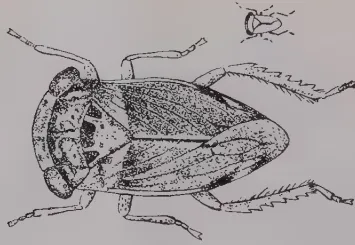
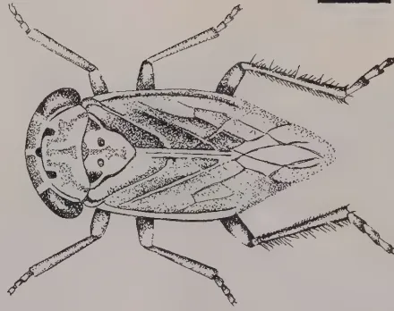
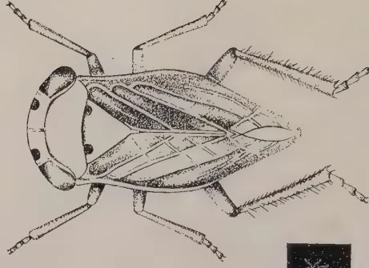
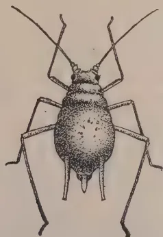
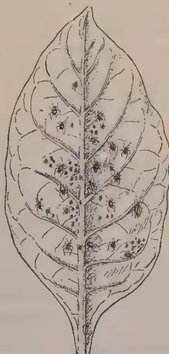
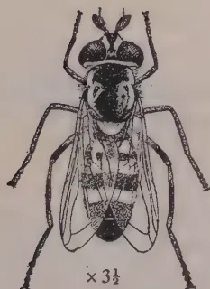

THE  
**TROPICAL AGRICULTURIST:**  
JOURNAL OF THE  
**CEYLON AGRICULTURAL SOCIETY.**

---

---

VOL. LI.

PERADENIYA, JULY, 1918.

No. 1.

---

---

**LOCAL FOOD PRODUCTION.**

---

In the present number of the TROPICAL AGRICULTURIST are included reports from Agricultural Instructors and from Inspectors of School Gardens upon the production of food products, other than paddy, vegetables and curry-stuffs in the various districts of the Colony.

These reports have been called for in order that an organized campaign for the encouragement of further local production of food may be drawn up for the forthcoming North-East Monsoon planting season. They follow in detail the leaflet on cultivation that was printed for last season, and indicate in what districts the various products are the most successful. They offer suggestions as to what steps can, with advantage, be taken in supplies of seeds and planting material.

The North-Eastern planting season, which commences in September and October, is the most important one in regard to the cultivation of food products, and as it is proposed that the Agricultural Society and the Department of Agriculture shall provide supplies of seeds for distribution, either free or at low costs, it seems desirable that the position as existing at the present time should be carefully reviewed.

With the reports now published and with a general knowledge of the existing conditions it is hoped that a policy designed to meet the requirements of the Colony may be framed.

There can be little doubt as to the importance of the question of a greater local food production, and the assistance of all is being solicited.

Employers of labour, either upon estates or upon private properties, have their duties in this connection. Owners of land and Headmen likewise have their duties. If all are prepared to make determined efforts during the forthcoming season, there is every reason to believe that satisfactory results will be

1------------------------------------------------

2[JULY, 1918.

attained. The increase of cultivations during last year has been a pleasing testimony of what can be done; but this is not sufficient. There is a world's shortage of food products and there is likely to be such a shortage not only during the remainder of the War, but also for some time afterwards. Every country is endeavouring to supply its own requirements as far as possible. Ceylon is not the exception. It has already done much, but its efforts must be sustained and even increased. The final results must eventually be judged by statistical data provided by vital statistics and by customs import returns.

Are we to be satisfied with the encouraging results of last year? It is urged that we should not be satisfied. Greater efforts are demanded of all, and there is no doubt that greater efforts can be made by all.

This is the time to consider what can be done. Every inhabitant of the Colony should again ask himself what he can do to assist. Any individual with undeveloped land should endeavour to ascertain how it can be opened to the best advantage. Those that have cultivated food products during the past year are asked to do more during the forthcoming season, and those that have as yet made no beginning are asked to join that large number of cultivators that have tried to assist in these critical times.

Everyone has a duty to his country. Everyone has a duty to the Empire. All cannot perform military service, but in an agricultural country practically all can assist that country's agriculture.

Home gardens have been productive of good, but there is ample room for extension. The report of the Director of Education on Home Gardens published in the present number shows that satisfactory progress has been made. During the forthcoming season further progress is being looked for.

The Matale Food Production Committee has made a most careful and critical survey of all lands available for cultivation in the Matale district. It has already drawn up plans for an extended planting of food stuffs, vegetables and curry-stuffs. The results of its work are sufficiently encouraging to warrant the formation of similar committees for other districts. When its report on the next planting season is available it is hoped that other districts will be stimulated to similar plans of campaign.

Again an appeal is made to all persons interested in the material welfare of the Colony and of its inhabitants to begin to frame plans for the North-East planting season. The results of the past warrant the belief that this appeal will not be made in vain.

2------------------------------------------------

JULY, 1918.]3

# CEYLON AGRICULTURE.

## INCREASED FOOD PRODUCTION IN 1917-18. REPORTS RECEIVED FROM THE AGRICULTURAL INSTRUCTORS.

### CENTRAL PROVINCE.

*The following Report has been furnished by Mr. W. Molegode, Senior Agricultural Instructor, on the Kandy and Matale Districts:—*

The increase in the cultivation of food stuffs and vegetables is appreciable and general : but particular mention may be made of Udispattu, Ukuwela, Dunuwila and the country round about Katugastota.

The growing of curry-stuffs is a new departure. Coriander did fairly well, and anise gave excellent results. Further trials are necessary with these as well as cumin and funugreek before more definite conclusions could be drawn.

Yams are now more extensively grown and manioc has become so common that the preparation of cassava flour and, if possible, tapioca is worthy of consideration.

### FOOD CROPS.

*Jerusalem Artichoke.*—Grown to some extent in Hewaheta, Dumbara and on estates about Panwila. It is not appreciated by the indigenous population and is only grown for sale.

*Dhall.*—A new crop which has given promising results, and is being taken up in Udispattu, Harispattu and Matale districts, with the prospects of other districts following the lead.

*Green gram.*—This is no new crop, and has hitherto been found growing in chenas in Uda Dumbara and Matale districts. It can be successfully raised in the drier parts of both Kandy and Matale districts where its cultivation is being encouraged.

*Groundnuts*—This is not grown, and as it is so difficult to protect from field rats cultivation cannot be encouraged.

*Manioc.*—Being very generally cultivated and finds a ready sale at 2 and 3 cents a lb. Largely raised in Upper Dumbara.

*Maize.*—Chiefly found in the drier districts and extensively grown in Upper Dumbara and Hewaheta. Little grown in Udanuwara, Yatinuwara, Tumpane, Harispattu and Pata Dumbara. Deserves to be encouraged.

*Potatos.*—Not grown except on a small scale in Upper Dumbara at higher elevations. Hardly worth encouraging below 4,000 feet.

*Sweet Potatos.*—Very extensively grown and the cultivation is still spreading. The cluster sweet potato is well established in Uda Dumbara, and found in most School Gardens in both Kandy and Matale districts.

*Tanias.*—Largely grown in Dumbara and Harispattu and also found in other parts not too dry.

*Yams.*—An important crop in Yatinuwara. The cultivation is extended to other parts.

### VEGETABLES.

*French Beans.*—Grown largely in Haloluwa and Kondeniya (in Harispattu). The Kandy market is mainly supplied by these and other villages in Kulugammana Siya-pattu.

3------------------------------------------------

4[JULY, 1918.

*Cabbage*.—Raised in Madulkele and Upper Hewaheta. It is also grown in other parts but does not form a head. Common in cool gardens.

*Tomatos*.—Much grown, particularly in South Matale, Tumpane and Hewaheta.

*Bandakka*.—A favourite vegetable found everywhere.

*Brinjal*.—A common crop. Much grown in Dumbara and Hewaheta.

*Cho-cho*.—Not sufficiently grown and appreciated as a vegetable. Only occasionally found under cultivation.

*Gourds, Cucumbers, Melons and Pumpkins*. Found all over the district and much used as food. Very common in Hewaheta, Upper Dumbara and Tumpane.

### CURRY-STUFFS.

*Anise*.—Trials have been successful everywhere and could be extensively grown and placed on the market.

*Fenugreek*.—Trials made last season were not successful and should be repeated during the coming season.

*Chillies*.—A common garden crop. Common in Dumbara district but is sold fresh. Should be grown for drying in localities with low rainfall, e.g. Upper and Lower Dumbara and North Matale.

*Coriander*.—Successfully raised in Dumbara, Tenne and other places. The local article is not considered as good as that imported. Better curing is necessary.

*Cumin*.—Trials made this season were a failure and should be repeated.

*Fennel*.—Commonly cultivated for leaf, and found in the market.

*Garlic*.—Trials made were insufficient and should be repeated.

*Ginger*.—A fairly common garden crop. Cultivation has recently extended in Harispattu and Udispattu.

*Mustard*.—Grown as a chena crop in mixed cultivation. Best suited to drier localities such as occur in Dumbara and North Matale.

*Curry Onions (Shallot)*.—Trials have yielded promising results both in Kandy and Matale districts. Cultivation from seed should be encouraged.

*Turmeric*.—Commonly found in Harispattu where it grows with little care, but is not prepared for the market.

The following report has been furnished by Mr. P. B. Kapuwatte, Agricultural Instructor, Harasbadde, on the Nuwara Eliya District:—

There has been an appreciable increase in the cultivation of food-stuffs and vegetables. Curry-stuffs grow well in some places.

The following crops give the best promise for the district:—Beans, dhall, green gram, manioc, maize, millets, potatos, sweet potatos, yams, beet, carrot, cabbage, peas, spinach, tomatos, cucumber etc., brinjal, anise, chillies, coriander, ginger, onions, turmeric and mustard.

### FOOD-STUFFS.

<table border="1">
<thead>
<tr>
<th data-bbox="148 801 224 816">Names.</th>
<th data-bbox="398 803 481 818">Reports.</th>
<th data-bbox="686 804 778 819">Remarks.</th>
</tr>
</thead>
<tbody>
<tr>
<td data-bbox="91 841 191 856"><i>Artichokes</i></td>
<td data-bbox="288 843 526 858">Not grown by villagers.</td>
<td data-bbox="614 844 861 889">Trials should be made in the higher lands of the district.</td>
</tr>
<tr>
<td data-bbox="91 888 216 903"><i>French beans</i></td>
<td data-bbox="288 890 594 921">Grow everywhere and appreciated by villagers.</td>
<td data-bbox="614 891 861 936">Would suggest that Lima bean cultivation be encouraged,</td>
</tr>
<tr>
<td data-bbox="91 934 201 949"><i>Climbing "</i></td>
<td data-bbox="361 936 488 951">do do</td>
<td></td>
</tr>
</tbody>
</table>

4------------------------------------------------

JULY, 1918.]5

<table border="1">
<thead>
<tr>
<th data-bbox="195 103 268 118">Names.</th>
<th data-bbox="453 103 538 118">Reports.</th>
<th data-bbox="746 103 838 118">Remarks.</th>
</tr>
</thead>
<tbody>
<tr>
<td data-bbox="136 151 254 181"><i>Lima beans</i> <i>Cowpeas.</i></td>
<td data-bbox="328 151 594 198">- Not much cultivated. - Grow everywhere. - Appreciated by villagers.</td>
<td data-bbox="671 198 918 228">Chena cultivators should take it up.</td>
</tr>
<tr>
<td data-bbox="136 198 198 213"><i>Dhall.</i></td>
<td data-bbox="328 198 654 245">- Did well in Uda Hewaheta and Walapane. Not appreciated by villagers.</td>
<td data-bbox="671 245 918 288">Locally produced seed can be found in some of the boutiques.</td>
</tr>
<tr>
<td data-bbox="136 245 254 260"><i>Green gram</i></td>
<td data-bbox="328 245 654 318">- Grows well in the chenas of Walapane particularly in the Teripeha, Udamadura, Yatimadura and Iluktenna villages.</td>
<td data-bbox="671 245 918 288">Locally produced seed can be found in some of the boutiques.</td>
</tr>
<tr>
<td data-bbox="136 318 254 333"><i>Groundnuts.</i></td>
<td data-bbox="328 318 654 333">- Not cultivated to my knowledge.</td>
<td data-bbox="671 318 918 348">Seeds should be distributed for trial.</td>
</tr>
<tr>
<td data-bbox="136 348 211 363"><i>Manioc.</i></td>
<td data-bbox="328 348 654 378">- Grows all over the district especially in Kotmale.</td>
<td data-bbox="671 348 918 363"></td>
</tr>
<tr>
<td data-bbox="136 378 201 393"><i>Maize.</i></td>
<td data-bbox="328 378 654 441">- Cultivated all over especially in the chenas at the Teripeha, Arukwatta, Iluktenna and Korahana villages.</td>
<td data-bbox="671 378 918 393"></td>
</tr>
<tr>
<td data-bbox="136 441 198 456"><i>Millet.</i></td>
<td data-bbox="328 441 654 471">- Cultivated in some places in Walapane.</td>
<td data-bbox="671 441 918 484">Seeds should be distributed all over the district.</td>
</tr>
<tr>
<td data-bbox="136 484 211 499"><i>Potatos.</i></td>
<td data-bbox="328 484 654 514">- Grows all over. Not appreciated by villagers.</td>
<td data-bbox="671 484 918 499"></td>
</tr>
<tr>
<td data-bbox="136 514 268 529"><i>Sweet potatos.</i></td>
<td data-bbox="328 514 534 529">- Cultivated all over.</td>
<td data-bbox="671 514 918 544">The local variety is a poor yielder.</td>
</tr>
<tr>
<td data-bbox="136 544 311 559"><i>Yams, Tarias etc.</i></td>
<td data-bbox="328 544 654 591">- Grows well in Kotmale and Uda Hewaheta and is appreciated by the villagers.</td>
<td data-bbox="671 544 918 574">Should be introduced into Walapane.</td>
</tr>
<tr>
<td colspan="3" data-bbox="413 598 578 613" style="text-align: center;"><b>VEGETABLES.</b></td>
</tr>
<tr>
<td data-bbox="136 631 284 661"><i>Beets, Carrots, Parsnips,</i></td>
<td data-bbox="328 618 654 691">- Beet and carrot are grown by some villagers in Walapane. Parsnips are not cultivated to my knowledge. All these are appreciated.</td>
<td data-bbox="671 618 918 661">Seeds should be distributed all over the district.</td>
</tr>
<tr>
<td data-bbox="136 691 221 706"><i>Cabbage.</i></td>
<td data-bbox="328 691 654 738">- Grows all over the district and is very much appreciated by villagers.</td>
<td data-bbox="671 691 918 721">Would suggest the distribution of seeds.</td>
</tr>
<tr>
<td data-bbox="136 738 264 753"><i>Celery, Leeks.</i></td>
<td data-bbox="328 738 614 753">- Not cultivated by villagers.</td>
<td data-bbox="671 738 918 781">Would suggest that seeds be distributed for trial during the next year.</td>
</tr>
<tr>
<td data-bbox="136 781 208 796"><i>Onions.</i></td>
<td data-bbox="328 781 654 828">- Grown from bulbs all over the district and is cultivated by many villagers.</td>
<td data-bbox="671 781 918 796"></td>
</tr>
<tr>
<td data-bbox="136 828 268 843"><i>Peas, Salsify.</i></td>
<td data-bbox="328 828 614 843">- Not cultivated by villagers.</td>
<td data-bbox="671 828 918 858">Would suggest the distribution of seeds.</td>
</tr>
<tr>
<td data-bbox="136 858 304 888"><i>Spinach, Tomato, Cucumber, etc.</i></td>
<td data-bbox="328 858 654 888">- Grows all over the district. Much appreciated by villagers.</td>
<td data-bbox="671 858 918 873"></td>
</tr>
<tr>
<td data-bbox="136 888 231 903"><i>Bandakka</i></td>
<td data-bbox="328 888 494 903">- Grows all over.</td>
<td data-bbox="671 888 918 903"></td>
</tr>
<tr>
<td data-bbox="136 903 211 918"><i>Brinjal.</i></td>
<td data-bbox="328 903 654 950">- Cultivated by many villagers and estate coolies all over the district.</td>
<td data-bbox="671 903 918 918"></td>
</tr>
</tbody>
</table>

5------------------------------------------------

6[JULY, 1918.

<table border="1">
<thead>
<tr>
<th data-bbox="144 101 216 116">Names.</th>
<th data-bbox="396 101 478 116">Reports.</th>
<th data-bbox="686 101 778 116">Remarks.</th>
</tr>
</thead>
<tbody>
<tr>
<td data-bbox="89 148 278 163"><i>Cho-cho, gourds, etc.</i></td>
<td data-bbox="288 148 548 163">Cultivated in some places.</td>
<td data-bbox="613 148 861 178">Will grow all over the district.</td>
</tr>
<tr>
<td colspan="3" data-bbox="351 178 531 193" style="text-align: center;"><b>CURRY-STUFFS.</b></td>
</tr>
<tr>
<td data-bbox="89 198 256 213"><i>Anise, Coriander</i></td>
<td data-bbox="288 198 598 243">Grows well. Locally produced seed is used by the cultivators themselves.</td>
<td data-bbox="613 198 861 273">Considerable extension could take place in Walapane where chena cultivators should take it up.</td>
</tr>
<tr>
<td data-bbox="89 273 193 288"><i>Fenugreek.</i></td>
<td data-bbox="288 273 598 303">Seeds germinated but died during the rains.</td>
<td data-bbox="613 273 861 318">Seeds should be distributed, and further trials made.</td>
</tr>
<tr>
<td data-bbox="89 318 163 333"><i>Chillies.</i></td>
<td data-bbox="288 318 598 348">Grows all over the district. Appreciated by villagers</td>
<td data-bbox="613 318 861 363">Seeds of good varieties should be distributed during the next year.</td>
</tr>
<tr>
<td data-bbox="89 363 153 378"><i>Garlic.</i></td>
<td data-bbox="288 363 598 393">Cultivated by some for medicinal purposes.</td>
<td data-bbox="613 363 861 393">Will grow all over the district,</td>
</tr>
<tr>
<td data-bbox="89 393 163 408"><i>Ginger.</i></td>
<td data-bbox="288 393 598 438">Grows well particularly in Meepanawa, Kurupanawella, etc., in Walapane.</td>
<td></td>
</tr>
<tr>
<td data-bbox="89 438 173 453"><i>Mustard.</i></td>
<td data-bbox="288 438 598 513">Grows well all over the district especially in the chenas in Walapane and Uda Hewaheta. Locally produced seed is found in some boutiques.</td>
<td></td>
</tr>
<tr>
<td data-bbox="89 513 183 528"><i>Turmeric.</i></td>
<td data-bbox="288 513 598 543">Grows all over the district. Cultivated by some villagers.</td>
<td></td>
</tr>
</tbody>
</table>

## WESTERN PROVINCE.

*The following report has been furnished by Mr. L. de Z. Jayatilleke, Agricultural Instructor, Kalutara:—*

There has been an appreciable increase in the cultivation of food products in this Province. Much larger quantities of manioc, sweet potatoes, yams, tanias, maize and dhall are being grown. Nearly 106 acres of land have been brought under cultivation of food products in the Rayigam Korale alone.

The cultivation of vegetables too has extended. Teachers have paid more attention to the cultivation in School Gardens. Village Markets and Fairs show what a large amount of produce is being raised of both food-stuffs and vegetables.

Of curry-stuffs much larger quantities of onion, turmeric, chillies and ginger are being raised. Curry onions have done well wherever tried.

The following crops give the best promise:—Beans, spinach, bandakka, brinjal, snake gourd, bitter gourd, cucumber, ginger and turmeric.

### FOOD CROPS.

*Jerusalem Artichoke.*—Not grown. I would suggest that trials be made at Bandaragama and Henaratgoda.

*French Bean.*—Grows well. This is much appreciated, but not sufficiently grown. I would suggest that seed be distributed through the Mudaliyars of Siyane Korale West, Alutkuru Korale North and Rayigam Korale and also Kalutara Totamune.

6------------------------------------------------

JULY, 1918.]7

*Climbing Bean.*—Grows well. Much liked by the people.

*Lima Bean.*—Fairly common.

*Sword Bean.*—Grows well, but is not much appreciated.

*Cow-pea.*—Grown commonly as a vegetable.

*Dhall.*—Grows satisfactorily and should be better known. I would suggest that seeds be freely distributed again.

*Green gram.*—A dry land crop. Little grown in the province.

*Groundnuts.*—Grows fairly well, but not much appreciated.

*Manioc.*—Grown in large quantities all over the province.

*Maize.*—Grow well. Only occasionally met with in gardens.

*Potatos.*—Not grown at all. Climate unsuited.

*Sweet Potato.*—Grown in very large quantities all over the province.

*Tanias.*—Grow well, and commonly cultivated.

*Yams.*—Produced in large quantities in village gardens, particularly in Hewagam Korale. Kirikondol and king-yam are rare in this province. I would suggest that a supply be sent to the Mudaliyar, Siyana Korale West, for trial in the two demonstration gardens at Henaratgoda.

#### VEGETABLES.

*Beet, Carrots, Parsnips.*—Not cultivated.

*Cabbage.*—Elevation unsuitable. Occasionally grown for leaf.

*Celery.*—Not cultivated.

*Leeks.*—Not cultivated.

*Onion.*—Grown in School Gardens. People are beginning to pay attention to its cultivation. Villagers often grow it only for the sake of the leaves.

*Peas.*—Not cultivated.

*Salsify.*—Not cultivated.

*Spinach.*—Very common, and is a much appreciated vegetable.

*Tomato.*—Superior varieties are seldom cultivated. Ordinary variety (with small fruits) is more commonly grown. I would suggest that seeds of a superior variety be distributed.

*Vegetable Marrow.*—Not cultivated.

*Cucumber.*—Grown all over the province.

*Bandakka.*— do. do. do.

*Brinjal.*— do. do. do.

*Cho-cho.*—Not grown.

*Gourds and Pumpkins.*—Grow fairly well. Grown in fairly large quantities.

#### CURRY-STUFFS.

*Anise.*—Trials during last season were not successful. I would suggest that seed be distributed through the Mudaliyars of Siyane Korale West and Rayigam Korale.

*Fenugreek.*—Same as Anise.

*Chillies.*—Grow well, but only small plots are cultivated.

*Coriander.*—Grows fairly well in some gardens, but the crop was not satisfactory. I would suggest that seed be distributed through the Mudaliyars of Siyane Korale West and Rayigam Korale.

*Garlic.*—Trials during the last season did not give satisfactory results.

*Ginger.*—Grown in most parts of the province.

*Mustard.*—Seldom seen under cultivation.

*Turmeric.*—Grows well and is being cultivated.

7------------------------------------------------

8[JULY, 1918.

## SABARAGAMUWA PROVINCE.

*The following Report has been furnished by Mr. L. A. D. Silva, Agricultural Instructor, Ratnapura:—*

RATNAPURA DISTRICT.

### FOOD-STUFFS.

<table border="1">
<thead>
<tr>
<th style="text-align: center;">Names.</th>
<th style="text-align: center;">Reports.</th>
<th style="text-align: center;">Remarks.</th>
</tr>
</thead>
<tbody>
<tr>
<td><i>Kurakkan, Indian corn</i></td>
<td>Grown very extensively.</td>
<td>Cultivation has increased.</td>
</tr>
<tr>
<td><i>Green peas, kollu</i></td>
<td>These grow well particularly in dry parts of the district, and are very much appreciated by the villagers.</td>
<td>Cultivation is on the decrease.</td>
</tr>
<tr>
<td><i>Manioc ( Cassava )</i></td>
<td>Grows well all over the district. Cultivation is extending.</td>
<td>In many places the supply is greater than the demand.</td>
</tr>
<tr>
<td><i>Sweet potatoes.</i></td>
<td>Villagers are very familiar with its cultivation and it grows all over the district.</td>
<td>There is a ready market for it.</td>
</tr>
<tr>
<td><i>Potatos.</i></td>
<td>Trials were made at Balangoda Experimental Garden and by villagers but the results are not very satisfactory as the climate is not suitable</td>
<td></td>
</tr>
<tr>
<td><i>Thana, Amu and Meneri.</i></td>
<td>Grown in some parts of the district.</td>
<td></td>
</tr>
<tr>
<td><i>Hingurala, Kukulala, Kirikondol, Innala, Gahala.</i></td>
<td>Grown in the Balangoda Experimental Garden and in several School Gardens. Much appreciated by the villagers who, however, are not familiar with their cultivation.</td>
<td>These were quite unknown to the villagers but have been introduced through experimental cultivations. Cultivation of these will spread very widely in future. Seed yams are being distributed through the Balangoda Experimental Garden.</td>
</tr>
<tr>
<td><i>Gingelly.</i></td>
<td>This is grown in some parts of the district in chenas.</td>
<td>A very paying crop.</td>
</tr>
<tr>
<td colspan="3" style="text-align: center;"><b>VEGETABLES.</b></td>
</tr>
<tr>
<td><i>Radish.</i></td>
<td>Grown extensively and very much appreciated by villagers</td>
<td>Cultivation of this was quite unknown to villagers until it was experimented with at the Balangoda Garden. Any part of Ratnapura district would be suited to this cultivation.</td>
</tr>
<tr>
<td><i>Lettuce.</i></td>
<td>Not appreciated by villagers and hence it is not cultivated</td>
<td>Any part of high land in Ratnapura would be suited to this cultivation</td>
</tr>
</tbody>
</table>

8------------------------------------------------

JULY, 1918.]9

<table border="1">
<thead>
<tr>
<th data-bbox="174 111 248 126">Names.</th>
<th data-bbox="428 111 511 126">Reports.</th>
<th data-bbox="721 111 814 126">Remarks.</th>
</tr>
</thead>
<tbody>
<tr>
<td data-bbox="108 158 298 221">
<i>Cauliflower, Beet, Parsnip, Rhubarb. Turnips, Carrots.</i>
</td>
<td data-bbox="318 174 628 266">
          Not grown at all 
          - Grown in Balangoda Garden and in small quantities in school gardens. Not appreciated by villagers.
        </td>
<td data-bbox="648 158 898 311">
          Climatic conditions and soil are not suitable for the cultivation of these. If there is a good demand for these, the cultivation could be carried on to a success, as almost every part of land in Ratnapura district suits them.
        </td>
</tr>
<tr>
<td data-bbox="108 311 214 326"><i>Knot-kohl.</i></td>
<td data-bbox="318 311 628 374">
          - These are much liked by the people but cultivation is not spreading as there is difficulty in procuring seeds.
        </td>
<td data-bbox="648 311 898 403">
          Seeds should be supplied during the season on easy terms. Higher land in Balangoda and Rakwana district would suit this cultivation.
        </td>
</tr>
<tr>
<td data-bbox="108 403 298 418"><i>Vegetable Marrow.</i></td>
<td data-bbox="318 403 628 448">
          - Grown in the experimental Garden, Balangoda, but not very successful.
        </td>
<td data-bbox="648 403 898 463">
          Climatic conditions as well as soil in Ratnapura district not favourable for this cultivation.
        </td>
</tr>
<tr>
<td data-bbox="108 463 198 478"><i>Cabbage.</i></td>
<td data-bbox="318 463 628 538">
          - Grown in most parts of the district and is very much appreciated by the villagers, being a common cultivation among them.
        </td>
<td data-bbox="648 463 898 523">
          Shoots are generally planted. If seeds are supplied better results could be expected.
        </td>
</tr>
<tr>
<td data-bbox="108 538 214 553"><i>Artichoke.</i></td>
<td data-bbox="318 538 468 553">
          - Not cultivated.
        </td>
<td data-bbox="648 538 898 613">
          Some of the higher lands in Balangoda, Rakwana and Madampe districts, would be suited to this cultivation.
        </td>
</tr>
<tr>
<td data-bbox="108 613 214 643">
<i>Capsicum. Peas.</i>
</td>
<td data-bbox="318 613 628 673">
          - Grows well all over. 
          - Grown only in the Balangoda Experimental Garden to my knowledge.
        </td>
<td></td>
</tr>
<tr>
<td data-bbox="108 673 178 688"><i>Beans.</i></td>
<td data-bbox="318 673 628 723">
          - Grow well all over the district. There is a very good demand for them.
        </td>
<td data-bbox="648 673 898 733">
          I would suggest that good varieties be procured and distributed in different centres.
        </td>
</tr>
<tr>
<td data-bbox="108 733 298 788">
<i>Bandakku, Brin- jals, Spinach, etc.</i>
</td>
<td data-bbox="318 733 628 798">
          These vegetables are cultivated all over the district. Their cultivation is daily increasing.
        </td>
<td data-bbox="648 733 898 813">
          This might spread more rapidly if seed be distributed in different centres either free or on a slight charge.
        </td>
</tr>
<tr>
<td colspan="3" data-bbox="381 823 568 838" style="text-align: center;"><b>CURRY-STUFFS.</b></td>
</tr>
<tr>
<td data-bbox="108 843 198 858"><i>Chillies.</i></td>
<td data-bbox="318 843 628 903">
          - Grow well in Balangoda and Godakawela district. It is a regular cultivation in the chenas.
        </td>
<td data-bbox="648 843 898 948">
          There is room for considerable extension of this cultivation in Balangoda and Godakawela districts where the soil and climate appear to be suitable.
        </td>
</tr>
</tbody>
</table>

9------------------------------------------------

10[JULY, 1918.

<table border="1">
<thead>
<tr>
<th data-bbox="111 91 301 138">Names.</th>
<th data-bbox="301 91 628 138">Reports.</th>
<th data-bbox="628 91 881 138">Remarks.</th>
</tr>
</thead>
<tbody>
<tr>
<td data-bbox="111 141 301 224"><i>Onions.</i></td>
<td data-bbox="301 141 628 224">- Grow well in some of the higher lands in Balangoda &amp; Godakawela districts. Of late it has become a common cultivation among the villagers.</td>
<td data-bbox="628 141 881 224">If seeds could be supplied, villagers would readily increase this cultivation.</td>
</tr>
<tr>
<td data-bbox="111 224 301 258"><i>Mustard.</i></td>
<td data-bbox="301 224 628 258">- Grows well in the dry parts of Ratnapura district.</td>
<td data-bbox="628 224 881 258">The villagers do not cultivate this systematically.</td>
</tr>
<tr>
<td data-bbox="111 258 301 284"><i>Pepper.</i></td>
<td data-bbox="301 258 628 284">- Grows well all over, particularly in wet parts.</td>
<td data-bbox="628 258 881 284"></td>
</tr>
<tr>
<td data-bbox="111 284 301 424"><i>Coriander, Fennel.</i></td>
<td data-bbox="301 284 628 424">- Grow well particularly in dry parts of the district. Trials have been made in chenas in many villages and results are awaited.</td>
<td data-bbox="628 284 881 424">The Government Agent has distributed a large quantity of seed among the chena cultivators through the Ratemahatmeyas. When I inspected their plantations they were in very good condition but after the severe drought that followed, crops suffered.</td>
</tr>
<tr>
<td data-bbox="111 424 301 468"><i>Cumin, Fenugreek.</i></td>
<td data-bbox="301 424 628 468">- Experiments failed.</td>
<td data-bbox="628 424 881 468"></td>
</tr>
<tr>
<td data-bbox="111 468 301 558"><i>Turmeric.</i></td>
<td data-bbox="301 468 628 558">- A fairly good quantity is grown in the Balangoda district. Commands a good market.</td>
<td data-bbox="628 468 881 558">There is ample room for its extension in the Balangoda and Madampe districts where the climate and soil are suitable.</td>
</tr>
<tr>
<td data-bbox="111 558 301 604"><i>Garlic.</i></td>
<td data-bbox="301 558 628 604">- Results of experiments were very poor.</td>
<td data-bbox="628 558 881 604">Climate and soil are not suitable for the cultivation of this product.</td>
</tr>
</tbody>
</table>

The following Report has been furnished by Mr. C. Crispyn, Agricultural Instructor, Kegalle:—

#### KEGALLE DISTRICT.

There has been an appreciable increase in the cultivation of food-stuffs, curry-stuffs and vegetables in the Kegalle district.

The following products give the best promise in this district.

*Curry-stuffs*:—Anise, chillies, fenugreek, ginger, mustard and turmeric.

*Food-stuffs*:—Lima beans, sword beans, green gram.

*Vegetables*:—Spinach, tomato, bandakka or okra, brinjal, snake gourd, bitter gourd, pumpkin (wattakka), ash pumpkin and bottle gourd.

#### FOOD-STUFFS.

<table border="1">
<thead>
<tr>
<th data-bbox="111 825 301 872">Names.</th>
<th data-bbox="301 825 628 872">Reports.</th>
<th data-bbox="628 825 876 872">Remarks.</th>
</tr>
</thead>
<tbody>
<tr>
<td data-bbox="111 875 301 909"><i>Artichokes</i></td>
<td data-bbox="301 875 628 909">- Not grown to my knowledge.</td>
<td data-bbox="628 875 876 909"></td>
</tr>
<tr>
<td data-bbox="111 909 301 935"><i>Beans (French)</i></td>
<td data-bbox="301 909 628 935">- Very little grown by villagers.</td>
<td data-bbox="628 909 876 935"></td>
</tr>
<tr>
<td data-bbox="111 935 301 961"><i>Climbing beans</i></td>
<td data-bbox="301 935 628 961">- Widely grown in almost all villages.</td>
<td data-bbox="628 935 876 961"></td>
</tr>
<tr>
<td data-bbox="111 961 301 963"><i>Sword do</i></td>
<td data-bbox="301 961 628 963">- do do</td>
<td data-bbox="628 961 876 963"></td>
</tr>
</tbody>
</table>

10------------------------------------------------

JULY, 1918.]11

<table border="1">
<thead>
<tr>
<th data-bbox="158 108 234 123">Names.</th>
<th data-bbox="418 108 504 123">Reports.</th>
<th data-bbox="708 108 804 123">Remarks.</th>
</tr>
</thead>
<tbody>
<tr>
<td data-bbox="98 148 214 178"><i>Lima beans</i> <i>Cow Peas</i></td>
<td data-bbox="308 148 618 178">- Widely grown all over the dist. - Very little of this is grown.</td>
<td data-bbox="638 168 887 213" rowspan="2">Seeds of this should be distributed all over the district.</td>
</tr>
<tr>
<td data-bbox="98 211 214 241"><i>Dhall</i> <i>Green gram</i></td>
<td data-bbox="308 211 618 256">- do do - Widely grown in almost all the chenas.</td>
</tr>
<tr>
<td data-bbox="98 256 214 271"><i>Groundnuts</i></td>
<td data-bbox="308 256 618 301">- Little of this is grown, it is mostly grown in School Gardens.</td>
<td data-bbox="688 213 831 228" rowspan="2">do do</td>
</tr>
<tr>
<td data-bbox="98 301 174 331"><i>Manioc</i> <i>Maize</i></td>
<td data-bbox="308 301 618 346">- This is very widely cultivated. - Grown in almost all the chenas along with other products.</td>
</tr>
<tr>
<td data-bbox="98 346 238 391"><i>Millets</i> <i>Potatos</i> <i>Sweet Potatos</i></td>
<td data-bbox="308 346 618 406">- do do - Not cultivated to my knowledge. - Widely grown all over the district.</td>
<td data-bbox="638 378 887 498" rowspan="2">I would suggest that 5 bundles of each of the 10 newly introduced varieties be sent for planting in the four Korales and Experimental Garden for distribution.</td>
</tr>
<tr>
<td data-bbox="98 498 158 513"><i>Yams</i></td>
<td data-bbox="308 498 618 528">- Grown commonly all over the district.</td>
</tr>
<tr>
<td colspan="3" data-bbox="381 541 548 556" style="text-align: center;"><b>VEGETABLES.</b></td>
</tr>
<tr>
<td data-bbox="98 556 174 586"><i>Beet</i> <i>Carrots</i></td>
<td data-bbox="308 556 618 591">- Not grown at all. - Grown mostly in School Gardens.</td>
<td></td>
</tr>
<tr>
<td data-bbox="98 601 184 631"><i>Parsnip</i> <i>Cabbage</i></td>
<td data-bbox="308 601 618 646">- Not grown to my knowledge. - Grown by some and mostly in School Gardens.</td>
<td></td>
</tr>
<tr>
<td data-bbox="98 646 164 676"><i>Celery</i> <i>Leeks</i></td>
<td data-bbox="308 646 618 681">- Not grown to my knowledge. - Grown by many.</td>
<td></td>
</tr>
<tr>
<td data-bbox="98 681 154 696"><i>Peas</i></td>
<td data-bbox="308 681 618 696">- Not grown to my knowledge.</td>
<td></td>
</tr>
<tr>
<td data-bbox="98 696 174 726"><i>Salsify</i> <i>Spinach</i></td>
<td data-bbox="308 696 618 726">- do do - Cultivated by almost all.</td>
<td></td>
</tr>
<tr>
<td data-bbox="98 726 204 766"><i>Tomatos</i> <i>Cucumber</i> <i>Bandakka</i></td>
<td data-bbox="308 726 618 781">- do do - Grown all over the district. - Widely grown all over the district.</td>
<td></td>
</tr>
<tr>
<td data-bbox="98 781 174 811"><i>Brinjal</i> <i>Cho-cho</i></td>
<td data-bbox="308 781 618 811">- do do - Very little of this is grown.</td>
<td data-bbox="638 798 887 828" rowspan="2">Not appreciated by the villagers.</td>
</tr>
<tr>
<td data-bbox="98 831 244 861"><i>Gourds and</i> <i>pumpkins</i></td>
<td data-bbox="308 846 458 861">- Widely grown.</td>
</tr>
<tr>
<td colspan="3" data-bbox="368 871 554 886" style="text-align: center;"><b>CURRY-STUFFS.</b></td>
</tr>
<tr>
<td data-bbox="98 886 158 901"><i>Anise</i></td>
<td data-bbox="308 886 618 931">- Grows very well all over the district; can be seen in almost all village gardens.</td>
<td data-bbox="638 886 887 961">Some more of this seed should be sent to the Ratemahatmeya Three Korales for distribution.</td>
</tr>
</tbody>
</table>

11------------------------------------------------

12[JULY, 1918.

<table border="1">
<thead>
<tr>
<th data-bbox="181 108 258 123">Names.</th>
<th data-bbox="433 108 518 123">Reports.</th>
<th data-bbox="723 108 814 123">Remarks.</th>
</tr>
</thead>
<tbody>
<tr>
<td data-bbox="124 156 224 171"><i>Fenugreek</i></td>
<td data-bbox="318 156 634 186">- Grows very poorly in this district.</td>
<td></td>
</tr>
<tr>
<td data-bbox="124 188 194 203"><i>Chillies</i></td>
<td data-bbox="318 188 634 218">- Commonly grown all over the district.</td>
<td></td>
</tr>
<tr>
<td data-bbox="124 220 218 235"><i>Coriander</i></td>
<td data-bbox="318 220 634 235">- Grows fairly well in the district.</td>
<td></td>
</tr>
<tr>
<td data-bbox="124 237 188 252"><i>Cumin</i></td>
<td data-bbox="318 237 634 267">- Grows very poorly in this district.</td>
<td></td>
</tr>
<tr>
<td data-bbox="124 269 188 284"><i>Fennel</i></td>
<td data-bbox="318 269 634 299">- This is grown widely and is sold locally.</td>
<td></td>
</tr>
<tr>
<td data-bbox="124 301 184 316"><i>Garlic</i></td>
<td data-bbox="318 301 634 316">- Not grown to my knowledge.</td>
<td></td>
</tr>
<tr>
<td data-bbox="124 318 194 333"><i>Ginger</i></td>
<td data-bbox="318 318 634 333">- Very commonly cultivated.</td>
<td></td>
</tr>
<tr>
<td data-bbox="124 335 208 350"><i>Mustard</i></td>
<td data-bbox="318 335 634 350">- Grown in all the chenas.</td>
<td></td>
</tr>
<tr>
<td data-bbox="124 352 214 367"><i>Turmeric</i></td>
<td data-bbox="318 352 634 382">- Widely grown all over the district.</td>
<td></td>
</tr>
</tbody>
</table>

## NORTH-WESTERN PROVINCE.

*The following Report has been furnished by Mr. J. R. Nugawela, Agricultural Instructor, on the Kurunegala District.*

There is a fair increase in the cultivation of food products and also a great increase in the cultivation of vegetables on account of good sales and high prices obtained in the fairs of the district. The cultivation of curry-stuffs was, however, not very successful, a good percentage of the seeds failing to germinate. The paddy crop and the vegetable crop give the best promise all over the district. Chena cultivation this year is double that of previous years.

## FOOD-STUFFS.

<table border="1">
<thead>
<tr>
<th data-bbox="181 595 258 610">Names.</th>
<th data-bbox="433 595 518 610">Reports.</th>
<th data-bbox="713 595 804 610">Remarks.</th>
</tr>
</thead>
<tbody>
<tr>
<td data-bbox="124 643 214 658"><i>Artichoke</i></td>
<td data-bbox="318 643 634 673">- Grown in School Gardens. Not much appreciated.</td>
<td data-bbox="648 643 894 703">Would suggest the trial of small quantities at Pilessa and Weuda in Weuda Wili Hatpattu.</td>
</tr>
<tr>
<td data-bbox="124 705 184 720"><i>Beans</i></td>
<td data-bbox="318 705 634 735">- Grow fairly well. Much appreciated by the villager.</td>
<td data-bbox="648 705 894 765">Much seed should be distributed in the district through the Ratemahatmeyas.</td>
</tr>
<tr>
<td data-bbox="124 767 234 782"><i>Lima beans</i></td>
<td data-bbox="318 767 634 782">- do do</td>
<td data-bbox="648 767 894 782">do do</td>
</tr>
<tr>
<td data-bbox="124 784 214 799"><i>Sword "</i></td>
<td data-bbox="318 784 634 799">- Grow well. Not much liked.</td>
<td data-bbox="648 784 894 844">Seed should be distributed in the Wanni Hatpattu for trial during next year.</td>
</tr>
<tr>
<td data-bbox="124 846 194 861"><i>Cowpea</i></td>
<td data-bbox="318 846 634 876">- Extensively grown in the chenas.</td>
<td data-bbox="648 846 894 876">Distribution of seed not necessary.</td>
</tr>
<tr>
<td data-bbox="124 878 184 893"><i>Dhall</i></td>
<td data-bbox="318 878 634 908">- Grown in home gardens and in young coconut plantations.</td>
<td data-bbox="648 878 894 963">Considerable extension under this product could take place. Seed may be distributed through the Ratemahatmeyas.</td>
</tr>
</tbody>
</table>

12------------------------------------------------

JULY, 1918.]13

<table border="1">
<thead>
<tr>
<th data-bbox="148 105 228 121">Names.</th>
<th data-bbox="413 105 498 121">Reports.</th>
<th data-bbox="703 105 798 121">Remarks.</th>
</tr>
</thead>
<tbody>
<tr>
<td><i>Green gram</i></td>
<td>- Extensively grown in the chenas.</td>
<td>Seed distribution is not necessary.</td>
</tr>
<tr>
<td><i>Groundnuts</i></td>
<td>- Grown in School Gardens. Not much appreciated.</td>
<td>Seeds may be distributed in Weuda Wili Hatpattu through the Ratemahatmeyas.</td>
</tr>
<tr>
<td><i>Manioc</i></td>
<td>- Extensively cultivated.</td>
<td></td>
</tr>
<tr>
<td><i>Maize</i></td>
<td>- Grown extensively in the chenas.</td>
<td>Seed distribution not necessary.</td>
</tr>
<tr>
<td><i>Millet</i></td>
<td>- Grows well and is fairly common.</td>
<td>do do</td>
</tr>
<tr>
<td><i>Potatos</i></td>
<td>- Not grown in the District.</td>
<td>Climate unsuitable.</td>
</tr>
<tr>
<td><i>Sweet Potatos</i></td>
<td>- Grow well and are common.</td>
<td></td>
</tr>
<tr>
<td><i>Yams</i></td>
<td>do do</td>
<td></td>
</tr>
<tr>
<td colspan="3" style="text-align: center;"><b>VEGETABLES.</b></td>
</tr>
<tr>
<td><i>Beet, Carrot, Parsnips</i></td>
<td>} Grown in some School Gardens. Growth very poor.</td>
<td>Would suggest that a few packets of Beet and Carrot seed be sent to me for trial in Weuda and Kuliapitiya.</td>
</tr>
<tr>
<td><i>Radish</i></td>
<td>- Grows well ; much liked by the villager.</td>
<td>do do</td>
</tr>
<tr>
<td><i>Cabbage</i></td>
<td>- Grown by villagers for its green leaf.</td>
<td>do do</td>
</tr>
<tr>
<td><i>Celery</i></td>
<td>- Not grown and not suitable.</td>
<td></td>
</tr>
<tr>
<td><i>Leeks</i></td>
<td>do do</td>
<td></td>
</tr>
<tr>
<td><i>Onion</i></td>
<td>- Grows well particularly in Weudu Wili, Dambadeni and Katugampola Hatpattus.</td>
<td>Considerable extension could take place in this product.</td>
</tr>
<tr>
<td><i>Peas</i></td>
<td>- Not suitable for the district.</td>
<td></td>
</tr>
<tr>
<td><i>Salsify</i></td>
<td>do do</td>
<td></td>
</tr>
<tr>
<td><i>Spinach</i></td>
<td>- Grows well all over the district.</td>
<td></td>
</tr>
<tr>
<td><i>Tomatos</i></td>
<td>- Grows fairly well but is often attacked by the wilt disease.</td>
<td>Seed should be distributed in the district through the Ratemahatmeyas.</td>
</tr>
<tr>
<td><i>Cucumber, Bandakka, Brinjals, Gourds and Pumpkins</i></td>
<td>} Very common and largely cultivated. Cucumber and pumpkins always found in chenas.</td>
<td>A large supply of seed should be distributed through the Ratemahatmeyas.</td>
</tr>
<tr>
<td><i>Cho-cho</i></td>
<td>- Not cultivated at all.</td>
<td></td>
</tr>
<tr>
<td colspan="3" style="text-align: center;"><b>CURRY-STUFFS.</b></td>
</tr>
<tr>
<td><i>Anise, Chillies,</i></td>
<td>- Grow well but not extensively cultivated.</td>
<td>Considerable extension under this product could take place. Would suggest that seed be distributed through the Ratemahatmeyas.</td>
</tr>
</tbody>
</table>

13------------------------------------------------

14[JULY, 1918.

<table border="1">
<thead>
<tr>
<th data-bbox="125 85 312 131">Names.</th>
<th data-bbox="312 85 636 131">Reports.</th>
<th data-bbox="636 85 891 131">Remarks.</th>
</tr>
</thead>
<tbody>
<tr>
<td data-bbox="125 131 312 201"><i>Fenugreek</i></td>
<td data-bbox="312 131 636 201">- Not grown. Trials total failure. Grown extensively in the chenas, particularly in the Wanni Hatpattu.</td>
<td data-bbox="636 131 891 201">No seed distribution necessary.</td>
</tr>
<tr>
<td data-bbox="125 201 312 241"><i>Coriander, Cumin, Fennel</i></td>
<td data-bbox="312 201 636 241">Not grown. Trials entire failures.</td>
<td data-bbox="636 201 891 241">Seed should be distributed again for trial during next year.</td>
</tr>
<tr>
<td data-bbox="125 241 312 338"><i>Garlic</i></td>
<td data-bbox="312 241 636 338">- Not cultivated to my knowledge.</td>
<td data-bbox="636 241 891 338">Would suggest the trial of small quantities at Hettipola, Wariapola, Pilessa, Ibbagamuwa and Makandura School Gardens.</td>
</tr>
<tr>
<td data-bbox="125 338 312 428"><i>Ginger</i></td>
<td data-bbox="312 338 636 428">- No trials have been made to my knowledge.</td>
<td data-bbox="636 338 891 428">Would suggest the trial of small quantities at Hettipola, Wariapola, Pilessa, Ibbagamuwa and Makandura School Gardens.</td>
</tr>
<tr>
<td data-bbox="125 428 312 461"><i>Mustard</i></td>
<td data-bbox="312 428 636 461">- Commonly grown on chena land.</td>
<td data-bbox="636 428 891 461"></td>
</tr>
<tr>
<td data-bbox="125 461 312 494"><i>Onion</i></td>
<td data-bbox="312 461 636 494">- No trials have been made to my knowledge.</td>
<td data-bbox="636 461 891 494">do do</td>
</tr>
<tr>
<td data-bbox="125 494 312 507"><i>Turmeric</i></td>
<td data-bbox="312 494 636 507">- Grown in some village gardens.</td>
<td data-bbox="636 494 891 507">do do</td>
</tr>
</tbody>
</table>

## NORTHERN PROVINCE.

*The following Report has been furnished by Mr. V. Ramanathan, Agricultural Instructor, Jaffna :—*

No great increase in the cultivation of food products has taken place except in the case of manioc. The cultivation of vegetables has increased to an appreciable extent. Curry-stuffs, curry-onions (shallots) and chillies are being grown more extensively. The following crops give the best promise :—Climbing beans, Lima beans, cowpeas, dhall, green gram, groundnuts, manioc, maize, sweet potato, yams, tomato, vegetable marrow, cucumber, bandakka, brinjal, gourds, pumpkins, chillies, curry onions (shallots) and turmeric.

### FOOD-STUFFS.

<table border="1">
<thead>
<tr>
<th data-bbox="125 723 312 769">Names.</th>
<th data-bbox="312 723 636 769">Reports.</th>
<th data-bbox="636 723 888 769">Remarks.</th>
</tr>
</thead>
<tbody>
<tr>
<td data-bbox="125 769 312 809"><i>Artichoke, Jeru-salem.</i></td>
<td data-bbox="312 769 636 809">- Not grown at all.</td>
<td data-bbox="636 769 888 809">Not suitable for Jaffna.</td>
</tr>
<tr>
<td data-bbox="125 809 312 851"><i>French beans.</i></td>
<td data-bbox="312 809 636 851">- Not appreciated by villagers.</td>
<td data-bbox="636 809 888 851">A small supply of seed may be sent for distribution.</td>
</tr>
<tr>
<td data-bbox="125 851 312 884"><i>Climbing beans.</i></td>
<td data-bbox="312 851 636 884">- These are grown locally.</td>
<td data-bbox="636 851 888 884"></td>
</tr>
<tr>
<td data-bbox="125 884 312 917"><i>Lima "</i></td>
<td data-bbox="312 884 636 917">- Not grown at all. A trial made at the Residency garden is doing well.</td>
<td data-bbox="636 884 888 917">Would suggest that seeds be distributed.</td>
</tr>
<tr>
<td data-bbox="125 917 312 940"><i>Sword beans.</i></td>
<td data-bbox="312 917 636 940">- Not cultivated.</td>
<td data-bbox="636 917 888 940">Would suggest that seeds be distributed.</td>
</tr>
<tr>
<td data-bbox="125 940 312 963"><i>Cowpeas.</i></td>
<td data-bbox="312 940 636 963">- Grown to an appreciable extent.</td>
<td data-bbox="636 940 888 963"></td>
</tr>
</tbody>
</table>

14------------------------------------------------

JULY, 1918.]15

<table border="1">
<thead>
<tr>
<th data-bbox="145 103 221 118">Names.</th>
<th data-bbox="414 103 498 118">Reports.</th>
<th data-bbox="703 103 796 118">Remarks.</th>
</tr>
</thead>
<tbody>
<tr>
<td data-bbox="93 143 151 158"><i>Dhall.</i></td>
<td data-bbox="298 143 611 221">- Not cultivated. Successful trials have been made but cultivation is not spreading owing to difficulty experienced in shelling the seed.</td>
<td data-bbox="631 236 878 371" rowspan="3">Would suggest that seeds be distributed to the following places ;—Tenmaradchi, Pachchilapali and the island divisions in Jaffna district, maritime pattus in Mullaitivu district and to Mannar island division.</td>
</tr>
<tr>
<td data-bbox="93 221 216 251"><i>Green gram.</i></td>
<td data-bbox="298 221 468 236">- This grows well.</td>
</tr>
<tr>
<td data-bbox="93 236 216 251"><i>Groundnuts.</i></td>
<td data-bbox="298 236 611 266">- Not grown at all. Trial made at Pallai is doing well.</td>
</tr>
<tr>
<td data-bbox="93 371 171 386"><i>Manioc.</i></td>
<td data-bbox="298 371 611 416">- Grown to an appreciable extent in Jaffna and Mullaitivu districts.</td>
<td data-bbox="631 416 878 506" rowspan="2">A further supply may be distributed to the Mullaitivu and Mannar districts and to Pachchilapali division in Jaffna district.</td>
</tr>
<tr>
<td data-bbox="93 416 158 431"><i>Maize.</i></td>
<td data-bbox="298 416 611 446">- Trials have been made and are doing well.</td>
</tr>
<tr>
<td data-bbox="93 506 151 521"><i>Millet.</i></td>
<td data-bbox="298 506 591 521">- Grows well in Jaffna district.</td>
<td data-bbox="631 506 878 641" rowspan="2">A few wheat seeds picked from a supply of horsegram bought in the market were sown at Masar in Mr. Ramalingam's estate ; these have germinated and are growing well. Climate unsuited.</td>
</tr>
<tr>
<td data-bbox="93 626 171 641"><i>Potatos.</i></td>
<td data-bbox="298 626 468 641">- Not grown at all.</td>
</tr>
<tr>
<td data-bbox="93 641 231 656"><i>Sweet Potatos.</i></td>
<td data-bbox="298 641 591 656">- This is grown in my division.</td>
<td></td>
</tr>
<tr>
<td data-bbox="93 656 151 671"><i>Yams.</i></td>
<td data-bbox="386 656 526 671">- Do do</td>
<td></td>
</tr>
<tr>
<td colspan="3" data-bbox="371 686 536 701" style="text-align: center;"><b>VEGETABLES.</b></td>
</tr>
<tr>
<td data-bbox="93 701 231 731"><i>Beets, Carrots, Parsnips.</i></td>
<td data-bbox="298 701 611 746">- Beets and carrots are grown in School Gardens. Not appreciated by the villagers.</td>
<td data-bbox="631 701 878 761" rowspan="2">Would suggest that a supply of beet and carrot seeds be distributed to intending cultivators.</td>
</tr>
<tr>
<td data-bbox="93 761 281 806"><i>Cabbage, Cauli- flower, Brussels sprouts.</i></td>
<td data-bbox="298 761 611 806">- Only cabbage is grown in School Gardens, etc. Does very well in the Ilavalai village.</td>
</tr>
<tr>
<td data-bbox="93 836 151 851"><i>Celery.</i></td>
<td data-bbox="298 836 468 851">- Not grown at all.</td>
<td data-bbox="631 851 878 957" rowspan="3">Not suitable. Would suggest that seeds be distributed to the following villages :—Karaveddy, Changanai, Hallai, Mulliyavalai and Thanniuttu.</td>
</tr>
<tr>
<td data-bbox="93 851 151 866"><i>Leeks.</i></td>
<td data-bbox="298 851 411 866">- Not grown.</td>
</tr>
<tr>
<td data-bbox="93 866 166 881"><i>Onions.</i></td>
<td data-bbox="298 866 611 896">- Not grown. Trials have been made and are doing well.</td>
</tr>
</tbody>
</table>

15------------------------------------------------

16[JULY, 1918.

<table border="1">
<thead>
<tr>
<th data-bbox="133 85 325 131">Names.</th>
<th data-bbox="325 85 648 131">Reports.</th>
<th data-bbox="648 85 903 131">Remarks.</th>
</tr>
</thead>
<tbody>
<tr>
<td data-bbox="133 131 325 178"><i>Peas.</i></td>
<td data-bbox="325 131 648 178">Trials have been made and found unsuitable.</td>
<td data-bbox="648 131 903 178"></td>
</tr>
<tr>
<td data-bbox="133 178 325 201"><i>Salsify.</i></td>
<td data-bbox="325 178 648 201">Not grown at all.</td>
<td data-bbox="648 178 903 201">Not suitable.</td>
</tr>
<tr>
<td data-bbox="133 201 325 224"><i>Spinach.</i></td>
<td data-bbox="325 201 648 224">Grown to a small extent.</td>
<td data-bbox="648 201 903 224"></td>
</tr>
<tr>
<td data-bbox="133 224 325 268"><i>Tomato.</i></td>
<td data-bbox="325 224 648 268">Grown to an appreciable extent; spreading rapidly.</td>
<td data-bbox="648 224 903 268">Would suggest that a liberal supply of good seeds be distributed throughout my division.</td>
</tr>
<tr>
<td data-bbox="133 268 325 312"><i>Vegetable Marrow { and Cucumber. }</i></td>
<td data-bbox="325 268 648 312">Grown to a small extent, but does not thrive well as the climate is unsuitable.</td>
<td data-bbox="648 268 903 312">Would suggest that a small supply of seed be distributed.</td>
</tr>
<tr>
<td colspan="3" data-bbox="133 312 903 341" style="text-align: center;"><b>LOCAL VEGETABLES.</b></td>
</tr>
<tr>
<td data-bbox="133 341 325 364"><i>Bandakka or okra.</i></td>
<td data-bbox="325 341 648 364">Grows well and is spreading.</td>
<td data-bbox="648 341 903 364">Do do do</td>
</tr>
<tr>
<td data-bbox="133 364 325 387"><i>Brinjal.</i></td>
<td data-bbox="325 364 648 387">Grows to an appreciable extent</td>
<td data-bbox="648 364 903 387"></td>
</tr>
<tr>
<td data-bbox="133 387 325 410"><i>Cho-cho</i></td>
<td data-bbox="325 387 648 410">Not grown at all and is unknown</td>
<td data-bbox="648 387 903 410"></td>
</tr>
<tr>
<td data-bbox="133 410 325 433"><i>Gourds and Pumpkins.</i></td>
<td data-bbox="325 410 648 433">Grown to an appreciable extent</td>
<td data-bbox="648 410 903 433"></td>
</tr>
<tr>
<td colspan="3" data-bbox="133 433 903 462" style="text-align: center;"><b>CURRY-STUFFS.</b></td>
</tr>
<tr>
<td data-bbox="133 462 325 485"><i>Anise.</i></td>
<td data-bbox="325 462 648 485">Not grown. Trials a failure.</td>
<td data-bbox="648 462 903 485">Would suggest that a further supply of seed be sent to all chief headmen to be tried by reliable cultivators.</td>
</tr>
<tr>
<td data-bbox="133 485 325 508"><i>Fenugreek.</i></td>
<td data-bbox="325 485 648 508">Do do</td>
<td data-bbox="648 485 903 508">Do do</td>
</tr>
<tr>
<td data-bbox="133 508 325 531"><i>Chillies.</i></td>
<td data-bbox="325 508 648 531">Grown to an appreciable extent.</td>
<td data-bbox="648 508 903 531"></td>
</tr>
<tr>
<td data-bbox="133 531 325 575"><i>Coriander.</i></td>
<td data-bbox="325 531 648 575">Not grown. Trials made were found suitable particularly at Karaveddy.</td>
<td data-bbox="648 531 903 575">Would suggest that seed be supplied to the Maniagar of Vadamaradchi West for distribution.</td>
</tr>
<tr>
<td data-bbox="133 575 325 619"><i>Cumin.</i></td>
<td data-bbox="325 575 648 619">Not grown. Trials a failure.</td>
<td data-bbox="648 575 903 619">Would suggest that a small supply be sent to all chief headmen to be tried by reliable cultivators instead of distributing a few seeds to all.</td>
</tr>
<tr>
<td data-bbox="133 619 325 642"><i>Fennel.</i></td>
<td data-bbox="325 619 648 642">Do do</td>
<td data-bbox="648 619 903 642">Do do</td>
</tr>
<tr>
<td data-bbox="133 642 325 686"><i>Garlic.</i></td>
<td data-bbox="325 642 648 686">Not grown at all.</td>
<td data-bbox="648 642 903 686">Would suggest the trial of a small quantity at Ilavalai and Pallai.</td>
</tr>
<tr>
<td data-bbox="133 686 325 730"><i>Ginger.</i></td>
<td data-bbox="325 686 648 730">Grows well in Siruvilan and the surrounding villages where the soil, etc., appear to be suitable.</td>
<td data-bbox="648 686 903 730"></td>
</tr>
<tr>
<td data-bbox="133 730 325 774"><i>Mustard.</i></td>
<td data-bbox="325 730 648 774">Grown in some chenas in the Mullaitivu districts. Trials made at other places were unsuccessful as seeds failed to germinate.</td>
<td data-bbox="648 730 903 774">Would suggest that seeds be distributed to chena cultivators in Mullaitivu and Mannar districts.</td>
</tr>
<tr>
<td data-bbox="133 774 325 797"><i>Onions (Shallots).</i></td>
<td data-bbox="325 774 648 797">Grown to an appreciable extent</td>
<td data-bbox="648 774 903 797"></td>
</tr>
<tr>
<td data-bbox="133 797 325 841"><i>Turmeric.</i></td>
<td data-bbox="325 797 648 841">Grown in Siruvilan and the surrounding villages to a small extent.</td>
<td data-bbox="648 797 903 841"></td>
</tr>
</tbody>
</table>

16------------------------------------------------

JULY, 1918.]17

## SOUTHERN PROVINCE.

*The following Report has been furnished by Mr. A. Madanayake, Agricultural Instructor, Galle District:—*

GALLE DISTRICT.

### FOOD-STUFFS.

<table border="1">
<thead>
<tr>
<th style="text-align: center;">Names.</th>
<th style="text-align: center;">Reports.</th>
<th style="text-align: center;">Remarks.</th>
</tr>
</thead>
<tbody>
<tr>
<td><i>Artichoke</i></td>
<td>- Not cultivated at all and no trials made.</td>
<td>Ought to do well. Trials of small quantities may be made at Alutgama, Ambalangoda and Ambalanwatte.</td>
</tr>
<tr>
<td><i>Beet, Carrot, Celery, Leek, etc.</i></td>
<td>Not grown as climatic conditions are unfavourable.</td>
<td rowspan="2">Seeds should be freely distributed.</td>
</tr>
<tr>
<td><i>Beans, French, Bonchi</i></td>
<td>Recently introduced. Grown to an appreciable extent, gives quick return.</td>
</tr>
<tr>
<td><i>Beans, climbing Me</i></td>
<td>Grown by vegetable cultivators along fences, etc.</td>
<td>Markets are plentifully supplied during season and cultivators always stock a large quantity of seeds for planting again and again.</td>
</tr>
<tr>
<td><i>Beans, Lima Dambala</i></td>
<td>Mostly grown in high lands and in front of dwelling houses.</td>
<td rowspan="2">Cultivation should be encouraged by distributing seeds free.</td>
</tr>
<tr>
<td><i>Beans, Sword</i></td>
<td>Systematic cultivation began only last year and is spreading.</td>
</tr>
<tr>
<td><i>Cowpeas</i></td>
<td>The variety known as Polon Mé is commonly cultivated.</td>
<td>Seeds are available and can be bought cheap.</td>
</tr>
<tr>
<td><i>Dhall</i></td>
<td>Taken up only since last year. Grown in estates as a catch crop.</td>
<td>Seeds raised in the district are being distributed.</td>
</tr>
<tr>
<td><i>Groundnuts</i></td>
<td>- Not grown.</td>
<td rowspan="2"></td>
</tr>
<tr>
<td><i>Manioc (cassava)</i></td>
<td>Large acreage under this crop which finds a ready sale. It is the common food of the poorer classes.</td>
</tr>
<tr>
<td><i>Maize</i></td>
<td>- Grown only in new clearings particularly in places where there are ant-hills.</td>
<td rowspan="2"></td>
</tr>
<tr>
<td><i>Millets</i></td>
<td>- Taken up very recently and the cultivation is rapidly increasing.</td>
</tr>
<tr>
<td><i>Potatos</i></td>
<td>- Not grown.</td>
<td rowspan="2">Trials failed. Would suggest that cuttings of cluster sweet potato and other new varieties be distributed through school gardens.</td>
</tr>
<tr>
<td><i>Potato, Sweet</i></td>
<td>- Grown all over. Comes next to manioc in extent of cultivation, but is more appreciated as a food-stuff.</td>
</tr>
<tr>
<td><i>Tanias</i></td>
<td>- Grown mostly in kitchen gardens; not cultivated on a large scale.</td>
<td></td>
</tr>
</tbody>
</table>

17------------------------------------------------

18[JULY, 1918.

<table border="1">
<thead>
<tr>
<th data-bbox="148 95 224 110">Names.</th>
<th data-bbox="398 95 484 110">Reports.</th>
<th data-bbox="691 95 787 110">Remarks.</th>
</tr>
</thead>
<tbody>
<tr>
<td><i>Yams</i></td>
<td>- Cultivation not extending as fast as could be desired.</td>
<td></td>
</tr>
<tr>
<td><i>Onions</i></td>
<td>- Cultivation is very recently taken up in school gardens and in other places and is on the increase.</td>
<td></td>
</tr>
<tr>
<td><i>Spinach</i></td>
<td>- A favourite vegetable. Grown to a considerable extent.</td>
<td></td>
</tr>
<tr>
<td><i>Tomatos</i></td>
<td>- Appreciated by the better classes. Good varieties are not found in markets.</td>
<td>Seeds of good varieties should be distributed among cultivators.</td>
</tr>
<tr>
<td><i>Vegetable Marrow</i></td>
<td>- Grown on a small scale.</td>
<td></td>
</tr>
<tr>
<td><i>Cucumber</i></td>
<td>- Commonly grown and always found in markets. Last season's crops were very heavy.</td>
<td></td>
</tr>
<tr>
<td><i>Bandakka</i></td>
<td>- In season throughout the year and is generally appreciated.</td>
<td></td>
</tr>
<tr>
<td><i>Brinjal</i></td>
<td>- Extensively grown and very good varieties are found in the markets.</td>
<td></td>
</tr>
<tr>
<td><i>Cho-cho</i></td>
<td>- Not grown to my knowledge.</td>
<td>Would suggest that trials be made at Bentota and Ambalangoda.</td>
</tr>
<tr>
<td><i>Snake gourd</i></td>
<td>- Extensively grown last year.</td>
<td>Prices realized were low last year owing to large supply.</td>
</tr>
<tr>
<td><i>Pumpkins</i></td>
<td>- Little grown. Supplies come from Beliatta in Hambantota district.</td>
<td></td>
</tr>
<tr>
<td><i>Bitter gourd</i></td>
<td>- Commonly grown. The white variety is most appreciated.</td>
<td></td>
</tr>
<tr>
<td><i>Bottle gourd</i></td>
<td>- Grown in "owita" lands.</td>
<td></td>
</tr>
<tr>
<td colspan="3" style="text-align: center;"><b>CURRY-STUFFS.</b></td>
</tr>
<tr>
<td><i>Anise</i></td>
<td>- Trials have not been encouraging.</td>
<td>Further trials might be made.</td>
</tr>
<tr>
<td><i>Fenugreek</i></td>
<td>- Trials failed.</td>
<td></td>
</tr>
<tr>
<td><i>Chillies</i></td>
<td>- Grown in every vegetable garden and used in the fresh state. Found everywhere in markets.</td>
<td></td>
</tr>
<tr>
<td><i>Coriander.</i></td>
<td>- Last experiments failed.</td>
<td>May be tried again.</td>
</tr>
<tr>
<td><i>Cumin</i></td>
<td>- Trials a failure.</td>
<td>Should be tried again.</td>
</tr>
<tr>
<td><i>Garlic</i></td>
<td>- Cultivation is being taken up now.</td>
<td>Should be encouraged.</td>
</tr>
<tr>
<td><i>Ginger</i></td>
<td>- Extensively grown in parts of Gangaboda Pattu.</td>
<td>Cultivators of Talpe Pattu, Wellaboda Pattu and Bentota Walalawiti Korales may be induced to take up the cultivation.</td>
</tr>
<tr>
<td><i>Mustard</i></td>
<td>- Grows well and is being taken up on a small scale.</td>
<td></td>
</tr>
</tbody>
</table>

18------------------------------------------------

JULY, 1918.]19

<table border="1">
<thead>
<tr>
<th data-bbox="141 98 221 113">Names.</th>
<th data-bbox="408 98 494 113">Reports.</th>
<th data-bbox="694 98 788 113">Remarks.</th>
</tr>
</thead>
<tbody>
<tr>
<td data-bbox="85 153 218 186"><i>Curry onions (Shallot)</i></td>
<td data-bbox="291 148 604 193">Trials were successful and many are likely to take it up next season.</td>
<td data-bbox="621 148 868 193" rowspan="2">Seeds may be distributed as bulb planting is expensive.</td>
</tr>
<tr>
<td data-bbox="85 198 178 213"><i>Turmeric</i></td>
<td data-bbox="271 198 604 243">- Grows well and is being cultivated on a small scale. Curing could be improved.</td>
</tr>
</tbody>
</table>

The following Reports have been furnished by Mr. J. A. Karunanayake, Agricultural Instructor, Matara and Hambantota districts.

#### MATARA DISTRICT.

In this district very substantial results were obtained in the cultivation of ordinary varieties of vegetables and food-stuffs. The extent cultivated and the output has been on an unprecedented scale, and the prices have come down considerably throughout the district. Large numbers of children attending school took to gardening as also almost all minor headmen of the district; and in some places I visited, I noticed that those who did not possess suitable land had planted vegetables, sweet potatoes, manioc, etc., among coconuts, especially in Weligam Korale.

Curry-stuffs have also fared well. Anise, cumin, fenugreek, coriander and onion appear to be quite suitable for the district and should do well in all "owita" lands.

#### HAMBANTOTA DISTRICT.

The output of all kinds of food-stuffs and vegetables in the Hambantota district during the last season shows a very considerable increase, and large quantities have been sent out of the district.

All available paddy land has been cultivated. The crops of yams, sweet potatoes and maniocs have been very satisfactory. The trials of curry-stuffs failed everywhere owing to the abnormal and irregular rainfall, except at Tissa and Ranne where seeds were sown several times. The results at these places, especially at Tissa, were favourable, and coriander, cumin, fenugreek, anise and onion appear to give promise of being worthy of further trial in the district.

The chenas cleared in this district alone were 6,494 acres during the season—an increase of 2,498 acres over last year.

#### FOOD-STUFFS.

<table border="1">
<thead>
<tr>
<th data-bbox="141 768 221 783">Names.</th>
<th data-bbox="408 768 494 783">Reports.</th>
<th data-bbox="694 768 788 783">Remarks.</th>
</tr>
</thead>
<tbody>
<tr>
<td data-bbox="85 818 191 833"><i>Artichokes.</i></td>
<td data-bbox="291 818 411 833">- Not grown.</td>
<td data-bbox="621 818 868 893" rowspan="3">Might do well in Morawak Korale, and would suggest trials being made at school gardens.</td>
</tr>
<tr>
<td data-bbox="85 893 148 908"><i>Beans.</i></td>
<td data-bbox="291 893 601 923">- Grown everywhere in both districts.</td>
</tr>
<tr>
<td data-bbox="85 923 241 938"><i>Climbing beans.</i></td>
<td data-bbox="291 923 601 953">- Grow well in the Matara district and West Giruwa pattu.</td>
</tr>
</tbody>
</table>

19------------------------------------------------

20[JULY, 1918.

<table border="1">
<thead>
<tr>
<th data-bbox="135 75 325 120">Names.</th>
<th data-bbox="325 75 650 120">Reports.</th>
<th data-bbox="650 75 905 120">Remarks.</th>
</tr>
</thead>
<tbody>
<tr>
<td data-bbox="135 120 325 290"><i>Lima beans, Sword beans, Cowpeas.</i> Dhall.</td>
<td data-bbox="325 120 650 290">Grown to a large extent everywhere. Trials have been made at Tissa, Ranne, Ambalantota, Weligama, Godapitiya, and at several school gardens in the Matara district with satisfactory results. It thrives well in the dry regions and should be extensively grown.</td>
<td data-bbox="650 120 905 290">Small packets of seed should be distributed free among villagers at Tissa, Ambalantota and Ranne as an inducement.</td>
</tr>
<tr>
<td data-bbox="135 290 325 385"><i>Green gram.</i></td>
<td data-bbox="325 290 650 385">Grown everywhere as a chena crop. The price is almost the same as the imported stuff. The villagers favour that which has been locally grown.</td>
<td data-bbox="650 290 905 385"></td>
</tr>
<tr>
<td data-bbox="135 385 325 430"><i>Groundnuts.</i></td>
<td data-bbox="325 385 650 430">A trial made at Owitigama was satisfactory, two small beds giving ten measures.</td>
<td data-bbox="650 385 905 430"></td>
</tr>
<tr>
<td data-bbox="135 430 325 475"><i>Manioc, Sweet potatoes, Yam.</i></td>
<td data-bbox="325 430 650 475">Grown everywhere, more extensively in the Matara district and West Giruwa pattu.</td>
<td data-bbox="650 430 905 475">Better varieties should be introduced.</td>
</tr>
<tr>
<td data-bbox="135 475 325 520"><i>Maize and Millets.</i></td>
<td data-bbox="325 475 650 520">Grown extensively in Hambantota district and some parts of Matara district as chena crops</td>
<td data-bbox="650 475 905 520"></td>
</tr>
<tr>
<td colspan="3" data-bbox="135 520 905 545" style="text-align: center;"><b>VEGETABLES.</b></td>
</tr>
<tr>
<td data-bbox="135 545 325 620"><i>Beet, Carrots and Parsnips.</i></td>
<td data-bbox="325 545 650 620">Parsnips are not cultivated except in Morawak Korale. The two former are grown in school gardens and elsewhere in Matara district.</td>
<td data-bbox="650 545 905 620">Not appreciated by villagers.</td>
</tr>
<tr>
<td data-bbox="135 620 325 665"><i>Cabbage.</i></td>
<td data-bbox="325 620 650 665">Grown only in Morawak Korale and at some school gardens in Matara district.</td>
<td data-bbox="650 620 905 665"></td>
</tr>
<tr>
<td data-bbox="135 665 325 730"><i>Celery, Leeks.</i> <i>Onions (Shallots).</i></td>
<td data-bbox="325 665 650 730">Grown in Morawak Korale. Very satisfactory at Tissa, Weligama, Kamburugamuwa, Owitigama, Tihagoda, etc.</td>
<td data-bbox="650 665 905 730">Might be extensively cultivated as the climate of both districts seem to be favourable for this crop.</td>
</tr>
<tr>
<td data-bbox="135 730 325 775"><i>Peas.</i></td>
<td data-bbox="325 730 650 775">Not grown at all.</td>
<td data-bbox="650 730 905 775">Trials might be made at school gardens in Morawak Korale.</td>
</tr>
<tr>
<td data-bbox="135 775 325 815"><i>Salsify.</i></td>
<td data-bbox="325 775 650 815">Do do</td>
<td data-bbox="650 775 905 815">Do do</td>
</tr>
<tr>
<td data-bbox="135 815 325 850"><i>Spinach, Cucumber.</i></td>
<td data-bbox="325 815 650 850">Common everywhere.</td>
<td data-bbox="650 815 905 850"></td>
</tr>
<tr>
<td data-bbox="135 850 325 945"><i>Tomatos.</i></td>
<td data-bbox="325 850 650 945">Grown everywhere extensively.</td>
<td data-bbox="650 850 905 945">Quality of fruit is poor. Small packets of good seed should be distributed free or at a cheap rate to villagers at Tissa, Ambalantota and Ranne.</td>
</tr>
</tbody>
</table>

20------------------------------------------------

JULY, 1918.]21

<table border="1">
<thead>
<tr>
<th data-bbox="154 91 231 106">Names.</th>
<th data-bbox="411 94 498 109">Reports.</th>
<th data-bbox="704 95 798 110">Remarks.</th>
</tr>
</thead>
<tbody>
<tr>
<td data-bbox="96 141 288 156"><i>Vegetable Marrow.</i></td>
<td data-bbox="304 141 614 231">Grown in school gardens in Matara district. Was introduced to Ambalantota last year. The return is poor, probably due to climatic conditions.</td>
<td></td>
</tr>
<tr>
<td data-bbox="96 238 264 286"><i>Bandakka, Brinjals, Pumpkins, Gourds</i></td>
<td data-bbox="304 256 524 271">Common everywhere.</td>
<td></td>
</tr>
<tr>
<td colspan="3" data-bbox="364 306 548 321" style="text-align: center;"><b>CURRY-STUFFS.</b></td>
</tr>
<tr>
<td data-bbox="91 326 244 374"><i>Anise, Cumin, Coriander, Fenugreek.</i></td>
<td data-bbox="304 326 614 401">Trials made at Tissa, Ranne, Weligama, Kamburugamuwa, Owitigama, Narandeniya, Gôdapitiya and Kamburupitiya were satisfactory.</td>
<td data-bbox="631 326 881 401">These appear to be suitable for this part of the country and should be more extensively grown.</td>
</tr>
<tr>
<td data-bbox="96 401 174 416"><i>Chillies.</i></td>
<td data-bbox="304 401 614 476">Grown everywhere, more extensively in the Hambantota district where it is dried and sold cheaper than the imported article.</td>
<td></td>
</tr>
<tr>
<td data-bbox="96 476 164 506"><i>Fennel.</i></td>
<td data-bbox="304 476 414 491">Not grown.</td>
<td></td>
</tr>
<tr>
<td data-bbox="96 491 164 506"><i>Garlic.</i></td>
<td data-bbox="304 491 614 521">A trial made at Owitigama proved satisfactory.</td>
<td data-bbox="631 491 881 521"><math>\frac{1}{4}</math> lb. of bulbs yielded a crop of <math>1\frac{1}{2}</math> lb.</td>
</tr>
<tr>
<td data-bbox="96 521 174 536"><i>Ginger.</i></td>
<td data-bbox="304 521 504 536">Grown everywhere.</td>
<td></td>
</tr>
<tr>
<td data-bbox="96 551 264 599"><i>Mustard, Onions (Rata loomu), Turmeric.</i></td>
<td data-bbox="304 551 614 599">Come up well at Owitigama, Narandeniya and Kamburugamuwa.</td>
<td data-bbox="631 551 881 641">Fresh trials might be made at these places and at Tissa again. If seeds are given free, villagers could be induced to try.</td>
</tr>
</tbody>
</table>

## PROVINCE OF UVA.

*The following Report has been furnished by Mr. C. W. Bibile, Agricultural Instructor, Uva:—*

There has been a great increase in the cultivation of food products in the district. Chena lands have been planted up with manioc and chillies to a greater extent than in previous years. Vegetables are also grown in chenas together with other crops. The following are grown in almost every chena:—Bandakka, bitter gourd, cowpea, cucumber, brinjal, luffa, melon and mustard. In their own gardens a few cultivated beans, snake gourd, sweet potatoes, tarias and other yams. Dhall too has been grown by many people. The cultivation of curry-stuffs has suffered from an insufficiency of seed. Coriander and anise ("Maduru" S.) have given very good results. Onions too grow very well, and I am endeavouring to encourage the villagers to grow this crop.

21------------------------------------------------

22[JULY, 1918.FOOD-STUFFS.

<table border="1">
<thead>
<tr>
<th data-bbox="144 91 331 136">Names.</th>
<th data-bbox="331 91 656 136">Reports.</th>
<th data-bbox="656 91 911 136">Remarks.</th>
</tr>
</thead>
<tbody>
<tr>
<td data-bbox="144 151 331 168"><i>Artichoke, Jerusalem</i></td>
<td data-bbox="346 151 656 168">Not grown at all in the district.</td>
<td data-bbox="671 151 911 243">This article may be introduced into the district. A trial might be made at the Demonstration Garden, Medagama.</td>
</tr>
<tr>
<td data-bbox="144 246 331 263"><i>Beans</i></td>
<td data-bbox="346 246 656 353">Grown by villagers, but the yield is poor owing to bad water supply and unsystematic cultivation. It is extensively and profitably cultivated in Upper Uva, where the elevation is above 3,000 feet.</td>
<td data-bbox="671 246 911 381">This is a crop suited to Upper Uva, and not to the district served by the Demonstration Garden. There is a large demand for seed by those who visit the Demonstration Garden.</td>
</tr>
<tr>
<td data-bbox="144 406 331 438"><i>Limabeans, Sword beans, Cowpea.</i></td>
<td data-bbox="346 384 656 458">Grown extensively in chenas. Seeds as well as the tender pods are dried and stored by the villagers. It is a much appreciated curry,</td>
<td data-bbox="671 384 911 441">No improvements can be made as these are cultivated only in chenas.</td>
</tr>
<tr>
<td data-bbox="144 473 331 490"><i>Dhall</i></td>
<td data-bbox="346 473 656 547">The people are just taking a liking to this vegetable. School gardens have helped to introduce it to the home gardens.</td>
<td data-bbox="671 473 911 530">I would suggest that more seed be distributed for the next cultivating season.</td>
</tr>
<tr>
<td data-bbox="144 552 331 569"><i>Green gram</i></td>
<td data-bbox="346 552 656 596">Grown extensively in the district and a much appreciated vegetable.</td>
<td data-bbox="671 552 911 654">Considerable extension under this product could take place if the villagers are made to sow this soon after they finish gathering their chena crops.</td>
</tr>
<tr>
<td data-bbox="144 659 331 676"><i>Groundnuts</i></td>
<td data-bbox="346 659 656 703">Not grown in the district at all except in the Demonstration Garden.</td>
<td data-bbox="671 659 911 716">This may be introduced, but crops may be damaged by wild animals.</td>
</tr>
<tr>
<td data-bbox="144 718 331 735"><i>Manioc</i></td>
<td data-bbox="346 718 656 792">Grows well all over the district and is very much appreciated by the villagers. Almost a staple article of food for a certain portion of the year.</td>
<td data-bbox="671 718 911 820">There is a big demand for it by the estate coolies and the villagers find a ready market where there are estates. Cultivation is spreading very rapidly.</td>
</tr>
<tr>
<td data-bbox="144 825 331 842"><i>Maize</i></td>
<td data-bbox="346 825 656 853">A staple article of diet among most of the villagers.</td>
<td data-bbox="671 825 911 869">Quicker yielding varieties should be introduced.</td>
</tr>
<tr>
<td data-bbox="144 871 331 888"><i>Millets</i></td>
<td data-bbox="346 871 656 931">Very little of this is grown in the district, but it is extensively cultivated in Buttala and Wellaway divisions.</td>
<td data-bbox="671 871 911 931">This is not cultivated here as the crops suffer greatly from the attacks of birds.</td>
</tr>
</tbody>
</table>

22------------------------------------------------

JULY, 1918.]23

<table border="1">
<thead>
<tr>
<th data-bbox="125 81 321 128">Names.</th>
<th data-bbox="321 81 648 128">Reports.</th>
<th data-bbox="648 81 905 128">Remarks.</th>
</tr>
</thead>
<tbody>
<tr>
<td data-bbox="125 131 321 218"><i>Potatos</i></td>
<td data-bbox="321 131 648 218">Cultivated by a few people for their own consumption.</td>
<td data-bbox="648 131 905 218" rowspan="2">This can be grown profitably as lands surrounding Bibile are suitable for this crop. Seed should be distributed. The cluster variety is growing well at Medagama.</td>
</tr>
<tr>
<td data-bbox="125 218 321 265"><i>Sweet potatos</i></td>
<td data-bbox="321 218 648 265">Cultivated commonly.</td>
</tr>
<tr>
<td colspan="3" data-bbox="125 265 905 285" style="text-align: center;"><b>VEGETABLES.</b></td>
</tr>
<tr>
<td data-bbox="125 285 321 338"><i>Beet, Carrots, Parsnips, Cabbage, Celery, Leek, Peas, Salsify.</i></td>
<td data-bbox="321 285 648 338">Not suited for this low elevation. These do very well in Upper Uva.</td>
<td data-bbox="648 285 905 338" rowspan="3">This could be encouraged to a far greater extent. I would suggest the distribution of seed to villagers round Bibile. The sandy nature of the soil will be an advantage.</td>
</tr>
<tr>
<td data-bbox="125 338 321 458"><i>Onions</i></td>
<td data-bbox="321 338 648 458">Grown by a few for their own consumption, but cultivated to a large extent in Udukinda division.</td>
</tr>
<tr>
<td data-bbox="125 458 321 495"><i>Spinach</i></td>
<td data-bbox="321 458 648 495">Grown mostly in school gardens and in a few villages.</td>
</tr>
<tr>
<td data-bbox="125 495 321 582"><i>Tomato</i></td>
<td data-bbox="321 495 648 582">Very little of this is grown in this district. It grows well in Udukinda and Yatikinda divisions. A few villagers grow this for the Sunday market held at Muppane.</td>
<td data-bbox="648 495 905 582" rowspan="4"></td>
</tr>
<tr>
<td data-bbox="125 582 321 612"><i>Cucumber</i></td>
<td data-bbox="321 582 648 612">Grown in chenas together with other crops.</td>
</tr>
<tr>
<td data-bbox="125 612 321 655"><i>Okra</i></td>
<td data-bbox="321 612 648 655">Grown in chenas and village gardens throughout the district.</td>
</tr>
<tr>
<td data-bbox="125 655 321 742"><i>Brinjal</i></td>
<td data-bbox="321 655 648 742">A very much appreciated vegetable. Grown by a few in village gardens.</td>
</tr>
<tr>
<td data-bbox="125 742 321 805"><i>Cho-cho Gourds and Pumpkins.</i></td>
<td data-bbox="321 742 648 805">Not cultivated at all. Grown in chenas during the cultivating season.</td>
<td data-bbox="648 742 905 805" rowspan="3">Considerable extension under this product could take place with profit. This crop could be grown in the district itself, and the market supplied from within. This is suitable for villages round Medagama and I would suggest that seed be distributed to these villages.</td>
</tr>
<tr>
<td data-bbox="125 805 321 868"><i>Anise</i></td>
<td data-bbox="321 805 648 868">Grown for the first time in this district this last season, and did very well, especially at Medagama and Bibile.</td>
</tr>
<tr>
<td data-bbox="125 868 321 950"><i>Fenugreek</i></td>
<td data-bbox="321 868 648 950">Did fairly well at Medagama. Crop at Bibile was a failure.</td>
</tr>
</tbody>
</table>

23------------------------------------------------

24[JULY, 1918.

<table border="1">
<thead>
<tr>
<th data-bbox="178 88 254 101">Names.</th>
<th data-bbox="431 88 511 101">Reports.</th>
<th data-bbox="721 88 811 101">Remarks.</th>
</tr>
</thead>
<tbody>
<tr>
<td data-bbox="121 136 188 149"><i>Chillies</i></td>
<td data-bbox="326 136 626 178">- Cultivated in chenas all over this district, especially in Nilgala Korale.</td>
<td data-bbox="651 136 891 178">This too could be further extended in the district.</td>
</tr>
<tr>
<td data-bbox="121 183 211 196"><i>Coriander</i></td>
<td data-bbox="326 183 626 225">- Experiments very satisfactory. Locally grown stuff has found its way into markets.</td>
<td data-bbox="651 183 891 269">This too could be cultivated to a considerable extent. If seed were to be distributed people will begin to take to it.</td>
</tr>
<tr>
<td data-bbox="121 274 181 287"><i>Cumin</i></td>
<td data-bbox="326 274 451 287">- Total failure.</td>
<td data-bbox="651 274 891 301">This should be tried again.</td>
</tr>
<tr>
<td data-bbox="121 306 181 319"><i>Garlic</i></td>
<td data-bbox="326 306 491 319">- Not grown at all.</td>
<td data-bbox="651 319 891 453" rowspan="2">Turmeric was tried by a few villagers at, Kotagama near Bibile, but they could not get it properly cured to fetch a good price. However it will do well in villages surrounding Bibile.</td>
</tr>
<tr>
<td data-bbox="121 324 231 351"><i>Ginger and Turmeric.</i></td>
<td data-bbox="326 324 626 366">- Grown by people for medicinal purposes in small quantities. Used in green state.</td>
</tr>
</tbody>
</table>

## EASTERN PROVINCE.

*The following details have been furnished by Mr. K. Chinnaswamipillai, Agricultural Instructor, Eastern Province:—*

### FOOD-PRODUCTS.

<table border="1">
<thead>
<tr>
<th data-bbox="178 606 254 619">Names.</th>
<th data-bbox="431 606 511 619">Reports.</th>
<th data-bbox="721 606 811 619">Remarks.</th>
</tr>
</thead>
<tbody>
<tr>
<td data-bbox="121 654 181 667"><i>Maize</i></td>
<td data-bbox="326 654 626 716">- This is the staple crop of the province, and is cultivated extensively in chenas and in vegetable and home gardens.</td>
<td data-bbox="651 654 891 729">There has been an increased cultivation during the year. Dry grains are selling at Rs. 1.50 a bushel.</td>
</tr>
<tr>
<td data-bbox="121 731 241 744"><i>Millets (little)</i></td>
<td data-bbox="326 731 626 793">- Kurrakan and thenai are grown on a small scale, especially in chenas and gardens in Sinhalese villages.</td>
<td data-bbox="651 731 891 761">The demand exceeds the output.</td>
</tr>
<tr>
<td data-bbox="121 791 251 804"><i>Millets (great)</i></td>
<td data-bbox="326 791 626 853">- This grows luxuriantly on all soils and is cultivated on a small scale in chenas and gardens.</td>
<td data-bbox="651 791 891 853">If cultivated regularly and extensively this might form a staple food of the people.</td>
</tr>
<tr>
<td data-bbox="121 851 231 864"><i>Lima beans</i></td>
<td data-bbox="326 851 626 881">- Grown in school and vegetable gardens.</td>
<td data-bbox="651 851 891 926">Would recommend that seeds be distributed to cultivators for cultivation on a larger scale during next year.</td>
</tr>
</tbody>
</table>

24------------------------------------------------

JULY, 1918.]25

<table border="1">
<thead>
<tr>
<th data-bbox="151 98 228 111">Names.</th>
<th data-bbox="416 98 501 111">Reports.</th>
<th data-bbox="706 98 801 111">Remarks.</th>
</tr>
</thead>
<tbody>
<tr>
<td data-bbox="96 134 151 147"><i>Dhall</i></td>
<td data-bbox="301 134 616 181">- Grows luxuriantly everywhere, either mixed with other crops or single.</td>
<td data-bbox="638 134 881 196">The advantage of this crop is now realised by the cultivators and it is spreading rapidly.</td>
</tr>
<tr>
<td data-bbox="96 196 271 228"><i>Gram, black and green</i></td>
<td data-bbox="301 196 616 228">- Grown in chenas and gardens on a small scale.</td>
<td data-bbox="638 196 881 288">The produce grown is not sufficient for the requirements of the people. Can be successfully cultivated on a larger scale.</td>
</tr>
<tr>
<td data-bbox="96 288 241 301"><i>Gram, Bengal</i></td>
<td data-bbox="301 288 616 361">- Grown in chenas, Police Station and Hospital gardens, Tank Guardian compounds and school gardens. Does not thrive under heavy rains.</td>
<td data-bbox="638 288 881 335">Climate and soil do not appear to be suitable for this crop.</td>
</tr>
<tr>
<td data-bbox="96 361 171 374"><i>Manioc</i></td>
<td data-bbox="301 361 616 423">- Grows extensively in newly opened chenas and other places when manured, it is another staple crop.</td>
<td data-bbox="638 361 881 423">Tubers are sold at 1 to 2 cents per lb. as there are extensive cultivations of this crop.</td>
</tr>
<tr>
<td data-bbox="96 423 156 436"><i>Yams</i></td>
<td data-bbox="301 423 616 455">- Grow well; not cultivated much.</td>
<td data-bbox="638 423 881 455">There is much scope for extended cultivation.</td>
</tr>
<tr>
<td data-bbox="96 455 226 468"><i>Sweet potatoes</i></td>
<td data-bbox="301 455 616 487">- Grow well everywhere, but cultivated on small scales.</td>
<td data-bbox="638 455 881 502">An increase in the cultivation of this crop is taking place.</td>
</tr>
<tr>
<td data-bbox="96 502 171 515"><i>Potatos</i></td>
<td data-bbox="301 502 616 534">- Grown in school and vegetable gardens.</td>
<td data-bbox="638 502 881 515">Results not satisfactory.</td>
</tr>
<tr>
<td data-bbox="96 534 211 547"><i>Arrow-root</i></td>
<td data-bbox="301 534 616 566">- Cultivated on a small scale in home gardens; grows well.</td>
<td data-bbox="638 534 881 566">There is scope for extension.</td>
</tr>
<tr>
<td data-bbox="96 566 181 579"><i>Cowpeas</i></td>
<td data-bbox="301 566 616 598">- Grown on a small scale as a vegetable, but not as a pulse crop.</td>
<td data-bbox="638 566 881 598">Cultivation of this is now extending.</td>
</tr>
<tr>
<td data-bbox="96 598 246 630"><i>Dolichos lablab (Avarai)</i></td>
<td data-bbox="301 598 616 630">Variety called "Avarai" grows well, and is cultivated on a small scale as a vegetable.</td>
<td data-bbox="638 598 881 630"></td>
</tr>
<tr>
<td data-bbox="96 630 246 662"><i>Dolichos lablab (Indian bean)</i></td>
<td data-bbox="301 630 616 662">Not cultivated, but will grow luxuriantly here on all soils.</td>
<td data-bbox="638 630 881 692">Seed should be obtained from South India and distributed to chena cultivators.</td>
</tr>
<tr>
<td data-bbox="96 692 206 705"><i>Groundnut</i></td>
<td data-bbox="301 692 616 834">- Grown in school and vegetable gardens, also as a catch crop in young coconut estates. Grows well on all soils, and has given a net profit of Rs. 150. an acre. This can be grown as a dry crop during the rains from October to February.</td>
<td data-bbox="638 692 881 724">Cultivation of this should be encouraged.</td>
</tr>
<tr>
<td data-bbox="96 834 201 847"><i>Sugarcane</i></td>
<td data-bbox="301 834 616 939">- This is grown in chenas and gardens in several places on a small scale. Grows very well, and tillers very freely. Many leading cultivators are desirous of cultivating this crop on an industrial scale.</td>
<td data-bbox="638 834 881 951">Would suggest that regular sugarcane farms be started. If it is cultivated as a regular crop a sugar industry will crop up. The prospects in many parts of the province are good.</td>
</tr>
</tbody>
</table>

25------------------------------------------------

26[JULY, 1918.

<table border="1">
<thead>
<tr>
<th data-bbox="133 85 323 133">Names.</th>
<th data-bbox="323 85 648 133">Reports.</th>
<th data-bbox="648 85 905 133">Remarks.</th>
</tr>
</thead>
<tbody>
<tr>
<td data-bbox="133 133 323 273">
<i>Tomato, Gourds, Brinjals, Bandakka, Beans, Cucumber, Spinach, Water Melon, Avarai, Cowpea.</i>
</td>
<td data-bbox="323 133 648 273">

<b>VEGETABLES.</b>

Cultivated successfully in chenas, school and vegetable gardens everywhere.

</td>
<td data-bbox="648 133 905 273">

There is an increased cultivation of these and the requirements of the people are being met.

</td>
</tr>
<tr>
<td data-bbox="133 273 323 321">
<i>Chinese cabbage, Lettuce</i>
</td>
<td data-bbox="323 273 648 321">

Grown in school and vegetable gardens.

</td>
<td data-bbox="648 273 905 321">

Seeds of these should be distributed freely.

</td>
</tr>
<tr>
<td data-bbox="133 321 323 428">
<i>English vegetables</i>
</td>
<td data-bbox="323 321 648 428">

Grown in school and vegetable gardens to some extent.

</td>
<td data-bbox="648 321 905 428">

Radish, carrots, knolkhol, vegetable marrow might be cultivated on soils of good fertility. Seeds might be distributed for trial next year.

</td>
</tr>
<tr>
<td data-bbox="133 428 323 493">
<i>Egyptian yam (colocasia) and karunai (amorphophallus.)</i>
</td>
<td data-bbox="323 428 648 493">

Not cultivated.

</td>
<td data-bbox="648 428 905 493">

Would suggest that seed tubers be distributed for trial during the next year.

</td>
</tr>
<tr>
<td data-bbox="133 493 323 518">
<i>Onions.</i>
</td>
<td data-bbox="323 493 648 518">

<b>CURRY-STUFFS.</b>

</td>
<td data-bbox="648 493 905 518"></td>
</tr>
<tr>
<td data-bbox="133 518 323 578">
<i>—from bulbs</i>
</td>
<td data-bbox="323 518 648 578">

These are grown successfully in school and vegetable gardens.

</td>
<td data-bbox="648 518 905 578">

There is much scope for extended cultivation.

</td>
</tr>
<tr>
<td data-bbox="133 578 323 653">
<i>—from seeds</i>
</td>
<td data-bbox="323 578 648 653">

In some places the seeds did not germinate, in others they germinated and grew to a certain extent, but died before bulbs formed.

</td>
<td data-bbox="648 578 905 653">

Until soils are worked up to required fertility and consistency, this cannot be successfully cultivated here.

</td>
</tr>
<tr>
<td data-bbox="133 653 323 743">
<i>Garlic</i>
</td>
<td data-bbox="323 653 648 743">

This can be successfully grown in the dry weather under irrigation, if properly cultivated.

</td>
<td data-bbox="648 653 905 743">

There are good soils for cultivation of this crop and I would suggest that seed bulbs be distributed for cultivation during the next year.

</td>
</tr>
<tr>
<td data-bbox="133 743 323 803">
<i>Anise, Coriander, Fenugreek</i>
</td>
<td data-bbox="323 743 648 803">

Grown to a small extent.

</td>
<td data-bbox="648 743 905 803">

There is scope for cultivation of these crops under garden cultivation.

</td>
</tr>
<tr>
<td data-bbox="133 803 323 843">
<i>Cumin</i>
</td>
<td data-bbox="323 803 648 843">

Total failure.

</td>
<td data-bbox="648 803 905 843">

This might be tried as a garden crop in the dry weather.

</td>
</tr>
<tr>
<td data-bbox="133 843 323 893">
<i>Mustard</i>
</td>
<td data-bbox="323 843 648 893">

Grows well everywhere in the rainy season.

</td>
<td data-bbox="648 843 905 893">

There is much scope for the cultivation of this crop.

</td>
</tr>
<tr>
<td data-bbox="133 893 323 960">
<i>Turmeric</i>
</td>
<td data-bbox="323 893 648 960">

Grows well, and is cultivated in home gardens for medicinal purposes.

</td>
<td data-bbox="648 893 905 960">

This might be tried as a garden crop.

</td>
</tr>
</tbody>
</table>

26------------------------------------------------

JULY, 1918.]27

## REPORTS RECEIVED FROM INSPECTORS OF SCHOOL GARDENS.

### CENTRAL AND EASTERN DIVISIONS.

In January, I visited the following school gardens in Balangoda District, viz : Kalupahana, Puwakgahawala, Galagama, Imbulpe Boys and Girls, Balangoda Boys and Girls. In all these school gardens vegetable cultivation was well in hand. The cultivation of curry-stuffs had also been done but had proved only a partial success. Coriander and black cumin were doing well.

In February, I visited the following school gardens : In Kegalle District, —Hettimulla, Ganetenna, Manikkawa, Talgama (C.M.S.), Mawanella, Wakirigala, Beddewela Boys and Girls, Utuwankande R.C., Diwela and Uduwawela (C.M.S). In Matale District, —Madipola, Wahakotte R.C., Galewela, Akuramboda, Yatawatte, Ratmalaela, Madawala, Ulpota, Naula and Dambulla. The Government School Gardens, both in Kegalle and Matale districts, for most part, had well cultivated gardens planted up with the usual country vegetables. The cultivation of curry-stuffs had only proved a partial success in most places. Only coriander and black cumin were doing fairly. I would make special mention of the gardens at Beddewela, Ganetenna, Wakirigala, Nugawela, Talawatte and Dambulla.

In March, school gardens in the Eastern Province were visited, viz : Arasadi, St. Cecilia's, Kathankudy, Irakkamam, Kalmunai, Sainthamarathu, and Samhanthurai, —also Passara, Pusella, Alawatugoda and Ankumbura. The first four gardens in the Eastern Province had good vegetables grown, and curry-stuffs to a certain extent. So had Pussella, Alawatugoda, Ankumbura. Coriander and black cumin grew well in most school gardens especially in the dry up-country districts, but anise and other curry-stuffs had proved a failure.

ALEX. PERERA,  
Inspector of School Gardens.

### NORTH-WESTERN AND NORTH-CENTRAL DIVISIONS.

With reference to the Circular of the Director of Agriculture requesting for a concise report on the results of food, vegetable and curry-stuffs grown in school gardens in my division, I beg to report that there is a marked increase in the Kurunegala and Anuradhapura districts. Special mention may be made of Makandura, Kankaniamulla, Kuliyapitiya, Wariapola and Itanawatta school gardens in the North-Western Province and Eppawala and Kirigallawa in the North-Central Province.

In both districts growing of yams has much increased ; cassava and sweet potatoes being abundantly grown.

Jerusalem artichoke is not grown as the climate is not very favourable. It is of little use for the villager. Other yams, such as Kondol, etc., are moderately cultivated.

Dhall is still being grown and its success is to be watched. Green gram is a common chena cultivation and is to be found almost everywhere, particularly in the North-Central Province. Gram is growing fairly but dies when young.

27------------------------------------------------

28[JULY, 1918.]

English potatos are grown at Galgamuwa school garden but the tubers are very small and few.

Maize is a common chena crop. Cultivation of this crop should be encouraged as it is useful for the villager.

Groundnut cultivation is on the decrease and is met with in a few school gardens.

#### VEGETABLES.

The introduced beans are not growing successfully, but mè, awara and cowpea are well established particularly in the North-Western Province.

Cabbage plants are to be seen here and there but never grown to perfection.

Tomatos grow well and are much appreciated; bandakka is well established and is quite common; brinjal grows very freely and is used by many.

Pumpkin is common and is much used. It is also despatched to Colombo, etc., bottle-gourd grows very freely. Spinach grows very well and is appreciated by many. Cucumber grows well particularly in the North-Western Province.

#### CURRY-STUFFS.

Fenugreek and coriander grow well but the plants die when young, Cumin is not satisfactory; fennel is grown in almost every school garden particularly at Kuliya-pitiya, Wariapola, Kankaniamulla, Galgamuwa. Ginger is cultivated freely and a splendid crop was taken out at Balalla school garden in February last. Mustard is commonly grown in the North-Central Province. Onion and turmeric are cultivated freely. Chilli is a chena crop and commonly grown.

D. D. FERNANDO,  
Inspector of School Gardens.

#### SOUTHERN AND WESTERN DIVISIONS.

There is an appreciable increase in the cultivation of food products in the districts I have visited since 1st January, 1918. Vegetables too have been grown very nearly to the same extent, whilst the curry-stuffs, except those generally grown in school gardens and by villagers, to wit, ginger, turmeric, chillies, pepper, curry leaves, rampè, séra, onions, mustard, the others namely, anise, fenugreek, coriander, cumin, fennel, seldom did any good. Those of the first list of curry-stuffs are not new products to Ceylon. They are doing well in almost every district. It is difficult to say that those of the second list have yet gone beyond the experimental stage. At a few places I saw fenugreek coming up, cumin and fennel growing luxuriantly and eventually dying before they begin to bear, and coriander yielding to a fair extent. I can well remember Magedera in the Southern Province, and Kesbewa in the Western Province, amongst the few I have seen on the successful crops of coriander. Experience being a great master, time must be allowed for experiments and inducement made to adopt these new crops. Following the form according to which the information is desired by the Director of Agriculture, I may give a short report hereunder.

28------------------------------------------------

JULY, 1918.]29FOOD-STUFFS.

<table border="1">
<thead>
<tr>
<th data-bbox="111 104 308 151">Names.</th>
<th data-bbox="308 104 638 151">Reports.</th>
<th data-bbox="638 104 891 151">Remarks.</th>
</tr>
</thead>
<tbody>
<tr>
<td data-bbox="111 151 308 251"><i>Artichoke, Jerusalem.</i></td>
<td data-bbox="308 151 638 251">{ Grown at a couple of school gardens more for the sake of variety than as a food-stuff.</td>
<td data-bbox="638 151 891 251">The villagers and school gardens would prefer to grow other food-stuffs to this. As time goes on they might also use this.</td>
</tr>
<tr>
<td data-bbox="111 251 308 318"><i>Beans</i></td>
<td data-bbox="308 251 638 318">{ Grown successfully and to a fair extent.</td>
<td data-bbox="638 251 891 318">A small percentage are still reluctant to give prominence to this more than me.</td>
</tr>
<tr>
<td data-bbox="111 318 308 348"><i>Climbing beans</i></td>
<td data-bbox="308 318 638 348">- Grown to a fair extent.</td>
<td data-bbox="638 318 891 348">Well appreciated by the majority.</td>
</tr>
<tr>
<td data-bbox="111 348 308 378"><i>Lima beans</i></td>
<td data-bbox="308 348 638 378">- do do</td>
<td data-bbox="638 348 891 378">Much appreciated.</td>
</tr>
<tr>
<td data-bbox="111 378 308 408"><i>Sword ,,</i></td>
<td data-bbox="308 378 638 408">- do do</td>
<td data-bbox="638 378 891 408">Fairly well appreciated.</td>
</tr>
<tr>
<td data-bbox="111 408 308 438"><i>Cowpeas</i></td>
<td data-bbox="308 408 638 438">- Largely grown.</td>
<td data-bbox="638 408 891 438">Much appreciated.</td>
</tr>
<tr>
<td data-bbox="111 438 308 468"><i>Dhall</i></td>
<td data-bbox="308 438 638 468">- Being grown.</td>
<td data-bbox="638 438 891 468"></td>
</tr>
<tr>
<td data-bbox="111 468 308 498"><i>Green gram</i></td>
<td data-bbox="308 468 638 498">- Grown mostly as a chena crop.</td>
<td data-bbox="638 468 891 498">Much in use.</td>
</tr>
<tr>
<td data-bbox="111 498 308 528"><i>Groundnuts</i></td>
<td data-bbox="308 498 638 528">{ Grown to a fair extent. School gardens use this more as a green manuring crop.</td>
<td data-bbox="638 498 891 528">People prefer other crops to this in most cases.</td>
</tr>
<tr>
<td data-bbox="111 528 308 578"><i>Manioc, Sweet potatoes &amp; Yams.</i></td>
<td data-bbox="308 528 638 578">Largely grown.</td>
<td data-bbox="638 528 891 578">Well appreciated.</td>
</tr>
<tr>
<td data-bbox="111 578 308 608"><i>Maize (Bada iringu).</i></td>
<td data-bbox="308 578 638 608">{ Fairly largely grown.</td>
<td data-bbox="638 578 891 608">do do</td>
</tr>
<tr>
<td data-bbox="111 608 308 638"><i>Millets</i></td>
<td data-bbox="308 608 638 638">- Grown to a limit.</td>
<td data-bbox="638 608 891 638">Appreciated.</td>
</tr>
<tr>
<td data-bbox="111 638 308 668"><i>Potatos</i></td>
<td data-bbox="308 638 638 668">- do do</td>
<td data-bbox="638 638 891 668">do</td>
</tr>
<tr>
<td colspan="3" data-bbox="111 668 891 698" style="text-align: center;"><b>VEGETABLES.</b></td>
</tr>
<tr>
<td data-bbox="111 698 308 748"><i>Beet, Carrots, Parsnips, Cabbage and Celery.</i></td>
<td data-bbox="308 698 638 748">{ Grown to a certain limit.</td>
<td data-bbox="638 698 891 748">Appreciated.</td>
</tr>
<tr>
<td data-bbox="111 748 308 798"><i>Leeks, Cho-cho, Peas, Salsify.</i></td>
<td data-bbox="308 748 638 798">{ Not grown.</td>
<td data-bbox="638 748 891 798">Climatic conditions unfavourable for some of these.</td>
</tr>
<tr>
<td data-bbox="111 798 308 828"><i>Onions</i></td>
<td data-bbox="308 798 638 828">- See under curry-stuffs.</td>
<td data-bbox="638 798 891 828"></td>
</tr>
<tr>
<td data-bbox="111 828 308 858"><i>Spinach &amp; Tomato</i></td>
<td data-bbox="308 828 638 858">- Grown to an extent.</td>
<td data-bbox="638 828 891 858">Appreciated.</td>
</tr>
<tr>
<td data-bbox="111 858 308 908"><i>Cucumber, Okra, Brinjals and Gourds.</i></td>
<td data-bbox="308 858 638 908">{ Grown largely.</td>
<td data-bbox="638 858 891 908">Well appreciated.</td>
</tr>
<tr>
<td data-bbox="111 908 308 938"><i>Beans and Cowpeas.</i></td>
<td data-bbox="308 908 638 938">See under food-stuffs.</td>
<td data-bbox="638 908 891 938"></td>
</tr>
<tr>
<td colspan="3" data-bbox="111 938 891 968" style="text-align: center;"><b>CURRY-STUFFS.</b></td>
</tr>
<tr>
<td colspan="3" data-bbox="111 968 891 998">Please see in the foregoing paragraphs.</td>
</tr>
</tbody>
</table>

C. WICKRAMARATNE,  
Inspector of School Gardens.

29------------------------------------------------

30[JULY, 1918.

## HOME GARDENS.

The Colonial Secretary,

With reference to your letter No. 297 of 8th December, 1917, I have the honour to inform you that in October, 1917, a circular was addressed to all teachers of schools with gardens asking them to encourage the planting up of Home Gardens by school children as a means of increasing the food supply of the Island.

2. The Department of Agriculture, through the Superintendent of School Gardens, supplied 13,391 packets of seeds in addition to the usual interchange of seeds and plants between gardens and between the Government Stock Garden and the School Gardens. All distributions were registered and checked by the teachers. Later demands were met by the transfer of seeds from school to school and by obtaining supplies from the villagers.

3. A further circular was issued in January, 1918. In February, detailed reports shewing the number of plots cultivated, with the names of the cultivators, the extent of each plot, the seeds planted, the nature of the crops and other information were called for and these shew that the scheme has been adopted very widely and with results creditable to teachers and boys alike.

Reports have been received from the Kandy, Kurunegala, Badulla Nuwara Eliya, Matale, Anuradhapura, Galle, Matara, Hambantota, Batticaloa, Jaffna, Ratnapura, Kegalle, Negombo, Chilaw, Kalutara and Colombo Districts.

There are 8,562 registered Home Gardens distributed among 288 schools in the various districts. Several districts have not reported as no satisfactory work could be done during the period under review owing to the drought, floods, or other causes.

Many schools with no registered gardens and some with no gardens at all have found in this scheme the means of creating in the children a practical interest in gardening. Nearly every school reported on shows to its credit a sufficient number of gardens that serve as an object-lesson to the villagers.

Ordinary vegetables peculiar to the climatic conditions of the various districts have been grown in large quantities whilst curry-stuffs, spices, betel, tobacco and Indian corn have also been grown in satisfactory quantities.

4. In most cases the vegetables grown seem to have added to the food supply of the homes of the respective cultivators whilst the reports also shew instances of the produce having been sold and correct accounts kept of the proceeds from sales. It is difficult to single out any one school or home garden as being the best, but the following represent types that are incidentally picked out from the reports:—Twenty-three boys of the R/Balangoda Boys' School realized Rs. 45 by sales in three months and their gardens are continuing to yield produce. A pupil teacher of the Welikale Boys' School in the Kalutara District is reported to have cultivated by his own efforts a home garden of half an acre in extent which is giving him a monthly income of Rs. 3 which serves as a model home garden in the District. A boy of H/Tissamaharama is reported to have sown three bushels of paddy and to have cultivated them himself and will report yield, etc. A boy of Keragala Mixed School in the Colombo District obtained a yield of 120 lb. of yam out

30------------------------------------------------

JULY, 1918.]31

of 20 lb. planted in a garden 90 square feet in area. In spite of the prejudices against girls working in gardens a few girls' schools have adopted the scheme with success. The Girls' school at R/Balangoda has done specially good work in this connection and the accounts kept by the girls show that many of them earned from Rs. 2 to Rs. 6 in three months by the sale of produce. To take instances, one girl grew in her garden 600 beans, 50 bandakkas, 25 cucumbers, radish, brinjal and chili plants and realized Rs. 6.78 $\frac{1}{2}$  on the first crop.

5. A sum of Rs. 250 has been voted by the Agricultural Society for the purchase of medals and certificates to be awarded to teachers and pupils who produce the best results in each district. This sum has been supplemented by an equal amount from the funds of this Department as approved by your letter under reference. The final results of the judging are not available now, but information at hand shows that these offers have added new interest to the work of Home Gardens.

At the Village Shows held recently in the Kegalle and Nuwara Eliya districts, prizes have been offered for the best exhibits from a home garden and the competition and exhibits have been excellent.

6. The co-operation of headmen and other leading residents of the villages will be welcome in the matter of inspecting and reporting on the gardens and more especially in securing plots for the temporary use of children whose parents do not own land suitable for cultivation.

7. Great encouragement has been given to the scheme by the Department of Agriculture whose officers have given the teachers and pupils valuable lessons in practical agriculture and without their assistance the Home Gardens would never have been started; they form part of the School Garden work and it has only been the good work done by the School Gardens division that has made the scheme possible. Credit is also due to the Inspecting Officers of my Department who in spite of the many claims on their time during their visits to schools have encouraged the scheme by taking a personal interest in it.

The scheme has proved a most valuable adjunct to the school garden. The home garden with the sense of ownership and the responsibility it puts on the individual undoubtedly appeals to child-nature more than does the ordinary school garden which must necessarily be the joint work of many.

8. I am confident that a great deal can be done to increase the food supply of the Island through the efforts of the children—it is most important that the rising generation should take a direct interest in planting up gardens of their own. One of the features of the scheme has been the interest evinced in it by the villager. Inspecting Officers report that numbers of villagers accompanied them on their inspection of the gardens and parents vied with one another in calling attention to their children's work. There was also considerable rivalry amongst brothers and sisters as to whose patch of land would do best.

9. I would appeal for interest to be taken in these home gardens by all land owners. A visit paid to some of these gardens by neighbouring land owners will prove a great encouragement and if leading estate owners will offer prizes for the children in their districts they can be sure of stimulating a most useful scheme and of obtaining keen competition for the prizes offered.

10. I would suggest that this report may be laid on the Press Table for general information.

I am, Sir,  
Your Obedient Servant,  
(Sgd.) E. B. DENHAM,  
Director of Education.

No. 241, Education Office, Colombo, 6th June, 1918.

31------------------------------------------------

32[JULY, 1918.

## PADDY CULTIVATION IN HARISPATTU.

### SEASONS.

There are two seasons—*Maha* and *Yala*—or the long and short crop. The more important and more extensive of the two is *Maha* which commences in August—September and lasts till April. The *Yala* cultivation is limited. It commences directly after the Sinhalese New Year, or at the time of April rains and lasts up to August. If there was no rain in April or early May only those fields otherwise well watered are cultivated for *Yala*.

### VARIETIES OF PADDY.

During *Yala* Suduheenati, Kaluheenati ( $4\frac{1}{2}$  months) and Balavi ( $3\frac{1}{2}$  months) are cultivated. During *Maha*, Mavi 7 months, Hatiel 6, Honderawela 5, are the three varieties most generally cultivated. If the fields are not got ready to be planted by the end of October varieties of *Yala* paddy are sown. Of the imported varieties Muttusamba (6 months), Carolina 6, Rascadum and Molagusamba 5 are cultivated in a small degree.

### CULTIVATION.

The fields are as a rule ploughed 3 times :—(1) Bin-negguma, (2) Dehiya (3) Madahiya. Sometimes in lieu of the 2nd and 3rd the fields are worked with the mammoty. In very muddy fields on which buffalos cannot be driven the mammoty takes the place both in the 2nd and 3rd ploughing.

Two or three days before the *bin-negguma*, boundaries and water courses are cleared and water turned into the fields. At this ploughing the soil is turned over and is left in that state with as much water as can be turned on, for 2 weeks to 20 days, to help on the decomposition of weeds and green stuff introduced as manure. At the *dehiya* the lumps are broken and the soil is mixed up. At this ploughing the ridges are cut and repaired. The *madahiya* (sometimes done at the same time as the *dchiya*) is the principal work in connection with the preparation of the soil. At this the inlets and outlets for water are carefully prepared, the ridges are all completed, the fields are levelled and drained, and everything is made ready to receive the seed or plants.

### SEED PADDY.

Due attention is given to the use of good seed. As a practice, the previous year's paddy is taken for the following year's seed. Very often the seed is introduced from other districts ; and exchanges between districts are common and yield good results. Since of late attention is being given to the selection of seed. Before the paddy is considered fit for seed purposes a handful is germinated and tested.

Without exception the seed is always germinated in the house. The seed is soaked in water overnight and the following day it is taken out of the water and spread on plantain leaves to a thickness of 4-5 inches in the shape of a thick mattress. The top and sides are covered with green leaves and then mats are spread over this bed of seed and a certain amount of pressure is brought on it by placing heavy weights like logs of wood, stones etc. In this state the seed is kept for 5 to 7 days ; then the germinated seed is either sown in the field or put in nurseries.

32------------------------------------------------

JULY, 1918.]33

### NURSERIES.

When seedlings are raised in nurseries, the nurseries are always prepared with due care.

### TRANSPLANTING.

Transplanting is becoming the rule rather than the exception it used to be. The plants are allowed to grow in the nurseries at the rate of a week for each month of the 'age' of the paddy sown. The plants are carefully handled in removing and are transplanted by women. Ordinarily 3 or 4 plants are put in one hole at distances varying from 4 to 6 inches; but this practice is soon giving place to the better method of planting two plants at regular distances of  $5 \times 5$ ,  $6 \times 6$  and even  $9 \times 9$  according to the fertility of the soil.

### AFTER TREATMENT.

A certain amount of water is essential up to the time of ripening. The ingress and egress of water is carefully regulated. Too much of water is considered as bad as too little, but up to the time of maturing a fair amount of water is considered necessary.

### PESTS.

Due precautions are taken against pests. Except the paddy-fly no pests of any alarming character appeared in Harispattu during recent times. Charms and offerings are common precautions taken against pests.

### REAPING AND THRESHING.

When the crop is fully ripe it is reaped by men and are removed by women to an especially prepared threshing floor, to be threshed by buffalos driven over the sheaves during the night.

### YIELD.

The yield entirely depends on the nature of the field and how it is cultivated. For instance, there are fields that give an amunam (i.e. 5 bushels) to every laha of seed sown, i.e. 80 bushels per acre and others that give less than 30 bushels per acre; but in the greater part of Harispattu the average may safely be put down at 40 bushels for Maha and 20 for Yala, per two pelas sowing extent, i.e. 1 acre.

### LAND TENURES.

Most people cultivate their own lands. Some with the assistance of others on 'karu-ande' system when  $\frac{1}{3}$  of the crop will be given to the person assisting. Those that do not cultivate their fields give them on *andé* i.e., the landlord gets exactly half share of the crop and, if the field is a very good one, also a rent called *madaran*, varying from Rs. 1.50 to Rs. 5 per acre. When fields are given out on *andè* no obligation rests on the landlord—even his share of paddy and straw is brought home to him. The more well-to-do people get their work done by feeding the workmen or paying for certain items only. Appended below are statements of cost and income on an acre of land. [Labour was not fully paid for and was provided by tenants. Actual number of men, women, boys and buffalos employed are given with

33------------------------------------------------

34[JULY, 1918.]

their value ] :—

<table border="0">
<tbody>
<tr>
<td>1. Clearing jungle, water etc..</td>
<td></td>
<td></td>
<td></td>
</tr>
<tr>
<td>4 men at -/50</td>
<td>...</td>
<td>...</td>
<td>2'00</td>
</tr>
<tr>
<td>2 boys at -/30</td>
<td>...</td>
<td>...</td>
<td>'60</td>
</tr>
<tr>
<td>2. <i>Bin-negguma</i> (1st ploughing)</td>
<td></td>
<td></td>
<td></td>
</tr>
<tr>
<td>2 pairs buffalos at 2/-</td>
<td>...</td>
<td>...</td>
<td>4'00</td>
</tr>
<tr>
<td>4 men at -/50</td>
<td>...</td>
<td>...</td>
<td>2'00</td>
</tr>
<tr>
<td>3. <i>Ketume i.e.</i> in lieu of 2nd ploughing</td>
<td></td>
<td></td>
<td></td>
</tr>
<tr>
<td>15 men at -/50</td>
<td>...</td>
<td>...</td>
<td>7'50</td>
</tr>
<tr>
<td>4. Madahiya, Edduma and final preparations</td>
<td></td>
<td></td>
<td></td>
</tr>
<tr>
<td>2 pairs buffalos at 2/-</td>
<td>...</td>
<td>...</td>
<td>4'00</td>
</tr>
<tr>
<td>8 men at -/50</td>
<td>...</td>
<td>...</td>
<td>4'00</td>
</tr>
<tr>
<td>6. Transplanting</td>
<td></td>
<td></td>
<td></td>
</tr>
<tr>
<td>at 2/50 per pela</td>
<td>...</td>
<td>...</td>
<td>5'00</td>
</tr>
<tr>
<td>7. Harvesting</td>
<td></td>
<td></td>
<td></td>
</tr>
<tr>
<td>8 men at -/50</td>
<td>...</td>
<td>...</td>
<td>4'00</td>
</tr>
<tr>
<td>10 women at -/30</td>
<td>...</td>
<td>...</td>
<td>3'00</td>
</tr>
<tr>
<td>5 boys at -/30</td>
<td>...</td>
<td>...</td>
<td>1'50</td>
</tr>
<tr>
<td>8. Threshing</td>
<td></td>
<td></td>
<td></td>
</tr>
<tr>
<td>4 buffalos at 1/-</td>
<td>...</td>
<td>...</td>
<td>4'00</td>
</tr>
<tr>
<td>4 men at -/50</td>
<td>...</td>
<td>...</td>
<td>2'00</td>
</tr>
<tr>
<td>3 boys at -/30</td>
<td>...</td>
<td>...</td>
<td>'90</td>
</tr>
<tr>
<td>Kankaname (watcher)</td>
<td>...</td>
<td>...</td>
<td>1'00</td>
</tr>
<tr>
<td>9. Winnowing</td>
<td></td>
<td></td>
<td></td>
</tr>
<tr>
<td>6 men at -/50</td>
<td>...</td>
<td>...</td>
<td>3'00</td>
</tr>
<tr>
<td>3 boys at -/30</td>
<td>...</td>
<td>...</td>
<td>'90</td>
</tr>
<tr>
<td>Kankaname</td>
<td>...</td>
<td>...</td>
<td>1'00</td>
</tr>
<tr>
<td>10. Bundling straw (contract rate)</td>
<td></td>
<td></td>
<td></td>
</tr>
<tr>
<td>-/25 per 100 for 700</td>
<td>...</td>
<td>...</td>
<td>1'75</td>
</tr>
<tr>
<td>11. Removing paddy home</td>
<td></td>
<td></td>
<td></td>
</tr>
<tr>
<td>2 men <math>\frac{1}{2}</math> day</td>
<td>...</td>
<td>...</td>
<td>'50</td>
</tr>
<tr>
<td>5 women</td>
<td>...</td>
<td>...</td>
<td>1'00</td>
</tr>
<tr>
<td>12. Seed paddy 2 bushels</td>
<td>...</td>
<td>...</td>
<td>6'00</td>
</tr>
<tr>
<td>13. Nursery</td>
<td>...</td>
<td>...</td>
<td>3'00</td>
</tr>
<tr>
<td>14. Incidentals</td>
<td>...</td>
<td>...</td>
<td>10'00</td>
</tr>
<tr>
<td></td>
<td></td>
<td></td>
<td>
72'65</td>
</tr>
<tr>
<td></td>
<td>INCOME..</td>
<td></td>
<td></td>
</tr>
<tr>
<td>50 bushels paddy 2/-</td>
<td>...</td>
<td>...</td>
<td>100'00</td>
</tr>
<tr>
<td>700 bundles straw 2/-</td>
<td>...</td>
<td>...</td>
<td>14'00</td>
</tr>
<tr>
<td></td>
<td></td>
<td></td>
<td>
114'00</td>
</tr>
<tr>
<td>Deduct cost</td>
<td>...</td>
<td>...</td>
<td>72'65</td>
</tr>
<tr>
<td>Profit</td>
<td>...</td>
<td>...</td>
<td>41'35</td>
</tr>
</tbody>
</table>

B

If the field was given on *Andé* the landlord would have got :

<table border="0">
<tbody>
<tr>
<td><math>\frac{1}{2}</math> of 50 (less <math>3\frac{1}{2}</math> bushels seed) 21<math>\frac{1}{2}</math> paddy at 2/-</td>
<td>...</td>
<td>...</td>
<td>43'00</td>
</tr>
<tr>
<td>350 bundles straw at 2/- per 100</td>
<td>...</td>
<td>...</td>
<td>7'00</td>
</tr>
<tr>
<td>Madaran (Rent)</td>
<td>...</td>
<td>...</td>
<td>3'00</td>
</tr>
<tr>
<td></td>
<td></td>
<td></td>
<td>
53'00</td>
</tr>
</tbody>
</table>

Paddy cultivation is not however carried on with hired labour but on the principle of mutual service (attam) and that is why villagers in this district would willingly take fields to be worked on *andé*.

W. MOLEGODE.

34------------------------------------------------

JULY, 1918.]35

## WADDUWA SHOW.

This Show was held at Wadduwa in the Anglo-Vernacular Boys' School, on the 1st of June, 1918.

The fruit section was fairly well represented. A number of fine Kew pines were shown and also a large collection of Mauritius pines of ordinary size. Most of the mangos and papaws were green. There was a large collection of oranges and pumelos of average quality, whilst there were only few mandarins and limes. Anona, jambu and sapodilla were not well represented. Plantains were very poorly shown. There was only one sample of good mangosteen and only a few competed. Good samples of jak and breadfruit were shown.

Yams.—Fair samples of kukulala, rata-ala, sweet potatoes, innala, and tanias were exhibited.

Vegetables.—Pumpkins, snake gourd, bitter gourd, bandakka, chillies, radish, and mè were well represented. Good specimens of cucumber, kekiri and melon were shown. Curry plantains and beans were absent. Tomatoes shown were poor. In the section for economic products fair exhibits of kurakkan, amu, menèri and Indian corn were shown. There was a small collection of locally grown paddy and rice. Ginger, pepper, turmeric, nutmeg, mace, clove and cinnamon were well represented. There was a specimen of good local dhall. Green gram was absent. There was also a few samples of sugar-cane.

There was a large collection of coconuts and also an exhibit of good coconut poonac.

Prepared products consisted of oils—coconut, king coconut, gingelly and margosa. Among other prepared products were pickles, jams, jellies, honey, cow and buffalo ghee, jaggery (kitul and coconut) as well as sweet meats.

The section for industries contained mats, baskets, brass ware, pottery, broomsticks, coir rope, rugs, etc. A few locally made brushes were shown. No exhibits of locally made agricultural implements were sent in.

The needle work section was well represented. The Oriental Art School of Panadura conducted by MR. HANTY APPUHAMY exhibited beautiful and valuable art flowers, embroidery, etc.

The Totamune Mudaliyar deserves every credit for the success of the Show.

L. DE Z. JAYATILLEKE,  
Agricultural Instructor, Western Province.

## RED GRAM (DHALL)

The following is an extract from a letter dated May from Shakerly Estate to the Secretary of the Agricultural Society :

The red gram (dhall) has been growing wonderfully since last you saw it and the shade afforded to my new clearing rubber is better than any dadap shade I have known. The bushes are vigorous and very healthy, and it is with the greatest difficulty that one is able to get through the clearing.

35------------------------------------------------

36[JULY, 1918.]

# FOOD STUFFS.

## THE CULTIVATION OF THE GROUNDNUT.

(Continued from page 345.)

W. D. KERLE,

*Assistant Inspector of Agriculture, and Experimentalist, Hawkesbury  
Agricultural College.*

### AFTER-CULTIVATION.

Under normal conditions the nuts will germinate in from seven to twelve days; the warmer the soil the quicker the germination, and *vice versa*. The most critical period of the crop is the first month after planting. Cold wet weather will seriously affect germination, and permanently check the plants unless warm weather comes quickly. For this reason it is often advisable to delay sowing until the danger of unpropitious weather is minimised. In about a fortnight from sowing, replanting should be done where the nuts have failed to germinate; such failures will not occur if shelled and graded seed of good quality is sown in a warm, well tilled soil.

Cultivation between the rows must be thorough and frequent, from the time the plants appear above ground until the blossom falls and the nuts begin to form or "peg," as it is termed. The land must be kept scrupulously clean, and under no circumstances must the weeds be allowed to grow unchecked; they will not be difficult to control if the soil has been properly prepared at the outset.

To conserve the moisture during the dry summer months, the cultivator must be employed after every rain of any magnitude to restore the mulch and prevent evaporation. The soil around the plants must be kept loose, particularly when they are coming into flower, so that the pods shall not be stunted in development. It may not be possible to reach with the cultivator such troublesome weeds as Summer grass (*Panicum sanguinale*), Pig weed (*Portulaca oleracea*), Fat-hen (*Chenopodium album*), etc., in which case hand-hoeing becomes necessary. Early and frequent use of the cultivator will ensure the minimum of manual labour. The final cultivation should be given about the time the pods begin to form; the vines will then be almost meeting across the rows in some varieties, and further stirring of the surface will result in checking the development of the pods. The implement best adapted for the cultivation of the growing crop is the single horse cultivator. The width and depth of the cultivations can be easily regulated, and side sweeps can be attached for the final cultivation, to throw a small furrow towards the rows; this provides a loose bed of earth in which the pods will find no difficulty in forming. In larger areas "straddling" the rows with the ordinary two-horse cultivator (centre tines removed) proves very satisfactory.

Where irrigation is practised, waterings should be given as often as the season demands up to the time the pods begin to form, each irrigation being followed as soon as possible by the cultivator to restore the mulch and loosen the surface soil. Unless the weather conditions become exceptionally dry,

36------------------------------------------------

JULY, 1918.]37

applications of water after the stage mentioned are not recommended, since the cultivation necessitated thereby results in injury, due to disturbance of the "pegs."

#### WHEN TO HARVEST.

If the season has been favourable and the cultivation thorough, the vines in two to three months from sowing will have met between the rows, and the whole field will have the appearance of a mass of dark green foliage. Later on, it gradually assumes a yellowish appearance—a sure indication that the pods are reaching maturity and that the time of harvesting is approaching.

The nuts mature on the vines unevenly, and if the late maturing nut are permitted to ripen before digging, the early maturing (and usually the better nuts) will germinate, with consequent bursting of their pods. This particularly applies if rainy conditions prevail. Unfortunately, then, no fixed rule can be given as to the exact time when harvesting should take place, and much is left to the discretion of the grower; the object should be to lift the vines when they possess the maximum number of sound matured nuts. It is advisable to dig and examine a vine from time to time to ascertain the stage of maturity which has been reached.

Generally speaking, harvesting should take place before frosts have occurred, as they greatly reduce the value of the foliage for stock food, injure the kernels for seed, and by decaying the pod stems cause the pods to become detached and difficult to harvest. Under normal conditions the maturity of the plant ranges from 120 to 170 days.

#### HARVESTING METHODS.

The peanut crop must be harvested only when the weather conditions are dry and warm. Many methods are employed for lifting the nuts, but any contrivance which will cut the tap-root just below the pods and loosen the soil so that the vines may be lifted, is satisfactory. Methods which remove the main root from the soil are not recommended, for the nitrogen stored in the root tubercles by bacterial activity is then lost, with resultant depletion of soil fertility.

In the United States machines for digging, cleaning, and windrowing the vines are on the market, and have proved very successful. Some types of potato-digging machines are very suitable for harvesting the peanut crop; and are excellent types of diggers for the purpose. They can be adjusted to sever the main root just below the pods, the vines being carried by a gently shaking elevator to the rear of the machine, where they are deposited on the ground free from dirt and rubbish. In comparison with the ploughing-out methods frequently adopted, machines of this type economise labour and ensure all the nuts being harvested.

The machine referred requires for its draught two or three horses (according to the nature of the soil), and 6 to 8 acres per day may be harvested. The approximate cost of the machine is £30. Co-operation in the purchase of a digger of this kind might be recommended to growers. Frequently the vines are ploughed out with a single-furrow plough fitted with a digger type of mould-board. This method results in partial exhaustion of the soil nitrogen, consequent on the removal of the nodule-bearing taproots, and also in a loss of nuts by unavoidable detachment from the vines. Improvement in this method may be effected by lifting with an ordinary plough from which the mould-board has been removed, or by attaching a

37------------------------------------------------

38[JULY, 1918.

specially made sword-like cutting shear about 4 inches wide and 16 inches long, which is made to pass under the pods, thus severing the tap-root. Cutting knives may be attached to the two adjustable side standards of a Planet Jr. cultivator, which is then driven along the row, the knives cutting the tap-root and allowing the vine, with the nuts attached, to be lifted with a fork.

### CURING.

The vines, after the lifting implements have gone through the crop, are pitchforked into windrows, usually three rows in one, where they are left for a few hours to wilt, to make certain that a minimum of external moisture is present, thus preventing mildew and consequent discolouration of the pods. The usual practice is to stack in the afternoon the vines windrowed in the morning, and the following morning—after the dew is off—those harvested the previous afternoon are stacked.

The length of time they are left in the windrows will depend on the weather conditions, but they must be quite dry before stacking. In some districts where harvesting is early and is conducted during hot weather, the vines may be stacked without having been previously put into windrows. The vines and nuts are cured in the field in carefully-made stacks in preference to barn curing, as they dry quicker and produce a brighter sample of nut and much superior hay. The curing stacks must be made of such a size and in such a manner as to ensure quick drying by free circulation of air, and should be protected from the weather. The method of curing found to give the most satisfactory results in the United States is as follows:—\*

The stacks or cocks are built around stakes set firmly into the ground to a depth of 12 inches to 14 inches, and placed in rows in the field or, if more convenient, in groups of four to ten. The stakes are 7 feet in length and 3 inches or 4 inches in diameter. Both ends are sharpened, and two pieces of lath about 18 inches in length are nailed at right angles to the stake, about 8 inches from the ground, or high enough to prevent the vines from coming in contact with the soil. The vines are laid round the stake in even layers, with the pods kept well to the centre against the stake and the vines to the outside. In order to tie the stack together, a few vines are occasionally hung around the stake. On reaching the top a bunch of vines is rolled together and pressed down over the point of the stake to form a cap. Frequently the stack is kept with dry straw, grass, etc., to keep off water should rain fall. Stacked in this manner, free circulation of air takes place and the drying is completed. If the stacks are carefully constructed, the nuts and vines will not suffer any material injury if rain falls, unless it keeps up for several consecutive days.

This method of curing is applicable to our condition of climate. The stacks and cocks could be made larger, and capping in normal seasons could be almost dispensed with. Modifications of this method, suitable for his particular district and the trade requirements, will suggest themselves to the intelligent farmer. Any method that will dry the nuts sufficiently to prevent heating and obviate the formation of moulds will be effective when harvesting for sale to manufacturers of peanut oil.

The length of time the vines will take to cure will depend on the climatic conditions. In hot windy weather the nuts will be fit for picking in eight to

\* FARMERS' BULLETIN 431, U. S. Dept. of Agriculture.

38------------------------------------------------

JULY, 1918.]39

fourteen days; too quick drying is apt to cause shrivelled and dull pods. On the other hand, if the weather is dull and moist, the drying will be much slower. Normally the curing process extends from fifteen to twenty-five days. Fitness for picking and bagging is indicated by the pods being perfectly dry and the nuts firm. Bringing them in too soon, or allowing the nuts to become even slightly moist, will cause moulding in the bags or in the storage bins, and render the product practically unsaleable. This risk can be considerably minimised if the pods are stored in cribs similar to those provided for maize.

#### PICKING AND CLEANING.

Picking the nuts from the vines is slow and tedious work, and a big item of expense to the grower. In the United States hand-picking is done by negro labour, principally women and children, and consequently at a low price per bushel. In Australia, since cheap labour is not available, a decided impetus will be given by the adoption of mechanical pickers. Several satisfactory machines are on the American market, with capacities varying from 200 to 300 bushels per day. In those giving most satisfaction, the nuts are removed by brushes operating on the under side of a horizontally-placed wire gauze, over which the vines slowly pass. Other such labour-saving devices are constructed on the ordinary grain thresher cylinder principle, but they are apt to crack the shells and injure the kernels unless revolved at a low speed. Most machines remove the small pod stems, and possess an ordinary winnowing arrangement.

If hand-picking has to be adopted, the vines when thoroughly cured can be kept in well-ventilated barns, and picked at the grower's convenience. Well-cured nuts will keep for years without serious deterioration if placed in bags and stored in a dry, cool, well-aired barn. In hand-picking, or with suitable machine-pickers, the nuts are to a certain extent cleaned. This cleaning, however, is quite insufficient if the nuts are for roasting or confectionery purposes. Factories have been established in the United States, fitted with modern cleaning, polishing, and grading apparatus, and these factories are usually the grower's market. The farmer has but to bag the nuts and consign them to such factories when the market is favourable. The bags are usually made to hold 80 lb. to 100 lb. During bagging and transportation, due care must be taken to prevent breakage and consequent lowering of value. On arrival at the factory the peanuts are first weighed and graded according to colour and size, each grade being deposited in a special hopper, whence they are elevated to the top floor of the plant to pass through stemming machines. High-geared suction fans then lift the light-weight nuts and carry them to shelling machines, while the heavy, well-filled nuts pass into cylindrical drums, where they are subjected to a constant agitation until the shells attain a high polish. Then they are again fanned and transported to cylindrical graders, where separation occurs according to size, the nuts are finally distributed over slowly-moving tables, where skilful hand-pickers sort out the undersized and irregular-shaped nuts that have accidentally passed through the mechanical graders. From here they gravitate to the bottom floor, are bagged and consigned to storage warehouses.

Shelled nuts are handled in a similar manner, except that shelling occurs before their passage into the mechanical graders.

*(To be continued).*

39------------------------------------------------

40[JULY, 1918.

# PLANT SANITATION.

## THE APPLICATION OF PRESERVATIVES TO RENEWING BARK OF RUBBER.

### LEAFLET No. 9. DEPARTMENT OF AGRICULTURE, CEYLON.

During the last two years it has become a general practice to apply preservatives to the renewing bark of Hevea with the object of protecting the surface from the attacks of diseases in general, or to prevent attacks of bark rot, or to cure bark rot. The use of 23 per cent. Brunolinum for the cure of bark rot was recommended in 1916, and the application of tar and tallow as a general protective came into vogue about the same time. Since then numerous other substances have been employed, either because they reduced the cost, or because it had become impossible to obtain those previously used. Experiments have been carried out with these from time to time, as new mixtures were proposed or new substances became available, and advice has been given in accordance with the results found. The present Leaflet summarizes the information which has been obtained.

The object of the experiments was to determine what amount of injury was caused to the renewing bark by the application of different preservatives. They were accordingly applied to tapped surfaces, on which normal tapping was in progress. It is possible that the effect of any given preservatives may differ with the style, or frequency of tapping, or with the time of application. In the present series they were applied to trees tapped on alternate days by a single cut on one-quarter or one-third of the circumference. The application was made after the collection of the scrap on the day following the tapping.

In the operation of tapping, the dead bark, which is the natural protective covering of the tree, is removed and the delicate inner tissues of the cortex exposed. The tree immediately begins to form a cork cambium a short distance beneath the exposed surface, which cuts off the outer layers of cells as brown dead bark. This bark layer is at first about 0.4 mm. thick (about one-sixtieth of an inch), but its thickness is subsequently increased by the action of successive cork cambiums. In alternate-day tapping at Peradeniya the bark layer is completely formed about ten days after tapping, while its thickness is about 0.4 mm. immediately above the cut, 0.7 mm. 1 inch above, and up to 1.2 mm. 3 inches above.

It would be expected that the area most liable to injury would be the zone, immediately above the cut, which is not yet covered by a new bark layer. Any injury caused by the application of preservatives should therefore, if it extends to the wood, be evident as a narrow wound parallel to the tapping cut. Above that zone the cortex is protected by the dead bark layer, the thickness of which increases the further it is from the cut; and any substance applied must penetrate this bark layer before it can attack the underlying living tissues. Hence it would be anticipated that the further we

40------------------------------------------------

JULY, 1918.]41

ascend from the tapping cut, the less is the probability of injury. In actual practice, however, conditions are somewhat different, because the outer brown layer cracks, and consequently renders the underlying tissues more accessible immediately beneath the crack. Hence it may happen that the penetration at a height of 3 inches from the cut, where the brown layer is usually cracked, is greater than the penetration at points below that, until the actual cut is reached, though it may be confined to narrow lines corresponding with the cracks. But, owing to the greater thickness of the renewing bark, the risk of causing a wound at a distance from the tapping cut is smaller.

In the present series of experiments the thickness of the original bark left overlying the cambium after tapping was, in general, 1.5 mm., though on one tree at least it varied from 1.5 mm. to half that thickness. The possibility of injury, i.e., of wounding, is dependent upon the thickness of this layer, at least as far as the actual tapping cut is concerned. Above the tapping cut the penetration was found to vary in a manner which indicated that it was dependent upon the structure of the cortex.

To determine the extent of the penetration, strips of the treated cortex were removed ten days after the application and examined and measured microscopically. It was found that, in general, the bark layers which have been permeated by the solution are being cut off by a cork cambium at the end of ten days. In the case of tar the separation occurs earlier. Tapping was in progress on the treated cuts during the whole time. In one instance, owing to pressure of other work, the period was extended to seventeen days, but no greater penetration was observed to follow the longer period. It appears definitely certain that all the damage which is likely to be caused occurs within the first ten days.

The phenomena observed in the treated cortex may be summarized as follows:—(1) The production of a network of shallow furrows on the surface of the living cortex, i.e., beneath the outer dead scale, indicating a deeper penetration through the cracks in the latter. (2) A blackening or browning of the tissues into which the liquid has penetrated. These tissues are killed and added to the dead bark scale. (3) A general greening of the living cortex, in the majority of cases; this is a well-known characteristic of the action of tar products on plant tissues.

In the cases in which the penetration is greatest, it is usually not uniform, i.e., not to the same depth, all the way down the tapping surface. Ordinary Brunolinum, for example, when used pure, may penetrate to a depth of 1 mm. 3 inches above the cut, but lower down the penetration becomes less and less until the actual cut is reached, when it again increases. It appears that, under the bark scale, the stone-cell layer of the cortex is the more easily penetrated, the layer in which the latex tubes are continuous being untouched. Hence the penetration is deeper in the upper parts where the stone-cell layer is thicker, and decreases downwards. On the tapping cut, however, which was unprotected at the time of application, the penetration, is again greater, and extends to the latex layer. Consequently, when a liquid penetrates deeply, a narrow depressed zone appears at the position of the tapping cut. In a longitudinal section of the bark the position of this zone is marked by a concavity or sinus. It is this depression which should

41------------------------------------------------

42[JULY, 1918.

decide the question whether a preservative is likely to cause injury; a penetration of a millimetre on the tapping cut, where the remaining cortex is only 1.5 mm. thick, is likely to prove more serious than an equal penetration into renewing cortex, 3 mm. thick, 3 inches or more above the tapping cut. The breadth of this zone varies with different preservatives, the maximum observed being 5 mm. (one-fifth of an inch).

The following substances have been tried:—Coal Tar; Liquid Fuel; Coal Tar, 20 per cent., and Liquid Fuel, 80 per cent.; Coal Tar 50 per cent., and Liquid Fuel, 50 per cent.; Coal Tar, 80 per cent.; and Liquid Fuel, 20 per cent.; Tallow, 95 per cent., and Coal Tar, 5 per cent.; Brunolinum, pure; Brunolinum, 20 per cent.; Brunolinum, 5 per cent.; Brunolinum Plantarium, pure; Brunolinum Plantarium, 20 per cent.; Brunolinum Plantarium, 5 per cent.; Carbolineum Plantarium, pure; Carbolineum Plantarium, 20 per cent.; Jodelite, pure; Jodelite, 20 per cent.; Izal, 20 per cent.; Coke-still Residue; Cargills' Mixture A; Cargills' Mixture B. In the case of liquids, the substance was used in sufficient quantity to run down the tapping cut.

In no case was any wound caused, that is, the cortex was not killed down to the cambium by any of the above-mentioned substances, nor did any spontaneous exudation of latex follow the application. The renewed bark is in all cases normal.

In the following summary "no penetration on the tapping cut" means that the thickness of the scale formed over the most recently tapped zone after the application was not greater than that which is usually formed there, *i.e.*, there was no extra scaling off due to the substance applied. The depth of penetration in such cases is less than 0.3 mm. *i.e.*, one-eightieth of an inch.

*Coal Tar.*—Above the tapping cut, tar does not penetrate through the dead bark scale; but where the scale is cracked, it penetrates into the living cortex for a depth of 0.3 mm. in narrow lines. Hence the surface of the cortex is strongly furrowed.

On the tapping cut tar penetrates to a depth of 0.7 mm. (one-thirty-fifth of an inch). There is a distinct sinus in the longitudinal section, when examined microscopically. Where a layer of cortex 1.5 mm. thick is left over the cambium, tar will penetrate half way through it. Elsewhere the effect is not serious.

*Liquid Fuel.*—Contrary to the general opinion, no penetration beyond the thickness of the usual dead scale was obtained with liquid fuel. Half an inch above the cut, the thickness of the scale was only 0.4 mm. On the cut the thickness of the scale was again 0.4 mm., showing no additional scaling due to the liquid fuel.

*Tar, 20 per cent.; Liquid Fuel, 80 per cent.*—No penetration through the bark layer was observed at a distance of 1 inch above the cut. On the cut the bark layer subsequently formed was of normal thickness, and there was no sinus.

*Tar, 80 per cent.; Liquid Fuel, 20 per cent.*—One inch above the cut no penetration was evident through the bark layer. On the cut the penetration extended to 0.8 mm., and there was a distinct sinus in the longitudinal section. The effect of this mixture is similar to that of pure coal tar.

*Tar, 5 per cent.; Tallow, 95 per cent.*—This mixture did not penetrate through the dead bark scale. The surface of the under-lying cortex was slightly furrowed beneath the cracks. No penetration on the tapping cut.

*Brunolinum (Ordinary), pure.*—Three inches above the tapping cut this penetrated through the dead bark and into the living cortex for a depth of 1 mm. It penetrates through the stone-cell layer, but, in the trees examined, did not enter the layer in which the latex tubes are continuous. Hence the penetration was not so deep nearer the cut. Half an inch above the cut the penetration was only 0.3 mm., while on the cut it was only increased to 0.4

42------------------------------------------------

JULY, 1918.]43

mm., and there was no well-marked sinus. The penetration appears to depend upon the character of the cortex.

*Brunolinum (ordinary), 20 per cent.*—The solution was prepared by mixing 1 gallon Brunolinum and 1 pound of soft soap, with 4 gallons of water. There was no penetration, except through the cracks in the dead bark, and there it amounted only to 0·2 mm.

*Brunolinum (ordinary), 5 per cent.*—The solution was made by mixing 1 gallon Brunolinum and one pound of soft soap, with 19 gallons of water; no penetration was observed.

*Carbolineum Plantarium, pure.*—The penetration of this was similar to that of ordinary Brunolinum. At 3 inches above the tapping cut it penetrated through the dead bark, and into the cortex to a depth of 1 to 1·5 mm., according to the thickness of the renewal. Lower down the penetration was less, but on the tapping cut it increased to a depth of 0·8 mm., and there was a well-defined sinus up to 5 mm. broad. This preparation penetrated further than ordinary Brunolinum.

*Carbolineum Plantarium, 20 per cent.*—This showed no penetration, except through the cracks of the dead bark layer, and there it was only slightly greater than with the corresponding strength of ordinary Brunolinum.

*Brunolinum Plantarium, pure.*—One inch above the cut this penetrated through the dead bark scale and into the living cortex to a depth of 0·5 mm. The penetration was irregular, and in places, apparently, where the outer bark had cracked and separated from the cortex, so that the liquid collected behind it; the penetration into the living cortex may amount to 0·8 mm. Lower down the penetration diminished, but on the cut it increased again to 0·6 mm., with a well-defined sinus 2 mm. broad. The penetration is, therefore, less than that of Carbolineum Plantarium, but greater than that of ordinary Brunolinum.

*Brunolinum Plantarium, 20 per cent. (1 gallon Brunolinum to 4 gallons of water).*—This showed no penetration through the dead bark layer, and no sinus.

*Brunolinum Plantarium, 5 per cent. (1 gallon Brunolinum to 19 gallons of water).*—No penetration beyond the normal bark layer.

*Jodelite, pure.*—The action of this is similar to that of ordinary Brunolinum. One inch above the cut the penetration was 0·6 mm. It diminished below, but increased again on the cut to 0·5 mm., with a sinus 1·5 mm. broad.

*Jodelite, 20 per cent.*—The solution was made by mixing 1 gallon Jodelite and 1 pound of soft soap, with 4 gallons of water. No penetration was observed except to a slight depth through the cracks in the dead bark layer, producing shallow furrows on the surface of the cortex.

*Izal, 20 per cent.*—The solution was made by mixing 1 part of Izal with 4 parts of water. No penetration was observed through the dead bark layer 1 inch above the cut, but on the cut it penetrated to a depth of 0·8 mm. The penetration of 20 per cent. Izal on the cut is, therefore, as great as that of pure Carbolineum Plantarium, and it is not safe to use continuously. It may be noted, however, that this substance is in use on several estates, where it has been found that no injury results if the strength is reduced to 5 per cent.

*Coke-still Residue.*—This is a wax mixture, which at the elevation of Peradeniya has a consistency almost equal to that of modelling wax. Consequently it is scarcely possible to apply it cold. Cargill's mixtures A and B have this as a base, but are sufficiently fluid to be applied without difficulty. No penetration was observed with any of these.

The greatest penetration on the tapping cut occurred with Carbolineum Plantarium pure (0·8); Izal 20 per cent. (0·8); Coal Tar (0·7); Brunolinum Plantarium pure (0·6) Jodelite pure (0·5); Ordinary Brunolinum pure (0·4).

43------------------------------------------------

44[JULY, 1918.

In the case of mixtures of tar and liquid fuel, the penetration was greater when the percentage of tar was increased. The mixture containing 80 per cent. tar and 20 per cent. liquid fuel penetrated as far as coal tar alone, while 20 per cent. tar and 80 per cent. liquid fuel showed no penetration beyond the normal bark layer.

With the 20 per cent. and 5 per cent. solutions of Carbolineum Plantarium, Brunolinum Plantarium, ordinary Brunolinum, and Jodelite, the penetration was negligible, as was also the case with tar 5 per cent. and tallow 95 per cent. and the wax mixtures.

Carbolineum Plantarium, Brunolinum Plantarium, ordinary Brunolinum, and Jodelite are not recommended for application *in undiluted form* to Hevea bark except in special cases. For example, after scraping for Canker or Brown Bast, the application of the undiluted liquid may be advantageous, as it will kill a thin layer of the remaining cortex and so destroy any diseased tissue which may have been left. But these liquids should not be used undiluted for regular repeated applications.

Tar and tar mixtures are applied to the tapped surface as a general protective, generally every month or two months. As has previously been pointed out, the most recently tapped area, which, as regards Bark Rot (Black Stripe), is the area most liable to infection, is left unprotected between the periodic applications. But it is scarcely practicable to apply these mixtures after every tapping, because they take longer to apply than mere fluid preservatives, and they may clog the tapping knife at the next tapping, and so lead to an undue consumption of bark and perhaps contamination of the latex. For use as a protective against Bark Rot, the weaker solutions of Brunolinum, etc., applied after every tapping, are to be preferred.

The 20 per cent. solutions of Brunolinum, Brunolinum Plantarium, Carbolineum Plantarium, and Jodelite are employed **to cure Bark Rot**. They are to be applied to diseased trees as soon as the disease begins, and the application continued every three days for six applications. It is to be noted that this is a treatment to be followed when the disease is active, i.e., when the decay is progressing. When the edges of the wound have formed a callus and the healing process has begun, it is too late for this treatment. The wound should then be treated as an ordinary wound extending to the wood and after any loose scales of dead bark have been brushed off, it should be tarred. But the application of 20 per cent. Brunolinum, when the disease is active, will stop the rot, and so prevent the formation of large wounds. If taken in time, it is seldom necessary to cut out cortex in cases of Bark Rot, and it is never necessary to cut out discoloured wood. Trees under treatment for Bark Rot should be rested.

The distinction between active Bark Rot, when the patches of diseased cortex are gradually growing larger, and old Bark Rot, when the disease has stopped and the wounds are healing over, is frequently overlooked. It is a waste of time and money to begin applying 20 per cent. Brunolinum in March to wounds which were caused in October of the previous year. It is also useless to apply Brunolinum, etc., over a previous application of tar, tar and tallow, etc.

The 5 per cent. solutions of Brunolinum, Brunolinum Plantarium, Carbolineum Plantarium, Izal, and Jodelite should be used **to prevent Bark Rot** (Black Stripe). For that purpose they must be applied after every tapping during the rainy seasons. In alternate-day tapping the scrap can be collected on the second day, and the mixture applied to the tapping cut after the collection of the scrap.

It should not be necessary to apply preservatives to renewing bark in the dry season.

44------------------------------------------------

JULY, 1918.]45

When tar, tar and tallow, or tar and liquid fuel are applied to patches attacked by Canker or Brown Bast, without first excising the diseased bark, the disease continues under the tar layer. This fact was well known in the early days of cacao canker, and it was this which led to the universal condemnation of tar in Ceylon. The disease flourishes underneath the tar, and the protective coating hinders or prevents the drying out of the canker which should occur in the dry weather. Tar or tar mixtures may be applied to canker patches after the cankered bark has been excised, but, if efficient supervision cannot be exercised, it is better to use Brunolinum, Jodelite, etc., as scamped work is then more easily detected.

Old wounds which extend to the wood should be tarred periodically say, once a year. Tar and tallow does not prevent beetles boring into the exposed wood, especially on recent canker wounds.

It has already been stated that in the experiments carried out at Peradeniya with the preservatives named, no wounds were caused, and no exudation of latex followed any application. Reports from estates vary, especially with regard to tar and tallow or tar and liquid fuel. In some cases extensive "bleeding" or spontaneous exudation of latex is recorded; in others the formation of large wounds; and in others the subsequent attack of borers on the renewing bark.

Mixtures of tar and liquid fuel have been used in many cases for long periods without injury. On one estate a mixture of 60 per cent. tar and 40 per cent. liquid fuel has been used for eighteen months, and no cases of wounding have been observed. Another estate has applied 20 per cent. tar and 80 per cent. liquid fuel for over two years, and finds that it is possible to put this on twice a week.

Exudation of latex was observed, on one estate, to follow the application of tar and liquid fuel (10 per cent. tar, 90 per cent. liquid fuel), where applications of tar and tallow in the previous year had had no such result. On the other hand, I have seen "bleeding" follow an application of tar and tallow (40 per cent. tar, 60 per cent. tallow). The exudation may occur up to a height of 4 inches from the tapping cut. It frequently takes place at the edge of small tapping wounds, but it also occurs from unwounded cortex. The cause of this has not been ascertained. It was thought that it might be due to the application being made in the dry season, but experiments did not confirm that. Coal tar, liquid fuel, and a mixture of 50 per cent. coal tar and 50 per cent. liquid fuel were applied to tapped surfaces at Peradeniya, when the trees were leafless, and had been subject to a drought of six weeks' duration. But no bleeding followed, and the penetration was less than in the wet season.

Tar and tallow mixtures are often applied too thickly. All that is required is the thinnest possible smear. It should not be so thick that it melts and runs down to the cut.

The cases submitted to me of large wounds caused by the application of tar and tallow, or tar and liquid fuel, have been old wounds which must have existed prior to the application.

In all the cases I have examined, where beetles have bored through tar and tallow or tar and liquid fuel into renewing bark, the bark has been diseased. In some cases the disease is Canker, in others Brown Bast. It appears to me quite certain that the bark was diseased before the application was made, and, as previously noted, the disease has continued to spread beneath the covering of tar.

T. PETCH,

May, 1918.

Botanist and Mycologist.

45------------------------------------------------

46[JULY, 1918]

# ENTOMOLOGY.

## THE MANGO HOPPER PEST AND ITS CONTROL IN SOUTH INDIA.

M. R. RY. T. V. RAMAKRISHNA AYYAR

*Acting Government Entomologist, Coimbatore.*

Of all the cultivated varieties of fruit trees in South India, "the mango" stands foremost in every respect; and among the insects that do harm to this important trek the "mango hopper" is one of the worst. In certain years this insect appears in numbers in some tracts and causes considerable damage. In certain localities, the pest has been noted to do substantial damage year after year.

Though I have had opportunities of observing the depredations of this pest only in parts of South India, I am sure the insect does not confine itself to this part of the country. There are records of serious damage having been done to the mango crop by hoppers in different parts of Punjab, the United Provinces and Behar.

In Madras, the pest is seen at its worst in the well known mango tracts around Salem, Chittoor and Bangalore. There are extensive orchards containing trees of very good varieties in these parts and within the last few years several complaints of crop failure due to the attacks of this pest have been received from some of these localities. The sequence of events connected with this damage is as follows:—Year after year by about the month of January the trees blossom in profusion and from this good show of flowers, great hopes are entertained by the garden owners of a bumper crop. But within about a month or so the blossoms and the tender buds dry up as though scorched by fire and gradually wither away. The foliage below the flower stalks becomes covered with a sticky juice and the whole tree appears to be blighted. As a result hardly a fraction of the expected crop is left behind. This is the work of the mango hopper though many attribute it to other causes.

### NATURE AND EXTENT OF DAMAGE.

During the cold weather when the trees put out flower spikes thousands of hoppers—young and adult—appear and suck up the juice from the shoots and flower stalks. This drain of the tree sap causes the flowers and buds to dry and wither. When one approaches a badly infested tree, clouds of hoppers move about like mosquitos and make a rustling noise as they dash against the foliage. The sweet juice thrown out by myriads of these insects after feeding on the tree-sap wets the soil around the tree, and thousands of flies, bees and other insects are attracted by this secretion; in fact, when a tree is badly affected one can notice the juice actually dropping down. When

46------------------------------------------------

The Compressed Air Knapack Spraying Machine.  
Both hands are used in directing the spray.

A ten gallon Compressed Air Spraying Machine  
mounted on wheels. A bamboo lance is fitted to the hose  
to direct the spray to the higher branches of the tree.

47------------------------------------------------

MANGO HOPPERS OF SOUTH INDIA.

A detailed scientific illustration of the mango hopper *Idiocerus niveosparsus*. The insect is shown from a dorsal perspective, featuring a broad, shield-shaped body. The head is relatively small with large compound eyes. The wings are folded over the abdomen, showing a distinct pattern of veins. The legs are long and segmented, with some hairs visible on the tibiae. A small, separate illustration of the insect's head is positioned to the right.

1. *Idiocerus niveosparsus*, Leth.

A detailed scientific illustration of the mango hopper *Idiocerus Atkinsoni*. The insect is shown from a dorsal perspective, with a broad, shield-shaped body. The head is relatively small with large compound eyes. The wings are folded over the abdomen, showing a distinct pattern of veins. The legs are long and segmented, with some hairs visible on the tibiae.

2. *Idiocerus Atkinsoni*, Leth.

A detailed scientific illustration of the mango hopper *Idiocerus clypealis*. The insect is shown from a dorsal perspective, with a broad, shield-shaped body. The head is relatively small with large compound eyes. The wings are folded over the abdomen, showing a distinct pattern of veins. The legs are long and segmented, with some hairs visible on the tibiae.

3. *Idiocerus clypealis*, Leth.

48------------------------------------------------

JULY, 1918.]47

there is a severe infestation, the trees—in fact, the whole garden, presents a sickly sight. The trees are deprived of the fruits and blossoms and the leaves appear shiny and covered with a sooty mould; and thousands of cast skins of the hopper are found on the sheets and leaves. In some trees where the flowering appears very promising early in the season it often happens that very few fruits are obtained. This damage caused by hoppers is known by the name of "honey dew disease" (Theni manzu) in many parts of the Telugu country. The continuous injury done to trees year after year by this pest makes them gradually to lose their vigour and in the long run considerably affects their yielding capacity.

### THE INSECT, ITS LIFE-HISTORY AND HABITS.

The insect under consideration belongs to the order of bugs (Rhynchota and is one of the members of the family "Jassidæ," popularly known as "leaf hoppers." There are a number of forms known in India of which only three or four are of any economic importance. The "cotton leaf" hopper, the tea green fly "and the paddy maho," "Nephotettis bifunctatics, fib" are other examples besides "the mango hopper."

As may be seen from the figure, the mango hopper\* is a small creature about an eighth of an inch in length and having a wedge shaped body. The head is broad with the body gradually narrowing backwards. The legs are well developed, especially the hind pair. The general colour is of a light greenish brown with small markings of black and yellow. The hopper is extremely active in habits and is able both to fly and jump about. It has a tubular sucking mouth-part by means of which it punctures the soft portions of the plant.

The insect passes its early stages on the mango tree itself. The minute eggs are generally inserted by the parent insect singly into the plant tissue through slits made on the shoots and flower stalks. The young hoppers (or nymphs) hatching out of the eggs are similar to the parent in most respects. They are very active, move about rapidly along the flower spikes and shoots, and feed on the plant sap; but they are wingless, smaller in size, and unable to fly or jump. When disturbed these crawl away and hide themselves on the lower surfaces of the leaves and shoots. The young ones cast their skin periodically and within a few days grow into adults. On the under surface of the leaves of badly affected trees patches of these cast skins may be found in abundance side by side with numerous young and adult hoppers. Both young and adult swarm on the tender portions of the tree and suck up the plant juice by means of their proboscis and cause a substantial drain upon the plant.

It is found that the breeding season of the insect corresponds with the time when the mango trees blossom and hence the enormous numbers in

---

\* Three species of the hopper belonging to the genus "*Idiocerus*." (*Idiocerus niveoparsus*, *I. clypealis* and *I. Atkinsoni*), have been noted on mango in different parts of India. In some places one or the other of the three species is found common while in some tracts all the three are found in varying numbers.

49------------------------------------------------

48[JULY, 1918.

which the hoppers are found at this time of the year. The insect is not absent from the trees, however, during the other seasons of the year but is only found in small numbers.

#### CONTROL METHODS.

To control hopper pests, different measures might be adopted. Two are worth noticing. One is the mechanical method of trapping and destroying the hoppers by means of nets, bags or screens smeared with some sticky material, the other consists in spraying a contact insecticide to kill the young hoppers which are wingless and unable to fly or jump.

Against a pest like this which infests grown-up trees the former method will be found rather impracticable, though it may be found effective against a similar insect affecting low growing crops. Such a method of using screen cages has been recorded to be very effective in checking the insect known as the grape leap-hopper in California.

On the other hand spraying with an insecticide is not only practicable for the mango hopper but if carried out at the proper time is very effective. Experiments in this direction were carried out by the Madras Agricultural Department for the past two years in some gardens around Chittoor and Salem and the results were found conclusive and very encouraging.

The following paragraphs give a brief summary of the conclusions arrived at on the various aspects of the question and I hope they may perhaps be of some help to owners of gardens who might wish to employ this control measure.

#### TIME TO SPRAY AND THE NUMBER OF SPRAYINGS.

To get the best results spraying must be commenced as soon as the first flower shoots begin to appear. For, it is at this time that the breeding of the insect begins and by the time the blossoms appear countless numbers of nymphs will be seen on them.

Instead of waiting for the nymphs to appear, the operation might begin earlier. This might also deter the adults from laying eggs on the tender shoots. The operation must be continued once every ten or twelve days up to the time when the fruits on the tree set well and are able to withstand the attacks of the hopper. This would require at the most from 8 to 10 applications for the season and the operation should be carried on from the beginning of January when the trees generally begin to blossom up to the end of March. No hard and fast rule can be laid down as to the exact number of spraying for each tree, as it depends upon the intensity of the pest attack. If the latter is completely reduced after 3 or 4 applications, it is hardly necessary to continue the operations for more than a week or two; 7 or 8 applications have been found to be ample in most of the trees that were experimented with. It is always advisable to carry on the spraying early in the morning before the heat of the sun is felt by the foliage. The nymphs are then found congregating in numbers on the shoots and the under surfaces of leaves.

50------------------------------------------------

JULY, 1918.]49

### THE INSECTICIDE FOR SPRAYING.

Any substance that would kill the nymphs either by irritation or by suffocation can be used. By experience it was found that the substance called "Fish Oil Rosin Soap" answers this purpose very well. This soap which is sold in the form of a jelly-like substance is thoroughly mixed with water in certain proportions and this mixture forms the spray solution. For the mango hopper one pound of the soap may be mixed with ten gallons of cold water and this will be found very effective. For each good application an average tree of 15 or 20 years would require from 3 to 5 gallons of the mixture and thus not more than  $\frac{1}{3}$  to half a pound of the spray material: and calculating at the most 8 applications for each tree the insecticide required would not be more than four pounds per tree for the whole season. When a number of trees have to be treated in one garden, however, there will be variations with regard to size, flowering and degree of infestation and as such on an average each tree will be found to require from 3 to  $3\frac{1}{2}$  lb. of the soap. It may also be found that after the first few applications a reduction in the quantity of soap may be made. With the utmost economy 2 lb. of soap per tree may be made to suffice. The soap must be mixed thoroughly with water just before the spraying so that the mixture is a thin watery solution.

### SPRAYING MACHINERY.

The satisfactory application of an insecticide mixture can be done only with special machines which will throw the liquid in fine sprays and wet the plant surface evenly. The ordinary garden syringes with plain nozzles used for watering plants and lawns are neither effective nor economical. Spray pumps of various makes to suit different requirements and at different rates of prices can nowadays be had in some of the big Indian cities. The ordinary knapsack sprayer or the Pneumatic compressed air sprayers can be recommended while for larger orchards the larger sprayers mounted on wheels may be found useful.

### COST OF SPRAYING.

As already stated above, the quantity of insecticide required for each tree comes to 3 or  $3\frac{1}{2}$  lb. of the Fish Oil Soap. At Rs. 16/- net per cwt. which is the present price for it at the Government Fisheries Depot at Tanur in Malabar, the cost of insecticide per tree does not exceed half a rupee. It is not necessary to add anything for labour as it is expected that each garden owner who employs one or more watchmen during the fruiting season might make use of these men on those days, when the trees have to be sprayed and in big gardens where there are numerous trees, the out-turn derived from sprayed trees will amply cover any extra cost for labour besides leaving a clear margin of profit. It may also be added that with regard to spraying machines a few gardeners of one tract might go in for a complete spraying outfit on a co-operative basis and use it by turns and, if possible, hire the same to others who may ask for it.

51------------------------------------------------

50[JULY, 1918.

The following tabular statement giving particulars of a few cases of our last seasons' experiments might give some idea of the profit and loss side of this question.

<table border="1">
<thead>
<tr>
<th>No.</th>
<th></th>
<th>Garden A.</th>
<th>Garden B.</th>
<th>Garden C.</th>
<th>Garden D.</th>
<th>Garden E.</th>
<th>Garden F.</th>
</tr>
</thead>
<tbody>
<tr>
<td>1.</td>
<td>Number of trees</td>
<td>12</td>
<td>15</td>
<td>10</td>
<td>30</td>
<td>15</td>
<td>25</td>
</tr>
<tr>
<td>2.</td>
<td>Total quantity of Insecticide used</td>
<td>16 lb.</td>
<td>22½ lb.</td>
<td>17 lb.</td>
<td>20 lb.</td>
<td>12 lb.</td>
<td>25 lb.</td>
</tr>
<tr>
<td>3.</td>
<td>Total cost</td>
<td>Rs. 2-6-10</td>
<td>Rs. 4-4-0</td>
<td>Rs. 3-3-4</td>
<td>Rs. 6-15-8</td>
<td>Rs. 3-0-7</td>
<td>Rs. 5-4-7</td>
</tr>
<tr>
<td>4.</td>
<td>Average number of sprays</td>
<td>7</td>
<td>6</td>
<td>7</td>
<td>4</td>
<td>4</td>
<td>4</td>
</tr>
<tr>
<td>5.</td>
<td>Average cost per tree</td>
<td>Rs. 0-3-3</td>
<td>Rs. 0-4-6</td>
<td>Rs. 0-5-2</td>
<td>Rs. 0-3-9</td>
<td>Rs. 0-3-3</td>
<td>Rs. 0-3-5</td>
</tr>
<tr>
<td>6.</td>
<td>Out-turn of mangos from sprayed trees</td>
<td>5590</td>
<td>1865</td>
<td>2540</td>
<td>8285</td>
<td>5905</td>
<td>2010</td>
</tr>
<tr>
<td>7.</td>
<td>Value @ Rs. 4/- per 100</td>
<td>Rs. 223-9-7</td>
<td>Rs. 74-9-7</td>
<td>Rs. 101-9-7</td>
<td>Rs. 331-6-5</td>
<td>Rs. 236-3-2</td>
<td>Rs. 80-6-5</td>
</tr>
<tr>
<td>8.</td>
<td>Out-turn of mangos from control trees*</td>
<td>1010</td>
<td>747</td>
<td>865</td>
<td>4995</td>
<td>3919</td>
<td>1338</td>
</tr>
<tr>
<td>9.</td>
<td>Value at Rs. 4 per 100†</td>
<td>Rs. 40-6-5</td>
<td>Rs. 29-14-0</td>
<td>Rs. 34-9-7</td>
<td>Rs. 199-12-9</td>
<td>Rs. 156-12-2</td>
<td>Rs. 53-8-4</td>
</tr>
<tr>
<td>10.</td>
<td>Profit</td>
<td>Rs. 180-12-4</td>
<td>Rs. 40-7-7</td>
<td>Rs. 63-12-8</td>
<td>Rs. 124-10-0</td>
<td>Rs. 76-6-5</td>
<td>Rs. 21-9-6</td>
</tr>
</tbody>
</table>

\* In each garden an equal number of trees similar in almost all respects to the ones selected for spraying were set apart unsprayed for future comparison of out-turn.

† As there were different varieties among the trees selected, the fruits of which would fetch from Rs. 2 or 3 to Rs. 8 or 10 per hundred, an average of Rs. 4/- is put down for price calculation.

Spraying for the mango hopper at the proper time will considerably check the pest and thereby bring in clear profits to mango gardeners. And, as gardeners all over the country come to realise that this method really controls the pest and brings in additional profit, there is no doubt that spraying will be adopted as one of their routine items during the season.

52------------------------------------------------

JULY, 1918.]51

## THE TOBACCO APHIS.

In the months of February and March, 1918, several reports were received by the Department of Agriculture, from Jaffna and Mullaitivu, of a wide-spread outbreak of an Aphid on tobacco. According to information which has since been received, this pest has frequently appeared in the Jaffna district, its recurrence being more frequent in recent years. The recent outbreak was first observed in the tobacco nurseries in October, 1917.

$\times 7\frac{1}{2}$

$\times 3\frac{1}{2}$

1. Aphis (Wingless Form).  
2. Predatory Fly (Syrphid).

3. Young Tobacco Leaf (Underside).  
Attacked by Aphids

### LIFE HISTORY AND MANNER OF ATTACK.

The life-history of this pest has not been worked out. The insects usually congregate on the underside of young leaves or on tender shoots and suck the sap by thrusting in a very fine hair-like tube, with which they are provided, into the surface of the leaf. This constant extraction of the sap naturally weakens the plant and causes the young leaves to become stunted and distorted, spoiling them for the market. MR. N. SENATHIRAJAH, who has furnished valuable information regarding this pest, remarks that in some places the entire crop was lost and had to be entirely replanted. In other places the loss sustained amounted to three-quarters, half, or one-quarter of the crop.

53------------------------------------------------

52[JULY, 1918.

### INSECT ENEMIES, ETC.

On the samples of attacked plants which were sent to the Entomological Laboratory, the Aphides were thickly clustered and amongst them were a number of curious maggots of a light greenish colour, resembling a kind of leech. These were the larvæ of syrphid flies which are well-known to be destroyers of Aphides and similar insects. If they are watched for a short time they will be seen to feed greedily on the Aphides. In this way they help to reduce an outbreak and are to be regarded as friends. It is not sufficient to rely entirely upon such insect friends, however, because they do not work fast enough to save crops when they are severely attacked. In order to protect the crop effectually it is necessary to use such measures as spraying the affected crop with some substance which will kill the Aphides, and yet not injure the plants. In the case of Aphides this is comparatively a simple matter because they are very soft-bodied, and it is therefore not necessary to use a very strong substance, which would hurt the plants, in order to kill them.

### CONTROL.

When the outbreak was brought to the notice of the Department of Agriculture, the following mixtures were recommended for use against it:—

1. "Steep 1 lb. of tobacco refuse in 4 gallons of hot water. Allow to cool, remove the tobacco refuse and spray, syringe, or water the tobacco wash on to the affected parts of the plants."

2. "Dissolve  $\frac{1}{2}$  lb. of ordinary soap in 4 gallons of hot or boiling water, and then add 1 lb. of tobacco refuse and allow to cool as in No. 1; when cool, strain off the tobacco refuse and apply as stated in No. 1."

Of these two mixtures, No. 2 is preferred as the addition of the soap greatly increases the killing power of the mixture. Neither of them are likely to cause any injury to the plants.

MR. SENATHIRAJAH wrote to the Department of Agriculture stating that he had been successful in controlling the pest by the use of a tobacco wash, and he has since kindly supplied the following particulars:—

1 lb. of tobacco refuse boiled in 6 gallons of water, allowed to cool for the night and 1 lb. of soap dissolved in the mixture.

This was applied by means of an ordinary syringe. He also tried a twig, soaked in the mixture and then shaken over the affected parts of the plants. The mixture was applied twice,—once early in the morning, and again late in the evening. As the effect of these washes depends entirely on the insects being thoroughly wetted by them it is evident that the better the sprayer used, the better will be the effect. It would appear to be worth while for each village to invest in a good sprayer to be kept by the headman who could lend it when required to each share-holder.

The washes recommended can be made very readily and cheaply as the price of tobacco refuse is only 1 cent for 4 lb.

G. M. HENRY,  
Asst. Entomologist.

54------------------------------------------------

JULY, 1918.]53

## A STUDY OF TOBACCO WORMS AND METHODS OF CONTROL.

LEON B. EDROZO.

(Continued from page 336).

### PLUSIA ERIOSOMA GUEN.—HISTORY.

In the College of Agriculture larvæ of *Plusia eriosoma* were first observed feeding on tobacco by PROFESSOR CHARLES S. BANKS in 1914. In the year 1916 the first appearance of larvæ on tobacco seedlings was recorded on October 25th. While the plants were still in the seed-flats, larvæ occurred in great numbers and injured the young seedlings greatly. However, when the plants were transplanted to the field and had reached their flowering stage very few of these worms appeared. From the first week of December, 1916, till the 25th of February, 1917, larvæ were found in great numbers on carrots, cress, and on celery.

According to HAMPSON, Fauna of British India, Moths (1894) 2; p.569, *Plusia eriosoma* occurs in North and South America; Wadelai; Aden; Japan; China; throughout the Indian, Malayan, and Australasian regions and in the Philippines. It is stated that the food plant is *Ficus*.

#### MOTH.

The forewings of the moth are reddish. Some specimens are darker than others. Head and thorax are similarly coloured. Abdomen, with lateral and dorsal tufts. The hind wings are similar in colour to forewings but lighter and the veins are also equally prominent. On each forewing, near the centre, there are two silvery spots well marked and separated. The anal margins of the forewings have strongly defined triangular projections.

#### EGG.

The moth lays eggs on both surfaces of the leaf. The eggs are translucent green and quite similar in colour to the upper surface of the leaf. They are hemispherical. The average height is 4 mm. and the diameter is 5 mm. The sides are marked with radiating ribs, 37 in number and with transverse striæ. Eggs when about to hatch change their colour from green to pale yellow. A female was found to have laid 164 eggs.

#### DESCRIPTION OF THE STAGES OF THE LARVA.

First instar.—The newly hatched larva has a length of 1.2 mm. Head high; mouth projecting, antennæ short. The body of the larva is slender, somewhat moniliform, and smooth. The general appearance of the body is pale yellowish white. Thoracic legs slightly blackish. Abdominal legs of two pairs, situated on the fifth and sixth segments. The anal pair of legs is pale green. Tubercles small, round, and not very distinct.

2nd instar.—Three days after hatching the first molt takes place and the larva increases to 6.5 mm. in length. The colour of the body is pale green. Head, higher than in the first instar, mouth broad and projecting. Body slender, slightly tapering toward the head. Legs pale green. At this stage the larva becomes active, feeding on the leaf.

3rd instar.—The second molt takes place four days after the first and the larva attains a length of 12 mm. Head flattened. The body humped up a little in the legless abdominal segments, and the last abdominal segment enlarged. Legs pale yellowish green. Antennæ slightly brown. Spiracles white, 9 on each side.

55------------------------------------------------

54[JULY, 1918.

4th instar.—The third molt takes place two days after the second and the larva increases to 17 mm. in length. Head still high, colour as before. The body becomes more tapering, the legless abdominal segments more humped than before. Hairs on the body short and slender. In this instar the larva is very active. It loops rapidly in its crawling and transfers readily from one leaf to another.

5th instar.—The fourth molt occurs 5 days after the third and the larva is then 24 mm. in length. Head becomes more rounded and flattened. Ocelli black or dark brown. Body moderately tapering, the caudal four abdominal segments smoothly and distinctly enlarged.

6th instar.—Length 29 mm. In this instar there is a long elliptical spot on each side of the head. The dorsal surface of the body is marked with white undulating lines. The lateral stripe of the abdomen is rather broad and pale yellow. After three days of rapid feeding the larva searches for a place for pupation. It constructs for pupation a fine silky white cocoon, attached to the surface of the leaf, preferably the lower surface.

#### PUPA.

The average length of the pupa is 13.5 mm. The colour of the thoracic region and the abdominal dorsum is pale green while the lower surface of the abdomen is whitish brown. Head prominent and stout, eyes prominent, wingsheaths opaque. Metathoracic legs reach the tip of the wingsheaths, but the others do not. Segmental lines on the lower surface of the abdomen are double and heavily marked. Abdomen, prolonged with two dark brown cremasters, used for attachment of the pupa to the cocoon. Around these cremasters are also very short, slender, and hook-shaped spines. The pupa when fully developed turns to light brown.

The following tables show the life history of *Plusia eriosoma*:—

<table>
<tr>
<td>25—</td>
<td>X—1916</td>
<td>...</td>
<td>Full-grown larvæ collected</td>
</tr>
<tr>
<td>30 to 31—</td>
<td>X—1916</td>
<td>...</td>
<td>Pupated.</td>
</tr>
<tr>
<td>9 to 11—</td>
<td>XI—1916</td>
<td>...</td>
<td>Emergence completed.</td>
</tr>
</table>

Adults newly emerged were used for another brood.

<table>
<tr>
<td>10—</td>
<td>XI—1916</td>
<td>...</td>
<td>Copulation.</td>
</tr>
<tr>
<td>13—</td>
<td>XI—1916</td>
<td>...</td>
<td>Eggs laid (164)</td>
</tr>
<tr>
<td>16—</td>
<td>XI—1916</td>
<td>...</td>
<td>Eggs hatched.</td>
</tr>
<tr>
<td>19—</td>
<td>XI—1916</td>
<td>...</td>
<td>1st molt.</td>
</tr>
<tr>
<td>23—</td>
<td>XI—1916</td>
<td>...</td>
<td>2nd molt.</td>
</tr>
<tr>
<td>25—</td>
<td>XI—1916</td>
<td>...</td>
<td>3rd molt.</td>
</tr>
<tr>
<td>30—</td>
<td>XI—1916</td>
<td>...</td>
<td>4th molt.</td>
</tr>
<tr>
<td>4—</td>
<td>XII—1916</td>
<td>...</td>
<td>5th molt.</td>
</tr>
<tr>
<td>6 to 7—</td>
<td>XII—1916</td>
<td>...</td>
<td>Pupated.</td>
</tr>
<tr>
<td>11 to 16—</td>
<td>XII—1916</td>
<td>...</td>
<td>Emergence completed.</td>
</tr>
</table>

#### GENERAL BIBLIOGRAPHY FOR *Plusia Eriosoma*.

1. 1. Doubl: Dieffenbah's New Zealand, (1843); 285.
2. 2. Walker: (1875) 12: 933.
3. 3. Hampson: (part) Faun. Brit. Ind., Moths, (1894) 2; 569.
4. 4. Butler; Entom., (1894) 27; 214.
5. 5. Hampson: P.Z.S., Lond., (1899) 265.

#### TOBACCO HORN-WORM *ACHERONTIA LACHESIS FABRICIUS*.

A sphinx larva was observed on January 24, 1917, feeding on tobacco on the college farm. The general colour of the larva is green. Head almost round or flattened, paler greenish yellow than the remainder of the body; mandibles dark yellowish brown. Legs greenish yellow, abdominal legs, four pairs and situated on the third, fourth, and sixth segments. The length of the young larva when collected was 23 mm. with a horn 14 mm. long

56------------------------------------------------

JULY, 1918.]55

The full-grown larva changed to greenish yellow. Head broad and flat; mandibles black. Thorax yellowish green with yellow granules. The full-grown larva had 6 lateral oblique stripes, seven on each side of the body; their colour when not fully developed, bluish yellow. These stripes extend up on the dorsum. Thoracic legs entirely black, white abdominal legs and anal pair are greenish yellow. Spiracles 8 in number on each side, black at the centre. The length of the full-grown larva was 72 mm.

The larva entered the soil to pupate but it is to be regretted that when it was about to transform to a pupa it died, probably from the attack of some disease. The body became entirely black and half of it decayed giving out a very disagreeable odour.

The actual damage by this sphinx larva on tobacco is probably not serious anywhere in the Islands. In fact only one was found on the college farm during the tobacco season. This is not saying that it may not under certain conditions become a serious pest to tobacco, so it is always advisable to destroy it wherever found.\*

### CONTROL OF PRODENIA BY PARIS GREEN.

1. In liquid form.—Spraying experiments were tried of tobacco on the college farm. The formula used was 1 lb. of Paris green, with the combination of an excess of lime to 100 gallons of water. The lime was slaked, made into a paste with the poison, and a small amount of water, then both were strained into the specified volume of water.

The first spraying should be done two or three weeks after the plants have been transplanted. Then after the first application there should be an interval of about ten days, the length of time depending, of course, upon the condition of the plants. Application should be made after rain or at any time during the day when there are no drops of water resting on the surface of the leaves. Late in the afternoon is recommended as the best time. In spraying, care should be taken that the solution settles slowly on the surface of the leaf in the form of a mist. A foot-pump or knapsack spray is the best kind to use. Paris green does not remain in suspension very long so that the solution should be stirred while being applied.

2. In dry form.—The formula used for Paris green in powder form should be 1 part of the poison to 50 parts of lime (stone lime). Mix these two ingredients thoroughly and let the mixture stand for several days before using it. The combination can be dusted on infested plants, either through a sack or cloth of open mesh or with a powder gun.

There were two sets of trials made on the college farm and both experiments (wet and dry) were carried out, side by side. The results proved quite satisfactory, although in the case of liquid, there was observed a slight burning effect on the leaves. This is due to the accumulation of the poison on certain parts of the leaves. This can be remedied by stirring the solution when applying.

The plants used in Field No. 1 were large and through negligence on the part of the owner, the plants were severely attacked by cut-worms. When they were treated with the poison, the work of the larvæ was checked in a measure. One day after applying the poison it was observed that six larvæ died of the poison. However, many were found still feeding quite contentedly in their usual manner on the lower surfaces of the leaves. This shows that the spray or dust must be applied also to the lower surface of the leaves.

---

\* I have observed the larvæ of this insect feeding on the leaves of *Sesamum indicum* in 1917. The damage done, however, was not very serious.—(Ed. PHIL. AGRIC. & FORESTER).

57------------------------------------------------

56[JULY, 1918.

In Field I there were only three applications made, for the plants treated were large, about  $1\frac{1}{2}$  feet high while in Field II six applications were necessary. The grower should decide when the last application is to be made. It is not economical to use spraying and dusting when there are only a few worms found in the plantation. It is advisable to stop applying the poison about 12-15 days before the leaves are to be harvested. The object of this is to let all the poison remaining on the surfaces of the leaves drop or wash away, so that there would be no question as to the leaves sprayed. It is observed that when the plants are topped the leaves get harder and consequently the worms, if there be any, have greater difficulty in eating.

The approximate expense per hectare in spraying amounts to \$34'00 while in powder only \$13'35, showing \$20'65 or 60 per cent. in favour of the latter. In hand-picking as will be shown later, the expense is \$40'00, or 54 per cent. higher than spraying.

### CONTROL BY FOWLS.

The general practice among farmers is not to allow animals in their fields or gardens. This practice is wise in the case of farm animals, such as cattle, carabao, and hogs, etc.; but in the case of fowls, there would be little objection to their running in the fields and they help materially in controlling worms that attack farm crops.

In the college, observations were made to see whether or not chickens would control the tobacco cut-worms. Tobacco seedlings that were badly infested with cut-worms, while in the seed-bed were transplanted to a piece of ground in the poultry yard. The result was that fowls picked the cut-worms, but as the number of plants was much fewer than the number of fowls, the plants were almost all destroyed. However, it was concluded that it would be beneficial to allow fowls the free run of a plantation, if there were many plants and few fowls—*they are not so confined in a limited area as the poultry-yard.*

One way of catching adult moths is by using the ripe fruit of guayabano, *anona muricata*. Divide the ripe fruits into small pieces and spread them on boards, then place these boards in various parts of the field. It is a good scheme to start the experiment before six o'clock in the evening, so as to be ready when the moths fly. The moths are attracted during the night by the smell of the fruit, and they rest on the boards to suck the juice. While they are feeding, the traps must be visited with a lantern and the moths caught and killed. The deposition of an immense number of eggs is thus prevented. Besides the tobacco moths, many other insects can be caught, such as cockroaches, crickets, and other moths that are liable to be injurious to other field crops. Moths are observed to fly in the greatest numbers between 6-30 to 7-30 p.m.

### NATURAL ENEMIES.

1. *Urogaster*.—A small parasitic hymenopteron was recorded on 23rd February, 1917, laying eggs in the larva of *Plusia eriosoma*. This parasite is a species of *Urogaster* and belongs to the family Braconidæ, sub-family Micrograsterinæ. The life-history of this parasite is very interesting. The adult deposits eggs in the body of the larva by means of its ovipositor. The eggs hatch inside and the parasitic larvæ develop there. When the larvæ of the parasite reach their full size, they come outside to pupate, and the moth larva dies.

The full-grown larva is yellowish. Body, flat; length,  $2\frac{1}{2}$  mm.; width, 1 mm.; head large, broader than the body. Segments, 9 in number, segmental lines very light and broken or discontinuous. One larva of *Plusia eriosoma* was found to harbour 19 parasitic larvæ. The cocoon is made up of silky white threads; it is ellipsoidal, slightly rounded on both ends; length, 3 mm.; diameter,  $\frac{1}{2}$  mm.

58------------------------------------------------

JULY, 1918.]57

CHARLES R. JONES, formerly Entomologist of the Bureau of Agriculture, observes that a large Tachinid fly has been found to be parasitic on *Prodenia* particularly. Also, he says that a large black mud-dauber wasp was several times observed carrying off the larvæ. He says further that birds also are important in the natural control of the pest, but to what extent has not been definitely determined.

3. *Parasitic fungus*.—On the 7th February, 1917, larvæ of *Plusia eriosoma*, in large numbers were found dead apparently from the attack of a parasitic fungus. This fungus belongs to the family Hyprocreceæ; tribe, Cavicipiteæ; genus, *Cordyceps*. Besides being observed on *Plusia*, it also attacked the pupa of *Prodenia* and undoubtedly the larvæ also. Experiments have been made by applying spores in the form of dust made and wet. The first did not work at all, while spores when slightly moistened with water showed a little effect on young larvæ. These results indicate that *Cordyceps* works only at certain times of the year, and under certain special conditions which favour its growth.

#### PREDACEOUS INSECT.

*Euagoras plagiatus*, Burm., is a hemipterous insect belonging to the family Reduviidæ. It is predaceous on tobacco cut-worms. Instances have been frequently noted of this insect sucking the larvæ of *Prodenia* in the field. It inserts its proboscis into the body of the worm and extracts the juices until the larva is dead. Observations of this in the field were mostly confined to the 1st, 2nd and 3rd larval stages. The following table gives some few instances:—

<table border="1">
<thead>
<tr>
<th>Date of Observation.</th>
<th>Number of larvæ attacked. <i>Prodenia</i>.</th>
</tr>
</thead>
<tbody>
<tr>
<td>29- I-1917</td>
<td>1</td>
</tr>
<tr>
<td>15- II-1917</td>
<td>2</td>
</tr>
<tr>
<td>5-III-1917</td>
<td>1</td>
</tr>
</tbody>
</table>

This would seem to show that *Euagoras plagiatus* is distinctly a beneficial insect and the attention of the planters should be called to the fact that the killing of this insect might be avoided. In fact, it might be a good plan for growers to collect as many individuals as they could find elsewhere and scatter them in their plantations.

Description of the adult *Euagoras plagiatus* from the FAUNA OF BRITISH INDIA, RHYNCHOTA (1904) 2: 363.

"Head, pronotum, and scutellum reddish-ochraceous; a broad central longitudinal spot to posterior pronotal lobe, the hemelytra, and sternum black; lateral margins of hemelytra, lateral margins of sternum, abdomen beneath and legs very pale luteous; femora linearly streaked with black and with a subapical black annulation; abdomen beneath with a broad black fascia on each lateral area; acetabula luteous; coxæ reddish-ochraceous; antennæ fuscous, broadly annulated with ochraceous; rostrum luteous, its apex black; posterior spines to pronotum curved and reflexed; first joint of antennæ as long as anterior femora, or as the head, pronotum, and scutellum together; body above finely grayishly sericeous."

Length, 13-14 millimeters.

"Habitat: Assam; East Garo Hills (Chemell), Bor Ghat (Dixon), Burma; Palon, Bhamo, Karennas (Fea), Tennesserin; Thaungying (Bingham), Meetam (Fea), Andamans."

#### BIBLIOGRAPHY.

"Burm. Zelus, Nov. Act. Ac. Nat. Cur. XVI, Suppl. (1834), i, 303; Stal. Ent. Zeit. Stett. (1861); 22: 136 id. En. Hem. IV. p. 24 (1874)."

"*Darbanus nigrolineatus*, Amy & Serv., Hemp. (1843), 371."

59------------------------------------------------

58[JULY, 1918.

### HAND-PICKING OF TOBACCO-WORMS.

Hand-picking of tobacco-worms is objected to by many, as it is an expensive method. This is true when labour is high, but in places like the Philippines, where labour is cheap, hand-picking of worms should not cost much. The approximate expense for one hectare for hand-picking from the time the plants are transplanted to harvest, amounts to P. 74'00, assuming that the worms are numerous and continue to be abundant. This estimate is for four boys employed five hours daily at the rate of six pesos (6'00) per month. The figure appears rather high, but if the plants are properly handled the first half of the crop period, there will not be much trouble in the last half; so that the expense per hectare instead of being 74'00, need amount to only 37'00. Even the larger sum will be far more than recovered in the resulting better condition of the crop.

A. C. MORGAN\* says that when tobacco worms are numerous hand-picking will require an outlay of at least 8'00 to 10'00 an acre, and frequently it will exceed 10'00. According to this the average per acre will be 9'00 or 39'60 per hectare. In the Cagayan Valley one family commonly handles about one hectare of tobacco and the average number of children in one family should be able to easily do all the worm-picking.

### SUMMARY OF RECOMMENDATIONS.

1. Proper and thorough cultivation of the land before and after planting is an important factor in insect control. The advantage of ploughing is that it destroys large numbers of *Prodenia* that spend part of their lives in the soil. Ploughing brings the pupæ to the surface or else buries them deeper and in the former case they are killed by parasitic insects, by parasitic fungi, by exposure to the heat of the sun, or by birds. In the latter case they are prevented from emerging.

2. Clean culture is indispensable in insect control. By clean culture is meant not allowing the growth in and around the fields of weeds that furnish a food supply and hibernating places for the pests.

3. The removal of decaying leaves on the tobacco plants and removal of sprouts or dying plants should be practised continuously. All these should be entirely destroyed.

4. The seedlings should not be kept too long in the seedbeds. They should be transplanted at the right age, for if they be so kept they are very likely to be attacked by stem-borer.

5. When the worms are very serious the use of Paris green or tobacco dust whether in wet or dry form, is profitable, if properly prepared and applied.

6. Hand-picking is recommended when the pests are not unusually serious.

7. The natural enemies of tobacco worms should be known and protected.

8. The introduction in large numbers of predaceous insects, such as *Euagoras plagiatus*, would be profitable to the grower.

### ACKNOWLEDGMENTS.

I desire to express my thanks to PROFESSOR C. F. BAKER, Chief of the Department of Agronomy, under whose direction the foregoing work was done; to PROFESSOR CHARLES S. BANKS, Chief of the Department of Entomology, for identification of some of the insects; to Associate PROFESSOR O. A. REINKING for identifying the parasitic fungus; and to MR. LEOPOLDO B. UICHANCO, Assistant in Entomology, for suggestions relating to some phases of the work.—PHILIPPINE AGRICULTURIST AND FORESTER, VOL. VI., No. 7, MARCH, 1918.

\* U. S. DEPARTMENT OF AGRICULTURE, BUREAU OF ENTOMOLOGY, CIRCULAR No. 120.

60------------------------------------------------

JULY, 1918.]59

# SOILS AND MANURES.

## STUDIES OF LEGUMINOUS PLANTS AS GREEN MANURE.

N. GANGULEE.

In India it has been repeatedly shown that the chief need of the growing crop which cannot be usually supplied from the soil is nitrogen. The present article is a preliminary study of some aspects of nitrogen fixation in certain of the leguminous plants suitable for green manure, the conclusions reached being as follows :—

(1) *Dolichos Lablab L.*—Nodules commence to form on the root of this plant about fifteen days after germination, chiefly being concentrated on the larger roots. The smaller roots gradually become covered with nodules, except at the extremes of the rootlets. The nodules on the distal portions of the root gradually disappear after the plant is nearly full grown and only a few large nodules as large as a pea remain on the bigger roots. The nitrogen in the plant gradually increases from 0·21 per cent. in the dried seedling to 3·7 to 3·9 per cent. in the dried plant at the flowering stage. In these experiments the part above ground was always considerably richer in nitrogen than the roots.

(2) *Cicer arietinum, L.*—The progress of the nodules on the roots of this crop was curious. They were chiefly, though not exclusively, on the main roots. After the fifteenth to twentieth day from germination the large nodules on the main roots shrank but numerous small ones on the finer roots were formed. The nitrogen in the plant gradually increased from 0·23 per cent. in the dried plant just after germination, to 0·55 per cent. on the plant at the end of the seedling stage. The difference between the amount of nitrogen in the above-ground and the below-ground portions of the seedlings was very marked, the former containing as much as five or six times as much as the latter.

(3) *Crotalaria juncea, L.*—In the first series of experiments where only unhealthy plants were obtained which never grew beyond the seedling stage, nodules were first formed chiefly on the tap root and afterwards tended to disappear. In the second series, where the plants remained healthy throughout, the nodules were found throughout the root system, and they seemed particularly luxuriant in presence of excess of phosphates. The amount of nitrogen rapidly increased during the growth of the plant, the maximum not being reached before full flowering. The most rapid increase took place between the eleventh and the twenty-fifth day of growth. The vigour of nitrogen accumulation seems almost equal with excess of phosphoric acid and with excess of lime, while excess of potash gives distinctly inferior results, except in the very early seedling stage.

(4) *Phaseolus Mungo, L. var radiatus Roxb.*—In the second series of experiments with this crop, no nodules were formed until the seedlings were ten days old. Then, very small nodules first appeared on the plants with excess of potash and with excess of lime, almost entirely on the main roots. The number on the lateral roots then gradually increased, and in the most healthy plants they were found all over the root system of the flowering plants. The presence of excesses of lime seemed to encourage the fixation of nitrogen and the development of nodules particularly, but almost equal results were obtained with excesses of phosphoric acid.—BULL. INTERNAT. INST. OF AGRIC., DEC., 1917.

61------------------------------------------------

60[JULY, 1918.

# APICULTURE.

## BEEKEEPING NOTES.

On the 21st May after the meeting of the Board of Agriculture a number of persons interested in beekeeping met together and, after an informal conference, visited MR. CLAUDE CROZIER'S apiary at Demetagoda. The following were among those present:—MRS. M. S. SRESHTA, MESSRS. R. SMERDON, H. S. STEVENS, GEORGE CROZIER, OTLEY B. CROZIER, CLAUDE CROZIER, and C. DRIEBERG (Secretary).

MR. CLAUDE CROZIER kindly explained to the visitors what he had so far done with *Apis Indica*, and exhibited the different hives he is keeping. Though he has not been much more than a year at work, MR. CROZIER has in that short time acquired much valuable experience. The visit to MR. CROZIER'S apiary was as interesting as it was profitable to the visitors.

In the TROPICAL AGRICULTURIST for May appears an article (the first of a series) by MR. A. P. GOONATILLEKE, himself a beekeeper of considerable experience, who advocates the adoption of a hive  $10\frac{1}{2} \times 5\frac{1}{2}$  inches in size as the most suitable for the Ceylon honey bee, and gives his reasons for deciding upon a hive of these dimensions.

With a view to eliciting the opinions of others who have experience of the Ceylon bee, reprints of this article were sent to them and their views invited. A summary of these views is given below:—

MR. CLAUDE CROZIER.—A study of the habits of the honey bee in a state of nature furnishes valuable evidence. He mentions the following instances which came under his notice. (a) Bees found in the hollow of a coconut palm about 25 feet from the ground. The tree was cut at the foot and carefully lowered; the bees hived and the tree cut up into four sections. On drawing out a comb it was found to be 5 feet 5 in. long and about 5 in. wide. The bees would probably have continued to build to the full length of the hollow. (b) Bees found occupying an old four-gallon kerosene tin open at both ends and with a 6-inch hole rusted away on one side. Combs ran to the full length of the box (as it lay on its side). (c) Bees found settled down in a letter box fixed on to a gate. Combs built to the length of the box 18 inches (breadth 12 inches). Instances such as these could be multiplied to show that from the bees' point of view the size and shape of the shelter is immaterial. The hives in use in England and America vary much. In India, *Apis Indica* bees are housed in the British standard hive with frame 14 in.  $\times$  18 $\frac{1}{2}$  in. (outside measurement) and a top bar of 17 in. as well as in hives with a frame 11 $\frac{1}{4}$  in.  $\times$  8 $\frac{1}{2}$  in. with top bar 14 in. These latter frames are intended for empty wooden kerosene cases. The strips of wood for making these frames measure about  $\frac{7}{8}$  in.  $\times$   $\frac{3}{8}$  in., the proper width for *Apis Indica*, whose combs are  $\frac{7}{8}$  in. thick; and when these frames are spaced at 1 $\frac{1}{2}$  in. centres, this gives the correct bee space. (Reference is also made to the "Wall Hive" used in India, which consists of a chamber in a wall into which a rectangular carrier supporting ordinary frames is inserted). Hives, of whatever size or shape, are for the convenience of the bee-keeper. He finds no apparent difference in results from using various sizes and shapes of hives.

The following are dimensions of frames used in different countries—the size of hive will depend on size and number of frames. As a rule a hive

62------------------------------------------------

JULY, 1918.]61

holds 10 or 12 frames :—

<table>
<tr>
<td>Quinby</td>
<td>...</td>
<td>19<math>\frac{1}{8}</math> in. <math>\times</math> 11 in. and 18<math>\frac{1}{2}</math> in. by 11 in.</td>
</tr>
<tr>
<td>Jumbo</td>
<td>...</td>
<td>17<math>\frac{5}{8}</math> in. <math>\times</math> 11<math>\frac{1}{4}</math> in.</td>
</tr>
<tr>
<td>Langstroth</td>
<td>...</td>
<td>17<math>\frac{5}{8}</math> in. <math>\times</math> 9<math>\frac{1}{8}</math> in.</td>
</tr>
<tr>
<td>Adair</td>
<td>...</td>
<td>13<math>\frac{5}{8}</math> in. <math>\times</math> 11<math>\frac{1}{4}</math> in.</td>
</tr>
<tr>
<td>American</td>
<td>...</td>
<td>12 in. <math>\times</math> 12 in.</td>
</tr>
<tr>
<td>Gullup</td>
<td>...</td>
<td>11<math>\frac{1}{4}</math> in. <math>\times</math> 11<math>\frac{1}{4}</math> in.</td>
</tr>
<tr>
<td>Heddon</td>
<td>...</td>
<td>18<math>\frac{1}{6}</math> in. <math>\times</math> 5<math>\frac{5}{8}</math> in.</td>
</tr>
<tr>
<td>Danzenbaker</td>
<td>...</td>
<td>17 in. <math>\times</math> 7<math>\frac{1}{2}</math> in.</td>
</tr>
<tr>
<td>British standard</td>
<td>...</td>
<td>14 in. <math>\times</math> 8<math>\frac{1}{2}</math> in.</td>
</tr>
<tr>
<td>Indian</td>
<td>...</td>
<td>11<math>\frac{1}{4}</math> in. <math>\times</math> 8<math>\frac{1}{2}</math> in.</td>
</tr>
<tr>
<td>Do.</td>
<td>...</td>
<td>14 in. <math>\times</math> 8<math>\frac{1}{2}</math> in.</td>
</tr>
</table>

It is no doubt a good plan for a beekeeper to have all his frames of one size—whatever that size may be—so that the frames of all his hives (whether large or small) may be interchangeable.

MR. CROZIER has 21 hives of varying size, but is inclined to favour the British standard.

MR. GEO. CROZIER.—The size of hive is not of any importance. One might use a large box with 8 or 10 frames for a large colony, a small one with 6 or 8 frames for a small colony, or again a tiny one with only 3 or 4 frames as a nucleus hive. The question of the most suitable size of *frame* is however worth considering. Bees are apparently not affected by the size of their abodes—whether a hollow tree trunk, white-ant hill, packing case, kerosene tin or earthern pot. He is inclined to think that if bees are afforded unlimited accommodation in a cosy well-ventilated, and comparatively dark compartment they will not tend to swarm but continue building till restricted by want of space. MR. CROZIER favours roomy hives (dimensions of no importance) in which the accommodation could be regulated by the use of dummy boards, as against MR. GOONATILLEKE'S idea of small hives with supers to provide additional accommodation.

MR. OTLEY CROZIER favours the adoption of the English standard hive which will be found a convenience if bees are imported. The objection to size could be got over by the use of dummy boards or by reducing the number of frames. Honey extractors are adopted only for English standard frames which is another argument in favour of the latter.

As regards the bee to keep, the following opinions have been offered :—

MR. J. A. V. PERERA.—The first thing to find out is what is the best bee for Ceylon. The "Meemessa" (*Apis Indica*) is of no commercial value. MR. SHANKS agrees with this opinion. MR. MORRISON (of the Root Co.) recommended the Egyptian bee. The Cyprian might also be tried.

MR. R. W. CRACKLAW is inclined to agree with MR. PERERA. Has seen it stated by a well-known authority who visited Ceylon that, other things being equal, it would be necessary to keep 3 times the number of hives to obtain the same results as with European bees. Other things are not equal, as there is the difference between a wild and a cultivated bee, and probably 6 times the number of hives would be required. The Ceylon bee is too restive and irritable.

MR. OTLEY CROZIER does not agree with MR. PERERA. Has seen fair quantities of honey produced by *Apis Indica* when properly hived. Does not favour importing bees, but any one who wishes to experiment should be encouraged to do so.

MR. CLAUDE CROZIER.—Italian and Cyprian bees have been tried by a few fanciers, but they appear to have dwindled down to nothing, while the Ceylon bee survived. This fact, however, should not deter anyone who may succeed though others have failed.

C. DRIEBERG.

63------------------------------------------------

62[JULY, 1918.

# AGRICULTURAL METEOR- OLOGY.

## RAINS AT COLOMBO, CEYLON.

At the present time there is an increased interest taken in Meteorology which doubtless has been mainly brought about by the very necessary and important movement recently set on foot to attempt to grow all our own food stuffs.

This activity which if successful must result in economically placing the Island on a surer and more independent footing with respect to adjoining countries, and which must also result in improving the masses of its people physically, has been rendered almost imperative by the lack of sure, quick and convenient transit and the high rates of freighting now ruling.

To the experienced cultivator success is dependent on soil, water and temperature. Considering water alone, without an efficient irrigation scheme, which is not altogether inexpensive, resource has to be made to one's knowledge of and the utilisation of rainfall to assure success. The following diagram giving the time of the commencement of all showers during five years may possibly be of use.

The times of the commencement of the showers are as recorded by the self registering Pluviometer at the Colombo Observatory or by the similar instrument at the Surveyor-General's Office in the Fort. The usefulness of this diagram is therefore limited to the South-west of the Island but may possibly be made to apply elsewhere.

The times and the number of showers under discussion are those of distinct showers after a definite period of fine weather. In the case of series of showers throughout the day the time of the first is only considered and this applies to a hard or heavy shower on an intermittently wet day. Though if three distinct showers are experienced on any day with definite fine intervals between they would all be included.

Slight showers of less than one-hundredth of an inch are not registered by the type of Pluviometer from which the records were obtained but the exclusion of these slight showers which are practically valueless to the garden makes no material difference. A few showers, too, have been unavoidably omitted through the instrument occasionally getting out of order.

This diagram deals entirely with the time of commencement of rain and not duration. The question of duration of rainfall will, it is hoped, be considered later.

The seasonal divisions were determined by either the wind direction or the distribution of the air pressure over the Island. Roughly the periods are as follows:—South-west Monsoon from the middle of May to the end of September; North-east from the middle of November to the end of February. The remaining part of year the wind direction over the Island being variable and with the barometric gradient flat, or almost so, is known as the Transitional or Intermediate Period.

64------------------------------------------------

JULY, 1918.]

63

— RAINFALL —

— AT COLOMBO DURING 1912-1916 —

No. of Showers  
during 5 Years

Time of Commencement of Fall.

*South West Monsoon*

<table border="1">
<thead>
<tr>
<th>Time of Commencement of Fall</th>
<th>No. of Showers</th>
</tr>
</thead>
<tbody>
<tr><td>0-1</td><td>52</td></tr>
<tr><td>1-2</td><td>38</td></tr>
<tr><td>2-3</td><td>32</td></tr>
<tr><td>3-4</td><td>48</td></tr>
<tr><td>4-5</td><td>40</td></tr>
<tr><td>5-6</td><td>50</td></tr>
<tr><td>6-7</td><td>21</td></tr>
<tr><td>7-8</td><td>30</td></tr>
<tr><td>8-9</td><td>18</td></tr>
<tr><td>9-10</td><td>18</td></tr>
<tr><td>10-11</td><td>28</td></tr>
<tr><td>11-Noon</td><td>24</td></tr>
<tr><td>Noon-13</td><td>30</td></tr>
<tr><td>13-14</td><td>14</td></tr>
<tr><td>14-15</td><td>41</td></tr>
<tr><td>15-16</td><td>26</td></tr>
<tr><td>16-17</td><td>37</td></tr>
<tr><td>17-18</td><td>47</td></tr>
<tr><td>18-19</td><td>32</td></tr>
<tr><td>19-20</td><td>29</td></tr>
<tr><td>20-21</td><td>31</td></tr>
<tr><td>21-22</td><td>34</td></tr>
<tr><td>22-23</td><td>27</td></tr>
<tr><td>23-24</td><td>25</td></tr>
</tbody>
</table>

*Intermediate Period*

<table border="1">
<thead>
<tr>
<th>Time of Commencement of Fall</th>
<th>No. of Showers</th>
</tr>
</thead>
<tbody>
<tr><td>0-1</td><td>9</td></tr>
<tr><td>1-2</td><td>11</td></tr>
<tr><td>2-3</td><td>16</td></tr>
<tr><td>3-4</td><td>9</td></tr>
<tr><td>4-5</td><td>8</td></tr>
<tr><td>5-6</td><td>11</td></tr>
<tr><td>6-7</td><td>6</td></tr>
<tr><td>7-8</td><td>7</td></tr>
<tr><td>8-9</td><td>4</td></tr>
<tr><td>9-10</td><td>4</td></tr>
<tr><td>10-11</td><td>9</td></tr>
<tr><td>11-Noon</td><td>3</td></tr>
<tr><td>Noon-13</td><td>4</td></tr>
<tr><td>13-14</td><td>4</td></tr>
<tr><td>14-15</td><td>7</td></tr>
<tr><td>15-16</td><td>24</td></tr>
<tr><td>16-17</td><td>30</td></tr>
<tr><td>17-18</td><td>38</td></tr>
<tr><td>18-19</td><td>31</td></tr>
<tr><td>19-20</td><td>14</td></tr>
<tr><td>20-21</td><td>19</td></tr>
<tr><td>21-22</td><td>16</td></tr>
<tr><td>22-23</td><td>14</td></tr>
<tr><td>23-24</td><td>14</td></tr>
</tbody>
</table>

*North East Monsoon*

<table border="1">
<thead>
<tr>
<th>Time of Commencement of Fall</th>
<th>No. of Showers</th>
</tr>
</thead>
<tbody>
<tr><td>0-1</td><td>2</td></tr>
<tr><td>1-2</td><td>4</td></tr>
<tr><td>2-3</td><td>3</td></tr>
<tr><td>3-4</td><td>2</td></tr>
<tr><td>4-5</td><td>1</td></tr>
<tr><td>5-6</td><td>1</td></tr>
<tr><td>6-7</td><td>0</td></tr>
<tr><td>7-8</td><td>0</td></tr>
<tr><td>8-9</td><td>0</td></tr>
<tr><td>9-10</td><td>0</td></tr>
<tr><td>10-11</td><td>2</td></tr>
<tr><td>11-Noon</td><td>2</td></tr>
<tr><td>Noon-13</td><td>0</td></tr>
<tr><td>13-14</td><td>5</td></tr>
<tr><td>14-15</td><td>12</td></tr>
<tr><td>15-16</td><td>13</td></tr>
<tr><td>16-17</td><td>19</td></tr>
<tr><td>17-18</td><td>12</td></tr>
<tr><td>18-19</td><td>26</td></tr>
<tr><td>19-20</td><td>17</td></tr>
<tr><td>20-21</td><td>1</td></tr>
<tr><td>21-22</td><td>11</td></tr>
<tr><td>22-23</td><td>2</td></tr>
<tr><td>23-24</td><td>4</td></tr>
</tbody>
</table>

65------------------------------------------------

64[JULY, 1918.

In the South-west Monsoon it will be seen that the times the showers are likely to occur are fairly well distributed throughout the day. An increase occurs from 14 hours or 2 p.m., the time at which the temperature commences to fall just immediately after the hottest part of the day and is probably due to squalls set up thereby. A falling off then occurs during the evening which increases to a maximum after midnight—the coolest period of the day. For the east of the Island a similar distribution may occur during the prevalence of the North-east Monsoon.

The intermediate period is by far the most interesting meteorologically and it is in this period that peculiarities may be expected. The phenomenon of Land and Sea breezes is much in evidence and results in an accumulation or excess of moisture centrally over the Island during the day which is carried outwards in the afternoons and deposited mainly during thunderstorms.

Much of the rain in the North-east Monsoon is intercepted by the Hills and but little is experienced in Colombo. November and December are the rainiest months of this monsoon and the rain mostly occurs in the late afternoon or evening.

J. E. EVANS,

Acting Superintendent, Colombo Observatory.

29th May, 1918.

---

## METEOROLOGY IN CEYLON FOR 1917.

---

The report of the Colombo Observatory for the year 1917, has just been published.

It is there recorded that the weather conditions for the year were, on the whole, somewhat unbalanced and resulted in spells of unseasonable weather. No great extremes were however experienced.

The mean shade temperature for the Island was in most months below normal and the mean wet-bulb temperature was also in deficit.

For the first three months of the year and in September the rainfall, generally, was in excess, and below normal for the second three months and December. In November it was above normal in the extreme north-east and centrally and in deficit elsewhere. In the early part of the year heavy rainfall to the east of the Island caused extensive flooding and the unusually heavy rain towards the end of September caused flooding in the south-west of the Island. Thunderstorms commenced earlier than usual and, as in the previous year, were more frequent than is usual for the whole period between the North-East and South-West Monsoons.

Tables appended give rainfalls at various stations throughout the island and other details. Maps show the annual rainfall distribution and the distribution of rain during the North-East and South-West Monsoon seasons,

66------------------------------------------------

JULY, 1918.]65

# GENERAL.

---

## MYSORE ECONOMIC CONFERENCE.

---

The following extracts from the opening speech by SIR M. VISVESVARAYA, President of the Economic Conference, Mysore, which opened on June 17th, 1918, will be read with interest by readers in Ceylon :—

### CONFERENCE WORK, PAST AND FUTURE.

The reports of the Chairman of the three Central Committees explain in full detail the work done during the year. The Committees as well as the corresponding Departments of Government have suggested a large number of useful schemes some of which have been brought into operation.

The Industries and Commerce Department was re-organised and strengthened, and Commerce was constituted into a distinct branch under the immediate direction of a separate officer. We have had the usual difficulties in procuring machinery but some progress is being made all the same. The manufacture of soap on a commercial scale has been commenced. A plant for the manufacture of lac dyes and varnish is being installed. A metal work factory has been started. A sum of Rs.  $2\frac{1}{2}$  lakhs has been advanced for private industrial enterprises.

The main subjects which received the attention of the Agricultural Committee during the year were the extension of fruit culture, development of sericulture, cattle and sheep breeding, use of better manures, forest and fuel plantations and the organisation of rural credit. Leaflets were issued on tank repairs, scientific distribution of water for irrigation, well sinking, care of livestock, etc. A further impetus was given to elementary agricultural education and the question of establishing a Faculty of Agriculture in connection with the University also engaged attention.

In the field of education, we are making steady progress. If we are to judge by the demand for more schools and by the private contributions we are receiving, the country is hungry for education. The University is developing fast and on right lines. The Education Committee continued to give attention to the several schemes started at its instance, such as, the development of home industries, district, taluq and rural libraries, popular lectures in science and the Boy Scouts movement. Town libraries have been started in all the important headquarter towns. Attention is being paid to the education of the masses. Recently, a special grant of Rs. 50,000 was set apart exclusively for Panchama education.

A scheme has been sanctioned for associating as large a body of honorary workers with the Conference work as possible. Under this scheme, the co-operation of about 8,000 workers has been enlisted so far. The workers are of three grades corresponding to the three classes of Committees, the first class consisting of not less than 200 workers, the second 500 and the third 1,000. There is room in this organisation for every public spirited citizen to lend a hand.

67------------------------------------------------

66[JULY, 1918.

Among other matters which require special attention in the coming year are the development of minor industries, maintenance of correct statistics, arrangements for more frequent census of production and occupations and a permanent organisation of honorary enumerators to supply statistics at short notice. If, by a special effort, interest could be roused in minor industries in the next few years, to the same extent that it has been in respect of education in the past, a very substantial step forward will have been taken in the economic development of rural areas.

Special attention is also needed to increase production. Within the past few months, the strain and pinch of the war have come closer to the everyday life of our people. The high prices of the necessaries of life, partly due to the serious deficiency in food production in other parts of the world, are already causing serious distress. The situation requires anxious watching if we are to avoid a possible food famine in our midst.

#### UTILISING RESOURCES.

Our natural resources are fairly abundant. At present, we derive our food by the labour of our own people. With a little more effort we should be able to supply nearly all the clothing we need, nearly all the head wear and foot wear, from our own factories and looms. More substantial houses will soon spring up in our villages if the people consent to forego some of their idle hours. With slightly more industry and better knowledge and thrift, every cultivator can lay by enough money or corn to tide over a couple of years of scarcity.

Our Agricultural Department has shown how production can be increased by 50 per cent. in ten years. Remembering that about two fifths of the agricultural produce of the country is from irrigation it is easy, by scientific water regulation alone, to increase production under this head by about 30 per cent.

There is much mineral wealth which is hardly yet touched. The training of our people for this work has been neglected. Forest development is of recent growth and forest industries are destined to play an important rôle in any scheme of future industrial development.

There are several waterfalls as yet unharnessed on account of the cost of the subsidiary storage required. Our village communications have just been taken in hand. Our railway mileage requires doubling.

Our greatest weakness is still in the industrial sphere which requires organisation, capital and skill. Our surplus raw produce, instead of being exported in its crude state, might be worked up into manufactured products and sent abroad, in exchange for the imports we want and for the money which will add to our wealth.

Our aim should be to employ one-fifth to one-quarter of the population on industries and trade. Only by industry and trade carried on, on modern lines, can we hope to add to the country's wealth. No country can hope to become rich by agriculture alone, least of all ours with such uncertain rainfall.

68------------------------------------------------

JULY, 1918.]67

### TRAINING MEN AND WOMEN.

By far the greatest undeveloped resource of our country is its men and women. Instead of being at all times, as it should be, our most valuable asset, a great part of the population becomes a burden during years of scanty rainfall when agriculture, the only industry on which they depend, fails them. The value of a person's work to himself and to the country depends upon his skill, education and character. These do not come by nature. All three require training.

It is in respect of technical and professional education that there is still a great leeway to make up. Estimates should be prepared of the number of professional men which the country requires five years hence, and at intervals of every five years thereafter, corresponding to the growing activities of the country. We must from now calculate and prepare estimates of the number of young men and women to be kept under training and make provision accordingly both in local and foreign educational institutions. These estimates should undergo systematic scrutiny at the hands of the Committee and the Department concerned twice a year.

### SPREADING SOUND ECONOMIC IDEAS.

For rapid industrial and commercial expansion we should at once proceed to popularise sound up-to-date economic ideas and to eradicate many prevailing wrong notions and traditions. In the words of LORD MORLEY, we should take moonshine out of the heads of the people and put sunshine into their hearts.

The people should be trained in the correct methods and practices of organisation by means of lectures and demonstrations. The spirit of co-operation should permeate every walk of life, every industry and trade. Associations, societies, leagues, clubs should be the rule for every profession. Co-operation or team work should be taught in schools as well as by public lectures, leaflets and newspapers.

Large concerns, that is, large factories, firms, banking organisations, etc. should be encouraged wherever possible in place of small ones; and corporate bodies should take the place of individualistic concerns. The most favourable form of financing industries is by joint stock and partnership companies and co-operative societies.

In every occupation and industry, the application of science, scientific practices and methods and the use of machinery should be extended to the utmost limit permitted by circumstances.

Our people as a whole, particularly the agricultural population, should be trained to habits of ordered industry and thrift.

We should not be slow in adopting the new ideas, and new practices which are coming into vogue as a result of the war. All these root ideas should soak into the minds and daily life of our people.—MADRAS MAIL, June 17th, 1918.

69------------------------------------------------

68[JULY, 1918.

## THE NUTRITIVE VALUE OF MAIZE-COBS.

The value of maize-grain as a food for working animals is fairly well realized in Mauritius, and with the increased price of imported grains its use will probably become more general in the future. The fact that there is a definite food value attached to the cobs as well as the grain is however not generally known, and the following notes may therefore be of interest to owners of stock in the Colony.

In some maize-growing countries the practice is commonly followed of crushing the whole ear of maize in especially constructed mills and feeding the resulting coarse meal to farm animals. It has been found that the mixture is palatable and digestible and is readily eaten by the animals, while at the same time the disadvantages which follow the continuous use of such a concentrated food as whole maize grain are avoided. Frequent use of large quantities of maize grain is apt to result in over-fattening of the animals or in derangements of the digestive system such as purging and colic.

The composition of meal prepared by grinding the whole ear of maize ("corn-and-cob" meal) as compared with maize-grain alone and with other grains commonly used as food for stock may be taken as follows:—

<table border="1">
<thead>
<tr>
<th></th>
<th></th>
<th>Corn-and cob meal.</th>
<th>Mauritius maize grain.</th>
<th>Cob alone.</th>
<th>Wheat bran.</th>
<th>Oats.</th>
</tr>
</thead>
<tbody>
<tr>
<td>Moisture ...</td>
<td>...</td>
<td>15.7</td>
<td>18.11</td>
<td>10.9</td>
<td>13.2</td>
<td>13.3</td>
</tr>
<tr>
<td>Protein ...</td>
<td>...</td>
<td>7.7</td>
<td>10.12</td>
<td>3.0</td>
<td>14.3</td>
<td>10.3</td>
</tr>
<tr>
<td>Fat ...</td>
<td>...</td>
<td>2.9</td>
<td>3.92</td>
<td>1.0</td>
<td>4.2</td>
<td>4.8</td>
</tr>
<tr>
<td>Fibre ...</td>
<td>...</td>
<td>12.7</td>
<td>1.60</td>
<td>34.3</td>
<td>10.2</td>
<td>10.3</td>
</tr>
<tr>
<td>Ash ...</td>
<td>...</td>
<td>1.7</td>
<td>1.49</td>
<td>2.0</td>
<td>5.9</td>
<td>3.1</td>
</tr>
<tr>
<td>Carbohydrates.</td>
<td>...</td>
<td>59.3</td>
<td>64.76</td>
<td>48.8</td>
<td>52.2</td>
<td>58.2</td>
</tr>
<tr>
<td>Total ...</td>
<td>...</td>
<td>100.00</td>
<td>100.00</td>
<td>100.00</td>
<td>100.00</td>
<td>100.00</td>
</tr>
</tbody>
</table>

The relative food value of these, when digestibility is taken into account, is given by KELLNER ("Scientific Feeding of Animals") as follows:—

<table border="1">
<thead>
<tr>
<th></th>
<th></th>
<th>Value (full value=100)</th>
</tr>
</thead>
<tbody>
<tr>
<td>Flint maize grain ...</td>
<td>...</td>
<td>100</td>
</tr>
<tr>
<td>Maize cobs ...</td>
<td>...</td>
<td>49</td>
</tr>
<tr>
<td>Corn-and-Cobmeal ...</td>
<td>...</td>
<td>82*</td>
</tr>
<tr>
<td>Wheat bran ...</td>
<td>...</td>
<td>100</td>
</tr>
<tr>
<td>Oats ...</td>
<td>...</td>
<td>95</td>
</tr>
</tbody>
</table>

In other words 100 parts of corn-and-cobmeal are equal in feeding value to 82 parts of bran, and 95 parts are equivalent to 82 parts of oats.

As under the method usually followed in Mauritius the cobs are not used as food, but as fuel, or are merely left on the ground to decay, it may be of

\* Calculated on the assumption that the ear contains 66 per cent. grain and 34 per cent. cob.

70------------------------------------------------

JULY, 1918.]69

interest to look at their fuel value and manurial value in order to decide whether it be profitable to use the cobs as food. The average content of maize-cobs in the elements of fertilizing value and the total amount of those elements in an ordinary crop ( 1,000 kilos of grain ) may be taken as follows :—

<table border="1">
<thead>
<tr>
<th></th>
<th>% Cobs..</th>
<th>Kilos per arpent.</th>
<th>Fumier tons.</th>
</tr>
</thead>
<tbody>
<tr>
<td>Nitrogen ... ..</td>
<td>·50</td>
<td>2·5</td>
<td><math>=\frac{1}{3}</math></td>
</tr>
<tr>
<td>Phosphoric acid ... ..</td>
<td>·06</td>
<td>·3</td>
<td><math>=\frac{1}{3}</math></td>
</tr>
<tr>
<td>Potash ... ..</td>
<td>·60</td>
<td>3·0</td>
<td><math>=1\frac{1}{2}</math></td>
</tr>
</tbody>
</table>

We may assume that three-quarters of these constituents would be returned to the land as manure if the cobs were fed to the working animals so that  $\frac{1}{4}$  ton of fumier would be necessary to restore the loss of potash and would more than make up the deficit of nitrogen and phosphoric acid assuming that under the ordinary method all the cobs are returned to the field.

The fuel value of maize cobs is usually taken to be one-third that of ordinary good fuel food, so that an average crop of cobs of 500 kilos per arpent would be equal to about 170 kilos of fire-wood.

Consideration of these figures therefore induce the belief that more profitable results would be obtained by the use of cobs as food than as fuel or manure. It should however be added that cob corn must be sufficiently dried if corn-and-cobmeal is to be satisfactorily prepared.

Suitable machines for crushing the corn on the cob to form corn-and-cobmeal driven either by animal or engine power are on the market. A type of machine of this description largely employed in the United States and other maize-growing countries is known as the Little Giant. Further information regarding machines of this description can be obtained on application at the office of the Department of Agriculture.—LEAFLET No. 3, DEPARTMENT OF AGRICULTURE, MAURITIUS.

## THE EFFECT OF THE CULTIVATION OF MAIZE ON THE SOIL.

There appears to be a belief current in many quarters in Mauritius that the cultivation of maize exercises a peculiarly exhausting effect on the soil and that in consequence the production of the crop is likely to be fraught with undesirable consequences in the future.

Some grounds seem to exist for thinking that this idea may be acting as a deterrent to the more extended planting of maize at the present time.

The notion is however mistaken ; maize is by no means an excessively exhausting crop ; the annual toll of plant food removed from the soil as the result of its cultivation is indeed distinctly less than is the case with other crops which are extensively planted.

71------------------------------------------------

70[JULY, 1918.

Maize grain and maize cob contain the following approximate percentage of fertilising constituents respectively :—

<table>
<thead>
<tr>
<th></th>
<th>Grain per cent.</th>
<th>Cob per cent.</th>
</tr>
</thead>
<tbody>
<tr>
<td>Nitrogen ... ..</td>
<td>1'6</td>
<td>0'55</td>
</tr>
<tr>
<td>Phosphoric acid ... ..</td>
<td>0'5</td>
<td>0'06</td>
</tr>
<tr>
<td>Potash ... ..</td>
<td>0'4</td>
<td>0'6</td>
</tr>
</tbody>
</table>

Assuming the average annual crop of maize reaped in Mauritius to be 750 kilos. of grain per arpent accompanied by 375 kilos. of cob the average amounts of fertilising material removed in this amount of grain and cob per arpent would be about

<table>
<thead>
<tr>
<th></th>
<th>Grain.</th>
<th>Cob. kilos per arpent.</th>
<th>Total.</th>
</tr>
</thead>
<tbody>
<tr>
<td>Nitrogen ... ..</td>
<td>12'07</td>
<td>1'87</td>
<td>13'94</td>
</tr>
<tr>
<td>Phosphoric acid ... ..</td>
<td>4'05</td>
<td>0'22</td>
<td>4'27</td>
</tr>
<tr>
<td>Potash ... ..</td>
<td>3'00</td>
<td>2'25</td>
<td>5'25</td>
</tr>
</tbody>
</table>

This is approximately equivalent to the amount of fertilising material contained in 2 to  $2\frac{1}{2}$  tons of *fumier* of the composition ordinarily employed in Mauritius.

As a further exemplification of the fact that maize is far from being an exhausting crop it may be stated that a recognised authority on maize cultivation has shown that in newly cleared lands in South Africa maize can be cultivated continually for ten years without any manurial application and without showing any appreciable reduction in yield.

It is not however suggested that the cultivation of maize for long continued periods without compensating manurial applications is not liable to result in ultimate soil impoverishment with maize just as with any other plant the removal of the crop requires to be compensated for by the addition of manure to the soil if the yield is to be maintained. On the other hand the fear of excessive exhaustion of the soil following on the cultivation of maize on rational lines has no foundation in fact and need not deter people in Mauritius from planting a crop which is well adapted to the natural conditions of the Colony and which forms one of the best and most nutritious foods which can be grown.—LEAFLET No. 2 DEPARTMENT OF AGRICULTURE, MAURITIUS.

## TRAINING IN SUGAR TECHNOLOGY IN HAWAII.

Arrangements have been made between the College of Hawaii and the Sugar Planters' Experiment Station for the institution of a four years' course in Sugar Technology. This course includes general science as applied to agriculture, the agriculture of the sugar-cane under Hawaiian conditions, the chemistry of sugar, and the chemistry and engineering of sugar manufacture. Arrangements have been made for practical training in chemistry and engineering in factories while at work. The proposals follow closely those which have been successful at Andubon Park, Louisiana, and at the School of Agriculture, Mauritius.

72------------------------------------------------

JULY, 1918.]71

## JERUSALEM ARTICHOKE.

The attention of gardeners and small cultivators generally was last month drawn by the Food Production Department to the value of the Jerusalem artichoke, both for purposes of human food and for feeding to pigs.

Recent investigations by the Royal Society Food (War) Committee show that when eaten in moderation the artichoke is an excellent human food, and that its food value, as measured in calories, is superior to that of the potato. The composition of artichokes and of potatoes is as follows:—

<table border="1">
<thead>
<tr>
<th></th>
<th>Water.</th>
<th>Proteins.</th>
<th>Total Carbohydrates.</th>
<th>Calories per lb.</th>
</tr>
</thead>
<tbody>
<tr>
<td>Artichokes ...</td>
<td>79.5</td>
<td>2.6</td>
<td>16.7</td>
<td>365</td>
</tr>
<tr>
<td>Potatos ...</td>
<td>75.5</td>
<td>1.8</td>
<td>14.7</td>
<td>310</td>
</tr>
</tbody>
</table>

The artichoke, moreover, yields large crops. An average yield from field cultivation is about 10 to 12 tons, but in gardens and allotments when the soil is rich it should be considerably higher. Estimates of yield obtained by the Royal Society Food (War) Committee give figures as high as 20 tons per acre on garden ground.

Other advantages possessed by the Jerusalem artichoke are that it is not subject to disease, and will grow in almost any soil and situation provided that there is an abundance of light and air. It succeeds best on a deep, friable, sandy loam.

For planting, medium-sized tubers should be chosen, or larger tubers may be cut into pieces each with two or three eyes. The white tubered varieties are generally preferred to the pink as they are of a better shape.

In the south, planting should be done during March or the beginning of April, but in late districts and in the north, planting may be continued until the end of April. The tubers may be planted in shallow trenches or dibbled 4 to 5 in. deep in soil which has been well worked. The usual distances at which to plant are 3 ft. between the rows and 1 to  $1\frac{1}{2}$  ft. between the sets. The planting should be closer in poor soils, and wider in rich soils. 14 lb. of tubers will plant a rod of ground.

The only cultivation necessary is hoeing to keep down the weeds and the drawing of a little earth to the stem. The surface of the soil should be stirred during dry weather.

The tubers do not suffer from frosts, and may be left in the ground and lifted as required; or, to get over the difficulty of digging the tubers in frosty weather, they may be lifted in November and stored in sand in a cold shed or cellar, or they may be clamped in the open like potatoes. They should not be exposed freely to the air, or they become soft very quickly.

The fork should be used in lifting and care should be taken to remove all the tubers, otherwise they will grow in the following year.

For use as pig food, artichokes should be cooked when fed to small pigs, but sows will take them raw. Under field cultivation and after the crop has been lifted, pigs turned into the field will clean the ground by picking up the small tubers left in digging, and a further advantage of thus turning in pigs will be the increased fertility of the ground.—JOURNAL OF THE BOARD OF AGRICULTURE, APRIL, 1918.

73------------------------------------------------

72

[JULY, 1918.

**ANIMAL DISEASE RETURN FOR THE MONTH ENDED 30th JUNE, 1918.**

<table border="1">
<thead>
<tr>
<th>Province.</th>
<th>Disease.</th>
<th>No. of cases to date since Jan. 1st. 1918.</th>
<th>Fresh Recoveries.</th>
<th>Deaths.</th>
<th>Bal-ance ill.</th>
<th>No. shot.</th>
</tr>
</thead>
<tbody>
<tr>
<td rowspan="4">Western</td>
<td>Rinderpest</td>
<td>46</td>
<td>15</td>
<td>31</td>
<td>—</td>
<td>—</td>
</tr>
<tr>
<td>Foot &amp; mouth disease-</td>
<td>120</td>
<td>75</td>
<td>90</td>
<td>30</td>
<td>—</td>
</tr>
<tr>
<td>Anthrax</td>
<td>3</td>
<td>1</td>
<td>3</td>
<td>—</td>
<td>—</td>
</tr>
<tr>
<td>Swine Plague</td>
<td>30</td>
<td>—</td>
<td>30</td>
<td>—</td>
<td>—</td>
</tr>
<tr>
<td rowspan="4">Colombo Municipality</td>
<td>Rabies</td>
<td>2</td>
<td>1</td>
<td>2</td>
<td>—</td>
<td>—</td>
</tr>
<tr>
<td>Rinderpest</td>
<td>9</td>
<td>—</td>
<td>—</td>
<td>—</td>
<td>—</td>
</tr>
<tr>
<td>Foot &amp; mouth disease-</td>
<td>125</td>
<td>38</td>
<td>—</td>
<td>—</td>
<td>—</td>
</tr>
<tr>
<td>Anthrax</td>
<td>1</td>
<td>—</td>
<td>—</td>
<td>—</td>
<td>—</td>
</tr>
<tr>
<td rowspan="4">Quarantine Station</td>
<td>Rabies</td>
<td>8</td>
<td>2</td>
<td>—</td>
<td>—</td>
<td>—</td>
</tr>
<tr>
<td>Rinderpest</td>
<td>4</td>
<td>4</td>
<td>—</td>
<td>—</td>
<td>—</td>
</tr>
<tr>
<td>Anthrax</td>
<td>1007</td>
<td>13</td>
<td>—</td>
<td>—</td>
<td>—</td>
</tr>
<tr>
<td>Foot &amp; mouth disease-</td>
<td>6</td>
<td>3</td>
<td>—</td>
<td>—</td>
<td>—</td>
</tr>
<tr>
<td>Central</td>
<td>Foot &amp; mouth disease-</td>
<td>260</td>
<td>27</td>
<td>237</td>
<td>21</td>
<td>—</td>
</tr>
<tr>
<td rowspan="2">North-Western</td>
<td>Rinderpest</td>
<td>8</td>
<td>3</td>
<td>5</td>
<td>—</td>
<td>—</td>
</tr>
<tr>
<td>Foot &amp; mouth disease-</td>
<td>12</td>
<td>3</td>
<td>9</td>
<td>3</td>
<td>—</td>
</tr>
<tr>
<td rowspan="2">Northern</td>
<td>Rabies</td>
<td>1</td>
<td>—</td>
<td>—</td>
<td>—</td>
<td>1</td>
</tr>
<tr>
<td>nil</td>
<td>—</td>
<td>—</td>
<td>—</td>
<td>—</td>
<td>—</td>
</tr>
<tr>
<td>Eastern</td>
<td>Foot &amp; mouth disease-</td>
<td>238</td>
<td>35</td>
<td>218</td>
<td>—</td>
<td>—</td>
</tr>
<tr>
<td>Sabaragamuwa</td>
<td>Rabies</td>
<td>1</td>
<td>—</td>
<td>1</td>
<td>—</td>
<td>—</td>
</tr>
<tr>
<td>Uva</td>
<td>Foot &amp; mouth disease-</td>
<td>186</td>
<td>59</td>
<td>127</td>
<td>57</td>
<td>—</td>
</tr>
<tr>
<td>North-Central</td>
<td>Foot &amp; mouth disease-</td>
<td>4336</td>
<td>21</td>
<td>4276</td>
<td>13</td>
<td>—</td>
</tr>
<tr>
<td>Southern</td>
<td>Black-quarter</td>
<td>23</td>
<td>—</td>
<td>23</td>
<td>—</td>
<td>—</td>
</tr>
</tbody>
</table>

G. W. STURGESS, G.V.S.

**METEOROLOGICAL.**

JUNE, 1918.

<table border="1">
<thead>
<tr>
<th rowspan="2">Station.</th>
<th colspan="2">Temperature</th>
<th rowspan="2">Mean Humidity %</th>
<th rowspan="2">Mean amount of clouds 0=Clear, 10=Overcast</th>
<th rowspan="2">Mean Wind direction during month</th>
<th rowspan="2">Daily mean Velocity Miles</th>
<th colspan="2">Rainfall</th>
</tr>
<tr>
<th>Mean Daily Shade</th>
<th>Difference from average</th>
<th>Amount Inches</th>
<th>No. of Rainy days</th>
<th>Difference from average</th>
</tr>
</thead>
<tbody>
<tr>
<td>Colombo</td>
<td></td>
<td></td>
<td></td>
<td></td>
<td></td>
<td></td>
<td></td>
<td></td>
</tr>
<tr>
<td>Observatory</td>
<td>81.8</td>
<td>+0.2</td>
<td>80</td>
<td>7.3</td>
<td>SW</td>
<td>140</td>
<td>5.40</td>
<td>21</td>
</tr>
<tr>
<td>Puttalam</td>
<td>82.6</td>
<td>+0.5</td>
<td>76</td>
<td>5.5</td>
<td>SW</td>
<td>261</td>
<td>0.08</td>
<td>3</td>
</tr>
<tr>
<td>Mannar</td>
<td>84.6</td>
<td>+0.1</td>
<td>70</td>
<td>6.3</td>
<td>SW</td>
<td>217</td>
<td>0.00</td>
<td>0</td>
</tr>
<tr>
<td>Jaffna</td>
<td>84.0</td>
<td>+0.2</td>
<td>76</td>
<td>2.4</td>
<td>SW</td>
<td>392</td>
<td>0.00</td>
<td>0</td>
</tr>
<tr>
<td>Trinco'mee</td>
<td>86.3</td>
<td>+0.8</td>
<td>64</td>
<td>5.6</td>
<td>WSW</td>
<td>250</td>
<td>0.90</td>
<td>2</td>
</tr>
<tr>
<td>Batticaloa</td>
<td>84.7</td>
<td>-0.6</td>
<td>66</td>
<td>5.0</td>
<td>Variable</td>
<td>105</td>
<td>2.75</td>
<td>7</td>
</tr>
<tr>
<td>Hambantota</td>
<td>81.8</td>
<td>+0.2</td>
<td>78</td>
<td>5.4</td>
<td>SW</td>
<td>325</td>
<td>1.91</td>
<td>7</td>
</tr>
<tr>
<td>Galle</td>
<td>80.6</td>
<td>-0.1</td>
<td>82</td>
<td>6.6</td>
<td>WNW</td>
<td>295</td>
<td>7.94</td>
<td>19</td>
</tr>
<tr>
<td>Ratnapura</td>
<td>79.9</td>
<td>-0.7</td>
<td>80</td>
<td>7.3</td>
<td>—</td>
<td>—</td>
<td>16.83</td>
<td>27</td>
</tr>
<tr>
<td>Anu'pura</td>
<td>83.0</td>
<td>-0.2</td>
<td>72</td>
<td>6.0</td>
<td>—</td>
<td>—</td>
<td>0.18</td>
<td>3</td>
</tr>
<tr>
<td>Kurunegala</td>
<td>80.4</td>
<td>-0.6</td>
<td>74</td>
<td>8.0</td>
<td>—</td>
<td>—</td>
<td>7.23</td>
<td>13</td>
</tr>
<tr>
<td>Kandy</td>
<td>75.9</td>
<td>-0.8</td>
<td>78</td>
<td>7.9</td>
<td>—</td>
<td>—</td>
<td>9.37</td>
<td>18</td>
</tr>
<tr>
<td>Badulla</td>
<td>74.8</td>
<td>-0.4</td>
<td>70</td>
<td>5.7</td>
<td>—</td>
<td>—</td>
<td>1.55</td>
<td>8</td>
</tr>
<tr>
<td>Diyatalawa</td>
<td>69.8</td>
<td>-0.8</td>
<td>64</td>
<td>6.0</td>
<td>—</td>
<td>—</td>
<td>2.51</td>
<td>9</td>
</tr>
<tr>
<td>Hakgala</td>
<td>61.8</td>
<td>-0.8</td>
<td>80</td>
<td>7.2</td>
<td>—</td>
<td>—</td>
<td>3.60</td>
<td>24</td>
</tr>
<tr>
<td>N'Eliya</td>
<td>60.6</td>
<td>+0.8</td>
<td>83</td>
<td>8.9</td>
<td>—</td>
<td>—</td>
<td>6.23</td>
<td>23</td>
</tr>
</tbody>
</table>

The rainfall for June was heaviest on the West and South-west slopes of the Hills and fell off in quantity to the North and East. For the greater part of the Island the rainfall was below the average for the month. Only at a few stations at medium altitudes and to the East did the rainfall exceed the average. A considerable area to the North was rainless.

The mean shade temperature and the wind, both in strength and direction, did not vary much from normal.

In the low-country the amount of clouded sky was mostly below normal and in excess up-country.

Air pressure was slightly higher than usual.

J. E. EVANS,  
Acting Supdt., Observatory.