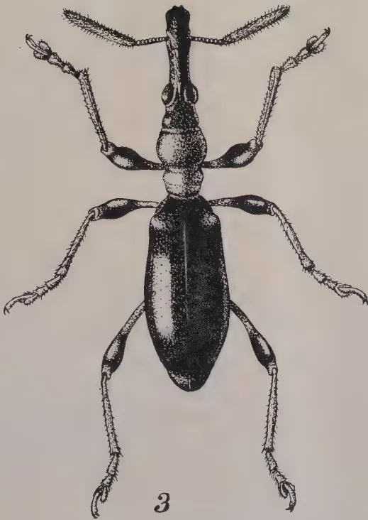
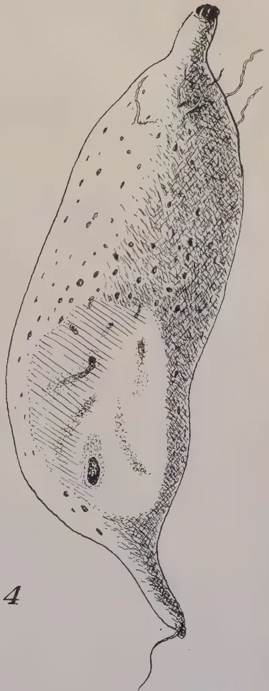
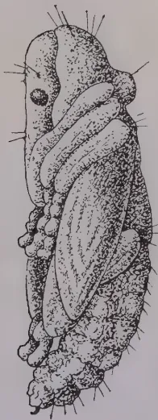
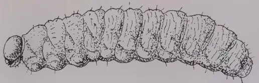

THE  
**TROPICAL AGRICULTURIST:**  
JOURNAL OF THE  
**CEYLON AGRICULTURAL SOCIETY.**

---

---

VOL. LI.

PERADENIYA, SEPTEMBER, 1918.

No. 3.

---

---

**AGRICULTURAL EDUCATION.**

---

In a previous issue of the TROPICAL AGRICULTURIST (June 1917) a review of agricultural education was given editorially. In that article it was given as an opinion that the Farm School type of agricultural school was the next desired step in the evolution of agricultural education in this Colony.

It was stated that consideration of this subject by a Committee appointed by Government some nine years ago had decided that the establishment of agricultural schools in the Provinces was desirable. It has subsequently been indicated in proposals for the co-ordination and extension of agricultural services in the Colony that the establishment of three such schools was desirable at the present time.

A further reference to this question of agricultural education would however appear to be desirable at the present time in view of the fact that the thoughts of the majority of the educated inhabitants of the Colony have been directed, through the Teachers' Conference at Kandy, to matters educational.

The question of agricultural education in India was at the end of last year considered by the Board of Agriculture and it was decided that owing to the vast amount of illiteracy it was necessary for India to concentrate firstly upon better elementary education with, as far as possible, a bias towards rural occupations. It was also decided to make a trial experiment with agricultural middle schools, and to continue to confine the higher teaching of the agricultural colleges to prospective members of agricultural staffs or teachers in science subjects.

In Ceylon, elementary education is much further advanced than in India and it has to be considered whether the time is not ripe for the establishment of middle schools and farm schools

1------------------------------------------------

130[SEPTEMBER, 1918.

for agriculture. In the former schools continuation of some ordinary school subjects would be carried on, while in the farm schools the work would be confined to practising the art of agriculture and to studying the elements of the sciences that underlie it.

That there is a need for schools of the latter type no one doubts. The results that have been shown by some of the students that have passed through the existing School of Tropical Agriculture at Peradeniya justify the belief that properly equipped farm schools would serve a useful purpose in the Colony.

Most countries that are existing upon agriculture are examining their provision for education towards agriculture. The training of the youth is being provided for, and the instruction of the adult being undertaken. For example, Western Australia has recently had a Committee sitting on the question of agricultural education. This has reported and urged for early provision for nature knowledge in all elementary schools, more science, especially that pertaining to agriculture, in secondary schools, the establishment of agricultural schools and the provision of university courses in agricultural sciences for the training of expert agricultural and science officers. Also, provision is desired for training adult agriculturists, for education through demonstration farms and for continuation courses for training agriculturists in special branches of their work.

In England also, provision is now being made for Government farms to be run upon business lines for training some of the fighting forces returning from the front in the business of farming in the hope of ultimately settling them in colonies or upon small holdings fully equipped to make a satisfactory living for themselves out of agriculture and to assist towards the provision of adequate supplies of home-grown food-crops.

With examples such as these before us, the necessity of the early establishment of farm schools in the Colony become apparent in order that training in agriculture may be accorded to some at least of the agriculturists of our near future.

In a brief address presented to members of the Teachers' Conference on the occasion of their visit to the Botanic Gardens and Experiment Station at Peradeniya (reproduced in this present issue) it is urged that serious consideration should be given throughout the schools of the Colony to the possibility of affording training towards agriculture.

On agriculture the prosperity of Ceylon is based, and the future of the Colony, as far as can be foreseen at present, is bound to be agricultural. It is therefore necessary that provision should be made for education in agriculture.

2------------------------------------------------

SEPTEMBER, 1918.]131

# FOOD STUFFS.

## THE FOOD OF THE ISLAND.

F. A. STOCKDALE, M.A.; F.L.S.,

*Director of Agriculture, Ceylon.*

This paper was read by the Director of Agriculture at a Public Lecture, on August 22nd, 1918, in connection with the Kandy Public Welfare, Agricultural and Industrial Exhibition :—

The effect of the war upon the production and distribution of food-products has been far reaching and one of the most serious problems that has had to be faced by all of the belligerent nations has been the question of the maintenance of food supplies. In the United Kingdom the position at one time owing to unrestricted submarinism appeared to be very serious, but the control of submarinism was effected and the response by the people of the Mother Country to the appeals of HIS MAJESTY THE KING and his MINISTERS for greater food production has been wonderful. Not only has consumption been reduced very considerably, but the production of local supplies has been far beyond what the majority of people ever thought possible. Whereas the United Kingdom was dependent upon the import of nearly 60 % of its food supplies previous to the war, it has been possible to bring under arable cultivation such additional extent of land as to make the United Kingdom almost self-supporting, if necessary, for food supplies. This success has been remarkable. It must be considered to be the more remarkable when it is kept in view that this has been accomplished during the most bitter war of history when all available physically fit men have been required for the fighting line. It is a glorious example of the firm resolve of those men and women of the senior-partner of the Empire to do their utmost to assist their brothers and sisters and relations from overseas in the fighting line. Nor is this picture the only one. Similar efforts have been made in our Dominions, in Canada, Australia and South Africa, and in our great neighbour India.

The universal cry for the past two years has been to produce more food stuffs and thereby help our fighting forces. A study of the history of the far-flung units of the Empire during the past two years shows that there has been every where efforts to produce food supplies in sufficiency to meet, if possible, local requirements. Isolated Crown Colonies of the Empire have become more isolated by reason of shipping being required for more urgent needs, and supplies have been irregular, if they have not been cut off. In these places the utmost economy had to be practised, and in certain of our Colonies the compulsory production of food crops has been insisted upon by the Authorities.

America is the latest ally that has entered the fight for justice, liberty and right, and she equally with her prodigious efforts towards military, naval and aerial equipment is organising her industries and her agriculture. The

3------------------------------------------------

132[SEPTEMBER, 1918.

production of more food in America has been equally as important a consideration as it has been in England and France. Nor is this all. The food crisis is not confined to countries actually within the area of hostilities. The world's production of food products is diminishing. International statistics show that there is no doubt of this diminished production throughout the world. It is to some extent connected with the war for there are large tracts of such important cereal producing countries as Roumania and European Russia which have been unable to export their produce. Later they were compelled to destroy their stocks and at the present time are largely unproductive. Similarly, smaller yields have been obtained in France, Germany, Austria-Hungary and other countries owing to shortage of labour, inferior cultivation, lack of manures, etc. In addition to this the actual harvests of the world which were reaped in 1916 and 1917 showed, owing to climatic conditions, deficiencies—in some cases considerable—below normal. The reports for the present year appear to be unsatisfactory for certain parts of Europe, and about normal for America and Canada.

War needs increased consumption, and brought about considerable competition between nations for supplies until the International Food Commission took into hand the food supplies of the allies. The cost of production has increased throughout the world, the cost of freighting has more than doubled and the cost of distribution enhanced. For several years after the termination of the war it is universally held that prices of foodstuffs will rule high and all evidence points to the fact that this must be so. Some there are that believe that the food situation will be more difficult after the termination of the war than at present, and there are very strong reasons to support this view. The world's requirements for raw materials of all kinds for industrial purposes alone might account for greater attention being given to such products than to the production of foodstuffs.

This is already being exemplified in our neighbour India where considerable areas of land formally under food-products are being used for cultivations of cotton—the price of which is at present very high.

All countries therefore are devoting attention to this food problem and efforts are being made to increase production and to open up new and promising areas.

#### CEYLON.

Now turn to the Island of Ceylon and review the situation. The effects of the war's influences upon supplies of food have been felt to some extent in Ceylon. Prices have increased, imports have become increasingly difficult owing to shortage of freight and difficulties with exchange. Early in the year 1914, and previous to the war, the HON. MR. BALASINGHAM in a small pamphlet on "Our Food Supply" drew attention to our increasing dependence upon India and other countries for our food requirements, and emphasized that there were vast areas capable of being utilized for grain production which were lying idle and waste. No one can read this pamphlet without being impressed by the enormous work there is before those that believe it is to the interest of the country to produce greater quantities of food. In normal times, it may be more remunerative to devote attention to export products and import from outside food requirements—especially when they are cheap. Similarly, throughout the course of the war, the Island, although it has had anxious times, has been free to pursue the same policy.

4------------------------------------------------

SEPTEMBER, 1918.]133

In fact, there are few Crown Colonies within the Empire, that have been required less as the result of the war compulsory to produce food products. Appeals have been made to the agricultural public since the outbreak of war to produce larger quantities of food products, and the response has been gratifying. But have the imports of food products reduced to any appreciable extent? Up to the present year Ceylon industries have, except for coconuts, being exceptionally prosperous. Satisfactory employment has been possible, and consequently the population has been able cheerfully to bear the increasing costs of the necessities of life. But this is not the position to-day. Coconuts are with economical handling, only just paying their way, plumbago is at a standstill, the outlook for rubber is not at the moment particularly rosy; cinnamon and citronella have suffered. Generally employment is more difficult to obtain, and prices are continuing to increase. Many who previously obtained satisfactory livings on or in connection with the Island's export products now find that they have to attempt to produce some saleable articles to provide a means of livelihood. This has led to the possible revival of such industries as the Basket Industry of Kalutara and weaving, and also to the greater production of those vegetable products that are readily saleable in the markets and bazaars of the country.

Whereas this greater increase in the cultivation of food-products is encouraging, and is obvious from the North of the Island to the South, and from the East to the West, one must naturally ask oneself: Is it enough? Has there as yet been any appreciable difference in the import returns, or is any reduction to be expected within the next year or so?

#### IMPORTS OF FOOD PRODUCTS.

The figures of a selected list of imports of food-products so far available are given on page 134.

A close examination of these figures reveal that in 1917 there was a decided fall in the import of rice as compared with that of 1916. In 1916, Ceylon was decidedly prosperous and the import of rice showed a marked increase over that of previous years. In 1917, although a fall in the import is to be recorded yet the figures for that year are in excess of those for 1913, the year previous to the war. Is it that the people of the Colony had, through fall in wages and difficulty in obtaining employment in 1917 to reduce their rice consumption, or is it that other food stuffs locally grown have been used instead?

Peas show a considerable decrease in 1917 but gram shows a very marked increase.

The import of potatoes has fallen very considerably indeed since 1913 and it is possible that greater reliance is being placed upon locally-grown potatoes and upon other tropical root products.

Sugar shows marked reduction, due undoubtedly to its enhanced value and to difficulties with freightage. The sugar bill of the Colony is a high one and could be reduced. There would appear to be no reason why the Colony should not produce the greater part if not the whole of its sugar requirements.

Chilli imports in 1917 showed a reduction. This is welcome when it is borne in view that the Colony could produce the whole of its requirements of chillies. Cumin also shows a reduced import, but little of this is grown locally. Fennel grows well in the Colony and the reduced import of this

5------------------------------------------------

134

[SEPTEMBER, 1918.

<table border="1">
<thead>
<tr>
<th rowspan="2"></th>
<th colspan="2">1913</th>
<th colspan="2">1914</th>
<th colspan="2">1915</th>
<th colspan="2">1916</th>
<th colspan="2">1917</th>
</tr>
<tr>
<th>Cwts.</th>
<th>Rs.</th>
<th>Cwts.</th>
<th>Rs.</th>
<th>Cwts.</th>
<th>Rs.</th>
<th>Cwts.</th>
<th>Rs.</th>
<th>Cwts.</th>
<th>Rs.</th>
</tr>
</thead>
<tbody>
<tr>
<td colspan="11"><i>Flour and Grains.</i></td>
</tr>
<tr>
<td>Rice</td>
<td>7,533,555</td>
<td>50,274,441</td>
<td>7,400,269</td>
<td>51,580,339</td>
<td>7,173,778</td>
<td>50,051,103</td>
<td>8,073,964</td>
<td>61,158,003</td>
<td>7,754,121</td>
<td>59,392,154</td>
</tr>
<tr>
<td>Paddy</td>
<td>526,186</td>
<td>1,746,435</td>
<td>550,538</td>
<td>1,845,630</td>
<td>559,042</td>
<td>1,850,382</td>
<td>748,725</td>
<td>2,507,657</td>
<td>780,062</td>
<td>2,593,853</td>
</tr>
<tr>
<td>Peas</td>
<td>152,552</td>
<td>1,069,591</td>
<td>170,172</td>
<td>1,200,303</td>
<td>196,571</td>
<td>1,355,082</td>
<td>194,630</td>
<td>1,378,423</td>
<td>106,283</td>
<td>747,832</td>
</tr>
<tr>
<td>Gram</td>
<td>128,373</td>
<td>648,178</td>
<td>95,318</td>
<td>481,621</td>
<td>87,135</td>
<td>440,290</td>
<td>100,742</td>
<td>524,634</td>
<td>170,522</td>
<td>861,598</td>
</tr>
<tr>
<td>Flour</td>
<td>241,813</td>
<td>2,222,563</td>
<td>212,648</td>
<td>1,979,488</td>
<td>168,558</td>
<td>1,533,055</td>
<td>192,099</td>
<td>1,744,613</td>
<td></td>
<td></td>
</tr>
<tr>
<td colspan="11"><i>Tubers.</i></td>
</tr>
<tr>
<td>Potatos</td>
<td>184,201</td>
<td>1,084,022</td>
<td>143,604</td>
<td>841,580</td>
<td>102,195</td>
<td>518,844</td>
<td>107,543</td>
<td>545,920</td>
<td>98,171</td>
<td>490,964</td>
</tr>
<tr>
<td>Sugar.</td>
<td>538,260</td>
<td>5,429,070</td>
<td>479,052</td>
<td>5,158,350</td>
<td>439,660</td>
<td>6,899,980</td>
<td>368,364</td>
<td>6,878,863</td>
<td>365,652</td>
<td>7,211,931</td>
</tr>
<tr>
<td colspan="11"><i>Condiments.</i></td>
</tr>
<tr>
<td>Chillies</td>
<td>cwt</td>
<td></td>
<td></td>
<td></td>
<td></td>
<td></td>
<td></td>
<td></td>
<td></td>
<td></td>
</tr>
<tr>
<td>Coriander</td>
<td>90,884</td>
<td>1,184,241</td>
<td>83,603</td>
<td>1,184,243</td>
<td>95,167</td>
<td>1,230,979</td>
<td>92,926</td>
<td>1,208,040</td>
<td>87,598</td>
<td>1,138,562</td>
</tr>
<tr>
<td>Cumin seed</td>
<td>33,514</td>
<td>201,095</td>
<td>33,526</td>
<td>201,159</td>
<td>37,659</td>
<td>293,530</td>
<td>35,811</td>
<td>246,371</td>
<td>35,831</td>
<td>216,080</td>
</tr>
<tr>
<td>Fennel</td>
<td>12,414</td>
<td>333,328</td>
<td>8,223</td>
<td>264,577</td>
<td>11,715</td>
<td>378,577</td>
<td>11,168</td>
<td>315,725</td>
<td>9,681</td>
<td>263,842</td>
</tr>
<tr>
<td>Garlic</td>
<td>4,691</td>
<td>58,650</td>
<td>3,865</td>
<td>51,975</td>
<td>3,982</td>
<td>81,414</td>
<td>5,531</td>
<td>74,922</td>
<td>3,903</td>
<td>48,795</td>
</tr>
<tr>
<td>Mathe seed</td>
<td>14,135</td>
<td>175,858</td>
<td>13,987</td>
<td>172,367</td>
<td>13,168</td>
<td>164,689</td>
<td>15,814</td>
<td>216,964</td>
<td>14,754</td>
<td>190,475</td>
</tr>
<tr>
<td>Turnmeric</td>
<td>6,958</td>
<td>55,624</td>
<td>5,706</td>
<td>45,647</td>
<td>6,293</td>
<td>50,278</td>
<td>4,785</td>
<td>38,284</td>
<td>5,236</td>
<td>41,892</td>
</tr>
<tr>
<td>Ginger</td>
<td>9,988</td>
<td>124,853</td>
<td>8,867</td>
<td>110,602</td>
<td>10,777</td>
<td>133,027</td>
<td>9,755</td>
<td>123,081</td>
<td>10,154</td>
<td>27,600</td>
</tr>
<tr>
<td>Pepper</td>
<td>2,254</td>
<td>57,416</td>
<td>2,544</td>
<td>63,408</td>
<td>2,310</td>
<td>86,730</td>
<td>2,553</td>
<td>64,146</td>
<td>2,560</td>
<td>63,976</td>
</tr>
<tr>
<td>Mustard</td>
<td>1,942</td>
<td>61,876</td>
<td>1,295</td>
<td>39,057</td>
<td>1,702</td>
<td>50,873</td>
<td>2,392</td>
<td>89,387</td>
<td>1,230</td>
<td>43,756</td>
</tr>
<tr>
<td>Onions</td>
<td>7,038</td>
<td>86,050</td>
<td>3,254</td>
<td>39,370</td>
<td>7,185</td>
<td>88,589</td>
<td>5,045</td>
<td>48,216</td>
<td>4,223</td>
<td>38,034</td>
</tr>
<tr>
<td></td>
<td>303,700</td>
<td>912,093</td>
<td>294,371</td>
<td>883,688</td>
<td>257,947</td>
<td>753,843</td>
<td>317,086</td>
<td>951,262</td>
<td>292,095</td>
<td>876,287</td>
</tr>
<tr>
<td colspan="11"><i>Fish.</i></td>
</tr>
<tr>
<td>Fish</td>
<td></td>
<td></td>
<td></td>
<td></td>
<td></td>
<td></td>
<td></td>
<td></td>
<td></td>
<td></td>
</tr>
<tr>
<td>Maldiv</td>
<td>271,971</td>
<td>2,233,382</td>
<td>198,058</td>
<td>1,595,696</td>
<td>243,119</td>
<td>1,968,592</td>
<td>257,344</td>
<td>2,102,004</td>
<td>231,608</td>
<td>1,854,871</td>
</tr>
<tr>
<td></td>
<td>78,597</td>
<td>2,234,343</td>
<td>71,764</td>
<td>2,083,642</td>
<td>78,594</td>
<td>2,268,908</td>
<td>81,857</td>
<td>2,380,766</td>
<td>77,543</td>
<td>2,266,387</td>
</tr>
<tr>
<td colspan="11"><i>Fats.</i></td>
</tr>
<tr>
<td>Butter</td>
<td>524,898</td>
<td>406,991</td>
<td>467,602</td>
<td>365,279</td>
<td>400,480</td>
<td>358,023</td>
<td>460,922</td>
<td>433,890</td>
<td>322,527</td>
<td>289,918</td>
</tr>
<tr>
<td>Ghee</td>
<td>3,973</td>
<td>159,035</td>
<td>3,468</td>
<td>138,960</td>
<td>3,170</td>
<td>126,843</td>
<td>3,032</td>
<td>121,940</td>
<td>2,715</td>
<td>108,858</td>
</tr>
<tr>
<td colspan="11"><i>Live animals.</i></td>
</tr>
<tr>
<td>Cattle</td>
<td>No.</td>
<td></td>
<td>No.</td>
<td></td>
<td>No.</td>
<td></td>
<td>No.</td>
<td></td>
<td>No.</td>
<td></td>
</tr>
<tr>
<td>Sheep</td>
<td>20,891</td>
<td>423,035</td>
<td>17,814</td>
<td>356,670</td>
<td>10,568</td>
<td>221,720</td>
<td>9,200</td>
<td>188,740</td>
<td>5,781</td>
<td>170,985</td>
</tr>
<tr>
<td>Goats</td>
<td>22,610</td>
<td>113,650</td>
<td>12,671</td>
<td>63,415</td>
<td>10,532</td>
<td>51,725</td>
<td>13,417</td>
<td>134,190</td>
<td>11,024</td>
<td>110,250</td>
</tr>
<tr>
<td>Poultry</td>
<td>119,597</td>
<td>598,095</td>
<td>85,115</td>
<td>425,720</td>
<td>59,361</td>
<td>296,805</td>
<td>71,263</td>
<td>712,630</td>
<td>62,539</td>
<td>625,390</td>
</tr>
<tr>
<td></td>
<td>25,901</td>
<td>15,691</td>
<td>31,933</td>
<td>19,484</td>
<td>39,381</td>
<td>21,659</td>
<td>11,037</td>
<td>7,289</td>
<td>65,678</td>
<td>40,942</td>
</tr>
</tbody>
</table>

6------------------------------------------------

SEPTEMBER, 1918.]135

product shows that possibly some of the locally grown product is replacing the imported. The other figures for curry stuffs do not call for comment except onions and mustard. The import of mustard could be reduced as mustard grows well in the chenas of the Colony. There has been some reduction in the import of onions although a greater reduction could be looked for.

Imports of butter and ghee have reduced due to difficulties in securing supplies from abroad. This should prove a stimulus to dairying in the Colony.

The figures however that are worthy of the closest investigation are those relating to Animal importations. Compare the 1917 figures with those of 1913—pre-war figures and it will be seen what a large reduction has taken place. This shows that the Colony is depending upon its own supplies to a much greater extent than formerly. These figures are undoubtedly encouraging for they show that it might be possible with an effort to become self-sustaining in the matter of meat. The import of goats is still high and could be very considerably reduced by home production.

Let it be clearly understood that the figures for 1917 cannot be considered as satisfactory. Greater efforts on the part of all are necessary and greater efforts must be made. The future must not be lost sight of. Prices are likely to rule high and other countries are likely to make demands upon the relatively cheap Indian supplies. India's population also, with its growing appreciation of better standards of living, will also make increasing demands upon their own supplies. The industrializing of India is also being planned for and this, judging from the history of other nations, will result in a weaning of a large number of the population from agriculture unless special steps are taken to prevent it.

#### THE PRESENT POSITION.

What is our position? Our agricultural population may be divided into two groups. Those that produce crops for export and those that produce food crops. There is a middle group which produces export crops and at the same time some food crops. Our immediate concern is with that group which produces only food crops—that class which is referred to as the villager or *goiya*. His principal concern is with paddy or chena cultivations, with subsidiary interests in root and vegetable crops.

To a great extent his paddy crop is not a money crop. It is *his* food crop and any surplus that may be produced is bartered or exchanged for other food requirements which have not been produced by the individual. There are exceptions—for a considerable part of paddy is a capitalistic industry—a share going to the capitalist as rent for his land and a share going to the cultivator for the results of his time and labour.

In some important paddy areas, large quantities are sent away to other districts for consumption, but to a considerable extent paddy is grown primarily for the consumption of the producer. I believe that a thorough investigation of the paddy problem of the country is necessary if a greatly extended area is expected to be brought under cultivation in this product. It has possibilities, but the difficulties concerning the industry are complex, and require thoughtful investigation.

Similarly the chena crops are essentially food crops and cannot be looked upon as extensive money crops. There are exceptions, it is true, for exports

7------------------------------------------------

136[SEPTEMBER, 1918.

of chena products from the North-Central Province are now taking place, as also from parts of the Central, Uva and Southern Provinces. But if the methods of cultivation are to be improved and the value of intensive cultivation is to be realised to the full, a greater appreciation of the value of education, of higher standards of living, and of money must be looked for.

Either the villager must be found money crops or he must be assisted towards converting his crops of paddy or chena grains into money. For the former, such crops as sugar, fibres, cotton, limes for citric acid, vanilla, cacao, and castor suggest themselves and it is probable that the State will be required to assist in the co-operative production and sale of such products. For the latter, co-operative credit societies in large numbers are necessary and co-operative distribution and sale societies are required for placing the produce of the villager in to the hands of producers of export products. I refrain from following these thoughts any further and turn to a consideration of the various food crops of the Island.

I do not propose to deal with the wild products of the forest. In some parts, these enter greatly in the dietary of the people especially in times of drought and stress. They are however of subsidiary importance and need not be given close consideration in this paper.

#### FLOUR AND GRAINS.

*Paddy.* The main food product of the country is paddy, and in 1916 it was estimated that 650,000 acres were under cultivation with this product. The cultivation of this product is increasing in some areas and diminishing in others. In some of the rubber districts, there has been planting of paddy fields with rubber, either after sale or by the villagers themselves. The question of an increased supply of paddy has been the subject of much attention for many years but progress is slow. The problems affecting paddy cultivation are numerous and complex, and vary from district to district. In much of the more important paddy-growing areas the system of land tenure is not conducive to the production of large crops and references to the difficulties may be seen in the various Administration Reports. There is little doubt that the areas at present under paddy are capable of enormously increased crops. From the agricultural point of view, this increase can be effected by careful handling of water, improved tillage and cultivation, transplanting, weeding and manuring. Something has been accomplished by the efforts of Revenue officers, Irrigation officers and officers of the Agricultural Society, but in spite of the increased cost of rice in India the quantity of imports remain at a high figure.

The total quantity imported is not imported for the supplies of labour forces connected with export industries, for large requirements are now necessary for the people of the country which are unconnected with these industries. If therefore we are not to become increasingly dependent upon the supplies of India, we must produce much larger quantities ourselves or replace rice in the dietary of our people by another food which can be more readily produced within the Colony.

A careful study of paddy cultivation in a part of Matale district by MR. K. L. B. TENNEKOON on behalf of the Social Service of Trinity College is given in the last May issue of the PERADENIYAN—the magazine of the School of Tropical Agriculture, Peradeniya, and another study on Harispattu by

8------------------------------------------------

SEPTEMBER, 1918.]137

MR. MOLEGODE in the TROPICAL AGRICULTURIST for July. From this latter, it will be seen that a total crop of 50 bushels of paddy and 700 bundles of straw would give an income of Rs. 114.00 per acre of which, if ruling rates of wages were paid, would leave a gross profit of Rs. 41.35 per acre per annum. In actual practice, however, paddy cultivation is not carried on with hired labour but on the principle of mutual service (attam) and the cultivator would receive the equivalent of Rs. 50 as his share of the produce of one acre as recompense for his labour and costs in connection with cultivation, harvesting, threshing, winnowing, etc.

Similar data were presented before the Committee of the Legislative Council on the Irrigation Ordinance and from these figures an appreciation of the economics of paddy cultivation of Ceylon can be obtained. I would be diffident of expressing, after only a short residence in the Colony, any definite opinion as to the future prospects for increased paddy production. It can, without doubt, be secured but opinions as to the best means of securing this additional production are many and varied, and it would require a very close and careful study before a definite decision could be come to.

#### DRY GRAINS.

The most important of these is kurakkan (*Eleusine coracana*). It is the standard crop of the chenas and is a most important article of diet for large numbers of our population. Kurakkan is also a most important food product in Southern India, and steps are there being taken to investigate the yields of the different varieties and to improve varieties by botanical selection and hybridization. There is no doubt that such investigations should yield valuable results, and help to improve the value of kurakkan to the cultivator. Other dry grains that are cultivated in chenas are Karal iringu (*Sorghum vulgare* var *caruum*), Amu (*Paspalum scrobiculatum*), Meneri (*Panicum miliare*), Tanahal (*Setaria italica*), Iringu or Indian corn (*Zea Mays*) and Kumbu (*Pennisetum typhoideum*). The cultivation of the giant millet (*Sorghum vulgare*) has spread in recent years in some localities and efforts are being made by the distribution of seed to encourage its cultivation. The broom corn variety, Sudan Dhura, has been experimented with in recent years and is now being grown to a small extent. A decided effort is being made to push the white seeded variety in the Matale district. Indian corn is also becoming more popular in the Uva province and is spreading in other directions. The food value of Indian corn (except in vitamins) is high, and is to some tropical and sub-tropical races what rice is to others and wheat to residents in temperate climes. A great extension of its cultivation is possible especially in the drier districts.

If sufficient supplies of this grain were available, it could replace some of the imports of rice and it might be possible to popularize it as a food, as was done in Mauritius, by including it in the dietary of such Government institutions as prisons, reformatories and hospitals. Estates also in Mauritius found it possible to replace to a certain extent rice by Indian corn in the dietary of coolies by offering the choice of relatively larger quantities of Indian corn in the recognised estate rations. In Jaffna, *Setaria italica* and other lesser millets are grown under irrigation and large crops are realised. It is possible that the giant millets and Indian corn might likewise be acceptable in this district.

9------------------------------------------------

138[SEPTEMBER, 1918.

### PULSES.

The seeds of leguminous plants should form a most important part of the dietary of our vegetarian population. Conditions throughout the Colony are most favourable to the growth of such crops, and trials that have recently been made show that every district ought to be able to produce its own requirements.

The imports of such articles as dhall, peas and gram could be reduced to a negligible quantity with effort and organization.

In chenas, the following are grown:—Mun-eta (*Phaseolus mungo*), Mun-mè (*Phaseolus max*), Potu bonchi (*Phaseolus vulgaris*), Bonchi (*Phaseolus lunatus*), Kollu (*Dolichos biflorus*), Awaru (*Dolichos gladiatus*), and Mè karal (*Vigna Catiang*), Undu (*Phaseolus radiatus*).

The Bengal gram or chick pea (*Cicer arietinum*) is not grown to any considerable extent and trials that have been made have not been entirely satisfactory. There are some localities in which it could be grown and its cultivation is worthy of encouragement.

Dhall or Red gram (*Cajanus indicus*) has been cultivated to an increased extent during the past year. It is suited to all districts and can be used upon estates as green manures or as catch crops between young rubber, coconuts or other permanent crops. It should be largely grown throughout all the chenas and seed in fair quantity is being distributed free this year to reliable chena cultivators.

The Lima bean (*P. lunatus*) is another crop worthy of extension. Its growth has revolutionized, from an economic point of view, a portion of the dry zone of Madagascar from which it is now exported in large quantities under the name of Pois du Cap. It is the same as the Rangoon bean of commerce grown in Burma on the foot hills and the Java bean. The white variety is the most wholesome although the cream coloured and speckled red variety common in Rangoon may be used. The red, purple or brown types should not be grown, as the prussic acid glucoside content is high and may give rise to vomiting, sickness or poisoning.

The Lentil (*Lens esculenta*) is a very valuable food product being very rich in proteids, and could be grown on the uplands of the Colony to advantage. Trials made last year at Hakgala and Harisbedde were successful, and it is greatly appreciated in all parts of India and in many French Colonies.

An extension of the Lablab bean (*Dolichos lablab*) is being attempted this year. It has done well for many years in several districts in the Colony and is worthy of greater attention.

Experiments are also being made with Soy beans, and encouraging results have been obtained at Harisbedde, C.P., Medagama, Uva; and Weligama, S.P.

### TUBERS.

The most important imports are potatos. There is some production in the uplands up-country but considerably more could be done if systematic attention were given to seed supply, cultivation and spraying to prevent disease. The trials with *Solanum Commersonii* which has been made at Hakgala and by several planters up-country have been successful. This variety of potato could be extended.

10------------------------------------------------

SEPTEMBER, 1918.]139

Manioc is the commonest tuber throughout the Colony. Its cultivation has spread rapidly and is continually spreading. It fetches 1—3 cts. per lb. in the majority of the markets and is undoubtedly the cheapest food, unit for unit, in Ceylon at the present time. It is, however, a perishable article and cannot be kept for any length of time after it has been raised. In some districts tubers are being dried and stored for later use. This form of treating manioc should be greatly extended and if properly organised would assist in reducing the consumption of rice. The preparation of tapioca is also worthy of consideration, particularly in the Northern Province. The essential for the production is a pure water supply, but there is little doubt that satisfactory water would be available in certain localities in sufficient quantities to support small factories. The process of manufacture is simple and it would not be difficult to teach the system of manufacture to our population.

Sweet potatoes in the Southern part of the Island, and several other districts are of considerable importance. With this crop likewise there is some loss after harvesting. This loss could be prevented by attention being given to the preparation of dried slices for storage for later use.

Yams (ala) are produced in the damper districts in good quantities. They grow very large in the Kegalle district and are likewise appreciated in the Northern districts. Some new varieties have within recent years been introduced but the general standard is not so high as the standard of the West Indies where yams are an important estate food crop. The Eastern Province of Ceylon is attempting to increase its area under yams, and some distribution of seed yams has been provided for.

The coco or tania yams (Gahala, Habarala) succeed in soil where there is a sufficiency of rainfall. In all districts when the rainfall is adequate, their cultivation should be encouraged as far as possible.

#### PLANTAINS.

These form another important article of food. Unfortunately in some districts there is an indication that diseases are making the cultivation of some varieties impossible. These diseases are under investigation. Whether it will be possible, as in the West, to substitute other varieties which are immune to disease has yet to be ascertained. Encouragement might be given to the production of dried plantains and to the production of plantain flour.

#### SUGAR.

This article of food is produced only in small quantities from the products of coconut, kitul and palmyrah palms and in the Southern and Uva Provinces from sugar-cane. The whole question of the possibility of the cultivation of sugar-cane and the manufacture of sugar is under the consideration of a Committee of the Agricultural Society. There would appear to be every reason to believe that Ceylon could produce a fair quantity of its sugar requirements even if it could not become a sugar exporting country.

#### CONDIMENTS.

Curry stuffs have been the subject of extended experimentation and trial during the past year. Chillies are extensively grown in some districts but greater quantities could be produced. Similarly there would appear to be no reason why Ceylon should not become self-supporting in the way of

11------------------------------------------------

140[SEPTEMBER, 1918.

onions. Fennel is now a common product in the Matale and other districts and locally grown coriander is to be found in the markets and shops of Walapane and Welimade. The drier and cooler districts appear to be better suited to the cultivation of curry stuffs and large quantities could be produced in the Matale and Walapane districts of the Central Province and over vast areas of Uva. Mustard is a common product of the chenas and turmeric and ginger can readily be grown in the damper districts.

#### ANIMALS.

The import of cattle, sheep and goats could be reduced. There is no reason why greater quantities of cattle should not be raised in the Colony and it is gratifying to know that in addition to producers of European cattle up-country a determined effort is being made by the HON. DR. H. M. FERNANDO and MR. H. L. DE MEL, C.B.E., to produce cattle in the low-country. One has only to see the fine locally-bred Indian type of animals which may be seen upon the Kondesalle Estate of the Anglo-Ceylon Company to realize that there are possibilities for the stall production of the Indian type of animals within the Colony. Goats can be raised in increasing numbers, sheep will thrive in many localities, and the prospects of pig-breeding upon coconut estates are worthy of close investigation. The question of encouraging animal production within the Colony is under consideration by a special Government Committee.

#### BUTTER AND GHEE.

The possibilities of a greater local production of these articles is worthy of close consideration and the establishment of large co-operative dairies a possibility.

#### DRIED PRODUCTS.

Investigations have been begun with the aid of the Agricultural Instructors of the Ceylon Agricultural Society into the food products that are dried in the Colony. The following summary of the preliminary enquiries is of value :—

*Chillie* is dried in Jaffna peninsula for use as condiment (about 1,100 tons); in Meda, Atakalan and Kollana Korales in Sabaragamuwa Province, for private use and sale (a large quantity); in certain places in the Eastern Province (on a small scale) for local consumption; and on a large scale in Hambantota district, Morawak Korale and Hinidum Pattu.

*Manioc* in Jaffna and Mullaitivu districts (about 5,000 cwt.) for sale; Kotmale district (to some extent) for local consumption; Katugampola, Weuda Wili and Dambadeniya Hatpattus in N.W.P. (not to a great extent) for sale and consumption; in Kegalle district and Kalutara district for sale and consumption; in Eastern Province, Kandy and Matale districts for local consumption.

Sweet potatoes and yams might be dried and preserved in the same way.

*Tamarind* in Northern Province (about 70 cwt.) for use as a condiment; in Lower Uva for sale to boutiques; Walapane district for sale; in Katugampola, Weuda Wili, Dambadeniya, Hiriyala and Dewamadi Hatpattus (not to a great extent) for sale and consumption; Kalutara district for sale and consumption; in Kandy; in the Eastern Province and Southern Province (in very small quantities) for flavouring curries.

12------------------------------------------------

SEPTEMBER, 1918.]141

*Me Flower (Bassia longifolia)* in Jaffna district for local consumption ; in Wellassa and Bintenne division (to some extent) for making cakes ; in Balangoda, Madampe and Godakawela, also for making cakes ; in Giruwa Pattu, Galle and Matara districts ( to a small extent ) for medicinal purposes.

*Limes* are preserved throughout Uva for household uses ; in small quantities in Ratnapura and Walapane districts for local consumption ; for sale and consumption in Katugampola, Weuda, Dambadeniya and Hiriyala Hatpattus ; all over Kegalle district ; in Kalutara district for sale and consumption ; in Kandy, in certain towns and villages in Eastern Province for sale and consumption ; all throughout Southern Province except Magam and East Giruwa Pattu, for use as pickle.

*Maize* is dried all over Uva Province for use as food and for sale ; a large quantity mostly in Balangoda and Godakawela for the market ; in Katugampola, Weuda, Dambadeniya, Hiriyala and Dewamadi Hatpattus for sale and consumption (not to a great extent) ; all over Kegalle district ; in Kalutara district for sale and consumption ; and in Hambantota district, Morawak Korale and Hinidum Pattu ( very largely ) for use in place of rice.

Various millets such as Kurakkan, Amu, etc., are also dried throughout the Colony. These are the products of chenas and are used instead of rice.

*Beans* are largely dried in Udakinda division for sale, all over Kegalle district, in Galle and Matara districts and Giruwa Pattu West and other pulses such as green gram, etc.

*Jak.* A large quantity is dried all over Ratnapura for use and sale ; in Katugampola, Weuda Wili and Dambadeniya Hatpattus ( not to a great extent ) for sale and consumption ; all over Kegalle district ( a large quantity ) ; in Kalutara district for sale and consumption ; a fairly large quantity in Kandy and a small quantity in Southern Province, where large quantities of seed are preserved (except Magam and East Giruwa Pattu) and used for food.

*Breadfruits* are dried in Kadawela, Meda and Atakalan Korales for consumption : for sale and consumption in Katugampola, Weuda Wili and Dambadeniya Hatpattus ; all over Kegalle district ( a large quantity ) ; in Kalutara district for sale and consumption ; a large quantity in Kandy ; in Walallawita Korale, Wellaboda Pattu, Talpe Pattu and Weligam Korale to a considerable extent for use as a substitute for rice and vegetables.

*Goraka* is largely preserved in Ratnapura district for sale and consumption, and all throughout Southern Province except Magam and East Giruwa Pattu for flavouring curries.

*Mango* is dried in a few places in Ratnapura district for local use ; for sale and consumption in Katugampola, Weuda Wili, Dambadeniya and Hiriyala Hatpattus ( not to a great extent ) ; in almost every village in Kegalle district, for consumption and sale ; in Kalutara district for pickles ; in Kandy and Eastern Province, in Galle and Matara districts and Giruwa Pattu West ( to a very small extent ) for use as vegetables.

*Kekeji, Brinjal and Yellow Pumpkin* are largely dried in Bintenne district.

*Mushroom* is dried in Walapane district for local use, also in the Anuradhapura district.

13------------------------------------------------

142[SEPTEMBER, 1918.

*Biling (Averrhoa bilimbi)* is dried in Katugampola, Weuda, Dambadeniya and Hiriyala Hatpattus for sale and consumption ; in Kegalle in almost every village ; in Kalutara for sale and consumption ; in Kandy for pickles ; and in Matara district and West Giruwa Pattu also for pickles.

*Kaju (Anacardium occidentale)* nuts are dried everywhere in Kurunegala district for sale and consumption, also in many other parts of the Island where they occur.

*Mè seed* is dried in Kalutara district and for preparation of oil.

*Kambaranga* is dried in Kandy for pickles.

The young stems of Palmyrah seedlings are dried in the Northern and Eastern Provinces and used for preparing flour.

*Arrowroot* is made into flour and also dried in Galle and Matara districts and Giruwa Pattu West for use as food.

*Ranawara (Cassia auriculata)* flowers are dried and used instead of tea in Magam and East Giruwa Pattus.

### VEGETABLES.

The production of green vegetables has shown a considerable increase during the past year. Everyone has endeavoured to encourage their cultivation. The cooly on the estate has improved the estate garden, the villager has worked on his higher lands and in his gardens, the school teacher has improved his school garden and the pupil has established his home garden. The results that have been obtained with vegetables encourage one to believe that equally as important results could be achieved with more important food products.

### CONCLUSION.

In conclusion I would state that this brief review has been drawn up solely with the object of directing the thoughts of people to food production. Much has been done in the past but a greater effort is still required. We cannot rest content with results already obtained.

We must endeavour to reduce our dependence upon India for food supplies. The welfare of our people demand it, and an important part of social work is to see that the people are better fed.

In England much of the recent increased cultivation of essential food products have been brought about by the work of the district Food Committee. One has already been formed in this Colony for the Matale district and I believe that the promoters are satisfied with the work as far as it has gone. A complete survey of the possibilities of the district for greater food production has been made and steps taken to have a larger plantation of food products with the forthcoming North-east monsoon season.

The statistical returns of this Committee will be awaited with interest and if their efforts are productive of encouraging results there is every reason to believe that other Committees with similar objects will be formed for other districts.

Whether there is a local Food Committee or not, it is the duty of us all to help as far as possible towards a greater production of food stuffs in the Colony and every social worker in the rural districts should feel that "better food" is of equal importance with the other requirements in the direction of "better housing," "better sanitary" and "better medical attendance."

14------------------------------------------------

SEPTEMBER, 1918.]143

## THE PEAS AND BEANS OF COMMERCE.

The edible seeds of leguminous crops, such as beans, peas and lentils, included under the general term pulse, undoubtedly come next in range and importance to cereals, the grain produced by plants of the grass family. Wherever agriculture is practised, either in tropical or temperate countries, some kinds of leguminous crops are grown. In some cases these crops serve as green manure or as fodder for cattle, in others the fresh green pods are utilised as vegetables, but the most important product commercially is the seed. It is well known that leguminous crops enrich the soil in which they have been grown in nitrogen, hence they are of great value for rotation purposes.

Several distinct genera of plants, including a number of species, are concerned in the production of commercial pulses, and most of the species have under cultivation, given rise to numerous varieties that differ from each other in constitution and habit of growth, and most markedly in the colour, size and shape of their seeds. With regard to nomenclature, several common names are applied to the same plant when grown in different countries, and in commerce the seeds are frequently known by a name that produced them; on the other hand the same name may be applied to seeds that bear a general resemblance to each other, but which are the produce of plants that are botanically distinct.

### CHIEF LEGUMINOUS CROPS CULTIVATED FOR THEIR SEED.

The following is a list of the principal leguminous plants that are cultivated as crops chiefly for the sake of their seed in both tropical and temperate countries:—

<table border="0">
<thead>
<tr>
<th style="text-align: left;">Botanical Name.</th>
<th style="text-align: left;">Common Name.</th>
</tr>
</thead>
<tbody>
<tr>
<td><i>Arachis hypogæa</i>, Linn</td>
<td>... Ground nut, earth nut, pea nut (U.S.A.), monkey nut, goober.</td>
</tr>
<tr>
<td><i>Cajanus indicus</i>, Spreng</td>
<td>... Pigeon pea or bean, Angola pea, Congo pea, Dal (India), Bombay tares.</td>
</tr>
<tr>
<td><i>Canavalia ensiformis</i>, DC.</td>
<td>... Sword bean, over-look bean, cut-eye bean (W. Indies), horse bean (Montserrat), Go-ta-ni bean (E. Africa).</td>
</tr>
<tr>
<td><i>Cicer arietinum</i>, Linn</td>
<td>... Gram, Bengal gram, chick pea, Spanish pea, garbanzo (Spain).</td>
</tr>
<tr>
<td><i>Cyamopsis psoralioides</i>, DC.</td>
<td>... Cluster bean, Guar bean (India).</td>
</tr>
<tr>
<td><i>Dolichos biflorus</i>, Linn</td>
<td>... Horse gram, Madras gram, Kulthi (India).</td>
</tr>
<tr>
<td><i>Dolichos Lablab</i>, Linn</td>
<td>.. Indian bean, Lablab bean.</td>
</tr>
<tr>
<td><i>Ervum Lens</i>, Linn</td>
<td>... See <i>Lens esculenta</i>, Moench.</td>
</tr>
<tr>
<td><i>Faba vulgaris</i>, Moench</td>
<td>... See <i>Vicia Faba</i>, Linn.</td>
</tr>
<tr>
<td><i>Glycine hispida</i>, Maxim</td>
<td>... Soya bean, soja bean.</td>
</tr>
<tr>
<td><i>Lathyrus sativus</i>, Linn</td>
<td>.. Chickling vetch, vetchling, grass pea, Indian pea, mutter or matter pea, Khesari (India).</td>
</tr>
<tr>
<td><i>Lens esculenta</i>, Moench</td>
<td>... Lentil.</td>
</tr>
<tr>
<td><i>Phaseolus aconitifolius</i>, Jacq</td>
<td>... Moth bean.</td>
</tr>
<tr>
<td><i>Phaseolus angularis</i>, (Willd), W. F. Wight,</td>
<td>... Adzuki or Azuki bean (Japan).</td>
</tr>
</tbody>
</table>

15------------------------------------------------

144[SEPTEMBER, 1918.

<table border="0">
<thead>
<tr>
<th style="text-align: center;">Botanical Name.</th>
<th style="text-align: center;">Common Name.</th>
</tr>
</thead>
<tbody>
<tr>
<td><i>Phaseolus calcaratus</i>, Roxb</td>
<td>... Rice bean.</td>
</tr>
<tr>
<td><i>Phaseolus lunatus</i>, Linn</td>
<td>... Lima or Duffin bean, Rangoon bean, Madagascar bean, butter bean.</td>
</tr>
<tr>
<td><i>Phaseolus Mungo</i>, Linn</td>
<td>... Black gram, Urd (India).</td>
</tr>
<tr>
<td><i>Phaseolus radialis</i>, Linn</td>
<td>... Green gram, Mung (India).</td>
</tr>
<tr>
<td><i>Phaseolus vulgaris</i>, Linn</td>
<td>... Dwarf bean, French bean, kidney bean, haricot bean.</td>
</tr>
<tr>
<td><i>Pisum arvense</i>, Linn</td>
<td>... Field pea, grey pea, dum pea, partridge pea, maple pea, blue pea, Bara mattar (India).</td>
</tr>
<tr>
<td><i>Pisum sativum</i>, Linn</td>
<td>... Common or garden pea.</td>
</tr>
<tr>
<td><i>Vicia Faba</i>, Linn</td>
<td>... Broad bean, Windsor bean, horse bean, field bean.</td>
</tr>
<tr>
<td><i>Vigna Catjang</i>, Walp</td>
<td>... Black-eye cowpea, cherry bean, cow pea, Chowlee, Lobia (India,) Tow Cok (China) Faggiola del Occhio (S. Europe).</td>
</tr>
<tr>
<td><i>Voandzcia sublerranea</i>, Thouars...</td>
<td>Bambarra ground nut, Mozambique gram, Madagascar earth nut.</td>
</tr>
</tbody>
</table>

Although eaten as pulses in the countries where they are grown, ground nuts and soy beans are valued in Europe chiefly as oil seeds, and they will therefore not be dealt with in this article. Information regarding them has already been given in this Bulletin (ground nuts, 1910, 8,193; soy beans, 1909, 7,308 and 1910, 840).

The seeds of certain of the leguminous plants mentioned in the list given above are of importance only in the countries where they are produced, and they do not enter into European commerce on a large scale; such for instance, are the sword bean (*Canavalia ensiformis*), the Cluster or Guar bean, (*Cyanopsis psoralioides*), the Lablab bean (*Dolichos Lablab*), and the Bambarra ground nut (*Voandzcia sublerranea*). These pulses have, however, a certain value as feeding stuffs for animals, and also as human food, and a market for them may eventually be developed in Europe.

Samples of "Sword beans" received from the Gold Coast, Honduras, Montserrat and Burma have been examined at the Imperial Institute, and no deleterious constituents have been found in them, although in some countries where they are grown they are regarded with suspicion as being harmful (see this Bulletin, 1913, 11,242; 1914, 12,549,550; 1915, 13,192.) apparently on no very good ground. Since the war samples of a variety of *Canavalia* known as the Go-ta-ni bean have been received from British East Africa. The seeds of the Cluster or Guar bean are said to be used in India as food for animals as well as for human consumption.

Lablab beans (*Dolichos Lablab*), are largely grown in China and in India and also in other tropical countries. A report on samples received from Hongkong that were examined at the Imperial Institute appeared in this Bulletin (1912, 10,235). The Bambarra ground nut has also been examined at the Imperial Institute, and although no harmful constituents could be detected, it was not highly valued by merchants at that time. (See this Bulletin, 1909, 7,151; 1914, 12,344). The great drawback to these pulses is that they are not known, and it is always a difficult matter to find a market for

16------------------------------------------------

SEPTEMBER, 1918.]145

unknown food-stuffs, especially beans, new varieties of which are usually regarded with suspicion. The present scarcity of food-stuffs is, however, resulting in the introduction into this country for human food of a number of new kinds of pulse, to some of which allusion is made below.

The scarlet runner bean (*Phaseolus multiflorus*) is grown mainly for the sake of its green immature pods, but the ripe seeds are occasionally eaten as a pulse.

### COMMERCIAL PULSES.

By far the most important pulses commercially are the various kinds of peas and beans that serve as food stuffs for animals and also for human consumption. The chief countries that export peas in normal times are India, Russia, Japan, China and the Netherlands. The principal countries exporting beans are China, India, Turkey, Russia and Egypt. The beans used for human consumption and known in British commerce under the general name of "haricots," though many of them are not true haricots (see page 146), are derived chiefly from Madagascar, India (Burma) France, Roumania, Japan, Germany and Chili.

The trade of the United Kingdom in pulses is, in normal times, sharply divided into two sections, viz:—

(1) Pulses utilised as human food.

(2) Pulses utilised as cattle food.

(1) The pulses utilised as human food include the following:—

(a) Haricot beans, white and coloured (*Phaseolus vulgaris*).

(b) Madagascar butter beans, Lima beans, and Rangoon white beans (*Phaseolus lunatus*).

(c) Green peas, smooth and wrinkled varieties (*Pisum sativum*).

(d) Yellow peas, smooth and wrinkled varieties (*Pisum sativum*).

(e) Yellow peas, and off-cloured green peas (*Pisum sativum*) and field peas (*P. arvense*), split or ground into meal or flour.

(f) Chick peas, or-Spanish peas, white kinds (*Cicer arietinum*).

(g) Lentils, whole or split (*Lens esculenta*).

(h) Japanese "Adzuki" or Chefoo red beans (*Phaseolus angularis*) and other small beans produced by species of *Phaseolus*.

(2) The pulses utilised for cattle food include the following:—

(a) Dun peas, maple peas, partridge peas, grey or field peas (*Pisum arvense*).

(b) Broad beans and horse beans (*Vicia Faba*).

(c) Pigeon peas or beans (*Cajanus indicus*).

(d) Horse gram (*Dolichos biflorus*).

(e) Bengal gram, or chick peas (coloured kinds) (*Cicer arietinum*).

(f) All other kinds of coloured beans, including red Rangoon beans (*Phaseolus lunatus*).

### HARICOT BEANS AND BUTTER BEANS.

Various kinds of beans are known in British commerce as haricots, including the seeds of *Phaseolus vulgaris*, the dwarf French or kidney bean, to which the term is more correctly applied, and the seed of certain varieties of *P. lunatus*. Butter beans are furnished by other varieties of the latter species.

17------------------------------------------------

146[SEPTEMBER, 1918.

### TRUE HARICOT BEANS.

*Phaseolus vulgaris*, is largely grown in many countries for its seeds and also in European gardens for the sake of its young pods, which are used as a green vegetable. The plants of *Phaseolus vulgaris* are annual, erect and bushy (French beans), or in some varieties the branches are twining (kidney bean); the leaves are trifoliolate on long stalks; the flowers, produced in racemes, vary in colour from white or pink to purple. The seeds are extremely variable in size and also in shape and colour; they are usually long, kidney-shaped in profile and oval in cross section; but some are short and plump and nearly oval in profile. The colour of the seeds varies from white to jet black through various shades of yellow, brown and purple; they are also frequently speckled. Numerous varieties are known in gardens.

In some cases the pods are of a yellow colour whilst still in a young state, and the kinds are known in gardens as "butter" beans. They are, however, quite distinct from the "butter" beans of commerce, which are the seeds of a variety of *Phaseolus lunatus* (see p. 148).

Originally native to South America *Phaseolus vulgaris* is susceptible to frosts, and the crop can therefore only be produced during summer in temperate countries. Two or three crops a year are possible in warm countries.

French or kidney beans succeed best on soils in a good state of fertility, although fair crops may sometimes be obtained from poor soils. Fairly light soils that have been well cultivated and manured for a previous crop are the most suitable to employ. In warm countries the twining varieties are frequently intercropped with maize, the stems of the latter furnishing the necessary support for the beans.

### VARIETIES AND SOURCES OF TRUE HARICOT BEANS.

Prior to the outbreak of war, British supplies of true haricot beans were obtained chiefly from European countries, Roumania, Germany, Austria-Hungary, Belgium, Italy and France, furnishing the bulk of the supplies. These beans were chiefly white kinds, such as "White Italian," "White Soissons" and "White Danubian," which in this country are generally preferred to coloured kinds for human consumption as they have a better appearance when cooked. The coloured forms of true haricots have, however, no harmful constituents, and are preferred in some cases as they have a thin skin and a more agreeable flavour than some of the white kinds. Such varieties as "Rose Cocos" (speckled), "Canadian Wonder" (purple) and "Burlotti" (speckled) are commonly imported. Since the war a brown variety which is said to be superior in flavour to the white forms, has been introduced into this country for cultivation from Holland by the Royal Horticultural Society. These beans, known as "Dutch Brown," are small, oval in profile, almost circular in cross section and of a light coffee-brown colour.

In tropical South American countries beans form to a great extent the staple food of the people and are grown in large quantities. Before the war it was sometimes necessary for these countries to import beans to supplement the local crop, but during the past few years there has been a large export to Europe.

18------------------------------------------------

SEPTEMBER, 1918.]147

The following table, quoted from the U. S. COMMERCE REPT. No. 218, 1917, illustrates the rapid growth of the export trade of beans in Brazil :—

**EXPORTS OF BEANS FROM BRAZIL.**

<table border="1">
<thead>
<tr>
<th></th>
<th>1914 Kilos.</th>
<th>1915 Kilos.</th>
<th>1916 Kilos.</th>
<th>1917 (five months) Kilos.</th>
</tr>
</thead>
<tbody>
<tr>
<td>Total ...</td>
<td>4,441</td>
<td>276,159</td>
<td>45,593,944</td>
<td>53,084,331</td>
</tr>
<tr>
<td>To</td>
<td></td>
<td></td>
<td></td>
<td></td>
</tr>
<tr>
<td>United States ...</td>
<td>—</td>
<td>—</td>
<td>7,463,515</td>
<td>9,193,220</td>
</tr>
<tr>
<td>France ...</td>
<td>1,020</td>
<td>1,620</td>
<td>34,138,100</td>
<td>23,455,880</td>
</tr>
<tr>
<td>United Kingdom ...</td>
<td>—</td>
<td>138</td>
<td>1,851,600</td>
<td>18,284,913</td>
</tr>
<tr>
<td>Italy ...</td>
<td>181</td>
<td>310</td>
<td>1,023,240</td>
<td>1,001,175</td>
</tr>
<tr>
<td>Uruguay ...</td>
<td>660</td>
<td>120,052</td>
<td>977,680</td>
<td>925,620</td>
</tr>
<tr>
<td></td>
<td colspan="4">1 kilo=2'024 lb.</td>
</tr>
</tbody>
</table>

The following is a list of the kinds of Brazilian beans imported into the United Kingdom during the past year, samples of which have been received at the Imperial Institute :—

*Grey*.—Long, oval,  $\frac{3}{4}$  in. long by  $\frac{1}{4}$  in. broad, dark coffee-brown, with a darker tint round the prominent white hilum ("eye").

*Praia*.—Similar in size and shape to the preceding, of a buff ground colour heavily blotched with dull purplish-brown.

*Cavallho*.—Similar in size and shape to the preceding, of a rose-purple colour heavily blotched with a deeper tint.

*Sulphur*.—Similar in size and shape to the preceding, of a pale buff yellow with a brownish blotch round the hilum.

*Meuro*.—Small, oval,  $\frac{1}{2}$  in. long by  $\frac{1}{4}$  in. broad, dull slaty brown in colour speckled, with a darker line round the hilum.

*Ciririca*.—Similar to the preceding in size and shape, but more distinctly speckled and blotched.

*Tupy*.—Similar in size and shape to the preceding, of a light brown colour stained with rose-purple.

*Mulatinho*.—Slightly larger than the preceding, of a light coffee-brown colour.

*Carioca A*.—Similar in size and shape to the preceding, pinkish-brown, with irregular black markings.

*Carioca B*.—Larger than the preceding,  $\frac{1}{2}$  in. long by  $\frac{1}{4}$  in. broad, of a pale buff colour, with irregular markings and blotches of rose-purple.

*Carioca C*.—Similar to *Carioca A*, but slightly larger.

*Carioca D*.—Similar in size and shape to *Carioca A*, of a buff colour heavily speckled with violet purple.

*Carioca E*.—Oval,  $\frac{1}{2}$  in. long by  $\frac{4}{5}$  in. wide, pale buff yellow with irregular markings and blotches of dark brown.

*Carioca F*.—Similar in size and shape to *Carioca A*, of a dark coffee-brown to black colour.

*Vinegar*.—Plump oval beans,  $\frac{1}{2}$  in. long by  $\frac{4}{5}$  in. broad; uniform chestnut-brown with small white hilum.

19------------------------------------------------

148[SEPTEMBER, 1918.

*Vinegar* (dark).—Similar in size and shape to the preceding, but of a deep purple colour.

*Canary*.—Similar in size and shape to the preceding, of a sulphur-yellow colour, with a brown blotch surrounding the hilum.

*Gold*.—Similar in size and shape to the preceding, of a uniform golden-brown colour.

“Chilian white” beans, imported from Chili, are true haricots, resembling the “white Italian.” The large white beans known as Lima beans or “butter” beans, imported from Peru, are the seeds of *Phaseolus lunatus*, and are not therefore, true haricots.

Large quantities of beans are grown in Japan, and the export of haricot or kidney beans from Japan to the United Kingdom has assumed considerable proportions since the war began. The bean trade of Japan is not, however, confined to local produce, as the exports include large quantities of soya beans, horse beans and haricot beans, originally imported from Manchuria, North China and Korea. The centres of Japan bean trade are at Kobe and Yokohama, where the beans are sorted, cleaned and put up into bags for shipment. The export of white haricot beans from Japan is of comparatively recent growth, but there is every indication that this trade will largely increase, as the soil of Japan is well suited to the production of this class of pulse, and there is an abundance of cheap labour available.

The following kinds of haricot beans, white and coloured, have been received on the London market from Japan during the past year:—

*Kotenashi*.—Small plump, oval beans, about the size of garden peas, of an ivory-white colour. These are known as small “Lady Washington” beans in the United States.

*Chutenashi*.—Similar to the preceding but slightly larger.

*Olenashi*.—Similar to the preceding but slightly larger and longer. These are known as large “Lady Washington” beans in the United States.

*Chufuku*.—Long, flat, kidney-shaped beans of a fine ivory-white colour.

*Daifuku*.—Similar to the preceding, but about twice the size.

*Naga uzura or Speckled Bayos*.—Long, kidney-shaped beans of a dun yellow ground colour, irregularly blotched with red.

*Chunaga*.—Oval-shaped beans of a buff yellow ground colour blotched with brown.

*Kintoki red*.—Oval, plump beans of a uniform brownish-purple, with a small white hilum or “eye.” These are known as “Cranberry” beans in the United States.

#### PHASEOLUS LUNATUS BEANS.

Another species, *Phaseolus lunatus*, furnishes so-called haricot beans of commerce. This species is a twining plant with trifoliate leaves and short-stalked, many flowered racemes of greenish-yellow flowers; the pods are scimitar-shaped and usually contain three seeds. The seeds are variable in size, shape and colour, usually flattened, more or less rounded or kidney-shaped in profile, and from deep purple to red-brown or white in colour, and sometimes striped or blotched. All varieties of the seeds show vein-like lines radiating from the hilum (eye) to the outer rounded edge; these lines are usually strongly marked in the coloured forms, but appear only as faint veins in the white varieties.

20------------------------------------------------

SEPTEMBER, 1918.]149

### VARIETIES AND PRODUCTION OF PHASEOLUS LUNATUS BEANS.

Originally native of South America, *Phaseolus lunatus* was introduced to Southern California from the vicinity of Lima as early as the fifteenth century, and is now widely distributed in cultivation throughout the warmer parts of the world. Under cultivation the seed has become much plumper and the size has been much increased; the colour has also been changed from purplish-red to white (Lima or Duffin beans). Cultivated forms of Lima beans are said to have been introduced into Madagascar by traders about the year 1864. These beans were planted by the natives, and since the French occupation of Madagascar, this crop has furnished an important article of export. The beans are known to Madagascar traders by the erroneous name of Cape peas or Pois du Cap, and on the London market as "butter" beans or Madagascar beans. These beans are of large size, flat and kidney-shaped, and of an ivory-white colour. The growth of the Madagascar trade in these beans is shown in the following table:—

#### EXPORTS OF POIS DU CAP OR "BUTTER" BEANS FROM MADAGASCAR.

<table style="width: 100%; border-collapse: collapse;">
<thead>
<tr>
<th style="text-align: left;">Year.</th>
<th style="text-align: center;">Quantities. Metric Tons.</th>
<th style="text-align: right;">Value £.</th>
</tr>
</thead>
<tbody>
<tr>
<td>1906</td>
<td style="text-align: center;">1,237</td>
<td style="text-align: right;">17,165</td>
</tr>
<tr>
<td>1907</td>
<td style="text-align: center;">2,135</td>
<td style="text-align: right;">29,660</td>
</tr>
<tr>
<td>1908</td>
<td style="text-align: center;">2,533</td>
<td style="text-align: right;">34,963</td>
</tr>
<tr>
<td>1909</td>
<td style="text-align: center;">2,974</td>
<td style="text-align: right;">36,378</td>
</tr>
<tr>
<td>1910</td>
<td style="text-align: center;">3,513</td>
<td style="text-align: right;">46,429</td>
</tr>
<tr>
<td>1911</td>
<td style="text-align: center;">7,436</td>
<td style="text-align: right;">126,668</td>
</tr>
<tr>
<td>1912</td>
<td style="text-align: center;">6,073</td>
<td style="text-align: right;">112,303</td>
</tr>
<tr>
<td>1913</td>
<td style="text-align: center;">8,141</td>
<td style="text-align: right;">137,819</td>
</tr>
<tr>
<td>1914</td>
<td style="text-align: center;">8,561</td>
<td style="text-align: right;">140,415</td>
</tr>
</tbody>
</table>

In Madagascar this bean is said to receive but little cultivation. It is planted along the districts bordering the Onilahy river after the flood waters have subsided in March. Holes are made in the soft ground to receive the seeds, and two or three seeds are planted in each. The crop requires about six months to ripen its seeds, and during this period the plants receive no attention. The long twining stems are allowed to trail over the ground, and this is probably an advantage, as by so doing they shade the soil and prevent too rapid evaporation of soil moisture, and at the same time the plants are less exposed to the hot drying winds which scorch other vegetation. The harvesting is done by hand, the ripe pods being plucked and thrown together in heaps and afterwards thrashed with a flail to obtain the beans.

Forms of *Phaseolus lunatus* are largely grown in Burma, more especially in the Sagaing, Pakokku, Mandalay, Lower Chindwin, Meiktila and Myingyan districts. The two most common forms grown in Burma are the red-seeded and the white-seeded kinds, known commercially as "Burma red beans" and "Burma white" or "Rangoon" beans, and locally as Pè-gya and Pè-byu-galè. The Rangoon or Burma white beans are much smaller than the Madagascar butter beans.

In Burma *P. lunatus* is a favourite crop for field cultivation, 240,000 acres being devoted to the white variety and 94,000 acres to the red in 1916-17. In the hill districts the seeds are usually sown at the beginning of the

21------------------------------------------------

150[SEPTEMBER, 1918.

rains; in the plains they are sown from August to December. Seeds are usually dropped into furrows made by the native plough in rows about 1 to  $1\frac{1}{2}$  ft. apart; they are also sometimes broad-casted mixed with maize, and are covered with soil by harrowing. When sown with maize, the stems of the maize plants serve as supports to the trailing stems of the beans, but when sown alone, the stems are allowed to trail over the ground. The crop generally takes about five months to mature; the stems are then cut with a sickle, and the thrashing is done in the ordinary native way by means of bullocks. A clayey loam rather than a sandy soil is preferred for this crop.

The extent of the bean trade of Burma is shown in the following table, which gives the quantities and values of pulse (including peas) exported from the Province overseas during the period 1909-10 to 1916-17:—

<table border="1">
<thead>
<tr>
<th>Year</th>
<th>Quantity Cwts.</th>
<th>Value £</th>
<th>To the United Kingdom Cwts.</th>
</tr>
</thead>
<tbody>
<tr>
<td>1909-10</td>
<td>361,912</td>
<td>99,415</td>
<td>178,292</td>
</tr>
<tr>
<td>1910-11</td>
<td>545,309</td>
<td>142,047</td>
<td>232,032</td>
</tr>
<tr>
<td>1911-12</td>
<td>576,352</td>
<td>165,665</td>
<td>235,961</td>
</tr>
<tr>
<td>1912-13</td>
<td>430,233</td>
<td>139,379</td>
<td>116,644</td>
</tr>
<tr>
<td>1913-14</td>
<td>492,071</td>
<td>143,136</td>
<td>119,340</td>
</tr>
<tr>
<td>1914-15</td>
<td>693,643</td>
<td>209,388</td>
<td>433,240</td>
</tr>
<tr>
<td>1915-16</td>
<td>732,554</td>
<td>280,532</td>
<td>625,760</td>
</tr>
<tr>
<td>1916-17</td>
<td>1,439,009</td>
<td>791,208</td>
<td>1,138,020</td>
</tr>
</tbody>
</table>

In addition to the above there is a large coasting trade in beans with peninsular India.

With a view to improving the type of bean grown in Burma for export, consignments of Madagascar "butter" beans have been forwarded to Burma by the Imperial Institute from time to time for trial cultivation. Samples of beans produced in Burma from the seed supplied have been forwarded to the Imperial Institute for examination, and the results of examination have been published in this Bulletin (1914,12,355; 1915,13,196; 1916,14,149). Other white beans are also under trial by the Local Department of Agriculture, which is giving constant attention to the improvement of the bean crops.

#### DEVELOPMENT OF PRUSSIC ACID IN PHASEOLUS LUNATUS BEANS.

The subject of the development of prussic (hydrocyanic) acid from *Phaseolus lunatus* beans has been carefully studied at the Imperial Institute for several years. In the first instance beans produced in Mauritius by wild plants of *P. lunatus* were examined, and these were found to yield 0·1 per cent. of hydrocyanic acid. Just at the conclusion of this work large quantities of beans began to come on the British market from Burma; samples of these were submitted to the Imperial Institute by several merchants and importers for examination, and were found to yield only traces of hydrocyanic acid which were too small to be harmful.

In 1905, beans derived from wild *P. lunatus* plants appeared on the European markets from Java, under the trade name of Java beans, and these caused the death of a number of cattle in England, as well as of some human beings on the Continent. Samples of these beans were also examined, and were found to furnish quantities of hydrocyanic acid varying from 0·03 to 0·16 per cent.

22------------------------------------------------

SEPTEMBER, 1918.]151-

There is a great difference between the poisonous beans produced in Java and Mauritius by wild plants of *P. lunatus* and those produced in Burma or elsewhere from the cultivated varieties of this species. Both the white and red forms of Burma beans have been repeatedly examined. As a rule the white beans yield no prussic acid, but sometimes traces are present, and in one case as much as 0.02 per cent. was found. The red beans usually yield traces. In no cases have quantities of prussic acid which can be regarded as harmful been found at the Imperial Institute in Burma beans of either type, and, as shown by the table given on p. 150, the trade in these beans is now firmly established.

While cultivated types of *P. lunatus* from South America and Madagascar have also been examined and found to yield no hydrocyanic acid or mere traces. It is evident, therefore, that the beans derived from cultivated forms of *P. lunatus* which are obtained for human consumption from Madagascar, South America and Burma, and probably also those produced in the United States and Southern Europe, rarely, if ever, yield hydrocyanic acid in quantities likely to be injurious, but at the same time it is advisable that importations from new areas should be examined before being placed on the market.

#### UNITED KINGDOM TRADE IN "HARICOT" BEANS.

The following table shows the quantities and values of beans, classed in the Trade Returns as "haricot" beans, imported into the United Kingdom during the period 1911-16; it includes all beans intended for human consumption, whether white or coloured.

#### IMPORTS OF "HARICOT" BEANS INTO UNITED KINGDOM.

<table border="1">
<thead>
<tr>
<th></th>
<th>1911</th>
<th>1912</th>
<th>1913</th>
<th>1914</th>
<th>1915</th>
<th>1916</th>
</tr>
</thead>
<tbody>
<tr>
<td>Total quantity ... cwt.</td>
<td>353,780</td>
<td>405,917</td>
<td>313,063</td>
<td>412,700</td>
<td>800,035</td>
<td>1,077,600</td>
</tr>
<tr>
<td>„ value ... £</td>
<td>257,627</td>
<td>311,738</td>
<td>238,685</td>
<td>313,763</td>
<td>751,017</td>
<td>1,239,325</td>
</tr>
<tr>
<td>From</td>
<td>cwt.</td>
<td>cwt.</td>
<td>cwt.</td>
<td>cwt.</td>
<td>cwt.</td>
<td>cwt.</td>
</tr>
<tr>
<td>British India ...</td>
<td>75,560</td>
<td>88,660</td>
<td>67,900</td>
<td>176,730</td>
<td>504,595</td>
<td>726,800</td>
</tr>
<tr>
<td>Other British countries ...</td>
<td>13,960</td>
<td>10,040</td>
<td>8,160</td>
<td>5,305</td>
<td>35,050</td>
<td>74,670</td>
</tr>
<tr>
<td>Total British countries ...</td>
<td>89,520</td>
<td>98,700</td>
<td>76,060</td>
<td>182,035</td>
<td>539,645</td>
<td>801,670</td>
</tr>
<tr>
<td>Russia ...</td>
<td>19,260</td>
<td>6,210</td>
<td>1,150</td>
<td>1,680</td>
<td>—</td>
<td>—</td>
</tr>
<tr>
<td>Germany ...</td>
<td>32,127</td>
<td>41,270</td>
<td>31,840</td>
<td>35,340</td>
<td>—</td>
<td>—</td>
</tr>
<tr>
<td>Netherlands ...</td>
<td>3,410</td>
<td>5,247</td>
<td>4,680</td>
<td>845</td>
<td>—</td>
<td>10</td>
</tr>
<tr>
<td>Belgium ...</td>
<td>23,000</td>
<td>34,300</td>
<td>21,942</td>
<td>11,450</td>
<td>—</td>
<td>—</td>
</tr>
<tr>
<td>France ...</td>
<td>6,589</td>
<td>28,545</td>
<td>32,901</td>
<td>34,604</td>
<td>2,400</td>
<td>3,350</td>
</tr>
<tr>
<td>Madagascar ...</td>
<td>67,620</td>
<td>85,620</td>
<td>71,820</td>
<td>78,850</td>
<td>131,670</td>
<td>138,570</td>
</tr>
<tr>
<td>Italy ...</td>
<td>13,564</td>
<td>2,290</td>
<td>5,270</td>
<td>7,830</td>
<td>190</td>
<td>—</td>
</tr>
<tr>
<td>Austria-Hungary ...</td>
<td>29,940</td>
<td>31,210</td>
<td>24,380</td>
<td>16,110</td>
<td>—</td>
<td>—</td>
</tr>
<tr>
<td>Roumania ...</td>
<td>48,620</td>
<td>34,460</td>
<td>8,580</td>
<td>4,560</td>
<td>—</td>
<td>—</td>
</tr>
<tr>
<td>Japan ...</td>
<td>6,350</td>
<td>15,215</td>
<td>1,100</td>
<td>70</td>
<td>97,020</td>
<td>51,170</td>
</tr>
<tr>
<td>United States ...</td>
<td>1,420</td>
<td>3,050</td>
<td>2,590</td>
<td>10,010</td>
<td>11,880</td>
<td>1,990</td>
</tr>
<tr>
<td>Peru ...</td>
<td>—</td>
<td>4,750</td>
<td>4,040</td>
<td>13,810</td>
<td>9,620</td>
<td>33,100</td>
</tr>
<tr>
<td>Chile ...</td>
<td>880</td>
<td>4,730</td>
<td>25,350</td>
<td>3,200</td>
<td>—</td>
<td>23,990</td>
</tr>
<tr>
<td>Other foreign countries ...</td>
<td>11,480</td>
<td>10,320</td>
<td>1,360</td>
<td>12,306</td>
<td>7,630</td>
<td>23,750</td>
</tr>
<tr>
<td>Total foreign countries ...</td>
<td>264,260</td>
<td>307,217</td>
<td>237,003</td>
<td>230,665</td>
<td>260,410</td>
<td>275,930</td>
</tr>
</tbody>
</table>

It will be seen from the above table that before the war the bulk of the imports of this class of pulse was derived from foreign countries; Madagascar, Germany, Austria-Hungary, Roumania and Belgium contributing the major

23------------------------------------------------

152[SEPTEMBER, 1918.

portion. Since the outbreak of war the imports from Madagascar, South America and Japan have largely increased, but the bulk of the imports have been derived from India.

The quantities and values of beans, classed in the Trade Returns as "haricots," re-exported from the United Kingdom and the principal receiving countries, are shown in the following tables:—

**RE-EXPORT OF "HARICOT" BEANS FROM THE UNITED KINGDOM.**

<table border="1">
<thead>
<tr>
<th></th>
<th>1911</th>
<th>1912</th>
<th>1913</th>
<th>1914</th>
<th>1915</th>
<th>1916</th>
</tr>
</thead>
<tbody>
<tr>
<td>Total re-exports ... Cwts.</td>
<td>37,979</td>
<td>92,822</td>
<td>119,736</td>
<td>127,284</td>
<td>94,440</td>
<td>74,852</td>
</tr>
<tr>
<td>„ value ... £</td>
<td>24,396</td>
<td>68,345</td>
<td>106,561</td>
<td>116,665</td>
<td>98,737</td>
<td>91,457</td>
</tr>
<tr>
<td>To ... Cwts.</td>
<td>Cwts.</td>
<td>Cwts.</td>
<td>Cwts.</td>
<td>Cwts.</td>
<td>Cwts.</td>
<td>Cwts.</td>
</tr>
<tr>
<td>Canada ...</td>
<td>973</td>
<td>23,604</td>
<td>17,883</td>
<td>14,620</td>
<td>108</td>
<td>14,634</td>
</tr>
<tr>
<td>Other British Countries ...</td>
<td>6,990</td>
<td>9,439</td>
<td>10,177</td>
<td>6,180</td>
<td>10,918</td>
<td>12,522</td>
</tr>
<tr>
<td>Netherlands ...</td>
<td>2,951</td>
<td>2,447</td>
<td>14</td>
<td>4,229</td>
<td>840</td>
<td>—</td>
</tr>
<tr>
<td>France ...</td>
<td>3,151</td>
<td>5,298</td>
<td>827</td>
<td>8,949</td>
<td>43,308</td>
<td>27,976</td>
</tr>
<tr>
<td>United States ...</td>
<td>10,424</td>
<td>45,057</td>
<td>61,572</td>
<td>83,742</td>
<td>20</td>
<td>12,795</td>
</tr>
<tr>
<td>Cuba ...</td>
<td>368</td>
<td>—</td>
<td>26,473</td>
<td>4,400</td>
<td>1,960</td>
<td>—</td>
</tr>
<tr>
<td>Other foreign countries</td>
<td>13,122</td>
<td>6,977</td>
<td>2,790</td>
<td>5,164</td>
<td>37,286</td>
<td>6,925</td>
</tr>
</tbody>
</table>

From these figures it will be seen that in normal times the United States and Canada are the principal countries that receive the haricot beans re-exported from the United Kingdom, but since the outbreak of war larger quantities have been taken by France.

The exports of beans produced in the United Kingdom are not differentiated in the Trade Returns, but they are probably all horse beans (*Vicia Faba*).

**SUMMARY OF UNITED KINGDOM TRADE IN "HARICOT" BEANS.**

<table border="1">
<thead>
<tr>
<th></th>
<th>1911.</th>
<th>1912.</th>
<th>1913.</th>
<th>1914.</th>
<th>1915.</th>
<th>1916.</th>
</tr>
<tr>
<th></th>
<th>Cwts.</th>
<th>Cwts.</th>
<th>Cwts.</th>
<th>Cwts.</th>
<th>Cwts.</th>
<th>Cwts.</th>
</tr>
</thead>
<tbody>
<tr>
<td>Total imports ...</td>
<td>3,780</td>
<td>405,917</td>
<td>313,063</td>
<td>412,700</td>
<td>800,055</td>
<td>1,077,600</td>
</tr>
<tr>
<td>„ re-exports ...</td>
<td>37,979</td>
<td>92,822</td>
<td>119,736</td>
<td>127,284</td>
<td>94,440</td>
<td>74,850</td>
</tr>
<tr>
<td>Net Imports ...</td>
<td><u>315,801</u></td>
<td><u>313,095</u></td>
<td><u>193,327</u></td>
<td><u>285,416</u></td>
<td><u>706,615</u></td>
<td><u>1,002,750</u></td>
</tr>
</tbody>
</table>

—BULLETIN OF THE IMPERIAL INSTITUTE, Vol. XV., No. 4.

(To be continued).

**PLANTAIN CULTIVATION.**

(See frontispiece).

Rambukkana is the centre of a thriving trade in plantains or bananas, which are extensively cultivated in the contiguous districts of Kurunegala and Kegalle. The cultivators suffered great disabilities in not having a Central Market to which they could bring their produce, till the Assistant Government Agent, Kegalle, Mr. W. E. DAVIDSON (now SIR WALTER DAVIDSON, Governor of New South Wales) focussed the trade at Rambukkana by building a Market and provided facilities for warehousing and loading the fruit on the Railway premises.

Similar arrangements for the disposal of produce can be made with advantage in other parts of the Island.

C. D.

24------------------------------------------------

SEPTEMBER, 1918.]153

## COCONUT OIL.

### MARGARINE.

The demand for vegetable oils for the manufacture of margarine has been steadily growing for the last quarter of a century. Vegetable oils were first introduced into margarine in small proportions, which gradually increased, the war hastened the increase, until now, instead of the vegetable fats being a masked ingredient, manufacturers freely state that the butter substitutes are entirely made from vegetable fats. Necessity has forced the people in Europe to consume vegetable margarine without an expensive advertising propaganda. The great slaughter of cattle in Europe, and reduced agricultural labour in other parts of the world, which has reduced breeding, will keep up the demand for vegetable butter, at least for the masses.

Coconut oil of first class quality enters largely into the composition of vegetable butters, and as coconut oil is one of Ceylon's chief industries it is necessary for growers, millers and shippers to understand how to obtain a first class merchantable oil and how to deliver it.

### ACIDITY—RANCIDITY.

The first consideration is of course freedom from adulteration, which may be dismissed at once; the second which determines the quality and price of the oil is the acidity and rancidity. A keen purchaser will always have these tested as they have to be eliminated before an edible product can be obtained, and the more acidity present the greater the loss to the margarine manufacturer. If the oil is high in free acid it is not worth purifying and is only fit for making soap.

### COPRA PREPARATION.

In order to keep the acidity at a minimum it is necessary to understand what causes the acidity in each stage of manufacture. Many of these are well known to the grower and the miller. One of the causes of acidity is the picking of immature nuts; when the husk is to be made into fibre this ensures a light coloured fibre, which is highly prized and gets a better market and price. The drying of the copra is important and should not be delayed after opening the nuts, else the drainings of sugar solution in the interior of the nut decomposes by moulds, etc., and deteriorates the copra, if the halved nuts be dipped in water the sugar solution will be washed out and there will be less risk of this happening. Quick drying of the copra after opening the nut is the easiest and best method of ensuring good copra. It is the usual practise to preliminary dry in the sun followed by artificial drying under cover. In the second stage of drying, the copra, should not be laid down too thickly, else the water vapour will not easily escape and stewing will occur. To ensure rapid escape of water vapour, a good drought is required. Fans arranged to pass air over the heated copra, or heated dry air over the copra have been tried. Drying under reduced air pressure ensures the rapid passage of moisture-laden air but requires expensive plant. The last process is the only way to deal with large quantities of copra in a small area. Cochin copra and oil, which always command a premium, is dried on the sand in the open. The sand is heated by the sun up to 130°-150° F. and is virtually a sand bath while the dry breezes passing over the heated copra give rise to rapid drying under the best conditions.

25------------------------------------------------

154[SEPTEMBER, 1918.

The fuel generally used for drying copra is the shells after removal of the meat. There is a certain amount of tarry matter in these shells which is contained in the smoke, the meat is not only dried by this means but also smoked. The copra is disinfected by the tar products and slight discolouration always takes place. A better copra would be obtained if the charcoal from the shells were used for drying when the tarry and acid matters have been previously driven off.

In driving off the moisture from the copra another important thing happens and that is the bacteria, moulds, enzymes, are killed if the temperature has reached about 150°F. Moisture must be present for these to develop so that in well drying at or about 150° F. one of the conditions of their growth is eliminated. Copra which is mouldy is inferior showing that it has not been well dried and the conditions for the growth of moulds, bacteria, etc. have been present. Wiping the moulds off may improve the appearance but not the value of the copra as the moulds have penetrated the meat and caused the damage.

Oil pressed from inferior copra is inferior, that is, contains a high percentage of free acids and is rancid, so the initial precaution in producing a good oil is with the grower in the production of the copra.

#### MILLING.

The miller given good copra should produce good oil provided proper working conditions are carried out on his part. Good copra will give a freshly expressed oil of about 1—1.5% acidity as oleic acid, this will rapidly increase up to 5% or over if the methods of preparation are not correct. In pressing the copra albuminoid matter is expressed with the oil. Albuminoid matter acts as a food to bacteria, moulds, enzymes etc., so that its removal is desirable. Albuminoids are coagulable at about 150° F. so if the oil be heated and the sediment filtered off, another source of danger is removed. The filter press is the most desirable for this purpose, whichever variety of filter is used, cleanliness is essential.

#### PACKING AND PACKAGES.

The oil thus prepared, is ready for packing, and at this stage every care must be taken, else the oil deteriorates.

New packages, made from well seasoned wood, should give no deterioration of the oil; but packages, which have been used before, are not the best means for carrying oil that has been carefully prepared, as they are saturated with oil, and have travelled under conditions of alternating high and low temperatures, not once but several times, both full and empty, and exposed to all forms of infection.

Oil which is shipped to temperate climates is solid before it reaches its destination; the solidifying point of coconut oil being about 22° C. (71.6° F.), on unpacking the pores of the wood of the barrels are filled with solid fat and the fat is not scraped off clean from the wood. For the sake of economy of freight the empty barrels are dismantled, the shooks packed in bundles, and returned as empties. The packages of shooks on reaching a temperature of about 25° C. (77° F.) (when the fat becomes liquid) are again subjected to the saturating influence of the liquid oil, and the liquifying temperature of the fat, being the optimum temperature for the growth of bacteria, moulds and enzymes, have again free play, after hibernating in the latent state in the solid fat awaiting conditions favourable to their growth.

26------------------------------------------------

SEPTEMBER, 1918.]155

On reaching the miller's yard, the returned empties in bundles of shooks are laid out in the open until required. The shooks being bound at their ends with hoop iron are held tight there and do not allow air in between the pieces as the middles do and have consequently less chance of sweating.

On testing shooks, which have been used in this way, for free fatty acid, it was found that the wood at the end contained 10.7% free fatty acid as oleic acid, the wood in the middle contained 12.5% free fatty acid as oleic acid, demonstrating that the hydrolysing influence of moulds, enzymes, etc., had full play and that the oil in the wood had changed to fatty acids or at least an 80% conversion was proved. The effect on good oil filled into packages made from shooks which have gone through one or several journeys to Europe or America, can be well imagined; the carefully prepared oil containing originally 1% free fatty acid passes to an inferior oil containing high percentages of free fatty acid and giving just cause for complaint at the receiver's end and just cause for grievance at the despatched end of the journey, as the oil was shipped in all good faith as a first class merchantable oil, low in free fatty acids, but had deteriorated on the journey due to faulty packages from ignorance of the shipper.

The preparation of packages for shipment is a long, tedious process, involving much hand labour, loss of time and oil. No package will be received by shipping agents if the package leaks. In order to season packages to oil-tightness, the oil is hand pumped from package to package until the package gives no signs of leaking; it is then called a shipping package. All this is very laborious.

Shipping agents do not care for round packages as there is great loss in space and packages which are apt to leak have their suspicion. Round packages cannot be placed on the top of other goods, are apt to shift in rough weather, and require special consideration as to their position in the hold of the ship.

The whole process of oil carriage, from the time the oil is expressed to the time the oil reaches the buyer, requires careful consideration and reconstruction.

The seasoning, cleanliness,, and oil-tightness of packages, carriage from miller to ship's side, shipping agent's objections to round packages, loss of space in round packages making high freight charges, loss of oil and damage to goods due to leaky packages, and finally the labour expended in seasoning packages, all cry out for a revolution in the economic production and delivery of a first class merchantable oil.

#### SUGGESTIONS.

The oil once expressed, and considered first class merchantable oil with 1-1.5% of free fatty acid, should not deteriorate on the way to the purchaser, if proper conditions are carried out. Instead of a multiplicity of wooden packages, old and new, in the form of shooks and barrels, involving great expense in capital outlay in having the requirements of 1 ton of oil to 3 tons of packages, and capital spent in securing a suitable yard to house the packages, the oil could be retained in a shallow well, say 3 feet deep with a removable watertight cover, the cover could be made transparent to light so as to make use of the bleaching effect of the sun's rays while lying in store. Either glass or mica could be used for this purpose. A coloured glass might be found to be a more efficient bleacher than white glass.

27------------------------------------------------

156[SEPTEMBER, 1918.

A series of lined wells, slightly sloping to allow draining, say 20 yards by 10 yards, the size of a good sized oblong room, would give a capacity of 5,400 cubic feet, if taken to the depth of 3 feet, and a carrying capacity of 138 tons of oil, allowing 10% of space for paths between tanks an acre of ground could carry nearly 3,000 tons of oil. As an acre of ground in commercial Colombo costs between Rs. 50—60,000, economy of space in storing oil is to be well considered, when interest on money, and taxes on property are taken into consideration.

Carriage of oil from miller to ship is a long tiresome process, one package at a time by bullock cart, a waste of time and good roads. Mills near water, canal or lake, could utilize water carriage for the transference of oil to ship by using oil barges. The liquid oil in the storage tank could be pumped down to the oil barge. This is feasible even when the mill is some distance from the water-transport. Oil will run as well as water, and leakage should be safe guarded against with under-ground pipes. A gauge at point of issue will readily check quantities and an extra gauge at exit check leakage. The barge could be propelled at a slow speed by a motor. The barge being built for lake or canal will not be able to stand the buffeting about in the harbour, to avoid damage to the barge the oil could be pumped into a harbour barge or the canal barge floated into a stronger outer shell for harbour purposes, or pontooned, or again if the oil were in separate tanks in the canal barge, these could be lifted bodily by a crane into the harbour barge. One of such suggestions, with little additional labour, would be the means of transferring the oil from miller to ship's side, where again pumping would take place to convey the oil into tanks placed in the hold of the ship.

Small tanks could be placed in odd places in the ship's hold, where large tanks could not be erected, making the minimum consignment say 10 tons. The ship is now carrying the oil in square packages, the most economic method of packing and without danger of leaks, eliminating numerous loopholes for claims on shippers', buyers' and sellers' part. On reaching temperate climates, where the fat is solid, the fat will be melted by the necessary amount of heat to make the fat into oil. This can be arranged by having the oil tanks double jacketed so that steam could be turned on or a less expensive method would be by electrically heating the tanks. The oil being liquid again the reverse process of pumping from ship to buyer begins. As the oil will readily solidify in temperate climates on unloading from the boat, the oil will be solid after leaving the ship's side and can be packed in square packages, and easily handled.

The above sketch of plan of re-organisation of the raw coconut oil industry would lessen working costs, giving a greater margin to fight competitors with other oils, and tend to cheapen the fat in the land of consumption, and thus increase the consumption.

Importing countries tax oils containing less than 1% free fatty acid as a manufactured article, the oil having been considered to be purified and not a raw product. Oils can be prepared from the nut or copra with less than 1% free fatty acid, by careful working, so that this clause as to free fatty acid is not quite fair to the manufacturer of coconut oil who takes every care in its preparation. No doubt such a clause would be eliminated on a general improvement in the quality of coconut oil, and proof that the raw product had not been worked up into a purified product.

28------------------------------------------------

SEPTEMBER, 1918.]157

An inferior oil can be worked up into a first class oil by well known means, but if the 1% of free fatty acids is left it is not considered a manufactured article. The injustice of this will be readily seen.

To raise an inferior oil to a good merchantable oil requires skill on the part of the operator. The usual process is to neutralize the acids with alkali and then steam to get rid of the rancidity, which is volatile. The neutralized fatty acids form a soap and is collected in the "foots" and unless there is a local market for this waste product from soap manufacturers, loss is sustained. Shaking the oil with alcohol and passing through charcoal has also a purifying effect.

It has not been stated whether a liquid fat made into a solid fat by the now well known hydrogenation process would be considered a manufactured oil and taxed accordingly, but if not, and a demand for hardened coconut oil took the place of the liquid coconut oil, the carriage and handling of the fat would be very much simpler, and could come on a par with any other solid food substance.

A margarine manufacturer will try and cut his losses from acid and rancid oils as much as possible and will contract for oils containing less and less free fatty acids; at present there is a fairly wide working margin, but shippers can depend on it that the present standard in the fatty world will be stiffened and the country which can work up to the more strict conditions will hold the market. Shippers should thoroughly examine how this can be done economically and if Ceylon is to take a premier place in the production of the raw product of the margarine industry it is time she put her house in order.

A. BRUCE.

---

## FOOD PRODUCTION: CONSIDERABLE INCREASE POSSIBLE.\*

---

Englishmen used to laugh at Indians for having no subject of conversation except the price of food. The old gibe has now lost its point, for the topic has assumed an absorbing interest throughout the world; the possibility of universal dearth is now being seriously discussed, statisticians are eagerly scanning the needs and the resources of every country in turn, and it may serve a useful purpose to indicate succinctly the Indian position as it stands to-day, and the extent to which India can assist Europe in case of need.

In India food means grains and pulse, for while meat is eaten and also fish, the supplies of these articles are organized on a local and, so to speak, retail basis, and they have practically no bearing on the position in Europe. As regards the production of grain and pulse, a clear distinction must be drawn between the case of India and that of thinly-populated countries like Canada, which look mainly to the European market. India grows food primarily for her own needs, but in prosperous times she has a surplus for export, which is small in comparison with her total production but is large enough to make a substantial difference to the markets of the West.

---

\* Reprinted from THE TIMES Trade Supplement, February, 1918.

29------------------------------------------------

158[SEPTEMBER, 1918.]

The official statistics of the yield of food are not altogether complete, but, taking them as they stand, it may be said that in favourable years India counts on a surplus of something like five million tons after providing for local consumption of from twelve to fourteen times that quantity. When seasons have been bad this surplus may almost disappear, and in any case a substantial proportion of it is consumed in various parts of Asia and Africa, so that the supplies which reach Europe may range from four million tons down to practically nothing. Indian production is exceedingly varied. Burma rice and Punjab wheat are familiar in Western markets: Indian maize, barley, and the commonest of the pulses (known as gram), have all been sold largely in this country as feeding-stuffs; some of the barley has found favour in the eyes of brewers; and in addition to these there are several pulses and a whole tribe of millets, the names of which are unknown in the West, though the presence of some of them may occasionally be noticed in the samples of feeding-mixtures displayed in English country towns. The surplus which India puts on the market is therefore well worth having, the best of it for human consumption and the rest for turning into meat and milk.

#### INCREASED PRODUCTION FORESHADOWED.

Such is the present position. As regards the future, it is permissible to anticipate a substantial increase in the production of the land. The limits of the indigenous systems of agriculture have, it is true, been nearly reached, but, thanks mainly to the initiative of Lord Curzon, reform is now in the air, and the application of science and of capital to the conduct of the peasant's business is likely to proceed with cumulative effect until India becomes a very much richer country than she is to-day. This change, however, will be gradual, and at first it will be slow. Capitalist farming is practically confined to the production of a few special crops such as tea, and, speaking broadly, the land of India is held in minute sub-division by nearly forty million families of peasants, who decide what crops shall be grown and on what lines their cultivation shall be conducted. . . . .

Nor can any large immediate results be expected from the extension of cultivation to the areas of utilized land still to be found in some parts of the Indian Empire. The land is there, and not all of it is barren, but peasants are slow to move into the void, and their efficiency depends largely on specialized knowledge which applies only to the soil and climate of their homes, while many of the waste spaces are uninhabitable without long and expensive preparation, and, above all, are unprovided with water even for domestic purposes. . . . . A third possibility remains, to grow food on the area usually devoted to industrial crops, and it is in this way alone that India can contribute any sudden large increase to the world's supplies. Official statistics, which, as has been said above, are not altogether complete, show that of late years about forty million acres have been occupied by these crops, rather more than half this figure being cotton, and the bulk of the remainder oilseeds. This land is in no way earmarked for these particular crops. Nearly all of it is fit for growing food, and its allocation already depends largely on the views which the peasants take of the future course of prices; if, therefore, the mass of the peasants were in a position to realize the imminence of a world-scarcity of food they

30------------------------------------------------

SEPTEMBER, 1918.]159

would, as a matter of business, curtail sowings of industrial crops and devote themselves to placing the largest possible quantity of food-stuffs on the market. To expect Indian peasants to do this is, however, to ask too much; the news which reaches them is scanty, delayed, and distorted, while they are not in the mass able to appreciate its true significance, and if they are left to themselves the results are likely to be partial and inadequate.

#### GOVERNMENT DIRECTION NECESSARY.

If, then, there is reason to anticipate a world-scarcity of food—a question which can be decided with authority only by the War Cabinet—and if there are prospects that the food can be carried to the hungry, or even that the hungry can be carried to the food, the mobilization of India's agricultural resources must be directed by the Government of the country, and not left to individual enterprise. Some tentative measures in this direction have already been taken, but their effect is likely to be local, and if the need is found to be real and urgent, more general and drastic action will be required; the area of the industrial crops must be curtailed and ten, twenty, or even thirty million acres diverted to the production of food. On the average about three acres will yield a ton, so that, given favourable seasons, the surplus of food which India sends up to Europe could for a single year be doubled or even trebled at the cost of curtailing the supply of important raw materials and of forcing Asia to wear old clothes in order that Europe may not starve.

Such an undertaking would be of enormous magnitude, and every one must hope that the necessity for it will not arise, but it is quite within the competence of the existing land administration, which works so quietly that Englishmen are apt to forget that, though not perfect, it is probably the most efficient piece of human machinery in the world. The one thing essential is that the orders should be issued in time. Once the annual rains have started, the peasant must work; his time for thinking and planning is then over, and interference from above might do almost as much harm as good. If, however, plain orders are issued in the spring and measures are taken to ensure an adequate supply of seed and capital, the result would be seen in increased supplies of maize, millets, and pulses coming forward in the following autumn, and of wheat, gram, and barley a few months later, in time to reach Europe at the critical period when it is waiting for the northern harvests to begin.

A word of warning must be offered by way of conclusion. If the War Cabinet should unhappily be driven to the decision that India's peasants must be mobilized in the interests of the world's food, the operation must be so conducted as to afford no scope for a cry of exploitation. The peasant will be asked to sacrifice his independence; that sacrifice ought to suffice, and he should not be required to undertake increased financial liability. In other words, the curtailment of industrial crops must be accompanied by a guarantee of minimum prices for food grains sufficient to ensure that the peasant shall not be a loser, and that politicians or agitators shall be given no grounds for a charge that India is paying dearly to provide Europe's food. Given this condition, it is not unreasonable that the area which is already a reserve against scarcity of food in India should be claimed in the interests of that civilization in whose benefits India shares.—*AGRIC. JOURNAL OF INDIA*, July, 1918.

31------------------------------------------------

160[SEPTEMBER, 1918.

# RICE.

## NOTES ON THE PRODUCTION OF DRY-LAND RICE.

G. E. COOMBS.

It is probably not generally known that of the present total area of 140,000 acres of land devoted to the production of paddy in the Federated Malay States, about 15,000 acres are under "dry-paddy", the distribution of the various areas of the latter being as follows:—

<table border="1">
<thead>
<tr>
<th rowspan="2">State.</th>
<th colspan="2">Area under.</th>
</tr>
<tr>
<th>(1) Ladang.</th>
<th>(2) Tenggara.</th>
</tr>
</thead>
<tbody>
<tr>
<td>Selangor ... ..</td>
<td>4,000 acres</td>
<td>—</td>
</tr>
<tr>
<td>Negri Sembilan ... ..</td>
<td>—</td>
<td>—</td>
</tr>
<tr>
<td>Perak ... ..</td>
<td>6,000 "</td>
<td>—</td>
</tr>
<tr>
<td>Pahang ... ..</td>
<td>1,000 "</td>
<td>4,000 acres</td>
</tr>
</tbody>
</table>

### DEFINITION OF THE TERMS "DRY-PADDY" AND "WET-PADDY."

The production of the two kinds of paddy demands different sets of conditions. "Wet-paddy" can only be produced where provision is made to ensure that the growing crop obtains at least a few inches of irrigated surface water during practically the whole length of its growing period. In the large area of about 52,000 acres in Krian, this demand of the crop is met in the supply provided by the irrigation scheme. In other parts of the country (and the total area of wet-paddy land outside the irrigation area comprises 72,000 acres) the paddy planter is dependent on the oft-times precarious rainfall. Experience has taught him the most favourable times whereby he can ensure his planting seasons synchronizing with the periods when the rain water reaches the valleys. The nature of the water supply in the areas outside the irrigation scheme, through its variability in period and quantity, is responsible for the large amount of variation in the duration and quality of the crops which it is possible to produce from locality to locality.

"Dry-paddy" on the other hand may be produced under conditions more nearly approximating to those for the production of ordinary grain-crops in the temperate climates. Its water requirements are satisfied by the diffused rains which occur throughout its growing period, and it can thrive under conditions of so small a water supply as would ordinarily spell complete ruin to the production of "wet-paddy". The latter case is not, however, without exception and varieties are on record where a satisfactory crop may be obtained under either set of conditions. These facts for this country have not as yet been investigated.

32------------------------------------------------

SEPTEMBER, 1918.]161

## TWO FORMS OF DRY-LAND PADDY CULTIVATION.

“Dry-paddy” is cultivated by the natives in this country by two methods known as :—

- (a) Ladang, Tanah-tugal, huma-, or hill-cultivation.
- (b) Tenggara-or plough-cultivation.

### (a) LADANG CULTIVATION.

This primitive and easy method of exploiting virgin soil consists in its simplest and most wasteful form, of the utilization of the rich newly burnt jungle land to the production of one or two (very rarely three) annual crops of cereals.

### LAND.

The land which is chosen generally consists of the sides of low hills carrying virgin forests. In some instances, erstwhile virgin forest land now carrying secondary jungle, grown since a previous cropping, is utilized. The *Sakais* utilize the more precipitous hill-slopes of higher elevations. The land is first cleared of its small growth after which the large trees are felled, as is the case with land destined for permanent cultivation. The burning-off is generally a two-fold operation the smaller branches and trunks being piled in heaps immediately after the first burn and subsequently ignited, no attempt being made to effect the destruction of the larger trunks. Land thus cleared is prodigiously rich, and is further effectively sterilized, which *latter* fact probably increases its productivity.

### SEEDING RATE AND METHOD OF SOWING.

As a rule no attempt whatever is made to cultivate the soil. The burning is timed to be over just before the rains, so that the land may receive a thorough soaking before the seed is sown. Sowing time thus becomes different for different localities.

The actual method of seed sowing as the Malay term “Tugal” implies, consists of sowing several (3-8) seeds in shallow holes made by a stake with a rounded end, the holes being subsequently covered in by the foot. The holes are generally spaced about 1 foot apart, the seeding rate per acre being about 5-6 gantangs of paddy.

### CULTURE.

As practised by the native and particularly by the *Sakai* the work done is an absolute minimum. To the latter, culture, even to the extent of weeding is almost unknown, but in a few places, a first, and sometimes even a second weeding is given by other native cultivators. Many ladang cultivations are almost intensive in their nature, being sown with a quicker growing maize or “menjelai” crop in addition to rice. *Menjelai* (*Coix* sp.), is a cereal which is grown to replace pulut rice. Sown with the paddy, it runs to a long stem about 5 feet high, bearing a crown of leaves which produce practically no shade effect on the surrounding paddy.

### VARIETIES.

The varieties which are generally grown are what are known as medium varieties requiring about a 5-6 months period from sowing until they reach maturity.

Definite information on the relative values of the varieties is not available.

33------------------------------------------------

162[SEPTEMBER, 1918.

### PESTS.

These are of no small importance particularly where the patches of ladang cultivation are small. For any locality the ripening crop is the centre of attraction for innumerable birds, and even with the manifold ingenious bird-scaring devices which the native erects against their incursions, the crop is often very seriously diminished by their depredations.

"*Paddy Borer*."—The small caterpillar which burrows into the straw and eats away the connection between the flowering shoots and the main stem, is less destructive here than in the case of "wet-paddy," particularly where the latter has been weakened by an excess of water in the earlier stages of its growth.

Rats are invariably a source of loss, and pig where the clearing is near jungle demand considerable vigilance, but the loss caused by the former can largely be reduced by weeding.

It will, however, be evident that the loss of crop will be most effectively diminished by planting in large areas, and planting in such a way, and with such varieties, as will result in uniform maturation in any particular locality.

### HARVEST OPERATIONS.

Many of the ladang clearings show at harvest time a very patchy maturity. This is largely due to the fact that but little attempt is made to keep up the quality of the seed, and because of the race and struggle which the paddy has to undergo against weed-growth and pests. The crop is invariably cut with the *tuai* (a small native harvesting knife), the ears being separately cut and tied with rice straw into bundles, whence the grain is separated by being trodden out under foot.

### TREATMENT OF THE HARVESTED GRAIN.

The conversion of the harvested paddy into rice is performed as necessity arises. After the paddy grain has been trodden out, it is winnowed by sifting and allowing the wind to carry away the light refuse, the grains separated by the operation being subsequently further cleaned by one of the many methods of tossing on shallow-trays at which the native is so adept. In most cases the whole of the harvested paddy is so treated immediately after harvest, and the sun-dried grain is stored in round tubs.

Conversion into rice is performed by pounding the dried grain by the "lesong." It is an arduous operation, consisting of splitting the husk by concussions made with a rounded pole on a quantity of paddy placed in a hollowed out log. In some instances, labour saving has been effected by the utilization of a "lesong" adapted on the principle of a level, but the method here is still very imperfect.

### YIELDS.

These vary according to the conditions. The incidence of rains after the seed is sown has a most pronounced effect. Under the best of conditions, that is, where virgin soil is used and where care is taken to minimize the effects of birds and rats (no effective measures can be taken against paddy-borer) a crop of 250 to 350 gantang of paddy per acre may be obtained from a variety of 5 to 6 months duration. The return is thus about seventy-fold. In actual practice, however, this is hardly ever obtained. The following

34------------------------------------------------

SEPTEMBER, 1918.]

163

figures (Tables A and B) were collected from sample plots in the mukim of Ulu Bernam in 1915 and 1916 from virgin jungle land, and such land under its second cropping respectively :—

**TABLE A**

<table border="1">
<thead>
<tr>
<th rowspan="2">Variety.</th>
<th colspan="2">Dates of</th>
<th rowspan="2">Size of sample plot.</th>
<th rowspan="2">Yield of plot.</th>
<th rowspan="2">Calculated yield per acre.</th>
</tr>
<tr>
<th>Sowing.</th>
<th>Harvest.</th>
</tr>
</thead>
<tbody>
<tr>
<td>1. Nias</td>
<td>8/14</td>
<td>1/15</td>
<td>Acre 1/10</td>
<td>Gantgs 27</td>
<td>Gantgs 270</td>
</tr>
<tr>
<td>2. Alin</td>
<td>"</td>
<td>"</td>
<td>" 25</td>
<td>25</td>
<td>250</td>
</tr>
<tr>
<td>3. Santap putih</td>
<td>"</td>
<td>"</td>
<td>" 26</td>
<td>26</td>
<td>260</td>
</tr>
<tr>
<td colspan="6" style="text-align: center;"><b>TABLE B</b></td>
</tr>
<tr>
<td>1. Nias</td>
<td>9/15</td>
<td>2/16</td>
<td>1/10</td>
<td>21</td>
<td>210</td>
</tr>
<tr>
<td>2. Alin</td>
<td>"</td>
<td>"</td>
<td>"</td>
<td>19</td>
<td>190</td>
</tr>
<tr>
<td>3. Santap putih</td>
<td>"</td>
<td>"</td>
<td>"</td>
<td>18</td>
<td>180</td>
</tr>
</tbody>
</table>

These figures cannot be considered as more than approximations.

Native informants generally give the following figures for the crops obtainable from virgin land and from land removed one and two years from its virginity respectively :—

- (1) Virgin land up to 350 gantang per acre.
- (2) Second year ladang up to 250 gantang per acre.
- (3) Third year ladang up to 150 gantang per acre.

The very rapid decline is a point which requires proof under controlled conditions. It may be presumed and the presumption includes a margin of safety, that the land under young rubber in inland districts up to the time when the trees are two years old, will, in so far as soil alone is concerned, at least present the possibilities of (2) and (3) above.

With coconut land the matter is somewhat different, and for types of land which have been chosen for this culture, it should be possible to obtain crops approximating closely to the possibilities which are met with in newly cleared virgin land.

**(b) TENGGALA CULTIVATION.**

This method of cultivation which has great possibilities, is practised more particularly by the natives in the lower reaches of the Pahang River. The following figures show the approximate extent and location of the areas so devoted.

<table>
<tr>
<td>Lipis</td>
<td>2,500 acres</td>
</tr>
<tr>
<td>Temerloh</td>
<td>100 "</td>
</tr>
<tr>
<td>Pekan</td>
<td>1,200 "</td>
</tr>
</table>

**LAND.**

The land which is utilized for this particular form of cultivation is the low alluvial tract which occurs along the banks of the river. There is little doubt, however, that the method could be profitably extended to any of the flat lands with a high water-table, or if need be to almost any type of land. In the particular case of Pahang, there occur large stretches of alluvium where in any season, there may be seen stretches of poor grass-land put under the plough. This grass land is "tenggal land" which has been allowed to recover from previous cropping by a three- or four-year system of

35------------------------------------------------

164[SEPTEMBER, 1918.

fallow. The land just before it comes under the plough, supports a sparse *blukar* growth and a poor covering of very poor fodder grass. In the preparation of the land for a crop of paddy the *blukar*, never very heavy, is cut, and the roots of the shrubs excavated. The land is subjected to a triple ploughing by means of a primitive shallow cutting plough, drawn by buffaloes. In the case of opening up the grass land there is probably a distinct virtue in shallow ploughing, as has been shown recently in England, but the instruments used for the conversion of this fallow land are pathetically imperfect, but the favourable results obtained even by these disclose what great possibilities lie in the results of improvement therein.

#### SEEDING RATE.

Seed is sown broadcast at the rate of about 8 gantang per acre. The seed is cross-ploughed or dragged in.

#### PLANTING TIME.

In the particular case of Pahang, conditions are somewhat unique, the planting season being absolutely controlled by the incidence of flood water from the river, so that the dates for this district would not be of general guidance. The actual dates in Pahang are, sowing from mid-June to mid-September with harvest from mid-January to mid-March. In general it may be stated that for tenggala-paddy the sowing should be times to get the rains as soon as the seed is in the ground, and thus for this cultivation as for wet paddy, optimum periods in different parts of the country will vary.

#### CULTURE.

As at present practised by the natives of this country, actual cultural operations cease the moment the seed is in the ground. No weeding is performed and the crops suffer accordingly. There is little doubt that improvements could be immediately effected on lines indicated below.

#### VARIETIES AND YIELDS.

The varieties which are used in tenggala culture are 6-7 months varieties. The results of experiments\* in 1916, on land in the second year of cropping after a three-year fallow period, gave results as follows:—

<table border="1">
<thead>
<tr>
<th rowspan="2">Variety.</th>
<th colspan="2">Dates of</th>
<th rowspan="2">Size of plots.</th>
<th rowspan="2">Average yield per plot (3 plots).</th>
<th rowspan="2">Yield per acre (gantangs).</th>
</tr>
<tr>
<th>Sowing.</th>
<th>Reaping.</th>
</tr>
</thead>
<tbody>
<tr>
<td>1. Jambak bawang -</td>
<td>8/16</td>
<td>5/17</td>
<td>Acre 1/40</td>
<td>7.5</td>
<td>300</td>
</tr>
<tr>
<td>2. Ekor kerbau -</td>
<td>"</td>
<td>"</td>
<td>"</td>
<td>7.5</td>
<td>300</td>
</tr>
<tr>
<td>3. Lebat chantek -</td>
<td>"</td>
<td>"</td>
<td>"</td>
<td>7.0</td>
<td>250</td>
</tr>
<tr>
<td>4. Bendang seri -</td>
<td>"</td>
<td>"</td>
<td>"</td>
<td>6.75</td>
<td>270</td>
</tr>
<tr>
<td>5. Lembut ungoo -</td>
<td>"</td>
<td>"</td>
<td>"</td>
<td>6.75</td>
<td>270</td>
</tr>
<tr>
<td>6. Lengok -</td>
<td>"</td>
<td>"</td>
<td>"</td>
<td>6.5</td>
<td>260</td>
</tr>
</tbody>
</table>

These figures may be taken as fair average ones for a favourable season, and it will be seen that they give an approximately equal return to that given by the first-year cropping of ladang areas. Pests of similar nature and consequence to those mentioned concerning ladang-paddy occur, and the grain is harvested and treated in a way similar to that for the latter crop.

\* Unpublished records of Pekan experiments by D. H. GRIST and G. E. COOMBS.

36------------------------------------------------

SEPTEMBER, 1918.]165

### THE QUESTION OF FALLOW.

As in ladang cultivation, subsequent immediate cropping results in a serious diminution of return, but in the case of tenggala-land this diminution is not so pronounced as in the case of ladang-land, the former often producing a payable crop, i.e., a crop not less than 150 gantangs per acre, for five years in succession. Such cases are, however, comparatively rare, a three-year cropping and a three-year fallow being the normal sequence, but in this form of cultivation it is safe to say that great possibilities of improvement exist. These possibilities, e.g., the improvement of cultural operations by new and improved implements, the value of drilling as compared with broad-casting, the effects of weeding, the possibilities in rotation, the utilization of inter-and-catch-crops of leguminous natures, etc., are now being investigated.

### CONSIDERATIONS REGARDING THE GROWTH OF DRY-PADDY ON ESTATES.

The immediate purport of these notes is that they may be of guidance to estate managers in arriving at their decisions as to the best method of immediate production on their estates.

### ECONOMICS.

It is impossible to hazard the range of results which may be obtained, conditions on different estates being of so variable a nature. Generalizations only can be made, and ultimate decisions must be based thereon.

In the case of the native cultivator, tenggala operations "pay" him when the crop reaches 150 gantangs per acre, but as with most operations on a small-holder's farm it is extremely difficult to analyse what this term actually implies. Ladang operations would pay for actual work expended, at a lower yield-return, but the ladang cultivator is a nomad, and is prepared to move his dwelling and seek sources new, long before the actual bare-paying margin is reached. As a recorded experiment out on an estate in this country the results obtained by LANADRON\* in 1902 may be of assistance. Here, fields of little or no shade were selected, and the crop sown on ladang principles at the rate of  $4\frac{1}{2}$  gantangs of seed per acre, the resulting crop being 175-200 gantangs per acre of cleaned paddy. No details as to cost or as to extent of cultivation, weeding, etc. are given, but that the experiment was a success for this isolated estate at the particular time of its development is undoubted, since the report furnishes a very definite affirmative reply to the query as to whether the work had been worth while. Whatever response comes from estates regarding this matter, it is evident that the method employed to produce a temporary crop will be decided largely on considerations of benefit resulting from the cultivation of the land. It is perhaps unnecessary to discuss this matter. In the case of actual virgin land, ladang cultivation will invariably be the method adopted, but it will be realized, that the adoption of this method is a committal to put the land so opened up to permanent cultivation immediately the necessity for the production of a temporary crop no longer exists. This for any particular estate may be a matter of some difficulty.

Land in general may roughly be divided into the coastal type with high water-table and its generally deep accumulation of humus, and island soils which vary very widely in nature. Soils of the former nature will undoubtedly be the more amenable to catch-crop production.

\* STRAITS SETTLEMENTS BULLETIN, 1902.

37------------------------------------------------

166[SEPTEMBER, 1918.

It may in general be assumed that from the point of view of their abilities to carry catch-crops, areas carrying coconuts up to three years of age, and rubber up to two years of age will be approximately equal, and that paddy could be planted thereon between the row of palms and trees with no prejudicial effect to either of the crops. On this basis the following figures might reasonably be expected to portray the possible yields under ladang operations—coastal lands up to 250 gantangs per acre, other lands up to 200 gantangs per acre. It must, however, be realized that even with ladang operations considerable vigilance is necessary to ensure against an incursion of ladang, unless the land be absolutely clean from the commencement, and it is pertinent to suggest that far greater benefit will result to the immediate and subsequent crops the more cultivation be given.

On this basis there seems little doubt therefore that tenggala operations will be the more satisfactory, except for very porous soils and soils whose surface layers are very rich in humus and have a high water-table. Even here, however, a certain amount of cultivation will be required.

The plan which it is believed will meet most cases is that the land be put under the plough, imperfect though the native instrument be and that the seed be sown in drills, thus facilitating weeding and harvest.

#### ANALYSIS OF YIELD FIGURES.

Taking the resulting crop as being approximately 250 gantangs of paddy per acre, the cooly index is arrived at as follows:—

“ 250 gantangs of paddy is equal to about 125 gantangs of rice. This at 6 gantangs per month per cooly will provide sustenance for a cooly for 21 months, i.e.,  $\frac{1}{2}$  an acre of land will suffice a cooly for nearly a year.”

#### CO-OPERATIVE PRODUCTION.

There is everything to be gained by an active co-operation between contiguous estates. Thus where planting time on such estates is approximately the same, harvest time for the same varieties of grain will be approximate. The effect of the incident of pests will thus be decreased by this consideration alone. Where contiguous estates can devote contiguous areas to the crop similar decrease of pests depredation will result. Further there may be a very distinct advantage in co-operating in the obtaining of cultural implements and other labour saving devices, e.g., hullers and winnowers. Many other points for co-operation occur in which it is unnecessary to indicate.—*AGRIC. BULL. OF THE F. M. S.*, April and May, 1918.

---

#### RICE IN THE AMERICAS.

---

A historical and economic review of rice production in North and South America, including a discussion of the cultivation of the *Zizania* species known as “wild rice” by the native Indian tribes of North America. The first introduction of cultivated rice in the Americas seems to have been in Brazil during the sixteenth century. Statistics are given on the value of the crop in the various countries of the Pan American Union.—*EXPT. STN. REC.*, VOL. 38, No. 1.

38------------------------------------------------

SEPTEMBER, 1918.]167

# AGRICULTURAL EDUCATION

## EDUCATION AND AGRICULTURE.

The following address was given by the Director of Agriculture to the Teachers of the Educational Conference on their visit to the Botanic Gardens and Experiment Station, Peradeniya, on Tuesday, August 20th, 1918:—

My address to Teachers assembled for the Teachers' Conference at Kandy will be brief as I wish to read an article prepared by Mr. DRIEBERG (unavoidably absent to-day), giving details concerning the actual progress that has been made during the past few years in that sphere where Agriculture and Education have been marching hand-in-hand in Ceylon, viz., the School and Home Gardens attached to Primary Schools.

Before offering to you certain suggestions which should, I think, be accorded your careful consideration, I desire to accord to you on behalf of the Department of Agriculture a hearty welcome to the Royal Botanic Gardens and the Experiment Station at Peradeniya.

The Royal Botanic Gardens at Peradeniya date from 1821, and it is unnecessary for me to detail to you the various services that these gardens have rendered to the Colony of Ceylon, to its botany and its agriculture. The Experiment Station was opened in 1902 and has produced valuable data in connection with the cacao, rubber and tea industries.

It is not my intention to dwell upon these topics nor to go into a general discourse on agricultural education. Rather would I ask you to consider the education of the colony as it exists at present and whether you consider that it is fully designed to meet the requirements of the population.

The war has brought about in all parts of the Empire a recognition of the importance of education—more especially of technical education. It is obvious to all, that in the economic struggle that is bound to take place after the war, those countries which are not fitting themselves will be severely handicapped. This fact has been given more serious consideration in the Home Country and is receiving close examination in India. What technical education is to the country dependent upon industries, agricultural education should be to the country that is dependent upon its agriculture. If there is need for greater effort towards technical education for industry—equally under certain conditions there is need for greater effort towards agricultural education for agriculture.

Over sixty per cent. of our resident population in Ceylon is directly concerned with agriculture, but is the provision that is being made for the general education of the country towards a rural or agricultural bias sufficient for its needs?

In our Primary Schools, whether they be vernacular or anglo-vernacular, the subject of Nature Study is taught through School Gardens. There are 369 Government Primary Schools to which School Gardens are attached, and 77 Grant-in-aid Primary Schools. Nature Study is a subject of high educational value and although it must clearly be kept in view that agriculture

39------------------------------------------------

168[SEPTEMBER, 1918.

cannot be taught in Primary Schools, only good can result in an agricultural country from acquainting the elder children with some of the principles that underlie the art of agriculture. Whereas the subject of Nature Study can be taught with relative ease in rural districts where the environment of the school is entirely agricultural, it is more difficult in our large towns and cities. But I would urge that for this reason it should not be overlooked. Rather more should greater stress be laid upon the subject, in order to interest the pupils to make observations on Nature and to appreciate country surroundings. The establishment of Home Gardens has recently been undertaken. This movement is becoming popular and is possible of important extension. It conforms with the experience of the U. S. A. in rural schools and the great success that has been obtained there indicates that similar successful results may be expected in Ceylon.

From the Primary Schools we pass to the Secondary Schools. Science is taught in these schools I am aware. In the Kindergartens nature study is an important branch of the work, botany is continued in some schools in the junior classes, but ultimately the bulk of the science taught consists of chemistry and physics. Why is it that the science subjects should be solely chemistry and physics? Is it because they may be considered as examination subjects in which good marks can be obtained? Rather would I see a lower standard in these subjects, and that they be considered in their application to agriculture. Similarly should elementary geology, botany, zoology and physiology as applied to agriculture find their place with chemistry and physics in the Science Classes of our Secondary Schools and Colleges. Examining bodies will provide examinations in subjects if they are asked to do so. The Cambridge authorities already provide for an examination in Agricultural Science and several Crown Colonies have adopted agricultural courses in their Secondary Schools. It is a matter of satisfaction to me that one of the Colleges of Ceylon is contemplating the adoption of an agricultural science course, but I would go further and state that in an agricultural colony such as Ceylon—a country destined to remain for many years to come agricultural—every Secondary School should be devoting all its energies on the Science side to the teaching of Agricultural Science.

From the Secondary Schools we pass to the School of Tropical Agriculture in whose main building you are now assembled. The students for this school are carefully selected and are given an essentially practical course. Similarly special courses are arranged for Headmen and for the training of Teachers. In the future it is my hope to see similar agricultural schools established in the Northern Province, the Southern Province and the Western Province or North-Western Province, and the provision of a much higher course at Peradeniya possibly in connection with the Ceylon University or University College.

The life work of our people is agriculture, and in recent years a very important part of the work of our professional men has been agriculture.

Technical education is being provided for in the Technical Schools, but agricultural education is also technical education, and in addition to the teaching of agricultural science in the Secondary Schools, provision should be made for technical schools for agriculture. Education in the hands of the administrator is a means to an end. It may be utilized as in the past,

40------------------------------------------------

SEPTEMBER, 1918.]169

to the training of character, individualism and love of freedom so dear to us all, or it may be utilized as suggested for the Home Country in fitting the people for the forthcoming industrial struggle. What is the position of Ceylon? Let us look fifty years ahead. To-day Ceylon is agricultural. What will it be fifty years hence? Even then its mainstay will be agriculture. But the competition in the products of tropical agriculture will have become more severe. It is our duty therefore to use all our efforts towards improving our knowledge of and training in agriculture. If we do not, what may be expected of our educational efforts. Already we have examples of countries with peoples weaned from the land. May not our position be the same.

There is at present a welcome desire for more education. Let there be a desire for more education towards agriculture before it is too late.

Further, education will lead to an understanding and appreciation of a better standard of living. What will be the result if the means of providing for that better standard of living are not forthcoming? The improvement in agriculture must go hand-in-hand with the improvement in education. We are beginning, may I say, an educational awakening. Let us not close our eyes to the urgent necessity of directing our education along lines likely to be beneficial to our only industry of importance—Agriculture.

This education must not be confined to Nature Study in Primary Schools, and the more advanced course in technical agricultural subjects at the School of Tropical Agriculture. Throughout the whole of our schools attention should be given to agriculture and to the sciences that underlie its practices and principles.

## THE SCHOOL GARDEN AS AN EDUCATIONAL FACTOR.

In an old book occurs the following passage: "As the use of Gardens hath been the Inclination of Kings and the Choice of Philosophers, so it hath been the common Favourite of public and private men; a pleasure of the Greatest, and the Ease of the meanest; and, indeed, an Employment and a Possession, for which no man is too High or too Low."

That is a pretty comprehensive summation of the value of the Garden, albeit quaintly put.

The original conception of a Garden is a place where one can rest—a spot dedicated to wholesome relaxation in which the worker could for a time forget his cares and renew his energies.

And this is the correct idea which should be associated with every Garden whether attached to the home or to the school. It is here that one should realize the truth of the oft-quoted lines.—

One is nearer God's heart in a Garden  
Than any where else on Earth.

If this is the true conception of the Garden should we hesitate to bring our little children into contact with it so that they may derive the solace, inspiration and power it can give them?

41------------------------------------------------

170[SEPTEMBER, 1918.]

A recent contributor to the discussion on education referred to the outcome of the work done in the generality of our schools as "arid erudition," and that I think pretty well describes it. What is wanting in our school boys, who so successfully pass examinations, is a lively interest in the world around them, and an intelligent appreciation of natural phenomena.

If there is anything that is calculated to supply this want it is the movement in favour of Nature Study and School Gardening. The two go together, one being complementary to the other: and it is a mistake to try to disassociate them. Some people think that School Gardening is nothing more than a hobby: but that is not so.

A member of the Board of Education in England refers to the work in the School Garden as "a natural gymnastic, bridging over the space that separates physical and intellectual growth, and supplying a link between learning and life."

PROF. GEDDES has said: "Of all the facilities which teacher and school board can provide, and which central authority can encourage, let me plead for the School Garden," which he terms "the fulcrum for our nature study efforts."

In one of His Majesty's Inspectors' reports occurs the following: "While the boys are at work in their Gardens they learn to keep their eyes open to all that passes, and to be alive to every change in earth and air and soil, and in all life that depends on them for sustenance. These changes they do not merely observe and forget . . . . The great advantage of a garden for nature study is that the field of observation is simple and definite, two limitations to elementary studies which it is of the highest importance to bear in mind."

LORD AVEBERY pleads strenuously for the study of plants in situ, since, he says, they lose half their interest when they are gathered.

The leaves of plants in themselves are a study, and RUSKIN, in a beautiful passage, thus refers to their attractiveness: "They take all kinds of strange shapes, as if to invite us to examine them. Star shaped, heart shaped, spear shaped, arrow shaped, fretted, fringed, cleft, furrowed, serrated, sinuated, in whorls, in tufts, in spires, in wreaths, endlessly expressive, deceptive, fantastic, never the same from foot stalk to blossom, they seem perpetually to tempt our watchfulness and take delight in outstepping our wonder."

Twenty years ago the village schools in this colony were bare and uninviting structures, standing out bleak and menacing to the eyes of the little urchins who were unwillingly driven to them. To-day the majority of them are set amidst beautiful surroundings—each a veritable pleasanse—to which the children are instinctively drawn by an attraction they cannot resist.

The origin of the modern School Garden is said to be traceable to a continental monk who in the year 1695 recognized the educational value of the Garden attached to his orphanage.

In a recent contribution on rural education to the Journal of the Department of Agriculture, Ireland, the writer refers to a School Garden and its functions: In the School Garden, he says, which should be attached to or near the school, the pupils are taught to grow and care for plants. Its size is of no consequence—it may be a quarter acre or more, it may be only a few

42------------------------------------------------

SEPTEMBER, 1918.]171

square yards—it is the work done that matters. But the pupils not merely cultivate the Garden: they are taught to observe and to think,—to use their hands, eyes, and mind in conjunction—to think in realities not in symbols, since real objects and visible changes are brought before them.

The main objects of School Gardening may be thus summarized.

1. 1. To train the children to habits of observation and serve as a basis for Nature Study.
2. 2. To brighten the surroundings of the School.
3. 3. To relieve the routine of indoor work with outdoor work of a pleasant and recreative nature.
4. 4. To instil order, neatness and good taste.
5. 5. To cultivate a love of gardening.
6. 6. To teach the dignity of labour and encourage an honest pride in the outcome of the work of one's hands.

Indirectly the School Garden also serves (1) as a training ground where the boys learn the cultivation of useful and ornamental plants, and lay the foundation of practical agriculture and gardening (2) as a means of disseminating seeds and plants (3) as an agency for the spread of information regarding new crops.

It was in 1900 that a definite policy for Ceylon regarding the establishing of School Gardens was decided upon.

In 1901 six Gardens were established; in 1902 there were thirty-six; 1903, fifty-five; in 1904, Seventy-three; in 1905, a hundred and six; 1906, 132; 1907, 134; 1908, 180; 1909, 224; 1910-11, 246; 1911-12, 261; 1912-13, 329; 1913-14, 339; 1914-15, 343; 1915-16, 384; 1916-17, 403.

In 1912 School Gardening was made a subject for grant in grant-in-aid schools.

It will thus be seen that the movement has been growing fairly rapidly in the Island, and had a larger vote and more inspectors been available, the number to-day would be considerably greater.

For purposes of comparison the following figures will be of interest:— In England in 1902 there were 387 School Gardens: but in 1915 there were 3,100 garden schools out of a total of 19,000 elementary schools.

The number in Scotland for the year 1913-14 was 500; in Wales for the same period 213. In Ireland there were 70 School Gardens in 1912. Since when the number has increased to 126.

Originally there was but one inspector available to help the Superintendent; now there are 3. Additional assistants are urgently needed for the extension of the scheme.

The initial difficulties in establishing School Gardens were considerable. There were difficulties in securing suitable land and satisfactory water supply; while the objection of parents to the children doing manual labour was for a time a serious obstacle. But by co-operation between the Agricultural and Education Departments, as well as the various revenue officers and their chief headmen, these difficulties and obstacles have gradually disappeared, while village folk have come to realize the value of the training which their children are receiving.

43------------------------------------------------

172[SEPTEMBER, 1918.

The attitude of teachers was at first not altogether favourable : chiefly owing to ignorance of the real object of the School Garden, and the way to set about the work : but to-day there is a very different state of affairs.

We have now a book of School Garden Regulations explaining very fully and clearly the aims and objects of the scheme, and providing useful hints to teachers and others interested in the working of School Gardens.

Elementary text books have also been adopted dealing mainly with plant life and the history and cultivation of common plants.

Further encouragement has been given to school children by the offer of prizes for Home Gardens, i.e. Gardens established by the children themselves at their own homes. This extension movement is an appropriate corollary to the main scheme, and is calculated to bring its benefits home (in more than one sense) to the rural population.

Home Gardens should prove an important educative factor, giving, as they do, to the boys a sense of ownership and personal responsibility, encouraging in them the spirit of enterprise, and last but not least, making them realize the power (and pleasure) of production.

"Produce, Produce," says CARLYLE, "were it but the pitifullest infinitesimal fraction of a product, produce it in God's name !"

And yet how many there are who have gone through life without ever having made an honest effort to achieve something—just taking what comes to them : and all because their early training was defective. They had not the power to act much less to achieve and produce !

Another recent innovation has been the selection of Central School Gardens, where demonstrations in Nature Teaching and School Gardening are given, which the teachers and assistants from neighbouring schools attend. This is a move in the right direction, and is calculated to bring the school and the garden into closer touch with one another.

We are thus progressing, and I think bid fair to make the right use of the School Garden for the attainment of a great purpose, viz. the acquisition of knowledge without sacrificing the power to act, thus following the sage advice of the poet who wrote :—

"Let books and nature be their early joy,  
And knowledge rightly honoured with that name,  
Knowledge not purchased with the loss of power."

C. DRIEBERG,  
Supdt. of School Gardens.

---

## HOME GARDENS.

---

MR. A. H. SENARATNE of Badalgama Estate, Wariapola, is offering two cash prizes, once in six months, for the best two home gardens of school children in Dewamedi Korale with a view to encouraging children to grow foodstuffs, and thus increase the food supply of the Colony in that district. The prizes are open for competition amongst the school children in Dewamedi Korale.

44------------------------------------------------

SEPTEMBER, 1918.]173

# CEYLON AGRICULTURE.

## AGRI-HORTICULTURAL AND INDUSTRIAL SHOW AT WELIGAMA.

The Show held at Weligama on the 27th July was not the first, though it certainly surpassed any of its predecessors.

The venue of the Show was the spacious hall of the Siddhartha Buddhist school built by Muhandiram Samaraweera, which was particularly well adapted for the purpose by the ample accommodation it afforded and the light and air it provided. The Show was confined to the Weligam Korale, and the catalogue comprised not less than 182 classes grouped under 22 sections.

The success of this Show, the progress of the Weligama Co-operative Credit Society and the recent establishment of a demonstration garden, all go to testify to the initiative and energy of Mudaliyar Ilangakoon.

The left wing of the hall was given over to fruits, vegetables and other vegetable products, while school garden exhibits were laid out in the front verandah: the right wing to the remaining sections (excepting live stock which was accommodated on the grounds) chiefly of an industrial nature. Among the demonstrations held were cloth-weaving in a hand loom worked by the assistant teacher of the Talpawila Government Boys School, lace making by a number of school girls, the manufacture of pottery by local workmen and basket-making.

Fruits comprised 21 classes. Oranges, pomelo, pineapple, melons, limes, soursops, mangosteens, rambutans, papaws, breadfruit, jak, were all well represented. There were also some striking general collections in this section. Under vegetable products were shown coconut and citronella oil, while native drugs and medicinal oils, together with appliances for their preparation, combined to make a very interesting exhibit.

The coir industry was fully illustrated not merely by the fibre and yarn but by manufactures in the form of matting, brooms, etc. Collections showing the products—raw and manufactured—of the coconut and arecanut palm were particularly striking.

Among food products were to be seen paddy and rice, dry grains (millets and pulses), Indian corn, cassava, arrowroot, copra, jaggery, honey, as well as tea and cinnamon—all locally produced. Of products comparatively new to the Korale were rubber, cotton and papain.

The exhibits in the vegetable section were numerous and of a high quality. The great mass of edible products arrested attention and impressed

45------------------------------------------------

174[SEPTEMBER, 1918.

one with the capabilities of the Korale. Pumpkins and gourds, beans of sorts, sweet potatoes and yams and the different kinds of English and native vegetables helped to fill the benches. The careful arrangement of the different varieties was a commendable feature, and made the work of the judges comparatively easy.

Under curry stuffs came cumin and anise, chillies, mustard, pepper, ginger and turmeric.

Under Dairy Produce were milk, curds and ghee as well as eggs. In addition to the above were exhibits of preserves and pickles. Under live stock came cattle and poultry, as well as hives of Ceylon bees.

In the Industrial section were to be found excellent specimens of carpentry, wood carving, ivory and tortoise-shell work, brass work and pottery, lace, mats and baskets, carts and fishing tackle. The manufacture of the boxes, generally known as "Matara baskets," which was a languishing industry, is being revived through MUDALIYAR ILLANGAKOON'S efforts, and is now being carried on by school boys. These boxes are made of split cane which is so deftly and firmly woven as to produce a really useful and durable receptacle. Among new manufactures were to be seen pipe-clay, school chalks, carbon paper, soap, ink, etc.

The Agricultural Department was represented by the Director of Agriculture, the Superintendent of School Gardens, the Secretary of Co-operative Credit Societies, and the Agricultural Instructor of the district : while the presence of the Government Agent of the Province, the Assistant Government Agent of the district and a large number of prominent residents of Galle, Matara and Colombo indicated the interest which the show aroused—a fact which was further testified to by the immense concourse of villagers who came from all parts of the Weligam Korale.

N. WICKRAMARATNE.

## KANDY PUBLIC WELFARE, AGRICULTURAL AND INDUSTRIAL EXHIBITION, 1918.

The Kandy Public Welfare, Agricultural and Industrial Exhibition was held on the 22nd, 23rd and 24th August, under the auspices of the Kandyan Association and its Co-operative Credit Society in the buildings of Trinity College. The Exhibition was opened by the Hon'ble the Government Agent, Central Province. The Committee sought the co-operation of the Ceylon Agricultural Society, the Department of Agriculture, the Ceylon Social Service League and leading officials and unofficals in and around Kandy, and are most grateful to these institutions and individuals for the assistance rendered in making the Exhibition the success it was.

The ladies of Kandy formed a Committee and organised an art and household section. Five sections were given to agriculture and one to industries. The sections devoted to Health and Hygiene, Maternal and Child Welfare and Social Service were in the hands of the Ceylon Social Service League. The Anchyllostomiasis Campaign had also a section by itself.

46------------------------------------------------

SEPTEMBER, 1918.]175-

A feature of the agricultural section of the Exhibition was the large part played by School and Home Gardens. DUNUWILE DISSAVE'S Silver Shield was competed for by 11 schools, Gunnepane Boys' School being awarded the prize. Idamegame and Nugawile Boys' Schools tied for the 2nd place, and Gunnepane Girls' School made a good show. There were as many as 300 exhibits from Home Gardens and eleven prizes were awarded. The collection of tropical vegetables was not of a very high order.

The winner of CARGILL'S CUP for vegetables grown from SUTTONS' seed had only one rival. Both exhibits were good considering the elevation at which the vegetables were grown. MESSRS. JAYAWARDENE BROS. well deserved MILLER'S Prize for vegetables from BRUNNINGS' seed. Yams were not in season and the display was poor. Edible herbs were well represented. Sweet pumpkin and ash pumpkin, though few in number, were of excellent quality. The exhibits of oils and flour were good. Of dye-stuffs there was but one exhibit. The show of fibres was very fair.

The exhibits of curry-stuffs were on the whole poor. There were no collections from Kandy district. Onions and chillies were good, but not sufficiently numerous. Anise and coriander were poor. There was a good exhibit of fenugreek which the judges rejected as not grown locally.

Grams and pulses were extremely poor in number. Most of the prizes for paddy and rice went to MR. C. B. NUGAWELE who sent good collections of both. Kurakkan was fair, but other millets were poor. Among commercial products local tobacco and cigars made a brave show. Cotton and kapok were poor. There were only single exhibits of white and black pepper. The jaggery should have been better.

The Industrial Section was fairly well represented. There were iron, brass and silver articles of a very high order. Some of the mamoties, pruning knives and locks were as good as the imported articles. Under Miscellaneous Exhibits were several useful samples of local manufacture, such as suit cases made of rushes, earthen basins and jugs, etc.

The Department of Agriculture and the Society made a display of publications, entomological specimens and illustrations showing the pests of food crops. There were also show cases of curry-stuffs, specimens of new varieties of sugar canes and sweet potatoes. The Co-operative Credit Societies exhibited co-operative literature.

The Kalutara Basket Industry occupied a large room with articles offered for sale.

The Japanese artificial flower maker, the Rajagiri Weaving School, MR. A. C. G. S. AMERASEKERA, MESSRS. MILLER & Co., MESSRS. WHITEAWAY LAIDLAW & Co., MESSRS. R. F. RAYMOND & SONS, MESSRS. THOMPSON PAUL & Co., the Ceylon Soap Co., all made attractive displays. Among demonstrations rice hulling and milling, cloth weaving, silver, brass, gold and lacquer work and mat making were shown.

The attendance of the village population was disappointing. School boys visited the show on Saturday free of charge. During the Exhibition the Director of Agriculture delivered an interesting lecture on the Food of the Island, MR. N. WICKRAMARATNE on Village Finance, MR. JAMES PIERIS on Social Service, DR. W. PERRIN NORRIS on Hookworm and DR. WALTER PIERIS on Maternal and Child Welfare.

W. MOLEGODE,  
S.A.I.

47------------------------------------------------

176[SEPTEMBER, 1918.

# ENTOMOLOGY.

## SWEET POTATO WEEVIL (*CYLAS FORMICARIUS*).

(Illustrated).

This pest was recently reported by the Agricultural Instructor, Uva, from the Medagama Demonstration Garden. He reported that the whole crop was destroyed.

The Sweet Potato Weevil was observed in North-west Ceylon as long ago as 1856 by J. NEITNER who wrote an account of it and its ravages in a German publication. He estimated the damage done by it as 95% of the crop and stated that hundreds of acres were affected.

Since that time the pest does not appear to have attracted attention in Ceylon as neither GREEN nor RUTHERFORD recorded it. FLETCHER, however, states that specimens from Peradeniya are in the collections at Pusa. It is very widely distributed throughout the Tropics and sub-tropical regions, being found in China, India, many parts of Africa, Madagascar, Hawaii, Southern United States and some of the West Indian Islands.

Everywhere it is recognised as a destructive pest of the Sweet Potato.

The adult form of the insects is a beetle about  $\frac{1}{4}$  inch long with the snout which is characteristic of most weevils. Its head is black, the middle section of the body is reddish and the wing-covers and posterior portion of the body are steely-blue. It has the typical weevil habit of shamming death when disturbed—the legs are drawn up and the weevil falls helplessly to the ground where it lies until it considers the danger over.

The weevil bites shallow pits in the thicker stems or even in the tubers of the sweet potato and lays its eggs in them. The young grubs which hatch from the eggs bore into the stems and tubers in all directions, completely spoiling them. When full-fed, each grub pupates in a chamber which it makes inside the potato, and after a resting period the adult beetle emerges and the cycle re-commences. The complete life-history has not yet been worked out in Ceylon, but it has been found to be as short as thirty days in Florida and in Queensland.

### SUGGESTIONS FOR CONTROL.

The Sweet Potato Weevil is a very difficult pest to deal with effectively. Its presence in a field is not usually detected until it has become thoroughly established and the tubers are full of larvæ, and therefore great care should be taken when planting a field with sweet potatoes to see that only sound sets are used. The thicker stems of vines should be discarded as these are more likely to contain eggs or larvæ.

When a field is found to be infested with these weevils it should be harvested as early as possible and utilised for home consumption so as to avoid spreading the pest. Any tubers which are unfit for use should at once be burned. The land in the neighbourhood as well as the affected field should be kept quite free from sweet potatoes for a period of at least two years so as to starve the weevil out, but it can of course be planted in any other crop.

G. M. HENRY,  
Assistant Entomologist.

48------------------------------------------------

3

4

2

1

G.M.H.

SWEET POTATO SHOWING EGG-PUNCTURES AND LARVAL BURROWS.

- 3. Adult Weevil  $\times 12$ .
- 2. Pupa  $\times 12$ .
- 4. Sweet Potato showing damage  $\times 1\frac{1}{2}$ .
- 1. Larva  $\times 12$ .

49------------------------------------------------

This image is a scan of a blank page. The background is a uniform light beige or off-white color. There are several small, dark specks scattered across the surface, which appear to be dust or scanning artifacts. No text, lines, or other graphical elements are present.

50------------------------------------------------

SEPTEMBER, 1918.]177

# SOILS AND MANURES.

## NITROGEN FIXATION.\*

In connection with the efforts that are being made in the United States to secure an adequate supply of nitric acid and nitrates, DR. C. L. PARSONS, as a result of enquiries and visits to plants in Italy, France, England, Norway, and Sweden, has prepared a report on the different processes in use. His conclusions are based on an estimate of the United States Government's maximum requirements of nitric acid for munitions purposes, viz. 20,000 tons in peace time and 180,000 tons in time of war. DR. PARSONS says: With these quantities as a maximum, and a sufficient supply of sodium nitrate in storage to meet the requirements of the Government for a period of six months to one year, no serious emergency problem confronts the Government. The increase in the output of ammonia from by-product coking since 1915, if oxidized to nitric acid, is alone more than sufficient to meet this requirement. The oxidation of ammonia, including that produced from the destructive distillation of coal, presents no serious difficulties, and the necessary plants using the emergency procedure adopted in Germany could in case of need be quickly installed to meet the Government requirements. Such installation would involve much cruder procedure, such as lower efficiency of oxidation and absorption of the nitrous oxides in a soda lye, than would be adopted after careful experimentation and experience in the operation of the most efficient plants, but it would nevertheless furnish the country with the nitric acid required.

In my opinion, the following methods include the only ones which need to be considered in the final choice of the procedure to be employed by the Government in providing a source of nitrate supply.

### ARC PROCESS.

The arc process is now installed in Southern Norway, employing 250,000 kilowatts of electricity developed from the cheapest large installation of hydro-electric power in the world. This is the only large installation of the arc process, but small installations of an experimental nature have been made in other countries. The method is one of the most inefficient known as regards production in relation to power consumed. Nevertheless, on account of the very cheap horse-power available in Norway, nitric acid can there be produced by the arc process at a cost less than by any other commercial process. Incidental to the production of nitric acid, a large excess of heat is developed, which can be, and is in part, converted into steam which may be, and is, used for concentrating the weak nitric acid obtained in the

\* Reprinted from the JOURNAL OF THE SOCIETY OF CHEMICAL INDUSTRY, Vol. XXXVI, No. 20, October 31, 1917.

51------------------------------------------------

178[SEPTEMBER, 1918.

absorption towers to the strong acid required for munition works. The excess of steam is so large that many other methods for its application have also been devised. As the labour costs also are low, when once under way, the operation goes on almost automatically. As the formation of nitric acid is direct and involves only the nitrogen and oxygen of the air and water as raw materials, no complicated processes involving intermediate products are necessary, as is more or less the case with all other processes.

In spite of these manifest advantages, however, it appears to be the general opinion of the European engineers with whom I came in contact that, even with the cheap horse-power enjoyed by the Norwegian plants, they might have had to discontinue their operations except for the stimulus given by the present European War. Even as it is, the Norsk Hydro Company, operating the arc plants at Notodden and Rjukan, have been obliged to install large ammonia-producing plants in order that they might convert their nitric acid to ammonium nitrate and thus render it transportable to markets where it was needed.

The cost of horse-power used for the production of nitric acid in Norway is less than \$5 per horse-power year. With horse-power at \$10 per horse-power year, the cost of finished strong nitric acid at the plant should be as cheap as by any other process now in operation. However, the low cost of producing nitric acid by the arc process is outweighed by so many other disadvantages that, in my opinion, the process is entirely inapplicable to the use of the United States Government, and this opinion appears to be shared by all who have given careful thought to the subject. The cost of installing the arc process is high, and it involves the use of an amount of horse-power that seemingly is not available on the American continent within reach of the points where the nitric acid would have to be used.

The great difficulty that has faced the Norwegian plants from the beginning, namely, a market for their products, would in peace time be a serious obstacle to the operation of a large arc plant in the United States. An arc plant at its best involves the use of 2.33 horse-power years per ton of weak nitric acid. This means that a water-power development of at least 50,000 horse-power would be necessary for the peace requirements of the Government, and a development of 440,000 horse-power would be required for war purposes. These figures are minimum figures, on the basis of the relatively high efficiency reached in Norway. No installation should be considered by the Government of less than 75,000 horse-power for peace requirements, or 550,000 horse-power for war requirements. If the arc process is to be used it would also be advisable to arrange for the production of explosives at the point where the arc plant was located. This would, of course, involve the transportation of all other raw materials needed to the plant and transportation of the finished explosives therefrom to the place of consumption. As these materials are highly combustible and for the most part carry high freight rates, it has been found

52------------------------------------------------

SEPTEMBER, 1918.]179

necessary the world over to locate the plants intended for the production of munitions near to the point where the munitions are likely to be consumed.

An arc plant of sufficient size to meet the requirements of the Government in time of war would probably have to remain idle for the main part during times of peace, owing to the difficulty of disposing of the nitric acid that the plant would produce if in operation. On account of the large amount of horse-power required, and the consequent extent of the necessary plant and tower absorption capacity, the cost of installing an arc plant to meet the war-time requirements of the Government would be several times the total appropriation made for the purpose by Congress.

#### HABER PROCESS.

The Haber process has grown very rapidly in the last three years. It was first commercially installed in Germany in 1913 with a plant capacity of 30,000 tons of ammonium sulphate. Seemingly, it actually produced in that year some 20,000 tons of ammonium sulphate. This grew to 60,000 tons in 1914; 150,000 tons in 1915; and 300,000 tons in 1916; and it is authoritatively stated that with new works now under construction by the Badische Company, the 1917 output of ammonia by the Haber process would be equivalent to over 500,000 tons of ammonium sulphate.

The production and purification of hydrogen made either by the reducing action of coal or iron upon steam involve one of the chief items of cost in the Haber process. The fact that the combination of nitrogen and hydrogen takes place at temperatures above 500° C., and at pressures of 125 to 150 atmospheres, involves some danger and many other technical difficulties which have, however, seemingly been overcome in Germany. The technical control of the Haber process is of such great importance and requires so high a degree of training and skill that it is reported if the Badische people were to lose their present technical staff of experts familiar with the process, many months would be required to train another staff capable of applying the process in practice.

The Haber process is not at present in use outside of Germany on account of the lack of detailed information regarding plant construction and operation, and also owing to the very large royalty demanded by the Badische Company for its use by other concerns. It is, however, more than probable that the Badische Company will itself install and develop the process outside Germany when the war is ended.

Trustworthy information regarding the costs of production of ammonia by the Haber process indicates that pure anhydrous ammonia can be produced in liquid condition at a cost slightly less than 4 cents per pound. It is improbable that any arrangement could be made for the United States Government to use the Haber process pending the conclusion of the European War. It is probable that, when the war is ended, the Haber process will be installed, or will be available for installation, in the United

53------------------------------------------------

180[SEPTEMBER, 1918.

States. It is the cheapest process for the production of synthetic ammonia. It is independent of cheap power—the power being a small fraction of its cost. If desirable, it could be readily installed in moderate-sized units in connection with ammonia oxidizing plants at any munitions plant.

### CYANAMIDE PROCESS.

The cyanamide process has been developed in many parts of Europe, but in the Western Hemisphere only at Niagara Falls, Ontario, Canada. It requires cheap power for its successful operation, and has obtained its greatest development owing to the fact that it requires only about one-fifth the horse-power per ton of fixed nitrogen per year that is required by the arc process.

Ammonia from cyanamide, with power at \$8 per horse-power year in a plant to be constructed by the Government, would cost 1 to 2 cents per pound more than by the Haber process. On the other hand, royalties for using the cyanamide process would undoubtedly be less. The technical problems involved are understood by many engineers both in this country and abroad, the manufacture of calcium carbide and cyanamide being established in many plants, and the basic patents having only some four years more to run. Peculiarly favourable conditions exist for its installation in certain sections of the South. If a hydro-electric plant is to be installed by the United States Government, and the electrical-power so developed be used for the fixation of nitrogen, the cyanamide process has advantages over all other processes now developed, and should be adopted as the best means of utilizing hydro-electric power for the fixation of nitrogen.

In Germany, in 1913, there were produced 30,000 tons of cyanamide. The growth has not been so rapid as in the case of the Haber process, although the process has been subsidised by the German Government to assist in its development. However, the 1917 German production will be not far from 400,000 tons. The cyanamide interests in Germany have also endeavoured to induce the German Government to establish a nitrogen monopoly which will ensure the continuation of the cyanamide industry in Germany in competition with the Haber process and ammonium sulphate from coke ovens after the war. Cyanamide has not found favour with American fertilizer manufacturers, and is not well suited as an addition to the mixed fertilizer demanded by American farmers. It is, however, successfully used in Europe where labour is much cheaper. To meet the Government's requirements of 20,000 tons and 180,000 tons of nitric acid through the medium of cyanamide would require the continuous use of 11,000 horse-power and 99,000 horse-power respectively.

If cyanamide is to be converted into the most popular form of fertilizer material, namely, ammonium sulphate, it would cost approximately 1 cent per pound to convert the nitrogen present into the form of ammonia before it could be absorbed to form sulphate. It is the necessity of converting the combined nitrogen into ammonia, if the cyanamide process is used as a source of nitric acid, that makes up a considerable portion of the difference in cost between cyanamide ammonia and Haber ammonia.

54------------------------------------------------

SEPTEMBER, 1918.]181

### BY-PRODUCT AMMONIA.

In the United States less than one-tenth of the bituminous coal burned is coked in by-product ovens. Of the coke produced in America, over one-half is still produced in beehive ovens in which the gas, ammonia, and all other by-products are ruthlessly destroyed. There has been nevertheless a rapid increase in the installation and operation of by-product ovens, and an increase in ammonia production that would not have been thought possible two years ago. By the end of the present year we will be producing at least 115,000 tons of ammonia per annum—an equivalent of 450,000 tons of ammonium sulphate. Six thousand tons of this ammonia in time of peace, or 55,000 tons in time of war, would meet the nation's requirements of nitric acid for military purposes, as estimated by the War Department. The growth of our ammonia production from by-product coking has been extremely rapid, and is still on the increase. More than fifty million dollars' worth of by-product coke ovens have been constructed for within the past twelve or thirteen months, and are now completed or in process of erection.

The general use of coke instead of coal throughout the United States would produce, besides other by-products, approximately 1,000,000 tons of ammonia. The day is far off before this highly desirable result will be reached, but it should none the less be striven for. Already legislation abroad requires the use of coke instead of bituminous coal for certain industrial purposes. By-product coke ovens, however, cannot be installed by the United States Government for the purpose of producing ammonia. The ammonia should be simply a by-product incidental to the production of coke for industrial purposes. Under war conditions, however, the output of ammonia from by-product coke ovens could, by Government regulation, be greatly increased. This has been accomplished in Germany, the by-product coke ovens furnishing Germany to-day with over one-third of the nitrogen consumed in that country. Germany has had an increase from 100,000 tons to 154,000 tons of nitrogen from this source since the war began. The possibilities for an increase in America are much greater than in Germany.

Ammonia from by-product ovens has to be purified before it can be oxidized to nitric acid. The cost of purification is, however, very small, and, where purification apparatus is installed at the original ammonia absorption plant, adds but a small fraction of a cent a pound to the cost of crude ammonia liquor.

The use of by-product ammonia for the production of nitric acid for munitions purposes has the great advantage that it is already available, and, that the plants, being situated in numerous parts of the country, could furnish ammonia to several small oxidizing plants. Accordingly, the country's source of munitions supply would not be at any one place and subject to capture and destruction.

The use of by-product ammonia has the great disadvantage that the present selling price of ammonia from by-product coke is high, and unless considerable price concessions could be obtained by the Government, it could not afford to utilize this source of raw material for nitric acid. The actual cost of pure ammonia considered as a by-product from the coking of bituminous coal is much less than by any other method now producing this substance.

55------------------------------------------------

182[SEPTEMBER, 1918]

### CYANIDE PROCESS.

The cyanide process is not yet a commercial success, but it has great possibilities. There is no difficulty whatever in the chemical re-actions. No power factor of any consequence is involved, and it appears certain that if the mechanical difficulties are solved, nitrogen will be fixed in this form cheaper than by any other known synthetic process. There are also large quantities of waste nitrogen available in connection with the sodium carbonate plants of the country, where the sodium carbonate required would also be available, and there are large amounts of nitrogen that could be obtained without cost in a sufficiently pure condition at the wood-pulp plants using the sulphite process.

When the sodium cyanide is once formed, it can be readily converted into ammonia, as is the case with cyanamide; but the process has the advantage that in the conversion the sodium carbonate can be recovered to be used over again. The iron can also be repeatedly used in the process. Small installations are now working successfully in the country, but the mechanical difficulties of production on a large scale are yet to be solved. Four large American corporations are engaged on the problem with ample funds for its solution.

The process has the further advantage that it would also make cheaply available cyanide which is so greatly needed by our mining industries.

### NITRIC ACID FROM AMMONIA.

All processes for the synthetic production of nitric acid, except the arc process, involve the oxidation of ammonia. The processes commercially in use involve the direct oxidation of ammonia gas in the presence of air in contact with metallic platinum. In Germany, according to the latest published figures, approximately 100,000 tons of nitric acid are annually produced through the Frank-Caro process which involves passing mixtures of ammonia and air through electrically heated platinum nets of 10 to 100 mesh. The platinum is heated to a dull red heat, and serves as a catalytic agent under whose influence the ammonia, instead of burning to nitrogen and water as normally would be the case, is oxidized to nitric oxide.

In the Kaiser process, also used in Germany, the air is heated before its mixture with the ammonia, and under these conditions it is claimed that no electric heating of the platinum net is necessary. The Kaiser process does not appear to have reached any large commercial development.

In the Landis process, installed in a small experimental plant at Warners, N.J., the gas is passed downwards through the net instead of upwards as is customary in the Frank-Caro process, and according to the Landis patents, the gases are cooled before they are allowed to come in contact with the net instead of being heated as in the Kaiser process. The platinum-net process is also understood to be installed in a small plant in Long Island City, and is being installed in Syracuse, N.Y., by the Semet-Solvay Company in co-operation with the Bureau of Mines.

The Ostwald-Barton process, first developed at Villevorde, Belgium, and brought there to a commercial success at the time of the opening of the war, is now installed in two large plants—one at Angouleme, France, and the other at Dagenham, England. The principle of the process is essentially that originally patented by Ostwald, but the catalyser is distinctly different

56------------------------------------------------

SEPTEMBER, 1918.]183

from that used by him, although it consists of metallic platinum. The details of the preparation of this catalyser are kept secret, but it is known to have a very small cross-section and is placed at the end of 60-mm. tube, so that the products of combustion passing through the tube heat the mixed ammonia and air by radiation as they approach the catalyser. By this means no external heat is necessary. The re-action when once started continues without interruption for weeks. It is simply necessary, by means of blowers, to force the mixture of ammonia and air through the catalyser. The present commercial efficiency and out-put by the Ostwald-Barton process is higher than by any other concerning which exact figures have been obtained. It is higher than the published figures for the Frank-Caro process, but as figures for that process have been published only on a minimum basis, it is impossible to state whether as high an efficiency of conversion and capacity of catalyser has been reached by that process as by the Ostwald-Barton

The processes for the oxidation of ammonia are seemingly free from any complicated patent situation. The Europeans engaged in ammonia oxidation admit freely that they have no important patent rights to sell, but they claim that they have plans, specifications, and details of processes, the purchase of which would be cheaper than the necessary experimentation to work out the details.

By the oxidation of ammonia, nitric oxide gases are obtained of much higher concentration than those produced by the arc process. Accordingly much less tower space is necessary for their absorption, and much stronger acid can be directly obtained by concentration. Although in the arc process the concentration of 30 to 35 per cent. nitric acid to strong acid is required, in the oxidation process an acid of 50 to 55 per cent. strength is easily obtained directly from the towers, and the concentration thereof is accordingly a simpler matter.

A method has been developed in Sweden, details of which are unknown, for the oxidation of ammonia or cyanamide direct to ammonium nitrate in solution. Plants have been erected near Gothenburg, Sweden, and near Berlin, Germany. It is claimed that this process will produce ammonium nitrate much cheaper than any other.

### THE NITROGEN SITUATION.

In view of the fact that Germany has invested millions of dollars in synthetic nitrogen plants which will continue to produce nitrogen compounds after the war; that Germany is producing more than twice the amount of combined nitrogen that she formerly imported in the form of Chilean saltpetre; that accordingly the German market for Chilean saltpetre will be essentially non-existent after the war; that the present large American and Allied consumption for munitions will cease; and that during the war the American production of ammonia from by-product coke ovens has increased to a point in excess of our apparent normal consumption, it seems certain that the price of combined nitrogen for industrial and agricultural purposes must greatly decrease when the war is over.

It is evident at once that the peace-time requirements of the Government for nitric acid could be supplied from coal-tar ammonia with little effect on the market for the material and practically no effect on the country's nitrogen resources. It seems equally certain that in the case of war by-product

57------------------------------------------------

184[SEPTEMBER, 1918.

ammonia could furnish 180,000 tons of nitric acid per year for at least one or two years without seriously affecting the nation's agriculture.

This is particularly important when it is remembered that over 60 per cent. of the nitrogenous material used in fertilizer, consisting of organic nitrogen from cotton seed meal, tankage, dried blood etc., would not be decreased at all but would rather be increased through the cutting off of exports of cotton seed meal.

Furthermore, it is well known that several of our largest corporations are engaged in active plans for installing synthetic nitrogen plants of various kinds to meet their own industrial requirements, and that in all probability the Haber process will enter into active industrial competition for our ammonia markets in American plants as soon as the war is over. Plants for the oxidation of ammonia can be quickly erected in crude form, as they were erected and utilized in Germany, should the need arise.

I accordingly feel that no serious emergency problem confronts the United States that could not be met with reasonable celerity in time of war, and that our first problem, after securing a reasonable reserve of Chilian saltpetre, is to familiarize ourselves with the most efficient method for the oxidation of ammonia and to train the necessary men to construct and operate ammonia oxidation plants.

#### COST OF NITRIC ACID.

The cost of nitric acid, *per se*, whether as weak nitric acid or as concentrated nitric acid, is lowest by the arc process with hydro-electric power delivered to the furnace at a cost of \$10 per horse-power year, or less. The difficulties of its transportation, the large amount of power required, and other economic reasons, as already explained, make the arc process inapplicable to American conditions.

The cost of nitric acid obtained by the oxidation of pure ammonia is independent of the source of the ammonia, and must therefore depend upon the cost of ammonia gas in the gasholders ready to be passed to the oxidizing apparatus.

#### COST OF AMMONIA.

The cost of ammonia has at the present time no relation to its selling price. The actual cost of collecting, absorbing, and purifying ammonia from the gases developed by the destructive distillation of bituminous coal, in other words, the cost of ammonia considered as a by-product, is less than by any other process. The selling price of by-product ammonia is entirely a question of competition with other nitrogenous products, and has been fixed in the past almost wholly by the market price of sodium nitrate with which it enters into competition. Even should ammonia be placed on the market by the Haber process at a price as low as 4 cents per pound by-product ammonia will still be sold in competition therewith at a profit to the producer. The Haber process can produce, and is producing, ammonia synthetically cheaper than any other synthetic process now industrially applied. The cyanamide process stands next in order.

If mechanical difficulties now confronting the cyanide process are solved, it will produce ammonia cheaper than either the Haber or the cyanamide process, and in close competition with the actual costs of saving by-product ammonia. The details of costs by all of the above methods will be considered in the final report.

58------------------------------------------------

SEPTEMBER, 1918.]185

### SUMMARY OF CONCLUSIONS.

(I) The Government should obtain its nitric acid by the oxidation of ammonia. It should begin the erection of an ammonia-oxidation plant of moderate capacity at an early date in order to train men and obtain experience in the most efficient method of procedure.

(II) The Government should proceed slowly in the matter of the erection of plants for the production of ammonia, as developments in the cyanide process and the availability of the Haber process may render valueless within a short time any large expenditure for the production of cyanamide. This is doubly true in view of the fact that present appropriations are not nearly sufficient to install water power and erect the nitrogen fixation plants necessary to meet the Government requirements as estimated by the Ordnance Department. The adoption of the above procedure involves:—

1. 1. Purchase by the Government of a reserve supply of sodium nitrate of at least 200,000 tons.
2. 2. The purchase of ammonia on the open market.
3. 3. The reservation of a supply of platinum.

The construction of a hydro-electric plant only if the arc or cyanamide process is to be used. The oxidation of ammonia requires very little power, and the Haber, cyanide, and by-product ammonia processes are all independent of cheap power cost. The development of water power, however, cannot but be of benefit to the country even if it is not used for the fixation of nitrogen.

I seriously doubt whether hydro-electric power will be necessary or desirable three years from now for the most efficient process of fixing nitrogen, and accordingly I deem it unwise to install such hydro-electric power, at great cost, with the sole purpose of fixing nitrogen. If, however, such water power can be utilized by the Government in the production of certain ferro alloys absolutely essential for ordnance and other munitions; can be sold to commercial companies who will take upon themselves the financial risk involved in the erection of plants for nitrogen fixation, under guarantee of cheap ammonia to the Government; or can be sold during peace time to companies requiring power for purposes which would allow instant requisition of the power by the Government in time of war without handicapping the supplies of other needed war material, the development of such hydro-electric power would be highly desirable.

The first and third recommendations have already been adopted, and are progressing towards fulfilment.

In a supplementary report, dated April 30th last, DR. PARSONS states that a small plant for the oxidation of ammonia erected at Syracuse, N. Y. is progressing successfully; another experimental oxidation plant at Laurel Hill, L. I., has developed other new features. At Syracuse, two new forms of apparatus for the oxidation of ammonia are now being tried, one of which, if successful, will do away entirely with the use of platinum in the production of nitric acid.

59------------------------------------------------

186[SEPTEMBER, 1918.

Development has been rapid during the last two months. A synthetic ammonia process and a cyanide process have now reached a state of development where I am prepared to recommend definite action by the Government.

#### GENERAL CHEMICAL COMPANY PROCESS.

During the past four years the General Chemical Company, working on the basis that it would be possible to develop conditions under which the synthetic production of ammonia by the direct combination of nitrogen and hydrogen should take place at lower pressures than those deemed necessary by the Haber patents, has achieved success. This process has been in successful operation on a large experimental scale with several small units for ammonia production, and one unit larger than those supposed to be used in Germany. The General Chemical Company has also developed and brought to a commercial basis the production of a mixture of nitrogen and hydrogen from coke, air, and water which will yield hydrogen at a cost lower than heretofore obtained in this country, and probably lower than that obtained in Germany. Complete engineering plants have been prepared and bids obtained on the main items of construction, so that the erection of a plant for the synthetic production of ammonia can be proceeded with without delay. The Company itself would have already had a plant in operation save for the present high construction costs and other difficulties incident to operations at the present time.

The General Chemical Company has offered the free use of its process to the Government, and the full help of the Company in installing and operating the process.

It is estimated—I believe conservatively—that even under present conditions a 30-ton-per-day plant can be built for an expenditure of \$ 3,000,000, and can be operated at a cost of not to exceed 4 cents per pound of ammonia produced, allowing \$ 5.00 per ton of product for repairs, and 12½ per cent. of the cost of the plant for interest and depreciation. It is believed that the charges for repairs, interest, and depreciation are excessive, as together they comprise more than 50 per cent. of the total cost of the ammonia production. In the estimates \$ 3.00 per ton of product is allowed for general expenses and overhead charges.

It is estimated that a smaller plant of at least 7½ tons per day capacity can be built at the present time for approximately \$ 1,100,000, including land and building. Such a plant would yield 2,700 tons of ammonia per year—equivalent to 8,700 tons of 96 per cent. nitric acid, assuming 85 per cent. recovery. Such a plant would require about 500 horse-power.

I recommend that an initial plant to produce 60,000 lb. of ammonia per day be immediately constructed, and to this end I recommend that the War Department set aside the sum of \$ 3,500,000, and that the initial plant be constructed at some point to be selected by the War Department in South-West Virginia or adjoining territory in West Virginia, reasonably near to the sulphur, sulphuric acid, and coal supplies of that region, and so situated near to plenty of good water than ammonia oxidation plant and a powder plant may later be erected near by.

60------------------------------------------------

SEPTEMBER, 1918.]187

### CYANIDE PROCESS.

The cyanide process, too, has greatly developed in the last few months.

The President of the Nitrogen Products Company considers the process a certain commercial success, and a probable competitor with any other process for the production of fixed nitrogen. The Company is operating two experimental plants by the cyanide process—one at Saltville, Va., in a coal-fired furnace, and one at Niagara Falls in an electric furnace.

After careful examination of this process, I am not convinced that it has yet reached a point when plant installation should begin, as I believe a few months' experimentation will add greatly to the efficiency of the furnace proposed. It is my belief, however, that the process will become an important factor in the world's nitrogen market; that it may become a strong competitor even of other processes on account of the simplicity of its operations and the low cost of plant construction; and that a furnace which, I believe I see in embryo, can be developed which will be much more efficient than either of those now used.

The process is so promising that I recommend that active experimentation on a large scale be conducted, that a sum not to exceed \$ 200,000 be set aside for this purpose. With this amount available, I feel confident that this process can be put upon a commercial basis; that it will become a real competitor in the production of ammonia for nitric acid and of nitrogenous material for fertilizer.

### ESTIMATES OF CONSTRUCTION AND OPERATING COSTS.

In order that the recommendations made above may be considered in comparison with the older processes now operating on a large scale, I submit herewith a table summarizing confidential data obtained from books of many Companies bearing upon the cost of nitrogen production.

#### DATA PER TON OF NITROGEN BY THE ARC, CYANAMIDE, HABER, AND GENERAL CHEMICAL COMPANY PROCESSES.

<table border="1">
<thead>
<tr>
<th></th>
<th>Arc.</th>
<th>Cyanamide.</th>
<th>Haber.</th>
<th>Gen. Chem.*</th>
</tr>
</thead>
<tbody>
<tr>
<td>Product ...</td>
<td>35% HNO3</td>
<td>NH3</td>
<td>NH3</td>
<td>NH3</td>
</tr>
<tr>
<td>Water required ...</td>
<td>10.5</td>
<td>2.2</td>
<td>0.2</td>
<td>0.2</td>
</tr>
<tr>
<td>Investment ...</td>
<td>$1410 (a)</td>
<td>$440 (a)</td>
<td>$340</td>
<td>$300</td>
</tr>
<tr>
<td>Operating costs†</td>
<td>170</td>
<td>150 (b)</td>
<td>119</td>
<td>97</td>
</tr>
<tr>
<td>Product ...</td>
<td>96% HNO3</td>
<td>96% HNO3</td>
<td>96% HNO3</td>
<td>96% HNO3</td>
</tr>
<tr>
<td>Power ...</td>
<td>10.8</td>
<td>2.3</td>
<td>0.3</td>
<td>0.3</td>
</tr>
<tr>
<td>Investment‡</td>
<td>$1550</td>
<td>$670</td>
<td>$570</td>
<td>$530</td>
</tr>
<tr>
<td>Operating costs§</td>
<td>220</td>
<td>270</td>
<td>239</td>
<td>217</td>
</tr>
</tbody>
</table>

#### AGRICULTURAL JOURNAL OF INDIA, JULY, 1918.

\* Estimates of General Chemical Co. process are based on present war-time construction costs. All others on normal prices.

† Amortisation for cyanamide as charged by operating companies. Amortisation for Haber, 20% of plant cost for repairs, interest, depreciation. Amortisation for Arc and Modified Haber, 12½% interest and depreciation. \$5.00 per ton of product for repairs.

‡ Except for Arc process, includes ammonia plant as given; power additional \$10; oxidation, and absorption, \$140; concentration \$40; steam plant \$40.

§ Except for Arc process, includes ammonia costs as given; oxidation \$50; concentration \$70. No allowance made for unoxidized ammonia.

(a) Power plant investment reckoned at \$100 per horse power.

(b) Cyanamide production \$122, ammonia from cyanamide \$28, total \$150.

61------------------------------------------------

188[SEPTEMBER, 1918.

## MEMORANDUM ON THE USE OF ARTIFICIAL MANURES ON THE TEA ESTATES OF ASSAM AND BENGAL—DECADE 1907-1917.

G. D. HOPE, Ph.D., B.Sc., F.C.S.

### SUMMARY.

To summarize the position as regards manures obtainable in the tea districts themselves it may be said that it is practically unchanged since the year 1907 with the exception that the demand for locally obtainable oilcake has outstripped the supply, and that the recently developed popularity of lime as a manure for tea, has produced a local market for the lime-stone which is found in certain parts of the tea districts.

The greatly increased demand for fertilisers has been of necessity met by importations from outside the tea districts and from abroad.

Fertilisers obtainable in India from outside the tea districts have been chiefly supplied by Calcutta firms, who have imported manures into Calcutta from other parts of India or from abroad for re-sale to tea estate or to tea garden agency firms. Occasionally, however, particularly in the case of large tea companies, importation of manures from Europe have been effected directly by managers or by the Calcutta agents of the estates.

During the period under review (1907-08 to 1916-17) several changes have taken place in the personnel of the Calcutta manuring market, two firms at least who were prominent at the beginning of this period having ceased operations, while several other firms have taken up the manure trade and are now conducting large business.

Several firms have been throughout suppliers of manures, but they have not sold their products directly to tea gardens, but to other supplies.

At the present time the tendency on the part of the tea industry, and the suppliers of its needs, is even apart altogether from the protection afforded at present by the freight conditions produced by the war—to make the fullest possible use of material obtainable in India before importing manures from abroad. Much of this Indian material would otherwise only find much less favourable markets elsewhere, or else would have to be exported from India.

The huge export of bones from, and the growing importations of super-phosphates and basic slag into India, afford a paradox which is only explained when it is made clear that no means obtain in India for converting bones into more quick-acting phosphatic manures. The methods of using bones so as to obtain better manurial value from them is now being realised, and there will be henceforward a greater tendency towards the use in the tea districts of this form of phosphatic manure.

62------------------------------------------------

SEPTEMBER, 1918.]189

Oilcakes urgently required as they are by ryots for cattle food, and as manure, were before the war exported in large quantities to be purchased for use abroad, as manure, at prices at which ryots certainly cannot compete. The Indian tea industry comes between these two as a third competitor for oilcake, and, as the figures show, it has expressed an increasing demand for oilcake and has set in motion a search for it over a wider range of country.

Animal meals and Fish manures are made of residues, much of which would be entirely waste material were they not employed as manures, and at present practically the only purchasers of these substances in North East India are the proprietors of tea estates. The same may be said of Blood Manures.

Saltpetre is in demand everywhere and the North East Indian tea estates have now entered the field as a definite competitor for it.

New exploitations of limestones in North East India have been made possible by the demand by the tea industry for lime for manurial purposes.

Finally, other sources of manures are being sought for, and their possibility investigated on behalf of the tea industry alone. The industry only shows a tendency to obtain manures from elsewhere when these sources prove inadequate. The more intensive lines on which it is developing its agricultural operation, have had, and will undoubtedly have, in the future, much to do with the development of the manure resources of India.

The manures which reach the tea districts from outside India come chiefly from the United Kingdom, from America, before the war from Germany, from Sicily, and since the outbreak of war from Japan.

From the United Kingdom basic slag, superphosphate, sulphate of ammonia, guanos, nitrolim, nitrate of lime, and mixed manures are imported into India.

From America, India imports Chili saltpetre and sulphur only, from Japan, superphosphate, sulphur, and nitrate of soda, from Sicily sulphur, and from Germany it received sulphate and muriate of potash.

Oilcakes, and bone, fish, meat, and blood manures have never been imported in more than very small amounts, such as DR. MANN refers to in speaking of dissolved bones, and now that a manure manufacturing trade is definitely established in Calcutta, importation from abroad of these classes of materials is likely to decline certainly for some time to come. Ground and treated phosphates too have been imported only experimentally. Saltpetre is obtainable in plenty in India and in other countries it does not, on account of its cost, usually come within the range of substances which can be used in large quantities as manure. Sulphate of ammonia is also obtainable now in considerable quantities in the coal districts of India. Lime is also obtainable in the neighbourhood of the tea districts and hence it is not necessary to import it from abroad.—INDIAN TEA ASSOCIATION, No. 2, 1918.

63------------------------------------------------

190[SEPTEMBER, 1918.

## THE VALUE OF THE COMPOST HEAP.

The great value of a compost heap to the market gardener is not generally recognised by those to whom it would be of immense service at all times, but especially at a time like the present, when artificial and indeed most natural animal manures are either unobtainable or obtainable in insufficient quantities. What is a compost heap? THE "FARMERS' HANDBOOK," issued by the Department of Agriculture of New South Wales, thus describes its composition:—

The compost heap is a most valuable adjunct to the farm, and it is a very great pity that it is not more frequently to be found. A heap or pit can be made very economically, and is of special value in that it utilises all sorts of vegetable and animal refuse, which would otherwise be wasted, and converts it into a valuable manure, rich in organic matter, and eminently suited for soils low in humus or subject to droughty conditions.

The principle of the compost heap is the fermentation of easily-decomposed vegetable matter in the presence of earth and lime. It is not only substances like peat and straw, which form the usual basis of compost heaps, that are thus decomposable, but almost every kind of organic substance, both of vegetable and animal origin, can be thus composted.

Dead leaves, bush scrapings, sawdust, weeds, tops and stalks of vegetables, as well as bone and animal refuse, can be treated in this manner. In the case of animal refuse, the operation is much slower, and substances like bone should be first crushed. It is also important to be sure that animal refuse so treated is not derived from a diseased source.

As a general method of procedure the following will be found satisfactory:—Make a heap with alternate layers of earth, refuse and lime. Under the term "refuse" is included all the refuse material of animal or vegetable material mentioned above. Cover the whole with a layer of earth. When a sufficient quantity of refuse is again collected, place it on top of the heap and cover with a layer of lime, and lastly of earth, until the heap is 3 or 4 ft. high. The heap should be kept moist, and for this purpose all refuse water from the house, slops, ruine, etc., should be added. The heap may be conveniently watered by making a hole into the interior and pouring the liquid in. The outer covering of earth has the object of absorbing any ammonia which is evolved in the process of fermentation and by the action of the lime.

When the heap has been prepared it must be left to itself to ferment for some time. Probably a few months will be sufficient unless very refractory substances such as bone, etc., are present. In a few months' time it should be well forked over and another layer of lime, and finally of earth should be added. In the course of another month or two it should be ready for use, and you will have provided yourself at a very slight cost with an excellent manure, rich in humus, and will have utilised for the purpose a great amount of refuse material which would otherwise be lost or burnt.

Instead of a heap the compost may be conveniently prepared in a pit. In either case the bottom should be cemented, or so drained that the liquid escaping from the mass can be collected and returned to the compost.

It will be found advantageous to prepare a second heap while the first one is ripening and being used. It will also be found that if it is desired to use more concentrated fertilisers, such as superphosphates, potash, and ammonium salts, these can be mixed with advantage with the compost manure before being applied to the land. Used in this way they will be in less danger of leaching away, and will be of great benefit than if applied directly to the land.—QUEENSLAND AGRICULTURAL JOURNAL, June 1918.

64------------------------------------------------

SEPTEMBER, 1918.]191

# APICULTURE.

---

## BEEKEEPING NOTES.

---

MR. H. R. WIGGIN of Warakagoda Estate, Yatiyantota, gives his experience and views of beekeeping in a letter to the Secretary, C.A.S.

In 1911 he imported two lots of Italians from Australia, but they gradually dwindled away and only left the queen, which he gave to a queenless colony of local bees in a new hive. The queen and her new attendants did well for a couple of months till she went out and was captured by an insect-eating bird.

MR. WIGGIN would appear to think that he obtained a cross between the Italian and Ceylon bee, for he says that the young bees were as big as drones and less irritable. Ultimately he had to give up beekeeping altogether for some years owing to ill health, but has resumed it again and is now working with Ceylon bees (*Apis indica*).

He uses frames of one uniform size (10 in.  $\times$  12½ in.  $\times$  6 in.) for convenience, and gives his colony four frames to begin with, using a dummy board to restrict the space, and afterwards increasing it by shifting the board. Later on he puts on a "super," or if necessary, two.

He did not find the standard English hive satisfactory, as the Ceylon bees were disposed to build more than one comb in the large frames.

MR. WIGGIN is anxious to procure some Egyptian bees, but he must not expect to get any till freight conditions are normal.

---

## MEETING OF BEEKEEPERS.

---

A meeting of those interested in beekeeping was held at the Government Stock Gardens, Peradeniya on Friday the 23rd August, when the following were present by invitation:—SIR SOLOMON DIAS BANDARANAIKE, MESSRS. FELIX DIAS, H. S. STEVENS, A. P. GOONETILLEKE, KEHELPANALA, CHARLES ANDREE, C. DRIEBERG, J. P. OBEYESEKERE, S. W. ILLANGAKOON, GEORGE CROZIER, R. W. CRACKLAW and MOLIGODDE. There were also a few visitors.

After a demonstration in the working of the comb foundation machine and a honey extractor, and an informal discussion on the different types of hives on view, those present formed themselves into an Association with the DIRECTOR OF AGRICULTURE as President, MR. DRIEBERG as Secretary and Treasurer and the following working Committee:—SIR S. D. BANDARANAIKE, MESSRS. STEVENS, OBEYESEKERE, M. SHANKS, SMERDON, C. CROZIER, J. A. V. PERERA and S. W. ILLANGAKOON.

The SECRETARY undertook to draft and circulate rules and regulations for the approval of the Committee.

65------------------------------------------------

192

[SEPTEMBER, 1918.

**METEOROLOGICAL.**  
AUGUST, 1918.

<table border="1">
<thead>
<tr>
<th rowspan="2">Station.</th>
<th colspan="2">Temperature</th>
<th rowspan="2">Mean Humidity %</th>
<th rowspan="2">Mean amount of clouds 0=Clear. 10=Overcast</th>
<th rowspan="2">Mean Wind direction during month</th>
<th rowspan="2">Daily mean velocity Miles</th>
<th colspan="2">Rainfall</th>
<th rowspan="2">Difference from average Inches</th>
</tr>
<tr>
<th>Mean Daily Shade °</th>
<th>Difference from average °</th>
<th>Amount</th>
<th>No. of Rainy days</th>
</tr>
</thead>
<tbody>
<tr>
<td>Colombo</td>
<td></td>
<td></td>
<td></td>
<td></td>
<td></td>
<td></td>
<td></td>
<td></td>
<td></td>
</tr>
<tr>
<td>Observatory</td>
<td>81.4</td>
<td>+0.2</td>
<td>78</td>
<td>8.6</td>
<td>WSW</td>
<td>150</td>
<td>2.09</td>
<td>18</td>
<td>0.59</td>
</tr>
<tr>
<td>Puttalam</td>
<td>82.1</td>
<td>+0.5</td>
<td>78</td>
<td>50</td>
<td>SW</td>
<td>276</td>
<td>0.00</td>
<td>0</td>
<td>0.80</td>
</tr>
<tr>
<td>Mannar</td>
<td>83.8</td>
<td>+0.6</td>
<td>71</td>
<td>7.2</td>
<td>SW</td>
<td>195</td>
<td>0.04</td>
<td>1</td>
<td>0.59</td>
</tr>
<tr>
<td>Jaffna</td>
<td>84.0</td>
<td>+1.4</td>
<td>77</td>
<td>3.8</td>
<td>SW</td>
<td>365</td>
<td>0.03</td>
<td>2</td>
<td>1.60</td>
</tr>
<tr>
<td>Trinco'nee</td>
<td>86.4</td>
<td>+1.7</td>
<td>60</td>
<td>5.8</td>
<td>WSW</td>
<td>226</td>
<td>1.21</td>
<td>2</td>
<td>3.19</td>
</tr>
<tr>
<td>Batticaloa</td>
<td>84.9</td>
<td>+1.0</td>
<td>64</td>
<td>4.9</td>
<td>SE</td>
<td>121</td>
<td>0.35</td>
<td>5</td>
<td>1.97</td>
</tr>
<tr>
<td>Hambantota</td>
<td>81.4</td>
<td>+0.1</td>
<td>79</td>
<td>5.8</td>
<td>WSW</td>
<td>384</td>
<td>1.11</td>
<td>9</td>
<td>0.17</td>
</tr>
<tr>
<td>Galle</td>
<td>80.0</td>
<td>0</td>
<td>82</td>
<td>7.8</td>
<td>WNW</td>
<td>325</td>
<td>7.83</td>
<td>24</td>
<td>+2.41</td>
</tr>
<tr>
<td>Ratnapura</td>
<td>79.8</td>
<td>-0.4</td>
<td>80</td>
<td>7.4</td>
<td>—</td>
<td>—</td>
<td>12.53</td>
<td>28</td>
<td>+0.71</td>
</tr>
<tr>
<td>Anu pura</td>
<td>84.2</td>
<td>+0.6</td>
<td>66</td>
<td>6.8</td>
<td>—</td>
<td>—</td>
<td>0.00</td>
<td>14</td>
<td>-1.93</td>
</tr>
<tr>
<td>Kurunegala</td>
<td>81.0</td>
<td>0</td>
<td>72</td>
<td>8.4</td>
<td>—</td>
<td>—</td>
<td>1.97</td>
<td>0</td>
<td>1.48</td>
</tr>
<tr>
<td>Kandy</td>
<td>76.2</td>
<td>+0.3</td>
<td>78</td>
<td>8.4</td>
<td>—</td>
<td>—</td>
<td>5.40</td>
<td>20</td>
<td>0.18</td>
</tr>
<tr>
<td>Badulla</td>
<td>75.1</td>
<td>0</td>
<td>72</td>
<td>6.2</td>
<td>—</td>
<td>—</td>
<td>0.80</td>
<td>6</td>
<td>2.55</td>
</tr>
<tr>
<td>Diyatalawa</td>
<td>70.2</td>
<td>+0.1</td>
<td>65</td>
<td>6.5</td>
<td>—</td>
<td>—</td>
<td>0.85</td>
<td>8</td>
<td>3.05</td>
</tr>
<tr>
<td>Hakgala</td>
<td>61.7</td>
<td>+0.1</td>
<td>82</td>
<td>7.8</td>
<td>—</td>
<td>—</td>
<td>3.77</td>
<td>18</td>
<td>0.86</td>
</tr>
<tr>
<td>N'Eliya</td>
<td>60.0</td>
<td>+0.6</td>
<td>86</td>
<td>9.0</td>
<td>—</td>
<td>—</td>
<td>7.34</td>
<td>23</td>
<td>0.62</td>
</tr>
</tbody>
</table>

To the extreme South-west of the Island and on the South-west slopes of the Hills at moderate elevations the rainfall was in excess of the average. For the remainder and larger part of the Island it was below the average.

In the South the number of days on which rain fell was above the average and below to the North.

The clouded state of the Sky was much in excess of the average; except to the extreme North and East where it was about normal.

Humidity was much below the average.

Air pressure was above the average; but more so for the South-west than the North of the Island and so accounted for the wind velocity being slightly higher than usual.

In direction the wind was normal.

J. E. EVANS,  
Acting Supdt., Observatory.

**ANIMAL DISEASE RETURN FOR THE**  
MONTH ENDED 31st AUGUST, 1918.

<table border="1">
<thead>
<tr>
<th>Province</th>
<th>Disease</th>
<th>No. of cases to date since Jan. 1st. 1918.</th>
<th>Fresh Recoveries</th>
<th>Deaths.</th>
<th>Bal- ance ill.</th>
<th>No. shot.</th>
</tr>
</thead>
<tbody>
<tr>
<td rowspan="4">Western Province</td>
<td>Rinderpest</td>
<td>46</td>
<td>15</td>
<td>31</td>
<td>—</td>
<td>—</td>
</tr>
<tr>
<td>Foot &amp; mouth disease-</td>
<td>265</td>
<td>92</td>
<td>249</td>
<td>16</td>
<td>—</td>
</tr>
<tr>
<td>Anthrax</td>
<td>3</td>
<td>—</td>
<td>3</td>
<td>—</td>
<td>—</td>
</tr>
<tr>
<td>Swine Plague Rabies</td>
<td>30</td>
<td>—</td>
<td>30</td>
<td>—</td>
<td>—</td>
</tr>
<tr>
<td rowspan="4">Colombo Municipality</td>
<td>Rinderpest</td>
<td>10</td>
<td>1</td>
<td>2</td>
<td>—</td>
<td>—</td>
</tr>
<tr>
<td>Foot &amp; mouth disease-</td>
<td>221</td>
<td>19</td>
<td>—</td>
<td>—</td>
<td>—</td>
</tr>
<tr>
<td>Anthrax</td>
<td>1</td>
<td>—</td>
<td>—</td>
<td>—</td>
<td>—</td>
</tr>
<tr>
<td>Rabies</td>
<td>11</td>
<td>2</td>
<td>—</td>
<td>—</td>
<td>—</td>
</tr>
<tr>
<td rowspan="3">Quarantine Station</td>
<td>Rinderpest</td>
<td>4</td>
<td>—</td>
<td>—</td>
<td>—</td>
<td>—</td>
</tr>
<tr>
<td>Anthrax</td>
<td>1063</td>
<td>48</td>
<td>—</td>
<td>—</td>
<td>—</td>
</tr>
<tr>
<td>Foot &amp; mouth disease-</td>
<td>59</td>
<td>36</td>
<td>—</td>
<td>—</td>
<td>—</td>
</tr>
<tr>
<td>Central</td>
<td>Foot &amp; mouth disease-</td>
<td>532</td>
<td>47</td>
<td>402</td>
<td>126</td>
<td>—</td>
</tr>
<tr>
<td>Northern</td>
<td>nil</td>
<td>—</td>
<td>—</td>
<td>—</td>
<td>—</td>
<td>—</td>
</tr>
<tr>
<td rowspan="2">North-Western</td>
<td>Rinderpest</td>
<td>17</td>
<td>—</td>
<td>3</td>
<td>—</td>
<td>—</td>
</tr>
<tr>
<td>Foot &amp; mouth disease-</td>
<td>308</td>
<td>222</td>
<td>209</td>
<td>99</td>
<td>—</td>
</tr>
<tr>
<td rowspan="2">Eastern</td>
<td>Rabies</td>
<td>1</td>
<td>—</td>
<td>1</td>
<td>—</td>
<td>—</td>
</tr>
<tr>
<td>Foot &amp; mouth disease-</td>
<td>238</td>
<td>—</td>
<td>215</td>
<td>23</td>
<td>—</td>
</tr>
<tr>
<td rowspan="2">Sabaragamuwa</td>
<td>Rinderpest</td>
<td>4</td>
<td>—</td>
<td>4</td>
<td>—</td>
<td>—</td>
</tr>
<tr>
<td>Foot &amp; mouth disease-</td>
<td>34</td>
<td>28</td>
<td>—</td>
<td>6</td>
<td>—</td>
</tr>
<tr>
<td rowspan="2">Uva</td>
<td>Rabies</td>
<td>1</td>
<td>—</td>
<td>1</td>
<td>—</td>
<td>—</td>
</tr>
<tr>
<td>Foot &amp; mouth disease-</td>
<td>406</td>
<td>101</td>
<td>342</td>
<td>61</td>
<td>—</td>
</tr>
<tr>
<td rowspan="2">North-Central</td>
<td>Black quarter</td>
<td>7</td>
<td>7</td>
<td>—</td>
<td>7</td>
<td>—</td>
</tr>
<tr>
<td>Foot &amp; mouth disease-</td>
<td>4375*</td>
<td>—</td>
<td>4231</td>
<td>97</td>
<td>—</td>
</tr>
<tr>
<td>Southern</td>
<td>Black-quarter</td>
<td>23</td>
<td>—</td>
<td>23</td>
<td>—</td>
<td>—</td>
</tr>
</tbody>
</table>

\* Including last year's balance.

G. W. STURGESS, G.V.S.