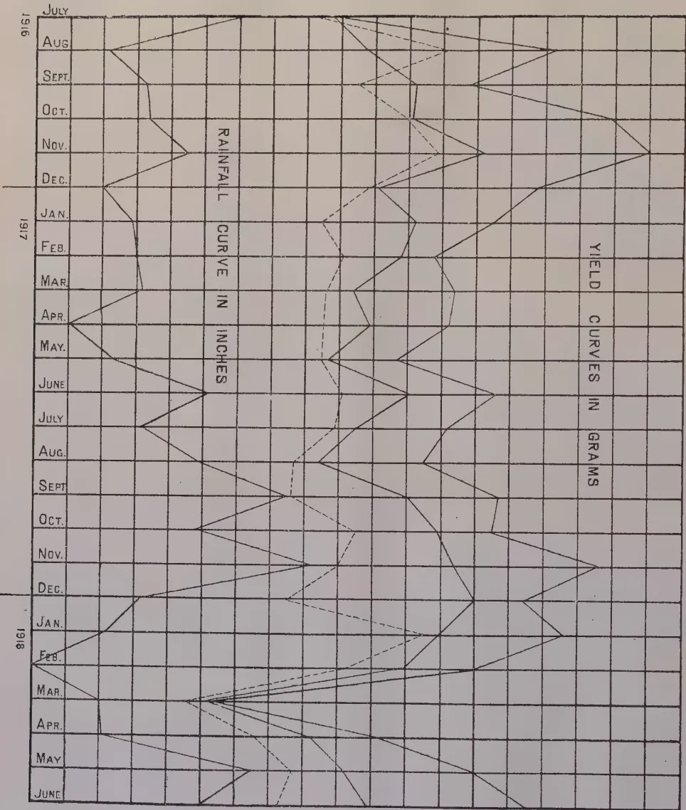

THE  
**TROPICAL AGRICULTURIST:**  
JOURNAL OF THE  
**CEYLON AGRICULTURAL SOCIETY.**

---

VOL. LI.

PERADENIYA, NOVEMBER, 1918.

No. 5.

---

**AGRICULTURAL PROGRESS.**

---

To those interested in the progress of the agricultural industries of the Colony can be recommended the Report of the Agricultural Policy Sub-Committee of the Reconstruction Committee of the United Kingdom from which are reproduced extracts in our present number. Whilst it would be undesirable to suppose that the recommendations contained in this report would be applicable to the various agricultural problems of this Colony, yet there is much that should be given very close and careful consideration.

The report gives a brief historical survey of the British agricultural industry and indicates clearly the decline that took place as the result of national indifference to its most essential industry. The present war, with the difficult food problems that have had to be faced, has indicated that the principle of "no policy" for agriculture had nearly brought the centre of the Empire to ruin. After the war it is intended that the strenuous efforts made during the past two years to increase food production and to improve agriculture shall be maintained and recommendations have been made accordingly.

Very many difficult problems have been dealt with, for recommendations are made in regard to fixed prices for essential cereal products, fixed minimum wages for agricultural labour, the rural housing problem and the compulsory improvement of cultivation upon badly cultivated estates.

Those parts of the report dealing with the constructive duties of Boards of Agriculture, Departments of Agriculture, Agricultural Research, Agricultural Education and Co-operative Credit are of immediate interest to this Colony. The recommendations therein given should be closely studied in view of the discussion and consideration that has during the past year been given to proposals for the co-ordination and extension of the agricultural services in Ceylon.

It is plainly indicated how an agricultural policy is best likely to be defined, obtained and carried out. The constitution

1------------------------------------------------

274[NOVEMBER, 1918.

of the different Boards of Agriculture, it is proposed to change and to model upon the organization in Ireland, which has done such solid work during the past thirty years in placing Irish agriculture upon a sound basis. Provision is to be made for a Central Council of Agriculture for framing the agricultural policy, for a Board of Agriculture responsible for seeing the policy carried out, and for Departments of Agriculture designed somewhat on the Irish model for constructive work.

It is recognised that the first essential towards solid progress is Research. It is recommended that research institutes should be increased and their staffs strengthened. The duties of these institutes will be research and training of workers in the principles of research. Each County it is proposed shall have its agricultural organization consisting of a County Advisory Committee, and various officers trained for instruction in various branches of agricultural practice. These organizations will control specialized instructors and will provide demonstration farms and plots, and short courses of instruction in special subjects. These County organizations will be centred around certain Research Institutes, and it is hoped thereby that the investigations of the research officers will be translated into the terms of the practical agriculturist in the shortest possible time.

Agricultural education has been given very careful consideration. The importance of nature study in all elementary schools is emphasized, the value of continuation courses in sciences underlying agriculture pointed out, the necessity for agricultural schools and colleges alluded to, and the importance of practical short courses indicated. A graduated system whereby everyone associated with County life is given some instruction in nature knowledge and agriculture is insisted upon and the necessity of improving the social amenities of life in the villages drawn attention to.

Co-operative credit and co-operative organization is fully dealt with, and its importance to the agricultural industry indicated.

The specialized work with plant breeding that has been carried out at Cambridge University receives attention, and the improvements of cereal crops that have been effected by steady research work during the past fifteen years are pointed out.

What has been done for European agriculture by research, education and co-operation can be done for tropical agriculture. The results that have been obtained from agricultural research in various parts of the tropics during the past twenty years warrant the belief that the time has come for greater effort. There are many problems in Ceylon that await solution, but until trained investigators are available in greater numbers progress can only be slow.

2------------------------------------------------

NOVEMBER, 1918.]275

# AGRICULTURE.

## RECONSTRUCTION OF AGRICULTURE IN THE UNITED KINGDOM.

The following extracts from the Report of Agricultural Policy Sub-Committee of the Reconstruction Committee of the United Kingdom will be of interest to those that are interested in progressive agriculture. The terms of reference by the then Prime Minister to this Committee were as follows:—

“Having regard to the need of increased home-grown food supplies in the interest of national security, to consider and report upon the methods of effecting such increase:—

### NEED FOR A NEW AGRICULTURAL POLICY.

13. We believe that considerable increases in the agricultural output of the United Kingdom can, and will, be obtained by means of education, better varieties of seeds, greater diffusion of good stock, and improved manuring, but results obtained by these means must necessarily take time, and will, in any case, be limited in degree. We are led by the fact that the interests of national security are made the direct object of our enquiry to infer that very substantial increases in food production are essential. We have, therefore, been compelled to consider methods which are calculated to yield an increase greater than is likely to result in the near future from the normal development of agricultural practice. To increase production on the scale which we believe to be necessary, it will be essential to increase largely the area of land devoted to arable cultivation. . . . .

16. We are confident that, as the years pass by and agriculture becomes more intensive in the United Kingdom, an increase of production will be reached which would now appear impossible to many farmers, and that if the agricultural policy which we recommend is carried out steadily and continuously, a great change will be effected within a generation.

17. Nothing in agriculture can be done by the wave of a magician's wand. Results can only be produced in the United Kingdom as in Germany by a constant and consistent policy. The State must adopt such a policy and formulate it publicly as the future basis of British agriculture, and explain to the nation that it is founded on the highest considerations of the common weal. It must be explained to landowners, farmers and agricultural labourers alike that the experience of this War has shown that the methods and results of land management and of farming are matters involving the safety of the State, and are not of concern only to the interests of individuals. They must be plainly told that the security and welfare of the State demand that the agricultural land of the country must gradually be made to yield its maximum production both in food-stuffs and in timber. The history of our country shows that, when once the path of duty is pointed out to them and they understand how grave is the responsibility put upon them, neither landowners, nor farmers, nor agricultural labourers will fail to rise to the emergency.

3------------------------------------------------

276[NOVEMBER, 1918.

19. .... the organisation of agriculture must be developed ; the country must be permeated with a complete system of agricultural education ; the status of the Department of Agriculture must be improved and their powers enlarged and reinforced by association with existing agricultural and administrative bodies, both national and local. ....

#### METHOD OF SECURING INCREASED PRODUCTION.

52. The Government has no fairy touch which will enable it to produce instantaneous results. It must work through, and by means of, the men who are now holding and cultivating the land. If it was so foolish as to try and do their work as well as its own, the only result would be to bring agricultural production to a standstill. There is no body of men in existence except the farmers of the United Kingdom and those who have qualified, or who are qualifying, to become farmers, who are capable of farming the land. Technical knowledge based on experience is just as essential for successful farming as education and brains and capital. It is when all these qualifications exist in combination that the best farming is found. Therefore the State must give time to all concerned to adjust themselves to the new conditions dictated by considerations of national safety. It should formulate its policy and explain the reasons for it in simple definite terms ; it should make clear the part it proposes to play itself, that the policy explained will be steadily and consistently followed, and that, while the policy is being worked out, the agricultural industry will not be subjected to any harassing legislation. The State must, in short, take every means in its power to give confidence and a sense of stability to landowners, farmers and agricultural labourers. It must then tell those classes exactly what is expected of them, and appeal to their highest instincts of patriotism to put personal predilections aside, and to unite to carry out a policy on the success of which the safety of their country may some day depend. ....

54. We entertain no doubt that landowners, farmers and agricultural labourers alike will realise the greatness of the trust reposed in them, that they will rejoice at the recognition of the fundamental importance of agriculture to the national life, and that they will do all, and more than all, that their country demands of them. But we recognise that, when once the State has embarked on such a policy as we recommend, for the sake of the nation's safety, it can run no avoidable risk of its failure. Neither the idiosyncrasies, nor the incapacity, nor the lack of patriotism of individuals can be allowed to interpose even a partial barrier to the success of a national policy. We recommend that the Boards and Department of Agriculture should be instructed to carry out a general survey of the conditions of agriculture throughout the United Kingdom, and that the utmost care should be exercised in selecting those who are to undertake the work. ....

59. In the later part of our Report we shall deal with agricultural organisation in all its aspects, but it is advisable to state here, that in our opinion, the Agricultural Department in each country should, in carrying out the duties described in paragraphs 54 to 58 of this part, act in constant consultation with a National Agricultural Council or Board, which we hope may be formed so as to represent the progressive agricultural thought of the country .....

4------------------------------------------------

NOVEMBER, 1918.]277

63. To bring about the changes in farming which we contemplate it will be necessary for the State, in addition to providing farmers with security against loss, to place at their disposal the best available scientific and practical advice. Indeed it will be impossible to carry out the scheme (except with serious loss and wastage) unless it is accompanied by an important development of the facilities at present available in the United Kingdom for agricultural education, technical advice and research. It will be necessary to insist on the importance of drainage, and to demonstrate throughout the country the best means of converting grass land to arable, the best methods of manuring, and the best varieties of seed; and to carry out on a much more complete system than has hitherto been attempted demonstrations devised to show that increased production can be secured without loss of profit. These subjects are, however, of such importance that we are deferring their consideration until the later part of our Report. . . . .

### THE DEPARTMENT OF AGRICULTURE.

83. Before we proceed further with our definite recommendations for a new agricultural policy, it is necessary to review the present constitution, scope and functions of the chief agencies concerned, the Departments of Agriculture. First, in order of time, came the Board of Agriculture for Great Britain, established with the narrow conception of an office merely charged with the administration of certain Acts of Parliament. Then came the Irish Department of Agriculture, founded with the definite ideal of a constructive agricultural policy. Finally, Scotland severed its agricultural administration from that of England and Wales. And now the separate Boards for England and Wales and for Scotland, in friendly rivalry, have plainly set before them as their proud and chief duty the constructive development of agriculture. There are, therefore, three of these Departments in the United Kingdom, and in Wales a movement exists to create a fourth. We recognize the strength of national feeling and the reality of special circumstances, but from other points of view it would have been better for agriculture if there had been only a single department of agriculture within the area of these Islands. The dispersion of agriculture between three offices has undoubtedly lessened the influence of the agricultural interest in the Cabinet and contributed to the lack of public concern for the most vitally important national industry. We must, however, deal with facts as we find them and not leave out of account the possibility of further changes. We shall recommend steps by which the three Departments may be brought into conference for the discussion of matters of great agricultural importance to the whole United Kingdom, and we shall make proposals designed in genuine sympathy to meet the special circumstances and the national feeling of Wales. We feel, however, that the creation of another separate department of agriculture would unnecessarily complicate agricultural administration and further grievously weaken the influence of agriculture with the nation, and that it is at least doubtful whether Wales would gain more than it lost by the change.

84. We shall discuss first the **IRISH DEPARTMENT** because, as will be seen, its peculiar origin, constitution and activities have a suggestive value in the consideration of the changes we shall recommend for the reforms of the Departments in England and Scotland.

5------------------------------------------------

278[NOVEMBER, 1918.

87. This Report is concerned only with the agricultural side of the Department's work. The Department is assisted herein by:

- (a) A Council of Agriculture.
- (b) An Agricultural Board.

88. The Council of Agriculture consists of 104 members, viz., 68 appointed by the County Councils of the Administrative Counties of Ireland, 34 nominated by the Department, and 2 ex-officio members, the President and the Vice-President. The Agricultural Board consists of 12 members, 3 for each of the Provinces. Of those, 8 are elected by the Council of Agriculture and 4 are nominated by the Department. The Council of Agriculture is constituted anew after each triennial election of the County Councils. At the first meeting of the new Council of Agriculture, the members representing each Province form separate Provincial Committees for the election of the 8 members of the Agricultural Board. . . . .

91. The income of the Department is derived from two sources, Parliamentary votes and an Endowment Fund. The expenses of central administration and of certain national institutions, and the salaries of the staff and of the inspectors, are defrayed by moneys voted by Parliament and controlled by the Treasury. The Endowment Fund, the annual amount of which available for agriculture is about £105,000, is made up from various sources such as the Irish Church Temporalities Fund and the Local Taxation (Ireland) Account, and its expenditure requires the concurrence of the Agricultural Board. In addition to this regular income, the Department has received special grants both from Parliament and from the Development Commissioners for afforestation, horse-breeding, tobacco growing, fisheries, and research work.

92. The work of the Department has rapidly developed, which is largely due to the fact that it has covered the whole of Ireland with a network of Agricultural Committees which bring it into immediate touch with every part of the country. . . . .

94. The great increase of tillage achieved in Ireland since January last could not have been effected in so short a time had it not been for the complete touch of the Department with all parts of Ireland through the County Committees of Agriculture and for the spirit and enthusiasm manifested by the officers alike of the Department and of the Counties. . . . .

96. The constitution of Irish Department of Agriculture appears to us satisfactory and we have no recommendation to make in respect of it. . . . .

98. **THE SCOTTISH BOARD OF AGRICULTURE.**—The Board of Agriculture for Scotland was created under the Small Land Holders (Scotland) Act, 1911. . . . .

101. . . . . In continuation of the work of the War Agricultural Committees there should be created statutory Agricultural Committees appointed by the County Councils, which should be instructed to appoint to them, either from their own number or from outside, only persons engaged in agriculture or otherwise specially qualified in relation to it. When once appointed these Agricultural Committees should have an independent status like their Irish prototypes. A County Council should have the power to set up more than one Agricultural Committee within its area, and the Agricultural Committee should have power to form District Sub-Committees. . . . .

6------------------------------------------------

NOVEMBER, 1918.]279

102. The BOARD OF AGRICULTURE AND FISHERIES FOR ENGLAND AND WALES.—The original Board of Agriculture was created by Royal Charter in 1793. It was not really a Government Department, though supported by Parliamentary funds; it was rather a society for the improvement of agriculture, and it died of inanition after the Parliamentary grant was withdrawn. It was dissolved in 1822. The present Board, the potential importance of which cannot easily be over-estimated, is an infelicitous example of the results of growth so dear to many Englishmen as opposed to design. It was revived nearly 30 years ago, and charged with the administration of a miscellaneous assortment of Acts of Parliament connected with agriculture or with the land, and with the collection of the statistical information which had previously been part of the duties of the Board of Trade. At a later stage Fisheries were tacked on to it. It was thus designed for purposes of administration and police only. That a Government Department should be constructive and endeavour directly to stimulate or promote the development of an industry was a conception foreign to the views of the function of the State which then prevailed. With the change of public opinion the Board has partially and imperfectly accepted a more active view of its duties, but, as a result of the original conception under which it was founded, it has not been able to attain either the status or the staff or the organisation appropriate to the constructive work which a modern Department of Agriculture is called upon to perform. . . . .

104. Our conception of the Board of Agriculture is as of a great department of State charged with the care of agriculture in its widest sense, and with the promotion of the welfare of rural as distinct from urban life. Its duty should be to assist and stimulate agriculture by every possible means as a basic national industry, to promote the production of food in England and Wales, and to regard the increased prosperity and happiness of the rural population as its special care. It should also encourage and co-operate with voluntary organisations which exist for the promotion of these objects.....

106. .... The provincial staff of the Department requires reorganising. Before the war the work of most of the provincial officers covered an impossibly large area, but many fresh appointments have since been made in connection with the campaign for food production; in some cases officers may be made responsible for all the work of the Board in a given geographical area; in other cases the work of officers must be specialised. In this paragraph of our Report we merely indicate the fact that the staff of the Department must be permanently expanded above its pre-war strength . . . . .

107. As in Scotland, so in England and Wales, the War Agricultural Committees of the County Councils should be replaced by statutory committees, which when constituted, should have powers of action independently of the County Councils, as in the case of the corresponding Committees in Ireland and of the Education Committees in England. They should be composed of men and women who are not members of the County Councils, but in both cases alike it is essential to secure the services of persons with practical knowledge of agriculture or some other branch of rural economy, or representative of some special rural interest rather than of the different districts of the County. . . . .

7------------------------------------------------

280[NOVEMBER, 1918.]

### AGRICULTURAL INSTRUCTION AND RESEARCH.

113. *Ireland* ..... Great success has attended the intensive instruction given by specially selected members of the Department's staff to groups of occupiers settled for the first time in new land by the Congested Districts Board. Moreover, there are in every county one or more organisers, officers of the Department, who have been trained in the practice as well as in the science of agriculture and carefully taught how to teach, and who are never allowed to rust, but are assiduously kept in contact with the Department and its institutions and brought into periodic conference with one another....

116. Quite deliberately the Department and the Agricultural Committees alike have preferred a system of temporary winter schools, to one of permanent institutes and colleges, for the instruction of farmers' sons. Very many of these are held at various local centres every winter season throughout the length and breadth of Ireland. They usually last for sixteen weeks, and the students attend from their fathers' farms on three or four days of each week. It is claimed for this system that it is much cheaper than the institute system, and that it influences a far larger number of young men and boys than the institute system could possibly do.

117. So far as we can judge, the Irish system of agricultural instruction is admirably adapted to the peculiar circumstances of Ireland, and we have no change to recommend in it. The Irish Department of Agriculture would like to see a greater bias than is at present given towards country life in the teaching of the elementary schools. In its own sphere of responsibility it wishes to receive statutory power from Parliament to prevent the use of unsound sires. We sympathise with both these aspirations, but particularly we wish to endorse and support the claim of the Department for a liberal provision for scientific research. There can be no doubt but that the work of the Department suffers from a lack of such provision. It requires an institute at which practical problems of special interest to Irish farmers can be investigated, and we concur with the Department in thinking that such an institute, properly staffed and equipped, would bring a direct and speedy return to the national resources by the improvement which it would effect in Irish Agriculture, and by the increase of food production which would surely follow. . . . .

123. *Scotland*. Each of the three colleges employs, in addition to its central staff, a larger number of extension lecturers, working in county areas, who give single lectures and conduct longer or shorter courses of lectures on general agriculture, attend markets, and advise farmers. Dairying and poultry keeping are taught by a special staff of lecturers and instructresses. It is increasingly recognised that the instruction of farmers and especially of the smaller farmers, must be effected much more largely by properly systematised courses in their own districts than at the colleges whose courses are necessarily more elaborate and attendance at which must almost always involve absence of the student from his home and from the work of the farm.

124....A large addition to the staff of lecturers and instructresses is required, indeed no limit should be set to this except that which will be found in the degree of opportunity which presents itself for their useful employment. We believe that the work both of county lecturers and of instructresses will greatly gain in influence and value if it be aided by demonstration areas for

8------------------------------------------------

NOVEMBER, 1918.]281

tillage, and by corresponding facilities in connection with dairying and poultry-keeping. Winter courses should be provided for the sons of farmers and the farm servants; and, in devising and developing these, regard should be had both to the experience of farm institutes in England and to the example of the Irish winter schools. It is most desirable that instruction of a higher type than that which is furnished in any of the existing Colleges should be provided with the special object of training research students.

125. We are strongly convinced of the desirability of giving to farmers and, if possible, through the colleges and their county work, the assistance of the most highly trained specialists in agricultural science for purposes of consultation and advice. We believe that much larger use would be made of assistance of this kind than would have been the case even a few years ago.

126. But above all, a large additional grant is required for the development of research work, especially in connection with live stock and with the varieties of crops suited to Scottish agriculture. As in the case of Ireland, so in that of Scotland, we regard expenditure on research work as surely productive; the grants should not only be liberal but constant over a long period and not subject to frequent revision. . . . .

132. *England and Wales.* But the great opportunity of agricultural education and research came with the passing into law of the Development and Road Improvements Funds Act, 1909-1910. As soon as the Development Commissioners were appointed the Board of Agriculture proposed to them a general scheme of agricultural research, which after full consideration and some modification was finally approved by the Commissioners, and on August 22nd, 1911, the Board had the satisfaction of hearing from the Treasury that a sum of approximately £50,000 per annum had been granted for the purposes for which the original application had been made.

133. The main features of the scheme as approved by the Treasury were:—

(1). A grant which provided 36 scholarships worth £150 per annum; each scholarship to be tenable for 3 years.

(2). Grants of the total amount of £30,000 per annum were provided for twelve institutions with a view of strengthening existing departments or creating new centres for the investigation of those branches of science which most closely affect agriculture.

(3). • A sum of £3,000 to be distributed in aid of researches not provided for under (2) on the recommendation of the Board's Advisory Committee on Agricultural Science.

(4). A sum of £12,000 for developing advisory or consultative work for farmers, at 12 institutions to be associated with 12 distinct areas in England and Wales.

134. The main purpose of these advisory grants may be briefly indicated. Experience had shown that instruction of the ordinary type does not exercise so direct an influence on agriculture as might be expected. It is of great value in aiding young people and the less experienced, but as a rule it is too elementary to appeal to an experienced farmer. He meets with difficulties in his work which cannot be answered off-hand even by a well trained scientific man. Investigation is necessary, and sometimes prolonged investigation may be both necessary, and desirable. It had not been possible to give much time to solving the difficulties of individuals in the past, and the new effort

9------------------------------------------------

282[NOVEMBER, 1918.

aimed at creating consulting staffs at certain universities or colleges, whose business would be to investigate such difficulties as arise in practical agriculture, and especially to deal with the difficulties of the best farmers. Careful study and considerable expenditure on solving the difficulties of an individual may seem to be out of place at a public institution but it must be remembered that the "ailments" of a farm are not purely of interest to an individual. If a good farmer has a difficulty, and that difficulty, is solved, he becomes more successful, and his neighbours note the fact and copy his practice. The practice of agriculture is in fact developed chiefly by imitation. A skilful farmer may soon increase the prosperity of a parish, for, though farmers may be slow to listen to oral instruction, they are quick to see that a change in practice enables a neighbour to grow better crops. The principle which should be adopted by the administrator intent on increasing the production of a community is that most attention should be given to the wants of those who have the reputation of being the most skilful farmers. These men are usually the most ready to learn, but they must be convinced that the advice offered them is worth having. They have too often been disappointed in the past. . . . .

#### AGRICULTURAL EDUCATION.

143. Agricultural education is no more a county matter than agriculture is the particular interest of isolated groups of farmers or small holders. While agriculture itself was neglected, it was too much to hope that agricultural education should be regarded as a matter of national concern. But now that this industry has been brought back by the war to its rightful place in the national economy the education of those engaged in it can be hopefully approached. We recommend, therefore, that the responsibility for agricultural education in England and Wales be definitely placed on the Board of Agriculture, which should take over all the staff and farm institutes from the County Councils, and that it should no longer be permissible for a County Council to hinder in any County the full development of the system of agricultural education adopted by it. We recommend that the whole charge for agricultural education in England and Wales be borne by the Imperial Exchequer and that none of it be placed upon the rates, and that the County Councils be allowed to apply that portion of the Residue Grant hitherto devoted to agricultural education to the cost of the new services, which we propose in this Report should be discharged by the Agricultural Committees or to any branch of higher education. We justify this recommendation by the fact, proved before a whole series of Royal Commissions and Committees, that the ratepayers of England and Wales, and especially the ratepayers on agricultural land, bear an unfair share of the burthen of national services. We shall refer to this matter again in the paragraphs dealing with Local Taxation, but we justify the recommendation here made as a convenient and sound method for the partial discharge of the admitted and proved debt of the taxpayer to the agricultural ratepayer. Agricultural education must be pressed forward in every county as a fundamental part of a national agricultural policy; the nation can no longer afford to incur the risks of local and short-sighted inaction; it must therefore give full powers to the President of the Board of Agriculture and put the responsibility on his shoulders. It follows, therefore, that the public exchequer, and not the local rates, must bear the financial burthen. . . . .

10------------------------------------------------

NOVEMBER, 1918.]283

### ELEMENTARY AND SECONDARY EDUCATION IN RURAL DISTRICTS.

149. We believe that, if the recommendations of our Report are made the basis of a permanent national agricultural policy, agriculture and the rural arts attendant on it will offer a secure and happy livelihood for country workers, and open out a wide field of important and interesting occupation, and so of responsibility and advancement, for the cleverest country children. The present generation would indeed be surprised if they could foresee what science and brains will do for agriculture in the next half century. The children of the rural elementary schools must be given the same general education as the children of the urban schools, but it must not be an education which appeals only to one side of their mental activities. That instruction should be from the concrete to the abstract is a common maxim, but it can only be effected if manual work is given its proper place alongside of books both to boys and girls. The more education is developed on these lines the more interested in it will become their parents and the future employers of the pupils.

150. In expressing these opinions we know that we are giving our support to the policy of the Departments of Education, whose province and not ours it is to lay down the details of the system.

151. But we shall not be contented if the country school merely ceases to be a lukewarm friend to the country life. We know that it can be made a centre of inspiration in the hands of a gifted and devoted teacher, where the scales will fall off the eyes of many children and they will see the full glory and beauty of the country life. The animals and plants and the processes of nature will become full of meaning to them, the difficulties and possibilities of agriculture and its immense importance in the national economy will be revealed to them, their sense of social duty will be developed, and they will learn that work on the land is in reality the least monotonous and most interesting of all work and how much more can be made of their parish than has ever yet been made if each girl and boy, each woman and man, will do their part.

152. We hope that the rural elementary school will be expanded in the direction we have indicated, and that the fatal gap between leaving school and adolescence will be bridged by continuation day schools, where the process of education may be maintained. . . . .

154. Winter schools under the Boards of Agriculture, to which we shall again refer in a later paragraph, will be established to fulfil a distinct function from evening schools, and we will only point out here that the technical advantage of winter schools over evening schools is that they take place in the day time, and supplant so many hours work, instead of in the evening, when the pupil is tired after a day's work. Winter schools can only be made successful by the hearty co-operation of fathers and farmers, and they will co-operate when they realise that the new spirit in rural education is going to mould more competent men and women and to keep them on the land....

158. But the realisation of any far-reaching reform in the Elementary, Continuation, and Secondary Schools in our rural districts will be impossible, unless the teachers, on whose influence success will depend, themselves receive the requisite knowledge and the true inspiration in their training as

11------------------------------------------------

284[NOVEMBER, 1918.]

teachers, and unless the pay and prospects of this branch of that great profession are improved so as to attract an adequate supply of gifted and enthusiastic men and women. We desire to endorse with all our influence the necessity for the improvements so strenuously urged by the Departments of Education. We wish, however, to express our opinion that, if agriculture is taught in a Secondary School as a technical subject, it should be taught by an agricultural expert.

### **DEMONSTRATION FARMS AND BUSINESS METHODS.**

159. The present scheme of agricultural education adopted for England and Wales by the Board of Agriculture and the Development Commissioners is, in our judgment, sound, and furnishes a thoroughly good framework which only requires expansion and completion. Every county should have access to a farm institute, and an agricultural organiser and a demonstration farm or small holding are required for every county, and more than one for the larger counties. The system of illustration farms existing in Canada strikes us as a useful departure from the ordinary model and we think that in some instances these might take the place of demonstration farms. . . . . The purpose of demonstration farms or small holdings and plots and of illustration farms is usually the same. Their main purpose is, not to carry out experiments, but to show the results of farming according to the best practice on exactly the same lines as farming is conducted by farmers or small holders in the district in which the farm or plot is situated, and an essential feature is, that accounts should be kept with scrupulous exactitude and the financial results of the methods indicated be published.....

161. . . . It is very necessary that the farm institutes and agricultural colleges should receive more liberal grants than hitherto, and that they should be maintained and developed as places of study to which the most promising pupils can go to complete their agricultural education; and; wherever possible, a group of farm institutes should be linked up to an agricultural college; but it is even more important that agricultural education should be brought to the labourer, small holder, and farmer than that he should be invited to go to it. For this reason we lay great stress on the necessity for winter schools on the Irish model, for demonstration farms and small holdings and plots scattered throughout the counties, and for the presence in each county of an adequate and thoroughly trained staff of organisers, experienced in the practice as well as proficient in the theory of agriculture. These men should, above all things, avoid becoming "office" men. They should be responsible for a definite geographical area, (not too large to be worked thoroughly), and for the organisation within it of all classes and lectures for labourers, small holders, and farmers' sons. Their business is to be on the farms and in the markets, to become the friend of the farmer and small holder, to whom in cases of doubt or unexpected difficulty he will turn for advice and who can show to him on the spot the results produced on the demonstration farm or plot, and expound the accounts. To secure a sufficient supply of these men the scholarship system must be largely extended.

### **RESEARCH.**

163. The research work already being done is quite admirable, but it needs stronger support yet from public funds. We reiterate that this is productive expenditure which will bring in to the State a manifold return. In Scotland,

12------------------------------------------------

NOVEMBER, 1918.]285

and England and Wales alike many of the staff engaged in agricultural education, organisers, lecturers, live-stock officers, are under-paid, and this is especially true of the assistants in research work. As DR. RUSSELL and PROFESSOR BIFFEN pointed out to us, there is a constant flow of the most promising graduates from the United Kingdom to the agricultural departments or colleges of the Dominions, India, and foreign countries simply because we do not pay them a sufficient salary, and this is true also of the county organisers and also of the less highly-trained officers. That this is bad policy and utterly uneconomical needs no argument.

164. The evidence that has been laid before us has amply shown the ultimate value of pure scientific research and the dependence of the development of the industry upon investigation that is independent of any apparently immediate practical end. DR. RUSSELL showed in his evidence how the use of artificial fertilisers, the production of new varieties of plants, the treatment of pests and diseases, the detection of waste and loss in cultivation, are all dependent upon research work, and PROFESSOR BIFFEN explained to us the wonderful results that have been obtained in plant breeding with sugar beet, wheat, barley, maize, oats, potatos, peas and other vegetables. Not only is it necessary to extend such work on the actual production of new varieties, but an organisation must be built up for the proper distribution to the farmer of the new varieties originated by research. The scale of the organisation at Cambridge is still far behind that of the plant breeding station at Svalof, in Sweden. With a little more time and with access to the necessary funds for growth, it is certain that results will be obtained remunerative in themselves and of the utmost financial value to the industry as a whole. In this connection it should be observed that the introduction of a new variety of a widely grown crop like wheat may easily add many hundreds of thousands of pounds to the agricultural output of the country, but the benefit is so general and so widely distributed that it is almost impossible by ordinary commercial means to secure any adequate return, or sometimes even the payment of working expenses, to the originator of the variety.

165. The experience of the last two or three years, during the disturbed conditions produced by the War, has shown the necessity for adequate data concerning the costs of production of our staple agricultural products, and has revealed all too clearly the absence of fundamental economic data connected with the industry. The Institute for Research into Agricultural Economics at Oxford represents a beginning in this direction, but it had been at work for too short a time and on too small a scale to be able to supply what has proved to be so desirable to the proper understanding of the industry and its part in the national life.

166. Of the remaining needs in the direction of research, in Scotland as well as in England and Wales, the greatest is the establishment of an Institute for Research into Agricultural Machinery. . . . .

167. Apart from pure research, it is necessary to provide in all parts of Great Britain for the investigation on an industrial scale of the possibilities attaching to the cultivation of crops not at present part of the normal agricultural output of this country, and to the development of various rural industries closely linked with agriculture. We have already dealt with the question of sugar beet. The operations of the Development Commission have begun to

13------------------------------------------------

286[NOVEMBER, 1918.

provide information as to the conditions which will permit of the production of flax, hemp, and tobacco, from which investigations important consequences may grow. The procedure, however, is cumbrous, and it is desirable that both the Development Commission and the Departments of Agriculture should be enabled to pursue experimental enterprises of this description much more directly and energetically. As the experiments are essentially industrial and are valueless unless conducted on a commercial scale, they inevitably involve considerable initial outlay, which may be only partially recovered in case of failure. The community is, however, thereby saved from the repeated losses involved in the tentative and often badly informed attempts that are constantly being made by individuals, and even one success will repay the State for a large number of failures.

### LIVE-STOCK SCHEMES.

168. The live-stock schemes of the Boards of Agriculture furnish a good commencement of urgent work, but much still remains to be done. It should be the special function of the Boards to support the truly admirable work done by private breeders and societies of breeders in Great Britain and to encourage scientific research into practical stock breeding. We desire to express our appreciation of the admirable work done under the various live-stock schemes of the Boards of Agriculture. We see in those schemes the only method by which the supreme success achieved by British breeders of farm animals can be made effective in building up the general excellence of the live stock of the country and in contributing adequately to the prosperity of the agricultural industry, and especially to its successful prosecution by those who occupy the smaller holdings. We urge that these schemes should be continued, developed, and extended until they cover the whole field open to them. Great Britain has sometimes been called the stud farm of the world. We desire that the live stock of our own farmers should benefit to the fullest possible extent by the national success in the production of stud animals. . . . .

170. We wish to draw particular attention to the necessity for granting power to the Boards of Agriculture to check the use of bad sires. In our opinion no bull should be used to serve any cows but its owner's without a licence from the Agricultural Committee of a County, and the Boards of Agriculture should have power to order the castration of a bull so used. Most certainly no stallion should be allowed to serve any mares but its owner's, or to travel for the service of mares, without a licence from a Board of Agriculture. Such a regulation would do more than any other measure which can be suggested to improve the average quality of British horses. By these means bad bulls and stallions would be gradually eliminated and an immense improvement effected in the live stock. . . . .

174. The live-stock officers should be appointed by the Board of Agriculture and be its servants; they should have a sliding scale of salary, and their posts, which are now temporary should be made permanent and pensionable. A large increase of the vote is wanted for the development of the schemes and for the employment of more officers. Moreover, specially qualified persons should be attached to the agricultural colleges where they should devote their time to the study and investigation of problems relating to live-stock breeding, and be ready to advise farmers thereon.

14------------------------------------------------

NOVEMBER, 1918 ]287

### ORGANISATION AND CO-OPERATION.

179. The organisation of agriculture may be regarded from three points of view :—The administrative, the economic, and the social. With the first two we are directly, with the third indirectly, concerned. The need for organisation was naturally felt first in Ireland, where agriculture dominates the national economy. There a group of social workers have, from a centre in Dublin, studied the modern problem of rural life in its entirety for over a quarter of a century. Notwithstanding the wide difference in the conditions, the other parts of the United Kingdom may learn something from the experience and conclusions of these agricultural reformers. They have insisted throughout upon the necessity of treating the rural problem on its three sides—the technical, the commercial, and the social. Agriculture must be regarded not only as an industry and as a business, but also as a life. They concentrated upon the organisation of the business of farmers because they were convinced that this is a condition precedent of an increased productiveness in the industry, and of better social conditions for the country population. They held that State action in prompting agriculture which must be mainly educational (using the term in the widest sense), depends largely for its effectiveness upon the degree in which the work can be done with and through organised bodies rather than individuals. Further, in the social reconstruction of rural life they have found that more than half the difficulty of getting men to combine together for the higher purposes of mutual improvement is overcome once they have learned to come together, and have found it to their advantage to do so, in the business of their lives. Hence the improvement in the business methods of farmers is not only to be commended as a mere matter of commercial prudence, but it is fundamentally essential both to technical efficiency and also to the building up of rural society which will meet the needs of a modern progressive democracy. This policy is conveniently summarised in the Irish formula, better farming, better business, better living. In the working out of the policy the first place is given, for the reasons above indicated, to better business.

180. Agriculture has suffered grievously from the neglect of the State, but the consequences of that neglect were intensified owing to the fact that, while the importers of foreign-grown food and the consumers of food were engaged in perfecting organisations for their advantage, no corresponding steps were being taken by the producers of home-grown food. The more complicated our civilisation becomes the greater the necessity for organisation and co-operation. Not only have we great arrears to overtake in the organisation of agriculture, but every year new occasions of advantage offer themselves which if missed will proportionately diminish the possible profits of the industry. The problem for every cultivator of the soil, small or big, is the same, namely, how to grow the maximum amount of food-stuff on a given area at a minimum cost, how to find the right market for each instalment of produce at the exact moment it is ready for sale, how to get that instalment to that market in the quickest time and at the least expense, and how to ensure that when delivered at that market it is sold to the best advantage to an honest and responsible purchaser. When this problem is fully solved, two parties will greatly benefit from its solution—the farmer or small holder who has produced the food, and the consumer who has bought it. The former will have received the largest reasonable reward for his outlay of

15------------------------------------------------

288[NOVEMBER, 1918.]

capital, energy, and skill; the latter will have secured his foodstuff at the lowest reasonable price.

181. When we come to examine the business of agriculture as now conducted, its outstanding feature is isolation, and this is an age when combination becomes daily more necessary in order that the small man may enjoy some share in the growing advantages of the big transaction. The failure of farmers to combine, when it is obviously to their advantage to do so, has usually been attributed to the circumstances of their lives. Living apart and working all day out of doors, there is little inclination to leave the domestic hearth and travel to a convenient meeting place, even if such exists, to discuss affairs of common interest in the evening. It is further stated that agriculturists, as a class, are hopelessly individualistic and conservative. Undoubtedly the difficulty is increased by the fact that the large farmer feels the need of organisation much less than the smaller, and such advantage as he thinks might be derived therefrom is discounted in his mind by the trouble he is likely to have in instructing others in better business methods. We think this view was never sound, and that the solidarity of all classes engaged in the industry has now become essential on economic and social grounds. Be this as it may, the natural leaders refusing to lead, the majority have been slow to listen to outsiders, however well informed and intensioned, who have tried to stir them into co-operative action. In addition to these explanations there is a further cause of the difficulty of which sufficient account has not been taken. All experience shows that the joint-stock method of combination, essentially a combination of capital for profit, suitable to other industrial and commercial occupations, is not generally suitable to agriculture, which is essentially a combination of persons for mutual benefit. In the practical recognition of this basic fact lies the key to the re-organisation of the business of agriculture, which, as we have said above, is essential not only for economic, but also for administrative and social reasons. . . . .

184. To bring home this vital truth to farmers should be one of the most important aims of agricultural education. But two difficulties have to be surmounted. In the townward trend of all thought it is hard to get people to believe that a business method which suits the town is not good for the country. A farmers' combination has not infrequently failed because it was organised by a town solicitor as a joint-stock company instead of as a co-operative society. Secondly, if the right method is introduced through a government or other agency financed out of public monies, opposition arises from organised non-agricultural interests, who fear the disturbance of their business relations with unorganised farmers. It is well-known that in Ireland this conflict of interest led to a bitter controversy between the organised farmers and the country traders; and the latter, having immense political influence, were able to prevent the working out of the Recess Committee's ideal of co-operation between the Department of Agriculture and Farmers' Associations. The Irish agricultural reformers, who foresaw these difficulties, recognised the necessity of a new agency of social service to deal specially with the organisation of farmers. So, in 1894, they founded the first of these institutions and christened it the Irish Agricultural Organisation Society. In 1901 an English, and in 1905 a Scottish Society was founded on the Irish model, with identical rules and names, except that the founders of the English society preferred to call themselves The Agricultural Organisation Society. . . . .

185. The general objects and policy of the three Organisation Societies are identical. Societies are formed throughout the country, and in addition an immense amount of work is done by the enquiry and intelligence bureaux. Not only do agriculturists of all kinds have recourse to this service, but it is also used by statesmen, social reformers, societies of all sorts, and Dominion and Colonial Governments. The societies in each case have a central office with local branches under its control. Their functions

16------------------------------------------------

NOVEMBER, 1918.]289

are limited to propaganda and organisation, and they do not themselves carry on any trading on productive operations, these latter being confined to their affiliated co-operative societies.

#### **VILLAGE RECONSTRUCTION, INDUSTRIES AND SOCIAL LIFE.**

244. The difference between villages, even in the same neighbourhood, is often marked. Some seem to carry outward evidence of the prosperity and happiness of their inhabitants, while the aspect of others, less fortunate, seems to indicate with equal plainness a dull and colourless outlook. In the former are seen smiling gardens, well-cultivated and conveniently situated allotments, cottages in good repair, village playgrounds, and social clubs and reading rooms; in the latter, with land in abundance around, we find cottages possessing no gardens or insufficient gardens huddled together so as to reproduce some of the evils of the town slums, and absence of all the amenities of life, and allotments so distant from the centre of the village as to be difficult to access and inconvenient for cultivation, the whole presenting an appearance indicative of the conditions prevailing therein. Enquiry will usually show that the difference is due to the fact that in one village a guiding spirit has exercised a sustained policy of development, based upon a clear perception of the requirements of the inhabitants and a study of the best means of providing for them, while the other has been without these advantages. In this connection it has been pointed out that an examination of the maps of the Ordnance Survey reveals how lacking in system has been the development of the ordinary village. In its midst, even adjoining the village street, may be often found land let with large farms, which might better be used for housing or other public purposes, for providing gardens, cow pastures or allotments, or for occupation with adjacent cottages. But it is no one's business to take the lead in demanding a better scheme of use for the land, nor does any machinery exist by which a re-arrangement could be carried out. An atmosphere of stagnation prevails, and it is not surprising that the best men in such districts prefer to try their fortune in places offering greater scope for their ambition. The less efficient remain, and the deterioration in the rural working population, of which complaint is often made, becomes an accomplished fact.

245. We are of opinion that the machinery of the Parish Council, the Agricultural Committee of the County, and the Board of Agriculture should be utilised for the purpose of village reconstruction, and that under proper conditions the necessary land should be acquired by compulsory powers if it cannot be acquired by voluntary agreement. If cottages are built or small holdings are created, we think that the inhabitants of the village should be given the option of tenancy or ownership, but that ownership should not carry with it the power of subdivision or of utilisation for a different purpose than that for which the house was built or the holding created. The money required for a scheme should be advanced out of public funds and repaid by the Parish Council and the parties benefitted, following the exact analogy of a scheme under the Small Holdings and Allotment Act, 1908.

246. We have been much impressed with the value of the work done by the Rural League in establishing village industries and of the Agricultural Organisation Society in establishing Women's Institutes, and we recommend that either the Agricultural Organisation Society in the three countries or some analogous body should receive distinct grants for these specific purposes and that the task of fostering village industries and of forming Women's Institutes should be entrusted to them under the supervision and control of the respective Departments of Agriculture.

#### **ELIMINATION OF PESTS AND WEEDS.**

340. The Irish Department of Agriculture has power in respect of the eradication of weeds and the suppression of plant diseases and a control over

17------------------------------------------------

290[NOVEMBER, 1918.

the sales of seeds which are not possessed by the English or Scottish Boards of Agriculture. It has power to enter all premises where seeds are sold and take samples; it can test these seeds at its Seed Testing Station and take effective measures to prevent the sale of seeds which are found to be impure. The Irish Department has also the power to punish a farmer who permits certain scheduled woods to grow on his land, provided that the County Council of the country where the farm is situated has consented to the application of the Act giving these powers to the county in question. The Department does not use its own inspectors in dealing with these cases, but acts through the Agricultural Committee of the County Council. We understand that it is satisfied with the powers it possesses except that it has not, but should have, power to increase the number of woods contained in the schedule. We recommend that this power should be given to it. The eradication of vermin does not appear to be a troublesome question in Ireland.

341. No attempt has yet been made to deal with animal pests such as rabbits, rats and sparrows, or with plant weeds, in a systematic manner in England and Wales or Scotland, and we are behind some of the Dominions and some foreign countries in this respect. We recommend that there should be legislation to prohibit the sale of grass and clover seeds without a guarantee of purity and of germination and of country of origin, and that power should be given to the English and Scottish Boards of Agriculture to enter all premises where such seeds are sold and to take test samples, and to prosecute, when the sample is found not up to standard. The ultimate authority should in all cases rest with the Boards of Agriculture, but they should be allowed to act through the Agricultural Committees of the Counties. The Board of Agriculture should further be empowered to make and publish schedules of weeds injurious to agriculture or horticulture, and power should be given to the Agricultural Committees of the Counties to inspect land, on which weeds are allowed to flourish, and to order the occupier, including any local authority, to destroy them. It should be made an offence to neglect or disobey an order so given, and in case of negligence or disobedience the Agricultural Committee should have power to summon the offender, or to enter on his land and destroy the weeds and recover the expense of the operation from him. These powers may appear drastic but it is really intolerable that a bad farmer, or a careless landowner or local authority, should be allowed to grow great crops of weeds, the seeds of which are carried by the wind all over the surrounding farms and no milder powers will in our opinion be effectual to abate the nuisance and the injury to food production consequent upon it.

342. Pests such as rabbits, rats and sparrows should be dealt with on the same principle. The Boards of Agriculture should be empowered to make and publish schedules of such animals injurious to agriculture, and the Agricultural Committees of the counties should have power to take action in any case where these pests are injurious to agriculture and so to food production. They should be enabled to organise common action in the country to compass the destruction of these pests and to charge the expenditure on the rates of the whole county or of certain parishes in the county as the case may be. They should be empowered to order an occupier to destroy the pests issuing from his land, and it should be made an offence to neglect or disobey such an order. In case of default they should be empowered to summon the offender and to enter on his land and destroy the pests themselves and to recover the expense of the operation from him. In the case of damage done to crops by an excessive preservation of game they should have power, after satisfying themselves of the circumstances of the case, to order the game preserver to abate the nuisance and the penalty for failure in compliance should be a severe one. . . .

18------------------------------------------------

NOVEMBER, 1918.]291

344. Much damage is sometimes done to agriculture in a county by pests, such particularly as rats and sparrows, which are not bred within its confines but which issue forth at certain seasons of the year from neighbouring towns or cities, especially in the case of rats from great sea ports. It is not fair to agriculture that this should be so, and we think that those towns and cities should be made responsible for doing all in their power to abate the nuisance, and that the Local Government Boards for England and Wales and for Scotland should endeavour to find a remedy for a very real grievance. . . . .

#### WEIGHTS AND MEASURES.\*

351. While we are at one with the Central Chamber of Agriculture in looking upon the simplification of the weights and measures used in agriculture as an urgent necessity, we recognise that the subject has a wider and more national aspect than the requirements of a single industry. We hesitate, therefore, to make any exact recommendations as to the means by which the needs of agriculture should be met, preferring to suggest that the whole question of imperial weights and measures should be made the subject of enquiry by a Special Sub-Committee of the Reconstruction Committee, which would be in a position to examine representatives of every profession, trade and industry concerned, and correlate the requirements of the country as a whole.

We therefore, confine our recommendations to the following general principles :—

(a) A uniform standard of weight should be laid down on which alone sales and purchases of agricultural produce other than liquids and certain market-garden produce, should be legal.

(b) A uniform standard of measure for liquids should be similarly laid down.

(c) A uniform standard of number for certain market-garden produce, regularly sold by number, should similarly be laid down.

(d) Official and other market quotations should be required to be in the terms of the standards laid down.

(e) The several standards should be selected so as to cause as little interference as possible with existing methods.

(f) A certain transition period should be fixed, at the end of which the new standards should be recognised.

#### TRANSPORT.

352. The dependence of agriculture on the ability to place produce readily and cheaply on the market and to obtain manures, implements, coal and other necessities with equal facility, is so immediate and direct that no report upon the reconstruction of agriculture would be complete without reference to this important subject. It is interesting to note that the great renaissance of agriculture in the middle of last century followed the introduction of railways, and was to a great extent made possible by the opening out of new markets which accompanied their spread throughout the country. The present revival in agriculture has synchronised with a further development in transport by means of the mechanically driven road car, and it remains to be seen whether the introduction of the motor may not exercise a corresponding effect upon the agriculture of to-day. It will be necessary to consider later the place which will be occupied by the motor in agricultural transport, and whether it will best act in combination with or, to some extent, in displacement of existing means of transport. It may be also that the development of aircraft may eventually help in the solution of the problem of agricultural transport.

19------------------------------------------------

292[NOVEMBER, 1918.

## AGRICULTURAL RESEARCH.

In a speech in the House of Commons on 18th July, the RIGHT HON. R. E. PROTHERO, M.V.O., M.P., President of the Board of Agriculture and Fisheries, made a statement as to the operations for which the Board are responsible.

RESEARCH :—“This is a field which is very large. To describe it in detail would occupy all the time at my disposal. I can only allude to the work of DR. RUSSELL at Rothamsted on the problems raised by the conversion of grass land into arable land and the research for an efficient soil insecticide. Again, I must only allude to the work done at Cambridge by PROFESSOR WOOD and MR. HOPKINS on animal nutrition and particularly on economy in beef production. I desire to illustrate the possibilities of scientific research in agriculture from the plant-breeding work of PROFESSOR BIFFEN at Cambridge. It is almost one of those romances in which science abounds. It is more than fifty years since that ABBOT MANDEL discovered the laws of inheritance. Those laws remained unrecognised until the present century, but on them is founded a new science. It has been discovered that you can create a new variety of plant by transferring to it the hereditary inherent characteristics of other varieties of plants. The result of this is most remarkable. Instead of having to wait for the chance discoveries of nature we can deliberately sit down and manufacture the kind of plant that we want. The experiments of PROFESSOR BIFFEN with rust-resisting varieties of wheat are typical of the process. After examining a number of varieties of foreign wheat he discovered a Russian wheat called Ghirka, which resists rust. Now rust destroys annually thousands of quarters of wheat, but this Ghirka wheat was of no use to the British farmer because its yield was miserably low. But PROFESSOR BIFFEN, by using the MANDEL system, was able to transfer the rust-resisting quality of Ghirka to high yielding English wheat, and though that wheat has now been in use for several years it has shown no tendency whatever to revert either to the rust tendency of one parent or the low-yielding tendency of the other. He has now produced a wheat which produces a high quality of straw—a fine, stiff, upstanding straw—and a high quality of yield of grain, so much so that without pushing it will produce 42 bushels to the acre, and by pushing up to 72 bushels to the acre. It also possesses a very high quality of strength, which is so highly valued by both millers and bakers, and which is recognised in increased prices.

“Hitherto the plant-breeding work has been hardly applied to any of the crops of the farmer except wheat—though it has been applied partly to barley—and mainly to wheat suited to the Eastern Counties. But suppose you apply it to the wheats and barleys used in other districts, to oats and rye, to temporary grass and potatoes. There is an extraordinary list of possibilities opened to the British farmer. If, for instance, you could produce a potato which was immune from blight and immune from wart disease, it would be an invaluable boon to English agriculturists, and there is every prospect that that may be achieved. If any millionaire is to survive the vigilance of the Chancellor of the Exchequer he cannot do better than turn his attention and his money to the Plant-Breeding Institute at Cambridge and to the Institute of Applied Botany which we are endeavouring to found there, and I believe that he would confer a great boon upon the agriculture of this country. . . . .

20------------------------------------------------

NOVEMBER, 1918.]293

# RUBBER.

## TAPPING ON RENEWED BARK.

T. PETCH.

An experiment which had as its object the comparison of the yields obtained from renewing bark of different ages was begun on the Experiment Station, Gangaruwa, in July, 1916. A row of thirty-nine trees, then eleven years old, had been previously tapped out on threethirds. That tapping was completed in December, 1913, and the trees had since been rested. The history of the previous tapping is as follows:—

Tapping was begun on the first third in October, 1910, when the trees were 5 years old, and completed in October, 1911, the trees being tapped on alternate days. They were tapped on the half herring-bone, with cuts to the left, 1 foot apart, but the number of cuts varied on different trees, from one to five, according to their size. The yield per tree was 666 grams, or about one-and-a-half pounds.

Tapping on the second third was begun on November 1st, 1911 and completed on December 5th, 1912. As the trees were then larger, the average number of cuts was increased, but not above five, and the cuts were placed to the right. The yield per tree was 1183 grams, or 2 lb. 10 oz.

The third third was tapped from December 7th, 1912, to December 9th, 1913, with three cuts to the right on all the trees alike. The yield per tree was 1191 grams, or 2 lb. 10 oz.

At the beginning of July, 1916, each tree bore three areas of renewed bark of different ages. Reckoning from the beginning of the previous tapping on each section, the ages of these renewed barks were 5 years 9 months, 4 years 8 months, and 3 years 7 months, when tapping was again begun. The thickness of the renewed bark at about one foot from the ground was six to seven millimetres on the first third, and five to six millimetres on the second and third.

The trees were divided into three groups of thirteen trees each, but one of these had to be reduced to twelve. The average girth in each group was 36.5 inches. The trees stood in a single row, and were divided into groups in such a way that, as far as possible, the trees of different groups alternated with one another in the row. In the first group, the oldest renewed bark, that on the first third, was tapped; in the second group, the next oldest, i.e. the second third; and in the third group, the youngest renewed bark, or the third third. All the trees were tapped on alternate days by a single cut to the left at fifteen inches from the ground. Tapping was begun on July 1st, 1916, and completed on June 30th, 1918.

The yield per tree for the two years was 3601 grams in the first group (renewed bark 5 years 9 months old at the beginning of the experiment); 2828 grams in the second group (renewed bark 4 years 8 months old), and 2629 grams in the third group (renewed bark 3 years 7 months old). In pounds, etc. this is 8 lb., 6 lb. 4 oz., and 5 lb. 13 oz., respectively.

The difference between the second and third groups is small,  $7\frac{1}{2}$  per cent., but the yield of the first group is 27 per cent above that of the second.

The yields are given in detail in the following table. It must be noted that there were only twelve trees in the third group. The trees were all tapped on the same day, by the same tapper, and tapped in the order in which they stood in the row, not according to the groups.

21------------------------------------------------

294[NOVEMBER, 1918.

<table border="1">
<thead>
<tr>
<th colspan="2"></th>
<th>Group 1</th>
<th>Group 2</th>
<th>Group 3</th>
<th colspan="2"></th>
</tr>
<tr>
<th colspan="2">Number of trees ...</th>
<td>13</td>
<td>13</td>
<td>12</td>
<td colspan="2"></td>
</tr>
<tr>
<th colspan="2">Age of renewed bark ...</th>
<td>5 yrs. 9 mo.</td>
<td>4 yrs. 8 mo.</td>
<td>3 yrs. 7 mo.</td>
<td colspan="2"></td>
</tr>
<tr>
<th colspan="2">Thickness do do ...</th>
<td>6-7 mm.</td>
<td>5-6 mm.</td>
<td>5-6 mm.</td>
<td colspan="2"></td>
</tr>
<tr>
<th></th>
<th>Tappings</th>
<th>Yield in grams</th>
<th>Yield in grams</th>
<th>Yield in grams</th>
<th>Rainfall in inches</th>
<th>Number of wet days</th>
</tr>
</thead>
<tbody>
<tr>
<td colspan="7">1916.</td>
</tr>
<tr>
<td>July</td>
<td>... 15</td>
<td>1385</td>
<td>1316</td>
<td>1214</td>
<td>12.53</td>
<td>26</td>
</tr>
<tr>
<td>Aug.</td>
<td>... 15</td>
<td>2293</td>
<td>1475</td>
<td>1817</td>
<td>4.69</td>
<td>16</td>
</tr>
<tr>
<td>Sept.</td>
<td>... 15</td>
<td>1919</td>
<td>1687</td>
<td>1423</td>
<td>6.67</td>
<td>16</td>
</tr>
<tr>
<td>Oct.</td>
<td>... 16</td>
<td>2704</td>
<td>1776</td>
<td>1780</td>
<td>6.77</td>
<td>19</td>
</tr>
<tr>
<td>Nov.</td>
<td>... 15</td>
<td>2706</td>
<td>1985</td>
<td>1783</td>
<td>9.16</td>
<td>14</td>
</tr>
<tr>
<td>Dec.</td>
<td>... 15</td>
<td>2213</td>
<td>1517</td>
<td>1478</td>
<td>4.04</td>
<td>10</td>
</tr>
<tr>
<td colspan="7">1917.</td>
</tr>
<tr>
<td>Jan.</td>
<td>... 15</td>
<td>2026</td>
<td>1674</td>
<td>1269</td>
<td>5.83</td>
<td>12</td>
</tr>
<tr>
<td>Feb.</td>
<td>... 14</td>
<td>1652</td>
<td>1509</td>
<td>1278</td>
<td>6.12</td>
<td>13</td>
</tr>
<tr>
<td>Mar.</td>
<td>... 15</td>
<td>1841</td>
<td>1409</td>
<td>1284</td>
<td>6.49</td>
<td>17</td>
</tr>
<tr>
<td>Apr.</td>
<td>... 15</td>
<td>1833</td>
<td>1490</td>
<td>1275</td>
<td>2.15</td>
<td>6</td>
</tr>
<tr>
<td>May</td>
<td>... 16</td>
<td>1710</td>
<td>1395</td>
<td>1365</td>
<td>4.63</td>
<td>3</td>
</tr>
<tr>
<td>June</td>
<td>... 15</td>
<td>2040</td>
<td>1663</td>
<td>1368</td>
<td>10.24</td>
<td>14</td>
</tr>
<tr>
<td>July</td>
<td>... 15</td>
<td>1828</td>
<td>1424</td>
<td>1329</td>
<td>6.40</td>
<td>13</td>
</tr>
<tr>
<td>Aug.</td>
<td>... 16</td>
<td>1842</td>
<td>1340</td>
<td>1228</td>
<td>9.95</td>
<td>15</td>
</tr>
<tr>
<td>Sept.</td>
<td>... 15</td>
<td>2050</td>
<td>1659</td>
<td>1143</td>
<td>15.24</td>
<td>19</td>
</tr>
<tr>
<td>Oct.</td>
<td>... 14</td>
<td>1897</td>
<td>1665</td>
<td>1332</td>
<td>9.63</td>
<td>13</td>
</tr>
<tr>
<td>Nov.</td>
<td>... 14</td>
<td>2328</td>
<td>1736</td>
<td>1260</td>
<td>16.49</td>
<td>18</td>
</tr>
<tr>
<td>Dec.</td>
<td>... 16</td>
<td>2305</td>
<td>2075</td>
<td>1207</td>
<td>6.49</td>
<td>13</td>
</tr>
<tr>
<td colspan="7">1918.</td>
</tr>
<tr>
<td>Jan.</td>
<td>... 14</td>
<td>2183</td>
<td>1674</td>
<td>1607</td>
<td>4.53</td>
<td>13</td>
</tr>
<tr>
<td>Feb.</td>
<td>... 14</td>
<td>1824</td>
<td>1539</td>
<td>1291</td>
<td>nil</td>
<td>nil</td>
</tr>
<tr>
<td>Mar.</td>
<td>... 16</td>
<td>871</td>
<td>852</td>
<td>734</td>
<td>3.96</td>
<td>5</td>
</tr>
<tr>
<td>Apr.</td>
<td>... 15</td>
<td>1513</td>
<td>1225</td>
<td>988</td>
<td>4.04</td>
<td>10</td>
</tr>
<tr>
<td>May</td>
<td>... 14</td>
<td>1815</td>
<td>1288</td>
<td>1078</td>
<td>13.23</td>
<td>16</td>
</tr>
<tr>
<td>June</td>
<td>... 14</td>
<td>2037</td>
<td>1385</td>
<td>1027</td>
<td>10.04</td>
<td>17</td>
</tr>
</tbody>
</table>

The percentage of scrap was 9.3 in the first group, 11.5 in the second, and 13.3 in the third. Thus the younger bark gave a higher percentage of scrap. The variation in the percentages of scrap during the experiment is of some interest. Taken in periods of six months each, the percentages are as follows:—

<table border="1">
<thead>
<tr>
<th></th>
<th>Group 1.</th>
<th>Group 2.</th>
<th>Group 3.</th>
</tr>
</thead>
<tbody>
<tr>
<td>1916, July-Decr.</td>
<td>... 7.7</td>
<td>... 9.8</td>
<td>... 10.6</td>
</tr>
<tr>
<td>1917, Jany.-June</td>
<td>... 10.8</td>
<td>... 13.1</td>
<td>... 15.1</td>
</tr>
<tr>
<td>1917, July-Decr.</td>
<td>... 8.7</td>
<td>... 10.7</td>
<td>... 11.9</td>
</tr>
<tr>
<td>1918, Jany.-June</td>
<td>... 10.5</td>
<td>... 12.8</td>
<td>... 16.8</td>
</tr>
</tbody>
</table>

The percentage of scrap during the first six months of the year, which of course includes the dry months, is greater than that during the last six months. Whether this is purely a climatic effect, or whether it is related to the annual cycle of the tree is a matter for further investigation. It may be noted that this effect is greatest in the case of the youngest bark.

The yields per inch of circumference for the two years, reckoned on the initial girth, are 98.7, 77.5, and 72 grams respectively. The yields per vertical

22------------------------------------------------

NOVEMBER, 1918.]295

inch of tapped surface are 300, 237, and 219 grams respectively. The yields per square inch of tapped surface are 8.2, 6.5, and 6 grams respectively.

All these renewed barks exhibited the well-known "red line." The position of this was not noted at the beginning of the experiment, but the following observations were made on the untapped renewed bark at a height of twenty inches from the ground, i. e., above the retapped areas, when the experiment was concluded. On the youngest renewed bark, then 5 years 7 months old, the red line was present as a broad band, two millimetres wide and three millimetres from the cambium. On the next oldest, then 6 years 8 months old, it formed a similar band, two-and-a-half millimetres wide and three-and-a-half millimetres from the cambium. On the oldest renewed bark, then 7 years 9 months old, the cortex was eight millimetres thick, and the red line five millimetres from the cambium; in this case the line was narrow, but with a diffuse reddish area on either side of it.

In the accompanying diagram, the variations in the yield of the three groups during the course of the experiment are shown graphically. These curves are based on the average yield per tapping per month; by that method variation in the total yield, due to varying numbers of tapping per month, is eliminated. The upper continuous curve gives the yield of the oldest renewed bark, the second continuous curve, from the top, that of the next oldest, and the broken or dotted curve that of the youngest. The lowest curve gives the rainfall during the period. In the case of the yield curves each division (vertically) represents ten grams; in the rainfall curve each division represents two inches.

It will be noted that, though the three curves of yield are in general agreement, they are not parallel month by month. The second shows most variation in that respect. It does not rise as far as the other two in August, 1916, but it continues to rise in September when the other two fall. Similarly it rises in January, 1917, when the other two are falling, and again in December, 1917, while it differs from the other two in falling in January, 1918.

The curves illustrate the now recognised fact that the yield increases during the latter half of the year, and falls during the earlier months when the trees are wintering. But in spite of the greater rainfall of the autumn of 1917, the yield then did not reach the level of that of the autumn of 1916, except in group 2. In estate practice, it would perhaps be said that this is because of the greater rainfall, as tapping is often stopped by rain. But reference to the recorded numbers of tappings per month will show that that explanation does not hold good in the present instance, and, moreover, the curves give the average monthly yield per tapping, not the total monthly yield. It is possible that the lower yield in the latter half of 1917, as compared with 1916, is due to the fact that the tapping areas were then tapped out more than half way.

No rain fell during February, 1918. The effect of this is seen in the yield for the following month, though it is, of course, then acting in conjunction with the wintering effect. A similar result is evident in 1916, where the decrease in the rainfall in August is followed by a drop in the yield in September. The same thing occurs in April, 1917. But this effect does not happen in more than half the number of possible cases,

23------------------------------------------------

296

[NOVEMBER, 1918.

The figure is a dual-axis line graph plotted on a grid. The vertical axis represents time, with months labeled from July 1916 at the top to June 1918 at the bottom. The left vertical axis is labeled 'RAINFALL CURVE IN INCHES' and the right vertical axis is labeled 'YIELD CURVES IN GRAMS'. The graph contains two sets of curves: solid lines representing rainfall and dashed lines representing yield. The rainfall curves show seasonal peaks, with the highest values occurring in the winter months (December, January, and February) of both 1917 and 1918. The yield curves show a more complex pattern, with peaks often occurring in the spring and summer months, and a notable peak in the winter of 1917-1918.

<table border="1"><thead><tr><th>Month</th><th>Rainfall (Inches)</th><th>Yield (Grams)</th></tr></thead><tbody><tr><td>July 1916</td><td>~1.5</td><td>~10</td></tr><tr><td>Aug 1916</td><td>~2.5</td><td>~15</td></tr><tr><td>Sept 1916</td><td>~1.5</td><td>~10</td></tr><tr><td>Oct 1916</td><td>~1.0</td><td>~15</td></tr><tr><td>Nov 1916</td><td>~1.5</td><td>~10</td></tr><tr><td>Dec 1916</td><td>~2.5</td><td>~15</td></tr><tr><td>Jan 1917</td><td>~2.0</td><td>~10</td></tr><tr><td>Feb 1917</td><td>~1.5</td><td>~15</td></tr><tr><td>Mar 1917</td><td>~1.0</td><td>~10</td></tr><tr><td>Apr 1917</td><td>~1.5</td><td>~15</td></tr><tr><td>May 1917</td><td>~2.0</td><td>~10</td></tr><tr><td>June 1917</td><td>~2.5</td><td>~15</td></tr><tr><td>July 1917</td><td>~1.5</td><td>~10</td></tr><tr><td>Aug 1917</td><td>~1.0</td><td>~15</td></tr><tr><td>Sept 1917</td><td>~1.5</td><td>~10</td></tr><tr><td>Oct 1917</td><td>~1.0</td><td>~15</td></tr><tr><td>Nov 1917</td><td>~1.5</td><td>~10</td></tr><tr><td>Dec 1917</td><td>~2.5</td><td>~15</td></tr><tr><td>Jan 1918</td><td>~2.0</td><td>~10</td></tr><tr><td>Feb 1918</td><td>~1.5</td><td>~15</td></tr><tr><td>Mar 1918</td><td>~1.0</td><td>~10</td></tr><tr><td>Apr 1918</td><td>~1.5</td><td>~15</td></tr><tr><td>May 1918</td><td>~2.0</td><td>~10</td></tr><tr><td>June 1918</td><td>~2.5</td><td>~15</td></tr></tbody></table>

24------------------------------------------------

NOVEMBER, 1918.]297

# CASTOR.

## CULTIVATION OF CASTOR.

DEPARTMENT OF AGRICULTURE.

Leaflet No. 11.

The cultivation of castor was tried experimentally on the Experiment Station during the years 1902 to 1904, when varietal tests were undertaken. The castor plant is not cultivated on a large scale in Ceylon, but a few plants are grown by individuals for their own use and scattered plants of different varieties may be met in practically all parts of the Island from sea level to 6000 feet.

Its cultivation in the tea-growing area is prohibited by Regulation under the Insect Pest and Quarantine Ordinance, No. 5, of 1901, published in the CEYLON GOVERNMENT GAZETTE, No. 6,801 of June 16, 1916, owing to its being an important host plant of the Shot-hole Borer (*Xyleborus fornicatus*, Rich) of tea. This area is defined as follows :—

### SCHEDULE.

“On the North by the Wariyapola-Hiripitiya-Kumbuk-gete-Polpitigama road as far as the Kimbulwana-oya, along the Kimbulwana-oya, till it meets the Kurunegala-Dambulla road, along the Kurunegala-Dambulla road till it meets the common boundary between the Central and the North-Western Provinces, then along the common boundary of the North-Central and the Central Provinces to the Mahaweli-ganga, along the Mahaweli-ganga to the common boundary between the Eastern and the Uva Provinces to where it meets the Madura-oya.

“On the East by the Madura-oya to the Batticaloa-Bibile-Medagama road, along this road to where the bridle path to Wadinnagala branches off eastwards, along this bridle path till it meets the common boundary between the Uva and the Eastern Provinces, then along this boundary to where it meets the common boundary of the Uva and the Southern Provinces.

“On the South by the common boundary between the Uva and the Southern Provinces as far as the Walawe-ganga, along the Walawe-ganga to the foreshore of the sea, then along the foreshore as far as Dodanduwa. On the West by the foreshore of the sea from Dodanduwa to the mouth of the Kelani-ganga, then along the Kelani-ganga to the railway line from Colombo to Kandy, along this line until it meets the Maha-oya, along the Maha-oya to the Negombo-Giriulla-Kurunegala road, along this road to Kalugomuwa, and thence along the cart track to Wariyapola.”

### CULTIVATION OF CASTOR.

No cultivation of castor is allowed within this area without a permit in writing from the Director of Agriculture.

There are, however, large stretches of country in the Island in which the cultivation of castor could be undertaken, and it might prove to be a

25------------------------------------------------

298[NOVEMBER, 1918.

valuable plant for cultivation in the North-Central Province, the Northern Province, the Eastern Province, Chilaw-Puttalam district of the North Western Province, and the Hambantota district of the Southern Province.

Fair-sized areas are under this plant along the banks of the lower reaches of the Mahaweli-ganga and the seed from these areas make their way eventually to Trincomalie.

Castor may be grown as a pure crop or as a mixed crop with other plants. It could be grown without detriment in the many chena areas, scattered with the various food crops being grown. It could also be grown in the inter-lines between young coconut and rubber cultivations. In India, rows of castor are grown between rows of cotton and scattered plants are grown in the mixed cultivation of food crops. Castor is also grown in India in rotation with other crops such as maize, millets, or ground nuts as a pure cultivation.

In India, the small seeded varieties are almost invariably grown mixed with other crops, while the large-seeded kinds are grown as pure crops. The large seeded kinds are less liable to insect pests than the smaller seeded varieties, and give, on the whole, larger yields, but the oil from the larger seeded kinds is not so appreciated for medicinal purposes as the oil from the small seeded varieties. In some parts, the small seeded kind is exclusively employed for the preparation of medicinal oil.

When grown as a pure cultivation in India the land is ploughed twice after the rains and the seed is sown by dropping it in the plough furrow. The seed is also sown in holes made with a heavy pointed stick. It is then watered and covered up.

In Ceylon, castor seed could be sown in holes dug with a mamoty and covered with 2-3 inches of earth. The quantity of seed required per acre for sowing varies according to the planting distance but is usually 3-5 lb. per acre.

The smaller varieties may be sown 3 to 4 feet apart and the larger varieties at distances up to 6 feet apart. The seed may be sown dry or it may be soaked in water 24 hours previous to sowing. One to two seeds should be planted in each hole. Transplanted seedlings do not thrive. After the seedlings begin to grow a general weeding may be necessary and some thinning advisable. This depends upon the soil and climatic conditions prevailing. Beyond weeding no special cultivation is necessary.

It has been suggested that larger crops could be obtained if the main stem were pinched back when it was 3-4 feet high. This would tend to cause branching and the consequent production of more fruit spikes. It is worthy of trial, especially as low plants could be more easily harvested than tall ones.

#### PESTS.

The Acting Entomologist reports that the following pests of castor exist in Ceylon and that they may in certain seasons do considerable damage :—

1. 1. "The Castor seed Caterpillar" (*Dichocrocis punctiferalis*, Guer.)
2. 2. "The Castor Semi-looper Caterpillar" (*Ophiusa melicerte*, Dr.)
3. 3. "The Green-fly" (Jassidæ) *Empoasca flavescens*, Fabr.)

26------------------------------------------------

This image is a scan of a blank page. The paper has a light beige or cream-colored tint. There are a few very small, dark specks scattered across the surface, which appear to be scanning artifacts or dust particles. No text, lines, or other markings are present on the page.

27------------------------------------------------

I. Castor flowers destroyed by Seed Caterpillar.  
II. Small-leaved castor variety (in foreground) defoliated by Castor Semi-looper.

28------------------------------------------------

NOVEMBER, 1918.]299

### 1. *The Castor seed Caterpillar.*

The presence of this caterpillar is readily recognised by the heaps of minute yellow or red castor flowers which it collects together by means of a web at the entrance to its tunnel in the fruit-capsules or flower-shoots. Inside this web, a caterpillar up to  $\frac{1}{2}$  inch in length of a dark reddish brown spotted with black may be found, and often not a single seed-capsule will escape on a tree. The change to the chrysalis stage takes place within the shoot or capsule and a bright yellow moth, speckled with black, finally emerges.

### 2. *The Castor Semi-looper Caterpillar.*

A very full account of the pest with coloured illustrations of all stages is given by H. MAXWELL LEFFROY (Memoirs of the Agricultural Department, Entomology, Vol. 2. No. 3).

The caterpillar is on hatching of a green colour and feeds on the lower leaf surface only. After the first month the edges of the leaves are eaten, the colour changing from grey to a dark green-brown in the course of the 4 months. Pupation takes place in the ground, but sometimes in a rolled-up leaf on the plant. The moth has a wing expanse of some 2 inches, the fore-wings being dark, the hind-wings black mottled with white streaks and blotches.

The eggs hatch from 2 to 4 days after laying, the duration of the larval stage is from 12-21 days, the pupal stage 9-21 days or much longer if the season is cool. The total life-history occupies from 23 to as much as 62 days. The damage is confined to the leaf, and the voracity of the insect is such that complete defoliation of a tree may take place from only a few individuals. Further the leaves are so completely eaten that only the main ribs remain. Some doubt must be expressed as to whether plants are actually killed by the ravages, but it is quite certain that in many cases, the seed-capsules do not ripen properly after defoliation has taken place.

### 3. *Green-fly.*

The damage done is at once apparent from the curling and distortion of the leaves, which may later turn yellow and wither. This condition is produced by the sucking mouth of the bright green hopping insects, which may usually be found on the underside of the older leaves. As a pest this Green-fly is not so serious as the two caterpillars described above, and does not appear to be very destructive to castor grown as a field crop on a large scale.

Several other insects may do some damage as leaf-feeders viz. Tobacco Caterpillar (*Prodenia littoralis*) and the castor butterfly (*Ergolis taprobana*). It is unlikely that there will in Ceylon, if castor be grown on a large scale, be serious pests as they have other foods on which they feed. The detailed work done by PROFESSOR MAXWELL LEFFROY in India, with records covering a considerable period, shows that, when insect pests are to be taken into consideration, Castor, as a crop, should certainly be grown on a large scale.

### PREVENTIVE MEASURES.

The castor crop is not one which will bring in profits sufficient to allow of elaborate treatment of these pests if they become established in large numbers. In some parts of India dusting of plants with ashes is practised. This is practicable on a small scale but where large acres are grown prevention must be resorted to. It has been found that the larger-leaved

29------------------------------------------------

300[NOVEMBER, 1918.

varieties are more immune to attack than the smaller leaved kinds. Observations on this point are being continued and at present, the general recommendation is to plant the large-leaved varieties in preference to others except where special medicinal oil is required.

### CROPS.

The smaller varieties of castor yield crops quicker than the larger kinds. The smaller kinds generally yield in 4-5 months and the larger kinds from 6-9 months after planting. The crop lasts for 2-3 months.

The fruits are collected and stacked in heaps which may be covered with straw or cloth. After some days the capsules soften and the shells decay. They are then exposed in the sun for a couple of days and when well dried the shells split open. If they do not naturally open, they may be beaten to separate the shell from the seed. Single well-grown castor plants may yield 20-25 lb. of seed per season. Well cultivated pure crops of castor yield from 750-1000 lb. per acre or even more. Castor grown mixed with other crops usually yields from 250 lb. per acre upwards, according to the number of plants grown. Plants after cropping may be cut down to 2-3 feet, when they will sprout again and yield further crops of somewhat inferior seed.

### EXTRACTION OF OIL.

WATT in the COMMERCIAL PRODUCTS OF INDIA states that in Bengal there are four methods of extracting the oil as follows :—

(1.) The seeds are crushed in a screw-press with horizontal rollers and the resulting pulp pressed in gunnies. The cold-drawn oil thus obtained amounts to 36 per cent.

(2.) The seeds are roasted, pounded in a mortar and placed in four times their volume of water kept boiling. The mixture is constantly stirred and the oil skimmed off as it rises to the surface.

(3.) The seed is first boiled, dried for two or three days, then pounded in a mortar and boiled in four times its volume of water kept boiling and the oil skimmed as in (2.)

(4.) The seed is soaked overnight in water, ground in the morning in a gunny, and then squeezed within cloth till the oil has been obtained. It is generally stated that cold-drawing with proper machinery is the best and most profitable method. The kernels are pressed in gunny bags and the oil is thereafter bleached by exposure to the sun, which causes a sediment to precipitate. The oil is then filtered through vegetable charcoal and flannel bags. In some cases a fire is placed underneath the machine in which the bags are being pressed. This is said to increase the yield by 10 per cent., but it is believed some of the noxious properties of the seed are then liable to pass into the oil.

In the United Provinces two methods are in use as follows :—

In one the seed is pounded and boiled, and in the other pressed in a mill. The former is the method which might be described as pursued by small growers and for domestic purposes.

The seeds are cleaned by various processes, roasted, pounded, and then boiled in water. The oil rises to the surface and by different contrivances is skimmed off or decanted, and the boiling continued, the mixture

30------------------------------------------------

NOVEMBER, 1918.]301

being repeatedly stirred until exhausted of its oil, the last dregs rising to the surface as the fluid cools. The water mixed with the oil is next removed by reboiling until it evaporates; the impurities at the same time sink to the bottom, while the pure oil floats on the top and is decanted.

In Madras the following processes are used :—

(1.) The seed is roasted in a pot, pounded in a mortar and placed in four times its volume of water, which is kept boiling. The mixture is then frequently stirred with a wooden spoon. After a time the pot is removed from the fire and the oil skimmed off. The residue is then allowed to cool and next day is again boiled and skimmed.

(2.) The seed is first boiled and then dried in the sun for two to three days. It is then pounded and treated as in (1.)

(3.) The seed is soaked for a night in water and next morning ground up in the ordinary native oil mill. The oil is removed by putting the pulp into a piece of cloth and then squeezing. This oil is used for lamps and dyeing purposes.

A machine is used like that commonly employed for making mortar, and consists of heavy stone wheels dragged round by bullocks in a circular stone-lined channel in which the seeds are placed. The paste so resulting, is boiled with water and oil rises to the top and is skimmed off. The stench caused is, however, most offensive, and the cake obtained is used as the fuel for roasting the next batch of seeds.

In Ceylon experiments have recently been made with castor oil expression. Crushing in an ordinary chekku which will express *no* oil. The seeds are thoroughly crushed but the pressure is not sufficient to express the oil. Trials have also been made with the ordinary village wedge press. This gives a fairly satisfactory expression of oil, yields of 18-19% of cold-drawn oil being obtained and 30-33% of ordinary warm-drawn oil. A single wedge press was capable of dealing with 20 lb. of seed per day for cold expression of oil. Experiments carried out in Ceylon in 1914, showed that in coconut oil hydraulic presses a yield of 36.6% of ordinary oil was secured. Cold-drawn oil is the best for medicinal purposes as it is free from proteids, ricinine, etc. Ordinary oil is usually employed for lubricating purposes. Oil expressed in the cold for medicinal purposes has to be carefully filtered and bleached. There are several methods of dealing with this oil. When it comes out of the press it is cloudy and dirty. In one process, water is added in the proportion of 1 part of water to 8 parts of oil and the whole is boiled until the water is evaporated. This boiling with water, causes the albuminoid impurities to coagulate and thereby purify the oil. Great care has to be taken to remove the pan from the fire immediately the water has evaporated or otherwise a discoloured product results. The oil is then filtered through flannel or canvas and may be bleached by treatment with charcoal or by being placed in the sun. This process has been tried at Peradeniya and gives satisfactory results. In Calcutta and Madras the seed is not husked before crushing as the husk neither absorbs nor colours the oil.

Cultivators of Castor that have a crop for disposal should communicate with the Government Agent of the Province, the Department of Agriculture or the Agricultural Society for advice as to its disposal.

31------------------------------------------------

302[NOVEMBER, 1918.

# PADDY.

## HILL PADDY OR ELVI.

Unlike the wet-land paddy the cultivation of hill paddy or Elvi is confined to certain districts of the Island and even in these the cultivation is on a limited scale. A list of several varieties, the time they take to mature and the district in which they are cultivated is given below. About 20 years ago the cultivation of Elvi was extensively carried on in Tumpane, Uda Dumbara and a part of Harispattu in Kandy district, Upper Hewaheta and Walapane in Nuwara Eliya district, but with the opening up of land with permanent crops and the restriction of chena cultivation, the area has dwindled down to a very insignificant figure. Even in Kegalle and Ratnapura districts where the cultivation of Elvi is a prominent feature of chena cultivation the extent has been reduced by more than three-fourths.

For the cultivation of Elvi, "Chenas" that have been at least seven years in fallow is considered necessary though preference would always be given to jungle lands that have been left untouched for not less than 10 years. The preparation of the land is practically the same as for other chena crops like kurakkan, amu, etc., but more attention is paid to ridding the land of stumps, stones, etc. The jungle is cut in dry weather and allowed to remain for 4 to 6 weeks before it is burned. After a short interval the unburnt stems are collected into beaps and burnt. The weeds that have sprung up after the first burning are also removed. With the arrival of the rain the seed is sown broadcast at the rate of 2 bushels to the acre. At the time of broadcasting the seed the land is weeded and in the stirring of the soil the seed is covered. There is no special preparation by digging, levelling, draining or roading nor is there any after treatment till the plants are about 9-10 inches high when they are sometimes thinned out and weeded.

Results depend largely on the amount of rain throughout the growing period. If rain falls after the flowers expand the crop is considerably damaged. When the grains have set, a certain amount of rain is again necessary. If the land was 7-10 years old and was well burnt and if there was favourable weather the cultivator is assured of a very good return which may be as high as 80 bushels per acre. In Kandy district there have been instances, where under favourable conditions, this has been exceeded. On poor land and in bad seasons the field will not be more than 20 bushels per acre.

### VARIETIES.

The varieties that are generally grown are those taking 4-6 months. There are some varieties such as Mudu Kiriel, Ratupat-el, Chitraka-el that can also be grown in wet lands. There is a variety of Muttu Samba in Wellassa that grows on wet land and dry land equally well.

Elvi rice is relished more than wet land rice. It has a fine flavour and is considered to be more nourishing. Even where Elvi is fairly common it is not consumed every day. It is eaten on special occasions and for a change of diet.

<table>
<tbody>
<tr>
<td>Elvi</td>
<td>...</td>
<td>7 months,</td>
<td>Kegalle, Kandy, Kurunegala</td>
</tr>
<tr>
<td>Ratupat-el</td>
<td>...</td>
<td>"</td>
<td>Kegalle</td>
</tr>
<tr>
<td>Kaha-el</td>
<td>...</td>
<td>"</td>
<td>Ratnapura</td>
</tr>
<tr>
<td>Kahatana-el</td>
<td>...</td>
<td>"</td>
<td>Ratnapura</td>
</tr>
<tr>
<td>Mookaladaha-el</td>
<td>...</td>
<td>"</td>
<td>Ratnapura</td>
</tr>
</tbody>
</table>

32------------------------------------------------

NOVEMBER, 1918.]303

<table border="0">
<tbody>
<tr>
<td>Ratu-el or Rat-el ...</td>
<td>6 months,</td>
<td>Kegalle, Ratnapura and Kandy</td>
</tr>
<tr>
<td>Suwanda-el ...</td>
<td>"</td>
<td>Kegalle, Kandy</td>
</tr>
<tr>
<td>Kiritana-el ...</td>
<td>"</td>
<td>Ratnapura</td>
</tr>
<tr>
<td>Bibili-el ...</td>
<td>"</td>
<td>Ratnapura</td>
</tr>
<tr>
<td>Elvi ...</td>
<td>5 months,</td>
<td>Kegalle, Kandy, Nuwara-Eliya, Kurunegala</td>
</tr>
<tr>
<td>Balada-el ...</td>
<td>"</td>
<td>Ratnapura</td>
</tr>
<tr>
<td>Dandumara-el ...</td>
<td>"</td>
<td>Ratnapura</td>
</tr>
<tr>
<td>Chitra-el ...</td>
<td>"</td>
<td>Wellassa</td>
</tr>
<tr>
<td>Mudukiri-el ...</td>
<td>4 months,</td>
<td>Kandy, Kegalle, Uva</td>
</tr>
<tr>
<td>Mal-wariya-el ...</td>
<td>"</td>
<td>Kandy, Kegalle, Uva</td>
</tr>
<tr>
<td>Bala-el ...</td>
<td>"</td>
<td>Kandy, Kegalle</td>
</tr>
<tr>
<td>Mada-el ...</td>
<td>"</td>
<td>Ratnapura, Raiyagam Korale</td>
</tr>
<tr>
<td>Pola-el ...</td>
<td>"</td>
<td>Ratnapura</td>
</tr>
<tr>
<td>Goda-el ...</td>
<td>"</td>
<td>Kegalle, Ratnapura, Uva</td>
</tr>
<tr>
<td>Batu-el ...</td>
<td>"</td>
<td>Uva</td>
</tr>
<tr>
<td>Koseta-el ...</td>
<td>"</td>
<td>Uva</td>
</tr>
<tr>
<td>Daha-el ...</td>
<td>"</td>
<td>Hinidum pattu</td>
</tr>
<tr>
<td>Morungan ...</td>
<td>3 months,</td>
<td>Mannar</td>
</tr>
<tr>
<td>Chenadi ...</td>
<td>"</td>
<td>Mannar</td>
</tr>
<tr>
<td>Muttu Samba ...</td>
<td>5 "</td>
<td>Wellassa</td>
</tr>
</tbody>
</table>

W. MOLEGODE, S.A.I.

## PADDY SEEDLINGS—WHEN TO TRANSPLANT.

As a general provision it may be stated here that with the Philippine lowland rice varieties and under ordinary field conditions it is always safe to transplant when the seedlings are about 30 days old, but for better results every farmer should acquaint himself well with the characteristics of the seeds he is handling so that he might grow them properly and advantageously and he must determine for each variety the most appropriate age at which to transplant the seedling. To this end he must be guided by the length of the growing period of the variety in question, if such is grown direct, without transplanting, which can be easily accomplished by allowing a small patch of the seedlings to bear and mature the grain on the seed-bed. Once this is done definitely, the following dates may be used as a guide in determining the proper age at which to transplant the seedling:—

<table border="0">
<thead>
<tr>
<th></th>
<th style="text-align: right;">Age of Seedling. Days.</th>
</tr>
</thead>
<tbody>
<tr>
<td>1. For varieties maturing (if grown direct) in less than 110 days ...</td>
<td style="text-align: right;">Under 30</td>
</tr>
<tr>
<td>2. For those maturing in about 120 days ...</td>
<td style="text-align: right;">About 30</td>
</tr>
<tr>
<td>3. For those maturing in about 140 days ...</td>
<td style="text-align: right;">30-35</td>
</tr>
<tr>
<td>4. For those maturing in about 160 days ...</td>
<td style="text-align: right;">35-40</td>
</tr>
<tr>
<td>5. For those maturing in about 170 days ...</td>
<td style="text-align: right;">40-45</td>
</tr>
</tbody>
</table>

Seedlings should be transplanted before they develop aerial nodes, and under ordinary seed-bed conditions, this is accomplished with the various varieties by transplanting as indicated above. If, however, for any reason the seedlings are allowed to node, care should be taken to have the highest node buried in the soil in transplanting as it is from this node where most of the stools develop. If the seedling is set out at the proper age, the tillers are numerous and form a common base with the "mother" stalk, all of which heading out and maturing the grain practically the same time.—THE PHILIPPINE FARMER, August, 1918.

33------------------------------------------------

304[NOVEMBER, 1918.

## TRANSPLANTING OF PADDY.

The Mudaliyar, Rayigam Korale (Mr. J. A. WEERASINGHA), reports that the Vel Vidane of Rambukkana had cultivated a plot of selected paddy by transplanting. 11 seers of paddy were grown on 3rd March and between the 10th and 20th April the plants were transplanted at a distance of 6 ft. each on an extent of 1 rood and 30 perches. This paddy crop yielded 14 bushels and 12 seers whereas adjoining areas cultivated in the usual manner by broad-casting yielded at the rate of 12 bushels per acre. The yield from the transplanted area would have been better but for floods occurring shortly after the transplanting was carried out. The additional cost of transplanting was about Rs. 8 per acre.

A further extension of transplanting and of seed selection is being encouraged in the district—demonstration in seed selection having been carried out in September.

---

---

## VEGETABLES.

---

### PUMPKINS AND CUCUMBER.

Sweet Pumpkins, *Wattakka* Sin. (*Cucumbeta maxima*), Ash Pumpkin *Alu Puhul* Sin. (*Bemineasa cerefera*) and Cucumber, *Tiyambara* Sin. (*Cucumis sativus*) are very largely used as food and form three of the most generally used vegetables. November being a good time to plant these the following notes may be useful. No particular soil is required to grow these successfully. Any soil be it a rich loam or sandy soil will do, provided the soil is thoroughly worked and, if poor, a liberal application of well rotted cattle or stable manure is given. The village method of cultivation is to manure only the pits or hills. For this the land is marked into 8 feet squares and at each point holes varying from  $1\frac{1}{2}$  to 3 square feet are dug. These are filled up with a mixture of soil, well rotted cattle manure and a fair amount of ash. In each of these hills 3 or 4 seeds of each variety are planted. When the plants are about a foot high they are thinned out to one or if holes are big two of each variety. As a rule a village plantation is too crowded.

It is a common sight in our villages to see *Wattakka* and *Puhul* creepers run on to roofs. I had two *Puhul* creepers run on to the roof of the firewood shed at Uduwawela by the side of which ash from the kitchen is spread. I had thirty-two fruits of a very good size taken off these creepers. The village kaddie Moorman bought 14 of these for prices varying from 7 panams=42 cents to 12 panams=72 cents and I netted Rs. 7.56, i.e. 4 at 72 cents, 3 at 56 cents, 1 at 48 cents, 6 at 42 cents. The other fruits were given away and used at home or I would have got anything up to Rs. 10/- or Rs. 12/- for these. At Dunuville a man ran a single *Wattakka* creeper on to his roof and got Rs. 8/- from it. A boy at the Kandy Club to whom I gave a single seed of ash pumpkin ran a creeper on to the bath-room

34------------------------------------------------

NOVEMBER, 1918.]305

roof and got 11 good sized fruits, which he sold at 30 cents each. I know of scores of instances where Rs. 5/- to Rs. 10/- have been taken by running stray creepers like these.

It will be seen from above that anybody who has the barest bit of land can help in increasing the food supply of the country. Those who can spare 25 to 30 square feet of land might use it for growing several of these creepers and can not only count on a good supply of very wholesome food but realise Rs. 20 to 25.

The village method of planting can be greatly improved. Instead of manuring only the pits or hills the whole land must be thoroughly worked. The more deeply it is worked the better provided the surface soil is retained on top. A liberal supply of well rotted, stable or cattle manure should be mixed into the soil. Fowl manure was found by experience to be excellent for these crops. If artificial manure is used wood ash and bone dust are good. Instead of planting all these varieties in one hill plant *Wallaka* in one, Cucumber in another and *Puhul* in the third. Aim at securing the best robust plant by putting at least 6 seeds in a circle ( $\frac{1}{2}$  inch deep) a foot in diameter and when the plants have run about a foot pull out all but the best 2. In the case of Cucumber leave the two plants to grow; but in *Wallaka* and *Puhul* when the plants are another foot long leave only the more healthy creeper and pull out the other.

If planted during wet weather there is no need to water, otherwise when the plants are growing they should be well watered. Good results can be obtained if when the creepers commence to develop fruits liquid manure, fresh cow-dung in water, is applied once a week or so. As soon as fruits are setting remove all lateral runners.

There is a very strong belief among villagers that if a tooth of a viper is inserted into *Wallaka* creepers at the point above the soil that creeper will bear profusely and I have been shown a creeper with 8 huge fruits, most extraordinary sized ones, as a result of the treatment. Some villagers open the creeper at this point, and insert fresh fowl-dung.

Cucumbers are ready to be plucked in 2 months and should be picked twice a week as the fruits are ready. Quite ten thousand fruits have been obtained from an acre.

*Puhul* can be picked in about 3 months. One thousand fruits is a fair average crop per acre.

*Wallaka* will be ready for plucking in 4 months time, thousand fruits is a fair crop per acre.

*Wallaka* and *Puhul* if picked when well matured can be kept hanging indoors for a year or more. These are important vegetables in Kandyan homes. The former is boiled and eaten in place of rice at times.

W. MOLEGODE, S.A.I.

Katugastota, 24-9-18.

35------------------------------------------------

306[NOVEMBER, 1918.

# ENTOMOLOGY.

## SOME SCALE INSECT PESTS OF COFFEE IN SOUTH INDIA.

L. C. COLEMAN AND K. K. KANNAN.

The most important of the several species of Coccids attacking coffee in South India are *Coccus viridis*, Green, *Saissetia hemisphaerica*, Targ., and *Pulvinaria psidii*, Mask.

Since the first appearance of *Coccus viridis* in Ceylon in 1882, coffee-growing has been abandoned in that island, while it has been recorded from almost every other coffee-growing country of the world. From Ceylon the pest soon spread to South India, but was not reported from Mysore until 1913. This scale is liable to variation and has changed so much since its appearance in Mysore that GREEN's description no longer applies to it. The Mysore form is therefore regarded as a new species, and is here described as new under the name *Coccus colemani*.

The life-cycle varies from 89 to 214 days and the number of young from 50 to 580, this species having greater reproductive powers than *C. viridis*. There are three moults in the nymphal period, each instar of which is described. Records of the life-history are given in tables.

The relationship of ants to this scale is discussed. *C. colemani* is visited by a number of different species of ants, but there is apparently no record of the scales being protected by any of these. This question has been studied in Java, where it was found that *C. viridis* was able to live and multiply for a long period without being visited by ants at all. *Oecophylla smaragdina* was found to aid development of the scale and protect it from enemies, while *Plagiolepis longipes* and *Dolichoderus bituberculatus* have both been considered to have a marked influence in increasing its numbers on coffee trees [see this *Review*, Ser. A. v. pp. 274, 573]. The authors made experiments to determine whether ants play any rôle in the spread of this pest. It is obvious from the results of these that those species that feed on the honey dew have a large share in its distribution (and that their nests must be regarded as distributing centres.) The nests also appear to be convenient shelters during adverse weather. Nests of *Cremastogaster* in coffee estates were found crowded with the scales in September, while elsewhere they could be detected only after careful search or not at all. In the case of two blocks of about four acres each, equally infested with *C. colemani*, all ants' nests were removed from one block, while in the other they were left undisturbed. After seven months they were again inspected and it was found that in the block where there were no ant nests only 8 trees were infested with the scale, while in another block there were 132 trees infested. In tests to determine the possible protection from parasites afforded by the ant, it was found that on infested plants on which an ants' nest had been placed, no parasitised scales were found, while on plants without ants many scales were parasitised. These experiments are not considered conclusive, but it is

36------------------------------------------------

NOVEMBER, 1918.]307

significant that the only estate in which *C. colemani* seems to have obtained a persistent hold in Mysore is one where *Plagiolepis longipes* is found abundantly.

The most important insect enemies of *C. colemani* in Mysore are Hymenopterous parasites that oviposit in the body of the host, though the scale continues to live and even to reproduce in spite of their presence. Hyper-parasites and ants check the activities of these parasites to a serious extent; very few of the species concerned have been identified, though text-figures are given of several of them. Certain Coccinellid beetles are more or less predaceous on this scale, the most promising of these being *Chilocorus nigrinus*. These beetles lay eggs on the stem under the scaly bark or on the under-side of the leaf. They hatch in about a week, and the larvæ moult three times before pupation, which occurs after about 20 days; adults emerge a few days later. Both adults and larvæ feed on the scale, one larva consuming on an average eight individuals in a day. If, therefore, this enemy could be introduced in sufficient numbers it should prove an efficient check. Minute mites destroy many of the nymphs while they remain beneath the mother; their reproductive power is great, but their numbers vary greatly with the locality and the season. The most serious checks to the increase of *C. colemani* are two fungi. *Cephalosporium lecanii* (white fungus) frequently kills off more than 90 per cent. of the Coccids on coffee estates during normal rainfalls. *Empusa lecanii* (grey or black fungus) is usually found attacking the scale throughout the early part of the cold weather season, and may continue active until May. While the white fungus is chiefly dependent on wind and rain for its dispersal, the spores of the black fungus are often projected a distance of one or two inches, thus enabling it to spread even during the drier seasons.

The host-plants on which *C. colemani* have been found in Mysore include *Albizia* spp., *Wrightia tinctoria*, *Aegle marmelos* (bæl fruit), *Artocarpus integrifolia* (jak-fruit), *Mangifera indica* (mango), *Psidium guayava* (guava), *Citrus* spp., *Ficus* spp., and *Eugenia jambolana*. The pest is most abundant in years when the north-east monsoon is scanty and a long period of dry weather succeeds it. Dispersion is largely effected by wind, the young insects being blown as far as 450 feet. When artificial methods of control are necessary, spraying and brushing are recommended. The best insecticide is the fish-oil resin soap prepared and sold by the Madras Fisheries Department, used at the rate of 1 lb. to 2 gals. water; this should be applied with a pressure sprayer. All nests of ants should be destroyed. Dispersion of the fungi should be encouraged by tying branches containing them to trees that are free from them. Rapid surface evaporation in young coffee should be prevented by planting a cover crop and by the proper selection of shade trees.

*Saissetia (Lecanium) hemisphaerica*, Targ., is of universal occurrence in the tropics and has long been known as a pest of coffee in South India, though it has never been regarded as a serious pest of important crops. The life-history is very similar to that of *Coccus viridis*, but it lays eggs instead of bringing forth young. There are a number of Hymenopterous parasites attacking this scale, as well as a fly, the maggots of which feed on the eggs. The larva of a moth, *Eublemma* sp., also destroys the eggs. None of these however is an efficient check. It is very seldom that artificial control is necessary for this scale; in such cases spraying should be as for *C. colemani*.

*Pulvinaria psidii*, Mask., occurs on a variety of hosts besides coffee. There is considerable variation in the Mysore form from MASKELL'S description. The life-history is completed in 2 or 3 months; eggs are usually laid on the leaves and the young take from 50 to 70 days to reach maturity. If necessary, this scale should be sprayed in the same manner as *C. colemani*.—REVIEW OF APPLIED ENTOMOLOGY, August, 1918.

37------------------------------------------------

308[NOVEMBER, 1918.]

## CATTLE LICE AND HOW TO ERADICATE THEM.

M. IMES.

The cattle lice dealt with in this bulletin are *Hæmatopinus ourysternus* (short-nosed cattle louse), *Linognathus vituli* (long-nosed cattle louse) and *Trichodectes scalaris* (common biting louse of cattle). The life-histories of these species have been previously dealt with (see this Review, Ser. B. v. p. 168). When separated from their hosts the biting lice live about 7 days, the sucking lice only about 4 days. Newly hatched lice live only 2 or 3 days, unless they find a host. The longevity of the lice and the viability of their eggs when separated from the host have an important bearing on the problem of eradication. Parasites becoming dislodged from animals drop in stables and pastures, and though they die within a week or so, eggs so dislodged may continue to hatch if the weather is mild and thus be the means of temporarily infesting the premises. All infested stables should be cleaned and then disinfected by spraying with any of the coal-tar creosote dips diluted to suitable strength.

There are many insecticidal dusting powders containing naphthalene and pyrethrum that are helpful in keeping the parasites in check during the season when the weather is too cold for dipping or spraying, but they are not recommended as successful remedies for eradicating cattle lice. Hand application may be useful when a few animals only have to be treated; effective remedies of this description include: (1) cottonseed oil and kerosene in equal parts; (2)  $\frac{1}{2}$  pint kerosene to 1 lb. lard; (3) crude petroleum; (4) any of the dips recommended for use in dipping.

Spraying and dipping operations are described; the necessary apparatus is explained and a plan of dipping plant is included. Instructions are given for preparing an arsenical dip composed of 4 lb. caustic soda (85 per cent. pure), 8 lb. white arsenic (99 per cent. pure) in fine powder; 8 lb. sal soda crystals; 1 gal. pine tar; water sufficient to make 500 U.S. gals.

One treatment with arsenical or coal-tar creosote dip is usually sufficient to eradicate *L. vituli* and *T. scalaris*, but for *H. ourysternus* the animals should be given two treatments at 15-16 days interval. After the second dipping the cattle should be examined frequently, and if any lice remain alive, a third treatment should be given about 16 days after the second.—[FARMERS' BULLETIN No. 909 U.S. DEPT. OF AGRICULTURE, reviewed in REVIEW OF APPLIED ENTOMOLOGY, August, 1918.]

## BLACK HEADED CATERPILLAR OF COCONUTS (*NEPHANTIS SERINOPA*).

From Batticaloa, specimens of this pest have recently been received on which the Assistant Entomologist reports that the only practical method of dealing with this pest on high palms is to remove the affected fronds and leave them for a period of three weeks on the ground. By this means a severe check is given to the pest, while at the same time the numerous Hymenopterous parasites that affect it are able to complete their development and still further reduce the pest. Probably the same result would be secured with less shock to the palms if only the pinnæ were cut off, leaving the centre-ribs.

38------------------------------------------------

NOVEMBER, 1918.]309

## AGRICULTURAL METEOROLOGY.

### CROPS AND CULTIVATION.

#### THE RELATION BETWEEN FORESTS AND ATMOSPHERIC AND SOIL MOISTURE IN INDIA.

M. HILL.

For over half a century, special laws have been passed in India for the protection of hill catchment areas by making reserved forests and protected forests; these cover respectively 96,867 and 8,492 square miles. This Report gives the result of an enquiry organised by the Government of British India in order to determine the Relation between the forests on the one hand, and atmosphere and soil moisture on the other.

The examination of abundant material collected in all the Provinces shows that the protective measures which were introduced during the last decades, and carefully carried out, have decidedly prevented de-forestation in districts where the effects of the denudation of the country had begun to be most severely felt. These measures were moreover taken at the right time. During the first half of the 19th century, the destruction of the forests proceeded apace, as agriculture developed and villages increased. While the contractors cut down jungles, the villagers did still more harm by uprooting stumps, grazing cattle on the young growth and firing the hillsides. The effect of such action was seen in the rivers, which became torrential during the flood season and shrank or dried up in the hot weather. This was the condition of affairs in the Province of Bombay, the Presidency of Madras (the district of the Parlakimedi Maliah hills and in the hill tract of Vizagapatan) and especially in Chota Nagpur, Orissa and the Feudatory States.

The United Provinces, and particularly the large fine oak forests of the State of Tehri-Gahrwal, had suffered greatly from de-forestation as had the diwaliks, the Salt Range, the Pabbi Hills and the Kangra District. In the neighbourhood of Simla, the forests of pines and of secular oaks had been cut down to provide ground for potato-growing, while the same destruction had occurred on the Myelat Plateau in the South Shan States, near the Chinese frontier.

In the enquiry made by the Government of British India information was chiefly required on the 3 following points:

1. (1) The rainfall.
2. (2) Differences in the level of the underground water-table.
3. (3) The flow of rivers and streams.

(*r*) *The rainfall.*—During the last 50 years, there have been no permanent changes in the rainfall which can be directly connected with the monsoons—winds caused and regulated by atmospheric changes in zones at a great distance from India, and therefore unaffected by local afforestation or the destruction of existing forests.

39------------------------------------------------

310[NOVEMBER, 1918.

The data collected, however, lead us to infer that forest may increase rainfall to a certain limited extent (which does not reach 5 per cent) by promoting the condensation of aqueous vapour.

2) *The level of the under ground water-table.*—This has not altered during the last 50 years; it depends on the rainfall and varies directly with it.

3) *The flow of rivers and streams.*—This is the most important point of the enquiry. The chief data may be summarised as follows. In Eastern Bengal and Assam, even of late years, some small amount of forest denudation has taken place, but the rapid growth of vegetation on areas abandoned after cultivation has tended to neutralize the injury caused, which was not very extensive. In the United Provinces, the only definite case in which floods are believed to have been more violent and of shorter duration, is in the torrents of the Silwalik Hills, but this is certainly not due to the destruction of the forests which have not been destroyed, or encroached upon, for 30 years.

The conclusion arrived at in Bengal, where in recent years destructive floods have been frequently caused by the rivers which discharged through the lowlands of Orissa, was that it is at least probable that denudation of the catchment area has been a contributory cause of these floods.

In the Central Provinces, it cannot be said that any wholesale denudation of forests has taken place, indeed, in some places the forests have improved rather than deteriorated. The same may be said of the Presidency of Madras. In accordance with these facts, the flow of the rivers and streams is equable. In the Punjab, the landslips, violent floods in the rivers, and the washing away of all cultivated soil in the Pabbi Range the Hoshiarpur Chaos, the Siwaliks, the lower Himalayas and the Salt Range are doubtless due to the denudation of forest growth.

It can therefore be said generally that in most Provinces no serious damage to the flow of rivers has taken place, and no great injury has been done to cultivation. There are, however, local exceptions, and much damage has been done in the Punjab, in Bengal and Assam. Where damage was acknowledged, it was on the whole admitted to be due to forest denudation which changes the flow of the streams and accentuates their torrential character.

It may therefore be said that the measures of Forest Conservancy adopted by the Government of India during the last 50 years have entirely satisfied the climatic and hydrographic requirements of the country, and have resulted in the preservation of a sufficient area of forests, so that no widespread damage arising from the destruction of forest growth has occurred. This is chiefly due to the formation of reserved and protected forests in the large catchment basins and if, as has been said above, inundations and floods have occurred in certain districts, these are due to the measures for forest protection not yet having been definitely enforced in these parts of the country. In fact, whilst the forests under the control of the Forest Department occupy 22·1 per cent. of the combined areas of all the Provinces of India, their distribution is very unequal; Bombay has approximately 10 per cent. of forests, Madras 13, Central Provinces 20 per cent., Bengal 13 per cent., Burma 59 per cent., Assam 46 per cent. whilst the Punjab has only 9 per cent., the United Provinces 4 per cent., and Béhár and Orissa 3 per cent.—FOREST BULLETIN 33 REVIEWED IN INTERNATIONAL REVIEW OF THE SCIENCE AND PRACTICE OF AGRICULTURE, April, 1917.

40------------------------------------------------

NOVEMBER, 1918.]311

# POULTRY.

## DUCKS AND THEIR MANAGEMENT.

J. BEARD, POULTRY INSTRUCTOR, QUEENSLAND.

There are many varieties of domestic ducks, amongst which, the best known are the Aylesbury, Pekin, Rouen, Blue and Buff Orpington, Indian Runner, and Muscovy. Generally speaking, ducks are hardier and more easily reared than fowls. They are comparatively free from diseases and seldom troubled with insects. They stand confinement well, especially the heavier breeds, and for this reason alone duck-rearing might be taken up on a much larger scale in Queensland than is the case at present.

In most countries the breeding of ducks ranks on an equality with any other branch of poultry-keeping. In America there are some very large duck farms which produce many thousands of ducks that are sent away in carloads to the central markets.

The Indian Runner is the smallest of the duck family, and is not a desirable duck for market, but, on the other hand, it is one of the most profitable egg-producing ducks that we have in Queensland and can be depended upon for its excellent laying qualities. There are three varieties of the Indian Runner duck—fawn and white, white, and black, the first named being the most popular at present. The white variety, so far, does not find many admirers and is seldom seen on the show benches. The blacks, so far as I know, have not made their appearance in Queensland.

Indian Runners are hardy, easily reared, and are grand foragers. They do well with little swimming water. For the size of the bird, the egg is remarkably large, of good shape, and mild in flavour.

The standard weight for drakes is  $4\frac{1}{2}$  lb. and for ducks, 4 lb. The weight in either sex should not exceed  $5\frac{1}{2}$  lb., nor be less than  $3\frac{1}{2}$  lb.

The Aylesbury is the premier table breed in England, and is of European origin, generally believed to have originated in England. The plumage of the Aylesbury is white, and does not show so much of a yellowish tinge as that of the Pekin. The Aylesbury matures very quickly, faster than any other breed; and ducklings, if properly fed, should weigh 5 lb. to 6 lb. at ten weeks. In the Aylesbury district in England, where this breed is largely kept to supply the London market, one does not find the somewhat exaggerated type familiar in the show pen. The bird, as bred there, is more upright in carriage than the exhibition type, with little or no keel. They weigh considerably less, too, and are consequently more active. Some strains of the Aylesbury lay well, but, generally speaking, they are not so prolific as the Indian Runners or Pekins. Their eggs are of fair size, and vary in colour from white to green. The Aylesbury and Pekin make a very good cross for table purposes.

The standard weights are:—Drake 10 lb., duck 9 lb. although exhibition specimens often scale more. The colour should be pure white with dark eyes, pink-white bill, legs and feet bright orange. The carriage should be horizontal with the keel (i. e. the vertical part of the breast bone and the dependent flesh and skin below it) practically parallel with the ground.

The Pekin duck, which owes its origin to China, has been greatly improved in size and quality since its introduction to other countries. Although they mature somewhat more slowly than the Aylesbury for the table, they

41------------------------------------------------

312[NOVEMBER, 1918.

are more active, better layers, and less liable to leg weakness, owing to the fact that their carriage is more natural. There are not many breeders who go in for the pure-bred in Queensland. In fact, there is not much demand for the pure-bred in Australia, except for show purposes. Most specimens contain a touch of the Aylesbury, and the cross seems to have taken on better with the breeders. The standard weights are:—Drake 9 lb., duck 8 lb. The colour is a deep cream; eyes, dark lead-blue; feet and legs, bright orange; bill, orange and free from black marks. In carriage they are almost upright, though not so erect as the Indian Runner. There should be no keel, except just between the legs, where it shows very slightly. The breast should be broad and full, the paunch and stern, deep and broad, and carried just clear of the ground. The Pekin is a non-sitter, though some strains will give slight evidence of the maternal instinct.

The Rouen is undoubtedly the most beautiful of all our domesticated breeds of ducks and is said to originate from Rouen, in France. They resemble in colour the mallard or wild-duck, from which they are directly descended. In type and size they are very similar to the Aylesbury, the horizontal carriage and deep keel being much the same in both breeds. They mature very slowly, and are only fair layers, the eggs being somewhat small. They are good roasters, the flesh of the pure kind being dark. Owing to their handsome appearance, they have of late been bred largely for exhibition purposes. In the scale of points given for drakes of a possible 100, no less than 60 are given for colour and markings. The standard weights are:—Drake 10 lb., duck 9 lb.

The Muscovy duck, originally found in South America, materially differs from other ducks, and is generally considered to be a distinct species of duck, and not a descendant of the wild mallard. This duck is making great headway in Queensland, and owing to the great demand of the breed for table purposes it commands a ready sale at all times, being a quick grower, it is ready for the table at fourteen weeks. The Muscovy is a perfect sitter, covering from 15 to 20 eggs, according to size. If she is provided with comfortable warm quarters she will mother 50 ducklings at a time. The Muscovy is of a very hardy nature, and prefers to select its own nest in a secluded place, and hatch her own eggs. I would advise inexperienced hands not to try and hatch the eggs in incubators as failure would be sure to follow. Splendid table birds can be obtained by crossing the Muscovy with either the Aylesbury, Pekin, or Rouen. This cross, being mules, is non-productive.

#### HOUSING.

The housing of ducks is a simple matter. A low lean-to shed, 4 ft. high in front and 3 ft. high at the back, will answer the purpose well. The back and ends should be boarded, and front to face north or north-east, and covered with wire netting, so that the morning sun get inside. Ducks must have plenty of fresh air. The floor must be well raised above the surrounding ground and should be hard and dry. This is very important, as young ducks are subject to rheumatism. A wooden floor should on no account be used, as it not only becomes quickly tainted, but remains damp for a long time when once wet, and always makes a safe harbourage for insects and vermin generally. Plenty of clean bedding should be supplied—twice weekly at least. Bush hay or mill chips should be used, if available.

In the breeding season, the ducks should be kept in the house, or, at any rate, away from their swimming water, until 10 a.m., as many will lay in the water, and the eggs become spoilt or lost. A good plan is to wire off part of the run next to the house, and supply the birds with drinking water only, until they have laid.

A breeding pen generally contains one drake and four or five ducks. If one has unlimited space and water, and the aim of the duck farmer is only

42------------------------------------------------

NOVEMBER, 1918.]313

to raise ducklings for the market, ten or twelve ducks and three drakes may be run together. The male birds soon settle down, and seldom interfere with each other.

I would not advise mating young stock birds under twelve months old. A vigorous drake about twelve months old, mated to two-year-old ducks, as a rule, gives good results. One must have maturity on one side or the other. It is very important that males and females should not be related in any way, if hardy, vigorous youngsters are required.

The first two batches of eggs laid in the season are generally unfertile, and care should be taken by those selling sittings to test all eggs for a week or more by putting a few into the incubator or under a broody hen before sending them out to customers. Duck-eggs, as a rule, travel badly, and great care must be taken in packing them securely.

### SHADE AND SHELTER.

Shade and shelter from the hot sun and cold winds are very necessary, as young ducks are unable to stand the hot sun on their heads for long, their skulls being very thin. Shelter from the cold winds should also be provided. The best kind of shelter is natural shelter, therefore all trees or bush should be left in the pens when possible. Some people make a great mistake by clearing all natural trees, from the yards and then have to build artificial shelter afterwards.

The most convenient fence for a duck-yard is 2 ft. netting. While this will keep the ducks within bounds, it is convenient for the attendant to step over from one yard to another without having to go round to the entrance. Muscovys, of course, would require something higher, but 4 ft. would answer the purpose.

### FEEDING.

Mash should be fed to ducks in troughs. It should never be thrown on the ground. In this way, there is no waste, and the runs do not become tainted with sour food. Mash for ducks should be mixed more moist than that for other kinds of poultry. For breeding ducks the following is recommended:—Two parts bran, 1 part pollard, 25 per cent. of cooked vegetables or green lucerne chaff scalded, to which should be added 10 per cent. of meat or dried blood.

It is very important that ducks should be supplied with meat. When at liberty, they pick up a lot of insect and animal life on the bank of creeks and swamps, such as slugs, frogs, etc., so if good results are required, this must be attended to. The meat can be cooked overnight, and, together with the soup, mixed in with the mash. All grain should be fed to ducks under a few inches of water. It is the most natural, and, consequently, the easiest way for them to pick it up. A half kerosene tin answers very well for the purpose. Grit should be given to them in the same manner. It is most important that ducks should be well supplied with the latter.

Ducks in the breeding pen must not be allowed to get too fat, otherwise the fertility of the eggs will suffer. Ducks are large eaters and put on condition quickly. Do not leave food before them all day long. Remove the trough after they appear satisfied. Green feed, such as chopped lettuce or green lucerne, can be given to them daily at noon; the latter should be scalded and dried off with a little bran.

Changes of food should be made gradually, especially when the ducks are in full lay. Lessening the quantity of meat will quickly cause a great falling off in the egg yield. Of the various grains, small hard wheat is one of the best. Short, plum oats are also excellent. Maize must be fed with discretion to the breeding stock, especially during hot weather. This grain is too fattening, and a laying duck should be in hard condition.

43------------------------------------------------

314[NOVEMBER, 1918.

Fertility is always much better when a fair amount of water is available—not necessarily deep water. More especially is water necessary for breeding pens of the heavy varieties. Young ducks being raised for the market do not require swimming water, although a swim once or twice weekly will not do them any harm.

### INCUBATION.

During the period of incubation, which is twenty-eight days, duck-eggs require more moisture than do the eggs of hens or turkeys. From the sixth day, after the eggs have cooled and aired, and just before closing the drawer of the incubator, they should be well sprinkled with tepid water. For duck-eggs, the incubator should be run at a slightly lower temperature than for fowls, 102 to 102½ degrees giving the best results. Owing to the transparency of the shell, a duck egg can be tested on the fifth or sixth day. A second test should be made on the thirteenth or fourteenth day, and all doubtful eggs removed from the drawer. An added duck-egg gives off a powerful odour, which is most harmful to the remaining eggs in the incubator. The bad eggs are easily detected, as the transparent shell quickly becomes discoloured.

From the time the egg chips, the duckling takes a long time to get out of the shell. After the egg is chipped, all that requires to be done is to place the egg with the chipped part uppermost. It should then be left for about 30 hours. If not then hatched, a little of the shell may be broken round the large end. If any bleeding occurs, however small, one may be certain that the duckling is not ready to make its way out of the shell and should remain a little longer.

Duck-eggs intended for incubation should not be kept longer than ten days. It should be remembered that the fresher the egg the stronger the germ. This applies to all eggs.

### REARING AND FEEDING DUCKLINGS.

Young ducks require very little brooding after the first week. A warm box lined with hay or straw will answer the purpose. Care must be taken to allow plenty of ventilation. No food is required for the first 30 hours after hatching. From that time onward food should be supplied little and often. With the first feed, water should be given, and then it should always be before them. A small flat fish tin is the best. Young ducks are easily chilled, especially if their backs get wet.

A small board well sanded should be put down for them, and their soft food, which should be fairly moist, put on it, just sufficient at a time for them to readily clean up. Food should on no account be left lying about. It quickly turns sour, and does a great deal of harm to the young ducks. Boiled rice, oatmeal, pollard, stale bread soaked with milk, and a small quantity of maize meal mixed makes a grand feed for them. After the first fourteen days a little cooked meat may be added. Chaffed lucerne, lettuce, or raw onion can be added with advantage to the above mixture.

After three weeks, if the ducklings are well grown, a little grain can be given, put in a shallow dish, and covered with water. Fine grit should always be before them in the same way, and fine charcoal, given dry, should always be at hand for them.

Young ducks are very easily knocked over by the hot sun, and consequently, they must be well shaded, especially during the first month. This is a very important point in rearing ducks. Care must also be taken that they are not allowed out in heavy rains.

If the ducklings are being reared for stock birds, they should be allowed plenty of liberty, and naturally not so much food should be given as to those required for the table. QUEENSLAND AGRICULTURAL JOURNAL, July, 1918.

44------------------------------------------------

NOVEMBER, 1918.]315

## FOWL CHOLERA.

At the present time Fowl Cholera is responsible for heavy losses among poultry in almost every district of Mauritius, the disease being present in an epizootic form. The effects of such a condition of affairs may have serious consequences, in as much as it profoundly affects sources of food supply in the shape of both poultry and eggs which are of great value specially in relation to the nutrition of invalids and children. Furthermore, any circumstance which is liable to affect the food supply of Mauritius at a juncture such as the present when supplies from outside sources are, owing to war conditions, in greater jeopardy than at any previous period, is a matter of sufficient seriousness to demand careful attention. For this reason the following notes on the disease are issued in the form of a leaflet; they have been abstracted from a Bulletin concerning the diseases of poultry in the Colony which is at present in preparation by the Department of Agriculture.

Fowl Cholera has been so called on account of the diarrhoeic form which the disease sometimes manifests; it is in reality however a variety of septicaemia and is due to bacterial invasion of the entire circulatory system. The causative organism occurs in the whole of the viscera, i. e. liver, lungs, heart and intestinal tract of birds which are suffering from this disease; all kinds of domesticated poultry are liable to infection, including fowls, ducks, Guinea birds, pigeons and turkeys.

Diarrhoea only appears as a symptom in the latest stage of the disease and may often be absent altogether. The progress of the disease is so rapid that death frequently occurs with startling suddenness and without any obvious premonitory symptoms. It frequently happens that one may find fowls dead in their nest immediately after laying although an hour before they appeared in perfect health, while it is by no means uncommon to witness the complete destruction of the inmates of an apparently healthy run, and to find in the morning nothing but corpses when the evening before none of the birds appeared in the slightest degree indisposed.

The incubation period of the malady is not more than 24 hours, while its duration in cases where diarrhoea is present hardly surpasses two or three days; where diarrhoea is absent it is only a question of 5 or 6 hours. In cases where death does not occur suddenly, infected subjects exhibit listlessness, immobility, and lack of appetite; the gait is halting: the feathers are staring, and the wings, the tail, and the head droop: the comb is congested and takes on a purple tinge; this latter symptom is very characteristic and is rarely absent during life and after death. Congestion of the lungs is very common and manifests itself by raucous breathing which can be heard some little distance away.

The autopsy sometimes reveals nothing definite, but more often there are found hemorrhagic spots either in the heart, intestines or lungs, together with hypertrophy of the liver; the latter organ is frequently double its usual size and is blackened and friable.

The mortality from the disease is extremely high for the termination is almost always fatal and cases of cure are rare. In the absence of the vaccine for the disease, which is unprocurable in Mauritius, no specific treatment exists, and every effort should be made to guard healthy subjects from contagion; one can only achieve this by the exercise of a most rigid control over

45------------------------------------------------

316

[NOVEMBER, 1918.

birds which are introduced into the poultry run, since in the majority of cases infection takes its rise in this way.

It frequently happens that as soon as unscrupulous people notice an abnormal mortality among their poultry, they endeavour to get rid of their fowls and hawk them from door to door offering them for sale at prices which ought to awaken suspicion. One should never allow oneself to be tempted by an apparent bargain since it is all too easy to purchase birds apparently in excellent condition which, even if they do not die shortly afterwards, may nevertheless infect the other inhabitants of the poultry run.

Poultry keepers should make an invariable rule never to introduce any strange bird into the run until it has been isolated for 10 days and one is assured that it does not present any symptom of disease. The viscera of birds utilised for the table ought by the same rule to be either burnt or buried and not thrown into the dust bin or on the rubbish heap where they are liable to be picked up and swallowed by other birds for which they are quite a treat.

Fowl Cholera is an enzootic malady which is liable to occur with greater prevalence in towns where birds are kept confined in narrow limits than in the country where they are generally free to wander where they will. Port Louis, Mahebourg and Pamplemousses are the points of origin whence the malady is constantly being carried to other places by hawkers of eggs and poultry.

In view of the rapidity of the disease, and the sensibility of bacteria to atmospheric agencies, centres of infection do not usually exist long; it is rare for the disease to transmit itself from one poultry yard to another except when the yards adjoin or the fowls have access to common ground where they can come in contact with one another.

The first precautions to take immediately one recognises or suspects the disease are :—

(1) To destroy immediately all suspected birds and to burn them ;

(2) To transfer the healthy birds to another locality and to give them to drink every day for a week a solution of sulphuric acid of strength 2 grams per litre, or a solution of sulphate of iron of strength 5 grams per litre, or the following solution :—

<table border="0">
<tr>
<td>Sulphocarbonate of Zinc</td>
<td>... 15 grains</td>
<td rowspan="4">} or 15 grains of Sulphocarbonate of Sodium.</td>
</tr>
<tr>
<td>Sulphocarbonate of Calcium</td>
<td>7½ ,,</td>
</tr>
<tr>
<td>Sulphocarbonate of Sodium</td>
<td>7½ ,,</td>
</tr>
<tr>
<td>Corrosive Sublimate</td>
<td>... 6 ,,</td>
</tr>
<tr>
<td>Citric Acid</td>
<td>... 3 ,,</td>
<td></td>
</tr>
</table>

to be dissolved in 4½ litres of water ;

(3) To trim all trees in the poultry run so as to allow the sun to penetrate, while the soil of the run should be thoroughly watered with a 1 % solution of Sulphuric acid or a 2 % solution of Creoline :

(4) To pick up everywhere excrementitious matter, broken feathers, etc., and to burn them ;

(5) The fowls should not be replaced in their quarters until one is assured that the run is no longer contaminated ; this can be recognised by placing two or three fowls therein for several days and observing whether they evince any undesirable symptoms.—LEAFLET NO. 8, DEPT. OF AGRICULTURE, MAURITIUS.

46------------------------------------------------

NOVEMBER, 1918.]317

# GENERAL.

## INDIAN AGRICULTURAL DEVELOPMENT.\*

LESLIE C. COLEMAN, M.A., Ph.D.

*Director of Agriculture in Mysore.*

The development of agriculture in India has formed the subject of an interesting and valuable report by MR. MACKENNA which no doubt all of you have read. That report shows quite clearly that the Agricultural Departments in India have already justified the broad-minded policy inaugurated by LORD CURZON, through the increased returns which they have enabled and are enabling the Indian agriculturists to obtain from their land. It is, therefore, unnecessary for me to attempt an apology for organized agricultural work in this country even were I competent to provide one. It might, however, be profitable for an unofficial scientific body such as the Indian Science Congress to examine the means which are being utilized to improve Indian agricultural conditions and to consider in how far those means are calculated to lead to permanent results. It would, I think, also be well within our province to point out certain dangers which lie ahead and to suggest means for avoiding them.

The two lines of work which appear to have yielded the most striking tangible results during the past ten years are :—

(1) The improvement of the staple crops of the country by selection and the organized distribution of the improved seed obtained ; and

(2) The transfer of the best indigenous methods of cultivation and the best indigenous implements as utilized in certain areas to other more backward parts of the country.

The reasons why these two lines of work have produced tangible results so rapidly are fairly obvious. In the first place, neither demands on the part of the agriculturist an expenditure of money or labour greatly in excess of that which he has been accustomed to devote to the cultivation of his land. In the second place, neither requires, under the present conditions of low production which prevail in this country, very long or very accurate experimental work to enable agricultural experts to satisfy themselves as to the suitability of their introduction. The various Departments of Agriculture in India have been quick to appreciate these facts, and we find to-day in many provinces as much time and money being devoted to growing and distributing improved seed and to popularizing efficient indigenous agricultural

\* Presidential Address delivered before the Agricultural Section of the Indian Science Congress, Lahore, January, 1918.

47------------------------------------------------

318[NOVEMBER, 1918.

practices and implements as on all the rest of the strictly agricultural work put together. I do not wish it to be thought that I consider plant-breeding as a kind of experimental work which requires less careful scientific control than others. I wish only to emphasize the fact that in a country such as India, where scientific work in connection with agriculture dates back hardly more than twenty years, improvement by selection is comparatively easy and plant-breeding work in India has up to the present been mainly confined to selection. Hybridization has been rarely resorted to. We have, it is true the work of the HOWARDS on wheat, LEAKE'S work on cotton, and BARBER'S work on sugarcane, all of which are rich with promise for the future, but the improved varieties of crops which are being distributed on such a large scale in Madras, the Central Provinces, the United Provinces, the Punjab, and Bengal are, in practically all cases the result of selection. As time goes on we shall no doubt find ourselves in the same position as the countries of Europe, when an immense amount of the most careful and painstaking scientific work will be required to evolve a type which is distinctly better than those already being grown, but we have not yet reached that stage of development.

As so much emphasis has been placed on plant-breeding during the past few years, it will be interesting to enquire just what are the probabilities of improvement in this direction. About eight years ago DR. HOPKINS of the Illinois Experiment Station sent a circular letter to various agricultural authorities in Europe, including such well-known men as HALL, VON SEELHORST, SCHNEIDEWIND, and WAGNER, pointing out that, according to reliable statistics, the average yield of wheat and other cereals had increased in Europe by about 100 per cent. within the past century and enquiring what proportion of this increase would be attributed to each of the following four factors:—

1. (1) The use of improved seed.
2. (2) The use of plant food in commercial fertilisers and stable and green manures.
3. (3) Better rotation of crops.
4. (4) More thorough tillage.

The authorities consulted, while differing somewhat in their views, were practically agreed that the use of better seed had not provided more than 20 per cent. of the total increase in production. It will be interesting to compare with this estimate the results which have been obtained with certain crops in India. In parts of the Central Provinces, selected *roseum* cotton yields about 25 per cent. more than the mixture previously grown. Pusa 12 wheat gives an increase of from 10 to 25 per cent. in certain definite areas of the United Provinces, Bihar, and the Punjab, but unfortunately no very definite figures are available. The most striking results thus far obtained are perhaps those of HECTOR in Bengal, who has been able to isolate a strain of paddy yielding 30 per cent. more than the ordinary varieties grown by the ryot. From these examples, and I think they are fairly representative, it would appear that plant-breeding promises to do rather more for the Indian ryot than it has done for the European farmer. It is, however, pretty certain that this work alone will be of little permanent benefit unless it is accompanied

48------------------------------------------------

NOVEMBER, 1918.]319

by improvements along other lines. In fact it may be argued with a certain amount of plausibility that plant-breeding work by itself is, in many parts of India, likely to lead to permanent harm rather than to permanent good.

How, it may be asked, can such an opinion be supported? It is hardly necessary to repeat here the view which has been so frequently expressed that we have had in many parts of India for centuries a state of agricultural equilibrium. The soil is generally very poor, and the ryot uses on it very little manure. The crops he harvests are correspondingly low, and the varieties or mixtures of varieties which he grows are no doubt nicely adapted to the existing conditions. If we now isolate strains, which, in the first instance, yield us 20 per cent. or 30 per cent. more than the varieties or mixtures of varieties usually grown, this will result in an increased drain on the soil, and unless such a drain is counteracted by an increased return of plant foods to the soil we are likely to find, in a comparatively short time, the yield from these improved strains sink back to or below the level from which we started and to discover that the soil itself has been further impoverished. We are, no doubt, still too ignorant of the processes which are going on in the soils of India, and more especially of the biological factors which influence plant production, to speak with certainty on this point, but signs are not lacking that something similar to what I have foreshadowed is likely to occur. It should be noted, however, that the above remarks refer particularly to such crops as cereals and oil-seeds, where an increase in yield represents a definite increase in the plant food taken from the soil. In the case of such a crop as cotton, where increase in yield may result from an increase in ginning percentage, the amount of plant food removed from the soil should be approximately the same whether the old mixture or the improved strain is grown.

I do not wish to be understood from these remarks as intending to be little the value to Indian agriculture of plant-breeding and the distribution of improved varieties. There is, however, a danger that the very striking results which have been obtained from this kind of work within the past ten years will make both scientific workers and the general public in India blind to the immense importance of other problems which face us, problems which, in many cases, will require the most patient and painstaking investigation by highly trained research workers for their solutions. I shall return to this subject later and shall, in the meantime, turn to some of the other problems awaiting us.

The question of the conservation, improvement, and utilization of our manurial resources is a subject which has not received that amount of attention which it deserved. From the time of VOELCKER onward we have had warnings with regard to the serious drain which the export of oil-seeds and bones has had upon our soils. The attention of the Board of Agriculture in India has been turned towards this question many times, but that body has not been able to reach any very satisfactory conclusions. Prohibition of export is a measure which seems too drastic and even the imposition of an export duty would be certain to meet with serious, if not insurmountable, opposition. The present, however, when a practical prohibition of export exists, is a most favourable opportunity for popularizing the use of these valuable products of Indian soils. We all trust that

49------------------------------------------------

320[NOVEMBER, 1918.

the conditions which have forced the present prohibition upon us will never recur, but it would, I submit, be almost criminal negligence on our part if we did not make the best use of the opportunity which it affords. The popularization of the use of oil-cakes as cattle foods and manures seems to me a matter of urgent importance. In this connection I may mention that an extensive campaign for the popularization of oil-cake as a manure for sugar-cane is being organized in Mysore State, and, if the success already achieved can be taken as a guide, we should see within the next five or six years practically the whole of our oil-seeds being utilized for the improvement of our own soils. I anticipate that through manurial improvements alone an increase in our sugar yields of one hundred per cent. will be effected within the next ten years.

This, however, is only one of the manurial resources which have to be considered. The knowledge of our resources of mineral manures, more especially of phosphates, is very incomplete, nor has Government taken up seriously the question of exploring them thoroughly or of utilizing them to the best advantage. Finally, the question of the fixation of atmospheric nitrogen—a question which is engaging the attention of Europe, America, and Japan to an ever increasing extent—has scarcely been touched in India. Recently the Government of Mysore has taken up this question in connection with the development of the natural water power resources of the State, and there are prospects that a factory for the fixation of nitrogen on a fairly large scale will be started in the near future. The effect that a cheap and adequate supply of nitrogen would have on the returns from most of our staple crops is almost incalculable. Lastly we have the question of green manures, and we must confess, I think, that we have still a very long way to go before we can tell ryots how best to utilize these important improvers of soil fertility. The fact that at present, in some parts of India at least, more than fifty per cent. of the nitrogen content of the green manure is lost and thus never becomes available for soil improvement, indicates clearly enough what an important field of investigation we have here.

The question of the utilization of oil-seeds and other forms of commercial manures is, as has very frequently been pointed out, intimately bound up with the question of the amount of capital which the ryot has available. It is also closely connected with the education of the agricultural population, for a proper use of commercial manures presupposes a fairly high degree of intelligence.

As regards the question of capital, there is strong evidence that the condition of the Indian agriculturist has considerably improved during the past few years, and there is undoubtedly an increasing tendency for him to spend money on the cultivation of his land. This, we believe, is partly due to the efforts of the Agricultural Departments in India. That a demand for commercial fertilizers is beginning to arise among the ryots of India was an opinion generally accepted by the Board of Agriculture at their recent meeting in Poona. The influence of the co-operative movement is also increasing rapidly, and its effect upon the economic condition of the agriculturist during the next twenty years is bound to be enormous.

50------------------------------------------------

NOVEMBER, 1918.]321

Turning to education, the demand for compulsory primary education is becoming more and more insistent. The number of schools in rural areas is increasing rapidly, and, provided our rural education is conducted on rational lines, it will lead to an awakening of the Indian agricultural population which is bound to have the most beneficent effect upon the development of our greatest industry. I have used the expression "on rational lines" with a purpose, for there seems to be the gravest danger that we shall, in India, commit the same mistakes which have been committed in other parts of the world and shall find the sons of our agriculturists leaving school with a distinct distaste for the occupation upon which the future prosperity of this country depends.

In the past, agricultural workers in India have been in the difficult position of having to justify their existence to two separate bodies. On the one hand, they have had to prove to a at times somewhat critical Government not only that the work they were endeavouring to do was likely to lead to practical results commensurate with the money which was being expended upon it but also that the results obtained warranted the expenditure of very much larger sums of money. On the other hand, they have had to persuade a conservative agricultural population that improvements on existing methods were not beyond the bounds of possibility. Both these difficulties have been, to a most gratifying extent, surmounted, and signs are not wanting that ere long we shall be landed in the opposite difficulty of being over-powered with demands for a guidance which we are not able to furnish.

What do we require to fit us in the best possible way to meet the emergency which I have foreshadowed? We need above all things a much larger and better organized research staff. Any one who has studied carefully the reports of the various Agricultural Departments, and more especially the reports of experimental farms, must realize that much of the experimental work which is being attempted is not likely to be of more than ephemeral value. This is more especially the case with regard to manurial experiments. All the experience of Europe goes to show that the most important increases in crop production have come as a result of the scientific use of manures. Germany is to-day able to feed herself largely because of her use of commercial fertilizers, and she has been taught how to use them to the best advantage through the immense amount of accurate experimental work which has been carried out on stations scattered all over the country. How much of this accurate experimental work do we find being done in India at present? Many of our experimental farms are scarcely worthy of the name because there is not sufficient scientific supervision and because there is, in too many cases, a demand that the farm shall show at the end of the year a favourable balance sheet. I am not prepared to assert categorically that an experimental farm which shows a profit stands thereby condemned of masquerading under a false name, but I am prepared to assert that if the time of the farm staff and the land on the farm are devoted, as they should be, to accurate experimental work, such a farm cannot be worked at a profit. The desire of the general public to see the results of experiments rather than the processes by which those results are obtained is a natural one. It should be satisfied by the only rational method, namely,

51------------------------------------------------

322[NOVEMBER, 1918.

demonstration on special farms or on the fields of cultivators. An experimental farm should be looked upon as an out-door laboratory, not as a model or demonstration. There may be room on it, as there is in a chemical laboratory, for rough qualitative tests, but to stop with these, as I fear too many of our farms have done in the past, is fatal to permanent progress. That we have not suffered more as a result of this foolishly economical policy is due to the fact that we have, for the most part, been dealing with fairly simple problems for which the approximate results obtained have furnished information upon which recommendations could be made with some degree of safety. As time goes on such approximate results will become steadily less useful, and unless we have substituted accurate experiments for the crude methods which now only too frequently obtain we may find ourselves in the unfortunate position of having to give to the ryot when he asks for bread, not a stone perhaps, but half-baked dough.

The question of research and experimental work is a pressing one. As I have already pointed out, the introduction of improved varieties is not likely to take us very far unless it is followed up by improvements in manuring and cultivation. An improved variety does, however, give the agriculturist an incentive towards better methods of treating his land, because it shows him that there are possibilities of increased profit from agriculture outside of those furnished by a rise of prices. The moment it becomes apparent that a crop will repay better soil treatment the question of just what treatment is soundest economically becomes of the first importance. The questions which arise in connection with this subject are as many and varied as are the soils and climatic conditions of India, and require the most careful investigation not only at one or two special research institutes but also at a large number of experiment stations scattered all over this broad land and manned by thoroughly trained officers who are filled with a zeal for accurate scientific work. I strongly dissent from the view one sometimes hears expressed that observations in the field can in any way take the place of accurate experiment or that fewer precautions to avoid error are required in the case of agricultural than, for instance, chemical investigations.

In our work we are, I think, being tempted (I was about to say, being compelled) to confine ourselves to problems of the immediately practical character. This is no doubt largely due to the very small number of men engaged in the agricultural investigations. It is also, I fear, partly due to our being afflicted to a certain degree with the short-sightedness which has landed the British Empire on the brink of disaster. If agricultural workers in India do not themselves insist upon the importance of fundamental investigation work even when such work does not hold out prospects of returns in the near future, we are hardly likely to find governments and the general public viewing such matters seriously. There was a time and not so many years ago when an insistence upon the importance of research might have been looked upon as a sort of lame excuse for failure to produce results of practical value. That time is, I think, past, and if we now fail to lay foundations deep and broad for the future development of agriculture in India we shall stand convicted by those who come after us of a criminal neglect of duty. Special Indian Science Congress Number of the—AGRICULTURAL JOURNAL OF INDIA.

52------------------------------------------------

NOVEMBER, 1918.]323

## ABNORMAL EARS OF MAIZE OBTAINED FROM SEEDS TREATED WITH COPPER.

A. JUNGLESON.

The experiments described were carried out in 1914 and 1915 to determine the effect of copper salts on the growth of cereals, and of maize in particular.

The 1914 experiments showed that treating maize seed with copper salts had the following effects :—

1. (1) The germinating power of the seeds is weakened.
2. (2) The poisoning of the seedlings is often shown by the appearance of a bluish streak on the leaves.
3. (3) The growth of the plants is slower and flowering is, consequently, retarded.

(4) Poisoning of the seeds may give the plants issued from them special capacities, tendencies to vary, shown by the appearance of abnormal ears, which, by their own characters, and by those of the grain they contain, are removed from the racial type.

(5) These new characters are faulty and retrogressive, and the injurious effects increase with the increased poisoning of the seed greater length of time of poisoning, closer contact of the poison and albumen as a result of previous mutilation.

The 1915 experiments gave the following complementary conclusions :—

1. (6) Different copper salts have the same effect.
2. (7) The facility of the plants to give abnormal ears varies with the concentration of the copper solution in which the seed has been placed.
3. (8) Copper has no well-defined effects, and seeds treated in an identical manner give birth to different anomalies.
4. (9) The tendency to vary of a plant from poisoned seed may be shown by qualitative or quantitative effects, by the appearance of multiple anomalies, or of more uniform ones in greater number.

(10) The new characters of the seed and the grain are not stable, and do not seem to reappear in the descendants.

(11) The tendency to vary of the parent-plant is fixed in the seed which produces irregular and retrogressive ears.

*Practical Results.*—(A) The copper treatment, used in agriculture to protect seeds against cryptogamic diseases, may have an accessory and injurious influence. The specific characters of the varieties cultivated may, under this influence, disappear and be modified in an undesirable sense. The deterioration of local varieties of cereals, of which farmers have so frequently complained during recent years, may be partly due to this anti-cryptogamic treatment, and may prove a serious obstacle to the improvement and selection of the desired characters. It is even possible that chemical poisoning may produce deeper and more lasting results than those obtained in the author's experiments, and that poisoning or development in a medium which is not the customary one may be the cause of diverging types or of deformities.

(B) By the action of peculiar and graduated chemical influences easily adapted to experiment, it may be possible to throw some light on the natural factors of evolution, and perhaps also on the mechanism of racial variation. It is of no account if pathogenic actions are concerned, for it is still unknown whether they may not be direct or indirect causes of the variation and evolution of plant species or forms.—BULL. INTERNAT. INST. OF AGRIC. February, 1918.

53------------------------------------------------

324[NOVEMBER, 1918.

## THE USE OF SUBSTITUTES FOR WHEAT FLOUR.

The increasing price of wheaten flour and a possibility of a serious shortage in the future have caused much attention to be paid to the question of using cheaper meals both for bread-making and for other purposes, and the following notes have been collected as being of use in this connection.

There are in this colony several plants, grown on large scale, from which palatable and wholesome flour or meal can be made, and others which might be grown on a more extended scale for the same purpose. Owing to difference in composition, no other meal can be used to entirely replace wheat-flour for purposes of bread-making, but many locally produced meals can be used for the following purposes:—

1. (1) A mixture in certain proportions with wheat-flour for purposes of bread-making.
2. (2) Replacing entirely or partly wheat-flour in the preparation of cakes, puddings, scones, etc.
3. (3) The preparation of substances capable of being used to replace bread.

For many years past maize-meal has largely replaced wheat in the United States, and more lately in South Africa, for ordinary domestic uses such as preparation of bread, puddings, cakes, etc., and lately a good deal of attention has been paid in the West Indies to the preparation of flours, from manioc, sweet potatos, bananas, bread-fruit, yams (cambar) and tannias (arouilles). In addition, the use of locally grown grains such as dholl, voehms (cow-peas), pois sabre (Canavalia), guinea-corn (sorghum) for admixture with, or to replace, imported stock-feed such as oats has been advocated with success.

In Mauritius the plants which are produced on a large enough scale to be worth consideration in this connection are maize, manioc, sweet potatos, and bananas, while in some districts tannias (arouilles) may be produced in fair quantities. All these plants yield a palatable and wholesome flour which has been found useful for ordinary domestic purposes, and which should therefore be used as far as possible to replace imported meals.

### THE USE OF MAIZE-MEAL.

Light palatable bread may be made from a mixture of  $\frac{1}{2}$  maize-meal and  $\frac{1}{2}$  wheat flour without special treatment, the resulting bread being somewhat darker in colour than pure wheat bread. As the proportion of maize increases it becomes more and more difficult to prepare a light, open bread unless special treatment is adopted. A saving of one quarter of the imports is however well worth consideration; particularly when it is realised that flour loses neither its nutritive qualities nor palatability by admixture with maize, and it might be worth while permitting the admixture by bakers of 20 or 25% of maize in their dough.

If for home-made bread it is desired to mix 50 or 75% maize-meal with flour, the following recipes (from Bulletin I—Transvaal Department of Agriculture) will be found useful.

54------------------------------------------------

NOVEMBER, 1918.]325

<table>
<tr>
<td rowspan="7">Maize-bread ...</td>
<td rowspan="7">{</td>
<td>3 cups sifted maize-meal</td>
</tr>
<tr>
<td>1 ,, white flour</td>
</tr>
<tr>
<td>3 ,, sour milk</td>
</tr>
<tr>
<td>1 egg</td>
</tr>
<tr>
<td><math>\frac{1}{2}</math> tea-spoonful salt</td>
</tr>
<tr>
<td>1 table-spoonful sugar</td>
</tr>
<tr>
<td>1 tea-spoonful (large) soda</td>
</tr>
<tr>
<td></td>
<td></td>
<td>2 table-spoonfuls butter</td>
</tr>
</table>

Mix all together except the flour and soda, sift flour and soda into the other ingredients. Bake in a hot oven for 30 to 40 minutes in a well greased tin.

<table>
<tr>
<td rowspan="5">Boston Brown bread ...</td>
<td rowspan="5">{</td>
<td>3 cups maize-meal</td>
</tr>
<tr>
<td>3 ,, flour</td>
</tr>
<tr>
<td><math>\frac{1}{2}</math> cup golden syrup</td>
</tr>
<tr>
<td>1 tea-spoonful (small) bicarbonate of soda</td>
</tr>
<tr>
<td>1 quart (4 cups) water</td>
</tr>
</table>

Boil the water, add a little salt, stir in the other ingredients, and boil in a tin steamer or pudding form for 4 hours.

In addition to bread-making, it will be found that plain cakes or currant cakes can be made with a mixture of 25% maize with wheat flour without special precautions, while for practically all puddings maize can entirely replace wheat.

A palatable substitute for bread may be made by boiling maize-meal into a stiff paste, slicing thinly and frying or toasting in butter.

#### PREPARATION AND USES OF BANANA-MEALS.

For preparing meal, bananas of any variety may be used, and should be picked some time before they ripen, as otherwise the meal will be sweet and difficult to dry. They should be peeled and cut into thin slices, using a nickel or silver fruit-knife, as steel causes blackening of the fruit, and the slices dried in the sun, or on a large scale in hot-air drier.

In Trinidad, from which place this information has been obtained, it has been found that 63 pounds of bananas yield  $16\frac{1}{2}$  pounds of meal or 26.2%; and that the cost of labour amounts to 1.2 cents (American) per 1 pound of meal (about  $3\frac{1}{2}$  cents Mauritian).

The dried chips are then pestled into meal, or crushed in a maize crusher, and the meal is ready for use.

Light bread cannot be made from banana meal alone, an admixture of wheat flour being necessary to make it rise satisfactorily. From 20 to 60% of banana-meal has been used in Trinidad in bread-making tests with quite satisfactory results, it being quicker and simpler to use baking powder in all cases to ensure rising. The meal is one of the most digestive and nutritious and is recommended for invalids so that no fear of bad consequences need deter persons from its use.

For making cakes and biscuits banana-meal may be used in the same proportions as when used for bread.

#### PREPARATION AND USES OF SWEET-POTATO-MEAL.

Twenty-two or twenty-three per cent. of flour is obtained from sweet potatoes, the cost of labour when preparation is on a small scale being found in Trinidad to work out at about two cents (American=6 cents Mauritian).

55------------------------------------------------

326[NOVEMBER, 1918.

The bread made from 50 % potato and 50 % wheat flour, is reported as being light brown in colour, of a pleasant slightly sweet flavour and very light. It is probably among the best meals to be obtained for admixture with wheat.

Sweet potatoes, unlike the grains, will not keep in storage but in the form of dried chips may be stored for long period without deterioration. These chips upon soaking and boiling make a vegetable very little inferior to the original tuber. The meal may be utilized in the same way as banana or maize meal for making cakes, puddings, etc.

#### USES OF MANIOC MEAL.

The preparation of manioc farne is well understood locally and needs little explanation. It is not perhaps so well-known that manioc may be preserved for fairly long periods in the form of chips. These are prepared as in the case of sweet potatoes by peeling the tubers, cutting them with a knife made of nickel-silver or bamboo and thoroughly sun-drying them. The chips when needed may be ground into flour or used in the preparation of tapioca, or used as a vegetable after roasting in grease.

Manioc flour can entirely replace wheat flour for the preparation of bread-making, cakes, etc.; but bread made from manioc meal is rather heavy, and it is better to mix it with 25 to 50 % of wheat flour.

#### AROUILLE AND CAMBAR FLOUR.

Arouille should yield 20 to 33 % of its weight in flour and cambar 25 %. The cost of labour in preparing arouille flour in Trinidad on a small scale is reported to be about 4 to 4½ cents Mauritian per pound of flour. As cambars are hardly grown in Mauritius their use is not likely for some years yet to be extensive.

Arouille meal is prepared in much the same way as sweet potato flour, viz. : by peeling, slicing, drying, and crushing. The meal is exceptionally white if well prepared ; and if used in about the same proportions as banana-meal, will serve most purposes for cake and bread-making.—LEAFLET No. 7, DEPT. OF AGRICULTURE, MAURITIUS.

## THE ACTION OF THE CONSTITUENTS OF THE ASH ON THE LIFE OF PLANTS.

#### M. EGOROV.

I.—The direct cause of the ripening of Gramineæ, shown by the yellowing of the plant, is the migration of large quantities of magnesium to the seeds where it becomes fixed. In support of this hypothesis the author quotes the work of ARENDT and of WILLSTATTER,\* and describes his own experiments on oats, with and without castration in which a chemical and morphological examination showed that, towards the period of ripening, castrated oats remain green. This is probably due to the fact that the magnesium does not leave the circle of the vital functions of the plant, so that there is no visible decrease in chlorophyll.

If later experiments confirm this hypothesis of the action of magnesium

\* WILLSTATTER, Untersuchungen über Chlorophyll, 1913—ARENDT, *Landwirtschaft Versuchs-Stationen*, 1, 1859.

56------------------------------------------------

NOVEMBER, 1918.]327

in the ripening of oats, it may be possible to solve the more important problem of why annual plants are only annual and not perennial.

II.—The action of the constituents of the ash on the life of plants is not sufficiently well-known, and this second study is only an attempt to ascertain some specific properties of potassium. The experiment carried out by the author with young maize plants and a full-grown barley plant proves that, contrary to STOKLASA's thesis, the synthesis of the organic substance which takes place in the plant is not modified in ratio to the decrease of potassium oxide in the food. This modification is not sufficiently great to inhibit more or less the vegetative life of the plant (with regard to the amount of potash), but one function (perhaps even a series of functions) is essentially disturbed by a decrease of potash in the food; this function is the filling, or rather the emptying, of the grains of carbohydrates. In other words, the decrease of potash in the food results immediately in the transition of the carbohydrates from the organs in which their synthesis takes place to the parts where they accumulate temporarily. This fact accords with the previous observations of M. ARENDT, according to which a small amount of potassium oxide remains in the grain, while the greater part, on the one hand, accumulates, after having fulfilled its functions, in other parts of the plant, and, on the other hand, passes into the soil or nutritive solution.—BULL. OF INTERNAT. INST. OF AGRIC., Feby. 1918.

## LIVESTOCK AND THE MAINTENANCE OF ORGANIC MATTER IN THE SOIL.

E. O. FIPPIN.

Since organic matter in the soil is universally recognised as necessary to its maximum productiveness and the maintenance of organic matter constitutes one of the most difficult problems of practical farming, the writer has desired in his paper: (1) to lay more stress upon the importance of the organic constituents than is generally done; (2) to direct attention to the fact that the effect of animals upon their feed has not been emphasised in the ordinary discussion of soil maintenance and animal husbandry.

The most important conclusion drawn by the writer is, that the higher plants are able to use organised carbonaceous foods, both nitrogenous and non-nitrogenous; these foods conserve energy in the process of growth of the crop and make possible a larger total growth in a given time. The organic matter in the soil is the direct source of the carbonaceous material used by the plant; therefore any process that permits the destruction of organic matter that might find its way into soil is likely to be poor economy. Animals destroy from 50 to 90 per cent. of the organic matter in the feed consumed. It is burnt up in the body processes and expended as energy; a further large loss occurs in the handling of the manure. It is impossible to maintain the organic matter in the soil without animal husbandry. On very poor soils, stock-keeping may be bad practice, but it may be justified by large profits from the animal products by means of which the loss of organic matter can be made up from other sources.—BULL. INTERNAT. INST. OF AGRIC., Dec., 1917.

57------------------------------------------------

328

NOVEMBER, 1918.

**METEOROLOGICAL.**  
OCTOBER, 1918.

<table border="1">
<thead>
<tr>
<th rowspan="2">Station.</th>
<th colspan="2">Temperature</th>
<th rowspan="2">Mean Humidity %</th>
<th rowspan="2">Mean amount of cloud 10=Overcast. 0=clear.</th>
<th rowspan="2">Mean Wind direction during month</th>
<th rowspan="2">Daily Mean Velocity Miles</th>
<th colspan="2">Rainfall</th>
<th rowspan="2">Difference from average</th>
</tr>
<tr>
<th>Mean Daily Shade</th>
<th>Difference from average</th>
<th>Amount Inches</th>
<th>No. of Rainy days</th>
<th>Inches</th>
</tr>
</thead>
<tbody>
<tr>
<td>Colombo</td>
<td>80.2</td>
<td>+0.1</td>
<td>84</td>
<td>76</td>
<td>WSW</td>
<td>77</td>
<td>14.76</td>
<td>19</td>
<td>+1.48</td>
</tr>
<tr>
<td>Observatory</td>
<td>80.6</td>
<td>-0.2</td>
<td>82</td>
<td>49</td>
<td>SW</td>
<td>106</td>
<td>5.08</td>
<td>16</td>
<td>-3.87</td>
</tr>
<tr>
<td>Puttalam</td>
<td>83.6</td>
<td>+1.2</td>
<td>71</td>
<td>64</td>
<td>WSW</td>
<td>113</td>
<td>6.38</td>
<td>9</td>
<td>-1.58</td>
</tr>
<tr>
<td>Mannar</td>
<td>83.4</td>
<td>+1.9</td>
<td>74</td>
<td>46</td>
<td>WSW</td>
<td>135</td>
<td>4.48</td>
<td>9</td>
<td>-4.77</td>
</tr>
<tr>
<td>Jaffna</td>
<td>83.0</td>
<td>+0.6</td>
<td>—</td>
<td>—</td>
<td>—</td>
<td>—</td>
<td>8.23</td>
<td>14</td>
<td>+0.18</td>
</tr>
<tr>
<td>Trincom'ee</td>
<td>81.5</td>
<td>-0.1</td>
<td>77</td>
<td>53</td>
<td>Variable</td>
<td>121</td>
<td>7.98</td>
<td>12</td>
<td>+1.58</td>
</tr>
<tr>
<td>Batticaloa</td>
<td>80.6</td>
<td>+0.2</td>
<td>80</td>
<td>57</td>
<td>SW</td>
<td>230</td>
<td>7.30</td>
<td>19</td>
<td>+2.52</td>
</tr>
<tr>
<td>Hambantota</td>
<td>79.1</td>
<td>-0.5</td>
<td>87</td>
<td>76</td>
<td>NNW</td>
<td>148</td>
<td>21.04</td>
<td>22</td>
<td>+7.35</td>
</tr>
<tr>
<td>Galle</td>
<td>80.8</td>
<td>+0.8</td>
<td>78</td>
<td>71</td>
<td>—</td>
<td>—</td>
<td>19.40</td>
<td>26</td>
<td>+0.18</td>
</tr>
<tr>
<td>Ratnapura</td>
<td>81.3</td>
<td>-0.1</td>
<td>74</td>
<td>72</td>
<td>—</td>
<td>—</td>
<td>13.58</td>
<td>21</td>
<td>+3.85</td>
</tr>
<tr>
<td>Anu'pura</td>
<td>81.2</td>
<td>+1.0</td>
<td>74</td>
<td>73</td>
<td>—</td>
<td>—</td>
<td>21.43</td>
<td>21</td>
<td>+6.02</td>
</tr>
<tr>
<td>Kurunegala</td>
<td>77.2</td>
<td>+1.4</td>
<td>76</td>
<td>79</td>
<td>—</td>
<td>—</td>
<td>10.05</td>
<td>24</td>
<td>-1.80</td>
</tr>
<tr>
<td>Kandy</td>
<td>75.0</td>
<td>+0.9</td>
<td>74</td>
<td>66</td>
<td>—</td>
<td>—</td>
<td>13.54</td>
<td>24</td>
<td>+4.15</td>
</tr>
<tr>
<td>Badulla</td>
<td>68.4</td>
<td>0</td>
<td>78</td>
<td>66</td>
<td>—</td>
<td>—</td>
<td>18.22</td>
<td>25</td>
<td>+8.38</td>
</tr>
<tr>
<td>Diyatalawa</td>
<td>61.0</td>
<td>+0.2</td>
<td>86</td>
<td>78</td>
<td>—</td>
<td>—</td>
<td>11.85</td>
<td>27</td>
<td>-0.22</td>
</tr>
<tr>
<td>Hakgala</td>
<td>60.2</td>
<td>+0.8</td>
<td>84</td>
<td>82</td>
<td>—</td>
<td>—</td>
<td>10.73</td>
<td>21</td>
<td>-0.29</td>
</tr>
<tr>
<td>N'Eliya</td>
<td></td>
<td></td>
<td></td>
<td></td>
<td></td>
<td></td>
<td></td>
<td></td>
<td></td>
</tr>
</tbody>
</table>

October comes in the transition period between the Southwest and the North-east. Monsoon and is generally an interesting month meteorologically, but was less so this year than usual. The general type of weather usually experienced in this period is for the mornings from dawn onwards to be fine, with thunderstorms or threatening weather in the late afternoons or evening and, on the whole, the weather sequence experienced this October did not vary materially from that stated. It is almost invariably a month of heavy rainfall and for the greater portion of the Island is the month of heaviest rainfall.

This October the rainfall was above normal for the greater part of the Island but the variations from normal occur somewhat haphazard. Roughly, the extreme West from Colombo Northwards and practically the whole of the Northern Province experienced a slight deficit while the excess was greatest on the Hills from medium to low elevations. Heavy rains were experienced, practically throughout the month. The most extensive of the heavy rains occurred on 20-21 followed by those on 17-18, 18-19 and 9-10. The heaviest occurred in the extreme Southwest on 10-11 when Baddegama Estate recorded 8.10 inches for the 24 hours and Elipitya Police Station 6.40 inches.

To the North of the Island and Up-country the temperature was slightly in excess and about normal elsewhere. Humidity was decidedly below normal to the North and East and mostly slightly below normal elsewhere. Air Pressure was higher than usual. The variation of Pressure over the Island was small being generally a trifle higher to the S.W. than the N.E. The Month, on the whole, was calm. The wind being below normal in strength with the Direction about normal. The sky was mostly clouded to an extent slightly greater than usual.

J. E. EVANS,  
Acting Supdt., Observatory.

**ANIMAL DISEASE RETURN FOR THE**  
MONTH ENDED 31st OCTOBER, 1918.

<table border="1">
<thead>
<tr>
<th>Province, &amp;c.</th>
<th>Disease</th>
<th>No. of cases up to date since Jan. 1st, 1918.</th>
<th>Fresh cases</th>
<th>Recovery cases</th>
<th>Deaths</th>
<th>Bal- ance ill.</th>
<th>No. shot.</th>
</tr>
</thead>
<tbody>
<tr>
<td rowspan="3">Western</td>
<td>Rinderpest</td>
<td>106</td>
<td>55</td>
<td>16</td>
<td>78</td>
<td>12</td>
<td>—</td>
</tr>
<tr>
<td>Foot-and-mouth disease</td>
<td>507</td>
<td>137</td>
<td>450</td>
<td>—</td>
<td>27</td>
<td>—</td>
</tr>
<tr>
<td>Anthrax</td>
<td>3</td>
<td>—</td>
<td>—</td>
<td>3</td>
<td>—</td>
<td>—</td>
</tr>
<tr>
<td rowspan="3">Colombo Municipality</td>
<td>Swine disease</td>
<td>30</td>
<td>—</td>
<td>—</td>
<td>30</td>
<td>—</td>
<td>—</td>
</tr>
<tr>
<td>Rabies</td>
<td>2</td>
<td>—</td>
<td>—</td>
<td>2</td>
<td>—</td>
<td>—</td>
</tr>
<tr>
<td>Rinderpest</td>
<td>10</td>
<td>—</td>
<td>—</td>
<td>—</td>
<td>—</td>
<td>—</td>
</tr>
<tr>
<td rowspan="3">Cattle Quarantine Station</td>
<td>Foot-and-mouth disease</td>
<td>261</td>
<td>33</td>
<td>—</td>
<td>—</td>
<td>—</td>
<td>—</td>
</tr>
<tr>
<td>Anthrax</td>
<td>14</td>
<td>—</td>
<td>—</td>
<td>—</td>
<td>—</td>
<td>—</td>
</tr>
<tr>
<td>Rabies</td>
<td>1</td>
<td>—</td>
<td>—</td>
<td>—</td>
<td>—</td>
<td>—</td>
</tr>
<tr>
<td rowspan="3">Central</td>
<td>Rinderpest</td>
<td>12</td>
<td>8</td>
<td>—</td>
<td>—</td>
<td>—</td>
<td>—</td>
</tr>
<tr>
<td>Foot-and-mouth disease</td>
<td>59</td>
<td>—</td>
<td>—</td>
<td>—</td>
<td>—</td>
<td>—</td>
</tr>
<tr>
<td>Anthrax</td>
<td>1111</td>
<td>40</td>
<td>—</td>
<td>—</td>
<td>—</td>
<td>—</td>
</tr>
<tr>
<td rowspan="3">Southern</td>
<td>Rinderpest</td>
<td>946</td>
<td>49</td>
<td>914</td>
<td>4</td>
<td>28</td>
<td>—</td>
</tr>
<tr>
<td>Foot-and-mouth disease</td>
<td>2</td>
<td>—</td>
<td>—</td>
<td>2</td>
<td>—</td>
<td>—</td>
</tr>
<tr>
<td>Anthrax</td>
<td>15</td>
<td>—</td>
<td>15</td>
<td>—</td>
<td>—</td>
<td>—</td>
</tr>
<tr>
<td rowspan="3">Northern</td>
<td>Ophthalmia</td>
<td>—</td>
<td>—</td>
<td>—</td>
<td>—</td>
<td>—</td>
<td>—</td>
</tr>
<tr>
<td>Rinderpest</td>
<td>—</td>
<td>—</td>
<td>—</td>
<td>—</td>
<td>—</td>
<td>—</td>
</tr>
<tr>
<td>Foot-and-mouth disease</td>
<td>23</td>
<td>—</td>
<td>—</td>
<td>23</td>
<td>—</td>
<td>—</td>
</tr>
<tr>
<td rowspan="3">Eastern</td>
<td>Anthrax</td>
<td>—</td>
<td>—</td>
<td>—</td>
<td>—</td>
<td>—</td>
<td>—</td>
</tr>
<tr>
<td>Rinderpest</td>
<td>—</td>
<td>—</td>
<td>—</td>
<td>—</td>
<td>—</td>
<td>—</td>
</tr>
<tr>
<td>Foot-and-mouth disease</td>
<td>—</td>
<td>—</td>
<td>—</td>
<td>—</td>
<td>—</td>
<td>—</td>
</tr>
<tr>
<td rowspan="3">North-Western</td>
<td>Anthrax</td>
<td>291</td>
<td>15</td>
<td>249</td>
<td>25</td>
<td>17</td>
<td>—</td>
</tr>
<tr>
<td>Rinderpest</td>
<td>17</td>
<td>—</td>
<td>3</td>
<td>14</td>
<td>60</td>
<td>1</td>
</tr>
<tr>
<td>Foot-and-mouth disease</td>
<td>821</td>
<td>92</td>
<td>748</td>
<td>12</td>
<td>—</td>
<td>—</td>
</tr>
<tr>
<td rowspan="3">North-Central</td>
<td>Anthrax: Rabies</td>
<td>1</td>
<td>—</td>
<td>—</td>
<td>1</td>
<td>—</td>
<td>—</td>
</tr>
<tr>
<td>Rinderpest</td>
<td>2,4931</td>
<td>184</td>
<td>4794</td>
<td>84</td>
<td>53</td>
<td>—</td>
</tr>
<tr>
<td>Foot-and-mouth disease</td>
<td>—</td>
<td>—</td>
<td>—</td>
<td>—</td>
<td>—</td>
<td>—</td>
</tr>
<tr>
<td rowspan="3">Uva</td>
<td>Anthrax</td>
<td>717</td>
<td>220</td>
<td>578</td>
<td>4</td>
<td>135</td>
<td>—</td>
</tr>
<tr>
<td>Rinderpest</td>
<td>7</td>
<td>—</td>
<td>—</td>
<td>7</td>
<td>—</td>
<td>—</td>
</tr>
<tr>
<td>Foot-and-mouth disease</td>
<td>4</td>
<td>—</td>
<td>—</td>
<td>4</td>
<td>—</td>
<td>—</td>
</tr>
<tr>
<td rowspan="3">Sabaragamuwa</td>
<td>Anthrax</td>
<td>144</td>
<td>17</td>
<td>141</td>
<td>3</td>
<td>—</td>
<td>—</td>
</tr>
<tr>
<td>Rinderpest</td>
<td>—</td>
<td>—</td>
<td>—</td>
<td>—</td>
<td>—</td>
<td>—</td>
</tr>
<tr>
<td>Foot-and-mouth disease</td>
<td>—</td>
<td>—</td>
<td>—</td>
<td>—</td>
<td>—</td>
<td>—</td>
</tr>
</tbody>
</table>

\* Including last year's balance.  
Colombo, 4th October, 1918.

G. W. STURGESS, G.V.S.

58------------------------------------------------

59------------------------------------------------

A black and white portrait of Sir William Henry Manning, K.C.M.G., K.B.E., C.B., Governor of Ceylon and President, Ceylon Agricultural Society. He is shown from the chest up, wearing a dark military uniform with a high, ornate collar and numerous medals and ribbons pinned to his chest. He has a prominent mustache and is looking directly at the camera. The background is a soft-focus building. A small signature 'Cleary 1894' is visible on the right side of the portrait.

HIS EXCELLENCY SIR WILLIAM HENRY MANNING, K.C.M.G., K.B.E., C.B.,  
Governor of Ceylon and President, Ceylon Agricultural Society.