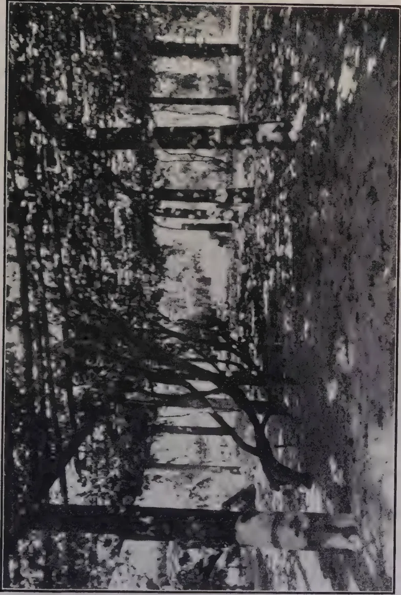
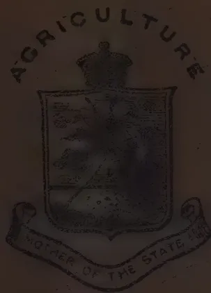
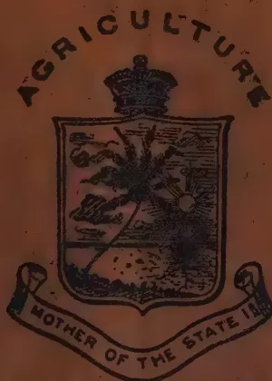
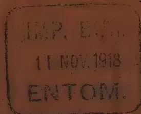
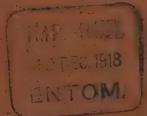
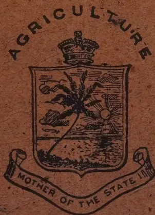

THE  
**TROPICAL AGRICULTURIST:**  
JOURNAL OF THE  
**CEYLON AGRICULTURAL SOCIETY.**

---

VOL. LI.

PERADENIYA, DECEMBER, 1918.

No. 6.

---

**THE FOOD QUESTION.**

---

The discussion at a recent meeting of the Legislative Council has again centred attention upon the food problems of the Colony. The cessation of hostilities in Europe and the possibility of Peace at an early date must not be allowed to make the agriculturists of the Colony hope that difficulties in regard to food supplies are no longer serious.

There are ample reasons to support the belief that the world's food problem will be a difficult, one during the next year if not for longer.

The demands upon Burma and India—the principal sources of the Colony's imported food supplies are daily increasing. Crop reports are only fair in many parts, and the demands from other countries upon India and Burma when freight becomes available will increase and not diminish.

Ceylon in the middle of 1918 suffered severely from drought. Paddy and other food products were lost as the result of the drought and shortage was not uncommon in some parts. The influenza epidemic at the usual cultivating season for the North-East Monsoon rains has thrown back work, and upon many paddy lands work has not begun at all.

It therefore becomes the more imperative that everyone connected with the agriculture of the Colony should endeavour to help in the production of food.

1------------------------------------------------

330[DECEMBER, 1918.

Fair quantities of seed have been distributed through the Revenue Officers to village cultivators, the usual seed distribution of the Society has been carried out, and some supplies of yams and cuttings of sweet potatoes have been sent out.

Efforts should be made however to have uncultivated paddy lands sown with the 3 or 4 months varieties of paddies while the rains last. Already a beginning in this direction has been made in the Chilaw district, but there are other districts in which a similar policy could be carried out with advantage. Similarly, planting of high lands with sweet potato cuttings, maize, beans, yams and other products would ensure a rapid production of essential food products.

There is no doubt as to the *urgency* of greater effort and all members of the Agricultural Society should endeavour to do something to assist. The growth of more food products is, at the present moment, essential to the material welfare of the Colony.

The Agricultural Society and the Department of Agriculture are available for advice as to the kinds of crops that are likely to be suited to the different districts of the Colony and to the possible sources of planting material. Agricultural instructors are also available in many districts, and should be freely consulted.

Again, an appeal is made to the agriculturists of the Colony. The response in the past has been gratifying but greater efforts are now required from all. The planting season is not yet over and much can yet be accomplished.

---

## FRONTISPIECE.

---

The frontispiece in our present number is a photograph of His Excellency SIR WILLIAM MANNING, K.C.M.G., K.B.E., C.B., Governor of Ceylon and President of the Agricultural Society. Since His Excellency's assumption of the Governorship of this Colony he has presided at the Annual General Meeting of the Agricultural Society and has toured through some parts of the Colony. He has on several occasions expressed his desire to assist agricultural industries, and he has stated in the Legislative Council that it is proposed, when the financial circumstances of the Colony are more satisfactory, to authorize greater expenditure on the Agricultural Services.

2------------------------------------------------

DECEMBER, 1918.]331

# RUBBER.

---

## MANURING OF *HEVEA BRASILIENSIS*.

---

RUDOLPH D. ANSTEAD, M.A.

*Deputy Director of Agriculture, Planting District, Bangalore.*

*Hevea* rubber is unique among crops. The crops which have been most studied as regards manures are grown for food, and for the plant reserve materials stored up in the fruit, grain, or root. In the case of rubber it is plant reserve of food which is wanted, it is true, but in the form of latex obtained by excising the bark. The yield of this latex even from the same tree is influenced by a number of different factors : the humidity of the air and the soil saturation, i.e., the rainfall, have a marked effect, as also do the time of day at which tapping is done, the depth to which the bark is tapped, the area of bark removed and its position on the tree, the tapping system adopted, and even the tapper ; all these have an effect upon the yield. In addition to this the trees have a distinct individuality, so that it is not perhaps surprising to find that it is a difficult crop with which to conduct any kind of accurate manurial experiments.

The result of practically all such experiments so far conducted has been that the unmanured blocks give quite as good yields, if not better than the manured ones. Thus in Ceylon the manurial experiments, which have been carried out since 1913, gave results at the end of 1917, which showed that the yield from the unmanured control plots was still equal to the highest of the manured plots.

The same experience has been met with in South India. A series of manurial experiments were laid down on Kerala Estate in Malabar, in 1914, and have been most carefully conducted with a number of different manures. At the end of three years, in June 1917, the plots which gave the highest yields were the unmanured plots, and moreover these unmanured plots steadily improved their position in order of merit as the experiment proceeded.

In Ceylon phosphoric acid gave the best results among the manured plots, and potash the worst, whilst nitrogen produced a large increase after the first application but fell off heavily after the second, and the general advice given in Ceylon as to manuring rubber is to bury the leaves, which fall from the trees which are deciduous, in shallow pits, eight feet long by six feet wide and nine inches deep, between the rows with basic slag and other phosphatic manures.

At Kerala the best results among the manured plots were obtained by the use of kainit and a mixture of basic slag and sulphate of potash. The fact remains, however, that in all these cases the unmanured plots are the best, and it may be considered whether the actual yield of latex is the best way to judge of the effects of manures. One would not perhaps expect manures to increase the actual latex flow or the rubber content of the latex,

3------------------------------------------------

332[DECEMBER, 1918.

but rather to increase the girth of the tree which would ultimately mean increase of yield because there would be more bark to tap.

Some experiments conducted at the Kuala Lumpur Gardens in the Federated Malay States with young rubber, in which manures were applied every other year, showed that there was a stimulating effect on the growth of the trees which lasted for a year only. At the end of four years the total girth increases of the manured plots in every case were considerably more than those of the controls. At the end of the fourth year tapping was begun, and it was found that the unmanured plots gave the poorest yields of rubber, while the highest yields were obtained from those manured plots which gave the biggest girth increases, but this is only to be expected since increase of girth means a corresponding increase of length of tapping cut. To judge of the effects of the manure on the yield, apart from that shown by increase of girth, a comparison would have to be made of the yields per area of bark excised.

Increase of girth means ultimately increased yield of rubber, and to test the full value of this it would be necessary to compare two blocks of rubber, the one manured and the other unmanured, and neither of them tapped before the experiment began but both tapped on the same system throughout a whole cycle of virgin bark excision and a first renewal excision. This would occupy a period of about 18 years, and it is quite possible that it is as yet too soon to try and deduce results from any manurial experiments with *Hevea* at present in existence.

*Hevea* is not alone in respect to giving negative results from manuring. In the 16th Report of the Woburn Experimental Fruit Farm it is pointed out that while on one of the farms excellent results have been obtained with manures, yet at Ridgemount farm continuous manuring of apple trees over a period of twenty years has produced a negative result, and a somewhat similar result was obtained in America. It may be that in the case of *Hevea* the soils on which the manurial experiments have been conducted are rich enough without the addition of fertilizers, but there are so many factors which influence the yield that it is a most difficult crop to experiment with. The individuality of the trees alone is a most important and disturbing factor, for it has been found in Ceylon that one tree in every ten gives outstanding results. The experimental error must therefore be very large, and very few experiments have been laid down in such a way as to enable the determination of this figure to be made. Attention may be drawn in this connection to a paper dealing with this subject by BISHOP, GRANTHAM, and KNAPP in Sumatra published in the INDIA RUBBER JOURNAL, dated 5th April, 1915, in which the authors point out that in dealing with rubber a probable error over a period of one year takes into account the effect of site upon the crop at a certain age and under conditions existing at that age only. Local site conditions may cause similar areas to alter their relative yields with increasing age in such a manner as to cause a variation in probable error among the same plots at different ages. Further, if the probable error is known for a series of ages for one set of conditions of planting, such as spacing, in a given site, this may be incorrect for other planting conditions in a similar site, and for the same planting conditions in a different site.

4------------------------------------------------

DECEMBER, 1918.]333

WOOD and STRATTON showed that the probable error for annual crops may be taken as five per cent. ; and the authors of this paper show by discussing certain experiments in Sumatra that the probable error for rubber will not be greater than seven and a half per cent. in carefully selected plots, each containing at least 100 trees, but the minimum size of plot necessary for accurate experiments may prove to be several acres.

Very few experiments devised to test the value of different manures for *Hevea* have been laid down in such a way that the probable error can be calculated.

Yet another factor must be taken into consideration in all manurial experiments with *Hevea*, and that is the distance apart at which the trees are planted, and it may well be that this is the determining factor and of such importance that it swamps all others and renders results meaningless. Thus in the experiments carried out at Kerala, already mentioned, the manured plots showed very little increase in girth of the trees over the unmanured plots, which looks as if the manures only forced the trees upwards and that the spacing factor overruled all others.

In South India at any rate the majority of the rubber is planted far too closely, and a process of thinning out is being carried out on most estates. This thinning out is, however, as a rule left until too late, and the trees are allowed to remain crowded until the damage is done—the crowns are interlocked, and the stems have been forced upwards instead of girthing out. Thinning out should undoubtedly be commenced as soon as the branches of the trees begin to touch, that is in many cases by the time they are four years old, and should be carefully and thoughtfully continued every year after this age till they reach their final spacing which appears as if it would be 80 trees to the acre or even fewer.

The influence that spacing has upon the yield is shown by the results obtained where thinning out has been done. Thus in some experiments in Java, three fields, planted 12 feet by 24 feet, were thinned out to 24 feet by 24 feet by removing alternate rows of trees. Though by this treatment half the trees had been removed, the yield showed no decrease.

The average production per field and per tapping day during the three months preceding thinning out had been 4'28 lb., and that during the three months following the operation was 4'12 lb., whilst the figures for the three control fields which were unthinned for the same periods were 3'33 lb. and 3'17 lb.

The decrease in yield was the same in both cases and cannot be attributed to the thinning out.

Such a result as this would mask any effects of manures, and for this reason a spacing experiment has been laid down in Malabar this year to determine the optimum distance at which this crop should be planted. Rows have been planted from the beginning at distances of 40 feet, 35 feet, 30 feet, 25 feet, and 20 feet, and it is hoped, when the optimum spacing has been determined, to convert the experiment ultimately into a manurial one.

5------------------------------------------------

334[DECEMBER, 1918.]

The advantages of original close planting with subsequent thinning out, the importance and value of individual trees when they are widely spaced, and the loss caused by diseases have not here been considered, but only the effect of the spacing.

Despite the difficulty of proving the benefit of manures to rubber it is generally agreed that there is a benefit. Any manure which increases the foliage of the tree, its rate of growth, or its bark renewal, must have a beneficial influence on the health of the tree and favourably affect its yield.

Some of the most successful results in South India in manuring rubber have been obtained from the use of lime. In some recent experiments lime gave 2'15 lb. of made rubber per tree, and lime followed by manure 2'44 lb., as compared with the unmanured and unlimed yield of 2'34 lb. per tree. In another experiment lime gave 2'37 lb. per tree as compared with 2'05 lb. per tree obtained by an application of nitrate of soda.

On one estate situated on a laterite soil a definite system of manuring has been adopted since the trees were a year old, consisting of applying annually a dressing of ten cwt. of slaked lime per acre, broadcasted and forked in, while at the same time a heavy crop of *Crotalaria striata* has been maintained as a green dressing, and regularly cut and buried. This has at the same time stopped wash as well as supplied organic material so much needed by this class of soil.

This has been done for four years, and, though there are no control plots with which to compare it, the system having been adopted as a regular estate practice over the whole area, the growth of the rubber is exceedingly good, and the colour of the foliage is very dark green, and the trees when brought into tapping gave a yield which compares very favourably with trees of a similar age on a richer class of soil, and exceeded expectations.

It will generally be found that if two estates are compared, the one manured and the other unmanured, the latter will, over a period of years, give a smaller yield per acre than the former.

The unmanured trees also very often have a yellow look about the foliage, while the manured ones have very dark green leaves, a difference which is very marked when the fields are viewed from a distance, and a good healthy tree as a rule yields more rubber than a sickly one, though this may be difficult to prove.

In conclusion, it would appear that what is required is for agricultural stations interested in this subject to lay down an entirely fresh set of experiments with *Hevea*, designed from the first to test the influence of manures on trees widely spaced from the start, and on trees thinned out early.

Such experiments should be so designed that the experimental error can be calculated, and a working plan drawn up to ensure that one system of tapping is adopted throughout the whole course of the experiment. When this is done more light will be thrown on a subject which at present is somewhat obscure and puzzling.—*AGRIC. JOURNAL OF INDIA*, VOL. XIII, Pt. IV, Oct. 1918.

6------------------------------------------------

DECEMBER, 1918.]335

# CEYLON AGRICULTURE.

## COMMITTEE OF AGRICULTURAL EXPERIMENTS.

Minutes of a meeting of the Committee of Agricultural Experiments held at the Peradeniya Experiment Station on November 7, 1918.

Present:—The Director of Agriculture (Chairman), the Botanist and Mycologist, the Superintendent, Low-Country Products and School Gardens, the Government Chemist, the Government Entomologist, the Hon. the Rural Member of the Legislative Council, the Chairman, Planters' Association of Ceylon, the Chairman, Low-Country Products Association, MESSRS. W. B. WILSON (Tobacco Adviser), N. K. JARDINE (Special Entomologist), A. W. BEVEN, E. W. KEITH, N. G. CAMPBELL, J. B. COLES, W. SINCLAIR, H. D. GARRICK, A. J. AUSTIN DICKSON, G. H. MASEFIELD, SIR SOLOMON DIAS BANDARANAIKE, MESSRS. A. S. LONG-PRICE and H. A. DEUTROM, (Acting Secretary) and as visitors MESSRS. E. G. T. WARD SIMPSON, R. A. SENIOR-WHITE, G. F. CORNISH, and C. B. PRETTEJOHN.

The minutes of the last meeting having been approved and taken as read the Chairman stated that he had received telegrams and letters of excuse from the Hon. the Government Agent, Central Province, MESSRS. J. S. PATTERSON, M. L. WILKINS, and T. Y. WRIGHT.

The Chairman in introducing MR. W. B. WILSON who had arrived from South Africa to succeed MR. SCHERFFIUS as Tobacco Adviser stated that MR. WILSON had had considerable experience in tobacco work in America and South Africa, and that he would carry on experiments both at Teldeniya and Jaffna.

2. *Progress Reports.* The Chairman in referring to the Progress Reports stated that the Peradeniya Report had been circulated to the members. He reviewed the different items of work. He stated that all rotting stumps had now been removed from the whole station, terracing of hill slopes had been completed and that drains were now receiving attention. It was announced that tapping experiments could be carried out on 200 rubber trees in plots 151 to 154 and the Chairman asked the members to indicate any special tapping experiments they desired. After discussion MR. GARRICK proposed and MR. G. H. MASEFIELD seconded that two and three-day tapping experiments be conducted. MR. AUSTIN DICKSON proposed tapping on halves. These proposals were adopted by the Committee and the Chairman stated that he would go into the matter with the Botanist and Mycologist with a view to starting these new experiments from January next.

*Anuradhapura.* The Chairman reviewed the Progress Report and stated that 18 acres of irrigable and 33 acres of unirrigable land had been cleared. He proposed to plant the irrigable area with limes and the unirrigable with sisal and Mauritius hemp. A small machine for extracting fibre could later

7------------------------------------------------

336[DECEMBER, 1918.

be obtained from Mauritius at a small cost. He believed that there was a decided possibility for fibres in the Dry Zone.

*Maha Iluppalama.* The Chairman announced that an advertisement had already appeared in the MORNING LEADER regarding the lease of this Station which had been closed pending lease. Several offers were reported to have been received by the Government Agent, North-Central Province.

3. *Further results of the Rubber Tapping Experiments.* The Botanist and Mycologist gave a summary of the rubber tapping experiments on time intervals recently concluded on the Experiment Station. The experiment had been carried on for six years since July, 1912. The trees were seven years old and twenty-five inches in girth, when the experiment was begun, and were tapped with four cuts on one-third. One row was tapped once per week, another twice per week and a third three times per week. The yields for the whole period were 11.4 lb., 23.4 lb. and 25.8., respectively. The twice-a-week tapping yielded more per tapping than the three-times-a-week tapping, but the once-per-week did not yield more per tapping than the twice-per-week. The greatest quantity of rubber was obtained by the most frequent tapping, but the total obtained by tapping three times per week was only 12 per cent. greater than that obtained by tapping twice per week. It was agreed that full results should be published in bulletin form.

4 *Suggestions for experimental plots with coconuts.* The Chairman tabled a copy of suggestions which had been drawn up in consultation with the Government Chemist. He stated that this scheme had been drafted at the request of MUDALIYAR RAJAPAKSE and before sending it to the Low-Country Products Association he considered it desirable to submit it to the Committee for discussion. The Committee desired that these experiments should be duplicated in different districts. The Chairman, Ceylon Planters' Association asked that copies might be sent to the Chilaw and Kurunegala Planters' Associations. This was agreed to.

5 *Experiments with insecticidal paints for control of Shot-hole Borer.* MR. SPEYER gave an account of the progress in making an insecticide for the control of Shot-hole Borer in tea for application immediately after pruning. A sample of fish oil, Rosin soap manufactured in India had been received and tests made in strengths ranging from 30 per cent. to 1 per cent. on individual beetles and also in weak solutions as a spray on branches containing the borer. The action of the insecticide was not satisfactory and when used in 30% solution on tea bushes the strong caustic nature of the sample sent burnt the hands of the coolies applying the mixture. The caustic properties also preclude the possibility of the mixture containing any quantity of free oil in emulsion—an essential for the destruction of the beetle. A quantity of a true fish oil Rosin emulsion had been prepared and applied to some 7,500 bushes on the Poonagalla Group. The best means of application was found undoubtedly to be by hand, cost of labour involved being not more than Rs. 5/- per acre. Although the emulsion was used in various strengths a solution of 3 lb. emulsion in one gallon of water was found to be the best. It is estimated that 8 gallons of the solution is enough for one acre, the cost involved being not more than Rs. 5/- per acre making Rs. 10/- per acre with the labour. The strongest solution 3 lb. to 1 gallon at first gave the impression that die-back

8------------------------------------------------

DECEMBER, 1918.]337

would result as was experienced in experiments with coconut oil mixtures, but the bushes had made a complete recovery; after two months the shoots have begun to come through, and the only damage done has been a slight scaling where crude oil had come in contact with the bark. There had been a retardation of about 3 weeks but the mixture had remained on the bushes through a period in which 22 inches of rain fell. Examined after two months, it was found that in as many bushes as could be examined in the area painted, no insects remained alive in the galleries, dead adult beetles and decaying larvæ being plentiful. In other surrounding untreated tea, insects in all stages were alive and healthy and the control in the plots painted with weaker mixtures was not so apparent as in the one painted with the strong mixture. The temporary damage has been due to the mixture having been prepared roughly on the estate, and resulting in the incomplete emulsification of the oil. Since this experiment it had been found possible to make a far more stable mixture in a solid form, the only preparation necessary being the dissolving of the mixture in the required quantity of water. Experiments are proceeding with this solid, and another on which kerosene is substituted for fish oil. Some experiment was made with a native jungle tree oil known as *Dorana*, and as an insecticide for borer this oil has proved extremely successful. It is possible to mix this oil with five parts of water and a few bushes painted with this and with the pure oil have shown no harmful effects, while the borer has been cleared from the bushes painted. It may be difficult to obtain this oil in sufficient quantities for anything more than local use and it may be necessary to mix it with some deterrent to keep the painted bushes from re-attack.

MR. SPEYER then passed round 3 samples of the solid emulsion he had prepared with their corresponding solutions, and showed portions of a tea bush painted with *Dorana* oil with new healthy shoots appearing—also a branch of a tea bush from Poonagalla showing the casting of fish oil emulsion still present after 22 inches of rain.

MR. MASEFIELD asked if the rain had not perhaps been responsible for the recovery of the Poonagalla bushes.

MR. SPEYER replied that the “eyes” of the branches had been in contact with the mixture in spite of the rain, as the mixture still remained on the bushes through the wet weather.

MR. COLES asked if it would be possible to spray the mixture.

MR. SPEYER replied that not less than 40 gallons of mixture would be required per acre if spraying was resorted to and this would be too expensive. It was agreed that further and larger experiments be carried out.

6 *Coconut leaf disease.* The Chairman stated that this subject was put on the agenda at the request of Mr. J. S. PATTERSON who was unfortunately prevented from attending the meeting. MR. PATTERSON had not indicated the particular points he wished investigated.

With reference to the leaf disease of coconuts known as “leaf break,” in which the leaf frequently breaks off at about one-third its length from the outer end, the Botanist and Mycologist stated that it had not been possible to find *Phytophthora* in the diseased tissues, and there was no reason to believe that the disease was related to the *Phytophthora* nut-fall.

9------------------------------------------------

338[DECEMBER 1918.]

The fungus in the diseased area was a *Botryodiplodia*, not the same as the species on *hevea*. A similar fungus had been found in a coconut disease which exhibited the same characters in the Federated Malay States.

7 *Grazing Cattle on Coconut Estates.* In replying to MR. RAJAPAKSE'S question re the advisability or otherwise of keeping grazing cattle for fertilizing coconut estates, MR. BAMBER stated that grazing cattle retain a comparatively small proportion of the nutrient matter containing in the grasses grown on the sandy soil of coconut estates, and most of it is returned to the soil in the manure and urine in a form more readily available for plant use. There is no doubt the effect on the palms would be more immediate than merely burying grass and this was shown by the beneficial effects of the old system of tying cattle to the palms for brief periods.

It would be possible to fatten stock on such grazing alone but it could be done with the aid of poonac and other cattle foods. The manure in this case would be more valuable, but the question of its advisability would largely depend on the demand and prices paid for such fattened stock.

Near towns milch cattle might be kept with advantage but for the general run of coconut estates it would probably pay better to cultivate two or three times a year burying all grasses and weeds by ploughing and disc-harrowing.

On estates where new clearings are being opened or old palms removed and supplied, cattle are a nuisance and involve considerable expense in fencing or protecting young plants.

So that on the whole it would be preferable not to attempt to grow grass to maintain a herd of cattle.

After discussion the Chairman stated that the general concensus of opinion is that it is more advantageous to cultivate coconut.

8 *Co-ordination and Extension of Agricultural Services.* The Chairman announced that Government had replied in regard to the resolution passed by the last meeting of the Committee that it did not propose to postpone consideration of the proposals when financial matters improved and had asked that some definite proposals not involving large immediate expenditure should be submitted. Proposals in regard to plant disease and pest work, agricultural education and agricultural instruction had been submitted.

Copy of Bulletin No. 40 on Tea Tortrix was tabled. It was stated that the matter of spraying experiments had been taken up with the Dickoya and Maskeliya Planters' Association but the question of compensation had been raised. The whole question of these experiments was discussed and several members agreed to place tea at the disposal of the Entomologist for Tea Tortrix if the cost of the labour involved by experiments were met by Government. This was agreed to by the Chairman who stated that the experiments would be commenced at an early date.

The meeting terminated with the usual vote of thanks to the Chair.

Sgd. H. A. DEUTROM,  
Acting Secretary, Committee  
of Agricultural Experiments.

Peradeniya, 9th November, 1918.

10------------------------------------------------

DECEMBER, 1918.]339

## PROGRESS REPORTS OF EXPERIMENT STATIONS, FROM 1ST SEPTEMBER TO 31ST OCTOBER, 1918. PERADENIYA.

### TEA.

The yield for the month of September was 3,634 lb. green leaf from 11 acres; that for October 4,576 lb. The July-August made tea fetched in Colombo an average of 40 cents per lb. for all grades.

The weather being favourable vacancies in the two acres of Huldubari Dooars tea have been supplied with stumps from High Forest Estate.

The sword bean interplanted as a green manure in January last has been uprooted and buried in the centre of every 4 plants.

Gliricidia cuttings have been supplied in the two new acres.

The dadaps in plots 144 and 149 have been cut and mulched after an interval of five months, yielding 2,224 lb. and 4,275 lb. green mulch respectively.

The cleared land between the new plots of tea and Hill top rubber has been freed of stumps. Drains have been dug 33 feet apart, and the land is being lined and holed 4 ft x 4 ft ready for planting.

Dark leaf Manipuri Indigenous seed from Kotiyagala has been obtained and will be planted out at stake.

The belt of jungle above the tea plots has been cleared up to an old road trace and is being planted up with Goipani Hybrid tea plants from the nurseries.

The improvement of the main drains is being undertaken.

### RUBBER.

Vacancies in the new Hevea plots have been supplied with stumps from the nurseries.

The Dhall plants, close to the lines of rubber on plots 11, 12, and 13 have been cut back for the second time to 18 inches from the ground.

The work of making short contour stone walls on the Hill top plantation has been completed.

The Tephrosia Hookeriana seed sown in August above these contour walls failed to germinate owing to drought. It has now been decided to sow dhall, a foot above the walls and 6 inches apart.

All dead branches of rubber trees in the different plantations have been cut out and burnt.

The girth of the rubber trees in plots 151-154 (untapped) planted in July, 1908, are being taken with the object of ascertaining the number of trees available for further tapping experiments.

### CACAO.

Two rounds of picking have taken place. These pickings appear to verify the forecast of a heavy crop. Plot 117 gave 4,180 pods at one picking, equal to nearly  $3\frac{1}{2}$  cwt. of cured cacao per acre. Many of the plots have given over 2,000 pods at the most recent picking. There has been sufficient sun during the mornings for drying cacao and the drying house has not as yet been used.

Light pruning and removal of suckers have been continued.

The stalks of the cacao and dadap prunings left strewn about the plots have been collected and removed.

11------------------------------------------------

340[DECEMBER, 1918.

### COFFEE.

The old Ceara plot adjoining the Robusta coffee has been planted out with the following strains of coffee received from the Department of Agriculture, Java. *Leucaena glauca* was previously planted as shade :—

<table border="1">
<thead>
<tr>
<th></th>
<th></th>
<th></th>
<th></th>
<th>Rows.</th>
</tr>
</thead>
<tbody>
<tr>
<td>Canephora Wonosari</td>
<td>No.</td>
<td>1-03</td>
<td>G73</td>
<td>5</td>
</tr>
<tr>
<td>Robusta</td>
<td></td>
<td>105</td>
<td>217</td>
<td>3</td>
</tr>
<tr>
<td>Uganda</td>
<td></td>
<td>5</td>
<td>120</td>
<td>3</td>
</tr>
<tr>
<td>Quillou</td>
<td></td>
<td>89</td>
<td>03</td>
<td>3</td>
</tr>
<tr>
<td>Robusta</td>
<td></td>
<td>83</td>
<td>242</td>
<td>2</td>
</tr>
<tr>
<td>Excelsa</td>
<td></td>
<td>121-05</td>
<td>125</td>
<td>2</td>
</tr>
<tr>
<td>Liberia Pasir Poger</td>
<td></td>
<td></td>
<td>144</td>
<td>2</td>
</tr>
<tr>
<td>Abeocuta</td>
<td></td>
<td>22</td>
<td>116</td>
<td>2</td>
</tr>
<tr>
<td>Excelsa</td>
<td></td>
<td>121-08</td>
<td>126</td>
<td>2</td>
</tr>
<tr>
<td>Laurentii</td>
<td></td>
<td>3-01</td>
<td>92</td>
<td>1</td>
</tr>
</tbody>
</table>

The vacancies in the coffee plot behind the store have been supplied.

The Dadap, *Leucaena* and *Glicicidia* shade over the coffee has been pruned and mulched round the plants.

The removal of suckers is in progress.

Orders for Robusta and Hybrid seed booked previously are being executed. The demand for seed exceeds the output and it will be necessary to stop booking orders for the present season. Villagers in the neighbourhood of the Experiment Station are frequently making application for seed for planting purposes.

A nursery of Robusta and Quillou coffee has been planted out.

### PADDY.

The beds in the 3 acres of paddy land have been divided so that experiments with Basic phosphatic manure could be undertaken. Half the area in various plots has been manured with Basic phosphate at the rate of 150 lb. per acre, and the other half has been left unmanured for control.

The following varieties sown in nursery 5 weeks previously have been transplanted singly at a distance of 6 in. × 6 in. :—

DR. Lock's selected Hathial, Village Hathial, Molagu Samba, Muttu Samba, Philippine.

### FOOD PRODUCTS AND CURRY STUFFS.

*Sweet Potatos.* The different varieties of sweet potatos introduced from Mauritius will be lifted in a few days. Records of growth, cultivation, crop, etc., will be embodied in the next report.

Cuttings of the following varieties are now available at Re. 1'00 per bundle of 100 :—

Joe's sweet potato, Black Spanish, Red Jersey, Jersey, Pumpkin Yam, Southern Queen, Raisin, Sealys' Pierson and Shanghai.

The curry stuff plots have been prepared and will be sown at the cessation of the present heavy showers.

A quarter acre of chillies has been planted.

The removal of all stumps in all plantations on the station has now been completed, the terracing of all hill-slope plantations has been carried out and it has now been decided to make a determined effort during the next year to overhaul and improve the drainage of plots throughout the station.

### GENERAL.

*Show Plots.* The following new varieties of green manures were sown in the show plots opposite the office :—*Dolichos Hosei* (Sarawak); *Mimosa Invisa*; *Indigofera Dosua* (Tormentosa); *I. galeoides*;

12------------------------------------------------

DECEMBER, 1918.]341

*I. sumatrana*; *Indigofera suffruticosa*; *Chenopodium Album*; *Guizotia abyssinica* (Niger), *Tephrosia tinctoria* and a species of *Tephrosia* (purple flowered) received by MR. BAMBER from Aden.

*Economic Section.* The coconut, cacao and dadap trees behind the students' plots have all been uprooted and an elephant has been employed to clear the land. The plans for laying out this section are being prepared.

*Vanilla.* An offer of Rs. 3'00 per pound for the remaining lot of vanilla has been received and accepted.

*Castor.* A consignment of castor seed has been received from India for experimental purposes in the Northern and North Central Provinces. Small quantities will be available for sale to the public for planting purposes at 10 cents per pound.

*Labour.* The health of the permanent force is satisfactory, there having been only four cases of influenza during the recent epidemic. Precautions were taken against the spread of the disease. Thorough disinfection of lines has been carried out and coriander and ginger tea was issued to patients.

<table>
<thead>
<tr>
<th>Rainfall</th>
<th>Inches</th>
<th>Rainy days</th>
</tr>
</thead>
<tbody>
<tr>
<td>September</td>
<td>0.52</td>
<td>5</td>
</tr>
<tr>
<td>October</td>
<td>15.81</td>
<td>20</td>
</tr>
</tbody>
</table>

#### ANURADHAPURA.

His Excellency the Governor paid a visit to the Station on the 8th of October.

The Acting Manager inspected the Station on three occasions since the last report.

*Paddy.* A nursery has been sown of the following varieties of paddy for transplanting in November:—Molagu samba, Philippine, DR. Lock's Hathial and Murunga. Small plots of Gnavara (Indian), and Sudai Samba paddies will be sown in the nursery after the plants have been transplanted.

33 different varieties of Hill paddies collected from various districts of Ceylon have been sown in the unirrigable coconut land. Orders for seed paddy continue to come in.

*Sugar Cane.* The new plot apportioned for the eventual cultivation of paddy has been planted up with the following Mauritius and local varieties of sugar cane to test on a fair scale its yield at this station:—

<table>
<tbody>
<tr>
<td>Striped Tanna</td>
<td>B</td>
<td>3390</td>
</tr>
<tr>
<td>„ White Tanna</td>
<td>D</td>
<td>117</td>
</tr>
<tr>
<td>Sealy's seedling</td>
<td>P</td>
<td>131</td>
</tr>
<tr>
<td>Sin Nombre</td>
<td>P</td>
<td>55</td>
</tr>
</tbody>
</table>

and two good local varieties.

*New Plots.* Six of the 20 acres reserved for planting limes have been freed of small stumps, levelled and lined 15 × 15 feet ready for planting early in November.

Castor have been planted 5 ft. × 5 ft. between every other row in the plot of Mauritius Hemp.

Estate labour not being sufficient, arrangements are being made to give out on a weeding contract the 24 acres of recently felled jungle. It is proposed to plant out the whole of this area in castor, and sisal fibre.

*Curry Stuffs and Food Products.* Plots of mustard, coriander, aniseed, cassava, and dhall, have been planted.

*Oil Palms.* (*Elaeis guineensis*) 46 lb. of seed have been collected.

The wire fence along the railway line side of the station which had come down in consequence of felling operations is receiving attention.

13------------------------------------------------

342[DECEMBER, 1918.

*Labour.* The health of the coolies has been far from satisfactory, more than half the labour force being down with influenza and dysentery. Two deaths have occurred during the epidemic. Coriander and ginger tea has been supplied to all patients.

*Weather Conditions.* The arrival of the North-East Monsoon on October 11th brought to a close a severe drought. No violent or continuous showers have yet been experienced.

#### MAHA-ILUPPALAMA.

The Station was closed on the 10th of October, a watcher being placed in charge until arrangements are made for its lease. The store and other property belonging to the Department have been transferred to Anuradhapura and Peradeniya.

Sgd. H. A. DEUTROM.

5th November, 1918.

Ag. Manager, E. S.

### GRAPE CULTIVATION IN CEYLON.

The cultivation of Grapes in the Island which probably dates from the time of the Portuguese, has been carried on chiefly in the Jaffna Peninsula on a commercial scale.

Among other places where grapes have been grown with success are Calpentyn, Trincomalee and Matale.

In Trincomalee, FATHER HEINBURGHER, and in Wahakotte (Matale district) FATHER ASSAUW, brought their special knowledge of viticulture to bear on the cultivation.

Another name associated with Grape-growing is that of MR. C. ZANETTI, of the Irrigation Department, who introduced a number of new varieties into the Colony from Australia.

Of the places named above only at Jaffna is the cultivation still carried on systematically, though not as extensively as before: while within recent years Bandarawela has come into prominence as a grape-growing centre, chiefly through the enterprise of the late Dr. P. M. MUTTUKUMARU.

The origin of the common grape of the North has not been satisfactorily determined, but though it was probably a desirable variety at the time of its introduction, it has now deteriorated very considerably.

From time to time the Agricultural Society has introduced new and better varieties, which are now to be found at Calpentyn and Bandarawela.

At the former place Mr. J. L. DE ROZAIRO has had encouraging results with Black Hambro' and Gordo Blanco. Here, as at Jaffna and elsewhere, the vines are grown on trellises or "pandals."

MR. ROZAIRO prunes his vines in July and January and has secured heavy crops. The trellis shown in the illustration carries seven vines which yield 2,000 to 3,000 bunches of grapes a year.

The main difficulty in placing the fruit on the Colombo market is that of transport from so remote a place as Calpentyn, where the grower is satisfied with a local sale at rates varying, according to the demand, from 25 to 50 cents per lb. It may possibly be found more profitable to dry the grapes for the Colombo market.

From Bandarawela where railway communication is available the fresh fruit could no doubt be sent to reach Colombo in good condition.

References to grape-growing in the Jaffna Peninsula, and to the pruning of the vine, will be found in the *Tropical Agriculturist* for November, 1907. General Hints on Grape Cultivation also appear in the issue of May 1917.

C. D.

14------------------------------------------------

A black and white photograph showing a vineyard in a field. The foreground is dominated by a large, leafy tree on the left. In the middle ground, there are several tall, slender trees, likely grapevines, supported by wooden posts. The background shows a flat, open landscape with some distant structures and more trees. The overall scene is a rural agricultural setting.

*Photo. by C. Drieberg.*

GRAPE CULTIVATION IN CEYLON.

15------------------------------------------------

<!-- stage4: FAINT old-images-only -->

[Faint page: no legible print of its own could be verified; text withheld (stage 4 review list)]

This image is a scan of a blank page. The background is a uniform light beige or off-white color. There are a few very small, dark specks scattered across the surface, which appear to be scanning artifacts or dust particles. No text, lines, or other graphical elements are present.

16------------------------------------------------

DECEMBER, 1918.]343

# PADDY.

## PADDY IN MADRAS.

### SEED AND SEED-RATE.

Over 160,000 lb. of seed paddy were sold from our various farms. The demand was especially great for the produce of the Manganallur farm in Tanjore and all of the 1917-18 crop that was available for sale as seed was so sold. The demand is now so great that a system of seed farms for the multiplication of the seed is being started this year. Ryots who grew our seed this year report that the yield was heavier, the ripening more even, and that a better price was obtained for it. This seed is, however, merely a bulk selection from the local samba and even better results are to be hoped for from the pure strains which are being produced by the Government Economic Botanist. Trials of these strains in the Madura and Tanjore districts have not been very promising so far, however, and it is clear that a strain suitable for one climate may be altogether unsuitable for another. There is also the question of local markets to consider, as these prefer particular qualities. It is evident that the production and testing of unit strains will have to be very much localized. The strains produced at the paddy-breeding station at Coimbatore will be tried first in that district, while the strains now under trial at Manganallur will take the place of the bulk selection now being distributed as soon as they have been thoroughly tested on the farm. The progress of this work may seem slow, but we cannot afford to make mistakes by putting out a strain which may prove a failure. In the IV Circle there is a growing demand for the selection 'Ramagarudan Samba' from the Palur farm and ryots are being encouraged to multiply this on their own lands for seed.

The practice of producing the seed rate continued to spread in all districts and, as explained last year, it has now spread beyond the capacity of the department to keep trace of it. General increases in the area sown economically are reported from all circles. A plot of six acres has been leased near Nandyal to demonstrate this improvement to the local ryots and the resulting yield has already impressed them. In the Bhavani valley in Coimbatore districts the area planted at reduced rates is estimated at 11,000 acres as against 4,600 acres, last year.

### SPACING AND CULTURE.

The spacing experiment at Coimbatore which has been in progress since 1910 was brought to a close this year and the results will be found in paragraph 4 of the report of the Coimbatore Agricultural Station for 1917-18. The experiment was conducted on two varieties of paddy and in the case of the finer and longer growing variety, Sinna Samba, the plots planted with single seedlings 6 in. apart gave the best yields of both grain and straw.

17------------------------------------------------

344[DECEMBER, 1918.]

This is satisfactory as this method is the standard one recommended by the department. In the case of the coarse and more rapidly growing paddy, Sadai Samba, however the best yield of grain was given by seedlings planted in threes at 12 in. apart, while the best yield of straw was given by the plot planted thickly in local manner; the value of the several methods depends on the relative value of grain and straw; at present prices the crop obtained by the local method is somewhat more valuable than any of the plots planted with single seedlings either 4 in., 6 in. or 9 in. apart; but the plots planted with seedlings in two's at 9 in. or in three's at 9 in. or 12 in. gave more valuable crops than the local method. It is clear from this that there is justification for the criticism that single planting may result in some loss of straw in the shorter term varieties at least, and that for these somewhat thicker planting is advisable. But the experiments as a whole entirely justify the advice given by the department to ryots to plant their paddy very much more economically than they are accustomed to do. Not only can they save seed worth some Rs. 2 per acre and still get quite a good crop, but in most cases they can considerably increase the crop. The average seed rate used at Coimbatore for producing excellent crops remained at about 18 lb. of paddy per 8 cents of seed bed to transplant an acre. The experiment at Samalkota to test the value of hot weather cultivation on the succeeding paddy crop was brought to a conclusion, the results of four years being uniformly in favour of the practice.

Experiments are in progress at Samalkota to see if a second crop variety could be found which could be planted earlier than February, so as to make use of the canal water which is at present wasted in December and January. No success has been obtained so far. An experiment has been in progress since 1914-15, to test whether the contention of ryots that they must get their crop transplanted before the end of July if they were to obtain full crops, was correct or not. The results which will be found in detail in the report of Samalkota Agricultural Station for 1917-18 show conclusively that late planting leads to poorer yields, and that closer spacing or heavy manuring cannot counteract this.

#### MANURIAL.

An important experiment was started at Coimbatore to test some of the problems raised by the work of DR. HARRISON on paddy soils. The experiment is designed to test separately the effect of the addition of organic matter and of nitrogen to paddy soils and also to bring out any difference due to growing a green manure crop on the field to be manured as compared with bringing in the green manure from outside. The first year's results show differences which are too small to be used as a basis for any conclusion; the experiment will be continued for a series of years. The practice of pitting and rotting a green manure crop before applying it to the land was found to give crops quite as good as those raised after green manure was ploughed into the puddle in the usual way. On the other hand the new practice enable labour to be more economically used and so is cheaper, and will accordingly be adopted as part of the farm practice. The average yield of paddy on the 40 acres of wet land at Coimbatore was 2,900 lb. with an

18------------------------------------------------

DECEMBER, 1918.]345

average profit of Rs. 130 per acre. The result is somewhat less than last year's owing to the lateness of the season and the failure of irrigation supplies, but still is a better yield than in any year before the last.

Experiments in manuring with superphosphate by itself and in conjunction with green manure were in progress at Anakapalle and an experiment with Calcium cyanamide is going on at Manganallur. The Deputy Director of Agriculture, V circle, reports that in the latter experiment the crop suffered from stem borer and lodged badly so that the results were not comparable. At Palur an experiment has been in progress since 1913-14 to test the effect of continuous green manuring. The yields increased steadily up to 1916-17 but have dropped in 1917-18. At Sirvel the application of superphosphate in addition to green manure again have improved yields. In order to obtain an idea of the probable error of paddy experiments a detailed experiment was made here and it was shown that it was possible to work at a probable error of 5 per cent. by using strips of suitable shape. The important experiments on paddy manuring at Manganallur were continued, but the unfavourable physical condition of the soils this year was a limiting factor which prevented any large difference being shown. The results will be found discussed in detail by the Deputy Director of Agriculture Mr. H. C. SAMPSON in the report of the Manganallur Agricultural Station for 1917-18 and are well worth detailed study. These experiments are showing that it is possible to increase the yields of paddy in the Tanjore delta very considerably by the application of suitable manures containing phosphorus and nitrogen. Experiments based on DR. HARRISON'S work showed this year that paddy responds well to a concentrated nitrogenous manure such as Ammonium sulphate applied in addition to green manure. DR. HARRISON has shown that the nitrogen in the green manure is largely dissipated in the form of gas, so that the plant does not make use of all the nitrogen contained in this manure, as was formerly thought to be the case. At Manganallur an experiment was also devised to test the accuracy of the manurial experiments hitherto carried out. A field was divided into narrow strips and the alternate strips manured with superphosphate. The probable error was found to be 2 per cent. and the difference obtained showed a probability of 2,900 to 1 in favour of a real increase due to the manure and a probability of 20 to 1 that the increased yield would pay for the manure. We shall see more of this type of experiment in the future as it enables us to obtain in one year quite certain results, for which formerly it was necessary to wait for the result of a series of years.

The whole question of paddy manuring is becoming of great importance. We have shown that by economic planting, by green manuring, and by using selected strains, it is possible to increase the yields of paddy very considerably. But there is a limit to this which has already been reached in many cases, the limiting factor being the quantity of available manurial constituents, especially phosphorus and nitrogen, in the soil. To obtain still better yields, more intense manuring is necessary. There is not enough cattle manure to go round so that the use of artificials is indicated. Our experiments have shown that the insoluble phosphatic manures, e.g., bone meal and mineral phosphates, are rapidly decomposed and made use of in paddy soils in the presence of organic matter. This enables us to recommend these comparatively cheap manures instead of the dearer soluble phosphates,

19------------------------------------------------

346[DECEMBER, 1918.

e.g., 'super' which depend for their manufacture on sulphuric acid, which is scarce and expensive.

It is also obvious that in these days we ought to do all we can to increase the available supplies of food-grains, and that the best way to do this in Madras is by better manuring of paddy. We are therefore starting a large scale demonstration experiment in the Tanjore delta this year, giving out a manure mixture, based on our experience at Manganallur, for trial by ryots on a large number of plots.

There are large deposits of mineral phosphates, in the form of nodules, in the Trichinopoly district within a few miles of the Tanjore delta. Up to the present these nodules have been little used owing to the fact that they cannot profitably be converted into soluble superphosphates. But the experiments of the acting Government Agricultural Chemist and our field experiments at Manganallur are showing that this form of phosphate is readily used by the paddy plant. We therefore have a valuable supply of phosphate next door to the delta and the exploiting of this is obviously a matter which must be taken up seriously.

#### VARIETIES.

The work of evolving and preliminary testing of new strains is being done by the Government Economic Botanist whose work is dealt with in paragraph 30 below.\* Some of his strains were tested this year at Sirvel, Manganallur and Coimbatore. The variety No. 24 was disappointing this year, but another No. 91 did very well at Coimbatore. Here the farm strain of Sinna Samba gave 4,211 lb. of grain and 9,659 lb. of straw per acre on a  $2\frac{1}{2}$ -acre field, giving a profit of Rs. 244 per acre. A number of varieties were tested for yield at Anakapalle, Samalkota and Palur as in previous years. The results obtained so far are of no great use as they vary from season to season and as we have little knowledge of the reliability of the trials. It is now realized that a reform in the older method of experimenting is necessary and that the first thing to do is to ascertain the probable error of an experiment, and to devise methods by which this can be reduced to a minimum. Reliable results can then be obtained in a single season. REP. OF THE AGRIC. DEPT., MADRAS, 1917-18.

### RICE MILLING INDUSTRY IN MADRAS.

The rice milling industry continued to be the subject of inquiry during the year, and since the close of the year a bulletin reviewing the development of the industry during the last ten years and suggesting the lines on which future development is desirable has been written by MR. GREEN and is being submitted to Government for approval before being published. The industry has developed rapidly in recent years and in the Tanjore district, in particular, has shown remarkable progress. It is open to question however whether the development in this district has been on the right lines since it has taken the form of the multiplication of single huller mills. As recently as 1910, there were only some four or five mills worked by power, and nearly

\* Vide p. 348 "Paddy Breeding in Madras."

20------------------------------------------------

DECEMBER, 1918.]347

the whole of the paddy of the district was husked by hand. In that year however, the Department of Industries installed a small rice milling plant driven by an oil engine at Tirukattupally, and the success of that installation induced other people to start similar mills in various parts of the delta. In the following year 19 similar installations were fitted up, and the demand for them continued year by year until to-day there are 215 mills in the Tanjore district, representing an aggregate horsepower of 5,360. Of these 66 or about 32 per cent. have been installed under departmental supervision and the remainder by private agencies. The establishment of these small mills or rural factories, as they may be termed, was thought at the time to be a good way to begin the introduction of power machinery and it was hoped that these small hulling plants would pave the way for the establishment of large scale central factories. Unfortunately however when the people saw a successful new industry in course of establishment they rushed into it in great numbers with the result that eventually in many centres the business was overdone, and more plants were set up than could be kept profitably employed. Examples are not wanting in this district where rice milling was at first a most remunerative business, but where owing to the excessive multiplication of factories the mill owners had eventually to face heavy losses. At present the condition of this industry is better than it has been for a considerable time owing to the fact that consequent on the lack of freight from Rangoon to Colombo, there is a considerable demand in Ceylon for Tanjore rice with the result that many of the abandoned mills are again being brought into commission. This condition of things is however purely transitional and after the war difficulty will again be experienced in keeping the mills running at full capacity. These small mills, the great majority of which consist of single huller driven by oil engines can only be regarded as marking an intermediate stage in the development of the rice milling industry in Tanjore, and it is probable that the years following the termination of war will see the establishment of a number of large scale central factories. Rice milling cannot be run satisfactorily on a small scale as a rural industry except in cases where the production is required for the needs of the local population, and where sufficient raw material is available in close proximity to the mill. Under these conditions but not otherwise, a small single huller mill offers prospects of success. But in the great majority of cases there is everything to be said for the construction of central factories operating on a comparatively large scale.

The development of the rice milling industry in the Kistna district has proceeded on altogether different lines from that in Tanjore and a considerable number of large scale steam driven mills have been evolved direct from the hand milling stage without the introduction of the small self-contained hullers driven by oil engines as an intermediate stage of development for although several of these small mills are installed at Masulipatam and other places in the district, the latter type of mill has not been generally adapted as in Tanjore, and large scale mills operating on the Rangoon system are the rule and not the exception. The mills are not however equipped with machinery made by any of the recognized European manufacturers, neither have they been constructed under the supervision of competent engineers but by local maistris who work without any standard design or plan. The result is generally very unsatisfactory and the mills as a whole

21------------------------------------------------

348[DECEMBER, 1918.

leave a great deal to be desired. It was reported last year that the industry in this district was passing through a time of difficulty and anxiety consequent on the shortage of rolling stock. Conditions have not improved during the period under review, and the great majority of the mills which in normal times produced boiled rice for export to the Malabar Coast, Coimbatore, Colombo and Mauritius, and raw rice for export to the Bombay Presidency have either closed down or are working short time.—REPT. OF GOVT. OF MADRAS, INDUSTRIES DEPT., 1917-18.

## PADDY BREEDING IN MADRAS.

The Government Economic Botanist continued to work on paddy at the Paddy Breeding Station. The engine and pump purchased last year was fitted up and the well improved. This installation proved invaluable in the year under report as it enabled work to be carried on in spite of the failure of irrigation water for six weeks which prevented neighbouring paddy crops being sown in time. An approach road to the Station was constructed during the year.

The study of the inheritance of characters in paddy was continued. Two points which have now been definitely proved are of special interest, i.e. a very definite connection between a certain type of golden colouring and the shape and size of the grain, and some connection between another type of golden colouring and duration of the plant.

Mr. PARNELL's first paper on the inheritance of characters in rice was published as a Memoir of the Imperial Agricultural Department during the year. As the result of several years' experiments on the *probable error* involved in making comparisons for yield a system has been adopted in which the several strains under comparison are sown in strips some 50 ft. long by 5 ft. wide with 1 ft. intervals, each strip being repeated eight times. By this means the probable error of comparing any two strains was reduced to about 2 to 4 per cent.

As a result of the trials the same two strains as in previous year headed the list, these will therefore now be tried on a field scale in the Coimbatore district. A certain local variety gave particularly high yields this year, which may be an accident due to the abnormal season, but it is being further investigated. A large number of new strains obtained from crosses are coming on and will be tested for yield in their turn.

At Manganallur the selections from Red and White Samba were tested for yield against the farm bulk selections, for which there is already a great demand. Certain of the selections yielded from 15 to 24 per cent. higher than the farm seed and these have been selected for multiplication this year.

The work on paddy is becoming more definite as experience is gained and will proceed at a faster rate in future. When one remembers that the value of the paddy crop in Madras is over sixty crores of rupees annually, and that Mr. PARNELL's work is showing that this crop may eventually be increased by 20 per cent. or so by the sowing of pure seed of selected strains one can realize how extremely valuable this work is.—AGRIC. DEPT. MADRAS, REPT., 1917-18.

22------------------------------------------------

DECEMBER, 1918.]349

## GREEN MANURING OF PADDY FIELDS IN KANDY DISTRICT.

The practice of growing a green manure crop in the rice field which is so common in India has not caught on in Ceylon, although the Agricultural Society demonstrated its benefits by a series of carefully conducted experiments. There has however been a marked increase in the Kandy district of the use of green leaves for fertilising and this is particularly noticeable in Harispattu, Yatinuwara and Udunuwara. The following is a list of the plants most favoured, given in the order of their popularity. The leaves and twigs are put into the field after the 2nd ploughing and allowed to decay before being ploughed in:—

Kekuna (*Canarium zeylanicum*)  
 Dadap (*Erythrina lithosperma*)  
 Keppitiya (*Croton lacciferus*)  
 Karanda (*Pongamia glabra*)  
 Adathoda (*Adhaloda Vasica*)  
 Nawa (*Sterculia Balanphas*)  
 Hanapatu (*Furcraea gigantea*)

The Kandyan cultivator has learned the value of manure but he unfortunately does not apply a sufficient quantity for the best results. Most of the above mentioned trees and plants are common in the villages, but the rate of application varies with the ease or difficulty in procuring and transporting.

The following results of Sunnhemp (*Crotalaria juncea*) experiments conducted by the Ceylon Agricultural Society in 1914 and the resulting yield of the fields so treated are evidence of the value of this plant as a green manure crop:—

<table border="1">
<thead>
<tr>
<th rowspan="2">Centre.</th>
<th rowspan="2"></th>
<th colspan="2">Yield per acre.</th>
<th rowspan="2">Increase,</th>
</tr>
<tr>
<th>Before.</th>
<th>After.</th>
</tr>
</thead>
<tbody>
<tr>
<td>Uduwawela</td>
<td>...</td>
<td>40</td>
<td>56</td>
<td>40 %</td>
</tr>
<tr>
<td>Dunuwile</td>
<td>...</td>
<td>48</td>
<td>61</td>
<td>27 "</td>
</tr>
<tr>
<td>Molegode</td>
<td>...</td>
<td>36</td>
<td>52</td>
<td>44 "</td>
</tr>
<tr>
<td>Matale</td>
<td>...</td>
<td>28<math>\frac{2}{3}</math></td>
<td>36<math>\frac{1}{2}</math></td>
<td>27<math>\frac{3}{4}</math> "</td>
</tr>
<tr>
<td>Ratnapura</td>
<td>...</td>
<td>36</td>
<td>52</td>
<td>44 "</td>
</tr>
<tr>
<td>Tissa</td>
<td>...</td>
<td>16</td>
<td>24</td>
<td>50 "</td>
</tr>
<tr>
<td>Nugawela</td>
<td>...</td>
<td>30</td>
<td>37</td>
<td>23<math>\frac{1}{2}</math> "</td>
</tr>
<tr>
<td>Do.</td>
<td>...</td>
<td>36</td>
<td>48</td>
<td>33 "</td>
</tr>
</tbody>
</table>

In South India as a result of growing Sunnhemp as a green manure crop the yield of paddy has been increased by 70 per cent. Sunnhemp is recommended for several reasons: (1) it can be easily grown and may be sown on the field directly the paddy crop is harvested without any preparation though it would be better if the land is ploughed and prepared for sowing; (2) it is ready to be cut down in 60-80 days and as the majority of our fields are left fallow for 2-4 months they can be easily sown with Sunnhemp after the Maha harvest and the green manure cut and applied, quite 2 or 3 weeks before preparation for Yala begins. If the Maha crop is gathered as is generally done in Kandy in the middle of March and if the Sunnhemp were sown immediately it can remain till the end of May or mid June when Yala begins. The cost of growing a green manure crop is very insignificant, where the seed is simply sown without any preparation of the soil. But if the cost be even Rs. 5 to Rs. 10 per acre the benefits are well worth the expense.

W. MOLEGODE, S.A.I.

23------------------------------------------------

350[DECEMBER 1918,

# FOOD-STUFFS.

## THE PEAS AND BEANS OF COMMERCE.

(Concluded from p. 215).

### UNITED KINGDOM TRADE IN PEAS.

The following tables show the trade in peas in the United Kingdom during recent years:—

#### *Imports of Peas, other than Split Peas, into the United Kingdom.*

<table border="1">
<thead>
<tr>
<th></th>
<th>1911</th>
<th>1912</th>
<th>1913</th>
<th>1914</th>
<th>1915</th>
<th>1916</th>
</tr>
</thead>
<tbody>
<tr>
<td>Total quantity cwt.</td>
<td>2,084,174</td>
<td>2,464,607</td>
<td>1,882,433</td>
<td>924,441</td>
<td>1,064,213</td>
<td>981,331</td>
</tr>
<tr>
<td>„ value £</td>
<td>948,773</td>
<td>1,226,114</td>
<td>947,296</td>
<td>508,454</td>
<td>840,259</td>
<td>1,279,112</td>
</tr>
<tr>
<td>From</td>
<td>Cwt.</td>
<td>Cwt.</td>
<td>Cwt.</td>
<td>Cwt.</td>
<td>Cwt.</td>
<td>Cwt.</td>
</tr>
<tr>
<td>British India</td>
<td>1,320,290</td>
<td>1,483,900</td>
<td>962,350</td>
<td>183,410</td>
<td>469,860</td>
<td>307,970</td>
</tr>
<tr>
<td>New Zealand</td>
<td>164,390</td>
<td>203,290</td>
<td>185,993</td>
<td>137,156</td>
<td>77,447</td>
<td>25,564</td>
</tr>
<tr>
<td>Australia</td>
<td>48,500</td>
<td>16,770</td>
<td>5,620</td>
<td>30,900</td>
<td>11,700</td>
<td>7,350</td>
</tr>
<tr>
<td>Canada</td>
<td>21,010</td>
<td>7,050</td>
<td>5,770</td>
<td>7,340</td>
<td>10,480</td>
<td>12,530</td>
</tr>
<tr>
<td>Other British countries</td>
<td>3,120</td>
<td>1,500</td>
<td>1,970</td>
<td>300</td>
<td>1,700</td>
<td>220</td>
</tr>
<tr>
<td>Total British countries..</td>
<td>1,557,310</td>
<td>1,712,510</td>
<td>1,161,703</td>
<td>359,106</td>
<td>571,187</td>
<td>353,614</td>
</tr>
<tr>
<td>Russia</td>
<td>95,510</td>
<td>63,840</td>
<td>155,120</td>
<td>170,580</td>
<td>—</td>
<td>—</td>
</tr>
<tr>
<td>Germany</td>
<td>146,760</td>
<td>246,582</td>
<td>222,270</td>
<td>118,942</td>
<td>—</td>
<td>—</td>
</tr>
<tr>
<td>Netherlands</td>
<td>170,470</td>
<td>227,264</td>
<td>179,520</td>
<td>73,570</td>
<td>910</td>
<td>1,485</td>
</tr>
<tr>
<td>Belgium</td>
<td>4,764</td>
<td>7,650</td>
<td>1,480</td>
<td>770</td>
<td>—</td>
<td>—</td>
</tr>
<tr>
<td>China</td>
<td>—</td>
<td>14,260</td>
<td>150</td>
<td>24,790</td>
<td>59,320</td>
<td>84,160</td>
</tr>
<tr>
<td>Japan</td>
<td>88,810</td>
<td>120,250</td>
<td>149,200</td>
<td>153,190</td>
<td>409,640</td>
<td>458,210</td>
</tr>
<tr>
<td>United States</td>
<td>8,190</td>
<td>14,350</td>
<td>3,560</td>
<td>5,190</td>
<td>18,836</td>
<td>79,910</td>
</tr>
<tr>
<td>Chile</td>
<td>6,020</td>
<td>—</td>
<td>760</td>
<td>500</td>
<td>720</td>
<td>3,000</td>
</tr>
<tr>
<td>Other foreign countries</td>
<td>10,340</td>
<td>57,901</td>
<td>8,670</td>
<td>17,803</td>
<td>3,600</td>
<td>952</td>
</tr>
<tr>
<td>Total, foreign countries...</td>
<td>526,864</td>
<td>752,097</td>
<td>720,730</td>
<td>565,335</td>
<td>493,026</td>
<td>627,717</td>
</tr>
</tbody>
</table>

#### *Exports of Peas (not fresh), other than Split Peas, from the United Kingdom (Produce of the United Kingdom)*

<table border="1">
<thead>
<tr>
<th></th>
<th>1911</th>
<th>1912</th>
<th>1913</th>
<th>1914</th>
<th>1915</th>
<th>1916</th>
</tr>
</thead>
<tbody>
<tr>
<td>Total quantity cwt.</td>
<td>108,240</td>
<td>41,471</td>
<td>53,926</td>
<td>35,994</td>
<td>40,991</td>
<td>23,242</td>
</tr>
<tr>
<td>„ value £</td>
<td>113,244</td>
<td>57,645</td>
<td>58,356</td>
<td>38,900</td>
<td>57,369</td>
<td>48,017</td>
</tr>
<tr>
<td>To</td>
<td>Cwt.</td>
<td>Cwt.</td>
<td>Cwt.</td>
<td>Cwt.</td>
<td>Cwt.</td>
<td>Cwt.</td>
</tr>
<tr>
<td>Canada</td>
<td>3,153</td>
<td>6,509</td>
<td>9,169</td>
<td>2,496</td>
<td>674</td>
<td>454</td>
</tr>
<tr>
<td>Other British countries</td>
<td>2,940</td>
<td>3,438</td>
<td>6,298</td>
<td>7,028</td>
<td>4,572</td>
<td>2,401</td>
</tr>
<tr>
<td>France</td>
<td>34,514</td>
<td>14,758</td>
<td>16,808</td>
<td>11,155</td>
<td>15,902</td>
<td>11,316</td>
</tr>
<tr>
<td>Belgium</td>
<td>3,362</td>
<td>2,893</td>
<td>7,689</td>
<td>2,063</td>
<td>—</td>
<td>—</td>
</tr>
<tr>
<td>United States</td>
<td>4,332</td>
<td>1,428</td>
<td>5,303</td>
<td>4,048</td>
<td>1,444</td>
<td>316</td>
</tr>
<tr>
<td>Germany</td>
<td>3,201</td>
<td>1,826</td>
<td>1,339</td>
<td>607</td>
<td>—</td>
<td>—</td>
</tr>
<tr>
<td>Denmark</td>
<td>5,584</td>
<td>5,425</td>
<td>3,851</td>
<td>3,647</td>
<td>11,744</td>
<td>5,129</td>
</tr>
<tr>
<td>Netherlands</td>
<td>48,866</td>
<td>3,389</td>
<td>942</td>
<td>2,933</td>
<td>3,065</td>
<td>256</td>
</tr>
<tr>
<td>Other foreign countries</td>
<td>2,288</td>
<td>1,805</td>
<td>2,527</td>
<td>2,017</td>
<td>3,590</td>
<td>3,370</td>
</tr>
</tbody>
</table>

24------------------------------------------------

DECEMBER, 1918.]351

*Re-exports of Peas (not fresh), other than Split Peas, from the United Kingdom.*

<table border="1">
<thead>
<tr>
<th></th>
<th>1911</th>
<th>1912</th>
<th>1913</th>
<th>1914</th>
<th>1915</th>
<th>1916</th>
</tr>
</thead>
<tbody>
<tr>
<td>Total quantity cwt.</td>
<td>40,958</td>
<td>104,483</td>
<td>37,465</td>
<td>31,567</td>
<td>25,087</td>
<td>24,471</td>
</tr>
<tr>
<td>„ value £</td>
<td>31,992</td>
<td>93,178</td>
<td>31,831</td>
<td>25,158</td>
<td>27,841</td>
<td>47,431</td>
</tr>
<tr>
<td>To</td>
<td>Cwt.</td>
<td>Cwt.</td>
<td>Cwt.</td>
<td>Cwt.</td>
<td>Cwt.</td>
<td>Cwt.</td>
</tr>
<tr>
<td>Canada ...</td>
<td>213</td>
<td>5,431</td>
<td>7,467</td>
<td>3,234</td>
<td>—</td>
<td>18</td>
</tr>
<tr>
<td>Other British countries</td>
<td>4,212</td>
<td>6,530</td>
<td>8,446</td>
<td>6,486</td>
<td>2,939</td>
<td>2,225</td>
</tr>
<tr>
<td>France ...</td>
<td>6,749</td>
<td>7,823</td>
<td>7,786</td>
<td>7,027</td>
<td>12,417</td>
<td>18,625</td>
</tr>
<tr>
<td>Italy ...</td>
<td>—</td>
<td>—</td>
<td>—</td>
<td>1,580</td>
<td>—</td>
<td>—</td>
</tr>
<tr>
<td>United States ...</td>
<td>7,508</td>
<td>5,171</td>
<td>8,869</td>
<td>1,216</td>
<td>404</td>
<td>332</td>
</tr>
<tr>
<td>Norway ...</td>
<td>—</td>
<td>5</td>
<td>4</td>
<td>2,050</td>
<td>1,543</td>
<td>2,604</td>
</tr>
<tr>
<td>Netherlands ...</td>
<td>19,916</td>
<td>11,490</td>
<td>2,755</td>
<td>4,888</td>
<td>6,914</td>
<td>—</td>
</tr>
<tr>
<td>Switzerland ...</td>
<td>—</td>
<td>10</td>
<td>—</td>
<td>4,430</td>
<td>6</td>
<td>10</td>
</tr>
<tr>
<td>Spain ...</td>
<td>71</td>
<td>41,378</td>
<td>2</td>
<td>167</td>
<td>440</td>
<td>—</td>
</tr>
<tr>
<td>Other foreign countries</td>
<td>2,289</td>
<td>26,645</td>
<td>2,136</td>
<td>489</td>
<td>424</td>
<td>657</td>
</tr>
</tbody>
</table>

*Summary of Trade in Peas.*

<table border="1">
<thead>
<tr>
<th></th>
<th>1911</th>
<th>1912</th>
<th>1913</th>
<th>1914</th>
<th>1915</th>
<th>1916</th>
</tr>
<tr>
<th></th>
<th>Cwt.</th>
<th>Cwt.</th>
<th>Cwt.</th>
<th>Cwt.</th>
<th>Cwt.</th>
<th>Cwt.</th>
</tr>
</thead>
<tbody>
<tr>
<td>Imports</td>
<td>2,084,174</td>
<td>2,464,607</td>
<td>1,882,433</td>
<td>924,441</td>
<td>1,064,213</td>
<td>981,331</td>
</tr>
<tr>
<td>Exports</td>
<td>108,240</td>
<td>41,471</td>
<td>53,926</td>
<td>35,994</td>
<td>40,991</td>
<td>23,242</td>
</tr>
<tr>
<td>Re-exports</td>
<td>40,958</td>
<td>104,483</td>
<td>37,465</td>
<td>31,567</td>
<td>25,087</td>
<td>24,471</td>
</tr>
</tbody>
</table>

It will be seen from these tables that in normal times the principal British countries that supply this country with peas are India, and New Zealand, and the principal foreign countries are Germany, Holland and Japan. Since the outbreak of war Japan and China have largely increased their contributions.

The quantities exported and re-exported vary considerably in different years, France being the largest purchaser of peas produced in the United Kingdom, and Holland the principal country to receive the re-export of foreign and colonial peas.

The United Kingdom trade in split peas during recent years is shown in the following tables :—

*Imports of Split Peas into the United Kingdom.*

<table border="1">
<thead>
<tr>
<th></th>
<th>1911</th>
<th>1912</th>
<th>1913</th>
<th>1914</th>
<th>1915</th>
<th>1916</th>
</tr>
</thead>
<tbody>
<tr>
<td>Total quantity cwt.</td>
<td>111,920</td>
<td>110,100</td>
<td>95,882</td>
<td>59,253</td>
<td>35,740</td>
<td>10,390</td>
</tr>
<tr>
<td>„ value £</td>
<td>64,089</td>
<td>65,488</td>
<td>59,439</td>
<td>38,016</td>
<td>32,148</td>
<td>11,493</td>
</tr>
<tr>
<td>From</td>
<td>Cwt.</td>
<td>Cwt.</td>
<td>Cwt.</td>
<td>Cwt.</td>
<td>Cwt.</td>
<td>Cwt.</td>
</tr>
<tr>
<td>Germany ...</td>
<td>104,270</td>
<td>106,080</td>
<td>91,710</td>
<td>53,083</td>
<td>—</td>
<td>—</td>
</tr>
<tr>
<td>Other foreign countries</td>
<td>6,690</td>
<td>4,020</td>
<td>2,602</td>
<td>3,460</td>
<td>2,400</td>
<td>2,360</td>
</tr>
<tr>
<td>British countries ...</td>
<td>960</td>
<td>—</td>
<td>1,570</td>
<td>2,710</td>
<td>33,340</td>
<td>8,030</td>
</tr>
</tbody>
</table>

*Exports of Split Peas, from the United Kingdom  
(Produce of the United Kingdom.)*

<table border="1">
<thead>
<tr>
<th></th>
<th>1911</th>
<th>1912</th>
<th>1913</th>
<th>1914</th>
<th>1915</th>
<th>1916</th>
</tr>
</thead>
<tbody>
<tr>
<td>Total quantity cwt.</td>
<td>11,139</td>
<td>48,623</td>
<td>53,338</td>
<td>34,730</td>
<td>42,768</td>
<td>29,518</td>
</tr>
<tr>
<td>„ value £</td>
<td>6,234</td>
<td>26,412</td>
<td>31,484</td>
<td>24,049</td>
<td>49,515</td>
<td>36,736</td>
</tr>
<tr>
<td>To</td>
<td>Cwt.</td>
<td>Cwt.</td>
<td>Cwt.</td>
<td>Cwt.</td>
<td>Cwt.</td>
<td>Cwt.</td>
</tr>
<tr>
<td>British countries</td>
<td>6,402</td>
<td>35,977</td>
<td>40,177</td>
<td>25,406</td>
<td>8,694</td>
<td>6,264</td>
</tr>
<tr>
<td>Foreign countries</td>
<td>4,737</td>
<td>12,646</td>
<td>13,161</td>
<td>9,324</td>
<td>34,074</td>
<td>23,254</td>
</tr>
</tbody>
</table>

25------------------------------------------------

352[DECEMBER, 1918.*Re-exports of Split Peas from the United Kingdom.*

<table border="1">
<thead>
<tr>
<th></th>
<th>1911</th>
<th>1912</th>
<th>1913</th>
<th>1914</th>
<th>1915</th>
<th>1916</th>
</tr>
</thead>
<tbody>
<tr>
<td>Total quantity cwt.</td>
<td>3,691</td>
<td>10,308</td>
<td>19,060</td>
<td>2,245</td>
<td>3,673</td>
<td>7,765</td>
</tr>
<tr>
<td>„ value £</td>
<td>2,083</td>
<td>6,164</td>
<td>11,166</td>
<td>1,740</td>
<td>4,413</td>
<td>9,059</td>
</tr>
<tr>
<td></td>
<td>Cwt.</td>
<td>Cwt.</td>
<td>Cwt.</td>
<td>Cwt.</td>
<td>Cwt.</td>
<td>Cwt.</td>
</tr>
<tr>
<td>Canada</td>
<td>11</td>
<td>3,033</td>
<td>8,010</td>
<td>184</td>
<td>5</td>
<td>—</td>
</tr>
<tr>
<td>Other British countries</td>
<td>3,331</td>
<td>6,776</td>
<td>9,290</td>
<td>1,407</td>
<td>1,229</td>
<td>1,468</td>
</tr>
<tr>
<td>Foreign countries</td>
<td>349</td>
<td>499</td>
<td>1,760</td>
<td>654</td>
<td>2,439</td>
<td>6,297</td>
</tr>
</tbody>
</table>

*Summary of Trade in Split Peas.*

<table border="1">
<thead>
<tr>
<th></th>
<th>1911</th>
<th>1912</th>
<th>1913</th>
<th>1914</th>
<th>1915</th>
<th>1916</th>
</tr>
<tr>
<th></th>
<th>Cwt.</th>
<th>Cwt.</th>
<th>Cwt.</th>
<th>Cwt.</th>
<th>Cwt.</th>
<th>Cwt.</th>
</tr>
</thead>
<tbody>
<tr>
<td>Imports</td>
<td>111,920</td>
<td>110,100</td>
<td>95,882</td>
<td>59,253</td>
<td>35,740</td>
<td>10,390</td>
</tr>
<tr>
<td>Exports</td>
<td>11,139</td>
<td>48,623</td>
<td>53,338</td>
<td>34,730</td>
<td>42,768</td>
<td>29,518</td>
</tr>
<tr>
<td>Re-exports</td>
<td>3,691</td>
<td>10,308</td>
<td>19,060</td>
<td>2,245</td>
<td>3,673</td>
<td>7,765</td>
</tr>
</tbody>
</table>

It will be seen that prior to the outbreak of war, split peas were obtained chiefly from Germany, and the bulk of this import was retained for home consumption. For the two years, 1915 and 1916, the total export, including the re-exports, of split peas from the United Kingdom have exceeded the imports by 10,701 cwt., and 26,893 cwt. respectively.

**MUTTER PEAS.**

Mutter peas, known locally in India as khesari, are the seeds of the chickling vetch or vetchling (*Lathyrus sativus*, Linn.), an annual herb extensively cultivated in Southern Europe and eastwards as far as India. The plant is a slender, much-branched herb with winged stems furnished with pinnate leaves consisting of one or two pairs of lance-shaped leaflets and a simple or branched tendril. The flowers, borne singly on long stalks in the axils of the leaves, are pea-shaped, of a bright blue or purplish colour in the Indian forms and white in the Mediterranean varieties. The pods are oblong in shape, with a narrow wing along the opening; each pod contains from 3 to 5 seeds, which are more or less wedge-shaped, of a grey colour speckled with brown or black, or, in the case of the white-flowered Mediterranean forms, pale green or buff yellow, with a very hard yellow interior. In general appearance the speckled seeds from India resemble the grey, or field pea, from which they may be readily distinguished by being wedge-shaped and slightly smaller. About 488 seeds weigh 1 oz.

The mutter pea is cultivated throughout India as a cold-weather crop, and is of great value agriculturally, as the seed is said to be capable of germinating on land that is too dry for other rabi crops. It is of greatest importance as a crop in the Central Provinces; considerable areas are also under this crop in Sind, Bombay and the United Provinces. It is said to thrive best on deep retentive black soils, and is generally raised on low-lying fields liable to be flooded during heavy rains, and unsuited to other pulse crops. It is usually sown broadcast in October and November and reaped in March and April.

From Mediterranean countries the white-flowered form has been introduced to Canada, where it is known as the "grass" pea, and is produced on a fairly large scale in Ontario.

26------------------------------------------------

DECEMBER, 1918.]353

Although these peas contain a high percentage of protein and are therefore a valuable food-stuff, certain forms are reputed to have poisonous properties which produce the disease known as lathyrism, a paralysis of the lower extremities in man and animals, as a result of their continued use for food. In Mauritius they are considered dangerous to human beings and nearly all animals, but are said to be extensively used as a food for milch cows. In India they are eaten by the poorer classes on account of their abundance and cheapness.

The nature of the toxic substance causing lathyrism is not known. Seeds of several forms of *Lathyrus sativus* obtained from India, Cyprus and Canada have been examined at various times at the Imperial Institute with a view to the isolation of a toxic constituent, but the results have been of a negative character. Recently similar investigations have been conducted at the Agricultural Research Institute at Pusa on samples obtained from Barail, a village near Pusa, which is notorious for cases of lathyrism and from the Central Provinces, where cases of the disease are also known to occur, but no alkaloids were detected. During the course of this work at Pusa, it was noticed that the samples of khesari were often contaminated with the seeds *Vicia sativa* (*akla*) and *Vicia hirsuta* (*misia*), from which a cyanogenetic glucoside was isolated (REP., AGRIC., RES. INST AND COLL. PUSA, 1915-16, pp. 19-20). It is possible, therefore, that the harmful properties attributed to the seeds of *Lathyrus sativus* may in some cases be due to obnoxious impurities. Experiments conducted in Canada with Canadian grown *Lathyrus sativus* peas as food for fowls gave good results, and no harmful effects from their use as poultry food were observed (REP., DOMINION EXPER. FARM, CANADA, 1901, pp. 183-5).

In the course of an extensive enquiry into the causation of lathyrism, conducted in India in 1903 by MAJOR A. BUCHANAN, I.M.S., it seemed to be clearly established that the disease only occurs in human beings when *Lathyrus sativus* peas form almost the sole diet, and that where they are used only as a small part of the diet no harmful effects ensue. There is now a good deal of evidence in favour of the view that the use of any one kind of grain, even wheat, as the sole diet may lead to harmful results.

In spite of the suspicion with which the peas are regarded, they appear to be still occasionally imported into Europe for use as a feeding stuff for animals. The extent of this trade cannot be ascertained. Probably the peas are always used in small quantities mixed with other feeding-stuffs, and as they are commonly cooked before adding them to mixed feeding-stuffs, any deleterious effects may thereby be avoided.

### COW PEAS.

The cow pea, *Vigna Catjang*, Walp., is an annual, suberect bushy, or trailing plant more closely allied to the beans (*Phaseolus*) than to the true peas (*Pisum*). There are many cultivated forms of the species belonging both to the bushy (var. *typica*) and trailing (var. *sinensis*) types, and these differ among themselves not only in habit of growth, but also in the length of pod and in the size, shape and colour of their seeds. The plants are furnished with trifoliolate leaves resembling those of the French bean; the

27------------------------------------------------

354[DECEMBER, 1918.

flowers are borne in small crowded clusters, and are succeeded by long, narrow pods that may attain a length of from a few inches to as much as 18 inches. The pods contain a variable number of seeds that may be pure white, red, brown or black in colour, sometimes white with a purple or black blotch round the hilum ("black-eyed" or "purple-eyed" peas) or variously mottled or speckled ("whip-poor-wills").

The cow pea is grown in most warm countries of the world either as a garden or a field crop, and is much valued as a fodder and green manure, particularly in the Southern States of America. The immature pods are eaten in countries where they are produced as a vegetable, and the dried seeds of some of the varieties are utilised as a pulse. For the latter purpose the white or blotched forms are preferred.

The cultivation of cow peas presents no difficulties; the seeds are sown either broad-cast or drilled in rows from 2 to 3 ft. apart at the commencement of the rainy season in tropical countries or as soon as the soil has become warm and mellow in sub-tropical areas. The soil between the plants is kept cultivated by hoeing until the plants cover the ground, little further attention being afterwards required until the seeds have fully developed, when the pods are ready for harvesting. In India cow peas are frequently grown as a mixed crop with maize or sesamum or with other kinds of peas or beans. In Burma the dried seeds are parched or boiled and eaten like peas, and they are also used as a substitute for nuts for making sweetmeats. On account of their distinctive and agreeable flavour, the dried seeds are also appreciated in the United States. Small quantities of the "black eye" variety are imported into the United Kingdom for human consumption, but the extent of the trade cannot be ascertained, as this pulse is not separately recorded in the Trade Returns. Should the demand for cow peas increase, it would be possible to rapidly extend the cultivation of this crop in such countries as Burma, where it is already cultivated on a considerable scale.

### LENTILS.

Lentils are a well-known and highly valued pulse, largely consumed as human food in European countries as well as in the East. The plant which produces lentils is known botanically as *Lens esculenta*, Moench. (syn. *Ervum Lens*, Linn.). It is a slender, branched annual, from 6 in. to 18 in. high, with pinnate leaves usually composed of from 4 to 6 pairs of oblong leaflets, terminated by a tendril. The whitish or pale blue flowers are usually borne in pairs on slender peduncles in the axils of the leaves. The pods, which succeed the flowers, are short and broad, and each contains two flattened seeds which have the form of a bi-convex lens. There are several forms of the plant in cultivation, and these differ from each other in size, hairiness and colour of the vegetative parts, and more particularly in the size and colour of the seeds. The last may vary in colour from yellow or grey to dark brown, sometimes speckled or mottled.

The native country of *Lens esculenta* is not known, but in cultivation it is met with in India, Persia, Syria, Egypt and North Africa, and in Europe, along the Mediterranean Coast and as far north as Russia, Germany, Holland and France.

28------------------------------------------------

DECEMBER, 1918.]355

### CULTIVATION AND VARIETIES.

The lentil prefers a light, low-lying moist soil, but in situations where droughts are liable to occur it succeeds best on heavier soils that are retentive of moisture. On rich soils the plants are liable to produce much leaf but few pods and seeds.

In Europe the crop is sown in spring after frosts are over, in drills 1 to  $1\frac{1}{2}$  ft. apart, and harvesting takes place usually about August or September, or as soon as the plants begin to turn yellow. The usual method of harvesting is to pull up the plants by the roots, as in the case of flax, and after drying to stack until the seeds are required. The yield in Europe is about 11 cwt. of seed and 30 cwt. of straw per acre.

In India, lentils are grown as a winter crop, especially in the Central Provinces, Madras and the United Provinces. The crop usually follows rice, and may be grown with or without irrigation, but with irrigation a larger return is usually obtained. The rate of sowing is usually about 1 maund (82 lb.) per acre, and the outturn ranges from  $6\frac{1}{2}$  to 8 maunds of seed, or, with irrigation, from 10 to 12 maunds. The lentil grows in many parts of Burma, but at present the crop is of little importance there. With a good market and remunerative prices for the produce it would seem that there are possibilities of considerably extending the cultivation.

In English commerce two kinds of lentils are chiefly met with known as the "French" and "Egyptian." The former are large, of an ash-grey colour externally, yellow inside, and are usually sold entire; they are obtained chiefly from Russia and Germany. The "Egyptian" lentils are small and brown, with an orange-coloured interior, and are usually marketed in the "split" form; they come chiefly from India.

### UNITED KINGDOM TRADE IN LENTILS.

The imports of lentils into the United Kingdom for the period 1911 to 1916 are shown in the following table :—

<table border="1">
<thead>
<tr>
<th colspan="8"><i>Import of Lentils into the United Kingdom.</i></th>
</tr>
<tr>
<th></th>
<th>1911.</th>
<th>1912.</th>
<th>1913.</th>
<th>1914.</th>
<th>1915.</th>
<th>1916.</th>
</tr>
</thead>
<tbody>
<tr>
<td>Total quantity Cwt.</td>
<td>262,370</td>
<td>199,912</td>
<td>224,020</td>
<td>237,180</td>
<td>329,870</td>
<td>143,960</td>
</tr>
<tr>
<td>.. value £</td>
<td>83,089</td>
<td>72,046</td>
<td>76,926</td>
<td>90,607</td>
<td>249,840</td>
<td>135,466</td>
</tr>
<tr>
<td>From</td>
<td>Cwt.</td>
<td>Cwt.</td>
<td>Cwt.</td>
<td>Cwt.</td>
<td>Cwt.</td>
<td>Cwt.</td>
</tr>
<tr>
<td>India</td>
<td>241,830</td>
<td>9,050</td>
<td>150,250</td>
<td>158,290</td>
<td>319,230</td>
<td>120,140</td>
</tr>
<tr>
<td>Russia</td>
<td>12,240</td>
<td>1,900</td>
<td>11,390</td>
<td>14,540</td>
<td>—</td>
<td>—</td>
</tr>
<tr>
<td>Germany</td>
<td>5,580</td>
<td>8,820</td>
<td>62,230</td>
<td>64,140</td>
<td>—</td>
<td>—</td>
</tr>
<tr>
<td>Other countries</td>
<td>2,720</td>
<td>142</td>
<td>150</td>
<td>200</td>
<td>5,080</td>
<td>23,820</td>
</tr>
</tbody>
</table>

The greater parts of the import is retained in the United Kingdom, as is indicated by the following table :—

<table border="1">
<thead>
<tr>
<th colspan="7"><i>Re-exports of Lentils from the United Kingdom.</i></th>
</tr>
<tr>
<th></th>
<th>1911.</th>
<th>1912.</th>
<th>1913.</th>
<th>1914.</th>
<th>1915.</th>
<th>1916.</th>
</tr>
</thead>
<tbody>
<tr>
<td>Total quantity Cwt.</td>
<td>2,355</td>
<td>3,462</td>
<td>6,522</td>
<td>5,342</td>
<td>15,233</td>
<td>3,583</td>
</tr>
<tr>
<td>.. value £</td>
<td>1,487</td>
<td>2,617</td>
<td>4,164</td>
<td>5,269</td>
<td>18,230</td>
<td>5,278</td>
</tr>
<tr>
<td>To</td>
<td>Cwt.</td>
<td>Cwt.</td>
<td>Cwt.</td>
<td>Cwt.</td>
<td>Cwt.</td>
<td>Cwt.</td>
</tr>
<tr>
<td>France</td>
<td>20</td>
<td>1</td>
<td>—</td>
<td>3,455</td>
<td>13,548</td>
<td>893</td>
</tr>
<tr>
<td>Other foreign countries</td>
<td>873</td>
<td>1,226</td>
<td>3,475</td>
<td>262</td>
<td>55</td>
<td>598</td>
</tr>
</tbody>
</table>

### DHALL, OR PIGEON PEA; GRAM, OR CHICK PEA.

In the Trade Returns of the United Kingdom these two pulses are grouped together, the quantities of each kind imported not being shown separately.

29------------------------------------------------

356[DECEMBER, 1918.

## PIGEON PEA.

The plant whose seeds constitute the dhall, or pigeon pea of commerce is *Cajanus indicus*, Spreng., a shrubby perennial 3 ft. to 8 ft. high, with slender woody branches furnished with trifoliolate leaves and terminal racemes of pea-shaped flowers. There are two wellmarked forms of the plant in cultivation, and some authors have accorded these specific rank. One of these forms (*C. flavus*, D.C.) has yellow flowers, and usually only two unspotted seeds in each pod; the other (*C. bicolor*, D.C.) has yellow flowers streaked with reddish-purple and pods containing 4 or 5 seeds which are usually spotted or streaked. The seeds are sub-globular, about the size of a small garden pea, slightly compressed laterally, with a rather prominent and protruding hilum, or "eye"; they vary in colour from greyish-white to yellow, brown or almost black, and some forms are variously speckled, blotched or streaked. Experiments made at the Labour Farm, Bihar and Orissa, between the years 1908 and 1911, proved that the tall erect form (*C. bicolor*) was the superior and best suited to local conditions.

Although believed to be originally native to Africa *Cajanus indicus* has been grown in India from very early times, and is now met with in nearly all tropical countries.

In Bombay and Bengal both varieties of the plant are cultivated; it is known as tur, tuer, togari, in Bombay, and as arhar or rahar in Bengal; in Africa it is known as the Congo pea or Congo bean and Angola pea; in the West Indies it is called no-eye pea, and in Mauritius and the Mascarene Islands it is known as ambrevade. It is also successfully grown in Southern Rhodesia and other parts of Africa, in Madagascar and Australia.

Although a perennial, the plant is usually grown as an annual, as it is liable to fungoid disease and quickly deteriorates as a perennial. If given an annual pruning, however, it will yield a crop of seeds for two or three years. It requires little cultivation and withstands drought well.

The usual method of sowing is to place 2 or 3 seeds in holes about 3 to 3½ ft. apart, covering them with about 1 in. of soil. In about a fortnight the seeds germinate, and after this takes place it is only necessary to keep the soil free from weeds until the plants become strong enough to outgrow them. Little further attention is needed until harvesting takes place.

In India the plant is cultivated principally as a subordinate crop, and there are no data on which to estimate the total acreage or yield. In the Bombay Presidency 514,000 acres were recorded as being under this crop in 1914-15, and the average yield was estimated at 634 lb. per acre, but whether this acreage referred to pure or mixed crops is not stated. In the United Provinces it is estimated that it is grown as a sole crop on 125,000 acres, and as a subordinate crop on about 3,250,000 acres, the average yield of seed being given as 560 lb. per acre when grown as a sole crop.

The pigeon pea is largely used in India for human food, and as fodder for horses and other animals when the crop is plentiful.

## GRAM, OR CHICK PEA.

The plant which furnishes the Common or Bengal Gram or Chick pea is *Cicer arietinum*, Linn., a deep-rooted annual growing about 2 ft. high, forming a bushy, branching herb. The leaves are pinnate, with small ovate

30------------------------------------------------

DECEMBER, 1918.]357

leaflets notched along the margins, and, in common with the other vegetative parts of the plant, covered with glandular viscose hairs. The flowers, borne singly on slender stems in the axils of the leaves, are of a light blue colour, and these are followed by short beaked pods from  $\frac{3}{4}$  in. to 1 in. in length, each of which contains as a rule two seeds. The seeds are sub-globose, more or less flattened or crinkled on four sides, with a prominent point or projection at one end; they vary in size according to variety, and may be of a dark brown, reddish brown or yellowish-white colour. The plant is sensitive to cold, and can therefore be grown only in warm countries. It is cultivated in most parts of Southern Europe, particularly in Spain; in northern Africa, chiefly in Morocco; in Asia, particularly in India, and in Mexico.

About 500,000 acres are devoted to this crop in Spain, where the average production is estimated at 100,000 tons. The Spanish chick peas, or gabanzos as they are called in Spain, are usually of large size and whitish-yellow colour, and are valued as a food for human consumption. The area under the crop in Morocco and in Mexico is not recorded; the exports from the former country in 1912 amounted to 6,000 tons, and that from the latter, in the year 1912-13, according to the Consular Report on Mexico, was valued at £443,932.

The largest and most important producing country is India, where gram is extensively cultivated as a spring or rabi crop in the United Provinces, the Punjab, Bihar, Central Provinces and in parts of Bombay. According to the Agricultural Statistics of India, the average area under gram for the five years 1909-10 to 1913-14 was about 15,000,000 acres. The estimated yield per acre is stated as about 688 lb., but as this crop is sometimes grown mixed, a lower estimate of, say, 448 lb. per acre, would probably be safer to take in estimating the total yield. Based on the latter figure, the average annual outturn would be about 3,000,000, tons.

Experiments have recently been carried out at Pusa with a view to improving the types of chick peas grown in India, and two types have been selected, one producing a small whitish seed and the other a small dark reddish-brown seed. The former gave an average yield for four years of 1,600 lb. of seed per acre, and the latter an average of 1,666 lb. for the same period.

The Indian chick peas are smaller than those of Europe and are usually of a dark brown or reddish-brown colour; they are used chiefly as foods for cattle in Europe, but in India they constitute one of the staple foods of the people, being eaten either parched or boiled or ground into meal. Gram and barley roasted and ground into meal is known as "Suttoo," and is sold in all Indian bazaars.

As a food for horses gram has a high reputation in the East; it is, however, seldom given alone, but enters into the crushed foods that are prepared at all large centres in India. It is imported to the United Kingdom as a feeding-stuff for animals, and is said to give good results with dairy cows, when used in a mixed ration in place of beans and peas.

Gram is not a difficult crop to cultivate. The seed is usually sown 1 ft. apart in rows 2 ft. apart, or it may be broadcasted. The crop succeeds on

31------------------------------------------------

358[DECEMBER, 1918.

a wide range of soils, but a light, loamy, well-drained soil is favourable to its development. During the growing period it requires a warm climate, ample sunshine and a moderate rainfall. It is recognised in India that an open, well-aerated soil is more important than soil moisture for this crop. The leaves are not suitable for use as fodder when green, as they excrete an acid secretion which is liable to do harm if eaten in excess, but they are used to a certain extent in India as cattle food after being chopped up and mixed with straw.

#### INDIAN TRADE IN GRAM.

Large quantities of gram are annually exported from India, which furnishes the bulk of the requirements of European countries. The following table shows the quantities and values of these exports for the period 1911-12 to 1916-17, and also the quantities taken by the principal importing countries.

<table border="1">
<thead>
<tr>
<th></th>
<th colspan="6"><i>Exports of Gram from India.</i></th>
</tr>
<tr>
<th></th>
<th>1911-12</th>
<th>1912-13</th>
<th>1913-14</th>
<th>1914-15</th>
<th>1915-16</th>
<th>1916-17</th>
</tr>
</thead>
<tbody>
<tr>
<td>Total quantity cwt.</td>
<td>6,934,840</td>
<td>2,898,384</td>
<td>1,391,934</td>
<td>465,968</td>
<td>649,886</td>
<td>761,930</td>
</tr>
<tr>
<td>„ Value £</td>
<td>1,831,759</td>
<td>794,120</td>
<td>415,104</td>
<td>156,195</td>
<td>224,590</td>
<td>274,318</td>
</tr>
<tr>
<td>To</td>
<td><i>Cwt.</i></td>
<td><i>Cwt.</i></td>
<td><i>Cwt.</i></td>
<td><i>Cwt.</i></td>
<td><i>Cwt.</i></td>
<td><i>Cwt.</i></td>
</tr>
<tr>
<td>United Kingdom</td>
<td>2,521,141</td>
<td>697,767</td>
<td>239,625</td>
<td>—</td>
<td>226,783</td>
<td>50,144</td>
</tr>
<tr>
<td>Ceylon</td>
<td>75,222</td>
<td>87,068</td>
<td>72,407</td>
<td>52,096</td>
<td>62,998</td>
<td>65,628</td>
</tr>
<tr>
<td>Egypt</td>
<td>90,585</td>
<td>46,826</td>
<td>56,568</td>
<td>41,456</td>
<td>1,821</td>
<td>452,659</td>
</tr>
<tr>
<td>Straits Settlements</td>
<td>32,413</td>
<td>38,822</td>
<td>34,229</td>
<td>13,021</td>
<td>28,922</td>
<td>35,021</td>
</tr>
<tr>
<td>Mauritius</td>
<td>47,576</td>
<td>41,161</td>
<td>34,994</td>
<td>35,494</td>
<td>24,215</td>
<td>39,935</td>
</tr>
<tr>
<td>Other Br. countries</td>
<td>20,102</td>
<td>14,671</td>
<td>20,872</td>
<td>9,968</td>
<td>29,371</td>
<td>17,252</td>
</tr>
<tr>
<td>Germany</td>
<td>2,097,670</td>
<td>1,008,075</td>
<td>146,362</td>
<td>21,096</td>
<td>—</td>
<td>—</td>
</tr>
<tr>
<td>France</td>
<td>1,481,930</td>
<td>698,049</td>
<td>766,178</td>
<td>284,831</td>
<td>266,276</td>
<td>88,500</td>
</tr>
<tr>
<td>Other foreign countries</td>
<td>628,201</td>
<td>265,945</td>
<td>20,709</td>
<td>8,006</td>
<td>9,500</td>
<td>12,791</td>
</tr>
</tbody>
</table>

Included with gram in the above table is the so-called horse-gram, the seed of *Dolichos biflorus*, Linn., known in India as kuthi, which is grown chiefly in Southern India and shipped from Madras. The average annual export of gram from Madras for the period 1911-12 to 1916-17 was 12,578 cwt., so that this correction must be made in the above table to arrive at the exports of true gram or chick peas. It is possible also that some of the small-seeded *Phaseolus* previously referred to are included under this heading.

#### UNITED KINGDOM TRADE IN PIGEON PEAS AND CHICK PEAS.

The following table shows the total quantities and values of the dhall, or pigeon peas and gram, or chick peas imported into the United Kingdom during the period 1911-16 and the principal sources from which the imports were obtained.

#### *Imports of Dhall, or Pigeon Pea and Gram, or Chick Peas into the United Kingdom.*

<table border="1">
<thead>
<tr>
<th></th>
<th>1911.</th>
<th>1912.</th>
<th>1913.</th>
<th>1914.</th>
<th>1915.</th>
<th>1916.</th>
</tr>
</thead>
<tbody>
<tr>
<td>Total quantity cwt.</td>
<td>1,112,493</td>
<td>2,334,388</td>
<td>571,916</td>
<td>40,126</td>
<td>174,403</td>
<td>56,720</td>
</tr>
<tr>
<td>„ value £</td>
<td>325,361</td>
<td>728,765</td>
<td>188,823</td>
<td>15,508</td>
<td>90,724</td>
<td>34,859</td>
</tr>
<tr>
<td>From</td>
<td><i>Cwt.</i></td>
<td><i>Cwt.</i></td>
<td><i>Cwt.</i></td>
<td><i>Cwt.</i></td>
<td><i>Cwt.</i></td>
<td><i>Cwt.</i></td>
</tr>
<tr>
<td>British India</td>
<td>1,104,608</td>
<td>2,307,216</td>
<td>570,590</td>
<td>35,486</td>
<td>167,610</td>
<td>56,612</td>
</tr>
<tr>
<td>Other British countries</td>
<td>540</td>
<td>—</td>
<td>—</td>
<td>960</td>
<td>842</td>
<td>10</td>
</tr>
</tbody>
</table>

32------------------------------------------------

DECEMBER, 1918.]359

It will be seen from these figures that so far as the trade of the United Kingdom is concerned, the supply is derived almost exclusively from British India. As a rule most of the imports are retained in the United Kingdom, as will be seen from the following table, which gives the quantities and values of the re-exports and also the principal receiving countries:

*Re-exports of Dhall, or Pigeon Peas and Gram, or Chick Peas from the United Kingdom.*

<table border="1">
<thead>
<tr>
<th></th>
<th>1911</th>
<th>1912</th>
<th>1913</th>
<th>1914</th>
<th>1915</th>
<th>1916</th>
</tr>
</thead>
<tbody>
<tr>
<td>Total quantity <i>cwt.</i></td>
<td>30,150</td>
<td>69,087</td>
<td>3,113</td>
<td>17,896</td>
<td>11,803</td>
<td>6,205</td>
</tr>
<tr>
<td>„ value £</td>
<td>11,878</td>
<td>23,033</td>
<td>1,721</td>
<td>9,226</td>
<td>8,631</td>
<td>4,653</td>
</tr>
<tr>
<td>To</td>
<td><i>Cwt.</i></td>
<td><i>Cwt.</i></td>
<td><i>Cwt.</i></td>
<td><i>Cwt.</i></td>
<td><i>Cwt.</i></td>
<td><i>Cwt.</i></td>
</tr>
<tr>
<td>British West Indies</td>
<td>11,076</td>
<td>4,491</td>
<td>1,859</td>
<td>7,912</td>
<td>2,060</td>
<td>3,168</td>
</tr>
<tr>
<td>British Guiana</td>
<td>6,473</td>
<td>1,988</td>
<td>75</td>
<td>6,050</td>
<td>6,626</td>
<td>637</td>
</tr>
<tr>
<td>Other British countries</td>
<td>43</td>
<td>33</td>
<td>—</td>
<td>—</td>
<td>159</td>
<td>—</td>
</tr>
<tr>
<td>Denmark (and Faroe Islands)</td>
<td>2,000</td>
<td>27,342</td>
<td>—</td>
<td>—</td>
<td>—</td>
<td>—</td>
</tr>
<tr>
<td>Netherlands</td>
<td>5,975</td>
<td>28,918</td>
<td>—</td>
<td>—</td>
<td>—</td>
<td>—</td>
</tr>
<tr>
<td>Other foreign countries</td>
<td>4,583</td>
<td>6,315</td>
<td>1,179</td>
<td>3,934</td>
<td>2,958</td>
<td>2,400</td>
</tr>
</tbody>
</table>

#### THE COMPOSITION AND FOOD VALUE OF PULSES.

The leguminous seeds used as food in this country are essentially nitrogenous foods. They contain considerably more proteins than other vegetables, including cereals, the proportion in the dried seeds ranging from about 20 to 28 per cent., in the different kinds. The amount of carbohydrates present ranges from about 45 to 60 per cent., whilst the amount of oil is low, being usually about 2 per cent., or less. Certain leguminous seeds, such as the ground nut and soy bean, are rich in oil, and these, as mentioned at the beginning of this article, are valued chiefly in Europe as oil seeds and not as a direct food. Of the pulses proper, the chick pea is richest in oil, containing about 5 per cent. Leguminous seeds are rich in mineral matter, the chief constituents of the ash being potash and phosphoric acid. The composition of the ash of peas, beans and lentils is as follows (Blyth: *Foods, their Composition and Analysis*):—

<table border="1">
<thead>
<tr>
<th></th>
<th>Peas Per cent.</th>
<th>Broad bean Per cent.</th>
<th>Kidney bean Per cent.</th>
<th>Lentils Per cent.</th>
</tr>
</thead>
<tbody>
<tr>
<td>Potash ...</td>
<td>42.79</td>
<td>42.49</td>
<td>44.01</td>
<td>34.76</td>
</tr>
<tr>
<td>Soda ...</td>
<td>0.96</td>
<td>1.34</td>
<td>1.40</td>
<td>13.50</td>
</tr>
<tr>
<td>Lime ...</td>
<td>4.99</td>
<td>4.73</td>
<td>6.38</td>
<td>6.34</td>
</tr>
<tr>
<td>Magnesia ...</td>
<td>7.96</td>
<td>7.08</td>
<td>7.41</td>
<td>2.47</td>
</tr>
<tr>
<td>Ferric oxide ...</td>
<td>0.86</td>
<td>0.57</td>
<td>0.32</td>
<td>2.00</td>
</tr>
<tr>
<td>Phosphoric acid</td>
<td>36.43</td>
<td>38.74</td>
<td>35.00</td>
<td>36.30</td>
</tr>
<tr>
<td>Sulphuric acid</td>
<td>3.61</td>
<td>2.53</td>
<td>4.05</td>
<td>—</td>
</tr>
<tr>
<td>Silica ...</td>
<td>0.86</td>
<td>0.73</td>
<td>0.57</td>
<td>—</td>
</tr>
<tr>
<td>Chlorine. ...</td>
<td>1.54</td>
<td>1.57</td>
<td>0.86</td>
<td>4.63</td>
</tr>
</tbody>
</table>

The pulses are generally regarded as somewhat difficult of digestion. They certainly tend to produce flatulence more than most foods, but if eaten

33------------------------------------------------

360[DECEMBER, 1918.

in moderate quantities and properly prepared, that is to say, boiled until thoroughly softened or used in soups, the skin being removed in cases where it is thick, they are almost as digestible as other vegetable foods.

Although weight for weight pulses contain as much protein as meat, they have not an equal food value as regards the supply of nitrogen, since the proteins of meat are more readily absorbed than those of leguminous seeds. The actual digestibility of the proteins varies to some extent in different individuals with the kind of seed and its mode of preparation, the cooked meal or flour for example being more easily digested than the whole seeds. In one experiment which is on record, in which beans cooked in the ordinary way, whole, with the skins on, were eaten, forty per cent. of the contained proteins was unabsorbed, or four times as much as in the case of meat. In another case it was found that from two to three times as much of the protein of meat was absorbed as of that of lentils.

The following table shows the composition of the principal leguminous seeds used as food compared with other food-stuffs. Except where otherwise stated, the figures are taken from SMETHAM'S "THE VALUATION OF FEEDING STUFFS BY MEANS OF CHEMICAL ANALYSIS"—(JOURN. ROY. LANCS. AGRIC. SOC., 1914.)

<table border="1">
<thead>
<tr>
<th>Name of Seed.</th>
<th>Water</th>
<th>Oil</th>
<th>Pro- teins</th>
<th>Carbo- hydrates</th>
<th>Fibre</th>
<th>Ash</th>
<th>Sand and Silica</th>
<th>"Food Units"</th>
</tr>
<tr>
<td></td>
<td>%</td>
<td>%</td>
<td>%</td>
<td>%</td>
<td>%</td>
<td>%</td>
<td>%</td>
<td></td>
</tr>
</thead>
<tbody>
<tr>
<td>Beans, Haricot (Large Japanese)</td>
<td>14.25</td>
<td>1.80</td>
<td>20.25</td>
<td>56.53</td>
<td>3.67</td>
<td>3.50</td>
<td>—</td>
<td>111</td>
</tr>
<tr>
<td>" , Rangoon Red (<i>P. lunatus</i>)</td>
<td>11.75</td>
<td>1.37</td>
<td>20.00</td>
<td>59.16</td>
<td>4.02</td>
<td>3.70</td>
<td>0.10</td>
<td>113</td>
</tr>
<tr>
<td>" , Adzuki (<i>P. angularis</i>)*</td>
<td>10.1</td>
<td>0.4</td>
<td>19.2</td>
<td>62.4</td>
<td>4.5</td>
<td>3.4</td>
<td>—</td>
<td>111</td>
</tr>
<tr>
<td>" , Mung (<i>P. radiatus</i>)†</td>
<td>10.1</td>
<td>2.2</td>
<td>22.7</td>
<td>55.8</td>
<td>4.8</td>
<td>4.4</td>
<td>—</td>
<td>118</td>
</tr>
<tr>
<td>" , Urd (<i>P. mungo</i>)†</td>
<td>10.8</td>
<td>2.7</td>
<td>22.2</td>
<td>54.1</td>
<td>5.8</td>
<td>4.4</td>
<td>—</td>
<td>116</td>
</tr>
<tr>
<td>" , Moth (<i>P. aconitifolius</i>)†</td>
<td>11.2</td>
<td>0.6</td>
<td>23.8</td>
<td>56.6</td>
<td>4.2</td>
<td>3.6</td>
<td>—</td>
<td>118</td>
</tr>
<tr>
<td>" , Rice (<i>P. calcaratus</i>)†</td>
<td>10.5</td>
<td>0.6</td>
<td>21.7</td>
<td>58.1</td>
<td>5.2</td>
<td>3.9</td>
<td>—</td>
<td>114</td>
</tr>
<tr>
<td>" , English (<i>Vicia Faba</i>)</td>
<td>14.14</td>
<td>1.86</td>
<td>28.12</td>
<td>46.70</td>
<td>6.14</td>
<td>3.04</td>
<td>—</td>
<td>121</td>
</tr>
<tr>
<td>Peas, English</td>
<td>14.20</td>
<td>1.71</td>
<td>22.50</td>
<td>52.59</td>
<td>5.99</td>
<td>3.01</td>
<td>—</td>
<td>113</td>
</tr>
<tr>
<td>" , Canadian</td>
<td>13.95</td>
<td>1.93</td>
<td>24.31</td>
<td>52.91</td>
<td>4.20</td>
<td>2.70</td>
<td>—</td>
<td>119</td>
</tr>
<tr>
<td>" , ground green, Indian</td>
<td>12.15</td>
<td>2.23</td>
<td>27.06</td>
<td>48.05</td>
<td>7.66</td>
<td>2.85</td>
<td>—</td>
<td>121</td>
</tr>
<tr>
<td>" , Calcutta green</td>
<td>14.50</td>
<td>1.80</td>
<td>25.75</td>
<td>47.94</td>
<td>7.01</td>
<td>3.00</td>
<td>0.25</td>
<td>117</td>
</tr>
<tr>
<td>" , Chinese green</td>
<td>12.05</td>
<td>1.13</td>
<td>22.50</td>
<td>54.68</td>
<td>6.89</td>
<td>2.75</td>
<td>0.35</td>
<td>114</td>
</tr>
<tr>
<td>" , Russian</td>
<td>17.45</td>
<td>1.83</td>
<td>23.62</td>
<td>48.57</td>
<td>5.53</td>
<td>3.00</td>
<td>0.55</td>
<td>112</td>
</tr>
<tr>
<td>" , green, fresh§</td>
<td>74.6</td>
<td>0.5</td>
<td>7.0</td>
<td>16.9</td>
<td>—</td>
<td>1.0</td>
<td>—</td>
<td>—</td>
</tr>
<tr>
<td>Mutter peas (<i>Lathyrus Satvus</i>)</td>
<td>13.10</td>
<td>1.46</td>
<td>31.62</td>
<td>42.54</td>
<td>8.13</td>
<td>3.15</td>
<td>—</td>
<td>125</td>
</tr>
<tr>
<td>Cow peas (<i>Vigna catjang</i>)†</td>
<td>12.7</td>
<td>1.1</td>
<td>23.1</td>
<td>55.3</td>
<td>4.2</td>
<td>3.6</td>
<td>—</td>
<td>—</td>
</tr>
<tr>
<td>Lentils, average</td>
<td>9.80</td>
<td>2.01</td>
<td>25.50</td>
<td>59.03</td>
<td>1.01</td>
<td>2.65</td>
<td>0.05</td>
<td>127</td>
</tr>
<tr>
<td>Gram, Bengal, or Chick peas (<i>Cicer arictinum</i>)</td>
<td>9.30</td>
<td>4.67</td>
<td>21.25</td>
<td>53.66</td>
<td>8.11</td>
<td>3.01</td>
<td>0.05</td>
<td>118</td>
</tr>
<tr>
<td>Pigeon Peas (<i>Cajanus indicus</i>)</td>
<td>12.00</td>
<td>2.07</td>
<td>20.38</td>
<td>55.67</td>
<td>6.38</td>
<td>3.50</td>
<td>0.05</td>
<td>112</td>
</tr>
<tr>
<td>Gram, horse (<i>Dolichos biflorus</i>)</td>
<td>11.05</td>
<td>1.10</td>
<td>23.37</td>
<td>54.27</td>
<td>5.11</td>
<td>5.10</td>
<td>1.50</td>
<td>115</td>
</tr>
<tr>
<td>Wheat§</td>
<td>13.0</td>
<td>1.7</td>
<td>12.5</td>
<td>68.5</td>
<td>2.5</td>
<td>1.8</td>
<td>—</td>
<td>104</td>
</tr>
<tr>
<td>" , flour, straight or standard§</td>
<td>10.54</td>
<td>1.61</td>
<td>11.99</td>
<td>73.56</td>
<td>—</td>
<td>0.5</td>
<td>—</td>
<td>—</td>
</tr>
<tr>
<td>Rice, Burma, polished||</td>
<td>12.90</td>
<td>0.46</td>
<td>6.47</td>
<td>79.43</td>
<td>0.25</td>
<td>0.49</td>
<td>—</td>
<td>97</td>
</tr>
<tr>
<td>Oatmeal§</td>
<td>10.00</td>
<td>8.00</td>
<td>15.0</td>
<td>60.0</td>
<td>3.0</td>
<td>4.0</td>
<td>—</td>
<td>117</td>
</tr>
<tr>
<td>Potatos§</td>
<td>75.0</td>
<td>0.2</td>
<td>2.0</td>
<td>21.0</td>
<td>0.7</td>
<td>1.1</td>
<td>—</td>
<td>26</td>
</tr>
</tbody>
</table>

\* Bulletin No. 119, 1914, "U.S. Dept. Agric."

† CHURCH, Food Grains of India, 1886.

‡ CHURCH, Food Grains of India, Supplement, 1901.

§ Farmer's Bulletin, No. 121, 1900, "U.S. Dept.

§ Standard Encyclopaedia of Modern Agriculture, 1912.

|| Bulletin No. 10, 1913, Dept. Agric. Burma. Bulletin of Imp. Inst. Vol. XV, No. 4.

34------------------------------------------------

DECEMBER, 1918.]361

## THE SUN-DRYING OF VEGETABLES.\*

GABRIELLE L. C. HOWARD, M.A.

*Second Imperial Economic Botanist, India.*

In this paper I propose to draw attention to a process,† recently worked out at the Quetta Fruit Experiment Station, by which all kinds of vegetables can be sun-dried without the use of artificial heat. If suitable methods are employed, a product can be obtained which when cooked is indistinguishable in taste, appearance, and texture from fresh vegetables. The process is simple and inexpensive and can be carried out by any one. It is far easier and cheaper than the usual method of evaporation by artificial heat, and the product obtained is superior. It has the additional advantage of being a truly indigenous industry, for the chief factors involved are the power of the Indian sun and the strong drying winds so characteristic of the western frontier regions.

There would seem to be a real need in India for a supply of good dried vegetables both from a military and a civil point of view. Vegetables are very difficult things to transport on account of their perishable nature and their bulk. It is well-known that one of the difficulties in the maintenance of military expeditions in sparsely populated, arid tracts like the North-West Frontier is the supply of this very necessary food. This difficulty was encountered in an acute form at the beginning of some of the early campaigns of the present war, and although it has now been partly overcome it is a difficulty which is bound to recur whenever troops are moved into the very arid regions in the neighbourhood of the North-West Frontier of India. In addition, there are garrisons in isolated places like Aden where it is practically impossible to maintain a supply of fresh vegetables. Many military officers have assured me that the provision of really good dried vegetables would make a great deal of difference to the diet of the soldier. Turning from military to civil needs, dried vegetables would be a convenience for shooting expeditions and for officials on tour, and it has also been suggested that large hotels in the hills would be glad to keep stocks of these vegetables in reserve to meet cases of emergency and to supplement the supply of the fresh product. Caravans on the great trade routes of the North-West are another possible outlet for the product. Moreover places of high elevation in Baluchistan like Loralai have great difficulty in procuring vegetables in winter and the same is true of places like Jacobabad and Sibi in summer. Certain vegetables such as carrots and tomatoes would be useful in the plains in the monsoon to vary the somewhat monotonous diet of gourds and beans which many *mofussilites* have to put up with for five months of the year. I believe that if really good dried vegetables were offered for sale there would be a ready demand for them all over India.

The most suitable locality for starting such an industry is undoubtedly Baluchistan. Here a very high temperature and a practically rainless summer are combined with great air movement and low humidity. The winds are exceedingly dry and most vegetables can be completely desiccated in less than a day. Moreover these favourable atmospheric conditions occur at a time when vegetables are plentiful. Nearly all English and Indian vegetables grow to perfection in the high valleys such as Quetta and, if proper cultural methods are adopted, the yield is extraordinarily great. As the finished product is so easy to transport it would probably pay best not to start the drying ground at Quetta itself where land and labour are

\* A paper read at the Fifth Indian Science Congress, held at Lahore, January 1918.

† For further details, the reader is referred to BULLETIN No. 8 Fruit Experiment Station, Quetta, 1917.

35------------------------------------------------

362[DECEMBER, 1918.]

expensive but at some place in the neighbourhood outside the radius of cantonment prices.

I do not propose to describe the method in detail but simply to indicate the main points to which attention should be paid. A full account of the process has been published\* and is available if any one requires it.

Good dried vegetables should retain the colour and taste of the undried product, should be tender when cooked, and should be easily preserved and transported. I should like to emphasize the first point because the remark has often been made to me that as long as the nutritive value is unimpaired the appearance is immaterial. It has even been suggested that for military purposes the vegetables might all be ground up and served as a gruel. In the first place, any change in appearance generally means a change in composition and a consequent loss of taste and probably of nutritive value. In the second place, human beings are so constituted that the eye plays a great part in stimulating the appetite. You will see that the samples shown here† are fresh and bright looking and form a much more saleable commodity than the brown nondescript product sometimes obtained. Another popular fallacy is that drying is a method of disposing of old or damaged vegetables. The reverse is the case. Any tendency to stringiness is accentuated by drying and the product formed from damaged material never keeps. Only sound vegetables just ready for the table are worth drying.

The main principles on which successful drying depends are (1) rapidity of drying and (2) treatment of the fresh material by some form of heat. Changes take place very quickly in moist cut vegetable matter leading to discolouration and damage. The use of heat renders the product more tender and helps in the preservation.

The general procedure adopted is as follows:—The vegetables having been cleaned and prepared are cut into thin slices and put into fresh water. They are then transferred to a wire basket and steamed or boiled for a few minutes. The length of time varies with the vegetables. Some, such as spinach, require steaming for half a minute only; others, such as potatoes, boiling in salt solution for several minutes. Green vegetables are boiled in bicarbonate of soda to maintain the colour. A few require steeping in some mild reducing agent such as sodium bi-sulphite.

The heated product is then spread on trays and dried as rapidly as possible. Success depends on the rapidity of drying, and this is where the advantage of the arid climate of Baluchistan is found.

Suitable trays can be made by stretching *dosuti* (or some similar material) on a bamboo frame. A wooden rim should be provided to prevent the dried produce from being blown away, and in very windy places it is an advantage to have a thin muslin cover over the tray. These covers are nailed to one end of the frame and have a weighted bar at the other so that they can be drawn over the frame. For a few vegetables which scorch in the sun like cabbage, it is an advantage to have a thin black cover instead of a white one.

Boiling and steaming can be quite easily carried out for domestic purposes in two kerosene oil tins fitted one over the other.

The finished product must be perfectly dry and it must be kept dry. The easiest way of doing this is to seal it up in tins.

As dried vegetables are very bulky, it was necessary to find some cheap method of storing and transporting the produce. This was accomplished by steaming and pressing into bricks, one pound in weight and of such a size

---

\* BULLETIN. No. 8, Fruit Experiment Station, Quetta.

† These were exhibited at the meeting.

36------------------------------------------------

DECEMBER, 1918.]363

that they could be packed into kerosene tins which could then be soldered. For this purpose, a suitable press had to be designed. As a result of this, the space taken up by the product was reduced to about one-seventh. Packed in this manner, it is possible to compress the weekly supply of vegetables necessary for a battalion on active service into twelve kerosene tins which can be transported by two mules.

This summer the process has been in full operation in the Quetta Cantonments where a large drying ground has been arranged by the Army. About eight tons of dried product have been prepared and have been sent for trial to one of the brigades on active service.—*AGRIC. JOUR. OF INDIA*, VOL. XIII., Pt. IV., October, 1918.

## EXPERIMENTS WITH JAPANESE SHALLOTS.

Bandaragama Demonstration Garden.

S. W. Monsoon Season, 1918.

*Name or No. of Plot* : First bed in Plot No. 4.

*Size of Plot* : 10 ft. × 3 ft. bed. *Name of Crop* : Japanese onion (shallot)

*Source of Seed* : Supplied by the Ceylon Agricultural Society ( Yokohama Nursery Co., Ltd. )

*Date Sown* : 26th April, 1918.

*Date of Harvest* : 25th August, 1918.

*How Sown* : Sown in rows 6 inches apart and 8 inches between the plants.

*Nature of Soil, and Manures used* : Loamy sand. Cattle manure and wood ashes.

*Pests and Diseases if any* : Nil.

*Peradeniya Report on above, and remedies used* : Nil

*General report on growth and treatment of Crop (dates of weeding, flowering, fruiting, etc.)* : Growth fair. A good dressing of old cattle manure and wood ashes was given when preparing the bed. Soil of the bed was kept loose and thoroughly free from weeds. Watered freely.

*Yield of Plot* :  $\frac{3}{4}$  lb. of fresh onion bulbs.

*Yield per Acre* : 1,089 lb.

*Approximate cost of Cultivation and Manuring of Plot* : } No record kept.

*Value of Crop* :

*Disposal of Crop* : Preserved for trial again. A small sample sent to the Secretary, Ceylon Agricultural Society.

*General Remarks* : Soil in the vegetable plot is not very suitable for onion cultivation.

L. DE Z. JAYATILLEKE,  
A.I., W.P.

37------------------------------------------------

364[DECEMBER, 1918.

## THE CULTIVATION OF MAIZE.

H. WENHOLZ. B.Sc.

*Inspector of Agriculture, New South Wales.*

### AFTER-CULTIVATION AND TREATMENT.

It does not seem necessary to stress the importance of the after-cultivation of maize, for almost every farmer knows that less cultivation means a lower yield, yet there are some methods in use which seem to be adopted from long practice, which are not sound, and will not stand the test of comparative trial, or which may only be justifiable under certain conditions. The details of cultivation need modification according to circumstances; and the farmer who cultivates best is the one who cultivates intelligently, not according to a fixed rule for all times and places, but according to good judgment, with a knowledge of the reason for and the effect of different methods. Curiously enough, there are some who believe that a retardation or checking of the growth of maize, especially in the early stages, is beneficial; but it can be definitely stated here that when this is effected by absence of cultivation or improper cultivation, the practice cannot stand the light of reason nor of actual result. The best yields of maize have always been obtained from crops that "grew every day," and cultivation can play an important part in effecting this desirable condition.

### REASONS FOR CULTIVATION.

The reasons for cultivating may be briefly stated as follows :—

1. The prevention or destruction of weeds and grasses, which would otherwise become so formidable as to seriously rob the maize plants of moisture and plant-food material. Dormant weed seeds present in the soil are also started by cultivation, and killed while young by the following cultivation.

2. The conservation of soil moisture and its prevention from evaporation from the surface of the soil by the formation of a loose mulch of soil.

3. The admission of a supply of fresh air to the roots of the plants, which is essential to their proper functioning. This is especially valuable on heavier clay soils, which are apt to become "logged" with excess moisture and foul air.

4. The rendering available of plant-food material and the hastening of nitrification which should be encouraged, especially in early spring, as this process is somewhat slow at this time of the year. There are some farmers who believe in thorough cultivation rather than the use of fertilisers on rich alluvial soil, and there is every justification for believing that their opinion is in some measure correct under such circumstances, as there are many cases where their methods have been borne out by practical results and systematic experiments.

5. The disturbing and destruction of insect pests in the soil, such as aphids, earworms, army worms, cutworms, etc.

6. The control of soil temperature—more especially in the warming of cold soil to a condition favourable to assimilation by the roots and the consequent growth of the crop.

7. It should be borne in mind that evaporation from the soil lowers its temperature. This is a consideration in cold districts, when it can be prevented by keeping a loose, open soil mulch on the surface by cultivation.

The importance of keeping the weed growth in subjection is borne out by experiments carried out in Illinois\* where, with the same preparation of

\* ILLINOIS AGR. EXP. STA. BULLETIN, 181 (1915).

38------------------------------------------------

DECEMBER, 1918.]365

the seed-bed, an eight-year average gave a yield of 7.3 bushels of maize per acre where weeds were allowed to grow, and 45.9 bushels where the weeds were kept down without any cultivation.

Some rather remarkable results are quoted by CATES and COX\* to show the importance of keeping down weeds over all other reasons for cultivation. In an average of forty-seven tests, fields on which the weeds were kept down gave a yield of 37.1 bushels per acre, while those cultivated in the usual way yielded only 2.1 bushels more. It is stated that "the weeds were kept down by a horizontal stroke of a sharp hoe at the surface of the soil, particular care being taken not to disturb the soil or form a soil mulch." The conclusion arrived at by these authors is that "cultivation is not beneficial to the corn plant except in so far as removing weeds is concerned." It would not be advisable to accept this statement as applicable to the conditions of maize-growing in this State until some tests are made. It is felt, however, that these results must apply to thoroughly prepared soil, with absence of conditions under which the soil becomes beaten down by heavy rain, such as often occurs in this state on stiffer clay soils, when it seems difficult to realise that cultivation would not have a very beneficial effect.

Although these experiments were apparently primarily designed to show the importance of keeping down weeds, it is evident that no recommendation can be made for treating the maize crop by the method of keeping weeds down with the hoe, except, perhaps, on very small areas, or with cheap labour. The lower cost of cultivation with horse implements must throw the balance decidedly in favour of this method but the data show the importance of killing the weeds whatever form of cultivation is used.

#### HARROWING THE GROWING CROP.

The first cultivation usually given after planting is a light harrowing to level the field for a uniform depth of covering on the seed, and to further break down any clods of too large a size. This harrowing may take place directly after sowing, or may be delayed a few days. When the field has been rolled for planting, this harrowing should not be too long delayed. If rain falls soon after planting on heavy soils, a harrowing is essential to break the crust which forms, in order to allow the tender plants to come through. Harrowing before the crop is through is often absolutely necessary in irrigation districts. When the land contains undecayed stalks, grass, or weeds, it will not be advisable to give this harrowing at a time when the young plants are about to push through, for the rubbish collecting in the harrow will tear out many of these tender plants and kill them by exposure to the hot sun. In any case, harrowing at this time, or in such a case, should always be done with lever harrows, in which the tines are well tilted backwards.

After the plants are up sufficiently to distinguish clearly the rows, the harrowing should be continued. This is a practice which is new to a very large number of maize growers in this State, but its advantages are:—

1. 1. It readily kills a big crop of young weeds which may later become so formidable as to necessitate costly methods of eradication. This applies particularly to the weeds in the rows with the maize, which are the most difficult to deal with.

---

\* U.S. DEPT. OF AGR. BUREAU OF PLANT INDUSTRY BULLETIN 257 (1912).

39------------------------------------------------

366[DECEMBER, 1918]

2. It starts a number of weeds, which can then be easily dealt with by a subsequent harrowing or cultivation.

3. It prevents the formation of a crust on heavy soils, which on cracking allows the escape of soil moisture.

4. It creates a surface mulch of loose soil, which checks evaporation, allows rain to penetrate, and prevents much run-off and soil erosion.

5. The large area which can be covered in a little time is a big consideration, and means the saving of considerable cultivation at later stages by more costly methods. Twelve or fifteen acres per day may easily be accomplished with a light harrowing.

There are a few important precautions to be observed when harrowing the growing crop of maize:—

1. The harrow should be light, especially on small plants or on sandy soil. The best type is a lever harrow with long narrow tines, which can be tilted backwards.

2. The harrowing should not be done during the early morning or late evening, or on a cool day when the plants are brittle, but during the heat of the day (the warmer the day the better) when the plants are supple.

3. The harrow should be kept free from rubbish, as it is the collection of anything of this nature between the tines which causes the greatest damage in tearing plants out.

More care is necessary in harrowing on sandy soils than on loams or heavier soils, but even here this should not be made an excuse for omitting the operation.

When the soil is somewhat open or cloddy, as may sometimes happen respectively on a light soil or on a heavy soil, which dry weather has kept from working to a good tilth, and where a rolling is considered advisable after the crop is up, this operation can be performed with benefit if the precaution of doing it during the warm part of the day is observed. A good harrowing leaves the plants in the same condition as a rolling, i.e., almost flat on the ground, but the following morning will find them once more erect and vigorous. Rolling should always be followed by harrowing at this time of the year. This harrowing, if left for two or three days, will kill a good crop of young weeds which have been induced to start by the rolling. Rolling, or a light harrowing, is especially a desirable practice on a young maize crop planted in furrows. Either operation has the effect of gradually filling in the furrows enough to smother a crop of young weeds starting in the furrows without injuring the maize, which should be allowed to get high enough to obviate this danger.

Harrowing the growing maize crop can be done until the plants are 6 or 8 inches high, when cultivation must commence. In some States of America an implement known as the weeder, with long narrow tines, takes the place of the harrow, and is used on crops 12 or 15 inches high. It covers three rows at once, and its use saves a considerable amount of after-cultivation by dealing with the weeds when they are tender and easily killed, while the vigorous maize plants are unaffected.—*AGRIC. GAZETTE OF NEW SOUTH WALES*, October, 1918.

40------------------------------------------------

DECEMBER, 1918.]367

# COCONUTS.

## DROUGHT IN THE NORTH-WESTERN PROVINCE.

### HOW TO NULLIFY ITS EFFECTS.

ALFRED A. JAYASINHE.

There are two well defined periods every year in the N.-W. Province marked by scanty rainfall and drying winds. They occur usually from January to March, and from June to August, and at times prove very disastrous to coconut plantations particularly where the cultivation has been indifferent. We are just emerging from a very severe and prolonged drought and the results are apparent on all hands. While it lasted most of the tanks and wells ran dry, and there was scarcely enough water even for the coolies.

When stricken by the drought the trees often droop their branches and bunches, and the crop becomes reduced by the inordinate dropping of immature nuts. In young trees the crown turns over to the ground and are there easily attacked by beetles and disease. In young plantations, too, the plants wither and die leaving many vacancies. The lasting results of the drought depend largely on the cultivation a plantation receives and also on the type of its soil. Few land owners in this Province have so far realized the value of good cultivation for resisting the effects of drought. The estates that have realized the importance of cultivation have suffered least in the Province.

The problem of paramount importance to the Province, then, is how to provide moisture to the soil and retain it there. This should receive the closest attention of those responsible for the management of estates.

In considering the matter it should be remembered that there are several types of soil favourable to coconut cultivation. Among these, however, the clayey and gravelly loams are the most trying to plants during dry weather, as they are stiff and hard to work and the evaporation of water is greatest with them. This evaporation of soil moisture may take place : (1) by capillary attraction; (2) through the pores on the surface of the leaves of plants; and (3) by downward percolation. The water bearing subsoil is connected with the surface soil by minute pores forming a tube (usually called capillary tubes) through which the moisture finds its way out and evaporates. Once this connection is well established the moisture retained during the wet weather is rapidly evaporated during the dry weather, and the plantation is left to bear the consequences the best way it can. Downward percolation takes place only when there is excess water. The only way to prevent this evaporation is to break the connection between the water bearing subsoil and the exposed surface, as well as to eradicate all weeds. This is done by Dry-farming or Scientific Soil Culture, and estate managers will study this system of soil culture if they will minimize the loss through drought.

41------------------------------------------------

368[DECEMBER, 1918.

Dry-farming is tilling the ground during dry weather and thus increasing its water holding capacity, and thereafter conserving the soil moisture by means of mulching and clean weeding. Dry-farming differs from the ordinary farming in that the chief object of the dry farmer is to prepare his lands to receive and retain as much of rain water as possible. These systems consist of several methods of soil culture and they include: ploughing, tilling, disc-harrowing, weeding, mulching, draining and liming.

*Ploughing.*—There are over a hundred different types of ploughs found in the market, and a manager ought to select one which, in addition to other considerations, will minimise expenditure. The nature of the soil in which it is to be worked, the depth of the furrow required, the kind of crop and the quality of the draft cattle available will, of course, be taken into consideration in selecting a plough. Usually a well set strong plough, light in weight and draft, is most suitable for coconut plantations in the N.-W. Province. Some doing satisfactory work at the present moment are “the Sinhalese,” “the Planet Junior,” and “the Meston.” Ploughing should be done by buffaloes, as they are far superior to the black cattle in capacity for work, but in times of drought, when tanks run dry and food scarce, they should be replaced by black cattle which can be fed on poonac and straw. Ploughing can be done on almost every soil excepting on stiff clayey and gravelly loams. It must commence, if possible, before the rains, and must be deep and thorough so as to keep the soil ready for the rains. The capacity for storage of water increases in proportion to the depth of the furrow, and therefore particular care should be taken to plough deep, say, 8 to 12 inches. Shallow ploughing not only holds a smaller quantity of water, but the water bearing subsoil is apt to lose the moisture sooner owing to being closer to the heat of the sun.

“Cross ploughing up to within a few feet of the tree,” says Mr. KELWAY BAMBER, “is necessary to turn over the soil in an economical manner. It is better to plough alternate rows at a time so as not to disturb the rooting system too much. Six months might intervene before untreated rows are ploughed.” But more frequent ploughing may be done with advantage in young plantations, as the root system does not occupy all the land.

Ploughing not only prepares the land to accumulate the water but it also helps to aërate the soil and places at the disposal of the crop the plant food and makes roots go deeper and deeper. Another point that has to be borne in mind is the variation of the depth of the furrow at different intervals. It has been found that by constant ploughing at the same depth in some soils a hard pan of a thin layer of soil is formed. Thereby the aëration becomes less satisfactory and the roots of the plants find it difficult to penetrate in search of food. Therefore all that is required in such a case is to set the plough an inch or so deeper so as to break up the solidified layer and thereafter regularly to alter the depth of ploughing each year, going sometimes slightly deeper and sometimes slightly shallower, than what is deemed a desirable mean.

Illuk is one of the commonest weeds found in the N.-W. Province. It would take possession of the whole land within a very short time if unchecked. Therefore, wherever this is found, constant ploughing is essential in order to eradicate it. A cooly ought to be able to plough two-third

42------------------------------------------------

DECEMBER, 1918.]369

acre *per diem* under favourable conditions. The cost per acre should not exceed one rupee.

*Tilling*.—Tilling should only be practised wherever ploughing is not possible. It should be done at the commencement of the rainy season and must be deep and the sod well turned over to bury all weeds and refuse. It is usually done with the hoe. An acre could be finished with twenty coolies at a cost of about ten rupees.

*Disc-Harrowing*.—Ploughing is more efficacious than disc-harrowing in accumulating water in the soil. Disc-harrowing, however, is more successful in retaining the accumulated water and preventing evaporation by capillary attraction during the long periods of dry weather. It produces a dust-mulch and breaks the connection between the water bearing subsoil and the exposed surface and thereby conserves the soil moisture. Therefore the necessity of keeping the surface soil constantly stirred will be obvious. The disc-harrow is indispensable to a well managed estate. This implement may be had with six, eight or twelve discs, according to the requirements of each person. The MASSEY-HARRIS Disc-harrow imported by MESSRS. BROWN & Co., LTD., has earned a marked reputation for good work. It could be drawn by two pairs of buffaloes, and the extent that could be harrowed with a twelve disc-harrow may vary from three to three-and-half acres per day under favourable conditions. The cost of harrowing per acre is below fifty cents.

*Weeding*.—Weeds are often the most active agents in consuming the soil moisture and in preventing its storage in the soil for the benefit of other plants, and are therefore known as moisture-robbers. The amount of water which is taken up by weeds and evaporated through the surface of their leaves is very great. This is not the only objection to weeds growing on planted lands. Weeds make use of the same kind of food as the cultivated plants among which they grow, thereby depriving them of a large amount of the available nourishment. It is absolutely necessary, therefore, to free the land of them altogether. There are several methods of destroying weeds but the most effective methods are disc-harrowing and ploughing.

The root system of a bearing plantation occupies all the land and needless to say, clean weeding is essential, but in the case of a young plantation whose root system is limited no injurious effect will result if semi-clean weeding is practised. By semi-clean weeding is meant here clean weeding round the plant, within a radius of six feet, and the eradication of pernicious weeds from the rest of the land leaving only the grass to occupy it. The circle must be increased every year so as to free the land of all weeds before the trees attain the flowering stage.

*Mulching*.—Mulching is defined as any material which is spread upon the soil to shade the surface from the sun, or to break the connection with the water bearing soil and the exposed surface. There are several ways of mulching, some of which are not only effective in conserving the subsoil moisture but are active agents in increasing the capacity of the soil for retaining the moisture and in rendering more material for plant nutrition. Green manure mulch belongs to this class.

Cost of mulching varies with the method adopted. The kind of mulch must be selected with due regard to economy. The cheapest mulch is brought about by disc-harrowing and is called the dust-mulch. Green

43------------------------------------------------

370[DECEMBER, 1918.

manure is highly beneficial as a mulch and may be grown among young plantations with advantage for this purpose.

The following plants could be successfully grown among young plantations in the N.-W. Province :—Ranawara, Dhall, *Tephrosia candida*, Sunn-hemp, *Crotalaria* and Groundnuts. One disadvantage in mulching with any material other than the dust-mulch is, that it encourages the roots of trees to form near the surface in some soils. In such a case it should be carefully handled.

*Draining.*—Draining may be divided into two classes, the hill-drainage and lowland drainage—the two often differing in the size of drain. The chief objects of draining are : (1) to check the soil wash on steep hill-sides ; (2) to get rid of the excess of water as rapidly as possible ; (3) to aërate the soil.

The distance of drains from one another and their size depend on the soil and the lay of the land. Usually drains in heavy clayey and boggy soils are the largest in size because of their higher retentive power of excess water than light soils. In the lowland where surface planting has been adopted drains have to be opened between almost every row of plants taking care not to overdrain and make the soil absolutely dry. Particular care ought to be taken that the soil taken out of the drain is not heaped near the edge as this would get washed back during a heavy shower of rain. The soil should be thrown one and half to two feet away from the edge of the drain and well spread round the plant so as to bury the roots deeper. It will be advantageous from time to time to fill up old drains with coconut husks and other materials, and cover with earth, and new ones opened in their stead.

On loamy soils a cooly is capable of cutting five to six fathoms of drain, six feet by two feet *per diem* at a cost not exceeding ten to twelve cents per fathom.

*Liming.*—Liming is usually done in clayey and peaty soils and it acts in several ways. What we are concerned with here is the manner how liming becomes beneficial during drought. Before this could be understood some explanation is necessary as to the relation between water and plant food. Plant food is always liquid or gaseous. As liquid it surrounds in the form of a thin film and adheres to the soil particles which contain the necessary elements for plant food. In this form the food becomes easily absorbed by plants through their roots. However, it so happens that during dry weather this thin water-film becomes thinner and sticks tighter to the soil particles and would not allow the plant to absorb it. Thus, as it will be clearly seen, in spite of the fact that there is still a considerable amount of water left, the plant withers and dies. It is at this stage that lime becomes useful. It releases this hold, and increases the solubility of plant food.

Liming at long intervals and in large quantities is regarded as more beneficial than frequent applications in smaller quantities. Liming should be done at the end of the rainy season. Ten to fifteen pounds of lime is sprinkled one-and-half to two feet away from the base of the plant in a circle of four to five feet in width and well forked in, and mulched with leaves and other refuse. A bushel of lime can be bought at fifty to sixty cents.

*Preservation of Water.*—Due precaution should be taken to store up water in tanks. The tanks should be filled to their utmost capacity during the rainy season. This can only be done by not merely allowing the rain water to collect by itself in the tank, but by diverting other water courses too. Tanks should be cleaned once a year and the mud not allowed to collect as is often seen on some estates.

Plantations must always be kept prepared to fight the drought. Those who put a plant in the ground and expect nature to do the rest of the work cannot expect to be well paid in return.

44------------------------------------------------

DECEMBER, 1918.]371

## THE DROUGHT AND THE COCONUT ESTATES IN BATTICALOA.

S. RATNASINGHAM,

*Supdt., Attalapalam Group, Kalmunai, E.P.*

The cyclone of 1907 wiped away almost all the bearing coconut palms in the South of Batticaloa, the floods which took place a few years afterwards washed away the young plants and to-day the drought is playing "havoc" with the old and young trees alike. There is no doubt that the coconut planters of Batticaloa are very unfortunate in having these pestilences within a period of ten years.

It is said that there has been no drought as severe as that of 1918 for the last fifteen or twenty years. Practically no rain fell from February till about the first part of October, and the proprietors of estates are tired of watering the plants. An average of 500 trees in each estate here have perished and I wonder whether people in other parts of Ceylon can imagine the plight of the coconut planters here. In one of my estates more than 600 trees died. One looking at fields Nos. 1 and 2 in this estate sees a sorry sight. When the sign of drought appeared I did not lose a moment to get the plants watered. The kanganies and the conductors got the most out of the labourers from morning till dusk, the superintendent could hardly be seen in his bungalow—always roaming about on his rounds field to field and estate to estate and the proprietor grumbles when he enters the estate when he comes on his periodical visit.

In all my estates I got my coolies to water the young plants from first part of July and towards the end of August I noticed the branches of the older trees above the age of four withering. I got them watered too in spite of the scarcity of labourers. At the end of two weeks I found that these old trees that were watered were almost dying. I suppose it was due to this reason which I found out to be true. When water was poured to the roots the moisture was taken away by the heat and the roots began to rot. In addition to this there was heavy wind blowing every now and then with the result the branches began to wither.

I am glad to see my Attalasumi estate was not affected much. For on the eastern boundary of the estate there is a small stream and a few yards from the stream the sea washes. So the wind brought sufficient moisture and the drought did not effect much damage.

The damaged trees in the other estates were cut and buried at a depth of one foot. After burying I found that the wild boars which are a thorough nuisance for coconut plantations (especially owing to the shortage of percussion caps and gun powder for cartridges) were digging the buried trees in search of worms leaving the stumps. When stumps are left out beetles are liable to come off from the rotten stump which are considered to be highly dangerous for the palms. If proper care is not taken "pests" will also be added on to drought in the plantation. The burying of these trees below a depth of one foot costs more than if they were burnt.

We had slight rain from the 7th of October till about the 18th—occasional. The gauge did not read much. This bit of rain has done more harm than good. If it had rained continuously for about two weeks it might

45------------------------------------------------

372[DECEMBER, 1918.

do well. The effect of this year's drought will be felt next year for I find the tender nuts on the surviving trees are dropping off by reason of the drought. I wonder whether we are going to have any pick at all after the next crop which will be early next month. MR. T. STANLEY GREEN, J.P., U.P.M., the Superintendent of Tirukovil Estate, in a chat with me the other day about the drought said "that many trees in my estate have died and I wonder whether I am going to have any pick at all next year." MR. VERNON WELLS, Superintendent of Komarie Group, told me the same thing about his estates.

The cost of labour too at this time has risen. Just before the war broke out a skilled labourer was paid 25 cents per day and to-day he demands 40 cents. This demand is due to the increase in the cost of food-stuffs. The workmen cannot clothe themselves properly because the price of cloth is exorbitant.

Of late the copra market is recovering slowly and is uncertain. Even if the market improves where are we to go for coconuts next year? The proprietors of coconut estates in Batticaloa are expecting very short crops.

## COCONUTS IN MADRAS.

The year under report marks the beginning of scientific work on the coconut at the new stations on the West Coast. In the stations I to III seedlings were raised and pits prepared for planting out. The germination of several varieties of nuts were studied and various indigenous methods of germinating were compared. At No. IV station, which is a garden of some 26 acres containing mature trees, a detailed study was made of the coconut plant with a view to laying out definite experiments in future. In particular the root system was studied by dissecting out a series of stumps. It was found that the surface roots of a tree extended up to 21 feet from its foot, but it would also appear that many roots go downwards at first and come to surface at much greater distances. This raises considerable difficulties in the way of devising manurial experiments as it may happen that manures applied round one tree in a plantation also benefit a large number of other trees at considerable distances. It was demonstrated that the coconut, although monoecious is mostly cross-fertilized, and that the number of female flowers produced and the percentage of those that set fruit, varies enormously from tree to tree. The very definite arrangement of succeeding leaves has been demonstrated, each new leaf springing from the crown at an angle of  $142^\circ$  from the previous leaf. This means that, counting from any given leaf, the fifth leaf will be found almost vertically above it, as  $5 \times 142^\circ = 710^\circ$  which is only  $10^\circ$  less than two complete revolutions of the trunk. The leaves are thus arranged in a double spiral which may be either right, or left handed. Clear diagrams of the arrangement of the leaves and the root will be found in the report of the coconut stations. With the aid of this observation it has been possible to devise a system of registers in which careful records are being kept of the development of every leaf and fruit spike of selected trees. The yield of nuts of all the trees is also being carefully recorded. From these records we may hope in time to obtain a very thorough knowledge of the habits of the coconut tree, about which very little is known at present.—REPT. OF THE AGRIC. DEPT., MADRAS, 1917-18. M

46------------------------------------------------

DECEMBER, 1918.]373

# ENTOMOLOGY

## SHOT HOLE BORER OF TEA.

*Extract from the Report of the Entomologist for the quarter ending July-September, 1918.*

### EXPERIMENTAL WORK.

This has been largely confined to the manufacture of a suitable paint to put on tea-bushes immediately after pruning.

The following mixtures have been used on a small scale:—Indian Fish Oil Rosin Soap, 30 % solution used as a wash, 2 % solution used as a spray. In addition 30 %, 20 %, 10 %, 5 % and 1 % solutions were used on number of insects extracted from the galleries.

In the latter experiment the stronger solutions were not found to be more effective as an insecticide than the weaker. In the former, the effect on the borer was not found to be successful enough to warrant the extensive use of this mixture.

Later it was found that the soap was so caustic that not only was its use in application by hand precluded, but that all the Fish Oil in the mixture was saponified, thus making it useless for shot hole borer control. On Poonagalle Group about a dozen bushes were painted with a strong solution of this soap, but this washed off speedily in the heavy rains.

### FISH OIL-ROBIN EMULSION.

This mixture proved very effective, on a small scale and individual insects. The first set of trials were made with a mixture containing naphthalene, as an 'emulsifier' but it has been found possible to dispense with this inflammable ingredient. An experiment was carried out on the Poonagalle Group on a considerable scale, and it was decided beyond doubt that hand application was cheaper and most effective, and that a strength of about 1 in 3 of water gave the best results from a protective point of view. Spraying with weaker solutions was found to be non-economical and ineffective in killing the insect. Trials are now in process of making this emulsion in a solid form, for supply to estates whereby much time and labour will be saved in enabling the planters to obtain the required strength by simple dissolutions in cold water.

As it was thought that the latter emulsion might cause die-back when used in optimum strength, some experiments were carried out with Dorana oil, obtained locally. The oil makes a complete emulsion in 5 parts of water, and rosin is easily dissolved in it. The effect on the individual insects is extremely powerful, but it is doubtful if enough of this oil could be obtained to make its use practicable, and as a protective medium, the soap emulsion must be ranked before a simple oil emulsion.

### EXPERIMENTS IN THE BURIAL OF PRUNINGS.

These trials have now been completed: in the last experiment prunings were buried to a depth of 9 inches during the S. W. Monsoon, and it was found that beetles emerged even after heavy rains. It has been concluded finally that the burial of the wood of prunings to which the borer is confined is to be condemned, whereas it is essential, on the other hand, to bury the leaves and small twigs, and return the ash from the burnt wood to the soil.

### CONTROL IN FLUSHING TEA.

The Superintendent of the Halgolle Estate, Yatiyantota, has been cutting out and burning infected branches at intervals of 2-5 months. The fields upon which this control was practised were examined, and, with modification, this should lead to practical results of considerable value.

47------------------------------------------------

374[DECEMBER, 1918.

# APICULTURE.

## BEEKEEPING NOTES.

MR. S. W. ILLANGAKOON wrote to the Secretary, Ceylon Agricultural Society, on October 15th as follows :—" I had 4 hives of Ceylon Bees (*Apis Indica*) working in my garden since April last. Each hive contained 5 or 6 combs and the bees were working very satisfactorily. About the beginning of this month I noticed that the bees were reducing in numbers and the queens not laying as they ought to. As I understood that by artificial feeding the bees could be stimulated to work more vigorously and the queens to be more prolific, I one morning fed the bees with extracted honey which they eagerly consumed. To my surprise the following day I found that the bees had absconded from three of the hives. I examined the combs of these hives and did not find any bee-bread, larvæ or newly laid eggs. I am certain that there was a queen in each of these hives and I cannot understand why they had given up working.

" The bees could not have absconded for want of food as the bees in this locality get their honey from coconut and other wild flowers which are always in bloom.

" I am curious to know why the bees left just after they were fed ; and whether the error lay in feeding them with pure bees' honey instead of sugar syrup ?

" I wonder whether they were intoxicated ?"

Copies of this communication were submitted to a number of local beekeepers for an expression of their opinion as to the cause of the trouble.

MR. CLAUDE CROZIER wrote :—" If MR. ILLANGAKOON is certain he saw the queens there when he last fed the bees, then his failure is due to not periodically looking into his brood chamber to find out what was going on inside. The moment he found no surplus honey stored up by the bees for brood rearing, he ought to have started feeding at once. Had this been done in time his brood would not have dwindled down to nothing as long as the queen was there and honey was coming in. If, however, after constant feeding the brood still seemed to dwindle down, then he ought to have given the hive one or more brood combs from another hive and pinched off the queen's head."

MR. J. A. V. PERERA wrote :—" I am inclined to think that MR. ILLANGAKOON'S bees absconded because there was a dearth of nectar in his locality. He says, however, there were plenty of wild flowers in bloom, but during certain seasons flowers do not secrete any nectar at all.

" The absence of eggs and brood is a clear indication that the queens had ceased to lay. This may be due either to old age or scarcity of food.

" I think his bees were waiting for an opportunity to leave their hives and go in search of a better locality and when they got a feed of honey, they felt they were able to go elsewhere and start afresh.

" Bees always gorge themselves with honey before they swarm out, in order that they may turn the honey thus gorged into wax and build comb.

" What MR. ILLANGAKOON should have done was to have diluted the honey with water and given a little of it daily. This would have stimulated the bees and induced the queens to lay again."

MR. GEORGE CROZIER wrote :—" I am certain that MR. ILLANGAKOON'S bees did not abscond because they were fed with honey, which is their

48------------------------------------------------

DECEMBER, 1918.]375

natural food. To feed bees when nectar is plentiful is no doubt a mistake, as they fill the cells with honey, and leave no empty cells for the queen to lay in. In this instance the decrease in numbers took place long *before* the bees were fed artificially, and not after.

"It is not likely that the queens from all three hives were lost at the same time. We have MR. ILLANGAKOON'S statement that the queens were in all the hives, but no larvæ or eggs.

"We must remember that our bees are still semi-wild, and liable to panic on the slightest provocation. If the bees in one hive sound the note of alarm and rush out, it is very likely that the bees in the hives close by will rush out too. In the present case, for some reason or other, the colonies gradually grew weak, and finally absconded. Is MR. ILLANGAKOON sure that red-ants, or some other insects did not enter the hives, drink the honey, and carry away the larvæ and eggs?

"At the same time (the beginning of last month) I too had a somewhat similar experience. I noticed that a fairly strong hive of mine was gradually decreasing in numbers, until, one day, I noticed that the hive was empty. There were no larvæ or eggs; there were no indication of wax-moth, although there were fine cob-webs covering the cells. On a jak tree close by, I discovered a small swarm of bees. I at once removed the hive and placed on the same stand a hive with a small colony of bees. The following day I noticed that this colony had increased in numbers, and that the swarm on the tree had disappeared. I have no doubt that this swarm, having discovered that there was a working colony on their stand, returned to their accustomed place, and united with that colony. Probably they lost their queen, and when all the larvæ hatched out, they deserted the hive. There were only a few newly hatched bees walking about on the comb, which contained no honey, as the bees had consumed all the honey before they absconded.

"I found a lizard under the hive box and have sometimes had to remove all the frames in hive-boxes to destroy a cockroach, or spider, or centipede, or small scorpion, that had located itself inside the box. Any of these uninvited guests may cause the *Apis indica* to shift their quarters."

MR. A. P. GOONETILLEKE wrote:—"Bees have been found to dwindle down in numbers in many parts of the Island. This is evidently due to the extraordinary drought we have had during an unusual time of the year, and the consequent absence of natural bee-pasture. As a result of this, numbers of swarms are to be found flying in quest of new homes every day.

"Bees could not have been intoxicated by taking their own honey but when they are fed with it during a dearth they naturally get the craving for it and seem to think that there is honey somewhere. With this idea bees go out in large numbers in search of it and often come back empty-handed and hover round the hive with the smell of honey still in it. When the hum of a large number of bees is heard just round the hive it is natural for the rest of the bees to come out till the hive is practically empty. When the queen observes that her attendants are leaving her she too flies out. However, if the bees were fed inside the hive at night for a number of days, I do not think they would have absconded. Absence of bee bread, larvæ and eggs is entirely due to want of food. Though MR. ILLANGAKOON says that coconut and other wild flowers are always in bloom, it is certain that there could not have been the usual July-August honey-flow this year. So far as I know, this district seems to be an exceptionally good locality for bees; but this time the honey started coming in on a small scale in early July and continued for four or five days only and then stopped. Of course the little honey that came in was sufficient to keep bees going only for about a week, but since then there has been a regular famine. Many a beekeeper has lost his best colonies this year. I myself lost two of mine.

49------------------------------------------------

376[DECEMBER, 1918.

## CEYLON BEE-KEEPER'S ASSOCIATION.

MR. F. A. STOCKDALE, Director of Agriculture, has consented to serve as President of the Ceylon Bee-Keeper's Association, and is offering an annual prize of Rs. 25'00 for competition among members of the Association. Details of this competition will be settled at the next meeting of Committee.

MR. CLAUDE CROZIER visited the Government Stock Garden on the morning of the 1st October and overhauled an old hive full of irregularly built combs and overstocked with bees. The combs were cut out and the bees transferred into a new hive of MR. ANDREE'S design. MR. CROZIER also brought with him two of his own colonised hives, one of which may be seen at work in the Stock Garden.

## BEEKEEPING IN CEYLON.

Weather conditions are of great importance in Apiculture. Brood-rearing, honey-gathering and increase of stock all depend on this. With fair weather one can count on good success, but with bad weather one must naturally expect failure. During the present season the main honey flow should have occurred in July—August; in fact before the 15th of July honey should have begun to come in and ought to have continued till August or later; but up to date no honey has been found in any of the hives here or in the neighbourhood. This is undoubtedly due to the absence of natural bee pasture as a result of the want of rain at the proper and usual season. If this state of affairs continues longer I am inclined to think that there will be no honey coming in at all this year.

With such adverse changes in the weather, amateurs are disposed to lose heart without taking the true facts into consideration; and some may give up beekeeping as a hopeless task. In apiculture as in any other industry a great deal of perseverance is necessary, and it is only those who can persevere that will meet with success. For a number of years at the start, all my efforts met with failure, but nothing daunted I persevered with determination, seeking the aid of those who were in a position to help me with hints as to how I could overcome my difficulties.

Every beginner is liable to be stung, perhaps every day he handles his bees; but that should not discourage him. I have probably received as many stings as anyone, but now I am seldom stung even in handling the most vicious bees. With gentleness and patience anyone can avoid being stung.

Since there is a conflict of opinion as regards the size of hive for our bees, I do not think it right for me to advocate any special size; but before the question of standardization of a particular hive is decided, it will be necessary for beekeepers to keep different sized hives side by side and decide which is best suited for *Apis Indica*. Whatever the shape and size of a hive I am inclined to favour the DANZENBAKER pattern, the advantages of which need not be enumerated here.

A. P. GOONATILLAKE.

50------------------------------------------------

DECEMBER, 1918.]377

# CO-OPERATION.

## CO-OPERATIVE CREDIT IN THE PHILIPPINES.

A. W. PRAUTCH.

The progress of our Rural Credit associations has been very satisfactory since I addressed this agricultural congress last year both in the development of existing associations and in the addition of new ones.

On January 1, 1918, there were 82 incorporated associations. On August 10, 1918, there were 190, distributed in 28 provinces. There were also over 100 other municipalities in which associations are partly organized.

The nominal capital for which all the incorporated associations are organized is P1,182,800, of which P92,982 was paid in at incorporation; this capital has now increased to over P200,000, representing an investment by some 15,000 shareholders. This is a remarkable record when it is remembered that more than half of the associations are not yet one year old and none of them are two years old.

### MEMBERS AND PROGRESS.

It is a fact that nearly all who joined came as borrowers with the hope of escaping from the clutches of usury; the balance are public spirited citizens who gave their endorsement and a little money to help start useful associations in their towns to benefit the struggling agriculturists. The incorporation and operation is by the members themselves; hence the progress depends entirely on the interest and energy they give to its development. In those associations where wise leaders take a keen interest, by making every one feel a personal responsibility in their success, the capital now is ten times more than when they incorporated, and a spirit of courage and hopefulness pervades the members. I will also state, not by way of apology or excuse but as an explanation, why some associations are less prosperous than others. Wherever the members of a board of directors were selected because of their social position, rather than for their earnestness and character, a lack of progress is noticeable. Time and patience will cure many of the natural defects which cannot be avoided in any new organization in which a hundred or more persons of different temperaments, talents, prejudices and education are hastily gathered together and expected at once to sink all differences, think alike and unitedly work for the same object. We find that our members act like average human beings. If rural credit is to be a popular, democratic movement the members themselves must work out their own salvation. Experience will teach them that the motto "In Union is Strength" is not a mere platitude but a living truth. We are building these associations to be permanent, and therefore will bear with their childhood ailments (similar to teething, measles, mumps, stomach-ache, etc., in children) as wise parents should, hopefully looking forward to the time they will outgrow these infantile infirmities. Rural Credit associations cannot be constructed

51------------------------------------------------

378[DECEMBER, 1918.

in a central office and distributed around ready made. They must grow and develop naturally and we must not be too impatient to make them all alike, because, as human natures differ, so results differ.

### ADMINISTRATION AND PRIVILEGES.

Law 2,508 merely regulates the creation and operation of associations. It absolutely insists that the people themselves must incorporate and manage their own associations, and lays down wise rules which 60 years of practice have demonstrated to be the best suited to safeguard the interests of the shareholders and the public and to provide government supervision without official interference. The municipal treasurer is appointed custodian of the funds but he is prohibited by law from being a director. The insular auditor or his deputy, audits the association accounts but cannot interfere with the board of directors. The director is by law their adviser; he or his agents must inspect the working of the associations at least once every six months to see that the provisions of law are complied with. The incorporated associations are thus left absolutely free to manage their own business as long as it conforms to the law; and the responsibility for their success or failure therefore rests on the members themselves. I make this explanation in case anyone singles out an inactive association and attempts by that to show that the rural credit plan is not a success. What this does show is that the association in question is not active or living up to its privileges as granted in law 2,508.

### PRACTICAL RESULTS.

While complete statistics are not available in the middle of the year, we know from reports of the inspecting agents that over 3,000 persons have received loans and that there are applications for loans from as many more which were not supplied because of lack of funds in the associations. It is difficult to explain to a new association how they can provide these funds by applying the sensible plan of self-help and it is almost impossible to make outsiders understand that the greatest need of each association is a spirit of co-operation which will furnish all the money they can safely use. Every community has enough security lying around idle to furnish all the capital which any association can wisely loan out. A moment's thought will remind you that millions of pesos are loaned in the Philippines every year by usurers on acceptable security, at ruinous rates of interest. Am I wrong when assuming that this same security can be made available for legitimate loans?

Just because the idea of co-operative, collective security, as mobilized by the rural credit plan, is new and not clearly understood by many, and completely misunderstood as yet by most, is no indication that it lacks power or ability to accomplish the purpose for which it was created. To show how this theory works in practice, I will relate an incident which occurred in a town in the Philippines in August, 1918. A rural credit agent visited one of our associations and learned that the people there took advances amounting to P10,000 a year from Chinese. For each P1.50 the borrower took, he returned a "kawa" of sugar in six months, which was never worth less than P3.00. It was carefully explained that a mortgage on the growing sugar crop, the mills, the work animals, etc., would be accepted by the National Bank at 4 per cent. for the half year when presented jointly through the association, and that the members could secure this money on their collective security. The agent urged them to do it and offered to make out the necessary papers in the form required by the bank. All of which was declined on the ground "that this was new to them." A few members, however, saw the truth. Possibly in another year all will have advanced far enough in knowledge of co-operation to keep these profits for themselves. This incident explains the problem and shows how impossible it is to help people unless they will help themselves. Someone could provide a fund to give these people

52------------------------------------------------

DECEMBER, 1918.]379

a present of money but would that help them to become productive citizens and train them to carry the larger burdens of self-development?

In Naic, Cavite, we have an association with a little over P1,000 paid-in capital. The people had been accustomed to borrow money to harvest and mill their sugar cane, paying from 25 per cent. to 40 per cent. for the use of this money for the six months they had it. After their Rural Credit association had been in operation six months, the members began to understand the injustice of this exaction and 14 of them collectively pledged their crops, their sugar mills, and work animals with the National Bank and secured a loan of P12,000 at 5 per cent. for half a year, 4 per cent. for the bank and the other 1 per cent. to the association. One incident in this collective loan is worth mentioning. One of the 14 members, who had used P300 of the money, lost his mill and all the sugar he had milled, through fire. When the joint and several responsibility was brought to the notice of the remainder they paid the P300 for the member who had met with this misfortune. This act of real co-operation indicates a new future and a growing idea of brotherhood.

The P12,000 and interest was repaid before it was due. Another loan of P16,000 to this association has recently been approved to make unnecessary the taking of money advances to plant their rice crop, whereby they were obliged to pay a cavan of palay (44 kilos), now worth P6, for every P2 taken from the usurers. The terms and security of this second loan are the same as the first.

I can think of no plan or system which could possibly do more than has been done in Naic. Every community which will help itself can be helped in a similar way. When it is remembered that no one in Naic owns his land, it being purchased from the government on the instalment plan, and that no title will be granted till all is paid, this case is the more striking an object lesson to every other community in the Philippines. Similar projects are in course of consummation for Maragondon, Cavite; Rosales, Pangasinan; Villalis, Pangasinan; Victoria, Tarlac; La Paz, Tarlac; and others. Let there be sound security, a useful purpose, and hearty co-operation, then every community in the Philippines can be helped with the funds it needs for productive purposes.

Pañgil, Languna, is a small town with people of large purposes. Two of the members had fallen into the clutches of usurers and were about to lose their coconut groves of 350 and 400 trees, respectively, for a debt of P500 each. The association had a total capital of only P800, which was all loaned out as far as it would go among the 80 members. So the directors to help their brethren, secured a loan from the National Bank, giving as security their capital stock and a joint and several note of all five directors. The association in turn took a mortgage on the two coconut groves, so everybody was secured and two men were helped. Why confine this useful plan to Pañgil?

Time forbids mentioning details of the steady, useful work most of our associations are doing everywhere. The few sickly, anaemic ones will get stronger or die. There will be elections with new boards of directors which we hope will infuse new life and energy in them.

#### ACTIVITIES OTHER THAN CREDIT.

In a dozen associations there is active interest in the offer generously made by the Pacific Commercial Company to give credit to the directors of associations for the ploughs and implements they order. The members make credit arrangements with their association; the directors combine these individual requests and send the order, and thus each member has access to the implements when he needs them. The Victoria, Tarlac, association recently bought 20 ploughs and other implements for its members. This plan will be more appreciated when it is better understood and the advantages

53------------------------------------------------

380[DECEMBER, 1918.

are seen in practice. The Sibalom, Antique, association, realizing that security is the only basis of any loan either for itself or members, has convinced the entire town of the advisability of a cadastral survey to clear up once and forever, the question of the title of all property. The director of lands has given an estimate of P50,000 as a cost of this survey. The insular government, the provincial government, and the municipal government each pays one-tenth, the other seven-tenths or P25,000, to be paid by the owners. This project is worth undertaking by every Rural Credit association, as it will solve and simplify the question of acceptable security for loans and will help everybody.

The matter of co-operative buying of implements, seeds, etc.; the co-operative warehousing and selling of produce; the advancing of money on stored crops; united irrigation projects, and other helpful activities are all within the scope of rural credit co-operation, when once the people really wake up and unite for common defence against their exploiters.

### USURY.

There are indications that the usurers, while still openly defying the usury law, No. 2655, are assuming new tactics; they include the interest with the capital and make out the document for the total. Some of the bolder ones make it appear that they gave the borrower a sum of money and also a certain number of cavans of palay as a loan, when it is well known to everybody that the cavans of palay specified are usurious interest. The main reliance, however, is placed on the discredited pacto de retro mortgage, which pretends to be a sale of the property with a right to repurchase; instead of charging interest a separate contract of a high rent is made, the sly money lender thus hoping to evade the usury law. The courts have repeatedly decided against all these tricks and these decisions have been widely circulated and have taught many people their rights; in some instances these cases have been taken to the courts and the poor victims have won. The usurer, however, still gambles on the chance of the ignorant victims not knowing the illegality of the transaction nor how to secure his remedy.

I am of the firm opinion that the surest way to cure usury is by providing enough capital for the pressing needs of the agriculturists at a reasonable interest, on favorable conditions; then usury will be left to gamblers and cock fighters.

### THE BANKING FEATURES.

The rural credit plan is based on the soundest banking principles known.

The P250 or any other sum paid in at incorporation, is at once loaned out in small sums to the needy applicants by the board of directors, who are compelled by law 2508 to take sufficient security from the borrowers. Personal guarantee is considered best. The signature of two endorsers is safe, simple and easily understood by all. The capital grows, the experience of the members also grows, and they go forward as fast and as far as they have ability and desire. They increase their working capital by loans, by attracting deposits and by selling more shares. Nothing in the world can prevent any association from developing into a municipal bank if it has the determination and the leaders to do so. The finding of the capital is the smallest obstacle. No sane man has ever advocated that the only capital is to come from the members; that they put their money in a common fund and then borrow it again, paying 10 per cent. interest to use their own money.

It has been found by experience in every country that the rules, conditions and requirements of commercial banks, while suited to their business, do not meet the needs of agriculture; therefore in every country central banks have been formed which loan capital to Rural Credit associations

54------------------------------------------------

DECEMBER, 1918.]381

these in turn loan this capital to members, all on perfectly sound security, acceptable to these central banks and Rural Credit associations, though its value is unknown and unrecognized by the mercantile banks of the cities.

Every advantage is in favor of the rural credit system of money lending. It works in a limited area, so the character of every borrower is known to the board of directors. The history and value of every piece of property offered as security is known. No outside institution can possibly secure such information. When the individual directors have jointly and severally signed a note and also pledged all the capital of the association to secure more working capital, they can be relied on to loan this out carefully, because of the personal responsibility on them. One other feature must not be overlooked; the directors check reckless borrowing and keep an eye on the expenditure of the money borrowed. The capital of these small banks belongs to the members, among whom all profits are divided. This is different from paying into outside banks, whose service can never equal the intimate, neighbourly service of their own association.

In conclusion, it is very proper to answer a question which often occurs to those who are watching the progress of this movement, not with critical hostility but with sympathetic interest. "Does rural credit simply supply a cheaper and easier means for improvident people to borrow or does it really produce permanent relief?" I say without hesitation that the results thus far known show beyond a doubt that the money saved to the people has in many cases been wisely used and there is every reason to believe that this progress will continue. There has been only one rice harvest since the first association was incorporated. It would be too much to expect that "in a day" a disheartened, debt-ridden people could be turned, as if by magic, into savers. There were many things, both necessities and comforts, that were provided out of the money they handled, thanks to their association. In Sibalom, Antique, at a banquet given in honor of the one who speaks to you, by the board of directors of that association, on February 10, 1918, several speakers stated that the P3,400 they had been enabled to loan, in small sums, to their members in August, 1917, represented a cavan of palay saved to the cultivator for each peso; and they publicly thanked the bureau of agriculture for over P10,000 profit thus given to their townsmen through introducing rural credit. The statement was several times made that not one cavan of palay could that day be found in the warehouses of those who, in former years, had advanced money and had their warehouses filled after harvest for the P1 per cavan, which has been advanced. One speaker stated very earnestly, "Nor can these usurers buy our palay to-day for P3 per cavan, to hold and sell again to us later on for P5; we have been able to finance ourselves, thanks to the P1,000 loan secured for us by our guest of honor from a friend in Manila and to our own capital, and we shall enjoy the profits from our palay ourselves." Statements like this from other towns and similar reports from tobacco growers in Pangasinan and other places convince me that we are doing real work, appreciated by a large percentage of those who have joined our associations. I do not claim that human nature has been completely changed. But I do claim that several thousand persons have already seen a vision of better things; and revolutions never go backward.

Sacred history tells us that ten righteous men could have saved Sodom from destruction. May I, in closing, earnestly beg each one of you to go back to your town and find nine other men and save your town from usury and economic destruction? The rural credit organizations give an opportunity to unitedly do what a few alone cannot do; they are entirely in your hands to manage and I recommend them to your highest consideration.

(To be Continued.)

55------------------------------------------------

382[DECEMBER, 1918.

## THE CEYLON AGRICULTURAL STATEMENT OF REVENUE AND

<table border="1">
<thead>
<tr>
<th style="text-align: left;">Revenue</th>
<th style="text-align: right;">Rs.</th>
<th style="text-align: right;">cts.</th>
</tr>
</thead>
<tbody>
<tr>
<td>To Cash in National Bank, 1st January, 1917</td>
<td></td>
<td style="text-align: right;">15,766.40</td>
</tr>
<tr>
<td>Government Grant</td>
<td style="text-align: right;">Rs. 25,000.00</td>
<td></td>
</tr>
<tr>
<td>Tropical Agriculturist, Miscellaneous sales</td>
<td style="text-align: right;">323.47</td>
<td></td>
</tr>
<tr>
<td>Govikam Sangarawa</td>
<td style="text-align: right;">848.68</td>
<td></td>
</tr>
<tr>
<td>Year Book</td>
<td style="text-align: right;">383.66</td>
<td></td>
</tr>
<tr>
<td>Advertisements</td>
<td style="text-align: right;">1,857.66</td>
<td></td>
</tr>
<tr>
<td>Plants</td>
<td style="text-align: right;">1,000.30</td>
<td></td>
</tr>
<tr>
<td>Seeds</td>
<td style="text-align: right;">2,166.74</td>
<td></td>
</tr>
<tr>
<td>Experimental Gardens</td>
<td style="text-align: right;">122.53</td>
<td></td>
</tr>
<tr>
<td>Apiculture</td>
<td style="text-align: right;">55.05</td>
<td></td>
</tr>
<tr>
<td>Bank Interest</td>
<td style="text-align: right;">132.49</td>
<td></td>
</tr>
<tr>
<td>Subscriptions, Foreign</td>
<td style="text-align: right;">7,828.51</td>
<td></td>
</tr>
<tr>
<td>do Local</td>
<td style="text-align: right;">5,951.10</td>
<td></td>
</tr>
<tr>
<td>Implements</td>
<td style="text-align: right;">208.06</td>
<td></td>
</tr>
<tr>
<td>Stationery &amp; Books</td>
<td style="text-align: right;">3.14</td>
<td></td>
</tr>
<tr>
<td>Post &amp; Telegrams</td>
<td style="text-align: right;">9.84</td>
<td></td>
</tr>
<tr>
<td>Incidentals*</td>
<td style="text-align: right;">59.16</td>
<td></td>
</tr>
<tr>
<td>Seed Store—refund out of Vote for repairs</td>
<td style="text-align: right;">18.02</td>
<td></td>
</tr>
<tr>
<td>Agricultural Shows—refund</td>
<td style="text-align: right;">35.45</td>
<td></td>
</tr>
<tr>
<td>Transferred from Fixed Deposit</td>
<td style="text-align: right;">5,222.47</td>
<td></td>
</tr>
<tr>
<td>Partial recovery from officers of advances for purchase of War Bonds</td>
<td style="text-align: right;">717.50</td>
<td></td>
</tr>
<tr>
<td></td>
<td style="text-align: right;">51,943.83</td>
<td style="text-align: right;">=51,943.83</td>
</tr>
<tr>
<td></td>
<td></td>
<td style="text-align: right;">67,710.23</td>
</tr>
<tr>
<th style="text-align: left;">Expenditure</th>
<th style="text-align: right;">Rs.</th>
<th style="text-align: right;">cts.</th>
</tr>
<tr>
<td></td>
<td style="text-align: right;">Amount of Salary or Allowance</td>
<td style="text-align: right;">Actual Amount paid</td>
</tr>
<tr>
<td>By Personal Emoluments:—</td>
<td></td>
<td></td>
</tr>
<tr>
<td>1. O.V.P.</td>
<td style="text-align: right;">Rs. 3,000.00</td>
<td style="text-align: right;">3,000.00</td>
</tr>
<tr>
<td>2. Secretary and Asst. Ed. "T.A."</td>
<td style="text-align: right;">1,000.00</td>
<td style="text-align: right;">999.96</td>
</tr>
<tr>
<td>3. Allowance as Ed. Govi. Sangarawa—C. Driemberg</td>
<td style="text-align: right;">330.00</td>
<td style="text-align: right;">330.00</td>
</tr>
<tr>
<td>4. Head Clerk</td>
<td style="text-align: right;">2,700.00</td>
<td style="text-align: right;">2,700.00</td>
</tr>
<tr>
<td>5. Allowance as Proof Reader; } J. S. De Silva</td>
<td style="text-align: right;">240.00</td>
<td style="text-align: right;">240.00</td>
</tr>
<tr>
<td>6. Asst. Clerk, W. A. W. Gunawardene</td>
<td style="text-align: right;">670.00</td>
<td style="text-align: right;">670.00</td>
</tr>
<tr>
<td>7. do K. B. Halangoda</td>
<td style="text-align: right;">375.00</td>
<td style="text-align: right;">375.00</td>
</tr>
<tr>
<td>8. do C. A. Samarasinha</td>
<td style="text-align: right;">335.00</td>
<td style="text-align: right;">335.00</td>
</tr>
<tr>
<td>9. do J. H. Rajasundere</td>
<td style="text-align: right;">317.50</td>
<td style="text-align: right;">317.50</td>
</tr>
<tr>
<td>10. Editor's Clerk, A. C. Mack</td>
<td style="text-align: right;">900.00</td>
<td style="text-align: right;">900.00</td>
</tr>
<tr>
<td>11. Peon</td>
<td style="text-align: right;">180.00</td>
<td style="text-align: right;">180.00</td>
</tr>
<tr>
<td>12. Office Boy</td>
<td style="text-align: right;">120.00</td>
<td style="text-align: right;">119.50</td>
</tr>
<tr>
<td>13. Agric. Instructor, K. C. Pillai</td>
<td style="text-align: right;">1,066.67</td>
<td style="text-align: right;">1,066.60</td>
</tr>
<tr>
<td>14. do do W. Molegode</td>
<td style="text-align: right;">900.00</td>
<td style="text-align: right;">900.00</td>
</tr>
<tr>
<td>15. do do L. A. D. Silva</td>
<td style="text-align: right;">700.00</td>
<td style="text-align: right;">699.96</td>
</tr>
<tr>
<td>16. do do M. J. A. Karunanayake</td>
<td style="text-align: right;">700.00</td>
<td style="text-align: right;">699.96</td>
</tr>
<tr>
<td>17. do do A. Madanayake</td>
<td style="text-align: right;">633.34</td>
<td style="text-align: right;">633.28</td>
</tr>
<tr>
<td>18. do do J. R. Nigawela</td>
<td style="text-align: right;">633.34</td>
<td style="text-align: right;">633.28</td>
</tr>
<tr>
<td>19. do do L. de Z. Jayatilleke</td>
<td style="text-align: right;">583.28</td>
<td style="text-align: right;">583.28</td>
</tr>
<tr>
<td>20. do do V. Ramanathan</td>
<td style="text-align: right;">500.00</td>
<td style="text-align: right;">499.92</td>
</tr>
<tr>
<td>21. do do C. W. Bibile</td>
<td style="text-align: right;">166.66</td>
<td style="text-align: right;">166.64</td>
</tr>
<tr>
<td>22. do do P. B. Kapuwatte</td>
<td style="text-align: right;">166.66</td>
<td style="text-align: right;">191.64*</td>
</tr>
<tr>
<td>23. do do A. A. Jayasinha from January to March and C. P. Crispeyn from Sept. to Dec., 1917</td>
<td style="text-align: right;">480.00</td>
<td style="text-align: right;">280.00</td>
</tr>
<tr>
<td>24. Seed Store Assistant</td>
<td style="text-align: right;">240.00</td>
<td style="text-align: right;">240.00</td>
</tr>
<tr>
<td>25. Seed Store Cooly</td>
<td style="text-align: right;">180.00</td>
<td style="text-align: right;">180.00</td>
</tr>
<tr>
<td>26. Allowance Asst. Ed. Govi. Sangarawa (Rs. 10 for Jany 17 was debited to Govi. Sangarawa vote)</td>
<td style="text-align: right;">120.00</td>
<td style="text-align: right;">110.00</td>
</tr>
<tr>
<td>27. Allowance, Editor Tamil Magazine</td>
<td style="text-align: right;">240.00</td>
<td style="text-align: right;">240.00</td>
</tr>
<tr>
<td></td>
<td style="text-align: right;">17,477.45</td>
<td style="text-align: right;">17,291.52</td>
</tr>
<tr>
<td>Amount advanced on War Loan Premium Bonds</td>
<td style="text-align: right;">1,450.00</td>
<td style="text-align: right;">1,450.00 †</td>
</tr>
<tr>
<td>Total Personal Emoluments</td>
<td></td>
<td style="text-align: right;">18,741.52</td>
</tr>
</tbody>
</table>

56------------------------------------------------

DECEMBER, 1918.]383

# CULTURAL SOCIETY.

## EXPENDITURE FOR THE YEAR 1917.

<table border="1">
<thead>
<tr>
<th>Expenditure</th>
<th>Rs.</th>
<th>cts.</th>
</tr>
</thead>
<tbody>
<tr>
<td>Brought Forward (Total Personal Emoluments)</td>
<td>18,741</td>
<td>52</td>
</tr>
<tr>
<td>Other Charges:—</td>
<td></td>
<td></td>
</tr>
<tr>
<td>1. Publications and Printing:—</td>
<td></td>
<td></td>
</tr>
<tr>
<td>    (a) Tropical Agriculturist</td>
<td>-</td>
<td>Rs. 8,666.55</td>
</tr>
<tr>
<td>    (b) Govikam Sangarawa</td>
<td>-</td>
<td>923.08</td>
</tr>
<tr>
<td>    (c) Year Book</td>
<td>-</td>
<td>1,589.07</td>
</tr>
<tr>
<td>    (d) General Printing</td>
<td>-</td>
<td>446.05</td>
</tr>
<tr>
<td>    (e) Advertising</td>
<td>-</td>
<td>8.00</td>
</tr>
<tr>
<td>2. Supplies of Implements, Plants and Seeds</td>
<td></td>
<td></td>
</tr>
<tr>
<td>    (a) Implements</td>
<td>-</td>
<td>365.90</td>
</tr>
<tr>
<td>    (b) Plants</td>
<td>-</td>
<td>894.99</td>
</tr>
<tr>
<td>    (c) Seeds</td>
<td>-</td>
<td>3,751.22</td>
</tr>
<tr>
<td>3. Agricultural Instruction:—</td>
<td></td>
<td></td>
</tr>
<tr>
<td>    (a) Experimental Gardens</td>
<td>-</td>
<td>1,847.37</td>
</tr>
<tr>
<td>    (b) Apiculture</td>
<td>-</td>
<td>49.00</td>
</tr>
<tr>
<td>    (c) Sericulture</td>
<td>-</td>
<td>—</td>
</tr>
<tr>
<td>4. Shows and Exhibitions:—</td>
<td></td>
<td></td>
</tr>
<tr>
<td>    Agricultural Shows</td>
<td>-</td>
<td>105.95</td>
</tr>
<tr>
<td>5. Travelling:—</td>
<td></td>
<td></td>
</tr>
<tr>
<td>    (a) Secretary</td>
<td>-</td>
<td>655.91</td>
</tr>
<tr>
<td>    (b) Agricultural Instructors:—</td>
<td></td>
<td></td>
</tr>
<tr>
<td>        1. K. C. Pillai</td>
<td>-</td>
<td>574.50</td>
</tr>
<tr>
<td>        2. W. Molegode</td>
<td>-</td>
<td>852.91</td>
</tr>
<tr>
<td>        3. L. A. D. Silva</td>
<td>-</td>
<td>569.44</td>
</tr>
<tr>
<td>        4. M. J. A. Karunanayake</td>
<td>-</td>
<td>731.22</td>
</tr>
<tr>
<td>        5. A. Madanayake</td>
<td>-</td>
<td>668.01</td>
</tr>
<tr>
<td>        6. J. R. Nugawela</td>
<td>-</td>
<td>589.90</td>
</tr>
<tr>
<td>        7. L. de Z. Jayatilleke</td>
<td>-</td>
<td>554.74</td>
</tr>
<tr>
<td>        8. V. Ramanathan</td>
<td>-</td>
<td>616.59</td>
</tr>
<tr>
<td>        9. C. W. Bibile</td>
<td>-</td>
<td>75.20</td>
</tr>
<tr>
<td>        10. P. B. Kapuwatte</td>
<td>-</td>
<td>—</td>
</tr>
<tr>
<td>        11. C. P. Crispeyn</td>
<td>-</td>
<td>53.50</td>
</tr>
<tr>
<td>    (c) General</td>
<td>-</td>
<td>703.42</td>
</tr>
<tr>
<td>Miscellaneous:</td>
<td></td>
<td></td>
</tr>
<tr>
<td>    (a) Stationery and Books</td>
<td>-</td>
<td>631.01</td>
</tr>
<tr>
<td>    (b) Post and Telegrams</td>
<td>-</td>
<td>2,092.24</td>
</tr>
<tr>
<td>    (c) Furniture</td>
<td>-</td>
<td>44.61</td>
</tr>
<tr>
<td>    (d) Bank Charges and Commission</td>
<td>-</td>
<td>146.08</td>
</tr>
<tr>
<td>    (e) Audit of Accounts</td>
<td>-</td>
<td>500.00 †</td>
</tr>
<tr>
<td>    (f) Incidentals</td>
<td>-</td>
<td>995.78</td>
</tr>
<tr>
<td>    (g) Seed Store</td>
<td>-</td>
<td>528.93</td>
</tr>
<tr>
<td></td>
<td>30,231</td>
<td>17</td>
</tr>
<tr>
<td>Total Other Charges</td>
<td>-</td>
<td>30,231.17</td>
</tr>
<tr>
<td></td>
<td></td>
<td>48,972.69</td>
</tr>
<tr>
<td>By Balance Forward to 1918 -</td>
<td>-</td>
<td>18,737.54 §</td>
</tr>
<tr>
<td></td>
<td></td>
<td>67,710.23</td>
</tr>
</tbody>
</table>

\* Rs. 25/- overdrawn and subsequently recovered and paid to Incidentals.

† Rs. 200/- for 1916 and Rs. 300/- for 1917.

‡ Still to be recovered Rs. 732.50

§ In Current Account at Bank - - - - - Rs. 6,237.54

On Fixed Deposit at Bank - - - - - 12,500.00

18,737.54

C. DRIEBERG,  
Secretary.

57------------------------------------------------

384

[DECEMBER, 1918.

**METEOROLOGICAL.**  
NOVEMBER, 1918.

<table border="1">
<thead>
<tr>
<th rowspan="2">Station</th>
<th colspan="2">Temperature</th>
<th colspan="2">Humidity</th>
<th rowspan="2">Mean amount of cloud 0=clear. 10=overcast</th>
<th rowspan="2">Mean Wind direction during month</th>
<th rowspan="2">Daily Mean Velocity</th>
<th colspan="2">Rainfall</th>
</tr>
<tr>
<th>Mean Daily Shade</th>
<th>Difference from average</th>
<th>Mean %</th>
<th>Mean</th>
<th>Amount Inches</th>
<th>No. of Rainy days</th>
<th>Difference from average Inches</th>
</tr>
</thead>
<tbody>
<tr>
<td>Colombo</td>
<td>80.4</td>
<td>+0.9</td>
<td>82</td>
<td>7.4</td>
<td>Variable</td>
<td>62</td>
<td>5.10</td>
<td>21</td>
<td>-6.43</td>
</tr>
<tr>
<td>Observatory</td>
<td>79.6</td>
<td>+0.4</td>
<td>82</td>
<td>6.0</td>
<td>SW</td>
<td>117</td>
<td>14.67</td>
<td>22</td>
<td>-4.59</td>
</tr>
<tr>
<td>Puttalam</td>
<td>81.6</td>
<td>+1.2</td>
<td>78</td>
<td>8.2</td>
<td>Variable</td>
<td>104</td>
<td>18.41</td>
<td>20</td>
<td>+ 8.44</td>
</tr>
<tr>
<td>Mannar</td>
<td>80.6</td>
<td>+1.2</td>
<td>84</td>
<td>5.2</td>
<td>do</td>
<td>150</td>
<td>32.64</td>
<td>17</td>
<td>+18.75</td>
</tr>
<tr>
<td>Jaffna</td>
<td>81.5</td>
<td>+1.5</td>
<td>84</td>
<td>6.2</td>
<td>do</td>
<td>80</td>
<td>9.86</td>
<td>16</td>
<td>-4.16</td>
</tr>
<tr>
<td>Trincomalee</td>
<td>81.1</td>
<td>+1.6</td>
<td>81</td>
<td>6.0</td>
<td>do</td>
<td>97</td>
<td>8.33</td>
<td>15</td>
<td>-4.72</td>
</tr>
<tr>
<td>Batticaloa</td>
<td>80.4</td>
<td>+1.0</td>
<td>82</td>
<td>5.2</td>
<td>SW</td>
<td>185</td>
<td>8.65</td>
<td>16</td>
<td>+ 1.95</td>
</tr>
<tr>
<td>Hambantota</td>
<td>80.0</td>
<td>+0.8</td>
<td>84</td>
<td>7.0</td>
<td>W</td>
<td>137</td>
<td>4.77</td>
<td>23</td>
<td>-6.67</td>
</tr>
<tr>
<td>Galle</td>
<td>80.7</td>
<td>+0.8</td>
<td>79</td>
<td>6.7</td>
<td>—</td>
<td>—</td>
<td>10.62</td>
<td>27</td>
<td>-3.59</td>
</tr>
<tr>
<td>Ratnapura</td>
<td>80.0</td>
<td>+1.2</td>
<td>80</td>
<td>7.0</td>
<td>—</td>
<td>—</td>
<td>15.71</td>
<td>21</td>
<td>+ 5.51</td>
</tr>
<tr>
<td>Anu pura</td>
<td>80.1</td>
<td>+0.6</td>
<td>76</td>
<td>6.8</td>
<td>—</td>
<td>—</td>
<td>20.69</td>
<td>18</td>
<td>+10.12</td>
</tr>
<tr>
<td>Kurunegala</td>
<td>76.3</td>
<td>+0.9</td>
<td>80</td>
<td>7.8</td>
<td>—</td>
<td>—</td>
<td>15.42</td>
<td>27</td>
<td>+ 5.12</td>
</tr>
<tr>
<td>Kandy</td>
<td>73.8</td>
<td>+1.5</td>
<td>78</td>
<td>7.1</td>
<td>—</td>
<td>—</td>
<td>4.73</td>
<td>25</td>
<td>-5.96</td>
</tr>
<tr>
<td>Badulla</td>
<td>68.3</td>
<td>+1.3</td>
<td>81</td>
<td>7.6</td>
<td>—</td>
<td>—</td>
<td>8.07</td>
<td>26</td>
<td>-1.57</td>
</tr>
<tr>
<td>Diyatalawa</td>
<td>60.7</td>
<td>+1.1</td>
<td>88</td>
<td>8.3</td>
<td>—</td>
<td>—</td>
<td>10.92</td>
<td>26</td>
<td>-0.35</td>
</tr>
<tr>
<td>Hakgala</td>
<td>60.4</td>
<td>+1.0</td>
<td>85</td>
<td>8.2</td>
<td>—</td>
<td>—</td>
<td>10.67</td>
<td>25</td>
<td>+ 1.73</td>
</tr>
<tr>
<td>N'Eliya</td>
<td></td>
<td></td>
<td></td>
<td></td>
<td></td>
<td></td>
<td></td>
<td></td>
<td></td>
</tr>
</tbody>
</table>

The month, on the whole, was wet, the number of rainy days being larger than usual except to the Extreme East of the Island.

Abnormal rainfall, the result of cyclonic precipitation, occurred in the extreme North on Sunday the 17th and resulted, in this district, in an excess over normal for the month by about the amount of rainfall experienced on that day. High rainfalls reported for the 24 hours preceding the morning of the 18th are as follows:—Jaffna Observatory, 20"48; Clavakachcheri, 16"20; Kankesenturai, 16"02; Jaffna College, (10"75) Eleybant Pass 8"50; Killinochi, 8"31; Point Pedro, 7"30; Iramamadu, 6"59. At Jaffna College, Vadukoddai, the rain-gauge overflowed and the figure in brackets represents the total capacity of the gauge and also the amount that was measured. The actual rainfall was probably much heavier than that stated. The Island was under the influence of the Cyclone from the 14th to the 19th and the high rainfalls for the six days measured at 9.30 a.m. of the 20th are as follows:—Clavakachcheri, 28"40; Jaffna Observatory, 27"66; Kankesenturai, 22"55; Kays, 20"0; Jaffna College, (20"00) Centrally, too, the rainfall was above the average, while the greater part of the remainder of the low country experienced a deficit.

The Air Pressure was normal with little or no variation over the Island. Wind was mostly variable in direction and about normal in force.

The mean shade Temperature was above the average as was the clouded state of the sky.

J. E. EVANS,  
Acting Supdt., Observatory.

**ANIMAL DISEASE RETURN FOR THE**  
MONTH ENDED 30th NOVEMBER, 1918.

<table border="1">
<thead>
<tr>
<th>Province, &amp;c.</th>
<th>Disease</th>
<th>No. of cases up to date since Jan. 1st, 1918.</th>
<th>Fresh cases verified</th>
<th>Recoveries</th>
<th>Deaths</th>
<th>Bal- ance Ill.</th>
<th>No. shot.</th>
</tr>
</thead>
<tbody>
<tr>
<td rowspan="3">Western</td>
<td>Rinderpest</td>
<td>107</td>
<td>1</td>
<td>17</td>
<td>90</td>
<td>—</td>
<td>—</td>
</tr>
<tr>
<td>Foot-and-mouth disease</td>
<td>805</td>
<td>298</td>
<td>718</td>
<td>—</td>
<td>87</td>
<td>—</td>
</tr>
<tr>
<td>Anthrax</td>
<td>3</td>
<td>—</td>
<td>—</td>
<td>3</td>
<td>—</td>
<td>—</td>
</tr>
<tr>
<td rowspan="3">Colombo Municipality</td>
<td>Swine disease</td>
<td>30</td>
<td>—</td>
<td>—</td>
<td>30</td>
<td>—</td>
<td>—</td>
</tr>
<tr>
<td>Rabies</td>
<td>2</td>
<td>—</td>
<td>—</td>
<td>—</td>
<td>—</td>
<td>—</td>
</tr>
<tr>
<td>Rinderpest</td>
<td>10</td>
<td>—</td>
<td>—</td>
<td>—</td>
<td>—</td>
<td>—</td>
</tr>
<tr>
<td rowspan="3">Cattle Quarantine Station</td>
<td>Foot-and-mouth disease</td>
<td>264</td>
<td>3</td>
<td>—</td>
<td>—</td>
<td>—</td>
<td>—</td>
</tr>
<tr>
<td>Anthrax</td>
<td>1</td>
<td>—</td>
<td>—</td>
<td>—</td>
<td>—</td>
<td>—</td>
</tr>
<tr>
<td>Rabies</td>
<td>14</td>
<td>7</td>
<td>—</td>
<td>—</td>
<td>—</td>
<td>—</td>
</tr>
<tr>
<td rowspan="3">Central</td>
<td>Rinderpest</td>
<td>19</td>
<td>7</td>
<td>—</td>
<td>—</td>
<td>—</td>
<td>—</td>
</tr>
<tr>
<td>Foot-and-mouth disease</td>
<td>85</td>
<td>27</td>
<td>—</td>
<td>—</td>
<td>—</td>
<td>—</td>
</tr>
<tr>
<td>Anthrax</td>
<td>1205</td>
<td>94</td>
<td>—</td>
<td>—</td>
<td>—</td>
<td>—</td>
</tr>
<tr>
<td rowspan="3">Southern</td>
<td>Foot-and-mouth disease</td>
<td>972</td>
<td>26</td>
<td>928</td>
<td>4</td>
<td>40</td>
<td>—</td>
</tr>
<tr>
<td>Anthrax</td>
<td>2</td>
<td>—</td>
<td>—</td>
<td>2</td>
<td>—</td>
<td>—</td>
</tr>
<tr>
<td>Ophthalmia</td>
<td>15</td>
<td>—</td>
<td>15</td>
<td>—</td>
<td>—</td>
<td>—</td>
</tr>
<tr>
<td rowspan="3">Northern</td>
<td>Black quarter</td>
<td>23</td>
<td>—</td>
<td>—</td>
<td>23</td>
<td>—</td>
<td>—</td>
</tr>
<tr>
<td>Foot-and-mouth disease</td>
<td>6</td>
<td>6</td>
<td>—</td>
<td>—</td>
<td>6</td>
<td>—</td>
</tr>
<tr>
<td>Anthrax</td>
<td>379</td>
<td>108</td>
<td>305</td>
<td>27</td>
<td>47</td>
<td>—</td>
</tr>
<tr>
<td rowspan="2">North-Western</td>
<td>Rinderpest</td>
<td>17</td>
<td>—</td>
<td>3</td>
<td>14</td>
<td>—</td>
<td>—</td>
</tr>
<tr>
<td>Foot-and-mouth disease</td>
<td>893</td>
<td>72</td>
<td>807</td>
<td>18</td>
<td>7</td>
<td>1</td>
</tr>
<tr>
<td rowspan="2">North-Central</td>
<td>Rabies</td>
<td>1</td>
<td>—</td>
<td>—</td>
<td>1</td>
<td>—</td>
<td>—</td>
</tr>
<tr>
<td>Foot-and-mouth disease</td>
<td>*5291</td>
<td>360</td>
<td>4996</td>
<td>192</td>
<td>103</td>
<td>—</td>
</tr>
<tr>
<td rowspan="2">Uva</td>
<td>Foot-and-mouth disease</td>
<td>1080</td>
<td>363</td>
<td>745</td>
<td>4</td>
<td>331</td>
<td>—</td>
</tr>
<tr>
<td>Black quarter</td>
<td>7</td>
<td>—</td>
<td>—</td>
<td>7</td>
<td>—</td>
<td>—</td>
</tr>
<tr>
<td rowspan="2">Sabaragamuwa</td>
<td>Rinderpest</td>
<td>4</td>
<td>—</td>
<td>—</td>
<td>4</td>
<td>—</td>
<td>—</td>
</tr>
<tr>
<td>Foot-and-mouth disease</td>
<td>147</td>
<td>3</td>
<td>147</td>
<td>—</td>
<td>—</td>
<td>—</td>
</tr>
</tbody>
</table>

\* Including last year's balance.  
Colombo, 4th December, 1918.

G. W. STURGESS, G.V.S.

58------------------------------------------------

Registered as a  
Newspaper in Ceylon.

VOL. LI.

IMP. BULL.  
30 SEP. 1918  
ENTOM.

No. 1.

The

# Tropical Agriculturist

(Founded in 1881 by the late MR. JOHN FERGUSON, C.M.G., F.R.A.S., F.R.C.I.)

Journal of the  
CEYLON AGRICULTURAL SOCIETY

JULY, 1918.

Peradeniya, Ceylon.

PRINTERS & PUBLISHERS  
H. W. CAVE & Co.,  
COLOMBO.

59------------------------------------------------

<!-- stage4: FAINT old-images-only -->

[Faint page: no legible print of its own could be verified; text withheld (stage 4 review list)]

60------------------------------------------------

Registered as a  
Newspaper in Ceylon.

VOL. LI.

IMP. BUR.  
15 OCT. 1918  
ENTOM.

No. 2.

*The*  
**Tropical Agriculturist**

(Founded in 1881 by the late MR. JOHN FERGUSON, C.M.G., F.R.A.S., F.R.C.I.)

**Journal of the  
CEYLON AGRICULTURAL SOCIETY**

**AUGUST, 1918.**

---

**Peradeniya, Ceylon.**

---

PRINTERS & PUBLISHERS  
H. W. CAVE & Co.,  
COLOMBO.

61------------------------------------------------

# **HOARE & Co.**

**COLOMBO ENGINEERING WORKS.**

---

**MANUFACTURING & GENERAL ENGINEERS  
BOILERMAKERS, IRON & BRASS FOUNDERS  
CONSTRUCTIONAL IRONWORKERS, ETC.**

---

**Tea and Rubber Machinery,**

**Factories,**

**Water Power Schemes,**

**Bridges,**

**Cooly Lines,**

**Mining Machinery,**

**Etc., Etc.**

**We make or supply all Requisites  
for Ceylon Products.**

---

**Telegraphic Address :**

**"HOARETCO,"**

**COLOMBO.**

**WORKS--**

**PRICE PARK.**

62------------------------------------------------

Registered as a  
Newspaper in Ceylon.

VOL. LI.

No. 3.

*The*  
**Tropical Agriculturist**

(Founded in 1881 by the late MR. JOHN FERGUSON, C.M.G., F.R.A.S., F.R.C.I.)

**Journal of the  
CEYLON AGRICULTURAL SOCIETY**

**SEPTEMBER, 1918.**

**Peradeniya, Ceylon.**

PRINTERS & PUBLISHERS  
H. W. CAVE & Co.,  
COLOMBO.

63------------------------------------------------

# **HOARE & Co.**

**COLOMBO ENGINEERING WORKS.**

---

**MANUFACTURING & GENERAL ENGINEERS  
BOILERMAKERS, IRON & BRASS FOUNDERS  
CONSTRUCTIONAL IRONWORKERS, ETC.**

---

**Tea and Rubber Machinery,  
Factories,  
Water Power Schemes,  
Bridges,  
Cooly Lines,  
Mining Machinery,  
Etc., Etc.**

**We make or supply all Requisites  
for Ceylon Products.**

---

**Telegraphic Address :**

**"HOARETCO,"  
COLOMBO.**

**WORKS--  
PRICE PARK.**

64------------------------------------------------

Registered as a  
Newspaper in Ceylon.

E & A

VOL. LI.

No. 4.

*The*  
**Tropical Agriculturist**

(Founded in 1881 by the late MR. JOHN FERGUSON, C.M.G., F.R.A.S., F.R.C.I.)

**Journal of the  
CEYLON AGRICULTURAL SOCIETY**

**OCTOBER, 1918.**

**Peradeniya, Ceylon.**

PRINTERS & PUBLISHERS  
H. W. CAPE & CO.,  
COLOMBO.

65------------------------------------------------

# **HOARE & Co.**

**COLOMBO ENGINEERING WORKS.**

---

**MANUFACTURING & GENERAL ENGINEERS  
BOILERMAKERS, IRON & BRASS FOUNDERS  
CONSTRUCTIONAL IRONWORKERS, ETC.**

---

**Tea and Rubber Machinery,  
Factories,  
Water Power Schemes,  
Bridges,  
Cooly Lines,  
Mining Machinery,  
Etc., Etc.**

**We make or supply all Requisites  
for Ceylon Products.**

---

**Telegraphic Address :**

**"HOARETCO,"  
COLOMBO.**

**WORKS--  
PRICE PARK.**

66------------------------------------------------

Registered as a  
Newspaper in Ceylon.

E & A

VOL. LI.

IMP. BUR. No. 5.

6-JAN.1919

ENTOM.

*The*  
**Tropical Agriculturist**

(Founded in 1881 by the late MR. JOHN FERGUSON, C.M.G., F.R.A.S., F.R.C.I.)

**Journal of the  
CEYLON AGRICULTURAL SOCIETY**

**NOVEMBER, 1918.**

**Peradeniya, Ceylon.**

PRINTERS & PUBLISHERS—  
H. W. CAVE & CO.,  
COLOMBO.

67------------------------------------------------

# **HOARE & Co.**

**COLOMBO ENGINEERING WORKS.**

---

**MANUFACTURING & GENERAL ENGINEERS  
BOILERMAKERS, IRON & BRASS FOUNDERS  
CONSTRUCTIONAL IRONWORKERS, ETC.**

---

**Tea and Rubber Machinery,  
Factories,**

**Water Power Schemes,**

**Bridges,**

**Cooly Lines,**

**Mining Machinery,**

**Etc., Etc.**

**We make or supply all Requisites  
for Ceylon Products.**

---

**Telegraphic Address :**

**"HOARETCO,"**

**COLOMBO.**

**WORKS--**

**PRICE PARK.**

68------------------------------------------------

Registered as a  
Newspaper in Ceylon.

E & A

VOL. LI.

LMP. DUR No. 6.

10 FEB 1919

ENTOM.

*The*

# Tropical Agriculturist

(Founded in 1881 by the late MR. JOHN FERGUSON, C.M.G., F.R.A.S., F.R.C.I.)

Journal of the  
CEYLON AGRICULTURAL SOCIETY

DECEMBER, 1918.

Peradeniya, Ceylon.

PRINTERS & PUBLISHERS  
H. W. CAVE & Co.,  
COLOMBO.

69------------------------------------------------

# **HOARE & Co.**

**COLOMBO ENGINEERING WORKS.**

---

**MANUFACTURING & GENERAL ENGINEERS  
BOILERMAKERS, IRON & BRASS FOUNDERS  
CONSTRUCTIONAL IRONWORKERS, ETC.**

---

**Tea and Rubber Machinery,  
Factories,  
Water Power Schemes,  
Bridges,  
Cooly Lines,  
Mining Machinery,  
Etc., Etc.**

**We make or supply all Requisites  
for Ceylon Products.**

---

**Telegraphic Address:**

**"HOARETCO,"**

**COLOMBO.**

**WORKS--**

**PRICE PARK.**