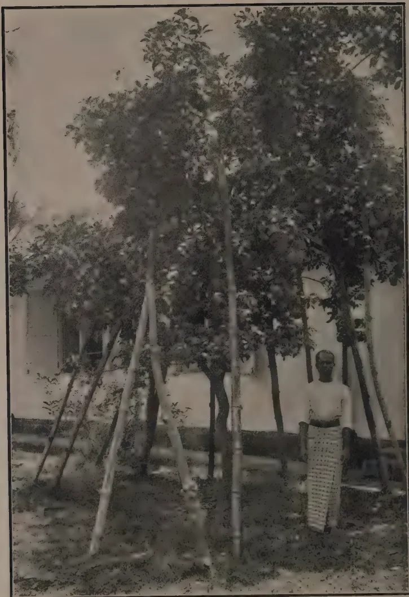

**THE**  
**TROPICAL AGRICULTURIST:**  
**JOURNAL OF THE**  
**CEYLON AGRICULTURAL SOCIETY.**

---

---

VOL. LII.

PERADENIYA, JANUARY, 1919.

No. 1.

---

---

**FOOD PRODUCTION.**

---

In the present number is included the Debate in Council on the question of Food Production. This discussion is one of the greatest importance and warrants the closest examination by all interested in the agricultural welfare of the Colony.

The latest telegrams from Europe emphasize the seriousness of the world's shortage of food products and there is little doubt that a considerably improved position can be brought about in the Colony by the closest attention being given to food production.

Estates up-country can help by encouraging their labour forces to grow vegetable products in the gardens surrounding the lines. In some districts there has been a considerable extension of these estate gardens within the past eighteen months, but still more is possible. Superintendents should also consider whether some food products cannot be grown between the lines of pruned tea bushes. Bush lima beans may be suggested for trial and it is possible that in the drier districts that dhall may succeed well. Both of these products are leguminous and could be used as green manures if necessary.

Estates in the low-country can grow many food products of importance. Attention has previously been called to the excellent crops of plantains, pumpkins and chillies that have been grown in the Kurunegala district in young coconut plantations. Large crops of dhall have also been grown in the same district in young rubber plantations. Other crops that are worthy of attention in young coconut and rubber plantations are sweet potatoes, maize, manioc and in some districts yams. It is also

1------------------------------------------------

2[JANUARY, 1919.

possible that crops of hill paddy (el-vi) or of sorghums could be grown in rubber and coconut clearings without detriment to the permanent crops.

By means of better cultivation, adoption of transplanting, better use of water, closer attention to drainage, use of selected seed and application of manures the yields of paddy crops in the Colony are capable of very considerable improvement. The average yields of paddy in Ceylon are notoriously small. Even in the Central Province and the Kegalle district of the Sabaragamuwa Province where the best yields are obtained the average only approximates 25 bushels per acre. If every effort were directed towards obtaining better crops, the present area under paddy could be made to produce a very much greater outturn. The efforts of all should therefore be directed towards securing this result. There are difficulties, but they are not insurmountable.

Attention should also be given to crops other than rice. Some districts are admirably suited to the cultivation of maize, others to the cultivation of yams of various kinds, others again to the cultivation of maize and other fine grains. Manioc has been extending considerably in the Eastern Province, in the Northern Province and in the Puttalam district. It is one of the cheapest of food products and could be very considerably extended throughout the Colony. It is suited to the wetter locations and will yield quite satisfactory crops in the drier districts. Its cultivation in chenas after the first season should be encouraged, so that the period of usefulness of the land chenaed might be extended.

In the Galle district, sweet potatoes are a staple article of food and parts of many of poorer paddy fields are at times cultivated with this crop. Sweet potatoes may be grown in all districts of the Colony, and the popularity that this food product enjoys in the Galle district warrants the belief that the extension of sweet potato cultivation could become general.

Maize could be grown to very much greater extent in the drier and upper parts of the Central Province, in Uva and in parts of the Southern Province. Chillies can also be grown on an extended scale and various curry-stuffs have been demonstrated to be capable of growing well and yielding satisfactory crops in the Walapane district of the Central Province, in the Welimada district of Uva and in certain other parts.

There is every evidence that much more food can be grown in Ceylon if every one will make an effort in that direction. The importance of growing more food locally is greater now than ever before. All members of the Agricultural Society should by example become the leaders of the people in this movement of local food production.

2------------------------------------------------

JANUARY, 1919.]3

# FOOD-STUFFS.

## THE FOUR VARIETIES OF GOURDS.

The following varieties of gourds are grown in Ceylon to a very great extent and are much appreciated and very largely used as vegetables, viz:—(1) Snake gourd (*Trichosanthes Anguina*) Sin. Patola or Podivillanga, (2) Bottle gourd (*Lagereria vulgaris*) Sin. Diyalabu, (3) Bitter gourd (*Momordica Charantia*) Sin. Karawila, and (4) Luffa or Sponge gourd (*Luffa acutangula* and *L. aegyptiaca*) Sin. Vetakolu or Niyanvetakolu. All these varieties are cultivated in the same way. They should preferably be run on pandals though except snake gourd others can be run on trees, particularly Niyanvetakolu. Bitter gourd and Luffa can be conveniently run on ends of bamboos stuck on the ground. Bottle gourd may be allowed to creep on the ground. Dig holes 2 ft.  $\times$  2 ft. and fill them up with a mixture of loamy soil, well rotted cattle manure and a little lime. The holes should be 8 ft. apart. Plant 3 or 4 seeds and later thin out to one—the best plant. Water freely. If it is convenient to erect a strong pandal, which should be 6 or 7 feet high dig larger holes 3 ft.  $\times$  3 ft. and plant all the four varieties in one and let one creeper of each variety run on to the pandal.

**Snake gourd.**—When fruits are a few inches long small stones or light weights should be hung at the end of the fruits to prevent them becoming knotty or spiral. The fruits grow to a length of 5, 6 or even 7 feet. There is a shorter and heavier variety which does not grow longer than 2 $\frac{1}{2}$  or 3 feet. Very wet or very dry weather is unfavourable and hinders the full development of the fruits. Fruits should be plucked before they mature. When ripening the fruits begin to change colour often to red. Matured snake gourds are fibrous. The fruit fly is a common enemy of the snake gourd. A solution of paris green sprayed on the fruits is a good remedy against the fruit fly but being poisonous the gourds should be well washed before use. Under favourable conditions 20,000 fruits may be taken off an acre.

**Bottle gourd.**—Also called butter gourd. Unmatured fruit is an excellent vegetable. This is considered to be cooling, diuretic and antibilious. Grown to a large extent in chena districts along with pumpkins and cucumber. When fully ripe a very thick shell is formed and in villages vessels made of the gourd are very much used. 1,000 fruits may be obtained per acre.

**Bitter gourd.**—Largely used as a vegetable and is considered to be wholesome and a blood purifier. Also considered to be laxative, antibilious and anthelmintic. There are several varieties. The long white variety known in the Sinhalese districts as "The Jaffna Karawila" is best appreciated. Under favourable conditions this is a profuse bearer and may give over a lac of fruits per acre. Sells readily.

**Luffa.**—The Niyanvetakolu (*L. aegyptiaca*) is the smooth and long variety. It is not so much grown as *L. acutangula*—the real vetakolu of a dark green colour with sharp ribs and is less appreciated as a vegetable. It is from Niyanvetakolu that the sponge is obtained and is largely grown in Japan for that. This variety is called "sponge gourd," "towel gourd," etc. The vetakolu is considered nutritive. It must be used when tender. When mature it becomes fibrous. A crop of 10,000 fruits per acre is a fair average.

The Niyanvetakolu sometimes runs into a long creeper, running up tall trees. This is much harder than vetakolu and will bear fruits for a year or two. It is worth considering if this variety of Luffa might not be cultivated for the sponge.

W. MOLEGODE, S.A.I.

3------------------------------------------------

4[JANUARY, 1919.

## HOME DRYING OF FRUITS AND VEGETABLES.

FARMERS' BULLETIN 984, United States Department of Agriculture, is devoted to the subject of farm and home drying of fruits and vegetables. In the introductory remarks it is pointed out that, at the present time, imperative necessity demands nation wide conservation of those portions of our food crops which have heretofore been permitted to go to waste. As is well known, a considerable portion of the wasted food material is made up of perishable fruits and vegetables produced in home gardens and fruit plots in excess of the immediate needs of the producers, and in the absence of accessible markets for the purpose.

Drying offers a simple, convenient, and economical method for preserving food materials, and permits the carrying over of the surplus into periods in which fresh fruits and vegetables are expensive or unobtainable.

Success in drying depends upon the observance of a few fundamental principles, and the quality of the product depends upon the care employed in the selection of the raw material, upon proper preparation for drying, and upon careful control of the temperatures employed, rather than upon the particular type of evaporating apparatus employed.

As a general principle, it may be stated that, in districts which normally have a rainless period coinciding with the ripening period for fruits and berries, these crops may be successfully dried in the sun or by means of glass covered solar driers. In regions which do not have such favourable climatic conditions, driers employing artificial heat must be used. In this bulletin a number of driers are described, and directions for their construction given. The smaller sizes are adapted to the needs of the individual home, and are designed to care for the surplus of garden products and fruits from the home grounds. The larger types are suited to the needs of individuals or communities having a considerable surplus of perishable crops. All the driers described are said to have been thoroughly tested in practice, and are such as may be constructed at very moderate expense from materials everywhere available by any one who can use ordinary tools.

Directions for the preparation, drying, and subsequent storage and care of the dried products are given for each of the more important fruits and vegetables. For ordinary family needs, a considerable number of small driers both patented and unpatented are mentioned, which are intended to be operative over the ordinary cook stove, and in connection with the usual routine of the kitchen. In plan these range from single trays, or open racks supporting several trays to be suspended from the ceiling, to strongly built all-metal cabinets with a capacity of 1 to 2 bushels at a single charge. In many cases the housewife will find it possible to do without special apparatus, and to dry such materials as she wishes to preserve in the oven of the cook stove, the products to be dried being spread thinly in baking pans or pie tins, which should be placed upon racks so that they do not come into direct contact with the oven wall. The door of the oven should be left open, so that the water vapour driven off may pass out, and the fire should be so regulated that the material may not be scorched.

Such a device as the last mentioned, would appear to be specially suited to conditions in the West Indies, where with the use of an ordinary evaporator, placed on the stove, sweet potatoes, tomatoes, and other vegetables grown in these colonies may be preserved in the manner described below.

4------------------------------------------------

ANUARY, 1919.]5

### SWEET POTATOS.

Sweet potatoes intended for drying may be prepared in the general manner outlined for root vegetables in so far as washing and paring are concerned. They may be cut into slices, like potatos or carrots, or split lengthwise into quarters or eighths according to size, and dried in that form. If sliced, six or eight minutes is sufficient for blanching; if cut into quarters, the time should be increased to ten minutes, as the potatos may be partially cooked. The temperature of the drier may be 145° to 150° F. at the beginning of the drying, and raised 10 or 15 degrees after the product loses most of its moisture. Sweet potatos should remain in the drier until the pieces have become quite brittle, and break readily under pressure.

In humid districts in which the storage period for sweet potatos is comparatively short, an evaporator may advantageously be used for partially drying or curing potatos to increase their keeping period. The potatos are brought from the field or market, spread upon the trays one or two deep, and placed in the drier, which is kept at a temperature of 90° to 100° F. by slow, careful firing. After forty-eight to seventy-two hours of this treatment, the potatos will have lost 10 to 15 per cent. of their weight, and will have become slightly shrivelled superficially. All cuts or broken surfaces will have dried up. The potatos should then be removed and stored in bins or cellars in the usual way. The ordinary fungi which cause rotting in storage do not attack potatos which have been subjected to this treatment, while the cooking qualities and flavour of the potatos are entirely unaffected by it.

### TOMATOS.

Fruit intended for drying should be well ripened but still firm. Wash the tomatos, place them in a wire basket, and submerge in boiling water for one or two minutes, to loose the skins. Remove and allow to cool, strip off the skins, remove the hard, woody central core and any adhering skin or diseased areas, and cut the fruit into slices  $\frac{3}{8}$  to  $\frac{1}{2}$  inch in thickness. Spread the slices in a single layer upon the trays. Tomatos cannot be placed directly upon naked wire trays, as the acids of the fruit become so concentrated during drying that the metal is rather vigorously attacked. Trays may be protected by painting them over with a brush dipped in boiling paraffin, or by laying pieces of cheese-cloth over them.

The temperature at the beginning should not be more than 120° F., and may be gradually increased to a maximum of 140° F., towards the completion of the drying.

Properly dried tomatos, as taken from the drier, will show no moisture on being pressed between the fingers, and the slices will break crisply on bending. Like all other vegetable products they will become somewhat flexible and elastic after being shovelled over for some days in the curing room,

### OKRAS.

The younger pods of okra may be dried entire after being steamed or blanched in boiling water for two or three minutes, while other pods should be split into halves, or if quite large, into quarters, and blanched for two minutes. Spread thinly on trays so that the pods do not overlap. Begin the drying at a temperature of 115° F. to 120° F., and gradually increase to not more than 135° as the drying proceeds.

5------------------------------------------------

6[JANUARY, 1919.

### BEANS AND PEAS.

Garden peas intended for drying should be gathered when in ideal condition for immediate table use, that is, when the seeds have attained full size, and before the pods have begun to turn yellow and dry up. Shell them by placing the pods in boiling water for five minutes, then spread them on a wire screen, having a mesh large enough to permit the shelled peas to pass through, with a box or basket placed beneath it. Rub the pods vigorously over the screen with the hands, which will burst and empty practically all the pods much more quickly than they could be shelled by hand. The shelled peas are then given a very short dip, one to two minutes in boiling water, drained, spread to a depth of  $\frac{3}{4}$  inch to 1 inch on the trays, and dried at  $115^{\circ}$  to  $120^{\circ}$  F. as initial temperature, rising to  $140^{\circ}$  toward the completion of the drying. Stir occasionally while drying. Properly dried peas will uniformly dry throughout, showing no moisture near the centre when split open.

String beans, not yet full grown, but sufficiently developed for table use are strung, broken into pieces, each containing not more than two beans, and dipped into vigorously boiling water for five minutes if very young, for seven to eight minutes if older or nearly grown, in water which has had two tablespoonfuls of ordinary baking soda to each gallon added to it. This will preserve the bright-green colour of the pods quite perfectly. Then spread the beans about 1 inch deep on trays, and begin drying to  $130^{\circ}$  F. Stir occasionally, and increase the temperature very gradually to  $140^{\circ}$  to  $145^{\circ}$ . The drying is complete when no moisture can be expressed from freshly broken peas. Beans and peas which have been allowed to dry on the vines may advantageously be given a short treatment in the drier. Shell and spread them to a depth of  $\frac{1}{2}$  to  $\frac{3}{4}$  inch in the trays, and place in the drier for ten to fifteen minutes at  $165^{\circ}$  to  $180^{\circ}$  F. This treatment will destroy insects' eggs and bean weevils, thus reducing the possibilities of loss in storage; but it also destroys the vitality of the material treated, which consequently cannot be used for seed.

### TREATMENT OF PRODUCTS AFTER DRYING.

After removal from the driers fruits or vegetables must be subjected to an after-curing or conditioning process before they are permanently stored away. Any lot of material, even that removed from a single tray, will not be uniformly dry throughout, some portions being over-dry, while others contain too much moisture for safety. If such material while still warm be piled loosely on a clean floor, and subsequently thoroughly stirred at daily intervals for ten days or two weeks, the wetter portions give up some of the water to the drier parts or to the atmosphere, the moisture content of the entire mass becomes uniform, and a condition of equilibrium with the surrounding air, such that the material neither absorbs nor gives off measurable quantities of moisture, is presently attained. Material so treated is said to have been "conditioned," and may be stored without danger of spoilage; without such treatment, the spores of fungi and bacteria present upon the material will be able to begin growth upon the wetter portions, ultimately destroying the whole. The curing room should be conveniently located with reference to the drier, should have over all the windows blinds or shutters which effectively exclude sunlight or strong daylight, and should be closely screened to exclude insects. Containers in which such products are stored, should, of course, be air-tight.—AGRICULTURAL NEWS, Volume 17, No. 427.

6------------------------------------------------

JANUARY, 1919.]7

## CORN FOR THE PHILIPPINES.

**JOSÉ S. CAMUS.**

*Asst. Agronomist, Plant Industry Division.*

Of all the possible supplements to and substitutes for our rice supply, corn stands first, as the cereal it is most logical to employ to offset the rice shortage, by reason of its adaptability to Philippine conditions, its high food value, its palatability and the ease with which it can be prepared for the table. Its use is becoming more popular and it is bound to be generally adopted into our dietary, so it is high time to see to its increased production.

The production of corn can be increased by the extension of acreage and by improved scientific cultivation. The extension of acreage is purely mechanical and can be accomplished by simply following early rice crops with corn, and by planting the vacant lots and other idle fields. Scientific cultivation does not necessarily involve the extension of acreage, but consists rather in proper preparation, cultivation and fertilization of the ground, and in rigorous seed selection. The present average yield of corn per hectare is 15 cavans. It has been conclusively found that 50 cavans can be easily produced to the hectare by the use of selected seed; thus, seed selection alone could more than treble the present production of corn.

Scientific cultivation counteracts the present defects of corn production. Production can never be improved or increased by planting too late or out of season, by simply sticking the seed in the ground, and expecting Providence to do the rest, without cultivating the field after planting, and without selecting the seed at harvest time.

### SOIL FOR CORN.

The nature of the soil and its preparation have a great deal to do with corn production. This is as important if not more so than the selection of good seed. For no matter how good the seeds are, if they are not planted in the right soil the result is likely to be failure. A rich, deep, loamy soil with a large amount of humus and organic matter is the best soil for corn, but, of course, it can be grown on any kind of soil except on a very heavy clay or undrained areas. Poor soil, however, may be improved by fertilizing them with farm manures or by planting mongo or cowpeas or any other leguminous plants. The former improve the physical and chemical conditions of the soil while the latter have small micro-organisms on their roots which have the power of taking the nitrogen from the air and changing it into a form available for plants.

### THOROUGH PREPARATION OF THE LAND.

Corn responds to thorough preparation of the soil more readily than any other crop. One of the causes of low yield of corn in the Philippines is poor preparation of the land. Corn requires food as well as other plants. This food is absorbed from the soil by means of roots. For this reason it is necessary that the soil should be well prepared by ploughing deep and harrowing at least twice crosswise so that the roots can readily penetrate it.

### TIME FOR PLANTING.

Generally the best time for planting corn is during the months of October or November, and April or May, as soon as the soil can be worked after the rains. In some parts of the Philippines where the rainfall is more or less evenly distributed throughout the year corn can be grown at any time. Only a small amount of moisture in the ground is necessary to give the young plants a good start. Too much water is detrimental to corn, which should be planted not in very wet, but in moist soil.

7------------------------------------------------

8[JANUARY, 1919.

### IDEAL SEED FOR PLANTING.

Seed should never be picked from shelled corn, but should be selected while on the cobs in order that you may see what you are selecting from and thus be able to get the best. And this should be taken only from strong plants with thick stalks of medium height, having one or two well-developed, medium-sized ears of nearly cylindrical shape, tapering only slightly from the butt to the tip and having small cobs. The grains of the ears should fit firmly and be set in straight rows. In shelling seed corn the kernels at the tip and those at the butt of the ear should not be taken, as they are usually not good for seed.

### METHOD OF PLANTING.

Corn should be planted in furrows when the land is rather dry, and in ridges when rather wet. But under ordinary conditions it should be planted in rows made by drawing over the field a board about four meters long with wooden nails set one meter apart, or whatever distance is desired. These nails should be 8 to 10 centimeters long and the board just heavy enough to produce shallow furrows. Both ends of the board should have a hole through which to tie the ropes for hitching to a carabao. The hills within the rows can be marked by drawing over the field another board with wooden nails set 75 centimeters, or whatever distance is desired, straight angles with the lines of the rows. Seed should be planted at the intersections of the two rows and a little earth thrown over them with a hoe or with the feet of the planter as he sows the seed. About four kernels should be planted in each hill, about 3 to 4 centimeters deep when the soil is wet, and 6 to 8 centimeters when dry; and the plants should be thinned later leaving two per hill.

### PLANTING DISTANCES.

The distance at which corn should be planted depends upon the fertility of the land. The richer the soil is the closer you can plant. Many farmers still believe that the more plants they have per hectare the greater yield will be obtained. So they plant their corn as close as possible, providing only enough space between the rows for a carabao to pass through in cultivation and consequently produce very small sterile plants. This is one of the principal reasons why the average production of corn in the Philippines is very low in comparison with that of other countries.

In average soil corn should be planted in rows about 1 meter apart and 75 centimeters in the row between hills, each hill containing two to three plants. It requires about five gantas of seed to plant a hectare. Planting in this way permits one to cultivate both down and across the rows, and thus makes cultivation easier, more economical and efficacious and does away with much hand weeding and hoeing.

### PROPER CULTIVATION.

Another cause of low yield is that not sufficient attention is given to cultivation. Thorough and frequent cultivation is needed to produce good crops of corn. And yet some plant corn and then leave it alone till it matures; others cultivate it once when the plants are already old, by passing the plough on both sides of the rows, which oftentimes does more harm than good to the plants by cutting some of the roots.

Corn should never be cultivated more than 10 centimeters deep, for it is a surface feeding plant, having a large number of long roots distributed through the upper soil, and for this reason whenever the soil is cultivated so deeply as to disturb any of the roots, the plant is weakened by having some of the roots cut off and its supply of moisture and nourishment consequently decreased.

8------------------------------------------------

[JANUARY, 1919.]9

So the first cultivation of corn should be shallow and subsequent ones become more so as the plants mature. An ordinary cultivator with seven teeth is recommended for this purpose. This cultivator can be widened or set to any depth by adjusting screws. The corn should be cultivated often—at least once every two weeks—to keep down all weeds and to break the surface crust after the rain, and oftener in time of drought to form a mulch in order to check the rapid evaporation of moisture in the soil.

The above directions if followed faithfully, will result in higher production. Expenses are about the same under good as poor methods. It does need some little extra work and thought to switch from the old path; but the profit will more than compensate for this investment of brains and labour.

How to select and store seed corn by the “*halayhay*” method.

1. The *halayhay* method of storing seed corn consists in hanging up the unhusked ears systematically by their own stems, tips downward, on a bamboo frame or rack built in the open as follows :

A number of strong posts, about 5 meters in length are set perpendicularly in the ground in straight rows, about 1.5 meters apart from each other. Then bamboo slats about 5 centimeters wide are nailed across horizontally joining all the posts. The slats are placed one above the other about 22 centimeters between their upper edges. The first slat from the ground should be high enough so as to protect the corn from roaming animals. Slats should be similarly fastened on the opposite side of the posts in order to economize space by doubling thus the capacity of the *halayhay*.

The base of the post should be buried deeply, not less than 70 centimeters, so as to make the rack strong. It is oftentimes necessary to provide the rack or *halayhay* with either guy-wires or braces to prevent it from being blown down by strong winds. The *halayhay* should be built near a building or some other windbreak, preferably facing from east to west so as to admit as much sunshine as possible.

2. Corn for storing by the *halayhay* method should be selected thus : (a) choose the best field of corn of the desired variety from which to select the seed ; (b) select the best, well-matured ears (without opening or in any way mutilating the husk) from the best individual stalks ; (c) pick the ears so selected by cutting the stalk with a knife or bolo about 4 centimeters just below, and about 15 centimeters above, the base (node) of the shank. The piece of stalk thus left on the shank forms with this a sort of hook whereby the ear may be hung up. Immediately after harvesting, the ears should be hooked over the bamboo frame, commencing with the lower slat, and building upward.

3. It is obvious that the method of selecting seed corn on the husk is faulty in that there is a possibility of getting ears of imperfect type. However, if proper care is taken in the selection, by picking the largest, best-proportioned, well-covered and best filled ears, as may be judged from external indications, the number of undesirable ears may be reduced to a minimum. The corn should be husked upon making its distribution to farmers, at which time the final selection is made and the undesirable ears are discarded.

9------------------------------------------------

10[JANUARY, 1919.

## PRODUCTION OF FOOD STUFFS.

The following debate on the production of food stuffs in the Colony took place at the meeting of the Legislative Council on Thursday, November 14, 1918 :—

The Hon. the First Tamil Member :—I rise, Sir, to move that further steps be taken by Government to increase the production of food in this country.

During the last fifty or sixty years the Government has done much to give facilities for food production and to improve the condition of the peasantry. SIR HENRY WARD gave a great impetus to the paddy-growing industry of Batticaloa by the restoration of tanks and by selling lands on attractive terms. He offered for sale about 6,000 acres in 1857 in small blocks on the instalment payment system. The people were overjoyed. In an address presented to the Governor in the Tamil language, to ensure the fact that their feelings were correctly expressed, they said : " After we have been so long unable to purchase even a foot of Crown land, we were agreeably surprised to find that Your Excellency has been so gracious as to sell lands in such small lots as are within the means, not only of the wealthy, but of others too, the purchaser paying only a quarter of the value yearly. We have neither seen nor heard the like before."

WARD still lives in our memory as the greatest of our Governors. Other great Governors whose memory is cherished by the peasantry of this country are SIR WILLIAM GREGORY, who re-created the Anuradhapura district ; LORD STANMORE, who spent most lavishly on irrigation, in spite of a diminishing revenue ; and SIR WEST RIDGEWAY, who was a firm believer in the benefits of irrigation. Although the direct financial results of the irrigation policy are unsatisfactory, the beneficent work of these Governors has greatly improved the condition of the people in many districts.

Of the land rendered irrigable at great cost, nearly 100,000 acres still remain uncultivated. The HON. MR. STUBBS in January, 1916, appointed a Committee of this Council, with the HON. MR. FRASER as Chairman, and consisting of three other members, HON. SIR CHRISTOFFEL OBEYSEKERE, HON. MR. MOONEMALLE, and myself, to suggest measures for the development of these lands. In August, 1916, this Committee made certain recommendations. With a view to removing the delays and disappointments associated with the present system of land sales, they recommended that the irrigable area under some tanks should be blocked out into moderately sized holdings, which should be available for allotment to the settler on his arrival, and that settlers should be given cheap rates for goods and passengers by railway. They further recommended that, with a view to ascertaining what form of land tenure would be preferred by the people, an experiment should be carried out in one of the larger settlements by providing three separate tracts of irrigable land. The first was to be occupied by tenants under the Crown, who pay no rent, but pay water-rate. To this class Government was to advance money for developing the land on easy terms on the security of the improvements effected. The second tract was to be leased out at 50 cents per acre for three years, and thereafter at Re. 1 per acre, with the option of acquiring proprietary rights on payment of Rs. 15 per acre. The third tract was to consist of blocks to be sold outright on the instalment payment system. Financial assistance was to be given to classes 2 and 3 through the

10------------------------------------------------

JANUARY, 1919.]11

medium of Co-operative Credit Societies. This experiment was suggested as one member of the Committee thought that leases would be more attractive, than sales and the others thought otherwise.

In recommending a colonization scheme, the Committee said : " Wherever the size of a work justifies such a course, a colonization officer should be appointed to select settlers to allot to them the lands immediately on their arrival and to administer the settlement ; that a healthy site should be selected for the future hamlet, which should be laid out so that each settler may have a block on which to erect a hut and cultivate garden produce ; that a dispensary and a supply of good water, postal arrangements, and a store for the sale of the necessaries of life at the inception of the settlement should be provided ; that temporary accommodation for the reception of the settlers should be erected until they are able to build their huts."

In September, 1917, a Committee of the Agricultural Society, after an independent inquiry, found themselves in general agreement with the recommendations of the Committee of this Council.

The recommendations as to cheap goods rates by the railway was accepted by this Council in June, 1917, and the concession has already come into force. It is necessary, if settlers are to be attracted to these unhealthy districts, that passenger rates not higher than estate cooly rates should be conceded to them. Though the Hon. the Colonial Secretary was sympathetic, the Railway Department raised certain obstacles, and the matter has been shelved. Let me press for this concession a second time to-day. There will be no practical difficulty if we restrict the concession, to begin with, to those who have bought lands in the tank districts, and to those who are registered labourers on these lands. Another recommendation that has been adopted is the colonization scheme.

Some of the obstacles that stand in the way of a rapid development of the tank districts can be easily removed. In reply to a circular letter sent by Government, MR. FREEMAN, the Government Agent of the North-Central Province, wrote that the opening up of Crown land was at a standstill, owing to (a) absence of channels, (b) want of surveys, (c) the requirement of the Forest Department as to timber. The Government Agent of the Eastern Province reported that the demand for land was checked by the restrictions of sales pending contour surveys. As a matter of fact, since 1909 no irrigable land has been surveyed and offered for sale in the Eastern Province. Want of surveyors is in every Province one of the chief obstacles in the way of a more rapid agricultural development of the Island. We must find surveyors, and that at once. If the present terms offered do not attract enough men, there is no other course open but to offer better pay and more suitable terms.

It is not a wise policy to allow irrigable lands to remain uncultivated for want of surveyors. The Nachchaduwa tank was constructed at a cost of about Rs. 660,000. The yearly interest on this sum at four per cent. is over Rs. 26,000. For ten years the interest will amount to Rs. 260,000. Two or three surveyors can give us in one year a complete survey of the whole irrigable area under this tank. Yet for want of a few surveyors we are allowing an investment of six and a half lakhs to remain useless. If Government insists on sufficient surveyors being employed, the departments concerned will train enough men for all our requirements.

11------------------------------------------------

12[JANUARY, 1919.

Another obstacle in the way of a more rapid extension of village agriculture is the want of cattle. Even apart from agriculture, there is a great scarcity of dairy produce. The price of milk in Ceylon is higher than in Europe or America. This mainstay of child life is absolutely beyond the reach of the vast majority of our population, with the result that infant mortality is very high in this country.

Village agriculture cannot flourish without cattle, and cattle cannot exist without pastures. Owing to our imperfect perception of the relation between pastures, cattle, and agriculture, we have in the past allowed a good deal of village pastures to disappear by encroachment by private persons and sale by Government. An Assistant Government Agent of Chilaw wrote: "One of the chief hindrances to the progress of rice cultivation is want of pasture land for the rearing of cattle, nearly all available lands being given over to coconuts." MR. SAXTON, Government Agent of the North-Western Province, wrote: "The diminution in the number of buffalos and in the extent of pasture lands which are necessary for them is a difficult point. The pasture lands are being encroached on daily."

These remarks are applicable to almost every Province. The Forest Department is also an obstacle in the way of cattle rearing. The view point of the Forest Department may be gathered from the following passage in the report of the Department for 1916: "The straying of cattle through the forests continues unchecked, and the damage thus caused is considerable, though it is not so noticeable as in divisions where large trees are being regenerated artificially. The only remedy likely to prove effective lies in shooting, and forest officers should be given permission to shoot at sight any cattle found straying in reserves or proposed reserves."

The Conservator of Forests does not look beyond the interests of his Department. When the inhabitants of Galboda, in the Province of Sabaragamuwa, applied for 137 acres for pastures, the Forest Department stepped in again and wanted the land for re-afforestation. Necessary as re-afforestation is, it must certainly yield to the greater need there is for pastures near villages.

Yet another enemy of agriculture and cattle is the Game Protection Society. In Tissamaharama some 5,000 cattle required for cultivation purposes were pastured on the open grass plains near the sea, but in 1909 about 4,000 acres, which served as admirable pasture grounds, were taken for part of the game reserve, and the pasturage north-west of the Tissa tank was given in its place. Even this has been reserved by the Irrigation Department. The people now have no recourse but to drive the cattle into the wild jungle for pasturage, and many head of cattle are destroyed by wild animals. Those whom the wild beasts in their mercy spare, the Conservator of Forests now proposes to shoot down.

In passing, I should like to say one word about game protection. Wild elephants and buffalos are responsible for a good deal of damage to plantations and crops, and in many districts people have to keep a constant watch in the nights to protect their crops and plantations. The Government Agent of the North-Central Province gives, as a reason for the slow progress of cultivation under one tank, the great damage done by elephants. Agriculture would be greatly benefited if free licenses were given to capture elephants and wild buffalos, instead of protecting these natural enemies of civilization.

12------------------------------------------------

JANUARY, 1919.]13

Another obstacle in the way of cattle raising is the Automobile Club. To make way for the fast-going motor car, it is thought desirable to prevent the trespass of cattle on roads, and to punish those who suffer their cattle to trespass on roads. MR. SCHRADER, at one time Assistant Government Agent of Hambantota, wrote : " Buffalos are animals that must be left to wallow and find their own pasture. Habitually penning them after their day's work is sure to result in disease breaking out among them, and they cannot be fed in a confined space."

The HON. MR. R. B. HELLINGS, when Government Agent of Sabaragamuwa, wrote : " The buffalo is indispensable to paddy cultivation, and has now lost his natural pasture ground . . . . . The cultivator does not know where to keep his buffalos between the seasons of cultivation. They break through the wire fences and are shot by estate owners, or are caught to pay for damage done." Many farmers have been crippled by these prosecutions. We must provide pastures before we prosecute for trespass on roads.

It is now too late to oust people who have encroached on pasture lands, or to cancel Government sales of communal pastures. The present Government is not to blame for this state of things. This has been their inheritance from those who preceded them over twenty years ago. But the present Government might make up for the want of foresight of their predecessors by providing extensive pasture grounds wherever convenient. In spite of the great attention paid by Government to the subject of pastures since 1908, there has been hardly any appreciable increase in the area of pasture lands. It appears to be idle to depend on Village Committees to take the initiative in this matter. I think, Sir, the Forest Department may be requested to provide pastures by clearing forest land wherever suitable land exists near villages.

Leases of at least 500-acre blocks for a period of thirty years at 25 cents an acre should be given along the Northern Railway line for those desiring to open large dairy farms. Special railway vans with refrigerating apparatus should be provided for the carriage of milk at 3 cents per gallon, inclusive of returned empties, irrespective of the distance carried. After the industry is well established the rate may be increased. Besides providing railway vans, the Government may also, in important centres along the railway line, provide cold storage rooms for a small rent. By providing these rooms, even if the trains arrive late, the milk can be kept fresh till the evening.

Similar leases should be given for poultry farms, and cheap transport for eggs and poultry should be provided.

Another article of food which we import largely is fish. We import fish for over four million rupees annually. We might be able to reduce this bill to a large extent if we provide railway vans with refrigerating apparatus. The Government would also do well to establish in the towns far from the sea cold storage rooms for fish consigned by the railway.

There is also a small matter which I might mention. We import tamarind for about Rs. 180,000. If we plant the roadsides with this fast-growing tree for a distance of one hundred miles, we can get all the tamarind we want. The tree lives long, unlike the ingasaman or flamboyant. I am informed that the tamarind tree under which FRANCIS XAVIER preached is still standing at Point Pedro.

13------------------------------------------------

14[JANUARY, 1919.]

I am not raising this question about food production to-day merely because of the famine prices prevailing at present. This circumstance may, perhaps, serve to bring home to our minds in a striking manner the importance of the subject, and may be a powerful argument for immediate action. But the subject, however, is of a more enduring importance, irrespective of war and famine. There has been in India for the last twenty or thirty years a great shortage of food. Responsible officers have declared that in several provinces of India a large percentage of the people are insufficiently fed. Several Indians have for many years past pleaded in the Councils of India for a prohibition of the export of food, and the Indian Government may be compelled to take some form of action to satisfy Indian opinion. I am not referring to the present temporary prohibition of the export of rice and chillies, which has hit us so hard, but some form of restrictions as to export may take a permanent form. At least a higher export duty may be imposed. Besides, the habit of eating rice is spreading to many races of India, which formerly consumed other kinds of grain, while the supply remains stationary. It is time that we realized that we cannot complacently depend on India for our food supply. Last year we imported rice to the value of Rs. 63,000,000, and our total import of food amounts to about Rs. 75,000,000 per annum. A *laissez faire* policy has wholly failed to stop this huge drain. The present state of things can only be altered by giving a direct stimulus to food production. This stimulus is given in most countries by protective duties and bounties. Free trade England had, I believe, recently to guarantee the price of wheat for about twenty years to induce the farmers to extend the cultivation of wheat. The United States Government had to make farming attractive in several ways, in order to prevent agriculture from languishing by the rush of the sons of farmers to the city. In some countries agriculture is fostered by the Government compensating agriculturists for losses arising from floods, pests, and other like causes. If food production is to be encouraged in Ceylon, we must adopt some at least of these measures.

• Paddy flies are a great pest at times. Loss from paddy flies result at times from the Irrigation Department forcing people to begin cultivation at unseasonable times. If Government offers to pay about twenty-five per cent. of the damage arising from such causes, it would be a good thing. Similar compensation may be given to damage resulting from drought and flood in specified areas.

In Australia, under the Bounty Act of 1907, the Government offers to pay a bounty of twenty shillings for every ton of rice produced.

In 1910 the Australian Government paid in bounties for sugar nine and a half million rupees. In our country we allowed our nascent sugar industry to die for want of any State assistance.

If we cannot make up our mind to pay any bounty for paddy cultivation, may we not at least give paddy growers free issue of water, or water at a very nominal rate? Paddy cultivation is the least profitable of our agricultural industries, and even a slight increase in the water-rate tells heavily. In the Eastern Province there has been during the last seven or eight years friction between the Irrigation Department and the paddy cultivators owing to the water-rate. Large tracts of land have remained uncultivated in

14------------------------------------------------

JANUARY, 1919.]15

consequence, and several cultivators have. I am informed, left the district and gone elsewhere.

Another great aid to food production would be the establishment of Agricultural Banks by the Government to finance the farmers. The Agricultural Bank of Egypt, which lends at eight per cent. to the Egyptian peasant, has proved to be a great blessing to that country. The co-operative credit movement, useful as it is, will take at least another twenty years before it comes into fair working order. The idea of co-operation and mutual guarantee will take some time to take root. A State Agricultural Bank will serve an immediate want if it has branches in all rural centres.

A large number of Indians are emigrating yearly to South Africa, West Indies, the Malay States, the Pacific Islands, and other distant parts of the world. Some of those who emigrate have gone without any such inducement as advances and free passages, and have become permanent settlers in distant parts. May we not make an effort to colonize the uninhabited country from Mannar to Madawachchi with Indians? Let us give them every inducement to become permanent settlers in this region. Encouraging food production will not be prejudicial to the coconut, tea, and rubber industries. In the North-Central Province, in the Hambantota District, in the Eastern Province, tea and rubber cannot be grown, and even coconuts do not thrive. It is to the best interests of the country that even these districts should be developed. These three districts could easily produce all the paddy we want.

Protection, bounties, colonization schemes, offer of land on easy terms, encouragement of Indian emigration, free issue of water, cheap rail rates for locally grown food and for agriculturists, railway vans and rooms for cold storage, free licenses to capture wild elephants and wild buffalos, compensation for damage arising from flood, drought, and pests, agricultural banks, free pastures, planting roadsides with fruit trees, utilization of prison labour for food production, more surveyors—these do not exhaust the measures we may adopt for increasing our food production. Others may be able to suggest other methods. All that I wish to impress on the Council is the need for adopting a more vigorous policy. I am content to leave in the hands of the Government the decision as to what methods should be adopted. The Government has done much in the past, and we are to-day especially fortunate in having at the head of Government one who has evinced great interest in this question, and who has done much to foster food production in Jamaica. If over and above what we are doing now we spend a million rupees every year for giving some direct assistance to those growing paddy, curry stuffs, fruit trees, and other food products, we can save a food bill of fifty million rupees per annum in about fifteen years. The experiment is at least worth trying. A well-equipped department to experiment on scientific agriculture will serve a great need if agriculture is encouraged by some means as I have indicated.

At this stage the Council adjourned for fifteen minutes.

On resuming—

The Hon. the Second Low-country Sinhalese Member :—I have much pleasure in supporting the motion proposed by my honourable friend the First Tamil Member. I think, Sir, that he has done a great service to this country by bringing forward this motion just at this time, because, now that

15------------------------------------------------

16[JANUARY, 1919.

the war is virtually won, there is a very great danger that the people of this country may get into a fool's paradise and think that they need not persevere in their efforts to produce more food. I brought forward a similar motion in this Council a short time ago, but it was an emergency motion to meet the wants of the times. My honourable friend's contention is that we ought to grow enough food for all time. Long years ago, Sir, we not only grew enough food for ourselves, but we were able to send rice to India. Of course, we can never hope to get back to that state of affairs, but there is no reason why we should be dependent on India and Burma for our staple food. There was a time when the Southern Province supplied the whole of Ceylon with rice. If we are to have any practical results, we must give the people some inducements to grow food stuffs.

First of all, Sir, we require land. On the 8th of August I moved in Council that Government do take prompt steps to encourage, by every possible means, the greater production of food stuffs, curry stuffs, and so on, locally. In supporting that motion, the Hon. the European Rural Member struck at the very root of the matter by saying: "But what appeals to me is that you cannot expect the villager to grow curry stuffs, unless he sees a market for his produce and can obtain remunerative rates. That is one of the questions that will have to be gone into if this matter is to be tackled at all seriously."

I suggested at that time, Sir, that the Co-operative Credit Societies might take up the matter by arranging to buy up the surplus produce in their own korale and selling it to another korale or district, through its Co-operative Credit Society, where there is a demand for food products. Since then I find that the Matale Food Production Society has taken up the idea, and that it is working very well, for I find in the Agricultural Magazine for October a report submitted by MR. SENIOR WHITE, a member of the Society. Amongst other things, he says that the scheme of work briefly is that each member of the committee should be responsible for the development of food products in the village in which he resides, and should form a local sub-committee composed of minor headmen and prominent villagers, with himself as chairman, and that he should represent the village on the central committee. The primary duty of a local sub-committee is to draw up a register of uncultivated lands within their working area, and to encourage the production of food stuffs.

Next, we require a plentiful supply of water. That is a matter entirely in the hands of the Irrigation Department, and the trouble arises when the villager, with the experience of two thousand five hundred years behind him, applies for five inches of water, and the Department, with its superior knowledge says: "No; two inches will quite do," with the result that the water is of no use either to the villager or to the Department. The crop is spoilt owing to the want of sufficient water, and the rest of the water that the Department has carefully preserved is sent out into other fields, and does no good to any one at all. It only helps to bring in the water-rate.

Thirdly, Sir, we require cattle. Cattle cannot be bred or reared without pasture lands. It is useless our trying to import better breeds of cattle. What we have is quite good enough. What we want is more pasture land

16------------------------------------------------

JANUARY, 1919.]17

for grazing purposes. As regards cattle also, Sir, there are too many restrictions, as pointed out by the Hon. the First Tamil Member. Even to-day I find there is on the Agenda the first reading of an Ordinance dealing with the straying of cattle on public roads. When the Ordinance comes up for the second reading I shall have certain remarks to make, but for the present I just wish to say that the Bill in question would, if passed into law, be a further restriction on the villagers having cattle of their own.

My honourable friend the First Tamil Member has also referred to the matter of railway facilities, and I need not dwell on that point very much more beyond stating that, not only food growers, but also the people who take the food stuffs for sale should be allowed cheap rates on the railway to take their produce from place to place.

Another thing I suggested, Sir, when I brought forward my motion was that a spirit of competition should be fostered amongst growers, and a spirit of emulation amongst headmen. Competition amongst growers I suggested should be fostered by having village shows, which should not be held for the self-glorification of any one individual, but for the good of the people, and that the headmen, of the village carrying off the largest number of prizes should be given a certificate by the Government Agent to show that he has taken some interest in the matter.

Lastly, Sir, I would say that no practical results can be attained unless we have what I might call a system of benevolent compulsion. I understand, Sir, that even in England during the war every landowner was compelled to put under cultivation a fractional part of his holding. Speaking entirely for the Sinhalese, I see no reason why every Sinhalese man in Ceylon, from the Maha Mudaliyar downwards, whether he owns one acre or a thousand acres, should not be compelled by Government, for his own good and for the good of the country, to put under cultivation a few acres of land.

I also moved, Sir, in Council on March 1918, that the reports made by the several Government Agents, Assistant Government Agents, Director of Agriculture, and his Assistants, as regards the steps taken to increase food production, be tabled. In giving me the information asked for, the Colonial Secretary was good enough to make a very long and exhaustive reply. He said that the greater part of what was done by the Agricultural Department and by the Government Agents was more or less of an experimental nature. He warned me not to expect too much from what was being done. This is not the time nor the place to criticise the Agricultural Department, but I wish to say that if during the past twenty years of its existence the Department could not do anything beyond conducting experiments, notwithstanding the critical times we have been passing through, then I am afraid it has failed to justify its existence. What I said last year still holds good, and that is, that it is not the fault of the Department so much as that we, the people of the country, have a great regard for Government Departments. I do not think the Agricultural Society can help the people of the country at all till it becomes a Government Department. Not only must it be a Government Department, but it must be under the control of the Government Agent. Most of the trouble about food production is due to the fact that the Government Agent of a Province is no longer what he formerly was called, namely, the Rajah of a Province, owing to there being so many

17------------------------------------------------

18[JANUARY, 1919.]

other Departments, for example, the Forest Department, the Irrigation Department, the Police Department, the Excise Department, which take away from his power and authority. Twenty or thirty years ago a Government Agent was a very great man in his Province. The Forest Department and the Irrigation Department were under his charge. During that time all complaints went straight to the Government Agent, who sent his minor officials to inquire into them.

Now, my honourable friend tells me that it is quite possible that such cases as the following do occur. When a man wants two inches of water, the Irrigation Department, for some reason or other, says "No, I will give you only one inch." The man runs off to the Irrigation Engineer, who is, perhaps, twenty miles off. By the time the man's complaint reaches the Government Agent, and is referred through the Government Agent's officers to the Irrigation Department at Trincomalee, several days have elapsed, and by the time the man gets his water supply, even if he gets the full quantity asked for, it is too late. The whole crop is spoilt. That is one of the reasons why we have all this trouble. I think the Hon. the First Tamil Member's motion is one that requires careful consideration on the part of Government, and I am sure it will have the sympathetic attention of the Council.

The Hon. the First Low-country Sinhalese Member :—Sir, I should like to say a few words on this subject, although my honourable friend the mover traversed such a large amount of ground that it is utterly impossible for me to cover the whole of it, nor do I propose to do so at this stage of our proceedings to-day. But I should like to say a few words on one or two of the subjects touched upon by him. In the first place, I will restrict my remarks to the question of the growing of paddy. We all know the disease I cannot agree either with the Hon. the First Tamil Member or the Hon. the Second Low-country Sinhalese Member about the remedies, because I think they have not traced the troubles to their proper source. During the many days that some of us were engaged in connection with the Irrigation Bill that was passed a few months ago we had the opportunity of examining many witnesses who came from the irrigation areas, that is to say, from Anuradhapura, Batticaloa, Tissamaharama, and so on, and the conviction dawned on me that the whole of the methods now in vogue are entirely unsuited to cope with this question of the increase of the supply of food, and that it was necessary to look at paddy cultivation from an economic standpoint. After all, as has been truly said by my honourable friend the mover, the reason why paddy cultivation is neglected is because it does not pay. It is the least paying industry. How is it that it pays in various other civilized countries and not here? In connection with this train of thought I made some investigations, and I should like to state in a few words the result of my researches.

In India there is a very large acreage running into several millions under paddy cultivation, but the average yield per acre in an average area comes to about 18 bushels of clean rice. In Bengal it amounts to 25 bushels and upwards, and they get two crops; in Italy they get  $31\frac{1}{2}$  bushels as the average; in Spain 50 bushels; in Egypt and Japan 32 and  $33\frac{1}{2}$  bushels respectively; in British Guiana 27 bushels; in Java 20. Ceylon comes last with 8 bushels.

18------------------------------------------------

JANUARY, 1919.]19

The Hon. the Ceylonese Member :—Per acre ?

The Hon. the First Low-country Sinhalese Member :—Yes, 8 bushels of clean rice ; not paddy. Now, Sir, there you have the crux of the situation. With 8 bushels of rice per acre, what does actually happen ? Let us take the Batticaloa District. There are nearly 50,000 acres of land under cultivation from year to year. In an ordinary year the crop is just sufficient to keep the cultivator and the proprietor in rice. In an abundant year there is a little surplus for export. In a bad year rice has to be imported, as happened recently. Immediately you double your crop, or little more than double it, there will be a large surplus, and from the industry being a non-paying one you convert it into a fairly paying and profitable one.

I may say further, that at the present time, according to the statistics I have looked up, there are from 600,000 to 800,000 acres of land under paddy cultivation in Ceylon. We do not expect to get the high averages that are obtained in the more advanced civilized countries, but supposing we get the average of Java or Bengal, that will give us all the rice we want and make us independent of India. The remedy for the present state of things is to go to the root of the trouble. Instructors should go into the paddy-growing areas, and by demonstration show the farmers the proper methods of cultivation, thus increasing the yield per acre and ensuring a profit.

It was only recently, Sir, that the Director of Agriculture started some experiments in Anuradhapura, and from the very first crop he obtained 25 bushels of clean rice per acre. I know that in India the Department of Agriculture is not satisfied with their 18 or 20 bushels, but is aiming at something higher. In Coimbatore there is an experimental garden, 50 acres in extent, which is devoted to paddy and nothing else. There they have obtained yields of 20 to 30 bushels and more. To my mind, Sir, we have been backing the wrong horse. We have been spending money on irrigation. I think we ought to spend the money now on the Agricultural Department, and carry out a large scheme of rural demonstration gardens in the very heart of the rice-growing area.

That is the suggestion I have to make as regards paddy cultivation. Then there are the other points that have been brought to our notice by my honourable friend MR. BALASINGHAM, namely, the question of cattle, milk, and so on. A committee consisting of my honourable friend the Colonial Secretary and three others, of whom I am one, is now sitting to consider the question of improving the breed of cattle, and we hope to put forward certain definite proposals, which may result in the rearing of a better breed of milch cows, and thus increase the food supply.

A motion of this kind is not one that can be tackled by mere academic discussion. We must take each subject by itself, and there should be concentration of effort on one or two points. We should not dissipate our energies by trying to tackle the whole thing at one sweep. We should consider one subject at a time, and then devise some practical methods by which we can arrive at some beneficial results.

As regards transport facilities, I am in perfect agreement with my honourable friend MR. BALASINGHAM. I think that some of the charges on the Northern Railway are exorbitant. Take, for instance, the case of rice in the Anuradhapura District. The grower there cannot put down his rice in

19------------------------------------------------

20[JANUARY, 1919.

Colombo at a rate lower than that at which the Tanjore rice grower can put it down, coming along the same way. These things will have to be considered.

The Hon. the Colonial Secretary :—I fully endorse the remark made by the last speaker, that there is really no use in our endeavouring to discuss a motion of this width and depth. The thing is to concentrate on individual points. Much has been said with which I cordially agree. I think every member of the Council knows that I have always listened most sympathetically to any suggestions for increasing the supplies of food, and have done whatever I could to assist any suggestions that have been put before me. I therefore do not propose to raise any objection to the motion. There are certain points which emerged in the course of the discussion with which I confess I cannot agree. The Honourable Member accused me of being sympathetic with regard to the question of railway rates. It is perfectly true that I was sympathetic with regard to the reduction of rates on produce. I think we did something in that way, but the point on which he endeavoured to enlist my sympathy, without success, was with regard to providing cheap fares for what he called *bona fide* agriculturists. I pointed out to him that although I was prepared to agree to anything that would induce the *bona fide* agriculturist to indulge more in the habit of agriculture yet it was extremely difficult to say, when a man of the peasant class was travelling, whether he was a *bona fide* agriculturist travelling in a *bona fide* agricultural manner, and that was the difficulty on which the suggestion was wrecked.

There was a minor point to which I called the attention of the Honourable Member privately. I do not think I mentioned it in Council. That is, that it is really not advisable, if you want to encourage agriculture, to give cheap fares to the agricultural labourer. You do not want him to become peripatetic, but to be attached to the soil. The Honourable Member's idea was, I think, that we should give cheap fares to enable people to come down, say, from Jaffna to Vavuniya, and cultivate and return, but I question whether the fact that a man's fare at the beginning of the season of sowing and his fare at the end of the season of reaping would be slightly less than it is now would have much effect on him. I think it would probably take more than that to induce him to leave the Peninsula. These remarks are purely episodic.

With regard to the question of surveys, the honourable gentleman is mistaken in supposing that the difficulty in getting surveyors is because we do not pay them well enough. The difficulty in getting surveyors is due to the fact that they do not exist. Survey operations have been practically in abeyance in the greater part of this country since the war began, as something like sixty per cent. of the supervising staff of the Department have been serving His Majesty in the field. The supervising staff is a very necessary thing in the Survey Department. There is no use having a man who can simply do field work. The office staff is a very important thing. This is a matter which cannot be remedied at the present time. It takes some time to train a supervising officer. I hope we may get back some of the supervising officers who are now in the Army.

With regard to the matter of milk, if I am not mistaken, the Railway Department was arranging for the construction of special milk vans when the war broke out, and since then it has been impossible to get any sort of ironwork for carriages. I am afraid I do not know exactly what it is that is

20------------------------------------------------

JANUARY, 1919.]21

required. I was speaking to a railway man about it some months ago, and that is my recollection of the result of our conversation. There is another point which the Honourable Member has not mentioned, and that is, that in order to get milk you have first to get your cow to produce it, and there is no question that the cow of this country is not greatly addicted to the habit of producing milk, because the wretched animal is not sufficiently well fed. You cannot get a good milch cow if you simply leave it to make its living on your neighbour's crops or on the sides of the roads, as is customary in parts of this country. You have got to feed your animal. If you want to establish a dairy farm business in this country, you must get stall-fed cows. There is no question about that.

With regard to fish, I confess I have always hoped to see the fishing industry developed in this country, and it has occurred to me that some of those trawlers which are at present occupied in searching for heavier game might be placed at the disposal of a local syndicate for fishing when they are no longer required, but I need hardly remind the honourable gentleman that something of the kind was proposed by our late friend MR. HAGENBECK, and there was very considerable opposition from the fisher community ; in fact, if I am not mistaken, the nets of the trawler were cut on more than one occasion, and disturbances of the public peace were not only imminent, but actually occurred. The suggestion that fish vans should be provided to bring fish from all over the Island, if limited to those parts of it to which the railway extends, seems to me a good one, but I very much doubt whether the Honourable Member is right in supposing that that would induce the fishing population to devote much more of its time to catching fish. The fishing population is a very valuable asset of this country, but I do not think its best friends would allege that it does any work unnecessarily. Its tendency seems to be only to catch as much fish as will suffice to provide it with money for its daily needs and then it will rest. I may be wrong, but that is the impression I have formed, not only from my own observation, but from the experience of many people who have lived in this country longer than I have.

The Honourable Member dealt with the question of forests. He quoted the remarks of the Conservator of Forests on the subject of shooting cattle wandering in forests not quite fairly, because what the Conservator of Forests said, and very soundly, was that if you wanted to preserve your reserved forests, you must use drastic measures to prevent cattle from eating them, and he proposed to shoot cattle found wandering, not in every forest, but in those forests which have been reserved for the purpose of maintaining the supply of timber in this country. I need hardly remind the Honourable Member that if we allow cattle to wander freely in the forests, it becomes a question of the survival of the fittest, and it is not at all improbable that the cattle would survive the trees.

With regard to the question of communal pasture, the Government a year or so ago renewed the old offer to provide communal pastures where land was available for villagers who had cattle and had nowhere to pasture them. The response to that was extraordinarily disappointing. We offered to provide land, if there was land available, if the villagers would fence it. They offered to feed their cattle on the communal pasture if we would fence it for them.

Now, that is not a reasonable attitude. If the villager is really desirous of not feeding his cattle on the road—I confess I see no indications of any

21------------------------------------------------

22[JANUARY, 1919.

such desire—he must help himself to some slight extent. The Honourable Member referred to the old story about the disappearance of communal pastures which existed in times gone by, and suggested that it was due to the Government having sold them. That is not so. The reason is that the villagers sold their claims, such as they were, to speculators, in certain cases Europeans, in certain cases not, and these lands have now become rubber estates ; but the blame to a large extent falls on the villager who was foolish enough to take a small sum of ready cash and part with any rights that he might have been in the process of acquiring, or which he might have possessed during the two thousand five hundred years of existence which MR. TILLEKERATNE gave him in another connection.

There were certain other points which I had noted, but I think I will not trouble the Council with them. There is just one historical point which I should like to note. MR. TILLEKERATNE mentioned that many years ago this country used to supply paddy, not only for its own needs, but for the needs of other countries also. This is, I know, a historical statement, but I have always wondered whether the evidence is quite convincing. There is no question, of course, that very much more paddy was produced in the past than is produced now, but the question whether every part of the country was producing that paddy at the same moment is another matter. If it was, the explanation is that the people were compelled to work by force. I do not agree with the honourable gentleman's suggestion that we should now fall back to a certain limited extent on that method, but you must compel people in the only way in which it is possible to compel them nowadays, that is, by making it profitable for them to cultivate their fields, and I confess to very serious doubts as to whether you will ever make the growth of rice sufficiently attractive to induce people to grow rice if they can grow coconuts. I agree most heartily with DR. FERNANDO that the thing to do now is to concentrate on introducing better methods of rice cultivation, but he understated the facts about the Anuradhapura paddy experiments. These experiments have been going on either at Anuradhapura or Maha Iluppalama for about ten years now, and many villagers go and look at the plots and have pointed out to them how satisfactorily rice can grow on these methods, and they say "Yes, most interesting," and off they go and follow their own methods on their own lands. They regard the demonstration as a demonstration and nothing else.

Now, you have got to try to get them out of that habit. That may be done by the employment of an increased number of agricultural instructors. It can be done, and should be done, by the establishment of agricultural schools in the Provinces, and the adoption of a system of less book learning and more agricultural work.

Then another important point is the selection of seed. That is a point on which, in my opinion, the Agricultural Department ought to concentrate. The work which is being done in the Cambridge laboratories in connection with the selection of new breeds of corn is a wonderful example of what can be done, and I think that when we return to the time when we can get what we want, it will be very desirable to give special attention to the cultivation of new stocks of rice. A certain amount has already been done by the Agricultural Department, but their resources are limited owing to the difficulty of finding experts.

22------------------------------------------------

JANUARY, 1919.]23

These are the two points on which we ought to concentrate if we want to grow rice. I still reserve my own opinion as to what would happen if we tried. I see no objection to the motion.

The Hon. the First Tamil Member :—I only wish to make a few observations especially on what has been said on this side of the house. I was not surprised at the remarks of the Hon. the First Low-country Singhalese Member. His views on the subject are well known. On June 6, 1916, at a meeting of the Board of Agriculture, he said that the hope of the extension of the cultivation of food products in the Island is based on "fundamental misconceptions," and that attempting to encourage the industry is "to contravene economic principles, and is doomed to failure."

If his object is to make the extension of the cultivation of food products a failure, the best method by which he could arrive at that result is the course recommended by him. He says that in Spain, in India, and in many other places more rice is produced per acre than in Ceylon, and that it is unnecessary for us to give a direct stimulus to rice cultivation by way of bounties and by otherwise improving the condition of the farmer by means adopted by every civilized country in the world, but that we should demonstrate to the villager how more food could be produced per acre. If there is one gentleman in the Island who is an expert agriculturist, and who is well equipped for making experiments, it is the First Low-country Singhalese Member. Has he taken to food production on the scientific methods alleged to be adopted in Spain and other countries? No, Why? Because existing conditions are unfavourable. The Agricultural Society tried to introduce many labour-saving appliances. They introduced ploughs, but they found that none of our cattle could draw them, and they have been abandoned. In European countries, where artificial manure is used, it is no doubt possible to produce more, but to expect the small farmer in malarial districts in this country to import artificial manure so as to double or treble the yield is to expect the impossible. He is, as everybody knows, from year's end to year's end in debt. He is in the grip of the usurer. Unless the Government comes to his aid by financing him directly, there is no chance of his ever being able to rise above his condition and to adopt new methods. Nobody for a moment ever said that scientific agriculture is not wanted. The question is, whether the small farmer can take to scientific agriculture unless his financial position is bettered by Government. At present he is afraid to spend more money on such an uncertain thing as paddy cultivation. If he borrows money at usurious rates for meeting the cost of transplanting or manuring he may be ruined if owing to flies or drought there is a bad harvest. LORD CROMER did for Egypt what I suggest should be done for this country. The Agricultural Banks there were guaranteed three per cent. interest by the Government, so that the peasant farmers of that country may be given financial assistance to enable them to carry on agriculture under less embarrassing conditions. The way to strike at the indifference of our farmers is to make their lives more contented and happy. Let us improve the existing conditions of agriculture to begin with.

Even the Agricultural Society has not been, I am sorry to have to say it, but my honourable friend's remarks force me to say it, the true friend of the farmer. The reason for it is that that society is run by the Low-country Products Association, which is a society of local capitalists. In the official report

23------------------------------------------------

24[JANUARY, 1919.

of that society for 1916 there occurs the following passage :—

What is to be desired is that these lands should be given at nominal rates to individual capitalists or syndicates. We have waited long enough for colonizations by small settlers.

Well, these are the friends of the small farmers! What has the Agricultural Society or anybody else done for the small farmer? Has he been given land cheap? Has he been assisted as he is assisted in other countries, such as New Zealand and Australia? Has he been given that encouragement which the United States Government gives him? And yet it is stated that we have waited long enough for the small farmer to come, and as he has not come, we are asked to give away the land at nominal rates to capitalists. Mark these words "to capitalists."

Well, I protest, and I protest earnestly, against the exploitation of this country by capitalists. The nation lives in the cottage, and not in mansions. And if the people of Ceylon are ever to be a contented people, we must encourage the peasantry. The controlling of agriculture by ten or twenty millionaires would not in the least make this country rich in the real sense of the term, even if every acre of land is cultivated. The condition of the peasantry should be improved, and I submit that everything should be done to make it happier than it is.

As regards the one or two matters referred to by the Hon. the Colonial Secretary, I should like to state that I did not have in mind the employment of trawlers, useful as they are for improving the fishing industry. One of the most paying industries in the country is the fishing industry, even as it is carried on now. As human nature is the same all the world over, if there is a greater demand for fish in the coasting towns, I do not think there will be any difficulty in making the fishermen to respond sufficiently and give a greater supply of fish. We can create this greater demand by providing vans. I do not think the Hon. the Colonial Secretary opposes the idea of having vans for the carriage of fish.

The Hon. the Colonial Secretary :—Not in the least. If I might be allowed to say a word, I welcome the idea, but the Honourable Member is dealing with a very difficult question, because when we started running fish trains from Mannar to the South, the immediate result was that the price of fish in Mannar went up, and it did not induce the fishermen to do any more work. It merely resulted in the fish which had been consumed in Mannar being consumed in Colombo, and I think, if the Honourable Member will search among the back files of his correspondence, he will find that he made representations to me on behalf of the residents of Mannar, who were protesting because the fish was being taken away in this manner. I may be mistaken; but I think it was either the honourable gentleman or one of his colleagues who made representations.

The Hon. the First Tamil Member :—It was I who made representations. The Hon. the Colonial Secretary's recollection is correct except on one point. I made representations on behalf of the fishermen, and not on behalf of the people of the place, and what I said was that the fishing industry was handicapped by the restrictions placed on the transport of fish by the Assistant Government Agent and other officers in the district.

The Hon. the Colonial Secretary :—I apologize. The Honourable Member is perfectly correct.

The Hon. the First Tamil Member :—I do not think it is quite accurate to state that there has been no increased supply. There has been an increase, though there has been a reduction in the local supply. The reason is that fishermen get better prices in Colombo, and unless the local people pay better prices they will not be able to buy.

24------------------------------------------------

JANUARY, 1919.]25

Then, as regards surveyors, it is stated that they do not exist, and that is why they are not employed. But men exist who can be trained as surveyors, and it is only necessary for Government to insist on the Survey Department training them. Enough men will be forthcoming to be trained as surveyors if only good pay is given. I can assure the Government that the real reason why more surveyors do not come forward is because the Survey Department and the Irrigation Department do not give them good pay, good leave conditions, and good prospects of retirement. I am not speaking so much of the higher grade of surveyors who come from England, but even these can be trained in this country. If there is one scientific department for which the people of this country are suited, it is the Survey Department. Whatever else may be their defects, it cannot for a moment be said that they are not good at mathematics or any kind of survey work.

Then, it is stated that, even if we could get railway vans for the transport of milk, we cannot get the cattle to yield the milk. I think, Sir, that that is reasoning in a circle. Why don't cattle yield the milk? Why cannot we have a better breed of cattle in this country? The chief reason is that there is no cheap fodder and no green pastures. Are large farms in Australia, in Canada, in the United States of America possible without extensive pastures?

It is stated that it will be a mistake to denude the forests by allowing cattle to roam over them, but why do cattle roam over the forests? They take no pleasure in encountering the leopard and the cheetah. The reason why they go into the forest is because they are unable to find pasture in the open ground, as pasture lands have been alienated either by the people or by the Government. It is stated that Government has not alienated pasture land. Well, I have known such cases of alienation. I will not say it is the general rule. Government Agents have reported that in the past lands which were used by cattle for pastures have been alienated by Government. When an application for the alienation of 50 acres out of a block of 5,000 or 10,000 acres is made, the Government Agent does not think that he is doing any harm in alienating that land, especially if it encourages agriculture of any kind; but this has been going on for a considerable time, and the evil has been done, and something should be done now, before it is too late, to provide additional pasture lands. To expect them to fence these pasture lands is, I think, to expect the impossible. I believe the Government offered pasture lands to Village Committees if they would fence them. I speak subject to correction. This is, I think, an unreasonable condition. Even with the best of fencing estate owners have not been able to keep cattle out of their lands. To expect the people to maintain such good fences as to keep cattle from straying outside is, I think, to expect them to comply with an impossible condition. Unless the fences are good and strong, of what use will be the fences? That, and that alone, is the reason why the offer of Government has not been accepted in the past.

I thank the Government very much for accepting the motion. But the acceptance of the general principle of the motion does not commit the Government to adopt any one of my proposals. I am not raising, though the Hon. the First Low-country Sinhalese Member said so, an academic discussion. That does not interest me. I am merely making a few requests. I have lumped them all together for the convenience of this Council. The honourable gentleman says I should have concentrated attention on one at a time. I think that is an unfair comment. There was no need for me to bring fifty different motions before this Council on fifty different days. As I was convinced that Government was sympathetic, I was content to make several suggestions under cover of one motion. Some of the requests may be accepted, some rejected. Some of them may be impracticable, and for the present I leave it to the Government to accept

25------------------------------------------------

26[JANUARY, 1919.

whatever they think proper, having regard to the financial condition of the country. I think, Sir, there is some truth after all in the statement of SIR HUGH CLIFFORD, that the best representatives of the masses are the Government Agents. Times without number they have asked the Government to give every encouragement to village agriculture. They have pressed the matter persistently, and it is no fault of theirs if much has not been accomplished. It is owing to the want of a more persistent agitation on the part of the public that the Government has not taken more vigorous steps in the past. To cry halt to irrigation, as my honourable and learned friend DR. FERNANDO suggests, is an entirely wrong policy, and I protest with all the vehemence that I am capable of against the adoption of such a proposal. Irrigation has been the salvation of this country. Our great Governors have practically re-created certain districts. But for SIR HENRY WARD, Batticaloa would not be what it is to-day. But for SIR WILLIAM GREGORY, Anuradhapura would not be what it is to-day.

In conclusion, I beg that Government will consider the cry, though but indistinctly heard, of the poor villager and small farmer, and pay more attention to it than to the cry of those who represent large estates and interests.

His Excellency the Governor :—I have not been sufficiently long in the Island to enable me to make any valuable remarks in connection with what I have heard to-day. All that I would say is, that I have been for years past connected with such agricultural measures as I have had to deal with in the various agricultural countries of which I have been Governor. Since I have been here I have on more than one occasion pointed out the necessity, at this moment particularly, for taking every means to increase the quantities of food stuffs produced in this country. You will remember that on a recent occasion I pointed out that, though the war might possibly end this year, there was no likelihood that there would be any easing off in the question of food supplies, but that, on the contrary, it was more than likely that the food position would become more difficult as time went on, and I urged that all those in authority, and all those to whom the people looked for advice, should do all in their power to urge upon the villagers the necessity of planting every acre of land, and planting it in such a way that it would give the best results.

I have listened with very great interest to the remarks that have been made to-day, and I have learnt a good deal in connection with the agriculture of this Island. I can see very plainly that the Agricultural Department and the Agricultural Society have a great field in front of them if the food products of this Island are to be increased. You will see that in my opening remarks to this Council yesterday I have recognized that it is necessary that the Department of Agriculture will require to have expended on it still further sums if it is to overtake the requirements in regard to food production particularly and in other directions which seem to be so necessary. I shall hope, therefore, that during the period of my office much may be done to improve first of all the conditions of agriculture and the returns which agriculture shall receive, and at the same time, if it be possible, to overtake that shortage of food stuffs which is so evident. If this country in the past could produce sufficient supplies for its own use, I see no reason why, if some of the schemes which the HON. DR. FERNANDO has mentioned were taken in hand, it should not be possible for paddy cultivation especially once more to become profitable, and the moment that it becomes profitable, I believe that the agriculturist will find it to his benefit to increase the supplies and thereby to endeavour to make the country self-supporting.

I will not add anything more as the hour is getting late. I am glad that the HON. MR. BALASINGHAM has brought forward this motion, because it is one of immense importance to the country generally.

The motion was then put to the Council and carried.

26------------------------------------------------

JANUARY, 1919.]27

# RUBBER.

## RUBBER DISEASES.

*The following address on Rubber Diseases was delivered by MR. T. PETCH, Government Botanist and Mycologist, at a meeting of the Kelani Valley Planters' Association at Taldua, on 23rd November, 1918.*

### RED ROOT DISEASE.

#### *PORIA HYPOBRUNNEA PETCH.*

This disease was first seen in Ceylon in 1905. Only one tree, about two years old, was attacked, and as no further cases were observed for many years it was considered probable that the fungus found in that particular instance was merely saprophytic. In 1914, it occurred rather commonly on Hevea and *Tephrosia candida* in a new clearing on the Experiment Station at Peradeniya, and since then it has been recorded from several estates in the low-country. Up to the present, it is by no means a common root disease of Hevea in Ceylon, and ranks, in point of frequency, rather with *Sphaerostilbe repens* than with any of the other root diseases. It has also been recorded from Java, but the Hevea root disease assigned to *Poria* in the Federated Malay States is now said to be a different species.

The appearance of the diseased roots is very variable, and in consequence its diagnosis is in many cases somewhat difficult. On young trees, up to about two years old, its identification is fairly easy. The tap root then usually bears external mycelium in a more or less young stage, and in that condition it is unmistakable. The mycelium forms stout, red strands on the exterior of the root, which sometimes unite into a continuous red sheet. The strands are smooth and tough on the outside, not woolly, and vary in colour from a bright red to brownish red, according to age. Internally they are white, so that, if they have been damaged in digging up the root, they appear red and white. When old, the strands turn black, and one might pass over the case as one of *Ustilina* in which the fungus had abnormally produced external mycelium. Again, some stones may adhere to the strands, and give the impression that one has to deal with a case of Brown Root disease. But the root is never so encrusted as in Brown root disease, and there is no brown mycelium between the stones, while it lacks the fans between the wood and the bark which are characteristic of *Ustilina*. In most cases on young trees, it is possible to find the red mycelium: if it has turned black on the lower part of the root, some red pieces can usually be found at the collar.

The appearance of the diseased wood is also typical in the case of young trees. It is somewhat soft and friable, and is permeated with red sheets. These sheets often run in cylinders in the wood, along the lines of the annual rings, so that they divide the wood into layers which separate easily from one another and have a red surface.

27------------------------------------------------

28[JANUARY, 1919.]

On older trees the indications are by no means so clear. All the mycelium may then be black, though it is often possible in such cases to find red patches or strands on a lateral which has been more recently attacked. Exposed wood surfaces are usually coloured red-brown. The roots which have been longest diseased are generally soft and wet, and on these there may be a network of narrow white threads between the bark and the wood. The coloured sheets in the wood turn brown when old, or may even become black. I have, however, seen the typical red sheets in a twenty-year-old Hevea, where a diseased lateral joined the stem.

The fructification may sometimes be found at the collar of a diseased tree, or along the under side of exposed lateral roots. It belongs to the same group as Fomes, i.e. it is a Polyporoid fungus, though it does not produce a bracket, but forms a flat plate closely applied to the surface of the root or stem. At first it is yellowish-white, or ochraceous; it then changes to reddish-brown, and finally to a dark slate colour. In section it is blackish-brown, with a reddish tinge in the intermediate stage. The upper part consists of a layer of tubes, while the lower part is somewhat loose and woolly, though it varies considerably in texture. Its thickness is usually about one and a half millimetres, and it may spread over an area of several inches.

In its occurrence on the Experiment Station, Peradeniya, there is no doubt that it spread to the rubber from the jungle stumps. Its recent appearance on rubber estates, about twelve years old, where it was not previously known, is probably to be attributed to the way in which the thinning out was done. It has been found to develop from the stumps of felled Hevea, where the trees were cut down at ground level and the stumps left to decay, and it is one of the most regular frequenters of rotting Hevea logs. It is always possible to find the fructifications of *Poria hypobrunnea* on Hevea logs which have been left to rot, and it is highly probable that to this practice the present attacks of this disease are to be attributed, at least in Ceylon. The fungus is not uncommon on rotting logs in the jungle or elsewhere, and the spores from that source infect the Hevea logs lying about the estate. Its simultaneous occurrence on rubber logs all over an estate is direct evidence of a distribution by means of spores.

On young clearings, and in older rubber until the stumps are removed the fungus spreads to the Hevea from the lateral roots of the jungle stumps, whether by contact or otherwise. Where felled Hevea has been left to rot, it is most probable that it may spread from the logs to the Hevea roots by contact, while the fructifications provide spores which can distribute the disease further. It has been found on lateral roots of Hevea two inches in diameter, left in the ground after thinning out.

That the mycelium of the fungus can travel from the diseased roots for some little distance, at least, through the soil was demonstrated by the following experiment. A lateral root of Hevea, about three inches in diameter, attacked by *Poria hypobrunnea*, was planted upright in the centre of an ordinary twelve-inch flower pot, and covered with a bell glass. In a few weeks, the mycelium had travelled from the root to the side of the pot, had penetrated through the wall of the pot, and was producing a fructification on the outside.

28------------------------------------------------

JANUARY, 1919.]29

With regard to the rate at which the disease progresses, the following may be noted. Hevea was planted on newly-cleared land in June, 1913; the trees began to die in 1914; that is quite as rapid as any other root disease. Further, the era of thinning out in Ceylon may be taken as 1913-1916, while the appearance of *Poria* as a root disease on Ceylon estates dates from 1916. Allowing a year for the development of the fungus on Hevea logs or stumps, this again indicates a progress equal to that of other root diseases.

The treatment of *Poria hypobrunnea* follows the usual lines. But it is especially necessary that all Hevea logs should be removed, as the fungus develops chiefly on them. *Poria hypobrunnea* may be said to prefer logs. It was collected in Ceylon on several occasions before it was known to be the cause of a root disease, and in all cases it occurred on decaying logs, both in virgin jungle at an elevation of 5,600 feet, and in secondary jungle and scrub at an elevation of 1,500 feet.

Besides Hevea, this fungus has been found to attack *Hibiscus* (Shoe flower), *Panax*, *Tephrosia candida*, *Crotalaria fulva*, and, in one instance, tea.

A root disease of *Hevea* attributed to *Poria* was discovered in the Federated Malay States about 1915. It was assumed to be the same as the Ceylon disease, and was recorded, first as *Poria hypolaterilia*, which is a common root disease of tea, and then as *Poria hypobrunnea* which is a Ceylon root disease of rubber. These two fungi are quite different, though some people consider that the two names are so much alike that they ought to be the same.

The Malayan disease was said to be a much more dangerous root disease than any other, because, for one reason, the trees attacked by it must die. Well, gentlemen, that is a common feature of root diseases in general; trees attacked by root disease usually die. This announcement caused a certain amount of alarm in Ceylon, especially in view of the fact that the disease was considered the same as the Ceylon *Poria* root disease, either of tea or rubber; and very many specimens were sent in as possible cases of the new Malay root disease.

The principal symptoms of this Malayan disease are: (1) that the roots are affected by a wet rot, and (2) the fungus attacks chiefly the heart wood. With regard to the first of these, it is said that the wetness may vary from a slight dampness, only detected on splitting the root, to the complete conversion of the root into a jelly-like mass. As for the second, it is stated that the disease sometimes travels up the centre of a root, leaving the outer tissues uninjured.

The specimens which have been sent in to Peradeniya, as supposed examples of this disease, have been sent, either because the root was wet, or because the wood at the base of the stem was decayed up the centre, that is, was attacked by a heart rot.

Now, the classification of diseases as wet rots and dry rots may be possible in some countries, but it may be quite misleading if transferred to others. The wettest rot so far found in Hevea roots in Ceylon is that caused by *Fomes lignosus* (*semitostus*), while Brown root disease may be either a dry rot or a wet rot according to external conditions.

29------------------------------------------------

30[JANUARY, 1919.

Again, heart rots are quite general in our common root diseases, when the fungus advances upwards from the tap root into the stem. It then very commonly travels up the centre of the stem, and forms a cone of decayed tissue, while the external tissues are unattacked. This occurs frequently in cases of Brown Root disease and Ustulina, and I have seen it in *Fomes lignosus*.

I do not think it is possible to classify root diseases in Ceylon into wet rots and dry rots, nor to particularise any one of those yet known as specially a heart rot.

However, the latest information about the Malayan disease is that it is quite different from any root disease hitherto found in Ceylon, and is not caused by a *Poria* at all. Specimens of the fructification submitted to Kew have been found to be a *Fomes*, and the fungus has been described as a new species under the name of *Fomes pseudo-ferreus*. The fructification in its perfect form is a bracket, white at first, becoming dark brown with a white margin, and white on the under surface, but becoming yellow when bruised. We have not yet found anything resembling this in Ceylon.

#### ROOT DISEASES IN GENERAL.

As a rule, there is little hope of saving a tree which is attacked by a root disease. At least, in the majority of cases, the first tree discovered at any centre of disease is usually beyond recovery. But trees may be detected in an early stage of the disease round a dead tree, or round a known diseased patch, and these may constitute exceptions to the general rule. Numbers of such trees are now being treated.

The treatment of root diseases involves the removal of all dead trees, decaying stumps, and timber in the affected patch, the isolation of the patch by means of a deep trench, and the application of lime to the soil. It is now generally recognised that decaying stumps and timber are the source of root diseases in general, and it is of little use to dig out and burn the dead tree and leave the stump from which the fungus has spread.

The first operation should be the removal of the dead tree. This should be cut down if it has not already fallen, and as much as possible of the roots dug out. The laterals should be followed up and dug out, especially if they are diseased. Neglect to follow up the laterals is one of the chief causes of failure in treating root diseases. Any piece of a diseased lateral is capable of communicating the disease to a healthy root which happens to come in contact with it. The upper parts of the tree can be taken for firewood, but the diseased roots, and any neighbouring jungle stump, or decaying logs, should be burnt on the spot. The affected patch should then be forked over and all pieces of dead wood collected and burnt.

The object of trenching is to isolate the patch which is known to contain the mycelium of the fungus, and to sever all communication between the roots in that patch and the roots of surrounding trees, so that the fungus cannot spread outwards along the roots over a wider area. The position of the trench is consequently governed by the distance to which the diseased laterals extend. In any case, the trench should enclose not only the diseased tree, but also a complete ring of the surrounding trees, even though the latter are apparently healthy. Having decided upon the position of the trench, the ground should then be limed, before the trench is cut.

30------------------------------------------------

JANUARY, 1919.]31

The majority of fungi prefer an acid medium. Hence the application of lime, which makes the soil less acid, produces a condition which is unfavourable to fungus growth. In Ceylon, it is usual to apply lime to root disease patches, at the rate of sixty pounds for each dead tree or stump, with the addition of fifteen pounds for each living tree which is to be enclosed within the trench. In Malaya, twenty-five pounds for every hundred square feet is recommended. The lime is to be scattered over the affected patch, not in the trench, and special care should be taken to see that it is applied liberally along the lines of the lateral roots. As it is desired to apply the lime to the soil in which the fungus grew, it is better to make the application before the trench is dug, otherwise one is in a great measure merely liming the excavated soil, especially if the patch is a small one. After the lime has been scattered over the soil, it should be forked in.

The depth of the trench should, as a rule, be about two feet, but in some soils it may have to be more. The trench should sever all lateral roots, and though, in general, this is effected by the depth stated, I have seen instances in deep, loamy soil where the lateral roots of a jack tree, one of the worst sources of *Fomes lignosus*, ran horizontally at a depth of three feet. The quantity of soil to be disposed of is, however, so large when the trenches are deep, that they should not be carried down to a depth of three feet unless that is absolutely necessary. The soil dug out is thrown inwards on the affected patch, not on the outer edge of the trench. Where the mycelium occurs on the under side of stones of moderate size, these should be turned over, so as to expose it to the sun, and sprinkled with lime.

It is now becoming customary to open up and examine the roots of the trees which are included within the isolation trench, in order to determine whether they have already been attacked. It is of course impossible to follow up the roots to their extremities but enough can be done to show whether the tree is seriously affected. The roots should be exposed for a radius of about three feet from the stem, and the tap root to a depth of about two feet. The operation requires great care, especially in rocky soil where large stones are wedged between the roots. Indeed, the examination in such cases often causes so much damage that its value is doubtful. Any attempt to use the root as a fulcrum to lever out stones generally results in breaking away large areas of cortex. In one case, where this examination was carried out over an area of a hundred acres, infested with *Fomes lignosus*, it was found that a coolie could not open up more than two trees per day, if excessive injury was to be avoided. All wounds caused should be tarred.

If, upon examination, the tap root is found to be decayed, the tree should be removed. If the fungus is found advancing towards the collar on one or two laterals, these may be cut back into sound tissue, and the diseased laterals dug out. It must be borne in mind that the mycelium usually travels along the under side of the laterals, especially when the upper side is exposed; this is particularly so in the case of *Fomes lignosus*. In the latter disease, the external strands of mycelium fairly frequently extend over the surface of the root in advance of the penetration of the fungus. The part covered by the youngest mycelium may consequently not have been attacked, or only attacked to a slight depth. In such cases, the mycelium and any underlying decayed bark and wood may be cut away, and the wound treated. This method is especially useful when the tap root

31------------------------------------------------

32[JANUARY, 1919.]

only has just been attacked. In Ceylon, it is usual to dress the roots from which mycelium has been scraped off with Brunolinum, or tar, while in the Straits Settlements, Bordeaux paste has been used. It must be remembered that the mycelium travels inside the root as well as on its surface, and consequently if the decayed parts of the root are not cut away, any treatment is useless. The method is said to have been attended with great success, trees which bore the mycelium of *Fomes lignosus* having been completely cured. There is, however probably an element of doubt in some instances, owing to the possibility of a mistake in the identification of the mycelium. Loose, white, or bluish-white mycelium is fairly plentiful in soils which contain dead leaves, twigs, etc., as is usually the case on a rubber plantation, and, in general, this is merely saprophytic. Such mycelium is frequently found in the soil round the base of a rubber tree, and often mistaken for that of *Fomes lignosus*. In identifying *Fomes lignosus*, only the stout mycelium adherent to the root can be relied on.

The foregoing method is likely to be of service in cases of Brown Root disease and Ustulina, since, where these diseases are known to be prevalent, many cases can be discovered when only one lateral root has been attacked. Both these diseases progress comparatively slowly, and even when the fungus has penetrated into the stem round the lateral root, it may yet be possible to save the tree by cutting away all dead wood. The cavity should then be tarred, and filled up with concrete.

The holes round the trees examined may be left open for a week or two in fine weather, but if there is any danger of water collecting in them they should be filled up as soon as possible. Where cavities have been filled with concrete, the filling should where possible be left exposed; this could be done on a hill side, where a channel could be cut so that water might drain off, but on level land the earth should be levelled up so that water will not lodge against the filling.

Over areas which are known to be more or less generally infected with a root disease fungus, such as old cacao land, where Brown root disease is spreading from the cacao stumps, old tea areas where *Fomes lignosus* is developing on the abandoned tea, the whole area should be limed at the rate of at least a ton per acre, after the removal of the decaying stumps.

### TREE SURGERY.

Hitherto, rubber estates have usually carried too many trees to the acre, and consequently the removal of some of them through disease has been regarded as not involving any considerable loss. But when estates have been thinned down, probably to sixty trees to the acre, each tree will be proportionately more valuable, and it will be necessary to take all possible steps to preserve them. In the past, the simple and easy plan of cutting out diseased trees could be adopted without any hesitation, but that cannot be carried on indefinitely, and the fewer trees there are, the greater the efforts which must be made to keep them. It will then become a question of individual treatment, in order to prolong the life of each tree to the fullest extent.

A somewhat similar problem has arisen in connection with the trees in gardens and public parks in large towns. Many of these trees were planted when the towns were small, and they cannot now be replaced because very few trees would come to maturity under the surrounding conditions. Hence, as far as can be done, endeavours are directed towards retaining the existing trees as long as possible, and, in consequence, there has been developed an art of tree surgery, or tree repair, several of the methods of which could be usefully applied to Hevea.

32------------------------------------------------

JANUARY, 1919.]33

The practice which, it would appear, could be most profitably employed in the case of Hevea is that of filling up cavities in the stem. Such cavities may result, in the upper part of the stem, from improper pruning, or from wounds caused by branches being wrenched off by the wind, and, at the base of the stem, from a collar rot caused by canker or root disease. But whatever the cause, such cavities are gradually enlarged by the action of wood-rotting fungi, until the stem breaks off or the tree is hollowed out and falls.

The idea of filling tree cavities is not a new one, but it is only comparatively recently that methods have been adopted which are likely to prove successful. Stopping tree cavities is analogous to dentistry, and two cardinal principles must be observed, viz., all decayed tissue must be cut away, and the filling must completely fill the hole, so that water cannot lodge behind it or fungus spores and insects obtain an entrance.

It is doubtful whether this method can be advantageously applied, in the case of Hevea, to large cavities on the upper parts of the tree. The wood of Hevea is brittle, and the excision of all the decayed tissue would probably weaken the stem to such an extent that it would break off. On the other hand, if such cavities are not treated, the stem will ultimately break off owing to the progress of the decay. In this respect, prevention is better than cure; and more attention should be given to correct pruning and the periodic tarring of wounds.

Cavities at the base of the tree, however, could safely be treated. All the diseased wood must be cut out; otherwise the fungi will continue to destroy the wood behind the filling. Successful treatment depends chiefly on the thoroughness with which the diseased wood is removed. It should then be painted with a coat of white lead paint, and afterwards be filled solid. Creosote, or Carbolineum, followed by a coat of tar, may be used instead of white lead paint.

Various mixtures are used for the filling—bricks, stones, and cement is the most usual, the cement being mixed with two parts of fine sand. There should be no spaces left between the filling and the wood, and the outer face of the filling must be finished off smooth with the cement. The bricks and stones merely add bulk to the material; the lining next the wood should be cement, and the bricks, stones, etc., embedded in the middle of the cavity. After the filling has set, it is left for a day or two, and then covered with coal tar to prevent cracking. The filling must not be brought level with the outer bark of the tree. What is desired is that the callus from the edges of the wound should grow over the cement and either cover it completely, or at least cover it at the edges so that it holds it in position. Hence the filling should only be brought to the level of the cambium.

In the case of cavities in branches, in which rain water collects, care must be taken to see that they are quite dry before filling is attempted. If they are very deep, an auger hole should be bored into the branch to reach the base of the cavity so that any water will drain out.

On branches which are liable to bend and sway in the wind, a cement filling may crack and fall out. In such situations a mixture of asphalt and sawdust is used, in the proportion of one part of asphalt to four parts of dry sawdust. The sawdust should be from hard wood. The mixture is prepared by stirring the sawdust into boiling asphalt, and it is applied before it has cooled.

#### WHITE STEM BLIGHT.

I wish to direct your attention to a disease which has been observed in Ceylon on several occasions though the exact effect of it has not yet been determined. It is really a form of Thread Blight, but the threads are never prominent and often very hard to find.

33------------------------------------------------

34[JANUARY, 1919.

The fungus causes a white patch which extends along the under side of the branch for a length of six feet or more. It usually occurs on semi-erect branches, up to a diameter of about three inches. Sometimes, broad white strands extend from the patch over the upper side of the branch, and these may unite again with the patch on the other side. From the ground, it looks as though the branch had been given a thin coat of whitewash, but when it is cut down and examined, all the minute scales of the outer bark are clearly distinct, and there is no general covering of mycelium. This distinguishes it from Pink disease, in which the bark in the early stages is usually covered with fine silky threads.

On careful examination a white thread will often be found running over the white patch, and when examined microscopically fine hyphæ are found between the bark scales. The general whitening of the bark, however, is not due to the colour of the fungus, but to the bark scales which have been attacked by it. The scales are loosened, and hence appear white, just as powdered glass appears white. When the stem is dried, the scales fall off like flakes of bran.

We are calling this disease White Stem Blight. What its effect on the rubber stem is, is uncertain. Generally the cortex beneath the patch is green and healthy, but one case at least has been observed in which the cortex in the middle of the patch was brown and dead.

The same disease occurs on tea, and there it not only whitens the branches, but also travels on to the leaves. It penetrates into the wood of the branches, but does not appear to kill them. But it soon kills the leaves, the part covered by the fungus becoming a yellow, papery patch. I have not yet seen it on the leaves of Hevea, and possibly the more open conditions round the leaves of Hevea may be unfavourable for its growth, but it occurs on stems an inch in diameter.

Further observations are required on this disease, to determine what ultimately happens to the infected branches. It would be of great assistance if planters would mark one or two infected branches, say, by tying a piece of cloth round them, and examine them periodically.

If the disease should prove serious, it can be treated by painting the white patches with tar, or fifty per cent. Brunolium.

Care should be taken not to mistake the common circular white lichen patches for this disease. White Stem Blight runs in a continuous sheet along the under surface of a branch for a length of several feet.

The fructification of White Stem Blight has not yet been found.

### TOP CANKER.

One further point deserves mention. There is, on many estates, a considerable amount of what is often known as "Top Canker" on the upper branches of trees. The bark splits longitudinally in lines a foot or more long, and forms long narrow scales which often split again transversely, so that a length of the stem is covered with loose rectangular scales. Sometimes this extends only for about a foot; at others, it involves nearly the whole length of the branch. The bark may die down to the wood forming a large open wound, and finally an irregularly gnarled and thickened region. Very frequently, the surrounding bark, which is not split, develops large numbers of corky warts.

The cause of this is not known. It is usual to regard it as a form of the stem canker caused by *Phytophthora*, but I do not see much evidence in favour of that.

The wounds and rough patches on the larger stems should be scraped clean and tarred. The disease is usually more extended on younger stems, an inch in diameter, and these should be cut out and burnt.

34------------------------------------------------

JANUARY, 1919.]35

# SOILS AND MANURES.

## THE USES OF LIME IN AGRICULTURE AND HORTICULTURE.

H. E. P. HODSOLL, F.C.S., M.S.E.A.C.

(Read July 18th, 1916; MR. W. HALES. A.L.S., in the Chair.)

At the present time, when the need of obtaining the utmost from the soil of our gardens as well as our fields is imperative in the national interest, it is particularly important that we should not forget the valuable assistance that lime can render us in attaining this object. Liming is the cheapest of all horticultural "improvements," both from the point of view of cost of application and from the measure of results obtained. The importance of the part played by lime in the soil is far greater than is generally realized; without it the land is sterile; with it, it becomes fertile, because, as we shall see, all the processes of plant nutrition depend upon it.

### ORIGIN AND COMPOSITION.

First let us examine the origin and composition of lime. What, in its ultimate nature, is lime? How does it occur, what is the relation of the various types of lime on the market, how are they produced, and what is their chemical composition? These questions are perhaps most easily answered by an examination of the chart given below.

<table border="0">
<tbody>
<tr>
<td colspan="3">
<math>\text{Ca} = \text{Calcium}</math>—light yellow metal—very active—does not exist in nature. 
<math>+ \text{O} = \text{CaO}</math> 
<math>\text{CaO} = \text{Calcium oxide, caustic or burnt lime}</math>—very reactive, very active base. 
<math>+ \text{H}_2\text{O} = \text{CaH}_2\text{O}_2</math> 
<math>\text{CaH}_2\text{O}_2 = \text{Calcium hydrate, slaked lime}</math>—reactive. 
<math>+ \text{CO}_2 = \text{CaCO}_3 + \text{H}_2\text{O}</math>. 
<math>\text{CaCO}_3 = \text{Calcium carbonate, limestone or chalk.}</math>
</td>
</tr>
<tr>
<td style="text-align: center;">Nitrogen</td>
<td style="text-align: center;">Potash</td>
<td style="text-align: center;">Phosphoric Acid</td>
</tr>
<tr>
<td><math>\text{CaCO}_3 + \text{Humus}</math> (by action of bacteria)</td>
<td><math>\text{CaCO}_3 + \text{complex compounds of silica, potash and alumina.}</math></td>
<td><math>\text{CaCO}_3 + \text{Phosphates of alumina and iron.}</math></td>
</tr>
<tr>
<td>Ammonium carbonate</td>
<td>Silicates of calcium and potash in solution.</td>
<td>Phosphate of calcium, also phosphates added in manures retained as calcium diphosphate (available).</td>
</tr>
<tr>
<td>Calcium nitrite</td>
<td>Also potash added in manures retained.</td>
<td></td>
</tr>
<tr>
<td>Calcium nitrate (soluble, taken up by plant).</td>
<td></td>
<td></td>
</tr>
</tbody>
</table>

It will be seen that the basic metal is calcium, and that the various forms of lime as we know them commercially are compounds of calcium. At the head of the chart, therefore, we have the metal calcium, which is

35------------------------------------------------

36[JANUARY, 1919.

very reactive and does not exist as such in nature—there is no such thing as free calcium. It can, of course, be isolated in the laboratory, but immediately it comes in contact with the air it combines with oxygen and becomes calcium oxide ( $\text{CaO}$ ). This is the caustic or burnt lime of commerce; it is still very reactive, or, as the chemist expresses it, a "very active base," and when exposed to the air absorbs water, or "slakes," as it is termed, and becomes  $\text{CaH}_2\text{O}$ —that is, calcium hydrate or slaked lime. This again is still a reactive compound, and under the influence of the atmosphere will absorb carbonic acid gas ( $\text{SO}_2$ ) forming, as is shown on the chart,  $\text{CaCO}_3$ : that is, calcium carbonate, limestone, or chalk. This description of the chemical processes leading from the metal calcium to the chalk or limestone with which we are all familiar is not intended to be taken as chemically exact, as the processes are not as simple as they are therein shown, but it is sufficiently accurate for our purpose. Thus it is only as calcium carbonate ( $\text{CaCO}_3$ ) that lime exists in nature, forming whole mountain chains of limestone, chalk, marble, etc., and comprising altogether approximately one-sixth of the earth's crust. We are therefore not dealing with a rare or unobtainable substance, but one that occurs in large and well distributed quantities in the British Isles. Many of these deposits, such as the latest (geologically) and purest soft chalks, are made up of the microscopic remains of minute animals; the harder limestones, such as the siliceous and argillaceous deposits, are of older formation..

Lime is the chief constituent of coral, and of the shells of birds' eggs, and of molluscs, and is also found in bones.

#### COMMERCIAL PREPARATION.

Let us now turn to the commercial preparation of lime. As it occurs only in the form of calcium carbonate, or limestone, it is obvious that the other forms in which we are accustomed to use it must be obtained from this. We must mention in passing that lime is now freely used in its natural form, being merely ground to a fine powder and put on the market as "ground carbonate of lime."

The preparation of other forms of lime consists in the first place of burning the natural stone in kilns by means of coal fuel; as a result of this process carbonic acid gas is driven off and the caustic or burnt lime ( $\text{CaO}$ ) is formed. This is commonly known as lump, agricultural, or "through" lime, and is generally put on the market in three grades, viz:—

(1) *Hand-picked lime*, which is composed of a selection of lumps of the pure burnt lime, and consequently attains a high percentage of purity.

(2) *Nully small lime*, which is the screenings from the hand picked: and

(3) *Lime ashes*, the residue from the burning, which is cleared from the bottom of the kilns.

It is obvious that (1) is the purest, that obtained from the best deposits sometimes containing as much as 98 per cent.  $\text{CaO}$ ; (2) is not quite so valuable, as it will contain a certain proportion of the natural impurities of the original stone; and (3) will often contain about 30 per cent. of ashes. Burnt lime is also ground and sent out as ground caustic lime, generally in two grades, according to the quality of the stone so burnt and ground. Another form of lime on the market is a finely-powdered calcium hydrate

36------------------------------------------------

ANUARY, 1919.]37

or slaked lime, which, owing to its very fine state of subdivision, is very suitable for dry spraying.

It will be seen from the foregoing review of the various forms of lime on the market that care should be exercised in their selection. Not only should the grower be sure that he gets the right form, but also that the stone from which it is made is suitable for agricultural purposes. The fat limes (from white chalk or mountain limestone) are preferable to the thin grey or stone limes, which are made from less pure and more argillaceous limestones; fat limes slake better—thin limes are apt to set. Magnesian limestones should be avoided, as, although they make the best building limes, they contain from 4 to 40 per cent. of magnesia, which is often considered harmful to plant life. *It is therefore always advisable to buy lime by analysis*, which should show at least 80 per cent. pure lime and not more than 2 per cent. of magnesia.

#### ACTION OF LIME ON THE SOIL.

We may now consider the action of lime on the soil, in order that we may be able to judge which form is the best to use for any particular purpose we have in mind. Liming is a very old practice, having been handed down to us from the Ancients; our forefathers used it too heavily, our fathers too sparingly. Experience of these extremes is teaching the present generation to use it in the most effective and economical quantities.

First we must mention that lime is in itself a plant food, calcium being one of the essentials to plant life; it is, however, very seldom that a soil is encountered that does not contain a sufficient supply for the very small needs of most plants, and it is chiefly for what may be called its indirect action on plant nutrition that it is of value in horticulture. This indirect action may probably best be considered from three aspects, viz. (1) the mechanical, (2) the chemical, and (3) the biological. Let us first consider its mechanical action on the soil, *Lime produces a different effect upon different soils*. It is often said that lime makes heavy soils lighter and light soils heavier, an apparent contradiction which, as will be seen, is true at all events as far as it applies to heavy soils. On clay soils the adhesive property and tendency to puddle is lessened by the application of lime—such a soil is made more friable when dry, since lime, unlike clay, does not shrink in the process of drying, and therefore the mixture dries off in smaller particles instead of contracting into the hard lumps so familiar to the agriculturist. In order to understand clearly this action of lime on clay soils, it will be necessary to examine into the cause of the well-known adhesive and plastic properties of clay.

The difference between a heavy and light soil, as shown by mechanical analysis, is that the former contains a preponderance of very fine particles, some of them so fine as to assume an almost gelatinous nature when separated from the coarser particles, whereas the latter contains a preponderance of larger particles, the finer above mentioned gelatinous substances being almost absent.

When the lime is added to a clay soil it collects together these gelatinous or "colloid" substances, as they are technically called, forming them into loosely-bound particles; that is to say, it coagulates the finer particles into coarser grains and automatically frees the larger particles from

37------------------------------------------------

38[JANUARY, 1919.

the adhesive action of the colloids. This action is technically known as flocculation. A simple illustration of it is easily afforded by the addition of a little lime to a glass vessel containing muddy water from a clay soil. It will be seen that the lime immediately flocculates the fine particles held in solution and precipitates them to the bottom of the vessel, leaving a perfectly clear fluid. The practical result of this flocculation by the fine particles of clay is to give the effect of a coarser-grained soil. Under these circumstances not only is the soil more friable when dry but it is also less retentive of moisture when wet; it therefore becomes permanently drier and warmer and permits of earlier cultivation, a matter of the utmost importance on heavy soils.

The disintegrating effect of lime upon a heavy soil is also due to the chemical change of the oxide  $\text{CaO}$  to the carbonate  $\text{CaCO}_3$ . On light soils it is generally claimed that lime acts as a binding agent in the same way as it does in mortar, and enable them to obtain moisture from the subsoil by capillary attraction, at the same time increasing their retentive powers—in short, making a sandy soil more like a sponge and less like a sieve. A good example of the cementing power of lime on light soils is afforded by the lime pan, frequently found in such soils rich in lime; and also in practice, frequently adopted, of liming sandy roads to make them bind. It should be added, however, that it is doubtful whether this action of lime on light soils is as beneficial as is sometimes claimed; in any case it is not so definite and valuable as is the case with heavy soils.

#### CHEMICAL ACTION OF LIME ON SOILS.

The value of lime lies in the fact that it is an "active base;" it is what is known to chemists as a powerful alkali, and as such combines with and neutralizes any acid with which it may come in contact. This action is the first and most important that we have to consider under this heading. Acids are continually being formed in the soil by the decay of organic matter in the form of stems, roots, and other plant residues of previous crops which are periodically ploughed or dug in. These acids of decay (known as "humic" acids) are also produced when dung or other organic manures are applied to the soil. Other and stronger acids are introduced into the soil by such manures as superphosphate and sulphate of ammonia. It is one of the most important functions of lime to neutralize these acids and render them harmless to plant life. The experiments at Rothamsted and Woburn afford good examples of the results of the lack of lime, especially when ammonium salts have been used year after year. The Rothamsted soils only become workable after heavy liming, and it was found there by careful estimations that the application of 200 lb. of Tammonium sorts caused the removal of 120 lb. of calcium carbonate.

Lime has a further and more complicated chemical action which is indicated by the chart [not reproduced.] From this it will be seen that lime plays an important part in rendering the three chief ingredients of the soil (nitrogen, potash, and phosphates) available for plant nutrition and retaining them in this form. Nitrogen, as is well known, is chiefly obtained by the plant in the form of nitrates, which are produced from humus and ammonia by a process of decay carried on by a group of micro-organisms known as the nitrifying bacteria. The first product of this decay is

38------------------------------------------------

ANUARY, 1919.]39

ammonium carbonate. The ammonia is then attacked by another group of bacteria, and *nitrites* are formed, this process requiring the presence of lime. A third group of bacteria then attacks the nitrites and converts them into nitrates, which ally themselves with lime, forming calcium nitrate, a soluble neutral salt that can be taken up by the plant. It will be seen later that none of these beneficent bacteria can work in an acid medium. The action of lime on the potash in the soil is purely chemical. This important plant-food is present in all soils, especially those of a clayey nature but in a very insoluble form, generally as a complex compound of potash and alumina; when lime comes in contact with such a compound, being an active base, it will take the place of potash, which, being thus liberated, goes into solution and becomes available for the plant. By the activity that lime possesses as a base it also assists in retaining in the soil in an available form the potash added in manures. The chemical action of lime on the phosphoric acid in the soil is perhaps equally important. The store of phosphates in the soil is largely composed of phosphates of alumina and iron; on these lime acts in the same way, namely as an active base, taking the place of the alumina and iron and forming phosphates of calcium, which easily become available as plant-food. Again, the phosphates added in manures, especially those applied in an acid form, such as superphosphate, are retained in soil as calcium diphosphate, which easily becomes soluble.

#### BIOLOGICAL ACTION OF LIME ON THE SOIL.

Recent investigation has shown that the soil is not merely a storehouse for the food materials necessary to the plant, but that it is a factory peopled by millions of minute organisms on whose activities we depend for the conversion of the food materials present in the soil, or added in the form of manures, into the soluble state in which the delicate root hairs of the plant can absorb them. It is impossible in the scope of this paper to deal with this fascinating subject. We have already seen the important function played by the nitrifying bacteria in rendering available the ammonia present in the soil. Besides the nitrifying bacteria, there are many other beneficial bacteria whose work is of the utmost importance to the fertility of the soil. Two of the best-known instances are the *Azotobacter*, which has the power of fixing in the soil the free nitrogen of the air, and the *Nodule Bacterium*, which has the same power, but works in conjunction with the host plant in the nodules so familiar on the roots of *Leguminosæ*. All plants of this important family are, therefore, with a few exceptions (e.g. lupines, seradella, and gorse,) greatly dependent on a supply of lime in the soil. All the beneficial bacteria can work only when the soil is neutral or slightly alkaline; as soon as the soil becomes acid, bacterial action is suspended, and moulds and microfungi take their places. Lime is the cheapest and most suitable alkali we can use to maintain this neutrality.

The foregoing facts abundantly prove that no cultivator of the soil can afford to ignore the important and economical improvements that can be effected by the application of lime. It has been already shown how the texture of a soil may be changed by its use, and it is also true that a startling improvement may at the same time be effected in the character of the vegetation. The best instance of this is the effect of liming sour and coarse pastures, on which it will give rise to the fine grasses and clovers eagerly sought after by stock, in place of bents and other rough grasses traditionally

39------------------------------------------------

40[JANUARY, 1919.]

known to be of small feeding value and distasteful to all stock. Given then that it is imperative for every cultivator to ascertain whether his soil is lacking in lime, the next point is that he should know how to obtain the information.

In the first place, much may be learnt by a careful examination of the plants and weeds naturally supported by the soil. On arable land sheep-sorrel, corn marigold, and spurrey are almost certain indications of a deficiency of lime; in waste places the growth of foxglove and bracken are significant of the same need, and in pastures an absence of leguminous plants is the surest guide. The greatest deficiency is found in peaty soils and old permanent pastures, and on very heavy and very light soils. In the case of such heavy soils a black acid peat will accumulate, particularly if the lack of lime is accompanied, as is frequently the case, by waterlogging. Iron pans composed of oxide of iron will form below the surface, and the soil water will contain soluble iron salts, whose presence is indicated by a characteristic iridescent scum that forms on the water in the ditches. Fungus diseases will also be prevalent. In the case of light soils, a black humus will accumulate, the lack of leguminous plants will be very noticeable, and such diseases as finger-and-toe will be rampant. *In any soil* the complete absence of lime produces something approaching sterility, i.e. starvation of plant life. Beyond these general indications one of the simplest tests is that of introducing litmus paper to a strong solution of the soil: if it is markedly acid, blue litmus will be changed to pink; if decidedly alkaline, pink litmus becomes blue. Another simple and very useful test is that afforded by the addition to the soil of a little hydrochloric acid (spirits of salts) when the presence of lime will cause effervescence.

All these tests at best, however, merely afford rough indications and give but little idea of the extent of the deficiency. If an accurate estimation is required, the only known means is a chemical estimation by analysis. In view of the fact that within our own islands the lime contents of the soil may vary from 60 per cent. to 1 per cent. (or one-tenth of 1 per cent.) it will seem that an accurate determination is essential. As HALL says in his well-known book on manures:—"Every farmer should find out by analysis the amount of lime in the soil, as the whole scheme of manuring should depend upon it."

The Table shows the extraordinary variations in the lime content of different soils taken from various parts of the country.

#### LIME CONTENT OF VARIOUS SOILS.

<table border="1">
<thead>
<tr>
<th>No.</th>
<th>Per cent. of Free Lime as Carbonate.</th>
<th>Remarks.</th>
</tr>
</thead>
<tbody>
<tr>
<td>1</td>
<td>2.0</td>
<td>Soil in high state of fertility.</td>
</tr>
<tr>
<td>2</td>
<td>.273</td>
<td>Hereford—soil sour—wanted draining—responds to lime.</td>
</tr>
<tr>
<td>3</td>
<td>1.38</td>
<td>Worcester—hop soil.</td>
</tr>
<tr>
<td>4</td>
<td>.69</td>
<td>Pershore—intensive cultivation.</td>
</tr>
<tr>
<td>5</td>
<td>45.77</td>
<td>North Kent—fruit soil.</td>
</tr>
<tr>
<td>6</td>
<td>.678</td>
<td>Worcester—old pasture.</td>
</tr>
<tr>
<td>7</td>
<td>.345</td>
<td>Romney Marsh soil.</td>
</tr>
<tr>
<td>8</td>
<td>.69</td>
<td>East Kent—good potato soil.</td>
</tr>
<tr>
<td>9</td>
<td>.805</td>
<td>Average Guernsey soil.</td>
</tr>
<tr>
<td>10</td>
<td>1.86</td>
<td>Keut.</td>
</tr>
<tr>
<td>11</td>
<td>.48</td>
<td>Middlesex—market-garden ground—infested with club-root.</td>
</tr>
<tr>
<td>12</td>
<td>2.68</td>
<td>Middlesex—market-garden ground—no club—very healthy crops.</td>
</tr>
</tbody>
</table>

40------------------------------------------------

JANUARY, 1919.]41

Some difference of opinion exists as to the percentage of lime that should be present in the soil, and it is impossible to fix any definite limits, but it is probably accurate to say that, at all events in the case of high-manured soils, 5 per cent. is the lowest limit and is necessary for the health of vegetation, and to get the best results it should not be less than 2 per cent., but this largely depends on the fine state of division in which the lime is present.

When it has been proved by one or more of the above tests that the soil is deficient in lime, the next considerations are, first, the type of lime to use, and, secondly, the method of application. With regard to the first point, it is obvious that the ground carbonate, owing to the simple method of production, is considerably cheaper than any of the forms of caustic lime, and it will therefore be more economical to use it when either form will give equally good results.

It has been proved that in acid soils, so long as there is absolute acidity to counteract, carbonate of lime is as effective in neutralizing the acidity as the more expensive caustic form. On peaty soils, therefore, and sour pastures, and all soils that give a definite acid reaction, carbonate should be used. On soils very rich in humus, as most old garden soils are, carbonate will be the more economical, as the intense chemical activity of the caustic form will result on such soils in a loss of a certain amount of ammonia; for a similar reason it is best to use the carbonate on light sandy soils, as the caustic is apt to cause a too rapid decay of the organic reserves in the soil. When growing crops are on the land, especially young plants with delicate roots, the caustic form is apt to cause damage.

On heavy clays where the chemical activity of the lime is required to set free the dormant food materials, where the coagulation above referred to and the consequent improvement of the texture are of paramount importance, the more active caustic lime should be used. Whatever kind of lime is decided on, it is imperative that it should be in a fine state of sub-division, as in order to get effective action it must be as evenly distributed as possible throughout the soil. Users should therefore see that their ground limestone is in a very fine powder. If the lump caustic or burnt lime is used it should be put in heaps over the land to be treated, covered with soil, and allowed to slake gradually, and then spread as evenly as possible. Care should be taken not to allow lime so treated to become wet—otherwise spreading is impracticable. It is because of this necessity that lime should be in fine particles that the ground caustic form has been put on the market. Although rather more expensive than the lump, it can be sown through a drill, and even distribution is readily secured. It will be obvious that it is always preferable to apply lime when there is no crop on the land; and the autumn or winter, especially in the case of caustic lime, is naturally the more convenient time.\* It can be applied either before or after digging or ploughing: the former is naturally the more convenient, as it is easier at that time to get on to the soil, but it must be remembered that the tendency of lime is always to sink in the soil, and there is therefore a constant loss in the drainage water. This movement of lime is due to the fact that it is soluble in water containing carbonic acid ( $\text{CO}_2$ ), under the influence of which it becomes bicarbonate of lime—a compound which is responsible for the temporary hardness of water and is the chief ingredient of our natural mineral waters. The idea

\* On ordinary arable agricultural soil it is best to apply it to the stubble in the autumn before ploughing preparatory to a root crop.

41------------------------------------------------

42[JANUARY, 1919.]

therefore, that lime is brought back to the surface by ploughing is only partially true.

The *quantity* of lime to be applied on an acre will naturally largely depend upon the extent of the deficiency, and it must always be remembered that carbonate contains less lime than caustic. From half to twice as much again of the former must be used to supply the same amount of actual lime to the soil.\* To obtain the best results, from 30 cwt. to 2 tons an acre of the carbonate may be safely used; of caustic lime 1 ton to the acre is a good dressing, and of ground caustic 10 to 15 cwt. will be sufficient. All these quantities refer, of course, to open land. Market growers—especially of tomatoes under glass—are accustomed to use much heavier dressings, even up to 15 to 20 tons to the acre—but knowledge and experience are necessary with such quantities, or damage to crops may result. It is interesting to note in this connection that 10 tons of lime to an acre will only raise the quantity in the top nine inches by 1 per cent. It has been explained that lime is wanted as a base, and for this purpose free lime is essential. The idea, therefore, that lime is being added to the soil when superphosphate, bones, or gypsum are applied is a fallacy that cannot be too strongly refuted. It is true that these compounds contain lime in combination, but they are either acid or neutral, and the lime they contain is consequently useless. There is another popular idea that requires explanation, if not contradiction, and that is that lime exhausts the soil, it is this belief to which expression is given in the old saw, "Lime and lime without manure will make both land and farmer poor." The underlying truth in this old saying will be apparent to the reader; it is simply that lime is not in itself a manure, i.e., it does not contain the food materials necessary for the plant; it merely renders available those already in the soil, and enables the plant to feed on them. It is to the cultivator's advantage that these dormant and therefore useless materials should be turned to account; otherwise they represent locked-up capital; but having liberated them by the use of lime, it is the cultivator's fault if he does not replenish this capital by further applications of manure.

It is obvious that the more intensive the cultivation, and the heavier the manuring, the more important does liming become.

One last use of lime must be mentioned, viz., its value as a fungicide and insecticide. Mention has already been made of finely powdered slaked lime for spraying purposes; it is also an important ingredient of such fungicides as Bordeaux and Burgundy mixtures, and is invaluable for powdering on the soil for the destruction of slugs, etc. For the latter purpose the caustic lime must be used, as its function is to burn the slug, and in this connection it is important to note that two successive dressings must be used and should closely follow one another, as the slug has the power of exuding a slime which enables him to escape from the first powdering his body receives; a second performance of this manoeuvre, in a short space of time, is beyond his powers.

It will be seen therefore that the uses of lime are manifold and the benefits to be derived from its application great. It is no exaggeration to say that the productivity of most of the farms and practically all the gardens of this country would be greatly increased if sufficient attention were paid to this subject. Not only would solid work be better but the crops would be improved both in quantity and quality at a cost quite out of proportion to the value of the result obtained.

It is therefore a matter of national importance that all cultivators of the soil should apply one of the simple tests given above and if a deficiency of lime is apparent at once take steps to remedy the defect.—JOUR. OF THE ROYAL HORTICULTURAL SOCIETY, vol. xlii. Pts. 2 & 3.

---

\* Chemically 100 of quick-lime=178.6 of carbonate of lime.

42------------------------------------------------

JANUARY, 1919.]43

## GREEN MANURING.

There can be no doubt but that if soil fertility is to be maintained in gardens and allotments green manuring will have to be practised much more generally than is at present the case.

It looked at one time as though the pig would enable many gardens to supply to the soil the necessary humus-containing manure; but the difficulty of pig food is so great that many people can scarcely manage to keep a few where otherwise they would be willing to keep many.

Thus, the intensive cultivator must have resource to green-manuring, supplementing this system by the judicious use of artificials.

But even in the case of a green manure crop the choice is very limited, and indeed at the present time Rye is probably the only plant which can be sown for digging in in the spring. Fortunately, it is one of the best, if not the best, for this purpose. On light land it often proves far superior to Mustard—which latter crop it is, of course, too late to sow now. From our experience indeed, in certain cases Mustard as a green manure crop is useless on light land, but before accepting this assertion as generally true it would be interesting to have the experience of others who have tried it. In spite of the fact that it may make an excellent stand when dug in in the autumn, on sandy hungry soils, it is apt to leave no impression on the crops sown in the succeeding spring. Nevertheless, there is the general belief which must be put to the credit of this crop that it helps in some obscure but potent way to clear the ground of soil-pests such as wireworm.

One great advantage of Rye is that it makes rapid growth early in the year, and is ready to dig in in time to admit of the planting of main-crop Potatoes, but it must be remembered that if the digging in is late, light soils will not have had time to settle down, and hence not be suitable for the sowing of small-seeded crops. Needless to say, when the "straw" is dug in about 15 inches in height, it should not be buried deeply; if just covered by the top spit of soil, that will be deep enough.

Another means of assisting in the maintenance of soil fertility which is not so generally known as it should be is the application of potassic manures, of which the only one readily available at present is wood ash. Liberal dressings of wood ash are of the greatest assistance to most soils, and in particular its benefit will be shown on light soils in time of drought. For potash, by prolonging the season of growth, helps the plant to hold on its vegetative way when otherwise it would be tempted to bolt. Those who so often fail to prevent Spinach and Lettuce from bolting might well try the expedient of dressing liberally with wood ash the ground which is destined for these crops.

Yet another method of increasing fertility and improving the working of heavy, unkindly soils such as are met with in some parts of Sussex is by growing Lucerne. At the present time, however, this is out of the question.

If, as there is every reason to expect the difficulty of obtaining supplies of natural manures goes on increasing, green-manuring will inevitably become a routine practice in the vegetable garden. For our part, we think that it should be so now, for its benefits are certain and the cost of the operations involved is not high. We have said nothing of the other Leguminous crops, such as Vetches and Lupins, which are suitable for this purpose partly because for them to be of use they must be sown earlier in the season, and partly because the supplies and price of seed tend to preclude them from use for the purpose of green-manuring.—THE GARDENERS' CHRONICLE, Oct. 19, 1918.

43------------------------------------------------

44[JANUARY, 1919.

## INFLUENCE OF NITRATES ON NITROGEN-ASSIMILATING BACTERIA.

T. L. HILLS.

By far the greatest amount of work on the relation of nitrates to plant growth has been done in the realm of the higher plants. Very little attention has been given to the effect of nitrates on the lower plants, especially bacteria. Because of the relation that exists between higher plants and bacteria the author considered it advisable to study the effect of nitrates on certain groups of soil bacteria, including not only their reproduction but also some of their physiological properties. The soil bacteria studied were especially those forms concerned with the fixation of atmospheric nitrogen. The work followed two lines of investigation. First, the influence of nitrates on *Azotobacter* was determined. Here studies were made on the effect of nitrates on the growth of the organisms in soil and also the effect of these salts on the nitrogen-fixing property of these bacteria. The action of *Azotobacter* on nitrates in solution, the relation of nitrate to pigment production and to the formation of volutin bodies\* were studied. Second, the influence of nitrate on the growth of *Bacillus radicicola* in soil was studied. The action of *B. radicicola* on nitrates in solution and the possible nitrogen-assimilating properties of the legume in the presence of nitrates were investigated. Also the influence of nitrates on gum production was determined. The latter part of the investigations included a study of the relation of nitrates to nodule formation on alfalfa.

The results are summarised as follows :—

1. Small quantities of potassium (10 to 100 mgm. in 100 gm. of dry soil), sodium, and calcium (10 to 150 mgm. in 100 gm. of dry soil) nitrates caused a great increase in the number of *Azotobacter* in sterilised soil. Ammonium nitrate in the same quantities caused a less marked increase. Higher concentrations were not so favourable to the growth of the organisms.

2. Potassium and sodium nitrates in the concentrations studied (as much as 150 mgm. of N. 3 in 100 cc. of medium) caused an increase in the amount of nitrogen assimilated by *Azotobacter* on agar films. Calcium nitrate in the same amounts brought about a decrease in the amount of nitrogen fixed to a point even below that representing the amount assimilated in the absence of nitrates. In soil cultures nitrates of sodium and calcium caused an increase in total nitrogen, which was more marked in the unsterilised cultures than in those cultures sterilised and inoculated with a pure culture of *Azotobacter*. However, the increase in total nitrogen is not commensurate with the increase in the number of *Azotobacter* noted under the same conditions.

3. Under aerobic conditions *Azotobacter* in liquid cultures reduced nitrate to nitrite, but not to ammonia. More atmospheric nitrogen was assimilated in the presence of nitrate than in the absence of this salt.

4. Pigmentation occurred when potassium and sodium nitrates, and especially calcium nitrate, were used with *Azotobacter*, the colouration increasing

\* The presence of volutin bodies, or metachromatic granules in *Azotobacter* has been shown by BONAZZI. These substances according to MEYER, are reserve food materials other than fat droplets, glycogen, and similar substances reacting with iodine stain which occur in the cytoplasm of the cells of various bacteria. With MILLON'S reagent they give no reaction. He believes that these bodies are composed of nucleic-acid compounds but are not nuclear proteins.—(Author.)

44------------------------------------------------

JANUARY, 1919.]45

with the concentration of the salt. This effect was more marked in *Azotobacter* strains which produce little or no pigment in the absence of nitrates.

5. All three nitrates studied caused an increase in the number and size of volutin bodies in *Azotobacter* cells. From all appearances these salts also tended to hasten the development of these bodies.

6. The number of *Bacillus radicicola* in sterilised soil was increased by the addition of small quantities (as much as 50 mgm. nitrate in 100 gm. of dry soil) of potassium, sodium, ammonium, and calcium nitrates. This increase was not so marked as in the *Azotobacter* cultures. *B. radicicola* appeared to be much more resistant to higher concentrations of nitrates than *Azotobacter*.

7. *B. radicicola* under aerobic conditions did not reduce nitrates in solution to nitrite, ammonia, or elemented nitrogen. The presence of nitrates did not materially influence the small amount of atmospheric nitrogen fixed under these conditions.

8. When grown on agar films, *B. radicicola* fixed a small amount of nitrogen, varying from 0.15 to 0.43 mgm. of nitrogen in 100 cc. of the medium. The addition of various amounts of potassium, sodium, and calcium nitrates increased to a slight extent the amount of nitrogen assimilated.

9. In liquid cultures all three nitrates caused a large increase in the amount of gum obtained by precipitation with acetone.

10. The presence of large amounts of potassium, sodium, and calcium nitrates proved detrimental to the formation of nodules on alfalfa. *B. radicicola* did not appear to lose its infecting power when grown on media containing varying amounts of sodium and calcium nitrates. Alfalfa seedlings grown in the presence of large amounts of nitrate did not produce nodules when inoculated with a viable culture of *B. radicicola*. Nitrates in soil cultures prevented the re-formation of nodules once removed and also caused a decrease in the number of nodules already present.—BULL. INTERNAT. INST. OF AGRIC., Sept., 1918.

## INJURIOUS ACTION OF MAGNESIUM CARBONATE ON PLANTS.

H. COUPIN.

On account of its insolubility in water, magnesium carbonate, so common in the soil, is generally considered incapable of any injurious action on plants, and, consequently, of having any influence on the life of plants and on their geographical distribution. Nevertheless, this salt dissolves in small quantities in water containing carbonic acid, as occurs near roots which give off carbonic gas during respiration. In order to investigate the effect of the carbonate thus dissolved the author carried out various germination tests, some in fresh water, some in the same water containing an excess of magnesium carbonate. After a few days in the same environment—darkness and a constant temperature of 24° C—the results were compared.

Apart from a few exceptional cases (e.g. that of stone pine) magnesium carbonate was decidedly injurious to plants but in a manner and to a degree which varied according to the species. This noxiousness manifested itself:—(1) by decreased length of the main root; (2) by a considerable reduction of the number and size of the rootlets; (3) by black or brown colour of the roots and rootlets; (4) by reduction of the absorbent hairs (when as is rather exceptional, they form in an aqueous environment); (5) by shorter aerial parts (except in the case of common cress). In no case did magnesium carbonate appear to have any useful effect, at least under the conditions of the experiment.—BULL. INTERNAT. INST. OF AGRIC., Sept., 1918.

45------------------------------------------------

46[JANUARY, 1919.]

## EFFECT OF SULPHUR ON DIFFERENT CROPS AND SOILS.

O. M. SHEDD.

There has recently been some discussion as to the importance and supply for plant growth of sulphur in its various compounds in soils and whether or not it may be a limiting element in crop production.

While it is one of the essential elements, the amounts found by the old method of ashing plants were so low in most cases that it was generally assumed there was an abundant supply of its compounds in soils for all crop requirements. More recently, however, it has been demonstrated by improved methods of analysis that most plants contain much more sulphur than was formerly thought to be the case, owing to the fact that in many instances by the old method the bulk of the sulphur was lost on ashing the plant, and therefore was overlooked. The question then arose as to whether there is an ample supplement of sulphur compounds in soils for crop needs and especially for the best growth of those which are now known to have a high sulphur content.

Some investigators contend that, although some soils are low in sulphur, lower in many cases than in phosphorus, this is compensated for by the amount brought down in the rainfall; and as a result it will never be a limiting element in crop production. There are others, however, who maintain that the sulphur brought down in the rainfall will not equal the loss of this element in the drainage. To establish the point whether the application of sulphur compounds may be beneficial for the maximum production of crops high in sulphur when they are grown on soils that are low in this element, numerous experiments have been carried out. The results were in some cases decidedly beneficial in others indifferent and in still others injurious. In order to avoid the difficulty arising from the use of the element to be tested in combination with others—which makes the results not easy of interpretation—the writer used flowers of sulphur mixed, at the rate of 100 and 200 lb. per acre, with soil to which the necessary fertilising ingredients were added, together with calcium carbonate. Eight surface soils, taken to a depth of 6 $\frac{1}{2}$  in. each representing a distinct type in Kentucky and more or less impoverished by cultivation were selected. Soybeans, clover, oats, alfalfa and wheat were grown in the greenhouse on these soils.

The results show that the sulphur increased the production of some crops, had no effect on others, and on some was injurious, depending on the crop and the soil on which it was grown. There was a preponderance of gains, however, from the sulphur application, but these were generally small.

Analyses of some of the crops show that the sulphur increased the total and sulphate-sulphur content of the plant, and the greater the application, the greater the increase. Where sulphur was applied to clover and alfalfa, the excess sulphur in those plants was in the form of sulphate, while in soybeans part of the excess was in another form. In the soybeans which showed an increased sulphur content, no corresponding increased protein content was always found.

It was found that, of the 16 varieties of field and garden seeds examined—maize, beans, cowpeas, alfalfa, millet, oats, soybeans, wheat, hemp, timothy, rye, tobacco, peas, onions, bluegrass, cloversome, the 10 last contain sulphates with others, the first 6, do not, but that, on germinating, all except two—maize and clover—form a greater or less amount of sulphate. The highest sulphate content obtained in the ungerminated seed was 0.048% in clover, and the increase due to germination varied from none, in maize, to 0.035% in the onion. There was a slight loss in only one sample, clover.—

BULL. INTERNAT. INST. OF AGRIC., SEPT., 1918.

46------------------------------------------------

This image is a scan of a blank page. The background is a uniform light beige or tan color. There are a few very small, dark specks scattered across the surface, which appear to be scanning artifacts or dust particles. No text, lines, or other graphical elements are present.

47------------------------------------------------

A black and white photograph showing a man standing in a garden. He is positioned in the lower right foreground, wearing a light-colored shirt and a long, patterned sarong. Behind him are several tall, slender trees, likely grapefruit trees, which are heavily laden with fruit. The trees are supported by several bamboo stakes driven into the ground, forming a tripod-like structure around each tree. The background shows a light-colored building with a window. The ground is covered with grass and some fallen leaves or mulch.

Grape Fruit at Mr. F. L. Daniel's Property, Mutwal, Colombo.

48------------------------------------------------

JANUARY, 1919.]47

# FRUITS.

## GRAPE FRUITS.

Within the past few months a firm in Colombo has advertised imported grape fruit, and considering the popularity that the fruit has obtained throughout America and the West Indies, it is surprising that greater attention is not given to its cultivation in Ceylon.

To the best of our knowledge, there exist at the present time in the Island three trees—the result of an importation through the Agricultural Society. One of these is growing in the Kegalle Experiment Garden, a second—an illustration of which is included in this number—is growing in the garden of Mr. F. L. DANIEL, Madampitiya, and the third on the property at Ampitiya, until recently owned by Mr. K. BANDARA-BEDDEWELA.

The grape fruit is a native of the Malayan and Polynesian Islands. It is a variety of pumelo which has arisen naturally and which in recent years has been improved by cultivators and horticulturists. By the majority of botanists the grape fruit is looked upon as the representative of the small types of pumelos, but there are others that maintain that it should be classed as distinct from the pumelo. The pumelo is well-known throughout the East and some varieties are well appreciated. The grape fruit would become popular if good varieties were available. It is very largely cultivated in Jamaica for export to the United States and in Florida there are over 60,000 acres under cultivation with this fruit. Plantations are likewise increasing in California, Cuba and Porto Rico. It is in great demand in America, chiefly because it has been highly recommended for its dietetic and tonic qualities. It is very refreshing and is regarded as a specific for dyspepsia. It is usually eaten at breakfast or lunch.

Residents in Ceylon who have tasted grape fruit grown in Ceylon were disappointed until the correct method of preparation was explained. It was found that the fruits were too bitter. The ideal grape fruit has a pronounced taste, but if the papery membranes separating the various pulp sacks are removed, the flavour is pleasant and distinctive.

There are two types of grape fruit. In the one the fruits are pear shaped; in the other they are globular. The latter type is the one more usually preferred. In colour, grape fruit is light-yellow to orange when fully ripe, but under damp tropical conditions the fruit is often still quite green when ripe. For consumption the grape fruit should be cut across through the centre. The papery membranes separating the pulp sacks should then be cut out with a sharp knife and completely removed—the pulp and juice being served with a little sugar in the "skin." The Jamaican and Florida grape fruit are the most esteemed although particular varieties are being developed which are suited to the Californian conditions. In Jamaica the best fruit are produced in the hills from 2,000—4,000 feet; in Ceylon altitudes up to 4,000 or 5,000 feet should be suited.

The Department of Agriculture has a limited number of seedlings raised from locally-produced fruit, for which orders may be placed with the Superintendent of Botanic Gardens. When normal steamship facilities again offer, it is proposed that shipments of plants should be secured from Jamaica and Florida by the Agricultural Society. The trial of grape fruit is recommended in those districts where oranges do not at present appear to be thriving satisfactorily or where fungus diseases of oranges have become troublesome. It is possible that grape fruit might replace oranges in these localities.

49------------------------------------------------

48[JANUARY, 1919.

# DAIRYING.

---

## THE INFLUENCE OF DIFFERENT BULKY FODDERS ON MILK YIELDS.

---

In the Year Book, 1918, of the Madras Agricultural Department, ANANDA RAO, Assistant Principal of the Agricultural College, Coimbatore, records a preliminary experiment conducted to test the influence of different fodders on the quantity and quality of milk given by a mixed herd of cows and buffalos.

The herd is always fed with a concentrated ration twice daily supplemented with some bulky fodder like guinea grass, sorghum fodder, etc. During the course of the experiment the herd received a basal concentrated ration of  $1\frac{1}{2}$  lb. cotton seed,  $1\frac{1}{2}$  lb. groundnut cake, 1 lb. dhall husk and 2 lb. rice bran. The fodders experimented with were Teff grass (*Eragrostis abyssinica*) Tenai straw (*Setaria Italica*), Paddy straw, Sorghum straw, cumbu fodder (*Pennisetum typhoidum*), Guinea grass and fodder Sorghum. The green fodders were fed at 40 lb. per animal at a time, while the dry fodders fed were at 15 lb. per animal so that the dry matter present in either fodder was approximately the same.

The albuminoid ratios worked out from actual analyses are as follows :—Teff grass= $1/6.5$ , Tenai grass= $1/15.9$ , Paddy straw= $1/14.9$ , Sorghum straw= $1/17.2$ , Cumbu fodder (green)= $1/8.8$ , Guinea grass (green)= $1/13.6$ , Fodder sorghum (green)= $1/16.4$ .

It is the popular belief that paddy straw has a deleterious effect on milch cattle. On the College Farm when through some cause or the other there is an insufficient amount of green fodder it is replaced by dry fodder like sorghum or paddy straw. This had been observed to cause a drop in the yield of milk. The analyses do not bear out this belief as paddy straw has a better nutritive ratio than Tenai or Sorghum straw. The experiment brought out some very surprising results. First, it does not seem to bear out the popular opinion held with regard to paddy straw. Both in the amount of milk produced and fat content paddy straw stands very high in the list. It gave results superior even to guinea grass. It is suggested, therefore, that the sudden drop in the yield of milk when paddy straw is fed must be attributed to the sudden change effected in the animal system by transferring them from a succulent ration like guinea grass or fodder sorghum to a dry straw. The disappointing results got with guinea grass makes the investigator question whether it is desirable to feed milch cattle with this grass on a large scale as is done all over India. Fodder sorghum stands out as the best succulent fodder increasing the flow of milk and at the same time maintaining a good fat content. Though Teff grass has such a narrow albuminoid ratio it has not given such good results as sorghum. Its cultivation is not recommended, the grass being difficult to grow, not giving a good stand and being on the whole uneconomical.

50------------------------------------------------

JANUARY, 1919.]49

Tenai straw gives results that bear out the popular belief that it is a good fodder for working cattle but not for milch cattle.

Cumbu as a straw is of very poor quality and has no value except for thatching huts as is done by the South Indian farmers. The green fodder has about the same value of paddy straw though the analyses of milk do not show as good a fat content.

The experiment is only a preliminary one and the results are not quite conclusive. They bring out, however, two facts that dairy farmers may well take note of. First, the sudden drop in milk yield when the bulky fodder is changed from a succulent to a dry straw. Such a change if inevitable should be done gradually. Second, the fact that in green sorghum fodder we have a bulky fodder very hard to beat. A fodder which no dairy farmer in Ceylon has given attention to. This experiment here described should spur some to test the merits of Sorghum *vs.* Guinea grass.

H. L. VAN B.

## THE BEST INDIAN MILKING BREEDS.

According to the journal of DAIRYING AND DAIRY FARMING in India, the following are the five best breeds of that country: (1) Sind found in the Karachi District, (2) Sanhiwal found in Montgomery District of the Punjab, (3) Hansi found in the Hissar district of the Punjab, (4) Gir found in the Gir Hills of Kathiawar, (5) Ongole found in the Madras Presidency

Sind cattle do best in their own locality though they are exported far afield—many being found in Ceylon.

Sanhiwal have spread over Northern India, and do well in most places.

Hansi does not bear removal from its own district. It is unsuitable for moist climates.

Gir are found in Bombay and do well in a humid climate.

Ongole cattle are not being exported.

## FEEDING STUFFS.

At present the Indian cultivator follows no scientific principles in feeding his stock but merely depends on grass, straw and other odds and ends from his threshing floor. This is probably one of the reasons for the deterioration of Indian cattle, and as deterioration of cultivation invariably follows in its train the matter is one of considerable importance. While it is necessary to grow valuable fodder crops such as jowar,\* berseem,† shaftal,‡ lucerne, oats, etc., for the provision of green succulent and dry nutritious fodder with suitable admixture of cakes, a knowledge of different feeding stuffs is also necessary. Information on this point can be got from Pusa BULLETIN No. 70 by Mr. J. N. SEN, published during the year, in which the analyses of almost all Indian feeding stuffs have been included and from a publication of the Madras Department on "Composition of South Indian Foodstuffs and Fodders." No one can learn how to feed cattle properly from books alone, but a knowledge of the composition of feeding stuffs coupled with an observant eye on the condition of the stock leads a long way towards a judicious blending of the foods and the obtaining of a suitable and economical ration.—REPORT ON THE PROGRESS OF AGRICULTURE IN INDIA FOR 1916–1917. P. 59.

\* Sorghum Vulgare.

† Trifolium Alexandrinum.

‡ " " Resupinatum.

51------------------------------------------------

50[JANUARY, 1919.

# POULTRY.

## NOTES ON POULTRY FEEDING.

The difficulty of obtaining suitable feeding stuffs has become more intense and may be expected to remain so at least until the harvest is secured, when supplies of tail corn will again be available, though possibly in limited quantity. The past quarter has been characterised by shortage, not only of suitable grain for feeding, but also of suitable and adequate supplies of offals for mash feeding. This has resulted in a very considerable rise in price of those cereals or cereal products that are obtainable and not prohibited for poultry feeding—maize meal, for example, is now 25s. per cwt. as against 22s. at the date of the last quarterly report.

Owing to its price clover meal still offers attractions as a mash ingredient for the poultry keeper, provided that the sample is of good quality, for, unfortunately, no recognised standard of quality for this material yet exists.

Realising the seriousness of the shortage of millers' offals which have formed the basis of mash feeds, a feeding test of bulk food from new sources has been made at the College with some success. While it was not found possible to maintain egg production at the high standard that it was possible to achieve with a pre-war ration, the experiment showed that it is possible to substitute some of the sharps or bran—both of which contain a fair proportion of fibre—for some readily procurable bulk food of vegetable origin.

Quite the most promising results were obtained with bracken feed, which possesses the advantage of being abundant in many parts of the country that are often ideal for poultry stock. Growing, as it does, in a dense mass, it is collected with a minimum of labour, and with normal weather conditions it is easily sun or air-dried.

Analyses have shown the importance of properly sieving the material to remove the coarser portions of the fronds, in which the fibre content is much higher than in the finer portions.

Further work is in progress which has for its object the determination of the best time for cutting the bracken. From the results obtained it is found to be advisable to cut early before the centre stems become hard, and, though the loss in weight during drying is greater, the lower percentage of indigestible fibre more than compensates for this loss. In bracken cut young, the quantity of such fibre will amount to about 10 per cent. after milling and sifting, as against 40 to 50 per cent. in the mature fern. The young fern does not contain the amount of dust that is to be met with in the older bracken.

The bracken after cutting should be sun dried, turned, and handled just as clover hay, and the greener it can be stacked (provided it is thoroughly dried) the better the resulting sample. It should be carefully stacked and thatched and allowed to remain for a little time before being chaffed and put through any form of grinding mill.

A sifted sample of such meal has the following composition:—Dry matter, 87 per cent., containing albuminoids, 5.65; carbohydrates, 58.8;

52------------------------------------------------

JANUARY, 1919.]51

oil, 2.9 ; and ash, 7.8 per cent.; as compared with clover meal, albuminoids, 14.4 ; carbohydrates, 42.6 ; oil, 2.6 ; and ash, 10.5.

A suitable ration would be : bracken meal 2 parts, first meal 1 part, sharps 4 parts. In using the bracken meal it is advisable to scald it well and use the other meals of the mixture to dry off.

At this time of the year vegetables are abundant and the utmost use should be made of all waste produce. Mixed pig meals are still obtainable in parts of the country and may well be used as the basis of the mixture where very small quantities of other foodstuffs can be bought. As an example of a useful mixture the following may serve :—

<table>
<tbody>
<tr>
<td>Pig meal</td>
<td>...</td>
<td>...</td>
<td>...</td>
<td>3 parts</td>
</tr>
<tr>
<td>Maize meal</td>
<td>...</td>
<td>...</td>
<td>...</td>
<td>1 part</td>
</tr>
<tr>
<td>Sharps</td>
<td>...</td>
<td>...</td>
<td>...</td>
<td>1 "</td>
</tr>
<tr>
<td>Bran or clover meal, or bracken meal</td>
<td>...</td>
<td>...</td>
<td>...</td>
<td>1 "</td>
</tr>
<tr>
<td>Fish or meat meal</td>
<td>...</td>
<td>...</td>
<td>...</td>
<td>1 "</td>
</tr>
<tr>
<td>Vegetables</td>
<td>...</td>
<td>...</td>
<td>...</td>
<td>- -</td>
</tr>
</tbody>
</table>

In using such a mixture the best results will be obtained where the grain fed can approximate to from a half to an equal weight of the mash.—JOUR. OF BOARD OF AGRIC., September, 1918.

## HINTS FOR PRACTICAL MANAGEMENT.

Success in egg production is as much due to good management as to prolific stock.

*Cleanliness* is one of the most important factors and should be practised in regard to the house, the bird, and the food and water. A little thought and ingenuity will evolve methods securing the desired end with the minimum of labour.

*Parasites*.—There should be no red mite or hen fleas in properly-kept houses, and lice on the fowls can be kept down by rubbing sulphur into the feathers in spring and summer, and providing facilities for a dust bath.

*Light and Ventilation*.—The value of ample light in the shed cannot be overestimated, and if the house is well ventilated the birds will keep bright and healthy.

*Exercise*.—Exercise induced by keeping the birds well occupied is of great importance. Several inches of dry litter should be kept on the floor of the scratching shed. It should be of a light nature, such as straw chaff, dry leaves or bracken, in which the corn given is scattered for the birds to seek ; the burying of grain in soil or the use of material of a heavy nature for the birds to turn over is a mistake often made. Such heavy work is not conducive to a large egg yield, although for breeding stock it is good to keep the fowls in hardy, muscular condition.

*Feeding*.—Plenty of fresh green food, shell and grit, have great effect in increasing egg production. Green food, unless chopped into small pieces, is best suspended to enable the birds to peck pieces off more readily ; stale stumps and leaves should not be allowed to lie about. Old scraps of flesh or fish, e.g., rabbit offal or fish skins, are valuable food, and should be saved and given after cooking ; there is little fear of over-feeding an active type of fowl if the food given is of a correct nature to meet the bird's requirements.—

BOARD OF AGRIC. JOURNAL, September, 1918.

53------------------------------------------------

52[JANUARY, 1919.

# CO-OPERATION.

## CO-OPERATIVE SOCIETIES IN MYSORE IN 1916-17.

The twelfth annual report of the Registrar of Co-operative Societies of Mysore gives a fairly exhaustive account of the work done within the period of 1916-17. The staff of the Registrar has been increased to meet the increased demand for work in connection with the movement which is making yearly progress and the number of honorary supervisors has also been increased to 56 from 45 last year.

During the year under review the Department has paid more attention to the consolidation of the working of the existing societies and the Registrar states that the increase in the number of societies was spontaneous. This is a healthy sign and shows the intelligent interest taken by the people and the widespread knowledge of the benefits of co-operative Societies brought about by the conferences and other propagandist work.

Comparative statements showing the progress of the movement in Mysore State from its inception in 1905 are given in the report which are worth perusal.

The number of societies at the end of the year was 974 of which 188 have been registered within the year. The number of societies has increased by 21.7 per cent. These are composed of 18 central societies, 812 agricultural societies and 144 non-agricultural societies. These societies consist of the following types:—Stores, Productive Societies, Lacquer work Societies, Lift-irrigation Societies, Sericulturists Societies, Sugar Manufacturing and Rice Hulling Societies, Dairy Farming Societies, Weavers' Societies, Sandalwood Carvers' Societies, Ivory Indoyers' Societies, Grain Banks, House-building Societies and Credit Societies.

Membership has increased from 64,857 to 74,906 or by 15.5 per cent. within the year. The average number of members per Society has fallen from 80 to 76 while the average capital available per head has risen from Rs. 68.1 in the previous year to Rs. 76.9 during the year.

The working capital of the societies shows an increase of Rs. 1,342,336.00. That is from Rs. 4,421,688 in the previous year to Rs. 5,764,024 at the end of the year under review. Of this sum Rs. 2,517,090 represent share capital and Rs. 1,740,289.00 deposits. The total transactions of all the Societies within the year amount to Rs. 21,502,190.00—an appreciable increase over previous year.

The Reserve Fund of all the societies increased from Rs. 159,626 at the end of the previous year to Rs. 234,740 at the close of the year. The

54------------------------------------------------

JANUARY, 1919.]53

increase in the Reserve Fund is very satisfactory. The Registrar reports that a considerable portion of the Reserve Fund has been utilized by societies as working capital and states that the question of the future disposal of the Reserve Fund would be discussed at the ensuing conference. The attention of the Registrar has been drawn to the backward areas and special mention has been made in the report of the work done in these areas.

One feature in the report is the record of the number of the conferences that has been held during the year. One Provincial Conference, six District Conferences and thirty Taluk Conferences have been held within the period. The Conferences the Registrar remarks helped to rouse the enthusiasm of the people and the spread of accurate ideas on co-operation in the villages.

In addition to the above conferences a Departmental Conference was held at which various subjects were discussed.

N. W.

## PROGRESS OF CO-OPERATIVE SOCIETIES IN INDIA.

The following table compiled from statistics extracted from various Annual Reports of Registrars of Co-operative Credit Societies of the various Provinces and Native States of India for the year 1915-16 will show the progress of the movement in India.

<table border="1">
<thead>
<tr>
<th>Province or State.</th>
<th>Number of Societies</th>
<th>Number of Members.</th>
<th>Working capital in rupees.</th>
</tr>
</thead>
<tbody>
<tr>
<td>Bengal ... ..</td>
<td>2,243</td>
<td>121,833</td>
<td>12,448,573</td>
</tr>
<tr>
<td>Bombay ... ..</td>
<td>963</td>
<td>104,924</td>
<td>9,680,007</td>
</tr>
<tr>
<td>Madras ... ..</td>
<td>1,800</td>
<td>136,286</td>
<td>16,888,833</td>
</tr>
<tr>
<td>Punjab ... ..</td>
<td>3,393</td>
<td>148,043</td>
<td>20,563,428</td>
</tr>
<tr>
<td>United Provinces of Agra and Oudh</td>
<td>3,189</td>
<td>118,864</td>
<td>12,034,851</td>
</tr>
<tr>
<td>Central Provinces and Behar</td>
<td>2,685</td>
<td>60,538</td>
<td>8,709,187</td>
</tr>
<tr>
<td>Behar and Orissa ... ..</td>
<td>1,505</td>
<td>68,173</td>
<td>5,008,108</td>
</tr>
<tr>
<td>Assam ... ..</td>
<td>315</td>
<td>17,981</td>
<td>896,237</td>
</tr>
<tr>
<td>Burma ... ..</td>
<td>2,251</td>
<td>51,536</td>
<td>10,681,716</td>
</tr>
<tr>
<td style="text-align: right;">Total</td>
<td>18,344</td>
<td>828,178</td>
<td>96,910,940</td>
</tr>
<tr>
<td>Mysore ... ..</td>
<td>800</td>
<td>64,857</td>
<td>4,421,688</td>
</tr>
<tr>
<td>Baroda ... ..</td>
<td>323</td>
<td>10,620</td>
<td>954,141</td>
</tr>
<tr>
<td>Travancore ... ..</td>
<td>26</td>
<td>929</td>
<td>74,986</td>
</tr>
<tr>
<td>Cochin ... ..</td>
<td>28</td>
<td>1,664</td>
<td>26,444</td>
</tr>
<tr>
<td>Hyderabad ... ..</td>
<td>25</td>
<td>608</td>
<td>94,957</td>
</tr>
<tr>
<td style="text-align: right;">Total</td>
<td>1,202</td>
<td>78,678</td>
<td>5,572,216</td>
</tr>
</tbody>
</table>

N. W.

55------------------------------------------------

54[JANUARY, 1919.

# GENERAL.

---

## THE STUDY OF COPRA AND COCONUT OIL.

The production of copra constitutes one of the leading industries of many tropical countries. In the Philippine Islands, practically the entire annual crop of about 431,387,000 nuts, with the exception of those used for local consumption, is turned into copra. Copra exports from the Philippine Islands for 1916 were 72,277,164 kilograms, and oil exports were 16,091,169 kilograms. The annual exports represent approximately one-third of the world's output; but Philippine copra is quoted lowest on the world's market.

In view of the importance of this industry to the Philippine Islands, the Bureau of Science has for several years undertaken work, and endeavoured to accumulate information with the object of suggesting improvements in the methods of drying copra, methods for the most effective recovery of the oil, and for preventing loss through deterioration of copra and coconut oil during storage and transportation, due to the action of moulds, and of other micro-organisms. The results of the latest efforts in this direction are presented in the *PHILIPPINE JOURNAL OF SCIENCE*, March 1917.

It was determined by experiment and observation, that moulds (of which four species are described), grow most luxuriantly upon copra with a moisture content of 10 per cent. or greater, which is common in commercial copra, and which results in loss in weight; that there is a further loss in weight of copra on shipboard, which the copra dealers estimate at from 3 to 6 per cent., depending primarily upon the length of time of storage before shipment; that the losses incident to storage and shipment are not due entirely to the evaporation of water, but also to slow combustion which takes place with the formation of carbon dioxide and water, necessarily at the expense of the meat and the oil; that when properly dried to a moisture content of approximately 6 per cent., copra does not mould when stored where there is a circulation of air, and does not absorb sufficient water, unless in a saturated atmosphere for prolonged periods of time, to develop even a superficial growth of mould.

This poor quality of Philippine copra is, of course, dependent upon the methods employed. There are two general methods in use in the Philippines—sun-drying, and kiln-drying. The sun-drying method used throughout the southern islands is said to produce the better grade of copra; it consists simply in halving the nuts, without previously husking, and exposing the meat to the sun. Where sufficient care is exercised in the way of cleanliness and complete drying, this method produces an excellent grade of copra. In the other, which is known as the grill, or 'tapahan' process, the nuts are husked, halved, and placed on bamboo mats, under which shells and husks are burned. After the meat is partially dry, it is removed from the shells and subjected to further drying. Analyses showed that the finished product, as it leaves the drier, contains at least 20 per cent. moisture. But even with these two existing methods, it is suggested, a better grade of copra could be

56------------------------------------------------

JANUARY, 1919.]55

prepared if proper care were exercised in handling the product. By using sun-drying in conjunction with the tapahan, a more evenly dried product could be obtained. In the southern islands, where the drying could be carried on entirely by the sun's heat, the precautions said to be necessary would be to keep the copra free from dirt, and to secure more complete drying with facilities to protect it during short rainy periods.

The use of mechanical driers is suggested as one possible solution of the problem for improving the copra production of the islands, but these have not been introduced in a commercial way; mechanical drying machines have been discredited by the public through the erroneous belief that when coconut meat is dried in a current of hot air, a part of the oil is carried away from the copra. It was found as the result of experimentation, however, that when coconut oil was heated for four hours in a current of hot air 100° C., there was no appreciable loss in weight.

The Bureau of Science has developed a single method for the preparation of copra by treatment with sulphur dioxide gas, and allowing the meat to dry without the addition of artificial heat. The apparatus used is a wooden box provided with trays with split bamboo bottoms, and a 4-wheel car consisting of frame work and two pairs of small iron wheels mounted on a wooden track, twice the length of the box. The husked nuts are halved, and spread on the trays with the concave side down, the trays are loaded in the car and pushed into the box, and 8 kilograms of sulphur are next placed in a shallow pit under the car and ignited, and allowed to burn for from ten to twelve hours, liberating sufficient sulphur dioxide gas for the treatment. At the end of the sulphuring period the car is rolled into the open, and the meat removed from the shells with an ordinary copra knife, or allowed to remain for from four to five days, at the end of which time it has become sufficiently dry to allow of its ready removal. After free access of air for two weeks the sulphured material is cut up and sacked for the market. It is claimed that copra prepared by this method is clean and white, and free from mould, the oil expressed being practically colourless, and free from rancidity and acidity. The labour cost by this method should not exceed that of the tapahan or the sun-drying processes, and the initial outlay is small.

A further suggestion put forward as a result of these investigations, is that ripe nuts only should be used for the production of copra, because only fully matured nuts produce copra containing the maximum oil content. The nuts when opened should be kept free from dirt, and dried immediately, and without smoking, to a water content of 5 per cent.

The establishment of copra standards and organization of copra centrals by the Government have also been proposed, but for reasons given, it is shown that complete standardization would be difficult to establish.

#### So much for copra improvement.

Regarding suggestions of improved methods for the production of pure coconut oil, which constituted the second part of the investigation, a method for the production of pure coconut oil and a valuable press cake is outlined. This does not eliminate drying, but is a continuous process in which the meat is removed from the shells and ground as is done under the first method, which consists (a) in grating out the meat from the half nuts by means of a revolving burr, or (b) freeing the meat from the shell by treating the nuts

57------------------------------------------------

56[JANUARY, 1919.

with live steam for a period of from fifteen to thirty minutes before grinding. The meat is dried while still hot, and subjected to pressure for the removal of the oil. In this process a drier is used; the type suggested to be efficient could be constructed along the lines of a sugar drier. The meat would be machine-handled from the time that it is removed from the shells until the oil and press cake are reached. It is estimated that one expeller would be sufficient for a plant handling 45,000 nuts daily, giving an oil output of 6 tons. Over 80 per cent. of total oil can be removed in one operation. The oil obtained by this process is said to be water-white, is free from acidity and rancidity, and would command the best market prices.—THE AGRICULTURAL NEWS.

## SARAWAK BEAN AS A COVER CROP.

*Dolichos Hoseii* is given as the botanical name of a small creeping bean which is indigenous to Sarawak. This bean appears to fulfil all that is required as a cover crop in rubber plantations. It is a low-growing leguminous plant, which can be dug into the soil, and it reproduces itself in time to check the growth of weeds; it also grows readily from cuttings. The flower is yellow, and the leaf a rich light green. The roots do not seem to penetrate the ground more than 1 inch, while the plants form a thick mass about 6 inches thick on the ground. It will grow on almost any soil, but probably best on a light one. If planted 3 feet apart, in six months' time the ground should be so covered as to prevent all wash, and keep down all weeds. This plant was brought to the notice of the Department of Agriculture of the Federated Malay States by Mr. Hose, a rubber planter in Sarawak.—AGRIC. NEWS, BARBADOS, Vol. XVII, No. 417.

## THE DIESEL ENGINE.

### WHAT IT MAY MEAN FOR TROPICAL AGRICULTURE.

The following extract from an article in the SCIENTIFIC AMERICAN on the late MR. RUDOLPH DIESEL gives some idea of the important part vegetable oils are likely to play in marine propulsion in future.

The intimate admixture of the pulverized liquid fuel, into the midst of highly compressed air much above the temperature of ignition, also insures complete combustion, even when heavy and ordinary difficult fuels are used, so that all liquid fuels may be used indifferently, from the light gasoline to the heavy distillate residues. Gas tar is readily and fully consumed, and vegetable oils, such as peanut oil or castor oil, are freely converted into power in the DIESEL engine. The revolution which such a machine is creating in the development of power must appear. In nearly all the countries of the civilized world the DIESEL engine is being manufactured, and the leading constructors of Germany, France, Switzerland, Russia and Sweden, as well as England and America, are interested in this modern power machine. It propels practically all the effective submarine vessels in service, it is entering into the merchant marine, and unless the ship on the water is superseded by the ship in the air, it must enter the naval service of all progressive powers.

58------------------------------------------------

JANUARY, 1919.]57

## A POSSIBLE FACTOR IN COCONUT BEETLE CONTROL.

P. J. WESTER.

A natural enemy of the coconut beetle (*Oryctes*) in the Philippines has been found by MR. F. WARNER in the island of Bohol. This is a flying lemur *Galeopithecus* sp., which has been domesticated by the Filipinos, and bred, partly for the value of its skin, which is used for the making of hats, and partly for catching coconut beetles. This small animal is insectivorous and harmless, the only vegetation eaten by it being the leaves of the jak, *Artocarpus integrifolia*. Nothing is known of its breeding habits. Its flesh is said to be poisonous, which renders it unlikely to have many natural enemies, so that if it can be multiplied rapidly and if, as reported, it is of a non-roving disposition, it should prove of value in the control of the beetle.

—REVIEW OF APPLIED ENTOMOLOGY, VOL. VI. PT. 5.

## A PRELIMINARY STUDY OF THE PHILIPPINE COCONUT OIL INDUSTRY.

P. A. VILLYAR.

(PHILIPPINE AGR. AND FORESTER, 6 (1917), No. 2-3, pp. 66-83, figs. 10).

A study of the factory conditions in some oil-producing localities in the Province of Laguna is reported. The article includes a description of the native hand-press and machine-press methods with illustrative plates, and an efficiency study of 11 native factories based on field investigation of methods practiced and appliances used on laboratory analyses of samples obtained in the field investigation and on a comparison of the native methods of coconut oil extraction with the modern methods.

As a result of the study the author offers the following suggestions for the improvement of the coconut oil industry.

"Co-operation is urged as a remedy against the loss of money due to poor cultural methods, to the improper preparation and handling of coconut products, and to the combined work of the middlemen. Adoption of modern methods is essential to increase the copra and oil production. Nuts for copra and oil manufacture must be properly aged to insure a maximum yield. The passing of laws facilitating the transportation of coconut products should be demanded from the proper authorities."

## AGRICULTURAL EDUCATION.

A short special course for the training of estate writers in anti-pest measures was started this year at the College at the desire of the United Planters' Association, Southern India. A class of eleven were given a two months' course in Elementary Mycology and Entomology with special reference to practical anti-pest measures. They were given seventy-nine classes by the Government Mycologist and thirty by the Government Entomologist. The results were satisfactory and the course will be continued and expanded. During the year the Government sanctioned in G. O. No. 485, Revenue, dated 5th February, 1918, as an experimental measure, the opening of schools at the Coimbatore, Palur and Anakapalle farms for providing elementary education for juvenile and adult labourers. In these schools the boys employed on the farm will be given three hours' instruction in the three "R's" in lieu of either morning or evening work on the farm, receiving a full day's wages; and a night class for adult labourers will also be held. These schools have been started at the close of the year under report and it is too early yet to say whether they will be successful.—AGRIC. DEPT. REPT., GOVT. OF MADRAS, 1917-18.

59------------------------------------------------

58[JANUARY, 1919.

## DUCK REARING AND PADDY CULTIVATION.

The rearing of ducks as an industry subsidiary to paddy cultivation is one deserving of some notice and encouragement. One of the methods of control practised successfully in Southern India of the "Arkoddiyan" (The Paddy Cutworm, *Spodoptera mauritia* Boisd) is to flood the seed beds (the caterpillars doing the most serious damage to young paddy) and to turn in ducks to eat the caterpillars. The high value of duck manure has been brought to the notice of readers of the TROPICAL AGRICULTURIST before this (see "T. A.," April 1918, p. 246). It has been suggested that ducks may well take the place of larger stock and that the pens where ducks have been thickly kept for one season is remarkably fertile whilst the manure appear to favour the development of finer grasses thus suggesting one very practicable method of improving pastures. This is a suggestion that should find favour with the Jaffna farmers who combine paddy cultivation with tobacco growing and are wont to complain of a lack of organic manures and pasture land for cattle.

Duck eggs find a very ready sale in Colombo where Indian tamils hawk round eggs got from India at about 4 cents each when fowl eggs are selling at 5 to 6 cents each. They are bought up readily by householders who find it cheaper than beef which is not the case with fowl eggs which for a meal would cost more or about the same price as beef.

In the Madras Agricultural Department Year Book for 1918, there is a small note on the Madras Egg Trade which suggests how a supply may be organized and stimulated. It appears that the Negapatam traders export duck eggs to Ceylon whilst the Madras traders export to Rangoon. The shipments from Madras which are all duck eggs amounted to 4,314 cwt. valued at Rs. 86,280 in 1916-17, i.e., at Rs. 20 a cwt. "The ducks appear to be the property of wholesale export merchants and are leased out to rearers on condition of furnishing a rent of so many eggs. They are fed mostly in the rice fields where they glean all dropped grains."

The Madras export trade is in the hands of three or four Muhammedan merchants who have the sole monopoly of the trade in Madras. They send agents all over the more important places close to Madras. These receive advances with which they finance duck rearers. The eggs are packed in large earthenware pots about 3½ feet high each said to hold about 1,600 eggs. The pots are provided with a thick straw base tied on to the pot by means of two coir ropes looped to form handles. The whole pot is cased in straw twist. The eggs are packed between layers of fresh slaked lime. The mouth of the pot is stitched up with gunny bag. The eggs go bad if kept in this way for more than forty days. In the villages duck eggs are sold at 1 to 1½ cents each. At Madras eggs are procurable at Rs. 20 per thousand. The cost of packing and transport of a pot has been calculated to be about Rs. 12. Thus the cost to the merchant who sends them to Colombo and retails here never is more than 3 cents an egg. The actual cost working out to less than 2¼ cents an egg.

It is needless to state that a supply of eggs to the larger towns like Colombo, Kandy and Galle can be organised and stimulated in such a fashion as the wholesale price of fowl eggs in the villages of the Northern and North-Central Provinces is only Rs. 2 to Rs. 2.50 per hundred.

HENRY L. VAN BUUREN.

60------------------------------------------------

JANUARY, 1919.]59

## SCHOOL GARDEN WORK.

*Extract from the Bi-Monthly Progress Report of the Superintendent, Low-country Products and School Gardens for the period ending 31st October, 1918.*

MR. D. D. FERNANDO inspected the following gardens :—Horawupotana, Kapugolwela, Konwewa, Kahatagasdigiliya, Tammennawa, Galenbindunawewa, Eppawela, Kekirawa, B. M. S., Mahaelagamuwa, Palugaswewa, Moragaswewa, Minneriya, Topawewa, and Galkiriyagama. He reports as follows:—"Of these Eppawela and Galkiriyagama were in excellent condition, while a good many were only fair. Many of these school gardens would have shown better results if not for very bad fencing. In all the schools I impressed upon the teachers and their staff the necessity of cultivating food and curry stuff crops."

MR. C. WICKRAMARATNA reports as follows :—Following schools were visited during September : Keembiya, Boys and Girls, Yatalamatta and Nagoda only. More could not be visited for want of funds. All these schools have gardens attached to them. Nagoda which is a Central School Garden is doing splendidly, whilst the others are fairly good.

"I also took the opportunity of going round the neighbourhood and speaking to the people on the duty of being interested in the present important subject of food supply in the country and saw efforts, some very successful, made to cultivate yams, grain and vegetable."

"During October, Tihariya, Alutgama Boys and Girls, Gonagala, Elakkaka Boys and Girls, Rantotuwila, Hungantota, Aturuwella, Induruwa, Yatagala, Kottawa, Akmimana, Bussa, Hikkaduwa, Horadugoda, Walpita, and Udugama were inspected. Tihariya and Alutgama stand on new and very suitable sites. Full instructions were given since to the teachers and assistants."

## THE SOLID BAMBOO.

This bamboo, which is seldom met with, deserves to be widely grown in the Island.

It is so called owing to the fact that when fully developed it is almost solid.

In Bangalore and other parts of India it is found for sale in the markets, and extensively employed, chiefly for making a cheap rough matting. Itinerant workmen carry about the bamboos and very quickly weave the strips to suit the size of any room.

The INDIAN FORESTER thus enumerates its uses:

"This bamboo is used as a substitute for timber, for rafters and battens, spear and lance shafts, walking sticks, whip handles, ploughman's driving sticks and spade handles, stakes to support sugar-cane on light soils, stakes for vines and pandals for betel gardens, for the construction of strong fencings to resist wild animals, the manufacture of small mats used like slates in roofing, mats for floors, covers of carts and various other purposes, sieves, hand punkahs, umbrellas, light chairs and sofas, drenching horns, vessels for holding grease and oil, specially for lubricating cart wheels, bows, arrows, and cordage, and for the manufacture of any other minor articles. It is also used for the buoyage of heavy timber in rafting, and when converted into charcoal, is in request for the finer smith's work. Dry stems are also used for torches and the production of fire by friction."

61------------------------------------------------

60[JANUARY, 1919.

## OIL-SEEDS.

*General.*—According to the REVIEW OF THE TRADE OF INDIA in 1916-17, the trade in oil-seeds was marked by a considerable increase in the quantity exported and also by the high prices and a strong demand particularly for linseed in England. The value of the exports (all kinds of oil-seeds, increased from Rs. 10,12 lakhs in 1915-16 to Rs. 16,44 lakhs during the year under report, the increase being due to the greater volume of exports and also higher prices. The average of the five years previous to the war was, however, Rs. 24,36 lakhs a year of exports.

*Linseed.* During the year under review linseed exports were 42 per cent. of the total as against 28 per cent. in 1915-16. Since the outbreak of the war considerable developments have taken place in the oil-seed crushing industry in the United Kingdom. This may to some extent account for the increase in the total quantity of linseed imported by the United Kingdom, which was  $2\frac{1}{2}$  times the pre-war average and more than double that of the preceding year. Linseed cake is a highly nutritious feeding cake, and its oil is very useful for the painting of ships and the making of tarpaulins as it makes a good drying paint and varnish. One reason why in these days of shortage of tonnage linseed could be exported in such large quantities is that it stows well with ore and can therefore command more favourable freight rates. The area under this crop rose from 3,333,000 acres in 1915-16 to 3,532,000 acres in 1916-17, and the estimated yield from 476,000 to 520,000 tons.

This crop is mainly concentrated in two areas:—(1) on the soils of the Peninsula in Central India and the adjacent tracts and (2) on the alluvium north of the Ganges, in Bihar and in the eastern districts of the United Provinces. Outside these regions the crop is not very important except perhaps in the Kashmir valley. The types of linseed from the Peninsula are quite distinct from the varieties found on the Gangetic alluvium. The former have large, bold seeds, are erect in habit and are, generally speaking, early types. The latter have small seeds and are later in coming to maturity. Associated with these above-ground characters are differences of equal magnitude in the root-systems. The Peninsular types are deep-rooted while the types in the alluvium are shallow-rooted. This crop is being studied by the Imperial Economic Botanist who made considerable progress during the year in the preliminary classification of its various types so as to furnish suitable material for the further study of this crop. It is hoped to complete this introductory work during this *rabi* season.

*Groundnut.* Groundnut recovered its position to a considerable extent during the year. The area under this crop rose from 1,673,000 acres in the preceding year to 2,317,000 in the year under report, and the estimated total yield from 1,058,000 to 1,147,000 tons. The shipments of groundnuts were, however, less than in 1915-16. Out of an export of nearly 144,000 tons, 119,000 tons went to France and nearly 15,000 tons to the United Kingdom.

This crop is of importance in Madras, Bombay and Burma. The gross annual value of this crop to the Madras Presidency is about Rs. 7 crores, the area devoted to the crop being 1,833,000 acres in 1916-17. The Madras

62------------------------------------------------

JANUARY, 1919.]61

groundnut, though not inferior in oil content, fetches a lower price compared with the produce of other countries, because the method adopted for the removal of the kernels from the shells is primitive. It involves the artificial damping of groundnut after which kernels do not yield the best quality of oil. If the shelling were done by machinery the trouble would be avoided. A combination among the ryots for the purchase of machinery is urgently necessary. If adulteration is stopped and arrangements made for putting the crop on the market in the proper way, it will greatly increase the profits and raise the reputation of the Indian crop. As regards agricultural work the farm at Palur has run a series of experiments since 1908 on the effect of rotating and mixing a cereal crop with groundnut. The results of these experiments are not yet conclusive.

In Bombay the area under this crop was 226,000 acres during the year under report, a decrease of about 18 per cent. over the previous year. In Madras as well as Bombay the testing of varieties goes on at Experiment Stations and the possibilities of introducing the crop in new localities are being investigated.

In Burma, as a result of the tests on three farms in the dry zone, five varieties have been found promising. Experiments with these will be continued to determine which contain most oil and which can be most easily harvested.

The crop has also been introduced by the Agricultural Departments in the Central Provinces, parts of Bihar and Orissa, United Provinces, Mysore and Bengal. As noted in the last year's report, it is mainly grown here for eating purposes, but as it does well even on light and poor soil and is a good crop for rotation it is readily taken up by cultivators when its suitability to a particular area is demonstrated. The crop is, however, subject to *likka* disease of a virulent type. It appears that the disease is brought about by a deficiency of available phosphates in the soil and experiments are being made at Ranchi to test this view.

*Sesamum*, Sesamum is grown on some five million acres in India and the yield is a little short of five lakhs of tons. The exports of sesamum rose from the abnormally low level of 1915-16 owing mainly to large orders from France and the United Kingdom. The seeds of sesamum being very light can be shipped with ores at rates still more favourable than those obtaining for linseed, which facilitated the export of large quantities of this oil-seed.

The Agricultural Department in Burma is devoting attention to this crop and over 200 types of sesamum were grown at Tatkón. These have been examined and classified and a selection of 24 has been made for trial on a larger scale and for analysis of oil yield.

In the Central Provinces a variety of *til* selected some years ago on the Hoshangabad Farm and yielding Rs. 4 to 5 more per acre than the local variety is now being sown over 50,000 acres and has replaced practically the whole area under the crop in Hoshangabad, the principal *til* growing district in the Northern Circle of these provinces.

*Safflower*. The Imperial Economic Botanist has isolated some improved types of safflower (*Carthamus tinctorius*) at Pusa. The seed of this crop is rich in oil which at present is said to be largely used for adulterating *ghee*. But it does not appear to have been hitherto examined on a practical scale with a view to its utilization in the arts. As it is probable that the oil may be of use in water-proofing cloth, a consignment of about a ton has been sent to England for full tests under factory conditions. If the seeds prove of value in Great Britain it will not be a difficult matter to work up an export trade and make use of some of the improved types isolated at Pusa.—REPORT ON THE PROGRESS OF AGRIC. IN INDIA.

63------------------------------------------------

62

[JANUARY, 1919.

**METEOROLOGICAL.**  
**DECEMBER, 1918.**

<table border="1">
<thead>
<tr>
<th rowspan="2">Station</th>
<th colspan="2">Temperature</th>
<th colspan="2">Humidity</th>
<th rowspan="2">Mean amount of cloud 0=clear 10=Overcast</th>
<th rowspan="2">Mean Wind direction during month</th>
<th rowspan="2">Daily Mean Velocity Miles</th>
<th colspan="2">Rainfall</th>
<th rowspan="2">Difference from average Inches</th>
</tr>
<tr>
<th>Mean Daily Shade</th>
<th>Difference from average</th>
<th>Mean</th>
<th>%</th>
<th>Amount Inches</th>
<th>No. of Rainy days</th>
</tr>
</thead>
<tbody>
<tr>
<td>Colombo</td>
<td>79.4</td>
<td>+0.5</td>
<td>80</td>
<td>7.0</td>
<td>N</td>
<td>105</td>
<td>4.45</td>
<td>17</td>
<td>+0.16</td>
</tr>
<tr>
<td>Observatory</td>
<td>77.2</td>
<td>-0.4</td>
<td>86</td>
<td>6.7</td>
<td>NNE</td>
<td>6.55</td>
<td>17</td>
<td>+0.35</td>
<td></td>
</tr>
<tr>
<td>Puttalam</td>
<td>78.5</td>
<td>-0.3</td>
<td>81</td>
<td>8.2</td>
<td>NNE</td>
<td>190</td>
<td>14.21</td>
<td>22</td>
<td>+6.72</td>
</tr>
<tr>
<td>Mannar</td>
<td>77.2</td>
<td>-0.4</td>
<td>84</td>
<td>6.0</td>
<td>NE</td>
<td>100</td>
<td>7.26</td>
<td>18</td>
<td>-3.50</td>
</tr>
<tr>
<td>Jaffna</td>
<td>78.6</td>
<td>+0.1</td>
<td>84</td>
<td>7.2</td>
<td>NNE</td>
<td>136</td>
<td>13.82</td>
<td>23</td>
<td>-0.17</td>
</tr>
<tr>
<td>Trincomalee</td>
<td>78.6</td>
<td>+0.1</td>
<td>83</td>
<td>7.1</td>
<td>N</td>
<td>129</td>
<td>22.38</td>
<td>22</td>
<td>+5.78</td>
</tr>
<tr>
<td>Batticaloa</td>
<td>78.7</td>
<td>+0.2</td>
<td>82</td>
<td>5.0</td>
<td>NE</td>
<td>205</td>
<td>2.25</td>
<td>9</td>
<td>-3.32</td>
</tr>
<tr>
<td>Hambantota</td>
<td>78.8</td>
<td>+0.3</td>
<td>82</td>
<td>5.9</td>
<td>NNW</td>
<td>134</td>
<td>7.82</td>
<td>15</td>
<td>+1.23</td>
</tr>
<tr>
<td>Galle</td>
<td>79.3</td>
<td>-0.1</td>
<td>78</td>
<td>6.8</td>
<td>—</td>
<td>—</td>
<td>11.66</td>
<td>23</td>
<td>+2.76</td>
</tr>
<tr>
<td>Rathnapura</td>
<td>76.6</td>
<td>-0.8</td>
<td>78</td>
<td>8.0</td>
<td>—</td>
<td>—</td>
<td>9.02</td>
<td>18</td>
<td>+0.10</td>
</tr>
<tr>
<td>Anu pura</td>
<td>77.4</td>
<td>-0.5</td>
<td>80</td>
<td>7.4</td>
<td>—</td>
<td>—</td>
<td>12.97</td>
<td>17</td>
<td>+5.41</td>
</tr>
<tr>
<td>Kurunegala</td>
<td>74.0</td>
<td>-0.6</td>
<td>82</td>
<td>7.8</td>
<td>—</td>
<td>—</td>
<td>9.56</td>
<td>25</td>
<td>-3.31</td>
</tr>
<tr>
<td>Kandy</td>
<td>70.3</td>
<td>+0.2</td>
<td>82</td>
<td>7.5</td>
<td>—</td>
<td>—</td>
<td>9.23</td>
<td>22</td>
<td>+1.06</td>
</tr>
<tr>
<td>Badulla</td>
<td>58.3</td>
<td>+0.3</td>
<td>85</td>
<td>8.3</td>
<td>—</td>
<td>—</td>
<td>12.18</td>
<td>28</td>
<td>-1.71</td>
</tr>
<tr>
<td>Diyatalawa</td>
<td>58.5</td>
<td>+0.7</td>
<td>82</td>
<td>7.8</td>
<td>—</td>
<td>—</td>
<td>9.30</td>
<td>21</td>
<td>+0.56</td>
</tr>
<tr>
<td>Hakgala</td>
<td></td>
<td></td>
<td></td>
<td></td>
<td></td>
<td></td>
<td></td>
<td></td>
<td></td>
</tr>
<tr>
<td>N'Eliya</td>
<td></td>
<td></td>
<td></td>
<td></td>
<td></td>
<td></td>
<td></td>
<td></td>
<td></td>
</tr>
</tbody>
</table>

Over the greater part of the Island the Rainfall was slightly above the average. The excess being greatest to the West of the Hills; and especially marked at the foot of the Hills in the Kelani Valley. A slight deficit was experienced to the Southeast of the Island and to the extreme North. Rain fell on a greater number of days than usual, except to the extreme South where the number of rainy days was normal or slightly less.

The sky was clouded to an extent slightly greater than usual.

Humidity was generally below the average.

Air pressure was distinctly greater than usual.

In direction the wind was about normal; but below in strength.

On the whole, the mean shade temperature was about normal.

J. E. EVANS,

Acting Supdt., Observatory.

**ANIMAL DISEASE RETURN FOR THE**  
**MONTH ENDED 31st DECEMBER, 1918.**

<table border="1">
<thead>
<tr>
<th>Province, &amp;c.</th>
<th>Disease</th>
<th>No. of cases up to date since Jan. 1st, 1918.</th>
<th>Fresh Recoveries</th>
<th>Deaths</th>
<th>Rail- ance Jil.</th>
<th>No. Sho.</th>
</tr>
</thead>
<tbody>
<tr>
<td rowspan="3">Western</td>
<td>Rinderpest</td>
<td>107</td>
<td>17</td>
<td>90</td>
<td>20</td>
<td>—</td>
</tr>
<tr>
<td>Foot-and-mouth disease</td>
<td>890</td>
<td>870</td>
<td>—</td>
<td>—</td>
<td>—</td>
</tr>
<tr>
<td>Anthrax</td>
<td>3</td>
<td>—</td>
<td>—</td>
<td>—</td>
<td>—</td>
</tr>
<tr>
<td rowspan="3">Colombo Municipality</td>
<td>Swine disease</td>
<td>30</td>
<td>—</td>
<td>30</td>
<td>—</td>
<td>—</td>
</tr>
<tr>
<td>Rinderpest</td>
<td>10</td>
<td>—</td>
<td>2</td>
<td>—</td>
<td>—</td>
</tr>
<tr>
<td>Foot-and-mouth disease</td>
<td>282</td>
<td>18</td>
<td>—</td>
<td>—</td>
<td>—</td>
</tr>
<tr>
<td rowspan="3">Cattle Quarantine Station</td>
<td>Anthrax</td>
<td>3</td>
<td>—</td>
<td>—</td>
<td>—</td>
<td>—</td>
</tr>
<tr>
<td>Rabies</td>
<td>16</td>
<td>2</td>
<td>—</td>
<td>—</td>
<td>—</td>
</tr>
<tr>
<td>Foot-and-mouth disease</td>
<td>25</td>
<td>6</td>
<td>—</td>
<td>—</td>
<td>—</td>
</tr>
<tr>
<td rowspan="3">Central</td>
<td>Rinderpest</td>
<td>87</td>
<td>1</td>
<td>—</td>
<td>—</td>
<td>—</td>
</tr>
<tr>
<td>Anthrax</td>
<td>122</td>
<td>17</td>
<td>—</td>
<td>—</td>
<td>—</td>
</tr>
<tr>
<td>Rinderpest</td>
<td>599</td>
<td>7</td>
<td>959</td>
<td>4</td>
<td>16</td>
</tr>
<tr>
<td rowspan="3">Southern</td>
<td>Foot-and-mouth disease</td>
<td>2</td>
<td>—</td>
<td>2</td>
<td>—</td>
<td>—</td>
</tr>
<tr>
<td>Ophthalmia</td>
<td>15</td>
<td>—</td>
<td>15</td>
<td>—</td>
<td>—</td>
</tr>
<tr>
<td>Rinderpest</td>
<td>—</td>
<td>—</td>
<td>—</td>
<td>—</td>
<td>—</td>
</tr>
<tr>
<td rowspan="3">Northern</td>
<td>Foot-and-mouth disease</td>
<td>—</td>
<td>—</td>
<td>—</td>
<td>—</td>
<td>—</td>
</tr>
<tr>
<td>Anthrax</td>
<td>—</td>
<td>—</td>
<td>—</td>
<td>—</td>
<td>—</td>
</tr>
<tr>
<td>Black quarter</td>
<td>23</td>
<td>—</td>
<td>23</td>
<td>—</td>
<td>—</td>
</tr>
<tr>
<td rowspan="3">Eastern</td>
<td>Foot-and-mouth disease</td>
<td>6</td>
<td>—</td>
<td>—</td>
<td>—</td>
<td>—</td>
</tr>
<tr>
<td>Anthrax</td>
<td>1</td>
<td>1</td>
<td>—</td>
<td>—</td>
<td>—</td>
</tr>
<tr>
<td>Rabies</td>
<td>—</td>
<td>—</td>
<td>—</td>
<td>—</td>
<td>—</td>
</tr>
<tr>
<td rowspan="3">North-Western</td>
<td>Rinderpest</td>
<td>370</td>
<td>30</td>
<td>30</td>
<td>—</td>
<td>—</td>
</tr>
<tr>
<td>Foot-and-mouth disease</td>
<td>22</td>
<td>22</td>
<td>17</td>
<td>—</td>
<td>—</td>
</tr>
<tr>
<td>Anthrax</td>
<td>17</td>
<td>—</td>
<td>14</td>
<td>—</td>
<td>—</td>
</tr>
<tr>
<td rowspan="3">North Central</td>
<td>Foot-and-mouth disease</td>
<td>918</td>
<td>880</td>
<td>18</td>
<td>19</td>
<td>1</td>
</tr>
<tr>
<td>Anthrax</td>
<td>—</td>
<td>—</td>
<td>—</td>
<td>—</td>
<td>—</td>
</tr>
<tr>
<td>Rabies</td>
<td>1</td>
<td>—</td>
<td>1</td>
<td>—</td>
<td>—</td>
</tr>
<tr>
<td rowspan="3">Uva</td>
<td>Rinderpest</td>
<td>5426</td>
<td>135</td>
<td>502</td>
<td>192</td>
<td>172</td>
</tr>
<tr>
<td>Foot-and-mouth disease</td>
<td>1239</td>
<td>159</td>
<td>1147</td>
<td>3</td>
<td>89</td>
</tr>
<tr>
<td>Anthrax</td>
<td>7</td>
<td>—</td>
<td>7</td>
<td>—</td>
<td>—</td>
</tr>
<tr>
<td rowspan="2">Sabaragamuwa</td>
<td>Black quarter</td>
<td>—</td>
<td>—</td>
<td>—</td>
<td>—</td>
<td>—</td>
</tr>
<tr>
<td>Rinderpest</td>
<td>147</td>
<td>—</td>
<td>147</td>
<td>—</td>
<td>—</td>
</tr>
<tr>
<td></td>
<td>Foot-and-mouth disease</td>
<td>—</td>
<td>—</td>
<td>—</td>
<td>—</td>
<td>—</td>
</tr>
<tr>
<td></td>
<td>Anthrax</td>
<td>—</td>
<td>—</td>
<td>—</td>
<td>—</td>
<td>—</td>
</tr>
</tbody>
</table>

G. W. STURGESS, G.V.S.

Colombo, 4th January, 1919.

64------------------------------------------------

This image shows a blank, aged, light brown page, likely an endpaper or flyleaf from an old book. The paper has a textured, slightly mottled appearance with visible creases and some minor discoloration or foxing, particularly along the left edge and in the center. There are no markings, text, or illustrations on the page.

65------------------------------------------------

A black and white photograph showing a dense garden filled with tall, slender plants, likely Dhall and Matze, growing in a field. The plants are supported by wooden stakes or trellises. The ground is covered with leaves and debris, and the background shows more trees and foliage.

Dhall and Matze Grown in a Garden attached to a Government Bungalow at Peradeniya.