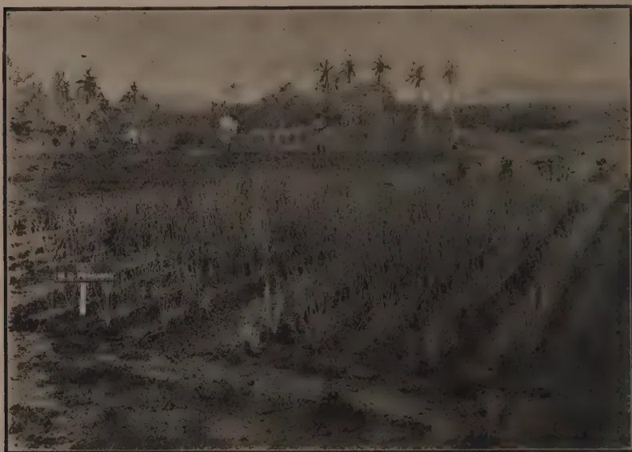

**THE**  
**TROPICAL AGRICULTURIST:**  
**JOURNAL OF THE**  
**CEYLON AGRICULTURAL SOCIETY.**

---

---

VOL. LII.

PERADENIYA, FEBRUARY, 1919.

**No. 2.**

---

---

**FOOD PRODUCTION COMMITTEES.**

---

---

The decision to establish Food Production Committees throughout the Colony should be welcomed by all those who desire to see a greater local production of necessary food stuffs.

As has been repeatedly urged during the past two years much of the essential food requirements of the Colony can be grown locally. Efforts have been made throughout the whole Colony to meet the situation, but with the concentration of the attention of Food Production Committees upon the various problems of their particular areas more satisfactory results should be obtainable.

Government cannot itself produce the required food products. These crops can only be grown by the possessors and occupiers of the land. Government can encourage and assist. It can authorize facilities to be granted, and it can advise as to methods of cultivation, use of water, and in many other ways.

The solution of the food problem rests with the agriculturists themselves and there is little doubt that if everyone responds to the utmost of his capacity that the results will exceed expectations.

The Food Production Committees are being formed to investigate in the different districts and villages those areas which are uncultivated, the reasons for their being uncultivated and the steps that can be taken to bring them within a reasonable time under cultivation. They will also arrange to visit and inspect cultivations and to encourage as far as possible good methods of cultivation. The Agricultural Instructors will work under the supervision of these Committees, which will also be responsible for the organization of agricultural shows, prize

1------------------------------------------------

64[FEBRUARY, 1919.

competitions and other means of stimulating interest in food production.

There is little doubt that increased returns can be secured from paddy cultivations if better methods of cultivation are adopted, and if transplanting and manuring are more generally carried out.

It is here that Food Production Committees can do much useful work. These Committees will be representative of the districts and will be in close touch with the economic conditions that surround the paddy cultivation under their supervision. They will be able to arrange for the greater use of ploughs, for the loan of ploughs and buffalos from one village to another and for loans of seed paddy. They can encourage, through experimental areas, transplanting in these localities to which this system is suited and they can arrange for adequate supplies of measures.

The Co-operative Credit Societies are doing increasing business in the purchase and loan of manures. Villagers readily join those societies which are issuing loans of manures. They are taking an increasing interest in the use of manures in their fields as the result of the increased yields already secured. When water for irrigation is assured or rainfall is plentiful, applications of manures can be depended upon to give considerably increased crops.

The Food Production Committees can therefore encourage the existing Co-operative Credit Societies and can assist in the formation of others in those districts where their need is being felt. The Committees have important duties to perform and the Agricultural Society through its various officers can assist with technical advice, instructions to villagers and by supplies of seed. By the co-operation of all, much important work can be accomplished.

---

## FRONTISPIECE.

The Frontispiece shows dhall (*Cajanus indicus*) and maize growing in the vegetable garden attached to one of the Government Bungalows for the clerks of the Department of Agriculture at Peradeniya. It indicates what can be done in the way of Food Production, and if every individual would endeavour to have the land around his residence cultivated with essential food products and vegetables the local production of Food Stuffs would rapidly be increased.

2------------------------------------------------

FEBRUARY, 1919.]65

# CEYLON AGRICULTURE.

## COMMITTEE OF AGRICULTURAL EXPERIMENTS.

Minutes of a meeting of the Committee of Agricultural Experiments held at the Peradeniya Experiment Station on January 9th, 1919.

Present:—The Director of Agriculture (Chairman), the Botanist and Mycologist, the Government Chemist, the Government Entomologist, the Hon'ble the Rural Member of the Legislative Council, the Chairman Planters' Association of Ceylon, the Chairman Low-Country Products Association, MESSRS. W. B. WILSON (Tobacco Adviser), N. K. JARDINE (Special Entomologist), E. R. SPEYER (Entomologist for Shot-hole Borer), E. W. KEITH, N. G. CAMPBELL, J. B. COLES, H. D. GARRICK, M. L. WILKINS, T. Y. WRIGHT, J. S. PATTERSON, A. J. AUSTIN DICKSON and H. A. DEUTROM (Acting Secretary), and as visitors HIS EXCELLENCY THE GOVERNOR, the HON'BLE ROBERT TREFUSIS (Private Secretary to His Excellency the Governor), MESSRS. CECIL G. H. JACKSON, HUNTLEY WILKINSON, RONALD SENIOR-WHITE, G. F. CORNISH and J. L. INNES LILLINGTON.

The Chairman stated that His Excellency the Governor while visiting the Experiment Station officially in the morning had expressed a wish to attend this meeting, and on behalf of the Committee present he had great pleasure in welcoming him and in asking him to preside. His Excellency said that he desired to be in close touch with the Agricultural industry of the Colony, and he wished that meeting to be carried on in the usual manner. He came that day solely as a listener.

2. *Minutes.* The minutes of the previous meeting having been approved and taken as read, the Chairman stated that he had received telegrams and letters of excuse from the Hon'ble the Government Agent, C. P. Kandy, SIR SOLOMON DIAS BANDARANAIKE, MESSRS. G. H. MASEFIELD, N. J. MARTIN, R. G. COOMBE, A. S. LONG PRICE, A. W. BEVEN and LIEUT.-COL. W. G. B. DICKSON.

The Chairman in introducing Dr. J. C. HUTSON, who had arrived from the West Indies to succeed the late Mr. A. RUTHERFORD as Entomologist to the Department of Agriculture, stated that DR. HUTSON had previous entomological experience in the tropics in the West Indies.

*Progress Reports.* The Chairman announced that as the Progress Reports were not ready in time for circulation owing to the holidays, they had to be tabled. He then briefly reviewed the different items of work.

*Peradeniya.* He stated that the dhall plots had to be uprooted owing to a fungus disease having affected the plants in the very wet weather. The yield of coffee in the year 1918 has been very good. The Robusta crop had ripened two months later than last year which accounted for the lateness of delivery of seeds to purchasers. He also made reference to the crops of cacao and to the satisfactory growth of

3------------------------------------------------

66[FEBRUARY, 1919.

paddy in the manured and unmanured plots. He also drew attention to the work that was being done with food products. Manioc and Sweet Potato yields were recorded and had been satisfactory. Samples of manioc flour were exhibited. MR. PATTERSON enquired why coconuts were sold for Rs. 35 per 1,000. The Chairman stated that at the last sale an offer of only Rs. 32 was received, which was not accepted. He fixed that rate at Rs. 35, which he considered satisfactory owing to the fact that the trees are old and the nuts small. The price realised at the previous sale held in July had been only Rs. 25 per 1,000.

On an enquiry from MR. GARRICK as to whether the cultivation of sweet potatoes was exhausting to the soil, the Chairman stated that as it was a heavy yielder it naturally took a good deal out of the soil and could not be grown continually without manures. MR. WRIGHT enquired regarding sweet potatoes in the Malay States. MR. BAMBER replied it was grown over a large acreage between the coconut palms without detriment to their growth, but no crop was harvested. MR. SINCLAIR enquired how manioc flour is manufactured, and whether it could be done on an extensive scale. The Chairman stated that the tubers were peeled, cut into slices, dried in the sun and pounded, and that it could be manufactured on an extensive scale with the help of machinery. On an enquiry from MR. AUSTIN DICKSON, His Excellency replied that in the West Indies the same process as the above was adopted in manufacturing this flour. MR. WRIGHT enquired as to what is done with the maize grown on the Station and whether any experiments were tried to manufacture flour. The Chairman replied that the maize seed was distributed through the Ceylon Agricultural Society to members at cost price, and also free through the Government Agents for agricultural purposes. No experiments in making flour had been carried out in recent years, but this could be done. MR. WRIGHT enquired whether maize could be grown as an inter-crop with coconuts. The Chairman stated that maize had been tried with rubber at the Experiment Station, Peradeniya, and it could be grown amongst young coconuts.

*Anuradhapura.* The Chairman then reviewed the work of the Experiment Station at Anuradhapura as detailed in the report, dwelling particularly on Limes, Fibres, Castor and Paddy.

THE HON'BLE MR. ELLIOT enquired whether the fruit trees were irrigated and whether they were growing satisfactorily. The Chairman replied that they were under irrigation and the growth was very satisfactory, particularly the limes, citrus, etc.

MR. PATTERSON enquired whether the sisal fibre planted at Anuradhapura was the same as that grown at Maha Iluppalama. The Chairman replied in the affirmative. Questioned as to whether fibre had been extracted at Maha Iluppalama, the Chairman stated that 4 acres did not warrant the purchase of machinery and that he was extending the cultivation of this product at Anuradhapura to 20 acres. His Excellency enquired whether Anuradhapura station was intended to be a dry zone station. He had seen manioc grown there under irrigation, and he suggested planting a plot in the unirrigable land, so that anybody visiting the place could see what is being done. The Chairman said that a plot was established in the irrigable area, and said that he would have one started in the unirrigable area.

4------------------------------------------------

FEBRUARY, 1919.]67

#### 4. THE YIELDS OF TEA EXPERIMENT PLOTS, PERADENIYA, FOR 1918.

MR. BAMBER briefly explained the results which had been tabled, and pointed out that the different results from the duplicate manure plots were probably due to the different time of pruning resulting from previous treatment. MR. AUSTIN DICKSON asked whether there was continuity of these manures on the same plots. MR. BAMBER replied that this was the first season of artificial manuring and it was intended to continue them over a series of years. The Chairman stated these figures are the first series of the new experiments. MR. WRIGHT enquired whether it had been usual to prune all the tea at one period. MR. BAMBER explained the reasons for different periods of pruning due to Jât, and after discussion it was resolved to alter the period of pruning so as to prune all the plots in October of alternate years. MR. SINCLAIR asked whether Mr. BAMBER was satisfied with the results from  $\frac{1}{2}$  an acre. MR. BAMBER stated that he personally wished he could have larger areas, but no more tea was available at present. The Chairman stated that the tea plots at the Experiment Station had been extended this year by 7 acres, but it was mostly on hilly ground.

#### 5. THE POSSIBILITY OF GROWING IN PRUNED TEA BUSH-LIMA BEANS AS A FOOD PRODUCT AND A GREEN MANURE,

MR. BAMBER pointed out that the area of pruned tea, cultivated in alternate lines amounted to about 100,000 acres per annum and if this were utilised for growing bush-lima beans, an acreage amounting to about 25,000 of beans would be available for planting without extra expenditure, except the cost of seed and sowing. Three varieties of white seeded lima beans were described and the amount of seed required per acre stated, also the sources from which such seed could be obtained. The Chairman stated that the white varieties of lima beans were the best and were free of poisonous properties. The white types were largely grown in Madagascar and exported therefrom. The bush-lima bean is an American production. Lima beans are now being grown in Harasbedda and in parts of Uva. The coloured or speckled types were most common, but he would like to see an extension of the white types. To a question as to the best variety the Chairman stated that the Henderson Bush-lima was supposed to be the best. MR. DICKSON asked how long it would take to get a crop of beans. MR. BAMBER said that the beans would be ready for gathering in three months.

#### 6. SHOT-HOLE BORER OF TEA.

The Chairman called upon MR. SPEYER to give a brief resumé of the latest work he had been carrying out with the investigation of Shot-hole borer. MR. SPEYER stated that an experiment in painting bushes immediately after pruning has been carried out on the Kirimetiya Estate, Kaduganawa. Fofft mixtures were used :—

- (a) Rosin-soap fish-oil emulsion, with excess of rosin
- (b) Rosin-soap fish-oil emulsion
- (c) Rosin-soap fish-oil Kerosene emulsion
- (d) Rosin-soap kerosene emulsion.

400 bushes were treated with each mixture, and at the time of application a large number of beetles were asphyxiated, specially by mixture (b).

5------------------------------------------------

68[FEBRUARY, 1919.

The applications were made between December 4th and 10th, 1918, and were examined one month later. In the meantime 16.81 inches of rain had fallen on 16 days, the maximum day's rain being 2.35 inches. A comparison was made between the treated areas and the untreated pruned tea surrounding. In the former all galleries examined in areas treated with mixtures (a) and (b) were vacant; in areas (c) and (d) the galleries contained a few living beetles, but no young stages. In the untreated tea, galleries contained beetles and young stages, and a number of beetles were commencing to construct new galleries. In both treated and untreated areas, there were a number of galleries which had been vacated naturally, but in the treated area a number of galleries which were in process of construction were quite empty. It is therefore clear that the insecticidal properties of mixtures (a) and (b) are satisfactory.

These two mixtures were, at the time of examination, still quite apparent on the bushes, whilst (c) and (d) had washed off to a considerable extent.

The excess of Rosin in mixture (a) is therefore unnecessary, and mixture (b) is therefore the best from every point of view. The Superintendent who has kindly furnished a report, states that no detrimental effect to the bushes is noticeable, beyond that the growth of new shoots has been retarded approximately 7—14 days. To confirm the efficacy of the mixture as a preventive from fresh attack, an experiment was made in the Laboratory, and it has been established that the fish oil in these emulsions acts as a definite deterrent, while kerosene does not do so. It was estimated in the Poonagalla experiments that Rs. 5 per acre should cover the cost of application, and Rs. 5 per acre the cost of the mixture.

27 lb of the solid emulsion dissolved in 8 gallons of water should cover one acre of tea. MR. SPEYER suggested that it was now time to carry out experiments with this paint on a larger scale, and that an effort should be made to check the borer in Udapusselawa, a district where borer was just appearing, by treatment of the estates from which the borer was gaining access to this district.

After application of the paints, the insect could be easily economically controlled, when the treated fields were again in flush, by the process of cutting out the infected branches whenever labour was available to do so. This process has been carried out by an estate in the Kelani Valley since 1916, and a marked decrease in the number of branches removed has been noticeable at each successive treatment. It would be most inadvisable to begin this treatment too late after pruning, and to continue it after six months before the following pruning.

The Chairman stated that Mr. SPEYER had summarised portions of investigations into the shot-hole borer pest, and that he had expressed the desire to proceed to Europe at the termination of his agreement with Government in February. Government had accepted his resignation. The question had therefore to be decided whether an assistant should be appointed to assist the Entomologist to continue the work begun, and the matter was placed before the Committee for consideration. After discussion the following resolution proposed by MR. GRAEME SINCLAIR, and seconded by

6------------------------------------------------

FEBRUARY, 1919.]69

MR. AUSTIN DICKSON was unanimously passed :—“That Government be asked to secure the services of an Entomologist to continue the work begun by MR. SPEYER in the investigation of Shot-hole borer of tea.”

His Excellency the Governor stated that it would be difficult to get a suitable man at once. It might perhaps be 6 or 12 months before an officer could be appointed. He also suggested that individual planters should make experiments in painting small areas of tea and report the results to the Entomological branch of the Department of Agriculture. It was decided that MR. SPEYER should issue a leaflet for the Planters' Association containing a brief account of his investigations giving instructions, etc., as to how shot-hole borer should be controlled.

The Chairman of the Planters' Association proposed a vote of thanks to MR. SPEYER for his work. He said that MR. SPEYER'S investigations had been of great assistance to the planting community in general, although his researches had not been completed for want of time.

The Chairman thanked MR. SINCLAIR on behalf of the Department, and said that he was glad MR. SPEYER'S work had been appreciated. The problem of shot-hole borer was an extremely difficult one, but MR. SPEYER had accomplished much valuable work.

#### 7. AGRICULTURAL PUBLICATIONS.

The Chairman stated that in the absence of MR. COOMBE in whose name this subject stood, he would postpone the subject for the next meeting. This was agreed to.

#### 8. THE PROSPECTS OF MOTOR CULTIVATORS IN PARTS OF CEYLON.

The Chairman stated that he had put this subject on the agenda for general discussion. MR. BAMBER circulated pamphlets relating to two types of motors received from England and stated the price quoted was £365 for the motor and from £30 to £50 sterling for the triple ploughs. A general discussion took place, and it was stated that motor tractors were expected by one firm in Ceylon, that these would probably be used on coconut estates, and it was hoped that arrangements for demonstrations could be made at some later date.

The Chairman before closing the meeting thanked His Excellency for being present and hearing the discussions on various subjects affecting the agriculture of the Colony. He briefly reviewed the organisation of the Committee and its work.

His Excellency in reply expressed his very great pleasure at having been able to be present at the meeting. He said that he had served in several agricultural colonies and that it was of prime importance to be in touch with all agricultural problems, planters and the Agricultural Department. The subjects discussed interested him greatly and he felt that he should be present. He was for five years President of the Jamaica Agricultural Society and attended the meetings of that Society regularly, missing only one meeting. He further stated that he would endeavour to be present at every meeting of this Committee.

The meeting then terminated.

H. A. DEUTROM,  
Acting Secretary.

7------------------------------------------------

70[FEBRUARY, 1919.

## PROGRESS REPORT OF THE EXPERIMENT STATION, PERADENIYA.

*From 1st November to 31st December, 1918.*

### TEA.

The yield for the month of November was 5,435 lb. green leaf from 11 acres; that for December, 3,025 lb. The September—October made tea fetched in Colombo an average of 34.16 cents per lb. for all grades.

The total output of green leaf for 1918 is 42,406 lb. from 11 acres.

Plot 155 has given the highest yield, 5,085 lb. green leaf equal to 1,228 lb. made tea per acre per year.

In the year 1918 the Dadaps in plot 144 were pruned three times, yielding 5,984 lb. of mulch. In plot 149 the dadaps were cut three times yielding 9,300 lb. of mulch.

The Albizzias in plot 150 were pruned once yielding 8,400 lb. of mulch.

The belt of cleared land above the tea plots has been planted with Goipani Hybrid tea plants from the nurseries. The plants were shaded with ferns and cinnamon branches and the majority are coming on well.

The cleared land between the new plots of tea and hill top rubber has been lined, holed and planted at stake with Dark leaf Manipuri Indigenous seed from Kotiyagala. The young seedlings have all been shaded.

Half a maund of dark leaf Manipuri Indigenous seed has been put out in supply baskets to fill up vacancies during the next monsoon rains.

The main drains in the new tea plots have been paved and improving the drains in the old tea plots is being undertaken.

### RUBBER.

Plot 81 A, 1/3 girth, two cuts a foot apart, tapped three times a week having been completed, a new section has been started from December.

Plots 83 to 86, 1/3 girth, one cut at 20 inches from the ground, tapped on alternate days having been completed a new section has been started from January, 1919.

The Tephrosia Hookeriana seed sown in August above the contour walls having failed to germinate, Dhall has been sown a foot above the walls and six inches apart.

The Dhall plants in plots 11, 12, and 13, and 21, 22 and 23 (young rubber) planted in December and October, 1917, have been uprooted and burnt, as they were found to be affected with a fungus disease—*Woroninella umbilicata*.

All vacancies in the new Hevea plots have been supplied with stumps from the nurseries.

The lower branches of the rubber have all been topped off.

### CACAO.

One round of picking has taken place since the last meeting and another is in progress. The crop has not been as good as the first picking. The last picking, owing to the continual wet weather, gave a large percentage of fungus pods.

8------------------------------------------------

FEBRUARY, 1919.]71

Light pruning and removal of suckers have been continually in progress. A heavy pruning will be taken in hand no sooner the present crop has been gathered.

Samples of the different grades of cacao were submitted to the different firms in Colombo for quotations. As the highest offer was only Rs. 47/50 it has been decided to store the cacao until the market improves.

#### COCONUTS.

There has been an improvement in the price realised for coconuts at the last sale by auction in December, Rs. 35/- per 1000 having been obtained.

The 10 acre plot of coconuts is being ploughed and disc-harrowed.

#### COFFEE.

The total quantity of Robusta berries picked and sold during the year was 676 lb. from  $\frac{1}{2}$  acre as against 249 $\frac{1}{2}$  and 192 $\frac{1}{3}$  lb. in 1917 and 1916.

The total quantity of Hybrid berries picked and sold during the year was 1,461 lb. from  $\frac{1}{4}$  acre as against 393 7/8 and 351 lb. in the previous years 1917 and 1916.

The crop this year has been late in ripening and several orders for seed have yet to be executed.

The dadaps, leucæna glauca and gliricidia shade over the coffee has been pruned and mulched round the plants.

All suckers have been regularly removed and the plants topped.

The plants in the new plot behind the store and the old Ceara plot are making splendid growth.

#### PADDY.

The fields are looking well—decidedly better than last year. Dr. Lock's Hathial and Mutusamba varieties show vigorous growth and are shooting well.

The Molagu Samba and Hathial varieties have flowered.

#### FOOD PRODUCTS.

*Sweet Potatos* : Rooted cuttings of the ten varieties named below which were introduced from Mauritius were planted in May and June last year in raised beds. The cuttings were planted in rows 1 foot apart and the rows about 18 inches distant from each other. The following are the results obtained :—(Statement of results marked annexure 2 is attached to this report.)

An acre of the different varieties of sweet potatoes lifted have been established. All the plots are looking well.

A large quantity of cuttings have been supplied and distributed free to the different School gardens and villagers.

*Mamocs* : Cuttings of the different varieties named below, which were introduced from Mauritius were planted in April last year. The cuttings were cut in lengths of 9 inches and planted in rows 5 × 5 feet apart, the cuttings were inserted two together and 10 to 12 inches deep. The following are the results obtained. (See annexure 1.)

Cuttings of the different varieties have been supplied free to villagers and coolies to encourage the cultivation of this valuable product.

9------------------------------------------------

72[FEBRUARY, 1919.

35 lb. of fresh Cassava were shelled, cut into slices, dried and pounded to determine the weight of flour, etc., and the results are enumerated in annexure 1.

Two rows of each of the different varieties of Cassava from Mauritius have been planted between the rubber in the Avenue Rubber plot. A local variety has also been planted from the Anuradhapura Experiment Station in the young rubber plots, 21, 22, 23.

*Maize*:  $\frac{1}{4}$  acre of the following varieties of Maize obtained from the Secretary for Agriculture, Pretoria, have been established in plot 19. Chester Co. Mammoth, Eureka and Hickory King. Plots 11 and 12 (young rubber) have been sown with two varieties of Maize:—Potchefstroom Pearl (Pretoria) and a local variety obtained from the village, 4 rows were planted between the rubber leaving 5 feet on either side of the rubber.

*Sorghums*:  $\frac{1}{4}$  acre of the following varieties of dura, received from the Secretary for Agriculture, Pretoria, have been established in plot 19. White Soudan, Dwarf Lilo, Nompupu and Unisut HW' azana. The last named variety has also been planted between the young rubber in plot 13 planted  $25 \times 25$  leaving 15 feet from the rubber on either side.

*Field Beans*:  $\frac{1}{4}$  acre of the following varieties of beans received from the Secretary for Agriculture, Pretoria, have been planted out and are doing well. Large White Haricot, Large White Kidney, Moolman and Pooibek'je. From the Secretary Ceylon Agricultural Society, Bush Lima, Henderson, Bush Lima and Double Bean Lima. From the Department of Agriculture, Nairobi, British East Africa, Nogan an Bhanc, Rose Coco Bean and Canadian Wonder.

*Yams*:  $\frac{1}{4}$  acre of the following varieties have been planted in plot 18 (Colocasias) Kiriala, Kandala, Thadala, Kaluala, Kalu-Khandala, Yakutala, Thummas-ala and Kola-ala, (Kanthosoma), Rata or Daesi-ala, (Labiatae) Innala, (Scitaminae) Queensland Arrowroot and West Indian or Bermuda Arrowroot.

#### ANNEXURE 1.—CASSAVA.

<table border="1">
<thead>
<tr>
<th>Varieties.</th>
<th>When planted.</th>
<th>When harvested.</th>
<th>Weight of crop per acre.</th>
</tr>
</thead>
<tbody>
<tr>
<td>Smallings</td>
<td>... April, 1918</td>
<td>December, 1918</td>
<td>28,672 lb.</td>
</tr>
<tr>
<td>Singapore</td>
<td>... April, 1918</td>
<td>December, 1918</td>
<td>21,504 lb.</td>
</tr>
<tr>
<td>Manioc de Table</td>
<td>... April, 1918</td>
<td>December, 1918</td>
<td>16,128 lb.</td>
</tr>
<tr>
<td>Trinidad</td>
<td>... April, 1918</td>
<td>December, 1918</td>
<td>15,232 lb.</td>
</tr>
<tr>
<td>Butter Stick</td>
<td>... April, 1918</td>
<td>December, 1918</td>
<td>14,336 lb.</td>
</tr>
<tr>
<td>Bitter</td>
<td>... April, 1918</td>
<td>December, 1918</td>
<td>12,549 lb.</td>
</tr>
<tr>
<td>Cassava Beureum</td>
<td>April, 1918</td>
<td>December, 1918</td>
<td>10,752 lb.</td>
</tr>
</tbody>
</table>

#### FLOUR.

<table border="1">
<tbody>
<tr>
<td>Weight of fresh Manioc</td>
<td>...</td>
<td>...</td>
<td>35 lb.</td>
</tr>
<tr>
<td>Weight after being shelled, cut into slices and dried</td>
<td>...</td>
<td>...</td>
<td>18<math>\frac{1}{4}</math> lb.</td>
</tr>
<tr>
<td>Weight after pounding</td>
<td>..</td>
<td>...</td>
<td>17<math>\frac{1}{4}</math> lb.</td>
</tr>
<tr>
<td>Time taken in pounding and winnowing (1 woman at 25 cts. per day)</td>
<td>...</td>
<td>...</td>
<td>hrs. 7.55 m.</td>
</tr>
<tr>
<td>Time taken in cutting into slices (2 boys at 25 cts. per day each)</td>
<td>...</td>
<td>...</td>
<td>hrs. 14</td>
</tr>
</tbody>
</table>

10------------------------------------------------

FEBRUARY, 1919.]73ANNEXURE 2.—SWEET POTATOS.

<table border="1">
<thead>
<tr>
<th>Varieties.</th>
<th>When planted.</th>
<th>When harvested.</th>
<th>Weight of crop per acre.</th>
<th>Remarks.</th>
</tr>
</thead>
<tbody>
<tr>
<td>Jersey</td>
<td>... May, 1918</td>
<td>November, 1918</td>
<td>12,972 lb.</td>
<td>

Growth healthy and vigorous. Leaf crinkled. Tubers of medium uniform size clustered close to the stem and easy to dig. Skin smooth, light yellow. Very promising variety.

</td>
</tr>
<tr>
<td>Sealys</td>
<td>... May, 1918</td>
<td>November, 1918</td>
<td>5,556 lb.</td>
<td>

Robust grower. The fine healthy vines cover the ground with thick foliage. Tubers long, white, set far from stem and very rooty.

</td>
</tr>
<tr>
<td>Pumpkin Yam</td>
<td>... May, 1918</td>
<td>November, 1918</td>
<td>4,692 lb.</td>
<td>

Growth healthy and vigorous. Tubers large. Skin pale yellow. Set rather far from the stem and hard to dig.

</td>
</tr>
<tr>
<td>Red Jersey</td>
<td>... June, 1918</td>
<td>November, 1918</td>
<td>4,104 lb.</td>
<td>

Growth healthy and fairly vigorous. Leaf crinkled. Tubers of medium even size. Clustered close to the stem. Skin smooth, bright rosy red.

</td>
</tr>
<tr>
<td>Black Spanish</td>
<td>... June, 1918</td>
<td>November, 1918</td>
<td>3,624 lb.</td>
<td>

Robust grower. Tubers large, fairly even in size and shape. Skin dark red.

</td>
</tr>
<tr>
<td>Southern Queen</td>
<td>... June, 1918</td>
<td>November, 1918</td>
<td>2,796 lb.</td>
<td>

Many plants on this plot were destroyed by wild pigs. Growth strong and healthy. Skin smooth, deep yellow.

</td>
</tr>
<tr>
<td>Joe's Sweet potato</td>
<td>... June, 1918</td>
<td>November, 1918</td>
<td>2,520 lb.</td>
<td>

Growth weak and slender. Tubers small and of uneven shape. Skin light yellow. Set far from stem. Difficult to gather.

</td>
</tr>
<tr>
<td>Raisin</td>
<td>... May, 1918</td>
<td>November, 1918</td>
<td>2,292 lb.</td>
<td>

Growth healthy and vigorous. Tubers long of fair size. Set close to the stem. Yield light. Not a suitable kind for profitable culture at Peradeniya.

</td>
</tr>
<tr>
<td>Shanghai</td>
<td>... June, 1918</td>
<td>November, 1918</td>
<td>1,824 lb.</td>
<td>

Growth healthy and vigorous. Most of the crop were attacked by the weevil (<i>Ceylon Fornicarius</i>). Tubers large, skin pale yellow. Set fairly close to the stem. Fair variety.

</td>
</tr>
<tr>
<td>Pierson</td>
<td>... June, 1918</td>
<td>November, 1918</td>
<td>1,020 lb.</td>
<td>

Tubers large, round, yellow. Set fairly close to the stem. Quality first class. One of the best for table use.

</td>
</tr>
</tbody>
</table>

11------------------------------------------------

74[FEBRUARY, 1919.

### GENERAL.

*Show plots.* Small plots (1/100 of an acre each) have been planted out with the following crops, Potchefstroom Pearl Maize, Hickory King Maize, Chester Co. Mammoth Maize, Eureka Maize, Cajanus Indicus, Arachis Hypogaea, Eleusine Coracana, Phaseolus Mungo, Whip-poor-will Cowpea, Large White Bean, and Noolman Bean.

*Vanilla.* The flowers that were fertilised in March last are now being harvested. The crop is satisfactory. The Plumeria and Dadap plants on which the Vanilla vines are trained were lopped as they were growing too thick and shady.

*Fibre.*  $\frac{1}{2}$  acre of Mauritius Hemp (*Furcraea gigantea*) has been established. Arrangements are being made to house a family of Rodias at the Experiment Station to extract the fibre of Manila Hemp.

*Sugar Cane.* About an acre of the following varieties of Sugar Cane has been planted out near the Students' plots—Striped Tanna, Stringed white Tanna, Sealys' seedling, Sin-Nombre, Red-top Mauritius Nos. 3390B, 131P, 117D, D. K. 74, 55P and 1237.

*Fruit plots.* All the fruit trees have been pruned.

*Economic Section.* The coconut, cacao, tamarind and dadap trees have been removed with the exception of a few large trees which are being cut into convenient lengths for removal.

*Oil Products.* Small plots of Mahapen Seri (Java) and Cymbopogon Flexuosus have been established.

*Roads and Drains.* All drains in the Station have been thoroughly cleaned and roads made up.

*Labour.* The health of the coolies has not been satisfactory. Four deaths have occurred from Influenza. Every precaution was taken against the spread of the disease.

<table>
<tbody>
<tr>
<td><i>Rainfall.</i></td>
<td>November</td>
<td>...</td>
<td>19.31 inches</td>
<td>...</td>
<td>23 wet days.</td>
</tr>
<tr>
<td></td>
<td>December</td>
<td>...</td>
<td>12.56 inches</td>
<td>...</td>
<td>21 wet days.</td>
</tr>
</tbody>
</table>

H. A. DEUTROM,  
Acting Manager.

9th January, 1918.

## PROGRESS REPORT OF THE EXPERIMENT STATION, ANURADHAPURA.

*From 1st November to 31st December, 1918.*

The Acting Manager has made two visits of two days each since the last report.

*Paddy.* The following varieties of paddy which did well during the last crop were sown in nurseries and transplanted in the fields 4-6 weeks from sowing, Molagu Samba paddy 6 plots of 1/5 of an acre each, Philippine 4 plots, Dr. Lock's Hathial 4 plots and Muruga paddy (received from the Secretary, Ceylon Agricultural Society) 4 plots. Single plants were put out at a distance of 6 inches apart. All the varieties are showing vigorous growth and are shooting very well.

12------------------------------------------------

FEBRUARY, 1919.]75

The new area of 3 acres which was planted up with varieties of sugar cane has been ploughed, levelled and ridges made for sowing paddy. The growing of sugar cane had to be abandoned as the land was found to be very swampy after the violent and continuous showers experienced during the North East Monsoon.

*Limes.* 6 acres of limes have been planted out  $15 \times 15$  feet in the newly cleared irrigable area. The plants have been shaded and are coming on well.

The Kyanski variety of Castor has been interplanted between the rows of lime.

*Fibres.* The Mauritius Hemp plot has been extended and the vacancies supplied.

A portion of the newly cleared area of unirrigable land, (24 acres in extent), has been planted with Sisal Fibre 6 ft.  $\times$  6 ft. The plants were obtained from the Maha Iluppalama Experiment Station.

Castor has been interplanted in this area after cutting down the cheddy and weeding the rows.

*Curry Stuffs.* Heavy rains affected the newly sown plots of Mustard, Coriander, Aniseed, Chillies, etc. These plots are being prepared for re-sowing.

*Starches.* The Cassava plots are looking well. There is a great demand for tubers of a local variety which has an excellent flavour.

Cuttings of this variety have been supplied to villagers and others.

*Sweet Potatoes* are not doing as well as at Peradeniya.

*Arrow Root* has made fine growth and promises a good crop.

*Fruit Section.* The oranges, limes, lemon, pomelo, citron and tanjarine orange are all doing well. Pine apples—The Mauritius and Kew pines are fruiting well. The grafted mangoes are making good growth.

The boundary fence has been repaired in places. The erection of new posts right round the Station will be taken in hand shortly.

The coolies have been rethatched with cadjans purchased at Anuradhapura.

*Labour* is still scarce. The health of the coolies is far from satisfactory.

9th January, 1919.

H. A. DEUTROM,  
Acting Manager.

## PROGRESS REPORT No. LXXVI.

### MEETINGS.

The last quarterly meeting was held on the 21st May, 1918, at Executive Council Chamber, Queen's House, Colombo, His Excellency the Acting Governor presiding.

The Annual meeting for 1917-18 was held on the 26th of September, 1918.

### MEMBERSHIP.

The following members have joined during the quarter :—The Superintendent, Stinsford Estate, R. F. CHRISTIE, M. MOOTATAMBY, A. KENNETH PYPER, The Superintendent. Atherton, Kotmale, J. R. MARTENSTYN, W. P. CONDERLAG, The Manager, Shwegyin (Burma) Rubber Estate Ltd., Lower

13------------------------------------------------

76[FEBRUARY, 1919.

Burma, W. R. MATTHEW, THOS A. DE MEL, A. E. H. TRIMMER, C. H. COLLINS, The Hon. Secretary, Ceylon Social Service League, Northern Section, Jaffna; The Superintendent, Glencorse Estate, G. ROBT. DE ZOYSA, Registrar, The University of Calcutta, Fatura Island Development Co., Ltd., British Solomon Island, M. GHOUSE MOHIDEEN, ALFRED E. PERERA, SAMUEL CARR, R. P. CHELLIAH, HECTOR L. DE SILVA, British Ceylon Corporation Ltd., Colombo, H. R. WIJESEKERA, T. G. ELLIOTT, A. P. MAC DONALD, A. J. MACKESSACK, The Superintendent, Yarrow Estate, P. C. CLAUGHTON, B. M. PILLAI, C. P. LUIZ, HUGH N. B. WILSON, A. J. HAMILTON HARDING, H. G. TENNYSON DE MEL, MRS. M. S. SRESHTA.

Owing to the war and conditions arising therefrom, the membership has fluctuated a good deal. While some members have been lost for good, others have been only temporarily lost, and in many cases the subscriptions are being gradually recovered. It has, however, been considered desirable to take stock of the situation, and remove the names of those who were fallen into arrears for more than a reasonable period.

#### STAFF.

Mr. C. W. BIBILE has been appointed Ratemahatmaya of Wellassa, and though temporarily continuing to look after the Society's interests in the Uva Province, the question of appointing a successor as instructor is under consideration.

Mr. A. V. CHELVANAYAGAM, a trained student of the Agricultural School at Peradeniya, has been appointed Agricultural Instructor for Trincomalie District, but has been sent on special duty to Batticaloa for a short term, to assist the Agricultural Instructor of that district with work under the Plant Pests Board designed to prevent the spread of beetle pests of coconuts.

#### INCREASING THE PRODUCTION OF FOOD STUFFS.

The campaign started in 1916 for the increase of food production in the Colony was steadily maintained.

Seeds of curry stuffs and food crops such as grains, pulses and tubers were distributed through the various Kachcheries, while vegetable seeds were made to all applicants and thus found their way to almost all parts of the Island

The following quantities have been dealt with :—

<table>
<tbody>
<tr>
<td>N. E. season only—curry stuffs and food crops</td>
<td>6,765 pounds</td>
</tr>
<tr>
<td>" " " " "</td>
<td>7,070 packets</td>
</tr>
<tr>
<td>" sweet potato, manioc, etc.</td>
<td>2,110 cuttings</td>
</tr>
<tr>
<td>" yams</td>
<td>359 pounds</td>
</tr>
<tr>
<td>" paddy</td>
<td>35 bushels</td>
</tr>
<tr>
<td>" fruit plants</td>
<td>227</td>
</tr>
</tbody>
</table>

The total number of packets of vegetable seeds distributed during last S. W. and N. E. monsoons was 17,349. The quantity of seeds distributed free through the various Kachcheries has been as per statement on page 77.

#### PADDY.

In connection with the efforts to popularise transplanting the Assistant Government Agent, Matara, forwarded a statement showing the distribution of 153 acres and 3 roods to be cultivated by transplanting seedlings from a nursery during the Maha season. Referring to trials made during the

14------------------------------------------------

FEBRUARY, 1919.]

77

<table border="1">
<thead>
<tr>
<th></th>
<th>Lai Lab bean</th>
<th>Lima bean</th>
<th>Dhal</th>
<th>Millet</th>
<th>Coriander</th>
<th>Onion</th>
<th>Maize bushels</th>
<th>French Bean</th>
<th>Chilli seed</th>
<th>Cow pea</th>
<th>Sword bean</th>
<th>Peas - green</th>
<th>Yams</th>
<th>Tomato</th>
<th>Brinjal</th>
<th>Capsicum</th>
<th>Aniseed</th>
<th>Cumin</th>
<th>Bandarka</th>
<th>Snake Gourd</th>
</tr>
</thead>
<tbody>
<tr>
<td>The Govt. Agent, W. P. ...</td>
<td>20</td>
<td>—</td>
<td>50</td>
<td>—</td>
<td>20</td>
<td>2</td>
<td>—</td>
<td>50</td>
<td>5</td>
<td>—</td>
<td>—</td>
<td>—</td>
<td>—</td>
<td>2</td>
<td>2</td>
<td>—</td>
<td>20</td>
<td>—</td>
<td>—</td>
<td>—</td>
<td>—</td>
</tr>
<tr>
<td>The Asst. G. A., Kalutara...</td>
<td>—</td>
<td>—</td>
<td>50</td>
<td>—</td>
<td>20</td>
<td>2</td>
<td>—</td>
<td>50</td>
<td>5</td>
<td>—</td>
<td>—</td>
<td>—</td>
<td>—</td>
<td>2</td>
<td>2</td>
<td>—</td>
<td>—</td>
<td>—</td>
<td>—</td>
<td>—</td>
<td>—</td>
</tr>
<tr>
<td>The Govt. Agent, C. P. ...</td>
<td>50</td>
<td>50</td>
<td>35</td>
<td>—</td>
<td>10</td>
<td>4</td>
<td>1</td>
<td>—</td>
<td>—</td>
<td>—</td>
<td>—</td>
<td>25</td>
<td>—</td>
<td>—</td>
<td>—</td>
<td>—</td>
<td>15</td>
<td>—</td>
<td>—</td>
<td>—</td>
<td>—</td>
</tr>
<tr>
<td>The A. G. A., N'Eliya ...</td>
<td>50</td>
<td>50</td>
<td>50</td>
<td>50</td>
<td>50</td>
<td>1'09</td>
<td>—</td>
<td>—</td>
<td>—</td>
<td>—</td>
<td>—</td>
<td>—</td>
<td>—</td>
<td>—</td>
<td>—</td>
<td>—</td>
<td>50</td>
<td>25</td>
<td>—</td>
<td>—</td>
<td>—</td>
</tr>
<tr>
<td>The A. G. A., Matale ...</td>
<td>—</td>
<td>18</td>
<td>100</td>
<td>50</td>
<td>40</td>
<td>—</td>
<td>1</td>
<td>—</td>
<td>—</td>
<td>—</td>
<td>—</td>
<td>—</td>
<td>—</td>
<td>—</td>
<td>—</td>
<td>—</td>
<td>20</td>
<td>—</td>
<td>—</td>
<td>—</td>
<td>—</td>
</tr>
<tr>
<td>The G. A., Anuradhapura...</td>
<td>—</td>
<td>—</td>
<td>50</td>
<td>—</td>
<td>—</td>
<td>—</td>
<td>—</td>
<td>—</td>
<td>—</td>
<td>—</td>
<td>—</td>
<td>—</td>
<td>—</td>
<td>—</td>
<td>—</td>
<td>—</td>
<td>—</td>
<td>—</td>
<td>—</td>
<td>—</td>
<td>—</td>
</tr>
<tr>
<td>The G. A., Ratnapura ...</td>
<td>—</td>
<td>30</td>
<td>50</td>
<td>15</td>
<td>20</td>
<td>2</td>
<td>1</td>
<td>—</td>
<td>5</td>
<td>20</td>
<td>—</td>
<td>—</td>
<td>50</td>
<td>—</td>
<td><math>\frac{1}{2}</math></td>
<td>—</td>
<td>20</td>
<td>—</td>
<td>—</td>
<td>—</td>
<td>—</td>
</tr>
<tr>
<td>The G. A., Kegalle ...</td>
<td>—</td>
<td>30</td>
<td>50</td>
<td>—</td>
<td>20</td>
<td>—</td>
<td>—</td>
<td>50</td>
<td>—</td>
<td>20</td>
<td>—</td>
<td>—</td>
<td>—</td>
<td>—</td>
<td>—</td>
<td>—</td>
<td>20</td>
<td>—</td>
<td>—</td>
<td>—</td>
<td>—</td>
</tr>
<tr>
<td>The G. A., Badulla ...</td>
<td>—</td>
<td>30</td>
<td>50</td>
<td>15</td>
<td>60</td>
<td>4</td>
<td>—</td>
<td>—</td>
<td>—</td>
<td>—</td>
<td>—</td>
<td>20</td>
<td>—</td>
<td>—</td>
<td>—</td>
<td>—</td>
<td>20</td>
<td>20</td>
<td>—</td>
<td>—</td>
<td>—</td>
</tr>
<tr>
<td>The G. A., Galle ...</td>
<td>—</td>
<td>—</td>
<td>50</td>
<td>—</td>
<td>—</td>
<td>—</td>
<td>—</td>
<td>50</td>
<td>—</td>
<td>—</td>
<td>—</td>
<td>—</td>
<td>—</td>
<td>—</td>
<td>—</td>
<td>—</td>
<td>20</td>
<td>—</td>
<td>—</td>
<td>—</td>
<td>—</td>
</tr>
<tr>
<td>The A. G. A., Matara ...</td>
<td>60</td>
<td>30</td>
<td>60</td>
<td>—</td>
<td>20</td>
<td>4</td>
<td>—</td>
<td>50</td>
<td>—</td>
<td>—</td>
<td>—</td>
<td>20</td>
<td>—</td>
<td>—</td>
<td>—</td>
<td>—</td>
<td>20</td>
<td>10</td>
<td>—</td>
<td>—</td>
<td>—</td>
</tr>
<tr>
<td>The do (Morawak Korale)</td>
<td>—</td>
<td>—</td>
<td>—</td>
<td>—</td>
<td>5</td>
<td>1</td>
<td>—</td>
<td>—</td>
<td>—</td>
<td>—</td>
<td>—</td>
<td>5</td>
<td>—</td>
<td>1</td>
<td>1</td>
<td>—</td>
<td>5</td>
<td>5</td>
<td>—</td>
<td>—</td>
<td>—</td>
</tr>
<tr>
<td>The do (Kandabodapattu)</td>
<td>10</td>
<td>—</td>
<td>5</td>
<td>—</td>
<td>—</td>
<td>1</td>
<td>—</td>
<td>—</td>
<td>—</td>
<td>—</td>
<td>—</td>
<td>—</td>
<td>—</td>
<td>—</td>
<td>—</td>
<td>—</td>
<td>—</td>
<td>—</td>
<td>—</td>
<td>—</td>
<td>—</td>
</tr>
<tr>
<td>The A. G. A., Hambantota</td>
<td>50</td>
<td>—</td>
<td>50</td>
<td>—</td>
<td>—</td>
<td>2</td>
<td>1</td>
<td>—</td>
<td>—</td>
<td>—</td>
<td>—</td>
<td>—</td>
<td>—</td>
<td>—</td>
<td>—</td>
<td>—</td>
<td>20</td>
<td>—</td>
<td>—</td>
<td>—</td>
<td>—</td>
</tr>
<tr>
<td>The G. A., Jaffna ...</td>
<td>—</td>
<td>30</td>
<td>50</td>
<td>—</td>
<td>20</td>
<td>2</td>
<td>1</td>
<td>—</td>
<td>—</td>
<td>—</td>
<td>25</td>
<td>—</td>
<td>—</td>
<td>—</td>
<td>—</td>
<td>—</td>
<td>—</td>
<td>—</td>
<td>—</td>
<td>—</td>
<td>—</td>
</tr>
<tr>
<td>The A. G. A., Trincomale</td>
<td>50</td>
<td>30</td>
<td>50</td>
<td>—</td>
<td>20</td>
<td>2</td>
<td>—</td>
<td>—</td>
<td>—</td>
<td>—</td>
<td>—</td>
<td>—</td>
<td>—</td>
<td><math>\frac{1}{2}</math></td>
<td><math>\frac{1}{2}</math></td>
<td>—</td>
<td>—</td>
<td>—</td>
<td>—</td>
<td>—</td>
<td>—</td>
</tr>
<tr>
<td>The A. G. A., Mannar ...</td>
<td>50</td>
<td>30</td>
<td>50</td>
<td>15</td>
<td>—</td>
<td>—</td>
<td>1</td>
<td>—</td>
<td>—</td>
<td>—</td>
<td>—</td>
<td>—</td>
<td>—</td>
<td><math>\frac{1}{2}</math></td>
<td><math>\frac{1}{2}</math></td>
<td>—</td>
<td>—</td>
<td>—</td>
<td>—</td>
<td>—</td>
<td>—</td>
</tr>
<tr>
<td>The A. G. A., Mullaitivu ...</td>
<td>30</td>
<td>—</td>
<td>20</td>
<td>—</td>
<td>—</td>
<td>2</td>
<td><math>\frac{1}{2}</math></td>
<td>10</td>
<td>—</td>
<td>10</td>
<td>—</td>
<td>—</td>
<td>—</td>
<td><math>\frac{1}{2}</math></td>
<td><math>\frac{1}{2}</math></td>
<td>—</td>
<td>—</td>
<td>—</td>
<td>—</td>
<td>1</td>
<td>200 seeds</td>
</tr>
<tr>
<td>The G. A., Batticaloa ...</td>
<td>80</td>
<td>50</td>
<td>20</td>
<td>10</td>
<td>—</td>
<td>—</td>
<td>—</td>
<td>—</td>
<td>10</td>
<td>—</td>
<td>—</td>
<td>—</td>
<td>100</td>
<td>—</td>
<td>—</td>
<td><math>\frac{1}{2}</math></td>
<td>—</td>
<td>—</td>
<td>—</td>
<td>—</td>
<td>—</td>
</tr>
<tr>
<td>The G. A., Kurunegala ...</td>
<td>50</td>
<td>30</td>
<td>50</td>
<td>—</td>
<td>20</td>
<td>2</td>
<td>—</td>
<td>—</td>
<td>—</td>
<td>—</td>
<td>—</td>
<td>—</td>
<td>—</td>
<td>—</td>
<td>—</td>
<td>—</td>
<td>20</td>
<td>—</td>
<td>—</td>
<td>—</td>
<td>—</td>
</tr>
<tr>
<td>The A. G. A., Puttalam ...</td>
<td>50</td>
<td>30</td>
<td>50</td>
<td>15</td>
<td>—</td>
<td>—</td>
<td>1</td>
<td>—</td>
<td>1</td>
<td>—</td>
<td>—</td>
<td>—</td>
<td>—</td>
<td><math>\frac{1}{2}</math></td>
<td>—</td>
<td>—</td>
<td>—</td>
<td>—</td>
<td>—</td>
<td>—</td>
<td>—</td>
</tr>
<tr>
<td>Total pounds ...</td>
<td>550</td>
<td>438</td>
<td>940</td>
<td>170</td>
<td>325</td>
<td>33'9</td>
<td>71</td>
<td>260</td>
<td>21</td>
<td>50</td>
<td>50</td>
<td>70</td>
<td>150</td>
<td>7</td>
<td>7 <math>\frac{1}{2}</math></td>
<td><math>\frac{1}{2}</math></td>
<td>250</td>
<td>60</td>
<td>1</td>
<td>—</td>
</tr>
</tbody>
</table>

15------------------------------------------------

78[FEBRUARY, 1919.

previous Yala he reports that 39 acres and 15 perches were similarly cultivated, the yield of which was 26 against 12 fold (taking 2 bushels as the sowing rate per acre) by broadcasting. He adds that an amunuu (48 kurunies) can be transplanted with 8 kurunies, so that there will be a saving of 40 kurunies of seed which should cover the extra cost of transplanting, besides the advantage of a higher yield.

Rice hulling by machinery is becoming popular. There are now 4 Burn's hand hullers introduced by the Society being worked at Peradeniya, Kandy, Pesalai and Wellawaya, while a Douglas and Grant hulling plant has been set up in the Hambantota district.

At Jaffna (RAMANATHAN, A.I.) seed of Mollikuruppen (a short aged paddy introduced from India) was sown on the 20th October, 1917 and harvested on the 25th March, 1918. The yield was equal to 19 bushels per acre which is poor compared with the ordinary yield of 25 bushels. The following are reports of transplanting trials :

At Tihagoda (KARUNANAYAKE, A.I.) seed was sown in a nursery on 30th March, 1918, planted out on April 22nd, and harvested 20th August, 1918. The yield from  $2\frac{1}{2}$  acres was  $49\frac{1}{2}$  bushels, i.e. at the rate of 20 bushels per acre. Broadcasted fields did not yield more than 10 bushels per acre.

At Kamburupitiya (KARUNANAYAKE, A.I.) seed was sown on 25th March, transplanted 17th April and harvested 15th August. An extent of  $1\frac{1}{4}$  acre gave  $24\frac{1}{2}$  bushels. Broadcasted yields in this locality seldom give over 8 bushels per acre.

At Owitigama (KARUNANAYAKE, A.I.) seed sown 21st March, 1918, transplanted 15th April, harvested 25th July. Quarter acre gave a return of  $6\frac{1}{2}$  bushels equivalent to 25 bushels per acre. Broadcasted fields yield about 10 bushels. (In all 3 cases citronella grass ash were used as fertiliser.)

The Ratemahatmaya, Bintenne (Eastern Province) has forwarded a report on his demonstration of improved methods of cultivation on an abandoned tract of fields under the Mahaoya tank, carried out at the instance and with the assistance of the Society. Sowing was done in January 10th, 1918, and harvesting on 10th May. Unfortunately considerable damage to the crop was done by pig, birds and insect pests, in addition to a severe drought. In spite of this the yield was phenomenal for that part of the country where careless cultivation results in a limited output. The extent cultivated was 2 acres which returned 125 bushels or  $62\frac{1}{2}$  bushels per acre.

The following figures show yields obtained from introduced Philippine and Indian varieties of paddy as compared with other kinds cultivated at the Experiment Stations, Peradeniya and Anuradhapura for the Maha season, 1918.

<table border="1">
<thead>
<tr>
<th></th>
<th>Anuradhapura</th>
<th>Peradeniya</th>
</tr>
</thead>
<tbody>
<tr>
<td>(Indian) Molagu samba</td>
<td>62 bushels</td>
<td>30 bushels</td>
</tr>
<tr>
<td>Inasimang</td>
<td>61 "</td>
<td>20 "</td>
</tr>
<tr>
<td>(Philippine) Mulan-ay-Manilla</td>
<td>—</td>
<td>15 "</td>
</tr>
<tr>
<td>Macan pina</td>
<td>50 "</td>
<td>—</td>
</tr>
<tr>
<td>(Peradeniya) Lock's Selected Hathial</td>
<td>56 "</td>
<td>31 "</td>
</tr>
<tr>
<td>(N. C. P.) Thillanayam</td>
<td>55 "</td>
<td>—</td>
</tr>
</tbody>
</table>

Mr. P. S. DISSANAYAKE of Weliara, Wellawaya, who undertook to make a trial with short-aged paddy introduced from India reports that Gnavara is well suited to the local climatic conditions. He succeeded in raising 20 bushels and has sown the whole lot. The crop must be gathered as soon as it is ripe. The rice is good. The age of the paddy is  $2\frac{1}{2}$  months or 75 days, and it is superior to local short-aged varieties.

A Japanese variety of paddy (Takasuka) suited to high elevations is also under trial but it is feared the seed is somewhat stale.

16------------------------------------------------

FEBRUARY, 1919.]79

In Rayigam Korale demonstrations in seed selection have been made by the instructor (JAYATILLEKE, A.I.) with the co-operation of the Mudaliyar at Wewita, Horana, Uduwa and Kalupane, and the advantages of the selection of seed explained to the cultivators. The instructor has furnished details of trials made to demonstrate the superiority of selected over unselected seed, in every case with satisfactory results.

### EXPERIMENTAL AND DEMONSTRATION PLOTS.

#### (1) *Japanese Shallot.*

At Bandaragama (JAYATILLEKE, A.I.) Seeds raised in nursery and planted out 26th April, 1918. Bed treated with cattle dung and ashes. Crop harvested 28th August, 1918. Yield equivalent to 1089 lb. per acre.

At Harasbedde (KAPUWATTE, A.I.) Seed thinly sown on 1st April, 1918, in beds previously treated with cattle dung. Harvested 1st October, 1918. Yield equivalent to 3630 lb. per acre.

At Balangoda (SILVA, A.I.) Planted 28th April, 1918. Harvested 30th September, 1918. Yield equivalent to 4840 lb. per acre

#### (2) *Ginger.*

At Dunuwille (MOLEGODE, S.A.I.) 12 lb. Indian Ginger planted 24th June, 1917, in beds manured with Croton and Dadap leaves and top dressed with paddy chaff. Harvest 5th and 6th October, 1918. Yield equivalent to 13,700 lb. per acre. Cost of cultivation Rs. 5/75 : Value of crop Rs. 23/60. Crop could have been lifted in February, 1918, but was left in the ground for a second season (i.e. for 18 months altogether) to secure a larger yield.)

At Dunuwille (MOLEGODE, S.A.I.) 30 lb. local ginger planted on 22-24th June, 1917. Harvest 5-6th October, 1918. Yield equivalent to 7,000 lb. per acre. (Cost of cultivation Rs. 7/-. Value of crop Rs. 35/-)

#### (3) *Onions.*

At Godakawela (SILVA, A. I.) 45 lb. bulbs planted 28th June, 1918, and harvested 25th September, 1918. Yield 726 lb. equivalent to 6,534 lb. per acre. (N. B. Cost of cultivation Rs. 10/40 : Value of crop Rs. 50/82, a part of the crop, covering about 72 square feet, withered off.

A quantity of Ragi (Kurakkan) seed was secured through the courtesy of the Director of Agriculture, Mysore State. Being the result of continuous selection, it is guaranteed to give a pure crop and a higher yield. This, as well as linseed and buckwheat, are under trial in Harasbedde where Soy beans have also been found to thrive.

Rhodes grass is doing well in most places where it has been tried. A plot has been established at the Government Stock Garden, where it has stood cutting well.

### INVESTIGATIONS AND REPORTS.

Investigations to ascertain the value of *Datura fatsuosa* (a local weed) as a source of the alkaloid scopolamine or hyoscine are being continued by the Imperial Institute, supplies of material being sent forward as required by PROFESSOR DUNSTAN.

The Government Mycologist reported on the following specimens :—

(1) Sword bean (*Canavalia Ensiformis*) attacked by *Elsinoe Canavaliae*, a common disease in Java. It is recommended to burn the haulms after gathering the crop and to disinfect seed before sowing.

(2) Potatos affected with ring blight bacillus. It is recommended to lift the potatos as early as possible and store on trays. Decayed tubers should be periodically removed and the land must not be used for solanaceous crops for some time to come.

(3) Orange stems with an apparently new form of Citrus Canker. It is recommended that cankered twigs should be pruned and burnt, and on old

17------------------------------------------------

80[FEBRUARY, 1919.

stems the canker should be cut out and the wounds lightly painted with crude carbolic acid and water in equal parts, keeping the mixture off sound parts of the trees.

The Government Entomologist reported on the following specimens:—

(1) Cabbage and radish plants attacked by caterpillars *Crocidosomella binotalis* and *Plutella Maculipennis*). It is recommended to spray with Katakilla ( $\frac{1}{4}$  pound to 5 gallons).

(2) Aphides on Cow peas were also successfully treated with Katakilla

### CO-OPERATIVE CREDIT SOCIETIES.

Co-operative Credit movement is making steady and satisfactory progress in the Western and Southern Provinces and in the Jaffna district of the Northern Province. New Societies have been formed within the last two months at Chilaw and Marawila in the North-Western Province, and at Deniyaya, Morawaka, Urubokka and Yatiyana in the Matara district. In the Kandyan Provinces the movement is not making satisfactory progress.

The interest taken by the various organised bodies to form Societies for the benefit of their members is a satisfactory feature in the movement. The American Mission in Jaffna and the Wesleyan Mission in Matara have formed Societies for the benefit of their employees. The Singhalese Young Men's Association in Kandy formed a Society with a view to find means to increase the output of rice through the efforts of its members.

In this connection it is satisfactory to find a notable increase in the supply and distribution of paddy manures through these Societies. During the last two seasons in 1918, a supply of over 165 tons bone meal costing over Rs.15,000/- have been handled by some 21 Societies; the Weligam Korale Society alone using 30 tons. Two of the Jaffna Societies have made trials with artificial manures during the last season and the results are awaited with much interest.

The Hinidum Pattu Society held a small but successful show in December for the first time in the history of the division. Eight Societies have held agricultural shows during the past year.

### MISCELLANEOUS.

Plants of *Muntingia Calabura* were received from MR. MAGDON ISMAIL of Galle, who writes that it apparently grows everywhere without difficulty and bears large crops of sweet berry-like fruits of small size. The tree, which is a native of Tropical America, belongs to the order Tiliaceae. In Dominica the wood is used for staves and cordage from the bark. The tree has a low growing, wide spreading habit.

In view of the revived interest in cotton cultivation, as the result of a better market rate, the Society procured and distributed seed of the Cambodia variety for cultivation during the N. E. Monsoon season. The Northern Province took 518 lb., the Eastern Province 24, Central Province 1270, Sabaragamuwa Province 62, North-Western Province 88 and Southern Province 1122; or a total of 3081 lb.

Cotton and Castor are occupying the Hettipola Garden for the N. E. season.

His Excellency the Governor inspected the Society's office and Seed Store on the 9th instant.

The organising Vice-President toured in the Eastern Province and Southern Province during the quarter, and the Secretary in the North-Western Province and Western Province and attended a meeting of the Matale Food Production Society on the 21st December last.

The Organising Vice-President and the Secretary were present at the Durbar of the Government Agent and Chiefs of the Kandyan Provinces on the 10th January.

18------------------------------------------------

FEBRUARY, 1919.]81

## CEYLON AGRICULTURAL SOCIETY.

*Minutes of proceedings of a meeting of the Board of Agriculture and the Agricultural Society held on the 29th January, 1919, at the Planters' Association Hall, Kandy.*

The first meeting of the Society for the year 1919 was held at the Planters' Association Hall, Kandy, at 12-30 p.m., on Wednesday, the 29th January.

His Excellency the GOVERNOR presided.

A large gathering was present, including Sir Solomon Dias Bandaranaike, Hon'ble Dr. H. M. Fernando, the Hon'ble Messrs. Meedeniya Disava, Moonemalle and Tillekeratne; Dunuwile Disava, Mudaliyar A. E. Rajapakse, Drs. C. A. Hewavitarne and Norris, the Rev. L. J. Gaster, Rt. Rev. Bishop Beckmeyer, Rev. Fr. Caspersz, the Director of Agriculture, Government Botanist and Mycologist, Superintendent, Botanic Gardens, Messrs E. Beven, Dan Joseph, A. S. Long Price, J. S. Patterson, A. B. Thomson, G. W. Sturgess, W. A. de Silva, H. B. Rambukwella, T. B. Nugawela, R.M., J. C. Ratwatte, J. B. Rambukpota, L. B. Ranaraja, P. B. Godamunne, F. A. Obeyesekere, H. A. Deutrom, A. de Saram, C. Andree, H. S. Stephens, G. E. de Silva, N. D. S. Silva, J. W. Illangakoon, L. H. S. Pieris, Gerard Joseph, A. de Souza, A. W. Winter, H. F. Tomalin, Felix R. Dias, C. Drieber, (Secretary) etc.

Minutes of meeting of 21st May, 1918, were read and confirmed.

Statement of Expenditure for the previous quarter was tabled.

The Progress Report for the quarter was taken as read and adopted.

In submitting the Estimates for the year the Director explained the situation and intimated that it might perhaps be necessary to effect savings during the year or to draw on the fixed deposit. If necessity for drawing upon the fixed deposit arose the Finance Committee would be consulted.

The list of members of the Board nominated by His Excellency the Governor was read and adopted. [*For list see third page of Cover.*]

The HON'BLE DR. FERNANDO read his paper on "Paddy Cultivation under the Tanks from an economic stand-point." His Excellency thanked him for the valuable paper.

MR. W. A. DE SILVA read his paper on "Production and Distribution of Food Supplies." The Director offered remarks *re* markets for village products and drying and preserving of food stuffs. DR. FERNANDO said he agreed with the remarks on transport of produce, particularly plantains which required special rail facilities.

MR. WINTER spoke and dealt with the possibility of making irrigation works more successful and useful by more co-ordination. He dwelt on the many difficulties the villager had to contend with and wherein improvement was possible and necessary.

His Excellency the President thanked the writer for his interesting paper and MR. WINTER for his remarks which he thought were valuable, and added that co-operative system of marketing was a successful method of dealing with peasant produce; with regard to the question of special

19------------------------------------------------

82[FEBRUARY, 1919.

rail waggons for carriage of bananas, enquiries would be made as to whether it would be a paying proposition. MR. DE SILVA would be written to for further information on the subject of jaggery and vinegar into which enquiries would be made. The question of reorganization of the Agricultural Department and the Society was under consideration and for the short time His Excellency had had for considering the question it was not advisable to make any definite statement then. He thought that probably two separate Committees or Boards to deal with major and minor products would be necessary.

MR. DRIEBERG read his "Suggestions for securing a larger Food Supply in the near future." The Director stated what steps were adopted at the conference held at King's Pavilion with the same object. His Excellency said that the whole matter hinged on what was eventually decided in connection with the organization of the Department. He congratulated MR. DRIEBERG on his paper.

MR. THOMSON read a paper embodying suggestions for the improvement of the Board.

MR. MOLEGODE read a paper on the Improvement of Paddy.

The President, Director, DUNUWILE DISAVA, MR. TILLEKERATNE and MR. WICKRAMARATNE offered remarks.

The meeting ended with a vote of thanks to the Planters' Association for use of the Hall.

The following are the papers read :—

## **THE CULTIVATION OF PADDY UNDER THE TANKS IN CEYLON FROM AN ECONOMIC STANDPOINT.**

**H. M. FERNANDO, M.D., M.L.C.**

It has been my privilege to serve on two Committees concerned with paddy cultivation during the years 1917 and 1918. The first was a Committee of this Society, appointed to investigate how the lands under the tanks in the North-Central Province may be developed and utilized to the advantage of the small cultivator. The second was the Committee of the Legislative Council, which considered the details of the recently passed Irrigation Ordinance. In the course of the investigations undertaken by these Committees many witnesses were examined, and many reports were obtained from experts of the Departments of Irrigation and Agriculture and from Government Agents of several provinces and districts. Apart from the evidence germane to the special objects of these Committees, much detailed information bearing on the economic aspect of paddy cultivation came before the purview of the Committees. I propose to utilize the information so gained for the purpose of this paper.

The question of tank irrigation is so essential to the development of the dry zone of this Island that its consideration from a purely economic standpoint may be misunderstood, unless I explain my position in greater detail.

20------------------------------------------------

FEBRUARY, 1919.]83

In Ceylon tanks are classified into two groups called major and minor works. This classification is purely artificial and is so made for the convenience of administration. The minor works consist mainly of the repair and construction of village tanks by the villagers, with some help and direction of the Government. They are managed by the villagers themselves, and they pay no water rate. On the other hand the major works are large Irrigation schemes undertaken by the Irrigation Department. The lands under these are mostly Crown lands; they are sold to villagers and capitalists and they pay a water rate.

In India the irrigation schemes are divided into two groups called protective and productive works. The former are schemes undertaken by Government to provide food and prevent famine in the arid regions which abound in that continent. The question of will it pay does not enter into the consideration of protective schemes. On the other hand the productive schemes are gigantic works undertaken with the object of developing hitherto barren and uncultivated lands on strictly commercial principles. The most notable example is the canal schemes of the Punjab which irrigate  $4\frac{1}{2}$  million acres and yield a return of over 10 per cent. on an expenditure of 1,037 lakhs of rupees.

Fortunately for us in Ceylon our normal rainfall even in the driest region is sufficient for the utilization of the village tanks if properly repaired and managed. Such tanks in a state of decay occur literally in thousands in the North-Central Province and in other dry districts of the Island. The question then of protective works when needed can be fully met by the restoration of the village tanks. Moreover where such tanks exist the villagers prefer to use them. They are under their own control, near their homes, and are free. They do not take up the tank lands unless they belong to them. In the North-Central Province the villagers at present possess more land than they can cultivate. We cannot look to them therefore either to develop the cultivation under the major works or to supply the food that is so urgently demanded by the town dwellers. The object of this paper is to show why the major works have not hitherto been a success. Why they have not supplied the Colombo market with the surplus of their rice crop and why rice cultivation is the least profitable agricultural industry in this Island.

Of the great irrigation schemes I will examine more closely the working of the paddy lands in the Batticaloa, Hambantota and Anuradhapura Districts. In Batticaloa out of over 50,000 acres of irrigable land 43,000 acres were under cultivation in 1917. There is no difficulty as to labour as the populous seaboard of the district yields a steady supply of cultivators.

In Hambantota District about 16,000 acres are under cultivation. These are the most profitable lands under the major tanks owing to the fact that two crops a year are generally possible and are obtained. A sufficiency of labour is available from the populous districts of Matara and Galle. In the North-Central Province out of 50,000 available acres not more than 11,000 acres are under cultivation. The villagers are all occupied in their own fields and owing to the remoteness and unhealthiness of the tank areas they fail to attract labour from distant parts of the Island.

21------------------------------------------------

84[FEBRUARY, 1919.

Before dealing with the system of cultivation I wish to emphasize the necessity of adopting a uniform plan of gauging its results. The habit of using village standards and measures such as amunam, kuruni, laha, etc., and computing yields by the fold lead to endless confusion. The sowing of paddy per acre varies from two to three bushels when the broadcast method is in use. With the transplantation of seedlings  $\frac{1}{2}$  to  $\frac{1}{4}$  of a bushel will suffice for an acre. How then is one to know what a tenfold or twelvefold crop means?

In the statistical data collected for scientific purposes the acre and the yield of rice by weight are the standards in vogue; but as the weight of rice is seldom or never thought of in Ceylon, I will throughout this paper use the bushel of paddy and acre as the units of measurement.

The paddy lands under the tanks are generally held by absentee capitalists, large and small. They are worked by cultivators or by lessees who engage the cultivators. The cultivators themselves come from the populous districts in the vicinity of the tanks and reside in the tank region only during the periods of cultivation. In Batticaloa and Hambantota the majority of the fields are planted with the three months variety of paddy. This necessitates only a stay of four or four and a half months for each crop. The cultivation is done on a share system. Each cultivator takes up from four to ten acres as his unit of cultivation. A five-acre plot may be put down as the average unit which can be efficiently cultivated by a man with the help of his family. Seed paddy, maintenance paddy and buffalos as well as cash advances, must be given to the cultivators. All advances, with liberal interest, are deducted by the proprietors or the lessees from the shares that go to the cultivator. It is generally stated that the cultivator has the worst of the bargain, but the truth or otherwise of this contention can only be gauged, when the actual results are described. The proportion of the share allotted to each individual factor in the system of cultivation varies to some extent from district to district, although it is based on the same general principle. The results however may be summarized by stating that of the nett yield of the crop a proportion varying from one half to a third goes to the cultivator. The balance is the share of the proprietor. It is unnecessary to go into the actual details of the share system in a short paper like this; but the general statement I have made is based on the reports of Government Agents, and on the evidence of headmen and other witnesses who appeared before the Committees I have referred to. In the Batticaloa district where the land-owners seem to have the pull, and labour is forthcoming, only a third of the crop goes to the cultivator. In the North-Central Province, where labour is very scarce and requires encouragement, one half of the crop is demanded by the cultivator. In Hambantota the labourers' share stands midway between the other two districts, i.e., about  $\frac{2}{5}$  of the crop. The outstanding feature of the share system at present is the large proportion of the crop that is allotted to the hire of the buffalos. Their owner exacts as much as  $\frac{1}{5}$  to  $\frac{1}{4}$  of the crop, which is equal in money value to something like Rs. 8 to 10. Everywhere the field-owners complain of the scarcity of these animals, consequent upon the widespread epidemic of rinderpest which decimated the cattle of the countryside about ten years ago. It is reported that the share for the buffalos has been doubled since the epidemic.

22------------------------------------------------

FEBRUARY, 1919.]85

As to the yield of paddy the most noteworthy feature in the reports of the Government Agents and Irrigation Officers is the paucity of the information afforded on this important subject. Even when the information is given for a particular year, it is not repeated in the next year's report. Nor is the information when afforded based on a uniform system. To be more precise, I will take the figures available for the Hambantota subdivision from the report of the Irrigation Department for 1917. Under the Kirindi-oya scheme no details are given except the price of paddy. Under the Walawe scheme it is stated that 4,076 acres were sown for the Maha crop, with a yield of 74,722 bushels, and 3,755 acres sown and reaped for the Yala, which gave a yield of 71,695 bushels. This gives a return of 18 and 19 bushels per acre, gross, for each crop. Under the Tangalla subdivision no acreage is mentioned, but the return is given as an eleven-fold crop (27 $\frac{1}{2}$  bushels?). In Godakawela the report states 1,350 and 295 acres were cultivated and the returns are put down as varying between seven and tenfold only. Taking the figures scattered throughout many reports and mentioned in the evidence of several witnesses, the average yield for the tank regions may be put down as varying between 15 and 18 bushels per acre in a normal year. In the Hambantota section, with a normal rainfall, two crops can be secured over the greater part of the irrigated area. In other districts even with normal rains two crops are not available except over a part of the irrigable tract.

We are now in a position to calculate the value of a paddy crop, and apportion the value of the different shares on a cash basis. I take the price of paddy at Rs. 2 a bushel. At harvest time the price of paddy goes down to Rs. 1/50 per bushel in the rice growing centres. This slump is entirely due to the want of trade facilities as the normal price of paddy is certainly more than Rs. 2/-. Out of an 18 bushel crop when 3 bushels are deducted for the seed paddy only 15 are left for distribution. Of this 5 bushels or  $\frac{1}{3}$  go to the cultivator in Batticaloa, the money equivalent being Rs. 10/-; Rs. 20/- or two-thirds of the crop will devolve on the land-owner, who will have to pay the water rate as well as the buffalo share when he does not own them. As each cultivator works about 5 acres, his share for himself and his family will amount to Rs. 50, for work which takes up 4 $\frac{1}{2}$  or 5 months of his time. This is equivalent to Rs. 10 a month for the cultivator and his family which is certainly not a living wage.

In Hambantota the cultivator will obtain something like Rs. 12 a month. Moreover, he will be able to secure work for two crops in the year. In the North-Central Province this share may be further increased to Rs. 15 a month. I have taken only 5 acres as the amount that a cultivator undertakes; but many attempt a larger acreage with perhaps some corresponding increment in their earnings. This unfortunately is one of the evils of the system. Everywhere there is evidence that both land-owners and cultivators are induced to attempt the cultivation of a larger acreage than what they can do justice to. The result is slovenly and inefficient work with a corresponding wastage of water.

I will now state the case of the land-owner. The total share that goes to him varies in the different districts from 7 $\frac{1}{2}$  to 10 bushels of paddy. Out of

23------------------------------------------------

86[FEBRUARY, 1919.]

this he has to meet the water rate, charges for the live stock, and other incidental expenses. After defraying these expenses there will remain to him a sum varying from Rs. 5 to Rs. 10 per acre. In the best districts he may with two crops a year clear Rs. 20 per acre. Even so the land-owner's share is not by any means an enticing one; certainly not sufficient to attract capital from the staple agricultural industries such as Rubber, Tea or Coconuts. I have hitherto described the cultivation of paddy as dependent on two sets of agents—the cultivator and the land-owner; in many instances there is a lessee or manager of labour who intervenes, and exacts his own share of profit chiefly in the form of usury.

I will now proceed to describe the prevalent system of cultivation. At the commencement of the season which is generally after the North-East Monsoon rains have subsided, the cultivators reach the field areas and start building their huts, and the common fence round the whole of the area allotted for cultivation for the year. The fencing is done on the communal system, and it has to be completed by a certain date arranged beforehand. Each cultivator has to complete his share of the fence before the due date. One man's neglect will delay the cultivation of the whole area. The communal rules have to safeguard against such neglect by the imposition of fines and other measures. The lands at this stage are hard and consolidated. Water is now run into the fields for the purpose of mudding and the destruction of weeds. The operations subsequent to the letting of water into the fields and their serious defects are so well described by MR. CORLETT in his report on paddy cultivation in the Hambantota district that I will quote his own words.

"I found that the cultivators were just beginning to prepare their lands for the *yala* crop and were busy with the end of the thrashing operations of the *maha* crop, and the following are my observations on their methods:—

"1. The plough is hardly used at all in preparing the soil, because the cattle are not trained to the yoke.

"2. Instead of ploughing, a large number of buffalos are driven into the flooded fields and driven about till the surface is reduced to a quagmire and the weeds trampled in—an operation called "mudding." A second mudding a week or so later is required before the fields are roughly levelled and are ready for sowing. By this method 10 pairs of cattle are required to prepare one acre instead of 4 pairs if the land is twice ploughed.

"3. The levels of the area under paddy vary very considerably—parts being so high that water can only be got on to the fields with difficulty and parts are so low that the fields are swamped and water-logged. It is the same with individual fields—even those under cultivation for the last thirty years. They are so unlevel as to have one inch of water at the top end and 6 inches at the lower.

"4. The attempts at draining off the surplus water from the low lands are entirely ineffectual. Partly because the cutting of a drain and the proper uses thereof are unknown and partly because there are no natural drains such as streams or rivers and the fall of the land is very slight. Consequently the lower lands are all marshy and water-logged and yield but the poorest crops of paddy.

24------------------------------------------------

FEBRUARY, 1919.]87

"5. No attempt is made at seed-selection or in experimenting to ascertain the highest yielding paddy suitable to this climate. No transplanting is carried out, nor is any weeding of the crop attempted.

"6. Water flows from field to field uncontrolled. Sometimes too little at other times too much, and is undoubtedly wasted to a very great extent.

"7. The result of this poor state of cultivation is that the average yield per acre amounts to about 15 bushels for the whole area. The highest yield from the best lands over which a little more care has been taken is about 30 bushels per acre.

"8. The straw is short and weak.

"9. And with proper cultivation there is no reason why this land should not produce an average of at least 60 bushels per acre."

The object of the cultivator and of the landlord seems to be to get under cultivation as extensive an area as possible with the least expenditure of energy and tillage. One reason for this is the fact that the water rate is charged on the area irrigable as originally defined, irrespective of the extent actually cultivated, or even capable of cultivation. The buffalos being semi-wild and untrained are useless for ploughing, and hence even the most rudimentary form of tillage practised in other parts of the Island cannot be carried out. The cultivators are poor and ignorant. They will not risk a greater amount of labour than what the custom enforces. On the other hand the landlord's interest is that of an absentee proprietor, who hopes to gain as much as possible on the least outlay of capital. The result of this combination of ignorance, apathy and conflicting interests is that the land suffers. The soil is exploited year after year with nothing added to its fertility either by way of manure or even of tillage. Virgin land when first brought under cultivation yields with the scant cultivation at present prevalent 30 to 40 bushels per acre; but in a few years the out-turn dwindles to the dead level of 15 to 20 bushels. This fact is of special importance in estimating the advisability of undertaking new schemes of irrigation or of extensions to old schemes. Both landlords and cultivators are quite alive to the advantages of cultivating virgin lands. They realise that double and treble profits can be obtained by exploiting such fields for some years, accordingly the demand for new lands brought under irrigation where labour is available is a notable feature. The economic factor underlying this demand is not appreciated at its proper perspective, either by the Government Agents, or even by some of the Irrigation Officers. Over and over again I have heard the remarks made by revenue and irrigation officers, that there is a considerable demand for new lands under extension schemes in the Batticaloa and Hambantota Districts; that such lands can be sold for Rs. 200 per acre and upwards. How, then, they ask can paddy cultivation be called a poor paying industry when keen competition exists for new lands at such prices? The answer is obvious. The speculator knows the value of virgin land. His object is mere exploitation of the long accumulated stores of fertility and its dissipation by reckless methods. The more energetic cultivators will flock to him, neglecting the older and worn-out fields. He will have good harvests for several years, and then will come the lean years, for which he makes no provision.

25------------------------------------------------

88[FEBRUARY, 1919.

These defects are inherent to the method of land tenure and the share-basis of cultivation between the landlord and tenant. They have grown out of the fact that the land-owners are apathetic and will not take an active interest in the cultivation and management of their own lands. Nor will they take the risk of cultivating the fields with hired labour.

In many parts of the Island where the cultivators and the field-owners are more actively interested in their lands, larger yields and greater profits are obtained. In the Uva Province and in the Kandyan country transplanting is common. This item alone saves from  $1\frac{1}{2}$  to 2 bushels of seed paddy per acre. Ploughing and levelling are carefully performed, and the crops are generally from 30 to 40 bushels per acre without the application of fertilizers. I have notes from an extensive land-owner of Matale. Being a cacao and coconut planter he is willing to take risks. He works his paddy fields with hired labour and not on a share basis. According to an estimate prepared by him the working of an acre of paddy land costs Rs. 40 per crop. This includes 3 ploughings, harrowing, levelling, reaping, watchman, etc., with labour at 50 cents per day. A medium crop with such tillage he estimates at 40 bushels worth Rs. 80; but with manure he states the yield can be further increased.

For the purpose of comparison I will now state the average yield of paddy per acre in other countries where it is grown on an extensive scale.

<table>
<tbody>
<tr>
<td>Spain</td>
<td>yields</td>
<td>101</td>
<td>bushels</td>
<td>of</td>
<td>paddy</td>
<td>per</td>
<td>acre.</td>
</tr>
<tr>
<td>Japan</td>
<td>"</td>
<td>77</td>
<td>"</td>
<td>"</td>
<td>"</td>
<td>"</td>
<td>"</td>
</tr>
<tr>
<td>Egypt</td>
<td>"</td>
<td>73</td>
<td>"</td>
<td>"</td>
<td>"</td>
<td>"</td>
<td>"</td>
</tr>
<tr>
<td>Italy</td>
<td>"</td>
<td>63</td>
<td>"</td>
<td>"</td>
<td>"</td>
<td>"</td>
<td>"</td>
</tr>
<tr>
<td>British Guiana</td>
<td>54</td>
<td>"</td>
<td>"</td>
<td>"</td>
<td>"</td>
<td>"</td>
<td>"</td>
</tr>
<tr>
<td>Java</td>
<td>40</td>
<td>"</td>
<td>"</td>
<td>"</td>
<td>"</td>
<td>"</td>
<td>"</td>
</tr>
<tr>
<td>India as a whole</td>
<td>30 to 40,</td>
<td>"</td>
<td>"</td>
<td>"</td>
<td>"</td>
<td>"</td>
<td>"</td>
</tr>
<tr>
<td>Ceylon</td>
<td>15</td>
<td>"</td>
<td>"</td>
<td>"</td>
<td>"</td>
<td>"</td>
<td>"</td>
</tr>
</tbody>
</table>

These figures are taken from an article on the production and uses of Rice in the BULLETIN OF THE IMPERIAL INSTITUTE for April, 1917.

The extremely poor yield in Ceylon is admittedly due to bad and careless working. With the simple methods of cultivation as practised in India a forty-bushel crop can easily be obtained. The economic advantage of doubling the crop is not fully appreciated. On the present yield of 15 bushels there remains little or no surplus after feeding the cultivator and the family and dependants of the landlord.

In Batticaloa there is some surplus in a good year for export. In a normal year the district maintains itself in paddy; but during a period of drought rice imports from abroad have to be made. With the doubling of the present yield the whole of the surplus will be available for export from the Province. Batticaloa alone will be able to export over 750,000 bushels of cleaned rice a year. The paddy growing area of Ceylon has been estimated at 700,000 to 800,000 acres. If the average yield over this area were equal to the yield of India or Java, the surplus available would almost equal the amount of rice now imported into the Island. Ceylon would then become almost independent in the matter of its staple food. On the other hand the continuance of the system now prevalent, or its extension on a scale

26------------------------------------------------

FEBRUARY, 1919.]89

however large, will never affect the problem of Ceylon's rice imports. If the problem to be solved is the growing of rice to provide the food requirements of the townspeople the policy hitherto adopted as regards irrigation requires considerable modification. This Colony has put its money on irrigation schemes one after another, under the simple belief that the larger the area irrigated the greater will be the surplus of rice available for the urban centres. The results so far have belied the expectations. Even where the irrigable lands have been taken up and cultivated the surplus available is quite insignificant and the profits to the cultivators and the land-owners have been meagre. What then is the remedy? Surely the improvement of the methods of cultivation. With crops as large as those in India this industry will be placed on an economically sound basis. It will no longer be the poorest agricultural industry in this Island. Such a result is not only possible but is within the reach of almost any land-owner who will take the trouble to obtain it.

This then is the possibility; but how can it be realised? Let me describe in general terms the improvements necessary to obtain better results. The first essential condition for the improvement of cultivation under the tanks is the permanent settlement of the cultivators on the land itself not as at present in the pestiferous and marshy rice fields, but in well drained high lands in the vicinity of the irrigated area. With such a settlement ensured, the cattle difficulty will be considerably mitigated as opportunity will then be afforded to maintain farm animals permanently near the fields. All the natural pasturage available should be secured; but this must not prevent the field-owners from giving fodder crops for their cattle. This is an obligation which farmers all the world over have to discharge. The Ceylon cultivator cannot therefore consider this a special hardship when his brethren whether in India or elsewhere are compelled to do the same. The system prevalent in Ceylon entails an enormous waste of time and effort both on the part of the cultivator and the farm animals. The men find employment only during 5 to 10 months in the year, and yet expect remuneration to last them for the whole year. The animals are worked only for a few months; they are then allowed to roam in a semi-wild state in the jungles. Such animals are absolutely worthless for farm work and this fact is realised in any country where even the most elementary forms of tillage are practised. Is there any wonder then that the only cultivation possible for the land is a mere stampede of semi-wild animals over the sodden surface of the fields? It is stated that on this plan 10 pairs of animals are required when four pairs of animals trained to the plough will do the work more expeditiously and cheaply. During the intervals of paddy cultivation the highlands may be sown with fodder and other food crops. The presence of cattle in the vicinity of the fields possesses a double advantage. Apart from their farm work they produce very valuable, and in farm practice all the world over, an indispensable manure. Such a fertilizer will go far towards the renovation of the soil consequent upon repeated cropping. These improvements in cultivation can only be effected by actual demonstration in the centres of cultivation. It will be necessary to establish in every important paddy area a demonstration field under the immediate control of a member of the subordinate staff of the Department of Agriculture. Each such centre will not only demonstrate

27------------------------------------------------

96[FEBRUARY, 1919.

improved methods of paddy cultivation, but will, at the same time, serve as an agency for disseminating useful information to the cultivators in all matters connected with agriculture. It may eventually develop into a centre of co-operative credit, and help the cultivators to market their produce to the best advantage.

The improvements suggested though they sound simple will require both time and co-ordinated effort to achieve lasting results. "Nothing in Agriculture can be done by the wave of a magician's wand." Results can only be produced in this country as in others by a constant and consistent policy. The work of completely transforming the practice of paddy cultivation over the whole of the tank areas, is one of considerable magnitude. If any attempt to do this is undertaken, I hope that the machinery provided will be proportionate to the extent and importance of the work. A task so extensive cannot be attempted by the Department of Agriculture with its present inadequate staff. A specially qualified officer of the highest grade should be detached to attend to this work and this work alone. He will need a complete staff of subordinate workers under him to supervise the demonstration fields scattered throughout the country.

So much for the technical guidance which the cultivators are so sorely in need of; but to attain complete success, the problem has to be attacked from two other aspects—the commercial and social aspects as well. The cultivators have not only to grow the paddy in the best possible manner, but they must be able to market their produce to the best advantage. Moreover they must lead healthy lives. The greatest disadvantages from which these areas are now suffering are due to the absence of transport facilities and to the unhealthy nature of the districts in which they occur. Side by side with the attempt to teach the cultivators improved methods of tillage, it would be necessary to improve the means of communication and to carry on actively a campaign against malaria. Healthy homes for the producers away from the marshy lands where rice is grown, agricultural roads right through the irrigable tracts fit for vehicular traffic at all seasons, and medical aid to the sick and suffering, are factors quite as important in the production of more foodstuffs, as the improvement of existing agricultural practices, and the more intensive cultivation of the soil.

## THE PRODUCTION AND DISTRIBUTION OF FOOD SUPPLIES.

W. A. DE SILVA.

Ceylon depends from year to year to an increasing extent on other countries for its food supply.

During recent times the inconvenience resulting from this dependence has been greatly felt. Many suggestions have been put forward for increasing the food crop of the Island, but so far hardly any progress is noticeable.

The capitalists are interested in agriculture as a business. They devote their attention to the production of crops that can be converted into money and that can be worked at a considerable profit. However high the price of foodstuffs may rise to, those who cultivate commercial products do not

28------------------------------------------------

FEBRUARY, 1919.]91

feel its effects to any very great extent. The wages of the agricultural labourer are almost stationary. The supply of such labour is fairly abundant. The agricultural labourer has no guilds or combinations through which he can enforce a demand for an increase in wages to compensate for increase in the cost of living. The cultivated commercial crops bring profits that enable the capitalists to neglect the consideration of an increase in prices paid for his own food supply or any slight loss on food material supplied to his labourers. The growth of food crops has been left largely in the hands of the peasant proprietors. The peasants own small areas of land often unsuited for the growth of commercial products on a large scale. The small holders, as a rule, have no capital or other resources for developing their land or for obtaining the best result out of it. The improvement in the production of our food supply should be effected by the co-operation of both the capitalist and peasant proprietor.

It will be interesting at the outset to consider the means through which each of these can be attracted and induced to devote attention to the growth of food crops. We shall first consider the case of the peasant cultivator, as he is for all practical purposes, the only person at present engaged in the work. The improvement desired can be effected in several ways.

1. 1. By better treatment of the land now under cultivation.
2. 2. By providing greater facilities for marketing produce.
3. 3. By improving the knowledge of the preparation of food crops for the market.
4. 4. By bringing new areas under cultivation.

Among the food crops grown in the Island rice forms the principal one. There are over 600,000 acres of land under rice cultivation. The average yield per acre is a very poor one and is very much less than what is obtained in India and other rice-growing countries. Our soil, our climate and the conditions under which our cultivators live compare very favourably with India. Changes can be effected in our methods of cultivation which will produce better results; even under the ordinary system of cultivation now practised, a good deal can be done to improve the yield of the land.

There should be some intelligent guidance. The Department of Agriculture, if properly organised, should be able to do much in this direction. The Department should act in co-operation with local agricultural Societies which should be organised and guided by its officers. Such organisations can deal with many questions of immediate importance to the cultivator. The officers of the Department of Agriculture will be able to give effective and prompt advice in regard to the distribution of irrigation water and the time of cultivation in each locality in areas under irrigation tanks. The present absence of co-ordination and the delay in dealing promptly with questions of water supply often result in a partial failure of rice crops.

Seed depots can be started in each district under the authority of the Department. They can provide good selected seed at cost price saving the cultivator a great deal of anxiety, delay in sowing his fields, and also the payment of exorbitant rates of interest on borrowed seed. The cultivator fully appreciates the importance of using good seed, but in 99 cases out of a 100 he is unable to make a choice and is compelled to use whatever he can borrow from his neighbours and friends. The use of selected and

29------------------------------------------------

92[FEBRUARY, 1919.

good seed will considerably enhance the yield of rice, and the facilities afforded for obtaining seed at the required season without delay will ensure the sowing of crops at the best season for obtaining the full value of the capacity of production.

The cultivator will also be able under such favourable conditions to economize in the use of seed. With seed of poor quality, the cultivator usually has to sow from 2 to  $2\frac{1}{2}$  bushels per acre, whereas in broadcast sowing with good selected seed he will not require more than a bushel per acre. The saving of seed through this alone will be a considerable one.

The use of manure is well understood by most of the cultivators, and if a cultivator can obtain manure at a reasonable cost in small quantities at his door, its use will be considerably extended with a resulting increase in the production of grain.

The Co-operative Credit system will also receive support when its work can be done under trained supervision, and it will become an important factor in enabling the cultivator to obtain means for the better cultivation of his land than at present.

These are results that can be obtained almost immediately, and for which the cultivator does not require any persuasion or instruction.

In addition to rice, Ceylon grows a variety of other food crops for the immediate consumption of the people. Rice can only be grown under irrigation—though to a small extent a variety of the grain can be grown on rich soil on high ground as a dry crop. At one time a considerable quantity of hill paddy was grown in the Island but with the scarcity of virgin soil or land that can be left fallow for a number of years the cultivation of hill paddy has not progressed to any great extent.

Maize, millets and pulses are grown for local consumption. Yams and root crops, such as sweet potatoes, manioc, dioscoreas and arrowroots, and large quantities of vegetables, fruits and curry-stuffs are grown on high land. There is however very little encouragement for the cultivator of these crops. If he produce more than what is required for his immediate consumption and the wants of his neighbours, the surplus often becomes useless to him. If the cultivation of these minor products is to be encouraged, there should be greater facilities for their marketing and their distribution. The cultivator should be taught the methods of preserving these products for the markets, and their packing for transport. These are matters on which great ignorance prevails in the country. He should also have better and cheaper transport facilities. Even the Railway does not cater for the grower of food crops. There are no facilities provided for transporting perishable products with the promptness they require. There are no special store rooms for storing them, or special waggons for carrying these goods; nor are there facilities for properly loading and unloading and handling these goods. The freight rates are so high that a ton of potatoes or oranges or onions can be brought to Colombo from Naples, Perth or Bombay in normal times at almost a cheaper rate than a ton of sweet potatoes or plantains from Vavuniya or Anuradhapura to the same destination. There is therefore much to be done in these directions before an increase in the production of such food crops can be expected.

30------------------------------------------------

FEBRUARY, 1919.]93

There are also certain indigenous industries in the manufacture of food products that deserve attention and encouragement. For instance the industry of the manufacture of jaggery (palm sugar) has been greatly neglected and in recent times has received a set-back. The quantity of jaggery manufactured in Ceylon at one time was a considerable one. The kitul palm, which grows wild, yielded sugar for local consumption to the value of over a million rupees annually. The manufacture of jaggery from the palm sap was a flourishing industry that had been perfected through long years of experience. The village palm-tapper is an expert in his own way, and has experience of his work. A single kitul tree is popularly believed to give several hundred rupees worth of jaggery during a few years. The new Excise regulations have so discouraged this industry that thousands of valuable palm trees go untapped and their produce wasted. The manufacture of jaggery from other palm trees, such as the coconut, has also decreased for similar reasons, but in this case as the trees yield a marketable crop the waste has not been great. It is true that the Excise Department allows licenses for tapping palm trees on application, but the process of obtaining these licenses entails much trouble and, in outlying districts also delay and expense. The village sugar manufacturer, who is an ignorant peasant, undergoes the risk of a prosecution and a fine and sometimes imprisonment if he neglect to follow strictly the conditions of his license. The expense and trouble he is put to, and the constant fear he is in, deter him in many cases from continuing such a risky trade. Some measures should be taken to give greater facilities and to encourage the production of this important article of food, and to preserve and improve an industry that has a great future before it. In connection with palm toddy it is possible to create an entirely new and profitable industry in the manufacture of palm vinegar. Small quantities of vinegar are manufactured at the present time to meet local demands, and sells at very good prices. Palm vinegar is the best form of vinegar. It will fetch good prices and large quantities of it can easily be disposed of. If the vinegar industry is taken in hand, there is the possibility of a very profitable trade, even more profitable than the trade in arrack and spirits manufactured from palm toddy.

The question of bringing new areas under cultivation is an important one in connection with the increase of the food supply of the Island. In certain districts there is evidence of a congestion of population in the villages. The land has been much sub-divided in such congested villages, and the demand for new avenues for the activities of people who are without land is a growing one. These men with some encouragement can be attracted into new areas where large tracts of land still await development. The first step necessary for accomplishing this is to compile a return of people who are willing to leave their villages and take up land in new areas. These returns should give all information as to the health and physique of the would-be emigrant, his occupation, age, the number in his family and the resources he possesses. At the same time it will be necessary to compile a return of land available for disposal, classified under irrigable and unirrigable lands, the extent of each block of land that can be conveniently allotted, with particulars as to the means of transport to the districts, where they are situated, and also such details as to the rainfall, health and nature

31------------------------------------------------

94[FEBRUARY, 1919.

of crops that can be profitably grown in such lands. The terms on which the lands are available should also be given in each case. A list of the above nature is a long-felt want. One can nowhere obtain information regarding undeveloped land, its situation and extent and the terms on which such land is available. There is said to be a large acreage of irrigable and unirrigable land, awaiting the cultivator, lying idle for years, but no one knows how to get at these lands. There is hardly a plot ready to be given over to an applicant whether he wants to lease or purchase or obtain it on easy terms of payment. So long as this state of affairs prevails there is no chance of extending the area of land under food crops. The land lies there unproductive, irrigation water is wasted in millions of gallons annually and the unirrigable land is covered with forest and dense jungle. All the time there are men ready to develop the land if they can only get a chance to do so.

There is one other measure that should receive attention, namely the establishment of demonstration gardens or farms under the direction of the Department of Agriculture. Every district should have at least one large farm and a number of demonstration gardens worked under the supervision of the Department. These gardens should become an object lesson to the people, in the methods of cultivation, manuring, seed-selection and the preparation of the produce for the market. The large farms can take up experiments and investigations in addition to demonstration work.

If we desire to increase the food supply of the country, we require a well thought-out practical scheme of systematic work without which no success can ever be hoped for.

## SUGGESTIONS FOR SECURING A LARGER FOOD SUPPLY IN THE NEAR FUTURE.

**C. DRIEBERG, B.A., F.H.A.S.,**

*(Secretary, Ceylon Agricultural Society.)*

In offering these suggestions I do not intend that they should supersede any of the larger schemes that have been, or are being, put forward for dealing with the agricultural problems of the Colony by permanent measures; but submit them with a view to their adoption as temporary measures to meet the demands of the immediate present and the near future.

The Director of Agriculture's comprehensive scheme for the extension and co-ordination of the agricultural services of the Colony, is one that is bound to be ultimately adopted when its practical importance is duly appreciated; since it provides for provincial administration, without which no general scheme embracing the whole Island (with its varied natural and artificial conditions) can successfully operate.

The suggestions depend mainly upon two factors—(1) *Personal contact* between the members of the special staff, which, it is suggested, should deal with paddy cultivation, and food production generally, and the cultivator; (2) *Close Co-operation* between the agricultural, revenue, irrigation, survey and land settlement departments.

32------------------------------------------------

FEBRUARY, 1919.]95

In special circumstances it is desirable, and usual, to appoint a special staff of officers to concentrate on alleviating measures and bring about speedy results; and I suggest that this principle should be adopted in the present instance, if, as it is understood, Government desires that every effort be made to anticipate and avert a possible crisis. The departments connected with the agriculture of the colony view the interests of the cultivator from different standpoints, and the revenue officers of Government—who are, so to speak, the guardians of the cultivating classes in the territories they administer—are under ordinary circumstances expected to focus the different lines of vision, and see the interests of the cultivator in their true perspective.

The work it is proposed to initiate is more or less of a missionary character, and it is difficult for revenue officers with their multifarious and complicated duties, to enter into the life of the village with a missionary zeal. It is therefore, with a view to placing working hands at their disposal, and that, too, for a limited period only, that these suggestions are put forward.

I suggest that the special staff be made up of a Superintendent of food production, 4 supervisors who will be trained men occupying a fairly high status in their communities, and likely to win the confidence of the people; 14 agricultural instructors; and 36 overseers who will be selected from the village communities as men trusted by the general public.

The village cultivator appreciates interest shown in his work by those who make it their business to come into personal contact with him, and are ready to act on the advice of men whose opinion he respects and to please whom he will go out of his way even at the risk of his own personal convenience. This was my own experience when I had the time and opportunity to devote to missionary agricultural work, which, in a community such as that to which the village cultivator (beyond the purliess of cities and towns) belongs, is the kind of work most likely to bear fruit. It is such work I seek to revive as likely to meet the requirements of the present situation. It should be stated at once that the practical operation of these suggestions will be carried out with the approval of the revenue officers, with whom (as with officers of allied departments) the special staff will be in close touch.

I suggest that the proposed staff be appointed for a term of (say) 2 years, and all new appointments be of a temporary nature; for within that time the re-organized Department of Agriculture, with an adequate complement of officers, should be in a position to take over the entire control of the colony's agricultural interests through the provincial administration it provides for.

For the purpose of giving effect to these suggestions I would divide the Island into 3 main divisions:—

(1) The Low-country Sinhalese districts lying along the West of the Island between the coast and a line (not exactly straight) extending from just above Puttalam to beyond Hambantota, so as to take in the Chilaw-Puttalam district, the Western Province and the Southern Province.

(2) The Kandyan districts lying between the line just referred to and another beginning and ending at about the same points, but sweeping round so as to enclose the North-Central Province, Kurunegala district, Central, Sabaragamuwa and Uva Provinces.

33------------------------------------------------

96[FEBRUARY, 1919.

(3) The rest of the Island consisting of the Tamil districts comprised by the Northern and Eastern Provinces.

The following rough diagram shows these divisions :—

I would suggest that the services of the two senior officers, who, as Instructors, have had the longest training and most experience, and are likely to prove most acceptable to their communities, be appointed to take charge of the Low-country Sinhalese and Kandyan Provinces respectively.

I suggest, however, that the Sabaragamuwa Province be taken by itself and left in charge of its present Instructor who has worked for a number of years in this province with marked success.

For the Tamil districts a senior officer would be required, well trained in Agricultural practices.

In addition to the 11 Instructors at present stationed at Colombo, Kandy, Matale, Harasbedde (Nuwara Eliya), Galle, Ratnapura, Kegalle, Dandegamuwa (Kurunegala), Jaffna, Batticaloa, Trincomalie, I suggest the appointment of 3 extra officers to be stationed at Hambantota, Anuradhapura and Badulla.

Overseers should be appointed to serve in the *Western Province* at Bandaragama, Minuwangoda, Hanwella, Veyangoda, Matugama and Kalutara ; in the *Central Province* at Dambulla, Hanguranketa, Teldeniya, Gampola ; *Southern Province* at Matara, Kamburupitiya, Tangalle, Ambalangoda ; *Northern Province* at Mannar, Mullaitivu, The Islands, Vavuniya ; *Eastern Province* at Kalmunai and Pottuville ; *North-Western Province* at Kuliya-pitiya, Maho, Chilaw, Madampe, Puttalam ; *North-Central Province* at Kekirawa, Polonnaruwa, Kahatagasdigiliya ; *Province of Uva* at Bibile, Welimada, Wellawaya ; *Province of Sabaragamuwa* at Balangoda, Godakawela, Kendangamuwa, Ruanwella and Kegalle.

The Matale district proper is already being successfully exploited by the local Food Production Society with the help of an Agricultural Instructor and an Assistant, and it might, therefore, be left out of the scheme.

There will thus be 14 instructors (11 already in service) and 36 overseers.

The whole staff will work in with the existing machinery of the revenue and irrigation departments, and not in any sense attempt to supersede or

34------------------------------------------------

FEBRUARY, 1919.]\*97

take to themselves the powers of officers of these departments. They will, indeed, be intermediaries—emergency men—who will give their whole time and attention to a definite object. There are many trifling obstacles connected with water-supply, cattle, implements, seed and various other matters which these all-time men associated with a special missionary enterprise could help to remove; and the removal of which, though it means much to the cultivator, cannot be effected for just the want of a little personal interest and assistance.

I suggest that Government should provide an adequate vote to meet the necessary expenditure connected with this special work, and that the revenue officers be empowered to administer the funds allotted to them, and where necessary make advances through existing responsible bodies on the recommendation of the Superintendent with the approval of the Director of Agriculture.

It is not necessary to enter here into any further financial details which could be elaborated later.

The work of the special staff will be—

(1) To place facilities in the way of the paddy cultivator to increase the present area, not by attempting to develop new schemes under the tanks, but to try and reclaim abandoned fields in the vicinity of cultivated areas that, owing to comparatively minor difficulties, have lain idle.

(2) To assist by all possible means to increase the yield of fields under regular cultivation.

Under these two heads questions regarding water supply, cattle requirements, seed paddy, the possibility of transplanting where it suggests itself, reducing the sowing rate, making manure easily available, helping to select seed, etc., will receive attention.

There will be no general policy, but each area will be exploited according to the opportunities offered by it.

(3) To assist in raising food other than paddy,

a. by the cultivation of pulses on the field between crops, or as an alternative to paddy when, for special reasons, it is an impossible crop.

b. by encouraging the cultivation of cereals such as maize, sorghum, the smaller millets, yams and sweet potatoes on *owita* or *chena* lands according to their suitability and prevailing conditions.

Certain areas are characterised by particular crops, e.g. parts of the Western Province by yams, of the Southern Province by sweet potatoes, of the Central Province by maize, of Uva by beans, and so on; so that there will be a good deal to do in bringing about a more equal distribution of these products with a view to provide alternate rations.

It would be idle to attempt to oust *kurakkan* from the North-Central Province, but much could be done in the way of supplementing the present pure diet (which as such is rightly condemned) and so improve the village ration.

The Officers of the special staff are men who can judge of the suitability of local conditions for these crops, and are familiar with the details of their

35------------------------------------------------

98FEBRUARY, 1919.

cultivation, their food value, and so on. They will be on the spot to advice and guide the cultivator.

Last, but not least, such a staff as it is proposed to employ will be able to make a more or less thorough agricultural survey of the Colony, and systematically collect and tabulate valuable data—not available at present except in a scrappy form—which will prove invaluable for the efficient working of an Agricultural Department.

I feel confident that there is great scope, and greater hope, for a scheme of work as foreshadowed by these suggestions, for the smooth work of which, and the achievement of its purpose, there is one thing needful, and that is the blessing of His Excellency the Governor as the Patron of Agriculture in the Colony.

## THE BOARD OF AGRICULTURE: HOW ITS FUNCTIONS MIGHT BE BETTER ORGANISED.

### A. B. THOMSON.

In view of His Excellency's remarks at the last meeting of this Board that he would have liked to have heard some of the opinions of the members regarding the reconstruction of the Board, I beg to place before this meeting some of my ideas which I hope may engender some discussion upon the matter. The whole question has arisen from the immediate need which has occurred during the duration of the War to provide food for the population of Ceylon at the cheapest rate. The cheapest rate should naturally be obtained by home production, which at the same time has the advantage of making the country more self-depending and less at the mercy of outside dealers. To enable home production to be successfully carried out several things are required:—

1. 1. Organization
2. 2. Labour
3. 3. Land
4. 4. Water
5. 5. Cultivation
6. 6. Expert supervision.

I have omitted the item of money, because I take for granted that our Island, which is one of the richest and most profitable of our Empire's Colonies, will expend this if she sees a profit in it.

ORGANIZATION: With a Board of the present construction, I should say that it is a very difficult matter for the Director of Agriculture to get into sufficiently intimate touch with the methods of working the individual agricultural products of the Island.

As an Agricultural Society only, it has many uses, such as the publication of the Journal and the reading and discussion of papers at the meetings, but here its efficacy ends; it has no powers to guide the agriculture and even no advisory power which might enable it to press the Director in alterations or improvements in the agricultural system. It is manifestly impossible to give the present Board such powers because its composition is not suitable and in its present state it is only as a Committee of the Agricultural Society that it can stand. A Board which represents all the Agricultural industries

36------------------------------------------------

FEBRUARY, 1919.]99

and their appurtenances is required, a Board which with the Director at its head will control the whole of the agriculture of the Island. Agriculture is the mainstay of Ceylon and without it we should not exist, therefore I argue that the Board of Agriculture should, next to the Legislative Council, be the most powerful body in the Island and should have every subject upon which agriculture depends and every subject which depends upon agriculture directly represented upon it and directly governed by it. As instances of this I mention particularly the Irrigation, Forest, Survey and Land Settlement Department.

What is the use of water without agriculture, and why have all the tanks in Ceylon been built? Lakhs of rupees have been expended upon irrigation by previous Governments under the fond impression that agriculture would come.

They were acting as they thought best but they were grasping the wrong end of the stick. Agriculture should have been organized first and the Agricultural Department should have then said what they required as regards irrigation. Money would have been saved and the two schemes would have grown up together. Much the same argument applies to the Land Settlement Department. This department also should be subservient to the Board of Agriculture to enable those lands most suitable for agriculture to be settled first and to prevent the endless difficulties which occur in certain districts when a villager wishes to cultivate a disputed chena land. The villager claims it and the Crown claims it, consequently no one cultivates it.

I should like to see a Board of Agriculture in existence composed of working members from the following Departments and Industries :—

Scientific Experts from Peradeniya, representatives from the Departments of Irrigation, Land Settlement, Medical, Survey, Forest, and executives from the Industries of Tea, Rubber, Low Country Products and Village produce. I should delegate to this Board the control of the Agricultural Society and its Journal.

The Board must have an organized staff below it, which might consist of Deputy Provincial Directors of Agriculture with Instructors beneath them. Local agricultural Committees should also be formed. For example for the North there are required Executive Committees at Jaffna, Mullaitivu, Mannar, Anuradhapura, Trincomalie, Tamankaduwa and Matale, each the seat of a Civil Servant.

District Executive Committee (to meet monthly.)

Asst. Government Agent—Chairman, and six members of whom one to be appointed Secretary with a salary. The Committees would each require a clerk and eight or ten Instructors. The Irrigation Sub-inspector should attend the meetings and obey the orders of the Committee.

The Executive Committees of the seven districts should report to a Divisional Council, Chairman the Deputy Director, meetings at Anuradhapura quarterly, on which 3 members from each Executive Council may sit.

Each Divisional Council appoints 3 members to the Ceylon Board of Agriculture, to whom are to be added the additional nominated members, and from which an executive Board of about a dozen members is to form the Executive Advisory Council for the Director of Agriculture. The main

37------------------------------------------------

100[FEBRUARY, 1919.

Board to meet annually, and Director's Council biennially. In fact the Board of Agriculture should be indeed the advisory and executive body for the Government for matters agricultural.

**LABOUR :** is a problem which I am afraid will never be settled without legislation. The majority of our Sinhalese villagers have, unlike the native population of Jamaica, very little spirit of competition, or improvement and possess no initiative. The only way to get them to move is by persuasion from Government officials.

Having taught them the advantages of, proper methods of agriculture by means of gentle pressure, I think that subsequently they will themselves realize their benefits and can then be left alone to act for themselves.

There is a sufficiency of labour in Ceylon to do a great deal to increase the food production, especially that of rice and chena crops, if this labour be properly distributed. I believe that the chief reasons for this want of distribution are that :—

1. The villager has a noted antipathy to move from his ancestral hall however squalid and poverty stricken, because he wants rather to die and be buried where his father died, than to migrate to a strange district, even if more profitable to him. I have found many instances of this superstition myself

2. The districts to which the labour must move have formerly been considered unhealthy and fever stricken. This is why I suggest that the Medical Department be represented upon the Board, so that proper sanitation and good drinking water supplies may be procured in these so-called unhealthy districts.

3. The cost of living in out-of-the-way districts is greater because transport is difficult. This can be in great measure ameliorated by the growing of more variety of food products upon the spot, the organized transport of the produce for outside sale in larger quantities, and the control of price of goods in the local boutiques (the latter being most important in order to avoid the formation of traders' rings which so often occur).

The labour question then can be solved by the Government transferring inhabitants of over-populated and profitless districts to the tank lands and giving these lands out on easy tenure to the transferred population—and it is for this movement greatly that representatives from the Land Settlement Department must be upon the Board of Agriculture.

**LAND AND WATER:** The land and water questions now need no comment as I have already touched upon their vital points, but I may only accentuate that it is for the benefit of these items that the departments interested in them should be subservient to the Board of Agriculture,

**CULTIVATION:** The cultivation question is purely agricultural and embodies the correct methods of tillage, planting and manuring. I hope to see a system under the recommendation of the Board of Agriculture by which money can be advanced to the landholder or to sub-committee of a district by Government to enable machinery and manures to be bought ; as, machinery will lower the cost of transport by turning out a finished article on the spot and will save labour ; and manuring will increase the yield of the crops and consequently lower the cost of production. It is for this item of cultivation

38------------------------------------------------

FEBRUARY, 1919.]101

that Deputy Provincial Directors of Agriculture and Divisional Councils are required to enable a proper and intimate knowledge of the local conditions and needs to be obtained by the Director of Agriculture and his Board and to ensure the requisite instruction and supervision of the local agricultural work.

EXPERT SUPERVISION: pertains entirely to the scientific side of agriculture and embodies all pests, diseases, and manurial items, and for this the scientific staff of Peradeniya is required upon the Board of Agriculture.

These, Your Excellency and Gentlemen, are now all the items which I consider make the re-organization of the present Board of Agriculture an immediate necessity, and although the majority of them are well known to yourself and to the members present, I do not think that they have been previously embodied together in a scheme before this Board, and I sincerely hope that I may have started the ball rolling to some good end.

Our very lives depend upon Agriculture in Ceylon not only from direct but from indirect sources. Whatever vocation any of us may hold, he invariably procures his income either directly or indirectly from the prosperity of the Colony. The scheme is radical and the carrying out of it requires energy and knowledge, therefore it lies with ourselves a great deal to give unselfishly what energy and knowledge we possess to our Government to help it in every way possible to improve the agricultural possibilities of Ceylon.

## HOW TO INCREASE THE OUTPUT OF PADDY.

W. MOLEGODE,

*Senior Agricultural Instructor.*

The present high cost of rice has induced many to interest themselves in paddy cultivation; and the question is often asked, is it possible to raise our own supply and what are the ways and means of increasing our output? If we are to meet our own requirements by cultivation within the Island the extent under cultivation will have to be considerably increased; but at the same time, by adopting better methods of cultivation, the yield from the area now under cultivation can also be increased so as to raise just half our requirements.

It is reckoned that we cultivate annually 600,000 acres, which give us 12,000,000 bushels of paddy or 6,000,000 bushels clean rice. We import 12,000,000 bushels of rice, i.e. our yearly requirement is 18,000,000 bushels rice.

The object of this paper is to show that until the area under cultivation is extended so as to produce the whole of our requirements that there is a possibility of considerably increasing the output from the area at present cultivated.

The improvements that can be effected come under 3 main heads.

1. (1) Transplanting and seed saving
2. (2) Manuring and better preparation of land
3. (3) Seed selection,

39------------------------------------------------

102[FEBRUARY, 1919.

It is not necessary to labour the point that transplanting yields a much higher crop than broadcast sowing. Experience tells us that the yield can be doubled by transplanting. In Kandy district, where transplanting is systematically carried on, the average yield per acre may be safely put down at 40 bushels, though instances are common where the yield is 60—80.

But it is not everywhere that transplanting can be practised. In most of our paddy districts labour is scarce and conditions are unfavourable to transplanting.

Taking approximately 1/3 of the cultivated area as possible to transplant, and putting down the possible increase of yield at 20%, it should be possible to increase our output by 800,000 bushels.

There is besides the other advantage of a considerable saving in seed. In Ceylon we use much more seed than is necessary. In some parts as much as 5 bushels are sown per acre. In Kandy district where 2 bushels have hitherto been used, with the adoption of systematic transplanting people are reducing the seed rate to 1 bushel, though that too is more than necessary. Where transplanting cannot be carried out thinner sowing must be encouraged. In any case we can easily save  $\frac{1}{2}$  million bushels of seed paddy.

The success of any crop depends to a great extent on the use of manures and paddy is no exception to this rule. A simple and effectual method of fertilising the soil is by means of a green manure crop. In 1914 this Society conducted through its Instructors a series of experiments with sunn hemp (*Crotalaria juncea*) and the following figures are convincing enough of the value of this and similar green manures:—

<table border="1">
<thead>
<tr>
<th rowspan="2">Centre</th>
<th colspan="2">Yield per Acre in Bushels</th>
<th rowspan="2">Increase</th>
</tr>
<tr>
<th>Before</th>
<th>After</th>
</tr>
</thead>
<tbody>
<tr>
<td>Uduwawala</td>
<td>40</td>
<td>56</td>
<td>40 %</td>
</tr>
<tr>
<td>Dunuwila</td>
<td>48</td>
<td>61</td>
<td>27 %</td>
</tr>
<tr>
<td>Molegode</td>
<td>36</td>
<td>52</td>
<td>44 %</td>
</tr>
<tr>
<td>Matale</td>
<td>28 2/3</td>
<td>36½</td>
<td>27¾ %</td>
</tr>
<tr>
<td>Ratnapura</td>
<td>36</td>
<td>52</td>
<td>44 %</td>
</tr>
<tr>
<td>Tissa</td>
<td>16</td>
<td>24</td>
<td>50 %</td>
</tr>
<tr>
<td>Nugawela</td>
<td>30</td>
<td>37</td>
<td>23½ %</td>
</tr>
<tr>
<td>do</td>
<td>36</td>
<td>48</td>
<td>33 %</td>
</tr>
</tbody>
</table>

The following details of some Indian experiments with sunn hemp grown in the fields are given as of interest:—

<table border="1">
<thead>
<tr>
<th>Yield on Green Manured Plots Grain and Straw lb.</th>
<th>Yield on Check Plots Grain and Straw lb.</th>
<th>Increase.</th>
</tr>
</thead>
<tbody>
<tr>
<td>17,416</td>
<td>12,432</td>
<td>40 %</td>
</tr>
<tr>
<td>7,500</td>
<td>5,600</td>
<td>34 %</td>
</tr>
<tr>
<td>5,627</td>
<td>3,376</td>
<td>66 %</td>
</tr>
<tr>
<td>4,823</td>
<td>3,564</td>
<td>35 %</td>
</tr>
</tbody>
</table>

A still more striking example of the beneficial effects of green manure for paddy was reported from India. In this case two very uniform plots on which paddy is grown in rotation with sugar cane, one plot was sown with cow pea and the other left fallow. At the next paddy harvest the yield of the manured plot was 2,830 lb. of paddy, the other only gave 1,320 lb.

40------------------------------------------------

FEBRUARY, 1919.]103

In some villages in the Kandy district fields are manured with the foliage of Kekuna (*Aleurites triloba*), Dadap (*Erythrina lithosperma*), Keppitiya (*Croton lucciferus*), Karande (*Pongamia glabra*), etc., and in other villages where only one crop of paddy is raised the fields are rotated with vegetables chiefly legumes and in these cases the produce of the land has been considerable. Let us reckon that  $\frac{1}{2}$  the area under paddy is manured, and that the increase will be about 20%; this will add another 1.5 million bushels to our output.

Except in the Kandy district and parts of Western and Southern Provinces, the preparation of fields for paddy is not what it should be, and one reason why the yield in Uva is so low and so much seed is wasted is because in spite of the advantage of having a large number of buffalos and a good supply of water, the cultivators do not pay sufficient attention to the preparation of the soil. In Kandy weeds are ploughed in, but in Uva cultivators try to smother these by thick sowing. In Kandy fields are ploughed and hoed three times, and the preparation is spread over a period of from 6 weeks to 2 months, while in many parts a single ploughing is all that is given and that too on a nominal scale.

More careful preparation of the land is essential for the successful cultivation of paddy. In certain districts the preparation of the land is so badly done that the yield is only just a little more than the amount of seed sown. If a good yield is to be reckoned on, weeds should not be allowed to grow up with the crop and, where rank growth of weeds occurs, hand weeding should be done 6 weeks or 2 months after sowing as is the practice in Kandy district.

The proper regulation of irrigation water is another matter of importance. Too much water is as harmful as too little. Fields must be properly drained and the egress and ingress of water controlled.

The yield of a crop also depends, in a great measure, on the use of good seed; and unfortunately very little attention has been given by our cultivators to this matter. (Seed selection is dealt with in C. A. S. LEAFLET No. LVIII.) During 1916-1917 Maha season a careful selection of seed was made in a few villages in Harispattu, and, though the unusual wet weather during the harvest hindered the progress of the work, sufficient seed was selected for trials, and the crops now standing in the fields clearly demonstrate the possibilities with selected seed. The late Dr. Lock carried on seed selection for some years at Peradeniya and the seed secured by him gave better yields than ordinary Hathial. It should be possible to increase the yield by at least 5% (though even 10% to 20% is not impossible) if selected seed is used all over the Island; and this should give us a further increase of 600,000 bushels. When only the very best seed is employed the rate of sowing could also be reduced by half. If, therefore, until a considerable extension of the area under cultivation is made possible, our paddy cultivators will carry on transplanting (where possible), apply manure and better prepare their fields and further use selected seed, Ceylon will be to-day raising half her requirements of rice instead of one-third: and, with the adoption of such improved methods, we shall only need to cultivate another 600,000 acres to meet our full requirements.

41------------------------------------------------

104[FEBRUARY, 1919.

# FOOD STUFFS.

## PADDY CULTIVATION IN HARISPATTU.

W. MOLEGODE, S.A.I.

### IS IT ABLE TO RAISE ITS OWN SUPPLY OF RICE?

In the matter of paddy cultivation Harispattu is one of the most advanced districts. Its fields are well cultivated, manured to a certain extent, transplanted in the majority of cases and some care is devoted to the use of good seed. However, considerable improvements can and should be effected if it is to raise the maximum crop, produce her own requirements and be a model paddy growing district. An appreciable extension of the area is not possible. No more than 150 acres can be *aswedumized*. But there is every possibility of cultivating an additional 1,000 acres during the *Yala* season.

*Area.* Harispattu is reputed to contain 5,250 acres of paddy lands annually brought under cultivation. Of this at the highest only about 1,500 acres are cultivated during the *Yala*. There is no reason why a further 1,000 acres should not be cultivated for *Yala*.

*Yield.* During the last few years much trouble and care had to be exercised to ascertain reliable facts and figures regarding the output of paddy in Harispattu. The Agricultural statistics of the minor headmen are not to be relied on. They are misleading to the highest possible extent. The yield entirely depends on the nature of the field, method of cultivation and the variety of paddy sown that it considerably varies even in areas in the same tract of fields and much more in the different villages. For instance in a range of 20 acres, 5 or 6 acres may give 40 bushels per acre, 2 or 3 acres 60 bushels, 10 or 12 only 15 and so on.

I know in a certain village a field on one side of the Ela gives 80 bushels per acre and on the other side only 35 to 40. Having given the question of the yield all the care possible I have arrived at the following figures for the whole of Harispattu :—

<table>
<thead>
<tr>
<th></th>
<th>Maha.</th>
<th></th>
<th>Bushels.</th>
</tr>
</thead>
<tbody>
<tr>
<td>250 acres give at an average</td>
<td>60</td>
<td>=</td>
<td>15,000</td>
</tr>
<tr>
<td>500</td>
<td>50</td>
<td>=</td>
<td>25,000</td>
</tr>
<tr>
<td>1,000</td>
<td>40</td>
<td>=</td>
<td>40,000</td>
</tr>
<tr>
<td>1,000</td>
<td>30</td>
<td>=</td>
<td>30,000</td>
</tr>
<tr>
<td>1,500</td>
<td>20</td>
<td>=</td>
<td>30,000</td>
</tr>
<tr>
<td>1,000</td>
<td>15</td>
<td>=</td>
<td>15,000</td>
</tr>
<tr>
<td></td>
<td><i>Yala.</i></td>
<td></td>
<td></td>
</tr>
<tr>
<td>1,000 acres give at an average</td>
<td>20</td>
<td>=</td>
<td>20,000</td>
</tr>
<tr>
<td>500</td>
<td>15</td>
<td>=</td>
<td>7,500</td>
</tr>
<tr>
<td></td>
<td>Total</td>
<td>...</td>
<td>182,500</td>
</tr>
</tbody>
</table>

Reducing this to rice it will give us 91,250 bushels for a population of 38,000 or 22,750 bushels less than necessary to feed the indigenous population of Harispattu.

*Improvements.* The yield can be increased so as to meet the shortage of the 22,750 bushels rice if all fields are properly cultivated and manured with green leaf and village rubbish available, systematic transplanting is adopted in all parts instead of as at present here and there, and a proper selection of seed is made throughout. In all parts of Harispattu the good results of these suggested improvements have been demonstrated by experiments and

42------------------------------------------------

FEBRUARY, 1919.]105

examples so that the cultivators have only to take up methods suggested. The increase to the yield on these lines will be at a very low estimate by (1) better preparation and manuring 5 % or 9,125 bushels; (2) systematic transplanting another 5 % or 9,125 bushels, and a saving in seed of 5,250 bushels, (3) use of selected seed a further 5 % or 9,125 bushels = 32,625 and, with the further cultivation of a 1,000 acres during *Yala*, the increase will be  $32,625 + 15,000$  bushels paddy or  $23,862\frac{1}{2}$  bushels rice—just enough to feed the people of Harispattu.

## GINGER CULTIVATION IN KANDY DISTRICT.

### W. MOLEGODE, S.A.I.

The cultivation of ginger is extending in Kandy district. During 1917–1918 the area under ginger in the district may be put down at 80 acres yielding 480,000 lb. of green ginger equal to about 850 cwt. of dry ginger. Last year special attention was given to their cultivation at Dunuwille and the following details of two experiments may prove of interest:—(1) The Ceylon Agricultural Society obtained from India 12 lb. of seed ginger. This was planted in beds covering just over 1/100 acre on 24th June, 1917. A good quantity of paddy chaff and green leaf were also spread over the beds. The crop was ready to be lifted up in February 1918, but, as ginger left in the soil for a second year is of better quality, the crop was not raised but allowed to grow a second period of 9 months and was lifted on 6th October, 1918. The yield was 118 lb. The cost of cultivation was Rs. 5.75 and the value of the crop Rs. 23.60.

(2) 20 lb. of locally obtained ginger was planted about the same time on the same land but away from the Indian ginger plots on approximately 1/25 acre. No treatment to the soil was given here. The yield was 286 lb. = 7,000 lb. per acre. The cost of cultivation was Rs. 7.00 and the value of the crop Rs. 35.00. Further trials are being made this year on an extended scale.

Ceylon imports annually dry ginger to the value of Rs. 86,000 which can be locally produced quite easily on 200 acres and it is very clear that the whole of this Rs. 86,000 worth of ginger can be raised in Kandy district alone. But there is one obstacle and that is our villagers are ignorant of the process of curing ginger for the market. There is always quite a good demand for green ginger which sells at 12–15 cents and even 20–25 cents per lb.; that is because the output is limited. But if the area is considerably extended perhaps green ginger may not sell at 05 cents per lb. It is therefore worth considering whether a very paying business could not be started in curing ginger for the market.

A very ordinary crop per acre is 6,000 lb. A well cultivated good crop may yield up to 15,000 lb. In the drying process this will be reduced to 1/5. In curing ginger care and attention is necessary (See instruction in C.A.S. Leaflet LXI.).

In selecting a soil for ginger always look for one readily permeable by water. Excess of moisture will ruin the crop. A rich loam capable of easy drainage or a sandy loam with about 30 % of sand are about the best soils for ginger. Such soils are pretty common in Kandy district and, considering that ginger cultivation is one of the best paying of minor products, there is no reason why now, that a start has been given, the cultivation of ginger should not be taken up more largely.

43------------------------------------------------

106[FEBRUARY, 1919.

## CULTIVATION OF ONION.

One of the crops that can be successfully cultivated in Ceylon is onions. The results of various trials have been recorded in previous issues of the **TROPICAL AGRICULTURIST**. Extended cultivation was carried out in the Kegalle district during 1918 and the increase of the cultivation during the past few years in the Ratnapura district of the Sabaragamuwa Province has been marked. Trials of raising crops of onions from seed in the Northern Province are being made in co-operation with cultivators.

The accompanying photograph shows the results of a crop of onions grown from seed on the Students' Plots at Peradeniya in 1918 :—

The cultivation of onions is given in **MOLEGODE'S HANDBOOK OF VEGETABLE CULTURE** as follows :—

This is propagated from seed as well as bulbs. Bulb planting is expensive, about 1,000 lb. of bulb being necessary to plant an acre.

Sow the seed in drills 9 inches apart and thin out to 6 inches in the row. Transplant the seedlings pulled out 6 to 9 inches apart. Avoid planting during heavy showers, as the plants will be beaten down. The time of planting should be so calculated as the crop which takes 3 or 4 months to be ready, to be lifted during dry weather.

The best soil for onion is a moist loam with a fine tilth which contains easily available plant food ; but with proper drainage any heavy soil if mixed with sand can be made suitable. Avoid swampy spots. If cattle manure is used, it should be applied early. Avoid much nitrogenous manure but mulching with straw is good. A frequent dressing of liquid manure will produce excellent results. Onion being a surface feeder, green manuring with leguminous plants improves the soil by making it more permeable, adding humus.

The crop is ripe when the tops wither off. It should then be lifted, freed of earth, leaves and roots and well dried in the sun before being stored.

The yield depends on the soil, climate, and the treatment and methods of culture adopted, and may vary from 15 to 30,000 lb. or more per acre, but this weight is considerably reduced in the drying process.

Half an ounce of seed can be drilled in 100 feet.

Allow the best bulbs to run to seed. Onion seeds soon lose their vitality. It has been found that imported seeds frequently fail to germinate,

44------------------------------------------------

FEBRUARY, 1919.]107

# SOILS AND MANURES.

## NOTES ON MANURES.

### THE IMPORTANCE OF DUNG HEAPS AND COMPOST.

The shortage of feeding stuffs is re-acting on the manure heap, and the farmer's chief fertiliser will not be as rich as usual. This unfortunate state of affairs can be mitigated in two ways: (1) by taking the greatest possible care of farmyard manure, including liquid manure, and (2) by enriching the manure heap with any scraps and waste substances likely to be of sufficient manurial value. Farmers and others near large towns and villages who are able to obtain slaughter-house residues, wastes from hide markets (such as salt, blood, and other fragments), sweepings of yards of salted hides of horses and cows, wastes from vegetable markets, or other similar materials, may make them into a compost, thereby increasing the bulk of manure available for application.

The need for improving the method of making and storing farmyard manure has been so often emphasised in these columns that it is unnecessary to do more than recapitulate the main items. First and foremost, the manure must not be exposed to the washing action of rain: the amount of damage suffered from this cause over the country is still very considerable. If the manure must be made in an open yard there should be an abundance of litter; broken and damaged straw, or straw released from potato clamps that have been opened, can be thrown in to prevent the manure from becoming too wet. When the manure is drawn out from the yard to be clamped, it should be put into as sheltered a position as possible, and, if at all feasible, covered with a layer of earth. Farmers fortunate enough to possess liquid manure tanks should put these in order, and see that the drains are clear and unbroken. The liquid can be applied to pass land all through the winter and early spring: it makes an admirable dressing for temporary grass mixtures, and can be put on to stubbles intended to be followed by roots.

### COMPOST MAKING.

In many parts of the country compost making is now a lost art, but at one time it flourished vigorously. Some of the farmers of 50 years ago were great adepts in the art. In certain districts composts are still made, and the practice may well become more general, especially in the case of small farms and market gardens. Perhaps the type of composts that has persisted longest is the old "lime compost," made by alternating layers of vegetable or animal refuse with lime. From the old directions given by one of the chief experts of his day, it appears that the best results were obtained when lime was composted with materials poor in nitrogen, such as hedge clippings, leaves, old banks of earth, scourings of ditches, road sweepings, weeds gathered from fallows or stubbles, peat sawdust, roots of couch grass, etc. These were well mixed in the proportion of about one of lime to three of the other materials: the heap was left for a time, and then turned. The

45------------------------------------------------

108[FEBRUARY, 1919.]

dressing was about 24 tons per acre, but sometimes more was used : modern conditions would demand less. Good results are said to have been obtained with cereals and on grass : indeed, many farmers still use some lime compost on their grass land.

Earth composts were preferred where the materials contained more nitrogen than the above-mentioned substances, such, for example, as animal refuse, slaughterhouse waste, etc. The proportion of earth varied ; as much as 10 cartloads of earth to one of animal waste was sometimes used : in other cases only half this quantity of earth. It was, however, claimed that better results were obtained from the use of earth than from lime or farmyard manure : in these days of scarce labour, unfortunately, only horticulturists could make an earth compost, and usually it would be necessary to make a dung compost instead. In this case no earth is used, and the materials are simply thrown into the manure heap : obviously they should be richer in nitrogen than the ordinary vegetable refuse.

#### BONFIRE ASHES AS A SOURCE OF POTASH.

The supplies of potash are still insufficient for all agricultural requirements, and whenever possible it is desirable to utilise ashes from bonfires. Docks, couch or twitch, hedge trimmings, fragments of straw, seeds, etc., from the threshing machine which cannot safely be thrown into the yards or conveniently put on grass land, may be burnt, when they yield an ash nearly equal in value to kainit. To the allotment holder this source of potash is more valuable than to the farmer, because he usually has a larger amount of material to deal with in proportion to his smaller area of land : with care, he ought to have little difficulty in satisfying his potash requirements. Allotment holders' societies might well look into this matter and explore the possibilities in their own localities.—JOURNAL OF THE BOARD OF AGRICULTURE, NOVEMBER, 1918.

### THE RELATION OF WEED GROWTH TO NITRIC NITROGEN ACCUMULATION IN THE SOIL.

L. C. CALL AND M. C. SEWELL.

The favourable effect of tillage upon nitrification is generally attributed to the incorporation of organic matter, the distribution of bacterial flora, aeration, and moisture. The authors attempt to prove that too much importance has been attached to these factors and that the good effects of tillage are due above all to the destruction of weeds which might absorb the nitrates.

After reviewing the publications on this subject (which show that nitrification is not essentially increased by greater aeration and a higher water content, though these factors are necessary) the authors give the results of various experiments made at the Kansas Agricultural Station during several years on plots of wheat cultivated by eleven different methods. A comparison of the yields, moisture contents and nitrate contents shows that marked differences in yield cannot be attributed to the water content which is nearly always constant, but that there is a close relation between yield and nitrate content. Experiments conducted by the authors themselves showed that the accumulation of nitrates is much larger in soils free from weeds even when such soils are not farmed. They conclude that, in a sufficiently light soil, much labour may be saved by adopting only the essential cultivation processes and destroying the weeds by other methods such as rotation and grazing by livestock, especially sheep.—BULL. INTERNAT. INST. OF AGRIC.

46------------------------------------------------

FEBRUARY, 1919.]109

# POULTRY.

## THE FOWL TICK.

JAMES HADLINGTON.

Perhaps the greatest handicap to poultry-keeping in some of the hot, dry districts of this State is the loss caused by fowl tick, *Argas persicus*. Yet all that is required to combat it is knowledge, and a little perseverance, such as is required to make any branch of agriculture a success. Admittedly the fowl tick is a serious problem for the poultry keeper in these districts, but not more so than many other pests that the farmer is successfully combating. Reliable information on how it can be successfully fought and eradicated, and a proper method of keeping and housing the fowls, are the first requisites to successful poultry-keeping. One cannot help being impressed with the want of "system," as shown in the dilapidated poultry structures seen in all directions where abortive attempts have been, and are still being made, to keep a few fowls. Instead of the fowl being treated as a potential producer of a valuable product, and a most profitable one at that, it receives but scant attention, and is almost left to shift for itself. No intelligent farmer in any other line would expect such methods to be successful. Then why not apply a little common-sense attention to the poultry? This want of method is all the more surprising when one considers that in many country towns and hamlets in this state, such a valuable product as a fresh egg is almost an unobtainable luxury, although food is cheap, and the only obstacle to successful poultry-keeping is want of knowledge and system in fighting the fowl tick.

### NOT SO FORMIDABLE.

In the light of definite knowledge of the life-history and habit of the fowl tick, and the simple measures that have been found successful in its eradication, it is not nearly the formidable pest it is generally considered to be. In my contact with poultry-breeders all over Australia, I have for many years advised that kerosene emulsion, properly and systematically applied, would be found an effective weapon against this pest, and that there was no need for building houses with tar joints, etc., which in any case would only crack with age and form further harbour for the tick. I have carried out a series of definite experiments, which have proved this remedy entirely effective in the eradication of fowl tick. The method of destruction is so simple that, in my opinion, it should be made obligatory upon poultry keepers in infested places either to exterminate this pest or to give up poultry-keeping. It is, of course, understood thoroughly that a percentage of poultry kept in infested places become immune to the attacks; but the immunity thus obtained for a small percentage is at the expense of a large number, because it is only the survivors of an attack that become immune, while the greater proportion fail to survive. It is clear that poultry-keeping under these conditions can never be profitable.

47------------------------------------------------

110[FEBRUARY, 1919.

### SYMPTOMS.

The symptoms exhibited by fowls having been inoculated by the tick with spirochætosis are not widely different from many other ailments from which fowls suffer. The chief distinguishing feature is a decided rise in temperature, varying in accordance with the severity of the fever. The fowl appears to mope a little, is apt to go off its food, and is restless and evidently in distress; the feather about the head appear ruffled, and often stand almost straight up; the face appears anxious and haggard, the comb turns dark and shrinks. There are often some symptoms of paralysis. Diarrhœa nearly always makes its appearance, and not infrequently the owners come to the conclusion that the fowls are suffering from cholera. When these symptoms appear, poultry-keepers in districts liable to tick should at once thoroughly examine their fowl-houses and roosts, or any places occupied by poultry: every crack and crevice in the immediate vicinity should be scrutinised to ascertain if there is tick infestation, and if so, the chances are that the trouble is traced to its source. It may be mentioned that the tick is less active in cold than in warm weather, and even where there is considerable infestation, it may not become apparent until the warm weather sets in. Another feature is that the older fowls having become more or less immune to the spirochætosis inoculation, the trouble is not so apparent again until the new season's stock is partly reared, when it has fresh blood to work upon, and the trouble reappears.

### LIFE-HISTORY OF THE FOWL TICK.

Reference to the actual identification of the disease communicated by the fowl tick is made elsewhere, so it is proposed in these notes to adhere to the practical side, as can be seen and followed by every farmer in his efforts to rid his poultry-yard of the ticks. The adult tick is rarely found upon the fowl itself, except at night. During the hours of light it secretes itself away in the cracks and crevices of the fowl-house, fences, loose bark of trees, and any place where the fowls roost or congregate at night; there the tick lives and lays its eggs. When the larval tick hatches, it comes out and attaches itself to the fowl, principally on the parts least covered with feathers, such as under the wings, thighs, etc. The larval tick remains attached to the fowl for a few days, then assumes the nymph stage, drops off, and crawls into the crevice, and there casts its skin, and afterwards comes out for another engorgement; repeats this process, and ultimately emerges a full-grown tick, afterwards keeping up its periodical visits and round of existence.

It is customary for many writers to treat this pest as purely a blood-sucker, and many poultry keepers in infested places still cling to this notion, and ascribe all the trouble to this main cause and also to the irritation caused by the bites. The serious consequences have also been attributed to septicæmia, or septic blood-poisoning. These are, however, only part of the trouble. The really deadly effects of tick are caused by an actual blood parasite transmitted to the fowl by the tick, which induces a kind of fever. This runs its course in a few days, and either kills the fowl outright, or leaves it a wreck so that it either dies from anæmic conditions or survives and becomes immune to further effects of the inoculation by this parasite.

### HOW TO ERADICATE THE TICK.

The first essential in attempts to fight the tick is to construct fowl-houses and roosts properly (not necessarily elaborately,) and the birds should be so

48------------------------------------------------

FEBRUARY, 1919.]111

controlled that they will occupy the houses or roosts provided for them. It may be considered that this is not a practical proposition under all conditions ; but I maintain it should be. The use of wire-netting and the application of intelligent methods will readily solve that problem. For instance, even when fowls are run at large on free range, they can be controlled at roosting time. All that is necessary is an enclosure of wire-netting attached to the fowl-house, where the fowls can be accustomed to feed. The gate of this enclosure can be shut, and the fowls confined to their house for the night. It has already been shown that the trouble from the tick comes at roosting time ; therefore, if the fowls are confined to their regular quarters the tick can then be controlled in one spot, instead of in fences and trees all over the farm.

Open-fronted houses constructed of corrugated galvanized iron, with the frame work on the outside, will meet the case, with or without suspended perches ; but unless perches are so suspended as to be fairly rigid, it is best to abandon that plan. A non-rigid perch is only a delusion, and causes the fowls to camp on the floor of the house. This is worse than when the perches are on cleats.

The next best material with which to build houses is probably hardwood sawn palings, which, if well seasoned and put very close, edge to edge, make a fairly good house. The "lap and space" paling system is of course better from a construction and draught-proof point of view, but it affords more harbour for tick ; but the worst of all material is rough bush timber, or tongued and grooved boards. These should not be used where fowl tick is likely to be troublesome. If corrugated galvanized iron be used, it should be painted to keep the houses cool.

#### **SPRAYING THE POULTRY HOUSES.**

To do this work properly, a good force-pump with hose such as is used by orchardists is necessary, so that every crack and crevice in the fowl-house can be reached with the kerosene emulsion. When there is bad infestation, two, three, or even more sprayings are necessary. One spraying is of little or no use, and these should be given at intervals of a day or two between each, so that any that are missed by the first spray, or those dropping off the fowls at the period stated above, will be caught with the subsequent sprayings until they are all exterminated. When these spraying operations are thoroughly understood they involve less time than would appear at first sight.

#### **HOW TO MAKE THE EMULSION.**

Boil 1 gallon of soft water and dissolve in it 8 ounces of soft soap, take off the fire, and add slowly 1 gallon of kerosene ; stir briskly for ten minutes or more until the oil is thoroughly incorporated with the soap water, and appears like thick cream, then add slowly, stirring all the time, 10 gallons of soft water.

Among the waters suitable for making kerosene emulsion may be included the rain-water stored in tanks, the metropolitan water supply, that from most water-holes, and river water in general. Brackish and hard waters are not suitable for the purpose.

If a quart of wood-preserving oil (often known among poultrymen as "kerosene tar") is added to the emulsion in place of a quart of kerosene it

49------------------------------------------------

112[FEBRUARY, 1919.

will be found more effective. The only objection to the wood-preserving oil is the soiling of the feathers of the white fowls.

Painting the roosts with wood-preserving oil can also be recommended as an additional preventive. The measures as above described are also most effective against ordinary hen lice.

### THE FOWL TICK AND SPIROCHÆTOSIS.

From information compiled by the Veterinary Officers of the Stock Branch under the authority of S.T.D SYMONS, M.R.C.V.S., Chief Veterinary Officer, it appears that this parasite, which is known as a spirochæte, has been found affecting fowls in parts of Queensland, Victoria, and many other parts of the world, and it has long been suspected that a similar tick fever was present in some of the dry inland districts of New South Wales. Examination of the blood of fowls clinically affected has been made, and spirochætes were found to be present in large numbers. There is now little doubt that these parasites are prevalent in this State in many places where the ticks are found.

The spirochæte (*Spirochæta Marchouxi vel gallinarum*) when viewed under the microscope resembles a spiral or a corkscrew in shape, with both ends tapering. In length it varies somewhat, but in any case it is extremely minute. When fresh blood is examined, it is seen to be moving very actively among the corpuscles, which it lashes in all directions.

If blood is taken from a fowl suffering from spirochætosis and inoculated into a healthy fowl, the disease is produced, and in a few days parasites are found in the blood. The tick, of course, is the normal infecting agent, and, so far as we know, the fowl can only become affected by inoculation by the tick. The parasites multiply rapidly in the blood, and later on are usually found collected into bundles or clumps. After this stage they usually disappear from the blood, though the bird may become weaker and die. If, however, it passes through this stage and recovers, it generally becomes immune to further attacks.

### POST-MORTEM APPEARANCES.

There is little to be seen. Usually the spleen is somewhat enlarged, and the liver congested, while examination of the blood shows changes due to anæmia. The parasite is difficult to discover in the blood after death.

### PROTECTIVE AND CURATIVE TREATMENT.

An attack of the disease renders the fowl immune, and inoculation of the serum from a bird that has recovered will protect a hitherto unaffected fowl from spirochætosis for a short period. Preparations of arsenic have been found to have some curative properties.

From a practical point of view, however, neither artificial immunization nor drug treatment compares with the institution of measures to eradicate ticks from the fowl run. These are the agents concerned in transmitting the spirochætes, and the ticks being destroyed, it follows that the fowls will be free from the disease. In short, the destruction of the tick removes the agent by which the disease is transmitted to the fowls.—*AGRIC. GAZETTE N.S.W.*, DEC., 1918.

50------------------------------------------------

FEBRUARY, 1919.]113

# APICULTURE.

---

## QUEENS:

---

No other subject is of such vital importance to the beekeeper than that of queens. It is the beginning and the end of successful beekeeping, and more than any other factor spells success or failure. A vigorous queen in a hive is what a healthy lung or other vital organ is to the human body; no progress can be made in a colony where the queen is defective from any cause as a young queen, or is old and failing.

Many years ago while examining an apiary along with another apiarist, with slightly more experience than myself, we came across a colony with broad nest simply blocked with honey. He was loud in his praises of this wonderful honey-gathering colony, and said he must breed from that queen. This colony had given no surplus the past season, and the entire brood space that queen was laying in was probably less than two combs. Novice as I was then, I did not realize that the presence of so large an amount of honey in the brood next proved defectiveness and not quality. Had this queen been laying thousands of eggs daily, instead of hundreds or less, it would have been used up in the rearing of thousands of workers to gather surplus, instead of only enough to block the brood-chamber. With a young and prolific queen, that same colony might have given an average of possibly six gallons in a good season; and rousing swarm into the bargain; and in these days of high prices for both bees and honey, I leave the reader to figure out for himself the difference that would make to his pocket.

It is no unusual thing to find in an apiary of say one hundred colonies, one-fourth the number of bees storing in supers at the opening of the logwood bloom, with a somewhat larger proportion storing in the brood-chambers. Now, suppose we could have three-fourths of the colonies storing in supers instead; what a difference there would be, both in quality as well as the quantity of the honey produced. And with vigorous young queens we can have even a larger proportion than three-fourths in supers, by paying attention to feeding as well as re-queening; then instead of having a colony storing here and there through the apiary, we should have the order reversed, and have a non-storer here and there.

With the rains we have had this month (August), bees are doing fairly well, and by September should be in better shape for queen-rearing. September is really the best month for raising queens, for re-queening, as the young queen comes on the scene just at the time when brood is most needed, to get the colony strong for logwood in December and January.

51------------------------------------------------

114[FEBRUARY, 1919.

The old queens take a rest at this time, to recuperate for increased activity in the spring and no amount of coaxing will make them lay, to bring up the colony to strength in time.

Given favourable conditions the young queen starts to lay with a vim and energy, which quickly transforms the colony. She literally scatters eggs, dropping them outside the cells when she cannot find empty cells fast enough. Now's the time, let it be queens first, and queens last if we would have a bumper crop.—ARTHUR H. ROGERS in the JAMAICA AGRIC. SOCIETY JOURNAL, SEPT., 1918.

## BEE-KEEPING NOTES.

The movement with a view to promoting a local interest in bee-keeping is gradually gaining ground. Letters have been received from correspondents in South Africa, India and Burma, and further enquiries from local residents anxious to make a beginning, have come in.

MR. CLAUDE CROZIER, who is a close student of the life and habits of the Ceylon honey bee, is giving amateurs the benefit of his experience and advice on all details, and is also helping to provide accessories for hives. It is hoped to shortly issue a price list of bee appliances for *Apis indica*.

A high grade comb-foundation is now being turned out with MR. CLAUDE CROZIER's assistance, both for brood and honey-storage purposes.

A correspondent writing from South Africa refers to the latest departure in the use of aluminium as a permanent basis for comb foundation. In the absence of aluminium, a trial is being made with tea lead, specimens of which could be seen at the Government Stock Gardens.

During the latter part of the year there was a great dearth of bee pasture, with the result that egg-laying and honey-storage practically ceased. In the opinion of those competent to express an opinion; the period corresponded to the wintering season, and the bees apparently subsisted only on pollen (bee-bread) during the time. Feeding with syrup had to be resorted to in the case of small swarms to tide over the season of scarcity.

C. D.

MR. CLAUDE CROZIER writes:—I have a hive with two queens living together (and both laying) on quite friendly terms for about a month. This is the result of an experiment of mine and it has turned out a success so far. The two meet frequently on the same comb and never fight. I wonder how long this amicable understanding is going to last.

Last April I smoked out a hive from a tree trunk and hived it in one of my small hives, and when I saw it again about the middle of this month I was agreeably surprised to find that a box placed on the top of the hive (without queen excluder between the two) was full of clean white combs full of sealed honey which filled two quart bottles or nearly half a gallon. There was no brood whatever in the top box.

52------------------------------------------------

FEBRUARY, 1919.]115

# GENERAL.

## THE GOVERNOR AT PERADENIYA.

### AT THE SCHOOL OF AGRICULTURE.

"There are 26 of you who will be leaving after completing your course in March this year and it is to you that I look, and the country will look, to endeavour to impress on those with whom you come in contact the importance of doing more and more to make the acreage which they own more and more productive." Thus spoke the Governor, addressing the students in the School of Agriculture, who read an address to His Excellency on his visit to the School. His Excellency was received by the Director of Agriculture and his staff.

#### THE ADDRESS.

To His Excellency SIR HENRY WILLIAM MANNING, K.C.M.G., K.B.E., C.B., Governor and Commander-in-Chief, etc., etc.

Your Excellency,

We, the students of the School of Agriculture, Peradeniya, desire to extend a hearty welcome to Your Excellency. We are grateful for the proud distinction that is conferred on us and our School by this visit, and we assure Your Excellency that this day will always remain a notable one in our annals.

Signed on behalf of students,

GRAHAM WICKRAMASEKARA,  
President.

O. C. FERNANDO,  
Vice-President.

JOSEPH A. ALLES,  
Secretary.  
Students' Council.

January 9th, 1919.

#### DESCRIPTION OF ADDRESS.

The address was the handiwork of MR. A. GEORGE DE ALWIS of the R.B. Gardens. On the top was the School crest and below it the *replica* of a plough at dawn. On either side were representations of a sheaf of paddy, a bunch of coconuts, a cacao tree in pod, a rubber tree and a tea bush being plucked. At the base was the picture of the flight of steps at Mihintale.

#### HIS EXCELLENCY'S REPLY.

His Excellency, in addressing the students, said:—Students of the Agricultural School, I have to thank you for your welcome to me to-day. As you know you are the inhabitants of an agricultural country and upon agriculture depends the prosperity of this island. You have the privilege here of receiving a training in agricultural subjects and you in your time, when you have completed your course, will go out into the country and be missionaries, teachers of agriculture, to those in your neighbourhood. Now, I am aware and I dare say many of you are aware, that in such countries as this and in many other countries that I have visited and served, agriculture among the people is backward. The acreage, I have been made aware, under paddy, which is the main staple food of this country, is considerable; but the output results are small because people have not yet understood and have not taken up the most advanced and the most enlightened forms of cultivating the acreage they possess. That applies not only to rice but also to many other products as well. You here have the advantage of sitting under those who

53------------------------------------------------

116[FEBRUARY, 1919]

have studied, and who are learned in, agriculture; and you should imbibe and take in all that you can of what is placed before you here. Then when you go out to your duties in the country you will be able to show those with whom you come in contact the best way to get the best out of the land they own. Perhaps you are aware, and I will tell you again, that in this country there is a necessity, which is growing year after year, that the Island should produce more of its own food-stuffs. It is becoming apparent this year and will be apparent more and more for the next few years, that the world is not growing enough food to feed its peoples, and the Island of Ceylon should do its best to produce a great deal more of food than it is producing to-day. There are 26 of you who will be leaving after completing your course in March this year; and it is to you that I look, and the country will look, to endeavour to impress on those with whom they come in contact the importance of doing more and more to make the acreage which they own more and more productive. You have in your hands very important duties to perform not only to yourselves but to your Island. Go out among the people and point out the mistakes they have made from time to time, and endeavour to urge upon them the necessity of doing more to produce food-stuffs you have here. I have not seen your garden plots of work—I shall hope this morning to go round and see what you have done. I am sure you would have been benefited by the course of instruction here, and you will have learnt here what can be done. I am sure those of you who are going out will impress upon those with whom you come in contact what can be done by the actual experiments made by you here. I wish all of you, especially those of you who are going out to the country, every success; and I am sure that, if you carry out the precepts which you have learnt here, you will do good to yourselves and to those with whom you come in contact.

One of the students then called for three cheers to His Excellency which were heartily given. His Excellency then visited the many offices attached to the establishment and also watched the students at work.—CEYLON DAILY NEWS.

## YIELDS OF TEA PLOTS AT EXPERIMENT STATION FOR 1918.

Early in the year several of the acre plots were divided into two parts as nearly as possible and the bushes in each part numbered. Manures were applied early in May to all the plots except No. 145 retained as control, the dadap plots Nos. 144 and 149, the Albizzia plot No. 150 and the cattle manure plot No. 155.

Manures were applied in duplicate plots, with the omission of one chief constituent in each case. Four half-acre plots were manured with Groundnut cake only to compare with the Green Manure plots and two plots with complete mixtures. In each case 20 lb. of each constituent was applied and this amount will be applied annually in January in future.

The plots and manures were as follows:—

<table>
<tbody>
<tr>
<td>Plots 141 A and 146 A</td>
<td>...</td>
<td>Groundnut cake and Sulphate of Potash.</td>
</tr>
<tr>
<td>Plots 141 B and 146 B</td>
<td>...</td>
<td>Groundnut cake only.</td>
</tr>
<tr>
<td>Plots 142 A and 147 A</td>
<td>...</td>
<td>Groundnut cake and Superphosphate.</td>
</tr>
<tr>
<td>Plots 142 B and 147 B</td>
<td>...</td>
<td>Groundnut cake only.</td>
</tr>
<tr>
<td>Plots 143 A and 148 A</td>
<td>...</td>
<td>Superphosphate and Sulphate of Potash.</td>
</tr>
<tr>
<td>Plots 143 B and 148 B</td>
<td>...</td>
<td>Groundnut cake, Superphosphate and Sulphate of Potash.</td>
</tr>
<tr>
<td>Plots 144 and 149</td>
<td>...</td>
<td>Green manure Dadaps.</td>
</tr>
<tr>
<td>Plot 150</td>
<td>...</td>
<td>Green manure Albizzia.</td>
</tr>
<tr>
<td>Plot 155</td>
<td>...</td>
<td>Cattle manure</td>
</tr>
</tbody>
</table>

54------------------------------------------------

FEBRUARY, 1919.]117

With the exception of plot 141A and B Singlo Indigenous jât which shows an increase per acre of 52 lb. of tea over the corresponding year 1916 the plots show a considerable decrease per acre compared with 1916, which is especially marked in the two Dadap plots and plot 155.

In January, 1918 all the Manipuri plots No. 146 to 150 were pruned and owing to the drought it took 5 months before they gave any appreciable yield compared with under three months in 1916.

The Singlo and Assam Hybrid jâts had been pruned at two years in June 1917. The bushes in all the manured plots have a healthier and a darker green appearance, but there is no appreciable difference in appearance between the various plots.

In the case of Singlo and Assam Hybrid plots, the application of Ground-nut cake alone has given better results than when mixed with Superphosphate or Potash; but the complete mixture in plot 143 B, has given the greatest increase, while Phosphoric acid and Potash alone without nitrogen showed no improvement.

These results are not borne out with the duplicate plots of Manipuri Indigenous, but that is partly explained by the effect of drought checking the recovery from pruning.

In 1916 the rainfall was 84.06 in. which fell on 155 days, compared with 91.84 in. falling on 168 days in 1918. But during March and April only 8 in. fell on 15 days in 1918 compared with 18.74 in. on 22 days in 1916, and again in July, August and September only 8.36 in. fell on 43 days compared with 23.89 in. on 58 days in the same period in 1916.

During the year all the plots ran heavily to *banjy*—even the recently pruned Manipuri plots as the result of the dry weather.

The total crop for 1918 from the 11 plots is 42,406 lb. of leaf compared with 42,835 lb. in 1917 and 46,833 lb. in 1916, equal to an average of 930 lb., 940 lb., and 1,022 lb. per acre of made tea.

*Yields calculated to 1361 bushes per half acre, or 2722 bushes per acre, planted at 4 ft. x 4 ft.*

<table border="1">
<thead>
<tr>
<th>Plots.</th>
<th>Bushes.</th>
<th>Yield.</th>
<th>Lb. per ½ acre.</th>
<th>Lb. per acre.</th>
<th>Average.</th>
<th>Crop 1916 at 2,227 Bushes. Leaf lb.</th>
<th>Bushes Tea. lb.</th>
</tr>
</thead>
<tbody>
<tr>
<td rowspan="2">141 {</td>
<td>A 935</td>
<td>1,630</td>
<td>2,365</td>
<td>4,730</td>
<td rowspan="2">4,885</td>
<td rowspan="2">4,670</td>
<td rowspan="2">215 52</td>
</tr>
<tr>
<td>B 965</td>
<td>1,782</td>
<td>2,520</td>
<td>5,040</td>
</tr>
<tr>
<td rowspan="2">142 {</td>
<td>A 989</td>
<td>1,877</td>
<td>2,585</td>
<td>5,170</td>
<td rowspan="2">5,310</td>
<td rowspan="2">5,980</td>
<td rowspan="2">670 162</td>
</tr>
<tr>
<td>B 1,065</td>
<td>2,141</td>
<td>2,725</td>
<td>5,450</td>
</tr>
<tr>
<td rowspan="2">143 {</td>
<td>A 955</td>
<td>1,438</td>
<td>2,050</td>
<td>4,100</td>
<td rowspan="2">4,775</td>
<td rowspan="2">4,385</td>
<td rowspan="2">60 14</td>
</tr>
<tr>
<td>B 883</td>
<td>1,767</td>
<td>2,725</td>
<td>5,450</td>
</tr>
<tr>
<td>Dadap 144</td>
<td>2,286</td>
<td>4,391</td>
<td>—</td>
<td>5,210</td>
<td></td>
<td>6,685</td>
<td>1,475 355</td>
</tr>
<tr>
<td>Control 145</td>
<td>2,460</td>
<td>4,418</td>
<td>—</td>
<td>4,875</td>
<td></td>
<td>5,570</td>
<td>695 186</td>
</tr>
<tr>
<td rowspan="2">146 {</td>
<td>A 1,153</td>
<td>1,636</td>
<td>1,930</td>
<td>3,860</td>
<td rowspan="2">3,888</td>
<td rowspan="2">4,600</td>
<td rowspan="2">712 172</td>
</tr>
<tr>
<td>B 1,162</td>
<td>1,670</td>
<td>1,958</td>
<td>3,916</td>
</tr>
<tr>
<td rowspan="2">147 {</td>
<td>A 1,024</td>
<td>1,699</td>
<td>2,205</td>
<td>4,410</td>
<td rowspan="2">4,225</td>
<td rowspan="2">5,120</td>
<td rowspan="2">905 218</td>
</tr>
<tr>
<td>B 1,143</td>
<td>1,698</td>
<td>2,020</td>
<td>4,040</td>
</tr>
<tr>
<td rowspan="2">148 {</td>
<td>A 1,009</td>
<td>1,399</td>
<td>1,885</td>
<td>3,770</td>
<td rowspan="2">3,705</td>
<td rowspan="2">4,550</td>
<td rowspan="2">845 204</td>
</tr>
<tr>
<td>B 1,159</td>
<td>1,550</td>
<td>1,820</td>
<td>3,640</td>
</tr>
<tr>
<td>149</td>
<td>2,114</td>
<td>3,789</td>
<td>—</td>
<td>4,855</td>
<td></td>
<td>6,002</td>
<td>1,147 276</td>
</tr>
<tr>
<td>150</td>
<td>3,094</td>
<td>4,436</td>
<td>—</td>
<td>3,900</td>
<td></td>
<td>4,410</td>
<td>510 123</td>
</tr>
<tr>
<td rowspan="2">155 {</td>
<td>A 1,444</td>
<td>2,265</td>
<td>2,690</td>
<td>5,380</td>
<td rowspan="2">5,480</td>
<td rowspan="2">6,900</td>
<td rowspan="2">1,420 340</td>
</tr>
<tr>
<td>B 1,014</td>
<td>2,820</td>
<td>2,790</td>
<td>5,580</td>
</tr>
</tbody>
</table>

Climate 1918, 91.84 in. on 168 days, but dry in March. April and July, 8 in. on 15 days. August and September 8.36 in. on 43 days.

1916 84.06 in. on 155 days. April and July 18.74 in. on 22 days. August and September, 23.89 in. on 58 days.

55------------------------------------------------

118

[FEBRUARY, 1919.

**ANIMAL DISEASE RETURN FOR THE MONTH ENDED 31st JANUARY, 1919**

<table border="1">
<thead>
<tr>
<th>Province, &amp;c.</th>
<th>Disease.</th>
<th>No. of cases up to date in Jan. 1st-1919.</th>
<th>Fresh Recoveries.</th>
<th>Deaths.</th>
<th>Bal-ance Ill.</th>
<th>No. Shot.</th>
</tr>
</thead>
<tbody>
<tr>
<td rowspan="3">Western</td>
<td>Rinderpest</td>
<td>27</td>
<td>27</td>
<td>2</td>
<td>22</td>
<td>3</td>
</tr>
<tr>
<td>Foot-and-mouth disease</td>
<td>208</td>
<td>208</td>
<td>183</td>
<td>—</td>
<td>25</td>
</tr>
<tr>
<td>Anthrax Rabies</td>
<td>—</td>
<td>—</td>
<td>—</td>
<td>—</td>
<td>—</td>
</tr>
<tr>
<td rowspan="3">Colombo Municipality</td>
<td>Rinderpest</td>
<td>2</td>
<td>2</td>
<td>—</td>
<td>—</td>
<td>—</td>
</tr>
<tr>
<td>Foot-and-mouth disease</td>
<td>9</td>
<td>9</td>
<td>—</td>
<td>—</td>
<td>—</td>
</tr>
<tr>
<td>Anthrax Rabies</td>
<td>6</td>
<td>6</td>
<td>—</td>
<td>—</td>
<td>—</td>
</tr>
<tr>
<td rowspan="3">Cattle Quarantine Station</td>
<td>Rinderpest</td>
<td>1</td>
<td>1</td>
<td>—</td>
<td>—</td>
<td>—</td>
</tr>
<tr>
<td>Foot-and-mouth disease</td>
<td>6</td>
<td>6</td>
<td>—</td>
<td>—</td>
<td>—</td>
</tr>
<tr>
<td>Anthrax Rabies</td>
<td>7</td>
<td>7</td>
<td>—</td>
<td>—</td>
<td>—</td>
</tr>
<tr>
<td rowspan="3">Central</td>
<td>Rinderpest</td>
<td>21</td>
<td>21</td>
<td>—</td>
<td>—</td>
<td>—</td>
</tr>
<tr>
<td>Foot-and-mouth disease</td>
<td>—</td>
<td>—</td>
<td>—</td>
<td>—</td>
<td>—</td>
</tr>
<tr>
<td>Anthrax Rabies</td>
<td>26</td>
<td>26</td>
<td>7</td>
<td>—</td>
<td>19</td>
</tr>
<tr>
<td rowspan="3">Southern</td>
<td>Rinderpest</td>
<td>6</td>
<td>6</td>
<td>6</td>
<td>—</td>
<td>—</td>
</tr>
<tr>
<td>Foot-and-mouth disease</td>
<td>11</td>
<td>11</td>
<td>—</td>
<td>—</td>
<td>—</td>
</tr>
<tr>
<td>Anthrax Rabies</td>
<td>—</td>
<td>—</td>
<td>—</td>
<td>—</td>
<td>—</td>
</tr>
<tr>
<td rowspan="3">Northern</td>
<td>Rinderpest</td>
<td>Free</td>
<td>—</td>
<td>—</td>
<td>—</td>
<td>—</td>
</tr>
<tr>
<td>Foot-and-mouth disease</td>
<td>—</td>
<td>—</td>
<td>—</td>
<td>—</td>
<td>—</td>
</tr>
<tr>
<td>Anthrax Rabies</td>
<td>219</td>
<td>219</td>
<td>87</td>
<td>—</td>
<td>124</td>
</tr>
<tr>
<td rowspan="3">Eastern</td>
<td>Rinderpest</td>
<td>—</td>
<td>—</td>
<td>—</td>
<td>—</td>
<td>—</td>
</tr>
<tr>
<td>Foot-and-mouth disease</td>
<td>285</td>
<td>285</td>
<td>239</td>
<td>—</td>
<td>13</td>
</tr>
<tr>
<td>Anthrax Rabies</td>
<td>—</td>
<td>—</td>
<td>—</td>
<td>—</td>
<td>—</td>
</tr>
<tr>
<td rowspan="3">North-Western</td>
<td>Rinderpest</td>
<td>132</td>
<td>132</td>
<td>102</td>
<td>—</td>
<td>76</td>
</tr>
<tr>
<td>Foot-and-mouth disease</td>
<td>1</td>
<td>1</td>
<td>—</td>
<td>—</td>
<td>—</td>
</tr>
<tr>
<td>Anthrax Rabies</td>
<td>—</td>
<td>—</td>
<td>—</td>
<td>—</td>
<td>—</td>
</tr>
<tr>
<td rowspan="3">North-Central</td>
<td>Rinderpest</td>
<td>420</td>
<td>420</td>
<td>412</td>
<td>—</td>
<td>8</td>
</tr>
<tr>
<td>Foot-and-mouth disease</td>
<td>—</td>
<td>—</td>
<td>—</td>
<td>—</td>
<td>—</td>
</tr>
<tr>
<td>Anthrax Rabies</td>
<td>—</td>
<td>—</td>
<td>—</td>
<td>—</td>
<td>—</td>
</tr>
<tr>
<td rowspan="3">Uva</td>
<td>Rinderpest</td>
<td>1274</td>
<td>1274</td>
<td>313</td>
<td>5</td>
<td>956</td>
</tr>
<tr>
<td>Foot-and-mouth disease</td>
<td>—</td>
<td>—</td>
<td>—</td>
<td>—</td>
<td>—</td>
</tr>
<tr>
<td>Anthrax Rabies</td>
<td>—</td>
<td>—</td>
<td>—</td>
<td>—</td>
<td>—</td>
</tr>
<tr>
<td rowspan="3">Sabaragamuwa</td>
<td>Rinderpest</td>
<td>17</td>
<td>17</td>
<td>15</td>
<td>—</td>
<td>2</td>
</tr>
<tr>
<td>Foot-and-mouth disease</td>
<td>7</td>
<td>7</td>
<td>—</td>
<td>—</td>
<td>—</td>
</tr>
<tr>
<td>Anthrax Rabies</td>
<td>—</td>
<td>—</td>
<td>—</td>
<td>—</td>
<td>—</td>
</tr>
</tbody>
</table>

Colombo, 5th February, 1919.

G. W. STURGESS, G.V.S.

**METEOROLOGICAL.**

JANUARY, 1919.

<table border="1">
<thead>
<tr>
<th rowspan="2">Station</th>
<th colspan="2">Temperature</th>
<th colspan="2">Humidity</th>
<th rowspan="2">Mean amount of cloud</th>
<th rowspan="2">Mean Wind direction during month</th>
<th rowspan="2">Daily Mean Velocity</th>
<th colspan="2">Rainfall</th>
</tr>
<tr>
<th>Mean Daily Shade</th>
<th>Difference from average</th>
<th>Mean</th>
<th>%</th>
<th>Amount</th>
<th>No. of Rainy days</th>
<th>Inches</th>
<th>Difference from average</th>
</tr>
</thead>
<tbody>
<tr>
<td>Colombo</td>
<td>80.5</td>
<td>+ 1.7</td>
<td>78</td>
<td>5.0</td>
<td>NNW</td>
<td>101</td>
<td>4.33</td>
<td>12</td>
<td>+ 1.14</td>
</tr>
<tr>
<td>Observatory</td>
<td>78.8</td>
<td>+ 1.6</td>
<td>84</td>
<td>4.4</td>
<td>NNE</td>
<td>101</td>
<td>1.85</td>
<td>11</td>
<td>-.063</td>
</tr>
<tr>
<td>Puttalam</td>
<td>80.2</td>
<td>+ 1.4</td>
<td>78</td>
<td>5.8</td>
<td>NNE</td>
<td>184</td>
<td>2.67</td>
<td>6</td>
<td>+ 0.16</td>
</tr>
<tr>
<td>Mannar</td>
<td>78.8</td>
<td>+ 1.4</td>
<td>82</td>
<td>4.3</td>
<td>ENE</td>
<td>82</td>
<td>0.81</td>
<td>5</td>
<td>-.136</td>
</tr>
<tr>
<td>Jaffna</td>
<td>79.6</td>
<td>+ 0.9</td>
<td>82</td>
<td>5.2</td>
<td>NE</td>
<td>157</td>
<td>8.44</td>
<td>13</td>
<td>+ 2.42</td>
</tr>
<tr>
<td>Trincomalee</td>
<td>78.9</td>
<td>+ 1.2</td>
<td>84</td>
<td>6.4</td>
<td>NE</td>
<td>138</td>
<td>8.08</td>
<td>15</td>
<td>+ 1.79</td>
</tr>
<tr>
<td>Batticaloa</td>
<td>79.6</td>
<td>+ 1.2</td>
<td>80</td>
<td>4.0</td>
<td>ENE</td>
<td>267</td>
<td>0.76</td>
<td>6</td>
<td>-.264</td>
</tr>
<tr>
<td>Hambantota</td>
<td>79.5</td>
<td>+ 1.3</td>
<td>82</td>
<td>5.1</td>
<td>Variable</td>
<td>102</td>
<td>3.57</td>
<td>13</td>
<td>-.079</td>
</tr>
<tr>
<td>Galle</td>
<td>81.2</td>
<td>+ 1.6</td>
<td>75</td>
<td>5.8</td>
<td>—</td>
<td>—</td>
<td>8.62</td>
<td>14</td>
<td>+ 3.53</td>
</tr>
<tr>
<td>Ratinapura</td>
<td>78.1</td>
<td>+ 1.7</td>
<td>80</td>
<td>7.1</td>
<td>—</td>
<td>—</td>
<td>2.44</td>
<td>10</td>
<td>-.1.03</td>
</tr>
<tr>
<td>Anu pura</td>
<td>79.3</td>
<td>+ 1.3</td>
<td>74</td>
<td>5.2</td>
<td>—</td>
<td>—</td>
<td>1.41</td>
<td>11</td>
<td>-.1.91</td>
</tr>
<tr>
<td>Kurunegala</td>
<td>76.3</td>
<td>+ 1.9</td>
<td>73</td>
<td>5.9</td>
<td>—</td>
<td>—</td>
<td>1.42</td>
<td>7</td>
<td>-.3.56</td>
</tr>
<tr>
<td>Kandy</td>
<td>71.4</td>
<td>+ 1.6</td>
<td>81</td>
<td>6.7</td>
<td>—</td>
<td>—</td>
<td>4.57</td>
<td>18</td>
<td>-.5.09</td>
</tr>
<tr>
<td>Badulla</td>
<td>66.1</td>
<td>+ 1.7</td>
<td>80</td>
<td>6.5</td>
<td>—</td>
<td>—</td>
<td>2.78</td>
<td>18</td>
<td>-.3.33</td>
</tr>
<tr>
<td>Diyatalawa</td>
<td>58.7</td>
<td>+ 1.9</td>
<td>90</td>
<td>7.4</td>
<td>—</td>
<td>—</td>
<td>4.64</td>
<td>20</td>
<td>-.4.92</td>
</tr>
<tr>
<td>Hakgala</td>
<td>58.6</td>
<td>+ 1.2</td>
<td>81</td>
<td>6.0</td>
<td>—</td>
<td>—</td>
<td>2.06</td>
<td>10</td>
<td>-.3.61</td>
</tr>
<tr>
<td>N'Eliya</td>
<td>—</td>
<td>—</td>
<td>—</td>
<td>—</td>
<td>—</td>
<td>—</td>
<td>—</td>
<td>—</td>
<td>—</td>
</tr>
</tbody>
</table>

During the Month, the Wind was below its normal strength and resulted, on the whole, in less settled weather than is usually experienced. It further caused, in the lee of the Hills, an extension of the area over which thunderstorms are usual.

To the Southwest of the Island and immediately to the South of the Hills the rainfall was above the average. For the greater part of the Island the rainfall was in deficit.

Humidity was high at high elevations; but elsewhere the deflection from normal was similar to that of the rainfall.

Temperature Air pressure were decidedly, and the clouded state of the sky slightly, above normal.

J. E. EVANS,  
Acting Supdt., Observatory.