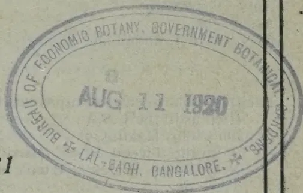

<!-- stage4: FAINT old-images-only -->

[Faint page: no legible print of its own could be verified; text withheld (stage 4 review list)]

1------------------------------------------------

2------------------------------------------------

3------------------------------------------------

4------------------------------------------------

The  
— Tropical —  
Agriculturist:

JOURNAL OF THE  
CEYLON AGRICULTURAL SOCIETY.

.....

Founded 1881

Vol. LIV.

.....

Containing Numbers I to VI  
January to June, 1920.

A circular library stamp in purple ink. The outer ring contains the text 'BURGH OF ECONOMIC BOTANY, GOVERNMENT BOTANICAL GARDEN, BENGAL' at the top and 'BURGH OF LAL-BAGH, BANGALORE.' at the bottom. The center of the stamp contains the date 'AUG 11 1920'.

5------------------------------------------------

# INDEX.

<table style="width: 100%; border-collapse: collapse;">
<thead>
<tr>
<th style="text-align: left; width: 50%;"></th>
<th style="text-align: right; width: 10%;">Page</th>
<th style="text-align: left; width: 50%;"></th>
<th style="text-align: right; width: 10%;">Page</th>
</tr>
</thead>
<tbody>
<tr>
<td colspan="4" style="text-align: center;"><b>A</b></td>
</tr>
<tr>
<td>Acacia Decurrens in India, Utilization of ... ..</td>
<td style="text-align: right;">180</td>
<td>"Bunchy Top" of Banana in the Tweed River District, New South Wales ... ..</td>
<td style="text-align: right;">171</td>
</tr>
<tr>
<td>Acres, A Hundred ... ..</td>
<td style="text-align: right;">53</td>
<td>Burma. Sesamum in ... ..</td>
<td style="text-align: right;">276</td>
</tr>
<tr>
<td>After-Ripening and Germination of Rice ... ..</td>
<td style="text-align: right;">275</td>
<td colspan="2" style="text-align: center;"><b>C</b></td>
</tr>
<tr>
<td>Agricultural Experiments Committee, Proceedings of a Meeting of ...</td>
<td style="text-align: right;">112</td>
<td>Cabbage Moth ... ..</td>
<td style="text-align: right;">367</td>
</tr>
<tr>
<td>Agricultural Possibilities in Kandy District ... ..</td>
<td style="text-align: right;">219</td>
<td>Cacao, Budding and Grafting of ...</td>
<td style="text-align: right;">266</td>
</tr>
<tr>
<td>Agriculture, Basic Slag and its Uses in ... ..</td>
<td style="text-align: right;">350</td>
<td>Cactus as a Fodder Substitute ..</td>
<td style="text-align: right;">91</td>
</tr>
<tr>
<td>" ... in Denmark ... ..</td>
<td style="text-align: right;">338</td>
<td>Camphor Production, the Future of ...</td>
<td style="text-align: right;">60</td>
</tr>
<tr>
<td>" ... in Mysore, Progress of... ..</td>
<td style="text-align: right;">40</td>
<td>Camphor Seed, Germination of ... ..</td>
<td style="text-align: right;">95</td>
</tr>
<tr>
<td>Ailments, Poultry ... ..</td>
<td style="text-align: right;">159</td>
<td>Canadian Wonder Beans ... ..</td>
<td style="text-align: right;">323</td>
</tr>
<tr>
<td>Animal Disease Return for the Month ended 31st December, 1919 ...</td>
<td style="text-align: right;">64</td>
<td>Cane Cultivation, British Empire ...</td>
<td style="text-align: right;">87</td>
</tr>
<tr>
<td>Animal Disease Return for the Month ended 31st January, 1920 ...</td>
<td style="text-align: right;">128</td>
<td>Cane Varieties from One Place to Another, Transportation of ...</td>
<td style="text-align: right;">89</td>
</tr>
<tr>
<td>Animal Disease Return for the Month ended 29th February, 1920 ...</td>
<td style="text-align: right;">192</td>
<td>Cane Varieties, the Question of Policy in the Selection of ... ..</td>
<td style="text-align: right;">312</td>
</tr>
<tr>
<td>Animal Disease Return for the Month ended 31st March, 1920 ...</td>
<td style="text-align: right;">256</td>
<td>Cape Gooseberry ... ..</td>
<td style="text-align: right;">22</td>
</tr>
<tr>
<td>Animal Disease Return for the Month ended 30th April, 1920 ...</td>
<td style="text-align: right;">320</td>
<td>Caponising ... ..</td>
<td style="text-align: right;">369</td>
</tr>
<tr>
<td>Animal Disease Return for the Month ended 31st May, 1920 ...</td>
<td style="text-align: right;">384</td>
<td>Carbonation of Burnt Lime in Soils ...</td>
<td style="text-align: right;">352</td>
</tr>
<tr>
<td>Ants, Destroying ... ..</td>
<td style="text-align: right;">38</td>
<td>Care of House Plants ... ..</td>
<td style="text-align: right;">383</td>
</tr>
<tr>
<td>Asparagus... ..</td>
<td style="text-align: right;">327</td>
<td>Cassava, Bread from Maize and Sauce from ... ..</td>
<td style="text-align: right;">328</td>
</tr>
<tr>
<td>Avocado in Trinidad and Tobago ...</td>
<td style="text-align: right;">277</td>
<td>Cassava ( Tapioca ) Roots, Notes on the Preparation of "Gaplek" from ...</td>
<td style="text-align: right;">132</td>
</tr>
<tr>
<td colspan="4" style="text-align: center;"><b>B</b></td>
</tr>
<tr>
<td>Bacillus Solanacearum Injurious to Ricinus in the U.S.A. ...</td>
<td style="text-align: right;">176</td>
<td>Cattle in Ceylon, Improvement of ...</td>
<td style="text-align: right;">156</td>
</tr>
<tr>
<td>Banana Cider, Making of ... ..</td>
<td style="text-align: right;">281</td>
<td>Cattle-Proof Hedges ... ..</td>
<td style="text-align: right;">191</td>
</tr>
<tr>
<td>" ... in the Tweed River District, New South Wales, "Bunchy Top" of ... ..</td>
<td style="text-align: right;">171</td>
<td>Ceylon Agricultural Society, Minutes of Meeting of the ... ..</td>
<td style="text-align: right;">211</td>
</tr>
<tr>
<td>Banana Notes on the Cultivation of ...</td>
<td style="text-align: right;">19</td>
<td>Ceylon Agricultural Society, Progress Report No. LXXVIII of the ...</td>
<td style="text-align: right;">213</td>
</tr>
<tr>
<td>" ... Panama Disease of ... ..</td>
<td style="text-align: right;">357</td>
<td>Chrysanthamnum Nauseosus, New Rubber from ... ..</td>
<td style="text-align: right;">195</td>
</tr>
<tr>
<td>Basic Slag and its Uses in Agriculture ...</td>
<td style="text-align: right;">350</td>
<td>Cinchona in Java, Notes on the Cultivation of ... ..</td>
<td style="text-align: right;">208</td>
</tr>
<tr>
<td>" ... Quality of ... ..</td>
<td style="text-align: right;">294</td>
<td>Cinnamon Bark from the Gold Coast, Further Investigations on the Value of ... ..</td>
<td style="text-align: right;">184</td>
</tr>
<tr>
<td>Bean, The Rice (<i>Phaseolus calcaratus</i>) ...</td>
<td style="text-align: right;">378</td>
<td>Citrus Culture in South India, Possibilities of ... ..</td>
<td style="text-align: right;">78</td>
</tr>
<tr>
<td>Bean-fly, A Remedy for ... ..</td>
<td style="text-align: right;">300</td>
<td>Citrus, Pink Disease of ... ..</td>
<td style="text-align: right;">103</td>
</tr>
<tr>
<td>Beans, Canadian Wonder ... ..</td>
<td style="text-align: right;">323</td>
<td>Cocoa, How to Prepare ... ..</td>
<td style="text-align: right;">17</td>
</tr>
<tr>
<td>" Olneya ... ..</td>
<td style="text-align: right;">14</td>
<td>Coconut Cultivation in Trinidad ...</td>
<td style="text-align: right;">142</td>
</tr>
<tr>
<td>Bee-keepers' Association, Report of the Standardization Sub-Committee of the ... ..</td>
<td style="text-align: right;">306</td>
<td>" Gas and Coke ... ..</td>
<td style="text-align: right;">58</td>
</tr>
<tr>
<td>Bees, Energy and its Relation to the Life of ... ..</td>
<td style="text-align: right;">374</td>
<td>" Palms, Red Ring or "Root" Disease of ... ..</td>
<td style="text-align: right;">240</td>
</tr>
<tr>
<td>Bees, Fertilisation and Crossing in ...</td>
<td style="text-align: right;">309</td>
<td>Coconut Products from Ceylon for the Year ended 31st December, 1919, Export of ... ..</td>
<td style="text-align: right;">143</td>
</tr>
<tr>
<td>Beeswax, Two Processes for Refining ...</td>
<td style="text-align: right;">373</td>
<td>Coconut the Dwarf ... ..</td>
<td style="text-align: right;">140</td>
</tr>
<tr>
<td>Borer, the European Maize ... ..</td>
<td style="text-align: right;">176</td>
<td>" Tree, Root System of the ...</td>
<td style="text-align: right;">126</td>
</tr>
<tr>
<td>Bread from Maize and Sauce from Cassava ... ..</td>
<td style="text-align: right;">328</td>
<td>Coconuts, Variation in ... ..</td>
<td style="text-align: right;">1</td>
</tr>
<tr>
<td>Britain, Entomology in ... ..</td>
<td style="text-align: right;">37</td>
<td>Coffee Berry and its Relation to the Manuring of a Coffee Estate, the Composition of the ... ..</td>
<td style="text-align: right;">82, 319</td>
</tr>
<tr>
<td>British Empire Cane Cultivation ...</td>
<td style="text-align: right;">87</td>
<td>Coffee for the Market, Preparing ...</td>
<td style="text-align: right;">262</td>
</tr>
<tr>
<td>British Guiana, Hevea in ... ..</td>
<td style="text-align: right;">9</td>
<td>" from Trinidad, Varieties of ...</td>
<td style="text-align: right;">148</td>
</tr>
<tr>
<td>Budded Limes ... ..</td>
<td style="text-align: right;">154</td>
<td>" Growing, Few Hints on ...</td>
<td style="text-align: right;">144, 200</td>
</tr>
<tr>
<td>Budding and Grafting of Cacao ...</td>
<td style="text-align: right;">266</td>
<td>Coke, Coconut Gas and ... ..</td>
<td style="text-align: right;">58</td>
</tr>
<tr>
<td>Buds for Grafting, Selection of ...</td>
<td style="text-align: right;">382</td>
<td>Committee of Agricultural Experiments, Minutes of Meeting of ...</td>
<td style="text-align: right;">224</td>
</tr>
<tr>
<td>Bug, the Paddy, (<i>Leptocorisa varicornis</i>, F) ... ..</td>
<td style="text-align: right;">363</td>
<td>Composition of the Coffee Berry and its Relation to the Manuring of a Coffee Estate ... ..</td>
<td style="text-align: right;">82, 319</td>
</tr>
</tbody>
</table>

6------------------------------------------------

## INDEX.—Contd.

<table style="width: 100%; border-collapse: collapse;">
<thead>
<tr>
<th></th>
<th style="text-align: right;">Page</th>
</tr>
</thead>
<tbody>
<tr>
<td>Control of Weeds in Field Crops ...</td>
<td style="text-align: right;">317</td>
</tr>
<tr>
<td>Co-operation in Madras, Progress of</td>
<td style="text-align: right;">181</td>
</tr>
<tr>
<td>Co-operative Societies in Burma, Progress of ...</td>
<td style="text-align: right;">50</td>
</tr>
<tr>
<td>Co-operative Societies in the Central Provinces and Berar, Progress of</td>
<td style="text-align: right;">246</td>
</tr>
<tr>
<td>Corn Meal ...</td>
<td style="text-align: right;">205</td>
</tr>
<tr>
<td>Cotton and Cotton Seed Industries ...</td>
<td style="text-align: right;">186</td>
</tr>
<tr>
<td>Crops, Parasitic Plants as Enemies to Cultivation in Kandy, Paddy ...</td>
<td style="text-align: right;">366</td>
</tr>
<tr>
<td>" of Bananas, Notes on the ...</td>
<td style="text-align: right;">19</td>
</tr>
<tr>
<td>" Sugar-cane ...</td>
<td style="text-align: right;">329</td>
</tr>
<tr>
<td>Culture in New South Wales, Rice ...</td>
<td style="text-align: right;">327</td>
</tr>
<tr>
<td>Cuttings, Propagation by ...</td>
<td style="text-align: right;">315</td>
</tr>
</tbody>
</table>

### D

<table style="width: 100%; border-collapse: collapse;">
<tbody>
<tr>
<td>Denmark, Agriculture in ...</td>
<td style="text-align: right;">338</td>
</tr>
<tr>
<td>Destroying Ants ...</td>
<td style="text-align: right;">38</td>
</tr>
<tr>
<td>Disease of Banana, Panama ...</td>
<td style="text-align: right;">357</td>
</tr>
<tr>
<td>Disease of Coconut Palms, Red Ring or "Root" ...</td>
<td style="text-align: right;">240</td>
</tr>
<tr>
<td>Disease Return for the Month ended 31st Dec., 1919, Animal ...</td>
<td style="text-align: right;">64</td>
</tr>
<tr>
<td>Disease Return for the Month ended 31st Jan., 1920, Animal ...</td>
<td style="text-align: right;">128</td>
</tr>
<tr>
<td>Disease Return for the Month ended 29th Feb., 1920, Animal ..</td>
<td style="text-align: right;">192</td>
</tr>
<tr>
<td>Disease Return for the Month ended 31st March, 1920, Animal ...</td>
<td style="text-align: right;">256</td>
</tr>
<tr>
<td>Disease Return for the Month ended 30th April, 1920, Animal ...</td>
<td style="text-align: right;">320</td>
</tr>
<tr>
<td>Disease Return for the Month ended 31st May, 1920, Animal ...</td>
<td style="text-align: right;">384</td>
</tr>
<tr>
<td>Disinfection by Hot Water, Soil ..</td>
<td style="text-align: right;">238</td>
</tr>
<tr>
<td>Disturbing Factors in Manurial Experiments ...</td>
<td style="text-align: right;">27</td>
</tr>
<tr>
<td>Dry Zone Experiment Station Anuradhapura, Progress Report of the ...</td>
<td style="text-align: right;">118, 228</td>
</tr>
<tr>
<td>Dwarf, Coconut ...</td>
<td style="text-align: right;">140</td>
</tr>
</tbody>
</table>

### E

<table style="width: 100%; border-collapse: collapse;">
<tbody>
<tr>
<td>Economic Transplantation of Paddy in the Malnad ...</td>
<td style="text-align: right;">75</td>
</tr>
<tr>
<td>Effect of Fertilisers in Overcoming the Bad Effects of Climate ...</td>
<td style="text-align: right;">296</td>
</tr>
<tr>
<td>Effect of Soaking the Coagulum in Water on the Properties of Rubber</td>
<td style="text-align: right;">72</td>
</tr>
<tr>
<td>Effect of Subsoiling and Deep Tillage</td>
<td style="text-align: right;">356</td>
</tr>
<tr>
<td>Egg Preservative, A New ...</td>
<td style="text-align: right;">164</td>
</tr>
<tr>
<td>Egg, Preserving ...</td>
<td style="text-align: right;">284</td>
</tr>
<tr>
<td>Egg Production, Feeding Hens for...</td>
<td style="text-align: right;">84</td>
</tr>
<tr>
<td>Electrolytic Treatment of Seeds before Sowing (Wolffryn Process) Proposed ...</td>
<td style="text-align: right;">248</td>
</tr>
<tr>
<td>Energy and Its Relation to the Life of Bees ...</td>
<td style="text-align: right;">374</td>
</tr>
<tr>
<td>Entomology in Britain ...</td>
<td style="text-align: right;">37</td>
</tr>
<tr>
<td>European Maize Borer ...</td>
<td style="text-align: right;">176</td>
</tr>
<tr>
<td>Exhibition of Rubber, other Tropical Products and Allied Industries ...</td>
<td style="text-align: right;">319</td>
</tr>
<tr>
<td>Experiment Station Peradeniya, Progress Report of the</td>
<td style="text-align: right;">116, 227</td>
</tr>
<tr>
<td>Experiments in Trinidad, Rice ...</td>
<td style="text-align: right;">77</td>
</tr>
<tr>
<td>in Yam Cultivation in Trinidad ...</td>
<td style="text-align: right;">273</td>
</tr>
<tr>
<td>Experiments on the Mechanical Cultivation of Rice in Cochin-China</td>
<td style="text-align: right;">271</td>
</tr>
</tbody>
</table>

<table style="width: 100%; border-collapse: collapse;">
<thead>
<tr>
<th></th>
<th style="text-align: right;">Page</th>
</tr>
</thead>
<tbody>
<tr>
<td>Export of Coconut Products from Ceylon for the Year ended 31st December, 1919 ...</td>
<td style="text-align: right;">143</td>
</tr>
<tr>
<td>Extracting Surplus Honey ...</td>
<td style="text-align: right;">371</td>
</tr>
</tbody>
</table>

### F

<table style="width: 100%; border-collapse: collapse;">
<tbody>
<tr>
<td>Feathers, Fowls Picking ...</td>
<td style="text-align: right;">86</td>
</tr>
<tr>
<td>Feeding Cakes, The Rancidity of Palm Kernel and other ...</td>
<td style="text-align: right;">194</td>
</tr>
<tr>
<td>Feeding Hens for Egg Production ...</td>
<td style="text-align: right;">84</td>
</tr>
<tr>
<td>Fertilisation and Crossing in Bees ...</td>
<td style="text-align: right;">309</td>
</tr>
<tr>
<td>Fertilisers for Tobacco, Manures and Fertilisers in Overcoming the Bad Effects of Climate, Effect of ...</td>
<td style="text-align: right;">101</td>
</tr>
<tr>
<td>Few Hints on Coffee Growing</td>
<td style="text-align: right;">144, 200</td>
</tr>
<tr>
<td>Fibre Resources of India, Investigations of the ...</td>
<td style="text-align: right;">285</td>
</tr>
<tr>
<td>Financial Condition of the People under Kalawewa Scheme ...</td>
<td style="text-align: right;">221</td>
</tr>
<tr>
<td>Fly Suppression, Storage of Manure and ...</td>
<td style="text-align: right;">293</td>
</tr>
<tr>
<td>Fodder Substitute, Cactus as a ...</td>
<td style="text-align: right;">91</td>
</tr>
<tr>
<td>Food Production, Increased ...</td>
<td style="text-align: right;">321</td>
</tr>
<tr>
<td>Food Production Committee Kandy, Minutes of Meeting of the</td>
<td style="text-align: right;">169, 303</td>
</tr>
<tr>
<td>Food Production Committee Kegalle, Minutes of Meeting of the ...</td>
<td style="text-align: right;">302</td>
</tr>
<tr>
<td>Food Production Committee Matale, Minutes of Meeting of the</td>
<td style="text-align: right;">39, 119, 165, 167, 304, 305</td>
</tr>
<tr>
<td>Food Production Committee Mullaitivu, Minutes of Meeting of the</td>
<td style="text-align: right;">42</td>
</tr>
<tr>
<td>Food Production Committee Nuwara Eliya, Minutes of Meeting of the</td>
<td style="text-align: right;">120</td>
</tr>
<tr>
<td>Food Production Committee Trincomalee, Minutes of Meeting of the</td>
<td style="text-align: right;">40, 170</td>
</tr>
<tr>
<td>Food Production Committee Vavuniya, North, Minutes of Meeting of the</td>
<td style="text-align: right;">120</td>
</tr>
<tr>
<td>Food Production Committee Vavuniya, South, Minutes of Meeting of the</td>
<td style="text-align: right;">40</td>
</tr>
<tr>
<td>Forest Tree Pollen, Observations on Distribution of ...</td>
<td style="text-align: right;">189</td>
</tr>
<tr>
<td>Fowls Picking Feathers ...</td>
<td style="text-align: right;">86</td>
</tr>
<tr>
<td>Fruit, to Prevent the Rapid Decay of Ripe ...</td>
<td style="text-align: right;">279</td>
</tr>
<tr>
<td>Fruits in Cold Water, Preservation of Further Investigations on the Value of Cinnamon Bark from the Gold Coast ...</td>
<td style="text-align: right;">383</td>
</tr>
<tr>
<td>Future of Camphor Production ...</td>
<td style="text-align: right;">184</td>
</tr>
<tr>
<td></td>
<td style="text-align: right;">60</td>
</tr>
</tbody>
</table>

### G

<table style="width: 100%; border-collapse: collapse;">
<tbody>
<tr>
<td>Gampola Agri-Horticultural Show ...</td>
<td style="text-align: right;">336</td>
</tr>
<tr>
<td>"Gaplek" from Cassava (Tapioca) Roots, Notes on the Preparation of</td>
<td style="text-align: right;">132</td>
</tr>
<tr>
<td>Germination of Camphor Seed ...</td>
<td style="text-align: right;">95</td>
</tr>
<tr>
<td>Gooseberry, Cape ...</td>
<td style="text-align: right;">22</td>
</tr>
<tr>
<td>Government Lime Factory in British Guiana ...</td>
<td style="text-align: right;">155</td>
</tr>
<tr>
<td>Grafting of Cacao, Budding and "Selection of Buds for ...</td>
<td style="text-align: right;">266</td>
</tr>
<tr>
<td>Grass as Paper-Making Material, Lalang ...</td>
<td style="text-align: right;">382</td>
</tr>
<tr>
<td>Great Britain, Motor Tractor in ...</td>
<td style="text-align: right;">187</td>
</tr>
<tr>
<td>Green Leaf Manuring of Dry Paddy Land ...</td>
<td style="text-align: right;">231</td>
</tr>
<tr>
<td></td>
<td style="text-align: right;">354</td>
</tr>
</tbody>
</table>

2

7------------------------------------------------

## INDEX.—Contd.

<table style="width: 100%; border-collapse: collapse;">
<thead>
<tr>
<th style="text-align: left;"></th>
<th style="text-align: right;">Page</th>
<th style="text-align: left;"></th>
<th style="text-align: right;">Page</th>
</tr>
</thead>
<tbody>
<tr>
<td>Green Manure, Note on the Fermentation of ..</td>
<td style="text-align: right;">347</td>
<td>Lime Factory in British Guiana, A Government ..</td>
<td style="text-align: right;">155</td>
</tr>
<tr>
<td>Growing and Curing, Lemon ..</td>
<td style="text-align: right;">152</td>
<td>Lime in Soils, Carbonation of Burnt ..</td>
<td style="text-align: right;">352</td>
</tr>
<tr>
<td>Guayule Rubber, Production of ..</td>
<td style="text-align: right;">257</td>
<td>Limes, Budded ..</td>
<td style="text-align: right;">154</td>
</tr>
<tr>
<td colspan="2" style="text-align: center;"><b>H</b></td>
<td colspan="2" style="text-align: center;"><b>M</b></td>
</tr>
<tr>
<td>Hedges, Cattle-proof ..</td>
<td style="text-align: right;">191</td>
<td>Maize, Bread from, and Sauce from Cassava ..</td>
<td style="text-align: right;">328</td>
</tr>
<tr>
<td>Hevea in British Guiana ..</td>
<td style="text-align: right;">9</td>
<td>Maize Borer, the European ..</td>
<td style="text-align: right;">176</td>
</tr>
<tr>
<td>„ Leaf Disease in Surinam ..</td>
<td style="text-align: right;">38</td>
<td>Man Power, Unutilised ..</td>
<td style="text-align: right;">193</td>
</tr>
<tr>
<td>Hevea Brasiliensis, the Internal Structure of the Cortex of ..</td>
<td style="text-align: right;">134</td>
<td>Manure and Fly Suppression, Storage of ..</td>
<td style="text-align: right;">293</td>
</tr>
<tr>
<td>Hevea Brasiliensis, Vegetative Propagation of ..</td>
<td style="text-align: right;">2</td>
<td>Manures and Fertilisers for Tobacco ..</td>
<td style="text-align: right;">101</td>
</tr>
<tr>
<td>Hints Allotment ..</td>
<td style="text-align: right;">295</td>
<td>„ in Yedatore Taluk, Mysore District Cultivation and the Use of Special ..</td>
<td style="text-align: right;">132</td>
</tr>
<tr>
<td>Hiving Swarms, Swarming and ..</td>
<td style="text-align: right;">307</td>
<td>Manures Organic ..</td>
<td style="text-align: right;">290</td>
</tr>
<tr>
<td>Honey, Extracting Surplus ..</td>
<td style="text-align: right;">371</td>
<td>Manures Value of Artificial ..</td>
<td style="text-align: right;">236</td>
</tr>
<tr>
<td>Horse Marmalade ..</td>
<td style="text-align: right;">93</td>
<td>Manurial Experiments, Disturbing Factors in ..</td>
<td style="text-align: right;">27</td>
</tr>
<tr>
<td>House Plants, the Care of ..</td>
<td style="text-align: right;">383</td>
<td>Manuring of a Coffee Estate, Composition of the Coffee Berry and its Relation to the ..</td>
<td style="text-align: right;">82, 319</td>
</tr>
<tr>
<td>How to Prepare Cocoa ..</td>
<td style="text-align: right;">17</td>
<td>Marmalade, Horse ..</td>
<td style="text-align: right;">93</td>
</tr>
<tr>
<td>How to Reduce the Consumption of Rice ..</td>
<td style="text-align: right;">121</td>
<td>Matale Food Production Committee, Minutes of Meeting of 39, 119, 165, 167, 304, 305 ..</td>
<td style="text-align: right;">205</td>
</tr>
<tr>
<td>Hundred Acres, A ..</td>
<td style="text-align: right;">53</td>
<td>Meal Corn ..</td>
<td style="text-align: right;">205</td>
</tr>
<tr>
<td>Hygiene, Plant ..</td>
<td style="text-align: right;">380</td>
<td>Meeting of the Agricultural Experiments Committee, Proceedings of a ..</td>
<td style="text-align: right;">112</td>
</tr>
<tr>
<td colspan="2" style="text-align: center;"><b>I</b></td>
<td>Meteorological Return for Dec., 1919 ..</td>
<td style="text-align: right;">64</td>
</tr>
<tr>
<td>Improvement of Cattle in Ceylon ..</td>
<td style="text-align: right;">156</td>
<td>„ „ „ Jan., 1920 ..</td>
<td style="text-align: right;">128</td>
</tr>
<tr>
<td>Improvement of Cultivated Plants ..</td>
<td style="text-align: right;">375</td>
<td>„ „ „ Feb., 1920 ..</td>
<td style="text-align: right;">192</td>
</tr>
<tr>
<td>Increased Food Production ..</td>
<td style="text-align: right;">321</td>
<td>„ „ „ March, 1920 ..</td>
<td style="text-align: right;">256</td>
</tr>
<tr>
<td>Increasing the Yield of Tomatoes ..</td>
<td style="text-align: right;">131</td>
<td>„ „ „ April, 1920 ..</td>
<td style="text-align: right;">320</td>
</tr>
<tr>
<td>Indian Tanstuff ..</td>
<td style="text-align: right;">289</td>
<td>„ „ „ May, 1920 ..</td>
<td style="text-align: right;">384</td>
</tr>
<tr>
<td>Indigo-Industry in Bihar, Possibilities of the Natural ..</td>
<td style="text-align: right;">288</td>
<td>Mice, Rats and ..</td>
<td style="text-align: right;">108</td>
</tr>
<tr>
<td>Industries, Cotton and Cotton Seed ..</td>
<td style="text-align: right;">186</td>
<td>Minutes of Meeting of the Ceylon Agricultural Society ..</td>
<td style="text-align: right;">211</td>
</tr>
<tr>
<td>Influence of Plant-Residues on Nitrogen Fixation ..</td>
<td style="text-align: right;">29</td>
<td>Minutes of Meeting of Committee of Agricultural Experiments ..</td>
<td style="text-align: right;">224</td>
</tr>
<tr>
<td>Insects Attracted by Smoke ..</td>
<td style="text-align: right;">61</td>
<td>Minutes of Meeting of Kandy Food Production Committee ..</td>
<td style="text-align: right;">169, 303</td>
</tr>
<tr>
<td>Irrigation Conditions, Soil Aeration under ..</td>
<td style="text-align: right;">30</td>
<td>Minutes of Meeting of Kegalle Food Production Committee ..</td>
<td style="text-align: right;">302</td>
</tr>
<tr>
<td>Internal Structure of the Cortex of Hevea Brasiliensis ..</td>
<td style="text-align: right;">134</td>
<td>Minutes of Meeting of Matale Food Production Committee 39, 119, 165, 167, 304, 305 ..</td>
<td style="text-align: right;">42</td>
</tr>
<tr>
<td>Investigation of the Fibre Resources of India ..</td>
<td style="text-align: right;">285</td>
<td>Minutes of Meeting of Mullaitivu Food Production Committee ..</td>
<td style="text-align: right;">120</td>
</tr>
<tr>
<td colspan="2" style="text-align: center;"><b>J</b></td>
<td>Minutes of Meeting of Nuwara Eliya Food Production Committee ..</td>
<td style="text-align: right;">40, 170</td>
</tr>
<tr>
<td>Jippi-Jappa ..</td>
<td style="text-align: right;">190</td>
<td>Minutes of Meeting of Trincomalee Food Production Committee ..</td>
<td style="text-align: right;">120</td>
</tr>
<tr>
<td colspan="2" style="text-align: center;"><b>K</b></td>
<td>Minutes of Meeting of Vavuniya North Food Production Committee ..</td>
<td style="text-align: right;">40</td>
</tr>
<tr>
<td>Kalawewa Scheme, Financial Condition of the People under ..</td>
<td style="text-align: right;">221</td>
<td>Minutes of Meeting of Vavuniya South Food Production Committee ..</td>
<td style="text-align: right;">367</td>
</tr>
<tr>
<td>Kandy District, Agricultural Possibilities in ..</td>
<td style="text-align: right;">219</td>
<td>Motor Tractor in Great Britain ..</td>
<td style="text-align: right;">231</td>
</tr>
<tr>
<td>Kandy Food Production Committee, Minutes of Meeting of ..</td>
<td style="text-align: right;">169, 303</td>
<td>Movement of Plant-food within the Soil ..</td>
<td style="text-align: right;">30</td>
</tr>
<tr>
<td>Kegalle Food Production Committee, Minutes of Meeting of ..</td>
<td style="text-align: right;">302</td>
<td>Mulching ..</td>
<td style="text-align: right;">313</td>
</tr>
<tr>
<td colspan="2" style="text-align: center;"><b>L</b></td>
<td>Mullaitivu Food Production Committee, Minutes of Meeting ..</td>
<td style="text-align: right;">42</td>
</tr>
<tr>
<td>Lalang Grass as a Paper-making Material ..</td>
<td style="text-align: right;">187</td>
<td>Myrabolans, Note on ..</td>
<td style="text-align: right;">177</td>
</tr>
<tr>
<td>Leaf Disease in Surinam, Hevea ..</td>
<td style="text-align: right;">38</td>
<td></td>
<td></td>
</tr>
<tr>
<td>„ known, the Sweetest ..</td>
<td style="text-align: right;">62</td>
<td></td>
<td></td>
</tr>
<tr>
<td>Leaves, Pimento ..</td>
<td style="text-align: right;">318</td>
<td></td>
<td></td>
</tr>
<tr>
<td>„ Propagation by ..</td>
<td style="text-align: right;">316</td>
<td></td>
<td></td>
</tr>
<tr>
<td>Legislation Regarding Shot-hole Borer ..</td>
<td style="text-align: right;">31</td>
<td></td>
<td></td>
</tr>
<tr>
<td>Lemon Growing and Curing ..</td>
<td style="text-align: right;">152</td>
<td></td>
<td></td>
</tr>
<tr>
<td>Lettuces, Summer ..</td>
<td style="text-align: right;">275</td>
<td></td>
<td></td>
</tr>
<tr>
<td>Lima Kidney Bean (<i>Phaseolus lunatus</i>) as a Human Food-stuff, Utilisation of ..</td>
<td style="text-align: right;">207</td>
<td></td>
<td></td>
</tr>
</tbody>
</table>

3

8------------------------------------------------

## INDEX.—Contd.

<table style="width: 100%; border-collapse: collapse;">
<thead>
<tr>
<th style="text-align: left; width: 60%;"></th>
<th style="text-align: right; width: 40%;">Page</th>
</tr>
</thead>
<tbody>
<tr>
<td><b>N</b></td>
<td></td>
</tr>
<tr>
<td>Nature Study ... ..</td>
<td style="text-align: right;">191</td>
</tr>
<tr>
<td>New Egg Preservative ... ..</td>
<td style="text-align: right;">164</td>
</tr>
<tr>
<td>New Rubber from Chrysothamnus Nauseosus ... ..</td>
<td style="text-align: right;">195</td>
</tr>
<tr>
<td>New Source of Plant-food ... ..</td>
<td style="text-align: right;">28</td>
</tr>
<tr>
<td>Northern India, Pruning Time in ... ..</td>
<td style="text-align: right;">10</td>
</tr>
<tr>
<td>" " Red Rust in ... ..</td>
<td style="text-align: right;">34</td>
</tr>
<tr>
<td>Note on Myrabolans ... ..</td>
<td style="text-align: right;">177</td>
</tr>
<tr>
<td>" " Watercress ... ..</td>
<td style="text-align: right;">21</td>
</tr>
<tr>
<td>" " the Fermentation of Green Manure ... ..</td>
<td style="text-align: right;">347</td>
</tr>
<tr>
<td>Notes on the Cultivation of Bananas... ..</td>
<td style="text-align: right;">19</td>
</tr>
<tr>
<td>" " " Cinchona in Java ... ..</td>
<td style="text-align: right;">208</td>
</tr>
<tr>
<td>" " Preparation of "Gaplek" from Cassava (Tapioca) Roots ... ..</td>
<td style="text-align: right;">132</td>
</tr>
<tr>
<td>Nuwara Eliya Food Production Committee, Minutes of Meeting ... ..</td>
<td style="text-align: right;">120</td>
</tr>
</tbody>
</table>

<table style="width: 100%; border-collapse: collapse;">
<tbody>
<tr>
<td><b>O</b></td>
<td></td>
</tr>
<tr>
<td>Observations on Distribution of Forest Tree Pollen ... ..</td>
<td style="text-align: right;">189</td>
</tr>
<tr>
<td>Oil Palm ... ..</td>
<td style="text-align: right;">150</td>
</tr>
<tr>
<td>Old Age, Perennials and ... ..</td>
<td style="text-align: right;">56</td>
</tr>
<tr>
<td>Olneya Beans ... ..</td>
<td style="text-align: right;">14</td>
</tr>
<tr>
<td>Onion Seed in the Tropics, The Storage of ... ..</td>
<td style="text-align: right;">183</td>
</tr>
<tr>
<td>Organic Manures ... ..</td>
<td style="text-align: right;">290</td>
</tr>
</tbody>
</table>

<table style="width: 100%; border-collapse: collapse;">
<tbody>
<tr>
<td><b>P</b></td>
<td></td>
</tr>
<tr>
<td>Paddy Bug (<i>Leptocorisa varicornis</i>, F.) ... ..</td>
<td style="text-align: right;">363</td>
</tr>
<tr>
<td>" Cultivation and the Use of Special Manures in Yedatore Taluk, Mysore District ... ..</td>
<td style="text-align: right;">132</td>
</tr>
<tr>
<td>" Cultivation in Kandy ... ..</td>
<td style="text-align: right;">325</td>
</tr>
<tr>
<td>" in the Malnad, Economic Transplantation of ... ..</td>
<td style="text-align: right;">75</td>
</tr>
<tr>
<td>" Experiment, A Recent ... ..</td>
<td style="text-align: right;">326</td>
</tr>
<tr>
<td>" Experiments in Kandy during the last Maha Season, Some ... ..</td>
<td style="text-align: right;">204</td>
</tr>
<tr>
<td>" Land, Green Leaf Manuring of Dry ... ..</td>
<td style="text-align: right;">354</td>
</tr>
<tr>
<td>" Transplanting ... ..</td>
<td style="text-align: right;">20</td>
</tr>
<tr>
<td>Palm Oil ... ..</td>
<td style="text-align: right;">150</td>
</tr>
<tr>
<td>Panama Disease of Bananas ... ..</td>
<td style="text-align: right;">357</td>
</tr>
<tr>
<td>Parasitic Plants as Enemies to Crops ... ..</td>
<td style="text-align: right;">366</td>
</tr>
<tr>
<td>Perennials and Old Age... ..</td>
<td style="text-align: right;">56</td>
</tr>
<tr>
<td>Pest Extermination, Utility of Poison Gases for ... ..</td>
<td style="text-align: right;">298</td>
</tr>
<tr>
<td>Pimento Leaves ... ..</td>
<td style="text-align: right;">318</td>
</tr>
<tr>
<td>Pink Disease of Citrus ... ..</td>
<td style="text-align: right;">103</td>
</tr>
<tr>
<td>Plant Food, A New Source of ... ..</td>
<td style="text-align: right;">28</td>
</tr>
<tr>
<td>" " within the Soil, Movement of ... ..</td>
<td style="text-align: right;">30</td>
</tr>
<tr>
<td>" Distribution ... ..</td>
<td style="text-align: right;">310</td>
</tr>
<tr>
<td>" Hygiene ... ..</td>
<td style="text-align: right;">380</td>
</tr>
<tr>
<td>Planting the Trees ... ..</td>
<td style="text-align: right;">381</td>
</tr>
<tr>
<td>Plants, the Improvement of Cultivated Plant-Residues in Nitrogen Fixation, Influence of ... ..</td>
<td style="text-align: right;">29</td>
</tr>
<tr>
<td>Poison Baits for White Ants ... ..</td>
<td style="text-align: right;">301</td>
</tr>
<tr>
<td>" Gases for Pest Extermination, The Utility of ... ..</td>
<td style="text-align: right;">298</td>
</tr>
<tr>
<td>Possibilities of Citrus Culture in South India ... ..</td>
<td style="text-align: right;">78</td>
</tr>
<tr>
<td>" of the Natural Indigo Industry in Bihar ... ..</td>
<td style="text-align: right;">288</td>
</tr>
</tbody>
</table>

<table style="width: 100%; border-collapse: collapse;">
<tbody>
<tr>
<td>Poultry Ailments ... ..</td>
<td style="text-align: right;">159</td>
</tr>
<tr>
<td>" Common Household Remedies for ... ..</td>
<td style="text-align: right;">282</td>
</tr>
<tr>
<td>" Congress, World's ... ..</td>
<td style="text-align: right;">25</td>
</tr>
<tr>
<td>Preparing Coffee for the Market ... ..</td>
<td style="text-align: right;">262</td>
</tr>
<tr>
<td>Preservation of Fruits in Cold Water ... ..</td>
<td style="text-align: right;">383</td>
</tr>
<tr>
<td>Preserve Building Timbers ... ..</td>
<td style="text-align: right;">319</td>
</tr>
<tr>
<td>Preserving Eggs ... ..</td>
<td style="text-align: right;">284</td>
</tr>
<tr>
<td>Prevent the Rapid Decay of Ripe Fruit ... ..</td>
<td style="text-align: right;">279</td>
</tr>
<tr>
<td>Prevention of Soil Erosion on Tea Estates in Southern India ... ..</td>
<td style="text-align: right;">99</td>
</tr>
<tr>
<td>Proceedings of a Meeting of Agricultural Experiments Committee ... ..</td>
<td style="text-align: right;">112</td>
</tr>
<tr>
<td>Progress of Agriculture in Mysore ... ..</td>
<td style="text-align: right;">43</td>
</tr>
<tr>
<td>" Co-operative Societies in Burma ... ..</td>
<td style="text-align: right;">50</td>
</tr>
<tr>
<td>" Co-operative Societies in the Central Provinces and Berar... ..</td>
<td style="text-align: right;">246</td>
</tr>
<tr>
<td>" Co-operation in Madras ... ..</td>
<td style="text-align: right;">181</td>
</tr>
<tr>
<td>Progress Report No. LXXXVIII of the Ceylon Agricultural Society ... ..</td>
<td style="text-align: right;">213</td>
</tr>
<tr>
<td>" " of the Dry Zone Experiment Station, Anuradhapura ... ..</td>
<td style="text-align: right;">118, 228</td>
</tr>
<tr>
<td>" " of the Experiment Station, Peradeniya ... ..</td>
<td style="text-align: right;">116, 227</td>
</tr>
<tr>
<td>Propagation by Cuttings ... ..</td>
<td style="text-align: right;">315</td>
</tr>
<tr>
<td>" Leaves ... ..</td>
<td style="text-align: right;">316</td>
</tr>
<tr>
<td>Proposed Electrolytic Treatment of Seeds before Sowing (Wolfryn Process)... ..</td>
<td style="text-align: right;">248</td>
</tr>
<tr>
<td>Pruning Time in Northern India ... ..</td>
<td style="text-align: right;">10</td>
</tr>
</tbody>
</table>

<table style="width: 100%; border-collapse: collapse;">
<tbody>
<tr>
<td><b>Q</b></td>
<td></td>
</tr>
<tr>
<td>Quality of Basic Slag ... ..</td>
<td style="text-align: right;">294</td>
</tr>
</tbody>
</table>

<table style="width: 100%; border-collapse: collapse;">
<tbody>
<tr>
<td><b>R</b></td>
<td></td>
</tr>
<tr>
<td>Rancidity of Palm Kernel and Other Feeding Cakes ... ..</td>
<td style="text-align: right;">194</td>
</tr>
<tr>
<td>Rats and Mice ... ..</td>
<td style="text-align: right;">108</td>
</tr>
<tr>
<td>Rattota Agri-Horticultural Show ... ..</td>
<td style="text-align: right;">337</td>
</tr>
<tr>
<td>Recent Paddy Experiment—Kandy District ... ..</td>
<td style="text-align: right;">326</td>
</tr>
<tr>
<td>Red Ring or "Root" Disease of Coconut Palms ... ..</td>
<td style="text-align: right;">240</td>
</tr>
<tr>
<td>Red Rust in Northern India ... ..</td>
<td style="text-align: right;">34</td>
</tr>
<tr>
<td>Remarkable Yields of Sweet Potato in Montserrat ... ..</td>
<td style="text-align: right;">130</td>
</tr>
<tr>
<td>Remedy for Bean fly ... ..</td>
<td style="text-align: right;">300</td>
</tr>
<tr>
<td>Report of the Standardization Sub-Committee of the Bee-Keepers' Association ... ..</td>
<td style="text-align: right;">306</td>
</tr>
<tr>
<td>Research, Rubber ... ..</td>
<td style="text-align: right;">65</td>
</tr>
<tr>
<td>" in Malaya, Rubber ... ..</td>
<td style="text-align: right;">67</td>
</tr>
<tr>
<td>" in the Dutch East Indies, Rubber... ..</td>
<td style="text-align: right;">6</td>
</tr>
<tr>
<td>Rice, After-Ripening and Germination of ... ..</td>
<td style="text-align: right;">275</td>
</tr>
<tr>
<td>Rice Bean (<i>Phaseolus calcaratus</i>) ... ..</td>
<td style="text-align: right;">378</td>
</tr>
<tr>
<td>" Culture in New South Wales ... ..</td>
<td style="text-align: right;">327</td>
</tr>
<tr>
<td>" Experiments in Trinidad ... ..</td>
<td style="text-align: right;">77</td>
</tr>
<tr>
<td>Rice, How to Reduce the Consumption of ... ..</td>
<td style="text-align: right;">121</td>
</tr>
</tbody>
</table>

4

9------------------------------------------------

## INDEX.—Contd.

<table style="width: 100%; border-collapse: collapse;">
<thead>
<tr>
<th></th>
<th style="text-align: right;">Page</th>
</tr>
</thead>
<tbody>
<tr>
<td>Rice in Burma, Varietal Selection of</td>
<td style="text-align: right;">133</td>
</tr>
<tr>
<td>    " in Cochin-China, Experiments on the Mechanical Cultivation of</td>
<td style="text-align: right;">271</td>
</tr>
<tr>
<td>Ricinus in U. S. A., Bacillus Solanace-arum injurious to ...</td>
<td style="text-align: right;">176</td>
</tr>
<tr>
<td>Root System of the Coconut Tree ...</td>
<td style="text-align: right;">126</td>
</tr>
<tr>
<td>Rubber, Effect of Soaking the Coagulum in Water on the Properties of...</td>
<td style="text-align: right;">72</td>
</tr>
<tr>
<td>    " from Chrysothamnus Nauseosus, New ...</td>
<td style="text-align: right;">195</td>
</tr>
<tr>
<td>    " Other Tropical Products and Allied Industries, Exhibition of ...</td>
<td style="text-align: right;">319</td>
</tr>
<tr>
<td>    " Production of Guayule ...</td>
<td style="text-align: right;">257</td>
</tr>
<tr>
<td>    " Research ...</td>
<td style="text-align: right;">65</td>
</tr>
<tr>
<td>    " " in Dutch East Indies ...</td>
<td style="text-align: right;">6</td>
</tr>
<tr>
<td>    " " in Malaya ...</td>
<td style="text-align: right;">67</td>
</tr>
<tr>
<td colspan="2" style="text-align: center;"><b>S</b></td>
</tr>
<tr>
<td>Saponin, Tea Seed Oil and</td>
<td style="text-align: right;">188</td>
</tr>
<tr>
<td>Sauce from Cassava, Bread from Maize and ...</td>
<td style="text-align: right;">328</td>
</tr>
<tr>
<td>Save Seed ...</td>
<td style="text-align: right;">129</td>
</tr>
<tr>
<td>Sesamum in Burma ...</td>
<td style="text-align: right;">276</td>
</tr>
<tr>
<td>Seed, Save ...</td>
<td style="text-align: right;">129</td>
</tr>
<tr>
<td>Seeds before Sowing (Wolfryn Process) Proposed Electrolytic Treatment of ...</td>
<td style="text-align: right;">248</td>
</tr>
<tr>
<td>Selection of Buds for Grafting ...</td>
<td style="text-align: right;">382</td>
</tr>
<tr>
<td>Shot-Hole Borer, Legislation Regarding ...</td>
<td style="text-align: right;">31</td>
</tr>
<tr>
<td>Show, Gampola Agri-Horticultural...</td>
<td style="text-align: right;">336</td>
</tr>
<tr>
<td>    " , Rattota Agri-Horticultural ...</td>
<td style="text-align: right;">337</td>
</tr>
<tr>
<td>Smoke, Insect Attracted by ...</td>
<td style="text-align: right;">61</td>
</tr>
<tr>
<td>Soaking the Coagulum in Water on the Properties of Rubber, Effect of</td>
<td style="text-align: right;">72</td>
</tr>
<tr>
<td>Soil Aeration under Irrigation Conditions ...</td>
<td style="text-align: right;">30</td>
</tr>
<tr>
<td>    " Conditions and Soils ...</td>
<td style="text-align: right;">247</td>
</tr>
<tr>
<td>    " Disinfection by Hot Water ...</td>
<td style="text-align: right;">238</td>
</tr>
<tr>
<td>    " Erosion on Tea Estates in Southern India, Prevention of ...</td>
<td style="text-align: right;">99</td>
</tr>
<tr>
<td>    " Sour ...</td>
<td style="text-align: right;">355</td>
</tr>
<tr>
<td>Soils and Soil Conditions ...</td>
<td style="text-align: right;">297</td>
</tr>
<tr>
<td>    " Carbonation of Burnt lime in ...</td>
<td style="text-align: right;">352</td>
</tr>
<tr>
<td>Some Paddy Experiments in Kandy during the last Maha Season ...</td>
<td style="text-align: right;">204</td>
</tr>
<tr>
<td>Sour Soil ...</td>
<td style="text-align: right;">355</td>
</tr>
<tr>
<td>Sterilization of Tobacco Seed-beds by Steam ...</td>
<td style="text-align: right;">334</td>
</tr>
<tr>
<td>Storage of Manure and Fly Suppression ...</td>
<td style="text-align: right;">293</td>
</tr>
<tr>
<td>    " of Onion Seed in the Tropics</td>
<td style="text-align: right;">183</td>
</tr>
<tr>
<td>Study, Nature ...</td>
<td style="text-align: right;">191</td>
</tr>
<tr>
<td>Subsoiling and Deep Tillage, Effect of</td>
<td style="text-align: right;">356</td>
</tr>
<tr>
<td>Sugar-cane Cultivation ...</td>
<td style="text-align: right;">329</td>
</tr>
<tr>
<td>Sugar, Sweet Substitute for ...</td>
<td style="text-align: right;">314</td>
</tr>
<tr>
<td>Summer Lettuces ...</td>
<td style="text-align: right;">275</td>
</tr>
<tr>
<td>Sunday Fair, Udispattu ...</td>
<td style="text-align: right;">63</td>
</tr>
<tr>
<td>Swarming and Hiving Swarms ...</td>
<td style="text-align: right;">307</td>
</tr>
</tbody>
</table>

<table style="width: 100%; border-collapse: collapse;">
<thead>
<tr>
<th></th>
<th style="text-align: right;">Page</th>
</tr>
</thead>
<tbody>
<tr>
<td>Sweet Potato in Montserrat, Remarkable Yields of ...</td>
<td style="text-align: right;">130</td>
</tr>
<tr>
<td>Sweetest Leaf Known ...</td>
<td style="text-align: right;">62</td>
</tr>
</tbody>
</table>

### T

<table style="width: 100%; border-collapse: collapse;">
<tbody>
<tr>
<td>Tanstuff, An Indian ...</td>
<td style="text-align: right;">289</td>
</tr>
<tr>
<td>Tea Estates in Southern India, Prevention of Soil erosion on ...</td>
<td style="text-align: right;">99</td>
</tr>
<tr>
<td>    " Seed Oil and Saponin ...</td>
<td style="text-align: right;">188</td>
</tr>
<tr>
<td>Terraces, Why and Where to Build them ...</td>
<td style="text-align: right;">123</td>
</tr>
<tr>
<td>Tillage, Effect of Subsoiling and Deep ...</td>
<td style="text-align: right;">356</td>
</tr>
<tr>
<td>Timbers, to Preserve Building ...</td>
<td style="text-align: right;">319</td>
</tr>
<tr>
<td>Tobacco, Manures and Fertilisers for ...</td>
<td style="text-align: right;">101</td>
</tr>
<tr>
<td>    " Seed-beds by Steam, Sterilization of ...</td>
<td style="text-align: right;">334</td>
</tr>
<tr>
<td>Tomatos, Increasing the Yields of ...</td>
<td style="text-align: right;">131</td>
</tr>
<tr>
<td>Transplanting Paddy ...</td>
<td style="text-align: right;">20</td>
</tr>
<tr>
<td>    " of Paddy in the Malnad Economic ...</td>
<td style="text-align: right;">75</td>
</tr>
<tr>
<td>Transportation of Cane Varieties from One Place to Another ...</td>
<td style="text-align: right;">89</td>
</tr>
<tr>
<td>Trees Planting, The ...</td>
<td style="text-align: right;">381</td>
</tr>
<tr>
<td>Trincomalee Food Production Committee, Minutes of Meeting of the ...</td>
<td style="text-align: right;">40, 170</td>
</tr>
<tr>
<td>Trinidad, Coconut Cultivation in ...</td>
<td style="text-align: right;">142</td>
</tr>
<tr>
<td>Tropical Products and Allied Industries, Exhibition of Rubber and Other ...</td>
<td style="text-align: right;">319</td>
</tr>
<tr>
<td>Two Processes for Refining Beeswax</td>
<td style="text-align: right;">373</td>
</tr>
</tbody>
</table>

### U

<table style="width: 100%; border-collapse: collapse;">
<tbody>
<tr>
<td>Udispattu Sunday Fair ...</td>
<td style="text-align: right;">63</td>
</tr>
<tr>
<td>Unutilised Man Power ...</td>
<td style="text-align: right;">193</td>
</tr>
<tr>
<td>Utilization of Acacia Decurrens in India ...</td>
<td style="text-align: right;">180</td>
</tr>
<tr>
<td>Utilisation of the Lima Kidney Bean (<i>Phaseolus lunatus</i>) as a Human Foodstuff ...</td>
<td style="text-align: right;">207</td>
</tr>
<tr>
<td>Utility of Poison Gases for Pest Extermination ...</td>
<td style="text-align: right;">298</td>
</tr>
</tbody>
</table>

### V

<table style="width: 100%; border-collapse: collapse;">
<tbody>
<tr>
<td>Value of Artificial Manures ...</td>
<td style="text-align: right;">236</td>
</tr>
<tr>
<td>Variation in Coconuts ...</td>
<td style="text-align: right;">1</td>
</tr>
<tr>
<td>Varietal Selections of Rice in Burma</td>
<td style="text-align: right;">133</td>
</tr>
<tr>
<td>Varieties of Coffee from Trinidad ...</td>
<td style="text-align: right;">148</td>
</tr>
<tr>
<td>Vegetative Propagation of Hevea Brasiliensis ...</td>
<td style="text-align: right;">2</td>
</tr>
<tr>
<td>Vavuniya South Food Production Committee, Minutes of Meeting of</td>
<td style="text-align: right;">40</td>
</tr>
<tr>
<td>Vavuniya North Food Production Committee, Minutes of Meeting of</td>
<td style="text-align: right;">120</td>
</tr>
</tbody>
</table>

### W

<table style="width: 100%; border-collapse: collapse;">
<tbody>
<tr>
<td>Watercress, Note on ...</td>
<td style="text-align: right;">21</td>
</tr>
<tr>
<td>Weeds in Field Crops, Control of ...</td>
<td style="text-align: right;">317</td>
</tr>
<tr>
<td>White Ants, Poison Baits for ...</td>
<td style="text-align: right;">301</td>
</tr>
<tr>
<td>World's Poultry Congress ...</td>
<td style="text-align: right;">25</td>
</tr>
</tbody>
</table>

### Y

<table style="width: 100%; border-collapse: collapse;">
<tbody>
<tr>
<td>Yam Cultivation in Trinidad, Experiments in... ..</td>
<td style="text-align: right;">273</td>
</tr>
</tbody>
</table>

### LIST OF ILLUSTRATIONS APPEARING IN Nos. 1-6 of VOL. LIV.

<table style="width: 100%; border-collapse: collapse;">
<tbody>
<tr>
<td>Palm Grown from a Yellow Nut ...</td>
<td style="text-align: right;">1</td>
<td>Gampola Agri-Horticultural Show Fruit Section ...</td>
<td style="text-align: right;">336</td>
</tr>
<tr>
<td>    " " " Green ...</td>
<td style="text-align: right;">1</td>
<td>Paddy Bag-net ...</td>
<td style="text-align: right;">365</td>
</tr>
<tr>
<td>Gampola " Agri-Horticultural Show Vegetable Section ...</td>
<td style="text-align: right;">336</td>
<td></td>
<td></td>
</tr>
</tbody>
</table>

5

10------------------------------------------------

# CONTENTS.

---

<table style="width: 100%; border-collapse: collapse;">
<thead>
<tr>
<th style="text-align: left; width: 50%;"></th>
<th style="text-align: right; width: 25%;">PAGE.</th>
<th style="text-align: left; width: 50%;"></th>
<th style="text-align: right; width: 25%;">PAGE.</th>
</tr>
</thead>
<tbody>
<tr>
<td>Rubber Research .. .. .</td>
<td style="text-align: right;">65</td>
<td>Manures and Fertilizers for Tobacco</td>
<td style="text-align: right;">101</td>
</tr>
<tr>
<td>Rubber Research in Malaya .. .. .</td>
<td style="text-align: right;">67</td>
<td>Pink Disease of Citrus .. .. .</td>
<td style="text-align: right;">103</td>
</tr>
<tr>
<td>Effect of Soaking the Coagulum in Water on the Properties of the Rubber... ..</td>
<td style="text-align: right;">72</td>
<td>Rats and Mice .. .. .</td>
<td style="text-align: right;">108</td>
</tr>
<tr>
<td>Economic Transplantation of Paddy in the Malnad .. .. .</td>
<td style="text-align: right;">75</td>
<td>Proceedings of a Meeting of Agri- cultural Experiments Committee</td>
<td style="text-align: right;">112</td>
</tr>
<tr>
<td>Rice Experiments in Trinidad .. .. .</td>
<td style="text-align: right;">77</td>
<td>Progress Report of the Experiment Station, Peradeniya .. .. .</td>
<td style="text-align: right;">116</td>
</tr>
<tr>
<td>Possibilities of Citrus Culture in South India .. .. .</td>
<td style="text-align: right;">78</td>
<td>Progress Report of the Dry Zone Ex- periment Station, Anuradhapura</td>
<td style="text-align: right;">118</td>
</tr>
<tr>
<td>Composition of the Coffee Berry and its Relation to the Manuring of a Coffee Estate .. .. .</td>
<td style="text-align: right;">82</td>
<td>Minutes of Meeting of Matale Food Production Committee .. .. .</td>
<td style="text-align: right;">119</td>
</tr>
<tr>
<td>Feeding Hens for Egg Production .. .. .</td>
<td style="text-align: right;">84</td>
<td>Minutes of Meeting of Nuwara Eliya Food Production Committee ..</td>
<td style="text-align: right;">120</td>
</tr>
<tr>
<td>Fowls Picking Feathers .. .. .</td>
<td style="text-align: right;">86</td>
<td>Minutes of Meeting of Vavuniya North Food Production Com- mittee .. .. .</td>
<td style="text-align: right;">120</td>
</tr>
<tr>
<td>British Empire Cane Cultivation .. .. .</td>
<td style="text-align: right;">87</td>
<td>How to Reduce the Consumption of Rice .. .. .</td>
<td style="text-align: right;">121</td>
</tr>
<tr>
<td>Transportation of Cane Varieties from one Place to Another .. .. .</td>
<td style="text-align: right;">89</td>
<td>Terraces, Why and where to Build them</td>
<td style="text-align: right;">123</td>
</tr>
<tr>
<td>Cactus as a Fodder Substitute .. .. .</td>
<td style="text-align: right;">91</td>
<td>Root System of the Coconut Tree ..</td>
<td style="text-align: right;">126</td>
</tr>
<tr>
<td>Horse Marmalade .. .. .</td>
<td style="text-align: right;">93</td>
<td>Animal Disease Return for the Month ended 31st January, 1920 ..</td>
<td style="text-align: right;">128</td>
</tr>
<tr>
<td>Germination of Camphor Seed .. .. .</td>
<td style="text-align: right;">95</td>
<td>Meteorological .. .. .</td>
<td style="text-align: right;">128</td>
</tr>
<tr>
<td>Prevention of Soil Erosion on Tea Estates in Southern India .. .. .</td>
<td style="text-align: right;">99</td>
<td></td>
<td></td>
</tr>
</tbody>
</table>

11------------------------------------------------

# INDEX TO THE FEBRUARY NUMBER

<table style="width: 100%; border-collapse: collapse;">
<thead>
<tr>
<th style="text-align: left; width: 50%;">PAGE.</th>
<th style="text-align: right; width: 50%;">PAGE.</th>
</tr>
</thead>
<tbody>
<tr>
<td style="vertical-align: top;">

Agricultural Experiments Committee 
Proceedings of a Meeting of ... 112 
Animal Disease Return for the Month 
ended 31st January, 1920 ... 128 
British Empire Cane Cultivation ... 87 
Cactus as a Fodder Substitute ... 91 
Camphor Seed, Germination of ... 95 
Cane Cultivation, British Empire ... 87 
Cane Varieties from one Place to 
Another, Transportation of ... 89 
Citrus Culture in South India, Possi- 
bilities of ... 78 
Citrus, Pink Disease of ... 103 
Coconut Tree, Root System of the ... 126 
Coffee Berry and its Relation to the 
Manuring of a Coffee Estate, 
Composition of the ... 82 
Composition of the Coffee Berry and 
its Relation to the Manuring of 
a Coffee Estate ... 82 
Disease Return for the Month ended 
31st January, 1920, Animal ... 128 
Dry Zone Experiment Station, Anu- 
radhapura, Progress Report of the 118 
Economic Transplantation of Paddy 
in the Malnad ... 75 
Effect of Soaking the Coagulum in 
Water on the Properties of Rubber 72 
Egg Production, Feeding Hens for 84 
Experiments in Trinidad, Rice ... 77 
Experiment Station, Peradeniya, Pro- 
gress Report of the ... 116 
Feathers, Fowls Picking ... 86 
Feeding Hens for Egg Production... 84 
Fertilizers for Tobacco, Manures and 101 
Fodder Substitute, Cactus as a ... 91 
Food Production Committee, Matale, 
Minutes of Meeting of the ... 119 
Food Production Committee, Nuwara 
Eliya, Minutes of Meeting of the 120 
Food Production Committee, Vavuniya 
North, Minutes of Meeting of the 120 
Fowls Picking Feathers ... 86 
Germination of Camphor Seed ... 95 
Horse Marmalade ... 93 
How to Reduce the Consumption of 
Rice ... 121 
Manures and Fertilizers for Tobacco 101 
Manuring of a Coffee Estate, Com- 
position of the Coffee Berry and 
its Relation to the ... 82 
Marmalade, Horse ... 93 
Matale Food Production Committee, 
Minutes of Meeting of the ... 119

</td>
<td style="vertical-align: top;">

Meeting of the Agricultural Experi- 
ments Committee, Proceedings 
of a ... 112 
Meteorological ... 128 
Mice, Rats and ... 108 
Minutes of Meeting of Matale Food 
Production Committee ... 119 
Minutes of Meeting of Nuwara Eliya 
Food Production Committee ... 120 
Minutes of Meeting Vavuniya North 
Food Production Committee ... 120 
Nuwara Eliya Food Production Com- 
mittee, Minutes of Meeting of the 120 
Paddy in the Malnad, Economic Trans- 
plantation of ... 75 
Pink Disease of Citrns ... 103 
Possibilities of Citrus Culture in South 
India ... 78 
Prevention of Soil Erosion on Tea 
Estates in Southern India ... 99 
Proceedings of a Meeting of Agri- 
cultural Experiments Committee 112 
Progress Report of the Dry Zone Ex- 
periment Station, Anuradhapura 118 
Progress Report of the Experiment 
Station, Peradeniya ... 116 
Rats and Mice ... 108 
Research, Rubber ... 65 
" in Malaya. Rubber ... 67 
Rice Experiments in Trinidad ... 77 
Rice, How to Reduce the Consump- 
tion of ... 121 
Root System of the Coconut Tree ... 126 
Rubber, Effect of Soaking the Coagu- 
lum in Water on the Properties 
of the ... 72 
Rubber Research ... 65 
" in Malaya ... 67 
Soaking the Coagulum in water on the 
Properties of the Rubber, Effect of 72 
Soil Erosion on Tea Estates in Southern 
India, Prevention of ... 99 
Tea Estates in Southern India, Pre- 
vention of Soil Erosion on ... 99 
Terraces, Why and Where to Build 
Them ... 123 
Tobacco, Manures and Fertilizers for 101 
Transplanting of Paddy in the Malnad, 
Economic ... 75 
Transportation of Cane Varieties from 
one Place to Another ... 89 
Vavuniya North Food Production Com- 
mittee, Minutes of Meeting of the 120

</td>
</tr>
</tbody>
</table>

12------------------------------------------------

THE  
**TROPICAL AGRICULTURIST:**  
JOURNAL OF THE  
**CEYLON AGRICULTURAL SOCIETY.**

---

VOL. LIV.

PERADENIYA, FEBRUARY, 1920.

No. 2.

---

**RUBBER RESEARCH.**

---

For the last three years, the question of rubber research in the British Empire has occupied the attention of the various organisations interested in the plantation rubber industry, and several attempts have been made to harmonise conflicting interests. Independently of the present demand for scientific research in all branches, it has been felt for some time that plantation rubber was not receiving the scientific attention necessary to ensure its continuance on a sound basis; and it has been agreed that, in some instances, the existing organisations were not contributing their due quota to the advancement of knowledge, while, in other cases, the term research, as applied to the work performed, was rather a misnomer. Perhaps, as many leaders of the rubber industry have interests in Java and Sumatra, they may have taken note of the work which is being carried out there, and thus have been led to an appreciation of the possibilities of research in this subject. British colonies have, in general, shown the way in rubber research, but it must be admitted that in very many lines the Dutch East Indies have now left them standing still. Among the causes which may have contributed to this result are a lack of research workers, ineffective control, failure to differentiate between research and advisory work, and the ban on publication which was enforced in many cases.

Discussions on the future of rubber research have naturally centred in Malaya. DR. E. J. BUTLER has recently visited that country and after critically studying the existing organisation has written an exhaustive report on the subject. Another report has been furnished by the Director of Agriculture of the Federated Malay States. These have now been published and we reproduce in this number, from the pages of the India-Rubber Journal, the two schemes which have been proposed.

13------------------------------------------------

66[FEBRUARY, 1920.

DR. BUTLER has discussed in the fullest possible manner the present position of rubber research in Malaya. We regret that limitations of space preclude the reproduction of his report in full, and would recommend all interested in the subject to obtain a copy. When they have read his arguments we are certain that they will agree with his conclusions.

DR. BUTLER proposes the establishment of a Rubber Research Station managed by a Committee of planters and scientists, and maintained by an export tax on rubber. Efficient control would thus be secured, and the station would be on a sufficiently permanent basis to ensure that fundamental work, e.g., on plant breeding, which requires a long time to produce any results, would be undertaken. The minimum staff of research officers is put at thirteen, with up to twenty-six field or advisory officers. The organisation proposed is allied to that followed in Java. It is curious that our agricultural organisers have hitherto boggled at the adoption of a system which is known to give good results.

MR. LEWTON-BRAIN'S report, as far as we can understand it, merely recommends the addition of two officers to the research staff of the Department of Agriculture, with thirty field or advisory officers.

One point deserves special notice. MR. LEWTON-BRAIN states "It is necessary therefore to take care that considerations of disease control, while taking their proper place, do not unduly influence any scheme to provide for all-round research work;" and he does not provide for any additions to the mycological staff of the Department. The remark is, of course, a platitude—there is no reason why the provision of mycologists should influence any other appointments, as the rubber industry is not exactly bankrupt,—but the bearing of the observation lies in the application of it. A writer in the PLANTERS' CHRONICLE, commenting upon the two reports, writes "we do not find DR. BUTLER emphasising, as the Director of Agriculture does, the secondary importance of plant diseases." That is worthy of contradiction by the Director of Agriculture of the Federated Malay States.

T. P.

14------------------------------------------------

FEBRUARY, 1920.]67

# RUBBER.

## RUBBER RESEARCH IN MALAYA.

The minimum staff that will meet the requirements of the industry is, in the Director of Agriculture's opinion, as follows :—

### APPOINTMENTS.

<table>
<thead>
<tr>
<th></th>
<th style="text-align: right;"><i>Number.</i></th>
</tr>
</thead>
<tbody>
<tr>
<td>Director</td>
<td style="text-align: right;">1</td>
</tr>
<tr>
<td>Chemists</td>
<td style="text-align: right;">4</td>
</tr>
<tr>
<td>Botanists</td>
<td style="text-align: right;">2</td>
</tr>
<tr>
<td>Field Staff (Agriculturists)</td>
<td style="text-align: right;">3</td>
</tr>
<tr>
<td colspan="2" style="text-align: center;">(with a suitable staff of subordinates)</td>
</tr>
<tr>
<td>Mycologists</td>
<td style="text-align: right;">3</td>
</tr>
<tr>
<td>Entomologist</td>
<td style="text-align: right;">1</td>
</tr>
<tr>
<td>Patrol and Education Officers</td>
<td style="text-align: right;">30</td>
</tr>
<tr>
<td>Statistical Staff</td>
<td></td>
</tr>
</tbody>
</table>

The Patrol and Education Officers would be distributed over the country and their work would be to visit regularly every estate in their district to advise on the diseases present and their treatment. Such advice would be based on the researches of the mycologists and entomologist, as the patrol officers would not do research work, but would act as intermediaries between the research officers and the planters. They would carry out field experiments on the control of diseases as suggested by the research officers. They would also be available for somewhat extended visits to estates to help start control and preventive measures against any special disease that might be causing trouble. Their duties would be purely advisory, but they should be required to report to State inspectors in cases where they consider legal action should be taken. They would have powers of entry under the Agricultural Pests Enactment, but no powers of prosecution. They will deal with all large estates and such small holdings as come under their observation.

If it is accepted that the funds must be collected equally from all alike, it is (the report continues) clear that they can only be obtained with the sanction of the Government, which also possesses already available the machinery necessary for their collection. The raising of a general cess with the sanction and through the agency of the Government is therefore recommended.

### CONTROL.

With an evenly distributed cess would go the right of control by a body representing the general public who have invested in rubber either locally or at home. At the same time if the Government accepts responsibility for collecting these funds they also have the right to supervise their expenditure. Thus a joint control is indicated.

(A) *Home Control.*—The recognition of the first of these two points, combined with the fact that the majority of the companies with large capital resources are owned and directed in England has led to actual proposals for

15------------------------------------------------

68[FEBRUARY, 1920.

partial initiation and almost absolute control of schemes for the development of tropical agriculture in general and of scientific work for the rubber plantation industry in particular by committees at home. The objections to these schemes are stated, and MR. LEWTON-BRAIN sees no reason why the public at home, if actuated by a real desire for useful research work, should not delegate its right of control to a representative local public body the members of which, by reason of their knowledge of local conditions, would be far better qualified to exercise it in the interests of all.

(B) *Local Committee of Control.*—It is indicated, therefore, that the control of the finances and general policy of such an institution as outlined, should be in the hands of the Government and the local public. Either a committee of control could be formed on which both were equally represented or alternatively the Government might delegate its right of control to a certain number of members of the public nominated by it, retaining only one or two Government officers on the committee. The representation on the committee belonging by right to the public would presumably be made by election or nomination.

#### IN-WORKING OF THE SCHEME WITH PRESENT FACILITIES.

In reference to the facilities for research at present available in the F. M. S., MR. LEWTON-BRAIN'S report states: The work which has been and is being done by officers in the employ of private institutions consisting of groups of estates, or estate agencies, is well-known. These officers have, however, been handicapped in two ways. In the first place they have been to some extent working in parallel with one another and with the Government Department. There has been a lack of co-ordinated co-operative effort which has resulted in some overlapping. If this were remedied more research work would be forthcoming. The brown-bast investigation committee is a very recent step in the right direction, but more general co-operation is required. In addition to this overlapping, and to my mind a far more important factor, is the extent to which all the privately employed officers have been occupied with field and education work, to the almost complete exclusion of research in many cases. The Rubber Growers' Association itself has voiced the complaint that the demands for education and routine work are more than their officers can meet. Research work has, therefore, suffered accordingly. This difficulty will, the report anticipates, be removed almost entirely by the creation of the education and patrol appointments mentioned above. If this be granted, there will be set free a number of officers whose ostensible function is research.

Provided there were a close connection between the Department and any institution for rubber research, it appears that the only additions necessary to the existing staff of the Department to complete the staff for rubber research considered sufficient at least to commence with are one chemist, one entomologist and 30 patrol officers.—INDIA-RUBBER JOURNAL, Vol. LVIII No. 22.

#### DR. BUTLER'S REPORT.

DR. BUTLER'S recommendation is that a Rubber Board be constituted composed of representatives of Government, of agricultural science, and of the industry. The Government representation should be such as to command confidence, and the best way to secure this would probably be to appoint a

16------------------------------------------------

FEBRUARY, 1920.]69

high Government official as chairman or president of the Board. If there were in this country a Department of Government directly responsible for the administration of the technical departments, such as agriculture, forestry, meteorology, surveys (trigonometrical, botanical, zoological), and the like (as the Revenue Department is in India), then the head of that Department would be indicated as Chairman of the Rubber Board. Further Government representation would be provided in the representatives of agricultural science, since the only organised body available for this purpose is the Government Agricultural Department. The non-official members would probably be less permanent, and to secure adequate representation of scattered interests and fuller confidence from the industry would require to be more numerous. A suitable Board could, he considers, be formed as follows :—

One chairman or president—a high Government official.

Two members of the Agricultural Department—the Director of Agriculture, and another member selected from that section of the Department not under the Rubber Board.

Five representatives of the industry—selected so as to include both planting and commercial interests.

The Board would have the administration of the funds raised for providing for rubber research, and would recruit and have executive control of a staff of research and field officers. The first step in the scheme would thus be the formation of the Board, which would then proceed to recruit the necessary staff and provide facilities for their work.

#### A TECHNICAL COMMITTEE UNDER THE BOARD.

The Board would be assisted at the earliest possible opportunity by a technical committee formed from amongst the members of the scientific staff. It would be guided in technical matters by the advice received from this committee. The composition of the technical committee will depend at first on the personnel of the staff recruited. In the beginning it may be advisable to include all the research officers, together with the chief field officer on it, especially should the greater part of these posts be filled by men already engaged in work on rubber either in the Agricultural Department or in the non-official bodies. Later on the committee may tend to become unwieldy, and membership may be confined to the senior men in each section. It is obvious that care should be taken to give membership to representatives of all the different groups that may coalesce under the Board, until such time as they have lost their feeling of separate interests and become genuine members of the one organization. For the same and other reasons I do not consider it advisable that the technical committee should have a permanent chairman, at least in the beginning; each meeting would elect its own chairman. Later on the Board may see fit to alter this arrangement.

The technical committee would not have representation on the Board, under which it would serve. It would draw up programmes of work for the approval of the Board, submit progress reports to the Board, and advise the Board on all technical matters. In this last respect it should have considerable freedom and independence, since nothing would be more unfortunate than excessive interference in technical matter from the Board. "It

17------------------------------------------------

70[FEBRUARY, 1920.

has been with some hesitation," adds DR. BUTLER, "that I have recommended the subordination of the scientific staff to a Board with a non-scientific preponderance. I should not have done so had I not felt fairly assured that a business-like body, such as that contemplated, would recognise their limitations and not endeavour to dictate on technical matters to their expert staff."

It is DR. BUTLER'S recommendation that the technical staff should be divided into two parts, a research branch and a field branch.

### THE RESEARCH BRANCH.

The research branch should be sufficient to undertake all the requisite enquiries to assist the industry up to the shipment of the rubber for export. The concentration of the home side of such joint work in the rubber laboratory of the Imperial Institute is recommended or contemplated in the Rubber Growers' Association scheme, previously referred to, but a better plan would be for the Board to arrange direct with those whom it is advised are best qualified to undertake any specific enquiry. The chemists of the Board will usually be in a position to know where collaboration can most advantageously be arranged for, and the Board should be free to pay fees for work of this sort in England or elsewhere.

For the research side of the work DR. BUTLER considers the following to be the minimum present requirements :—

<table>
<tbody>
<tr>
<td>Botanists</td>
<td>...</td>
<td>...</td>
<td>...</td>
<td>2</td>
</tr>
<tr>
<td>Chemists</td>
<td>...</td>
<td>...</td>
<td>...</td>
<td>4</td>
</tr>
<tr>
<td>Mycologists</td>
<td>...</td>
<td>...</td>
<td>...</td>
<td>5</td>
</tr>
<tr>
<td>Entomologist</td>
<td>...</td>
<td>...</td>
<td>...</td>
<td>1</td>
</tr>
<tr>
<td>Agriculturist or Agricultural Engineer</td>
<td>..</td>
<td>...</td>
<td>...</td>
<td>1</td>
</tr>
<tr>
<td colspan="4" style="text-align: right;">Total</td>
<td>13</td>
</tr>
</tbody>
</table>

### FIELD STAFF.

The field branch of the staff should be sufficient to provide all estates and small holdings with an advisory agency, and serve as a link between the research branch and the actual grower. For this purpose it is estimated that a chief field officer and about 20 to 25 district or circle field officers would be required. The chief field officer would work from headquarters, while the others would each have charge of a circle within which they would be stationed. The circles should be sufficiently small to allow of regular visits to all places that require help. The administration of the Agricultural Pests Enactment and similar legislative duties would not be included in the duties of the field staff of the Rubber Board, as they cover larger interests than rubber and can be more suitably carried out by the Agricultural Department. The circle officers should be encouraged to undertake experimental work with the co-operation of growers and under the advice of the research staff. They should have a general training in agricultural science of the same nature as that required in the existing staff of agricultural instructors and agricultural inspectors of the Department, but do not require specialised laboratory training in research, the place of which should be taken by practical experience on the land. The chief field officer should be a member of the technical committee, but should also have direct access to the Board.

18------------------------------------------------

FEBRUARY, 1920.]71

### TOTAL OF THE TECHNICAL STAFF AND THEIR EQUIPMENT.

To sum up, the superior technical staff under the Rubber Board would consist of from 34 to 39 officers\* divided into two branches, a research branch of 13 and a field branch of from 21 to 26. Of these, most of the former are available in the country, while most of the latter will have to be recruited from outside. About 15 of the posts (two botanists, two or three chemists, two mycologists, (?) one entomologist, one agriculturist, and say six or seven of the field staff) may be pensionable appointments, and the rest temporary. The Agricultural Department may be able to furnish six or eight of the research branch and three or four of the field officers; a certain number should be available from the ranks of the scientific men in private employment in this country; the rest will have to be recruited gradually, since the supply of suitable candidates will not be large for some years to come. It is unlikely that the full scheme can come into effect within the life of the first appointed Board.

### SUBORDINATE STAFF.

A subordinate staff of laboratory and field assistants must also be provided. The factory and estate staff of the experimental plantation, since the latter will presumably pay its own way, need not enter into calculations. The laboratory and field assistants of the research branch should be sufficiently numerous to carry out much of the routine work of each section and to help in experimental work. The botanists would probably need 4, the chemists 4, the mycologists 3, the entomologist 1, and the agriculturist 3, or a total of 15. Each circle officer should also have a native assistant to help especially in the work in small holdings. This would give a total of 48 to 53 for the whole requirements. A clerical staff would also be needed, as well as the usual menials. The selection and training of the native staff, and their emoluments, might be similar to those of the subordinate staff of the Agricultural Department.

### ANNUAL COST OF THE SCHEME.

The cost of this scheme, leaving out for the moment capital expenditure on site, buildings and initial equipment, will be considerable when the full staff is recruited. Taking the average pay at \$500 per mensem, the maximum requirement for salaries of the full superior technical staff would be from \$204,000 to \$234,000, according as their number is 34 or 39. Another \$50,000 or \$60,000 should be added for the salaries of the subordinate staff and probably as much more for contingencies. But as already mentioned it will take several years before the full staff can be recruited, and the first Board (supposing that the scheme is sanctioned for a period of five years) will probably not have to contemplate a greater expenditure than \$250,000 per annum. This represents about one-tenth of a cent per pound weight on the output of rubber in 1917. Since the whole industry of the Peninsula will profit from the work of the Board, it is desirable that the charges should be levied so as to fall evenly on all, large and small, holders alike. The present export duty on rubber provides a convenient machinery for collecting the money, and the suggestion is therefore made that an export tax on rubber sufficient to cover the annual expenditure of the Board be imposed. The amount could be fixed annually on the previous years' figures and the estimates for the current year.

\* The General Rubber Company in Sumatra employs a technical staff of 15 to 20 men for an area of some 50,000 acres in rubber. This is an indication of how enlightened American commercial opinion views the scientific requirements of the industry.

19------------------------------------------------

72[FEBRUARY, 1920.

### SITE, BUILDINGS, AND INITIAL EQUIPMENT.

It is in every way desirable that a suitable site should be sought for in the neighbourhood of Kuala Lumpur, on which the necessary laboratories and other buildings can be erected and where an experimental rubber plantation can be formed.

At this site, when found, the necessary laboratories, accommodation for the staff, officers, and other buildings should be erected. If an area of existing rubber in bearing can be found near enough to be useful, it would be worth acquiring some of it, pending the development of the experimental plantation. A relatively small area would be sufficient to provide for the immediate needs of the chemists and mycologists, while the botanists and agriculturists would probably also be able to make some use of it pending the opening up of the experimental area in which they will be most concerned.

Until the new laboratories are built and equipped, work can be carried on in the existing institutions.

### CAPITAL COST.

DR. BUTLER does not attempt to make a close estimate of the capital cost of buildings and opening up the experimental plantation. It would not, however, be safe, he says, to calculate on a lesser expenditure than \$750,000 exclusive of the cost of land and preliminary expenses in opening up the experimental rubber plantation. Government should undertake, as its share, the provision of the whole of the capital cost of the scheme, leaving the industry to provide the recurring expenditure.—INDIA-RUBBER JOURNAL, Vol. LVIII, No. 23.

---

## THE EFFECT OF SOAKING THE COAGULUM IN WATER ON THE PROPERTIES OF THE RUBBER.

---

DR. O. DE VRIES has published among the Communications of the Central Rubber Station an interesting study on the effect on the rubber of soaking the coagulum in water. He states that the general effect of soaking the coagulum—rolled or unrolled—is in the first place an extraction of serum-substances, causing a loss in weight in the dry rubber and a *decrease* in rate of cure. When kept in water for a longer time maturation sets in, which causes a further loss in weight, whilst the rate of cure *increases*, and the original retardation diminishes or changes into an acceleration. The accelerators formed by maturation seem not (or only partly) to be extracted by water, and are formed in spite of the fact that a considerable part of the serum-substances has been first removed by the water.

The loss in weight was treated in a former Communication (Archief II., 393). It amounts to 0·2—0·4 per cent. for crepe,  $\frac{1}{2}$  to 3 per cent. for sheet, and 0·2 to 2 per cent. for unrolled coagulum, as circumstances (hardness of coagulum, duration and intensity of extracting, etc.) may be.

### EFFECT UPON CREPE.

Crepe rubber, having already been abundantly treated with water during rolling, shows practically no change when soaked in water for a few hours after rolling. Keeping the crepe 24 hours in water after rolling gives

20------------------------------------------------

FEBRUARY, 1920.]73

a beginning of maturation, the rate of cure increases somewhat, whilst the other properties remain unchanged. Keeping 48 hours in water gives a larger increase in rate of cure (from 125 to 105 in one series of tests and from 115 to 95 in another series) while soaking it for a longer time causes a considerable increase in rate of cure (30—40 minutes, or 25 to 35 per cent.), the viscosity showing only small changes, and tensile strength and slope remaining practically unchanged. For example:—

<table border="1">
<thead>
<tr>
<th>Sample.</th>
<th>Description.</th>
<th>Tensile Strength.</th>
<th>Standard Time of Cure.</th>
<th>Slope.</th>
<th>Index of Viscosity</th>
</tr>
</thead>
<tbody>
<tr>
<td>1,078 A</td>
<td>Directly hung to dry ...</td>
<td>1.33</td>
<td>120</td>
<td>37½</td>
<td>1.69</td>
</tr>
<tr>
<td>B</td>
<td>7 days in water then hung to dry ...</td>
<td>1.39</td>
<td>95</td>
<td>36</td>
<td>1.75</td>
</tr>
<tr>
<td>E</td>
<td>7 days in water then 7 days rolled up ...</td>
<td>1.35</td>
<td>90</td>
<td>36½</td>
<td>1.70</td>
</tr>
</tbody>
</table>

#### EFFECT UPON SHEET RUBBER.

Soaking freshly rolled sheet rubber in water has a more marked effect, as was to be expected. The difference between rolling with and without water may be small. During rolling the coagulum is pressed and contracts, the serum oozes out and the effect of the water during rolling may be to wash the serum away more quickly, without any extraction of serum-substances from the interior of the sheet.

The effect is considerable when keeping the sheets from 1½ to 5 hours in water. Extraction for ½ hour gave on the average an increase in time of cure of 13.45 per cent., whilst extraction for 1—5 hours gave average figures from 17½ to 25 per cent. Keeping in water a night causes the rate of cure to increase again, the average decrease was only 16.0 per cent.; keeping in water for 48 hours gave a still smaller decrease on the average of 11.7 per cent. The maturation gradually tends to equalise the effect of the extraction of serum-substances, and freshly rolled sheet kept for 7 days under water showed a time of cure of 55 minutes, nearly that of matured rubber.

The average figures for all experiments are:—

<table border="1">
<thead>
<tr>
<th></th>
<th>Tensile Strength.</th>
<th>Standard Time of Cure.</th>
<th>Slope.</th>
<th>Index of Viscosity.</th>
</tr>
</thead>
<tbody>
<tr>
<td>Directly hung to dry ...</td>
<td>1.427</td>
<td>93</td>
<td>36.25</td>
<td>1.74</td>
</tr>
<tr>
<td>½ to 2 hours in water ..</td>
<td>1.40</td>
<td>109</td>
<td>35.85</td>
<td>1.71</td>
</tr>
<tr>
<td>3 to 5 hours in water ...</td>
<td>1.40</td>
<td>114½</td>
<td>35.95</td>
<td>1.69</td>
</tr>
<tr>
<td>20 to 24 hours in water ..</td>
<td>1.425</td>
<td>108</td>
<td>35.95</td>
<td>1.735</td>
</tr>
<tr>
<td>44 to 48 hours in water ...</td>
<td>1.41</td>
<td>104</td>
<td>36.45</td>
<td>1.755</td>
</tr>
</tbody>
</table>

The difference in tensile strength and slope is small. The viscosity decreases at the same time as the rate of cure, but in a much smaller degree.

EATON, GRANTHAM and DAY\* found no change in properties in unsmoked sheet when kept 24 hours in water. The divergence from DE VRIES' results, a decrease in rate of cure of 0 to more than 30 per cent. (on the average

\* BULL. F.M.S., No. 27, page 301.

21------------------------------------------------

74[FEBRUARY, 1920.

16.0 per cent.) can easily be explained by differences in details of the experiments. Thicker sheets will be less extracted and perhaps begin to mature quicker than thin sheets, and so on. Probably in EATON'S experiments the effect of extraction of Serum-substances was in 24 hours very nearly compensated by the beginning of maturation.

#### RUSTINESS AND MOULD.

Soaking sheet rubber in water does not prevent rustiness (on this subject a paper is promised by HELLENDORN), which develops as well, if not better in diluted serum. Cases where sheets soaked in water showed no rustiness will have to be explained in another way. For instance, it may be that the control sheets (not soaked in water) were hung to drip in the afternoon, and dried slowly during the night, whilst the sheets that were kept in water overnight were hung to dry in the morning and surface-dried quickly during the warm hours of the day.

#### SOAKING TO DIMINISH THE TENDENCY TO MOULDINESS.

Keeping the freshly rolled sheets in water for some time is of prime importance, according to DR. DE VRIES, not only to prevent the cases of greasiness (hygroscopic serum-substances on the surface of the sheet), but also to diminish the tendency to mouldiness. In unsmoked sheet the decrease in liability to mouldiness by soaking in water is often very striking. In several series he found that under certain circumstances the non-soaked sheets had become heavily mouldy. Soaking in water for three hours diminished the mouldiness markedly, soaking for 24 hours caused a large decrease in growth of moulds, and 48 hours took it almost entirely away.

In the experiments conducted at the Central Rubber Station pieces of the sheets to be tested were infected first by pressing them say against a mouldy piece of rubber, and then exposed to atmospheres of different moisture-content, using desiccators with solutions of 140 and 70 gr. of common salt per litre water. The first solution gives a relatively dry atmosphere, in which only the sheets with a big tendency to mouldiness develop moulds; the second gives a relatively wet atmosphere, in which only certain sheets do not develop moulds.

In ordinary smoked sheet the state of affairs is apparently not so simple, as the smoke may or may not prevent mouldiness. DE VRIES notes where drops of water were formed in a wet atmosphere on smoked sheets that contained enough serum-substances to develop moulds, but no moulds developed, so that evidently the smoke acted successfully as a disinfectant. On the other hand, the fact that smoking in a large number of cases does not prevent mouldiness is, as he says, well known to everyone who has to do with the many complaints of mouldiness in estates' smoked sheet. As long as a method of smoking giving absolute safety against mouldiness has not been developed, estates should follow methods of preparation preventing mouldiness as much as possible, and amongst them he claims soaking in water for 5 to 20 hours ranks first.

Keeping the unrolled coagulum in water gives similar results, but the effect differs with the thickness and hardness of the coagulum and so on. The treatment has not the same effect in prevention of mouldiness as extraction of freshly rolled sheet, because when rolling the coagulum serum-substances from the interior come to the surface and form a source of nourishment for the moulds.—INDIA-RUBBER JOURNAL, Vol. LVIII, No. 19.

22------------------------------------------------

FEBRUARY, 1920.]75

# RICE.

## ECONOMIC TRANSPLANTATION OF PADDY IN THE MALNAD.

D. G. RAMACHANDRA RAU,

*Assistant Director of Agriculture.*

Malnad, as the name implies, is the hilly country of Mysore. Being situated in the west coast, it is the happy recipient of a heavy rainfall which varies from 60 to 380 inches per annum. Here paddy is the staple crop and it is mostly rainfed. Occasionally however its irrigation is supplemented by small tanks that hold a meagre supply of water. The climate is notoriously unhealthy and the population sparse. Labour is neither efficient nor adequate. In a country of this description as may naturally be expected, sowing of paddy must be the rule and transplanting the exception. Nevertheless, as the substantial benefits of transplantations are widely known, enterprising yots take it up wherever labour and water are available. Furthermore, the lower terraces—into which water is all collected and cannot be drained off, during the monsoon—are unsuited for sown paddy and the crop has no force to be transplanted in these low areas.

The manure supply is scanty and a major portion of it is liberally given to the money paying areca, pepper, etc. The nursery beds as well as the fields of paddy do not come in for a good share and cannot receive rich doses.

The nursery bed is sown unimaginably thick, receiving as much as 800 seers of paddy seed to the acre. A sharp struggle for existence then ensues and the plants that arise show but a few inches of growth above ground. They stop there in a pale yellow condition waiting for the transplanter to relieve them of their congestion. Small wonder that these weak seedlings are after transplantation washed away by the monsoon water that gushes through the fields almost in streamlets! They have thus to be stuck into the land in clusters of 40's and 50's. Their lot is not very much improved by their transfer from the nursery to the field. Other circumstances also favour this thick planting. Large bundles of seedlings are generally carried to the field and many a time the men are paid by the number of bundles they use up. This ought to and does afford a nice premium to increase the number of seedlings in each cluster to as great a figure as possible. Handfuls are taken at random and are dibbled into the swampy land.

The paddy plots not being quite level, by the time the top gets enough moisture, the lower side will have more than eight inches of water. Single weak plants will not have enough stamina to stand upright and hold their head above water. They soon lodge, sink under water and rot; clusters on the other hand, withstand the force of water like the "faggots in bundles," and grow up as usual. Another enemy viz., the crab steps in at this stage and does its portion of the damage. Fortunately honge (*Pongamia glabra*) oil-cake has been found a ready panacea for this woe. By its application, the

23------------------------------------------------

76[FEBRUARY, 1920.

crabs soon die and begin to float to the surface. I have since heard it said by many of our intelligent (nay reliable) co-operators that any other cake—be it, safflower or ground-nut—will act with equal efficacy on the vermin and kill it. If this be true, we shall be one step nearer to the solution of our difficulties in the way of introducing economic transplantation. Again, to give an easy run off to the excess water, the plants have to be a bit further apart, say at least 9 inches to a foot. Planting them at distances of six inches as we do in a rainless country will certainly stem the current of water and thereby bring about an undesirable uprooting of the plants. In a poor unmanured malnad soil from which the pelting rain washes down the plant food year after year, single plants transplanted a foot apart will not put forth many tillers and produce a decent or profitable crop.

So much in favour of the system of cluster planting which has built around itself an impregnable fortification. Our attempts at introducing economic transplantation have therefore found insurmountable opposition and our progress has indeed been as slow as that of a snail. To begin with, let me hasten to say that our repeated and many preachings have told on the prejudice of many intelligent cultivators who have now reduced the number of seedlings from 40's and 50's to 10's. Even 4's and 5's have slowly crept in wherever manure is plenty and seedlings are plump and well-grown. Why! A cultivator that chooses his seedlings from among his dry sown paddy fields knows the benefits of economic transplantation too well and hardly uses more than 4 or 5 for each dibbling. A moral can at once be drawn from this. Just as the paddy is broadcasted thin in dry fields, so must it be sown thin in nursery beds as well. Instead of 800 seers, 100 or utmost 150 seers should be the seed rate even for nursery beds. These should be manured and cultivated well to force up the growth of the seedlings. If by these means, thick and vigorous seedlings of more than one foot in length are produced, all objections against economic transplantation will vanish. Single seedling transplantation is out of the question for some time to come in the Malnad. It is enough for the present if we can bring down the number of 2's and 3's. These big seedlings will not get submerged in the irrigation water and will be able to stand the force of its current. The use of oil-cake will come against the ravages of crabs which are destroyed by it. This manure together with some phosphatic fertiliser like superphosphate or bonemeal will also make the paddy tiller well and produce a good crop. This will face the last of the problems viz., that their planting at distances of a foot or so will not result in a profitable crop. It has now to be ascertained what quantities of oil-cake and bone-meal or superphosphate will be financially successful consistent with their prices which have of late risen high and are rising still higher. I have this year recommended a dose of 5 maunds of cake and 5 maunds of superphosphate per acre. This will cost about Rs. 14. The paddies treated with this mixture are looking exceedingly nice. The Agricultural Inspectors of the Western Division have fertilizers ready for sale at their respective depots. The enthusiastic cultivators will do well to purchase the same and try them on their paddy.

The advantages of economic transplantation are manifold. In the first place there is a large saving in seed. Having enough space and food, the seedlings will have vigour, tiller well and develop good and long ear-heads. The yield of grain will be decidedly more.—JOURNAL OF MYSORE AGRIC. & EXPT. UNION, Vol. I, No. 4.

24------------------------------------------------

FEBRUARY, 1920.]77

## RICE EXPERIMENTS IN TRINIDAD.

Useful results have been obtained, and are likely to continue, following from the rice experiments described by MESSRS. J. DE VERTOUIL, F.I.C., and L. A. BRUNTON in the BULLETIN OF THE DEPARTMENT OF AGRICULTURE, Trinidad and Tobago, Vol. XVIII, Part 2.

The experiments were started in 1914, and were first confined to a study of the comparative yield of four varieties—three from British Guiana, and the fourth a local variety. Five years work shows that Creole Variant 2 (from British Guiana), and Jerrahan, the local variety, are the best of the four, and may be expected to yield 20 barrels of paddy (of 120 lb) per acre in a normal season.

In 1917 experiments were started to test the influence on yield of early and late preparation of the soil. With one exception, it was found that an increase of 1.9 to 6.8 bags of paddy per acre may be expected in favour of the early preparation of the land.

Distance planting experiments have also been conducted during the last two years. The best results were obtained from plots planted at between 9 and 12 inches; 10 inches apart is probably the best planting distance.

With a view of ascertaining the smallest number of plants that may be put to a hole when transplanting from the nurseries, so as to plant up the largest area possible with the smallest number of plants, experiments were carried out, which have given definite results. It is not uncommon to see growers plant out a handful of seedlings containing probably ten to fifteen plants, in a hole. The experiments, however, have shown that five plants to the hole give the highest yield, owing to the fact that, with fewer plants, tillering is greatly encouraged, and there must also be much less competition. It is probable that two to four plants per hole would, in most conditions, be quite enough.

These useful experiments have included recently, the testing of varieties of rice imported from the East—from Ceylon, India, Java and Formosa; also new varieties from Demerara, Louisiana and British Honduras. The Ceylon varieties gave very good yields, but the writers appear to think most highly of Demerara varieties. 75 Strain 2, and Creole Strain 2.

The paddy from British Honduras did not germinate.

Lastly, the important work of seed selection has been started in Trinidad. The second year's work has shown that not only has a larger average number of tillers per plant been obtained, but also a larger yield from the best plant, and from the average of fifty selected plants. It is hoped that by continuing the selection of the best plant yearly, a strain or strains of rice may be produced which will give much larger crops of paddy than are now obtained.—AGRIC. NEWS, Vol. XVIII, No. 457.

25------------------------------------------------

78[ FEBRUARY, 1920.

# FRUITS.

---

## THE POSSIBILITIES OF CITRUS CULTURE IN SOUTH INDIA.\*

A.-H. WHITTLE, "ORCHARD DENE," YERCAUD.

Much interest has been awakened in recent years in the cultivation of fruit, and the production of articles of consumption previously imported. There is no doubt that, if the subject was better understood and the knowledge properly applied, the greater proportion of the money paid to outside producers might be kept in the country, not only to the material economic advantage of India, but also from a health point of view.

India—and I may even confine my statement to apply to the Madras Presidency—with its varying altitudes and climate is, in my opinion, as near as possible ideal for the cultivation of almost every known variety of fruit, and, what with the ever improving economic position of the majority of Indians, combined with Government assistance in opening up an experimental jam and preserve factory on the Nilgiris, there is, and always will be, a growing demand for really well-grown fruit.

At the present time, demand is undoubtedly out-pacing the supply.

Apart from the urgent need for fresh fruit, there is also a growing demand for preserves, cool drinks, etc., such as marmalade, candied citrus peel, raw and sweet lime juice, citric acid, crystals for mineral waters, and citrate of lime, which is used in its crude form for bleaching certain kinds of linen. Also other by-products which, owing to simple methods of manufacture, could easily be made in this country by any intelligent ryot, after receiving a few lessons from an expert of the Agricultural Department, and it is my good fortune to know how keen the officials of the Agricultural Department are, in every branch, to help one and to give valuable advice merely for the asking.

What with cheap labour, combined with a few simple and effective appliances for cultivation, and given facilities for irrigation where necessary, and average good land—such as is met with more or less all over the country—with an addition of fertilizers intelligently applied, we should not only be capable of producing enough first class fruit for our own requirements, but could compete most favourably with other exporting countries on the European markets.

The most suitable places in South India for citrus culture would be parts of the Nilgiris, Shevaroys, Kunnamallis and many other hills, the Malabar Coast, Wynad, and in fact, almost anywhere where there is good soil and ample rainfall, say, from 60 to 120 inches average, or, where irrigation is available.

---

\* Paper read at the Agricultural Conference at Coimbatore, December 16th, 1919.

26------------------------------------------------

FEBRUARY, 1920.]79

Citrus fruits do best in deep loamy soil, rich in humus and the essential plant foods, but it has been my experience that almost any soil can be made to grow good healthy fruit trees; with proper preparation of the soil before planting, and, what with cheap labour, and suitable implements, which are available in the country at present, it is not a very difficult or expensive matter to bring some of the most intractable, and apparently indifferent looking soil into a fit state to grow excellent fruit trees. It is merely a matter of thoroughly working; and, in some cases, sub-soiling, draining, and ploughing in one or two green manure crops and adding suitable fertilizers, and the trees—other things being equal—will not only grow well, but very soon bear paying crops.

Now to the question of the right kind of plants to propagate or purchase. Cheap trees, merely because they are cheap, usually prove to be the most expensive in the long run: therefore, purchase your trees from a reliable Nurseryman and pay him a fair price for the very best trees he can produce. You may be told that a two or three year old plant, such as one sees in Nurseryman's show gardens and which are usually covered more or less with fungi of sorts, trying to grow in a 6 inch flower-pot, will make excellent growth when planted out, and will bear fruit in one or two years. These plants are sold at a low price and are usually not worth paying freight on. It is more economical to pay a good price for really well-grown healthy plants, free from leaf and other diseases and also guaranteed true to name, and thus avoid the possible dissemination of virulent plant diseases. It is to be hoped, now that the Pest Act is in force, Government will consider the necessity of inspecting plants offered for sale in every nursery in the country, and no one should be allowed to sell plants to the public without first obtaining an annual certificate of cleanliness from an authorized Government Expert. I know a case where a man spent considerable amount of money on citrus plants which were covered with a most destructive fungus disease, and, had it not been that he procured advice, and, had the plants properly treated in time, he would have lost the whole of them, and worse still, would have given up in despair an enterprise which has since proved a most remunerative undertaking, thinking that either the climate, or soil was unsuitable.

As regards suitable varieties, there are many, and, on looking through a catalogue one is often bewildered by the host of varieties named, all—or nearly all of which—appear to have special merits. As India is the home of the citrus tribe, it would be as well to consider the best of those usually grown in the locality, such as the Nagpur Sunthura Orange, the Sylhet, and a species of Mandarin Orange with a loose rind which grows well in South India, especially in Coorg, and which has come to be known locally as the Coorg Orange, are perhaps three of the best. Of imported varieties, there are Washington Navel, Navelencia, Mediterranean Sweet, paper rind, St. Michael, Joppa, and Valencia late—to mention only a few of the best known, all of which, in many cases, are doing well in this country. Then there is the Seville Orange (*C. vulgaris*) and sometimes called *C. Bigardia* or bitter orange, which is used extensively to the manufacture of marmalade, and also, for the extraction of essential oil from the rind, leaves and flowers, which is used as a base in the manufacture of some of the most expensive perfumes, and also for the manufacture of Citrate of Lime from the juice. A sample taken from this variety growing locally was found to contain 9 oz. of citric acid crystal per gallon of juice.

27------------------------------------------------

80[FEBRUARY, 1920.

The Citron (*C. medica* Sp.), the rind of which is used in the manufacture of the candied peel of commerce, and for which there is a large demand. The juice of this fruit also has been tested and found to contain over  $7\frac{1}{2}$  oz. of citric acid per gallon of juice.

The Pomelo (*C. decumana*) which is sometimes called the Shaddock, grape fruit, etc. Apparently there are three varieties of this fruit grown in South India, although none of them could by any stretch of imagination be considered to resemble a grape in taste. There is no doubt, however, that there is more than one variety of this fruit which is really delicious when prepared by extracting the bitter membrane and sprinkling the pulp with sugar. I have it on the authority of an expert in such matters that it is a delicious and refreshing fruit to eat in the early morning (after the night before). There is no doubt that if this fruit with its vigour, deep rooting system, and enormous bearing qualities, were extensively grown, and the taste for it acquired, there would be an enormous demand at remunerative prices, and it probably will, in time, become as well-known and appreciated in India as it is in Europe and America at the present time.

The Lime (*C. medica* var. *acida*) of which there are at least three distinct kinds, viz., thorny, thornless and seedless. If possible, the thornless variety should be chosen for general cultivation owing to the convenient way in which pruning, gathering the fruit, and general cultivation can be carried out, and this applies especially in India, where the labourers generally work bare-footed. If, however, a thorny variety be planted the inconvenience of the thorns can, to a great extent, be overcome by careful handling at pruning time, by having some kind of cart hauled between the lines in which all prunings are thrown, and this will probably pay for doing, in view of the fact that, so far as is known at present, the thorny variety gives the highest percentage of citric acid. There does not appear to be any appreciable difference between the thorny and seedless varieties in this respect.

It is found, where limes are grown on a large scale, that the citric acid content of the juice varies considerably with the rainfall, that is, in a wet climate or season, the acid content is low, whereas, during dry weather or, where the average rainfall is small, the acid content is high, the variation being from 10 oz. per gallon in wet weather to 14 oz. in dry weather, tests in the West Indies. In June of this year, after trees growing in Yercaud had passed through a very severe dry weather, the juice tested as high as  $21\frac{1}{2}$  oz. per gallon whereas in December, after a long spell of wet weather, the test gave only 10 oz. to the gallon. At the same time, the variation in such figures may be more apparent than real, as fruit may contain more juice in a wet season than in a dry one, and it is quite possible that, although the percentage of citric acid per gallon may be lower in wet weather, the probable extra amount of juice will compensate or perhaps more than compensate for the higher percentage in dry weather fruit. Although the different kinds of limes in general cultivation do not appear to vary greatly either in acid content or the amount of juice per given weight of fruit, this is a point which appears to lend itself to very useful research work, both on the line of natural selection; and possibly through budding selected plants on to vigorous stocks, with a view to improve not only the yield of acid content, but also the improvement in quantity and quality of the essential oil in the rind, and this is a point well worth considering before planting out on a large scale, the main

28------------------------------------------------

FEBRUARY, 1920.]81

issues being the citric acid percentage, quantity of juice and essential oil obtainable per acre. And I cannot find that, up to the present, this subject has been seriously studied in a scientific manner. It is obvious that an acre of limes giving an average of, say, 2,000 fruit per tree of 10 oz. acid content, is more profitable than one giving 200 per tree of the same sized fruit giving 20 oz. acid per gallon.

You will now naturally want to know the possible returns from citrus fruit growing, and this is a point on which I fear much controversy will arise, and, to avoid the possibility of a misunderstanding which may lead a prospective planter astray and cause him to invest his capital without a full knowledge of the subject, I will say at once that—other things being equal—much, in fact almost everything, depends on the individual. At the same time, there is no reason why anyone interested in fruit culture should go astray when really sound advice can so easily be obtained from the Agricultural Department and—strange as it may seem, I have much more faith in the eagle eye of an Entomologist or Mycologist than in a painted *challi* which one sometimes sees erected on a pole to ward off the evil eye! As there is now no excuse for anyone going astray on this point, I will give a few figures which may encourage some one to have a flutter at what I consider to be a paying proposition.

To begin on the safe side, I cannot—I think—do better than quote figures which I gave a fruit-planter who obtained my advice sometime ago in connection with his orange trees, which consisted principally of Mandarins, Washington Navel, Navelencia, St. Michael, Mediterranean Sweet, and Lemons; and as these figures refer to 9 year old trees which were allowed to overbear in the fourth year and suffered, not only in consequence of this, but also from neglect of the ordinary practices of cultivation for the remaining 5 years, they were in anything but good condition. I estimated that given proper cultivation and pruning, etc., each tree should give an average of 5 dozen perfect fruit the same season, which, considering the excellent varieties and the advantageous market conditions prevailing, would have sold at 8 annas per dozen, or Rs. 2'8'0 per tree, and this on over 700 trees, or roughly 7 acres or, say Rs. 250 an acre. Allowing Rs. 100 an acre for cultivation, manure, etc., and cost of marketing the crop, it would have left Rs. 150 an acre clear. Had these trees been properly cared for and Rs. 100 an acre spent annually on cultivation, pruning, and manure, they would have, at 9 years old, given considerably over 500 fruit per tree, and this is what I consider to be a fair average crop on well-cared for trees under general Indian conditions, for oranges, lemons, citrons, etc. Limes of course bear much heavier crops, and, owing to their being planted 15 ft. × 15 ft. apart, which would allow them ample room even on the best of soils and gives 193 trees per acre. I have seen trees which gave an annual crop of between three and five thousand limes of good size.

As to the prices obtainable for fruit in different districts, much depends on the market facilities on each plantation, it is impossible to give anything like an accurate statement as to possible profits in each district. But the figures I have given will, I think, enable any one interested in the subject to form a fair idea on this point. Unfortunately, I am unable to go into details of the manufacture and sale prices, etc., of citric acid in such a short paper as this must be. There are other aspects of Citrus culture, such as the preservation of fruit by the sweating process and allied subjects, which I fear, must be left out of this paper, also through lack of time. As it is, I am afraid I have over-stepped the time limit, and trust you will excuse the prolonged babbling of an enthusiast.—PLANTERS' CHRONICLE, Vol. XIV, No. 51.

29------------------------------------------------

82

[FEBRUARY, 1920.

# COFFEE.

---

## THE COMPOSITION OF THE COFFEE BERRY AND ITS RELATION TO THE MANURING OF A COFFEE ESTATE.

C. C. MONCTON.

Attention has recently been devoted to the chemical composition of the coffee berry. When an analysis of parchment coffee or coffee berries is examined, it is at once noticed that potash is a dominant factor among the mineral constituents. This being so, it is only logical to suppose that a fertiliser containing a preponderance of potash should help the coffee trees to ripen up and hold its crop. And at this juncture the question at once presents itself as to when this potash should be applied. Do the coffee berries need it from the very beginning of their development, that is as soon as they have set and the blossom has fallen, or do they need it only towards the end of their development? The same question also applies to the nitrogen and phosphoric acid. It seems that if an answer could be found to these questions, it would have a profound practical bearing upon coffee manuring.

A year or two ago analyses were made in India of coffee berries each month from July to December throughout their period of development from the time they were quite small to the time when they were ripe and ready to pick and pulp. Uniformity was attempted by taking a careful sample from a large number of berries of similar development carefully picked in the field.

The result of the analyses are shown in the following tables:—

*Analyses of Fresh Coffee Berries from July to January.*

<table border="0">
<thead>
<tr>
<th></th>
<th>July.</th>
<th>Aug.</th>
<th>Sept.</th>
<th>Oct.</th>
<th>Nov.</th>
<th>Dec.</th>
<th>Jan.</th>
</tr>
</thead>
<tbody>
<tr>
<td>Moisture ...</td>
<td>87.13</td>
<td>84.45</td>
<td>80.75</td>
<td>71.54</td>
<td>66.06</td>
<td>65.77</td>
<td>66.62</td>
</tr>
<tr>
<td>Organic Matter...</td>
<td>11.96</td>
<td>14.67</td>
<td>18.18</td>
<td>26.93</td>
<td>32.05</td>
<td>32.48</td>
<td>31.58</td>
</tr>
<tr>
<td>    Silica ...</td>
<td>0.04</td>
<td>0.01</td>
<td>0.03</td>
<td>0.02</td>
<td>0.02</td>
<td>0.04</td>
<td>0.05</td>
</tr>
<tr>
<td>    Phos. Acid ...</td>
<td>0.08</td>
<td>0.07</td>
<td>0.09</td>
<td>0.16</td>
<td>0.15</td>
<td>0.12</td>
<td>0.12</td>
</tr>
<tr>
<td>Ash Potash ...</td>
<td>0.37</td>
<td>0.43</td>
<td>0.49</td>
<td>0.77</td>
<td>0.93</td>
<td>0.88</td>
<td>0.96</td>
</tr>
<tr>
<td>    Lime ...</td>
<td>0.04</td>
<td>0.02</td>
<td>0.02</td>
<td>0.02</td>
<td>0.04</td>
<td>0.02</td>
<td>0.02</td>
</tr>
<tr>
<td>Other Mineral matter ...</td>
<td>0.38</td>
<td>0.35</td>
<td>0.44</td>
<td>0.56</td>
<td>0.75</td>
<td>0.69</td>
<td>0.65</td>
</tr>
<tr>
<td></td>
<td>100.00</td>
<td>100.00</td>
<td>100.00</td>
<td>100.00</td>
<td>100.00</td>
<td>100.00</td>
<td>100.00</td>
</tr>
<tr>
<td>Containing nitrogen</td>
<td>0.30</td>
<td>0.38</td>
<td>0.24</td>
<td>0.50</td>
<td>0.61</td>
<td>0.67</td>
<td>0.66</td>
</tr>
</tbody>
</table>

*Analyses of the Ash of Coffee Berries from July to January.*

<table border="0">
<thead>
<tr>
<th></th>
<th>July.</th>
<th>Aug.</th>
<th>Sept.</th>
<th>Oct.</th>
<th>Nov.</th>
<th>Dec.</th>
<th>Jany.</th>
</tr>
</thead>
<tbody>
<tr>
<td>Silica ...</td>
<td>4.48</td>
<td>1.48</td>
<td>2.84</td>
<td>1.23</td>
<td>1.11</td>
<td>2.47</td>
<td>3.03</td>
</tr>
<tr>
<td>Phos. acid ...</td>
<td>8.48</td>
<td>8.04</td>
<td>8.20</td>
<td>8.40</td>
<td>7.87</td>
<td>6.56</td>
<td>6.83</td>
</tr>
<tr>
<td>Potash ...</td>
<td>40.31</td>
<td>48.38</td>
<td>45.78</td>
<td>50.30</td>
<td>49.40</td>
<td>50.10</td>
<td>53.19</td>
</tr>
<tr>
<td>Lime ...</td>
<td>4.27</td>
<td>2.04</td>
<td>1.89</td>
<td>1.17</td>
<td>1.89</td>
<td>1.23</td>
<td>1.14</td>
</tr>
<tr>
<td>Other Mineral matter ...</td>
<td>42.46</td>
<td>40.06</td>
<td>41.29</td>
<td>38.90</td>
<td>39.73</td>
<td>39.64</td>
<td>35.81</td>
</tr>
<tr>
<td>Total ...</td>
<td>100.00</td>
<td>100.00</td>
<td>100.00</td>
<td>100.00</td>
<td>100.00</td>
<td>100.00</td>
<td>100.00</td>
</tr>
</tbody>
</table>

30------------------------------------------------

FEBRUARY, 1920.]83

The first table shows the actual composition of the fresh berries as regards the constituents named, while the second table shows the composition of the ash, that is the mineral part in each sample with which we are chiefly concerned. In July the berries were very small and it required 72 of them to weigh one ounce. In December the berries were fully developed but still green or only commencing to turn yellow. At this stage the beans are fully developed and if pulped yield good coffee. In practice the berries are allowed to ripen and develop sugar (turning red in the process), in order to facilitate the pulping and subsequent fermentation of the saccharine matter adhering to the beans. This fermentation enables the beans to be washed clean, the process having no effect upon the quality of the actual Coffee bean. The last column in the tables is the analysis of the ripe berries as picked for pulping.

These analyses show that there is a markedly steady increase of potash content throughout the period of growth, and from this it is concluded that potash in an available form is needed all the time. The phosphoric content appears to be a constant quantity at first with a maximum about October after which it declines, hence it seems likely that this constituent is needed in an available form chiefly in the beginning of the season. The nitrogen content increases steadily throughout the period of the growth and keeps pace with the increase of organic matter.

On these results a series of manurial experiments have been based and are being carried out. Attention should be drawn to the moisture content of the berries during their growth and development.

From July to December when the berries are fully developed in size, there is a rapid and regular decrease in the amount of moisture in the berries. It falls from 87.13% in July to 71.54% in October, and 65.77% in December.

This confirms MR. H. B. GUPPY'S results. In his recent book STUDIES IN SEEDS AND FRUITS, he states that immature fruits contain more water than mature fruits, and that in the living plant the decrease in the percentage of water is due to the fact that during the building up processes involved in growth, the solids increase more rapidly than the liquid constituents.

During the ripening process, however, the moisture content increases by nearly one per cent., and this would appear to be a critical stage in the history of the berry.

Much more work is needed upon this point. It is, however, significant that every year some amount of crop falls off, and that in certain cases on particular types of soil the trees fail to hold their crop. And when this occurred it was noticeable that many of the berries failed to complete the last stage and would not ripen, but had to be picked and pulped while still hard and yellow instead of soft and red. The moisture factor has undoubtedly some bearing upon phenomena such as these, and it is possible that they can be controlled by methods of cultivation and the application of fertilisers which tend to increase the root area or conserve the soil moisture. The results so far obtained suggest at any rate interesting side lines of research on the lines indicated above, together with the study of the physical condition of the different types of coffee soils and their moisture content at different times of the year, in relation to the ability of the coffee grown on them to hold and ripen up a big crop.—FARMERS' JOURNAL, Vol. I. No. 25.

31------------------------------------------------

84[FEBRUARY, 1920.

# POULTRY.

## FEEDING HENS FOR EGG PRODUCTION.

### EGG-LAYING RATIONS.

All the following rations have been used with good results at the Government experimental farm at Beltsville, Md., but the reader, in making his selection, should choose the ration best adapted to local conditions and prices. Feeds not included in these rations may be added or substituted on the basis of their comparative analysis, provided the meat scrap or animal-protein feeds are not replaced by cottonseed meal or other high-vegetable-protein feeds. All changes in the feed should be made gradually, as sudden changes may decrease egg production materially.

#### RATION NO. 1.

<table>
<thead>
<tr>
<th><i>Mash.</i></th>
<th><i>Scratch Mixture.</i></th>
</tr>
</thead>
<tbody>
<tr>
<td>16 pounds corn meal</td>
<td>1 pound cracked corn</td>
</tr>
<tr>
<td><math>6\frac{1}{2}</math> pounds meat scrap</td>
<td>1 pound wheat</td>
</tr>
<tr>
<td>1 pound bran</td>
<td>1 pound oats.</td>
</tr>
<tr>
<td>1 pound middlings.</td>
<td></td>
</tr>
</tbody>
</table>

#### RATION NO. 2.

<table>
<tbody>
<tr>
<td>2 pounds corn meal or barley meal</td>
<td>2 pounds cracked corn</td>
</tr>
<tr>
<td>1 pound bran</td>
<td>1 pound oats</td>
</tr>
<tr>
<td>1 pound middlings</td>
<td>1 pound wheat or barley</td>
</tr>
<tr>
<td>1 pound meat or fish scrap</td>
<td></td>
</tr>
</tbody>
</table>

#### RATION NO. 3.

<table>
<tbody>
<tr>
<td>3 pounds corn meal</td>
<td>2 pounds cracked corn</td>
</tr>
<tr>
<td>1 pound meat scrap</td>
<td>1 pound oats</td>
</tr>
</tbody>
</table>

#### RATION NO. 4.

<table>
<tbody>
<tr>
<td>9 pounds corn meal</td>
<td>2 pounds cracked corn</td>
</tr>
<tr>
<td>5 pounds middlings</td>
<td>1 pound wheat</td>
</tr>
<tr>
<td>4 pounds bran</td>
<td>1 pound oats</td>
</tr>
<tr>
<td>2 pounds cottonseed or gluten meal</td>
<td>1 pound barley</td>
</tr>
<tr>
<td>2 pounds meat scrap</td>
<td></td>
</tr>
<tr>
<td>2 per cent bone meal</td>
<td></td>
</tr>
</tbody>
</table>

#### RATION NO. 5.

<table>
<tbody>
<tr>
<td>1 pound corn meal</td>
<td>2 pounds cracked corn</td>
</tr>
<tr>
<td>1 pound bran</td>
<td>1 pound wheat</td>
</tr>
<tr>
<td><math>\frac{3}{4}</math> pound meat scrap</td>
<td>1 pound oats</td>
</tr>
<tr>
<td>1 pound middlings</td>
<td>1 pound barley</td>
</tr>
<tr>
<td>1 pound ground oats.</td>
<td></td>
</tr>
</tbody>
</table>

#### RATION NO. 6.

<table>
<tbody>
<tr>
<td>3 pounds corn meal</td>
<td>2 pounds cracked corn</td>
</tr>
<tr>
<td>1 pound bran</td>
<td>1 pound wheat</td>
</tr>
<tr>
<td>1 pound middlings</td>
<td>1 pound oats</td>
</tr>
<tr>
<td><math>\frac{1}{2}</math> pound meat scrap</td>
<td></td>
</tr>
</tbody>
</table>

Feed with table scraps or cooked vegetables.

32------------------------------------------------

FEBRUARY, 1920.]85

Ration No. 5 is especially adapted for yearlings or old hens of breeds inclined to get too fat, such as the Plymouth Rock, Orpington, and Wyandotte. As corn meal, fed with the meat scrap, is very fattening, those two feeds are cut down in the ration.

With No. 6 feed all table scraps available, or vegetables at the rate of 5 pounds daily to 30 hens.

Five per cent. of bone meal may be used in any of these mashes and the quantity of meat scrap reduced accordingly, or 2 per cent. of bone meal may be added without changing the mashes.

### METHODS OF FEEDING.

The scratch mixture should be fed twice daily, preferably in litter from 3 to 5 inches deep on the floor of the henhouse. Feed about one-third of the mixture in the morning and two-thirds in the afternoon. In the morning give only what the fowls will eat up within half an hour and at night enough fully to satisfy them. Feed a mash either as a dry or moist feed in addition to the scratch grains. The dry mash is the more common method; it should be kept in a hopper before the fowls constantly. A moist (not sloppy) mash gives very good results when used by a careful feeder. It should be fed only once a day, preferably in the morning or at noon, and only as much should be fed as the fowls will clean up in from 15 to 30 minutes. A moist mash is very useful to use up table scraps and cooked vegetables and is greatly improved if mixed with milk. The quantity of meat scrap used in the mash can be reduced in the proportion to the garbage and milk used. A light feed of moist mash sometimes may be fed to advantage to supplement the dry mash to pullets in the fall, if they do not eat the dry mash freely.

If hens show a tendency to become too fat, make them work longer for their feed by feeding the scratch grains in a deep litter; feed less scratch grain and reduce the quantity of meat scrap in the mash. It is sometimes necessary to close or hang up the dry-mash hopper until noon to make the hens work harder for their feed. Feed the same rations or combinations of feeds throughout the year and do not try to force the molt prematurely by special methods of feeding or by abnormal rations.

### QUANTITY OF GRAIN TO FEED.

The feeder must use his own judgment in deciding how much grain to give the hens, as the amount of feed which they will eat varies with different pens and at different seasons of the year. They will eat more feed in the spring while laying heavily than in the summer and fall when laying fewer eggs. A fair general estimate is to feed about 1 quart of scratch grains and an equal weight of mash (about  $1\frac{1}{2}$  quarts) daily to 13 hens of the general-purpose breeds, such as the Plymouth Rocks, Rhode Island Reds, or Wyandottes, or to 16 hens of the smaller or egg breeds. This would be about  $7\frac{1}{2}$  pounds each of scratch grains and of mash daily to 100 Leghorns and about  $9\frac{1}{2}$  pounds of each to 100 general purpose fowls. If hens have free range or large yards containing green feed a general-purpose hen will eat about 75 pounds of feed in a year and a Leghorn will eat about 55 pounds, in addition to the green stuff consumed.

### MEAT FEEDS MAKE EGGS.

Meat scrap or some other animal feed high in protein is the one essential constituent of the mash which can not well be omitted. In our experiments a pen of pullets, on free range, which did not get meat scrap or any other animal-protein feed, laid only 90 eggs each in a year, compared with yields of from 125 to 150 eggs from pens fed rations containing meat scrap. The eggs from the pen where no meat scrap was fed cost 22 cents more a dozen for feed than when the meat scrap was included in the ration. Fish meal or

33------------------------------------------------

86[FEBRUARY, 1920.

fish scrap can be used to replace the meat scrap and compares favourably with a good grade of meat scrap containing the same per cent. of protein. Skim milk or buttermilk, either sweet or sour, is excellent for replacing part or all of the meat scrap. The milk may be used in mixing the mash if a moist mash is fed, or it can be kept before the fowls as a drink. If clabbered and fed thick or like cheese, hens will eat enough of it to replace all the meat scrap needed. A little bone meal makes an excellent addition to the mash or it can be used to replace part of the meat scrap. Green-cut bone, if fresh and sweet, will also take the place of meat scrap if fed at the rate of one-third to one-half ounce daily per hen. If too much is fed it will give the fowls diarrhoea or looseness of bowels.

On general farms during the growing months, the fowls pick up many bugs and worms which furnish an excellent source of animal-protein feed, and therefore they do not need so much meat scrap as hens which do not have a good range, but the bugs do not furnish meat feed enough to give a good egg yield. The use of table scraps and cooked vegetables also helps to reduce the necessary meat feed from one-third to one-half, depending on the quantity of meat products in the scraps. The scraps are fed to best advantage if ground up, mixed with the mash, and fed moist.

High-vegetable-protein feeds do not entirely replace meat or animal protein feeds to advantage, but in sections where they are produced may be used to replace one-fourth to one-half the meat scrap. Of the high vegetable protein feeds cottonseed meal has given us the best results, followed by peanut meal, soy-bean meal, and velvet-bean meal, named in the order of their values. Not more than one-tenth of the mash should be composed of cottonseed meal, as the use of a larger proportion of cottonseed meal cuts down the egg yield materially and may affect the quality of the eggs, producing spots and blotches on the yolks which make them look bad. Other high-vegetable-protein feeds which can be used with success for poultry are gluten and linseed meal.—FARMERS' BULLETIN 1067.—U.S. DEPT. OF AGRIC.

## FOWLS PICKING FEATHERS.

A correspondent at Hughenden writes asking the cause of fowls picking feathers out of each other. MR. BEARD, Poultry Instructor, says that the causes of the vice (scarcely a disease) are various.

Sometimes it is due to parasites or vermin which the birds pick at. More often, the cause can be attributed to improper conditions under which the birds are kept. Overcrowding and insufficient exercise may start the habit. It is a very common complaint amongst birds that are kept in small yards, and rarely occurs amongst flocks that have free range.

Insufficiency of green stuff or animal food may also be the cause; but, in most cases, it is impossible to correctly tell what first started the habit. Whatever the cause may be, in most instances the poultry keeper has himself to blame. Had the opportunity not been there, the birds would not have developed the habit.

### TREATMENT.

Make an ointment of 1 lb. of lard and one teaspoonful of extract of aloes. Rub well into the feathers and parts affected, or apply with a sponge an infusion of quassia over the feathers. If one dose does not stop the feather-eating, repeat it after a few days. Give more animal food, and plenty of green stuff, and add flowers of sulphur to the mash—one tablespoonful to each twenty fowls, and provide plenty of exercise.—QUEENSLAND AGRIC. JOURNAL, Vol. XII, DEC. 1919.

34------------------------------------------------

FEBRUARY, 1920.]87

# SUGAR CANE.

## BRITISH EMPIRE CANE CULTIVATION.

Few industries concerned in the production of raw products have suffered so severely of late as that of sugar. The production of rubber, coffee, tea, cotton, jute, palm oil, and iron has not been interfered with beyond a general inevitable dislocation, but an enormous number of beet sugar factories have been destroyed, wilfully or otherwise. While most tropical raw products are available to meet all demands, once the necessary freight is forthcoming, there is no chance at present of meeting the world's demand for sugar. But, while the beet industry has suffered such a severe check, sugar cane cultivation has emerged practically unscathed. Every sugar-growing country in the tropics is exerting itself to make good the deficiency, and the British possessions are trying to do their share. The quantities thus added are, however, far short of requirements, and prices are still soaring in consequence. Meantime, a thorough examination has been made of the Empire resources and possibilities of extension of the sugar-growing areas; in the first instance by the West India Committee during 1915-16, and more recently by the Empire Sugar Supply (Technical) Committee, whose report has been issued in the last few months. The general conclusion which a reader of these reports will arrive at is that it is perfectly possible for British tropical possessions to produce all the sugar required in the United Kingdom.

But, although this may be a correct conclusion, it does not follow that the sugar shortage may not be more speedily and economically made good from foreign and even enemy countries. The general trend of opinion appears to be that we may most confidently look to India and British Guiana for rapid production. In India the conditions, as has been carefully pointed out by officers who know the country, are very difficult and complex. The arguments used in the reports point to the vast acreage already under sugar cane and the extremely poor returns of sugar or sugary substance obtained per acre, and a confident opinion is expressed that a large increase of production is easy of rapid attainment. But unfortunately for this line of argument, any increase in sugar production is much more likely to occur in these parts of the country where sugar cane is not at present grown. With the exception of Bihar, where the indigo planters are looking around for a new staple and where there is a large quantity of sugar cane of an inferior type grown by the peasantry, one must look to parts of Bombay, Assam and Burma for the establishment of any large sugar factories in the immediate future. Here the almost insuperable handicap presented by the local industry is not present, there is likely to be land free from the network of vested interests and, what is of equal importance, a climate suited to the growth of good sugar-producing canes.

35------------------------------------------------

88[FEBRUARY, 1920.

In British Guiana there is an old established sugar cane cultivation and the matter of extension is of a much more simple nature. We are able in fact to put our finger on a single limiting factor—that of labour. But a closer consideration of the subject will convince any unprejudiced reader that, although there is plenty of suitable land available, British Guiana is as little likely as India to be able rapidly to extend its sugar production. It is better to face the facts and recognize that, while the sugar industry should be fostered in every way in British possessions capable of producing it, we must look to other countries for meeting the immediate needs of the United Kingdom. Perhaps, after all, Cuba may reach its forecast of 8,000,000 tons of sugar and the beet industry of Europe be rehabilitated before India can become an exporting country or British Guiana add a couple of hundred thousand tons to its crop.

*Increase in Sugar Production in British Guiana by Cane Farming.*—In the West India Committee's memorandum on "The British Sugar Industry," the export of sugar from British Guiana in 1914 is given as 107,138 tons. The local Planters' Association is quoted as considering that the sugar estates are capable of producing, with the existing labour, as much as 126,000 tons. Further, if the unused land on the estates is brought under cultivation, that an additional 101,800 tons of sugar could be produced. Lastly PROFESSOR HARRISON is cited as estimating the *possible* sugar production of the colony, if all the land suitable for sugar cultivation is dealt with in the most scientific manner, as over 2,500,000 tons. There seems to be no reason for doubting the accuracy of these figures, but there appears to be a tendency in some quarters to change PROFESSOR HARRISON's "possible" into "probable."

As will be seen below, it will be a matter of considerable difficulty to materialize the smaller increases on the sugar estates themselves, and we may well pause before laying much stress upon the larger figure of the possible maximum, until we have more carefully considered the local conditions, at any rate with regard to any great expansion in the immediate future. British Guiana, like most tropical countries now being scrutinized, is very deficient in labour. As there is no very obvious source from which this can be recruited, the question narrows itself to the possibility of materially increasing the output of sugar with the existing population. It appears that most of the cane cultivation is done by Indian immigrants, while there is a considerable number of people in the villages, presumably negroes, who take little part in it.

Two ways have been suggested of increasing production with the existing labour. The first is by the more extended use of labour-saving implements, for which there appears to be considerable scope, and the second is by the formation of a permanent system of cane farming, by which it is hoped to draw in the villagers not at present employed on the cane fields. As stated in our last issue, one writer, with large local experience, is very much

36------------------------------------------------

FEBRUARY, 1920.]89

in favour of the latter method, and, indeed, regards it as the only one likely to succeed. He gives the details of his scheme, by which a cultivator may gradually increase his holding from one to 8-10 acres, but emphasizes the importance of his never being allowed to take up more land than he can properly deal with. The method is ingenious and has the advantage that the cultivator, after the first year, receives regular payments for his canes from the factory, at short intervals throughout the year. This is rendered possible by one of the peculiar conditions of the industry in British Guiana, namely, that crushing of the canes may take place at practically any time of the year, and the factory need not, therefore, ever be idle.

That cane farming is a method well worth trying has been abundantly proved in Trinidad, where it was, we believe, first started because of shortage of labour. In that colony a notable impetus to the movement has been given by the interest shown by MR. MOODY STUART, of the Usine St. Madeleine, in the fostering of up-to-date co-operative credit societies among the cane farmers. MR. FREEMAN, the Director of Agriculture, estimates that half the canes crushed in the island are grown by the cane farmers. The introduction of cane farming into a new country is a slow process, but the conditions in British Guiana, as presented by MR. MURRAY, appear to be very favourable, and it is to be sincerely hoped that it will meet with the success that it has achieved in the neighbouring colony of Trinidad.—INTERNATIONAL SUGAR JOURNAL, Vol. XXI, No. 252.

---

## TRANSPORTATION OF CANE VARIETIES FROM ONE PLACE TO ANOTHER.

---

With the greater attention paid during these latter years to the cultivation of the cane fields, it has quickly been recognised that the kind of cane grown is a matter of vital importance. Doubts have arisen as to whether the varieties long grown locally are the most productive, and reports as to good new canes in other countries are eagerly examined. Allowing for the fact that a cane doing wonders in one place may be a total failure in another, it is desirable that as free an interchange as possible should be made, and this sending of canes from one place to another has been greatly stimulated in recent years by the splendid results attained with seedlings in Hawaii, the West Indies, Java and other places. While the method of transporting canes have greatly improved of late, our knowledge of cane pests has also greatly increased, and the free sending of live plants from place to place has been severely restricted by legislation. But where such restrictions have been found necessary, there is usually a government testing station, where imported plants can be grown under observation and examined at intervals to see that they are thoroughly healthy, and not harbouring any concealed pest.

37------------------------------------------------

90[FEBRUARY, 1920.

After some years of experiment, it has been found that the transport of cane varieties is an extremely easy and inexpensive matter, and the following notes may be of interest. The canes sent should be fully matured, should be cut from healthy plants and should be free from all insect attacks; each bud should be carefully scanned to see that it is uninjured and completely dormant; the canes should be cut into short lengths (say 2 ft.), cleaned and dipped into Bordeaux mixture; the superfluous moisture dried off, the ends should be dipped in melted paraffin, and they will be ready for packing. Each piece should be wrapped in paper with a clearly written, pencilled label on wood or stiff paper inside. For most journeys, the pieces thus prepared may be tied together firmly, packed in loose straw, or other packing material, wrapped in a piece of gunny bag and despatched by parcel post, or rail or steamer. The main point is to see that there is no chance of the pieces moving among themselves so as to injure the buds. Parcels thus sent will arrive in perfect condition, after a lapse of two or three weeks. Where possible, the post is much to be preferred because of the frequent delays in other means of transport.

If it is intended to send canes to distant countries it is advisable to adopt another method. Small tin boxes about 2 ft. long and 3 to 4 in. square will carry two or three pieces of cane safely. These pieces should be prepared as before, placed in the box and the spaces filled with pounded charcoal freed of its finer particles of dust. To prevent drying up a varying amount of water may be added to the charcoal, usually about half its weight. The contents should be firmly packed so as to prevent movement among the canes and a general label, preferably of stamped zinc, inserted. The tin may then be firmly tied with string (not soldered) wrapped in paper and covered with waxed cloth. Such packages may be sent by post, and it is recommended, in each case, to send a duplicate. This is the cheapest and most expeditious method and canes thus treated have reached their destination in perfect condition after a two or three months' journey. Of course large quantities of cane cannot be sent in this way, but this is perhaps rather an advantage, for it must be remembered that the canes are usually subjected to a somewhat violent change of climate, and, in all such cases, it is desirable to have the new importation under observation as long as possible before introduction on a field scale. It may, further, be stated that a variety frequently alters in character at first and takes some time to regain its equilibrium. Instances are known of a cane taking four or five years in new surroundings before it does itself justice. Meanwhile, reproduction, even from a single bud, is fairly rapid in most cane varieties. It has been found of advantage to grow cane sets arriving in this manner, for the first year, in large earthenware pots (measuring two feet each way), with a label painted on in tar, rather than in trenches in the ground.—INTERNATIONAL SUGAR JOURNAL, Vol. XXI, No. 251.

38------------------------------------------------

FEBRUARY, 1920.]91

# FODDER CROPS.

## CACTUS AS A FODDER SUBSTITUTE.

The following further extracts from official reports dealing with the use of cactus in the Ahmednagar District as a fodder substitute have been published by the Bombay Government :—

*Extract from a Report No. B.—854—1918, dated 29th May, 1919 from the HON. MR. L. J. MOUNTFORD, C.B.E., I.C.S., Commissioner, Central Division.*

After touring through parts of four talukas of the Ahmednagar District and inspecting cattle camps and villages where cattle are fed on cactus, I am of opinion that the villagers have a very valuable fodder adjunct for their *kadbi* (*Sorghum* stalks) in cactus properly prepared, and consider it would be well if our expert veterinary officers could give a definite opinion on this point.

The preparation is simple. It consists in roasting the cactus over a village forge and chopping it up fine. The thorns catch fire readily, and with very little care all thorns can be destroyed. In some places women also extracted the charred tufts. This is not considered necessary, but it probably assists digestion. An admixture of strengthening food is advisable where *kadbi* is not available. In Ahmednagar, they add two pounds of cotton seed and occasionally one pound *chuni* (gram and lentil husks) to the 24 pounds full feed.

In the camps and kitchens I visited, I found cattle eating the stuff greedily. Some cattle and buffaloes will eat the prepared leaves whole, but chopped fodder is best. The people are quite enthusiastic, and, from reports received, some villages have taken to this fodder almost in a body, such as Brahmanwada (Akola) and Pedgaon (Shrigonda) and many others.

Cactus operations are not new to Ahmednagar, as they were carried out in 1912; but the village busy-body was not absent. Various rumours were started which at first somewhat impeded the campaign, such as that compulsory payment would be insisted on when the cactus campaign was closed; that the animals would die, and, when it was found that animals did not die, that they would die off in the rains. This prophecy still obtains among cactus opponents.

Villagers visit the camps and kitchens with their cattle, or ask to be allowed to take some rations away to their villages; where possible, choppers, bellows and prongs are given them. Many come to Mr. BEYTZ's bungalow for instruction, and while I was there, two very fine cattle in splendid condition were brought by their owner to be taught to eat cactus. I have seen cattle brought in by their owners eat their ration for the first time straight-away.

Cattle which had not the strength to raise themselves from the ground two months ago in some of the camps, are now able to do light work at the *mhote* and to pull the cactus carts. Mr. BEYTZ purchased many miserable animals in the last stage of exhaustion from the butchers for a few rupees,

39------------------------------------------------

92[FEBRUARY, 1920.

and, after feeding them on cactus preparation, has sold them to the ryots for three times the purchase money. Mortality was very heavy before the cactus campaign started. One owner told me he lost seven of his cattle that he had fed on grass purchased for Rs. 2,000 ; and that he had lost none since he took to cactus. The mortality in the cactus camps has been slight.

At present there are over 34,000 cattle feeding on cactus, and it would have been utterly impossible to find grass or kadbi to feed these cattle. They would require at eight pounds of grass or *kadbi* a day (a low all-over daily average for cattle and young stock) some 272,000 pounds or over 80 lakhs per month. This amount of grass could not be obtained.

The present price of kadbi in the market varies from Rs. 40 to Rs. 60 per 1,000 pounds, while the cost of 1,000 pounds of cactus, cleaned, chopped and prepared for food is Rs. 2, to which is added Rs. 5 worth of cotton seed which is very expensive at present. *Chuni* is often added where procurable, but is not essential.

Cactus no doubt possesses a certain feeding value, but is most useful when used with cotton seed. It can also be mixed with chopped kadbi in the proportion of 2 to 1, and if, as is hoped, the ryots will recognise what a valuable green fodder they have all around them, the fodder resources of the country will be vastly increased, and future famines will be robbed of much of their terrors. In 1912 cattle preferred prepared cactus to the famine grass that was available that year.

I visited a charitable grass camp at Ahmednagar and elsewhere, and found the animals in no better condition than in the cactus camps. Where, as happened in both classes of camps, animals came in a very poor condition, mortality was to be expected. In one grass camp the mortality was 20 per cent. and there were many animals on the sick list, and I understand the mortality in the cactus camps did not approach this figure. I came to the conclusion that dry grass alone is not sufficient for famine cattle. In the first place, really good grass of sufficient nutriment is difficult to procure ; and secondly, some green stuff is necessary. Cattle appear to thrive better on cactus with the adjuncts employed in Ahmednagar. Again, foreign grass often disagrees with cattle. Although the local cattle in the Dangs thrive on grass, there were very heavy losses among the Ahmednagar cattle sent there, and those that returned came back in a miserable condition.

*Extract from a Report No. 1996, dated 11th June, 1919, from LIEUT.-COL. G. K. WALKER, C.I.E., O.B.E., F.R.C.V.S., Superintendent, Civil Veterinary Department, Bombay Presidency.*

I have visited cattle camps in the Ahmednagar and Poona Districts where cattle are being fed on prickly pear, and recently (May 11th to 15th) I made a detailed inspection in the Ahmednagar District in this connection. I paid surprise visits to a number of villages in various directions where the fodder was being used, and visited the camps at Rahuri, Shrigonda and Wakodi. I also visited the charitable camp at Ahmednagar where the cattle were being fed on dried grass and *kadbi*, no prickly pear being used.

40------------------------------------------------

FEBRUARY, 1920.]93

I can bear out the HON. MR. MOUNTFORD's statements in every particular. There can be no doubt that cattle can be maintained on prickly pear when necessary without harm. It is not claimed that it ranks as a good fodder, and it should be supplemented with a certain amount of dried grass if possible in addition to some proportion of concentrate. Cattle require a proportion of green fodder to keep in good health, and the dried grass that passes as hay in this country is frequently so inferior and innutritious that it causes internal disorders, especially in debilitated cattle. Animals have their idiosyncrasies, and there may be cases where prickly pear causes indigestion, especially if it is improperly prepared. It is essential that all the prickles should be removed. Like all green fodders it produces some looseness of the bowels, which is considered normal to cattle in countries where green fodder is common. Any excessive looseness can be remedied usually by supplying fodder in intelligent proportions. Diarrhoea in cattle in the rains is common from various causes. I have written a leaflet on the subject, which is being published by the Agricultural Department in English and three vernaculars.

I beg to say that in my opinion the cactus fodder campaign, particularly in the Ahmednagar District, has been a great success, and that by the aid of this fodder a very large number of cattle that would otherwise have died have been saved. The work in the Poona District has also been effectual. A very pleasing feature in the Ahmednagar District is the obvious satisfaction of the cattle-owners when once they have been persuaded to take up the method. They have learned to appreciate its advantages, and in many places their own arrangements are well devised and working well.

—AGRIC. JOURNAL, Vol. XIV, Part V.

---

## HORSE MARMALADE.

---

Among the common papiliaceous weeds of the West Indies are several species of the genus *Desmodium*. This genus is characterized by the division of the pod into distinct segments, each enclosing one seed, and these segments separate when ripe, and fall. The pods of this genus are very often covered with hooked hairs, and this results in the segments attaching themselves to the skins or animals or the clothes of human beings passing by. It will easily be understood that this is a great advantage to the plant as to its distribution. On account of this attachment to passers-by, some of the *Desmodiums* are known in the Leeward Islands by the name of "Sweetheart." *Desmodium tortuosum*, which is one of the species met with in these islands, is highly valued in Florida under the name of "Beggar weed" as a cover crop in citrus orchards, and experiments with it for the same purpose have been conducted in Dominica.

According to PIERRE DUSS in his valuable book FLORA PHANEROGAMIQUE DES ANTILLES FRANCAISES, the *Desmodiums*, most of which occur in pastures or by roadsides, are all valuable forage plants, readily eaten by all classes of stock.

41------------------------------------------------

94[FEBRUARY, 1920.]

There appeared in the July number of REVISTA DE AGRICULTURA COMESCIOY TRABAP, the official organ of the Agricultural Department of Cuba, an article by DR. MARIO CALVINO, Director of the Experiment Station, bringing to notice the value as a forage plant of another species of *Desmodium*, lately introduced from Brazil. This species, hitherto known as *Desmodium leiocarpum*, but now according to recent American revision of the genus, to be called *meibomia leiocarpa*, is according to DR. CALVINO'S account, of the greatest value as a forage plant for the tropics, being able to endure almost every kind of soil. It is known in the Brazil as "Mermelada de Caballo"—Horse Marmalade—on account of the avidity with which horses eat it. The photographs of the crop growing on the experimental plots both in Cuba and Brazil, with which DR. CALVINO'S article is illustrated, certainly show a most vigorous growth.

The following description of the plant is translated from the article referred to: "Horse Marmalade" is a shrubby plant with a perennial root which produces erect, straight shoots, attaining a height of 12 to 15 feet, becoming more tender from below upwards to the point where the shoot begins to put forth its large trifoliate leaves. These shoots and side branches produce terminal racemes of small rosy violet flowers, which are very elegant. The pods are jointed, and each joint contains one seed.

The plant grows freely from seed—in fact, if once established, it will continue to reproduce itself abundantly in this manner. Although after the production of seed the shoots die down in winter to start again from the root in the next spring, in warm climates they last, if uncut, for several years. The young shoots when they have attained a height of about 4 to 5 feet are entirely covered with large trifoliate downy leaves.

It is stated that a crop of this plant may be cut three times a year, and that the yield is estimated at about 4 tons per acre at each cutting. This estimate is based on weights of single plants in experiment plots, and the yield calculated in kilos per hectare. Stock of all kinds are very partial to it fresh, or dried, or made into ensilage.

DR. CALVINO gives a comparative chemical analysis of *Desmodium leiocarpum* and *Medicago denticulata*, one of the lucernes, which shows a fairly equal value. The food value as given in calories in comparison with Para grass, maize leaves and stalks, and elephant grass, gives a far superior value to "Horse Marmalade."

Besides its value as forage *Desmodium leiocarpum* is one of the leguminosæ which produce in abundance the nitrogen-fixing tubercles on the roots. Hence it is a most valuable plant as a rotation crop.

For forage the crop should be cut before flowering, when the shoots are about 4 or 5 feet high, and just when they begin to be woody at the base. A vigorous new growth will immediately begin to start from the stumps left.

From the above extracted from DR. CALVINO'S article, it does not seem unreasonable that he is enthusiastic over the possibilities of this plant as a forage producer in Cuba, especially as he emphasizes the fact that it succeeds eminently well in the dry districts, and even on poor soil, which it tends to enrich. It would then seem to be a very desirable plant for at least experimental introduction into many others of these islands, especially in view of further increase here of stock raising.—AGRIC. NEWS, Vol. XVIII, No. 456.

42------------------------------------------------

FEBRUARY, 1920.]95

TRADE MARK **'TABLOID'** BRAND

# Medical Outfits

Compact yet comprehensive equipments, containing medicaments, dressings, etc., of the highest standard of excellence.

No. 258 'TABLOID' BRAND MEDICINE CASE (THE SETTLER'S)

![An illustration of a black metal medicine case for 'TABLOID' brand products. The case is open, showing its interior compartments. The top lid contains three compartments labeled 'PLEATED BANDAGE TABLOID', 'PLEATED BANDAGE TABLOID', and 'PLEATED LINT TABLOID'. The main body of the case has two compartments labeled 'PLEATED BORIC WOOL TABLOID' and 'PLEATED BORIC WOOL TABLOID'. A small circular mirror is mounted on the left side of the interior. The bottom of the case is filled with twelve small, conical bottles. The word 'TABLOID' is printed on the front of the case. Below the illustration, the text 'Reduced facsimile' is printed.](22f82abd4ab2ea9899ab8a20be93bf5a_6_img.webp)

A useful case, particularly adapted for settlers' or planters' use, and for stations, works or camps in out-of-the-way places.

Contains twelve 1-1/2 oz. bottles of 'Tabloid' and 'Soloid' Brand Products, 'Hazeline' Cream, 'Tabloid' Bandages and Dressings, etc. Issued in black japanned metal; size, 8-1/4 x 4-3/8 x 5-3/4 in.

Obtainable from all Chemists and Stores

Burroughs Wellcome & Co., London and Cook's Building, Hornby Road, Bombay

All Rights Reserved

xv 2657

# CAMPHOR.

## GERMINATION OF CAMPHOR SEED.

G. A. RUSSELL,

(Expert, Office of Drug, Poisonous, and Oil Plant Investigations, Bureau of Plant Industry, U.S. Department of Agriculture.)

### INTRODUCTION.

Heretofore but slight attention has been paid to the germination of camphor seed. The few statements on this subject which occur in the literature refer only to the percentage of seeds germinating under conditions existing at the place of experimentation, and all the recorded results indicate a uniformly low germination. Likewise in Florida, previous to the experiments recorded in this article, the germination of camphor seed has been extremely low.

In commercial plantings in Florida, in which unpulped seeds have been planted with a modified cotton-dropping machine, the average number of seedlings brought to transplanting age on 1 acre of seed bed has been approximately 20,000. To plant an acre of seed bed requires 3 bushels of camphor seed, or approximately 200,000 seeds. The germination on a

43------------------------------------------------

96[FEBRUARY, 1920.

commercial scale, therefore, has averaged only about 10 per cent., which corresponds closely with the results obtained in various foreign countries. As a consequence of this low germination there has been no considerable extension of large plantings because of the limited number of seedlings available each year.

#### EXPERIMENTS IN 1916-17.

In the fall of 1916 it was decided to make germination tests of camphor seed to determine if possible the cause or causes of the low germination obtained both experimentally and commercially. Accordingly seed was gathered from six individual trees growing in the vicinity of Orlando, Fla.

Seed from one parent tree, A, was selected from a row grown for shade and ornamental purposes. This tree was 20 years old and a typical representative of the camphor trees in Florida from which seed is gathered for commercial planting. The conditions under which the various lots of seed were collected and the treatment of each before planting are as follows:—

<table border="1">
<thead>
<tr>
<th>Treatment of Seed just previous to Planting.</th>
<th>Total Germination.</th>
</tr>
<tr>
<td></td>
<th>Per Cent.</th>
</tr>
</thead>
<tbody>
<tr>
<td>As they came from the parent tree ..</td>
<td>9.4</td>
</tr>
<tr>
<td>Pulp removed ..</td>
<td>60.1</td>
</tr>
<tr>
<td>Pulp removed. Soaked in water at 25°C. for <math>\frac{1}{2}</math> hour ..</td>
<td>60.4</td>
</tr>
<tr>
<td>Pulp removed. Soaked in water at 50°C. for <math>\frac{1}{2}</math> hour ..</td>
<td>61.2</td>
</tr>
<tr>
<td>Picked up from the ground. Pulp removed ..</td>
<td>15.6</td>
</tr>
<tr>
<td>Picked up from the ground as they fall from the parent tree ..</td>
<td>5.9</td>
</tr>
<tr>
<td>As they came from the parent tree. Gathered after a severe freeze ..</td>
<td>4.5</td>
</tr>
<tr>
<td>Pulp removed. Gathered after a severe freeze ..</td>
<td>32.6</td>
</tr>
<tr>
<td>As they came from the parent tree. Gathered after a severe freeze and soaked in water for 18 hours ..</td>
<td>3.4</td>
</tr>
<tr>
<td>Pulp removed. Gathered after a severe freeze and soaked in water for 18 hours ..</td>
<td>39.2</td>
</tr>
</tbody>
</table>

The first experiments were conducted in the winter of 1916-17. From some previous experience it was found that by removing the pulp from around the seed, germination was hastened if not materially increased. It was decided, therefore, to give special attention to the effect of removal of the pulp from the seed, since if it proved to be a decided aid to germination, the adoption of this method of treatment by commercial growers would be of distinct advantage. The remainder of the seed from the selected trees was pulped and planted. The percentage of germination was high, but the results are not recorded here since no data were secured on unpulped seed from the same trees.

No germination was secured when the seeds were artificially dried at a temperature of approximately 55°C. Seeds that were allowed to air-dry for several weeks in an attic likewise failed to germinate. Soaking in water at a temperature as high as 50° neither hastened nor impaired germination. Pulped seed treated with sulphuric acid of 5 per cent. concentration by weight failed to germinate.

44------------------------------------------------

FEBRUARY, 1920.]97

At the commercial planting beds so much seed is received in a fermenting condition that it was deemed advisable to ferment one lot of seed during an extended period in order to ascertain the effect on the germinating power. One thousand seeds fermented for 35 days in a closed jar failed to show a single case of germination. At the end of this period the pulp surrounding the seeds had almost entirely decomposed and the resulting liquid was sufficient to cover practically all the seeds. Shipments of seed for commercial use, however, are seldom en route longer than from 8 to 10 days and do not reach such an advanced stage of decomposition. No marked ill-effects due to fermentation have been noted in the commercial seed beds, which is attributed to the fact that the seed pulp has not entirely decomposed and that the liquid is constantly leaching from the barrels and boxes in which the seed is shipped, thus eliminating any chance for the seed to soak. Moreover, as soon as the seeds reach the camphor plantation they are spread out to cool and dry and fermentation ceases.

The results obtained from seed picked up from the ground are of special interest, such seed being often used in commercial work. Camphor seeds even when quite ripe do not drop readily from the tree; and a large percentage of the seeds which fall early in the season are defective, since the fallen unpulped seed showed a germination of only 5.9 per cent. as compared with 9.4 per cent. germination of seed picked from the tree. However, these defective seeds when pulped showed a germination of 15.6 per cent. as compared with 60.1 per cent. of pulped seed picked from the same tree. The seeds picked up from the ground were planted one month later than those picked from the tree, but they had fallen during the interim.

The idea that frozen camphor seed will not germinate is widely disseminated throughout Florida. A special experiment was made with seeds obtained after a relatively hard freeze during which the temperature fell to 26°F. The results obtained prove beyond doubt that camphor seed subjected to a freeze will germinate. This fact is of special value since freezing weather is liable to occur at any time during the late fall months in the camphor-seed producing areas, especially in those farthest north. The total germination, however, is decreased, being approximately 50 per cent. of that obtained with unfrosted seeds. A greatly increased germination of the seed is secured by removing the pulp before planting. This increase was found to amount to 539 per cent.

The results of the germination experiments of 1916-17 were so pronounced in favour of removal of the pulp from the camphor seed that the work for 1917-18 was planned to include a more extended comparison between pulped and unpulped seed.

#### EXPERIMENTS IN 1917-18.

During the first week of November, 1917, a seed bed was prepared on soil practically identical with that employed in the experiments of 1916-17.

Seed was selected from a row of ornamental camphor trees, and trees were chosen which bore an abundance of fruit. Camphor seed which ripens on the tree falls readily into the hand when picked. All the seeds used in these experiments were fully ripened and easily secured by picking, care being taken to secure seed from all sides of the tree. Each sample therefore was representative of the entire yield of the individual tree. All the seeds were gathered on November 27, 1917, and planted November 28, 1917. A severe freeze occurred February 2, 1918, but as none of the seedlings had appeared above ground no damage was done.

45------------------------------------------------

98[FEBRUARY, 1920.

In ten experiments in which the pulp was removed the total germination varied from 65.2 to 95.4 per cent, with an average of 79.3 per cent. In the corresponding ten experiments in which the pulp was not removed, the total germination varied from 3.0 to 23.4 per cent. with an average of 11.8 per cent.

In this trial the seeds from a total of 10 individual trees were tested. The results obtained by merely pulping the seed before planting were so favourable that commercial planters adopted the pulping plan when its merits were brought to their attention. In commercial work the pulp is removed by rubbing the seeds through a wire screen of the proper mesh. Many of the pulps are left behind and are swept off the screen. Those that fall through with the seed cause no inconvenience in planting, for the seed is spread to dry for about 24 to 48 hours; and during this time the pulps dry and shrink to such an extent that they readily pass through the plates of the corn planter which is now used to plant the pulped seed. Unless the seed is dried before planting the plates of the planter become clogged, causing an uneven distribution of the seeds in the row.

#### CAMPHOR SEEDLINGS BROUGHT TO TRANSPLANTING SIZE.

Of more economic importance than the number of seed that germinate is the number of seedling camphor trees which can be brought to transplanting size. Out of 4,800 seeds planted as they came from the tree only 508 seedlings reached a sufficient size for transplanting, whereas from 4,675 seed planted after pulping 3,499 such seedlings were secured. The increase therefore in the percentage of seedlings of transplanting size from the pulped seed over those from the unpulped seed amounted to approximately 600 per cent.

The loss of seedlings due to the burning off by the hot sun is relatively large and has a marked influence on the percentage of seedlings secured. In this experiment 14.5 per cent. of the total number of seedlings obtained from the unpulped seed and 5.5 per cent. of the seedlings from the pulped seed were burned off. However, the total loss of seedlings from pulped seed is much less than from unpulped seed, and this lower percentage is due to the advanced growth obtained by the seedlings before the extreme hot weather commenced.

If the growth of seedlings from seed on which the pulp remained is considered as 100 per cent, then the increased growth in the seedlings from the pulped seed is: For length of stem, 18.1 per cent; for length of taproot 15.6 per cent; and for diameter of crown, 47.8 per cent. The latter vigorous growth is of special interest from the commercial point of view, since the loss from transplanting is much less with roots of large diameter than it is with small roots, which are more easily dried out during the period that elapses between the removal of the seedlings from the seed bed and the date of the beginning of growth the following growing season. The increased growth of the seedlings is brought about directly by pulping the seed, since it ensures a more rapid germination and gives the plant an early start in the spring and consequently a much longer growing season. The increased growth and vigour reduce to a very low figure the loss through transplanting.—

JOURNAL OF AGRIC. RESEARCH, Vol. XVII, No. 5.

46------------------------------------------------

FEBRUARY, 1920.]600

# SOILS AND MANURES.

## THE PREVENTION OF SOIL EROSION ON TEA ESTATES IN SOUTHERN INDIA.\*

RUDOLPH D. ANSTEAD, M.A.,

*Deputy Director of Agriculture, Planting Districts, Madras.*

At the meeting of the Board of Agriculture in India held at Pusa in 1916, the subject of soil erosion was discussed, and it was resolved to bring to the notice of planters the fact that the serious losses due to soil erosion in the planting districts, which have taken place in the past, are to a large extent preventible.†

DR. HOPE, of the Indian Tea Association, has published an interesting account of the methods adopted in Java, by means of terraces, to prevent loss of valuable top soil in the tea districts.‡ Here, however, the terracing is done on new land when it is opened and before the tea is planted. The problem presented on many estates in South India is how to stop soil erosion in old established tea, and a good deal of work has been done in several districts during the last few years with the object of solving this problem in a practical and economic manner.

Two methods have been adopted with success. The first is a modification of the terracing work done in Java. At the time of pruning trenches are opened along the contours of the slopes at intervals of four or five rows of tea bushes. These trenches are put in with a road tracer and made 18 inches to 2 feet deep, and in them the tea prunings are buried, the upper layer of prunings being packed so that the butts project from the ground level when the trench is filled up some 6 or 8 inches. The soil in the intervening rows of tea is then forked and manured, if necessary, and in some cases a green dressing crop is sown on it. The fence of buried prunings serves to catch any soil which is washed down from above and retain it. Unfortunately the tea has in nearly all cases been planted in such a way that the lines run up and down the hill, and not along the contours, but it is possible to arrange for the estate work, plucking and weeding, to be done along the contours, and this gradually helps to form natural terraces where the prunings have been buried. At the next pruning season, some three or four years later in our case, the terraces are repaired and improved and new ones made in the same way. This method has been found to stop soil erosion to a very marked extent, and it is coming much into favour on moderately steep slopes.

The second method used is to abandon forking and clean weeding on very steep slopes, and to keep the soil covered all the time by some selected weed. This method of dealing with steep slopes has of course met with a great deal of opposition from the clean weeding school; but in Southern

\* A Paper read at the Sixth Indian Science Congress, Bombay, January, 1919.

† Proceedings of the Board of Agriculture in India held at Pusa on 7th February, 1916 and following days.

‡ Loc. cit.

47------------------------------------------------

100[FEBRUARY, 1920.]

India at any rate, I am happy to say, the fetish of clean weeding is rapidly becoming obsolete. The choice of evils lying between keeping a cover of weeds on steep slopes and allowing them to be washed by the heavy monsoon rains is largely in favour of the weeds. The utmost harm that the weeds can do is to absorb moisture in the dry weather from which the tea suffers a little, but this cannot compare with the harm done by the constant loss of valuable top soil, which goes on from slopes kept clean and forked. Any plant food which the weeds take up from the soil is ultimately returned to it again as the weeds rot down, and returned in an available form, while if the weeds are leguminous there is a steady accumulation of nitrogen.

It is sometimes thought that forking prevents soil erosion, but this is far from being the case. In the process a considerable quantity of soil rolls down the slopes on to the roads, however carefully the work may be done, and much of this is carried away by the first heavy rains. Experiments carried out in Ceylon showed that the erosion from a forked surface was more than from a similar surface kept clean-weeded. The loss of soil from a clean-weeded surface during a certain time was 814 lb., while that from a similar surface in the same time which had received a plain deep forking was 1,393 lb.

The method adopted is to establish some particular weed by means of selective weeding—that is to say, the weeding coolies are taught to leave the particular weed chosen and remove all others by hand. In this way a cover of a particular plant is soon established on the steep slopes, and this is kept *in situ* all the time; the utmost that is done to it is to sickle it and clean it out from round the bases of the tea bushes. In this way soil erosion has been almost entirely prevented even on the steepest of banks, and in the heavy rains the run-off is clear instead of being laden with silt. Moreover, the weeds accumulate humus and add by their decomposition a valuable surface layer to the soil which is retained.

A number of weeds are being used for the purpose. The ideal plant is a leguminous one, which will accumulate nitrogen, a plant which does not either climb into the tea bushes, or make too thick a mat on the ground, and one which grows only a few inches high. Such a plant is hard to find, and the one which most nearly matches the ideal is *Cassia mimosoides*, L. This plant, at elevations of 4,000 feet and over, has a short habit of growth, branching and spreading out at the base. Its feathery semi-sensitive foliage allows the rain and sun to reach the soil, while at the same time protecting it from erosion. It is fairly easily established and it seeds freely. On many estates it forms a thick cover and has been found a most useful green dressing and soil preserver.

Another leguminous weed of which use has been made is *Parochetus communis*, Hamil, a plant with a clover-like habit, but it is not easy to establish over big areas and its life is not long; it dies down to the creeping rhizome in the hot weather.

When a suitable leguminous plant cannot be found or easily established, advantage is taken of the presence of other weeds, and these are encouraged and established. Among these may be mentioned *Oxalis corniculata* L., which is very easily established and which forms a dense short cover easily controlled. Many hundreds of acres of steep land are now under this weed, and the tea has decidedly benefitted and the soil erosion under *Oxalis* is practically nil. No harm whatever has been done to the tea; yields have been maintained and in fact have increased, and in the hot weather the effect on the tea is very slight.

48------------------------------------------------

FEBRUARY, 1920.]101

Any weed has been considered better than none at all on steep slopes, and when the above-mentioned cannot be established, use has been made of the following plants, either by themselves or mixed : *Cotula australis*, Hork.; *Cardamine hirsuta*, L.; *Galinsoga parviflora*, Cav.; and *Laurenberghia hirsuta*, W. & A.

The intelligent use of weeds has gone far to overcome a form of soil erosion which has in the past caused a great loss of soil and done a lot of damage in some parts of the tea districts of Travancore. Here the land is very steep and the soil is of such a loose texture that in the dry weather the angle of repose may be exceeded, and at the least touch the top soil comes sliding down. Wind even sets it moving and the plucking coolies passing through the fields send the soil tumbling down the slopes on to the roads. The loss of surface soil in such places has been enormous and very rapid, and the ridges are in some places almost entirely denuded of surface soil.

On such soils the maintenance of a permanent crop of selected weeds has gone far to stop this loss and solve the soil erosion problem, which has always been recognized by the planters as a serious and important one.—

AGRIC. JOURNAL, Vol. XIV, Part V.

#### NOTE ON THE ABOVE.

*Cassia mimosoides* L. grows well in the Uda Pussellawa district and forms a dense mat; in the neighbourhood of Hakgala it is represented by var. *auricoma*, a dwarf, almost single-stemmed form. It does not flourish at Peradeniya.

*Parochelus communis* Hamil. is found round Nuwara Eliya. In appearance it strongly resembles clover. Apparently it prefers shade, but it is not a robust plant, and would not seem likely to be suitable for the present purpose.

*Oxalis corniculata*, L. is the common yellow flowered oxalis, the Hinembulembiliya of the Sinhalese.

*Cotula australis*, L., *Cardamine hirsuta*, L., and *Galinsoga parviflora*, Cav. are in Ceylon insignificant weeds fairly common up-country.—ED. T. A.

## MANURES AND FERTILIZERS FOR TOBACCO.

TEMPLE A. J. SMITH,

*Tobacco Expert.*

Tobacco is not an exhaustive crop, compared with such products as wheat, oats, potatos, etc. As a general rule, fertilizers are not applied but there can be no doubt certain forms should be used, as the tobacco plant, though not a gross feeder, takes its requirements from the soil in a short growing period of from twelve to twenty weeks, and the quicker the plants grow the better the quality of the tobacco, and at the same time less working of the land and attention to the crop is required. Consequently, the up-to-date grower should see that the land is well supplied with a liberal supply of the necessary plant foods.

A yield of tobacco totalling 1,875 lb. weight of cured leaves and stalks, which is a fairly large average return, takes from an acre the following amounts of the chief plant foods :—

<table>
<tr>
<td>Nitrogen</td>
<td>...</td>
<td>65 lb.</td>
</tr>
<tr>
<td>Potash</td>
<td>...</td>
<td>89 "</td>
</tr>
<tr>
<td>Phosphoric Acid</td>
<td>...</td>
<td>8 "</td>
</tr>
</table>

It will be seen from these figures that tobacco requires a large amount of potash, a lesser quantity of nitrogen, and a small quantity of phosphoric acid.

49------------------------------------------------

102[FEBRUARY, 1920.

Nearly all Victorian soils are well supplied naturally with potash and nitrogen can be obtained in sufficient quantities by fallowing and good cultivation. In most cases lime and phosphoric acid are the two chief wants in most cases, and where lime is deficient, applications of sulphate of lime, "gypsum," or ground limestone, in quantities ranging from 5 cwt. per acre, to 2 tons per acre, will be found beneficial. The effect of fairly large applications of lime will be to sweeten an acid soil, destroy the larvæ of insects, release potash already in the soil, and increase nitrification, thus ensuring a greater supply of nitrogen. Lime will also improve the mechanical condition of the soil. One application of lime will show results in the soil over a period of from six years to ten years, or more, according to the quantity used.

Nitrogen has the effect of stimulating the growth of the crop, and the production of a larger and heavier yield. Too much nitrogen, however, is liable to encourage a coarse tobacco leaf, with a heavy nicotine content, which is not desirable in the lighter tobaccos. Where nitrogen is required, red blood gives best results. Potash gives quality to the tobacco, and improves its burning powers. Care should always be taken to use only high-grade potash fertilizers—sulphate of potash being the best—as the low-grade potash fertilizers, such as Kainit and chloride of potash, have a detrimental effect on the burning of the leaf. One to 2 cwt. of sulphate of potash is a good dressing. Phosphoric acid has the effect of assisting the early growth of the crop, and maintaining its health, and hastening maturity, an important matter with the tobacco crop, as every week that tobacco is unnecessarily in the field means more work in attention to suckers, and greater risk in loss from frost, hail, or other troubles.

Superphosphates supply phosphoric acid in the most available form, and applications of from 1 to 2 cwt. per acre will be of great value in ensuring a crop and lessening the growing period by two to three weeks.

For rich soils, no manure is required for the first crop, but later on, as more crops are taken off, superphosphates should be used.

Ordinary farm manures cause a heavy growth of coarse leaf, which is undesirable, especially as the demand at present is almost altogether for the lighter types of tobacco leaf; but where light and sandy soils are being used, well-rotted farm manure will be found very beneficial in supplying both humus and food supply.

#### DISTANCES TO PLANT.

The usual distance to plant is 3 feet each way, but insufficient attention is given to this important work. Where the soil is rich, and the crop is liable to grow too strong and coarse, closer planting in the rows will be found to counteract these defects. Three feet between the rows has been found the most desirable distance, as it enables a horse to work between the plants with the least damage to the crop; but when it is desired to produce a finer texture in the leaf and ripen the crop earlier, 2 feet, and even 18 inches, will be found advisable. Cigar leaf, which should be thin in texture and delicate in flavour, is especially suited to close planting in the rows. Deep planting is better than shallow, and the plant should be set to a depth that will leave the heart level with the surface and the leaves closed to cover the heart from the direct rays of the sun. Here, again, the advantage of thorough cultivation will be observed.

In all cases where possible, the use of a tobacco transplanting machine will be found to do the work better and easier than hand planting. Two to three acres per day can be set out, and the plants watered at the same time, and if required manured; though broadcast manuring a couple of weeks before transplanting will be found more efficacious in the end.

Transplanting machines were a few years ago imported from America, but are now manufactured in Wangaratta, by MR. ALBERT SMITH, for a cost of £22 10s. per machine.—JOURNAL OF AGRIC., VICTORIA, Vol. XVII, Part 11.

50------------------------------------------------

FEBRUARY, 1920.]103

# PESTS AND DISEASES.

## PINK DISEASE OF CITRUS.

H. ATHERTON LEE AND HARRY S. YATES.

During field work in 1917 an apparently serious stem and branch disease of citrus trees was discovered. Subsequent and more extended observation has indicated that the disease may cause the death of the affected branches or even of the whole tree. The spread of the disease and subsequent destruction of the trees during the rainy season was found to be very rapid. Specimens of diseased material in various stages were collected, and examination showed the organism responsible to be the previously well-described *Corticium salmonicolor* B & Br. Though this species of *Corticium* is known to cause very serious diseases of *Hevea brasiliensis* (HBK) Muell., *Theobroma cacao* Linn., *Coffea* sp., *Thea* sp. and other plants in the Orient, and has previously been reported upon *Citrus*, it has apparently not been known to cause an important disease of the latter host. Since the disease at present appears to be localized in its occurrence and as its spread over the Islands may involve serious damage not only to *Citrus* but also to cacao, coffee, rubber, and possibly other plants, it has seemed desirable to present certain data regarding the occurrence, appearance, and means of control of *Corticium*. The name pink disease is commonly accepted by rubber planters throughout British Malaya and elsewhere as denoting the disease caused by *Corticium salmonicolor* B. & Br. This term is descriptive of the commonest form taken by the fungus and, as its use seems acceptable, it is continued here.

### HISTORY.

*Corticium salmonicolor* B & Br. apparently first attracted attention about 1897 when it appeared as a disease of coffee in Malaya. Specimens sent to Kew were described by MASSEE as a new species and genus of *Fungi imperfecti* which he named *Necator decretus* Masse. In 1901 ZIMMERMANN working on the disease on coffee in Java, described the organism as *Corticium javanicum* Zimm. In 1904 RIDLEY mentioned a specimen of a fungus occurring upon *Hevea* that had been sent from Sandakan, apparently to be referred to this species, and in 1905 he reported the disease on two estates in the Malay Peninsula. Material sent to Kew was determined by MASSEE, this time as *Corticium calcum* Fr., a harmless and widely distributed species of Europe and America. In 1906 it was also found by PETCH to attack *Hevea* in Ceylon and Southern India, and was recorded as *Corticium javanicum* Zimm. In 1909 GALLAGHER reported *Corticium Zimmermanni* Sacc. & Syd., which is a synonym of *Corticium salmonicolor* B. & Br., to be associated with a disease of rubber trees in Malaya. PETCH showed that material of this fungus was collected by THWAITES in Ceylon and was named *Corticium salmonicolor* by BERKELEY and BROOME in 1873; as this name has undoubtedly priority over all other names proposed, it must be used for the species.

51------------------------------------------------

104[FEBRUARY, 1920.

### CORTICIUM IN THE WEST INDIES.

A disease of cacao, lime, and other economic plants has been reported from the West Indies. It appears to have been long known as pink disease and was supposed to be due to a *Corticium*; however, it was believed to be a different species from that known in the East and was identified as *Corticium lilacinofuscum* B. & C., a species described from temperate North America. STOCKDALE calls attention to the existence of a similar disease in the East, but does not suggest the possibility that the organisms may be identical. PETCH appears to have been the first to suggest the identity of the organism causing pink disease in the two regions. Though not all of the literature relating to the disease occurring in the West Indies\* is available here, we note that recently STEVENSON has reported *Corticium salmonicolor* B. & Br. as the cause of a disease of Citrus in Porto Rico. The determination of the organism is credited to DOCTOR BURT, of the Missouri Botanic Gardens.

### OCCURRENCE OF CORTICIUM SALMONICOLOR B. AND BR. IN THE PHILIPPINES.

*Corticium salmonicolor* B & Br. has been found only recently in the Philippines, and the supposition seems justified that it is of recent introduction here. It was first collected in the fall of 1917 at Novaliches, near Manila, on *Annona* sp. Since that time it has been found at Los Banos Laguna Province, and abundantly at Lamo, Bataan Province. The Lamo experiment station is the centre of plant introduction and distribution in the Philippines, and plant materials are known to have been shipped from Lamo to both Novaliches and Los Banos. It seems very likely that *Corticium salmonicolor* B & Br. was brought to Lamo on some plant introduced from another part of the Orient; for, while the fungus flora of the Philippines is far from being fully known, it seems very unlikely that botanical collectors and agricultural inspectors would have overlooked so conspicuous and destructive a fungus as *Corticium*—one likely to occur upon a very large number of hosts—had it existed in the Philippines for any considerable period.

As *Corticium* is very destructive to *Hevea brasiliensis* in other parts of the Orient, it is interesting to note that apparently it has not made its appearance on this host in the Philippines. The junior writer, while visiting the Basilan Rubber Plantation in November, 1917, made a careful survey of the estate for pink disease, but none was discovered. While Para rubber is cultivated in other parts of the Philippines, the Basilan plantation is the oldest and most accessible, and probably the one most likely to be infected through the introduction of young plants from Malaya. In the Philippines, *Corticium salmonicolor* B. & Br. has been collected only upon cultivated species, never upon naturally occurring plants.

---

\*The West Indian fungus was identified as *Corticium salmonicolor* by MISS WAKEFIELD, from material sent by RORER —ED.

52------------------------------------------------

FEBRUARY, 1920.]105

### CONTROL EXPERIMENTS.

In the fall of 1917, in connection with experiments in the control of citrus canker conducted at Lamao experiment station by the senior author, control methods against *Corticium* were also taken up. The Orchards selected at Lamao for the citrus-canker experiments were so badly affected with pink disease that control measures were desirable in order that they might be maintained in good condition.

In the past, control measures against pink disease have been for the most part based upon the removal of affected tree parts, followed by disinfection. A number of disinfection methods have been practised, probably the most commonly employed being the application of tar. VAN HALL suggests carbolineum as a disinfectant, and experiments in Malaya with other similar compounds are reported as being successful. Painting with a Bordeaux paste has also been recommended by a number of writers.

BUTLER writes that, in India, the application of Bordeaux mixture, 6-4-45, to the parts of Para Rubber trees most susceptible to attack by pink disease has resulted in a reduction of the disease of from 50 to 75 per cent. The mixture was applied with a brush around the forks, for a foot or two down the stem, and up the branches. Two or three applications during the year appear to have produced the most satisfactory results. BUTLER states that over 200,000 trees were treated at a cost varying from 1 to 2 rupees an acre (about 1.65 to 3.30 pesos per hectare).

Orchard "A" at the Lamao station, which consists of various horticultural varieties and species of *Citrus*, was the most badly affected by pink disease and the control-experiment data and results for this orchard are presented in the following pages.

The orchard was divided into plats as follows: Rows 1, 2, 3, 4, 5, 6, in Plat I; rows 7, 8, 9, in Plat II; rows 10, 11, 12, in Plat III; rows 13, 14, 15, in Plat IV; rows 16, 17, 18, 19, 20 in Plat V. These plats were treated as follows:—

#### TREATMENT OF ORCHARD "A" LAMAO EXPERIMENT STATION.

Plat I, rows 1, 2, 3, 4, 5 and 6.

October, 1917: Limbs affected with pink disease pruned out.

November 28: Lime sulphur.

January 10: Neutral Bordeaux.

May 31, 1918: Lime sulphur (change necessitated by increase of scale insects).

June 25, 1918: Neutral Bordeaux.

It was the original intention to continue the application of neutral Bordeaux through the entire period of the control experiments, but the increase of scale insects made changes to lime sulphur necessary.

Plat II, rows 7, 8, and 9.

Neither pruning nor spraying was employed in this plat, the trees consisting of a check on the treated plats.

Plat III, rows 10, 11, and 12.

October, 1917: limbs affected with pink disease pruned out.

November 28: Formalin 1-100.

December 1: Formalin 1-75.

December 6: Lime sulphur plus formalin 1-80.

January 9, 1918: Neutral Bordeaux plus formalin 1-100.

May 31: Lime sulphur

June 24: Lime sulphur

July 29 Lime sulphur

53------------------------------------------------

106[FEBRUARY, 1920.

It was originally the intention to spray this plat entirely with lime sulphur ; the application of formalin, however, were employed because of the citrus canker experiments, while the application of neutral Bordeaux was made because no lime sulphur was available.

Plat IV, rows 13, 14 and 15.

October, 1917 : Pruned for *Corticium*

November 28 : Formalin 1-100.

December 6 : Lime sulphur plus formalin 1-80

January 9, 1918 : Neutral Bordeaux.

May 31 : Lime sulphur.

June 26 : Bordeaux 4-4-50

The changes from Bordeaux to lime sulphur and formalin were necessitated by the increase in scale insects and developments in the citrus canker work.

Plat V, rows 16, 17, 18, 19, and 20.

The trees in this plat were neither sprayed nor pruned.

When pruning is mentioned it means that the trees of the plat indicated were gone over thoroughly to locate each case of the disease. Every affected limb was cut back far enough beyond the extent of the fungus to avoid all possibility of the fungus remaining in the unpruned portions. After each cutting the wound and the pruning implements were disinfected with a 2 per cent formalin solution. Subsequently each wound was painted with white lead.

In August, 1918, notes were made of the cases of pink disease in the orchard.

#### DISCUSSION OF RESULTS.

In October, 1917, there were upon Plats I, III and IV twenty-six trees affected with pink disease. At the same time in the unsprayed plats II and V, there were fifteen cases of pink disease.

In August, 1918, the middle of the warm rainy season, no case was found in pruned and sprayed Plats I, III, and IV, the results amounting to effective and complete control. In untreated Plats II and V the fifteen cases of pink disease had increased to eighteen cases, in addition to which two trees, recorded in 1917 as having pink disease, had been killed as a result of the attacks by the disease.

The junior writer has observed control attempts on rubber in British North Borneo by pruning and disinfection methods alone. Such attempts appeared to give fairly satisfactory results without the accompanying spraying. However, the value of spraying is demonstrated by several cases observed at the Lamo orchard. In September tree 6, row 10, of this orchard was badly affected and nearly girdled with pink disease on the trunk. Because it was a large, valuable tree the station superintendent did not wish to have it entirely destroyed ; and in deference to his wishes the tree was left, although its recovery appeared very improbable. Nevertheless, at every spraying period this lesion was given a strong application of the fungicide. In the last observation, August, 1918, the tree was in fine growing condition, and although in the middle of the rainy season the mycelium had not reappeared,

54------------------------------------------------

FEBRUARY, 1920.]107

A similar experience was had with tree 8, row 11, exhibiting a very bad case of pink disease on the trunk and forks, where spraying resulted in the complete recovery of the tree. Trees in the unsprayed rows that showed similar attacks were killed within a short time.

Very similar results on rubber are reported by RICHARDS as having been obtained in the Federated Malay States by painting the affected places with tar. Although it does not seem reasonable to assume that such applications penetrate and kill the mycelium within the tissues, the report states that control is obtained in most cases. These results are in agreement with the observations made in the Philippines on the superficial application of fungicides; there, strangely enough, such applications have resulted in apparently complete control.

Although spraying is usually not practicable against pink disease on rubber, because of the size of the trees, it would seem to be the simplest method for the control of this disease on *Citrus*, since the application of fungicides may be combined with control methods against citrus canker, citrus scab, and, when lime sulphur is used, against scale insects. It seems probable that spray applications in connection with pruning would also prove an effective and simple control of the disease upon cacao, coffee, tea and similar plants.

#### RECOMMENDATIONS.

It is apparent that a control approaching almost complete eradication has been attained at Lamo. It seems probable that the fundamental procedure is the careful removal of affected limbs together with precautionary disinfection methods. However, it is also apparent that much can be accomplished by spraying as a preventive measure. Although copper sprays, such as Bordeaux and Burgundy mixtures, have proved successful against pink disease, they have the disadvantage of killing the fungus parasites of scale insects, thus bringing about a great increase in the latter. The use of copper sprays, therefore, is not recommended in the treatment of pink disease on *Citrus*, because of the great increase of scale insects following their repeated application. For this reason lime sulphur is suggested, not only because it is apparently as efficacious as are the copper sprays against pink disease, but also because it has been found of value against scale insects. Lime sulphur 1 to 40 is sufficiently strong, although it has been found that lime sulphur 1 to 35 will cause no injury to the foliage of citrus trees. A discussion of the preparation of lime sulphur is given by WAITE.

The time for spray applications varies with the season. For a normal season in Central Luzon an application about May 15, another June 15, and another July 15, should be sufficient; that is at the beginning of the wet season, in the middle of the wet season, and toward its close. Should heavy rains and high humidity continue into August, another application in August would be advisable.

It should be emphasized that moisture conditions vary greatly in different parts of the Philippines and that the time for spraying in different islands would also vary with the periods and degree of rainfall in the various localities.

It seems probable that similar control methods would prove of value against pink disease of tea, coffee, cacao and other crop plants, although we have no experimental data on which to make a definite statement.—PHILIP-PINE JOURNAL OF SCIENCE, Vol. XIV, No. 6.

55------------------------------------------------

108[FEBRUARY, 1920.

## RATS AND MICE.

### DESTROYERS OF GRAIN AND FOOD.

C. GORDON HEWITT,

*Dominion Entomologist and Consulting Zoologist.*

The brown rat is the worst pest with which man is afflicted. Both this rat and the house mouse came to North America from abroad; possessing habits adaptable to almost any kind of environment, and feeding upon all kinds of animals and vegetable matter, they have increased and spread over a vast area. In Canada they have not yet spread over the greater portion of the prairie provinces, but in their gradual migration from the east they have now spread over Southern Manitoba, and as the west becomes more settled their destructive hordes will certainly extend further afield, menacing especially the grain interests.

*Destruction of Food.*—Their destructive powers are well known. No kind of grain is spared, whether growing or stacked in the field, stored in the granary or elevator, transported by rail or water; everywhere they take an enormous toll of this chief source of our food supplies, the conservation of which is a paramount necessity at the present time. Never have the destructive powers of mice been so strikingly demonstrated as in Australia during 1917. Owing to the lack of transportation, vast quantities of grain destined for export have accumulated in New South Wales and Victoria. A plague of mice developed, and the destruction of grain has been enormous. We are informed that in some places the ravages of the mice were so great that huge stacks of grains were reduced to what resembled mere heaps of debris in a few months. The Wheat Board of New South Wales organised a campaign of destruction; in one place the catch for two nights totalled seven tons of mice. While this outbreak was exceptional, it serves to show the destructive powers of these small creatures in the mass.

The brown rat invades houses, stores, warehouses and markets, and besides destroying fabrics of all kinds and leather goods, it attacks all kinds of food-meats, groceries, fruits, vegetables. In town and country it attacks poultry, destroying eggs and chickens. The foundations of buildings are damaged by their activities, and everywhere they destroy unceasingly, and yet we tolerate their presence.

In Europe it was estimated, after a full enquiry in 1907, that the average annual loss caused by each rat in Great Britain equalled 1'80, in France 1, and in Denmark 1'20. The losses in rural districts in Great Britain and Ireland in the same year were computed to be seventy-three million dollars, and a capital of about ten million dollars was employed in the industry of supplying means for their destruction. In 1904, the losses in France were computed at forty million dollars. At the present time the English Board of Agriculture is making special efforts to combat the rat pest in England as a means of saving food supplies, and the Sanitary League in France is also carrying on a vigorous campaign against rats.

56------------------------------------------------

FEBRUARY, 1920.]109

Recently MR. E. W. NELSON, Chief of the Biological Survey of the United States Department of Agriculture, has estimated that the annual losses in the United States due to rats equal at least 200 million dollars. He also states that in order to feed and otherwise provide for this enormous destructive army of rats, the labour of 200,000 men is required annually.

*Menace to Health.*—Besides the enormous destruction of food supplies, the brown rat is a serious menace to public health. It is a carrier of bubonic plague, one of the most devastating of human diseases, which has been carried by the rat all over the world. In the fourteenth century it is estimated that about twenty-five million people died in Europe from the "Black Death" as this disease was called and 2,000,000 deaths are stated to have occurred during the epidemic of the plague in India in 1907. Bubonic plague is transmitted from rats to human beings by fleas, and modern methods of preventing the spread of plague involve the most vigorous eradication of rats, and the prevention of their landing in sea-ports from ocean-going vessels by which they are transported.

Investigations into the recent outbreak of infantile paralysis (Poliomyelitis) which was especially prevalent in the eastern United States, have indicated that the rat may be an important factor in the spread of this disease.

*Prolific Habits.*—The serious nature of the menace is more keenly appreciated when their prolific habits are realized. The brown rat begins to breed when it is about three or four months old; they breed from six to ten times a year, and produce, on the average, ten young in a litter. If we imagine a pair of rats breeding at this rate uninterruptedly for three years without any deaths to their progeny, at the end of that period the number would have increased from two to over 350 million rats.

Mice produce fewer young in a litter, but they bring forth their families with astonishing rapidity.

#### **HOW TO PROTECT GRAIN FOOD, AND OTHER STORED PRODUCT FROM RATS AND MICE.**

The main reason for the abundance and destructiveness of rats is that we provide ample food and shelter for them. To combat these pests successfully, we must deny them both these essentials. We must starve them out and build them out.

They should be denied access to places where they obtain food and rear their young. To accomplish this, buildings should be made rat-proof; and the best method of construction for this purpose is concrete.

In the construction and the maintenance of buildings in which food is kept and rats are likely to find lodgment, special attention should be paid to the closing of all apertures, especially in foundations where drain and other pipes enter. Doors to such buildings should be bound with strong sheet metal. Constant vigilance should be exercised with a view to checking any inroads of these pests; the holes of rats or mice can be readily stopped by a little concrete or broken glass or crockery. Cement should be used for foundations of all kinds of storehouses, granaries, poultry houses. Corn cribs can be rendered ratproof by inclosing them in heavy galvanized wire netting of half-inch mesh. Storerooms should always be made ratproof by the adoption of the foregoing constructural methods.

57------------------------------------------------

110[FEBRUARY, 1920]

So long as old buildings and storerooms are maintained in a state of disrepair, rats and mice will flourish and destroy their contents. It is not only in the interests of private economy, but as a national service, that owners of such rat-infested buildings should take immediate steps to "build out" the rat and save food supplies. Everywhere destruction is proceeding, and everywhere there is greater need than ever at the present time for the saving of every bushel of grain and every pound of food.

Civic authorities and particularly the health authorities should adopt and enforce sanitary condition in towns and cities. Cleanliness and the prevention of the accumulation of refuse and garbage are essential in the eradication of rats. The maintenance of garbage dumps is one of the greatest contributing causes to the abundance of rats. From all points of view the immediate incineration of garbage is the only proper treatment and method of preventing the increase of rats and the breeding of flies, those unsurpassed agents in the spread of our worst infectious diseases.

### HOW TO DESTROY RATS AND MICE.

*Trapping.*—One of the most effective methods of destroying these pests is trapping. The best traps are those of the spring or guillotine type. Such traps may be baited with any of the baits preferred by these animals, such as meat, oatmeal, cooked eggs, or fruits. It is necessary to use a large number of traps, the more the better. The wire cage traps are excellent when rats are abundant.

*Poisoning.*—Where there is no danger of food becoming contaminated or of other animals eating the bait, poisoning is a speedy method of destruction. But naturally the greatest care must be exercised in the use of poison. In destroying rats and mice in houses it is inadvisable to use poison, not only on account of its danger, but the occurrence of the inaccessible corpses of these animals is likely to prove objectionable. Barium carbonate is a cheap, tasteless, and odourless poison. It may be fixed in a dough composed of four parts of meal or flour and one part of the poison, or a stiff dough of eight parts of oatmeal and one of poison. The poisoned dough should be placed in the runways of the animals. Strychnine is a well-known and rapid poison, usually used in the form of strychnia sulphate. The dry crystals of this chemical are inserted in baits, such as meats or cheese. With oatmeal or grain, such as wheat or corn, it is used in the form of a syrup which is made by dissolving half an ounce of strychnia sulphate in a pint of boiling water; a pint of thick syrup is added, and the whole mixture is stirred thoroughly. Oatmeal should be moistened with the syrup, and grain should be soaked over night. Arsenic is used in most rat poisons. It may be fed in the form of powdered white arsenic, used as described above. A good bait is prepared by thoroughly mixing a pound of oatmeal, a pound of coarse brown sugar, and a spoonful of arsenic. This is placed in the runs of the animals. Phosphorus is a common ingredient of rat and other animal poisons, but owing to the danger involved in mixing it and in the subsequent use of the home-made or commercial preparations on account of its very great inflammability, its use as a rodent poison is not recommended.

58------------------------------------------------

FEBRUARY, 1920.]111

## THE VALUE OF DOMESTIC AND WILD ANIMALS AS RAT DESTROYERS.

The great value of small terriers as rat-catchers is too well known to need emphasis. They are often used in connection with the ferrets, the latter animals being employed to drive the rats from their runways. But ferrets should always be muzzled when hunting.

While weasels are regarded as "vermin" and enemies of chickens and young game birds, there is no doubt that as rat destroyers they have few superiors. When they can secure rats, they will usually leave the chickens unmolested.

Among the active natural enemies of rats and mice around farm buildings, snakes occupy an important place, and this fact should be realized. Only one species of Canadian snake—the rattlesnake—is poisonous; our other native snakes are not only harmless but are useful as destroyers of rats, mice and other pests, and they should, therefore, be protected.

In country districts, farmers should protect owls, the greatest of mice destroyers; and many of the hawks are valuable as destroyers of noxious rodents. The continued destruction of these natural enemies of rats, gophers and mice has been largely responsible for the increase in the numbers of these food-destroying rodents, and it is important that the valuable services of these birds should be recognized.

*Organized Destruction.*—In England excellent results have been obtained by the co-operative efforts of farmers and others in the destruction of rats, and such organized destruction is essential if results of real value are to be obtained. The offer of prizes and bounties by local authorities has been found to stimulate efforts. In many cities and towns the local authorities, and organizations have promoted rat destruction, and it has been successfully stimulated by educational work.

We would urge the various organizations in cities and towns, and farmers' and women's institutes in rural districts, to undertake educational work with a view to arousing public opinion as to serious losses caused by these pests, and to promoting campaigns for their destruction.

Rats and mice are destroying millions of dollars worth of food in Canada at the present time, when the conversation of food is a duty that devolves upon every one. The more food we permit the rats to destroy, the less there is for us and our kinsfolk across the sea to eat. Never was the need of saving food supplies a greater necessity; never was the need of the most relentless campaign against these food destroyers. Eradication measures should be prosecuted with the greatest vigour wherever these pests occur, whether on the farm or in the city.—FARMERS' JOURNAL, Vol. No. 26.

59------------------------------------------------

112[FEBRUARY, 1920.

# CEYLON AGRICULTURE.

## PROCEEDINGS OF A MEETING OF AGRICULTURAL EXPERIMENTS COMMITTEE.

A meeting of the above was held on Thursday (8th Feb.) at 2-30 p.m. Present :—The Acting Director of Agriculture (Chairman), The Government Entomologist, The Government Chemist, The Chairman Planters' Association, Hon'ble the Government Agent, C.P., Kandy, Messrs. A. S. Long Price, J. B. Coles, E. W. Keith, J. S. Patterson, H. D. Garrick, Neill Campbell, C. E. G. Pandittesekera, A. W. Beven, The Superintendent of Botanic Gardens and Mr. G. Harboard (Secretary). Visitors :—Messrs. F. P. Jepson (Asst. Entomologist), E. M. Windus and H. J. Temple.

### ABOLITION OF A COCONUT PLOT.

Arising out of the minutes of the last meeting

The CHAIRMAN said the question of the abolition of the youngest coconut plot had apparently excited some interest. When the Experiment Station was purchased, there were two areas under coconuts, both very old. It had already been decided that the oldest of these, probably dating from the opening of the estate in 1826, be replaced by other products. The other old block in the middle of the station was chiefly of use as a grazing-ground. In 1907 the Committee decided that ten acres be opened in coconuts with the idea of abolishing the old blocks ; and this was done, by planting with selected nuts from Goluapokuna. This plot came into bearing in 1914. It was brought up on the disc-harrow, and from 1914 to 1916 was one of the show plots of the Experiment Station. It had had to be supplied several times, because of the attacks of pig and red beetle, so was uneven. But it was the only area of young coconuts on the Experiment Station, and, as it was put in with the definite object of replacing the old plots, it scarcely seemed advisable to abolish it soon after it came into bearing without due consideration of all its possibilities. *Re* the suggestion that it be replaced by rubber, it was pointed out that the altitudinal limits of coconuts and rubber were about the same.

The Committee agreed that the plot should remain.

### PADDY CULTIVATION.

*Re* the Progress Reports, it was noted that over 300 varieties of paddy were being grown at Peradeniya, with duplicates at Anuradhapura to provide material for the Economic Botanist on his arrival. At present, MR. VAN BUUREN was attending to these, as they came into flower.

### RIGHT AND LEFT HAND TAPPING.

The CHAIRMAN exhibited a cross-section of a rubber stem, taken at the level of the tapping surface, and showed that the previous tapping history of the tree, i.e., whether and when it was tapped on halves, third etc., could usually be traced by the old scars embedded in the wood. He pointed out

60------------------------------------------------

FEBRUARY, 1920.]113

the irregularities in the annual rings caused by tapping and said it was probable a study of such sections would yield considerable information re the effect of tapping on the growth of the stem. The section being broken along a diameter, it appeared that the broken surface was not level, but that the wood fibres sloped alternately to the right or to the left. It had previously been found that in younger stems, the wood fibres sloped up to the right; so the latex vessels also sloped to the right; therefore a cut to the left of the channel severed more latex vessels than one of equal angle and length to the right. Experiments had shown that, on such trees, tapping to the left yielded about 14 per cent. more than tapping to the right. That was the foundation of the present system of tapping to the left. The section exhibited, however, indicated that the slope of the latex vessels was reversed at intervals of a few years; hence, in the long run, no advantage would be expected from tapping in either direction. It would not be practicable to change the direction of the cut periodically. A cut to the left would be sometimes the best and sometimes the worst. A "V." cut would usually have one arm yielding better than the other, sometimes the right and sometimes the left. Deductions were uncertain as it had not been determined what relation the formation of latex tubes bore to the periodicity of the tree. An experiment, contrasting the yield from a left cut and a V-cut, had been in progress for some years, and the result would be published shortly: it was intended to cut down some of the trees and ascertain the changes in the direction of the wood fibres.

It was suggested that it would be of interest to compare trees which had always been tapped to the left with others always tapped to the right.

COL. T. Y. WRIGHT said he had always tapped to the right.

#### **PROHIBITION OF IMPORTATION OF HEVEA SEED FROM S. AMERICA URGED.**

The CHAIRMAN submitted the following memorandum :—Some ten years ago a serious leaf disease of Hevea was discovered in Surinam. The fungus (in one stage) had been previously found on Hevea in the Amazon Valley. The disease has since appeared in B. Guiana and Trinidad, and it is now known to occur wherever Hevea is cultivated in S. America. An account of it was published in the TROPICAL AGRICULTURIST for April, 1914, and further details in November and December, 1916. The disease has been investigated in Surinam since 1911. By 1915 it had become so serious that it was recommended that planters who were growing Hevea and Coffee together cut out the Hevea and grow Coffee only, and one Government rubber plantation was converted into a coffee estate. An elaborate scheme of control was drawn up, but did not succeed. Reports of the conditions prevailing at present have recently been received from Surinam and B. Guiana. In B. Guiana the area under rubber is decreasing partly owing to this disease, but also because labour cannot be obtained to tap the trees. The Director of Agriculture says rubber cultivation is going from bad to worse, he sees no future prospect. In Surinam, the Mycologist, engaged in investigating the leaf disease, says it has destroyed rubber cultivation in three or four years; there is no prospect for estate rubber on the S. American Continent. The cultivation of Hevea as a plantation crop in S. America seems to have been

61------------------------------------------------

114[FEBRUARY, 1920.

rendered impossible by this disease. All species of Hevea are attacked, whether wild or cultivated. At present this fungus is not known to exist in any country in the East, we ought to take all possible precautions that it may not be introduced. When coffee leaf disease began to be serious in Ceylon, our West Indian Colonies prohibited the import, not only of coffee, but of all plants and seeds from Ceylon : and whether it may be *post* or *propter hoc*, the coffee leaf disease (*Hemileia*) has never occurred in the Western Hemisphere. It is not proposed to go as far as that, but it is certainly advisable that the import of all Hevea seeds and plants from America be prohibited. This step was taken by the F. M. S. in 1917, as regards B. Guiana only. As the disease is known to occur throughout all the rubber districts, wild or cultivated, of S. America, this limited area of exclusion is insufficient. Moreover, it is unlikely that anyone would wish to import Hevea from B. Guiana, where the planted "*Hevea brasiliensis*" was introduced from the East. It is especially necessary for Ceylon to extend the area of exclusion, as this country is a clearing house for the Eastern Tropics for plants from all parts of the Tropics, not from British Colonies only.

COL. T. Y. WRIGHT asked whether the seeds and plants could not be fumigated.

The CHAIRMAN said plants were fumigated to kill insects but fumigation could not affect a fungus, which was inside the plant. Even in the case of insects, fumigation sometimes failed. After discussion, the Chairman proposed : "That this Committee is of opinion that the import of plants or seeds of Hevea (all species) from any part of the Western Hemisphere should be prohibited."—Carried unanimously.

#### INDIAN MANURES.

The Committee's attention was directed to the fact that on the recommendation of the Deputy Director of Agriculture for the planting districts, S. India, and members of the Madras Agricultural Department, the Board of Agriculture of India had adopted resolutions recommending :—(1) the imposition of an export tax on oil seeds and cake seeds, and (2) the total prohibition of exports of bones and fish manure. (PLANTERS' CHRONICLE, November 29th and December 13th, 1919.) It was suggested that the matter might receive the Ceylon P. A.'s attention.

The Government Chemist said many fish manure factories had recently been started on the West Coast of India, and would require an outlet for their produce.

#### FORKING RUBBER.

MR. MASEFIELD who was unavoidably absent forwarded a memorandum he had received on the subject of forking, or digging, liming and manuring in old rubber. It said there was a growing opinion in other countries that such treatment was unnecessary in old rubber, and from the point of view of root disease, was harmful, as the cutting and wounding of many small roots would leave them open to the attacks of root fungi such as "*Ustulina*."

From the agricultural point of view, the Committee thought forking, liming, and manuring, or cultivation in any form, had proved beneficial to rubber.

On the Mycological side, the Chairman said no case of root disease due to forking had yet been traced. From a knowledge of the general habit of "*Ustulina*," it would appear improbable that an attack would occur through the broken smaller roots, say up to one-eighth-of-an-inch in diameter, but, if the larger laterals were damaged in forking, infection might readily occur. So in old rubber, where the thicker roots extend to a considerable distance from the main stem, forking is not advisable from the Mycological point of view.

62------------------------------------------------

FEBRUARY, 1920.]115

MR. NEILL CAMPBELL suggested it might be done well away from the main stem in some cases.

The Chairman said several cases of root disease, caused by "Ustulina," had occurred in the last two or three years among the old rubber at Henaragoda. No cultivation had been carried out there, but there was always a possibility of injury in other ways. No stumps were present. These occurrences suggested that when the rubber tree was old and began to die, as it must do some day, "Ustulina" would take a considerable share in its dissolution. *Re* liming for root diseases, as a rule fungi did not like alkalies, hence liming was a general method of treatment. There were, however, exceptions; from a scientific point of view, each fungus should be tested to ascertain its tolerance for alkali. That meant laboratory experiment, if sound deductions were to be made. Several experiments had been begun, but, owing to lack of time, abandoned. The subject had now been taken up again by MR. BRYCE.

#### BRITISH EMPIRE EXHIBITION, 1921.

At the request of Government, it was notified that an Exhibition on a large scale, the "British Empire Exhibition," would be held in London in 1921. It was receiving the support of the Colonial Office.

MR. COLES said Ceylon had always taken part in such.

The Committee unanimously resolved it was desirable that the Colony take part in it.

#### DUTCH BEANS FOR FOOD PRODUCTION AND GREEN MANURING.

The Government Chemist said he had made enquiries at Home re suitable food crops, and been recommended to plant Dutch beans, which had given good results in Java and been grown in England. He had brought some seed, and would be glad if members would try it in Tea and report results. Several estates had already planted them upcountry.

COL. T. Y. WRIGHT said he tried to grow Lima beans, but they were all eaten up by hare.

The Manager, Experiment Station said on Gangaruwa both Lima and Dutch beans were attacked by snails and hare.

MR. COLES said he did not wish to discourage any attempt to grow extra food, as every little helped, but production on a larger scale, by Government if necessary, was required.

The Chairman said it might be considered that estates should grow food for their coolies; the latest proposals of the Government re cultivation under tanks gave them a favourable opportunity.

#### TEA EXPERIMENTS.

Details of the yields from the Tea plots at Gangaruwa in 1919 were given by the Government Chemist. The times of pruning had now been modified so that all the plots were pruned at the same time. This affected the crop to some extent.

It was decided on MR. COLES' proposal, that pruning in future be done in July.

#### COCONUT DISEASE.

At the meeting of the Committees in September, MR. PANDITTASEKERA drew attention to coconut palms in the Chilaw district being affected by a disease, manifested by a gradual tapering of the crown.

The Chairman reported that MR. C. DRIEBERG inspected the trees and submitted a memorandum, saying it might be due to a root disease.

63------------------------------------------------

116[FEBRUARY, 1920.

MR. PANDITTASEKERA asked if it could be further investigated.

The Chairman said a further examination would be undertaken; one coconut root disease had been worked out and could be identified fairly easily; if, however, this proved new, its investigation could not be undertaken for some time.

#### INSPECTION OF PLOTS.

The Committee afterwards inspected the Coffee plots, Tea plots and new Paddy fields. It was agreed the older *Robusta* Coffee, planted six feet by six, was too crowded and should be thinned inside the plot. In the tea plots, it was decided to replant the dadaps and albizzias in plots 149 and 150, reducing the number of rows of Albizzias, and removing the old trees when the new lines were established. The old dadaps between the plots were to be removed.

### PROGRESS REPORT OF THE EXPERIMENT STATION.

#### PERADENIYA.

*From 1st November 1919 to 31st December 1919.*

#### TEA.

Yield.—Nil.

Manuring after pruning—100 lb. Basic Slag and 60 lb. of Sulphate of Potash was applied to each acre plot. The manure was forked in with the leaves from the prunings in every alternate row, the prunings subsequently being heaped along these rows.

The shade trees in Plots 144 (Dadap) 149 (Dadap) and 150 (Albizzia) were lopped and the branches laid along alternate rows.

*Gliricidia* and Dadap vacancies in the new fields have been supplied.

In November the new fields and in December the old plots were clean weeded.

Two rows of Bush Lima bean were sown down alternate rows of plot 155. The seed germinated well but the young plants were destroyed by snails and hare. Repeated attempts to establish a plant by resowing and applying wood ash round the seedlings have, so far, failed.

#### COFFEE.

All plots have been clean weeded.

The shade plants—Dadap, *Leucaena Glauca* and *Gliricidia* in all the plots were pruned and the branches mulched round the trees.

In the plot with mixed shade of dadap and *gliricidia* behind the bag store, the dadaps were uprooted in order to leave a pure shade plot of *gliricidia*.

The present crop is ripening in December and January. An additional 291 lb. of Robusta, 156 lb. of Hybrid, 11½ lb. of Uganda, 11 lb. of Quillon and 16 lb. of *Canephora* have been supplied. Total 485½ lb.

#### CACAO.

A round of picking was made at the end of November, and a very heavy crop was gathered and cured in excellent condition.

During December 16½ cwt of October Cacao was sold in Colombo and realised Rs. 60 per cwt.

The 5 acre plot of young Cacao at Bandarattenne was pruned in November.

Plots 140, 118 and 119 and Dr. Lock's plot were clean weeded. There is a strong suspicion that the *Kalutara* snail pest affects crop results owing to damage caused at the flowering stage.

64------------------------------------------------

FEBRUARY, 1920.]117

### COCONUTS.

A nursery has been put out of selected nuts from the 11 acre field at Bandarattenne for supplying the many vacancies in that area.

At the auction sale, held in November the newly harvested crop sold for Rs. 67 per 1000 of good and copra nuts.

### RUBBER.

The plot of young rubber adjoining the Camphor was ploughed, disc-harrowed and sown between the rows with 5 varieties of Maize.—Hickory King, Eureka, Chester Co Mammoth, Potchefstroom Pearl and Ceylon.

The drains in Plots Nos. 11-15, 151-154 and 140 have been cleaned and the fields clean weeded.

In Plots 11, 12 and 13 the catch crop of *Cadjanus Indicus* has flowered and a heavy crop is expected.

In the new Economic Plot area, 2 rows of stumps from No. 2 Heneratgodga tree were planted during the first week of December at 12 ft. × 15 ft. (diagonal) as a dividing belt.

### PADDY.

In the new paddy field (2 acres) transplantation of the six varieties, mentioned in the last report, was carried out during the latter half of November.

In the old paddy field (3 acres) the 324 varieties collected from the Provinces were transplanted (over a period of 1 month from November 21st) into separate strips in duplicate.

The  $\frac{1}{2}$  acre of Molagu Samba was harvested in December out of season and yielded only 5 bushels, owing to attacks of fly at the critical stage.

The 6 acres of Elvi (Hill paddy) started flowering in December.

### VANILLA.

This plot, which badly needed attention, was remulched in December and the creepers re-planted.

### FRUIT PLOTS.

All plots were clean weeded in December and the ring fence repaired.

### ECONOMIC PLOTS.

The varieties of yams, growing in Plot 18 were harvested and Plot 19 was planted up with suckers and cuttings of the same varieties.

The other plots were ploughed and disc-harrowed and in Plot 20 quarter acre each was sown with Bush and Climbing lima bean and Sword Bean.

The area of 6 acres which had been reserved for the Students Plots and which is now no longer required for that purpose, was ploughed and disc-harrowed to a fine tilth and broadcast sown with green gram at the rate of 20 lb. per acre. A good and even germination has resulted.

### SHOW PLOTS.

Plots of the following have been established :—

Lima Bean—Bush and Climbing ; Sword Bean, Dutch Bean.

Maize varieties.—Hickory King, Eureka, Chester Co Mammoth.

Potchefstroom Pearl, Early Canada Flint, Longfellow Flint, Golden Glow.

Sorghum varieties.—White Sudan, Unsat Hwazana, Monpupu, Dwarf Milo, Select Milo.

Indian Hill Paddy. Teosinte.

### ROADS, DRAINS AND CULVERTS.

These have been attended to.

### RAINFALL.

<table>
<thead>
<tr>
<th></th>
<th></th>
<th>Inches.</th>
<th>No. of wet days.</th>
</tr>
</thead>
<tbody>
<tr>
<td>November</td>
<td>... ..</td>
<td>16.43</td>
<td>21</td>
</tr>
<tr>
<td>December</td>
<td>... ..</td>
<td>8.71</td>
<td>16</td>
</tr>
</tbody>
</table>

G. HARBORD,

Manager,

Experiment Station, Peradeniya.

65------------------------------------------------

118[FEBRUARY, 1920.

## PROGRESS REPORT OF THE DRY ZONE EXPERIMENT STATION.

### ANURADHAPURA.

*From 1st November 1919 to 31st December 1919.*

The Acting Director of Agriculture inspected the Station in December.

*Paddy.* Time of sowing Experiments : 4 plots each of Muttusamba and Molagusamba varieties of paddy have been transplanted with single seedlings 6 inches apart.

*Varietal Tests.* All the varieties sent have been transplanted and are growing well. A few of the varieties are now in flower. The plots have all been weeded.

*Coconuts.* The unirrigable plot of coconuts have been ploughed and disc-harrowed. A row of cassava cuttings has been planted between the row of coconuts 4 ft. × 4 ft. apart.

The palms in the irrigable area have been weeded round and the cheddy cut down.

*Fibre.* Sisal Fibre. The plot of land behind the new store and proposed site for cooly lines have been cleared of jungle and planted with sisal fibre.

The old plot of sisal fibre which could not be weeded for some time, for want of labour, is now being weeded.

*Mauritius hemp.* The vacancies in this plot have been supplied. Leucæna Glauca seed has been resown between the rows of fibre as the seed sown previously failed to germinate. The plot has been clean weeded.

*Lime.* 140 vacancies have been supplied in the lime plot.

*General.* A fair quantity of castor seed has been husked and despatched to the Railway Department for crushing.

A plot of arrowroot has been established.

The live fence of Madras-thorn has been pruned. Specimens of a fungus disease found have been sent to the Botanist and Mycologist.

Seed of the black and green varieties of oil palm has been planted for experimental purposes as there is a current belief in Ceylon that local seed does not germinate well.

Erecting the store is in progress. It is hoped to complete the building by the end of January.

No work of a special nature could be undertaken owing to heavy rains.

*Visitors.* The Hon'ble the Colonial Secretary and the Government Agent, North Central Province, visited the station.

H. A. DEUTROM,

Manager,

Dry Zone Experiment Station, Anuradhapura.

66------------------------------------------------

FEBRUARY, 1920.]119

## FOOD PRODUCTION COMMITTEES.

### MATALE.

*Minutes of a meeting of the Matale Food Production Committee held at Matale Kuchcheri on December 17th, 1919, at 2 p.m.*

Present.—The Asst. Govt. Agent (in the chair); Messrs. A. B. Thomson, C. P. Anderson and J. Barber; Ratemahatmayas of East, North and South; Agricultural Instructor, Asst. Agricultural Instructors Rattota, Paldeniya, Kongahawela, Galewela, Dambulla and Mr. Senior White (Hon. Secy.).

*Minutes* of the last meeting were taken as read and confirmed.

*January Programmes* circulated and approved.

*November Diaries*.—Points requiring attention in hands of Chairman.

*Show Entries*.—Ratemahatmayas to announce by tom-tom in their divisions the necessity for immediate handing in of entries. Instructors to collect these on their rounds.

*Nuwara Eliya Chena Scheme*.—Read Colonial Secretary's letter No. 365 re this deciding that the proposals are not to be adopted in the Matale District until the success or otherwise of the scheme in Nuwara Eliya district is seen.

*Dehupitiwela V. M.*.—Action taken.

*Application for free gun license for Asst. Agricultural Instructor Dambulla*.—Not approved.

*Rattota V. M.*.—Permanent man now appointed. Anicut not yet begun. To Ratemahatmaya East for attention.

*Instructors' Visits*.—Decided that Instructors should themselves notify Koralas of their monthly programmes as it affects each korale. The Koralas will notify the minor headmen.

*Atipola V. M.*.—Papers to Ratemahatmaya South.

*Maingamuwa Chena Station*.—Read report from Asst. Agricultural Instructor Paldeniya, on present state of work at station. Re erection of house the Ratemahatmaya North undertook to get this accomplished for Rs. 75 in a month's time.

*Vegetable Seed Issue*.—Hony. Secretary to advise Chairman of total required, who will apply to Peradeniya for same.

*Paddg Pest at Warakamure*.—Ratemahatmaya South informed that birds were eating off the caterpillars without these doing much damage.

*Re-alignment of Instructors' areas*.—The following additions and alterations were decided on: Gampahasiyapattu North of Hapugahalanda; Kumbaloluwa road to Kongahawela; South of road to Rattota except Dambulla wasama, which placed under Paldeniya. Talakiriyagama and Embulabme wasama to be transferred from Dambulla to Galewela; Attaragalewa from Pallegama to Kongahawela.

*Maps for Asst. Agricultural Instructors*.—Chairman will apply to Surveyor-General.

*Ranwediyawa*.—Asst. Agricultural Instructor Galewela to furnish details of damage by estate drains.

*Connection of Instructors with Irrigation Committee*.—Decided that Instructors had nothing to do with this matter.

*Amunugama fields at Rattota*.—Hon. Secretary to try and procure the materials needed for channel repairs locally.

*House for Asst. Agricultural Instructor at Kongahawela*.—Asst. Agricultural Instructor to submit a written report embodying his suggestions.

*Grasshopper pest in Laggala Pallesiyapattu*.—Specimens of the insect to be sent by Ratemahatmaya East to Hony. Secretary.

*Location of Asst. Agricultural Instructor*.—It was decided to send MR. W. PERERA, the newly appointed Asst. Agricultural Instructor, to Pallegama.

67------------------------------------------------

120[FEBRUARY, 1920.

### NUWARA ELIYA.

*Minutes of a meeting of the Food Production Committee held at the Nuwara Eliya Kachcheri on the 17th December 1919.*

Present.—MR. G. S. WODEMAN, Asst. Govt. Agent, in the chair, and the following members:—Messrs. J. R. Ainslie, Asst. Conservator of Forests, Mr. C. C. Wilson, the Ratemahatmaya, Uda Hewaheta; the Gravets Mudaliyar and the President, V. T. Uda Hewaheta and Walapane.

1. Read and confirmed minutes of the previous meeting.

2. *Dates of meeting in 1920.*—Resolved that no definite dates for meetings be fixed but that the Committee be called together whenever business arose, the members being given at least a fortnight's notice.

3. *Triple Paddy Plots.*—Only the Uda Hewaheta Ratemahatmaya's statement was received which showed a yield of  $4\frac{3}{4}$  bushels in the plot sown according to present methods, 5 bushels in the plot transplanted and  $5\frac{3}{4}$  bushels in the plot transplanted and manured. The Chairman intimated to the meeting that he would apprise the villagers of these satisfactory results on circuit and take steps to have similar plots opened in each Arachchi's wasama.

4. *Pelwadittenne Scheme.*—The Assistant Conservator of Forests stated that he considered the scheme an excellent one provided that villagers would settle down permanently on the land. It was after discussion resolved that the scheme be proceeded with, with the approval of the Conservator of Forests; the Assistant Conservator of Forests and the Assistant Government Agent to decide on details first.

5. *Experimental Chena Plots.*—No reports were received.

6. *Granaries.*—After discussion this matter was left over for the next meeting.

7. *Agricultural Instructor's Programme.*—No programme was received.

### VAVUNIYA NORTH.

*Minutes of the Food Production Committee of Vavuniya North division held at Nedunkeni on 12th December 1919.*

Present.—Asst. Govt. Agent, Chairman; Kachcheri Mudaliyar, Secretary; Official Members 5 out of 7 (1, 2, 3, 4, 7) and Unofficial Members 3 out of 5 (1, 2, 3).

2. Minutes of the meeting held on 26th July 1919 at Nedunkeni were read and confirmed.

3. Considered letter No. 1040 of 13-9-19 from the Director of Agriculture re growing beans on ridges of fields. Resolved that the proposal cannot be carried out in the division.

4. Considered letter No. 903 of 21-8-19 from the Director of Agriculture regarding the appointment of an Agricultural Assistant for the Mullaitivu district and the establishment of demonstration plots. Resolved that it is desirable to open a demonstration plot at Nedunkeni for the benefit of the inhabitants of Vavuniya North division.

5. Considered letter No. 987 of 8-9-19 from the Director of Agriculture regarding the supply of paddy for the yala harvest. No shortage is anticipated in the division.

6. Discussed the establishment of Co-operative Credit Society. District Mudaliyar's report is not very encouraging. Villagers not willing to support the undertaking. Advantages of such a Society were explained at great length and the members and headmen were asked to induce the villagers and make an attempt.

7. It was decided to hold an Agricultural Show at Nedunkeni by about the middle of March 1920: paddy to be included in the Show.

8. Vegetable seeds were distributed to members and others present.

68------------------------------------------------

FEBRUARY, 1920.]121

# GENERAL.

## HOW TO REDUCE THE CONSUMPTION OF RICE.

W. MOLEGODE, S. A. I.

With the present shortage of rice, the main food of the people, which is by no means temporary, it is advisable to reduce the use of rice to a possible minimum. Throughout the last year in speaking to the people on the question of scarcity of rice and the need for the increased cultivation of foodcrops, special stress was laid on the necessity of consuming less and less rice and getting into the habit of living on other foodstuffs. Our population being too conservative to adopt radical changes in their diet the very suggestion was laughed at; but necessity, sheer hunger, compelled the use of other foodstuffs, chiefly flour, yams, jak, pulses, etc., and it is not uncommon now to meet people who have taken a full meal of rice only at intervals varying from 2 to 4 days.

The following diet sheet, in which rice predominates, without reducing its use to cause any alarm, has been prepared after careful thought, for use in any large institutions like jails, hospitals, boarding establishments, etc. and may easily be adopted in villages or estates as well.

It will be observed that meat and fish has been entirely left out. They can be used at any time and will go well with any of the different vegetables mentioned. Only such vegetables as are popular with the people are given. When those mentioned in the list are not in season, they can readily be replaced with other varieties. It is also possible, without it being considered a drastic step, to reduce the use of rice still further, in the Breadfruit and Jak season.

Calculating on the basis of the diet sheet given below it only requires 30 bushels of rice to sufficiently feed a hundred adults per month or 360 bushels per year and this quantity can be raised on 10 acres of paddy fields if paddy cultivation is properly done in Ceylon.

### DIET SHEET FOR THE FIRST WEEK.

#### Sunday.

*Breakfast.*—Cassava boiled (entirely).

*Dinner.*—Brinjals, Snake gourd and Rice.

#### Monday.

*Breakfast.*—Beans, wattaka (*Cucurbita maxima*) and Rice half ration.

*Dinner.*—Amaranthus, Bandakka and Rice.

#### Tuesday.

*Breakfast.*—Indian corn or flour (entirely).

*Dinner.*—Luffa, Beans and Rice.

#### Wednesday.

*Breakfast.*—Tannias and  $\frac{1}{2}$  Rice.

*Dinner.*—Brinjals, Spinach and Rice.

#### Thursday.

*Breakfast.*—Cucumber, Yams and Rice.

*Dinner.*—Kurakkan or flour (entirely).

69------------------------------------------------

122[FEBRUARY, 1920.**Friday.**

*Breakfast.*—Puhul, (*Benincasa cerifera*) Brinjals and *Rice*.

*Dinner.*—Bandakka, Beans and *Rice*.

**Saturday.**

*Breakfast.*—Sweet potatos and  $\frac{1}{2}$  *Rice*.

*Dinner.*—Bottle gourd, Beans and *Rice*.

*N.B.*—1. Beans—French, Lima, Princess, Dambala or Mé.

2. These lists contain what are called popular vegetables. Other varieties can be replaced to suit the season and requirements.

**SECOND WEEK.****Sunday.**

*Breakfast.*—Green gram (entirely).

*Dinner.*—Brinjals, Kankun (*Ipomæa aquatica*) and *Rice*.

**Monday.**

*Breakfast.*—Yams or Breadfruits or Jak and  $\frac{1}{2}$  *Rice*.

*Dinner.*—Snake gourd, Beans and *Rice*.

**Tuesday.**

*Breakfast.*—Kurakkan or flour (entirely).

*Dinner.*—Bandakka, gourd and *Rice*.

**Wednesday.**

*Breakfast.*—Sweet potatos or Tannias and  $\frac{1}{2}$  *Rice*.

*Dinner.*—Bottle gourd, Spinach and *Rice*.

**Thursday.**

*Breakfast.*—Luffa, Beans and *Rice*.

*Dinner.*—Wattakka and  $\frac{1}{2}$  *Rice*.

**Friday.**

*Breakfast.*—Bitter gourd, Kankun (*Ipomæa aquatica*) and *Rice*.

*Dinner.*—Brinjals, Cucumber and *Rice*.

**Saturday.**

*Breakfast.*—Cassava (entirely).

*Dinner.*—Bandakka, Mé and *Rice*.

*N.B.*—When Jak and Breadfruits are in season they should be more largely used and on such days rice should be reduced still more or not used at all.

**THIRD WEEK.****Sunday.**

*Breakfast.*—Indian corn or flour (entirely).

*Dinner.*—Labu, (*Lagenaria vulgaris*) Dhall and *Rice*.

**Monday.**

*Breakfast.*—Sweet potatos or yams and  $\frac{1}{2}$  *Rice*.

*Dinner.*—Bandakka, Beans and *Rice*.

**Tuesday.**

*Breakfast.*—Luffa, Bitter gourd and *Rice*.

*Dinner.*—Ash Pumpkin, Green gram and *Rice*.

**Wednesday.**

*Breakfast.*—Kurakkan or flour (entirely).

*Dinner.*—Brinjals, Snake gourd and *Rice*.

**Thursday.**

*Breakfast.*—Dhall or Green gram and  $\frac{1}{2}$  *Rice*.

*Dinner.*—Bandakka, Nivithi and *Rice*.

70------------------------------------------------

FEBRUARY, 1920.]123**Friday.**

*Breakfast.*—Jak, Breadfruit or Tannias and  $\frac{1}{2}$  *Rice*.

*Dinner.*—Brinjals, Puhul or Wattaka and *Rice*

**Saturday.**

*Breakfast.*—Sweet potato or yams (entirely).

*Dinner.*—Beans, Amaranthus or kankun and *Rice*.

*N.B.*—Indian corn (1) can be boiled and eaten.

(2) can be made into flour.

(3) can be roasted.

(4) can be pounded in a mortar till the seed is broken up into bits and then can be cooked like rice. Boil twice as long as rice.

**FOURTH WEEK.****Sunday.**

*Breakfast.*—Kurakkan or flour (entirely).

*Dinner.*—Bandakka, Puhul and *Rice*.

**Monday.**

*Breakfast.*—Beans, Bitter gourd and *Rice*,

*Dinner.*—Yams or Tannias or Sweet potato and  $\frac{1}{2}$  *Rice*.

**Tuesday.**

*Breakfast.*—Snake gourd, Dhall and *Rice*.

*Dinner.*—Brinjals, Labu and *Rice*.

**Wednesday.**

*Breakfast.*—Wattakka and  $\frac{1}{2}$  *Rice*.

*Dinner.*—Beans, Nivithi and *Rice*.

**Thursday.**

*Breakfast.*—Cassava (entirely).

*Dinner.*—Green gram or Dhall, Amaranthus and *Rice*.

**Friday.**

*Breakfast.*—Brinjals, Jak, Breadfruit or Yams and  $\frac{1}{2}$  *Rice*.

*Dinner.*—Luffa, Kankun and *Rice*.

**Saturday.**

*Breakfast.*—Indian corn or flour or Green gram (entirely).

*Dinner.*—Beans, Bandakka and *Rice*.

*N.B.*—Kurakkan can be eaten as a porridge, *Rotti* or *Pillu*.

---

## TERRACES WHY AND WHERE TO BUILD THEM.

---

### C. E. RAMSER, U. S. DEPARTMENT OF AGRICULTURE.

Terracing farm lands to prevent the washing of soil from the slopes of hillsides is quite generally practiced throughout the Southern States, where the annual rainfall is large and the soils are generally very susceptible to erosion. The various kinds of terraces that are constructed may be divided into two classes or types, one of which is known as the bench and the other the ridge type. A field of bench terraces, as the name implies, resembles a series of benches or flight of steps, while ridge terraces consist of ridges of earth thrown up across the slopes of hillsides.

71------------------------------------------------

124[FEBRUARY, 1920.

The bench terrace is particularly suitable for steep lands, where the fall is from 15 to 20 feet in a distance of 100 feet, while the ridge terrace is especially adapted for use on lands of moderate slopes. Some objections to the bench terrace are the difficulty of moving farm machinery from one bench to another, the inconvenience of cultivating each bench separately, the loss of land in the uncultivated embankment and often the growth of weeds on the embankment which rob the near by soil of its plant food and tend to seed the entire field to weeds. On account of the above objections the bench terrace has never become popular with the farmer, and, except on steep slopes, it is generally being replaced by forms of the broad-base ridge terrace. For a rather complete discussion of the design and construction of the bench terrace the reader is referred to FARMERS' BULLETIN 997, U. S. Department of Agriculture.

Ridge terraces are divided into two classes with respect to base—the narrow base and the broad base. The narrow-base ridge terrace is usually built 3 to 6 feet wide at the base and one-half to 1 foot high. The terrace embankment cannot be successfully cultivated except on lands with very permeable soils and moderate slopes. This terrace is easily and cheaply constructed, but it has not sufficient height or breadth of base to withstand the washing effects of heavy rains. In general, it can be said that this terrace has never given very satisfactory service.

In order to overcome the several objections to the narrow base form of the ridge terrace, terraces with broad masses, that could be cultivated and readily crossed by large farm machinery, were built. The broad-base ridge terrace may be laid out either level or with fall in the direction of the terrace, depending upon whether or not the soil is capable of absorbing much of the rain water.

Where the broad-base ridge terrace is built level, the rain water that falls between the terraces is collected and held above the lower terrace until it evaporates, sinks into the soil or finds its way slowly to an outlet at the end of the terrace. The top of the terrace should be built 15 inches higher than the lowest point in the depression above the terrace. This terrace should be built at least 10 feet wide at the base and the width should be increased each year by throwing the soil to the centre of the terrace with a plow or drag. The proper vertical distances between broad-base level-ridge terraces for different soils and slopes are given in the following table :

**Vertical Distances between Broad-base Level-ridge Terraces.**

<table border="1">
<thead>
<tr>
<th rowspan="3"></th>
<th colspan="2">Slope of hillside.</th>
</tr>
<tr>
<th>3 feet in 100 feet.</th>
<th>15 feet in 100 feet.</th>
</tr>
<tr>
<th>Feet.</th>
<th>Feet.</th>
</tr>
</thead>
<tbody>
<tr>
<td>Sandy soil</td>
<td>- - <math>4\frac{1}{2}</math></td>
<td><math>4\frac{1}{2}</math></td>
</tr>
<tr>
<td>Sandy loam soil</td>
<td>- - <math>3\frac{1}{2}</math></td>
<td><math>3\frac{3}{4}</math></td>
</tr>
<tr>
<td>Clay loam soil</td>
<td>- - <math>2\frac{1}{2}</math></td>
<td>3</td>
</tr>
<tr>
<td>Clay soil</td>
<td>- - 2</td>
<td><math>2\frac{1}{2}</math></td>
</tr>
</tbody>
</table>

Referring to the above table, it is seen that the vertical distances between the terraces is slightly greater on steep than on moderate slopes and considerably greater for sandy than for clay soils. These distances are intended for use on lands that are deeply plowed, contain much humus and are naturally capable of absorbing a large part of the rainfall.

72------------------------------------------------

FEBRUARY, 1920.]125

The top of a level terrace should be made as level as practicable since the water collected above the terrace will quickly find any low place in the top of the terrace and start flowing over. This results in the breaking of the terrace, and generally all of the terraces below to the foot of the slope are in turn broken by the swiftly flowing water.

The two most important advantages of the broad-base level-ridge terrace as compared with other types of terraces are that the entire terrace can be cultivated and that practically none of the soil or applied fertilizers are allowed to escape from the field. Also, in preventing the rapid flow of the rain water from the surface of a field, a supply of moisture is stored in the soil which is often much needed on hill lands during the growing season, and especially during the periods of drought. The experience of a number of farmers showed that their best crop yields during very dry seasons came from level terraced fields as compared with adjoining un-terraced or graded terraced fields.

The broad-base level-ridge terrace is best adapted for use on slopes not exceeding 15 feet fall in 100 feet and on open permeable soil. However, it can be used on any type of soil if methods are employed to remove the surface water that may collect in low places above the terrace. This can be done best by installing a complete system of the drainage to operate in conjunction with the terrace system.

The most common form of the broad-base terrace is what is generally known as the Mangum terrace or broad-base graded-ridge terrace. It is built in the same manner as the broad base-level-ridge terrace, except that it is given fall along the terrace for the purpose of carrying off the surface water. The water is carried off in a broad, shallow channel. This channel is made with a broad bottom so that the water will flow off at a low velocity. The entire terrace is cultivated and on moderate slopes the crop rows may be run at an angle across the terraces. The terrace embankment is usually built from 10 to 20 feet wide at the base; generally the gentler the slope the wider the base. The top of the surface terrace should be built 15 inches higher than the bottom of the channel on the upper side of the terrace.

It has been found that the washing of average soils in the channels of graded terraces occurs when the grade or fall of the terrace exceeds 6 inches in 100 feet. Even with this fall some of the fertile parts of the soil are carried off in the run-off water. It is, therefore, advisable to use as little fall as is necessary and never to exceed a fall of 6 inches in 100 feet.

In regard to the spacing of the terraces, the vertical distances between them for different land slopes should be about as given in the following table:

**Vertical distances between broad-base graded-ridge terraces.**

<table border="1">
<thead>
<tr>
<th>Slope of land in feet per 100 feet</th>
<th>Vertical distances between terraces in feet</th>
</tr>
</thead>
<tbody>
<tr>
<td>Up to 5 feet</td>
<td>3</td>
</tr>
<tr>
<td>5 to 10 feet</td>
<td>4</td>
</tr>
<tr>
<td>10 to 15 feet</td>
<td>5</td>
</tr>
</tbody>
</table>

The grade of a terrace may be either uniform or variable. By uniform grade is meant that the fall in each 100 feet is the same from the upper to the lower end of the terrace and by variable grade is meant that the fall increases from the upper to the lower end of the terrace. The variable grade removes the surface water with less washing in the terrace channel than does the uniform grade, and with less probability of the terrace breaking near the lower end due to the concentration or piling up of the run-off water. A good practice in laying out the variable-graded terrace is to change the grade at intervals of 300 feet along the length of the terrace. The following table gives the fall in inches per 100 feet for use in laying out terraces with a

73------------------------------------------------

126[FEBRUARY, 1920.

variable grade :

**Fall in inches per 100 feet for use in laying out terraces with a variable grade.**

<table border="1">
<thead>
<tr>
<th rowspan="3">Length along terrace</th>
<th colspan="3">Slope of hillside</th>
</tr>
<tr>
<th>5 feet in 100 feet</th>
<th>10 feet in 100 feet</th>
<th>15 feet in 100 feet</th>
</tr>
<tr>
<th>inches</th>
<th>inches</th>
<th>inches</th>
</tr>
</thead>
<tbody>
<tr>
<td>0 to 300 feet</td>
<td>-</td>
<td><math>\frac{1}{2}</math></td>
<td>1</td>
</tr>
<tr>
<td>300 to 600 feet</td>
<td>-</td>
<td>1</td>
<td>2</td>
</tr>
<tr>
<td>600 to 900 feet</td>
<td>-</td>
<td>2</td>
<td>3</td>
</tr>
<tr>
<td>900 to 1,200 feet</td>
<td>-</td>
<td>4</td>
<td>6</td>
</tr>
<tr>
<td>1,200 to 1,500 feet</td>
<td>-</td>
<td>6</td>
<td>-</td>
</tr>
</tbody>
</table>

Since the volume of water increases as the length of the terrace increases there is a limit to the length of a graded terrace where a fall of 6 inches in 100 feet is not exceeded. If it is necessary to lay out a terrace longer than this limited length as given in the table, then the terrace embankment should be built higher for the additional length near the lower end or the terraces should be placed closer together.

Breaks in graded terraces usually occur at bends and crossings of draws and gullies. They are generally due to failure to build the top of the terrace to the proper grade at such places and to scouring caused by changes in the direction of the flow of the water at bends. Seeding the terrace embankment to grass affords protection against washing at bends and near the ends of the terraces.

Wherever the soil is sufficiently porous and permeable so as to readily admit considerable water, terraces should be laid out level. If the soil is poorly drained or incapable of absorbing much water, such as close, tight soils or shallow soils underlaid by impervious subsoil, then the terraces should be given some fall which should be preferably less and never greater than 6 inches in 100 feet.—PHILIPPINE FARMER, Vol. V, No. 10.

## THE ROOT SYSTEM OF THE COCONUT TREE.

**H. C. SAMPSON,**

*Deputy Director of Agriculture.*

The coconut being a monocotyledon has no tap root and the roots given off from the bole are all of much the same diameter. New roots are constantly being formed to cope with the increased growth of the tree and to take the place of old roots which have died. These roots change colour as they become older, but how far this colour can be taken as an indication of exact age has yet to be investigated. The young growing root is a white creamy colour which turns first to a light orange and in time becomes deeper coloured to a madder brown and finally becomes almost black.

In individual roots the colour change can be traced from the root cap backwards to the bole, though such roots are too young to show the darkest shades of colour.

\* Since the use of a fall exceeding 6 inches in 100 feet is not advisable, this terrace would be limited to a length of 1,100 feet.

74------------------------------------------------

FEBRUARY, 1920.]127

In these deepred sandy loams, such as is represented by the acquired garden, the local practice is to plant seedlings at the bottom of pits some 3-4 feet deep and even deeper. These pits are filled up when the tree has become established. From the examination of such trees it appears that the boles develop above the depth at which the original seedling was planted. This may not be generally applicable. Where, for instance, seedlings are planted on raised ground such as in backwater areas, it is probable that the bole has to develop downwards in order to secure a firm root hold. In any case it is of interest to note that, in the case of two trees examined no roots at all were given off from within 1 foot of the surface in one case and within  $1\frac{1}{2}$  feet from the surface in the other case. That is to say that the stem of tree was buried to this depth in both cases. Yet, in trees planted near the surface on moist backwater soils, roots are usually seen being given off above the ground level. From this it can be concluded that there is a definite surface of the base of the bole which is normally capable of producing roots. This portion on the two trees examined was 2 feet 3 inches and 2 feet 6 inches in depth in the two cases, i.e., from where roots commenced to be produced below the ground to the pointed apex of the bole. The roots, given off from the bole, whenever they come near the surface of the soil form numerous branching rootlets, which form a thick matted mass within the surface one foot of soil. These rootlets branch very freely and countless tiny branch rootlets are formed, through the surface of which soil water is taken in. These rootlets are devoid of root hairs and absorption is done directly through the tender surface of these rootlets. Below one foot depth it is seldom that such branch rootlets are seen though such deeper roots do occasionally branch when rootlets happened to get injured; they can also form a new growing point behind the injury and occasionally two such growing points are seen on the same root which in this case gives two branch roots. The general opinion of cultivators on the West Coast is that the branch rootlets found near the surface of the soil are of no use to the plant and on this presumption good cultivators each year, before the commencement of the rains open out the soil around the base of the tree to a radius of some 4 feet and they often remove this soil altogether to a depth of 6-9 inches only returning this soil at the cessation of the South-West monsoon. What apparently they really do is to vigorously root, prune, and thereby encourage the growth of fresh rootlets. These are allowed to develop properly and as the rainy season commences to recede, the soil is returned. The roots therefore are protected against the heat of the sun and the dryness of the surface soil by a thick soil mulch. The object of cultivators therefore in a coconut garden is apparently to protect these feeding rootlets by keeping them away from the soil surface in dry weather and allowing them to develop deeper in the soil by improving the soil aeration and drainage.

Investigation has not yet gone far enough to show how far the main roots can travel through the soil. It is evident, however, from observations made so far that these travel very considerable distances. The major portion of the roots given off from the bole have a tendency to grow downwards and many of them go down very steeply. There is ample evidence to show, however, that some of these, at any rate if not all, ultimately come up again to the surface where they commence to form branch rootlets at long distances from the tree to which they belong. Apparently therefore the function of the main roots is to conduct the plant food solution from the branch rootlets to the tree. The tender extremities may also take in water, as otherwise it is difficult to explain how, during the long period of drought which extends from November to May and during which time the main harvest of nuts are maturing the trees can maintain their vigour.—JOURNAL OF MYSORE AGRIC. AND EXPT. UNION, Vol. I, No. 2.

75------------------------------------------------

128

[ FEBRUARY, 1920.

**METEOROLOGICAL.**  
JANUARY, 1920.

<table border="1">
<thead>
<tr>
<th rowspan="2">Station</th>
<th colspan="2">Temperature</th>
<th rowspan="2">Mean Humidity %</th>
<th rowspan="2">Mean amount of cloud 0=clear. 10=Overcast</th>
<th rowspan="2">Mean Wind Direction during month</th>
<th rowspan="2">Daily Mean Velocity Miles</th>
<th colspan="2">Rainfall</th>
<th rowspan="2">Difference from average Inches</th>
</tr>
<tr>
<th>Mean Daily Shade</th>
<th>Difference from average</th>
<th>Amount</th>
<th>No. of Rainy days</th>
</tr>
</thead>
<tbody>
<tr>
<td>Colombo Observatory</td>
<td>79.0</td>
<td>0</td>
<td>78</td>
<td>4.3</td>
<td>N</td>
<td>117</td>
<td>0.83</td>
<td>8</td>
<td>2.36</td>
</tr>
<tr>
<td>Puttalam</td>
<td>77.8</td>
<td>+0.4</td>
<td>81</td>
<td>5.0</td>
<td>NNE</td>
<td>114</td>
<td>0.67</td>
<td>4</td>
<td>1.80</td>
</tr>
<tr>
<td>Mannar</td>
<td>79.4</td>
<td>+0.6</td>
<td>78</td>
<td>4.8</td>
<td>NNE</td>
<td>169</td>
<td>5.81</td>
<td>7</td>
<td>3.30</td>
</tr>
<tr>
<td>Jaffna</td>
<td>77.5</td>
<td>+0.1</td>
<td>84</td>
<td>4.6</td>
<td>NE</td>
<td>71</td>
<td>3.42</td>
<td>8</td>
<td>1.28</td>
</tr>
<tr>
<td>Trincomalee</td>
<td>78.8</td>
<td>+0.1</td>
<td>—</td>
<td>—</td>
<td>—</td>
<td>—</td>
<td>3.08</td>
<td>10</td>
<td>2.99</td>
</tr>
<tr>
<td>Batticaloa</td>
<td>78.3</td>
<td>+0.6</td>
<td>82</td>
<td>5.2</td>
<td>NNE</td>
<td>193</td>
<td>5.93</td>
<td>16</td>
<td>3.90</td>
</tr>
<tr>
<td>Hambantota</td>
<td>78.4</td>
<td>0</td>
<td>80</td>
<td>3.9</td>
<td>ENE</td>
<td>267</td>
<td>2.52</td>
<td>10</td>
<td>0.83</td>
</tr>
<tr>
<td>Galle</td>
<td>78.8</td>
<td>+0.6</td>
<td>84</td>
<td>4.6</td>
<td>NNE</td>
<td>96</td>
<td>3.83</td>
<td>14</td>
<td>0.51</td>
</tr>
<tr>
<td>Ratnapura</td>
<td>79.8</td>
<td>+0.1</td>
<td>76</td>
<td>5.2</td>
<td>—</td>
<td>—</td>
<td>4.36</td>
<td>11</td>
<td>0.79</td>
</tr>
<tr>
<td>Anu'pura</td>
<td>77.4</td>
<td>+1.0</td>
<td>78</td>
<td>6.0</td>
<td>—</td>
<td>—</td>
<td>2.42</td>
<td>12</td>
<td>1.03</td>
</tr>
<tr>
<td>Kurunegala</td>
<td>78.1</td>
<td>+0.1</td>
<td>75</td>
<td>5.3</td>
<td>—</td>
<td>—</td>
<td>3.02</td>
<td>7</td>
<td>0.24</td>
</tr>
<tr>
<td>Kandy</td>
<td>74.7</td>
<td>+0.3</td>
<td>73</td>
<td>6.0</td>
<td>—</td>
<td>—</td>
<td>4.39</td>
<td>10</td>
<td>0.52</td>
</tr>
<tr>
<td>Badulla</td>
<td>70.2</td>
<td>+0.4</td>
<td>84</td>
<td>6.4</td>
<td>—</td>
<td>—</td>
<td>7.19</td>
<td>20</td>
<td>2.36</td>
</tr>
<tr>
<td>Diyatalawa</td>
<td>64.5</td>
<td>0</td>
<td>82</td>
<td>6.1</td>
<td>—</td>
<td>—</td>
<td>5.35</td>
<td>18</td>
<td>0.59</td>
</tr>
<tr>
<td>Hakgala</td>
<td>57.6</td>
<td>+0.8</td>
<td>86</td>
<td>7.3</td>
<td>—</td>
<td>—</td>
<td>9.22</td>
<td>18</td>
<td>0.20</td>
</tr>
<tr>
<td>N. Eliya</td>
<td>57.4</td>
<td>0</td>
<td>81</td>
<td>6.1</td>
<td>—</td>
<td>—</td>
<td>3.83</td>
<td>12</td>
<td>1.80</td>
</tr>
</tbody>
</table>

The rainfall for the month was in deficit nearly everywhere. The number of rainy days, however, was in most places above the average.

Temperature was slightly above normal.

Cloud was slightly greater upcountry, elsewhere slightly less, than the average.

The mean direction of the wind was N. N. E., its velocity being rather above normal.

The barometric pressure was higher than usual, its distribution being normal.

A. J. RAMFORD,  
Supdt., Observatory.

**ANIMAL DISEASE RETURN FOR THE MONTH ENDED 31st JANUARY, 1920.**

<table border="1">
<thead>
<tr>
<th>Province, &amp;c.</th>
<th>Disease.</th>
<th>No. of Cases up to date since Jan. 1st, 1920.</th>
<th>Fresh cases</th>
<th>Recoveries.</th>
<th>Deaths.</th>
<th>Bal- ance Ill.</th>
<th>No. Shot.</th>
</tr>
</thead>
<tbody>
<tr>
<td rowspan="2">Western</td>
<td>Rinderpest</td>
<td>113</td>
<td>113</td>
<td>28</td>
<td>73</td>
<td>9</td>
<td>3</td>
</tr>
<tr>
<td>Foot-and-mouth disease</td>
<td>12</td>
<td>12</td>
<td>2</td>
<td>2</td>
<td>8</td>
<td>—</td>
</tr>
<tr>
<td rowspan="2">Colombo Municipality</td>
<td>Anthrax</td>
<td>—</td>
<td>—</td>
<td>—</td>
<td>—</td>
<td>—</td>
<td>—</td>
</tr>
<tr>
<td>Rinderpest</td>
<td>106</td>
<td>106</td>
<td>—</td>
<td>—</td>
<td>—</td>
<td>—</td>
</tr>
<tr>
<td rowspan="2">Cattle Quarantine Station</td>
<td>Foot-and-mouth disease</td>
<td>29</td>
<td>29</td>
<td>—</td>
<td>—</td>
<td>—</td>
<td>—</td>
</tr>
<tr>
<td>Anthrax</td>
<td>2</td>
<td>2</td>
<td>—</td>
<td>—</td>
<td>—</td>
<td>—</td>
</tr>
<tr>
<td rowspan="2">Central</td>
<td>Rinderpest</td>
<td>1</td>
<td>1</td>
<td>—</td>
<td>—</td>
<td>—</td>
<td>—</td>
</tr>
<tr>
<td>Foot-and-mouth disease</td>
<td>19</td>
<td>19</td>
<td>—</td>
<td>—</td>
<td>—</td>
<td>—</td>
</tr>
<tr>
<td rowspan="2">Southern</td>
<td>Anthrax</td>
<td>24</td>
<td>24</td>
<td>—</td>
<td>—</td>
<td>—</td>
<td>—</td>
</tr>
<tr>
<td>Rinderpest</td>
<td>—</td>
<td>—</td>
<td>—</td>
<td>—</td>
<td>—</td>
<td>—</td>
</tr>
<tr>
<td rowspan="2">Northern</td>
<td>Foot-and-mouth disease</td>
<td>19</td>
<td>19</td>
<td>—</td>
<td>—</td>
<td>19</td>
<td>—</td>
</tr>
<tr>
<td>Anthrax</td>
<td>2</td>
<td>2</td>
<td>—</td>
<td>2</td>
<td>—</td>
<td>—</td>
</tr>
<tr>
<td rowspan="2">Eastern</td>
<td>Rinderpest</td>
<td>—</td>
<td>—</td>
<td>Free</td>
<td>—</td>
<td>—</td>
<td>—</td>
</tr>
<tr>
<td>Foot-and-mouth disease</td>
<td>—</td>
<td>—</td>
<td>Free</td>
<td>—</td>
<td>—</td>
<td>—</td>
</tr>
<tr>
<td rowspan="2">North-Western</td>
<td>Anthrax</td>
<td>—</td>
<td>—</td>
<td>Free</td>
<td>—</td>
<td>—</td>
<td>—</td>
</tr>
<tr>
<td>Rinderpest</td>
<td>158</td>
<td>158</td>
<td>26</td>
<td>71</td>
<td>33</td>
<td>28</td>
</tr>
<tr>
<td rowspan="2">North-Central</td>
<td>Foot-and-mouth disease</td>
<td>—</td>
<td>—</td>
<td>—</td>
<td>—</td>
<td>—</td>
<td>—</td>
</tr>
<tr>
<td>Anthrax</td>
<td>—</td>
<td>—</td>
<td>Free</td>
<td>—</td>
<td>—</td>
<td>—</td>
</tr>
<tr>
<td rowspan="2">Uva</td>
<td>Rinderpest</td>
<td>—</td>
<td>—</td>
<td>—</td>
<td>—</td>
<td>—</td>
<td>—</td>
</tr>
<tr>
<td>Foot-and-mouth disease</td>
<td>3</td>
<td>3</td>
<td>3</td>
<td>—</td>
<td>—</td>
<td>—</td>
</tr>
<tr>
<td rowspan="2">Sabaragamuwa</td>
<td>Anthrax</td>
<td>—</td>
<td>—</td>
<td>—</td>
<td>—</td>
<td>—</td>
<td>—</td>
</tr>
<tr>
<td>Rinderpest</td>
<td>—</td>
<td>—</td>
<td>—</td>
<td>—</td>
<td>—</td>
<td>—</td>
</tr>
<tr>
<td rowspan="2"></td>
<td>Foot-and-mouth disease</td>
<td>—</td>
<td>—</td>
<td>—</td>
<td>—</td>
<td>—</td>
<td>—</td>
</tr>
<tr>
<td>Anthrax</td>
<td>—</td>
<td>—</td>
<td>—</td>
<td>—</td>
<td>—</td>
<td>—</td>
</tr>
<tr>
<td></td>
<td>Haemorrhagic Septicæmia</td>
<td>5</td>
<td>5</td>
<td>—</td>
<td>5</td>
<td>—</td>
<td>—</td>
</tr>
</tbody>
</table>

Colombo, 5th February, 1920. E. T. HOOLE, Acting G.V.S.

76------------------------------------------------

# CONTENTS.

---

<table>
<thead>
<tr>
<th></th>
<th style="text-align: right;">PAGE.</th>
<th></th>
<th style="text-align: right;">PAGE.</th>
</tr>
</thead>
<tbody>
<tr>
<td>Save Seed ... ..</td>
<td style="text-align: right;">129</td>
<td>Minutes of Meeting of Kandy Food Production Committee ...</td>
<td style="text-align: right;">169</td>
</tr>
<tr>
<td>Remarkable Yields of Sweet Potato in Montserrat ... ..</td>
<td style="text-align: right;">130</td>
<td>Minutes of Meeting of Trincomalee Food Production Committee ...</td>
<td style="text-align: right;">170</td>
</tr>
<tr>
<td>Increasing the Yields of Tomatoes ..</td>
<td style="text-align: right;">131</td>
<td>"Bunchy Top" of Bananas in the Tweed River District, New South Wales ... ..</td>
<td style="text-align: right;">171</td>
</tr>
<tr>
<td>Notes on the Preparation of "Gaplek" from Cassava (Tapioca) Roots ...</td>
<td style="text-align: right;">132</td>
<td>The European Maize Borer ...</td>
<td style="text-align: right;">176</td>
</tr>
<tr>
<td>Paddy Cultivation and the Use of Special Manures in Yedatore Taluk, Mysore District ...</td>
<td style="text-align: right;">132</td>
<td>Bacillus Solanacearum injurious to Ricinus in the U.S.A. ...</td>
<td style="text-align: right;">176</td>
</tr>
<tr>
<td>Varietal Selections of Rice in Burma</td>
<td style="text-align: right;">133</td>
<td>Note on Myrabolans ... ..</td>
<td style="text-align: right;">177</td>
</tr>
<tr>
<td>The Internal Structure of the Cortex of Hevea Brasiliensis ...</td>
<td style="text-align: right;">134</td>
<td>Utilization of Acacia Decurrens in India ... ..</td>
<td style="text-align: right;">180</td>
</tr>
<tr>
<td>The Dwarf Coconut ... ..</td>
<td style="text-align: right;">140</td>
<td>Progress of Co-operation in Madras</td>
<td style="text-align: right;">181</td>
</tr>
<tr>
<td>Coconut Cultivation in Trinidad ...</td>
<td style="text-align: right;">142</td>
<td>The Storage of Onion Seed in the Tropics ... ..</td>
<td style="text-align: right;">183</td>
</tr>
<tr>
<td>Export of Coconut Products from Ceylon for the Year ended 31st December, 1919 ... ..</td>
<td style="text-align: right;">143</td>
<td>Further Investigations on the Value of Cinnamon Bark from the Gold Coast ... ..</td>
<td style="text-align: right;">184</td>
</tr>
<tr>
<td>A few Hints on Coffee Growing ...</td>
<td style="text-align: right;">144</td>
<td>Cotton and Cotton Seed Industries...</td>
<td style="text-align: right;">186</td>
</tr>
<tr>
<td>Varieties of Coffee from Trinidad ...</td>
<td style="text-align: right;">148</td>
<td>Lalang Grass as Paper-Making Material ... ..</td>
<td style="text-align: right;">187</td>
</tr>
<tr>
<td>Oil Palm ... ..</td>
<td style="text-align: right;">150</td>
<td>Tea Seed Oil and Saponin ...</td>
<td style="text-align: right;">188</td>
</tr>
<tr>
<td>Lemon Growing and Curing ...</td>
<td style="text-align: right;">152</td>
<td>Observations on Distribution of Forest Tree Pollen ...</td>
<td style="text-align: right;">189</td>
</tr>
<tr>
<td>Budded Limes ... ..</td>
<td style="text-align: right;">154</td>
<td>Jippi—Jappa ... ..</td>
<td style="text-align: right;">190</td>
</tr>
<tr>
<td>A Government Lime Factory in British Guiana ... ..</td>
<td style="text-align: right;">155</td>
<td>Nature Study ... ..</td>
<td style="text-align: right;">191</td>
</tr>
<tr>
<td>Improvement of Cattle in Ceylon ...</td>
<td style="text-align: right;">156</td>
<td>Cattle-Proof Hedges ... ..</td>
<td style="text-align: right;">191</td>
</tr>
<tr>
<td>Poultry Ailments ... ..</td>
<td style="text-align: right;">159</td>
<td>Animal Disease Return for the Month ended 29th February, 1920 ...</td>
<td style="text-align: right;">192</td>
</tr>
<tr>
<td>A New Egg Preservative ...</td>
<td style="text-align: right;">164</td>
<td>Meteorological ... ..</td>
<td style="text-align: right;">192</td>
</tr>
<tr>
<td>Minutes of Meeting of Matale Food Production Committee ...</td>
<td style="text-align: right;">165</td>
<td></td>
<td></td>
</tr>
<tr>
<td>Minutes of Meeting of Matale Food Production Committee ...</td>
<td style="text-align: right;">167</td>
<td></td>
<td></td>
</tr>
</tbody>
</table>

77------------------------------------------------

# INDEX TO THE MARCH NUMBER

<table style="width: 100%; border-collapse: collapse;">
<thead>
<tr>
<th style="text-align: left; width: 50%;">PAGE.</th>
<th style="text-align: right; width: 50%;">PAGE.</th>
</tr>
</thead>
<tbody>
<tr>
<td>Acacia Decurrens in India, Utilization of ... .. 180</td>
<td>Internal Structure of the Cortex of Hevea Brasiliensis ... .. 134</td>
</tr>
<tr>
<td>Ailments, Poultry ... .. 159</td>
<td>Jippi-Jappa ... .. 190</td>
</tr>
<tr>
<td>Animal Disease Return for the Month ended 29th February, 1920 ... 192</td>
<td>Kandy Food Production Committee, Minutes of Meeting of ... 169</td>
</tr>
<tr>
<td>Bacillus Solanacearum injurious to Ricinus in the U.S.A. ... 176</td>
<td>Lalang Grass as Paper-Making Material ... .. 187</td>
</tr>
<tr>
<td>Bananas in the Tweed River District, New South Wales, "Bunchy Top" of ... .. 171</td>
<td>Lemon Growing and Curing ... 152</td>
</tr>
<tr>
<td>Borer, the European Maize ... 176</td>
<td>Lime Factory in British Guiana, A Government ... .. 155</td>
</tr>
<tr>
<td>Budded Limes ... .. 154</td>
<td>Limes, Budded ... .. 154</td>
</tr>
<tr>
<td>"Bunchy Top" of Bananas in the Tweed River District, New South Wales ... .. 171</td>
<td>Maize Rorer, the European ... 176</td>
</tr>
<tr>
<td>Cassava (Tapioca) Roots, Notes on the Preparation of "Gaplek" from ... 132</td>
<td>Manures in Yedatore Taluk, Mysore District, Paddy Cultivation and the Use of Special ... .. 132</td>
</tr>
<tr>
<td>Cattle in Ceylon, Improvement of ... 156</td>
<td>Matale Food Production Committee, Minutes of Meeting of ... 165</td>
</tr>
<tr>
<td>Cattle-Proof Hedges ... .. 191</td>
<td>Matale Food Production Committee, Minutes of Meeting of ... 167</td>
</tr>
<tr>
<td>Cinnamon Bark from the Gold Coast, Further investigations on the Value of ... .. 184</td>
<td>Meteorological ... .. 192</td>
</tr>
<tr>
<td>Coconut Cultivation in Trinidad ... 142</td>
<td>Minutes of Meeting of Kandy Food Production Committee ... 169</td>
</tr>
<tr>
<td>.. Products from Ceylon for the Year ended 31st December, 1919, Export of ... .. 143</td>
<td>Minutes of Meeting of Matale Food Production Committee ... 165</td>
</tr>
<tr>
<td>Coconut, The Dwarf ... .. 140</td>
<td>Minutes of Meeting of Matale Food Production Committee ... 167</td>
</tr>
<tr>
<td>Coffee from Trinidad, Varieties of ... 148</td>
<td>Minutes of Meeting of Trincomalee Food Production Committee ... 170</td>
</tr>
<tr>
<td>.. Growing, a Few Hints on ... 144</td>
<td>Myrabolans, Note on ... .. 177</td>
</tr>
<tr>
<td>Co-operation in Madras, Progress of Cotton and Cotton Seed Industries ... 186</td>
<td>Nature Study ... .. 191</td>
</tr>
<tr>
<td>Disease Return for the Month ended 29th February, 1920, Animal ... 192</td>
<td>New Egg Preservative ... .. 164</td>
</tr>
<tr>
<td>Dwarf, Coconut ... .. 140</td>
<td>Note on Myrabolans ... .. 177</td>
</tr>
<tr>
<td>Egg Preservative, A New ... 164</td>
<td>Notes on the Preparation of "Gaplek" from Cassava (Tapioca) Roots ... 132</td>
</tr>
<tr>
<td>Export of Coconut Products from Ceylon for the Year ended 31st December, 1919 ... .. 143</td>
<td>Observations on Distribution of Forest Tree Pollen ... .. 189</td>
</tr>
<tr>
<td>European Maize Borer ... 176</td>
<td>Oil Palm ... .. 150</td>
</tr>
<tr>
<td>Few Hints on Coffee Growing ... 144</td>
<td>Onion Seed in the Tropics, The Storage of ... .. 183</td>
</tr>
<tr>
<td>Food Production Committee Kandy, Minutes of Meeting of ... 169</td>
<td>Paddy Cultivation and the Use of Special Manures in Yedatore Taluk, Mysore District ... 132</td>
</tr>
<tr>
<td>Food Production Committee Matale, Minutes of Meeting of ... 165</td>
<td>Palm, Oil ... .. 150</td>
</tr>
<tr>
<td>Food Production Committee Matale, Minutes of Meeting of ... 167</td>
<td>Poultry Ailments ... .. 159</td>
</tr>
<tr>
<td>Food Production Committee, Trincomalee, Minutes of Meeting of ... 170</td>
<td>Progress of Co-operation in Madras ... 181</td>
</tr>
<tr>
<td>Forest Tree Pollen, Observations on Distribution of ... .. 189</td>
<td>Remarkable Yields of Sweet Potato in Montserrat ... .. 130</td>
</tr>
<tr>
<td>Further investigations on the Value of Cinnamon Bark from the Gold Coast ... .. 184</td>
<td>Rice in Burma, Varietal Selections of Ricinus in U.S.A., Bacillus Solanacearum injurious to ... 176</td>
</tr>
<tr>
<td>"Gaplek" from Cassava (Tapioca) Roots, Notes on the Preparation of ... 132</td>
<td>Saponin, Tea Seed Oil and ... 188</td>
</tr>
<tr>
<td>Government Lime Factory in British Guiana ... .. 155</td>
<td>Save Seed ... .. 129</td>
</tr>
<tr>
<td>Grass as Paper-Making Material, Lalang ... .. 187</td>
<td>Seed, Save ... .. 129</td>
</tr>
<tr>
<td>Growing and Curing, Lemon ... 152</td>
<td>Storage of Onion Seed in the Tropics ... 183</td>
</tr>
<tr>
<td>Hedges, Cattle-Proof ... .. 191</td>
<td>Study, Nature ... .. 191</td>
</tr>
<tr>
<td>Hevea Brasiliensis, the Internal Structure of the Cortex of ... 134</td>
<td>Sweet Potato in Montserrat, Remarkable Yields of ... .. 130</td>
</tr>
<tr>
<td>Improvement of Cattle in Ceylon ... 156</td>
<td>Tea Seed Oil and Saponin ... 188</td>
</tr>
<tr>
<td>Increasing the Yields of Tomatos ... 131</td>
<td>Tomatos, Increasing the Yields of ... 131</td>
</tr>
<tr>
<td>Industries, Cotton and Cotton seed... 186</td>
<td>Trincomalee Food Production Committee, Minutes of Meeting of ... 170</td>
</tr>
<tr>
<td></td>
<td>Trinidad, Coconut Cultivation in ... 142</td>
</tr>
<tr>
<td></td>
<td>Utilization of Acacia Decurrens in India ... .. 180</td>
</tr>
<tr>
<td></td>
<td>Varietal Selections of Rice in Burma ... 133</td>
</tr>
<tr>
<td></td>
<td>Varieties of Coffee from Trinidad ... 148</td>
</tr>
</tbody>
</table>

78------------------------------------------------

THE  
**TROPICAL AGRICULTURIST:**  
JOURNAL OF THE  
**CEYLON AGRICULTURAL SOCIETY.**

---

---

VOL. LIV.

PERADENIYA, MARCH, 1920.

**No. 3.**

---

---

**SAVE SEED.**

---

Proposals have now been made for extending the area under the cultivation of food crops in order to make this country more self-supporting. Obviously, these extensions will necessitate a greater supply of seed than it has hitherto been customary to reserve. As the areas which are destined ultimately for rice will, in general, have to be cultivated under a chena crop for the first year, considerable quantities of seed of various dry grains will be needed for these. It will no doubt be possible to import some, but reports of the last season's crops indicate that there is a large quantity now available in the Island, and intending growers should take steps to secure what they will require. Similarly, those who have grown maize or other cereals during the last year should, as far as is possible, reserve seed for planting in the coming season.

T. P.

79------------------------------------------------

130[MARCH, 1920.

# FOODSTUFFS.

## REMARKABLE YIELDS OF SWEET POTATO IN MONTSERRAT.

During 1912-13, fifty-one varieties of sweet potato were growing in the experiment plots at the Botanic Station, Montserrat. The yields obtained showed so great a degree of variation, and the average was so high, that it has been thought likely that a reference to these may be of interest to readers of this Journal at the present time.

The variety heading the list was Red Bourbon. This gave a calculated yield of 30,250 lb. per acre. The lowest yielding variety was Duckfoot, giving only 3,509 lb. per acre, or almost ten times as little. Barbados Barrel, a well-known and popular variety, yielded at the rate of 18,573 lb. per acre.

The frequency of the different yields may be expressed as follows :—

<table>
<thead>
<tr>
<th colspan="2">Yield (lb.)</th>
<th colspan="2">Number of varieties coming within the ranges opposite.</th>
</tr>
</thead>
<tbody>
<tr>
<td>Between</td>
<td>35,000 and 30,000</td>
<td>...</td>
<td>1</td>
</tr>
<tr>
<td>"</td>
<td>30,000 ,, 25,000</td>
<td>...</td>
<td>7</td>
</tr>
<tr>
<td>"</td>
<td>25,000 ,, 20,000</td>
<td>...</td>
<td>11</td>
</tr>
<tr>
<td>"</td>
<td>20,000 ,, 15,000</td>
<td>...</td>
<td>20</td>
</tr>
<tr>
<td>"</td>
<td>15,000 ,, 10,000</td>
<td>...</td>
<td>8</td>
</tr>
<tr>
<td>"</td>
<td>10,000 ,, 5,000</td>
<td>...</td>
<td>3</td>
</tr>
<tr>
<td>"</td>
<td>5,000 ,, <i>nil</i></td>
<td>...</td>
<td>1</td>
</tr>
<tr>
<td colspan="3" style="text-align: right;">Total ...</td>
<td>51</td>
</tr>
</tbody>
</table>

This shows that under the conditions of this experiment, most strains may be expected to yield from 15,000 lb. to 20,000 lb. per acre. It shows that a 30,000 lb. yield is exceptional. The average yield of this variety, Red Bourbon, for fifteen years' experiments is 13,821 lb., whilst the most frequently occurring yield amongst all varieties is about 12,000 lb.

Such figures would seem to indicate that there was something exceptional in the conditions of the 1912-13 experiment. MR. ROBSON, Curator of the Station, who had charge of the experiments, writes as follows: "The crop previous to the preparation of the land for the potatos was ground-nuts. Ordinary banks were formed 4 feet apart, each row being 90 feet in length. Cuttings of the sweet potato varieties were planted on November 5th, 1912, 2 feet apart. The crop was reaped on April 24th, 1913.

The rainfall from the date of planting to reaping was: November 7.61 inches; December, 6.05 inches; January, 8.31 inches; February, 2.95 inches; March, 5.82 inches; to April 24th, 3.39 inches. Total 33.95 inches.

80------------------------------------------------

MARCH, 1920.]131

These figures show that the rainfall was heavy and well distributed, and is probably the chief factor responsible for the high yields obtained. The yield of Red Bourbon at the rate of over 30,000 lb. per acre is nevertheless remarkable, and certainly points to the great capabilities of this variety as a heavy yielder under wet conditions.—*AGRIC. NEWS*, Vol. XVIII, No. 458.

## INCREASING THE YIELDS OF TOMATOS.

An abstract in the *EXPERIMENT STATION RECORD*, Vol. XL, No. 9, deals with hand pollination of tomatos, and shows that this method, if carefully carried out, gives increased yields to an extent that should pay handsomely. In connexion with increasing the yield of tomatos, see also the *AGRICULTURAL NEWS*, Vol. XVII, p. 4.

Hand pollination of flowers has reduced the number of unfruitful blossoms from 66 per cent. to 20 per cent. of the total number of flowers produced, the percentage of reduction depending upon the comparative thoroughness of the pollination. For various causes difficult to control, when working with a large number of blossoms, a reduction below 20 per cent. of unfruitful blossoms seemed to be impossible. The average fruitfulness in typical plants of fifteen crops of tomatos was 72 per cent. for pollinated blossoms and 36 per cent. for unpollinated blossoms. The average yields for pollinated and unpollinated plants were 7.4 and 4.4 lb. of tomatos, respectively. The percentage of fruitfulness and unfruitfulness of individual clusters of a crop given specific treatment varied to a considerable extent, but total and average records indicated a remarkable mean of percentage of uniformity of all clusters.

Of various methods of pollination tried, the emasculation method has been more widely used than any other, and is recommended principally because of ease in applying pollen, prevention or duplication of pollination, and thoroughness of application at a time when the flower is most receptive. Details developed at the station in using the emasculation method are described.

Hand pollination of blossoms stimulated early development of the fruit as compared with naturally pollinated blossoms. Fruits produced from hand-pollinated flowers have been harvested as early as twenty-one days before fruit from plants not artificially pollinated. The author points out that the cost of pollination for the entire season, which was approximately 3c. per plant, may be covered by increased yields from pollinated plants in the first two weeks of harvesting, when higher prices prevail. The comparative net returns of plants after deducting the cost of pollination show an increased value of from 16c. to 67c. a plant or an average of 38c. a plant for pollination.

It is pointed out that whereas regularity and thoroughness of pollination are conducive to high plant yield, inexperienced labour, haste and irregularity in doing the work may not produce profitable net results.—*AGRIC. NEWS*, Vol. XVIII, No. 459.

81------------------------------------------------

132[MARCH, 1920.

## NOTES ON THE PREPARATION OF "GAPLEK" FROM CASSAVA (TAPIOCA) ROOTS.

The following information as to methods adopted in Java for the preparation of "Gaplex" from Cassava (tapioca) roots have been supplied by the courtesy of the Director of Commerce at Buitenzorg.

Great success has attended the use of "Gaplek" as a partial substitute for rice in the Netherlands East Indies.

The roots of the tapioca are first pared, and then split lengthwise into four parts, which are again cut into three or four pieces three, four or five inches long and one and half to two inches thick, according to the size of the roots.

These pieces are dried in a natural way, i.e. by exposing them for five or six days or longer, if necessary, to the sun, and as they contain a large percentage of water, the loss in weight is considerable. Three tons of fresh roots are necessary to obtain one ton of dried product (Gaplek).

When required for food the Gaplek must be converted into flour.

A gantang of Gaplek ( $2\frac{1}{2}$  katies a day is sufficient for a family of five persons) is pounded in an ordinary rice mortar. The pulverised mass must then be winnowed to separate the flour from the coarse root fibres.

This flour can be used in the same way as pounded rice or maize.

For daily use as a foodstuff the flour is spread out in a tray, then kneaded with some water, and afterwards steamed in the same way as rice.

The cooked mass is somewhat granular and can be eaten in the same way as boiled rice, with or without vegetables or condiments.

If a certain amount of rice is available, but not sufficient to last till the next harvest, it is advisable, instead of finishing all the rice first and afterwards eating Gaplek, to mix rice and Gaplek flour in equal quantities daily. The rice must first be half steamed and then an equal quantity of Gaplek flour (kneaded with water) is added and mixed with the rice, and the mixture is then steamed until thoroughly cooked.—AGRIC. BULLETIN, F. M. S., Vol. VII, No. 5.

---

## PADDY CULTIVATION AND THE USE OF SPECIAL MANURES IN YEDATORE TALUK, MYSORE DISTRICT.

T. S. SUBBA RAO,

*Land Holder and Union Chairman, Thipoor*

In 1918-19, I cultivated paddy on 13 acres. I purchased and used on this area one ton of the special mixture sold by the Agricultural Department made up of oil cake and bonemeal. The seed paddy I used works at about 30 seers per acre. The paddy was all cultivated by the transplanting system and not by that of broad-casting. The seedlings were transplanted from five to six weeks after the nursery was sown.

I had all my paddy land ploughed with "Meston" ploughs got from the Agricultural Department. The crop came up luxuriantly and attained a height of from  $4\frac{1}{2}$  to  $5\frac{1}{2}$  feet. There were about thirty to forty tillerings to each clump and in the earhead some 200 to 300 grains were counted in many individual earheads.

82------------------------------------------------

MARCH, 1920.]133

The yield of the paddy was as follows:—

*Senna Bhatta* (fine variety)

Area  $5\frac{1}{4}$  acres

Yield 56 candies of 180 seers

Value ... .. Rs. 1176-0-0

*Bili Bhatta* (White paddy)

Area  $7\frac{1}{2}$  acres

Yield 68 candies of 180 seers

Value ... .. Rs. 1224-0 0

Total Straw about 59 cartloads or

Rs. 8/- a cartload ... .. Rs. 522-0-0

Total Rs. 2922-0-0

My expenditure on this crop may be estimated at Rs. 850 including assessment of Rs. 65, leaving a net balance of Rs. 2,070.

On this same area the yield prior to this crop was 100 candies while in the season under report it was 124 candies, giving an increase of 24 candies for the 13 acres. The plot of  $7\frac{1}{2}$  acres was newly brought under cultivation last year when it gave at the rate of 7 candies per acre and this year at 9 candies, but the plot of  $5\frac{1}{2}$  acres of old land yielded at the rate of 9 candies an acre last year and at ten candies this year. I have no doubt that most of this increase in yield is due to the special manuring.—JOURNAL OF MYSORE AGRIC. & EXPT. UNION, Vol. 1, No. 2.

## VARIETAL SELECTIONS OF RICE IN BURMA.

Varietal selections of rice continue and *kalagyi*, an improved strain at Mandalay, has been tried at Hopin with success. At Yawnghwe the native varieties have been examined, and three selections made, these are being multiplied for distribution. *Ngasein* 2104 continues a favourite with the cultivators. The area under this variety is expanding satisfactorily in Kyaukse district.

In the Southern Circle the pure strains *Ngasein* 8, *Ngasein* 10, *Ngachima*, and *Letywezin* continue to hold their position. *Ngasein* 10 as a heavy yielder is the premier variety. The late rains were unsatisfactory, but in spite of this *Ngasein* 10 gave a yield of 3,084 lb. per acre on an area of 22.74 acres. It is pleasing to note that the small millers now realize that the department's pure lines are worth a premium. Millers admit that they paid Rs. 5/- to Rs. 15/- per 100 baskets above the usual market rate to secure the produce. The difference in the premium is due to the fact that the lower rate was paid on a falling rice market, and the higher on a rising market. They justify their valuation by stating that they receive on milling an increase of three baskets of whole rice per 100 baskets paddy milled when working with the pure line produce. The demand for the seed in Inseen district was greater than the supply. The Taungkin Union in Pegu district had a lakh of baskets, mostly of *Ngasein* 8, for disposal but they were unable to complete a joint sale owing to Government control and other difficulties. This was unfortunate, as the department would have been able to determine exactly on the milling of a 100,000 baskets how much the pure variety was superior to the mixtures usually indiscriminately sold to Rangoon millers.—REPORT OF DEPT. OF AGRIC., BURMA, for Year ended 30th June, 1919.

83------------------------------------------------

134[MARCH, 1920.

# RUBBER.

---

## THE INTERNAL STRUCTURE OF THE CORTEX OF HEVEA BRASILIENSIS.

DR. BOBILIOFF.

(*Archief Voor De Rubbercultuur—June, 1919.*)

The secondary cortex of *Hevea brasiliensis* is composed of various cell elements. From a physiological standpoint this is explicable owing to the manifold functions which the cortex plays in the life of *Hevea*. There are present in the cortex the following cell elements: cork, cork cambium, phelloderm, parenchymatous cells, stone cells, medullary rays, latex vessels, and sieve tubes.

The latex vessels and the stone cells are peculiar to the cortex of *Hevea*. For practical work it is of special importance to obtain an exact knowledge of the distribution of these elements in the cortex. Hence, hitherto, special attention has been given in investigations on the anatomy of the cortex to the arrangement of both these elements.

The important question of the physiological role of latex can be solved only when we are acquainted with the internal structure of the latex tubes: and the function of the latex tubes can be determined only when we are acquainted with the surrounding tissue living or dead. A knowledge of the internal structure of the other cell elements of the cortex is also necessary for the solving of the whole physiological problem of the latex.

Cork and Phelloderm are produced by the Cork Cambium. In the course of the development of the plant while the primary still green bark is developing into a secondary structure, a layer of normal parenchymatous cells underneath the epidermis develops as the cork cambium. This cambium divides and forms externally cork cells and internally phelloderm. The walls of the cork are coloured, and possess a substance which is practically impervious to water and light; as a consequence the contents of the cork cells die. There is thus nothing much to discuss in the content of the cork cell. The cork cambium functions during the whole life of the plant as a living tissue; hence the formation of new cork cells is possible as long as the plant lives.

The interior of the cork cambium cell of *Hevea* agrees with that of other plants; it has living protoplasm with a single nucleus. The physiological function of the cork is to prevent undue transpiration from the tree. The phelloderm lies under the cork cambium; it consists of a single row of cells which contain chlorophyll.

84------------------------------------------------

MARCH, 1920.]135

Parenchymatous cells are normal cells with living content and are accordingly living elements. Their function is the storage of reserve food material; they are therefore generally full of starch.

The Medullary Rays serve for the transport of food material from the cortex to the wood and vice versa. The cortical cells are normally disposed in the longitudinal direction of the plant; the medullary rays on the other hand run in a radial direction from the centre of the stem to the periphery of the plant and are thus elements common to the wood, cambium and cortex. Each medullary ray consists merely of adjacent cell rows composed of cells arranged in a radial direction. In *Hevea* one can easily see that the medullary rays vary in thickness in the same piece of cortex, consist of several rows of cells and are thus fairly broad; there are in addition small medullary rays consisting of only a few rows of cells. Since the medullary ray cells have an active physiological function, viz., the transport of food material, they are living elements with a protoplasmic content. Along with the function of transport, the medullary rays share the function of food storage with the parenchymatous cells.

Stone cells are specially characteristic of *Hevea* cortex. They are always present in the young condition of the plant and with the growth of the plant the increase in the thickness of the cortex is accompanied by increase in the number of stone cells. The stone cells occur in the cortex adjoining the phelloderm and persist right into the zone where the latex vessels follow a regular course. Stone cells are elements which are thus constantly being formed in the cortex. It is not difficult to follow up the stone cells to their origin. In the formation of stone cells, parenchymatous cells usually in groups develop thick walls through the deposition of lignin. This thickening goes so far that the lumina of the developing stone cells become very small. It can readily be demonstrated that the thick walls of the fully formed stone cells consist of lignin by testing with the usual lignin reagents. There are pits in the thick woody membranes of stone cells appearing as canals which in most cases link up with similar canals in adjacent stone cells. The protoplasmic content of parenchymatous cells which develop into stone cells dies and we have in consequence to deal with dead tissue here. The function of stone cells is explicable on their structure; they serve as strengthening elements and are thus mechanical elements.

*Latex vessels.* Several investigations have been made on the structure of latex vessels in different plants. The cytology of *Hevea* latex vessels has been only slightly touched by investigators. The older investigators were of opinion that in general cell nuclei and protoplasm were absent from latex vessels. They considered that the contents of the latex vessels consisted of the altered protoplasm of the cells from which the latex vessels originated.

TREUB was the first who pointed out the cell nuclei in a number of plants with empty latex vessels. One would expect these empty latex vessels to possess nuclei, as they develop through the growth of certain living cells. Subsequent research shows that TREUB's results hold good for latex vessels which have a content and further that a protoplasmic content is also present.

MOLISCH carried out extensive investigations on the structure of latex vessels. He proceeds from the standpoint that the structure of latex vessels can differ only slightly from that of ordinary cells. Indeed he succeeded

85------------------------------------------------

136[MARCH, 1920.

in showing not only the protoplasmic content with nuclei in the latex vessels but also other organised bodies. Along with others he has pointed out starch and oil bodies in the latex vessels of certain plants. MOLISCH says that the nuclei are sometimes abnormally big and he explains this fact as due to the special function of the latex vessels. On this point MOLISCH does not agree with SCHMIDT, who observed in the latex vessels nuclei always of normal size.

MOLISCH's observations substantiate KALLEN's opinion that latex is cell sap occupying the central vacuole of the latex vessel. According to these views, one may suppose that some of the structures observed in latex withdrawn from the plant are not bodies specific to latex, but that they are present in the protoplasm of the latex vessels in the normal condition of the plant. This is certainly the case with the starch in the latex of some plants and apparently also with the nuclei. TOBLER supposes the big round bodies present in the latex flowing from Manihot to be the nuclei of the latex vessels.

It is of importance to ascertain how far the above general facts concerning the cytology of latex vessels are applicable to Hevea. Especially must it be determined whether the latex vessels of Hevea have a living content and of what elements this is composed.

One can understand that the internal structure of the latex vessels of Hevea differs little from the structure of latex vessels in other plants.

Towards our knowledge of Hevea several interconnecting facts are available. CALVERT states shortly that nuclei are present in the latex vessels of Hevea but gives no further particulars. In his description of the latex vessel system present in the inner integument of Hevea seeds, PARKIN shows a figure of a nucleus in a latex vessel; he however did not carry this point any further.

The latex vessels are canals which run longitudinally in the cortex and arise from the breaking down of the transverse walls of adjacent cells. They are thus not interrupted longitudinally by cell walls, though exceptions occur. In tangential section of the cortex the latex vessels sometimes show oblique walls. These walls have several openings and are analogous in structure with the lateral walls between the latex vessels in which openings are always found.

In the development of the latex vessels in the cortex, the transverse walls of the cells first disappear and as a consequence communication is established between adjacent latex vessels. The absorption of the transverse walls is in most cases complete; occasionally vestiges of the walls can be seen. Lateral communication between the latex vessels occurs slightly through perforations in the lateral walls. Similar perforations are present on the above oblique walls which are therefore comparable to the lateral walls. They develop as a consequence of the arrangement of the latex vessels in the cortex.

The presence of large quantities of caoutchouc in the latex vessels of Hevea renders difficult the investigation of the internal structure of the latex vessels; these are so filled with globules of caoutchouc as to render ineffective any staining method for protoplasm. The protoplasmic content of latex vessels can only be shown when the caoutchouc content is less than normal. It is possible to show the presence of nuclei by ordinary staining methods in the latex vessels of plants grown in darkness; these contain much less latex than plants grown in normal conditions.

86------------------------------------------------

MARCH, 1920.]137

In normal latex vessels it is necessary to dissolve out the caoutchouc before the presence of protoplasm with nuclei can be demonstrated. Various liquids can be used as solvents viz. xylol, chloroform or benzol. The sections of cortex are left in the solvent for several days, then transferred to alcohol and finally stained. It is recommended that the solvent should not be allowed to dissolve the caoutchouc completely; the latex tubes can then be easily distinguished from the surrounding tissue through the small quantity of caoutchouc remaining. The cell nuclei of the latex tubes have generally a slight affinity for taking on stains. The method tried by me with good results consisted in staining with methylene blue and differentiating with 2 per cent. sulphuric acid.

The latex vessels of *Hevea* develop through the absorption of the transverse walls of cells. It is possible to show during the disappearance of these walls the nuclei present in the cells; they occupy almost the same position as the nuclei in ordinary cells i.e., almost in the middle of the cell. On the disappearance of the transverse walls of the cells which form the latex vessels, the nuclei show a strong wandering tendency especially to unite in groups. Sometimes union of two nuclei lying side by side is stated to occur; at first I considered that a fusion of two nuclei had occurred in latex vessel. But this observation appears to be incorrect it can be successfully demonstrated that the two nuclei are lying one slightly above the other. The nuclei possess the capacity of passing from one latex vessel to another by the openings in the lateral walls. It is obvious that the passing of nuclei into adjacent latex vessels may lead to a grouping of several nuclei in one position. This actually happens and five nuclei have been observed in a group in one latex vessel, while the contiguous latex vessel had only one nucleus. This fact that it is possible for the nuclei to pass so easily from one latex vessel to another serves as proof that the contents of one latex vessel pass over just as easily into another latex vessel.

There are two possibilities as to the method of wandering of the nuclei either in the same latex vessel or in passing from one to another namely either the nuclei are passively carried along in protoplasmic currents or they change position through their own active changes of shape. In general where the nucleus is passive there is found a pronounced protoplasmic pocket round the nucleus and the nucleus is dragged along with the protoplasmic stream. These pockets of protoplasm round the nuclei are but feebly developed in *Hevea*; it might therefore be inferred that the nuclei show rather an active change of position. In support of this view there is the fact that the nuclei in the latex vessels often display amoeboid forms.

When the caoutchouc in the latex vessels is dissolved out sufficiently the protoplasm can be seen lining the cell walls. The situation of the nuclei adpressed to the walls of latex vessels shows that the protoplasm lines the wall in the ordinary way. This point serves as an indication that vacuoles are also present. The other organised bodies in cell contents could not be observed in the latex vessels.

The cytology of *Hevea* latex vessels thus agrees with that of ordinary cells. An important difference is that the nuclei are relatively bigger than in other cells of the cortex. The increase in size of the nuclei of latex vessels takes place before the absorption of the walls of the cells which go to form

87------------------------------------------------

138[MARCH, 1920.

the latex vessels. It is difficult to account for this increase in size of the nuclei, but it may be connected with some special vital function of the protoplasm of latex vessels.

The internal structure of *Hevea* latex vessels leads one to conclude that latex is cell sap which arises through the function of the protoplasm present in the latex vessels. The small quantities of albumen and of sugars present in latex are not derived from the protoplasm of the latex vessels but have been produced by the protoplasm and have been deposited in the cell sap. It is useful to inquire further whether in abnormal cases, as for example in diseased trees, the protoplasmic lining flows out with the latex when the latex vessels are severed. Should this be the case it is obvious that the functions of the latex vessels are disturbed, because in latex vessels where the protoplasmic content is lessened the manufacture of latex is lessened at the same time.

*Sieve tubes.* In tangential sections of the inner cortex either the latex vessel cylinder is exhibited or the cells lying between two latex vessel cylinders. In the latter case the section is longitudinal through the zone of sieve tubes and parenchymatous cells. These are the channels for the transport of organic food materials. They arise from somewhat short cells. The union between such cells comes about through partial absorption of the walls which results in a regular perforation. This regular perforation gives the walls the appearance of a sieve and such oblique walls are called sieve plates.

In general the sieve tubes resemble latex vessels in their position in the cortex and in their form. Omitting content the sieve tubes can be distinguished from latex vessels by the appearance of the walls. The openings in the walls are much bigger in latex vessels, and are found over the whole length of the lateral walls, where two latex vessels are lying beside one another. In sieve tubes the lateral communication between adjacent sieve tubes is provided only by a partial formation of sieve plates. No analogy of function can be drawn between these organs based on analogy of anatomy, because their internal structure differs so strongly. There are nuclei and protoplasm in sieve tubes but no latex.

Round the openings of the sieve plates the callus forms large round masses; whether some connection exists between the formation of callus, which means a diminution in the transport of food material, and tapping is not yet known.

#### SUMMARY.

1. Generally the internal structure of the cell elements of which *Hevea* cortex is composed differs little from that of other plants. They are either living cells with a complete protoplasm content (Cork cambium, phelloderm, medullary rays, parenchyma, latex vessels, sieve tubes) or cells with dead content (cork, stone cells). The difference between the two groups is due to a difference of function; the former carry on the living functions of the plant, the latter serve as mechanical elements.

2. The latex vessels of *Hevea* are living elements with protoplasm and nuclei. The latex fills the vacuoles of the latex vessels and is thus cell sap.

88------------------------------------------------

MARCH, 1920.]139

3. The nuclei of the latex vessels are much bigger than those of parenchymatous cells, from which the latex vessels arise by absorption of the transverse walls. The nuclei can travel inside the latex vessels and may collect in groups. The relatively large size of the nuclei and their collecting in groups may be due to intense vital activity in the latex vessels.

4. The nuclei wander from one latex vessel to another through openings in the walls of adjacent latex vessels. The movements of the nuclei in a latex vessel or in passing from one to another are probably due to change of shape of the nuclei : they are consequently active.

5. The latex vessels are interrupted in their longitudinal course by the medullary rays, hence above and below a medullary ray oblique walls sometimes appear in the latex vessels. The passage of nuclei from one latex vessel to another renders it probable that the rest of the contents of latex vessels have a similar movement.

It is known that the sieve tubes are the elements which provide for the transport of food material. They consist in *Hevea* of somewhat short cells with sloping walls, in which several openings occur. Such oblique walls with regular perforations are called sieve plates. In *Hevea* lateral sieve plates are occasionally present, which provide lateral communication between adjacent sieve tubes. In *Hevea* it sometimes happens that the perforations of the sieve plates become closed with callus.

#### TRANSLATOR'S NOTE.

BOBILIOFF'S observation of nuclei in sieve tubes is contrary to the recorded observations in sieve tubes in plants generally. HABERLANDT states (*Physiological Plant Anatomy* 1914) that "in the young state before perforation of the septa takes place—every sieve tube segment is provided with a more or less well developed peripheral layer of protoplasm and with a large nucleus. The peripheral protoplasmic layer persists in the adult sieve tube ..... The nuclei on the other hand become disorganised and disappear while the sieve tube is still in process of development." As BOBILIOFF gives his observation without any comment some corroboration appears necessary to substantiate the observation.

The formation of Callus on the sieve plates in the majority of plants is an indication of the completion of the period of functional activity of the sieve tube ; the sieve tube then becomes disintegrated and is replaced by a new sieve tube formed from the Cambium in the course of its normal production of Cortical tissue. In a few cases the Callus already deposited may be reabsorbed and the sieve tube resumes functional activity ; as for example Callus deposited at the beginning of winter may be dissolved in spring. In many cases Callus serves the purpose of regulating the width of the sieve pores in accordance with the variations in intensity of translocation of food. This phenomenon may occur in *Hevea* ; if so an interesting line of inquiry is suggested as to the effect of tapping on Callus formation and reabsorption, i.e., on the inter-relation of the sieve tubes and latex vessels in the translocation of food.

G. BRYCE.

89------------------------------------------------

140[MARCH, 1920.

# COCONUTS.

## THE DWARF COCONUT.

WILL P. HANDOVER.

The increasing rise in the price of copra having given renewed activity to coconut planting in this country it is important that some facts of this interesting variety of coconut should be put on record.

*Description.*—The dwarf coconut known in this country as “*nyiur gading*” is remarkable for its early fruiting, palms only 10 feet high bearing abundant fruits touching the ground. The young palm grown under good conditions starts to flower in its third year and produces ripe fruit in about nine months from the appearance of the flower spike. The initial flower spikes contain only male flowers, but other spikes occurring in rapid succession, are larger and bear an increasing number of *female* flowers also, a spike from a six-year-old tree being counted with 200 young female flowers, whilst trusses of fruit from similar trees have been found with as many as 55 ripe nuts.

The dwarf coconut is generally of a bright yellow colour and WINSTEDT in his quotations from *Malayan Folk Lore* speaks of “‘*nyiur gading*,’ the golden coconut only to be found in princes’ gardens.”

There is besides, a distinct brick-red variety, also a green variety, and a number of intermediate colours which might be ranged as ivory yellow (hence “*gading*”) golden yellow, orange, brick-red, green bronze, and deep green. The flower spikes, leaf bases, and leaf ribs, correspond in colour with the fruit, giving the compact trees a very handsome appearance. Again there are semi-tall trees of these different colours, which are later coming into bearing, have slightly larger nuts, and are less prolific than the true dwarf.

The dwarf yellow strain appears as the most prolific whilst the other varieties vary proportionately in their productiveness and also in the shape and size of the nut and are evidently the outcome of cross fertilization from original types or “mutants.”

The different varieties are distinguished amongst the Malays and Java-nese under particular names, such as *nyiur* (klapa) *gading*, *k. merah* (or *rajaph*, *k. kapak*, *k. pisang*, *k. puyok*, *k. babi*, *k. sepang* and *k. nipah*.

A full grown leaf of the “*nyiur gading*” measures only 12 feet from base to tip, whilst an average ripe nut  $22\frac{1}{2}$  in.  $\times$  24 in. in circumference, and the palm stem 24 inches in girth, the nut has an average amount of fibre, a thin shell, and proportionately with the big nut, a good thickness of white kernel.

This “meat” is said by the Malays to be richer in oil and sweeter in taste than that of the big coconut and it is therefore very popular with them for domestic purposes.

90------------------------------------------------

MARCH, 1920.]141

*History.*—In spite of diligent enquiry it has not been possible for the writer to find out the definite origin of this dwarf nut, but it seems first to have occurred as a "sport" or "mutant" probably in Java. Trees, thirty years old or so, occur in different parts of the peninsula and many of these still bear abundantly.

In 1912, 500 acres were planted with these dwarf nuts at Sungei Nipah Estate, on the Coast between Port Dickson and Sepang Point and this is probably the only estate of dwarf coconuts in the world. The seed nuts for this were obtained from trees then about 12 years old, grown by the Malays on the "bendangs" of the Krian rice district, who are reported to have got their original seed, individually at a dollar each, from ships arriving at Penang probably from Java.

From reliable reports from India it appears that this dwarf form is practically unknown, either in Malabar, the Madras Presidency, or Ceylon, though isolated groups as that of the "king coconuts" at Mount Lavinia doubtless occur.

Scattered trees also occur throughout Java and Sumatra, but not in any quantity, seed for planting having been sent to all the places named, also to Manila, and to the northern and eastern States of the Malay peninsula.

*Growth.*—Like all coconuts, this dwarf form appears to be exceedingly hardy, growing well either in white clay, red loam, or deep peat, in fact it seems to thrive in any situation where water is abundant, yet not stagnant, though it is evident that well drained alluvium suits it best.

In such a soil six-year-old palms have been counted with 234 nuts on (excluding ovules) and the trees average 80 nuts a year.

The only figures available are those from Sungei Nipah where, unfortunately, the young palms were allowed in the early days of the war to get choked by lalang during the third year, and although they have responded wonderfully to better treatment since, this set-back at so critical a period, will doubtless have its effect throughout the life of the trees. The Malays say "nyiur gadang suka perkawan" and palms near dwellings readily demonstrate how well it responds to good treatment.

*Crop.*—In the first year of production at Sungei Nipah the crop over 225 acres was 102,000 nuts whilst the second year it was 574,000 nuts and the third year it will probably be nearly a million; from which the writer considers an average yield for dwarf nuts may be predicted as follows:—

<table>
<thead>
<tr>
<th colspan="4">At the end of 4th year=1st yielding year=</th>
<th>10 nuts per tree</th>
</tr>
</thead>
<tbody>
<tr>
<td>5th</td>
<td>,"</td>
<td>=2nd</td>
<td>,"</td>
<td>= 30</td>
</tr>
<tr>
<td>6th</td>
<td>,"</td>
<td>=3rd</td>
<td>,"</td>
<td>= 60</td>
</tr>
<tr>
<td>7th</td>
<td>,"</td>
<td>=4th</td>
<td>,"</td>
<td>= 80</td>
</tr>
<tr>
<td>8th</td>
<td>,"</td>
<td>=5th</td>
<td>,"</td>
<td>=100</td>
</tr>
<tr>
<td>9th</td>
<td>,"</td>
<td>=6th</td>
<td>,"</td>
<td>=120 nuts per tree in full bearing</td>
</tr>
</tbody>
</table>

These estimates in face of yields from individual trees will appear conservative but there are many points which have to be considered when dealing with *average* yields, and no doubt under ideal conditions a much higher average could be obtained.

91------------------------------------------------

142[MARCH 1920.

In making *copra*, it has been found that the nut from a young tree is smaller than that coming later, and its kernel likewise thinner whilst of course on heavy yielding trees the nuts are a little below the average in size, but 500 nuts to a picul of copra is a general average, which would be decreased somewhat later as more even nuts with thicker "meat" were obtained. With the leaf length only 12 feet it was found convenient to plant the palms 24 ft.  $\times$  20 ft. which gave 90 to the acre, a number nearly double to that required when planting big palms.

It will be evident therefore that with this planting we should get, say, in the fifth year of planting  $90 \times 30$  nuts = 2,700 nuts per acre = 5  $\frac{2}{5}$  piculs copra per acre. Likewise, in the ninth year  $90 \times 120$  = 10,800 nuts per acre = 21  $\frac{3}{5}$  piculs copra per acre. Comparing this with the big coconut which does not produce till after its fifth year but might be estimated as giving in its ninth year 45 trees at 40 nuts = 1,800 nuts per acre = 8 piculs of copra per acre. With the dwarf trees there is the great advantage of easy and rapid picking, and inspection for beetles and other pests, though of course in manufacture one has to handle almost  $2\frac{1}{2}$  times the number of nuts per picul of copra, but this is not of so great consequence when working with newly devised methods and machinery, dealing with large quantities.

The profit per acre from five-year old dwarf coconuts to-day can even stand comparison with that of rubber, and the man who is planting to-day, has to consider markets five years ahead and might do worse than place confidence in the dwarf coconuts.—AGRIC. BULLETIN, F.M.S. VOL. VII, No. 5.

---

## COCONUT CULTIVATION IN TRINIDAD.

---

The cultivation of coconuts in Trinidad is said to be the most profitable branch of agriculture, and is likely to increase in importance in the future (BOARD OF TRADE JOURN., 1919, 102, 252). In 1917 nearly 17,000,000 locally grown nuts were exported, chiefly to the United States, and over 7,000,000 lb. of copra, while about 140,000 gallons of oil were produced for local consumption. Altogether there are about 27,000 acres under coconuts in the island. The tree occurs almost all round the coast, the chief producing districts being the Cedros district with over 9,000 acres, of which 7,000 acres are bearing nuts, and the Mayaro district with 7,500 acres in bearing. The Cedros district produces about 21,000,000 nuts a year, chiefly on large estates, whilst about 12,000,000 nuts are produced annually in the Mayaro district. The conditions in the latter region are less favourable and the nuts smaller than in the Cedros district. There are three oil factories in the Mayaro district, producing annually about 100,000 gallons of oil and 500,000 lb. of oil cake, the latter being mostly sold as a feeding-stuff for live-stock. Coir fibre is also produced in Trinidad, though large quantities of husk are still wasted.

92------------------------------------------------

MARCH, 1920.]143

Great confidence in the future of coconut planting appears to exist in Trinidad, and coconut planting is being carried on by sugar and cocoa planters.

Small extensions in coconut planting were made in St. Vincent in 1917-18 (REP. AGRIC. DEPT., ST. VINCENT, 1917-18, p. 23). Large areas are commencing to bear fruit, and the manufacture of copra and oil will require attention. Up to the present nuts and copra have been exported but owing to local transport difficulties, and the desirability of retaining the residual meal in the island for food for stock and as manure, the erection of oil mills is considered desirable.

In the Gold Coast about one-third of the native coconut palms planted at Assuantsi in 1910-11 bore fruit, 2,562 nuts being obtained in 1917, compared with 106 in 1916, whilst over one-quarter of the Ceylon variety planted in 1912-13 bore fruit in 1917 (REP. AGRIC. DEPT. Gold Coast, 1917, p. 7). A germination test on 500 fruits showed that when whole fruits were sown 36 per cent. germinated, whilst in the case of those fruits from the base of which a slice of husk had been removed a germination of 58 per cent. was shown.—BULL. OF IMPERIAL INSTITUTE, Vol. XVII, No. 3.

## EXPORT OF COCONUT PRODUCTS FROM CEYLON FOR THE YEAR ENDED 31st DECEMBER, 1919.

H. K. RUTHERFORD.

<table>
<thead>
<tr>
<th></th>
<th>Tons</th>
<th>Conversion to nut basis.</th>
</tr>
</thead>
<tbody>
<tr>
<td>Coconut Oil</td>
<td>33,662</td>
<td>273,503,750.</td>
</tr>
<tr>
<td>Copra</td>
<td>85,630</td>
<td>428,150,000.</td>
</tr>
<tr>
<td>Desiccated</td>
<td>32,530</td>
<td>224,457,000.</td>
</tr>
<tr>
<td>Coconuts</td>
<td></td>
<td>3,079,995.</td>
</tr>
<tr>
<td></td>
<td></td>
<td>
929,190,745.
</td>
</tr>
</tbody>
</table>

For previous years the following were the figures on a nut basis :

<table>
<tbody>
<tr>
<td>1911/1914</td>
<td>Pre war average per annum</td>
<td>569,841,250</td>
</tr>
<tr>
<td>1915/1918</td>
<td>war period</td>
<td>549,913,000</td>
</tr>
</tbody>
</table>

The Exports for 1919 show that there must have been heavy accumulations of stocks in Colombo arising from the inability to get shipping during the War.

The average nut basis for the last 5 years equalled 625,768,549 nuts per annum and this shows an increase over the 4 pre-war years of 10%. Although the war period shewed a diminution of Exports as compared with the pre-war period there was no diminution in production but a reasonable increase.

The Exports however for the current year are likely to be considerably under those of 1919, and in all probability will show a reduction of 30% on a nut basis.

93------------------------------------------------

144[MARCH, 1920.

# COFFEE.

## A FEW HINTS ON COFFEE GROWING.

### WIND BELTS AND SHADE TREES.

Strong winds are harmful to coffee. Not only do the old trees suffer from exposure to wind, but so also do very young plants; its effects are at once recognised in the pinched stunted and frost bitten look of the wood and leaves, also by the wind bound appearance at the base of the stem in the form of a bottle shaped swelling. Localities subject to strong winds should, therefore, be avoided, but even in other places it is often advisable to plant wind belts to protect the fields. Wind is likely to shake a young tree in such a manner that the trunk works a conical hole in the earth which proves fatal in strong soils by forming a receptacle for stagnant water causing the roots to rot. In older trees winds crisp the leaves, twist the boughs, damage the blossoms before they knit, and disturb the growth of the fruit.

Windbreaks, therefore, should be planted where the situation is at all exposed.

*Grevillea robusta* has proved to be one of the best trees for this purpose, and also for planting in the field for shade; a thick belt of Wattle makes a good windbreak, provided it is at least thirty yards away from the coffee. *Eucalyptus saligna* also makes a good belt and is useful for timber; this again should not be planted near the coffee.

### SHADING.

In high and exposed places shade trees should be of benefit particularly where hailstorms are prevalent, as they tend to prevent the hailstones damaging the coffee trees and crop. Also the following may be mentioned in favour of shade:—

1. (1) You get a more uniform crop.
2. (2) It lengthens the life of the plant.
3. (3) It is a safeguard against over bearing, and, therefore, will to some extent prevent die-back.

I am of the opinion that to interpose a moderate shade between the extremely hot sun and the coffee trees would help to keep the coffee in good condition and improve the quality of the bean; as, in every case where I have seen in this country more or less accidental shading, the appearance of the coffee has been better and more vigorous than in the unshaded areas. In one of these cases the shade tree alluded to was a large wild fig. But I would not advise this tree being used as a shade owing to its parasitic habits.

### NURSERIES AND PLANTS.

Saplings are preferable and the best of all are plants which have been reared in nurseries on the plantation, so that the planter may be sure of the quality of the plants he is using. The purchasing of plants is inadvisable unless they can be procured from an absolutely reliable source. A piece of

94------------------------------------------------

MARCH, 1920.]145

ground, on a gentle slope and where the mould is rich and crumbly, is the most suitable for a nursery: if possible it should be situated near a stream. In the Sotik, Kericho and upper Limuru Districts nurseries should not be made near the edge of the rivers or at the extreme foot of the valleys, as at certain times of the year the temperature drops too low and even frost has been known to occur in certain places. In these districts it is therefore advisable to make the nurseries on high open ground. The beds should be made about four feet wide and raised six inches; the distances between them being two feet six inches. This pathway between the beds also acts as a drain. The seed should be fresh and sound, the beans large and selected from healthy mature trees. Seed coffee must be pulped carefully so as not to injure the parchment skin, and if it cannot be planted at once, it should be partially cured in the shade and kept in a cool place.

Plant the seed in drills one inch deep, two and a half inches apart: the drills being five inches apart.

The seeds may also be planted thicker, and before the two first leaves unfold completely, the seedlings may be pricked out into deeper drills; this method gives a better root system.

There are roughly 2,000 coffee seeds to the pound.

The beds should be kept free of weeds and be shaded by screens about four feet high. Three or four months after germination the shade can be gradually removed. In some localities plants have been reared quite successfully without shade, but I recommend the former method.

The seed beds should be kept moist, but not waterlogged. Twelve months old saplings with strong primary branches make good plants for transplanting into the shamba, although some planters prefer to stump these before planting. If the saplings are planted too closely or are allowed to remain too long in the nursery, they grow long and lanky, with poorly developed branches; before these are transplanted stump them to within six inches of the collar (or nursery mark). When these stumped plants shoot, a shoot midway on the stem should be encouraged; this will graft into the old stem better than one growing higher up, and will develop into a stronger tree. Fresh coffee seed takes about six weeks to germinate.

Cuttings grow readily, but this method is impracticable from a commercial standpoint.

#### LINING.

When the ground has been thoroughly prepared, and is entirely free of weeds, the first work is to line out the rows and peg off the distances at which the coffee is to be planted. Two or more light chains of about 144 feet long, divided off every nine feet with little strips of red cloth, are used for this purpose, by means of which parallel lines can be marked out.

There are two methods of laying out the field viz:—

1. (1) Square,
2. (2) Triangular,

of which I prefer the first. Planting in triangles has the advantage of saving ground, but has the disadvantage of narrowing the passage for the labourers and cultivators; and this method is more inclined to prevent free passage of air, which is so necessary to the trees.

95------------------------------------------------

146[MARCH, 1920.

### ROADS.

On level or gently sloping land it is an easy matter to lay out a system of roads, so as to divide the coffee into blocks of about 90 yards square, thus having a road between approximately every 30 rows of plants. The main roads from the site of the factory should be about 27 feet wide, and the branch roads 18 feet. Apart from the advantage of an organised system of roads for purposes of supervision, especially during the gathering seasons, should the necessity arise of spraying the trees, this work will be much easier carried out if it is possible to supply the spraying machines with water by carts.

In hilly country it is more difficult, of course, to arrange a system of branch roads, but the plan should be followed as nearly as possible as the country allows.

### HOLING.

In digging the holes, every peg must be as nearly as possible the central point. For small plants the holes should be about twelve inches in diameter and eighteen inches deep; for the larger type of plant, it is necessary to prepare larger holes, eighteen by twenty inches is recommended. Perhaps not so much is absolutely necessary for the success of the plant, but it is obvious that the tender roots will penetrate more easily into soil which has been well dug up. The subsoil taken from the holes must not be put back without mixing thoroughly with some surface soil.

### PLANTING.

There are two planting seasons, approximately April-May, and October-November. The former, i.e. during the long rains, is the better time for planting. It should commence after the soil has been thoroughly moistened by the rains, and dull cloudy days are preferable for the work.

The choice of the plant is important, it pays in the long run to use only the best. Those which are "crowned," i.e., which have four little primaries, are the type preferred; they would then be about twelve months old. The young plant should be taken up with the clod attached and planted without shaking it off. It is advisable to cut off an inch or two from the end of the taproot with a sharp knife; this prevents the possibility of its being twisted in planting. As the coffee plant is a tap-rooted shrub, and depends mainly on its taproot, it is of the utmost importance that this root should be straight and carefully put into the ground. The plants must be set firmly and not too deeply—not deeper than about  $1\frac{1}{2}$  inches above the nursery mark on the stem.

It is safer to shade the young plants at first, to prevent them from wilting. The planting ought to be completed before the end of the rainy season, so that the young trees may have every chance during the succeeding dry weather.

In the case of stumped plants, the plant should be set in the ground at an angle of 45 degrees, and all shoots appearing on the lower side of the stem rubbed off.

It is safest, before planting, to clip all the leaves of the young plant, cutting off about half of each leaf. This can be done in the nursery a week or so before transplanting. If this plan be carried out, it greatly helps the plant, and the shading can be of the lightest description.

96------------------------------------------------

MARCH, 1920.]147

### MAINTENANCE OF THE PLANTATION.

It is necessary to keep the shamba free from weeds. Coffee requires the cleanest of soils: weeds keep it back and cause it to become anaemic and yellow. Plants in such condition are liable to harbour insects and be centres of infection of the fungoid diseases.

Frequent tilling or cultivating by keeping the surface soil open lessens evaporation, and this in districts (e.g., Kyambu and Nyeri) where there is the smallest rainfall of any coffee-growing country, is of considerable importance; it also aerates the soil, which aeration is necessary not only to the coffee but to the micro-organisms which play such a great part in determining the fertility of the soil.

### PRUNING.

The following terms are used in connection with the various pruning operations:—

1. 1. Training
2. 2. Stopping
3. 3. Nipping
4. 4. Pruning
5. 5. Lopping
6. 6. Capping
7. 7. Suckers
8. 8. Gormandising Limbs
9. 9. Stem (trunk of tree)
10. 10. Primary branches
11. 11. Secondary branches
12. 12. Tertiary branches

*Primary* branches are those which first appear from the stem of the plant.

*Secondary* branches are those which grow from primaries.

*Tertiary* branches are those which grow from the secondaries.

1. *Training* is the first operation in pruning trees between the ages of 1 year and 3 years old, and consists in taking off all secondary branches which grow within a radius of 4 or 5 inches from the main stem. After this, alternate secondaries are left on each primary at about 4 inches apart, but all secondaries to within 9 or 10 inches from the end of the primaries must be taken off.

The second and third year tertiaries may be trained from the secondaries in the same manner as the secondaries are trained from the primaries.

2. *Stopping*, consists in cutting the top at various heights. It is advisable to stop at five feet 3 inches but in very windy and exposed places four feet may be safer; this however would be seldom necessary in this country. Stopping is practised for various reasons.

1. By bringing the fruit within reach of the hand, it prevents the pickers bending and pulling down the boughs. Boughs which resist strongly are liable to break if bent, and a primary bough once broken never shoots again.

2. The tree acquires more strength and vigour, both above and below ground.

97------------------------------------------------

148[MARCH, 1920.

3. The form of the tree is more perfect.

4. None of the original lower branches are lost; these being nearer the "source of growth" are better nourished and more productive.

5. It affords less hold to diseases and pests. Under the same aspect and on ground of the same quality the trees should be stopped at the same height. They should be stopped at green wood as soon as they attain the proper height. It is best to cut  $1\frac{1}{2}$  inches above a knot, and the next pair of primaries must be cut off 1 inch from the stem. By doing this the sap is forced back into the next pair of primaries, and it is conducive to a well shaped crown.

Soon after this stopping process an abundance of sap is supplied to all quarters. If no nipping and pruning is done now, the trees will in time grow into a mass of tangled boughs inaccessible to the sun and deficient in the ordinary powers of fructification.—FARMERS' JOURNAL, Vol. 2, No. 3.

(To be continued.)

## VARIETIES OF COFFEE FROM TRINIDAD.

A sample of Coffee, stated to have been derived from *Coffea excelsa*, was received in December, 1917. According to the BULLETIN OF THE DEPARTMENT OF AGRICULTURE, TRINIDAD AND TOBAGO (1918, 17, 62,) this species of coffee, which occurs wild in the French Congo, was introduced into Trinidad in 1905 or 1906. Plants raised from seed at the St. Clair Experiment Station, Port-of-Spain, at that time, have done well, and in 1916 and 1917 they fruited heavily. The yield from twenty-three trees in the latter year was 205 lb. or nearly 9 lb. per tree. This species has done much better at the Station than *C. robusta*, and can apparently withstand very adverse conditions. Planters in Trinidad are now giving their attention to this form of coffee, 74 lb. of seed and 718 plants being sold from the Experiment Station in 1917, and 1 lb. of seed and 1,991 plants in 1918, whilst 9,000 plants in stock were already booked up.

The sample received at the Imperial Institute consisted of beans freed from the parchment and skin. The beans were of greyish-yellow colour and varied considerably in size. The general shape of the beans was oval with one flat side, but many were rounded.

The sample was in good condition, but contained a few damaged beans.

The coffee was examined at the Imperial Institute with the following results:

<table>
<thead>
<tr>
<th></th>
<th>Per cent.</th>
</tr>
</thead>
<tbody>
<tr>
<td>Moisture</td>
<td>8.5</td>
</tr>
<tr>
<td>Caffeine</td>
<td>1.20</td>
</tr>
<tr>
<td>Total nitrogen</td>
<td>2.18</td>
</tr>
<tr>
<td>Ash</td>
<td>3.2</td>
</tr>
</tbody>
</table>

<table>
<tbody>
<tr>
<td>Average weight of a single bean</td>
<td>0.16 gram</td>
</tr>
<tr>
<td>Number of beans required to fill a 50 cc. cylinder</td>
<td>204</td>
</tr>
</tbody>
</table>

98------------------------------------------------

MARCH, 1920.]149

The results of the chemical examination show that the coffee is of normal composition.

A firm of brokers to whom a sample of the coffee was submitted regarded the coffee as of the Robusta variety mixed with Arabica sorts. They described it as dull and dingy, but expressed the opinion that with greater care in preparation, the appearance and quality could be much improved. The firm valued the coffee at 80s. per cwt. in London, adding that the prices of Robusta coffee generally fluctuate with those of coffees from Brazil.

A second firm of brokers also considered the sample to represent a Robusta coffee, of hard bean and fair size. They regarded the appearance of the raw beans as attractive, but distinctly dull. The coffee gave a very dull "roast" and the liquor closely resembled that of Liberian coffee, which would make it unattractive for the British trade. In spite however of these drawbacks the firm estimated the value of the coffee at about 75s. per cwt. in London (May 1918), adding that in normal times there would be a good market for such coffee for the export trade from the United Kingdom. The prices for this class of coffee were at the time from 10s. to 15s. per cwt. above the pre-war values.

For comparison with the above valuations the following quotations for Robusta and Liberian coffee in the London market on the same date (May 1918) may be given:

<table>
<thead>
<tr>
<th></th>
<th>...</th>
<th>...</th>
<th>Per cent.</th>
</tr>
</thead>
<tbody>
<tr>
<td>Robusta coffee plantation</td>
<td>...</td>
<td>...</td>
<td>70s.-80s.</td>
</tr>
<tr>
<td>Liberian coffee:</td>
<td></td>
<td></td>
<td></td>
</tr>
<tr>
<td>  East Indian</td>
<td>...</td>
<td>...</td>
<td>75s.-85s.</td>
</tr>
<tr>
<td>  African (fair)</td>
<td>...</td>
<td>...</td>
<td>60s.-65s.</td>
</tr>
<tr>
<td>  Malay</td>
<td>...</td>
<td>...</td>
<td>80s.-85s.</td>
</tr>
<tr>
<td>  Java and Sumatra</td>
<td>...</td>
<td>...</td>
<td>75s.-90s.</td>
</tr>
<tr>
<td>Brazilian Santos:</td>
<td></td>
<td></td>
<td></td>
</tr>
<tr>
<td>  Superior</td>
<td>...</td>
<td>...</td>
<td>74s.-75s.</td>
</tr>
<tr>
<td>  Prime</td>
<td>...</td>
<td>...</td>
<td>75s.-76s.</td>
</tr>
<tr>
<td>  Extra</td>
<td>...</td>
<td>...</td>
<td>77s.-78s.</td>
</tr>
</tbody>
</table>

There is little doubt that coffee from *C. excelsa* as represented by this sample would be readily saleable in the London market under normal conditions at prices similar to those ruling for Liberian and Robusta coffees. The acting Director of Agriculture in forwarding the sample stated that *C. excelsa* thrives better than other varieties under certain conditions of climate and soil, and its cultivation in Trinidad may therefore deserve consideration.—BULL. OF THE IMPERIAL INSTITUTE, Vol. XVII, No. 2.

99------------------------------------------------

150[MARCH, 1920.

# OIL PALM.

---

## OIL PALM.

---

Oil palms of different varieties planted in the Gold Coast bore fruit in 1917, but it was not possible to determine with certainty whether the fruit is true to type, as the palms are too young to produce properly developed fruits (REP. AGRIC. DEPT., GOLD COAST, 1917, p. 8). It appears that trueness to type cannot be decided until another generation of palms produced by self-pollination of the palms already planted has fruited. At Peki, cultivation has resulted in an increase in productiveness, and in size and weight of the fruit bunches.

In Southern Nigeria seeds of known varieties were planted out in 1911, and some commenced to bear fruit in 1916. In the palms raised from fruits with thin shells all the fruits examined contained nuts with typical thick shells (REP. AGRIC. DEPT., SOUTHERN PROVINCES, NIGERIA, 1917, p. 8).

According to BORIES there are in the Ivory Coast three installations of machinery for the manufacture of palm oil (BULLETIN DES MATIERES GRASSES, No. 2, 1919, INSTITUT COLONIAL, MARSEILLES, p. 41). The "Usine d'Imperie" employs the plant made by HAAKE of Berlin (see this Bulletin, 1917, 15, 58, 70), which is capable of working 10-15 tons of fruit in twenty-four hours, and is run by a native of the Gold Coast under the occasional supervision of a mechanic of the company. At the "Usine d'Ana à la Société Pericarp" the Trevor process is employed. In this process the fruits are first steamed in barrels and then depulped. The latter is effected by a special machine in which the fruits are subjected to the action of circular saws, and of wire brushes attached to a rapidly moving endless belt (see BULLETIN DES MATIERES GRASSES, No. 6, 1918). This installation can treat 25 tons of fruit in twenty-four hours. POISSON'S machinery (this Bulletin, 1917, 15, 67, 74) is employed at the "Usine Blachon," and this machinery is also installed at the works of the "Syndicat für Oelpalmen Kultur" at Maka in the Cameroons, where it has been found possible to produce oil containing as little as 1 to 1.5 per cent. of free acid and therefore suitable for sale in Europe for edible use.

The author considers it desirable to await the results of at least one year's work with the different installations before expressing an opinion on their relative efficiency, but he remarks that the Haake is rather slow in operation, and to necessitate the use of large volumes of water, while the depulper of the Trevor machinery is somewhat delicate, and needs careful supervision, though this installation is rapid in action, capable of producing oil of low acidity, and is also said to give the highest yield of oil.

100------------------------------------------------

MARCH, 1920.]151

Owing to the difficulty of obtaining spare parts from Europe the Trevor plant has apparently not been working to its full extent. There has been a lack of sufficient supplies of palm fruit, and consequently all these plants have only been worked irregularly. This difficulty is caused by the fact that the palms do not bear fruit all the year round, the chief crop being obtained in the Ivory Coast from March to June, and a second and less important crop in November and December. The present high prices of oil have tended to render this lack of supply a matter of less importance than it would be under normal conditions with palm oil at a comparatively low price.

The same author describes the methods employed by natives for the preparation of palm oil in the Dabon region of the Ivory Coast. In this region nearly 3,000 metric tons of palm oil and over 2,500 metric tons of kernels were produced in 1917, the oil being of good quality. The native process, with slight modifications, has been tried in Gaboon, and found to yield oil with from 2.5 to 9.5 per cent. of free acid when care is taken to prevent excessive fermentation of the fruits. The process is carried out in the following manner: The fruit heads are collected by the natives working in gangs of eight (four men and four women), each gang gathering about 2,500 lb. of heads, equivalent to about 1,600 lb. of fruit, per day. Removal of fruits from the heads is facilitated by keeping the heads for three or four days, and no fermentation is said to take place in fruits left on the heads. After removal from the heads the fruits are laid aside to be worked up the following day, when they are placed in three large iron pots each holding about 22 gallons or about 190 lb. of fruit. About  $3\frac{1}{2}$  to  $4\frac{1}{2}$  gallons of water is added to each pot, which is covered over with banana leaves, the fruits being then boiled for about an hour and a half. The softened fruits are pounded in a mortar until the pulp separates from the nuts, when the latter are picked out by women. The pulp is then placed in wooden tubs and re-heated by means of very hot stones which are vigorously stirred up in the pulp. The heated pulp is then placed in a rough sack made of canes, and having a strong bar passing through the bottom end, and firmly fixed above the ground; another bar passes through the top of the sack, and on twisting this the oil is pressed out from the heated pulp, and falls into a tub below. The oil is finally purified by boiling and skimming. Working in this way eight natives can produce about 22 gallons of oil in a day, the yield of oil being about 12 per cent. of the weight of fruit. Small screw or hydraulic presses would probably increase the efficiency of the process.

Plantations of oil palms at Gazi in the Belgian Congo contain five varieties of palms bearing several forms of fruit similar in character to the varieties existing in other parts of West Africa (BULLETIN AGRIC. CONGO BELGE, 1918, 9, 2). The thick-shelled variety with a thin pericarp is known as "Olombi" or "Difumbi" and is the most common variety here, as in other parts of West Africa. The other varieties include "Mohei," with a thick pericarp and nuts having thin shells, of which only one tree is known on the Gazi plantations, and also the variety having nuts without hard shell.

—BULL. OF IMPERIAL INSTITUTE, Vol. XVII, No. 2.

101------------------------------------------------

152[MARCH, 1920.

# CITRUS CULTURE.

---

## LEMON GROWING AND CURING.

There are many old-time remedies for the ravages of insects, fungoid diseases, etc., in the orchard. It does not follow that, because a remedy is fifty years old, it must necessarily be valueless when compared with more modern discoveries. Our methods of irrigation, for instance, are much the same as we find described in Virgil (George II). That old agriculturist wrote:—

“What shall I say of the man who, having scattered the seed, follows up the sown field, and heaps up the adjacent piles of ill-productive soil? Then leads the river and ductile streams over the sown land, and when the burnt-up field is hot with dying herbage, behold he brings the wave from the brow of a hilly tract. It, in falling, stirs up a hoarse murmur from the smooth stones, and cools the parched-up field with its springs.”

It is a far cry from Virgil's time (70 to 19 B.C.) to the present day but the cry for irrigation, whether by rainfall or by artesian bores or wells, is the same to-day as in the old philosopher's time.

In 1887, MR. W. S. WILLIAMS, of Victoria, read a paper on “Lemon Growing and Curing” at the conference of fruit-growers in Brisbane. In the course of his remarks, he dwelt on the importance of irrigation.

He had early found, even so far south as Melbourne, that for the successful culture of lemons it was absolutely necessary to have the command of water, as there is generally a short portion of each year when the trees are liable to suffer from want of moisture; and, if water is not at hand when wanted, they suffer in their growth and bearing.

During some abnormal seasons it is not required, but we never know until the time comes, and when the leaves begin to curl it is certain they want a drink to carry them forward, and if this be not supplied it means all the difference between loss and profit.

Any person choosing a site for growing lemons should see that he choose one where he can have a supply of water. The method he adopted in applying water to the trees was to plough furrows on each side of them both ways, and run them full of water as evenly as possible, and next day, when the water had soaked into the soil, to run the disc over to fill the furrows, and leave the soil loose. A fair watering would carry the trees over a month at least in the driest time.

The most suitable soil for lemons he found to be a deep, fine loam with clay subsoil, which should be under-drained and subsoiled to a depth of not less than 12 inches, then left to lie fallow through the summer. In the autumn the land should be well worked and fined with the disc harrow, and further fined and harrowed with the Acme harrow, then gathered in

102------------------------------------------------

MARCH, 1920.]153

lands of 20 feet with the plough, and finally harrowed lengthways to bring it into good tilth. If the land is stubborn to break the roller may be used with advantage. He held that 20 feet by 20 feet was the best distance at which to plant, at all events in his district, the distance being accurately measured by means of a strong wire marked at every 20 feet, stretched across the land, and trees planted at each mark. Care must be taken in planting not to plant deeper than the nursery mark, as the top roots should only just be covered with soil, which should have a decided fall from the neck of the tree; otherwise they may contract collar rot through water lodging round them.

Regarding shelter, to produce a good percentage of clean-skinned fruit the trees must be sheltered from heavy winds, either naturally or artificially.

In undulating country, lemon trees should not be planted in the gullies, as the frost would destroy large numbers of both trees and fruit.

For artificial shelter, nothing beats the *Pinus insignis* planted 20 feet apart in the rows, and the rows 10 feet apart. In six years they will come together and form a perfect breakwind 20 to 30 feet high. A double row of loquat trees also makes a good break. For manuring, the most useful is a blood manure, superphosphate, and a small portion of kainit, used alternately. Stable manure, where procurable, tends to keep the ground loose among the trees. Peas, sown in autumn and ploughed in early in the spring, are very beneficial, as they add nitrogen to the soil and keep it open. The soil should never be allowed to set around lemons. Mulching outside of the drip of the trees tends to bring the roots too near the surface, and thus interferes with working the land during summer. After any fall of rain of any consequence during summer, the land between the trees should be gone over with a disc harrow or cultivator, and loosened to a depth of 3 or 4 inches, and underneath the trees the long-handled Dutch hoe should be used, so that the moisture may be retained in the soil. In a well-kept orchard, the foot should always sink in the soil, and no weeds ought to be seen during the summer.

Is there any general system of pruning lemon trees? MR. WILLIAMS said he had searched, and inquired in every place he had visited where citrus fruits are grown, for a system, but had found that no general system was recognised. Some growers never cut a tree under any circumstances, and maintain that it is wrong to do so. Others, again, trim the tops to give the tree symmetry and balance. Such plants may do for some years, but ultimately the trees suffer and die a premature death, as the lemon, as a rule, is a very heavy bearer, and, if left to Nature with regard to pruning, it kills itself by bearing. After some experience, MR. WILLIAMS came to the conclusion that lemon trees should be systematically pruned. The best time for the operation is in the spring, and by what he terms "back-pruning"—that is, beginning in the centre of the tree, and removing a portion of the off-shoots from each limb outwards, always taking care to leave foliage enough to shade the inside of the tree. A main point is to keep the tree fairly balanced by removing strong stem shoots, and keeping the tree growing fairly evenly all over, for if one portion is allowed to take the lead, it does so at the expense of the other portions of the tree, which, besides rendering it unsightly, also injures its bearing powers.

103------------------------------------------------

154[MARCH, 1920.

If the system he advocated were followed out, the tree would receive proper light and air, it would be less liable to insect pests, and the fruit would come more even and clean inside and outside alike, besides adding very materially to its length of life. On the gathering and curing of the fruit, MR. WILLIAMS said that lemons, to have the best colour and quality for table use, should be cut off the tree with a proper fruit-cutter, and handled with great care, or else a large percentage will spoil in curing. They should be taken off when the fruit is changing colour, and left for a day or two in the open air before putting away. They should then be placed in trays in single layers, and placed in a dry, dark cellar of even temperature, not at any time over 60 degrees F. The trays may be placed on each other to any convenient height, and in three weeks should be moved and examined and wasters removed. In the course of a month, they should be gone over again, when all that are likely to go wrong will have done so. The lemons are then perfectly cured, and should be of a beautiful, bright-yellow colour.

The cells are decomposed, and give out the juice freely and of far better quality than if taken off the tree direct. The lemons can then if wrapped in tissue paper, be sent any distance if kept moderately cool and dry, or stored to meet the charges in the market. MR. WILLIAMS incidentally mentioned that he has frequently kept his lemons twelve months with very little change after the first seven or eight weeks.—QUEENSLAND AGRIC. JOURNAL. Vol. XII, December, 1919.

---

## BUDDED LIMES.

---

In Dominica a section of the lime experiment station is devoted to budded limes, and the results of the experiments so far obtained are given by MR. J. JONES, in the Report on the Agricultural Department for 1918-19. He states :—

In this section there are two plots, each  $\frac{1}{4}$  acre, of common limes budded on sour orange stocks, and one plot of the same area of the spineless limes on the same kind of stock. Adjoining this is a plot of ordinary seedling limes for comparison. During the past two years the trees in each section have received a small dressing of organic nitrogen at the rate of 4 cwt. per acre. One of the budded plots was grown with Tephrosia as a green dressing the other in the usual way with weeds and grass, which was weeded occasionally ; the spineless limes had a green dressing of horse beans, and the seedling limes were clean-weeded. Now that the trees are closing in, it is proposed to discard the green dressing and apply a complete manure annually.

The results show clearly the tendency to early bearing which is characteristic of budded and grafted plants ; but whether this is an advantage in the case of limes remains to be shown. Early bearing in this case tends to

104------------------------------------------------

MARCH, 1920.155

arrest growth, stunts the trees, and may bring about a state of ill-health unless the trees are highly manured. Generally speaking, it may be said that budding is the first step in the direction of intensive cultivation, and full advantage of its application will not be obtained unless intensive methods are applied throughout the lifetime of the plants.

The second point brought out is that a green dressing like Tephrosia, which affords a good ground cover as well as lateral protection over a period of two years or more, is very helpful to limes in their early stages.

The crop returns from the three plots of budded limes placed out in July 1914 were, in 1917-18, when between two years and nine months, and three years and nine months after planting in the field, at the rate of a little over 30 barrels of fruit per acre. The following year, 1918-19, the three plots of budded trees and plot of seedling limes, making in all one acre in extent yielded  $84\frac{1}{2}$  barrels of fruit. These are remarkable instances of early bearing.--AGRIC. NEWS, Vol. XVIII, No. 456.

## A GOVERNMENT LIME FACTORY IN BRITISH GUIANA.

In order to encourage lime cultivation by the peasantry, especially those of the Essequibo coast, the Combined Court in March, 1915, authorised the erection and equipment of a Government factory at Onderneeming for concentrating lime-juice and manufacturing distilled oil of limes. The cost of erecting this factory was \$3,093'89, being \$1,502'47 for machinery and \$1,591'42 for the building and plant. This factory started operations early in July, 1916, when limes came into season, and the result of  $2\frac{3}{4}$  years' working, which ended on March 31st, 1919, has been eminently satisfactory. The undertaking is worked upon a strictly commercial basis, both in order that its actual profit and loss should be revealed, and that possible future investors in similar concerns may be afforded as much information as possible. Accordingly an advance of \$2,000 was made by the Government for working expenses, and, in the accounts, Onderneeming Farm has been paid for all limes supplied, and the Industrial School has been paid for services of management and supervision, while the cost of the inmates' labour has been computed, as also that of firewood supplied, and these amounts have been paid into the Treasury. The Government has also been paid 5 per cent. per annum on \$1,591'42, being the cost of building and plant, as well as on the \$2,000 advanced for working expenses. A depreciation fund for replacement of machinery has been opened, and 20 per cent, on \$1,502'47 (being the cost of machinery) is paid annually into this fund, which on March 31st, 1919, amounted to \$822'19. The result has been a nett profit of \$641'48 on the first half-year's working, a further net profit of \$875'78 on the period January 1st, 1917, to March 31st, 1918, and of \$2,900'04 on the period April 1st, 1918, to March 31st, 1919. Moreover, on June 27th, 1918, MR. S. H. BAYLEY, the manager of the factory, reported that it is now possible to finance the lime factory with its own funds.--WEST INDIA COMT. CIR., Vol. XXXIV, No. 552.

105------------------------------------------------

156[MARCH, 1920.

# LIVE STOCK.

## IMPROVEMENT OF CATTLE IN CEYLON.

The Committee on Cattle Breeding appointed by Government have devoted much time and taken a good deal of trouble to ascertain the defects in the system of cattle breeding in Ceylon, and have suggested ways and means by which those defects could be rectified and substantial improvements effected in cattle breeding. They have done all this for the benefit of the cattle-owning inhabitants of Ceylon.

While we should be grateful to them for the trouble they have taken and the suggestions made by them, I think one of the best ways by which we can show our gratitude to them is by adopting and carrying out the improvements they have suggested as far as possible, so that they may have the satisfaction of seeing that their efforts have not been in vain, and that they have been appreciated by the cattle-owning public of Ceylon.

The following are some of the means by which improvements can be carried out in cattle breeding in Ceylon :—

1. (1) By using good stud bulls.
2. (2) By good feeding.
3. (3) By taking care of the calves and young stock.
4. (4) By selection of cows.

We shall briefly consider each of these, taking them one by one.

(1) *Using good Stud Bulls.*—The breeding of animals should not be allowed to take place in the haphazard way it goes on at present. In breeding, only the best animals should be used, both male and female ; but this rule should specially be observed with regard to the male. Worthless bulls and young bulls under two years should not be allowed to breed. Male animals must not be allowed to run loose indiscriminately. Some of the best bulls should be selected for stud purposes, and only these should be allowed to be with the cows in the herd. The other bulls should be castrated, sold, or kept in a separate enclosure.

Good stud bulls exert a great influence in improving the breed of cattle. Among native cattle some good bulls suited for stud purposes are met with, as in the North-Western Province, for instance ; such animals should be selected and used for the purpose.

The introduction of fresh blood by using suitable stud bulls of Indian or other foreign breeds is also advisable, so that eventually a superior breed of pure native cattle and one of cross-bred cattle may be established side by side. The latter breed will combine the hardiness of the native stock, with the improved physique of the Indian.

(2) *Good feeding.*—The good effects of superior breeding may be spoiled if sufficient care is not taken of the feeding of animals. In this country cattle suffer a great deal for want of sufficient food. Although they manage to keep up their condition during the wet season by grazing about here and there, during the dry season they do not get sufficient grass, and sometimes are forced to eat thorny bushes and barks of trees, which they would not eat unless they were forced by hunger and sheer starvation.

106------------------------------------------------

MARCH, 1920.]157

Sufficient straw and hay should be preserved to last them during prolonged droughts.

Superior grasses, such as guinea grass, dhoob grass, and other fodder crops, should be systematically grown for cattle, and the surplus quantity should be carefully dried and stored up for the dry season. The grass lands should be properly cultivated, cleaned, manured, and weeded.

When the natural food of the cattle, such as grass, hay, and straw, are not sufficient to keep them in condition, it should be supplemented with artificial foods, such as poonacs, bran, dhall husk, kollu, ulundu, cotton seed, etc. Such extra feeding is always necessary in the case of draught cattle, milch cows, and stud bulls.

Care should be taken that cattle are supplied with good, clean water. During the dry season, in some districts, cattle drink thick, dirty, muddy water, and are affected with diarrhœa and dysentery, and are also rendered an easy prey even to severe infectious diseases, such as hæmorrhagic septicæmia (*kandamalai*).

(3) *Care of the Calves and young Stock.*—It is important that young animals should be fed well, so that they may grow up into good cattle. Under-fed young stock become weak and puny, and no improvement in the quality of live stock can be expected so long as the feeding of young animals is neglected.

The Cattle Breeding Committee have found that in the majority of dairies calf starvation is common, and that the loss arising from it is considerable. Many of the animals in this Island would be of higher quality if they had been fed better while young.

Calves are allowed to suck a little milk just before and after milking, and the small allowance of milk they thus get is not supplemented by extra feeding. They should be given a liberal allowance of congee or gruel made up of raw rice, wheat or rice bran, and dhall husk. When they are about two or three months old, they should be encouraged to eat a little good grass, not over-ripe. They should have a spacious paddock, where they can exercise themselves freely during the cool part of the day, and should be housed under proper shelter at night and during wet weather without being over-crowded.

When a calf gets ill, it should be separated from the rest and carefully treated. Calves are sometimes subject to diarrhœa, and then two or three tablespoonfuls of castor oil, with a few drops of laudanum added, if procurable, given as early as possible will effect a cure. Any irregularity in the feeding which may have caused the attack should be seen to. Arrowroot congee seasoned with a little salt will be a good feed when there is diarrhœa. Sudden changes in the feeding of young stock should be avoided. They should also be prevented from the practice of licking each other, as hair balls of considerable size sometimes form and obstruct the passages of the stomach and bowels.

Cattle owners should understand that it pays to feed young stock well. During the second year the feeding of young cattle is neglected, as they do not bring any immediate profit, and this is especially the case when the owner has too many head of stock for the grazing available. When he has more cattle then he can properly feed, it is better to sell off some of them than to under-feed or starve the whole herd, and especially the young stock, which require extra feeding for building up their bodies. By doing so, not only would the owner be pecuniarily benefited, but he would avoid doing an act of cruelty to the young animals; for it cannot be denied that under-feeding young animals and half-starving them is cruelty.

Besides, the cattle owner would do well to see that a dozen good animals kept and well-fed and well-cared for would be more profitable either as draught or dairy cattle than twice that number of animals ill-fed and

107------------------------------------------------

158[MARCH, 1920.

ill-cared for. The fewer good animals cost less in feeding, while their return as working cattle or milch cows is proportionately greater.

It is very unwise to sacrifice the quality of the stock for the number. It is false economy to keep more animals than one can afford to feed, and every wise and experienced cattle breeder will realize this. The best heifers and young bulls should be selected and stall-fed for the future herd, and the surplus weedy young stock should be sold off.

(4) *Selection of Cows.*—A cow's destiny is to yield a maximum quantity of milk of good quality. The ordinary village cow is a very poor specimen of a milker, and falls far short of the required standard. With a tucked up stomach, slender hind quarters, and a small udder, this animal has hardly sufficient milk to feed its own calf, and it is no wonder that it yields very little milk to its owner, and does not pay for its keep. It is not worth while keeping such a cow in a dairy. Especially now, as the prices of foodstuffs are so high, it is necessary that the very best milking animals should be kept, if dairying is to be made a profitable concern. Breed counts more than food in the production of milk, for a cow not given to milk will not become a good milker on the best of food, and may simply put on flesh as the result of the rich feeding.

Admitting that cows of superior breed are necessary for dairy purposes, the question arises as to the breed of cows that should be selected. We know that native cows are, as a rule, poor milkers. Even most of the South Indian breeds fall far short of the required standard. But some breeds of Northern India, and notably the Scind cattle, come nearer the mark. A good many Scind cows are imported annually for the purpose. But by far the best are the English breeds of cows, such as the Shorthorns, the Ayrshires, and the Guernseys and Jerseys. Crosses of these with the Scind have been found at the Government Dairy to be good milkers.

The following are some of the points of a good milker :—A mild temper, a clean cut-head, forequarters light but allowing sufficient room for the heart and the lungs, a large abdomen, well sprung back ribs, and strong massive hind quarters, thus giving the animal a wedge-shaped appearance when viewed lengthwise from the front. The best signs of milking qualities are, however, to be found in the udder and the milk vein. The latter should be prominent, i.e., easily noticeable all along the abdomen until it disappears at the brisket.

The larger the capacity of the udder the better, provided it is not fleshy. It should extend well forward on to the abdomen, and come well back between the thighs. The teat should be large enough to permit the milker to take a good hold of them. They should be squarely set in the udder, be of equal size, and not grouped together in a cluster, but be wide apart. Most of these points are found in Scind cows, but the only defect in the shape of the udder noticeable in many of them is that it is a little too pendulous. Most of the English breeds above referred to combine all these good qualities in a marked degree.

Some of the wealthy residents in Colombo and several planters up-country have done a good deal in the selection and breeding of cows of superior breeds. But the ordinary householders should also do what they can in this direction, and if they could not singly afford to do much, they should join together and form co-operative dairies established on a proper systematic basis, so that milk might be sold at a reasonable price, and form not merely a luxury, as it is in most of the towns in Ceylon at present, but a staple article of diet of everyday use, especially for the young, the aged, and the invalid.

E. T. HOOLE,  
Acting Government Veterinary Surgeon.

108------------------------------------------------

MARCH, 1920.]159

# POULTRY.

---

## POULTRY AILMENTS.

A. V. D. RINTOUL, *Assistant Poultry Expert*, AND H. F. CLINTON.

### PREVENTION IS BETTER THAN CURE.

The principal ailments met with by the utility poultry-keeper are generally traceable to one or other of the following causes:—

1. *Faulty Mating*.—A decidedly weak point in the present system of conducting egg-laying competitions lies in the fact that far too much attention is paid to the actual score, and comparatively little notice is taken of the constitution of the competing birds. The result is that stud sales depend over much on “score” pedigrees, and some weedy specimens at times are used as a foundation for future flocks. Score should always be secondary to constitution, and mating specimens which lack stamina is a distinctly faulty mating, and a predisposing cause of many of the ailments to which poultry are subject.

2. *Improper Feeding*.—Over-stimulating foods—frequently concomitant with high fecundity—are liable to affect the digestion, cause a high blood pressure, and probably result in liver trouble.

3. *Incorrect Housing*.—This is the primary cause of most of the respiratory troubles. Whilst an abundance of fresh air is eminently desirable, a direct draught is highly dangerous. Dampness is equally risky, and is frequently brought about by soakage of rain-water from the roof. Where spouting is rejected on account of the temporarily inflated price of galvanized iron, a trench should be cut of sufficient depth to carry away the water and prevent soakage in the fowl house.

There are, of course, a number of other factors which influence the well-being of the flock, such as the introduction of fresh stock into the yard without previously isolating such birds for ten days or a fortnight, insanitary methods, overcrowding, etc. As a general rule, birds which have been sick are not desirable in any of the breeding pens, consequently such birds are only worth “table” price, and would not pay for treatment more highly skilled than that which the experienced poultry-man can give. The tale is told of a student who, on being questioned on the treatment of some more or less complicated ailment, abruptly replied “Axe, quicklime.” It must be admitted that an outbreak may often be averted by the prompt destruction of an affected bird, and whilst simple treatment for various complaints is suggested, the question, “Is it worth while trying to save?” should invariably be carefully considered on the poultry farm. A few pens should be provided on every poultry farm for isolation purposes, and the moment any signs of sickness appear the bird should promptly be isolated. Common

109------------------------------------------------

160[MARCH, 1920.

indications of approaching illness are recorded by PEARL and CURTIS as follows :—

<table border="0">
<thead>
<tr>
<th style="text-align: left;"><i>Symptoms.</i></th>
<th style="text-align: left;"><i>Ailments thereby indicated.</i></th>
</tr>
</thead>
<tbody>
<tr>
<td>Abdomen swollen</td>
<td>... Peritonitis; dropsy; white diarrhoea</td>
</tr>
<tr>
<td>Abnormal breathing</td>
<td>... Respiratory diseases; arsenical poisoning; gapes</td>
</tr>
<tr>
<td>Choking</td>
<td>... Arsenic poisoning</td>
</tr>
<tr>
<td>Comb pale</td>
<td>... Tuberculosis; dropsy, white diarrhoea</td>
</tr>
<tr>
<td>Comb dark</td>
<td>... Liver disease; congestion of the lungs; black-head</td>
</tr>
<tr>
<td>Comb yellow</td>
<td>... Liver disease</td>
</tr>
<tr>
<td>Convulsions</td>
<td>... Metallic poisoning</td>
</tr>
<tr>
<td>Cough</td>
<td>... Diseases of the respiratory system</td>
</tr>
<tr>
<td>Crop enlarged and hard</td>
<td>... Crop bound</td>
</tr>
<tr>
<td>Diarrhoea</td>
<td>... Poisoning; black-head, tuberculosis; cholera; roup</td>
</tr>
<tr>
<td>Emaciation</td>
<td>... Tuberculosis; white diarrhoea; mites</td>
</tr>
<tr>
<td>Eye, discharge from</td>
<td>... Catarrh; roup</td>
</tr>
<tr>
<td>Face swollen</td>
<td>... Roup</td>
</tr>
<tr>
<td>Mouth—mucous discharge</td>
<td>... Congestion of the lungs; pneumonia; gapes</td>
</tr>
<tr>
<td>Mouth—white cheesy patches</td>
<td>... Roup; cancer</td>
</tr>
<tr>
<td>Paralysis</td>
<td>... Poisoning; apoplexy; heat prostration</td>
</tr>
<tr>
<td>Skin—scaly and encrusted</td>
<td>... Favus</td>
</tr>
<tr>
<td>Thirst—excessive</td>
<td>... Hypertrophy of the liver; peritonitis; tape-worms</td>
</tr>
</tbody>
</table>

Whilst the foregoing are general symptoms of the ailments indicated, it should be frankly admitted that a proper diagnosis is the work of a specially qualified scientist. Ordinary symptoms of indisposition are as follows :—

Lack of appetite  
Hunched-up appearance  
Discoloration of comb and wattles  
Feathers loose and dull  
General inanition  
Avoidance of other birds.

Dead birds should always be burned instead of being buried, as the danger exists that somehow they may become exposed, and further infection result.

#### CATARRH.

A common complaint, attacking the air passage—similar to the early stages of roup—and is caused by exposure, dampness, or faulty housing. Affected birds should be provided with well-ventilated quarters.

#### BRONCHITIS.

This complaint sometimes follows catarrh, being an extension of inflammation to the mucous membrane of the bronchial tubes. The distinguishing characteristic is rapid breathing, with a slight rattling noise.

#### ROUP.

A quarantinable affection in Victoria. The symptoms in the early stages are somewhat similar to those of catarrh, accompanied by fever and general lassitude. In a few days there is a swelling of the face, with cheesy matter

110------------------------------------------------

MARCH, 1920.]161

round the eyes and a very offensive breath, which is a feature of this complaint. The course of the disease—unless the issue is almost immediately fatal—is usually somewhat prolonged. Immediate isolation is necessary in the case of affected birds, and it is generally better to destroy them and burn the carcase than to attempt to effect a cure. Where, however, this is attempted, it is desirable to place the bird in clean quarters free from draught, feed it on soft food, and administer a tonic.

#### **DIPHATHERITIC ROUP (AVIAN DIPHATHERIA.)**

Some authorities apparently differ on the question whether avian diphtheria is a stage or form of the same disease as ordinary roup. Diphtheritic roup is distinguished from usual roup by the formation of tough membranous growth, particularly on the mucous surface of the mouth and throat. According to MR. F. V. THEOBALD (*Parasitic Diseases of Poultry*) the epizootic form can often be prevented by immediate isolation, and the addition of salicylic acid to the drinking water, which should be administered sparingly—equal parts of water and a 10 per cent. solution of salicylic dissolved in alcohol being allowed. The mouth should be freed from all growths, and if the membrane under the growth is found white and unhealthy, it should be dressed with 10 per cent. solution of salicylic acid. Only in the early stages, however, is it worth while attempting treatment. This ailment comes under the quarantine regulations.

#### **ASPERGILLOSIS (MYCOSIS OF THE AIR PASSAGES).**

The first symptoms usually are loss of appetite, followed by abnormal thirst. Next comes rise in temperature and heavy breathing, accompanied by a rattling sound, due to the vibration of the mucous in the trachea. Diarrhoea follows with subsequent emaciation, and death generally occurs in from one to six weeks. This disease is frequently mistaken for tuberculosis. It is, however, caused by aspergillus mould growing in the mucous membrane of the air passage. These moulds are inhaled or swallowed with the food from dead organic matter, such as straw, etc. To avoid risk of infection, well-ventilated houses should be used, and mouldy litter should be avoided, and care taken that no mouldy grain is fed to the birds.

#### **TUBERCULOSIS.**

This complaint is fortunately not so prevalent as might be expected, and is rarely found in young stock. The principal external symptoms are increasing emaciation, general debility, and diarrhoea. Any attempt at cure is impracticable.

#### **PNEUMONIA.**

The symptoms are abnormal thirst, lack of appetite, and constipation, with rapid and laboured breathing. The progress is very rapid, on account of the extreme feverishness. It is very rarely that a cure is effected, and the attention involved in nursing affected birds is considerable.

#### **WHITE DIARRHÆA.**

This is not uncommon among chickens (especially those artificially hatched and brooded), generally occurring between the first and third week of their lives, although cases may occur up to, in chickens, six months old. There are various contributing factors, such as (a) breeding stock which lack constitutional vigour, (b) faulty incubation or breeding, (c) lack of proper ventilation, (d) overcrowding, (e) improper food, etc. The disease is undoubtedly infectious, and, according to DR. PEARL, may be attributed to one

111------------------------------------------------

162[MARCH, 1920.

or other of the following organisms :—

(1) *Coccidium tenellum*, or *cuniculi* producing the disease called coccidiosis.

(2) *Bacterium pullorum*, producing bacillary white diarrhoea.

(3) *Aspergillus fumigatus* and allied species, producing aspergillosis or brooder pneumonia of chicks.

The symptoms are in general the same for the different forms of the disease. Affected chicks show indifference to what goes on about them, isolate themselves from the rest of the flock, their wings droop, and weight is lost. There is a characteristic white discharge from the vent. Death occurs very rapidly, and preventive measures are the best treatment. Thorough disinfection of premises and equipment, including incubators and brooders, is necessary. To make sure of avoiding the disease, only thoroughly wholesome and readily digestible food should be given to young chickens.

### FOWL CHOLERA.

Fowl cholera, according to DR. PEARL, is a virulent, usually fatal, and highly infectious disease. It is entirely distinct from the ordinary forms of enteritis. Fowl typhoid and infectious leukæmia are often mistaken for cholera. It is caused by a minute organism, *bacillus avisepticus* (*B. bipolaris septicus*).

The earliest indication of this ailment is a yellow coloration of the urates, or that of the excrement which is excreted by the kidneys. This is normally pure white, though at times tinted with yellow as a result of other disorders than cholera. In regard to the yellow or green excreta, HADLEY says this is a very characteristic symptom. The excrement of normal fowls is not yellow, and when it is green it is a dark-green, approaching black. In cholera, both yellow and green are bright, the green being almost an emerald green. These different colours may occur either together or separately, and are generally accompanied by diarrhoea and thick mucous. In the early stages of the disease, the excrement consists entirely of urates mixed with colourless mucous. Generally the diarrhoea is a prominent symptom. Soon after the first symptoms appear the bird separates itself from the flock, the feathers become ruffled, the wings droop, and the head is drawn down towards the body. Weakness develops, and heavy drowsiness sets in. The crop is nearly always distended with food, and apparently paralyzed. Generally there is intense thirst. Death generally occurs within a few hours to several days. The majority of the flock may be lost in a few days, or a few at a time for several weeks. Infection is transmitted generally through the food or drinking water becoming contaminated with the excrement of sick birds, through eating part of the bodies of dead infected birds, or inhalation of the germs or dust suspended in the air may cause further infection.

*Treatment.*—There is really no certain cure, and dead birds should be thoroughly destroyed by fire. All the litter and droppings should be scraped up and burnt, and the houses, etc., thoroughly sprayed with strong disinfectant.

### BLACK-HEAD (INFECTIOUS ENTERO HEPATITIS).

This disease is quickly fatal among turkeys. According to THEOBALD SMITH, the cause is a minute parasitic protozoön known as *ameba meleagridis*.

In the liver there are circular spots, representing partial necrosis of the livery tissue, and in these spots the same kind of organisms are also present in great numbers.

COLE and HADLEY claim that the causative organism belongs to another group of protozoa, known as coccidia.

The symptoms occur generally in turkeys from two to ten weeks old. After preliminary dullness, weakness develops, the wings and tail droop, and there is discoloration of the head, giving rise to the name black-head.

112------------------------------------------------

MARCH, 1920.]163

*Treatment.*—Whilst 15 grams of catechu to the gallon of drinking water is believed to be beneficial, it does not pay to waste much time on ailing birds.

### COCCIDIOSIS.

This is produced by small protozoan parasites in the intestinal tract. FANTHAM has shown that the coccidia which attack grouse are equally injurious to young fowls and pigeons, whilst some writers have suggested that the coccidium of the rabbit is identical with that of fowls. FANTHAM gives results clearly disproving this. The symptoms are dullness, diarrhoea, and debility. The liver becomes enlarged, and disfigured with white or yellow spots. SALMON suggests sulphate of iron or catechu, but treatment is rarely profitable.

### EMPHYSEMA.

This rarely occurs amongst chickens. The skin puffs out owing to the presence of air in the tissues beneath the skin. The writer has seen only two affected birds. The treatment appears to be to puncture the skin with a sterilized needle, to allow the air to escape.

### CROP-BOUND-IMPACTION OF THE CROP.

This is generally due to some obstruction of the passage from the crop to the stomach. Feathers, fibrous matter, or straw may be responsible. The first treatment is to administer salad oil, and try and knead up the mass that has formed in the crop. Failing this, a cut should be made about an inch long, and the contents of the crop removed. The crop may then be rinsed out with a weak solution of permanganate of potash. In sowing up, the inner skin of the crop should be sown up separately, before attempting to sew up the outer skin. This is an extremely simple little operation.

### EGG-BOUND.

Where a bird has any difficulty in passing an egg, castor oil should be administered at once. Should this prove ineffective, a few drops of tincture of iodine should be added to boiling water in a jug, and over this the vent should be steamed. If by any chance the egg should become broken in the oviduct, the utmost care should be exercised to remove all of the shell, as otherwise broken pieces of shell may cause considerable damage to the wall of the oviduct.

### VENT GLEET (CLOACITIS).

This offensive complaint is generally transmitted through the male bird. SALMON remarks that the first symptom observed is the frequent passage of excrement voided in small quantities almost as rapidly as it reaches the cloaca, which becomes tender and irritable, giving the bird the sensation of fullness, and producing spasmodic contractions. In the early stages the mucous membrane is red, dry, swollen, and hot, and this is followed in a day or two by a discharge which is at first thin and watery, but soon becomes white, purulent, and offensive. This discharge collects upon the skin and feathers about the vent, obstructs the passage, and irritates the parts with which it comes in contact. The soiled skin becomes red and inflamed, and ulcers may be started. WRIGHT recommends 30 grains of Epsom salts to be administered, with an injection twice a day of 4 per cent. solution of cocaine, and immediately afterwards a solution of nitrate of silver, 4 grams to the ounce. An injection of acetate of lead, 1 drachm to the pint, may also prove useful. Sore places may be dusted with iodoform or aristol. Owing to the nature of this trouble, it is generally preferable to destroy affected birds at once.

### BUMBLE-FOOT.

This is due to an abscess in the ball of the foot, which may have been caused by too high perches, very narrow perches, or wounds caused by sharp substances, such as a nail, broken edge of glass or crockery, etc.

113------------------------------------------------

164[MARCH, 1920.

The treatment consists in opening up the foot and squeezing out the core. The wound should then be bathed with mild antiseptic, and the region of the wound painted with tincture of iodine. A piece of clean rag, should be tied over the wound for a few days to keep the dirt out.

#### APOPLEXY (HÆMORRHAGE OF THE BRAIN).

Generally the affected bird drops dead or paralyzed without any previous sign of illness. *Post-mortem* examination shows clotted blood on the brain. The death is caused by the rupture of a blood-vessel and the consequent pressure on the brain, due to the blood which escapes. The cause of the rupture may be an unhealthy condition of the walls of the brain blood vessels. Preventive treatment should consist of increased supply of green food, with less stimulating foods.

#### HEAT PROSTRATION.

This is similar to the foregoing, but for the fact that the blood-vessels are not actually ruptured. Plenty of shade should be provided, and over-crowding avoided.

#### FAVUS.

This appears at first as a scaly crust on the unfeathered parts of the head, and spreads over the rest of the head and neck. It is due to a fungus. *Achorion schonleinii*. The scab should be softened with oil and removed. Then paint the affected parts with tincture of iodine. A mixture of lead and sulphur has also been found effective.—JOURNAL OF DEPT. OF AGRIC., VICTORIA, Vol. XVII, Part 12.

### A NEW EGG PRESERVATIVE.

In connexion with the article in the present issue dealing with the preservation of eggs by means of 'water-glass' and lime water, results of certain trials made in the West Indies with a new egg preserver called Xyloform, should be interesting. Some of this, apparently a cellulose preparation, was sent by a New York firm to the Imperial Department for special trial, and experiments were arranged for, and in due course carried out in St. Vincent, Montserrat, and Antigua.

The proprietors of the preservative claim that it will keep freshly laid eggs in good condition indefinitely. They lay stress, however, upon the fact that the eggs must be absolutely fresh, that is, not more than an hour or two old. This, of course, is a difficult proviso to contend with in practice, for in buying fresh eggs in large quantities there are bound to be many which are several days old.

However to proceed with the account of the island experiments, it was found by the Agricultural Superintendent in St. Vincent that eggs laid six days prior to the treatment were after three months suitable for cooking purposes, though none of them, even the new-laid ones, were considered after that time suitable for table use.

The results from Montserrat were unsatisfactory, in the sense that they were not conclusive. The report of the Curator of the Botanic Station was as follows: 'Examination of the eggs was too long delayed, and they were all found to be in an unsatisfactory condition.'

From the Agricultural Superintendent, Antigua, the following statement arrived: 'Two dozen fresh eggs were obtained, and I personally treated them according to directions. One month after treatment one egg was broken, and for each succeeding month for three succeeding months one egg was tasted. Afterwards all the eggs were broken. In every case the eggs were bad and absolutely uneatable.'

It would appear, in conclusion, that provided only absolutely fresh-laid eggs are treated, xyloform may be used under tropical conditions for preserving eggs for cooking purposes for a limited time.—AGRIC. NEWS, Vol. XVIII, No. 457.

114------------------------------------------------

MARCH, 1920.]165

# CEYLON AGRICULTURE.

## MINUTES OF MEETING OF FOOD PRODUCTION COMMITTEES.

### MATALE.

*Minutes of a Meeting of the Matale Food Production Committee held at the Kachcheri, Matale, on January 28th, 1920, at 2 p.m.*

Present :—The Asst. Govt. Agent (in the chair), Messrs. A. B. Thomson, H. D. Garrick, G. Harbord (Acting Divisional Agricultural Officer, C.P.), Ratemahatmayas of North and East Matale, Agricultural Instructor, 7 Assistant Agricultural Instructors and Mr. R. A. Senior White (Hony. Secretary).

*Minutes* of the last meeting were taken as read and confirmed.

*February Programmes* circulated and approved. Instructors were told to number items in these for the future in accordance with orders from the Agricultural Department.

*Registration of Show Plots.*—Agricultural Instructor informed the meeting that this work—now overdue—would be completed by the middle of February. Instructors were ordered to enter in their monthly reports, as a schedule attached to same, the number of plots registered in each class in each wasama.

*Sub-Committee on Shows.*—MESSRS. A. B. THOMSON, Ratemahatmayas of North, East and South Matale and the Hony. Secretary were appointed to go into all arrangements for such, to report at the February meeting.

*Demonstration Garden for Rattota.*—Asst. Govt. Agent announced that the land desired at Kaikawela was claimed, and Ratemahatmaya East was asked to look out for another suitable site. It was decided to abandon any idea of proceeding with this until the next financial year.

*Saxton Park Demonstration Garden.*—The extension of this on the lines suggested by Asst. Agricultural Instructor Wijewanta, viz., 2 adjacent garden plots, one cultivated in the present village style of mixed confusion and the other of the same crops properly spaced and separated, was decided on. The accounts for last financial year were circulated and discussed.

*Demonstration Garden at Dambulla.*—Considered letter from Assistant Agricultural Instructor Dambulla re this. Decided that such was unnecessary, as a dry zone garden already existed at Maningamuwa.

*Maningamuwa Demonstration Garden.*—Read report on present state of this from Asst. Agricultural Instructor, Paldeniya. Decided that to water supplies would be to negative the object of the garden and this work must await for rain. The Chairman undertook to try and provide a gun for use in the garden against wild animals. Ratemahatmaya North announced that the completion of the gardener's house would be done in two weeks' time.

115------------------------------------------------

166[MARCH, 1920.

*Amunugama Water Course.*—Hony. Secretary announced that he had failed to obtain an iron gutter locally and the Ratemahatmaya East was instructed to put up a kitul gutter. If this is found to be of insufficient capacity, a plank gutter must be constructed for which Asst. Govt. Agent will give free timber.

*Dehipitiwela Fields.*—Considered complaint against Vel-muladèniya of this tract. Asst. Govt. Agent will hold an inquiry.

*Ranwediyawa Fields.*—Put in report by Asst. Agricultural Instructor, Galewela, on damage by estate drains. Put in hand of Asst. Govt. Agent.

*Agricultural Instructor's Application for increased Travelling Allowance.*—Hony. Secretary to send in a return of mileage and nights spent away from station as revealed by recent diaries and programmes.

*Non-cultivation at Elahera.*—Delay in this until February was found to be a matter of ancient custom.

*High land at Owala for Vegetables.*—Asst. Govt. Agent will write to the owner and ask him if he is willing to lease this to the villagers.

*Seed Paddy Shortage.*—Considered report of Asst. Agricultural Instructor, Kongahawela on this at Maragamuwa, Pubbiliya and Helambagahawatte. Ratemahatmaya East stated that paddy cultivation in these villages was most precarious, owing to the fields being purely rain fed. The villagers refused to move to land offered them elsewhere with all facilities for irrigation. Decided that unless the Korala, Gangala Pallesiyapattu, could obtain seed for them, it was useless to get paddy from Peradeniya, as repayment was uncertain and the prospect of a crop being successful, dubious; if the Korala could not obtain seed paddy an extension of chenas would be considered.

*Chena Permits 1920-21.*—Application for such are due on February 1st and delay in issue of such last year was entirely due to late application by the villagers. Instructors are in future to enter in their diaries whether applications in each village have been received by the headman.

*Railway Land at Ukuwela.*—Chairman announced that the Railway authorities were going to allow cultivation of this land by others.

*Reporting of Defaulters by Vel-muladèniyas.*—Asst. Govt. Agent will make a further effort to expedite this, so that defaulters may be compelled to complete their quota of work in time to avoid delay to the cultivation of any tract.

*Bellan-oya wewa dispute.*—This is a very difficult matter of ancient custom. The Ratemahatmaya North is about to convene a Village Council to deal with the question.

*Housing of Asst. Agricultural Instructors.*—Considered reports in connection with this. Asst. Govt. Agent will shortly inspect the accommodation complained of at Kongahawela. The Ratemahatmaya North will endeavour to secure fresh quarters at Dambulla. A house is ready at Pallegama, and the application of this Instructor to live at Atanwala was refused. The Ukuwela Instructor at present living in Matale will move to Elwela in March. There is no objection to the Senior Instructor living at Aluwihare instead of Matale.

116------------------------------------------------

MARCH, 1920.]167

*Dambulla and Kongahawela Instructors on Mail Car.*—The cost to these men coming into meetings on the mail car to be considered by Asst. Govt. Agent on a report by Hony. Secretary.

*Complaint against Kongahawela Vel-muladèniya.*—Asst. Govt. Agent will deal with this matter.

*Irrigation Rules.*—A further supply will be obtained and five copies sent to the Instructors now without them.

*Water for Dumbukola Fields.*—If Senior Instructor cannot settle this matter with Vel-muladèniyas concerned immediately, to report to Asst. Govt. Agent.

*Talagoda Fields.*—Discussed the necessity for changing the ancient custom as to block in which cultivation is commenced. The Asst. Govt. Agent will inspect and go into the matter on next circuit. Asst. Agricultural Instructor to be present.

*Sixty-days Paddy.*—Hony. Secretary to write to Ceylon Agricultural Society for 2 bushels of this from C. A. S., Peradeniya.

*Report by Asst. Agricultural Instructor.*—The necessity of clearly indicating the alleged offence and the location of a land in their report was impressed on the Instructors.

*Rubber Stamp.*—The purchase of this by Hony. Secretary was sanctioned.

*"Boro" Paddy from Bengal.*—Hony. Secretary reported arrival. To be tried in Nagolla area next yala.

*Leave.*—3 applications from Instructors were considered and allowed.

*Location of Instructor.*—It was decided to post MR. WIJEWANTA, the lately arrived Asst. Agricultural Instructor to Ukuwela area. This completes the distribution of instructors throughout the district. The present strength is one senior and seven assistant instructors.

#### MATALE.

*Minutes of a Meeting of the Matale Food Production Committee held at the Kachcheri, Matale, on February 18th, 1920, at 2 p.m.*

*Present.*—The Assistant Government Agent (in the chair), Messrs. C. P. Anderson, A. B. Thomson, Ratemahatmayas of North, East and South Matale, Agricultural Instructor, 7 Asst. Agricultural Instructors and Mr. R. A. Senior White, Hony. Secretary.

*Minutes* of the last meeting were taken as read and confirmed.

*March programmes.*—Circulated and approved.

*Seed paddy shortages.*—At Talagoda, the Korala is arranging for the amount necessary. At Nikawatawana Ratemahatmaya North will make necessary arrangements.

*Agricultural Bank.*—In connection with supply of paddy for seed purposes the Hony. Secretary was instructed to get into touch with the Department of Agriculture on the subject.

*Cattle trespass.*—Enforcement of the V. C. rules for galas will prevent this. Asst. Govt. Agent will send out another circular and Ratemahatmayas to enforce erection.

117------------------------------------------------

168[MARCH, 1920.

*Maningamurwa Chena Station.*—Approved MR. BARBER'S suggestion to substitute  $\frac{1}{2}$  areas of onions and chillies for the brinjal and chillie plot. A well to be dug from V. C. funds. Gardener's house—Ratemahatmaya North will finish this temporarily by cadjans and proceed with mudding the walls when rain falls.

*Ratninda Vel Muladèniya.*—Papers to Asst. Government Agent.

*Leave.*—Approved application for two days by Asst. Agricultural Instructor, Pallegama.

*Damaged paddy fields at Rattota.*—District Irrigation Engineer is visiting the place to make suggestions to avert further damages.

*Rattota Experimental Garden.*—No suitable Crown land yet found. A Sub-Committee consisting of the 3 Ratemahatmayas, Mr. A. B. Thomson, Agricultural Instructor and the Hony. Secretary was appointed to go into the matter of an Experimental Garden in each instructor's area.

*Non-cultivated land.*—Considered suggestions by Assistant Agricultural Instructor, Ukuwela. As this is a matter doubtless being considered by Food Production Committee now sitting in Colombo, matter left over until their report is available.

*Kalugala Anicut.*—Papers *re* conversion of this to a permanent work sent to Ratemahatmaya North for report.

*Railway land at Ukuwela.*—P. C. Medasiyapattu will take this over if certain conditions are allowed. To Asst. Government Agent for correspondence with the General Manager of Railway.

*Bambawa Tank.*—Papers *re* repairs to this taken over by Asst. Govt. Agent.

*Diversion of water courses.*—Two cases of this to water tobacco nurseries were taken over by Asst. Govt. Agent.

*Instructors on Dambulla Mail Car.*—Read letter from Ceylon Agricultural Society stating that no funds for extra travelling allowance were available and passes could not be obtained. Resolved to bring the matter up again in time for consideration with next estimates.

*Increased Travelling allowance to Agricultural Instructor.*—Considered mileage details supplied through Hony. Secretary. Resolved to recommend an increase to Rs. 60 per month.

*Dehibitiwela fields.*—Asst. Govt. Agent announced the result of his inquiry. The matter is now settled. Majority of cultivators are satisfied with the Vel Muladèniya.

*Pallegama Asst. Agricultural Instructor.*—Korala will proceed with the erection of a new house at once, rent not to exceed Rs. 5 a month, until this is ready, when Ratemahatmaya East will advise Hony. Secretary. Asst. Agricultural Instructor may reside at Etanweia, but Pallegama is to be the permanent station for the area.

*Paddy pest sanitation.*—Considered the possibility of clearing grass and undergrowth round paddy fields against swarming caterpillars (*Spodoptera*) when undergrowth is on Crown lands. Decided that in cases of urgency, Asst. Agricultural Instructors may get this done. Forest, not being food plants of the species, is not to be touched.

118------------------------------------------------

MARCH, 1920.]169

*High land at Owala for vegetables.*—Awaiting report from Ratemahatmaya East.

*Defaulters under Irrigation rules.*—Asst. Govt. Agent had instructed Ratemahatmaya North to make Vel Muladèniyas to prosecute defaulters without any delay.

*Chena applications.*—All the instructors reported that many villagers had still not applied, though last date now past.

*Acts of appointments to Vel Muladèniyas.*—Matter will be looked into.

*Talagoda fields.*—After inspection, Asst. Government Agent has instructed Ratemahatmaya East to hold a Village Council to consider whether the anicut custom regarding cultivation should be changed.

*Bandarapola paddy lands.*—All now being sown.

*Saxton Park Grant.*—Chairman stated Rs. 225 had been allowed for this year.

*Sub-Committee on Shows.*—Report considered and adopted.

*Instructors.*—Transfer of two men recommended.

#### KANDY.

*Minutes of a meeting of the Kandy Food Production Committee held at the Kandy Kachcheri on 6th February, 1920 at 2 p.m.*

1. Present :—Hon. Mr. C. S. Vaughan, Messrs. T. Petch, G. Harbord, T. G. Willet, R. E. Paranagama, P. B. Madugalle, D. W. Abeygoonesekera, P. B. Kapuwatte, W. Molegode, W. Madawala, A. B. Talgodapitiya and W. J. L. Rogerson, Secretary.

2. Minutes of the previous meeting were read and confirmed.

3. Report No. 1,207 from the Ratemahatmaya Harispattuwa re manure for paddy cultivation was tabled.

4. Letter No. 6,149 of 17-10-1919 from the Director of Education regarding Agricultural Education in Vernacular Schools was tabled.

5. MR. MOLEGODE'S suggestion to establish a model garden at Butawatte or Godamunne in Pata Hewaheta was discussed and the Committee decided that the District School Committee be asked to acquire an acre of land adjoining the present school garden at Mahamedagama for use as a model garden for Pata Hewaheta.

6. Statements showing the number of permits granted for increase of food production during the months of October, November, December 1919 and January 1920 were tabled.

7. MR. MOLEGODE'S letter re establishment of food production sub-committees in the Kandy District was discussed and the committee approved the proposals put forward by MR. MOLEGODE and was of opinion that the proposals should be communicated to Chief Headmen for their consideration. It was also suggested that the sub-committees should meet once a month.

119------------------------------------------------

170[MARCH, 1920.

8. Letter No. 1,287 from the Director of Agriculture re grants-in-aid of Agricultural shows was considered and it was decided that Rs. 100 be allotted to the Gampola show. It was also decided that if a village show is not to be held in Udu Nuwara and Yati Nuwara, the allocation of Rs. 100 for the second village show be made, with the sanction of Government, to food crop garden competitions in two divisions (Pata Hewaheta and Yati Nuwara, preferred).

9. Uda Dumbara Ratemahatmaya's report No. 1,489 re Minipe Ela was submitted. MR. MOLEGODE undertook to submit a definite scheme containing proposals of the syndicate at the next meeting.

Diaries and programmes of work of the Agricultural Instructors were tabled.

MR. MOLEGODE reported that returns re Agricultural Surveys have come in only from Uda Bulatgama and Uda Dumbara and it was resolved to invite the attention of other Ratemahatmayas.

#### TRINCOMALEE.

*Minutes of a meeting of the District Food Production Committee, Trincomalee, held at the Trincomalee Kachcheri on the 18th February, 1920.*

There were present :—Messrs. N. Izat, Assistant Government Agent (in the chair), W. G. Vallipuram, Office Assistant, Secretary, Wm. Brown, Divisional Irrigation Engineer; Edmund Dassanayaka, Sub-Divisional Forest Officer; J. V. Aiyampillai, Kachcheri Mudaliyar and Town Vanniya; K. Vyrmuttu, Vanniya Mudaliyar, Kollyar Pattu; S. Tiyagaraja, Proctor, S. C. and A. V. Chelvanayagam, Agricultural Instructor.

Minutes of meeting of 25-11-19 were read and confirmed.

The following resolutions were unanimously passed:—

1. That an Executive Committee for the Agricultural Show be appointed consisting of :

- (a) The Assistant Government Agent, as President,
- (b) The Office Assistant, as Hony. Secretary,
- (c) Mr. S. Tiyagaraja, as Hony. Treasurer,
- (d) The Kachcheri Mudaliyar and
- (e) The Agricultural Instructor.

2. That the hour of the show be fixed at 3 p.m.

3. That the framing of the rules for the Show be left to the Executive Committee.

4. That the Report of the Sub-Committee appointed at the last meeting to classify products and to fix the prizes be adopted.

5. That the Executive Committee be given the power to increase the amount of any of the prizes if funds are available.

6. That publication be made in the District by beat of tom-tom, regarding the holding of the Show, giving necessary details as to the kind of products and the amount of prizes.

120------------------------------------------------

MARCH, 1920.]171

# PESTS AND DISEASES.

## "BUNCHY TOP\*" OF BANANAS IN THE TWEED RIVER DISTRICT, NEW SOUTH WALES.

G. P. DARNELL-SMITH, D.Sc., F.I.C., F.C.S.,

*Biologist.*

In accordance with a request from the Fruit-growers' Association, I lately visited the Tweed River district, to investigate the disease known as "Bunchy Top" in Bananas. The plantations of a number of growers were visited and inspected. Numerous banana plants were dug up and examined, specimens were examined macroscopically and microscopically on the spot, and numerous specimens were preserved for further examination in the laboratory.

A detailed examination of these latter, subsequently made by MR. C. O. HAMBLIN, B.Sc., B.Sc. Agr., Assistant Biologist, by means of several series of microscopical sections, failed to reveal either fungus or bacterial disease as the cause of Bunchy Top. In many diseased plants numerous eelworms (two species) were found in the roots, but in many diseased plants the eelworms were not present in great numbers, and in some apparently healthy plants eelworms were present. There is no evidence that eelworms exude a toxin hurtful to the whole plant, and in many cases they did not appear to be present in sufficient numbers to cause a disease. A review of the whole situation, after examining all the material at my disposal, leads me to the conclusion that Bunchy Top is not due to a fungus, to bacteria, or to eelworms. There remains the alternative conclusion that it is due to some physiological condition, to some unhealthy state of the plant brought about by adverse conditions of soil or climate, or by a "running out" of the stock.

In considering this aspect we may inquire, first, briefly, what are the conditions of growth in a healthy banana plant?

1. The fleshy roots extend several feet all round the corm, absorbing, by their root hairs, the necessary mineral constituents from the soil.

2. The leaves expand and in sunlight manufacture the necessary sugar and starch, at the expense of which, combined with the necessary mineral constituents, the whole plant including the corm, grows.

3. When the food supply derived from sources 1 and 2 is adequate, new tissue is continually formed, fresh leaves unfold, the small cap covering each of the young ones remaining intact until they are sufficiently developed to suffer no damage from rain; the false stem formed from the sheathing leaf stalks increases in size, and so does the corm. This latter at length sends up an apical growth, bearing a bunch of bananas, through the centre of the false stem (formed by the sheathing stalks of the leaves), and at the summit the banana bunch emerges, gradually becoming pendulous.

We may now consider the chief symptoms of Bunchy Top in plants affected by the disease.

1. As its name implies, the most characteristic feature of the disease is the tendency for the leaves to remain close together instead of expanding normally; hence such names as Bunchy Top or Cabbage Top.

2. The laminæ and stalks of the leaves are extremely brittle, and the laminæ of the leaves will frequently break sharply across if squeezed in the hand.

\* This disease is probably identical with the "dwarf disease" of Ceylon.—ED. T. A.

121------------------------------------------------

172[MARCH, 1920.

3. The cap protecting the young leaves falls off before they have properly developed. This results in secondary symptoms. Rain enters the leaf scroll, and the water remaining stagnant at the base, decay is set up in the centre of the stem. This may reach varying degrees, from little rust-coloured areas to the offensive putrefaction of the whole of the interior of the stem.

4. At the base of the upper leaf stalks in affected plants, parallel dark green lines are visible. These were first pointed out to me by MR. MARKS, junr. They seem to be invariably present. No organism has been found connected with these lines, and no marked alteration in internal structure. A number of the cells, however, have considerable deposits of gum in them. The dark lines are probably indicative of an unhealthy condition. In diseased plants a bunch of bananas is either not developed at all, or if it is, the bananas are small and puny, and the bunch often fails to assume the pendulous position. If the bunch does completely emerge and hang down, (a) the large bracts at the apex are often greenish-red instead of red and have a tendency to curl; (b) the bananas are black at their apices (anthracnose).

5. The stems of young corms are often somewhat constricted near the apex, while the leaf laminæ are somewhat broad, in contrast to the stems of young corms on healthy plants, which taper gradually to the apex, while the leaf laminæ are somewhat ribbon-like.

6. The roots upon the corms of all diseased plants that were dug up were invariably found to be in an unhealthy condition. Instead of being several feet long, fleshy and turgid, their extremities were dead. Sometimes they were decayed over half their length; sometimes the decay extended as far as the corm, in which case the external coating of the corm was blackened. In some roots numerous eelworms were found, but sections through these roots at the point of junction of the healthy and unhealthy portions fail to demonstrate that the decay is entirely or in large part due to eelworms, bacteria or fungus disease.

The cause of Bunchy Top appears to be in the main due to this root decay, and the indications are that it has been brought about by adverse conditions, drought or flood, or drought followed by flood. I understand that in the Tweed River district there have been practically two droughts followed by floods in the last two seasons. There are two reasons why bananas should here show themselves particularly sensitive to adverse climatic conditions. (a) The banana is naturally a tropical plant, and in the Tweed River district it is growing practically at its southernmost limit. (b) The bananas in the district would naturally show a tendency to "run out," since bananas are not produced from seed and, so far as I could gather, all the corms in the various plantations can be traced back to one or two original plantations. I have been informed by growers that the Bunchy Top condition is occasionally found in Fiji and in the New Hebrides. As far as their observations went it was confined to plants whose roots had been affected by an excessive amount of water.

In one case I observed at Teranora the disease appeared to be directly connected with a water soakage and to be spreading in the direction of the water flow; in another case it appeared to be most prevalent in the dampest

122------------------------------------------------

MARCH, 1920.]173

part of the orchard. On the other hand, a grower showed me a plant which had had Bunchy Top for years while no plants in the vicinity showed the disease; while at the plantation of another grower bananas had been grown for ten years or more and had only just begun to show Bunchy Top. These are only a few observations among a number that strengthen my view that Bunchy Top is in the main due to faulty root development or root decay, and is not a contagious disease. Roots upon corms growing upon three types of soils: (a) chocolate soil, old cane land, very deep; (b) virgin scrub land, chocolate soil not very deep; (c) soil intermediate in character between that found on typical scrub land and typical forest land, all showed dying at the tips, and decay more or less extensive, travelling from the apex towards the corm, and the plants from which they arose all showed Bunchy Top. On the other hand, roots from plants growing from healthy plants in a somewhat sandy soil near the sea where the rainfall was fairly regular showed no decay; they extended for several feet, and were fleshy and turgid.

We may conclude, therefore, that either the physical or chemical condition of the soil has contributed to the decay of the roots, or the atmospheric conditions to which it has been subjected. These latter we cannot control. A comparison may therefore be made of soil in which healthy banana plants are growing and of soil in which banana plants have developed Bunchy Top, with a view to applying remedial measures.

#### THE SOIL CONDITIONS.

Three samples of soil were submitted to MR. F. B. GUTHRIE, F. I. C., Chemist, for analysis—Nos. 1 and 2 from the neighbourhood of a plant that had developed Bunchy Top and No. 3 from a plantation in which no plants had developed Bunchy Top. The points upon which an expression of opinion was asked from MR. GUTHRIE, and the answers received from him, were as follows:—

*Question 1.*—Is the physical condition of soils 1 and 2 sufficiently different from 3 to suggest that the sandy nature of the latter is responsible for the non-development of root-rot following water-logging?

*Answer.*—Soil No. 3 is very much more sandy than Nos. 1 and 2, which are almost pure clay. Its capillarity is higher and its water-holding power less, so that it is less likely to become water-logged and would more readily recover from such conditions than the others. At the same time it is curious that No. 3 is more acid in re-action, a state of things usually associated with accumulation of water. This soil would probably be readily sweetened by the addition of lime, whereas the other requires draining.

*Question 2.*—Is there much more salt in No. 3 than in Nos. 1 and 2? (These two samples were taken from the same spot at different depths).

*Answer.*—Salt is absent in all cases.

*Question 3.*—Would lime be of benefit to the soil? If so, should calcium oxide or calcium carbonate be added? The soil does not appear to be rich in humus and is porous to a considerable depth.

*Answer.*—Lime would benefit in all cases. In the case of Nos. 1 and 2 freshly slaked stone lime should be used to break up the heavy clay,  $\frac{1}{2}$  ton per acre. In the case of No. 3, carbonate of lime or agricultural lime at the rate of 1 ton per acre will be more effective.

123------------------------------------------------

174[MARCH, 1920.

*Question 4.*—Are these soils, or Tweed River district soils in general, deficient in some constituent that could with advantage be supplied by an artificial fertiliser? As bananas are supposed to do better by the sea, some local growers suggest the application of salt.

*Answer.*—These soils are rich in nitrogen and lime, and rather poorly supplied with phosphates and potash. The soils from the Tweed River are on the whole rather above the average in plant food.

*Question 5.*—What general manure should be recommended for banana plantations in the Tweed River district? Soils on the Tweed River hillsides suitable for growing bananas are divided locally into "scrub land" and "forest land." The scrub land consist of deep, porous, chocolate-coloured soil, and, if very deep, appears to be capable of growing bananas for ten years or more. The forest land is of a much lighter colour, contains more clay, and the bananas do not appear to thrive on it for more than four years, neither do they on the chocolate soil if it is not deep.

*Answer.*—The mixture for bananas on these soils should be well supplied with potash and phosphates, in both of which the soils are rather lacking, and both of which, especially potash salts, are essential in banana growing. I should be inclined to attribute the abnormal growth observed (in the absence of any fungus or other disease) to the extreme stiffness of the soil, which hinders the free development of the root system and thus affects the growth of the plant. The remedy in this case would be to plough up well and subdrain and to apply plenty of freshly slaked lime. The application of salt might be tried as an experiment.\*

The replies of the Chemist indicate in what direction aid from artificial fertilisation may be expected; below are the combinations of artificial fertilisers recommended by MR. GUTHRIE.

<table style="border: none;">
<tr>
<td style="padding-right: 20px;">4½ cwt. Superphosphate</td>
<td rowspan="3" style="vertical-align: middle; font-size: 3em;">}</td>
<td rowspan="3" style="vertical-align: middle;">per acre.</td>
</tr>
<tr>
<td>1½ ,, Sulphate of potash</td>
</tr>
<tr>
<td>3 ,, Dried blood (or) 2 cwt. Sulphate of ammonia</td>
</tr>
</table>

Different quantities of these proportions might be tried.

<table style="border: none;">
<tr>
<td style="padding-right: 20px;">6½ cwt. Superphosphate</td>
<td rowspan="3" style="vertical-align: middle; font-size: 3em;">}</td>
<td rowspan="3" style="vertical-align: middle;">or</td>
<td rowspan="3" style="vertical-align: middle; font-size: 3em;">}</td>
<td rowspan="3" style="vertical-align: middle;">per acre.</td>
</tr>
<tr>
<td>2½ ,, Sulphate of potash</td>
<td>8½ cwt. Superphosphate</td>
</tr>
<tr>
<td>4½ ,, Dried blood</td>
<td>3 ,, Sulphate of potash</td>
</tr>
<tr>
<td></td>
<td></td>
<td></td>
<td></td>
<td>6 ,, Dried blood</td>
</tr>
</table>

These formulæ are affected by the failure of supplies of sulphate of potash, and it will be necessary, MR. GUTHRIE adds, to apply the potash separately. Make up the mixture as to the other items, but apply the potash in the form of wood-ashes two or three weeks previously. Roughly, 13 or 14 cwt. of wood-ashes will be required for each 1 cwt. of sulphate of potash.

It is interesting to note that in reply to numerous inquiries among growers as to whether anyone had succeeded in arresting Bunchy Top, the only one who thought he had had some indications of success was MR. MARKS, junr. He had applied lime directly to the corms and around them with the view of neutralising an acid produced, as he thought, by worms. The production of the acid by worms may be doubted, but of the amelioration of the soil by the application of lime, there can be no doubt.

\* The configuration of the land and the large number of surface boulders would, in the majority of cases, render ploughing or subdraining impossible.

124------------------------------------------------

MARCH, 1920.]175

### THE TREATMENT OF THE PLANTS.

We turn now to a consideration of what may be done to combat the disease by treatment of the plants themselves. Suckers should be taken for fresh plantations only from plants which are perfectly healthy and which have shown no signs of Bunchy Top. Whatever may be the cause of this disease, the tendency to form Bunchy Top may become hereditary. Our cauliflowers, which we prize to-day, are nothing less than botanical monstrosities, only in this case it has suited us to propagate the abnormal plants. A good banana sucker should have a firm corm, a tapering stem (without any sign of constriction), and ribbon-like leaves. In Jamaica the life of a banana plantation is reckoned at five years; in the Tweed River district they have lasted much longer but there appears to be a tendency to grow too many stems on one clump. I may quote here from FAWCETT'S book on the banana. "There is no part of banana cultivation that needs as much individual attention, supervision and judgment, as the pruning. The retaining of wormy suckers may mean the loss of hundreds of pounds to the large cultivator. If the planter is fortunate in growing a fairly even field of plants, then all is plain sailing, as one size of follower\* may be left throughout the field, but, otherwise, then each sucker must be treated on its own merits. I have observed more mistakes in pruning, entailing more or less loss to the owner, than I care to recollect; some from ignorance, but more often from greed. It is hardly possible to grow more than 450 stems per acre and get your followers *right*. Some persons try to get as many as 600 to 700. These speculators usually wind up by marketing not more than 200, and most of these in the bad months."

It is curious that Bunchy Top has been observed in sugar-cane. In reply to inquiries, MR. WARD, of the Botanic Gardens, informs me that something similar to Bunchy Top has been observed in cannas, and he thinks it would be possible to produce Bunchy Top by treating the parts of the plant below ground in an unsuitable manner. That Bunchy Top should occur in plants so widely separated botanically as the sugar-cane and the banana, indicates that the disease is of physiological origin, for a fungus disease usually confines its attacks to plants that are closely related.

Different manners of treating stems from which a bunch of bananas had been removed were noted. Sometimes they were left, sometimes they were cut in half, sometimes they were cut near the base. I am of opinion that as soon as the foliage leaves have withered the old stems should be removed completely from the plant and left to rot at some distance from it, in order that water may not collect above the corm, and that the mucilaginous slime incidental to decay may not fall directly upon the parent stock.

In order that the banana industry in the Tweed River district be put on a better footing I would recommend:—

1. That fresh stock from a more tropical district be imported under suitable supervision to replace the present stock, which may be running out. The variety grown is almost exclusively that known as the Cavendish.

2. That a man versed in tropical agriculture travel the district to advise growers.

\* "A follower" is a sucker left at the root of the parent plant to produce the succeeding crop.

125------------------------------------------------

176[MARCH, 1920.

3. That a small banana plantation in the district be acquired by the Government for experimental purposes.

4. That the Tweed River Fruitgrowers' Association experiment on some plantation, not too old, which has shown indications of developing Bunchy Top, by applying such manurial dressings as have already been indicated, plots, say, of one-tenth acre being tried, leaving check plots at intervals.—*AGRIC. GAZ. N.S.W.*, Vol. XXX, PART II.

## THE EUROPEAN MAIZE BORER.

W. W. FROGGATT.

The authorities in both the United States and Canada are alarmed at the spread and increase of a moth commonly known as the "European corn borer" (*Pyrausta nubilalis* Hubn.), a maize-destroying pest which might very easily be introduced into the Commonwealth.

This moth is considered to be a recent importation from Europe with hemp (which it also infests like maize), but in 1917 it was found to have become established over an area of 100 square miles in the State of Massachusetts, and quarantine measures affecting it have since\* been passed by the State and Federal authorities in the United States.

The Canadian Department of Agriculture has issued a warning poster to the maize-growers of the Dominion showing the action of the caterpillar on the plants. It attacks maize, potatoes, oats, fodder and garden crops and is recorded as a pest throughout Europe, Northern Asia, China, Japan and the Philippine Islands. The eggs are laid by the moth on the stem or tassels of the corn cob, the caterpillars feeding on the stem and pupating in the base just above the ground. Holes in the stalks of maize or sorghum, with saw dust-like material issuing from them, or broken tassels show where the entry has been made by the borer, and if such indications are seen the stems should be split open and the caterpillar killed, and the facts reported to the Department—the last in the interests of every grower in the State.—*AGRIC. GAZ. N.S.W.*, Vol. XXX, PART II.

## BACILLUS SOLANACEARUM INJURIOUS TO RICINUS IN THE U.S.A.

To the already considerable list of natural host plants of *Bacterium Solanacearum* (brown-rot of Solanaceæ) must now be added the castor oil plant (*Ricinus communis*), which has been seriously attacked by the disease in various localities of Georgia and Florida.

The *Ricinus* plants wilt in various stages of growth, and often at an early one. Dwarfing is usually the first sign of the disease in the seedling plants.

By using a culture of the bacterium isolated from the castor oil plant the author was able to produce the disease in several plants known to be subject to *B. Solanacearum*.

Land on which any of the common Solanaceous plants have wilted should not be planted to *Ricinus*, unless it is known positively that the wilt was not of bacterial origin.—*JOURN. OF MYSORE AGRIC. AND EXPT. UNION*, Vol. I. No. 2.

\* MESSRS. VINAL and CAFFREY describe this pest in Bulletin No. 19, Mass. Agric. Station.

126------------------------------------------------

MARCH, 1920.]177

# DYE STUFFS.

## NOTE ON MYRABOLANS.

The following note on myrabolans, the fruit of *Terminalia chebula*, has been drawn up by MR. J. A. PILGRIM, Tannin Expert to the Government of India :—

The myrabolans fruit,—or as it is often incorrectly called the 'nut'—is usually collected when still green. After collection it should be promptly dried in the sun. The best grades of myrabolans, viz., the 'Bhimlis' and 'Jubbulpores,' are collected in this way. Bombay 'nuts' are ripener when collected and are apt to be somewhat soft, waxy and spongy. They have a smoother skin with larger wrinkles than 'Jubbulpores' and 'Bhimlis,' and are, as a rule, less liked by the trade, but have been reported to be actually richer in tannin than the harder, shrivelled, first grade 'nuts.'

### USES.

(a) In Europe myrabolans are the best known Indian tanstuff, and find a very wide application in mixture tannages. In India myrabolans are largely used in mixture tannage, and perhaps still more largely as a "bleaching" agent at the end of the tanning process. This is especially in the case in the tannage of the "crust" leathers of Bombay and Madras with 'avaram' or 'turwad' (*Cassia auriculata*), when the tannage is completed by a bleaching process in a brew of myrabolans. For this purpose, myrabolan extract would not be suitable but in mixture tannages extract could be utilized to replace the myrabolans at present used. For tannery use myrabolans should be crushed before extracting the liquors.

(b) Myrabolans have also long been known as a dye-stuff. They are, for instance, used in Bombay for the production of yellowish-buff shapes on cotton. Myrabolans also find some application in the manufacture of inks which are produced by the addition of iron salts, suitable gum, and some "soluble blue" dye. In Europe, myrabolans are used in the dye-house for the mordanting of cotton as a preparation for the application of basic dyes, the weighing of black silk, etc.

### NUTS FOR EXPORT.

Spongy 'nuts' which do not keep as well as shrivelled 'nuts' might well be used for the preparation of a "No. 1 crushed" myrabolans product. For this, the nuts would be crushed with a wooden mallet as soon as collected, and the comparatively valueless stones removed. The remaining flesh should be dried in the sun when, if the 'nuts' were in sound condition when crushed, the product should show approximately some 50 per cent. tannin. From the economic standpoint it would really be better to crush all myrabolans intended for export abroad and to dry the flesh in the sun. Removing the useless stones would effect considerable economy in freight, whilst enhancing the proportion of the valuable tannin constituent in the product exported. There is, however, a prejudice on the part of the European public against crushed myrabolans, because, when exported in this finely divided form, the addition of adulterants is easy to effect and difficult to detect. Crushed myrabolans, therefore, could only be exported where an absolute and unimpeachable guarantee of genuine purity could be given and the quality always maintained over a long period. On the other

127------------------------------------------------

178[MARCH, 1920.

hand, whole 'nuts' cannot well be adulterated, and if of good grade will always secure their prices, even when sold by an unknown vendor. Such 'nuts' should contain some 30 to 40 per cent. tannin. On the other hand the percentage of tannin in a solid extract should approach very nearly to 60 per cent. The gain in concentration over the best whole 'nuts' is therefore, very considerable, although much less so in the case of the pure, crushed product without stones.

### THE ADVANTAGE OF THE EXTRACT OVER THE RAW PRODUCT.

Although a solid myrabolans extract is not much richer in tannin than the crushed stoneless product, it consists, in the main, of soluble matters *plus water*, whereas the crushed raw product contains vegetable fibrous matter which adheres to fabrics in the dye-house and also to the leather in the tanyard. In the latter case, however, it is not a very serious objection, and in the case of bleaching with myrabolans, the product crushed is in its most effective form for the purpose, but crushed myrabolans could not be used materially to strengthen tan liquors, as the tannin principle is only dissolved from it relatively slowly, whereas solid myrabolan extract is readily soluble.

### QUALITY OF THE EXTRACT.

Myrabolans will produce a very good paste extract of, say, 40° or 50° Tw. The solid extract, also, has long been a commercial product. It is, however, inclined in moist warm weather to become soft and sticky at least on the surface of the block; this owing to the affinity for water of certain of the non-tannin constituents in the extract. Their presence makes it doubtful whether it would be advisable to prepare the myrabolans extract in "crystals" form except for use in cold countries. In hot, moist climates such "crystals" would be likely to re-cohere into a solid mass, though it is possible that this difficulty may be overcome in the course of time. Apart from this hygroscopic tendency, myrabolans produce a good clear extract which is fairly free from insolubles, and has good keeping qualities. The extract is readily soluble in water, but dilute solutions very soon deposit "bloom" or ellagic acid. It is the loss of some of this "bloom" during concentration to solid extract, which renders the extract less suitable than the raw material for the so-called "bleaching" process.

### PROCESS OF MANUFACTURE OF EXTRACT.

The process may be divided into three sections:—(i) crushing; (ii) leaching or extracting; and (iii) conversion of relatively weak leach or extractor liquors into extract.

(i) Suitable machines are available for crushing the myrabolans in such a way that the useless stones drop out. The tannin principle of myrabolans is so enclosed in the cells that it is not very easy completely to extract the raw material, and it is for this reason that figures of yield nearly approaching the theoretical possible are so seldom attained.

(ii) For the best extracting or "leaching," a series of connected "leaches" or extractor pits or vats are required. In this series water passes first over all-but-exhausted raw material and then into a series of pits over less and less exhausted material, until in the final pit, before it is drawn off, it passes over absolutely fresh material, this pit being regarded at the moment as the head of the series. The pit, however, over which pure water had been passed to extract the last traces, is now emptied and filled up with fresh raw material which in its turn becomes the head of the series, the pits always being worked in a circular rotation. The liquor is moved on from pit to pit by careful adjustment of the levels, the level being of course highest where pure water is poured on to all-but-exhausted tan-stuff,

128------------------------------------------------

MARCH, 1920.]179

(iii) Concentration.—The liquors from leaches are allowed to settle in a suitable pit, or in some instances are subjected to filtration at this stage. The clear liquors are then drawn by vacuum into a 'multiple-effect' vacuum evaporating system, in which they are rapidly concentrated (in a few hours at most) to a liquor of, say, 50 per cent. solids strength. The liquors are then pumped, or drawn by vacuum into a finishing evaporator which is usually of the Calandria type. Here the thick liquors are further concentrated during several hours to a "paste" which will just flow from the pan while still hot. The extract in this form is collected in paper lined boxes, and in the course of a night will set to solid. When properly prepared, myrabolans extract should be readily soluble in water, giving an amber to amber-brown solution. The solid extract should have a clear, bright, vitreous fracture.

### CONCENTRATION IN VACUO.

If myrabolan liquors are concentrated to slid in the air, much decomposition of the tannin ensues; the extract is black in colour, and contains objectionable, tarry decomposition products.

### SITE FOR FACTORY.

Factories should be situated where there is an abundance of raw material close at hand, where there is an ample supply of soft water quite free from iron, and where there are good means of communication either to sea-ports or to inland centres likely to develop a large consumption of the extract. The selection of such a site will so materially reduce the cost per ton of extract turned out as to enable the extract-maker to manufacture profitably, even should prices for the finished product fall very greatly below present figures.

### PROSPECTS OF EXTRACT MANUFACTURING INDUSTRY.

This is perhaps the commonest of all questions raised, and it is certainly the most difficult to answer. Myrabolan extract always found a ready sale even in pre-war days, but whether its manufacture always returned a fair profit to the manufacturer is more doubtful. It will, however, obviously take some years for the world's supply-in-hand of leather to approach pre-war conditions, and it would seem probable that in the meantime prices for myrabolan extract will continue to rule high. It is practically certain that there will always be a demand for this extract, quite apart from its use as an agent in the tannery. There are at present a number of processes in the latter for which it is quite necessary, but the increasing popularity of various *chrome* leathers would naturally operate against its consumption in quite so large quantities as at present. A large increase in the amount of myrabolan extract produced in India would also, of course, tend to lower prices, but though it is dangerous to attempt to forecast the future, myrabolan extract manufacture would seem to be a safe proposition for at least some years to come. It may be pointed out that the plant required for it is also suitable for the manufacture of other tannin and dye-extracts, but comparatively few of these give as rich a yield in extract as to the myrabolans themselves.—

INDIAN TRADE JOURN., Vol. LVI., No. 722.

129------------------------------------------------

180[MARCH, 1920.

## UTILIZATION OF ACACIA DECURRENS IN INDIA.

C. E. MCKENZIE, Ph. D.

It is common knowledge that South Africa is making great strides in the utilization of the Australian wattle tree, particularly of *Acacia decurrens*, for the manufacture of tanning extracts. And just as the Australian eucalyptus in California, Italy, India, and other countries finds homes which appreciate its many valuable qualities—so neglected in its native country—and also to receive there the careful systematic cultivation which we so thoroughly neglect, so has our native wattle emigrated and found, chiefly in South Africa, a home where its value is highly esteemed.

I have been connected in India with an enterprise which has as its object the planting of *Acacia decurrens*, and the manufacture of its products to supply the India leather manufacturers with tanning extracts, and to place on the Indian market acetic acid for the coagulation of rubber, acetone for the manufacture of explosives, and other products, such as methyl alcohol and formaldehyde from the distillation of the waste wood, and also brown paper from the spent bark.

An experimental plantation, now in full growth, of 250 acres is situated at an elevation of 6,500 feet within the tropics in the Nilgiri Hills, in South India. To insure a quicker growth, and to obtain larger areas of jungle land, new concessions of land have been obtained on the Wynaad Plateau, 3,000 feet above sea-level, in the same latitude 11°N. The rainfall is 150 inches per annum, and the temperature ranges from 60° Fahr. to 105° Fahr. Six thousand acres have been obtained from Government free of assessments for the first five years. At the end of this period a rental is to be paid on the unimproved value. The trees will be ready for stripping at the end of five year's growth.

The method of planting is to drop two to three seeds into a hole scooped with a hoe (mamotie) 6 feet × 7 feet, or to the number of 1,000 trees per acre, at a cost of 8d. per acre (Indian labour), after a preliminary clearing of native timber at a cost of 25s. per acre. Based on the results obtained in the experimental plantation in the Nilgiris, the yield of bark will be 25,000 lb. per acre, and the yield of wood up to 100 tons (green) per acre. The annual cost of supervision of the whole area will be £1,000 per annum.

The following are the results of analyses of bark (No. 1), and distillation products of dried wood (No. 2) grown in the Nilgiri Experimental Plantation:—

### No. 1.

Leather Industries Laboratories,  
London, 14th September, 1917.

<table>
<tbody>
<tr>
<td>Tanning matters absorbed by hide ...</td>
<td>...</td>
<td>42.3 %</td>
</tr>
<tr>
<td>Soluble non-tanning matters ...</td>
<td>...</td>
<td>10.8 %</td>
</tr>
<tr>
<td>Insoluble (at 60° Fahr.) ...</td>
<td>...</td>
<td>34.1 %</td>
</tr>
<tr>
<td>Water ...</td>
<td>...</td>
<td>12.8 %</td>
</tr>
</tbody>
</table>

### No. 2

Indian Institute of Science,  
Bangalore, 15th May, 1919.

(Calculated on 100 lb. of wood.)

<table>
<tbody>
<tr>
<td>Free water in wood ...</td>
<td>...</td>
<td>7.7 %</td>
</tr>
<tr>
<td>Charcoal ...</td>
<td>...</td>
<td>32.0 %</td>
</tr>
<tr>
<td>Tar ...</td>
<td>...</td>
<td>9.0 %</td>
</tr>
<tr>
<td>Total acetic acid ...</td>
<td>...</td>
<td>5.58 %</td>
</tr>
<tr>
<td>Methyl alcohol ...</td>
<td>...</td>
<td>1.43 %</td>
</tr>
</tbody>
</table>

—SCIENCE AND INDUSTRY, Vol. 1, No. 7.

130------------------------------------------------

MARCH, 1920.]181

# CO-OPERATION.

---

## PROGRESS OF CO-OPERATION IN MADRAS.

---

The Report of the Registrar of Co-operative Societies in Madras for the year ending 30th June, 1919, contains a record of good work done during the period by the Co-operators of the Presidency, and shows that progress has been made in every direction of the Co-operative Movement.

To cope with the increased amount of work, the Registrar's hands have been strengthened by the addition to his staff of more assistant Registrars, Clerks and a Personal Assistant in the person of Dr. J. Mathai, B.A., B.Lt. (Oxon), D.Sc. (London), an Indian who came from England under an agreement with the Secretary of State for India to do duty in the Department of Co-operation, Madras. The cost to Government of working the Co-operative Department during the year is Rs. 225,922.

In addition to the paid officers of the Department the Government have appointed Honorary Registrars whose travelling allowances are met by Government.

*Societies.*—The total number of Societies at the end of the period under review was 3,573 excluding Union Societies of which there were 102. 970 Societies have been registered during the year of which six were Central Banks. 45 applications for the registration of Societies were rejected and 75 were pending for disposal at the end of the year. The registration of 12 societies was cancelled. Of the 3,573 Societies 3,048 are Agricultural Credit Societies, eight with limited liability and the liability of the rest was unlimited. A good deal of work other than credit has been done by Agricultural Credit Societies. Some of these Societies did business as village stores and trading unions. Another Society has set up two gins and an oil engine to prepare raw produce of members. It has proposed to erect two decorticators for groundnuts and a disintegrator for the manufacture of bone meal. This and another Society contemplated the joint sale of produce of members.

Another Society in South Canara is doing business in joint sale of produce of members and did trade of Rs. 384,800 last year and obtained for the members Rs. 19,600 more than what they would have obtained in the ordinary course of business. The Nidamangelam Society purchased agricultural requisites for its members. The development into joint purchase of requirements and the joint sale of produce was considerably stimulated by the scarcity of food which prevailed in many districts and a good many of the Societies made large joint purchase of rice to be distributed among members and non-members. A considerable trade was done in salt, kerosene oil, fish guano, seed grains of various kinds and cotton seeds, and also cloths and yarns and agricultural implements.

The non-agricultural Societies have done good and useful work during the year. There were 361 of these at the end of the year as against 283 at the beginning of the year. Non-agricultural Societies for purchase, sale and production also increased by 52. The total at the end of the year was 89. Among these some are Weavers' Societies, one a Cobblers' Society and another was a Society formed among the workmen.

131------------------------------------------------

182[MARCH, 1920.

Of the other forms of Societies Building Societies have made a good progress. One Building Society organised last year has made advances of Rs. 15,000 for the construction of houses during the year. The houses are to cost on the average Rs. 520 and the loans are re-payable in a period of 20 years. The money was borrowed from the Municipality at  $6\frac{1}{4}$  per cent. and has been lent to members at  $7\frac{1}{2}$  per cent. per annum. The monthly instalment for repayment is Rs. 5. It is reported that the houses were rapidly rising and the scheme would soon be completed. Another building Society for the fishermen has completed its work and the members have paid all the dues to the Society. A successful Printing Society has been established in the South Canara District and has done the printing work of the Societies which have joined the Society as members. It has a capital of Rs. 14,058 and the net profit for the year was Rs. 60.

*Membership.*—The number of members of Societies has also increased. The number at the end of the year was 244,297 as against 191,041 in the previous year, giving an average of 68 members to a Society against 72 in the previous year.

*Capital.*—The working capital of all Societies rose from Rs. 234'92 lakhs to Rs. 305'21 lakhs, and the paid up share capital from Rs. 26'3 lakhs to Rs. 34'69 lakhs. Similarly the loans from Central Banks to primary Societies has made a considerable increase.

*Reserve Fund.*—The total of the Reserve Fund at the end of this year stood at Rs. 1,188,556 and the amount to the credit of the Reserve Fund at the end of last year was Rs. 1,465,357. This is an increase of Rs. 276,801.

*Supervision.*—The supervising Unions are taking up the work of supervision of rural societies, and the expenditure incurred on supervision by these Unions and other Societies was Rs. 57,400.

*Conferences.*—In addition to the annual Provincial Conference there have been several other District Conferences and large number of Union Conferences. There were important and interesting discussions at these Conferences.

The Registrar held another conference to discuss the development of the Provincial Bank into a federation of Central Banks at which the representatives of the Central Banks and the Ministers of Government were present. At the same time there was a conference of Store Societies to consider the best means of extending the benefits of Co-operative trading to rural societies and to federate the co-operative trading operations of the Presidency into a wholesale. PROFESSOR GILBERT SLATER of the University of Madras greatly assisted the Conference with his advice. The Registrar states that these Conferences were regarded by him as most valuable for the progress of the Co-operative Movement in the Presidency.

*Co-operative Education.*—A new monthly magazine on Co-operation was started in South Canara for the use of the Co-operators in the South Canara and in the Canarese district of the Bombay Presidency.

The report as a whole is a most satisfactory one and in spite of unsatisfactory seasons the Societies have expanded their transactions and collected their dues.

N. W.

132------------------------------------------------

MARCH, 1920.]183

# GENERAL.

## THE STORAGE OF ONION SEED IN THE TROPICS.

The following is a brief account of an experiment in the storage of onion seed, conducted by the Grenada Department of Agriculture, the work being done by the Agricultural Cadets under the direction of the Superintendent of Agriculture, MR. J. C. MOORE.

It will be seen that by the use of calcium chloride, successful results were obtained. It may be pointed out that successful results have also been obtained in Antigua (see Annual Report on the Agricultural Department, Antigua, for 1917-18, pp. 7 and 8) by using quicklime; but the percentage of seed that germinated after four months' storage in Antigua over quicklime was not as high as that which grew after being stored for a similar period in Grenada over calcium chloride.

On February 12, 1919, the Department received a supply of Teneriffe onion seed, but in consequence of its late arrival, there was little demand for it. A quantity of the seed was thus available for carrying out an experiment in a method of storing seeds in a viable condition, which had proved successful when adopted some years ago by the Department of Agriculture in St. Lucia.

Soon after the arrival of the seed four desiccators were prepared for the purpose of the experiment. In the basement of each desiccator was placed 4 oz. of calcium chloride to absorb any free moisture present in the contents of the desiccator. Above the chloride rested a perforated disc, upon which was stored 2.5 lb. of seed, this quantity being the capacity of each desiccator. The ground faces of the rim and cover of the desiccators were then smeared with vaseline in order to form an air-tight joint.

The following is the result of germination tests made from time to time to ascertain the vitality of the stored seed :—

<table border="1">
<thead>
<tr>
<th rowspan="2">Desiccator.</th>
<th rowspan="2">Time test commenced</th>
<th colspan="2">Days taken to germinate.</th>
<th rowspan="2">Percentage obtained.</th>
</tr>
<tr>
<th>In seed tester</th>
<th>In seed bed</th>
</tr>
</thead>
<tbody>
<tr>
<td>A</td>
<td>July 1</td>
<td>5</td>
<td>5</td>
<td>91</td>
</tr>
<tr>
<td>B</td>
<td>August 9</td>
<td>5</td>
<td>7</td>
<td>93</td>
</tr>
<tr>
<td>C</td>
<td>Sept. 15</td>
<td>5</td>
<td>5</td>
<td>91</td>
</tr>
<tr>
<td>A</td>
<td>" "</td>
<td>5</td>
<td>5</td>
<td>91</td>
</tr>
<tr>
<td>C</td>
<td>" "</td>
<td>5</td>
<td>5</td>
<td>91</td>
</tr>
<tr>
<td>A and C (100 each)</td>
<td>" "</td>
<td>5</td>
<td>5</td>
<td>91.5</td>
</tr>
<tr>
<td>D</td>
<td>November 3</td>
<td>4</td>
<td></td>
<td>93</td>
</tr>
</tbody>
</table>

A test of the seed as received gave a germinating power of 89 per cent., but unfortunately, for the sake of comparison with the results of this experiment, it is not known whether this test represented the vitality of the seeds actually stored, for there were two parcels, and there is some uncertainty as to whether the seeds stored were from the parcel tested.

133------------------------------------------------

184[MARCH, 1920.

From September 5 to 22, desiccators A, B and C were opened several times for purposes other than seed testing; but desiccator D was not opened until November 3, when its contents tested 93 per cent. vitality, whereas a sample of the same imported seed kept in seed bags and tested in July last gave negative results. The contents of desiccator B and part of A and C were disposed of in September.

Examination of the calcium chloride in the desiccators at the end of the experiment showed that the quantity of moisture absorbed from the contents was but small—a film of moisture being evident on the surface of the chloride nearest the seeds, while the bulk of the chloride retained its granular appearance.

From the result of the above experiment it is evident that onion seed can be stored in a sound condition in the tropics for at least nine months, and probably for a longer time, as we hope to show by continuing this experiment with desiccator D.

A test on similar lines made by the St. Lucia Department of Agriculture in 1906-7 (*vide* Annual Report for that year) showed that after storing onion seeds for eight and a half months in the presence of calcium chloride in an air-tight bottle, the germination percentage was 64, while a similar sample of the seeds stored under similar conditions, but without the chloride, failed to germinate at the end of that period.

There seems to be little doubt that—other conditions being favourable—the more effectually onion seeds are protected from the humidity of the atmosphere, the longer they retain their vitality.—AGRIC. NEWS, Vol. XVIII, No. 459.

---

## FURTHER INVESTIGATIONS ON THE VALUE OF CINNAMON BARK FROM THE GOLD COAST.

---

In a previous number of this BULLETIN (1916, 16, 146) an account was given of the results of examination of a sample of cinnamon bark grown at the Tarquah Agricultural Station in the Gold Coast. It was shown that the bark gave a high yield of oil of good quality, and three samples produced respectively at the Assuantsi, Coomassie and Aburi Stations have since been received for examination in comparison with the earlier sample.

The three samples were as follows :—

*No. 1. From Assuantsi.*—This consisted of pieces of rolled bark, of pale reddish-brown colour, about 10 in. in length and one in. in width. The rolls were very irregular in shape, and much scarred and torn.

The aroma of this material was inferior to that of Ceylon cinnamon bark.

*No. 2. From Coomassie.*—This sample consisted of rolls of bark measuring 12 in. in length and one to  $1\frac{1}{2}$  in. in width. The material resembled sample No. 1, but possessed a better aroma.

*No. 3. From Aburi.*—This bark was in rolls about  $9\frac{1}{2}$  in. long and  $\frac{3}{4}$  in. wide. It was similar in appearance to sample No. 1, though somewhat paler, whilst the aroma was more fragrant than that of sample No. 1, but not equal to that of sample No. 2.

Distillation trials were carried out with the three barks at the Imperial Institute in order to determine the yields of volatile oil which they furnished, and the results are shown below in comparison with the corresponding

134------------------------------------------------

MARCH, 1920.]185

figures for the previous sample from Tarquah referred to above :—

<table border="1">
<thead>
<tr>
<th></th>
<th>Sample No. 1 from Assuantsi Per cent.</th>
<th>Sample No. 2 from Coomassie Per cent.</th>
<th>Sample No. 3 from Aburi Per cent.</th>
<th>Previous Sample from Tarquah Per cent.</th>
</tr>
</thead>
<tbody>
<tr>
<td>"Heavy" oil which separated from the aqueous distillate</td>
<td>1.5</td>
<td>1.6</td>
<td>1.4</td>
<td>1.18</td>
</tr>
<tr>
<td>"Light" oil extracted with ether from the aqueous distillate</td>
<td>0.3</td>
<td>0.4</td>
<td>0.3</td>
<td>0.30</td>
</tr>
<tr>
<td>Total yield of oil</td>
<td>1.8</td>
<td>2.0</td>
<td>1.7</td>
<td>1.48</td>
</tr>
</tbody>
</table>

It will be seen that the yields of oil from the present samples are somewhat higher than that furnished by the previous sample from Tarquah. They are also considerably in excess of those yielded by Ceylon cinnamon bark, which vary from 0.5 to 1.0 per cent.

All four samples of "heavy" oil had a very fragrant aroma, and closely resembled one another in this respect.

The "heavy" oils from the present samples were submitted to chemical examination with the results shown in the following table, which includes the figures for the sample from Tarquah and also the requirements of the British Pharmacopœia for Ceylon cinnamon oil :—

<table border="1">
<thead>
<tr>
<th></th>
<th>Sample No. 1 from Assuantsi</th>
<th>Sample No. 2 from Coomassie</th>
<th>Sample No. 3 from Aburi</th>
<th>Previous sample from Tarquah</th>
<th>Require- ments of the British Phar- macopœia for Ceylon cinnamon bark oil</th>
</tr>
</thead>
<tbody>
<tr>
<td>Specific gravity at 15/15°C.</td>
<td>1.038</td>
<td>1.042</td>
<td>1.041</td>
<td>1.042</td>
<td>1.000 to 1.030</td>
</tr>
<tr>
<td>Refractive index n/D</td>
<td>1.594</td>
<td>1.606</td>
<td>1.603</td>
<td>1.603</td>
<td>1.565 to 1.580</td>
</tr>
<tr>
<td>Aldehydes, per cent.</td>
<td>74</td>
<td>88</td>
<td>86</td>
<td>86</td>
<td>55 to 65</td>
</tr>
<tr>
<td></td>
<td>(approx.)</td>
<td>(approx.)</td>
<td>(approx.)</td>
<td>(approx.)</td>
<td></td>
</tr>
<tr>
<td>Solubility in 70 per cent. alcohol</td>
<td>Soluble in 2.5 vols.</td>
<td>Soluble in 2.4 vols.</td>
<td>Soluble in 2.4 vols.</td>
<td>Soluble in 2.4 vols.</td>
<td>Soluble in 3 to 4 vols.</td>
</tr>
</tbody>
</table>

It will be noticed that sample No. 2, which gave the largest yield of oil, also contained the highest percentage of aldehydes. When distilled on a large scale the three present samples should yield "entire" oils (i.e., the "heavy" and "light" fractions together) containing at least 61, 70 and 70 per cent. of aldehydes respectively.

The results of this investigation show that these cinnamon barks from the Gold Coast are of very good quality, as they furnish a high yield of oil which contains a large percentage of cinnamic aldehyde. In both these respects the barks are superior to Ceylon cinnamon bark.

As stated in the previous report (loc. cit., p 147) it would be desirable to carry out distillation trials on a larger scale in order to determine the yield and quality of the oil obtainable under commercial conditions. For this purpose a consignment of a few cwt. of the bark would be required, and information has been requested as to whether this quantity can be supplied. It was suggested that if this amount of bark is not available at any one of the Stations, a composite sample might be made up from all the Stations, as the four samples of bark only differ slightly in quality.—BULL. OF THE IMPERIAL INSTITUTE, VOL. XVII, No. 2.

135------------------------------------------------

186[MARCH, 1920.]

## COTTON AND COTTON SEED INDUSTRIES.

R. K. S.

The instructive address delivered by MR. E. C. DE SEGUNDO before the Manchester Textile Institute on May 28, 1919, deserves the careful study of cotton growers and cotton manufacturers. It is familiar to every one that the cotton seed was regarded as quite valueless till about the year 1860, when its economic importance was recognised. The value to the United States alone of this once waste product was, just before the war, with an average cotton crop, from twenty to thirty million pounds sterling.

Some 95 per cent. of the seed utilised retains, however, residual fibre to the extent of from 2 per cent. in lightly filled Indian seed to 12 per cent of the seed-weight in American Upland, Uganda and other woolly varieties. This residual fibre is comprised of the "fuzz" proper, some "staple" that has escaped the gin, and other fibres too short to be included in "staple" and therefore called "linters." Each of these products has now a large market in continental countries.

For some time past the "linters," were recovered by saw linting machines and were mainly marketed in Germany. But the successful removal of the "fuzz" was a more difficult problem as it had to be accomplished without any injury to the seed or to the short fibres. The potential value of the "fuzz," it appears, has long been recognized but the attempts to separate it at first gave a product marked by the defect admixture with pieces of seed-shell and foreign matters. Since the year 1909 a machine has been in use which separates "fuzz" in a clean marketable form free from this defect. Before the war 2,000 tons of the short fibres were imported into Britain for paper-making and during the war 8,000 tons of this "hull-fibre" have been used by one United States firm alone, in making explosives.

In America the residual fibres are removed in three stages. Some 2 per cent. (i.e., 45ths per ton of seed) is recovered in the saw-linting machine as "linters;" about 3 per cent. (i.e., 67th per ton of seed) in the seed-defibrating machine as "seed-lint;" while some 12 per cent. (i.e., 112th per ton of seed) is obtained in the hull-defibrating machine as "hull-fibre." All these products now command very high prices, but calculating on a pre-war basis the three grades aggregate to 44 shillings per ton of seed; if the cost involved is about 10 shillings per ton the net return will be about 34 shillings or roughly Rs, 25 per ton of seed.

In Great Britain the entire seed is crushed before the residual fibres are separated. Even then the recovery could be effected, although not so satisfactorily, in the oil-milling operation.

But the advantage would be greatest if defibrating the seed is conducted in the country of origin. Apart from the profit on the "linters" and "fuzz" the diminution in space occupied by the defibrated seed will bring in a saving of not less than 25 per cent. in ocean freight. Also the defibrated seed would fetch a better price than the "fuzzy" seed while the liability of cotton seed to heat during the voyage being diminished there will also result a reduction in insurance rates. It has been calculated that at pre-war rates these factors taken conjointly would mean an increase of 50 shillings per ton in the prices for Uganda seed and about 10 shillings for the Indian seed.

Therefore cotton growers in our country must try their best to cultivate the more valuable worthy varieties while the exporters must direct their attention to utilise the residual fibres to the best advantage.—COMMERCE & INDUSTRIES, Vol. I, No. 5.

136------------------------------------------------

MARCH, 1920.]187

## LALANG GRASS AS PAPER-MAKING MATERIAL.

Lalang grass (*Imperila arundinacea*, Cyr.) from the Federated Malay States was examined at the Imperial Institute in 1917 (this BULLETIN, 1918, 16, 271), and for the purpose of comparison a sample of the grass from Papua was forwarded at the suggestion of the Imperial Institute in August, 1918.

The sample consisted of a bale of brown grass of similar character to that from the Federated Malay States. In some parts of the bale the grass had begun to rot, probably owing to its having been packed in a wet condition, and on the whole the sample was in rather poor condition.

The grass was submitted to chemical examination with the following results, which are shown in comparison with those obtained for the previous sample of the Malay grass:

<table style="width: 100%; border-collapse: collapse;">
<thead>
<tr>
<th></th>
<th style="text-align: center;">Present Sample</th>
<th style="text-align: center;">Sample from the Federated Malay States.</th>
</tr>
<tr>
<th></th>
<th style="text-align: center;"><i>Per cent.</i></th>
<th style="text-align: center;"><i>Per cent.</i></th>
</tr>
</thead>
<tbody>
<tr>
<td>Moisture ...</td>
<td style="text-align: center;">10.8</td>
<td style="text-align: center;">9.2</td>
</tr>
<tr>
<td>Ash * ...</td>
<td style="text-align: center;">8.1†</td>
<td style="text-align: center;">4.0</td>
</tr>
<tr>
<td>Cellulose * ...</td>
<td style="text-align: center;">54.5</td>
<td style="text-align: center;">56.0</td>
</tr>
<tr>
<td>Length of ultimate fibres. mostly</td>
<td style="text-align: center;">0.3 to 4.1 mm., 1.0 to 2.5 mm.</td>
<td style="text-align: center;">0.4 to 3.0 mm., 1.0 to 2.0 mm.</td>
</tr>
</tbody>
</table>

The grass was tested as a paper-making material by treatment with caustic soda, under conditions similar to those used on a commercial scale, with the following results:

<table border="1" style="width: 100%; border-collapse: collapse; text-align: center;">
<thead>
<tr>
<th rowspan="2">Experiment</th>
<th colspan="2">Caustic soda used</th>
<th colspan="2">Conditions of boiling</th>
<th rowspan="2">Soda consumed per 100 parts of grass</th>
<th rowspan="2">Yield of dry pulp expressed on the grass as received</th>
</tr>
<tr>
<th>Parts per 100 parts of grass</th>
<th>Parts per 100 parts of solution</th>
<th>Time</th>
<th>Temperature</th>
</tr>
<tr>
<th></th>
<th></th>
<th></th>
<th><i>Hours</i></th>
<th></th>
<th></th>
<th><i>Per cent.</i></th>
</tr>
</thead>
<tbody>
<tr>
<td>A</td>
<td>10</td>
<td>2</td>
<td>5</td>
<td>140°C.</td>
<td>7.4</td>
<td>42</td>
</tr>
<tr>
<td>B</td>
<td>16</td>
<td>3</td>
<td>5</td>
<td>140°C.</td>
<td>9.0</td>
<td>40</td>
</tr>
<tr>
<td>C</td>
<td>20</td>
<td>4</td>
<td>5</td>
<td>140°C.</td>
<td>12.2</td>
<td>37</td>
</tr>
</tbody>
</table>

The following table shows the results furnished by the present sample of lalang grass, and by the previous sample from the Federated Malay States when treated under similar conditions:

<table border="1" style="width: 100%; border-collapse: collapse; text-align: center;">
<thead>
<tr>
<th rowspan="2">Experiment</th>
<th rowspan="2">Caustic soda used per 100 parts of grass</th>
<th colspan="2">Lalang grass from Papua</th>
<th colspan="2">Lalang grass from Federated Malay States</th>
</tr>
<tr>
<th>Yield of unbleached pulp</th>
<th>Results of bleaching</th>
<th>Yield of unbleached pulp</th>
<th>Results of bleaching</th>
</tr>
<tr>
<th></th>
<th></th>
<th><i>Per cent.</i></th>
<th></th>
<th><i>Per cent.</i></th>
<th></th>
</tr>
</thead>
<tbody>
<tr>
<td>A</td>
<td>10</td>
<td>42</td>
<td>Will not bleach</td>
<td>43</td>
<td>Bleaches to cream colour</td>
</tr>
<tr>
<td>B</td>
<td>16</td>
<td>40</td>
<td>Bleaches to pale</td>
<td>41</td>
<td>Bleaches to pale cream.</td>
</tr>
<tr>
<td>C</td>
<td>20</td>
<td>37</td>
<td>Bleaches to almost white, but not so good as the pulp from Federated Malay States Sample.</td>
<td>40</td>
<td>Bleaches to white.</td>
</tr>
</tbody>
</table>

\* Calculated on the dry grass.

† This large percentage of ash was apparently due to the presence of adherent earth on the root ends of the stems.

137------------------------------------------------

188[MARCH, 1920.

It will be seen that the yields of unbleached pulp obtained from this lalang grass from Papua are slightly lower than those from the Malay grass when treated under similar conditions.

The papers yielded by the pulps prepared from the present sample are opaque, and do not shrink on drying. On the whole they are of similar quality to those obtained from the Malay grass, but the colour of the bleached papers is inferior, especially in experiment A. This inferiority, and also the slightly lower yield of pulp, is possibly to be attributed to the rather poor condition of the sample. It is probable that lalang grass from Papua if in good condition, would yield results equal to those given by the grass from the Federated Malay States.

The results of this investigation of lalang grass from Papua confirm those obtained previously at the Imperial Institute with a sample from the Federated Malay States, and indicate that this grass would be a useful paper-making material.

Lalang grass compares favourably for this purpose with Algerian esparto grass, but appears to require slightly more drastic treatment than the latter if it is desired to obtain pulp suitable for the manufacture of white paper. Unbleached pulp of good quality suitable for the production of strong wrapping paper or cardboard can however be prepared from lalang grass by comparatively mild treatment.

As a paper-making material lalang grass would be worth about the same price as Algerian esparto grass, which sold at £3. 10s. to £4. 2s. 6d. in the United Kingdom before the war (July 1914). In view of the bulky nature of the grass and the consequent heavy freight, it would not be remunerative to export lalang grass from Papua to this country, but it should be possible to utilise it in Australia for paper-making.—BULL. OF THE IMPERIAL INSTITUTE, Vol. XVII, No. 2.

## TEA-SEED OIL AND SAPONIN.

(H. H. S. OF *TROPICAL LIFE*.)

The presence of saponin has always been recognised as a trouble in tea-seed oil, but it need not, by any means, cause the oil to be "side-tracked," if it is obtainable in quantities sufficiently large to make it of use in these days of big demands for the raw material and big outputs of the manufactured article. At one time I gathered together a considerable number of notes on the subject, so may be no harm, but some good, will ensue if I reproduce a rough outline of my information on the matter. If the oil is extracted by solvents it is said to be perfectly free from saponin. The extraction of oil has always been handicapped by the lack of value in the cake, which seems no use for anything except to put on the land close at hand. With less than 2 per cent. of nitrogen and only 58 per cent. of phosphoric acid, its value as a manure is too low to pay for transport. Tea-seed is rich in oil of a kind that is valuable for soap-making were the quantity available to be large.

There are, of course, several kinds of the *Camellia* tribe (the tea plant is, of course, *C. thea*), but all do not yield tea, and it is a non-tea yielding plant, the *C. sasanqua*, which might well be cultivated by Europeans solely for its oil, if the oil of the tea-plant seeds should not prove sufficient of themselves

138------------------------------------------------

MARCH, 1920.]189

to make a market. The seeds of *C. sasanqua* possibly carry more saponin in them than do those of *C. thea*, for the Chinese use the cake as a substitute for soap probably on account of its large saponin content (7 to 8 per cent.). THE BULLETIN of the Imperial Institute—I believe in the issue for July, 1912—published a good deal of information on tea-seed and other *Camellia* oils. The Chinese use *C. sasanqua* oil as an illuminant. It has sweet-scented leaves which are largely used by Japanese women when washing their hair. The plant, it is claimed, could easily be reared as a hedge, and it is worth doing so on account of its crop of oil seeds. *C. drupifera* might also be a useful oil-yielder.

I discussed these oils with a leading firm of engineers in 1913. They confirmed reports from elsewhere that tea-seed oil answered well for soap-making (and so could release others for margarine if not suitable itself), as it produced a hard white article, in which the presence of saponin was in no way detrimental, but, on the contrary, it increased the lather and the cleansing action of the soap.

Only indirectly is it likely that tea-seed oil will affect the margarine industry, viz., by being used for soap-making and releasing other kinds that can be usefully employed as a raw material for margarine. Whilst, however, this country is unlikely to obtain supplies of *Camellia* oils in sufficiently large quantities to cause us to open up an export trade in it with India as "salad oil," it is only fair to add that those who have fully studied the clarification of these oils claim that when absolutely clear, the oil contains no saponin. They are non-drying and of an agreeable taste and are used by the Chinese for culinary, medicinal, and toilet purposes, so cannot be very dangerous. Perhaps tea-seed oil is more so than the others. As a delicate lubricant, say for watches, I believe the oil is also of use.—MARGARINE & ALLIED TRADES JOURNAL, Vol. I, No. 8.

## OBSERVATIONS ON DISTRIBUTION OF FOREST TREE POLLEN.

H. HESSELMAN.

A review of the literature on this subject, including some data on observations made by the author relative to the distribution of pollen from spruce, pine, and birch trees.

Pollen was collected on prepared surfaces on two lightships, one 30 km. (18.6 miles) from land and the other 55 km. from land. Spruce pollen grains were collected at the rate of 6,961, birch 6,811, and pine 2,390 grains per square millimeter on the ship nearest shore; and at the rate of 4,089, 3,649, and 1,069 grains per square millimeter, respectively, for spruce, birch, and pine on the ship farthest from shore. Instances of even further distribution of forest tree pollen are cited and discussed, with special reference to its influence on the question of sources of tree seed. It is pointed out that the fertilization of flowers with pollen from long distance may work against local, climatic conditions. The author is of the opinion that the presence of fossil pollen grains of certain trees in peat moors is not necessarily an index to the previous flora of these moors, inasmuch as the pollen may have been carried from long distances.—EXPT. STATION RECORD, Vol. 41, No. 1.

139------------------------------------------------

190[MARCH, 1920.

TRADE MARK **'TABLOID'** BRAND

# Medical Outfits

Compact yet comprehensive equipments, containing medicaments, dressings, etc., of the highest standard of excellence.

No. 258 'TABLOID' BRAND MEDICINE CASE (THE SETTLER'S)

![An illustration of a black japanned metal medicine case, open to reveal its contents. The case is divided into several compartments. The top left compartment contains 'PLEATED BANDAGE TABLOID'. The top middle compartment contains 'PLEATED BANDAGE TABLOID'. The top right compartment contains 'PLEATED LINT TABLOID'. The middle left compartment contains 'PLEATED BORIC WOOL TABLOID'. The middle right compartment contains 'PLEATED BORIC WOOL TABLOID'. The bottom compartment contains 'HAZELINE CREAM'. The case is filled with twelve small, white, conical bottles, each labeled 'TABLOID'.](52770b18e609210f9197844ce066aa5b_6_img.webp)

Reduced facsimile

xx 2657

A useful case, particularly adapted for settlers' or planters' use, and for stations, works or camps in out-of-the-way places.

Contains twelve 1-1/2 oz. bottles of 'Tabloid' and 'Soloid' Brand Products, 'Hazeline' Cream, 'Tabloid' Bandages and Dressings, etc. Issued in black japanned metal; size, 8-1/4 x 4-3/8 x 5-3/4 in.

Obtainable from all Chemists and Stores

Burroughs Wellcome & Co., London and Cook's Building, Hornby Road, Bombay

All Rights Reserved

## JIPPI-JAPPA.

Jippi-Jappa is the South American name for the plant from which the straw is obtained to plait the well-known Panama hats. This plant is a native of South and Central America, but has recently been introduced successfully into some of the West Indian islands, where it is hoped that hat making may become a minor industry, especially suitable for women in their homes. In British Guiana the art is already taught in some of the girls' schools, the material being supplied from the Botanic Garden and the Experiment Station. In Jamaica the manufacture of hats from Jippi-Jappa straw has attained some dimensions. Plants of Jippi-Jappa introduced into Grenada by the Agricultural Department are now doing well, and it is expected that soon the art of plaiting hats locally will be taught.

Apart from its industrial value, the Jippi-Jappa plant (*Carludovica palmata*), is interesting from a botanical point of view. It is often spoken of as a palm, although it really belongs to the order *Cyclanthaceæ*, an order which seems to be a link between the screw pines (*Pandanaceæ*) and the arums. In appearance, however, it is very like one of the palmate-leaved palms, producing a clump of leaves with stalks 6 feet to 8 feet long, each leaf being from 3 feet to 4 feet in diameter. The ribs of these leaves are removed, and, after a process of curing, the leaves are cut into strips, from which the hats are plaited.—AGRIC. NEWS, Vol. XVIII, No. 458,

140------------------------------------------------

MARCH, 1920.]191

## NATURE STUDY.

The value of Nature Study as an educational factor is nowadays generally recognised though few educationalists will claim for it quite as much as does MR. LE GOC in the preface to INTRODUCTION TO TROPICAL BOTANY OR CHAPTERS OF NATURE STUDY (Macmillan & Co.). Though Nature Study may not perform all the educational wonders that enthusiasts claim for it yet it is well worth its place in any school curriculum.

During the first years of his existence a child is dependent largely on his own resources, his own activity of body and mind in acquiring knowledge. He is pre-eminently an investigator and occupied with observation and exploration of his surroundings. Few subjects offer such excellent opportunities, as does Nature Study, for the continuance of this kind of knowledge-seeking on the part of the child. But to obtain the full benefits of the subject the child must be allowed to carry out his own little investigations. Of course a young pupil cannot be left entirely to himself in working out the relation and meaning of things. He requires careful guidance and in that work a teacher will find MR. LE GOC's little book a very great help.

"INTRODUCTION TO TROPICAL BOTANY" has been written primarily for teachers in the tropics. It contains a comprehensive account of many important facts relating to plant life. Throughout, the correlation of structure and function is the predominant idea. The structure is well described in the text and illustrated by diagrams which serve as excellent models of the kind of sketches that should be made by the students themselves from fresh specimens. The functions of organs are demonstrated by experiments which may be performed in the schoolroom or garden with the most simple and inexpensive apparatus.

Some of the work, such as the chemical changes involved in starch formation, and the development of ovules, is too technical for young pupils, and is no doubt included to round off the work. Technical terms are frequently used but a capable teacher will have no difficulty in simplifying them to the needs of his pupils.

The author has not restricted himself to few types but makes frequent comparisons. This should check the dangerous tendency of beginners towards generalisation from too limited an area of fact.

It is a useful little book and should be on every Nature Study Teacher's bookshelf.

G.

---

## CATTLE-PROOF HEDGES.

In the RHODESIA AGRICULTURAL JOURNAL, December 1918, there is some advice as to plants suitable for forming cattle-proof hedges in Rhodesia. Among these is Bougainvillæa, especially the two species *glabra* and *spectabilis*. This is used as an ornamental hedge in some of the West Indian Islands, and is certainly of a strong enough growth to form a close hedge of any height or width which may be desired. The blaze of colour in the flowering season, which is almost the whole year, makes it a most showy object. The two species of Bougainvillæa mentioned above grow easily from cuttings inserted in the ground. Until growth starts, they should be kept well supplied with water. The plants are extremely hardy, and when established, will stand long periods of drought.—AGRIC. JOURNAL, Vol. XIV, PART V,

141------------------------------------------------

192

[MARCH, 1920.

**METEOROLOGICAL.  
FEBRUARY, 1920.**

<table border="1">
<thead>
<tr>
<th rowspan="2">Station</th>
<th colspan="2">Temperature</th>
<th rowspan="2">Mean Humidity %</th>
<th rowspan="2">Mean amount of cloud 0 = clear. 10 = Overcast</th>
<th rowspan="2">Mean Wind Direction during month</th>
<th rowspan="2">Daily Mean Velocity Miles</th>
<th colspan="2">Rainfall</th>
</tr>
<tr>
<th>Mean Daily Shade</th>
<th>Difference from average</th>
<th>Amount Inches</th>
<th>No. of Rainy days</th>
<th>Difference from average Inches</th>
</tr>
</thead>
<tbody>
<tr>
<td>Colombo Observatory</td>
<td>79.7</td>
<td>- 0.1</td>
<td>78</td>
<td>23</td>
<td>Variable</td>
<td>98</td>
<td>3.36</td>
<td>5 + 1.53</td>
</tr>
<tr>
<td>Puttalam</td>
<td>80.0</td>
<td>+ 1.4</td>
<td>74</td>
<td>29</td>
<td>Variable</td>
<td>119</td>
<td>0.14</td>
<td>1 - 1.14</td>
</tr>
<tr>
<td>Mannar</td>
<td>80.7</td>
<td>+ 0.7</td>
<td>72</td>
<td>25</td>
<td>NNE</td>
<td>129</td>
<td>0.00</td>
<td>0 - 1.08</td>
</tr>
<tr>
<td>Jaffna</td>
<td>79.8</td>
<td>+ 0.8</td>
<td>76</td>
<td>17</td>
<td>ESE</td>
<td>105</td>
<td>0.22</td>
<td>1 - 0.96</td>
</tr>
<tr>
<td>Trincomalee</td>
<td>81.6</td>
<td>+ 0.7</td>
<td>72</td>
<td>36</td>
<td>E</td>
<td>143</td>
<td>0.66</td>
<td>4 - 1.47</td>
</tr>
<tr>
<td>Batticaloa</td>
<td>79.3</td>
<td>+ 0.9</td>
<td>78</td>
<td>36</td>
<td>NE</td>
<td>183</td>
<td>2.98</td>
<td>7 + 0.40</td>
</tr>
<tr>
<td>Hambantota</td>
<td>79.4</td>
<td>+ 0.4</td>
<td>75</td>
<td>23</td>
<td>ENE</td>
<td>259</td>
<td>0.70</td>
<td>5 - 0.81</td>
</tr>
<tr>
<td>Galle</td>
<td>79.8</td>
<td>+ 0.4</td>
<td>79</td>
<td>24</td>
<td>Variable</td>
<td>99</td>
<td>3.31</td>
<td>8 + 0.58</td>
</tr>
<tr>
<td>Ratnapura</td>
<td>82.0</td>
<td>+ 1.0</td>
<td>70</td>
<td>36</td>
<td>—</td>
<td>—</td>
<td>1.60</td>
<td>9 - 2.91</td>
</tr>
<tr>
<td>Anu'pura</td>
<td>78.8</td>
<td>+ 0.7</td>
<td>74</td>
<td>41</td>
<td>—</td>
<td>—</td>
<td>1.01</td>
<td>6 - 0.46</td>
</tr>
<tr>
<td>Kurunegala</td>
<td>80.4</td>
<td>+ 0.4</td>
<td>71</td>
<td>28</td>
<td>—</td>
<td>—</td>
<td>0.30</td>
<td>3 - 1.32</td>
</tr>
<tr>
<td>Kandy</td>
<td>76.6</td>
<td>+ 0.6</td>
<td>64</td>
<td>34</td>
<td>—</td>
<td>—</td>
<td>0.80</td>
<td>4 - 1.52</td>
</tr>
<tr>
<td>Badulla</td>
<td>70.4</td>
<td>+ 0.4</td>
<td>76</td>
<td>40</td>
<td>—</td>
<td>—</td>
<td>3.07</td>
<td>10 - 0.07</td>
</tr>
<tr>
<td>Diyatalawa</td>
<td>64.8</td>
<td>- 0.8</td>
<td>71</td>
<td>40</td>
<td>—</td>
<td>—</td>
<td>1.64</td>
<td>10 - 1.03</td>
</tr>
<tr>
<td>Hakgala</td>
<td>57.2</td>
<td>- 0.8</td>
<td>77</td>
<td>44</td>
<td>—</td>
<td>—</td>
<td>3.54</td>
<td>9 + 0.31</td>
</tr>
<tr>
<td>N. Eliya</td>
<td>55.4</td>
<td>- 2.2</td>
<td>74</td>
<td>40</td>
<td>—</td>
<td>—</td>
<td>1.07</td>
<td>7 - 1.05</td>
</tr>
</tbody>
</table>

The rainfall for the month was generally below normal. A few stations, however, chiefly on the East Coast, showed excess. The number of rainy days was about normal.

Pressure for the month was above normal. The wind was either variable or from directions varying, according to the station, from N.N.E. to E.S.E. The velocity on the whole, was above normal.

Temperature was generally slightly in excess. Nuwara Eliya, however, was in deficit, severe frosts being experienced during the month. The daily minimum air temperature at this station fell below freezing point on six occasions, the lowest temperature registered being 27° 3, on the 23rd. The daily minimum temperature on grass fell below freezing point eleven times, the lowest temperature registered being 22° 0, on the 23rd.

A. J. RAMFORD,  
Supdt., Observatory.

**ANIMAL DISEASE RETURN FOR THE  
MONTH ENDED 29th FEBRUARY, 1920.**

<table border="1">
<thead>
<tr>
<th>Province, &amp;c.</th>
<th>Disease.</th>
<th>No. of Cases up to date since Jan. 1st. 1920.</th>
<th>Fresh Recoveries.</th>
<th>Deaths.</th>
<th>Bal- ance Ill.</th>
<th>No. Shot.</th>
</tr>
</thead>
<tbody>
<tr>
<td rowspan="2">Western</td>
<td>Rinderpest</td>
<td>267</td>
<td>154</td>
<td>81</td>
<td>167</td>
<td>9</td>
</tr>
<tr>
<td>Foot-and-mouth disease</td>
<td>110</td>
<td>98</td>
<td>94</td>
<td>4</td>
<td>—</td>
</tr>
<tr>
<td rowspan="3">Colombo Municipality</td>
<td>Anthrax</td>
<td>—</td>
<td>—</td>
<td>—</td>
<td>—</td>
<td>—</td>
</tr>
<tr>
<td>Rinderpest</td>
<td>212</td>
<td>106</td>
<td>—</td>
<td>—</td>
<td>—</td>
</tr>
<tr>
<td>Foot-and-mouth disease</td>
<td>104</td>
<td>75</td>
<td>—</td>
<td>—</td>
<td>—</td>
</tr>
<tr>
<td rowspan="3">Cattle Quarantine Station</td>
<td>Rabies</td>
<td>—</td>
<td>—</td>
<td>—</td>
<td>—</td>
<td>—</td>
</tr>
<tr>
<td>Anthrax</td>
<td>2</td>
<td>—</td>
<td>—</td>
<td>—</td>
<td>—</td>
</tr>
<tr>
<td>Rinderpest</td>
<td>6</td>
<td>5</td>
<td>—</td>
<td>—</td>
<td>—</td>
</tr>
<tr>
<td rowspan="3">Central</td>
<td>Foot-and-mouth disease</td>
<td>25</td>
<td>6</td>
<td>—</td>
<td>—</td>
<td>—</td>
</tr>
<tr>
<td>Anthrax</td>
<td>47</td>
<td>23</td>
<td>—</td>
<td>—</td>
<td>—</td>
</tr>
<tr>
<td>Rinderpest</td>
<td>2</td>
<td>2</td>
<td>1</td>
<td>1</td>
<td>—</td>
</tr>
<tr>
<td rowspan="2">Southern</td>
<td>Foot-and-mouth disease</td>
<td>80</td>
<td>61</td>
<td>26</td>
<td>1</td>
<td>—</td>
</tr>
<tr>
<td>Anthrax</td>
<td>2</td>
<td>—</td>
<td>—</td>
<td>2</td>
<td>—</td>
</tr>
<tr>
<td rowspan="2">Northern</td>
<td>Rinderpest</td>
<td>Free</td>
<td>—</td>
<td>—</td>
<td>—</td>
<td>—</td>
</tr>
<tr>
<td>Foot-and-mouth disease</td>
<td>—</td>
<td>—</td>
<td>—</td>
<td>—</td>
<td>—</td>
</tr>
<tr>
<td rowspan="2">Eastern</td>
<td>Anthrax</td>
<td>Free</td>
<td>—</td>
<td>—</td>
<td>—</td>
<td>—</td>
</tr>
<tr>
<td>Rinderpest</td>
<td>2</td>
<td>2</td>
<td>2</td>
<td>2</td>
<td>—</td>
</tr>
<tr>
<td rowspan="2">North-Western</td>
<td>Foot-and-mouth disease</td>
<td>—</td>
<td>—</td>
<td>—</td>
<td>—</td>
<td>—</td>
</tr>
<tr>
<td>Anthrax</td>
<td>158</td>
<td>26</td>
<td>71</td>
<td>33</td>
<td>28</td>
</tr>
<tr>
<td rowspan="2">North-Central</td>
<td>Rinderpest</td>
<td>—</td>
<td>—</td>
<td>—</td>
<td>—</td>
<td>—</td>
</tr>
<tr>
<td>Foot-and-mouth disease</td>
<td>Free</td>
<td>—</td>
<td>—</td>
<td>—</td>
<td>—</td>
</tr>
<tr>
<td rowspan="2">Uva</td>
<td>Anthrax</td>
<td>—</td>
<td>—</td>
<td>—</td>
<td>—</td>
<td>—</td>
</tr>
<tr>
<td>Rinderpest</td>
<td>12</td>
<td>12</td>
<td>12</td>
<td>12</td>
<td>—</td>
</tr>
<tr>
<td rowspan="3">Sabaragamuwa</td>
<td>Foot-and-mouth disease</td>
<td>3</td>
<td>3</td>
<td>3</td>
<td>3</td>
<td>—</td>
</tr>
<tr>
<td>Anthrax</td>
<td>—</td>
<td>—</td>
<td>—</td>
<td>—</td>
<td>—</td>
</tr>
<tr>
<td>Haemorrhagic Septicæmia</td>
<td>6</td>
<td>1</td>
<td>6</td>
<td>6</td>
<td>—</td>
</tr>
</tbody>
</table>

Colombo, 4th March, 1920. E. T. HOOLE, Acting G.V.S.

142------------------------------------------------

# CONTENTS.

---

PAGE.

PAGE.

<table>
<tbody>
<tr>
<td>Unutilised Man Power ... ..</td>
<td>193</td>
<td>Financial Condition of the People under Kalawewa Scheme ... ..</td>
<td>221</td>
</tr>
<tr>
<td>The Rancidity of Palm Kernel and other Feeding Cakes ... ..</td>
<td>194</td>
<td>Minutes of Meeting of Committee of Agricultural Experiments ... ..</td>
<td>224</td>
</tr>
<tr>
<td>New Rubber from Chrysothamnus Nauseosus ... ..</td>
<td>195</td>
<td>Progress Report of the Experiment Station, Peradeniya ... ..</td>
<td>227</td>
</tr>
<tr>
<td>Few Hints on Coffee Growing ... ..</td>
<td>200</td>
<td>Progress Report of the Dry Zone Experiment Station, Anuradhapura ... ..</td>
<td>228</td>
</tr>
<tr>
<td>Some Paddy Experiments in Kandy during the last Maha Season ... ..</td>
<td>204</td>
<td>Motor Tractor in Great Britain ... ..</td>
<td>231</td>
</tr>
<tr>
<td>Corn Meal ... ..</td>
<td>205</td>
<td>Value of Artificial Manures ... ..</td>
<td>236</td>
</tr>
<tr>
<td>Utilisation of the Lima Kidney Bean (<i>Phaseolus Lunatus</i>) as a Human Foodstuff ... ..</td>
<td>207</td>
<td>Soil Disinfection by Hot Water ... ..</td>
<td>238</td>
</tr>
<tr>
<td>Notes on the Cultivation of Cinchona in Java ... ..</td>
<td>208</td>
<td>Red Ring or "Root" Disease of Coconut Palms ... ..</td>
<td>240</td>
</tr>
<tr>
<td>Minutes of Meeting of the Ceylon Agricultural Society... ..</td>
<td>211</td>
<td>Progress of Co-operative Societies in the Central Provinces and Berar ... ..</td>
<td>246</td>
</tr>
<tr>
<td>Progress Report No. LXXVIII of the Ceylon Agricultural Society ... ..</td>
<td>213</td>
<td>Proposed Electrolytic Treatment of Seeds before sowing (Wolfryn Process) ... ..</td>
<td>248</td>
</tr>
<tr>
<td>Agricultural Possibilities in Kandy District ... ..</td>
<td>219</td>
<td>Animal Disease Return for the Month ended 31st March, 1920 ... ..</td>
<td>256</td>
</tr>
<tr>
<td></td>
<td></td>
<td>Meteorological ... ..</td>
<td>256</td>
</tr>
</tbody>
</table>

143------------------------------------------------

# INDEX TO THE APRIL NUMBER

<table style="width: 100%; border-collapse: collapse;">
<thead>
<tr>
<th style="text-align: left; width: 50%;">PAGE.</th>
<th style="text-align: right; width: 50%;">PAGE.</th>
</tr>
</thead>
<tbody>
<tr>
<td style="vertical-align: top;">

Agricultural Possibilities in Kandy District... .. 219

Animal Disease Return for the Month ended 31st March, 1920 ... 256

Ceylon Agricultural Society, Minutes of Meeting of the ... .. 211

Ceylon Agricultural Society, Progress Report No. LXXVIII of the ... 213

Chrysothamnus Nauseosus, New Rubber from .. ... 195

Cinchona in Java, Notes on the Cultivation of... .. 208

Coconut Palms, Red Ring or "Root" Disease of ... .. 240

Coffee Growing, Few Hints on ... 200

Committee of Agricultural Experiments, Minutes of Meeting of the ... 224

Co-operative Societies in the Central Provinces and Berar, Progress of ... 246

Corn Meal ... .. 205

Disease of Coconut Palms, Red Ring or "Root" ... .. 240

Disease Return for the Month ended 31st March, 1920, Animal ... 256

Disinfection by Hot Water, Soil ... 238

Dry Zone Experiment Station, Anuradhapura, Progress Report of the ... 228

Electrolytic Treatment of Seeds before sowing (Wolfryn Process) Proposed ... .. 248

Experiment Station, Peradeniya, Progress Report of the ... 227

Feeding Cakes, The Rancidity of Palm Kernel and other ... 194

Few Hints on Coffee Growing ... 200

Financial Condition of the People under Kalawewa Scheme. ... 221

Great Britain, Motor Tractor in ... 231

Kalawewa Scheme, Financial Condition of the People under ... 221

Kandy District, Agricultural Possibilities in ... .. 219

Lima Kidney Bean (<i>Phaseolus Lunatus</i>) as a Human Foodstuff, Utilisation of the ... .. 207

</td>
<td style="vertical-align: top;">

Man Power, Unutilised ... .. 193

Manures, Value of Artificial ... 236

Meal, Corn ... .. 205

Meteorological ... .. 256

Minutes of Meeting of the Ceylon Agricultural Society ... 211

Minutes of Meeting of the Committee of Agricultural Experiments ... 224

Motor Tractor in Great Britain ... 231

New Rubber from Chrysothamnus Nauseosus ... .. 195

Notes on the Cultivation of Cinchona in Java ... .. 208

Paddy Experiments in Kandy during the last Maha Season, Some ... 204

Progress of Co-operative Societies in the Central Provinces and Berar ... 246

Progress Report No. LXXVIII of the Ceylon Agricultural Society ... 213

Progress Report of the Dry Zone Experiment Station, Anuradhapura ... .. 228

Progress Report of the Experiment Station, Peradeniya ... 227

Proposed Electrolytic Treatment of Seeds before sowing (Wolfryn Process) ... .. 248

Rancidity of Palm Kernel and other Feeding Cakes ... .. 194

Red Ring or "Root" Disease of Coconut Palms ... .. 240

Rubber from Chrysothamnus Nauseosus, New ... .. 195

Seeds before sowing (Wolfryn Process), Proposed Electrolytic Treatment of ... .. 248

Soil Disinfection by Hot Water ... 238

Some Paddy Experiments in Kandy during the last Maha Season ... 204

Unutilised Man Power ... .. 193

Utilisation of the Lima Kidney Bean (<i>Phaseolus Lunatus</i>) as a Human Foodstuff ... .. 207

Value of Artificial Manures ... 236

</td>
</tr>
</tbody>
</table>

144------------------------------------------------

THE  
**TROPICAL AGRICULTURIST:**  
JOURNAL OF THE  
CEYLON AGRICULTURAL SOCIETY.

---

VOL. LIV. PERADENIYA, APRIL, 1920.

No. 4.

---

**UNUTILISED MAN POWER.**

---

The Report of the Committee appointed to consider the question of food production includes a paragraph which states that the Committee has been impressed with the amount of man power in Ceylon unutilised in any form of productive work, and is of opinion that, before any means can be devised by which this labour can be utilised in food production, a census of the unutilised man power of the Island should be obtained. That has been taken to mean that the Committee held the view that all labour not engaged in the production of food was unutilised, though it is difficult to understand how that conclusion could be arrived at. Needless to say, the Committee held no such view, but had in mind the ever present problem of the habitual loafer.

It is generally agreed that the climatic conditions of the tropics press less hardly than those of temperate climate on the man who does not wish to work. Especially he does not experience the bitter cold of winter which makes clothes, fuel, and shelter necessities; so long as only a low grade of civilisation is maintained, the problem of clothing and shelter need not trouble him much. A visitor who was earning a precarious living some years ago by tramping round the world and happened to strike Ceylon in the dry season recorded that Ceylon was a tramp's paradise, because it was not necessary to scheme for shelter for the night,—all one had to do was to lie down and sleep by the roadside. It is not exactly like that, but the under-lying idea has some degree of truth.

Those whose business takes them away from the towns through the villages of the country are usually impressed by the number of able-bodied men who do not appear to be doing

145------------------------------------------------

194[APRIL, 1920.

anything in particular. When this state of affairs has been remarked upon on previous occasions, it has often been said that such men have already done their day's work,—that they began before dawn and finished by the time that the townsman set out to work. How far that contention is true the census advocated by the Committee would probably decide.

Under the conditions which prevailed in European countries during the war the problem was relatively simple. A man had either to work or join the army. Even then it was found impossible to compel the "conscientious objector" to work. But in time of peace, compulsion is only possible under extreme autocracy or extreme socialism. Under modern conditions of society the maxim, "he that will not work neither shall he eat" is long out of date.

It is no disparagement of the Committee to say that the problem beat them. It is one which has beaten everybody up to the present.

---

## THE RANCIDITY OF PALM KERNEL AND OTHER FEEDING CAKES.

J. R. FURLONG.

The amount of acidity developed under certain conditions in palm kernels, and in cake and meal made from them has been determined in comparison with other common feeding cakes, and the nature of the action investigated.

The results indicate that all of the feeding cakes studied contain a lipase which, under suitable conditions of moisture, acts on the fat liberating fatty acids. The degree of acidity, however, can not be taken as a measure of rancidity or as an index to the palatability of the cake. The rancidity which develops in the palm kernel and coconut cakes is thought to be due to the fact that the acids yielded on hydrolysis are the volatile acids of low molecular weight and unpleasant odour.

Contrary to the results of CALDER, E. S. R., 35, p. 770 the author has found palm kernel lipase to be very resistant to heat, being capable of surviving to an appreciable extent four hours' exposure to a temperature of 97°C. in a moist state, or two hours' exposure at 120° in a dry condition. It is therefore considered impracticable to render the lipase inactive before leaving the factory, and the necessity is urged of keeping the palm kernel and other feeding cakes in a dry condition, in which state the lipase is unable to act.—EXPT. STATION RECORD, Vol. 41, No. I.

146------------------------------------------------

APRIL, 1920.]195

# RUBBER.

## A NEW RUBBER FROM CHRYSOTHAMNUS NAUSEOSUS.

H. M. HALL and T. H. GOODSPEED.

The investigation was instituted for the purpose of locating a supply of rubber which it was thought might exist in certain native West American shrubs. Of all the various species originally considered those belonging to the genus *Chrysothamnus*, commonly known as Rabbit-brush, seemed to be the most promising, and consequently they have received the most attention.

This work was undertaken immediately after the entry of the United States into the recent war and had for its incentive a consideration of the following facts: that rubber is absolutely essential to modern warfare that it is the only war essential not now produced in this country; and that, therefore, we as a warring nation would be seriously handicapped in case the enemy should be able to carry out his threats and put a stop to our overseas commerce. This danger of interference with our importation of rubber has now been happily averted but since no one is able to state with certainty that it may not recur, the location of a native supply is still a matter of national concern. Our studies have therefore been contained somewhat beyond the duration of the war and have resulted, as indicated in the following pages, in the finding of rubber of good quality in some of our western shrubs. If it were all assembled the total amount (estimated to be over 300,000,000 pounds) would be considerable, but the percentage content of the plants is too small to warrant harvesting except under stress of national emergency. The very fact that the shrub is not rich in rubber may have its advantages when the matter is viewed from the standpoint of the nation's needs. It means that the rubber will not be subjected to commercial exploitation and will thus be preserved as an emergency supply to be drawn upon only in case we reach such straits that its utilization becomes necessary notwithstanding the high cost of harvesting.

The very best protection against the possibility of enemy interference with our supply would be the development of a permanent rubber-producing industry in this country. Aside from the manufacture of synthetic rubber on a commercially profitable scale—a desideratum which does not seem to give promise of early realization—our only hope for this lies in the discovery and improvement of plants which can be grown in this country and which will be sufficiently productive to warrant their cultivation in competition with imported rubbers. One such species has already been introduced—Mexican Guayule (*Parthenium argentatum*), now being grown to a limited extent in southern Arizona. There is no assurance, however, that this plant can be profitably grown over a sufficiently large area to supply the country's needs in time of war, nor are we certain that it is the best one to be used. It is desirable that all promising sorts should be carefully investigated and their possibilities determined. These reasons have led to a broadening of the scope of our inquiry to include a preliminary study of the cultural possibilities of the plants under consideration.

147------------------------------------------------

196[APRIL, 1920.

This extension of the scope of the investigation has emphasized our deficiencies in time and facilities for the satisfactory prosecution of the work. Since it has been carried on thus far as a purely war emergency matter, the aim has been to assemble our information as rapidly as possible, and we have not permitted ourselves to become unduly engrossed in any phase of the work that seemed to require a long period of study or experimentation. The authors regret this keenly, since it means that the report here presented must be very incomplete; that many fundamental questions regarding both the scientific and practical aspects of the subject must go unanswered. It seems our duty, however, to place on record such data as we have, including particularly such information as will assist those who may interest themselves in a further search for rubber-bearing plants. Methods of carrying out the histological examinations and chemical analyses are for the same reason given in detail though they may prove neither novel nor instructive to the trained botanist and chemist. It is hoped that this report will serve as a basis for more intensive researches, either by ourselves or by others, when conditions are more favourable and that it will point the way to special investigations that have to do with the formation and occurrence of rubber in these West American shrubs and its possible utilization by man.

The preliminary studies here described have been in progress for about two years but the work was carried on only during vacation periods and in such additional time as could be spared from regular university duties. In addition we have profited by the generous assistance of numerous co-workers.

The discovery of rubber in *Chrysothamnus*, which was made about fifteen years ago, has been described by us in a recent paper as follows:

The choice of *Chrysothamnus* and related genera as the plants first to be investigated was the result of a preliminary examination made in 1904. In September of that year the late Judge A. V. DAVIDSON, of Independence, Inyo County, California, sent some twigs to the Department of Botany for identification, with the information that the Indian prepared from the plant a sort of "gum" which they chewed. The plant was a species of *Chrysothamnus* of the *graveolens* group. Further samples were submitted at our request, and in October, 1905, a preliminary chemical examination of them was made by PROFESSOR G. E. COLBY, of the California Experiment Station. This examination indicated the presence of rubber, but not in sufficient amount to warrant further investigation. A report to this effect was made public in the press and as a result some further examinations were made by at least one commercial rubber company. The matter was soon dropped, however. It is probable that the plants used in the commercial examination were of an entirely different species from those now being examined.

The examination of 1904 was followed with field work by the senior author in Inyo County in 1906, but no further chemical examinations were made. PROFESSOR MARCUS E. JONES informs us that steps were taken about 1908 to erect a rubber-extraction plant at Salida, Colorado, the intention being to use Rabbit-brush but the plan fell through. He also tells us that as early as 1878 the Indians near St. George, Utah, taught some Mormon boys how to prepare rubber by mastication of the inner bark of these plants. It is evident that the Indians have long made use of the rubber as a chewing gum, but we have been unable to learn of any scientific study of the plants as rubber producers up to the time of our preliminary work in 1904.

148------------------------------------------------

APRIL, 1920.]197

It is eminently desirable that a portion of the rubber consumed in the United States should be produced within our own borders. It is the only important commodity essential to modern warfare which we have not yet learned to produce. If the industry of rubber growing were once established, even though it yielded only a fraction of our normal needs, we could, through economy in use and through Governmental encouragement in war time, render ourselves independent of other nations, who might refuse to supply our needs or who might be unable to transport their products across the seas.

These same arguments can be advanced for the support of investigations looking to the production of synthetic rubber and there is no doubt that this line of work should also be encouraged. It is even possible that the synthetic product will in time replace that from the plantations. We are not in a position to forecast what the future may bring forth in this connection, but the opinion of those best capable of judging seems to be that high grade synthetic rubber in large quantities is something which we need not expect for a long time to come, if at all. In the meantime, dependence must be placed upon importations unless we can discover some commercially profitable method of growing rubber plants in our own country. The list of plants to be considered in this connection is a long one. It includes various exotics some of which are now grown in foreign countries for their rubber but none of which have been given a conclusive trial here. Certain of our native latex bearing plants, such as the milkweeds, spurges, dogbanes, etc., are now under investigation by the Carnegie Institution of Washington with some promise of success. The Pinguay, or Colorado Rubber Plant (*Hymenoxys floribunda utilis*) has been unsuccessfully tried and the Guayule, a shrub native to our southern borders and to Mexico, is now under trial in Arizona. Since none of these rubber plants has as yet been agriculturally established in the United States it would seem worth while to give attention also to *Chrysothamnus* as a possible plant to be brought under cultivation for its rubber.

If a further incentive is needed for the study of rubber plants suitable to our conditions it may be found in the extent of unused and apparently unusable lands that are still to be found in our western states. The introduction of new agricultural industries for the proper utilization of these practically idle lands is one of the most important problems that now confront the people of the arid West. While we hesitate to predict that they will ever be used for the production of rubber, yet that this is within the realm of possibility is evidenced by the planting of a considerable acreage to Guayule in southern Arizona in 1918 by one of the leading rubber companies.

Guayule is a small Mexican shrub belonging to the same botanical family as the Rabbit-brush, although not very closely related to it. The similarity between the two is such that a consideration of the Guayule situation may furnish some evidence as to the possible worth of *Chrysothamnus*. The wild Guayule yields a "rubber" which had been imported into the United States in considerable quantity before the political troubles in Mexico interfered with the industry. The supply of wild shrub was constantly on the wane, which led to extensive experiments in propagation, selection, breeding, and cultivation. The wild plants carry an average of 10 per cent. of "Guayule gum,"

149------------------------------------------------

198[APRIL, 1920]

as it is called, but when they were brought under cultivation it was found that some plants yielded only 2 or 3 per cent., and in some cases less than 1 per cent., of pure rubber. The application of scientific methods of breeding and selection, together with the control of environmental conditions of growth have now brought the yield to as high as twenty-seven per cent. in a few plants. We understand that these high percentage strains are not suitable for field growing but that those selected for planting on a large scale yield about fifteen to seventeen per cent. of rubber in their fifth or sixth year.

These experiments with Guayule extended over a ten-year period and are said to have cost one company alone in the neighbourhood of \$500,000. Their promise, however, may be inferred from the present intention of the company to undertake planting in Arizona on a large scale. Whether or not *Chrysothamnus* could be "improved" to the same extent is a question which we are unable to answer, for the two plants are so different in their life histories that methods used successfully with one might entirely fail with the other. Nevertheless it seems logical that the possibilities of both should be tested out before either one is exclusively selected for cultivation, since each possesses certain advantages which the other does not have. It is in order to draw a comparison between the two that the history of the introduction of Guayule into cultivation has been briefly outlined above.

The great superiority of Guayule lies in its high rubber content. As stated above, this averages ten per cent. for wild plants as against an average of only 2.5 per cent. for the *viridulus* form of *Chrysothamnus*. These figures are based upon pure dry rubber and dry shrub. Guayule, moreover, has been extensively studied; its habits, and its response to treatment, are at least somewhat understood, and the work thus far done upon it has resulted in the development of a fifteen to seventeen per cent. strain. The improvement of *Chrysothamnus* could undoubtedly be brought about, at least to some extent, by selection and breeding. However, since it is presumably a cross fertilized plant, the separation of superior strains would be a more difficult matter than in Guayule. A starting point is indicated in that certain individuals of the variety *consimilis* actually ran as high as 6.7 per cent.

Guayule has a still further advantage in that the methods of field management, of milling, and of marketing are also established and the product is well known to the rubber trade. Here, however, the advantages of Guayule over *Chrysothamnus* seem to end.

As an offset against the above more favourable attributes of Guayule, and especially the higher rubber content, we find a number of points in favor of *Chrysothamnus*. These are here set down in order that the Mexican plant may be used to some extent as a gauge in measuring the possibilities of the other one.

(1) *Chrysothamnus* is a larger plant than Guayule, the wild shrubs averaging six pounds of rubber carrying wood, whereas the plants of the latter weigh one-half to three pounds, rarely attaining to six pounds.

(2) *Chrysothamnus* is a native of the Western United States and is therefore adapted to our conditions. It grows where the temperature falls to zero and probably much lower, since its ranges up the mountains to over 7,000 feet altitude. In the *consimilis* form it is known to grow over large

150------------------------------------------------

APRIL, 1920.]199

areas where the temperature not infrequently reaches 20°F. Guayule, on the other hand, is too tender for any but our warmer valley and even there its cultivation is apparently attended with some risk. Its introduction into this country is an extension of its natural range, whereas the cultivation of *Chrysanthamnus* would be merely the utilization of a native plant adapted by nature to our region.

(3) *Chrysanthamnus* is very resistant to alkali, often growing on soils too alkaline for any ordinary agricultural crop. It could therefore be grown on land not now utilized and which could be obtained for a very moderate price. Guayule is sensitive to alkali.

(4) The water requirement of *Chrysanthamnus* is considerably less than that of Guayule. It could certainly be grown without irrigation on the cheap lands mentioned in paragraph 3.

(5) The product is superior to that of Guayule. It would bring a higher price in the market and if need arose would more nearly replace the fine imported rubbers in our industries.

(6) *Chrysanthamnus* is more easily and cheaply propagated, both from seed, which form in abundance and are easily germinated, and vegetatively. Both old plants and seedlings may be transplanted without loss.

(7) Certain cultural practices have been developed in connection with Guayule that result in an increased yield of rubber, and methods of operation have been devised that permit of cheap handling through the use of machinery, so that the crop is said to be "machine-grown." There is no reason to suppose that similar practices and methods cannot be perfected for *Chrysanthamnus*. The larger size of the shrubs and their habit of throwing up numerous new shoots when cut back indicate the possibility of increasing the tonnage of rubber carrying shrub by the cutting back of the tops. Experimental work along these lines has not yet progressed to a stage where estimates would be warranted, but it is believed that a method can be worked out that will multiply by a considerable factor the tonnage of shrub per acre-year. It is possible that such manipulation may at the same time favour an increased formation of rubber in the tissues.

It would seem, therefore, that the possibilities of *Chrysanthamnus* as a cultivated rubber plant should be looked into more closely. Any species which gives even the least promise should be thoroughly studied in order to find, if possible, a new crop that will turn our waste land into productive fields and at the same time safeguard the nation against a possible deficiency in rubber during critical periods. These investigations, as applied to *Chrysanthamnus* should be along several diverse lines, yet all leading to the same objective. They should include the following: detailed studies of wild plants for the purpose of discovering, if possible, better varieties or strains than we now have; garden experimentation in breeding and selection; modifications in environment, especially changes in the water relation, and the effect of methods of cultivation; the effect of varying amounts of alkaline salts on rubber deposition; and, finally, pruning and other experiments designed to test the possibility of increasing the amount of rubber bearing tissue and also of increasing the percentage in the tissues.—University of California Publications in Botany.—A RUBBER PLANT SURVEY OF WESTERN NORTH AMERICA.

151------------------------------------------------

200[APRIL, 1920.

# COFFEE.

## A FEW HINTS ON COFFEE GROWING.

(Continued from last issue, page 148).

Some vertical green suckers with thick stems and large leaves shoot out from under the primary boughs; these are termed "gormandising" limbs, and should be removed. Vertical and cross branches, broken or damaged branches, and those which diverge from the natural directions should be pruned off.

The top and centre of the tree must be well opened to admit the sun and air: if the tree is still too thick some secondary branches must be cut. Primary branches ought seldom to be cut unless they droop on the ground or have grown thin and slender; they can then be cut back to a secondary branch, or it may be necessary to cut the whole primary off. Sharp pruning knives should be used, and where the limbs are too large for a knife to cut a sharp pruning saw should be used. In all cases it is necessary to cut close to the mother bough but not so close as to shave off the bark.

The prunings should be cut in pieces and spread loosely on the ground —this adds humus to the soil. Better still, they could be collected and put into the manure pit.

3. *Nipping*.—The next process is nipping or as it is sometimes called "handling," or "feathering." This is done some ten weeks after pruning, and consists in pulling off all young shoots growing in an upward or downward direction, and those growing towards the centre of the tree or cross-wise. In most cases these shoots spring from every cut surface and sometimes a bunch of them will spring from one single cut. In all cases care must be taken to preserve such as have the most normal and horizontal direction.

All side suckers growing from the trunk of the tree should be removed, unless in the case of an old tree where a new trunk is required when one of these suckers may be allowed to grow.

In the "nipping" process it is best to use the knife as little as possible.

*Pruning*.—The more advanced stage of pruning usually starts in the fourth year after the trees have borne a heavy crop. It consists chiefly in cutting off old and weary wood; this encourages fresh growth and invigorates the tree. All dead wood is also taken off.

*Pruning: Lopping*.—When, from neglect, trees have become so weakened that their branches are merely long, thin, whippy sticks with hard sterile wood, it is advisable to so severely prune them as to merit the term of lopping. The primaries should be cut back to within 12 inches of the stem and the secondaries removed. This gives the tree a complete rest and a chance to make a more vigorous new growth; it is a matter of some difficulty to properly train the young limbs as the tree is apt to send out a great number of "Gormandisers," but in time it will develop into a good fruitful tree.

152------------------------------------------------

APRIL, 1920.]201

Some planters prefer another method of Lopping, which is to cut down the tree to within 12 inches of the ground, and to then allow a new main stem to grow up : and in some cases this is preferable, although generally speaking the first gives better results, in spite of its being more troublesome to train.

*Pruning—Capping Method.*—The Department has received many specimens of trees and limbs (chiefly primaries from young trees), suffering from Die-back. I am led to the belief that the reason of this dying-back is more or less accidental, and may be attributed to one or more of the following causes :—

(1) The tree having been improperly planted, i.e., with twisted roots or in a badly prepared hole ; in many cases where I have examined the entire tree, I have found a very defective root-system.

(2) A poorly nourished tree either from poverty of soil or from weakness caused by old cutworm damage.

(3) The tree over-cropping when too young, when the limbs are unable to bear the strain of producing a large crop.

The following method of pruning will help to check the tendency of the young trees to bear full crops before they are sufficiently mature. It has been successfully used in Costa Rica, where it is said to produce fine large trees which bear heavier crops than the ordinary single-stemmed tree. When it is intended to prune in this manner, the trees should be planted at 10 feet by 10 feet.

I am positive that this capping method would be the best to employ in this country, save in the colder higher districts, where growth is not as rapid as it is lower down.

In trees pruned in this method, the primaries have a tendency to grow out at right angles to the stem, or even in an upward direction; thus counteracting the fault so often found in this country of drooping primaries. It also doubles the thickness and strength of the primaries, secondaries, etc.

Where the double stem method of capping is employed all primaries below the 1st capping should be taken away, the idea being to build the tree up in stages and so strengthen the primaries. The first capping should be about 12 inches to 18 inches from the ground.

### GATHERING CHERRIES.

Coffee should be gathered (picked) when ripe, i.e., when a deep red colour. It is detrimental to the tree to allow ripe cherries to dry up and remain on the branches.

In very wet weather ripe coffee will drop of its own accord. If the cherries are allowed to remain on the tree till they assume a purplish-red or black colour, the pulping will not be satisfactory and no amount of skill in setting the pulper will enable it to do clean work. There is also the danger of getting "foxy" or reddish beans in the manufactured coffee which would increase the labour of hand-picking.

If cherries are picked unripe they will most probably get nicked or broken in the pulping. This depreciates the sample of coffee and adds to the work of preparing it for the foreign market.

153------------------------------------------------

202[APRIL, 1920.

### STRIPPING.

The few inferior beans, ripe or green, which are left on the trees when picking is finished should all be stripped off before the next blossoming. This relieves the trees.

These strippings had best be treated as "native" or "Buni" coffee which usually finds a ready sale in the Somali trade.

Generally speaking coffee is ready to be gathered at seven months from the time of blossoming. Two to three months after blossoming, an estimate can usually be formed of the amount of the probable crop.

### YIELD.

It is on record that in this country coffee has borne, without the aid of manure, at the rate of one ton of clean coffee per acre, (the trees being planted at 8 feet by 8 feet), this would work out at over three lb. of clean coffee per tree. It is quite a common thing to see coffee bearing at the rate of two lb. per tree. With trees planted at 9 feet by 9 feet a fair average crop to expect would be 800 lb. clean coffee to the acre, but to keep up this average, the trees must be given a fair chance, i.e., clean cultivation, pruning and manuring.

By the end of the third year one should reap between 3 and 4 cwt. of clean coffee per acre. The following year this should be doubled and between the 5th and 6th years the largest crop is generally produced.

### PREPARATION OF BUNI.

Spread the strippings out thinly on the drying trays. Care must be taken to turn frequently as this class of coffee takes three times as long to dry as does ordinary parchment. It should be 'bone dry' before it is ready for the market.

### PULPING.

Coffee should be pulped the same day on which it is gathered. If it is not possible to do this, spread the cherries out on the floor of the cherry loft. If left in a heap, fermentation will set in and consequently the pulper will not do clean work and the parchment will be discoloured.

It is very important that the chops and brest of the pulper should be properly set and the copper be in good order. The burrs of copper should be set once a year.

### FERMENTING AND WASHING.

As soon as the coffee has been pulped it should be heaped up and covered with sacks or matting and the water allowed to drain off.

No definite time can be fixed for the duration of fermentation as this depends on climatic conditions. Coffee is usually ready for washing after it has been fermenting for between 15 and 24 hours: in cold weather it will take longer.

A good test for sufficiently fermented coffee is to take three or four handfuls from the heap and hand-wash it in a bucket of water, when, if the saccharine matter leaves the parchment skin readily, the coffee is sufficiently fermented. If fermentation is not complete, the saccharine slime sticks to the parchment and the heap should be thoroughly turned and heaped up again and allowed to remain till properly fermented.

If allowed to over-ferment the bean has a pale yellowish colour which later turns to reddish-yellow. A bad bean, if cut open, will be found to have an unpleasant smell.

154------------------------------------------------

APRIL, 1920.]203

Over-fermentation is very easily detected by coffee brokers and often renders a crop difficult for sale.

After fermentation the coffee should be washed in several changes of water until thoroughly clean, washing rakes being used in this operation.

The skims and light coffee must be floated off into the draining or tail tank.

All light coffee must be kept separate from the good.

#### DRYING AND CURING.

If there is no plant for artificial drying, large barbecues or movable wooden platforms are necessary.

The parchment should be *thinly* spread over a large surface and turned frequently with a wooden rake to ensure even curing.

To obtain a sample of coffee evenly cured and uniform in colour is a most important matter to the planter.

Artificial curing has been tried in this country with success and I am inclined to recommend it as the process of curing is quicker and the beans are more evenly cured than by sun heat.

Estimates of the cost of installing drying plants can be obtained from MESSRS. JOHN GORDON & Co., London, and from WILLIAM MCKINNON Aberdeen, Scotland.

#### PARCHMENT.

As soon as the parchment has been taken from the washing and draining tanks it should be put on to the drying platform or trays. These should first be swept and any stray beans from a previous curing should be collected and not be allowed to mix with the fresh material.

Parchment should be dried with the least possible delay. To let it become wet or damp during the curing process is very detrimental. If dried coffee gets wet the bean assumes a whitish-grey colour and buyers demand a bluish-green.

When the parchment has been thoroughly dried it should be transferred to a well ventilated store where it may be kept with safety for several months. It should be turned every three or four weeks: this aerates the parchment and prevents it getting a musty smell.

No two or more lots of parchment should be mixed unless they be tested as to their equality of curing i.e., coffee which has been exposed to the sun for say five days, should not be mixed with that which has been exposed for six or seven days. If unevenly cured coffees are mixed, the result will be an uneven sample when in the clean. In full crop, half-cured coffee has often to be taken up from the drying platforms to make room for wet coffee. Such half-cured coffee must be kept in separate heaps in the store and turned frequently, and as soon as space permits, should be given a chance on the drying platforms.

Four to five days will make coffee safe to be kept in a store if turned frequently afterwards for a week or more.

When thoroughly cured and fit for "hulling" or for shipment in the parchment, the beans should be so hard that they cannot be marked with the finger nail. When bitten sharply they should break crisply.

If the bean when bitten, shows a whitish fracture, it is not sufficiently cured, and too much water still remains in it.

An experienced man can tell by the colour of the bean when curing has reached the proper stage.—FARMERS' JOURNAL, Vol. 2, No. 4.

155------------------------------------------------

204[APRIL, 1920.

# FOOD STUFFS.

## SOME PADDY EXPERIMENTS IN KANDY DURING THE LAST MAHA SEASON.

### I—CENTRE: KATUGASTOTA.

The advantage of using good selected seed paddy will be seen from the following results obtained from *Molagu Samba* paddy from the Experiment Station.

Nine *lahas* i.e.  $1\frac{1}{8}$  bushel of seed was sown in a nursery on 21st August last with a view to transplanting only half acre. This half acre was fully transplanted a month later, using one or two seedlings per hole at 4 inches apart. A considerable amount of seedlings remained in the nursery and three other plots of the sowing extent of 12 *lahas* ( $1\frac{3}{5}$  acre), 4 *lahas* ( $\frac{1}{5}$  acre) and 2 *lahas* ( $\frac{1}{10}$  acre) were also transplanted with seedlings left over, that is  $1\frac{1}{8}$  bushel seed gave sufficient seedlings to transplant  $1\frac{2}{5}$  acre while ordinarily  $3\frac{1}{2}$  bushels would have been used.

The yield from the  $\frac{1}{2}$  acre, which was also manured with dadap leaf applied about an inch thick, was 24 bushels against a yield of 19 bushels from the adjoining  $\frac{1}{2}$  acre of ordinary Honderawala paddy.

The cost was:—

<table>
<tbody>
<tr>
<td>(1)</td>
<td>Turning the soil—6 coolies at -/50</td>
<td>...</td>
<td>Rs. 3'00</td>
</tr>
<tr>
<td>(2)</td>
<td>Applying manure—4</td>
<td>" "</td>
<td>" 2'00</td>
</tr>
<tr>
<td>(3)</td>
<td>Ridging, etc. —4</td>
<td>" "</td>
<td>" 2'00</td>
</tr>
<tr>
<td>(4)</td>
<td>Ploughing, levelling—2 pairs buffalos and 6 men</td>
<td>...</td>
<td>" 7'00</td>
</tr>
<tr>
<td>(5)</td>
<td>Transplanting</td>
<td>...</td>
<td>" 3'00</td>
</tr>
<tr>
<td>(6)</td>
<td>Harvesting, 10 men and 5 women, <math>\frac{1}{2}</math> day...</td>
<td>"</td>
<td>" 3'75</td>
</tr>
<tr>
<td>(7)</td>
<td>Threshing—3 buffalos and 3 men</td>
<td>...</td>
<td>" 3'00</td>
</tr>
<tr>
<td>(8)</td>
<td>Other expenses</td>
<td>...</td>
<td>" 3'00</td>
</tr>
<tr>
<td>(9)</td>
<td>Seed paddy</td>
<td>...</td>
<td>" 6'00</td>
</tr>
<tr>
<td colspan="3"></td>
<td>Rs. 32'75</td>
</tr>
</tbody>
</table>

The income:—

<table>
<tbody>
<tr>
<td>24 bushels at current price</td>
<td>Rs. 5/-</td>
<td>...</td>
<td>Rs. 120'00</td>
</tr>
<tr>
<td>200 bundles straw, less bundling</td>
<td></td>
<td>...</td>
<td>" 2'00</td>
</tr>
<tr>
<td colspan="3"></td>
<td>Rs. 122'00</td>
</tr>
</tbody>
</table>

Net income from  $\frac{1}{2}$  acre Rs. 89'25

### II—CENTRE: KATUGASTOTA.

Three plots of fields (1) approximately 24,400 sq. feet; (2) 23,200; and (3) 27,000 were treated as follows:—

(1) was cultivated for *Yala* with Kurakkan and manured with  $\frac{1}{2}$  cwt. bone dust before transplanting paddy.

(2) was sown with green gram and ploughed in

(3) was also cultivated with Kurakkan, rubbish burnt and a good application of green leaves and twigs of dadap, *Kuranda* and *Tilla* was made after the first ploughing.

156------------------------------------------------

APRIL, 1920.]205

All the three plots were transplanted putting 2 and 3 seedlings per hole at distance varying from 4 to 5 inches. The growth throughout was very satisfactory and a decided improvement on previous years—this was so even in the case of the control plot but it was very clear that plot 3 was best. The yields were as follows:—

<table>
<tr>
<td>Plot No. 1</td>
<td>26 bushels or roughly</td>
<td>-</td>
<td>47 per acre</td>
</tr>
<tr>
<td>" No. 2</td>
<td>22 " " "</td>
<td>-</td>
<td>41 "</td>
</tr>
<tr>
<td>" No. 3</td>
<td>33 " " "</td>
<td>-</td>
<td>53 "</td>
</tr>
<tr>
<td>Control—</td>
<td>" " "</td>
<td>-</td>
<td>38 "</td>
</tr>
</table>

The seed used was selected Hatiel. Nurseries were not manured.

### III—CENTRE: UDISPATTU.

A plot of land roughly 2 acres was divided into 4 plots and cultivated as follows:—

Plot No. 1 was fairly heavily manured with green leaves and twigs usually used in the villages, viz., Kekuna, Karanda, Dadap, etc.

Plot No. 2 was manured with half cwt. of a mixture specially prepared for paddy by a manure firm.

Plot No. 3 was not specially treated.

Plot No. 1 was double the size of each of the other lots and was 2 pelas sowing extent (1 acre). It gave a yield of 36 bushels or eight bushels more than last year's crop.

Plot No. 2 was one *pela* sowing extent ( $\frac{1}{2}$  acre) and only gave 10 bushels. The growth of the plants was good but the yield disappointing.

Plot No. 3 Control also one *pela* sowing extent ( $\frac{1}{2}$  acre) gave 12 bushels.

The above experiments at Udispattu were carried out on very poor sandy soil by MR. H. B. RAMBUKWELLA and the seed used was ordinary village Honderawala.

### IV—CENTRE: UDUWAWELA.

Two pelas sowing extent, i.e. about 1 acre was manured with 1 cwt. special paddy fertilizer supplied free by a manure firm. The field was sown broadcast with germinated seed and later weeded and thinned out. The growth was excellent and the plants tillered out beautifully, but at the time of flowering there was incessant rains and consequently the pollen was washed off and the yield was poor. There were 22 bushels of good seed and little over  $7\frac{1}{2}$  bushels of light seed (*boll*).

W. MOLEGODE, S. A. I.

---

## CORN MEAL.

---

### MILLING OF INDIAN CORN.

The flour made from Indian corn or Maize is known in this country as cornmeal. There are many different methods of preparing it. The simplest, and one of the most prevalent until within a few years, consisted in grinding the kernels between stones and using the whole meal, coarsely sifted, thus produced. Immense quantities of Indian cornmeal prepared in this way are still used throughout all parts of the country, especially in the Southern

157------------------------------------------------

206[APRIL, 1920.

States. It is evident that an Indian cornmeal prepared in this way would have nearly the same composition as the kernels from which it is prepared. A finer grade of Indian cornflour is produced by grinding as above indicated and bolting to remove a large portion of the bran.

The flour thus produced differs only from that first described in having a smaller content of fibre and mineral matters, due to the removal of all or a portion of the bran by bolting. On account of the high percentage of oil in the germ of Indian corn, and by reason of its hygroscopic character, the flour thus prepared is apt to become rancid or mouldy. To prevent this change and also to secure a more palatable grade of flour, the modern improved process of grinding and preparing Indian corn have been introduced. Following is the description of the process of preparing the flour from Indian corn as practised by one of the largest mills in this country.

The Indian corn is passed through a machine called a degerminator, which breaks the corn and removes the germ, but does not separate it. The separation is made by means of bolting cloths and currents of air. After the germ and hull are removed, the corn is ground between iron rolls properly corrugated. The meal is again submitted to the process of bolting and purifications by currents of air, and the refined product is the granular meal. The offal consists of the hull, germ, floury particles, and some of the flinty portion of the corn which is lost by the process not being sufficiently perfect to remove it and include it in the granular meal. The offal thus removed constitutes from 30 to 35 per cent. of the weight of the corn, depending upon the conditions of the grain. Artificial heat is used in the manufacture of corn meal, which insures better results, and the meal will keep longer. The granular meal is not in favour in the Southern States. They prefer a soft meal made in the old way.

Aside from the method of manufacture, there are two distinct grades of Indian cornmeal found in the markets of the country, and these are distinguished by their colour. There are two leading varieties of Indian corn in the United States distinguished by colour, viz., the white and the yellow. The white corn makes a flour of a colour and texture which in some instances is said to be quite like those of flour made from wheat. On the other hand, the yellow corn makes a flour of a rich yellow colour, which is highly prized in some quarters on account of imparting its colour to the bread made therefrom. When prepared in the same way there is probably but little difference in the nutritive value and palatableness of these two varieties,

\* \* \* \* \*

Our own red corn makes a meal with a deep rich colour, and as it contains *all* the germ of the corn, it is very nutritious, much more than the shop cornmeal, but it does not keep long. There is however no necessity for keeping, as it can be made any day as required, or at any rate, at short intervals. Every householder should be equipped with a corn mill, a small one, which can grind a quart of fine meal within 5 minutes and only costs 20s.

\* \* \* \* \*

There is as much difference between corn meal made at home in flavour and nutrition and beneficial qualities to the human frame as there is between the white bolted flour imported and the whole wheaten flour. We do not talk from theory as we have been long interested in dietetics and have never

158------------------------------------------------

APRIL, 1920.]207

been afraid to take the trouble to experiment. Home made corn meal, however, must always be sifted through a fine sieve to get out most of the coarser particles which comprise the husk. Thus although the mills we recommend can grind fine as dust in one operation we prefer to put the corn through twice : once coarse, then sieve ; then put the coarse particles in the mill, grind and sieve again. There is a great saving on making one's own cornmeal when home grown corn is used—which does not cost more than 1*d.* per quart to produce ; as the labour in a small household does not count. The corn meal, therefore, cost 1*d.*, or say, if corn had to be bought, 1½*d.* per quart.—JOURN. OF JAMAICA AGRIC. SOC.—Vol. XIX, No. 12.

## THE UTILISATION OF THE LIMA KIDNEY BEAN (*PHASEOLUS LUNATUS*) AS A HUMAN FOOD STUFF.

The author returns to the often-discussed question of the utilisation of lima kidney bean (*Phaseolus lunatus*) as a human food as he considers the question of poisonous beans more important than ever. After calling to mind the studies, experiments and conclusions of other workers, especially those of MESSRS. PRUDHOMME, RIGETARD and KOHN-ABREST, he describes his own experiments and conclusions.

The water in which the beans are soaked for 12 to 24 hours or boiled for 3 hours removes about  $\frac{7}{8}$  of the poisonous element from the toxic beans, leaving an average of  $\frac{1}{8}$  of prussic acid. In the whole beans the glucoside is far from decomposed after 12 hours soaking, which liberated about  $\frac{2}{3}$  of the total hydrocyanic acid. Soaking for 24 hours hydrolyses almost all the glucoside. After 12 hours' soaking, from  $\frac{1}{3}$  to  $\frac{1}{6}$  of the prussic acid is removed from the whole beans ; after maceration during 24 hours this amount is reduced to about  $\frac{1}{2}$  of the total acid. At laboratory temperature (13 to 14°C) the action of a certain quantity of emulsine added must last 24 hours to hydrolyse all the glucoside remaining in crushed, boiled beans. Boiling without previous soaking only removes half of the hydrocyanic acid, other half remaining in the beans.

The author concludes that lima kidney beans, even those containing 30 milligrammes of hydrocyanic acid per 100 grammes of beans, can be safely eaten by adults, on condition that they are first soaked for 12 hours or preferably 24 hours, in a large quantity of water which is carefully thrown away, the beans being then washed in running water, boiled for three hours in as much water as possible, care being taken to replace the evaporated water from time to time, and to throw away all the water in which they are boiled.

The author thinks with MESSRS. KOHN ABREST, PRUDHOMME and RIGETARD that the amount of HCN allowed legally in France should be lowered from 20 to 10 milligrammes per 100 grammes. The beans should be sold only under their own name with an indication of their prussic acid content. The author advises prohibiting formally the use of these beans in hospitals and for children younger than 10, unless their HCN content does not exceed 5 to 6 mgm., as is the case with certain other beans (*Phaseolus lunatus* var. *mamoens*) grown in Madagascar or Provence.—INTERN. REVIEW OF SCIENCE AND PRACTICE OF AGRIC., Year X, No. 3.

159------------------------------------------------

208[APRIL, 1920.

TRADE MARK **'TABLOID'** BRAND

# Medical Outfits

Compact yet comprehensive equipments,  
containing medicaments, dressings, etc.,  
of the highest standard of excellence.

No. 258 'TABLOID' BRAND MEDICINE CASE (THE SETTLER'S)

Reduced facsimile

xx 2657

A useful case, particularly adapted for  
settlers' or planters' use, and for stations,  
works or camps in out-of-the-way places.

Contains twelve 1-1/2 oz. bottles of 'Tabloid'  
and 'Soloid' Brand Products, 'Hazeline'  
Cream, 'Tabloid' Bandages and Dressings,  
etc. Issued in black japanned metal; size,  
8-1/4 x 4-3/8 x 5-3/4 in.

Obtainable from all Chemists and Stores

**Burroughs Wellcome & Co., London  
and Cook's Building, Hornby Road, Bombay**

*All Rights Reserved*

## CINCHONA.

### NOTES ON THE CULTIVATION OF CINCHONA IN JAVA.

In the Dutch East Indies, cinchona is cultivated in districts situated at an elevation of 3,900 to 8,000 feet.

The limit for Ledgeriana is from 4,100 to 6,500 feet. If Ledgeriana is planted below 4,100 feet its growth leaves nothing to be desired during the first few years: on the contrary, it is greater than at an elevation of 5,200 feet. But at the end of eight to ten years, and sometimes sooner, the trees become sickly and soon die. A plantation of Ledgeriana, on suitable soil, at 5,200 to 6,500 feet, still gives a satisfactory return in its twentieth year. Above 6,500 feet, the growth of Ledgeriana is very slow.

Officinalis flourishes best at an elevation of 6,500 to 8,000 feet. On the other hand, the growth of Succirubra at 6,500 feet is extremely slow. The latter elevation is best suited to Robusta, a hybrid between Succirubra and Officinalis.

160------------------------------------------------

APRIL, 1920.]209

The effect of wind is harmful. The trees should be protected from wind as far as possible.

In Java, Cinchona, especially *Ledgeriana*, develops best at 5,200 feet with a mean temperature of 62°F. At Kwah-Tjiwidae, situated between 6,500 and 8,000 feet, where *Robusta* is planted, the thermometer often falls, during the monsoon, to 37°F. Cinchona does not endure frost. Slopes are preferred, because frost is less to be feared on them, and because their soil is generally very pervious to water. When the roots find themselves in a cold wet soil, the tree quickly dies.

Volcanic mountains, covered with virgin forest, are the best localities for cinchona plantations. Soils somewhat sandy are to be preferred to clayey soils.

Lands which have been previously cultivated in Cinchona, provided they are of good quality and that precautions have been taken to prevent the removal of the top soil by the rains, can be replanted three or four times. But the yield and the returns usually diminish. In planting, it is necessary to plant very closely in order to protect the soil as far as possible against the action of the sun.

The best distance for *Ledgeriana* is 3 feet by 3 feet. *Succirubra* and *Robusta* can be planted 4½ feet by 4½ feet, because their leaves are larger.

Germination and grafting are carried out in the open air.

For reproduction from seed, which is a most delicate operation, covered beds are used. The beds are 32 inches wide. The soil is removed from the beds to a depth of 12 to 15 inches, and is then prepared, i.e. anything possibly injurious, such as the larvæ of insects, fragments of decayed wood, etc., is removed. The bottom layer of the beds is then worked over, and the soil replaced. Finally it is levelled and covered with a layer of unsifted humus, about an inch thick.

The beds are protected by a cadjan roof, about four feet from the ground in front, descending to about twelve inches behind.

On a surface of one square metre, about two grams of seed are sown, by means of a small sieve, as uniformly as possible, after the layer of humus has been well moistened.

The front of the nursery should be provided with a screen about a metre high, made of interwoven bamboos and covered with fern, etc., so that the nursery may be darkened.

After the sowing, the soil is watered by means of a syringe. Too much moisture, as well as too little, is injurious. If patches of mould, which may be due to too much moisture or to a mixture of unripe seed, appear, the patches are removed together with the surrounding soil, and the hole is filled with quicklime or sulphur.

As soon as the seeds begin to swell or to germinate, watering must be done very carefully, and a little light should be admitted, because the danger of mould is then greatest. When the seed, after a month, has germinated, the bamboo screen is partly removed during the day, and replaced in the evening to keep out animals. After the germinations light must be admitted, but the direct rays of the sun must be excluded: the plants then grow more vigorously and the risk of moulds is less to be feared.

161------------------------------------------------

210[APRIL, 1920.

After six months, sometimes earlier according to elevation, the most forward plants are removed and transplanted,

The transplanting beds are made as far as possible on flat land, preferably not far from water.

Along the beds are placed, at about eighteen inches apart, stakes about eight to twelve inches high. For these, forked sticks are used. On the forks are placed branches, the length and breadth of the bed, and these are covered with fern. These screens are about twelve inches above the bed, and admit sufficient air and light. The beds are about a foot apart.

After transplantation from the seed beds, it is advisable to cover the transplanted beds along the sides for a time.

The plants are planted in the transplanted beds at distances of two and a half to three inches. As soon as they begin to crowd one another, the backward plants are removed and replanted six inches apart, while the others are spaced out to the same distance.

Artificial reproduction is carried out by grafting. Cuttings do not prove uniformly successful with all species of cinchona, and reproduction by cuttings is no longer practised.

The most favourable time for planting out in the field is at the beginning of the rainy season. The plants always suffer in transplanting, and if the supply of water is insufficient, they do not recover. Cloudy weather is best : it is not well to plant during rain.

The holes should be filled a month in advance : as the soil always sinks a little, it is necessary to fill them again before planting. In planting, care should be taken that the roots are not curled up or in a wrong direction.

Cinchona plantations are carefully weeded for two or three years. In general, they must be weeded until the ground is shaded. It is better to work the soil well with a mamotie before planting than to weed with a sickle afterwards. The plantation should be mamotie-weeded at the end of six months, taking care not to approach too near the young plants. Round the plants, it should be hand weeded.

Deep and thorough cultivation is necessary for cinchona, and is always repaid by better growth and increased production.

Plantations from seedlings of *Ledgeriana* give, in some years, the greatest returns as regards quantity and content. Next follow plantations of *Ledgeriana* grafted on the hybrid *Robusta*, and of the hybrid, *Ledgeriana* and *Succirubra*.

If one is compelled, owing to altitude, to plant the hybrids, trials should be made with seedlings of the hybrids, and, if those are not successful, with grafts of the hybrids on *Succirubra*. It must not be forgotten that the plantations of hybrid yield fifty per cent. less than *Ledgeriana* seedlings or *Ledgeriana* grafts.

Plantations of pharmaceutical barks (*Succirubra* and *Robusta*) are not to be recommended, because they produce scarcely anything for the first eight or ten years. Besides, the climate must be suitable, and the yield is very low.—BULLETIN ECONOMIQUE DE L'INDOCHINA.

162------------------------------------------------

APRIL, 1920.]211

# CEYLON AGRICULTURE.

## THE CEYLON AGRICULTURAL SOCIETY.

*Minutes of Proceedings of a Meeting of the Board of Agriculture held at Colombo on March 1st, 1920.*

The first quarterly meeting of the Board of Agriculture for the year 1920 was held at 12-30 p.m. on Monday the 1st March, 1920, at the Council Chamber, Colombo, His Excellency the Governor presiding. There were also present :—The Hon'ble Messrs. B. Horsburgh, J. G. Fraser, O. C. Tillekeratne, and K. Balasingham, the Acting Director of Agriculture, the Government Entomologist, the Superintendent of Botanic Gardens, the Manager, Experiment Station, Peradeniya, Messrs. C. Drieberg, H. L. De Mel, C.B.E., K. Bandara-Beddewela, Francis L. Daniel, A. W. Beven, James Peiries, J. S. de Silva, W. Molegode, N. Wickremaratne, M. Vassillief, Alex. Perera, Mudaliyars J. A. Wirasinhe, H. Amatesekera, Tudor Rajapakse, H. Samarakody, and Mr. M. Kelway Bamber (Secretary).

Minutes of the last ordinary and special meetings were read and confirmed, viz., meeting held at Matara on 28th June, 1919, and special general meeting of 29th October, 1919.

On the suggestion of the Secretary, Progress Report No. LXXVIII which was previously circulated was taken as read, and duly adopted, and with regard to the reference in the Report to the retirement of MR. DRIEBERG from the Secretaryship, the motion by MR. BAMBER that MR. DRIEBERG be elected an Honorary Member of the Society was unanimously adopted.

The Statement of Estimates for 1920 was tabled and duly passed.

MR. W. MOLEGODE, Senior Agricultural Instructor, read his paper on Agricultural Possibilities of the Kandy district.

MR. DE MEL said that such papers gave material to proceed with the establishment of an organised Department of Food Production, and suggested that Agricultural Instructors should keep a sort of agricultural atlas of their districts. There was lamentable lack of reliable statistics with regard to food production, and useful knowledge could be compiled and embodied in these maps by the Instructors. He drew attention to the necessity of restoring the Minipe Yoda-ela to which reference was made in the paper.

The Acting Director of Agriculture remarked that it would be possible to carry out the suggestion *re* agricultural maps of the districts. The maps used were of a scale that would lend themselves easily to such work, and might be looked into. The Yoda-ela scheme was under the consideration of the Kandy Food Production Committee.

MR. BEVEN suggested that in appointing headmen preference should be given to applicants who have had training at the School of Tropical Agriculture.

163------------------------------------------------

212[APRIL, 1920.

MR. BAMBER pointed out that in connection with the growth and consumption of Cassava referred to in the paper cases of illness can be prevented by throwing away the water after cassava had been boiled about quarter of an hour and complete the cooking in a fresh supply of water.

MR. TITLEKERATNE said that it was a fact that Yoda-ela irrigated tens of thousands of acres in olden times and that under the Village Communities Ordinances there was a provision which gave the Chairman power to compel villagers help in the construction of channels, because it was in the communal interests that they should do so.

HIS EXCELLENCY said that the paper showed possibly more clearly than anything he had seen lately the necessity for the establishment at the earliest possible date of the Food Production Department which was now under consideration. The Minipe Yoda-ela. which it was considered should be restored to enable 3,000 acres to be irrigated, was one of those works which, like several others of a similar nature, have to be begun at an early date. As regards markets the villagers should decide where they should be and approach the Government Agents who would no doubt endeavour to help them. The suggestion to establish factories for the manufacture of tapioca, it was a commercial idea which might be taken up in connection with the Food Production Department. He was also interested in the paper because it rather upset one of the theories of MR. TILLEKERATNE that beyond the issuing of a few circulars and exhorting agriculturists to grow more food, nothing had been done. His Excellency disagreed with that view which was altogether wrong. A great deal of what has been achieved was due to the Agricultural Department and the Society.

MR. WICKREMARATNE read his paper on the Financial condition of the people under the Kalawewa Scheme.

MR. TILLEKERATNE emphasised the necessity of changing the system of demanding rates in lump sums from whole areas. With the extinction of *rajakariya*, the communal system of working for the benefit of the whole village was already dead; each man preferred to look after himself.

MR. DE MEL remarked that after listening to the papers one could not help realising the sad conditions under which the cultivator lived. To increase the output of food it was necessary first to make a real attempt to improve the condition of the cultivator.

MR. BALASINGHAM pleaded for an extension of the principle contained in SIR HENRY WARD'S Minute, which allowed for the purchase of land by easy instalments of over a period of four years; a recent minute extended the period to ten years; it might be further extended to twenty. The water rate was a burden to the cultivator.

H. E. THE PRESIDENT, in summing up the discussion, said that the Committee which had been sitting recently to consider the question of food production had recommended that, for a period of years, Government should forego the irrigation dues. Ever since his arrival in the Island he had under consideration the system of irrigation on which he wrote a Minute asking whether they were to consider the Irrigation Department as a revenue-producing one or to look upon it as they looked upon the Public Works

164------------------------------------------------

APRIL, 1920,]213

Department, namely as a permanent department which spends large sums of money, but which, in return, received no direct revenue. The paper read strengthened him in that belief. At the same time it was time the villager realised he should do something in the upkeep and repairs of village tanks. He was sorry to hear that the communal system by which repair of village tanks and channels, watching of fields, etc., were best carried out, was dying. He did not quite agree with MR. BALASINGHAM that land should be paid for by instalments of over a period of 20 years. If a man did not pay in 10 years, there was something wrong either with him or the land, and the sooner the land returned to Government the better. There was the suggestion to fix a minimum price for paddy. When this is done the cultivator will be assured of getting a better rate, and will be encouraged to plant land and reap his harvest in the certain hope of a reasonable return for his labour. This was an extremely important matter and one which will help more than any other in deciding whether or not the *goiya* is going to put his back, into the work of rice production or not.

M. KELWAY BAMBER,

Secretary, C.A.S.

Peradeniya,

1st March, 1920.

## THE CEYLON AGRICULTURAL SOCIETY.

### PROGRESS REPORT No. LXXVIII.

*Meetings.*—Since the last annual General Meeting of the Society held at the Council Chamber, Colombo, on the 29th September, a special general meeting was held, also at Colombo, on 29th October, 1919, when alterations to the constitution and rules of the Society and detailed proposals for the formation of a new Board of Agriculture were adopted.

Mr. C. Drieberg, who was Secretary of the Society since 1907, retired, on considerations of health, on 22nd November, and the duties of Secretary were carried on by Mr. J. S. de Silva, Chief Clerk, in addition to his duties till I assumed the Secretaryship on 21st February on my return from leave in England. I will be only doing my duty in placing on record the able manner in which Mr. de Silva carried on the responsible duties, with the advice of the Organising Vice-President and co-operation of the Staff of the Department of Agriculture, which it is desired should be acknowledged.

*Membership.*—During the period under review the members who joined the Society were the following:—(Since May to September) Clark, Young & Co., J. Shaw-Hellier, Japan; R. Gregor, The Goodyear Tire and Rubber Co., Sumatra; F. H. Griffith, F. A. E. Price, J. W. Allahakoon, E. W. P. Pritchard, R. Neville Rolfe, Y. L. Stogg, Eucador; C. Arumugam, D. Finch-Noyes, W. L. Symons, J. R. Elton Bott, Burma; M. N. Burder, M. M. H. Cassim, C. J. Varghose, India; H. B. Walker, Cebu; J. H. Underwood, U.S.A.; J. H. Jolliffe, P. S. Swaminathan, Madras; Chas. B. Collinson, Lambert P. Senaratne, E. C. Sylvester, S. India; H. E. Candy, F. A. Burke, The Superintendent, Balangoda Group, W. E. Bayley, G. B. Foote, P. W. F. de Livera.

165------------------------------------------------

214[APRIL, 1920.

Batam Estate (Furakawa & Co.) Singapore ; President, Polo Coconut Ptn., Cebu ; S. Christison, Bengal ; C. E. Hart, B.S.I.; (Since September to date):— W. H. Biddle, W. Ranfuran, India ; Hamdi Bey Babu, Mesopotamia ; the Provincial Governor, Cotabato ; C. C. Herbert, England ; Head Master, Henaratgoda School ; A. M. Brodziak, Ltd., Fiji ; Edmund Peris, Mudaliyar ; Bootle L. Jardine, Australia ; S. Serikawa, Singapore ; E. Murakami, Singapore ; U. Kumagai, Singapore ; S. Kosaka, Singapore ; Thomson Bros. & Birch Ltd., Brisbane ; K. S. Gopalachari, Dehra Dun ; K. Ramalingham Aiyar, Tinnevelly District ; Gilbert Fenning, J. A. Connor, Rangoon ; Crisp & Co., Rangoon ; George Bridges Stevens, George H. Murray, Papua ; Esmailjee Jivanjee & Co., Mombasa ; H. Don Carolis & Sons, Walter G. Poole, Uganda ; Harrisons & Crosfield, Ltd., Mokhtar El Gammel, Egypt ; A. N. Paine, Nolan Neylon, C. W. Wijesekera, Francisco A. Osario, P.I. ; C. M. Thomas, S. India ; J. W. Mackay, Calcutta ; S. Kyojoh, Singapore and J. Shirley.

*Increase of Local Food Production.*—In connection with the various Committees established in the Revenue Districts for the increased production of Food Crops there are now associated 36 Instructors of the Society who are distributed as follows:—

*Matale Food Production Committee.*—1 each at Matale, Rattota, Galewela, Ukuwela, Illukkumbura, Naula, Mahawela and Dambulla.

*Kegalle.*—1 each at Kegalla, Mawanella, Ruanwella, Hettimulla, and Dedigama.

*Ratnapura.*—1 each at Ratnapura, Kuruwita Korale, Nivitigala, Godakawela, and Balangoda.

*Matara.*—1 at Weligama and 2 at Matara.

*Kalutara.*—1 each at Bandaragama, Kalutara, and Panadura.

*Kandy.*—1 each at Katugastota and Gampola.

*Kurunegala.*—1 each at Kurunegala and Dandagamuwa.

*Jaffna.*—1 at Jaffna.

*Mannar.*—1 at Mannar.

*Nuwara Eliya.*—1 at Harasbedda (and 1 proposed for Walapane).

*Trincomalie.*—1 at Trincomalie.

*Colombo.*—1 at Veyangoda.

*Batticaloa.*—1 at Batticaloa.

*Badulla.*—1 at Badulla.

*Galle.*—1 at Galle.

Their duties consist of giving general instructions on the improved methods of paddy cultivation (transplanting, manuring, seed selection, etc.) ; distribution of seeds ; ascertaining and reporting to the Committees the extent of uncultivated areas which can be brought under cultivation ; and obstacles in the way of paddy cultivation and how they can be removed and suggesting suitable food crops for lands which cannot be brought under paddy. It is satisfactory to note that the operations of these Committees have produced all round increased crops of food stuffs such as Maize, Sorghum, Kurakkan, Amu and other cereals ; green gram, black gram, horse gram, dhall, lab lab beans, yams, tarias, sweet potatoes, arrowroot, manioc, and varieties of vegetables, Lima beans, etc.

166------------------------------------------------

APRIL, 1920.]215

To give some examples of various reports from Agricultural Instructors:—

“In most villages paddy fields have already been sown for Maha; some headmen have prepared fields for demonstration of transplanting; some goiyas are trying green manure. A good harvest is expected of Indian corn; as also of Kurakkan; yam is cultivated on a large scale and there are several vegetable gardens. Chena cultivation done on a large scale and good harvests expected.”

“Floods have proved beneficial to fields and the crops are promising. Thinning out paddy plants and filling vacancies have been carried out in most fields. Patches lying fallow in paddy fields are cultivated with vegetables and other crops and most people are being induced to utilise bits of waste land in cultivating crops. Kurakkan, amu, etc. on chena and other lands are satisfactorily growing. Colocasias are coming up exceptionally well. Hill paddy is doing well.”

“Crops largely cultivated are paddy, manioc, sweet potatoes, etc., and the number of cultivators are increasing daily. Several lands are being newly cleared to put in crops. Several fields are ready for Yala transplanting. It *Velvidanes* pay special attention to tanks, ridges and channels, most of the other fields can be brought under transplanting. Several cultivators now admit the advantage of transplanting.”

“Crops grown extensively are brinjal, chillie, bandakka, cucumber, cassava and sweet potato; Maize, tomato, ginger and cabbage are less extensive.”

“Cassava is largely cultivated—one seldom passes a garden without some plants. It has been found to grow exceptionally well on poor soil provided it is cultivated before planting; beautiful tracks of manioc are seen in some centres. One villager reported that he lifted as much as 130 cwt. from  $1\frac{1}{2}$  acre. Maize is also extensively cultivated and has been found to grow well on newly cleared chena; the dwarf variety seems most suitable. As an intercrop with manioc it is found an excellent crop.”

Some of the Instructors are in charge of Demonstration and Experimental Gardens in addition to the functions above named. They are:—

<table>
<tbody>
<tr>
<td>J. R. Nugawela</td>
<td>...</td>
<td>...</td>
<td>Dandagamuwa</td>
</tr>
<tr>
<td>M. Amarasingha</td>
<td>...</td>
<td>...</td>
<td>Bandaragama</td>
</tr>
<tr>
<td>M. B. Wettewe</td>
<td>...</td>
<td>...</td>
<td>Harasbedda</td>
</tr>
<tr>
<td>Geo. Madugalle</td>
<td>...</td>
<td>...</td>
<td>Godakawela</td>
</tr>
<tr>
<td>C. W. Dangamuwa</td>
<td>...</td>
<td>...</td>
<td>Balangoda</td>
</tr>
<tr>
<td>A. Madanayake</td>
<td>...</td>
<td>...</td>
<td>Matale</td>
</tr>
<tr>
<td>C. P. Crispeyn</td>
<td>...</td>
<td>...</td>
<td>Kegalla</td>
</tr>
<tr>
<td>H. C. Peris</td>
<td>...</td>
<td>...</td>
<td>Weligama</td>
</tr>
</tbody>
</table>

These gardens serve to propagate crops new to each district and to demonstrate how crops should be cultivated and as centres for distribution of seeds to villagers.

**Seeds.**—Every facility is afforded to those who require seeds, and the distribution, which was previously confined to the two monsoon seasons, has been going on throughout the year without interruption. Maize, dhall, sweet potato, manioc, yams, lima beans, and varieties of vegetables have been increasingly on demand and are to be seen growing very extensively, while hill paddy has been taken up in localities where this paddy was hitherto unknown. The Society has done its utmost to meet all the demands for seeds and has drawn supplies from England, U.S.A., India, Siam, Japan, etc.

167------------------------------------------------

216[APRIL, 1920.

The following is list of seeds distributed during 1919.

<table border="1">
<thead>
<tr>
<th></th>
<th><i>No. of Packets</i></th>
<th><i>Lb.</i></th>
<th><i>Bushels</i></th>
<th><i>Cuttings</i></th>
</tr>
</thead>
<tbody>
<tr>
<td>Vegetable seeds...</td>
<td>14,719</td>
<td>1,052<math>\frac{3}{4}</math></td>
<td>—</td>
<td>—</td>
</tr>
<tr>
<td>Currystuffs ...</td>
<td>242</td>
<td>158</td>
<td>—</td>
<td>—</td>
</tr>
<tr>
<td>Dhall ...</td>
<td>—</td>
<td>478<math>\frac{1}{2}</math></td>
<td>—</td>
<td>—</td>
</tr>
<tr>
<td>Maize ...</td>
<td>—</td>
<td>8,656</td>
<td>33</td>
<td>—</td>
</tr>
<tr>
<td>Green gram ...</td>
<td>—</td>
<td>449</td>
<td>8</td>
<td>—</td>
</tr>
<tr>
<td>Black gram ...</td>
<td>—</td>
<td>—</td>
<td>1</td>
<td>—</td>
</tr>
<tr>
<td>Ground nuts ...</td>
<td>—</td>
<td>1,226</td>
<td>—</td>
<td>—</td>
</tr>
<tr>
<td>Millets and fine grains ...</td>
<td>—</td>
<td>123</td>
<td>39<math>\frac{3}{4}</math></td>
<td>—</td>
</tr>
<tr>
<td>Yams ...</td>
<td>—</td>
<td>298</td>
<td>—</td>
<td>—</td>
</tr>
<tr>
<td>Kurakkan ...</td>
<td>—</td>
<td>—</td>
<td>—</td>
<td>—</td>
</tr>
<tr>
<td>Manioc ...</td>
<td>—</td>
<td>—</td>
<td>—</td>
<td>3,725</td>
</tr>
<tr>
<td>Sweet potato ...</td>
<td>—</td>
<td>—</td>
<td>—</td>
<td>10,800</td>
</tr>
<tr>
<td>Castor seeds ...</td>
<td>—</td>
<td>150</td>
<td>—</td>
<td>—</td>
</tr>
</tbody>
</table>

On the advice of the Government Agricultural Chemist, a large demand arose for Dwarf Lima Beans, to be sown among pruned tea to serve as a food for the labour population and also as a green manure. Supplies were very limited; but it was possible from various sources to get a few cwt. which was distributed. A fresh supply has been received from the well-known house of Burpees of U.S.A., and small quantities are now being issued to those desirous of raising stocks of seed. This bean is so much appreciated by the cooly that it is known as the "poor man's friend." The cost is Rs. 2 per lb. and members requiring seed should send in their applications at once to the Secretary.

*Paddy.*—Paddy cultivation has been taken up more extensively than ever. According to district reports received from the Instructors the area is being added to and channels, anicut, small tanks, etc., which were out of repair have in many cases been repaired and hundreds of acres hitherto uncultivated are gradually being brought under the plough.

At the special request of the Hon. Secretary, Matale Food Production Committee, a variety of paddy known as "Boro" was imported for trial on land "without sufficient water for paddy but too damp for kurakkan or chena crops" and is being tried at Matale and some other centres. In Bengal this paddy is reported to be "ordinarily sown in a puddled seed bed after germinating the seed, about middle of November, and transplanted 4-6 later into puddled land with some inches of standing water—very often on the muddy sloping banks of rivers from which the flood water of the rains has subsided."

Reports on the paddies imported from Siam, Japan, and Samba paddies from India are not available for inclusion in this report.

168------------------------------------------------

APRIL, 1920.]217

*Agricultural Shows*.—The Shows held during 1919 included:—

<table>
<tr>
<td>Matale (South)</td>
<td>February, 8th</td>
</tr>
<tr>
<td>Rattota</td>
<td>15th</td>
</tr>
<tr>
<td>Paldeniya (Matale North)</td>
<td>22nd</td>
</tr>
<tr>
<td>Rambukkana</td>
<td>27th and 28th</td>
</tr>
<tr>
<td>Hunumulla</td>
<td>March 29th</td>
</tr>
<tr>
<td>Henaratgoda</td>
<td>April 5th</td>
</tr>
<tr>
<td>Nuwara Eliya</td>
<td>21st and 22nd</td>
</tr>
<tr>
<td>Matara</td>
<td>June 27th and 28th</td>
</tr>
<tr>
<td>Moratuwa</td>
<td>July 8th and 9th</td>
</tr>
<tr>
<td>Kuliyapitiya (Katugampola Hatpattu)</td>
<td>August 30th</td>
</tr>
</table>

Shows so far settled for the current year are:—

<table>
<tr>
<td>Gampola (C. P.)</td>
<td>May 7th and 8th</td>
</tr>
<tr>
<td>Nuwara Eliya (C. P.)</td>
<td>April 5th and 6th</td>
</tr>
<tr>
<td>Henaratgoda (W. P.)</td>
<td>July 28th and 29th</td>
</tr>
<tr>
<td>Narammulla (N. W. P.) Prize Competition,</td>
<td>about July</td>
</tr>
</table>

*Reports*.—On specimens of Caterpillars destroying young maize cobs at the Demonstration Garden at Dandagamuwa, which starts eating at the top of a cob and eats leaving nothing behind, the Government Entomologist reported:—"The Corn earworm feeds on other plants besides corn, such as tobacco buds, tomato fruits, beans, peas, etc., whatever is available. The eggs are laid on any of these plants, and the caterpillars, when full grown burrow down underground, and change into reddish brown cocoons or pupæ at the bottom of their burrows, from which the moths later emerge. The cocoons can sometimes be found by cultivating the soil around the infested plants, and collecting and destroying these to prevent the emergence of the moths is one of the methods of control. It is not advisable to bury the caterpillars unless they are first killed. It is probably too late to do very much now except collect and destroy the caterpillars and cocoons, and if there are any of the above mentioned plants attacked these should also be examined. Tobacco solution ought to act as a preventive if used strong enough. Sprinkling wood ashes is sometimes effective as a preventive, but in order to poison the caterpillars, Paris green would have to be used. This poison can be mixed with any fine dust or powder, such as waste calcium carbide powder, at the rate of 1 part of Paris green to 30 parts powder, say 1 oz. to 2 lb. or even 1 oz. to 3 lb. It should be noted that these caterpillars sometimes attack corn plants when they are say 2 feet high and feed in the heart. They can be controlled there by dropping a little of the poison mixture down into the heart of each plant. In this case the mixture should be much weaker, say 1 oz. Paris green to 3 or even 4 lb. powder. The second generation would attack the corn in the ear, the moths being fond of laying their eggs in the silk or tassels and these can be dusted with the poisoned mixture. These remedies, however, will apply to future outbreaks. The corn should be examined every few days so that any attack can be controlled at once."

169------------------------------------------------

218[APRIL, 1920.

On a sample of rotted elephant yard manure, the Consulting Agricultural Chemist reported that it contained 0.9% of Nitrogen, 0.77% Phosphoric Acid and 0.65% Potash, calculated on the sun-dried material.

The manure will suit any form of cultivation but will not bear carriage for any long distance, as it contains 50% of sand.

*Demonstration Plots.*—MR. MADUGALLE, at Godakawela Garden on a plot  $\frac{1}{8}$  acre of sandy soil planted kukulala on 15th June, 1919 and crop lifted 23rd January, 1920. Growth was satisfactory and supports were supplied in due course and weeding done on four occasions. The yield was 1,056 lb. or an average of 8,448 lb. per acre. Approximate cost Rs. 10 and value realised at four cents per lb. Rs. 42.25.

At Hettipola MR. NUGAWELA tried 3 varieties of Castor—Kyansi, Madras, and Somali. Former yielded an average of 496 lb. per acre, the Madras 724 lb. and the Somali 112 lb. clean seed. Kyansi is a tall growing plant and requires a distance 6 x 6 ft. apart; while the Madras variety is to be recommended as the best yielder.

*Paddy.*—During the last *Maha* cultivation, the harvest of which is now being gathered, MR. MOLEGODE, S.A.I. conducted a series of experiments with different manures. The acting Secretary and the acting Divisional Officer, Central Division, inspected some of these and, judging from the standing crop the best results are likely to be obtained from the use of green leaves and twigs. Comparative results from the use of different manures will be available by mid-April.

In Udu-nuwara and Harispattu paddy cultivators have been supplied with large quantities of artificial manures by the Ratamahatmayas. Two striking cases of the benefits of continuous use of bone manures have come to notice from Yati-nuwara. In the first case a field  $2\frac{1}{2}$  acres in extent gave only 60 bushels, but the use of bone dust at the rate of 1 cwt. per acre gradually increased the yield during the last 5 years, and last year the yield was 200 bushels paddy. In the other case one acre gave 20 bushels but after similar treatment it is now giving 75 bushels paddy.

*Miscellaneous.*—In order to foster the local *lacquer-work* industries in Kandy and Tangalla districts where they are languishing for want of the raw material, the Society imported quantities of crude lac.

Cinnamon slips were sent to a correspondent in Sumatra on trial on 6th August, 1919—four cuttings in wet moss and four waxed at both ends and packed in moss, covered with paraffin wax paper; four seedlings packed in moss were also included. Writing on 4th November the recipient writes:—“Three of the seedlings are doing well and they have formed a number of leaves already. Only one seedling has died. Of the eight cuttings one arrived quite dry while another one dried out soon after. The other six cuttings are still quite green and one has already sent out a new shoot. I think the remaining five will do so shortly too.”

M. KELWAY BAMBER,

Secretary, C. A. S.

Peradeniya, 1st March, 1920.

170------------------------------------------------

APRIL, 1920.]219

## AGRICULTURAL POSSIBILITIES IN KANDY DISTRICT.

This paper is based on observations made and experience gained during the last 10 years of my work as Agricultural Instructor in charge of the district and is an expression of individual opinion.

Kandy district comprises nine Ratemahatmaya's divisions. One of these (Uda-Bulatgama) is chiefly a planting division. The rest are what may be (termed "Agricultural divisions" with great possibilities. Pata Dumbara, Pata Hewaheta, parts of Yati-Nuwara and Harispattu are important centres of vegetable culture and they raise the bulk of vegetables for Kandy, Up-country and a number of other markets. Any one visiting the Kandy market on Friday and Monday mornings cannot but be impressed with the importance of the district as a vegetable producing one. The lower portion of Pata Dumbara and nearly the whole of Uda Dumbara produce in the main *Chena* crops, while Teldeniya and Mailapitiya are important tobacco growing centres. Yati-nuwara and Tumpane grow a large quantity of Root-crops. Uda Palata and Udu-Nuwara are famous for their tea gardens. In addition to these special products the whole of the Kandy district is an important paddy-growing one; and it may safely be said that paddy cultivation in Kandy district is carried out on better lines than elsewhere in the Island.

The district has a permanent population of 260,690 and according to the latest Statistics produces 934,500 bushels of paddy and 375,700 bushels of other grains per annum. The recent crisis has given us an idea of the quantity of imported rice which amounts to about six and half lacs of bushels necessary to feed the people of the district in addition to its own production. I am myself doubtful if such a large quantity would have been required if the villager did not dispose of his paddy and kurakkan to estates. Now, in discussing ways and means of becoming more self-supporting, the main subject to be dealt with is paddy, and the question naturally arises—"can the present output be appreciably increased?" Decidedly it can be. Perhaps, if statistics are more carefully collected the present year will show that the yield has actually been appreciably increased, as greater attention has been given to paddy cultivation this season than ever before. I even have no hesitation in saying that if the improved methods now being adopted are generally taken up and maintained and if the restoration of Minipe Yoda Ela and the construction of some of the necessary irrigation channels are carried out, Kandy will be fairly well self-supporting. Lest I be accused of being over-optimistic, I will give facts and figures as regards Harispattu with which I am most familiar. There are in the division 5,250 acres of paddy fields. Nearly the whole extent is cultivated during *Maha* and only about 1,500 acres are cultivated for *Yala*. The yearly output has been estimated to be little over 90,000 bushels of clean rice for a permanent population of some 38,000 and, having gone most carefully into the question of the improvement of paddy cultivation there, I can say that the output can be increased by 20,000 bushels rice, i.e. it will have a sufficient quantity to feed its own population. What is necessary is that systematic transplanting should be adopted in all places, fields must be manured, a proper selection of seed made, and more fields should be brought under

171------------------------------------------------

220[APRIL, 1920.

cultivation for *Yala*. The possibility of such an increase has been clearly demonstrated by various experiments conducted throughout the last 10 years. The condition in other parts of the Kandy district do not vary from Harispattu to any extent. What is therefore possible in Harispattu is equally possible and practicable in the greater portions of other parts of Kandy. This is as regards intensive cultivation. Extensive cultivation is possible in Uda Dumbara and low-lying parts of Pata Dumbara. The Minipe Yoda Ela, in the olden days, irrigated tens of thousands of acres. According to the Irrigation Department it can be made to irrigate nearly 3,000 acres at a cost of Rs. 150,000 lying within 11 miles from the headworks. The restoration of this work calls for immediate action and, if Government would give permission for its restoration and sell the land under it on easy terms, it is possible to get villagers to form a Company to work it. The immediate addition of 3,000 acres of paddy fields with every possibility of further extension within the next 2 or 3 years in Kandy district will contribute very largely to the food supply of the district.

Of other grains the district produces a fair amount of Kurakkan and Indian corn. While the old method of chena cultivation is to be discouraged, it is necessary that as much kurakkan as possible should be raised; and probably for some years to come, it is not likely that existing methods of *Chena* cultivation will give place to the more rational system of rotation of crops this Society has tried so long to encourage among chena cultivators. Indian Corn or Maize is now beginning to be largely cultivated as a garden crop. Its extensive cultivation in the drier parts is possible. Except in Uda Dumbara there is not much land available for raising chena crops but the fields not cultivated during *Yala* should be utilised for growing other crops than paddy, such as kurakkan, Beans and pulses. Of the total extent of paddy fields quite 25% is not cultivated during the South-West (*Yala*) season. Every village produces sufficient vegetable not only for local use but for sale outside. In the out-lying villages the holding of Sunday Fairs has contributed largely to the extension of the cultivation of food crops. Of food crops, other than cereals, the next most important are root-crops, viz.: Cassava, Sweet potatoes, Yams and Tannias. Possibly the maximum amount of those are now grown. Increased cultivation of cassava would be possible if the manufacture of Tapioca can be started. If two small factories—say one at Peradeniya and another at Teldeniya—can be established, a great deal more of cassava will be grown. The present output of the raw material is, I think, more than the demand. If the factories were to be established, the question of cultivating Arrowroot can be considered. There is hardly any curry-stuffs grown on a commercial scale. The district is suitable for growing most of the curry-stuffs. Kandy is able to grow the whole of Ceylon's requirements of Turmeric. This crop and ginger (a fair amount of the latter is grown) will suit Kandy excellently. The proper curing of these for the market is not understood by the villager and it would tend to the extensive cultivation of these if there is a curing factory where the green stuff can be sold. Chillies are successfully grown throughout the district; but the demand for the green chillie being always good, no curing is done. Onions, I do not think can be grown on a commercial scale as our climate is not quite suited for the arrest of leaf growth and for the promotion of formation of bulbs. Beans and pulses can be more extensively grown

172------------------------------------------------

APRIL, 1920.]221

throughout the district, and as rotation crops, alternating with paddy on lands not too wet, this will have the double advantage of adding materially to the fertility of the soil and giving a valuable crop. More extensive cultivation of vegetables—chiefly those belonging to the Cucurbit family, such as sweet and ash pumpkin, cucumber, gourds, melons, etc. is possible if more markets can be established. The drawback to their increased cultivation is the want of market for their sale in the outlying villages. The district is fairly well provided with roads but transport facilities are limited. Improvement in this direction is necessary. The district also requires the services of more Agricultural Officers. Instead of two Instructors as at present there is ample work for 4 men. The advantage of having headmen with a trained Agricultural knowledge is to be seen in Udispattu, where MR. H. B. RAMBUKWELLE, the Korala, having gone through a course of training at the School of Agriculture, has put his knowledge into practice and introduced improved methods and has done much to increase the growing of food crops.

W. MOLEGODE,

Senior Agricultural Instructor.

Kandy,

15th February, 1920.

## FINANCIAL CONDITION OF THE PEOPLE UNDER KALAWEWA SCHEME.

The people under Kalawewa are all landowners except a few families settled down in the large (1,000 acres) block of land owned by a Colombo capitalist. (There are some 10 families who do the cultivation for their landlord and receive half share of the crop. The landlord provides them with cattle and seed paddy and pays irrigation rates. They are content with their lot. On occasions when they are in need of financial assistance the landlord gives it to them. Their number is so small hence that there is no trouble in looking after them and their needs. The time has not yet come to offer any financial help from outside to this class of people.)

2. The landowners may be divided into three classes:—

(1) The capitalist landowners who own large extents and who are not cultivators.

(2) The colonists who are also cultivators induced to settle there by Government by the offer of free grants of lands, dwellings, implements and some capital in the form of advances to be repaid without interest.

(3) The village landowners who are themselves cultivators and form the indigenous population.

3. It is not necessary to consider the financial condition of the first class.

4. The financial condition of those who constitute the second class is as already indicated satisfactory. They have repaid the money advanced to them by Government out of their savings. Being comparatively new settlers their families are not large hence their responsibilities and cares are limited and their wants are few. They cultivate their fields and all the income is theirs. Their only obligation is to pay a water rate of Re. 1 per annum per acre to the Government. Each family owns about 5 acres paddy fields.

173------------------------------------------------

222[APRIL, 1920.

5. The financial condition of the people of the third class is far from satisfactory. They have all the burdens of village life and are subject to various irrigation rules and regulations. Their families as a rule are large and their responsibilities and cares great. Since the lands owned by their forefathers have been divided among so many descendants, the extent owned by one family is often too small to yield a sufficient income for their maintenance. The yield of paddy from an acre is calculated at 20 bushels from "purana" or ancestral fields and 30 bushels from the new fields.

6. They frequently incur debts to pay irrigation rates and fines. Their savings are very little, hence in the case of sickness or other unforeseen event they are obliged to borrow at a high rate of interest so that the repayment of loans becomes impossible. They work under difficulties for want of cattle. Their regular income is entirely obtained from their land and those who own black cattle are frequently obliged to sell their animals at a very low price when pressed for money.

7. These people live a hand to mouth existence. They are unable to improve their land or extend their cultivation owing to want of funds. When new lands are put up for sale in the village they mortgage their old property and buy these in order to prevent outsiders from acquiring and thus retain them for their descendants. It often happens that by trying to extend their property they lose what they previously possessed. In olden days they contend that they were allowed to pay for land bought from Government in easy instalments. This concession is now denied and hence the difficulty of acquiring more land. It sometimes happens that after paying the survey fees and a tenth share of the value of the land they find themselves unable to pay the balance of money and the land reverts to the Crown.

8. The following are the conditions of cultivation under the minor tanks :—

1. (1) Re. 1 per acre as water rate payable in June.
2. (2) Re. 1 per acre or less as labour rate payable in September.  
   (Those who do not pay are required to put in labour in repairing the Yoda-ela bund for 4 days).
3. (3) Each owner has to do a certain amount of earth work on the bund of the village tank, the work being apportioned according to the extent of land he possesses. For every acre 3 kattis of earth work at  $12 \times 3 \times 3$  ft. per katti has to be done.
4. (4)  $1\frac{1}{2}$  per cent. of the yield of the crop goes to the Vel Vidane (irrigation Headman) who supervises cultivation in the village.
5. (5) Each owner has to construct a portion of the fence round the tract of fields and watch the crop for a certain period.

9. Failure to pay the rates due for water or labour at the proper dates involve payment of interest at 9 per cent. per annum together with the amounts due. When this is not paid within the prescribed date the land is seized and sold. If at the time of the sale, field is in crop or paddy is stacked in the field, the crop is also liable to be seized. Government keep watchers to watch the crop which involves considerable expenditure. Thus if at a late stage the defaulting owner desires to recover his land he will have to pay the rates due, the interest on the rates, court fees and cost of watching expenses.

174------------------------------------------------

APRIL, 1920.]223

10. When the land is put up for sale, if there are no bidders the land is sequestered. Nobody can cultivate it. Every year the rates payable on the lands accumulate. The owner can ultimately get back his land only on payment of the aggregated amount.

11. It is rarely that the cultivators have ready money to pay the rates and fines, and they are therefore obliged to borrow. The rate of interest is high. They borrow money to return in produce. For every 75 cents to Re. 1 borrowed a bushel of paddy must be given. The market price of paddy at this time of the year is Rs. 1.25 to Rs. 1.50. So an interest of 75 to 50 cents is paid for every Re. 1 or 75 cents borrowed. 75 cents in the case of borrowing at the time of sowing and Re. 1 after the sowing and before the thrashing which generally will not come to more than 4 to 6 months. This is the case with small sums; in the case of larger sums the rate of interest is different. (The largest amount a man owning an acre of land can borrow is Rs. 20 rarely Rs. 30). In lieu of interest the money lender enjoys the right of cultivation of the land. It very often happens that the borrower (the owner of the land) becomes the cultivator for the lender and takes only the cultivator's share from his own land, the land share going to the lender of money who possesses the land till the loan is redeemed.

12. The village of Kelediwulwewa situated between the 11th and the 12th mile post on Talawa-Kekirawa road is one with about 40 to 50 families. The extent of paddy lands is little less than 100 acres of which half is "purana" or ancestral lands and the remaining half is lands bought from Government in recent times. There are about 50 more acres irrigable land available for asweddumising but the people have no money to buy them though they wish to do so. Ten acres of land have been sequestered for non-payment of water rate in this village. Only half of the extent of the land is cultivated for a season due to want of ploughing cattle to want of time—the time allowed by the irrigation department being insufficient and also often due to shortage of water.

13. Payment of these rates is done in two ways, for new lands water rate can be paid for individual ownership, for "purana" fields rates must be paid in a lump sum for the whole area otherwise no individual payment is accepted and no water is issued. Therefore there is in existence a forced communal system. There is also co-operation in watching, fencing, working lands, hire of cattle, ploughing, thrashing, etc. In the matter of borrowing money—which is of so much importance to them—there is no co-operation, and it is here that we can help them by instituting the Co-operative Credit system.

14. The idea of starting a Co-operative Credit Society was suggested to them and they heartily approved of it, so that there is every possibility of working such societies in the villages under the minor tanks if the leaders in the district interest themselves in the movement and help to organise the societies.

175------------------------------------------------

224[APRIL, 1920.

15. In his report for 1915 the Government Agent N. C. P. says that "in village life a struggle has been in progress in recent years between the communal system and the individual; for the cultivation of fields under a tank the communal system is unfortunately a necessity, but for other purposes of village life it seems desirable to encourage the individual system. Villagers are, therefore, being encouraged to acquire land outside the village clearing (tisbamba) rather than to extend existing hamlet sites into the "tisbamba"; the object is to give villagers more breathing space; they are also less likely to quarrel when herded less closely together."

16. There are however two opinions as to the desirability of discouraging the communal system.

17. This report refers to the present condition of the people who obtain water from Kalawewa. It is the general thought here that people living under Kalawewa are better off than others in the District, but their case is far from satisfactory. In the case of those who live under village tanks fed by rain water the state of affairs is even worse. The lands are only cultivated when there is an abundance of rain. They do not pay any water rate but are required to do earth work on the village tank bund and are subject to general irrigation rules.

N. WICKRAMARATNE.

---

## COMMITTEE OF AGRICULTURAL EXPERIMENTS.

---

*Minutes of a meeting of the Committee of Agricultural Experiments held at the Experiment Station, Peradeniya, on Thursday, March 11th, 1920, at 2-30 p.m.*

Present:—The Acting Director of Agriculture (Chairman), the Govt. Entomologist, the Government Chemist, the Superintendent of Botanic Gardens, the Acting Botanist and Mycologist, the Chairman Planters' Association of Ceylon, the Chairman Low-country Products Association, Messrs. R. G. Coombe, H. D. Garrick, E. W. Keith, J. B. Coles, J. S. Patterson, M. L. Wilkins, A. W. Beven and G. Harbord (Secretary).

Visitors:—Messrs. F. P. Jepson (Assistant Entomologist), N. K. Jardine (Plant Pests Inspector), E. C. Villiers, John Horsfall and James Piachaud.

Letters of regret from the Hon'ble the Government Agent, C. P., Kandy; Lt.-Col. Bayly, the Hon'ble Mr. Græme Sinclair and Lt.-Col. William Sinclair.

The Chairman introduced and welcomed MR. DE SOYSA, the Chairman of the Low-country Products Association.

176------------------------------------------------

APRIL, 1920.]225

MR. T. Y. WRIGHT moved a vote of condolence with MRS. HUYSHIE-ELLIOTT on the death of her husband HON'BLE MR. HUYSHIE-ELLIOTT, who had been a member of this Committee from its inception. This was passed in the usual manner.

The minutes of the last meeting were confirmed.

### PROGRESS REPORTS.

These were discussed:

MR. T. Y. WRIGHT asked whether Elvi paddy was available for seed purposes. The Chairman replied that there was none available as most of the crop had been sent to the Assistant Government Agent, Kalutara. MR. COOMBE asked whether the Agricultural Department was growing paddy for seed, and the answer being in the negative, whether it would be advisable in view of large demands for seed paddy in the near future for the Department of Agriculture to acquire stocks of seed or ascertain where seed might be available.

MR. BAMBER explained that information re seed paddy and all grains was being obtained from the Agricultural Instructors in all parts of the Island with a view to supplying such demands, and suggested that those requiring seed should communicate their requirements as soon as possible.

MR. COLES urged that Government should buy up such seed paddy and other grains, pointing out that it was useless for land to be taken up by planters unless seed was available.

A resolution as follows was then put to the meeting and passed:—

"That this Committee suggests to Government the desirability of purchasing and storing part of this season's crop of paddy and other grain, in order to provide seed for lands which are to be opened under the order of Food Production Department."

The Chairman enquired as to members' experience on the growth and keeping qualities of Dent and Flint varieties of maize. MR. T. Y. WRIGHT said that he had grown 40 acres including both varieties, but had no experience of storing. MR. COOMBE grew South African maize but the seed produced was small in size.

As regards Oil Palms—the Chairman stated that they were doing well and that seed from the young palms had germinated.

### RE-ORGANIZATION OF THE DEPARTMENT OF AGRICULTURE.

MR. COOMBE enquired what progress was being made with regard to the re-organization of the Department of Agriculture as proposed by MR. STOCKDALE. The Chairman outlined what was being done, and after considerable discussion, the following resolution was passed:—

"That this Committee desires to support the resolution passed by the Planters' Association re the appointment of 5 Mycologists, and emphasizes the importance of bringing into operation the proposed re-organization of the Department of Agriculture at an early date."

177------------------------------------------------

226[APRIL, 1920.

### FURTHER INVESTIGATION ON THE COCONUT CATERPILLAR.

MR. BEVEN asked whether any further investigations on this pest had been made. DR. HUTSON stated that he had not yet been able to visit the Batticaloa district but that he had obtained specimens of parasites of this caterpillar which had been bred out in the Laboratory and distributed to an infected estate for trial.

### SHOT-HOLE BORER INVESTIGATIONS.

MR. JEPSON discussed the work conducted since his arrival in the Island and the experiments tried with the paint recommended by MR. SPEYER. He stated that the cost per acre was considerably above MR. SPEYER'S estimate and while it had generally destroyed the parent beetles the young and eggs in the galleries were more or less unaffected.

MR. JEPSON also thought that some good could be done by removal of affected branches. MR. JEPSON reported that a certain tea area in the Kandy district had been interplanted with Castor oil to serve as a trap crop for the pest.

MR. COOMBE thought that the cost of application could be reduced under careful supervision and hoped that further experiments with paints would be persevered with.

### RESULTS OF RUBBER TAPPING EXPERIMENTS.

The Chairman gave the results of some of the rubber tapping experiments conducted during the previous year. In the experiment on two and three day tapping, the trees tapped by a single cut on one third on alternate days had yielded 1,474 grams per tree while those similarly tapped every three days yielded 1,085 grams per tree, the yields being in the ratio of 100 to 74.

The experiment on change-over tapping had been completed and a Bulletin on the subject was in the press.

The experiment with a single cut to the left on one-third as compared with a V cut on one-third had also been brought to a conclusion. The yields did not show a permanent advantage in favour of either method, in some years the V and in other years the single cut to the left being the better. This result was probably due to the change in the slope of the latex tubes described at the last meeting, and it was intended to examine the trees in order to determine the changes which had taken place during the period of the experiment.

Specimens of the "Leaf break" and Phytopthora nut disease of coconuts were exhibited by MR. J. S. PATTERSON, and described by the Chairman. A bunch of abnormal coconuts was submitted by MR. KEITH.

The meeting terminated with a vote of thanks to the chair.

G. HARBORD,

Secretary, Committee of Agricultural Experiments.

178------------------------------------------------

APRIL, 1920.]227

## PROGRESS REPORT OF THE EXPERIMENT STATION. PERADENIYA.

*From 1st January, 1920, to 29th February, 1920.*

### TEA.

The first tipping in all the pruned plots was done early in January, followed by a second tipping towards the end of the month.

Plucking started on February 2nd.

Yield for the month of February was 3,318 lb. green leaf from 11 acres.

The whole area of young tea consisting of 6 acres of Dark Leaf Manipuri,  $2\frac{1}{2}$  acres of Light Leaf Manipuri and 2 acres of Huldubari Dooars was forked in January. Dadap and Gliricidia shade in the young tea has been pruned.

The tea area of 21 acres has been clean weeded twice.

### CACAO.

A round of picking was done in January and a light round is now in progress to complete the present crop.

Of this crop 23 cwt. fetched top price at Rs. 80 per cwt. and 22 cwt. Rs. 75 per cwt. on January 30th.

11 cwt. fetched top price at Rs. 76 per cwt. together with 9 cwt. at Rs. 62 per cwt. on February 20th.

In plots 1 to 10 and tundu A the dadap shade has been heavily lopped and the cacao pruned.

### COFFEE.

Forking of all the plots is in progress.

Gliricidia shade in the plot behind the store was lopped and the prunings mulched round the young coffee.

### RUBBER.

The 2 rows of stumps in the new Economic plots have been forked.

Tapping on two groups of 10 trees which have been under trial since January 1918 was stopped on completion.

The method of tapping was as follows :—

- (a)  $\frac{1}{3}$  circumference one cut to left at 3 feet tapped on alternate days.
- (b)  $\frac{1}{3}$  circumference with a single V cut at 3 feet tapped on alternate days.

### COCONUTS.

A round of picking was done early in February, and a light crop was gathered which fetched Rs. 80 or 1,000 nuts at the auction sale held on 21st February, 1920.

The young coconut area at Bandarattenne has been kept in a state of cultivation and the old coconut block below the tea area has been cleaned up.

### PADDY.

In the old paddy field the growth of the 324 varieties of paddy has not been a success, comparing very unfavourably with the Anuradhapura trials.

In the new paddy field, good growth has been made with all the 6 varieties tried—excepting in patches where the surface soil was removed when the fields were levelled.

179------------------------------------------------

228[APRIL, 1920]

Four patches were selected and, in order to stimulate growth artificials were applied as follows :—

<table>
<tr>
<td>Plot A.</td>
<td>Nitrolim</td>
<td>...</td>
<td>30 lb.</td>
</tr>
<tr>
<td></td>
<td>Ephos Phosphate</td>
<td>...</td>
<td>20 "</td>
</tr>
<tr>
<td></td>
<td>Sulphate of Potash</td>
<td>...</td>
<td>20 "</td>
</tr>
<tr>
<td>Plot B.</td>
<td>Ephos Phosphate</td>
<td>...</td>
<td>4 lb.</td>
</tr>
<tr>
<td>Plot C.</td>
<td>Nitrolim</td>
<td>...</td>
<td>5 lb.</td>
</tr>
<tr>
<td>Plot D.</td>
<td>Sulphate of Potash</td>
<td>...</td>
<td>3 lb.</td>
</tr>
</table>

The 6 acres of Elvi (Hill paddy) were harvested and threshed early in February and are now being winnowed.

It is expected that the total yield will exceed 200 bushels of cleaned paddy.

#### MISCELLANEOUS.

*New Economic Plots.* 4 acres have been ploughed and disc-harrowed after maize.

6 acres have been ploughed and disc-harrowed after Elvi. The remaining 8 acres which is being cultivated has still to be divided up into 1/10th acre plots.

*Roads.* A new circular road has been traced along the river side from the Aleurites plot as far as the Getambe ferry—a distance of 1012 yards.

This road will pass between the new Economic plots and the new Fodder grass plots.

*New Fodder grass Plots.* The jungle covered area between the new road and the river, extending from the Aleurites plot to the Getambe ferry has been cleared and divided up into 12—1 acre plots for varietal tests with fodder grasses and coconuts.

*Food Production.* The above-mentioned 30 acres together with 4 acres of the old Economic plots will for the present be utilised solely for the production of seed and cuttings of the more valuable food stuffs for distribution.

*Dhall.* The 2 acre plot of garden dhall growing in young rubber produced only 2 bushels of cleaned seed for the first picking.

*Maize.* The 5 acre plot of 4 kinds of maize growing in young rubber has been cultivated with the Planet Junior Cultivator and earthed up.

*Cassava.* Grown in strips between the avenue rubber has been lifted—the yams fed to coolies and the cuttings distributed.

G. HARBORD,

Manager, Experiment Station, Peradeniya.

## PROGRESS REPORT OF THE DRY ZONE EXPERIMENT STATION.

### ANURADHAPURA.

From 1st January, to 29th February, 1920.

#### PADDY.

*Time of sowing experiments.* 2 plots of Philippine and 4 plots of Macan Pina Manila varieties of paddy have been transplanted with single seedlings 6 inches apart. The Macan Pina transplanted in September has been harvested. The crop does not appear to be a satisfactory one due probably to the wrong season for planting this variety. The Muttusamba plots are in ear and make a fine show. A very good crop may be expected. The Molagusamba plots are tillering well and show a vigorous growth.

180------------------------------------------------

APRIL, 1920.]229

A nursery of Elvi has been sown for the next 4 plots.

*Varietal Tests.* The 4-5 months varieties are now ripe and are being carefully harvested and kept separately numbered and labelled. Of these a disappointingly large proportion showed considerable mixture and a few failed to germinate. The pure lots of typical plants for starting pure line cultures are being collected by the Economic Botanist. It is of interest that the duration of some of these varieties, as grown at Anuradhapura varied considerably from that recorded in their natural habitat. The plot of land between the new paddy plots and the Railway is being cleared for extending the area under paddy. The plots have all been hand weeded.

#### FIBRES.

*Mauritius Hemp.* The portion near the Archaeological Reserve has been planted out, making a little over 5 acres under this product. The vacancies have been supplied. The whole plot has been clean weeded and again sown with *Leucaena glauca*.

*Sisal Fibre.* The whole of the block reserved for sisal fibre (24 acres, has now been planted out. The plants are all doing well. The fibre rows were weeded.

Ranawara seed was interplanted between the rows of fibre but did not germinate.

#### LIMES.

The vacancies in the lime plot are being supplied with plants from our nurseries. The interplanted castor plants have been uprooted, the land clean weeded and planted with dhall 5' x 5'. The balance portion is being prepared for sowing a crop of green gram.

The uprooted castor plants were riddled with Shot-hole borer. Over 80% of the plants being affected.

The plot is being kept irrigated once a week.

#### COCONUTS.

The irrigable and unirrigable coconut plots have been ploughed and disc-harrowed. The palms in the unirrigable plot planted in December 1916 are showing vigorous and healthy growth. The palms in the irrigable plot have been weeded round.

#### COFFEE.

The Robusta coffee trees are laden with ripe berries. Fresh selected seed is obtainable on application to the Manager. The entire plot has been forked and kept clean weeded. Dadap cuttings have been planted in the plot that had no shade. Prunings and removal of suckers is in progress.

*Pests.* The plants are so far free from the four chief enemies of the coffee plant.

#### SUGAR CANE.

The plot of sugar-cane planted last October with canes from Peradeniya are making excellent growth.

The plot has been cut and refilled up and manured for ratooning. There is a great demand for canes from the old plots which are being cut and sold.

#### OIL PALMS.

The oil palms are fruiting well. Punctures of ripe fruit are being collected daily.

181------------------------------------------------

230[APRIL, 1920.

The belief that local seed does not germinate well has been disproved by the fact that young plants have sprung up plentifully around the old trees. A visitor to the Island, who had spent some years in West Africa was much struck with the general appearance of the trees.

### FOOD PRODUCTS AND CURRY STUFFS.

Since my last report 1/5th of an acre has been ridged and planted with cuttings of the raisin variety of sweet potato.

1/5 acre of Millet (Jaffna) has been sown.

1/5 acre of Sorghum has been sown.

1/5 acre of the following vegetable seeds purchased from MESSRS. WILLIAM AND RICHARD have been planted out and have germinated well. Canadian Wonder bean, Anderson's Wonder bean, French bean, Princes' bean, Yard long beans, Ladies finger, Ash Pumpkins, Spinach, Tomatoes, (2 varieties), Brinjals (2 varieties), Lettuce, Radish (3 varieties) and Capsicum chillies.

A little over  $\frac{1}{2}$  an acre of chillies have been planted. The land has been manured with well decayed cattle manure. Half the area were planted in furrows, two feet apart, the other half in ordinary land worked up to a depth of 3 inches and brought into a fine tilth. After transplanting the seedlings were shaded with small branches which were only necessary for a few days.

1/20 of an acre of turmeric has been lifted yielding 170 lb. of rhizomes. 1/10 acre has been planted. 4 plots (each 1/10 acre in extent) has been sown with green peas. Deer have done a certain amount of damage to this plot. Two beds of onion seed have been sown in the nursery.

Small plots of Artichoke and good varieties of native vegetable seed kindly presented by MRS. LEVERS have been planted out.

### MISCELLANEOUS.

The two grape vines have been pruned and are making good growth.

The tobacco in the nurseries is germinating well.

The Citrus trees have been heavily mulched.

The plantain plots have been cultivated.

The compound round the coolies lines have been clean weeded and enclosures made for storing rubbish from the lines.

The new store is nearing completion, the delay being due to the difficulty in procuring bricks.

The Foreman's bungalow and the coolies lines which were badly needed have been sanctioned. The Public Works Department are preparing a plan of the site and will begin work shortly.

Two plots of castor seed sent from Peradeniya have been planted out.

### RAINFALL.

<table>
<thead>
<tr>
<th></th>
<th>Inches.</th>
<th>Days.</th>
</tr>
</thead>
<tbody>
<tr>
<td>January ... ..</td>
<td>06</td>
<td>2</td>
</tr>
<tr>
<td>February ... ..</td>
<td>1.18</td>
<td>2</td>
</tr>
</tbody>
</table>

H. A. DEUTROM,

Manager,

Experiment Station, Anuradhapura.

182------------------------------------------------

APRIL, 1920.]231

## AGRICULTURAL IMPLEMENTS.

### THE MOTOR TRACTOR IN GREAT BRITAIN.\*

Of the changes wrought by the war in the everyday aspects of English industrial life, none was more marked than that apparent in the pleasant places devoted to agriculture. The necessity of increased production of foodstuffs became early insistent, and the task of increasing the acreage under crops one of the utmost importance. In view of the shortage of both men and horses, the problem of suitable substitutes was an acute one. It was solved, however, as others were solved, and the innovations enabling its solution were soon employed—often most amicably—throughout the length and breadth of the country.

So soon as the situation was realised, the Ministry of Food Production purchased practically all the tractors available, irrespective of make, and in conjunction with local Agricultural War Committees throughout the country, set to work to break up the land. As most of the British factories had been converted for the manufacture of munitions, most of the tractors were imported from America.

The Government was severely handicapped in the proper working of its scheme by the scarcity of drivers and engineers, and of spare parts, as well as the unsuitability of many of the machines for the work. The agricultural implements at first in use were unsuitable, too, and much time was lost before the necessary adjustments were made and unsuitable machines discarded. It cannot therefore be a matter of surprise that the expenses were high, as the following figures indicated.

#### *England*

<table>
<tr>
<td>Expenses of Department</td>
<td>...</td>
<td>£ 1,162,442</td>
</tr>
<tr>
<td>Recovered from farmers</td>
<td>...</td>
<td>322,472</td>
</tr>
<tr>
<td>Leaving a debit of</td>
<td>...</td>
<td>839,970</td>
</tr>
</table>

The cost of the land ploughed equalled £4 17s. 4d. per acre on the above figures.

#### *Scotland*

<table>
<tr>
<td>Expenses of Department</td>
<td>...</td>
<td>£ 49,925</td>
</tr>
<tr>
<td>Recovered from farmers</td>
<td>...</td>
<td>34,206</td>
</tr>
<tr>
<td>Leaving a debit of</td>
<td>...</td>
<td>15,718</td>
</tr>
</table>

The cost of the land ploughed equalled £1 19s. 5d. per acre on the above figures.

The average charge to the farmer was £1 7s. per acre.

As experience with the tractors accumulated, the number of makes in use was inevitably narrowed down, only three or four being generally retained. Of these the Fordson and Titan were most largely used, and up to the present are the most popular of the types that have figured in the scheme. Concerning the effort generally, it may be said that although it was expensive, it was undoubtedly successful in achieving its prime purpose—the increase of the acreage under crops. Moreover, the scheme afforded the farmers of Great Britain an unique opportunity of studying the potentialities of radical and scientific treatment of existing conditions, with the result that many farmers have now become owners of tractors who would otherwise never have dreamt of employing any more effective medium than horse power.

\*Compiled from a report by A. J. PINN, Inspector of Agriculture, after an investigation of the working costs of farm tractors in Great Britain.

183------------------------------------------------

232[APRIL, 1920]

Before the advent of the tractor, ploughing in Great Britain was done by teams of two horses and single-furrow ploughs, gang ploughs being little used. The employment of additional ploughmen was consequently necessary, thus adding largely to the cost. Under that method the cost of ploughing may be reckoned at 19s. and upward per acre (horses 6s. each per day, man's wages 6s. and upwards per day, and 1s. for wear and tear, grease, etc.) These costs are obviously high, and tractors should have had little difficulty in effecting a saving.

Some difficulty attended the gathering of any definite figures as to the cost of ploughing by tractor when the writer approached private owners. The consumption of paraffin, petrol, oil, and grease was usually known, but no account had been taken of allowance for wear and tear. In most cases the machines were new, and there had consequently been little trouble from wear and breakages. In estimating the running cost of a tractor, therefore, the allowance that should be made for those debatable items constituted a considerable problem, but high-speed light tractors may be given a life of two years, while a 20 per cent. depreciation should be a fair estimate for low-speed heavy tractors. The cost of upkeep varies considerably, in some cases not exceeding £15 for the first year, but usually being very much in excess of that figure, especially with a high-speed engine. A safe estimate should be from 15 to 20 per cent. of the cost of the machine. The expenses for spare parts (at cost price) used on the Government tractors amounted to about 3s. per acre ploughed.

The Fordson tractor is fitted with a high-speed engine, which means greater wear and tear and greater consumption of lubricants. With this machine a good deal of the paraffin finds its way through to the base chamber and weakens the lubricating oil, hence hindering the proper oiling of the bearings, and causing speedy deterioration of the wearing parts. For this machine it is necessary that the oil chamber should be drained and a fresh supply of oil given at intervals not exceeding fifty hours. The Fordson, being a light machine, consumes less paraffin per acre than other makes of tractors that have been employed. Estimates based on figures from private owners show the average consumption for ploughing per acre for all machines as follows:—Paraffin, 4 gallons per acre; lubricating oil,  $\frac{1}{2}$  gallon per acre; grease 2 oz. per acre. As petrol is only used for starting, the amount used would be scarcely worth consideration when divided over a good day's work.

The tractor mentioned usually draws a double-furrow plough, and the Titan, Mogul Overtime, etc. a three-furrow implement. If the average ploughing is taken as a 10 in. furrow, 7 inches to 9 inches deep, the draw-bar pull on a three-furrow plough may be estimated as somewhere equivalent to that of a five-furrow plough in average soil in New South Wales wheat country, where ploughing is much shallower.

The following figures, showing cost of ploughing, are calculated principally on the work of the type of tractor with a low-speed engine (which is the more reliable) at the least possible expense. The plant is put down at £370 for the cost of the tractor, and £65 for the plough. The prices are English prices, and would naturally be higher in Australia.

184------------------------------------------------

APRIL, 1920.]233Approximate Cost of Ploughing 3 acres by Tractor in Great Britain.

<table>
<thead>
<tr>
<th></th>
<th>£</th>
<th>s.</th>
<th>d.</th>
</tr>
</thead>
<tbody>
<tr>
<td>Paraffin (12 gal. at 1s. 2d. per gal.)</td>
<td>0</td>
<td>14</td>
<td>0</td>
</tr>
<tr>
<td>Lubricating oil (1½ gal. at 3s. 9d. per gal.)</td>
<td>0</td>
<td>5</td>
<td>7½</td>
</tr>
<tr>
<td>Grease (6 oz. at 7d. per lb.)</td>
<td>0</td>
<td>0</td>
<td>3</td>
</tr>
<tr>
<td>Wages (one man at 10s.)</td>
<td>0</td>
<td>10</td>
<td>0</td>
</tr>
<tr>
<td>Upkeep (at 2s. 7½d. per acre)</td>
<td>0</td>
<td>7</td>
<td>10½</td>
</tr>
<tr>
<td>Depreciation (at 3s. 6d. per acre)</td>
<td>0</td>
<td>10</td>
<td>6</td>
</tr>
<tr>
<td>Interest on capital of plant at (at 10½d. per acre)</td>
<td>0</td>
<td>2</td>
<td>7½</td>
</tr>
<tr>
<td>Total cost</td>
<td>£ 2</td>
<td>10</td>
<td>10½</td>
</tr>
</tbody>
</table>

If the shallower ploughing practised in Australia is allowed for, and work on 5 acres here is reckoned as equivalent to work on 3 English acres, the cost in Australia would thus be 10s. 2d. per acre.

The figure for paraffin is the lowest average consumption, but the possibility of a reduction in price counterbalances this. The consumption of paraffin varies according to the draught resistance of the soil—that is, a sandy soil requires less per acre than a clay soil. A case of heavy land in Bedfordshire may be mentioned; the paraffin consumption ran into double figures per acre, whereas on some of the lighter soils in Lincolnshire and Lancashire 3 gallons per acre would probably be sufficient.

Exception may be taken to the small average acreage given per day. The writer knows of individual examples of much greater average (e.g., a Fordson in Devon, drawing a double-furrow, ploughed 25 acres in a week), but when loss of time through breakages and cleaning are taken into consideration, the estimate given will be found to be even a little high. From records of Government tractors, few indeed were found to plough over 10 acres per week. On one estate visited, where eight tractors were employed, the general average was half at work and the other half in the workshop undergoing repair or being taken down for cleaning. It will be seen that the labour of one person only has been allowed for, it being assumed that the plough used was a "self lift," and that it could be operated by the tractor driver, thus saving the expense of a ploughman.

In the application of the tractor to ploughing, it is necessary that the tractor driver, beside understanding its mechanism, should also have a knowledge of ploughing itself. Hilly ground is unsuitable for tractor ploughing, and unless the machine has a big reserve of power when working on the level, it will undoubtedly stick when going over the gradients. For Australian conditions it would be necessary to apply the self-lift principle to the stump-jump ploughs in use, in order to reduce labour costs to the minimum. Spring connections between the plough and the tractor have proved unsatisfactory in England; it was found impossible to back after striking an obstruction. The usual method is to use a wooden connecting pin in the draught connection, so that in case of a sudden jerk (from an earth-fast stone or similar cause) the pin breaks, and thereby prevents any overstress on the tractor or plough.

Little ploughing was in progress during the period of my observations, but what work was seen was quite satisfactory. The turning on the headlands was accomplished as quickly as or quicker than with a team of horses.

185------------------------------------------------

234[APRIL, 1920.

and the width of the headland was not over large. A Fordson tractor, drawing a single-furrow plough (16-inch cut and 10 inches deep) in the small fields of Jersey, was seen to plough quite close enough to the hedges to satisfy the requirements of all farmers.

The speed at which the tractor travels influences the quality of the ploughing, and for good work a pace of  $2\frac{1}{2}$  to 3 miles an hour should not be exceeded.

With the experience of the last two years, adjustments have now been made to tillage implements whereby the tractor may be employed for almost every class of work, including harrowing, cultivating, mowing, seeding, and as a stationary engine for driving machinery. In the last named capacity the use of a 20-h.p., Titan may be instanced : it was used for pressing hay, 13 tons of hay being pressed daily on a paraffin consumption of 8 gallons. For binders, two machines may be drawn with satisfactory results, but a close watch must be kept for bolts and nuts working loose if any fast travelling is done. A special draught rack should be fitted to the binder pole, with a steering-wheel connection to the attendant's seat on the binder. There would be no saving in labour in the use of the tractor-drawn binder or harvester, because of the necessity of one man being in attendance on the machine itself ; indeed, the cost would be considerably more. Further, a tractor used in conjunction with a harvester means a considerable risk of firing the crop. In many cases the exhaust becomes red hot, and there is occasionally a spurt of flame. In the Australian climate, where the straw becomes so dry, and the standing straw would come in such close contact with the exhaust, the risk of fire would be serious.

The farm tractor is totally unsuited for road haulage ; it is unsprung, and on metal roads the vibration would be so great as to quickly shake it to pieces. For this class of work a much heavier machine is required, weight being necessary for gripping on the hard surface, whereas the bars and spuds fitted to the wheels perform this function on soil. On earth roads, such as are found on farms, of course, the tractor may be satisfactorily used for haulage.

Details as to type and construction are outside the scope of the present report. As the result of various findings and suggestions, manufacturers have been continually improving the farm tractors ; and with the return of normal manufacturing conditions, further improvements may be expected. Machines of British manufacture are comparatively recent arrivals, and experience of them is too brief to warrant comment, but it may be remarked of the Glasgow (a machine with three wheels, all of which are driven) that its makers claim to have eliminated the tendency of the front of the tractor to lift and overturn—a tendency that is evident with the present light class of machine. It is also claimed that the tractor will draw a three-furrow plough with 10-inch furrows 7 inches deep in medium soil up an incline of

186------------------------------------------------

APRIL, 1920.]235

one in five. The Austin is another machine of English manufacture that is attracting much attention from farmers of Great Britain and France, but it has not been long enough in use to justify comment upon it.

In Great Britain, where the cost of horse ploughing is high, the farm motor tractor has undoubtedly come to stay. For two reasons at least, however, the time for its adoption in Australia seems to have scarcely arrived: first, the cost of ploughing by horses here is less than the tractor costs quoted, and second, horses are more reliable. Admittedly, of course, the attention now being centred on the improvement of the tractor, with the attendant possibility of cheaper manufacture and reduced cost of fuel, will be factors in the ultimate popularity of the tractor in this country.

Concerning the figures given, it may again be remarked that they are the best possible in favour of the tractor, and that in England very few machines are working at such a low cost. The appended figures published by courtesy of one of the provincial War Agricultural Executive Committees, show the work done by tractors over a period of six months (January to July, 1918), with running expenses :—

Amount and approximate value of work done :—

<table>
<tr>
<td>4,224 acres ploughed, at 22s. per acre</td>
<td>...</td>
<td>£ 4,646</td>
</tr>
<tr>
<td>7,041 ,, cultivated, at 7s. 6d. per acre</td>
<td>...</td>
<td>„ 2,640</td>
</tr>
<tr>
<td></td>
<td></td>
<td>£ 7,286</td>
</tr>
</table>

Total cost in engineer's fees and bonus, storage, tractor ploughman's wages and bonus, and staff salaries and expenses ... ..

£ 7,760

The average cost per acre cultivated is equal to half the cost per acre ploughed. The amount of work done, therefore, totalled  $4224 + \frac{7041}{2} = 8166$  units, at a cost of £ 7,760 (excluding the cost of oil fuel, and spare parts supplied by the Food Production Department), which worked out at about 18s. per acre.

The total amount of fuel, etc., used was :—

<table>
<tr>
<td>Petrol (1,089 gallons at 3s. 2d. per gallon)</td>
<td>...</td>
<td>£ 172</td>
</tr>
<tr>
<td>Paraffin (39,192 gallons at 1s. 8d. per gallon)</td>
<td>...</td>
<td>3,266</td>
</tr>
<tr>
<td>Oil (3,510 gallons at 3s. 6d. per gallon)</td>
<td>...</td>
<td>614</td>
</tr>
<tr>
<td>Grease (1,168 lb. at 7d. per lb.)</td>
<td>...</td>
<td>34</td>
</tr>
<tr>
<td></td>
<td></td>
<td>£ 4,086</td>
</tr>
</table>

This was equivalent to about 10s. per acre. The consumption per acre worked out thus :—

<table>
<tr>
<td>Petrol</td>
<td>...</td>
<td>...</td>
<td>14 gallons per acre</td>
</tr>
<tr>
<td>Paraffin</td>
<td>...</td>
<td>...</td>
<td>5 0 ,, ,,</td>
</tr>
<tr>
<td>Oil</td>
<td>...</td>
<td>...</td>
<td>45 ,, ,,</td>
</tr>
<tr>
<td>Grease</td>
<td>...</td>
<td>...</td>
<td>15 lb. per acre.</td>
</tr>
</table>

The cost, then, per acre amounted to 18s. + 10s. = £1 8s. This did not include the spare parts supplied by the Food Production Department, nor depreciation and interest on capital. It included, however, the cost of fitting all the spare parts, etc., and running repairs. The cost of the spare parts supplied by the Food Production Department was unobtainable.

—AGRIC. GAZ., N.S.W., VOL. XXXI, PART I.

187------------------------------------------------

236[APRIL, 1920.

# SOILS AND MANURES.

## THE VALUE OF ARTIFICIAL MANURES.

The SOUTH AFRICAN SUGAR JOURNAL says:—

There are many parts of this country where the old belief that soils can go on yielding for ever without any sort of replenishment of used constituents still keeps the cultivators from making the best use of their farms. Of course it is a fatal error. But notwithstanding that artificial manures have become an indispensable part of modern farming operations, nearly all the important chemical fertilizers are of comparatively recent introduction. True, lime and bones had been recognised early as having a beneficial effect on farm crops, as had several substances not properly plant-foods but, previous to the nineteenth century, the farmer had to rely on the natural product of the soil to provide the necessary elements of fertility. The soil of a country represents an accumulation of wealth which has taken ages to establish, and which is the most precious of all national possessions; it can be exhausted by bad farming until its annual produce is so small as to render it unprofitable, but complete exhaustion is impossible.

Each year natural agencies render available a small quantity of plant-food, and in addition a very limited amount of fertilizing matter is brought down from the atmosphere. This process, carried on throughout the ages, without any drain on the soils, results in great accumulations of fertility in virgin soils, but immediately these lands are put under the plough, a loss of the soil fertility takes place, leading eventually to exhaustion unless a means is found of replacing the elements of plant-food removed.

In the four-course rotation, when average crops are produced, 73 lb. of nitrogen, 22 lb. of phosphoric acid, and 61 lb. of potash are removed from the land annually when the whole crop is sold off. Successful crop-production does not depend entirely on plant foods; the mechanical nature of the soil is a factor of prime importance, as also are drainage and cultivation; but exhaustion of the plant-food will render all other influences inoperative.

The introduction of artificial manures was perhaps the most important advance ever made in agriculture, as soil fertility is the basis of all success in farming; farmyard manure contains a very small percentage of plant-food, and, however important its bulk may be in the physical improvement of the soil, the amount produced per acre under natural conditions is too small to give maximum crops when returned to the land. Even the most fertile land produces, under natural conditions, too small quantities of manure to maintain its fertility. Without artificial manures many farm crops cannot be produced at all at a profit—a great extension of crops has grown with the use of artificial manure. The value of bones—especially ground bones—was early recognised by farmers, and there existed a very marked prejudice in their favour.

188------------------------------------------------

APRIL, 1920.]237

Farmers, as a class, fear the use of any manures which they believe will cause exhaustion. Peruvian guano—the droppings of sea-birds deposited in the rainless districts of Peru—was introduced as a manure in the early forties and, as it contains the three most important elements of plant nutrition, it gained a popularity almost equal to that enjoyed by bone manure. Soon after the introduction of guano the use began of nitrate of soda, sulphate of ammonia and potash salts, and LIEBIG discovered that bones were rendered much quicker in their action when dissolved in sulphuric acid. This discovery suggested to SIR J. LAWES the use of phosphatic rock as a manure and he took out a patent for the dissolving of mineral phosphates in sulphuric acid, the product being superphosphate.

The proper use of artificial manures was at first not understood, and even to-day much ignorance exists among practical men in this matter, leases still being in existence where the use of nitrate of soda is forbidden. Agriculturists throughout the world owe a debt to SIR JOHN B. LAWES, who founded at Rothamsted an experimental station—now world-famous—to investigate the action of chemical manures on crops and the soil, and it is on the knowledge gained from these experiments that the whole science of manuring is based. Experiments of this kind prevented manures of fundamental importance such as nitrate of soda and sulphate of ammonia, being banned entirely in agriculture, as, until the nature of those manures was understood, they probably did more harm than good, owing to the way they were applied.

As in the case of lime, the effect of quick-acting nitrogenous manures on many crops is so potent that it was quite natural for the former to jump to the conclusion that, to obtain great yields, it was only necessary to apply one or the other of these manures. The effect of applying soluble nitrogenous manures frequently, without at the same time giving mineral manures, is now well-known, the plots at Rothamsted, which received dressings of sulphate of ammonia annually, being now practically barren. Thus artificial manures are of comparatively little use to the farmers without knowledge of how to use them properly. Instead of purchasing chemical manures, many farmers prefer to spend the money on concentrated cattle foods, trusting to the large manurial residues left in the dung to give the required plant-food. This method makes it possible to maintain a larger head of stock on the farm, from which it may be possible to take a profit, and, in addition, often gives better results. Under certain conditions of soil and climate, land can be more effectively improved by feeding the manurial constituent required by crops in the form of concentrated foods to the farm animals, securing enriched farm-yard manure, which on many soils, is particularly effective.

The introduction of basic slag as a manure, placed in the hands of farmers, is one of the most valuable aids ever bestowed on the industry. Basic slag is a phosphatic manure with a basic character, and owing to this condition, it can be applied to sour pasture land, the results being marvellous, often doubling the stock-carrying capacity of the land. A dressing of from 5 cwt. to 10 cwt per acre will cause a dense growth of the most nutritious of all pasture plants—white clover—to appear, which nourishes with nitrogen the surrounding herbage. Where the grass is so coarse as to be refused altogether by stock before the application of the manure, the change brought about in the herbage is so great that, as a result of the slag dressing, the land is grazed as close as a tennis lawn.

189------------------------------------------------

238[APRIL, 1920.

The effect of artificial manures is well shown in the Rothamsted experiments, which have been carried out over a sufficient number of years to eliminate all seasonal influences. The average yield of hay per acre for upwards of forty years was 23.2 cwt. per acre, without manure, whereas from the plot receiving a dressing of superphosphate and sulphate of ammonia an average yield of 35.5 cwt. of hay was annually obtained, an average increase in yield of 12.3 cwt. per acre. The high yields of wheat obtained in England, Denmark and other highly farmed counties, is largely due to the system of rotation of crops and the large head of stock kept; the Rothamsted experiments, however, show that without the aid of stock heavy crops can be obtained by the use of artificial manures.—MYSORE ECONOMIC JOURNAL. Vol. VI., No. 1.

## SOIL DISINFECTION BY HOT WATER.

The use of steam for soil sterilisation has now become a routine practice among growers of Tomatoes under glass, and the beneficial results which are achieved by this method of soil treatment are so well-known as not to require further emphasis; but for cultivation in small greenhouses and for seed raising in pots and boxes, steam sterilisation, owing to the fact that it entails a special plant, has never been generally adopted; for such work some simpler method is required. Of these methods the chief are the hot water process, the formaldehyde process and that involving the use of carbon bisulphide. There is little doubt but that if the gardener were persuaded of the beneficial results to be obtained by soil sterilisation for greenhouse work he would adopt it as part of his routine practice, and, therefore, it is desirable that his attention should be drawn to the results secured by MESSRS. BYARS and GILBERT in their recent experiments\* in soil sterilisation by hot water.

For the purpose of their experiments these authors used, in the first place, soil known to be infected with various soil pests such as the root-knot nematodes, or eelworm, *Heterodera radieisela*, which does serious damage to Tomatoes, and various soil fungi, including the "damping off" fungus (*Pythium debaryanum*) and species of *Rhizoctonia*, which cause lesions in the stems and root discoloration.

A preliminary series of experiments gave most encouraging results, which were confirmed by further investigations. In both sets the numbers of seedlings which grew and the vigour of the plants which they produced were markedly greater in the pots which had been treated with hot water than in those which had not been treated and were used as "controls."

Not less convincing was the appearance of the roots and stems of the treated as compared with those of the untreated plants; for whereas the former were clean and healthy, the latter showed all manner of unhealthy symptoms indicative of attacks of soil pests.

In the pot experiments 4-inch and 8-inch pots filled with soil were treated in one of two ways; either the pots were immersed in boiling water for a definite period of time— $2\frac{1}{2}$ , 5 or 10 minutes—or a measured quantity

---

\* U.S. DEPT. OF AGRIC., Bull. No. 818, Washington, D.C., January 5th, 1920.

190------------------------------------------------

APRIL, 1920.]239

of boiling water was added to the soil in the pots; the amount in the case of the 8-inch pots was either 1 litre ( $1\frac{1}{2}$  pints), 2 litres or 3 litres per pot.

In addition to the pot experiments others were made with soil on greenhouse benches. In these experiments the soil, which was 5 inches deep, on a bench 3 feet by 4 feet, was divided by 1 inch boards into 4 sections and boiling water was poured in each of 3 of the sections at the rates of  $2\frac{1}{2}$  gallons, 5 gallons and  $7\frac{1}{2}$  gallons per section; the highest application amounting to 7 gallons per cubic foot of soil.

After this treatment the soil was allowed to drain and dry for four days and was then sown with Tomato or Lettuce seeds.

In all cases the treated soil gave results superior in every respect to those given by the untreated soil or that watered with cold water only. The plants in the partly sterilised soil were numerous and vigorous; the average number of seedlings in the part-sterilised soil and in the 4-inch pots was 42 as compared with an average of 12 in the untreated soil. Damping-off occurred in the last, but did not take place in the pots the soil of which had been subjected to boiling water. In the 8-inch pots the average number of seedlings two weeks after planting was, in part-sterilised soil, 74; in the untreated 22. The height of the plants in the 8-inch pots which had received the larger treatment was 4.5 inches, 3.4 inches in those which had received a lesser quantity of boiling water and only 2 inches in the untreated pots.

The remarkable differences between the seedlings is shown in a striking series of photographs which bring home in a most convincing manner the extent of the risks to which plants in their seedling stage are exposed and the heavy toll taken of them by soil pests. The practical conclusions reached in these experiments are:—

(1) That soil in 4-inch pots may be rendered free of soil pests by submersion in nearly boiling water ( $208^{\circ}\text{F.}$ ) for 5 minutes.

(2) That 3 litres ( $5\frac{1}{2}$  pints) of boiling water poured on the soil in 8-inch pots suffice to destroy the soil pests.

(3) That bench soil is freed from them by the addition of boiling water at the rate of 7 gallons per cubic foot, and in end boxes  $14 \times 30 \times 3$  inches the soil requires  $4\frac{1}{2}$  gallons. It is important that the water used for sterilising should be kept on the boil during its use.

Lest it should be thought that the treatment is only worth while when soil known to be heavily infected has to be used, it is worth while drawing attention to another set of experiments made by the authors in which they hoped, by using fresh soil side by side with soil known to be infected, to show how much of the beneficial effects of partial sterilisation was due to the destruction of the soil pests and how much to the action of heat in liberating plant food from the soil. The experiment failed owing to the fact that the fresh soil was found also to be infected with soil pests. Indeed, it may be stated with confidence that most, if not all, soil likely to be used in this country for greenhouse work is, to a greater or lesser extent, infested with pests harmful to plants, and that, therefore, it is a wise precaution to treat it with hot water.

Since it is well known that the rate of growth of a seedling foreshadows the rate of growth of the mature plant it is much to be desired that experimenters would ascertain, by following the subsequent growth of seedlings raised in partly sterilised and unsterilised soil, whether it is not true that the former make larger, more vigorous, earlier maturing and more prolific plants than those reared in unsterilised soil.—GARDENERS' CHRONICLE, Vol. LXVII, No. 1,729.

191------------------------------------------------

240[APRIL, 1920.

# PESTS AND DISEASES.

## THE RED RING OR 'ROOT' DISEASE OF COCONUT PALMS.\*

WILLIAM NOWELL, D.I.C.

*Mycologist on the Staff of the Imperial Department of Agriculture  
for the West Indies.*

An affection previously known as the Trinidad root disease, but which it is now proposed to distinguish as red ring disease, is responsible for the loss of many coconut palms in Trinidad, Tobago, and Grenada. In the great majority of cases the trees die soon after reaching maturity, during the bearing of the first few bunches of nuts, but instances have been verified of the death of trees not less than twenty years old.

Some confusion has existed between this disease and infectious bud-rot, owing to the fact that putrefaction of the soft tissues of the enclosed central shoot is exceedingly liable to accompany the death of the coconut palm, whether this arises from mechanical injury, from chemical poisoning, or, as in the disease in question, from the presence of parasites.

The attraction of the palm weevil (*Rhynchophorus palmarum*) to the fermenting tissues has sometimes given rise to the belief that this beetle was involved in the origination of the failure.

When trees which are obviously failing, but have not reached the final stages, are cut down and examined, there is, in most cases, no trace whatever of bud-rot or of weevil injury, while infestation with the parasite hereafter described is already general and severe.

From an early stage in its investigation the most definite distinguishing feature of the disease has been recognized to be the existence in the stem of a well-marked zone, usually 1-1½ inches wide and beginning 1-2 inches from the periphery, in which the ground tissue is dull red, or red mingled with yellow. This zone is best developed in the basal half of the stem. It is generally referred to as the red ring, from its appearance as such in a cross section of the stem.

### EXTERNAL SYMPTOMS.

Descriptions of the visible process of failure have been given by STOCKDALE and RORER, and with these the observations of the writer agree. The salient features are as follows:—

(a) Progressive yellowing and browning of the leaves take place from below upwards, commencing at the tip of each leaf reached in the process. Commonly the lowest living leaves are the first affected, but occasionally one or several of these may remain green while the discoloration commencing

\* Extracts only from the original paper.—ED. T.A.

192------------------------------------------------

APRIL, 1920.]241

above them, successively involves the younger leaves. In its early stages the process is indistinguishable by external appearances from the natural dying-off of the old leaves, especially where this is accelerated by drought, water-logging, or poor conditions of growth in general. The difference becomes apparent, however, from the steady march of the discoloration, which soon begins to involve leaves in full vigour, and continues to those in which the leaflets are not even fully expanded. The process is relatively rapid.

(b) The shedding of green nuts of all sizes present takes place concurrently with or slightly in advance of the discoloration of the leaves, and is thus in some cases the first external sign of trouble. Associated with this symptom is the shedding of open and unopened flowers, and partial withering of the branches of the inflorescence, extending finally even to the contents of the still unopened spathes. In this connection it must be remembered that shedding of small nuts often occurs in healthy trees.

#### INTERNAL SYMPTOMS.

*The Stem.*—The red zone completely surrounds the base of the stem, extends upwards as a solid band of reddened tissue for about 4 feet, then breaks up into longitudinal streaks and finally into scattered dots about 1 millimetre in diameter. In the latter form it extends to the soft meristem underlying the bud, in which region the dots appear to be generally dispersed below the flattened apex of the stem.

All the cases seen by the writer have had the red ring in the situation described, but STOCKDALE records that when failure of the leaves has begun higher than usual, so as to leave a ring of the lowest leaves unaffected, the discoloration of the stem is found towards the centre.

*The Leaves.*—When the leaves of a tree in the stage now under description are removed one by one and split open in the median line, a similar homogenous red, red-spotted, or red and yellow-streaked and mottled discoloration is revealed in the leaf-stalk, extending in the fully developed leaves from the base to a distance of from 6 inches to  $2\frac{1}{2}$  feet outwards. In the older leaves it becomes wholly or partly masked by the development of brown rot, or by the natural browning of the tissues.

When the compact upright column formed by the leaves not yet bent outwards from their base is examined, the red discoloration of the petioles continues, often with great intensity, although the leaves themselves, as the centre is approached, are healthy in appearance, or but slightly tinted yellow at the tip.

It is a notable fact, and may prove to be significant, that, in the examples closely followed out, the area of discoloration tended in the younger leaves to recede from the base, retaining at first a narrow connexion on the dorsal side, then, leaving it altogether. In the record made of a very young, still enclosed leaf, for example, the basal 9 inches was perfectly white soft tissue, then from the point of attachment of the first leaflets there was an enclosed central infestation shown by vivid red and yellow spots and extending for  $2\frac{1}{2}$  feet.

193------------------------------------------------

242[APRIL, 1920.

*The Roots.*—The effect of the disease on the tissues of the roots is confined to the cortex, which consists of radial lamellæ loosely packed into the region between the horny hypoderm and the central woody strand. This tissue is pure white and soft when healthy, but when affected by the disease under consideration it becomes dry and flaky and passes through stages of discoloration from white to light yellow or pink, then to dark yellow or reddish brown. Affection of this nature in the root may extend for any distance from an inch or two to 10 or 12 feet from the point of attachment. In all cases examined by the writer it has been continuous, and decreasing in intensity outward from the base of the tree. In some cases all the roots examined have been discoloured for several feet; in others the range of variation given above has been found in the roots of one tree, while in the tree mentioned above as having its leaves infested to the centre, only two or three roots were found discoloured, and these only for an inch or two although the tree was dug out and a thorough examination made.

### THE ASSOCIATION OF NEMATODES WITH THE DISEASE.

Examination of stained sections of a large amount of material from all sources confirms RORER'S conclusion as to the absence of any causative relation between fungi and the disease. Hyphæ have been found to be rarely present in the diseased living roots, and never until the degree of discoloration has reached an advanced stage. They have not been found in the discoloured tissues of the stem nor in the very definite lesions existing, without visible connexion with the surface, in the petioles of the young leaves.

On the other hand, there is a perfectly constant association of nematode worms with the lesions existing in stem, leaves, and roots; an association which begins with the first trace of discoloration, and persists until the infested tissue is dead and decayed. The scattered red dots in otherwise sound living tissue, which mark the upward extension of the red zone in the stem and the beginning of infestation in the leaf-stalks, are initial nests containing usually a few adult worms together with immature specimens and eggs. The red zone in the stem is, in its every part, simply a vast infestation with myriads of active worms.

In sections of the tender white meristem of the upper extremity of the stem and of the embryonic leaves, the worms may be seen in large numbers, threaded along between the cells like fungus hyphæ, or lying coiled up in one of the larger intercellular spaces. In these situations they are by no means confined to the discoloured spots; but appear to be able to travel in any direction through the living tissue.

In the roots the worms are present in large numbers, closely and invariably associated with the typical discoloration. It is remarkable that in no case have eggs or young worms been seen in the hundreds of examinations made of the root tissues. The great breeding ground is the red zone in the stem, and judging by the relative abundance of eggs, reproduction appears to be most active in its upper less-developed sections.

The infestation is in all cases confined to the ground tissue, the vascular bundles remaining to all appearance unaffected in any way.

The restriction of infestation in the stem to a narrow zone, and the definite location of this zone in each individual case cannot at present be satisfactorily explained. Attempts to connect it with the anatomy or functions of the stem have not succeeded. It is now conjectured to be the resultant of infestation near the growing point and the subsequent expansion of the stem.

194------------------------------------------------

APRIL, 1920.]243

*The Evidence of Causation.*—The theory that the nematode in question is the cause of the disease rests upon the observations detailed above, which amount to this : that the worms are closely and invariably associated from its initial stage with each of the primary symptoms developed, while the symptoms classed as secondary are common to coconut palms failing from any cause. It would in fact appear to be the most accurate expression of the case to say that infestation with nematodes constitutes the disease, its essential anatomical characters being to all appearance the direct result of the presence of the worms.

Attempts are being made to produce the affection artificially by introducing infested material into roots and stems, but these have not proceeded long enough for results to be looked for.

Careful search for comparable nematode infestation of material from trees failing from other affections has proved entirely negative.

*Influence of External Conditions.*—Cases of the disease have been examined by the writer in all gradations of soil from beach sand to exceedingly stiff clay. No influence on liability to the disease has been detected as proceeding from these variations, or from any unfavourable conditions of growth. The greater number of the examples seen have been in vigorous well-grown trees, and the finest young tree the writer has ever seen, which was growing in deep rich mould where the roots had access to running water, was infested.

A large number of cases were recently seen occurring in a new plantation made seven to eight years ago on virgin soil newly cleared from forest. Most of these were in trees growing under conditions which must be regarded as excellent from every point of view. RORER'S observation as to the tendency of the disease to appear on old sugar land had obviously no application in this and in some other instances seen, except as far that the possibility of nursery infection has not been excluded by the evidence so far collected.

*The Origin and Cause of Infestation.*—The application of measures adequate for the prevention of the disease requires that the time and manner of infection should be known. The distribution of the infestation in a fully affected tree may be made the basis of reasoning in which certain fairly definite conclusions may be reached, but the validity of these results needs confirmation from the study of cases in the early stages of development, and these have not yet been seen. The disease has previously been regarded as primarily affecting the roots. This view is disposed of by the facts (a) that in all observed instances the infestation of the roots proceeds outwards, (b) that no breeding of the worms takes place there, and (c) that examples are met with of otherwise fully infested trees in which no roots can be found to be affected.

This evidence does not exclude the possibility of infection taking place through one or a few roots which later decay or otherwise escape detection, but there is at present nothing to show that such is the fact.

Analysis of typical cases leads to the following considerations. The red zone in the stem is the base of the infestation, regarded in relation to the invasion of the roots and leaf-stalks. The location of the zone has no apparent relation to the anatomy or, so far as is known, to the physiology of the mature stem, and once formed the zone is capable of no lateral expansion.

195------------------------------------------------

244[APRIL, 1920.]

but only of intensification. It is completely developed in that section of the stem which has taken on its permanent form, and becomes less and less complete in density, but for a considerable distance not notably in width, in the upper and still plastic section. It would appear that it is laid down by extension at its upper extremity, as the stem itself is laid down, and matures as the section of the stem it occupies matures. This idea is supported by the known ability of the worms to move freely in the unhardened tissues of the upper stem, and their apparent inability, as evidenced by the continued limitation of the older parts of the infested zone, to occupy fresh territory in developed tissue. It may for the present be assumed that a knowledge of the regional development of the uppermost section of the stem would explain the position occupied by the zone in the fully formed and hardened sections.

From this theory as to the development of the infestation, if it were established there would follow a very important conclusion, namely that infection in all the cases so far seen, since in these the red zone has commenced from the base of the tree, must have taken place at a very early stage, before any part of the stem had so far matured as to prevent infestation.

This immediately suggests the question whether, in fields established according to the usual practice, infection may be regarded as originating from and being confined to the nursery. The sporadic distribution of the early cases, and the frequency of their occurrence on land with no previous record of coconut cultivation lend some colour to the idea that they are most likely to have originated in the nursery, but the general tendency for the development of the first cases into well-marked groups affords strong evidence of the spread of infection after the trees are planted out.

Allowing that infestation begins at an early age and must therefore continue in most cases several, and in some cases many years, the further question arises as to what development brings about the death of the tree. The infestation of a narrow zone of the cortex of the stem would not appear to involve fatal results, and the injury to the cortex of the roots, while it looks more serious, is not always present when the final and typical symptoms are developed. These begin, outwardly, with the progressive failure of the leaves, and this failure is accompanied by infestation of the leaf-stalks. It is significant that one or more of the lowest green leaves may escape this infestation and remain healthy in appearance after numerous younger leaves have failed. There is a strong presumption in these cases, which is supported by such examinations as have been made, that the still older leaves, which have reached senility and been shed, were also free from infestation. The conclusion is indicated that invasion of the leaf-stalks marks the entry of the disease to its final stage, and it may, as it develops, be the actual cause of death, but what determines this invasion is not at present clear.

The infestation of the leaf-stalks, it has already been pointed out, begins commonly while they are young and tender and occupy the apex of the stem, and no evidence has been obtained, in the way of visible connexions, that the worms can pass outward from the red zone into the bases of older expanded leaves. Such a connexion can also be absent, over a distance which in one case extended to 9 inches, between the visible seat of infestation in a very young leaf and the apex of the stem to which it is attached.

196------------------------------------------------

APRIL, 1920.]245

In this case rapid elongation is more likely to have caused the separation, the tissues are in a condition to be easily traversed by the worms, and the possibility is not excluded of their passage between the closely rolled elements of the shoot and subsequent entry into the tissues higher up.

#### THE PREVENTION OF FIELD INFECTION

It would appear that the entrance of the parasite must be made either by way of a root or between the bases of the young leaves, and of the two methods the latter seems the more likely. For the protection of young trees for the first two or three years after setting out, the writer intends to experiment, when opportunity affords, along three lines:—

(a) Dusting: with powdered sulphur and with mixtures of sulphur with 2 per cent. lead arsenate, and of sulphur with lime.

(b) Spraying: with Bordeaux-nicotine sulphate and Bordeaux-lead arsenate; with whale-oil soap solution, and with lime-sulphur solution.

(c) The fixing of a slowly soluble or diffusible solid in such a position that rain will wash it down between the younger leaves.

Selection among these measures for extended trials would be made in the first instance on the basis of cheapness, as determined by first cost and persistence. In view of the exposure of new surfaces by the expansion of the leaves, and of the presumed dependence of the migrating worms on moisture supplied by rain, the third method seems the most promising. Trial with soaps and salts used in this manner is suggested to those who wish to experiment.

#### SUMMARY.

The red ring disease of coconut palms is inferred to be of long duration, and to begin in the first two or three years of the tree's existence.

Outward symptoms of its presence appear only in connexion with the death of the tree, the process of which occupies only a few weeks. These symptoms consist of the dropping of nuts and the progressive discoloration and failure of the leaves, beginning usually, but not invariably, with the oldest leaves, and always progressing towards the centre of the shoot.

Trees which are dying of the disease are invariably infested with a nematode worm, which occupies and breeds in a zone of the stem (the red ring), infects the petioles of the leaves, including those still enclosed in the central shoot, for a distance varying from a few inches to 2 or 3 feet, and is found associated with a discoloured condition of the roots. The red zone is best developed at the base of the stem and diminishes in intensity towards the apex, where it is represented by scattered red dots containing nematodes and their eggs.

The manner of infection and the course of infestation are not known further than they may be inferred from fully developed examples. It appears certain from the grouping of cases in the field that the disease can be communicated from infested plants to their neighbours.

Present advice is to avoid planting nuts which have lain on the ground in the neighbourhood of infested trees or previous sites of such, and to destroy promptly and as completely as possible infested trees, especially the early cases. The need is pointed out and suggestions are made, for: (a) means of early detection of infested trees, (b) means of protection for young trees in the field.—WEST INDIAN BULLETIN, VOL. XVII, No. 4.

197------------------------------------------------

246[APRIL, 1920.]

# CO-OPERATION.

## PROGRESS OF CO-OPERATIVE SOCIETIES IN THE CENTRAL PROVINCES AND BERAR.

The Report on the working of Co-operative Societies in the Central Provinces and Berar for the period from 1st July 1918 to 30th June 1919 is a document of considerable importance to co-operators, and the record of work goes to shew that the movement has progressed satisfactorily despite crop failure, famine, influenza, and high prices of foodstuffs. The Registrar criticises freely some of the methods employed in the management of the Central Banks and rightly puts in the forefront of his report his account of the working of primary societies. There are certain phrases in this part of the report which are worth reproduction here.

"The true aim of the Co-operative Credit Movement is to produce healthy, independent and successful primary societies. The superstructure of Central and Provincial Banks and federation is there not to dominate but to serve the primary societies. The centre of administrative gravity must be the primary society, and until it is the centre it cannot be claimed that any stage of finality in organisation has been reached."

"What is happening is that several Central Banks are becoming if they have not already become, the financial centres of gravity, the Provincial Bank being their clearing house.

"One of the greatest weaknesses of our system, however, in the over-dependence of the primary credit societies on the Central Bank, an over-dependence, the danger of which is most serious in the case of a Central Bank which is deep in the debt of the Provincial Bank. The financial centre of gravity must be brought lower, so that the co-operative movement in this Province may not balance itself precariously upon its head but may stand squarely and firmly upon its feet."

*Societies.*—The number of Societies has increased from 3,727 to 4,223, showing an increase of 496. Of these Societies, 3,871 are primary credit societies, 34 are Central Banks, one Provincial Bank, 35 Agricultural Societies for purposes other than credit, 58 Non-Agricultural Credit Societies with unlimited liability and the rest consists of Non-Agricultural Credit Societies with limited liability and Non-Agricultural Societies for purposes other than credit.

Under the last head comes the Co-operative Stores and other similar Societies. The Registrar speaks of the starting of the Co-operative Stores thus :—"Perhaps the most significant feature of the year's work in all branches of co-operative activity has been the arrival of a co-operative store movement in the Province. Such a movement has also made an appearance in the Bombay Presidency and in other parts of India....If development follows on British lines there is not the least doubt that stores with their wholesales will work on from sale and distribution to production."

The Agricultural Societies for purposes other than credit have been successful in the hiring of agricultural implements, etc., on co-operative lines. These societies are divided into four heads, viz., Associations formed for purchase and sale of agricultural implements, etc.; Seed Unions for the production and distribution of pure seed; Cattle breeding Societies, and a Cotton Ginning Society.

198------------------------------------------------

APRIL, 1920.]247

One Society has made remarkable progress. It has hired out to members 23 ploughs at 3 annas and to non-members at 4 annas per day and the Society has received Rs. 610 as hire.

It has also sold 80 tons of linseed cake and has distributed about 126,000 lb. of Reseum cotton seed.

The hiring out of agricultural implements has proved a profitable undertaking to a number of Agricultural Associations. The Association mentioned above has recently been supplied by the Department of Agriculture an Agricultural Assistant whose work will be confined almost entirely to developing the Association.

Another form of co-operative enterprise is the establishment of small agricultural shops.

The credit societies have lent a considerable sum of money for various purposes. These purposes and the percentage of loans for cash purpose are shown below :—

<table>
<thead>
<tr>
<th></th>
<th>Per cent.</th>
</tr>
</thead>
<tbody>
<tr>
<td>Purchase of cattle ... ..</td>
<td>30</td>
</tr>
<tr>
<td>Purchase of seed ... ..</td>
<td>12</td>
</tr>
<tr>
<td>Cultivating expenses ... ..</td>
<td>25</td>
</tr>
<tr>
<td>Purchase of carts, sinking wells, etc. ... ..</td>
<td>3</td>
</tr>
<tr>
<td>Ceremonial Expenditure ... ..</td>
<td>2</td>
</tr>
<tr>
<td>Repayment of old debts ... ..</td>
<td>28</td>
</tr>
<tr>
<td></td>
<td>
100
</td>
</tr>
</tbody>
</table>

The working capital of the Provincial Co-operative Bank rose from Rs. 2,641,363 to Rs. 3,723,047. The composition of this latter sum is as follows :—

<table>
<tbody>
<tr>
<td>Paid up share capital ... ..</td>
<td>Rs. 600,605</td>
</tr>
<tr>
<td>Loans and deposits from private individuals and ordinary banks ... ..</td>
<td>1,115,337</td>
</tr>
<tr>
<td>Deposits from Co-operative Banks and Societies ... ..</td>
<td>1,907,105</td>
</tr>
<tr>
<td>Reserve and other funds ... ..</td>
<td>100,000</td>
</tr>
<tr>
<td></td>
<td>
3,723,047
</td>
</tr>
</tbody>
</table>

*Members.*—The number of members of all the Societies rose from 107,446 in the previous year to 123,887 in the year under review. This shows an increase of 16,441.

*Capital.*—The total working capital of all the Societies was Rs. 19,189,709 at the end of the year showing an increase of Rs. 4,328,898.

*Reserve Fund.*—The reserve funds belonging to the movement now amount to Rs. 835,330, which the Registrar is of opinion is an amount far more than sufficient to cover any possible loss.

*Guaranteeing Unions.*—There were 206 Guaranteeing Unions in the Province serving about one quarter of the total number of primary credit societies and a like fraction of the numbers of individuals enrolled in all primary credit societies. The Registrar states that it was his considered recommendation that for some time to come energy should be concentrated on this all important matter of union organisation.

The attitude of the public has been good and the movement has received a generous measure of support. The number of unofficial workers has been added to by the Store movement and in point of finance the whole organisations is strong.

N. W.

199------------------------------------------------

248[APRIL, 1920.

# GENERAL.

## PROPOSED ELECTROLYTIC TREATMENT OF SEEDS BEFORE SOWING. (WOLFRYN PROCESS.)

E. J. RUSSELL, D.Sc., F.R.S.

*Director of the Rothamsted Experimental Station.*

During the past three seasons there has been offered to farmers seed treated by an electrolytic process\* (Wolfryn process) which, it is claimed, causes marked increase in yield. The cost of the treatment in the case of wheat seed is about 28s. per qr., which works out at about 7s. to 10s. 6d. per acre, assuming the usual rate of seeding of about 2 to 3 bush. per acre. On this basis there is no great risk in adopting the treatment, but, on the other hand, if it does no good the money is lost.

Up to the present agricultural experts have not been particularly enthusiastic about the treatment, because samples of seed tested at colleges and experimental stations have in the main proved no better than untreated seed. Similar results have been obtained by certain farmers who have taken the trouble to weigh up their produce. This failure to obtain positive results is explained by the late DR. MERCIER, a well-known believer in the process, in the following way:—

“This was in the early days of the process, when the proper conditions were only guessed at, and when failures were frequent; and the particular experiments in question were failures. They either showed an actual loss, or no gain, or a gain so small as to be within the normal margin of error. In the light of subsequent experience it is now known that, with seed treated no benefit could be expected.” (“Manual of the Electro-chemical Treatment of Seeds,” 1919, p. 85).

On the other hand, other farmers claim to have obtained satisfactory results, and in certain cases where the weighings were carried out by one of the assistants from the University College, Reading, there were considerable differences between crops grown from treated and from untreated seeds respectively.

The Technical Committee of the Food Production Department, therefore, decided to make such tests as were possible in a limited time to ascertain what measure of success a farmer might hope for if he had his seeds treated before sowing.

*Classes of Treatment.*—Broadly speaking, the various methods of treating crops to increase production may be divided into three classes:—

1. 1. Those which are nearly always successful, such as the application of sulphate of ammonia and nitrate of soda to corn or to grass laid in for hay; of superphosphate to swedes; of salt and of nitrate of soda to mangolds etc.
2. 2. Those which apparently succeed in some cases, but fail in others.
3. 3. Those which fail altogether to give crop increases.

The use of artificial fertilisers belongs to the first category. Methods of field trials have been devised by which an experimenter can say with comparative certainty whether or not a fertiliser or a mixture of fertilisers would yield an increase in crop, given a favourable season. He cannot say this with absolute certainty, but the odds are 25 or 30 to 1 against his being wrong. While, therefore, he may make a mistake in any particular case he will not make many mistakes in advising, say, 100 farmers.

\* The details of the treatment are given in DR. MERCIER'S book.

200------------------------------------------------

APRIL, 1920.]249

It is comparatively easy in a short test to find whether any given process belongs to the first or second category, but it is more difficult to discover whether it belongs to the second or the third.

Broadly speaking, the results of the recent tests made at the colleges and experimental stations go to show that the electrolytic treatment of seed does not belong to the first category. In the majority of the trials the treatment has had no effect; in some there have been gains, in others losses. On the whole there has been nothing to indicate with certainty any increase in crop. It does not, however, follow that the process necessarily belongs to category 3—the worthless class; it may still belong to category 2. A single positive result in 100 failures would put it into this class, but obviously this would require a close examination of all the alleged successes, and, what is equally important, of all the failures, before a definite decision could be given.

*Pot Experiments.*—Experimental tests with treated seed were made at Rothamsted in 1918 and in 1919; the experiments were all made in pots, this being the most convenient method for rapid work.

To avoid misapprehension, it should be clearly understood that the vessels used are not flower pots, and that the process is not the amateurish effort that is sometimes supposed. Further, there are no forced or unnatural conditions. In pot-culture work the conditions are made as natural as possible, but precautions are taken to obviate risk of loss by plant diseases, pests, or severe seasonal factors such as prolonged drought, excessive rain, frost, etc. It may be said that as a result conditions in pots are rather more favourable than those in the field in the ordinary run of seasons, and resemble the conditions obtaining in the field in a good season. Hence the differences shown in pot experiments are not always realised in the field: there are, for example, cases where a 20 per cent. improvement in the pots showed up as only a 10 per cent. improvement in a corresponding field test, and other cases where a treatment giving 10 per cent. improvement in the pots gave no certain improvement in the field. There are very few cases, however, where a treatment fails in the pot-culture house and then succeeds in the field.

The 1918 experiments were made with oats and barley. Soil from ordinary arable land was used. Half of the pots were left unmanured and half were sown with a mixture of artificial manures. Of the unmanured pots half were sown with treated and half with untreated seed. The results were:—

#### EFFECT OF MANURING.

*Average dry weight per pot of five plants. Two pots in each set*

<table border="1">
<thead>
<tr>
<th colspan="2">Crop</th>
<th>No Manures</th>
<th>Complete Artificials</th>
<th>Increase per cent. due to Manuring</th>
</tr>
</thead>
<tbody>
<tr>
<td colspan="2"><i>Barley.</i></td>
<td><i>grams</i></td>
<td><i>grams</i></td>
<td></td>
</tr>
<tr>
<td rowspan="2">Expt. 1.</td>
<td>Grain</td>
<td>13.0</td>
<td>16.0</td>
<td>23.1</td>
</tr>
<tr>
<td>Straw</td>
<td>19.6</td>
<td>35.6</td>
<td>81.6</td>
</tr>
<tr>
<td rowspan="2">" 2.</td>
<td>Grain</td>
<td>9.8</td>
<td>16.5</td>
<td>68.4</td>
</tr>
<tr>
<td>Straw</td>
<td>17.4</td>
<td>33.6</td>
<td>93.1</td>
</tr>
<tr>
<td colspan="2"><i>Oats.</i></td>
<td></td>
<td></td>
<td></td>
</tr>
<tr>
<td rowspan="2">Expt. 1.</td>
<td>Grain</td>
<td>9.25</td>
<td>13.75</td>
<td>48.6</td>
</tr>
<tr>
<td>Straw</td>
<td>20.0</td>
<td>36.2</td>
<td>81.0</td>
</tr>
<tr>
<td rowspan="2">" 2.</td>
<td>Grain</td>
<td>10.4</td>
<td>15.8</td>
<td>51.9</td>
</tr>
<tr>
<td>Straw</td>
<td>16.0</td>
<td>36.2</td>
<td>126.3</td>
</tr>
</tbody>
</table>

201------------------------------------------------

250[APRIL, 1920.]

There were four separate tests and eight separate quantities measured, and in every case, without exception, the manuring increased the crop. This is in accordance with the statement already made that, when properly done, manuring belongs to the first category of treatment which nearly always succeeds.

The result is entirely different, however, when the electrified seeds are compared with the untreated.

### EFFECT OF ELECTROLYTIC TREATMENT.

*Average dry weight per pot of five plants. Two pots in each set.*

<table border="1">
<thead>
<tr>
<th></th>
<th>Untreated Seed</th>
<th>Electrified Seed</th>
<th>Gain or Loss due to Electrolytic Treatment</th>
</tr>
</thead>
<tbody>
<tr>
<td colspan="4" style="text-align: center;"><i>Barley.</i></td>
</tr>
<tr>
<td>Expt. 1. Grain</td>
<td>13.0</td>
<td>9.8</td>
<td>Loss of 24.6 per cent.</td>
</tr>
<tr>
<td>Straw</td>
<td>19.6</td>
<td>17.4</td>
<td>" 11.2 "</td>
</tr>
<tr>
<td>" 2. Grain</td>
<td>16.0</td>
<td>16.5</td>
<td>Gain of 3.1 "</td>
</tr>
<tr>
<td>Straw</td>
<td>35.6</td>
<td>33.6</td>
<td>Loss of 5.6 "</td>
</tr>
<tr>
<td colspan="4" style="text-align: center;"><i>Oats.</i></td>
</tr>
<tr>
<td>Expt. 1. Grain</td>
<td>9.25</td>
<td>10.4</td>
<td>Gain of 12.4 per cent.</td>
</tr>
<tr>
<td>Straw</td>
<td>20.0</td>
<td>16.0</td>
<td>Loss of 20.0 "</td>
</tr>
<tr>
<td>" 2. Grain</td>
<td>13.75</td>
<td>15.8</td>
<td>Gain of 14.9 "</td>
</tr>
<tr>
<td>Straw</td>
<td>36.2</td>
<td>36.2</td>
<td>None.</td>
</tr>
</tbody>
</table>

In five out of the eight cases there is no increase, in some there is a loss. Of the other three cases the slight gain of 3 per cent. is too small for any certainty as to gain to be reckoned; the other two gains might be real, but they do not in any case represent much.

The experiment was repeated in 1919 with seven different lots of wheat part in each case being treated and part untreated. The seed was received on 20th December, 1918, and sown on 26th February, 1919. The results are set out in the order of merit, and are as follows:—

### TREATMENT APPARENTLY ADVANTAGEOUS.

*Average dry weight per pot of five plants. Three pots in each set.*

<table border="1">
<thead>
<tr>
<th></th>
<th>Untreated Seed</th>
<th>Electrified Seed</th>
<th>Gain or Loss due to Electrolytic Treatment</th>
</tr>
</thead>
<tbody>
<tr>
<td></td>
<td style="text-align: center;"><i>grams.</i></td>
<td style="text-align: center;"><i>grams.</i></td>
<td></td>
</tr>
<tr>
<td>Ca. 3000 Ears</td>
<td>5.9</td>
<td>11.0</td>
<td>Gain of 86.4 per cent.</td>
</tr>
<tr>
<td>Straw</td>
<td>15.7</td>
<td>17.0</td>
<td>" 8.3 "</td>
</tr>
<tr>
<td>Ca. 2998 Ears</td>
<td>4.7</td>
<td>6.0</td>
<td>" 27.7 "</td>
</tr>
<tr>
<td>Straw</td>
<td>13.7</td>
<td>16.8</td>
<td>" 22.6 "</td>
</tr>
</tbody>
</table>

### TREATMENT INEFFECTIVE.

<table border="1">
<tbody>
<tr>
<td>Ca. 3002 Ears</td>
<td>11.7</td>
<td>11.4</td>
<td>None</td>
</tr>
<tr>
<td>Straw</td>
<td>19.9</td>
<td>20.5</td>
<td>" "</td>
</tr>
</tbody>
</table>

202------------------------------------------------

APRIL, 1920.]251

### TREATMENT APPARENTLY DISADVANTAGEOUS.

<table border="1">
<tbody>
<tr>
<td>Ca. 2969 Ears</td>
<td>4.2</td>
<td>3.9</td>
<td>Loss of 7 per cent.</td>
</tr>
<tr>
<td>Straw</td>
<td>13.8</td>
<td>10.6</td>
<td>" 23 "</td>
</tr>
<tr>
<td>Ca. 2999 Ears</td>
<td>6.8</td>
<td>4.3</td>
<td>" 37 "</td>
</tr>
<tr>
<td>Straw</td>
<td>18.7</td>
<td>16.7</td>
<td>" 11 "</td>
</tr>
<tr>
<td>Ca. 3001 Ears</td>
<td>8.8</td>
<td>7.6</td>
<td>" 13.6 "</td>
</tr>
<tr>
<td>Straw</td>
<td>20.0</td>
<td>16.8</td>
<td>" 16 "</td>
</tr>
<tr>
<td>Ca. 3003 Ears</td>
<td>16.1</td>
<td>11.9</td>
<td>" 26.1 "</td>
</tr>
<tr>
<td>Straw</td>
<td>17.7</td>
<td>14.3</td>
<td>" 19.2 "</td>
</tr>
</tbody>
</table>

Out of 14 measurements in these seven different cases, only four are in favour, whilst eight are against the process. It is obvious, therefore, that while a farmer using treated seed might be fortunate and obtain such a result as is shown by No. 2,998 or No. 3,000, he stands a much greater chance of gaining nothing, or even apparently of losing.

As an objection to this series of experiments it might be urged that too long an interval had elapsed between treatment of the seed and sowing. Such an objection would of course be a drawback to the treatment. In the case of winter corn one can never be sure of sowing directly the seed arrives, or even soon after: there is always the possibility of being caught by the weather. In another series of experiments, however, made by PROFESSOR SOMERVILLE at Oxford, this objection does not hold, as the seed, also treated in December, was sown on 15th, 16th, and 17th January. The results were:—

### TREATMENT APPARENTLY ADVANTAGEOUS.

<table border="1">
<thead>
<tr>
<th rowspan="2"></th>
<th rowspan="2"></th>
<th>Untreated Seed</th>
<th>Electrified Seed</th>
<th rowspan="2">Gain or Loss due to Electrolytic Treatment</th>
</tr>
<tr>
<th>grams.</th>
<th>grams.</th>
</tr>
</thead>
<tbody>
<tr>
<td>Ca. 2998 Grain</td>
<td></td>
<td>10.6</td>
<td>15.6</td>
<td>Gain of 47.2 per cent.</td>
</tr>
<tr>
<td>Straw</td>
<td></td>
<td>48.4</td>
<td>58.9</td>
<td>" 21.7 "</td>
</tr>
<tr>
<td>Ca. 3003 Grain</td>
<td></td>
<td>6.8</td>
<td>13.1</td>
<td>" 92.6 "</td>
</tr>
<tr>
<td>Straw</td>
<td></td>
<td>26.7</td>
<td>36.4</td>
<td>" 36.3 "</td>
</tr>
</tbody>
</table>

### TREATMENT APPARENTLY INEFFECTIVE.

<table border="1">
<tbody>
<tr>
<td>Ca. 3001 Grain</td>
<td></td>
<td>9.9</td>
<td>10.2</td>
<td>None</td>
</tr>
<tr>
<td>Straw</td>
<td></td>
<td>51.6</td>
<td>57.8</td>
<td>Gain of 12.0 per cent.</td>
</tr>
<tr>
<td>Ca. 3000 Grain</td>
<td></td>
<td>11.0</td>
<td>12.3</td>
<td>" 11.8 "</td>
</tr>
<tr>
<td>Straw</td>
<td></td>
<td>52.1</td>
<td>45.2</td>
<td>Loss of 13.2 "</td>
</tr>
<tr>
<td>Ca. 2999 Grain</td>
<td></td>
<td>9.1</td>
<td>10.4</td>
<td>Gain of 14.3 "</td>
</tr>
<tr>
<td>Straw</td>
<td></td>
<td>40.4</td>
<td>39.1</td>
<td>Loss of 3.2 "</td>
</tr>
<tr>
<td>Ca. 2969 Grain</td>
<td></td>
<td>8.6</td>
<td>7.6</td>
<td>" 11.6 "</td>
</tr>
<tr>
<td>Straw</td>
<td></td>
<td>30.9</td>
<td>32.9</td>
<td>Gain of 6.5 "</td>
</tr>
</tbody>
</table>

### TREATMENT APPARENTLY DISADVANTAGEOUS.

<table border="1">
<tbody>
<tr>
<td>Ca. 3002 Grain</td>
<td></td>
<td>12.6</td>
<td>7.4</td>
<td>Loss of 38.3 per cent.</td>
</tr>
<tr>
<td>Straw</td>
<td></td>
<td>53.6</td>
<td>42.1</td>
<td>" 21.5 "</td>
</tr>
</tbody>
</table>

As there were only two pots in each set it is doubtful whether differences below 10 per cent. possess any significance. Differences below 5 per cent. are disregarded, as they are certainly within the error of the experiment.

203------------------------------------------------

252[APRIL, 1920.

These results are, perhaps, a little more favourable than those obtained at Rothamsted and they are also more favourable than other results obtained at Experimental Stations. They do not, however, hold out any particular promise. Of the seven different sets, two are apparently distinctly favourable: four are doubtful. This, again, is not at all the kind of result obtained with manures, and the result agrees with the results obtained at Rothamsted in showing that the process, if it has any value, belongs to the category of uncertain methods of treatment which may or may not succeed in any given case.

*Field Experiments.*—As the pot experiments have shown so little promise, no field experiments have been made at Rothamsted. Some field experiments have, however, been made at the South-Eastern Agricultural College, Wye, during the season 1918-19, by MR. LINDSAY ROBB, who has furnished the following figures showing the yields per acre :—

<table border="1">
<thead>
<tr>
<th colspan="2">Crop</th>
<th>Untreated Seed</th>
<th>Electrified Seed</th>
<th>Gain due to Electrolytic Treatment</th>
</tr>
</thead>
<tbody>
<tr>
<td colspan="5"><i>Barley</i></td>
</tr>
<tr>
<td>Grain (saleable)</td>
<td>bush.</td>
<td>35.75</td>
<td>34.75</td>
<td>None</td>
</tr>
<tr>
<td>(light)</td>
<td>"</td>
<td>7</td>
<td>8</td>
<td>None</td>
</tr>
<tr>
<td>Straw and chaff</td>
<td>cwt.</td>
<td>34</td>
<td>33</td>
<td>None</td>
</tr>
<tr>
<td colspan="5"><i>Oats (Abundance)</i></td>
</tr>
<tr>
<td>Grain (saleable)</td>
<td>bush.</td>
<td>38.12</td>
<td>36.75</td>
<td>None</td>
</tr>
<tr>
<td>(light)</td>
<td>"</td>
<td>9</td>
<td>7</td>
<td>None</td>
</tr>
<tr>
<td>Straw and chaff</td>
<td>cwt.</td>
<td>36</td>
<td>35</td>
<td>None</td>
</tr>
<tr>
<td colspan="5"><i>Oats (Black Tartarian)</i></td>
</tr>
<tr>
<td>Grain (saleable)</td>
<td>bush.</td>
<td>33</td>
<td>34.75</td>
<td>None</td>
</tr>
<tr>
<td>(light)</td>
<td>"</td>
<td>8</td>
<td>3</td>
<td>None</td>
</tr>
<tr>
<td>Straw and chaff</td>
<td>cwt.</td>
<td>30</td>
<td>30.5</td>
<td>None</td>
</tr>
</tbody>
</table>

These results are quite in accordance with those of the pot experiments.

Two other trials with barley gave similar results:—

<table border="1">
<thead>
<tr>
<th>Crop</th>
<th>Untreated Seed</th>
<th>Treated Seed</th>
<th>Gain due to Electrolytic Treatment</th>
</tr>
</thead>
<tbody>
<tr>
<td colspan="4"><i>Little Snoring (supervision of Cambridge University)</i></td>
</tr>
<tr>
<td>Head Corn</td>
<td>5 coombes</td>
<td>5 coombes</td>
<td></td>
</tr>
<tr>
<td></td>
<td>5½ stone</td>
<td>4 stone</td>
<td>None</td>
</tr>
<tr>
<td>Tail corn</td>
<td>5 "</td>
<td>6 "</td>
<td>None</td>
</tr>
<tr>
<td colspan="4"><i>Cambridge University Farm</i></td>
</tr>
<tr>
<td></td>
<td>lb.</td>
<td>lb.</td>
<td></td>
</tr>
<tr>
<td>Crop weight per row (a)</td>
<td>121.5</td>
<td>121.6</td>
<td>None</td>
</tr>
<tr>
<td>(b)</td>
<td>94.1</td>
<td>92.0</td>
<td>None</td>
</tr>
</tbody>
</table>

*Farmers' Tests:*—A number of farmers are said to have used electrified seeds and to have expressed themselves as satisfied with the result. Unfortunately, few actual results are available. In two cases weighings have

204------------------------------------------------

APRIL, 1920.]253

been sent in to the Food Production Department. The results are as follow:—

*Essex.—Barley, after Roots fed off with Sheep.*

<table border="1">
<thead>
<tr>
<th>Crop.</th>
<th>Untreated Seed</th>
<th>Electrified Seed</th>
<th>Percentage Variation in Electrified Seed.</th>
</tr>
</thead>
<tbody>
<tr>
<td>Barley Grain.</td>
<td>46.7 lb.</td>
<td>21.3 lb.</td>
<td>Loss of 54 per cent.</td>
</tr>
</tbody>
</table>

*Hampshire—Wheat: Yield per plot (20 sq. yd.)*

<table border="1">
<thead>
<tr>
<th>Heads.</th>
<th>Untreated Seed</th>
<th>Electrified Seed</th>
<th>Percentage Variation in Electrified Seed</th>
</tr>
</thead>
<tbody>
<tr>
<td>Heads</td>
<td>14 lb. 4 oz.</td>
<td>14 lb. 4 oz.</td>
<td>None</td>
</tr>
<tr>
<td>Straw</td>
<td>12 lb. 4 oz.</td>
<td>13 lb. 14 oz.</td>
<td>Gain of 12 per cent.</td>
</tr>
</tbody>
</table>

In a single trial of this sort it is impossible to lay any stress on a difference of 12 per cent.

The following weighings of the crop harvested in 1918 were made on farms in Dorsetshire selected from a list supplied by the County Executive Officer. The selection was made and the weighings carried out by one of the assistants at the University College, Reading. The weights may be accepted as reliable:—

<table border="1">
<thead>
<tr>
<th>Crop.</th>
<th>Untreated Seed.</th>
<th>Electrified Seed.</th>
<th>Gain or Loss due to Electrolytic Treatment.</th>
</tr>
</thead>
<tbody>
<tr>
<td colspan="4"><i>Wheat—</i></td>
</tr>
<tr>
<td colspan="4"><i>(1) after turnips fed off</i></td>
</tr>
<tr>
<td>Grain</td>
<td>5 qr. 40 lb.</td>
<td>5 qr. 480 lb.</td>
<td>Gain of 17 per cent.</td>
</tr>
<tr>
<td>Straw</td>
<td>29 cwt. 32 lb.</td>
<td>57 cwt. 96 lb.</td>
<td>„ 98 „</td>
</tr>
<tr>
<td colspan="4"><i>(2) after swedes fed off</i></td>
</tr>
<tr>
<td>Grain</td>
<td>2 qr. 112 lb.</td>
<td>3 qr. 8 lb.</td>
<td>Gain of 36 per cent.</td>
</tr>
<tr>
<td>Straw</td>
<td>27 cwt. 56 lb.</td>
<td>26 cwt. 8 lb.</td>
<td>Loss of 5 „</td>
</tr>
<tr>
<td colspan="4"><i>Barley—</i></td>
</tr>
<tr>
<td colspan="4"><i>(1) after swedes fed off</i></td>
</tr>
<tr>
<td>Grain</td>
<td>4 qr. 88 lb.</td>
<td>6 qr. 92 lb.</td>
<td>Gain of 48 per cent.</td>
</tr>
<tr>
<td>Straw</td>
<td>33 cwt. 64 lb.</td>
<td>42 cwt. 76 lb.</td>
<td>„ 27 per cent.</td>
</tr>
<tr>
<td colspan="4"><i>(2) after wheat</i></td>
</tr>
<tr>
<td>Grain</td>
<td>5 qr. 10 lb.</td>
<td>4 qr. 428 lb.</td>
<td>Loss of 3 per cent.</td>
</tr>
<tr>
<td>Straw</td>
<td>34 cwt. 62 lb.</td>
<td>36 cwt. 68 lb.</td>
<td>Gain of 6 per cent.</td>
</tr>
<tr>
<td colspan="4"><i>Oats—</i></td>
</tr>
<tr>
<td colspan="4"><i>(1) after swedes fed off</i></td>
</tr>
<tr>
<td>Grain</td>
<td>3 qr. 232 lb.</td>
<td>5 qr. 320 lb.</td>
<td>Gain of 61 per cent.</td>
</tr>
<tr>
<td>Straw</td>
<td>23 cwt. 104 lb.</td>
<td>33 cwt. 64 lb.</td>
<td>„ 40 „</td>
</tr>
<tr>
<td colspan="4"><i>(2) after swedes fed off</i></td>
</tr>
<tr>
<td>Grain</td>
<td>4 qr. 316 lb.</td>
<td>7 qr. 128 lb.</td>
<td>Gain of 49 per cent.</td>
</tr>
<tr>
<td>Straw</td>
<td>49 cwt. 52 lb.</td>
<td>44 cwt. 72 lb.</td>
<td>Loss of 10 „</td>
</tr>
<tr>
<td colspan="4"><i>(3) after ley</i></td>
</tr>
<tr>
<td>Grain</td>
<td>9 qr. 96 lb.</td>
<td>10 qr.</td>
<td>Gain of 8 per cent.</td>
</tr>
<tr>
<td>Straw</td>
<td>63 cwt. 64 lb.</td>
<td>67 cwt. 16 lb.</td>
<td>„ 6 „</td>
</tr>
</tbody>
</table>

205------------------------------------------------

254[APRIL, 1920,

In the above table the weights per qr. are wheat 504 lb., barley 448 lbs. and oats 336 lb.

There is a striking difference between these results, from selected farms, and those obtained elsewhere: out of 7 cases 5 are positive. Two important considerations, however, have to be borne in mind.

1. The 7 cases were not all in which electrified seed was used: cases were rejected where there were indications of soil or crop irregularities. As we do not know the total numbers of successes and failures, it is impossible to say whether or not the results agree with those of the pot experiments. Supposing, for example, that there had been altogether 18 cases, but that the other 11 had given negative results, then the proportion of successes would have been the same as in the Oxford pot experiments. Without knowing the total number of sowings and how many of these gave negative results, it is impossible to say what these figures really mean.

It will be noticed, however, that in all the cases where marked successes are recorded the crop has been grown after roots fed off. This is the worse possible treatment for experimental ground, as the land is left in a condition seriously lacking in uniformity. Crops taken after wheat or after ley, where greater uniformity in soil condition can be attained, showed no benefit from the treatment.

The writer is not, therefore, prepared to admit that these figures seriously conflict with the conclusions drawn from the pot experiments.

Seven results were sent in for crops harvested on farms in Dorsetshire in 1919. Again the weighings were made by a disinterested competent person and may be accepted, and the selection of farms was made by him from a list submitted by the proprietors. The plots weighed were usually 1 sq. perch, but in two cases they were 2 sq. perches. It is well established that single plots will not with certainty reveal differences of less than 10 per cent. or 12 per cent. The results are:

#### TREATMENT APPARENTLY ADVANTAGEOUS.

<table border="1">
<thead>
<tr>
<th>Crop</th>
<th>Untreated Seed</th>
<th>Electrified Seed</th>
<th>Gain or Loss due to Electrolytic Treatment</th>
</tr>
</thead>
<tbody>
<tr>
<td colspan="4"><i>Wheat—</i></td>
</tr>
<tr>
<td>(1) Grain, bush.</td>
<td>51</td>
<td>68</td>
<td>Gain of 33 per cent.</td>
</tr>
<tr>
<td>Straw, cwt.</td>
<td>40</td>
<td>59</td>
<td>„ 47 „</td>
</tr>
<tr>
<td>(2) Grain, bush.</td>
<td>32</td>
<td>40</td>
<td>„ 25 „</td>
</tr>
<tr>
<td>Straw, cwt.</td>
<td>26</td>
<td>26</td>
<td>None</td>
</tr>
<tr>
<td colspan="4"><i>Oats—</i></td>
</tr>
<tr>
<td>(3) Grain, bush.</td>
<td>39</td>
<td>43</td>
<td>Gain of 10 per cent.</td>
</tr>
<tr>
<td>Straw, cwt.</td>
<td>16</td>
<td>19</td>
<td>Gain of 18 „</td>
</tr>
</tbody>
</table>

#### TREATMENT APPARENTLY INEFFECTIVE.

<table border="1">
<tbody>
<tr>
<td colspan="4"><i>Wheat—</i></td>
</tr>
<tr>
<td>(1) Grain, bush.</td>
<td>35½</td>
<td>39</td>
<td>Gain of 10 per cent.</td>
</tr>
<tr>
<td>Straw, cwt.</td>
<td>30</td>
<td>28</td>
<td>None</td>
</tr>
<tr>
<td>(2) Grain, bush.</td>
<td>41</td>
<td>42</td>
<td>None</td>
</tr>
<tr>
<td>Straw, cwt.</td>
<td>28</td>
<td>27½</td>
<td>None</td>
</tr>
<tr>
<td colspan="4"><i>Oats—</i></td>
</tr>
<tr>
<td>(3) Grain, bush.</td>
<td>37</td>
<td>36</td>
<td>None</td>
</tr>
<tr>
<td>Straw, cwt.</td>
<td>22</td>
<td>21½</td>
<td>None</td>
</tr>
</tbody>
</table>

206------------------------------------------------

APRIL, 1920.]255

---

**TREATMENT APPARENTLY DISADVANTAGEOUS.**

---

<table border="1">
<tr>
<td>Barley—</td>
<td></td>
<td></td>
<td></td>
</tr>
<tr>
<td>(1) Grain, bush.</td>
<td>43½</td>
<td>36</td>
<td>Loss of 17 per cent.</td>
</tr>
<tr>
<td>Straw, cwt.</td>
<td>24</td>
<td>25</td>
<td>None</td>
</tr>
</table>

---

Out of 7 cases 3 show no difference, and 1 a small gain; 2 show distinct gains and 1 a distinct loss. These results are entirely in accordance with those of the pot experiments; they indicate that the treatment cannot be relied upon to give a successful result; twice or possibly three times out of seven times it apparently succeeds; once out of seven times it apparently does harm; and in the remaining cases it does no good.

*Possible Cause of the Successes.*—It may be that the successes are purely accidental: on the other hand, they may be real, and the writer is inclined to think that they are. The process consists of three parts: soaking the seed in a solution of certain salts, submitting while still in the solution to an electric current, then drying at 110°F. Now it is well known that kiln-dried barley, especially after steeping, will germinate more evenly and satisfactorily than will ordinary barley. This is particularly the case if the barley contains any amount over 14 per cent. or 15 per cent. moisture, and it is also true even in a season like the present when the moisture content is below the average. PROFESSOR STAPLEDON has shown\* that drying seed at 100°F. may improve its germination, unless germination is already very good. Anything that helps germination may be useful on land which has been folded and left in an unfavourable condition. It is possible that the drying in the treatment might be sufficient to help germination. Apparently in some cases the electrified seed made the better start. At Wye the young plants from the electrified seed, both of oats and barley, at first showed greater vigour than those from untreated seed, but the superiority soon vanished. This, however, is not usual: at Rothamsted no such difference was seen; in PROFESSOR STAPLEDON's germination tests the treated seeds were not quite so good as were the untreated. Nevertheless, the occasional help to germination derived from one or other parts of the treatment may prove of value in certain field conditions, and thus lead to a better crop than would otherwise ensue.

It is impossible to prove a negative proposition: a few unexceptional positive results outweigh any amount of negative evidence and would show that the treatment had some merit.

The failure, however, of electrified seed to give any increase in yield under the carefully controlled conditions of an experimental station trial shows that the process lacks certainty. It cannot be compared in effectiveness with manuring, which succeeds nearly every time if properly done. The writer is not prepared to present evidence to say that the process never succeeds, but the risk of failure seems so great that the farmer should look upon it as an adventure which may or may not prove profitable.—JOURNAL OF MINISTRY OF AGRICULTURE, Vol. XXVI, No. 10.

---

\* See JOURNAL OF MINISTRY OF AGRICULTURE, July, 1919, p. 364.

207------------------------------------------------

256

[APRIL, 1920.

METEOROLOGICAL.

MARCH, 1920.

<table border="1">
<thead>
<tr>
<th rowspan="2">Station</th>
<th colspan="2">Temperature</th>
<th rowspan="2">Mean Humidity %</th>
<th rowspan="2">Mean amount of cloud 0=clear. 10=Overcast</th>
<th rowspan="2">Mean Wind Direction during month</th>
<th rowspan="2">Daily Mean Velocity Miles</th>
<th colspan="2">Rainfall</th>
</tr>
<tr>
<th>Mean Daily Shade</th>
<th>Difference from average</th>
<th>Amount Inches</th>
<th>No. of Rainy days</th>
<th>Difference from average</th>
</tr>
</thead>
<tbody>
<tr>
<td>Colombo Observatory</td>
<td>81.4</td>
<td>0</td>
<td>80</td>
<td>6.3</td>
<td>Variable</td>
<td>89</td>
<td>5.95</td>
<td>13 + 1.81</td>
</tr>
<tr>
<td>Puttalam</td>
<td>81.8</td>
<td>+0.6</td>
<td>78</td>
<td>4.6</td>
<td>Variable</td>
<td>104</td>
<td>7.12</td>
<td>10 + 4.27</td>
</tr>
<tr>
<td>Mannar</td>
<td>84.2</td>
<td>+1.2</td>
<td>72</td>
<td>5.6</td>
<td>NNE</td>
<td>107</td>
<td>1.57</td>
<td>8 + 0.21</td>
</tr>
<tr>
<td>Jaffna</td>
<td>83.8</td>
<td>+1.0</td>
<td>74</td>
<td>3.2</td>
<td>ESE</td>
<td>125</td>
<td>1.24</td>
<td>3 + 0.24</td>
</tr>
<tr>
<td>Trincomalee</td>
<td>84.3</td>
<td>+1.7</td>
<td>75</td>
<td>6.8</td>
<td>ESE</td>
<td>137</td>
<td>1.14</td>
<td>8 - 0.39</td>
</tr>
<tr>
<td>Batticaloa</td>
<td>81.6</td>
<td>+0.8</td>
<td>82</td>
<td>5.0</td>
<td>ENE</td>
<td>164</td>
<td>1.92</td>
<td>6 + 1.07</td>
</tr>
<tr>
<td>Hambantota</td>
<td>80.6</td>
<td>+0.2</td>
<td>81</td>
<td>4.8</td>
<td>ENE</td>
<td>231</td>
<td>5.36</td>
<td>11 + 3.23</td>
</tr>
<tr>
<td>Galle</td>
<td>80.9</td>
<td>-0.3</td>
<td>80</td>
<td>5.3</td>
<td>ESE</td>
<td>97</td>
<td>7.82</td>
<td>18 + 3.71</td>
</tr>
<tr>
<td>Ratnapura</td>
<td>82.2</td>
<td>0</td>
<td>74</td>
<td>6.2</td>
<td>—</td>
<td>—</td>
<td>11.66</td>
<td>21 + 3.17</td>
</tr>
<tr>
<td>Anupura</td>
<td>82.1</td>
<td>+0.1</td>
<td>73</td>
<td>5.7</td>
<td>—</td>
<td>—</td>
<td>3.01</td>
<td>11 + 0.33</td>
</tr>
<tr>
<td>Kurunegala</td>
<td>82.0</td>
<td>-1.0</td>
<td>90</td>
<td>5.1</td>
<td>—</td>
<td>—</td>
<td>10.40</td>
<td>15 + 5.66</td>
</tr>
<tr>
<td>Kandy</td>
<td>78.4</td>
<td>+0.1</td>
<td>70</td>
<td>6.5</td>
<td>—</td>
<td>—</td>
<td>8.36</td>
<td>12 + 4.61</td>
</tr>
<tr>
<td>Badulla</td>
<td>73.4</td>
<td>+0.2</td>
<td>80</td>
<td>6.1</td>
<td>—</td>
<td>—</td>
<td>6.64</td>
<td>21 + 2.29</td>
</tr>
<tr>
<td>Diyatalawa</td>
<td>67.2</td>
<td>-0.6</td>
<td>77</td>
<td>5.4</td>
<td>—</td>
<td>—</td>
<td>3.01</td>
<td>19 - 1.32</td>
</tr>
<tr>
<td>Hakgala</td>
<td>60.6</td>
<td>+0.4</td>
<td>82</td>
<td>6.4</td>
<td>—</td>
<td>—</td>
<td>5.62</td>
<td>11 + 0.37</td>
</tr>
<tr>
<td>N. Eliya</td>
<td>58.8</td>
<td>-0.4</td>
<td>78</td>
<td>6.4</td>
<td>—</td>
<td>—</td>
<td>4.67</td>
<td>15 + 1.35</td>
</tr>
</tbody>
</table>

The rainfall of the month was decidedly above the average for the Western and South Western side of the island, much of the precipitation occurring during a series of thunderstorms.

There was deficiency on the East side of the island and to a slight extent all the North and North East area was in deficit.

The amount of cloud was above normal practically throughout.

The mean temperature was above normal in the North but elsewhere there was not much deviation either way.

Barometer gradient was not well marked and the wind not particularly consistent. The velocities at Batticaloa and Hambantota are however above the average for March.

A. J. BAMFORD,

Supdt., Observatory.

ANIMAL DISEASE RETURN FOR THE MONTH ENDED 31st MARCH, 1920.

<table border="1">
<thead>
<tr>
<th>Province, &amp;c.</th>
<th>Disease.</th>
<th>No. of Cases up to date since Jan. 1st, 1920.</th>
<th>Fresh cases</th>
<th>Recoveries.</th>
<th>Deaths.</th>
<th>Bal- ance Ill.</th>
<th>No. Shot.</th>
</tr>
</thead>
<tbody>
<tr>
<td rowspan="2">Western</td>
<td>Rinderpest</td>
<td>367</td>
<td>100</td>
<td>98</td>
<td>228</td>
<td>19</td>
<td>22</td>
</tr>
<tr>
<td>Foot-and-mouth disease</td>
<td>172</td>
<td>62</td>
<td>148</td>
<td>3</td>
<td>21</td>
<td>—</td>
</tr>
<tr>
<td rowspan="3">Colombo Municipality</td>
<td>Anthrax</td>
<td>—</td>
<td>—</td>
<td>—</td>
<td>—</td>
<td>—</td>
<td>—</td>
</tr>
<tr>
<td>Rinderpest</td>
<td>316</td>
<td>104</td>
<td>—</td>
<td>—</td>
<td>—</td>
<td>—</td>
</tr>
<tr>
<td>Foot-and-mouth disease</td>
<td>110</td>
<td>6</td>
<td>—</td>
<td>—</td>
<td>—</td>
<td>—</td>
</tr>
<tr>
<td rowspan="3">Cattle Quarantine Station</td>
<td>Rabies</td>
<td>2</td>
<td>—</td>
<td>—</td>
<td>—</td>
<td>—</td>
<td>—</td>
</tr>
<tr>
<td>Rinderpest</td>
<td>11</td>
<td>5</td>
<td>—</td>
<td>—</td>
<td>—</td>
<td>—</td>
</tr>
<tr>
<td>Foot-and-mouth disease</td>
<td>49</td>
<td>24</td>
<td>—</td>
<td>—</td>
<td>—</td>
<td>—</td>
</tr>
<tr>
<td rowspan="3">Central</td>
<td>Anthrax</td>
<td>65</td>
<td>18</td>
<td>—</td>
<td>—</td>
<td>—</td>
<td>—</td>
</tr>
<tr>
<td>Rinderpest</td>
<td>2</td>
<td>—</td>
<td>1</td>
<td>1</td>
<td>40</td>
<td>—</td>
</tr>
<tr>
<td>Foot-and-mouth disease</td>
<td>97</td>
<td>17</td>
<td>57</td>
<td>2</td>
<td>—</td>
<td>—</td>
</tr>
<tr>
<td rowspan="2">Southern</td>
<td>Hemorrhagic Septicæmia</td>
<td>2</td>
<td>4</td>
<td>3</td>
<td>1</td>
<td>—</td>
<td>—</td>
</tr>
<tr>
<td>Rinderpest</td>
<td>Free</td>
<td>—</td>
<td>—</td>
<td>—</td>
<td>—</td>
<td>—</td>
</tr>
<tr>
<td rowspan="2">Northern</td>
<td>Foot-and-mouth dis- [ease]</td>
<td>—</td>
<td>—</td>
<td>—</td>
<td>—</td>
<td>—</td>
<td>—</td>
</tr>
<tr>
<td>Rinderpest</td>
<td>Free</td>
<td>—</td>
<td>—</td>
<td>—</td>
<td>—</td>
<td>—</td>
</tr>
<tr>
<td rowspan="2">Eastern</td>
<td>Foot-and-mouth dis- [ease]</td>
<td>—</td>
<td>—</td>
<td>—</td>
<td>—</td>
<td>—</td>
<td>—</td>
</tr>
<tr>
<td>Rinderpest</td>
<td>2</td>
<td>—</td>
<td>2</td>
<td>2</td>
<td>—</td>
<td>—</td>
</tr>
<tr>
<td rowspan="2">North-Western</td>
<td>Foot-and-mouth disease</td>
<td>—</td>
<td>—</td>
<td>—</td>
<td>—</td>
<td>—</td>
<td>—</td>
</tr>
<tr>
<td>Anthrax</td>
<td>383</td>
<td>225</td>
<td>103</td>
<td>232</td>
<td>16</td>
<td>32</td>
</tr>
<tr>
<td rowspan="2">North-Central</td>
<td>Foot-and-mouth disease</td>
<td>41</td>
<td>41</td>
<td>41</td>
<td>—</td>
<td>—</td>
<td>—</td>
</tr>
<tr>
<td>Anthrax</td>
<td>Free</td>
<td>—</td>
<td>—</td>
<td>—</td>
<td>—</td>
<td>—</td>
</tr>
<tr>
<td rowspan="2">Uva</td>
<td>Rinderpest</td>
<td>—</td>
<td>—</td>
<td>—</td>
<td>—</td>
<td>—</td>
<td>—</td>
</tr>
<tr>
<td>Foot-and-mouth disease</td>
<td>12</td>
<td>8</td>
<td>11</td>
<td>12</td>
<td>—</td>
<td>—</td>
</tr>
<tr>
<td rowspan="3">Sabaragamuwa</td>
<td>Anthrax</td>
<td>11</td>
<td>—</td>
<td>—</td>
<td>—</td>
<td>—</td>
<td>—</td>
</tr>
<tr>
<td>Rinderpest</td>
<td>—</td>
<td>—</td>
<td>—</td>
<td>—</td>
<td>—</td>
<td>—</td>
</tr>
<tr>
<td>Foot-and-mouth disease</td>
<td>33</td>
<td>33</td>
<td>12</td>
<td>—</td>
<td>21</td>
<td>—</td>
</tr>
<tr>
<td rowspan="2"></td>
<td>Hemorrhagic Septicæmia</td>
<td>—</td>
<td>—</td>
<td>—</td>
<td>—</td>
<td>—</td>
<td>—</td>
</tr>
<tr>
<td>Anthrax</td>
<td>8</td>
<td>2</td>
<td>—</td>
<td>8</td>
<td>—</td>
<td>—</td>
</tr>
</tbody>
</table>

Colombo, 12th April, 1920.

E. T. HOOLE, Acting G.V.S.

208------------------------------------------------

# CONTENTS.

---

<table style="width: 100%; border-collapse: collapse;">
<thead>
<tr>
<th style="text-align: left; width: 50%;"></th>
<th style="text-align: right; width: 25%;">PAGE.</th>
<th style="text-align: left; width: 50%;"></th>
<th style="text-align: right; width: 25%;">PAGE.</th>
</tr>
</thead>
<tbody>
<tr>
<td>Production of Guayule Rubber ...</td>
<td style="text-align: right;">257</td>
<td>Poison Baits for White Ants ...</td>
<td style="text-align: right;">301</td>
</tr>
<tr>
<td>Preparing Coffee for the Market ...</td>
<td style="text-align: right;">262</td>
<td>Minutes of Meeting of Kegalla Food Production Committee ...</td>
<td style="text-align: right;">302</td>
</tr>
<tr>
<td>The Budding and Grafting of Cacao ...</td>
<td style="text-align: right;">266</td>
<td>Minutes of Meeting of Kandy Food Production Committee ...</td>
<td style="text-align: right;">303</td>
</tr>
<tr>
<td>Experiments on the Mechanical Culti- vation of Rice in Cochin-China ...</td>
<td style="text-align: right;">271</td>
<td>Minutes of Meeting of Matale Food Production Committee ...</td>
<td style="text-align: right;">304</td>
</tr>
<tr>
<td>Experiments in Yam Cultivation in Trinidad ...</td>
<td style="text-align: right;">273</td>
<td>Minutes of Meeting of Matale Food Production Committee ...</td>
<td style="text-align: right;">305</td>
</tr>
<tr>
<td>After-Ripening and Germination of Rice ...</td>
<td style="text-align: right;">275</td>
<td>Report of the Standardization Sub- Committee of the Bee-keepers' Association ...</td>
<td style="text-align: right;">306</td>
</tr>
<tr>
<td>Summer Lettuces ...</td>
<td style="text-align: right;">275</td>
<td>Swarming and Hiving Swarms ...</td>
<td style="text-align: right;">307</td>
</tr>
<tr>
<td>Sesamum in Burma ...</td>
<td style="text-align: right;">276</td>
<td>Fertilisation and Crossing in Bees ...</td>
<td style="text-align: right;">309</td>
</tr>
<tr>
<td>The Avocado in Trinidad and Tobago ...</td>
<td style="text-align: right;">277</td>
<td>Plant Distribution ...</td>
<td style="text-align: right;">310</td>
</tr>
<tr>
<td>To Prevent the Rapid Decay of Ripe Fruit ...</td>
<td style="text-align: right;">279</td>
<td>The Question of Policy in the Selec- tion of Cane Varieties ...</td>
<td style="text-align: right;">312</td>
</tr>
<tr>
<td>The Making of Banana Cider ...</td>
<td style="text-align: right;">281</td>
<td>Mulching ...</td>
<td style="text-align: right;">313</td>
</tr>
<tr>
<td>Common Household Remedies for Poultry ...</td>
<td style="text-align: right;">282</td>
<td>Sweet Substitute for Sugar ...</td>
<td style="text-align: right;">314</td>
</tr>
<tr>
<td>Preserving Eggs ...</td>
<td style="text-align: right;">284</td>
<td>Propagation by Cuttings ...</td>
<td style="text-align: right;">315</td>
</tr>
<tr>
<td>Investigation of the Fibre Resources of India ...</td>
<td style="text-align: right;">285</td>
<td>Propagation by Leaves ...</td>
<td style="text-align: right;">316</td>
</tr>
<tr>
<td>The Possibilities of the Natural Indigo Industry in Bihar ...</td>
<td style="text-align: right;">288</td>
<td>The Control of Weeds in Field Crops ...</td>
<td style="text-align: right;">317</td>
</tr>
<tr>
<td>An Indian Tanstuff (<i>Cassia auriculata</i>) ...</td>
<td style="text-align: right;">289</td>
<td>Pimento Leaves ...</td>
<td style="text-align: right;">318</td>
</tr>
<tr>
<td>Organic Manures ...</td>
<td style="text-align: right;">290</td>
<td>To Preserve Building Timbers ...</td>
<td style="text-align: right;">319</td>
</tr>
<tr>
<td>Storage of Manure and Fly Suppression ...</td>
<td style="text-align: right;">293</td>
<td>The Composition of the Coffee Berry and its Relation to the Manuring of a Coffee Estate ...</td>
<td style="text-align: right;">319</td>
</tr>
<tr>
<td>Quality of Basic Slag ...</td>
<td style="text-align: right;">294</td>
<td>Exhibition of Rubber, other Tropical Products and Allied Industries ...</td>
<td style="text-align: right;">319</td>
</tr>
<tr>
<td>Allotment Hints ...</td>
<td style="text-align: right;">295</td>
<td>Animal Disease Return for the Month ended 30th April, 1920 ...</td>
<td style="text-align: right;">320</td>
</tr>
<tr>
<td>Effect of Fertilisers in Overcoming the Bad Effects of Climate ...</td>
<td style="text-align: right;">296</td>
<td>Meteorological ...</td>
<td style="text-align: right;">320</td>
</tr>
<tr>
<td>Soils and Soil Conditions ...</td>
<td style="text-align: right;">297</td>
<td></td>
<td></td>
</tr>
<tr>
<td>The Utility of Poison Gases for Pest Extermination ...</td>
<td style="text-align: right;">298</td>
<td></td>
<td></td>
</tr>
<tr>
<td>A Remedy for Bean-fly ...</td>
<td style="text-align: right;">300</td>
<td></td>
<td></td>
</tr>
</tbody>
</table>

209------------------------------------------------

## INDEX TO THE MAY NUMBER

<table style="width: 100%; border-collapse: collapse;">
<thead>
<tr>
<th style="text-align: left; width: 50%;">PAGE.</th>
<th style="text-align: right; width: 50%;">PAGE.</th>
</tr>
</thead>
<tbody>
<tr>
<td>After-Ripening and Germination of Rice ... .. 275</td>
<td>Manure and Fly Suppression, Storage of ... .. 293</td>
</tr>
<tr>
<td>Animal Disease Return for the Month ended 30th April, 1920 ... 320</td>
<td>Manures, Organic ... .. 290</td>
</tr>
<tr>
<td>Avocado in Trinidad and Tobago ... 277</td>
<td>Manuring of a Coffee Estate, Composition of the Coffee Berry and its Relation to the ... .. 319</td>
</tr>
<tr>
<td>Banana Cider, Making of ... 281</td>
<td>Matale Food Production Committee, Minutes of Meeting of ... 304</td>
</tr>
<tr>
<td>Basic Slag, Quality of ... 294</td>
<td>Meteorological ... .. 320</td>
</tr>
<tr>
<td>Bean-fly, A Remedy for ... 300</td>
<td>Minutes of Meeting of Kandy Food Production Committee ... 303</td>
</tr>
<tr>
<td>Bee-keepers' Association, Report of the Standardization Sub-Committee of the ... .. 306</td>
<td>Minutes of Meeting of Kegalla Food Production Committee ... 302</td>
</tr>
<tr>
<td>Bees, Fertilisation and Crossing in ... 309</td>
<td>Minutes of Meeting of Matale Food Production Committee ... 304</td>
</tr>
<tr>
<td>Budding and Grafting of Cacao ... 266</td>
<td>Minutes of Meeting of Matale Food Production Committee ... 305</td>
</tr>
<tr>
<td>Burma, Sesamum in ... 276</td>
<td>Mulching ... .. 313</td>
</tr>
<tr>
<td>Cacao, Budding and Grafting of ... 266</td>
<td>Organic Manures ... .. 290</td>
</tr>
<tr>
<td>Cane Varieties, the Question of Policy in the Selection of ... 312</td>
<td>Pest Extermination, Utility of Poison Gases for ... .. 298</td>
</tr>
<tr>
<td>Coffee Berry and its Relation to the Manuring of a Coffee Estate, the Composition of the ... .. 319</td>
<td>Pimento Leaves ... .. 318</td>
</tr>
<tr>
<td>Coffee for the Market, Preparing ... 262</td>
<td>Plant Distribution ... .. 310</td>
</tr>
<tr>
<td>Composition of the Coffee Berry and its Relation to the Manuring of a Coffee Estate ... .. 319</td>
<td>Poison Baits for White Ants ... 301</td>
</tr>
<tr>
<td>Control of Weeds in Field Crops ... 317</td>
<td>Poison Gases for Pest Extermination, The Utility of ... .. 298</td>
</tr>
<tr>
<td>Cuttings, Propagation by ... 315</td>
<td>Possibilities of the Natural Indigo Industry in Bihar ... .. 288</td>
</tr>
<tr>
<td>Effect of Fertilisers in Overcoming the Bad Effects of Climate ... 296</td>
<td>Poultry, Common Household Remedies for ... .. 282</td>
</tr>
<tr>
<td>Eggs, Preserving ... .. 284</td>
<td>Preparing Coffee for the Market ... 262</td>
</tr>
<tr>
<td>Exhibition of Rubber, other Tropical Products and Allied Industries... 319</td>
<td>Preserve Building Timbers ... 319</td>
</tr>
<tr>
<td>Experiments in Yam Cultivation in Trinidad... .. 273</td>
<td>Preserving Eggs ... .. 284</td>
</tr>
<tr>
<td>Experiments on the Mechanical Cultivation of Rice in Cochin-China 271</td>
<td>Prevent the Rapid Decay of Ripe Fruit Propagation by Cuttings ... 315</td>
</tr>
<tr>
<td>Fertilisers in Overcoming the Bad Effects of Climate, Effect of .. 296</td>
<td>" by Leaves ... .. 316</td>
</tr>
<tr>
<td>Fertilisation and Crossing in Bees ... 309</td>
<td>Quality of Basic Slag ... .. 294</td>
</tr>
<tr>
<td>Fibre Resources of India, Investigation of the ... .. 285</td>
<td>Remedy for Bean fly ... .. 300</td>
</tr>
<tr>
<td>Fly Suppression, Storage of Manure and ... .. 293</td>
<td>Report of the Standardization Sub-Committee of the Bee-keepers' Association ... .. 306</td>
</tr>
<tr>
<td>Food Production Committee Kandy, Minutes of Meeting of ... 303</td>
<td>Rice, After-ripening and Germination of ... .. 275</td>
</tr>
<tr>
<td>Food Production Committee Kegalla, Minutes of Meeting of ... 302</td>
<td>Rice in Cochin-China. Experiments on the Mechanical Cultivation of .. 271</td>
</tr>
<tr>
<td>Food Production Committee Matale, Minutes of Meeting of ... 304</td>
<td>Rubber, Other Tropical Products and Allied Industries, Exhibition of 319</td>
</tr>
<tr>
<td>Fruit, To Prevent the Rapid Decay of Ripe ... .. 279</td>
<td>Rubber, Production of Guayule ... 257</td>
</tr>
<tr>
<td>Grafting of Cacao, Budding and ... 266</td>
<td>Sesamum in Burma ... .. 276</td>
</tr>
<tr>
<td>Guayule Rubber, Production of ... 257</td>
<td>Soils and Soil Conditions ... 297</td>
</tr>
<tr>
<td>Hints, Allotment ... .. 295</td>
<td>Storage of Manure and Fly Suppression ... .. 293</td>
</tr>
<tr>
<td>Hiving Swarms, Swarming and ... 307</td>
<td>Sugar, Sweet Substitute for ... 314</td>
</tr>
<tr>
<td>Indian Tanstuff ... .. 289</td>
<td>Summer Lettuces ... .. 275</td>
</tr>
<tr>
<td>Indigo Industry in Bihar, Possibilities of the Natural ... .. 288</td>
<td>Swarming and Hiving Swarms ... 307</td>
</tr>
<tr>
<td>Investigation of the Fibre Resources of India ... .. 285</td>
<td>Tanstuff, An Indian ... .. 289</td>
</tr>
<tr>
<td>Kandy Food Production Committee, Minutes of Meeting of ... 303</td>
<td>Timbers, to Preserve Building ... 319</td>
</tr>
<tr>
<td>Kegalla Food Production Committee, Minutes of Meeting of ... 302</td>
<td>Tropical Products and Allied Industries, Exhibition of Rubber and other ... .. 319</td>
</tr>
<tr>
<td>Leaves, Pimento ... .. 318</td>
<td>Utility of Poison Gases for Pest Extermination ... .. 298</td>
</tr>
<tr>
<td>" Propagation by ... .. 316</td>
<td>Weeds in Field Crops, Control of ... 317</td>
</tr>
<tr>
<td>Lettuces, Summer ... .. 275</td>
<td>White Ants, Poison Baits for ... 301</td>
</tr>
<tr>
<td></td>
<td>Yam Cultivation in Trinidad, Experiments in... .. 273</td>
</tr>
</tbody>
</table>

210------------------------------------------------

# THE TROPICAL AGRICULTURIST: JOURNAL OF THE CEYLON AGRICULTURAL SOCIETY.

---

VOL. LIV.

PERADENIYA, MAY, 1920.

No. 5.

---

## RUBBER.

---

### PRODUCTION OF GUAYULE RUBBER.

---

H. C. PEARSON.

Even before the Spanish occupation northern Mexico was a rubber producing country, the source being a shrub or dwarf tree to-day known as guayule. The native obtained the gum using it to make toy balls. The plant was discovered by DR. J. M. BIGELOW in 1852, and was later described and named *Parthenium argentatum* by PROF. ASA GRAY. In 1876 a guayule product, known as Durango rubber, was exhibited at the Philadelphia Centennial Exposition.

It was not until 1888, however, that any attempt was made to extract the gum commercially; in that year were imported 100,000 pounds of the shrub, known as "hule," the bark when removed yielded about 18% of rubber; because of the expense of transportation and treatment the experiment was not repeated.

In 1899 GUGLIELMO PRAMPOLINI, took out a patent for extracting guayule by solvents, which was followed by a large number of patents for extraction processes, some practical, some otherwise, and for several years afterwards applications for patents for this purpose were numerous. Beginning in 1902, an American capitalist financed a series of experiments that led to an invention by W. A. LAWRENCE, by which, in 1904, rubber was extracted by a mechanical process, and 50 pounds were shipped to the United States. This was the real beginning of the extraction of guayule on a commercial basis in Mexico, and in 1906 it began to be used in quantity. Factories established in the States of Durango, Coahuila, San Luis Potosi, and in Texas soon produced large quantities of rubber. Improvements in the processes of extraction tended to produce superior grades, and the guayule industry was fully established on a profitable basis. The rival companies, though strongly competing, were able to secure good prices and the question of a supply of the shrub became important. This led to the purchase of large tracts where the shrub was plentiful and the erection of extraction plants in many little-known sections of Mexico.

211------------------------------------------------

258[MAY, 1920.

*Description of the Guayule Shrub.*—The *Parthenium argentatum* gray is the only rubber producer found among the Compositæ. It is a woody shrub of spreading habit, naturally growing much branched. If the branches die away at the base, a distinctly tree-like form is assumed. Large plants may acquire a spread or height of 3 feet or more, but such individuals are of advanced age, probably not less than 40 or 50 years old. The small leaves are greenish, silvery gray, as also are the younger twigs, which, as the age of the axis advances, change to light and then to dark ashy gray. The winter appearance of the plant is strikingly different from the summer appearance. In the winter the leaves, save those forming small clusters at the tips of the twigs, have fallen, leaving these bare. In summer the new growths are clothed with leaves of maximum size in which the green colour is more apparent. At this time the flowers are borne in loose clusters on slender stems and crown the plant with a profusion of small yellow blossoms. These are arranged in heads, each head forming at most 5 seeds: usually some of these do not develop.

A plant that is not a rubber producer, the mariola (*Parthenium incanum* H.B.K.), often grows side by side with the *argentatum* and is mistaken for it. Quite recently another species, discovered by PROF. E. E. LLOYD, has been named *Parthenium Lloydii*.

*Rubber Content.*—Guayule is distinct from most other rubber-producing plants in that its bark contains no latex, rubber being in the cellular tissue of the epidermis and to a small extent in the branches and leaves, the blossoms being without traces of rubber. The amount of rubber in the topmost branches is very slight, but increases toward the roots. The bark also contains resins and essential oils, which decrease the value of the rubber. Fairly dry plants subdivide into the following weights:—

<table>
<thead>
<tr>
<th></th>
<th></th>
<th></th>
<th><i>Per cent.</i></th>
</tr>
</thead>
<tbody>
<tr>
<td>Wood</td>
<td>...</td>
<td>...</td>
<td>47.0</td>
</tr>
<tr>
<td>Bark</td>
<td>...</td>
<td>...</td>
<td>44.5</td>
</tr>
<tr>
<td>Leaves</td>
<td>...</td>
<td>...</td>
<td>8.5</td>
</tr>
</tbody>
</table>

According to WITTLESEY, guayule plants contain rubber as follows:—

<table>
<thead>
<tr>
<th></th>
<th></th>
<th></th>
<th><i>Per cent.</i></th>
</tr>
</thead>
<tbody>
<tr>
<td>Trunk bark</td>
<td>...</td>
<td>...</td>
<td>21.4</td>
</tr>
<tr>
<td>Root bark</td>
<td>...</td>
<td>...</td>
<td>19.5</td>
</tr>
<tr>
<td>Branches and leaves</td>
<td>...</td>
<td>...</td>
<td>9.7</td>
</tr>
<tr>
<td>Trunk wood</td>
<td>...</td>
<td>...</td>
<td>Nil</td>
</tr>
<tr>
<td>Root wood</td>
<td>...</td>
<td>...</td>
<td>1.7</td>
</tr>
</tbody>
</table>

The yield of marketable rubber from the wild plants varies according to the condition of the plants and the process of extraction employed. The extraction runs from 6% for experiments with average Texas guayule to 15% for some of the highest grade of Mexican, a fair average yield equalling 12% of the weight of the moderately dry plant.

*Habitat and Parasitic Enemies.*—Guayule at its best is found growing on the central Mexican plateau in great quantities. The district is nearly rainless and is very sparsely populated by a race partly Indian, partly Spanish. The region is practically grassless and contains no large trees, being a typical desert country. The alkali earth which is found over most of the plateau is in reality a rich soil, needing only sufficient water to make the region a very fertile one.

212------------------------------------------------

MAY, 1920.]259

The guayule is indigenous in a comparatively small area in southwestern Texas and northern Mexico. It may be bounded as follows:—From the western extremity of Presidio County, Tex., the line runs somewhat west of south till it reaches the northern boundary of Durango, Mexico, near Santa Barbara, Chihuahua; then southeast parallel with the Mexican Central Railway about 100 kilometers (62 miles). Beyond the State of Durango the boundary runs still farther east, curving northward again not far from San Luis Potosi. The one hundred and first meridian marks roughly the eastern boundary; lying somewhat west of it till beyond Saltillo, where the line then curves slightly west of north, reaching the eastern limit in Texas at Langtry. The northern limit is marked approximately by Fort Stockton. The total area is about 130,000 square miles, a large part of which is in the Chihuahuan Desert. This area varies in altitude from 2,000 to 10,000 feet above sea level, and the most important acreage is not much above 6,000 to 6,500 feet.

According to LLOYD, guayule has few parasitic enemies either vegetable or animal. Amongst the former are *Puccinia parthenii* and dodder (*Cuscuta* sp.). Of the latter there are Coccidae that attack the tap root. There is also a scale, *Targionia dearnessi* Ckll., which attacks roots. The leaves are sometimes attacked by a gall insect, and there is a bark-boring beetle, the *Pitophthorus nigricans* Bland.

*Supply.*—Although the more important guayule districts command good railway facilities, there are large areas whose exploitation is difficult on account of the lack of means of transportation. These difficulties are mainly due to the fact that water for the pack animals cannot be found on these desert lands. The gathering is done under contract by natives, who simply pull the plant and load it on the back of burros.

The price of dried guayule plants, including charges began at \$7.50 a ton. Later, when several competing enterprises erected factories, the price rose to \$15 and \$20 per ton, according to the distance between the places of origin and the station or works. During the "boom," growing guayule was bought unharvested at \$30 gold per ton in the field and up to \$50 gold per ton delivered at the factory. A fair average of the cost of guayule shrub to the leading concerns was about \$30 gold per ton c.i.f., factory, allowing for shrinkage until used, which must be within 60 days of cutting to prevent deterioration of the rubber. Calculating the high cost of coal and water, it was estimated that the rubber could be extracted and freighted to New York and sold there at a cost of 20 to 25 cents per pound. This included all costs, taxes, travelling options, office expenses, etc., but not royalties on processes used.

The supply of guayule in its territory is very unevenly distributed. In most parts the plants are isolated, growing sometimes in large and often in small numbers among other plants on mountain inclines rich in lime. At rare intervals small tracts are found where it predominates. According to ENDLICH in the area of 75,000 square kilometers, comprising the districts where the guayule plant is principally found, 1/10 actually contains a supply; this would mean a territory of 750,000 hectares, and figuring the output as one-half ton per hectare a total supply of 375,000 tons is attained which, at the rate of 7-10% rubber, represent a total of 26,250—37,500 tons of rubber. In 1906 a number of experts figured out the amount of guayule shrub available for extraction, the estimated total yield of shrub being 300,000 metric tons and that of rubber 33 metric tons, which at a selling price for crude rubber of 45 cents gold per pound would represent a profit, excluding royalties, of \$14,520,000.

*Regrowth.*—In the first collection of the guayule shrub the plant was uprooted; to a certain extent some roots were broken off and formed new

213------------------------------------------------

260[MAY, 1920.

growth. If, however, instead of being pulled up the plant is cut off under the surface of the soil, the root that remains will, if rain falls within a reasonable time after the cutting, reproduce a good plant. The self-sown seeds grow slowly, several years showing only a thin  $\frac{1}{4}$  lb. bush. Natural reproduction in the field therefore takes place in two ways, by seeds and by means of shoots which start up from the shallow-lying roots. "Retones" are relatively few in number, but their initial growth is rapid and they quickly produce flowers. Even the remaining portion of roots broken off where the plants uprooted frequently produce new plants, and this after dying back quite a distance. Thus with reasonable care the existing guayule fields may be preserved.

*Extracting Processes.*—The problem of extracting the rubber from *Parthenium argentatum* was solved by two methods, chemical and mechanical. The chemical processes are the Bergner, the Marx, the Delafond and others. The Laurence process, which was suggested by the native method of chewing the rubber out of the shrub, is the successful mechanical extraction process.

*Characteristics of the rubber.*—Guayule rubber is not of the highest grade; its colour when new is a pale gray green, but blackens on exposure to the air. Disadvantages of guayule rubber are the amount of resin it contains, about 20% and, due to the careless method of extraction employed by some factories, a certain amount of woody fibre; with two-thirds of the resin removed, it is very like high-grade Panama rubber.

There are ordinarily two grades put upon the market. The common grade, known as "hule crudo" (crude rubber), has the following distinctive features:—The colour of the cut, which varies between light and dark gray; the presence of wood particles; and a resinous odour and somewhat pitchy appearance. The better grade, "hule refinado" (refined rubber), the price of which is about 20% higher than that of the former, contains no wood and but little resin and is lighter in colour. Special brands are prepared for specific purposes and are usually more or less desinated.

Resin is not seriously objected to in raw rubber (many African sorts with 20% and over of resin give good results in manufacture), yet the resin in the guayule is a disadvantage, as the rubber is itself soft and the 20% of resin makes it still softer. The drying of guayule is difficult, as it retains moisture with great tenacity. It was at first difficult also to remove the distinctive aromatic smell, and the presence of the wood fibre prejudiced manufacturers against it.

The price of guayule rubber is dependent to a large degree upon the price of high-grade rubber. The following figures are the average of high and low prices on the best quality of guayule rubber, 20% moisture guaranteed:—

<table>
<tbody>
<tr>
<td>1910</td>
<td>...</td>
<td>$0.85<math>\frac{1}{2}</math></td>
<td>1914</td>
<td>...</td>
<td>$0.41</td>
</tr>
<tr>
<td>1911</td>
<td>...</td>
<td>$0.58<math>\frac{1}{2}</math></td>
<td>1915</td>
<td>...</td>
<td>$0.29<math>\frac{3}{4}</math></td>
</tr>
<tr>
<td>1912</td>
<td>...</td>
<td>$0.56</td>
<td>1916</td>
<td>...</td>
<td>$0.44</td>
</tr>
<tr>
<td>1913</td>
<td>...</td>
<td>$0.48<math>\frac{3}{4}</math></td>
<td>1917</td>
<td>...</td>
<td>$0.38</td>
</tr>
</tbody>
</table>

During the calendar year 1907 it is reported that Mexico exported 11,487,678 lb. of guayule; these figures are not official. In fact, no separate official figures were given for the exportation of guayule until the fiscal year 1910-11; prior to that year they were included with Castilloa rubber. The total exports of rubber (guayule and Castilloa) since the year ending June 30, 1903, were as follows:—

<table>
<thead>
<tr>
<th></th>
<th>pounds.</th>
<th></th>
<th>pounds.</th>
</tr>
</thead>
<tbody>
<tr>
<td>1903-4</td>
<td>... 677,758</td>
<td>1907-8</td>
<td>... 12,372,241</td>
</tr>
<tr>
<td>1904-5</td>
<td>... 1,095,169</td>
<td>1908-9</td>
<td>... 13,233,382</td>
</tr>
<tr>
<td>1905-6</td>
<td>... 3,190,548</td>
<td>1909-10</td>
<td>... 17,750,181</td>
</tr>
<tr>
<td>1906-7</td>
<td>... 10,321,247</td>
<td></td>
<td></td>
</tr>
</tbody>
</table>

214------------------------------------------------

MAY, 1920,]261

Before the commercial extraction of guayule was established in Mexico, that country rarely exported over 400,000 lb. of rubber; therefore, of the above amounts, all over 600,000 lb. may be considered guayule. The exports of guayule since 1910 are given as follows:—

<table>
<thead>
<tr>
<th></th>
<th>pounds.</th>
<th></th>
<th>pounds.</th>
</tr>
</thead>
<tbody>
<tr>
<td>1910-11</td>
<td>... 19,749,522</td>
<td>1913-14</td>
<td>... 1,475,804</td>
</tr>
<tr>
<td>1911-12</td>
<td>... 14,238,625</td>
<td>1914-15</td>
<td>... 5,811,849</td>
</tr>
<tr>
<td>1912-13</td>
<td>... 10,218,191</td>
<td>1915-16</td>
<td>... 2,816,068</td>
</tr>
</tbody>
</table>

*Cultivation.*—From the time the guayule-bearing areas were fairly well located, the question of cultivation was frequently brought up. Indeed several companies employed botanists to study the plant and to conduct experiments to determine the practicability of its propagation on a commercial scale.

The German experiments in Africa were not successful; the story of the American experiments is very different. The guayule cultivation experiments in Mexico were abandoned, not because of failure, but because of unsettled conditions in that country, and the field of operations was transferred to the United States.

The present plantation is in an upland desert, at an altitude of 2,500 feet. Of the 9,000 acres, some 1,500 are already planted to seedlings. The plantation possesses a huge cement irrigation system the pipes for which are made on the grounds. It has a laboratory, greenhouses for seed experiments, bungalows for the officers, excellent quarters for the help, planting and cultivating machines, tractors, etc.

Two problems had to be solved: obtaining a supply of vital seed and speeding up the crop. The first problem was solved by an accident the second by experiment, so that the development of guayule which under natural conditions had taken 15 years was accomplished in 4 years, beating first-crop Hevea by two years. By the study of varieties of guayule shrub, of which there are 900 types, and of the quantity and quality of their rubber content the big and best producers were selected, and by hybridisation of the big producers with the best producers plants were obtained that had the good qualities of each. Therefore, with the big and best producing seed stock the real cultivation of guayule was on the way to success.

*Solving the labour problem.*—In an age when almost everything is done by machinery, the growing of india-rubber, particularly the tapping and the gathering, is handwork entirely. Without large gangs of coolies the production of india-rubber in any considerable amount seems impossible. With the cultivation and the collection of guayule rubber, however, machinery takes the place of men in almost every part of the work. The preparation of the fields is done by disc harrows, drawn by tractors. The planting is done by specially built machines, similar to tobacco planters, that plough four furrows, set the plants at the proper intervals, cover them, and pack the earth about the roots. One machine plants 18 acres a day. The cultivating is also done by machinery. For gathering there are two systems: one consists in cutting the rows down by a harvesting machine; the other in ploughing the plant out root and all as in the harvesting of sugar beets. The extraction of rubber is wholly mechanical. If the rubber is deresinated, that also is done by a mechanical process.

Guayule growing on a large plantation involves a laboratory for examining and testing plants and product, a small greenhouse for seed experiment, and hybridisation, seed beds protected by wind breaks, an irrigation system, planting and harvesting machinery, and an extraction plant; but above all, it requires a knowledge of the plant itself and plenty of capital.—INTERNATIONAL REVIEW OF THE SCIENCE AND PRACTICE OF AGRICULTURE, Year X, No. 3.

215------------------------------------------------

262[MAY, 1920.

TRADE MARK **'TABLOID'** BRAND

# Medical Outfits

Compact yet comprehensive equipments, containing medicaments, dressings, etc., of the highest standard of excellence.

No. 258 'TABLOID' BRAND MEDICINE CASE (THE SETTLER'S)

Reduced facsimile

A useful case, particularly adapted for settlers' or planters' use, and for stations, works or camps in out-of-the-way places.

Contains twelve 1-1/2 oz. bottles of 'Tabloid' and 'Soloid' Brand Products, 'Hazeline' Cream, 'Tabloid' Bandages and Dressings, etc. Issued in black japanned metal; size, 8-1/4 x 4-3/8 x 5-3/4 in.

Obtainable from all Chemists and Stores

**Burroughs Wellcome & Co., London and Cook's Building, Hornby Road, Bombay**

xx 2657

All Rights Reserved

# COFFEE.

## PREPARING COFFEE FOR THE MARKET.

### SHELLING, POLISHING AND GRADING.

JOSE P. UGARTE.

In the preparation of coffee for market, after the processes of pulping and fermentation, followed by washing and drying the next operation is the husking. Prior to this the coffee has to be passed through an eliminator of special construction to remove extraneous matter, such as leaves, stones, nails, pieces of wood, and any other foreign substance. This machine, which is largely used in Central America, is composed of two shaking sieves one on top of the other. The upper one allows the coffee and the dust to pass through, retaining all larger foreign matter. This foreign matter is discharged through an outlet provided for the purpose. Through the lower sieve passes all matter smaller than the coffee. The coffee is discharged to a small conveyor, which takes it out of the machine and delivers it to an elevator. The coffee is now free of all foreign matter, and the elevator raises it to a sufficient height to feed the husker or peeler. There are a number of peelers in the market, and I propose to describe only the best known machines.

216------------------------------------------------

MAY, 1920.]263

Before doing so, it is advisable to mention something about the hulling operation, upon which the selling price of the product largely depends. There are many systems of hullers, more or less reliable, and although machines most scientifically designed have been produced, few of them have stood the tests imposed by the various conditions of the coffee. Up to now it has been found that coffee not properly dried, when treated in the average coffee huller became damaged and disfigured, because, being in a leathery condition, the elasticity of the beans is such that they could be twisted to a certain extent, whereby they not only become unsightly in appearance, but in the grading operation disclosed a further depreciation.

Following the old maxim, "Necessity is the mother of invention," some improvements have been made on a huller which is now able to hull the coffee although the cherries may not be absolutely crisp, a condition which was essential up till quite recently in all coffee hullers. In the majority of coffee hullers, the hulling is effected by the rubbing action between one bean against the other and pressure exercised upon them; in the improved machine referred to, this is not the case. Here the machine has a triturating action as far as the dry pulp is concerned for the working parts will not exercise any such action on the coffee bean. Whereas in the average dry cherry coffee huller anything from 10 to 15 per cent. of breakage occurs when the coffee is properly dried, in this newly improved machine the breakage is reduced to a minimum, and I very much question whether the machine itself breaks a single bean, or whether any small breakage is due to an actual defect of the beans, for instance, "granos madres," or mother beans, the term given in Latin America to beans grown in the East as the "Elephants."

Reverting again to the shelling of coffee, that is the coffee which has been passed through the eliminating machine for the purpose of separating foreign matter, the shelling machine best known and largely used, particularly in the Republic of Guatemala, is a machine fitted with two compartments, one for shelling and the other for polishing. The first compartment or that nearer to the hopper of the machine, is for shelling. The coffee as fed into the hopper is conveyed immediately to the shelling parts of the machine by means of a feed screw. Here the shells are broken by the rubbing action of one bean against the other, the friction being produced by pressure exercised on the coffee by means of a door and counter weight on the outlet.

In this machine, unlike all other shelling machines on the market instead of the coffee being discharged through the lower part of the shelling cylinder it is forced up, which necessitates a considerable amount of pressure. As the coffee is delivered from this compartment, it is subject to the action of a suction fan, which is combined with the machine and which draws all the shells and dust produced by the shelling operations. The coffee, being heavier than the absorbing action of the fan, falls on to the second compartment. Here the operation is practically repeated, but instead of shelling it polishes the beans, and as the coffee is discharged from this compartment, all the dust generated, which constitutes the silver skin having been ground up, is drawn by the action of the fan and the coffee is delivered clean and polished ready for going into the grading machine. As stated, the machine is provided with a suction fan, and the suction is exercised twice on the coffee, once at the end of each operation, namely the shelling and the polishing.

217------------------------------------------------

264[MAY, 1920.

There is another sheller very largely used, the invention of M. JULES SMOUT, a Swiss. There are thousands of these shellers working, and I very much doubt whether there is a coffee producing country that is not using the SMOUT's machines. This machine is most simple, and yet highly effective, particularly as a polisher. It is, moreover, a shelling machine at the same time. It consists of a cast iron cylinder mounted on two lateral frames. This cylinder has a number of veins in a screw sense cast on the inside, and a screw cone which works inside the cylinder, the screw being more pronounced at one end than at the other. In this machine the shelling takes place by the mere rubbing action or friction produced between the working parts; namely, the internal screw and the veins cast on the cylinder. There is only one outlet in this machine; this is checked by means of a door and counter weight. On the outlet there is a vertical pipe connected to the inlet of a suction fan, and as the coffee is delivered into this vertical pipe the fan draws off the shells and dust, allowing the clean and polished coffee to drop. As some coffees require more pressure than others to be shelled, the shelling can be regulated by means of the door and counter weight on the delivery spout, since the more the discharge is checked the greater the pressure on the coffee, and the greater the pressure the easier the coffee is shelled.

As both the above machines are combined shellers and polishers, it is not necessary to deal separately with the question of polishing. It is advisable, however, to say something about the phosphor bronze polishing. In nearly all the London coffee mills, also in Hamburg, they employ phosphor bronze polishing machines, which are nothing else but SMOUT's peelers, the cylinders and internal screws of which are made of phosphor bronze. This phosphor bronze polisher imparts to the coffee an artificial colouring which pleases the coffee buyers. The idea of polishing coffee with a phosphor bronze machine was originated by an important planter in the Republic of Salvador. The results were so highly satisfactory, that ever since this planter has polished the coffee by this method. It was after this that the London coffee mills, and those in Hamburg, adopted the phosphor bronze polishing. The appearance of the coffee after having been polished in the phosphor bronze machine is bright and most natural, but whether coffee thus treated has any real advantage over the same coffee polished by the ordinary process is a very debateable point, for after all the bluish colour imparted to the coffee is due to the action of the metal and the friction generated in the course of polishing. It has a metallic tint, and it would be interesting if some analyst took the matter up and analysed some of the coffee treated in the phosphor bronze polisher, and another sample treated in the ordinary polisher. If buyers in Europe could be educated to pay for coffee they buy by the actual merits, instead of on superficial appearance, they would do a good deal towards the increase of consumption of coffee in this country, rather than to check the same by paying inflated prices for qualities which really may not be worth them.

After the coffee has been shelled and polished, the next operation is the grading which, although simple, is an important one as there depends upon it, to a certain extent, the price to be obtained in the market. There are a number of coffee grading machines in the market, some quite good, others extremely defective and the cause of a considerable loss to the planter. The reason for this is obvious, as coffee is classified in various grades, and each grade realises a different price in the market. The grades are:—"Triage,"

218------------------------------------------------

MAY, 1920.]265

C's or 3rd Class ; B's or 2nd Class ; A's or 1st Class ; and Peaberies. If the separation was not carried out scientifically, that is to say, if through a bad machine, instead of obtaining a high percentage of A's, B's were predominant, the planter would lose the difference between the price obtained for C's and A's. The old method of grading coffee was simply by its thickness, making three grades. The percentage of A's or 1st Class seldom exceeded from 25 to 30 per cent., whereas by the new method from 50 to 60 per cent. of A's or 1st Class can be obtained.

By grading coffee simply by the thickness (the old method) the percentage of A's or 1st Class seldom exceeds 25 to 30 per cent. This is because the beans, although they may be of the same thickness, yet differ a good deal in their width and length. To grade coffee according to the modern practice, it must be separated, first of all by its thickness, then by the width, and afterwards by the length, these two latter dimensions being more apparent to the sight. At the present time there is not a single machine able to make the above three classifications, but two machines can be combined to produce the results demanded in the London market.

The new machines which are used in the London mills may be described as follows :—A machine provided with two cylinders, one above the other ; the upper cylinder separates by the thickness and the lower cylinder by the width, making the following grades :—“Triage,” Thirds (C's), Seconds (B's), First (A's), and Peaberies. The seconds delivered by this machine are passed through a separate machine for the purpose of separating the long beans from the short ones. Those long beans separated can be considered as Firsts, whereby the percentage of the Firsts is increased considerably. The machine for separating the long and short beans consists of an inclined cylinder, which is formed or made of special plates. The cylinder is indented, the indentations forming a kind of pocket. This pocket is perforated with a small hole in the centre and at the bottom for the sole purpose of allowing the dust to pass through. As the cylinder revolves it carries all the short beans in the indentations or pockets. These short beans are raised to a certain height, hence they fall into a trough or tray provided with a worm conveyor. The worm conveyor carries the coffee (short beans) to the lower end of the cylinder, and this coffee is discharged from one shoot, whereas the long beans, which, owing to their size have not been lifted in the pockets or indentations, proceed along the cylinder and are discharged from a different shoot.

It is practically impossible to separate the beans by their colour, such as black beans or those in any way defective in colouring. In the mills in London and all up-to-date “beneficios” in Latin America, hand-picking machines are used for this purpose. The machine in question consists of a travelling band running in the direction of the operator, usually a woman. The coffee is deposited in a large hopper, at the bottom of which there is a brush which serves to distribute equally and evenly on the travelling band a thin layer of coffee, the thickness of which can be regulated, however, to suit the ability of the operator. The operator works this machine by means of a treadle similar to that used in a sewing machine, and as the band travels towards her, she picks out the defective beans and deposits them into two side shoots, while the sound coffee proceeds along and is delivered into a bag or basket.—FARMERS' JOURNAL, Vol. 2, No. 10.

219------------------------------------------------

266[MAY, 1920.]

# CACAO.

---

## THE BUDDING AND GRAFTING OF CACAO.

*(A Paper read by Mr. R. O. Williams, Curator, Royal Botanic Gardens, at the Fyzbad District Agricultural Society's Meeting of June, 1919.)*

Your Society has been kind enough to ask me to come to you this afternoon to say a few words on the budding and grafting of cacao. To make my subject more explicit, however, I prefer to talk generally on the propagation of cacao, which will include seedlings, budded and grafted trees and the replacement of poor bearers. I will try to show you briefly what experiments have been carried on at River Estate, the St. Clair Experiment Station, on private estates in various parts of the Colony, and also in a few other countries, notably Dominica in the propagation of cacao by budding and grafting. After explaining the underlying principles I will show you as well as it is possible in this room how the two operations are performed.

I wish you to understand clearly at the beginning of my lecture that all the trials of budded and grafted plants which I shall speak of as being carried on at River Estate and which you recently saw, are purely experimental, laid out with the idea of proving the principle so well known and worked upon in so many other plants in all parts of the world. The principle is that plants propagated by layers, budding or grafting, or what is termed a vegetable process, reproduce all the qualities, good or bad of the plant from which the layers, buds or grafts were taken. Therefore although encouraging results are recorded from Dominica and our own trees are now coming into bearing, it is as yet too early to say from actual experience that budding and grafting is preferable to proper selection of seed.

In the early days of cacao cultivation, propagation was done entirely by seed and is still the principal method. It is very doubtful whether any proper care was taken to select seeds of good quality from heavy bearing trees, and the result to-day can be seen by the large numbers of consistently poor bearers year after year on almost every cacao estate. MR. MARNARINE in your district has I understand from MR. FREEMAN done good work in selecting cacao. It is very necessary that in selecting any seed it should be obtained from the best possible plants, and this principle must be carried out to the letter in cacao planting; think of the trouble, the wasted energy, the loss of money expended to raise a tree to bearing age which afterwards only gives you a few pods a year, when if a few moments and a little trouble had been given to selection of the seeds which are planted; it might have produced a heavy bearing tree repaying you for all your work and capital expended.

The cacao nurseries which you saw at the St. Clair Experiment Station have all been raised from selected trees of the Forastero type at River Estate, yielding an average of 100 pods per annum over five years. Seeds are never sown from poor trees as the Department's work is to raise plants from select types. At River Estate the Department of Agriculture has for

220------------------------------------------------

MAY, 1920.]267

the last 8 years kept a yearly record of the yields of about 10,000 trees, so it is now an easy matter to select the trees from which the seeds are taken.

As you well know the yield of a cacao tree varies to a very great extent but it may not be so well known to you that a poor bearer remains constantly a poor bearer, a medium bearer a medium bearer, and a heavy a heavy bearer. The manurial experiments carried on for several years have helped to prove this statement showing that although by manuring and cultivation the yield of trees can be increased, the poor bearers can never be brought to the standard of a good bearer.

In going over the figures of natural yields of the trees at River Estate it was found that some trees only gave five pods in four years or about one pod a year. This is exceptional, but it is not exceptional to find trees bearing less than 12 pods per year and an average of four years yield in one plot showed that 33 per cent. of the trees yielded less than 12 pods per annum, in another field 29 per cent., another 25 per cent. and so on. The trees which gave over 100 pods per annum in the plots in the same fields range from 1 per cent. to 12 per cent. on the same average of four years yield.

Now in general cultivation it costs the same to bring a tree into bearing which yields 12 pods per annum, which is approximately a lb. of dry cacao, as it does to bring a tree into bearing such as the one which gives the largest individual yield on River Estate, viz. 25 lb. of dry cacao. This brings us to the point that when planting up a plot of cacao or putting in supplies the most important part of the work is to see that the parent trees from which your seeds are taken are well known to you as heavy bearers, or that the person or nursery who supplied you with the plants or seeds would guarantee to you that such was the case. Now because a tree has produced 100 or even 300 pods it does not absolutely follow that all plants raised from seeds from these trees will give you the same amount of pods, because the cacao unfortunately like so many other plants does not come true from seed. You do however stand a much better chance and get a larger percentage of good trees than if seeds were taken from those which give but few pods. You cannot expect however to get no bad trees and this is where the principle of the vegetative process of budding and grafting which you have asked me to talk about to-day comes in. It is necessary for you to understand clearly that the actual operation of either budding or grafting does not benefit the tree, it is possible in fact if a bud or graft was taken from a poor bearing tree to make it worse. What benefits the tree, is this: you have the selected trees from which you wish to increase your plantation already under your notice, buds are taken from them by a man trained in this work, and put on to stout growing young cacao plants. Calabacillo are found very suitable for this purpose. No shoot is allowed to grow from the young plant except the little one in the middle of the bud and this in the years to come should perpetuate all the special characteristics of the tree from which the little original bud was taken.

In grafting the same principle is followed but a little branch is used instead of a bud. Grafting entails much more work and expense than does budding and is not so advantageous for several reasons therefore the principle being the same it is much better to bud. The grafting of cacao was first shown in 1898 by MR. J. H. HART, F.L.S., the late Superintendent

221------------------------------------------------

268[MAY, 1920.]

of the Botanic Gardens in Port-of-Spain, that it could be successfully done. The method of grafting employed was what is known as inarching or grafting by approach that is to say the plant to be used as a stock is taken to the selected heavy bearer and a union of the two made and afterwards detached. In Dominica the Curator of the Botanic Gardens, MR. J. JONES, planted in 1906 several plots of grafted cacao which at seven years of age gave an average of 150 pods per tree. The grafted cacao tree and also the budded is of much more bushy habit than the seedling as no doubt you noticed when inspecting the trees at River Estate. There is now half an acre of grafted trees about 6 years old at St. Augustine Experiment Station and the River Estate experiment plot contains one acre of trees from 3 to 4 years old.

The budding of cacao was first started in Trinidad in the year 1913, and seems to be a much more practical method of establishing a young plantation or of supplying an old established field. On the question of supplies however I have more to say later.

Budding has the advantage over grafting in that the work can be done in the nursery or at stake in the field, and thus with greater economy, because there are no stocks and bamboo uprights to cut and cart to the field, and fix in position, also no watering in the dry season over possibly a wide area and perhaps by means of a step ladder if the branches to be grafted are high ones. Another great advantage of budding over grafting is that a very much larger number of buds than grafts can be taken from one tree without doing the tree any real harm. Where one has only a few very heavy bearers and wants to raise a large stock from them this is a great consideration.

The percentage of successes in the budding of Cacao is on an average about 70 per cent. It is important that to get this percentage young stout vigorous growing stocks be used. As stock plants we usually use Calabacillo although if you have other good strong growing kinds it is not important and upon them bud good Forastero or Criollo types.

The budded plants at St. Augustine were the first to be put out, and an half acre was planted in 1915 by the side of the half acre of grafted already mentioned and also a half acre of seedlings.

When it was known that the budding of Cacao was successful enough to be practical on a large scale MR. FREEMAN at once laid out an experiment in order to test on an estate scale seedlings versus budded and grafted trees.

Under ordinary shade conditions one acre was budded at stake, that is to say seedlings sown at stake and the buds put on in the field when the plants were large enough: plants for one acre were budded in the St. Clair nursery and sent to River Estate: one acre was planted with seedlings and one acre with grafted plants. Under no permanent shade conditions one acre was budded in the field and one acre of seedlings sown.

In order to make the results of these plots a real test of the value of budded or grafted plants as compared with seedlings and one acre with grafted plants. Under trees as those which supplied the seed. All were good types of Forastero with a known average annual yield over a period of 4 years of more than 100 pods.

222------------------------------------------------

MAY, 1920.]• 269

When this plot comes into full bearing the Department of Agriculture should have definite information as to whether seedlings retain the characteristics of the tree from which the pod was taken, or to what extent, and also how the yield of the budded and grafted trees compare with those from which the buds and grafts were taken.

If it is found the seedlings come perfectly true and retain all the good characteristics of their parents, the necessity for budding and grafting is done away with but this is not at all likely; in fact the seedlings at River Estate of known percentage have already shown signs of variation. Therefore the next point is to see how far the budded and grafted plants develop the desired characteristics. With this information at the Colony's disposal acquired from not small experiments but from large ones laid out on an estate scale we should know in the years to come the lines on which to advise and work. Now two questions you will be wanting to ask are:—

(1) What is the cost of establishing a budded plot as compared with seedlings, and (2) If I wish to do the work on my own estate how can I obtain a man experienced in the work. I will deal first with question (1). What is the cost of budded plants as compared with seedlings. Seedling plants bought in large quantities at the St. Clair Experiment Station cost 3 cents each and budded plants 12 cents or if over 100 be taken 8 cents.

The difference in the initial cost from 3 to 8 or 12 cents is small and when we consider that if we are assured of their yielding a much larger crop, the increase in the first season's crop alone will more than repay one for the few extra cents spent on the plants at the outset. It is hoped that the experiments at the River Estate will prove a good investment of capital. Now there is a cheaper way of establishing your budded plants and this brings me to the second question, viz : How can I obtain a man experienced in the work? I must here say that budding and grafting is not the difficult or expert task it appears to be. It can be learnt by anyone in a few lessons provided he takes the principle of the work well to heart, and practice is afterwards the only thing that is needed to give a good percentage of successes. To anyone who desires a man to come to the estate to bud one can always be obtained at the St. Clair Experiment Station on payment of the cost of his wages. If you prefer to come or send your men to St. Clair to learn that can also be easily arranged on application to the Director, the tuition being given free of charge, and the men given practice in the work and all other facilities possible for learning this branch of work. Therefore you see the Department tries as far as is in its power to foster this work.

Now there is another important point in the budding of cacao which I wish to lay special stress upon this afternoon, connected with experiments and work commenced about three years ago. In January 1916, MR. FREEMAN delivered a very interesting address at the Agricultural Society in Port-of-Spain on the budding of cacao on an estate scale in Trinidad. This no doubt you saw and read at the time as it was printed in the "Proceedings" of the Agricultural Society. Towards the end of the lecture MR. FREEMAN made the following important statement "The other and not less important question as to whether we can use budding as a means of improving the yield of an established plantation, i.e., by budding on new growths from poor bearing trees, which have been cut back for the purpose will be dealt with by

223------------------------------------------------

270 •[MAY, 1920.

separate experimental work." In 1917 MR. FREEMAN instructed me to proceed with this work and the results which you saw at River Estate and which I wish to bring before your notice this afternoon are most encouraging. The work was first commenced at the St. Clair Experiment Station, various methods of grafting other than inarching were tried and budding on chupons or suckers. All the methods of grafting proved failures but the budding was so far a success that it was decided to go to River Estate and experiment on a large scale. Before passing on to that it is interesting to record that from one bud put on a chupon about two years ago a pod has been borne and several budded since flowered.

Budding on chupons at River Estate was started as soon as it had been proved possible at St. Clair and 20 buds were put on in June 1917, of which 19 were successful and made very rapid growth, in fact when they were measured at 5 months of age the average growth of the 19 was 30 inches or at the rate of 6 inches each per month. This I think you will all agree is somewhat remarkable for a plant in its early stages. The rapid growth is in marked contrast to the somewhat slow growth made by buds inserted on Calabacillo stocks in Bamboo pots. The results of budding on chupons at St. Clair and River Estate then led the Department to lay out an experiment to find out what advantages were to be gained by this method now that it had been proved possible.

Field 2 was selected for the purpose in which there were eight plots the yield of each tree in the plots being known.

In plots 1 and 5 it was decided to bud from select trees on to the chupons of poor bearers the old tree being cut down close to the ground.

In plots 2 and 6 the poor bearers were cut out and replaced by seedlings from selected trees.

In plots 3 and 7 the poor bearers were removed and replaced by Calabacillo seedlings to be budded from selected trees.

And plots 4 and 8 were left with all trees standing as they were as controls. This field will therefore give us definite evidence in a few years as to whether it pays best to supply an old cacao plantation with budded trees or seedlings, and also whether it will pay to cut back old bearers and bud on to the suckers springing from the base. To me this seems to be the most useful and practical work which will appeal to the man with an old estate and who has a desire to improve it.

I have therefore tried to show you that the budding of cacao is not restricted in its usefulness to the planter. It is hoped that in the future it may come to be looked upon as the best method of establishing a cacao estate and that it will be resorted to as a means of increasing the yields of plantations already in existence.—PROCEEDINGS OF AGRIC. SOCIETY OF TRINIDAD AND TOBAGO, Vol. XIX, Part 12.

224------------------------------------------------

MAY, 1920.]271

# FOODSTUFFS.

## EXPERIMENTS ON THE MECHANICAL CULTIVATION OF RICE IN COCHIN-CHINA.

LABASTE, LEGRAS Y MORANGE.

Cochin-China takes the second place, immediately after Burma, among the largest exporters of rice in the world. The quantity exported by it varies each year from 1 to  $1\frac{1}{2}$  million metric tons of decorticated rice of a value of about 200 million francs. The total production of the colony varies round  $2\frac{1}{2}$  million metric tons. The preparation of the soil and harvesting, being carried out by primitive methods, take a long time, and the production could be increased considerably if machinery replaced hand labour, for uncultivated land suitable for rice fields covers an area of several million hectares in Cochin-China and Cambodia alone.

In Western Cochin-China there are vast estates occupied by a single tenant and growing rice each year. For a long time the Administration and the Chamber of Agriculture have been occupied with the application of modern methods of mechanical cultivation to the preparation of the soil and to the harvest. Each year, at the request of the Colonial Council an important credit was inserted in the budget of Cochin-China for these experiments, but it was never possible to utilise it. In 1917, when the Mission for the Inspection of Agriculture and Forests was organised, the Governor-General, M. ALBERT SARRAUT, directed that the experiments were to be commenced. Thanks to the help of the Supplies and Transport Service and to the kindness of the American Consulate, the necessary machinery was imported from the United States and was at once put in working order by the staff of the School for Naval Mechanics.

The first experiments were begun in February in rice fields near Saigon. They were next carried out in western red earth lands devoted specially to Hevea. After April 18, experiments on a larger scale were carried out in the province of Soctrang, on the farm of M. LABASTE, Vice-President of the Saigon Chamber of Agriculture.

The authors publish the chief documents relating to these trials. The last was written by the late P. MORANGE a few days before his death.

### PARTICULARS OF THE MACHINE EXPERIMENTED WITH.

#### 1. *Holt tractor*—45 HP. *Caterpillar Type* :—

<table>
<tbody>
<tr>
<td>Total length of machine</td>
<td>...</td>
<td>12 ft. 5 in.</td>
</tr>
<tr>
<td>Total breadth of machine</td>
<td>...</td>
<td>8 ,, 5 ,,</td>
</tr>
<tr>
<td>Width of chain tracks</td>
<td>...</td>
<td>27.3 ,,</td>
</tr>
<tr>
<td>Length of track in contact with the soil</td>
<td>...</td>
<td>6 ft. 6 in.</td>
</tr>
<tr>
<td>Carrying surface of each track</td>
<td>...</td>
<td>34.5 sq. ft.</td>
</tr>
<tr>
<td>Total carrying surface</td>
<td>...</td>
<td>34.5 ,, ,,</td>
</tr>
<tr>
<td>Weight of tractor in running order</td>
<td>...</td>
<td>169 cwt.</td>
</tr>
<tr>
<td>Pressure on soil : weight per sq. dm. of carrying surface</td>
<td>...</td>
<td>30.89 kg.</td>
</tr>
</tbody>
</table>

225------------------------------------------------

272[MAY, 1920.

<table>
<tr>
<td>Four cylinder engine</td>
<td>...</td>
<td>600 revolutions per minute.</td>
</tr>
<tr>
<td>Total power of engine</td>
<td>...</td>
<td>40.45 H.P.</td>
</tr>
<tr>
<td>Effective tractive power</td>
<td>...</td>
<td>20.25 ..</td>
</tr>
<tr>
<td>Two speeds, working</td>
<td>...</td>
<td>1.4 and 2.1 miles per hour</td>
</tr>
<tr>
<td>Road speed</td>
<td>...</td>
<td>2.5 miles per hour</td>
</tr>
<tr>
<td>Hourly petrol consumption</td>
<td>...</td>
<td>4.4 to 5.5 gal. during work according to its nature</td>
</tr>
<tr>
<td>Hourly consumption on the road</td>
<td>...</td>
<td>2.64 gal.</td>
</tr>
<tr>
<td>Ignition by a high-tension magnet</td>
<td>...</td>
<td></td>
</tr>
<tr>
<td>Petrol tank holding 45 gal.</td>
<td>...</td>
<td></td>
</tr>
</table>

2. *Four-furrow ploughs with wooden frames:—*

<table>
<tr>
<td>Width of work per plough</td>
<td>...</td>
<td>59 in.</td>
</tr>
<tr>
<td>Distance between shares</td>
<td>...</td>
<td>14.6 in.</td>
</tr>
<tr>
<td>Total width worked with 2 ploughs</td>
<td>...</td>
<td>10 ft. 2 in.</td>
</tr>
<tr>
<td>Weight of each plough</td>
<td>...</td>
<td>1540 lb.</td>
</tr>
<tr>
<td>Area ploughed per 10-hour day: from according to the working depth</td>
<td>...</td>
<td>12.3 to 19.8 acres</td>
</tr>
</table>

3. *Norwegian harrow with metal frame:—*

<table>
<tr>
<td>Total weight</td>
<td>...</td>
<td>990 lb.</td>
</tr>
<tr>
<td>Two rows of "stars" arranged in spirals round axles</td>
<td>..</td>
<td>58.5 in. long and 15.6 in. apart</td>
</tr>
<tr>
<td>Each axle includes 21 "stars" with 5 branches each</td>
<td>...</td>
<td rowspan="2">} 6 in. long</td>
</tr>
<tr>
<td>The "stars" are 4 in. apart</td>
<td>...</td>
</tr>
</table>

The implement has a fore-carriage and is provided with 3 wheels for transport on the road.

The conclusions arrived at from the trials of the 45 h.p. caterpillar Holt tractor and the gang ploughs (two ploughs with 4 shares each) are given below.

1. *Tractor.*—The tractor is easy to drive and very supple in manoeuvring, but it cannot work in the rice fields which are quite sodden at the time when cultivation is usually carried out by native methods—by hand or with buffalos; the tractor sinks in too much and cannot go forward in such soft soil.

The following changes are suggested after experiments lasting 3 months:

(a) Widening the chain tracks which, instead of being 27.3 in. wide should be 33 to 35 in. wide if possible.

(b) The chain tracks should be fitted with strakes projecting at right-angles to the track so that it will grip the soil better and enable the tractor to advance without slipping, i.e., so that the track will not turn round on itself; it is suggested that half the chains of each track. (i.e., 13 out of 26) should be fitted with strakes projecting about 3 in.

(c) The tractor should be supplied with a carburettor to enable it to burn paraffin rather than costly petrol.

(d) The machine should be provided with an electric lighting apparatus for night work and a special pulley for driving farm machinery.

(e) The point at which the ploughs are attached to the tractor is too low; owing to this, the two first shares tend to penetrate too deeply in the soil.

226------------------------------------------------

MAY, 1920.]273

2. *Ploughs*.—The two 4 furrow ploughs sent by MESSRS. HOLT are unsuitable for work in rice fields in Cochin-China, and they have had, therefore, to be modified completely.

(a) The shares, in their longitudinal alignment, are too near together so that grass sticks to them and they frequently get stopped up with weeds and soil, thus causing frequent stoppages.

(b) The shares are much too large and heavy; they might well be replaced by small ploughs of the Oliver type, assembled in group of 8 to 10 on an extra light frame, which is preferably wholly metallic; the straight cast-iron braces could be replaced by a strong hoop-shaped angle-iron, affording little hold to the uprooted weeds.

(c) The system of lifting with levers and toothed actors must be replaced by a system with a wheel and vertical endless screw.

(d) The shares should be sufficiently far apart (at least 35 in.) in the horizontal alignment to avoid choking up.

(e) The trailing wheels should be replaced by very large and very light drums; the fork of the idle wheel which favours choking up, should be suppressed: instead of drums, skids with a large surface could be tried; the drum or skid in front, regulating the depth of ploughing, should be enlarged by at least 23 in. from the first share.

(f) Instead of ploughs the use of strongly built, but light disc scarifiers might be studied, the machine not going below 8 in.

From these trials it appears that it is quite possible to plough rice fields by directly hauling the implements. From the preliminary gropings, even from the negative results obtained at Saigon, very interesting and encouraging conclusions can be drawn.

If the Agricultural Services make the teachings of practice clear, it will doubtless be possible to do much better later on.

It would be very interesting to carry out multiple ploughing tests in Hevea soils, with the modified ploughs; new observations could be made that might lead to fixing the practical kind of machine for proper mechanical cultivation in Cochin-Chinese soils, whether inundated or not.—INTERNATIONAL REVIEW OF SCIENCE AND PRACTICE OF AGRICULTURE, Year X, No. 4.

## EXPERIMENTS IN YAM CULTIVATION IN TRINIDAD.

In the AGRICULTURAL NEWS, Vol. XVII, p. 197, attention was drawn to a series of experiments conducted in Trinidad by the Agricultural Department with regard to problems of yam cultivation. During the season of 1918-19, the previous year's experiments at St. Augustine Experiment Station were repeated. The conclusions arrived at are recorded in the BULLETIN OF THE DEPARTMENT OF AGRICULTURE, Trinidad and Tobago, Vol. XVII, Part 3, by MR. JOSEPH DE VERTEUIL, Superintendent of Field Experiments, and MR. L. A. BRUNTON, Assistant Superintendent.

With regard to the experiment as to yield of the three varieties, Barbados Libson, Horn, and Red yams, the results of the previous year were confirmed, the Libson again proving the most prolific yielder, having given 15.25 tons per acre against 9.33 tons for the Red, and 4.66 tons for the Horn yam.

227------------------------------------------------

274[MAY, 1920.

With regard to the selection of plants, as to whether it is preferable to use the top, centre, or bottom portions of the tubers for planting purposes, the results of the previous year were also confirmed, showing that it can safely be concluded that there is no advantage in selecting any special part of the tubers for planting.

With a view of ascertaining the correctness of the statement "that a large plant gives a larger yield than a small plant," duplicate plots were set out with plants  $\frac{1}{4}$  lb.,  $\frac{1}{2}$  lb., and 1 lb. each respectively. As far as the yield is concerned, the results are not quite conclusive, but they seem to show that there is no advantage to be gained in using larger sized plants than  $\frac{1}{4}$  lb.

In order to determine some points with regard to the method of planting, such as :—

- (1) Is it more profitable to plant in holes or in trenches?
- (2) What is the best planting distance?
- (3) Is it necessary to have large holes filled with trash or manure?
- (4) Is there any advantage in staking the vine?—

experiments were conducted by digging trenches 4 and 3 feet apart, and planting at distances of 1 foot, 18 inches, 2, and 3 feet apart respectively. Holes were dug 4 feet by 3 feet, 4 feet by 2 feet, 3 feet by 3 feet, and 3 feet by 2 feet respectively. Another set of holes was dug 2 feet by 18 inches wide, but only 8 inches deep, at a distance of 4 feet by 3 feet and 3 feet by 3 feet apart; trash and manure were applied to one half of these holes, whereas no trash or manure was put in the others, which were simply refilled with loose earth, and the soil drawn up in a hill. The results obtained show that notwithstanding the higher cost of preparing deep holes, it is more profitable. It is also concluded that it is more profitable to fill the holes with trash and manure, as the value of the larger yield obtained is more than sufficient to pay for the extra cost.

As regards the planting distance, the results again confirm the conclusions reached the previous year. A larger yield is obtained with close planting; the most convenient distance at which planting can be made in holes is 3 feet by 3 feet; the best distance for trenches is 3 feet apart in which the plants may be put at any distance from 2 feet to 1 foot apart. At these distances the largest yield has been obtained.

Whether trenching is more profitable than holing does not admit of a definite conclusion. Trenching is more expensive than holing, but, as it permits of closer planting a higher yield is probably obtained. With trenching also the land is better prepared for subsequent crops, especially if the untrenched portion of the first year is worked up for the second year.

The opinion has been expressed that staking is essential in Trinidad to obtain a large crop of yams, the idea being that in such a damp climate the vines would rot, especially if injured in weeding or moulding, if allowed to run freely on the soil. With the object of ascertaining the correctness of this opinion, two plots were tried this year without staking, compared with two plots where the vines were staked. Although the results were not conclusive, they tend to show that as large a yield may be obtained without staking as from staking the vines. As the cost of staking is by no means negligible, it may be found to be more profitable to dispense with it.—

AGRICULTURAL NEWS, Vol. XIX, No. 463.

228------------------------------------------------

MAY, 1920.]275

## AFTER-RIPENING AND GERMINATION OF RICE.

WM. CROCKER.

Konde has done some very interesting work on the germination of rice seeds. Seeds gathered in the milk stage and put into a germinator immediately show little germination, even after 30 days. Those stored in a condition permitting drying for 15 days, or that stored without drying for 30 days after-ripen and show a considerable improvement in germination. With after-ripening germination sometimes exceeds 50 per cent. Seeds harvested in the yellow ripe stage show little germination when immediately placed in a germinator, but they improve in germination relatively rapidly with storage, whether the storage conditions permit drying or not, and after 4 months of storage give as good germination as seeds harvested fully ripe. Seeds harvested fully ripe germinate fairly well immediately, but are considerably improved by after-ripening. Seeds harvested dead ripe do not need after-ripening, but are immediately capable of prompt and good germination.

While drying hastens the after-ripening of seeds collected in the milk or yellow ripe stage, those after-ripening without drying finally give quicker and better germination than those after-ripened with drying. The presence of the hulls interferes with after-ripening. A few hours of sun-drying of the fresh seeds favors germination. Diffuse light has no effect on the germination of fully ripened seeds, but it favors the germination of those not fully after-ripened. Germination percentage and energy both rise with progress in the maturity and after-ripening of the seeds. Many grains of rice show abnormal germination. In many of the seeds collected in the milk stage only the radicle grows. In the yellow ripe, fully ripe, and dead ripe grains the abnormality is shown by the growth of the plumule only, often followed later by many secondary roots.

The matter of dormancy and after-ripening of cereal seeds is giving seeds testers and other practical workers no little concern, especially in regions where ripening occurs during cool or wet weather.—BOTANICAL GAZETTE, Vol. LXVIII, No. 6.

---

## SUMMER LETTUCES.

JAMES A. PAICE.

Lettuces are in demand throughout the summer, so that it is necessary to keep up a succession. The hotter the weather, the greater is the demand for Lettuces and the more difficult it becomes to supply them, owing to the liability of the plants to "bolt" or run to seed. This is most likely to happen if the plants remain too long in the seed-bed and are then planted when the soil is somewhat dry. In hot weather sowing on seed-beds should not be done; it is a better plan to sow the seeds thinly in drills where the plants are to stand. In these conditions the plants are able to bear drought, provided the roots have a cool, rich medium. In the latter case seeds should be sown at the bottom of a fairly wide drill, drawn about two inches deep; the plants are then grown in a shallow trench, so that they get the full advantage of showers. Should the soil be dry at the time of sowing, the

229------------------------------------------------

276[MAY, 1920.

drill can be filled with water an hour or so in advance no watering being done after sowing. This plan ensures rapid germination even in the driest of weather. If good seed be used it can be sown quite thinly, as nearly all will germinate, and it is an advantage to have as little thinning to do as possible. The plants removed in thinning may be set elsewhere if required. If the soil is dry and transplanting is done, holes should be made in advance and filled with water, the plants being put in when the moisture has drained away.

Frequent small sowings made as described will give a succession of Lettuces throughout the summer with little trouble. Large sowings are not advisable, as the crop is soon over in hot weather. The growing crop benefits much from constant hoeing and from the occasional use of liquid manure, or, failing that, a very light top-dressing of nitrate of soda.

The Cos varieties are generally most appreciated in the summer, and of these, SUTTON'S Nonsuch and Peerless are as good as any. The first-named is a medium grower, but very solid; Peerless is large and a grand summer Cos variety. If a cabbage variety is wanted, Ideal will be found satisfactory.

—GARDENERS' CHRONICLE, VOL. LXVII, No. 1733.

## SESAMUM IN BURMA.

The importance of Sesamum in Upper Burma is seldom sufficiently realized. It is the edible oil that appeals most to the Burman palate, and some  $1\frac{1}{4}$  million acres are under the crop. The collection of varieties have again been under observation and 73 retained. A paper on the subject of classification has been read before the Indian Science Congress and published by the Asiatic Society, Bengal. Yield tests amongst the most promising varieties gave results which indicated that a heavy cropper in a normal season may be outclassed by a less promising strain in a season of light rains. The tests are being carried on to obtain further data on the respective merits of eight strains.

Drill sowing *versus* broadcasting indicates that the former is the better method of cultivation. The land is kept clearer, probably at less expense, and last year's experiments indicate an increase of over 20 per cent. in the yield. The average outturn for broadcasting was 219 lb. per acre, for drilling 267 lb. These experiments were carried on with the large branching variety—unless it has ample room to develop, seed pods only form at the extreme ends of branches. Not only was the seed drilled, the plants were "singled" to one foot apart, and yet led in yield.

Owing to cyclonic rains it will be necessary to sow on the ridge and not in the furrow; if sown in the furrow, washing, drowning and poor germination follows a sudden thunderstorm. The designing of a suitable seed drill for sowing Sesamum is under consideration with the Agricultural Engineer.

The adoption of this method of cultivation will be a radical change, and will have as great effect in Burma, as the change from broadcast to drill sowing of turnips in England at the beginning of last century.—REPORT OF DEPT. OF AGRIC., BURMA, FOR YEAR ENDED 30th JUNE, 1919.

230------------------------------------------------

MAY, 1920.]277

# FRUITS.

---

## THE AVOCADO IN TRINIDAD AND TOBAGO.

---

The interesting paper contributed by MR. W. G. FREEMAN, Director of Agriculture, Trinidad, to the BULLETIN OF THE DEPARTMENT OF AGRICULTURE of that colony, Vol. XVIII, Part 3, was referred to in the previous issue of the AGRICULTURAL NEWS, and the extraordinarily less oil content of the fruit grown in Trinidad, as compared with those grown in California, was noticed. MR. FREEMAN'S paper is so full of instructive matter that many other points are worth attention.

MR. FREEMAN doubts that the tree is properly indigenous to the West Indian islands, but believes it to have been introduced into them at an early date from its original habitat, Mexico or Peru. He quotes the earliest references to the avocado as growing in the West Indies, (1) from SIR HANS SLOANE'S HISTORY OF JAMAICA, published in the first quarter of the eighteenth century, (2) from DR. PATRICK BROWN'S VIVIL. AND NATURAL HISTORY OF JAMAICA, published in 1756.

To MR. FREEMAN'S notices may be added (3) a mention of the fruit which may be found in HUGHES'S NATURAL HISTORY OF BARBADOS, published in 1750.

In all the old accounts it will be found that there was a considerable variation in the spelling of the name of the plant, ranging from avocado—which is the name now advised to be authoritatively used—to 'alligator pear.'

From the original home, the avocado has been introduced not only into the West Indies, but into many other tropical and sub-tropical countries. The tree grows and fruits well in Southern India, Ceylon, and parts of the Federated Malay States. In Tropical Australia the avocado thrives. In Africa it has been known for some time in Natal and in the Congo, and recently requests have been made to the Trinidad Department of Agriculture from Egypt for large quantities of seed. In Hawaii great attention is paid to the cultivation of the avocado; but it is in Florida and Southern California that the greatest interest is being displayed in avocado cultivation, evidence of which is afforded by the existence of the California Avocado Association, from the proceedings of which, at a meeting in October, 1916, it appears that no less than 140 named varieties were under cultivation and trial in California alone.

Although so long cultivated in the West Indies, little attention appears to have been given until quite recently to the selection, introduction, and propagation of good varieties of avocados.

As with most other fruits, propagation by seed is an unreliable means of securing good kinds. In many cases no effort at selection was made even in selecting seeds of good specimens of fruit, but any seeds were sown of good, indifferent, or bad kinds. Even with seed selection the results are not to be depended upon, as it may occur that an undesirable large-seeded

231------------------------------------------------

278[MAY, 1920.]

and thin-fleshed fruit may be produced by a seedling of a tree bearing large fruits with small seed and thick flesh. By budding or grafting, however, the particular variety which it is desired to produce is ensured.

The result of the indiscriminate planting of seeds has been that, of the enormous numbers of trees to be found in Trinidad, Barbados, and throughout the West Indies, some produce very good fruit, many a medium quality, but a very large number are of a poor type.

MR. FREEMAN goes on to describe the process by which two types of avocado have been selected by the Department of Agriculture of Trinidad as worthy of propagation by budding and distribution. It must also be remembered that trees producing poor fruit can be cut back, and desirable sorts budded on new shoots from the cut trunk.

With regard to the question of growing avocados for export, it is noted that in November, 1913, PROFESSOR CARMODY took with him to England two cases of this fruit. They were kept in the vegetable room of the ship at a temperature of 45°F., and arrived in splendid condition. They were sold at the Army and Navy stores, 3 dozen of them at 12s. per dozen, and 2 dozen at 10s. per dozen. As however the colony does not yet produce enough avocados for its own requirements, it is perhaps premature to think of an export trade. The important thing is to grow more of the good kinds.

Following MR. FREEMAN'S paper in the same BULLETIN, there is an article on budding the avocado, by MR. R. O. WILLIAMS, then Curator, Botanic Gardens, Trinidad, now Superintendent of Agriculture, Grenada.

Until recently the budding of the avocado was thought to be a very difficult operation, but in 1903 it was reported from the Jamaica Agricultural Department that the method employed in budding citrus had proved successful in budding avocados, with scarcely the loss of a single bud. Similar success was recorded by MR. J. JONES at the Dominica Botanic Station in 1912.

MR. WILLIAMS states that the best method of budding is that generally adopted for roses and citrus, namely the T method. The patch method is also sometimes used in the case of thick stocks.

Branches from which buds are to be taken must be chosen from matured wood about twelve months old. It is preferable to select buds from which the leaves have fallen, or to cut off the leaves, leaving a few inches of the petioles attached, a few weeks before the buds are wanted. The bud should then be taken off with about  $\frac{1}{2}$  to  $\frac{3}{4}$  inch of bark, and inserted in the usual way.

With regard to the stock on which the buds are to be inserted, it is very important for success that the stock be young. The proper age at which to expect the best results is when the seedlings are from six weeks to five months old. The method of top working old trees, by cutting them back and allowing new shoots to grow, agrees with this in principle, as the buds are inserted on the young shoots springing from the pollarded branches. It is found that the seed required for stock purposes may be sown and successfully grown in bamboo pots.

Another important factor for success is the season in which to bud. It is found in Trinidad that if the plants are exposed to heavy rains at too early an age many are lost.

232------------------------------------------------

MAY, 1920.]279

After the bud has made a union with the stock, the latter should be trimmed off 4 or 5 inches above the point of insertion. It must not be trimmed back completely till the bud has made several inches of good strong growth, and formed a complete union with the stock. If the stock is cut back closely before the bud is properly united, it often dies back below the point of insertion of the bud. This is one of the most important facts to remember in connexion with the budding of the avocado. As in the case of other budded and grafted plants, any shoots arising below the inserted bud should be removed as soon as they appear.—*AGRIC. NEWS*, Vol. XIX. No. 464.

## TO PREVENT THE RAPID DECAY OF RIPE FRUIT.

Certain experiments have recently been conducted in the Jodrel Laboratory, Kew, with the object of ascertaining the relative value of various substances in preventing the rapid decay of ripe fruit. These experiments were based on the fact that the primary cause of decay and rotting of ripe fruit is in most cases due to the presence of the germs of fungi, yeasts, bacteria, etc. on the surface of the fruit and not—within a definite limitation of time—to any inherent tendency on the part of the fruit to decay. Among the various substances experimented with commercial formalin—(formaldehyde, 40%) proved to be most suitable on account of its efficiency, cheapness and ease of application and because of the entire absence of danger in its use. The method of the treatment is here reproduced.

"In the case of fruits, where every part is eaten, as strawberries, etc. the fruit should be immersed for ten minutes in cold water containing 3 per cent. of commercial formalin. On removal immerse the fruit for five minutes in cold water, and afterwards place it on wire netting or some similar open material to drain and dry. When the fruit has a rind or skin which is not eaten the immersion in water after the treatment in formalin can be omitted with advantage."

During the season a good series of experiments have been conducted at Kew, for the purpose of checking the results previously obtained, and of experimenting with other kinds of fruit. No special selection was exercised in procuring the fruit for experiments. The plums, cherries, grapes and pears, were purchased at a local fruit shop, and the gooseberries and bananas were obtained from a street vendor. In each case a certain portion of the fruit was treated with formalin; this was placed alongside an untreated portion on a plate of glass, the two were covered with a bell-jar, and exposed to the ordinary temperature of the laboratory. The following table shows the number of days that treated fruit remained perfectly sound, free from mildew, after the untreated check fruit had become covered with mould and quite unfit for use:—

<table>
<tbody>
<tr>
<td rowspan="2">Plums</td>
<td rowspan="2">{</td>
<td>Damson</td>
<td>...</td>
<td>...</td>
<td>9 days</td>
</tr>
<tr>
<td>Victoria</td>
<td>...</td>
<td>...</td>
<td>5 "</td>
</tr>
<tr>
<td>Bananas</td>
<td>...</td>
<td>...</td>
<td>...</td>
<td>...</td>
<td>10 "</td>
</tr>
<tr>
<td rowspan="2">Currants</td>
<td rowspan="2">{</td>
<td>Black</td>
<td>...</td>
<td>...</td>
<td>5 "</td>
</tr>
<tr>
<td>Red</td>
<td>...</td>
<td>...</td>
<td>4 "</td>
</tr>
</tbody>
</table>

The following table shows the kind of fruit used last year for testing the preservative properties of formalin, and indicates the number of days during which treated fruit remained perfectly sound, after the check or untreated fruit had become unfit for use. The first column of figures indicates last year's experiment, the second column to this year's corroborative experiments.

233------------------------------------------------

280[MAY, 1920.

<table>
<tr>
<td>Cherries</td>
<td>...</td>
<td>...</td>
<td>7 days</td>
<td>8 days</td>
</tr>
<tr>
<td>Gooseberries</td>
<td>...</td>
<td>...</td>
<td>7 "</td>
<td>6 "</td>
</tr>
<tr>
<td>Grapes</td>
<td>...</td>
<td>...</td>
<td>4 "</td>
<td>6 "</td>
</tr>
<tr>
<td>Pears</td>
<td>...</td>
<td>...</td>
<td>10 "</td>
<td>9 "</td>
</tr>
<tr>
<td>Strawberries</td>
<td>...</td>
<td>...</td>
<td>4 "</td>
<td>5 "</td>
</tr>
</table>

It is important to remember that all kinds of fruit experimented upon were quite ripe and been exposed for sale, and were consequently exposed to infection, and that in some instances they were more or less bruised. With fruit carefully gathered and treated at once, the duration in a saleable condition might be anticipated to extend over a longer period of days than is indicated by these tables. In the case of apples that are just pitted with disease, treatment with formalin proves of service. Apple rot caused by fungus called *Glocosporium fructigenum*, Berk, is very destructive to ripe fruit, on which it first appears as minute scattered spots on the skin; these spots rapidly extend and form large, brown sunken patches; within a short time this fungus reduces the fruit to a brown rotten mass. A dozen apples showing the first stage of this disease were immersed for a quarter of an hour in a solution of formalin of the strength given above, and afterwards dried. This was done during the last week in August, the spread of the diseased parts was completely arrested, and the apples were at the end of November in good condition. A dozen similarly affected apples collected at the same time but not treated with formalin, were completely rotten by the end of September. By employing the method of treatment described, pitted or slightly diseased apples can be kept in a condition fit for use for several weeks longer than when no treatment is applied. This is a point of importance both to grower and fruit dealer. In the case of householders, and others who store a quantity of apples for winter use, it would well repay the very small trouble incurred to treat apples previous to storing. The method is simple, put ten gallons of water (preferably rain water) into a cask or zinc bath; add three pints of formalin, mix thoroughly; then immerse as many apples contained in a net or loosely-woven sack, as the water will cover. The fruit after remaining in the solution for ten minutes, the sack being partly lifted up to ensure every part of its contents coming in contact with the liquid should be removed from the sack and placed on a layer of straw, hay, or some suitable substance to drain and dry. It is not necessary to immerse in water, after their removal from the formalin mixture apples that are intended for storing. Plums, strawberries and other soft fruits should be placed in a sieve or some such firm open structure for immersion in the solution. The strength of the formalin solution does not deteriorate by use, so that the process of sterilizing batch after batch of fruit, can be continued until the solution is practically used up in the process.

#### FOR TROPICAL FRUITS.

However valuable the method of fruit preservation described here may be in extending the duration of ripe fruit in good condition for local use, the greatest benefit, will be in connection with export fruit. Many kinds of tropical fruits, which owing to their rapid deterioration and decay are never sent on long journeys, could be exported if treated in this manner before shipment. The fact that many tropical fruits decay very quickly in their native country is, in reality, no argument against the suggestion. It only indicates that in the warmer countries, as in every other land, the surface of every ripe fruit is loaded with spores of fungi, wild yeasts, etc., which attack the tissues and set up a fermentation that is often mistaken for the normal decay due to over-ripeness. As an example the state of semi-decay in which bunches of bananas frequently reach England is, in most instances, entirely due to the attacks of various superficial organisms capable of inducing fermentation. This could be prevented by the adoption at the port of shipment of the treatment recommended above.—FARMERS' JOURNAL, Vol. 2, No. 13.

234------------------------------------------------

MAY, 1920.]281

## THE MAKING OF BANANA CIDER.

In his quaint book "A TRUE AND EXACT HISTORY OF THE ISLAND OF BARBADOS," published in 1653, the author, RICHARD LIGON, speaks of a drink made from plantains. His account of this drink and its method of preparation, however, lacks exactness. It is as follows: "Gathering plantains full ripe, and in the height of their sweetness, we pill off the skin, and mash them in water well boyl'd and after we have let them stay there a night, we strain it, and bottle it up, and in a week drink it; and it is very strong and pleasant drinke, but it is to be drink sparingly, for it is much stronger than Sack, and is apt to mount up into the head."

An article appearing in the "Bulletin Agricole" of Saigon in French Indo-China, for July, 1919, is of interest with regard to this subject. The author, GENERAL LEBLOIS, Commanding Officer of the French troops in Indo-China draws attention to the possibility of the manufacture of wholesome and pleasant cider from ripe bananas. He points out that the fruit is common in that tropical province, and he declares that the drink made from bananas, according to the recipe which he furnishes, is both pleasant and wholesome. This drink is already being manufactured by the Co-operative Military Store at Hue, and the soldiers at that Station scarcely drink anything else. The General's recipe is as follows:—

Material required to make 25 litres (about 5½ gallons) of cider.

125 grammes (little less than 5 oz.) of tea.

1·8 kilo (about 4 lb.) of crystallized sugar.

25 grammes (little less than an ounce) of tartaric acid.

6 bananas thoroughly ripe.

4 small tablets of native yeast.

Bring to the boil 5 litres (about 1½ gallons) of water, add the tea, and allow it to boil for a quarter of an hour, covering the vessel while the water is boiling.

Pour off the water without the tea leaves into a demi-john half full of cold water, add the sugar, the tartaric acid, the bananas cut into small pieces, and the yeast crushed.

Stir the liquid for a quarter of an hour with a stick, then fill the demi-john.

Leave the mixture to ferment about six or eight days, taking care to stir it every day for a few minutes. Bottle it, and wire the bottles.

Let the bottles remain on their sides for some days, but if the corks appear to be starting, place the bottles upright.

At the end of the seventh day the cider can be drunk, and even on the fifth or sixth day, according to whether one prefers it more or less sweet or with more or less alcohol.

Another recipe for preparing about 30 gallons of banana cider in a cask is also given, but the proportions of the ingredients are much the same as above.

A caution is appended to this as to the necessity of using strong bottles, sound corks, and stout wire.

The editor of the bulletin says, in a note appended to the article noticed above, that this banana cider might without doubt advantageously replace drinks strongly fortified with alcohol.—FARMERS' JOURNAL, Vol. 2, No. 14.

235------------------------------------------------

282[MAY, 1920.

# POULTRY.

## COMMON HOUSEHOLD REMEDIES FOR POULTRY.

The drug store necessary for poultry ailments need be neither an extensive nor an expensive one; in fact it can practically be confined to those drugs and substances to be found in any household or on any farm; the most common of these are the following:—

*Bicarbonate of Soda* is useful in the treatment of sour crop, sometimes known as enlarged crop, as an aid to digestion, and in poisoning by some vegetable acids, e.g., tannic acid poisoning with acorns or oak leaves.

*The ordinary blue bag* can be brought into use as a remedy for a very common disease in this country, viz., warts or chicken pox, and will prove very efficacious. The procedure is to scarify the wart and rub some of the contents of the blue bag (sulphate of copper) upon it; three or four daily applications will suffice to effect a cure.

*Cart-grease.*—This, mixed with powdered lime, and applied in the same manner as the above to warts, is also an excellent remedy.

*Epsom Salts.*—One of the poultry-keeper's most useful and valuable drugs, it is decidedly the best laxative we have for poultry. Castor oil, by the way, which is frequently given, is a dangerous drug to use for poultry, for although in a few cases it has no detrimental effect, on the majority of fowls it is almost a poison. Should a fowl look out of sorts or disinclined for its food, give it at once a tea-spoonful of epsom salts dissolved in a little warm water; this often prevents a serious illness, and causes the bird to recover its normal condition. Every bird should be given a dose regularly once every four weeks in the winter and once every two weeks in the summer, in the proportion of 1 oz. for every ten birds. The best method of administering it is by mixing it in the mash feed. Epsom salts is also useful as a remedy for soft-shelled eggs and those with small clots of blood in them; a quarter of a teaspoonful also dissolved in two tablespoonfuls of water with a small quantity of permanganate of potash (just enough to give a slightly pink colour to the solution) is often of great value in the early stages of enteritis.

*Jeyes' fluid.*—A solution of this (nine tablespoonfuls to two gallons of hot water) should be used for spraying the houses once every six or eight weeks. It is also useful as a dip for those birds infested with lice, in the proportion of two tablespoonfuls to a paraffin tin of warm water. Other disinfectants, such as Cooper's or Little's dips, Kerol, milk-oil fluid, etc., well diluted, are also valuable for the same purpose.

*Lard* is the cheapest and best medium for the preparation of ointments, for instance, for scaly leg. Heat 1 lb. of lard till quite liquid; to this add one tablespoonful of Jeyes' fluid, or similar disinfectant, and stir occasionally till quite cold and set. After scrubbing the legs with warm water and soap, rub the ointment well in once a day for three or four days. The same complaint may also be cured by applying a mixture of  $\frac{1}{2}$  lb. of lard and one tablespoonful of flowers of sulphur. The same ointment is efficacious in the case of sand fleas.

236------------------------------------------------

MAY, 1920.]283

*Lime.*—In addition to its use mixed with cart grease, as mentioned above, this substance is very valuable as a disinfectant for tainted runs. The quick-lime should be used, spread thickly over the ground, and then dug well in, and the run allowed to remain empty for several weeks. Powdered slaked lime is also useful as a dusting powder, or mixed with the earth on the spots on which the birds have their natural dust-baths. It is an excellent insecticide, and can be used with advantage either in the nest boxes or in nests for setting hens. Very little suffices to keep them free from insects, but care should always be taken that it is well slaked and well powdered.

*Oils.*—Linseed oil is an excellent remedy in cases of acid poisoning. Sweet oil and salad oil are also useful in these cases; both too, have a light laxative effect. In crop binding, two teaspoonfuls of either poured into the crop, and the latter kneaded between the fingers will often effect a cure; injected into the vent they will usually help an egg-bound hen to pass her egg without trouble. A few drops of either, too, administered three times a day to a bird suffering from catarrh will cure it.

*Paraffin oil* is useful for the purpose of spraying and rubbing over the perches. I do not recommend it internally, as it has a very irritant effect.

*Permanganate of potash.*—A weak solution of this is useful for washing any wounds or sores, also for purifying doubtful drinking water and washing soiled eggs for incubation.

*Onions.*—These are also excellent as a cure for catarrh; also as a tonic. Further, a small quantity fed now and then to the birds in cold wet weather is a good preventive of colds. For young chickens they are invaluable to tone up the system and quicken growth.

*A rusty iron nail* placed in the drinking water acts as an excellent tonic; it is an old-fashioned method of supplying iron to the system, but a very good one.

*Common salt.*—A pinch of this should always be added to the soft food. It is a good corrective, and aids digestion, but an overdose is fatal.

*Flowers of sulphur.*—As mentioned above, in conjunction with lard, this makes a good ointment for scaly leg, also for the destruction of lice. In hot weather, mixed with the soft food (one-quarter of a teaspoonful to each bird once a week), it acts as a good blood purifier, but it should never be given in cold weather. It is excellent also during the moult period to promote the growth of feathers and for chickens which are not feathering well. In the form of an ointment, too, it is a good remedy for warts, simple skin diseases, and feather plucking.

*Tea (cold).*—Bathing the vent with this after the application of hot water is very beneficial in cases of protrusion of the vent.

*Glycerine.*—Six drops of this three times a day will usually cure catarrh and mild cases of bronchitis.

*Turpentine.*—Twelve drops in one teaspoonful of sweet oil an hour before the morning feed, and last thing at night, for four or five days, will usually cure the most obstinate case of worms in a week; for chicks of from three to six months old give eight or nine drops.

237------------------------------------------------

284[MAY, 1920.

*Vinegar.*—This applied hot to warts is also an excellent remedy in conjunction with a good dose of flowers of sulphur ; the wart should be bathed three times a day.

*Washing soda.*—In cases of rheumatism, with loss of power in the legs, dissolve a small handful of this in hot water and hold the bird's legs up to the hock joints in it for a few minutes, then rub some embrocation into the joints, and the bird will quickly recover.—FARMERS' JOURNAL, Vol. 2, No. 13

## PRESERVING EGGS.

### AN ENGLISH METHOD.

One of the most popular and commonly used methods of preserving eggs is by means of water glass. Though this method was introduced only comparatively recently, it has largely superseded older methods, and appears to have led to the more frequent preservation of eggs on a small scale in households and by small traders. Usually eggs are obtained when they are plentiful and cheap in spring and preserved for use during winter months, so that it is necessary to keep them for about six months. Some experiments as to the length of time they would keep without undergoing decay or any other serious change in composition was made by MR. JAMES HENDRIK, B.Sc. of the University of Aberdeen in which it was found that eggs which had been kept in water glass for a few months, could hardly be distinguished in appearance, flavour and smell, either raw or cooked, from what are called fresh eggs in the commercial sense, which may be several days old. The eggs which had been preserved in water glass for about six months tasted and smelt like well-kept eggs a few days old. As the eggs in question were a few days old when they went into the water glass, it did not seem that they appreciably changed.

As the eggs get older, however, a distinct change occurs which can be appreciated both by the eye and palate. Eggs which have been three or four years in water glass are easily recognised and very liquid, and the eggs acquire a slightly peculiar taste suggestive of soda. At the same time even when four years old, the eggs had no unpleasant taste or smell, and the white coagulated in the usual manner in cooking. The changes in the preserved eggs take place very gradually. At one year old they are hardly noticeable, at two years they are distinct but not so distinct as at three and four years old.

An endeavour was also made to determine whether any distinct changes take place in the composition of eggs when kept in water-glass, and especially whether the soda and silica of the water penetrate into the egg to any great extent. The general conclusion arrived at is that there is practically no change in the composition even from lengthened immersion, and that practically no silica, and very little, if any, soda find their way into the eggs. A slow deposition of silica takes place in the shells, which blocks up the pores of the shells to some extent, and renders them less permeable.

—FARMERS' JOURNAL, Vol. 2, No. 14.

238------------------------------------------------

MAY, 1920.]285

# FIBRE.

## INVESTIGATION OF THE FIBRE RESOURCES OF INDIA.

The following is an extract from the Report on the Progress of Agriculture in India for 1918-19:—

The conditions created by the war have necessitated a thorough investigation of the fibre resources of India. At present, India, and specially Bengal, enjoys a practical monopoly of the world's supplies of jute. In profit to the cultivator and manufacturer, it is doubtful whether any other crop in India can successfully compete with jute, production being far short of the demand. There is, therefore, strong ground for advocating the extension of the cultivation of jute to other suitable localities, and a thorough investigation of the possibilities of growing more extensively other fibre plants also such as sann-hemp. *Hibiscus cannabinus*, *Sida rhombifolia*, sisal, hemp, flax, etc. Work on the improvement of fibre plants (other than cotton) which is in the hands of MR. R. S. FINLOW, has, up to the present been practically limited to Bengal and Assam. The scope of this work has now been extended to other provinces also, but his appointment to officiate as Director of Agriculture, Bengal, has prevented MR. FINLOW from entering upon this wider field of enquiry as yet.

### JUTE.

Jute continued to be the chief item in the programme of the work of MR. FINLOW. It was stated in last year's report that there appeared to be a considerable variation in the resisting power to *chlorosis* on the part of various races of Jute. Two of the races continued to show the same immunity to this disease as they did last year. It would thus seem that immunity of plants to disease is hereditary in character. Non-chlorotic strains were almost invariably found to be more vigorous and taller than strains subject to *chlorosis*. In variety tests, one non-chlorotic selection (R. 85), a strain of Kakya Bombay (*C. capsularis*), yielded a much better crop than other strains of the race which were chlorotic, viz.,  $2\frac{1}{2}$  maunds more fibre per acre. About 35 tons of seed of R, 85 will be distributed in the coming season. The work is especially important as there appears to be a considerable danger of the spread of the disease.

Kakya Bombay continued to grow in popularity and the demand for its seed far outstripped the supply. About 55 tons of seed of this variety were distributed in the province in small quantities of  $\frac{1}{4}$  lb. for multiplication by the ryots themselves who are beginning to realize the necessity of growing their own seed of new varieties, especially because of the impossibility of getting seed supplied in bulk by the department. District reports speak of the excellent prices obtained by growers of this new variety, and the premiums obtained for it on account of its quality are probably due to its

239------------------------------------------------

286[MAY, 1920.

late flowering habit. The advantages of this habit were fully discussed in last year's report where it was stated that the general adoption of late flowering varieties would tend to improve the quality and yield of Jute. This view is now practically confirmed. The area under Kakya Bombay is increasing in the Jute tract of North Bhagalpur where about 200 maunds of seed were sold and the demand far exceeded the supply.

Kakya Bombay is not, however, the last word in jute selection. One or two other selections of MR. FINLOW promise to rival, if not to beat, Kakya Bombay. Hitherto none has done so excepting the non-chlorotic strain of Kakya Bombay, R. 85, referred to above.

In variety tests with pure lines of *C. olitorius*, R. 26 kept its place at the head of the previously tested races, while a new race (Chinsura green), included for the first time in the test, did extraordinarily well. About 5 tons of the seed of R. 26 were raised during the year for sale and distribution.

Manurial trials on the red soils have yielded more striking results in the year under review and have finally proved that, for jute lime and potash are both limiting factors and that a normal crop cannot be grown on the red soil without the application of manures containing both of them. The results also serve incidentally to establish the value of hyacinth ash as a potash manure. The money expended on lime, bone and potash manures practically trebled the net revenue per acre, and in doing so yielded interest at approximately 100 per cent. per annum. The results are now considered well established and arrangements are being made to demonstrate them to cultivators.

With a view to ascertain how far the nature of the fibre of the jute plant is affected by details of cultivation, such as the amount of thinning which the crop undergoes, and what the effects of environment are on the quality of jute fibre, arrangements have been made to carry out important series of experiments at the *mufassal* agencies of certain jute firms. The experiments, if successful, will be of great value both to the agricultural department and to the jute trade in general, as they will answer the question why the different tracts are recognized by the trade as producing characteristic fibre.

In Assam, Kakya Bombay was again tested at the Karimgunj farm against one of the heaviest cropping local varieties and it continued to show its superiority. There is now a growing demand for this improved variety in both valleys and arrangements have been made to provide a large supply of seed for next year. A manurial test with bone-meal, ground lime-stone, hyacinth ash and cattle manure, applied singly and in combination, showed in each case a profitable increase in outturn of fibre.

In Bihar, jute was grown mainly for the supply of seed to Bengal.

Trials with jute were continued at several farms and other places, including jail gardens, in Lower Burma. In Upper Burma, it was grown at Kopin and Nagn with success. On the high garden land of Yedashe farm a

240------------------------------------------------

MAY, 1920.]287

yield of as much as 1,100 lb. of clean fibre was obtained, but yields at other places, and in jail gardens were not so encouraging. Further trials are being made in the Irrawaddy delta, but the growing of jute in this province appears to be a doubtful business proposition on account of the small advantage of profit in its cultivation over that of paddy and the difficulties and expensiveness of labour in Burma.

#### SANN-HEMP.

The provinces producing sann-hemp on a large scale are Bengal, Bihar, the United Provinces, the Punjab and the Central Provinces, but the crop is grown all over India, whether for fibre or as a fodder plant. The fibre from Bengal and the plateau districts of the Central Provinces has the best reputation in the market. Some of the provinces, however, for instance, the Central Provinces, the United Provinces and the Punjab, experience difficulty in the matter of retting water. An artificial process of extraction would not only largely obviate this difficulty but would effect an undoubted gain in nitrogen to the soil; for the amount of nitrogen recovered through avoiding the present wasteful retting process might be as much as 40 lb. per acre, and would open the possibility of green-manuring without loss of a revenue crop. With the aid of a special grant, MR. FINLOW is working in the direction of improving the method of extraction of sann-hemp and much will depend on his success in solving the problem. Meanwhile, it is gratifying to note that he has succeeded in elaborating a softening process which promises to render sann-hemp fibre fit for use in the textile industries, e.g., for the manufacture of canvas.

#### SIDA.

Experiments with *sida* have been carried on for some years, and a straight-growing plant has now been obtained by MR. FINLOW. The cultivation of *sida* and the extraction of its fibre are similar in all aspects to that of jute, the chief difference being that *sida* can be sown later than either jute or *Hibiscus cannabinus*. Its great advantage over jute, for tracts in which the climatic conditions of Bengal do not obtain, is that, when sown on high land at the beginning of the monsoon, it yields a good crop of about 15 maunds per acre of excellent fibre which fetches 20 per cent. more than the market rate for first class jute. Trials with *sida* as field crop at Dacca have again given excellent results.

#### HIBISCUS CANNABINUS.

The improved type known as Pusa 3 is doing well in some foreign countries as well as in India. The preliminary trials given to it by the Agricultural Department of the Union of South Africa proved satisfactory and that department asked for a large quantity of its seed. At Nagu in Burma it gave a yield of 700 lb. per acre.

#### SISAL HEMP.

Sisal hemp is now produced only in small quantities grown on an experimental scale. At Mandalay, from a plot planted out in 1911, it gave a yield of dry fibre of 840 lb. per acre. An enterprising cultivator is laying out a small plantation under the advice of the Agricultural Department, near Sedaw.—INDIAN TRADE JOURNAL, Vol. LVI, No. 727.

241------------------------------------------------

288[MAY, 1920.]

# DYE STUFFS.

## THE POSSIBILITIES OF THE NATURAL INDIGO INDUSTRY IN BIHAR.

The following passage is taken from a pamphlet entitled "The effect of manuring with superphosphate and sannai on the yield of crops on Indigo Planters' Estate in Bihar—especially of *rabi* crops in the season 1918-19" by MR. W. A. DAVIS, B.Sc., A.C.G.I., Indigo Research Chemist to the Government of India, published by the Agricultural Research Institute, Pusa (Indigo publication No. 6, price 6 as.):—

From a comparison of the factory books on several estates, the working costs per acre, of cultivation, manufacture and mahai, may be taken as about Rs. 35 to 40—in several cases the value is estimated as somewhat less, viz., Rs. 30 to Rs. 35. A value of Rs. 40 may be taken as a safe outside figure for Bihar at the present time. With produce at only about 5 to 6 seers an acre—as was the case during the past two or three years—indigo must be sold at Rs. 250 to 320 per maund to cover costs. This season (1918-1919) last year's small crop of indigo has been selling on the Calcutta market fairly steadily at Rs. 330 per maund for 60 per cent. cake (Rs. 5 As. 8 per unit). If, however, the output of indigo per acre is increased by manuring, the cost of manufacture can be enormously diminished as the following table shows:—

<table border="1">
<thead>
<tr>
<th>Yield of Indigo per acre</th>
<th>Cost of production of one maund of indigo with charges Rs. 40 per acre.*</th>
</tr>
<tr>
<th>Seers.</th>
<th>Rs.</th>
</tr>
</thead>
<tbody>
<tr>
<td>5</td>
<td>320</td>
</tr>
<tr>
<td>10</td>
<td>160</td>
</tr>
<tr>
<td>20</td>
<td>80</td>
</tr>
<tr>
<td>30</td>
<td>53.3</td>
</tr>
<tr>
<td>40</td>
<td>40</td>
</tr>
</tbody>
</table>

It does not seem unreasonable to anticipate an average yield of 20 seers per acre if proper manuring becomes general—this yield has been greatly exceeded both last year and this in a single cutting on several estates where manurial trials were made (super alone or super and sannai combined). With such a yield natural indigo could be produced at a price with which it is extremely doubtful that synthetic indigo could compete in the future. It is considerably below the pre-war selling price of synthetic indigo—8d. per lb. of 20 per cent. paste which was equivalent to Rs. 112 per maund of 60 per cent. indigo on the old rate of exchange—and natural indigo has a dyeing value at least 15 per cent. higher than synthetic with the same indigotin content. With yields of 30 to 40 seers an acre, natural indigo† could be produced at Rs. 50 to Rs. 40 a maund and synthetic would be in a hopelessly inferior position.

\* These figures do not include the extra cost of manuring. If the land is green manured (sannai) with the addition of super (1½ mds. per acre) once in every third year and treated with super every intervening year (1 md. per acre) the cost at present prices of super and allowing for the rent of the land whilst under sannai works out on an average at Rs. 15 to Rs. 20 per acre per annum. This extra cost would in actual practice in most cases be far more than covered by—

(1) the increased yield of seed as a manure, which greatly increases the value of lands let out to ryots;

(2) the increased yield of *rabi* crops and straw due to the improved manuring.

† My estimate closely agrees with that of MR. D. J. REID at the Delhi Conference, 1915, who stated that with an outturn of 35 seers to the acre indigo could be produced at Rs. 40 a maund.

242------------------------------------------------

MAY, 1920.]289

The recent extraordinary increases in the price of coal in England, and the continent due to labour difficulties greatly strengthens the position of natural indigo; with coal at 29s. per ton at the pit's mouth, caused by the recent rise of 6s. per ton, synthetic indigo will have to bear considerably increased costs. The recent rise of 6s. per ton alone will probably increase the costs by at least 25 per cent. On the other hand, this increased cost is nearly balanced in the English market by the recent increases in the exchange value of the rupee. The pre-war price at home of 8d. per lb. of synthetic paste would be equivalent to Rs. 81½ per maund (74.66 lb.) of natural indigo. It is, however, extremely doubtful that the price of synthetic indigo will ever reach again the low pre-war levels—the general rise in prices all round makes this improbable at least for many years to come. Recently English synthetic contracts were being made at 2s. 3d. to 2s. 9d. per lb., according to conditions which was equivalent to Rs. 336 to Rs. 410 per maund of 60 per cent. indigo on the old exchange (Re. 1=1s. 4d.) or Rs. 275 to Rs. 336 with the rupee at 1s. 10d. American and Swiss "synthetics" were last month (August, 1919) being quoted in Bombay at far higher rates—equivalent to Rs. 675 to Rs. 800 per maund of 60 per cent. indigo.—INDIAN TRADE JOURNAL, Vol. LVI, No. 730.

## AN INDIAN TANSTUFF (*CASSIA AURICULATA*).

A large number of new or little-known tanning materials common in the jungles of India have been examined during the last year or two by the Indian Munitions Board, both in the laboratory and by means of practical tanning tests in a small tannery, where working costs and financial results have been studied. Tarwad bark has long been used in the south and west of India for tanning, and during the latter part of the war period the consumption of this tanstuff in Indian tanneries was estimated at 3,000 tons a month. The product as delivered to the tanneries contains 18 per cent. of tannin. This bark was used to tan kips, goat skins and sheep-skins into a special form of leather, lightly tanned, with an elastic grain, of a pale colour and with good tensile strength. These leathers were produced in small hand-tanneries in Madras and Bombay, for export to tanneries in Europe and America, where they were finished, sometimes by loading with more tannin and oils, sometimes by simply filling the leather with the oils and fats, and mostly by splitting to an even thickness, retanning and finishing with dyes, glazes, etc. This Indian *tarwad* or half tanned leather, after treatment by the currier, produces a very suitable leather for the uppers of Army boots and has been extensively so used during the war.

The average price paid for tarwad bark before the war was about Rs. 3/- per maund; throughout the war the price has ranged from Rs. 5 to even Rs. 15/- per maund. These high prices and a large demand have caused many acres to be stripped of tarwad, so that it will be a year or two before regular and full supplies can be expected again. The wide cultivation of this bush is strongly urged. It is considered certain that the price offered for the bark will never be less than Rs. 3/- per maund and that there will always be a demand. The cost of producing clean dry bark has been calculated, on the basis of experiments lately carried out, at Rs. 1.12 per maund, allowing for interest on capital during the first two years when the bark cannot be taken.—COMMERCIAL TIMES.

243------------------------------------------------

290[MAY, 1920.]

# SOILS AND MANURES.

## ORGANIC MANURES.

It is an accepted truism that the fertility of soils depends to a large extent on the organic matter which they contain; soils deficient in this material are seldom very productive. At the same time, however, it must not be forgotten that many other factors control productiveness notably moisture. Given adequate rain, the successful planter is he who so manages his land as to supply it with an abundance of organic matter. This must be a source of constant care and activity, for organic matter tends continually to decay, and so to disappear, and must be renewed. This decay is more rapid in the tropics than in temperate climates, for in the latter it is arrested by the low temperatures which are experienced, and entirely ceases when the ground becomes frozen. In the tropics the change goes on day and night, being arrested, perhaps, only during times of intense dryness and extreme heat, or under conditions of waterlogging or compactness of soil such as should never prevail on agricultural land. This being so, the supply of organic matter to the soil is of greater moment in tropical agriculture than it is in temperate regions, though even in the latter it is regarded as of essential importance.

Much of the poor and so-called worn out land to be found in tropical countries is in an impoverished condition, owing to the depletion of its organic matter, a condition which, in very many cases might have been obviated by forethought and sound agriculture.

How to obtain the required organic matter is the constant care of every good planter. The sources of supply are the pen manure or farmyard manure which results from the feeding of farm animals. Added to this are crop residues which are not used as fodder for animals, and crops which are grown with the distinct purpose of burying them in the soil—green dressings as they are termed; and, finally, there are the supplies of vegetable matter which can be collected from outlying areas, in the form of bush, grass, and wild growths, which are abundant in some places, though scanty in others.

Of all these the pen manure is most highly regarded by the planter; several reasons, doubtless, account for this. In the first place the material is enriched by the excreta of the animals. At one time this was regarded as the principal cause of its value, but it would seem that there are other reasons. Later there was a change of ideas, and it was thought that the uneaten fodder should constitute an equally valuable manure as that containing the excreta of farm animals mixed with the bedding and uneaten fodder. This was virtually the idea of green dressings. While green dressings were found to be quite beneficial, they did not altogether satisfy the planter, who felt that he got better results from pen manure than from green dressings or from bush and such like matter turned directly into the soil.

244------------------------------------------------

MAY, 1920.]291

Unfortunately, in general agriculture there has been little in the nature of precise investigation—little of that weighing and measuring which are fundamental to the scientific investigation of problems; so that the development of knowledge on the subject depended on the accumulation of experience and tradition, often of a vague and uncertain character, but carrying weight as it accumulates and tends in a definite direction.

There seemed to be something connected with the farm animals which improved the quality of the material used as manure, and that something did not appear to be merely plant food as determined by chemical analysis, for the animals do not add to, but rather take from this. It is in the condition of the material that the increased value seems to lie.

The investigations of the last few years appear to supply the explanation. It is now suggested that in pen manure the organic matter is in a condition in which it mingles better with the soil, giving it those qualities which make for fertility. The vegetable matter in pen or farmyard manure is in a changing or rotting condition, which every planter recognizes as desirable, and of which he speaks with approval, well rotted manure being what he desires for application to his fields. Given abundance of this, and an adequate supply of rain, he feels that, in the absence of pests and diseases, he is assured of a good crop.

The rotting then is the thing desired. Now rotting is a definite process set up by definite organisms: it is not merely a change induced by air or water: there must be something to do the rotting. This aspect of the question has been receiving a good deal of scientific attention of late. It is now recognised that the manure heap contains an abundance of minute organisms which have the power of rotting vegetable matter, and of converting it into that state which experience has long recognized as desirable from an agricultural point of view. Vegetable fibres are recognized as amongst the most enduring of substances: linen and cotton fabrics, thread-rope, and the like will last for years, for centuries even, under some conditions; in others they will decay rapidly: in no circumstances, perhaps, will they decay more rapidly than if they are buried in a manure heap. In the manure heap there exist certain organisms which have the power of attacking, or feeding upon vegetable fibres in a remarkable manner; these fibres appear to be their special food, for they do not thrive on other materials. These are the planters' allies, for they convert hard unassimilable fibre, even wood, into that soft, humus substance which mingles so well with the soil, and gives it those properties whereby it is rendered fertile.

These beneficial organisms exist in the digestive tract of farm animals, and no doubt play an important part in the digestion of the vegetable fodder on which these animals live. They are also contained in the excreta, and so find their way into the manure heap where they continue their activities. They exist in some variety, having different growth requirements. For their growth and development the most beneficial of them require air as well as moisture, a point which has recently been recognized and applied in practice.

With these facts in view, it is understandable why pen manure is more useful and gives better results than green dressings or bush; it contains the

245------------------------------------------------

292[MAY, 1920.

means whereby it is, so to speak, digested and made fit for intimate incorporation with the soil. These facts appear to explain the experience of some planters, that small dressings of animal manure give results which seems to be in excess of what might be expected from the amount of fertilizing material used. Part of the value of the dressing lies in the addition of a good supply of the organisms capable of digesting vegetable fibre, and of converting it into the desired humus substances.

In these circumstances, it would seem worth while to give small applications of pen manure to land which receives green dressings, so as to ensure the adequate supply of the desired digestive organisms.

In this connexion the method of handling pen manure described on page 411 in the previous volume of this Journal is deserving of consideration: intelligently and energetically applied it permits of the preparation of large quantities of pen manure of high quality. Large quantities of vegetable matter, in excess of the actual fodder requirements of the animals employed in its preparation, can be employed, causing a large quantity of good manure to be produced continuously under conditions where there is little loss of fertilizing material. The preparation of comparatively small heaps of manure, which are soon turned over into the receiving pit, permits of efficient aeration, and of the rotting of the resistant fibres by the organisms under discussion; while the protection from rain prevents the washing away of the valuable fertilizing ingredients which contribute largely to the value of this indispensable fertilizer.

The scientific study of the chemistry of the manure heap is now engaging attention in many important institutions. From these investigations we may expect the enunciation of many important principles having a direct and useful bearing on practical agriculture: indeed some of these are already in evidence, and reference to them will be found in the pages of future issues of this Journal as occasion offers.

A very important bit of work in this direction has already been referred to in a note in the AGRICULTURAL NEWS, Vol. XVIII, p. 361, namely the success of DR. HUTCHINSON at Rothamsted Experimental Station in obtaining a pure culture of organism capable of bringing about the decomposition of straw. It must always be borne in mind, however, that the presence of such organisms, whether obtained from the excreta of animals or in the form of pure culture, is requisite for breaking down vegetable fibres.

There is, however, one lesson which may have immediate application on the part of planters. The present is an opportune time to give earnest attention to the manner of producing and using all the vegetable matter available or capable of being economically produced. In this work attention should be given to the proper care and storage of pen manure. This may entail expenditure on stables, cattle pens, and manure sheds; but now that most crops are bringing high prices, the time is opportune for expenditure in this direction, notwithstanding the high cost of building material, for use may be made of material locally available; and, costly as imported building material may be, it will, doubtless, be well to employ it, for it will lead to increased output while values are high, and it will put the plantation into a condition of efficiency to give good returns when prices have fallen.—

AGRIC. NEWS, VOL. XIX, No. 463.

246------------------------------------------------

MAY, 1920.]293

## STORAGE OF MANURE AND FLY SUPPRESSION.

The fly menace to human health has frequently been the subject of comment in previous volumes of the AGRICULTURAL NEWS. As is well known, flies lay their eggs in manure heaps in great quantities; there the larvæ find food, and the pupæ are developed. In agricultural communities however, the preservation of stable manure is of prime importance. Any method therefore, whereby manure may be adequately stored, and yet flies be prevented from breeding in it, is worth consideration.

An article by MR. CHARLES K. BRAIN, M. Sc., which appeared in the JOURNAL OF ECONOMIC ENTOMOLOGY, June 1918, drew attention to the measures which were taken with these objects at the huge Transport Dépôt established in Natal during the war, and the success attained.

Although these operations were conducted on a huge scale, it would appear that similar success would be attained by similar measures in dealing with even small amounts of farmyard manure. Accordingly much of the article referred to above is here reproduced :—

During the existence of the Transport and Remount Mobilization Dépôt, which was established at Durban, Natal, in November 1915, in connection with the military operations in German East Africa, approximately 100,000 animals, mostly horses, mules, and donkeys, passed through the dépôt, and the average number maintained during most of the time was about 3,300, with a maximum at any one time of 10,000. The chief interest, entomologically, lies in the fact that, although this dépôt was situated on reclaimed swamp within fifteen minutes' walk from the centre of the town, it has not caused the slightest inconvenience to the inhabitants, and there has been an entire absence of smell and house-fly nuisance.

It may be remarked that the climatic conditions of Durban are admirably suited to the rapid multiplication of house-flies and the question of successfully storing large deposits of stable manure in close proximity to towns and camps has always been a difficult one, but one of particular importance.

The means employed for fly control consisted of constant attention to the collection of dung, none being allowed to remain for twenty-four hours, the systematic storage and packing of manure, and continuous spraying with poison bait and contact insecticide.

Every day the manure and litter from stails and paddocks were swept up and carted to huge trenches previously prepared in the sand dunes. These trenches were dug to a depth of about 10 feet, i.e., down to the clay layer sublying the sand. They were often 20 feet wide and 50 to 70 feet long. The carting was done by a special staff of sixteen natives under a non-commissioned officer. The average amount was approximately 150 to 160 Scotch cart loads per day. This was spread out in the huge trench until a depth of about 1 foot was reached, when other boys proceeded to cover it with a thin layer ( $\frac{3}{4}$  inch) of sand, ashes, or earth. It was arranged that in carting fresh material, it was necessary to pass and repass over the manure already spread, so that it became well pressed down, and, as new layers were added, each day's deposit received its coat of sand, and afterwards its

247------------------------------------------------

294[MAY, 1920.

rolling or ramming down. When a trench was ed it was covered with a layer of a foot or so of earth or sand, and then thoroughly rolled for two or three days. Disinfectants or lime were added. This method of storing produces a dense, peaty mass of manure, which analysis shows to be of particularly good quality.

For sweeping manure from the stalls, hard brushes were used; and although the work was thoroughly done, there was always a number of flies around. To deal with these, four natives under a 'conductor' were constantly treating them with a contact spray. The mixture used consisted of—

<table>
<tr>
<td>Caustic soda</td>
<td>...</td>
<td>2 lb.</td>
<td></td>
</tr>
<tr>
<td>Boiling water</td>
<td>...</td>
<td>50 gallons.</td>
<td></td>
</tr>
<tr>
<td>Paraffin</td>
<td>...</td>
<td>5 "</td>
<td>added whilst hot.</td>
</tr>
<tr>
<td>Hycol</td>
<td>...</td>
<td>5 "</td>
<td>" "</td>
</tr>
</table>

An attempt was made with this actually to hit the settled flies, and it was found that a broad-bore garden syringe was more effective than an ordinary spray pump.

Fly bait consisting of—

<table>
<tr>
<td>Arsenite of soda</td>
<td>...</td>
<td>5 lb.</td>
</tr>
<tr>
<td>Black sugar</td>
<td>...</td>
<td>5 to 20 lb.</td>
</tr>
<tr>
<td>Boiling water</td>
<td>...</td>
<td>25 gallons.</td>
</tr>
</table>

was distributed on blue gum branches, and pieces of sacking. These were placed in all latrines, dormitories, cook houses, and stores, and were constantly renewed.

That the means adopted proved effective is well illustrated by the fact that on no occasion was the least inconvenience caused by the close proximity of the large number of animals in the depôt, nor by the thousands of tons of stored manure.

With regard to the above fly bait, the amount of arsenite seems excessively high. The usual quantity recommended for 25 gallons of water and the requisite amount of sugar would be about  $2\frac{1}{2}$  lb., and as this quantity kills efficiently, there would seem to be no useful purpose in increasing it. Too high a proportion of arsenite is reported by some workers to act as repellent, defeating the purpose of a bait.—*AGRIC. NEWS*, VOL. XIX. No. 464.

## QUALITY OF BASIC SLAG.

The following note from the *JOURNAL OF THE BOARD OF AGRICULTURE*, November, 1919, is of particular interest now that supplies of chemical manures are once more becoming obtainable for agricultural purposes:—

Numerous enquiries are made as to the difference in value of the different grades of basic slag. There are three distinct types of slag, which must on no account be confused:—

1. 1. Bessemer slag containing phosphoric acid equivalent to 40 per cent. or more of tricalcic phosphate, largely soluble in 2 per cent. citric acid; usually 80 per cent. of the total is guaranteed soluble.

248------------------------------------------------

MAY, 1920.]295

2. Basic 'open hearth' slag containing less phosphoric acid, equivalent to 15 to 31 per cent. of tricalcic phosphate, largely soluble (80 per cent.) in 2 per cent. citric acid, the first pourings being richer than the last.

3. Basic 'open hearth' slag made by the use of lime as much phosphate as the poorer and fluorspar containing grades of the preceding class, but only slightly soluble (20 per cent. or less) in 2 per cent. citric acid.

The first of these types, the Bessemer slag, is the material which for many years was well-known to agriculturists as one of the most effective of fertilizers for pasture land. The second and third types have come into prominence in recent years, and especially during the war, as the result of changes in the method of making steel. At first sight they are not very promising agriculturally, but field experiments have shown that they possess distinct value. The second class have proved substantially equal in fertilizer value to the old Bessemer slags when compared on equal phosphate content. The third class have proved more effective than was at first assumed from their low solubility in citric acid. Where the growing season has been sufficiently long, these slags are approximately as useful as the others, in spite of their low solubility. Where the growing season is shorter or an early start more necessary, the high soluble slags have proved more effective.

The question has recently been raised whether a 40 per cent. slag is worth a high price in comparison with a 20 per cent. slag. It is sometimes claimed that the 20 per cent. slag is as good as the other in nine cases out of ten, and that there is, therefore, no point in paying an excessive price for slag which may be no better. This assumes that the value of the slag lies not in its phosphates, as is usually supposed, but in some other constituents. There is insufficient evidence to say whether other constituents do or do not help the growing crop, and it is always possible that they may do so. There is no doubt a good deal to be learned about these new slags and investigators have not yet had the necessary time to test them as thoroughly as is desirable. On present knowledge, however, it is safest to adopt the old plan of judging the new slags, like the old, on their phosphatic content, and buying them on their value according to the unit system, insisting on the proper degree of fineness of grinding.—*AGRIC. NEWS*, Vol. XIX, No. 463.

---

## ALLOTMENT HINTS.

---

### GROWING YOUR OWN FOOD.

The artificial manure of first importance is sulphate of ammonia. This is a leaf producing summer fertilizer, and should not be used for peas and beans. For leaf crops, and for root crops which must be hastened on, use 1 oz., or even  $\frac{1}{2}$  oz., per gallon of water, or dry per square yard.

Nitrate of soda is a similar quick-acting manure for leaf crops, used in the same way.

Nitrate of ammonia is one of the quickest-acting of all fertilizers. Use it for leaf crops at the rate of  $\frac{1}{4}$  oz. to  $\frac{1}{2}$  oz. per gallon of water.

Nitrate of potash has two actions. It produces leaves, but it also increases the quantity of produce. Half an ounce per square yard or in a

249------------------------------------------------

296[MAY, 1920.]

gallon of water occasionally is good. This manure is somewhat expensive but valuable for peas as well as leaf crops. All these manures dissolve in water.

Cyanamide, or more properly calcium cyanamide, is one manure which is not easy to dissolve in water, and yet is used freely both as a summer and winter fertilizer. One, or even two, ounces may be hoed well into the ground around all crops, except peas and beans, and will prove a valuable stimulant, especially for leaf crops.

Sulphate of potash is a fertilizer not at all suitable for producing leafage. It is specially good for peas, beans, potatoes, and root crops. Apply 1 oz. per square yard, or  $\frac{1}{2}$  oz. per gallon of water.

Phosphate of potash is a very quick-acting fertilizer. It is one of those fertilizers which increase quality, but also increases the quantity of produce in all crops. It is useful for making the crops become ready sooner than they would otherwise do. A  $\frac{1}{4}$  oz. per gallon of water is safe.

Superphosphate is another fertilizer which makes the crops become ready sooner. It is specially good for peas, beans, roots, and potatoes. As a general rule, it should not be given to leaf crops.—DAILY MIRROR.

---

## EFFECT OF FERTILISERS IN OVERCOMING THE BAD EFFECTS OF CLIMATE.

---

Farmers are now thoroughly familiar with the fact that artificial fertilisers increase the growth of crops. There is, however, another aspect of their use which in many instances is highly important.

Chief among the many difficulties arising out of natural conditions with which the farmer has to deal is climate, and particularly rainfall. There is, unfortunately, no known way in which the rainfall can be controlled, nor can the possibilities of rain even be forecasted for more than a short period. Its effects, however, can be mitigated to some extent in two ways :—

1. (1) By using appropriate varieties of crops.
2. (2) By suitable treatment with artificial manures.

The most effective way of mitigating the effects of heavy rainfall is to give a small dressing of nitrogenous manure at the time of sowing, or as soon as possible after the plant is up, in order to secure an early start, and to accompany this by a relatively large dressing of superphosphate, or, on acid soils, of basic slag. Thus, in a high moorland district where oats are required for cattle, the following might be tried :—

Varieties : Golden Rain, Yelder, Victory.

Manuring :  $\frac{1}{2}$  cwt. Sulphate of Ammonia, 3 or 4 cwt. superphosphate.

250------------------------------------------------

MAY, 1920.]297

The effect of the phosphate is to hasten the ripening processes and thus bring on the harvest some days before it would otherwise be ready. This use of phosphates is well seen in some of the northern counties where cereals liberally treated with superphosphate are ready sometimes as much as ten days in advance of the untreated crops.

In dry conditions, or where the plant tends to ripen off soon, another course must be adopted. Potassic fertilisers should be here used, or failing them, salt. The effect is to continue the growing processes longer than would otherwise happen, with the result that yields are increased. This is probably one of the reasons for the beneficial effect of salt or potassic fertilisers on light sandy or chalky soils; but no doubt other factors are concerned as well.—THE JOURNAL OF THE MINISTRY OF AGRICULTURE, Vol. XXVI, No. 11.

## SOILS AND SOIL CONDITIONS.

W. H. HARRISON.

Studies of the relationship of the gaseous products of decomposition to paddy soils have shown that carbon dioxide when present alone can persist as such, but that in admixture with hydrogen and under biological influences a recombination occurs of such intensity that the absence of any large quantity of these gases from the atmosphere in paddy soils is accounted for. Incidentally, distinct evidence has been obtained to show that marsh gas can be produced by a combination of these two gases under biological influences. The important fact has also been obtained that this reaction between carbon dioxide and hydrogen is not peculiar to paddy soils, but that it can be induced in dry soils with the utmost ease when the conditions are approximately anaerobic in character.

Pot experiments with sterile so-called "bara" soils after the salts present had been washed out with ordinary water resulted in the almost entire inhibition of germination. An examination of the soil showed that the bicarbonate of lime in the water had brought about a reaction leading to the production of alkaline carbonate in the soil. The soil experimented with originally contained a comparatively small amount of alkaline carbonate and a considerable proportion of sulphates and chlorids, whereas after the washing process the sulphates and chlorids were reduced in amount, but the carbonate content had considerably increased, so that the effect had been to change the original condition of white alkali into one of black alkali.

Preliminary experiments in relation to the reactions occurring between calcium phosphates and calcium carbonate under varying conditions showed that "superphosphate reacts very rapidly at ordinary temperature with calcium carbonate, the product of the reaction being the comparatively insoluble dicalcic phosphate, and that the latter in turn slowly reacts with more  $\text{CaCO}_3$  forming tricalcic phosphate. At higher temperatures the intermediate stage practically disappears and tricalcic phosphate is formed with great rapidity."—EXPT. STN. RECORD, Vol. 41, No. 8.

251------------------------------------------------

298[MAY, 1920.

# PESTS AND DISEASES.

## THE UTILITY OF POISON GASES FOR PEST EXTERMINATION.\*

In connection with the general impression that rabbits and other vermin might easily be exterminated by the use of gas, it may be pointed out, in the first place, that though in the last two years of the war at least twenty—and usually twice that number—of gas attacks were made per month against the Germans, and that though thousands of gas shells were fired, the enemy's troops were not exterminated by it. So many factors that tend to neutralise the effects of the gas come into play that enormous quantities of it are required to produce the designed effects.

The first consideration in the use of lethal gas in large quantities is the consideration (a) of the operator's life, and (b) of human, animal, and plant life in the vicinity. The protection of the former is simple, and consists of the respirator; as to the latter, much care and ingenuity is required. Trees and shrubs do not suffer very much, unless the concentration is very great; but crops and grass are affected. The grass turns yellow quickly, though only the part above ground is destroyed, unless the concentration is very great, and then the whole plant dies. Light concentration blowing once or twice across a field of French beans, for instance, ruins the plants, though they may struggle along for some time. In France, when firing gas shell when the wind was blowing toward us, the artillery instruction was to the effect that the range should not be less than 1,000 to 2,000 yards beyond our front line, the distance depending on the gas used. In some of the cloud gas attacks men were killed at distances varying from 3 to 5 kilometers (about 2 to 3 miles) from the point of emission of the gas, and casualties were caused at distances up to 9 kilometers. With a small projection of gas, however—say, 200 projectiles, each containing 30 lb. of gas—there would be very little danger to persons 5 kilometers down-wind, especially if they were notified of the danger.

If gas were projected against flying foxes, it would have to be taken into account that a great many wild animals in the area would suffer, and especially those living in the low scrub or on the ground. The gases used are heavy, and, unless a fair wind is blowing, they keep low down and run to the lower ground and into trenches much as water would.

### CHARACTER OF THE DIFFERENT GASES.

The second consideration would be the kind of gas to be used. If it were to be used in cloud form, the number available would be practically limited to two—chlorine and phosgene. The most deadly cloud gas used in the war was phosgene. It was used by the British for cylinder attacks, in

---

\* Compiled from particulars kindly supplied by MAJOR H. W. WILSON, O.B.E., M.C., lately Chemical Adviser, 5th Army, and Corps Gas Officer, A.I.F., in reply to an inquiry from the Under Secretary and Director of Agriculture as to the possibility of poison gases being useful for the extermination (in particular) of rabbits and flying foxes.

252------------------------------------------------

MAY, 1920.]299

projectors and in shells. Phosgene is so deadly that if a fairly low concentration (say, 1 in 5,000 to 1 in 10,000) is breathed for about half an hour and the animal moves about much, it is almost certain to drop dead suddenly from 10 to 12 up to 24 hours later. A high concentration causes a spasm in the throat, and the animal dies quickly and suddenly. Gas shells are not worth considering for the purpose of exterminating vermin, as their effective use necessitates a target confined to the area shelled and remaining at a low altitude. The four gases principally used in shells were phosgene and diphosgene, chloropierin, dichlorethyl sulphide, and diphenyl-chlorarsine.

Phosgene (and diphosgene is similar in its action) has been mentioned. Chloropierin does not vaporise easily, and, though it is a deadly gas, its action is much slower than phosgene. One of its advantages as a weapon is that it is cumulative in action. It has a faint "chemical" smell.

Dichlorethyl sulphide (called by the Germans "yellow cross gas") is the "mustard gas" often referred to and is very dangerous to handle. Its not unpleasant smell—like cress or garlic—is very faint, and many men could not smell it at all. The effects from contact with it do not show until about six hours later, and exposure to it leads to blindness for two or three weeks and sore eyes for considerably longer. If the liquid is spilt on the skin, yellow bladdery blisters subsequently develop. Leather saturated with oil is a protection from the liquid; but untreated leather, rubber, and most other materials are quite ineffective. If breathed in high concentration the inner lining of the lung is destroyed. If a few pints were spilt in a dugout it was rendered dangerous for four or five weeks, and many men lost their lives through sleeping in such dugouts, being unable to detect the presence of the gas.

Diphenyl-chlorarsine (or diphenyl-cyanarsine, which is quicker in its action) was called by the Germans "blue cross gas." It was in the form of a solid contained in a strong glass bottle which was broken and its contents atomised by the explosion of the shell. The gas is as deadly as phosgene, and is composed of such fine particles that in a dense cloud of it protection from it is difficult. If it could be projected as a dense smoke it would be an effective weapon against the flying fox, but the operation would necessitate the use of a special respirator. The cloud would be dangerous 3,000 to 4,000 yards down-wind (or, say, 2 to 3 miles), and low-lying pools of water would be contaminated.

#### USE OF GASES FOR KILLING RABBITS.

In considering the use of these gases for the purpose of killing rabbits, the cloud method may be dismissed as impracticable. Even on a dull, still day, sufficient gas to be fatal would not enter the burrows. Other application, however, might be successful. The gas (say phosgene) could be introduced into the burrows from a cylinder by means of pipes, which could be made of such a size that they could be handled by one man. Careful and well-trained men would be essential, otherwise casualties would occur. The use of chloropicrin to contaminate open burrows would be scarcely feasible, as its chemical smell and its lachrymatory effect would frighten the animals out of the burrow before they had breathed sufficient

253------------------------------------------------

300[MAY, 1920.]

to cause death. If the action of dichlorethyl sulphide were not so insidious, and, therefore, so dangerous to those using it, it might be worth trying in burrows. The simplest way would be to throw a pint into the entrances of a burrow, when the animals would carry it to all parts on their feet and fur. Anybody handling the rabbits or the soil at the entrance of the burrow up to five or six days after, however, would be affected by the gas, and some bad blistering would result. As an illustration of this point, a case might be mentioned where over 200 men were gassed by mustard gas in a system of tunnel dugouts in one night, as a result of men coming in from shelled areas and carrying the material in on the mud on their boots.

### APPLICATION TO FLYING FOXES.

The whole question of killing flying foxes by the use of cloud gas depends upon the height at which they camp and what concentration would kill them in a certain time. No figures relative to the concentration of gas necessary to kill different animals are available just now, but numerous experiments have proved that men and goats have equal resistance to practically all the gases tested, and that animals vary in their sensibility to certain gases. If the flying foxes were camped, say, 20 to 30 feet from the ground, the gas might be projected from cylinders well into the air by means of pipes, and provided they could be kept under a concentration of 1 in 3,000 to 1 in 5,000 for half an hour (or a higher concentration for a shorter time), the operator would certainly be quite satisfied with the casualties.

The important question arises—would the creatures wait after they smelt the phosgene? The gas has an unpleasant smell—"like lilac flower," says the Frenchman, "like bad hay" the Russian—and most men who get a smell of it spit immediately after. DR. LUCAS, in ANIMALS OF AUSTRALIA says that the natives light fires under the camping places of the flying foxes to stupefy them with the smoke and then knock them down with sticks, which suggests that they would not shift for the smell of the gas. Smoke might perhaps be used to assist in making the gas rise to them.—AGRIC. GAZ. N.S.W., Vol. XXXI, Part 1.

---

### A REMEDY FOR BEAN-FLY.

---

In the issue of the Gardens' Bulletin Vol. II, No. 6, page 205, mention was made of a beetle attacking the Lima Beans in the Economic Gardens. Other material was collected and forwarded to the Imperial Bureau of Entomology. In his reply the Director states:—"The fly is *Agromyza phaseoli*, Coq. a widely distributed pest of beans. The beetle belongs to the family Eumolpidæ, the species being *Patria flavopustulata*, Baly.

254------------------------------------------------

MAY, 1920.]301

"With regard to the methods for dealing with bean-fly, the remedies of which I enclose particulars have been adopted with success in Australia.

"The action of an appliance for destroying *Agromyza phaseoli* depends upon a habit which this fly has of making a rapid upward flight when disturbed. In its simplest form it consists of a sheet of window glass set in a light wooden frame, with a curtain of calico about 6 in. wide attached to three of its sides, and a pair of wooden handles on the upper side. The under side of the glass is lightly sprinkled with kerosene, which spreads into a thin film over the glass. The frame is then carried over the young bean plants with the open side in front, and about 9 or 10 in. from the ground, the rear part of the glass just clearing the young plants. The advancing sheet of glass passes over the flies before they rise, and as they do so directly upwards, they strike the glass, become saturated with kerosene and die instantly.

"A larger horse-drawn apparatus, constructed on a similar plan is suitable for larger areas. After about nine days the flies are less destructive, and as they prefer young beans, a good trap may be prepared by sowing a row of beans in the near vicinity 9 or 10 days after the crop is planted.

"The rows of beans should be covered about four days after planting the seed with a light layer of saw dust, which should then be wetted with kerosene emulsion applied with a watering-can. When the plants are in the second leaf, a second dressing with this emulsion should be given. It should be made with 1 lb. ordinary soap dissolved in about 2 gals. of boiling water. When dissolved, sufficient cold water should be added to make 4 gallons and three-quarter pint of kerosene should be well stirred in. The emulsion must be warm when used and must be kept well stirred.

"In every case it is advisable that the beans should be burned after the crops have been gathered."—GARDEN'S BULLETIN, Vol. II, No. 7.

## POISON BAITS FOR WHITE ANTS.

W. W. FROGGATT, GOVERNMENT ENTOMOLOGIST.

There is still much to be learned regarding the resistant properties of different Australian timbers in relation to white ants. A poison bait generally considered effective may be made by the admixture of an ounce of arsenic to a pound of treacle, but I would recommend that arsenite of soda (a similar quantity), roughly one-third of which is arsenic, should be substituted for that ingredient. This should be dissolved in hot water and then mixed with the treacle.

The bait is poured into the woodwork of floors or joist which are not going to be removed, but which may be harbouring the ants; it percolates through any damaged wood and coats it with poison. A mixture of 1 oz. Paris green and 1 lb. pollard, brought to the consistency of putty by the addition of a little sweetened water, has also been found useful. This should be forced into the wood it is not desired to remove.—AGRIC. GAZ. N.S.W.—Vol. XXXI, Part 1.

255------------------------------------------------

302[MAY, 1920.

# CEYLON AGRICULTURE.

## MINUTES OF MEETING OF FOOD PRODUCTION COMMITTEES.

### KEGALLA.

*Minutes of the meeting of the Kegalla Food Production Committee held on 17th February, 1920 at the Kegalla Kachcheri.*

Present.—Asst. Govt. Agent (in the chair), Boyagoda, Mapitigama, Meedeniya and Dedigama Ratamahatmayas, Mr. A. A. Wickramasinghe, Mr. A. F. Gunaratna (Hony. Secretary), Mr. C. P. Crispyn, Agricultural Instructor and the four Assistant Agricultural Instructors.

1. Reports of the Agricultural Instructors for November and December 1919 and January 1920 read and also the diaries of the four Asst. Agricultural Instructors.

It was resolved that the diaries of the Asst. Agricultural Instructors be in future sent through the Ratamahatmayas who should note on the diaries any action taken by them and that they be forwarded from the Kachcheri to the Agricultural Instructors for their information. Extracts to be taken of all important matters and forwarded to the members for their opinion.

Verbal instructions were given to the Asst. Agricultural Instructors re silted fields and clearing of irrigation channels. Extracts from their diaries for January relating to silting to be sent to Ratamahatmayas for report.

2. Submitted letter No. 2219 of 8'12'19 from the Food Controller.

It was resolved to ask the Food Controller to make an order under the Defence of the Colony Regulations prohibiting the felling of Jak trees in this District without a permit in writing from the Ratamahatmaya. The Committee considers this prohibition necessary for the conservation of the local food supply. The object is by preventing the excessive cutting down of jak trees for timber to increase the supply of jak fruit for food purposes.

3. Submitted letter No. 8138 of 16'12'19 from the Director of Education.

Resolved that the Asst. Agricultural Instructors should take charge of the paddy plots arranged by the Ratamahatmayas and arrange with the teachers of the nearest schools to get the boys to work on them for some hours each week during the cultivation season.

List of these paddy plots to be sent to the Asst. Agricultural Instructor and teachers concerned to be informed from the Kachcheri.

4. Submitted letter from Government Agent re Agricultural Show at Talduwa. Resolved that the Show be postponed for 1921 and that the matter be brought up again in September, 1920.

5. Garden Competition 1920. Resolved that money prizes be offered. 1st prize to be Rs. 25 and 2nd. prize Rs. 15 instead of medals.

Notices offering prizes to be printed and published by the Ratamahatmayas. Judging to be done in August. The sum of Rs. 100 allowed by the Agricultural Department for village shows be utilised for giving prizes for garden competition with the authority of the Director of Agriculture.

256------------------------------------------------

MAY, 1920.]303

6. Agricultural Instructors' proposal that persons responsible for silt in paddy fields should get the silt removed instead of paying money compensation was accepted by the Committee to be adopted where possible.

7. *Paddy Experiments.*—Reports from Ratemahatmayas Beligal and Paranakuru Korales and MR. WICKRAMASINGHE and the Agricultural Instructor read. Ratemahatmaya of Beligal Korale exhibited samples of paddy plants from certain fields manured by him on different methods. He finds that green manure gives the best return. It was found generally that on fertile fields artificial manure tends to produce too much leaf and that transplanting alone without manure gives excellent results.

#### KANDY.

*Minutes of a meeting of the Kandy Food Production Committee held at the Kandy Kachcheri on 18th March 1920 at 2 p.m.*

*Present:*—Hon'ble MR. C. S. Vaughan, Chairman, Messrs. M. Kelway Bamber, Secretary, Ceylon Agricultural Society; W. Molegode, P. B. Nugawela, A. B. Talgodapitiya, P. B. Madugalle, P. B. Kapuwatte and T. G. Willet, Secretary.

- (1) Minutes of the previous meeting were read and confirmed.
- (2) Resolved to send copies of the leaflet on Transplanting of paddy to each Ratemahatmaya.
- (3) Diaries and Programmes of work of the Agricultural Instructors were tabled.

(4) MR. MOLEGODE's letter of 22nd February, 1920 re seed paddy—resolved to send a circular to all Ratemahatmayas asking what amount of seed paddy is required in each district for Yala sowing and whether they will guarantee repayment with the usual interest. Answers to be forwarded through the Government Agent to the Secretary Ceylon Agricultural Society. Ratemahatmayas should also state to whom and to what Railway Station supplies are to be consigned.

(5) Re MR. MOLEGODE's suggestion to establish Food Production Sub-Committees, replies from the Ratemahatmayas were read and resolved to inform them that this Committee would be glad to have the reports of the Sub-committees monthly in time to be laid before the monthly meetings of this Committee.

(6) Statement of lands leased out for production of foodstuffs was tabled.

(7) Report No. 168 of the Ratemahatmaya, Uda Bulatgama, re Kurakkan was tabled.

(8) MR. MOLEGODE's letter of 14th March 1920 re manuring of paddy to be forwarded to the Ratemahatmaya, Pata Dumbara, for his information.

(9) MR. MOLEGODE's report on Minipe Ela was considered and resolved :—

"That the Food Production Committee understands that applicants are forthcoming for the land on the following conditions—

- (a) All land irrigable by the first eleven miles of the channel to be sold at Rs. 10/- per acre payable at Re. 1/- a year for ten years.
- (b) Irrigation Department to do the work of restoration of the channel and head work.

257------------------------------------------------

304[MAY, 1920.

- (c) Whole cost of the work by the Irrigation Department to be paid by purchasers of land together with interest in fifteen years.
- (d) Proprietors to have the option of doing earth work under contract.
- (e) No irrigation rates for construction to be charged.
- (f) Proprietors to be responsible for cost of maintenance from date of completion of head work.
- (g) Land to be surveyed. Applicants to be given possession pending survey.
- (h) The Forest Department to be asked to dispose of and remove timber required by them by August 1920 as applicants would wish to clear for Chena in that month.
- (i) The Committee considers the best site for a Dispensary would be on the high land near the head works in Bembiya Wasama.
- (j) The Committee recommends that Government assistance be applied for constructing a bridge near Weragantota Rest House on the road from Madugoda to Weragantota.
- (k) The option of purchase of land under the first 11 miles of the channel be first offered to villagers of the Kandy District.
- (l) The Director of Irrigation be asked to prepare plans and estimates.
- (m) The Food Production Committee notes that the extent of private land under the first 11 miles of the channel is 54 acres and not 400-500 acres as stated by the Irrigation Department (Ratemahatmaya's report of 20th April 1908). The Food Production Committee is informed that proprietors of private lands are likely to consent to the terms proposed for repayment.

#### MATALE.

*Minutes of a meeting of the Matale Food Production Committee held at Matale Kachcheri at 2 p.m. on 17th March, 1920.*

*Present:—*Asst. Govt. Agent (in the chair), Mr. C. P. Anderson, Mr. J. Barber, Ratemahatmayas of South, East and North Matale, Agricultural Instructor, 5 Assistant Instructors and Mr. R. Senior White (Hon. Secretary).

*Minutes* of the last meeting taken as read and confirmed.

*Programmes* for April considered and passed. Ukuwela area programme not received owing to Instructor's illness.

*Asst. Agric. Instructor, Dambulla.*—Letter received reporting illness and inability to attend meeting.

*Elpotha Anicut.*—Papers re construction to Ratemahatmaya South.

*Tibbotumulla Elas.*—The question of Government taking over these works is under investigation.

*Koholanwela.*—Papers re new site for anicut to Ratemahatmaya North.

*Padeniya.*—I.S.I. to report on leaks in the bund.

*Weeding Kurakkan.*—A discussion took place over an Instructor's report re this. Decided it should be encouraged.

*Damming Elas for fishing.*—Attention was drawn to cases of this.

*Cases of non-cultivation.*—At Ihala Talkote and of wasting water at Sigiriya were referred to Ratemahatmaya North.

*Shows.*—A suggestion to postpone the Paldeniya show was not adopted.

258------------------------------------------------

MAY, 1920.]305

*Chena Rotation.*—Considered suggestions re this by Asst. Agric. Instructor, Rattota. Decided that until the results of three years working of the Paldeniya Chena Station were seen it was no use bringing pressure on cultivators to adopt this. But where any cultivator was willing to undertake rotation cropping, permits for Crown chenas will be extended accordingly.

*Railway land at Ukuwela.*—No one is willing to take up this land for vegetable cultivation.

*Additional Demonstration Gardens.*—Decided that there is no necessity to ask Government for grants for any more of these. A demonstration garden should demonstrate a profit. Decided to endeavour to find a land owner in each Asst. Agricultural Instructor's area who will undertake to cultivate a garden of about one acre exactly as ordered by the Instructor—profits to go to the cultivator, the garden being an object lesson. Asst. Govt. Agent announced that where no land owner possessed suitable land in required locality he would be prepared to lease small lots up to an acre at Re. 1/- per acre per annum on lease permits on form G.A.C. 144.

*New Asst. Agric. Instructor.*—To remain with Agricultural Instructor until next meeting.

### MATALE.

*Minutes of a meeting of the Matale Food Production Committee held at Matale Kachcheri at 2 p.m. on 21st April, 1920.*

*Present.*—The Asst. Govt. Agent (in the chair), Messrs. A. B. Thomson, Ratemahatmayas of North, East and South Matale, Agricultural Instructor, 4 Asst. Instructors and Mr. R. Senior White (Hony. Secy.).

*Minutes of the last meeting taken as read and confirmed.*

*Programmes for May considered and passed.*

*Talagoda.*—Ratemahatmaya East announced a forthcoming trial of a departure from ancient custom in the cultivation of this tract.

*Hungangwela.*—Ratemahatmaya North to give report on water supply from the observations taken last Maha at next meeting.

*Elanuwela.*—Ratemahatmaya East to visit scene of the slip blocking the channel and report.

*Paddy plot at Dambulla.*—Papers to Ratemahatmaya North for enquiry and report.

*Galewela Asst. Agricultural Instructor.*—Approved his transfer of domicile to Aluthgama pending the search for a house for him in Kandapole Korale. Ratemahatmaya North to report at next meeting.

*Wariyapola Aqueduct.*—Chairman on Agricultural Instructor's recommendation announced a reward to Vel Muladaniya of this tract for good work on channels.

*New Asst. Agricultural Instructor.*—It was decided to post MR. ABEYASINHE the new Asst. Instructor to Ukuwella—vice MR. WIJEWANTA, resigned. The vacancy at Rattota caused by the transfer of MR. BEDDEWELA is still not filled.

*Shows.*—Sub-committee reported on final arrangements. An expenditure of up to Rs. 10 on petty cash at shows was sanctioned.

*Elkadua fields.*—Hony. Secretary to write and try and find a paddy suited for cold, misty areas.

*Irrigation Department letter.*—Considered letter from Irrigation Department re waiving water rates on lands now cultivated under major works. Decided that the waiving of the water rate for 5 years will not result in land going out of cultivation.

*Accounts.*—MR. C. P. ANDERSON to audit these.

*Senior Agricultural Instructor.*—Chairman nominated MR. MADANAYAKE Agricultural Instructor a full member of the committee.

259------------------------------------------------

306[MAY, 1920.]

# APICULTURE.

## REPORT OF THE STANDARDIZATION SUB-COMMITTEE OF THE BEE-KEEPERS' ASSOCIATION.

The Sub-Committee, appointed to discuss the question of a standard frame for the *Apis indica* bee, recommend that an internal measurement of 11 in.  $\times$  5 in. be adopted. This decision is based on observation of this bee both in its natural state and in captivity.

2. The chief object to be aimed at, in the demonstration of bees, is to induce them to store honey free from brood and pollen. In their normal state bees prefer to build several combs about 6 inches deep, the lower 4—5 inches being used for brood. The brood, or nest, is commonly of an oval shape, 4—5 inches deep and 8—10 inches long, with honey stores around it.

3. Should the bees be supplied with very small frames ( say 3—4 inches deep ) the queen's laying capacity will be limited through want of room, and to remedy this the super will have to be used as a brood box. But the use of two brood boxes will entail a loss of honey, inasmuch as each chamber must first be supplied with honey for the young bees, so that there will be no clean honey stored till the bees reach the third box. There will also be unnecessary delay in the bees reaching the second super to deposit honey.

4. On the other hand should the bees be given deep ( say 8 inch ) frames, we may expect that they will not use the super because they will find ample room in the brood box. There is nothing to be gained by leaving too large a space for the queen and brood, as though the extra space will be used for honey it will be contaminated. Sufficient depth only is required for the brood, with only enough room around for storing honey and pollen for feeding the brood. Should the bees be unable to cover all the combs completely, there is great likelihood of the wax-moth destroying the combs, while it would also be difficult to maintain an even temperature in the brood chamber.

5. On the other hand if medium-sized frames of the dimensions, recommended, are used.

(1) The space, 11 in.  $\times$  5 in. will allow of the natural-sized nest being formed ( 8 in.  $\times$  4 in. ) with the necessary stores of food ; and the super will then be used only for surplus stores which can be removed without interfering with the brood chamber.

(2) A supply of honey free from impurities will be more quickly obtained than where larger frames are used.

260------------------------------------------------

MAY, 1920.]307

6. A hive containing ten frames, each 11 in.  $\times$  5 in. will provide about 40,000 cells :—

$$\begin{aligned} 1 \text{ sq. in. gives say } 36 \text{ cells} \\ 11 \times 5 = 55 \text{ sq. ins. } 55 \times 36 = 1,980 \text{ cells} \\ 1,980 \times 2 = 3,960 \text{ cells per frame} \\ 10 \times 3,960 = 39,600 \end{aligned}$$

A stock of *Apis indica* contains from 28,000 to 30,000 bees, so that the balance of 9,600 cells should suffice for food storage.

There is reason to believe that careful selection and breeding will increase the laying capacity of the queen, but time alone can prove to what limits this will extend. The Sub-committee recommend that the 11 in.  $\times$  5 in. frame be adopted for a few years, and that careful records of results be kept with a view to a possible change of the size later on.

Sgd. ROLF SMERDON

CLAUDE CROZIER

A. P. GOONATILLEKE

CHAS. ANDREE

C. DRIEBERG

---

## SWARMING AND HIVING SWARMS.

W. A. GOODACRE,

*Senior Apiary Inspector.*

Bees in their natural state depend solely on swarming as a means of ensuring the survival of their species. Some apiarists rely on this natural method as a means of increase, but the more practical men aim at minimising the number of natural swarms, and prefer to depend on artificial methods of increase.

The conditions which induce a colony to make preparation to swarm are—(1) the colony becoming over-populous for the size of the hive, and (2) insufficient ventilation on warm days, causing the bees to cluster outside. Although these conditions are generally observed to be the chief reasons, bees will on rare occasions without any apparent reason, swarm in spite of all efforts to the contrary on the part of the apiarist. It is advisable, therefore, that apiarists should always be prepared for such an emergency, and should have on hand prepared hives and frames containing full sheets of comb foundation. Hybrid and black bees are more inclined toward swarming than pure Italian.

### PREPARING TO SWARM.

A colony becoming populous, drones being raised and the bees building embryo queen cells are the first signs that a colony is likely to have a desire to swarm. The next, and a sure indication, is that a good number of eggs are laid in the embryo cells, and the larvæ which are hatched therefrom are fed lavishly with royal jelly. It is wonderful how the bees arrange this preparation among themselves, and it is a recognised fact that scout bees will go out, select a new home, and even prepare it for the colony.

261------------------------------------------------

308[MAY, 1920.

The swarm will usually issue about four days before the young queens are due to hatch from the cells, although conditions may cause the time to vary. Selecting a bright day if possible, the colony suddenly becomes in an excited state, and the bees issue pell-mell from the hive. Practically all the bees that can fly will leave, accompanied by the queen. Under natural conditions they will usually select a place and cluster, a shaded spot about a low bush or shrub being preferred.

#### **HIVING NATURAL SWARMS.**

It is usual for the swarm to cluster near the apiary, and therefore the most convenient method is to carry the prepared hive to the clustered swarm. A frame of brood containing some eggs and larvæ should be put in the prepared hive, the remainder of the frames for the brood chamber to be made up of full sheets of comb foundation. It is not always convenient to shake a swarm into the hive, and a tin dish or bucket to scoop them in with will be found convenient. Tip the first lot into the hive, and dump the remainder near the entrance, care being taken to enlarge the entrance for the time. When the bees have entered the hive, which should give ample accommodation, it can be put on a new stand.

When the swarm has been attended to, the parent colony should be inspected and queen cells removed, leaving one selected for size and appearance. When increase is not desired, the apiarist will place the parent colony, which has been cut down to the brood chamber, alongside the new swarm, with the entrances facing the same way. All queen cells are then removed and the colonies allowed to remain for eight days. Then examine the parent colony, destroy any cells, and place the brood and bees on top of the swarm colony.

If a swarm should cluster on a high limb and no swarm-catching device is on hand, a simple and effective method is to strap a kerosene tin with an open end to a long thin sapling, and work the edge across the swarm so as to cut most of the bees into the tin; then lower and tip the bees into the prepared hive. Repeat the operation, and tip the next lot at the entrance.

#### **SWARMING WITH CLIPPED QUEENS.**

It must be remembered that in the case of a clipped queen the swarm will not cluster, for the reason that the queen cannot accompany them for more than a yard or two from the entrance. When the swarm issues, therefore, the apiarist should find the queen and cage her. The flying swarm will then be somewhat under control. The caged queen should be placed in a shaded spot—the pocket for convenience.

The apiarist should get quickly to work and select a frame of brood containing some eggs and larvæ. This is then put in the prepared hive, in the centre of the frames containing full sheets of comb foundation. If desired, this brood can be taken from the parent colony providing there are no queen cells on the brood. Next remove the parent colony and place the now prepared hive on the stand that was occupied by the parent colony, with the caged queen at the entrance. The flying swarm will soon discover that their queen is not among them, and will return to what is now the prepared hive. The supers from the parent colony can be placed on the new hive, but they must be above an excluder and contain no brood. Be sure and give ample accommodation and so save discontent. The queen can be liberated when the bees settle down, which will be about one hour later.

262------------------------------------------------

May, 1920.]309

The parent colony is put on a new stand, and if the queen cells on the brood are from a good Italian strain that has been forced to swarm through lack of sufficient accommodation, then the cells when ripe can be made use of, leaving with the colony one cell selected for size and appearance. Only one cell is left in this case to minimise the risk of after swarms. If increase is not desired, remove the parent colony and place the swarm on the stand, treating as previously mentioned.

#### AFTER SWARMS.

After swarms are a second issue from a colony, and are accompanied by one or more virgin queens which have issued from cells raised during the preparation for the first swarm. It is advisable to return the bees to their home, and this is done by driving them through an excluder to find the queen or queens, which must be removed. The parent colony should be inspected, and all queen cells destroyed, and then the best-looking virgin should be allowed to run into the hive.

#### ABSCONDING SWARMS.

It is not unusual for an apiarist to have one or two colonies become dissatisfied and desert their homes; this is more likely to happen during spring. The bees issue and cluster in a similar manner to a natural swarm. Their home should be made as comfortable as possible, with ample stores, and the swarm then returned. In the case of a clipped queen, the work can be carried out while the swarm is flying. Do not experiment with killing the queen and shaking the bees with a weak colony, for they will often cause the queen to be destroyed.—*AGRIC. GAZ., N. S. W., Vol. XXXI, Part 2.*

## FERTILISATION AND CROSSING IN BEES.

#### A. BERTAUX.

The author quotes observations made by M. CLAUDEX in his presence: (1) sometimes the young queens are fertilised several times before commencing laying and they are then more prolific than those fertilised only once; (2) when the young queen returns fertilised after the nuptial flight, she is immediately surrounded, when on the board, by a cluster of bees of the size of a nut and forcibly compressed; the workers surround the queen in this way so as to make the spermatheca penetrate into her genital organs; (3) the royal food-paste is composed of bee larvæ mixed with the ordinary food of worker larvæ.

The author quotes that he received through the post several boxes containing queens of the breed known as "Pennsylvania golden," which had not suffered in any way from being closed up in a small space for so long a time. The author utilised them in his hives. The workers and males of this breed are of a fine yellow colour and have retained this character for a long time in France. The queen is very prolific, but lays too early for France; the cross with black bees is good, but the author has not found that these hybrids produce more than the Italian breed, which he prefers above all others.—*INTERNATIONAL REVIEW OF SCIENCE AND PRACTICE OF AGRICULTURE, Year X, No. 3.*

263------------------------------------------------

310[MAY, 1920.

# GENERAL.

## PLANT DISTRIBUTION.

In the present dearth of new general ideas on the causes which have led to the distribution of plants over the surface of the earth, any attempt, however bold and unconventional, is welcome. Such an attempt has recently been made\* by MR. GUPPY, who, with DR. WILLIS, represents the survivors of that once numerous band of plant geographers who were prepared to explain the origin of things in terms of evolution, and of whom many saw in Natural Selection the key to plant distribution. The difficulty in the way of the successful application of Natural Selection to account for the origin of genera and families has of course, long been recognised and never met. Natural Selection may be an effective agent in preserving the utilities, but it can have no direct effect on the preservation of useless characters. Yet the characters which distinguish the larger groups of plants from one another cannot be regarded as having any survival value whatsoever. Thus the dilemma is reached that those characters which survive and characterise, say, the natural families of plants, are those which are not fitted to survive.

They confer, by their peculiarity and distinction from other corresponding characters distinguishing other families, no manifest advantage on the plants which possess them. The family characters may be likened not to the useful, adaptive appliances of an ideal home, but to a form of architecture, and as no one would claim a better weather-worthiness for a Gothic than for a Palladian type of house, so no one not out to prove a thesis would claim for the architecture of one family of plants any advantage in the struggle for life over that possessed by any other family. Of course, it might be argued that the outward and visible form of a given plant—a leguminous plant for example—is the sign of an inward, physiological and leguminous grace, and that it is this that has carried the legume so successfully down the ages and so far over the surface of the globe.

But even on this view there is no very evident sign of evolution in the family architecture, and hence MR. GUPPY is inclined to assume that the family characteristics of plants were laid down in a remote and more placid age than the present, and before Natural Selection came on the scene. In that dark, backward and abyss of geologic time, conditions were uniform, water plentiful, sunshine more mitigated and recurring more quickly owing to the shorter day of a more rapidly spinning earth. In these halcyon days plants, as it were, crystallised out in family forms, MR. GUPPY sees a parallel with this behaviour in that of the Podostemaceæ of the present day. This family of plants, as DR. WILLIS has pointed out, lives under remarkably uniform conditions in the waters of tropical streams. Yet in spite of the uniformity of their surroundings and in the absence of the menace of "get on, or get out," with which Natural Selection is said to threaten living things, they also "crystallise out" in all sorts of forms, none of which appears to fit them any better to their environment. They mutate not in response to the peril of extinction, but in response to a primordial habit which still survives in them.

---

\* "Plant Distribution from the Standpoint of an Idealist." JOURNAL OF Linnear Society, XLIV., 299. July 31, 1919.

264------------------------------------------------

MAY, 1920.]311

In similar way, in the placid uniformity of far off time, the forms of family architectures were assumed not as a result of compulsion from without, but as an expression of innate activity.

MR. GUPPY finds support for his views from a comparative survey of the present distribution of families, genera and species of flowering plants in the east and west land masses of the world. In the case of families the distribution in large measure is, as it were, regardless of the existing cleavage of the earth's surface into two great land areas diverging from the North. Thus, of the 272 families recognised in ENGLER'S system of classification, 192 (70.5 per cent.) occur in both eastern and western hemispheres. Were community of families most marked in the north, where the land masses approach nearest to one another, it might be explained on the familiar lines of origin in a common centre and subsequent "emigration." But it is not so. Of the 120 families restricted to tropical and sub-tropical latitudes, 73 (61 per cent.) occur in both eastern and western worlds.

Of extra tropical families—exclusive of those confined to the southern hemisphere—there are 36, of which 23 (64 per cent.) are common to the old and new world.

Thus there is no gathering of the clans—no aggregation in northern latitudes—of families common to east and west. This is well illustrated in the terrestrial sub-families of the Araceæ. Of the seven sub-families all are common to the eastern and western worlds, and yet four are exclusively tropical, two tropical and temperate, and only one is restricted to northern latitudes.

The species stand in marked contrast with the families in that they do gather in the north. Thus, of the 364 known western American flowering plants, 320 (87 per cent.) occur in arctic and temperate Asia, and of the 379 species in the arctic east America, 239 (63 per cent.) are also native of arctic Europe.

From north to south the community of species diminishes rapidly, until in the tropics it becomes very rare indeed. With respect to their community of distribution, in the old and new worlds, genera stand midway between families and species. Thus, whereas 69 per cent. of the exclusively or mainly tropical families are common to the eastern and western worlds, the proportion in the case of tropical genera is only 23.

Hence, in spite of the extremely long period during which east and west have been separated, the primitive family types have remained with the family architecture unchanged. Wherefore MR. GUPPY concludes that the types from which the families sprung were world wide, and that each type underwent successive differentiation into tribes, genera and species and not, as has often been supposed, that a species increased and became diversified, and formed genera which, undergoing similar diversification, formed tribes which constituted the family.

MR. GUPPY sees in the facts of distribution as exhibited by families, tribes, genera and species, an illustration of the aphorism "other times, other manners." In the remote past—the family age—when the innate creative impulse was alive in plants, and conditions were uniform throughout the world of the family character arose, and each family ranged the world. Later, when climatic regions began to be defined the impulse to differentiation, although weakening, was strong enough to create from one family its tribes and later its genera. Later yet, the world became marked by distinct and widely different climates, and gave the opportunity for the waning powers of change which the plants possessed to express themselves in the formation of species. Thus, the increasing differentiation of climate which characterised the more recent periods of the world's history is reflected in the increased and adaptive differentiation of plants.—GARDENERS' CHRONICLE.—VOL. LXVII, No. 1731.

265------------------------------------------------

312[MAY, 1920.

## THE QUESTION OF POLICY IN THE SELECTION OF CANE VARIETIES.

In a recent paper,\* F. S. EARLE, Agronomist of the Insular Experiment Station in Porto Rico, estimates that there may be considerably over 500 cane varieties grown in that island; and, before proceeding to describe some of the most important of these, he submits some thoughtful remarks on the policy of planting—which class of cane should be aimed at under each set of local conditions. Thus, the handling of low-grade canes requires abundant labour, the yields must be large to counter the poorness of the juice: they are more fibrous and harder to grind and the poorer juice requires a greater amount of concentration. The class of cane to be planted therefore depends to a large extent on the amount and character of the labour and the capacity and strength of the mills. In Porto Rico there is abundant labour and the mill capacity is in excess of the supply of canes. A great yield of canes to the acre is therefore to be sought. As has frequently been observed elsewhere, the sucrose percentage in the juice of canes often varies inversely as the vigour of growth, and the chances are that any variety showing excessive luxuriance will be found to have poor juice, and the converse is often true. Thus, in Demerara D 625 is more extensively grown than any other variety and for many years Yellow Caledonia was the favourite, both of them notoriously low in sucrose. On the other hand, where labour is scarce and milling capacity low, it pays better to grow canes with less tonnage but richer juice, and the object is to obtain the greatest possible amount of sugar per ton of cane. The policy to be adopted becomes more complicated where cane-farming is in vogue. The colony wishes to produce a great tonnage of canes, while those in charge of the mills desire a juice as rich as possible, and a conflict of interests is the result. Adjustment is needed; and it is suggested that the best arrangement is that payment should be made for the actual sugar in the canes brought in.

In the formulation of a successful policy of selection of cane varieties a thorough knowledge is required of those planted and their respective yield in different classes of soil, and this knowledge can only be obtained by the keeping of accurate records over a great number of years. "We need to know not only how each variety yields under ordinary plantation treatment on each of the principal soil areas, but how it responds to special treatment—better cultivation, more fertilizer and irrigation. Another most important point to determine is that of comparative resistance and susceptibility to the various diseases and insect pests that attack cane. The failure of kinds commonly cultivated when attacked by some of these many enemies, and the search for kinds having greater resistance, has been the leading cause for the production of this multitude of new varieties." The work of BOVELL in Barbados and HARRISON in Demerara is referred to especially the laborious and careful testing of the many kinds they have produced and the recording of the results obtained with each under varying local soil and cultural conditions. The author might have spoken of the marvellous work done in this direction for many years in Java, unfortunately

---

\* F. S. EARLE, Varieties of Sugar Cane in Porto Rico. JOURNAL OF THE DEPARTMENT OF AGRICULTURE AND LABOUR OF PORTO RICO. Vol. III, No. 2, April 1919.

266------------------------------------------------

MAY, 1920.]313

obscured by being described in a little known language, but which has been largely responsible for placing the cane industry of that island in its present unique position. But though this work has been of inestimable benefit to the industry in the localities mentioned, it cannot unfortunately be made use of in other places, excepting as a guide to the class of work that is required. In the introduction of cane varieties from other countries, too much importance is attached to the published accounts of phenomenal yields of special canes, and heaven and earth are moved to obtain cuttings of these at the earliest possible moment, without any knowledge of the peculiar conditions of the country where the results were obtained. Before such work is undertaken a careful comparative study should be made of the climate, soil, rainfall and irrigation possibilities, labour and mill capacity, and the success or otherwise of the varieties already established under varying conditions. Then only will it be possible to formulate a successful policy as to the class of cane varieties to be aimed at.—C A. B. in INTERNATIONAL SUGAR JOURNAL, Vol. XXII, No. 253.

---

## MULCHING.

---

The term "Mulching" is often used in garden literature. To the professional gardener the meaning and application of the term is clear enough; but we are often asked by amateurs to explain the exact significance and uses of mulching. They say in effect "In your issue of so and so, I find the following: A good mulch at this season will be found very beneficial. What is a "mulch"? "and how do you do it?" It may therefore be useful to explain fully for the benefit of our amateur readers what mulching is. In brief it is the process of applying various substances as a covering for soil above the roots of trees and plants in order to prevent evaporation, and so preserve a uniform degree of heat and moisture. Mulching is also practised for other reasons, more particularly, that of supplying a top dressing of manure to established plants, so that its nutritive properties may be washed down by rain or artificial watering. All recently transplanted trees and shrubs, especially fruit trees are greatly assisted by being provided with a mulching of litter, half rotted manure, leaves of something of a similar nature. This acts beneficially in retaining warmth and moisture, thus materially neutralising the evil effects of drought, extreme cold or heat. Straw chaff, short litter, coconut fibre and spent tan are considered to be excellent non conductors, where enriching properties are not required. For plants and trees that need help in summer, to perfect their flowers or fruit, a mulching of fresh horse-dung, or good rotten manure, laid on the surface of the soil, and well watered occasionally, is often found an immense permanent benefit. Such are the uses of mulching as applied to regions situated in temperate zones—our Highlands for example.

On the plains where the temperature in the summer and rainy months may be anywhere between 90 and 115 degrees Fahr, the uses of mulching have to be carefully considered. For instance if fresh horse-dung were applied to fruit trees during the summer, there would soon be set up very high fermentation and a great variety of insects would soon establish themselves in the mulch, some of which might do incalculable harm to the trees

267------------------------------------------------

314[MAY, 1920.]

There might arise a colony of white ants, for example, which might do more damage than the good effects of the mulch. Such a contingency would undoubtedly arise in the plains below Nairobi and other dry regions, where termite is one of the worst enemies the gardener has to deal with. On the other hand a mulch given in the highlands say in the short rains, would not only supply heat and moisture, but keep the roots moist in dry seasons, when water is very scarce, and the orchards and gardens suffer from a prolonged drought. Falling leaves in forests afford a valuable mulch to the trees. They supply humus to the soil, and return the moisture in the soil during the seasons of scanty rainfall and prolonged drought. The removal of the leaves is a serious loss to the forest in some counties and Forest Departments should we consider, make it a rule not to allow the removal of fallen leaves by natives who use them for fuel, thereby depriving the soil of valuable manurial agencies. In gardens on the plains fallen leaves may be gathered and stored in pits for leaf mould. No doubt this is a very useful purpose to which leaves can be applied: but where there is always a prospect of a short rainfall and a season of drought, these leaves might with great advantage be used for mulching fruit trees and other plants likely to suffer much from dryness or short water supply. In most of our highland districts there is very thick vegetation, and the accumulation of humus is unusually large. There is therefore no harm in taking some of this for use in the garden for purposes of mulching. In the forest districts of B. E. A. Highlands for example there is also a plentiful supply of humus, and those who keep gardens have ready to their hand an unlimited supply of valuable mulching material.—FARMERS' JOURNAL, Vol. 2, No. 14.

## SWEET SUBSTITUTE FOR SUGAR.

Malt sugar syrup is a brand new sweet which has arrived on a commercial scale at the psychological moment to relieve the sugar shortage, say the specialists of the Bureau of Chemistry, United States Department of Agriculture, who have investigated various substitutes for sugar. In addition to being a sweet, malt sugar syrup has a delicious flavour somewhat resembling that of honey, which adds much to its palatability and value as a sugar substitute.

While malt sugar has long been known to chemists, its production on a commercial scale is only beginning. Two factors have stimulated its production recently. The shortage of sugar has developed a market for it, and the recent prohibition law has made available both the raw material and the machinery needed for its manufacture. Malt sugar syrup is made from the same grains as beer and may be made from corn or potatos or any plant containing starch. Barley, which was used until recently in the manufacture of beer, can be used now to produce malt sugar syrup.

Breweries, with very little change, can be used and are now being used for its manufacture. Up to a certain point the process for making malt sugar syrup is the same as the process for making beer. Evaporating pans is the principal additional equipment required by breweries to become malt-sugar syrup factories.

268------------------------------------------------

MAY, 1920.]315

Malt sugar syrup looks very much like maple syrup. It can be used for everything that cane sugar is used for. While its use on the table may not be quite as convenient as sugar, it is a most excellent substitute for table use when sugar is not to be had, as it not only provides sweetness but is equal to sugar in food value. For cooking and baking purposes and for making candy it is not only equal to sugar in convenience and food value, but is superior for some uses because it will not so readily crystallize.

Malt sugar syrup is now being sold in large quantities to commercial bakeries and candy and soft drink manufacturers, who use it in place of sugar. The wholesale price, as quoted in recent advertisements in trade papers and elsewhere, is from 7 to 9 cents per pound in barrel lots. Many retail grocers do not handle it yet, because there has been little demand for it on the part of housewives. Grocers can now obtain it and no doubt will be glad to do so as the demand for it increases. Housewives can well conserve their dwindling supply of sugar by using it in cooking, baking and home-made confections, and even on the table for sweetening coffee, oatmeal and desserts. It can be used for every purpose for which sugar is used. If the housewives want it, the grocers will get it.

Although malt sugar syrup is being called upon, so far as household use is concerned, merely as a pinch hitter in the present emergency, the specialists expect that it will make such a batting average that it will hereafter have a regular place in the batting order. This is a case where the substitute makes so good that the regular, whose place it takes, may have to warm the bench. While it is not likely that this new sweet will replace sugar for table use in normal times, it undoubtedly will make a place for itself in the household as it is doing in the manufacture of food products. It is an excellent, wholesome syrup, and, on account of its delicious flavour, is superior to sugar for some purposes in cooking and baking.—LOUISIANA PLANTER AND SUGAR MANUFACTURE, Vol. LXIII, No. 18.

---

## PROPAGATION BY CUTTINGS.

---

R. IRWIN LYNCH,

*Ex-Curator, Botanic Gardens, Cambridge.*

Very interesting articles and notes have been published by THE GARDENERS' CHRONICLE on the subject of Propagation by Cuttings. It has been rightly stated, I believe, that there is no subject which cannot be propagated by this method. It has also been said that everything depends upon the right kind or condition of cutting. This is true, but I do not think that any writer has mentioned how these cuttings are to be obtained. In the case of many of the difficult, or so-called impossible, subjects, it is a question of restricting the growth of the plants from which the cuttings are to be taken. There may be the greatest possible difficulty in striking the cuttings that have to be taken from the specimens of the great stove or conservatory subjects, but once a cutting has been struck there is no difficulty in propagating from the plant so obtained. Many years ago I had serious responsibilities in propagation and I constantly found that this was the case. Once having got the subject into stock, there was no difficulty in striking cuttings from the stock plants. It is a case of restricting growth.

269------------------------------------------------

316[MAY, 1920.

*Combretum purpureum* I have had to produce rooted in order to show that cuttings can be struck. *Ipomæa Horsfalliæ* is another subject that presents no difficulty if the cuttings are taken from restricted stock plants. This point of propagation to which I draw attention must be well known to nursery propagators, but they are not writers, hence this note. There must be many points, perhaps, known to practical men, that do not get into print, just as success seems sometimes to be obtained by quite exceptional methods. It is almost always recommended, for instance, that cuttings should be placed over bottom heat in greater warmth than usual, but I have always thought that I succeeded with *Camptopus Mannii*, one of the old Bot. MAG. plants, by rooting it in a lower temperature than usually advised, because other cuttings treated differently had failed. If I am correct, the reason is obvious—there is a natural tendency on the part of the cutting to continue growth, thus exhausting itself, and the active state of the cutting is checked by lower temperature so that it has time to recover. To prevent the exhaustion of the cutting is always the first consideration when propagation is done by this method.

Difficult, or so-called impossible, subjects I have had various times succeeded with, but there is one, to my great regret, that I have never taken in hand. This is *Chimonanthus frafrans*, and I recommend it to the attention of anyone who wishes to try experiments. If I had the opportunity now, I should begin by growing a plant in a pot, no longer than necessary, to provide the cuttings. The difficulty of striking this subject is such that DR. LINDLEY offered a guinea, it is said, to any gardener who would bring him a rooted cutting. This guinea was never paid, I believe, but I should be greatly disappointed if I failed to succeed in one way or another.--

GARDENERS' CHRONICLE, Vol. LXVII, No. 1734

## PROPAGATION BY LEAVES.

The extract from THE GARDENERS' CHRONICLE of 75 years ago, on "Propagation by Leaves," was very interesting, as showing the patience that the old-time gardeners took in carrying out their experiments. In these days few, if any, are prepared to wait for years to learn the time necessary for a cutting to form roots. Yet at the present day propagation by means of leaves is found to be quite practicable in the case of many plants, notably a number of the Gesneriaceæ, and several of the Begonias. In the case of that popular Begonia *Gloire de Lorraine*, some cultivators prefer to increase the plants from leaves, whilst others use cuttings of the young shoots. One thing to bear in mind is that where stock is limited a greater number of young plants may be raised from leaves than from cuttings. The various garden forms of Begonia *Rex* may also be increased in this way. In the case of these plants, several specimens may be obtained from a single leaf. The method generally employed is to take a well-matured leaf and lay it on a bed of Coconut refuse, or on a pan filled with sandy soil, holding it in position by two or three pegs. Then, with a sharp knife, the midrib is severed in three or four places and, to a lesser extent, the secondary ones.

270------------------------------------------------

MAY, 1920.]317

In a warm propagating case a young plant will be formed from each cut so that a single leaf will yield several plantlets. Some cut up the leaves and insert them as cuttings, but this method is, as a rule, less satisfactory than the other.

In the case of *Begonia Gloire de Lorraine*, single leaves with their petioles are taken, these last being dibbled into the prepared soil up to the blade of the leaf.

*Gloxinias* are readily propagated in the way recommended for *Begonia Rex* and its varieties, but in the case of the *Gloxinia* it is best to make cuts only in the midrib. Many other Gesneraceous plants are increased in this way, but *Gloxinias* are almost the only ones propagated by leaf cuttings, and even for these the practice is less followed than it was formerly.

Many of the numerous succulent plants can be, and are, propagated from leaves, in their case a very simple matter. The leaves may be pulled off from the stem and dibbled as cuttings into pots of sandy soil, standing them on a greenhouse stage or in some similar position. They do not need to be kept in a close case, or even shaded. The grower must guard against the plants receiving an excess of moisture, which would cause the leaves to decay.

*Crassulas*, *Cotyledons Rochea falcata*, and others may be increased in this way. The showy flowered *Pinguicula caudata* is another subject that may be propagated by means of leaf cuttings. The leaves should be dibbled into clean, well-drained pots or pans filled with a mixture of peat, *Sphagnum*-moss chopped fine, and silver sand. After inserting the leaf cuttings they should be well watered and the pots or pans placed in a propagating case where gentle warmth is maintained.—GARDENERS' CHRONICLE, Vol. LXVII, No. 1,732.

## THE CONTROL OF WEEDS IN FIELD CROPS.

E. KORSMO.

This article discusses combating weeds in field crops by means of seed treatment, cultivation, spraying, and fallowing, and reports the results of a number of experiments along some of these lines. Directions are given for the preparation of the solutions used in seed treatment and spraying.

In 1917, the results of experiments with wheat and rye showed the following average increase in grain yield under the different methods of weed control. Harrowing once before the plants appeared above ground 18 per cent. spraying with iron sulphate solution 24 per cent., dusting with cyanamid 24·25 per cent., spraying with sulphuric acid solution 28 per cent., and hand weeding 27 per cent.

Experiments were conducted for four years with potatoes for the comparison of clean, ordinary, and no culture as affecting the percentage production of large and small tubers as well as the starch content. Clean culture by means of cultivation and weeding gave 83·5 per cent. of large tubers, the removal of the weeds without cultivation gave 81·2 per cent.

271------------------------------------------------

318[MAY, 1920.

ordinary culture 78.3 per cent. and no cultivation or weeding during the growing period 39.1 per cent. The starch content ranged from 15.8 per cent. in the tubers grown under clean culture with cultivation and seeding to 16.5 per cent. in those grown without any cultivation or weeding.

A similar series of experiments was carried on with turnips, kohlrabi and carrots. Clean culture by means of cultivation and weeding gave on the average 29 per cent. more turnips, 26 per cent. more kohlrabi and 54 per cent. more carrots than were secured with ordinary cultivation. Keeping these crops clean by hand-weeding as compared with no cultural treatment increased the yield of turnips 153 per cent. of kohlrabi 131 per cent. and of carrots 193 per cent. In all these tests also higher yields of foliage were recorded where the crops were kept free from weeds.

The results of tests with cultivated and uncultivated fallow are reported as largely in favour of cultivation, either on the level or in ridges. Ridging the fallow together with deep plowing in 1917 resulted in 1918 in an increase of 134.5 per cent. of grain and of 80 per cent. of potatoes as compared with the yields secured on the uncultivated fallow. On the level or flat cultivated fallow the corresponding increases in yield were 102.3 and 85 per cent. The proportion of straw in the grain crops was decreased on both types of cultivated fallow.—EXPT. STN. RECORD, Vol. 41, No. 8.

## PIMENTO LEAVES.

Although the berries of the pimento tree have long been one of the exports of Jamaica, up to the present time no use has been made of the leaves of the tree, which are very similar in fragrance to the leaves of the kindred species of pimento from which bay oil is extracted in many other smaller islands.

*The Times Trade Supplement*, December 6, 1919, has the following note on this subject :—

A report from the Imperial Institute on a sample of pimento leaves sent from Jamaica has been published by the Government of the colony. The sample was sent to England to ascertain whether the leaves would be of value as a source of essential oil, or for the preparation of a tanning extract. The report states in part :—

‘Essential oil.—On steam distillation, the leaves yielded 2.9 per cent. of volatile oil of pale yellowish-brown colour and pleasant odour; the oil is of excellent quality, containing a high percentage of phenols. The oil was submitted to firms of manufacturers, who considered it of very good quality. One firm valued it at 14s. per lb., the price then quoted for pimento oil. Another firm expressed considerable interest in the oil, and inquired whether it could be prepared and shipped so as to be saleable in the United Kingdom at about 7s. or 8s. per lb. Experiments should therefore be made in Jamaica with a view to determining the price at which oil could be remuneratively produced for export.’

The report on the tanning value of the leaves follows. One paragraph states : ‘In the event of the oil being exported to the United Kingdom it may prove remunerative to manufacture a tannin extract as a by-product for local use, as, although the material contains only a moderate amount of tannin, it is capable of producing leather of good quality. The preparation of the extract for export would not be advisable unless very large quantities of leaves are to be worked, as expensive and complicated plant (including vacuum evaporators) would be needed.—AGRIC. NEWS, Vol. XIX, No. 463.

272------------------------------------------------

MAY, 1920.]319

## TO PRESERVE BUILDING TIMBERS.

**A. BROOKS,** *Works Overseer.*

How to get the longest term of service from the timber with which he does his building is an ever-present problem to the farmer, whatever his soil or climate. The principal reason of decay of hardwood timbers in this country, when used for such purposes as fence posts, shed posts, foundation blocks and similar purposes, is the fact that they are usually set in position when green. If seasoned wood could be procured, decay could to a large extent be prevented. The best plan is to well char such timbers from the bottom ends to at least 6 inches over the ground line and to further improve them by coating them with hot tar, allowing this to set hard before placing the timbers in position.

As a preventive against white ants, the site on which the building is to be erected should be carefully cleared of all stumps, roots and dead wood, and may also be ploughed (say 6 inches deep) over the whole area to be covered by the building. The floors should be 24 inches above the ground, and each stump or support should be capped with tin or galvanized iron, projecting and turned down at least 2 inches all round.

All joints, plates, bearers and other timbers under the flooring should be coated with two coats of wood-preserving oil, special care being taken that all ends are properly done. To each gallon of oil put 1 lb. of Paris green, and keep stirred while being used.—*AGRIC. GAZ., N.S.W.*, Vol. XXX, Part 11.

## THE COMPOSITION OF THE COFFEE BERRY AND ITS RELATION TO THE MANURING OF A COFFEE ESTATE.

The article in the *TROPICAL AGRICULTURIST* of February, 1920, on the above subject attributed to MR. C. C. MONCTON was originally written and published by MR. R. D. ANSTEAD in the *Annals of Applied Biology*, Vol. I, Nos. 3 and 4, 1915.

Ed. T.A.

## EXHIBITION OF RUBBER, OTHER TROPICAL PRODUCTS & ALLIED INDUSTRIES.

The Fifth International Exhibition of Rubber, other Tropical Products and Allied Industries will be held at the Royal Agricultural Hall, London, June 3-17, 1921. Keen and widespread interest is being taken in the forthcoming event, arrangements are well under way, and already many Governments, important industrial associations and leading firms have signified their intention of participating. The Honorary President of the forthcoming exhibition is SIR OWEN PHILLIPS G.C.M.G., M.P., and the Honorary Vice-President, PROFESSOR WHYDHAM R. DUNSTAN, C.M.G., L.L.D., F.R.S., Director of the Imperial Institute, London.

The offices of the organisation are at 43, Essex Street, Strand, London, W. C. 2.

273------------------------------------------------

320

[MAY, 1920.

METEOROLOGICAL.

APRIL, 1920.

<table border="1">
<thead>
<tr>
<th rowspan="2">Station</th>
<th colspan="2">Temperature</th>
<th rowspan="2">Mean Humidity %</th>
<th rowspan="2">Mean amount of cloud 0=clear. 10=overcast.</th>
<th rowspan="2">Mean Wind Direction during month</th>
<th rowspan="2">Daily Mean Velocity Miles</th>
<th colspan="2">Rainfall</th>
<th rowspan="2">Difference from Average Inches</th>
</tr>
<tr>
<th>Mean Daily Shade</th>
<th>Difference from Average</th>
<th>Amount</th>
<th>No. of Rainy days</th>
</tr>
</thead>
<tbody>
<tr>
<td>Colombo</td>
<td>81.3</td>
<td>- 1.5</td>
<td>82</td>
<td>8.4</td>
<td>SW</td>
<td>82</td>
<td>14.77</td>
<td>22</td>
<td>+ 7.70</td>
</tr>
<tr>
<td>Observatory</td>
<td>81.8</td>
<td>- 1.0</td>
<td>82</td>
<td>5.8</td>
<td>SSW</td>
<td>97</td>
<td>10.25</td>
<td>20</td>
<td>+ 4.77</td>
</tr>
<tr>
<td>Puttalam</td>
<td>84.3</td>
<td>- 1.2</td>
<td>76</td>
<td>7.5</td>
<td>SSW</td>
<td>81</td>
<td>7.73</td>
<td>17</td>
<td>+ 5.07</td>
</tr>
<tr>
<td>Mannar</td>
<td>85.4</td>
<td>- 0.4</td>
<td>74</td>
<td>6.2</td>
<td>SSE</td>
<td>164</td>
<td>0.81</td>
<td>7</td>
<td>- 1.22</td>
</tr>
<tr>
<td>Jaffna</td>
<td>84.2</td>
<td>- 1.0</td>
<td>78</td>
<td>8.0</td>
<td>SSE</td>
<td>120</td>
<td>5.31</td>
<td>12</td>
<td>+ 3.38</td>
</tr>
<tr>
<td>Trincomalee</td>
<td>82.4</td>
<td>- 0.8</td>
<td>80</td>
<td>5.8</td>
<td>ENE</td>
<td>136</td>
<td>2.73</td>
<td>16</td>
<td>+ 0.89</td>
</tr>
<tr>
<td>Batticaloa</td>
<td>80.8</td>
<td>- 1.0</td>
<td>81</td>
<td>7.1</td>
<td>Variable</td>
<td>147</td>
<td>4.43</td>
<td>20</td>
<td>+ 1.17</td>
</tr>
<tr>
<td>Hambantota</td>
<td>80.4</td>
<td>- 1.5</td>
<td>84</td>
<td>8.0</td>
<td>Variable</td>
<td>98</td>
<td>22.76</td>
<td>25</td>
<td>+ 13.38</td>
</tr>
<tr>
<td>Galle</td>
<td>81.0</td>
<td>- 1.4</td>
<td>78</td>
<td>8.0</td>
<td>—</td>
<td>—</td>
<td>19.28</td>
<td>26</td>
<td>+ 6.89</td>
</tr>
<tr>
<td>Ratnapura</td>
<td>82.3</td>
<td>- 1.3</td>
<td>75</td>
<td>7.0</td>
<td>—</td>
<td>—</td>
<td>7.14</td>
<td>20</td>
<td>+ 0.38</td>
</tr>
<tr>
<td>Anu pura</td>
<td>81.0</td>
<td>- 2.0</td>
<td>76</td>
<td>6.8</td>
<td>—</td>
<td>—</td>
<td>20.06</td>
<td>22</td>
<td>+ 10.80</td>
</tr>
<tr>
<td>Kurunegala</td>
<td>77.0</td>
<td>- 2.0</td>
<td>76</td>
<td>8.1</td>
<td>—</td>
<td>—</td>
<td>7.50</td>
<td>21</td>
<td>+ 0.67</td>
</tr>
<tr>
<td>Kandy</td>
<td>74.7</td>
<td>- 0.2</td>
<td>81</td>
<td>7.7</td>
<td>—</td>
<td>—</td>
<td>7.29</td>
<td>25</td>
<td>+ 1.93</td>
</tr>
<tr>
<td>Badulla</td>
<td>68.3</td>
<td>- 0.5</td>
<td>85</td>
<td>8.1</td>
<td>—</td>
<td>—</td>
<td>11.00</td>
<td>25</td>
<td>+ 4.12</td>
</tr>
<tr>
<td>Diyalawa</td>
<td>61.7</td>
<td>- 0.2</td>
<td>82</td>
<td>8.3</td>
<td>—</td>
<td>—</td>
<td>8.39</td>
<td>23</td>
<td>+ 2.80</td>
</tr>
<tr>
<td>Hakgala</td>
<td>60.6</td>
<td></td>
<td></td>
<td></td>
<td></td>
<td></td>
<td></td>
<td></td>
<td></td>
</tr>
<tr>
<td>N. Eliya</td>
<td></td>
<td></td>
<td></td>
<td></td>
<td></td>
<td></td>
<td></td>
<td></td>
<td></td>
</tr>
</tbody>
</table>

The rainfall was above the average at most stations and particularly so at those on the W. & S.W. sides of the Island. There were a good many local rainstorms whose action was often confined to a very limited area, though intense over that area; among these may be noted in particular one on the 17th at Oliya and another on the 20th at Kathiraveli which was noteworthy for the entire absence of wind or thunder and for the fact that adjacent places like Allai Tank appear to have escaped it entirely. During the last few days of the month most of the S.W. quarter of the Island underwent heavy rain.

The mean temperature was below normal at all the principal stations and the amount of cloud was consistently above it. The height of the barometer was above the average, its most noticeable feature being the fact that a steep S.W. gradient appeared on the 30th, i.e. considerably earlier in the year than usual.

The wind directions as shown in the table must be considered in conjunction with the velocities which are appreciably less than last month's and less than the average for April. Thus at Colombo though the velocity was S.W. sufficiently often to adopt this as the mean direction for the month it must be remembered that a good many readings of "calm" help to make up a month that can only show a velocity of 8 1/2 miles per day or less than 4 miles per hour; only once—on the 30th—did the wind keep up steadily S.W. throughout the night.

A. J. RAMFORD,  
Supdt., Observatory.

ANIMAL DISEASE RETURN FOR THE MONTH ENDED 30th APRIL, 1920.

<table border="1">
<thead>
<tr>
<th>Province, &amp;c.</th>
<th>Disease.</th>
<th>No. of Cases up to date since Jan. 1st, 1920.</th>
<th>Fresh cases</th>
<th>Recoveries.</th>
<th>Deaths.</th>
<th>Bal- ance Ill.</th>
<th>No. Shot.</th>
</tr>
</thead>
<tbody>
<tr>
<td rowspan="2">Western</td>
<td>Rinderpest</td>
<td>397</td>
<td>30</td>
<td>114</td>
<td>245</td>
<td>16</td>
<td>22</td>
</tr>
<tr>
<td>Foot-and-mouth disease</td>
<td>262</td>
<td>90</td>
<td>235</td>
<td>3</td>
<td>24</td>
<td>—</td>
</tr>
<tr>
<td rowspan="3">Colombo Municipality</td>
<td>Anthrax</td>
<td>—</td>
<td>—</td>
<td>—</td>
<td>—</td>
<td>—</td>
<td>—</td>
</tr>
<tr>
<td>Rinderpest</td>
<td>380</td>
<td>64</td>
<td>—</td>
<td>—</td>
<td>—</td>
<td>—</td>
</tr>
<tr>
<td>Foot-and-mouth disease</td>
<td>110</td>
<td>—</td>
<td>—</td>
<td>—</td>
<td>—</td>
<td>—</td>
</tr>
<tr>
<td rowspan="3">Cattle Quarantine Station</td>
<td>Anthrax</td>
<td>—</td>
<td>—</td>
<td>—</td>
<td>—</td>
<td>—</td>
<td>—</td>
</tr>
<tr>
<td>Rabies</td>
<td>2</td>
<td>—</td>
<td>—</td>
<td>—</td>
<td>—</td>
<td>—</td>
</tr>
<tr>
<td>Rinderpest</td>
<td>11</td>
<td>—</td>
<td>—</td>
<td>—</td>
<td>—</td>
<td>—</td>
</tr>
<tr>
<td rowspan="3">Central</td>
<td>Foot-and-mouth disease</td>
<td>55</td>
<td>6</td>
<td>—</td>
<td>—</td>
<td>—</td>
<td>—</td>
</tr>
<tr>
<td>Anthrax</td>
<td>65</td>
<td>—</td>
<td>—</td>
<td>—</td>
<td>—</td>
<td>—</td>
</tr>
<tr>
<td>Rinderpest</td>
<td>2</td>
<td>—</td>
<td>1</td>
<td>1</td>
<td>—</td>
<td>—</td>
</tr>
<tr>
<td rowspan="3">Southern</td>
<td>Foot-and-mouth disease</td>
<td>117</td>
<td>20</td>
<td>92</td>
<td>2</td>
<td>25</td>
<td>—</td>
</tr>
<tr>
<td>Anthrax</td>
<td>2</td>
<td>—</td>
<td>—</td>
<td>—</td>
<td>—</td>
<td>—</td>
</tr>
<tr>
<td>Hemorrhagic Septicæmia</td>
<td>12</td>
<td>8</td>
<td>3</td>
<td>2</td>
<td>7</td>
<td>—</td>
</tr>
<tr>
<td rowspan="2">Northern</td>
<td>Rinderpest</td>
<td>Free</td>
<td>—</td>
<td>—</td>
<td>—</td>
<td>—</td>
<td>—</td>
</tr>
<tr>
<td>Foot-and-mouth disease</td>
<td>—</td>
<td>—</td>
<td>—</td>
<td>—</td>
<td>—</td>
<td>—</td>
</tr>
<tr>
<td rowspan="2">Eastern</td>
<td>Anthrax</td>
<td>Free</td>
<td>—</td>
<td>—</td>
<td>—</td>
<td>—</td>
<td>—</td>
</tr>
<tr>
<td>Rinderpest</td>
<td>2</td>
<td>—</td>
<td>—</td>
<td>2</td>
<td>—</td>
<td>—</td>
</tr>
<tr>
<td rowspan="2">North-Western</td>
<td>Foot-and-mouth disease</td>
<td>—</td>
<td>—</td>
<td>—</td>
<td>—</td>
<td>—</td>
<td>—</td>
</tr>
<tr>
<td>Anthrax</td>
<td>452</td>
<td>69</td>
<td>125</td>
<td>289</td>
<td>6</td>
<td>32</td>
</tr>
<tr>
<td rowspan="3">North-Central</td>
<td>Foot-and-mouth disease</td>
<td>41</td>
<td>—</td>
<td>41</td>
<td>—</td>
<td>—</td>
<td>—</td>
</tr>
<tr>
<td>Anthrax</td>
<td>—</td>
<td>—</td>
<td>—</td>
<td>—</td>
<td>—</td>
<td>—</td>
</tr>
<tr>
<td>Rinderpest</td>
<td>26</td>
<td>26</td>
<td>16</td>
<td>—</td>
<td>10</td>
<td>—</td>
</tr>
<tr>
<td rowspan="3">Uva</td>
<td>Foot-and-mouth disease</td>
<td>—</td>
<td>—</td>
<td>—</td>
<td>—</td>
<td>—</td>
<td>—</td>
</tr>
<tr>
<td>Anthrax</td>
<td>12</td>
<td>—</td>
<td>—</td>
<td>12</td>
<td>—</td>
<td>—</td>
</tr>
<tr>
<td>Rinderpest</td>
<td>36</td>
<td>25</td>
<td>34</td>
<td>—</td>
<td>2</td>
<td>—</td>
</tr>
<tr>
<td rowspan="3">Sabaragamuwa</td>
<td>Foot-and-mouth disease</td>
<td>4</td>
<td>4</td>
<td>—</td>
<td>3</td>
<td>—</td>
<td>1</td>
</tr>
<tr>
<td>Anthrax</td>
<td>110</td>
<td>77</td>
<td>99</td>
<td>—</td>
<td>11</td>
<td>—</td>
</tr>
<tr>
<td>Hemorrhagic Septicæmia</td>
<td>11</td>
<td>3</td>
<td>—</td>
<td>11</td>
<td>—</td>
<td>—</td>
</tr>
</tbody>
</table>

Colombo, 7th, May 1920.

E. T. HOOLE, Acting G.V.S.

274------------------------------------------------

# CONTENTS.

---

<table style="width: 100%; border-collapse: collapse;">
<thead>
<tr>
<th style="text-align: left; width: 50%;"></th>
<th style="text-align: right; width: 25%;">PAGE.</th>
<th style="text-align: left; width: 50%;"></th>
<th style="text-align: right; width: 25%;">PAGE.</th>
</tr>
</thead>
<tbody>
<tr>
<td>Increased Food Production .....</td>
<td style="text-align: right;">321</td>
<td>Effect of Subsoiling and Deep Tillage .....</td>
<td style="text-align: right;">356</td>
</tr>
<tr>
<td>Canadian Wonder Beans .....</td>
<td style="text-align: right;">323</td>
<td>The Panama Disease of Bananas ..</td>
<td style="text-align: right;">357</td>
</tr>
<tr>
<td>Paddy Cultivation in Kandy ..</td>
<td style="text-align: right;">325</td>
<td>The Paddy Bug (<i>Leptocorisa Vari-</i></td>
<td></td>
</tr>
<tr>
<td>A Recent Paddy Experiment ..</td>
<td style="text-align: right;">326</td>
<td><i>cornis</i>, F.) .....</td>
<td style="text-align: right;">363</td>
</tr>
<tr>
<td>Rice Culture in New South Wales ..</td>
<td style="text-align: right;">327</td>
<td>Parasitic Plants as Enemies to Crops ..</td>
<td style="text-align: right;">366</td>
</tr>
<tr>
<td>Asparagus .....</td>
<td style="text-align: right;">327</td>
<td>The Cabbage Moth .....</td>
<td style="text-align: right;">367</td>
</tr>
<tr>
<td>Bread from Maize and Sauce from</td>
<td></td>
<td>Caponising .....</td>
<td style="text-align: right;">369</td>
</tr>
<tr>
<td>Cassava .....</td>
<td style="text-align: right;">328</td>
<td>Extracting Surplus Honey .....</td>
<td style="text-align: right;">371</td>
</tr>
<tr>
<td>Sugar cane Cultivation .....</td>
<td style="text-align: right;">329</td>
<td>Two Processes for Refining Beeswax ..</td>
<td style="text-align: right;">373</td>
</tr>
<tr>
<td>Sterilization of Tobacco Seed beds</td>
<td></td>
<td>Energy and its Relation to the Life</td>
<td></td>
</tr>
<tr>
<td>by Steam .....</td>
<td style="text-align: right;">334</td>
<td>of Bees .....</td>
<td style="text-align: right;">374</td>
</tr>
<tr>
<td>Gampola Agri-Horticultural Show ..</td>
<td style="text-align: right;">336</td>
<td>The Improvement of Cultivated Plants ..</td>
<td style="text-align: right;">375</td>
</tr>
<tr>
<td>Rattota Agri-Horticultural Show ..</td>
<td style="text-align: right;">337</td>
<td>The Rice Bean (<i>Phaseolus calcaratus</i>).</td>
<td style="text-align: right;">378</td>
</tr>
<tr>
<td>Agriculture in Denmark .....</td>
<td style="text-align: right;">338</td>
<td>Plant Hygiene .....</td>
<td style="text-align: right;">380</td>
</tr>
<tr>
<td>Note on the Fermentation of Green</td>
<td></td>
<td>Planting the Trees .....</td>
<td style="text-align: right;">381</td>
</tr>
<tr>
<td>Manure .....</td>
<td style="text-align: right;">347</td>
<td>Selection of Buds for Grafting .....</td>
<td style="text-align: right;">382</td>
</tr>
<tr>
<td>Basic Slag and its Uses in Agriculture ..</td>
<td style="text-align: right;">350</td>
<td>Preservation of Fruits in Cold Water ..</td>
<td style="text-align: right;">383</td>
</tr>
<tr>
<td>Carbonation of Burnt Lime in Soils ..</td>
<td style="text-align: right;">352</td>
<td>The Care of House Plants .....</td>
<td style="text-align: right;">383</td>
</tr>
<tr>
<td>Green Leaf Manuring of Dry Paddy</td>
<td></td>
<td>Animal Disease Return for the Month</td>
<td></td>
</tr>
<tr>
<td>Land .....</td>
<td style="text-align: right;">354</td>
<td>ended 31st May, 1920 .....</td>
<td style="text-align: right;">384</td>
</tr>
<tr>
<td>Sour Soil .....</td>
<td style="text-align: right;">355</td>
<td>Meteorological .....</td>
<td style="text-align: right;">384</td>
</tr>
</tbody>
</table>

275------------------------------------------------

## INDEX TO THE JUNE NUMBER

<table style="width: 100%; border-collapse: collapse;">
<thead>
<tr>
<th style="text-align: left; width: 50%;">PAGE.</th>
<th style="text-align: right; width: 50%;">PAGE.</th>
</tr>
</thead>
<tbody>
<tr>
<td style="vertical-align: top;">

Agriculture, Basic Slag and its Uses in Agriculture in Denmark ... 338 
          Animal Disease Return for the Month ended 31st May, 1920 ... 384 
          Asparagus ... 327 
          Bananas, Panama Disease of ... 357 
          Basic Slag and its Uses in Agriculture 350 
          Beans, Canadian Wonder ... 323 
          Bean, the Rice (<i>Phaseolus calcaratus</i>) 378 
          Bees, Energy and its Relation to the Life of ... 374 
          Beeswax, Two Processes for Refining 373 
          Bread from Maize and Sauce from Cassava ... 328 
          Buds for Grafting, Selection of ... 382 
          Bug, the Paddy (<i>Leptocorisa varicornis</i>, F.) ... 363 
          Cabbage Moth ... 367 
          Canadian Wonder Beans ... 323 
          Caponising ... 369 
          Carbonation of Burnt Lime in Soils 352 
          Care of House Plants ... 383 
          Cassava, Bread from Maize and Sauce from ... 328 
          Crops, Parasitic Plants as Enemies to Culture in New South Wales, Rice ... 327 
          Cultivation in Kandy, Paddy ... 325 
          Cultivation, Sugar-cane ... 329 
          Denmark, Agriculture in ... 338 
          Disease of Bananas, Panama ... 357 
          Disease Return for the Month ended 31st May, 1920, Animal ... 384 
          Effect of Subsoiling and Deep Tillage Energy and Its Relation to the Life of Bees ... 374 
          Extracting Surplus Honey ... 371 
          Food Production, Increased ... 321 
          Fruits in Cold Water, Preservation of Gampola Agri-Horticultural Show ... 336 
          Green Leaf Manuring of Dry Paddy Land ... 354 
          Green Manure, Note on the Fermentation of ... 347 
          Grafting, Selection of Buds for ... 382

</td>
<td style="vertical-align: top;">

Honey, Extracting Surplus ... 371 
          House Plants, the Care of ... 383 
          Hygiene, Plant ... 380 
          Improvement of Cultivated Plants ... 375 
          Increased Food Production ... 321 
          Lime in Soils, Carbonation of Burnt Maize, Bread from, and Sauce from Cassava ... 328 
          Meteorological ... 384 
          Moth, the Cabbage ... 367 
          Note on the Fermentation of Green Manure ... 347 
          Paddy Bug (<i>Leptocorisa varicornis</i>, F.) 363 
          Paddy Cultivation in Kandy ... 325 
          Paddy Experiment, A recent ... 326 
          Paddy Land, Green Leaf Manuring of Dry ... 354 
          Panama Disease of Bananas ... 357 
          Parasitic Plants as Enemies to Crops 366 
          Plant Hygiene ... 380 
          Plants, the Improvement of Cultivated Planting the Trees ... 381 
          Preservation of Fruits in Cold Water 383 
          Rattota Agri-Horticultural Show ... 336 
          Recent Paddy Experiment ... 326 
          Rice Bean (<i>Phaseolus calcaratus</i>) ... 327 
          Rice Culture in New South Wales ... 327 
          Sauce from Cassava, Bread from Maize and ... 328 
          Selection of Buds for Grafting ... 382 
          Show, Gampola Agri-Horticultural ... 336 
          " Rattota Agri-Horticultural ... 337 
          Soil, Sour ... 355 
          Soils, Carbonation of Burnt Lime in Sour Soil ... 355 
          Sterilization of Tobacco Seed-beds by Steam ... 334 
          Subsoiling and Deep Tillage, Effect of Sugar-cane Cultivation ... 329 
          Tillage, Effect of Subsoiling and Deep Tobacco Seed-beds by Steam, sterilization of ... 334 
          Trees, Planting the ... 381 
          Two Processes for Refining Beeswax 373

</td>
</tr>
</tbody>
</table>

276------------------------------------------------

THE  
**TROPICAL AGRICULTURIST:**  
JOURNAL OF THE  
**CEYLON AGRICULTURAL SOCIETY.**

---

---

VOL. LIV.

PERADENIYA, JUNE, 1920.

No. 6.

---

---

**INCREASED FOOD PRODUCTION.**

---

This is a subject that has been dealt with for some years now—during and after the war—that it may be considered almost past discussion. But in this Colony at least it would seem opportune now to discuss the present aspect, consequent on the creation of the Department of Food Production, which marks a new era in the history of the Colony.

As soon as the food shortage was felt, various efforts were made to increase the food supply. The Department of Agriculture, the Agricultural Society, planters and others took keen interest and by every possible means endeavoured to enhance the production of food material. These endeavours helped to meet the situation only partially as the scarcity grew worse daily in the rice supply. The Food supply was supplemented by the increased growth of hill paddy, kurakkan, maize, cassava and other yams; but the hardships due to the excessive cost of rice were only very slightly mitigated.

With the formation of the new Department of Food Production, time has now arrived for every agency to redouble its efforts and do the best possible in co-operating with its activities. Of course the Food Production Department will have the combined assistance, co-operation and support of the Department of Agriculture, the Irrigation, Land Settlement and Survey

277------------------------------------------------

322[JUNE, 1920.

Departments, as well as those of the Provincial Agencies; while Companies have been formed to develop extensive areas under the major tanks. Yet the new Department would like to see small areas opened up by the average cultivator who has now been offered the most beneficent terms of lease of Crown land.

The following appeal in a Philippine Journal for food production is apposite to our present state of food shortage :—

“The abnormal economic conditions prevailing all over the world as a result of the war, demand that all countries and all peoples increase their production of the prime necessities of life, especially of foodstuffs, to the maximum of their ability. In this way only can there be assured enough for people to eat at prices they can afford to pay.

The experience through which the Philippines passed recently in trying to get rice, its main food, at any price, should be a lesson that will need no repeating. All know the difficulty and expense there was in importing rice from countries that formerly could be counted upon to make up for any shortage in the home supply of the Philippines. All know the almost prohibitive prices still ruling.

The remedy lies in the Philippines' own hands. It is to see that all available land and all available labour are put to work to raise food crops. No piece of land, however small, on which anything can be raised, should lie idle. 'No person able to cultivate it or have it cultivated but should do so.'"

J. S. DE S.

---

278------------------------------------------------

JUNE, 1920.323

# FOOD-STUFFS.

## CANADIAN WONDER BEANS.

TEMPLE A. J. SMITH,

*Tobacco Expert.*

This is a crop which has considerable possibilities in Victoria, but so far it has been confined to a very few localities, chiefly in the Orbost and North-Eastern Gippsland districts. There are many other parts of Victoria which should produce good crops, and probably only the introduction of the idea and a description of the climates, soils, and methods of cultivation and management may lead to the extension of the industry.

In America the production of the bean crop reaches large proportions, and proves highly profitable to the growers. In the United States an area of over 800,000 acres is planted, the yield being 11,250,000 bushels of 60 lb. per bushel—an average of 14 bushels per acre, and in Canada 50,000 acres gave 1,000,000 bushels, or an average of 20 bushels. These yields are low as compared with Victorian returns, crops at Orbost yielding up to 60 bushels per acre. No average can be given, as a record has not been kept of the returns from this particular crop, but statistics for all beans grown in the State are given as 1,377 acres, yielding an average of 13 bushels per acre. When it is remembered that this includes garden and other beans, it will be understood that the average yield of Canadian beans is much higher, as they are heavy yielders as compared with others.

Prices recently have been high, reaching 50s. per bushel, owing to scarcity of the supply; but previous prices ranged from 11s. to 25s per bushel. The crop, therefore, should be a very remunerative one, provided it is grown under suitable conditions.

The bean crop requires a cool and moist climate, with freedom from frost during the growing period, and with sufficient summer showers to keep the crop growing. Such climates are to be found along the foothills of the Dividing Range and the coastal districts of North-Eastern Gippsland.

Soils suitable are good alluvial river flats containing lime and of a loamy nature; silty soils with a good supply of organic matter will also produce good crops. Efficient drainage is essential in all cases. As a general guide it may be said that almost any soil and climate that will produce good maize will produce beans.

Manures are not used to any extent at present in Victoria, but there can be no doubt, on the lighter soils, that decomposed farm manure would be advantageous, and, where soils are deficient in lime, dressings of gypsum or ground limestone, at the rate of from half to one ton per acre, would give good results. Sulphate of potash and superphosphate, at the rate of 1 cwt. each, would also add to the yield on soils requiring them. Lime and manure should be applied three weeks before planting.

279------------------------------------------------

324[JUNE, 1920.

The time to plant beans depends upon the district. They should not be planted until all danger of frost is past, as the young plants are very tender. Generally speaking, the end of October or early November is best: later sowings often give good returns.

About  $1\frac{1}{2}$  bushels will plant an acre. The seed should not be put in too deeply; from 1 inch to 2 inches is as far as it should be down. The stiffer the soil, the shallower the depth to sow. The beans should be sown in rows from 24 to 26 inches apart, with from 5 to 6 inches in the drills.

In order to keep the land free of weeds, the horse-hoe should be used between the rows to keep the soil worked and weeds down, until the plants are too large to permit of a horse working between the drills, after which hand hoes are required. It is very necessary to keep the crop clean, as the presence of weeds at harvest time will complicate the drying process, and cause loss and extra work. Weeds will also have the effect of considerably reducing the yield of the crop.

Good cultivation is very necessary for beans, and the soil must be brought into fine and clean condition before planting. A fallow at least three months or more before the planting season will always be of benefit. This will have the effect of sweetening the land, and give all vegetation time to rot down thoroughly. Undecomposed vegetable matter will hinder seed sowing, and harbour insect pests. The ploughing should be deep: the first time, say 7 or 8 inches. Subsequent cultivation is best accomplished by scarifiers or other tined implements, which should be used every time weeds appear. If a second ploughing is found necessary to cover weeds, it should be shallow, say 3 inches, as it is a mistake to turn up the cold soil from underneath just before seeding. The object of the cultivator should be to obtain a fine, firm, and clean seed-bed in warm, moist condition. Much labour in hoeing and weeding will be saved later on if this is attended to.

Harvesting is done in March and April, when the pods dry off. The plants are pulled by hand, each man taking two rows at a time, and stooking the plants roots uppermost along the rows, and each stooking his plants on the same row. This is done to leave room for the drays to pass between the rows when carting in. The crop is usually left two to three days to dry; if the weather is moist, a longer time must be allowed. When dry enough, the crop is carted in and threshed.

In carting forks must not be used in lifting, the work being all done by hand, and the plants thrown on to the dray. Forks cause the beans to shell.

Threshing is done on cloths made of hessian, 25 yards long by 18 feet wide. Two of these cloths are set side by side, and pegged down. The dray drives up the centre, and the load is thrown off on both sides, making two rows for threshing. The dray should never go over the beans, a clear passage being kept for it in the centre.

Threshing is done with a two-horse roller, which goes around and over the two rows of beans. During this process the beans are kept stirred up with poles, so that they do not set down too hard. Forks should not be used for this purpose, as they destroy the cloths. If the beans are tough, and do not thresh well, flails can be used to finish, but this is not always desirable, as flailing brings out the soft beans, which, later on, have to be picked out of the bulk. When all the beans are threshed out, the straw is

280------------------------------------------------

JUNE, 1920.]325

shaken up, and tossed aside, leaving the threshed beans and chaff on the cloth. A new load is put on top of this, and the threshing process repeated. Towards the end of the day the threshed beans are bagged and winnowed. Some growers winnow right off the cloth, others prefer to leave the beans in the chaff for a time : the latter is a good plan if they are quite dry. If, however, the chaff is at all damp the seed is liable to mildew, and this condition must be avoided. After winnowing, the beans are hand-sorted, and all discoloured, flat, or other inferior ones are discarded. They are then bagged ready for market.

Orbost beans are sold largely for seed, and are an especially good sample, being of good size and colour. Special care must be observed to keep the beans reserved for seed stored in a dry place, as any mildew, to which they are readily liable, injures their germination and value.—JOURN. OF DEPT. OF AGRIC., VICTORIA, Vol. XVIII, Part 3.

## PADDY CULTIVATION IN KANDY.

W. MOLEGODE, *Senior Agricultural Instructor.*

The Kandy Food Production Committee offered cash prizes to the value of Rs. 200 among paddy cultivators of Harispattu and Pata Dumbara during the *Maha* crop which has just ended. The conditions were that the fields should be not less than half acre in extent and should be manured and transplanted systematically. The Ratemahatmayas were asked to furnish a list of competitors and I was deputed to judge the fields. Inspections were made at various times and points were given for good cultivation, clearing of surrounding jungle, manuring, transplanting and points were deducted for occurrence of pests and diseases, damage by rats or cattle. In all 45 cultivators competed and the results are very encouraging. Twelve of the cultivators are to be awarded Rs. 10 each and 16 others Rs. 5 each. With the prizes a certificate signed by the Hon'ble the Government Agent and the Director of Agriculture are to be given, and the prizes will be awarded when the Government Agent goes on circuit.

The following are some of the results :—

(a) A field at Nugawela 2 pelas sowing extent (about 1 acre) was ploughed and green leaves of dadap, kekuna and karande were applied to a thickness of about an inch. At the second ploughing these were buried or mixed up in the soil. The field was ploughed a third time, mudded, levelled and drained and seedlings of *Hatial* paddy 6 weeks old were planted, putting 2 seedlings per hole at 5 inches apart. The growth was very satisfactory and the plants bushed out luxuriantly and gave a crop of 86 bushels paddy.

(b) A field at Niyangoda  $\frac{1}{2}$  acre in extent was similarly transplanted with *Sudu Hatial* and a yield of 40 bushels were obtained.

(c) At Diddeniya the Aracci, who won a prize, first applied cowdung and rubbish putting 80 baskets for the  $\frac{1}{2}$  acre. Later straw and dry rubbish were spread and burnt. The field was not ploughed but worked with the mamotie. Seedlings of *Honderawala* were planted putting 2 and 3 plants per hole at distances varying from 5 to 7 inches. Here the plants produced were very large and I counted in one plant 26 tillers. The yield of 38 bushels (or 76 bushels per acre) was extraordinarily good as previously this field only gave 24 to 26 bushels and the neighbouring field an average of about 40 bushels per acre.

In 8 cases out of the 45 competing the yield was above 60 bushels per acre. In 6 between 50 and 60. In 10 between 40 and 50 ; in 4 between 35 and 40. The rest were poor or did not fulfil the conditions and were consequently left out of the inspection.

281------------------------------------------------

326[JUNE, 1920]

## A RECENT PADDY EXPERIMENT.

With the assistance of a village cultivator a closely supervised experiment was conducted during the last *Maha* season with a view of ascertaining the cost of cultivating paddy. The field selected was 3 pelas sowing extent, that is about  $1\frac{1}{2}$  acres. The field was typical of the Kandy district fields and was cultivated exactly on existing methods.

<table style="width: 100%; border-collapse: collapse;">
<thead>
<tr>
<th style="text-align: left;"></th>
<th style="text-align: center;"><b>COST.</b></th>
<th style="text-align: right;">Rs</th>
<th style="text-align: right;">cts.</th>
</tr>
</thead>
<tbody>
<tr>
<td>1. Nurseries</td>
<td></td>
<td style="text-align: right;">4</td>
<td style="text-align: right;">00</td>
</tr>
<tr>
<td>2. Seed Paddy—3 bushels at Rs. 6/- each</td>
<td></td>
<td style="text-align: right;">18</td>
<td style="text-align: right;">00</td>
</tr>
<tr>
<td>3. Clearing <i>wanatas</i>, <i>elas</i>, etc. 3 men at 60 cts.</td>
<td></td>
<td style="text-align: right;">1</td>
<td style="text-align: right;">80</td>
</tr>
<tr>
<td>4. First ploughing (<i>Bin-næguma</i>)</td>
<td></td>
<td></td>
<td></td>
</tr>
<tr>
<td style="padding-left: 20px;">3 pairs buffalos at Rs. 2/-</td>
<td style="text-align: right;">6'00</td>
<td></td>
<td></td>
</tr>
<tr>
<td style="padding-left: 20px;">3 men at 60 cts.</td>
<td style="text-align: right;">1'80</td>
<td style="text-align: right;">7</td>
<td style="text-align: right;">80</td>
</tr>
<tr>
<td>5. Cutting ridges (<i>Niyara kepuma</i>)</td>
<td></td>
<td></td>
<td></td>
</tr>
<tr>
<td style="padding-left: 20px;">8 men at 60 cts.</td>
<td></td>
<td style="text-align: right;">4</td>
<td style="text-align: right;">80</td>
</tr>
<tr>
<td>6. Manuring (cow dung collected in the village)</td>
<td></td>
<td></td>
<td></td>
</tr>
<tr>
<td style="padding-left: 20px;">10 men at 60 cts.</td>
<td></td>
<td style="text-align: right;">6</td>
<td style="text-align: right;">00</td>
</tr>
<tr>
<td colspan="4" style="text-align: center;">(Manure was not paid for)</td>
</tr>
<tr>
<td>7. Second ploughing (<i>Dè-heeya</i>)</td>
<td></td>
<td></td>
<td></td>
</tr>
<tr>
<td style="padding-left: 20px;">3 pairs buffalos at Rs. 2/-</td>
<td style="text-align: right;">6'00</td>
<td></td>
<td></td>
</tr>
<tr>
<td style="padding-left: 20px;">3 men at 60 cts.</td>
<td style="text-align: right;">1'80</td>
<td style="text-align: right;">7</td>
<td style="text-align: right;">80</td>
</tr>
<tr>
<td>8. Repairing ridges—8 men at 60 cts.</td>
<td></td>
<td style="text-align: right;">4</td>
<td style="text-align: right;">80</td>
</tr>
<tr>
<td>9. Third ploughing (Mada-heeya and levelling and draining)</td>
<td></td>
<td></td>
<td></td>
</tr>
<tr>
<td style="padding-left: 20px;">4 pairs buffalos at Rs. 2/-</td>
<td style="text-align: right;">8'00</td>
<td></td>
<td></td>
</tr>
<tr>
<td style="padding-left: 20px;">12 men at 60 cts.</td>
<td style="text-align: right;">7'20</td>
<td style="text-align: right;">15</td>
<td style="text-align: right;">20</td>
</tr>
<tr>
<td>10. Transplanting (contract)</td>
<td></td>
<td style="text-align: right;">12</td>
<td style="text-align: right;">00</td>
</tr>
<tr>
<td>11. For watching, etc., for 3 months at Rs. 5/-</td>
<td></td>
<td style="text-align: right;">15</td>
<td style="text-align: right;">00</td>
</tr>
<tr>
<td>12. Harvesting</td>
<td></td>
<td></td>
<td></td>
</tr>
<tr>
<td style="padding-left: 20px;">15 men at 60 cts.</td>
<td style="text-align: right;">9'00</td>
<td></td>
<td></td>
</tr>
<tr>
<td style="padding-left: 20px;">10 women at 30 cts.</td>
<td style="text-align: right;">3'00</td>
<td style="text-align: right;">12</td>
<td style="text-align: right;">00</td>
</tr>
<tr>
<td>13. Threshing—6 buffalos at Re. 1/-</td>
<td style="text-align: right;">6'00</td>
<td></td>
<td></td>
</tr>
<tr>
<td style="padding-left: 20px;">12 men ,, 60 cts.</td>
<td style="text-align: right;">7'20</td>
<td style="text-align: right;">13</td>
<td style="text-align: right;">20</td>
</tr>
<tr>
<td>14. Drying paddy, winnowing and removing</td>
<td></td>
<td></td>
<td></td>
</tr>
<tr>
<td style="padding-left: 20px;">—8 men at 60 cts.</td>
<td></td>
<td style="text-align: right;">4</td>
<td style="text-align: right;">80</td>
</tr>
<tr>
<td></td>
<td></td>
<td colspan="2" style="text-align: right;">=Rs. 127'20</td>
</tr>
</tbody>
</table>

### RETURN.

<table style="width: 100%; border-collapse: collapse;">
<tbody>
<tr>
<td>70 bushels paddy at current rate of Rs. 4'50</td>
<td style="text-align: right;">315'00</td>
</tr>
<tr>
<td>600 bundles straw at Rs. 2/- less Re. 1'80 for bundling</td>
<td style="text-align: right;">10'20</td>
</tr>
<tr>
<td></td>
<td style="text-align: right; border-top: 1px solid black;">325'20</td>
</tr>
<tr>
<td>Less cost</td>
<td style="text-align: right;">127'20</td>
</tr>
<tr>
<td>Net income for <math>1\frac{1}{2}</math> acres</td>
<td style="text-align: right; border-top: 1px solid black;">198'00</td>
</tr>
<tr>
<td>Or from an acre</td>
<td style="text-align: right; border-top: 1px solid black; border-bottom: 3px double black;">Rs. 132'00</td>
</tr>
</tbody>
</table>

If the control price of paddy is fixed at Rs. 3 per bushel the net income from an acre even with expenditure as shown above would be Rs. 62'00 per acre.

W. MOLEGODE,  
Senior Agricultural Instructor.

282------------------------------------------------

JUNE, 1920.]327

## RICE CULTURE IN NEW SOUTH WALES.

(The Experiments Supervision Committee, under whose supervision these experiments are being conducted, in making these results public draws attention to the fact that final conclusions cannot yet be drawn from these trials.)

Trials with rice were first conducted in this State in 1892, but the results were not encouraging, and, after several years of experimentation, they were discontinued. The subject was revived in 1911 at Grafton Experiment Farm, when several varieties, imported from the Central Provinces of India, were grown under the natural rainfall conditions. They were tried again the following year, but on neither occasion with any great success.

In 1915 a good deal of publicity was given to the results obtained with rice under irrigation at Swan Hill, Victoria, by a Japanese resident, MR. TAKASUKA. On enquiry it was learned that this gentleman had been experimenting with the crop since 1906, and, after trying a great number of varieties from Japan, he had at length obtained, by selection and improvement, a strain which he called "Takasuka," and from which he had harvested 1 ton of grain per acre.

This variety was grown under irrigation at Yanco Experiment Farm in 1916 and 1917, but hot winds about the time of flowering resulted in a very poor crop.

The 1917-18 crop was practically destroyed by locusts, though sufficient seed was obtained to sow the following year, when, owing to very bad germination, the crop was a comparative failure.

In 1919, TAKASUKA, together with three varieties from California, was sown, and in this year arrangements were made for a continuous supply of water during the growing of the crop. At Yanco this results in a very heavy growth of weeds (barnyard grass and stickweed), and early in January the rice appeared in danger of being choked out.

The prices obtained in California, on almost identical soil to that at Yanco, and the present price of rice (£45 per ton, with the prospect of it reaching £60 in the near future) render it advisable that trials of the crop be persevered with.

Weeds are a problem with any summer crop at Yanco Experiment Farm. Rice is not a rank grower, and, under the continuous irrigation method, no cultivation can be carried on, so that the weeds have every opportunity.

The remedy seems to be, either the selection of a piece of virgin soil for future trials, or the fallowing and cleaning of a piece of land in preparation for the following season's experiment.—*AGRIC. GAZ., N. S. W.,* Vol. XXXI, Part 4.

## ASPARAGUS.

**RICHARD PARKER, DURRINGTON, SUSSEX.**

Asparagus beds that are top-dressed annually with decayed manure and rich compost will continue to produce strong shoots for a number of years, but too frequently this annual dressing is not afforded—or not in sufficient quantity or quality.

Those who have destroyed old Asparagus beds, or lifted three-year-old crowns for forcing, are aware of the mass of fleshy roots made by the plants. Indeed, old beds are quite matted with them—decayed and alive—and as new roots form on the surface of those made the previous season, it proves how very necessary this annual top-dressing is. Where the surface dressing is withheld, it is not uncommon to find the crown buds and surface roots fully exposed to the sun, wind and frost. The number of roots formed by seedlings seems almost out of proportion to the top growth, and if the soil in

283------------------------------------------------

328[JUNE, 1920.

the seed-bed is suitable, many of the roots will be a foot or more in length. It will thus be seen that an individual plant requires considerable space for the roots to extend to their fullest extent. The general advice is to set the crowns at 18 inches apart each way. Yet in rich grounds the roots from plant to plant will not only meet the first season at this distance, but overlap and become interlaced.

The plants should not be closer than one yard, and as much wider as space will permit. A method of growing this delicious vegetable to the highest state of perfection which can be followed with advantage in most gardens, large and small, is to plant isolated specimens in different positions. A row of plants a yard apart could form a dividing line in the garden, or single plants might be dotted about in odd corners and different parts of the garden.

The herbaceous border will probably contain many less ornamental subjects than the *Asparagus*, which might be used as a back-row plant. In each instance suitable stations should be made of rich compost to receive the plants, and I would suggest it should be set slightly above the ordinary soil level. —GARDENERS' CHRONICLE, Vol. LXVII, No. 1736.

## BREAD FROM MAIZE AND SAUCE FROM CASSAVA.

Many years ago, when much of the flour required by farmers and others settled on the land in this State was imported from Chili and Adelaide, white maize was frequently used in conjunction with flour for bread-making. The maize was ground at PERTIGREW's sawmills, and utilised for making porridge as well as for eking out the flour supplies.

Writing from Pomona (North Coast Line), a correspondent, under the pseudonym "Bush Bloke," says that, in view of the shortage of flour and abundance of maize, the following extract from BELL's "The Naturalist in Nicaragua" may prove of interest to many of our readers :—

"In Central America the bread made from maize is prepared at the present day exactly as was done in ancient Mexico. The grain is first boiled along with wood ashes or a little lime, the alkali having the effect of loosening the outer skin of the grain, which is then rubbed off in running water, a little at a time, placed upon a slightly concave stone called a 'melatl' (from the Aztec metlatl), on which it is rubbed with another stone, shaped like a rolling-pin. A little water is thrown on it as it is being bruised, and it is then formed into a paste. A ball of the paste is then taken and flattened out between the hands into a cake about 10 inches in diameter and three-sixteenths of an inch thick, which is baked on a slightly concave earthenware pan. The cakes so made are called 'tortillas,' and are very nutritious. When well made, and eaten warm, they are very palatable, and I preferred them to bread made from wheaten flour."

To those who have a patch of cassava, the following from BATES's "The Naturalist on the Amazons," may be of interest :—

"To these (fish), we used a sauce in the form of a yellow paste, quite new to me, called 'Arube,' which is made of the poisonous juice of the *Mandioca* (Cassava) root, boiled down before the starch or tapioca is precipitated, and seasoned with capsicum pepper. Several weeks before using, it is kept in stone bottles, and is a most appetising relish to fish."—

QUEENSLAND AGRIC. JOURN. Vol. XIII, April, 1920.

284------------------------------------------------

JUNE, 1920.]329

TRADE MARK **'TABLOID'** BRAND

# Medical Outfits

Compact yet comprehensive equipments, containing medicaments, dressings, etc., of the highest standard of excellence.

No. 258 'TABLOID' BRAND MEDICINE CASE (THE SETTLER'S)

Reduced facsimile

xx 2657

A useful case, particularly adapted for settlers' or planters' use, and for stations, works or camps in out-of-the-way places.

Contains twelve 1-1/2 oz. bottles of 'Tabloid' and 'Soloid' Brand Products, 'Hazeline' Cream, 'Tabloid' Bandages and Dressings, etc. Issued in black japanned metal; size, 8-1/4 x 4-3/8 x 5-3/4 in.

Obtainable from all Chemists and Stores

Burroughs Wellcome & Co., London and Cook's Building, Hornby Road, Bombay

All Rights Reserved

## SUGAR-CANE.

### SUGAR-CANE CULTIVATION.

The following is the English version of a leaflet on the cultivation of sugar-cane in North and South Arcot and the neighbouring districts, prepared by MR. J. CHELVARANGARAJU GURU, Deputy Director of Agriculture, St. Thomas Mount. Tamil and Telugu versions of the leaflet are about to be issued by the Agricultural Department and will be distributed gratis. Land-owners who desire to get a copy of the leaflet in English, Tamil or Telugu, may apply to the Publicity Bureau, Victoria Buildings, Commander-in-Chief Road, Egmore, Madras.

#### HOW THE RYOTS CULTIVATE SUGAR-CANE.

In cultivating sugar-cane, ryots in different villages follow different methods. Before giving advice as to the best method to be followed, it will be well to describe the methods now used by the ryots. The land selected

285------------------------------------------------

330[JUNE, 1920.

is usually a wet land in the ayacut of a tank or channel which gives a good supply of water, but in Nellikuppam ryots have recently begun to grow sugar-cane in dry lands irrigated by a well. In some villages in preparing the land for sugar-cane cultivation the soil is ploughed wet and the sugar-cane sets are planted in lines from 1 to  $1\frac{1}{2}$  ft. apart. In other villages, the ryots plough the soil dry after the harvest of paddy. When the soil has been thoroughly ploughed the field is divided into small ridges and furrows at a distance of  $1\frac{1}{2}$  feet apart. The ridges are fine made with a country plough and later are shaped with mamoties, and the sugar-cane sets are then planted in the furrows close together. In some villages, beds of convenient size are formed and in each bed half a dozen short furrows are made and the sets are planted in the furrows. In other villages the land is broken up with a crowbar and large lumps of earth are heaped into rough ridges and furrows and sets are planted in the furrows thus made. In other villages, trenches of 1 foot wide and 1 foot deep are dug at distances of 3 or  $3\frac{1}{2}$  ft. from the centre of one trench to the other. The sets are then planted in the trenches so close that they almost touch each other.

For manuring some ryots pen sheep and apply cattle manure to their fields. In addition they put on it large quantities of pungam leaves and flowers when the canes are beginning to grow. They also soak pungam cake and cattle dung in a pit for about a week. They then let water flow through the pit to the sugar-cane crop. In other villages the ryots give oil cakes (ground nut, castor or pungam) both when they plant the sets and subsequently from time to time till the fifth month.

For sugar-cane sets, some ryots use only the top of the shoot, and others cut the whole cane into sets and use all of it. Some ryots plant about 9,000 sets per acre, while others plant as many as 30,000. Where the irrigation is uncertain, the ryots use the cane known as 'Nanal' which takes about 8 to 9 months to grow ripe. In other places the cane most grown is the 'Namam' which is also called Rasthali, Namalu, Dasari or Izar. Near Nellikuppam, the new varieties of cane introduced by the Agricultural Department, such as Mauritius cane, Java cane, Barbados cane and Fiji cane are grown instead of the local canes as they are found more profitable.

Some ryots support canes by bamboos, wrapping them at random, and other ryots do not trouble themselves to do this.

### RECOMMENDATIONS.

As the soil and irrigation facilities are different in different places, it is not possible to recommend a single method of cultivation as suitable for all lands. But those who wish to make a profit by growing sugar-cane should remember the following general principles.

How to choose the land. The most important thing is to select a suitable land. Sugar-cane requires plenty of irrigation. It also requires rich soil or much manure. For this reason ryots are apt to choose the best wet land or heavy loamy soil for growing the crop. When they do so, they do not consider sufficiently whether the land can be properly drained. From the best wet lands and heavy soils water cannot be easily drained off. On the other hand in light sandy soils from which water can easily be drained, the cost of manuring will be heavy, and the crops may suffer soon from lack of water. However, we must remember that though sugar-cane requires

286------------------------------------------------

JUNE, 1920.]331

plenty of irrigation, it cannot thrive in badly drained. If immediately after we have planted the sugar-cane sets, a badly drained soil gets soaked owing to irrigation or heavy rainfall, the sets will rot without sprouting. We often see that in badly drained heavy soils the leaves of the sugar-cane turn yellow and sickly. This is because the air cannot reach the roots of the sugar-cane. If the roots were to go down deep into the cold wet layers of the soil, the air and the warmth could not reach them. For this reason the roots will spread along the surface without entering deep into the soil. When the roots do not enter deep, the canes, when they grow up are easily blown down by the wind in the monsoon time. The fallen canes contain very little sugar. If these fallen canes are crushed with other canes, all the jaggery will be spoiled. There will be a great loss to the cultivator. Further canes grown in heavy wet, ill-drained soils are apt to be attacked by diseases like red-rot. Hence in selecting the land for sugar-cane we must remember 3 things :—(1) The land must be fertile, (2) It must also be easily irrigated. (3) Lastly, it must be possible to drain the water away from it easily.

#### DRAINAGE.

Even if the soil can easily be drained, it is necessary to take precautions to ensure that neither rain water nor irrigation water should be allowed to rise above the surface of the soil. If the soil is stiff and heavy, deep trenches must be dug between the canes, so that water may quickly be carried away. For this reason it will be necessary to plant sugar-cane in rows. Though the ryots do this in many villages, yet they often fail to make arrangements to carry away the drainage water. In many villages the ryots plant the rows so close together that it is not possible to dig drains between them to take away the water. The rows should therefore be 3 or 4 feet apart from centre to centre instead of 1 foot to  $1\frac{1}{2}$  feet. In most villages ryots use the channels for irrigation to drain away the water. As these channels are shallow, the irrigation water flows over the surface especially during the rains and prevents the canes from growing properly. Care should be taken to dig the drains so deep that the irrigation water let into them will not come within a foot of the top of the ridge after the crop has been earthed up. If this is done, there will be no damage to the crop.

If suitable manure is given in proper quantities, this will be beneficial to the sugar-canes. If we plough green manure crop into the soil, this will not only provide food for the sugar-cane but it will also improve the soil. If green manure has been ploughed in, water will drain through the soil more easily and the roots of the sugar-cane also will penetrate into the soil more readily. When the land is being prepared for cultivation, many ryots pen sheep or apply cattle manure. If night soil manure is put on the land this also will be useful. It is certain that the land must be manured before sets are planted, so that they may grow up well. But we ought not to put all the manure which the crop requires into the soil in one lump at the start. Instead of this, it is better to give manure little by little at intervals as the crop grows. We should manure for the second time  $1\frac{1}{2}$  months or 2 months after sets are planted. We should manure the crop for the third time in the third or fourth month, just before we earth up canes for the last time. About 3 or  $3\frac{1}{2}$  candies of oil cake (castor, groundnut or pungam) or fish manure will usually be sufficient for one acre. If green leaves like kolinji, pungam and indigo are available, they can be used before we earth up the plants. The ryots of Chittoor and South Arcot do this.

287------------------------------------------------

332[JUNE, 1920.

### WHAT SETS TO USE.

We do not sow seeds of sugar-cane, instead, we plant the cuttings taken from old sugar-cane plants. The top portion of the cane sprouts best. Therefore we should use only the top portion for sets. In selecting sets for planting, we should take only the healthy plants which are not stained with a red colour. The best thing to do is to select healthy plants before sugar-cane are cut and then to cut these plants in the fields for sets.

### WHAT VARIETIES OF CANE TO CHOOSE.

In choosing the variety of cane to be planted, we should remember that it is not safe to plant only one single variety over a large area. If we do this, it will not be possible to crush all the canes as soon as they become ripe. If canes are left in the field after they become ripe, they lose part of their juice and there will be a loss to the roots. Therefore we should select different varieties of sugar-cane for different fields. Then the canes in some fields will ripen early, while the canes in other fields will ripen later. It will then be possible to crush all the canes as soon as they become ripe, and there will be no loss. We find that the new canes Fiji B and B 208 stand a little longer than other varieties without becoming spoiled. The canes called B-1529 and J-247 ripen a month earlier than others. Red Mauritius cane and the cane called B-147 both get ripe a little later than B-1529 and J-247, but earlier than the canes called Fiji B and B 208.

### HOW TO PLANT THE SETS.

It has already been said that while some roots plant only 9,000 sets per acre, others plant as many as 30,000. In this matter the roots of Chittoor and North Arcot districts act unwisely. If too many sets are planted, the plants have no sufficient room; therefore they will not send out many shoots. At the same time about 20 per cent. of the sets die soon after sprouting. Besides this the canes do not grow uniformly either in thickness or in height. Thus there is a great loss to the roots who plant too many sets for an acre. In Chittoor district 1,000 sets of one cubit long cost as much as 80 lb. of jaggery at harvest time. If we plant in rows 3 ft. apart, there will be a saving of Rs. 70 an acre in the number of sets used. Some roots near Madanapalli have adopted this practice and are now using only 10,000 sets an acre, while formerly they used 30,000 sets. They call the new planting system "circa totta." Remember therefore that you should plant your canes in rows at a distance of 3 ft. apart and that you should not use more than 10,000 sets in an acre.

### HOW TO CULTIVATE AFTER PLANTING.

We must hoe the ground repeatedly as so to keep the field clean of weeds and to make the surface soil loose. If this is done, young roots will spread easily and take up nourishment and the canes will grow large. Whenever we irrigate the land, we must take care that the water does not rise above the level of the furrows from which water flows. In Chittoor district the roots twist the lower leaves of the sugar-cane as soon as they begin to become old and tie them round the stem of the cane as the canes

288------------------------------------------------

JUNE, 1920.]333

grow. This is done partly to prevent the jackals from biting the canes and partly to make the canes grow taller. In some places they tie the canes to bamboos as a support. This is necessary when the canes are planted in shallow furrows or when the soil is not sufficiently drained. In such places the roots of the cane do not go down deep. It is therefore necessary to support the canes. But to wrap the leaves round the cane or to support the cane with bamboos is very costly. To save this expense, in Nellikuppam the ryots plant improved varieties of cane which are so hard that the jackals cannot bite them. Then it is no longer necessary to wrap the leaves round the cane. Further near Nellikuppam they plough the land deep, they drain the land thoroughly and they plant the canes far apart. The result is that the roots of the canes go deep into the soil and the plant sends out many shoots. Thus they support each other without the help of bamboos.

#### ADVANTAGE IN GROWING NEW VARIETIES.

The new varieties called B-208 and Fiji B are short and stout and produce plenty of side shoots. The Java canes are stronger canes and are able to stand against the wind better. These varieties give a better yield of jaggery than the local canes Nanal and Namam; and they are less often attacked by disease. If the ryot grows these varieties, he will get better yields; at the same time the cost of cultivation will be less, as bamboos to support cane will not be necessary.

#### HOW TO CUT THE CANE.

It is well to irrigate the field freely before cutting the cane for crushing, as this improves the quality of the jaggery. If this is done, the quality for the jaggery will be improved. Ryots now cut the cane 4 or 5 inches from the ground, leaving the stump in the ground; but the stump of the cane contains the largest proportion of juice. Hence this practice is wasteful. To prevent this waste we should cut the cane at the surface of the soil with a heavy knife or mamoty.

#### HOW TO BOIL THE JAGGERY.

The best method of preparing jaggery are described in the Agricultural Department leaflet No. 22. A copy of this leaflet can be obtained by writing to the Publicity Officer, Victoria Buildings, Commander-in-Chief Road, Egmore, Madras. In Chittoor and North Arcot districts the ryots use a furnace similar to the one recommended in that leaflet. Nevertheless, they still find it necessary to use a great quantity of fuel. About 10 tons of fuel in addition to the refuse of the cane is used for manufacturing the jaggery that is obtained from one acre. This is because the ryots use pans made of thick iron sheets. The pan used for manufacturing 35 lb. of jaggery weighs nearly 300 or 400 lb. If the ryots use pans made of thinner sheets, they can save 6 or 7 tons of fuel in the manufacture of jaggery for each acre.—MYSORE ECONOMIC JOURNAL.—Vol. VI, No. 3.

289------------------------------------------------

334[JUNE, 1920.

# TOBACCO.

## THE STERILIZATION OF TOBACCO SEED-BEDS BY STEAM.

G. P. DARNELL-SMITH, D.Sc., F.I.C., F.C.S., *Biologist*, and  
C. J. TREGENNA, *Tobacco Expert*.

The most dreaded disease in tobacco seed-beds in New South Wales is "blue mould" due to the fungus *Peronospora hyoscyami*. It usually makes its first appearance when the seedlings have five or six leaves, blotching these with irregular yellow patches or giving the whole leaf a pale shade of the same colour. On turning over the leaf and examining the under side, the region of the discoloration is found to be covered with a fluff of a pale violet tinge—hence the name "blue mould." This fluff, when examined under the microscope, is found to consist of vast numbers of branched fungus threads, each branch bearing at its extremity a pale lemon-shaped spore. The spores are produced in countless millions and serve to spread the disease with extraordinary rapidity when once it has made its appearance. The complete life history of the fungus is not known; but on account of the success which is claimed from the treatment of seed-beds in general by the use of steam, it was thought worth while to give the method a trial on tobacco seed-beds—more particularly as it has been tried for similar purposes in America. The apparatus used by the writers was made to a specification drawn up by MR. A. BROOKE, Works Overseer, its main details being taken from an American publication.

### DESIGN OF THE STEAMING APPARATUS.

The apparatus consisted of a heavy frame of wood 12 feet by 6 feet. The outer framework was of 4 inch by 2 inch spotted gum and it was covered on one side only with  $\frac{7}{8}$ -inch tongued and grooved beech boards. Nailed to the inside of the frame was a 6 inch by  $\frac{1}{2}$  inch blade of spotted gum, bevelled on the lower edge. All joints were made steam-tight, and when earth was banked over this blade the whole apparatus was steam-tight. Fixed through the frame at about 12 inches from each corner were 3 inch by  $\frac{3}{8}$  inch ring bolts, with nuts and washers on the lower ends. Stout poles passed into these enabled four men to shift the frame from place to place when necessary. In the centre of one end of the frame, fixed with back-nuts and gaskets, was a  $\frac{3}{4}$ -inch steam connection about 7 inches long and projecting on the outer end sufficiently to connect with the steam hose union.

### ITS APPLICATION.

To make effective use of this apparatus one requires an engine capable of maintaining a pressure of 70 lb. per square inch; such engines are possessed by many tobacco growers, being used for purposes of irrigation. The remaining requirements are a cock for regulating the steam, several lengths of steam pipe, and about 25 feet of steam hose  $\frac{3}{4}$ -inch diameter. The piping having been connected to the engine and the frame placed over the seed-bed, the steam is turned on and allowed to pass into the frame for half an

290------------------------------------------------

JUNE, 1920.]335

hour. The frame is then lifted to another portion of the seed-bed and placed so that one edge overlaps the portion of the ground previously treated, and the operation of steaming is repeated. As the frame is shifted to each new patch the portion from which it has been removed is covered with hessian so that it may retain its heat as long as possible, and the whole operation is repeated until a sufficient area for the purposes of the grower has been dealt with.

In our experiments it was found that after about a quarter of an hour the frame began to lift slightly and there was a tendency for some of the steam to escape at the sides. This was easily overcome by putting two heavy logs on the top of the frame and shovelling earth around the edges so as to bank them up. The heat given out by the steam penetrates very deeply into the earth, and by use of the hessian the heat is retained for a considerable time. In one experiment, before commencing, three potatoes were placed 3 inches, 4 inches, and 6 inches below the surface of the ground. When the frame was removed after half an hour's steaming, the two potatoes nearest the surface were completely cooked, and the deeper one nearly so. It is hardly likely that any fungus spores would survive a temperature capable of producing this result.

#### EFFECT OF THE TREATMENT.

The beds were sown a few days after the steaming operation had been completed; the subsequent growth of the seedlings was good. The outstanding feature of the treated beds was their absolute freedom from every kind of weed. The very tedious operation of weeding tobacco seed-beds—one which must be performed over and over again—is thus entirely eliminated. On the major portion of the treated beds the plants were strong and healthy; on one small spot, however, the seedlings failed to grow. The reason for this is not obvious, but we hazard the conjecture that it was due to want of sufficient water, for it has been found that steamed soil requires a larger amount of water than unsteamed.

It is reasonable to suppose that soil steamed as described is sterile, but plants grown upon it enjoys no immunity if an infectious disease breaks out in their vicinity. As a matter of fact, "blue mould" did break out in some tobacco seed-beds not far removed from the treated beds, and a few days afterwards the plants here also became affected. As already pointed out, the spores of "blue mould" are produced in countless millions and are likely, therefore, to be carried from one place to another by the wind or by workmen, on their person or on their implements.

#### CONCLUSIONS.

In agriculture it is not permissible to draw definite conclusions from one season's results, but our inferences from this year's experiment are as follows:—

1. Steam sterilization may easily be practised by those who have the necessary power to maintain steam at a pressure of 70 lb. per square inch.

2. The treated beds are entirely free from weeds, and presumably from fungus spores.

3. The operation is a lengthy one, but the subsequent freedom from weeds is a consideration.

4. No absolute immunity from "blue mould" can be expected unless the whole of the seed-beds and those on adjacent lands are treated, and unless workmen from infected areas are prevented from visiting the beds.—

AGRIC. GAZ., N.S.W., VOL XXXI, Part 4.

291------------------------------------------------

336[JUNE, 1920.

# AGRICULTURAL SHOWS.

## GAMPOLA AGRI-HORTICULTURAL SHOW.

MAY 7th and 8th 1920.

The above show was held under the presidency of MR. A. N. HUTT, C.C.S. and a strong Committee of planters, headmen and chief residents of Uda Palata and Uda Bulatgama, on the Recreation Grounds, Gampola. The Show which was opened by the HON'BLE MR. C. S. VAUGHAN, Government Agent, was throughout very largely attended—specially on Saturday morning when villagers were admitted free and in the afternoon when the charge was only 25 cents.

### EXHIBITS.

The exhibits were classed under 12 sections. Exhibits of flowers and foliage plants were good. Fruits were below expectation both in quality and quantity. Vegetables were decidedly poor and very disappointing. The bulbs and root crops section should have been better. There were a few good exhibits in this class but the number of entries was unsatisfactory. Cereals and pulses were also rather disappointing. Commercial Products were very good—rubber and tea specially being of a high grade. Curry-stuffs and spices were fair for the district. The manufactured vegetable products section was well patronised, there being some really good exhibits of flours and oils. The judges in view of the keen competition in this section awarded several special prizes. In the Dairy Produce section there were a number of good exhibits, chiefly jams and jellies, ghee and milk. The Arts and Crafts section was the best in the show both in point of quality and number of exhibits. The Live Stock section was satisfactory and there were many exhibits.

### SIDE-SHOWS.

The show will long be remembered in the surrounding district for the number of interesting side-shows, all of which were of great educational value.

The agricultural shed attracted considerable attention. In it were displayed a complete collection of fertilizers, chiefly paddy manures sent up by THE BRITISH FERTILIZERS, LTD., A. BAUR, and the COLOMBO COMMERCIAL COMPANY; agricultural seeds, specimens of paddies and rice, beans and pulses, root crops, entomological illustrations, agricultural publications, etc. There was also an interesting Bee exhibit composed of a live hive and appliances kindly exhibited by MR. C. DRIEBERG. Throughout the show either myself or MESSRS. J. ARTHUR RAMBUKOTA, Agricultural Instructor, who came down specially to take charge of this section or P. B. KAPUWATTE, Agricultural Instructor, was present and answered questions and explained the exhibits to the villagers and other visitors.

The Kandy Social Service League had a shed of their own and the exhibits displayed therein were very much appreciated and recognised by everybody who visited it.

The Kandyan Art Association's workmen carried out demonstrations of their work. Skilled Tortoise-shell workers from Galle, Negombo

292------------------------------------------------

*Photo by Plate Ltd.*

GAMPOLA AGRI-HORTICULTURAL SHOW.  
VEGETABLE SECTION.

*Photo by Plate Ltd.*

GAMPOLÁ AGRI-HORTICULTURAL SHOW.  
FRUIT SECTION.

293------------------------------------------------

This image is a scan of a blank page. The background is a uniform light beige or off-white color. There are a few very small, dark specks scattered across the surface, which appear to be scanning artifacts or dust particles. A faint, thin vertical line is visible near the center of the page, possibly due to the scanning process or the paper's texture. No text, images, or other markings are present.

294------------------------------------------------

JUNE, 1920.]337

Brass-workers, Kandy Cloth-weavers, Kandyan Painters and Potters, Artificial flower-makers, Kalutara Hat and Basket workers all had stalls of their own in which they gave demonstrations of their respective arts.

The exhibition was housed in really pretty buildings of Kandyan design and decoration erected by the Headmen of Uda Palata and Uda Bulatgama. A gold medal and Rs. 100 in cash and a silver medal and Rs. 50 in cash were awarded to the Korals responsible for the best and second best building respectively.

Government authorised free railway transport of building material and exhibits to and from the Show and also free travelling to various craftsmen from Kandy, Colombo, Negombo, Kalutara and Galle. The Committee paid their batta ranging from Re. 1 to Rs. 2 each per diem.

Other side-shows included an Elephant Race, and sports for children. The Ceylon Police Band played on both days.

The Department of Agriculture rendered all assistance and was represented by Messrs. M. Kelway Bamber, H. F. Macmillan, G. Harbord, Alex. Perera, N. Wickremaratne, L. de Z. Jayatilleke, J. Arthur Rambukpota, P. B. Kapuwatte, P. B. Keppitipola, T. B. Beddewela and myself.

The Committee of the Show and specially MR. HURT have to be heartily congratulated on the success of the show.

W. MOLEGODE,  
Senior Agricultural Instructor.

## RATTOTA AGRI-HORTICULTURAL SHOW.

MAY 15th, 1920.

This Show confined to the area covered by Ambangange and Pallesiya-pattu Korales of Matale East was held under the auspices of the Matale Food Production Committee at the Rattota Gansabawa and was opened by the Assistant Government Agent. This was to be the second of a series of three shows organised by the Committee. The first, fixed for the previous Saturday and opened to Matale South division, was cancelled owing to paucity of exhibits.

Matale shows ought to attract cultivators as the organisers take the greatest care to see that the bonâ fide cultivators only win the prizes and they are so arranged as to make it impossible for exhibits to be raised or collected specially for show purpose. In most cases the produce exhibited has to come from fields and gardens previously registered and duly inspected by the Agricultural Instructors.

From the point of the number of exhibitors and attendance the Show was disappointing. The paddy exhibits were good, other grains poor, curry-stuffs very disappointing. There was only one exhibit of onion, two of dry chillies, two ginger and three turmeric. There was only one exhibit of dhall and one good exhibit of green gram. Exhibits under kurakkan was surprisingly poor in number but fair in quality.

The vegetables were of good quality and the plantains good. Yams fair. Only 3 entries of cassava. The exhibits of flours and cakes made of them were good.

MR. ANDREWS of Wiharagama showed some very good cobs of Hickory King maize and had arranged a special exhibit of these giving facts and figures regarding the cultivation of 25 acres with this crop.

W. MOLEGODE,  
Senior Agricultural Instructor.

295------------------------------------------------

338[JUNE, 1920.

# AGRICULTURE ABROAD.

## AGRICULTURE IN DENMARK.

**R. T. MCKENZIE,** *Dairy Supervisor.*

While in England waiting for repatriation, the A. I. F. Education Service arranged a tour of a party through Denmark for the purpose of studying the methods adopted in the production of agricultural products, the co-operative methods involved in their manufacture and preparation for overseas markets. The writer had the privilege of being a member of the party, and some observations made during the visit may be of interest.

The unique position held by Denmark in the agricultural world is familiar to all.

Possessing no metalliferous undertakings, she has been compelled to exploit her soil, with such success that the history of Danish agriculture during the last 50 years reads like a fairy tale.

Denmark is not favoured with any great natural advantages; in fact, careful observation indicates that the soil is not rich, while the breeds of live stock, tillage methods and farming technique are no better than was seen in other European countries.

The reason for the success that characterizes the developments of Danish agriculture is primarily due to the wonderful system of co-operation. Up till the year 1860 farming in Denmark differed little from that of other European countries, and was a combination of meat and corn production.

For economic reasons, the Dane turned his attention to dairy farming, and his foresight was justified, for when the cheaply-produced grain and other agricultural products from America and Australia flooded the Old World markets, almost every country in Europe suffered a considerable setback. Denmark, on the other hand, not only maintained her position, but became established as one of the great dairying countries of the world. That this combination of producers has been instrumental in cheapening the cost of production in the improvement of the finished article, in the elimination of the middleman, in increasing the return to the farmer, and in improving the lot of the farm hand, can hardly be questioned. The organization of producers is now very complete, and owes its strength to the fact that the peasant farmer realizes that in combination with his fellows for mutual aid, he is in a much better position than if he had to bargain for himself.

While co-operation is mainly responsible for the success of Danish agriculture, other considerations, such as land tenure, educational facilities, social conditions, and small holdings, have played an important part. Denmark is essentially a country of small holdings, 80 per cent. of the farms containing less than 150 acres. Out of a total of 250,000 farms, only 800 are over 500 acres, and the tendency for many years has been for a reduction in size. The tenant system of occupancy is rare, 90 per cent. of the farms being freehold.

296------------------------------------------------

JUNE, 1920.]339

Formerly, the organization of the social life of the Danish peasant was such that many civic duties were performed in common, and the community of interest thus inculcated formed a firm foundation for the subsequent development of the modern co-operative enterprise.

### THE DAIRYING INDUSTRY.

The Rural High Schools, and facilities for acquiring scientific agricultural knowledge, cannot be overlooked as a factor in the success of the movement. The first co-operative creamery in Denmark was founded in 1875 by several farmers, at Kaslunde, on the Island of Funen. Although fairly successful, it was not until the success that attended the establishment of the Hieding Co-operative Creamery, in 1882, that a fillip was given to the movement, which soon spread its ramifications throughout Denmark, and revolutionized dairy practice.

Through the instrumentality of the co-operative creameries, it was possible for the dairy farmer, no matter on what scale he dairied, even if only one cow were milked, to obtain the very highest price for his product. Moreover, it made possible the manufacture of a uniform quality of butter, and so make a reputation on the English market. We visited several of these creameries. There is nothing about the architecture worth mentioning. With the exception of the widespread use of the pasteurizer, the plants are similar to our own. The law provides that all cream intended for the manufacture of export butter must be pasteurized. The regenerative principle is utilized, that is, the incoming cold milk is used to cool down the milk that has already been heated to the high degree of 185 degrees F.; at the same time, the cold milk on its onward course is heated correspondingly.

The Danes claim, and experience would seem to justify the claim, that the only way of eliminating bad flavours and getting a uniform quality of butter is by pasteurization. Under another legal enactment surprise butter exhibitions are held weekly. The butter is called up by wire, the water content determined, and the product judged by a committee consisting of nine judges, viz., 6 merchants, 2 dairy managers, and 1 consulting expert. In the provinces, exhibitions are held periodically, and judged similarly, but in these instances the factory is made aware when the butter will be called in.

Special dairy schools are in existence for training managers in all the intricacies of dairy science. It is almost impossible to obtain a position in a butter factory without the diploma of one of these institutions. The butter is put up in casks containing 100 lb. which bear the "Lur Brand" trade mark. This is a compulsory mark for all butter intended for export, and no inferior butter is allowed to leave the country. The bulk of Danish butter is exported to England, practically the whole of it being sent direct to the retailers. It is not only produced co-operatively, but sold through co-operative channels. It may be said truly that no other butter-producing country sells its product to consumers in another country at so small an advance on the original price received by the farmer. The writer visited Tooley-street market several times in London, and saw butter from many countries pass through the hands of agents, but not a solitary cask of Danish butter. Very little milk is separated on the farm, and that is, no doubt, a factor in the production of a high-class butter. All skim milk, according to

297------------------------------------------------

340[JUNE, 1920.

law, must be heated to a temperature of 176 degrees F., before being returned to the farmer. The danger of spreading tuberculosis is minimized greatly in this way. There are over 1,200 co-operative creameries in Denmark, having a turnover of about £21,000,000.

### THE CATTLE.

The chief breeds of cattle number four, viz., Black and White Jutland, Red Danish, Shorthorn, and Jersey. The two former are native breeds, and the two latter imported. The Black and White Jutlands are found in the north of Jutland and are regarded as dual purpose cows. The characteristics of the breed are its black and white or grey or fawn colour, a big frame, with capacious belly, udder well developed fore and aft, wide between the hips, hide soft, and hair fine; a vigorous cow, always in good condition. The milking capacity, of course, depends on the family, individual, and breed. In a good herd, the mature cow would average about 7,000 lb. of milk, with a fat test of 3.2. The Red Danish is found in the south-east of Jutland, and the Islands of Lolland, Langeland, and Funen; in fact, the majority of the cows belong to this famous breed. They are of the dairy type, and of a beautiful red colour, with a harmonious frame, udder well developed, and splendid teats. They possess to a large degree the power of transmitting to the progeny their milking propensity. The Red Danish is more productive than the black and white breed for dairying, but not so good for beef.

The Shorthorn is, of course, well known, and in some districts of Jutland has a high reputation as an animal of quick growth, of good beef qualities, and a good milker. Jersey cattle are scattered all over Denmark. They have made great headway during recent years, and one well known stock expert ventured the opinion that the Jersey, in a few years, would be the principal dairy animal in that country.

The high productiveness of Danish cows is recognised the whole world over. That reputation has been achieved through the agency of two very ingenious co-operative undertakings initiated some few years ago—The Cow Testing Association and Bull Clubs.

### HERD IMPROVEMENT.

The object of the Cow Testing Association is to let the farmer know the amount of milk and butter each cow produces, so that he can discard the unprofitable members of his herd, and use the best cows for breeding purposes. The Dane, while recognising the importance of the various points indicating milking qualities, requires more exact knowledge as to the milking capacity of the cows. The Original Control Society, as they are called, was established in 1895 at Vejron, Jutland. When the first report of the operations of the society was made available by MR. JENS JOHANSEN, it startled the whole dairying community. The report stated, *inter alia*, that while with the best cow it cost 6d. to produce 1 lb. of butter, in the case of the poorest it cost 2s. 8d. An example was given of two cows that stood side by side in the shed, both getting exactly the same feed, care, and attention. No. 1 gave 7,810 lb. of milk, with a butter fat test of 4.26, equalling 385 lb. of butter; No. 2 gave 8,226 lb. of milk, with a test of 2.93, producing 280 lb. of butter. Although No. 2 gave 416 lb. more milk, No. 1, with her higher test, yielded 105 lb. more butter. Such a revelation caused the movement

298------------------------------------------------

JUNE, 1920.]341

to spread, and to-day there are about 700 Cow Testing Associations, with a total of 16,500 members, owning 225,000 cows. Some of the more advanced societies also keep records of the amount of food consumed by each cow. The following figures show the increase in the average yearly yield of butter-fat per cow between the years 1854 and 1918 :—

<table>
<tr>
<td>1854 at 44 lb.</td>
<td>1903 at 173 lb.</td>
</tr>
<tr>
<td>1861 at 68 ,,</td>
<td>1914 at 215 ,,</td>
</tr>
<tr>
<td>1871 at 96 ,,</td>
<td>1918 at 240 ,,</td>
</tr>
<tr>
<td>1898 at 129 ,,</td>
<td></td>
</tr>
</table>

As might be supposed, the greatest increase has taken place since the initiation of the Control Societies; and, according to the latest figures available, the average yield per cow is 240 lb. The Australian average is estimated at about 150 lb., so we have a long way to go to reach the Danish figures.

MR. LARS FREDERIKSEN, one of Denmark's foremost stock experts, gave some information about the work of these associations. The work of the society is done by a Control Assistant, who is specially trained for his duties at one of the Agricultural High Schools. The tester visits the farm, identifies the cows, weighs the milk yielded during 24 hours by each cow, tests a composite sample for butter-fat content, and enters the figures in a record book, in which a page is set apart for each cow. This is done fortnightly. The tester, also, during his visit, marks any calves born since his previous visit, notes the date of birth, sex, also the names of sire and dam.

Reports of the year's working are furnished, and dealt with in this way :—In the first place, all cows that have produced 385 lb. of butter are picked out; secondly, if they had a herd-book bull as a sire, a card is filled out as a record. This is considered very important, so that information may be available as to which of the herd-book bulls give the best offspring as far as milk and fat production is concerned. It is found that there is a great variation in value of bulls as sires—the offspring of some bulls give less milk and butter than the mothers did. MR. FREDERIKSEN gave an example of such a bull with a negative breeding value. A bull, herd-book No. 1529, had eleven daughters tested on an average; the eleven daughters, after their first calving, produced 5,291 lb. of milk, 3.42 test, and 180 lb. of butter-fat. The dams of those young cows, after their first calving, produced 6,017 lb. of milk, of 3.75 test, and 225 lb. of butter-fat. In other words, the offspring produced, after their first calving, 726 lb. of milk, of 0.33 test, and 45 lb. of butter-fat less than their dams did. On the other hand, a bull named "Emb Britten," had eighteen daughters, the average production of which in six years was 6,809 lb. of milk, 3.71 test, and 281 lb. of butter-fat. The dams of these eighteen cows in six years averaged 6,140 lb. of milk, 3.36 test, and 206 lb. of butter-fat. This means that the bull "Emb Britten" increased the production of his daughters by 75 lb. of butter-fat per year; whereas herd-book No. 1529 had decreased the yield of his daughters by 45 lb. per year.

The Bull Clubs and Control Societies work hand in hand, their aim being the improvement and development of dairy cattle by purchasing bulls of a recognised breeding strain, and running them with the best cows. In this way, the improvement of dairy cattle, instead of being restricted to the

299------------------------------------------------

342[JUNE, 1920.

big breeders who can afford to buy the best sires, is shared by the smallest farmer, who has his cows served by the very best bulls available through the Bull Club. In 1918, there was 950 such clubs, owning 1,050 bulls, with 25,000 members, in possession of 250,000 cows. No bull belonging to the dairy type can get a prize at a Danish show unless his dam's record is known. In the show catalogue, the female ancestors' records are furnished, and the bulls judged from three different stand-points, viz:—(1) The animal itself. (2) The records of his female ancestors. (3) The pedigree. In some classes the bull is judged on his progeny.

### FEEDING.

Every care is taken that the cows are well and economically fed. When grazing, they are tethered and given limited radii in which to graze, and the picket pegs frequently shifted. The large amount of roots fed to cows in Denmark is surprising; in fact, they form the bulk of the ration in hand feeding. A typical winter ration for a cow producing 25 lb. of milk or over is 5 lb. of oil cake,  $2\frac{1}{2}$  lb. of hay, and 80 lb. of roots.

### THE PIG INDUSTRY.

This is a very important industry. There are about 50 Co-operative Bacon Factories, which slaughter 2,000,000 pigs yearly.

The chief breed is the Danish Native White, a fast-growing pig, with a long-snouted head, drooping ears, fairly long neck, somewhat light in the shoulders, long flat body, and good hams. They are very prolific, and good mothers, having an average litter of about eleven. The large Yorkshire is also prominent, and is used largely for crossing in order to produce a bacon suitable for the English market. Breeding "Centres" for the purpose of improving the swine have been established throughout Denmark. We visited the one at Langeskar. The object of the "Centres" is to test pigs as regards their thriftiness, fattening propensity, and quality of bacon, and if up to standard on these points to record them in the herd-book. The *modus operandi* is as follows:—A farmer wishing to have his pigs entered in the herd-book is visited by a committee appointed by the United Co-operative Bacon Factories, which inspects the pigs proposed for entry. This committee judges the pigs' fitness, type, and general appearance. If considered satisfactory, four of their progeny are sent to the breeding "Centre." Here they are fed in separate sties. All food given is weighed, and each animal's weight registered fortnightly, and its progress noted. The standard demanded is that a pig should grow to about 200 lb. weight in from six to seven months, after consuming about 700 "food units." The expression "food unit" is a Scandinavian term, and represents 1 lb. of grain or its equivalent, 6 lb. of skim milk, 12 lb. of roots or 7 lb. of green lucerne, and  $\frac{3}{4}$  lb. of various oil cakes.

If the progress of the selected pigs and the quality of the bacon after slaughtering is deemed satisfactory, a second or confirmatory test is made from a second litter of the same parents. If the results are still satisfactory on the passing of this double test, the parents are eligible for entry into the herd-book.

The whole scheme is very economically worked. The manager of the "Centre" who is usually a farmer himself, pays one-half the market value for the young pigs, and gets the full proceeds from the factory after slaughter.

300------------------------------------------------

JUNE, 1920.]343

This compensates him for the work and care involved. It may be pointed out, incidentally, that Australia has contributed very materially to the success of the Danish pig industry, as a large proportion of the offal from our wheat milled in England is exported to Denmark, and furnishes pig-farmers there with cheap concentrated food.

### THE POULTRY INDUSTRY.

This has developed enormously during recent years. Egg production is the main object. The Danish Co-operative Export Society is responsible for the great reform in collecting and marking of eggs which has given the product such a good name on the English market. The society was formed in 1895 by a village schoolmaster, MR. F. MOLLER. It now has branches all over the country.

The eggs are brought by the producer to the "Circle"—which is really a receiving depot—to which he belongs. Each "Circle" and its members have distinctive numbers. The collector marks the eggs with a rubber stamp bearing the identifying number of the member and the "Circle" to which he belongs, so that in the event of a defective egg being delivered the sender can at once be identified. Under the bylaws of the local "Circle," every member is bound to deliver all fresh eggs, except those used in the household for domestic purposes. The eggs must be collected daily from the nests, and sent at least once a week to the "Circle", members being liable to a fine if eggs older than seven days are delivered. Aggravated offences are met by expulsion.

From the local "Circles," the eggs are forwarded to the export centres, where they are graded into five groups, viz :- 14, 15, 16, 17, and 18 lb. respectively to the long hundred (120). They are tested for soundness and freshness. Each egg is half-marked with the Society's brand. They are then packed in cases containing twelve long hundreds (1,440).

In 1895, the first year of the operation of the Society, the turnover was 95 tons; in 1915 it had increased to 4,660 tons. In 1895 the export of eggs from Denmark to the United Kingdom was valued at £ 385,000. Twenty years later, the value had increased to £ 4,000,000, and in this period prices rose from 8½d. to 1s. per dozen. The turning point of the egg industry, which ranks fourth highest among agricultural products, synchronises with the establishment of the Co-operative Society.

### BEET SUGAR.

The growing of sugar beet is a thriving industry. The area devoted to its culture in 1888 was 18,000 acres; in 1901, it was 37,000 acres; and in 1918, it had increased to 80,000 acres. Eight hundred and thirty thousand tons of beet were grown last year, and produced, approximately 150,000 tons of sugar. The Maribo Sugar Factory, which we visited, has a ten years' contract with the growers, paying about 25s. per ton for roots. Fifty per cent. of the profits is distributed amongst the growers apart from any amounts they receive as shareholders. During the war, the contract conditions were altered, and as high as 50s. per ton was paid for beet. The "pulp" is returned to suppliers for use as a cattle food, and is highly esteemed by the dairyman, special pits being constructed for its storage. The lime precipitate used during the clarifying process is applied for ameliorating the soil.

301------------------------------------------------

344[JUNE, 1920.

The company runs narrow-gauge railways through the district for carrying the beet to the factory, and appoints supervisors at various places to instruct the farmers in the most approved methods of culture. Experiment plots have been established for raising a beet with a high sugar content. An average crop is about 12 tons to the acre, yielding about 2 tons of sugar. Most of the work in the fields is done by Polish women.

### THE STATE SEED TESTING STATION.

One of the most interesting institutions visited was the State Seed Testing Station, the oldest and largest of its kind in the world. It is situated close to Copenhagen. The Director, PROFESSOR DORPH-PETERSEN, described the work of the institution when showing us round. He stated that investigations made in 1871 into the miserable conditions of Danish pastures disclosed the fact that it was the poor quality of seed sown that was largely responsible. Samples of clover and grass seeds taken from farms in different localities showed only 25 per cent. of pure seed able to germinate. In other words, for every 4 lb. of seed purchased, results were obtained as from 1 lb. of pure seed, the bulk consisting largely of rubbish in the shape of chaff, sterile seed, and seeds of other plants. The outcome was the establishment of the Station, and results have justified its existence, not only to the farmer in protecting him from the sale of valueless seed, but to the seed-growers and honest seed merchants as well. The activities of the Station include investigations of the purity, germinating power, and weight of grain, as well as its water content and place of origin. In the determination for purity, an average sample of at least 1,000 seeds is taken. The sample is spread over a glass plate, and carefully examined with a scalpel and magnifying glass. During the process of examination, the sample is divided into four groups, viz :—Pure seed, waste matter, seed of extraneous cultivated plants, and weed seed. To the first group belongs all pure seed, no matter at what stage of development ; the second group includes dirt, injured seed, pieces of plants in fact all dead matter ; the third group is made up of seed of all plants other than the one under examination ; and the fourth obviously includes all the seeds of weeds.

In the test for germination, the seed is placed on an apparatus made for the purpose. Both power and speed of germination are noted and indicated on the analysis chart. The object of determining the water content of seed is to ascertain if it contains more than the normal amount of water, as such seed must not be stored in bags for any length of time in a temperature exceeding 50 per cent. F., otherwise the germinating power will deteriorate. The test is made by heating a sample for about five hours at a temperature of 212 degrees F. to evaporate the moisture, and the residue is then weighed. The place of origin is generally determined by "character" seeds found in the samples which are peculiar to certain districts and countries. To calculate the amount of the pure seed able to germinate, the figures for purity and germinating power are multiplied and divided by 100. For instance, if a sample contains 90 per cent. pure seed, and has a germinating power of 80 per cent., the result is 72 per cent. of pure seed able to germinate.

The State Seed Testing Station has an agreement with the controlled dealers, who bind themselves to submit to the Station the name of all home purchasers of certain seeds at the time the seed is sold. From these

302------------------------------------------------

JUNE, 1920.]345

purchases the Station selects addresses, and a request is made to furnish a sample. Samples are also taken from the seller. If the result of an analysis is not in accordance with the guarantee of the seed merchant, redress is demanded. Seventeen of the co-operative societies and private seed merchants, who handle two-thirds of the seed used in Denmark, submitted to the supervision of the Station in 1918-19. It is safe to say there is no other country in the world where such care is exercised in the control of seed used by the farmers, and this attention has been largely instrumental in the success of seed culture in Denmark. In 1907, 10,000 acres were devoted to raising grass seed, seeds of various legumes, and seeds of the cabbage family. In 1912, it had increased to 29,000 acres, and in 1918, to 65,000 acres. A considerable amount of seed is grown for seed merchants on the share system. The merchant supplies the pure seed, which the farmer undertakes to grow under the most up-to-date methods of culture, and to supply the yield to the merchant only. Another condition of this share system is sometimes the growing in isolation of crops subject to cross-fertilization. Twenty per cent. of seed after the harvest goes to the seed merchant, and he has the option of the balance at market rates. One big seed firm visited had 200 growers supplying seed under these conditions.

#### WASTE LANDS.

A striking feature of Danish industry was seen in the reclamation of moorland of heath country in North-west Jutland. In the war with Germany in 1866, about one-third of the Danish territory was seized. The Dane, therefore, had to turn his attention to utilizing what had been considered waste land. The problem of reclaiming the moors had been attempted before in many other European countries, but the task had been given up as hopeless.

Denmark, after the loss of her rich provinces, however, was forced to make another attempt to make the heather-covered moors profitable. A Society was formed, known as the Danish Heath Society, led by CAPTAIN DALGAS, and the problem tackled with great energy. We were driven through many thousands of acres which, less than 50 years ago, were a desolate waste, but which to-day are planted with great pine forests, with here and there homesteads surrounded by green fields, having every appearance of prosperity. The work of the Society is subsidized by State and private subscription. It divides itself into several sections, pine forests, arable land, meadows, and peatmaking. The procedure adopted in reclaiming the land varies slightly according to whether it is peaty or sandy. Generally it consists of draining, and burning the heather. The land is then ploughed and left exposed to weather conditions for some time. It is then ploughed again, and dressed heavily with marl, 2 tons to the acre usually, 100 lb. of 37 per cent. kainite, and 100 lb. of 18 per cent. super. It is sown with a trial crop of oats and peas, and after harvesting, the land is not ploughed but harrowed and sown down with pasture grasses. A top-dressing of artificial fertilizer is given annually. Since the Society started operations in 1866, the area of moorland turned to profitable account exceeds 1,000,000 acres. While it may be inaccurate to say that at present there are no waste lands in Denmark, it can be said that in another generation, with the same progress as that of the last thirty years, there will be not a foot of land that is not put to its most productive use.

303------------------------------------------------

346[JUNE, 1920.

### AGRONOMY.

The agronomic conditions are influenced by the fact that practically the chief aim in the cultivation of the soil is in producing forage crops for feeding purposes. Lucerne is grown largely. All cropping is centred in the idea of keeping the soil in a fertile state. A typical rotation extends over eight years, and is as follows:—Wheat or rye, root crop, barley, root crop, pats and vetches, barley, clover and grasses.

Farmyard manure plays a large part in soil fertility, and is called by the Danes their gold mine. It is stored either in heaps or sheds. Liquid manure is considered very valuable, and is collected and stored in tanks. A spreader, similar to a water-cart, is used for its application to the land. Marl is in great demand, and a lot of money is spent by the State in developing deposits. There are two large Co-operative Marling Societies, which last year supplied to their members 1,000,000 cubic yards.

### AGRICULTURAL EDUCATION.

This is given great prominence. People's High Schools, Agricultural College, Schools of Domestic Economy, are scattered throughout the land.

Very little practical training is given at any of these institutions; that is left to private resource. Some of the farmers, of course, get practical training on the farm; in other cases, boys are apprenticed for three years to well-known farmers. The Government grants a subsidy to apprentices engaged in draining, irrigation, crop growing, and animal husbandry. The schools are chiefly located in the country districts; most of them are run as private ventures subsidized by the State, according to the number of pupils. A characteristic feature of the Danish social policy is to combine private and State effort. The initiative is taken by the individual, and if deemed worthy, State assistance will be given. This is exemplified to a large degree in the education system. The Ladelund Dairy School, famous for the work of some of its old pupils, is owned by a limited company. The directors are elected by the shareholders, and with three teachers, appointed from the staff, are responsible for the management. The courses, which are short, are held in winter months. The curriculum includes instructions in dairy practice, chemistry, dairy bacteriology, animal husbandry, and the work of "Control Assistant." A feature of the school is the agricultural and dairy museum, where the evolution of the most primitive appliances to the most modern can be seen.

Agricultural councillors are appointed, who travel in the rural districts to advise in plant culture, dairying, animal husbandry, plant diseases, forestry, etc. There are about 100 such officers. Lectures by these experts are always well attended. The Dane not only does things, but he wants to know why he does them. An example was noticed one day when a queue of farmers were waiting admission to the already overcrowded hall to hear a lecture by one of the experts. Rather a contrast to our own country, where the farmer seems very loath to take advantage of the facilities at his disposal, due, no doubt, to psychological and temperamental differences. And it is this spirit of inquiry, with a capacity for taking trouble, that has led to the intense development of Denmark, until to-day she is able, though only half the size of Tasmania, to support a population of 3,000,000.—JOURN. OF DEPT. OF AGRIC., VICTORIA, Vol. XVIII, Part 3.

304------------------------------------------------

JUNE, 1920.]347

# SOILS AND MANURES.

## NOTE ON THE FERMENTATION OF GREEN MANURE.

ROLAND V. NORRIS, D.Sc., F.I.C.

*Government Agricultural Chemist, Coimbatore.*

While the changes involved in the rotting of farmyard manure have received the attention of a large number of workers and are beginning to be understood in some detail, the fermentation of green manure has been comparatively little studied. This is perhaps only natural as in the case of farmyard manure, owing to the necessity for storage, the fermentation changes resulting have always been prominently brought to notice and the obvious necessity of attempting to control the process in order to prevent loss of valuable manurial ingredients has led to numerous investigations. In the case of green manures, however, there has been no necessity for storage and the changes taking place after the addition of the manure to the land being therefore far less obvious, have attracted much less attention.

In view of the widespread use of green manure it seems highly desirable that the changes taking place after its application to the soil should be thoroughly studied, for these changes, in addition to providing direct plant food, have a considerable influence on the mineral constituents of the soil and little is as yet known as to the nature and extent of this influence or as to how far it is capable of control. Investigations of the kind indicated are particularly necessary in the case of wet land cultivation, since the work of HARRISON and SUBRAHMANA has shown that under such conditions a very large proportion of the nitrogen added in the green manure is liberated in the free state, i.e., in a form useless to the crop, and that the chief value of the manure must be attributed to its indirect action which leads to the thorough aeration of the roots. The question then arises, can we improvise any methods which will obviate this waste of nitrogen? Under the usual method employed of puddling in the fresh green manure it seems doubtful whether much can be done in this direction as the process is obviously almost impossible to control. In 1916, however, HUTCHINSON suggested an alternative method of dealing with green manure, his proposal being to collect the manure in pits, allow this to rot and apply the fermented manure to the land. The objection that has been raised to this method is an economic one, viz., the cost of labour. Experience on the Central Farm, Coimbatore, however, would appear to indicate that this objection is not a serious one and is more than compensated for by the advantages gained. We must consider what these advantages are likely to be. The most obvious one is that the fermentation involved is capable of a large measure of control. We can, for instance, vary the degree of aeration, we can vary the amount of moisture and by the addition or not of substances such as lime and other salts we can modify the nature of the fermentation to a very considerable extent. A second advantage moreover is that the manure is brought into a much more readily available form and the immediate return should therefore be greater.

305------------------------------------------------

348[JUNE, 1920]

Dealing with the first point, the prospects of successful control, little has so far been done to see how far this will lead. HUTCHINSON in his experiments tried anaerobic and aerobic fermentation. The resulting manures were tested with tobacco the best results being obtained with that prepared aerobically. We are here dealing with a dry crop however and the advantage of the aerobic method was doubtless due to the production of nitrates which did not obtain when anaerobic conditions prevailed. In the case of paddy, however, we do not want production of nitrates as these will eventually either be washed out of the soil or lead to loss of nitrogen by denitrification. Hence in the case of green manure intended for paddy cultivation the anaerobic method is likely to lead to better results. Little work has however yet been done in the way of examining the various products of this fermentation from a quantitative point of view or studying the change in these produced by alterations in the conditions. In particular no figures are yet available to show what loss of manurial ingredients takes place under such treatment. We can, however, derive a certain amount of information by considering some of the changes taking place in the fermentation of farmyard manure which is probably closely related. The most recent study of this question is that made by RUSSELL and RICHARDS (*JOURNAL OF AGRICULTURAL SCIENCE*, 1917, Vol. 8, page 494), their chief object being to find out the conditions leading to the least loss of nitrogen and the reason why this loss occurred. Without going into details it is sufficient to state these authors found that when the conditions were either completely anaerobic or completely aerobic the loss of nitrogen was reduced to a minimum although the form in which the nitrogen was present, e.g.,  $\text{NH}_3$ , amides, etc., varied greatly in the two cases. On the other hand when the conditions were intermediate, i.e., partially anaerobic and partly aerobic as will obtain in loosely made heaps or in heaps which are remade, then large losses of nitrogen occur. They were also able to show that the loss of nitrogen is not, as frequently stated, chiefly due to volatilization of ammonia, the greatest loss being caused by the evolution of gaseous nitrogen. They were further of opinion that this evolution of nitrogen was not a simple case of denitrification but due to the decomposition under aerobic conditions of unstable nitrogenous compounds produced during anaerobic fermentation and vice versa. Now this latter observation is of considerable interest when paddy conditions are under consideration for it has yet to be shown how the gaseous nitrogen of paddy fields is produced. Under the conditions of cultivation it is extremely unlikely that any production of nitrate can take place even in the surface film and hence the process cannot be a simple case of denitrification.

RUSSELL and RICHARDS as a result of their investigation recommend that farmyard manure should be stored under conditions as completely anaerobic as possible and at a temperature of about  $26^\circ\text{C}$ . The particular advantage of this temperature is not definitely stated but doubtless this favours some particular group of organisms and so determine the type of fermentation. We may reasonably expect then that in fermenting green manure we shall probably suffer least loss of manurial ingredient under something like the same conditions. These conditions are advantageous for another reason in that they are precisely those which favour the maximum degree of ammonification which is the stage of decomposition we most require. The course of

306------------------------------------------------

JUNE, 1920.]349

the fermentation can be modified in other ways. POTTER and SYNDER (JOURNAL OF AGRICULTURAL RESEARCH, 1917, Vol. X, page 677) have shown that by the addition of lime the fermentation of green manure in the soil as measured by the evolution of  $\text{CO}_2$  is considerably accelerated. This result is probably largely due to the neutralisation of acids produced during the fermentation which would otherwise have an inhibiting effect on the bacteria responsible. Preliminary experiments made in this laboratory however indicate that this is not the only result, the type of fermentation in presence of lime leading to changes of a putrefactive nature, i.e., production of amines, etc. The experiments, however, confirm POTTER and SYNDER's results that the decomposition is more rapid and complete in the presence of lime. The production of amines again can be prevented according to HUTCHINSON without inhibition of ammonification by the addition in small quantities of certain salts such as  $\text{CuSO}_4$  and  $\text{KCN}$ .

One other aspect of the case remains to be considered. There is abundant evidence that the products of fermentation of organic matter such as green manure have a powerful solvent action on insoluble mineral fertilisers such as rock phosphate, etc., and render these more or less available.

The best method of applying this property would appear to lie in the addition of the mineral fertiliser, e.g., flour phosphate, etc., to the fermenting green manure before application to the land. Under the conditions indicated—anærobic decomposition in presence of plenty of moisture—the fermentation is of a very energetic nature and the products naturally much more concentrated than is possible where the green manure has been puddled in the ordinary way, the maximum solvent power would be produced. The phosphate would moreover assist the fermentation by preventing undue accumulation of acid. The net result should therefore be the production of a highly decomposed manure containing a considerable amount of soluble phosphate and with a large proportion of its nitrogen in the most suitable form. The problem, however, is not so straight-forward as would at first sight appear. A considerable number of experiments on this subject have already been made on the laboratory scale by Rao Sahib Ramaswami Sivan and the results have been of a somewhat unexpected nature. The change in the availability was in nearly every case confined to the first seven days of the experiment, little advantage resulting, as a rule, from longer periods of composting while in some cases the amount of soluble phosphate actually diminished when the experiment was prolonged. It is possible that the conditions under which the above experiments were carried out did not lead to the most energetic type of fermentation. But there would appear to be other factors concerned which must form the subject of further investigation. One important consideration remains. The work of HARRISON and SUBRAHMANYA indicates that one of the chief functions of green manure as at present applied in paddy cultivation is its indirect action in leading to thorough æration of the roots. This action is derived from the fermentation of the carbo-hydrates present in the manure leading to products which, under the influence of the surface film, result ultimately in the liberation of oxygen. In any preliminary fermentation a good deal of the carbo-hydrate matter will be destroyed and it will be a matter for experiment to determine whether

307------------------------------------------------

350[JUNE, 1920.

the anticipated saving in nitrogen compensates for this loss. The conditions to aim at in the preliminary fermentation would appear to be stimulation of the nitrogenous decomposition and restriction of the carbo-hydrate fermentation. Whether such a combination be possible remains to be seen but this would undoubtedly lead to the best results so far as paddy requirements are concerned.

The above notes indicate that there are many possibilities of improvement on the present system. It is, however, useless to enlarge on those at this stage, much experimental work being required to see how far these possibilities are capable of realization. It is not necessary, however, that field trials should be delayed pending the completion of laboratory experiments. On the contrary, comparative experiments using plots treated in the ordinary way and plots in which the green manure added has undergone a preliminary fermentation under various conditions, should yield results of a highly interesting and instructive nature.—YEAR BOOK, 1919, MADRAS AGRIC. DEPT.

---

## BASIC SLAG AND ITS USES IN AGRICULTURE.

---

An important discussion on basic slag and its uses in agriculture, organised by the Faraday Society, at which a number of leading representatives of the steel makers and of agriculturists were present, was held in the rooms of the Chemical Society, on March 23. PROF. F. G. DONNAN presided over the meeting.

The discussion was opened by DR. E. J. RUSSELL, who gave a general survey of the subject and indicated the nature of the problems concerned. The basic slag produced by the basic Bessemer process had earned a high reputation as a potent agent in the improvement of poor pastures. The effect is indirect, and results from a stimulation of the white clover—whether the action of the phosphate is on the clover plant or on the nodule organism is not yet certain. But whatever the reason, the effect on pasture land is very marked, and British agriculturists could absorb some 300,000 or 400,000 tons a year if this could be produced. Unfortunately for agriculturists, however, the Bessemer process is in danger of supersession, and the basic open-hearth process is taking its place. This new process gives two kinds of slag, both poorer than the Bessemer slag in phosphates.

One of these slags is made by the use of calcium fluoride, and in consequence is less soluble than the other. The great problem before the investigator at the present time is to enrich the low-grade slags so as to make them better worth grinding and transport than they now are.

Open-hearth slag made without fluorspar has hitherto proved practically as effective as the old Bessemer slag when compared on the basis of equal amounts of phosphorus. Fluorspar slag have proved to be of less value, although considerably better than was at first thought.

308------------------------------------------------

JUNE, 1920.]351

It is usually assumed, though by no means proved, that the phosphate is the only effective constituent in the slag. At various times it has been suggested that lime, manganese, or iron might be useful; it is also possible that slag contains a silico-phosphate which might have more value than the ordinary phosphate.

The enrichment of the slag cannot apparently be brought about by any change in the pig iron, owing to the great disparity in price between steel and slag; fractionation is, however, possible, or the addition of ground mineral phosphate to the molten slag. Further experiments would be necessary before any decision can be made.

SIR THOMAS MIDDLETON gave an account of the place of basic slag in the agricultural system of this country. British farmers tend more and more to produce animal rather than human food. The two main human food-crops—wheat and potatoes—occupied no more than 3,000,000 acres before the war, while 36,000,000 acres were devoted to the crop requirements of cattle and sheep. The value of the wheat and potatoes was about 27,000,000 *l.*, while the live stock brought in some 125,000,000 *l.* The supreme importance of basic slag arises from the fact that it helps to produce animal food; it is essentially a pasture fertiliser. In the Cockle Park experiments the untreated pasture yielded about 20 lb. of lean meat per acre per annum; after treatment with basic slag the yield rose to 105 lb. of meat per acre. The results of many other experiments show that on thousands of acres in this country the yield of meat might be increased by the use of basic slag. Nor are the advantages of slag confined to grass land. By ploughing up more grass, valuable additions could be made to the tillage land, and if the remaining grass were treated with basic slag there would be no falling off in total yield, in spite of the diminished area.

MR. BAINBRIDGE gave an account of the experiments by DR. STEAD and MR. JACKSON on the solubility of basic slag in citric and carbonic acids. The reason why fluorspar makes the phosphoric acid in slag insoluble is that a reaction occurs between fluoride and phosphate, producing an artificial apatite, which, as regards insolubility, resembles natural fluorapatite. Even the most soluble phosphatic slag undergo this change and become insoluble on melting with fluorspar. Carbonic acid, after long-continued attack, generally dissolves out more phosphoric acid than a single attack by the standard citric acid.

MR. G. SCOTT ROBERTSON gave details of the field tests made to compare the effect of various types of open hearth basic slag on grassland. These experiments were made in Essex on London clay, Boulder clay, and chalk. They show that all the phosphoric slags are effective fertilisers; but there are important differences in the agricultural effects, which are not connected with solubility according to the citric acid test; indeed, this test affords no indication of the fertilising value of open-hearth slags. Details of the botanical examination of the plots showed the striking effect of the basic slags in reducing the amount of bare space and in increasing the amount of clover.

MR. DANIAL SILLARS made an important contribution from the metallurgical side, discussing the formation of basic slag in the manufacture of steel.

309------------------------------------------------

352[JUNE, 1920.

The calcium phosphate formed is only feebly attacked and decomposed by the metallic iron, but manganese and carbon attack it most vigorously and cause the phosphoric acid to be reduced and the metal to be re-phosphorised. These reactions are, of course, proceeding concurrently, and it is necessary to maintain a certain concentration of ferrous oxide in the slag to minimise, so far as possible, the tendency to re-phosphorisation. Re-phosphorisation is probably due to the reaction between ferrous phosphate and lime being slightly reversible, whereby a small concentration of ferrous phosphate is always present, which is reduced by the carbon unless a source of oxygen is supplied by ferrous oxide in the slag.

In ordinary practice the open-hearth process is carried out by allowing the slag formed by the oxidation of the silicon, phosphorus, and manganese to flow over shutes made in the fore-plates into slag-pots under the furnaces, and no attempt is usually made to remove more slag than that which flows out naturally when the level of the slag in the furnace is higher than the level of the fore-plate. The slag left behind is carried on, and forms part of the finishing slag which latter is therefore much greater in volume, and therefore lower in phosphoric acid, than the slag removed in the middle of the process. By this method of operation the time spent in tapping the furnace for separation of the slag and for the formation of a new slag is saved, but the slag is inferior both in richness and citrate solubility if that still forms a criterion of excellence to the agriculturist.

MR. RIDSDALE took part in the discussion, and exhibited specimens of slags examined in the classic investigation by STEAD and RIDSDALE; and MR. W. S. JONES contributed a paper on the improvement of low grade basic slags.

As a result of the discussion it was decided to ask the Ministry of Agriculture to form a Committee which should study possible practical steps to effect improvement in quality and in quantity of the phosphatic slags.

—NATURE, Vol. 105, No. 2632.

## THE CARBONATION OF BURNT LIME IN SOILS.

A paper on the above subject by DR. WALTER HOGE MACINTYRE, of the University of Tennessee Agricultural Experiment Station, was published in *Soil Science*, May 1919. The general introduction to the paper reviews the question of liming in so striking a manner that its reproduction will doubtless prove interesting and profitable to readers of this Journal.

It is to be remembered that the subject dealt with in the investigation is not the general question of the advisability of applying lime to soils, but the conversion, after application to soils, of quicklime or slaked lime into carbonate of lime:—

The practice of applying burnt lime to soils has long been followed as one of the fundamental agricultural arts. Particularly is this true in European countries. The scientific principles involved in the practice are, however, of but recent and partial development. From modern investigations,

310------------------------------------------------

JUNE, 1920.]353

more particularly in the laboratory, it is now known that the benefits derived from the use of lime are due to its effects upon conditions, physical, chemical and biological. The amelioration of unfavourable physical conditions; the eradication of various chemical soil constituents of an acid or toxic nature; the supplying, directly or indirectly, of plant food requirements; and biological betterment have been urged as compelling independent or collective reasons for the application of lime to soils. Even in some newly cleared virgin soils liming is found to be shortly or immediately a profitable treatment; while in the rejuvenation of worn out and abandoned soils, liming is often found to be a prerequisite.

With the advent of improved appliances and machinery for tillage, and with the development of more intensive cultivation, the transported calcareous soils of more recent origin are now more rapidly depleted of their lime contents. Better aeration results in greater oxidation of soil organic matter, and it follows that the soil solution will become richer in carbon dioxide. Thus a stronger solvent will be furnished for the dissolving and leaching of mineral calcium carbonate, or for the hydrolysis and leaching of other forms of lime. Data upon this phase of the subject have been reported by HALL, who states: 'The Rothamsted soil which at the beginning of the nineteenth century must have contained something like a hundred tons of chalk per acre, has now less than fifty, and many other soils which started with a smaller initial stock are beginning to run dangerously short.' Additional data concerning the conservation of lime have been reported also from various American agricultural stations, and by GILCHRIST and others.

The development of modern crushing machinery and the advent of by-product limestone have given a healthy stimulus to the use of lime in the form of ground rock. As a result the term 'liming' has become a synonym for application of either burnt lime or ground limestone. In ancient times the soft chalks of Europe were dug and made available by being brought to a state of fineness through exposure to the disruptive action of weathering.

The application of either burnt, air-slaked or water-slaked lime to soils is followed by the phenomena of absorption and carbonation in sequence, or in the reverse order. The existing soil moisture conditions, and the manner of applying or incorporating will be the deciding factors in determining the order of the changes. If the application is in excess of the immediate absorption coefficient, formation of calcium carbonate from the unabsorbed lime will ensue. The term 'immediate lime absorption coefficient' is here used because of the fact that it has been shown by the writer that there occurs a progressive decomposition of calcium carbonate and absorption of calcium by soil, when soil and calcium carbonate continue in contact under moist conditions. This slow, continued absorption, subsequent to the initial rapid absorption, may continue over a period of years. The phenomenon has also been demonstrated by BOUYOCOS and LAUDEMAN in a different manner over shorter periods. Therefore an ultimate quantitative chemical comparison between the activities of burnt lime and natural lime rock in soils may well be based upon periodically determined occurrences of  $\text{CaCO}_3$ . Such a requirement necessitates a careful study of the factors influencing or controlling the carbonation of burnt lime in soils.

311------------------------------------------------

354[JUNE, 1920.

A lengthy study of the subject then follows, as the result of which it is stated that :—

The experiments as a whole point to certain definite facts which have practical application. Among these are the following :—

1.  $\text{CaO}$  and  $\text{Ca}(\text{OH})_2$  in 2-to 4-ton applications will revert to the carbonate more rapidly when left on the soil surface than when mixed with a dry mulch of the moist soil.

2. If an oxide or hydrate application is left on the soil surface for several days prior to inworking, the treatment is in effect an application of finely divided  $\text{CaCO}_3$ .

3. Surface applications of oxide and hydrate will, for the most part, revert to the carbonate more rapidly during humid atmospheric conditions.

4. If the oxide or the hydrate is incorporated with the upper zone of the soil, prior to a more thorough dissemination throughout the soil, the concentration thus effected will bring about in the treated zone a temporary and partial sterilization which may have certain beneficial results.

5. The avidity or affinity of  $\text{CaO}$  is for moisture, and when this is furnished by the aerial and soil atmosphere and by soil moisture, there is no tendency to effect any chemical disintegration of soil organic matter.

6. Neither  $\text{CaO}$  nor  $\text{Ca}(\text{OH})_2$  can be considered as chemically destructive of soil organic matter when used in the manner and in the amounts to be considered as practical applications.—*AGRIC. NEWS*, Vol. XIX, No. 465.

---

## GREEN LEAF MANURING OF DRY PADDY LAND.

---

F. R. PARNELL, B. A.,

*Government Economic Botanist.*

When bulky manures, such as green leaf, are puddled into paddy land a large amount of debris floats on the water during later ploughings and waterings. At Coimbatore the south-west monsoon wind blows this into one corner of each plot and a considerable accumulation may occur. This results in unsightly patches of coarse growth in the crop. Removal of the debris reduces but does not altogether prevent this.

In experimental work these corners are a nuisance as they increase the area that must be rejected as outskirts, a matter of some importance in small plots. It was thought that ploughing in the green leaf after harvest, thus giving it time to decompose to a large extent before puddling for the next crop, might be more satisfactory.

Another point of interest is involved in manuring in this way. DR. HARRISON has shown that much of the nitrogen of green leaf, when the latter decomposes in puddle conditions, passes off as gas and is lost. It appeared possible that this loss of nitrogen might be prevented, and the manurial value of the green leaf increased, by ploughing the latter into the dry land after harvest.

312------------------------------------------------

JUNE, 1920.]355

A trial was made on a block of twelve plots of which six were manured dry and six by puddling, the rate of application in each case being 5,000 lb. of *Calotropis* leaf per acre. Before the dry manuring, which was done in February, a light irrigation was given to moisten the soil as it had been allowed to get too hard to work well. An iron plough, the 'Monsoon,' was used and the leaf was applied in the furrow and well covered. By August the bulk of it had rotted so as to lose all form. The puddle manuring was done in the ordinary way in August whilst preparing the land for planting.

All the plots, which measured 40' × 40' after cutting off outskirts, were similarly planted and uniformly treated afterwards. There was no marked difference in the growth of the crop but shortly before harvest the dry manured plots looked rather a lighter crop, were all distinctly greener than the others and did not ripen off so quickly.

The yields of the separate plots, together with the totals, are given in the following statement, where also the arrangement of the plots is shown. Green leaf *puddled before planting* versus *ploughed in dry after previous crop* : yields, in lb., of plots 40 ft. × 40 ft.

<table border="1">
<tbody>
<tr>
<td>1. Dry</td>
<td>...</td>
<td>...</td>
<td>107</td>
<td>7. Puddled</td>
<td>...</td>
<td>...</td>
<td>98.5</td>
</tr>
<tr>
<td>2. Puddled</td>
<td>...</td>
<td>...</td>
<td>87.5</td>
<td>8. Dry</td>
<td>...</td>
<td>...</td>
<td>86.5</td>
</tr>
<tr>
<td>3. Dry</td>
<td>...</td>
<td>...</td>
<td>70</td>
<td>9. Puddled</td>
<td>...</td>
<td>...</td>
<td>95.5</td>
</tr>
<tr>
<td>4. Puddled</td>
<td>...</td>
<td>...</td>
<td>81</td>
<td>10. Dry</td>
<td>...</td>
<td>...</td>
<td>71</td>
</tr>
<tr>
<td>5. Dry</td>
<td>...</td>
<td>...</td>
<td>58.5</td>
<td>11. Puddled</td>
<td>...</td>
<td>...</td>
<td>84</td>
</tr>
<tr>
<td>6. Puddled</td>
<td>...</td>
<td>...</td>
<td>73</td>
<td>12. Dry</td>
<td>...</td>
<td>...</td>
<td>73.5</td>
</tr>
</tbody>
</table>

<table style="width: 100%; border: none;">
<tr>
<td style="width: 50%; text-align: right;">Dry.</td>
<td style="width: 50%; text-align: left;">Puddled.</td>
</tr>
<tr>
<td style="text-align: right;">Totals ... 466.5</td>
<td style="text-align: left;">519.5</td>
</tr>
</table>

Plot No. 1 was near the channel and through it the whole block was irrigated. This very probably accounts for its giving the highest yield of the lot. In spite of this the total of the puddled plots is over 11 per cent. more than the dry; moreover the plots taken separately bear out this superiority.

It is, of course, impossible to rely on an isolated experiment of this kind, but the odds are distinctly in favour of puddling the green manure before planting and the figures are simply given as a record of this fact in this particular case.—YEAR BOOK, 1919, MADRAS AGRIC. DEPT.

## SOUR SOIL.

Sour soil conditions arise from several causes: The alkalinity may have been reduced by cropping land without liming; the decaying process of the green roughage, manure, and other organic matter turned in, and the excretions of the plant roots, may all have helped to set up the acid condition. The acid condition has sometimes been charged to the continual

313------------------------------------------------

356[JUNE, 1920.

use of chemical fertilizers, but the scientific men have exploded this theory. DR. WHEELER, formerly Director of the Rhode Island Experiment Station, says:—"It is well established that if a soil to which superphosphate has been added remains quite moist for a considerable length of time, the sulphate of lime which is associated with the superphosphate may be partly changed to carbonate of lime within the soil by processes of reduction. When this occurs, the carbonate of lime which is formed will naturally tend to lessen the acidity of the soil."

Recently, PROFESSOR S. D. CONNER and his fellow workers at the Indiana Agricultural Experiment Station have shown that acid soils and silicates, after receiving acid phosphate, were less acid than when they were untreated.

They believe this is due principally to the re-action of the phosphoric acid upon salts of aluminum.

DIRECTOR BROOKS, of the Massachusetts Agricultural Experiment Station, has conducted field experiments with superphosphate covering a period of many years. He states that "no injurious secondary effects are known to be associated with any reasonable use of dissolved phosphates."

The question has been studied likewise by PROFESSOR G. H. HITE, of West Virginia University. He has tested hundreds of samples of soil from various parts of West Virginia, and reports that three-fourths of the sour soils and practically all of the sourest soils in that State have never had fertilizer.

It appears, therefore, that fertilizers, which some people have been condemning because they were supposed to increase soil acidity, really lessen it, and thereby actually improve their chemical re-action.—JOURN. OF DEPT. OF AGRIC., VICTORIA, Vol. XVIII, Part 3.

---

## EFFECT OF SUBSOILING AND DEEP TILLAGE.

---

Reporting the results of extensive subsoiling experiments at twelve stations in the Great Plains area of the United States over an average of five and a half years, MESSRS. E. C. CHILCOTT and J. S. COLE, in the JOURNAL OF AGRICULTURAL RESEARCH, Vol. XIV, No. II, show that subsoiling and deep tilling have been of no value in overcoming drought. The effect, on the contrary, apparently has been to reduce the yields in those seasons that are below the average in production. Experiments have been conducted with the subsoil plough, a deep tillage machine and dynamite, but the effect of deep tillage appears to be essentially the same, irrespective of the means by which it is accomplished. "The quite normal popular belief in the efficiency of deep tillage as a means of overcoming drought or of increasing yields has little foundation of fact, but is based on misconceptions and lack of knowledge of the form and extent of the root systems of plants, and of the behaviour and movement of water in the soil."—AGRIC. GAZ., N. S. W., Vol. XXXI, Part 4.

314------------------------------------------------

JUNE, 1920.]357

# PESTS AND DISEASES.

## THE PANAMA DISEASE OF BANANAS.

An important paper by W. BRANDES was published in PHYTOPATHOLOGY, September 1919, recording his investigations, and the results obtained, with regard to the 'Panama disease' of bananas, which he prefers to call 'banana wilt.'

After referring to the importance of banana cultivation in Central America and the West Indies, he describes briefly the methods of cultivation. He then alludes to the variation in the ability of the disease to attack different varieties of bananas. It is a curious fact that in any particular region, this disease attacks most severely, and sometimes exclusively, the variety which is there most esteemed, and therefore most widely planted. It is also interesting to note that varieties which are strongly attacked in one country appear to be resistant in another, although the disease may be present in great abundance on some other variety.

The reasons given for preferring the name 'banana wilt' as applied to this disease, in place of 'Panama disease' are stated to be: (1) that the disease is by no means confined to Panama, but is widespread in the American tropics; and (2) that it is very similar both in symptoms and in identity of the causal organism to the well-known 'cotton wilt' 'okra wilt' 'tomato wilt,' etc., and therefore the name 'banana wilt' is in accordance with the best usage among plant pathologists.

It was in Panama and Costa Rica that the disease first attracted wide attention on account of its destructive nature, having attained alarming proportions in these countries by 1904.

DR. ERWIN S. SMITH, in the year 1910, isolated a species of *Fusarium* from discoloured vessels of diseased material from Cuba, and named the isolated organism *Fusarium cubense*. Other investigators have investigated the disease from time to time, but it appears that the results have been somewhat lacking in accuracy.

The disease has a very general distribution throughout the tropical regions of the world. In the West Indies it has been reported from Jamaica, Cuba, Porto Rico, Trinidad, and Barbados; and there is no reasonable uncertainty as to the identity of the disease. No doubt this disease is present in other islands of the West Indies, but on account of the limited extent of the banana industry in them it has not yet been reported. In Central America the disease is wide-spread, being especially virulent in Costa Rica; it has also been reported from Mexico. It first attracted wide attention in Panama early in the present century, and in Surinam the disease is notorious for its destructive nature and widespread occurrence. Evidence that it exists in India is fairly conclusive, and it is probably present in Australia and the Dutch East Indies. That it was introduced into the Hawaiian Islands from Costa Rica seems certain, since the outbreak of the disease there quickly followed the first importation of Gros Michel banana plants from Costa Rica.

315------------------------------------------------

358[JUNE, 1920.

The promiscuous shipping of plants from a common source into the various countries of Central and South America, and the West Indies, has been probably responsible for the wide distribution of the disease in tropical America. The intensive cultivation of bananas on the same land year in and year out, for export purposes chiefly, has resulted in the disease becoming steadily worse in districts where this is practised. Where bananas are grown in a desultory way for home consumption, the disease may be present but is never serious.

As early as 1910 this disease was regarded as one of the most important fungus diseases of cultivated plants in the American tropics. The extent of the industry which it threatened may be gauged from the estimate that American consumers pay at least \$200,000,000 annually for bananas, and although the late war has somewhat checked the exportation of this fruit to European countries, it is considered that the consumption of bananas in those countries will soon rival that of the United States. It must also be remembered that the home consumption of bananas in some tropical American countries is of more importance than the export trade. For instance the city of San Juan, Porto Rico, alone consumes about 3,000,000 dozen bananas per annum, and for hundred of thousands of Porto Ricans it is one of the main articles of diet.

When such an industry is threatened by a widely distributed and apparently infectious disease, it can be well understood that banana planters have reason to be alarmed. During the past ten years the money loss in the cultivation of bananas in Panama and Costa Rica has been estimated to have been many millions of dollars.

In Surinam a serious effort was made in the year 1906 to establish an export industry in bananas. By 1910 every field under the Gros Michel variety was affected, and many planters were ruined.

Last year the disease was almost universally prevalent in the western part of Cuba in plants of a local variety which is most esteemed in the Havana market, but it is not exported.

Jamaica has not suffered any great loss from this disease, due largely to the vigilance of the Agricultural Department, the Government having established a quarantine on all affected areas in the island.

Apart from the pecuniary loss as a result of this disease, owing to loss of trade, there are three other classes of losses which may briefly be mentioned: (1) injury to the fruit, (2) destruction of immature plants, and (3) depreciation of the value of the land. With regard to the first, if a bunch of fruit is produced, it is apt to be small, and is always rejected by the inspectors. With regard to the second, immature plants die in enormous numbers before any fruit is produced, and only rarely is a marketable bunch obtained from an infected field. The third type of loss, namely the depreciation in value of the land, is due to the fact that the causal organism of the disease may remain for long periods in the soil, and finally increase to such an extent that bananas can no longer be grown.

#### **SYMPTOMS OF THE DISEASE.—EXTERNAL.**

In a field where only occasional and isolated cases of the disease are found, indicating that the soil has not yet become thoroughly infested, the affected plants are not apt to exhibit any external signs of the disease

316------------------------------------------------

JUNE, 1920.]359

until after the bunch has started to form. A typically diseased plant first shows a yellowing of the lower or outer leaf-blades and petioles. The transition from the normal dark green colour of the leaf to a vivid yellow is usually sudden and startling, and proceeds from the margin inwards. Their appearance to one familiar with the disease is said to be unmistakable, and not apt to be confused with any other trouble.\* This yellowing of the outer or lower leaves is a practically certain symptom, especially if, as is usually the case, it appears when drought symptoms are not to be expected. There is no risk of confusing it with the normal fall of the lower leaves. In a healthy plant the older leaves gradually and regularly die off from below upwards, with only a gradual transition in colour from dark green to brown.

The leaves first attacked by the disease begin to wilt almost immediately. Within a day or two the fleshy leaf-stalk buckles, usually at a point 3 or 4 inches from the stem, and the leaf hangs pendant. Sometimes, however, this buckling of the leaf stalk or the large midrib takes place at any point, out to the middle of the leaf blade or beyond.

The leaf now rapidly withers and becomes brown, and the process is rapidly repeated in other leaves, until the topmost or innermost leaf is reached. Finally this leaf droops and withers, and the plant stands for a few days or weeks with dry brown leaves rattling in the wind, until a puff of wind eventually sends it to the earth, where it quickly rots owing to secondary invasion by putrefactive organisms.

Another symptom of the malady, which may be seen in fields where the disease is of long standing, is a decided dwarfing or stunting of the whole plant. The stems of these stunted plants have a 'hide-bound' appearance, and the leaves are curved or distorted, although they do not wilt so rapidly as those of larger plants, nor is the yellow colour so conspicuous.

Another symptom that frequently accompanies this stunted condition is a longitudinal splitting of the leaf bases. Only the outer leaf-bases may be involved, or sometimes the split may extend to the centre of the stem, in which case it sometimes happens that the young leaf in the centre becomes diverted from its course upwards, and grows out through the split.

If a bunch of fruit has formed on a diseased plant, it will generally be found to be small. Development may be completely arrested after a few hands have been formed, and the individual fruits are small and pinched in at the calyx end. Occasional fruits scattered through such a bunch become yellow rapidly. The flesh is inclined to be pithy, acrid, and yellowish.

#### INTERNAL SYMPTOMS.

Healthy banana tissue when first cut open is almost dead white. After a few minutes, especially if it has been cut with a steel knife, a purplish discoloration will appear uniformly distributed over the cut surface, due to the presence of oxidising enzymes.

A section of a plant in the incipient stages of this disease presents quite a different appearance. Small dots and irregular threads of a yellowish or light-brown colour are to be seen, either distributed evenly over the whole cut surface or more frequently arranged in a band. Sometimes they are

---

\* A similar appearance is produced by infestation of the roots with nematodes. (See **AGRICULTURAL NEWS**, Vol. XVII, p. 206; **WEST INDIAN BULLETIN**, Vol. XVII, p. 177).

317------------------------------------------------

360[JUNE, 1920.

localized in one or more patches. These dots and threads are discoloured vascular bundles, and in later stages of the disease they become more numerous, their colour ranging from reddish to reddish-brown. At a quite advanced stage of the disease the vascular bundles change in colour from reddish brown to purple or even black. Secondary rots have set in by this time, and as these rots are occasionally putrefactive, a disagreeable odour is sometimes given off.

Unmistakable evidence of the disease may be found in the roots also. Blackened roots close to the rhizome, and extending into its diseased portion, are frequently found. This condition has been proved to be due to the organism causing the disease.

#### CAUSE OF THE DISEASE.

This causal organism is a fungus, to which the name *Fusarium cubense* has been given. It is a typical member of the genus *Fusarium*, and exhibits near relationship to other species, notably *F. vasinfectum*. On account of its constant association with the disease the ability of *F. cubense* to cause the wilt has been assumed for some time. DR. BRANDES seems to have proved most convincingly, by a series of experiments which he records, that there is no doubt any longer but that *F. cubense* is the cause of the Panama disease of banana.

There are good grounds for assuming that the fungus excretes substances that are poisonous to many plants. It would seem, for instance from the results of an experiment with cotton seedlings, that these are liable to infection and destruction when planted in soil heavily infested with the causal organisms of the Panama disease.

It appears that this aggressive parasite is known to attack only four or five of the hundreds of varieties of banana.

#### DISSEMINATION OF THE DISEASE.

As was noted in the first part of this article, owing to the carelessness of man, this disease has been widely distributed by the planting of diseased suckers. If there were no other method of spreading the disease, it might be restricted to the progeny of originally diseased plants. Unfortunately, however, nature has provided for an almost unlimited dissemination of the disease, causing organism to new localities under the proper conditions in the following ways.

The fungus produces innumerable spores on both surfaces of the leaf blade, on the leaf-stalk, or even on the leaf bases, apparently at any time of the year, the governing factors being the stage of the disease, and the high atmospheric humidity or abundant rainfall.

These microscopic spores are easily dislodged when dry by the wind, and carried in all directions on slight currents of air, as they are extremely small and light. How far these spores may be carried by the wind without losing their vitality is not known, but theoretically, a distance of many miles is possible, so that it may be assumed that the only practical limit in their dissemination by wind agency is only their death-point.

In the tropical rains, which are so common in many banana producing countries, the water frequently accumulates on the surface of the ground so rapidly that it is not easily absorbed, but runs in sheets or streams for considerable distances. There can be no doubt that this affords a ready means for the dispersal of the spores for short distances.

318------------------------------------------------

JUNE, 1920.]361

It has been abundantly proved that the fungus may remain alive in the soil in some form or other for long periods of time. It has also been proved that the organism is capable of growing in the soil. It is evident, therefore, that if healthy bulbs are planted on such soil, they will probably become infected. This leads to the consideration of another method of distribution of the fungus, namely, that mud carried on the feet of men and animals, or on the wheels of vehicles, may serve as a medium for dissemination of the fungus for great distances.

Infected banana leaves are frequently found among the 'trash' used for protecting bunches when they are packed for transport to the steamers. This trash is often carelessly thrown about at various points along the route, and has probably aided in the distribution of the fungus.

Insects may act as carriers, but there is no definite information on this point, and probably it is of little importance.

The severity and the spread of this disease are strikingly correlated with certain well defined weather conditions. Wet weather, especially if it is characterized by driving rains conducive to movement of surface water, is apparently a factor of considerable importance in the dissemination of the disease-producing organism. In Porto Rico, for instance, shortly after the rainy season has set in, there is a decided increase in the number of apparently new cases, and more rapid progress of the disease in plants already infected. Laboratory experiments show that the spores are very subject to injury by desiccation. Since the surface of the soil becomes very hot and dry during the dry season, it is unlikely that spores deposited thereon would survive. Another reason may be that the young fleshy roots, which are especially susceptible to infection, are not developed during the dry season, but push out from the rhizome in large numbers after the rains have set in.

In arid regions, where irrigation is necessary for the successful production of bananas, the disease is unknown. No case has been observed in the drier districts of southern Porto Rico, southern Jamaica, or northern Columbia. In such regions the intense heat and dryness of the surface of the soil would make the survival of the wind-borne spores impossible. In southern Jamaica the soil becomes so hot and dry that planters invariably set the bulbs with about 1 foot of the old pseudostem still attached, so that this succulent stem, when it rots, will furnish moisture for the young shoot, and prevent its death by 'boiling' as it is termed, though 'baking' would be, a more descriptive word. It is believed therefore that the disease need never be feared in these dry regions.

In countries where there are no well marked wet and dry seasons, that is, where the rain is more or less evenly distributed throughout the year optimum conditions for the spread of the fungus exist. This is attested by the virulence of the disease in the banana districts of Panama and Costa Rica.

In Surinam, where the annual precipitation is very heavy, and the rains are distributed over practically the whole year, the disease spread over the entire country in the short space of four years. In such regions it is not only highly infectious, but extremely virulent and aggressive.

#### CONTROL.

The present knowledge of the life-history of the disease producing organism leads to the conclusion that the elimination of the disease as a source of injury to banana plantations, in countries where conditions are

319------------------------------------------------

362[JUNE, 1920.

favourable to it, cannot be based on an attempt to eradicate the parasite. Any direct method of attack, such as protecting the plants by the application of fungicides, or eradication of the parasite in the soil by any method now in use, is out of the question. Sterilization of the soil is not economically practicable at the present price of bananas. Selection of disease-free bulbs is of value only where they are to be planted in soil which is not already infested. Control measures for this disease, as for other diseases of plants, would naturally group themselves under one or more of four headings, namely, exclusion, protection, eradication, and immunization.

(1) *Exclusion*.—Exclusion of disease plants or otherwise infected material by means of legislation would be of value (1) in countries where the disease is not present, but in which conditions are such as favour the disease; (2) in similar regions where the disease is not yet firmly established; (3) where it is partly held in check by climatic conditions.

This last division would include Jamaica, Porto Rico, and perhaps Cuba. Laws with respect to such quarantine already exist in Jamaica. Besides regulations to prevent the introduction into the island of any new source of infection, it is required by law that any person occupying land on which plants infected with Panama disease exist, must give notice of the same to the Director of Agriculture, who then orders that the treatment prescribed by law be carried out. This consists of the destruction by fire of the diseased plant or plants, and other plants around them within a distance of 22 yards, after which the infected area is fenced in, and a local quarantine established for one year or more at the discretion of the Director. Investigation of the life history of the parasite shows that these laws are amply justified. Even, however, in places where such measures are applicable, they appear only calculated to alleviate the situation until some other method may be found to eliminate the disease.

(2) *Protection*.—Protection may be defined as the interposition of some effective barrier between the susceptible part of the host and the inoculating germs of the disease. As has been mentioned above, the susceptible parts of the banana plant are below the surface of the ground. Any method of attack therefore, similar in principle to the spraying of the parts above ground by fungicides is of no value.

(3) *Eradication*.—Practically all efforts so far made in attempting to control this disease have been directed along the lines of eradicating the parasite.

The first principle of crop sanitation is to avoid planting infected bulbs, which invariably give rise to diseased plants. The necessity for selecting healthy bulbs for planting can not be too strongly impressed upon banana growers.

When a diseased individual is detected in the field, it should be immediately rooted out and destroyed by burning; otherwise it becomes a menace to surrounding plants, on account of the production and dispersal of disease producing spores. Heedless neglect of any such diseased plants is bound to produce a harvest of new cases.

Eradication of the organism in the soil by allowing the land to remain fallow, rotation of crops, disinfection of the soil mulching, flooding, and other methods have been tried but none has yet been found effectual.

320------------------------------------------------

[JUNE, 1920.363

The longevity of the organism is not definitely known, but it has been isolated from land which had not been planted to bananas for five years.

It has been found in studies on this disease that steam sterilization of the soil was very effective, but it is needless to say that under plantation conditions, this method is impracticable.

(4) *Immunization.*—The conclusion is arrived at that there is only one solution to the problem of the control and final eradication of the disease, and that is by the development of resistant strains of desirable varieties of banana.

Experiments have been started in this direction at the Porto Rico Agricultural Experiment Station. Although it is too soon to make definite statements as to the results, the indications point to a successful issue. It has been observed that an occasional plant growing in badly infested areas would resist the disease, and produce good bunches of fruit, and give rise to healthy suckers. Such healthy plants had been surrounded by diseased ones for many generations. Suckers of these healthy plants have been removed to a specially prepared field artificially inoculated as heavily as possible. The progeny of any plants that survive will be subjected to the same treatment. If they in turn survive, it will be assumed that they can withstand the disease under any conditions, and they will be propagated and distributed as immune strains. It is recommended that similar experiments be started with commercial varieties in the countries where bananas are grown for export.—

AGRIC. NEWS, Vol. XIX, Nos. 465, 466 and 467.

## THE PADDY BUG (*LEPTOCORISA VARICORNIS, F.*)

The paddy crop in Ceylon is subject every year to the attacks of various insect pests and the total amount of damage caused annually by these pests is considerable. In view of the importance of increasing the local supply of paddy at the present time it is essential that every cultivated plot of paddy should be protected from the pests which are liable to attack it, and this can best be done by the growers themselves under the direction of the local authorities.

In order to obtain the full advantage of the improved methods of cultivation which are now being more generally adopted, the growers must know something about the habits of the various pests, and about the measures which can be taken to reduce the losses caused by them.

It is proposed, therefore, to give a series of short articles dealing with the habits of the more important insect pests which attack the paddy crop both in the field and in the storehouse, and suggesting means whereby the damages caused by these pests can be materially lessened.

The "paddy bug" or "paddy fly" is probably the most serious insect pest of paddy in Ceylon, since it attacks the plants just about the time when the ears are developing, and a swarm of these bugs can in a very short time reduce a fine crop of grain to a mass of empty, shrivelled husks.

This pest occurs normally in small numbers among wild grasses over large areas of waste lands near paddy fields, but does not attract attention there, since it does not feed in swarms under these conditions, but exists only

321------------------------------------------------

364[JUNE, 1920.

as scattered individual bugs which get their food from the unripe seeds of grasses. Under such conditions the bugs are able to carry over the dry period between the two paddy seasons, and only increase to any serious extent when there is a large supply of food available, as is the case during the paddy crops.

The whole life cycle of this pest takes from four to five weeks under favourable conditions, and by the time the paddy crop is coming into bearing there are usually enough adult bugs present to lay a large number of eggs, from which swarms of young bugs hatch to feed on the immature paddy grains.

The best time for the bug and the most critical stage for the paddy is a period covering about a week to ten days before the grain hardens, that is when it is still soft and milky. It is at this time that the bugs are usually abundant, and it is just then that most of the damage is done to the crop by the bugs in all stages of development. The maturing grain is often sucked completely dry over large areas and a large proportion of the crop is ruined by this pest alone.

The worst damage from paddy fly occurs during the "Maha" crop which reaches its "critical stage" in February and March, whereas the "Yala" flowering in July and August seems to be less severely attacked. GREEN states that the comparative immunity of the "Yala" crop appears to be due to the prevalence of strong winds during the critical period.

Upon the sudden appearance of swarms of paddy "flies" in their fields the native cultivators try certain remedies of their own, but it is too late to cope with the vast swarms really effectively. These remedies include:—(1) burning smoky fires or torches with the idea of suffocating the bugs but this merely has the effect of shifting the pest to the adjacent fields, although a few may be destroyed. (2) Smearing ropes and paddy winnows with jak juice, or other sticky substances, and passing them over the paddy ears. Numbers of bugs may be caught by these methods, but just as many escape owing to their great activity. Many of the young wingless bugs are not caught and are able to develop into winged insects and migrate to fresh fields.

A specially constructed bag-net has also been tried in India with some success, and has been occasionally used in Ceylon. This seems to be the most practicable *remedial* measure, provided that a large number of these nets could be used over a large area simultaneously by co-operation amongst the growers in any particular district. Even with this method, however, a fair proportion of bugs would escape to carry on their work of destruction elsewhere.

It may be gathered that only a limited degree of success may be expected from the use of such artificial remedial measures.

Certain *preventive* measures have been recommended at different times and it is such preventive measures as the following that seem to offer the best solution to the control of the paddy bug:—

It was mentioned above that this pest exists only in small numbers during the period between the two paddy crops, and that its food is the ripening seeds of wild grasses growing in and around the fields.

If, therefore, its numbers can be still further reduced at this time there will be very few bugs left to start new broods as soon as the paddy crop is coming up.

322------------------------------------------------

JUNE, 1920.]365

In order to bring about such a further reduction of the bugs it is essential that all wild grasses in waste lands anywhere near the paddy fields should be burnt off during a dry period between crops. If this practice is carried out systematically over large areas the great majority of the eggs and young bugs then present among the grasses will be destroyed.

Another most important object of this burning is to prevent the grasses seeding, and thus to deprive any surviving bugs of the means of subsisting until the next paddy crop ripens.

The general adoption of this measure would undoubtedly serve to check most markedly any subsequent increase of the pest on the next paddy crop. Any outbreaks that occurred on the paddy crop in districts where burning had been practised could easily be dealt with by the use of the bag-net mentioned above (see figure below.)

Incidentally it may be mentioned that the periodical burning of the wild grasses will also serve to check most of the numerous caterpillar pests which attack paddy crops, but which breed up first of all in uncultivated lands.

In carrying out the above measures against the "paddy fly" and other paddy pests, the need for co-operation among all the paddy growers in a locality cannot be too strongly emphasized.

For, instance, in villages where large areas of paddy cultivation are divided up among a number of growers, it is important that every one interested in such areas should do his share in clearing up the wild grasses and weeds growing in and around the paddy fields, and should help to carry out any other control measures that may be necessary, such as the use of bag-nets against the "paddy fly."

With regard to the natural enemies of the paddy bug, there is a predaceous beetle which preys upon the bugs to some extent, but it is unable to cope with sudden increases of this pest. If, however, the "paddy bug" could be kept down to normal limits by the above preventive measures its natural enemies would then have more chance of keeping it in check.

This beetle (*Cicindela sexpunctata*) belongs to a family of predaceous beetles which are remarkable for their great activity in running over the

323------------------------------------------------

366[JUNE, 1920.

ground or flying. This particular species occurs in India and in Ceylon. The upper surface of the body is blackish, with six yellowish spots on the wing covers, while the sides, under surface of the body, and the legs are of a metallic bluish-green colour.

J. C. HUTSON,  
Government Entomologist.

## PARASITIC PLANTS AS ENEMIES TO CROPS.

M. J. NARASIMHAN, B.A.,

*Senior Assistant Mycologist, Department of Agriculture, Bangalore.*

Parasitic plants are those which take their nourishment from other plants. This interesting class of plants has still many points of its life history, on which much light has not been thrown, and consequently has been regarded as a botanical freak. There are instances in which these interesting plants have begun to cause a lot of trouble to cultivators, by attacking some of the important crops. The object of this paper is more to give an idea of some of such troublesome plants, than to detail out any experiments in the line of eradicating them.

Before taking specific instances of parasitic plants attacking crops in Mysore, let me give a short description of the habit of parasitic plants in general. These take from their host plants a lot of nutritious matter, such as starch, cellulose, proteids, and tannin, in addition to water. Some are only partial parasites, others complete parasites depending entirely on the elaborated food-stuff taken from the host plant. Parasites may be divided into two sorts according to their mode of attack. There are those which, like armies in modern warfare, are in the habit of making subterranean attacks. The roots of the parasites develop special structures or haustoria by which they take nourishment from the roots of the host. Others there are which are quite open in their attack on the stem and the leaves of the host plants, forming haustoria at short intervals. The effect on the host plant on account of this parasitic attack is, that the plant suffers from a considerable loss of vigour, and consequently the yield is very much reduced. Some of the important parasitic plants in Mysore are described here.

*Striga Lutea* is a small parasitic herb, with yellow or white flowers, and very tiny black seeds. It commonly attacks Ragi, Jola, and Sugar-cane, and can be seen on the field bunds in intimate association with grass. The parasite abounds in fairly large numbers, and begins to set seed about the time of the harvest of the crop it attacks. The seeds thus shed on the ground serve the purpose of attacking a future crop of Jola, or Ragi.

Any attempt at eradication of the pest must lie in the direction of preventing the parasite from setting seed. Weeding out the parasite, of course, involves not only considerable amount of labour, but the risk of injuring the

324------------------------------------------------

JUNE, 1920.]367

roots of the crop. Experiments are under way to see if a rotation of crop will serve to check the parasite since it is well-known that *Striga* has a considerable partiality for members of the grass family.

Among other root parasites, which are often likely to assume a serious form of attack, may be mentioned *Balanophora* on coffee. This is a complete parasite depending entirely on the host plant. The parasite does not make its presence known till the time of its flowering, when it emerges out of the ground as a club-shaped body.

Sporadic attacks of a root parasite with an identical habit as the above, have been reported on tobacco. This is the *Orobanche* with a long cylindrical inflorescence, described in a previous number of this Journal.

I cannot but make a passing mention of the role of sandal as an enemy to crops. The length to which sandal roots travel in the ground in search of host roots and the avidity with which it feeds on these, are well-known facts. Even roots of its own kind are not spared, as the condition of some of our closely-packed forest plantations will testify. This reminds me of a coffee planter, who, when he was shown a section of sandal haustoria actually breaking up the roots of grass and bamboo into pieces said that he would take care to protect his coffee plants from such ravages in spite of the fact that sandal forms a Government monopoly.

The gentler method of the ryot in disposing of sandal from his field by growing a crop of castor is still to be tested.

Among stem parasites, may be mentioned *Loranthus* on mango trees. All along the stem can be seen large masses of haustoria or the feeding organs, so that in course of time, there seems to be more growth of the parasite than mango shoots. The condition of the avenue trees along the Hosadurga Road is quite in evidence of the ravages of this parasite. The only way to keep it in check is by knocking down the haustoria of the parasite.

A casuarina plantation near Malur showed a number of *Viscum* attacking all over the stem, with the result that some of the trees were dead.

An extreme case of parasitism can be seen in the Dodder (*Cuscuta*) and cassytha, which are composed of thin yellow threads coiling round the stem and the leaves and drawing nourishment through the haustoria. These parasites are occasionally found on *Avare* and *Ragi*, as well as on *Acacia* plants near the fields.—JOURN. OF MYSORE AGRIC. & EXPT. UNION, Vol. II, No. 1.

---

## THE CABBAGE MOTH.

---

"This very destructive pest," writes MR. C. FRENCH, Government Entomologist, Victoria, "is one that causes an immense amount of damage; and among market gardeners throughout many parts of the world the losses occasioned through the attacks of these insects are enormous." In his valuable book, *HANDBOOK OF THE DESTRUCTIVE INSECTS OF VICTORIA*, he says that the "Cabbage Moth," "Diamond Back Moth," and "Green Worm

325------------------------------------------------

368[JUNE, 1920.

of Cabbage" are one and the same insect. The eggs, which are of a dirty-white colour, are deposited in large numbers on the leaves of cabbages, on turnips, and other plants of the same natural order. They are also found deposited on the sides of crates in which cabbages and cauliflowers are packed for transport; and this is a constant and fertile source of danger in the way of carrying the pests from one place to another. The caterpillar is less than half an inch in length, green in colour. MR. H. TRYON, Government Entomologist, Department of Agriculture in Queensland, says it is found throughout the whole world from Greenland to New Zealand and Australia. The outer leaves of the cabbage are the most affected, but MR. FRENCH says that he has found the grubs in the very centre of the heart, but the cocoons are mostly found on the outer leaves.

As to prevention and remedies, a commencement must be made with the young cabbage or cauliflower plants whilst in the seed beds, and again before being finally planted out into permanent positions.

It would appear from the English GARDENERS' CHRONICLE that one of the cheapest and most effective remedies is to take 1 lb. of coal-tar and boil it in a couple of gallons of water, and when boiling dilute, in the proportion of two gallons of the liquid, as taken from the boiler, with 100 gallons of fresh water. Brackish water should not be used. Having diluted it, it should be well stirred, so that the water may become impregnated with the tar flavour. Water with a fine-rose watering-pot the beds in which the plants are growing; tar, in any form being very obnoxious to insects in general, and to small grubs in particular.

A weak kerosene emulsion, say, 1 part of emulsion to 25 or 30 of water, though, this, of course, is more expensive.

Before applying the tar, water or emulsion, care must be taken that the plants are not previously disturbed, otherwise many of the grubs may absent themselves only to crawl up the stems after the danger has passed.

Give the plants a thorough watering (the rose must be a fine one to do the work thoroughly). Spraying is, of course, the best system, and after having gone through the beds, water with the same material a narrow space round the beds, as the larvæ which have fallen to the ground will be on the lookout for a chance to escape, but will seldom attempt to cross the line of tar-impregnated surface of the soil, where they will soon die.

Before planting, the bundles of young plants should be submerged in a decoction of weak tobacco water to which a little soap and tar water could, with advantage, be added. In this, they should remain for fully an hour, when they could be dipped in clean water and planted out into the positions in which they are to remain until required for market.

Our plants may now be supposed to have been set out where they are to remain, and an occasional spraying would be the best and, in the end, the cheapest. The cabbage aphid also cannot stand the smell of tar, so these two destructive pests can be fought at the same time and almost by the same method.—QUEENSLAND AGRIC. JOURNAL, Vol. XIII. April, 1920.

326------------------------------------------------

JUNE, 1920.]369

# POULTRY.

## CAPONISING.

R. BOURLAY,

*Poultry Expert, Potchefstroom Experimental Farm.*

Caponising is not a difficult operation, for all that is required is a set of instruments which can be procured from any of the poultry appliance dealers or surgical instrument makers. The set usually consists of a lancet, spreaders, and extractors, though some makers also supply a pricker and strings with hooks for fastening the birds, but these latter can be made at home without much trouble.

The age at which cockerels should be caponised is from two to four months, in the case of light breeds, such as Anconas, Leghorns, etc., two to two and a half months is best, whereas heavier varieties may safely be left until they are three or even four months of age; the reason for this variation being that some of the light breeds develop so much more rapidly than do heavier varieties, and if left too long considerable risk may attend the operation, for, especially in the case of Anconas, I have seen cockerels of three months of age with testicles so developed that they could not be entirely gripped with the extractors, thus necessitating their removal in sections which is seldom satisfactory.

Before operating it is necessary to starve the birds well in order that the stomach shall be empty, twenty-four to thirty-six hours is sufficient, and for the last four or five hours water should be withheld; if this is not done the stomach being full, obscures vision and makes the operation much more difficult.

The question may arise as to what benefit is derived from caponising light breeds; the answer is that whereas cockerels are quite good for table purposes up to five or six months of age, after that period the flesh is coarse and stringy and not very plentiful, but if same birds are caponised and kept until they are eight months of age the flesh is tender and juicy and far more abundant; in other words, a capon of a light breed at eight or nine months of age is infinitely preferable to a cockerel of the same breed at five or six months of age.

A bright sunny day should be selected, and it is easier to operate in the morning or early afternoon when the sun is giving a slanting light than at midday when it is overhead.

As an operating table, a box with a clean smooth surface serves the purpose excellently; it should stand about three feet high so that the operator does not have to bend too much.

If the cords with hooks are not supplied with the instruments, take two pieces of strong soft string about 18 inches to 2 feet long, make a running noose at one end of each and attach weights at the opposite ends; one noose is then slipped over the two legs and tightened above the hocks and the weight allowed to hang down over the side of the box or table, the other noose is then slipped over the wings and the weight is allowed to hang down over the opposite side of the box to where the leg weight hangs; the bird is thus held in such a position that it cannot move its body, though the head is quite free.

327------------------------------------------------

370[JUNE, 1920.

A basin of water containing disinfectant must be at hand, also a clean rag. When the bird is securely tied a few of the feathers should be gently plucked from the side, just forward of the thigh, but it is only necessary to remove those which cover the back ribs, then with the rag, which has been first soaked in the disinfectant, wash the skin and also wet any feathers which are likely to lie in such a position as to interrupt operations, when these are wet they can be smoothed out of the way and will stay so; when this has been done the skin covering the hind ribs is bare and the operator must feel for the last or back rib and with the lancet make an incision between the two hind ribs, cutting downwards towards the lower end : the spreaders are then put in place, the small hooks each gripping a rib and holding them apart. A fine skin or membrane is then visible, which must be either cut with the point of the lancet or opened with the pricker, and when this is done the stomach is visible and one testicle can be clearly seen lying close to the backbone ; in shape it is somewhat similar to a bean and is of a creamy colour, but the size naturally varies considerably according to the age and breed. When the organ has been located the extractors are inserted open, and the testicle allowed to slip through the loop half, after which the extractors are closed, thus gripping the ligature attaching it to the body, a couple of twists are given to the instrument, which can then be carefully withdrawn bringing the organ with it. If by accident it is dropped it must be recovered with the extractors or the consequences may be serious.

When the one organ has been removed the bird should be turned over and the same process repeated on the other side.

It is possible to remove both organs from the one side, but as a rule this takes longer than opening both sides, for a membrane separates the two testicles, which has to be opened before the second can be reached and especially in the case of older birds there is a certain risk of rupturing the artery which lies in the vicinity.

There is no necessity to sew up the wounds, but the bird should be gently liberated and placed in a roomy house, the floor of which must be well littered with straw or dried grass, but on no account should it be allowed to perch. Feed immediately on soft food, which should be continued for three or four days. Within a week the wounds will be healed and the bird may then be placed in its usual quarters.

It is wise for a beginner to practice on a dead bird, so that unnecessary pain may be obviated, and he can then take his time and learn exactly where to cut and where to look for the organs.

While operating, all instruments when not in use should be kept in disinfectant, and when finished with should be thoroughly sterilized by boiling in water before being cleaned, dried, and put away.

Some people prefer to operate with the bird's back towards them, whilst others prefer the breast towards them, but this is purely a matter of use, though whichever method is adopted the spreaders should be placed with the handles away from the operator, or they are apt to be in the way.

There is a lot of difference in the various breeds, some being much easier to caponise than others ; light breeds are much easier subjects than heavy varieties, whilst the most troublesome breed that we have experimented upon is the Indian Game, partly due to the amount of flesh covering the ribs also to its great depth of body.—FARMERS' JOURNAL, Vol. II, No. 17,

328------------------------------------------------

JUNE, 1920.]371

# APICULTURE.

## EXTRACTING SURPLUS HONEY.

W. A. GOODACRE,  
*Senior Apiary Inspector.*

The term "extracting" is generally used to cover the combined processes of (1) removing combs from the hive, (2) uncapping the combs, and (3) extracting the honey by means of the honey extractor. There is no set period for extracting; there may be an honey flow fairly early in the season, while at times the apiarist will not extract any surplus until the autumn. Again, there are seasons in which the flow may last all through. A safe plan for the beginner who desires to know when to extract is, when the colonies are progressive and the super or supers nearly full of sealed stores, to place over the brood nest and under the supers a fresh super, the frames of which contain comb foundation or empty combs. When good progress has been made in this super, the apiarist can consider it is time to extract surplus from the sealed stores above.

The beginner should always keep in mind the fact that bees require a fair surplus of stores during early spring if they are to be progressive in brood raising; while in the late autumn ample stores should be left with the colonies to carry them safely over winter. Until experience is gained in regulating these matters, it is best for the beginner to keep a little on the safe side. The bees usually give an indication as to the supply of available nectar. For instance, if they are inclined to rush any combs left out of a hive for a minute or so, or endeavour to raid the extracting house to any extent during mild weather, the apiarist can be assured that there is a scarcity of nectar. The same can be said as regards a pollen shortage, when the bees endeavour to obtain a substitute by raiding the bran, pollard, or flour bins; but in this case the substitute is useless. I would advise the beginner to take notice of these indications, for even a practical apiarist is usually guided by them, especially in a new locality. Do not stint your bees during a dearth of nectar.

### MATERIAL FOR EXTRACTING.

The materials desirable for the purpose of carrying out extracting operations in the yard are—a smoker, a hive tool, a bee brush, and a wheelbarrow or small hand-cart, to the bottom of which a tin tray should be fitted to catch any drips from the combs.

The plant necessary in the extracting room for a small apiary consists of the following:—One simple cappings reducer, one oil stove or primus stove, two uncapping knives, one two-framed reversible honey extractor, and one or two 500-lb. capacity honey tanks.

Of course, when working on extensive lines the plant may be enlarged and added to. For instance, a Beuhne cappings reducer or a Geue reducer may be used; also larger honey tanks, a four or six frame extractor, and, if desired, a honey heater (used for the purpose of saving time—the honey,

329------------------------------------------------

372[JUNE, 1920.

being artificially ripened, can be tinned off a few hours after extraction). All combs selected for extracting should be well sealed, for honey is not properly ripened until the bees have sealed it up in the combs. Inland, where the honey is dense, the apiarist can extract when the combs are about three parts sealed; but the beginner, especially in coastal districts, where the climate is damp, should have the honey well ripened by the bees themselves.

#### REMOVING SURPLUS HONEY FROM THE HIVE.

When about to remove the combs, the apiarist should have a number of super bodies that are interchangeable with the supers of the hive. As the frames are removed from the supers, shake the bees near the entrance and brush the remainder from the combs. There should be some convenience by which the young bees can crawl from the ground to the entrance. Some apiarists prefer to remove the supers in the first instance, and place over the brood nest an empty super, in which the bees are brushed from the combs. Combs when being brushed or shaken should not be held too high from the ground or super.

In cases where several supers have been removed, an empty super should be put on the hive to allow accommodation for the bees. When sufficient supers containing combs to make up a load for the barrow or cart have been removed they can be taken to the extracting house. A number of colonies can be relieved of their stores before starting operations in the extracting room, if desired.

There are dozens of methods used in removing bees from the combs; for instance, in using the Bolton hive some prefer to remove the bees by dumping the super containing the frames on the ground. Others use a bee-escape board which is left on overnight. The bees get down below the supers and are thus prevented from getting back. When using a bee-escape, care should be taken to see that no brood is left in the supers above; otherwise it will be chilled.

Many prefer to have supers containing empty combs ready to put on the hive immediately the full ones are removed. This is a good method and very convenient, providing the apiarist is sure of freedom from brood disease; but the beginner should not practise interchanging combs when extracting.

#### WORK IN THE EXTRACTING ROOM.

Hot water must first be poured into the reducer, the lamp (or primus stove) started, and the uncapping knives (which should be fairly sharp) put in their place in the reducer. Place the frame to be uncapped "end on" and resting on the board which is across the reducer. In using the knife work carefully; do not proceed with a cut when a comb begins to tear, and for a start do not be afraid of using a fresh knife. After uncapping, the combs are placed in the extractor baskets—the beginner will learn by practice to regulate the pace when turning, so as to get the honey out without damage to the combs. New combs should be turned slower than older ones.

Often in the supers, combs will be found which contain patches of sealed brood. These can be extracted, provided the capping on the brood has not been interfered with, but any comb containing much larvæ should be left in the hive in the first instance.

After the combs are extracted they should be inspected, and the best breeding combs placed toward the centre of each super, for of late years apiarists generally favour the principle of allowing the queen to have the full run of the hive. It is found that by so doing and by having good combs in the supers, the queen will lay in some of the combs just after extraction, and then, as the brood emerges, and if that room is desired for storing purposes, the bees will force the queen down by filling the cells with honey.

330------------------------------------------------

JUNE, 1920.]373

### REPLACING SUPERS AFTER EXTRACTING.

After having covered the supers to prevent robbing, they are taken to their respective hives. Remove the empty super from the colony and place it alongside the entrance. It will probably contain a good number of bees. Then put on the hive the extracted supers.

The bees in the empty super can be carefully dumped near the entrance. In the case where a few combs containing larvæ are left in the super, the apiarist can sufficiently dislodge the bees with a brush to allow the replacing of the full complement of combs without dumping the super, apart from the bees that adhere to the cover.

### WORKING WITH A SYSTEM.

Where a fair number of colonies are kept, the apiarist should have matters regulated so that when one portion of the apiary is extracted the other colonies have a fair supply of stores. Where out apiaries are worked, the apiarist will be able to regulate his work so that each apiary will be ready for extracting in the convenient order. To enable this to be carried out, a good supply of prepared hives should be on hand. A practical apiarist with a good knowledge of his locality, can at times remove practically all the stores from the colonies at one time without a feeling of doubt, but such type of management is better left in the hands of the very competent.

### INSPECTION DURING EXTRACTION.

When working under full pressure, the apiarist should make the best use of his time during extracting to put in order any colony that requires attention. A supply of frames containing foundation should always be on hand, so that unfavourable combs can be replaced by them. Supers should be put on any colony requiring extra accommodation, especially at out apiaries where swarming may not be noticed. In examination during extracting time the apiarist will get a good idea as to the state of his colonies.

### HINTS ON EXTRACTION.

1. Leave one frame short in the supers, and space the remainder evenly so that you will get well-filled combs that are easy to uncap. This, when the combs are cut down to normal, will give fair wax production.

2. Have the material in the extracting room placed conveniently. If possible, have the extractor elevated so that the honey will gravitate to the tank direct; if the ground is on the incline, this can easily be carried out.

3. Do not interchange combs during extracting until you feel you are a competent judge of brood disease. Do not induce robbing by extracting in the open or leaving honey accessible to the bees, for disease is often spread in this manner.

4. Lengthen the life of your combs by careful handling, uncapping, and extracting. Learn to work quickly and yet do things right.—*AGRIC. GAZ. OF N. S. W.*, Vol. XXXI, Part 3.

## TWO PROCESSES FOR REFINING BEESWAX.

Although beeswax has already been through some process of purification before it leaves the apiarist for the merchant, it is still comparatively rough in many cases. Different methods of refining the product are adopted. MESSRS. A. A. BURNETT & Co., LTD., of Sydney, lately communicated to the Department information received by them from a very successful wax

331------------------------------------------------

374[JUNE, 1920.

exporter, who described his method as follows :—

“I receive the wax in square blocks, purified in the first but poor way in use by the traders in the interior. Here I have proper kettles large enough to melt half a ton, and the taps of which are about 18 inches above the bottom. After being filled with water up to about 2 inches below the tap, the kettle is filled with wax. As soon as the wax commences to boil the fire is taken away, and after a rest of about six hours, the wax is tapped off into the ‘forms.’ Before turning on the tap I first of all pour into the form a bucket of boiling water so that any dirt which may run with the wax may sink through the water. After twenty-four hours I turn the form out, when I nearly always discover a dark-coloured skin at the bottom of the form touching the water. This is scraped off and the block covered with hessian ready for export.”

While commending the foregoing method, Mr. W. A. GOODACRE, Senior Apiary Inspector, adds: “A similar method on a smaller scale is generally used by competent apiarists. A vessel is quarter filled with water and the wax added, heat being then applied and the wax melted slowly but thoroughly; it is then allowed to rest for about five hours for the purpose of letting the water and impurities settle. The wax is then drawn off from the top until it shows evidence of coming near the impure matter; it is then usually strained into the form or mould, which should contain a small quantity of hot water. After being poured into the mould it is covered and allowed to cool slowly so as to prevent cracking. In about twenty-four hours it can be removed from the mould and any adhering impurity scraped off. In the commercial handling of wax in large quantities it is often found desirable to use sulphuric acid, about 2 lb. of acid to every 1,000 lb. of wax being necessary when the parcels have first been treated in a poor way by apiarists.—

AGRIC. GAZ., N.S.W., Vol. XXXI., Part 2.

## ENERGY AND ITS RELATION TO THE LIFE OF BEES.

W. A. GOODACRE.

*Senior Apiary Inspector.*

The answer to the question “What is the average life of the worker bee?” is of great importance to the apiarist, for when the conditions that govern the period of existence are understood something might be done toward making it (at a desired time) considerably longer. The length of life of the worker bees is governed by the energy they put into their work. For instance, during an honey flow, when the condition of the colony is normal, with young bees hatching freely, the bees put so much energy into their work that they become quite aged and usually succumb in six or seven weeks. Again, if any abnormal condition (such as the loss of the queen) takes place, then to some extent the bees will reserve their energy so that their lengthened life will give the colony a chance to recover. The period at which this conservation of energy is most desirable is during the winter, and it is at this season that the apiarist himself may help. If wintered in a good hive with ample stores under favourable conditions, the young bees of a populous colony will come into spring with comparatively undiminished energy, so great is their power at this period of conserving their vitality. The case of a colony in a low-class hive, which has excessive space or insufficient stores, or which allows a draught through the cluster, is very different; the draughty state of the hive necessitates considerable activity on the part of the bees in order that the temperature may be maintained, and the extra energy proportionally shortens their lives. Insufficient stores, on the other hand, cause the bees to economise and so to lower their vitality.—AGRIC. GAZ., N.S.W., Vol. XXXI., Part 4.

332------------------------------------------------

JUNE, 1920.]375

# GENERAL.

## THE IMPROVEMENT OF CULTIVATED PLANTS.

*Lecture delivered at the Horticultural Society of Queensland's Show on 20th March, 1920,*

**R. W. PETERS,**

*Director, Queensland Acclimatisation Society.*

Probably no question is of so much interest and importance to horticulturists and farmers as the improvement of cultivated plants. Since the time of MONS and KNIGHT this phase of plant culture has received considerable attention, but probably much less than it deserves. The experience of plant-breeders the world over has shown clearly that the possibilities in the improvement of useful plants are unlimited. The last half-century has witnessed huge extensions of the areas devoted to agri-horticulture, and this has led to a demand for new varieties of cultivated plants adapted to particular conditions of soil and climate, immunity to disease, etc., and again, the maximum productiveness of most of our cultivated plants has not been reached, and much can still be gained in this direction in attempting to produce improved varieties.

There are several methods by which cultivated plants may be improved, the most important being by hybridisation, others being by sports, variations, mutations, and selection.

Few more agreeable occupations can be found for an amateur, and few more profitable for a professional in horticulture than that of creating new varieties of flowers, vegetables, and fruit, which shall be more productive and more beautiful than those now found in gardens.

For professionals who desire to make a commercial enterprise of plant-breeding there is one difficulty; they must know the varieties and species, etc., already in the trade of the genera which they undertake to improve. It is desirable, when attempting to secure new varieties, that one specialises in one particular genera, that being the way followed by many of the most successful horticulturists. One might take up roses, gladioli, petunias, carnations, or tomatos, beans, peas, etc.

As an example of the methods adopted in the improvement or creation of new varieties I will take, firstly, the rose.

The old-time method of raising new varieties of roses was to indiscriminately collect from the nursery or collections all fruits obtainable, without paying any attention to the varieties which produced them. The rose fruits thus gathered were sown in pans or seed-beds and afterwards transplanted into nurseries. If, out of one thousand seedlings, half a dozen noteworthy new varieties were found, the raiser was well satisfied.

333------------------------------------------------

376[JUNE, 1920.

Naturally, under these conditions many variations were found, such a length of time taken to produce first flowers ; some were single, semi-double, and double ; some would bloom abundantly, and some scantily.

To understand how ordinary seedlings of roses cultivated in gardens could produce anything profitable, one must remember that many of them are descendants of cross-breeding. Now, it is well-known that plants descended immediately or distantly from crosses or hybrids do not come true from seed unless fixed to type, which is seldom done in plants reproduced vegetatively. They are endowed with innate variability, characters separate combine to produce others, and run through a whole circle of variations which manifest themselves in various ways.

Simple propagation by seed is only recommended with separate varieties, and to follow the results by pedigree culture to the third generation. Pedigree culture offers two advantages : first, the planter is not required to waste time sowing seed from plants which produced nothing good in the first generation. If he does not want to carry his experiments any further, he knows that he has missed nothing good so far as he has gone, but if he has the instinct for plant-breeding, he may find in succeeding generations, if not good novelties, at least good seed-bearers or pollinizers—that is, good mothers and fathers, often fairly semi-double, with which he can make productive crosses.

Good pollinizers or producers are rarely put in the trade by their originators, who keep the monopoly for themselves.

When taking up hybridising and cross-breeding one must remember that Nature has set a limit to the enlargement of flowers, to their florabundance, etc. Large size in flowers is more often obtained using those of medium size than by using large flowers to commence with, unless the latter are semi-double. Too much duplication of petals is to be avoided, as the flowers do not open well. But double roses, when they possess good pollen, can be utilised to advantage as males on good semi-double females.

There are plenty of cases where beautiful roses are absolutely sterile, and with such it is waste of time to pollinate them, but if they possess good pollen, it may be used on other females.

There are few genera where artificial pollination is easier to perform than with the rose ; its flowers are large, its stamens numerous and its pistils easily seen. Furthermore, natural pollination rarely takes place before the flowers open. The organs of the rose are very simple ; the calyx and petals are known to everyone. In the centre of the flower are the organs the plant-breeder needs to know, the stamens formed of threads carrying anthers—small yellow points containing pollen. These are the male organs. Finally, these are the styles sometimes united, often crowded together ; these styles are terminated by a stigma at the apex, and an ovule or seed vessel at the base. It is on these stigmas that the pollen falls and fertilises the ovules.

To make a cross pollination, the rose to be pollinated, i.e., the mother plant, should first be deprived of its stamens and the petals of the centre of the flowers, in order that they may not interfere with pollinating operations. The emasculated flower should then be bagged to prevent fertilisation by insects. When the stigma becomes mucilaginous, pollen from the selected

334------------------------------------------------

JUNE, 1920.]377

male parent should be placed carefully on the stigmas by means of a camel's hair brush. If many pollinations from different varieties are to be made, care must be exercised to thoroughly clean the brush by using a 40 per cent. solution of alcohol. The cross-pollinated flower should then be re-bagged.

The ripened fruit should be sown separately in each variety, in pans, and brought to two or three generations.

In crossing a new type with single flowers, which is to be used as a polliniser, it is desirable to choose a fertile mother with double flowers and whose ancestors were double.

Lastly, roses give an excellent example of what is termed "bud variation." Every rose-grower knows that many of our varieties called climbing roses are varieties whose mothers were not procumbent by Nature, and that such varieties can be almost produced to order by taking buds from branches which show a tendency to extend; such extension can be stimulated by pruning, manuring, and a partially shady position. Bush roses can be produced in the same way by taking budwood from the neighbourhood of the inflorescence. Examples—William Alan Richardson, Mrs. W. J. Frost. Roses of hybrid origin are most likely to throw bud sports, and a grower who cultivates hundreds of each variety has an excellent opportunity of watching for branches or whole plants presenting characteristics worthy of being fixed, more abundant flowers, lighter or darker shades of colour, better foliage, or fewer thorns. How many sports are lost because not noticed?

#### BREEDING NEPHROLEPIS FERNS.

Ferns of the genus *Nephrolepis* can be divided into two groups, on the basis of their genetic behaviour: first, those which show variation only when propagated sexually by spores; and second, those which produce new varieties asexually.

The first group includes more than ninety species and varieties, all of which are either found growing wild or have been produced from spores by breeders. Of these may be mentioned the following commercial varieties: *Nephrolepis exallata*, *cordata*, *compacia*, *plumosa dovallioides*, and so on.

The second and more interesting, is limited to the Boston fern, *Nephrolepis exallata bestoniensis* and all its sports, of which there are many.

In a natural state ferns are often hybrid, the sexual organs being so located as to almost completely prevent self-fertilisation. The spores, found in large numbers as kidney-shaped, brown, fruiting bodies, on the underside of the leaflets, produce occasionally new forms when sown.

The ferns of the second group, that is, those derived from the asexual varieties, may also be propagated from spores. although by some these are considered sterile.

Most of the commercial varieties of *Nephrolepis* are sports of *N. exallata*. This variety probably originated near Boston some thirty years ago. The first recorded sport of commercial importance occurred about 1898, and since then there have been produced over sixty-five commercial varieties.

In order to produce new types, it is necessary to raise a large number of different varieties. This can be profitably practised by persons who are engaged in growing ferns on a large scale, because they have under their observation a large number of plants growing for market. The plants,

335------------------------------------------------

378[JUNE, 1920.

during their development, are closely examined and those which show a tendency to differ in foliage or in habits of growth are isolated.

These variations, such as are found among ferns, may occur in a portion of a frond, or on the stem or rootstock, or on the runners. The only variations which are of value to the breeder are those which can be isolated. For instance, there is no way of isolating a variation which occurs on a portion of the leaf.

Sports which are commercially utilized and which are easiest to isolate are those which appear on some portion of the runner, where new-rooted fronds are produced.

The following are a few of the characteristics to be considered in the merit of a new fern. The plant must be either an improvement over another form, or be a class by itself. Rapidity of growth is a factor which concerns chiefly the wholesale florist. There are three growth characters which are desirable. In the first place, the fronds should develop rapidly; numerous buds should arise in the central area of the plant to give it a dense form; and finally, it should send out runners freely. Not less important is the uniformity of the size and shape of the smaller leaves known as pinnæ; the plant should show no tendency to revert or show any variation in any part of the leaves.

The question of sports and variations have both been mentioned in this paper, but there still remains mutation and selection to deal with.

Mutations are conditions in plant life which in some cases occur suddenly, much in the same way as bud variations do. Moreover, this phenomenon is stated to occur at one particular period of the life of a species, and is confined to certain forms. The species may exist for years without any material change, and then all of a sudden the plant may enter upon a period of "mutation," new forms being developed. Why, how, and under what conditions this sudden change occurs is not explained. The best example of a mutant is the evening primrose, *Enothera lamaschiana*.

*Selections.*—When growing large quantities of a certain crop, as, for example, flax, by taking careful observations, differences will be noticed. Some few plants may have a more branched flower-head and others may have a better unbranched length of fibre, and by careful selection and growing one of these slightly better factors, a crop of more commercial value may be obtained. Many cereals have been very much improved in this way.—

QUEENSLAND AGRIC. JOURN., Vol. XIII, April 1920.

## THE RICE BEAN (*PHASEOLUS CALCARATUS*) OR SO-CALLED JERUSALEM PEA (*P. TRINERVIS*)

A. H. WAYWOOD,

*Manager, Wellongbar Experiment Farm.*

Attention was directed to the Jerusalem pea by the work of W. FAWCETT on THE BANANA, ITS CULTIVATION AND DISTRIBUTION, in which its use as a green mulch in banana plantations was strongly recommended.

In 1916, I obtained, through the courtesy of MR. EDWIN CHEEL, of the Botanic Gardens, Sydney, a dozen seeds of the rice bean (which is identical

336------------------------------------------------

JUNE, 1920.]379

with the Jerusalem pea) and planted them at Wollongbar Experiment Farm in December of that year. The first crop of seed from these was destroyed by field mice, but a second crop was produced the following November, and this provided seed enough for further trials and distribution.

A Richmond River banana grower to whom seed was sent, reported on it as follows :—

“ I planted the rice bean seed in rows, between bananas, in virgin, rocky ground, at the same time as the suckers last January. The vines quickly covered the space between the rows, and grew to a height of 2 feet. The crop produced a large quantity of seed by April and was again flowering in December. Where the beans were sown no chipping whatever was required from the time of planting, whereas the chipping of weeds on the other untreated portions of the plantation cost £5 per acre.”

Whilst this legume chokes down objectionable weed growth, its presence means the constant enrichment of the soil by the accumulation of nitrogen and by the formation of humus. The only obvious objection to this green mulch system lies in the fact that the banana plants are to some extent robbed of moisture. The loss, however, is not as great as it at first appears, as the dense quantity of falling dead leaves completely covers the surface soil, and so conserve moisture. The alternative crop of weeds would take up far more moisture than the legume, would add nothing to the soil, and would cost money to get rid of.

Unlike other legumes generally recommended for green mulching, the rice bean vines are easily kept within bounds, and last longer ; hence they serve as a more permanent mulch. On the North Coast, where torrential rains prevail every year, a lot of surface soil may be saved by the use of this valuable legume.

Following is an extract concerning the crop from “The Peas and Beans of Commerce” an article which appeared in the BULLETIN OF THE IMPERIAL INSTITUTE, Vol. XV, No. 4, October-December, 1917. The characteristics described, it may be remarked, tally exactly with those observed during the crop’s growth at Wollongbar, where the seeds produced were maroon in colour when matured :—

The rice bean (*Phaseolus calcaratus* Roxb) is found wild in India, and is also cultivated throughout the tropical zone from the Himalayas to Ceylon, and to a limited extent in Japan, China, Mauritius, Java, and the Philippines. It may be grown at a higher elevation than most other pulses, being found at an elevation of 6,500 feet in the North-west Province, and of 5,000 feet in the Khasia Hills.

The plant is an erect or sub-erect annual, from 1 foot to 2 feet 6 inches high, with twining branches several feet in length furnished with trifoliate leaves resembling those of the dwarf French bean. The young vegetative parts are clothed with short, fine white hairs that are deciduous. The flowers are yellow, produced in short racemes comprised of from five to twenty flowers ; the pods are slender, nearly cylindrical, 3 to 4 inches long, curved, with a pointed tip, and each pod contains from eight to twelve seeds.

According to the variety and state of maturity, the seeds vary in colour from straw-yellow to greenish-yellow, brown, maroon, or black. The prominent white hilum raised above the surface and crinkled at the margin readily distinguishes this species from the other small seeded kinds.

337------------------------------------------------

380[JUNE, 1920.

After three years' careful tests and observation, I can strongly endorse the recommendation by BARCLAY (W. FAWCETT) of the rice bean as a green mulch. The recommendation applies particularly to North Coast banana growers who have (or intend to establish) plantations on steep, stony ground. The beans should be sown as soon as the bananas are planted; two rows, 3 feet apart between the rows of bananas, is sufficient. In this way a small quantity of seed (about 4 lb.) will plant an acre.—*AGRIC. GAZ., N. S. W.*, Vol. XXXI, Part 4.

## PLANT HYGIENE.

Increasing interest is being taken by farmers and commercial fruit and vegetable growers in science as applied to cultivation. Both old established societies—content in the past with their practical knowledge of crop cultivation—and newly formed societies—anxious to base their operations on scientific lines—are asking for lecturers who can demonstrate to them the advantages of the combination of theory and practice. The Ministry welcome such requests, and are endeavouring to meet them as far as possible.

In the middle of January a lecture was delivered in Norwich by MR. G. C. GOUGH, B. Sc., an Inspector of the Ministry, on the subject, "Plant Hygiene in relation to Crops." MR. GOUGH first pointed out that cleanliness is as important to plants as to human beings, and gave instances of the large losses sustained in this and other countries from the depredations of the pests and diseases of plants and crops.

With regard to *measures of control*, the lecturer considered the subject under the four headings: (1) exclusion, (2) protection, (3) eradication, (4) immunisation. Under the first of these he dealt with the necessity of suitable crop rotation, whereby the succession on the same land of crops subject to the same pest was avoided; the advantages of reasonable separation when planting patches of such crops as bush fruit, in view of the possibility of epidemic outbreaks of disease; and the need for care in the purchase of seed, bushes or fruit-tree stocks to avoid the introduction of disease. MR. GOUGH emphasised the large extent to which nurseries and seed firms are involved in this question, and in pointing out that the grower deserves every assistance to obtain clean and good material, he foreshadowed the probability of legislation to deal with this aspect of the matter.

Under the heading of *protection*, the lecturer drew attention to the necessity of proper watering and ventilation for crops under glass, and the advantages of spraying and of soil sterilisation as an insurance against the attacks of insects, fungi, etc.

It is difficult to draw a line between measures of protection and of eradication, and certain measures included by the lecturer under the latter heading apply equally to the former. Under whatever they are included, they constitute some of the most important precepts of plant hygiene, and the danger was emphasised (1) of permitting the rubbish heap to become the manure heap, and thus the breeding place of obnoxious plant pests, and (2) of feeding pigs and other animals on diseased food plants that had not been

338------------------------------------------------

JUNE, 1920.]381

boiled. The lecturer pointed out that the passage of fungus spores, unharmed through the digestive system of animals, entailed their return to the land and erconditions extremely favourable to the vigorous-recurrence of disease.

Referring to the question of *pruning*, the lecturer urged its importance from the point of view of the removal of diseased wood, as well as from the purely cultural standpoint, and pointed out that to prune away diseased material without also burning it was but labour in vain. MR. GOUGH also spoke at some length on the value of contact and poison insecticides and of the winter washing of fruit trees.

Of all matters relative to plant hygiene, the breeding of varieties immune from disease presents, perhaps, the largest field to the scientific investigator. The lecturer demonstrated by reference to those varieties of potato immune from Wart Disease that absolute immunity is an established fact; he pointed out the desirability of breeding varieties of crops immune from all the diseases to which they are at present liable, and also of combining this general immunity with good cropping and feeding qualities. While it would be unwise to lose sight of the necessity of careful drainage, cultivation, manuring, etc. in the raising of healthy crops, attention to the measures outlined by MR. GOUGH will be of increasing benefit to the grower and to the nation.—JOURNAL OF MINISTRY OF AGRIC., Vol. XXXVI, No. 12.

---

## PLANTING THE TREES.

---

When the young trees are received from the nursery it is a good plan to heel them in the ground at once in order to prevent the roots from becoming dry through exposure to the sun and wind. Many cases of trees failing to come away into thrifty growth after planting may be attributed to the dried-out condition of roots caused by their being too long out of the ground. A shallow trench should be dug in a well drained situation to receive the trees, the roots being covered with fine soil until time of planting the trees out in their permanent positions.

There is no gain in planting the trees too early, for trees hastily placed in cold wet soil are not benefited, but rather retarded in their subsequent growth. They should, if possible, be planted out just before the young rootlets begin to develop from the heavier root system, and in the southern portion of the State this growth may be looked for towards the end of July.

It is almost impossible when young trees are being removed from the nursery rows to guard against some interference with their root system, and frequently the roots are broken, leaving them with ragged ends. Before planting, therefore, these broken ends should be cut off cleanly by so doing callusing will be facilitated, and the development of new roots promoted. When cutting off the ends of the young roots, the cut should always be made so that the callus and subsequent root development will have a downward tendency.

In order to secure accuracy in planting the trees, and to ensure their being quite in line, it is necessary to place the trees in exactly the same position as that occupied by the peg. This is sometimes done by sighting, but the better plan is to use what is known as the planting board. This may be made of a 5-foot length of ordinary 6 inch  $\times$  1-inch flooring board. A small peg-hole is made near each end of the board, and a notch in the centre.

When planting operations are commenced, the notch in the centre and side of the board is placed at the peg, and an iron stake driven into the ground through each peg-hole near the ends of board. The board is then lifted off the stakes, which are allowed to remain in the ground. After the

339------------------------------------------------

382[JUNE, 1920.

hole for the tree is prepared the board is again placed in position, the stem of the young tree being placed in the notch of the board, and the filling in of the hole completed. Care should be exercised to see that the young tree is not planted too deeply in the soil, the proper depth being that at which the tree was established in the nursery. This may be determined by the appearance of the bark in the stem. When filling in the hole round the roots fine soil should be used for the purpose, as if clods or stones are placed on the roots the compactness of soil necessary for root development is not secured.

By attending to these details in planting the necessary work entailed will be more than compensated for by the regular appearance of the rows and the growth of young trees.—JOURN. of DEPT. OF AGRIC., VICTORIA, Vol. XVIII, Part 3.

## SELECTION OF BUDS FOR GRAFTING.

Although in the work of a large fruit-tree nursery there is little time for choosing buds for grafting purposes, yet it is manifestly a subject of practical interest to know whether large buds are better than small buds, and whether buds from a fruitful tree or shoot give results superior to those obtained by the use of buds from other less fruitful trees or shoots. With the object of settling these questions, extensive observations were undertaken\* by MR. CHARLES C. CRANDELL, of the University of Illinois, with the result that it appears to be a matter of indifference whether the buds chosen are large or small, or whether they were chosen from one part of the tree or shoot, or another.

Needless to say, it is by no means a matter of indifference from what tree the buds are taken; for, as is known to nurserymen, trees of a given variety differ considerably in their rates of growth. MR. CRANDELL cites an interesting case. Of two Ben Davis Apple trees of the same age, grown side by side in the nursery, and later in the orchard, and both formed from selected buds of the same tree, one was over 50 per cent. taller than the other, had nearly double the spread. An explanation, not apparently considered by the author, is that the stocks on which the buds were worked were not identical. The work at the East Malling Experiment Station has shown the great differences which exist between Crab stocks, and this difference would be sufficient to account for that shown by the scions.

Results of a more positive nature were obtained by MR. CRANDELL from experiments in Apple seed selection. The fruits from which seed was obtained were graded in five sizes, and at the end of the experiment it appeared that the trees from seed taken from large fruits were rather more vigorous than those from the small fruits, and that the former exhibited more resistance to adverse conditions than did the latter. The number of survivors in either case was, however, too small to justify more than a cautious statement, and it would seem to be a matter of much greater importance for nurserymen to select the suitable types of stock than to spend time in sorting out the "pips."

The vigour of the root system—its depth and the nature of the stem which the stock forms, are of known and great importance in deciding the value of the stock, and we are glad to know that nurserymen in this country are already fully alive to the importance of standardising fruit tree stocks, and of grading stocks suitable for the several types of trees, i.e., standard, bush, half-standard cordon and espalier.—GARDENERS' CHRONICLE, Vol. LXVII, No. 1736.

\* "Apple Bud Selection: Apple Seedlings from Selected Trees." *Bulletin 211, UNIV OF ILLINOIS AGRIC. EXP. STN.*

340------------------------------------------------

JUNE, 1920.]383

## PRESERVATION OF FRUITS IN COLD WATER.

The *Experiment Station Record*, January 3, 1920, draws attention to two articles contributed to *Comtes Rendus*, Paris Academy of Science, by G. BERTRAND, on the preservation of fruit in cold water without the addition of sugar, alcohol, or antiseptics. MONS. BERTRAND reports that out of forty-seven jars of different fruit canned in cold water, after a preliminary washing but with no further treatment, seventeen were in perfect condition at the end of eleven months. In the other jars there was greater or less indication of alcoholic fermentation, but no evidence of other changes. As a result of this study he concludes that it is possible to preserve fruits by the elimination of air in flasks filled with water, without the necessity of adding sugar or any other substance or of heating the fruit.

In a further paper MONS. BERTRAND advances the theory that the preservation of fruit by the method noted above is due to the action of diastases in the fruit upon the dissolved oxygen originally present, thus rendering the medium anaerobic, and preventing fermentation. The chances of success in the employment of this method are consequently considered to depend upon the number, nature, and degree of vitality of the organisms present in the flasks, upon the acidity of the fruit, and above all upon the intensity of the biochemical processes which bring about the disappearance of the dissolved oxygen. Cut fruits are apparently better suited to this process than whole fruit, on account of the more rapid solution of the cellular juices in the water.

—AGRIC. NEWS, Vol. XIX, No 465.

## THE CARE OF HOUSE PLANTS.

Most persons are fond of having at least a few plants growing indoors in pots, whether they be foliage or flowering plants. Sometimes these plants do not thrive because they do not receive the thorough and constant attention necessary for their well-being. As is pointed out in a note in *Seasonable Hints*, November 1919, published under the auspices of the Director of the Dominion Experimental Farms, Ottawa, watering is probably the most important point to be attended to as regards house plants. The soil in the pot should never be left to become thoroughly dry. Watering should be done regularly; in warm climates, especially where the atmosphere is not charged with moisture, daily watering is an excellent rule.

On the other hand, injury will result from overwatering. The pots should not be allowed to stand in water, as the soil in them will thereby become water-logged, and the plants turn yellow and sickly. A very good method of telling whether a plant needs watering is to tap the pot with the knuckles, and if it rings hollow, it is a sure sign that the soil is so dry as to need water. An essential point is to supply pots with good drainage in the form of broken bits of pottery or such like material placed in the bottom of the pots to the height of some inches.

Fresh air is beneficial to pot plants, but not in the form of direct draughts. Tender ferns, for instance, are much more liable to be injured by a strong draught from a window than from direct sunlight. This is often forgotten.—AGRIC. NEWS, Vol. XIX, No. 465.

341------------------------------------------------

384

[JUNE, 1920.

METEOROLOGICAL.

MAY, 1920.

<table border="1">
<thead>
<tr>
<th rowspan="2">Station</th>
<th colspan="2">Temperature</th>
<th rowspan="2">Mean Humidity %</th>
<th rowspan="2">Mean amount of cloud 0 = clear. 10 = overcast.</th>
<th rowspan="2">Mean Wind Direction during month</th>
<th rowspan="2">Daily Mean Velocity Miles</th>
<th colspan="2">Rainfall</th>
</tr>
<tr>
<th>Mean Daily Shade</th>
<th>Difference from Average</th>
<th>Amount Inches</th>
<th>No. of Rainy days</th>
<th>Difference from Average</th>
</tr>
</thead>
<tbody>
<tr>
<td>Colombo Observatory</td>
<td>83.0</td>
<td>+ 0.6</td>
<td>80</td>
<td>6.5</td>
<td>SW</td>
<td>137</td>
<td>8.68</td>
<td>15</td>
<td>4.45</td>
</tr>
<tr>
<td>Puttalam</td>
<td>83.2</td>
<td>0</td>
<td>77</td>
<td>4.8</td>
<td>SW</td>
<td>215</td>
<td>1.74</td>
<td>3</td>
<td>1.65</td>
</tr>
<tr>
<td>Mannar</td>
<td>85.0</td>
<td>- 0.8</td>
<td>77</td>
<td>5.3</td>
<td>SW</td>
<td>222</td>
<td>0.28</td>
<td>2</td>
<td>1.86</td>
</tr>
<tr>
<td>Jaffna</td>
<td>85.5</td>
<td>+ 0.3</td>
<td>78</td>
<td>3.4</td>
<td>SW</td>
<td>429</td>
<td>0.03</td>
<td>1</td>
<td>1.82</td>
</tr>
<tr>
<td>Trincomalee</td>
<td>85.5</td>
<td>- 0.7</td>
<td>70</td>
<td>5.4</td>
<td>SW</td>
<td>209</td>
<td>2.15</td>
<td>7</td>
<td>0.34</td>
</tr>
<tr>
<td>Batticaloa</td>
<td>84.6</td>
<td>0</td>
<td>73</td>
<td>4.0</td>
<td>ESE</td>
<td>147</td>
<td>0.60</td>
<td>1</td>
<td>1.12</td>
</tr>
<tr>
<td>Hambantota</td>
<td>82.8</td>
<td>+ 0.6</td>
<td>80</td>
<td>3.2</td>
<td>SW</td>
<td>382</td>
<td>3.03</td>
<td>6</td>
<td>0.16</td>
</tr>
<tr>
<td>Galle</td>
<td>82.4</td>
<td>+ 0.6</td>
<td>82</td>
<td>3.6</td>
<td>W</td>
<td>229</td>
<td>6.41</td>
<td>12</td>
<td>5.02</td>
</tr>
<tr>
<td>Ratnapura</td>
<td>82.7</td>
<td>+ 0.9</td>
<td>78</td>
<td>5.8</td>
<td>—</td>
<td>—</td>
<td>9.71</td>
<td>15</td>
<td>8.48</td>
</tr>
<tr>
<td>Anu-pura</td>
<td>83.0</td>
<td>- 0.5</td>
<td>74</td>
<td>5.8</td>
<td>—</td>
<td>—</td>
<td>0.72</td>
<td>3</td>
<td>2.77</td>
</tr>
<tr>
<td>Kurunegala</td>
<td>82.6</td>
<td>- 0.2</td>
<td>78</td>
<td>5.8</td>
<td>—</td>
<td>—</td>
<td>4.43</td>
<td>7</td>
<td>2.08</td>
</tr>
<tr>
<td>Kandy</td>
<td>78.6</td>
<td>- 0</td>
<td>75</td>
<td>6.4</td>
<td>—</td>
<td>—</td>
<td>4.36</td>
<td>7</td>
<td>1.52</td>
</tr>
<tr>
<td>Badulla</td>
<td>75.4</td>
<td>- 0.4</td>
<td>80</td>
<td>4.9</td>
<td>—</td>
<td>—</td>
<td>3.03</td>
<td>11</td>
<td>1.55</td>
</tr>
<tr>
<td>Diyatalawa</td>
<td>69.8</td>
<td>- 0.9</td>
<td>73</td>
<td>5.1</td>
<td>—</td>
<td>—</td>
<td>9.15</td>
<td>20</td>
<td>+ 4.28</td>
</tr>
<tr>
<td>Hakgala</td>
<td>65.3</td>
<td>+ 1.7</td>
<td>80</td>
<td>5.6</td>
<td>—</td>
<td>—</td>
<td>5.94</td>
<td>13</td>
<td>1.10</td>
</tr>
<tr>
<td>N. Eliya</td>
<td>61.0</td>
<td>- 0.8</td>
<td>80</td>
<td>6.2</td>
<td>—</td>
<td>—</td>
<td>4.69</td>
<td>8</td>
<td>2.17</td>
</tr>
</tbody>
</table>

At the beginning of the month there were distinct South West monsoon conditions including steep barometer gradient, rough sea, rain, and, on the west coast, persistent South West wind through the night. From the 4th to the 18th there was but little rain and the other features all showed a fall off in intensity. In the latter half of the month the barometer gradient remained from the South West but was not at all steep until the 29th. There was a considerable amount of rain including a good deal of the thunderstorm type on the East side of the island but taking the total for the month the rainfall was generally in deficit particularly in the South West quarter of the island.

Diyatalawa, however, and the other stations to the north and east of the hills showed an excess, due probably to local thunder showers. The number of rainy days, in general, was considerably below the average.

The wind was generally from the West or South West, and rather above the average, owing to the early arrival of monsoon conditions.

Temperature was about normal, and humidity slightly below normal.

Cloud, on the whole, was below the average.

The barometric pressure and gradient were both above normal.

A. J. RAMFORD,  
Supdt., Observatory.

ANIMAL DISEASE RETURN FOR THE MONTH ENDED 31st MAY, 1920.

<table border="1">
<thead>
<tr>
<th>Province, &amp;c.</th>
<th>Disease.</th>
<th>No. of Cases up to date since Jan. 1st. 1920.</th>
<th>Fresh cases</th>
<th>Recoveries.</th>
<th>Deaths.</th>
<th>Bal- ance Ill.</th>
<th>No. Shot.</th>
</tr>
</thead>
<tbody>
<tr>
<td rowspan="2">Western</td>
<td>Rinderpest</td>
<td>626</td>
<td>229</td>
<td>154</td>
<td>434</td>
<td>13</td>
<td>25</td>
</tr>
<tr>
<td>Foot-and-mouth disease</td>
<td>400</td>
<td>138</td>
<td>367</td>
<td>3</td>
<td>—</td>
<td>30</td>
</tr>
<tr>
<td rowspan="3">Colombo Municipality</td>
<td>Anthrax</td>
<td>—</td>
<td>—</td>
<td>—</td>
<td>—</td>
<td>—</td>
<td>—</td>
</tr>
<tr>
<td>Rinderpest</td>
<td>465</td>
<td>85</td>
<td>—</td>
<td>—</td>
<td>—</td>
<td>—</td>
</tr>
<tr>
<td>Foot-and-mouth disease</td>
<td>133</td>
<td>23</td>
<td>—</td>
<td>—</td>
<td>—</td>
<td>—</td>
</tr>
<tr>
<td rowspan="3">Cattle Quarantine Station</td>
<td>Rabies</td>
<td>2</td>
<td>—</td>
<td>—</td>
<td>—</td>
<td>—</td>
<td>—</td>
</tr>
<tr>
<td>Rinderpest</td>
<td>11</td>
<td>—</td>
<td>—</td>
<td>—</td>
<td>—</td>
<td>—</td>
</tr>
<tr>
<td>Foot-and-mouth disease</td>
<td>59</td>
<td>4</td>
<td>—</td>
<td>—</td>
<td>—</td>
<td>—</td>
</tr>
<tr>
<td rowspan="3">Central</td>
<td>Anthrax</td>
<td>78</td>
<td>13</td>
<td>—</td>
<td>—</td>
<td>—</td>
<td>—</td>
</tr>
<tr>
<td>Rinderpest</td>
<td>2</td>
<td>—</td>
<td>1</td>
<td>1</td>
<td>75</td>
<td>—</td>
</tr>
<tr>
<td>Foot-and-mouth disease</td>
<td>214</td>
<td>97</td>
<td>139</td>
<td>2</td>
<td>—</td>
<td>—</td>
</tr>
<tr>
<td rowspan="2">Southern</td>
<td>Anthrax</td>
<td>2</td>
<td>—</td>
<td>—</td>
<td>—</td>
<td>—</td>
<td>—</td>
</tr>
<tr>
<td>Hemorrhagic Septicæmia</td>
<td>12</td>
<td>—</td>
<td>9</td>
<td>3</td>
<td>—</td>
<td>—</td>
</tr>
<tr>
<td rowspan="2">Northern</td>
<td>Rinderpest</td>
<td>Free</td>
<td>—</td>
<td>—</td>
<td>—</td>
<td>—</td>
<td>—</td>
</tr>
<tr>
<td>Foot-and-mouth disease</td>
<td>Free</td>
<td>—</td>
<td>—</td>
<td>—</td>
<td>—</td>
<td>—</td>
</tr>
<tr>
<td rowspan="2">Eastern</td>
<td>Anthrax</td>
<td>Free</td>
<td>—</td>
<td>—</td>
<td>—</td>
<td>—</td>
<td>—</td>
</tr>
<tr>
<td>Rinderpest</td>
<td>2</td>
<td>—</td>
<td>—</td>
<td>2</td>
<td>—</td>
<td>—</td>
</tr>
<tr>
<td rowspan="2">North-Western</td>
<td>Foot-and-mouth disease</td>
<td>—</td>
<td>—</td>
<td>—</td>
<td>—</td>
<td>—</td>
<td>—</td>
</tr>
<tr>
<td>Anthrax</td>
<td>509</td>
<td>57</td>
<td>127</td>
<td>332</td>
<td>16</td>
<td>34</td>
</tr>
<tr>
<td rowspan="2">North-Central</td>
<td>Foot-and-mouth disease</td>
<td>41</td>
<td>—</td>
<td>41</td>
<td>—</td>
<td>—</td>
<td>—</td>
</tr>
<tr>
<td>Anthrax</td>
<td>—</td>
<td>—</td>
<td>—</td>
<td>—</td>
<td>—</td>
<td>—</td>
</tr>
<tr>
<td rowspan="2">Uva</td>
<td>Rinderpest</td>
<td>26</td>
<td>—</td>
<td>26</td>
<td>—</td>
<td>—</td>
<td>—</td>
</tr>
<tr>
<td>Foot-and-mouth disease</td>
<td>—</td>
<td>—</td>
<td>—</td>
<td>—</td>
<td>—</td>
<td>—</td>
</tr>
<tr>
<td rowspan="2">Sabaragamuwa</td>
<td>Anthrax</td>
<td>—</td>
<td>—</td>
<td>—</td>
<td>—</td>
<td>—</td>
<td>—</td>
</tr>
<tr>
<td>Rinderpest</td>
<td>12</td>
<td>2</td>
<td>38</td>
<td>12</td>
<td>—</td>
<td>—</td>
</tr>
<tr>
<td rowspan="2">Sabaragamuwa</td>
<td>Foot-and-mouth disease</td>
<td>38</td>
<td>—</td>
<td>—</td>
<td>—</td>
<td>—</td>
<td>—</td>
</tr>
<tr>
<td>Anthrax</td>
<td>—</td>
<td>—</td>
<td>—</td>
<td>—</td>
<td>—</td>
<td>—</td>
</tr>
<tr>
<td rowspan="2">Sabaragamuwa</td>
<td>Rinderpest</td>
<td>4</td>
<td>—</td>
<td>—</td>
<td>3</td>
<td>32</td>
<td>1</td>
</tr>
<tr>
<td>Foot-and-mouth disease</td>
<td>179</td>
<td>59</td>
<td>147</td>
<td>—</td>
<td>—</td>
<td>—</td>
</tr>
<tr>
<td rowspan="2">Sabaragamuwa</td>
<td>Anthrax</td>
<td>—</td>
<td>—</td>
<td>—</td>
<td>—</td>
<td>—</td>
<td>—</td>
</tr>
<tr>
<td>Hemorrhagic Septicæmia</td>
<td>11</td>
<td>—</td>
<td>—</td>
<td>11</td>
<td>—</td>
<td>—</td>
</tr>
</tbody>
</table>

E. T. HOOLE, Acting G.V.S.

Colombo, 4th June, 1920.

342------------------------------------------------

343------------------------------------------------

344------------------------------------------------

345------------------------------------------------

