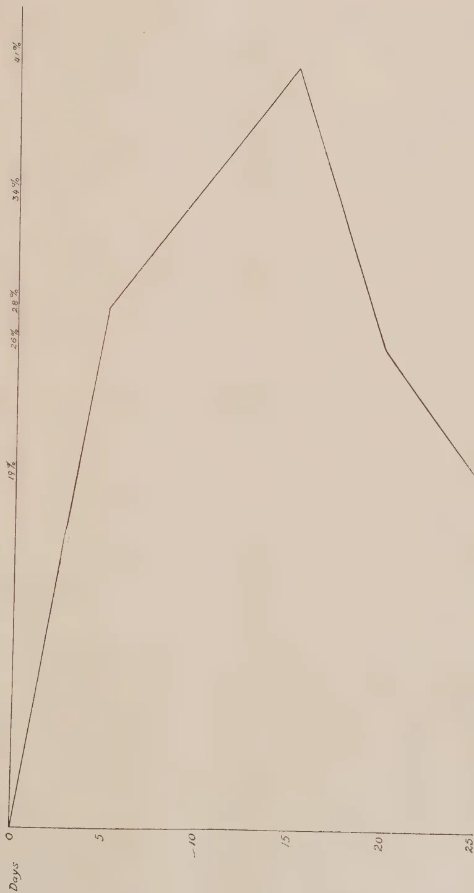
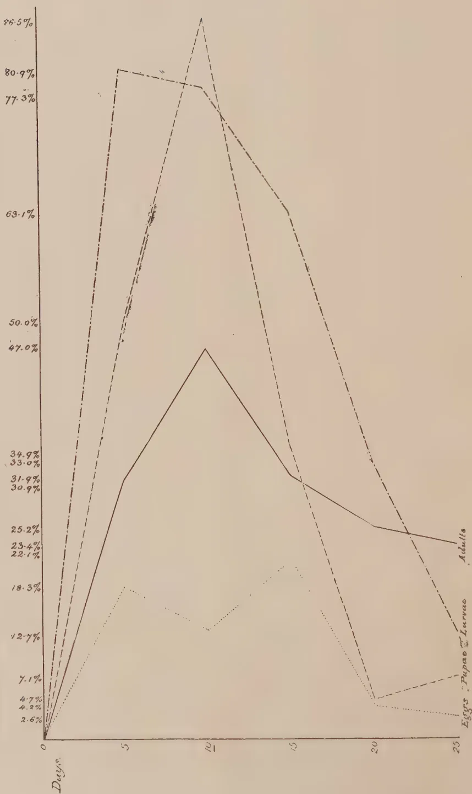

THE  
**TROPICAL AGRICULTURIST:**  
JOURNAL OF THE  
**CEYLON AGRICULTURAL SOCIETY.**

---

---

VOL. LVI.

PERADENIYA, JANUARY, 1921.

No. 1.

---

---

**AGRICULTURAL POSSIBILITIES.**

---

The critical period through which the two principal crops of Ceylon are passing at the present time has brought forward the question of the possibilities of establishing and extending other industries. The undesirability of dependance upon a small number of crops is always urged by colonial administrators, agricultural departments and others interested in development.

Ceylon is fortunate in its number of crops, and although tea, rubber and coconuts form the bulk of Ceylon's exports yet there are other export industries that occupy not unimportant positions in certain areas of the colony.

The number of industries already existing in the colony should not preclude investigations being made into the possibilities of others. Some provision has been made in the past for this work, but greater efforts will have to be made in the future to accumulate data for the information of prospective cultivators of crops at present receiving but little attention in the colony.

Experiments carried out at Hakgala and at Peradeniya several years ago demonstrated the possibilities before camphor as a crop for the higher elevations in Ceylon. Considerable areas of this crop were planted up, but the greater portion has been cut out and replaced by tea or timber. This was caused by a fall in price for camphor and by the improved prospects for tea. The position is now reversed. The price for tea has fallen although it is hoped that this will be only temporary, while the price for camphor has risen considerably. Many are convinced that the prices for camphor are likely to remain high, and extended plantations are being opened out in various parts of the southern United States of America. At present prices, camphor should be remunerative, and the question of the cultivation of this product is worthy of consideration.

1------------------------------------------------

2[JANUARY, 1921.

Sisal has been demonstrated at the Anuradhapura Experiment Station to be a crop with possibilities for the dry zone, and a syndicate has undertaken the cultivation of this fibre upon estate lines. There are good prospects for this fibre and for Furcræa as a crop for the small cultivator. Attempts to demonstrate this are being made at the Anuradhapura Experiment Station, and it is hoped to make arrangements for similar trials in the Hambantota district of the Southern Province.

Cotton has been tried in the North-Central and North-Western Provinces, Uva, the drier parts of the Central Province and the Southern Province. Most promising results have been obtained from certain areas of the Southern Province, and provision is being made for a trial upon a commercial scale of various varieties and for the inauguration of a purchase scheme for peasant grown cotton.

The Robusta types of coffee are being extended and demands for supplies of seeds from areas growing on the Experiment Stations are difficult to meet. Plants of known percentage for selected seed bearers in Java have been secured during the past few years and are now coming into bearing.

Trials are also being made at Anuradhapura with oil-palms introduced from West Africa. The cultivation of this palm is being undertaken in Malaya where several thousands of acres are already under this crop. The acreage under oil-palm in Sumatra is also very considerable. It is possible that this oil-producing crop may offer favourable prospects for cultivation upon lands which are not suited for coconuts.

Other crops that deserve the closest investigation in Ceylon are sugar and limes. Ceylon can grow sugar cane with profit and with satisfactory cultivation high yields can be secured. The establishment of sugar-cane cultivation upon estate scale is a necessity for the colony. Not only is the sugar required but alcohol as a motive power is likely to become an essential in the not distant future. Sugar-cane can also be grown with profit by the small holders, who supplies his canes to a central factory.

Limes grow and yield excellently in many parts of the colony and it has been demonstrated in the West Indies that this crop is a profitable one for large and small growers. Experiments have been begun at Anuradhapura with the cultivation of limes on a fairly large scale.

There are many additional crops which can be added to those at present under cultivation in the colony. Definite experiments are, however, essential at the beginning and the establishment of an increased number of experiment stations under trained supervision necessary.

2------------------------------------------------

JANUARY, 1921.]3

# FOODSTUFFS.

## GREEN MANURES AND PADDY CULTIVATION.

W. MOLEGODE,

*Senior Agricultural Instructor.*

The use of green leaves and twigs as manure for paddy fields is now extensively practised and is being recognised as the most economical, safest and best manure to use. Below are some striking results obtained from the use of green manures. Cultivators who have asked what is the best way to increase the yield of paddy without running any risk or incurring expenditure beyond their means, have always been advised to apply green manures and transplant their paddy. This advice wherever given has been taken up by the more energetic cultivators always, without any exception in the writer's experience, with very satisfactory results so much so that cultivators who once used green manures in sufficiently large quantity to obtain the necessary results are now regularly using green leaves and twigs and constantly improving their paddy soils resulting in getting larger yields. (See list below of trees and plants recognised as suitable for manuring paddy fields.)

*Example A.*—Centre—ARAMBEPOLA.

An extent of 2 pelas or approximately 1 ac. was manured with 24 loads of green stuffs weighing between 50 and 60 lb, per load or say 1,200—1,400 lb. after the first ploughing. The green stuff was composed of the leaves and twigs of dadap, tulip, and wild sunflower (Titta). This was buried in the soil at the ploughing three weeks later. Ten more approximately similar loads of green stuffs of the same kind were again applied and allowed to rot and mixed up in the soil at the mudding. The field was transplanted and the yield was 56 bushels—an increase of 14 bushels from the previous average of 42 bushels.

*Example B.*—Centre—POLGOLLA.

A field approximately 2 acres was similarly treated with leaves of *Kekuna* (*Canarium zeylanicum*) and Karande (*Pongamia glabra*). The yield was 104 bushels against previous yields of 80 bushels. The quantity of green manure used in this case was about 1,500 lb. per acre.

*Example C.*—ATTARAGAMA.

A field approximately  $\frac{3}{4}$  acre or 15 lahas sowing extent was fairly heavily manured with *Kekuna* and *Dadap*, using 30 loads of approximately 50 lb. The application was made after the first ploughing and an interval of 6 weeks lapsed before the manure was ploughed in. The yield was 46 bushels or 69 bushels per acre against an average of 40 bushels per acre in the range.

The above are a few of the many instances where by the use of green manures the crop has appreciably increased. During the year the writer

3------------------------------------------------

4[JANUARY, 1921.

has visited over one hundred fields on which green manure has been applied and can quote many more examples of decided increases of yields obtained.

It has now been ascertained that to get a fair increase at least 2,000 lb. of green leaf and twigs should be applied per acre. This ought to be applied at two periods. The first lot should be spread over the fields after the first *Bin-neguma* or the first ploughing and at this such leaves and twigs as would take a longer time to decompose should be applied. At the *Dehiya* or second ploughing the leaves and twigs should be ploughed in and after that the second lot should be spread over the ploughed field. Sufficiently long interval will have to lapse between this and the final ploughing for the leaves and twigs to decompose and easily get mixed up in the mud.

It is suggested that with green manures phosphates should be applied at the rate of one to one and half cwt. per acre. This should be applied at the final preparation and will have to be mixed up in the mud. During the present *Maha* season several manuring experiments are being carried out and some of these are experiments with green leaves and phosphatic manures as suggested above.

List of trees and plants from which leaves and twigs are commonly used :—

1. 1. Karaude—*Pongamia glabra*
2. 2. Kekuna—*Canarium zeylanicum*
3. 3. Dadap—*Erythrina lithosperma*
4. 4. Keppitiya—*Croton lacciferus*
5. 5. Wild sunflower—*Nattasuriya* or *Titta Sinh.*, *Trithonia diversifolia*
6. 6. Adathoda—*Adhatoda vasica*
7. 7. Wild Indigo\*—*Pila Sinh.*, *Tephrosia purpurea*
8. 8. Sunn-hemp\*—*Crotalaria juncea*
9. 9. *Crotalarias*\*—*Crotalaria species*
10. 10. *Bodi*\*—*Psoralea corylifolia*
11. 11. Hanapatta—*Furcraea gigantea*
12. 12. Suriya—*Thespesia populnea*
13. 13. Etdemata—*Gmelina arborea*
14. 14. Totilla—*Oroxylum indicum*
15. 15. Kaduru—*Cerbera Odollam*
16. 16. Tarana—*Webera Corymbosa*

## GREEN MANURING.

"Green Manuring" on paddy lands, according to the Department of Agriculture includes, first, the collecting and applying of green leaves to wet lands at the time of puddling, and secondly, the growing of a green crop on the wet land and ploughing it into the soil at the time of puddling. There is much to be said against the first practice. The leaves cannot usually be obtained in the near vicinity of the field in sufficient quantities for its requirements which entails useless expenditure in transport and collection ;

\* Whole plant is used and can be grown in the field itself and ploughed in when flowering,

4------------------------------------------------

[JANUARY, 1921.]5

and naturally this expenditure is ill-afforded by any agriculturist ; whilst for the paddy cultivator, the delay, besides causing unnecessary inconvenience spells serious loss to him. Therefore, the second method appears preferable. But besides the saving that is effected by this method, the natural growth of the roots of the green manure crop tends to open up the soil and thus improve its texture, consequently the crop, which it is to benefit, finds organic matter in abundance and better drainage for its growth. A soil devoid of decaying matter, no matter how much artificial manuring be done, can never be made to produce a healthy crop, whether it be paddy, coconuts, tea, rubber or coffee. The feeding rootlets are more or less bound and the necessary nourishment is "locked up." As a preventive measure, to counteract this tendency of soils devoid of decaying matter, heavy liming has to be resorted to. No doubt the decay of organic matter is far more rapid in India than in the Home climate, so that organic matter in our land tends to disappear within the space of a few years, calling for more and more manuring. Even weeds that have been allowed to grow year after year on the sunny spot make the surface soil rich in humus, but it has no depth. The application of lime with the green manure would certainly be beneficial, in that the decay of the green matter is speeded and plant food will be available in large quantities. To what extent can liming, in conjunction with green manuring, be done ? This is a point worthy of close attention. It would appear advisable to know your future intentions ; whether green manuring is to continue indefinitely or whether it is to be resorted to biennially, etc. For in the first instance, it is obvious, that heavy liming can be safely done without materially impoverishing the soil, provided, of course, other necessary plant foods are applied also. In our soils heavy liming may be done as long as sufficient organic matter can be supplied ; and therefore, the amount of lime to be applied is governed by the quantity of organic matter available in the shape of leaves, stalks and roots, derived from the green manure.

It is well known that many an authority has advised large quantities of lime for certain districts on account of this element being deficient in the soils of that locality. But to use it indiscriminately for all products will lead to anything but the desired result. The fact that a certain product in one locality is benefited by large applications of lime does not give any indication of the same good results being obtained elsewhere, as more than one person has found to his cost. If the results of liming and green manuring are more rapid than those of the green manure without lime, it stands to reason that green manures must be applied frequently to replace what has been used up and the same holds good for other manures as well. This is frequently lost sight of ; and when large applications of lime have been advised it is, of course, taken for granted that other factors are equal, or if they are not, that they will be attended to. I think I am right in saying that when a certain method of cultivation has been advised it will usually be found that the person carrying out the advice fails to take into consideration other factors which play an important part in its success. When these factors are omitted it is but natural to expect failure. New plant diseases, deterioration of the soil, etc. are said by some people to be the results of scientific cultivation, and in an indirect way this is so, as already referred to in the previous sentences. As most agriculturists know, the application of this and

5------------------------------------------------

6[JANUARY, 1921.

that manure or such a quantity of lime, although they may have been successful elsewhere, cannot be relied upon. But if a certain manure is to be applied, the condition of the soil, climate and such factors must invariably be considered, if the results are to be satisfactory. Therefore, in the writer's opinion; and I am sure I shall receive general support when I say that the liming of soils that have been green manured, depends on the quantity of green manure applied and the extent to which it has decayed; and naturally, if the particular product depends on the lime for its nourishment, the lime application may be greater in quantity.

As regards the green manure, its choice is greatly a matter of convenience as well as its suitability for a given soil and climate of convenience, since one green manure may produce an abundance of green material, but the cost of cutting it down may be prohibitive; whilst another, although it may not yield a great quantity of green material, may be easily worked into the soil. The following are some of the green manure crops, which are grown in various parts of the country. Pulse crops such as horse gram, green gram, field gram, etc.; and Daincha, sunn hemp and indigo; Boga medeloa (*Tephrosia candida*) and others.

Some of the above are known for their drought-resisting qualities, and others for the large quantities of green material they produce. Indigo is said to be a valuable crop for heavy soils, being very drought-resistant and with a deep root system. The latter quality is very useful. The wild indigo is also considered very valuable, but it only thrives well on well-drained land, containing a certain quantity of coarse sand particles.—INDIAN SCIENTIFIC AGRICULTURIST, Vol. 1, No. 12.

## CULTIVATION OF BEANS IN OUR VILLAGES.

W. MOLEGODE,

*Senior Agricultural Instructor.*

A good amount of beans is cultivated all over the Island. Except in the case of the small-seeded lima and the lab-lab they are mostly grown for the green pods which have a ready market. The Welimada-Palugama district is noted for the cultivation of beans and what is known as "butter beans" is grown there largely. In Kalugamma Siyapattu near Katugastota the main vegetable grown is the Dwarf or French bean. Every year roughly 50 acres are grown with this and the Kandy market is, in the season, flooded with millions of green pods which sell usually from 20—30 cents per 1000 during the main season, and 40—50 cents at other times. In the Walapane district a considerable amount of the ordinary small-seeded lima (*dambala*) is grown in the chenas and generally all over the Island different types of beans are grown.

6------------------------------------------------

JANUARY, 1921.]7

The various types of beans cultivated in Ceylon are :—

(1) Dwarf or French Beans (*Phaseolus vulgaris*).—This is the most extensively cultivated type. Grown at all elevations in almost any kind of soil though the most suited is a rich loamy soil. As a rule this type is sown in beds 3 ft. wide the seeds being sown 1 to  $1\frac{1}{2}$  inches deep 5 to 6 inches apart. This type is also grown in furrows 2 ft. apart, the seeds being put 2 to 4 inches apart. This is a quick yielding crop—in five to six weeks from planting, pods are ready to be collected and in less than 12 weeks the plants die out. Under the same type comes a climbing variety. They are planted in the same manner as Dwarf Beans at slightly longer distances. Sticks should be provided for climbing.

(2) Broad Beans (*Vicia Faba*).—Very little cultivated even in the high elevations and hardly worth growing in lower elevations.

(3) Lima Beans (*Phaseolus lunatus*).—Under the name of Lima Beans there are several varieties grown in Ceylon but the real Lima has only two distinct types, viz. the climbing limas and the dwarf or bush lima, a recent introduction now becoming popular. The bush or dwarf lima should be planted in rows 2 feet apart putting the seeds 18 to 20 inches in the rows. The climbing variety should be planted 2 ft. by 2 ft., putting about 3 seeds in holes or hills prepared for them. When the plants begin to climb poles should be provided or a trellis running from end to end of the row.

(4) The Lab-lab Beans (*Delichos lab-lab*).—These are distinguished from others by the wavy margins. There are several varieties but is not cultivated systematically in any part of the Island.

(5) The Sword Beans (*Canavalia gladiata*).—There are two varieties, the climber and the shrub, both are perennials. Not cultivated in any large scale anywhere but found in most village gardens.

(6) Princess or Winged Beans (*Psophocarpus tetragonolobus*) commonly found in village gardens. This is a strong climbing variety and is generally run on to low trees or roofs of outer houses or on pandals.

(7) Yard-long Beans, Cow Pea (*Vigna sinensis*).—This variety is composed of several types. The Iron cow pea, of short pods, the ordinary cow pea of medium sized beans, the very long variety of sometimes five feet in length, and the variety extensively grown in chena district for the small seed the Kola-mè. Cow peas of these types are grown extensively at low and intermediate elevations. The tender pods and the ripe seeds are largely eaten and is a very common vegetable in local markets.

The practice prevalent in some parts of Kandy of growing the “Mèkaral”, type along ridges of cultivated paddy fields deserves to be encouraged and extended. Some special attention was given to this subject by the Instructors last year and the practice has fairly extended in the Kandy and Matale districts.

7------------------------------------------------

8[JANUARY, 1921.

## RADISH CULTIVATION.

W. MOLEGODE,

*Senior Agricultural Instructor.*

The long white-rooted Radish is a very prominent vegetable in our markets just at present. Cartloads of it are brought into the Kandy market on Mondays and Fridays. This particular variety of radish is very extensively grown by the vegetable growers of Kandy district. It is easily and rapidly grown. Although it does not compare favourably with other varieties of radish it has become a popular vegetable with the people and has become a useful addition to the food supply of the masses. The entire plant—leaves as well as the roots—are used, cooked in various ways. The current wholesale purchasing price is Cts. 75 to Re. 1.25 per 100 plants and the selling retail price is  $1\frac{1}{2}$  cts. to 2 cts. each. A village woman planted 18 beds of radish from seed raised by her from a previous crop and sold the standing crop to a “vegetable man” for Rs. 18 who in turn made a net profit of Rs. 12 from the sale recently here.

Why this particular variety has become so popular among vegetable growers is not only because it is easily grown but because a regular supply of seeds can be raised by the growers themselves. A dozen plants left to flower will produce sufficient seed for a fairly extensive planting the next season.

It is well known that all imported varieties of radish readily acclimatize here. The best radish is, of course, produced in the higher elevations, but they all grow well in lower elevations as well if planted in cool shady places and watered liberally.

Radish should be grown on rich or highly manured soils. If not planted during rainy weather plenty of water from sowing till large enough for use should be applied. Seeds should be sown broadcasted thinly in beds or in drills 10 inches apart and plants thinned out to 4 inches in the rows. Being a very quickly growing plant sowing should be done every fortnight if a regular supply of radish is desired.

It is quite easy to raise seed for the next planting. A few of the best plants possessing the true type of roots should be allowed to grow and flower. Systematic raising of seed is done by selecting sound well-shaped roots when they are fairly grown and transplanting them 2 to 3 feet apart. Before transplanting the leafy tops and a portion of the root from the lower end should be cut off leaving only about two-thirds of the roots and growing crown at the top. Roots treated in this manner are planted and covered up with the soil and allowed to grow and flower.

8------------------------------------------------

JANUARY, 1921.]9

# SUGAR-CANE.

## CULTIVATION OF SUGAR-CANE.

The following portion of an article by H. T. EASTERBY, General Superintendent, Bureau of Sugar Experiment Stations, Queensland, is reproduced :—

### SOILS.

The land in Queensland used for growing sugar is included in a long, narrow coastal belt, which is not continuous. Those parts which are suitable are separated from each other, often by considerable tracts of non-sugar producing country. The latter, owing to deficient rainfall or poorness of soil, are not utilized for cane. The sugar belt in Queensland is included between latitudes 16 degs. and 28 degs. South, but the bulk of the output is produced from Mackay North.

Cane soils vary considerably in character and composition. Cane as a plant demands an abundant supply of moisture, and so requires retentive soils. The open red porous soils of volcanic origin require frequent falls of rain to produce good crops of cane, and this, unfortunately, does not always take place in the rich soils of the Wongarra and Isis scrub in the Bundaberg and Childers districts. The following classification of Queensland cane soils was made by MAXWELL formerly Director of Sugar Experiment Stations :—

<table border="1">
<thead>
<tr>
<th>District</th>
<th>SOILS</th>
</tr>
</thead>
<tbody>
<tr>
<td>Cairns -</td>
<td>Partly shaly sterile soils, but in the main deep alluvial sandy loams, also rich red volcanic soils.</td>
</tr>
<tr>
<td>Mackay -</td>
<td>Shaly in parts, with better alluvial over the lower levels, mixed volcanic and rich siliceous alluvial.</td>
</tr>
<tr>
<td>Bundaberg -</td>
<td>Rich alluvial delta soils, interspersed with sterile soils and deep rich red volcanic soils.</td>
</tr>
</tbody>
</table>

The bulk of the sugar soils can be stated to be from good to rich alluvial, such as river flats ; and the deep-red volcanic soils of considerable depth. The nature of the country is generally designated "scrub" and "forest." The North Queensland scrubs are really jungles, carrying a thick growth of what is known as scrub timber, such as silky oak, bean, pender, kauri, milkwood, Johnstone River hardwood, interlaced with lawyer vine and other creeping plants, while the stinging tree is also conspicuous. Forest country usually consists of ironbark, bloodwood, Moreton Bay ash, blue-gum, poplar-gum and acacia.

9------------------------------------------------

10[JANUARY 1921.

The following are average analyses of a number of soils from each of the three sugar districts mentioned :—

<table border="1">
<thead>
<tr>
<th rowspan="2">District</th>
<th colspan="4">Total Plant Foods</th>
<th colspan="3">Available Plant Foods*</th>
</tr>
<tr>
<th>Lime</th>
<th>Potash</th>
<th>Phosphoric acid</th>
<th>Nitrogen</th>
<th>Lime</th>
<th>Potash</th>
<th>Phosphoric acid</th>
</tr>
</thead>
<tbody>
<tr>
<td>Cairns</td>
<td>·292</td>
<td>·310</td>
<td>·141</td>
<td>·122</td>
<td>·0654</td>
<td>·0132</td>
<td>·0010</td>
</tr>
<tr>
<td>Mackay</td>
<td>·829</td>
<td>·223</td>
<td>·165</td>
<td>·122</td>
<td>·1119</td>
<td>·0222</td>
<td>·0020</td>
</tr>
<tr>
<td>Bundaberg</td>
<td>·636</td>
<td>·144</td>
<td>·404</td>
<td>·120</td>
<td>·2755</td>
<td>·0083</td>
<td>·0018</td>
</tr>
</tbody>
</table>

#### WEATHER CONDITIONS.

Hot, humid conditions are the best for the sugar-cane plant, and, fortunately, these generally obtain during the period of the maximum growth of the crop in Queensland. The wet season is usually synonymous with the three hot summer months of January, February and March.

Although the weather is hot and humid during this period, the higher temperatures experienced in the dryer belts of Australia are not common. A temperature of 100 degrees is rarely recorded. It is unusual for the thermometer to show much above 90 degrees, even in the middle of summer. Indeed, during times of heavy rain, the weather becomes comparatively cool, but as soon as the sun re-appears, the atmosphere becomes steamy and the growth of the cane is vigorously promoted.

On the coast of Queensland, where sugar is grown, the greatest rainfalls occur where the mountain ranges come close into the coast. Where they are considerably distant, as at Bundaberg and Ayr the lowest precipitations take place. Consequently, the greatest amount of rain falls at Babinda and Innisfail, where the lofty ranges of Bartle Frere and Bellenden Ker are not far from the seaboard.

The following table shows the average annual rainfall in each of the sugar districts :—

<table border="1">
<thead>
<tr>
<th>District</th>
<th>Average Annual Rainfall in Inches and Hundredths</th>
<th>District</th>
<th>Average Annual Rainfall in Inches and Hundredths</th>
</tr>
</thead>
<tbody>
<tr>
<td>Mossman</td>
<td>82·91</td>
<td>Proserpine</td>
<td>76·96</td>
</tr>
<tr>
<td>Cairns</td>
<td>90·49</td>
<td>Mackay</td>
<td>68·52</td>
</tr>
<tr>
<td>Mulgrave</td>
<td>81·91</td>
<td>Bundaberg</td>
<td>44·40</td>
</tr>
<tr>
<td>Babinda</td>
<td>165·00</td>
<td>Gin Gin</td>
<td>37·71</td>
</tr>
<tr>
<td>Innisfail</td>
<td>149·20</td>
<td>Childers</td>
<td>42·07</td>
</tr>
<tr>
<td>Ingham</td>
<td>80·53</td>
<td>Maryborough</td>
<td>46·14</td>
</tr>
<tr>
<td>Halifax</td>
<td>89·17</td>
<td>Pialba</td>
<td>38·04</td>
</tr>
<tr>
<td>Ayr</td>
<td>44·48</td>
<td>Nambour</td>
<td>60·93</td>
</tr>
<tr>
<td>Bowen</td>
<td>40·60</td>
<td>Beenleigh</td>
<td>48·87</td>
</tr>
</tbody>
</table>

#### HUMIDITY.

The mean relative humidity or percentage of moisture in the air is a most important factor in the growth of cane. The table hereunder gives the

\* Aspartic acid analyses.

10------------------------------------------------

JANUARY, 1921.]11

percentage of relative humidity in the principal coastal towns in the sugar districts at 9 a.m. :—

<table border="1">
<thead>
<tr>
<th>Place</th>
<th>Percentage of Humidity</th>
<th>Place</th>
<th>Percentage of Humidity</th>
</tr>
</thead>
<tbody>
<tr>
<td>Bundaberg</td>
<td>69.0</td>
<td>Innisfail</td>
<td>80.0</td>
</tr>
<tr>
<td>Mackay</td>
<td>75.0</td>
<td>Cairns</td>
<td>70.2</td>
</tr>
<tr>
<td>Ayr</td>
<td>68.0</td>
<td></td>
<td></td>
</tr>
</tbody>
</table>

### CULTIVATION.

Land for cane growing requires plenty of tillage. Not less than four deep cross ploughings should be given, and then the soil should be well-worked up into a fine tilth by harrowing and rolling. Sub-soiling to a depth of 20 inches or more on deep alluvial soils has been found to yield as much as 20 tons more cane per acre than from similar land cultivated in the ordinary way.

Two great factors in the preparation of our older cane lands are lime and green manure.

Owing to the long-continued growth of cane upon the same land, and also, in some instances, to the continued use of acid fertilizers, such as sulphate of ammonia and superphosphate, the bulk of our older cane soils in Queensland have become acid in reaction. This has been exhibited time after time in analyses of soils made by the agricultural chemist and by the Sugar Bureau. After ploughing out the stools it is, therefore, wise in most instances to apply lime, and it also has the advantage of increasing the purity of the juice of the succeeding cane crops. There are many other benefits to be obtained from a dressing of lime, which may be summarized as follows :—

(1) It acts on dormant mineral matter and renders available phosphoric acid and potash which would otherwise remain inert. (2) Acts on organic matter and converts part into nitrogen compounds available for the crop. (3) Enables the plant to make the greatest use of artificial fertilizers. (4) With moisture and warmth it favours the maintenance of abundant bacterial life, especially those forms which aid in nitrification. (5) It develops the activity of root bacteria in leguminous crops. In soils with an acid reaction, the fixation of nitrogen from the air is frequently at a standstill. (6) Improves the mechanical condition of the soil. Stiff clay soils are rendered more friable, less adhesive, and porosity is increased, so that its cultivation can be more easily undertaken.

Lime is usually applied to the soil in the following forms :—

(a) Burnt lime or lime oxide, (b) Air-slaked lime—i.e., burnt lime that has been allowed to gradually slake in the air, and which ultimately becomes lime carbonate. (c) Water-slaked lime (lime hydrate). (d) Pulverized limestone (lime carbonate).

The growth of green manure crops is a form of rotation, and is not yet sufficiently practised in Queensland. It is also a means of restoring humus to old cane lands, and is a prime essential in the making of a fertile soil.

11------------------------------------------------

12[JANUARY, 1921.

Humus benefits the soil—(1) By augmenting its water-holding capacity. (2) By increasing its warmth. (3) By bettering its texture and being a controlling factor in the determination of fine earth.

Humus in the soil is lowered by:—(1) The continued growth of crops. (2) Bare fallowing (3) The continued use of commercial fertilizers.

The best possible crops to grow for green-manuring purposes are the legumes, such as cowpea, Mauritius bean, velvet and soya beans, lupins, vetches, etc. Among the advantages of a green crop are the following:—

(1) During growth the ground is shaded and moisture is conserved. (2) Erosion of fine earth is prevented during heavy rains. (3) Weed-killing is promoted. (4) The deep tap-roots of leguminous plants bring available plant-food from the subsoil to the surface soils. (5) The interposition of a crop, other than cane, that will act in minimizing fungoid diseases and insect attacks. If the habitat of parasites attacking the cane is removed for a time, it must result in their dying out or disappearance. (6) Crop rotation.

Nitrogen is the soil element that becomes the most quickly exhausted as it is also the element that is the most expensive to purchase. The best time to plough-in green crops is at the time the seed in the pods is in a milky condition.

#### SELECTION OF PLANTS.

This is a highly important matter to which too much attention cannot be paid.

Generally speaking, plant cane from ten to twelve months old, or first ratoon of the same age, should be taken. If the time of planting corresponds to that of harvesting, it is a good plan to cut as many top plants as possible from the best of the cane going to the mill. These are undoubtedly superior to the parts of the cane situate lower in the stick, although it is claimed that butts also make very good plants. The top plant, however, has the minimum of sugar, and contains nitrogenous bodies and salts which form food material for the plant during its early stages of growth. Top plants cannot always be procured, and it is then usual to cut up the whole stick for plants. Cane plants should be brought from colder to warmer climates, and from hillsides to lower levels where it is invariably found to do well.

The best width of row has been found from numerous experiments in Louisiana, Hawaii, and Queensland, to be 5 feet; though, in the case of a straight-growing cane, such as "D. 1135", this could be reduced to 4 ft. 6 in. The drilling is best accomplished by means of a double mouldboard or drill plough. The plough should make a good wide drill about 9 to 10 inches deep in the loose soil. Where the cultivation has been deep and good, this will leave a few inches of soil for the plant to lie on. In a dry time, when planting by hand, there is usually a certain amount of moisture in this loose soil into which the plants can be pushed down, and so give them a much better opportunity to strike more rapidly. Three-eye plants are almost universally favoured, but the distance at which the plants are to be spaced apart in the row varies greatly in the different districts. At Bundaberg, the plants are often placed 12 to 18 inches apart, while on the Herbert River the planting is almost continuous. A good average distance for the spacing, and one found to give good results, is 6 inches. The plants are usually put in about 9 inches deep when planting by hand, and covered with from 2 to 4 inches of soil—2 inches when conditions are very moist, and 4 inches when they are very dry. When planting by hand, the cane sets should be laid in the ground with the eyes at the sides, if possible. The cane-planting machine is now coming into great favour, and, while spacing cannot be carried out so evenly by its means, it puts the plant well down into the moist soil. It is a great labour-saver, and many types of machine are now upon the market.

12------------------------------------------------

JANUARY, 1921.]13

### SUBSEQUENT CULTIVATION.

As soon as the cane is up about 6 inches, the subsequent shallow cultivation should commence, and this, if properly done, is a factor which materially contributes to the after-success of the crop.

Providing a number of deep ploughings have been given the ground before planting, the subsequent inter-row cultivation should be of a shallow nature, so that a thin layer of earth may be separated from the bulk of soil and laid as a mulch upon the surface.

PROFESSOR HILGARD ("Soils") remarks:— "The loose tilth of the surface, which is so conducive to the rapid absorption of the surface-water, is also, broadly speaking, the best means of reducing evaporation to the lowest possible point.... It is true that relatively coarse compound particles are incapable of withdrawing capillary moisture from the dense soil or subsoil underneath, just as a dry sponge is incapable of absorbing any moisture from a wet brick, while the dry brick will withdraw readily nearly all the water contained in the relatively large pores of the sponge. A layer of loose, dry, surface soil is therefore an excellent preventative of evaporation, and to moderate the access of excessive heat and dryness to the active roots."

While the use of a disc harrow may be permitted during the early stages of the crop, especially when some form of drill cleaner is pulled behind, its use should be prohibited directly it is found that the young cane roots—which subsequently begin to stretch out laterally are being cut. There are now many devices in use in the cane-fields to obviate the labour of "chipping" or weeding the drills by hand. In some of these, a form of bent harrow is pulled behind the disc harrow or a two-row cultivator. This bent harrow sits in the drill, and if the weeds are taken when they are small they can nearly all be removed in this way. Others use a light form of triangular harrow in the drill such as a strawberry cultivator. Special forms of implements for cleaning the interspaces and the cane drills at one operation are also to be procured. The cultivator should be run regularly through the cane, whether there are weeds or not, so as to insure the crop getting all the benefits from the cultivator, and to conserve moisture during dry times.

### DISPOSAL OF TRASH.

The trash is usually burned in Queensland, and there is a good deal to be said in favour of this method, provided humus is restored at intervals by the growth and ploughing under of a good green manure crop. Trash often forms a harbour for vermin, pests, and fungus diseases of many kinds. It has been claimed that the increase in a ratoon crop, due to excellent cultivation, rendered possible by burning the trash, will more than compensate for the fertilizing ingredients lost in burning.

From the "stools" of cane, as they are called, a succeeding crop springs up. These require as careful after-cultivation as a plant crop and it is usual, just after burning the trash, to well work the land with the plough.

It is believed that the best method of securing large yields of ratoon cane is to adopt the following procedure:—Immediately the trash is burnt, open up the middles of the rows to a depth of 9 inches with the swing plough; next subsoil these two furrows so that a further depth of 6 inches is thoroughly stirred. Next plough away from the cane rows on to the middles, and again follow with the subsoiler. By this means, the whole of the ground between the rows has been moved and stirred to a depth of 15 inches; and the benefit to the ratoons in thus breaking up the hard ground and letting in air and sunlight is difficult to over-estimate. Subsequent shallow cultivation with broad hoes should now be practised frequently, in the same manner as recommended for the plant crop,

13------------------------------------------------

14[JANUARY, 1921.

The results obtained at the Experiment Station, due to this method of cultivating ratoons, are detailed in the table below :—

<table border="1">
<thead>
<tr>
<th rowspan="2">Crop</th>
<th>Yield of Cane per Acre where<br/>the Ground between the Rows<br/>was ploughed and subsoiled</th>
<th>Yield of Cane per Acre where<br/>the Ground between the Rows<br/>was only Ploughed to 8 inches</th>
</tr>
<tr>
<th>English tons</th>
<th>English tons</th>
</tr>
</thead>
<tbody>
<tr>
<td>First Ratoons</td>
<td>38.9</td>
<td>27.0</td>
</tr>
<tr>
<td>Second Ratoons</td>
<td>31.3</td>
<td>19.2</td>
</tr>
<tr>
<td>Third Ratoons</td>
<td>20.4</td>
<td>9.91</td>
</tr>
</tbody>
</table>

These experiments were not fertilized.

The question of manures has not been touched on, but cane is a plant which demands nitrogen, potash, and phosphorus. Hence, mixed fertilizers containing these three elements have universally been found to yield the best results. Mixtures containing from 7 to 12 per cent. of nitrogen, in nitrate of soda and sulphate of ammonia, 7 to 10 per cent. of potash in sulphate of potash, and 5 to 9 per cent. of phosphoric acid in superphosphate are generally the most useful mixtures to apply. Sulphate of ammonia appears to be the best form of nitrogen to use in the face of the wet season. Nitrate of soda has been found specially advantageous in promoting a quick growth of cane when there is no danger of its being leached from the soil. It often shows its effect in a week or two, producing a rich dark-green colour in the foliage.

As a rule, considerably more benefit is got from the manuring of ratoons than from the manuring of plant cane, and this experience is common. This is strikingly shown in the following summary of experiments carried out at Mackay :—

<table border="1">
<thead>
<tr>
<th colspan="3">Plant Crop</th>
<th colspan="3">First Ratoon Crop</th>
</tr>
<tr>
<th>Manures</th>
<th>No Manures</th>
<th>Difference</th>
<th>Manures</th>
<th>No Manures</th>
<th>Difference</th>
</tr>
</thead>
<tbody>
<tr>
<td>50.7</td>
<td>47.4</td>
<td>3.3</td>
<td>42.4</td>
<td>31.7</td>
<td>10.7</td>
</tr>
</tbody>
</table>

  

<table border="1">
<thead>
<tr>
<th colspan="3">Second Ratoon Crop</th>
<th colspan="3">Third Ratoon Crop</th>
</tr>
<tr>
<th>Manures</th>
<th>No Manures</th>
<th>Difference</th>
<th>Manures</th>
<th>No Manures</th>
<th>Difference</th>
</tr>
</thead>
<tbody>
<tr>
<td>38.8</td>
<td>24.1</td>
<td>14.7</td>
<td>35.9</td>
<td>19.8</td>
<td>16.1</td>
</tr>
</tbody>
</table>

Sugar-cane removes varying amount of the vital elements from the soil. It is estimated, from analyses of the total cane plant (except roots) made in the Agricultural Laboratory, that the variety known as CLARK'S Seedling, sixteen months old, took from the soil 163 lb. of potash, 83 lb. of phosphoric acid, and 96 lb. of nitrogen; while the variety known as Badila, of the same age, took out of the land 139 lb. of potash, 44 lb. phosphoric acid, and 107 lb. of nitrogen.

14------------------------------------------------

JANUARY, 1921.]15

### IRRIGATION.

The climatic variations in Queensland from year to year are often so great that cane-growing is only certain in those districts possessing a high average rainfall. Districts with an average rainfall of 50 inches and under suffer exceedingly during dry spells, and irrigation would prove highly payable in such localities.

At the present time, the only cane-growing district that uses irrigation water to any extent is the Lower Burdekin, situated some 40 to 50 miles south of Townsville. On the north side of the Burdekin River, irrigation has been practised for a number of years, the plants used being the property of the farmers. Water is found at shallow depths, and is easily obtainable by sinking spearheads. On the south side of the river, the Government are installing a complete system, which will be available to growers of cane. Wells are being sunk, and the pumps will be electrically driven from a central power-house.

The cost of applying irrigation water on the Lower Burdekin is comparatively high, even though the most economical method is used. Consequently, there is a tendency to do as little of it as possible, and, in many instances, to postpone the application if rain appears probable. This frequently leads to the suffering of the crop should rain fail to fall and the irrigation has not been carried out.

Water is not applied scientifically to cane crops on the Lower Burdekin, so that the greatest efficiency is not secured. This, however, is largely due to the high cost of application. The method of irrigation is to run the water in shallow furrows between the cane drills, usually made with the disc harrow known as the Cotton King Cultivator. The water is generally conveyed by fluming to the main ditch running on the headland at right angles to the cane rows. The water is then admitted to the channels between the cane, but as no attempt has been made to grade the land, a great deal of water is often wasted.

In Hawaii, the water is usually applied directly in the furrow or drill in which the cane plants are growing. The preparation of the land is more expensive, as it is laid out for irrigation according to the land contour, and the drills are cut into short sections so as to secure an even distribution. This method secures the largest economy of water. In the Queensland system, as practised at Ayr, it is not generally possible to evenly distribute the water over all the land, consequently some of the area goes short, while other parts obtain too much. This system, therefore, involves the greatest waste of water, but is the cheaper as far as actual application is concerned. This is, of course, a vital point in the cultivation of cane in Queensland, where the costs of labour are so high. It is usual to only make one or two, or at most three, applications of water on the Lower Burdekin, but these are large in volume, running up to 6 inches.

In Hawaii, on the contrary, the applications are smaller, but far more frequent, ranging from the equivalent of  $\frac{1}{2}$  inch of rainfall per week to 3 inches or more, as the crop makes greater demands upon the soil. These irrigations are carried on until the crop nearly reaches maturity; they are then stopped, so that the absence of water may have the effect of ripening the cane crop. With such a system, the application of manures can be carried out in the most satisfactory manner, and the combined use of water and fertilizers renders the cane crops of Hawaii the heaviest in the world, while the production of sugar per acre is also higher than elsewhere.

As irrigation for cane must eventually play a large part in sugar production in the drier cane areas of the State, the matter will ultimately have to be taken in hand, so that the water may be applied in the most economical way; and no doubt the Hawaiian system, which has proved so successful, will be tried. It is a noteworthy fact that much larger crops can be grown with irrigation properly applied in dry areas than on lands where the rainfall is plentiful.—SCIENCE & INDUSTRY, Vol. 2, No. 10.

15------------------------------------------------

16[JANUARY, 1921

# COTTON.

## COTTON CULTURE.

PIETER KOCH, B.Sc.

*Agr., Manager, Tobacco Experiment Station, Elsenburg, Mulder's Vlei.*

The cotton plant is one of the most important, if not *the* most important, fibre plant cultivated. From its products hundreds of necessaries are manufactured. For instance, from the fibre, clothes, explosives etc., are made; from the seed, oil, soap, a kind of butter, and many other articles; and from the seedmeal, animal foods, fertilizers, and dyestuffs.

The normal world production of cotton lint is about twenty to twenty-five million bales of 500 lb. each, and of this amount South Africa produces very little. The farmers of our country have been trying to grow cotton for many years, but until a few years back their efforts have met with failure through lack of knowledge of cultural methods and want of gins and means of conveyance. Cotton culture has, however, made rapid progress in recent years (since 1912), especially in the warmer parts of the Transvaal and also in Natal, and its future is very promising. Every year sees an increasing acreage under cotton, so that at present some thousands of acres are devoted exclusively to this purpose.

*Botany.*—Botanically cotton belongs to the *Malvaceæ*, and falls under the genus *Gossypium*. Cotton is generally divided into two groups, namely the American and the Asiatic group. In South Africa the first group only is grown, which includes the Upland varieties (or *Gossypium hirsutum*), Sea Island (or *Gossypium barbadense*), and Peruvian Cotton (or *Gossypium peruvianum*). The first of these three includes all the short and some of the long-staple varieties, and is grown mostly in the Transvaal and Natal; the second named produces the best, longest, and most valuable lint, and is grown on a small scale along the coastal regions of Natal and Kaffraria; the third is the most important cotton of Egypt, and has a beautiful, glossy appearance and a yellowish colour. This variety is still under experiment, and it has not yet been proved whether it will thrive in the Union.

Experiments have also been made with a tree cotton (*Caravonica*) but with unsatisfactory results.

Nyasaland Upland is being grown in the coastal regions on a small scale

The difference between Upland and Sea Island is that the former is taller, with longer and thinner branches, much longer leaves, and small pointed bolls, and it ripens much later. Further, the fresh flower is more yellowish in colour, with red spots at the base, longer and finer fibres, and black smooth seeds. Some Upland varieties, e.g. Peterkin, however, also possess smooth black seed. The fibre of Upland measures from  $\frac{3}{4}$  to  $1\frac{1}{2}$  inch in length, and that of Sea Island from  $1\frac{1}{2}$  to 2 inches.

16------------------------------------------------

JANUARY, 1921.]17

Under cultivation cotton is generally considered to be an annual, and is usually replanted every season, with the exception of the tree variety. It is not yet possible to say whether ratooning will be practised permanently in future. (By ratooning is meant the method of cutting off the first crop close to the ground, when a new plant or "volunteer" takes its place the following year, re seeding thus being eliminated. Authorities state that, after the second year, the lint of such plants deteriorates greatly by losing its gloss and strength—two of the most important and desirable qualities of cotton fibre.

*Climate.*—Cotton is eminently suited to warm regions. One of the essential climatic conditions is a summer rainfall of not less than 18 to 20 inches, fairly well distributed over the whole period of growth. During the first five or six weeks the plant is very delicate and weak; consequently the soil should not be allowed to dry out too much during that time. Thereafter the plant can withstand much drought the taproot being long and shooting well down. The plant being very sensitive to frost, it is necessary that no frost occurs for six or seven months where cotton is grown. In localities which are subject to frost, planting should not be done before October, but also not much later than November,

During harvesting time it is desirable that the weather should be dry and sunny. The plant reaches full maturity in about six months.

*Soil.*—This crop can be grown on nearly every kind of soil where mealies grow, though the most suitable are clayey and sandy loams. Clay soils also give good results provided they are well cultivated and the seed is sown early. Light, sandy soils, however, should be manured judiciously, otherwise the growth will be poor and a light crop reaped. Under favourable weather conditions turf soils will occasionally yield excellent results. If the soil is very fertile branches and leaves are formed at the expense of fruit.

*Seed Selection.*—The selection of seed plays a highly important part in cotton culture. It is essential that good seed be planted, and, as the cotton plant is very sensitive to climatic and soil conditions, the greatest care should be exercised in selecting seed plants. A variety yielding the best results in one particular locality is very often unsuited elsewhere. The farmer is therefore advised to experiment personally with the different varieties and keep the seed from the most suitable plants for the following season's planting. Seed should be kept only from those plants which show uniformity of type and at the same time produce a great number of well-developed bolls.

It is further important that the seed matures normally and is dried properly prior to its being stored. If it is stored in a heap in a damp condition over-heating takes place and the power of germination is partly destroyed.

*Soil Fertility and Rotation.*—It is unnecessary to enlarge here on the subject of improving the fertility of the soil and of practising crop rotation, the subject having been discussed in detail in Bulletin No. 6, 1917, of the Tobacco and Cotton Division. It is only necessary to point out that the cotton plant requires far more nitrogen than phosphorus or potash. Nitrogen can easily and economically be supplied to the soil by the use of leguminous crops, such as cowpeas, velvet beans, and field peas. If the growth is poor

17------------------------------------------------

18[JANUARY, 1921.

and the plants are yellowish the soil is deficient in nitrogen ; if the plants mature late and the bolls do not open well the soil is in need of phosphoric acid ; and if the leaves contract rust and fall off there is a deficiency in potash.

Among the principal field crops grown commercially in South Africa the cotton plant is the least exhausting. The following table, taken from "Burkett's Cotton," is interesting :—

**PLANT FOODS DRAWN FROM THE SOIL BY CROPS.**

<table border="1">
<thead>
<tr>
<th>Crop</th>
<th>Nitrogen</th>
<th>Phosphates</th>
<th>Potash</th>
<th>Total</th>
</tr>
</thead>
<tbody>
<tr>
<td><i>Cotton</i>—</td>
<td>lb.</td>
<td>lb.</td>
<td>lb.</td>
<td>lb.</td>
</tr>
<tr>
<td>300 lb. of lint</td>
<td>1.02</td>
<td>0.30</td>
<td>1.37</td>
<td>2.69</td>
</tr>
<tr>
<td>650 lb. of seed</td>
<td>20.34</td>
<td>10.67</td>
<td>7.84</td>
<td>38.85</td>
</tr>
<tr>
<td></td>
<td>21.36</td>
<td>10.97</td>
<td>9.21</td>
<td>41.54</td>
</tr>
<tr>
<td><i>Mealies</i>—</td>
<td></td>
<td></td>
<td></td>
<td></td>
</tr>
<tr>
<td>8¾ bags</td>
<td>32.14</td>
<td>12.36</td>
<td>7.06</td>
<td>51.56</td>
</tr>
<tr>
<td>4,000 lb. of stover</td>
<td>41.60</td>
<td>11.60</td>
<td>56.00</td>
<td>109.20</td>
</tr>
<tr>
<td></td>
<td>73.74</td>
<td>23.96</td>
<td>63.06</td>
<td>160.76</td>
</tr>
<tr>
<td><i>Wheat</i>—</td>
<td></td>
<td></td>
<td></td>
<td></td>
</tr>
<tr>
<td>3½ bags</td>
<td>19.75</td>
<td>7.44</td>
<td>5.10</td>
<td>32.29</td>
</tr>
<tr>
<td>2,300 lb. of straw</td>
<td>13.57</td>
<td>2.76</td>
<td>11.73</td>
<td>28.06</td>
</tr>
<tr>
<td></td>
<td>33.32</td>
<td>10.20</td>
<td>16.83</td>
<td>60.35</td>
</tr>
<tr>
<td>* <i>Tobacco</i>—</td>
<td></td>
<td></td>
<td></td>
<td></td>
</tr>
<tr>
<td>1,000 lb. leaves</td>
<td>44.00</td>
<td>5.00</td>
<td>52.00</td>
<td>101.00</td>
</tr>
<tr>
<td>353 lb. of Stalk</td>
<td>12.00</td>
<td>2.00</td>
<td>17.00</td>
<td>31.00</td>
</tr>
<tr>
<td></td>
<td>56.00</td>
<td>7.00</td>
<td>69.00</td>
<td>132.00</td>
</tr>
</tbody>
</table>

We leave it to the reader to make comparisons and draw his own conclusions from these figures.

The farmer should endeavour to obtain the greatest yields at a minimum cost by methodical and scientific cultivation of the soil. This we may call intensive cultivation as contrasted with extensive cultivation. It is far better to grow 50 morgen of cotton yielding 1,600 lb. of seed cotton per morgen than to grow 100 morgen yielding 800 lb. per morgen. It is self-evident that intensive cultivation is by far the better method for the development of the country.

*Preparation of the soil.*—It is impossible to state with certainty when and how the soil should be cultivated, as so much depends on the class of soil and weather conditions. Where possible the lands should be ploughed in autumn or the early winter, and as deep as possible—9 to 12 inches, depending on the nature and kind of soil utilized. As soon as the first spring rains set in the lands should be either ploughed again, if necessary, or rolled and harrowed to a fine tilth. As soon as all danger of frost has disappeared the seed may be planted. The earlier the planting the greater the chance for the plants to come to full maturity and the higher the yield.

\* Taken from "Killebrew and Myrick's Tobacco Leaf."

18------------------------------------------------

JANUARY, 1921.]19

The seed germinates in from seven to twelve days. When the plant is about forty to fifty days old the first squares appear; after that it takes about three weeks for the buds to open. From the open flower till the boll opens it takes another fifty days. The warmer the weather the sooner the bolls open.

*When and How to Plant.*—Seeding should be done between October and the middle of November. In the remote, warm low veld planting may be done till the end of November. In fertile soil the distance between the rows should be 4 feet, but in poor soil not wider than about 3 feet. In sticky or heavy soil the seed should be planted thicker than in sandy, light soil. The young plants emerge from the ground similar to bean plants, and being, moreover, covered with fuzz, which impedes germination, the depth of seeding should not be greater than from 1 to 2 inches, otherwise the cotyledons are unable to burst through the hard crust of earth which is formed after rain.

Forty pounds of seed per morgen is sufficient if a cotton planter is used ( In the U.S.A. the rate of seeding is from 60 to 80 lb. per morgen.) When the plants have reached a height of about 5 inches they should be thinned out to a distance of 12 or 15 inches. Thinning is done with hand-hoes, or if the soil is soft and moist, by hand.

*Cultivation.*—The object of cultivation is to destroy weeds which would otherwise damage and perhaps choke the crop, to break the crust of earth formed after rain followed by sunshine, to impede capillary attraction and thus improve the moisture holding capacity of the soil, and to facilitate the penetration of air into the soil. Proper cultivation of the soil also improves the growth of useful bacteria and the chemical solution of the plant foods.

As soon as the plants are well above the ground cultivation should be proceeded with and continued after each rain. At first the cultivation may be deeper than afterwards, especially when a heavy rain has caused packing of the soil. But when the plants have attained a height of 10 to 12 inches the cultivator should not be set deeper than 2 to 3 inches. The feeding roots of the cotton plant spread from 3 to 9 inches under the surface of the ground; deep cultivation would consequently result in the breaking of the roots and the plants would suffer. Cultivation should be continued until the flower buds or squares make their appearance. Shortly afterwards this should be discontinued, otherwise the squares may be bruised and the yield diminished accordingly.

*Picking.*—As soon as the cotton fields are white with open bolls, or when about half of the bolls are open, harvesting may be begun. It takes about three pickings before the whole crop is gathered. When cotton is wet after rain or heavy dew, harvesting should not be proceeded with until it is dry. If it should be found that moist seed cotton has been picked it should be spread open on the ground to dry and then stored in a clean, dry, protected shed or on the loft.

Care should be taken to pick only clean seed cotton; all leaves, pieces of boll, and other foreign matter are to be discarded, as such impurities only detract from the value of the product. Soiled cotton should be picked and ginned separately. The employment of native women and children for

19------------------------------------------------

20[JANUARY, 1921.

harvesting is the most economical. It is light, clean, and attractive work. An active woman can collect as much as 75 lb. per day if the plants are rather full of open bolls. The average is, however, about 50 lb. per day. Some natives who have become skilled in the work can pick as much as 100 lb. per day.

Muid sacks are mostly used in this country for harvesting. On either side of the opening a riem or cord is fastened and then hung over the neck and shoulders of the picker.

The picking costs work out at about a farthing to halfpenny per lb. of seed cotton.

*Ginning and Preparation for the Market.*—The cotton is conveyed loose in wagons or in wood packs and bags to central establishments for ginning. This consists in separating the lint from the seed. About one-third of the weight of seed cotton is lint and the remainder seed.

There are two kinds of gins in general use, namely, roller gins and saw gins. The former is used for the long-staple cottons, thereby avoiding breaking or knotting of the fibres; the latter almost exclusively for ginning the short-staple cottons with fuzzy seeds. The greater majority of gins are saw gins, as they do much quicker and cheaper work. An ordinary roller gin requiring 2 horsepower can treat about 35 lb. of seed cotton per hour, whereas a saw gin with the same horsepower can gin 180 lb. per hour. The saws of the latter have a velocity of approximately 450 revolutions per minute, and the teeth of the saws pull the lint from the seed, while a brush revolving at high speed again removes the lint from the saws.

Before the invention of the roller gin in 1792 by WHITNEY & HOLMES in America, it took a man a whole day to separate 1 lb. of lint with his fingers (the general practice followed at that time). After the machine had come in use the growing of cotton in North America made enormous strides. The demand for gins in the Union is being increasingly met, and to-day there are several gins permanently established in various parts of the Transvaal and Natal, where the cotton industry is developing rapidly.

In South Africa, where manual labour is still in vogue, the ginning costs are half-penny per lb. lint, and in the U.S.A., where the pneumatic system is in use, it amounts to only one-eighth of a penny, or one-fourth of what it is here.

After being ginned the cotton is pressed by means of a strong press into bales of 54 in. by 27 in. by 27 in., and weighing 500 lb. each. The bales are covered with hessian or sack cloth and fastened with iron hoops to prevent them from expanding. South African cotton bales are, as a whole, far neater and more attractive than American bales.

*Costs of Cultivation and Profit.*—The costs and profits naturally depend largely on the value of the ground, the weather conditions, and the distance from the ginneries, and the market. But even if these conditions should be quite favourable sufficient labour must be available at reasonable wages. Without sufficient cheap labour it is practically impossible to grow cotton profitably. Fortunately most parts of the Union suitable for the growing of cotton are well supplied with natives with large families.

20------------------------------------------------

JANUARY, 1921.]21

The costs work out at about £4 to £5 per morgen, and the profits, under normal conditions, at £6 to £18. Since the world-war prices have risen enormously and the profits are therefore much greater. It is not possible to give definite figures, as so much depends on the farmer himself and on circumstances. This, however, may be said with certainty that, where conditions are favourable and the farmer does his duty, cotton is a profitable crop and pays better than mealies. Moreover, the cotton plant in South Africa is not yet so subject to insect pests and diseases as, for instance, it is in America, where the profits of the cotton grower are greatly reduced by the depredations of the cotton-boll weevil, the boll worm, fungus diseases, etc. If cotton were to be grown here on a more extensive scale more pests would most likely make their appearance, but in such contingency means would no doubt be devised to combat them. Boll-worms are at present the greatest pest the South African cotton grower has to contend with.

Cotton lint has also the advantage that it can be kept many years without any danger of the deterioration or being damaged to any extent by moths and mice, and there is an ever-increasing demand for it.

#### CONCLUSION.

North America produces about 60 per cent. of the world's cotton. In other countries, where cotton is grown to any appreciable extent, e.g. Egypt and India, the possibilities of greater production are as far as we at present know, more or less limited. The only countries where cotton can still be grown extensively are Africa and a few South American Republics, especially Brazil. The future for cotton culture in Mesopotamia appears to be good. Much is being done by European commercial bodies to further cotton growing in Africa, as it is a matter of life and death for the cotton factories on which hundreds of millions of pounds have been invested, and on which millions of people are dependent for their daily bread.

Every year the United States of America manufactures more of its cotton, and more textile buildings are continually being erected, with the result that the manufacturers in England and on the Continent are unable to obtain supplies for their own factories. The demand is increasing much faster than the supply. Of the world's population about 500,000,000 are properly clad, 750,000,000 partly dressed, and 250,000,000 practically naked. The population of the world is getting more civilized, and the first requirement next to food is clothing in some form. The production of wool, camel hair, and other fibre suitable for clothing is so limited that at present the only solution seems to be in a very much greater production of cotton.

The tendency is for prices still to rise, and the farmer need have no fear whatever of over-production. In 1764 North America exported eight bags of cotton to Liverpool, and this probably represented the whole amount exported during that year, whereas to-day the export runs into millions of bales. The amount of cotton grown here at present and exported to other countries may not be great, yet it is most encouraging if one considers that the culture of this crop is of recent date and practically unknown to most farmers of South Africa, and, further, that the northern and eastern parts of the Union, where cotton is successfully grown, are still sparsely populated by whites. The prospects of the man who goes in for cotton growing are decidedly good, and there is not the slightest reason why thousands of farmers in the low veld should not give attention to this very promising crop.

—JOURNAL OF DEPT. OF AGRIC., UNION OF SOUTH AFRICA, Vol. 1, No. 7.

21------------------------------------------------

22[JANUARY, 1921.

# FRUITS.

## A FEW INSTRUCTIONS FOR PINE-APPLE CULTIVATION.

We are indebted to the Akbarpur Queen Pinery for a sheet of useful hints on Pine-apple cultivation, compiled by MR. JAMES LAURIE, an experienced European planter of the Surma Valley, and we reproduce parts of it for the benefit of our readers who may be interested in Pine-apple Cultivation, which would appear to have a promising future.

### SOIL.

A light sandy soil is best suited for Pine-apple cultivation. Pine-apples will not thrive upon Paddy fields or stiff clay soil and the land must not be water-logged. If the land is not naturally well-drained by a porous subsoil to let the water drain away readily, artificial drainage must be resorted to.

### PLANTING.

When suckers are being planted they should be stripped of their lower leaves but not too much, as the tender white stalks must not be too much exposed. When planting great care must also be taken that no soil or sand gets into the axils of the leaves of young plants. If this occurs the plant will be choked and will never grow. This is very important and must be carefully attended to. It is found that the best distances to plant, for the "Queen" variety, is 18 ins. between the plants in the row and 4 ft. between the rows. These distances will allow of 7,260 plants to the acre approximately.

### HOEING.

The ground between the plants during the early stages of their growth must be kept regularly hoed in order to keep down weeds. The hoeing must not be too deep as the pine-apple plant is shallow rooting. Hoeing must not be done from March till the gathering of the crop is finished, and must be done at least thrice a year. Upon no account must root grasses be allowed to grow amongst the plants. Whenever such appear they must be rooted out immediately.

### GATHERING THE CROP.

The fruit should be gathered before it becomes fully ripe. When the pips at the base of the crown at top of the fruit are swollen and well-developed and the lower half of the fruit turned to colour, is the best state in which the fruit can be cut. The fruit should be cut with a small portion of the stem adhering, if it has to be sent to any distant place. When the fruit has been gathered all superfluous young plants and suckers should be removed and only the plants will be left intended for fruiting the following season. The ground between the plants should then be thoroughly cleaned and manured as it is from now onwards that the plant-growth takes place and the stronger and healthier the growth now made, the finer the crop will be next season.

The pine-apple is a voracious feeder and the better it is attended to in the above particulars, the finer and the larger fruits you will get.—INDIAN SCIENTIFIC AGRICULTURALIST, Vol. I, No. 12.

22------------------------------------------------

JANUARY, 1921.]23

# PESTS AND DISEASES.

---

## SHOT-HOLE BORER INVESTIGATIONS.

*Quarterly Progress Report of the Assistant Entomologist.*

The following summary of the progress report of the Assistant Entomologist, for the third quarter of 1920, has been selected for publication :—

### **SPEYER'S PAINT-MIXTURE.**

A final trial of treatment by painting pruned bushes with Speyer's paint-mixture was conducted at Sarnia Estate in July. Two acres of infested tea, due for pruning, were selected, one being pruned and painted and the other acre was reserved as a control, being pruned but not painted. In order to provide for a uniform collection of cuttings for examination both the treated and untreated areas were each sub-divided into twelve, plots of equal size, and, at each subsequent examination of galleries, the same number of prunings were removed from each sub-plot, thus insuring, so far as possible, an average for each area.

The control area was pruned on July 1st and the treated area was pruned and painted on July 3rd. Cuttings were removed from each area, in the regulated manner referred to above, at intervals of five days. Fine weather prevailed throughout the experiment and in every way all conditions were most favourable.

The quantity of paint required for one acre was 38 lb. and the cost was Rs. 31.50, of which Rs. 23.40 represented cost of material and Rs. 8.10 cost of application. The paint for the experiment was generously provided free of cost by the Colombo Commercial Company.

The paint was applied by hand, a liberal coating being given to each bush.

The first buds observed in the control area appeared 15 days after pruning, and those in the treated area 20 days after pruning and painting, but the buds were comparatively few in the latter area. Subsequent growth was rapid in the control, but retarded in the treated area and six weeks after the commencement of the experiment the control area was at least four weeks in advance of the painted area as regards recovery from pruning. After an interval of three and a half months this difference was still more apparent, although most of the treated bushes are recovering, but very slowly. Some treated bushes have died back to soil level, buds appearing round the collar, some bushes have died completely, and a very large percentage have barren branches with cracked bark, which cannot now bear buds. There are a small number of dieback branches in the control area, but these are negligible in comparison with the very large number in the painted area, and the formation of new wood is unquestionably superior in the control untreated bushes. The loss of frame in the treated bushes has been very considerable and more damage has been done by painting than would have been done by the borers which remained in the bushes after pruning.

During the progress of the experiment 1,300 galleries were examined in minute detail and records made.

An analysis of the figures obtained from the experiment shows a reduction in favour of treatment of 28% of galleries occupied five days after painting. This reduction was increased to 34% ten days and to 41% fifteen days after treatment. The improvement then becomes less marked, being 26% twenty days, and 19% twenty-five days, respectively after painting. In regard to inmates per 100 galleries there was also a considerable improvement following treatment, being most marked with a decrease of 47% adults, and 86.5% of pupæ, ten days after treatment, and 80.9% of larvæ and 22.1% of eggs, five and fifteen days respectively, after treatment. The course of the improvement may be more conveniently followed by a study of the accompanying tables and charts.

23------------------------------------------------

24[JANUARY, 1921.

**TABLE 1.**  
**SARNIA ESTATE PAINT-MIXTURE EXPERIMENT. PERCENTAGE OF GALLERIES OCCUPIED.**

<table border="1">
<thead>
<tr>
<th rowspan="2">Date of observation</th>
<th rowspan="2">Painted area</th>
<th rowspan="2">Control area</th>
<th rowspan="2">Reduction due to painting</th>
</tr>
<tr>
<th>—</th>
</tr>
</thead>
<tbody>
<tr>
<td>Commencement of Experiment :</td>
<td>69 %</td>
<td>58 %</td>
<td>—</td>
</tr>
<tr>
<td>5 days later</td>
<td>32 "</td>
<td>58 "</td>
<td>28 %</td>
</tr>
<tr>
<td>10 "</td>
<td>24 "</td>
<td>56 "</td>
<td>34 "</td>
</tr>
<tr>
<td>15 "</td>
<td>16 "</td>
<td>55 "</td>
<td>41 "</td>
</tr>
<tr>
<td>20 "</td>
<td>10 "</td>
<td>34 "</td>
<td>26 "</td>
</tr>
<tr>
<td>25 "</td>
<td>16 "</td>
<td>33 "</td>
<td>19 "</td>
</tr>
</tbody>
</table>

**TABLE 2.**  
**SARNIA ESTATE PAINT-MIXTURE EXPERIMENT: INMATES OF GALLERIES.**

<table border="1">
<thead>
<tr>
<th rowspan="3">Date of observation</th>
<th colspan="5">Painted area per 100 galleries</th>
<th colspan="5">Control area per 100 galleries</th>
<th colspan="5">Reduction due to painting</th>
</tr>
<tr>
<th rowspan="2">Adults</th>
<th rowspan="2">Pupæ</th>
<th rowspan="2">Larvæ</th>
<th rowspan="2">Eggs</th>
<th rowspan="2">A</th>
<th rowspan="2">P</th>
<th rowspan="2">L</th>
<th rowspan="2">E</th>
<th rowspan="2">A</th>
<th rowspan="2">P</th>
<th rowspan="2">L</th>
<th rowspan="2">E</th>
</tr>
<tr>
<th>%</th>
<th>%</th>
<th>%</th>
</tr>
</thead>
<tbody>
<tr>
<td>Commencement of experiment</td>
<td>92</td>
<td>18</td>
<td>118</td>
<td>48</td>
<td>120</td>
<td>14</td>
<td>88</td>
<td>38</td>
<td>30.9</td>
<td>50.0</td>
<td>80.0</td>
<td>18.3</td>
</tr>
<tr>
<td>5 days later</td>
<td>36</td>
<td>9</td>
<td>44</td>
<td>19</td>
<td>84</td>
<td>14</td>
<td>104</td>
<td>22</td>
<td>47.0</td>
<td>86.5</td>
<td>77.3</td>
<td>12.8</td>
</tr>
<tr>
<td>10 "</td>
<td>25</td>
<td>5</td>
<td>20</td>
<td>9</td>
<td>89</td>
<td>16</td>
<td>83</td>
<td>12</td>
<td>31.9</td>
<td>34.9</td>
<td>63.1</td>
<td>22.1</td>
</tr>
<tr>
<td>15 "</td>
<td>22</td>
<td>4</td>
<td>2</td>
<td>2</td>
<td>67</td>
<td>8</td>
<td>57</td>
<td>10</td>
<td>25.2</td>
<td>4.7</td>
<td>33.0</td>
<td>4.2</td>
</tr>
<tr>
<td>20 "</td>
<td>9</td>
<td>3</td>
<td>0</td>
<td>3</td>
<td>42</td>
<td>3</td>
<td>29</td>
<td>4</td>
<td>23.4</td>
<td>7.1</td>
<td>12.7</td>
<td>2.6</td>
</tr>
<tr>
<td>25 "</td>
<td>16</td>
<td>0</td>
<td>1</td>
<td>0</td>
<td>49</td>
<td>1</td>
<td>12</td>
<td>1</td>
<td></td>
<td></td>
<td></td>
<td></td>
</tr>
</tbody>
</table>

24------------------------------------------------

JANUARY, 1921.]25

Chart 1. Percentage reduction in occupied galleries due to painting:-



The graph illustrates the percentage reduction in occupied galleries over a 25-day period. The x-axis represents time in days, ranging from 0 to 25. The y-axis represents the percentage reduction, ranging from 0% to 41%. The data points are connected by straight lines, showing a rapid initial increase, a peak at day 16, and a subsequent decline.

<table border="1"><thead><tr><th>Days</th><th>Percentage Reduction</th></tr></thead><tbody><tr><td>0</td><td>0%</td></tr><tr><td>5</td><td>19%</td></tr><tr><td>10</td><td>28%</td></tr><tr><td>16</td><td>41%</td></tr><tr><td>20</td><td>28%</td></tr><tr><td>25</td><td>19%</td></tr></tbody></table>

25------------------------------------------------

26

[JANUARY, 1921.

*Chart 2. Percentage reduction of gullery immatures due to painting.*



The graph plots the percentage reduction of gullery immatures due to painting over a 25-day period. The y-axis represents the percentage reduction, ranging from 0% to 86.5% in increments of 7.1%. The x-axis represents time in days, from 0 to 25. Three data series are shown: Adults (solid line), Pupae (dashed line), and Larvae (dotted line).

<table border="1">
<thead>
<tr>
<th>Days</th>
<th>Adults (%)</th>
<th>Pupae (%)</th>
<th>Larvae (%)</th>
</tr>
</thead>
<tbody>
<tr>
<td>0</td>
<td>0.0%</td>
<td>0.0%</td>
<td>0.0%</td>
</tr>
<tr>
<td>5</td>
<td>31.9%</td>
<td>80.9%</td>
<td>18.3%</td>
</tr>
<tr>
<td>10</td>
<td>47.0%</td>
<td>77.3%</td>
<td>12.7%</td>
</tr>
<tr>
<td>15</td>
<td>31.9%</td>
<td>63.1%</td>
<td>23.4%</td>
</tr>
<tr>
<td>20</td>
<td>25.2%</td>
<td>33.0%</td>
<td>4.2%</td>
</tr>
<tr>
<td>25</td>
<td>22.1%</td>
<td>12.7%</td>
<td>7.1%</td>
</tr>
</tbody>
</table>

26------------------------------------------------

JANUARY, 1921.]27

The examination of galleries after treatment indicated that a large number of gallery inmates had been destroyed by painting, but the question arises whether a maximum reduction of 47% of adults, 86.5% of pupæ, 80.9% of larvæ and 22.1% of eggs warrants an expenditure of at least Rs. 30 per acre. There is no doubt that this figure would be increased to Rs. 36 per acre in old and well grown tea.

The merits claimed for this form of treatment are two fold, firstly that it causes the destruction of a large number of inmates in the pruned bush, between the time of pruning and the output of new shoots, and secondly that the eyes of the pruned bush are protected from invasion by beetles owing to the repellent nature of the paint, resulting in a saving of branches which will otherwise become "diebacks." In regard to these claims, it should be remarked that, in spite of the satisfactory results obtained in the Sarnia experiment, which as pointed out was carried out under the most ideal conditions such as would rarely occur in general practice, there are still a considerable number of gallery inmates which remain unaffected by treatment. In regard to the second claim, the instances where pruned bushes are reinvaded are by no means common and it is considered that the cause of dieback branches in shot-hole borer districts is more often due to borers left in the branches at pruning time than to those which enter subsequently.

In reference to the general question of treatment of the pruned bushes by painting methods, it should be pointed out that there are considerably more galleries in the prunings than in the pruned bush and that therefore this treatment is valueless unless prunings are also disposed of in a manner which will insure the destruction of a large percentage of gallery inmates. The method of disposal recommended by MR. SPEYER consisted in the removal of leaves and small branches for burial and burning the heavier wood where most of the galleries are situated. This recommendation is sound from the point of view of borer destruction and at the same time endeavours to affect a compromise for the benefit of those who are convinced that agriculturally the burial of prunings is essential, all green matter being returned to the soil by this method. Unfortunately, however, this form of pruning-disposal is seldom resorted to, chiefly possibly on account of the extra expense involved.

When MR. SPEYER recommended the use of his paint-mixture he intended that prunings should be disposed of in the manner suggested by him, as otherwise mulching or lightly burying will enable more beetles to escape from the prunings than from the pruned bush had it remained unpainted. Until therefore it is decided to destroy all inmates of galleries in the prunings by the method advocated by MR. SPEYER, by burning wholesale, or by burial with some substance, if such can be discovered, destructive to the inmates of galleries, it is useless to consider treatment by painting methods.

There is a common impression, among planters, that a bush once painted is immune from further attack for a considerable period—certainly throughout the pruning interval, but it is obvious that all wood formed subsequent to pruning can receive no protection against invasion by beetles.

The removal of infested branches at definite intervals during the periods between prunings, the adoption of which was recommended by MR. SPEYER in conjunction with treatment by painting, while sound in theory is impossible in practice, causing a mutilation of bushes which would never be agreed to by planters.

27------------------------------------------------

28[JANUARY, 1921.

In view therefore of the extremely high cost of treatment by painting with SPEYER'S paint-mixture, the insufficient benefits derived and the damage done to the bushes, it is not considered that this form of treatment should be recommended for use on Shot-hole Borer estates.

#### CASTOR AS A TRAP TREE.

The experiment at Hantane Estate, with a view to testing the attractive powers of castor oil plant, when interplanted with tea, is still in progress. The original plants were obtained from seed, planted out direct in the field on December 25th, 1919, but for various reasons only 25% of the plants became established. Seed was provided to replace missing plants in July of this year, but unfortunately it appears that most of the young plants have become attacked by "rust" and many of them are dying.

Heavy invasions of castor plants by this borer have been observed in the Badulla district, and the opinion is being freely expressed by many planters that the compulsory eradication of castor in the tea-growing areas, has resulted in Shot-hole Borer turning its attention to tea, but, while this is possible, there is no evidence at present to confirm this view.

A second experiment with castor as a trap-tree is to be commenced shortly at Sarnia Estate but it will be on a smaller scale than the experiment in progress at Hantane Estate.

#### "CONTROL PRUNING."

An attempt to limit the reproduction of borers by so-called "control pruning," i.e. the removal of infested branches at intervals, was made at Sarnia Estate in two fields of 23 and 21 acres respectively. On August 1st the former field was twelve months and the latter field ten months from last pruning. Both fields were examined on July 30th with the object of ascertaining the degree of infestation by borer. In the 23 acre field 60% of the bushes were infested and 48% in the 21 acre field.

Pruners commenced in the 23 acre field on August 1st, but the removal of infested branches caused so severe a mutilation of the bushes that pruning was stopped at the request of the Superintendent of the estate. The pruners were then transferred to the 21 acre field and were instructed to remove all branches containing galleries. This again resulted in a very severe mutilation of the bushes, some of them being almost collar pruned in the endeavour to remove occupied galleries. This attempt was therefore also abandoned.

The scheme of "control pruning" aims at eradicating the borers that have become established in a field when the attack first becomes apparent after pruning. It is, however, obviously of little value to remove only those galleries in the smaller stems and leave occupied galleries in the heavier wood. It is feared therefore that this form of control is not possible, as if the work is thoroughly carried out more damage is done by the pruners than by the borers.

#### MANURIAL EXPERIMENTS.

Manurial trials have been arranged, and will be commenced when the rains are expected, in order to test the effects of Nitrogen, Potash and Phosphoric Acid upon borer incidence. Plots of equal size have been selected in three fields, recently pruned, one year and two years from pruning respectively. The manures to be tried are Nitrate of Soda, Nitrate of Potash,

28------------------------------------------------

JANUARY, 1921.]29

Sulphate of Ammonia, Muriate of Potash, Basic slag, Ephos phosphate, Nitrolim, and a mixture, in equal proportions, of Ephos phosphate and Nitrate of Soda. For the sake of completeness Cattle manure at the rate of 7 tons per acre, lime at 5 tons per acre, and dadap and "boga" loppings also at 5 tons per acre are to be also included. Basic slag is to be applied at the rate of 300 lb. per acre and the other manures mentioned at 200 lb. per acre. Each plot will consist of approximately 400 bushes and there are sixteen plots of equal size in each field, four of which will be controls receiving no treatment.

The experiments should prove of considerable interest and it is hoped that they may be continued over a series of years. It is anticipated that some information may be available from these trials regarding the process of gallery-entrance healing which appears to be stimulated by the application of certain manurial mixtures. It is hoped also that certain plots may indicate some degree of immunity against attack by borer.

The manures for this experiment have been most generously donated by the Colombo Commercial Company.

#### HEALING OF GALLERY ENTRANCE HOLES.

The healing of entrance holes has been very marked in some fields on Sarnia Estate during the period under review. This subject was referred to in a previous report (Progress Report January—June 1920) and the opinion was then expressed that the process of healing appeared to be seasonal. It now appears that the process can be in operation at any season and it is probable that it is stimulated by the application of certain manures.

During August an examination of the 50 acre field of the Mahattenne Division of Sarnia Estate was made while pruning was in progress, in order to decide whether the field was sufficiently infested for an experiment with the burial of prunings. It was found that no less than 75% of the galleries had completely healed. Of the remaining 25% which had not healed, 14% were empty, and 11% occupied. The occupied galleries contained per gallery the following inmates:—Adults 1'2, pupæ 2, larvæ 7 and eggs nil. This result was most unexpected and no previous instance has been observed where so slight an infestation occurred at pruning time. The Superintendent of the estate reported a heavy infestation of this field at the end of the second year from pruning, an opinion which is confirmed by the very large number of galleries which the bushes had, at one time, possessed, but which have since become occluded.

It is interesting to record that this field, on entering its third year from last pruning was given an application of 500 lb. of general manure mixture, which was 200 lb. in excess of any previous application.

Another field treated in the same manner was examined shortly after pruning and it was found that 63.7% of galleries had healed in the pruned bushes and 51.1% in the prunings themselves.

Gallery entrance healing has also been observed to be actively in progress in some fields on other estates in the Badulla district and entirely absent on others and the factor which influences this condition is being sought for. The manurial experiments which are to commence shortly on Sarnia Estate should throw some light on the subject, which is of considerable interest and may be an important factor in the control of this pest in the future.

29------------------------------------------------

30[JANUARY, 1921.

### NATURAL ENEMIES OF XYLEBORUS FORNICATUS.

*Phortica Xyleboriphaga*. The immature stages of this Drosophilid fly have again been observed. Of 1,300 galleries examined at Sarnia Estate 6.8% contained some stage of this fly, larvæ numbering 114 and puparia 43, respectively 1.78 individuals per gallery, or 12 per gallery of the total galleries examined.

The galleries which contain the larvæ of this fly almost invariably emit a putrid odour and dead borer larvæ occur, but whether they have been destroyed, in all cases, by the larvæ of this fly, or whether their death from other causes, and subsequent decomposition, has attracted this fly for purposes of oviposition is not definitely ascertained. Instances have been observed where the larvæ of this fly have attacked and destroyed the larvæ and pupæ of *Xyleborus fornicatus*, the fly larvæ disappearing beyond view into the body of their hosts.

*Nemosoma* ? sp. It was reported from one estate that this Trogositid beetle was present in such numbers as to be exercising a vigorous control upon the activities of Shot-hole borer.

A visit was paid to the estate in question to investigate the matter, but no evidence could be found in support of the report. No sign of the predaceous beetle could be found and 75.3% of the galleries examined were occupied by all stages of *X. fornicatus*. Of the bushes examined 63.3% contained galleries and as stated above 75.3% of these were occupied.

One single specimen of this beetle has been found in 1,300 galleries examined at Sarnia Estate during the period under review.

### BURIAL OF PRUNINGS EXPERIMENT.

Arrangements have been completed to commence an experiment to ascertain the effects of various fertilizers and insecticides upon the inmates of galleries when prunings are buried with these substances. Eighteen different substances are to be tried. The object of the experiment is to discover if any of these substances has a deadly action upon the inmates of galleries when buried with prunings so that, if possible, some recommendation may be made regarding the treatment of prunings to insure the destruction of borers when prunings are to be buried. The experiment is only in the nature of a preliminary test and if any substance, or substances, used in the experiment indicates any possibility of success, investigations will be continued accordingly.

### DESTRUCTION OF "AMBROSIA" FUNGUS.

The possibility of destroying the so-called "ambrosia" fungus, upon which the larvæ and adults subsist in the galleries, has been considered. The cut ends of infested prunings have been placed in solutions of various strengths of Copper Sulphate and Iron Sulphate. Copper Sulphate had an immediately toxic effect upon the prunings, all leaves withering at once, but those placed in Iron Sulphate did not suffer in the same way although the wood and walls of the galleries became deeply stained and all galleries were vacated by the beetles.

Copper Sulphate applied to the growing bush either in the form of crystals up to 1,500 lb. per acre, or in the form of a 20% solution appeared to have a decidedly stimulating effect and trials are contemplated with various substances on a small scale upon infested bushes.

F. P. JEPSON,  
Assistant Entomologist.

30------------------------------------------------

JANUARY, 1921.]31

## THE MOSQUITO-BLIGHT OF TEA.\*

You will ere this have seen a copy of Part IV of the QUARTERLY JOURNAL OF THE SCIENTIFIC DEPARTMENT for 1919, in which I have published a short note on the present state of the mosquito-blight enquiry, which, to some extent, anticipates what I have to say to you to-day. I shall not, therefore, confine myself, as I at first intended, to giving you a short summary of the results achieved along the lines which appear to me to be the most promising from the point of view of complete control, but shall endeavour to give you as complete an idea as possible in the short space of time at my disposal of the nature of the problem we are endeavouring to solve, of the methods which have been followed in its investigation, and of the progress which has been made towards its solution.

First, a few general remarks on the question of insect control, as applied to a problem of this nature. We have an insect feeding on a plant, situated in a given environment. There are thus three factors—the insect, the plant, the environment, the mutual reactions of which culminate in a result which we estimate by the amount of damage done to the plant. Now the environment reacts both on the insect and the plant. Changes in the characteristics of the environment produce changes in the vitality of both the insect and the plant, these changes being most noticeable in extreme cases, where the insect or plant is found, in the one case, to flourish, in the other case, to die. The converse reactions of the insect and plant on their environment, so far as we know at present, are so small as to be negligible. Again, the insect reacts on the plant, as we know by the loss of crop produced, and the plant reacts on the insect, for it is the source of the most important of all the factors controlling the vitality of the insect, namely, its food supply. We can then represent the condition of affairs diagrammatically, thus :—

```

    ENVIRONMENT
     /           \
    INSECT <--> PLANT
  
```

the arrows indicating the direction in which the reactions can proceed. Four arrows are shown on the diagram, indicating the four reactions, and one of the arrows, indicating the reaction of the insect on the plant, has been made much thicker than the other three. This is the reaction which it is our ultimate endeavour to control. How is this to be done?

The most obvious method of controlling this reaction is the direct destruction of the insect. Were this as simple as it is obvious, the problem would have been solved long ago! There is another method, however, not nearly as obvious, but vastly more promising. It is a matter of common experience, in the case of mosquito-blight, that neighbouring areas are affected to a different degree by the pest, and that in many cases such areas may be of very small extent and quite close together, so much so that a few bushes in a section may be flushing strongly, while the rest of the section is almost shut up; or a few bushes may be shut up while the rest of the section is practically unaffected. This will occur even when no control measures of any kind are attempted. In such instances environmental conditions would

\* Address given by the Entomologist before the Committee of the Indian Tea Association (London).

31------------------------------------------------

32[JANUARY, 1921.

appear to be exactly similar in the two places, the reaction of the environment on the insect would be the same in both cases, the reactions of the environment on the plants would likewise be similar, and, as a consequence, the reaction of the plants on the insects would also be similar. These combinations of similar reactions result, on the one hand, in comparative immunity from attack\*and, on the other hand, in a considerable amount of damage, which is absurd, for it is a natural law that a combination of exactly similar circumstances will always produce the same results. If we refer again to our diagram we see that the environment acts on the insect in two ways, first, directly; secondly, indirectly, through the plant. Now the insect is a separate entity, complete in itself, capable of movement from one place to another. It is hardly conceivable that the direct influence of the environment on the insect would show material differences at two places so close together. The plant, however, is not a separate entity. Its existence is indissolubly bound up with the soil in which it is situated. Its reactions to environmental conditions are the sum total of the direct action of those conditions on the plant and the indirect action of those conditions brought about by its intimate connection with the surrounding soil. The soil is far from being homogenous, and we know, of course, from the results of many observations, that different soils, and closely adjacent patches of similar soil, may differ considerably in chemical composition, mechanical constitution, and physical condition at any particular time. Obviously, the reactions of a similar combination of environmental conditions on two plants may differ according as their indirect action on the plant through the soil is modified by the nature and condition of the soil itself. This brings us to our second method of approaching the problem of control, which consists in the study of the conditions under which the plants succumb to, and resist, the attacks of the pest in nature, and of the methods by which the combination of conditions under which resistance to attack is found to obtain can be brought about in practice.

The problem of mosquito-blight has, then, been approached from two different standpoints—first, the study of the methods of destroying the insect directly, second, the investigation of the conditions under which the tea bushes resist and succumb to attacks and of the means whereby these sets of conditions are caused to exist.

First, the direct destruction of the insect. This might conceivably be brought about by either natural or artificial means of control. Natural means consist in the discovery and introduction of parasites and predators which, by feeding on the insect, will affect a diminution in its numbers. Artificial means consist in attempts to destroy the insect by collection in the various stages, by mechanical means such as light traps, attractive baits, etc., or by the use of insecticides in the form of sprays or gases.

Several natural enemies of *Helopeltis* are known. Certain species of the preying mints, certain predaceous grasshoppers, spiders, some predaceous bugs, will all feed on the tea mosquito, and at certain times even dragon-flies have been observed to follow the pluckers and catch the insects as they flew from the disturbed bushes. None of these feed solely on the mosquito, all are universally distributed throughout the tea districts, none flourish to a greater extent on gardens which offer an abundant supply of food in the

32------------------------------------------------

JANUARY, 1921.]33

shape of tea mosquitos than on gardens where the tea mosquito is not to be found. Two parasites have been observed. The more important of these is a *Mermithid* worm, the young stage of which is found in the bodies of tea mosquitos during the first half of the season. Parasitism by this worm allows the insect, in most cases, to reach maturity, but effectively destroys its powers of reproduction. This worm is already distributed throughout the tea districts and nowhere parasitises more than 2 per cent. of the insects caught, and has the further disadvantage that it, or some closely allied species, likewise parasitises a species of spider which feeds on tea mosquito. The other parasite is a small parasitic insect somewhat related to the ichneumons, and only one case of this has ever been noticed. It may be that in China and Japan, where damage by *Helopeltis* never seems to be reported there is a parasite which effectually keeps the insects down and which might be successfully imported, but the indigenous parasites are not at all hopeful.

Before discussing artificial methods of control, it is advisable that we should consider the salient points in the life history and bionomics of the insect, as, without a knowledge of this, it is impossible to realise the difficulties in the way of control by artificial means. First, the tea mosquito, as it has unfortunately been named, is not a mosquito at all, but a true plant bug. It is important to remember this, as the non-recognition of this fact sets us wrong at the very outset. Methods of Control which are often advocated for the destruction of mosquito larvæ are not applicable to the so-called mosquito-blight of tea. The larva of the domestic mosquito is a wriggling worm-like grub, which lives in water; the larva of the tea-mosquito is an insect, closely resembling the adult in all save the possession of wings, which spends its existence on the tea-plant, and never goes near water at all. The life cycle of *Helopeltis* is as follows:— The eggs are laid in the green stem, in the midrib of the leaves, and in the leaf-buds of the plant, and are entirely concealed within, and protected by, the plant tissues. During the cold weather the eggs appear to be laid mainly at the base of the unopened buds which are to be found on the branches, and near the base of the midrib of the older leaves. At the beginning of the season the green stems of the young shoots which come away inside the bush are the spots mostly favoured, though the eggs can also be found in the young shoots at the top of the bush. Later, a large proportion of eggs are found in the flush, and at the height of the season eggs are being laid in the young flush and in the broken ends of shoots from which the leaf has been plucked. The time of hatching varies from three to four weeks in the cold weather to six days in the height of the season. The young mosquito hatches from the egg as an active insect, provided with a perfect sucking proboscis, and capable of feeding on the young shoots. In this stage it is characterised by having long hairs scattered over its body, and there is no trace of either the spine which is to be found on the back in the older stages, or of the wings. After a day or two the insect moults, and the spine on the back appears, while the long hairs have disappeared. There is as yet no trace of the wings, which first appear at the next moult, and the young insect moults again three times after that, the wings and spine becoming more strongly developed at each moult, and after the fifth moult the insect emerges in the adult winged condition. During the whole of the time spent in the young stages, which may occupy a

33------------------------------------------------

34[JANUARY, 1921.

period varying from a month or more in the cold weather to a week or ten days at the height of the season in July, the insect feeds voraciously on the tea, but does not reproduce its kind. Reproduction takes place only in the adult stages, and the female may live for two months or more, and may lay as many as 500 eggs, singly or in pairs, and scattered over a considerable area.

In the case of many insects, for example, the tea looper, there are a definite number of broods per year, and it is possible to state definitely that, say, the second brood of the insect will be in a certain stage at a certain time of year. In the case of the tea-mosquito this is not so, for one might expect to find it, and one does find it, in all stages at any time of year. This state of affairs caused by the fact that the period during which the female will live and lay eggs is longer than the period of time necessary for the eggs to hatch and the insects from them to become adult. I have supposed that an adult female tea-mosquito commences to lay eggs on the first of April. She will then continue to lay eggs for two months, that is, to the end of May. The first-laid eggs, deposited in April, will hatch out in nine or ten days, while those deposited in May will hatch out in six to seven days. Young insects, from eggs laid by this female, will therefore be emerging between the 9th of April and the 6th of June. The first insects to hatch, which emerge in April, will take twelve days to attain maturity while those which hatched latest, in June, will become mature in about nine days. Insects from the eggs laid by this female will then be attaining maturity between, say, the 21st of April and the 15th of June. Now, these can begin to lay eggs two days after attaining maturity, and may continue to do so for two months, so that the first eggs laid will be deposited on about the 23rd of April, while the females which last emerge may continue to lay eggs until the middle of August. Thus the eggs which will give birth to the second generation (or brood) are being deposited between the 23rd of April and the 16th of August, and, by following a process of reasoning similar to that followed in connection with the first generation, we find that young forms will be present between the 2nd of May and the 3rd of September, and that adults will emerge between the 14th of May and the 3rd of September, and that the eggs which are to give rise to the third generation will be deposited between 16th of May and about the 5th of November. Following through in a similar manner with the next two generations, we find that, by the time fourth generation has been attained, egg-laying, by individuals of that generation alone, will be going on the whole year through. In the meantime, it will be noticed that certain individuals of the second generation are in existence contemporaneously with individuals of the first generation, and that individuals of the third and fourth generations also will appear before the first generation has died out. And so it goes on throughout the season—beginnings of successive generations continue to appear at intervals of a month or less, less than three weeks, indeed, during the height of the season; and we find that, by August we may have individuals of seven generations present in different stages at the same time. Also, we see that while four generations will carry the insect through the year it may, in the same period reproduce itself to the fourteenth generation.

34------------------------------------------------

JANUARY, 1921 ]35

I have gone into this in some detail, as it has an important bearing on the question of artificial control. From what I have said, it will be seen that we have to deal, at one and the same time, with egg, young, and adult stages of several generations, some of which are the result of rapid reproduction, some of which are the result of slow reproduction, with corresponding difference in vitality. There are no specific periods during the season at which all the insects are in the egg, larval, or adult stages and at which the application of ovicides, larvicides, or insecticides can be recommended with confidence. If the adults could be attracted to light, or to attractive bait, over an extended period, good might be expected to accrue, but all experiments in this direction have given negative results. No ovicide is known which will kill the eggs without damaging the young shoots, but it is possible in the cold weather, after stick pruning, to destroy most of the eggs (perfect application would destroy all) which are present in the buds on the bushes by the application of an alkali wash. Here we are faced by the difficulty that, if this be done on high pruned tea, it receives a slight check and comes away later, as all the buds are of course killed ; and, unless the treatment be carried out thoroughly over the whole garden, and on any adjacent gardens, insects from other places will get into the tea soon enough to cause appreciable damage to the bushes.

Spraying with insecticide to kill the insects is of value where the attack is confined to small area, if the treatment is commenced early in the season, and if the work be carried out efficiently and repeatedly. The majority of insects killed by such spraying are the young forms. These, when the bush is disturbed, run down the branches and take shelter at the base of the leaf stalks. If the bush be thoroughly soaked, the insecticide runs down the branches and collects in drops at those places, so that the young insects are immersed in a globule of liquid, from which they cannot readily escape, and are killed. For this sort of work, lime-sulphur is an efficient spray, and we find in practice that numbers of the adults are also killed by it. Many, however, escape the spray, and the work must be done several times. Spraying of this nature, carried out repeatedly during the season on a plot of  $3\frac{1}{2}$  acres, kept the pest in hand, but by no means eradicated it. There are always the eggs, which are not affected by such treatment, and a few insects always escape to carry on. Early in the season, it is possible to notice when the young forms are emerging in greater numbers by examining the catches brought in by the children, and to apply the spray fluid at those times. Very soon, however, this guide fails; and recourse must be had to applications repeated at least once a week. One very disheartening feature of spraying is that whereas, in a year when the pest is not so bad as usual, comparative success may be attained, the same treatment, carried out in a year when the pest is more serious, may seem to be almost without result. Spraying on a large scale, where hundreds of acres are affected, is at present impracticable. As will readily be understood from the account of the life history of the insect which has been given, and spray fluid which is to be completely successful in one application must kill the eggs, the young and the adults. The substance must, from the nature of the insect, be a contact insecticide, which will kill the insect only when applied to it. Since the insects are active, the insecticide must be sufficiently powerful to act quickly, yet it must be innocuous to the young foliage. The bushes must be thoroughly soaked,

35------------------------------------------------

36[JANUARY, 1921]

yet the ground must be covered rapidly. This necessitates a considerable outlay on machines, a considerable number of people, and thorough supervision, and at a time when all the available labour is required for the routine operations of the garden. It is conceivable that these difficulties might be overcome, but, in the absence of a perfect spray fluid one is not justified in advocating the expenditure of labour, time and money which would be necessary for treating large areas. Certain spray fluids, notably those containing safrol and pyrethrum as their principal ingredients, are excellent insecticides, but their cost is out of all proportion to their value, more especially since they will not kill the eggs, and more than one application, with an interval of not more than a week between each, is necessary.

Fumigation seems to offer more scope than spraying. This was tried with fumes of sulphur, but the erratic behaviour of the wind at that time of year militated against the success of the experiment, and the deleterious effect of the vapours on the foliage was a distinct drawback. It is reported that this treatment has lately been carried out with some success on a few gardens where mosquito-blight is not particularly severe by taking advantage of the evening breezes. We propose to try some of the lately-discovered poisonous gases at an early opportunity.

We now turn to the possibility of controlling mosquito-blight indirectly by treatment of the plants. This is a method of approaching the problem which does not appear to have received serious consideration before, but it is, I think, an enquiry which promises to afford a more reliable and practicable means of control than attempts to compass the direct destruction of the insects. Much of what I shall have to say in this connection has been anticipated by the appearance of the fourth part of the QUARTERLY JOURNAL of the Department for 1919, in which a short account of the work has been given. It will be remembered that, in the early portion of this paper, reference was made to the fact that the bushes can show resistance to the attack of the pest and that a consideration of the factors involved seemed to suggest that the nature of the soil surroundings might have something to do with the liability or otherwise of the bushes to attack. This line of enquiry has been followed up during the last few years. The first step taken was a general survey of the gardens in the different districts, an enquiry into their liability or otherwise to attack, and an examination into the characteristics of the soils, with a view to ascertaining whether any particular feature in the soils could be correlated with the distribution of the pest. Such was found to be the case, and it was discovered that, where the ratio of available potash to available phosphoric acid is low, there is a greater liability to attack than where this ratio is high. Details of these differences are given in my paper, from which I will now quote :—

"The soils in the Duars can be separated into four main types, though there are of course intermediate varieties:—

(1) The Dam Dim type, a light sandy loam falling into the division 1, 2\*. Gardens on this type of soil are exceedingly liable to suffer from attack,

\* See SUGGESTIONS FOR MANURIAL TREATMENT OF TEA SOILS by HOPE and CARPENTER.

36------------------------------------------------

JANUARY, 1921.]37

(2) The Dina Toorsa type, a heavier loam falling into the division 4, 2 Gardens on this soil also get blight.

(3) The Red Bank type, a clay soil falling into the division 4, 1, on which many gardens have remained free from attack for years, although surrounded by blighted gardens, and on which, in some places, *Helopeltis* is beginning to obtain a foothold.

(4) The Hantapara Plateau type, a heavy loam falling typically into the 4, 2 division, and on which mosquito-blight is now very serious.

The following table shows the relationships between the types, the figures given being the average figures obtained from the examination of a large number of soil analyses:—

<table border="1">
<thead>
<tr>
<th>Soil Type</th>
<th>Total Potash</th>
<th>Total Phosphoric Acid</th>
<th>Available Potash</th>
<th>Available Phosphoric Acid</th>
<th>* Percentage availability of Potash</th>
<th>* Percentage availability of Phosphoric Acid</th>
<th>Available Potash Ratio<br/>Available Phosphoric Acid</th>
</tr>
</thead>
<tbody>
<tr>
<td>Pain Dim Type</td>
<td>- 0.377%</td>
<td>0.127%</td>
<td>0.012%</td>
<td>0.044%</td>
<td>2%</td>
<td>36%</td>
<td>0.340</td>
</tr>
<tr>
<td>Dina Toorsa Type</td>
<td>- 0.854%</td>
<td>0.170%</td>
<td>0.018%</td>
<td>0.053%</td>
<td>† 3%</td>
<td>31%</td>
<td>0.487</td>
</tr>
<tr>
<td>Red Bank Type</td>
<td>- 0.697%</td>
<td>0.100%</td>
<td>0.015%</td>
<td>0.014%</td>
<td>2%</td>
<td>14%</td>
<td>1.114</td>
</tr>
<tr>
<td>Hantapara Plateau Type</td>
<td>- 0.444%</td>
<td>0.246%</td>
<td>0.011%</td>
<td>0.063%</td>
<td>2%</td>
<td>26%</td>
<td>0.195</td>
</tr>
</tbody>
</table>

From these figures it will be seen that the relationships between the available potash, available phosphoric acid ratios referred to above are found to exist, even after the examination of a large number of soil analyses. Further, it may be seen that in the Red Bank Soils there is a much smaller proportion of the total phosphoric acid present in a readily available form, and that the percentage availability of the potash is about the same in all four types. In certain parts of the Red Bank, however, gardens are beginning to suffer seriously from mosquito-blight, notably in the Nagrakata district. A comparison of the figures obtained in this district with those for the remaining typical Red Bank Soils is interesting:—

<table border="1">
<thead>
<tr>
<th>Soil Types</th>
<th>Total Potash</th>
<th>Total Phosphoric Acid</th>
<th>Available Potash</th>
<th>Available Phosphoric Acid</th>
<th>Percentage availability of Potash</th>
<th>Percentage availability of Phosphoric Acid</th>
<th>Available Potash Ratio<br/>Available Phosphoric Acid</th>
</tr>
</thead>
<tbody>
<tr>
<td>Red Bank Type</td>
<td>- 0.697%</td>
<td>0.100%</td>
<td>0.015%</td>
<td>0.014%</td>
<td>2%</td>
<td>14%</td>
<td>1.114</td>
</tr>
<tr>
<td>Nagrakata Type</td>
<td>- 0.560%</td>
<td>0.147%</td>
<td>0.019%</td>
<td>0.028%</td>
<td>3%</td>
<td>18%</td>
<td>0.785</td>
</tr>
</tbody>
</table>

\* Percentage availability means the percentage of the total amount which is present in an available form.

† These figures are for one soil only. There are no figures for total potash available for the others.

37------------------------------------------------

38[JANUARY, 1921.

Another comparison can be made between analyses of Red Bank Soil made by DR. MANN at a time when there was no mosquito-blight on the gardens, and the analysis of a sample of soil taken from an area on the same garden which now suffers from mosquito-blight.

<table border="1">
<thead>
<tr>
<th>Soil Types</th>
<th>Total Potash</th>
<th>Total Phosphoric Acid</th>
<th>Available Potash</th>
<th>Available Phosphoric Acid</th>
<th>Percentage availability of Potash.</th>
<th>Percentage availability of Phosphoric Acid</th>
<th>Available Potash Ratio<br/>Available Phosphoric Acid</th>
</tr>
</thead>
<tbody>
<tr>
<td>Dr. Mann's analyses</td>
<td>0.82%</td>
<td>0.09%</td>
<td>0.029%</td>
<td>0.009%</td>
<td>3%</td>
<td>10%</td>
<td>3.222</td>
</tr>
<tr>
<td></td>
<td>0.84%</td>
<td>0.06%</td>
<td>0.019%</td>
<td>0.019%</td>
<td>2%</td>
<td>15%</td>
<td>2.111</td>
</tr>
<tr>
<td>Recent analysis</td>
<td>0.77%</td>
<td>0.081%</td>
<td>0.007%</td>
<td>0.008%</td>
<td>1.3%</td>
<td>10%</td>
<td>0.875</td>
</tr>
</tbody>
</table>

There has been a loss in mineral constituents, and the balance between the two has been entirely upset, bringing about an approximation to grey loam conditions as regards the potash, phosphoric acid ratio, as in the case of the Nagrakata soils.

Turning now to Cachar soils, it is possible to divide them into teela, flat and bheel soils. There is not as yet, however, sufficient material to hand to enable one to work out the mechanical types, and the mechanical analyses available in any case show considerable variation within the limits of one class. It has, however, been possible to group together a large number of analyses from gardens which, though on widely different types of soils fall into three classes, *viz* :—(1) those which remain free from blight, (2) those which get it badly at times, and remain comparatively free at other times and (3) those which are always attacked.

<table border="1">
<thead>
<tr>
<th>Type</th>
<th>Total Potash.</th>
<th>Total Phosphoric Acid.</th>
<th>Available Potash.</th>
<th>Available Phosphoric Acid.</th>
<th>Percentage availability of Potash.</th>
<th>Percentage availability of Phosphoric Acid.</th>
<th>Available Potash Ratio.<br/>Available Phosphoric Acid.</th>
</tr>
</thead>
<tbody>
<tr>
<td>(1) ...</td>
<td>0.440 %</td>
<td>0.168 %</td>
<td>0.020 %</td>
<td>0.010 %</td>
<td>4 %</td>
<td>6 %</td>
<td>2.000</td>
</tr>
<tr>
<td>(2) ...</td>
<td>0.188 ,,</td>
<td>0.056 ,,</td>
<td>0.003 ,,</td>
<td>0.003 ,,</td>
<td>1 ,,</td>
<td>5 ,,</td>
<td>1.000</td>
</tr>
<tr>
<td>(3) ...*</td>
<td>0.499 ,,</td>
<td>0.115 ,,</td>
<td>0.010 ,,</td>
<td>0.029 ,,</td>
<td>3 ,,</td>
<td>25 ,,</td>
<td>0.345</td>
</tr>
</tbody>
</table>

Here, again, we see the same differences—an extremely low value for the available potash available phosphoric acid ratio in the soils of blighted gardens, and a high percentage availability of phosphoric acid. Group (2) again occupy an intermediate position, and although at first sight the percentage availability of phosphoric acid appears to be low, this is due to the poverty of the soils, and when compared with the percentage availability of the potash the ratio can be seen to be 5 to 1, as compared with  $1\frac{1}{2}$  to 1 in (1) and 8 to 1 in (3). Thus, in the two districts where mosquito-blight is always severe, differences in the severity of attack can be correlated with differences in the chemical composition of the soil, as above described.

\* Only one figure available.

38------------------------------------------------

JANUARY, 1921.]39

The question then arises as to how differences in the chemical composition of the soil can affect the insect. No living thing can flourish in the absence of an abundant and suitable food supply. The bush has to depend on the soil for nourishment, the insect relies on the bush. The character of the nourishment afforded to the insect by the bush will depend on the nature of the soil. An attempt was made to ascertain whether the feeding habits of the insect were at all connected with the potash, phosphoric acid ratio. Leaf was plucked from three gardens throughout the season. On one garden the tea was shut up by the end of August, on another the pest was serious, but the tea never quite shut up, while the third remained practically free from the pest. It can be seen that in the case of the garden which remained unblighted the ratio of potash to phosphoric acid remained fairly constant throughout the season. In the other two gardens, as the percentage of punctured leaves plucked from the tea became greater, the ratio of potash to phosphoric acid increased, showing the greatest rise in the garden which shut up completely. Thus the relationship between the insect and the bush is in some way connected with the potash and phosphoric acid in the leaf, while the distribution of the pest can be correlated with differences in the relation of these substances to each other in the soil.

The question now arises as to whether these relationships are due to a more or less accidental preference of the insect for a certain type of bush, or to the fact that the pest cannot flourish to any extent on bushes of a certain character. From general observations the latter supposition seemed the more probable, as otherwise the factor of "jat" of bush might be expected to have more effect, but experiments were tried, by keeping specimens of *Helopeltis* under observation and feeding them on leaves taken from bushes which showed liability to attack in the one case, resistance to attack in the other. It was found that the insect flourished in the former case, and did much damage to the shoots, while in the latter case they did little or no damage to the shoots, became listless, and soon died. Not only so, but it was found that insects which had become listless and had ceased to feed on the leaf from resistant bushes, could be brought round again by giving them leaf from bushes which had been seriously affected in the field, and that they would feed ravenously, and soon regain their former vigour. This showed that the insects did not flourish on bushes which resist attack, and points to the fact that bushes can attain a condition in which mosquito-blight cannot flourish on them.

The next thing was to endeavour to ascertain whether bushes in the field could be brought into a condition in which they would resist attack. The first step taken was the obvious one of adding potash manures to the soil and recording the differences in intensity of attack produced. The first experiment gave hopeful results, and a small dressing of sulphate of potash applied somewhat late in the season produced a distinct diminution in the intensity of attack. Further experiments were carried out on a more extensive scale on soils of different types, and results were not obtained in all cases. Where results were obtained, it was found that small dressings at frequent intervals gave the best results on light soils, while comparatively heavy dressings only gave a temporary effect on heavy soils, and small dressings had no effect. It struck the writer, from his observations and

39------------------------------------------------

40[JANUARY, 1921.

certain results published by other investigators, that when potash manures are added to the soil a certain proportion might be fixed and rendered non-available, this proportion being perhaps controlled by the percentage availability of the potash in the soil itself. The next step was therefore an experiment carried out on a garden where potash manures had shown little or no result, and consisted in giving an enormous dressing of potash to the soil, so as to allow of a distinct increase being made in the available potash in the soil, even though this fixation took place. This did not cause the mosquito-blight to lift, but whereas the surrounding tea, and neighbouring areas manured with light dressings of potash, became worse as the season went on, the area treated with the heavy dose of potash became no worse.

Thus the manuring experiments, while they afforded distinct evidence that potash did, in some cases, do good, were irregular, and far from satisfactory in that it became obvious that the factors causing the bush to be unable to benefit from the potash present in the soil also prevented it, to some extent, from benefitting from the potash manures added, and it still remained to be proved that if the bush could only get the necessary potash it would throw off the blight.

To do this it was evident that the soil must be eliminated from the experiments and direct injection of the bushes tried. In this connection the writer was fortunate in meeting DR. GOUGH, of the Ministry of Entomology in Cairo, who gave him valuable information and advice culled from his experience in this line of work. As a result experiments were carried out during the past season in which bushes which were absolutely shut up by the blight were directly injected with potash. These bushes, after a short interval, have thrown off the pest and given splendid flushes, while untreated bushes in the vicinity remained shut up. The writer has spent a considerable time in watching these bushes, and it is interesting to note that the field observations thus made confirm the observations, referred to above, made with mosquitos in confinement. Tea-mosquito after tea-mosquito alighted on the treated bushes, prodded its proboscis into a few leaves without doing any appreciable damage, and then flew to a neighbouring untreated and already attacked bush, and remained there to feed. This is the most convincing point of all, for it is possible that the addition of potash might have forced leaf through by its stimulating effect alone, and it was not until one observed that the insects attempted to feed on the treated bushes, and gave it up, that one was justified in assuming that the desired result had been achieved."

A hearty vote of thanks was given to MR. ANDREWS for his address, which was greatly appreciated by the Committee, and for the trouble he had gone to in preparing it.—QUARTERLY JOURNAL OF SCIENTIFIC DEPT. OF INDIAN TEA ASSOCIATION, Part 111, 1920.

40------------------------------------------------

JANUARY, 1921.]41

# LIVE-STOCK.

---

## FEEDING OF MILCH COWS.

J. C. DRIEBERG.

*Lecturer, School of Tropical Agriculture, Peradeniya.*

One of the important recommendations contained in the Report of the Ceylon Cattle Committee issued lately is that greater attention should be paid to feeding. In general, this holds true all the world over, but never to such an extent as in Ceylon, where there appears to be a serious lack of knowledge of the proper method of rationing dairy stock. And the importance of this part of the dairy business becomes all the greater in view of the growing popularity of dairying in Ceylon, not only as a side pursuit, but also as the main source of income of a great many amateurs. The margin of profit obtained at present could be greatly enhanced; but, in not a few instances, it appears as though the returns do not sufficiently compensate the dairy owner for all the trouble expended.

The indigenous cattle of Ceylon are admittedly unfit for dairy or draught purposes; and therefore improvement of the breed is necessary. But it will be some time before the results of this line of work could be appreciably felt. The raising of the standard of local animals, as we have them, however, could be materially effected by sufficient attention being paid to proper care and judicious feeding.

At the present time, Ceylon relies solely on imported animals, especially from Australia and India, for dairy and draught work. The outcome of this is a very heterogenous mass of cattle as the result of indiscriminate crossing, the precise value of which for dairy purposes cannot well be estimated. There is no doubt that the majority of these animals would turn out well-provided, of course, that they are cared for and fed properly.

But unfortunately there is a great lack of knowledge of the science of feeding; and this affects not only the condition and usefulness of the animal; but at the same time causes an unnecessary drain on the resources of the dairyman, and consequently reduces his margin of profit very materially.

Before discussing conditions peculiar to Ceylon, it would not be out of place briefly to indicate the principles of feeding, in the hope that this would prove of benefit to the general reader and especially the Ceylon dairyman.

What is the function of food? In general terms the duty of food is (1) to supply heat to the body; (2) to provide energy for doing work; (3) to replace wasted tissue; (4) to form new tissue required for growth. Work, it must be understood, is of two kinds—internal work concerned with the vital functions of the system; and external, as in the case of the draught bull or milking cow.

A certain amount of food is required merely to maintain the animal; and a further amount proportionate to the amount of work done by the animal, for the production of such work.

41------------------------------------------------

42[JANUARY, 1921.

It must be borne in mind, however, that all the food is not taken into the system. A portion is not digested, and goes as waste. At the same time, the nett value of the food is further reduced as the system must expend a certain amount of energy in the process of digestion, and this energy is derived from the food supplied. An animal fed solely on straw is required to expend a greater amount of energy to digest it than can be supplied by the straw, and consequently must suffer physically.

Food is made up of chemical constituents, the most important of which, for feeding purposes, are fat (or oil,) albuminoid (protein) and carbohydrates (starch and sugar). These are present in greatly varying proportions in different food-stuffs; but for the different classes of feeding stuffs, they may be taken to be as follows:—

<table>
<thead>
<tr>
<th><i>Class</i></th>
<th><i>Fat.</i></th>
<th><i>Albs.</i></th>
<th><i>Carbos.</i></th>
</tr>
<tr>
<th></th>
<th>%</th>
<th>%</th>
<th>%</th>
</tr>
</thead>
<tbody>
<tr>
<td>Fodder ... ..</td>
<td>—</td>
<td>1—2</td>
<td>15</td>
</tr>
<tr>
<td>Cereal ... ..</td>
<td>1—2</td>
<td>8</td>
<td>70</td>
</tr>
<tr>
<td>Pulse ... ..</td>
<td>2</td>
<td>15—20</td>
<td>40—50</td>
</tr>
<tr>
<td>Cake ... ..</td>
<td>10—15</td>
<td>20—30</td>
<td>20—40</td>
</tr>
</tbody>
</table>

As mentioned before, only a portion of these constituents is digested and absorbed into the system, and the amount so obtained varies as follows:—

<table>
<thead>
<tr>
<th></th>
<th colspan="2">Digestible percentage.</th>
</tr>
</thead>
<tbody>
<tr>
<td>Fat ... ..</td>
<td>..</td>
<td>90 %</td>
</tr>
<tr>
<td>Protein and Carbohydrate ... ..</td>
<td>..</td>
<td>80 "</td>
</tr>
<tr>
<td>In the case of fodders ... ..</td>
<td>..</td>
<td>60 "</td>
</tr>
</tbody>
</table>

So that when the figures of a chemical analysis are being used, the necessary reduction for non-digestibility must not be omitted.

One other constituent, which is apt to retard digestion and detract from the value of a feeding stuff is fibre, of which only a small portion can be of any use. Fodders, of course, are highest in fibre content; some of the cakes, such as coconut, may contain as much as 12%; the cereal grains are especially free of it, although the different "brans" would be fairly high in fibre content.

The function of these constituents, in the first instance, is to supply energy, which is derived from the heat liberated when they are oxidized in the body.

The Carbohydrate material merely gives heat. At the same time, fat is an important source of heat and energy, and liberates  $2\frac{1}{2}$  times as much as an equal amount of starch. The specific duty of protein is to form tissue or flesh, and neither starch nor fat could replace protein. The formation of fatty tissue in the body is the special virtue of the fat in the food.

These constituents could be compared on their value as energy producers, carbohydrate being taken as the unit, and protein as equivalent to carbohydrate. Thus the energy value of coconut cake, the analysis of which shows it to contain 12% fat, 15% protein and 42% carbohydrate, would be

$(12 \times 2.25) + 15 + 42 = 84$ , and if linseed cake containing 10% fat, 30% protein and 36% carbohydrate

[Energy value= $(10 \times 2.25 + 30 + 36) = 88.5$ ] is compared with coconut cake, it will be found that the former gives more energy than the latter.

42------------------------------------------------

JANUARY, 1921.]43

In this manner the energy values of two different rations could be ascertained when the total amount of each of the constituents contained is determined.

The next important point to bear in mind is that a definite proportion must exist between the amounts of the flesh forming material (protein) and the heat producers (fat and carbohydrate). This ratio is termed the "albuminoid" or "nutritive ratio," and is arrived at by reducing the value of fat to that of carbohydrate and dividing the sum by the amount of protein, as is shown in the following example :—

Suppose a ration to supply 0.8 lb. fat, 1.9 lb. protein and 9 lb. carbohydrate ; then its nutritive ratio would be

$$(0.8 \times 2.25) + 9 \div 1.9 = 1 : 5.7$$

When animals are being fed on scientific principles the nutritive ratio is an important factor, as it varies with different animals, as well as according to the amount of work performed. Thus for cattle the following standards have been found to be most suitable :—

<table>
<tbody>
<tr>
<td>Oxen at rest</td>
<td>...</td>
<td>...</td>
<td>1 :</td>
<td>12</td>
</tr>
<tr>
<td>Oxen at work</td>
<td>...</td>
<td>...</td>
<td>1 :</td>
<td>7</td>
</tr>
<tr>
<td>Fattening cattle</td>
<td>...</td>
<td>...</td>
<td>1 :</td>
<td>6</td>
</tr>
<tr>
<td>Milch cows ...</td>
<td>...</td>
<td>...</td>
<td>1 :</td>
<td>6</td>
</tr>
<tr>
<td>Dry cows ...</td>
<td>...</td>
<td>..</td>
<td>1 :</td>
<td>9</td>
</tr>
</tbody>
</table>

The ratio for milch cows would be closer for higher yielding animals, and for heavy milkers might be 1 : 4.5.

Along with the nutritive ratio, however, we must consider the actual amount of each constituent fed to the animal. For a definite amount of work performed fixed amounts of the constituents are necessary ; anything short of this will cause the animal to fall off, while excess would only mean waste.

Thus a cow yielding 15 bottles of milk a day ought to get about 0.5 lb. fat, 2.5 lb. protein, and 13 lb. carbohydrate per day making a ratio of 1 : 5.5. The chief constituent in the case of milch animals is the protein, as this functions largely in the production of milk.

But the economic aspect of feeding must not be over-looked. Two rations, or feeding stuffs, might yield the same amount of energy and give the required amount of the constituents in the desired ratio, and yet vary in price. The owner naturally wants the cheaper feed. Or, when cost alone is considered, it might be that the more expensive feed is the more economical one in the long run.

The basis of comparison for the purpose of determining economy is arrived at by considering both the function and the value of the constituents. Both fat and protein, unlike carbohydrates, have other functions to perform, besides producing heat, moreover food-stuffs rich in protein and fat are more expensive than the starch-containing foods. Hence, when the value of carbohydrate is made the unit, that of protein and fat is considered as being 2½ times greater.

The number of food units in a sample of coconut cake, therefore, would be :

$$2.5 \times (12 + 15) + 42 = 109.5, \text{ while that in linseed cake would be}$$

$$2.5 \times (10 + 30) + 36 = 136$$

43------------------------------------------------

44[JANUARY, 1921.

That is to say that when equal quantities of these cakes are compared, linseed cake is the more nutritive, possessing as it does more food units of direct value to the animal. The cost of these cakes at present market rates works out at Rs. 7.40 for 100 lb. coconut cake and Rs. 10.65 for 100 lb. linseed cake.

The value of a *unit of food* supplied by these cakes therefore would be—  
for coconut cake Rs.  $7.40 \div 109.5 = 6.7$  cts.

„ linseed cake Rs.  $10.65 \div 136 = 7.8$  „

which shows that linseed cake costs more than coconut cake for every unit of food, by 1 cent.

But there is a great difference in the nett feeding values of these two cakes, in that coconut cake contains as much as 10—12% fibre, whereas linseed cake contains only about 5—6%. When it is remembered that the price of the feeding stuff includes what is being paid on fibre, the unit values of these two foods will probably be equal, after a deduction is made for fibre.

Coconut cake is the cheapest food-stuff available in Ceylon at Rs. 8 for 108 lb., whereas linseed cake is priced at Rs. 12.50 for 108 lb.; but it is probably more economical to feed linseed, or at least to replace the greater part of coconut cake fed by means of linseed cake; for, according to their feeding value.

$1\frac{1}{2}$  coconut cake = 1 lb. linseed cake,

though according to cost, the amount spent on 1 lb. linseed cake can purchase  $1\frac{1}{2}$  lb. coconut cake. In order to appreciate the importance of these principles, it would be well to compare two rations from different points of view.

Rations for a cow yielding 18—20 bottles or approximately 22 lb. milk (the bottle used in Ceylon varies from the standard bottle):

<table border="1">
<thead>
<tr>
<th colspan="10">(I.)</th>
</tr>
<tr>
<th></th>
<th colspan="3">% Composition</th>
<th>Lb. fed.</th>
<th colspan="3">Amount fed in lb.</th>
<th></th>
<th></th>
</tr>
<tr>
<th></th>
<th></th>
<th>F</th>
<th>P</th>
<th>C</th>
<th></th>
<th>F</th>
<th>P</th>
<th>C</th>
<th></th>
</tr>
</thead>
<tbody>
<tr>
<td>Guinea grass</td>
<td>...</td>
<td>—</td>
<td>2</td>
<td>16</td>
<td>40</td>
<td>—</td>
<td>.8</td>
<td>6.4</td>
<td></td>
</tr>
<tr>
<td>Pollard...</td>
<td>...</td>
<td>3</td>
<td>10</td>
<td>55</td>
<td>3</td>
<td>.1</td>
<td>.3</td>
<td>1.65</td>
<td></td>
</tr>
<tr>
<td>Coconut cake</td>
<td>...</td>
<td>12</td>
<td>15</td>
<td>42</td>
<td>3</td>
<td>.36</td>
<td>.45</td>
<td>1.26</td>
<td></td>
</tr>
<tr>
<td>Cotton seed</td>
<td>...</td>
<td>18</td>
<td>16</td>
<td>35</td>
<td>2</td>
<td>.36</td>
<td>.32</td>
<td>.7</td>
<td></td>
</tr>
<tr>
<td>Gram (Kollu)</td>
<td>...</td>
<td>.8</td>
<td>20</td>
<td>60</td>
<td>2</td>
<td>—</td>
<td>.4</td>
<td>1.2</td>
<td></td>
</tr>
<tr>
<td></td>
<td></td>
<td></td>
<td></td>
<td></td>
<td>10</td>
<td>.82</td>
<td>2.37</td>
<td>11.2</td>
<td></td>
</tr>
<tr>
<th colspan="10">(II.)</th>
</tr>
<tr>
<th></th>
<th></th>
<th>F</th>
<th>P</th>
<th>C</th>
<th></th>
<th>F</th>
<th>P</th>
<th>C</th>
<th></th>
</tr>
<tr>
<td>Guinea grass</td>
<td>...</td>
<td>—</td>
<td>2</td>
<td>16</td>
<td>40</td>
<td>—</td>
<td>.8</td>
<td>6.40</td>
<td></td>
</tr>
<tr>
<td>Bran ...</td>
<td>...</td>
<td>4</td>
<td>11</td>
<td>60</td>
<td>4</td>
<td>.16</td>
<td>.44</td>
<td>2.40</td>
<td></td>
</tr>
<tr>
<td>Coconut cake</td>
<td>...</td>
<td>12</td>
<td>15</td>
<td>42</td>
<td>2</td>
<td>.24</td>
<td>.3</td>
<td>.84</td>
<td></td>
</tr>
<tr>
<td>Linseed cake</td>
<td>...</td>
<td>10</td>
<td>30</td>
<td>36</td>
<td>2</td>
<td>.2</td>
<td>.6</td>
<td>.72</td>
<td></td>
</tr>
<tr>
<td>Black gram (Ulundu)</td>
<td>...</td>
<td>.8</td>
<td>20</td>
<td>60</td>
<td>2</td>
<td>—</td>
<td>.4</td>
<td>1.20</td>
<td></td>
</tr>
<tr>
<td></td>
<td></td>
<td></td>
<td></td>
<td></td>
<td>10</td>
<td>.60</td>
<td>2.54</td>
<td>11.76</td>
<td></td>
</tr>
</tbody>
</table>

44------------------------------------------------

JANUARY, 1921.]45

<table>
<thead>
<tr>
<th></th>
<th></th>
<th>(I.)</th>
<th></th>
<th>(II.)</th>
</tr>
</thead>
<tbody>
<tr>
<td>Nutritive ratio</td>
<td>...</td>
<td>1 : 5.6</td>
<td>...</td>
<td>1 : 5.2</td>
</tr>
<tr>
<td>Energy value</td>
<td>...</td>
<td>15.3</td>
<td>...</td>
<td>15.5</td>
</tr>
<tr>
<td>No. of food unit</td>
<td>..</td>
<td>19</td>
<td>...</td>
<td>19.5</td>
</tr>
<tr>
<td>Cost of Mixture</td>
<td>...</td>
<td>Rs. 1.05</td>
<td>...</td>
<td>Rs. 1.06</td>
</tr>
<tr>
<td>Value of unit</td>
<td>...</td>
<td>5.5 cts.</td>
<td>...</td>
<td>5.4 cts.</td>
</tr>
</tbody>
</table>

(The number of food units and the value of a unit are determined for the concentrates only.)

From the figures it will be seen that the two rations are almost identical in all respects, the slight differences being almost negligible. It might be pointed out, however, that feed 2 scores over feed 1 in respect of (1) the nutritive ratio which is closer, (2) the energy value which is higher and (3) the number of food units which are greater. Though the cost of the mixture is 1 cent higher, yet, it is the more economical since the value of a unit of food is less. The quantities of food are the same in both cases, the chief difference however, lying in the choice of the feeding stuffs. The fat content of No. 1, is in excess. The ingredients of ration 1 are those which find most favour in Ceylon. It is not quite clear why Pollard enters so largely into Ceylon feeds. Compared with bran its percentage composition is less; the value of Bombay pollard, however, being the same as bran, viz. Rs. 11/- a bag of 108 lb. Australian pollard is of higher value, viz. Rs. 15/- a bag of 108 lb. There appears to be a prejudice in favour of pollard. Bran in quantity, or by itself, is known to produce costiveness in animals; but this affect is counteracted by the addition of sufficient oil cake in the feed.

Cotton seed is a particular favourite in Ceylon; and is sometimes given in fairly large amounts. Protein is the important constituent that goes to form milk; and if protein is wanted it could be got from a pulse, or from linseed cake which contains a high percentage of it. It was pointed out previously that one of the objections against coconut cake was its high content of fibre; perhaps it is not generally known that cotton seed contains about 20% of fibre. Surely this must not be left out of consideration in judging a ration or a food-stuff from the economical point of view—apart from the fact that fibre causes an undue strain upon the digestive faculties of the animal.

Many dairymen add Gram (kollu) to their rations. Kollu and black gram (*Phaseolus mungo* var. *radiatus*) are equal in food value, but the latter is cheaper on the market.

The merits of linseed are not sufficiently appreciated in Ceylon, while two very valuable cakes, which are used in India, however, are unknown here and are not on the market, namely groundnut cake and cotton seed cake.

The price of feeding stuffs here is much too high; and if a real effort is to be made in the direction of improving cattle in Ceylon with a view to forming a dairy industry, the first step should be the reduction of the price of cattle foods, which is due, I believe to the excessive duty levied. It will be seen that the above-mentioned rations cost Re. 1/- per animal per day, excluding the cost of fodder; and this is a most exorbitant figure. Of course it must be understood that good milking animals need to be specially fed, and this means expense; but certainly not to this extent.

The ration of an animal is divided into 2 parts, viz., fodder and concentrates. Milch cows need plenty of fresh succulent fodder, which in Ceylon is mainly Guinea grass and water grass (or Mauritius grass); and the amount to be fed should be from 30-40 lb. per animal per day. The amount of the concentrate mixture should be approximately 1 lb. to every 2 bottles of milk; but this must be varied by studying results closely. An important point that is generally overlooked here is that individual animals require special attention. The usual practice is to feed all the animals of a herd

45------------------------------------------------

46[JANUARY, 1921.

alike, i.e., a common ration is adopted. The capacity of individual animals varies greatly; and while it is possible that a good heavy yielder may 'milk dry' sooner than she should, it may be attempting the impossible to increase the yield of a poor milker by feeding it more than is necessary. It usually pays to feed a little extra to a good animal, provided, of course, that the further expenditure is defrayed by the increase in value of milk produced. At the same time, it is questionable if it is profitable to feed extra when the animal is going dry, in other words, to lengthen the period of lactation.

In general, the owners of dairies in Ceylon, especially in Colombo know little or nothing of the principles of feeding stock, and trust to their milkers to care for their animals. This is a very regrettable state of affairs, and calls for immediate attention. The supervision of a dairy should be in the hands of an intelligent and capable person who knows the principles of the business. Dairying could be made to be a very sound and profitable concern, especially in a city like Colombo, where the demand for good milk cannot be met at present, as a consequence of which the price of milk is getting to be prohibitive. There are just two other points to which I would especially draw attention. The first is the keeping of milk records, which no business man should omit to do. It is of the greatest importance to know how the animals are doing, and if it entails too much trouble to keep a daily record of the yield of each cow, this ought to be done at least every week and regularly. Then only could the owner determine the value of his stock, and judge of the correctness of his feeding methods.

The other point is in regard to the treatment of dry cows. In many instances there exists the pernicious practice of sending dry cows away to some estate to graze, till they have calved. It ought hardly to be necessary to point out that cows should be in good condition when due to calve. And it pays in the long run, to feed cows in calf. It is only very little that can be got from grazing, and this is wholly inadequate to the cow that has soon to drop a calf. At least some extra nourishment should be given for two or three months prior to calving. No amount of later feeding, after the animal has begun to fall off, could raise the yield of milk. The extra feeding will only go to bring the cow into condition—at the expense of the milk yield. The difference of yield between a cow in good state and in poor condition at time of calving may be appreciable, and has been found to be as great as 2 bottles a day, on the average for the milking season.

Systems of feeding must, of necessity, vary with local conditions; but my attempt has been only to indicate the principles which underlie so important an aspect of dairying as the proper rationing of milch cows. It is only when this is fully appreciated that we can hope to raise the standard of our cows, and secure the profit which a well conducted dairy should give.

Appended is a list of the locally obtainable food-stuffs, showing their percentage composition and the current market rates:—

<table border="1">
<thead>
<tr>
<th rowspan="2">Feeding Stuff</th>
<th colspan="4">% Composition*</th>
<th rowspan="2">Price</th>
</tr>
<tr>
<th>Fat</th>
<th>Protein</th>
<th>Carbo<br/>hydrate</th>
<th>Fibre</th>
</tr>
</thead>
<tbody>
<tr>
<td>Rice bran</td>
<td>8</td>
<td>6</td>
<td>35</td>
<td>22</td>
<td>Rs. 10/- per bag of 108 lb.</td>
</tr>
<tr>
<td>Wheat bran (Bombay)</td>
<td>4</td>
<td>11</td>
<td>60</td>
<td>8</td>
<td>" 11/- " " "</td>
</tr>
<tr>
<td>Pollard</td>
<td>3</td>
<td>10</td>
<td>55</td>
<td>"</td>
<td>" 11/- " " "</td>
</tr>
<tr>
<td>Gram (Kollu)</td>
<td>8</td>
<td>20</td>
<td>60</td>
<td>4.5</td>
<td>" 17/- " " "</td>
</tr>
<tr>
<td>Black Gram (ulundu)</td>
<td>8</td>
<td>20</td>
<td>60</td>
<td>3.5</td>
<td>" 16/25 " " "</td>
</tr>
<tr>
<td>Cotton seed</td>
<td>18</td>
<td>16</td>
<td>35</td>
<td>20</td>
<td>" 11/50 " " "</td>
</tr>
<tr>
<td>Coconut cake</td>
<td>12</td>
<td>15</td>
<td>42</td>
<td>10</td>
<td>" 8/- " " "</td>
</tr>
<tr>
<td>Linseed cake</td>
<td>10</td>
<td>30</td>
<td>36</td>
<td>6</td>
<td>" 11/50 " " "</td>
</tr>
<tr>
<td>Gingelly cake</td>
<td>16</td>
<td>32</td>
<td>30</td>
<td>5</td>
<td>" 12/50 " " "</td>
</tr>
</tbody>
</table>

\* The figures are approximate and represent the average of a number of analyses. A publication giving analyses of a large number of feeding stuffs is Bult. 70 of the Imperial Institute, Pusa, entitled—The Composition of some Indian Feeding stuffs by J. N. Sen, M.A., F.C.S.

46------------------------------------------------

JANUARY, 1921.]47

# POULTRY.

---

## FACTS ABOUT GUINEA FOWLS.

---

There are things to be said for guinea-fowl keeping and things against it. They are difficult to control, as they wander off into the fields, and are not particular about trespassing on the neighbour's plantations. They live a semi-wild life, preferring to sleep in the trees, and generally choosing the highest and most inaccessible branches to roost upon. They have a habit of making their nests in places that are troublesome to find, and this involves a good deal of attention. It will be evident from this that guinea fowl ought not to be kept by anyone who has a limited space of ground, whilst for the country farmer, or the Colonist, who has plenty of room at his disposal, they are in every way to be recommended. Some farmers in England keep guinea fowls in place of a watch-dog, for they are very keen to detect the presence of intruders—two-legged or four-legged—and, perched up far out of reach, will set up an amount of screaming on the approach of a stranger or marauder that cannot fail to "rouse the district." So that we see the conditions under which they pay are those of entire liberty. An attempt to keep guinea fowls in confinement would be foredoomed to failure, for they are largely insectivorous in their diet, and need a wide range to roam over, in order that they may obtain the insect life which is their natural food. The best way to begin keeping guinea fowls is to get a sitting or two of eggs and hatch these out under common poultry. It is useless, or nearly useless, to attempt to make a start by purchasing adult birds, for they are very wild, and as soon as they are turned down they will set out in search of their old home, and if they cannot find that, the probability is that they will take to the woods and become wild. Eggs can be purchased and usually prove sufficiently reliable to ensure a fair average of chicks.

### HOW TO REAR THEM.

The period of incubation is from twenty-six to twenty-eight days, and when hatched out the little guinea fowls may be treated much in the same way as ordinary chickens are treated, being supplied, however, with additional food in the shape of some fresh minced lean meat, or, failing that, some dried meat shred. It is best to rear them in a confined run until they are pretty well half grown. They are fairly hardy, and, though fragile, are not delicate. They ought not to be hatched out too early in the year, as they will not stand wet, cold weather—June and July are not by any means too late—and it is of the utmost importance that they be not overcrowded or housed in dirty, unwholesome coop. Good bedding must be regularly supplied to the floor of the coop or foster-mother, for they can be reared quite as well in a fostermother

47------------------------------------------------

48[JANUARY, 1921.

as chickens can, and, in fact, our experience is that losses are fewer in a brooder than when they are under hens, because hens are apt to trample a good many of them to death. They, need, in addition to meat, a regular supply of finely-chopped green food—grass and small clover or trefoil—and when they have once got a good start in life there ought not to be any difficulty in rearing them. They will thrive on ordinary biscuit meal and meat, such as is sold in the granulated form for chickens, provided a little extra lean meat shred is added, because they need so much insect food, and meat shred is the best substitute. Beyond this an occasional feed of groats and, as they grow bigger, buckwheat will be sufficient. They should not, however, have rice or Indian corn, except in very small quantities, as these things tend to give them liver trouble.

#### GUINEA FOWLS AS LAYERS.

Guinea fowls are undoubtedly profitable to keep for the eggs they produce, so that they deserve to be much more widely cultivated than they are at the present time. The eggs, it is true, are small, but they are rich in flavour, and are held, for that reason, in high esteem by the connoisseur. They do not lay all the year round, but, if not permitted to go broody and sit, they will begin to lay again, and will produce quite a profitable crop of eggs. But still more are they profitable for the market. They cost very little to rear or keep because they get mostly their own living on the farm.

#### AS TABLE BIRDS.

The flesh is distinctly that of a game bird, and for this reason they will command a good price when marketed. With regard to breeding, it may be remarked that there are two varieties, of which the ordinary speckled variety is the commoner, the other being white. There is really nothing to choose between the two varieties. In their wild state they are said to monogamous, and pair off just as pheasants do, but under domestication it will suffice to keep one male with two or three, or even more, hens. At the same time, if there are an equal number of the sexes, it will be found that they will pair off as they would do in their wild state. The male guinea fowl can be distinguished from the female sex by reason of the fact that he is usually a shade larger, and his wattles are longer. If the plan be adopted of running one male with four or six hens, they should not be kept beyond two or three years old, and at the end of the laying season the older birds should be marketed, whilst younger ones are kept to take their places. Nothing in the way of scientific fattening is possible, as with domestic poultry, but a good plump condition can be assured by giving them an extra allowance of oats and buckwheat for a week or two before they are to be sent to market. If any attempt be made to shut them up to fatten, it will assuredly end in failure.—FARMERS' JOURNAL, Vol. 2, No. 42.

48------------------------------------------------

JANUARY, 1921.]49

# APICULTURE.

## BEE-KEEPING IN THE MATARA DISTRICT.

S. W. ILANGAKOON,

*Mudaliyar Weligam Korale.*

One of the chief advantages gained by the formation of the Ceylon Bee-keepers' Association is that through its activity, improved methods of Bee-keeping have been introduced into the District through the medium of some of the Government Vernacular Schools.

With a view to encouraging Bee-keeping, the Matara District School Committee has very generously defrayed the cost of supplying ten hives to village schools in the Weligam Korale as an experiment.

The ten schools selected for this purpose are situated in the villages Maramba, Kamburugamuwa, Mirissa, Tellijawila, Maliduwa, Paraduwa, Weligama and Dampella, where the Bee-range is considered good and the schools most promising.

Bee-keeping by improved methods, which was unknown to the ordinary villager all these years, has by this means been established.

The methods previously adopted by villagers to extract honey from a hive situated in the hollow of a tree trunk or an earthenware pot were most destructive. They resulted in the killing of most of the bees and the demolition of the whole hive. Only men who were experts dared to approach a hive, as the *Apis indica* bee though diminutive in size is something to be reckoned with, in its wild state. The average villager would not go within fifty yards of one. The rising generation however, has now the chance of knowing that Bees like most wild creatures can be domesticated, and that as a rural industry Bee-keeping by improved methods is worth while trying, as it is most interesting and profitable; honey and wax being very largely in demand for native medicinal and other purposes. During my visits to some of the schools which have been supplied with hives, I notice the intense interest the boys took whenever I explained to them the art of handling bees. Some of them I find have since started making and working beehives of their own, and I shall not be surprised to find within another few years, most of the village homes of this District studded with hives.

The Maramba Government School where the Head teacher has developed into an efficient Bee-keeper has already five hives in full working order.

The Kamburugamuwa Government School has three. I had only one opportunity of giving a lecture at this school, and on my subsequent visit I was agreeably surprised to find that the very first attempt at capturing swarms and introducing them to the hives had been successful.

The Mirissa Government School has one hive in full and satisfactory working order; and so have the other schools.

Some well known landed proprietors too have, to my knowledge, started taking an interest in Bee-keeping; and if others follow their good example, I have no doubt that in time to come this District will be a "land flowing with milk and honey," if it isn't already that!

49------------------------------------------------

[JANUARY, 1921.

## THE PRODUCTION OF BEES-WAX.

W. A. GOODACRE,

*Senior Apiary Inspector.*

Bees-wax, in the first instance, is secreted by the worker bees through scales in the lower portion of the body, and to enable the bees to secrete wax to any extent a good supply of honey or syrup must be consumed. There appears to be no definite basis of calculation as to the consumption of honey necessary to produce 1 lb. of wax, but it has been proved by test that assistance given to the bees by using full sheets of comb-foundation is so considerable, that—apart from its other advantages—the practice pays. It can be said that a certain quantity of wax could be produced naturally during heavy honey flows without noticeable loss, but to provide for this, and make extra wax production possible, the practical apiarist has to adopt the wider spacing for extracting combs, which, when built out, are cut down to normal again during extracting. Also, there is usually a number of new combs to build out from foundation.

The market for good quality bees-wax is almost invariably good, yet there is much waste of this valuable product in many localities—and usually through neglect to melt up surplus or damaged combs, or, if the melting is done, to carry out the operation properly. With a small wax press (described later), £4 to £5 may be earned in a day by treating damaged combs, so that even with a small quantity it pays to treat such combs properly. The careless bee-keeper often spreads disease to a neighbouring apiary by leaving about old damaged combs, frequently allowing combs attacked by wax moths to go to waste, and afterwards purchasing foundation at a high price. In seasons after drought more care than usual is necessary. Let the apiarist who has unsatisfactory or damaged combs serve his own interests by melting them up, thereby (1) keeping the locality clean, (2) minimising the risk of spreading disease, and (3) increasing his production of wax and his returns. Under the Apiaries Act, wax moth is a proclaimed disease, and with infested combs on hand apiarists are likely to meet trouble when the inspector calls.

When bees are building comb they hang in narrow graceful clusters. Hanging thus, when strips of foundation are used, the cluster acts as a kind of plumb-line. As the bees build in the line in which they hang, the necessity of keeping the hives level will be obvious, though a slight dip toward the entrance is not of importance.

The natural colour of bees-wax is yellow, but by bleaching it can be lightened in colour even to pure white. Wax can be bleached by moulding it into thin sheets, and exposing these in the sunlight. Dark colour in wax may result if rusted iron or galvanized vessels are used for melting.

Where a patent cappings reducer is used, the wax is melted and separated from the honey as the work of uncapping the combs proceeds. In this case, when the blocks of wax so produced are cool, they should be put through a refining process before being sent to market. Where no cappings reducer is used, a wax extractor is useful for melting the wax from the strained cappings.

50------------------------------------------------

JANUARY, 1921.]51

Melting combs is considerably more difficult than the treatment of cappings, but it pays to make a good job of it. Where large quantities are to be done it is advisable to install a different plant to that which would suffice for the apiarist in a small way. For the ordinary apiarist, or where a small number of combs are to be melted annually, the plant required would be a few kerosene-tin buckets, and a small wax press complete. A fair-sized vat with a tap or gate at the bottom is also desirable. A good supply of water should be available; clean, fresh water of any description will do, providing it is not mineralised.

The procedure is as follows:—Stand the kerosene tins on bricks built up about a foot, so that a fire can be built under the tins; then a little over half-fill the tins with water, and proceed to heat. Put in the tins sufficient comb to make a free mush, and allow this to stand at about boiling point, stirring occasionally until well melted up; then pour a quantity into the press, which has previously been kept warm and contains a straining cloth. Small quantities of the melted mass, with a fair supply of the hot water, give the best results. When a sufficient quantity is in the press, fold the straining-cloth neatly over and apply the screw pressure gradually. After applying the first pressure and allowing to stand for a time, ease the screw sufficiently to allow the hot water to get over the slum gum; then apply the pressure again, leave the hard pressure on for a few minutes, and tip the press forward, draining the water and wax into a bucket, which is then emptied into the vat. The slum gum is removed from the press and the remaining quantities of melted comb treated. When the melted comb from the tins on the fire has been treated, the hot water can be drained from the vat into the melting tins again, and a start made with a fresh lot of comb. After completion of the day's work the wax can be drained from the vat into moulds, which should be placed in warm water and covered to allow the necessary slow cooling. To obtain a high grade wax, the blocks of wax from the moulds when cool should be cleaned at the bottom, and then properly refined.

A few hints for the operator:—(1) Do not allow the wax to boil over; (2) have convenient handles in the tins on the fire so that they can be lifted off readily; (3) have an extra tin of water on hand to douse the fire if necessary (although there should be no trouble if care is taken); (4) soak very old combs in water overnight to soften the cocoons so that they will not hold the wax.

### MELTING LARGE QUANTITIES.

Where large quantities are to be melted annually, the apiarist's outfit should include a steam boiler and two fairly large wooden casks fitted with taps—one cask with a tap near the bottom, and the other with two taps, one near the bottom and another a little over a quarter-way up. Steam pipes connect with the boiler and run into the casks.

The cask with the one tap is half-filled with hot water, and steam turned on to keep it hot, and the frames immersed and twisted about in the water until the combs are removed. By this means the combs are removed quickly and cleanly. Meanwhile the wax press (preferably a steam one) should have been prepared, the preparation consisting of pouring hot water into the bottom compartment and keeping it hot by means of either a primus stove

51------------------------------------------------

52[JANUARY, 1921.

or steam from the boiler, putting a straining-cloth in the press and placing a fair-sized bucket under the spout. A quantity of the melted mass (not a large quantity, and with plenty of hot water) is then put into the press, the straining cloth neatly folded, and pressure gradually applied and maintained for a while. The hot water and wax are emptied into the second cask, and steam turned on. When the melted quantity has been treated, the hot water can be drained from the wax through the bottom tap and returned to the first cask, and further melting of the comb proceeded with. When the day's work has been completed, the wax and hot water will be in the cask containing the two taps. Drain the water from the bottom tap, until the wax is just below the tap above; the wax can then be drained into moulds with flanged sides. The moulds containing the wax should be placed in hot water to ensure slow cooling, and the sides of the moulds should be smeared with glycerine to prevent sticking. For a high-grade sample it would be advisable, on completion of all melting operations, to refine the whole quantity. The slum gum from the press can be tested to see if it is worth a second treatment, by again putting a small quantity through the process of melting and pressing.

#### TO REFINE BEES-WAX IN SMALL QUANTITIES.

A fair-sized tinned vessel is a quarter filled with water and the blocks of wax (which have previously undergone the treatment already described, added. The vessel is then heated and the wax melted slowly but thoroughly) the fire withdrawn, and the wax allowed to stand (well covered) in a warm, room for a few hours. It is then drained off from the top into suitable moulds until the underlying impure matter is reached. The moulds should have flanged sides previously smeared with glycerine, and when containing the wax should be placed in warm water to ensure slow cooling. When properly cooled off the wax is removed from the moulds and any adhering impurity scraped off.

#### FOR LARGER QUANTITIES.

When large quantities of wax are to be refined, steam and the cask with two taps previously described should be used. The water is poured in to just below the top tap, and about a quarter of a pint of sulphuric acid for say, 10 gallons of water and 250 lb. of wax added. The acid is used to clarify the wax. Needless to say, care should be exercised in its handling. Turn on the steam and when the water is hot put in the blocks of wax, which should then be melted slowly but thoroughly, and stirred occasionally. When melted, turn off the steam, cover the cask and allow it to stand for a few hours; then drain off from the top tap into moulds to be treated and cooled as previously mentioned. The small cake of wax left in the cask below the tap can be lifted out when cool, cleaned of impurities, and held over for the next lot.

To expedite the work of cleaning wax from utensils, kerosene will be found of service where its use is practicable.

#### ADULTERATED WAX.

Persons have sometimes tried to sell adulterated wax—usually a mixture of tallow or paraffin—but since the adulterated article is easily detected under the specific gravity test and generally results in a loss to the seller, very little adulteration is carried on nowadays.—*AGRIC. GAZ. OF N.S.W.*, Vol. XXXI, Part II.

52------------------------------------------------

[JANUARY, 1921.]53

# CO-OPERATION.

## RURAL CREDIT IN THE PHILIPPINES.

MACK CRETCHER.

*Assistant Director.*

The remarkable growth of the co-operative idea, especially as applied to rural credit operations, has attracted world-wide attention, and is worthy of careful thought and honest effort by all progressive people. In every country in which co-operation has made progress there has been opposition and difficulties to overcome. This has been particularly true in the Philippines where farmers are isolated and established over a vast territory where means of communication are inadequate, where there is lack of common language and where the baleful influence of usury has become an entrenched, established custom.

The urgent need of some sort of rural credit has been felt in the Philippines for many years. Working capital is essential to the agriculturist and it has been beyond the reach of the small farmers except at ruinous rates from usurers. It has been demonstrated in other lands that in union there is strength, and the desirability and necessity for the uniting of agriculturists for mutual defence against usurers and produce speculators has been recognized. In Europe the small agriculturists provided the money needed for their operations. They evolved a plan of co-operation whereby joint effort they created security. This security attracted deposits and was accepted for loans of capital. Suitable rules were made by the people themselves for the conduct of their credit banking business. Reports for the year 1912 show that there were 65,000 successful co-operative peoples' banks in Europe with over five million dollars of active capital, all gathered from the people and loaned to the people without any government money or management entering into the transaction.

Realizing the importance of this wonderful record and convinced that in time and possibly in amended form it was capable of adoption in the Philippines, the first steps towards the education of the people concerning co-operation were made during the latter part of the year 1914, when a campaign was launched by the provincial government through the Bureau of Agriculture for the organization of agricultural societies throughout the provinces. This work was so successful that early in the year 1915 provincial agricultural societies with a membership composed of leading agriculturists, had been formed in over twenty provinces, and under these parent or governing societies, branch or municipal societies were formed in nearly three hundred municipalities well distributed throughout the Archipelago, with a total membership of over twenty thousand farmers. There has been a steady growth and extension of these agricultural societies since that time. The object of this organization was that of systematic agricultural education concerning the principles of co-operation, thus paving the way for the establishment of rural credit, co-operative work-animal insurance, irrigation projects, co-operative marketing, and other enterprises of mutual or community interest.

53------------------------------------------------

54[JANUARY, 1921.

The first definite action taken toward the establishment of rural credit in the Philippines was the enactment of Act No. 2508, known as the Rural Credit Law, by the Philippine Legislature February 5, 1915. This act provided for the organization of associations to be denominated "Agricultural Credit Co-operative Associations," and stated that the purpose of the aforesaid associations should be to "accumulate funds, by means of co-operation, in order to extend to their members credit on reasonable terms for exclusively agricultural operations, and to encourage thrift, activity, and punctuality in meeting obligations among said members."

Although the preliminary organization leading toward co-operative effort on the part of the people had all been handled under the supervision of the Bureau of Agriculture, the control of the proposed rural credit organizations was placed in an entirely different department of the Government service Sec. 43, of the act specifically delegating this power to the Executive Secretary. This provision was remedied by the legislature by an amendment passed February 3, 1916, which placed the administration of Act No. 2508 in the hands of the Director of Agriculture and made other minor changes in the original act. In the meantime, however, a whole year had elapsed without even one rural credit society being formed under the new law. This delay was not entirely due to the provision above stated. The people were not in a particularly receptive mood for progress along co-operative lines and additional educational work was required. Farmers the world over are conservative and slow in adopting new and untried methods, no matter how promising. There are thousands of instances that substantiate the above statement. In Ireland, under SIR HORACE PLUNKETT, after a co-operation law had been passed, it took fifty meetings to organize the first society. To-day there are in Ireland over 100,000 farmers engaged in co-operative business transactions, the total volume of their business amounting to over fifteen million dollars annually. In France and Germany those who secured the enactment of co-operative laws discovered that the people they sought to benefit were slow in appreciating what the new legislation meant and a thorough campaign of organization and education had to be carried out before the societies were formed which became the very basis of agricultural progress in Europe. The state of Massachusetts enacted a credit union law for its farmers in 1909, and in 1911, after two years had elapsed, the committee in charge made a report deploring the fact that the provisions of the law had not been taken advantage of by the people, thus showing that agricultural legislation without proper organization and education was practically useless. This same situation is particularly true in the Philippines where "custom" is followed with almost religious tenacity, and it is therefore little wonder that progress in rural credit was slow and at times discouraging.

Having determined upon an aggressive and persistent campaign for the organization of rural credit societies, the Bureau of Agriculture took the first active step in the matter on August 25th, 1916, by forming a rural credit section in the Bureau, of which MR. A. W. PRAUTCH was appointed chief.

MR. PRAUTCH at once organized an office force and commenced work with vigor and enthusiasm. Plans of the campaign were perfected, tentative by-laws were drafted, forms were outlined, books, records and blanks were

54------------------------------------------------

JANUARY, 1921.]55

adopted and approved by the Director of Agriculture, a system of auditing the societies' records in conformity with the law was arranged with the Insular Auditor—a seemingly endless procession of details before actual work could begin.

The first rural credit society in the Philippine Islands organized under Act No. 2508, was perfected at Cabanatuan, Province of Nueva Ecija, October 19, 1916. Progress since that time has been quite satisfactory. At the outset, two different plans of organization were considered, one having in prospect the organization of only a limited number of societies, these to be given the most minute care and supervision at every step of their progress, thus working out surely the idea of co-operative credit in these limited instances, their labors thus becoming a successful experiment and a guide for a more extensive campaign at a later date. The other plan proposed the extension of the organization of societies as rapidly as possible from the start. Each plan had its advantages and its unsatisfactory features. The first plan gave the thorough, careful supervision so greatly needed by a new and untried enterprise, but extended the benefits of the law to only a limited number of people. The latter plan meant a rapid extension of the idea over a large portion of the islands, but naturally precluded the possibility of careful supervision, instruction, and guidance from the Central Office, as there is a limit to the activities of a small though efficient office force. As usually results, the Office kept well on safe middle ground between these two extremes, organizing more societies than could be given personal supervision in every instance, yet not extending the organization in a haphazard, indiscriminate manner.

Thus the work has progressed very satisfactorily, so that now, one year after the organization of the first society, there is an ever-increasing demand for rural credit societies. The growth of the societies has been healthy and encouraging. The reception of the idea of rural credit has been most hearty. Provincial governors, local officials, leading farmers and prominent citizens in general, have enlisted for the rural credit campaign and have freely given their services in the work of organization.

Under Act No. 2508 all rural credit organizations must incorporate in accordance with the Philippine Incorporation Law (Act No. 1459.) There must be not less than five nor more than fifteen incorporators. From these incorporators a board of five directors is selected. Twenty per cent of the capital stock must be subscribed before incorporating and 25 per cent. of this subscription must be paid to the treasurer at the time of incorporation. Shares to the full amount of the capital stock may then be issued and sold, Act No. 2508 limits individual holdings to \$250, and each member of the association is limited to but one vote irrespective of the number of shares held. Par value of the shares must not exceed \$2.50 each. The usual price of shares in most associations has been placed at \$1, this popular price making them attractive to the man of small means. The law grants special exemptions and privileges to the associations. There are no fees or charges for incorporation and no taxes until the paid-up capital exceeds \$5,000. They are also exempted from court fees payable to the Insular Government for actions brought under this Act or to enforce the payment of obligations contracted in favour of the association.

55------------------------------------------------

56[JANUARY, 1921.

Once incorporated, the association may engage in the following operations : Extend credit to the members of the association for securing title to and registration of their land under Act No. 496 and for purchasing and securing title to new agricultural land ; for the purchase of live-stock, fertilizers, preparations for the destruction of pests of various kinds, and for the purchase of seeds, machinery, or implements which the borrower shall use for agricultural purposes exclusively ; for the redemption of encumbrances on agricultural land ; for the cultivation and improvement of such lands ; for the expenses in connection with the planting, cultivation, harvesting or care of any agricultural crop or product, or storage and housing until sold or marketed ; upon gathered products stored in a safe place and at the disposal of the association, in a sum not to exceed 50 per cent of the fair market value of such gathered products ; and for the construction, repair, and maintenance of works of irrigation or drainage of land. Associations are further authorized to open credits in current account, with interest, with the members of the association ; to acquire or purchase seeds, fertilizers, preparations for the destruction of pests of various kinds, machinery, live stock, and agricultural implements of any kind and sell the same to the members of the association ; and lastly to contract loans and receive deposits in order to increase their working and circulating capital.

By this last clause it may be seen that it is not the intention to have the association provide all the capital, but that they shall establish a security by which they may increase their working capital by securing money as loans from outside sources.

Commenting upon the operations of the rural credit law, MR. PRAUTCH, in one of his reports says : " In practice the application of the machinery of this law is very simple. There is a sum of money, large or small, in the hands of the treasurer at incorporation. The amount depends largely on the confidence that has been created by those who presented the matter to the general public. The directors meet and receive applications for loans. They decide on the merits of each case. The poorest and neediest who have a legitimate productive use for the money are considered first, as the association is limited by law to one municipality. The character and reputation of each applicant is known and if he furnishes two securities to sign his note to guarantee its prompt payment, the loan is voted and the president and secretary are instructed to sign a check for the amount on the municipal treasurer, who is by law ex-officio treasurer of the association. When the funds have been loaned out and there are unsatisfied applicants for loans the directors will feel impelled to sell more shares to increase the capital stock to meet the growing needs. Each loan received by a small agriculturist is an argument among his neighbours that these associations are practical. They do not understand the system or its working but they see the real money that has been loaned at 10 per cent a year to their neighbours and they buy shares and an ever widening circle of influence is at work. Everything depends on the character, activity and public spiritedness of directors. Unfortunately there are associations in which the directors were selected by the members on their social merits, therefore the fine machine of rural credit is not working at all or on very low pressure. Even the most discouraging associations are not entirely hopeless. The visits of the agents have a helpful effect, the

56------------------------------------------------

JANUARY, 1921.]57

information of what other associations are doing acts as a stimulant, and a new election may change the board. It must always be remembered that these incorporated associations have the right to carry on their business in their own way provided they do not violate the law. Our power is merely advisory."

The law requires that sufficient security be taken for each loan. Three kinds of security are permitted, personal, chattel mortgage, and real-estate mortgage. Personal security is defined as "a bond signed by two or more persons of recognized solvency in the municipality." Associations have been advised to make only small loans of \$50 or less, emphasizing the fact that a note signed by the borrower and two endorsers is good security and less troublesome than a mortgage on crops, implements, cattle, or real estate. Loans cannot be made for a longer period than one year, but they may be renewed if in the judgment of the board of directors there is valid reason for so doing. The rate of interest is limited to 10 per cent per annum. Loans may be made only to members of the associations, and every member is required to own at least one share of stock. No director is permitted to vote on a loan for himself or for any member of his family. The combined credit of the association serves as an inducement to secure deposits not only from members but from outsiders as well, thus adding a savings-bank feature and also increasing the loaning capacity and working capital of the institution. As a guarantee of safety for depositors, the law limits the amount of deposits that may be received to a sum equal to the capital stock and by further declaring that the entire assets of the association shall be available to guarantee depositors, who shall have a prior right to said assets as against all other creditors. Provision is also made for a reserve fund which consists of a sum set aside by the board of directors from the net profits at each annual balance prior to the distribution of any dividend, said sum to be not less than 20 per cent of the net profits.

The administration and government of these associations is largely in the hands of the members, although there is Government supervision and audit and as a further measure of safety, the funds are held by the municipal treasurer, a bonded official, who is by the law made ex-officio treasurer of the association. Arrangements are made for the transaction of business at a stockholders' general assembly which shall be held at least once each year. The Insular Auditor, through his deputy, audits the association accounts at the same time the municipal funds are audited. The Director of Agriculture or his deputy examines the working of each association at least once every six months to see that the provisions of the law are being properly observed.

These associations represent a simple form of banking. When the people of a community have collected a sum of money by co-operation, they all feel a personal interest in their enterprise and watch the loans made and the security given. The utmost publicity is invited. This stimulates interest and attracts new members, thus the funds and the ability to administer them, advance together. The very struggle at the beginning, to secure funds, makes better and more self-reliant members and promises greater success than if all difficulties and obstacles had been removed by mistaken but well-meaning philanthropists.

57------------------------------------------------

58[JANUARY, 1921.

Concerning the actual operations of the law, MR. PRAUTCH says : "Many of the founders of these associations are or have been members of the municipal council, so parliamentary usage and keeping the minutes and administering the affairs of the association is not unfamiliar and dozens of copies of resolutions and minutes of the meetings of the boards of directors are sent in which are entirely satisfactory and prove beyond a doubt that the plan is feasible and adaptable to the people of this Archipelago. Naturally the same degree of interest is not taken in every association nor has the same progress been made but there are encouraging features which bespeak a brighter future. It must be borne in mind that, first of all, the money belongs to the people themselves. Act No. 2508 permits and encourages them to administer their affairs and they permit only such to join as are of good character. This feature if strictly adhered to will go a great way toward making safe and helpful loans. The board of directors carefully examines the applications for loans and if satisfied on every point the loan is granted. The man who receives the loan would not injure his chances for future loans by defaulting and compelling his bondsmen to pay. Those people are the only friends he has, as that is the world he moves in. A moment's reflection will convince one that these associations appeal to the strongest ties that human beings possess—a sense of brotherhood. They do not approach sentimentalism nor, on the other hand, are they so fiercely commercial that they cannot be helpful. Careful business rules govern all the transactions, but a man is not made to feel that he is suspected of being a swindler or thief when he applies for a loan. He feels a confidence in an institution in which he is a part owner and he will value and respect the membership more and more as his understanding of the plan and its utility is enlarged by experience and observation."

These credit associations are unquestionably training people with limited ability and small means, to grow by their own efforts. They provide a place to borrow as well as to deposit funds. They enable a person to state his financial needs to his neighbours instead of to strangers. If the association starts with only \$100 capital, it is possible to make at least ten loans of \$10 each, and the value of these loans to the borrowers can be appreciated only by those thoroughly familiar with usury as it is practised in the Orient. The plan for advancement and growth is elastic and progress depends upon the co-operation of all. No better system is known to develop self-help, to enable self-respecting people to create a system of finance for themselves without asking or receiving charity or gifts. A great advancement toward the economic independence of the Filipino people will be made when the money now taken from the small agriculturist in ruinous interest, remains with him through the agency of these rural credit associations.

58------------------------------------------------

JANUARY, 1921 ]59

The movement is growing. Counting the associations that have completed their organization but have not yet incorporated owing to all the subscribed capital not having been collected, there are at present writing (October, 1917) over one hundred rural credit associations already established in the Philippine Islands, representing a combined capital stock of over \$150,000, of which over \$40,000 has been paid in. This is loaned out in sums ranging from \$15 to \$50 to small farmers for strictly agricultural purposes. In addition to this local capital, four associations have had \$500 each deposited with them to increase their working capital. Once confidence is thoroughly established, it is expected that this will be one of the best sources of obtaining sufficient working capital. As there is a constant propaganda carried on to increase the membership in each society it is hard to give accurate figures but a safe estimate places the total membership at over 20,000 people who are interested in these associations to the extent of having purchased shares. Nine associations adopted the price of \$2.50 as the par value of their shares. The others have placed the value at \$1 per share. Interest in rural credit is growing rapidly. One of the most hopeful features is that the people no longer depend upon the Bureau of Agriculture for the organization of associations. The governors of provinces, presidents of municipalities, senators, representatives and public-spirited citizens in all walks of life are taking an active part in the campaign by pointing out the benefits of rural credit and explaining the plan in order to remove suspicion and prejudice. This, with the hearty indorsement by the members who have given the plan a trial, added to the cordial support of the public press indicates that advancement in the future will be satisfactory and encouraging.

Only a start has been made it is true, but it is a start and a good one based upon sound economic principles. The smallness of the loans and the limited capital secured may appear to be insignificant to men of large affairs, but it should be remembered that it is just such a class of small farmers, small investors, small borrowers, that this system is designed to help. Big business is reasonably well taken care of in the Philippines. There are large banking institutions that have ample facilities for taking care of a great portion of the commercial and industrial transactions of the country. In addition to these big banking institutions there is the recently organized Philippine National Bank, a Government institution with a capital of five million dollars. None of these institutions are so constituted, however, that they may render aid to the small agriculturist who is poor, has no Torrens title to land to offer as security, yet needs assistance as much as any one and heretofore has had no recourse but to fall into the clutches of the ruinous usurer, which has kept him in a condition of semiservitude. The progress made in developing rural credit may appear small, therefore, but it is reaching a class of people that can apparently be reached in no other way, and is aiding them by simply teaching them how to profitably help themselves through co-operation and mutual confidence.—PHILIPPINE AGRIC. REVIEW, Vol. X, No. 4.

59------------------------------------------------

60[JANUARY, 1921.

# GENERAL.

## BOTANIC GARDENS, HAKGALA.

*Bi-monthly Report of Acting Curator for September and October, 1920.*

### COLLECTIONS.

All experimental plots and collections have received attention in the direction of weeding, staking, etc. Now the S. W. winds have ceased the temporary protection afforded the *Aleurites* and *Cinchonas* has been removed. These plants already show signs of renewed and vigorous growth.

The old holes prepared last year for *Aleurites Fordii* in the exposed area in front of Hakgala Laboratory have been re-opened and prepared. Additional plants to the number of 36 have been planted out during October.

### BEDS, BORDERS AND SHRUBBERIES.

All beds, borders and shrubberies have received attention during the period under review. A commencement was made in mid October with the annual forking up and pruning, manure being applied as far as stocks allowed. Other beds and borders have been manured preparatory to digging and a re-planting of many of the borders will be undertaken during the coming month.

### ROADS, PATHS, etc.

The renovating of the paths throughout the Fernery has been undertaken and completed during October, also the small path running from lower drive (just beyond lower pond) to upper pond.

### NURSERY.

The erection of wide and permanent stone steps up the nursery terraces has been completed during this period. These give a much improved appearance to the nursery and render the various terraces much more accessible.

### LAWNS.

The residue of all burnt rubbish has been collected, sifted and mixed with manure to form a good top dressing to the lawn now established on old herbaceous site. This mulch was applied early in October and an improvement in the condition of this lawn is already noticeable.

### LORANTHUS.

Strenuous efforts have been made temporarily to eradicate all *Loranthus* growth from the trees in Hakgala Gardens. The majority of the coolie labour force was concentrated on this for weeks together, resulting in practically a clean eradication of the pest from the garden trees by the middle of October.

The opportunity was taken at the same time to remove all dead and over-hanging branches from the surrounding trees.

60------------------------------------------------

JANUARY, 1921.]61

### FRUIT PLOTS.

The broadcast sowing of *Tephrosia candida* between the beds in the new fruit plot in July last was not a success owing to the continued dry weather succeeding the sowing of the seed. Other seed was procured in October from Manager, Experiment Station, Peradeniya, and has been sown in drills 6 inches apart, and with more favourable weather succeeding this sowing much more success can be anticipated. Most of the beds are at present filled with plants obtained locally, but good imported fruit trees are being indented for and should arrive early next season.

### OLD NURSERY OR FOOD PLOT.

This area, opened for the object of food production, and later decided to be given over to nursery purposes, is being used to build up a reserve of nursery plants most in demand, including a stock of 5000 Cupressus, stocks of Roses and others for which a great demand is shown. One of the smaller sections is being utilised for Asparagus to ascertain if this will do better with the lesser rainfall of Hakgala than has been the case in Queen's Cottage gardens, Nuwara Eliya.

The Asparagus roots grew well at the latter place until the heavy rain in July and August last, since when the plants have made no progress whatever.

### TREE FELLING.

All dead trees in Fernery and around other parts of the gardens have now been cut out. The large *Acacia melanoxylon* in the shrubbery above lower Drive mentioned in my previous report, has now been cut out; the large trunk of the tree is being cut up for timber purposes and a cross section has been prepared and will be kept with the Cupressus specimen cross section near office.

### NEW IMPROVEMENTS.

New improvements during the period under review have consisted of further attention to the area opened up as a wild garden, by planting up in the more open spaces, plants of Cupressus and *Quercus glauca* and *Quercus variabilis*.

A further planting of hedge plants round the rubbish area has been made, and this area now being planted around on three sides, is exactly defined.

The proposal to open up the section below rubbish area for the purpose of establishing a Rockery having been decided on, steps have been taken to carry this out. A rough plan of the area was made defining the proposed paths and sections, which was generally approved. The paths have already been traced out, and in course of being made. Owing to the contour of the ground it was found necessary to terrace one of the sections by means of a stone bank, and the paths by means of steps. Good progress is being made here and such rockery plants as are obtainable will be planted during the present month (November).

A revised plan showing the position of steps, stone bank, drains and the general contour of the area will be submitted later.

61------------------------------------------------

62[JANUARY, 1921.

3. The straggling border on left hand side of lower Drive on entering has been remade, the back of this border having been well made up and turfed over. A small path has been opened up (opposite existing path from Rose garden) leading from lower Drive to the lower path from Nock Memorial. The section of the border from this new path to the Camphor tree previously planted with *Salvia corymbiflora* has now been turfed over to correspond with the grass bank and lawn opposite.

#### GENERAL.

Advice has been tendered by Curator on improvements to the Race-course, Nuwara Eliya, and on the laying out of the undeveloped areas under the Board of Improvement, Nuwara Eliya. Reports have also been submitted to the Chairman, Board of Improvement, on timber trees suitable to this locality and on the improvement and draining of marshy lands in Nuwara Eliya. A report was also submitted embodying a complete planting programme for Nuwara Eliya town for the information of the Board.

A gang of 6 coolies was detailed for *Loranthus* eradication within the Board limits. This gang commenced operations on September 1st, and has been employed throughout the months of September and October. The number of trees cleared up to October 31st being 475. Other gangs have at intervals been loaned to me for the purpose of tree felling, planting of wind-screens and new plantings in Nuwara Eliya.

The following stocks of interesting plants successfully raised and fairly well established at Hakgala are worthy of notice.

<table>
<tbody>
<tr>
<td><i>Abies pectinata</i>, Silver Fir,</td>
<td>Introduced</td>
<td>1920,</td>
<td>in plant baskets</td>
<td>50,</td>
<td>beds</td>
<td>150</td>
</tr>
<tr>
<td><i>Cunninghamia sinensis</i></td>
<td>"</td>
<td>1920</td>
<td>10 good plants in baskets</td>
<td></td>
<td></td>
<td></td>
</tr>
<tr>
<td><i>Ginkgo biloba</i></td>
<td>"</td>
<td>1917</td>
<td>6 good plants in pots</td>
<td></td>
<td></td>
<td></td>
</tr>
<tr>
<td><i>Juniperus bermudiana</i></td>
<td>"</td>
<td>1920</td>
<td>200 "</td>
<td>"</td>
<td></td>
<td></td>
</tr>
<tr>
<td><i>J. ... Cedrus</i></td>
<td>"</td>
<td>1916</td>
<td>2 "</td>
<td>"</td>
<td>in large pots</td>
<td></td>
</tr>
<tr>
<td><i>Larix leptopus</i>, Jap Larch</td>
<td>"</td>
<td>1920</td>
<td>200 in plant baskets,</td>
<td>beds</td>
<td>900</td>
<td></td>
</tr>
<tr>
<td><i>Pseudo Tsuga Douglasi</i></td>
<td>"</td>
<td>1920</td>
<td>200 "</td>
<td>"</td>
<td>"</td>
<td>1000</td>
</tr>
<tr>
<td><i>Picea morinda</i></td>
<td>"</td>
<td>1920</td>
<td>170 in boxes</td>
<td></td>
<td></td>
<td></td>
</tr>
<tr>
<td><i>Pinus excelsa</i></td>
<td>"</td>
<td>1920</td>
<td>20 do</td>
<td></td>
<td></td>
<td></td>
</tr>
<tr>
<td><i>P. sylvestris</i></td>
<td>"</td>
<td>1920</td>
<td>14 do</td>
<td></td>
<td></td>
<td></td>
</tr>
<tr>
<td><i>P. Strobus</i></td>
<td>"</td>
<td>1919</td>
<td>6 in plant baskets</td>
<td></td>
<td></td>
<td></td>
</tr>
<tr>
<td><i>P. insignis</i></td>
<td>"</td>
<td>1919</td>
<td>3 do</td>
<td></td>
<td></td>
<td></td>
</tr>
<tr>
<td><i>Sequoia gigantea</i></td>
<td>"</td>
<td>1919</td>
<td>120 do</td>
<td></td>
<td></td>
<td></td>
</tr>
<tr>
<td><i>Paulownia imperialis</i></td>
<td>"</td>
<td>1920</td>
<td>50 in pots.</td>
<td></td>
<td></td>
<td></td>
</tr>
</tbody>
</table>

#### WEATHER AT HAKGALA.

The number of inches of rain recorded during September was '99, and for October 7'52, compared to 11'49 inches and 16'28 inches respectively for the same period last year.

The greatest rainfall for any 24 hours in September was 1'53 on 22nd and 23rd, and in October was 1'67 on 21st and 22nd.

The rainfall for the 10 months amounts to 64'42 inches, against 77'53 for the corresponding period last year.

62------------------------------------------------

JANUARY, 1921.]63TRADE  
MARK**TABLOID<sup>®</sup>**

BRAND

**Medicine Chest****No. 254**No. 254 'Tabloid' Medicine Chest  
Measurements: 9 X 6¾ X 6¼ in.


A compact yet comprehensive equipment containing medicaments, dressings, etc., which always maintain their efficiency in tropical climates.

Particularly adapted to the needs of settlers and planters. The ideal medical equipment for out-stations, works and camps.

Obtainable from all Chemists and Stores


**BURROUGHS WELLCOME & CO., LONDON  
AND COOK'S BUILDING, HORNBY ROAD, BOMBAY**

\*\* 2703

All Rights Reserved

## THE IMPORTANCE OF AGRICULTURAL SHOWS.

The importance of Shows in an Agricultural country cannot be over-estimated. They not only give the farmer an incentive to improve his stock but they supply him with a standard to work for, and in addition teach him the best methods to use to attain that standard. One thing the farmer has to learn is, that as far as the production of milk producing and meat bearing animals are concerned to stand still, is to retrograde. There must be a continual search for improvement and progress, and the main direction of improvement for production, as well as breeding, will be along lines of increased application of scientific methods. No *progressive* farmer blessed with the normal amount of commonsense can shut eyes to the fact that without the aid of science, especially as applied to machines he cannot hope to secure a safe position. Milking machines, butter churns, cream separators, ploughs, planters, flax scutching machinery, etc., have all been brought to such a standard of perfection that their non-use is not only unreasonable but blameworthy. The Show affords progressive farmers an excellent opportunity of seeing and judging for themselves the best breeds to aim for, the best machines to get to help in increased production or to lower the working costs on the farm. The opportunity presents itself of examining to his own satisfaction, learning the costs of using and up-keep without risking a cent in advance. But Shows play their own part as well. They cultivate rivalry and emulation, they are a real means of education in stock breeding, for no farmer, no matter how lackadaisical he might be, could look at the parading of fine stock without registering a vow that he would go one better next time at the same time getting a better and more accurate knowledge of how to go about it.—FARMERS' JOURNAL, Vol. 2, No. 49.

63------------------------------------------------

64

[JANUARY, 1921.

METEOROLOGICAL.  
DECEMBER, 1920.

<table border="1">
<thead>
<tr>
<th rowspan="2">Station</th>
<th colspan="2">Temperature</th>
<th rowspan="2">Mean Humidity %</th>
<th rowspan="2">Mean amount of cloud 0=clear. 10=overcast.</th>
<th rowspan="2">Mean Wind Direction during month</th>
<th rowspan="2">Daily Mean Velocity. Miles.</th>
<th colspan="2">Rainfall</th>
<th rowspan="2">Difference from Average</th>
</tr>
<tr>
<th>Mean Daily Shade</th>
<th>Difference from Average</th>
<th>Amount. Inches</th>
<th>No. of Rainy days</th>
<th>Inches</th>
</tr>
</thead>
<tbody>
<tr>
<td>Colombo</td>
<td>78.6</td>
<td>- 0.4</td>
<td>78</td>
<td>4.4</td>
<td>N</td>
<td>121</td>
<td>4.42</td>
<td>11</td>
<td>- 0.29</td>
</tr>
<tr>
<td>Observatory</td>
<td>77.2</td>
<td>- 0.4</td>
<td>82</td>
<td>5.0</td>
<td>NNE</td>
<td>126</td>
<td>5.15</td>
<td>8</td>
<td>- 1.04</td>
</tr>
<tr>
<td>Puttalam</td>
<td>78.4</td>
<td>- 0.3</td>
<td>80</td>
<td>5.0</td>
<td>NNE</td>
<td>173</td>
<td>5.32</td>
<td>10</td>
<td>- 2.55</td>
</tr>
<tr>
<td>Mannar</td>
<td>77.2</td>
<td>- 0.4</td>
<td>80</td>
<td>4.8</td>
<td>NE</td>
<td>56</td>
<td>3.99</td>
<td>6</td>
<td>- 6.83</td>
</tr>
<tr>
<td>Jaffna</td>
<td>79.2</td>
<td>+ 0.5</td>
<td>78</td>
<td>5.5</td>
<td>NNE</td>
<td>155</td>
<td>6.15</td>
<td>11</td>
<td>- 7.97</td>
</tr>
<tr>
<td>Trincomalee</td>
<td>77.6</td>
<td>- 0.4</td>
<td>80</td>
<td>5.0</td>
<td>N</td>
<td>196</td>
<td>6.80</td>
<td>12</td>
<td>- 7.01</td>
</tr>
<tr>
<td>Batticaloa</td>
<td>78.6</td>
<td>+ 0.1</td>
<td>79</td>
<td>4.0</td>
<td>ENE</td>
<td>268</td>
<td>3.18</td>
<td>11</td>
<td>- 2.14</td>
</tr>
<tr>
<td>Hambantota</td>
<td>78.2</td>
<td>- 0.2</td>
<td>84</td>
<td>4.2</td>
<td>Variable</td>
<td>113</td>
<td>12.16</td>
<td>18</td>
<td>+ 5.54</td>
</tr>
<tr>
<td>Galle</td>
<td>80.1</td>
<td>+ 0.7</td>
<td>76</td>
<td>5.1</td>
<td>—</td>
<td>—</td>
<td>8.15</td>
<td>13</td>
<td>- 0.80</td>
</tr>
<tr>
<td>Ratnapura</td>
<td>76.2</td>
<td>- 0.8</td>
<td>79</td>
<td>5.0</td>
<td>NE</td>
<td>—</td>
<td>3.84</td>
<td>11</td>
<td>- 5.15</td>
</tr>
<tr>
<td>Anu'pura</td>
<td>77.3</td>
<td>- 0.8</td>
<td>79</td>
<td>4.4</td>
<td>—</td>
<td>—</td>
<td>4.40</td>
<td>10</td>
<td>- 4.97</td>
</tr>
<tr>
<td>Kurunegala</td>
<td>74.6</td>
<td>+ 0.1</td>
<td>78</td>
<td>5.3</td>
<td>—</td>
<td>—</td>
<td>6.17</td>
<td>17</td>
<td>- 6.69</td>
</tr>
<tr>
<td>Kandy</td>
<td>70.6</td>
<td>- 0.2</td>
<td>83</td>
<td>6.8</td>
<td>—</td>
<td>—</td>
<td>7.10</td>
<td>18</td>
<td>- 6.73</td>
</tr>
<tr>
<td>Badulla</td>
<td>65.1</td>
<td>0</td>
<td>84</td>
<td>6.6</td>
<td>—</td>
<td>—</td>
<td>3.16</td>
<td>12</td>
<td>- 5.58</td>
</tr>
<tr>
<td>Diyatawa</td>
<td>57.0</td>
<td>- 1.0</td>
<td>90</td>
<td>7.1</td>
<td>—</td>
<td>—</td>
<td>—</td>
<td>—</td>
<td>—</td>
</tr>
<tr>
<td>Hakgala</td>
<td>58.2</td>
<td>+ 0.4</td>
<td>80</td>
<td>5.2</td>
<td>—</td>
<td>—</td>
<td>—</td>
<td>—</td>
<td>—</td>
</tr>
<tr>
<td>N. Eliya</td>
<td>—</td>
<td>—</td>
<td>—</td>
<td>—</td>
<td>—</td>
<td>—</td>
<td>—</td>
<td>—</td>
<td>—</td>
</tr>
</tbody>
</table>

The majority of the rainfall totals for the month were below average particularly in the areas where those averages are high.  
The chief factor that contributed to this was the period of very clear dry weather during the first eleven days of the month that came as the natural sequel to the storm at the end of November. From the 12th to the 29th was another period of comparatively little rain though there were more exceptions than in the former dry period.

Among the few districts that received more than their average for the month may be mentioned the low country near Colombo, Kaitura, Southern Sabaragamuwa, part of the Southern Province and one or two isolated stations further north e.g. Nalande and Bibile. The great majority of stations in the North, North East and East of the island and up-country were considerably in deficit. In temperature the offsets were on both sides of the mean and none of them large.

The Barometer was consistently above normal and the amount of cloudy sky and percentage of humidity as consistently below it—in each case the result being largely due to the first ten days.

A. J. BAMFORD,  
Supdt. Observatory.

ANIMAL DISEASE RETURN FOR THE  
MONTH ENDED 31st DECEMBER, 1920.

<table border="1">
<thead>
<tr>
<th>Province, &amp;c.</th>
<th>Disease.</th>
<th>No. of Cases up to date since Jan. 1st, 1920.</th>
<th>Fresh Cases verified.</th>
<th>Deaths.</th>
<th>Bal- ance III.</th>
<th>No. Shot.</th>
</tr>
</thead>
<tbody>
<tr>
<td rowspan="3">Western</td>
<td>Rinderpest</td>
<td>1356</td>
<td>361</td>
<td>955</td>
<td>—</td>
<td>40</td>
</tr>
<tr>
<td>Foot-and-mouth disease</td>
<td>421</td>
<td>418</td>
<td>3</td>
<td>—</td>
<td>—</td>
</tr>
<tr>
<td>Anthrax</td>
<td>—</td>
<td>—</td>
<td>—</td>
<td>—</td>
<td>—</td>
</tr>
<tr>
<td rowspan="3">Colombo Municipality</td>
<td>Rabies</td>
<td>2</td>
<td>—</td>
<td>1</td>
<td>—</td>
<td>1</td>
</tr>
<tr>
<td>Rinderpest</td>
<td>507</td>
<td>—</td>
<td>—</td>
<td>—</td>
<td>—</td>
</tr>
<tr>
<td>Foot-and-mouth disease</td>
<td>137</td>
<td>—</td>
<td>—</td>
<td>—</td>
<td>—</td>
</tr>
<tr>
<td rowspan="3">Cattle Quarantine Station</td>
<td>Anthrax</td>
<td>—</td>
<td>—</td>
<td>—</td>
<td>—</td>
<td>—</td>
</tr>
<tr>
<td>Rabies</td>
<td>3</td>
<td>1</td>
<td>—</td>
<td>—</td>
<td>—</td>
</tr>
<tr>
<td>Rinderpest</td>
<td>20</td>
<td>—</td>
<td>—</td>
<td>—</td>
<td>—</td>
</tr>
<tr>
<td rowspan="3">Central</td>
<td>Foot-and-mouth disease</td>
<td>191</td>
<td>121</td>
<td>—</td>
<td>—</td>
<td>—</td>
</tr>
<tr>
<td>Anthrax</td>
<td>324</td>
<td>28*</td>
<td>—</td>
<td>—</td>
<td>—</td>
</tr>
<tr>
<td>Rinderpest</td>
<td>—</td>
<td>1</td>
<td>37</td>
<td>—</td>
<td>—</td>
</tr>
<tr>
<td rowspan="3">Southern</td>
<td>Foot-and-mouth disease</td>
<td>526</td>
<td>489</td>
<td>—</td>
<td>—</td>
<td>—</td>
</tr>
<tr>
<td>Anthrax</td>
<td>8</td>
<td>—</td>
<td>3</td>
<td>—</td>
<td>—</td>
</tr>
<tr>
<td>Haemorrhagic Septicæmia</td>
<td>12</td>
<td>—</td>
<td>9</td>
<td>—</td>
<td>—</td>
</tr>
<tr>
<td rowspan="3">Northern</td>
<td>Surra</td>
<td>11</td>
<td>2</td>
<td>—</td>
<td>—</td>
<td>—</td>
</tr>
<tr>
<td>Rinderpest</td>
<td>—</td>
<td>—</td>
<td>—</td>
<td>—</td>
<td>—</td>
</tr>
<tr>
<td>Foot-and-mouth disease</td>
<td>125</td>
<td>47</td>
<td>125</td>
<td>—</td>
<td>—</td>
</tr>
<tr>
<td rowspan="3">Eastern</td>
<td>Anthrax</td>
<td>6</td>
<td>—</td>
<td>6</td>
<td>—</td>
<td>—</td>
</tr>
<tr>
<td>Rinderpest</td>
<td>Free</td>
<td>—</td>
<td>—</td>
<td>—</td>
<td>—</td>
</tr>
<tr>
<td>Foot-and-mouth disease</td>
<td>2</td>
<td>—</td>
<td>2</td>
<td>—</td>
<td>—</td>
</tr>
<tr>
<td rowspan="3">North-Western</td>
<td>Anthrax</td>
<td>24</td>
<td>8</td>
<td>16</td>
<td>—</td>
<td>—</td>
</tr>
<tr>
<td>Rinderpest</td>
<td>946</td>
<td>10</td>
<td>277</td>
<td>602</td>
<td>67</td>
</tr>
<tr>
<td>Foot-and-mouth disease</td>
<td>41</td>
<td>27</td>
<td>41</td>
<td>—</td>
<td>—</td>
</tr>
<tr>
<td rowspan="3">North-Central</td>
<td>Anthrax</td>
<td>27</td>
<td>—</td>
<td>—</td>
<td>—</td>
<td>—</td>
</tr>
<tr>
<td>Rinderpest</td>
<td>—</td>
<td>27</td>
<td>—</td>
<td>—</td>
<td>—</td>
</tr>
<tr>
<td>Foot-and-mouth disease</td>
<td>—</td>
<td>—</td>
<td>—</td>
<td>—</td>
<td>—</td>
</tr>
<tr>
<td rowspan="3">Uva</td>
<td>Anthrax</td>
<td>12</td>
<td>—</td>
<td>12</td>
<td>—</td>
<td>—</td>
</tr>
<tr>
<td>Rinderpest</td>
<td>125</td>
<td>121</td>
<td>—</td>
<td>4</td>
<td>—</td>
</tr>
<tr>
<td>Foot-and-mouth disease</td>
<td>—</td>
<td>—</td>
<td>—</td>
<td>—</td>
<td>—</td>
</tr>
<tr>
<td rowspan="3">Sabaragamuwa</td>
<td>Anthrax</td>
<td>4</td>
<td>—</td>
<td>3</td>
<td>—</td>
<td>—</td>
</tr>
<tr>
<td>Rinderpest</td>
<td>328</td>
<td>1</td>
<td>327</td>
<td>—</td>
<td>—</td>
</tr>
<tr>
<td>Foot-and-mouth disease</td>
<td>—</td>
<td>—</td>
<td>—</td>
<td>—</td>
<td>—</td>
</tr>
<tr>
<td></td>
<td>Haemorrhagic Septicæmia</td>
<td>17</td>
<td>—</td>
<td>17</td>
<td>—</td>
<td>—</td>
</tr>
</tbody>
</table>

\* Fresh cases from 1st to 16th December, 1920.

G. W. STURGESS, G.V.S.  
Colombo, 7th January, 1921.