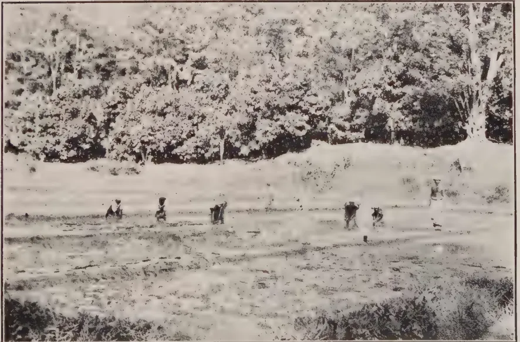
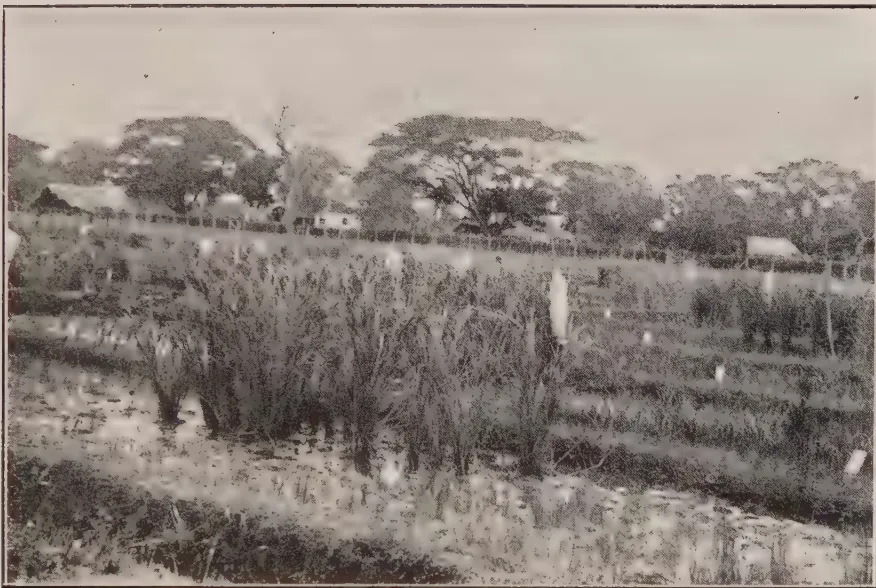
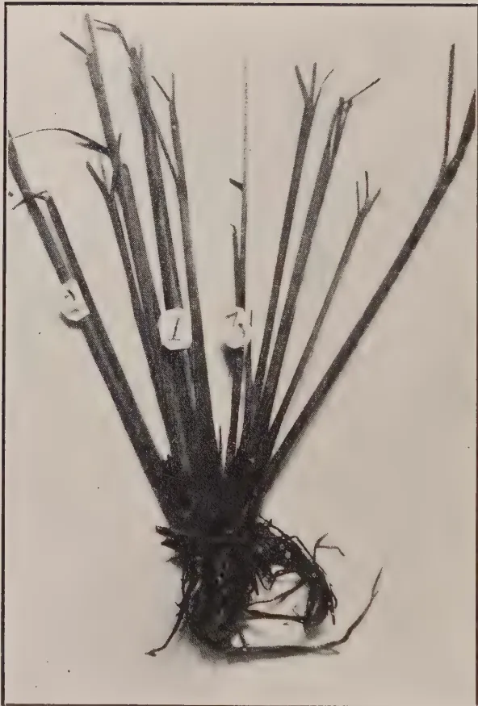

THE  
**TROPICAL AGRICULTURIST:**  
JOURNAL OF THE  
**CEYLON AGRICULTURAL SOCIETY.**

---

---

VOL. LVI.

PERADENIYA, FEBRUARY, 1921.

No. 2.

---

---

**PADDY SELECTION.**

---

In the present number of the **TROPICAL AGRICULTURIST** is included a paper by the Economic Botanist on the tillering of paddy. This paper is the first of a series of articles presenting details of a scientific investigation of the paddy plant under Ceylon conditions. The results shown are interesting and indicate various lines of work for the future investigator. They have been accumulated during the study of Ceylon paddies which was begun in 1920.

Pure line selections from the principal paddy varieties grown for the **Maha** and **Yala** season crops throughout the colony have been made and are being tested under conditions of careful scientific control at the Anuradhapura and Peradeniya Experiment Stations. From these selections sufficient seed will be available for comparative yield trials, and as the results of these trials are procured seed will be available for field trials upon seed farms and upon cultivators' lands.

There is little doubt that considerably increased yields can be secured by the use of selected and improved seed, but the work of improvement has to be conducted in a systematic manner.

It is proposed to make Anuradhapura the main centre for the selection work with paddy. The land on that station is fairly uniform, irrigation and drainage can be effectively controlled and the climate is suited to the growing of good crops of paddy.

1------------------------------------------------

66[FEBRUARY, 1921.

Duplicate investigations will, in part, be continued at Peradeniya and special work undertaken in connexion with those paddies which are best suited to the conditions prevailing in the Central Province.

Considerable confusion exists in Ceylon at present over the varieties of paddy. The same name is given in different districts to totally different varieties, while one variety may exist in different parts of the colony under a number of names. An analysis of the Mawis and Sambas has been begun, while a number of the Yala varieties has been gone through for selection.

While this selection work is being carried out, a very considerable number of problems will present themselves for investigation. These will be undertaken as time permits and the article on the tillering of paddy presents data which is of importance and interest. To what are the increased yields from transplanting due? Is it possible to secure these increased yields without the employment of the manual labour necessary for transplanting? These are practical questions that present themselves and they can only be answered when the fullest data have been collected and analysed.

There is little doubt that Ceylon, if it is to become more self-supporting in its paddy requirements, must increase its yields per acre. These increases can be effected by the use of better seed, by the adoption of better methods of cultivation and by the more liberal use of manures. Advice on these points must be based upon accurate scientific investigations. Work has already begun in other rice-producing countries and it is of importance that work should not be delayed in Ceylon.

Better seed can easily be secured and the experience of other rice-producing countries has shown that better crops result from the use of better seed.

All growers of paddy are therefore requested to watch the progress of the work of securing supplies of pure lines of paddy selected from the most popular varieties growing in the colony. Visits should be made to the Experiment Stations—especially that at Anuradhapura—while the work is in progress. All information possible will be given and, later, supplies of seed of pure-line selections will be available in limited quantities.

2------------------------------------------------

FEBRUARY, 1921.]67

# RICE.

## THE TILLERING OF CEYLON RICES.

F. SUMMERS, D.S.O., M.Sc., &c.,

*Economic Botanist.*

### INTRODUCTION.

The importance of a study of the tillering of the rice plant lies in the amount of evidence to be obtained which bears upon the question of the relative importance of broadcasting, drilling or transplanting the crop.

It is a well-known fact that the average yield of paddy per acre is much less in Ceylon than in the rice-growing countries of Europe, America, Australia and the Far East. The following figures from the Bulletin of the Imperial Institute for 1917 have been frequently quoted but are here inserted for reference.

<table border="1">
<thead>
<tr>
<th colspan="2">COUNTRY</th>
<th colspan="4">YIELD</th>
</tr>
</thead>
<tbody>
<tr>
<td>Spain</td>
<td>-</td>
<td>101</td>
<td>bushels</td>
<td>per</td>
<td>acre</td>
</tr>
<tr>
<td>Japan</td>
<td>-</td>
<td>77</td>
<td>"</td>
<td>"</td>
<td>"</td>
</tr>
<tr>
<td>Egypt</td>
<td>-</td>
<td>73</td>
<td>"</td>
<td>"</td>
<td>"</td>
</tr>
<tr>
<td>Italy</td>
<td>-</td>
<td>63</td>
<td>"</td>
<td>"</td>
<td>"</td>
</tr>
<tr>
<td>British Guiana</td>
<td>-</td>
<td>54</td>
<td>"</td>
<td>"</td>
<td>"</td>
</tr>
<tr>
<td>Java</td>
<td>-</td>
<td>40</td>
<td>"</td>
<td>"</td>
<td>"</td>
</tr>
<tr>
<td>India</td>
<td>-</td>
<td>30-40</td>
<td>"</td>
<td>"</td>
<td>"</td>
</tr>
<tr>
<td>Ceylon</td>
<td>-</td>
<td>15.</td>
<td>"</td>
<td>"</td>
<td>"</td>
</tr>
</tbody>
</table>

Whether this grading is quite fair to Ceylon is open to doubt, for obviously it takes no cognizance of relatively adverse or favourable conditions in the various countries.

Apart from the fact that for Ceylon accurate statistics are seldom available either of the acreage actually under paddy in any given year or of the annual and crop yields per acre, it may be asserted that, on the whole, the paddy soils of Ceylon are inferior in fertility to those of other countries on the list. In spite of this it is highly probable that Ceylon yields compare more favourably with those of other countries than the above table would appear to indicate.

If the agricultural methods of these various countries are reviewed, we find that in India, Malaya, Java and the Philippines transplanting is a normal agricultural practice carried out over the larger part of the irrigable area. For example, CONNER in Bulletin No. 22 of the Philippine Bureau of Agriculture (1912) states that it would be safe to say that four-fifths of the rice grown is transplanted, while JACK makes the following statement about the cultivation of rice in KRIAN, F.M.S.

"The annual padi crop in Krian.....gives an annual yield per acre of.....1,700 lb. (about 38 bushels).....of clean, unhusked rice over the entire planted area, though the best areas produce about 4,000 lb. (89 bushels) in a good year, a yield which compares very favourably with that obtained in Spain the world's heaviest producer of rice per acre....."

3------------------------------------------------

68[FEBRUARY, 1921.

The high yields of Spain are obtained by transplanting and in the same way are those of Queensland and Italy. In the latter country the practice of drilling is supplanting gradually that of transplanting owing to labour difficulties, while drilling is the usual practice in the United States where the acreage under rice has increased to a very great extent in recent years, especially in California.

While in the United States the ordinary chain drill is employed in the same way as with other cereals, a good deal of attention has been paid by agricultural engineers in Italy to the perfection of a seed drill which can be worked over a puddled field. Several types of machine have been evolved, the chief features of which are lightness and the uniform distribution of the weight upon either rollers or skids which support the machine as it travels over the mud. Rudimentary drills are also employed in India to a small extent.

In Ceylon, on the other hand, the seed drill is never employed for paddy, while as yet transplanting has only made slight headway. Owing to the efforts of the Agricultural Society through its Agricultural Instructors, experiments have been carried out chiefly in the Central Province, while sporadic efforts have also been made by progressive cultivators in this and other provinces to popularise the practice. Reference may be made to reports of the C.A.S. and various articles by W. MOLEGODE and others in the TROPICAL AGRICULTURIST from 1914 onwards for particulars of this pioneer work.

It should not be understood from this that these constitute the earliest attempts to popularise the practice of transplanting in the Island, for records are available showing that, upwards of one hundred years ago, the cultivators, e.g. of the Southern Province, were being encouraged to adopt it.

The fact that the yield per acre is increased to a considerable extent by transplanting is now beyond dispute, for the practice has progressed beyond the stage of experiment, and the same may be said of the use of the drill. But the reason for this increase has never been satisfactorily explained. It has generally been assumed to be due to the large increase in the number of tillers thrown out by the transplanted seedlings as soon as they have recovered from the shock received during their transference.

Experimental evidence on this point should be of two kinds. Statistical methods should demonstrate that the number of tillers produced is sufficient to account for the increased yield, and physiological experiments should demonstrate the valency of the somewhat plausible shock re-action hypothesis. In Malaya the practice is to transplant clumps of seedlings from the nursery two or three times before finally planting them out in the field. It is assumed that, with each transplantation, the shock stimulus is magnified and the re-action correspondingly increased.

But direct experimental evidence is lacking as far as can be ascertained from the literature and the subject will be returned to later in order to demonstrate the necessity for this.

An increased volume yield of paddy per acre is due to one of the two following causes :—

(1) When the average size of the ears and grains is not increased, in an increased number of mature ear-bearing shoots per acre.

4------------------------------------------------

FEBRUARY, 1921.]69

(2) When the number of mature ear-bearing shoots per acre is not increased, in a greater development of the individual ears with an increase in number or size of the grains borne by each.

Naturally, if the number of ear-bearing shoots per acre is increased and, at the same time, the ears themselves attain a greater development the resultant yield per acre will be correspondingly increased.

The observations described below are intended to throw light upon the question of the average number of ears per acre to be expected in the following three cases.

1. (1) When the seed paddy is broadcasted in the ordinary way.
2. (2) When single plants are transplanted at intervals of 6 in. by 6 in.
3. (3) When the seeds are sown at intervals of 12 in. by 6 in.

#### BROADCASTED PADDY.

Below are given examples of the number of ears actually found in the case of broadcasted varieties grown at the Experiment Station, Peradeniya, during the Yala season of 1920. From these results it will be simple to calculate the number of mature ears per acre to be expected from a broadcasted crop.

The ground was prepared by Sinhalese for broadcasting according to the methods usually practised in the Central Province. The actual levelling, surface drainage and sowing were carried by villagers specially adept at this work. The evenness with which the sower scatters the seed is surprising when seen for the first time.

The variety Heenati (2) was a crop grown by the Manager of the Experiment Station who allowed a selected portion to be specially harvested. After the whole was harvested the yield was determined to be 20 bushels per acre. It was grown, however, in precisely the same way as the other varieties which were raised by myself in experimental plots about 15 feet square. All were weeded and thinned out at the appropriate time, the same treatment being given to all. On completion the individual plants were separated by distances rarely greater than  $2\frac{1}{2}$  inches. At maturity a strip was marked off across each plot and the plants within it carefully pulled up by the roots. The plants on the two margins were rejected. In the case of Heenati (2) a narrow rectangular block, beginning at one of the smaller bunds, was marked off and treated similarly with the exception that the border plants were not rejected. The number of tillers of each plant was counted and the plants grouped according to their tiller numbers.

The results are set out in Table I., and are shown graphically by the curves of Fig. I.

TABLE I.

<table border="1">
<thead>
<tr>
<th>Variety</th>
<th>1</th>
<th>2</th>
<th>3</th>
<th>4</th>
<th>5</th>
<th>6</th>
<th>7</th>
<th>8</th>
<th>9</th>
<th>No. of tillers per plant</th>
</tr>
</thead>
<tbody>
<tr>
<td>Kombila</td>
<td>395</td>
<td>84</td>
<td>18</td>
<td>1</td>
<td>—</td>
<td>—</td>
<td>—</td>
<td>—</td>
<td>—</td>
<td>No. of plants</td>
</tr>
<tr>
<td>Hetadawi</td>
<td>130</td>
<td>161</td>
<td>24</td>
<td>5</td>
<td>1</td>
<td>—</td>
<td>—</td>
<td>—</td>
<td>—</td>
<td>" "</td>
</tr>
<tr>
<td>Heenati (2)</td>
<td>71</td>
<td>63</td>
<td>33</td>
<td>17</td>
<td>10</td>
<td>11</td>
<td>—</td>
<td>—</td>
<td>—</td>
<td>" "</td>
</tr>
<tr>
<td>Heenati (1)</td>
<td>122</td>
<td>83</td>
<td>47</td>
<td>16</td>
<td>7</td>
<td>9</td>
<td>2</td>
<td>—</td>
<td>—</td>
<td>" "</td>
</tr>
<tr>
<td>Ratkunda</td>
<td>172</td>
<td>170</td>
<td>114</td>
<td>50</td>
<td>14</td>
<td>6</td>
<td>3</td>
<td>1</td>
<td>—</td>
<td>" "</td>
</tr>
</tbody>
</table>

The results above are merely a selection of many similar ones and it will be noticed that they are of three kinds.

5------------------------------------------------

70[FEBRUARY, 1921.

In the first class most of the plants possess only one shoot as in Kombila; in the second class the majority have either one or two shoots as in Hetadawi, while in the third class, typified by Heenati and Ratkunda, a relatively small number of plants have more than three tillers each.

The results given by Heenati (2) and Ratkunda require some amplification. In the case of the former the harvested strip included the plants on the border near the bund. It is common knowledge that the plants growing close to the bunds tiller more freely than those growing in mid-field.

JACK (loc. cit. page 304) says that this may be put down to the richness of the soil in humus which is derived from the decay of the vegetation used in constructing the bunds, but the fact must not be lost sight of that these plants are exposed to less competition on the part of the others and this may account for the freedom of their development. This point will also be returned to later in the paper.

The case of the Ratkunda was slightly more complicated. This variety was harvested late, and, although about one-third of the plants possessed more than two tillers, immature and sterile ears were present to such an extent that only about one-ninth had more than two good ears.

Classified according to number of mature ears the 532 plants harvested were arranged as follows:—

TABLE II.

<table border="1">
<thead>
<tr>
<th>Variety</th>
<th>1</th>
<th>2</th>
<th>3</th>
<th>4</th>
<th>5</th>
<th>6</th>
<th>No. of Mature Ears</th>
</tr>
</thead>
<tbody>
<tr>
<td>Ratkunda</td>
<td>305</td>
<td>168</td>
<td>47</td>
<td>9</td>
<td>2</td>
<td>1</td>
<td>No. of Plants</td>
</tr>
</tbody>
</table>

Analysed in this way the results fall very well into the first class.

Considering merely the good ears in the case of a number of the most successful varieties the mean or average number for the whole harvested product was calculated, the results being given in Table III.

TABLE III.

<table border="1">
<thead>
<tr>
<th>Variety</th>
<th>Mean No. of Mature Ears</th>
</tr>
</thead>
<tbody>
<tr>
<td>Heenati (2)</td>
<td>2.3</td>
</tr>
<tr>
<td>Ratkunda</td>
<td>2.2</td>
</tr>
<tr>
<td>Podiheenati</td>
<td>2.2</td>
</tr>
<tr>
<td>Heenati (1)</td>
<td>2.1</td>
</tr>
<tr>
<td>Hetadawi</td>
<td>1.7</td>
</tr>
<tr>
<td>Podiheenati (2)</td>
<td>1.6</td>
</tr>
<tr>
<td>Kombila</td>
<td>1.2</td>
</tr>
<tr>
<td>Average of Means</td>
<td>1.9</td>
</tr>
</tbody>
</table>

To sum up the results of all the above tables, it might now be said that in a paddy crop broadcasted, weeded and thinned out by the methods normally employed by the Ceylonese cultivator.—

1. (1) Most of the plants in the crop will have either one or two good ears. (Table I.)
2. (2) If more than two ears are borne on a plant the chances are that one of these will be immature and worthless. (Table II.)

6------------------------------------------------

*Fig 1*

Number of Plants

Tiller Numbers

Konchila —————  
 Hetasum .....  
 Heenatree .....  
 Heenarim .....  
 Kalkundi .....

<table border="1">
<thead>
<tr>
<th>Tiller Numbers</th>
<th>Konchila</th>
<th>Hetasum</th>
<th>Heenatree</th>
<th>Heenarim</th>
<th>Kalkundi</th>
</tr>
</thead>
<tbody>
<tr>
<td>0</td>
<td>0</td>
<td>0</td>
<td>0</td>
<td>0</td>
<td>0</td>
</tr>
<tr>
<td>1</td>
<td>390</td>
<td>125</td>
<td>125</td>
<td>125</td>
<td>70</td>
</tr>
<tr>
<td>2</td>
<td>100</td>
<td>105</td>
<td>105</td>
<td>105</td>
<td>65</td>
</tr>
<tr>
<td>3</td>
<td>25</td>
<td>45</td>
<td>45</td>
<td>45</td>
<td>40</td>
</tr>
<tr>
<td>4</td>
<td>0</td>
<td>15</td>
<td>15</td>
<td>15</td>
<td>15</td>
</tr>
<tr>
<td>5</td>
<td>0</td>
<td>10</td>
<td>10</td>
<td>10</td>
<td>10</td>
</tr>
<tr>
<td>6</td>
<td>0</td>
<td>5</td>
<td>5</td>
<td>5</td>
<td>5</td>
</tr>
<tr>
<td>7</td>
<td>0</td>
<td>0</td>
<td>0</td>
<td>0</td>
<td>0</td>
</tr>
</tbody>
</table>

7------------------------------------------------

PLATE I.  
Plots of 3,000 Series. Yala 1920. Showing Tillering.

8------------------------------------------------

FEBRUARY, 1921.]71

(3) The average number of ears per plant to be expected from the crop is 1'9. (Table III.)

(4) If the plants are separated on an average by a distance of  $2\frac{1}{2}$  inches, each square yard will contain 220 plants and should therefore produce about 418 good ears.

The above results have been checked in the field, chiefly with Central Province fields of Hatiel, Heenati and Mawi. They were found to be conformed to in all cases. The number of ears per square yard, viz. 418, was judged to be a maximum, for, in many well-thinned fields the distance between the plants was more than three inches, giving a less number of ears per equivalent area.

#### RESULTS WITH TRANSPLANTED PADDY.

In the following section the question is examined of whether an increased number of mature ears per acre can be obtained by transplanting the seedlings at intervals of 6 inches by 6 inches.

The problem is a simple one. Each seedling occupies 36 square inches so that a square yard contains 36 plants, or one-ninth of the number found when the crop is broadcasted. It follows therefore that, on an average, the plants must produce, if there is no increase in the average size of the ears, nine times as many ears as the broadcasted plants if the yield is to be maintained.

Before giving the results of actual experiments on this point a short account of the method employed will be given. The varieties used were a series of three months paddies grown in the experimental plots at the Dry Zone Experiment Station at Anuradhapura. The series comprised 90 varieties of which 52 were exactly duplicated at the Peradeniya Experiment Station. The seed samples were collected from all parts of the Island about the middle of 1919. They were not grown until the Yala season of 1920, the data concerning this being given below in Table IV.

TABLE IV.

<table border="1">
<thead>
<tr>
<th rowspan="2">Experiment Station</th>
<th colspan="2">Date of</th>
</tr>
<tr>
<th>Sowing</th>
<th>Transplanting</th>
</tr>
</thead>
<tbody>
<tr>
<td>Anuradhapura</td>
<td>31st March, 1920</td>
<td>May 4th to 7th, 1920</td>
</tr>
<tr>
<td>Peradeniya</td>
<td>11th April, 1920</td>
<td>May 13th to 17th, 1920</td>
</tr>
</tbody>
</table>

In both cases selection of seedlings was practised, all weak ones being rejected. The varieties were then transplanted into plots chess-board fashion as shown in Plates I and II. These plots were about 13 feet square. The plates show the plots at Anuradhapura when the seedlings were about one month old from the time of transplanting, or two months in all. Transplanting in progress at Peradeniya is shown in Plate III.

A striking feature of all plots was the almost entire absence of weeds so that no weeding was necessary from start to finish.

Progress was excellent at Anuradhapura, many of the varieties being harvested within 76 days from the time of transplanting or within 110 days from the time of sowing. Amongst these were several Morungans, Dahanala, Kottiyaran, Rata Balawi, Madael, Heenati, Heen Ratkunda and Mada Arawi.

In comparison progress was very poor at Peradeniya and many of the varieties were rejected as unfit for comparison with those of Anuradhapura.

Confining attention to the varieties of the latter station, these were at harvest pulled up carefully by the roots and the number of tillers in each individual plant counted. The plants of the side rows were rejected as before. In every case these put up astonishingly large numbers of tillers, plants with 40 mature ears being far from uncommon. The remaining plants were then classified according to tiller number.

9------------------------------------------------

72[FEBRUARY, 1921.

This classification was carried out for 90 varieties, but considerations of space prevent more than half of these being quoted. The results obtained in the case of 44 varieties are given in full in order that they may serve as a guide to workers and cultivators in the future as to what a particular variety may be expected to show in the way of tillering when transplanted in a similar fashion. In Table V the vertical columns contain for each variety the number of plants in each tiller class.

TABLE V.

<table border="1">
<thead>
<tr>
<th rowspan="2">Name of Variety</th>
<th colspan="16">Number of Tillers</th>
</tr>
<tr>
<th>1</th>
<th>2</th>
<th>3</th>
<th>4</th>
<th>5</th>
<th>6</th>
<th>7</th>
<th>8</th>
<th>9</th>
<th>10</th>
<th>11</th>
<th>12</th>
<th>13</th>
<th>14</th>
<th>15</th>
<th>16</th>
</tr>
</thead>
<tbody>
<tr>
<td>Sudukuruwi</td>
<td>3</td>
<td><b>35</b></td>
<td>28</td>
<td>26</td>
<td>23</td>
<td>15</td>
<td>2</td>
<td>3</td>
<td>1</td>
<td>—</td>
<td>1</td>
<td>—</td>
<td>—</td>
<td>—</td>
<td>—</td>
<td>—</td>
</tr>
<tr>
<td>Panniti</td>
<td>28</td>
<td><b>45</b></td>
<td>34</td>
<td>29</td>
<td>18</td>
<td>10</td>
<td>13</td>
<td>7</td>
<td>4</td>
<td>1</td>
<td>2</td>
<td>—</td>
<td>—</td>
<td>—</td>
<td>—</td>
<td>—</td>
</tr>
<tr>
<td>Sulai</td>
<td>11</td>
<td>45</td>
<td><b>48</b></td>
<td>43</td>
<td>24</td>
<td>10</td>
<td>3</td>
<td>2</td>
<td>1</td>
<td>—</td>
<td>—</td>
<td>—</td>
<td>—</td>
<td>—</td>
<td>—</td>
<td>—</td>
</tr>
<tr>
<td>Sulai</td>
<td>15</td>
<td>33</td>
<td><b>72</b></td>
<td>64</td>
<td>58</td>
<td>26</td>
<td>21</td>
<td>5</td>
<td>4</td>
<td>1</td>
<td>—</td>
<td>1</td>
<td>—</td>
<td>—</td>
<td>—</td>
<td>—</td>
</tr>
<tr>
<td>Perumal</td>
<td>21</td>
<td>32</td>
<td><b>48</b></td>
<td>44</td>
<td>31</td>
<td>22</td>
<td>19</td>
<td>17</td>
<td>6</td>
<td>7</td>
<td>—</td>
<td>1</td>
<td>1</td>
<td>—</td>
<td>—</td>
<td>—</td>
</tr>
<tr>
<td>Suduratawi</td>
<td>10</td>
<td>39</td>
<td><b>46</b></td>
<td>45</td>
<td>17</td>
<td>7</td>
<td>4</td>
<td>—</td>
<td>1</td>
<td>—</td>
<td>—</td>
<td>1</td>
<td>—</td>
<td>—</td>
<td>—</td>
<td>—</td>
</tr>
<tr>
<td>Heenati</td>
<td>15</td>
<td>27</td>
<td><b>52</b></td>
<td>32</td>
<td>8</td>
<td>8</td>
<td>3</td>
<td>1</td>
<td>1</td>
<td>—</td>
<td>—</td>
<td>—</td>
<td>—</td>
<td>—</td>
<td>—</td>
<td>—</td>
</tr>
<tr>
<td>Galpawi</td>
<td>5</td>
<td>27</td>
<td><b>50</b></td>
<td>34</td>
<td>28</td>
<td>11</td>
<td>7</td>
<td>3</td>
<td>1</td>
<td>2</td>
<td>1</td>
<td>—</td>
<td>—</td>
<td>—</td>
<td>—</td>
<td>—</td>
</tr>
<tr>
<td>Balakara</td>
<td>16</td>
<td>30</td>
<td><b>42</b></td>
<td>30</td>
<td>13</td>
<td>6</td>
<td>5</td>
<td>3</td>
<td>2</td>
<td>—</td>
<td>—</td>
<td>—</td>
<td>—</td>
<td>—</td>
<td>—</td>
<td>—</td>
</tr>
<tr>
<td>Kaluwi</td>
<td>14</td>
<td>28</td>
<td><b>57</b></td>
<td>46</td>
<td>41</td>
<td>38</td>
<td>9</td>
<td>6</td>
<td>5</td>
<td>2</td>
<td>2</td>
<td>1</td>
<td>—</td>
<td>—</td>
<td>—</td>
<td>—</td>
</tr>
<tr>
<td>Bediratawi</td>
<td>26</td>
<td>72</td>
<td><b>74</b></td>
<td>38</td>
<td>10</td>
<td>5</td>
<td>5</td>
<td>1</td>
<td>—</td>
<td>—</td>
<td>—</td>
<td>—</td>
<td>—</td>
<td>—</td>
<td>—</td>
<td>—</td>
</tr>
<tr>
<td>Ratelwi</td>
<td>11</td>
<td>46</td>
<td><b>68</b></td>
<td>57</td>
<td>39</td>
<td>30</td>
<td>17</td>
<td>15</td>
<td>1</td>
<td>—</td>
<td>—</td>
<td>1</td>
<td>—</td>
<td>—</td>
<td>—</td>
<td>1</td>
</tr>
<tr>
<td>Danahal</td>
<td>35</td>
<td>44</td>
<td><b>76</b></td>
<td>53</td>
<td>34</td>
<td>25</td>
<td>20</td>
<td>2</td>
<td>2</td>
<td>3</td>
<td>—</td>
<td>1</td>
<td>—</td>
<td>—</td>
<td>—</td>
<td>—</td>
</tr>
<tr>
<td>Galpawi</td>
<td>11</td>
<td>42</td>
<td><b>62</b></td>
<td>34</td>
<td>22</td>
<td>10</td>
<td>5</td>
<td>2</td>
<td>—</td>
<td>2</td>
<td>—</td>
<td>—</td>
<td>—</td>
<td>—</td>
<td>—</td>
<td>—</td>
</tr>
<tr>
<td>Balakara</td>
<td>15</td>
<td>58</td>
<td><b>93</b></td>
<td>77</td>
<td>54</td>
<td>31</td>
<td>9</td>
<td>8</td>
<td>5</td>
<td>2</td>
<td>—</td>
<td>—</td>
<td>—</td>
<td>—</td>
<td>—</td>
<td>—</td>
</tr>
<tr>
<td>Mada-arawi</td>
<td>15</td>
<td>28</td>
<td><b>48</b></td>
<td>39</td>
<td>35</td>
<td>16</td>
<td>16</td>
<td>7</td>
<td>5</td>
<td>3</td>
<td>1</td>
<td>—</td>
<td>1</td>
<td>1</td>
<td>—</td>
<td>—</td>
</tr>
<tr>
<td>Murungan</td>
<td>30</td>
<td>65</td>
<td><b>82</b></td>
<td>63</td>
<td>55</td>
<td>26</td>
<td>16</td>
<td>16</td>
<td>9</td>
<td>3</td>
<td>3</td>
<td>2</td>
<td>—</td>
<td>—</td>
<td>—</td>
<td>—</td>
</tr>
<tr>
<td>Heenratkunda</td>
<td>8</td>
<td>22</td>
<td><b>23</b></td>
<td>19</td>
<td>10</td>
<td>8</td>
<td>11</td>
<td>9</td>
<td>4</td>
<td>4</td>
<td>3</td>
<td>—</td>
<td>—</td>
<td>—</td>
<td>1</td>
<td>—</td>
</tr>
<tr>
<td>Heenhalsuduwii</td>
<td>16</td>
<td>23</td>
<td><b>42</b></td>
<td>34</td>
<td>18</td>
<td>12</td>
<td>5</td>
<td>2</td>
<td>1</td>
<td>—</td>
<td>—</td>
<td>—</td>
<td>—</td>
<td>—</td>
<td>—</td>
<td>—</td>
</tr>
<tr>
<td>Nandusuduwii</td>
<td>12</td>
<td>21</td>
<td>35</td>
<td><b>48</b></td>
<td>30</td>
<td>21</td>
<td>4</td>
<td>4</td>
<td>2</td>
<td>1</td>
<td>—</td>
<td>—</td>
<td>—</td>
<td>—</td>
<td>—</td>
<td>—</td>
</tr>
<tr>
<td>Bala Mawi</td>
<td>4</td>
<td>16</td>
<td>33</td>
<td><b>47</b></td>
<td>30</td>
<td>19</td>
<td>11</td>
<td>4</td>
<td>6</td>
<td>4</td>
<td>1</td>
<td>3</td>
<td>—</td>
<td>—</td>
<td>—</td>
<td>—</td>
</tr>
<tr>
<td>Kaharamana</td>
<td>8</td>
<td>43</td>
<td>62</td>
<td><b>68</b></td>
<td>59</td>
<td>46</td>
<td>30</td>
<td>19</td>
<td>5</td>
<td>5</td>
<td>1</td>
<td>—</td>
<td>1</td>
<td>—</td>
<td>—</td>
<td>—</td>
</tr>
<tr>
<td>Ratkunda</td>
<td>3</td>
<td>20</td>
<td>27</td>
<td><b>32</b></td>
<td>27</td>
<td>26</td>
<td>12</td>
<td>6</td>
<td>5</td>
<td>—</td>
<td>—</td>
<td>—</td>
<td>—</td>
<td>—</td>
<td>—</td>
<td>—</td>
</tr>
<tr>
<td>Suduwii</td>
<td>9</td>
<td>16</td>
<td>28</td>
<td><b>48</b></td>
<td>33</td>
<td>24</td>
<td>19</td>
<td>13</td>
<td>8</td>
<td>—</td>
<td>1</td>
<td>—</td>
<td>—</td>
<td>—</td>
<td>—</td>
<td>—</td>
</tr>
<tr>
<td>Oddaivala.</td>
<td>6</td>
<td>9</td>
<td>28</td>
<td><b>56</b></td>
<td>51</td>
<td>50</td>
<td>41</td>
<td>34</td>
<td>11</td>
<td>8</td>
<td>—</td>
<td>3</td>
<td>1</td>
<td>2</td>
<td>—</td>
<td>—</td>
</tr>
<tr>
<td>Gonnavalu</td>
<td>5</td>
<td>20</td>
<td>20</td>
<td><b>65</b></td>
<td>53</td>
<td>34</td>
<td>24</td>
<td>11</td>
<td>13</td>
<td>5</td>
<td>1</td>
<td>—</td>
<td>—</td>
<td>—</td>
<td>—</td>
<td>—</td>
</tr>
<tr>
<td>Heendikvi</td>
<td>20</td>
<td>41</td>
<td>55</td>
<td><b>60</b></td>
<td>41</td>
<td>23</td>
<td>7</td>
<td>6</td>
<td>—</td>
<td>—</td>
<td>—</td>
<td>—</td>
<td>—</td>
<td>—</td>
<td>—</td>
<td>—</td>
</tr>
<tr>
<td>Sirivellai</td>
<td>9</td>
<td>27</td>
<td>34</td>
<td><b>53</b></td>
<td>52</td>
<td>49</td>
<td>24</td>
<td>28</td>
<td>15</td>
<td>12</td>
<td>3</td>
<td>3</td>
<td>1</td>
<td>2</td>
<td>—</td>
<td>—</td>
</tr>
<tr>
<td>Kirikara</td>
<td>12</td>
<td>33</td>
<td>63</td>
<td><b>72</b></td>
<td>48</td>
<td>36</td>
<td>13</td>
<td>8</td>
<td>11</td>
<td>2</td>
<td>1</td>
<td>—</td>
<td>3</td>
<td>—</td>
<td>—</td>
<td>—</td>
</tr>
<tr>
<td>Sudumadael</td>
<td>3</td>
<td>24</td>
<td>45</td>
<td><b>65</b></td>
<td>48</td>
<td>34</td>
<td>23</td>
<td>10</td>
<td>14</td>
<td>6</td>
<td>—</td>
<td>2</td>
<td>—</td>
<td>1</td>
<td>—</td>
<td>—</td>
</tr>
<tr>
<td>Podiratawi</td>
<td>5</td>
<td>43</td>
<td>56</td>
<td><b>80</b></td>
<td>52</td>
<td>28</td>
<td>23</td>
<td>8</td>
<td>7</td>
<td>3</td>
<td>—</td>
<td>—</td>
<td>—</td>
<td>—</td>
<td>—</td>
<td>—</td>
</tr>
<tr>
<td>Raturatawi</td>
<td>5</td>
<td>17</td>
<td>25</td>
<td><b>36</b></td>
<td>29</td>
<td>22</td>
<td>28</td>
<td>16</td>
<td>17</td>
<td>10</td>
<td>9</td>
<td>8</td>
<td>5</td>
<td>5</td>
<td>1</td>
<td>—</td>
</tr>
<tr>
<td>Karayal</td>
<td>10</td>
<td>14</td>
<td>31</td>
<td>48</td>
<td><b>49</b></td>
<td>44</td>
<td>20</td>
<td>21</td>
<td>6</td>
<td>6</td>
<td>5</td>
<td>3</td>
<td>2</td>
<td>—</td>
<td>—</td>
<td>—</td>
</tr>
<tr>
<td>Panankalayan</td>
<td>4</td>
<td>12</td>
<td>38</td>
<td>36</td>
<td><b>48</b></td>
<td>34</td>
<td>21</td>
<td>12</td>
<td>8</td>
<td>7</td>
<td>6</td>
<td>2</td>
<td>3</td>
<td>—</td>
<td>—</td>
<td>—</td>
</tr>
<tr>
<td>Ilankalayan</td>
<td>8</td>
<td>10</td>
<td>34</td>
<td>36</td>
<td><b>39</b></td>
<td>24</td>
<td>25</td>
<td>10</td>
<td>16</td>
<td>5</td>
<td>1</td>
<td>1</td>
<td>—</td>
<td>—</td>
<td>—</td>
<td>—</td>
</tr>
<tr>
<td>Balakara</td>
<td>5</td>
<td>16</td>
<td>49</td>
<td>45</td>
<td><b>50</b></td>
<td>33</td>
<td>18</td>
<td>8</td>
<td>10</td>
<td>2</td>
<td>2</td>
<td>—</td>
<td>—</td>
<td>1</td>
<td>—</td>
<td>—</td>
</tr>
<tr>
<td>Giris</td>
<td>6</td>
<td>23</td>
<td>24</td>
<td>56</td>
<td><b>59</b></td>
<td>47</td>
<td>38</td>
<td>27</td>
<td>14</td>
<td>7</td>
<td>6</td>
<td>1</td>
<td>1</td>
<td>1</td>
<td>—</td>
<td>—</td>
</tr>
<tr>
<td>Balakara</td>
<td>3</td>
<td>29</td>
<td>35</td>
<td>41</td>
<td><b>43</b></td>
<td>29</td>
<td>25</td>
<td>12</td>
<td>8</td>
<td>9</td>
<td>1</td>
<td>1</td>
<td>1</td>
<td>—</td>
<td>—</td>
<td>—</td>
</tr>
<tr>
<td>Heenati</td>
<td>13</td>
<td>24</td>
<td>27</td>
<td>26</td>
<td>28</td>
<td><b>37</b></td>
<td>18</td>
<td>18</td>
<td>14</td>
<td>12</td>
<td>13</td>
<td>6</td>
<td>3</td>
<td>3</td>
<td>3</td>
<td>1</td>
</tr>
<tr>
<td>Podiheenati</td>
<td>6</td>
<td>24</td>
<td>45</td>
<td>50</td>
<td>30</td>
<td><b>51</b></td>
<td>27</td>
<td>21</td>
<td>10</td>
<td>5</td>
<td>4</td>
<td>3</td>
<td>2</td>
<td>1</td>
<td>—</td>
<td>—</td>
</tr>
<tr>
<td>Heenati</td>
<td>7</td>
<td>18</td>
<td>29</td>
<td>21</td>
<td>31</td>
<td><b>33</b></td>
<td>31</td>
<td>18</td>
<td>10</td>
<td>10</td>
<td>6</td>
<td>5</td>
<td>3</td>
<td>4</td>
<td>1</td>
<td>—</td>
</tr>
<tr>
<td>Norungan</td>
<td>10</td>
<td>35</td>
<td>47</td>
<td>46</td>
<td>48</td>
<td><b>53</b></td>
<td>45</td>
<td>21</td>
<td>17</td>
<td>9</td>
<td>5</td>
<td>2</td>
<td>—</td>
<td>—</td>
<td>—</td>
<td>—</td>
</tr>
<tr>
<td>Danahal</td>
<td>5</td>
<td>12</td>
<td>25</td>
<td>26</td>
<td>33</td>
<td><b>37</b></td>
<td>35</td>
<td>35</td>
<td>19</td>
<td>16</td>
<td>8</td>
<td>6</td>
<td>6</td>
<td>—</td>
<td>—</td>
<td>2</td>
</tr>
<tr>
<td>Pachchaiperumal</td>
<td>3</td>
<td>13</td>
<td>8</td>
<td>24</td>
<td>25</td>
<td>25</td>
<td><b>31</b></td>
<td>28</td>
<td>17</td>
<td>11</td>
<td>14</td>
<td>4</td>
<td>2</td>
<td>1</td>
<td>—</td>
<td>2</td>
</tr>
</tbody>
</table>

10------------------------------------------------

PLATE II.

Plots of 3,000 series showing Chess-board arrangement. Pure lines of another series were sown in the vacant plots.

PLATE III.

Transplanting of 3,000 Series.  
Peradeniya Experiment Station—Yala 1920.

11------------------------------------------------

This image is a scan of a blank page. The paper has a light beige or cream-colored tint. There are several small, dark specks scattered across the surface, which appear to be scanning artifacts or dust particles. No text, lines, or other markings are present on the page.

12------------------------------------------------

FEBRUARY, 1921.]73

The tiller class in which most of the plants of a variety occur is known as the Mode, i.e. the mode is the commonest tiller number. In Table V the number of plants forming the mode is shown for each variety in darker type.

It will be noticed that the mode may range from 2 to 7 the number of varieties possessing each particular mode being shown in tabular form in Table VI.

TABLE VI.

<table border="1">
<thead>
<tr>
<th>Mode.</th>
<th>No. of Varieties.</th>
</tr>
</thead>
<tbody>
<tr>
<td>2</td>
<td>2</td>
</tr>
<tr>
<td>3</td>
<td>17</td>
</tr>
<tr>
<td>4</td>
<td>13</td>
</tr>
<tr>
<td>5</td>
<td>6</td>
</tr>
<tr>
<td>6</td>
<td>5</td>
</tr>
<tr>
<td>7</td>
<td>1</td>
</tr>
</tbody>
</table>

From this table the average value of the mode can be calculated as 3.95, or, in other words, if all the varieties were lumped together the mode would fall at 3.95 tillers.

If, for any variety, a graph is drawn showing the distribution of the plants according to tiller numbers a typical peaked curve is the result, the mode being the ordinate at the peak. Four such curves are shown in Fig. II. the mode being 3, 4, 5, and 6 respectively.

But the mode is not necessarily the same thing as the average number of tillers; on the contrary, the two are generally unequal. A comparison of the mode and mean (or average) number of tillers for each of the varieties shown graphically in Fig. II, demonstrates that in every case the mean is greater than the mode. This is due to plants with tiller numbers greater than the mode over-balancing, as it were, those with tiller numbers less than the mode. In only eight of the 44 varieties of Table V is the mean, on calculation, found to be less than the mode.

In view of the great variation amongst the tiller curves as far as range, mode and steepness are concerned, the mean or average number of tillers is a better expression of the tillering capacity of the variety than the mode.

The mean has been calculated for all the varieties of Table V, and the results shown in Table VII grouped into classes. The lowest mean was 2.9 in the case of Bediratawi and the highest 6.6 for Pachchaiperumal.

TABLE VII.

<table border="1">
<thead>
<tr>
<th>Mean Number of Tillers.</th>
<th>Number of Varieties.</th>
</tr>
</thead>
<tbody>
<tr>
<td>2.1—3.0</td>
<td>1</td>
</tr>
<tr>
<td>3.1—4.0</td>
<td>15</td>
</tr>
<tr>
<td>4.1—5.0</td>
<td>15</td>
</tr>
<tr>
<td>5.1—6.0</td>
<td>10</td>
</tr>
<tr>
<td>6.1—7.0</td>
<td>3</td>
</tr>
</tbody>
</table>

It has been shown previously that the mean of all the modes was 3.95 tillers and, a similar calculation having been carried out for the means, it was found that the mean of all these was 4.02 tillers.

In other words, if the selection of paddies given in Table V. can be taken as a typical collection of the short aged paddies of the Island, then, if transplanting at six inch intervals is practised, the cultivator can expect an average of 4.02 tillers for all the plants of his plots.

13------------------------------------------------

74[FEBRUARY, 1921.

If this is so the plants will, on an average, produce 2.1 times as many ears as in a broadcasted crop. But, as the number of plants per square yard is only 36, the total number of ears per square yard will only be about 145 or less than one-half of the number in the broadcasted crop. It follows therefore that the increased yields obtained by transplanting are not entirely due to increased tillering on the part of the seedlings.

#### RESULTS AT ANURADHAPURA AND PERADENIYA COMPARED.

Up to the present, in order to establish a more equal comparison, the transplanting results at Anuradhapura alone have been quoted. So many of the 52 duplicates at Peradeniya failed owing to causes beyond control that a complete comparison is not possible.

In order however to demonstrate that tillering results are not dependent upon station a few comparisons might profitably be made between Peradeniya and Anuradhapura varieties.

In Fig. III the results obtained with certain Heenatis are shown graphically. The numbers of the curves refer to Table VIII which contains the data necessary for their interpretation.

TABLE VIII.

<table border="1">
<thead>
<tr>
<th>No. of Curve</th>
<th>Name of Variety</th>
<th>Where Grown</th>
<th>How Grown</th>
<th>Mean No. of Tillers</th>
</tr>
</thead>
<tbody>
<tr>
<td>1</td>
<td>Heenati (1)</td>
<td>Peradeniya</td>
<td>Broadcasted</td>
<td>2.1</td>
</tr>
<tr>
<td>2</td>
<td>do (2)</td>
<td>do</td>
<td>do</td>
<td>2.3</td>
</tr>
<tr>
<td>3</td>
<td>do (3)</td>
<td>Anuradhapura</td>
<td>Transplanted</td>
<td>3.2</td>
</tr>
<tr>
<td>4</td>
<td>do (4)</td>
<td>do</td>
<td>do</td>
<td>5.9</td>
</tr>
<tr>
<td>5</td>
<td>do (5)</td>
<td>Peradeniya</td>
<td>do</td>
<td>4.3</td>
</tr>
<tr>
<td>6</td>
<td>do (6)</td>
<td>do</td>
<td>do</td>
<td>4.3</td>
</tr>
</tbody>
</table>

Similar data are given in Table IX. for six other transplanted varieties grown at both stations.

TABLE IX.

<table border="1">
<thead>
<tr>
<th>Name of Variety</th>
<th>Where Grown</th>
<th>Mean No. of Tillers</th>
</tr>
</thead>
<tbody>
<tr>
<td>Ratkunda</td>
<td>P'iya</td>
<td>4.1</td>
</tr>
<tr>
<td>do</td>
<td>A'pura</td>
<td>4.5</td>
</tr>
<tr>
<td>Suduheenati</td>
<td>P'iya</td>
<td>4.9</td>
</tr>
<tr>
<td>do</td>
<td>A'pura</td>
<td>4.9</td>
</tr>
<tr>
<td>Ratawi</td>
<td>P'iya</td>
<td>2.9</td>
</tr>
<tr>
<td>do</td>
<td>A'pura</td>
<td>6.2</td>
</tr>
<tr>
<td>do</td>
<td>do</td>
<td>2.9</td>
</tr>
<tr>
<td>Mahakuruwi</td>
<td>P'iya</td>
<td>6.5</td>
</tr>
<tr>
<td>do</td>
<td>A'pura</td>
<td>5.2</td>
</tr>
<tr>
<td>Kaharamana</td>
<td>P'iya</td>
<td>5.8</td>
</tr>
<tr>
<td>do</td>
<td>A'pura</td>
<td>4.6</td>
</tr>
<tr>
<td>Dahanala</td>
<td>P'iya</td>
<td>4.0</td>
</tr>
<tr>
<td>do</td>
<td>A'pura</td>
<td>3.8</td>
</tr>
</tbody>
</table>

These examples were typical of the remainder but are sufficient to show that the tillering capacity of a variety was roughly the same in both stations, the only exception being Ratawi.

This result is rather surprising in view of the fact that the fields at the two stations differ widely in soil characters. The Anuradhapura fields are only three years old, the drainage is good and the mud not at all clayey. On the contrary the Peradeniya field is old and clayey and the drainage inferior.

14------------------------------------------------

**Fig. II.**

**Number of Plants**

**Tiller Numbers**

Legend:

- Suduri (solid line with solid circles)
- Balakera (dashed line with solid squares)
- Ponankulayan (solid line with solid triangles)
- Dakonaha (dotted line with open squares)

<table border="1">
<thead>
<tr>
<th>Tiller Numbers</th>
<th>Suduri</th>
<th>Balakera</th>
<th>Ponankulayan</th>
<th>Dakonaha</th>
</tr>
</thead>
<tbody>
<tr>
<td>0</td>
<td>0</td>
<td>0</td>
<td>0</td>
<td>0</td>
</tr>
<tr>
<td>1</td>
<td>10</td>
<td>10</td>
<td>10</td>
<td>10</td>
</tr>
<tr>
<td>2</td>
<td>15</td>
<td>15</td>
<td>15</td>
<td>15</td>
</tr>
<tr>
<td>3</td>
<td>20</td>
<td>20</td>
<td>20</td>
<td>20</td>
</tr>
<tr>
<td>4</td>
<td>25</td>
<td>25</td>
<td>25</td>
<td>25</td>
</tr>
<tr>
<td>5</td>
<td>30</td>
<td>30</td>
<td>30</td>
<td>30</td>
</tr>
<tr>
<td>6</td>
<td>35</td>
<td>35</td>
<td>35</td>
<td>35</td>
</tr>
<tr>
<td>7</td>
<td>40</td>
<td>40</td>
<td>40</td>
<td>40</td>
</tr>
<tr>
<td>8</td>
<td>45</td>
<td>45</td>
<td>45</td>
<td>45</td>
</tr>
<tr>
<td>9</td>
<td>48</td>
<td>48</td>
<td>48</td>
<td>48</td>
</tr>
<tr>
<td>10</td>
<td>50</td>
<td>50</td>
<td>50</td>
<td>50</td>
</tr>
<tr>
<td>11</td>
<td>50</td>
<td>50</td>
<td>50</td>
<td>50</td>
</tr>
<tr>
<td>12</td>
<td>50</td>
<td>50</td>
<td>50</td>
<td>50</td>
</tr>
</tbody>
</table>

15------------------------------------------------

8. 102501454

Fig. III

Legend:

<table border="0">
<tr>
<td>1 —————</td>
<td>Broadenstried</td>
<td>Heenati Peradeniya</td>
</tr>
<tr>
<td>2 - - - - -</td>
<td>da</td>
<td>da</td>
</tr>
<tr>
<td>3 . . . . .</td>
<td>Transplanted</td>
<td>da Andradhapura</td>
</tr>
<tr>
<td>4 - - - - -</td>
<td>da</td>
<td>da</td>
</tr>
<tr>
<td>5 — — — — —</td>
<td>da</td>
<td>da Peradeniya</td>
</tr>
<tr>
<td>6 - - - - -</td>
<td>da</td>
<td>da</td>
</tr>
</table>

16------------------------------------------------

FEBRUARY, 1921.]75

It is generally held, in the case of dry cultivated cereals that a sandy soil encourages tillering while a soil rich in clay has the reverse effect. In the above experiments there was not the slightest evidence that this is true for the rice plant so that evidently caution is necessary before attempting to apply to paddy the results obtained with dry cultivated cereals.

It has been stated that the varieties employed for the purposes of these experiments were obtained from all parts of the Island. Now the same variety will behave very differently in different habitats in so far as agricultural characters such as its height and period necessary for maturation are concerned. Reference has already been made to the early ripening of certain three months varieties on page 71, and it is a matter of frequent observation in the Central Province, for example, that the same variety has a very different ripening period at different elevations.

It seemed of interest therefore to investigate the reverse operation, viz., that of bringing the same variety from different districts to the same Experiment Station. For instance, 8 different Heenatis were grown at Anuradhapura, 5 Murungans, 4 Balakaras and two each of Sulai, Siruvellai and Galpawi. The mean number of tillers for each variety is shown in Table X.

TABLE X.

<table border="1">
<thead>
<tr>
<th>No.</th>
<th>Variety</th>
<th>Mean</th>
</tr>
</thead>
<tbody>
<tr>
<td>1</td>
<td>Murungan</td>
<td>5.1</td>
</tr>
<tr>
<td>2</td>
<td>do</td>
<td>5.2</td>
</tr>
<tr>
<td>3</td>
<td>do</td>
<td>5.1</td>
</tr>
<tr>
<td>4</td>
<td>do</td>
<td>4.6</td>
</tr>
<tr>
<td>5</td>
<td>do</td>
<td>4.0</td>
</tr>
<tr>
<td>1</td>
<td>Balakara</td>
<td>3.8</td>
</tr>
<tr>
<td>2</td>
<td>do</td>
<td>3.4</td>
</tr>
<tr>
<td>3</td>
<td>do</td>
<td>5.0</td>
</tr>
<tr>
<td>4</td>
<td>do</td>
<td>4.8</td>
</tr>
<tr>
<td>1</td>
<td>Sulai</td>
<td>3.4</td>
</tr>
<tr>
<td>2</td>
<td>do</td>
<td>4.1</td>
</tr>
<tr>
<td>1</td>
<td>Galpawi</td>
<td>3.5</td>
</tr>
<tr>
<td>2</td>
<td>do</td>
<td>3.9</td>
</tr>
<tr>
<td>1</td>
<td>Siruvellai</td>
<td>5.3</td>
</tr>
<tr>
<td>2</td>
<td>do</td>
<td>5.4</td>
</tr>
<tr>
<td>1</td>
<td>Heenati</td>
<td>6.0</td>
</tr>
<tr>
<td>2</td>
<td>do</td>
<td>5.2</td>
</tr>
<tr>
<td>3</td>
<td>do</td>
<td>3.2*</td>
</tr>
<tr>
<td>4</td>
<td>do</td>
<td>5.9</td>
</tr>
<tr>
<td>5</td>
<td>do</td>
<td>4.9</td>
</tr>
<tr>
<td>6</td>
<td>do</td>
<td>5.2</td>
</tr>
<tr>
<td>7</td>
<td>do</td>
<td>6.0</td>
</tr>
<tr>
<td>8</td>
<td>do</td>
<td>5.1</td>
</tr>
</tbody>
</table>

The number of varieties instanced is certainly small, but as only the variety of Heenati asterisked appears to depart much from the average, there appears to be sufficient data in the above table to warrant the assumption that, within small limits, each variety has a specific tillering capacity for the same habitat whatever its origin.

17------------------------------------------------

76[FEBRUARY, 1921.

### CORRELATION BETWEEN TILLERING AND MATURATION PERIOD.

During recent years certain workers in Burma, Malaya and the Philippines have published the results of experimental work upon the rice plant, in which the character of tillering has been subjected to analysis. In one paper of this kind, "Some observations on Upper Burma Paddy grown under Irrigation." (AGRIC. JOURNAL OF INDIA, Vol. X, 1915), the author E. THOMPSTONE, after stating as a fact that "tillering varies with the variety, the soil and the treatment of the plants" goes on to assert that "generally speaking there appears to be a relationship between the length of life of a paddy and the number of tillers produced."

He publishes the results of experiments during which a very large number of tiller counts were made for two varieties, viz. a 150 day variety named KALAGYI and a 170 day variety named NGASEINGYI. The results of these are summarised in Table XI.

TABLE XI.

<table border="1">
<thead>
<tr>
<th>Variety.</th>
<th>Age in Days.</th>
<th>Range of Tiller Numbers.</th>
<th>Tiller Mode.</th>
<th>Tiller Mean.</th>
</tr>
</thead>
<tbody>
<tr>
<td>Kalagyi</td>
<td>150</td>
<td>1 to 11</td>
<td>4</td>
<td>4.59</td>
</tr>
<tr>
<td>Ngaseingyi</td>
<td>170</td>
<td>1 to 27</td>
<td>9</td>
<td>10.12</td>
</tr>
</tbody>
</table>

It is not stated whether these two varieties are typical of Burmese 150 and 170 days paddies, but the difference between the tillering of the two is so very great that it seemed worth while investigating whether any similar distinction was to be observed between the longer and shorter aged paddies of Ceylon.

It has already been shown that in the transplanted 3 months Yala paddies the extreme range of the mean number of tillers was from 2.9 to 6.6 but most commonly from 3 to 6. (Table V.) In order to furnish data as to the comparative tillering capacities of 4 to 5 months and six to seven months paddies a large number of observations was made upon varieties of these ages grown at Anuradhapura during the Maha season of 1920.

The material consisted of 105 varieties of age 6 months or more, and 260 4-5 months varieties. They were collected from all parts of the Island and transplanted singly from the nurseries, at six inch intervals, into long eight-rowed plots. All varieties received precisely the same treatment.

When the plots were harvested the side rows were rejected as before and the remaining plants pulled up by the roots. They were then arranged in classes according to tiller numbers.

From the complete records, 80 popular six months varieties were chosen fortuitously and an equivalent number of 4-5 months varieties. It will be seen from the tables which follow that the result was a fairly representative selection of the paddies of the Island, the North-Central Province and Uva alone being unrepresented.

The tillering mean for each variety was then calculated.

The results are set out in Tables XII and XIII. In the first column the province of origin of each variety is given, while the mean number of tillers is given in the last one. Here as elsewhere in the paper the varietal name given by the sender of the seed sample is employed, with the exception of a

18------------------------------------------------

FEBRUARY, 1921.]77

few obvious examples of illiteracy. No time has, as yet, been available for a study of the nomenclature of native rices.

TABLE XII—4-5 Months Paddies.

<table border="1">
<thead>
<tr>
<th>Province</th>
<th>Variety</th>
<th>Mean</th>
</tr>
</thead>
<tbody>
<tr>
<td>Northern</td>
<td>- Oddaivalan</td>
<td>- 6'9</td>
</tr>
<tr>
<td>Western</td>
<td>- Handiram</td>
<td>- 5'7</td>
</tr>
<tr>
<td>do</td>
<td>- Suduhandiram</td>
<td>- 5'6</td>
</tr>
<tr>
<td>Central</td>
<td>- Madael</td>
<td>- 5'6</td>
</tr>
<tr>
<td>Western</td>
<td>- Suwandel</td>
<td>- 5'5</td>
</tr>
<tr>
<td>do</td>
<td>- Madael</td>
<td>- 5'4</td>
</tr>
<tr>
<td>do</td>
<td>- Mudukiriel</td>
<td>- 5'4</td>
</tr>
<tr>
<td>Central</td>
<td>- Kaluheenati</td>
<td>- 4'9</td>
</tr>
<tr>
<td>Eastern</td>
<td>- Onnaraivalan</td>
<td>- 4'6</td>
</tr>
<tr>
<td>do</td>
<td>- Muppankan</td>
<td>- 4'6</td>
</tr>
<tr>
<td>Southern</td>
<td>- Matarawi</td>
<td>- 4'2</td>
</tr>
<tr>
<td>Central</td>
<td>- Heenati</td>
<td>- 4'1</td>
</tr>
<tr>
<td>Northern</td>
<td>- Muppankan</td>
<td>- 4'1</td>
</tr>
<tr>
<td>do</td>
<td>- Kallundai-vellai</td>
<td>- 4'0</td>
</tr>
<tr>
<td>Central</td>
<td>- Godawi</td>
<td>- 3'9</td>
</tr>
<tr>
<td>Southern</td>
<td>- Muttumanikkan</td>
<td>- 3'8</td>
</tr>
<tr>
<td>do</td>
<td>- Mahadilli</td>
<td>- 3'7</td>
</tr>
<tr>
<td>Central</td>
<td>- Mudukiriyal</td>
<td>- 3'7</td>
</tr>
<tr>
<td>Sabaragamuwa</td>
<td>- Ratuwi</td>
<td>- 3'2</td>
</tr>
</tbody>
</table>

TABLE XIII—6-7 Months Paddies.

<table border="1">
<thead>
<tr>
<th>Province</th>
<th>Variety</th>
<th>Mean</th>
</tr>
</thead>
<tbody>
<tr>
<td>North-Western</td>
<td>- Hondarawala</td>
<td>- 5'4</td>
</tr>
<tr>
<td>Sabaragamuwa</td>
<td>- Nugawi</td>
<td>- 4'3</td>
</tr>
<tr>
<td>Central</td>
<td>- Dewerreddiri</td>
<td>- 4'0</td>
</tr>
<tr>
<td>do</td>
<td>- Hatiel</td>
<td>- 3'8</td>
</tr>
<tr>
<td>do</td>
<td>- Kuruwi</td>
<td>- 3'8</td>
</tr>
<tr>
<td>Southern</td>
<td>- Suduratuwi</td>
<td>- 3'6</td>
</tr>
<tr>
<td>do</td>
<td>- Mahamawi</td>
<td>- 3'6</td>
</tr>
<tr>
<td>Central</td>
<td>- Puwaketahatiel</td>
<td>- 3'6</td>
</tr>
<tr>
<td>Southern</td>
<td>- Kurumawi</td>
<td>- 3'3</td>
</tr>
<tr>
<td>Central</td>
<td>- Ratawi</td>
<td>- 3'3</td>
</tr>
<tr>
<td>North-Western</td>
<td>- Muttusamba</td>
<td>- 3'2</td>
</tr>
<tr>
<td>Northern</td>
<td>- Palaichitari</td>
<td>- 3'2</td>
</tr>
<tr>
<td>Central</td>
<td>- Suduhatiel</td>
<td>- 3'1</td>
</tr>
<tr>
<td>Western</td>
<td>- Kurulutuduwi</td>
<td>- 3'0</td>
</tr>
<tr>
<td>Northern</td>
<td>- Kulavalai</td>
<td>- 2'9</td>
</tr>
<tr>
<td>do</td>
<td>- Peria Vellai</td>
<td>- 2'8</td>
</tr>
<tr>
<td>Western</td>
<td>- Handiram</td>
<td>- 2'7</td>
</tr>
<tr>
<td>Eastern</td>
<td>- Vellainellu</td>
<td>- 2'7</td>
</tr>
<tr>
<td>do</td>
<td>- Kulaivalai</td>
<td>- 2'7</td>
</tr>
<tr>
<td>do</td>
<td>- Vanan</td>
<td>- 2'6</td>
</tr>
</tbody>
</table>

The results obtained for the above varieties, together with those given in Table VII for the Yala 3-months varieties, are summarised together in

19------------------------------------------------

78[FEBRUARY, 1921.

Table XIV, from which it is clear that, so far as the Anuradhapura cultures are concerned, the shorter-aged paddies possess a greater tillering capacity on the whole than those of longer periods of maturation.

In attempting to interpret the foregoing table so as to demonstrate the existence or otherwise of a correlation between tillering and length of maturation period the question of acclimatisation must be borne in mind. There is an obvious tendency towards equalisation of this period at Anuradhapura when varieties of different ages, transferred from different provinces, are cultivated there at the same time and under equal conditions.

This is strikingly shown in the case of the pure lines grown there during the Yala season of 1920. These had been extracted from cultures raised there during the preceding Maha when the tendency towards equalisation was already evident. During the following Yala the pure line plants were harvested individually as they became ripe, the results being shown in Table XIVa. It will be noticed that, for the pure line cultures, the mean ripening period is almost exactly the same for all four varieties.

TABLE XIVa.

<table border="1">
<thead>
<tr>
<th rowspan="3">Name of Variety</th>
<th rowspan="3">Age as given</th>
<th colspan="6">Ripening Period at Anuradhapura</th>
</tr>
<tr>
<th colspan="2">Maha 1920</th>
<th colspan="4">Yala 1920</th>
</tr>
<tr>
<th colspan="2">Mean</th>
<th>Earliest plot</th>
<th>Latest plot</th>
<th colspan="2">Mean</th>
</tr>
<tr>
<th></th>
<th></th>
<th>Mths.</th>
<th>days</th>
<th>Mths.</th>
<th>days</th>
<th>Mths.</th>
<th>days</th>
</tr>
</thead>
<tbody>
<tr>
<td>Suwandel</td>
<td>4 Mths.</td>
<td>3</td>
<td>23</td>
<td>3</td>
<td>20</td>
<td>4</td>
<td>12</td>
</tr>
<tr>
<td>Kalupanniti</td>
<td>5 "</td>
<td>3</td>
<td>26</td>
<td>3</td>
<td>20</td>
<td>4</td>
<td>12</td>
</tr>
<tr>
<td>Suduhatiel</td>
<td>5½ "</td>
<td>3</td>
<td>23</td>
<td>3</td>
<td>20</td>
<td>4</td>
<td>19</td>
</tr>
<tr>
<td>Madoluwa</td>
<td>7 "</td>
<td>4</td>
<td>27</td>
<td>3</td>
<td>21</td>
<td>4</td>
<td>17</td>
</tr>
<tr>
<td></td>
<td></td>
<td></td>
<td></td>
<td></td>
<td></td>
<td>4</td>
<td>4</td>
</tr>
</tbody>
</table>

TABLE XIV.

<table border="1">
<thead>
<tr>
<th>Mean No. of Tillers</th>
<th>No. of 6 months varieties</th>
<th>No. of 4.5 months varieties</th>
<th>No. of 3 months varieties</th>
</tr>
</thead>
<tbody>
<tr>
<td>2.1—3.0</td>
<td>6</td>
<td>0</td>
<td>1</td>
</tr>
<tr>
<td>3.1—4.0</td>
<td>11</td>
<td>6</td>
<td>15</td>
</tr>
<tr>
<td>4.1—5.0</td>
<td>2</td>
<td>7</td>
<td>15</td>
</tr>
<tr>
<td>5.1—6.0</td>
<td>1</td>
<td>6</td>
<td>10</td>
</tr>
<tr>
<td>6.1—7.0</td>
<td>0</td>
<td>1</td>
<td>3</td>
</tr>
</tbody>
</table>

The foregoing observations are necessarily somewhat superficial and limited in scope, as they have been quite subsidiary to the main work on the selection of pure lines of the chief paddy varieties of the Island. A closer investigation of tillering phenomena in the rice plant would furnish appropriate work for a plant-physiologist.

But it is very necessary for the plant-breeder to be quite clear as to the nature of tillering as a character, for there has been at times a tendency to

20------------------------------------------------

FEBRUARY, 1921.]79

employ it as a basis of selection. The question has been gone into by THOMPSTONE (loc cit. p. 30—40) who concludes that "it by no means follows that because a plant has many shoots it is the best to select in breeding high yielding strains . . . . the highest yielding strains have been found among those whose 'mean' for tillering is but a little higher than that of the original type : while some of the strains with a high tillering mean have yielded by weight comparatively poor out-turns of grain—the 'lines' producing high tillering averages yield comparatively poor and light panicles . . . . in the case of free-tillering strains which do not show an increase of grain in proportion to the number of tillers, an increase of space might result in a better out-turn. If this be so the space which, theoretically, ought to be given to each plant depends upon the hereditary mean tillering power of the strain."

According to this view, if the mean tillering power of Heenati can be taken as 5 (see table X.), it is unlikely that

1. (1) a strain of Heenati can be bred which has a higher tillering mean than 5.
2. (2) improved strains can be extracted by selecting individual Heenati plants with tiller numbers greatly in excess of 5 although such plants are far from uncommon.

#### RESULTS OBTAINED WITH SOWN AND SPACED PADDY.

Up to this point only broadcasted or transplanted paddy has been considered, but, during the Yala season of 1920, in an attempt to elaborate a system of field-technique for pure line work at Anuradhapura, the plan was tried of sowing the individual seeds by hand directly upon the paddy field.

In all 69 pure lines were sown in this manner, but the results have not yet been worked out in every case. Sufficient are, however, available to give an indication of the behaviour of the whole so far as tillering is concerned. Table XV gives details of the varieties worked upon.

The seeds of each pure line were soaked and germinated under pressure in the usual way. They were then sown by hand at intervals of 12 inches by 6 inches in the vacant chess-board plots between the 3-months varieties already dealt with. Sowing took place on June 2nd and 3rd 1920.

TABLE XV.

<table border="1">
<thead>
<tr>
<th>Name of Variety</th>
<th>Age</th>
<th>No. of Lines</th>
</tr>
</thead>
<tbody>
<tr>
<td>Madoluwa</td>
<td>6 Months</td>
<td>20</td>
</tr>
<tr>
<td>Suduhatiel</td>
<td>5½ "</td>
<td>20</td>
</tr>
<tr>
<td>Suwandel</td>
<td>4 "</td>
<td>20</td>
</tr>
<tr>
<td>Kalupinniti</td>
<td>5 "</td>
<td>9</td>
</tr>
</tbody>
</table>

As before, the varieties are named in accordance with the original samples. That is, the name given to the sample by the sender is employed and given for what it is worth. All are well known paddies but the possibility of any one being met with elsewhere under a different name is not excluded.

21------------------------------------------------

80[FEBRUARY, 1921.

Kalupanniti (*Sinh.*) is a paddy in which the inner glumes are either very dark piebald or totally black. The two outer glumes are white and may vary in size from the minute ordinary type to a length approximately equal to that of the inner glumes. It has, no doubt, received its name from the resemblance of the large glumed grains to the writing tool employed by Buddhist priests and others in inscriptions upon the ola leaf (*Corypha umbraculifera*. L.) of sacred writings.

Madoluwa (*Sinh.*) has probably been named on account of the "big-headedness" of its grains. The grain is long, the outer glumes minute and the inner glumes light brown with the furrows much deeper brown. In both the above the pericarp is reddish-brown while the endosperm itself is faintly violet coloured.

The name Suduhatiel implies a white seven-months paddy. Colour is but slightly developed in the inner glumes and, when present, occurs either as brown blotches near the apex of the grain or as definite brown dots near the middle. Whether Suwandel possesses the sweet smell implied by its name is difficult to judge, but the almost colourless grain is quite distinctive. Illustrations of these different grains are given in Plate IV.

When the time came for harvesting the earliest of the pure lines it was intended to neglect the border rows as before for the purposes of tiller counting. But as it was found that these had not tillered any more freely than the others they were included in order to keep the numbers as large as possible. The extent to which the inner rows had tillered may be judged from Plate V. which shows in the foreground a partly harvested plot from which the border rows have been removed.

As the number of plants in each plot rarely exceeded eighty, the numbers were still too small to permit a typical frequency curve being drawn for any of the pure lines as was done for the broadcasted and transplanted varieties. Further, the range of the tiller numbers was so great that finally it was necessary to form the tiller classes into groups as in Table XVI.

TABLE XVI.

<table border="1">
<thead>
<tr>
<th rowspan="2">Name of Variety</th>
<th rowspan="2">No. of Line</th>
<th colspan="7">Number of Tillers</th>
</tr>
<tr>
<th>1—5</th>
<th>6—10</th>
<th>11—15</th>
<th>16—20</th>
<th>21—25</th>
<th>26—30</th>
<th>Above 30</th>
</tr>
</thead>
<tbody>
<tr>
<td>Suwandel</td>
<td>1</td>
<td>10</td>
<td>13</td>
<td>23</td>
<td>17</td>
<td>4</td>
<td>2</td>
<td>3</td>
</tr>
</tbody>
</table>

In Table XVII. are set out the results obtained with a number of pure lines of the same variety. They are quite typical of the whole series.

TABLE XVII.

<table border="1">
<thead>
<tr>
<th rowspan="2">Name of Variety</th>
<th rowspan="2">No. of Line</th>
<th colspan="7">Number of Tillers</th>
</tr>
<tr>
<th>1—5</th>
<th>6—10</th>
<th>11—15</th>
<th>16—20</th>
<th>21—25</th>
<th>26—30</th>
<th>Above 30</th>
</tr>
</thead>
<tbody>
<tr>
<td>Suwandel</td>
<td>1</td>
<td>10</td>
<td>13</td>
<td>23</td>
<td>17</td>
<td>4</td>
<td>2</td>
<td>3</td>
</tr>
<tr>
<td>..</td>
<td>2</td>
<td>4</td>
<td>15</td>
<td>19</td>
<td>13</td>
<td>6</td>
<td>7</td>
<td>1</td>
</tr>
<tr>
<td>..</td>
<td>3</td>
<td>9</td>
<td>22</td>
<td>22</td>
<td>8</td>
<td>2</td>
<td>—</td>
<td>1</td>
</tr>
<tr>
<td>..</td>
<td>4</td>
<td>4</td>
<td>15</td>
<td>19</td>
<td>13</td>
<td>6</td>
<td>7</td>
<td>1</td>
</tr>
</tbody>
</table>

22------------------------------------------------

A black and white photograph showing a field of crops, likely sorghum or maize, in a state of partial harvest. The plants are tall and dense, with some stalks appearing to be cut or harvested. The field is organized into distinct rows. In the background, a line of trees and a small building are visible under a clear sky. The overall scene depicts an agricultural experiment or study plot.

PLATE V.  
Partly Harvested Pure Line Plots.

23------------------------------------------------

This image is a scan of a blank page. The paper has a light beige or cream-colored tint. There are a few very small, dark specks scattered across the surface, which appear to be scanning artifacts or dust particles. No text, lines, or other markings are present on the page.

24------------------------------------------------

FEBRUARY, 1921.]81

Results similar to these were obtained in the case of the other varieties and it is unnecessary to multiply them. Most of the plants therefore possessed tiller numbers lying between 6 and 15 although a fair number had from 16 to 20 tillers. This extensive tillering will be illustrated more clearly by quoting the means for several lines. This is done in Table XVIII. which includes all four varieties. In the table the pure lines are denoted by their registered numbers and the varietal names are omitted. There was no more variation of the tillering mean between the different varieties than there was amongst the means of the lines of any single variety, nor was anything in the nature of a specific tillering capacity observed.

TABLE XVIII.

<table border="1">
<thead>
<tr>
<th>Pure Line</th>
<th>B4</th>
<th>B5</th>
<th>E1</th>
<th>E2</th>
<th>E3</th>
<th>H1</th>
<th>N1</th>
<th>V2</th>
<th>G1</th>
<th>N2</th>
</tr>
</thead>
<tbody>
<tr>
<td>Tiller Mean</td>
<td>21.1</td>
<td>22.3</td>
<td>11.2</td>
<td>14.0</td>
<td>21.4</td>
<td>8.4</td>
<td>10.9</td>
<td>10.5</td>
<td>15.2</td>
<td>16.0</td>
</tr>
</tbody>
</table>

The lowest mean obtained was 8.4 for one line of Suwandel but often the mean was greater than 20 for this same variety in other lines.

#### RELATION BETWEEN NUMBER OF TILLERS AND YIELD.

The important question is not merely that of the number of tillers produced by each plant but rather that of the total yield per acre. This is a function of the yield of each tiller and the number of plants per acre in addition to the number of tillers per plant. It is important therefore to investigate whether there is any proportion between the number of tillers and the yield of the individual plants.

This question has received attention from THOMPSTONE (loc. cit. p. 39), who made observations on a number of pure lines of two varieties. His results showed that "generally speaking, as the tillers increase there is an increase in the weight of grain (per 1000 plants) but this increase is not in direct proportion to the number of tillers produced by the plant. In other words as the number of tillers increases the average yield per tiller decreases.

In the following section the results of a number of observations made upon the sown and transplanted paddies are shown. It is not possible to give more than a selection of the hundreds of results recorded, but these are sufficient to indicate what may be expected from Ceylon paddies.

In Table XIX. the yields in clean winnowed paddy of a number of pure lines are given. These are expressed in 64ths of a measure which is one-twenty-eighth of a bushel. Where several plants of a given tiller number are found the average yield is given.

In accordance with THOMPSTONE's results there is an increase in the yields of individual plants as the number of tillers increases, but this increase is not proportional to the number of tillers produced by the plant. It is easy in practice to see the reason for this if the progress of single plants is followed from transplanting to harvest. Tillering takes place in three phases which are illustrated by the Mawi plant shown in Plate VI. Shortly after being transplanted, when the plant is about five weeks old, three or four main shoots such as that numbered I. in the figure, are thrown out. At

25------------------------------------------------

82[FEBRUARY, 1921.

maturity these bear ears which are slightly larger than those borne by the shoots of the second phase like that numbered 2 in the figure. The tiller which is numbered 3 belongs to the third phase in which two or three smaller shoots are developed as late as the seventh week. These bear ears which are smaller still. If development proceeds normally no more tillers are produced after the lapse of eight weeks from the time of transplanting, the result being that, at harvest, a plant with (say) 15 tillers possesses four or five main ears, about half a dozen which are slightly smaller and three or four which are smaller still.

If however when nearing maturity the plants receive an excess of water, either artificially or in consequence of excessive precipitation, two or three smaller tillers may be produced in a fresh tillering phase actuated by the abnormal conditions. These late tillers produce ears which do not normally reach maturity. They have a separate ripening period of their own, the full course of which they are not permitted to pursue.

The mean yield of these pure lines was very large. For example in one line of Suwandel, which was taken as a fairly average culture, the mean yield per plant for the 63 plants of the line was 0.057 bushels, which corresponds to a yield of 180 bushels per acre. It is not pretended that such a yield would be obtained under field conditions, but, as these cultures received precisely the same treatment as the transplanted three-months varieties it is possible to use these figures in establishing a comparison of yields between the objects of the two kinds of cultivation. In the next section therefore some examples of yields by the transplanted varieties will be quoted.

#### YIELDS OF TRANSPLANTED VARIETIES.

The first example taken was a variety of Murungan with a tillering mode of 5.1 and having a considerable number of plants with tiller numbers greater than eight. These alone were examined and the result was that the largest yield determined was one of  $3/128$ ths of a measure given by a plant with eight tillers. Plants with as many as fourteen tillers failed to surpass this quantity.

The mean yield per plant for the whole culture of 343 plants was under  $1/64$ th of a measure or about one-quarter of that given by a typical sown culture.

Almost similar figures were given by varieties of Heenati examined so that it was concluded that the mean yield for the transplanted plots did not exceed an average of  $1/64$ th of a measure per plant, and in many cases was much less. The highest individual yield was given by a number of plants of Suduheenati which had produced 12 or 13 tillers each. These furnished  $1/32$  measures per plant a yield which, on the whole, was minimal for the plants of the sown series.

From the material available it was not possible to assert definitely that, with increase of tillering, there was no corresponding reduction in the size of individual ears, for the transplanted plants rarely produced tiller numbers large enough to institute a complete series of comparisons between them and those of the sown series. It is however quite evident from the few numbers available that there is no evidence to support the converse view. The lack

26------------------------------------------------

The image displays four distinct clusters of small, light-colored, elongated objects, possibly seeds or grains, arranged in a 2x2 grid against a dark background. Each cluster is labeled with a number in a small white box: 1 (top-left), 2 (top-right), 3 (bottom-left), and 4 (bottom-right). The objects are densely packed and have a slightly curved, oval shape.

PLATE IV.

No. 1—Suwandel.

No. 3—Madoluwa.

„ 2—Kalupanniti.

„ 4—Suduhatiel.

27------------------------------------------------

A black and white photograph of a Mawi plant, seven weeks old, showing its root system and several upright stems. Three stems are labeled with small white tags numbered 1, 2, and 3. The plant has a dense cluster of roots at the base and several long, slender, upright stems. The stems are dark in color and have some small, thin branches at the tips. The tags are placed on the stems to identify them.

PLATE VI.  
Mawi Plant. Seven Weeks old,

28------------------------------------------------

FEBRUARY, 1921.]83

of proportionality between increase of yield and increased tillering is merely due to lack of uniformity in size of the separate ears. It should be remarked

TABLE XIX.

<table border="1">
<thead>
<tr>
<th rowspan="2">No. of Tillers</th>
<th colspan="6">Yield per plant in 1/64 Measures</th>
</tr>
<tr>
<th>NN2.</th>
<th>HI.</th>
<th>B4.</th>
<th>K2.</th>
<th>N.</th>
<th>E1.</th>
</tr>
</thead>
<tbody>
<tr><td>3</td><td>—</td><td>1</td><td>—</td><td>—</td><td>—</td><td>—</td></tr>
<tr><td>4</td><td>—</td><td>—</td><td>—</td><td>—</td><td>—</td><td>—</td></tr>
<tr><td>5</td><td>1</td><td>1</td><td>—</td><td>—</td><td>—</td><td>—</td></tr>
<tr><td>6</td><td>—</td><td>2</td><td>—</td><td>—</td><td>—</td><td>—</td></tr>
<tr><td>7</td><td>—</td><td>1.3</td><td>2</td><td>1</td><td>—</td><td>—</td></tr>
<tr><td>8</td><td>—</td><td>—</td><td>—</td><td>4</td><td>—</td><td>—</td></tr>
<tr><td>9</td><td>2</td><td>—</td><td>2</td><td>4</td><td>—</td><td>—</td></tr>
<tr><td>10</td><td>—</td><td>4</td><td>—</td><td>—</td><td>—</td><td>—</td></tr>
<tr><td>11</td><td>2.5</td><td>2</td><td>2</td><td>—</td><td>2</td><td>—</td></tr>
<tr><td>12</td><td>—</td><td>2.5</td><td>2.2</td><td>4</td><td>2</td><td>3</td></tr>
<tr><td>13</td><td>3</td><td>—</td><td>—</td><td>3</td><td>3</td><td>3</td></tr>
<tr><td>14</td><td>—</td><td>2</td><td>—</td><td>4</td><td>3</td><td>—</td></tr>
<tr><td>15</td><td>—</td><td>4</td><td>—</td><td>—</td><td>4</td><td>3</td></tr>
<tr><td>16</td><td>—</td><td>—</td><td>5</td><td>—</td><td>3</td><td>3</td></tr>
<tr><td>17</td><td>—</td><td>—</td><td>3</td><td>—</td><td>3</td><td>4</td></tr>
<tr><td>18</td><td>—</td><td>—</td><td>5</td><td>4</td><td>3</td><td>—</td></tr>
<tr><td>19</td><td>—</td><td>—</td><td>—</td><td>—</td><td>4</td><td>—</td></tr>
<tr><td>20</td><td>5.5</td><td>—</td><td>5</td><td>6</td><td>6</td><td>5</td></tr>
<tr><td>21</td><td>7</td><td>—</td><td>6</td><td>—</td><td>—</td><td>6</td></tr>
<tr><td>22</td><td>4</td><td>—</td><td>—</td><td>—</td><td>4</td><td>4</td></tr>
<tr><td>24</td><td>—</td><td>—</td><td>6</td><td>—</td><td>—</td><td>8</td></tr>
<tr><td>25</td><td>6</td><td>—</td><td>—</td><td>—</td><td>4</td><td>6</td></tr>
<tr><td>26</td><td>7</td><td>—</td><td>—</td><td>—</td><td>3</td><td>—</td></tr>
<tr><td>27</td><td>7</td><td>—</td><td>—</td><td>—</td><td>—</td><td>8</td></tr>
<tr><td>28</td><td>6</td><td>—</td><td>—</td><td>—</td><td>6</td><td>—</td></tr>
<tr><td>29</td><td>—</td><td>—</td><td>—</td><td>8</td><td>—</td><td>—</td></tr>
<tr><td>30</td><td>—</td><td>6</td><td>—</td><td>—</td><td>—</td><td>—</td></tr>
<tr><td>31</td><td>6</td><td>6</td><td>6</td><td>—</td><td>—</td><td>—</td></tr>
<tr><td>32</td><td>—</td><td>—</td><td>—</td><td>8</td><td>—</td><td>—</td></tr>
<tr><td>33</td><td>8</td><td>—</td><td>—</td><td>—</td><td>—</td><td>—</td></tr>
<tr><td>35</td><td>—</td><td>—</td><td>7</td><td>—</td><td>—</td><td>—</td></tr>
<tr><td>40</td><td>12</td><td>—</td><td>—</td><td>—</td><td>—</td><td>—</td></tr>
<tr><td>42</td><td>—</td><td>—</td><td>—</td><td>—</td><td>9</td><td>—</td></tr>
<tr><td>55</td><td>—</td><td>—</td><td>—</td><td>—</td><td>9</td><td>—</td></tr>
</tbody>
</table>

that in the transplanted plants the ears produced are more uniform in size than in either the sown or broadcasted plants.

*Discussion of results :—*

We are now in a position to survey the results obtained with broadcasted, transplanted and sown native paddies. From these results a certain amount of evidence can be extracted which bears on the theories current as to why transplanting results in increased tillering. Before discussing these it will be advantageous to examine the conclusions which previous scientific workers have arrived at.

29------------------------------------------------

84[FEBRUARY, 1921.

GRAHAM in his "Preliminary Note on the classification of Rice in the Central Provinces," (Memoirs Department of Agriculture in India. Botanical Series, Vol. VI. p. 209) states:—"The physiological factors involved in transplantation are somewhat obscure, but the conclusion at present arrived at after a number of experiments, is to the effect that transplanting acts in a way like root-pruning, the injury to the root system stimulating the growth of the subaerial portion and resulting in increased tillering. The root system of the transplanted rice is developed from the lower nodes of the stem, the first or seedling root-system in many cases dying completely. In fact a series of experiments shewed that amputation of the root system of the seedlings did not interfere with the development of the transplanted plants."

H. W. JACK in a "Preliminary Report on Experiments with Wet Rice in Krian (Agricultural Bulletin Federated Malay States Vol. VII. 1919 No. 5) says:—"It is quite evident that the splitting up of seedlings in transplanting nurseries stimulates general growth, and particularly tillering, to such a degree that a much smaller quantity of seed would be sufficient to plant up an oorlong. . . . Plants which in good land have only been transplanted once have produced under experimental conditions roughly one-quarter of the number of tillers as that produced by plants transplanted and split up three times, all the energy of the former being used up in vegetation. In like manner in similar land the yield of grain varies directly, within limits, in proportion to the number of transplantations, the optimum number in Krian being four." This refers to the method practised in Malaya of transplanting the seedlings into the field in clumps which are split up successively two or three times before the final transplanting in clumps of 2-4 seedlings. JACK proceeds to say that "in poor land the reverse holds, for the soil is not nutritive enough to enable the plant to recover from the repeated shocks of several transplantation and a single transplantation is sufficient." Here an additional soil factor is introduced to account for the shock factor being insufficient to ensure the success of the seedlings. Or, in other words, the end result, as far as tillering and yield are concerned, is the product of the resultant of two factors, viz., a stimulus due to the shock of transplantation and a nutrition factor dependent on the richness of the soil in plant food.

It has been shown however in the case of the Pure Lines worked upon, that when paddy-seeds are sown at such intervals as to give the plants the same amount of space for development as seedlings which are transplanted into the same field, where naturally all soil factors are equivalent, the transplanted plants are very inferior both as to tillering capacity and individual yield to these former. Obviously then the shock factor cannot be alone responsible for increase of tillering and other factors must be called in to explain it. It also indicates that successfully drilled paddy, in addition to eliminating the costly and laborious process of transplanting, must furnish greater yields than either broadcasted or transplanted and at the same time effect a great saving of seed paddy. This is an important point especially for cultivators of large areas.

As far as the physiological problem is increased, some light on its complexity is furnished by the results of certain investigations upon Barley carried out at the Rothamsted Experimental Station by DR. WINIFRED E. BRENCHLEY ("Some Factors in Plant Competition"—ANNALS OF APPLIED BIOLOGY, Vol. VI., December, 1919.)

30------------------------------------------------

FEBRUARY, 1921.]85

The author analyses the phenomenon into

1. (1) Competition for food from the soil
2. (2) " " water
3. (3) " " light

(4) The possible harmful effect due to toxic excretions from the soil. As all cultures were sown, a shock factor due to transplantation was not considered, but the results obtained and the conclusions arrived at are of such interest and correspond so closely with what is found during field work on the rice plant that an almost complete summary of the latter is included below.

(1) "When the food supply is limited the dominant factor of plant competition is that of food and in particular the amount of available nitrogen. Other things being equal the total growth is determined by the nitrogen supply.

This will apply equally well to the rice plant as to barley, although the actual process whereby the nitrogen of the soil is made available differs essentially in the swampy rice field. Nitrates, which form such a valuable source of food in dry cultivation, are of no more use to the rice plant than the nitrogen of the atmosphere. In the peculiar swampy conditions which prevail, those which are not washed out quickly by the irrigation water, are decomposed and most of the oxygen in them either liberated as free nitrogen which is useless to the plants, or converted into injurious compounds.

(2) "With limited food supply the percentage rate of increase of dry weight decreases with the number of plants (per equivalent area), as the working capacity of the plant is limited by the quantity of material available for building up the tissues."

(3) "The decrease in light caused by overcrowding is a most potent factor in competition even when an abundance of food and water is presented to each individual plant. With barley the effect of light competition is,

1. (a) To reduce the number of ears.
2. (b) " cause great irregularity in the number of tillers produced.
3. (c) " reduce the amount of dry matter formed.
4. (d) " encourage shoot growth at the expense of root growth
5. (f) " decrease the power of the plants to make use of the food supplied to the roots."

In the case of barley Miss BRENCHLEY supported these conclusions by evidence from careful experiments upon each individual point. Similar experiments upon the rice plant have not as yet been carried out but the observations recorded earlier in this paper indicate that a similar state of things prevails in the paddy field. For instance the following general comparison may be made between broadcasted and transplanted paddy :-

<table border="1">
<thead>
<tr>
<th>Broadcasted.</th>
<th>Transplanted.</th>
</tr>
</thead>
<tbody>
<tr>
<td>1. The number of ears produced is a minimum (Table III.)</td>
<td>1. The number of ears produced is greater. (Tables VII &amp; VIII.)</td>
</tr>
<tr>
<td>2. Tillering is irregular (Table I. &amp; II.)</td>
<td>2. Tillering is more regular and can be expressed by a definite Tiller Mean. (Table VII. &amp; IX.)</td>
</tr>
<tr>
<td>3. Development of the aerial portion of the plant is small.</td>
<td>3. The aerial portion develops vigorously.</td>
</tr>
<tr>
<td>4. Root development is greatly restricted.</td>
<td>4. Root development is very great compared with that of broadcasted plants.</td>
</tr>
</tbody>
</table>

In this comparison and also in the results of the experiments with paddies of Ceylon there is therefore sufficient indication that the postulation

31------------------------------------------------

86[FEBRUARY, 1921.

of a shock factor in order to account for the increased tillering of transplanted paddy plants is insufficient and that in addition it is necessary to take into consideration other physiological factors of nutrition, illumination and water which all take part in the determination of the success of the plants in competition with one another.

There is a most striking difference between the sown and transplanted cultures on the one hand and the broadcasted crops on the other in the relative development of the root system. This cannot be ascribed to the greater space given to the plants for even when thinned out well the broadcasted plants appear to be unable to produce a good crown of rootlets. It appears as though it is necessary to furnish adequate growing space to the plant during the first two months of its growth if root development is to be a maximum. This is borne out by cultures which are being now carried out, in which the seeds were sown and spaced in the nurseries at intervals of 2 in. by 2 in. The vigour and development of the root system in the young plants surpass anything hitherto met with. There is an obvious relation between the development of the root system and the number of ears produced by the plant, but up to the present no method of expressing this in terms of measurable quantities has been evolved.

---

## EMPLOYMENT OF AGRICULTURAL MACHINERY IN THE CULTIVATION OF RICE IN CALIFORNIA.

---

The following is a summary of a translation from the French of an article by SILVERIO APOSTOL in the BULLETIN AGRICOLE DE L'INSTITUT SCIENTIFIQUE DE SAIGON" for January 1921.

The author, who is the Chief of the Plant Industry Division of the Philippine Bureau of Agriculture, has recently completed an extensive tour of most of the principal rice growing countries of the world and has chosen this subject in view of the tendency in many such countries to adopt modern methods of cultivation.

He keeps in view throughout the special climatic conditions of California, and confines himself to a simple exposition of the actual methods observed by him during his visit, leaving the reader to make his own deductions as to their practicability under other and different conditions.

The cultivation of rice in California is confined to the broad valley of the Sacramento which is exceptionally favourable to the employment of agricultural machinery. In practice this is often of considerable power and weight. Multiple ploughs, often with 8 or 10 shares, are used for working the land. On one occasion a specially heavy single-shared plough, drawn by a pair of 75 H.-P. tractors, was seen in action breaking up the bunds before the general working of the land.

Harrowing and the reconstruction of the bunds are also carried out by mechanical methods. Transplanting is not practised; in its place large seed drills are employed. Weeding is the only operation carried out by hand and for this the labourers—many of them Asiatics—receive a daily wage of from 3 to 4½ dollars.

Threshing is done in the field, when all the sheaves within a radius of about half a mile are carried in specially constructed waggons to the threshing machine. When all these have been threshed the machine is moved further on.

32------------------------------------------------

FEBRUARY, 1921.]87

The grain is often transported in sacks direct from the field by means of motor lorries or in trains of trailers drawn by tractors. The Four Wheel Drive tractor is specially esteemed for this class of work.

The exceptionally favourable topography permits the establishment of large square fields of 5 to 15 acres—often of 30 acres or more—thus making easy the employment of large machines.

Apart from this, the extremely low rainfall,—21.3 inches per year—is very significant. The land is worked immediately after harvest in October when the monthly rainfall is only about 2.2 ins. The frosts and thaws of the winter months make subsequent harrowing easy. The final working of the land is completed in March and April and sowing before the middle of May. No rain falls in July or August. The fact that all the cultural operations can be carried out during months when the rainfall is slight, together with the admirable irrigation and drainage systems which allow the soil water to be controlled at will, account for the ease and efficacy of the employment of agricultural machinery.—F. S.

## PADDY MANURING EXPERIMENTS WITH YALA CROP, 1920.

M. KELWAY BAMBER, M.R.A.C., F.C.S.,

*Secretary, Agricultural Society.*

Owing to the urgent necessity of increasing food production several paddy manuring experiments were arranged by the Agricultural Society for the Yala crop in 1920.

The chief objects were to ascertain :—

(1) Whether Ephos phosphate could be usefully employed to replace bone meal, the common paddy manure, as the latter was at that time almost unobtainable, and very expensive.

There was also the possibility of the export of Bone meal from India being stopped altogether.

(2) To try the effect of Nitrolim as a source of nitrogen for paddy, as it supplied the cheapest unit of nitrogen, and will probably continue to do so in the future especially if manufactured in Ceylon.

The decomposition of Nitrolim in the soil with production of urea and ammonia, should also make it especially suitable for paddy manuring.

The expenditure on paddy manuring with Bone meal rarely exceeded Rs. 10 per acre, and was generally much less, the application ranging from  $\frac{1}{2}$  to 1 cwt per acre at most.

It was difficult to make up mixtures not to exceed Rs. 10 or Rs. 12 per acre, which could be expected to give much increase, especially with the first crop. But the following were employed :—

<table>
<tr>
<td><i>1st Mixture.</i></td>
<td>Fish Guano</td>
<td>70 lb.</td>
<td>Containing Nitrogen</td>
<td>8.8 lb.</td>
</tr>
<tr>
<td></td>
<td>Ephos phosphate</td>
<td>80 ,,</td>
<td>Phos. Acid</td>
<td>29.6 ,,</td>
</tr>
<tr>
<td></td>
<td>Nitrolim</td>
<td>18 ,,</td>
<td></td>
<td></td>
</tr>
</table>

168 lb. or  $1\frac{1}{2}$  cwt. per acre

costing Rs. 12.15 per acre in Colombo.

33------------------------------------------------

88[FEBRUARY, 1921.

<table>
<tr>
<td><i>2nd Mixture.</i></td>
<td>Bone meal</td>
<td>120 lb.</td>
<td>Containing Nitrogen</td>
<td>6.16 lb.</td>
</tr>
<tr>
<td></td>
<td>Nitrolim</td>
<td>25 ,,</td>
<td>Phos. Acid</td>
<td>24.64 ,,</td>
</tr>
</table>

145 lb. per acre; costing Rs. 10.89 per acre.

<table>
<tr>
<td><i>3rd Mixture.</i></td>
<td>Ephos phosphate</td>
<td>100 lb.</td>
<td>Containing Nitrogen</td>
<td>4.0 lb.</td>
</tr>
<tr>
<td></td>
<td>Nitrate of Potash</td>
<td>40 ,,</td>
<td>Phos. Acid</td>
<td>30.0 ,,</td>
</tr>
<tr>
<td></td>
<td></td>
<td></td>
<td>Potash</td>
<td>13.2 ,,</td>
</tr>
</table>

140 lb. per acre, costing Rs. 12.05 per acre

in Colombo.

The manures were to be well mixed with their bulk of soil and applied broadcast after the second ploughing and before mudding and levelling.

No change was to be made in the method of cultivation adopted in each district, except that each operation was to be thoroughly done.

It was proposed to recover the cost of the manures from the crop after harvest.

The following is a summary of the results of the manuring received to date :—

#### KANDY DISTRICT.

##### Mahaiyawa Fields on Katugastota Road.

<table>
<thead>
<tr>
<th colspan="3"></th>
<th>Yield per acre.</th>
</tr>
</thead>
<tbody>
<tr>
<td>Plot 1.</td>
<td>First mixture</td>
<td>...</td>
<td>30 bushels</td>
</tr>
<tr>
<td>" 2.</td>
<td>Second "</td>
<td>...</td>
<td>28<math>\frac{2}{5}</math> "</td>
</tr>
<tr>
<td>" 3.</td>
<td>Third "</td>
<td>...</td>
<td>25 "</td>
</tr>
<tr>
<td>" 4.</td>
<td>Control</td>
<td>...</td>
<td>25 "</td>
</tr>
</tbody>
</table>

The mixture with Potash give no improvement over the control. Mixtures 1 and 2 gave an increase of 5 and 3 $\frac{2}{5}$  bushels respectively. The experiments (modified) are being continued for the present Maha crop.

#### UDISPATTU.—H. B. RAMBUKWELLA.

These plots are on hilly land with small fields, rather exposed to high winds, and B and C were cultivated for Yala for the first time.

<table>
<thead>
<tr>
<th colspan="3"></th>
<th>Yield per acre.</th>
<th>Previous Maha Crop.</th>
</tr>
</thead>
<tbody>
<tr>
<td>Plot A.</td>
<td>Mixture No. 3</td>
<td>22 bushels</td>
<td></td>
<td>25 bushels</td>
</tr>
<tr>
<td>" B.</td>
<td>" No. 2</td>
<td>19 ,,</td>
<td>and 2 light</td>
<td>17 ,,</td>
</tr>
<tr>
<td>" C.</td>
<td>" No. 1</td>
<td>20 ,,</td>
<td>" ,, "</td>
<td>17 ,,</td>
</tr>
</tbody>
</table>

Severe winds were experienced during the flowering stage which affected yields. They were not up to expectation, judging from the growth of the plants before flowering, plots B and C being very promising. All the plots were sown with Heenati. These experiments are being continued with a control plot.

#### GIRIHAGAMA.

These plots were cultivated for Yala for the first time and the manure was only applied just before sowing. There were prolonged and heavy showers during the flowering period and Paddy-fly caused some damage.

<table>
<thead>
<tr>
<th colspan="3"></th>
<th>Yield per Acre.</th>
<th>Previous Average for Maha Crop.</th>
</tr>
</thead>
<tbody>
<tr>
<td>Plot A.</td>
<td>1st mixture</td>
<td>23 bushels</td>
<td></td>
<td>35 bushels</td>
</tr>
<tr>
<td>" B.</td>
<td>2nd "</td>
<td>20 ,,</td>
<td></td>
<td>35 ,,</td>
</tr>
<tr>
<td>" C.</td>
<td>3rd "</td>
<td>24 ,,</td>
<td></td>
<td>36 ,,</td>
</tr>
</tbody>
</table>

The plots have not been manured again for the present Maha but the effect of the previous manuring will be recorded.

34------------------------------------------------

FEBRUARY, 1921.]89

It is reported that the present growth is satisfactory the plants being healthy and vigorous.

#### DUNUWILA FIELDS.

One plot manured with No. 1 mixture:—

<table>
<tr>
<td>Fish guano</td>
<td>...</td>
<td>...</td>
<td>...</td>
<td>70 lb.</td>
</tr>
<tr>
<td>Ephos phosphate</td>
<td>...</td>
<td>...</td>
<td>...</td>
<td>80 ,,</td>
</tr>
<tr>
<td>Nitrolim</td>
<td>...</td>
<td>...</td>
<td>...</td>
<td>18 ,,</td>
</tr>
</table>

168 lb. per acre

The yield obtained was 32 bushels per acre, the adjoining half acre field giving only 12 bushels or 24 bushels per acre. The previous Yala crop gave 27 bushels per acre.

#### MAVILMADA.

One plot manured with No. 3 mixture Ephos phosphate and Nitrate of Potash. This yielded only 15 bushels per acre, compared with 20 bushels for the previous Yala.

It is reported that there was a severe drought just when the plants needed water and the soil was baked. Paddy-fly also did some damage.

A quarter acre plot manured with No. 1 mixture gave at the rate of 24 bushels per acre. It had ample water.

A third plot of  $\frac{1}{4}$  acre, manured with No. 2 mixture, Bone meal and Nitrolim gave at the rate of 20 bushels per acre.

The control plot of  $\frac{1}{2}$  acre also gave 20 bushels per acre.

All the plots were badly damaged by the Paddy-fly.

#### COLOMBO DISTRICT.

##### Veyangoda.

Four plots of one acre each were arranged at Veyangoda and manured with the same mixtures.

<table>
<tr>
<td>No. 1</td>
<td>Fish guano</td>
<td>70 lb.</td>
<td rowspan="3">} Yield per acre</td>
</tr>
<tr>
<td></td>
<td>Ephos phosphate</td>
<td>80 ,,</td>
</tr>
<tr>
<td></td>
<td>Nitrolim</td>
<td>18 ,,</td>
<td>28 bushels</td>
</tr>
</table>

168 lb.

<table>
<tr>
<td>No. 2</td>
<td>Bone meal</td>
<td>121 lb.</td>
<td rowspan="2">} 30 bushels</td>
</tr>
<tr>
<td></td>
<td>Nitrolim</td>
<td>25 ,,</td>
</tr>
</table>

146 lb.

<table>
<tr>
<td>No. 3</td>
<td>Ephos phosphate</td>
<td>100 lb.</td>
<td rowspan="2">} 25 bushels</td>
</tr>
<tr>
<td></td>
<td>Nitrate of Potash</td>
<td>40 ,,</td>
</tr>
</table>

140 lb.

<table>
<tr>
<td>No. 4</td>
<td>Control Plot</td>
<td>12 bushels</td>
</tr>
</table>

Although there is such a marked difference between the control and manured plots, it is reported that the yield is only fair as owing to insufficient water the fields got dried up at early growth and during the flowering stage, with the result that 30 per cent. of the plants did not flower and the formation of paddy grain too was not satisfactory.

35------------------------------------------------

90[FEBRUARY, 1921.

## RATNAPURA DISTRICT.

### Ratnapura.

Four plots of  $\frac{1}{2}$  acre each at Tiruvanaketiya.

<table style="width: 100%; border-collapse: collapse;">
<thead>
<tr>
<th colspan="4"></th>
<th style="text-align: right;">Yield per acre</th>
</tr>
</thead>
<tbody>
<tr>
<td>Plot 1.</td>
<td>No. 1 mixture</td>
<td>...</td>
<td>...</td>
<td style="text-align: right;">26 bushels</td>
</tr>
<tr>
<td>2.</td>
<td>do</td>
<td>...</td>
<td>...</td>
<td style="text-align: right;">28 "</td>
</tr>
<tr>
<td>3.</td>
<td>No. 2 mixture</td>
<td>...</td>
<td>...</td>
<td style="text-align: right;">32 "</td>
</tr>
<tr>
<td>4.</td>
<td>Control</td>
<td>...</td>
<td>...</td>
<td style="text-align: right;">20 "</td>
</tr>
</tbody>
</table>

The results of manuring these plots were very satisfactory.

Experiments were arranged for with MR. R. C. PROCTOR at Chilaw, and MR. G. PANDITASEKERA at Marawila, and at Badulla; but owing to the late arrival of manure in the Easter holidays, they were postponed until the present Maha crop.

Before the Maha crop which is grown between October—February, a new series of plots were arranged for in different parts of Ceylon, some 45 in all.

The general plan was to have four plots of approximately one acre each to be cultivated by the usual methods, but thoroughly, and to be treated as below.

*Plot 1.*—Green manure at 2000 lb. per acre and 1 cwt. Ephos phosphate costing about Rs. 10.50 including Rs. 5.50 for the manure.

*Plot 2.*—A mixture consisting of

<table style="width: 100%; border-collapse: collapse;">
<tbody>
<tr>
<td>Fish Guano</td>
<td>84 lb.</td>
<td>containing</td>
<td>Nitrogen</td>
<td>13.5 lb.</td>
</tr>
<tr>
<td>Ephos phosphate</td>
<td>100 "</td>
<td>"</td>
<td>Phos. acid</td>
<td>37.14 "</td>
</tr>
<tr>
<td>Nitrolim</td>
<td>40 "</td>
<td>"</td>
<td>Potash</td>
<td>nil</td>
</tr>
<tr>
<td colspan="5" style="text-align: center;">—</td>
</tr>
<tr>
<td colspan="5" style="text-align: center;">224 lb. per acre.</td>
</tr>
<tr>
<td colspan="5" style="text-align: center;">—</td>
</tr>
</tbody>
</table>

Costing approximately Rs. 16.68 per acre.

*Plot 3.* Control

<table style="width: 100%; border-collapse: collapse;">
<tbody>
<tr>
<td><i>Plot 4.</i></td>
<td>Sterilised Animal Meal</td>
<td>112 lb.</td>
<td>containing</td>
<td>Nitrogen</td>
<td>10.1 lb.</td>
</tr>
<tr>
<td></td>
<td>Std. Bone meal</td>
<td>56 "</td>
<td>"</td>
<td>Phos. acid</td>
<td>19.8 "</td>
</tr>
<tr>
<td></td>
<td></td>
<td>—</td>
<td>"</td>
<td>Potash</td>
<td>6.3 "</td>
</tr>
<tr>
<td></td>
<td></td>
<td>168 lb.</td>
<td>per acre</td>
<td></td>
<td></td>
</tr>
<tr>
<td></td>
<td></td>
<td>—</td>
<td></td>
<td></td>
<td></td>
</tr>
</tbody>
</table>

Costing approximately Rs. 14.99 per acre.

Most of these plots are now under cultivation, but several were started very late owing to lateness of the N. E. rains in the districts concerned and in two or three cases the plots have been partly ruined by heavy floods.

The harvest will be made between February and April next.

36------------------------------------------------

FEBRUARY, 1921.]91

# TEA.

---

## TEA MANURING PLOTS, PERADENIYA.

Apart from the application of Basic slag and Sulphate of Potash at pruning, Artificials were first applied to the Tea plots in May 1918 and have been continued annually since.

During 1919 it was decided by the Committee of Agricultural Experiments to change the pruning periods so that all the plots would be pruned the same month, the period of two years to remain the same.

To effect this the single and Assam Hybrid plots Nos. 141-145 and 155 were run 27 months and the Manipuri indigenous plots Nos. 146-150 only 21 months and all were pruned in October 1919.

Plucking began again in February, 1920, so that the yields this season are from 11 months' plucking only.

Owing to the change in the period of pruning, the yields in 1920 are not strictly comparable with those of 1918, but the increases during that period are shown under the table giving the actual yields for 1918, 1919 and 1920.

The plots marked A & B are approximately half acre each, and Nos. 144, 145, 149 and 150 one acre each.

The quantities of manure given represented 20 lb. each of Nitrogen, phosphoric acid or potash per plot and were applied annually as follows :—

Plots 141A & 146A 286 lb. groundnut cake and 50 lb. Sulphate of potash per acre

Plots 141B & 146B 286 lb. groundnut cake only

„ 142A & 147A 286 lb. groundnut cake and 111 lb. Superphosphate.

„ 142B & 147B 286 lb. groundnut cake only

„ 143A & 148A 111 lb. Superphosphate and 50 lb. Sulphate of Potash

„ 143B & 148B 286 lb. Groundnut cake, 111 lb. Superphosphate and 50 lb. Sulphate of potash (40 %)

Plot 144 had dadaps planted in 1912 and received the usual Slag and Potash mixture at pruning.

„ 145 No manure

„ 149 Original Dadap plot

„ 150 Albizzia plot

„ 155 Cattle manure at 30 tons per acre applied in March, 1908

37------------------------------------------------

92

[FEBRUARY, 1921.

TABLE I SHOWING THE ACTUAL YIELDS OF MADE TEA PER PLOT FROM 1918.

<table border="1">
<thead>
<tr>
<th rowspan="2">Year</th>
<th colspan="2">A</th>
<th colspan="2">B</th>
<th colspan="2">A</th>
<th colspan="2">B</th>
<th colspan="2">A</th>
<th colspan="2">B</th>
<th colspan="2">A</th>
<th colspan="2">B</th>
<th rowspan="2">Dadap</th>
<th rowspan="2">Albizzia</th>
<th colspan="2">Cattle Manure</th>
<th rowspan="2">Rainfall</th>
<th rowspan="2">Wet days</th>
</tr>
<tr>
<th>A</th>
<th>B</th>
<th>A</th>
<th>B</th>
<th>A</th>
<th>B</th>
<th>A</th>
<th>B</th>
<th>A</th>
<th>B</th>
<th>A</th>
<th>B</th>
<th>A</th>
<th>B</th>
<th>A</th>
<th>B</th>
<th>155</th>
<th>155</th>
</tr>
</thead>
<tbody>
<tr>
<td>1918</td>
<td>141</td>
<td>141</td>
<td>142</td>
<td>142</td>
<td>143</td>
<td>143</td>
<td>144</td>
<td>144</td>
<td>145</td>
<td>145</td>
<td>146</td>
<td>146</td>
<td>147</td>
<td>147</td>
<td>148</td>
<td>148</td>
<td>149</td>
<td>150</td>
<td></td>
<td></td>
<td></td>
<td></td>
</tr>
<tr>
<td>1919</td>
<td>394</td>
<td>430</td>
<td>453</td>
<td>517</td>
<td>347</td>
<td>426</td>
<td>1,060</td>
<td>395</td>
<td>403</td>
<td>410</td>
<td>410</td>
<td>337</td>
<td>374</td>
<td>915</td>
<td>1,071</td>
<td>556</td>
<td>681</td>
<td></td>
<td></td>
<td>91.84</td>
<td>168</td>
</tr>
<tr>
<td>1920</td>
<td>276</td>
<td>278</td>
<td>310</td>
<td>312</td>
<td>249</td>
<td>277</td>
<td>720</td>
<td>461</td>
<td>496</td>
<td>490</td>
<td>426</td>
<td>384</td>
<td>412</td>
<td>1,082</td>
<td>1,125</td>
<td>369</td>
<td>383</td>
<td></td>
<td></td>
<td>92.04</td>
<td>176</td>
</tr>
<tr>
<td>Increased yield over 1918</td>
<td>512</td>
<td>553</td>
<td>572</td>
<td>582</td>
<td>496</td>
<td>534</td>
<td>1,160</td>
<td>750</td>
<td>792</td>
<td>680</td>
<td>705</td>
<td>612</td>
<td>641</td>
<td>1,670</td>
<td>1,545</td>
<td>558</td>
<td>605</td>
<td></td>
<td></td>
<td>101.50</td>
<td>174</td>
</tr>
<tr>
<td>Increase per acre A &amp; B.</td>
<td>118</td>
<td>123</td>
<td>119</td>
<td>65</td>
<td>149</td>
<td>108</td>
<td>100</td>
<td>208</td>
<td>355</td>
<td>389</td>
<td>270</td>
<td>295</td>
<td>275</td>
<td>267</td>
<td>755</td>
<td>474</td>
<td>2.76</td>
<td>lb.</td>
<td></td>
<td></td>
<td></td>
<td></td>
</tr>
<tr>
<td></td>
<td>241</td>
<td>184</td>
<td>257</td>
<td>100</td>
<td>208</td>
<td>744</td>
<td>565</td>
<td>542</td>
<td>755</td>
<td>474</td>
<td>-74</td>
<td>lb.</td>
<td></td>
<td></td>
<td></td>
<td></td>
<td></td>
<td></td>
<td></td>
<td></td>
<td></td>
</tr>
</tbody>
</table>

TABLE II SHOWING THE ACTUAL YIELDS OF TEA IN LB. FROM EACH PLOT IN TWO YEARLY PERIODS, FROM 1915 TO 1920 INCLUSIVE.

<table border="1">
<thead>
<tr>
<th rowspan="2">Periods</th>
<th rowspan="2">Plots</th>
<th colspan="2">1915 &amp; 1916</th>
<th colspan="2">1917 &amp; 1918</th>
<th colspan="2">1919 &amp; 1920</th>
<th colspan="2">Increase or decrease per acre plot for each period.</th>
</tr>
<tr>
<th>lb.</th>
<th>lb.</th>
<th>lb.</th>
<th>lb.</th>
<th>lb.</th>
<th>lb.</th>
<th>1st Period</th>
<th>2nd Period</th>
</tr>
</thead>
<tbody>
<tr>
<td></td>
<td>141</td>
<td>142</td>
<td>143</td>
<td>144</td>
<td>145</td>
<td>146</td>
<td>147</td>
<td>148</td>
<td>149</td>
<td>150</td>
<td>155</td>
</tr>
<tr>
<td></td>
<td>1,224</td>
<td>1,422</td>
<td>1,231</td>
<td>1,806</td>
<td>2,012</td>
<td>2,058</td>
<td>1,984</td>
<td>1,736</td>
<td>2,660</td>
<td>2,622</td>
<td>1,839</td>
</tr>
<tr>
<td></td>
<td>1,314</td>
<td>1,575</td>
<td>1,272</td>
<td>1,818</td>
<td>1,794</td>
<td>2,011</td>
<td>1,926</td>
<td>1,651</td>
<td>2,547</td>
<td>2,550</td>
<td>2,093</td>
</tr>
<tr>
<td></td>
<td>1,619</td>
<td>1,776</td>
<td>1,556</td>
<td>1,880</td>
<td>1,897</td>
<td>2,499</td>
<td>2,022</td>
<td>2,049</td>
<td>2,752</td>
<td>2,670</td>
<td>1,915</td>
</tr>
<tr>
<td></td>
<td>90</td>
<td>153</td>
<td>41</td>
<td>12</td>
<td>-218</td>
<td>-47</td>
<td>-58</td>
<td>85</td>
<td>-113</td>
<td>-72</td>
<td>+254</td>
</tr>
<tr>
<td></td>
<td>305</td>
<td>201</td>
<td>284</td>
<td>62</td>
<td>193</td>
<td>488</td>
<td>96</td>
<td>398</td>
<td>205</td>
<td>120</td>
<td>-178</td>
</tr>
</tbody>
</table>

38------------------------------------------------

FEBRUARY, 1921.]93

From these figures of increased yield it appears that a mixture containing nitrogen and potash has a greater effect than nitrogen and phosphoric acid. But where nitrogen and potash were applied together the increase was rather less in both plots than with nitrogen only—Plots 141B and 146B.

With nitrogen and phosphoric acid Plots 142A and 147A, the increase from the phosphoric acid was satisfactory, but in this case also nitrogen alone gave rather better results in the Manipuri plots, though not in the Single plots 142 A. & B.

The four B plots manured with 286 lb. groundnut cake only (20 lb. nitrogen) Nos. 141, 142, 146 and 147 all gave satisfactory increases.

Comparing plots 143A and B and 148A and B the complete mixture (Plots B) gave rather heavier yields than Plots A, nitrogen omitted, but the relative increase over 1918 yields was greater in the A Plots.

The effect of the manuring is more clearly shown in Table II when the increase in the two periods, before and after manuring is compared.

During the 1st period 1915-16 to 1917-18 Plots 141-144 and 155 showed a fair improvement in yield, while the control plot No. 145 and the Manipuri indigenous plots all showed a decrease.

During the 2nd period 1917-18 to 1919-20 after manuring all the plots show a marked increase, except the cattle manure plot, last manured in 1908, which shows a decrease of 178 lb. per acre.

The Dadap plot No. 144 has been rather disappointing as regards any increase during the same period 1915-1920, but the yield has been maintained at an average of 917 lb. compared with 759 lb. for the six previous years.

The control plot No. 145 still continues to give an average yield of 950 lb. per acre, during the last six years, compared with an average of 901 lb. per acre for the previous six years.

The original dadap plot No. 149 received an application of 1,000 lb. of lime (500 lb. quicklime and 500 lb. ground lime) in September 1916. The yield in 1917 was 1,632 lb., an increase of 114 lb. on the corresponding yield in 1915. During 1918 and 1919 the crop fell off considerably, but recovered to 1,670 lb. per acre in 1920. It is evident that 1,000 lb. per acre of lime, even with half as ground-lime, is too heavy an application for tea.

The Albizzia plot received 500 lb. of the same lime mixture in 1916, the results were very similar, but less marked.

M. KELWAY BAMBER.

39------------------------------------------------

94[FEBRUARY, 1921.

# PESTS AND DISEASES.

## COCONUT DISEASES—KURUNEGALA DISTRICT.

### GENERAL REPORT.

The following diseases are apparent with varying degrees of intensity in the district :—

1. 1 Leaf-droop
2. 2 Leaf-break
3. 3 Nut-fall

Leaf-droop and Nut-fall are ascribed by the Mycologists to be due to a species of *Phytophthora*, while leaf-break is associated with a *Diplodia*. It is possible that leaf-break may in some instances not be un-associated with a diseased condition in the bud. Bud-rot is now being ascribed by various Mycologists in several countries as being caused by a species of *Phytophthora*, and there is some possibility that all these diseases may be connected with one and the same fungus.

Leaf-break is frequently most common in cultivations where the Agricultural conditions are not entirely satisfactory, but this is not always the case. There is however some evidence that leaf-break may be a "deficiency" disease and that it would be less common upon well cultivated estates. Other cases, however, have been observed where leaf-break has occurred upon well cultivated plantations.

Leaf-droop and nut-fall are believed to be caused by the same fungus and from the grower's point of view are more serious than the leaf-break above mentioned.

These diseases occur where the rainfall is *heavy for coconuts* and from the records of this Department are not particularly frequent except in the Kurunegala district. They may occur upon well-cultivated estates as well as upon neglected properties. On well-cultivated estates they will, however, as a general rule, occasion less damage than when the agricultural conditions are unfavourable.

In excessive and continuous spells of wet weather they may be capable of causing considerable damage to palms and crops even in well-cultivated plantations. Isolated cases have been seen in which vigorously growing palms have dropped 50% of their nut crop as the result of this disease—the nuts being of all sizes but most usually about half grown. These isolated cases appear to be scattered and do not seem to serve as centres of infection. It can only be concluded that these palms are more susceptible to the disease than others.

In some cases the nut-fall has been considerable and it is probable that this loss is worst where the rains are continuous. The damage occasioned to palms by the leaf-droop must not however be minimized. Palms may be put out of bearing for a considerable period by this disease but this does not appear to be general and it is probable that good cultivation would assist towards minimizing the effects of this disease.

40------------------------------------------------

FEBRUARY, 1921.]95

The next question arises "Are these diseases likely to become a menace to the Industry?" The diseases of leaf-droop and nut-fall are likely only to occasion serious damage in a district which has a heavy rainfall with a number of days with light or misty rains. No one with a knowledge of the effects of *Phylophthora* disease of other crops would be prepared to overlook the possibilities of serious losses being occasioned. It is conceivable that under exceptional circumstances of bad cultivation, insufficient drainage and exceptionally unfavourable climatic conditions this fungus might cause considerable damage. That situation does not however exist to-day and in fact there appears to be evidence that the disease is generally not so common as it was in 1917.

In my opinion therefore there is no occasion at the present moment for any alarm, but I cannot overlook the possibilities of greater prevalence under certain conditions.

What are the remedies for the diseases?

These would appear to be as follows:—

1. 1. Good cultivation.
2. 2. Better drainage.
3. 3. Collection and destruction of all fallen diseased nuts and diseased leaves.
4. 4. Spraying of palms as a preventive measure.

Good cultivation will improve the vigour of the palms while I am convinced that on the heavy soils of the Kurunegala district much better drainage is essential. All fallen diseased nuts should be collected and destroyed. The collection of diseased pods upon a cacao estate—the pod disease of which is similar to if not identical with the nut disease of coconuts—at regular intervals weekly during the wet weather and fortnightly during the dry weather will under ordinary circumstances reduce the incidence of pod disease to an economic minimum. The collection of diseased nuts of a coconut palm cannot be effected on the palms themselves, but they rapidly fall when affected and should be collected and destroyed. Upon estates where nut-fall is common regular gangs should be employed for collecting and dealing with diseased nuts.

In regard to spraying the main question is "Will it pay"? This can only be determined upon the properties themselves. It is an economic problem which the man on the spot alone can settle. One estate has given me figures which shew that spraying can be carried out at 8 cents per palm per application. This cost, I am certain, can be considerably reduced, if better spray nozzles are employed and if the weight of the pipe extension can be reduced. It should not however be over-looked that the cost of spraying one palm works out at present prices for coconuts at *less* than one nut per palm per application. The problem for the estate therefore is to settle whether an average of more than one nut per palm cannot be saved from falling per spraying. This point should not be difficult to settle.

Spraying of tall palms such as coconuts is not a simple operation particularly when the land is hilly. On one estate it has been demonstrated that it is practicable and spraying of areca palms is being carried on successfully and economically in the Madras Presidency. After careful consideration I am of opinion that spraying of coconuts is a practical operation and

41------------------------------------------------

96[FEBRUARY, 1921]

can be adopted when circumstances warrant it. In a wet district where nut-fall is prevalent I am of opinion that such spraying would be warranted. It must however be used as a preventive measure and cannot be used as a cure or a remedy. Spraying at first should be directed to the well cultivated areas bearing good average yields of nuts. The losses preventible by spraying are likely to be greater on those areas and spraying is therefore much more likely to be remunerative.

When should spraying be carried out? A study of six years' rain-fall records shows that heavy rains may be expected for 3 consecutive months between September and January and sometimes for 2 consecutive months between May and July. Spraying should certainly therefore be carried out during the North-East monsoon and in wet years possibly during the South-West season. As a general practice it might be suggested that spraying should begin when the North-East season sets in; and the area to be sprayed should be completed within the first month of this season, and that it should be sprayed again a second time within six weeks of the first spraying.

In a prolonged wet season a third spraying might be advisable and might pay. This could only be settled by experiment. Whether spraying would be necessary and remunerative in the South-West season could only be determined after accurate data regarding fallen nuts is available.

It remains to consider whether Government could at this stage render further assistance. The Mycologists have worked out a considerable amount of information respecting the diseases of nut-fall and leaf-droop. These diseases are declared diseases under the Pest Act, and it is incumbent upon all owners "to collect and destroy by fire all diseased fruits and fallen leaves in affected fields....." These regulations are not complied with and the Department of Agriculture has not the machinery to enforce them at the present time. Steps are being taken to train a staff and later an inspection and educational campaign will be undertaken.

If the disease were at the present time a menace to the coconut industry of the Kurunegala district immediate measures would have to be taken. It is not considered to be at the present moment sufficiently serious to warrant such action. What is required at the present time is that progressive estates should undertake to carry out the remedial measures recommended, keep a record of the number of fallen nuts (small unfertilized nuts should not be counted) and undertake spraying operations in defined areas of the estates as a preventive measure. If these operations pay (there is every reason to believe that they would at present high prices for coconut products) the present proprietors can be induced to undertake co-operative spraying with or without Government assistance. In this matter however education must precede the enforcement of compulsory measures, unless and until the diseases threaten to become a menace to the industry.

It must not be lost sight of that in the Kurunegala district coconuts are being grown on a heavy soil in a climate that is wetter than the average of the best coconut districts. Crops are probably therefore more uniform but the cultivators must expect to meet the toll of diseases under such conditions and must be prepared to spend money to combat and prevent them. Attempts should also be made to identify if possible any varieties or trees that are immuned to disease, as nuts from these palms would be of value for the future plantings.

F. A. STOCKDALE.

42------------------------------------------------

FEBRUARY, 1921.]97TRADE  
MARK

# TABLOID® BRAND Medicine Chest

No. 254

No. 254 'Tabloid' Medicine Chest  
Measurements: 9 x 6¾ x 6¼ in.

A compact yet comprehensive equipment containing medicaments, dressings, etc., which always maintain their efficiency in tropical climates.

Particularly adapted to the needs of settlers and planters. The ideal medical equipment for out-stations, works and camps.

Obtainable from all Chemists and Stores

BURROUGHS WELLCOME & CO., LONDON  
AND COOK'S BUILDING, HORNBY ROAD, BOMBAY

xx 2703

All Rights Reserved

---

## TOBACCO.

---

### FACTORS THAT AFFECT THE GROWTH, REPRODUCTION, AND MATURITY OF TOBACCO.

W. H. SCHERFFIUS, M.S.,

*Chief, Division of Tobacco and Cotton.*

The various factors that affect the development of a crop of tobacco are numerous. Probably the most important are light, temperature, moisture, chemical changes, and fertility of soil.

*Light.*—I have purposely mentioned light first, as too frequently we attach more importance to the other factors mentioned and leave light out of consideration. A number of investigators have given special attention to this phase of plant life, and their results have indicated that light plays a most important part in the growth and reproduction of plants. This topic might be viewed from three directions, namely: (1) Intensity of the light; (2) the quality, that is, the wave lengths of the radiation; and (3) the duration.

As regards intensity of the light, there seems to be an optimum amount suited for each plant species, and that optimum may be more or less than the full intensity of the sun's light on a clear day in a particular quarter of the

43------------------------------------------------

98[FEBRUARY, 1921.

globe. Within certain limits a reduction of the intensity of the light has a tendency to lengthen the axis and branches and also to increase the superficial area of leaf surface of a good many species of plants.

The effects produced by different spectrum rays are very marked, though nothing very decisive can be stated at present. Under the influence of red rays of light certain species of plants show an abnormal elongation of the axis, while under green and blue rays the length of the axis is markedly reduced. Some plants show the greatest growth under white light.

The duration of daily exposure to light seems to have an important bearing on the period of vegetative growth of certain species, the lengthening of the daylight period, showing a considerable shortening of the period of vegetative growth, larger seeds produced, and an increase in the flavour and aroma. The exclusion of light prevents the development and functioning of the seed-forming agents, or sexual reproduction; on the other hand, the length of the seasonal daylight, or if supplemented by artificial light, is a dominant factor in developing the staminate and pistillata reproductive organs, and, therefore, the existence of the species.

Only moderate shortening or lengthening of the daylight period tends to retard or accelerate, as the case may be, the sexual reproduction. If the daylight period is too short for production of seed the plant tends to gigantism or indefinite vegetative development. While under the influence of the correct length of daylight for a particular species an abundant flowering and fruiting may be expected. Thus certain varieties may act as late or early maturing, depending on the amount of daylight they may be exposed to as compared to the optimum requirements of that species or variety.

Annuals, biennials, and perennials may also be the results of seasonal range of daylight, as many species are, in a measure, governed by length of daylight rather than the retarding influence of winter. Therefore, certain annuals may complete two cycles of reproduction in a single season by subjecting the plants to a suitable length of daylight or artificial light. Similarly, under certain reduced light exposures, some annuals behave like non-flowering perennials.

Apparently the rate of growth is directly proportionate to the length of daily light exposure.

From the above one would conclude that the proper time for seeding in order to get the correct amount of sunlight is important, and that the seasonal range of daylight is an important factor in controlling the natural distribution of plants.

*Temperature and Moisture.*—The various factors mentioned previously are so vitally dependent one upon the other that it is important to bear in mind that one of these factors, such as temperature, will not give results approaching perfection without the other conditions being favourable to the production of the crop. Tobacco is a plant which is very sensitive to its surroundings, and we must not expect a good development if the conditions under which we compel the plant to grow are unfavourable. To obtain the fullest development in growth the plant requires a humid atmosphere and a fairly high temperature, though in my opinion it attains its greatest perfection in temperate zone heat. It has, however, been very clearly demonstrated that certain varieties or types of tobacco will make good development under the

44------------------------------------------------

FEBRUARY, 1921.]99

influence of high temperature, while others show poor development. A notable example of this is found in the White Burley types. They seem to reach the highest degree of perfection in the Blue Grass Region of Kentucky ; there is, however, another factor which plays a vital part in this connection which will be mentioned later. White Burley tobacco, when planted in this country, with occasional exceptions, seems to become somewhat dwarfed, and the different individuals show a lack of uniformity in their growth, and not infrequently the leaves show a parched or dried condition during the growing period. It seems to thrive best in rather a humid atmosphere and with a moderate temperature.

Cigar wrapper tobacco, which is probably the most highly specialized type grown, seems to thrive best and reach the highest degree of perfection in growth, flavour, and aroma, in a high temperature with a fair amount of humidity. During the curing or drying stage, to obtain the best results, the tobacco planter must use his best judgment in this process, as the method of handling his crop depends largely on the type of tobacco he is attempting to produce. For example, in the production of cigar wrappers the curing process is an alternating one, in which the tobacco should partially dry during the day and at night it should absorb a certain amount of moisture—this process is called "running," i.e. the cured portion of the tobacco gradually changes from a yellow or green colour to a light mahogany brown. In the production of so-called Virginian tobacco the process is somewhat different ; to secure the greatest amount of light-coloured leaf the planter must for the first few days during the yellowing process prevent curing, by keeping the atmosphere humid, till the tobacco is properly yellow ; then the curing process is commenced and is continued constantly to prevent "running" till the tobacco is thoroughly dried. The relative amount of humidity and heat necessary both during the yellowing period and the curing period are highly important, as the results obtained depend largely on these factors.

The ageing or fermenting process should not be attempted by the farmer where a warehouse is available, as it is purely a warehouse operation and can only be done properly where large quantities of tobacco are brought together and where suitable buildings are available.

*Chemical Changes.*—During the growing period there are certain plant foods which become water soluble and are drawn into the plant by means of fine root hairs on the plant. These plant foods, nitrogen, potash, and phosphorus, in addition to certain other minerals such as lime, magnesium, sulphur, iron, and carbon, are essential in building up the cell structure of the plant. During the growth, curing, and fermentation of a crop of tobacco there are complex chemical changes constantly going on ; starches are converted to sugars, alkaloidal poisons are built up and broken down, nitrogen is probably used up in this process and again liberated in the fermentation process. This continuous chemical change is illustrated by the varying amounts of nicotine found in tobacco at different stages. Generally speaking, as a plant develops, there is a gradual increase in the nicotine. Seedlings at transplanting time will show approximately 25 per cent. of

45------------------------------------------------

100[FEBRUARY, 1921.

nicotine, and at full maturity the plant may show 4 per cent. of nicotine; if allowed to stand longer in the field and become over-ripe it will show a slight falling in the nicotine content. Likewise, during the fermentation process, there is a reduction in the nicotine content.

If one follows these changes, we see starch form and disappear, sugar form and disappear, nitrates and nicotine increase and again decrease. Citric, oxalic, and malic acids are present in the growing plants, and these partially disappear in the cured leaf. Butyric and acetic acids are present in fermented leaf. During the fermentation process gases are formed by the breaking down of certain compounds; ammonia is one of these gases, which is easily detected by the odour in the fermenting room. Thus it is apparent that after a crop of tobacco reaches the curing-shed it is highly important that the curing and fermenting be carried out with the greatest care in order that the best qualities may be obtained.

*Fertility of Soil.*—The question of the fertility of the soil is one which though often discussed, is of such importance that I feel justified in making a few comments on it before closing. I would first like to impress the fact that the quantity of plant food in the agricultural zone of the soil is a definite quantity, and every crop grown on that soil takes away a portion of that definite quantity. So it becomes a simple matter of reasoning, that if one continues to draw on that stock of plant food without replacing it by means of fertilizers or by growing deep-rooted manuring crops, he must expect in a few years to see a falling off in yields. Again, constant cropping without ploughing under manuring crops will reduce the humus or decaying vegetable matter in the soil to such an extent that, although there may be sufficient nitrogen, potash, and phosphorus to produce crops, the soil may be lifeless. This decaying vegetable matter acts like a sponge in holding moisture in the soil and also provides a habitat for the soil bacteria, which is so essential to plant life.

Tobacco, which is sometimes spoken of as a potash plant, requires a fair amount of plant food; therefore, if a soil is not giving good yields, for lack of plant food, it is probably advisable to apply a complete fertilizer carrying, say, 4 per cent. of potash, 3 per cent. of nitrogen, and 8 or 10 per cent. phosphoric oxide. I would, however, advise caution in the use of nitrogen, especially in attempting to produce yellow tobacco. Nitrogen has a tendency to produce a stronger, heavier, and darker tobacco. Potash should not be used for tobacco in the form of a chloride, as chlorine is generally conceded to be injurious to the burning quality of tobacco. Phosphoric oxide seem to give an earlier maturity and a lighter coloured leaf. Previously we mentioned the Blue Grass Region of Kentucky as the favourite home of the White Burley tobacco. Underlying this area is a stratum of limestone, and the surface soil contains decomposed limestone, and incidentally this soil shows a high percentage of available phosphoric oxide. It is probably the phosphorus or the combination of phosphorus and lime together with a temperate heat that makes this section ideal for the production of this particular type of tobacco.

(*Acknowledgment*—Article by GARNER and ALLARD was consulted for certain facts and expressions.)—JOURN OF DEPT. OF AGRIC., Union of South Africa, Vol. 1, No. 8.

46------------------------------------------------

FEBRUARY, 1921.]101

# CEYLON AGRICULTURE.

## MINUTES OF A MEETING OF THE COMMITTEE OF AGRICULTURAL EXPERIMENTS.

*Minutes of a Meeting of the Committee of Agricultural Experiments held at the Experiment Station, Peradeniya, on Thursday, January, 13th, 1921.*

*Present* :—The Director of Agriculture (Chairman), the Government Agricultural Chemist, The Government Entomologist, The Acting Government Botanist and Mycologist, The Director of Food Production, Messrs. E. C. Villiers, A. S. Long Price, T. Y. Wright, L. Bayly, Graham Pandittasekera, A. W. Beven, W. Sinclair, E. W. Keith, R. G. Coombe, J. Austin Dickson, N. G. Campbell. Gate Mudaliyar A. E. Rajapakse and T. H. Holland (Secretary).

*Visitors* :—Messrs. F. P. Jepson (Asst. Entomologist), F. Summers (Economic Botanist), P. A. Keiller, P. R. Shand, R. H. Villiers, George Brown and C. H. Gadd (Assistant Mycologist.)

Telegrams and letters of regret from HON. MR. GRAEME SINCLAIR and MESSRS. D. S. CAMERON and R. GARNIER were read.

A letter from MR. J. SHERIDAN PATTERSON resigning his membership upon proceeding to England on leave was read.

The minutes of the last meeting were confirmed.

*Progress Report, Peradeniya* :—The Chairman in his review of these reports commented on the interest now being shown in Robusta coffee. The establishment of 1 acre plots of Fodder Grasses at Peradeniya to obtain reliable yields would fill a long felt requirement.

The yields of sugar cane considerably exceeded any previously recorded in the Colony.

MR. E. C. VILLIERS enquired as to the Sugar-content of Ceylon grown canes.

The Chairman replied that though rather low the content was up to the average of that of other tropical countries of the same latitude. Full analyses had been made by the Agricultural Chemist and would be available for publication shortly.

*Progress Reports, Anuradhapura* :—At Anuradhapura attention had been mainly concentrated on Paddy. The Paddy Fly had been prevalent and an Entomological Officer trained in India had been detailed for further investigation of this pest. Fibres were doing well and it was intended next year to erect a small plant to deal with these.

Sugar-cane yields were disappointing compared with Peradeniya.

*Tea Manurial Experiments* :—The Government Agricultural Chemist read and commented on the report for 1920.

The figures appeared to show that in this instance a mixture containing Nitrogen and Potash had more effect than one containing Nitrogen and phosphoric acid. In the case of two plots the increased yield given by Nitrogen and potash were rather less than that given by Nitrogen only.

47------------------------------------------------

102[FEBRUARY, 1921]

The increases in yields from the Manipuri Indigenous plots were much greater than in the Single or Hybrid jat plots. It was decided that plot 155 which had 13 years ago been manured with cattle manure and was now showing a falling yield should again be similarly treated. It was also decided that the Albizzias in plot 150 should be uprooted and the plot supplied from basket plants of Albizzias 2 years hence.

MR. R. G. COOMBE asked if the Mycologist considered the removal of all Albizzia roots necessary.

The Mycologist replied that it was desirable to remove as many of the roots as possible.

*Shot-hole Borer of Tea—Report on Investigations:—*MR. JEPSON addressed the meeting on the result of his investigations on Sarnia and other estates. Trials with painting had proved expensive and not sufficiently effective and control pruning had to be abandoned owing to the mutilation caused to the bushes. The general conclusion was that cultural methods would prove more valuable than direct remedies. Gallery healing appeared to be stimulated by certain manurial ingredients and manurial experiments were now in progress on Sarnia with the object of following up this side of the question. Specimens of branches showing gallery healing were exhibited. MR. JEPSON stated that experiments had been begun with various manures supplied gratis by the Commercial Company and that he anticipated useful data from these experiments.

MR. COOMBE urged that the future of the tea industry largely depended on the adequate control of pests and that in addition to an Entomologist the services of an Agricultural Chemist and a Botanist were required to study the problem from every aspect. MR. GEORGE BROWN suggested that die back might be caused by the entrance of a fungus into the galleries after exposure by pruning.

A vote of thanks moved by COL. T. Y. WRIGHT and seconded by MR. R. G. COOMBE to the Colombo Commercial Company for their kindness in supplying paint and manures free was carried unanimously.

MR. COOMBE offered to place a bungalow within reach of Sarnia Estate at MR. JEPSON'S disposal for the continuance of his investigations. MR. CAMPBELL offered 10 acres on Bellwood Estate for experimental purposes.

The Chairman in concluding stated that the Inspection branch had found that a very large proportion of village gardens visited were infected with borer. It was necessary to attempt to improve these cultivations and offers of prizes or other means would have to be devised for the encouragement of this improvement of cultivation.

*Coconut Diseases in Kurunegala District:—*The Chairman stated that he, in company with the Assistant Botanist and Mycologist, had visited certain estates and village cultivations in the Kurunegala District. The diseases of Leaf-droop, Leaf-break and Nut-fall were apparent in varying degrees. The former two were ascribed to a species of *Phytophthora* while the latter was associated with a *Diplodia*. Mr. Gadd and two Sub-Inspectors were about to commence a survey of a certain area of the district.

The remedies to be urged were good cultivation, better drainage, and the collection of diseased nuts. Spraying as a preventive measure at present prices of coconuts was likely to be remunerative for on Delwita

48------------------------------------------------

FEBRUARY, 1921.]103

estate it had been demonstrated that spraying could be carried out at a cost of 8 cents per palm per spraying.

GATE MUDALIYAR RAJAPAKSE asked if actual percentages of losses were known.

THE CHAIRMAN replied that no such figures were available at present.

MR. BEVEN asked if many detailed inspections had been made around Hettipola as that district was drier than around Kurunegala.

THE CHAIRMAN stated that some diseases did occur near Hettipola but accurate data as to the incidence of disease were not available.

MR. LONG PRICE proposed that the report be published in the TROPICAL AGRICULTURIST. This was agreed to. He further suggested that conditions had been the same for at least 20 years in that district and that although a phytophthora fungus might be associated with the diseases the prime cause was the waterlogged condition of the soils.

The improvement of cultivation and drainage would result in less losses from diseases.

#### SNAIL PEST.

MR. E. W. KEITH said that the pest had with the rains recurred to an alarming degree in the Dumbara Valley and was a menace to young Cacao supplies upon cacao estates. He showed photographs of snails actually attacking cacao pods. So far as had been observed none of these pods were originally healthy. Photographs of snails upon rubber were also shown. MR. KEITH agreed that the proclamation of the snail as a pest would be futile. Collection of snails would be almost impossible and the attempt would be too costly. The Chairman agreed to arrange for a spraying experiment with copper sulphate on Kondasale Estate. MR. NEILL CAMPBELL on behalf of the Anglo-Ceylon and General Estates Company offered to bear the cost of such an experiment if necessary.

#### MANURIAL EXPERIMENTS AND DEMONSTRATIONS WITH PADDY.

MR. KELWAY BAMBER read a report of paddy manurial experiments and demonstrations carried out in different districts. These experiments had been carried out by the Ceylon Agricultural Society during the Yala season. MR. BAMBER was of opinion that these demonstration plots should be continued for a considerable time. They were the only method of impressing the desirability of manuring upon the cultivator. Green manuring gave most promising results. Forty-five plots were established for the present Maha crop out of the funds provided by the Food Production Department. The results from these would be available after the crops were harvested.

MR. PANDITTASEKERA remarked that green manuring was now being carried out with good results in the Chilaw district. MUDALIYAR RAJAPAKSE remarked that too much nitrogen in the form of green or artificial manures caused lodging of paddy. MR. NEILL CAMPBELL asked if the manure given was intended to serve for the two crops. MR. BAMBER replied that this was so

49------------------------------------------------

104[FEBRUARY, 1921.

COL. WRIGHT alluded to the labelling of the Katugastota plots and suggested improvements. The Chairman said that to increase our food supplies the manuring of paddy was essential.

#### **PROGRESS REPORT OF PADDY SELECTION.**

The Economic Botanist addressed the meeting and gave details of his work. The undertaking was a large one owing to the enormous number of alleged varieties of paddies and to overlapping and duplication of nomenclature. For any cereal the yield per acre gradually rises to a constant according to the perfection of agricultural methods. Improvements can be effected by (a) the selection of pure lines and (b) crossing. In the present case methods have been based on the presumption that a large yield is the sole aim for the present. Planting small plots of pure lines had been carried out at Peradeniya and Anuradhapura. The latter plots had been the most successful. After isolating the best types the next step was their multiplication on Experimental Stations. The seed could then be supplied to the growers but it would be necessary to continue to grow the varieties upon Experiment Stations to maintain their purity. Crossing did not seem likely to be necessary at present in Ceylon. To obtain a variety immune from paddy fly was not practical. Fungus diseases of paddy were negligible. The Chairman remarked that much work had been done and much yet remained to be done. The future establishment of seed farms was essential though the expense would be considerable. Land had been asked for by the Department of Agriculture in several of the areas now being brought under paddy cultivation. He emphasized the importance of work being undertaken by the Economic Botanist and expected increased crops from the improved strains now being selected by MR. SUMMERS.

#### **PROPOSED COTTON EXPERIMENTS IN HAMBANTOTA DISTRICT.**

The Chairman stated that Government had sanctioned the commencement of experiments and had agreed to purchase the cotton grown. Hambantota was on the whole the most suitable district for cotton. The Cambodia variety was considered the most suitable.

Mr. T. Y. WRIGHT mentioned that he had successfully grown 40 acres of Sea Island cotton in the Kurunegala district some years ago. He stated that he would look up the figures. The Chairman stated that the Ceylon Manager of the Chilean Nitrate Committee had promised to supply the Department with some seed of American varieties to be imported by him.

Mr. T. Y. WRIGHT asked for some particulars regarding the nominations to the proposed Board of Agriculture and to these questions the Chairman replied.

*The Food Production Leaflets*--Galle and Kalutara districts circulars--were tabled and copies supplied to members.

T. H. HOLLAND,  
Secretary, Committee of Agricultural Experiments.

50------------------------------------------------

FEBRUARY, 1921.]105

## PROGRESS REPORT OF THE EXPERIMENT STATION, PERADENIYA.

*From 1st November to 31st December, 1920.*

### MANAGEMENT.

MR. T. H. HOLLAND took over management from MR. G. HARBORD on November 12th, 1920.

### TEA.

<table border="0">
<tr>
<td>Yield for November was 5,770 lb. green leaf</td>
<td rowspan="2">} from 11 acres</td>
</tr>
<tr>
<td>“ “ December “ 4,535 “ “ “</td>
</tr>
</table>

The Dadaps in Plot 144 were lopped in November.

The lower branches of Dadaps and Gliricidia in Plots 151 and 152 were lopped in December.

In the last week in December all the drains in the 11 acres tea clearings were redug to a depth and width of 18 inches. The old drains were inadequate. The whole area was weeded in each month and a large quantity of couch-grass forked out.

### RUBBER.

The tapping of (a) the rows under manurial experiment and

(b) the area under 2 and 3-day tapping trials has been continued. All the weeding in old rubber was given out on contract from December. The young rubber at Bandarattenne was disc-harrowed and ploughed during a spell of dry weather. It is hoped to clean the area to a great extent during the dry months and plant it up with a leguminous crop before the south-west monsoon.

### COFFEE.

A very large number of orders for Robusta coffee seed has been received and executed. There appears to be a great interest in this crop now.

A large quantity of cora grass has been forked out from the coffee plot

### CACAO.

A round of picking was done early in November and another in December.

The November picking gave a good crop but owing to the heavy rains which ensued a portion of the crop became mildewed.

The December picking contained a very large proportion of fungus pods as the result of the wet weather.

A complete fresh census of trees was taken in all plots in December.

### COCONUTS.

A round of picking was done at the end of December resulting in a crop of 8,234 nuts.

13,000 nuts were sold in November @ Rs. 70 per 1,000.

The redraining of the Bandarattenne coconut plot according to the plan tabled at a previous meeting has been carried out.

### PADDY.

The new paddy fields were completed in November but suffered much damage from flooding and silting during the same month. The drainage system has now been improved to obviate this.

51------------------------------------------------

106[FEBRUARY, 1921.

The last of the transplanting was completed by December 12th. In all eight varieties have been sown. It has been impossible to plant the whole area.

#### FODDER GRASS PLOTS.

1 acre plots have been cleared and planted with the following fodder grasses :—

1. (1) Guinea Grass
2. (2) Bermuda grass
3. (3) Water grass

A further plot is now being planted with *Rhodea* grass. *Paspalum Dilatatum* and *Paspalum virgatum* will also be planted.

#### SWEET POTATOS.

6 varieties of imported sweet potatoes planted from cuttings in April were lifted in December. The yields calculated per acre were as follows :—

<table>
<tbody>
<tr>
<td>Scaly's.....</td>
<td>13,920</td>
<td>lb. per acre.</td>
</tr>
<tr>
<td>Red Jersey.....</td>
<td>13,620</td>
<td>" " "</td>
</tr>
<tr>
<td>Jersey.....</td>
<td>9,100</td>
<td>" " "</td>
</tr>
<tr>
<td>Shanghai.....</td>
<td>8,040</td>
<td>" " "</td>
</tr>
<tr>
<td>Raisin.....</td>
<td>3,280</td>
<td>" " "</td>
</tr>
<tr>
<td>Southern Queen.....</td>
<td>1,130</td>
<td>" " "</td>
</tr>
</tbody>
</table>

The last named variety was practically a failure.

#### GREEN GRAM.

24 Plots were sown in the economic plots area in November. Both above crops are rather patchy owing to excessive wet weather immediately after sowing.

#### SUGAR-CANE.

Plots of 8 varieties were cut in December. The yields were as follows :—

<table>
<thead>
<tr>
<th>Variety.</th>
<th>Weight.</th>
<th>Per acre.</th>
</tr>
</thead>
<tbody>
<tr>
<td>1237.....</td>
<td>lb. 84724</td>
<td>37.8 tons.</td>
</tr>
<tr>
<td>55P.....</td>
<td>" 79261</td>
<td>35.4 "</td>
</tr>
<tr>
<td>Scaly's seedling.....</td>
<td>" 100872</td>
<td>45.8 "</td>
</tr>
<tr>
<td>131P.....</td>
<td>" 45094</td>
<td>20.8 "</td>
</tr>
<tr>
<td>D. K. 74.....</td>
<td>" 49000</td>
<td>21.8 "</td>
</tr>
<tr>
<td>3390.....</td>
<td>" 61841</td>
<td>27.6 "</td>
</tr>
</tbody>
</table>

Orders for canes for planting purposes had also been executed from these plots and therefore the weights were really in excess of those above recorded. Further areas have been planted in plots 119 and 120. These have been weeded and the couch grass forked out during the period under review.

#### ROADS.

Progress has been made with levelling the traced circular road round the economic plots. This is a large undertaking and will have to be proceeded with gradually as labour is available.

#### MISCELLANEOUS.

The new manure pit has been completed.

#### RAINFALL.

<table>
<thead>
<tr>
<th>November.</th>
<th>December.</th>
</tr>
</thead>
<tbody>
<tr>
<td>20.78</td>
<td>2.22</td>
</tr>
</tbody>
</table>

T. H. HOLLAND,

Manager, Experiment Station, Peradeniya.

Peradeniya, 7th January, 1921.

52------------------------------------------------

FEBRUARY, 1921.]107

## PROGRESS REPORT OF THE DRY ZONE EXPERIMENT STATION, ANURADHAPURA.

*From 1st November to 31st December, 1920.*

### PADDY.

*Time of sowing experiments.*—The following varieties of paddy were transplanted in November and December :—Murungan, Illankalagen, Mawi and Mutusamba. The seedlings were put out 6 inches apart on the four plots  $\frac{1}{5}$  of an acre each.

*The Mutusamba.*—Illankalagen 9 Murungan varieties transplanted in October flowered in December.

A nursery of the same varieties were sown in December for the next four plots.

*'Varietal Tests'.*—The  $\frac{1}{5}$  acre plots were divided into small plots by means of ridges made across and planted with pure line seedlings 10 inches apart.

The new paddy area has been further levelled and planted with single seedlings of Murungan paddy 6 inches apart.

All the plots lying fallow were ploughed and the woods on the ridges cut down and buried.

Paddy fly was found in large numbers in November and early December. A boy was employed to capture these and destroy them. An Entomological Officer of the Department has been sent from Peradeniya further to study the life history of this troublesome pest and the effect of control measures.

### FIBRES.

*Sisal fibre.*—A portion of the land reserved for lines and which was found to be unsuitable by the Director was planted with sisal fibre.

All the vacancies in the old plot have been supplied with nursery plants and plants procured from the Maha-Illupalama plantation.

Ranawara seed was again interplanted between some of the rows of fibre but did not germinate.

*Mauritius Hemp.*—The vacancies have all been supplied with plants procured from Kekirawa. The whole plot has been clean weeded.

### CITRUS.

The high land has been planted with lime plants from our nursery. The plants have all been shaded and are doing well. It was not possible to plant out the low land as the recent heavy rains had made the place swampy.

A nursery has been established for planting up this area.

### COFFEE.

The young trees were topped and the vacancies supplied. The older trees have been pruned. The trees are at present laden with berries. Fresh selected seed is obtainable on application to the Manager.

53------------------------------------------------

108[FEBRUARY, 1921.

### COCONUTS.

The unirrigable coconut plot has been ploughed and the palms weeded.

### SUGAR-CANE.

The canes in all the plots have been cut down. The alternate rows forked and the dry leaves spread over. The following are the weights obtained from the different varieties :—

<table>
<thead>
<tr>
<th colspan="4"></th>
<th>Weight of cane.</th>
</tr>
</thead>
<tbody>
<tr>
<td>1.</td>
<td>No. M1237,</td>
<td>10 rows</td>
<td>...</td>
<td>1261 lb.</td>
</tr>
<tr>
<td>2.</td>
<td>55 P.</td>
<td>10 "</td>
<td>...</td>
<td>904 "</td>
</tr>
<tr>
<td>3.</td>
<td>131 P.</td>
<td>10 "</td>
<td>..</td>
<td>1287 "</td>
</tr>
<tr>
<td>4.</td>
<td>74 D. K.</td>
<td>10 "</td>
<td>...</td>
<td>1226 "</td>
</tr>
<tr>
<td>5.</td>
<td>Red Top Mauritius</td>
<td>10 rows</td>
<td>...</td>
<td>1452 "</td>
</tr>
<tr>
<td>6.</td>
<td>Scaly's Seedling</td>
<td>10 "</td>
<td>...</td>
<td>1480 "</td>
</tr>
<tr>
<td>7.</td>
<td>Striped Tanna</td>
<td>4 "</td>
<td>...</td>
<td>39 "</td>
</tr>
<tr>
<td>8.</td>
<td>Sin Nombre</td>
<td>10 "</td>
<td>...</td>
<td>1219 "</td>
</tr>
</tbody>
</table>

### OIL PALMS.

140 lb. of dry seed has been collected during the year 1920, the palms are at present bearing bunches of fruit.

### MISCELLANEOUS CROPS.

The whole of the lime area has been sown with dhall as a catch-crop. 1/10th of an acre has been planted with manioc cuttings.

1/5th of an acre has been planted with Dura seed.

The following varieties of plantain have been planted :—Mohndan and Etamburio. The vacancies in the Murunga plot have been supplied ; the cuttings are shooting well 1/10th of an acre has been planted with Bush-lima. 1/10th of an acre has been planted with Lab-lab bean. 1/10th of an acre of maize has been established.

The old plantain plot has been ploughed and sown with cow peas. A plot of yellow and one of white dhall has been established. The vegetable plots have been ploughed and got ready after the heavy rains.

### CHENA EXPERIMENTS.

The plot of green gram had to be re-sown as the previous crop was badly destroyed by deer.

The manioc plot was submerged during the recent heavy rains ; this plot will be re-planted after the rains cease.

Drains were opened out in the low land.

### NEW WORKS.

A portion of the low land opposite the coolies has been filled and terraced with sods of grass.

The live fence of Madras thorn has been extended as far as the Foreman's new bungalow. The old fence has been cut down to 4 feet. The erection of a third set of coolies is in progress.

*Labour.*—The health of the coolies has been unsatisfactory. Three deaths occurred during December.

(Signed) H. A. DEUTROM,  
Manager, D. Z. E. S., Anuradhapura.

54------------------------------------------------

FEBRUARY, 1921.]109

## FOOD PRODUCTION.

### MINUTES OF MEETING OF FOOD PRODUCTION COMMITTEES.

#### KANDY.

*Minutes of a Meeting of the Kandy Food Production Committee held at the Kandy Kachcheri on Friday the 3rd December, 1920.*

*Present* :—Hon'ble Mr. W. L. Kindersley, Chairman, Messrs. F. A. Stockdale, M. Kelway Bamber, A. B. Talgodapitiya, R. E. Paranagama, W. Molegode and J. R. Nugawela.

Read and confirmed minutes of the previous meeting held on Friday the 5th November, 1920.

Letter No. 3266/37 of 10th November, 1920, received from the Director of Food Production, regarding the restoration of the Minipe Ela Scheme, which has been approved by Government, was read.

Reports of the Food Production Sub-Committees of Pata Hewaheta, Uda Dumbara and Uda Bulatgama were read with letter No. 3465 of 2nd December, 1920, from the Director of Food Production, regarding Chena Cultivation.

Diaries and Programmes of work of the Agricultural Instructors were tabled.

Statement of lands leased for production of food-stuffs was tabled.

The Director of Agriculture asked what arrangements were made for judging cultivations, e.g. in Udunuwara about 270 entries. Resolved that the Ratemahatmaya should arrange to sift out the applicants leaving, say, 10 in each Korale to be examined by the Instructor.

#### MATARA.

*Proceedings of a meeting of the Food Production Committee held at the Malara Kachcheri on the 17th January 1921.*

*Present* :—Mr. J. D. Brown in the chair, and the following gentlemen : Messrs. G. Auchinleck, G. Altendorff, W. Schokman, E. Buultjens, Mudaliyars W. A. Ameresekera, S. W. Illangakoon, P. F. de Livera, H. E. Wickremaratne, W. A. Perera and Messrs. J. E. Wijesinhe, B. Samaraweera and B. J. Buultjens.

Resolved that the HON'BLE MUDALIYAR O. C. TILLEKERATNE be nominated to represent this Committee on the proposed Food Products Committee under the Board of Agriculture of Ceylon.

Resolved that the Vote of Rs. 300 apportioned for prizes for transplanting competitions by villagers be allotted to Weligam Korale and Gangaboda Pattu and the amount be distributed in three prizes of Rs. 75 Rs. 50 and Rs. 25 for each division.

Resolved that a Sub-Committee consisting of the following members be appointed to submit suggestions and frame rules regarding the transplanting competitions, viz :—Mudaliyar W. A. Ameresekera, Messrs. J. E. Wijesinhe, W. Schokman, G. Altendorff and Agricultural Instructor.

Resolved that village shows be held in July at Deundra and Hakmana and that the Government Grant of Rs. 300 be divided between the two divisions at the rate of Rs. 150 per division.

The proceedings terminated with a vote of thanks to the chair.

55------------------------------------------------

110[FEBRUARY, 1921.

# FOOD-STUFFS.

## GRAIN SORGHUMS: HOW TO GROW THEM.

The following extracts from the Farmers' Bulletin 1137 of the United States Department of Agriculture are reproduced:—

### INCREASING THE YIELD AND QUALITY OF THE GRAIN.

The main steps in increasing the yield and quality of sorghum grain are as follows:

1. (1) Grow adapted varieties.
2. (2) Use pure seed of high vitality.
3. (3) Prepare a good seed bed.
4. (4) Sow the crop at the most favourable time.
5. (5) Sow at a uniform depth, so that all the seeds come in contact with moist soil.
6. (6) Use plates that will give the desired stand.
7. (7) Cultivate the crop well, to prevent the growth of weeds, for weeds cannot grow on the land at the same time without injury to the sorghum.
8. (8) Harvest the crop as soon as it is ripe.
9. (9) Let the crop get dry before thrashing.
10. (10) Adjust the cylinder so that it will not crack the kernels.
11. (11) Use the fanning mill to screen and blow out cracked kernels and dirt.
12. (12) Store the clean grain in a dry well-ventilated bin or in bags.

### THE VARIETY TO GROW.

Grow the variety of grain sorghum which is most likely to prove best in a series of years. No one variety will make the highest yield under all conditions. Where there is plenty of moisture and a long, warm growing season, the late-maturing Blackhull kafir usually yields more than any other variety. Under drier conditions and in shorter seasons the earlier varieties are surer and on the average outyield the later ones.

No fixed lines can be drawn showing just where each variety succeeds best. In general, the milos and feterita should be grown on the uplands, at elevations of 3,000 feet or more, and in the drier sections of the grain-sorghum belt. These varieties mature in fewer days and require less moisture than the kafirs. They usually give better results than the kafirs in localities where the average annual rainfall is 20 inches or less. The milos and feterita succeed well in south-western Kansas, in the Panhandles of Oklahoma and Texas, in eastern Colorado, and in north-eastern New Mexico. In southern Arizona and in California, where the crop is grown under irrigation, Dwarf milo usually outyields other varieties.

56------------------------------------------------

FEBRUARY, 1921.]111

The kafirs are well adapted to localities which have an average annual rainfall of approximately 25 inches and an elevation up to or slightly more than 2,500 feet. The bulk of the kafir crop should be grown east and south of the territory previously indicated for the milos and feterita. However, the kafirs do well in much of that territory in favourable seasons. The early kafirs, Dawn and Sunrise, are the best varieties to grow. The larger broad-leaved Blackhull kafir requires a longer season and more moisture than the early varieties. It should be grown farther east and south, at lower elevations and where the rainfall is greater.

#### SELECTING SEED.

Pure seed which germinates strongly is one of the chief factors in the production of large grain yields. Therefore care must be exercised in selecting the seed. This is essential not only as a means of improvement but also to prevent deterioration of the crops. Poor, off-type, low-yielding heads are always present, and the seed from such heads will be sown if the bulk grain thrashed from the entire crop is used.

The best seed obtainable should be used for sowing. From the resulting crop, seed heads should be selected for sowing the next year. Through continuous systematic selection from year to year it is possible to make substantial improvements in the uniformity of the plants and heads and to increase the yield and quality of the grain.

#### HEADS TO SELECT.

Select the heads which in size and shape, colour of the glumes, and size and colour of the seeds are true to the variety. The unusually large off-type heads which always can be found in grain sorghum fields should not be gathered for seed. These heads are from hybrids resulting from the crossing of varieties and will not breed true to type. The sorghums are often pollinated and cross readily under field conditions when two or more varieties are grown close together.

Uniformity must be the watchword in making head selections if the quality of the crop is to be maintained or improved. The best type to grow should be determined and selections then made to that type. The main points to be observed in making head selections are: (1) Uniformity in height of the plants; (2) uniformity in shape and size of the heads; (3) uniformity in ripening; (4) uniformity in productiveness; and (5) in the milos and durra, uniformity in erectness of heads. In this group erect heads should be chosen in preference to pendent heads, other things being equal.

Where dwarf varieties are preferable the plants from which the heads are selected should be of a uniformly low stature, because a crop of uniform and comparatively short stalks usually makes a better grain yield and is much easier to harvest either by hand or by machinery than a crop of tall non-uniform stalks. Neither is the crop of dwarf stature so likely to lodge as the tall one if windstorms occur.

#### WHEN TO MAKE HEAD SELECTIONS.

The seed heads must be selected before the main crop is harvested. This work should be done at or before the time when half of the crop is ripe, as then the early plants can be seen easily. When the crop is fully ripe

57------------------------------------------------

112[FEBRUARY, 1921.

the early plants cannot be distinguished from the late ones. Earliness often is the deciding factor between success and failure of the crop in much of the grain-sorghum belt and should not be overlooked or neglected in making the selections.

Seed heads may be selected before they are ripe enough to harvest. In that case it is necessary to mark them in some way, so they can be found when harvest time comes. A tag or piece of binder twine tied to the base of the head makes a good marker. The twine alone is effective and inexpensive. Marking is not necessary if selection is delayed until the seed is ripe enough to harvest. Then the heads should be cut as they are selected. About 4 inches of stem should be cut off with the head. A burlap bag hung from the shoulder by a strap is the simplest container in which to place the heads as they are gathered.

#### **STORING THE SEED HEADS.**

Proper care of the seed heads after harvest is important in maintaining the vitality of the seed. The heads must be stored in a dry well-ventilated place where they are protected from damage by rats, mice, and birds. They will heat if piled before they are dry; hence they should be hung up as gathered. String them on baling wire or a cord and hang them from the ceiling or rafters of a granary or shed. The wire can be pushed through the stem and the ends twisted together after a number of heads have been put on. Cord can be substituted for the wire if a sacking needle is used to run it through the stems. About 50 heads make a bunch of convenient size to handle. The danger of injury by rats and mice is lessened if the bunches are suspended from the ceiling rather than hung against the walls of the building. If birds can get into the building the bunches of heads should be protected with old bags or papers.

#### **PREPARING THE SEED FOR SOWING.**

The seed heads should be carefully thrashed and the seed thoroughly cleaned and tested for germination. Seed of all varieties except the milos and feterita should be treated for smut before it is sown. The milos and feterita so far have proved immune from attack by smut.

#### **THRASHING THE SEED HEADS.**

The seed heads may be thrashed either by hand or by machine in late winter or in early spring before the rush of spring work begins. The quantity of seed each farmer will need is in most cases so small that the use of a thrashing machine is not desirable.

A good way of thrashing by hand is to put the heads into a stout bag, tie the mouth, lay the bag on the floor or bench, and beat it with a stick. The bag should not be filled too full and it should be turned over occasionally, so that all the heads will be beaten. For the best results, not more than about 50 heads should be put into a 2-bushel bag at one time. Where large numbers of heads are to be thrashed, more rapid progress can be made by using a large tarpaulin instead of a bag. This can be laid on the floor and the heads piled on until just room enough is left to bring the four corners of the tarpaulin together and tie them securely. Then a flail instead of a stick can be used to beat out the seed. Care must be taken to prevent cracking the seeds. The percentage of cracked seeds usually is much smaller when thrashing is done by hand than where a machine is used.

58------------------------------------------------

FEBRUARY, 1921.]113

All the chaff, sticks, dirt and cracked and immature kernels should be screened or blown out by a fanning mill. If no fanning mill is convenient, winnow the seed in the wind.

Hulls and cracked or immature kernels mixed with the good seed make uniform stands impossible.

### SEED TREATMENT FOR KERNEL SMUT.

The smut treatment is as follows:—\*

Mix 1 pound of commercial formaldehyde with 30 gallons of water. Put the seed in sacks and immerse the sacks in this solution for 1 hour, stirring it occasionally. Then take the sacks out and set them to drain. Spread the seed out on a clean floor or canvas. Be sure that all the sacks, the barn floor, and the canvas used in handling the grain after treatment are cleaned either with boiling water or with a strong formaldehyde solution. The seed will be infected again if any untreated smut spores touch it. When the seed is sufficiently dry after treatment, it may be sown.

The same solution may also be used as a spray, in which case the seed to be treated should be spread out on a clean floor or canvas and sprinkled with the solution. It must be shovelled over frequently until all of the seeds are wet. It may then be shovelled into a pile, covered with a clean canvas or sacking to keep in the fumes, and left over night. In the morning it should be spread out to dry. Seed treated in this way will be free from smut. The immersion method is more thorough, but it is not as convenient as the sprinkling method.

### GROWING THE CROP.

Grain sorghums will grow on almost any soil, ranging in type from light sandy soils to heavy clay loams. A maximum yield of 88 bushels to the acre has been produced on the sandy soil at the Big Springs Field Station, Big Springs, Tex. Similar yields have been recorded at the Amarillo Cereal Field Station, Amarillo, Tex., where the soil is a heavy chocolate loam.

Rich soils will produce higher yields than poor soils, other things being equal. However, most of the soils in the region where grain sorghums are important are productive enough to give good yields. Moisture and its distribution are more often the determining factors in sorghum production than the soil. With good seed, proper cultivation, and moisture sufficient for normal plant growth, good yields may be obtained on either light or heavy soils.

### PREPARING THE SEED BED.

The work necessary to prepare a good seed bed depends largely upon the kind and condition of the soil. Light soils usually require less work than heavy soils. The seed bed should be uniform. All the large clods must be pulverized and the surface soil well worked, so that no large holes or air pockets are left, but the surface should not be worked into a fine dust mulch. Heavy soils puddle and bake after rains and light soils blow more readily if the surface is too fine.

---

\* FREEMAN, EDWARD M., and UMBERGER, HARRY J.C. The smuts of sorghums. U. S. DEPT. OF AGR., BUREAU OF PLANT INDUSTRY CIR. 8, p. 6-7, 1908.

59------------------------------------------------

114[FEBRUARY, 1921.

### PLOWING.

Fall plowing gives better results on the average than spring plowing. Their relative values depend largely on the amount of moisture in the soil and on the winter precipitation. If plowing is done early in the fall, before the weeds have used the available moisture in the soil, and the winter precipitation is normal or above, then fall plowing has a decided advantage over spring plowing. Plowing destroys the weeds and helps to conserve the moisture already in the soil, while plowed land left rough over winter will catch the snow and hold more moisture than unplowed land. For the best results fall plowing on old land should be at a depth of 6 to 7 inches. Late in the spring shallow plowing is sometimes best if moisture in the surface soil is lacking and the crop is to be sown immediately after plowing is done. The seed may then be sown in contact with moist soil without being covered too deeply.

The first breaking of sod should be at a depth of about 3 inches.

### HARROWING.

Harrowing puts the plowed land in condition for sowing the crop. How much is necessary to make a good, rather compact seed bed depends on the condition of the soil. When plowing is left rough over winter, usually one disking early in the spring and once over with a spike-tooth harrow just before the crop is sown are sufficient. The disk will pulverize the large clods, destroy weeds, and compact the soil, and the harrow will smooth the surface and destroy the small weeds which start after the land is disked. More work is necessary under unfavourable conditions, but the surface should not be worked into a fine dust.

### LISTING.

Listing may take the place of plowing and is preferred by some farmers because it is a more rapid method of preparing the land. Listing prevents soil-blowing to a greater extent than plowing and should be practiced on soils which blow. When listing is done in the early fall late weeds will be killed. The lister furrows will help to prevent soil blowing and will catch the snow during the winter, thus saving moisture that otherwise often is lost. Because of the rapidity with which land can be prepared by listing and the benefits in saving moisture and preventing soil blowing, the practice is very general throughout the grain-sorghum area.

When listing is done in the fall or winter the best seed bed can be prepared by cutting down the ridges with a disk harrow in the spring and relisting the land at seeding time. The disking may be omitted and the ridges or middles split with the lister. This method gives good results under favourable conditions and avoids the expense of disking the land.

### SOWING THE CROP.

#### How to Sow.

The grain sorghums are either surface grown or listed in rows spaced about  $3\frac{1}{2}$  feet apart. A corn drill (corn planter) or lister drill fitted with sorghums plates is used for sowing the crop. A better stand usually is obtained from surface sowing than from listing. The plants also grow better in the early part of the season, because the seed is placed near the surface

60------------------------------------------------

FEBRUARY, 1921.]115

where the soil is warmer and more favourable to germination and growth than it is at the bottom of the lister furrow. Under certain conditions the listed crop has advantages over the one which is surface sown. Listing helps to prevent soil blowing and the deep furrows protect the young plants from being whipped by the winds or cut to pieces by moving particles of soil. The method to be used in any given locality depends largely on the soil type and on the weather conditions. Listing is very generally practiced in the drier portions of Kansas, Oklahoma, and Texas.

#### WHEN TO SOW.

The grain sorghums are of sub-tropical origin and therefore grow best where the temperatures are high. The seeds will not germinate well nor will the plants make normal growth in cold soils. For the best results seed-ing must not be done too early in the spring. A good time to sow in any given locality is from 10 days to 2 weeks later than the average date for planting corn there.

#### HOW MUCH SEED TO SOW.

No one stand or rate will produce the highest yield under all seasonal conditions. Thick stands yield higher than thin ones in favourable seasons, but in dry seasons thin stands are best. The best average yield from Dwarf milo in the 5-year period from 1914 to 1918, inclusive, at the Amarillo Cereal Field Station, Amarillo, Tex., resulted from a stand of one plant to every 10 to 12 inches of row space in rows  $3\frac{1}{2}$  feet apart. Dawn kafir yielded best from a stand of one plant to 14 to 16 inches of row space during the same period. Similar results have been obtained at other stations.

To get the stand desired it is necessary to sow at a heavier rate because all the seed will not germinate under field conditions, though it may have shown 100 per cent. germination in the laboratory or the home test. From 2 to 3 pounds of clean viable seed ordinarily is sufficient to sow 1 acre when the rows are spaced  $3\frac{1}{2}$  feet apart. Heavier seeding may be necessary to obtain a stand under unfavourable conditions.

#### CULTIVATING THE CROP.

Cultivation should be begun early and repeated frequently enough to destroy weeds and keep the surface soil loose. The sorghum plants grow slowly when young and are easily injured by weeds. If weeds are allowed to grow in large numbers serious damage to the crop is sure to result. As much or more water is required to produce a large weed than a sorghum plant. When the available moisture is limited, as it usually is in the grain-sorghum region, that used by weeds is at the expense of the sorghum crop. This results in reduced yields or even in a total failure.

The spike-tooth harrow is a satisfactory implement to use for the first and often for the second cultivation of surface-sown sorghum. If the surface soil crusts or bakes so that the emergence of the plants is made difficult or if the weed seeds on the surface are germinating rapidly, then the first harrowing should be given before the plants are up and the second one before they are large enough to be worked satisfactorily with the shovel cultivator. On soils free from weed seeds and under favourable conditions for the plants to emerge, the first harrowing may be delayed until after the crop is up and

61------------------------------------------------

116[FEBRUARY, 1921.

the second harrowing may be omitted. The harrow teeth must be slanted backward at an angle which will prevent them from pulling out the seeds or young plants. The field should then be cultivated often enough to destroy all weeds and to keep the surface soil in a loose, mellow condition, so that it will take up moisture readily. The loss of moisture by run-off and from weed growth after the plants are too large to be cultivated will then be reduced to the minimum.

The listed crop can be best cultivated with lister cultivators. Some of these cultivators are equipped with disks, some with shovels, and others with both disks and shovels. The disks and shovels are adjustable, so that the soil can be thrown either to or from the plants. At the first cultivation the soil is thrown from the small plants, in order to prevent covering them. Later, as the plants grow taller, the dirt gradually is thrown toward the plants, filling the furrows and levelling the ridges at the same time. After the ridges are levelled, the ordinary shovel cultivator must be used if further cultivation is necessary.

#### HARVESTING.

Three methods of harvesting the grain-sorghum crop are in common use. These are (1) heading by hand, (2) heading with a grain header, and (3) harvesting the whole plant with a row binder. By the first and second methods the stalks are left standing in the field, where they may be used for pasture or turned under as manure. In the third method both stalks and heads are harvested as the whole crop may be fed or the grain thrashed later.

#### CURING.

The heads usually contain too much moisture at harvest time to be thrashed or put immediately into a large bulk without danger of heating. In good weather the heads may be spread in a thin layer on grass and left to cure, which will take about 10 days. Then the heads may be thrashed, or they can be put into large piles or stacks and thrashed later. These stacks should be covered with some material which will turn water and so protect the heads from heavy rains. A better and safer way to handle the heads, however, and one which requires but little added expense, is to provide well-ventilated bins or cribs where they can be stored as harvested. This saves one handling and prevents rain injury. The cribs should be not more than 6 feet wide, about 8 or 10 feet high, and as long as is necessary to hold the crop.

A simple method of constructing a crib is to set posts 6 feet apart in two parallel rows also 6 feet apart. A 2 by 4 scantling or a 6-inch board should then be spiked on the outside at the top of the posts. This will help to hold the posts in place and will support the roof. At least two pieces of the same material should be spiked to each pair of posts crosswise of the crib. One should be placed about 2 feet above the ground and another about 3 feet below the top of the posts. After the crib is filled and the mass of heads has settled, a small space will be left under each cross brace, which will permit

62------------------------------------------------

FEBRUARY, 1921.]117

free circulation of air through the crib. Thus, the braces not only hold the crib together but aid in the ventilation. The sides of the crib should be left as open as practicable. Woven-wire fencing makes satisfactory siding for this purpose. It should be stretched tightly on the outside of the posts and stapled securely to them. The mesh in the fencing must be small enough to keep the heads from falling through. Any heavy fencing with a small mesh will do. The roof may be made of any convenient material that will turn water.

The crop harvested with a row binder is cured best by setting the bundles in shocks in the field, where they may stand until dry. The shocks may contain from 12 to 18 bundles with safety, depending on the condition of the crop and the weather at harvest time. A well-matured crop can be put into larger shocks than one not so mature without danger of damage from heating or moulding. The bundles should be set close together and leaning slightly to the centre. The finished shock will then shed most of the water from heavy rains.

#### THRASHING.

The grain sorghums are thrashed with the same machine that is used for thrashing the small grains. By adjusting the cylinder and concaves and regulating the speed to suit the nature of the crop, satisfactory results may be obtained. About half the concave teeth should be removed and the speed of the cylinder reduced to about two-thirds that required for thrashing wheat. A large part of the seeds will be cracked if these adjustments are not made. The kernels are larger and softer than those of wheat and will not stand as hard thrashing.

If the crop was cured in the bundles it may be thrashed (1) by first cutting the head from the bundles with an axe or large knife and thrashing only the heads, (2) by holding the bundles against the cylinder until the heads are thrashed, and (3) by putting the whole bundles through the machine. The latter is possible only when the stalks are short and small.

#### STORING THE GRAIN.

The grain may be stored either in bins or bags. It should be free from foreign material and cracked kernels and should be dry when stored in large bulk or it will heat and spoil. Dirt, chaff, or cracked seeds will fill the spaces between whole kernels and keep out the air. In warm weather the grain will heat in a short time if it contains a high percentage of moisture. The grain should be watched while in storage, and if heating starts it should be stirred so the air can pass through and cool it off. This is done at grain elevators by running the grain from one bin to another. More time and labour are required on the farm where the bins are not equipped with elevators. A safe way there is to equip the bins with ventilators or to store the grain in bags. The bags can be put in a dry place where the air will have free circulation around them. Grain entirely too moist to store in bins may be stored in this way with safety, and it will dry while in storage.

63------------------------------------------------

118[FEBRUARY, 1921.

## CULTURAL DIRECTIONS FOR FIELD CROPS AND VEGETABLES.

**P. J. WEBSTER,**  
*Agricultural Adviser.*

### FIELD CROPS.

Rice, sugar-cane, and corn excepted, which will grow even on heavy soils, the field crops mentioned hereafter succeed best on loamy, friable, well drained soils, provided that they are reasonably fertile. Light, sandy soils are especially adapted to rootcrops such as cassava, camote, potato, tongo and ubi. The gabi occurs in three general types : (1) Those adapted to well drained land ; (2) those that do best under submersion or on wet lands ; and (3) those which succeed under either of those conditions.

The preliminary work in preparing the field for all these crops consists of clearing the land of the native growth, trees, shrubs, cogon or other vegetation, and plowing, cross plowing and harrowing until the land is in a good state of tilth. Ordinarily the land is then ready to plant any of the crops mentioned, such as rice, corn, peanuts, cowpeas, etc., but if it is desired to further improve the land this can best be done by planting cowpeas and plowing them under as soon as they have attained a good growth, or the land may be planted to patani, the Lyon or velvet beans.

After the young plants, except those which are planted broadcast, have made their appearance above ground, the field should be cultivated frequently with animal or motor drawn implements, and also hoed to keep all weeds well under control until they shade the ground sufficiently to render further cultivation unnecessary.

Whenever a crop has been harvested unless the land is again planted to another crop it should be an invariable rule to sow it to some legume to prevent weed growth and to improve the soil.

Rotate all crops. That is, do not plant the same crop nor two closely related crops twice in succession, such as rice and corn, ubi and tongo. By means of crop rotation the soil fertility is maintained, better crops are obtained, and the danger from plant pests is lessened. As a sample of correct crop rotation plant, on a given field, rice, to be followed by peanuts ; after their harvest plant corn, followed by cowpeas, then cassava, again followed by mungos, then rice, etc.

### THE VEGETABLE GARDEN.

*Location.*—In locating and making a vegetable garden the following points should be kept in mind : (a) That the prospective garden must be well sheltered from strong winds , (b) that the land must be well drained ; (c) that the soil must be fertile, rich in humus, light and easily worked.

If not naturally protected by buildings or vegetation, a windbreak may be constructed by the planting of shrubs or small trees around the garden, yet it should be well exposed to the sun. Well-drained land is absolutely essential ; if the site for the garden is not well-drained naturally, drainage must be provided by ditching.

*Preparation of the Garden.*—A well planned garden is laid out in long, broad beds, of a convenient width, so that the vegetables can be watered, weeded and cultivated with ease. The land should never be cut up into small, short or narrow beds with more paths than necessary in order to

64------------------------------------------------

FEBRUARY, 1921.]119

properly care for the plants. This is wasteful of land and labour, and the soil dries out more rapidly and requires more irrigation than if large beds are made. Ordinarily the high beds are not to be recommended as the soil dries out too rapidly, but they are sometimes necessary where the rainfall is excessive or where the drainage of the level land is imperfect.

Spade or plow the ground well to a depth of not less than 20 centimeters ; break up all lumps, remove all trash, and level the land with a garden rake. If the soil is not naturally fertile, and is heavy, stiff, and inclined to bake, it may be improved by adding to it stable manure or decaying vegetable matter and a little sand, which substances should be thoroughly worked into the soil. As a matter of fact, unless the ground is exceptionally fertile, heavy applications of well decayed manure or compost should be the rule rather than the exception, and the grower will find himself surprisingly well repaid for this extra expense in the better vegetables produced. A poor growth of vegetables in a large majority of cases is due merely to the fact that the land is not sufficiently fertile or that the land was not properly prepared. Especially is this true of European vegetables, many of which ordinarily cannot be grown at low elevations but which prove very satisfactory if the soil is enriched. Do not attempt to work the soil when it is wet and soggy after a heavy rain. The soil is about right for working and planting when it crumbles and falls apart under moderate pressure in the hand ; the land is then in good condition for planting seed direct in the soil for the setting out of plants from the seed bed.

*Seed Beds.*—Many plants succeed better if the seed is sown in a seed bed, where, during the early stages of their growth, they may be protected better from the hot rays of the sun, heavy rains, and noxious insects, than if the seed is sown in the open ground. If the seed bed is prepared in the garden, a small bamboo frame should be erected over it, and a shelter made of palm leaves or cogon grass to turn the rain.

*Seed Boxes.*—If insects, particularly ants, are troublesome, it is best to sow the seeds in shallow boxes, commonly called "flats," placed under a rainproof shelter. Make the flats about 10 centimeters deep, and in nailing them allow enough space between the bottom boards (3 to 5 millimeters) to provide for drainage ; a number of small holes bored in the bottom of the flat will also serve to carry off any surplus water. Good seed flats are obtained by sawing a kerosene box in two so as to make two shallow boxes.

Cover the bottom of the flat with a layer (about 2 centimeters deep) of coal ashes, gravel, or small stones, and then fill the flat to within a centimeter of the top with fine, rich, preferably sandy loam. Heavy, sticky soil is not suitable. Level, and pack the soil moderately firm before sowing the seed.

In seed beds and flats sow the seeds in rows about 4 to 5 centimeters apart, from 3 to 10 millimeters apart in the row, depending upon the size of seed and vigour of the plant. Cover the seed slightly with a layer of soil, or two or three times the thickness of the seed, pack the soil well and then water thoroughly.

After planting the seed do not allow the soil in the flat to dry out, or the seed will not germinate ; nor on the other hand, should it be watered so often that the soil is kept continually wet and soggy, for in this case the seed decays or the young plants are likely to rot off at the surface of the ground. With many plants this stage is the most critical in their development and many are lost by excessive watering if this is not carefully attended to.

After the plants have appeared above ground, a good rule is to allow the soil to become so dry that the plants are on the point of wilting and then water the flat thoroughly so that the water penetrates to the bottom. Frequent and shallow watering is very pernicious in that it encourages a shallow root system near the surface of the soil and prevents the development of deep-going roots, and thus stunts the plants.

65------------------------------------------------

120[FEBRUARY, 1921.

Weeds should, of course, be pulled out whenever they appear. If ants and other crawling insects are troublesome, place the seed boxes on a table made of bamboo with the legs standing in tin cans filled with water.

*Transplanting*:—When the young plants begin to crowd each other transplant them about 3 to 5 centimeters apart into other boxes prepared as heretofore described. Before removing the plants the seed flat should be watered thoroughly and the flat into which the plants are transplanted should be well watered after the operation. Then, when the plants are 6 to 12 or more centimeters tall, depending upon the kind, they are ready to set out in their permanent position in the garden. It is well to place the plant box in the full sunlight a few days prior to setting out the plants in order to accustom them to the change. The transplanting of the plants from the seed bed or flat to the garden is best accomplished during a cloudy day or late in the afternoon. Cut off about one-half of the leaves. Disturb the roots as little as possible, and firm the soil well around them when the plants are set out. Water them unless it is raining.

In the case of most plants, such as beans, peas, radishes, carrots, maize, cucumbers, melons, etc., it is best to plant the seed direct in the field. However, if for any reason it is desired not to do so, make small baskets of banana leaves or stalks about 3 centimeters in diameter, fill them with earth, plant 3 to 5 seeds in each and place them side by side in a flat. When the plants are large enough to set out in the field, water the plants thoroughly, carefully remove the basket, and set out each plant with its ball of earth without breaking it.

*Saving Seeds*:—Seed of European vegetables deteriorates so rapidly in the Philippines at sea level that it is usually not advisable to collect seed for planting another year, the better plan being to obtain fresh, imported seed for each season. At the higher elevations seed saving is more successful. On the other hand vegetables of tropical origin, such as segidilla, eggplant, sitao, libato, and the cucurbits produce seed abundantly. It should be the rule to save enough seed for planting the next crop. Save the seeds from the best plants when they are ripe, spread them out to dry on a paper in the shade, and, well dried, place them in a tightly corked bottle stored in a cool place. Seeds in vegetables like the tomato, eggplant, cucumber and melon should be carefully washed of all pulp and then dried. It is well to remember that seeds do not, as a rule, retain their vitality long in the Philippines, and that the sooner they are planted the better.

*Insect Control*.—Most insects that attack plants in the seedling stage devour the foliage and tender shoots. They are easily controlled by dusting the plants with a mixture of Paris green and air-slaked lime, dry road dust, or fine soil. For this purpose mix 25 grams Paris green to 1 kilo of the diluting substance and stir together the two ingredients thoroughly. Place the mixture in a bag of thin cotton cloth or a gunny sack and shake it over the plants until they are covered with a thin layer of dust. This is best done in the morning while the plants are still wet with dew. Do not apply the mixture thickly as then it may injure the plants.

Cucumbers, squash, melons, eggplant, and okra are frequently troubled by aphids, which are small, green or brownish, sucking insects. These are readily destroyed by the application of tobacco dust. The aphids usually attach themselves to the under side of the leaves and in order to be effective the tobacco dust should therefore be thrown on the plants from the side and upwards. Apply the tobacco dust early in the morning while the plants are wet with dew. Repeat the application at intervals of two or three days until the insects have been eradicated.

Remember that *Paris green* is a dangerous poison and therefore should never be placed where it is accessible to children or domestic animals—

PHILIPPINE AGRIC. REVIEW, VOL. XIII, No. 2.

66------------------------------------------------

FEBRUARY, 1921.]121

# CO-OPERATION.

## SOME FUNDAMENTAL PRINCIPLES OF CO-OPERATION.

C. C. CRANE, B.A.,

*Organising Inspector of the Agricultural Bureau.*

Although co-operative ventures vary greatly in detail and organisation, practically all have been raised on a foundation of co-operative principles that are generally accepted. Many of the unsuccessful co-operative undertakings can trace the root of failure to some departure from co-operative principles. The principles may be briefly enunciated in a few paragraphs.

Co-operative organisation can only be successfully undertaken when the conditions it is designed to remedy are such that the need for improvement is clearly evident to all whom the conditions affect. In short, *necessity must be the mother of co-operation.*

When prices are demonstrably too high so far as consumers are concerned, when undue profits can be definitely pointed out, when producers' receipts fall below actual cost of production, when existing methods are costly and harmful to the prosperity of an industry, then perhaps co-operators may hope to organise with definite objectives and good probabilities of success.

Every single step in the organisation must be formal and regular. Each step must stand the test of practical application, and must be able to show (a) striking improvements from the time of its practical adoption, and (b) good prospects for further improvement as it develops. The time must be ripe and results must be speedily apparent; otherwise the organisation will die from inertia and succumb to the attacks of competitors.

There must be sufficient visible support to ensure at least the minimum amount of business, below which the venture cannot be economically conducted. There must be a sufficient volume of business to reduce the overhead costs and charges to a minimum, so that the venture can work more economically and efficiently than the organisation it was designed to displace.

The loyalty of individual members and mutual confidence in each other are of paramount importance. It is perhaps the most outstanding feature necessary to success. Every member must be made to feel his importance as a cog in the machinery, and steps must be taken to maintain his interest and keep him in touch with the whole detail and scope of the undertaking. He must realise (a) the necessity for the movement; (b) the improvements already effected; (c) the improvements likely to accrue; and (d) the probable results of abandoning the venture. In many successful co-operative ventures, binding agreements have been found necessary to guarantee absolutely the loyalty of individual members as though it were the life blood of the movement.

67------------------------------------------------

122[FEBRUARY, 1921.

The organisation must be composed only of persons whose interests are similar and directly involved. In a co-operative store, as all consumers are involved the membership must be open to all, irrespective of occupation. In a producers' co-operation only those growers who are concerned as actual growers should be admitted to membership. Many successful co-operative marketing exchanges have found it necessary to limit membership to quite restricted areas to secure (a) uniformity of produce; (b) mutual acquaintance and confidence of members; and (c) simplicity of organisation.

Definite provision must be made for financing the business of the organisation. A minimum should be fixed which will not exclude possibly earnest members. Shares in a growers' concern should be taken in proportion to bearing acres or volume of probable business. Capitalisation is of first importance, and a means of obtaining necessary capital must be adopted as a first principle. When necessary a beginning will have to be on a small scale. The society must learn to walk before it can run. Development will depend on capitalisation.

If sufficient capital cannot be raised by subscription for shares, a loan will be necessary and sufficient security will have to be forthcoming. A shortage of capital may induce the society to dispose of shares to other than those directly interested, but in a producers' co-operation the sale of stock must always be limited to the grower of the product marketed, stock must be transferable only to growers, and the amount of stock held by any individual must be limited.

Benefits accruing from membership must be distributed among members in proportion to the amount of business effected, and not in proportion to the amount of share capital subscribed by each member.

Whereas in a producers' co-operation subscriptions to capital should be in proportion to the bearing acreage of the member, the returns must be in proportion to the actual business effected; this is essential to quality and uniformity.

A maximum rate of interest on capital should be determined to prevent (a) fluctuation in price of shares; (b) speculation in shares; and (c) capitalisation from a profit-making point of view in lieu of the non-profit co-operative ideal.

It makes very little difference whether voting power is based on the principle of "one-man-one-vote," or whether voting power is in proportion to (a) capital invested, or (b) business effected, for the limit placed on the holding of any individual and the restriction of membership to people with similar interests will secure sufficiently democratic control. An essential feature of the Rochdale pioneer system was one-man-one-vote, and while in a co-operative store that principle would perhaps be wiser, in a producers' concern voting power in proportion either to acreage or to business, in accordance with the basis of share distribution, should prove satisfactory. But wherever the one-man-one-vote principle is departed from, sufficient guarantees must exist to prevent (a) too many shares coming into the possession of one man; and (b) accumulations of shares passing into the hands of possible opponents of the scheme.

The individual is the basis of the local co-operative society, which itself is a unit in a co-operative union, federation, or wholesale exchange. Individual societies affiliated with such a union produce a greater co-operative

68------------------------------------------------

FEBRUARY, 1921.]123

zeal and enthusiasm than where individuals are just members of some big co-operative enterprise, or, where the local co-operative society is but a branch of a bigger concern.

Every local society, therefore, should preserve its identity and have necessary machinery thoroughly to represent its interests in the central organisation.

The local unit will require to organise itself, for as it is to retain its own individuality it will need its local enthusiasts and directors. Therefore local organisation is generally to be preferred to the system, which nevertheless frequently succeeds admirably, of securing the services of a professional organiser. Each organisation will need administrative ability and business knowledge, and it is the poorest form of economy to engage a cheap manager. A manager will be absolutely necessary, for his full time will be required. As local conditions are of tremendous importance in designing and administering the policy, the conception of the local society as a unit affiliated with a central union is of the utmost importance.

In co-operative marketing, expenses should be counted on the basis of quantity not of price. It costs as much, often more, to market poor quality produce, and as returns from the co-operative society are made, not in proportion to the actual cash receipts for produce handled, but in proportion to the quantity of produce handled the tendency will always be to improve the quality of the product—*AGRIC. GAZ. OF N. S. W.*, VOL. XXXI. PART 12.

## PROGRESS OF CO-OPERATIVE SOCIETIES IN BURMA.

The Report of the Registrar of Co-operative Credit Societies, Burma, for the year 1919-20 is an interesting and instructive document to those interested in the co-operative movement. Apart from the usual statistics found in such reports there is much reading matter useful to practical co-operators.

*Societies.*—The number of Societies has increased from 3,613 in the previous year to 4,394. The increase in each kind of Societies is shown below : District Central Banks from 6 to 10. Non-agricultural Societies from 123 to 157 ; Agricultural Credit Societies from 2,675 to 3,319 ; Agricultural Purchase and Sale Societies from 9 to 16 ; Non-agricultural Purchase and Sale Societies from 7 to 12 ; Agricultural Production Societies from 1 to 2 ; Agricultural Production and Sale Societies from 50 to 53 ; Unions from 325 to 409 ; District Agricultural and Co-operative Associations and Union Group Boards from 28 to 33. A decrease is seen in the number of the Cattle Insurance Societies which have been reduced to 381 from 386 in the previous year. The Provincial Bank and the Cattle Re-Insurance Society are the two remaining societies.

*Members.*—The number of members has increased by over 20,000, that is, from 88,860 the previous year to 108,868 in the year under review. Of this increase over 15,000 are members of Agricultural Credit Societies.

*Capital.*—The working capital of all the Societies has increased to Rs. 25,207,884 from Rs. 22,241,066 in the previous year. And the financial

69------------------------------------------------

124[FEBRUARY, 1921.

soundness of the Societies is evident from the fact that a sum of Rs. 2,824,245 is shown as excess assets over liabilities on 30th June, 1920, which is the end of the financial year of the Societies. The working capital includes the following items: Share capital Rs. 3,885,588; Deposit by members Rs. 323,364; Loans and Deposits by non-members Rs. 8,817,655; Loans by other Societies and Central Banks Rs. 7,514,252 and State aid in agricultural advances Rs. 1,842,860. The last item has been reduced from Rs. 2,088,368 in the previous year.

The general extension of the co-operative movement in Burma is evident from the large number of Co-operative Societies operating in various directions in existence dealt with in the report. There are registered Societies for the ginning and baling of cotton, for rice milling, for the lease of fisheries, for salt-boiling, for the supply of stone-metal and fuel to the Railways, for saw-milling, for weaving and handicrafts of various kinds in addition to the usual kinds of societies enumerated under societies in this review. Speaking of another new form of Society the Registrar states that it is a "Species of general purposes Society, possessing great potentialities for usefulness." Co-operators on all hands are employing their organizations to assist towards the solution of economic difficulties and the promotion of individual enterprise. The "General Purpose" Society was organised by an Assistant Registrar and was the first attempt to form a Society of its kind. Its operations are so far intended only to the milling of paddy received from other Societies and the sale of rice to other Societies at fair prices. In this business considerable success has been met with. It has been proposed that this Society shall have a branch dealing with the proposed Co-operative Journal and Newspaper and also designed to assist small artisan and weaver societies in the disposal of produce. The District agricultural and Co-operative Associations and Union Group Boards are peculiar to Burma and are doing useful work in the promotion of agricultural and co-operative work within their respective areas. The former not only afford an opportunity for co-operators to meet and exchange views on matters connected with co-operation, but they encourage discussion on various general subjects touching on social and economic life of the district, such as agricultural experiments, education, sanitation, infant mortality, communications, postal facilities, etc. The Union Group Boards administer the funds for the employment of Union Supervisors and in checking the latter's work.

*Cattle Insurance.*—The cattle Insurance Societies have been working for some years in Burma and the movement has passed the experimental stage. The term of Government guarantees has expired and it is not proposed to renew it. There were 5,795 members who have insured their cattle. The Central-Re-Insurance Society has a reserve of Rs. 10,000 and a general fund of Rs. 5,600 and is now in a strong position to stand alone unless mortality among insured cattle should be unprecedented over a series of years. The rate of premium has been reduced in certain areas and it has been proposed to amend certain bylaws which the members of primary societies dislike. These Societies have no veterinary or inspecting staff. It was decided to give stipends to students for courses of study in a veterinary school with a view to their employment as inspecting officers. The working of the Societies has cost Rs. 306,681 to Government and Rs. 414,338 to Societies for the year under review.

N. W.

70------------------------------------------------

FEBRUARY, 1921.]125

# GENERAL.

## THE AID OF SCIENCE TO INDIAN AGRICULTURE.

C. B. SAMUEL.

The application of science to industry during the last few years has produced revolutionary changes in the industrial world. New industries have been created and the old ones have had their production increased and improved. This development has produced a wonderful change in public sentiment towards science.

In Britain a generation ago what was termed the practical man regarded the scientist with a degree of suspicion, and this is the case now in India. To-day in England all the great industries look to the Universities for their exports, and most of the large manufacturing firms have their own research departments. It is more and more being recognised that scientific methods pay, and that the sums spent on scientific research are a trifle compared with the results obtained.

With the exception of improvement in machinery, which are largely the gifts from the Engineering World, one can boldly say that no advance or improvement towards increased production has been made in India. As an explanation, it might be argued!—and indeed the opinion is widely held—that agricultural production is limited by certain natural factors excluding the possibility of such increased production as is obtained in manufacturing industries, and that, consequently the science is of limited application to agriculture and of little value to the practical farmer.

This view is rapidly disappearing in Britain, but I am afraid that in India there are very few who realize the fact that there is hardly a branch of pure science with which agriculture is not connected. The problems of the soil are problems of Physics, Chemistry, Geology and Bacteriology. Agriculture is without doubt the most scientific of all vocations.

In almost every country much advance is being made in every branch of science and it would be contrary to all experience for any marked advance in pure science not to be accompanied sooner or later by an advance in applied science. The probability is, that there is an accumulation of scientific information which has not yet been applied on the farm with the same diligence as it has been in the work shop.

It is very instructive to note what has been done in other countries, and how the recent development of agriculture in Germany has increased production.

71------------------------------------------------

126[FEBRUARY, 1921.

<table border="1">
<thead>
<tr>
<th rowspan="3"></th>
<th colspan="4">Yield per acre per annum.</th>
</tr>
<tr>
<th colspan="2">England and Wales</th>
<th colspan="2">Germany</th>
</tr>
<tr>
<th>1885-89</th>
<th>1909-13</th>
<th>1885-89</th>
<th>1909-13</th>
</tr>
</thead>
<tbody>
<tr>
<td>Wheat (Bushels)</td>
<td>29.5</td>
<td>31.2</td>
<td>19.8</td>
<td>31.6</td>
</tr>
<tr>
<td>Barley "</td>
<td>32.4</td>
<td>32.7</td>
<td>22.7</td>
<td>36.7</td>
</tr>
<tr>
<td>Oats</td>
<td>38.8</td>
<td>39.0</td>
<td>25.7</td>
<td>44.6</td>
</tr>
<tr>
<td>Potatos (tons)</td>
<td>5.9</td>
<td>6.2</td>
<td>3.4</td>
<td>5.4</td>
</tr>
</tbody>
</table>

It will be seen that in England the yield has been practically stationary, despite the fact that ground was going out of cultivation. In Germany, the production per acre has increased by over 50% and in every case except potatos is now actually higher than that of England. The increase in yield is not to be explained by the assumption that the yield in England in 1885-89 had already reached a maximum and that the improvement in Germany was due to the fact that during the above period, German farming was in backward condition and that in the interval she had improved her methods of farming to the level of English methods. It is not so. SIR T. H. MIDDLETON discusses this point and shows that the soils and climate of Germany are inferior to those of Britain, and surely not so well suited for the growing of large crops of grain, potatos, etc. He says "If a full discussion were possible it could probably be shown that the production of the two countries in the eighties is a closer index to the natural advantages enjoyed by cultivators in each than the production in the period immediately before the war." This shows how the Germans having unfavourable natural conditions were yet, through the increase of scientific research, able to produce more than a country which has more favourable conditions.

Again in meat and milk production, MIDDLETON shows that for every 100 acres of cultivated land Germany produces 4.27 tons of meat against Britain's 3.9 tons and 28.1 tons of milk against Britain's 17.4 tons.

It is worth while considering how this ascendancy has been achieved. Firstly, the Government had a definite Agricultural policy and the farmers had confidence in the Government. The ends desired were increased food production and the maintenance of a rural population.

The means whereby these ends were obtained may be summed up in the three words, Research, Organization and Education. What has crowned the Prussians with success was the policy of concentrating first on research and higher education. And even the Germans knew it was VON RUMKER who says that the "great progress that agriculture has attained in Germany during the last quarter of a century is the result of the Union of *practice with science*" and even goes to prove that money spent on research and education brings in a high rate of interest.

Education, unless based on research, is sterile, for unless new information is obtained there is nothing for the teacher to demonstrate. There can

72------------------------------------------------

FEBRUARY, 1921.]127

be no doubt that the recent progress made by the Germans is a demonstration on a big scale of the value of the application of science to practical farming.

In America the belief in the value of research in agriculture is greater still. Research institutions in that country surpass in number and size, those of any other country. The experimental stations there enjoyed a total revenue of \$5,642,149 equivalent to Rs. 11,754,477. The activities in which this money is expended are research, dissemination of information and administration of statutes.

To enter into the question as to whether research in agriculture is profitable, it is best to take some of the main lines of investigation and indicate the results of economic value that have already been achieved by scientific research.

In arable farming two of the fundamental factors that determine yield are seeds and soils. It is a known fact that these can both be improved but the degree to which improvement can be carried is not yet thoroughly appreciated by all concerned, at least in this country. One example from the continent of Europe and one from America will suffice to show the possibilities of research in plant breeding.

In 1875,  $11\frac{1}{2}$  tons of sugar beet were required to make one ton of sugar. By 1910, the quality of the plant has been so improved that 6 tons alone were needed! At the Montana Experimental Station, United States of America, in 1917 a strain of oats was isolated which gave 10 bushels or 420 lb. more than the original variety. The same results can be got if the number of plant-breeding stations was increased and more research men, employed for crops like paddy, cholam, sugar-cane; and when one considers the several million acres devoted to the cultivation of these crops, some idea is obtained of the economic value of this line of work.

The soil is the fundamental raw material of farming and its quality is one of the most important factors upon which the crop yield depends. The quality is not a fixed constant. Among the uninitiated there seems to be an idea that all the information that is needed about soils can be obtained in a short time by a chemist armed with a test-tube and a few reagents. Chemistry is of limited application. The micro-organisms in the soil and its physical condition are as important as its chemical constitution. The problems of the soil are of the utmost complexity and require a well-equipped and well-staffed institution before they can be investigated with any hope of success.

Soil problems are being investigated at Rothamsted in England and in several places in America. At the experimental station at Georgia (United States of America) it has been found that a change in the method and time of application of the manure from that commonly practised gave 13.4% increase in the crop. At Rothamsted researches have shown the possibility of effecting a saving of the waste of farm-yard manure and of increasing its value to

73------------------------------------------------

128[FEBRUARY, 1921.

the land. The worth of this scientific work can be appreciated only when we realise that this commodity is produced in India to the value of several millions of rupees, and it is estimated that about half of its most useful constituent is lost. Unfortunately results obtained in soil investigations in other countries do not always apply to our country with its different soil and climatic conditions; consequently there is a great need for a research station in every representative agricultural tract.

Stock-farming presents as promising a field for the application of science as arable farming. The great advances made during the past few years in the Medical Schools in Science in relation to disease and nutrition are in a large measure still waiting to be applied to agriculture.

The value of research in agriculture is not a matter of academic speculation that awaits demonstration and proof. In Britain in the end of the 18th and beginning of the 19th century the epoch-making lectures on agricultural chemistry by HUMPHREY DAVY and the work of J. TULL and others enabled much progress to be made.

To secure an equal stand with other nations, the first requisite is a settled Government policy, that will give security and confidence to the farmer, and induce him to adopt a continuous system of farming that will lead to increased production. The second requisite is a wide extension of agricultural research and education.

When there is a settled agricultural policy, applied research and absorption in practice of the results of research will undoubtedly lead to increased production of food stuffs and continued prosperity for the agricultural community. A relatively large rural population and an abundant home-produced food-supply are now recognised as being essential for the welfare of every country. If research in agriculture can assist in attainment of this, it will re-pay the nation, in a manifold measure, its comparatively trifling cost.—JOURNAL OF MADRAS AGRIC. STUDENTS' UNION. Vol. VIII., No. 9.

## SHADE TREES FOR COFFEE.

**P. J. WEBSTER,**  
*Agricultural Adviser.*

In Java Ipil-ipil, Dapdap and Guango have been found to be the best plants for shade in the order named. In other countries, the Guama, the Silkoak, the Ratamara, Matadiya and Bukare have been found serviceable as shade trees for coffee. While it seems probable that the Ipil-ipil will be equally good for shade in the Philippines as in Java, still there may be exceptions to this rule. In Bukidnon, for instance, the Dapdap appears to be better than the Ipil-ipil.

74------------------------------------------------

FEBRUARY, 1921.]129

Ipil-ipil should be set out from 5 to 6.5 meters apart ; Dapdap 10 to 18 meters ; Ratamara 12 to 18 meters ; Silkoak 9 to 15 meters ; Matadiya, 10 to 12 meters ; Bukare 10 to 15 meters ; and Guango 15 to 20 meters apart according to circumstance, taking into consideration that the amount of the shade required by coffee depends upon the elevation, the need of shade increasing in the altitude ; then again, less shade is needed where the sky is frequently overcast than where it is clear.

The easiest way of setting out the shade trees is to make cuttings from 2 to 8 centimeters in diameter, one or more meters long, from the tops of old Ipil-ipil trees, of well matured growths, and insert them in holes made by a crowbar, packing the soil well around them so that they remain firm in the ground on being pulled by hand. About 85 per cent. of the cuttings may be expected to grow.

Dapdap and Guango cuttings should be not less than 5 centimeters in diameter.

If the Ipil ipil is propagated from seed, prepare a seed bed and sow and cover the seed thinly about like radish seed, in rows from 20 to 25 centimeters, apart, at the same time as the sowing of the coffee seed, or shortly, thereafter. When the plants are needed for planting cut them back to the height of 1 meter and transplant them with the aid of a crowbar in setting out the cuttings as already described.

The first few years after planting the trees mentioned are not large enough to provide sufficient shade. Therefore, temporary shade must be provided by planting alternately with the coffee, either additional plants of the Ipil-ipil and Dapdap or some other quick growing plants, such as cadios, castor beans, or other local serviceable plants that are easily destroyed and not likely to become weeds, and which produce a heavy growth of leaves for mulch. The papaya makes a good temporary shade plant, but bananas should not be used for this purpose. As the growth of coffee and shade progresses and the shade becomes excessive, the temporary shade plants should gradually be thinned out until finally only the permanent trees remain. If it is found that the shade is too heavy, the trees should be pruned from time to time.

The land should at all times be kept free of weeds either with cultivators or by hand hoeing.

Except where the land is exceptionally rich, it will be found advantageous to plant the vacant space between the coffee to some legumes, such as cowpeas, mungos, peanuts, or *Crotalaria*, the growth of which may be turned under or left as mulch to decay upon the ground. On sloping land, if not terraced, at least narrow trenches about 3 to 5 meters long, and about 30 centimeters deep, should be dug at right angles to the slope of the hill from 5 to 10 meters apart according to the slope and the need to prevent erosion.

There the land slopes and the texture of the soil is of such a nature that it is easily washed away by rains the land should be terraced. The terrace should follow the conformation of the land, the top sloping slightly towards the center of the hill, so as to hold the rain water. According to the slope of the land the terrace may be made wide enough for planting one or two rows of coffee trees, interspaced with shade trees according to the need.—

PHILIPPINE FARMER, VOL. VI, No. 9.

75------------------------------------------------

130[FEBRUARY, 1921.

## THE NEWER KNOWLEDGE OF PLANT NUTRITION.

An article in the July number of the BIOCHEMICAL JOURNAL is worthy of the serious attention of all who are concerned with agriculture. The generally accepted idea of the nutrition of an ordinary green plant is that it requires only a supply of inorganic food material, consisting of minerals, carbon dioxide and water, from which it is able to elaborate the whole of its organic substance. This conception of plant nutrition, which forms one of the main physiological distinctions between plants and animals, has been modified during recent years by the work of BOTTOMLEY. Experimenting on the growth of green plants of *Lemna minor* in water culture, he has found that the addition to the inorganic nutrients of minimal quantities of certain organic substances is absolutely essential, if the plants are to grow healthily and normally for any length of time. These organic substances, which have been termed "auximones" by BOTTOMLEY, are apparently similar in function, though not necessarily so in nature, to the "vitamines," the accessory growth substances which play such an important part in animal nutrition.

The use of water-cultures affords practically the only means of absolutely controlling the food materials supplied to a plant, and water plants are obviously the best suited to such growth, since they normally grow with their roots submerged. This afforded the reason for the choice of *Lemna minor* for the experiment; the results of the experiment, however, led to the suggestion that perhaps this plant was peculiar in requiring some organic addition to its nutrient solution. A number of other water plants have been tested in the same way, and have all been found to grow healthily in the presence of a small quantity of organic material, while in inorganic materials alone they gradually died off; and this was the case, no matter what the nutrient solution employed. The well-known fact that ordinary plants will grow well in water-culture is explained by the comparatively large quantity of organic food introduced in their seeds, and it was shown that wheat seedlings, with their endosperm removed at a very early stage, responded very much more quickly to the addition of these organic materials than plants which were not so treated. A number of experiments carried out with cuttings demonstrated the absolute necessity of organic materials for normal healthy growth, and explained the prevalent idea of the unsuitability of cuttings for water-culture. All these experiments tend to the conclusion that all green plants require the presence of organic material of a special kind for their maximum growth and development.

An entirely different type of plant, a yeast, has recently been the subject of similar researches on the part of WILLIAMS, who arrived at the conclusion that "a substance of unknown nature is necessary in addition to the ordinary nutrients for the nutrition of yeast cells," and the effect of the substance is so marked that he suggests that yeast may be used as a biological test for vitamins. He also concludes that this substance is identical with the animal beri-beri vitamin.

That all of the animal vitamins are direct products of plant synthesis appears to be probable. It has been ascertained by numerous workers that animals obtain their necessary vitamins from their plant food. It is now

76------------------------------------------------

FEBRUARY, 1921.]131

established that plants, in their turn, require growth-promoting substances, or auximones; which, in the case of some of the lower plants are apparently manufactured by themselves, but which, in the case of green plants, must be supplied from without. Since these accessory substances are essentially organic in nature, their only possible source in the case of ordinary green plants is to be found in the organic matter in the soil in which they are growing.

BOTTOMLEY has found that the products of the nitrogen-fixing bacteria can function as growth-promoting substances for the higher plants. It appears that the production of growth-promoting substances, whether plant or animal, is ultimately due to soil organisms, and that the moulds and bacteria of the soil, growing upon the organic matter produce these necessary substances, which are then absorbed by the plants and utilized in their metabolism, and eventually passed, either in the same form in which they have originally been absorbed, or as some other product of plant synthesis, to the animal in its plant food.

It seems probable, therefore, that the greater the bacterial activity in the soil, the greater will be the supply of plant auximones; and the bacterial activity may be concluded to be dependent upon the amount of organic matter present.

It is therefore of interest to find that the ordinary organic manures, which are generally applied to soils in agricultural operations, contain, in varying proportions, substances which are effective as plant growth-promoting substances, or auximones. Such ingredients are also to be found in well-manured fertile soil. A comparison between fresh and well-rotted stable manure shows that the rotted manure is more effective than the fresh material.

The exact nature of these growth-promoting substances is still very problematical, but it has been found that peat contains derivatives of nucleic acid, and that these derivatives are effective in increasing the growth of plants. Microscopic examination has shown that the various auximones have marked influence on the size and the contents of the cell, especially on nucleus, and it seems not improbable that they might supply some essential nuclear constituent.

It is interesting to note that SCHREINER and SKINNER of the U.S.A., Bureau of Soils, have found that nucleic acid and guanine and xanthine are beneficial to the growth of plants, the guanine especially to root development.

The value of organic manures is a well-recognized fact, and stress has been laid on their physical effect on the soil, and on the value of organic matter as food for soil bacteria; but the fact that organic materials may be of direct importance to the plant has not yet received the attention that it merits. A number of physiological diseases in the last few years have been found to be associated with a deficiency of humus in the soil. The mottle leaf of citrus trees in California is a case in point. It seems not impossible that the cause of the dieback of the lime trees will be found to be due to a deficiency of some organic substance which, by limiting root development, prevents the necessary supply of water for the transpiring leaves. It may be that many of these malnutrition diseases of plants will ultimately be found to be, like the food-deficiency diseases of animals, due to a deficiency of some specific growth-accessory substance.—T. G. M.—*AGRIC. NEWS*, Vol. XIX, No. 480.

77------------------------------------------------

132

[FEBRUARY, 1921.

**ANIMAL DISEASE RETURN FOR THE MONTH ENDED 31st JANUARY, 1921.**

<table border="1">
<thead>
<tr>
<th>Province, &amp;c.</th>
<th>Disease</th>
<th>No. of Cases up to date since Jan. 1st. 1921.</th>
<th>Fresh Recoveries.</th>
<th>Deaths.</th>
<th>Bal-ance Ill.</th>
<th>No. Shot.</th>
</tr>
</thead>
<tbody>
<tr>
<td rowspan="2">Western</td>
<td>Rinderpest</td>
<td>15</td>
<td>15</td>
<td>1</td>
<td>9</td>
<td>—</td>
</tr>
<tr>
<td>Foot-and-mouth disease</td>
<td>—</td>
<td>6</td>
<td>—</td>
<td>—</td>
<td>—</td>
</tr>
<tr>
<td rowspan="3">Colombo Municipality</td>
<td>Rinderpest</td>
<td>55</td>
<td>—</td>
<td>—</td>
<td>—</td>
<td>—</td>
</tr>
<tr>
<td>Foot-and-mouth disease</td>
<td>—</td>
<td>—</td>
<td>—</td>
<td>—</td>
<td>—</td>
</tr>
<tr>
<td>Anthrax</td>
<td>—</td>
<td>—</td>
<td>—</td>
<td>—</td>
<td>—</td>
</tr>
<tr>
<td rowspan="3">Cattle Quarantine Station</td>
<td>Rabies</td>
<td>1</td>
<td>1</td>
<td>—</td>
<td>—</td>
<td>—</td>
</tr>
<tr>
<td>Rinderpest</td>
<td>32</td>
<td>32*</td>
<td>—</td>
<td>—</td>
<td>—</td>
</tr>
<tr>
<td>Foot-and-mouth disease</td>
<td>79</td>
<td>79†</td>
<td>—</td>
<td>—</td>
<td>—</td>
</tr>
<tr>
<td rowspan="2">Central</td>
<td>Rinderpest</td>
<td>Free</td>
<td>—</td>
<td>—</td>
<td>—</td>
<td>—</td>
</tr>
<tr>
<td>Foot-and-mouth disease</td>
<td>—</td>
<td>—</td>
<td>—</td>
<td>—</td>
<td>—</td>
</tr>
<tr>
<td rowspan="2">Southern</td>
<td>Anthrax</td>
<td>—</td>
<td>—</td>
<td>—</td>
<td>—</td>
<td>—</td>
</tr>
<tr>
<td>Rinderpest</td>
<td>35</td>
<td>21</td>
<td>—</td>
<td>14</td>
<td>—</td>
</tr>
<tr>
<td rowspan="2">Northern</td>
<td>Foot-and-mouth disease</td>
<td>Free</td>
<td>—</td>
<td>—</td>
<td>—</td>
<td>—</td>
</tr>
<tr>
<td>Anthrax</td>
<td>—</td>
<td>—</td>
<td>—</td>
<td>—</td>
<td>—</td>
</tr>
<tr>
<td rowspan="2">Eastern</td>
<td>Rinderpest</td>
<td>Free</td>
<td>—</td>
<td>—</td>
<td>—</td>
<td>—</td>
</tr>
<tr>
<td>Foot-and-mouth disease</td>
<td>—</td>
<td>—</td>
<td>—</td>
<td>—</td>
<td>—</td>
</tr>
<tr>
<td rowspan="2">North-Western</td>
<td>Anthrax</td>
<td>Free</td>
<td>—</td>
<td>—</td>
<td>—</td>
<td>—</td>
</tr>
<tr>
<td>Rinderpest</td>
<td>5</td>
<td>3</td>
<td>2</td>
<td>—</td>
<td>—</td>
</tr>
<tr>
<td rowspan="2">North-Central</td>
<td>Foot-and-mouth disease</td>
<td>—</td>
<td>—</td>
<td>—</td>
<td>—</td>
<td>—</td>
</tr>
<tr>
<td>Anthrax</td>
<td>Free</td>
<td>—</td>
<td>—</td>
<td>—</td>
<td>—</td>
</tr>
<tr>
<td rowspan="2">Uva</td>
<td>Rinderpest</td>
<td>45</td>
<td>34</td>
<td>2</td>
<td>9</td>
<td>—</td>
</tr>
<tr>
<td>Foot-and-mouth disease</td>
<td>—</td>
<td>—</td>
<td>—</td>
<td>—</td>
<td>—</td>
</tr>
<tr>
<td rowspan="2">Sabaragamuwa</td>
<td>Anthrax</td>
<td>Free</td>
<td>—</td>
<td>—</td>
<td>—</td>
<td>—</td>
</tr>
<tr>
<td>Rinderpest</td>
<td>—</td>
<td>—</td>
<td>—</td>
<td>—</td>
<td>—</td>
</tr>
<tr>
<td rowspan="2"></td>
<td>Foot-and-mouth disease</td>
<td>—</td>
<td>—</td>
<td>—</td>
<td>—</td>
<td>—</td>
</tr>
<tr>
<td>Anthrax</td>
<td>—</td>
<td>—</td>
<td>—</td>
<td>—</td>
<td>—</td>
</tr>
</tbody>
</table>

\* 6 cases amongst sheep and goats. † Amongst sheep and goats.

Colombo, 5th February, 1921. G. W. STURGESS, G.V.S.

**METEOROLOGICAL.**

JANUARY, 1921.

<table border="1">
<thead>
<tr>
<th rowspan="3">Station</th>
<th colspan="2">Temperature</th>
<th rowspan="3">Mean Humidity %</th>
<th rowspan="3">Mean amount of cloud clear, 10=overcast</th>
<th rowspan="3">Mean Wind Direction during month</th>
<th rowspan="3">Daily Mean Velocity: Miles</th>
<th rowspan="3">Amount: Inches</th>
<th rowspan="3">No. of Rainy days</th>
<th rowspan="3">Difference from Average: Inches</th>
</tr>
<tr>
<th>Mean Daily Shade</th>
<th>Difference from Average</th>
</tr>
<tr>
<th>°</th>
<th>°</th>
</tr>
</thead>
<tbody>
<tr>
<td>Colombo</td>
<td>79.8</td>
<td>+0.8</td>
<td>78</td>
<td>72</td>
<td>NNE</td>
<td>126</td>
<td>7.55</td>
<td>18</td>
<td>+ 4.45</td>
</tr>
<tr>
<td>Observatory</td>
<td>79.9</td>
<td>+1.5</td>
<td>84</td>
<td>64</td>
<td>NNE</td>
<td>130</td>
<td>7.12</td>
<td>20</td>
<td>+ 5.12</td>
</tr>
<tr>
<td>Puttalam</td>
<td>79.4</td>
<td>+0.6</td>
<td>82</td>
<td>67</td>
<td>NE</td>
<td>182</td>
<td>4.80</td>
<td>12</td>
<td>+ 2.23</td>
</tr>
<tr>
<td>Mannar</td>
<td>78.6</td>
<td>+1.2</td>
<td>81</td>
<td>59</td>
<td>ENE</td>
<td>91</td>
<td>9.07</td>
<td>11</td>
<td>+ 6.90</td>
</tr>
<tr>
<td>Jaffna</td>
<td>78.6</td>
<td>+0.1</td>
<td>84</td>
<td>78</td>
<td>NE</td>
<td>214</td>
<td>24.52</td>
<td>21</td>
<td>+ 8.51</td>
</tr>
<tr>
<td>Trincoonalee</td>
<td>78.4</td>
<td>+0.6</td>
<td>86</td>
<td>66</td>
<td>ENE</td>
<td>224</td>
<td>20.12</td>
<td>22</td>
<td>+ 10.37</td>
</tr>
<tr>
<td>Batticaloa</td>
<td>78.6</td>
<td>+0.2</td>
<td>83</td>
<td>57</td>
<td>NE</td>
<td>266</td>
<td>4.15</td>
<td>15</td>
<td>+ 0.81</td>
</tr>
<tr>
<td>Hambantota</td>
<td>78.6</td>
<td>+0.4</td>
<td>85</td>
<td>61</td>
<td>Variable</td>
<td>114</td>
<td>4.26</td>
<td>20</td>
<td>+ 0.07</td>
</tr>
<tr>
<td>Galle</td>
<td>80.2</td>
<td>+0.5</td>
<td>78</td>
<td>72</td>
<td>—</td>
<td>—</td>
<td>13.02</td>
<td>20</td>
<td>+ 7.88</td>
</tr>
<tr>
<td>Ratnapura</td>
<td>77.1</td>
<td>+0.7</td>
<td>82</td>
<td>70</td>
<td>—</td>
<td>—</td>
<td>15.80</td>
<td>18</td>
<td>+ 12.37</td>
</tr>
<tr>
<td>Anu pura</td>
<td>78.1</td>
<td>+0.1</td>
<td>80</td>
<td>76</td>
<td>—</td>
<td>—</td>
<td>10.20</td>
<td>19</td>
<td>+ 6.95</td>
</tr>
<tr>
<td>Kurunegala</td>
<td>74.8</td>
<td>+0.4</td>
<td>82</td>
<td>78</td>
<td>—</td>
<td>—</td>
<td>11.14</td>
<td>23</td>
<td>+ 6.24</td>
</tr>
<tr>
<td>Kandy</td>
<td>71.3</td>
<td>+1.5</td>
<td>88</td>
<td>70</td>
<td>—</td>
<td>—</td>
<td>13.46</td>
<td>24</td>
<td>+ 3.96</td>
</tr>
<tr>
<td>Badulla</td>
<td>66.7</td>
<td>+2.2</td>
<td>77</td>
<td>80</td>
<td>—</td>
<td>—</td>
<td>8.85</td>
<td>23</td>
<td>+ 2.94</td>
</tr>
<tr>
<td>Diyatalawa</td>
<td>58.5</td>
<td>+1.6</td>
<td>94</td>
<td>87</td>
<td>—</td>
<td>—</td>
<td>14.57</td>
<td>24</td>
<td>+ 5.15</td>
</tr>
<tr>
<td>Hakgala</td>
<td>59.2</td>
<td>+1.8</td>
<td>86</td>
<td>82</td>
<td>—</td>
<td>—</td>
<td>7.04</td>
<td>23</td>
<td>+ 1.48</td>
</tr>
<tr>
<td>N. Eliya</td>
<td>—</td>
<td>—</td>
<td>—</td>
<td>—</td>
<td>—</td>
<td>—</td>
<td>—</td>
<td>—</td>
<td>—</td>
</tr>
</tbody>
</table>

The rainfall was consistently above average in almost all parts of the island though a few exceptions occurred in the Southern Province. The highest totals for the month were on the northern and north eastern shoulders of the high country and include St. Martin's 48.4, Hendon 45.7, and Douroumadella 44.7. North, North East, and East of this area there were several large totals in the low country some of which though not so high as those just quoted were more in excess of their own January averages (e.g. Minneriya, Kankesan, Horawapotana).

The heaviest rain was on the 8th—10th when, in the Eastern Province, falls of 10 in. in 24 hours were the rule rather than the exception. During the next few days an area of low pressure of distinctly cyclonic type continued to be over Ceylon but as its general movement was westward the most intense rainfall transferred itself to the Indian mainland.

However falls of 5 in. in a day were not uncommon throughout the rest of the month, notably on the 20th—22nd and from the 27th onwards.

As will be seen from the table temperatures were pretty consistently above the average and the same is true of the humidity, amount of cloud, and number of rainy days.

A. J. BAMFORD,  
Supdt. Observatory.