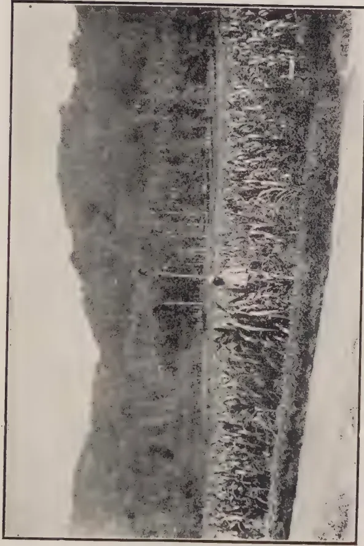

THE  
**TROPICAL AGRICULTURIST:**  
JOURNAL OF THE  
**CEYLON AGRICULTURAL SOCIETY.**

---

---

VOL. LVI.

PERADENIYA, APRIL, 1921.

No. 4.

---

---

**SUGAR-CANE CULTIVATION.**

---

In the present number of the TROPICAL AGRICULTURIST are given some figures connected with experiments with sugar-cane in Ceylon. Varieties of canes were introduced from Mauritius and have been submitted to varietal trial upon the Experiment Stations at Peradeniya and Anuradhapura.

The yields of these plots, particularly those at Peradeniya, are satisfactory and indicate that given good cultivation varieties of canes will yield crops which compare favourably with yields obtained in sugar-producing countries. The yields at Anuradhapura are not so satisfactory as those at Peradeniya, but the drainage of the plots was not satisfactory and when this drainage is improved the yields can be improved.

Samples of canes were taken from these plots at various intervals during the growing season and submitted for chemical analysis. The results of these analyses are given in detail and are worthy of close study. The sucrose contents of the juices are low, the glucose ratios exceptionally high and the purities poor. Only a few of the Anuradhapura samples show purities which approach the normal.

These analyses are only the preliminaries of a fuller and more complete series. Cultural operations necessitated that the cane plots should be reaped, whereas, in view of the analytical results, it might have been desirable to have carried the canes over until the dry weather of the months of February and March.

1------------------------------------------------

198[APRIL, 1921.

Further plots have been planted and ratoon crops will be taken from the present plots. These will be carried through and a more complete set of analytical figures obtained.

The analyses show that better juices are likely to be obtainable in the dry low-country than in the wetter districts like Peradeniya, and they also indicate that for successful results varieties of known high sugar-content should be cultivated in preference to varieties which are of value on account of their cropping capacities. They demonstrate the difficulties experienced by older cultivators of sugar-cane in the colony.

It has frequently been recorded that Ceylon did in the olden days, when sugar cultivation was one of its industries, grow good crops of canes but experienced difficulties in manufacture. It had not been established why these difficulties had been experienced and it was thought that many of the older difficulties would disappear with the installation of modern machinery. The analyses now published indicate that one of the main difficulties is likely to be a chemical one. Fuller data is required and further experiments will have to be made.

Ceylon should be producing its own sugar and some for export as well. It also requires or will require in future years the cultivation of sugar-cane for the manufacture of power alcohol. At the present time molasses have to be imported to produce a potable spirit for consumption. These molasses can be produced locally without difficulty.

Further experiments are most desirable. Experimental areas of sugar-cane should be grown in different parts of the colony, the records of yields carefully taken and a thorough series of analyses made. Until this is done, definite data will not be available and capitalists cannot be expected to make investments in an industry which requires large sums to be expended for machinery.

Experiments are being started again in the Southern Province and arrangements could be made for a complete series of analyses to be undertaken. The co-operation of all growers of sugar-cane is sought, in order that detailed investigations may be continued.

2------------------------------------------------

APRIL, 1921.]199

# FOODSTUFFS.

## SOME CEYLON FOODSTUFFS AND THEIR FOOD VALUES.

M. KELWAY BAMBER, M.R.A.C., F.I.C, F.C.S.,

*Government Agricultural Chemist, Department of Agriculture, Ceylon.*

The question of Food and Food values has been much before the Public during recent years and a very complete series of analyses have been made by several chemists from which the Tables have been compiled.

The food values given do not entirely indicate the degree of digestibility, which varies with different individuals and even with the same individual under varying health conditions.

It will be of interest in giving the table of analyses to explain how the food values are arrived at from the figures. By the term "Nutrient ratio" is meant the proportion of albuminoids or flesh forming constituents to the starch and oil, or heat producers. The percentage of oil is multiplied by the factor 2.25, as oils yield two and one quarter times as much energy as carbohydrates when oxidised in the body, and the product is added to the percentage of starch. The standard ratio of Albuminoids to non-albuminoids for children's diet is as 1 : 5.

The nutrient value is the sum total of the percentages of Albuminoids, starch and the starch equivalent of oil, obtained as above. An example will make this clear. Rice has the following composition :—

<table>
<tbody>
<tr>
<td>Moisture</td>
<td>...</td>
<td>...</td>
<td>12.8 %</td>
</tr>
<tr>
<td>Albuminoids</td>
<td>...</td>
<td>...</td>
<td>7.3 %</td>
</tr>
<tr>
<td>Starch</td>
<td>...</td>
<td>...</td>
<td>78.3 %</td>
</tr>
<tr>
<td>Oil</td>
<td>...</td>
<td>...</td>
<td>0.6 %</td>
</tr>
<tr>
<td>Fibre</td>
<td>...</td>
<td>...</td>
<td>0.4 %</td>
</tr>
<tr>
<td>Ash</td>
<td>...</td>
<td>...</td>
<td>0.6 %</td>
</tr>
</tbody>
</table>

The "Nutrient ratio" is calculated as follows :—

Albuminoids 7.3 % : Starch 78.3 % + Oil (0.6 %  $\times$  2.25 = 1.35) = 79.65 as 7.3 : 79.65 : : 1 : 10.9 = nutrient ratio.

The nutrient value is the sum total of the three constituents Albuminoids, 7.3 % + Starch 78.3 % + Oil (0.6 %  $\times$  2.25 = 1.35 %) = 86.95.

The Ash constituents of foods consist chiefly of lime, potash, soda and magnesia, phosphoric and sulphuric acids. They are deficient in rice only.

Both vegetables and animal foods contain some nitrogen in the non-albuminoids form, but it is chiefly present as albuminoids, which contain 15.87 per cent of nitrogen.

Spinach, Lettuce, Water cress, etc., have half their nitrogen present as nitrates and are useless as flesh formers.

Water is an essential element and for adults at least 3 to 4 pints are required every 24 hours, including water in the food.

3------------------------------------------------

200[APRIL, 1921.

The average amount of water in various foods is for :—

<table>
<tr>
<td>Grains and Pulses</td>
<td>...</td>
<td>...</td>
<td>12.5%</td>
</tr>
<tr>
<td>Milk</td>
<td>...</td>
<td>...</td>
<td>88.0%</td>
</tr>
<tr>
<td>Succulent roots and fruits, etc.</td>
<td>...</td>
<td>...</td>
<td>90.0 to 95%</td>
</tr>
</table>

**Chemical Composition and Nutrient Values of Millets, Maize and Rice.**

<table>
<thead>
<tr>
<th></th>
<th>Water.</th>
<th>Albumi- noids.</th>
<th>Starch.</th>
<th>Oil.</th>
<th>Fibre.</th>
<th>Ash.</th>
<th>Nutri- ent ratio.</th>
<th>Nutri- ent value.</th>
</tr>
</thead>
<tbody>
<tr>
<td>Chena Millet.</td>
<td></td>
<td></td>
<td></td>
<td></td>
<td></td>
<td></td>
<td></td>
<td></td>
</tr>
<tr>
<td>    <i>Panicum Miliaceum</i></td>
<td>- 12</td>
<td>12.6</td>
<td>69.4</td>
<td>3.6</td>
<td>1.0</td>
<td>1.4</td>
<td>1:60</td>
<td>89</td>
</tr>
<tr>
<td>Little Millet, <i>P. Miliare</i></td>
<td>- 10.2</td>
<td>9.1</td>
<td>69.0</td>
<td>3.6</td>
<td>4.6</td>
<td>3.5</td>
<td>1:8.4</td>
<td>85</td>
</tr>
<tr>
<td>Sanwa Millet, <i>P. frumentalaceum</i></td>
<td>- 12.0</td>
<td>8.4</td>
<td>72.5</td>
<td>3.0</td>
<td>2.2</td>
<td>1.9</td>
<td>1:9.5</td>
<td>88</td>
</tr>
<tr>
<td>Italian millet, <i>Setaria Italica</i></td>
<td>10.2</td>
<td>10.8</td>
<td>73.4</td>
<td>2.9</td>
<td>1.5</td>
<td>1.2</td>
<td>1:7.4</td>
<td>91</td>
</tr>
<tr>
<td>Bulrush Millet, <i>P. typhoidum</i></td>
<td>- 11.3</td>
<td>10.4</td>
<td>71.5</td>
<td>3.3</td>
<td>1.5</td>
<td>2.0</td>
<td>1:7.6</td>
<td>89.5</td>
</tr>
<tr>
<td>Ragi, <i>Eluesine coracana</i></td>
<td>- 13.2</td>
<td>7.3</td>
<td>73.2</td>
<td>1.5</td>
<td>2.5</td>
<td>2.3</td>
<td>1:13</td>
<td>84</td>
</tr>
<tr>
<td>Job's tears, <i>Coix lacryma</i></td>
<td>- 13.2</td>
<td>18.7</td>
<td>58.3</td>
<td>5.2</td>
<td>1.5</td>
<td>2.1</td>
<td>1:3.8</td>
<td>89</td>
</tr>
<tr>
<td>Maize, <i>Zea maya</i></td>
<td>- 12.5</td>
<td>9.5</td>
<td>70.7</td>
<td>3.6</td>
<td>2.0</td>
<td>1.7</td>
<td>1:8.3</td>
<td>88.5</td>
</tr>
<tr>
<td>Rice, <i>Oriza sativa</i></td>
<td>- 12.8</td>
<td>7.3</td>
<td>78.3</td>
<td>0.6</td>
<td>0.4</td>
<td>0.6</td>
<td>1:10.9</td>
<td>86.5</td>
</tr>
<tr>
<td>Bamboo rice, <i>Bambusa arundinacea</i></td>
<td>- 11.0</td>
<td>11.8</td>
<td>73.7</td>
<td>0.6</td>
<td>1.7</td>
<td>1.2</td>
<td>1:6.4</td>
<td>87</td>
</tr>
<tr>
<td>Average of the above grains</td>
<td>11.8</td>
<td>10.6</td>
<td>71.0</td>
<td>2.8</td>
<td>1.9</td>
<td>1.8</td>
<td>1:8.1</td>
<td>88</td>
</tr>
</tbody>
</table>

**Chemical Composition and Nutrient Value of Pulses.**

<table>
<thead>
<tr>
<th></th>
<th>Water.</th>
<th>Albumi- noids.</th>
<th>Starch.</th>
<th>Oil.</th>
<th>Fibre.</th>
<th>Ash.</th>
<th>Nutri- ent ratio.</th>
<th>Nutri- ent value</th>
</tr>
</thead>
<tbody>
<tr>
<td>Peanut, <i>Arachis hypogaea</i></td>
<td>- 7.5</td>
<td>24.5</td>
<td>11.7</td>
<td>5.0</td>
<td>4.5</td>
<td>1.8</td>
<td>1:5.2</td>
<td>151</td>
</tr>
<tr>
<td>Sword Bean, <i>Canavalia ensiformis</i></td>
<td>- 12.5</td>
<td>25.0</td>
<td>48.6</td>
<td>2.8</td>
<td>7.7</td>
<td>3.4</td>
<td>1:2.2</td>
<td>80</td>
</tr>
<tr>
<td>Chicken Pea, <i>Cicer arietinum</i></td>
<td>11.5</td>
<td>21.7</td>
<td>59.0</td>
<td>4.2</td>
<td>3.6</td>
<td>1.0</td>
<td>1:3.3</td>
<td>84</td>
</tr>
<tr>
<td>Pea, <i>Pisum sativum</i></td>
<td>- 11.8</td>
<td>28.2</td>
<td>55.0</td>
<td>1.5</td>
<td>2.5</td>
<td>1.0</td>
<td>1:2.4</td>
<td>81</td>
</tr>
<tr>
<td>Lentil, <i>Lens exculenta</i></td>
<td>- 11.8</td>
<td>25.1</td>
<td>58.4</td>
<td>1.3</td>
<td>3.8</td>
<td>1.2</td>
<td>1:2.5</td>
<td>87</td>
</tr>
<tr>
<td>Soy Bean, <i>Glycine soja</i></td>
<td>- 11.0</td>
<td>25.3</td>
<td>26.0</td>
<td>18.9</td>
<td>14.6</td>
<td>4.2</td>
<td>1:2</td>
<td>105</td>
</tr>
<tr>
<td>Mung Bean, <i>Phaseolus mungo</i></td>
<td>- 10.1</td>
<td>22.7</td>
<td>55.8</td>
<td>2.2</td>
<td>4.4</td>
<td>4.8</td>
<td>1:2.7</td>
<td>83</td>
</tr>
<tr>
<td>Lima Bean, <i>Phaseolus lunatus</i></td>
<td>- 13.3</td>
<td>19.7</td>
<td>57.8</td>
<td>1.2</td>
<td>3.7</td>
<td>4.3</td>
<td>1:3.2</td>
<td>80</td>
</tr>
<tr>
<td>Catiang Bean, <i>Vigna catiang</i></td>
<td>12.5</td>
<td>24.1</td>
<td>56.8</td>
<td>1.3</td>
<td>3.5</td>
<td>1.8</td>
<td>1:2.5</td>
<td>81</td>
</tr>
<tr>
<td>Lablab Bean, <i>Dolichos lablab</i></td>
<td>12.1</td>
<td>24.4</td>
<td>57.8</td>
<td>1.5</td>
<td>3.0</td>
<td>1.2</td>
<td>1:2.5</td>
<td>80</td>
</tr>
<tr>
<td>Horse Gram, <i>Dolichos biflorus</i></td>
<td>- 11.0</td>
<td>22.5</td>
<td>56.0</td>
<td>1.9</td>
<td>3.2</td>
<td>5.4</td>
<td>1:2.7</td>
<td>83</td>
</tr>
<tr>
<td>Pigeon Pea, <i>Cajanus indicus</i></td>
<td>10.5</td>
<td>22.3</td>
<td>60.9</td>
<td>2.1</td>
<td>3.0</td>
<td>1.2</td>
<td>1:3.0</td>
<td>80</td>
</tr>
<tr>
<td>Moth Bean, <i>Phaseolus aconilifolius</i></td>
<td>- 11.2</td>
<td>23.8</td>
<td>56.6</td>
<td>0.6</td>
<td>3.6</td>
<td>4.2</td>
<td>1:2.5</td>
<td>81</td>
</tr>
<tr>
<td>Average</td>
<td>- 11.7</td>
<td>23.7</td>
<td>56.6</td>
<td>1.9</td>
<td>5.4</td>
<td>3.1</td>
<td>1:2.7</td>
<td>82</td>
</tr>
</tbody>
</table>

4------------------------------------------------

APRIL, 1921.]201

**Chemical Composition of Various Starchy Meals, etc.**

<table border="1">
<thead>
<tr>
<th></th>
<th>Water.</th>
<th>Albu- minoids.</th>
<th>Starch.</th>
<th>Oil.</th>
<th>Fibre.</th>
<th>Ash.</th>
<th>Nutri- ent ratio.</th>
<th>Nutri- ent value.</th>
</tr>
</thead>
<tbody>
<tr>
<td>Wheat flour</td>
<td>12.3</td>
<td>10.1</td>
<td>75.6</td>
<td>1.3</td>
<td>0.3</td>
<td>0.6</td>
<td>1:7.7</td>
<td>88.4</td>
</tr>
<tr>
<td>Indian corn</td>
<td>13.4</td>
<td>9.9</td>
<td>69.8</td>
<td>4.3</td>
<td>1.3</td>
<td>1.3</td>
<td>1:8.0</td>
<td>89.4</td>
</tr>
<tr>
<td>Guinea Corn</td>
<td>12.5</td>
<td>9.3</td>
<td>72.3</td>
<td>2.0</td>
<td>2.2</td>
<td>1.7</td>
<td>1:8.2</td>
<td>86.1</td>
</tr>
<tr>
<td>Rice</td>
<td>12.6</td>
<td>6.1</td>
<td>74.1</td>
<td>2.0</td>
<td>4.0</td>
<td>1.2</td>
<td>1:12.9</td>
<td>84.7</td>
</tr>
<tr>
<td>Sweet Potato Meal</td>
<td>12.6</td>
<td>3.6</td>
<td>77.6</td>
<td>0.6</td>
<td>3.5</td>
<td>2.1</td>
<td>1:22.0</td>
<td>82.5</td>
</tr>
<tr>
<td>Cassava Meal</td>
<td>11.4</td>
<td>2.1</td>
<td>82.1</td>
<td>1.1</td>
<td>1.8</td>
<td>1.6</td>
<td>1:40.0</td>
<td>86.6</td>
</tr>
<tr>
<td>Cassava Bread</td>
<td>10.2</td>
<td>1.3</td>
<td>81.9</td>
<td>0.7</td>
<td>4.8</td>
<td>1.1</td>
<td>1:64.0</td>
<td>84.8</td>
</tr>
<tr>
<td>Banana Meal</td>
<td>15.5</td>
<td>2.5</td>
<td>77.7</td>
<td>1.0</td>
<td>0.7</td>
<td>2.6</td>
<td>1:32.0</td>
<td>82.4</td>
</tr>
<tr>
<td>Plantain Meal</td>
<td>11.8</td>
<td>3.1</td>
<td>80.7</td>
<td>1.0</td>
<td>0.9</td>
<td>1.9</td>
<td>1:26.8</td>
<td>86.1</td>
</tr>
<tr>
<td>Palmkernel Meal</td>
<td>11.12</td>
<td>18.06</td>
<td>50.26</td>
<td>6.73</td>
<td>10.2</td>
<td>3.5</td>
<td>1:3.6</td>
<td>83.3</td>
</tr>
<tr>
<td>Oatmeal</td>
<td>10.0</td>
<td>15.0</td>
<td>60.0</td>
<td>8.0</td>
<td>3.0</td>
<td>4.0</td>
<td>1:5.2</td>
<td>93.0</td>
</tr>
<tr>
<td>Sago flour</td>
<td>11.70</td>
<td>0.13</td>
<td>87.56</td>
<td>0.13</td>
<td>0.13</td>
<td>0.3</td>
<td>1:680.0</td>
<td>87.9</td>
</tr>
<tr>
<td>Tapioca flour</td>
<td>12.70</td>
<td>0.88</td>
<td>80.47</td>
<td>0.23</td>
<td>4.87</td>
<td>0.8</td>
<td>1:94.0</td>
<td>81.8</td>
</tr>
</tbody>
</table>

**Chemical Composition of Fish and Meat.**

<table border="1">
<thead>
<tr>
<th></th>
<th>Water</th>
<th>Albuminoids</th>
<th>Starch</th>
<th>Fat</th>
<th>Fibre</th>
<th>Ash</th>
</tr>
</thead>
<tbody>
<tr>
<td>Salt Fish</td>
<td>53.6</td>
<td>21.4</td>
<td>—</td>
<td>0.4</td>
<td>—</td>
<td>24.6</td>
</tr>
<tr>
<td>Salt Pork (Fat)</td>
<td>7.3</td>
<td>1.8</td>
<td>—</td>
<td>87.2</td>
<td>—</td>
<td>3.7</td>
</tr>
<tr>
<td>Beef (Brisket)</td>
<td>40.6</td>
<td>12.5</td>
<td>—</td>
<td>31.9</td>
<td>—</td>
<td>0.7</td>
</tr>
<tr>
<td>Mutton (Neck)</td>
<td>41.6</td>
<td>11.7</td>
<td>—</td>
<td>17.6</td>
<td>—</td>
<td>0.7</td>
</tr>
<tr>
<td>Pork (Loin)</td>
<td>46.1</td>
<td>15.1</td>
<td>—</td>
<td>14.5</td>
<td>—</td>
<td>0.8</td>
</tr>
</tbody>
</table>

**Chemical Composition and Nutrient Value of Vegetables.**

<table border="1">
<thead>
<tr>
<th></th>
<th>Water</th>
<th>Albuminoids</th>
<th>Fat</th>
<th>Carbohydrate</th>
<th>Fibre</th>
<th>Ash</th>
<th>Nutrient Value</th>
</tr>
</thead>
<tbody>
<tr>
<td>Potatos</td>
<td>74.98</td>
<td>2.08</td>
<td>0.15</td>
<td>21.01</td>
<td>0.69</td>
<td>1.09</td>
<td>24</td>
</tr>
<tr>
<td>Artichokes</td>
<td>79.50</td>
<td>1.98</td>
<td>0.20</td>
<td>16.78</td>
<td>0.72</td>
<td>0.82</td>
<td>19</td>
</tr>
<tr>
<td>Beet</td>
<td>86.75</td>
<td>1.49</td>
<td>0.12</td>
<td>8.74</td>
<td>0.97</td>
<td>0.93</td>
<td>10</td>
</tr>
<tr>
<td>Carrots</td>
<td>88.59</td>
<td>1.28</td>
<td>0.45</td>
<td>7.39</td>
<td>1.30</td>
<td>0.99</td>
<td>9</td>
</tr>
<tr>
<td>Parsnips</td>
<td>83.06</td>
<td>1.51</td>
<td>0.58</td>
<td>11.85</td>
<td>1.92</td>
<td>1.08</td>
<td>14</td>
</tr>
<tr>
<td>Radishes</td>
<td>90.95</td>
<td>1.22</td>
<td>0.09</td>
<td>6.31</td>
<td>0.65</td>
<td>0.78</td>
<td>7</td>
</tr>
<tr>
<td>Turnips</td>
<td>90.51</td>
<td>1.24</td>
<td>0.18</td>
<td>6.10</td>
<td>1.16</td>
<td>0.81</td>
<td>7</td>
</tr>
<tr>
<td>Onions</td>
<td>86.98</td>
<td>1.72</td>
<td>0.31</td>
<td>9.40</td>
<td>0.96</td>
<td>0.63</td>
<td>11</td>
</tr>
<tr>
<td>Mealies (Corn)</td>
<td>72.59</td>
<td>3.98</td>
<td>0.56</td>
<td>20.67</td>
<td>1.36</td>
<td>0.84</td>
<td>26</td>
</tr>
<tr>
<td>Cabbage</td>
<td>89.18</td>
<td>1.56</td>
<td>0.39</td>
<td>5.37</td>
<td>2.43</td>
<td>1.07</td>
<td>8</td>
</tr>
<tr>
<td>Asparagus</td>
<td>94.01</td>
<td>1.59</td>
<td>0.21</td>
<td>2.70</td>
<td>0.68</td>
<td>0.81</td>
<td>5</td>
</tr>
<tr>
<td>Lettuce</td>
<td>92.66</td>
<td>1.35</td>
<td>0.34</td>
<td>3.49</td>
<td>0.82</td>
<td>1.34</td>
<td>5</td>
</tr>
<tr>
<td>Pumpkins</td>
<td>89.00</td>
<td>1.70</td>
<td>0.70</td>
<td>6.60</td>
<td>1.70</td>
<td>0.60</td>
<td>9</td>
</tr>
<tr>
<td>Squashes</td>
<td>88.00</td>
<td>1.90</td>
<td>0.72</td>
<td>8.31</td>
<td>1.60</td>
<td>0.80</td>
<td>12</td>
</tr>
<tr>
<td>Cucumbers</td>
<td>95.38</td>
<td>0.87</td>
<td>0.16</td>
<td>7.87</td>
<td>0.71</td>
<td>0.40</td>
<td>9</td>
</tr>
<tr>
<td>Water Melons</td>
<td>92.00</td>
<td>0.43</td>
<td>0.20</td>
<td>6.51</td>
<td>0.55</td>
<td>0.31</td>
<td>7</td>
</tr>
<tr>
<td>Musk ,,</td>
<td>90.00</td>
<td>0.64</td>
<td>0.20</td>
<td>7.77</td>
<td>0.78</td>
<td>0.60</td>
<td>9</td>
</tr>
<tr>
<td>Egg Plant</td>
<td>92.50</td>
<td>1.37</td>
<td>0.18</td>
<td>4.60</td>
<td>0.85</td>
<td>0.50</td>
<td>6</td>
</tr>
<tr>
<td>Tomato</td>
<td>93.50</td>
<td>1.16</td>
<td>0.28</td>
<td>3.58</td>
<td>0.91</td>
<td>0.57</td>
<td>5</td>
</tr>
<tr>
<td>Beetroot</td>
<td>87.50</td>
<td>1.60</td>
<td>0.10</td>
<td>8.80</td>
<td>0.90</td>
<td>1.10</td>
<td>10</td>
</tr>
<tr>
<td>Spinach (cooked)</td>
<td>98.00</td>
<td>2.50</td>
<td>0.50</td>
<td>3.80</td>
<td>0.90</td>
<td>1.70</td>
<td>7</td>
</tr>
<tr>
<td>Brussels Sprouts (cooked)</td>
<td>93.70</td>
<td>1.50</td>
<td>0.10</td>
<td>3.40</td>
<td>5.00</td>
<td>1.30</td>
<td>5</td>
</tr>
<tr>
<td>Jerusalem Arti- choke (cooked)</td>
<td>77.90</td>
<td>2.50</td>
<td>0.20</td>
<td>17.50</td>
<td>0.80</td>
<td>0.60</td>
<td>20</td>
</tr>
</tbody>
</table>

5------------------------------------------------

202[APRIL, 1921.

In addition to the chemical composition of foods a new factor affecting their value has been discovered in recent years and the following extracts from a paper on Vitamines by SIR KENNETH GOADBY are interesting :

Vitamines are indefinite vitalised substances present in most fresh foods, necessary for the maintenance of nutrition. They produce harmonious interaction between materials in the food and the person who consumes them.

Vitamines are plentiful in rapidly growing vegetables and to a less extent in milk and animal flesh.

The vitamins in the external parts of rice are removed by polishing, hence the disease Beri Beri is said to be due to the want of anti-neuritic vitamins.

Scurvy is ascribed to a want of anti-scorbutic vitamins in foods.

Animal fats contain a vitamin "Fat soluble A" factor : chiefly found in butter. It is absolutely essential for growth.

It has been stated that Margarine from coconut oil contains *none* of the fat soluble accessory factors, but they remain in Margarine prepared from beef and some oils. They are not present in coconut, cotton seed, arachis oils and hydrogenated vegetable oils, though this statement has recently been modified as the method of preparation and refining has been found to affect the food value.

The fat soluble accessory factor in butter is destroyed by heating for several hours to 75-100°C.

Anti-scorbutic vitamin is more sensitive to heat than the anti-neuritic vitamin and *drying* affects it more rapidly.

Cabbage boiled for 30 to 60 minutes loses 50% of its anti-scorbutic power, while heating to 120°C for 60 minutes entirely destroys it.

Dried pulses contain no anti-scorbutic principle, but if moistened, kept warm, and allowed to germinate, the principle re-appears in 48 hours. Such material may be boiled 1 to 1½ hours without destroying the principle.

Anti-neuritic vitamins occur chiefly in seeds of plants and eggs of animals and fish. In cereals the embryo or germ holds the largest quantities of this vitamin. Yeast contains much, even the autolysed and filtered solution has curative property. The anti-neuritic properties of the germ of wheat and yolk of egg are soluble in alcohol.

---

## THE CULTIVATION OF LARGE ONIONS.

H. WHEELER.

The enthusiasm displayed in the production of large onions has been very marked for many years past, and it is doubtful whether the cultivation of any other vegetable creates so much interest amongst growers.

Probably the explanation of this lies in the fact that the onion is one of the few root-vegetables in which development and progress may be watched and noted ; and comparison made with past records, by reason of the bulbs growing on the surface.

To obtain exhibition onions of the best type no detail in their cultivation must be neglected. A long season of growth is necessary. Therefore, early in the New Year the seed should be sown in boxes that have been

6------------------------------------------------

APRIL, 1921.]203

provided with drainage; using a compost of three parts old potting soil, one part good loam, with sufficient sand and leaf-soil to render the compost porous.

After filling the boxes to a depth of three inches with soil pressed fairly firmly, the latter should be soaked with boiling water. When the boxes are thoroughly drained the seed should be sown evenly and fairly thickly on the surface, and the box covered with glass, but defer covering the seeds until they germinate, which, in a temperature of 55° to 60°, will take about four days, when a light covering of soil should be provided, adding more soil after a couple of days if it is thought desirable. By this method the leaves will carry the seed cases on their apices and largely prevent them being bent down by the weight of soil, as often happens when sown in the usual way. When the seedlings are well through the soil, place the boxes in a light position, and during the time they remain under glass syringe the plants on frequent occasions whenever the weather is favourable for doing this. Take special care that the soil does not approach dryness.

Transplanting should be done when the seedlings are making their fourth leaf, selecting only the strongest specimens. They should be grown in similar soil to that used in the seed boxes. If pots are employed, place a single seedling in a 3½ inch pot; if boxes are used, transplant the seedlings at two inches apart, inserting them half an inch deep in either case. Flower-pots are best, as they enable the roots to be transplanted without a check. After transference from the seedling boxes the seedlings should be kept close until the roots are again active and grown in a temperature 55° to 60°. The plants in pots should be supported with stakes and ties as this becomes necessary.

Before planting the onions in their summer quarters, which is best done on the first favourable opportunity after the second week in April, they should be removed to a cold frame and hardened.

The preparation of the soil is an important detail in cultivation, as onion roots grow to a great depth. The ground should be trenched in the previous winter and enriched with liberal supplies of good farmyard manure, with a surface dressing of basic slag, applied immediately after the land is dug; or some other phosphatic manure may be applied in the spring.

In preparing the soil for planting, rake in a liberal amount of burnt refuse from the garden fire, then carefully tread the surface to make the bed firm, and afterwards rake off all rubbish and leave the surface level.

The distance apart at which to plant should be governed somewhat by the size the bulbs are likely to attain. For onions up to two pounds in weight, fifteen inches between the rows and twelve inches between the plants is ample room, but if it is anticipated they will reach three pounds in weight the distance should be increased to 16 inches by 14 inches. After each sixth row allow a space of two feet as an alley, to permit of cultural attention.

Shortly after planting is finished, water each plant with nitrate of soda in solution, at the rate of  $\frac{1}{2}$  ounce to one gallon of water, and repeat this application on two other occasions at ten days' interval, after which the use of nitrate should cease.

The nitrogenous fertiliser will favour root-action and tend to develop a strong plant that will respond to future feeding. From this time onward the Dutch-hoe should be used frequently to destroy weeds and conserve the soil moisture. The plants should be encouraged to grow sturdily, and by the middle of June will commence to show signs of bulbing, at which time they should be fed regularly with weak liquid manure, varied at times with a weak concentrated fertiliser or soot water.

7------------------------------------------------

204[APRIL, 1921.

In July the bulbs will increase in circumference, at the rate of one-and-a-half inches each week, and by the third week in the month some specimens should be seventeen inches in circumference.

At the mid-August exhibitions it is the accepted rule that Onions should be shown in a ripe and finished state, conditions not always easy to obtain. The bulbs may be advanced by cleaning off any decayed foliage and outside skins whilst they are still growing in the bed; but any it is intended to exhibit at that time must be pulled, cleaned and placed in a dry, airy place three weeks before they are shown. This will allow time for the skins to take on the pale straw colour so desirable in exhibition onions.

Those remaining in the beds should receive similar treatment with regard to cleaning, but the removal of the skins must not be too drastic.

Extra size and weight may be obtained by selecting promising onions and protecting them from rain and dew under handlights kept well clear of the ground.

To ripen, the bulbs should be placed in an airy position—standing them on some soft material, or their weight may cause bruising.—GARDENERS' CHRONICLE, Vol. LXIX, No. 1,778.

---

## EXPERIMENTS WITH TOMATOS.

---

A recent bulletin issued by the Kentucky (U.S.) Experiment Station gives a summary of results from experiments carried out with tomatos to determine the effect of various methods of pruning and staking on the yield, earliness of ripening and size of the individual fruits. From the results of three seasons' work, the author found that pot-grown plants were much more productive than flat-grown plants. Staking and pruning reduced the yield of marketable fruit per plant, but increased the yield per acre because of the greater number of plants that it was possible to set. Generally speaking, the yield per plant was in direct proportion to the number of bearing stems. On the whole, pruning to two stems gave the best results.

Pruning increased the size of the individual fruits, and pruned and staked tomatos ripened approximately one week earlier than those that had been untrained. Plants trained to two stems, set 2 feet  $\times$  4 feet apart, yielded less per plant but much more per acre than similar plants set  $4\frac{1}{2} \times 5$  feet apart and also more per acre than untrained plants set  $4\frac{1}{2} \times 5$  feet. A range in length of stake from 4 feet 2 inches to 5 feet 6 inches had little effect on the total yields.

The writer concludes that it does not pay to stake and prune tomatos for the canning factory, although it may pay in the home garden or in very intensive trucking areas. The cost of stakes, the additional labour involved, and the greater number of plants required may be the limiting factors for profitable staking and pruning.—AGRIC. GAZ. OF N.S.W., Vol. XXXII, Part I.

---

## ENCOURAGING RESULTS OF PADDY TRANS-PLANTING AT TELIJJAWILA.

---

GATE MUDALIYAR J. A. WICKREMARATNE of Matara has obtained a yield of 576 kurunies of paddy (72 bushels) from a field of 30 kurunies sowing extent of his at Telijjawila in Weligam Korale by transplanting with seedlings raised from a nursery of 6 kurunies. The variety of paddy sown was Muttu-manikkam, which the Mudaliyar thinks is new to the place.

8------------------------------------------------

APRIL, 1921.]205

# SUGAR-CANE.

## EXPERIMENTS WITH SUGAR-CANE AT PERADENIYA AND ANURADHAPURA.

In view of the interest in the possibilities of sugar-cane cultivation in Ceylon experimental areas were cultivated at Peradeniya and Anuradhapura Experiment Stations. The yields of these plots which were cut at the end of 1920 were as follows :—

### PERADENIYA.

#### Average in order.

<table>
<thead>
<tr>
<th><i>Variety.</i></th>
<th></th>
<th><i>Weight.</i></th>
<th><i>Per acre.</i></th>
</tr>
</thead>
<tbody>
<tr>
<td>Sealy's seedling</td>
<td>...</td>
<td>100,872 lb.</td>
<td>45.8 tons</td>
</tr>
<tr>
<td>1237</td>
<td>...</td>
<td>84,724 "</td>
<td>37.8 "</td>
</tr>
<tr>
<td>55P</td>
<td>...</td>
<td>79,261 "</td>
<td>35.4 "</td>
</tr>
<tr>
<td>3390</td>
<td>...</td>
<td>61,841 "</td>
<td>27.6 "</td>
</tr>
<tr>
<td>D. K. 74</td>
<td>...</td>
<td>49,000 "</td>
<td>21.8 "</td>
</tr>
<tr>
<td>131P</td>
<td>...</td>
<td>45,094 "</td>
<td>20.8 "</td>
</tr>
</tbody>
</table>

### ANURADHAPURA.

#### Average in order.

<table>
<thead>
<tr>
<th><i>Variety.</i></th>
<th></th>
<th><i>Weight.</i></th>
<th><i>Per acre.</i></th>
</tr>
</thead>
<tbody>
<tr>
<td>Sealy's Seedling</td>
<td>10 rows</td>
<td>1,480 lb.</td>
<td>30.75 tons</td>
</tr>
<tr>
<td>Red Top Mauritius</td>
<td>10 "</td>
<td>1,452 "</td>
<td>30.17 "</td>
</tr>
<tr>
<td>131 P.</td>
<td>10 "</td>
<td>1,287 "</td>
<td>26.74 "</td>
</tr>
<tr>
<td>No. M1237</td>
<td>10 "</td>
<td>1,261 "</td>
<td>26.11 "</td>
</tr>
<tr>
<td>74 D.K.</td>
<td>10 "</td>
<td>1,226 "</td>
<td>25.47 "</td>
</tr>
<tr>
<td>Sin Nombre</td>
<td>10 "</td>
<td>1,219 "</td>
<td>25.33 "</td>
</tr>
<tr>
<td>55 P.</td>
<td>10 "</td>
<td>904 "</td>
<td>18.78 "</td>
</tr>
<tr>
<td>Striped Tanna</td>
<td>4 "</td>
<td>39 "</td>
<td>2.43 "</td>
</tr>
</tbody>
</table>

Samples of these canes were taken at intervals between September and December and submitted to the Government Agricultural Chemist for analysis. The report received is as follows :—

"On receipt of the parcels the canes were cut up into 2 inch lengths and a sample taken so as to represent the whole parcel. 500 grammes were taken as a working sample. To obtain the juice the sample was crushed in an iron mortar and pressed out in a small cider press, the juice obtained was weighed and measured and the refuse weighed. The juice was clarified with alum cream, preserved with formalin, filtered, and the clear juice obtained used for the determinations. The Specific Gravity was determined by Hydrometer or bottle, as convenience permitted.

Parcels of cane were received from the different plots at intervals to demonstrate the course of ripening and to obtain data as to the best time for cutting under the existing conditions, as well as to eliminate varieties of canes unsuited to the conditions and to demonstrate the better varieties suited to the conditions. The experiments also made a comparison of the two districts Peradeniya and Anuradhapura, different in climatic and soil conditions.

The results can only be considered comparative as the press available recovered only a portion of the juice.

9------------------------------------------------

206[APRIL, 1921.**Striped Tanna.**

Anuradhapura samples—volume and weight of juice falls 54 % in three months, in the samples from Peradeniya the volume and weight of juice increase 70 % in four succeeding months. The Brix figure increase 11 % in the case of the Anuradhapura samples and about 45 % in the samples from Peradeniya. The invert sugar steadily decreases in samples from both areas on ripening, 15 % in the case of canes from Anuradhapura and 58 % in cases from Peradeniya. The ratio of invert to cane sugar decreases in both areas, 30 % in cases from Anuradhapura and 65 % in cases from Peradeniya. The cane sugar increases 22 % in canes grown at Anuradhapura during three succeeding months and 80 % in canes grown at Peradeniya during four succeeding months. The highest yield per Kilo of cane is 48.5 from the Anuradhapura area and 48.3 % from the Peradeniya area, in the former the increase is 13 %, in the latter 51 %.

**Sin Nombre.**

Anuradhapura Samples show a decrease of 14 % in weight and volume of juice as ripening proceeds, while the Peradeniya samples increase 12 % in weight and volume of juice. The Brix figures decrease 10 % in canes from Anuradhapura and increase 10 % in canes from Peradeniya. The invert sugar increases 94 % in samples from Anuradhapura on ripening and decreases 31 % in samples from Peradeniya. The ratio of Invert to Cane Sugar steadily increases in samples from Anuradhapura—over 132 %. There is a decrease in the samples from Peradeniya of 36 %. The Cane sugar shows a decrease of 32 % on samples from Anuradhapura and an increase of 31 % from Peradeniya. Cane Sugar per Kilo of Cane increases in both areas on ripening, the highest from Anuradhapura district is 37.9. The maximum from Peradeniya district is 26.5 %. Canes from Anuradhapura improve 17.5 % in yield, from Peradeniya 44 %.

**D. K. 74.**

The juice from Anuradhapura canes on ripening show a gradual diminution in volume and weight—total 28 %. The canes from Peradeniya show increase of 33 % in weight and volume on ripening. The Anuradhapura canes show an increase of 26 % in the Brix figure but there is no change in the Peradeniya canes. The Invert sugar decreases in both the Anuradhapura and Peradeniya canes on ripening, the former 18 %, the latter 54 %. The ratio of Invert to Cane Sugar shows a diminution of 40 % in Anuradhapura samples and 62 % in Peradeniya. The cane sugar increases 31 % in samples from Anuradhapura and 45 % in samples from Peradeniya. The Cane Sugar per Kilo of Cane increases 90 % in the samples from both areas. The highest yield from Anuradhapura area is 61.7, the maximum from Peradeniya is 51.1.

**5 5 P.**

The volume and weight of juice from Anuradhapura decreases 50 %. The samples from Peradeniya gave juices which increased 110 % in weight and volume. The Brix figure increases 25 % in samples from Anuradhapura and 77 % in samples from Peradeniya. Invert Sugar decreases 42 % in samples from Anuradhapura and 57 % from Peradeniya samples. Invert Sugar to Sucrose decreases 57 % in samples from Anuradhapura and 163 % in Peradeniya samples. Sucrose increases 48 % in samples from Anuradhapura, 35 % in samples from Peradeniya. Yield of Sucrose per Kilo of Cane increases 48 % in samples from Anuradhapura and 178 % in samples from Peradeniya. The maximum yield from the former area is 50, the maximum yield for the latter is 55.6.

**3 3 9 0 P.**

The weight and volume of juice remains fairly constant on the canes ripening in both areas. In the second cutting from Anuradhapura there is an increase of 44 %. The Brix figure increases 28 % in the samples from

10------------------------------------------------

A black and white photograph showing a field of sugar-canes. The plants are arranged in neat, parallel rows that recede into the distance. In the middle ground, a person is standing in the field, providing a sense of scale. The background features a line of trees and a clear sky. The image is framed by a thin black border.

Sugar-canes at Peradeniya Experiment Station—4½ months old.

11------------------------------------------------

<!-- stage4: FAINT old-images-only -->

[Faint page: no legible print of its own could be verified; text withheld (stage 4 review list)]

12------------------------------------------------

APRIL, 1921.]207

Anuradhapura and are fairly constant in samples from Peradeniya. The Invert Sugar in samples from Anuradhapura decreases 75%, in samples from Peradeniya remains constant and the Invert sugar is 5 times higher than the Anuradhapura samples. The ratio of invert of cane sugar decreases 80% in samples from Anuradhapura but is fairly constant in samples from Peradeniya. The yield of sucrose increase 46% in samples from Anuradhapura but is fairly constant in samples from Peradeniya. The yield of sucrose per kilo of cane increases 200% on samples from Anuradhapura, samples from Peradeniya show an increase of 25%. The maximum yield from the former area is 69.7, the maximum in the latter is 33.0. The Anuradhapura samples gave 18 parts better yield per kilo of cane than Peradeniya samples.

#### White Tanna.

The samples from Anuradhapura show a decrease of 40% in volume and weight of juice, the samples from Peradeniya show 40% increase. The Brix figures show an increase of 27% in samples from Anuradhapura, the Peradeniya figures are more or less constant. The Invert sugar in samples from Anuradhapura falls 43%, in samples from Peradeniya 45%. The Invert Sugar in Total Sugar falls 58% in samples from Anuradhapura, and 45% in samples from Peradeniya. The cane sugar increases 49% in samples from Anuradhapura and 38% in samples from Peradeniya. The Cane Sugar per Kilo of cane increases 70% in samples from Anuradhapura and 64% in samples from Peradeniya. The highest yield per kilo of cane from Anuradhapura is 66, from Peradeniya 45.6.

#### Red Top Mauritius.

All the samples are from Anuradhapura. The volume and weight of juice obtained from samples decreases 43% in 3 months. The Brix figures increase 25%. The canes might be as well cut early as there is no improvement in yield, decrease of Invert sugar, on keeping the canes standing in the field. They appear to be an early variety of cane.

#### 131 P.

The samples from Anuradhapura decrease 35% in volume and weight of juice, the Peradeniya samples increase 20%. The Brix figure increase 50% in Anuradhapura samples and decrease 16.5% in samples from Peradeniya. The invert sugar decrease 90% in samples from Anuradhapura and 36% in Peradeniya samples. The proportion of invert to cane sugar decrease 90% in samples from Anuradhapura and 50% in Peradeniya samples. Cane sugar increases 105% in samples from Anuradhapura and increases 18% in Peradeniya samples. The yield of cane sugar per kilo of cane increases 155% in sample from Anuradhapura and 45% in samples from Peradeniya; in the former the yield rises from 57.6—70.0, in the latter from 26.5—38.5.

#### Barbados 208.

Samples from Anuradhapura only were obtained. The juice decreases 43% in volume and weight. The Brix figure increases 15.5%. Invert Sugar falls 43%. Proportion of Invert to cane Sugar decreases 51%. Cane Sugar increases 25%. The yield of sugar per kilo of cane increases 65%. Highest yield is 64 per kilo of cane.

#### 1 2 3 7 M.

All the samples came from Peradeniya. The juice increases 30% in volume and weight on the canes ripening. The Brix figures are more or less constant. Invert sugar decreases 37%. Invert to Cane Sugar reduces 43%. Cane Sugar increases 20%. The yield of cane sugar per Kilo of Cane increase 30%.

#### Sealy's Seedlings.

All the samples came from Peradeniya. The volume and weight of juice increase 170%. Brix figures increase 9%. Invert sugar decrease 4%. Invert to Cane decreases 47%. Cane Sugar increases 56%. The yield per kilo of cane increase 115%.

13------------------------------------------------

208

[APRIL, 1921.

SUMMARY OF PERADENIYA SUGAR CANE.

<table border="1">
<thead>
<tr>
<th rowspan="2">Variety</th>
<th rowspan="2">Crushing gms. of Juice <math>\frac{1}{100}</math> gms. Cane</th>
<th rowspan="2">Specific Gravity of Juice @ 30° C</th>
<th rowspan="2">Brix. Tot. Solids gms. <math>\frac{1}{100}</math> Gms. Juice</th>
<th rowspan="2">Sucrose Gms. <math>\frac{1}{100}</math> c.c. of Juice</th>
<th rowspan="2">Glucose Gms. <math>\frac{1}{100}</math> c.c. Juice</th>
<th rowspan="2">Glucose Ratio Glucose <math>\frac{1}{100}</math> Sucrose</th>
<th rowspan="2">Extracted Sucrose Gms. <math>\frac{1}{100}</math> Gms. Cane</th>
<th rowspan="2">Purity Sucrose Gms. <math>\frac{1}{100}</math> Total Solids Gms. <math>\frac{1}{100}</math> Juice</th>
<th rowspan="2">Dates of receipt of canes</th>
</tr>
<tr>
<th></th>
</tr>
</thead>
<tbody>
<tr>
<td rowspan="3">Striped Tanna</td>
<td>43.6</td>
<td>1.039</td>
<td>10.5</td>
<td>7.6</td>
<td>1.9</td>
<td>25.0</td>
<td>3.2</td>
<td>70.9</td>
<td>7.9.20</td>
</tr>
<tr>
<td>33.2</td>
<td>1.052</td>
<td>13.6</td>
<td>8.9</td>
<td>1.3</td>
<td>14.6</td>
<td>2.8</td>
<td>61.0</td>
<td>21.9.20</td>
</tr>
<tr>
<td>37.7</td>
<td>1.055</td>
<td>14.3</td>
<td>13.6</td>
<td>1.0</td>
<td>7.3</td>
<td>4.8</td>
<td>86.0</td>
<td>3.11.20</td>
</tr>
<tr>
<td rowspan="3">Sin Nombre</td>
<td>46.8</td>
<td>1.048</td>
<td>12.7</td>
<td>8.5</td>
<td>0.8</td>
<td>9.4</td>
<td>3.8</td>
<td>63.3</td>
<td>14.12.20</td>
</tr>
<tr>
<td>37.2</td>
<td>1.035</td>
<td>9.6</td>
<td>5.1</td>
<td>2.9</td>
<td>57.0</td>
<td>1.8</td>
<td>50.2</td>
<td></td>
</tr>
<tr>
<td>34.6</td>
<td>1.043</td>
<td>11.6</td>
<td>5.2</td>
<td>2.6</td>
<td>50.0</td>
<td>1.7</td>
<td>44.0</td>
<td></td>
</tr>
<tr>
<td rowspan="3">D. K. 74</td>
<td>36.6</td>
<td>1.038</td>
<td>10.7</td>
<td>7.5</td>
<td>2.4</td>
<td>32.0</td>
<td>2.6</td>
<td>67.5</td>
<td>Rainfall for 1920</td>
</tr>
<tr>
<td>41.8</td>
<td>1.040</td>
<td>10.8</td>
<td>6.7</td>
<td>2.0</td>
<td>30.0</td>
<td>2.7</td>
<td>59.2</td>
<td>January 2.44 in.</td>
</tr>
<tr>
<td>32.4</td>
<td>1.053</td>
<td>13.8</td>
<td>8.7</td>
<td>2.4</td>
<td>27.6</td>
<td>2.7</td>
<td>60.2</td>
<td>February 2.37 "</td>
</tr>
<tr>
<td rowspan="3">5 5 P.</td>
<td>50.3</td>
<td>1.049</td>
<td>12.8</td>
<td>5.9</td>
<td>1.6</td>
<td>27.0</td>
<td>2.8</td>
<td>43.7</td>
<td>March 7.13 "</td>
</tr>
<tr>
<td>42.6</td>
<td>1.052</td>
<td>13.6</td>
<td>12.6</td>
<td>1.1</td>
<td>8.7</td>
<td>5.1</td>
<td>85.7</td>
<td>April 9.39 "</td>
</tr>
<tr>
<td>43.0</td>
<td>1.051</td>
<td>13.4</td>
<td>9.0</td>
<td>1.7</td>
<td>19.0</td>
<td>3.7</td>
<td>62.0</td>
<td>May 5.79 "</td>
</tr>
<tr>
<td rowspan="3">B. 3,390</td>
<td>24.4</td>
<td>1.053</td>
<td>13.8</td>
<td>8.6</td>
<td>2.6</td>
<td>30.2</td>
<td>2.0</td>
<td>59.1</td>
<td>June 21.40 "</td>
</tr>
<tr>
<td>39.2</td>
<td>1.053</td>
<td>13.8</td>
<td>8.4</td>
<td>1.9</td>
<td>22.6</td>
<td>3.1</td>
<td>58.0</td>
<td>July 9.07 "</td>
</tr>
<tr>
<td>39.8</td>
<td>1.046</td>
<td>12.3</td>
<td>9.3</td>
<td>2.9</td>
<td>31.2</td>
<td>3.6</td>
<td>70.1</td>
<td>August 2.56 "</td>
</tr>
<tr>
<td rowspan="3">White Tanna</td>
<td>50.7</td>
<td>1.055</td>
<td>14.3</td>
<td>11.6</td>
<td>1.1</td>
<td>9.5</td>
<td>5.6</td>
<td>74.9</td>
<td>September 6.25 "</td>
</tr>
<tr>
<td>37.7</td>
<td>1.050</td>
<td>13.0</td>
<td>7.7</td>
<td>2.1</td>
<td>27.3</td>
<td>2.8</td>
<td>57.0</td>
<td>October 12.12 "</td>
</tr>
<tr>
<td>24.8</td>
<td>1.052</td>
<td>13.5</td>
<td>8.6</td>
<td>1.5</td>
<td>17.4</td>
<td>2.0</td>
<td>59.2</td>
<td>November 20.78 "</td>
</tr>
<tr>
<td rowspan="3">131 P.</td>
<td>37.7</td>
<td>1.046</td>
<td>12.3</td>
<td>9.2</td>
<td>2.4</td>
<td>26.1</td>
<td>3.3</td>
<td>70.0</td>
<td>December 2.22 "</td>
</tr>
<tr>
<td>39.6</td>
<td>1.048</td>
<td>12.7</td>
<td>7.5</td>
<td>2.0</td>
<td>26.7</td>
<td>2.8</td>
<td>54.2</td>
<td>101.52 in.</td>
</tr>
<tr>
<td>38.0</td>
<td>1.050</td>
<td>13.0</td>
<td>8.7</td>
<td>2.2</td>
<td>25.3</td>
<td>2.8</td>
<td>58.0</td>
<td>7.9.20</td>
</tr>
<tr>
<td rowspan="3">M. 1,237</td>
<td>46.4</td>
<td>1.053</td>
<td>13.8</td>
<td>8.2</td>
<td>1.3</td>
<td>16.0</td>
<td>2.9</td>
<td>56.5</td>
<td>21.9.20</td>
</tr>
<tr>
<td>38.6</td>
<td>1.052</td>
<td>13.6</td>
<td>11.9</td>
<td>1.4</td>
<td>12.0</td>
<td>4.4</td>
<td>80.7</td>
<td>3.11.20</td>
</tr>
<tr>
<td>38.6</td>
<td>1.052</td>
<td>13.6</td>
<td>9.7</td>
<td>1.2</td>
<td>12.4</td>
<td>4.6</td>
<td>65.3</td>
<td>14.11.20</td>
</tr>
<tr>
<td rowspan="3">Sealy's Seedling</td>
<td>47.6</td>
<td>1.048</td>
<td>12.7</td>
<td>7.2</td>
<td>1.9</td>
<td>26.4</td>
<td>2.6</td>
<td>53.7</td>
<td>21.9.20</td>
</tr>
<tr>
<td>46.8</td>
<td>1.046</td>
<td>12.3</td>
<td>8.5</td>
<td>3.6</td>
<td>42.3</td>
<td>3.8</td>
<td>64.4</td>
<td>3.11.20</td>
</tr>
<tr>
<td>36.0</td>
<td>1.039</td>
<td>10.5</td>
<td>5.8</td>
<td>2.6</td>
<td>45.0</td>
<td>2.6</td>
<td>52.1</td>
<td>14.12.20</td>
</tr>
<tr>
<td rowspan="6"></td>
<td>36.8</td>
<td>1.059</td>
<td>14.9</td>
<td>10.1</td>
<td>1.6</td>
<td>15.8</td>
<td>3.4</td>
<td>64.0</td>
<td></td>
</tr>
<tr>
<td>38.8</td>
<td>1.059</td>
<td>15.3</td>
<td>10.4</td>
<td>0.8</td>
<td>7.7</td>
<td>3.6</td>
<td>64.2</td>
<td></td>
</tr>
<tr>
<td>45.8</td>
<td>1.054</td>
<td>14.1</td>
<td>12.0</td>
<td>1.0</td>
<td>8.3</td>
<td>4.4</td>
<td>78.6</td>
<td></td>
</tr>
<tr>
<td>24.4</td>
<td>1.038</td>
<td>10.3</td>
<td>9.2</td>
<td>1.8</td>
<td>19.5</td>
<td>4.1</td>
<td>83.0</td>
<td></td>
</tr>
<tr>
<td>36.8</td>
<td>1.053</td>
<td>13.8</td>
<td>8.6</td>
<td>2.0</td>
<td>23.3</td>
<td>2.0</td>
<td>59.2</td>
<td></td>
</tr>
<tr>
<td>33.8</td>
<td>1.056</td>
<td>14.6</td>
<td>9.0</td>
<td>1.8</td>
<td>20.0</td>
<td>3.1</td>
<td>59.4</td>
<td></td>
</tr>
<tr>
<td></td>
<td>41.8</td>
<td>1.056</td>
<td>14.6</td>
<td>13.4</td>
<td>1.5</td>
<td>11.2</td>
<td>4.3</td>
<td>84.7</td>
<td></td>
</tr>
<tr>
<td></td>
<td></td>
<td>10.50</td>
<td>13.0</td>
<td>9.1</td>
<td>1.2</td>
<td>13.2</td>
<td>3.6</td>
<td>63.5</td>
<td></td>
</tr>
</tbody>
</table>

14------------------------------------------------

APRIL, 1921.]

209

SUMMARY OF ANURADHAPURA SUGAR CANE.

<table border="1">
<thead>
<tr>
<th>Variety</th>
<th>Crushing Gms. Juice % Gms. Cane</th>
<th>Specific Gravity, Juice @ 30°C.</th>
<th>Brix. Tot: Solids Gms. % Gms. Juice</th>
<th>Sucrose Gms. % C. C. Juice</th>
<th>Glucose Gms. % C. C. Juice</th>
<th>Glucose Ratio (Glucose % Sucrose)</th>
<th>Extracted Sucrose Gms. % Gms. Cane</th>
<th>Purity (Sucrose % Total Solids)</th>
<th>Dates of receipt of canes</th>
</tr>
</thead>
<tbody>
<tr>
<td rowspan="3">Striped Tanna -</td>
<td>39.4</td>
<td>1.057</td>
<td>14.8</td>
<td>11.5</td>
<td>1.3</td>
<td>11.3</td>
<td>4.3</td>
<td>73.7</td>
<td>31.8. 20</td>
</tr>
<tr>
<td>30.0</td>
<td>1.056</td>
<td>14.7</td>
<td>10.8</td>
<td>1.2</td>
<td>11.1</td>
<td>3.2</td>
<td>69.4</td>
<td>16.9. 20</td>
</tr>
<tr>
<td>36.6</td>
<td>1.065</td>
<td>16.5</td>
<td>14.1</td>
<td>1.1</td>
<td>7.8</td>
<td>4.8</td>
<td>80.6</td>
<td>13.10.20</td>
</tr>
<tr>
<td rowspan="3">Sin Nombre -</td>
<td>28.0</td>
<td>1.056</td>
<td>14.7</td>
<td>12.2</td>
<td>1.8</td>
<td>14.8</td>
<td>3.2</td>
<td>75.5</td>
<td></td>
</tr>
<tr>
<td>32.4</td>
<td>1.051</td>
<td>13.4</td>
<td>8.1</td>
<td>2.5</td>
<td>30.8</td>
<td>2.5</td>
<td>55.7</td>
<td></td>
</tr>
<tr>
<td>47.9</td>
<td>1.052</td>
<td>13.7</td>
<td>8.3</td>
<td>3.5</td>
<td>42.1</td>
<td>3.8</td>
<td>57.5</td>
<td></td>
</tr>
<tr>
<td rowspan="3">D. K. 74 -</td>
<td>27.4</td>
<td>1.055</td>
<td>14.3</td>
<td>12.5</td>
<td>1.1</td>
<td>8.8</td>
<td>3.2</td>
<td>80.2</td>
<td></td>
</tr>
<tr>
<td>35.9</td>
<td>1.057</td>
<td>14.8</td>
<td>11.2</td>
<td>1.1</td>
<td>9.8</td>
<td>3.8</td>
<td>71.7</td>
<td></td>
</tr>
<tr>
<td>39.4</td>
<td>1.072</td>
<td>18.5</td>
<td>16.4</td>
<td>.09</td>
<td>5.5</td>
<td>6.2</td>
<td>82.1</td>
<td></td>
</tr>
<tr>
<td rowspan="3">55 P. -</td>
<td>33.8</td>
<td>1.055</td>
<td>14.3</td>
<td>10.5</td>
<td>1.9</td>
<td>18.0</td>
<td>3.4</td>
<td>67.3</td>
<td>Rainfall for 1920</td>
</tr>
<tr>
<td>40.2</td>
<td>1.058</td>
<td>15.1</td>
<td>12.1</td>
<td>1.0</td>
<td>8.2</td>
<td>4.6</td>
<td>77.0</td>
<td>January</td>
</tr>
<tr>
<td>34.4</td>
<td>1.073</td>
<td>18.7</td>
<td>15.6</td>
<td>1.1</td>
<td>7.0</td>
<td>5.0</td>
<td>78.3</td>
<td>February</td>
</tr>
<tr>
<td rowspan="3">B. 3390 -</td>
<td>22.0</td>
<td>1.054</td>
<td>14.2</td>
<td>11.1</td>
<td>1.7</td>
<td>15.3</td>
<td>2.3</td>
<td>73.9</td>
<td>March</td>
</tr>
<tr>
<td>31.7</td>
<td>1.056</td>
<td>14.7</td>
<td>14.3</td>
<td>1.2</td>
<td>8.3</td>
<td>4.3</td>
<td>91.8</td>
<td>April</td>
</tr>
<tr>
<td>46.0</td>
<td>1.071</td>
<td>18.2</td>
<td>16.2</td>
<td>0.4</td>
<td>2.4</td>
<td>7.0</td>
<td>82.9</td>
<td>May</td>
</tr>
<tr>
<td rowspan="3">White Tanna -</td>
<td>37.1</td>
<td>1.052</td>
<td>13.6</td>
<td>11.0</td>
<td>1.4</td>
<td>12.7</td>
<td>3.9</td>
<td>70.7</td>
<td>June</td>
</tr>
<tr>
<td>28.8</td>
<td>1.058</td>
<td>15.1</td>
<td>12.5</td>
<td>0.7</td>
<td>5.6</td>
<td>3.4</td>
<td>79.7</td>
<td>July</td>
</tr>
<tr>
<td>43.0</td>
<td>1.073</td>
<td>18.7</td>
<td>16.4</td>
<td>0.8</td>
<td>4.8</td>
<td>6.6</td>
<td>81.2</td>
<td>August</td>
</tr>
<tr>
<td rowspan="3">131 P. -</td>
<td>28.3</td>
<td>1.055</td>
<td>14.3</td>
<td>10.3</td>
<td>3.9</td>
<td>37.8</td>
<td>2.8</td>
<td>66.5</td>
<td>September</td>
</tr>
<tr>
<td>21.2</td>
<td>1.059</td>
<td>15.3</td>
<td>13.0</td>
<td>1.0</td>
<td>7.6</td>
<td>2.6</td>
<td>79.6</td>
<td>October</td>
</tr>
<tr>
<td>36.6</td>
<td>1.088</td>
<td>22.0</td>
<td>20.8</td>
<td>0.5</td>
<td>2.4</td>
<td>7.0</td>
<td>86.8</td>
<td>November</td>
</tr>
<tr>
<td rowspan="3">Red Top Mauritius -</td>
<td>30.8</td>
<td>1.053</td>
<td>13.8</td>
<td>11.7</td>
<td>1.7</td>
<td>14.5</td>
<td>3.4</td>
<td>78.1</td>
<td>December</td>
</tr>
<tr>
<td>27.8</td>
<td>1.053</td>
<td>13.8</td>
<td>9.4</td>
<td>2.1</td>
<td>22.3</td>
<td>2.5</td>
<td>64.4</td>
<td></td>
</tr>
<tr>
<td>35.0</td>
<td>1.070</td>
<td>17.8</td>
<td>12.5</td>
<td>1.8</td>
<td>14.4</td>
<td>4.0</td>
<td>65.5</td>
<td></td>
</tr>
<tr>
<td rowspan="3">Barbados 208</td>
<td>29.6</td>
<td>1.069</td>
<td>17.8</td>
<td>16.2</td>
<td>0.7</td>
<td>4.3</td>
<td>4.5</td>
<td>84.8</td>
<td></td>
</tr>
<tr>
<td>29.7</td>
<td>1.060</td>
<td>15.5</td>
<td>13.7</td>
<td>0.8</td>
<td>5.8</td>
<td>3.8</td>
<td>81.8</td>
<td></td>
</tr>
<tr>
<td>34.2</td>
<td>1.081</td>
<td>20.5</td>
<td>20.3</td>
<td>0.4</td>
<td>1.9</td>
<td>6.4</td>
<td>91.2</td>
<td></td>
</tr>
<tr>
<td colspan="9"></td>
<td>49.12 in.</td>
</tr>
</tbody>
</table>

15------------------------------------------------

210[APRIL, 1921.

The varieties which give the best results are :—

#### ANURADHAPURA.

<table>
<thead>
<tr>
<th></th>
<th></th>
<th><i>Invert :</i> <i>Cane Sugar.</i></th>
<th></th>
<th><i>Cane Sugar</i> <i>per Kilo of Cane.</i></th>
</tr>
</thead>
<tbody>
<tr>
<td>D. K. 7 4</td>
<td>...</td>
<td>4.7</td>
<td>...</td>
<td>61.7</td>
</tr>
<tr>
<td>3 3 9 O P.</td>
<td>...</td>
<td>2.4</td>
<td>...</td>
<td>69.7*</td>
</tr>
<tr>
<td>White Tanna</td>
<td>...</td>
<td>4.5</td>
<td>...</td>
<td>65.8</td>
</tr>
<tr>
<td>1 3 1 P.</td>
<td>..</td>
<td>2.2</td>
<td>...</td>
<td>69.9*</td>
</tr>
<tr>
<td>Barbados 208</td>
<td>...</td>
<td>1.9</td>
<td>...</td>
<td>64.0</td>
</tr>
</tbody>
</table>

\* Of these 3,390 P. and 131 P. give the best results.

#### PERADENIYA.

<table>
<thead>
<tr>
<th></th>
<th></th>
<th><i>Invert :</i> <i>Cane Sugar.</i></th>
<th></th>
<th><i>Cane Sugar</i> <i>per Kilo of Cane.</i></th>
</tr>
</thead>
<tbody>
<tr>
<td>Striped Tanna</td>
<td>...</td>
<td>6.8</td>
<td>...</td>
<td>48.4</td>
</tr>
<tr>
<td>D. K. 7 4</td>
<td>...</td>
<td>7.8</td>
<td>...</td>
<td>51.0</td>
</tr>
<tr>
<td>5 5 P.</td>
<td>...</td>
<td>8.3</td>
<td>...</td>
<td>55.6</td>
</tr>
</tbody>
</table>

The samples from Anuradhapura give better results in Cane Sugar per Kilo of Cane and lower ratio of Invert to Cane Sugar than samples from Peradeniya.

A. BRUCE,  
for Govt. Agric. Chemist.

## CULTIVATION OF SUGAR-CANE.

The following notes on the cultivation of sugar-cane are published for general information. The writer is indebted to the HON. MR. W. DUNCAN for much of the information contained therein.

Sugar-cane (*Saccharum officinarum*) is a tall grass or reed belonging to the natural order *Gramineæ*, which is found in a cultivated state in all tropical countries, reaching a height of from 8 to 12 feet.

The chief countries in which cane-sugar is produced are Mauritius, Guiana, Hawaii, India, Java, Philippines and the West Indies.

#### VARIETIES OF SUGAR-CANE.

The variety of sugar-cane which is most suitable for cultivation in this country is the " Ribbon." It yields a fair weight of cane per acre and has a medium saccharine content, but its greatest virtue is its power to withstand disease.

The ordinary yellow cane, which is grown locally by Chinese, contains a juice equally rich in sugar which is more easily dealt with in the factory, but its chief drawback is its liability to disease and attacks from borers.

16------------------------------------------------

APRIL, 1921.]211

It is possible by growing seedlings and selection of these to procure varieties of cane which are more or less resistant to disease and there is little doubt that the ordinary yellow cane could be improved by these means, besides this, selected varieties might be introduced from other tropical countries with a view to obtaining higher yielding canes than those already established locally.

#### SOIL AND CLIMATE.

The plant requires a hot humid climate, alternating with dry periods and thrives best at low elevations on flat land, which if on tidal rivers would not only allow of proper drainage, but would provide a ready means of transport of the cane to the factory.

The most suitable soils are sandy loams, clayey loams, and alluvial soils containing a fair proportion of clay, whilst soils of volcanic origin give good results, such volcanic areas are small and not well defined in this country. Light sandy soils, heavy clay or peaty land are all unsuitable and should be avoided.

Good surface drainage is absolutely necessary as the plant cannot withstand the ill-effects of a water-logged soil.

The crop is an exhausting one and manuring is necessary after the first or second crop. Nitrogen appears to be the chief ingredient of plant food which requires replenishing, but the amount required varies according to the nature of the soil, and can only be settled by experiment and chemical analysis.

#### SEASON FOR PLANTING.

The best results are obtained when the plants are put in at the beginning of the wet season as they require sufficient rains for the first three or four months in order that they may become well developed before the dry season approaches. A drought immediately after planting will only lead to disaster. From the eighth month to the time of harvesting dry weather is desirable in order to ripen the cane thoroughly and therefore obtain the maximum amount of saccharine.

The most suitable seasons for planting would appear to be March-April and September-October.

#### PREPARATION OF LAND.

The land should be thoroughly clean and free from weeds and chankolled or forked to a depth of six to seven inches until it is brought into a fine state of tilth, and then made up into ridges five to six feet apart. If the conditions allow of it a tractor may be employed in ploughing, cultivating and harrowing the land previous to planting.

#### METHODS OF PLANTING.

Although any part of the sugar-cane containing two or three live "buds" can be planted it is the usual practice to plant only the top parts of the cane, which contain less sugar. A top should contain at least two clear rings, together with a portion of the stem covered by the bases of the leaves, each top will then have several eyes or buds. The "tops" or sections are placed in the furrows between the ridges, which as previously stated are five to six feet apart, at intervals of two and a half to four feet. They should be placed in an oblique position in the ground and all but a small portion covered with earth, which should be firmly pressed down.

17------------------------------------------------

212[APRIL, 1921.

To avoid replanting the old canes may be allowed to "ratoon," i.e., grow up from the root stocks. In certain parts of the West Indies as many as 12 successive ratoons crops are harvested, but ratooning is very seldom practised in this country as it is not profitable and is only resorted to on areas which are reaped late, in order to save time and labour. Ratoons, as a general rule, give a lower yield of cane than plants.

#### LABOUR.

The labour requirements for sugar cultivation are fairly heavy and on the average at least one unit of Indian labour would be required per acre, but in cases where mechanical power is made use of, it should be possible to reduce the amount of labour considerably below the figure given above.

#### CULTIVATION.

For the first six months after planting it is necessary to maintain the soil in a friable condition by chankolling in order to allow of the development of the surface roots. In the early stages of growth the use of mechanical power for cultivating will reduce expenses considerably.

#### PERIOD OF GROWTH.

As a rule canes grown from plants take about 12 months to come to maturity, but if a second or subsequent crop is allowed to grow up from the old roots it will mature in from 9 to 11 months. The latter procedure is termed "ratooning" and, as previously pointed out, is only practised when circumstances make replanting impracticable.

It is well known that some varieties ripen earlier than others, whilst climatic conditions during the ripening stage may accelerate or retard the period of growth.

#### HARVESTING.

Shortly after flowering, when the canes become hardened and ripe as seen from their general appearance, they should be cut as close to the ground as possible because the nearer the root the better the sugar content. After cutting, the canes are usually tied in bundles of a size sufficient for one cooly to carry and then transferred to punts or bullock-carts for transport to the factory.

#### YIELDS.

Under favourable conditions the average weight of cane per acre from plants in this country is about 25 tons, which would yield about 2 tons of vacuum pan sugar or  $2\frac{1}{2}$  tons of basket sugar per acre.

A sugar content of 12 per cent. and a recovery of 10 per cent. of the weight of cane would be a fair average for types of cane at present grown in this country, but there is little doubt that by careful selection and breeding it should be possible to produce improved strains, which would have a considerably higher sugar content than the figure given above.

The average weight of cane from ratoons would only be about 18 to 20 tons per acre.

18------------------------------------------------

APRIL, 1921.]213

### MANUFACTURE.

There are two distinct methods of manufacture, one in which vacuum pan sugar is produced and the other from which an article known as basket sugar is obtained. The former process is elaborate and expensive whilst the latter is somewhat crude and requires less machinery, with the result that the product is less valuable.

In both cases the first operation is to express the juice from the cane, and this should be done as quickly as possible after the canes are cut, as the cane juice is normally acid, and fermentation sets in very quickly.

The canes are put through machinery which either crushes or macerates the canes longitudinally. The sweet saccharine juice which is obtained is afterwards submitted to processes of clarifying (in which unslaked lime is used to neutralize the acids) then heating, filtering and bleaching. The fibrous material which is left after the juice has been extracted is known as "Megass" and is used as fuel for the evaporating pans and machinery.

With ordinary metal rollers it is possible to extract about 85 per cent. of the juice in the cane, but with modern machinery as much as 90 to 95 per cent. of the juice is extracted.

Vacuum pan sugar is made by subjecting the juice to a sequence of treatments, the main objects of which are the arresting of fermentation by heating, the counteraction of acidity by the application of lime, the evaporation of water by boiling at low temperatures in a series of vacuum vessels, granulation in a single vacuum vessel by further evaporation, and the separation of the grains of sugar from the molasses and other bye-products by centrifugal force.

Molasses consist chiefly of sucrose (crystallizable sugar) glucose (uncrystallizable sugar) and water, and is a very valuable bye-product from which rum is manufactured.

It is estimated by a well-known local authority that a factory fully equipped and capable of dealing with 15,000 tons of sugar per annum would cost, at present prices, about £250,000.

In the manufacture of basket sugar, the cane juice is neutralized in the ordinary way, boiled in open tanks or pans to a given consistency, where the scum is taken off at intervals as it forms, then run out into shallow wooden trays, stirred and cooled quickly, during which operations the mass forms into grains resembling fine sand. It contains all impurities and yields no bye products.

### GENERAL.

Formerly granulated sugar only fetched from \$5 to \$8 per pikul (133 1/3 lb.) whilst the cost of production varied from \$4 to \$6 per pikul.

It is estimated that under present conditions the cost of production would be about £25 per ton or say \$12 per pikul.

In view of the increasing demand for sugar, combined with the present shortage of supplies, it should be possible to re-establish the sugar industry in this country on a permanent basis.—B. B.-AGRIC. BULL. OF F.M.S., Vol. VIII., No. 2.

19------------------------------------------------

214[APRIL, 1921.

# COCONUTS.

---

## CEYLON'S COCONUT CROPS.

---

H. K. RUTHERFORD.

In continuation of the figures which appeared in the TROPICAL AGRICULTURIST, Vol. L111, No. 3, page 172 of September, 1919, the following further notes bringing the comparative figures up to date may not be without interest :—

While making due allowance for any considerable stocks having accumulated in Ceylon in 1918 and exported in 1919, the figures indicate a remarkable increase in the quantity of nuts utilized during the last 2 years, as there is an increase of 54% over that of the war period and 48% over the pre-war period.

In order to average the varying harvests (due to seasonal causes and the effects of the war) the data previously published covered two periods of 4 years each. The third 4-year period ending in 1922 should prove interesting as the results will not only shew the increased nut production, but also the trend of the raw nuts to gravitate to the manufacture of the product in greatest demand.

• For the last two years, for instance, the figures shew that "desiccated" took 24.5% of the whole crop of nuts as against 18% in the pre-war year and that the exported tonnage of this product has increased by 100%, while oil has remained almost stationary.

It is quite impossible to gauge the increase in the general productivity of lands devoted to Coconuts in Ceylon simply from the exports of oil, copra and desiccated, and the system I have adopted of reducing all these manufactured products to a nut basis is the only means whereby any increase or decrease in harvests can be ascertained with a fair degree of accuracy.

There are unfortunately no statistics either of acreage or number of trees in bearing in Ceylon on which any reliance can be placed, neither has there any attempt been made, as far as I am aware, to collect figures from the native headmen throughout the Island either by the Government, the Municipal Authorities or the Planting Community as to the local consumption of coconuts per head per annum.

An approximately accurate formula in this connection might be arrived at from these sources of information. When ascertained, and added to the exports, reduced to a nut basis, the annual yield of nuts from the lands under Coconuts could then be obtained, but not otherwise.

20------------------------------------------------

APRIL, 1921.]215

Statement shewing Annual number of Coconuts utilized in the various products exported from Ceylon, calculated on the averages of the 4 pre-war years, 4 war years, and 2 post-war years.

**PER ANNUM.**

<table border="1">
<thead>
<tr>
<th rowspan="2">Years</th>
<th rowspan="2">Total nuts utilized in all exports of coconut products</th>
<th colspan="2">Nuts Consumed in Oil</th>
<th colspan="2">Nuts Consumed in Copra</th>
<th colspan="2">Nuts Consumed in Desiccated</th>
<th colspan="2">Raw Nuts Exported</th>
<th rowspan="2">% of Total Nuts</th>
</tr>
<tr>
<th>Nuts Consumed in Oil</th>
<th>% of Total Nuts</th>
<th>Nuts Consumed in Copra</th>
<th>% of Total Nuts</th>
<th>Nuts Consumed in Desiccated</th>
<th>% of Total Nuts</th>
<th>Raw Nuts Exported</th>
<th>% of Total Nuts</th>
</tr>
</thead>
<tbody>
<tr>
<td>1911 to 1914</td>
<td>569,811,250</td>
<td>199,820,000</td>
<td>35</td>
<td>252,347,500</td>
<td>44.4</td>
<td>102,754,700</td>
<td>18</td>
<td>14,919,000</td>
<td>2.6</td>
</tr>
<tr>
<td>1915 to 1918</td>
<td>549,913,000</td>
<td>179,814,250</td>
<td>32.7</td>
<td>268,911,250</td>
<td>49</td>
<td>96,489,500</td>
<td>17.5</td>
<td>4,698,000</td>
<td>.8</td>
</tr>
<tr>
<td>1919 to 1920</td>
<td>843,010,107</td>
<td>242,632,500</td>
<td>28.8</td>
<td>387,240,000</td>
<td>46</td>
<td>206,787,550</td>
<td>24.5</td>
<td>6,350,057</td>
<td>.7</td>
</tr>
</tbody>
</table>

**CEYLON EXPORTS OF COCONUT PRODUCTS.**

*Annual averages from 1911 to 1920.*

<table border="1">
<thead>
<tr>
<th>Years</th>
<th>Oil Tons</th>
<th>Copra Tons</th>
<th>Desiccated Tons</th>
<th>Coconuts No.</th>
</tr>
</thead>
<tbody>
<tr>
<td>Average of 4 years 1911 to 1914</td>
<td>24,593</td>
<td>50,469</td>
<td>14,892</td>
<td>14,919,000</td>
</tr>
<tr>
<td>Do 1915 to 1918</td>
<td>22,131</td>
<td>53,782</td>
<td>13,984</td>
<td>4,698,000</td>
</tr>
<tr>
<td>Average of 2 years 1919 to 1920</td>
<td>29,924</td>
<td>77,448</td>
<td>29,889</td>
<td>6,350,057</td>
</tr>
</tbody>
</table>

*Percentages of increase or decrease in Exports of post-war years compared with pre-war and war-periods.*

<table border="1">
<tbody>
<tr>
<td>Pre-war period</td>
<td>-</td>
<td>+ 22</td>
<td>+ 53.5</td>
<td>+ 100</td>
<td>- 57.4</td>
</tr>
<tr>
<td>War period</td>
<td>-</td>
<td>+ 35</td>
<td>+ 44</td>
<td>+ 113.6</td>
<td>+ 35.</td>
</tr>
</tbody>
</table>

21------------------------------------------------

216[APRIL, 1921.

# FIBRE.

---

## SISAL CULTIVATION IN JAMAICA.

---

The story of the cultivation of sisal and the production of fibre in Jamaica, is an interesting one as recorded in the Report of the Department of Agriculture of that colony for the year 1919. The following account is reproduced from the report referred to.

The first commercial cultivation of sisal was established in Vere, on the upper lands of Moreland estate, a few years before the war. There are now nine cultivations of sisal in progress in this area. A recent survey showed that 2,285 acres of sisal had been actually planted within a moderate radius of May Pen. Extensions of this area are rapidly pushed as plants become available, and during the coming year two modern factories will be erected to deal with the crop. It is not an unreasonable estimate to place the area under sisal in the May Pen zone at not less than 10,000 acres of cultivation, and an output of 5,000 tons of fibre per annum in the near future. Private enterprise continues to develop the industry in this section in a progressive and satisfactory manner.

Two enterprising landowners of St. Ann have obtained sisal plants to supply 550 acres as a beginning. All these plants are reported to be growing satisfactorily.

Transport problems in the uplands of St. Ann are somewhat peculiar, and on one property a system of donkey transport has been provisionally adopted. That the sisal plants will grow luxuriantly in St. Ann has been demonstrated by several tests of leaves sent to the Department from that parish, which were grown at an elevation of about 1,400 feet. The landowners of St. Ann appear to be quite able to take care of this industry, and if the preliminary trials are satisfactory, the supply of bulbils will alone be the limiting factor for development in this area in the near future.

In the parishes of St. James and Trelawny there are large areas of land at present producing little of value, which should be ideal lands for sisal hemp. The landowners, however, appear to be quite competent to develop the industry themselves, if a supply of planting material can be obtained. It is hoped that during the coming year a large supply of bulbils for the development of the sisal industry in these two parishes may be secured.

The Government has already embarked on a large sisal enterprise at Lititz on lands situated in the two parishes of Manchester and St. Elizabeth. It has been demonstrated that sisal can be cultivated here for £4 per acre as against £8 per acre, which is the cost of establishing an acre of sisal in the May Pen area. It has also been shown that a minimum output of 1,000 lb. of fibre from an acre of sisal in the first cutting can be relied on. This fibre has been thoroughly investigated in London, both scientifically by the Imperial Institute, and by the brokers and merchants. A very remunerative price is quoted as its value.

22------------------------------------------------

APRIL, 1921.]217

The Lititz enterprise is planned to turn out permanently 500 tons of fibre worth £15,000 to £30,000 per annum, and this on land that previously was so useless that no one would even own it because the taxes were greater than the annual value of such lands. At least £7,000 per annum will be distributed among the workers in an area where employment has hitherto been unknown, except in the construction of unprofitable and useless relief works, when the community had to be rescued from starvation by Government doles and relief works. The Lititz people have themselves planted out over 500 acres of sisal, and have shown themselves to be thoroughly competent to undertake this cultivation, and to make it a success.

There is an area of coastal limestone in Portland, extending eastward from the region of Port Antonio for about 20 miles along the coastal road—which is, at present, only productive in patches. The sisal flourishes on this soil with remarkable vigour was proved by the discovery of wild, self sown sisal plants with leaves 64 inches in length, and with the highest yield of fibre of any leaves yet tested by the Agricultural Department.

A widespread fallacy with regard to sisal cultivation has been that the plant would only grow and produce good fibre under conditions of aridity and poor soil. It has been found by the planters of East Africa, however, that the biggest crops and the most profitable cultivations of sisal are in areas of good rainfall, and in fertile soils. It is therefore considered to be beyond question that this stretch of 20 miles of coastal limestone in Eastern Portland is an ideal site for a sisal industry. If, however, this industry is to be developed at once, and so as to bring immediate relief by providing a profitable crop for the people of this distressed and hurricane-stricken area, the organization of the planted area, and the provision of the necessary machinery and staff for the decortication of the leaves must be supplied by Government enterprise.

The sisal industry gives employment to many women, girls, and boys, who are otherwise almost unemployable in Jamaica and the advent of the sisal industry into the districts referred to would be an enormous boon to many thousands of the people.

It would appear that this industry, if extended on favourable areas, might easily reach on output of fibre worth some £400,000 in the world's markets, and this on lands worth at present very little, or nothing at all.

The summary of the results of sisal cultivation at the fibre plantation, Lititz, appears to contain much valuable information. On this plantation there is now an area of 500 acres under sisal.

Forty-five acres of sisal were planted at Lititz in 1914-15, and the plants were set out at 12 feet by 6 feet. Small clearances in the grass were only made, and the plants received no further cultivation. It was considered in these first plantings that it did not pay to establish a clean cultivation for sisal on the Savannah lands.

The plants grew slowly and irregularly. It soon became evident that they should not be more than 6 feet by 6 feet, and intermediate rows were established in 1917, but the grass was still left between the plants.

23------------------------------------------------

218[APRIL, 1921.

In 1918 it became obvious that the sisal was being seriously kept back by the intervening grass, and that clean cultivation was a first essential for success in growing sisal on this land. The grass was hoed up and used for mulching the plants. Later experience also showed that 6 feet by 5 feet was the best distance for planting on this land, giving 1,452 plants per acre as against the original scheme of 605 plants per acre at 6 feet by 12 feet. The bulk of the plantation at Lititz has been set out at 6 feet by 5 feet.

The forty-five acres of 1914-15, after four years of no cultivation, have now been cleared, and a great improvement can already be observed in the growth of the plants.

To test the minimum production of fibre, it was decided to carry out a test on the original sisal plants then five years old, at Lititz and grown under conditions of minimum cultivation, on an area considered to be the poorest section of the Savannah land.

In November 1919, the ripe leaves were cut off of 1,000 plants in a compact area of the original 45 acres of sisal.

The produce of each of the 1,000 plants was weighed, the leaves counted, and an average sample of 100 leaves sent to Hope and decorticated. The results were as follows :—

<table>
<tbody>
<tr>
<td>Average number of leaves per plant fit to be cut</td>
<td>...</td>
<td>32</td>
</tr>
<tr>
<td>Average yield of leaves per plant</td>
<td>...</td>
<td>19 lb.</td>
</tr>
<tr>
<td>Average weight of one leaf</td>
<td>...</td>
<td>9 6 oz.</td>
</tr>
<tr>
<td>Recovery of fibre (by hand) per cent.</td>
<td>...</td>
<td>3 4</td>
</tr>
<tr>
<td>Fibre recoverable from plants 6 ft. × 6 ft. per acre</td>
<td>...</td>
<td>938 lb.</td>
</tr>
<tr>
<td>Fibre recoverable from plants 6 ft. × 5 ft. per acre</td>
<td>...</td>
<td>1,048 lb.</td>
</tr>
<tr>
<td>Fibre per 1,000 plants</td>
<td>...</td>
<td>646 lb.</td>
</tr>
</tbody>
</table>

From the foregoing results the following conclusions were arrived at :—

1. Sisal at Lititz planted 6 feet by 5 feet should give for the first crop at least  $\frac{1}{2}$  ton of fibre per acre if efficiently decorticated.

2. Cultivated sisal three years old will fully equal uncultivated sisal at five years old.

3. The plants at Lititz under present methods will be ready for first cutting at three and a half years from setting out.

4. The "uncultivated" plants having been now cleaned and freed from the small leaves, will in the next growth yield longer and better leaves.

5. The extra cost of "clean cultivation" is 27s. 6d. per acre. It is now evident that an acre of sisal containing 1,452 plants will cost, including all charges, about £4 to bring it to the reaping stage at Lititz, and that the first crop will be about  $\frac{1}{2}$  ton per acre of clean fibre.

It may be mentioned that the highest altitude on the Lititz plantation is given as about 650 feet above sea-level, and that the rainfall for 1919 was 48.39 inches.—*AGRIC. NEWS*, Vol. XX, No. 488.

24------------------------------------------------

APRIL, 1921.]219

# OILS.

## CASTOR OIL AS A CROP.

E. MATHIEU.

The Castor-oil plant (*Ricinus communis*), seems so far to have attracted little notice in Malaya, and yet, when looked into its cultivation appears to offer fairly good prospects for the small planter, while the industry of mechanical expression of the oil offers a promising opening for the establishment of up-to-date mills.

It brings prompt returns to the cultivator and its product, whether in seed, or oil, or cake is in increasing demand from home at steadily advancing prices.

According to the CHEMIST and DRUGGIST 28th February, 1920, the prices quoted by the pressers in Hull were £114 per ton for pharmaceutical oil—£111 for first pressing—£100, for second pressing. For medicinal French oil, the price was 120s. per cwt. in cases.

The present price (1st May, 1920) of Castor oil in Singapore, obligingly supplied by the Secretaries of the Chamber of Commerce is quoted at \$50 per case of 74 to 75 catties packed in 4 tins, or 0'66 per catty.

The Blue Book states that 861,927 gallons of lubricating oils were imported into the Straits Settlements in 1918, the value being \$1,036,943.

We cannot apportion the amount for which Castor-oil enters in this aggregate, but we know that being a heavy-bodied oil and the most viscous of all fatty oils, it occupies a large place among lubricants for machinery, especially for the oiling of fast moving machines.

The writer has not at hand the figures relating to Medicinal Castor-oil, but here, also, we know that the figure must be a large one, and judging by the price of 85 cents, which the writer recently paid for a 10 ounce bottle of Morton's Castor-oil, we may imagine that, in passing from the seed to the bottle and finally to the consumer, the oil gathers unto itself many little rivulets of handsome profits.

The Castor-oil plant, of which there are small plots in the Economic Gardens, does extremely well in light alluvial loams, well supplied with organic matter. Sown in such soil from seed on 5th November, 1919, several trees are now, at time of writing, 1st May, 1920, showing well-formed fruiting spikes. One panicle, off one of these trees has already given 120 ripe seeds, and the rest of the seed will require picking in a very few days. These trees are from 4 to 5 feet in height.

Next to this plot is another one sown on the 10th of January, i.e. exactly 110 days old at the time of writing, of a smaller variety, whose plants are already, at a height of 3 feet, flowering heavily; one tree with five spikes in different stages of development.

In thin clayey soils and in sandy soils the growth of the plant is slow and its seed production is small. Yet, in India it is said to do well on red laterite soils at the foot of hills, provided they are not too stiff and they keep moisture well; but if they are poor in organic matter, they must receive an application of cowdung well incorporated with the land, previous to sowing.

25------------------------------------------------

220[APRIL, 1921.

The plant roots deeply and the ground requires a good digging at least 8 inches deep.

There are many cultivated varieties of *Ricinus communis* distinguished by various characteristics, such as the colouring of the stem which may be almost white, or of a glaucous bluish-green, or of a red colour with or without a white frost-like dusting on the stems and branches. There are also marked differences in the sizes and colours of the seeds, between one variety and another. Some, of a flattish shape, with dull-grey markings,  $\frac{3}{8}$  inch in length were shown to the writer as coming from East Africa. Others, gathered from a tree growing wild in the Economic Gardens, not quite half an inch long, are oval in shape and rounded in contour; their colour is a bright reddish-brown with well marked yellowish veinings; while still others, also found growing wild locally, are just over  $\frac{1}{4}$  inch in length, purple brown, with faint markings.

In Madras the seeds are classed under two main types:—

1. 1st, The Coast and Warangal, which are small
2. 2nd, The Salems, which are large.

The Coast-seed of Cocanada is said to be the best for oil.

Some varieties are annual; others are grown as perennial crops. MUKERJI mentions a small-seeded variety from the Deccan, which goes on bearing for 5 years in succession, and producing an oil of superior quality. (HANDBOOK OF INDIAN AGRICULTURE).

The seeds of the small annual varieties are sown 3 feet apart, or better still (if a subsidiary crop of ground-nut is interplanted), at distances of two feet on rows four feet apart. Sowing one seed at each stake, three or four pounds of seeds would be sufficient for one acre; but it is as well to provide for failures by sowing two or three seeds four inches apart to each stake, and thinning out one month after germination, in which case seven pounds will suffice for one acre. This quantity will allow for selection of the best seeds, i.e., those showing the whitest and best developed "caruncle" or the fleshy out-growth near the hilum. The seeds in which, after steeping in water, this out growth is found shrunken or discoloured, should be rejected.

*Ricinus* breeds true; cases of cross fertilisation being very rare.

The seeds of perennial varieties are usually sown at distances of 6 feet each way; but in the case of large, branching plants, wider spacing is perhaps advisable, as it is said that under a plentiful supply of air, the yield of seed is very largely increased, as much as 20 pounds of seed being recorded from vigorous plants under such conditions. Distances of 10 feet each way would probably meet the case, which would give 400 plants to the acre, necessitating less than two pounds of seeds. The writer has not had occasion, so far, to adopt such wide-planting, but the crops one occasionally sees on isolated trees, point to its reasonableness.

The Castor-seedling bears transplanting badly; the seeds are therefore always planted straight away in the fields. But the writer found that, from a cause not yet ascertained (probably the presence of eel-worm in the soil) a proportion of as much as ten per cent. of his plants died in the second month. Such infected soils should not be planted with *Ricinus*; but should the discovery be made too late, it is advisable to have a number of seedlings apart in bamboo baskets to fill the vacancies after crocoting the earth at the spot.

26------------------------------------------------

APRIL, 1921.]221

As previously stated, the ground must be brought to a fine state of tilth by a preliminary digging to a depth of 8 to 10 inches, followed by a harrowing or raking. The longer the land is allowed to lie broken and exposed to the air before sowing the better; as it gives a chance to the sun and the birds combined, to destroy the maggots and grubs, which later on, in the shape of caterpillars, will, if the land remains foul, almost surely attack the plants, and, possibly, cause extensive damage by stripping them of their leaves. The writer has seen a handsome tree, 12 feet high, completely defoliated in a few days by a small black and red striped caterpillar. When the tree was shaken myriads of the caterpillars fell to the ground. The Castor-seed caterpillar, *Dichocrocis punctiferalia*, which bores its way into the seeds is also a dangerous pest.

Although Castor-seeds preserve their germinative power a very long time if protected from damage by insects, immersion in water for a few hours is not a useless precaution as it softens them and facilitates germination. A preliminary short steeping in an insecticide solution such as a weak solution of copper sulphate, just strong enough to give the water a faint bluish tint, or in a maceration of tube root, may also do much good.

Fresh seeds of healthy plants, selected with due care, need no such treatment; they germinate very readily, provided the soil is kept moist by rain or, in case of dry weather, by one or two waterings after sowing.

On a plot sown with quite fresh seeds on the 30th March last, all the plants showed their seminal leaves on the 6th of April and on the 10th April, the second pair of leaves was already cut.

After germination, no more watering need be given, except in the case of actual drought. No further care is required except weeding, and keeping a good look-out for caterpillars which, if they are not kept down by hand-picking or by insecticide sprayings (kerosene and soap emulsion) are likely, as already stated, to cause great damage to the leaves, and, in the case of *Dichocrocis punctiferalis* to the young flowering spikes.

The Castor-plant can be cultivated with advantage with other annual crops. Of all such crops, the writer would give the preference to groundnut, *Arachis hypogaea*, which, besides being in itself a very profitable crop, has the advantage of supplying to the soil some of the nitrogen which the Castor-oil plant, an exhausting plant, takes out of it.

The perennial Castor-oil plant often grown to a height of 15 feet, but such a height is a very great drawback and adds largely to the cost of harvesting, which may last for two months, in weekly pickings, as the crop ripens intermittently.

To check the growth in height, the trees should be topped at an early stage so as to maintain them at a height of 6 to 7 feet. This moreover induces the formation of lateral branches which, later on, will throw out flowering spikes.

It is generally admitted that the Castor-oil plant exhausts the soil, that it should not be cultivated twice in succession on the same ground and that a period of at least two years should be allowed between two crops. When annual varieties of *Ricinus* are cultivated, it is therefore necessary to devise a scheme of rotation embracing a series of quick-growing field crops to tide over the interval between one crop of the Castor-plant and the next.

27------------------------------------------------

222[APRIL, 1921.

Such a scheme should include crops adapted to similar physical condition of soil, but belonging to different natural orders, so as to check any undue increase of insect-pests or the spreading of fungoid diseases.

Ricinus, Ground-nut, Gingelly, Sweet-potatos offer such a rotation, which, moreover, has the advantage that the deep digging necessitated by the harvesting operations in the two cases of groundnut and sweet potatoes, exerts a beneficial effect on the mechanical condition of the soil, to the advantage of the following crop of *Ricinus*.

An interplanted crop of groundnut has already been suggested above. In this country, it is a four months crop, which accommodates itself well to the quality of soil suitable for the Castor-oil plant, and which under fair average conditions, especially if the land has been limed, would give from 2,000 to 2,500 pounds of pods per acre. This is equivalent at the ratio of 65 % of their weight, in Kernels, to 1,300—1,625 pounds of shelled Kernels with an oil-content from an ordinary country-mill, of 30 % to 40 % or say 35 %, i.e., a final output of 450 to 560 pounds of oil per acre. In addition there is the very valuable oil-cake which can be used either as cattle food, or as manure as it contains as much as 8 % of nitrogen.

Although it is generally poor husbandry to grow the same crop twice successively in the same ground, the practice can be, and is largely, followed in India without harm, in the case of groundnut, provided the land receives between the two crops, a moderate dressing of lime and ashes. It is therefore quite feasible to obtain two crops in the course of one year, resulting in an output of 2,600 to 3,250 pounds of Kernels per acre or 900 to 1,120 pounds of oil and from 1'200 to 1,450 lb. of cake, dry.

Followed by Gingelly (*Sesamum indicum*) which does exceedingly well after groundnut, a further crop of oil-seed would be obtained which could be treated for oil by the same extracting appliances as used for Castor-seed.

A last crop of sweet-potatos could be put in, as in digging up the roots, a thorough breaking up and pulverizing of the soil takes place, which will make easy the preparation of the land for a new crop of *Ricinus*.

Manuring will be necessary at this stage. Manures are scarce and expensive—but in this case, they will cost nothing more than the cost of application; for the stock of groundnut and sesamum-cake will amply suffice for the requirements of the land in nitrogen; the deficiencies in potash and phosphoric acid (of which groundnut cake contains 1'2 %) being made up by an addition of ashes from the stems of the Castor-tree itself and other refuse (shells and husks) and, if necessary, a modicum of bone meal. Nor must we lose sight of the Castor-pommace saved from the original crop, which is one of the best vegetable manures known—Castor-cake containing 5½ to 6 % of nitrogen.

In February 1918 the price of the cake in London was £37 per ton, i.e. nearly 4 pence per pound. Considering that, by reason of its poisonous content, Castor-cake cannot be given to cattle for food, this price gives an idea of its high manurial value.

As a matter of fact, although the Castor-oil plant is considered to be an exhausting crop, it need not, under a careful system of husbandry, leave the land impoverished.

28------------------------------------------------

APRIL, 1921.]223

For, taking the plant as it stands, all the plant food which has gone to form the roots, stems, leaves and seeds with their capsules and husks, can be restored to the land in the form of ashes, or better still, after passing through a chaff cutter or a root-cutter, in the form of a compost, so that nothing, except the oil, need leave the farm.

Now, Castor-oil, like other stable oils, contains only such elements *carbon*, *oxygen* and *hydrogen* as are drawn from the air, and by the sale of it, the land loses none of its fertilising agents.

#### HARVESTING AND YIELD.

Having started planting in November, picking should begin about April for the earlier varieties and in May-June for the latter ones. It is not a laborious operation and it can be done by women and children going over the fields once a week to pick the capsules when the calyces turn from green to brown and the yellow husks become visible. It may take over two months to finish the crop, but it often lasts less long if the weather, keeping hot and dry, hastens maturity. Harvesting is done by cutting the spikes, but where it is found that the capsules mature very unevenly on the spikes, a little hand picking of the capsules may be resorted to at first, to avoid loss of seeds, the spikes being cut later on when all the capsules present a more uniform degree of maturity. A less commendable method, but one which shortage of labour may excuse, is to let the capsules ripen and drop their seeds to the ground where they are gathered at leisure. This, of course, saves time, but it is admissible only where *Ricinus* is grown as a pure crop, and where the ground is clean and free from weeds. Where, *Ricinus* is grown with another oil-seed crop, especially groundnut, the seed should be picked; the least admixture of Castor-seed with groundnuts would be fatal to the sale of the latter.

The capsules, collected in bags or baskets are brought to the store, and thrown in a heap on a clean concrete floor; a square enclosure is made to enclose the heap by putting up boards or iron sheets to a height of 3 feet—this to prevent the scattering of the seeds when the capsules open.

The heap which must be protected from the rain, is covered with gunny bags for 3 or 4 days and when, a beginning of fermentation having set in, the capsules have somewhat softened, the heap is opened, spread out and turned over in the sun. Most of the capsules will have shed their seeds in 5 to 6 days. Women are then put on to sort out by hand the broken pieces of shells which are taken to the compost heap or reserved for fuel. What capsules remain unopened are beaten with cudgels until all are disposed of. Small debris of shells remain mixed with the seeds after the bigger pieces have been removed, these are dealt with by means of the “*neeru*” a triangular tray, made of bamboo strips, with raised sides, or, if one is at hand, by passing the lot, seeds and debris, through a hand-winnowing machine.

The clean seeds, if they are to be made into oil on the farm, must be divested of their coats or husks. To this end, after two or three hours' exposure to the sun to heat them, by which the husks are made more brittle, the seeds are passed between horizontal rolls set at a distance apart from each other, just sufficient to break the husks by slight pressure, without quashing the kernels. The husks being very brittle crack easily, and with a very simple contrivance, to lead the seeds on to the rollers, a mangle such as used

29------------------------------------------------

224[APRIL, 1921.

for the sheeting of rubber would do very well for this purpose. The husks, though cracked, may still adhere to the kernels; a second passing between the rollers set a little closer will insure a further cracking, and the seeds may then be put through the winnowing machine or shaken on the "*neeru*." Some of the kernels may still have small pieces of husk adhering to them but this is of no consequence in the further process of expressing the oil. It may be here mentioned that the husks impart neither colour nor taste to the oil, so that the quality of the oil is not affected by their presence with the seed.

As a matter of fact, present up-to-date oil-mills equipped with powerful presses, treat seeds in the husk without taking the trouble of husking them, but with presses of small power, such as would be used on small plantations; the husks would retain an undue proportion of oil in the cake: for this reason seeds must be husked in the latter case.

On the other hand, if it does not colour the oil, the presence of the husks in the cake gives it a dark colour, and, moreover, it detracts from its manurial value, in that the husks contain no nitrogen; the nitrogen percentage of the cake is thereby lessened, and its value correspondingly lowered.

Hand power Castor-seed decorticators are also made by makers of Oil machinery by which the outer husk is removed and the white kernel turned out ready for the press but present prices put them beyond the reach of the small farmer.

Under fair average conditions a crop of 800 to 1,200 pounds of seeds with their husks can be obtained off one acre in a season.

According to Spon's "*Industrial Arts*" 1,400 lb. of Calcutta Seeds gave 980 lb. of kernels from which the following quantities of oil were obtained:—

<table>
<tr>
<td>1st Quality</td>
<td>...</td>
<td>...</td>
<td>324 lb.</td>
<td rowspan="3">} = 488 lb. of oil</td>
</tr>
<tr>
<td>2nd "</td>
<td>...</td>
<td>...</td>
<td>87½ "</td>
</tr>
<tr>
<td>3rd "</td>
<td>...</td>
<td>...</td>
<td>76½ "</td>
</tr>
</table>

That is to say that the kernels divested of husks gave almost exactly half their weight of oil, i.e. 100 lb. of seeds gave 70 lb. of kernels which in their turn gave of oil

<table>
<tr>
<td>...</td>
<td>35 lb.</td>
</tr>
<tr>
<td>of cake</td>
<td>35 "</td>
</tr>
<tr>
<td>the weight of the husks amounting to</td>
<td>30 "</td>
</tr>
<tr>
<td></td>
<td>-----</td>
</tr>
<tr>
<td></td>
<td>100 lb.</td>
</tr>
</table>

These figures vary according to the amount of pressure used: a powerful set of presses may give from 5% to 10% more oil than weaker ones and correspondingly less weight of cake.

Again, some varieties yield more oil than others and lastly some also show a greater weight of shell than others.

The writer found 268 seeds weigh 1½ ounce and after husking them found:

<table>
<tr>
<td>268 kernels weigh</td>
<td>...</td>
<td>...</td>
<td>1 ounce</td>
</tr>
<tr>
<td>268 husks</td>
<td>"</td>
<td>...</td>
<td>½ "</td>
</tr>
</table>

These seeds were of a small variety in which the proportion of husk to kernel is likely to be higher than in the larger varieties.

The Bulletin of Imperial Institute 1911 gives a yield of oil of 55.41% of the weight of kernels corresponding to 41.76% of the weight of the whole seeds containing:—

<table>
<tr>
<td>Kernels</td>
<td>...</td>
<td>...</td>
<td>75.37%</td>
</tr>
<tr>
<td>Husks</td>
<td>...</td>
<td>...</td>
<td>24.63%</td>
</tr>
</table>

30------------------------------------------------

APRIL, 1921.]225

### OIL EXTRACTION.

The extraction of oil consists of three operations, namely :

1. 1st. The grinding of the seed to a fine pulp in order to break the oil cells,
2. 2nd. The heating of the ground seed to facilitate the flow of oil,
3. 3rd. The pressing of the pulp, to force out the oil, leaving the cake as residue.

A fourth operation consists in submitting the meal to the action of a chemical solvent in which the oil is dissolved and from which it is separated afterwards, the final residue or cake containing only a very small percentage of oil. This process which is only practicable in specially equipped mills does not concern the planter.

Large modern mills, as already stated, treat the Castor-seed whole, with the husks on, but a hand power plant such as would be called for, to deal with the small crops contemplated in this paper, could not supply the pressure necessary for an adequate expression of the oil from seeds in their husks.

The small planter will therefore have either to sell his seeds to the oil-pressers, or to treat the seeds after husking them more or less completely. We have shown above how this part of the work can be done.

The husked seeds have thus to undergo the three operations of Grinding, Heating and Pressing.

Some makers of oil-mill machinery are now supplying hand-mills to meet the requirements of producers who do not use power.

The Firm of Rose, Downs and Thompson, Ltd., of Hull and Shanghai supply such a mill catalogued as "THE MANUAL OIL-MILL" No. 359 to crush 56 pounds of oil-seeds per hour, and worked by two men.

"The Mill consists of the following machinery:—One set of Anglo-American Rolls 3 ft. high, 6 in. in diameter and 6 in. face, hand-driven with heavy fly-wheel; one wrought iron fire-heated pan or kettle, to be placed on a brick-foundation and worked by hand; one set of double hydraulic pumps, hand-driven, the large pump being arranged to give the first pressure rapidly, and the small pump to give the final or finishing pressure without a material increase of effort from the workman one hydraulic press, to make five taper cakes 13 in.  $\times$  6 in.  $\times$  5 in. fitted with corrugated metal plates bearing any desired brand; one 4 in. hydraulic gauge and pipes; a supply of woollen press bags, mending yarn and other needful sundries."

But even such simple plant may be, in these times of extravagant prices, above the means of the Planter, and in this case he will have to fall back on such makeshifts as he may find at hand.

With ingenuity and the gift of contrivance, he will find that his case is not hopeless.

*Grinding of the Seed.*—The kernels of the Castor-seed are soft and do not require the elaborate process of shredding or pulverising in disintegrators which Copra, for instance, requires. They can be ground, by passing between the rollers of a strong mangle such as used for sheeting rubber, or by pounding in a wooden mortar made *ad hoc*.

*Heating of the Ground Kernels.*—The pulp is conveyed to a platform heated by means of a flue underneath. The heat should not be greater than what the hand can bear, or say 140° to 150°F., and such a flue as used on coffee estates to dry parchment would be suitable. Or it may be simply a barbecue in the open, dependent on the heat of the sun, provided a movable roof shelters it from rain and a flue underneath allows, in cases of insufficient sunshine, to supply the heat necessary (140-150°F.) to penetrate the mass of meal and render the oil more fluid.

*Pressing.*—A hand-power screw press will fulfil this purpose. Such screw-presses are made by makers of oil machinery, which are furnished with several steel plates and capable of dealing with 8 to 10 pounds of seed per charge, the meal of crushed seeds being enclosed, after heating on the

31------------------------------------------------

226[APRIL, 1921.

flue, in woollen or canvas bags and inserted between the plates. On pressure being applied, the expressed oil flows down to a tray at the foot of the press, whence through a spout it falls into a suitable receptacle.

So far, then, the series of manipulations are as follows :—

1. The crushed meal of seeds, on issuing from the rollers of the mangle, is laid on the heated table.

2. When sufficiently heated, the meal is taken up with a small hand-shovel in quantities sufficient to fill a square or oblong mould made of four small scantlings 4 to 5 inches high, without a bottom, and of the same size (inside measurement) as the steel plates mentioned above. Strips of canvas bagging-cloths of suitable size are disposed on the top of the hot table and the mould placed in the centre of these cloths, is filled with heated meal; the sides of the cloths are then folded round the meal following the contour of the mould, which is taken off and the slabs of meal are now wrapped up in the cloths. They are left on the hot table until the number of slabs, 5 or 6, is sufficient to fill the press for one pressing; they are then inserted in the press between the plates which, in the meantime have been kept immersed in a bucket of boiling water.

The pressure is now applied and a whitish oily fluid oozes out which is collected below and boiled with its volume of water, while all impurities, as they rise to the surface, are skimmed off with a skimmer made of gauze. The mucilage and starch, contained in the meal are taken up by the water and the albumin, coagulated by the heat, forms a film below the oil between the oil and the water.

The oil is removed to another pan and boiled again with half its volume of water, until water vapour ceases to rise, when a small quantity of the oil put in a cup is found to be perfectly clear, transparent and colourless.

By this second boiling in a fresh supply of water, the oil is clarified and freed of acid matters.

The boiling may be done in a "dapur" such as used by the Chinese for the cooking of gambir or of pig-food; a 2 feet diameter pan will do for the purpose; its edges are let into the brick-wall of the oven, and the walls are continued, forming like a well to a height of 2 feet, thus giving a capacity, if we take into account the concavity of the pan, of about  $6\frac{1}{2}$  cubic feet or 40 gallons.

The boiling should be stopped as soon as the last drop of water has been expelled and no more bubbles appear.

Instead of a second boiling, the oil may be clarified by passing through charcoal in filtering bags, such as are used by distillers, or failing such, through a blanket.

The quantity of oil thus expressed would range from 30 to 35 per cent. of the weight of the seeds with the husks on, leaving from 35 to 40 per cent. of cake.

We may now bring out figures together and work out the produce of one acre of *Ricinus* interplanted with two successive crops of groundnut in one year.

An average crop of Castor-seed is computed to give from 800 to 1,200 pounds, or say, an average of 1,000 pounds of seeds which would result in 350 pounds of oil and 350 pounds of cake, yielding a gross revenue of :—

$$\left. \begin{array}{l} 350 \text{ lb. of oils } (@ 45 = 157 \cdot 50) \\ 350 \text{ lb. of cake } (@ 5 = 17 \cdot 50) \end{array} \right\} = \$175 \cdot 00$$

The produce of two crops of groundnuts was given above as between 2,600 and 3,250 lb. or say, 2,900 pounds of shelled kernels, a readily marketable product at the present rate of \$25 per pikul; which will leave the planter a sufficient margin to cover not only all his costs of cultivation and of living but also the cost of manuring his fields for the following crop of his rotation, cost which need not be heavy for, it may be here noted, the leaves of *Ara his hypogaea* with the roots left after the nuts have been gathered, constitute, when dug under, a highly nitrogenous green-manure.

32------------------------------------------------

APRIL, 1921.]227

Given a land previously cleared, or under light blukar—a land which could be made ready for cultivation at a cost say, of \$20 per acre, the cost of a first Castor-oil crop (not including buildings and general farm equipment, ploughs and harrows, spraying apparatus or oil pressing appliances) would amount to about \$100 per acre made up:—

<table>
<tr>
<td>by clearing, draining and cultivation ...</td>
<td>$50</td>
</tr>
<tr>
<td>Seed, planting, weeding, harvesting, insecticide ...</td>
<td>30</td>
</tr>
<tr>
<td>Oil extraction and tins ...</td>
<td>20</td>
</tr>
</table>

<table>
<tr>
<td colspan="2">The 2 intercrops of groundnuts would cost per acre—</td>
</tr>
<tr>
<td>100 lb. of seed (two sowings) at 25 cents ...</td>
<td>$25</td>
</tr>
<tr>
<td>two sowings ...</td>
<td>10</td>
</tr>
<tr>
<td>two harvesting and 2 shellings ...</td>
<td>25</td>
</tr>
<tr>
<td>Bagging and transport to market ...</td>
<td>25</td>
</tr>
</table>

<table>
<tr>
<td>Groundnuts, Cost of two crops ...</td>
<td>$85</td>
</tr>
</table>

The total aggregate cost of one crop of Castor-oil and two crops of groundnuts would therefore be \$185.

The gross revenue of one acre of *Ricinus* has been already given as \$175.

From the figures obligingly supplied us by the Manager of the Singapore Oil Mills the present prices of groundnut for which there is an excellent market, stand as follows:—

Grade 1 unshelled \$700 per koyan of 40 piculs

" 2 " 650 " "

" 3 " 600 " "

Shelled nuts \$25 per picul

Oil cake 8.50 to 9 per picul.

The aggregate of the two crops of groundnut i.e. 2,900 lb. (=2,170 catties) of shelled nuts at 25 cents per catty would bring a gross revenue of \$542.50

<table>
<tr>
<td>Making a total gross revenue of one acre (including the Castor-oil revenue $175)</td>
<td>...</td>
<td>...</td>
<td>...</td>
<td>717.50</td>
</tr>
<tr>
<td>Less expenditure</td>
<td>...</td>
<td>...</td>
<td>...</td>
<td>185.00</td>
</tr>
</table>

<table>
<tr>
<td>Leaving a nett profit per acre of</td>
<td>$ 532.50</td>
</tr>
</table>

If, however, making allowance for the vagaries of seasons, for undue prevalence of pests, and also for the fact that the groundnut, in this case is an interplanted crop—not a pure crop—we cut down the returns from that source by one fourth and bring the amount of the two crops to 1,627.50 catties of shelled nuts, the revenue from groundnuts would fall to

<table>
<tr>
<td>(1,627.50 × 25)</td>
<td>...</td>
<td>...</td>
<td>...</td>
<td>$ 406.85</td>
</tr>
<tr>
<td>which added to the Castor-oil crop</td>
<td>...</td>
<td>...</td>
<td>...</td>
<td>175.00</td>
</tr>
</table>

<table>
<tr>
<td>would give a gross return of</td>
<td>...</td>
<td>...</td>
<td>...</td>
<td>581.85</td>
</tr>
<tr>
<td>and after deduction of all expenses</td>
<td>...</td>
<td>...</td>
<td>...</td>
<td>185.00</td>
</tr>
</table>

<table>
<tr>
<td>would leave a nett profit per acre of</td>
<td>...</td>
<td>...</td>
<td>...</td>
<td>$ 396.85</td>
</tr>
</table>

#### USES OF CASTOR-OIL.

The many uses to which castor-oil is put make it one of the most important raw material of industry.

As is well known it is used in preference to other oils for dressing hides and skins, morocco leather, and generally all kinds of leather goods, belting, boots, harness, etc., as it makes leather soft and pliable,

It fulfils particularly well the functions of a first-class lubricant as being a heavy bodied oil and very viscous, it forms an effective film between moving parts of machinery and keeps them free from friction, and for that reason, it is used in preference to other oils, in concerns—estates and mines—where internal combustion engines are employed.

33------------------------------------------------

228[APRIL, 1921.

It is said that, mixed with a soda-lye, Castor-oil has the property of imparting transparency to the resulting soap and it is used for that purpose by soap-makers.

It enters into the composition of unguents and pomatums in perfumery in Europe as well as in India, where it is used as an ointment to keep the skin cool and open. In Italy, the well-known "Olio di Ricini a l'Inglese" is, or was, in common use.

Among the less known uses to which Castor-oil is put is that of binding agent for certain insulating compounds which enter in the composition of "Enamel Wire" which is very largely employed for cables. The Western Electric Company of New York import for their own works alone 30,000 gallons of Castor-oil used, in great part, for that one purpose.

Castor-oil imparts fastness and lustre to the dyes used for cotton and woollen goods—and made under the name of Turkey-Red oil, after treatment in concentrated sulphuric acid. It is preferred by dyers as fixing agent for all alizarine colours.

Castor oil is in great demand as lubricant for aeroplane-motors, owing to the fact that it is unaffected by a wide range of temperature.

Cases did occur during the war when, travelling at great altitudes the oil congealed and failed to run into the bearings of the engine which would then get red hot, and fatal accidents were traced to this cause : but, it would appear from the CHEMIST AND DRUGGIST of 20th February, 1920, that means have since been found to prevent Castor-oil from congealing while retaining its lubricating properties.

From the same source, we also learn that casein combined with Castor-oil is now manufactured into flakes which mixed with water produce a perfect emulsion with the taste of milk.

The value of castor-cake as a fertiliser is very high, and a market exists for every pound of it produced.

Its medicinal properties are well known to all.

As a last resource, it can be used like other oil-seed cakes to generate gas for lighting or for driving machinery. This conversion of cake into gas is in practice in several towns of India, and DUDGEON gives us in "AGRICULTURAL AND FOREST PRODUCTS OF WEST AFRICA" an instance of Cotton-seed cake being put to the same use in an oil-mill at Ibadan (South Nigeria) where it was found that 6 hundredweight of such cake is sufficient to generate gas to drive a 30 h.-p. engine for 9½ hours.

Before closing this paper, the writer would emphasize the fact that Castor-oil is not a crop for extensive cultivation as a pure crop on a large scale. One of the reasons for this is that it produces normal crops only under such conditions as are quite congenial to it, and one such condition is *shade* during at least, one part of the day not overhead shade, but side shade from large trees growing to the East or West of the field.

A planter of very long experience, in a letter to the writer, says : "Castor-oil is a peculiar plant. I reared it in Africa. Grown wild, it yields well : cultivated in plantations, it hardly yields at all ; moreover the oil is of irregular and inconstant density."

The same is to some extent observable in the Economic Gardens for the plants growing in the full sun—their growth is backward, their flowering is poor—whilst the trees which receive, either in the morning or in the afternoon, the shade from large neighbouring trees are showing quite good crops.

#### References :

BULLETIN, IMPERIAL INSTITUTE, 1911.

TROPICAL AGRICULTURIST, AUGUST, 1914.

MUKERJI, HANDBOOK OF INDIAN AGRICULTURE.

THE BOOK OF THE MADRAS EXHIBITION 1915-1916.

LAUCKS COMMERCIAL OILS 1919.—GARDENS' BULLETIN, S. S., Vol. II., No. 8.

34------------------------------------------------

APRIL, 1921.]229

# COFFEE.

---

## COFFEE CULTIVATION IN QUEENSLAND.

T. A. BROMILEY,

*Instructor in Coffee Cultivation, Department of Agriculture and Stock.*

Coffee is a hardy shrub, but there are certain conditions which must be observed if it is to be cultivated for commercial purposes. First, there must be freedom from frost. Coffee will do its best at temperatures ranging from 60 deg. 95° Fahr., but will not suffer in the low 40 deg. Fahr. if not too long an exposure. It will also stand much higher temperatures than 95 deg. Fahr. if there are occasional falls of rain. This mention of rain is, of course, in consideration of crop. The tree will resist drought as well as any fruit tree grown in Queensland. Naturally, however, long spells of dry weather militate against the crop, as is the case with any other shrub or tree.

Strong, continuous winds are inimical to the plant, therefore the site selected for its growth should be determined to some extent by the direction and intensity of the prevailing winds of the district. In some areas, the S.-E. winds are very trying, and it would be well to avoid exposure to such winds, if possible. In most districts of Southern Queensland, at any rate, north-east, north, and north-west aspects are good unless some unusual local feature exists.

Undulating land is better than flat land in that it, generally speaking, drains better—an important feature, as good drainage is absolutely necessary to the health of the tree. Where natural drainage is not good it must be made so artificially. Hillsides suit coffee well, but they are liable to wash in heavy rains, unless there are plenty of rocks and boulders, to which the tree does not object, and soil enough to get its roots well into. Remembering this fact, many a piece of land, quite unsuitable to horse work, could be turned to profitable account.

Any fairly fertile land suits coffee. Red volcanic is among the best, but, as a rule, it is very porous and soon feels the effect of a dry spell of weather. When the trees have attained their fourth year of growth, however, they cover the ground so completely that evaporation from the soil is much mitigated and the roots have got down to the normal moisture level. Scrub lands, especially the foothills of scrub-covered volcanic ranges, are the best possible for coffee, provided, of course, that there is a fair rainfall, which there usually is in such localities.

Not only does the plant accommodate itself to varying qualities of soil, doing well in most, but it as readily adapts itself to proximity to the sea, or long distances from it. But, from the writer's own observation, it succeeds best at distances of 1 mile to, say, 20 miles of the sea. As has been said, good crops have been taken from trees growing not many yards away from salt water, and only a few feet above it.

35------------------------------------------------

230[APRIL, 1921.

Having now reviewed the necessary conditions for the successful production of coffee, in a very brief manner it is true, the next consideration is the obtaining of plants. This involves the procuring of seed and making of a nursery bed.

For the bed, select a slightly sloping site. Dig the soil well to a depth of 12 inches, removing all roots and stones, if such there be. Rake well and finish off smoothly. Dig a shallow trench on the highest side, a little above the bed to carry away excess of rain. Make the bed, or beds, 3 feet wide so as to be able to reach conveniently from either side for weeding, if necessary. Paths between beds should be 18 inches wide to facilitate walking with a watering-pot if irrigation becomes necessary, as in most districts it will. The bed must be shaded in the following, or similar manner :—Procure a few forked “sticks” about 6 ft. 6 in. long to bottom of fork ; erect these around the bed, leaving them about 5 feet out of the ground. A few light, straight saplings placed in the forks connecting the whole will make a frame, upon which lay a few leafy branches. On them, again, place several light saplings to prevent the branches being carried away by the wind. This shade should extend to 18 inches outside the margin of the bed in every direction. It must be remembered that the cover is only to be partial. If leafy branches are used the leaves will probably begin to fall about the time the seeds will be showing through the soil ; for that reason wattle branches answer well. The bed, etc., now being ready, proceed as follows :—

Line with a string, or mark with a straight stick, lines across the narrow way of the bed 3 inches apart. Dibble the seeds in to the depth of 1 inch, following the lines and spacing them about 3 inches one from the other, along the mark. It is well to put in a little peg at the beginning and end of each line so that the seeds may not be disturbed if it is found needful to prick up the surface of the bed before the seeds germinate. It is perhaps needless to say this pricking-up must be very lightly done, and only between the lines, not near the seeds. The germination of the seed will take from four to six weeks, depending much upon the weather. During the whole of this time the bed *must be kept moist*, if rainy weather supervenes, then less artificial watering will be needed. The soil must not be drenched, but, to reiterate, it must be kept moist till the seeds appear above the ground. A finely perforated rose should be used for sprinkling. A covering of some sort of short mulching laid on the bed to the depth of about half an inch would, in some measure, prevent the packing of the soil by watering. Chaffed blady-grass, being free from seeds, would do very well. But if shade and watering be attended to, mulching will not be necessary. The young plants will be ready for the field by the time they have attained a height of 9 or 10 inches. This will be when they are about 9 months old. In practice this would mean the succeeding spring of the year. The distance apart of the plants in the field will vary a little according to the quality of soil. If the latter is only moderately fertile, 7 feet by 7 feet apart would be found about right. In good rich soil the plants should be 8 feet by 8 feet apart. In setting out the field for planting, lay off the base line, and set out the first line at right angles from it. Make the first hole for planting on the base, at the point of contact of the two lines. Now lay off the second line

36------------------------------------------------

A PRIL, 1921.]231

8 feet from the first line, but instead of holing on the base line, measure off 4 feet from it along the second line. Proceed in this manner till the last line is reached. The trees will then stand alternate to each other throughout the plot. The holes to receive the plants should be made 18 inches each way—that is, in length, breadth, and depth.

In removing the soil, place the top half to one side and the lower half on the other side. It would be well to break up the bottoms of the holes with a spade-bar before filling in the soil that has been removed. In replacing the earth in the holes cut in the surface stuff first; it is a good plan to rake in enough of the surrounding surface to fill up the hole, spreading the soil from the bottom of the hole where convenient. If the soil is good from top to bottom, then all can be restored to where it was removed from. The excavations should all be filled in, and the position the tree is to occupy marked by means of a stake or peg. If the plot to be planted is fairly level the lines may be easily spaced by means of three lining rods, and a correctly marked staff—8 feet in the instance now being considered—to indicate the position for the plant. A stake must be placed where shown by the measuring staff. If this is carefully done the trees, when established, will show lines in several directions, and facility of working with horse tools, so long as that may be safely done, be secured.

The operation of planting may be said to be the most important work in connection with the establishment of a coffee field. Planting badly performed, can never be remedied; therefore, great care should be exercised at every step, and the recompense will be sure.

In removing the plants from the seed bed, be careful not to break the taproot if it can possibly be avoided. To reduce this risk to a minimum, carefully dig a trench in front of the first row of seedlings to a depth of 9 or 10 inches; it need not be wider than the spade can be worked in. Now insert the spade perfectly vertically in the mid-distance between this first row and the one next behind it. Pull the handle of the spade so as to cause the plants to lean somewhat forward. Release the spade and insert again the width of itself in advance, and so on, to the end of the line the narrow way of the bed. If the spade be now carefully passed under the plants at the bottom of the trench, 9 or 10 inches down, and the plants pressed forward with right hand on to the spade, they can be lifted with ease and the least possible risk of damage. Place the plants in a basket, or box, or better than either, in a light barrow for transport to the field. Keep them covered from the sun with a sack. Keep as much soil as possible about the roots when removing them from the seed bed.

From the centre of each place intended for a plant remove as much soil as will easily accommodate it without cramping its roots. In particular, see that the taproot is kept perfectly straight. Hold the plant in position with one hand; with the other, draw in sufficient loose soil to fill to the surface, taking care to fill in well about the laterals, which must be kept as nearly as possible to the "lay" they assumed in the seed bed. Holding the plant firmly, now pour round it enough water to settle the soil among the roots. Do not allow the plant to sink lower (as it would have a tendency to do under the watering), than a couple of inches below the general level of the surrounding surface. Do not use the boot to press the soil about the plant; the grouting in with the water will have settled the earth better than any foot pressure could. Shade the plants from the mid-day sun till they "take hold." A

37------------------------------------------------

232[APRIL, 1921.

broad shingle or two thrust into the soil on the northern side, with an inclination over the plant, will do very well, but, if shingles cannot be procured, leafy branches may be used. When the young trees have attained a height of 12 inches they must be staked to prevent their being blown over by strong winds. The coffee plant does not make many surface roots till three or four years old; consequently, they are likely to suffer severely by being blown about, especially in the gales often accompanying our summer rains. In well-sheltered positions staking may, perhaps, not be necessary, but in most localities recourse must be had to stakes. As these latter may have to stand for a year or two they should be of timber that does not quickly rot. Split hardwood is the best, of course, but there are other timbers which would answer the purpose, no doubt. Knowing the object to be attained, the planter will select suitable stuff. The stakes, if of hardwood, should be  $1\frac{1}{2}$  inches by  $1\frac{1}{2}$  inches, and about 3 feet 6 inches long, and be driven a foot into the ground. Some planters use but one support, by which method the tree may be saved from being blown down, but certainly does not prevent it being lashed about, and, possibly, seriously injured. Two stakes driven firmly in, one on each side of the tree at a distance of, say, 10 inches from the stem, and placed in such a position as will sustain the tree against the prevailing winds, is by far the best method. Manila or coir lashing may be used for tying up; any soft, strong material will do. These lashings will need examining at intervals to see that the knots at the stems have not unduly tightened nor worked loose, and to replace any that may have broken either from strain or decay. Another plan which worked admirably, but needed care, was to take two or three turns of ti-tree bark around the stem, then take a length of No. 16 gauge galvanised wire, enough to reach from one of the stakes to the tree and back again to the stake; add to this length, enough wire to allow of tying. Double the wire in the middle, but not closely. Pass the bight round the stem of the tree. Twist the two sides of the wire together, but only just tight enough to dent the ti-tree bark with which the tree is shielded. Finally, secure the wire to the stake in a manner that it will not slip. Proceed in the same way on the other side of the tree and the job is done. In twisting the strands of wire, see that they engage each other, not one strand straight and the other coiled around it. If this work is properly done it will last as long as stakes are needed, but the tying must be examined occasionally and loosened if they have become tight. There should be at least half an inch in thickness of bark round the tree. Keep the wire bands about two-thirds the height of the tree from the ground.

When the trees have grown to 4 feet 6 inches, or 5 feet in height, they must be "topped" or headed in. Perhaps the best height is  $4\frac{1}{2}$  feet. Cut down to within 1 inch of the first pair of primaries below 4 feet 6 inches. After pruning off the head, there will appear several suckers, perhaps half a dozen, shooting out from the first, second, and, perhaps, the third pair of primary branches. These must be rubbed out, or plucked out, as they appear. Sometimes this suckering will go right down to the bottom of the stem; all must be plucked off. One object of topping is to strengthen the lower limbs and fill in the tree. Coffee left to itself would grow tall and spindly, the lower branches would die out, and the top be clothed with a few green leaves

38------------------------------------------------

APRIL, 1921.]233

on slender whip-like branches. Heading-in prevents this undesirable condition and throws the energy of the tree into the development of its lower parts, giving it spread of branches, thus shading the ground, and of course, producing the crop where it can be easily gathered.

The matter of pruning, how and when to do it, is a question upon which there seems to be many opinions by coffee-growers in coffee-producing countries. So far as Queensland is concerned, the writer's long experience with the crop has convinced him that much pruning should be avoided; indeed, the less the better. But Queensland's rich soils and congenial climate encourage such an exuberance of growth in coffee that a certain amount of training becomes necessary to keep it in shape for profitable handling, etc., etc.

The first and perhaps the most important step in pruning is to open the centre of the tree. This is done by removing all branches from the primaries growing within 6 or 7 inches of the stem. By this means a sort of cylindrical space is made into which sunlight can penetrate, and through which the air can circulate. This is not only good for the health of the tree, but flowering is induced well inwards on the branches, and picking of the crop is much facilitated. Opening the middle of the tree to light and air sometimes causes a few branches to shoot directly backwards; needless to say these must be pulled out, also any branches growing vertically upwards or downwards. It happens at times, particularly when the tree is young, and in vigorous growth, an errant branch will take a course right across the adjacent limbs. They are usually very thin, and the flowering notches far apart; pull them out as soon as discovered, as they only crowd the tree, draw sap from some other limb where it had better be allowed to flow, and they hamper the tree for picking.

On a primary there will sometimes develop a sort of notch or excrescence out of which dozens of shoots will come, and form what is called a "crow's nest," an appropriate name. Cut out the primary immediately at the back of the "nest." From the nearest eye to the stump will grow two or more shoots; remove all but one. With care this can be trained to assume the position that was occupied by the severed branch. If the tips of any of the primaries die, as they sometimes do, from overbearing, or from spells of drought when heavily laden with fruit, cut back to where the branch is green—that is, not dried up. Break out, or cut out, any dead wood as it makes. This, however, is not likely to appear till after some years of bearing, if the tree is growing under favourable conditions, and has had fair attention.

The foregoing directions for pruning, it is thought, will be sufficient for general purposes, but the observant grower may find occasion for a more free use of the knife, but, as has been said, pruning should be kept to a minimum.

The cultivation of coffee is in some respects different to that of any other variety of fruit. Until the tree is nearing its third year, light scarifying may be practised, keeping the implement outside the reach of the limbs. Nearing the fourth year, surface roots begin to occupy the ground; to wound these is to seriously injure the tree. Light chipping with the hoe is best, but on no account should a cutting tool enter the ground under the shade of

39------------------------------------------------

234[APRIL, 1921.

the branches. If the trees have been looked after their own shade will prevent much weed growth, but if weeds have got under the branches, pull them out by hand. Weeds chipped from between the trees may be pushed under the branches, using care not to contort the latter. If the grower will examine the ground under his four-year-old trees he will find it "choke full" of fine roots. These are fruit-producing agents, to injure which is to, more or less, reduce the size of berry and quantity of crop, and, eventually undermine the constitution of the trees.

In ordinary cases coffee flowers in Southern Queensland from mid-October to the first week in December; this may vary considerably with the character of the season. If good-growing weather, flowering may commence as early as the beginning of October and continue till the middle of November. If the season has been dry, flowers may not show till mid-December, and then only partially, but such late flowering does not often occur. Coffee makes the best of a small amount of moisture.

In the same localities as above-mentioned, the berries begin to ripen in late May or early in June, and, usually, picking is finished by mid-September. Picking, however, is not continuous during this period. The early ripening being small, is off in about a fortnight, then there is a spell of two to three weeks before pickers need go into the field again. This, the second picking, is the heaviest of the season, the weight brought in being equal to three-quarters of the season's crop. If picking has been delayed from any cause such as wet weather or shortage of pickers, there will be no break in field operations till the last of the crop is housed, which will be, in normal seasons, about the latter half of September. Under unfavourable conditions, such as a delayed start, or drought conditions, the last of the crop may not be got in before mid-December, but this very rarely happens.

Pickers are provided with bags or pockets tied around the waist and suspended from the shoulders by bands. These bags are best made of stout sail cloth about 10 inches wide and 8 inches deep. Make the back of the bag—i. e., that part touching the body, 3 inches deeper than the front, turn down a hem of 1 inch, through this hem place a thin piece of wood reaching across the cloth but protruding from the ends of the hem, and fasten the pocket to the lath by means of a couple of tacks driven in at the extremities. This prevents the bag wrinkling up. Sew in a gore at each side, about  $1\frac{1}{2}$  inches wide at the top. Such a pocket holds 5 or 6 pounds when full, quite heavy enough for convenience. Empty kerosene tins fitted with cross-handles are very suitable for carrying the berries into any place where there is a larger receptacle to be wheeled in to pulping house, or may be carried in by the packers to the place of weighing. Such a tin, full length, holds, when full, 28 to 30 pounds of berries, according to the season. The berries are ready for picking when they assume a bright red or purple tint. Soon as the beans in the berry will move one upon the other when pressed firmly between the thumb and finger, picking may commence. The bright red berries are known by growers as "cherry," from their resemblance to that fruit.

This "cherry" skin or covering has to be removed by means of a machine of simple construction called a pulper. There are various contrivances used for the purpose. A fairly effective method for small quantities is to pass the

40------------------------------------------------

APRIL, 1921.]235

"cherry" between two wooden rollers geared together near enough to squeeze out the beans without crushing them. Under the rollers, place half a barrel nearly filled with water, place a sieve of half-inch mesh on a couple of laths resting on the edge of the tub or barrel. If water is fed with the cherry it helps the separation of the beans from the skins or "pulp." It will be needful to shake the sieve frequently. As all the beans may not have fallen through the mash, throw the skins aside to be passed through water in another barrel. The beans will descend to the bottom by gravitation; the floating pulp may be thrown away. This method would never do where many hundred-weight daily has to be worked, and is only mentioned for those with only a few trees, or for trial where there is no machine within reach. The two principal systems adopted are the disc and the breast-pulpers. The former is an iron disc revolving vertically. This disc is covered on one or both sides with copper, upon which are embossed rounded protuberances of various shapes; in some machines rounded, in others oval, and in still others, crescent-shaped. These elevations are close together and raised about one-eighth of an inch. The cherry is placed in a hopper from which it is guided by a cast-iron chop on one or both sides, placed near enough to the disc to crush the berries, but far enough off to allow the skin to pass between it and the chop. The cleaned-out beans escape in another direction. The "breast" pulper is a cylinder or drum 12 inches face and about the same in diameter. This drum is covered with copper, perforated something like an arrowroot greater or with similar-shaped knobs to the disc pulper. The drum is mounted on a strong frame; in the front of it, and resting on the frame to which it is fastened with bolts, is a bar of iron presenting a square face to the drum of about  $1\frac{1}{2}$  inches. The opposite side of the bar is chamfered away, leaving the thin edge on top. This thin edge is perfectly level and kept sharp. When pulping is proceeding, this lower chop is placed near the face of the drum, so close as to allow the skin to pass, only, say, not further away than one-sixteenth of an inch at most; generally a little less will do. If the distance between the chop and the cylinder is too great, the beans would be liable to be damaged. Above this chop is fastened a second chop, or "breast" bar, the lower edge of which is placed above three-eighths of an inch above the sharpened edge of the lower chop, its width is usually 4 or  $4\frac{1}{2}$  inches, the face against the drum, square, and closest at the lower edge, close enough to ensure the crushing of berries passing between it and the drum. A hopper is fixed above the drum, into which the "cherry" is placed. A chute is provided to convey the berries to the open space between the upper edge of the top chop and the drum; the latter, revolving, draws the berries downwards, the beans passing out from between the chops and the skin passing down behind the lower chop and along a chute to the back of the machine. The beans fall into a perforated sieve, the holes being large enough to pass the beans but to retain any unpulped beans and skin which must be returned to the hopper to go through the machine with fresh "cherry." For good, clean work, pulping should be done on the day of picking, or next day at latest. Water must also be freely used with the berries in pulping to facilitate the separation of the beans from the pulp, etc. Between the outer red skin and the inner "parchment" is a quantity of viscid matter which must now be got rid of, or the coffee would not dry

41------------------------------------------------

236[APRIL, 1921.

properly. It would be sure to become mouldy and spoiled for sale. To remove the above viscid substance, the beans must pass through a fermenting process, which is accomplished in the following manner :—

The beans, fresh from the pulper, are placed in a receptacle such as a wooden tank, box, or barrel. After twenty-four hours or so, acetous fermentation should have converted the viscid substance into a vinegary sort of fluid, easily washed away from the coffee. The time needed for this change, however, will vary with temperatures. If the weather is cold, the writer has found the addition of a little warm water, and covering the vats with a few sacks, advantageous. To ascertain when the coffee is ready for washing out, dip out a quart or so from one of the vats and wash it well with clean water ; if, after so washing, it is found to feel "gritty," having lost all feeling of slipperiness, it may be washed out. The cleansing should be continued till the water comes off quite clear. Remove all floating beans and skins, if any, by means of a skimmer, or they may be rushed over the end of the washing tank, or vat, into an empty vessel placed to receive them. After washing, the coffee must be placed in trays having bottoms of small-mesh woven galvanised wire, or perforated zinc, and sides of 3-inch wide pine battens. Stands for the trays may be made by driving stakes firmly into the ground at suitable distances apart, perfectly in line, and quite level, one with the other, on the tops. The lines should be in pairs, placed sufficiently far apart to carry the trays, allowing for 2 or 3 inches projection at each end of the trays for convenience of lifting. Nail a 3-inch batten to the stakes, edge up, along the top of any convenient length, say, 15 feet. This can be repeated, of course, to accommodate any number of trays. A shed or cover of some sort should be near the stands under which to place the coffee at night or in case of rain.

During the process of drying, the coffee should not lie deeper than 1 in. to  $1\frac{1}{2}$  inches on the trays; if there is no stint of the latter, and there is drying room enough, it would be better to spread the beans down to less than 1 inch depth. To ascertain when the coffee is dry enough to be taken into the store, try a bean or two by pressure of the thumb nail, or between the front teeth. If either make an indentation, it is not quite ready for housing. After a little experience, the stage of dryness may be judged by the colour, which should be an even, slaty blue, but the thumb nail and teeth first, the other will come by practice. It sometimes happens, through unsuitable weather, and shortage of trays, that the coffee must be taken in. This may be safely done if the beans have shrunken from the parchment skin, and are spread thinly on the store room floor, and turned over daily till an opportunity offers of completing the drying in the sun.

It usually takes six or seven consecutive days of sunshine to thoroughly dry the coffee, during which time it must be frequently turned not less than three or four times daily. This ensures even drying, and will gain fully a day in the time of its exposure; it also secures other desirable ends.

42------------------------------------------------

APRIL, 1921.]237

The next and final stage in the preparation of the beans for the market is "hulling" or peeling—that is, the removing of the "parchment" and "silver" skins. This latter is a fine tissue lying between the parchment and the bean. There are several ways of accomplishing this removal of the covering of the beans. One way is to bruise or crush it off under a revolving roller fitted in a basin very similar to a mortar mill. Care is taken that the roller, or wheel, does not come into immediate contact with the bottom of the trough or basin. Another machine for the purpose, and the one in general use, is constructed much on the principle of an "Enterprise" meat mincer, a tapering spirally corrugated cone revolving in a similarly tapering and corrugated cylinder. The coffee is fed into this cylinder and forced forward to its smaller end. Much pressure and friction is exerted. A spring or weighted valve is fitted at the exit, through which the hulled and polished beans pass. A fan blows away the chaff. The beans are then passed through a grading machine fitted with a series of sieves. It is here graded into sizes, the pea-berry separated from the "flats" and any broken beans removed. This operation finished, the coffee is bagged, and is ready for market. Hulling, grading, and especially the difficulty of getting the coffee beans into a market where they could be placed before buyers of quantities, have acted as deterrents to the progress of coffee cultivation. These obstacles the Minister of Agriculture now proposes to remove if possible, by taking the coffee in the "parchment" stage from the grower, making a cash advance upon it; marketing the beans, and, after bare expenses are provided for, handing the difference between the sale price and the cash advanced to the grower.

In the foregoing pages it is not claimed that all is said about coffee-growing, etc., that can be said. The writer's aim has been to avoid redundancy of words and yet make as plain as possible what was considered essential to assist and guide the would-be coffee-grower. Nothing has been put forward that has not been tested during nearly thirty years' experience in Queensland. Naturally, there will be differences in details in different localities—meteorological conditions, differences in quality of soil, situation of plantation, etc.. But general principles of cultivation, etc., are the same pretty well all over this State.

It must also be borne in mind that what has been written has been intended for the small grower; hence no elaborate calculations as to the cost of establishing a big estate have been given. For one reason, it would not be advisable to open up extensively for coffee unless an adequate supply of suitable labour could be depended upon for picking. A small farmer could easily add 2 or 3 acres of coffee to his cultivation with the help of several juveniles for the harvesting only, and, as stated, it is with the especial object of assisting such men that this article has been penned. At the same time, anyone in a position to do so, and wishing to go into coffee-growing extensively, may depend upon the accuracy of its details, with the added value to Queenslanders that the information imparted has been accumulated in Queensland.—QUEENSLAND AGRIC. JOURNAL, Vol. XV, January, 1921.

43------------------------------------------------

238[APRIL, 1921.

# SOILS AND MANURES.

## SYNTHETIC NITROGENOUS FERTILISERS.

E. J. RUSSELL, D.Sc., F.R.S.,

*Director of the Rothamsted Experiment Station.*

A synthetic substance is one that is prepared from its elements; synthetic nitrogenous fertilisers, therefore, are those produced in the factory from their elementary constituents instead of being obtained as by-products of some manufacturing process, as is the case with sulphate of ammonia.

So far as the farmer is concerned it is quite immaterial how the fertiliser is made so long as it contains no harmful ingredients, and his chief interest is to obtain adequate supplies at as low a cost as possible. The name "synthetic" is therefore of manufacturing interest but of no agricultural consequence.

It so happens that the fertilisers which the manufacturers find it easiest to make are rather different from those now obtainable. It would be quite easy to manufacture nitrate of soda in the factory, and the product would have the same fertiliser value as the natural nitrate imported from Chili, but it is rather easier for the manufacturer to prepare nitrate of lime; hence this course is adopted. Similarly, sulphate of ammonia could be prepared synthetically without much difficulty; it is, however, easier to make chloride of ammonia, and it is likely, therefore, that this fertiliser will be produced. Each of these fertilisers, in addition to giving increases in crops, has some special property which may be of value to the farmer, while the widening of the sources of supply is of course of considerable importance at the present time.

The question of making synthetic fertilisers was first opened by the late SIR WILLIAM CROOKES in 1898 in an address to the British Association, which at once caused a great deal of discussion. SIR WILLIAM pointed out that the population was increasing more rapidly than the area under wheat, and consequently a time must come when wheat supplies would be insufficient unless the production per acre could be raised. In order to meet this contingency he proposed that the supply of nitrogenous fertilisers should be increased so as to ensure progressive increases in crop yields. He further pointed out methods by which nitrates could be made artificially. This principle was carried into practice at Notodden in Norway and subsequently at Niagara, where factories were erected and considerable amounts of nitrates produced. For purposes of convenience nitrate of lime was made, although, as already stated, nitrate of soda could equally well have been produced, but at greater expense.

The process requires considerable power, and the great advantage possessed by Norway and Niagara, where cheap water power is obtainable, is therefore evident.

44------------------------------------------------

APRIL, 1921.]239

The second process, requiring somewhat less power, gives rise to calcium cyanamide or nitrolim. This was first made at Piano d'Orte in Italy, and is now produced at Odda in Norway, Alby in Sweden, at Niagara and elsewhere.

Had the fertiliser problem alone been involved nitrate of lime and nitrolim would probably have been the only fertilisers produced synthetically, and their manufacture would have been confined to places where cheap water power was available. Just before the War, however, it was found that ammonium nitrate could be used as a high explosive of very great power, and the German chemists proceeded to devise methods whereby it could be easily obtained in quantity from the air. A satisfactory method was developed by HABER for producing ammonia from the air, and a second process was worked out by OSTWALD for converting this into nitrate. The necessary factory developments were made, and by the middle of 1914 the process was working in a large scale at the Badische Anilin Fabrik, Ludwigshafen. The War naturally caused remarkable developments in all the belligerent countries, and in consequence the technical difficulties have been very largely overcome. As a result the manufacturer is now able to prepare the following substances, the nitrogen in each case being derived from the air :—

<table>
<tr>
<td>Nitrate of Lime</td>
<td>-</td>
<td>Chloride of Ammonia</td>
</tr>
<tr>
<td>Nitrate of Ammonia</td>
<td>-</td>
<td>Calcium Cyanamide, or Nitrolim</td>
</tr>
</table>

UREA.

**NITRATE OF LIME.**

This substance has been manufactured in Norway since 1907, and has formed the subject of many fertiliser trials in this country and abroad. An idea of the rapidity with which its use was spreading before the War is obtained from the following figures showing the quantities exported from Norway :—

*Export of Nitrate of Lime from Norway :*

*Metric Tons per Annum.*

<table>
<tr>
<td>1907</td>
<td>...</td>
<td>...</td>
<td>1,344</td>
</tr>
<tr>
<td>1908</td>
<td>...</td>
<td>...</td>
<td>7,053</td>
</tr>
<tr>
<td>1909</td>
<td>...</td>
<td>...</td>
<td>9,422</td>
</tr>
<tr>
<td>1910</td>
<td>...</td>
<td>...</td>
<td>13,531</td>
</tr>
<tr>
<td>1911</td>
<td>...</td>
<td>...</td>
<td>9,805</td>
</tr>
<tr>
<td>1912</td>
<td>...</td>
<td>...</td>
<td>51,701</td>
</tr>
<tr>
<td>1913</td>
<td>...</td>
<td>...</td>
<td>70,927</td>
</tr>
<tr>
<td>1914</td>
<td>...</td>
<td>...</td>
<td>75,176</td>
</tr>
</table>

During the War great modifications took place, and the exports fell to nearly one half of 1914 figures :—

<table>
<tr>
<td>1915</td>
<td>...</td>
<td>...</td>
<td>38,609</td>
</tr>
<tr>
<td>1916</td>
<td>..</td>
<td>...</td>
<td>46,001</td>
</tr>
<tr>
<td>1917</td>
<td>...</td>
<td>...</td>
<td>35,921</td>
</tr>
</table>

This was partly due to the diversion of acid to the manufacture of ammonium nitrate, and partly to a rise in the home consumption ; before the War Norwegian farmers used only 6,000 or 7,000 tons of nitrogenous fertilisers per annum, whereas in 1917 they used 20,000 tons, and the estimated quantity for 1918 was 55,000 to 60,000 tons. The Norwegian Company, the "Norskhydro," has, however, allowed for expansion, and there is no reason to fear any failure of supplies.

45------------------------------------------------

240[APRIL, 1921.

Experiments show that nitrate of lime comes nearer to nitrate of soda than any other fertiliser. Like nitrate of soda it is rapid in action, easily soluble, improves the colour and appearance of crops, and induces quick growth. It differs from nitrate of soda in four respects:—

1. 1. It contains no soda, which on some soils is a useful fertiliser for grass and mangolds.
2. 2. It contains calcium, which is often of value in improving the vigour of plants.
3. 3. It is very soluble in water, and in some cases may prove too soluble, so that there may be difficulty in handling; this problem, however, was being studied before the War, and the difficulty is now probably overcome.
4. 4. It does not "peach" heavy soil, and can therefore be used without damage to the texture.

On balance there is probably not much to be said for the differences, although in individual cases some of them may assume importance. On the whole, nitrate of lime has usually proved as effective a fertiliser as nitrate of soda, sometimes the one and sometimes the other giving the better results. The following are the results of some experiments:—

<table border="1">
<thead>
<tr>
<th colspan="12">Mangolds</th>
</tr>
<tr>
<th colspan="4">Midland Agric. Coll., 1915 (1)</th>
<th colspan="4">Gloucester. (2) (3)</th>
<th colspan="4">Reading 1904 (4)</th>
</tr>
<tr>
<th rowspan="3"></th>
<th colspan="2">Light Soil</th>
<th colspan="2">Heavy Soil</th>
<th colspan="2">1909</th>
<th colspan="2">1910</th>
<th colspan="2">Chalk Soil</th>
<th colspan="2">Strong Loam</th>
</tr>
<tr>
<th><i>l.</i></th>
<th><i>cwt.</i></th>
<th><i>l.</i></th>
<th><i>cwt.</i></th>
<th><i>l.</i></th>
<th><i>cwt.</i></th>
<th><i>l.</i></th>
<th><i>cwt.</i></th>
<th><i>l.</i></th>
<th><i>cwt.</i></th>
<th><i>l.</i></th>
<th><i>cwt.</i></th>
</tr>
<tr>
<th></th>
<th></th>
<th></th>
<th></th>
<th></th>
<th></th>
<th></th>
<th></th>
<th></th>
<th></th>
<th></th>
<th></th>
</tr>
</thead>
<tbody>
<tr>
<td>Nitrate of Soda</td>
<td>29</td>
<td>8½</td>
<td>30</td>
<td>14</td>
<td>29</td>
<td>14</td>
<td>32</td>
<td>4</td>
<td>25</td>
<td>11</td>
<td>34</td>
<td>18</td>
</tr>
<tr>
<td>Nitrate of Lime</td>
<td>28</td>
<td>8</td>
<td>30</td>
<td>4½</td>
<td>32</td>
<td>5</td>
<td>30</td>
<td>3</td>
<td>25</td>
<td>11</td>
<td>35</td>
<td>1</td>
</tr>
<tr>
<td>No nitrogenous top dressing</td>
<td>20</td>
<td>10</td>
<td>25</td>
<td>18½</td>
<td>23</td>
<td>14</td>
<td>28</td>
<td>0</td>
<td>21</td>
<td>19</td>
<td>28</td>
<td>3</td>
</tr>
</tbody>
</table>

1.—HARPER ADAMS, AGRIC. COLL. REPORTS, 1909 and 1910, p. 33.

2.—GLOS. REPTS. 1909 and 1910, p. 74. TABLE 1.

3.—ROYAL AGRIC. COLL. REPTS., CIRENCESTER 1910, p. 31.

4.—READING UNIV. COLL. DEPT. AGRIC. 1909, BULL. vii. p. 11.

<table border="1">
<thead>
<tr>
<th colspan="6">Potatos</th>
<th colspan="2">Barley</th>
<th colspan="2">Wheat</th>
</tr>
<tr>
<th rowspan="3"></th>
<th colspan="2">Woburn 1909 Sandy loam (1)</th>
<th colspan="2">Devon Light Soil (2)</th>
<th>Jersey. (5 centres) (3)</th>
<th colspan="2">Aberdeen various centres 1907-9 (4)</th>
<th colspan="2">Rothamsted 1909</th>
<th colspan="2">Rothamsted 1910</th>
</tr>
<tr>
<th><i>l.</i></th>
<th><i>cwt.</i></th>
<th><i>l.</i></th>
<th><i>cwt.</i></th>
<th><i>lb per perch</i></th>
<th><i>l.</i></th>
<th><i>cwt.</i></th>
<th>Grain</th>
<th>Straw</th>
<th>Grain</th>
<th>Straw</th>
</tr>
<tr>
<th></th>
<th></th>
<th></th>
<th></th>
<th></th>
<th></th>
<th></th>
<th><i>bush.</i></th>
<th><i>lb.</i></th>
<th><i>bush.</i></th>
<th><i>lb.</i></th>
</tr>
</thead>
<tbody>
<tr>
<td>Nitrate of Soda</td>
<td>15</td>
<td>9</td>
<td>10</td>
<td>15</td>
<td>221</td>
<td>9</td>
<td>5</td>
<td>48 1</td>
<td>3882</td>
<td>27 0</td>
<td>3760</td>
</tr>
<tr>
<td>Nitrate of Lime</td>
<td>15</td>
<td>6</td>
<td>10</td>
<td>7</td>
<td>228</td>
<td>9</td>
<td>6</td>
<td>46 2</td>
<td>4449</td>
<td>20 7</td>
<td>3618</td>
</tr>
<tr>
<td>No nitrogenous top dressing</td>
<td>14</td>
<td>12</td>
<td>9</td>
<td>18</td>
<td>195</td>
<td>8</td>
<td>6</td>
<td>28 7</td>
<td>2619</td>
<td>15 4</td>
<td>1526</td>
</tr>
</tbody>
</table>

1.—J. ROY. AGRIC. SOC. 1909, p. 385.

2.—DEVON C. C. REPT., 1907-9, p. 6.

3.—STATE OF JERSEY FIELD EXPTS. 1911, p. 2.

4.—ABERDEEN AND N. SCOTLAND COLL. LEAFLET 9, p. 2.

46------------------------------------------------

APRIL, 1921.]241

It is interesting to note that these results agree substantially with those obtained in Germany and Austria. In order to avoid the use of foreign measures the results are calculated to an average value of 100 for nitrate of soda:—

<table border="1">
<thead>
<tr>
<th></th>
<th>Rye</th>
<th>Wheat</th>
<th>Barley</th>
<th>Oats</th>
<th>Potatos</th>
<th>Sugar beet</th>
<th>Man-golds</th>
<th>Average of all.</th>
</tr>
</thead>
<tbody>
<tr>
<td>Nitrate of Soda</td>
<td>100</td>
<td>—</td>
<td>100</td>
<td>100</td>
<td>100</td>
<td>100</td>
<td>100</td>
<td>100</td>
</tr>
<tr>
<td>Nitrate of Lime</td>
<td>97</td>
<td>105</td>
<td>110</td>
<td>109</td>
<td>102</td>
<td>97</td>
<td>73</td>
<td>99</td>
</tr>
</tbody>
</table>

These results show that a farmer will be fairly safe in regarding nitrate of soda and nitrate of lime as equally effective per unit of nitrogen, but he must be prepared to find differences which are smoothed out in the above average results, but which may operate on his farm.

Unfortunately for buyers, nitrate of soda and nitrate of lime do not contain equal amounts of nitrogen, so that a direct comparison of price is misleading; comparison can be made only by calculating the price of 1 per cent. of nitrogen in each case. As a rule nitrate of soda contains  $15\frac{1}{2}$  per cent. of nitrogen and nitrate of lime 13 per cent.

#### NITRATE OF AMMONIA.

Nitrate of ammonia is essentially a war-time product. The Norwegian exports were, in metric tons, per annum:—

<table>
<tbody>
<tr>
<td>1910</td>
<td>...</td>
<td>...</td>
<td>—</td>
</tr>
<tr>
<td>1911</td>
<td>...</td>
<td>...</td>
<td>3,024</td>
</tr>
<tr>
<td>1912</td>
<td>...</td>
<td>...</td>
<td>4,270</td>
</tr>
<tr>
<td>1913</td>
<td>...</td>
<td>...</td>
<td>9,107</td>
</tr>
<tr>
<td>1914</td>
<td>...</td>
<td>...</td>
<td>11,959</td>
</tr>
<tr>
<td>1915</td>
<td>...</td>
<td>...</td>
<td>26,459</td>
</tr>
<tr>
<td>1916</td>
<td>...</td>
<td>...</td>
<td>59,639</td>
</tr>
<tr>
<td>1917</td>
<td>...</td>
<td>...</td>
<td>63,578</td>
</tr>
</tbody>
</table>

The German production is estimated as follows, in metric tons:—

<table>
<tbody>
<tr>
<td>1912</td>
<td>...</td>
<td>...</td>
<td>—</td>
</tr>
<tr>
<td>1913</td>
<td>...</td>
<td>...</td>
<td>20,000</td>
</tr>
<tr>
<td>1914</td>
<td>...</td>
<td>...</td>
<td>40,000</td>
</tr>
<tr>
<td>1915</td>
<td>...</td>
<td>...</td>
<td>100,000</td>
</tr>
<tr>
<td>1916</td>
<td>...</td>
<td>...</td>
<td>200,000</td>
</tr>
<tr>
<td>1917</td>
<td>...</td>
<td>...</td>
<td>333,000</td>
</tr>
</tbody>
</table>

The figures for 1916 and 1917 lack confirmation, but they were undoubtedly high.

There was also a considerable production in this country, but it was from pre-existing nitrogen compounds, so that the material could not be described as synthetic. The Nitrogen Products Committee of the Munitions Inventions Department\* carried out experiments during the War, as the result of which a factory was started at Bellingham: since the War this factory has been taken over by a private company. Large quantities of ammonia will be produced and then converted into a suitable salt. Ammonium nitrate presents no technical difficulties, and could easily be prepared in sufficient quantity to satisfy any agricultural demand. In peace time it can be used as fertiliser; should, unhappily, another war break out it can be used as explosive.

\* A note on the Report of this Committee was published in this *Journal* February, 1920, p. 1112.

47------------------------------------------------

242[APRIL, 1921.

Numerous experiments have been made with ammonium nitrate as a fertiliser. It has proved to be very quick in action, and well suited to horticulturists, market gardeners and others using large amounts of nitrogenous manure and desiring speedy effects. It is also effective on the farm. Comparison has not always been made with the same substance; sometimes nitrate of soda has been used as the standard, and sometimes—as at Rothamsted during the War—sulphate of ammonia. Some of the results are:—

<table border="1">
<thead>
<tr>
<th rowspan="3"></th>
<th colspan="5">Aberdeen</th>
<th colspan="2">Newton Rigg</th>
</tr>
<tr>
<th colspan="3">Hay, cwt. per acre</th>
<th colspan="2">Oats, lb. of grain per acre</th>
<th colspan="2">Mangolds, tons per acre</th>
</tr>
<tr>
<th>1911-14 General Average</th>
<th>1913 3 centres</th>
<th>1914 3 centres</th>
<th>1911</th>
<th>1914</th>
<th>1913</th>
<th>1914</th>
</tr>
</thead>
<tbody>
<tr>
<td>Nitrate of Soda</td>
<td>53.8</td>
<td>69.2</td>
<td>57.8</td>
<td>2,644</td>
<td>2,280</td>
<td>20<math>\frac{3}{4}</math></td>
<td>23<math>\frac{3}{4}</math></td>
</tr>
<tr>
<td>Nitrate of Ammonia</td>
<td>56.2</td>
<td>69.7</td>
<td>59.9</td>
<td>2,787</td>
<td>2,427</td>
<td>14<math>\frac{3}{4}</math></td>
<td>21<math>\frac{1}{2}</math></td>
</tr>
<tr>
<td>No nitrogenous top dressing</td>
<td>50.2</td>
<td>65.7</td>
<td>58.4</td>
<td>2,477</td>
<td>1,853</td>
<td>—</td>
<td>—</td>
</tr>
</tbody>
</table>

<table border="1">
<thead>
<tr>
<th rowspan="3"></th>
<th rowspan="3">Mangolds</th>
<th colspan="6">Rothamsted, 1918</th>
</tr>
<tr>
<th rowspan="2">Potatos</th>
<th colspan="4">Wheat</th>
</tr>
<tr>
<th colspan="2">Expt. 1</th>
<th colspan="2">Expt. 2</th>
</tr>
<tr>
<th></th>
<th><i>l. per acre</i></th>
<th><i>cwt. per acre</i></th>
<th><i>Grain bush</i></th>
<th><i>Straw lb.</i></th>
<th><i>Grain bush</i></th>
<th><i>Straw lb.</i></th>
</tr>
</thead>
<tbody>
<tr>
<td>Sulphate of Ammonia</td>
<td>18.6</td>
<td>175.4</td>
<td>41.3</td>
<td>5,250</td>
<td>40.1</td>
<td>4,830</td>
</tr>
<tr>
<td>Nitrate of Ammonia</td>
<td>23.3</td>
<td>174.5</td>
<td>44.7</td>
<td>5,070</td>
<td>37.7</td>
<td>5,050</td>
</tr>
<tr>
<td>No nitrogenous top dressing</td>
<td>17.3</td>
<td>160.9</td>
<td>38.6</td>
<td>4,588</td>
<td>34.6</td>
<td>4,520</td>
</tr>
</tbody>
</table>

In the Aberdeen experiments the ammonium nitrate was somewhat better than nitrate of soda, while at Newton Rigg it was inferior in action; in the latter case the soda may have had some specific effect. At Rothamsted the ammonium nitrate was better than the sulphate for mangolds, although judging by the character of the haulm it was less suitable for potatos and might have given less crop had there been disease. It is much more concentrated than sulphate of ammonia or nitrate of soda, containing as a rule about 34.8 per cent. of nitrogen, of which one half is in the form of ammonia and one half nitrate. It must therefore be used sparingly—only  $\frac{1}{2}$  cwt., or even less, should be applied—and there may be difficulty in ensuring that these quantities are not exceeded. This matter, however, is within the farmers' control.

Another and more serious difficulty is that ammonium nitrate tends to become wet and form a hard cake, which, however, is readily broken with a wooden mallet. Some kinds used to become very damp, but technical

48------------------------------------------------

APRIL, 1921.]243

chemists learnt a good deal during the War and found ways of mitigating this disadvantage. The factor that will finally determine whether ammonium nitrate remains on the market as a fertilizer is the cost. If nitrate of soda is obtainable at £20 per ton, nitrate of ammonia is worth about £37 5s.; and unless it can be produced at this figure it is not likely to command an extensive sale.

#### AMMONIUM CARBONATE.

It would not be a difficult matter to prepare ammonium carbonate synthetically, and as a fertiliser it would have the advantage that it could not cause soil acidity, while it would be at least as effective as sulphate of ammonia. Samples have already been prepared; one sent to the Rothamsted laboratories contained 25.5 per cent. of nitrogen and another contained 18.4 per cent. Ordinary sulphate of ammonia contains about 20 per cent. Unfortunately, however the material is very volatile and rapidly loses ammonia, and until this difficulty can be overcome it offers little prospect to the farmer.

#### AMMONIUM CHLORIDE.

From the financial point of view the most promising synthetic ammonium salt is the chloride, which is likely to be turned out in great quantity in this country in the near future. In the past it has been practically untested by British investigators; the large production of sulphate of ammonia appeared to rule out any possibility of the manufacture of the chloride. For many years it was used at Rothamsted in conjunction with sulphate of ammonia, but no careful comparison between the two salts was made.

On general grounds it might be supposed that the chloride and sulphate of ammonia must be of equal fertiliser value. There is, however, much physiological evidence to the effect that chloride under certain conditions may be harmful to plant growth. It by no means follows that this would happen in practice; whether it would or not can only be ascertained by trial. In view of the technical importance of the salt, an extended investigation is to be made.

#### UREA.

During the War several patents were taken out in Germany for the manufacture of urea as a fertiliser. Urea has the advantage of being highly concentrated, containing no less than 47 per cent. of nitrogen, an enormous advantage for the export trade. Whether it would have equal advantages for the home trade is not so clear. A field experiment is being carried out this year at Rothamsted.

#### CYANAMIDE OR NITROLIM.

This substance is already well known as a fertiliser, although during the War it was not readily obtainable by farmers. The growth of its manufacture was very rapid before the war, the number of metric tons produced in the different countries being, in total:—

<table>
<tbody>
<tr>
<td>1906</td>
<td>...</td>
<td>...</td>
<td>500</td>
</tr>
<tr>
<td>1907</td>
<td>...</td>
<td>...</td>
<td>1,700</td>
</tr>
<tr>
<td>1908</td>
<td>...</td>
<td>...</td>
<td>2,510</td>
</tr>
<tr>
<td>1909</td>
<td>...</td>
<td>...</td>
<td>11,550</td>
</tr>
<tr>
<td>1910</td>
<td>...</td>
<td>...</td>
<td>20,495</td>
</tr>
<tr>
<td>1911</td>
<td>...</td>
<td>...</td>
<td>54,506</td>
</tr>
<tr>
<td>1912</td>
<td>...</td>
<td>...</td>
<td>104,938</td>
</tr>
<tr>
<td>1913</td>
<td>...</td>
<td>...</td>
<td>156,944</td>
</tr>
</tbody>
</table>

49------------------------------------------------

244[APRIL, 1921.

During the War the expansion in producing capacity of the various works was astonishing :—

<table>
<tr>
<td>1914</td>
<td>...</td>
<td>...</td>
<td>194,726</td>
<td>Metric tons.</td>
</tr>
<tr>
<td>1915</td>
<td>...</td>
<td>...</td>
<td>771,155</td>
<td>" "</td>
</tr>
<tr>
<td>1916</td>
<td>...</td>
<td>...</td>
<td>981,500</td>
<td>" "</td>
</tr>
</table>

Most of the expansion took place in Germany. Arrangements are now being made for the establishment of works in this country.

It is usual to compare nitrolim with sulphate of ammonia. The broad result of all the trials is that nitrolim is somewhat slower in action than the sulphate, and is better drilled with the seed than used as a top dressing. Taking successes and failures together, the value of the nitrogen in nitrolim can be expressed as 90 if that in nitrate of soda is expressed as 100; sulphate of ammonia comes in between at 96.6. Some of the failures, however, doubtless arose from improper use, and it is quite probable that a better average will be made in the postwar period. Experimental results obtained at Rothamsted and elsewhere show how some of the failures arose. A certain poisonous impurity may be present, which, however, the technical chemists can no doubt avoid, and a certain preliminary decomposition has to take place in the soil, the effective agent for which may not always be present. The fault lies not so much in the material as in our defective knowledge of the proper conditions for using it; fortunately, this is a matter that can be put right. Those concerned in this country fully realise these difficulties and will no doubt find a way out.

Among many experimental results, the following may be quoted :—

<table border="1">
<thead>
<tr>
<th rowspan="3"></th>
<th colspan="6">Potatos</th>
</tr>
<tr>
<th colspan="2">Woburn, 1909 Sandy Loam</th>
<th colspan="2">Devon Light Soil</th>
<th>Jersey (five centres)</th>
<th>Aberdeen (various centres) 1907-9</th>
</tr>
<tr>
<th><i>t.</i></th>
<th><i>cwt.</i></th>
<th><i>t.</i></th>
<th><i>cwt.</i></th>
<th><i>lb.</i> <i>per perch</i></th>
<th><i>t.</i></th>
<th><i>cwt.</i></th>
</tr>
</thead>
<tbody>
<tr>
<td>Sulphate of ammonia</td>
<td>15</td>
<td>19</td>
<td>12</td>
<td>0</td>
<td>228</td>
<td>9</td>
<td>12</td>
</tr>
<tr>
<td>Nitrolim</td>
<td>15</td>
<td>7</td>
<td>12</td>
<td>0</td>
<td>232</td>
<td>8</td>
<td>17</td>
</tr>
<tr>
<td>No nitrogenous fertiliser</td>
<td>14</td>
<td>12</td>
<td>9</td>
<td>18</td>
<td>195</td>
<td>8</td>
<td>6</td>
</tr>
</tbody>
</table>

<table border="1">
<thead>
<tr>
<th rowspan="3"></th>
<th>Mangolds</th>
<th colspan="2">Barley</th>
<th colspan="2">Wheat</th>
</tr>
<tr>
<th>Reading Strong Loam</th>
<th colspan="2">Rothamsted, 1909</th>
<th colspan="2">Rothamsted, 1910</th>
</tr>
<tr>
<th></th>
<th>Grain</th>
<th>Straw</th>
<th>Grain</th>
<th>Straw</th>
</tr>
<tr>
<th></th>
<th><i>tons.</i></th>
<th><i>bush.</i></th>
<th><i>lb.</i></th>
<th><i>bush.</i></th>
<th><i>lb.</i></th>
</tr>
</thead>
<tbody>
<tr>
<td>Sulphate of Ammonia</td>
<td>33</td>
<td>49.1</td>
<td>3,517</td>
<td>24.6</td>
<td>2,964</td>
</tr>
<tr>
<td>Nitrolim</td>
<td>33</td>
<td>45.2</td>
<td>3,976</td>
<td>22.4</td>
<td>2,343</td>
</tr>
<tr>
<td>No nitrogenous fertiliser</td>
<td>28</td>
<td>28.7</td>
<td>2,619</td>
<td>15.4</td>
<td>1,526</td>
</tr>
</tbody>
</table>

The results are better than those reported from Germany and Austria; putting the nitrogen in nitrate of soda at 100 the values for sulphate of

50------------------------------------------------

APRIL, 1921.]245

ammonia and nitrolim are :—

<table border="1">
<thead>
<tr>
<th></th>
<th>Rye</th>
<th>Wheat</th>
<th>Barley</th>
<th>Oats</th>
<th>Potatos</th>
<th>Sugar beet</th>
<th>Man- golds</th>
<th>Average of all</th>
</tr>
</thead>
<tbody>
<tr>
<td>Sulphate of ammonia</td>
<td>93</td>
<td>54</td>
<td>89</td>
<td>97</td>
<td>94</td>
<td>95</td>
<td>68</td>
<td>84</td>
</tr>
<tr>
<td>Nitrolim</td>
<td>74</td>
<td>87</td>
<td>75</td>
<td>79</td>
<td>78</td>
<td>66</td>
<td>72</td>
<td>76</td>
</tr>
</tbody>
</table>

There are, however, some abnormal results here : allowing for these the German authorities, in framing their "monopoly law" of 1915, fixed the following value :—

<table>
<tbody>
<tr>
<td>Nitrogen in nitrate</td>
<td>...</td>
<td>...</td>
<td>100</td>
</tr>
<tr>
<td>" ammonia</td>
<td>...</td>
<td>...</td>
<td>91</td>
</tr>
<tr>
<td>" nitrolim</td>
<td>...</td>
<td>...</td>
<td>83</td>
</tr>
</tbody>
</table>

In this country we should give higher values to ammonia and nitrolim, setting them at 96 and 90 respectively.

The composition of nitrolim has varied slightly since it was first introduced. In the raw state it contains 19.5 per cent. to 20.5 per cent. of nitrogen, which makes it suitable for chemical works, but not for farmers. It contains carbide that needs to be decomposed by water, and dust that has to be fixed by oil. These processes bring down the nitrogen first to 18.5 per cent. and then to 15 or 16 per cent.; just before the War a modification in the granulating process brought it down to 14.5 or 15 per cent.—JOUR. OF MIN. OF AGRIC., VOL. XXVII, No. II.

## MANURES.

The object of manuring is to supply plants with those substances which they need for their growth and which they cannot obtain in sufficient quantities from natural resources. Besides, a rational application of manures tends also to improve the physical condition of the soil.

Manures may be divided into two main classes—natural or absolute and artificial or relative. To the first category belong farmyard manure, compost, green manure, etc. They all contain organic matter, and supply plants with all plant foods though in varying proportions. Substances like superphosphate, ammonium sulphate, potash salts, etc., belong to the second category. They are mostly artificial products with specific properties and are valued as such. They contain plant foods in an easily available form and hence arises the necessity of their being in a state of fine division so that they might be evenly distributed without much difficulty. Their application has always a specific object in view, such as the production of substances particularly rich in proteids, carbohydrates, etc. As they most frequently supply one plant food they are called relative manures. Such are the principal nitrogenous, phosphatic and potash manures.

On most of the farms of the world, farmyard manure forms the basis for a system of rational manuring. It is highly valued because it contains all the plant-foods in a form either available at once or in a relatively short time, improves the physical condition of the soil in such a way that the same result

51------------------------------------------------

246[APRIL, 1921.

cannot be produced by the application of any artificial manures, and creates favourable conditions for the activity of the micro-organisms in the soil. The working or action of farmyard manure is therefore threefold, chemical in that it supplies plant foods, physical in that it improves the texture of the soil, and biological in that it increases the activities of the micro-organisms.

All these various effects of farmyard manure are not always equal. They vary according to the nature and feeding of the animals, the litter applied, the state of decomposition, and the method of preservation.

In green manuring, certain quick-growing and nitrogen assimilating plants are ploughed into the soil with the object of enriching it in nitrogen and humus forming material. It is meant either to replace or supplement farmyard manure with this difference that only new quantities of nitrogen and organic matter are added to the soil. This art of manuring the soil seems to have been known in Europe already before 2,000 years. Writers on Agriculture in ancient times have warmly recommended the method. Leguminous plants like sunn hemp, cowpea, and avare are the ones best suited for the purpose. Green manuring specially suited to farms on which there are not enough animals to produce the necessary manure. It is particularly useful on light sandy soils which are generally poor in humus.

Green manures can be grown in various ways, either as principal crop or before or after the principal crop. It is only on very light sandy soils that it can be grown advantageously as the principal crop. The practice of growing green manures, specially for paddy, is largely in vogue in the Mysore District.

The oil-cakes, though they contain all the plant foods, are valued specially for their nitrogen content. They are usually the by-products from oil mills. Like the other organic manures, they are also of slow decomposition. They too supply organic matter to the soil, and small quantities of phosphoric acid and potash as well to the plant. Some of the oil-cakes are not used directly as manure; they are first fed to cattle, and the excreta of the animals is used as manure. Not much of the fertilizing value of the oil-cake is lost when it is thus first passed through animals and thus used as manure. Naturally it is not every kind of cake that can be used as cattle food for the purpose of producing manure. Such, for instance, as castor cake, can be used for feeding purposes only after the harmful ingredients have been removed by chemical processes.

Manures such as those described above can be used with comparative safety on almost every kind of soil. If they can do no decided good at times, they do not at any rate do any positive harm. The next class of manures is sometimes called "scientific" or "artificial" manures, for the reason that their application is an art, or a knowledge of natural science is helpful for the purpose. Not infrequently they are artificial products too. They cannot be applied in the same way as the natural manures to all crops and soils. The demands of the crop and the nature of the soil have to be duly considered. Sometimes, they contain small quantities of other substances which are harmful to crops.

Sulphate of ammonia and nitrate of soda are the principal nitrogenous manures belonging to the second category. It is only on soils with a sufficient lime content that sulphate of ammonia is likely to give the best results. Nitrate of soda is a quicker acting manure than sulphate of ammonia, but has a tendency to spoil the tilth of the soil at times. It is only when the soil contains sufficient amounts of other plant foods, that these manures give the best results.

Basic slag, superphosphate and bone-meal are the chief phosphatic manures. Basic slag is a by-product of the steel industry in those parts of the world in which iron ores rich in phosphorus are found. It was

52------------------------------------------------

APRIL, 1921.]247

considered a waste product in the beginning, and its usefulness in agriculture was recognised only later on. Unless it is in the form of a very fine powder it is not likely to give good results, and the firms supplying it do take good care to see that it is well powdered before it is put upon the market. As it contains a fairly large amount of lime also, it acts beneficially on the soils poor in lime as well. Even heavy doses of it do not injure the soil in any way, nor does the phosphoric acid get leached out. What is not used up by crops in one season remains in the soil for succeeding crops.

Superphosphate is manufactured by treating mineral phosphates or bone-meal with sulphuric acid. Being an acid manure, it is well suited for heavy soils. Its availability when applied to soils rich in iron and aluminium still remains to be investigated. As it contains a lot of calcium sulphate, the water-soluble phosphoric acid in it gradually becomes converted into tricalcium phosphate and not easily available to plants. Hence some of its availability is lost when it is stored for a long time, but still it remains more easily available than the phosphoric acid in the soil itself. It is generally sold, not on its total phosphoric acid content, but on the contents of water-soluble phosphoric acid.

Bone-meal is another phosphatic manure, but is not so readily available to plants as basic slag or superphosphate. Its use was first started in England, and as its value became more and more recognised, it was imported from the Continent in very large quantities. A cry was immediately set up that England was walking away with the fertility of continental soils, and that she was irreverently ransacking all the old battlefields simply for the sake of bones.

It has to be applied to the soil in fairly fine powder and has to undergo some decomposition in the soil before it becomes available to plants. It is said to act better on soils which are not very rich in lime. Simultaneous application of such manures as ammonium sulphate, is said to favour its decomposition and hence increase its availability.

Rock phosphates such as Christmas Island phosphate and Trichy nodules are of comparatively slow availability even when they are applied in a state of fine powder.

Till quite recently, Germany had the monopoly of potash salts. Their manurial value was not known at first. In mines, where rock salt was chiefly looked for, the potash salts which had first to be dug out were looked upon as mere ballast and trash. Later on, when their value became recognised, they formed the principal product of the mines.

They are put on the market in various grades of purity. The more impure ones with a low potash content are meant for places not far from the mines. The pure salt, such as sulphate and chloride, are meant for places lying far away. The impure salts have to be applied some time before crops are sown, so that the impurities might get leached out of the soil, and not prove harmful to crops. Such crops as potatoes and tobacco, are very susceptible specially to compounds of chlorine and hence chlorides ought not to be applied to them. It is generally the sugar and starch producing crops that need dressings of potash manures to the extent that they cannot be supplied from natural sources in the soil. Frequent applications of potash salts deplete the soil of lime and hence arises the need for liming at intervals.

When applying artificial manures, it is not only the crop that has to be considered but the nature of the soil and the whole course of rotation as well. They are meant to supplement farmyard manure in producing maximum yields from the soil and not to supplant it. Last but not least, the question as to how far they can be applied with financial success has to be carefully considered and worked out.--MYSORE AGRIC. CALENDAR, 1921.

53------------------------------------------------

248[APRIL, 1921.

## USE OF NATURAL PHOSPHATES IN RICE-FIELDS IN INDO-CHINA.

In Cochin-China the soils of the rice-fields are not all of the same kind. They can be classed in two categories :-

(1) Soils containing humus, which occupy the rich alluvial plains of the west, as well as the bottoms of the valleys of the streams and rivers, flowing from the Eastern regions. These are heavy yielding rice-fields. They contain up to 10% of organic matter in different stages of decomposition, and 0.2 to 0.3% of nitrogen. Their richness in potassium is sometimes fairly good, but they nearly always lack phosphoric acid and lime.

(2) The soils occupying the slopes of the valleys in the eastern region. They are worked as rice-fields by retaining the water by means of terraces. They are of a sandy clay nature, sometimes even entirely sandy, poor in all fertilising elements, and lacking humus. In these soils phosphates employed alone have no appreciable effect.

In the rice-fields of the first type natural phosphate (phosphoric acid in a tricalcic state, associated with carbonate of lime) possess two distinct actions, both conducing to the same useful effect. The first is the action of carbonate of lime which, in promoting nitrification, renders the nitrogen in the organic matter assimilable, the second, that of phosphate of lime which, owing to carbonic acid dissolved in the soil, water enters slowly into solution. The phosphoric acid then combines in an insoluble state with the iron and aluminium in the soil; it can then be attacked by alkaline carbonates, and especially by carbonate ammonia, which is formed by contact of carbonate of lime with nitrogenous organic matter.

Parallel to these two reactions another may occur, due to the solvent action of free organic acids which exists in soils containing a strong proportion of humus.

What happens in the soils of the second type lacking organic matter and whose reserves in fertilising elements are slight?

The action of carbonate of lime, brought by the phosphate, would have a somewhat harmful effect in provoking too active nitrification, which would tend to diminish the already-too-slight reserve of nitrogen.

As in the rich rice-lands, tricalcium phosphate will be subjected to the action of the dissolved carbonic acid, and phosphate of iron and aluminium would be formed; but there the reactions would stop for nitrogenous organic matter is wanting and cannot produce carbonate of ammonia.

The phosphoric acid remains then in the state of phosphate of iron and aluminium which the plant can scarcely use. This explains the inefficiency of natural phosphates, employed alone in sandy soils and those not containing humus. In these soils, to obtain a useful effect with this manure, it would be necessary first to render the phosphoric acid soluble. This would be effected to a certain extent by making composts of organic matter and phosphates.

The author recommends the following economic formula :—mix peat and natural phosphate in the proportion of 1,000 kg. of peat to 20 kg. of phosphate. The heap, exposed to the air for one year, should be turned over from time to time. The solubility of the phosphoric acid would be increased by adding to the mixture 5 to 10 kg. of sulphate of potash. This addition of potassic salt would give a complete manure.

This compost could be used in quantities varying from 15 to 30 tons per hectare. It is well to use only finely ground phosphates, as the fertilizing action of a phosphate depends on its fineness —INTERNATIONAL REVIEW OF SCIENCE AND PRACTICE OF AGRICULTURE, Year XI., No. 1.

54------------------------------------------------

APRIL, 1921.]249

Protect yourself from the bites of  
Mosquitoes, Gnats, Flies, etc.

TRADE  
MARK

**'SKETOFOX' BRAND**  
**Antiseptic Cream**

Smeared on the skin, it acts as a powerful  
deterrent to the attacks of mosquitoes, flies,  
gnats and midges.

Used after an attack, it relieves irritation  
and reduces inflammation.

Has no discolouring or staining effect.

*Issued in convenient collapsible tubes; of all Chemists*

**BURROUGHS WELLCOME & CO., LONDON**

xx 2904

## PESTS AND DISEASES.

### A FEW HOME-MADE REMEDIES AGAINST SOME COMMON PLANT PESTS.

*(Department of Agriculture, Madras, Leaflet No. V. of 1917.)*

**T. V. RAMAKRISHNA AYYAR,**

*Acting Government Entomologist.*

Frequent enquiries are received from different parts of the Presidency asking for simple control measures against some common insect pests, found in kitchen gardens, hot houses, flower and fruit gardens. It is, therefore, believed that the following few directions might be of some help in devising measures to control these troublesome pests.

The commonest of these pests are the following:—

(I) *Plant Lice.*—There are very few plants which are not infested by plant lice. These are small, soft-bodied insects commonly found in colonies on the tender portions of plants, such as shoots, tender foliage, buds, flowers, etc. They are sucking insects, and so pump the plant sap from these tender portions. When a plant is badly infested the shoots and buds suffer badly; the leaves become curled up, the growth of the shoots is checked, and the affected parts gradually dry up and wither.

55------------------------------------------------

250[APRIL, 1921.

When closely examined, each louse will be found to be provided with three pairs of legs, a pair of feelers and a sucking tube below the head. In addition to these is a pair of small tube-like projections, one on each side of the posterior end of the body; these are called "honey tubes" because the insect throws out a sweet juice from these tubes, and ants are attracted in numbers on this account. Ants very rarely do damage to growing crops. When they are seen in numbers on plants, one can almost be sure they are in search of plant lice, or other similar insects infesting the plant. The great majority of the lice in a colony are wingless, and move about very slowly. The commonest example of a plant which suffers from plant lice attack is the Lab-lab vine; thousands of the lice are often found completely covering the tender vines, shoots and flowers. Cotton, Tobacco, Brinjal, Cabbage, Radish, Agathi, etc., are other common plants often suffering from attacks of plant lice.

(II) *Mealy Bugs*.—These are also sucking insects, like plant lice, and affect the plants in the same manner. But they differ in appearance. Mealy bugs are soft creatures, generally covered with a powdery white bloom; and some are profusely covered with this stuff, while in others it is scanty, and in some others the white covering is arranged as long processes proceeding from the body of the insect. The name of the bugs is due to this covering. Mealy bugs also move very slowly, when they do so. A common example of a mealy bug is the white cottony insect that infests crotons, roses and other garden plants. Mealy bugs of different kinds infest different plants, such as Cotton, Brinjal, Mango, Sugar-cane, Pine-apple, Tomato, etc.

(III) *Scale Insects*.—Though in habits these are also sucking insects and injure the plant in the same way as the first two, in appearance they look like non-living things. Scale insects are all fixed to the plant during their adult condition, and most of them appear like scales attached to the plant surface. They infest shoots, branches, and even the main stem of plants. Fruit trees and industrial crops like coffee, tea, etc., suffer most from these insects. Well known examples of scale insects are the brown and green bug of coffee. Other familiar examples can be found on Guava, Nim, Babul, Mango, and other common plants.

All these insects have the power of multiplying enormously and very rapidly, and hence they are capable of doing substantial damage if not checked in time. To check their injuries the following applications, which can be easily made by any one at home, are recommended.

*Kerosene Emulsion*.—This is prepared as below. Dissolve one to one and a half pounds of any ordinary bar soap in a gallon of water, and while it is boiling remove from the fire and add two gallons of kerosene by slowly pouring it over the soap solution, and, while doing so, thoroughly agitate the whole with a syringe or pump until the whole becomes a white, creamy emulsion. This, when wanted for use, may be mixed with 50 gallons of cold water and then sprayed on plants attacked by sucking insects. The mixture may be made strong or weak as necessary by reducing or increasing the proportion of cold water. With hard water more soap should be used. This can be used against plant lice, mealy bugs, and all soft scale insects with good effect, by bringing up the solution to sixty or seventy gallons. In the case of hard scale and active bugs like leaf hoppers a stronger dose, 30—40 gallons, must be used. This preparation can also be used as a wash on cattle infested with vermin.

*Tobacco Decoction*.—This insecticide is made by boiling a pound of tobacco (the refuse stems and powder will do very well) in a gallon of water for half an hour, or by steeping it in cold water for a day. In the tobacco decoction, dissolve four ounces of any ordinary bar soap. This soap and tobacco mixture when cool is to be diluted with six or seven times of water and sprayed on the infected plants. This will be found useful against plant

56------------------------------------------------

APRIL, 1921.]251

lice and mealy bugs affecting those plants where we use the foliage instead of the fruit, or where the fruit or other edible portion is attacked, and where we would like to avoid the smell of kerosene. This is the case when the tobacco plant itself is attacked by plant lice, as is very often the case. Dry tobacco dust can also be applied to the soil around vegetables, to drive away pests of different kinds.

When infested leaf vegetables like Cabbage, Cauliflower, etc., which may have to be cut soon for consumption have to be treated, the following simple but temporary insecticides might be used instead of using kerosene emulsion or tobacco decoction, which might leave traces of kerosene or tobacco smell, if at all.

*Soap Solution.*—A quarter of a pound of soft soap mixed with one gallon of water might be applied once a week, two or three times.

*Naphthalene.*—For plant lice, powdered naphthalene mixed with ashes in the proportion of one to two may be applied dry. This must be used early in the morning, when the leaves might be wet with dew, or after a spraying with cold water so that the powder might stick. The advantage in using naphthalene is, that it is harmless, effective against insects and evaporates in 24 hours leaving no trace of its smell on the plants.

For some of the scale insects which possess hard scales and against which kerosene emulsion is not so effective, a preparation called *rosin compound* may be used. It is made as follows :—

Two pounds of rosin and a pound of washing soda are well powdered and boiled in a vessel with sufficient water to cover them ; the boiling should continue until both are well dissolved. Add cold water little by little to the boiling mixture until the whole is brought to three gallons. Continue the boiling until the mixture becomes clear and thin, and having a deep brown colour. To this solution water is to be added in the proportion of one part of the compound to seven parts of water, and, if wanted strong, the proportion of water may be reduced a little. This substance, when sprayed on scale infested plants, covers the insect with a thin film of liquid which on drying forms a coat of varnish, and kills the insect by asphyxiating it.

There are also different ready-made preparations sold for use against sucking insects, which might be purchased in bulk when large quantities are needed. Crude oil emulsion and fish oil rosin soap are examples of these.

It must be borne in mind that very strong doses of these insecticides—especially that of kerosene emulsion—will burn the foliage, and make the remedy worse than the disease. As far as possible it will be found advisable to stick to the proportions indicated above, only making the mixtures slightly weaker in the case of soft insects, and somewhat stronger when the insects are hard scales.

It is always advisable to apply these insecticides early in the morning, before the heat of the sun begins to be felt. In the case of bad and persistent attacks the treatment should not stop with one dose, it should be continued three or four times, at intervals of a fortnight.

Before beginning the treatment it is better to remove and destroy all badly infested parts of the plant, or completely dead plants which are not only of any use, but will harbour the pests if not attended to properly.

—PLANTERS' CHRONICLE, Vol. XVI, No. 6.

57------------------------------------------------

252[APRIL, 1921.

# POULTRY.

## RECENT RESEARCH IN EGG PRODUCTION.

J. HAMMOND, M.A..

*School of Agriculture, Cambridge.*

The following account aims at giving in a summarized form, a description of some of the results obtained by research work in egg production. Abroad especially in America, a considerable amount of work has been done and much more is in progress. The results of this research work are often applicable to animal production in this country and the short summary here given of some of the conclusions arrived at may therefore be of interest to those concerned in production.

Much of the research work which is alluded to below needs confirmation, as some of the experiments have only been carried out on a small scale, and many of the facts elucidated in other countries require investigation here before it can be definitely ascertained whether they hold good in our climate. A large number, however, are of universal application, and some of the discoveries mentioned below, such as the mode of inheritance of high egg production, have already been taken advantage of in this country.

*Inheritance of High Production.*—Extensive investigations have been made in the United States by RAYMOND PEARL\* and other workers on the production of eggs, and many useful discoveries have been made. Probably the most important is that the power of high production of eggs in the hen is inherited mainly through the cock. Pullets that are bred from a cock of high-producing strain mated with hens of a moderate-producing strain will lay many more eggs than will pullets which have been bred from a cock of moderate-producing strain mated with hens of a high-producing strain. PEARL'S investigations were made with the Plymouth Rock and Cornish Indian Game breeds, and in view of their great importance it is desirable that they should be repeated with the breeds and strains of fowls kept in England. Indeed, it seems of the utmost importance, if any advance is to be made in the average yield of eggs, that the inheritance of fecundity in English breeds should be tested. GOODALE† found that in the Rhode Island Red high egg production was inherited, but not in the manner observed by PEARL. PEARL found also that the difference between a high-producing and a low-producing hen did not depend on the number of oocytes in the ovary but on the number which developed, and that this quality was inherited in the fowl. He further discovered that the best measures of the capacity of a hen to produce eggs was the number of eggs produced during the winter months; hens which laid well at that time produced the greatest number of eggs in the year.

\**Jour. Exp Zoology*, 1912, p 153.

†*Jour. Agric. Res.*, Vol 12, 1918, No. 9.

58------------------------------------------------

APRIL, 1921.]253

*Selection of Hens.*—Several investigators have given attention to the problem of the early identification of a high-producing hen, so that the unproductive layers may be weeded out with a minimum of delay BLAKSLEE and WARNER\* found that when birds with yellow pigmented skin, ear-lobes, beak and legs (as in Leghorns, Plymouth Rocks and Wyandottes), begin to lay, the yellow colour disappears from the ear-lobes beak and vent, in the order named, probably being transferred to the yolk of egg. When laying stops the colour is regained in the same order. This result was taken as a test for the unproductive hen, and it is found that the greater the amount of yellow colour in the ear-lobe the less active is the laying.

CHARD† has found that the high producers of one year continue to be the high producers during the second year, and that all the birds selected for high production during the months of November, December and January gave high records for the whole year.

BALL and ALDER‡ also found that the more eggs hens produced in the year the greater was the proportion laid during the winter period; so that the breeding and keeping of hens of high productivity has the double advantage, in that not only are more eggs produced, but that they are produced at a time of scarcity and so command good prices. WILSON§ has discovered that a hen's total yield for the year can be predicted from her performance during the first eight or ten weeks of the laying season (November, December and January). Good layers produce during this period as many as five eggs per week, while the bad hens yield few, if any.

CHARD† also noticed that the production of eggs was closely dependent on the temperature, and this is probably the underlying cause of the variations in productivity that exist at different times of the year. The causes of these variations require to be carefully analysed. Temperature may be only one of the factors influencing this point; there may be others, such as differences of light and darkness, or the amount of green food available, which cause increased production during the spring months.

Research is required as to the effect of a rise of temperature on the egg production of fowls which have become used to a low temperature, to determine whether it is the change of temperature or the actual temperature which causes increased production of eggs in the spring months.

*Variation with Time of Year.*—Numerous investigators have recorded the variations in productivity that occur as a result of the time of year. The following table summarizes some of the results obtained.

AVERAGE EGG YIELD PER BIRD PER MONTH.

<table border="1">
<thead>
<tr>
<th>Authority.</th>
<th>Jan.</th>
<th>Feb.</th>
<th>Mar.</th>
<th>April</th>
<th>May</th>
<th>June</th>
<th>July</th>
<th>Aug.</th>
<th>Sept.</th>
<th>Oct.</th>
<th>Nov.</th>
<th>Dec.</th>
</tr>
</thead>
<tbody>
<tr>
<td>Pearl (U.S.A.)</td>
<td>11.71</td>
<td>10.87</td>
<td>16.11</td>
<td>15.85</td>
<td>13.92</td>
<td>12.46</td>
<td>10.87</td>
<td>9.84</td>
<td>—</td>
<td>—</td>
<td>4.63</td>
<td>8.91</td>
</tr>
<tr>
<td>Buckley England</td>
<td>5.50</td>
<td>7.9</td>
<td>13.97</td>
<td>13.23</td>
<td>12.90</td>
<td>9.70</td>
<td>8.01</td>
<td>6.33</td>
<td>5.30</td>
<td>3.70</td>
<td>3.60</td>
<td>5.46</td>
</tr>
<tr>
<td>Irish Egg Records</td>
<td>6.3</td>
<td>9.3</td>
<td>15.9</td>
<td>15.8</td>
<td>14.9</td>
<td>11.5</td>
<td>10.1</td>
<td>8.3</td>
<td>6.0</td>
<td>3.9</td>
<td>2.4</td>
<td>4.0</td>
</tr>
</tbody>
</table>

—No data.

\* *Utah Sla. Bul.*, 1917.

† *Connecticut Storrs Sta. Bul.*, 1917.

‡ *Jour. Amer. Assn. Ins. and Invest Poultry Husbandry No. 5*, 1917.

§ *Jour. Dept. Agr. and Tech. Instr. for Ireland Vol. 14*, p. 271.

|| *The Canadian Threshorman and Farmer*, Vol. XX, No. 2, 1915.

§ *Farm Records and the Production of Clean Milk at Moundsmere, London*, 1917.

59------------------------------------------------

254[APRIL, 1921.

SIMPSON\* in Edinburgh found that the highest egg production took place in April and May. Data collected by the author of this paper show that in Norfolk the highest production is reached in March and April. This monthly variation in production is probably due to variations in temperature, as in Australia\* the highest egg production is reached in the months of September and October, which correspond to our months of March and April.

Economically this monthly variation in production is important, as it governs the price of eggs, which bears an inverse ratio to the number produced. The curve of the rise and fall in price follows and lags slightly behind the curve of production.† It follows that the most successful poultry keeper is he who manages his flock so as to produce eggs when they are scarce. In this connection it may be emphasised that the high-producing hen lays a greater proportion of eggs at those times when eggs are scarce.

Attempts have been made to modify this variation in production due to time of year by obtaining pullets hatched at certain seasons of the year.

ELFOR† in Canada found that, in both Leghorns and Plymouth Rocks, early hatched pullets laid the most eggs in the year, and consequently a greater proportion in the months when eggs were scarce. BUCKLEY§ in England, who experimented with several breeds, obtained the following results:—

<table border="1">
<thead>
<tr>
<th></th>
<th>February Pullets.</th>
<th>March Pullets</th>
<th>April Pullets</th>
<th>May Pullets</th>
<th>Hens of previous year</th>
</tr>
</thead>
<tbody>
<tr>
<td>No. of eggs laid between October and March ... ..</td>
<td>64</td>
<td>62</td>
<td>48</td>
<td>39</td>
<td>39</td>
</tr>
</tbody>
</table>

BUSS‡ in America found that White Leghorn pullets hatched in different months of the year produced the following average number of eggs per annum:—

<table>
<thead>
<tr>
<th>February hatched</th>
<th>April hatched</th>
<th>June hatched</th>
</tr>
</thead>
<tbody>
<tr>
<td>167</td>
<td>156</td>
<td>144</td>
</tr>
</tbody>
</table>

*Variation with Age of Hen*:—Buckley§ found that hens did not produce so well as pullets which had been hatched in time. BALL, ALDER AND EGBERT§ have studied this point in a flock of White Leghorns over a period of eight years: the average egg production per hen for each year of life from their investigations was as follows:—

<table border="1">
<thead>
<tr>
<th>Years of Life</th>
<th>1</th>
<th>2</th>
<th>3</th>
<th>4</th>
<th>5</th>
<th>6</th>
<th>7</th>
<th>8</th>
</tr>
</thead>
<tbody>
<tr>
<td>No. of eggs laid per year (approximately)</td>
<td>130</td>
<td>120</td>
<td>110</td>
<td>85</td>
<td>75</td>
<td>65</td>
<td>55</td>
<td>45</td>
</tr>
</tbody>
</table>

\* *Dept. Agr. and Tech. Instr. for Ireland*, Vol. 13, p. 366.

† *Proc. Roy. Soc. of Edinburgh*, Feb., 1912.

‡ *Queensland Agricultural Journal*, N. S., Vol. 1, 1915.

§ *Maine Sta. Bul.* 105, 1908.

|| *Canada Expt. Farms Rept.*, 1915.

§ *Monthly Bul. Chic. Sta.*, No. 3, 1919.

¶ *Utah Sta. Bul.*, 1916.

60------------------------------------------------

APRIL, 1921.]255

In the Copenhagen\* egg-laying trials it was found that the older hens, as compared with the younger, lay a smaller percentage of their eggs during the winter months, when eggs are most valuable.

*Rhythm of Egg Production.*—It has been noticed by several investigators that egg-laying takes place in cycles (i. e., periods of consecutive egg-laying at the rate of one egg per day) and that there is a definite rhythm in the recurrence of these cycles.

PATTERSON† who investigated this rhythm, has attempted to apply it to the selection of the highest producing hens. He found that hens which had a cycle of 4 eggs or more in March produced on the average 156 eggs per year, whereas hens having a cycle of 2 eggs or less averaged only 110 eggs in the year.

It is interesting to note that ATWOOD and WEAKLEY‡ discovered that the first egg laid in the cycle is usually the heaviest, and that the eggs decrease in weight until the cycle has ended.

*Broodiness.*—A probable cause of the lowering of the productivity, is the onset of broodiness. This is largely a breed characteristic. KIRKPATRICK and CHARD§ who investigated this point, found the percentage of broody hens in the various breeds was as follows:—

White Leghorn, 97 per cent.; Rhode Island Reds, 65.6 per cent. and Wyandottes, 69.6 per cent. They calculated that the average number of days lost by each broody hen in the year was 53.

GOODALE|| estimated that broodiness reduces a hen's production by about 40 per cent.

In this connection it is suggestive that PEARL and BORING§ have discovered in the ovaries of fowls certain bodies which they consider resemble the *corpora lutea* of mammals.

PEARL and SURFACE¶ found that they could inhibit egg laying in a fowl by giving doses of the *corpora lutea* of cows. These authors, however, disagree with CLARK¶¶ who claimed to increase the egg production of fowls by administering pituitary substance with the feed.

In the Copenhagen\* laying trials it was noticed that within any one breed broodiness was more pronounced in the best layers. As this result appears to conflict with the investigations of GOODALE and the fact that "sitting" breeds are frequently better winter layers, it would appear that further research is required as to the effect of broodiness on egg production. It may be that some relation may exist between broodiness and the period occupied in moulting, but on these points, so far as the writer is aware, no research has been made.

\* 84th Rept. Royal Vet. and Agri. Col. Copenhagen, 1914

† Jour. Amer. Ass. Instr. and Invest. Poultry Husbandry, No. 2 and 3, 1916

‡ West Virginia Sta. Bul., 1917

§ Connecticut Storrs Sta. Bul., 1917

|| Massachusetts Sta. Rept., 1915

§ Amer. Jour. of Anatomy, No. 1, 1918

¶ Jour. Biol. Chemistry, No. 2, 1914

¶¶ Jour. Biol. Chemistry, No. 3, 1915

61------------------------------------------------

256[APRIL, 1921.

GOODALE\* has shown that individuals of a breed show considerable variation in broodiness, and that the tendency to go broody increases with age. Broodiness is also dependent on the time of year and the temperature, but no effective methods of preventing it have yet been found.

Research on the effect of broodiness on egg yield and the physiological causes of the broody condition would appear to afford promising results.

*Breed Variation.*—Numerous breed trials and tests have taken place in most countries, but only a few need be quoted here.

Three year tests at Copenhagen\* show the following order of merit of breeds as regards production of eggs:—Leghorns 100, Plymouth Rocks 70, White Wyandottes 60.

LEWIS† quotes tests in the United States to show that the average number of eggs laid per bird per year was approximately as follows:—Leghorns 170, Plymouth Rocks 155, Rhode Island Reds 150, Wyandottes 144.

LAURIE‡ in South Australia found that the average yearly egg production per bird in the various breeds was as follows:—White Leghorns 199, Orpington 170, Wyandottes 170.

It is possible, however, that English strains of these breeds would not hold the same relative position as regards fecundity.

The Irish winter egg record tests§ (October to March) for the seven years 1908-1915 show the following averages for the different breeds:—White Leghorns 49.5, Rhode Island Reds 45.9, White Wyandottes 35.8 Plymouth Rocks 32.9.

These records also show, however, that there is much greater variation in the different strains of a breed than there is between breeds; thus the best pen of White Leghorns averaged (October to March) 84 eggs, while the worst averaged 31 eggs, and the best pen of Plymouth Rocks averaged 55 eggs, while the worse averaged only 15 eggs. Within any breed there appears to be much room for improvement along the lines of inheritance of high egg production through the cock, as has been demonstrated by PEARL\*.

BALL AND ALDER† have shown that breeds differ in the time of year at which the highest rate of egg production takes place. They compared White Leghorns with general purposes breeds and found that the latter reached their maximum rate of production early in the season and then rapidly fell off to moderate production, whereas the White Leghorns reached their maximum production a month or so later, but continued to produce heavily for several months, and then fell off rapidly towards the end. Experiments in this country are required before these conclusions can be expected as applicable to our climatic conditions; it may be possible to alter the time of year of greatest productivity by providing shelter and other conditions which would modify the natural tendency of the White Leghorn to attain its maximum production later in the spring than the "sitting" breeds.

Copenhagen Trials\* showed that Plymouth Rocks laid more eggs than Leghorns during the winter months. At first sight this might seem to

\* *Anat. Rec.* No 6, 1917

† *New Jersey Sta., Hints to Poultrymen*, No. 4, 1918

‡ *Bull. Int. Inst. Agr.*, Rome. 11, 1914, p. 1400

§ *Dept. Agr. and Tech. Instr. for Ireland*, Vol. 15, No. 3, 1914-1915 p. 592

62------------------------------------------------

APRIL, 1921.]257

contradict the statement made above, that high-producing hens lay more eggs in the winter months, but it possibly may be due to the fact that Plymouth Rocks go broody and so reduce the summer yield (see "Broodiness" above).

*Effect of Egg Production on Body Weight of Hen.*—The effect of high production on the body weight of the hen was studied at the Copenhagen trials, and it was found that, although the weight of the birds increased with age up to the end of second year, yet within each year the weight of the hen's body undergoes certain variations. Increase in weight takes place from the autumn to the spring, and then during the spring and summer the weight decreases. This seasonal change in weight was especially noticeable in good layers.

KIRKPATRICK AND CHARD§ also found that hens were heaviest on 1st March before the period of maximum egg production, and lightest on 1st May, after the period of maximum production. In this connection the observation of WIENINGER\* are interesting; he found that within any one breed the best layers had the lowest body weight. Thus, in a flock of Golden Wyandottes he noticed that the best layers averaged 2.4 kilos in weight, whereas the worst averaged 2.6 kilos. In the Italian Partridge breed the best averaged 2.1 kilos and the worst 2.4 kilos (a kilogram is 2 1/5th lb.)

Attempts have been made at the Harper Adams College† to discover some relationship between the shape of the bird and the number of eggs laid. The distance from the hind end of the keel to the pelvic bones was thought to be the best guide to laying capacity.

*Effect of Exercise.*—In America experiments have been made to compare the egg production of fowls allowed free range with those in confinement. BUSS‡ found that exercise increased the production of eggs, and similar results were obtained by KIRKPATRICK AND WARNER§. The latter put up two pens of White Leghorns, each of 40 birds; the first pen was confined and the second had the run of a yard. The following table shows the number of eggs laid by the two pens:—

<table border="1">
<thead>
<tr>
<th>Weeks of Experiment</th>
<th>1st-13th</th>
<th>14th-26th</th>
<th>27th-39th</th>
<th>40th-52nd</th>
<th>Total for year</th>
</tr>
</thead>
<tbody>
<tr>
<td>Confined</td>
<td>...</td>
<td>179</td>
<td>1,221</td>
<td>1,589</td>
<td>1,483</td>
<td>4,472</td>
</tr>
<tr>
<td>Run in Yard</td>
<td>...</td>
<td>466</td>
<td>1,285</td>
<td>2,079</td>
<td>1,525</td>
<td>5,355</td>
</tr>
</tbody>
</table>

*Size of Egg.*—The size of the egg laid by the hen is undoubtedly a breed characteristic. It was found in the trials at Copenhagen\* that the average weight of eggs was greater in the Minorcas and Leghorns than in the Wyandottes and Houdans. KIRKPATRICK AND CHARD|| found that the average weight of twelve eggs of various breeds was as follows:—Rhode Island Reds 1.60 lb., Plymouth Rocks 1.58 lb., Leghorns 1.50 lb., and Wyandottes 1.48 lb.

MURPHY§ in Ireland, who investigated the inheritance of the size of eggs, found that, when a hen, laying a large sized egg was mated with a cock, the son of a similar hen, the pullet offspring invariably laid eggs of large size. In America, also¶, it has been shown that ability to lay large, heavy eggs is inherited.

\* Wiener Landw. Ztg., No. 26, 1912

† Utility Poultry Journal, Harper Adams College No. 12, 1917 18

‡ Ohio Sta. Bul., 1916

§ Pennsylvania Sta. Rept., 1914

|| Connecticut Sta. Bul. 1915

§ Dept. Agr. and Tech. Instr. Ireland Jour. No. 2, 1917

¶ Bul. Rhode Island. State College, No. 4, 1918

63------------------------------------------------

258[APRIL, 1921.

The size of the eggs laid by any hen, however, varies with the time of year. ATWOOD \* discovered that the eggs are heaviest from November to April and lightest from May to October; thus a pen of hens in February laid eggs which averaged 12.72 lb. per 100 eggs, whereas the same pen in June was laying eggs which averaged only 11.07 lb. per 100 eggs. A possible explanation of this fact is suggested by WARNER and KIRKPATRICK † who noticed that small eggs were laid at a time when the hen is laying most heavily. BROWN,‡ however, found with White Leghorns that there is nothing to indicate that high production is responsible for any diminution in the size of the egg, and MURPHY § found that small eggs were not always coupled with heavy production.

In the Copenhagen trials \* it was observed that the weight of the egg appeared to increase with the age of the hen, and it is a matter of common observation that pullets lay smaller eggs than do mature hens. It has been pointed out above that the first egg laid in the cycle is usually the heaviest.

*Colour of the egg.*—Very little is known concerning the causes which influence the colour of the egg shell. Tinted egg shells are supposed to be due to products of hepatic origin (bile pigments) secreted by certain glands of the oviduct.

LAURIE § found in Australia that the tinting was less marked in warm weather. Tinted shells, however, are undoubtedly chiefly a matter of breeding, although LEWIS and THOMPSON || in America have observed that some hens produce eggs varying widely in colour, while others show a marked uniformity in this respect.

The colour of the yolk is no doubt greatly influenced by the food of the hen; thus HONRIQUES and HANSEN § found that hens fed on grains gave a light yellow yolk while grass and herbs produced a dark yellow yolk, and a diet of worms gave yolks of a reddish hue. OPPERMAN ¶ in America, who experimented with lots of forty White Leghorns found that feeding on yellow maize produced a rather deep yellow, while wheat meal gave a very pale yolk. HINK ¶ who fed acorns to fowls, noticed that they produced yolk of a dirty brown colour.

From these experiments and from those quoted above on the effect of egg production in reducing the yellow colour of the legs and ear-lobes in certain breeds, it would appear that the colouring matter of the yolk of the egg is derived from the colouring matter of the fat of the body. The colouring of the body fat is in turn derived mainly from the green colouring matter of plants, much in the same way that the colour of butter fat is produced.

*Fertility of Eggs.*—It has been found in pigeons that the presence of the male stimulates egg production in the female, but experiments on a small scale with fowls have shown very little effect. NELSON × kept two pens of 10 hens each for a year, one pen with a cock and the other without, the yearly average egg yield per hen in the former was 126, and in the latter 118. There were no difference in the keeping qualities of the eggs from each pen.

\* West Virginia Univ. Agri. Exp. Sta. Bul. No. 145, 1914

† Jour. Heredity, No. 3, 1916

‡ Jour. Bd. of Agric. and Fisheries. No. 3, 1916

§ Jour. Dept Agric. S. Australia., Nos. 9-10 1915

|| New Jersey Sta. Rept. 1915

§ Skandin Archi. f. Physiol., Vol. XIV., 1905

¶ Country Gentleman, No. 9, 1914

¶ Deutsche Landwirt Tierzucht, No. 29, 1915

× New Jersey. Sta. Rept., 1906

64------------------------------------------------

APRIL, 1921.]259

Numerous investigations have observed the time that elapses, after the cock has been put with the hens, before the first fertile egg is laid. In the trials at Copenhagen \* it was found that the first fertile eggs were produced three or four days after mating.

Observations have also been made as to the time a hen remains fertile after the cock is removed from the pen. CHAPPELLIER \* found it to be 10 to 18 days. ELFORD † states that a drop in fertility of the eggs occurs on the sixth day after removal of the cock, while at the tenth day only 50 per cent. of the eggs are fertile, by the nineteenth day only 16 per cent. are fertile, and thereafter all are infertile. PHILIPS ‡ observed that no fertile eggs were laid after the fifteenth day from the last mating. KAUPP § concluded from his experiments that it is not advisable to save for hatching eggs laid five days after the cock has been removed. He also states that if hens have been running with a mongrel cock and are required for pure breeding it would be safe to mate them eighteen days, after the mongrel cock has been removed, i.e., fertility is considerably reduced after five days, but a number of eggs remain fertile up to the eighteenth day.

*In-breeding.*—No extensive investigations on the effect of in-breeding on the fertility of the eggs have been made. GRAY and KAUPP || found that when daughters were bred to their sires the fertility of the eggs was only slightly reduced, but the hatchability of the eggs was affected to the extent of 10 to 30 per cent. Indeed as in-breeding is so often used by poultry keepers to fix characters, and as cross-breeding is so frequently resorted to by commercial poultrymen in order to increase the vigour of the strain, it is remarkable that practically no experiments have been made to determine the effect of in-breeding and crossing on the fecundity, fertility and size of the bird. Research on these lines might lead to valuable conclusions.

*Elimination of Cockerels.*—PUNNETT § has shown that breeders may eliminate at once all cocks from their hatch of chicks and rear only pullets, provided certain colour crosses are made. By mating hens of some breeds with cocks of a different colour the male chicks can be picked out as soon as they are hatched and disposed of, thus ensuring that all accommodation is available for rearing pullets. If a black cock is used with barred Plymouth Rock hens, all the male chicks are barred and all the females are black. The male barred chicks can then easily be identified at hatching by the white patches of down on the head and rump.

A silver coloured hen transmits silver to her sons and gold to her daughters in the same way. Silver and Gold Laced Wyandottes are examples of this, as also are breeds such as Light Dorkings (silver) when crossed with Brown Leghorns (gold).

In conclusion it must be emphasized that many of the observations and experiments quoted above have been made only on a small scale and that many, before they are generally accepted, should be repeated under the conditions existing in this country.—JOUR. OF MIN. OF AGRIC., Vol. XXII, No. 11.

---

\* *Compt. Rend., Ass. Franc. Adv. Sci.*, 1914

† *Canada Exp. Farms Report*, 1916

‡ *Jour. Amer. Ass. Instr. and Invest. Poultry Husbandry*, No. 4, 1918

§ *North Carolina Exp. Sta., Bul.*, 1915

§ *North Carolina Station Report*, 1917

65------------------------------------------------

260[APRIL, 1921.

# GENERAL.

---

## GARDEN COMPETITIONS AND PRIZE HOLDINGS SCHEMES.

G. G. AUCHINLECK, B.Sc., A.I.C., F.C.S.

*Divisional Agricultural Officer S.D.*

One of the means adopted by the Food Production Committees in Ceylon to stimulate the planting of foodcrops is the establishment of Garden Competitions. Sums of money are allocated to each Committee to be used for giving prizes for the best cultivated vegetable gardens. Competitions of this sort, when well organised, should be among the best means available for improving the Agricultural methods of the villager and the idea has for years past been used with good results in certain other colonies.

The real purpose of these competitions should be educational. The competitors who are awarded prizes should win them because their agricultural work has been more efficient than that of the others. Other competitors who have won no prizes reap their reward by the increased crops produced as a result of their efforts to win. It is obvious therefore that unless there has been special effort on the part of the competitors, resulting in improved methods and yields, the money given as prizes is wasted : the educational effect disappears, and the awards become mere charities.

These competitions are of comparatively late date in Ceylon, and they have not yet reached a satisfactory standard of efficiency. In some cases they have become little more than an opportunity for distributing of small sums of money to the villagers. In order to prevent them from falling into disrepute, steps should be taken to organise them with a much greater degree of efficiency and method than exists at present. In the first instance, their true aim, the improvement of the agricultural methods of the villager should be clearly realised, and then arrangements made to carry out the competitions so as to get the best results possible. The sole satisfactory definition of the purpose of an Agricultural Department is that it exists to give information and advice leading to the most efficient utilization of agricultural land, and in view of this, these competitions are obviously activities well worth encouragement by the Department. The points which need attention in connection with these competitions, in the Southern Division of Ceylon at any rate, may be summarized as follows :—

(a) The competitions should be advertised, preferably by large posters, at least six months before judging take place.

(b) The advertisements should give the points on which gardens will be judged.

(c) The crops allowed to compete should be named.

(d) The boundaries within which each competition will be held should be much more limited than at present.

(e) Only bona fide owners, or lessees of small holdings should be allowed to compete, that is a maximum area of holdings should be proclaimed in each case.

(f) The names of intending competitors should be handed in to the Department of Agriculture at least three months before judging takes place.

(g) Competitors should receive instruction on methods as soon as possible after they have been registered.

66------------------------------------------------

APRIL, 1921.]261

(h) Judging would be best carried out by a committee of three for each competition: the Mudaliyar of the area, an officer of the Department of Agriculture and a capitalist cultivator of the crop concerned would probably be most satisfactory.

(i) The prizes for each competition should be small in number, but substantial in amount. Three prizes of Rs. 100, 50 and 25 would effect more than 20 of Rs. 10 each.

(j) No competitor should be allowed to win a prize of the same standing more than once. A winner of a third prize can compete next year for a first or second. A winner of a first prize should not be allowed, at any rate for at least five years, to compete for any prize.

The necessity for early notice of rules to competitors, for early registration of competitors and for instruction by the Department of Agriculture is too obvious to need much explanation without these there can be no conscious competitive effort and consequently no educational results.

There are several reasons why these competitions should be restricted only to small owners. In the first place these are most in need of instruction in improved agricultural methods. The owner of a large area of land is usually in a position to obtain up-to-date information not obtainable by the small man. The larger owner has capital and can afford to pay for labour to improve his cultivation, and he shall not therefore be allowed to compete against the peasant or ordinary villager. Lastly, a prize of Rs. 100 means very little to a larger owner, and his efforts at improvement are not likely to be markedly stimulated by such an account. In the case of some crops, e.g., rubber or coconuts it might be advisable to create two classes each with its own prizes, a procedure which has been followed by good results in certain West Indian Colonies, but even in this case the largest capitalist owners should be ruled out.

The maximum area of holding allowed to compete will naturally differ with each crop. Probably with a general vegetable garden one acre would be the largest allowable. With rubber or coconuts this might be increased to 2 or 3 acres. In all cases however steps should be taken to ensure that the competitor owns or leases no land other than the area put forward for competition, so as to rule out the possibility of a large owner registering a small proportion of his total land.

A plea may be entered here for extending the idea of these competitions to crops other than food crops, and also for narrowing existing competitions to specified food-crops. Under the existing rules, or rather in the absence of rules, it is possible, although unlikely, that an owner of 20 acres of manioc or paddy might compete against a villager growing 100 square feet of chillies. The following alternatives suggest themselves.

(a) A competition limited to owners of not more than one acre of vegetable garden, cultivation to consist of not less than six vegetables.

(b) One-crop competitions, e.g., holdings of not more than one acre of manioc. In some districts naturally, amu or hill paddy or sweet potato might be a better subject of competition than manioc.

At the time of the establishment of these competitions in Ceylon the stimulation of production of food crops was necessarily of paramount importance. Now other crops might with advantage be considered as well. A very short railroad journey on any part of the coast line would afford ample evidence of the need for stimulating the methods of cultivating coconuts employed by the villager. For the Southern Division similar stimulation is necessary in the cases of rubber, cinnamon and citronella, and competitions might with advantage be established for these crops in suitable parts of the province. The system would also be of great value in inducing villagers to embark upon cultivation of new crops, e.g., cotton, tobacco, sisal or limes, and competitions in such enterprises should go hand-in-hand with other methods of inducements and with measures of instruction.

67------------------------------------------------

262[APRIL 1921.

A narrowing of the boundaries of existing competitions is very necessary. For example in the past there have been three competitions annually in the Southern Province of Ceylon, a total of Rs. 600 in prizes for a population of 600,000. In competitions of this sort the judging is all important. The competitor learns from instruction given to him during his period of work before judging; he learns even more from the criticisms by the judges.

This is hardly the place for entering upon details concerning each competition. General ideas may be gleaned from the remarks above and rules drafted in accordance therewith for each kind of competition. The value of these competitions as means of instruction is so great that every effort should be used to increase their efficiency and improve their organisation.

## ALGAROBA SEED GERMINATION TESTS.

C. S. JUDD,

*Superintendent of Forestry.*

One often comes across the statement that the seed of the algaroba (*Prosopis juliflora*) when eaten by stock is not crushed, but on passing through the alimentary system of the animal is rather prepared for quick germination by the action of the digestive fluids. To ascertain just what effect this process has on the germinating capacity of algaroba seed, a comparative test was undertaken at the Government Nursery in Honolulu, beginning in December, 1919, with the results given below.

The fruit of the algaroba, the most valuable lowland tree in the Hawaiian Islands, consists of a yellow pod about 6 inches long and half an inch wide, each pod containing about 20 seeds. Each seed is immediately surrounded by a crustaceous envelope which is enclosed in a thick spongy coat of sweet pulp. It is this sugary content which makes the pod relished by animals. So hard and tough is the protective parchment-like seed covering that in order to secure the clean seed it is necessary to cut out each with a sharp knife.

For this test six different sets of seed, of 100 each, were used and these were first treated in the following manner:

No. 1 Naked seed, untreated.

No. 2 Naked seed, placed in boiling water and soaked for 24 hours.

No. 3 Seed in parchment covering, untreated.

No. 4 Seed in parchment covering, placed in boiling water and soaked for 24 hours.

No. 5 Naked seed, which had been passed through a horse by feeding the beans. Upon recovery the seed was removed from the parchment covering.

No. 6 Seed in parchment covering which had passed through a horse.

After passing through the alimentary system it was found that some of the parchment coverings had split open and the seeds had turned black and were somewhat swollen. Other parchment coverings had not been opened by the process and the seed was still light brown in colour and only slightly swollen.

The seed was recovered from the horse on December 18th 1919, and the germinating tests were all started on December 20th 1919, by sowing the seeds in the usual seed boxes and giving them a light covering of soil. The test was continued for 119 days or until April 16th 1920, when the last seedlings appeared and the experiment was considered closed.

68------------------------------------------------

APRIL, 1921.]263

The resulting percentage of germination was as follows :

<table border="1">
<thead>
<tr>
<th>Seed Number</th>
<th>Percentage of Germination</th>
<th>No. of days of last Germination</th>
</tr>
</thead>
<tbody>
<tr>
<td>1</td>
<td>87</td>
<td>119</td>
</tr>
<tr>
<td>2</td>
<td>86</td>
<td>16</td>
</tr>
<tr>
<td>3</td>
<td>67</td>
<td>119</td>
</tr>
<tr>
<td>4</td>
<td>58</td>
<td>47</td>
</tr>
<tr>
<td>5</td>
<td>79</td>
<td>104</td>
</tr>
<tr>
<td>6</td>
<td>57</td>
<td>119</td>
</tr>
</tbody>
</table>

From the above it will be seen that the naked untreated seed showed the highest percentage of germination or 87% and the seed in the parchment covering which had passed through the horse the lowest or 57%.

1. The germination of the naked untreated seed was spread rather consistently throughout the entire period of 119 days and only 21% germinated in the first 7 days.

2. All of the naked seed which received the hot water treatment germinated by the 16th day and 80% was up in the first 7 days. This shows not only that the seed was not injured by the hot water treatment (when compared with the germination of the naked untreated seed, which serves as a check) but also that the germination was thereby very greatly accelerated.

3. The seed is parchment, untreated, showed consistent germination, after germination once began, but not a single seed sprouted until the 13th day when one seedling appeared and no more sprouted until the 26th day when a few began to come up and the general germination began. From this it is apparent that the tough parchment covering greatly delays germination.

4. The seed in parchment which received the hot water treatment did not produce the germination results that might have been expected. Germination, however, began on the sixth day and was consistent throughout the period which lasted only until the 47th day, after which no more seed sprouted.

5. The seed which had passed through the alimentary system of the horse and had been removed from the parchment covering ranked third with a germination per cent. of 79. During the first seven days 32% germinated, showing for quickened germination a beneficial result of this treatment greater than the use of untreated naked seed but not as great as when the seed was soaked. Germination was consistent after this but diminished until the 104th day, after which no more seed sprouted.

6. The seed in parchment covering which had passed through the horse, which is the natural method by which algaroba seed is usually sown and spread over the country, gave the poorest results of all with a germination of only 57%. During the first seven days, only 12% germinated and the remainder sprouted consistently throughout the balance of the full 119 day period.

*Summary.*—While the above test may not be considered extensive enough to be conclusive, it is sufficient at least to furnish the following preliminary deductions :

1. Algaroba seed is prepared for quick germination on passing through the alimentary system of a horse only when the seed is removed from the tough parchment-like covering.

2. Naked algaroba seed, untreated in any manner, gives the best germination results.

3. Placing naked seed in boiling water and soaking it for 24 hours does not injure the seed but greatly hastens germination.

4. The parchment-like seed covering greatly hinders germination.—

HAWAIIAN FORESTER AND AGRICULTURIST, VOL. XVII No. 12.

69------------------------------------------------

264

[APRIL, 1921.

**METEOROLOGICAL.**  
MARCH, 1921.

<table border="1">
<thead>
<tr>
<th rowspan="2">Station</th>
<th colspan="2">Temperature</th>
<th colspan="2">Mean Humidity</th>
<th rowspan="2">Mean amount of cloud 0=clear. 10=overcast</th>
<th rowspan="2">Mean Wind Direction during month</th>
<th rowspan="2">Daily Mean Velocity. Miles.</th>
<th rowspan="2">Amount Inches</th>
<th rowspan="2">No. of Rainy days</th>
<th rowspan="2">Difference from Average Inches</th>
</tr>
<tr>
<th>Mean Daily Shade</th>
<th>Mean Daily Average</th>
<th>Mean %</th>
<th>Mean %</th>
</tr>
</thead>
<tbody>
<tr>
<td>Colombo</td>
<td>80.9</td>
<td>80.9</td>
<td>80</td>
<td>54</td>
<td>W</td>
<td>91</td>
<td>4.90</td>
<td>11</td>
<td>+ 0.63</td>
</tr>
<tr>
<td>Observatory</td>
<td>81.6</td>
<td>+ 0.4</td>
<td>75</td>
<td>38</td>
<td>Variable</td>
<td>100</td>
<td>0.27</td>
<td>1</td>
<td>- 0.71</td>
</tr>
<tr>
<td>Puttalam</td>
<td>83.2</td>
<td>+ 0.2</td>
<td>74</td>
<td>38</td>
<td>Variable</td>
<td>125</td>
<td>0.66</td>
<td>3</td>
<td>- 0.71</td>
</tr>
<tr>
<td>Mannar</td>
<td>82.8</td>
<td>0</td>
<td>74</td>
<td>30</td>
<td>SE</td>
<td>122</td>
<td>1.19</td>
<td>5</td>
<td>+ 0.18</td>
</tr>
<tr>
<td>Jaffna</td>
<td>83.6</td>
<td>+ 1.0</td>
<td>75</td>
<td>38</td>
<td>ESE</td>
<td>131</td>
<td>0.16</td>
<td>2</td>
<td>- 1.36</td>
</tr>
<tr>
<td>Trincomalee</td>
<td>81.2</td>
<td>+ 0.4</td>
<td>78</td>
<td>48</td>
<td>Variable</td>
<td>163</td>
<td>1.42</td>
<td>5</td>
<td>- 1.55</td>
</tr>
<tr>
<td>Batticaloa</td>
<td>80.6</td>
<td>+ 0.2</td>
<td>80</td>
<td>39</td>
<td>E</td>
<td>240</td>
<td>3.88</td>
<td>6</td>
<td>+ 1.69</td>
</tr>
<tr>
<td>Hambantota</td>
<td>80.8</td>
<td>+ 0.4</td>
<td>82</td>
<td>46</td>
<td>WNW</td>
<td>135</td>
<td>3.39</td>
<td>10</td>
<td>- 0.79</td>
</tr>
<tr>
<td>Galle</td>
<td>82.9</td>
<td>+ 0.7</td>
<td>72</td>
<td>50</td>
<td>—</td>
<td>—</td>
<td>6.79</td>
<td>16</td>
<td>- 1.76</td>
</tr>
<tr>
<td>Ratnapura</td>
<td>82.0</td>
<td>0</td>
<td>72</td>
<td>38</td>
<td>—</td>
<td>—</td>
<td>2.81</td>
<td>10</td>
<td>+ 0.13</td>
</tr>
<tr>
<td>Anu pura</td>
<td>82.6</td>
<td>+ 0.4</td>
<td>70</td>
<td>42</td>
<td>—</td>
<td>—</td>
<td>2.69</td>
<td>8</td>
<td>- 2.21</td>
</tr>
<tr>
<td>Kurunegala</td>
<td>78.8</td>
<td>+ 0.4</td>
<td>68</td>
<td>50</td>
<td>—</td>
<td>—</td>
<td>3.31</td>
<td>6</td>
<td>- 0.53</td>
</tr>
<tr>
<td>Kandy</td>
<td>73.4</td>
<td>+ 0.2</td>
<td>76</td>
<td>45</td>
<td>—</td>
<td>—</td>
<td>3.93</td>
<td>11</td>
<td>- 0.46</td>
</tr>
<tr>
<td>Badulla</td>
<td>67.4</td>
<td>+ 0.4</td>
<td>74</td>
<td>50</td>
<td>—</td>
<td>—</td>
<td>2.27</td>
<td>11</td>
<td>- 1.99</td>
</tr>
<tr>
<td>Diyalawala</td>
<td>59.4</td>
<td>- 0.8</td>
<td>79</td>
<td>56</td>
<td>—</td>
<td>—</td>
<td>3.53</td>
<td>10</td>
<td>- 1.73</td>
</tr>
<tr>
<td>Hakgala</td>
<td>57.5</td>
<td>- 1.7</td>
<td>74</td>
<td>55</td>
<td>—</td>
<td>—</td>
<td>2.40</td>
<td>9</td>
<td>- 0.95</td>
</tr>
<tr>
<td>N. Eliya</td>
<td></td>
<td></td>
<td></td>
<td></td>
<td></td>
<td></td>
<td></td>
<td></td>
<td></td>
</tr>
</tbody>
</table>

The drought that had been so noticeable in February persisted well into March at most stations. During the latter part of the month there was a distinct recovery chiefly in the form of thunderstorms which came too late however to bring more than about a quarter of the stations up to their average for the month.

An area from Mihintale to Nalanda shows a consistent excess of from 2 to 5 inches, but South of Nalanda only one station reports in more than 2 inches above its average, and about half a dozen are more than 5 inches below theirs. The great majority are in deficit by amounts from 0 to 5 inches, though within the limits of 2 and 5 the distribution is not very regular.

The pressure for the month was slightly below average and was noteworthy for its uniformity over the island. This lack of a definite gradient is a condition conducive to local thunderstorms and the patchy distribution of rainfall just referred to above is the natural outcome. The point is also emphasised in the table above by the mean wind directions for the month, which are either variable, or tend to be in opposite directions on opposite sides of the island, i.e., inwards from sea to land.

The humidity was in general lower than usual in March, the chief exception being Nuwara Eliya, where, as the temperature was a little down, the relative humidity reached 74 although the average value for March is only 70.

A. J. BAMFORD,  
Supdt. Observatory

**ANIMAL DISEASE RETURN FOR THE**  
**MONTH ENDED 31st MARCH, 1921.**

<table border="1">
<thead>
<tr>
<th>Province, &amp;c.</th>
<th>Disease.</th>
<th>No. of Cases up to date since Jan. 1st, 1921.</th>
<th>Fresh Cases</th>
<th>Reco- veries.</th>
<th>Deaths.</th>
<th>Bal- ance Ill.</th>
<th>No. Shot.</th>
</tr>
</thead>
<tbody>
<tr>
<td rowspan="2">Western</td>
<td>Rinderpest Foot-and-mouth disease</td>
<td>78</td>
<td>26</td>
<td>66</td>
<td>—</td>
<td>12</td>
<td>—</td>
</tr>
<tr>
<td>Rinderpest Anthrax</td>
<td>—</td>
<td>—</td>
<td>—</td>
<td>—</td>
<td>—</td>
<td>—</td>
</tr>
<tr>
<td rowspan="2">Colombo Municipality</td>
<td>Rinderpest Foot-and-mouth disease</td>
<td>88</td>
<td>—</td>
<td>—</td>
<td>—</td>
<td>—</td>
<td>—</td>
</tr>
<tr>
<td>Rinderpest Anthrax</td>
<td>—</td>
<td>—</td>
<td>—</td>
<td>—</td>
<td>—</td>
<td>—</td>
</tr>
<tr>
<td rowspan="2">Cattle Quarantine Station</td>
<td>Rinderpest Foot-and-mouth disease</td>
<td>43*</td>
<td>1</td>
<td>—</td>
<td>—</td>
<td>—</td>
<td>—</td>
</tr>
<tr>
<td>Rinderpest Anthrax</td>
<td>106†</td>
<td>9</td>
<td>—</td>
<td>—</td>
<td>—</td>
<td>—</td>
</tr>
<tr>
<td rowspan="2">Central</td>
<td>Rinderpest Foot-and-mouth dis- ease</td>
<td>Free</td>
<td>—</td>
<td>—</td>
<td>—</td>
<td>—</td>
<td>—</td>
</tr>
<tr>
<td>Rinderpest Anthrax</td>
<td>—</td>
<td>—</td>
<td>—</td>
<td>—</td>
<td>—</td>
<td>—</td>
</tr>
<tr>
<td rowspan="2">Southern</td>
<td>Rinderpest Foot-and-mouth disease</td>
<td>35</td>
<td>—</td>
<td>35</td>
<td>—</td>
<td>—</td>
<td>—</td>
</tr>
<tr>
<td>Rinderpest Anthrax</td>
<td>—</td>
<td>—</td>
<td>—</td>
<td>—</td>
<td>—</td>
<td>—</td>
</tr>
<tr>
<td rowspan="2">Northern</td>
<td>Rinderpest Foot-and-mouth dis- ease</td>
<td>Free</td>
<td>—</td>
<td>—</td>
<td>—</td>
<td>—</td>
<td>—</td>
</tr>
<tr>
<td>Rinderpest Anthrax</td>
<td>—</td>
<td>—</td>
<td>—</td>
<td>—</td>
<td>—</td>
<td>—</td>
</tr>
<tr>
<td rowspan="2">Eastern</td>
<td>Rinderpest Foot-and-mouth disease</td>
<td>58</td>
<td>—</td>
<td>16</td>
<td>—</td>
<td>42</td>
<td>—</td>
</tr>
<tr>
<td>Rinderpest Anthrax</td>
<td>—</td>
<td>—</td>
<td>—</td>
<td>—</td>
<td>—</td>
<td>—</td>
</tr>
<tr>
<td rowspan="2">North-Western</td>
<td>Rinderpest Foot-and-mouth disease</td>
<td>11</td>
<td>3</td>
<td>6</td>
<td>2</td>
<td>—</td>
<td>—</td>
</tr>
<tr>
<td>Rinderpest Anthrax</td>
<td>—</td>
<td>—</td>
<td>—</td>
<td>—</td>
<td>—</td>
<td>—</td>
</tr>
<tr>
<td rowspan="2">North-Central</td>
<td>Rinderpest Foot-and-mouth dis- ease</td>
<td>Free</td>
<td>—</td>
<td>—</td>
<td>—</td>
<td>—</td>
<td>—</td>
</tr>
<tr>
<td>Rinderpest Anthrax</td>
<td>—</td>
<td>—</td>
<td>—</td>
<td>—</td>
<td>—</td>
<td>—</td>
</tr>
<tr>
<td rowspan="2">Uva</td>
<td>Rinderpest Foot-and-mouth disease</td>
<td>275</td>
<td>187</td>
<td>257</td>
<td>7</td>
<td>11</td>
<td>—</td>
</tr>
<tr>
<td>Rinderpest Anthrax</td>
<td>—</td>
<td>—</td>
<td>—</td>
<td>—</td>
<td>—</td>
<td>—</td>
</tr>
<tr>
<td rowspan="2">Sabaragamuwa</td>
<td>Rinderpest Foot-and-mouth dis- ease</td>
<td>Free</td>
<td>—</td>
<td>—</td>
<td>—</td>
<td>—</td>
<td>—</td>
</tr>
<tr>
<td>Rinderpest Anthrax</td>
<td>—</td>
<td>—</td>
<td>—</td>
<td>—</td>
<td>—</td>
<td>—</td>
</tr>
</tbody>
</table>

\* During the first week in March 1921.

† During the first week in March 1921.

‡ 10 Fresh cases. Foot and Mouth Disease amongst cattle and buffaloes and 18 fresh cases Anthrax amongst sheep and goats occurred during the month of February 1921.

§ 6 cases occurred amongst sheep and goats. ¶ Occurred amongst sheep and goats.

Colombo, 4th April, 1921.

G. W. STURGESS, G.V.S.