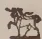
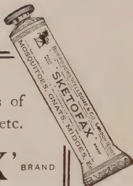

THE  
**TROPICAL AGRICULTURIST:**  
JOURNAL OF THE  
**CEYLON AGRICULTURAL SOCIETY.**

---

VOL. LVI.

PERADENIYA, MAY, 1921.

No. 5.

---

**TICKS AND THEIR ERADICATION.**

---

In the present number of the TROPICAL AGRICULTURIST will be found a complete article on the question of ticks, the diseases transmitted by them and the known means of eradication. The story of the investigations of ticks and the animal diseases they convey is as interesting as the stories of the investigations of malaria, yellow-fever and other insect-carried diseases of man.

The importance of tick control is now recognised in all countries and no extensive cattle industry can be built up in most parts of the world if due consideration is not given to these pests.

America and South Africa were the first to give serious attention to the question of ticks and the methods of control. Dipping tanks came into general favour and the resultant good effects were most marked. In South Africa the Government adopted a definite policy in regard to the installation of dipping tanks, and in a short time all owners of extensive herds of cattle were possessed of these installations. A number of State tanks were provided for small owners. No pedigree stock was allowed to be sold from the herds kept by the Department of Agriculture to owners who were not possessed of a dipping tank installation,

The result of such a policy has been most marked, and if all serious diseases have not been completely eradicated it has been largely due to carelessness of large owners and indifference on the part of small owners. The results have fully justified the policy.

1------------------------------------------------

266[MAY, 1921.

A similar policy was introduced into East Africa with equally favourable results and within recent years into Mauritius, where keen interest in cattle breeding for draught purposes has been evinced since the establishment of the Department of Agriculture's Cattle-breeding Station.

In Jamaica, the system of spraying has been more common than dipping and has been found to be well-suited to the conditions there prevailing. It is more economical, as the capital outlay is not expensive, and if carried out thoroughly and carefully is effective.

In Ceylon, little attention is given to the control of ticks. Hand-picking is resorted to, and reliance is placed upon birds to remove ticks from animals grazing in the fields. Where large herds are not kept the installation of dipping tanks would be expensive and unnecessary, but in dairies spraying might well be resorted to with advantage. Some progressive keepers of cattle in Ceylon have in the past few years done some spraying against ticks and they have reported most satisfactory results. With increased attention to the question of dairying closer attention will doubtless be given to spraying against ticks, and interesting results are to be expected.

There are large areas in Ceylon which at certain seasons of the year are infested with ticks, and there can be little doubt that the question of ticks in Ceylon is worthy of close investigation.

The Committee on Cattle-breeding recently recommended that it should receive attention. A beginning was made by the Entomologist of the Department of Agriculture in securing ticks from all areas. These have been submitted to specialists in Europe for identification. The Veterinary Department has also begun investigations.

So marked has been the improvement in the general condition of stock in these tropical countries where dipping or spraying has been generally practised, that all interested in cattle in Ceylon should give close attention to the question of ticks, the diseases they convey, and the means of their control.

2------------------------------------------------

MAY, 1921.]267

# CEYLON AGRICULTURE.

## MINUTES OF MEETING OF ESTATE PRODUCTS COMMITTEE.

*Minutes of the First Meeting of the Estate Products Committee of the Board of Agriculture, held at Peradeniya on March 10th, 1921.*

*Present.*—The Director of Agriculture (Chairman), the Government Entomologist, the Acting Government Botanist and Mycologist, the Inspector of Plant Pests and Diseases (Entomological), the Inspector of Plant Pests and Diseases (Mycological), Messrs. Graeme Sinclair, N. D. Stephen Silva, A. C. Matthew, R. G. Coombe, J. B. Coles, M. L. Wilkins, D. S. Cameron, L. Bayly, E. W. Keith, J. W. Oldfield, T. Y. Wright, N. G. Campbell, C. P. de Silva, W. A. de Silva, F. R. Senanayaka, T. G. Jayawardene, Graham Pandittesekera, A. S. Long-Price, James Peiries, C. E. A. Dias, A. W. Beven, Dr. C. A. Hewavitarne, and T. H. Holland (Secretary).

*Visitors.*—Messrs. E. C. Villiers, G. Bruce Foote, C. W. Newton, Dennis Wood, James Piachaud, R. A. Senior-White, and G. E. J. Hulugalle.

Twenty-eight members and seven visitors.

Before commencing business the Chairman referred briefly to the organization and objects of the Board of Agriculture.

The Board consisted of members nominated by His Excellency the Governor, the Planters' Association, the Estates Agents' Association, the Low-country Products Association, and the Agricultural Society. The Estates Products Committee would deal with all matters of estate agriculture and would advise the Department of Agriculture and the Government upon such matters.

Any resolution passed by the Committee would be forwarded to the Executive Committee of the Board and thence to Government. He had endeavoured to make the Committee as representative as possible.

Letters and telegrams of regret of inability to attend were then read from Sir Solomon Dias Bandaranaike, Mr. M. Kelway Bamber, Mr. W. Coombe, the Hon. the Controller of Revenue, and the Government Agent, Central Province.

A number of applications for leave were also received.

*Progress Report, Peradeniya*, was read and commented on by the Chairman.

### **Agenda Item I.—Report of the Mycologist on Diseases of Crops during 1920.**

MR. BRYCE read his report. Dealing with rubber diseases, it was remarked that Brown Bast, which had decreased this year, was more prevalent in the Federated Malay States and other countries where daily tapping had been the rule.

*Fomes lignosus* had caused much loss; the removal of old stumps and logs was essential.

3------------------------------------------------

268[MAY, 1921.

Brown root disease had been very frequent, and *Ustilina zonata* had been reported. Suspected cases of the Federated Malay States "Mouldy Rot" had been reported, but the true disease had not yet appeared in Ceylon.

In tea Red Rust had been prevalent in Ratnapura and the Southern Province. The disease was usually confined to weakly bushes.

*Poria hypolateritia* had been reported, also a new branch canker.

In coconuts *Phytophthora* nutfall had again appeared. It was not improbable that spraying with Bordeaux mixture would pay. *Phytophthora* "leaf droop" had been less prevalent.

"Tapering of the crown" of coconuts had been investigated. In green manures Dadap and *Tephrosia Candida* had been attacked by *Poria hypobrunnea*.

In paddy the commonest diseases were the *Sclerotium* disease and the *Helminthosporium* leaf disease.

A disease of plantains was investigated in Uda Hewaheta.

Generally, disease incidence was much the same as in the preceding year. It was to be borne in mind that the pre-war balance between cultivation and manure given and crops harvested had been upset. Cultivation and manuring had been perforce reduced, and though of late a certain reduction in crop had been effected, the effect, though not fully visible at first, would eventually be a lowering of vitality, resulting in a condition more favourable to the incidence of disease. It was further pointed out that in tea and rubber (unlike fruit and grain crops) the portion of the plant removed was still necessary for its growth.

Specimens of fungoid diseases on tea and rubber were exhibited.

#### **Agenda Item 2.—Report of the Entomologist on Pests for 1920.**

DR. HUTSON exhibited specimens of the various pests attacking tea and rubber, and gave a brief review of the year's work.

He first summarized the report of the Assistant Entomologist which had been presented at the last meeting of the Committee of Agricultural Experiments,

He then dealt with the Tea tortrix, the Nettle grub, the Red slug, and the Red borer.

With all caterpillar pests prompt action was necessary. Often the pest was not noticed till after the second generation, when it was beyond control. Damage by tea mites had been reported, but in most cases on impoverished tea.

The tea termite was one of the most important pests reported. Considerable damage was done in the larvæ stage by boring. As in the case of fungus diseases, the prime consideration was cultivation sufficient to keep the tea in a healthy state.

Of rubber pests, which are few in number, the stem and root borer and the bark-eating caterpillar were mentioned. In cacao the Brown bark borer and the Kalutara snail had caused trouble. Dealing with coconut pests Dr. HUTSON remarked that an outbreak of coconut caterpillars was reported from the Eastern Province in an area recently devastated by cyclone. He was visiting the district shortly.

The black and red beetles were the most important pests in coconuts. The removal of all dead logs and rubbish was important.

4------------------------------------------------

MAY, 1921.]269

In paddy, the paddy fly was still the most important pest. A leaflet had been issued last year, and a poster would be produced shortly.

Stem borers were also of importance, and an attack of swarming caterpillars had been reported during the year.

MR. R. G. COOMBE inquired if the method of combating tea tortrix by sprinkling with lime had been further followed up. MR. JARDINE replied that in two recent experiments liming followed by rain had freed the tea from tortrix, while liming in dry weather had shown no marked results.

MR. GRAEME SINCLAIR was of the opinion that rain without lime was equally effectual. MR. D. S. CAMERON, in answer to an inquiry, informed the meeting that on Parragalla estate, where liming had been first tried, a decided decrease in tortrix had been noticed.

MR. CAMERON inquired if spraying with limewash had been tried.

MR. JARDINE replied that the cost of spraying apparatus was against the method at present.

MR. GRAEME SINCLAIR asked that these methods be published to enable superintendents to experiment for themselves.

THE CHAIRMAN promised to send a circular letter to the Planters' Association and a *communiqué* to the press.

Reverting to the paddy fly, MR. W. A. DE SILVA commented on the fact that his newly opened lands in the North-Central Province were free, while the Dry Zone Experiment Station suffered much from the pest.

THE CHAIRMAN thought that the grass surrounding the Experiment Station was probably responsible.

MR. A. W. BEVEN inquired whether any work had been done on plantain pests.

THE CHAIRMAN replied that investigation would be carried out this year.

#### **Agenda Item 10.—Black Scale Bug upon Plants in Haputale District.**

MR. R. G. COOMBE then brought forward the question of the prevalence of Black Bug in the Haputale district, and inquired whether the pest was considered likely to menace the tea industry as it had the coffee.

COL. L. BAYLY added that it was prevalent in all old coffee lands.

DR. HUTSON in his reply opined that the regular pruning of tea made it unlikely that the pest would become serious.

It was largely a matter of good cultivation and manuring. Poorly grown and unhealthy bushes were usually affected, while healthy, vigorous bushes were free. He was proceeding to Haputale in the following week and would make further investigations.

MR. R. G. COOMBE objected that coffee was regularly pruned.

MR. JARDINE remarked that scale insects on tea had been noted in four districts.

THE CHAIRMAN advised waiting for the report of the Entomologist.

MR. D. S. CAMERON asked that the investigation be extended to rubber, on which the pest was extremely common.

This was agreed to.

5------------------------------------------------

270[MAY, 1921.

**Agenda Item 3.—Report of the Inspector of Plant Pests and Diseases.**

MR. JARDINE first remarked on the disadvantages the Inspectorate had laboured under through being under-staffed till October last. The object of the Inspectorate was to make a complete survey of the tea-growing area for proclaimed and serious pests; to bring all agriculturists into closer touch with the Department, and to encourage preventive and remedial measures for pests. In addition, the nurseries of all estates applying for permits to sell plants had to be inspected, this entailed a heavy labour. The inspection of all tea estates in the Central Province was practically complete, and close touch had been gained with the small cultivator. During the year 2,719 inspections were made and 132 permits for sale issued.

MR. JARDINE quoted for each district the proportion of visited estates found to be infected with Shot-hole Borer.

THE CHAIRMAN remarked that MR. JARDINE's figures showed the prevalence of Shot-hole Borer. The figures were interesting, but until complete no deduction was advisable. The small cultivator, though at first suspicious, generally in the end showed himself keen to learn and co-operate. An improvement in the cultivation of small holdings was already apparent.

DR. HEWAVITARNE inquired how the Sub-Inspectors were selected.

THE CHAIRMAN replied that they were passed students of the School of Tropical Agriculture, who underwent subsequently one year's training, in the course of which they had to pass two examinations. MR. M. L. WILKINS inquired whether the advertising of plants for sale was not illegal.

THE CHAIRMAN replied that export from a declared estate was illegal.

MR. J. B. COLES questioned some of MR. JARDINE's figures, and gave it as his opinion that there was not an estate in the Gampola or Kandy area which was free of borer. This view was endorsed by other members.

**Agenda Item 11.—Tractor Trials.**

MR. A. W. BEVEN inquired as to the work of tractors other than Fordson.

THE CHAIRMAN stated that he had seen the Fordson, Cletrac, and Avery at work at the Motor Show. The representatives of the Cletrac and Avery tractors had expressed their willingness to co-operate in trials at a future date. The Cletrac was a powerful machine, though possibly a little light for its horse power. The Avery had appeared to be doing good work. Since then trials of the Cletrac had been carried out in Mr. MARTIN's estate, but owing to the shortness of the notice it had not been possible to send an officer from the Department.

MR. E. C. VILLIERS mentioned that the Minneriya Development Company were shortly landing a Clayton-Shuttleworth tractor.

The meeting were in favour of a central trial of all available makes of tractor, and the Chairman agreed to endeavour to arrange with the importers for such trials in May and September.

MR. A. S. LONG-PRICE offered land in the Kurunegala District for this purpose.

**Agenda Item 4.—Rubber Manurial Experiments, Peradeniya, 1920.**

Figures were placed before the meeting and were reviewed by the Chairman. As time had been insufficient to distribute the papers before the meeting, it was proposed to adjourn formal discussion of results until the next meeting, when MR. M. KELWAY BAMBER would be present.

6------------------------------------------------

MAY, 1921.]271**Agenda Item 5.—Rubber Tapping Experiments, Peradeniya, 1920.**

Figures of the results of 2-day and 3-day tapping trials were placed before the meeting and commented on by the Chairman, who pointed out that old experiments on these lines had shown a considerably smaller difference in yield in favour of 2-day tapping than the present experiments.

MR. M. L. WILKINS urged that to give a fair comparison on the 3-day, tapping should be started lower than the 2-day.

**Agenda Item 6.—Coconut Trials, Chilaw, 1920.**

The discussion on these was postponed till the next meeting to enable members to study the figures.

**Agenda Item 7.—Present Position of Tea and Rubber.**

DR. HEWAVITARNE made some remarks on the present position of tea and rubber. He urged that every grower had his own ideas as to what constituted the highest quality product, and that some sort of standardization in manufacture was needed.

MR. DE SILVA in support gave examples of the same sample of rubber being valued at widely different figures within a short time. He also remarked on the frequent disparity of prices offered in the London and Colombo markets.

MR. GRAEME SINCLAIR did not approve of any attempt at standardization, and said that the price the buyer was prepared to give was the only possible criterion of quality.

MR. A. C. MATTHEW agreed with this view.

**Agenda Item No. 8.—A new Product in Ceylon.**

MR. M. L. WILKINS brought forward the question of a new product for Ceylon.

THE CHAIRMAN briefly discussed the following products :—

*Limes*.—Many parts of Ceylon were admirably suited for the cultivation of limes. The Walasmulla district in the Southern Province was excellent, but pink disease was present in that area of the Colony.

*Camphor* was at present worth over seven shillings per lb., and there was a reported reduction in wild camphor production in Formosa. It was worth cultivation at present.

*Sugar* needed large capital. Every ton of sugar turned out needed an outlay of £40 in machinery. Sugar growing would, however, one day come to Ceylon, if not for the production of sugar then for power alcohol.

*Fibres* were suitable for the dry zone. In Mauritius a small mill costing Rs. 600 would handle the produce of 30 acres. On a large scale the question of transport was a serious one.

DR. HEWAVITARNE suggested *Pine-apples* as a likely product.

THE CHAIRMAN agreed and promised to obtain information about canning.

MR. DE SILVA inquired about *Robusta coffee*. The Chairman remarked that *Robusta coffee* was used for blending on the London market. Java was now growing *Robusta* and selling it under the name of Java coffee. Cane-phora coffee was extending in Madagascar.

MR. A. W. BEVEN inquired about *Cotton* and the Chairman replied that some 40 acres were under cultivation and further experiments were now being commenced. Many of the drier parts of Ceylon were suitable for the cultivation of cotton.

On the question of *Oil Palms*, the Chairman remarked that their future was believed in Sumatra, where 20,000 acres were planted. The yield from the palms on the Dry Zone Experiment Station had been less in the second year than the first. This was probably due to lack of cultivation. Experiments were still being continued.

T. H. HOLLAND,  
Secretary, Estates Products Committee.

7------------------------------------------------

272[MAY, 1921.

## PROGRESS REPORT OF THE EXPERIMENT STATION, PERADENIYA.

*From 1st January, 1921 to 28th February, 1921.*

### GENERAL.

On February 10th a number of members of the Board of Agriculture were shown round the Station.

An auction sale of produce was held on February 4th. Coconuts fetched Rs. 71 per 1,000 nuts : bidding for other products was very low. Maize and dry coffee were withdrawn.

There was a mild epidemic of influenza among the labour force during January.

Owing to a reduction in the Experiment Station Vote all the village labour has been dispensed with.

8.77 inches of rain fell in January ; February no rain.

### TEA.

2,924 lb. of green leaf were plucked in January and 2,192 lb. in February. In each month the two dadap plots gave the highest yields.

In the  $\frac{1}{2}$  acre tea clearing alternate *Gliricidia Maculata* trees were lopped, cattle manure applied and the whole forked in. The old Albizzias in plot 150 were rooted out. Couch grass was forked out of all plots.

A number of bushes in plots 147 and 148 which were growing in swampy ground were found to be affected with Red Rust. The affected branches were pruned and burnt.

The price given for green leaf by New Peradeniya Estate has been advanced by  $\frac{1}{2}$  cent per lb.

### RUBBER.

The terracing in the Hillside Rubber has been repaired and heightened throughout.

In January the annual measurement of girths was taken.

The young rubber at Bandarattenne has been ploughed, disc-harrowed and cultivated twice in an endeavour to eradicate weeds.

### CACAO.

40 cwt. of best Cacao has been sold at Rs. 41 per cwt and 11 cwt. black Cacao @ Rs. 6 per cwt.

A picking was taken in January and another in February.

A moderate pruning was started on January 26th together with a partial pruning of shade trees. 18 acres have been completed up to the end of February.

### COFFEE.

All the coffee has been pruned.

A light lopping of shade is in progress.

### COCONUTS.

In the young coconut plot long grass and cheddy has been cut and the ground round the trees clean weeded. Ploughing of this plot was continued till the ground became too hard. There have been evidences of "Nut-fall" and "Leaf-droop" in this plot. Fallen nuts and dropped leaves have been collected and burnt. Cheddy has been cleared in the old coconut plots.

8------------------------------------------------

MAY, 1921.]273

18 varieties of coconuts were received from GATE MUDALIYAR A. E. RAJAPAKSE and planted in nurseries. They will eventually be planted along the river banks for varietal tests.

#### PADDY.

Of the 8 varieties sown in the new Paddy fields the village Hatiel shows the best growth.

Mutusamba is also doing well. The Giza samba was a failure. The Jeera samba was transplanted rather late and shows a poor growth.

The vacant plots in this area were ploughed and sown with Indigo for green manure.

The Hill-paddy area at Bandarattenne was harvested in February. The growth was patchy and the crop overgrown with illuk in parts.

The yield was  $27\frac{1}{2}$  bushels per acre.

The majority of plots in the old Paddy area were ploughed and sown with Sesbania.

#### SUGAR-CANE.

The old sugar-cane area was forked and cleaned. A small detached portion which was very overgrown with illuk was rooted out.

The young canes in plots 19 and 20 were given an application of cattle manure and the trenches filled in.

#### FODDER GRASS.

Cattle manure was forked into the Guirea grass plot.

A half acre plot was planted with *Paspalum virgatum*.

Small areas were planted with all the obtainable roots of Rhodes grass and Natal grass. These will be divided in the South-west Monsoon and will probably suffice for a half acre plot of each kind.

All plots were weeded.

#### FOOD PRODUCTS.

*Cassava*.—All the varieties of Mauritius cassava were lifted and gave the following calculated yields per acre:—

<table>
<tbody>
<tr>
<td>Manioc de table</td>
<td>...</td>
<td>10,556 lb.</td>
<td>per acre</td>
</tr>
<tr>
<td>Butter stick</td>
<td>...</td>
<td>10,321</td>
<td>" "</td>
</tr>
<tr>
<td>Smallings</td>
<td>...</td>
<td>10,103</td>
<td>" "</td>
</tr>
<tr>
<td>Trinidad</td>
<td>...</td>
<td>8,045</td>
<td>" "</td>
</tr>
<tr>
<td>Cassava Leureum</td>
<td>...</td>
<td>6,584</td>
<td>" "</td>
</tr>
<tr>
<td>Singapore</td>
<td>...</td>
<td>5,878</td>
<td>" "</td>
</tr>
</tbody>
</table>

The above were grown on poor rocky, steep land. Cuttings of all these varieties were replanted in plots 16 and 17.

Six further varieties have been obtained from the Royal Botanic Gardens, Peradeniya, and planted in the Fruit plots.

#### SWEET POTATOS.

Sixteen varieties have been received from the Royal Botanic Gardens Peradeniya, and planted in the Fruit plots.

#### DIOSCOREA YAMS.

A large number of varieties have been received from the Government Stock Gardens, and Royal Botanic Gardens, Peradeniya, and planted in the Fruit plots.

The *Green gram* and *Lima bean* crops sown in the Economic plots proved failures probably owing to the excessive wet experienced immediately after sowing, the weedy state of the ground and unsuitability of locality.

#### ECONOMIC PLOTS.

All vacant plots are being ploughed and an effort made to eradicate some of the weeds before the planting of the permanent products in the next South-west Monsoon.

The eradication of couch and illuk from this area will be a difficult and expensive operation. At present the ground is too hard for this work.

T. H. HOLLAND,

Manager, Experiment Station, Peradeniya.

9------------------------------------------------

274[MAY, 1921.

# COCONUT.

## COCONUT EXPERIMENTS.

### RESULTS OF THE COCONUT TRIAL GROUNDS, CHILAW.

The following are the results obtained at the Chilaw Coconut Trial Ground up the end of 1920 :—

<table border="1">
<thead>
<tr>
<th>Plot</th>
<th>No. of palms</th>
<th>Treatment</th>
</tr>
</thead>
<tbody>
<tr>
<td>1</td>
<td>47</td>
<td>Clean weeded.</td>
</tr>
<tr>
<td>2</td>
<td>72</td>
<td>Sulphate of Ammonia <math>2\frac{1}{2}</math> lb. per palm 1915. Disc-harrowed monthly 1916, 1917, 10 times in 1918, 1919 and 7 times in 1920.</td>
</tr>
<tr>
<td>3</td>
<td>89</td>
<td>Groundnut cake 6 lb. per palm 1915. Crushed fish 6 lb. per palm 1916, 1917, 1918, 1919, 1920.</td>
</tr>
<tr>
<td>4</td>
<td>81</td>
<td>Steamed bone meal 8 lb. per palm 1915, 1916, 1917, 1918, 1919, 1920.</td>
</tr>
<tr>
<td>5</td>
<td>84</td>
<td>Sulphate of Potash <math>2\frac{3}{4}</math> lb. per palm 1915, 1916, 1917. Mendis Potash 5 lb. per palm 1918, 1919. Sulphate of Potash 3 lb. in 1920.</td>
</tr>
<tr>
<td>6</td>
<td>78</td>
<td>Ammonium Sulphate 4 lb. per palm 1915, 1916, 1917. Mendis Potash 5 lb. per palm 1918. Sulphate of Ammonia 4 lb. per palm 1919, 1920.</td>
</tr>
<tr>
<td>7</td>
<td>92</td>
<td>Mineral mixture 6 lb. per palm 1915, 1916, 1917. Mineral mixture 7 lb. 2 oz. per palm 1918, 1919, 6 lb. in 1920</td>
</tr>
<tr>
<td>8</td>
<td>68</td>
<td>Lime 10 tons per acre 1915, 1916, 1917, <math>\frac{1}{2}</math> ton in 1918, 1919, 1920.</td>
</tr>
<tr>
<td>9</td>
<td>85</td>
<td>Mixed manure 10 lb. per palm 1915, 1916, 1917. Organic mixture 12 lb. 4 oz. per palm in 1918, 1919, 10 lb. 2 oz. in 1920.</td>
</tr>
<tr>
<td>10</td>
<td>107</td>
<td>Mulched with husks in 1915. No treatment subsequently beyond clean weeding around trees.</td>
</tr>
<tr>
<td>11</td>
<td>100</td>
<td>Mulched with husks in rings round palms. Dug in 1920.</td>
</tr>
<tr>
<td>12</td>
<td>101</td>
<td>Ploughed and disced.</td>
</tr>
<tr>
<td>13</td>
<td>99</td>
<td>Ploughed and disced. Mixed manure 1917. Organic mixture 12 lb. 4 oz. per palm 1918, 1919, 10 lb 2 oz. in 1920.</td>
</tr>
<tr>
<td>14</td>
<td>46</td>
<td>Dug with mamoty and mulched with leaves. From 1919 mulch removed and plot harrowed in 1919 ten times, and in 1920 7 times.</td>
</tr>
<tr>
<td>15</td>
<td>81</td>
<td>Watered. Watering stopped in 1919, and lime applied at rate of <math>\frac{1}{2}</math> ton per plot. Similar applications made in 1920.</td>
</tr>
<tr>
<td>16</td>
<td>59</td>
<td>No treatment. Store, etc.</td>
</tr>
</tbody>
</table>

10------------------------------------------------

MAY, 1921.]

275

STATEMENT OF YIELDS OF THE CHILAW COCONUT TRIAL GROUND.

<table border="1">
<thead>
<tr>
<th rowspan="2">Plot</th>
<th rowspan="2">Number of Palms</th>
<th colspan="2">1915</th>
<th colspan="2">1916</th>
<th colspan="2">1917</th>
<th colspan="2">1918</th>
<th colspan="2">1919</th>
<th colspan="2">1920</th>
</tr>
<tr>
<th>Yields</th>
<th>Yields per Palm</th>
<th>Yields</th>
<th>Yields per Palm</th>
<th>Yields</th>
<th>Yields per Palm</th>
<th>Yields</th>
<th>Yields per Palm</th>
<th>Yields</th>
<th>Yields per Palm</th>
<th>Yields</th>
<th>Yields per Palm</th>
</tr>
</thead>
<tbody>
<tr>
<td>1</td>
<td>47</td>
<td>1,931</td>
<td>41.1</td>
<td>2,677</td>
<td>57.0</td>
<td>3,262</td>
<td>69.2</td>
<td>3,550</td>
<td>75.5</td>
<td>2,428</td>
<td>51.6</td>
<td>2,504</td>
<td>53.1</td>
</tr>
<tr>
<td>2</td>
<td>72</td>
<td>2,804</td>
<td>38.9</td>
<td>4,810</td>
<td>66.8</td>
<td>5,267</td>
<td>73.1</td>
<td>5,082</td>
<td>70.6</td>
<td>4,060</td>
<td>56.4</td>
<td>4,061</td>
<td>56.4</td>
</tr>
<tr>
<td>3</td>
<td>89</td>
<td>3,581</td>
<td>40.2</td>
<td>5,014</td>
<td>56.3</td>
<td>5,217</td>
<td>58.6</td>
<td>5,127</td>
<td>58.7</td>
<td>4,404</td>
<td>49.6</td>
<td>4,811</td>
<td>54.1</td>
</tr>
<tr>
<td>4</td>
<td>81</td>
<td>4,429</td>
<td>54.7</td>
<td>5,800</td>
<td>71.6</td>
<td>5,648</td>
<td>69.7</td>
<td>5,993</td>
<td>74.0</td>
<td>4,885</td>
<td>60.3</td>
<td>5,244</td>
<td>64.7</td>
</tr>
<tr>
<td>5</td>
<td>84</td>
<td>3,542</td>
<td>42.2</td>
<td>5,225</td>
<td>62.2</td>
<td>5,690</td>
<td>67.7</td>
<td>4,848</td>
<td>57.9</td>
<td>3,894</td>
<td>46.3</td>
<td>4,945</td>
<td>58.9</td>
</tr>
<tr>
<td>6</td>
<td>78</td>
<td>3,829</td>
<td>49.0</td>
<td>4,074</td>
<td>52.2</td>
<td>5,114</td>
<td>65.5</td>
<td>5,094</td>
<td>65.3</td>
<td>4,041</td>
<td>51.8</td>
<td>5,150</td>
<td>66.1</td>
</tr>
<tr>
<td>7</td>
<td>92</td>
<td>3,304</td>
<td>35.9</td>
<td>4,714</td>
<td>51.2</td>
<td>5,585</td>
<td>60.7</td>
<td>5,392</td>
<td>58.6</td>
<td>4,066</td>
<td>44.2</td>
<td>5,084</td>
<td>55.2</td>
</tr>
<tr>
<td>8</td>
<td>68</td>
<td>2,674</td>
<td>39.3</td>
<td>3,306</td>
<td>48.6</td>
<td>4,057</td>
<td>59.6</td>
<td>4,903</td>
<td>72.1</td>
<td>3,251</td>
<td>47.8</td>
<td>3,378</td>
<td>49.7</td>
</tr>
<tr>
<td>9</td>
<td>85</td>
<td>3,383</td>
<td>39.8</td>
<td>4,499</td>
<td>52.9</td>
<td>5,464</td>
<td>64.2</td>
<td>5,098</td>
<td>59.9</td>
<td>3,586</td>
<td>42.2</td>
<td>4,483</td>
<td>52.7</td>
</tr>
<tr>
<td>10</td>
<td>107</td>
<td>2,933</td>
<td>27.4</td>
<td>4,616</td>
<td>43.1</td>
<td>4,576</td>
<td>42.7</td>
<td>3,034</td>
<td>28.2</td>
<td>2,019</td>
<td>18.9</td>
<td>3,307</td>
<td>30.9</td>
</tr>
<tr>
<td>11</td>
<td>100</td>
<td>2,861</td>
<td>28.6</td>
<td>4,286</td>
<td>42.9</td>
<td>3,713</td>
<td>37.1</td>
<td>2,271</td>
<td>22.7</td>
<td>1,579</td>
<td>15.8</td>
<td>3,091</td>
<td>30.9</td>
</tr>
<tr>
<td>12</td>
<td>101</td>
<td>2,936</td>
<td>29.1</td>
<td>4,691</td>
<td>46.4</td>
<td>3,772</td>
<td>37.3</td>
<td>3,375</td>
<td>33.4</td>
<td>2,109</td>
<td>20.9</td>
<td>3,628</td>
<td>35.9</td>
</tr>
<tr>
<td>13</td>
<td>99</td>
<td>1,859</td>
<td>18.7</td>
<td>3,694</td>
<td>37.3</td>
<td>3,384</td>
<td>34.1</td>
<td>3,232</td>
<td>32.6</td>
<td>2,045</td>
<td>20.6</td>
<td>4,195</td>
<td>42.4</td>
</tr>
<tr>
<td>14</td>
<td>46</td>
<td>2,338</td>
<td>18.4</td>
<td>2,294</td>
<td>50.0</td>
<td>2,054</td>
<td>44.6</td>
<td>1,918</td>
<td>47.7</td>
<td>1,370</td>
<td>29.8</td>
<td>1,868</td>
<td>40.6</td>
</tr>
<tr>
<td>15</td>
<td>81</td>
<td>—</td>
<td>—</td>
<td>3,087</td>
<td>38.1</td>
<td>2,094</td>
<td>25.8</td>
<td>2,026</td>
<td>25.0</td>
<td>1,341</td>
<td>16.5</td>
<td>2,512</td>
<td>31.0</td>
</tr>
<tr>
<td>16</td>
<td>59</td>
<td>2,373</td>
<td>40.2</td>
<td>3,222</td>
<td>54.6</td>
<td>3,055</td>
<td>51.7</td>
<td>3,154</td>
<td>53.4</td>
<td>2,841</td>
<td>48.1</td>
<td>2,730</td>
<td>46.3</td>
</tr>
</tbody>
</table>

11------------------------------------------------

276[MAY, 1921 .GRAPH SHOWING AVERAGE YIELDS PER PALM IN VARIOUS PLOTS.

CHILAW COCONUT EXPERIMENTS  
(Average yield per palm)

<table border="1">
<thead>
<tr>
<th>Plot</th>
<th>1915</th>
<th>1916</th>
<th>1917</th>
<th>1918</th>
<th>1919</th>
<th>1920</th>
</tr>
</thead>
<tbody>
<tr><td>1</td><td>45</td><td>65</td><td>70</td><td>75</td><td>60</td><td>65</td></tr>
<tr><td>2</td><td>40</td><td>60</td><td>65</td><td>70</td><td>55</td><td>60</td></tr>
<tr><td>3</td><td>40</td><td>55</td><td>60</td><td>65</td><td>50</td><td>55</td></tr>
<tr><td>4</td><td>55</td><td>70</td><td>75</td><td>70</td><td>60</td><td>65</td></tr>
<tr><td>5</td><td>40</td><td>55</td><td>60</td><td>65</td><td>50</td><td>55</td></tr>
<tr><td>6</td><td>50</td><td>60</td><td>65</td><td>70</td><td>55</td><td>60</td></tr>
<tr><td>7</td><td>35</td><td>45</td><td>50</td><td>55</td><td>45</td><td>50</td></tr>
<tr><td>8</td><td>40</td><td>50</td><td>55</td><td>60</td><td>50</td><td>55</td></tr>
<tr><td>9</td><td>40</td><td>50</td><td>55</td><td>60</td><td>50</td><td>55</td></tr>
<tr><td>10</td><td>40</td><td>45</td><td>50</td><td>55</td><td>45</td><td>50</td></tr>
<tr><td>11</td><td>30</td><td>40</td><td>45</td><td>50</td><td>40</td><td>45</td></tr>
<tr><td>12</td><td>30</td><td>40</td><td>45</td><td>50</td><td>40</td><td>45</td></tr>
<tr><td>13</td><td>15</td><td>35</td><td>40</td><td>45</td><td>25</td><td>35</td></tr>
<tr><td>14</td><td>15</td><td>35</td><td>40</td><td>45</td><td>25</td><td>35</td></tr>
<tr><td>15</td><td>25</td><td>35</td><td>40</td><td>45</td><td>25</td><td>35</td></tr>
<tr><td>16</td><td>45</td><td>55</td><td>60</td><td>65</td><td>55</td><td>60</td></tr>
</tbody>
</table>

12------------------------------------------------

MAY, 1921.]277

**CHILAW COCONUT TRIAL GROUND**  
**RAINFALL FIGURES.**

<table border="1">
<thead>
<tr>
<th rowspan="2">Months</th>
<th colspan="2">1915</th>
<th colspan="2">1916</th>
<th colspan="2">1917</th>
<th colspan="2">1918</th>
<th colspan="2">1919</th>
<th colspan="2">1920</th>
</tr>
<tr>
<th>Rain inch</th>
<th>Wet days</th>
<th>Rain inch</th>
<th>Wet days</th>
<th>Rain inch</th>
<th>Wet days</th>
<th>Rain inch</th>
<th>Wet days</th>
<th>Rain inch</th>
<th>Wet days</th>
<th>Rain inch</th>
<th>Wet days</th>
</tr>
</thead>
<tbody>
<tr>
<td>January</td>
<td>5.95</td>
<td>9</td>
<td>.27</td>
<td>1</td>
<td>3.54</td>
<td>5</td>
<td>7.02</td>
<td>11</td>
<td>1.01</td>
<td>4</td>
<td>1.75</td>
<td>5</td>
</tr>
<tr>
<td>February</td>
<td>.60</td>
<td>2</td>
<td>nil</td>
<td>nil</td>
<td>1.36</td>
<td>7</td>
<td>nil</td>
<td>nil</td>
<td>nil</td>
<td>nil</td>
<td>1.43</td>
<td>3</td>
</tr>
<tr>
<td>March</td>
<td>1.96</td>
<td>5</td>
<td>8.80</td>
<td>8</td>
<td>7.51</td>
<td>11</td>
<td>.61</td>
<td>1</td>
<td>2.21</td>
<td>5</td>
<td>5.51</td>
<td>9</td>
</tr>
<tr>
<td>April</td>
<td>7.10</td>
<td>12</td>
<td>6.56</td>
<td>12</td>
<td>4.53</td>
<td>4</td>
<td>2.69</td>
<td>4</td>
<td>3.75</td>
<td>7</td>
<td>10.68</td>
<td>16</td>
</tr>
<tr>
<td>May</td>
<td>3.83</td>
<td>6</td>
<td>19.66</td>
<td>10</td>
<td>3.57</td>
<td>3</td>
<td>8.29</td>
<td>12</td>
<td>10.21</td>
<td>16</td>
<td>3.13</td>
<td>4</td>
</tr>
<tr>
<td>June</td>
<td>3.13</td>
<td>10</td>
<td>5.82</td>
<td>9</td>
<td>.40</td>
<td>1</td>
<td>.21</td>
<td>2</td>
<td>.96</td>
<td>4</td>
<td>11.12</td>
<td>14</td>
</tr>
<tr>
<td>July</td>
<td>4.77</td>
<td>12</td>
<td>2.61</td>
<td>9</td>
<td>.98</td>
<td>3</td>
<td>.85</td>
<td>2</td>
<td>.52</td>
<td>3</td>
<td>.28</td>
<td>1</td>
</tr>
<tr>
<td>August</td>
<td>nil</td>
<td>nil</td>
<td>3.67</td>
<td>5</td>
<td>.29</td>
<td>2</td>
<td>.01</td>
<td>1</td>
<td>.13</td>
<td>1</td>
<td>.18</td>
<td>1</td>
</tr>
<tr>
<td>September</td>
<td>1.48</td>
<td>5</td>
<td>1.90</td>
<td>8</td>
<td>4.63</td>
<td>8</td>
<td>.26</td>
<td>2</td>
<td>9.79</td>
<td>13</td>
<td>.82</td>
<td>4</td>
</tr>
<tr>
<td>October</td>
<td>2.38</td>
<td>4</td>
<td>3.08</td>
<td>7</td>
<td>2.63</td>
<td>9</td>
<td>9.67</td>
<td>13</td>
<td>9.51</td>
<td>15</td>
<td>9.90</td>
<td>16</td>
</tr>
<tr>
<td>November</td>
<td>20.85</td>
<td>18</td>
<td>7.49</td>
<td>14</td>
<td>9.07</td>
<td>15</td>
<td>13.37</td>
<td>15</td>
<td>6.87</td>
<td>16</td>
<td>19.44</td>
<td>17</td>
</tr>
<tr>
<td>December</td>
<td>1.28</td>
<td>3</td>
<td>4.83</td>
<td>5</td>
<td>3.15</td>
<td>7</td>
<td>8.80</td>
<td>13</td>
<td>10.03</td>
<td>16</td>
<td>5.26</td>
<td>5</td>
</tr>
<tr>
<td></td>
<td>53.33</td>
<td>86</td>
<td>64.69</td>
<td>88</td>
<td>41.66</td>
<td>75</td>
<td>51.78</td>
<td>76</td>
<td>54.99</td>
<td>100</td>
<td>69.50</td>
<td>95</td>
</tr>
</tbody>
</table>

13------------------------------------------------

278[MAY, 1921.

# PADDY.

---

## PADDY CULTIVATION COMPETITIONS IN KANDY DISTRICT.

During the last Maha season Paddy Cultivation Competitions were held in Udu Nuwara and Uda Dumbara of the Kandy District.

Funds for these competitions were provided by the Department of Agriculture through the Food Production Committee of Central Province, Kandy.

The total number of entries in Udu Nuwara totalled 243 and the plots were judged by the Senior Agricultural Instructor, who was accompanied during the greater part of the inspections by the Ratemahatmaya, Udu Nuwara. In Uda Dumbara the number of fields entered for competition was 76 of which only 45 fulfilled the conditions necessary. Judging was done by the Senior Agricultural Instructor. The Ratemahatmaya and the Udispattu Korale have taken much trouble to popularise the competitions.

These competitions created considerable interest and everywhere general keenness was displayed. It is expected that the competitions will do much to encourage careful cultivation of paddy, transplanting and manuring.

Prizes have been awarded as follows :—

### UDU NUWARA.

#### Prizes of Rs. 10 each.

<table>
<thead>
<tr>
<th><i>Village.</i></th>
<th><i>Extent.</i></th>
<th><i>Cultivation.</i></th>
</tr>
<tr>
<th colspan="3" style="text-align: center;">A. R. P.</th>
</tr>
</thead>
<tbody>
<tr>
<td>1. Punchirala Korala - Hendeniya</td>
<td>1 10</td>
<td>Transplanted and manured with artificials</td>
</tr>
<tr>
<td>2 Setuwa Mason - Kamburadeniya</td>
<td>2 10</td>
<td>Transplanted and manured with artificials</td>
</tr>
<tr>
<td>3. T. B. Petiyagoda - Petiyagoda</td>
<td>2 30</td>
<td>Transplanted and manured with green manure and cowdung</td>
</tr>
<tr>
<td>4. A. Rahiman Lebbe- Ketacumbura</td>
<td>2 30</td>
<td>Transplanted and manured with artificials</td>
</tr>
<tr>
<td>5. T. B. Nugawela - Eladetta</td>
<td>3 2 00</td>
<td>Transplanted and manured with artificials</td>
</tr>
</tbody>
</table>

#### Prizes of Rs. 5 each.

<table>
<thead>
<tr>
<th><i>Village.</i></th>
<th><i>Extent.</i></th>
<th><i>Cultivation.</i></th>
</tr>
<tr>
<th colspan="3" style="text-align: center;">A. R. P.</th>
</tr>
</thead>
<tbody>
<tr>
<td>6. L. W. Muhandirama Boyagama</td>
<td>3 00</td>
<td>Transplanted and manured with artificials</td>
</tr>
</tbody>
</table>

14------------------------------------------------

May, 1921.]279

<table border="0">
<tbody>
<tr>
<td>7. Ukku Banda Arachchi</td>
<td>- Gangoda</td>
<td>- 4 2 00</td>
<td>Transplanted and manured with artificials</td>
</tr>
<tr>
<td>8. P. Keerala</td>
<td>- Wegiriya</td>
<td>- 1 0 00</td>
<td>Transplanted and manured with green manure</td>
</tr>
<tr>
<td>9. H. M. U. Banda Arachchi</td>
<td>- Ambanwela</td>
<td>- 1 2 00</td>
<td>Broadcasted and manured with artificials</td>
</tr>
<tr>
<td>10. G. Hawadiya</td>
<td>- Hepane</td>
<td>- 1 0 00</td>
<td>Transplanted</td>
</tr>
<tr>
<td>11. Mudiyanse Arachchi</td>
<td>Hendeniya</td>
<td>- 1 0 00</td>
<td>Transplanted and manured with green manure and cowdung</td>
</tr>
<tr>
<td>12. U. Rankira</td>
<td>- Radagoda</td>
<td>- 2 0 00</td>
<td>Manured with green manure1</td>
</tr>
<tr>
<td>13. Kudaduraya Ex Vidana</td>
<td>- Deliwala</td>
<td>- 2 00</td>
<td>Transplanted</td>
</tr>
<tr>
<td>14. Gamagedera Arachchi</td>
<td>- Embekka</td>
<td>- 1 0 00</td>
<td>Transplanted and manured with green manure</td>
</tr>
<tr>
<td>15. S. U. L. Udayar</td>
<td>- Welamboda</td>
<td>- 2 00</td>
<td>Transplanted ; no manure applied</td>
</tr>
<tr>
<td>16. Kalubanda Arachchi</td>
<td>Watupola</td>
<td>- 1 0 00</td>
<td>Transplanted and manured with artificials</td>
</tr>
<tr>
<td>17. P. B. Lenawa</td>
<td>- Urulewatta</td>
<td>- 1 2 20</td>
<td>Transplanted and manured with ash</td>
</tr>
<tr>
<td>18. U. Manika</td>
<td>- Hiddawulla</td>
<td>- 2 00</td>
<td>Transplanted and manured with green manure</td>
</tr>
<tr>
<td>19. G. Kiri Banda</td>
<td>- Urulewatta</td>
<td>- 1 0 00</td>
<td>Broadcasted and manured with cowdung</td>
</tr>
<tr>
<td>20. Warakaulla Medduma Banda</td>
<td>Wattappola</td>
<td>- 1 0 00</td>
<td>Transplanted and manured with green manure and artificials</td>
</tr>
<tr>
<td>21. R. M. Ukku Banda</td>
<td>Ganheta</td>
<td>- 2 20</td>
<td>Transplanted and manured with artificials</td>
</tr>
<tr>
<td>22. C. B. Ratnayake</td>
<td>- Heeyawala</td>
<td>- 2 1 00</td>
<td>Transplanted and manured with green manure</td>
</tr>
<tr>
<td>23. U. P. Banda Arachchi</td>
<td>- Walagedara</td>
<td>- 1 0 20</td>
<td>Transplanted and manured with artificials</td>
</tr>
<tr>
<td>24. Talawatwe School</td>
<td>- Eladetta</td>
<td>- 2 20</td>
<td>Transplanted and manured with ash and cowdung</td>
</tr>
<tr>
<td>25. D. Weerasekera</td>
<td>- Daskara</td>
<td>- 2 00</td>
<td>Transplanted and manured with artificials</td>
</tr>
</tbody>
</table>

15------------------------------------------------

280[MAY, 1921.

**UDA DUMBARA.**

**Prizes of Rs. 10 each.**

<table border="0">
<tbody>
<tr>
<td>1. H. B. Rambukwella</td>
<td></td>
<td></td>
<td></td>
</tr>
<tr>
<td>    Korale</td>
<td>- Udispattu</td>
<td>- 1 2 00</td>
<td>Transplanted and manured with artificials</td>
</tr>
<tr>
<td>2. A. Madugalle</td>
<td>- Udispattu</td>
<td>- 1 0 00</td>
<td>Transplanted and manured with artificials</td>
</tr>
<tr>
<td>3. Dingiri Banda</td>
<td></td>
<td></td>
<td></td>
</tr>
<tr>
<td>    Weerasekera</td>
<td>- Etambegahawatta</td>
<td>- 1 0 00</td>
<td>Transplanted</td>
</tr>
<tr>
<td>4. Madatege Kira,</td>
<td></td>
<td></td>
<td></td>
</tr>
<tr>
<td>    Vidana Duraya</td>
<td>- Udispattu</td>
<td>- 1 0 00</td>
<td>Transplanted</td>
</tr>
<tr>
<td>5. Poddalgoda W.</td>
<td></td>
<td></td>
<td></td>
</tr>
<tr>
<td>    Rambanda</td>
<td>- Poddalgoda</td>
<td>- 2 00</td>
<td>Transplanted and manured with green manure</td>
</tr>
<tr>
<td>6. Kurukohagama</td>
<td></td>
<td></td>
<td></td>
</tr>
<tr>
<td>    Kumarahenaya</td>
<td>- Rambukwella</td>
<td>- 3 00</td>
<td>Transplanted and manured with green manure</td>
</tr>
<tr>
<td>7. Tikiri Banda</td>
<td></td>
<td></td>
<td></td>
</tr>
<tr>
<td>    Arachchi</td>
<td>- Kurukohagama-</td>
<td>2 16</td>
<td>Transplanted and manured with cowdung</td>
</tr>
<tr>
<td>8. Kirihenaya</td>
<td>- Udispattu</td>
<td>- 1 0 00</td>
<td>Transplanted and manured with cowdung</td>
</tr>
</tbody>
</table>

**Prizes of Rs. 5 each.**

<table border="0">
<thead>
<tr>
<th></th>
<th><i>Village.</i></th>
<th><i>Extent.</i></th>
<th><i>Cultivation.</i></th>
</tr>
</thead>
<tbody>
<tr>
<td>9. Registrar Kalu</td>
<td></td>
<td>A. R. P.</td>
<td></td>
</tr>
<tr>
<td>    Banda</td>
<td>- Udispattu</td>
<td>- 3 08</td>
<td>Transplanted</td>
</tr>
<tr>
<td>10. M. A. Appuhamy</td>
<td>- Udispattu</td>
<td>- 2 15</td>
<td>Transplanted</td>
</tr>
<tr>
<td>11. G. D. Banda</td>
<td>- Mediwaka</td>
<td>- 2 0 00</td>
<td>Transplanted and manured with green manure</td>
</tr>
<tr>
<td>12. Ranahenaya</td>
<td>- Udispattu</td>
<td>- 1 0 00</td>
<td>Transplanted and manured with cowdung</td>
</tr>
<tr>
<td>13. Tikiri Banda</td>
<td>- Udispattu</td>
<td>- 3 00</td>
<td>Transplanted and manured with cowdung</td>
</tr>
<tr>
<td>14. Udispattu Boys' School</td>
<td>- Udispattu</td>
<td>- 2 00</td>
<td>Transplanted and manured with cowdung</td>
</tr>
<tr>
<td>15. P. Appuhamy</td>
<td>- Udispattu</td>
<td>- 2 00</td>
<td>Transplanted</td>
</tr>
<tr>
<td>16. T. G. Dingiri Banda</td>
<td>Udispattu</td>
<td>- 1 0 00</td>
<td>Transplanted and manured with green manure</td>
</tr>
<tr>
<td>17. Ihalagedera Tikira</td>
<td>Udispattu</td>
<td>- 2 00</td>
<td>Transplanted and manured with green manure</td>
</tr>
<tr>
<td>18. Medatige Kira</td>
<td></td>
<td></td>
<td></td>
</tr>
<tr>
<td>    Velduraya</td>
<td>- Udispattu</td>
<td>- 1 0 00</td>
<td>Transplanted</td>
</tr>
</tbody>
</table>

16------------------------------------------------

MAY, 1921.]281

<table border="1">
<thead>
<tr>
<th></th>
<th>Village.</th>
<th>Extent.</th>
<th>Cultivation.</th>
</tr>
<tr>
<th></th>
<th></th>
<th>A. R. P.</th>
<th></th>
</tr>
</thead>
<tbody>
<tr>
<td>19.</td>
<td>Kalubanda Arachchi Poddalgoda</td>
<td>- 1 0 00</td>
<td>Transplanted</td>
</tr>
<tr>
<td>20.</td>
<td>Kiribanda - Poddalgoda</td>
<td>- 3 08</td>
<td>Transplanted</td>
</tr>
<tr>
<td>21.</td>
<td>Haliyale Dingiri Banda Arachchi - Haliyala</td>
<td>- 1 0 00</td>
<td>Transplanted and manured with green manure</td>
</tr>
<tr>
<td>22.</td>
<td>Mediwaka Ram- banda Korale - Mediwaka</td>
<td>- 1 0 00</td>
<td>Transplanted</td>
</tr>
<tr>
<td>23.</td>
<td>Meegonkotuwa Appuhamy - Doraliyadde</td>
<td>- 1 0 00</td>
<td>Transplanted and manured with cowdung</td>
</tr>
<tr>
<td>24.</td>
<td>Urugala Arnolis - Urugala</td>
<td>- 1 0 00</td>
<td>Transplanted and manured with green manure</td>
</tr>
</tbody>
</table>

## MANURING OF PADDY.

*Department of Agriculture, Ceylon—Food Production Circular No. 23.*

The manuring of paddy has been carried on in several parts of Ceylon for some years with results sufficiently satisfactory to insure a continuance of the practice. Cattle manure, leaves of trees, jungle growth and leguminous green manures have been employed with advantage, increased crops being obtained; and the extension of this practice is recommended, as it can be carried out by cultivators with the least expenditure.

Where only one paddy crop is taken during the year, a green manure crop can be grown on the soil and ploughed in. The most suitable for this purpose are Pila or Wild indigo (*Tephrosia purpurea*), Sunn hemp (*Hana S.*) and *Sesbania aculeata* (Daincha). For these the land must be ploughed after harvesting, and either lightly irrigated or advantage taken of any rain.

In some cases the seed could be sown broadcast from the bunds through the growing paddy, immediately the water has been run off for the last time before harvesting. The seedlings would then have a good start before the soil becomes too dry and hard.

The carrying on to the land of outside material, such as branches of Inga saman (*S. Mara*), Dadaps (*S. Rala Eramudu*), Kaduru, Wild sunflower, Keppitiya, and any non-thorny green material, more completely benefits the soil than by growing crops on the land, and it would be of advantage to cultivators if they would plant up the high lands adjoining paddy fields with any suitable leafy plants which could then be cut and spread on the land with little trouble or expense.

The advantage of green manures of any kind has been found to be more in the æration of the soil for the roots than from added nitrogen, but if the green manures are ploughed in some weeks before flooding, the beneficial effect of the nitrogen is more apparent. With a continuance of the green manuring system the soils are steadily and permanently improved, but

17------------------------------------------------

282[MAY, 1921.

further benefit can be derived by manuring in addition with phosphatic manures, such as bonemeal and mineral phosphates, ephos phosphate and superphosphate. The phosphatic manure hitherto chiefly employed has been crushed bones at the rate of  $\frac{1}{2}$  to 1 cwt per acre, and sometimes fish manure. From 1898 to 1911 the price of bonemeal averaged about Rs. 2.50 to Rs. 3 per cwt. It then steadily rose in price, and is now about Rs. 6.50 to Rs. 7.50 per cwt., and there was a risk of export from India being stopped. Crushed bones have the advantage of being mixable with the seed paddy, so that it can be distributed in one operation, and there is little loss by drainage to lower fields. Mineral phosphates, either ephos or superphosphate, have to be sown separately, before the second ploughing, to avoid possible damage to the newly germinated seed, and their use, instead of bones, would depend chiefly on the relative costs of the phosphoric acid. It should be realized that an additional 6 to 8 bushels of paddy per acre would cover the cost of application of 2 cwt. of crushed bones. One of the difficulties regarding manuring is for the cultivators to find the money to pay for the manures, without paying exorbitant interest. This has been partly overcome by the Co-operative Credit Societies, which obtain the manures, usually on 7 to 8 months' credit, and advance them to their members, recovering in money or kind after the harvest. The advantages of joining such societies or forming one locally are obvious, and particulars can be obtained from the Department of Agriculture, Peradeniya. Disappointment sometimes occurs with the use of manures, the crop being injured by drought, excessive rain and floods, or later attacks of paddy fly or borer, but with the lasting manures, such as crushed bones, etc., the succeeding crop should benefit, and there need be no doubt as to the ultimate permanent benefit if manuring is persevered with.

It is important to remember that manuring will have little or no beneficial effect unless each operation of cultivation, including ploughing, levelling, or mudding is thoroughly done, with complete burial of weeds, and the crop weeded at least once during the growing period. The seed used must also be good and suitable for the time of sowing and harvesting.

---

## IMPROVEMENT IN THE METHOD OF PLANTING CASSAVA.

HENRY D. BAKER.

MR. A. B. CARR, a member of the Agricultural Society of Trinidad and a prominent estate owner, has furnished the following note as to a method he has discovered of shortening, by about one-half, the time for the ripening of cassava tubers:

Hitherto the way of planting the cassava was in short portions of the stalk, measuring from 6 to 9 inches long; but purely by an accident it has been found that when the whole length of stalk of cassava plant is planted the tubers ripen and are fit to eat in  $4\frac{1}{2}$  months, against the old method which involves at least 8 months. The manner of planting is simply to insert the lower end of the stalk into the ground not more than 2 or 3 inches deep; and in order to secure the growing plant against the force of the wind, if in an exposed position, the plant should be tied to a stake. Planting is usually done in the month of May. In new lands as high as 12 to 15 tons of fresh tubers can be obtained, whereas in old, partially worn out lands, unless a liberal supply of manure is allowed, not more than 6 to 8 tons of tubers can be depended on.

This should have great importance in practically doubling the cassava turnover from estates growing it.—PHILIPPINE FARMER, Vol. VII. No. 2.

18------------------------------------------------

MAY, 1921.]283

# SOILS AND MANURES

## PHYSICAL PROPERTIES OF SOILS.

An ordinary chemical analysis of a soil enumerates various substances known to be essential as plant food, but does not state whether these are immediately available for use. The roots of plants can only absorb compounds in solution, the feebly acid sap and dissolved carbon-dioxide constantly diffusing out and thus helping to prepare such solutions.

By extracting a soil with a one per cent. solution of citric acid the natural action of roots is, so to speak, imitated, the substances thus dissolved out representing the plant food which can at once be drawn upon.

The citric acid method, however, is practically only a guide to the amounts of available phosphoric acid and potash present. Of the various substances required by crops to sustain their growth, there are four of which the available supply in the soil is liable to run short, so that the deficiency has to be made good by the cultivator.

These are nitrogen, phosphoric acid, potash, and lime. The latter three, as they occur naturally in the soil, belong to the *mineral ingredients*. Nitrogen, on the other hand, is derived from the decay of organic matter in the soil and to some extent from the atmosphere, in addition to which small but variable quantities are brought down in rain. In most ordinary soils, sand, clay and humus make up as much as nine-tenths of the whole, the actual ingredients upon which plants feed being comparatively small in amount. The sand, clay and humus, which constitute the bulk of the soil, furnish the staple or fabric in which the roots search for food. They contain varying amounts of material which, later on, may be converted into plant food ready for absorption, but are for the time being "dormant" or "unavailable." The quantity of soluble matter available, even in rich soils, is never abundant at any one time, and to add very large amounts of such matter would defeat the end in view, for roots can only absorb *weak* solutions.

The object of the cultivator in his treatment of the soil—by tilling, manuring, fallowing—is to provide a succession of active or available plant food, so that as nitrogen, phosphorus, potash, lime and other matters existing in the soluble form are used up, fresh supplies may be ready to take their place. If the soil should run short of any ingredient of plant food it is said to be exhausted of that substance, and crops cannot be grown till it is replaced in sufficient quantity. Moreover, an excess of one substance will not make good the deficiency of another; if a soil contains no potash an abundance of lime will not help it, and similarly, though a soil may be rich in nitrogen it will yet be incapable of growing crops if it has no phosphorus. A good illustration of the difference between soluble and insoluble plant food is afforded by nitrogen. Organic nitrogen, as it exists in farmyard manure, is insoluble in water, and therefore the plant cannot directly make use of it. The same nitrogen, after the process of nitrification, takes the form of a nitrate—nitrate of lime usually—which is soluble, and dissolved in water, can be taken up by the plant.

19------------------------------------------------

284[MAY, 1921.

### STRUCTURE OF SOILS.

A soil consists of particles of various size and kind. The interstices between these particles collectively form what is known as "pore space" which is greatest in clays (up to fifty per cent. of volume) and least in some of the coarser sands (25 to 30 per cent.). The density of the materials making up soils (true density) is obviously greater than the density (apparent density) of the soils themselves when dry, because the latter possess a larger or smaller floor space. The apparent density of a dry soil is obtained by dividing a given weight by its volume. Owing to the large pore space in clay soils these are really lighter than sandy soils with a smaller pore space, as will be seen from the following table (A.D. HALL):—

#### APPARENT DENSITY AND WEIGHT OF SOILS.

<table border="1">
<thead>
<tr>
<th>Kind of Soil</th>
<th>Apparent density</th>
<th>Weight per cubic foot</th>
<th>Lb. per acre of a layer 9" thick</th>
</tr>
</thead>
<tbody>
<tr>
<td>Heavy clay - - -</td>
<td>1,062</td>
<td>66.4</td>
<td>2,150,000</td>
</tr>
<tr>
<td>Sandy clay - - -</td>
<td>1,279</td>
<td>80</td>
<td>2,600,000</td>
</tr>
<tr>
<td>Sandy clay subsoil - -</td>
<td>118</td>
<td>73.7</td>
<td>2,380,000</td>
</tr>
<tr>
<td>Light loam - - -</td>
<td>1,222</td>
<td>76.4</td>
<td>2,480,000</td>
</tr>
<tr>
<td>Light loam subsoil - -</td>
<td>1,144</td>
<td>71.8</td>
<td>2,320,000</td>
</tr>
<tr>
<td>Sandy loam - - -</td>
<td>1,225</td>
<td>76.7</td>
<td>2,490,000</td>
</tr>
<tr>
<td>Sandy peat - - -</td>
<td>0,782</td>
<td>49</td>
<td>1,580,000</td>
</tr>
<tr>
<td>Light sand - - -</td>
<td>1,266</td>
<td>79.2</td>
<td>2,560,000</td>
</tr>
</tbody>
</table>

Since the roots of plants derive their food from the thin films of moisture clinging to the soil particles, it is obvious that the total surface presented by these in different cases is a matter of practical as well as theoretical interest, especially as it is also related to the power of retaining water and of taking up certain substances from solutions. The following table embodies the results of calculations made to determine the surfaces offered by soils of different kinds.

#### PORE SPACES AND SURFACES OF SOILS.

<table border="1">
<thead>
<tr>
<th>Kind of Soil</th>
<th>Pore Space per cent.</th>
<th>Area of surface in sqr. ft. per cubic ft. of soil</th>
</tr>
</thead>
<tbody>
<tr>
<td>Finest clay ...</td>
<td>52.9</td>
<td>173,700</td>
</tr>
<tr>
<td>" " soil ...</td>
<td>48</td>
<td>110,500</td>
</tr>
<tr>
<td>Loamy " " ...</td>
<td>49.2</td>
<td>70,500</td>
</tr>
<tr>
<td>Loam ...</td>
<td>44.1</td>
<td>46,500</td>
</tr>
<tr>
<td>Sandy loam ...</td>
<td>38.8</td>
<td>36,900</td>
</tr>
<tr>
<td>Sandy soil ...</td>
<td>32.5</td>
<td>11,000</td>
</tr>
</tbody>
</table>

"As a rough figure to remember, the surface of the particles in one cubic foot of an ordinary light loam may be taken as about an acre; this will increase as the soil approaches more and more to clay, and diminish as the soil becomes increasingly sandy" (A.D. HALL).

20------------------------------------------------

MAY, 1921.]285

### AIR OF THE SOIL.

The pore space in an ordinary soil together with burrows and other relatively large cavities that may be present, is more or less full of air. The oxygen required by the roots of plants to enable them to breathe is derived from this air, and thorough ventilation of the soil is absolutely necessary if crops are to flourish. The air in the soil also plays an important part in the complex changes that are incessantly going on, largely as the result of the activity of microscopic organisms, and by which the store of available plant food is continually being increased. The object of drainage is to increase the volume of soil through which air can freely circulate.

### WATER OF THE SOIL.

A large proportion of the water which a soil is capable of holding may be termed "free," i.e., it drains away with greater or less readiness. But after its removal a great deal of water still remains, clinging to the particles of soil by means of "surface tension."

Soils differ very much from one another as regards their capacity for taking up water. This is greater in proportion to the amount of clay and humus present. The most favourable or "optimum" amount for plant growth is from 40 to 50 per cent. of the total capacity. Soils may suffer as much from containing too much water as from possessing too little. By drainage, on the one hand, and by suitable tillage on the other, it is possible for the cultivator to exercise some control over the moisture in the soil. Crops especially in periods of drought, draw largely upon the stores of the moisture within the soil. To such an extent is this the case that cropped land generally gives up more moisture than it would if left in bare fallow. The powerful action of a drip in robbing a soil of its moisture is mainly due to the rapidity with which water evaporates during daylight from the surface of the leaves. The water which evaporates from leaves goes off as pure water vapour, the substance dissolved in the water when it leaves the soil remaining behind in the plant, and aiding in its nutrition. Experiments have led to the conclusion that from 250 to 300 lb. of water are evaporated from leaves for 1 lb. of dry matter added to the plant.

Sometimes the evaporation of moisture from the leaves goes on more rapidly than the roots take up fresh supplies from the soil. This state of things may often be seen on a hot day when the leaves are all limp and drooping. As evening approaches, and the evaporative power of the sun's heat is lessened, the supply of water from the soil again equals the demand of the leaves, and the latter resume their crisp character, because their tissues become turgid with water. The maintenance of a suitable degree of moisture in the soil depends largely upon its physical condition, and especially upon its capillarity. No physical property is more familiar than that of capillarity, or capillary attraction. When a lump of sugar is held with one corner dipping in a cup of coffee, the brown liquid quickly suffuses the whole lump. When a fresh wick is allowed to dip into the oil reservoir of a lamp, the oil speedily travels up the fabric. These are instances of capillarity, and the phenomena is dependent upon the presence of innumerable fine tubes. As the internal diameter of these narrow tubes increases, so does the power of capillary attraction diminish. Myriads of such tubes exist in the soil; and the finer the soil the more delicate, and consequently the more efficient do these

21------------------------------------------------

286[MAY, 1921.

tubes become. On the other hand, the coarser a soil, that is, the more inferior the tilth, the more do the delicate narrow tubes give place to others of wider bore. However dry and parched a cultivated soil may happen to be it is not necessary to dig very deep before moist soil is reached. By digging to a greater depth, the water table, or line of water level at the place, will be penetrated; and it will be seen that from the water level upwards the earth is moist, though the actual soil may have lost all or nearly all its moisture. The fact that such a soil is not moist up to the surface is partly due to evaporation, though it is a question not so much of evaporation as of capillarity. When rain falls upon the soil, some of it sinks down to replenish the stores below; but, during the period of growth and particularly in a droughty season, there is a movement of moisture from below upwards.

This moisture replaces that lost at the surface by evaporation; and its direction is such that it tends to keep the soluble plant food where it is wanted, that is about the roots of the plants. If enough water be poured into a saucer in which stands a flowerpot full of earth, the surface of this mould will at length become moist, the water having travelled upwards by capillarity. But here again another important point has to be considered. If all the capillary tubes are open to the surface, evaporation can proceed from them so freely that the underground store of moisture may be insufficient to supply the continuous demand. Hence, again, it is desirable to keep the surface soil, by frequent stirring, in such a state that the capillary tubes are broken, or interrupted, a little below the surface. In this case the mere superficial covering of mould acts as a soil mulch; and, like a layer of leaves, or grass, it protects the moisture beneath. In cases where, from frequent plowings at the same depth, what is called a "plough pan" has formed, the overlying soil soon becomes dry, and speedily suffers from drought. The explanation is that the surface soil has been cut off from the moisture laden earth below, and there has been no upward current of moisture to replace that which has been lost by evaporation at the surface.

When land has been ploughed time after time to the same depth, it is no unusual thing for a hard layer or plough pan to form. It opposes the passage of water, and the roots of plants are unable to penetrate it. It is necessary that all such hard or indurated pans should be broken, and this is effected either by the subsoil plough, or trench. The subsoil plough breaks and stirs the subsoil without bringing any of it to the surface. The deeper working trench plough acts more thoroughly, but at the risk of bringing up to the surface objectionable matter. The incorporation of subsoil with soil is a procedure to be adopted only with great caution. Natural pans are formed by chemical agencies. On calcareous soils, or where lime has been too freely used, this material may form a lime pan at a moderate depth from the surface. The changes are similar to those which take place when lime and sand harden in mortar. In soils containing an undue proportion of oxide of iron, this material is washed into the subsoil, and cakes the particles together into an iron pan. The subsoil plough and the trench plough, must be set to work to reduce these obstructive layers, and thereby promote the percolating properties of the soil.

#### TEMPERATURE OF SOIL.

The germination of seeds and the general growth of plants can only take place within certain temperature limits, which vary somewhat with the species. The lower limit is known as the minimum temperature, the upper limit the maximum, between which is a most favourable or optimum temperature.

22------------------------------------------------

MAY, 1921.]287

The following table from an authoritative source will illustrate this question :—

**Temperature of Growth (Fahrenheit).**

<table border="1">
<thead>
<tr>
<th>Plant.</th>
<th>Minimum.</th>
<th>Optimum.</th>
<th>Maximum.</th>
</tr>
</thead>
<tbody>
<tr>
<td>Mustard - -</td>
<td>32</td>
<td>81.0</td>
<td>99.0</td>
</tr>
<tr>
<td>Barley - -</td>
<td>41</td>
<td>83.6</td>
<td>99.8</td>
</tr>
<tr>
<td>Wheat - -</td>
<td>41</td>
<td>83.6</td>
<td>108.5</td>
</tr>
<tr>
<td>Maize - -</td>
<td>49</td>
<td>92.6</td>
<td>115.0</td>
</tr>
<tr>
<td>Kidney Bean - -</td>
<td>49</td>
<td>92.6</td>
<td>115.0</td>
</tr>
<tr>
<td>Melon - -</td>
<td>65</td>
<td>91.4</td>
<td>111.0</td>
</tr>
</tbody>
</table>

**Temperature of Germination.**

<table border="1">
<thead>
<tr>
<th>Plant.</th>
<th>Minimum.</th>
<th>Optimum.</th>
<th>Maximum.</th>
</tr>
</thead>
<tbody>
<tr>
<td>Wheat - -</td>
<td>32-41</td>
<td>77-88</td>
<td>88-110</td>
</tr>
<tr>
<td>Barley - -</td>
<td>40</td>
<td>77-88</td>
<td>100-110</td>
</tr>
<tr>
<td>Oats - -</td>
<td>32-41</td>
<td>—</td>
<td>88-100</td>
</tr>
<tr>
<td>Pea - -</td>
<td>38:41</td>
<td>—</td>
<td>—</td>
</tr>
<tr>
<td>Scarlet runner - -</td>
<td>49</td>
<td>91</td>
<td>115</td>
</tr>
<tr>
<td>Maize - -</td>
<td>49</td>
<td>91</td>
<td>115</td>
</tr>
<tr>
<td>Cucumber and Melon - -</td>
<td>60-65</td>
<td>88-99</td>
<td>110-120</td>
</tr>
</tbody>
</table>

From such facts it is obvious that investigations on the temperature of the soil are of practical importance, because they throw light upon when and where to sow various crops with the prospect of reasonable yield. The heat of the soil is mainly derived from the sun, by the fall of warm rain and by the condensation of water vapour. Variations of temperature are more marked near the surface than lower down, and therefore shallow-rooted are more affected than deep-rooted plants.—FARMERS' JOURNAL, Vol. 3, Nos. 11 & 12.

## LIQUID MANURE.

MR. A. C. L. MARTIN has sent us the following which was sent to him some years ago by MR. W. FAWCETT (then Director of Public Gardens, Jamaica) :

By this is implied the drainings of dung heaps, stables, etc. It may be prepared by placing in a barrel a bag with a half barrel of fresh horse or cow dung, then filling with water and allowing it to stand for 8 or 10 days—thoroughly stirring occasionally. A few quarts of lime or soot or both are after added to the barrel of liquid and mixed with it. At the end of ten days it is ready for use, being very strong it must be diluted and applied to the roots of plants—not to the foliage. It may be used for most plants at the rate of one quart of liquid to a gallon of water and applied twice a week. The above is even good for vegetable.—JOURN. OF JAMAICA AGRIC. SOC., Vol. XXV, No. 2.

23------------------------------------------------

288[MAY, 1921.

## SOIL DRAINAGE.

---

This article is not written as a complete dissertation on the difficult and complicated problem of soil drainage but rather as a short note in which are mentioned some of the more important points in order to stimulate a greater interest in this, one of the most important of agricultural operations. Too little attention is often given to this problem, doubtless because it means a very large expenditure of money. On the other hand it must be realised that until a soil is properly and efficiently drained it is impossible for it to be in the best condition for yielding maximum crop returns, and in fact it is often the controlling factor that retains the crop at its present low level. Before however it is possible to arrange a drainage scheme for a garden it is necessary to fully appreciate exactly what is required and expected. What is meant by drainage? Certainly not the mere cutting of drains at certain intervals in an area. The drainage of an area of soil implies the removal from the soil of excess water that is not required and the means employed to bring this about is the drainage system. Some few soils, owing to climatic conditions, their geographical situation and their physical conditions, etc., eliminate excess water naturally and without any artificial aid, but this is not so in the vast majority of cases. Natural drainage as a general rule is insufficient to meet the requirements in this direction of the tea plant, which is or should be deep rooting if it is to resist the varying extremes of climatic conditions that pertain to North East India.

Since drainage then is the removal of excess water from the soil, it is necessary to enquire what is excess water. Any naturally situated piece of soil consists of soil particles made up of small pieces of rock and mineral matter and organic matter, etc., patched together in a more or less loose manner, leaving in between the particles interstices which can be filled with fluid substances such as air or water. If such interstices are completely filled with water the soil is water-saturated. For agricultural purposes it is necessary that these interstices be filled partly with air and partly with water, the water being in the form of a film spread over the solid particles. Such water is held together as a film by capillary force and cannot be removed by drainage. The amount of water so held in a soil varies with the type and class of the soil. As the amount of water increases so the force retaining it entirely as a film becomes less until a point is reached where what may be termed free water is present, that is to say water that can be removed by drainage, and the object of drainage is to remove such water, for its presence in the soil means that it is occupying space between the soil particles that should be filled with air, and aeration of the soil is in consequence deficient. It will be noted that film water cannot be removed by drains and film water is able to supply the full need of a growing plant provided the root formation of the plant has suitably developed, which can only be when the soil is sufficiently aerated. A soil that at one time is unduly filled with water and at another time has no excess water will not permit of proper root growth, and plants in such soils often suffer severely from drought. There is with all soils a certain definite water content that renders the soil in its best physical condition. This point is readily recognised by expert gardeners from the feel and appearance of the soil and it is then in the best condition possible for producing maximum plant growth. The water content of the soil at this point is known as the optimum water content and it is as close to this point as possible that it is desirable to keep the water content of a soil. A soil in which the water content is below this point is unduly dry and above this point the soil contains too much water. The optimum water content of soils varies considerably according to their nature, but is lower with sandy soils than with clay. In the case of a

24------------------------------------------------

MAY, 1921.]289

peat bheel it is very much higher than with clays. As instances the following may be cited of tea soils.

A sandy soil has an optimum water content of about 15 %

A clay soil has an optimum water content of about 20 %

It has already been explained that excess of water in a soil means a deficiency of aeration in the soil, but this is not the only ill effect arising from insufficient drainage. Excess water aids in the formation of pans in a soil, formed largely of iron and aluminium silicates, and this is easily noticed on many insufficiently drained tea soils. Excessive quantity of water in a soil increases soil acidity partly in a direct manner but also indirectly by bringing about lack of aeration and the prevention of oxidation and by modifying the development of the various forms of micro-organisms in the soil. It also causes certain plant food substances which in a well aerated soil would be in the soil solution to be removed from solution either by precipitation or absorption. Nitrogen, potassium and phosphorus can all thus be rendered non-available for the use of the plant. The non-availability of the plant food in a soil is a very general feature of many of the badly drained areas of tea. It may be noted that manures added to such soils usually exert but little influence on the tea. They are rendered non-available. The general effect then of non-drainage of a soil is to render the plants growing there unhealthy and much more liable to disease attack. To mention but one or two of the pests and blights that are more commonly in evidence on such plants :

Red spider, Red rust, Root disease, Mosquito blight and on Sau trees canker.

It is of course obvious to every one that a low-lying piece of land surrounded by higher land, where water stands after rain, is in need of drainage but it is not always so obvious to casual observation that level land or land gently sloping is in need of drainage, and still less obvious if the land is at a steep slope, and the remark is often heard "such and such piece of land can't want-drainage, it is naturally drained." This is in the majority of cases not correct and a further study at all times of the year of the water conditions in the soil will soon reveal the fact. Another class of soil that is often supposed by reason of its situation to be drained is a high plateau. In some cases the top soil on the plateau is of a good open texture but underneath at no great depth is a subsoil of a clayey nature and this may be saucer-shaped, deeper towards the centre of the plateau, and nearer the surface at the edges. The water is then held in and the whole drainage is towards the centre where the water accumulates. On plateau land the permanent water level is often very far below the surface even in the rains, but on account of the close texture of the subsoil the water that accumulates in the top soil cannot percolate sufficiently rapidly through the subsoil and in districts where rainfall is very heavy in a few months of the year as in the Duars, where 200 inches may be precipitated in about 3 months, the water accumulates in the surface soil to such an extent that the soil becomes almost saturated. Such soils can only deal successfully with a very evenly distributed rainfall without any-precipitation. Badly drained soils owing to the bushes being shallow heavyrooted suffer more from drought than well drained soils and this is particularly noticeable in the case of heavy clay soils. Another

25------------------------------------------------

290[MAY, 1921.

feature of badly drained soils is that the early flushes of the tea bushes are good, but that later on, commencing for example with the third flush and continuing until September, the flushes are not as good and as heavy as they should be. This is due to the advent of the monsoon and the heavy rainfall leading to waterlogged soil, drainage being insufficient to remove it rapidly enough.

Many times emphasis has been laid upon a form of cultivation that in clay soil districts having a heavy rainfall is often practised and that is light hoeing when the soil is thoroughly wet. It has been the writer's misfortune to see hoeing being done on a clay soil whilst heavy rain was actually falling and had been doing so for some hours during the monsoon period and when the soil would certainly be nearly saturated. It has been repeatedly pointed out that this puddles the soil and effectually prevents proper drainage and aeration. The reason for doing this that is often given is to find employment for the coolies, but it is surely possible to find a form of cultivation, i.e., forking or hand weeding that shall not be doing damage to the soil; drainage also can generally be improved, and this work is easy during the rains.

A form of cultivation that is with great advantage employed on tea gardens is trenching and this does a very great amount of good in ameliorating soil conditions, but there are certain points to be noted in this connection. On sloping land if trenches are made on the contour they act as catch water drains and on heavy soils or soils not sufficiently well drained may and do cause the retention of water in the soil during the wet weather. On the other hand trenches cut at right angles to the drains and to within 6 inches of the drain sides greatly assist the removal of water. An effective and satisfactory manner of improving drainage on soils where the permanent water level is well below the surface is by growing deep rooting trees. What particular kind of tree should be planted needs the careful attention of garden Managers. For instance, on some gardens *Sau* trees do well and the root system develops deeply, but in other cases it develops almost entirely on the surface and the tea in consequence usually suffers, or gains but very little benefit. In another instance that came before the writer rain trees (*Pithecolobium saman*) were exerting a very beneficial influence on the tea by breaking up the subsoil and causing the tea to take deeper root, and by improving the soil drainage, yet this tree as a rule does not have any good effect upon tea. In areas in which drains are about to be made it is of essential importance in most places that correct levels be first obtained by means of surveying instruments. It is impossible on gently sloping or undulating land to determine by the eye the most suitable direction for the drains. It is also of importance that when drains are made they should be at a proper distance apart. Drains cut too far apart are often seen, with the result that the area is not efficiently drained. On heavy soil drains need to be cut out 20 feet distance, beyond this distance they are too far apart. On lighter soils the distance can be increased, but drains cut further than 40 feet apart cannot usually do the work required of them. The depths of drains is also another matter of great importance and 3 feet appears to be the minimum depth of practical advantage. When first draining a water-logged section in which the roots are shallow it is not always desirable to cut the drains to the full depth at once. They should be made in the first year to a depth of

26------------------------------------------------

MAY, 1921.]291

six inches below the root depth and each succeeding year deepened until a minimum of three feet is obtained. If made to the full depth at once the *bushes* are liable to suffer until the roots have grown downwards. Another point that needs to be remembered is that drains once made do not efficiently perform their duties for ever. The movement of the soil water towards the drains carries with it the finer clay particles of the soils, and these gradually accumulate at the drain sides until the interstices of the soil become largely filled in by such small particles and the rate of movement of water through the soil close to the drain side becomes very much restricted. This happens more rapidly in soils containing large quantities of clay and is not so noticeable in soils where the finer particles of soil are absent. In such cases it is necessary to cut new drains in the adjacent line of tea and when the sides of the new drains in their turn become clogged another drain can again be cut in the original line.

In the tea districts the form of drains used has been almost entirely confined to open drains, but another form of drainage which has met with marked success in many countries is that known as tile drainage. It has not found use in tea largely *because of* the initial expense, but it has certain definite advantages. One of great importance is the elimination of wash on slopes. The tiles being buried beneath the surface of the soil do not interfere with cultivation. This form of drainage, if tiles can be locally obtained, is worthy of careful consideration.

A little book that has recently been published entitled DRAINAGE FOR PLANTATIONS by CLAUD BALD will be of interest to planters in this connection.—P.H.C.—QUARTERLY JOURNAL OF SCIENTIFIC DEPT. OF INDIAN TEA ASSOCIATION, PART IV, 1920.

## EFFECT OF SHELTERING MANURE: A PRACTICAL TRIAL.

A correspondent from Ireland sends particulars of a trial conducted to ascertain the effect of providing shelter for farmyard manure after it has been made into a heap for application in the field. Two heaps were made up as nearly equal as possible; one was sheltered under a shed, and the other left in the open in the ordinary way. When the time came for application to the land approximately equal weights from the two heaps were applied to equal areas of land, viz., about 18 tons per acre. The crop grown was potatoes (Arran Chief), and the results were:—

<table>
<thead>
<tr>
<th></th>
<th></th>
<th></th>
<th>tons.</th>
<th>cwt.</th>
</tr>
</thead>
<tbody>
<tr>
<td>Covered manure</td>
<td>...</td>
<td>...</td>
<td>9</td>
<td><math>14\frac{1}{2}</math></td>
</tr>
<tr>
<td>Not covered</td>
<td>...</td>
<td>...</td>
<td>7</td>
<td><math>14\frac{3}{4}</math></td>
</tr>
</tbody>
</table>

It would appear, therefore, that sheltering the heap caused a distinct improvement in value and led to an increase of nearly two tons in the crop. It is probable that the benefits were even greater than appear, as the sheltered heap would be likely to weigh more than the unsheltered in the end, owing to less loss through the washing of rain.—JOURNAL OF THE MINISTRY OF AGRICULTURE, Vol. XXVII, No. 9.

27------------------------------------------------

292[MAY, 1921.

# LIVE STOCK.

## DISEASES, TICKS, AND THEIR ERADICATION.

SIR ARNOLD THEILER, K.C.M.G.,

*Director of Veterinary Education and Research, South Africa.*

One of the results of scientific investigation into the cause of stock diseases contracted in the veld of South Africa was the cognizance that ticks play an important role in their maintenance and propagation. It is advisable to review our knowledge concerning these diseases, as well as that of the life-history of the ticks which transmit them. Such a review will illustrate the utility and necessity of eradicating ticks; it will guide us in our recommendations of methods to be adopted for their control and eradication. It will further be demonstrated that it is possible to prevent disease and save cattle by transferring the stock from an infected area into a clean one, according to carefully worked out method, based on accurate knowledge of the life-history of the tick.

All tick-borne diseases are caused by micro-organisms present in the blood stream. These organisms belong to different groups of blood parasites, and are all visible under the microscope with the exception of one, the casual agent of heartwater in ruminants, which belongs to the group of ultra-visible viruses.

### BILIARY FEVER OF HORSES.

The cause of this disease in South Africa is *Nuttallia equi* (formerly called *Piroplasma equi*). A similar disease caused by an allied parasite, *Babesia caballi*, is found in Europe. It has not yet been definitely demonstrated whether the allied parasite is present in South Africa, but it may be expected to be found at any time. Our biliary fever affects all equines. The disease, however, varies somewhat in severity of symptoms in the horse on the one side and the donkey and its hybrids on the other. It is known over the greater portion of South Africa; certain areas, however, i.e., parts of the Karreo, seem to be exempt. Animals born and bred on the veld of the infected parts, once they are grown up, are not so liable to suffer from the disease, and they do so only under special conditions. This observation is due to the fact that young equines (foals), although they contract the infection as soon as they are turned into the veld, do not readily die from the disease. They recover and acquire a considerable amount of immunity. The chief sufferer is the animal bred either on uninfected farms or in stables, or imported from overseas. The parasite that causes the biliary fever lives within the red corpuscles of the blood, where it multiplies and subsequently invades a smaller or greater number of other corpuscles. Its action is the destruction of the red corpuscles, and the more parasites present or the quicker they multiply the more dangerous becomes the disease. The destruction of the corpuscles becomes apparent in the anaemia which follows.

28------------------------------------------------

MAY, 1921.]293

In the horse, however, this anæmia is hidden, so to say, by a bilious condition. The destruction of the red corpuscles leads to the separation of the colouring matter from the corpuscles, which is deposited in the liver, and there undergoes a change into bile stain. An over-production of bile takes place, which is carried into the blood stream and absorption into the tissue follows. Hence we recognize biliary fever in the horse principally by the yellow discoloration of the mucous membranes. It is very rarely that the destruction of the red corpuscles leads to colouring of the blood plasma and to subsequent red urine. In the mule and in the donkey the jaundice is not pronounced, and the white membranes indicating anæmia are typical of the disease.

The remarkable fact has been established that an animal, say a horse, which has recovered from this disease retains the infection in its blood. We cannot see the organism microscopically in the blood of such an animal. The corpuscles have an absolutely normal aspect and the animal to all appearances is healthy, but when we inject its blood into a susceptible imported horse, mule or donkey, we promptly produce the disease, which can end fatally and be of such a virulent character that it differs in no way from that contracted naturally. This fact has been made use of to prove that the various piroplasms of the horse and the donkey and of the hybrids are identical.

In our experiments we have proved that the blood of an animal which has recovered, and which for eighteen months has been kept in a stable, still proved to be infective; and it can be concluded that once an animal has recovered its blood remains infective for the remainder of its life, at least if such an animal remains exposed in the veld.

This disease is carried by ticks, the ticks being the real hosts of the parasites. Our experiments show that the common blue tick (*Boophilus decoloratus*) is not implicated in the propagation of the disease, but that the red tick (*Rhipicephalus evertsi*) acts as a transmitter.

We have transmitted the disease with ticks which have been feeding on sick animals and on animals which had recovered. The incubation time of the disease, when contracted from ticks, averages about three weeks.

#### REDWATER IN CATTLE.

South African redwater is due to the presence of *Babesia bigeminia* (formerly called *Piroplasma bigeminum*), a parasite similar to that of the horse, which invades the red corpuscles, multiplies and increases in numbers, and causes the destruction of the corpuscles. Whereas in biliary fever of the horse discoloured urine, due to the breaking down of the red corpuscles, but rarely occurs, it is almost an invariable symptom of redwater in cattle.

As regards susceptibility, the conditions are similar to those referred to above under biliary fever in horses. Cattle born and bred on redwater-infected veld become immune. The animals bred in stables and imported from areas free of redwater contract the disease easily and in many cases die. The calf is susceptible, but it usually contracts the disease in a mild form and recovers comparatively easily. It is then immune. Only under special conditions are breakdowns of immunity noticed.

29------------------------------------------------

294[MAY, 1921.

American investigators were the first to prove in a convincing way that Texas fever, i.e., redwater, is a tick-transmitted disease, and we in South Africa have repeated the experiment on imported stock and with ticks sent to Paris and London. It is the blue tick which carries the disease, although subsequent experiments have shown that the brown and the red ticks can also act as hosts of *Babesia bigemina*. These two form the exception rather than the rule, whereas practically every one of the blue ticks can transmit the infection.

We can also show from experiments that blue ticks collected from horses can occasionally transmit redwater to cattle, a fact previously noticed in the transmission of human tick fever, where the progeny of an infected tick remained infective for several generations.

We have stated that the animal born and bred in South Africa is immune, and what we have said about immunity in biliary fever of the horse applies to redwater in cattle. The immune animal retains the infection in its blood. This has been proved by tapping an animal born on the veld and injecting an imported susceptible one. An animal which recovered from redwater in 1902 proved still to possess virulent blood in 1909. American investigators have even proved that the blood of a cow which had recovered from Texas fever, and had remained for twelve years out of the infected area, still produced the disease. This observation does not, however, apply to all recovered animals which are subsequently stabled; it has been experienced that blood of immune cattle, when used for inoculation, is not always virulent, at least when used in quantities of 5 c.c. per dose.

The incubation period of this disease, when naturally contracted by ticks, is about seventeen or eighteen days.

The progeny of blue ticks collected from cattle recovered from redwater, and of ticks collected at random from any full-grown cattle born in the infected veld of South Africa transmit redwater when placed on susceptible imported cattle.

Redwater is a curable disease, and an injection of 100-150 c.c. of a 1 per cent. solution of trypan blue in the early stages of the disease is most effective.

#### GALL-SICKNESS IN CATTLE.

Gall-sickness is a term for a disease in cattle, the chief symptoms of which, on post-mortem, are an abnormal bile, usually of a viscid, thick crimson and yellow to dark green colour, and a jaundiced condition of the body. This jaundiced condition can frequently be recognized during life in examining non-pigmented parts of the skin, particularly the ears. In other cases jaundice is absent and an acute anaemia is noted, revealing itself by white mucous membranes, particularly a white tongue. In addition to these symptoms a disturbance of the digestive organs is present. During life, symptoms indicating such a disturbance are frequently found. In the absence of other changes they are interpreted as those of gall-sickness. Accordingly, under the term "gall-sickness" a number of ailments are understood. Many conditions caused by plant poison are included under the same term. The disease very frequently taken for gall-sickness is redwater, or rather the sequel to redwater, when the urine is no longer noted to be coloured red. In this sequel the lesions of jaundice during life and on post-mortem may be very

30------------------------------------------------

MAY, 1921.]295

pronounced, and if the disease is of some standing the caustic micro-organism may no longer be present. The first outbreaks of East Coast fever on a farm are also very frequently mistaken for gall-sickness. Although gall-sickness resembles in many respects the redwater under discussion, it is a definite disease caused by a micro-organism. In the blood corpuscles of sick animals small chromatic dots are found, situated usually on the margin which are interpreted by us to be of parasitic origin and were called *Anaplasma marginale*; the scientific name for the disease would then be anaplasmosis. The main difference between anaplasmosis and redwater is the absence of red urine in the former, otherwise it resembles it in many details, and the two diseases are frequently maintained by farmers to be sister diseases. It has been experimentally transmitted by blue ticks (the same batch of ticks were capable of transmitting both redwater and gall-sickness), but there are other ticks also responsible, probably some or all of the genus *Rhipicephalus*, which includes the brown and red ticks. At least the black-pitted tick has transmitted the disease in experiments. When the ticks are infected, both with redwater and gall-sickness, the organism of redwater appears first, the incubation period being about seventeen to twenty-one days; gall-sickness, with a long incubative period, from sixty to eighty days, appears later. Recovery from gall-sickness does not protect against redwater or *vice versa*. This fact proves the non-identity of the two diseases. As in the case of redwater in cattle, or biliary fever in horses, the animal which has recovered from the disease retains the infection in the blood, and such blood when injected into susceptible cattle produces the disease. The progeny of ticks which drop off immune cattle also propagate the disease; in this way a farm becomes permanently infected. The young calves, suffering less from the disease than adults "salt" in the greatest number of cases.

Fevers caused by *Gonderia mutans* (Formerly *Piroplasma mutans*). Cattle born on the veld of South Africa sometimes show in their blood a small parasite in the red corpuscles belonging to the *Piroplasma* group. The scientific name is now *Gonderia mutans* (previously *Piroplasma mutans*). Morphologically it so much resembles the East Coast fever parasite that its identification in a blood-smear occasionally causes difficulties. When a susceptible animal becomes freshly infected with this parasite it will show a slight irregular fever of varying duration and anaemia may become markedly pronounced, and symptoms of illness with loss of appetite and condition may show themselves during its course. Death is only rarely noted. The disease was experimentally transmitted by means of red and brown ticks. It appeared after a prolonged incubation period lasting from twenty to fifty days. Similarly to what is known in redwater and gall-sickness, the parasite is present in the blood of a recovered animal, but contrary to the former diseases it can be found microscopically in quite a number of cases long after recovery. This parasite may reappear in considerable numbers when an animal is suffering from an inter-current disease and so mask the original ailment. The disease caused by *Gonderia mutans* may conveniently be called the "benign" or "mild form" of gall-sickness.

Fevers caused by *Spirochaetes* (*Spirochaeta thielei*). *Spirochaetes* are blood parasites in the shape of small curves, looking like a corkscrew, swimming in between the red corpuscles of the blood. They have been

31------------------------------------------------

296[MAY, 1921.

found in horses, cattle, and sheep in South Africa. Their injection into a susceptible animal gives rise to a high fever which, however, has never been noted to end fatally, yet symptoms which point to the destruction of the red corpuscles are present and are easily recognised microscopically. We have transmitted the parasite artificially by inoculation. The fact interests us that not only the animal which is suffering from such a fever, but also the recovered animal, retains the infection in its blood, and such blood proves infective at any time.

The disease is transmitted by the blue tick. We have proved this beyond doubt in several instances and it has been verified by LAVERAN, of the Pasteur Institute in Paris, to whom we sent a number of the ticks which promptly produced the disease in Paris. This parasite does not play an important role as a cause of disease, but may occasionally be responsible for fever and loss of condition in any of the mentioned animals. We have met with this parasite occasionally in smears sent to us from cattle supposed to be suffering from gall-sickness.

#### EAST COAST FEVER.

This formidable disease has, since its introduction into South Africa, played considerable havoc. It is still prevalent and threatens to spread. It is due to a parasite resembling the group of *Piroplasms*. It multiplies within the lymphatic system of the body; from there it invades the blood in such enormous numbers that finally almost every corpuscle contains one or more parasites. Unlike the other *Piroplasms* which we have described, it causes the destruction of the red corpuscles to a slight degree only, and the cause of death of an animal is due not to an acute anaemia as in the other diseases, but to intoxication by the metabolic products of the parasite. The disease differs in various respects from the before-described *piroplasmosis* and *anaplasmosis*. It cannot be transmitted by inoculation of blood, but only by intrajugular and intralymphatic injection of the juice of lymph glands and spleen tissue taken from a sick animal which contains the evolutionary stages of the parasite. The striking difference, however, is that the animal which has recovered from East Coast fever, although immune, does not retain the infection in its blood, hence the immune animal does not spread the disease. In East Africa, where East Coast fever has become enzootic, a chronic form of the disease has been noticed, characterized by the enlargement of the lymphatic glands, which have been found to contain the evolutionary stages of the parasite (the so-called blue or Kochs bodies). It is thus probable that chronic cases may maintain the infection of the tick, which, as many experiments have shown us, is not maintained by the immune animal. The presence of evolutionary stages, Kochs bodies, are the chief distinguishing factor between *Gonderia mulla*, the benign form of gall-sickness, and East Coast fever, the parasites found in the blood being otherwise morphologically identical. The parasite of East Coast fever represents a different genus (and family) which received the name of *Theileria* (family *Theileridae*), and the parasite is called *Theileria parva*. The disease is transmitted by ticks, namely the red tick, the brown tick, and the black-pitted tick, as MR. LOUNSBURY, Chief of the Division of Entomology, and I have proved in numerous experiments. The incubation period when transmitted by ticks varies from six to eighteen days and averages about

32------------------------------------------------

MAY, 1921.]297

thirteen days. The disease, which is characterized by high fever, lasts from six to about twenty days, and averages about twelve days, hence an animal may die as soon as twelve days or as late as thirty-seven days after it was bitten by ticks, the usual period being about twenty-five days. A typical symptom of this disease is the enlargement of all lymphatic glands which stand out markedly, loss of condition may be rapid, and in the dead animal froth is frequently exuded from the nostrils.

### HEARTWATER IN CATTLE, SHEEP AND GOATS.

This is a disease caused by a non-visible organism. We prove its existence by the inoculation of the blood of a sick into a susceptible animal, which promptly produces the disease. The action of the parasite must be interpreted as an intoxication, as a result of which the animal may die.

The disease is tick-transmitted, as LOUNSBURY first proved. The experiments undertaken for this purpose have shown that the bont ticks (*Amblyomma hebraeum*) play an active role in the propagation of it, but only when they have been sucking blood from an animal suffering from the disease and not from an immune animal. The incubation period varies from five to fifteen days in goats and about twenty to twenty-five days in cattle. It is of special interest to us that immune animals do not retain the virus in their blood.

### BILIARY FEVER DOGS.

This disease is caused by *Babesia canis* (formerly *Piroplasma canis*), a parasite very closely allied to *Babesia bigemina*, the cause of ordinary redwater. Like this species it lives in and destroys the red corpuscles of the blood, and so causes the jaundiced discoloration and anaemic condition, frequently accompanied with brown, yellow, or reddish staining of the urine. This disease, like redwater, can be cured by the injection of a 1 per cent. solution of trypan blue. The disease is transmitted by the dog tick (*Hæmaphysalis leachi*), as LOUNSBURY demonstrated. The first symptom to appear is the fever, which is noted after a typical incubation period. One of the brown ticks (the European brown tick) has also been found to be a carrier, viz., *Rh. sanguineus*. In this country it is the common tick of the kennels, whereas the dog tick is picked up in the veld.

### PARALYSIS IN SHEEP.

In the Cape Province, and also in the Orange Free State, a paralysis of sheep and lambs is known to occur which is connected by farmers with the presence of a tick, *Ixodes pilosus*, and it is stated that after removal of the tick recovery is soon effected. These statements have not yet been experimentally verified and accordingly no explanation as yet can be given—if the observation is correct—as to what the real action of the tick would be. *A priori* it would look as if some toxic action is produced through the bite of the tick.

### RESERVOIR OF VIRUS.

The diseases which are tick-transmitted in South Africa may be classified into two groups. The first one, in which the immune animal retains the infection in the blood, in other words in which the re-covered animal acts as a constant reservoir for the virus, and the second group where the blood of a recovered animal becomes sterile and therefore harmless. The

33------------------------------------------------

298[MAY, 1921.

former condition explains the reason of the constant infection of African yeld by redwater, biliary fever, and gall-sickness. The animal which recovers from the disease continues to act as a host for the ticks. The ticks become infected with the parasites and in turn carry them back to the animal. In this way a circle is formed between the animal, the micro-organism of the disease, and the tick. The tick and micro-organism are dependent on the animal, without it their life-cycle would come to an end. They require the hosts for the multiplication of the species. Accidentally, through the invasion of a great number of parasites such an animal becomes sick and may die. An adaptation between the host and the micro-organism has resulted. The hosts act as virus reservoirs. Both seem to benefit from this infection—the animal with its immunity and the parasite with a permanent home. It is evident that diseases caused blood parasites and transmitted by ticks would disappear if we were able to break the life-cycle of the parasite. It must reasonably be expected that the easiest way to achieve this is to attack the tick; to attack it successfully by the method to be adopted must be based on its life-history, which has to be explained.

#### LIFE-HISTORY OF THE TICKS.

The ticks belonging to the order of Acarina are easily recognized by the naked eye. They possess flat bodies when not engorged, or they are more or less swollen when engorged with blood. We distinguish males and females in the adult stages. The body of the male is always flat, whereas the female engorges and grows in size; in this country the latter is usually known as the tick proper. Male and female meet on an animal for copulation, and as soon as the fertilization has taken place the female engorges. Underneath this engorged female the male can usually be found. Before repletion the female is about the same size as the male. The presence of the small tick underneath the female, especially in the case of the blue tick, has led to the popular opinion that this is a young one. After the female has repleted herself she drops and hides in the grass or in the sand, and soon after begins to lay eggs. The process of oviposition varies in length of time according to the season in which the ticks drop. After a lapse of a certain period the eggs begin to hatch and the young larvæ, commonly known as seed ticks, appear. They seek their way to the top of the grass or bushes, from which they attach themselves to a suitable host which may be passing. So far the ticks with which we have to deal behave similarly, but the various species differ in their habits, and according to these habits we can divide them into three groups.

*Firstly.*—The ticks which, for the completion of their life-cycle, require only one host. To this group belongs the blue tick (*Boophilus decoloratus*). It reaches the host as a larva; it moults (changes its skin) on the animal from the larval into the nymphal stage, and again from the nymphal to the adult stage. In the adult stage the sexes meet again and the life-cycle begins afresh.

*Secondly.*—Ticks which require two hosts for the completion of their life-cycle. To this group belongs the red-legged tick (*Rhipicephalus evertsi*). It comes as a larva, it moults into the nymphal stage and leaves the animal as an engorged nymph. The moulting process from the nymphal to the adult stage takes place in the ground, and the sexes meet again on the host.

34------------------------------------------------

MAY, 1921.]299

*Thirdly.*—Ticks which require three hosts for the completion of their life-cycle. To this group belong the brown ticks (*Rhipicephalus appendiculatus*), the black pitted tick (*R. simus*), the Cape brown tick (*R. capensis*), the European brown tick (*R. sanguineus*), the bont tick (*Amblyomma Hebraeum*), and the dog tick (*Haemaphysalis leuchi*). The larva reaches the animal and engorges, and as soon as it has done so drops to the ground, where it moults (after a lapse of a certain time) into the nymphal stage. The nymph seeks a second host, also engorges, and after repletion drops to moul into the adult on the ground. The sexes seek a third host, where they meet and the whole life-cycle begins again.

Of interest to us from our point of view are the dates required:—

1. (1) for laying the eggs and hatching into larvæ;
2. (2) for the completion of the life-cycle on the host in the case of the one-host tick (the blue tick);
3. (3) the time the larvæ and nymphæ require to replete on a host;
4. (4) the length of time the engorged larvæ and nymphæ require to moul on the ground;
5. (5) the length of time the adult females remain on the host before they drop; and
6. (6) the length of time these various ticks and stages of ticks may live.

Concerning these the following facts are known:—

*Blue Tick.*—The whole length of time this tick requires from larval to adult stage averages three weeks. From the third week the engorged blue females begin to drop, and about the end of the fourth week the greater number has left the host. In other words, when we remove an ox or a horse out of the veld and place it in a stable we must constantly expect, during the four following weeks, the appearance of blue ticks which have attached themselves up to the day when the animal left the veld. This applies to the summer season only; in the winter it is delayed. The eggs hatch in the warmer season in about three to six weeks, and on an average after about thirty-six days in the winter it will take longer. The young larvæ kept in glass bottles have been known to live six months. If they do not reach a host they die; on reaching the host they continue the life-cycle. During this time they sit on the grass. No food is obtained from the plant (as the popular belief is) therefore it follows that the blue tick must finally die if no host is found after the above-stated lapse of time.

*The Red-leg Tick.*—The hatching period of the eggs of this tick is (in summer) about thirty days on an average. We have known the young larvæ to live for a period of seven months. The young larvæ which find a host generally hide themselves in the interior of the ear, rarely in the flanks, and soon begin to replete. They undergo the change from larvæ to nymphæ on the host. The nymphæ attach themselves near the place where the larvæ were and replete themselves quickly, so that as early as ten days after attachment of the larvæ the nymphæ may be replete and drop, but generally this period averages fifteen days. The second moulting process takes place in the ground, and requires an average period of twenty-four days. In our experiments adult red-leg ticks have lived up to a year, and have after that time attached themselves to a beast. Such longevity seems, however, to be the exception, and the usual period is less.

35------------------------------------------------

300[MAY, 1921]

*The Brown Tick.*—Under this name we include the common brown tick (*Rh. appendiculatus*) and the Cape brown tick (*Rh. capensis*). The European brown tick (*Rhipicephalus sanguineus*) of the dog also belongs to this group; they all have a similar life-history. The female brown tick, after it has been placed on a host, may be observed to drop already fully engorged on the fourth day, and by the end of a week it has usually left the host. The laying of eggs usually begins after six days. The hatching period averages in the warm season twenty-eight days; in the winter time the hatching takes several months. The young larvæ readily attach themselves to cattle and engorge rapidly, and may drop off the host in as brief a time as three days; after a lapse of eight days all engorged larvæ have dropped. The moulting process takes place in the ground and averages twenty-one days. The shortest period recorded was sixteen days. The larvæ have in our experiments lived up to a period of seven months, and the nymphæ to six and a half months. For some days after moulting these creatures are not able to feed. They are colourless and weak, and refuse to bite if placed on animals. About a week later they eagerly seek attachment when placed on the skin of a host. The nymphæ also require a period of about three days to engorge, and within a week have dropped off the animal. In summer time these nymphæ moult into adult ticks after an average period of eighteen days. Like larvæ and nymphæ, they are almost colourless and very weak. A few days later they assume the characteristic colour, become more vigorous, but require some time before they will readily attach themselves to a host. In our experiments the adults have been known to live up to a period of fourteen months; this is, however, an exception.

*The Blackpitted Tick (Rhipicephalus simus).*—The hatching period of this tick averages thirty days. The larvæ do not attach themselves readily to cattle or horses but to other animals, in particular the dog, and the intermediate stages are found on smaller animals. The first moulting usually takes place after twenty days, and the second one, from nymphæ to adult, after twenty-five days.

*The Bont Tick (Amblyomma hebraum).*—The female begins the laying of eggs in summer time about two weeks after dropping from the host, but under certain conditions over three months may sometimes elapse before eggs are deposited. The shortest hatching period is about ten weeks, but it may last as many months; it averages from four to six months. In our experiments larvæ have been known to live seven months. The young larvæ replete themselves on a host in from four to twenty days, and the majority always drop between the fifth and seventh day. The first moulting takes place after twenty-five days, but sometimes four months may pass. The nymphæ replete themselves on a new host in from four to twenty days. Unengorged nymphæ have been known in our experiments to live six months. The last moulting process takes place after an interval of about twenty-five as a minimum and 160 days as a maximum. The adult female drops from about the tenth to the twentieth day after attacking. Adults have been known in our experiments to live up to a period of seven months. This tick is known to produce severe ulcerating sores on the place of its attachment, and is frequently responsible for the loss of one or more teats,

36------------------------------------------------

MAY, 1921.]301

*The Dog Tick (Hæmaphysalis leachi).*—The female begins to lay eggs three to seven days after it has left the host. The period varies according to the season in which it drops. The eggs require about a month to hatch. The young larvæ remain on their host for a period of two to seven days. When engorged they drop to the ground and moult into nymphæ. In about a month's time the nymphæ seek a host and remain on it for two to seven days, and then drop engorged to the ground; they change into adults in about ten to fifteen days. The female adult requires about ten to fifteen days for repletion.

*The Striped-leg Tick (Bontpool) (Hyalomma ægyptium).*—Though not a disease-transmitting tick, it frequently is the cause of lameness in sheep and goats, the adult attaching himself between the hoofs; it is sometimes known to produce ulcerating sores in cattle. Only adults are found on domesticated animals, the larval and nymphal stage are passed on different smaller wild animals, including birds.

*The Sheep Paralysis Tick (Ixodes pilosus).*—The life-history of this tick has not yet been studied.

*The Spinose Ear-Tick.*—It has been known in South Africa since 1910, and was probably introduced from America. It is a tick which thrives best in dry areas, hence its prevalence is recorded in the Karroo and western South Africa. It is not known to transmit a definite disease, but its presence is decidedly harmful. The death of calves, sheep, and goats has been put down to its effects. The female ticks lay their eggs in sheltered places. The eggs hatch out in twenty-four to fifty-six days. The young larvæ after reaching a suitable host settle in the ears. A larva can live about two to four months without feeding. The larvæ engorge in five to seven days and then moult into nymphæ. These engorge themselves after about one week but they can remain for many weeks and months before they finally engorge and leave the host. The engorged nymphæ drop off the host, crawl into a sheltered place, where they moult into adults after from seven to thirty-five days. They are then fertilized by the males and subsequently lay eggs. The adults can live for a long time. MEGNIN states that he kept some alive for two years.

#### TRANSMISSION OF THE DISEASE.

From the life-history, as outlined above, the following possibilities may be observed in the transmission of a disease:—

*Firstly.*—The transmission is effected by means of young larvæ whose mothers have been sucking blood from infected animals. This has been known to be the case in redwater, spirochætosis, and anaplasmosis. It is the principal mode of propagation of redwater by the blue tick; the larvæ of the brown tick may transmit redwater, and the larvæ of the red tick have proved to be hosts of spirochætosis.

*Secondly.*—The transmission is effected by one of the succeeding stages, either by the nymphæ which infected themselves as larvæ or by adults which infected themselves as nymphæ. The adult red tick has been proved to transmit biliary fever of horses, spirochætosis, benign gall-sickness, and East Coast fever, after it had been sucking blood of an infected animal in the previous two stages. The group of brown ticks and the black-pitted tick transmit East Coast fever. It has been proved that this group of ticks

37------------------------------------------------

302[MAY, 1921.

transmits the disease in their nymphal stage after sucking blood in the larval stage from a sick animal. Further, the brown ticks and the red-leg tick have been proved to transmit the disease in the adult stage after feeding in the nymphal stage on an infected animal. The adult brown tick has also been proved to transmit redwater and benign gall-sickness in this way. The bont tick has been shown by LOUNSBURY to transmit heartwater in the nymphal and in the adult stage after the respective larval and nymphal stages had fed on sick animals. It has further been proved that the bont tick can pass its nymphal stage on an animal not susceptible to heartwater without losing the infection it acquired in the larval stage, and can transmit it in the adult stage to a susceptible animal. This is not the case in East Coast fever, where experience has shown that after a tick has bitten and discharged the infection it can no longer transmit the disease.

*Thirdly.*—The transmission is effected by the adult tick only, viz., as male or female, the mother of which became infected. The infection then passes from the adult female through the egg, the larval and the nymphal stage into the adult. The larval and nymphal stages when attached to susceptible animals do not discharge the infection, and only the adult is capable of infecting animals. The dog tick also transmits the disease in this manner. It must be emphasized here that this is also the case with the European brown tick, which can infect in the following three ways, viz., from the adult to nymphæ, from nymphæ to adult, and from adult to adult stage. The popular opinion that ticks pass from one animal to another and communicate the disease in this way is wrong. The destiny of females is to lay eggs, and of engorged larvæ and nymphæ to moult, and this process makes it impossible for them to reach new hosts before they have reached the next stage; therefore only males could pass from animal to animal. Indeed, males of any species of ticks which we have mentioned can live for many weeks on a host, but their peculiarity is to remain on that host, which they only leave accidentally, e.g., when rubbed off. A most important and far-reaching fact must be recorded here, which was first noted by PITCHFORD and subsequently verified by us, that the adult brown tick which transmit East Coast fever does so only after it has been biting for a period of not less than sixty hours, and is only then infective for a period of sixty hours, so that after the lapse of 120 hours it no longer transmits the disease. An infected tick removed from any animal during the period of five days after its first attachment and placed on susceptible cattle will, therefore, transmit the disease if it is able to bite and to attach itself again. Such removal may accidentally happen in saddling and inspanning horses and mules. Of its own will a tick once attached does not let loose, and if it does will not leave its host except by accident. When the animal is dead ticks have been noted to crawl off the carcase. It is most likely that the ticks also which transmit redwater, biliary fever, and gall-sickness require first a period of attachment before they discharge the infection.

#### THE HOSTS OF THE TICKS.

From our point of view it is very important to know which animals in addition to those which we have considered to be subject to the disease, may act as hosts for the ticks, and the following notes have accordingly

38------------------------------------------------

MAY, 1921.]303

been recorded :—

*The Blue Tick* has been found on equines, cattle, sheep, goats, dogs and antelopes.

*The Red Tick* has been found to occur on equines, cattle, sheep, and goats : the reedbuck, other antelopes, and the Cape hare.

*The Brown Tick* has been found on cattle, equines, sheep, goats, dogs, various antelopes, the Cape hare, and the lion.

*The European Brown Tick* has been found mainly on dogs, but also on cattle, sheep, cats, hares, etc.

*The Black-pitted Tick* has been found on cattle, horses, sheep, goats, dogs, the wild dog, the jackal, bushpig, and the hedgehog.

*The Bont Tick* has been found on cattle, horses, sheep, goats, dogs, the wild dog, antelopes, and the ostrich.

*The Dog Tick* is found on dogs, cats, and wild canines.

*The Spinose Ear-lick* is found on cattle, calves, sheep, goats ; also horses, donkeys, dogs, cats, ostriches, and occasionally on man.

*The Striped-leg Tick* is found on all domesticated animals ; also on antelopes, hares, pigs, and birds. The nymphal stage is frequently found on birds.

#### **The Prevalence of Ticks in the Various Regions of the Country and in the Different Seasons.**

Generally speaking, ticks are more frequent in summer than in winter. This stands to reason, since a certain moisture and warm temperature are required for the process of hatching and moulting. The spinose ear-tick is an exception to this rule as it prefers dry countries. The striped-leg tick is frequently found in the dry parts of South Africa. The various species are, however, not equally distributed throughout the country. We may state that the higher the altitude and the barer the veld the less frequent are the ticks, hence the bushveld is practically the home of the tick, and the name "bosluis," as given by the Dutch farmer, indicates this. The red tick may be considered as the most cosmopolitan tick of South Africa, and is found at all altitudes and in all climates. Next to it is the blue tick, which is more frequently met with in the low and middle veld, but also goes to the high veld. It is absent in the driest parts of South Africa. The group of the brown ticks, especially the brown tick proper, is not frequent on the plateau of the high veld, but it may be found there in protected valleys where the vegetation is higher. The same applies to the black-pitted tick. The European brown tick is found in many parts of South Africa. Its main abode is the dog kennel. The sheep paralysis tick is found in the eastern part of the Cape and the South of the Orange Free State.

#### **The Number of Ticks in Proportion to the Number of Cattle.**

Under the most favourable conditions the number of ticks increase in direct proportion to the number of hosts found on a farm. Thus the more stock and wild animals there are the more the ticks will increase, and under such conditions may become so troublesome that, apart from their role as carriers of disease, they do an enormous amount of damage by the withdrawal of blood from the stock and by the irritation they cause, generally known as "tick worry." Indeed, the ticks can kill an animal without even transmitting a disease. This we have seen in an experiment in which a horse

39------------------------------------------------

304[MAY, 1921.

was infested with blue ticks. It died from acute anaemia as a result of this infestation owing to the withdrawal of blood. Within three days 14 lb. weight of blue ticks were collected which had dropped off this horse, and this amount only represented about half of the ticks which engorged themselves on it. A similar observation was made on a heifer that died of acute anaemia, being bled white by ticks.

#### Influence of Climate.

We have stated that ticks are unequally distributed over high and low veld, and it may be expected that this fact finds an explanation in the unequal temperature to which ticks are exposed. It is generally thought that cold kills the ticks. This is to a certain extent true. Ticks which thrive best in the low veld, when brought to the high veld by the removal of animals, will not develop there. Experience has proved that the cold in itself is not a barrier for the development of the blue and red ticks in the high veld. At freezing point the moulting of the red nymphæ into adults is only retarded, but the ticks are not killed. This temperature did not affect the blue larvæ at all; these latter only died when exposed for some time to a temperature considerably below freezing point. A droughty condition is probably the inhibiting factor for the development of some species of ticks.

#### Eradication of Ticks and Disease.

From a practical point of view we shall consider the two points separately, the eradication of ticks and consequently the eradication of disease.

The eradication of ticks can be attempted in several ways:—

1. 1. *Burning of Grass.*—Up to the present time the burning of grass has always been considered to be of great help for the destruction of ticks. Farmers have always distinguished burning of grass in season and out of season. If burning is not carried out at the proper time the farmers hold this fact to be responsible for various diseases, such as redwater and gall-sickness. These observations have probably a certain foundation. Nevertheless the great importance attached to it from the point of view of tick destruction is generally exaggerated. Burning of grass, undertaken at a time when most of the ticks have hatched and moulted and are sitting on the top of the grass, must undoubtedly destroy them. We note that the principal tick season is the summer, and with the cold tick-life is more or less at a standstill. The ticks which up to the end of the summer have moulted and are sitting on the top of the grass will still fasten themselves on to a passing host, and they are responsible for the tick-life which we notice during the winter months. During the cold weather the laying of eggs and hatching are retarded, or even absent. If, therefore, burning is undertaken at the beginning of the cold weather we would only reach those ticks sitting on the grass, and not those which sit underneath. The latter would, under the influence of the sun on the bare veld, probably hatch quicker, and when the young grass shoots up they will be found on the top of this grass. When, however, the burning of the grass is undertaken later in the season it would probably destroy the majority of the ticks, and the later the burning is undertaken the better the results would be. Grass burning alone, although carried out in the proper season will not eradicate ticks; it only reduces their number. Cattle which graze over the same veld maintain tick-life and ticks buried in the ground and not affected by fire continue the cycle.

40------------------------------------------------

MAY, 1921.]305

2. *Dipping*.—Dipping has been made use of and continues to be a very efficient means of destroying ticks, and undoubtedly it is so whenever it is carried out properly with a good dip. But dipping can only be effective when the dip reaches the tick. This is not the case with the spinose ear-tick, which on account of its seat in the ear is not reached by the dip. For our purpose we can assume that all ticks will be killed after the dip has reached them. One point must be emphasized, namely, that the death of the ticks as a result of dipping is not always immediate. Female ticks can even continue to lay eggs, although the eggs do not hatch. In arranging the method of dipping the life-cycle of the species of tick with which we wish to deal must be taken into consideration, in order to determine the intervals of the process.

The blue tick requires three to four weeks for the completion of its life-cycle on an animal. It follows therefore that one dipping within that time, say every third week, is quite sufficient to destroy the crop of ticks collected during that period. The blue stick larvæ on the veld can only live for a certain number of months, hardly exceeding eight; within these eight months an animal would constantly pick up these ticks, and by dipping at three-week intervals these would be destroyed. Finally the time would arrive when an animal no longer picks up blue ticks, and the young larvæ which have not reached a host will in the meantime have died. Thus dipping every third week to destroy blue ticks will have a certain successful issue, always providing that no tick escapes wetting by the dip.

Referring to the red tick, we find that in its life-cycle it seeks the host twice—once as larva, from which it moults into a nymphæ and remains on the host for about sixteen to twenty-one days before dropping; the second time as an adult, the female remaining on the host from six to ten days. It follows from this that a three-weekly dipping would not reach all the stages. In order to accomplish this it would be necessary to dip at least every eighth day. Dipping continued in this way during the period the nymphæ, larvæ, and adults live in the grass would finally lead to their eradication. Destroying the red tick is very difficult because of its place of attachment; a nymphæ in the ear of an adult under the tail is protected against dips. Hand-dressing, in addition to dipping, is essential in order to eradicate them completely.

*The Group of the Brown Ticks*.—For the completion of their life-cycle they seek the host three times; as larvæ they replete in from three to five days. The same period is required as nymphæ, and the adult female requires about a week before it drops engorged to the ground. The quickest results can be expected when dipping is repeated every third day and is continued as long as the different stages can live in the grass, viz., at least a year.

In the case of the bont tick, which also requires three different feedings on an animal, the case is very similar to that of the brown tick. The larvæ remain on the animal from about four to five days, the nymphæ about the same period, and the adult about a fortnight. To be most effective, therefore, dipping would have to be done at least about every four days.

From the above notes it will be seen that dipping at long intervals is not effective in the destruction of the red, brown, and bont ticks. If dipping is adopted to eradicate a disease transmitted by brown or bont ticks it must be repeated at short intervals. The intervals between dippings should not exceed the periods of attachment of the ticks on the animal; in order to catch all ticks intervals would have to be as short as three days. In practice it has been proved that dipping at intervals of five days is effective when supplemented by hand dressing of the depths of the ear, the sheath, anus, and brush.

41------------------------------------------------

306[MAY, 1921.

Once dipping is commenced it will have the effect of destroying most ticks during the first few months. It is advisable to continue the dippings energetically during the summer time. All changes in tick-life take place more rapidly during this season, and ticks eagerly seek attachment on the cattle. This season ought to be selected for the dippings at short intervals. LOUNSBURY and DIXON were the first to observe that arsenite of soda can advantageously be used for the eradication of ticks. The dips which were subsequently more frequently used are known as "laboratory dips." They were introduced by PITCHFORD in Natal, who designed dips for an interval of three days, seven days, and fourteen days.

The formulæ are as follows:—

<table>
<thead>
<tr>
<th></th>
<th></th>
<th>3 Days' Interval.</th>
<th>7 Days' Interval.</th>
<th>14 Days' Interval.</th>
</tr>
</thead>
<tbody>
<tr>
<td>Arsenite of soda, 80 per cent</td>
<td>...</td>
<td>4 lb.</td>
<td>8 lb.</td>
<td>12 lb.</td>
</tr>
<tr>
<td>Soft soap ... ..</td>
<td>...</td>
<td>3 lb.</td>
<td>6 lb.</td>
<td>6 lb.</td>
</tr>
<tr>
<td>Paraffin ... ..</td>
<td>...</td>
<td>1 gal.</td>
<td>2 gal.</td>
<td>2 gal.</td>
</tr>
<tr>
<td>Water ... ..</td>
<td>...</td>
<td>400 gal.</td>
<td>400 gal.</td>
<td>400 gal.</td>
</tr>
</tbody>
</table>

The arsenite and soft soap are dissolved separately in sufficient hot water, the soap and paraffin beaten into an emulsion, and the arsenite solution then mixed in. Cold water is then added to make up the 400 gallons and the whole is stirred vigorously. Most farmers now omit the soft soap and paraffin and use a plain aqueous solution of arsenite of soda, adhering to the strength laid down in the PITCHFORD formula and using 1 lb., 2 lb., or 3 lb. per 100 gallons of water according to whether three day, five to seven day, or fourteen-day dipping is contemplated.

The reason for the different strengths of dip at different intervals is of course, in the first instance, a consideration for the animal to be dipped, a weaker solution interfering less with its skin and health than a stronger one. The different species of ticks and the various stages show a different resistance to arsenic some are killed more easily than others. From the point of view of East Coast fever the three-day dip has not always proved to be effective, and instead a seven-day dip strength used in five days' interval, supplemented with hand-dressing, is now frequently made use of, and with success. In order to maintain a constant strength of the dip the use of a diptester, a so-called isometer, is advisable. Instructions for the use of the instrument are sold with it. If the dip is not diluted by rain it generally does not lose much in strength, and the more frequently it is used the less strength it will lose. It is only in dips that are out of use for a long period that a change of arsenite to arsenate may take place, which then has a bad effect on the skin. Therefore a dip which has been out of use for some time should be stirred up before cattle are sent in.

Although dipping can be stated to be generally harmless for cattle, it will be advisable to accustom the cattle to the dip by using first the weaker solution and later on the stronger ones. Such a procedure will prevent cracking of the skin. Oxen appear to be particularly affected by the arsenic dip when worked. The effects show themselves usually three to four days after dipping, and the oxen are noted soon to tire when in wagon or plough and to show dyspnoea, in severe cases stretching out the tongue and finally falling down when not outspanned. These symptoms are particularly noted in hot weather. Apoplectic death has also been seen in such cases.

Dipping has a good effect generally on the animals; it improves their condition and gives them a sleek and glossy skin. It has, of course, also an influence on skin diseases generally, and prevents hairballs in calves which are the result of licking the tick-infested skin. Wherever it is intended to reduce the ticks to a minimum in the shortest possible time the dipping of horses running on the veld is also advisable. Horses get accustomed to dipping just as cattle do. Neither should goats and the smooth-haired

42------------------------------------------------

MAY, 1921.]307

Africander and Persian sheep be omitted. These animals are to a great extent the hosts of the red tick, which, as stated before, it is difficult to reach on cattle. It should therefore be destroyed on all its hosts.

Animals running on the veld that for some reason or other cannot be dipped—such as cows heavy in calf, etc.—should at least be sponged or dressed at short intervals. The use of fatty substances with an addition of tar or resin is recommended for a dressing. It must, however, be borne in mind that the object of dipping is to get rid of ticks from the farm; cattle and other animals act as collectors, the collected ticks are then destroyed by means of the dip. Fatty substances will prevent ticks attaching. It would thus appear that the cleaning of ears, sheath, brush, and anns is better carried out with the dipping liquid itself, care being taken at the same time that the ticks are mechanically removed.

3. *Starving the Ticks.*—The third method of eradicating ticks is the starving process, and this must undoubtedly lead to success in every case where we are able to keep the place, for a sufficient length of time, free of such animals as act as hosts. We note that the blue tick will live about eight months only, therefore keeping a pasture free of animals for this period must starve out the ticks. If it is our intention to rid a farm of red, brown, and bont ticks, this period must be extended over a year. From observations made in connection with East Coast fever, where the freeings of an area from the disease is due to starving out the ticks, it can be deduced that a safe period is fifteen months, and we can assume that this period will free any farm from tick-life provided no host has access to it.

Stock brought on to the tick-free piece of ground will naturally bring with them the ticks again, which will increase in the usual manner and after due time be present in great numbers. If it is our intention to completely get rid of the ticks precautions must be taken not to bring ticks with the cattle into the clean veld.

This can be done by dipping or spraying the animals and immediately removing them on to the clean farm, but it can also be done without dipping and spraying. For this purpose the cattle should be placed on a smaller piece of tick-free ground, sufficiently large to carry them for about four to six weeks, and should be kept there for this period. We will call this the quarantine paddock. During this time all blue ticks will have dropped off, and if it is only intended to eliminate these the removal of the clean beasts into the final clean area can be done. Within four weeks engorged larvæ and nymphæ of the brown and red ticks which dropped off during the first days of the removal into the quarantine paddock develop to a succeeding stage (nymphæ or adult), in which they seek a new host, and these might be carried by the stock into the clean veld if this removal is done later than four weeks after the introduction of the cattle into the quarantine paddock.

It is therefore advisable to transfer the cattle after about eighteen days to an adjoining clean piece, where they must be kept for a further period of eighteen days; there the remainder of the blue ticks will drop off and no new ticks can get on.

After this period the stock can safely be moved to a clean area. The quarantine camps are then closed for all stock for at least fifteen months. It is also possible that by the same procedure the bont tick would be got rid of, so that, theoretically speaking, it is within the range of possibility—without the use of dips and sprays—to get rid of all ticks. In practice this would have to be carried out by splitting the farms up into fenced paddocks, which for a period of about fifteen months would have to be kept free of animals. Dipping, however, is a much safer method of clearing a farm of ticks, and should be adopted in preference to other measures.

43------------------------------------------------

308[MAY, 1921.

### ERADICATION AND PREVENTION OF DISEASES.

*Eradication of diseases in which the animals do not act as a reservoir, viz., East Coast Fever and Heartwater.*—It may be taken as an axiom that destroying ticks means eradicating disease. How this can be done has just been demonstrated. It may safely be said that, as far as the most formidable tick-borne disease—East Coast fever—is concerned, we have no better remedy for saving cattle and eradicating the disease than dipping. It has been pointed out before that an infected tick does not discharge the infection before it has been attached for at least sixty hours, but frequently later than this time and up to 120 hours. Hence if East Coast fever breaks out on a farm and the cattle are immediately put into a dip, and this dipping is repeated every third or fourth day, all cattle that have not been infected on the date of dipping will be safe. The disease can thus be suddenly arrested and only the animals already infected will die off. If the dipping is now systematically carried out in as short an interval as three to five days (in the latter case in a seven-day-strength dip and supplemented by dressing) the disease will be eradicated after the lapse of fifteen months. Since, however, all farms do not yet possess dipping tanks, and saving the cattle once the disease has broken out is the first and immediate object, another and temporary plan may be adopted by shifting the cattle from the infected to a non-infected area through a quarantine camp where such is obtainable. For this purpose it is advisable to bring the cattle first on a portion of clean ground sufficiently large to contain grazing for about thirty days. This area should be divided into two portions. The cattle are brought on to one portion and the disease will appear in the already infected animals and these will drop ticks—new animals can only become infected after the ticks have moulted. Accordingly we move the cattle into the second clean portion before the ticks have moulted, viz., after eighteen days. The disease will now become less evident and only appear in a few animals; these again will drop infected ticks. Accordingly the movement must be made before they have moulted, viz., after another eighteen days. The cattle can now safely be moved into the clean area. In a period of one month all infected cattle will have developed the disease and can be destroyed or removed back to the infected veld. With the help of a thermometer the disease can be recognized at an early date, infected animals showing high temperatures. By removing sick animals at an early date the risk of infecting the quarantine ground is greatly reduced. It is understood of course that subsequently cattle are not to graze over the infected area for a period of at least fifteen months, during which time the infected ticks will have died out, or if grazing over the infected area is contemplated, the erection of a dipping tank and the introduction of short interval dipping are necessary.

*Heartwater.*—If we want to trek out of a heartwater-infected area for the purpose of saving the stock not yet infected two ways are open, depending upon what ground is available and whether such ground is infected with bont ticks. Moving out of the infected area into ground where no bont ticks are present means that the disease must stop. This has been the experience of many bushveld farmers who, with their stock, went down to the low country, and when troubled with heartwater simply moved back again to higher-lying ground. The fact was known for a long time, but the explanation could not be given since no connection between tick and disease was surmised. If, however, ground free from bont ticks is available then the same procedure can be resorted to as explained in the case of East Coast fever, i.e., moving on to a place which is known to be free of heartwater, remaining there just over the incubation period of the disease and moving out of it before the ticks which dropped have moulted and are capable of attaching themselves, for which purpose two quarantines of three to four weeks each will be sufficient.

44------------------------------------------------

MAY, 1921.]309

*Eradication of diseases in which the animal acts as a virus reservoir.*—The diseases which are maintained in the recovered immune animals are biliary fever in horses and dogs, redwater and the gall-sickness in cattle. As already stated the ticks which drop off such animals are infected, both maintain the infection, and new susceptible animals introduced contract the disease in a virulent form. Hence it is not possible to eradicate these diseases without eradicating all tick-life. It is, however, possible to save stock. This can be done by dipping. As pointed out before, in the case of East Coast fever ticks do not immediately discharge the infection after biting; a short interval is required. Hence by applying short-interval dipping as well further outbreaks of the disease can be arrested, and in maintaining the dipping the ticks will finally be eradicated. Although it would be desirable to eradicate all ticks by concerted measures the day is still far off when it will be achieved. Meanwhile it is necessary to draw attention again to one important fact mentioned before. If, for instance, cattle are bred on a non-tick-infected area they will not acquire immunity against redwater and gall-sickness, and when moved into tick-infected areas will contract the disease. The same is the case with biliary fever in horses. Farmers who adopt dipping and who wish to raise immune stock must take this fact into consideration. Hence, under the present conditions of non-compulsory dipping they should maintain at least a moderate tick infection just enough to ensure the acquisition of immunity. This difficulty can, in the case of redwater and gall-sickness, be overcome by artificial inoculation of the young stock against these two diseases. Since this is possible complete tick destruction should be aimed at.

Saving of cattle from redwater and gall-sickness infection without dipping, once the disease has broken out, is also possible on the lines indicated above for East Coast fever. Since, however, practically the whole of Africa is infected with redwater and gall-sickness such moving is of little use; the movement merely takes place from one infected area into another one. There are, however, different degrees of infection, hence moving of stock may nevertheless be a practical expedient.

For the eradication of the ear-tick, dipping is of little use. In this case hand-dressing has to be applied when the animals are suffering badly from the infection. This dressing is, however, done previously to relieve the animals; as a method of eradicating ticks from the farm it would be too cumbersome. Hence the tick should be attacked in a different way, viz., by destroying the hiding-place of the adults, by putting them out of use until all ticks have died out, which may take as long as three years. The erection of bush kraals—which can be destroyed or simple wire kraals which can be removed—would be a simple expedient. Naturally with the shifting of the kraal a cleaning of the ears must take place as well.

#### OUTLOOK.

Tick eradication has now been carried out in South Africa for the last twelve years or more, and yet East Coast fever has not been eradicated on all farms where dipping was introduced. This is not due to the inefficiency of the dipping method, but to the human factor that interferes with the regular and systematic procedure. Dipping is such a certain remedy for saving cattle that the fear of East Coast fever has greatly disappeared. Indeed the proverbial familiarity with the disease has produced its results. From the point of view of the State this position is not satisfactory; complete eradication of East Coast fever and all other tick-borne disease is desirable. It would appear, however, that such destruction is frustrated by this human element. The best advice that can be given to a farmer at the present time is to lose no time, but put up a tank and use it.—JOURN OF DEPT. OF AGRIC., UNION OF SOUTH AFRICA, VOL. II, No. 2.

45------------------------------------------------

310[MAY, 1921.

Protect yourself from the bites of  
MOSQUITOES, GNATS, FLIES, etc.

TRADE  
MARK

## 'SKETOFOX' BRAND Antiseptic Cream

Smeared on the skin, it acts as a powerful  
deterrent to the attacks of mosquitoes, flies,  
gnats and midges.

Used after an attack, it relieves irritation  
and reduces inflammation.

Has no discolouring or staining effect.

*Issued in convenient collapsible tubes; of all Chemists*

xx 2904

BURROUGHS WELLCOME & CO., LONDON

COPYRIGHT

# FODDER.

## PRICKLY PEAR AS A STOCK FOOD.

CHAS. F. JURITZ, M.A., D.Sc., F.I.C.,

*Agricultural Research Chemist, Capetown.*

The prickly pear, like all plants which contain much water, is of great service to drought-stricken stock in arid countries, but it follows of necessity that because it contains so much water it cannot at the same time contain much solid nourishment. Those green stem-joints, which are also called sections or cladodes, but which we generally—but wrongly in the case of the prickly pear—call "leaves," often contain as much as 90 per cent. of water, and, accordingly, form too one-sided a diet for stock unless more "solid" food is given at the same time, in order to keep up the balance. Animals may be kept alive for some time on prickly pear alone, but they lose in condition.

The value of prickly pear lies in its capacity of being used as a roughage in normal times, and as a supplementary food for eking out a scanty supply of other food-stuffs under drought conditions.

46------------------------------------------------

MAY, 1921.]311

MR. INGLE, when Chief Chemist of the Transvaal in 1908, pointed out how refreshing and welcome a winter stock food the prickly pear would prove in the Transvaal, and he recommended burning off the prickles from the leaves (as for convenience sake I shall continue in this paper to call the stem-joints) by means of a blow-lamp, and then slicing the leaves in a turnip cutter.

Many analyses of the *leaves* of various kinds of prickly pear have been published, showing that the amount of water which they contain when fresh is about 90 per cent. Of the remaining 10 per cent., which constitutes the dry matter, mineral substances like salt and phosphates make up nearly 2 per cent., about 3 to 4 parts per thousand consist of albuminoid or nitrogenous matter, and one part in a thousand is oil or fat. The fibrous material in the fresh prickly pear leaf does not make up much more than one per cent. The quantity of sugar in the leaf is generally under one per cent., and about 2 to 3 per cent. is made up of mucilage or gum-like substances.

If the prickly pear leaves are chopped up and allowed to dry out they become relatively more nutritious. The amount of moisture contained in them may drop to about 10 per cent. Of this dried leaf 14 to 15 per cent. may be mineral substances, 3 per cent. albuminoids, or proteins, as they are now more generally called; oil or fat would be nearly one per cent.; fibre about 10 per cent., sugar 5 or 6 per cent; and mucilage approximately 18 per cent.

As regards the fresh *fruit* of the prickly pear, it is estimated that the husk constitutes 37 per cent. and the seeds 4 per cent. The husk contains about two-thirds of its weight of water, and the shelled fruit slightly less. The whole fruit contains between 6 and 7 per cent. of proteins and about 11 to 12 per cent. of sugar.

In the New Mexico Experiment Station, some 14 or 15 years ago, the possibility of using a certain variety of prickly pear, *Opuntia lindheimeri*, in making up a stock ration was investigated. The nutritive ratio, that is to say, the ratio of muscle-forming to heat-giving constituents was found to be 1 to 18. This is too wide for milch cows, which need a ratio of about 1 to 6, and it was, therefore, suggested that the prickly pear should be balanced by other food, for example in such a ration as the following:—

Prickly pear, 40 lb. ; wheat bran, 10 lb. ; maize stover, 12 lb. ; another ration suggested was prickly pear, 60 lb. ; brewer's grains, 14 lb. ; cotton seed meal, 1 lb.

This would probably need a little more widening by the addition of coarse, dry fodder.

Yet another ration was suggested by DR. R. F. HARE, namely:—Prickly pear, 50 lb. ; wheat bran, 10 lb. ; lucerne, 10 lb.

As an emergency farm crop for use in periods of drought, and of value in dairy farming, the planting of prickly pear has been recommended in the United States both on account of the hardiness of the spiny plants and the small amount of handling which they need, as well as for the other advantages possessed by such a crop, namely, its practical immunity from injury by wild animals, and the absence of any need for fencing it.

As indicated above, *dried* prickly pear contains more nutriment than when fresh, and in some parts of India the dried plant is moistened with salt

47------------------------------------------------

312[MAY, 1921.]

and fed to cattle. Proposals have been made in India for the importation of dried prickly pear leaves into other provinces; in South Africa for the manufacture, under patent, of dry fodder balls; in Australia for the preparation of a finely-ground, sun-dried material. In none of these cases is there any record of the actual adoption of the proposals; this may be due partly to the extra cost of preparation and partly to doubts regarding the feeding value of the materials.

Various attempts have been made in India to use unmixed prickly pear as an ensilage, but not with very much success. More satisfactory results were achieved by alternating layers of prickly pear and maize or sorghum. In South Africa the experience has been similar; the prickly pear ensilage could not be used alone, and grass or linseed meal had to be fed along with it. In Queensland it was found that alternate layers of prickly pear and maize made an excellent ensilage.

There are objections on the part of many to the use of prickly pear as fodder. When fed alone the fibre tends to form balls in the digestive canal. Many believe that the prickly pear causes general debility and purging, and, furthermore, the animals by passing the seed broadcast soon infest large tracts of country. Evidence was given before more than one Select Committee of the Cape House of Assembly to the effect that cattle are frequently so scoured out by prickly pear that death results, and that the small spines of the fruit cause inflammation of the mouth, gullet, and even stomach, until the whole internal lining of the digestive organs becomes a mass of thickened and inflamed mucous membrane.

The small spines, too, often get into the animals' eyes and blind them. Although cattle, sheep, and goats take to prickly pear leaves which have been deprived of their spines by singeing, scouring is apt to occur in such cases as well, but the tendency may be lessened by giving the stock coarse feed or dried grass.

The *spiny character of the leaves* naturally gives rise to a great deal of trouble, and in the United States the most common practice is to remove the spines by singeing. Then the leaves are chopped up or the cattle turned loose into the prickly pear paddocks. For singeing, either a plumber's blast-lamp or a bush fire is employed, or else the leaves are boiled or steamed for some hours; conversion into silage is also said to soften the spines.

There is no question that, apart from its disadvantages, the prickly pear has often been of service in South Africa for *ostriches, oxen, and pigs*. The last named have been found to relish the plant, which, when mixed with dry grain, afforded them a fairly fattening food.

Some years ago the CAPE AGRICULTURAL JOURNAL described a successful experiment in pig-feeding carried on during a lengthy period on a New South Wales farm. Prickly pear leaves were boiled for some hours with meat and fed to nearly 200 pigs for several months without any of them developing the least internal trouble from the spines or bristles.

Although the aperiod nature of the plant at times proves a drawback, it was the custom in South Africa, as long as thirty years ago, to feed ostriches on prickly pear leaves denuded of their spines, and so enable them to withstand severe droughts. The late HON. A. DOUGLASS, whose life was

48------------------------------------------------

MAY, 1921.]313

so closely associated with the rearing of ostriches used to feed the chopped up leaves to his birds and milch cows during drought and general scarcity, with marked success, and according to MR. BURTT-DAVY, MR. H. ABRAHAMSON of Longhope, Cape Province, lost none of his ostriches during a period of drought, because he fed them on prickly pear leaves and fruit, but his neighbours, who neglected to use the prickly pear, although they had it on their farms, lost heavily. In India, it was found that caution had to be exercised in feeding prickly pear to ostriches, because of the danger of intestinal trouble. MR. R. W. THORNTON, Experimenting at the Robertson Station, Cape Province, found that ostriches did well on prickly pear in all cases, but best when lucerne hay was added. Draught cattle did fairly well when idle, but lost in condition when worked. Neither milch cattle nor pigs did at all well on unmixed prickly pear. In the Eastern Province MR. J. MARTIN of Perseverance, pulped the prickly pear so as to render the spines harmless, and then fed it, together with rakings from forage lands and mealie meal, to slaughter oxen which had become poor through drought. After two and a half months of this feeding the oxen were found in first-class condition.

In the Canary Islands cattle have been kept alive by feeding on prickly pear; in Cyprus, Spain, on the Barbary and Syrian coasts, and in fact in nearly all the Mediterranean countries, it is used as fodder for animals, the smooth-leaved varieties being preferred.

On several occasions during periods of *famine*, prickly pear has been used in different parts of India as an emergency food-stuff for cattle; for instance, cattle in the extensive Bellary district, in the Madras Presidency, were kept alive in the great famine of 1876-1877 by a mixture of one part of rice straw and 40 parts of pear leaves, which had been cut up after removal of the spines. Similar experiences were repeated at intervals until as late as 1912, when the plant was used as an emergency feed in the Poona district. As an example, it is recorded that on the latter occasion a herd of cattle was kept alive for eight months on a daily ration of 1,000 lb. of prickly pear and 60 lb. of cotton seed. One of the latest recorded stock-feeding experiments with prickly pear was carried out at the Government Civil Dairy, Poona, in 1914, when it was shown that singed and sliced prickly pear mixed with 6 per cent. of its weight of cotton seed enabled animals which had become very poor from semi-starvation to regain condition.

In its application to milch cattle in particular the effect of prickly pear feeding has been shown to increase the quantity while maintaining the quality of the milk. In Corsica and Sardinia a daily ration of about 50 or 60 lb. per cow, comprising prickly pear finely cut up, mixed with bran or dry grass, was fed to impoverished cows, which had almost ceased their supplies, with good results. MR. MARTIN, whose experience in feeding prickly pear to oxen has been quoted above, found his milk supply greatly augmented by utilizing prickly pear as a feed for his milch cows. In Mexico, milch cows maintained their yields, in spite of the increasing coldness of the season, when fed on prickly pear, thus minimizing the need of purchasing expensive winter fodders.

The main points to be noted in connection with feeding prickly pear to stock are the following:—The leaves consist mostly of water, and hence are useful in times of drought. For the same reason they are not rich in nourishment unless dried. The spines on the leaves should be removed before feeding to stock, and the thorns on the fruit are likewise a source of danger. During drought the prickly pear forms a valuable emergency ration, but cannot be advantageously fed to stock unless mixed with more concentrated food. To such food, however, it is a valuable accessory.—JOURNAL OF THE DEPT. OF AGRIC., UNION OF SOUTH AFRICA, Vol. 1, No. 9.

49------------------------------------------------

314[MAY, 1921.

# POULTRY.

---

## THE PRINCIPLES OF BREEDING AS APPLIED TO POULTRY.

J. FISHER, B.Sc., M.D.A.,

*Principal, School of Agriculture, Cedara.*

*(At the Fourth Annual Poultry Breeders' Conference, Cedara, Natal, October 4th.)*

In almost any work dealing with the subject of breeding, the first fact which is dealt with at any length is the fact that there is a direct relationship between parents and their offspring. This should occasion no surprise, and rather should we be surprised if the offspring were unlike their parents. How would it be possible to keep certain strains and types if there was no hereditary connection between successive generations?

Zoologists have taught us much concerning the way in which the bodies of animals are made up, and much research work has been done in the elucidation of the various phases of the growth of animals by cell division, and in the preparation of the reproductive cells for the act of reproduction. It may surprise some to think that all the character of both parents cock and hen, are concentrated into two cells, the one the egg cell or egg, the other the sperm cell, an exceedingly minute cell; that these two cells unite, and that the fertilised egg after 21 days' incubation will produce a chick having the character of both its sire and dam.

Time will not permit to-day to enter fully into a detailed account of the various changes undergone by the reproductive cells in their preparation for their special function, and the significance of these changes. Suffice to say that from the male parent, through the sperm, and from the female parent, through the egg, the characters of the parents will be found in the offspring and thus there is a direct relationship between them, and this fact is expressed by the term "heredity."

The law which follows from this fact is that "like begets like." In this form this law is hardly true, because in a clutch of chicks from the one hen and the same rooster many differences are observable. There is greater vigour of growth, different colouration, some are weaker than others, and when mature some of the fowls will possibly produce more eggs than the others. Were like to produce like, evolution from the jungle fowl would never have been possible. The fact that there are differences between one and another is called "variation" and it would be well to distinguish that this point between variation and a modification.

### VARIATIONS IN OFFSPRING.

Variations are germinal, arising in the germ plasm, and if we accept WEISMANN'S theory of the continuity of the germ plasm it is easy to understand that such changes will be inherited. Because through particular feeding and keeping under certain conditions it is possible to grow the combs of birds to enormous sizes, it does not follow that the offspring from these

50------------------------------------------------

MAY, 1921.]315

birds under normal conditions will inherit that large size. Suppose, however that a five-toed chick was hatched in a certain clutch this would probably be inherited in all the offspring from that bird. Variations are not made, they are born. They are the "nature" whilst the modifications are a result of "nature."

The next point that calls for mention is that certain characters in one parent seem to completely swamp the characters in the other parent, and the character in the offspring is like the one parent only. For example, if a rose comb or pea comb rooster is mated with single comb hen, all the chicks will be rose or pea comb. It is not to be thought from that that the offspring have only the one character, that of rose or pea comb. The single comb character is inherited also but of latent, or "recessive," whilst the pea or rose comb character is said to be "dominant." Other dominant and excessive characters are:—

*Dominant*: The white of Leghorn; extra toes; yellow skin colour; yellow shank colour; feathered legs; beard (Houndan'); broodiness.

*Recessive*: Black, red and buff; normal foot; white skin colour; light shank colour; clean legs; no beard; non-broodiness.

If the chicks from the rose and single comb mating are mated amongst themselves, it will be found that in the progeny there are single combed individuals and rose combed ones—three rose to one single. The single combed ones will breed nothing but single combed fowls, whilst of the rose-combed ones some will breed pure rose, and others both rose and single. This segregation of the individual characters is known as Meddels Law, and the discovery of this law has thrown much light upon questions of inheritance, and has enabled rapid progress to be made in certain directions.

The above is true for single characters. All characters in the male or all characters in the female, are not dominant nor recessive. Some will be dominant, others recessive, and breeding from the birds is the only way to determine which are dominant and which recessive. The bringing together of different strains of heredity material as when two distinct breeds are crossed, results in an access of vigour. Cross-bred chicks are reared with greater ease than pedigree chicks, and where in-breeding is practised, or long continued line breeding, trouble must be expected. The chicks will lack vigour, and many will die in infancy.

### SEX LIMITED INHERITANCE.

We are all aware how the large spurs of the cock and the sickle feathers are limited to the male bird, and practically never appear in the hen. There are other characters also that behave in the same way, or, in other words, that are sex-linked.

Perhaps the best known example of sex linkage is that found in the Plymouth Rock, where a large number of black chicks are produced and where these are all female. There is a linkage of the female sex and the black colour, and these two characters behave in inheritance like a single character. High egg-laying is also a sex-linked character.

A knowledge of Mendelism does not, therefore, hold out any hope of the creation of new characters. It does, however, point the way to secure new combinations of desired characters by crossing varieties or breeds possessing them, and by careful breeding and selection to fix this combination in one

51------------------------------------------------

316[MAY, 1921.

breed or variety. It provides a quick means for testing out a bird with respect to any particular character. If like was to provide like we should expect that it would be possible by trap-nesting our hens and finding the highest producers and then breeding from these to secure offspring with high producing capacity. There would be no fowls laying less than 200 eggs per annum.

We should all like to be the proud possessors of hens that would lay 365 eggs in a year, or mayhap 366 were it leap year, but the efforts of the Maine station to increase egg production by breeding from high producers as shown by the trap nest proved a failure. There was no cumulative effect at all. Not only was there no increase, but there was even a decrease during the nine years that the experiment was carried out. It is true, however, that the weight of the eggs laid by a fowl is transmitted from generation to generation. Investigators are trying to find out "how."

That there are great differences in egg-producing power is well-known, "Queen Utana," for instance, laid 816 eggs in five years—185, 193, 138, 162, 128.

In the November, 1915, JOURNAL OF HEREDITY are shown types of high and low producers. Two highest laid 219 and 288 eggs in 12 months two lowest laid 10 and 23 eggs in 12 months. There are surely sufficient variation in producing capacity to make us stop and think and desire to know more about the inheritance of this egg-producing power.

#### CROSSES FOR EGG PRODUCTION.

It is again from American sources that information on this subject is forthcoming. Information has been sought by taking high producers and low producing strains, crossing them, and observing the behaviour of the crosses. From a large number of experiments the following facts have been elucidated:—

Just as in dairy cattle the high milk-yielding capacity of the cow is handed on to her male offspring, and by them in turn to their female calves, so with poultry. As with cows we have high medium, and low producers, so we have with fowls.

To deal first with high production. High production may be inherited by daughters from their sire, independent of their dam. It has been found that the same proportions of daughters of high laying ability are produced by the same sire, whether he is mated with hens which are high layers or poor layers. That high laying ability is not directly inherited by daughters from their dam is proved by the following:—

(1) Continued selection of high producing dams failing to alter in any way the egg production of the daughters.

(2) The proportion of high producing daughters is the same whether the dam is of high or low fecundity, provided both are mates to the same male.

(3) The daughters of a high-producing dam may be either high layers or poor layers, depending upon their sire.

(4) The percentage of daughters which are medium or poor layers is the same whether the dam is a high or poor producer, provided both are mated to the same male.

Mediocre or poor laying ability may be inherited by the daughters from either sire or dam, or both.

#### TO ACHIEVE SUCCESS.

For the practical breeder who is desirous of increasing the egg-producing capacity of his flock, it is evident from the foregoing that there are certain lines of action which should be followed if he is to achieve success. As

52------------------------------------------------

MAY, 1921.]317

increased production is obtained so must be conditions under which the fowls are kept be improved. As the grading-up process is carried on, the feeding and management must be above the breeding. Any poultry man knows that by damp, dark, unventilated houses, unpalatable and improper food, fed in insufficient quantity, he can prevent the finest laying strain in the world from producing many eggs. High egg production can only be secured where the venture is directed with a lot of intelligence, thought, skill and naturally directed effort.

The plan to be followed by the practical breeder may be set out as follows:—

1. Selection of all breeding birds must be from the point of constitutional vigour and vitality. There should be normal growth curves. Let all deaths in shell and chick mortality be charged against the dam, and only those females be used as breeders a second time which show a high record of vitality of the chicks, whether in the egg or out of it. This is one of the most valuable measures of constitutional vigour that we have. A certain number of the breeding females each year should be pullets to test their breeding performance. In this way will a strain be built up having high hatchability and strong vigour of chicks. Use no bird as a breeder that has ever been ill. Put an extra rung band on every bird that goes into the hospital.

2. Use only such females as have shown themselves by trap-nest records to be high producers. It is only from these that we can hope to secure males capable of transmitting high laying qualities.

3. Use as males such birds only as are known to be the sons of high-producing dams, since only from such males can we expect to get high-producing daughters.

4. Use some method of recording the fowls so that it will be possible to tell what male bird was the sire of any particular female.

5. At first make as many different matings as possible, i.e., use as many different male birds as possible. This will limit the number of females per male.

6. Intelligent line breeding of those lines in which the trap nest records show a preponderant number of daughters to be high producers.

#### POINTS FOR EMPHASIS.

One point may perhaps be emphasised—that the mating of any sort of male with high-producing hens only results in a flock of male offspring of better average quality than the sire himself. The use of high producers (trap nest proved) as the only females for breeding, “grades up” very quickly the cockerels produced.

Two facts stand out from the above:—

1. We must note the progeny test in breeding for performance.

2. We must recognise the significance of the male in breeding for egg production.

To think of the pullets only from high producers is a futile proceeding.

To say that “this pullet is the daughter of Lady Splendissima (with a tremendous record)” is perhaps good advertising. It, however, conveys no special information to the breeder until he knows who was the lady’s consort in this particular reproductive venture.

The mating of males from 200-egg hens to females laying above 150 during a period of 10 years failed to make any difference in the mean production of the flock.

Another point perhaps worthy of mention, and this the last one, is that in many score cards for fowls the legs, beak and lobes should be yellow. In practice it is found, however, that the absence of these colours are indications of higher producers.—FARMERS’ JOURNAL, Vol. 3, No. 9.

53------------------------------------------------

318[MAY, 1921.

# APICULTURE

---

## GENERAL INFORMATION AND HINTS TO AMATEURS ABOUT TO START BEE-KEEPING.

W. F. LYON.

So many requests have been received by the Queensland Bee-keepers' Association for information as to how to start bee-keeping and the initial cost, that the Association came to the conclusion that it would be a good thing to have a pamphlet printed for the benefit of new beginners, and it was decided that Mr. W. F. LYON approach the Department of Agriculture to see if they had any pamphlets printed for that purpose. On inquiry it was found that no such pamphlet had been issued by the Department.\*

As I have had fifty-six years' experience in bee-keeping, I should know enough about it to affirm that any person taking up bee-keeping as a hobby would never regret it, provided he does not neglect the bees. The question of profit depends almost entirely on the knowledge, energy, and perseverance of the bee-keeper. If he gives the bees proper attention, they can generally be depended upon to do their share of the work.

In the first place, I would say to the beginner : " Is your locality suitable for bees ? " Don't think for a moment that bees make honey. They gather it, and if it does not grow within 2 miles of where you want to keep bees, I say do not attempt it, as it will be a failure. Don't think that a few flowers growing in your garden are sufficient to supply them, because they will not do so. You must be near a eucalyptus forest, or near a locality where there is plenty of lucerne grown. If any new beginner wants to start bee-keeping for a livelihood, he should be very careful to start in a suitable place, as many have failed through neglect of this precaution. Always apply to an experienced bee-keeper for advice before starting an apiary. My advice is to keep away from all scrubs and tea-tree swamps, as they produce a very inferior honey which will spoil the sale of your product. If you have not the means to buy a quantity of colonies to start with, be very careful how you increase your stock, or you will only be courting failure again. If the colonies are divided into two or three parts, they get down so low that they cannot recover themselves, and you are sure to lose the whole of them, unless you have other colonies to support them with honey and brood. To work a bar-frame hive for profit, it is first necessary that the bee-keeper should exercise forethought and be prepared for any emergency that may arise. He should always have by him plenty of spare frames, foundation combs, and supers. It is very unprofitable to be short of these essentials during an unexpected honey flow. The man who wants to keep only one or two colonies will require one full colony of Italian bees with super all complete, one smoker, one wire embedder,  $\frac{1}{2}$  lb. of spool tinned wire, and

---

\*Exhaustive papers on the industry were published in the " QUEENSLAND AGRICULTURAL JOURNAL " (Vols 1 to 19).

54------------------------------------------------

MAY, 1921.]319

one bee-veil. These will cost about £4 10s. He should have an uncapping knife, and honey extractor, but these are rather expensive items at the present time, and can be got later on. If you are living in a small space of ground, you must take care not to place the hive too close to the fowlyard or the stable, as the bees have a great aversion to horses and fowls, and do not put them in the garden where you turn the soil up. Do not place the hive in a low, damp place, for if you do so it will cause mildew in the combs and be very unhealthy for the bees.

When you buy your colony of bees, get the owner to pack them for removal, as it wants an experienced person to do this properly to prevent the bees from suffocating or getting out. Having got the bees homé, place the hive on the stand where you intend to keep it. Pull all the strips off all the sides that are holding the hive together. Now be very careful when pulling the tacks out of the netting that is nailed over the entrance, and be sure you do not let any bees out until you have all the tacks drawn, then pull the entrance off and run (but there, I needn't tell you that).

The bees will be very angry now, so you must keep away for five minutes. Have your smoker charged with a little rotten wood if possible and a few live coals. If you have no rotten wood, use the very small chips in your wood heap. *Note* :—When you lift the cover off, do not lift it off quickly. If it is sealed down with propolis, take a chisel or knife and prise the cover up, sufficiently to break the seal. Then lift one end of the cover a few inches with one hand and blow a little smoke with the other. If you do this carefully you will never be stung by the bees on opening the hive. Be sure not to jar the hive in any way, as it makes the bees very angry.

Now choose the frame you are going to take out first. Push the frames on each side a little way so as to give more room to lift the selected frame out without crushing the bees. Place this frame on the opposite side of the hive, with one end on the ground. You will now have plenty of room to lift the others out to examine them.

When you want to lift the super off, use the same method as when lifting the cover off. It is better to leave the cover on the super until you have finished examining the brood combs. If you want good returns of honey, do not let your bees swarm. This can be done by giving them empty combs in the super as fast as they fill them. Examine the brood combs once a fortnight, and take off any queen cells that might be on the combs. You will know the queen cells when you see them, as they project out much further than the other brood and are of a thimble shape. The examination for queen cells is only necessary between the months of September and the end of February. Remember that the more bees you can keep in the hive the more honey they will produce. Should you think they are over-crowded, place another super in the centre with full foundation comb. This is not necessary unless there is a good flow of honey coming in.

The best plan is to have the queen's wing cut, so that if they swarm out at any time the bees will not go away without the queen. Look for the queen on the ground near the entrance, and when found, place her in a cage until the bees come back. I have for over twenty years used a tea ball for this purpose, and it is one of the handiest cages in the apiary for holding the queen at the time of swarming.

55------------------------------------------------

320[MAY, 1921.

Should you want to make another swarm, remove the old hive to another place, then place the new hive where the old one stood, foundation combs complete, which of course, you should have ready. Then take one of the brood combs and place it in the new hive.

By this time the bees will be all coming back into the new hive and you can now release the queen at the entrance and let her go in with the bees.

Now go back to the old hive, and cut out all the queen cells but one. On the sixth day after the swarming look into each hive to see if the queen is in the hives. If you cannot see the queen, and you think she is lost, put in another frame of brood with new-laid eggs, and if the queen is lost, they will make more queen cells immediately.

On the twelfth day after you have put the new eggs in, remove all the queen cells but one, and be sure not to leave any more than one cell, for if you do they will very likely swarm out and you might lose them. Generally speaking, the queen will hatch out on the fourteenth or fifteenth day.

You must on no account cut the virgin queen's wing. When you want to cut a queen's wing, take her into the house, shut the doors, and let her run about the table. Hold her between the finger and thumb (do not be afraid, she will not sting you unless you are squeezing the life out of her). Just clip a small piece off one wing. When returning her to the hive, give the bees a little smoke and let her go in from the top between the frames.

Should you want to go in for section-comb honey, it would be advisable to get one of the bee merchant's catalogue, which will give you all the information you may require.

There are many people that live in the "waybacks" who can get wild bees out of trees, who could thus start bee-keeping with very little expense. Buy a single hive with frames; have half the frames filled with foundation comb, but do not wire the other half. Make fifty support hooks of this shape out of some small wire, and make them long enough to fit on the side of the frame. Now place four on one side of the frame, laying it on a board with the hooks on the under side. Place the brood comb you take out of the tree, or any box from which you would like to transfer, on top of the frame. Take a sharp knife and cut the comb all round the inside of the frame. If the comb is not large enough to fill in the frame, fit in small pieces to suit. Now place four hooks on top of the frame as it lies, lift the board up perpendicularly, take the frame away, and place it in the new hive. Three days afterwards you may take all the hooks off again, as the bees will have it all fastened in. Shake all the bees you can into the hive, then place the hive near where the swarm is, and the rest will go in with the help of a little smoke.

Should the queen be killed, the bees will make several queen cells, and another queen will hatch out on the fourteenth day.

Should the new beginner carry out these instructions, he will never regret he started bee-keeping.

I have often been asked what is the best remedy for a bee-sting. My remedy has always been to put a little spittle on the place and blow the smoker on it.—QUEENSLAND AGRIC. JOURN., Vol. XV, March, 1921.

56------------------------------------------------

MAY, 1921.]321

# CO-OPERATION.

## SOME CAUSES OF CO-OPERATIVE FAILURES.

C. C. CRANE,

*Organising Inspector of the Agricultural Bureau, New South Wales.*

Like all things worth the doing, the maintenance of a healthy co-operative association is beset by certain difficulties and problems. Associations enthusiastically launched have been known to founder, and many others have shipped heavy seas before ultimately reaching smooth water. Enthusiasm is an excellent thing—so long as its decisions defer to certain elemental laws.

### LACK OF EFFICIENT MANAGEMENT.

A successful manager requires to have had an expert business training in all the lines with which he is operating; he must be as well or better trained than the men who are operating in competition or opposition, and he must have administrative ability, integrity, and tact. Too often a co-operative society appoints a local man (possibly one of its members) as manager because he is popular and possesses some general qualifications rather than because he has any particular and specialised ability which fits him for the post. Too often an expert manager is unwisely restricted by members of the board, who have general but not expert knowledge, and who forget that while it is their duty to adopt a policy, it is essentially the manager's business to administer it, and that to do this efficiently he must be allowed considerable latitude and independence of action. Finally, it must be remembered that as the position of manager calls for a specialist's qualifications, it calls also for a specialist's remuneration.

### LACK OF LOYALTY OF MEMBERS.

The foundation-stone of any co-operative society is the individual member, and in a co-operation of producers his loyalty is of special and paramount importance. Loyalty means personal interest, enthusiasm, confidence, and complete support.

To ensure loyalty the initial cost of becoming a member should not be too small for the sum invested to be looked upon as a stake in the society the loss of which would be of importance to the member. Each member should feel that he has something to lose, something to gain, and that his interest is not merely sentimental but principally monetary. Steps must be taken by the secretary or committee where necessary to keep members well informed, and to explain positions that, if left in doubt, would cause uneasiness, or possible defection. Producers' co-operations have frequently found it advisable to insist that members deal exclusively with the co-operative business, and to insure against defection by instituting a scale of fees that must be paid as liquidated damages in respect of all business passed through outside agents or transacted privately by members.

57------------------------------------------------

322[May, 1921.

### OPPOSITION.

The question of opposition is closely allied to that of loyalty ; for, while loyalty is maintained opposition must be ineffective. Rival companies and private competitors are likely to put up opposition in proportion to the menace that the co-operative association seems to promise to their interests, and steps calculated to cripple it may be expected at the earliest opportunity. Prices will be cut and inducements offered to members that will possibly appear extremely attractive.

The individual must be made to realise that concessions and benefits made at such a time by competitors are temporary, and due to the existence of the co-operative association. The association should be in a position to work more economically than any other concern legitimately could, and the Committee should take steps to convince members that their prices represent the minimum when selling and the maximum when buying, and that finer prices represent a loss or at least a serious risk. The committee should see that members are kept informed as to (1) the benefit they have received from the association ; (2) the prospects the association opens up for them ; and (3) the possible results of the association's failure.

### ISOLATION.

As the individual is the unit of the association, so must the association be but a unit in a co-operative federation ; that is, the local association should retain its individuality, but should by affiliation with others secure for itself as a society what it has as a union secured for the individual. In short, while local individualism is a necessary feature of the co-operative movement, a co-operative union or federation and a co-operative wholesale are equally essential. No society should endeavour to exist as an isolated co-operative undertaking.

### OPERATING ON TOO SMALL A MARGIN.

Generally speaking, a co-operative association should not set out with the immediate object of cutting prices ; it should pay current rates when buying, and charge current prices when selling, for such will give a sufficient margin to tide the concern over times of distress. If at the conclusion of the financial period it is found that customers have been paid too little for their produce, or have paid too much for the goods they have purchased this must be refunded to them *pro rata* of the business each individual member has effected with the association.

### UNSUITABLE SCALE FOR OPERATIONS.

Organisation should not be considered satisfactory till there is a sufficient volume of business in sight to reduce to a satisfactory minimum the overhead charges which are a necessary cost on buying and selling. The larger the bulked trading transactions effected through the society the greater will be the reduction in cost to the individual.

A society must learn to walk before it can run, and its magnitude must depend on its capitalisation ; under-capitalisation means buying on terms and increases cost in every direction.

### PURCHASE ON THE CREDIT SYSTEM

The main aim in co-operation is to effect economy. Credit dealing is expensive and uneconomical, and, however inconvenient it may be for members to pay cash, the importance of the cash purchasing principle in co-operative work is sufficient to warrant that inconvenience being imposed upon members. Generally speaking, if a co-operative society gives credit to its members it must ask for credit from its wholesale suppliers. - AGRIC. GAZ., N. S. W. Vol. XXXII, Part 3.

58------------------------------------------------

MAY, 1921.]323

# GENERAL.

---

## AGRICULTURAL EDUCATION AND RESEARCH IN THE UNITED KINGDOM.

---

NATURE, October 28th, 1920, notes an important change at the Ministry of Agriculture, in the promotion of Mr. F. T. L. FLOUD to be Permanent Secretary, whereby SIR DANIEL HALL is liberated from office work, and enabled to devote his whole time to the organization of agricultural education and research with which SIR DANIEL has always been closely associated.

It is stated that the scheme now in operation comprises four essential parts :—

(1) Research Institutions, where knowledge is gained, and agricultural science systematically developed and put into such form that teachers and experts can use it. At first this work was distributed among a number of university departments, but of recent years there has been a tendency to concentrate it at a few institutions, owing to the necessity for bringing individual workers into closer personal contact with each other and with the large-scale problems of the farmer.

(2) Agricultural Colleges, where experts and large farmers will be trained, receiving a three-years' course of instruction of university character. Most of these colleges are associated with universities which award degrees in agriculture ; for students who do not wish to take degrees, there is a diploma course requiring a high standard of technical work.

(3) Farm Institutes for small farmers and farm-workers who cannot spare three years for college, but have some practical knowledge, though they are unable or unwilling to go through the ordinary college course. These institutes aim at giving sound courses of instruction on soil, manure, crops, animal husbandry, etc., but it is usually presumed that the student will take up farming in the area served by the institute, and for which the instruction is specially appropriate.

(4) Advisory Officers. In each country arrangements are made whereby farmers, small holders, and others may consult the agricultural expert appointed by the country authorities, in regard to any difficulties they may meet with in their work. The adviser is in a position somewhat similar to that of the general medical practitioner, and usually finds that he can deal with a large number of the cases presented to him. He is, however, in touch with the colleges, research institutions, etc., and can always obtain expert advice in any particular problems of special difficulty.—*AGRIC. NEWS*, Vol. XIX, No. 486.

59------------------------------------------------

324[May, 1921.

## PEPSIN FROM THE PAPAW.

### HOW A VALUABLE MEDICINAL ARTICLE IS OBTAINED.

E. R. S. CHEALES, in FARMERS' WEEKLY.

While most farmers are aware of the digestive properties of the papaw leaf, there are still perhaps a good many who have not heard of the fact that a valuable medicinal article—pepsin—can be manufactured by a simple process which will be described in this article.

At the time when the writer was acquainted with the "pepsin" industry it was considered profitable if the price of 5s. per lb. was netted. The last quotation to hand, however, is 25s., and there can be little doubt that the matter is worth serious trial, as the man who is too far from rail to send papaws to the market can clearly send the concentrated article, and although care and trouble is necessary in the manufacture, on the other hand, he is saved the expense and worry of packing fruit.

The juice or milk is obtained by making scratches on the skin of the unripe (green) papaw. A wooden knife should be used. The milk runs freely and must be caught in a non-metal cup. After a time the flow diminishes and coagulates near the cut. This is removed by the knife and placed with the milk already collected.

The fruit is not removed from the tree, and may be "milked" several times at intervals of a few days. The essence of success is to produce a pure white pepsin, and the milk must not come in contact with metal containers or knives, which would blacken it. The milk soon coagulates and should be in the form of a snow-white curd. It will decompose if not quickly dried, and the juice should be collected in the early morning, followed by drying at about mid-day, which will keep it fresh enough until the following day, when the drying process can be finished.

#### DRYING THE MILK.

On a small scale the coagulated milk may be placed in thin layers on sheets of glass and exposed to the sun, but in large quantities it is best to adopt some form of drying oven. This milk is spread on linen or cotton trays and placed over a hot air chamber which can easily be built of brick, the essential point being to avoid excessive heat. This result may be obtained by having an iron plate, roughly the size of the tray, between the fire and the hot air chamber and placing the tray about a foot above the plate. The temperature to be aimed at is about 100 degs. Fah., but practice will soon establish the right heat.

It should be just hot enough to dry without over-heating. As the substance dries it naturally shrinks and the contents of several trays may eventually be emptied into one and drying continued until it is crisp and can be reduced to a fine powder without stickiness.

The resultant substance should be ground in a mill (of the coffee-mill type) to a fine white or cream-coloured powder, which will have a peculiar smell. This is papain, and must be put into airtight receptacles, when it is ready for sale.

60------------------------------------------------

MAY, 1921.]325

The best market is generally New York, but the quotation mentioned above came from London, and is so high that it is likely to represent much more money per papaw than can be obtained by selling the fruit, besides which the market is large, and a successful papain producer would be justified in planting a fairly large orchard.—FARMERS' JOURNAL, Vol. 3, No. 4.

## ACHRAS SAPOTA.

*English*—SAPODILLA. *Sinhalese*—RATA-LAWULU.

*Tamil*—SHEEMAI-ELUPPAI.

This is a medium sized hardy evergreen tree belonging to the natural order Sapotaceæ and is native to America. Its fruit is about a nutmeg in size and shape and has about 8 to 9 cells in well developed fruits but only a few seeds generally develop. These are dark in colour and are like sour-sop seeds in shape.

The fruit is used as a dessert and has a delicious taste similar to that of well-prepared "Chatu Madura."\* The fruit when well ripened emits a smell similar to that of unmatured bees' honey.

This is a suitable fruit tree to be grown in the low-country. As plants raised from seeds come into bearing in about ten to fifteen years, it is always better to procure grafted plants from reliable nurserymen. A grafted plant will yield fruits within three years of planting. There is a species which bears a small fruit which turns straw colour when ripe and the colour of the pulp is dark yellow. This is the best variety of sapodilla.

*Soils*.—The best soils suited for planting sapodilla are sandy loam. The soil should be well drained. Plants should be planted in open places.

*Holes*.—Grafts may be planted in holes 2 ft. long, 2 ft. broad, and 2 ft. deep. Until the plant is well established it should be shaded. Care should be taken not to handle the grafts roughly as the joints sometimes get detached. After planting, a strong stick should be tied along the graft to support it and prevent its being shaken by the wind.

*Watering*.—The plant should be well watered during dry weather. A mulch of dry leaves should be formed.

*Fruiting*.—Grafted plants flower during the 2nd year but these flowers should not be allowed to form fruits; otherwise the young plant gets stunted: after about the third year plants may be allowed to fruit. The fruiting season is July-August.

In 1907 or 1908 I planted a sapodilla plant at the Government Stock Garden, Colombo, where it came into bearing within three years and the fruits were delicious. The tree was named "perpetual sapodilla" as it was never found to be without fruits.

A small graft from one of the branches of this tree was planted at Kalutara as an experiment. The plant has come into bearing, but it did not turn out to be a perpetual bearer like the one planted in Colombo. This may possibly be due to the poverty of the soil and the unfavourable situation in which it has been planted.

The following is a list of plants which will answer well for grafting sapodilla: *Chrysophyllum Roxburghii*, (Lawulu. S.), *Bassia longifolia*. (Mi. S. Iluppai. T.), *Mimusops Elengi* (Manamal S. Makil, Mukeiai, Vilva-pattiri. T.), *Mimusops Hexandra*, (Palu S., Palai. T.)

M. J. FERNANDO.

---

\**Chatu madura* is prepared by mixing Ghee, Honey, Jaggery and Sugar. It is supposed to be a very sweet and nutritious diet

61------------------------------------------------

326[MAY, 1921.

## HOW TO SELECT DESIRABLE EARS OF CORN FOR SEED PURPOSES.

(Circular No. 18, Porto Rico Agric. Expt. Station.)

There are two distinct steps in corn selection. One is to select the most desirable ears, using neither measurement nor score card. The other is to take the ears first selected and judge each one very carefully, noting on a previously prepared score card the value of each character. The first step, which consists simply in picking out the most desirable ears from the crop after it is harvested, does not require much time, but it is one which no farmer can afford to neglect. At the same time these questions should be kept in mind: Will it germinate? Is it pure—that is, will the kernels when planted produce ears of the same size, shape, colour, etc.? Is it the shape desirable? How much will it yield? The following directions will be helpful in determining the approximate value of an ear by looking at it.

Will it germinate? If in doubt, test it. Look for—

*Mouldiness.*—Discard all ears that are the least bit mouldy, or that look as if they will not dry out without becoming mouldy.

*Ripeness.*—Discard all ears on which the kernels are very wrinkled, dull in colour, or discoloured.

*Insect injury.*—The principal dangerous insect is the weevil. A few weevil burrows may not cause much damage, but if corn is much weevil-eaten, the germination will be impaired.

Is it pure? Look for—

*Uniformity of kernels.*—Discard all ears having kernels of different colour; also all ears having many small or undeveloped kernels, or, in general, kernels of different size.

*Colour of cob.*—The cob should be of the same colour as the grain, unless difference in colour is known to be a variety character.

Is the shape desirable? Look for—

*Straightness of rows.*—Discard all ears on which many of the kernels are irregularly arranged; also ears on which the rows are very crooked.

*Butt.*—The butt should preferably be covered with kernels to the extent that a cavity is left after the ear is broken off the stalk. The kernels should retain their size and shape well toward the butt.

*Tip.*—The tip should preferably be entirely covered with kernels. The circumference of a short ear measured 1 to 2 inches from the butt and 1 inch from the tip, should not differ more than  $1\frac{1}{2}$  inches between the points measured. The pointed ear has too many irregular-shaped kernels at the tip resulting in low yields.

How much will it yield? Look for—

*Length of ear.*—Discard all ears less than 7 inches long. If there are enough desirable ears over 8 inches discard all the shorter ones.

*Circumference of ears.*—An ear 7 to  $7\frac{1}{2}$  inches long should be at least  $6\frac{1}{4}$  inches in circumference but not more than 7 inches. An ear 8 to 9 inches long should be at least  $6\frac{1}{2}$  inches in circumference, and a length of 9 inches and up calls for a circumference of 7 inches and up.

62------------------------------------------------

MAY, 1921.]327

*Depth, shape and space of kernels.*—Deep rectangular kernels placed so close together that they cannot readily be moved by passing the fingers over them, are sure signs of high yield.

*Weight of grain.*—Fifty average well-shaped kernels will weigh about 1 ounce. An ear containing 14 rows with 40 well-shaped kernels in each row will have 560 kernels. This would be at least 11 ounces of grain for planting. The irregular-shaped kernels at butt and tip should not be planted —JOURN. OF BOARD OF AGRIC., BRITISH GUIANA, Vol. XIV, No. 1.

## RAINFALL AND CROP GROWTH.

The exact relation between climate and the growth of crops, and the possibilities of accurate forecast of production based on the weather at certain times of the year, have been engaging the attention of Agricultural scientists in many parts of the world. NATURE, October 28, 1920, draws attention to some investigations recorded by MR. T. A. BLAIR in the SCIENTIFIC MONTHLY for October. It seems that MR. BLAIR shows, in the case of maize in Ohio, that the United States Weather Bureau has found that a rainfall in July of less than 3 inches means an average yield of 30 bushels of corn per acre, and that a rainfall of 5 inches or more in the same month results in a yield of 38 bushels. When the July rainfall is  $3\frac{1}{4}$  inches the yield is 15,000,000 bushels greater than when it falls short of that amount by  $\frac{1}{2}$  inch. In the four great maize-growing States of Indiana, Illinois, Iowa, and Missouri, the addition of  $\frac{1}{2}$  inch to a total of  $2\frac{3}{4}$  inches adds 10 bushels per acre to the average yield.

A more precise relationship is found in the idea of a critical period—that is, certain short periods of time in the growth of any crop, during which its future prospects are largely determined. With some crops this is a single period; with some it is temperature, and with others, rainfall or sunshine at some special period of growth, which is the most important factor.

The application of this knowledge may be used to increase production in two ways. First, it will be possible to determine what crops are climatically suited to a particular district; and secondly, by the use of early or later maturing varieties, and by the help of fertilizers or other means, the crop may be advanced or retarded so as to bring the critical period into coincidence with favourable weather.

Readers of the AGRICULTURAL NEWS may recall that some observations on the effect of rainfall at the critical period of growth of cotton have been made in St. Kitts by MR. KELSICK, the Assistant Government Chemist in that island. There is much room, however, for further investigations on these lines, not only with regard to cotton, but other staple crops of the West Indies. As was noted above, accurate information with regard to the critical period in the growth of any crop would not only be interesting, but advantageous on account of increased production. In the cases of most West Indian crops, the best time of the year for sowing or planting is probably derived from traditional practice. It would, however, seem worth while basing the practice on accurate knowledge of the critical period of growth of each variety.—AGRIC. NEWS, Vol. XIX, No. 486,

63------------------------------------------------

328

[MAY, 1921.

METEOROLOGICAL.

APRIL, 1921.

<table border="1">
<thead>
<tr>
<th rowspan="2">Station</th>
<th colspan="2">Temperature</th>
<th rowspan="2">Mean Humidity %</th>
<th rowspan="2">Mean amount of cloud 0=clear. 10=overcast</th>
<th rowspan="2">Mean Wind Direction during month</th>
<th rowspan="2">Daily Mean Velocity. Miles.</th>
<th colspan="2">Rainfall</th>
</tr>
<tr>
<th>Mean Daily Shade</th>
<th>Difference from Average</th>
<th>Amount</th>
<th>No. of Rainy days</th>
<th>Difference from Average</th>
</tr>
</thead>
<tbody>
<tr>
<td>Colombo</td>
<td>81.7</td>
<td>- 0.9</td>
<td>82</td>
<td>6.5</td>
<td>SW</td>
<td>89</td>
<td>8.97</td>
<td>22</td>
<td>+ 1.30</td>
</tr>
<tr>
<td>Observatory</td>
<td>82.0</td>
<td>- 0.7</td>
<td>80</td>
<td>4.9</td>
<td>SSW</td>
<td>132</td>
<td>5.76</td>
<td>15</td>
<td>+ 0.19</td>
</tr>
<tr>
<td>Puttalam</td>
<td>84.3</td>
<td>- 1.1</td>
<td>79</td>
<td>6.7</td>
<td>SSW</td>
<td>96</td>
<td>3.50</td>
<td>8</td>
<td>+ 0.74</td>
</tr>
<tr>
<td>Mannar</td>
<td>85.0</td>
<td>- 0.8</td>
<td>81</td>
<td>4.8</td>
<td>SSW</td>
<td>202</td>
<td>2.50</td>
<td>9</td>
<td>+ 0.50</td>
</tr>
<tr>
<td>Jaffna</td>
<td>84.7</td>
<td>- 0.5</td>
<td>76</td>
<td>5.8</td>
<td>SSE</td>
<td>123</td>
<td>1.90</td>
<td>11</td>
<td>- 0.10</td>
</tr>
<tr>
<td>Trincomalee</td>
<td>82.9</td>
<td>- 0.3</td>
<td>80</td>
<td>4.9</td>
<td>ESE</td>
<td>140</td>
<td>3.30</td>
<td>7</td>
<td>+ 1.45</td>
</tr>
<tr>
<td>Batticaloa</td>
<td>81.8</td>
<td>0</td>
<td>80</td>
<td>5.2</td>
<td>SW</td>
<td>241</td>
<td>2.31</td>
<td>9</td>
<td>- 0.97</td>
</tr>
<tr>
<td>Hambantota</td>
<td>80.8</td>
<td>- 1.0</td>
<td>84</td>
<td>6.7</td>
<td>W</td>
<td>138</td>
<td>18.57</td>
<td>20</td>
<td>+ 8.93</td>
</tr>
<tr>
<td>Galle</td>
<td>82.1</td>
<td>- 0.3</td>
<td>78</td>
<td>6.7</td>
<td>—</td>
<td>—</td>
<td>19.43</td>
<td>23</td>
<td>+ 6.81</td>
</tr>
<tr>
<td>Ratnapura</td>
<td>82.6</td>
<td>- 1.0</td>
<td>78</td>
<td>5.1</td>
<td>—</td>
<td>—</td>
<td>7.53</td>
<td>12</td>
<td>+ 0.76</td>
</tr>
<tr>
<td>Anu pura</td>
<td>82.2</td>
<td>- 1.2</td>
<td>78</td>
<td>7.3</td>
<td>—</td>
<td>—</td>
<td>10.21</td>
<td>18</td>
<td>+ 0.64</td>
</tr>
<tr>
<td>Kandy</td>
<td>78.8</td>
<td>- 0.2</td>
<td>80</td>
<td>5.5</td>
<td>—</td>
<td>—</td>
<td>8.11</td>
<td>22</td>
<td>+ 1.27</td>
</tr>
<tr>
<td>Kurunegala</td>
<td>75.4</td>
<td>+ 0.6</td>
<td>82</td>
<td>6.4</td>
<td>—</td>
<td>—</td>
<td>10.55</td>
<td>20</td>
<td>+ 3.04</td>
</tr>
<tr>
<td>Badulla</td>
<td>69.0</td>
<td>- 0.5</td>
<td>82</td>
<td>6.7</td>
<td>—</td>
<td>—</td>
<td>9.08</td>
<td>22</td>
<td>+ 3.63</td>
</tr>
<tr>
<td>Diyalawala</td>
<td>61.8</td>
<td>- 0.4</td>
<td>89</td>
<td>7.8</td>
<td>—</td>
<td>—</td>
<td>10.40</td>
<td>17</td>
<td>+ 3.41</td>
</tr>
<tr>
<td>Hakgala</td>
<td>60.6</td>
<td>- 0.2</td>
<td>84</td>
<td>8.0</td>
<td>—</td>
<td>—</td>
<td>6.73</td>
<td>20</td>
<td>+ 1.08</td>
</tr>
<tr>
<td>N. Eliya</td>
<td></td>
<td></td>
<td></td>
<td></td>
<td></td>
<td></td>
<td></td>
<td></td>
<td></td>
</tr>
</tbody>
</table>

During April the majority of stations received more than their average rainfall the areas that were most in excess being—  
 (1) The west and south-west coast including extensions inland in the Southern Province. (Kalutara, with an average of 11.18 for April received 34.93 in.  
 (2) Ratnapura and the area just north of it  
 (3) Uva, especially the South-east shoulder of the high country eastward from Haputale.

Of the stations that did not reach their average the chief were in the low country between (1) & (2) and a few just East of it. In the Eastern Province though monthly totals are above average the rain seems to have been largely confined to the first half of the month.

As in March the distribution was of a "thunderstorm" type. Among the most noteworthy dates may be mentioned the 6th-9th when a temporary South-West gradient appeared as part of a small depression that passed northward near enough to the island to affect conditions here, and the 28th when there were vigorous thunderstorms at night, particularly in the northern part of the Western Province, in the North-Western Province, and North-Central Province.

Another feature of the rainfall of the month was that the number of rainy days was even more consistently in excess than the quantity of rain. The pressure gradient was a trifle steeper than usual and wind velocities in the South of the island were high. The figures given for amount of cloud will be found to be rather above the average while the numerical value of the temperatures are pretty consistently below.

A. J. BAMFORD,  
 Supdt. Observatory

ANIMAL DISEASE RETURN FOR THE MONTH ENDED 30th APRIL, 1921.

<table border="1">
<thead>
<tr>
<th>Province, &amp;c.</th>
<th>Disease.</th>
<th>No. of Cases up to date since Jan. 1st, 1921.</th>
<th>Fresh Cases vertes.</th>
<th>Deaths.</th>
<th>Bal- ance Ill.</th>
<th>No. Shot.</th>
</tr>
</thead>
<tbody>
<tr>
<td rowspan="2">Western</td>
<td>Rinderpest</td>
<td>80</td>
<td>2</td>
<td>—</td>
<td>—</td>
<td>—</td>
</tr>
<tr>
<td>Foot-and-mouth disease</td>
<td>—</td>
<td>78</td>
<td>—</td>
<td>2</td>
<td>—</td>
</tr>
<tr>
<td rowspan="2">Colombo Municipality</td>
<td>Anthrax</td>
<td>—</td>
<td>—</td>
<td>—</td>
<td>—</td>
<td>—</td>
</tr>
<tr>
<td>Rinderpest</td>
<td>88</td>
<td>—</td>
<td>—</td>
<td>—</td>
<td>—</td>
</tr>
<tr>
<td rowspan="2">Cattle Quarantine Station</td>
<td>Foot-and-mouth disease</td>
<td>2</td>
<td>—</td>
<td>—</td>
<td>—</td>
<td>—</td>
</tr>
<tr>
<td>Rabies</td>
<td>46*</td>
<td>1</td>
<td>—</td>
<td>—</td>
<td>—</td>
</tr>
<tr>
<td rowspan="2">Central</td>
<td>Foot-and-mouth disease</td>
<td>164†</td>
<td>34</td>
<td>—</td>
<td>16th April 1921</td>
<td>—</td>
</tr>
<tr>
<td>Rinderpest</td>
<td>—</td>
<td>—</td>
<td>—</td>
<td>—</td>
<td>—</td>
</tr>
<tr>
<td rowspan="2">Southern</td>
<td>Foot-and-mouth disease</td>
<td>1</td>
<td>1</td>
<td>—</td>
<td>1</td>
<td>—</td>
</tr>
<tr>
<td>Anthrax</td>
<td>—</td>
<td>—</td>
<td>—</td>
<td>—</td>
<td>—</td>
</tr>
<tr>
<td rowspan="2">Northern</td>
<td>Rinderpest</td>
<td>35</td>
<td>35</td>
<td>—</td>
<td>—</td>
<td>—</td>
</tr>
<tr>
<td>Foot-and-mouth disease</td>
<td>—</td>
<td>—</td>
<td>—</td>
<td>—</td>
<td>—</td>
</tr>
<tr>
<td rowspan="2">Eastern</td>
<td>Anthrax</td>
<td>Free</td>
<td>—</td>
<td>—</td>
<td>—</td>
<td>—</td>
</tr>
<tr>
<td>Rinderpest</td>
<td>126</td>
<td>68</td>
<td>114</td>
<td>3</td>
<td>—</td>
</tr>
<tr>
<td rowspan="2">North-Western</td>
<td>Foot-and-mouth disease</td>
<td>—</td>
<td>—</td>
<td>—</td>
<td>—</td>
<td>—</td>
</tr>
<tr>
<td>Anthrax</td>
<td>26</td>
<td>15</td>
<td>6</td>
<td>4</td>
<td>2</td>
</tr>
<tr>
<td rowspan="2">North-Central</td>
<td>Foot-and-mouth disease</td>
<td>—</td>
<td>—</td>
<td>—</td>
<td>—</td>
<td>—</td>
</tr>
<tr>
<td>Anthrax</td>
<td>Free</td>
<td>—</td>
<td>—</td>
<td>—</td>
<td>—</td>
</tr>
<tr>
<td rowspan="2">Uva</td>
<td>Rinderpest</td>
<td>296</td>
<td>21</td>
<td>263</td>
<td>7</td>
<td>—</td>
</tr>
<tr>
<td>Foot-and-mouth disease</td>
<td>—</td>
<td>—</td>
<td>—</td>
<td>—</td>
<td>—</td>
</tr>
<tr>
<td rowspan="2">Sabaragamuwa</td>
<td>Anthrax</td>
<td>Free</td>
<td>—</td>
<td>—</td>
<td>—</td>
<td>—</td>
</tr>
<tr>
<td>Rinderpest</td>
<td>—</td>
<td>—</td>
<td>—</td>
<td>—</td>
<td>—</td>
</tr>
<tr>
<td rowspan="2"></td>
<td>Foot-and-mouth disease</td>
<td>—</td>
<td>—</td>
<td>—</td>
<td>—</td>
<td>—</td>
</tr>
<tr>
<td>Anthrax</td>
<td>—</td>
<td>—</td>
<td>—</td>
<td>—</td>
<td>—</td>
</tr>
</tbody>
</table>

\* 7 cases occurred amongst sheep and goats. † Occurred amongst sheep and goats.

Colombo, 6th May, 1921. G. W. STURGESS, G.V.S.