The image is a black and white illustration of the coat of arms of the Agricultural Research Institute Pusa. It features a central shield with a cross and the motto 'DIEU ET MON DROIT' (God and my right) written around it. The shield is supported by a lion on the left and a unicorn on the right. Above the shield is a crown. Below the shield is a ribbon with the motto 'DIEU ET MON DROIT'.

**AGRICULTURAL RESEARCH INSTITUTE'**

**PUSA**

1------------------------------------------------

A completely blank white page with no visible content, text, or markings.

2------------------------------------------------

A completely blank white page with no visible content, text, or markings.

3------------------------------------------------

The  
— Tropical —  
Agriculturist:

*Founded 1881*

*Vol. LVIII. —*

.....

313877  
17266136

Containing Numbers I to VI  
January to June, 1922.

Cave, Colombo.

4------------------------------------------------

# INDEX.

<table style="width: 100%; border-collapse: collapse;">
<thead>
<tr>
<th style="text-align: left;"></th>
<th style="text-align: right;">Page</th>
<th style="text-align: left;"></th>
<th style="text-align: right;">Page</th>
</tr>
</thead>
<tbody>
<tr>
<td><b>A</b></td>
<td></td>
<td><b>C</b></td>
<td></td>
</tr>
<tr>
<td><b>Advantages of Deep Ploughing</b> ...</td>
<td style="text-align: right;">289</td>
<td>Cacao Industry in Ecuador ...</td>
<td style="text-align: right;">264</td>
</tr>
<tr>
<td><b>Agricultural Bacteriology</b> ...</td>
<td style="text-align: right;">110</td>
<td>Castor Seed, Selection of ...</td>
<td style="text-align: right;">382</td>
</tr>
<tr>
<td><b>Agricultural Education in Ceylon</b> ...</td>
<td style="text-align: right;">227</td>
<td>Calcium Citrate and Citric Acid, Manufacture of ...</td>
<td style="text-align: right;">22</td>
</tr>
<tr>
<td><b>Agricultural Education in the United States of America, Some Aspects of ...</b> ...</td>
<td style="text-align: right;">272</td>
<td>Caterpillar Pest, Coconut ...</td>
<td style="text-align: right;">38</td>
</tr>
<tr>
<td><b>Agricultural Publicity</b> ...</td>
<td style="text-align: right;">1</td>
<td><b>Cattle, Ground Cotton Seed : An Ex- cellent Feed for ...</b> ...</td>
<td style="text-align: right;">54</td>
</tr>
<tr>
<td><b>Agricultural Statistics, British India</b> ...</td>
<td style="text-align: right;">249</td>
<td><b>Cattle, Red Poll</b> ...</td>
<td style="text-align: right;">62</td>
</tr>
<tr>
<td><b>Agricultural Statistics, Ceylon, 1921</b> ...</td>
<td style="text-align: right;">307</td>
<td>Centenary, Peradeniya ...</td>
<td style="text-align: right;">133</td>
</tr>
<tr>
<td><b>Agriculture, Current Periodical Litera- ture of ...</b> ...</td>
<td style="text-align: right;">383</td>
<td><b>Cercospora Leaf Spot of Coffee</b> ...</td>
<td style="text-align: right;">340</td>
</tr>
<tr>
<td><b>Agriculture, Economic Botany and...</b> ...</td>
<td style="text-align: right;">165</td>
<td><b>Chemical Analysis of Soils : its Value and Limitations</b> ...</td>
<td style="text-align: right;">232</td>
</tr>
<tr>
<td><b>Alcohol, Power</b> ...</td>
<td style="text-align: right;">130</td>
<td><b>Chemicals, Common Names of Useful</b> ...</td>
<td style="text-align: right;">376</td>
</tr>
<tr>
<td><b>Animal Breeding, Some Points in ...</b> ...</td>
<td style="text-align: right;">313</td>
<td><b>Chilaw Coconut Experiments</b> ...</td>
<td style="text-align: right;">327</td>
</tr>
<tr>
<td><b>Animal Disease Return for the Month ended 31st December, 1921</b> ...</td>
<td style="text-align: right;">64</td>
<td><b>Chilaw Coconut Experiments : Copra Figures Table II</b> ...</td>
<td style="text-align: right;">331</td>
</tr>
<tr>
<td><b>Animal Disease Return for the Month ended 31st January, 1922</b> ...</td>
<td style="text-align: right;">132</td>
<td><b>Chilaw Coconut Experiments : Copra Figures Table III</b> ...</td>
<td style="text-align: right;">331</td>
</tr>
<tr>
<td><b>Animal Disease Return for the Month ended 28th February, 1922</b> ...</td>
<td style="text-align: right;">251</td>
<td><b>Chilaw Coconut Trial Ground : De- tails of Treatment 1915-1920</b> ...</td>
<td style="text-align: right;">329</td>
</tr>
<tr>
<td><b>Animal Disease Return for the Month ended 31st March, 1922</b> ...</td>
<td style="text-align: right;">252</td>
<td><b>Chilaw Coconut Trial Ground, State- ment of Yields of the</b> ...</td>
<td style="text-align: right;">330</td>
</tr>
<tr>
<td><b>Animal Disease Return for the Month ended 30th April, 1922</b> ...</td>
<td style="text-align: right;">316</td>
<td><b>Chilli (Capsicum) "Murda" Disease of ...</b> ...</td>
<td style="text-align: right;">237</td>
</tr>
<tr>
<td><b>Animal Disease Return for the Month ended 31st May, 1922</b> ...</td>
<td style="text-align: right;">388</td>
<td><b>Citric Acid, Manufacture of Calcium Citrate and</b> ...</td>
<td style="text-align: right;">22</td>
</tr>
<tr>
<td><b>Animals in South Africa, Diseases of</b> ...</td>
<td style="text-align: right;">244</td>
<td><b>Citronellas, A Contribution to the Study of the</b> ...</td>
<td style="text-align: right;">42</td>
</tr>
<tr>
<td><b>Artificial Farmyard Manure</b> ...</td>
<td style="text-align: right;">35</td>
<td><b>Citrus and other Sub-tropical Plants, the Black-fly of ...</b> ...</td>
<td style="text-align: right;">239</td>
</tr>
<tr>
<td><b>Awards for Paddy Transplanting Competitions in Matara District</b> ...</td>
<td style="text-align: right;">211</td>
<td><b>Citrus Trees, Pruning</b> ...</td>
<td style="text-align: right;">60</td>
</tr>
<tr>
<td><b>B</b></td>
<td></td>
<td><b>Coconut Caterpillar Pest</b> ...</td>
<td style="text-align: right;">38</td>
</tr>
<tr>
<td><b>Bacteriology, Agricultural</b> ...</td>
<td style="text-align: right;">110</td>
<td><b>Coconut Experiments, Chilaw</b> ...</td>
<td style="text-align: right;">327</td>
</tr>
<tr>
<td><b>Banana Fibre</b> ...</td>
<td style="text-align: right;">129</td>
<td><b>Coconut Experiments, Chilaw ; Copra Figures, Table II</b> ...</td>
<td style="text-align: right;">331</td>
</tr>
<tr>
<td><b>Banana Plant Fibre</b> ...</td>
<td style="text-align: right;">58</td>
<td><b>Coconut Experiments, Chilaw, Copra Figures, Table III</b> ...</td>
<td style="text-align: right;">331</td>
</tr>
<tr>
<td><b>Bay Oil in Montserrat</b> ...</td>
<td style="text-align: right;">39</td>
<td><b>Coconut Trial Ground Chilaw, De- tails of Treatment 1915-1920</b> ...</td>
<td style="text-align: right;">329</td>
</tr>
<tr>
<td><b>Bee-keeping Notes</b> 50, 126, 241, 305,</td>
<td style="text-align: right;">377</td>
<td><b>Coconut Trial Ground Chilaw, State- ment of Yields of the</b> ...</td>
<td style="text-align: right;">330</td>
</tr>
<tr>
<td><b>Bees from Old Hives to New, To transfer ...</b> ...</td>
<td style="text-align: right;">378</td>
<td><b>Coconut Trial Ground from May 1st, 1921 to May 1st, 1922. Report of the Manning</b> ...</td>
<td style="text-align: right;">334</td>
</tr>
<tr>
<td><b>Bees Recognise a Master, How</b> ...</td>
<td style="text-align: right;">51</td>
<td><b>Coconut Trial Ground, Manning, Re- port from 1917 to 1921</b> ...</td>
<td style="text-align: right;">332</td>
</tr>
<tr>
<td><b>Black-fly of Citrus and other Sub-tro- pical Plants</b> ...</td>
<td style="text-align: right;">239</td>
<td><b>Coconut Pests on Tea and</b> ...</td>
<td style="text-align: right;">375</td>
</tr>
<tr>
<td><b>Board of Agriculture, Minutes of Meeting of the</b> ...</td>
<td style="text-align: right;">356</td>
<td><b>Coffee, Cercospora Leaf Spot of</b> ...</td>
<td style="text-align: right;">340</td>
</tr>
<tr>
<td><b>Board of Agriculture, Minutes of Meeting of Estate Products Com- mittee of the</b> ...</td>
<td style="text-align: right;">100, 220, 359</td>
<td><b>Coffee Estates, Manuring of</b> ...</td>
<td style="text-align: right;">208</td>
</tr>
<tr>
<td><b>Board of Agriculture, Minutes of meeting of Food Products Committee of the</b> ...</td>
<td style="text-align: right;">29, 363</td>
<td><b>Coffee, Graftage of</b> ...</td>
<td style="text-align: right;">62</td>
</tr>
<tr>
<td><b>Board of Agriculture during 1921, Re- port of the Work of the</b> ...</td>
<td style="text-align: right;">367</td>
<td><b>Coffee for the English Market, Pre- paration of Mysore</b> ...</td>
<td style="text-align: right;">336</td>
</tr>
<tr>
<td><b>Boiled Cotton Seed as Stock Food</b> ...</td>
<td style="text-align: right;">131</td>
<td><b>Coffee in Kenya Colony, Fungoid Diseases of</b> ...</td>
<td style="text-align: right;">204</td>
</tr>
<tr>
<td><b>Botanical Research (Royal Botanic Gardens, Peradeniya).</b> ...</td>
<td style="text-align: right;">155</td>
<td><b>Coffee Plant in Tonkin, Cultivation of Different Varieties of</b> ...</td>
<td style="text-align: right;">59</td>
</tr>
<tr>
<td><b>Botany and Agriculture, Economic...</b> ...</td>
<td style="text-align: right;">165</td>
<td><b>Coffee Plantations, Manures for</b> ...</td>
<td style="text-align: right;">116</td>
</tr>
<tr>
<td><b>Breadfruit in St. Lucia, Propagation of the</b> ...</td>
<td style="text-align: right;">99</td>
<td><b>(Coffee) Robusta Cultivation and its Possibilities</b> ...</td>
<td style="text-align: right;">71</td>
</tr>
<tr>
<td><b>Breeding of Geese</b> ...</td>
<td style="text-align: right;">48</td>
<td><b>Common Names of Useful Chemicals</b> ...</td>
<td style="text-align: right;">376</td>
</tr>
<tr>
<td><b>British India, Agricultural Statistics</b> ...</td>
<td style="text-align: right;">249</td>
<td><b>Contribution to the Study of Citro- nellas</b> ...</td>
<td style="text-align: right;">42</td>
</tr>
<tr>
<td><b>Budding Rubber</b> ...</td>
<td style="text-align: right;">317</td>
<td><b>Co-operation in Mysore, Note on Agricultural</b> ...</td>
<td style="text-align: right;">127</td>
</tr>
<tr>
<td><b>Budding of Rubber</b> ...</td>
<td style="text-align: right;">185, 319</td>
<td></td>
<td></td>
</tr>
<tr>
<td><b>Budding of Rubber in Java, Notes on</b> ...</td>
<td style="text-align: right;">324</td>
<td></td>
<td></td>
</tr>
<tr>
<td><b>Bud-grafting of Rubber</b> ...</td>
<td style="text-align: right;">6, 192</td>
<td></td>
<td></td>
</tr>
<tr>
<td><b>Butter, Phosphorus in</b> ...</td>
<td style="text-align: right;">61</td>
<td></td>
<td></td>
</tr>
</tbody>
</table>

5------------------------------------------------

## INDEX.—Contd.

<table style="width: 100%; border-collapse: collapse;">
<thead>
<tr>
<th style="text-align: left;"></th>
<th style="text-align: right;">Page</th>
<th style="text-align: left;"></th>
<th style="text-align: right;">Page</th>
</tr>
</thead>
<tbody>
<tr>
<td colspan="2" style="text-align: center;"><b>C—Contd.</b></td>
<td colspan="2" style="text-align: center;"><b>E—Contd</b></td>
</tr>
<tr>
<td>Copra Figures, Table II, Chilaw Coconut Experiments ...</td>
<td style="text-align: right; vertical-align: bottom;">331</td>
<td>Experiment Station, Peradeniya, Progress Report of the ...</td>
<td style="text-align: right; vertical-align: bottom;">108, 225, 369</td>
</tr>
<tr>
<td>Copra Figures, Table III, Chilaw Coconut Experiments ...</td>
<td style="text-align: right; vertical-align: bottom;">331</td>
<td>Experiment Station, Peradeniya, Report on Individual Rubber Tree Yield Experiments at ...</td>
<td style="text-align: right; vertical-align: bottom;">258</td>
</tr>
<tr>
<td>Cotton Cultivation, Leaflet No. 19 ...</td>
<td style="text-align: right; vertical-align: bottom;">341</td>
<td>Experiment Station, Peradeniya, Report on Tea Manuring Experiments at ...</td>
<td style="text-align: right; vertical-align: bottom;">255</td>
</tr>
<tr>
<td>Cotton, Directions for Planting Upland ...</td>
<td style="text-align: right; vertical-align: bottom;">56</td>
<td>Experiment Station, Peradeniya, Report on 2 and 3-day Tapping Trials on ...</td>
<td style="text-align: right; vertical-align: bottom;">259</td>
</tr>
<tr>
<td>Cotton Experiments, 1921-22 ...</td>
<td style="text-align: right; vertical-align: bottom;">344</td>
<td>Experiments and Investigations : Department of Agriculture, Ceylon, 1921 ...</td>
<td style="text-align: right; vertical-align: bottom;">213</td>
</tr>
<tr>
<td>Cotton Seed as Stock Food, Boiled ...</td>
<td style="text-align: right; vertical-align: bottom;">131</td>
<td colspan="2" style="text-align: center;"><b>F</b></td>
</tr>
<tr>
<td>Cotton Seed, Ground : An Excellent Feed for Cattle ...</td>
<td style="text-align: right; vertical-align: bottom;">54</td>
<td>Fencing, Notes on ...</td>
<td style="text-align: right; vertical-align: bottom;">309</td>
</tr>
<tr>
<td>Cowpeas Utilisation ...</td>
<td style="text-align: right; vertical-align: bottom;">92</td>
<td>Fibre, Banana ...</td>
<td style="text-align: right; vertical-align: bottom;">129</td>
</tr>
<tr>
<td>Cultivation and Water Content of Soils ...</td>
<td style="text-align: right; vertical-align: bottom;">114</td>
<td>Fibre, Banana Plant ...</td>
<td style="text-align: right; vertical-align: bottom;">58</td>
</tr>
<tr>
<td>Cultivation of Different Varieties of Coffee Plant in Tonkin ...</td>
<td style="text-align: right; vertical-align: bottom;">59</td>
<td>Flax-Pulling Machines, Demonstration of ...</td>
<td style="text-align: right; vertical-align: bottom;">61</td>
</tr>
<tr>
<td>Cultivation of Tobacco Plants ...</td>
<td style="text-align: right; vertical-align: bottom;">63</td>
<td>Food, Boiled Cotton Seed as Stock ...</td>
<td style="text-align: right; vertical-align: bottom;">131</td>
</tr>
<tr>
<td>Current Periodical Literature of Agriculture ...</td>
<td style="text-align: right; vertical-align: bottom;">383</td>
<td>Food Production Committee, Minutes of Meeting of Hambantota ...</td>
<td style="text-align: right; vertical-align: bottom;">107</td>
</tr>
<tr>
<td colspan="2" style="text-align: center;"><b>D</b></td>
<td>Food Production Committee, Minutes of Meeting of Kalutara ...</td>
<td style="text-align: right; vertical-align: bottom;">105</td>
</tr>
<tr>
<td>Department of Agriculture, Ceylon, Development of the ...</td>
<td style="text-align: right; vertical-align: bottom;">172</td>
<td>Food Production Committee, Minutes of Meeting of Kurunegala ...</td>
<td style="text-align: right; vertical-align: bottom;">32</td>
</tr>
<tr>
<td>Department of Agriculture, Ceylon, 1921 : Experiments and Investigations ...</td>
<td style="text-align: right; vertical-align: bottom;">213</td>
<td>Food Production Committee, Minutes of Meeting of Matara ...</td>
<td style="text-align: right; vertical-align: bottom;">106</td>
</tr>
<tr>
<td>Demonstration of Flax-Pulling Machines ...</td>
<td style="text-align: right; vertical-align: bottom;">61</td>
<td>Food Products Committee of the Board of Agriculture, Minutes of Meeting of the ...</td>
<td style="text-align: right; vertical-align: bottom;">29, 363</td>
</tr>
<tr>
<td>Development of the Department of Agriculture, Ceylon... ..</td>
<td style="text-align: right; vertical-align: bottom;">172</td>
<td>Fruit, A new Citrus ...</td>
<td style="text-align: right; vertical-align: bottom;">90</td>
</tr>
<tr>
<td>Directions for Planting Upland Cotton ...</td>
<td style="text-align: right; vertical-align: bottom;">56</td>
<td>Fungoid Diseases of Coffee in Kenya Colony ...</td>
<td style="text-align: right; vertical-align: bottom;">204</td>
</tr>
<tr>
<td>Disease of Chilli (Capsicum) "Murda" ...</td>
<td style="text-align: right; vertical-align: bottom;">237</td>
<td colspan="2" style="text-align: center;"><b>G</b></td>
</tr>
<tr>
<td>Disease Resistance, Influence of Soil Factors in ...</td>
<td style="text-align: right; vertical-align: bottom;">292</td>
<td>Gardens of the Royal Botanic Gardens, Establishing of Branch ...</td>
<td style="text-align: right; vertical-align: bottom;">153</td>
</tr>
<tr>
<td>Diseases of Animals in South Africa ...</td>
<td style="text-align: right; vertical-align: bottom;">244</td>
<td>Geese, Breeding of ...</td>
<td style="text-align: right; vertical-align: bottom;">48</td>
</tr>
<tr>
<td>Disease Return for the Month ended 31st December, 1921, Animal ...</td>
<td style="text-align: right; vertical-align: bottom;">64</td>
<td>Graftage of Coffee ...</td>
<td style="text-align: right; vertical-align: bottom;">62</td>
</tr>
<tr>
<td>Disease Return for the Month ended 31st January, 1922, Animal ...</td>
<td style="text-align: right; vertical-align: bottom;">132</td>
<td>Grafting of Tea ...</td>
<td style="text-align: right; vertical-align: bottom;">202</td>
</tr>
<tr>
<td>Disease Return for the Month ended 28th February, 1922, Animal ...</td>
<td style="text-align: right; vertical-align: bottom;">251</td>
<td>Grain Cultivation in Ceylon, Rates of Interest charged in ...</td>
<td style="text-align: right; vertical-align: bottom;">245</td>
</tr>
<tr>
<td>Disease Return for the Month ended 31st March, 1922, Animal ...</td>
<td style="text-align: right; vertical-align: bottom;">252</td>
<td>Grape Vine Cultivation in Michaelpatti ...</td>
<td style="text-align: right; vertical-align: bottom;">91</td>
</tr>
<tr>
<td>Disease Return for the Month ended 30th April, 1922, Animal ...</td>
<td style="text-align: right; vertical-align: bottom;">316</td>
<td>Grapes, Mildew on ...</td>
<td style="text-align: right; vertical-align: bottom;">294</td>
</tr>
<tr>
<td>Disease Return for the Month ended 31st May, 1922, Animal ...</td>
<td style="text-align: right; vertical-align: bottom;">388</td>
<td>Green Manure Crops for Paddy ...</td>
<td style="text-align: right; vertical-align: bottom;">15</td>
</tr>
<tr>
<td>Diseases of Coffee in Kenya Colony, Fungoid ...</td>
<td style="text-align: right; vertical-align: bottom;">204</td>
<td>Green Manuring of Broadcasted Paddy in Orissa ...</td>
<td style="text-align: right; vertical-align: bottom;">291</td>
</tr>
<tr>
<td>Diseases of Sheep ...</td>
<td style="text-align: right; vertical-align: bottom;">43</td>
<td>Ground Cotton Seed : An Excellent Feed for Cattle ...</td>
<td style="text-align: right; vertical-align: bottom;">...</td>
</tr>
<tr>
<td colspan="2" style="text-align: center;"><b>E</b></td>
<td colspan="2" style="text-align: center;"><b>H</b></td>
</tr>
<tr>
<td>Economic Botany and Agriculture ...</td>
<td style="text-align: right; vertical-align: bottom;">165</td>
<td>Hambantota Food Production Committee, Minutes of Meeting of ...</td>
<td style="text-align: right; vertical-align: bottom;">107</td>
</tr>
<tr>
<td>Economical and Efficient Feeding of Poultry ...</td>
<td style="text-align: right; vertical-align: bottom;">298</td>
<td>Hedges, Wind belts and Hevea, Vegetative Reproduction of Selected Stock of ...</td>
<td style="text-align: right; vertical-align: bottom;">247</td>
</tr>
<tr>
<td>Ecuador, Cacao Industry of ...</td>
<td style="text-align: right; vertical-align: bottom;">264</td>
<td>Hevea Bark, On The Influence of Tar on ...</td>
<td style="text-align: right; vertical-align: bottom;">8</td>
</tr>
<tr>
<td>Education in Ceylon, Agricultural ...</td>
<td style="text-align: right; vertical-align: bottom;">227</td>
<td>History of the Royal Botanic Gardens</td>
<td style="text-align: right; vertical-align: bottom;">135</td>
</tr>
<tr>
<td>Establishment of Branch Gardens of the Royal Botanic Gardens, Peradeniya ...</td>
<td style="text-align: right; vertical-align: bottom;">153</td>
<td>Hives to New, To transfer Bees from old ...</td>
<td style="text-align: right; vertical-align: bottom;">378</td>
</tr>
<tr>
<td>Estate Products Committee of the Board of Agriculture, Minutes of Meeting of the ...</td>
<td style="text-align: right; vertical-align: bottom;">100, 220, 359</td>
<td>How Bees recognise a Master ...</td>
<td style="text-align: right; vertical-align: bottom;">51</td>
</tr>
<tr>
<td>Experiment Station, Peradeniya, for 1921, Report on Rubber Manurial Experiments at ...</td>
<td style="text-align: right; vertical-align: bottom;">261</td>
<td colspan="2" style="text-align: center;"><b>I</b></td>
</tr>
<tr>
<td></td>
<td></td>
<td>Improvement of Ceylon Paddies ...</td>
<td style="text-align: right; vertical-align: bottom;">67</td>
</tr>
<tr>
<td></td>
<td></td>
<td>Improvement of Paddy Cultivation...</td>
<td style="text-align: right; vertical-align: bottom;">10</td>
</tr>
</tbody>
</table>

2

6------------------------------------------------

## INDEX.—Contd.

<table style="width: 100%; border-collapse: collapse;">
<thead>
<tr>
<th style="text-align: left; width: 50%;"></th>
<th style="text-align: right; width: 25%;">Page</th>
<th style="text-align: left; width: 50%;"></th>
<th style="text-align: right; width: 25%;">Page</th>
</tr>
</thead>
<tbody>
<tr>
<td colspan="2" style="text-align: center;"><b>I.—Contd.</b></td>
<td colspan="2" style="text-align: center;"><b>M.—Contd.</b></td>
</tr>
<tr>
<td>Influence of Soil Factors in Disease Resistance ...</td>
<td style="text-align: right; vertical-align: bottom;">292</td>
<td>Meteorological Return for March, 1922 ...</td>
<td style="text-align: right; vertical-align: bottom;">252</td>
</tr>
<tr>
<td>Institute for Rubber Research, Malaya</td>
<td style="text-align: right; vertical-align: bottom;">201</td>
<td>Meteorological Return for April, 1922 ..</td>
<td style="text-align: right; vertical-align: bottom;">316</td>
</tr>
<tr>
<td>Interest charged in Grain Cultivation in Ceylon, Rates of ...</td>
<td style="text-align: right; vertical-align: bottom;">245</td>
<td>Meteorological Return for May, 1922</td>
<td style="text-align: right; vertical-align: bottom;">388</td>
</tr>
<tr>
<td>Investigations, Department of Agriculture, Ceylon, 1921, Experiments and ...</td>
<td style="text-align: right; vertical-align: bottom;">213</td>
<td>Mildew on Grapes ...</td>
<td style="text-align: right; vertical-align: bottom;">294</td>
</tr>
<tr>
<td colspan="2" style="text-align: center;"><b>K</b></td>
<td>Milk and its Uses in the Home ...</td>
<td style="text-align: right; vertical-align: bottom;">346</td>
</tr>
<tr>
<td>Kalutara Food Production Committee, Minutes of Meeting of ...</td>
<td style="text-align: right; vertical-align: bottom;">105</td>
<td>Ministry's Research (Rat) Laboratory</td>
<td style="text-align: right; vertical-align: bottom;">36</td>
</tr>
<tr>
<td>Kandy District, Yams (Dioscoreas) in Kurunegala Food Production Committee, Minutes of Meeting of ..</td>
<td style="text-align: right; vertical-align: bottom;">212</td>
<td>Minutes of Meeting of the Board of Agriculture ...</td>
<td style="text-align: right; vertical-align: bottom;">356</td>
</tr>
<tr>
<td></td>
<td style="text-align: right; vertical-align: bottom;">32</td>
<td>Minutes of Meeting of the Estate Products Committee of the Board of Agriculture ...</td>
<td style="text-align: right; vertical-align: bottom;">100, 220, 359</td>
</tr>
<tr>
<td colspan="2" style="text-align: center;"><b>L</b></td>
<td>Minutes of Meeting of the Food Products Committee of the Board of Agriculture ...</td>
<td style="text-align: right; vertical-align: bottom;">29, 363</td>
</tr>
<tr>
<td>Landscape Development and Acclimatisation of the Royal Botanic Gardens, Peradeniya ...</td>
<td style="text-align: right; vertical-align: bottom;">140</td>
<td>Minutes of Meeting of Hambantota Food Production Committee ...</td>
<td style="text-align: right; vertical-align: bottom;">107</td>
</tr>
<tr>
<td>Leaflet No. 19, Cotton Cultivation ...</td>
<td style="text-align: right; vertical-align: bottom;">341</td>
<td>Minutes of Meeting of Kalutara Food Production Committee ...</td>
<td style="text-align: right; vertical-align: bottom;">105</td>
</tr>
<tr>
<td>Lessons in Maize Growing ...</td>
<td style="text-align: right; vertical-align: bottom;">374</td>
<td>Minutes of Meeting of Kurunegala Food Production Committee ...</td>
<td style="text-align: right; vertical-align: bottom;">32</td>
</tr>
<tr>
<td>Lieut.-Col. Wright's Competition for School Gardens in the North-Western Province ...</td>
<td style="text-align: right; vertical-align: bottom;">371</td>
<td>Minutes of Meeting of Matara Food Production Committee ...</td>
<td style="text-align: right; vertical-align: bottom;">106</td>
</tr>
<tr>
<td>Lime Requirement of Soil and Plant</td>
<td style="text-align: right; vertical-align: bottom;">277</td>
<td>"Murda" Disease of Chilli (Capsicum) ...</td>
<td style="text-align: right; vertical-align: bottom;">237</td>
</tr>
<tr>
<td>Liquid Manure, To Make ...</td>
<td style="text-align: right; vertical-align: bottom;">35</td>
<td>Mycology, Review of Applied ...</td>
<td style="text-align: right; vertical-align: bottom;">243</td>
</tr>
<tr>
<td>Literature of Agriculture, Current Periodical ...</td>
<td style="text-align: right; vertical-align: bottom;">383</td>
<td colspan="2" style="text-align: center;"><b>N</b></td>
</tr>
<tr>
<td colspan="2" style="text-align: center;"><b>M</b></td>
<td>New Citrus Fruit ...</td>
<td style="text-align: right; vertical-align: bottom;">90</td>
</tr>
<tr>
<td>Maize Growing, Lessons in ...</td>
<td style="text-align: right; vertical-align: bottom;">374</td>
<td>Note on Agricultural Co-operation in Mysore ...</td>
<td style="text-align: right; vertical-align: bottom;">127</td>
</tr>
<tr>
<td>Mango, the ...</td>
<td style="text-align: right; vertical-align: bottom;">84</td>
<td>Notes on Budding of Rubber in Java</td>
<td style="text-align: right; vertical-align: bottom;">324</td>
</tr>
<tr>
<td>Manning Coconut Trial Ground from May 1st, 1921 to May 1st, 1922, Report of the ...</td>
<td style="text-align: right; vertical-align: bottom;">334</td>
<td>Notes on Fencing ...</td>
<td style="text-align: right; vertical-align: bottom;">309</td>
</tr>
<tr>
<td>Manning Coconut Trial Ground, Report from 1917-1921 ...</td>
<td style="text-align: right; vertical-align: bottom;">332</td>
<td colspan="2" style="text-align: center;"><b>O</b></td>
</tr>
<tr>
<td>Manufacture of Calcium Citrate and Citric Acid ...</td>
<td style="text-align: right; vertical-align: bottom;">22</td>
<td>Oil in Montserrat, Bay ...</td>
<td style="text-align: right; vertical-align: bottom;">39</td>
</tr>
<tr>
<td>Manure, Artificial Farmyard ...</td>
<td style="text-align: right; vertical-align: bottom;">35</td>
<td>On the Influence of Tar on Hevea Bark ...</td>
<td style="text-align: right; vertical-align: bottom;">8</td>
</tr>
<tr>
<td>Manure Liquid, to make... ..</td>
<td style="text-align: right; vertical-align: bottom;">35</td>
<td colspan="2" style="text-align: center;"><b>P</b></td>
</tr>
<tr>
<td>Manures for Coffee Plantations ...</td>
<td style="text-align: right; vertical-align: bottom;">116</td>
<td>Paddy Cultivation, the Improvement of ...</td>
<td style="text-align: right; vertical-align: bottom;">10</td>
</tr>
<tr>
<td>Manurial Experiments at the Experiment Station, Peradeniya, for 1921, Report on Rubber ...</td>
<td style="text-align: right; vertical-align: bottom;">261</td>
<td>Paddy, Green Manure Crops for ...</td>
<td style="text-align: right; vertical-align: bottom;">15</td>
</tr>
<tr>
<td>Manuring Experiments at the Experiment Station, Peradeniya, Report on Tea ...</td>
<td style="text-align: right; vertical-align: bottom;">255</td>
<td>Paddy in Kandy, Transplanting of ...</td>
<td style="text-align: right; vertical-align: bottom;">355</td>
</tr>
<tr>
<td>Manuring of Broadcasted Paddy in Orissa, Green ...</td>
<td style="text-align: right; vertical-align: bottom;">291</td>
<td>Paddy in Orissa, Green Manuring of Broadcasted ...</td>
<td style="text-align: right; vertical-align: bottom;">291</td>
</tr>
<tr>
<td>Manuring of Coffee Estates ...</td>
<td style="text-align: right; vertical-align: bottom;">208</td>
<td>Paddy Nursery, Suggestions to Ryots on Seed Selection and in the Preparation of ...</td>
<td style="text-align: right; vertical-align: bottom;">13</td>
</tr>
<tr>
<td>Market Rates for some Tropical Products ...</td>
<td style="text-align: right; vertical-align: bottom;">250, 315, 387</td>
<td>Paddy Transplanting Competitions in Matara District, Awards for ...</td>
<td style="text-align: right; vertical-align: bottom;">211</td>
</tr>
<tr>
<td>Matara District, Awards for Paddy Transplanting Competitions in...</td>
<td style="text-align: right; vertical-align: bottom;">211</td>
<td>Paddy Transplanting Competitions in Uruwala Peruwala, Heneratgoda...</td>
<td style="text-align: right; vertical-align: bottom;">211</td>
</tr>
<tr>
<td>Matara Food Production Committee, Minutes of Meeting of the ...</td>
<td style="text-align: right; vertical-align: bottom;">106</td>
<td>Paddies, Improvement of Ceylon ...</td>
<td style="text-align: right; vertical-align: bottom;">67</td>
</tr>
<tr>
<td>Mechanical Cultivation of Rice Fields</td>
<td style="text-align: right; vertical-align: bottom;">296</td>
<td>Paddies, Selection Work in Ceylon ...</td>
<td style="text-align: right; vertical-align: bottom;">65</td>
</tr>
<tr>
<td>Mechanical Sowing and Weeding of Rice by the Cabrini-Mocchi Method ...</td>
<td style="text-align: right; vertical-align: bottom;">297</td>
<td>Papaw (<i>Carica Papaya</i>) ...</td>
<td style="text-align: right; vertical-align: bottom;">379</td>
</tr>
<tr>
<td>Meteorological Return for December, 1921 ...</td>
<td style="text-align: right; vertical-align: bottom;">64</td>
<td>Paper Mulch for Pineapple Growing</td>
<td style="text-align: right; vertical-align: bottom;">249</td>
</tr>
<tr>
<td>Meteorological Return for January, 1922 ...</td>
<td style="text-align: right; vertical-align: bottom;">132</td>
<td>Peradeniya Centenary ..</td>
<td style="text-align: right; vertical-align: bottom;">133</td>
</tr>
<tr>
<td>Meteorological Return for February, 1922 ...</td>
<td style="text-align: right; vertical-align: bottom;">251</td>
<td>Pests, Coconut Caterpillar ...</td>
<td style="text-align: right; vertical-align: bottom;">38</td>
</tr>
<tr>
<td></td>
<td></td>
<td>Pests on Tea and Coconuts ...</td>
<td style="text-align: right; vertical-align: bottom;">375</td>
</tr>
<tr>
<td></td>
<td></td>
<td>Phosphorus in Butter ...</td>
<td style="text-align: right; vertical-align: bottom;">61</td>
</tr>
<tr>
<td></td>
<td></td>
<td>Pine-apple Growing in Cuba ...</td>
<td style="text-align: right; vertical-align: bottom;">17</td>
</tr>
<tr>
<td></td>
<td></td>
<td>Plant, Lime Requirement of Soil and Ploughing, Advantages of Deep</td>
<td style="text-align: right; vertical-align: bottom;">277, 289</td>
</tr>
<tr>
<td></td>
<td></td>
<td>Poultry, Economical and Efficient Feeding of ...</td>
<td style="text-align: right; vertical-align: bottom;">298</td>
</tr>
<tr>
<td></td>
<td></td>
<td>Power Alcohol ...</td>
<td style="text-align: right; vertical-align: bottom;">130</td>
</tr>
</tbody>
</table>

3

7------------------------------------------------

## INDEX.—Contd.

<table style="width: 100%; border-collapse: collapse;">
<thead>
<tr>
<th style="text-align: left; width: 50%;"></th>
<th style="text-align: right; width: 25%;">Page</th>
<th style="text-align: left; width: 50%;"></th>
<th style="text-align: right; width: 25%;">Page</th>
</tr>
</thead>
<tbody>
<tr>
<td colspan="2" style="text-align: center;"><b>P—Contd.</b></td>
<td colspan="2" style="text-align: center;"><b>R—Contd.</b></td>
</tr>
<tr>
<td>Preparation of Mysore Coffee for the English Market ...</td>
<td style="text-align: right; vertical-align: bottom;">336</td>
<td>Rubber, Preparation of ...</td>
<td style="text-align: right; vertical-align: bottom;">9</td>
</tr>
<tr>
<td>Preparation of Rubber ...</td>
<td style="text-align: right; vertical-align: bottom;">9</td>
<td>Rubber Research, Malaya, Institute for ...</td>
<td style="text-align: right; vertical-align: bottom;">201</td>
</tr>
<tr>
<td>Present Prevalence of Shot-hole Borer of Tea ...</td>
<td style="text-align: right; vertical-align: bottom;">118</td>
<td>Rubber, Selective Thinning Out of ...</td>
<td style="text-align: right; vertical-align: bottom;">3</td>
</tr>
<tr>
<td>Products, Market Rates for Some Tropical, ...</td>
<td style="text-align: right; vertical-align: bottom;">250, 315, 387</td>
<td>(Rubber) Tapping Trials on Experiment Station, Peradeniya, Report on 2-and 3-Day ...</td>
<td style="text-align: right; vertical-align: bottom;">259</td>
</tr>
<tr>
<td>Progress Report of the Experiment Station, Peradeniya ...</td>
<td style="text-align: right; vertical-align: bottom;">108, 225, 369</td>
<td>(Rubber) Tapping every Three Days Rubber Tree Yield Experiments at Experiment Station, Peradeniya, Report on Individual ...</td>
<td style="text-align: right; vertical-align: bottom;">258</td>
</tr>
<tr>
<td>Propagation of the Breadfruit in St. Lucia ...</td>
<td style="text-align: right; vertical-align: bottom;">99</td>
<td>(Rubber) "Undercured" Smoked Sheet ...</td>
<td style="text-align: right; vertical-align: bottom;">196</td>
</tr>
<tr>
<td>Pruning Citrus Trees ...</td>
<td style="text-align: right; vertical-align: bottom;">60</td>
<td>(Rubber) Vegetative Reproduction of Selected Stock of Hevea ...</td>
<td style="text-align: right; vertical-align: bottom;">187</td>
</tr>
<tr>
<td>Publicity, Agricultural ...</td>
<td style="text-align: right; vertical-align: bottom;">1</td>
<td colspan="2" style="text-align: center;"><b>S</b></td>
</tr>
<tr>
<td colspan="2" style="text-align: center;"><b>R</b></td>
<td>School Gardens ...</td>
<td style="text-align: right; vertical-align: bottom;">253</td>
</tr>
<tr>
<td>(Rat) Laboratory, Ministry's Research Rates for Some Tropical Products Market ...</td>
<td style="text-align: right; vertical-align: bottom;">36</td>
<td>School Gardens in the North-Western Province, Lieut.-Col. Wright's Competitions for ...</td>
<td style="text-align: right; vertical-align: bottom;">371</td>
</tr>
<tr>
<td>Rates of Interest Charged in Grain Cultivation in Ceylon ...</td>
<td style="text-align: right; vertical-align: bottom;">245</td>
<td>Seed Selection and in the Preparation of Paddy Nursery, Suggestions to Ryots on ...</td>
<td style="text-align: right; vertical-align: bottom;">13</td>
</tr>
<tr>
<td>Red Poll Cattle ...</td>
<td style="text-align: right; vertical-align: bottom;">62</td>
<td>Seeds. Some Recent Work on ...</td>
<td style="text-align: right; vertical-align: bottom;">52</td>
</tr>
<tr>
<td>Report from 1917-1921, Manning Coconut Trial Ground ...</td>
<td style="text-align: right; vertical-align: bottom;">332</td>
<td>Selection of Castor Seed ...</td>
<td style="text-align: right; vertical-align: bottom;">382</td>
</tr>
<tr>
<td>Report of the Manning Coconut Trial Ground from May 1st, 1921, to May 1st 1922, ...</td>
<td style="text-align: right; vertical-align: bottom;">334</td>
<td>Selection Work in Ceylon Paddies ...</td>
<td style="text-align: right; vertical-align: bottom;">65</td>
</tr>
<tr>
<td>Report of the Work of the Board of Agriculture during 1921 ...</td>
<td style="text-align: right; vertical-align: bottom;">367</td>
<td>Shot-hole Borer of Tea, Present Prevalence of ...</td>
<td style="text-align: right; vertical-align: bottom;">118</td>
</tr>
<tr>
<td>Report on Individual Rubber Tree Yield Experiments at the Experiment Station, Peradeniya ...</td>
<td style="text-align: right; vertical-align: bottom;">258</td>
<td>Selective Thinning Out of Rubber ...</td>
<td style="text-align: right; vertical-align: bottom;">3</td>
</tr>
<tr>
<td>Report on Rubber Manurial Experiments at the Experiment Station, Peradeniya, for 1921 ...</td>
<td style="text-align: right; vertical-align: bottom;">261</td>
<td>Sheep, Diseases of ...</td>
<td style="text-align: right; vertical-align: bottom;">43</td>
</tr>
<tr>
<td>Report on Tea Manuring Experiments at the Experiment Station Peradeniya ...</td>
<td style="text-align: right; vertical-align: bottom;">255</td>
<td>Soil and Plant. Lime Requirement of Soil Deficiencies ...</td>
<td style="text-align: right; vertical-align: bottom;">277</td>
</tr>
<tr>
<td>Report on 2 and 3 Day Tapping Trials on Experiment Station, Peradeniya ...</td>
<td style="text-align: right; vertical-align: bottom;">259</td>
<td>Soil Factors in Disease Resistance, Influence of ...</td>
<td style="text-align: right; vertical-align: bottom;">292</td>
</tr>
<tr>
<td>Review of Applied Mycology ..</td>
<td style="text-align: right; vertical-align: bottom;">243</td>
<td>Soils, Chemical Analysis of; Its Value and Limitations ...</td>
<td style="text-align: right; vertical-align: bottom;">232</td>
</tr>
<tr>
<td>Rice by the Cabrini-Mocchi Method. Mechanical Sowing and Weeding of ...</td>
<td style="text-align: right; vertical-align: bottom;">297</td>
<td>Soils, Cultivation and Water Content of ...</td>
<td style="text-align: right; vertical-align: bottom;">114</td>
</tr>
<tr>
<td>Rice fields, Mechanical Cultivation of Robusta Cultivation and its Possibilities ...</td>
<td style="text-align: right; vertical-align: bottom;">296</td>
<td>Some Aspects of Agricultural Education in the United States of America ...</td>
<td style="text-align: right; vertical-align: bottom;">272</td>
</tr>
<tr>
<td>Royal Botanic Gardens, Peradeniya, Botanical Research of the ...</td>
<td style="text-align: right; vertical-align: bottom;">155</td>
<td>Some Points in Animal Breeding ...</td>
<td style="text-align: right; vertical-align: bottom;">313</td>
</tr>
<tr>
<td>Royal Botanic Gardens, Peradeniya, Establishment of Branch Gardens of the ...</td>
<td style="text-align: right; vertical-align: bottom;">153</td>
<td>Some Recent Work on Seeds ...</td>
<td style="text-align: right; vertical-align: bottom;">52</td>
</tr>
<tr>
<td>Royal Botanic Gardens, Peradeniya, History of the ...</td>
<td style="text-align: right; vertical-align: bottom;">135</td>
<td>South Africa, Diseases of Animals in Statement of Yields of the Chilaw Coconut Trial Ground ...</td>
<td style="text-align: right; vertical-align: bottom;">244</td>
</tr>
<tr>
<td>Royal Botanic Gardens, Peradeniya, Landscape Development and Acclimatisation of the ...</td>
<td style="text-align: right; vertical-align: bottom;">140</td>
<td>Statistics, British India, Agricultural ...</td>
<td style="text-align: right; vertical-align: bottom;">330</td>
</tr>
<tr>
<td>Rubber Budding ...</td>
<td style="text-align: right; vertical-align: bottom;">317</td>
<td>Statistics, Ceylon 1921, Agricultural ...</td>
<td style="text-align: right; vertical-align: bottom;">249</td>
</tr>
<tr>
<td>Rubber. Budding of ...</td>
<td style="text-align: right; vertical-align: bottom;">319</td>
<td>Suggestions to Ryots on Seed Selection and in the Preparation of Paddy Nursery ...</td>
<td style="text-align: right; vertical-align: bottom;">307</td>
</tr>
<tr>
<td>Rubber, Bud-grafting of... 6, 192</td>
<td style="text-align: right; vertical-align: bottom;"></td>
<td colspan="2" style="text-align: center;"><b>T</b></td>
</tr>
<tr>
<td>Rubber (Hevea) Bark, On the Influence of Tar on ...</td>
<td style="text-align: right; vertical-align: bottom;">8</td>
<td>Tapping Every Three Days ...</td>
<td style="text-align: right; vertical-align: bottom;">13</td>
</tr>
<tr>
<td>Rubber in Java, Notes on Budding of Rubber Manurial Experiments at the Experiment Station, Peradeniya, for 1921, Report on ...</td>
<td style="text-align: right; vertical-align: bottom;">324</td>
<td>Tapping Trials on Experiment Station, Peradeniya, Report on 2-and 3-Day ...</td>
<td style="text-align: right; vertical-align: bottom;">9</td>
</tr>
<tr>
<td></td>
<td style="text-align: right; vertical-align: bottom;">261</td>
<td>Tar on Hevea Bark, On the Influence of ...</td>
<td style="text-align: right; vertical-align: bottom;">259</td>
</tr>
<tr>
<td></td>
<td></td>
<td>Tea and Coconuts, Pests on ...</td>
<td style="text-align: right; vertical-align: bottom;">8</td>
</tr>
<tr>
<td></td>
<td></td>
<td>Tea, Grafting of ...</td>
<td style="text-align: right; vertical-align: bottom;">375</td>
</tr>
<tr>
<td></td>
<td></td>
<td>Tea Manuring Experiments at the Experiment Station, Peradeniya, Report on ...</td>
<td style="text-align: right; vertical-align: bottom;">202</td>
</tr>
<tr>
<td></td>
<td></td>
<td></td>
<td style="text-align: right; vertical-align: bottom;">255</td>
</tr>
</tbody>
</table>

4

8------------------------------------------------

## INDEX.—Contd.

<table style="width: 100%; border-collapse: collapse;">
<thead>
<tr>
<th style="text-align: left;"></th>
<th style="text-align: right;">Page</th>
<th style="text-align: left;"></th>
<th style="text-align: right;">Page</th>
</tr>
</thead>
<tbody>
<tr>
<td colspan="2" style="text-align: center;"><b>T—Contd.</b></td>
<td colspan="2" style="text-align: center;"><b>U—Contd.</b></td>
</tr>
<tr>
<td>Tea, Present Prevalence of Shot-hole Borer of ...</td>
<td style="text-align: right;">118</td>
<td>" Undercured " Smoked Sheet ...</td>
<td style="text-align: right;">196</td>
</tr>
<tr>
<td>Teldeniya Tobacco Experiments ...</td>
<td style="text-align: right;">75</td>
<td>Uruwala Peruwa, Heneratgoda, Paddy Transplanting Competitions in</td>
<td style="text-align: right;">211</td>
</tr>
<tr>
<td>To Transfer Bees from Old Hives to New ...</td>
<td style="text-align: right;">378</td>
<td colspan="2" style="text-align: center;"><b>V</b></td>
</tr>
<tr>
<td>Tobacco Curing Query, A ...</td>
<td style="text-align: right;">83</td>
<td>Vegetative Reproduction of Selected Stock of Hevea ...</td>
<td style="text-align: right;">187</td>
</tr>
<tr>
<td>Tobacco Experiments, Teldeniya ...</td>
<td style="text-align: right;">75</td>
<td colspan="2" style="text-align: center;"><b>W</b></td>
</tr>
<tr>
<td>Tobacco Plants, Cultivation of ...</td>
<td style="text-align: right;">63</td>
<td>Water Content of Soils. Cultivation and ...</td>
<td style="text-align: right;">114</td>
</tr>
<tr>
<td>Transplanting of Paddy in Kandy ...</td>
<td style="text-align: right;">355</td>
<td>Wind Belts and Hedges...</td>
<td style="text-align: right;">247</td>
</tr>
<tr>
<td>Tropical Products, Market Rates for Some ...</td>
<td style="text-align: right;">250, 315, 387</td>
<td colspan="2" style="text-align: center;"><b>Y</b></td>
</tr>
<tr>
<td colspan="2" style="text-align: center;"><b>U</b></td>
<td>Yams ( Dioscoreas ) in Kandy District</td>
<td style="text-align: right;">212</td>
</tr>
<tr>
<td>United States of America, Some Aspects of Agricultural Education in the ...</td>
<td style="text-align: right;">272</td>
<td></td>
<td></td>
</tr>
<tr>
<td colspan="2" style="text-align: center;"><b>LIST OF ILLUSTRATIONS APPEARING IN Nos. 1-6 of VOL. LVIII.</b></td>
<td></td>
<td></td>
</tr>
<tr>
<td>Map of the Royal Botanic Gardens, Peradeniya, about 1828 ...</td>
<td style="text-align: right;">134</td>
<td>The Old Satinwood Bridge at Peradeniya on the Colombo-Kandy Road ...</td>
<td style="text-align: right;">167</td>
</tr>
<tr>
<td>Map of the Royal Botanic Gardens, Peradeniya, 1844 ...</td>
<td style="text-align: right;">136</td>
<td>The New Bridge at Peradeniya ...</td>
<td style="text-align: right;">167</td>
</tr>
<tr>
<td>Map of the Royal Botanic Gardens, Peradeniya, 1860 ...</td>
<td style="text-align: right;">138</td>
<td>View of the Mahaweliganga, Showing Bamboos ...</td>
<td style="text-align: right;">168</td>
</tr>
<tr>
<td>Old <i>Ficus Elastica</i> Avenue, Royal Botanic Gardens, Peradeniya ..</td>
<td style="text-align: right;">140</td>
<td>The Laboratory. Library, Herbarium and Economic Museum ...</td>
<td style="text-align: right;">169</td>
</tr>
<tr>
<td>" The Ruins " Royal Botanic Gardens, Peradeniya ...</td>
<td style="text-align: right;">141</td>
<td>The Gardner Memorial in the Royal Botanic Gardens, Peradeniya ...</td>
<td style="text-align: right;">172</td>
</tr>
<tr>
<td>Map of the Royal Botanic Gardens, Peradeniya, 1879 ...</td>
<td style="text-align: right;">142</td>
<td>The Thwaites Memorial in the Royal Botanic Gardens, Peradeniya ...</td>
<td style="text-align: right;">173</td>
</tr>
<tr>
<td>The Entrance of the Royal Botanic Gardens, Peradeniya ...</td>
<td style="text-align: right;">144</td>
<td>Buttress Roots of <i>Ficus Elastica</i> ...</td>
<td style="text-align: right;">174</td>
</tr>
<tr>
<td>The Main Central Drive of the Royal Botanic Gardens ...</td>
<td style="text-align: right;">145</td>
<td>Buttresses of <i>Canarium Commune</i> ...</td>
<td style="text-align: right;">174</td>
</tr>
<tr>
<td>Map of the Royal Botanic Gardens, 1893 ...</td>
<td style="text-align: right;">148</td>
<td>View of the Rubber Exhibition, 1906 Group of Officers entrusted with the work of the Royal Botanic Gardens, Peradeniya ...</td>
<td style="text-align: right;">178</td>
</tr>
<tr>
<td>Map of the Royal Botanic Gardens, 1922 ...</td>
<td style="text-align: right;">150</td>
<td>Bud-grafting of Rubber ( Four Figures ) ...</td>
<td style="text-align: right;">194</td>
</tr>
<tr>
<td>The Great Lawn, Royal Botanic Gardens, Peradeniya ...</td>
<td style="text-align: right;">152</td>
<td>Bud-grafting of Rubber : Removing bark from Stock ...</td>
<td style="text-align: right;">195</td>
</tr>
<tr>
<td>The Great Circle, Royal Botanic Gardens, Peradeniya ...</td>
<td style="text-align: right;">153</td>
<td>Bud-grafting of Rubber : Putting in Patch ...</td>
<td style="text-align: right;">195</td>
</tr>
<tr>
<td>An Old View in the Arboretum, Royal Botanic Gardens, Peradeniya ...</td>
<td style="text-align: right;">156</td>
<td>Grafting of Tea: Three figures ...</td>
<td style="text-align: right;">202</td>
</tr>
<tr>
<td>The Fernery, Royal Botanic Gardens, Peradeniya ...</td>
<td style="text-align: right;">157</td>
<td>Budded Tea, showing buds beginning to shoot ...</td>
<td style="text-align: right;">203</td>
</tr>
<tr>
<td>The Palmyrah Palm Avenue, Royal Botanic Gardens, Peradeniya</td>
<td style="text-align: right;">160</td>
<td>Same bush of Tea, Eight months later ...</td>
<td style="text-align: right;">203</td>
</tr>
<tr>
<td>The Talipot Palm Avenue, Royal Botanic Gardens, Peradeniya ...</td>
<td style="text-align: right;">160</td>
<td>Centenary of the Royal Botanic Gardens, Peradeniya: Staff of Department of Agriculture. ...</td>
<td style="text-align: right;">253</td>
</tr>
<tr>
<td>The Royal Palm Avenue, Royal Botanic Gardens, Peradeniya</td>
<td style="text-align: right;">160</td>
<td>Young Rubber Stumps, Showing Patch Budding ...</td>
<td style="text-align: right;">322</td>
</tr>
<tr>
<td>The Cabbage Palm Avenue, Royal Botanic Gardens, Peradeniya ...</td>
<td style="text-align: right;">160</td>
<td>Growth of Bud ...</td>
<td style="text-align: right;">322</td>
</tr>
<tr>
<td>A View of the Flower Garden, Royal Botanic Gardens, Peradeniya ...</td>
<td style="text-align: right;">161</td>
<td>Budded Rubber in Nurseries at Peradeniya ...</td>
<td style="text-align: right;">323</td>
</tr>
<tr>
<td>A View of the Inside of the Octagon Conservatory, Royal Botanic Gardens, Peradeniya ...</td>
<td style="text-align: right;">166</td>
<td>Pluk or Patch Budding of Rubber ...</td>
<td style="text-align: right;">324</td>
</tr>
<tr>
<td></td>
<td></td>
<td>Deli Method of Budding Rubber ...</td>
<td style="text-align: right;">325</td>
</tr>
<tr>
<td></td>
<td></td>
<td>Forkert Method of Budding Rubber ...</td>
<td style="text-align: right;">325</td>
</tr>
<tr>
<td></td>
<td></td>
<td>The Method of Gootee-layering of Rubber ...</td>
<td style="text-align: right;">326</td>
</tr>
</tbody>
</table>

5

9------------------------------------------------

# THE TROPICAL AGRICULTURIST

---

VOL. LVIII.

PERADENIYA, JANUARY, 1922.

No. 1.

---

## AGRICULTURAL PUBLICITY.

---

The establishment of agricultural research institutes has naturally given rise to the question as to how their results can be presented to the agricultural public. In the United Kingdom a large number of such institutes has been organized in recent years in various parts of the country and a discussion has recently taken place as to how the Ministry of Agriculture can best keep agriculturists in touch with the work that is being done.

The Ministry of Agriculture for the United Kingdom has recently done much to improve its Journal and to incorporate in that the results of scientific research and investigations. It has endeavoured to present to the farming community those portions of agricultural research which have the most direct bearing upon the general practice on the farm.

There is a demand that the various bulletins and reports of research officers should be presented in a handy form for distribution through the Press. In other words, it is recommended that the system of Press bulletins or leaflets which has been the policy of the United States Department of Agriculture for many years should be adopted.

The research worker naturally is not inclined to make statements in regard to investigations in hand until such time as satisfactory conclusions have been arrived at. It is, however, possible to give short statements of the progress of work that is in hand. Such statements are of value and tend to keep the agricultural public alive to the work that is being carried out.

10------------------------------------------------

2[JANUARY, 1922.

There has been a more marked tendency in recent years for the general Press to take an interest in agricultural research and it has been responsible for a good deal of propaganda and educational work. The Journals issued by Agricultural Departments are more eagerly sought after and the Agricultural Press has greatly improved in recent years and done much to disseminate the results of the investigations of research workers.

In Ceylon, the TROPICAL AGRICULTURIST has played an important part and every endeavour will continue to be made to present through that Journal the results of investigations of agricultural research workers not only in this country, but also in other tropical countries. Every agriculturist should support the journal, for it is necessary that the agriculturist in the tropics should be armed with the latest information that science is able to provide.

It is also to be hoped that the general Press of the Colony will devote even greater attention to agricultural matters. The welfare of the Colony is bound up at the present time in its agricultural industries, and these industries require that research work should be presented for the information of the practical man.

The results of investigations in Ceylon are regularly placed before the various Committees of the Board of Agriculture and thereby find their way into the Press, but the results of work in other Eastern countries is not so often alluded to.

The agriculturist of the future must maintain a mind receptive to new methods and new ideas and should be prepared to adopt for his own particular circumstances such information as is of real value to him. He should not depend alone on the work of Ceylon but should also look to other countries which are growing the same crops.

The number of workers is yet small and therefore it is essential that the research work of all tropical countries should be kept in view. In this, the Press can be of great assistance.

11------------------------------------------------

JANUARY, 1922.]3

# RUBBER.

## SELECTIVE THINNING OUT OF RUBBER.

The following is a portion of an address on "Spacing and Thinning Out" delivered by Mr. ASHPLANT to the local branch of the Rubber Growers' Association at Cochin on 26th October, 1921, and taken from the PLANTERS' CHRONICLE, Vol. XVI, No. 46 :—

The yields given by the different trees on any estate show enormous disparities. It has been stated that 75% of the rubber harvested is obtained from 25% of the trees. The remaining 25% of the crop, it might be further stated, is mostly drawn from a minority of the other trees. In all parts of an estate a few trees are found which are consistently giving out from a half to three-quarters of a cup of rubber daily throughout the year, or, expressed in another way, from 5 to 12 lb. of dry rubber annually. Right alongside these trees are others of the same age which scarcely ever yield more than a table-spoonful of latex on their best days, while for the whole year, their production of actual rubber is something in the range of half a pound. These differences in productiveness are permanent. Trees of the former class remain good yielders from year to year. Poor yielders remain poor as long as they are in normal health, and any considerable rise in productiveness on their part is an unfailing sign of disease.

The presence of so many small producers on an estate keeps the working costs high, while their retention year after year where the planting has been close seriously retards the healthy development of the better-class trees. Sooner or later, this overcrowding puts a limit to the productiveness of the estate, and the crop, after remaining stationary for a year or two, slowly begins to decline.

The various thinning-out experiments which have been conducted on rubber estates have led to somewhat erratic results, and this is necessarily so. Clearly everything depends upon the skill with which the trees destined for removal or retention are selected. If, as frequently happens, the selector is largely governed by considerations of spacing, and removes trees regardless of their yielding value, the output of an estate may be adversely affected for years. If on the other hand the thinning is done less on a positional than on a yield basis, the immediate drop in output will be small, and will speedily be made good by the improvement in the yielding qualities of the trees retained.

As an instance of what can be done under estate conditions by the selective removal of low yielders, a small experiment carried out by the writer a few years ago in Sumatra, may be quoted.

From an area of 12-year old rubber carrying 104 trees to the acre it was decided to remove 30 trees per acre. Three plots of 1,000 trees each were chosen, and the poor yielders designated by special mark,

12------------------------------------------------

4[JANUARY, 1922]

Circumstances unfortunately prevented a long preliminary trial of the plots, and comparisons of the three plots before thinning had to be limited to about three months. A series of preliminary records for this period indicated the relative position of the three plots to be as follows :—

<table>
<thead>
<tr>
<th>Plot A.</th>
<th>Plot B.</th>
<th>Plot C.</th>
</tr>
</thead>
<tbody>
<tr>
<td>100</td>
<td>87</td>
<td>95</td>
</tr>
</tbody>
</table>

Immediately after thinning the yields from plots B and C, which were thinned down in each case from 1,040 to 740, declined, their position relative to control plot A, for the three months following the loss of trees being—

<table>
<thead>
<tr>
<th>Plot A.</th>
<th>Plot B.</th>
<th>Plot C.</th>
</tr>
</thead>
<tbody>
<tr>
<td>100</td>
<td>80</td>
<td>84</td>
</tr>
<tr>
<td></td>
<td>—8% decline</td>
<td>—11½%</td>
</tr>
</tbody>
</table>

There was little alteration in the position of the plots until about seven months after thinning, when recovery set in. From this time onwards the outputs from the thinned plots steadily improved and, within nine months, were back at their old position. In May 1918 less than a year from the date of thinning, plot B was giving higher yields than before the loss of trees, the comparative figures for the three similar months of 1918 being :—

<table>
<thead>
<tr>
<th>Plot A.</th>
<th>Plot B.</th>
<th>Plot C.</th>
</tr>
</thead>
<tbody>
<tr>
<td>100</td>
<td>95</td>
<td>95</td>
</tr>
</tbody>
</table>

With slight fluctuations, this position was maintained throughout 1918-1919, and at the end of 1919, when the writer's observations ceased, there was no sign of backsliding in the yields of the thinned plots.

Leaving out of account the improvement in the health of the trees through the removal of injurious competitors, the point of commercial importance in this experiment is that within a year of the thinning not only was more rubber harvested from 1,480 trees than was previously obtained from 2,080 trees, but that owing to the use of fewer tappers and proportionately fewer cups, spouts, etc., this rubber was harvested for a little more than two-thirds of the former cost.

This result, it should be pointed out, was obtained from an area distinctly unfavourable for a thinning experiment, the trees thereon having been permanently injured and dwarfed in development by close planting. The trees were over twelve years old at the time, and no thinning to speak of had previously taken place. The sudden removal in one fell swoop, of two-thirds of the trees, had, therefore, a greater influence upon the crop than would have been the case had the trees been removed gradually, and in time.

Reliable figures from estates where the thinning operations have been initiated in time are difficult to obtain. Nearly every estate has commenced this work years too late. Such data as are available, however, show conclusively that progressive thinning out on sound principles from an early stage leads to a considerable improvement in the yield per tree, while the general development, the rate of bark renewal and position as regards diseases are markedly better than on unthinned estates.

Coming now to practical suggestions for thinning out. From what has gone before, it will be gathered that the proper time to commence thinning is within six months after planting out. From thenceforward and until

13------------------------------------------------

JANUARY, 1922.]5

tapping begins, all unfavourable and badly diseased specimens should be removed. Assuming that the original planting is  $15 \times 15$  or 200 trees to the acre, a reduction to 135 or thereabouts is desirable by the 7th year. After the yield values of the trees have been ascertained by trial tappings, thinning can proceed on a yield basis. If the poorer milkers are removed at the rate of 5 to 7 per year, a 15-year-old plantation will carry between 80 and 90 trees to the acre, a reasonable figure.

All this, of course, is very well, and progressive thinning-out, it will probably be granted, is a good policy for such estates as are still young, but what, it may be asked, is to be done with mature estates of 10 years and upwards whereon scarcely any thinning has been done, and where the trees have already acquired the drawn up crowns and contracted habit inseparable from prolonged over-crowding. Is it likely that the removal of a certain number of trees per acre will at this time of day benefit those remaining? Further, is it possible, under the stress of actual estate conditions to grade one's trees in a manner which will be satisfactory without being costly?

There can be no doubt as to the answer to all these questions. The experiments just recorded with 12-year-old trees, as well as others carried out with much younger trees, have demonstrated that selective thinning-out on a yield basis is possible under estate conditions. On old estates, where the problem of selection is complicated by the presence of bark and root diseases, and perhaps also by overtapping, it will be necessary in assessing the value of a tree to take account of many factors, but although an estimate based on yield will often have to be qualified, a knowledge of the yielding capacity of a tree will nevertheless be helpful in coming to a decision as to its retention or removal.

As the yield of a tree is markedly influenced by the quality of tapping, by disease (in the initial stages of Brown Bast the production may be two or three times normal,) as well as by many other factors, an estimate of the yielding powers of a tree which is based on a single observation at the time of tapping may be very erroneous. The institution of a system of yield marks is therefore necessary, and is an indispensable preliminary to any rational scheme of thinning-out.

One objection to the classification of trees on a yield basis is the very prevalent belief that actual measurement is necessary. The determination of the volume of latex in each cup by means of a graduated glass is a lengthy and somewhat costly business, and planters have rightly fought shy of it. One has, however, only to consider for a moment the extent of the information sought, to realise that accurate volumetric records of each tree's yield are quite unnecessary, and would in fact lead to the collection of so much detail as would be merely burdensome, for even if sufficient easily made signs for each trifling difference in volume could be found, few people would remember them. It may be noted here that whether a tree yields 50 or 60 c.c. and 120 or 150 c.c. is immaterial to the planter. What he wants to know is:—

1. 1. Whether the tree is dry
2. 2. Whether the tree is a very poor yielder
3. 3. Whether the tree is a poor yielder
4. 4. Whether the tree is a moderate yielder
5. 5. Whether the tree is a good yielder
6. 6. Whether the tree is a very good yielder
7. 7. Whether the tree is an abnormally good yielder.

14------------------------------------------------

6[JANUARY, 1922.

All this information can be gleaned by the simple observation of the cups, and without any recourse to measurement.

For most practical purposes connected with yield, therefore, trees can be divided into seven classes as indicated above. The marks denoting these classes will tell us all we want to know regarding the tree's yielding powers when thinning-out. For ease of marking, and to prevent confusion, it is desirable to have as simple a notation as possible.

## BUD-GRAFTING OF RUBBER.

The following is a paper on the above subject, read by MAJOR GOUGH at a meeting of the Kajan District Planters' Association held on Friday, October 7th, and taken from the MALAYAN TIN AND RUBBER JOURNAL, Vol. X, No. 20 :—

While Duncan Committees, High Commissioners, Trades Commissioners and such like are endeavouring to devise means of weathering the present storm, it behoves the ordinary planter and his Directors to consider whether they are awake or slumbering, whether or not they are being left behind in the race for planting efficiency and cheap production. In the most important matter of "Bud-grafting," it may truthfully be said that in this country we are not being beaten in the race itself for lack of energy or speed, but because we have been left at the post peacefully thinking about past rubber booms and hoping for future ones, while our Dutch neighbours have tackled the question with energy and have nearly four years' start of us. It is claimed that "Bud-grafting" will double, treble, quadruple, or even more, the yield per acre. I believe this to be true but am not so sanguine as to expect much more than double, but even that would be enough to revolutionize the rubber industry, in time. I will describe the process for those who, like most people, have only the vaguest notion of what it is. Please remember that I do not for a moment pretend to be an expert, far from it. I have much to learn. I have, however, studied the question, and have had the benefit of the constant advice of our Government and M.P.A.A. scientists, and since February last have—except during the wintering season—been hard at work in the field and in the nursery, trying with very many failures, to put theory into practice. The result of this is that I expect to be responsible for completing the "Bud-grafting" of at least 600 acres this year, and more next. You will gather, therefore, that my many mistakes have at last enabled me to muddle forward into something approaching preliminary success. It is well known that every estate has a small number of very high yielding trees, trees which gave a full cup of latex at each tapping, while the average yield is less than a quarter of a cup. If only every tree gave this same amount, anyone good at arithmetic can multiply their present total yield by four and see the enormous increase the total shows. It is a sad fact that most of these trees give abnormal yields because there is something wrong with them, and presently they dry up. A few, however, yield highly because they are so constructed that they will always yield highly and bud-grafting is carried out in order to reproduce these exceptional trees throughout a whole estate. The natural high yielders can be discovered and tested by examining their latex rings and their roots,

15------------------------------------------------

JANUARY, 1922.]7

which is not difficult. If there is a history of the yield for the past year or two, so much the better, and every planter who has not already done so, should at once begin to get his high yielding trees marked with their yield every month or two. This can do neither him nor the trees any harm and he may find later on that he is not sorry. If you strip a bud from a branch of such a tree and insert it close to the ground in a young tree from 8 to 18 months old, in the nursery or in the field, after the manner which I describe, the bud when it shoots will eventually form a tree which will present the physical characteristics of the parent tree. Some no doubt will not, but it may be taken as proved that quite enough will do so to make it vastly worth while. The Dutch now have four to five years old trees of this description but I have not been able to learn for certain what yield these trees are giving.

#### DUTCH EXPERIENCE.

I think that for the following reasons you may safely bet that the yield is not disappointing:—(1) Our scientists tell us that it is very probable that the yield of the parent tree will be reproduced in the scion and they appear to firmly believe that it will. (2) The Dutch in Java and Sumatra began their experiments carefully and slowly many years ago, and to-day a number of the very large estates are going ahead with bud-grafting as hard as they can. They appear to be very keen about it. With their previous experience they must know all about the subject now, and, as they are far from being fools, if results were not good they would be ceasing budding work and not redoubling their efforts. The larger sample of a shooting bud which I have brought to show you will enable you to realise that work can be done in the field as well as the nursery, though the latter is supposed to be preferable. Nurseries planted closer than 2 feet by 2 feet show poor results when budded, as I have found to my cost. Budding in the field on to stock thicker than 18 months' growth leaves a somewhat large dead end of stump to be dealt with after the tree is cut down. When young trees are cut down after being budded in the field, they grow again very quickly. I have shoots ten feet high and very strong which were budded in March last, only seven months ago—on 18 months' old trees. There are many pitfalls, however, and if I may give advice, I say "Begin as soon as you can, but go slow until you have gained experience."

#### EFFECT ON THE INDUSTRY.

As regards the effect bud-grafting will have on the rubber industry if it is the success that is thought certain. A trebled and quadrupled yield might make people wonder how the rubber will be absorbed. I do not believe there is any reason for panic. It is no use bud-grafting grown trees, and if you fell old trees and replant, the growth of the young trees will be very poor on most washed-out soils of the average rubber estate. What is left therefore, for old established companies to do? They should certainly, first of all, bud any newly planted clearings which they are lucky enough to possess, before the trees grow too large and then they should turn their attention to their reserve jungle and open it up for bud-grafting. If they have neither young clearings nor jungle, they had better begin to look about and see if they cannot get jungle ear-marked for them against the day when the Government again grants or sells lands. No estate can hope to be still prosperous eight to ten years hence, with only ordinary rubber if competing

16------------------------------------------------

8[JANUARY, 1922.

against Dutch and other estates with areas producing rubber at perhaps 3d. per lb., but an estate with an appreciable area of budded rubber could tap that at a good profit and, at the same time, could devise schemes for extracting high yields of rubber at a profit by intensive tapping of divided up areas of their ordinary rubber, in rotation. In some such manner all estates might continue to show a good profit indefinitely.

## ON THE INFLUENCE OF TAR ON HEVEA-BARK.

JOHANNES GANDRUP, Mag. Scient.

(Summary.)

The influence of tar on hevea-bark which had been scraped out to different depths was investigated.

The tar was applied partly warm and partly cold.

Two kinds of tar were used. One, coal-tar and the other a preparation made by the Dordtsche Petroleum Maatschappij called "Cambisan."

On all trees used for the experiment two spaces next to each other were scraped out and one was applied with tar, while the other remained untouched.

From each tree specimens had been taken at different periods from the tarred and untarred spaces for examination and comparison.

The result of the investigation was, that the tar had no influence on the renewal of the scraped out bark spaces.

The tarred space recovered in the same manner and just as fast as the untarred spaces.

The reforming of the stone cell ring, the cork and the latex-vessels showed no difference on the tarred and untarred spaces.

Some of the trees were scraped to a depth of the usual tapping cuts.

In these cases the coal-tar killed the remaining bark up to the wood, while the "cambisan" had no influence excepting that it, to some degree, withheld the drying out of the outer layer of cells, which were exposed by scraping.

It was therefore suggested not to tar the tapping surface and to merely apply it where the wood is exposed.

For instance when treating Pink disease and Die-back disease.

For this purpose the "Cambisan" tar may be recommended, for it remains for months forming a layer of tough solution and preventing the attacks of boring-beetles.

Black-thread canker should not be treated with tar because it is likely to cause larger wounds than those made by the disease itself.

These investigations are to be continued with brown bark diseased trees with the object of trying the system of treatment brought forward by MR. HARMSSEN, viz., the scraping out of the bark and treating it with warm tar.

—ARCHIEF VOOR DE RUBBERCULTURE, 5E JAARGANG, No. 11.

17------------------------------------------------

JANUARY, 1922.]9

## TAPPING EVERY THREE DAYS.

The following is an extract taken from an article on the "Alternate-Day Tapping Recommended to Planters, appearing in the INDIA-RUBBER JOURNAL, Vol. LXII, No. 19 :—

Many planters and directors who consider that alternate daily tapping on half the section is too drastic have recently suggested that the length of line might be increased beyond the quarter if the trees are only tapped every third day. It is known to perhaps only a small number of people that some estates which have been tapped for years on this system have given most excellent results. It must, however, be pointed out that where such a system has been adopted it has generally been in operation from the commencement of tapping. It is quite probable that the results obtained by such a tapping frequency on an old estate which has been tapped for many years on various systems (but usually every day) would not give anything like so satisfactory results as those to which we refer. Nevertheless we think that such a frequency of tapping provides a way out of the difficulty for estates where the labour has been very much reduced and the superintendence brought down to the minimum.

## PREPARATION OF RUBBER.

ARCHIEF VOOR RUBBECULTURE (1920, 4, 397) records the results of an investigation to overcome the early coagulation of latex caused by the lime salts contained in the water used to dilute the latex. Estates situated on highly calciferous soils have been faced with the difficulty that latex on dilution with well water, containing a high percentage of bicarbonate of lime, curdles very rapidly, necessitating the immediate and rapid handling of the collected tappings. The experiments showed that the Jewell filter using alum was not efficient in the case of these waters, but the reduction of the quantity of lime salts in the water to an insignificant amount was accomplished by adding slaked lime to the water. It is recommended that the water should be filtered after being drawn off from the subsiding tanks, either a Jewell filter or an ordinary sand filter being used for the purpose. Water purified by this treatment was found to cause practically no early coagulation, and the results are stated to have been very good in comparison with those produced by the untreated water. Estates using more or less dirty river water are advised to clarify the water by means of Jewell filter, and then reduce the lime content with the lime treatment described above.

—BULL of IMP. INST, Vol. No. 1, 1921.

18------------------------------------------------

10[JANUARY, 1922.

# RICE.

## THE IMPROVEMENT OF PADDY CULTIVATION.

There is hardly any necessity for emphasizing the great importance that exists for the efficient cultivation of paddy, and the devising of means ready at hand for increasing the yield, as it forms the staple food of millions of people throughout the country. The importance of the subject was clearly exemplified during 1918-19 when, owing to a deficiency of reasonable rainfall, there was a partial failure of the paddy crop throughout the greater part of India and the neighbouring Crown Colony of Ceylon, and thousands of tons of rice had to be imported from Burmah to save the people practically from starvation. It did little more; for even with the augmented supply, rice was only obtainable at almost famine rates. But this failure was due to deficient rainfall over which no one can have any control; and it is well known that when seasons are impropitious the effects of fertilisers are partly nullified.

Before enquiring into the available means for improving the yield of paddy fields, it would be well to notice the practices that obtain with cultivators generally. This article refers more particularly to the practices prevalent in Coorg and the neighbouring uplands of Mysore, where paddy is cultivated side by side with coffee; but they may be taken as typical of other districts; a large part of South Canara for instance, except that two crops are raised in the latter to only one in the former.

The application of manure precedes the ploughing, except leaf manure which is trampled into the ground after the ploughing has proceeded for some time. Women are employed putting out the manure, which consists of refuse matter, paddy chaff, ashes, cattle droppings, etc., and is deposited at intervals over the fields, and sometimes lies exposed for months, but the ryots do not appear concerned about the loss manure exposed to the weather undergoes. Ploughing begins with the early rains in April and May, and is a very slow process, having to be done many times with the primitive plough most generally in use. This implement, which is shaped like a badly constructed "T" with one arm bent and shod with an iron nail for scratching the ground, costs about one rupee to make, the iron nail costing a few annas, and the balance going to pay the hire of the cooly who cuts the necessary wood in the jungle and shapes it.

Early in May and June (May in the Mysore uplands) the nursery beds are sown with seed. This seed is not selected but is a portion of the previous crop of paddy reserved for seed. The paddy fields in Coorg are divided into so many batties each. A batty equals 80 seers or measures so that a batty of paddy land did at one time, in the remote past, yield a batty of paddy grain. Now-a-days it yields from one-third to three-fourths of a batty. One hundred batties of land is equivalent to 33 1/3 acres. The

19------------------------------------------------

JANUARY, 1922.]11

quantity of seed sown in a nursery to plant up that area ranges between 2 and 3 batties, a prodigal waste which is due to the practice of planting out bunches of from 5 to 15 seedlings in each spot.

When the ploughing is completed, the fields are levelled by means of a board drawn by bullocks and the fields being completely flooded. The transplanting of the paddy seedlings is commenced about July and continued into August. All work connected with the fields is finished before September in the localities here dealt with. In South Canara the planting out of the seedlings of the first crop is completed earlier, and the labourers are then at liberty to come up and work in the coffee estates. Some of them return about September to harvest the first crop, and after helping to sow the second crop, they return to the estates about November.

The most obvious means of improving the yield even with the ordinary manuring is, as the Agricultural Department has advised the cultivators to adopt, what is known as the single planting of paddy; that is, instead of putting down bunches of plants in each spot 9 inches apart to put down single plants at those intervals. Though some of the more enlightened cultivators have demonstrated to their own satisfaction on small areas that under this system the seedlings tiller freely produce ears of even size which mature uniformly—in short that it is unquestionably the best method of cultivating paddy, yet they are so wedded to old customs that they will continue immemorial practices. The objection raised is that single planting requires more labour as the coolies experience difficulty in picking out plants singly. This comes of sowing the nurseries too thickly with seed, when the seedlings grow up so thin and crowded that it is difficult to separate them. If in place of sowing a nursery with from 5 to 7 measures of seed, which is at present the practice, only 2 measures were sown over the same extent of nursery, the plants would grow up with very much thicker stems, there would be less difficulty in picking them out singly, especially if they were carried to the fields in baskets instead of being tied up in bundles. As a matter of fact it was found by MR. KOLANDEVALU UDAYAR of Kalli Rurichi Taluq, South Arcot, that single planting was more economical, for whereas in the old method it usually required 16 coolies to transplant one cawnie, under the new system it required only 10 coolies and they did it easily; for it is gratifying to note that the new method of planting paddy has commended itself to land owners in parts of the Madras Presidency notably in Arcot.

The above mentioned landowner found that with single planting and with unselected seed the yield was nearly doubled. Under the old system it was never more than 27 kalamas per acre; under the new it amounted to 45 kalamas. This Indian farmer tried the new system under the advice of the Agricultural Department, but it is to the credit of ABARANAM PILLAI of Chidambaram in the South of the Madras Presidency that he arrived at it by the exertion of his own intelligence. This is how it happened. A few seedlings were left over after transplanting a field. These he planted one by one along a channel. When the crop grew and came to maturity, it was observed that there were only 10 or 12 stems in each tuft where 6 or 7 seedlings had been planted together while the single seedlings produced as many as 20 shoots a piece; and while the ears of the first-mentioned plants were of irregular lengths and irregular maturity, the ears produced by the

20------------------------------------------------

12[JANUARY, 1922.

shoots of the single plants were mostly of the same length, well-filled appearance and even maturity. This induced this intelligent man to try single planting the next year on one cent of land, and this produced 60 lb. of paddy equal to 6,000 lb. per acre. Naturally he extended the system to include his whole farm.

The next obvious means for improving the yield of paddy, as of any other cultivated plant, is seed selection. The ryot has been reprehensibly neglectful in this respect. Even if he has been aware of the difference in the grains, he seems to have been obsessed by the idea that every grain would make an equally good plant. It has been demonstrated that unselected seeds taken from single planted paddy tends to increase the crop; how much more would this be the case if the seed were carefully selected? There is a praiseworthy practice in Coorg of procuring seed from outside the District once in 10 or 12 years; but in this case also the seed is unselected.

Efficient ploughs have been adopted by intelligent cultivators. Let us hope that the day is not far distant when they will come into more general use. Their cost deters the poorer ryots from adopting them.

The great importance of the utilization of the right fertilizers for paddy is obvious. When efficient manures have been used even with the non-selection of seed and the old method of planting out seedlings, the results have been very good. How much more so would they if used in combination with careful seed selection and the approved modern method of planting the fields! Where the fields are deficient in nitrogen the most obvious means of restoring their fertility is to grow leguminous crops and plough them in before putting down the staple crop. This is done to a large extent in the plains of maiden part of Mysore and parts of the Madras Presidency, but is sadly neglected in Coorg and the uplands of Mysore, the reason apparently being that the ryots in these parts consider the application of green jungle leaves an efficient substitute. The manures most generally used are practically purely nitrogenous, with the exception of the small quantity of potash contained in the ashes applied. It is usual to speak of cattle manure as being a complete general fertiliser, but as the products of its decay are chiefly ammonia and carbonic acid gas, and it liberates its mineral constituents very slowly, it may practically be classed as a purely nitrogenous manure. There are fields on which the paddy runs entirely to straw when cattle manure is applied. In these cases the application of phosphates and potash in a free state is called for. In one case in Arcot a landowner applied 312 lb. of bone meal per acre, and the resulting crop turned out 6,000 lb. of paddy per acre, while the straw was 5 feet high. Caste prejudice operates in most districts against the use of bone meal. In all such cases mineral phosphates might be used. As in the case of fields in Coorg and the uplands of Mysore jungle land is attached to them for purposes of supplying timber for buildings, wood for fuel and leaves and leafmould for fertilising the fields. Nitre beds might be made by making composts of jungle top soil, ashes and such cattle and pig manure as is available. These would make a more efficacious fertilizer than those generally utilised.—INDIAN SCIENTIFIC AGRICULTURIST, Vol. 2, No. 8.

21------------------------------------------------

JANUARY, 1922.]13

## SUGGESTIONS TO RYOTS OF SEED SELECTION AND IN THE PREPARATION OF PADDY NURSERY.

The importance of seed and its bearing on the succeeding crop is very great. Ryots are aware of this, but neglect this and do not care to bestow a little extra trouble. The demand for good seed is increasing from the ryots. Ryots have been repeatedly told about the importance of good seed and the question is so very important that it requires constant saying. In spite of repeated saying majority of ryots do not pay attention to seed selection. The care bestowed on getting good seeds will amply repay the ryot for his trouble.

If one takes a handful of seed from a ryot's stock and closely examines it the following facts are revealed : (1) The sample consists of a mixed lot and is not true to the type and that (2) some of the seeds are immature and imperfectly filled. This mixing of seed either takes place in the thrashing floor or in the field itself. Ryots generally cultivate more than one variety to suit their taste and convenience. These different varieties when harvested are thrashed in the same thrashing floor where they get mixed.

Secondly, during the course of a year or two in one and the same field two or more varieties of paddy are grown. When crops mature some grains that shed in the field germinate and grow when a different variety is sown or transplanted in that field. Such plants grow together at the time of harvest and get mixed up. When a paddy crop is growing if one cares to observe closely he may notice a few stray plants putting forth flowers here and there, while the main crop is still in blade. These earlier put forth earheads mature earlier than the main variety and the grains are likely to shed in the field before the main variety is harvested. This is not only a loss to the ryots but also increases the impurity of his seed. Such rogues should be mercilessly pulled out before they get ripened.

A closer examination of the plants will disclose that lot of variation exists between individual plants in the matter of tillering capacity of plants, size of earheads, packing of grains in the earhead, development of grains, uniform maturity and the like.

Although individual plant selection and further development on scientific lines is not within the scope of all ryots, a general selection of plants for seed purposes can advantageously be adopted by all ryots by bestowing some extra attention and care.

Some days before the harvest of a paddy crop a ryot can select a number of plants having similar desired characters. These plants should be harvested separately and threshed before general harvest. On account of heavy seed rate which the ryots are accustomed to use, they might think that the adoption of this system to select such a large quantity of seed is impracticable. The average holding of a ryot does not exceed 5 acres of wet land and in such cases it is within the reach of every ryot to select about 50 Madras measures of seed. An intelligent coolie can select seed for an acre in a day. Plant selection is possible in fields where seedlings have been planted singly. In bunch planted this method is not possible. A

22------------------------------------------------

14[JANUARY, 1922.

simple method of seed selection (though not so very efficient as the above) can be adopted by selecting earheads either in the field before harvest or in the threshing floor after harvest. Earheads true to the type and having similar desired characters can be picked and thrashed separately from the main crop. This will give the ryot better seed than the one taken from the general heap.

The success of raising healthy seedlings depends upon good seed and good nursery. After securing good seed it is absolutely necessary that it should be sown in good, clean and well prepared nursery. Ryots do not often pay much attention to the selection of nursery plots but rather leave it to chance and convenience. Generally a plot close to a well is selected without considering the texture of the soil. Sometimes a plot which is not useful to grow a crop is set apart for a nursery. Such a defective selection is prejudicial to the healthy growth of the seedlings. An ideal nursery should be loamy in nature, free from weeds, level in position, free from shade and rich in organic matter. In stiff soils the seedlings do not grow well and very often the roots break at the time of pulling out. Every precaution should therefore be taken to have a clean nursery otherwise the weeds will overgrow the seedlings and check their growth. Further, these weeds will get mixed with the seedlings and at the time of transplanting will spread to other fields. The level position is very important in the case of wet nurseries. If the field is not level, the draining of water after the sowing of the seed becomes difficult. Water remains in the hollows and seeds rot in such places. For a few days after sowing the process of watering and draining should be done very carefully in order to have an uniform stand of seedlings. In an uneven nursery it is not possible to keep a uniform layer of water. Water will not reach elevated places and in such places the surface of the soil will crack and injure the tender roots of the seedlings and weeds will appear. Nursery should be free from shade otherwise the seedlings in shady places will grow lanky and their future growth will not be satisfactory. They are susceptible to insect and fungus attacks. Nursery plots should be heavily manured with the green leaves, well decomposed cattle manure or any other organic manure.

After securing good seed and well prepared nursery, the next consideration is how to sow the seed in the nursery. The seed should be sown thinly in the nursery at the rate of 1 Madras measure of seed in one cent of land, otherwise the seedlings will not develop properly. In thickly sown nursery seedlings grow thin and will not be fit for planting in singles. If the seedlings are kept for a few days more in the nursery they form nodes instead of putting forth tillerings. In the case of wet nursery great precaution should be taken not to allow the plots to get dry. If it is allowed to get dried up the surface soil will crack and the rootlets of the young seedling will break. Further the surface soil will become hard and the seedlings will break at the time of removing. Such broken seedlings when transplanted will perish in the field.

In these days of uncertain rains and water scarcity, the system of dry sowing and dry nursery are getting into popularity among ryots of certain localities. Seedlings from a dry nursery when transplanted in wet fields give

23------------------------------------------------

JANUARY, 1922.]15

very good results and they can remain in the nursery for a longer time without forming nodes. In the case of wet nursery a ryot minimises the extent of nursery to the least as he has to face the exigencies of irrigation and sows the seed thickly. As there is not so much need for irrigation to a dry nursery the ryot does not grudge to give a large area to sow the seeds thinly which gives sufficient room for the seedling to tiller. The seedlings will then grow stout and healthy.

In preparing a dry nursery a ryot should take the following precautions. The plot should be ploughed seven or eight times in a dry condition at an interval of a week. Weeds should be carefully picked out and plot manured with well decomposed cattle or sheep manure and ashes.

Dry seed beds can be sown one and half or two months before transplanting time and carefully covered. The seed will germinate with aid of even little moisture present in the soil supplemented with rain. If there is not sufficient moisture for germination shallow channels will have made in the field at convenient distances and a splash irrigation should be given. In the dry nursery seedlings come up better, develop a better root system, do not form nodes and hence can be left in the nursery for a longer period. They tiller well and aid economic transplanting. When transplanted the seedlings come up well and give a heavier yield. This system of nursery deserves the attention of ryots and wherever possible dry nurseries should be raised. The entire success of the crop depends upon good seedlings and all possible care should, therefore, be taken to raise healthy seedlings which would pay the ryots for their labour.—VILLAGERS' CALENDAR OF MADRAS AGRIC. DEPT. FOR 1921-22.

## GREEN MANURE CROPS FOR PADDY.

**R. C. BROADFOOT,**

*Deputy Director of Agriculture.*

Ryots are advised to grow green manure crops like Daincha and Kolinji for the purpose of ploughing these into the soil and thereby building up the supply of organic matter at a much lower cost than by the older method of collecting green leaves from the forest reserves and porambokes and trampling these into the soil.

The chief action of green manures is to increase the organic matter content of the soil and by growing one of the crops mentioned above up to 6 tons of green manure per acre may be obtained and there is no way in which organic matter can be added so cheaply. Now organic matter plays a very important part in paddy soils which on account of frequent puddling becomes very fine and close in texture; green manures improve the texture considerably as on decay these make the soil porous and thus encourages a good flow of water through the soil without which the paddy crop although grown in water will not grow well. Green manures are also a potential source of plant food and where leguminous crops have been grown add considerably to the nitrogen content of the soil. Thus plants which belong to the legume family are most valuable,

24------------------------------------------------

[JANUARY, 1922.14

As one crop paddy lands lie fallow for the greater part of the year, simple is ample time in which to get a green manure crop and Government can be prepared to assist the ryot by giving a supply of water free where such crops are grown. Ryots may also have the assistance and advice of officers of the Agricultural Department, who will furnish green manure seeds from certain depots on application.

Green manure crops are easy to grow; and where Daincha is grown it is only necessary to sow the seed, irrigate and then by means of a brush harrow stir up sufficient mud to cover the seeds. Once the crop gets a hold it requires no further attention, because the large and deep root system makes the plant practically drought resisting. Daincha is suited to heavy and even saline soils but can be grown under a wide variety of conditions; if sown 3 or 4 months previous to puddling season a strong and even rank growth may be obtained, in fact it may be necessary to top the plants and so encourage branching.

Wild Indigo or Kolinji is perhaps a more popular manure in Southern India and as it grows luxuriantly in reserved lands in some districts its leaves have been used for trampling into paddy soils for a long time. On paddy lands however this crop is not so easy to grow as Daincha as it will not grow on heavy water-logged or saline soils, but does well on soils which receive heavy coatings of silt annually. The seeds do not germinate readily and should be soaked for some time previous to sowing. But once the crop is established it grows well without irrigation. It is not regarded as so exhausting to the land as the previous crop, which of course is an introduction from Bengal and not therefore so well known as Kolinji.

Ryots are however inclined to set too much store upon green manures and while it is true that good crops of paddy have been grown for years with no other aid, it invariably happens that a dressing of other manures after the paddy crop has been established greatly increases the yield. The ryot therefore who wishes to have good crops and at the same time build up the fertility of his land is advised to apply some additional manure like fish guano which in combination with green manure forms a suitable mixture for the paddy crop.

Green manures supply little phosphorus and this in the form of a salt known as phosphate is essential for filling out the grains of all cereal crops. Phosphates also assist in early and uniform ripening of the crop. Bones are full of phosphates, so ground bone meal is a valuable manure.

Daincha seed can be obtained through the Agricultural Department at the rate of 5 annas per Madras measure and 3 to 5 Madras measures are sufficient to sow one acre. Kolinji can also be obtained through the same agency at  $3\frac{1}{2}$  annas per Madras measure and 3 or 4 Madras measures are necessary for sowing one acre.—VILLAGERS' CALENDAR OF MADRAS AGRIC. DEPT. FOR 1921-22.

25------------------------------------------------

JANUARY, 1922.]17

# FRUITS.

## PINE-APPLE GROWING IN CUBA.

B. MUNOS GINARTE.

(in the *Estacion experimenta agronomica*, *Saniago de las Vegas, Cuba*,  
*Boletin No. 45*).

*Importance of the Pine-apple Crop.*—In Cuba the cultivation of pine-apples is stationary whereas the demand for local consumption, export and the preparation of preserves is increasing continuously. The bulletin under consideration urges the growers to devote more ground to this fruit so that it becomes accessible to people of modest means. At present the fruit is not consumed so widely as was formerly the case.

Pine-apples are cultivated in the British and French colonies in Africa, in Ceylon, Siam, Cochin-China, Japan, Australia, Malaya, Melanesia, Polynesia, South America, Central America and Florida. The region best suited to the crop is the Antilles.

*Varieties.*—Many varieties are cultivated in Florida and the Antilles. In Florida WEBBER has described 25 varieties, the chief of which are red Spanish, Reine d'Espagne, black Jamaica, Grande Trinidad, Enville City, Abbaka, Cayenne, smooth Cayenne, Puerto Rico and sugarloaf.

In Cuba there are two definite varieties, viz. "pina morada de Cuba" and "pina blanca" or "pina de la tierra," both having spiny leaves.

The "pina morada" has dark, thin narrow leaves, with thorns thinner than those of the "blanca" variety. It has been grown in Cuba since time immemorial, and is the most cultivated variety there not only because of its superior table qualities but because it is more hardy and travels well. The fruit is cylindrical, somewhat swollen in the centre, violet in colour before ripe and pale red when ripe. The flesh is bitter-sweet and light yellow in colour. There are many buds at the base of the fruit and there is a large regular crown (bud) on the top. In some places the fruit is harvested whilst quite sweet and in others somewhat acid with the result that it has been erroneously considered that the fruit belonged to two different varieties. The fruits weigh from 2.6 to 6.9 lb., and will keep about 3 weeks; they can be made into jam.

The "blanca" variety has larger leaves of a clear green colour and with sharp thorns. The fruit is conical, the base being greater than the length. It remains green until fully ripe, and has a white, juicy, slightly acid flesh.

This is the variety preferred for table use, which accounts for its high price. The fruit, however cannot be exported as it rots and ferments very rapidly. Antiseptics such as sulphur dioxide and alkaline sulphites and also protective envelopes have been used in attempts to preserve the fruit for exportation, but with little success.

In Trinidad an intermediate variety between the "morada" and the "blanca" is cultivated. Varieties have been introduced into Cuba from Florida but have not given satisfactory results.

*Soils.*—There are 4 well defined types of soils in Cuba :—

(1) *Coloured soils* ("colorati") abundant in the provinces of Havana, Matanzas, and certain regions in the north and east of the province of Pinar del Rio. The colour is due to the high content of limonite (iron ore); the soil contains 45 to 60% of sand and 20 to 35% of clay, and is of average consistency, well adapted to the cultivation of pine-apples, especially if the

26------------------------------------------------

18[JANUARY, 1922.

sand is present in large grains, which allows of sufficient aeration for the roots. The plants live from 5 to 10 years but would last longer if fertilisers were used.

(2) *Sandy soils* in Pinar del Rio and other districts. They contain from 65 to 90% of sand (grains of all sizes) and 8 to 20% of clay. When the sand grains are large, the soil is well suited to the pine-apple which, however, does not do well in the "polvillo" (dusty soils) because they contain up to 55% of fine sand which chokes the roots. This is why the Cuban savannas (plains) are so sterile.

(3) *Black soils* are found all over the island. The colour is due to richness in organic matter and humus. They contain from 30 to 50% clay, and are of volcanic, calcareous, or granitic origin; they are of very close texture and not suitable for pine-apple cultivation.

(4) *Calcareous soils* are not very widespread in the island, although calcareous rocks are common, the reason being that the rocks contain a large proportion of other elements. These soils are not suitable for the pine-apple, because there is not sufficient aeration and they do not absorb sufficient heat.

*Preparation of the Ground and Methods of Planting.*—All stones, clods and roots are first removed by repeated ploughing followed by harrowing, and the ridges are made of a height that allows the soil to retain as much moisture as possible. In dry soils, i.e., where the water table is about 2 feet deep, and where the slope assists drainage, wide flat beds are used. Planting may be in simple lines, double lines and in groups of 3, 4, 5 or 6 lines well divided. The first two methods are the most usual.

When planted in single lines the pine-apples are placed at intervals of 1 to 2 ft., on top of the ridge with 1 to 6 ft., between the lines. This works out at about 14,000 to 15,000 plants per hectare. When double lines are used the plants are in squares 1 to 2 feet apart, 6 to 10 inches from each side of the ridge, the ridges being 3 ft. apart. This method, while utilising the soil better than the other has the same advantages, i.e., the plants grow well and cultivation and harvesting is easy. In plantations where there are 3 to 6 lines per furrow, planting is done in squares 15 inches to 2 ft. apart there being a distance of 5 to 9 in. from the ridges which are nearly 6 ft. apart. The advantage of this method is that the centre lines are not so productive as the outside ones.

The plots are 30 to 50 ft. wide, the lines about 17 inches apart and about 8 ft. wide is left every 195 ft.

*Propagation.*—The shoots growing in the axils of the leaves of the female plant are used, as well as those growing below the insertion of the fruit and forming the crown. The former shoots bear fruit 1 year after they are planted, and the latter after 18 to 20 months; plants growing from both are equally productive. The shoots forming on the fruit, and which are also part of the corona, could likewise be used for propagation, were it not that they are always removed with the fruit.

Shoots ready for planting are sold at 4 or 5 pesos (20 to 25 fr. at par) per thousand. When planting, care must be taken not to allow any soil to get into the axil of the leaves, or the shoot will die. It takes 8 days for 3 men to plant 1 hectare: one waters the place where the shoot is to be planted, another digs the hole and the third puts in the shoot, fills up the hole with earth and stamps it down.

Shoots from the roots or from the axils of the leaves are planted in spring and those from the crown in August and September. The latter type of shoots are the best to use, as the others are liable to be injured in separating them from the parent plant and the work is more costly and slower. Further, they are only found in abundance on old plants that are falling off. Another disadvantage is that the plants growing from root or leaf-axil

27------------------------------------------------

JANUARY, 1922.]19

shoots bear smaller fruits than the crown shoots and those produced by the same plants the next year.

In order to turn to account the vacant spaces in new plantations, bananas, beans, etc., can be grown as catch-crops.

It is useless to sow pine-apples, for the seedlings only bear fruit the third year; further, very few of the fruits contain seeds. PROF. CALVINE and the author have, however, used seeds in the work of improving the varieties now cultivated.

Shoots failing to strike, which hardly ever exceed a proportion of 10% are replaced 15 to 20 days after they were planted.

*Cultural Operations.*—These consist in keeping the ground very clean; the plants are usually hoed twice, once when it is necessary to remove the supernumerary shoots (only 2 or 3 are left to replace the parent-plant) and again when the fruits are formed. The suckers that may have grown on the central fruit-bearing axis are cut away at the same time and props are put to the larger pine-apples, which by their weight tend to cause the stem to bend over right down to the ground.

*Manuring.*—In Cuba, a great mistake is made in not manuring the pine-apple crop, for with a fertiliser, larger fruit can be obtained. On the other hand, as the exporters pay the same price for all pine-apples, no matter what their size may be, there is no encouragement offered to the producer to grow finer fruit.

The author recommends a fertiliser containing 5% nitrogen, 4% phosphoric acid, and 10% potash, such as, for instance, a mixture consisting of 41.6 parts of dried blood (10 to 14% nitrogen) + 8.8 parts of double superphosphate (40 to 45% phosphoric acid, 20 parts potassium sulphate, 50% potash) + 29.6 parts of inert material (sand, soil, etc.).

The fertilisers should be applied as soon as the ridges are made and before planting. A good result is obtained by spreading over the shoot which has just been planted, sufficient dried blood or ground cotton cake to fill up the interstices between the leaves; in this way, the plant is manured, and the soil prevented from lodging. No fertiliser should be spread before the shoots have taken root, that is to say, about 2 or 3 months after they are planted. The author advises 3 top-dressings with fertiliser; the first, applied 2 to 3 months after planting, should consist of nitrogen 2 kg., phosphoric acid 1 kg., potash 4 kg., (this is enough for 1,000 plants); the second, used 6 months after planting, should contain, for 1,000 plants, nitrogen 1.5 kg., phosphoric acid 1.5 kg., potash 3 kg., and the third (also for 1,000 plants) should be composed of nitrogen 1 kg., phosphoric acid 1.5 kg. and potash 5 kg. and be spread in October or November, 2 months after the plants have flowered. After the flowers-stem has formed, fertilisers are injurious, for they tend to produce malformation of the fruit. It may be noted that in the successive application of fertilisers, the amount of nitrogen is decreased, in order to prevent the fruit becoming soft, and hence keeping and carrying badly; the amount of potash, which has the contrary effect is increased. After gathering the crop, the shoots which are to produce new plants are manured with a fertiliser composed (for 1,000 plants) of 3 kg., nitrogen, 2 kg. phosphoric acid, and 4 kg. potash.

*Harvest.*—The pine-apples are known as 18, 24, 30, 36, 42, or 48, according to the number required to fill a small case called a "huacal" which is 92 cm. long, 26.5 m., wide and 30 cm. high. It is generally estimated that 90% of the Cuban variety of pine-apple, known as "Morada" bear fruits; of these 60 to 70% are 24 to the "huacal" or larger, and the remainder are of different sizes. The second year after planting, 85% of the pine-apples bear fruit, but only 50% the third year. After the third season, it is advisable to make a new plantation, growing another kind of

28------------------------------------------------

20[JANUARY, 1922.

crop in the pine-apple field. One man with 2 assistants, carrying alternately the fruits (neatly cut a little below their base) in baskets to a little cart, can gather 300 dozen pine-apples in a 10-hours day, which means that such a gang can clear one hectare in 4 days.

The pine-apples are taken to the packing-rooms, where they are allowed to cool at least for one night and are dried, if they have been cut in wet weather. They are then graded according to size, wrapped in paper, and packed. A good packer can fill 400 cases in one day.

*Cultural Expenses.*—The author gives the following figures as being most representative (1 peso equals 5 francs at par):—

**1. Expenses and Profits per Hectare of Pine-apples Grown for Local Consumption.**

**EXPENSES.**

<table>
<tbody>
<tr>
<td>Ploughing four times ... ..</td>
<td>230'00</td>
</tr>
<tr>
<td>Ridging ... ..</td>
<td>92'50</td>
</tr>
<tr>
<td>Purchase of 15,000 shoots at 25 fr. per 1000 ... ..</td>
<td>375'00</td>
</tr>
<tr>
<td>Planting ... ..</td>
<td>200'00</td>
</tr>
<tr>
<td colspan="2">
</td>
</tr>
<tr>
<td>Establishment Expenses ... ..</td>
<td>897'50</td>
</tr>
<tr>
<td>Interest at <math>1\frac{1}{2}\%</math> per month on 897'50 fr. for 18 months ... ..</td>
<td>242'10</td>
</tr>
<tr>
<td>Working expenses, hoeing, etc. ... ..</td>
<td>550'00</td>
</tr>
<tr>
<td>Rent of ground for 18 months ... ..</td>
<td>112'50</td>
</tr>
<tr>
<td>Interest on this outlay for 18 months : 662'50 fr. at <math>1\frac{1}{2}\%</math> per month ... ..</td>
<td>178'00</td>
</tr>
<tr>
<td colspan="2">
</td>
</tr>
<tr>
<td>Expenses at end of first year ... ..</td>
<td>1,980'10 fr.</td>
</tr>
</tbody>
</table>

**RETURNS.**

<table>
<tbody>
<tr>
<td>From 15,000 plants, 90% of which bore fruit, were obtained 13,500 pine-apples selling at 1'50 fr. the dozen ... ..</td>
<td>1,687'50 fr.</td>
</tr>
</tbody>
</table>

<table>
<tbody>
<tr>
<td>Deficit ... ..</td>
<td>292'60 fr.</td>
</tr>
</tbody>
</table>

**EXPENSES.**

<table>
<tbody>
<tr>
<td>Cultural operations ... ..</td>
<td>305'00</td>
</tr>
<tr>
<td>Rent of ground for 1 year ... ..</td>
<td>75'00</td>
</tr>
<tr>
<td>Interest on 305 fr. ... ..</td>
<td>30'00</td>
</tr>
<tr>
<td colspan="2">
</td>
</tr>
<tr>
<td>Total expenses ... ..</td>
<td>410'00 fr.</td>
</tr>
</tbody>
</table>

**RETURNS.**

<table>
<tbody>
<tr>
<td>From 15,000 plants, 85% of which bore fruit, were obtained 12,750 pine-apples fetching 1'50 fr. the dozen ... ..</td>
<td>1,593'00 fr.</td>
</tr>
</tbody>
</table>

<table>
<tbody>
<tr>
<td>Profits realised after deducting expenses of 2nd year ... ..</td>
<td>1,183'00 fr.</td>
</tr>
</tbody>
</table>

<table>
<tbody>
<tr>
<td>Profits realised after deducting first year's deficit together with the interest thereon, viz., 344'50 fr. ... ..</td>
<td>838'20 fr.</td>
</tr>
</tbody>
</table>

From this calculation, it would appear that no profits are realised until after the second year, but certain returns have been omitted, such as the sale of shoots, etc. From this source, according to the books of a cultivator and exporter, a profit of 920 *pesos per caballeria* (13'41 hectares) or 344 fr. at par per hectare is realised from the first year.

**11.—Expenses and Profits of an Exporter.**

(per hectare of pine-apples producing 135,000 fruits).

29------------------------------------------------

JANUARY, 1922.]21**EXPENSES.**

<table>
<tr>
<td>Cost of 1,125 dozen pine-apples at 1.50 fr. per doz.</td>
<td>1,687.50</td>
</tr>
<tr>
<td>Cutting the pine-apples ...</td>
<td>60.00</td>
</tr>
<tr>
<td>Three men with baskets ...</td>
<td>162.00</td>
</tr>
<tr>
<td>Motor transport of 1,125 doz. pine-apples ...</td>
<td>337.50</td>
</tr>
<tr>
<td>Making and nailing down 490 cases ...</td>
<td>171.50</td>
</tr>
<tr>
<td>Packing (4 men) ...</td>
<td>60.00</td>
</tr>
<tr>
<td>Transport to steamer, at 0.50 fr. per case ...</td>
<td>245.00</td>
</tr>
<tr>
<td>Supervision expenses ...</td>
<td>50.00</td>
</tr>
<tr>
<td>Total expenses ...</td>
<td><u>2,773.50</u></td>
</tr>
</table>

**RECEIPTS.**

<table>
<tr>
<td>490 cases at 7.50 fr. ...</td>
<td><u>3,675.00</u></td>
</tr>
<tr>
<td>Profits ...</td>
<td>901.50 fr.</td>
</tr>
</table>

In the region of Artemisia, the sale price of a case of pine-apples was : 7.50 fr. in 1917, 12.50 fr. in 1918 and 17.50 fr. in 1919.

*Disease and Pests.*—The pine-apple is subject to few diseases or pests, amongst which the following may be mentioned:—

(1) "Espiga larga" (*lit.* wide head):—The plant produces no central leaves and generally no fruit, or else produces a fruit of inferior quality. This disease is attributed to an insufficient amount of fertiliser, especially phosphatic. As a remedy, it is advised to use organic fertilisers with a nitrogen and phosphorus basis, such as dried blood, tankage, and bone-powder. The plants should also be carefully cultivated.

(2) "Marchitez" or wilting.—The roots assume an abnormal shape, the leaves change in colour from green to red then to yellow and afterwards become dark and wilt. As yet, little is known as to the cause of this disease, but it seems to be due to the bad condition of the soil, and want of proper rotation of crop. If the disease appears, the only course is to root up and burn all infected plants, to spread lime over the land, to leave the soil exposed to the sun for some weeks, and to aerate the soil again. When this has been done, new shoots may be planted to replace those that have been removed.

(3) "Hormiga brava" (*Solenopsis geminata* Fabr.) and its associate "queresa" (*Pseudococcus alri* Risso) make their nest in all parts of the pine-apple field and when they happen to place them under the roots of the plant they cause a great deal of injury. The best means of controlling these pests is to water the nests with the following mixture:—

<table>
<tr>
<td>Kerosene or refined paraffin ...</td>
<td>7.6 litres</td>
</tr>
<tr>
<td>Crude carbolic acid ...</td>
<td>0.5 ..</td>
</tr>
<tr>
<td>Caustic potash soap ...</td>
<td>225 grammes</td>
</tr>
<tr>
<td>Water ...</td>
<td>3.8 litres</td>
</tr>
</table>

The soap is dissolved in hot water and the carbolic acid added; the mixture is then poured (stirring all the time), into the vessel containing the paraffin; this concentrated solution must be diluted with 18 volumes of water just before use.

*Industrial Products obtained from the Pine-apple Plant.*—The sap of the pine-apple contains 12.43% of crystallising sugar and 3.21% of glucose. The peel of the fruit, when macerated in water, yields an astringent juice which fermented with sugar, furnishes "garapigna" or "chicha" a diuretic beverage that is also said to be a vermifuge. The crushed leaves yield a sap that can be used for bleaching plant fibres (flax, hemp, etc.) and when diluted, forms a lye.

Amongst the products of the pine-apple he mentions:—*Preserved* pine-apples (plain; in brandy; in pine-apple syrup; jam); *Beverages* (pine-apple wine and cider; cream); textile fibres (fibres obtained from the leaves).—

INTERNATIONAL REVIEW OF THE SCIENCE AND PRACTICE OF AGRICULTURE, YEAR XI, Nos. 11-12.

30------------------------------------------------

22[JANUARY, 1922.

# LIME.

## THE MANUFACTURE OF CALCIUM CITRATE AND CITRIC ACID.

Considerable interest has recently been aroused in the West Indies in connexion with the citrus industry by the launching of a scheme, by the proprietors of a large estate in Dominica, whereby it is intended to manufacture citric acid direct from lime juice, instead of preparing for export the intermediate product, calcium citrate, as has formerly been the practice. It is thought that considerable financial gain will thus be effected, for, by localizing the whole process of manufacture to the district where the lime fruits are grown, a considerable saving in fuel and in transport and marketing expenses will be made, apart from the minimizing of delays and losses that are inevitably introduced by the employment of a discontinuous process.

The recent appearance of an article in the JOURNAL OF INDUSTRIAL AND ENGINEERING CHEMISTRY, Vol. 13, No. 6, June 1921, by C. P. WILSON, entitled 'The Manufacture of Citric Acid from Lemons,' has suggested that a summary of the process of citric acid manufacture, as carried out along modern lines, might be of use to those who are interested in the progress of the citrus industry in the British West Indies. Investigations into certain phases of the citrus by-products' industry are being carried out in the laboratories of the Leeward Islands, and it is hoped that facts of some value to West Indian calcium citrate and citric acid manufacturers will shortly be made available.

### OUTLINE OF THE PROCESS OF CITRIC ACID MANUFACTURE.

Pure citric acid is usually obtained from lemon or lime juice by a process consisting essentially of five stages:—

(A) *Precipitation of Calcium Citrate.*—The settled or clarified juice is heated, and lime (calcium hydroxide or carbonate or both) is added to precipitate the citric acid as calcium citrate.

(B) *Partial separation of Impurities from the Citrate.*—The precipitated calcium citrate is washed with hot water, and the excess of liquid then removed from it, either in some form of filter press, or by centrifuging.

(C) *Decomposition of the Citrate.*—The washed calcium citrate is suspended in water, and sulphuric acid is added in amount requisite for the complete decomposition of the citrate. The citric acid liberated by this reaction passes into solution; the great part of the calcium sulphate simultaneously formed, settles as a fine white precipitate.

(D) *Concentration and Crystallisation.*—The supernatent liquid is decanted into open steam-heated evaporators and concentrated to a syrup. Crystallization is effected in shallow vessels. The crystals are separated from the mother-liquor by centrifuging.

31------------------------------------------------

JANUARY, 1922.]23

(E) *Purification of the Crude Acid.*—The crystals obtained in the last stage are dissolved in warm water, and the impurities removed by suitable treatment. The purified liquor is finally concentrated *in vacuo*; carefully filtered, and allowed to crystallize. Centrifuging, washing and drying the crystallized mass completes the process of manufacture.

### WEST INDIAN PRACTICE.

Up to the present, the later stages in the manufacture of citric acid from the juice obtained from limes grown in certain of the West Indian Islands have been conducted in factories overseas. The partially purified calcium citrate, in a dry condition, is exported, or the lime juice, concentrated to a syrup by the simple process of boiling in more or less efficient evaporators, is transmitted through the usual trade channels, to the factory for further treatment.

The calcium citrate and the concentrated lime juice industries in the West Indies have been fully described by WATT\* and MACINTYRE.† A concise summary of the subject is published in a pamphlet issued by the Imperial Commissioner of Agriculture, and entitled 'Lime Cultivation in the West Indies.' (1913, Pamphlet No. 72).

### THE IMPURITIES PRESENT IN LIME JUICE AND IN CITRIC ACID LIQUORS.

As outlined in a previous section, the process whereby citric acid is prepared from lime juice would appear to be extremely simple. In practice, however, great attention must be paid to the details of purification if a high grade product is desired. This necessitates the employment of chemically controlled operations of a high degree of precision.

From the view point of the manufacturer, all substances, other than citric acid occurring in lime juice are to be considered as impurities. Some knowledge of the nature of these impurities is therefore a pre-requisite to a realization of the need for refinement in many of the operations involved in the manufacture of high grade citric acid, especially when wastage is to be minimized as completely as is economically possible.

Lime juice, as expressed from fresh ripe limes, is a pale yellow green turbid liquid, containing 7 to 9 per cent. by weight of citric acid, and 7.5 to 10 per cent. of total solids. A considerable quantity of pulpy matter, which renders the lime juice very difficult to filter, is present in it. On standing, the juice separates into three layers, a lower layer of pulp, a middle layer of clean liquid, and an upper layer of slimy scum. This scum contains appreciable amounts of essential oil of limes derived from the fruit rind.

As far as the writer is aware the exact composition of clear lime juice has not yet been determined. It may reasonably be inferred that it does not differ greatly from that of lemon juice, of which certain data are available. Lime juice probably contains besides citric acid, certain other acids, inorganic salts, sugars, proteins, pectic substances†, gums, tannins, pigments and enzymotic substances. As expressed from the ripe fruits by milling, it also contains traces of essential oil of limes, which give it a characteristic flavour and aroma. After having been brought into contact with metals, lime juice

\* WEST INDIAN BULLETIN, II, 1902 p. 308, VII, 1907, p. 331, VIII, 1908, p. 167; IX, 1909, p. 193. AGRICULTURAL NEWS, I, 1901 p. 99.

† WEST INDIAN BULLETIN, VIII, 1908, p. 171; XII, 1912, p. 465.

‡ *Pectic substances.* The cell walls of the pulp of many fruit contain a substance which is soluble in water and which gelatinizes when the solution is concentrated. It is known as pectin, and is probably formed from a hard substance, pectose, present in the cell walls of the unripe fruits. Citrus fruits, especially the orange, contain considerable amounts of pectic substances. These occur chiefly in the rind of the citrus fruit. Pectin confers the property of jellifying citrus fruit extracts in the preparation of marmalade.

32------------------------------------------------

24[JANUARY, 1922.

becomes contaminated, to a greater or lesser extent, with metallic compounds, which have eventually to be removed when high grade citric acid is to be manufactured.

Certain of the above-named components of lime juice, notably the acids, salts and sugars, occur in a state of true solution; others are suspended in varying degrees of dispersion; and in other words, they occur in the colloidal state.

When left undisturbed for several days, lime juice possibly undergoes some sort of fermentation. This is assumed by analogy with the behaviour of lemon juice, as described by WILSON in his article on citric acid already cited. WILSON states that the fermentation process which proceeds in the case of lemon juice, results in the liquefaction of certain of the mucilaginous components, with a concomitant coagulation of others. Furthermore, sugars are probably entirely destroyed. Little loss of citric acid occurs, however, provided the juice is not allowed to ferment for too long a period.\*

In the preparation of concentrated lime juice, and of calcium citrate in the West Indies it is customary to subject the juice to a preliminary distillation process, whereby most of the essential oil is recovered. The hot juice is then passed through filters, or is allowed to settle in large vats. In the latter procedure, little or no scum collects on the surface; the clear juice is simply run off from the sediment. In either case it is probable that the fermentative changes indicated above do not immediately take place in lime juice that has been heated to boiling point during the distillation of the freshly milled liquid, because the heating most probably sterilizes the juice.

Usually the solid matter is thrown away. Occasionally it is washed, and the washings incorporated with the clear juice. In a few instances, the solid matter is added to the fruit passing through the mill. There is always an appreciable waste of citric acid when these practices are followed.

Fresh lime juice, freed from the protecting layer of scum, slowly darkens on exposure to the air. This change is in all probability, due to the oxidation of certain components of the juice. It may possibly be governed by the activity of some oxidase† present in the juice, although the slowness of the process certainly indicates that oxidase activity is either absent or extremely sluggish. The fact that previously boiled lime juice slowly darkens in colour on standing, also argues against an oxidase being responsible for the change mentioned, for oxidases are destroyed at boiling temperature.

Probably fermented lime juice filters easily. In order completely to remove the coarser suspended matter that gives lime juice its turbidity, boiling from a short time with filter cel‡ followed by filtration, is found to be particularly effective. Such treatment is employed in the modern Californian citric acid factory described by WILSON (*loc cit.*). WILSON recommends that about 12 to 20 kilograms of filter cel per kilolitre of lemon juice (12 to 20 lb. per 100 gallons) be used.

---

\* S. M. DAVIES has recently reported (AGRICULTURAL NEWS, XX, 492, March 5, 1921, p. 75) the extent of the loss in citric acid in second roller lime juice which was allowed to stand in a tub for nineteen days. The loss represented 14 per cent. of the original citric acid content of the juice, and is stated to be due to the activity of *Saccharomyces mycoderma*.

† An *oxidase* is an enzyme which has the power of accelerating the oxidation of various organic compounds. Its action is frequently indicated by a change of colour. A familiar instance is afforded by the darkening of a freshly cut surface of an apple or of an Irish potato when exposed to the air.

‡ *Filter cel* is an efficient absorptive agent prepared from some sort of diatomaceous earth. It may be obtained from the Cellite Products Company of 11 Broadway, New York. The price recently quoted is 1½ cents per pound if taken in cartload lots direct from the factory. Allowing rate of exchange, freight and duty, it would probably cost about 4 cents per pound landed in the West Indies.

33------------------------------------------------

JANUARY, 1922.]25

The protein, gum, and pectic substances in lime juice interfere to some extent with the crystallization of citric acid when the juice is concentrated to a syrup. Possibly during concentration these substances are partly decomposed. The decomposition products appear to contribute in some measure to the dark colour of the concentrated juice.

An exact knowledge of the identity and properties of the substances responsible for the colour of lime juice and lime products would appear to be highly desirable, for only with such knowledge will the manufacturer be able completely to eliminate them from lime products in the most economic manner possible. The subject is receiving attention in the laboratories of the Leeward Islands, and it is hoped that definite facts will be soon available for publication.

An exhaustive investigation into the colouring matters of sugar-cane juice and sugar factory products is being conducted in the laboratories of the Louisiana Sugar Experiment Station, under the able direction of DR. F. W. ZERBAN.\* It has already led to results of far-reaching importance in connection with the manufacture of high-grade sugars and syrups. Such work is of a particularly difficult nature and calls for the exercise of extreme caution in the formulation of conclusions.

The results of the preliminary work conducted by the writer, in collaboration with F. H. S. WARNEFORD, on the colouring matters of lime products, suggests that the yellow and brown colours of these products, are chiefly due to polyphenol compounds, not unlike certain of those described by the Louisiana workers as occurring in cane juices and syrups. Without going into details, it is believed that fresh lime juice contains certain tannins or tannin-forming substances that yield coloured products during the several stages of citric acid manufacture. Of particular interest are the indications already obtained in the laboratories that these coloured products are chiefly due to oxidation. Especially noticeable is the rapid darkening which goes on when heated lime juice is neutralized by lime in the preparation of calcium citrate. A slight excess of lime in the liquor is accompanied by the appearance of a deep brown colour. A phenomenon of this sort due to oxidation is well known in the chemistry of tannins, and can easily be demonstrated by rendering alkaline a solution of some such compound as pyrogallol, and the addition of an alkali.

Lime juice, especially after keeping, on treatment with a solution of a ferric salt, yields a compound of red-brown colour, which, in all probability is an iron-polyphenol compound. It has long been known that lime juice, extracted by mills possessing iron rollers, yields darker coloured products than does juice extracted by means of granite rollers. The effect is especially noticeable when the iron rollers have been allowed to rust. These facts are exactly paralleled by experience in sugar manufacture. Undoubtedly the acidic substances present in most of the plant saps that receive treatment in plant products factories are the agents primarily responsible for the formation of soluble ferric salts by their corrosive action on iron surfaces with which the saps come into contact, more particularly when those surfaces are covered with iron rust.

A boiling aqueous solution of citric acid attacks pure iron only slowly. Ferrous hydrogen citrate is formed†. The same acid, however, attacks ferric hydroxide (iron rust) quite readily, with the formation of ferric citrate‡. This latter compound (although itself not deeply coloured in dilute solution), being a soluble ferric salt, is capable of reacting with certain polyphenoles, such as various tannins, to yield compounds of an intense green or brown colour.

\* See Abstracts in AGRICULTURAL NEWS. XX, 479, September 4, 1920, p. 278; XIX 483, October 30, 1920 p. 340; and XIX, 487, December 24, 1920, p. 406.

† WATT's Dictionary of Chemistry.

34------------------------------------------------

26[JANUARY, 1922.

A. E. COLLENS† reports an interesting analysis of a red-brown sediment taken from an iron vessel used in lime-juice concentration on a Dominica estate. Over 74 per cent. of iron calculated as ferric oxide soluble in hydrochloric acid was found in this sediment, and was present in large quantity as ferric citrate.

It is self-evident from the foregoing considerations that the surface of all iron vessels, pipes, machinery, etc., used in citric acid manufacture should be maintained in as clean a condition as possible, not only to minimize the production of deeply-coloured compounds but also to prevent the introduction into the citric acid liquors of objectionable quantities of iron, which are troublesome to remove in the preparation of high grade crystals.

The possibility of contamination of citric acid liquors by non ferrous metals such as copper, lead, tin and nickel, which are also used in the construction of various units of the citric acid plant, has received considerable attention. Whilst the non-ferrous metals are relatively unimportant from the view point of their being likely sources of colouration, their presence in citric acid crystals is highly undesirable, since much of the acid of best quality is intended eventually to enter into the composition of articles for human consumption.

A. E. COLLENS‡ has conducted an interesting investigation into the corrosive action of citric acid liquors on copper and brass under both factory and laboratory conditions. He found that strips of these materials immersed in fresh lime juice at air temperature in seven days lost respectively 0.167 and 0.110 per cent. of their weight. In boiling lime juice the loss was appreciably greater. Concentrated juice did not differ remarkably from fresh juice in its corrosive action on copper and brass. Various West Indian planters have reported some slight action of citric acid liquors on non-ferrous metals in the factory, but have stated that the corrosive effect is not great. There appears to be no reason for the preference for copper over brass in the construction of pumps, evaporator-coils, etc., in the citric acid factory, especially if hard brass be used. Nevertheless, great attention is paid in modern citric acid factories, producing the highest grade crystals to the removal of the merest traces of metals from the final liquors. Iron and nickel are removed by the use of calcium ferrocyanide; copper, lead, tin, and antimony, by the use of hydrogen sulphide (WILSON, *loc. cit.*).

#### NOTES ON CERTAIN PHASES OF CITRIC ACID MANUFACTURE

(A) *Precipitation of Calcium Citrate.*—In West Indian citrate factories, the liming of lime juice is usually carried out as a rule-of-thumb procedure. Chalk or slaked lime, mixed into a cream with water, is added to the heated juice. The amount of lime to be added to a charge of juice is guessed. Occasionally the point of neutralization is roughly ascertained by testing a sample of the limed juice with a little chalk and with fresh lime juice. In some instances litmus paper is employed to indicate approximate neutrality. The rapid darkening in colour which occurs when the juice becomes alkaline as noted in the last section, is frequently taken as an indication that enough lime has been added. Much greater attention is paid to the liming process in many modern factories where chemical control is exercised. Thus WILSON (*loc. cit.*) describes the operation as practised in a Californian factory as follows. A change (of filtered lemon juice) consists of about 3,700 limes (800 gallons), and from a laboratory assay, the amount of calcium to precipitate the citric acid is calculated. In practice, sufficient hydrated lime of high purity is added to precipitate 90 per cent. of the total acid, calculated as citric. Sufficient calcium carbonate is then added to neutralize the remaining 10 per cent. of acid, and an excess of 7 kilograms (15.4 lb.) of

† Unpublished record of the Leeward Islands Laboratory, 1918.

‡ Unpublished record of the Leeward Islands Laboratory, 1917.

35------------------------------------------------

JANUARY, 1922.]27

calcium carbonate is added . . . . . Experience has shown that however great the excess of calcium carbonate added to the juice, there is always a small residual acidity, varying from 0.08 to 0.20 per cent., depending on the acidity of the original juice.\* The last observation has been found to apply also to the conditions obtaining in West Indian citrate factories.

The liming process to precipitate citric acid from citrus juices, should be regarded as a very exact process, for as will be mentioned in the next section, the *state* of the precipitated calcium citrate is largely influenced by the conditions of precipitation, and is, in itself, a factor of considerable importance in regulating the ease with which the citrate can be cleansed.

(B) *Purification of Calcium Citrate.*—Calcium citrate, as obtained by digging out the sediment that settles in the liming tank in West Indian citrate factories, is far from pure. Apparently during precipitation it carries down many of the colloidal substances present in the lime juice. The extent to which this goes on depends on the state of the precipitate. WARNEFORD† noted the production of a white sediment of almost jelly-like consistency during the concentration of a citric acid liquor containing calcium citrate. This sediment proved to be calcium citrate, and must have existed in a highly dispersed state, possessing considerable absorptive powers. Certain West Indian planters have observed a difference in the amount of impurity carried down by calcium citrate in liming tanks, according as the conditions of the liming operation varied. WATTS recommended that the lime juice should be heated nearly to boiling point, since this 'causes the citrate of lime to become crystalline and to subside rapidly in a condition in which it is easily manipulated' (W.I.B. II, 1902, p. 312). When heating is not resorted to 'the citrate contains many impurities; it dries in the form of hard lumps, and when thrown into water it wets with difficulty' (*ibid*, p. 312).

The mechanism of precipitation has recently received considerable attention from colloid chemists. The effect of heat, of the concentration of the solution that yields the precipitate, of contained substances that are absorbed by it, and of many other variable factors, have severally been studied in relation to the state and physical properties of precipitated compounds in certain specific instances. The possible application of the results obtained in such investigations to the case of calcium citrate precipitation is receiving attention in the Government Laboratory of the Leeward Islands in an attempt to effect improvements in the existing methods of calcium citrate manufacture in the British West Indies.

(C) *Decomposition of the Citrate with Sulphuric Acid.*—This, and the following stages of the process of citric acid manufacture, as applied to the lemon industry of California, are admirably described by WILSON (*loc. cit.*) The decomposition stage may be summarized as follows. The washed calcium citrate is suspended in dilute liquor obtained in washing the previous batch of gypsum, and the amount of sulphuric acid, of Bé, 66° dilution, needed for the complete decomposition, is added. The end point of the ensuing reaction is checked by precise chemical tests, fully described in the article cited. The decomposition of the citrate is usually completed in about three hours. The precipitated calcium sulphate is allowed to settle and the acid liquor drawn off. The precipitate is washed free of citric acid by decantation on the counter-current principle. The residual

\* It is difficult to explain this fact. Possibly the 'buffer action' of bicarbonates, phosphates, and perhaps certain organic compounds in citrus juices may account for the tardiness whereby exact neutrality is reached during the liming of citrus juices, as in sour soils, etc.

† Unpublished record of the Leeward Islands Laboratory, 1921.

36------------------------------------------------

28[JANUARY, 1922.

calcium sulphate (gypsum) is sun-dried and sold as a fertilizer.\* The acid liquor thus obtained, is a pale amber colour, and contains 12 to 15 per cent. of citric acid, and about 0·2 per cent. of sulphuric acid.

(D) *Concentration and Crystallization of the Citric Acid Liquor.*—In the Californian process as described by WILSON, the acid liquor is concentrated in lead-lined open evaporators equipped with lead steam coils. It is maintained in a state of incipient boiling, and is kept constantly agitated by means of air jets. When the density has reached 20° to 25° Bé, the concentrate is introduced into lead-lined vacuum pans, when it is further concentrated to 37° of 38° Bé. Crystallization is effected in shallow lead lined tanks provided with stirrers, and is usually complete in three to five days. The mother liquor is drawn off and further concentrated to produce another crop of crystals. The crystals are washed with cold water in a centrifugal, possessing a basket of bronze, in lining of monel-metal (an alloy of nickel and copper), and curbs of lead.

(E) *Purification of the Crude Acid.*—The crude citric acid crystals are dissolved in warm water and the solution freed from impurities by careful treatment, carried out under strict laboratory control.

The impurities to be removed are, (1) organic coloured compounds, (2) metallic compounds, (3) sulphuric acid, (4) calcium sulphate.

(1) *Organic compounds.*—The last traces of these that have escaped elimination of washing are removed from the solution of the crude crystals by warming the liquid to 70°C., and adding filter char.†

(2) *Metals.*—These are removed at the same time by adding the necessary precipitating agents already mentioned in an earlier section.

(3) *Sulphuric Acid.*—The liquor in the vacuum pan during the final concentration is tested for free sulphuric acid, and the calculated amount of milk of lime necessary for exact neutralization is added.

(4) *Calcium Sulphate.*—This compound is always present in a greater or lesser amount in the final liquor, which is usually saturated with calcium sulphate, causing encrustation in the vacuum pan.

The removal of calcium sulphate in the final operation, immediately precedes the crystallization of the concentrated purified citric acid syrup. It is postponed by filtering the liquor at the filter press. This final filtration is considered to be 'the most important signal operation in the production of high grade crystals.' Perfect filtration is attained by the use of heavy paper in addition to filter cloth, and frequently filter char is added to the liquor prior to the filtration.

The final liquor is a pale amber or straw-coloured liquid of density 36·6° Bé at 50° C. It yields a good crop of clear colourless citric acid crystals when allowed to remain perfectly still in monel-metal lined crystallizers.

No citric acid liquors are ever discarded in the factory. The final mother liquor is further concentrated and filtered. If of too deep a colour, it is caused to yield crude crystals, which are repurified; the mother liquor from these is diluted and treated as fresh juice.—*AGRIC. NEWS, VOL. XX, Nos. 506 and 507.*

‡ Calcium sulphate, as a fertilizer, is of great value in correcting infertility of soils containing excessive amounts of 'black alkali' (sodium carbonate), and to some extent of those containing 'white alkali' (sodium chloride, etc.) It may possibly be found to be efficacious when applied to certain soils of Antigua. To some extent, calcium sulphate may provide calcium when applied to sour soils whose infertility has been proved to be due to a deficiency of this element. Such soils possibly occur in certain of the wetter West Indian islands.

† Filter char is obtained by carbonizing filter cel that has been used for removing the coarser dispersoids in lemon juice at an earlier stage in the process of citric acid manufacture. A patent has been taken out for this product. (See WILSON, *JOURNAL INDUSTRIAL ENGINEERING CHEMISTRY* (loc. cit.))

37------------------------------------------------

JANUARY, 1922.]29

# CEYLON AGRICULTURE.

## MINUTES OF MEETING OF THE FOOD PRODUCTS COMMITTEE: BOARD OF AGRICULTURE.

*Minutes of a Meeting of the Food Products Committee of the Board of Agriculture held at the Council Chamber at 2 p.m. on December 14th, 1921.*

*Present:*—The Hon'ble Mr. F. A. Stockdale, Director of Agriculture (Chairman), The Hon'ble Dr. H. M. Fernando, the Hon'ble Mr. J. H. Meedeniya Adigar, the Hon'ble Mr. O. C. Tillekeratne, the Hon'ble Mr. H. L. De Mel, C.B.E., Mr. P. B. Nugawela, Ratemahatmaya and Diyawadana Nilame, Gate Mudaliyar A. E. Rajapakse, Gate Mudaliyar L. A. Dassanayaka, Dr. W. A. de Silva, Dr. C. A. Hewavitarne, Mudaliyar E. F. Edirisinha, Mudaliyar V. M. Muttukumaru, Mudaliyar G. Gunatilake, Mudaliyar Edmund Peiris, Mr. C. W. Bibile, Ratemahatmaya: Mudaliyar J. H. Bahar, Mr. R. Senior-White, Mr. S. Tyagarajah, Mr. T. Waloopillai, the Divisional Agricultural Officers, Southern, Central and Northern Divisions, the Economic Botanist and Mr. N. Wickremaratne (Secretary).

Minutes of the Meeting held on August 24th were confirmed.

### Agenda Item 2,

The CHAIRMAN tabled the Ordinance No. 37 of 1921 and mentioned that copies of the Ordinance (to make provision for the establishment and organisation of a Department of Agriculture) which had received the assent of the Governor have been issued to members and that he brought it before the meeting for their formal information.

### Agenda Item 3.

Reply from Government regarding MR. A. SABAPATHY's motion submitted at the last meeting regarding the reduction of rail freight on straw was tabled. The reply was that the present rate charged for the conveyance of straw by train has already been carefully considered and it has been decided by Government that the existing rates be not reduced, and that Government regretted that it was unable to approve of the recommendation.

DR. W. A. DE SILVA suggested that as the Government is disinclined to consider the question as a business proposition that Government should be asked to consider the case of certain districts where there was scarcity of cattle fodder and permit conveyance of straw free of charge,

MUDALIYAR V. M. MUTTUKUMARU agreed with DR. DE SILVA.

The CHAIRMAN explained that the original motion brought before the last meeting asked for the concession for Jaffna, but the resolution was amended extending it for the whole Island, and thought that the Committee may approach the Government as regards the Jaffna portion only.

It was agreed to ask Government to grant the concession from Anuradhapura to Jaffna.

38------------------------------------------------

30[JANUARY, 1922.

#### Agenda Item 4.

The CHAIRMAN said that Government desired that the recommendation of the Committee appointed to enquire into cattle breeding in Ceylon that experiments to settle the possibility or otherwise of bringing fresh milk from Up-country into Colombo by rail should be given effect to. Experiments were carried out under the supervision of MR. G. HARBORD, Divisional Agricultural Officer, Central Division, in this connection during the period of June to October and that they have established that it is possible to bring sterilized milk to Colombo from Up country in Ice and that such milk keeps fresh at the ordinary temperature of Colombo for from 6 to 8 hours. He further stated that Negombo is now sending sterilized milk to Colombo in special bottles, and this might be advocated as the cost of construction of special railway vans was at present heavy.

MR. H. L. DE MEL. made enquiries in regard to the special method of sterilizing.

DR. FERNANDO also took part in the discussion.

#### Agenda Item 5.

The CHAIRMAN laid on the table for the information of members details of the paddy manurial experiments which were carried out for the Maha season 1921-22. They consisted of 60 series and 228 plots with a view to test the relative value of green manures and other fertilizers.

MR. DE MEL said that he was using dadap leaves as green manures with good results and enquired whether dadap grown as shade could not be used for the purpose, and whether the growing of green manure is encouraged.

The CHAIRMAN said that where one crop is obtained green manure such as *Tephrosia*, *Daincha*, *Sunn Hemp*, etc., could be grown.

The Divisional Agricultural Officer, N.D., explained what was being done in Madras in the matter of application of green manure in paddy and the CHAIRMAN added that an increase of 20 per cent has been reported to have been obtained by the application of green manure in India.

#### Agenda Item 6.

The CHAIRMAN gave details of agricultural competitions for 1921-22 in connection with vegetable gardens and paddy. The total prizes offered in 10 of the Districts in the Island consisted of 81 prizes for paddy, 55 prizes for vegetable and 16 prizes for other gardens. Other competitions are in course of organisation in other districts. Funds for prizes have been provided for by Government, different Food Production Committees and also by several donors. The judging will take place in March and April, next year.

DR. W. A. DE SILVA suggested offering of prizes for devising a safe contrivance for the conveyance of plantain and vegetables by railway.

The CHAIRMAN, MR. SENIOR-WHITE, DR. FERNANDO, and MEEDENIYA ADIGAR offered remarks on the suggestion.

The CHAIRMAN, with the consent of DR. DE SILVA, undertook to go into the question.

#### Agenda Item 7.

The CHAIRMAN gave a brief account of the work carried out by MR. SUMMERS, MR. ILIFF and MR. VAN BUUREN in connection with the

39------------------------------------------------

JANUARY, 1922.]31

testing of varieties of paddy by selection and pure lines, and asked Mr. ILIFF, the Economic Botanist, to read his paper.

Mr. ILIFF read a statement on the subject.

The CHAIRMAN said that the main portion of the work was carried on at the Anuradhapura Experiment Station, and that the next crop would be ready for harvesting in February and March next, and invited members of the Committee to visit the Station, and see the work that was being done.

DR. FERNANDO wished to know whether seed paddy of any improved varieties were available for laying out an acre or two.

DR. HEWAVITARNE enquired whether seed paddy of 3 months varieties were available.

Mr. ILIFF said that small quantities—a measure or two of each variety of short-aged and long-aged paddies were available, but he pointed out that the success depends on the suitability of the climatic conditions of other districts.

Mr. O. C. TILLEKERATNE desired that the papers to be read at the meetings should be printed and circulated to members in future so that members would have an opportunity of studying the subjects and contributing comments.

The CHAIRMAN agreed.

#### Agenda Item 8.

The CHAIRMAN speaking on the subject of paddy cultivation by prison labour said that the question of the employment of prison labour in the cultivation of paddy in connection with food production had been discussed from time to time. A definite step was taken by the Department by the employment of 100 prisoners at the Experiment Station, Anuradhapura, in asweddumising lands for paddy. He gave details of the work done which went to show that the work done by the prisoners was satisfactory, their health had not suffered to any extent and that the prisoners had not complained of the work. He also mentioned that Government had agreed to extend the experiment for another six months.

A discussion followed in which MESSRS. H. L. DE MEL, A. E. RAJAPAKSE, W. A. DE SILVA, J. H. MEEDENIYA, P. B. NUGAWELA, S. TYAGARAJAH took part.

Mr. DE MEL enquired the distance that the prisoners had to walk daily and the CHAIRMAN replied that the Experiment Station was 3 miles from the Anuradhapura Jail.

Mr. RAJAPAKSE asked whether the work could be extended if it was found successful.

Mr. DE SILVA remarked that it would be desirable to settle the prisoners on the land.

Mr. DE MEL opposed to the settlement and suggested that particulars should be ascertained as regards the nationality, occupation, etc., in the first instance.

Mr. MEEDENIYA said that having ascertained all particulars they should be given land.

The CHAIRMAN agreed to make necessary enquiries.

#### Agenda Item 9.

Mr. C. DRIEBERG who was to move the discussion on the subject of "Bunchy Top" disease of paddy was unavoidably absent and the CHAIRMAN placed his views on the matter before the meeting. The CHAIRMAN stated that Mr. DRIEBERG desired to obtain definite information as to the

40------------------------------------------------

32[JANUARY, 1922.

actual state of affairs as regards the disease so that all information obtained might through the press be circulated for the information of those interested.

MUDALIYARS RAJAPAKSE, PEIRIS and DR. FERNANDO offered remarks.

The CHAIRMAN asked the members to find out which varieties are immune from the attack of the disease as it would be possible to introduce such varieties to diseased areas.

It was agreed that the CHAIRMAN should make the necessary enquiries to obtain all information on the subject.

#### Agenda Item 10.

MR. R. SENIOR WHITE moved the consideration of the following proposals from the Food Production Committee of Matale :—

- (a) Construction of an anicut across the stream Kaluganga at Nickwella.
- (b) Improvement to Bowittenne channel and construction of anicut.
- (c) Construction of Sigiriya Tank.
- (d) Restoration of Dewaluwa Tank.
- (e) Construction of an anicut across the Welamitioya.

He produced a map and explained the details of the proposed scheme.

In answer to a question from the chair he said that the proposals had not been submitted by the Food Production Committee to Government this year.

MESSRS. P. B. NUGAWELA, W. A. DE SILVA, DR. H. M. FERNANDO, MUDALIYARS E. F. EDIRISINHA and G. GUNATILLAKE offered remarks.

MR. SENIOR WHITE spoke in reply.

The CHAIRMAN proposed the postponement of the further consideration of the proposals and suggested that other Food Production Committees should be circularised and asked to submit a return of proposals similar to these.

This was agreed to.

The Meeting terminated at 4 p.m.

N. WICKREMARATNE,  
Secretary, Food Products Committee.

## MINUTES OF MEETING OF THE NORTH-WESTERN PROVINCE FOOD PRODUCTION COMMITTEE.

*Proceedings of meeting of the Provincial Food Production Committee, North-Western Province, held on 7th November, 1921.*

Present :—Mr. F. G. Tyrrell, Government Agent, N.-W. Province, in the chair, and Messrs. G. E. Madawala, J. G. Tennekoon, Ratamahatmayas ; the Hon'ble Mr. T. B. L. Moonemale, the Agricultural Instructor, Dandagamuwa, the Agricultural Instructor, Kurunegala, and Mudaliyar P. A. C. Ekeneligoda; Secretary.

Resolved that the best method of encouraging vegetable gardens is the provision of markets at which villagers can profitably dispose of vegetables grown by them, and the Ratamahatmayas be invited to establish weekly Fairs as at many centres as possible in their divisions.

It was considered desirable to hold vegetable garden competitions at present in the Kurunegala District.

Resolved that the Assistant Government Agent be asked to arrange such competitions in the Chilaw District if he thinks it desirable.

41------------------------------------------------

JANUARY, 1922.]33

# SOILS AND MANURES.

—†—

## SOIL DEFICIENCIES.

### HOW THEY ARE OVERCOME WITH FERTILIZERS.

The base of all agricultural practice is the soil; upon the capacity and proper management of soils all success in agriculture primarily depends. The plant secures from the soil and the air some fifteen different elements—and from these it adds to its growth. By a chemical analysis we find what different elements plants contain and the quantities such as lime, iron, nitrogen, phosphorus, etc. From studies made during the last one hundred years it has been found that of the different substances going into the composition of plants, the three which are most likely to be deficient in average soils are nitrogen, phosphorus, and potash. Soils may be benefitted by the addition of other elements, as lime, but it is believed to be due more to their physical action than the fact that the plant actually needs more of such elements than are already available in the soil.

In general a fertilizer may be said to be anything that improves the capacity of the soil to grow plants. A fertilizer may do this by, first, adding to the soil an element that is lacking and that is needed by the plants; or second, by improving the physical condition of the soil so that plants may take therefrom certain elements that are thereby rendered available. Moreover, certain fertilizers contain small organisms known as bacteria, which set free in the soil elements needed by the plant. It is largely for this reason and because of the decaying vegetable matter in it which improves the physical condition of the soil that manure makes one of the best fertilizers.

The elements of plant food most likely to be needed in soils are nitrogen, phosphorus, potash. Very good soils need all three of these, and in many instances lime also. Therefore, in improving the soil we must seek out and apply especially all the nitrogen, phosphorus, and potash that we can find.

There is a fairly prevalent idea among farmers that a chemical analysis will show what a soil needs. This is only true in part, as a chemical analysis may show a certain element present and yet owing to certain combinations in the soil the plant cannot secure it. By far the better way is to apply fertilizers of different composition and note the results on small portions of the land. This the planter can carry out himself, and in doing it he is studying all the conditions that influence his particular farm and crop.

Suppose a portion of a field is divided into a series of ten twentieth-acre plots. These plots are fertilized as follows:—

No. 1—Nothing

No. 2—Nitrate of soda, 8 pounds; equal to 160 pounds per acre.

No. 3—Acid phosphate, 16 pounds; equal to 320 pounds per acre.

No. 4—Nitrate of potash, 8 pounds; equal to 160 pounds per acre.

No. 5—Nothing.

No. 6—Nitrate of soda, 16 pounds; acid phosphate, 16 pounds.

42------------------------------------------------

34[JANUARY, 1922.

No. 7—Nitrate of soda, 16 pounds ; muriate of potash, 8 pounds.

No. 8—Acid phosphate, 32 pounds ; muriate of potash, 8 pounds.

No. 9—Nitrate of soda, 8 pounds ; acid phosphate, 16 pounds ; muriate of potash, 8 pounds.

No. 10—Nothing.

To one series of plots lime is also added to note its influence on the crops. It will be noted that these quantities are rather large, larger in fact than the farmer will use in general practice, but they are made so in order that the indications may be plain. This farmer should take note of the condition of his plots from time to time and by this means he can soon see what his particular soil and crop will need, and from the harvest from the crops on these small areas he can form some idea as to profit or loss.

Such experiments will save large sums to the farmer who is going to use fertilizers to any extent, and, moreover, it will teach him to observe and to follow a more rational scheme of agriculture.

In applying fertilizers that should be broad-casted and harrowed in for small grains that stand close upon the ground. For cane they should be applied in the hill as a rule, and they should be so placed that the plant will get the greatest benefit from them without reference to any crops that may follow. The fertilizers not only diffuse themselves through the ground, but the roots of the plants will seek out the fertilizers. It is advisable on hill lands to bury the fertilizer to guard against leaching by the rains.

Some definite scheme for fertilizing as has been outlined is far better than to follow a hit or miss plan of using a fertilizer without knowing the demands of the soil and crop. The soil may need only the one element, while the planter may be adding all three. Of course, in such cases, he is adding elements that do not make any definite return, and he is therefore making an outlay that is not justified, but by starting with small areas and using different combinations of fertilizing elements he can determine what his soils need without being liable to any appreciable loss. He can begin with the natural fertilizers, as manures, bat guanos, etc., that are within reach and use commercial fertilizers only as he finds it profitable to do so.

While it is doubtless true that most of our soils need nitrogen, phosphorus, and potash, and many of them lime, yet profitable combination is liable to vary very much, not only with different soils; but with different crops. It is found that different crops require more of one element and less of another. For example, maize requires all three—nitrogen, phosphorus, and potash—in liberal quantities ; beans and clovers, should have phosphorus and potash and be allowed to secure their nitrogen from the air. These crops will, for about every 30 pounds of phosphorus and 100 pounds of potash, require 100 pounds of nitrogen. Of this latter they are probably getting a larger part from the air, which means clear gain of the most expensive element.—SOUTH AFRICAN, SUGAR JOURNAL, Vol. 5, No. 10.

43------------------------------------------------

JANUARY, 1922.]35

## ARTIFICIAL FARMYARD MANURE.

No class of soil cultivators will be more interested than fruit-growers in the Rothamsted discovery of the simple method of converting straw into manure without the help of live stock. Fruit-growers, as a rule, do not keep much stock, if any, and they are finding it increasingly difficult to obtain sufficient supplies of town stable manure. Yet they cannot grow their crops for long without some form of organic nitrogenous manure, of which farmyard or stable manure is the best. As a result of investigations carried out at the Rothamsted Experiment Station, it has been found that straw can be converted into an excellent imitation of farmyard manure with the help of nothing more elaborate than water and some soluble nitrogen compound, of which sulphate of ammonia is at present most easily obtainable. Repeated experiments have shown that the most rapid breakdown of straw occurs when some source of nitrogen is supplied, and then only in those cases where the reaction of the solution is neutral or slightly alkaline. As sulphate of ammonia tends to be acid, finely ground chalk or lime stone must be used with it to neutralise the solution. For general purposes three-quarters of a hundred-weight of sulphate of ammonia and one hundred-weight of finely ground chalk per ton of straw are sufficient to induce fermentation. The process of making the manure is quite simple. The only trouble arises from the tardiness with which the straw takes up the moisture necessary for fermentation. It is suggested that the most effective method is to water the straw lightly at first, and leave it for a couple of days. During this time a slight fermentation with increase in temperature sets in, rendering the straw more capable of absorbing a second slight application of water. When examination shows that the interior of the heap has become uniformly moist, the sulphate of ammonia and chalk can be broadcasted over the surface and watered in. After this fermentation soon becomes more rapid, and may be assisted by turning the heap to admit air, just as is done with ordinary farmyard manure when the desire is to make it heat and rot down quickly. Nitrolim may be used in place of sulphate of ammonia, in which case no ground chalk is required. Manure made as described must be inferior to real farmyard manure in that it is not a complete fertiliser. It must be considered as supplying only nitrogen and humus. But it is an easy matter to provide the necessary phosphates and potash in the form of mineral fertilisers.—GARDENERS' CHRONICLE, VOL. LXX. NO. 1820.

## TO MAKE LIQUID MANURE.

E. N. WARD,

*Superintendent, Botanic Gardens.*

Soak a sugar bag of fresh cow, pig, or poultry manure for a week in 50 gallons of water. Use this at the rate of one part for three parts of fresh water. The same bag of manure will make another 50 gallons by using one part of the liquid to one part of fresh water. A third quantity of 50 gallons may then be prepared and used neat. Each 50 gallons should be a week old before using.

This form of liquid manure is all that is necessary for most growing crops used weekly. Apply 4 gallons to every 18 feet of a running row. No further stimulants need be added.—AGRIC. GAZ., N.S.W. Vol. XXXII, Part 9.

44------------------------------------------------

36[JANUARY, 1922.

# PESTS AND DISEASES.

## THE MINISTRY'S RESEARCH (RAT) LABORATORY.

In the JOURNAL OF THE MINISTRY OF AGRICULTURE for November, 1921, appears an article on the "Ministry's Research (Rat) Laboratory." by C. L. CLAREMONT, B.Sc. (London), F.I.C., Research Chemist, Rat Destruction Branch, from which the following notes have been abstracted :—

The necessity for rat destruction cannot be questioned. Statistics show the enormous material-damage, amounting to many millions of pounds sterling annually, caused by rats and mice in destroying property, especially stored and growing foodstuffs : while the danger of rats and mice as carriers of diseases which attack human beings and domestic animals is well-known,

### METHODS OF DESTRUCTION.

Four methods of rat destruction are available, namely, hunting, trapping, the use of virus and poisoning.

The first two methods need not be discussed at length ; both are limited in their application, and in the case of trapping there is difficulty in taking sufficient numbers to clear badly infested areas. Further, rats soon become weary of traps of all kinds and avoid them. Mention might here be made of the method of destruction known as the "Rodier" system. This depends on trapping alive, destroying all females caught, and releasing the males. It is supposed that the males, then greatly outnumbering the female will prey on each other and on the surviving females.

*The Virus Method* was hailed a great advance in scientific rat destruction, but experience has hardly justified the claims made for it. The virus method depends on feeding the rats with baits containing cultures of living germs ; these infect the animals which die in 10 or 12 days and the disease spreads among the survivors. Unfortunately there are objections to this method which in many respects, offers an ideal means of destruction. These objections are :—(1) The varying susceptibility of the rats to the disease, as some do not die when they take the germs ; (2) Sublethal doses tend to immunise the rats to the disease so that a relatively immune race of rats would be evolved ; and (3) there is the risk of the organism used being either initially pathogenic to other animals or devolving in its passage through the rat a higher virulence which might affect other animals, and even human beings. Cases of illness in human beings have been attributed to rat virus. (4) Lastly, there is some doubt as to the extent to which the disease is transmitted from rat to rat, for as it is not a contagious disease it can only be transmitted by ingestion of the germs. For these reasons the Ministry of Agriculture and the Ministry of Health do not favour the virus method of destruction.

*Poisoning* is by far the most important method. With proper precautions it can be used anywhere ; when suitably applied it is remarkably effective ; and it therefore offers the best solution of the problem at present.

45------------------------------------------------

JANUARY, 1922.]37

It should be noted that all methods of rat destruction should be carried out in conjunction with rat proofing, for in the end it is largely the amount of shelter and food available which determines the rat population.

### WHY RESEARCH IS NECESSARY.

From the above remarks on the virus method, it is clear that there is a wide field for further work, which can only be done in properly-equipped bacteriological laboratories by a scientific staff. In the case of poison, it might be thought that the need for research is not obvious, but poisoning is a certain and much-used method and the need is real. It is necessary to know, for instance, what is the least quantity of poison which will kill a rat of average size; what quantity to put in the bait; and how much bait to use. Another very important question is the extent to which poisons are dangerous to other animals. Even trapping is not so simple as it seems, for experiments in India and elsewhere show that the dimensions of the trap are of great importance.

### THE MINISTRY'S LABORATORY.

The Research (Rat) Laboratory and Factory are situated on the top floor of one of the old blocks at Mount Pleasant Post Office, E.C. The staff consists of the Research Chemist (who is responsible for the chemical and biological work and also for the management of the factory), one laboratory assistant, and two men and a boy for the factory work.

The work of the Laboratory includes the chemical examination of various proprietary raticides on the market as well as many rat poisons the formulae of which are supposed to be secret but which usually prove to contain nothing startling. In addition, raw materials purchased for the factory, or submitted from outside sources, are examined and toxicological analyses made in cases where rat poison is suspected.

### OTHER POISONS.

It has already been indicated that the choice of a poison is very wide; the poisons actually in use, however, are comparatively few. It may be well to summarise the requirements of a practical rat poison. It must be:—

1. 1. Relatively harmless to domestic animals.
2. 2. Cheap and readily procurable.
3. 3. Effective on rats and mice, that is, reasonably small doses should kill.
4. 4. Tasteless, or, at any rate, without a repellent taste.
5. 5. Easy and clean to handle and be readily incorporated for making the bait.
6. 6. Capable of keeping well and retaining its toxicity.

The first condition practically eliminates all the substances popularly recognised as poisons; nevertheless a great many of the rat poisons on the market contain either arsenic, strychnine, or phosphorus. Where there is little or no risk of poisoning other animals, the use of these poisons is safe enough, and they are certainly effective, though arsenic is somewhat variable in its results, while the use of phosphorus is attended by some risk. Actually, strychnine is said to be cheapest, per rat killed. As a general rule, however, the indiscriminate use of these dangerous poisons is to be deprecated, and the use of less dangerous poisons should be encouraged.

46------------------------------------------------

38[JANUARY, 1922.

Of the less dangerous poisons Barium Carbonate and Red Squill have been found most effective for killing rats, and they have the great advantage of being far less poisonous to domestic animals and human beings.

### THE COMPOSITION OF BAITS.

Experiments carried out at the Laboratory showed that rats eat about one-tenth of their body weight per diem; hence a bait of 30 to 40 grains is suitable and represents about one-tenth of a day's food supply. Each such bait should contain a lethal dose; to obtain this, the following percentages of toxic agent in the baits prepared are used:—

<table>
<tr>
<td>Arsenic 5 %</td>
<td>...</td>
<td>Each bait being about 20 grains</td>
</tr>
<tr>
<td>Barium Carbonate 25 %</td>
<td>...</td>
<td>30 "</td>
</tr>
<tr>
<td>Squill Bulbs 20 %</td>
<td>...</td>
<td>50 "</td>
</tr>
<tr>
<td>Squill Powder 20 %</td>
<td>...</td>
<td>25 "</td>
</tr>
</table>

Successful rat destruction depends not only on the choice of suitable toxic agents, made with due regard to their chemical and toxic properties, but also on the adaptability of the baits to the varying taste of the rat.

### COCONUT CATERPILLAR PEST.

An account of a caterpillar pest which attacks the leaves of coconut palms in Indo-China is published in the BULL. AGRIC. INST. SCI. SAIGON (1921, 3, 26). The caterpillar forms a sheath from pieces of the leaves, which are bound together with silky threads. In these sheaths, which are attached to the leaves by strands of silk, the caterpillars live and undergo their metamorphosis. The caterpillars are brownish-red in colour, and from 12 to 15 millimetres long. They may be destroyed by spraying the leaves with arsenical insecticides, preferably a little before or after the hatching of the eggs, and in any case not later than a week before the caterpillars have attained their full development. This treatment is practicable only for young coconut palms, unless powerful pumps are employed. Destruction of the chrysalides and of the eggs may be effected by collecting and burning the attacked leaves, but this treatment has the disadvantage that useful parasites the larvae of which attack the caterpillars, are also destroyed. To obviate this, it is suggested that the collected leaves should be stored in wooden or masonry structures, equipped with well-fitting doors, where the moths and the parasitic flies would emerge, the latter being allowed to escape through apertures covered with perforated metal, the holes of which are sufficiently small to keep the moths inside. The leaves are burned the year after their collection. A suitable arsenical insecticide is prepared from a mixture of sodium arsenate and lead acetate. Such a spray adheres well to the leaves and does not burn them.—BULL. OF IMP. INST. Vol. XIX, No. I, 1921.

47------------------------------------------------

JANUARY, 1922.]39

TRADE MARK **'TABLOID'** BRAND

## Medicine Chest

No. 254

No. 254 'Tabloid' Medicine Chest  
Measurements 9 X 6½ X 6½ in.

A compact yet comprehensive equipment containing medicaments, dressings, etc., which always maintain their efficiency in tropical climates.

Particularly adapted to the needs of settlers and planters. The ideal medical equipment for out-stations, works and camps.

*Obtainable from all Chemists and Stores*

**BURROUGHS WELLCOME & CO., LONDON**  
AND COOK'S BUILDING, HORNBY ROAD, BOMBAY

xx 2703

*All Rights Reserved*

## OILS.

### BAY OIL IN MONTSERRAT.

Considerable interest is being taken in Barbados and other places in the production of bay oil, on account of the high import duties that have recently been imposed. MR. ROBSON, Curator, Montserrat, has done pioneer work on the cultivation of the Bay tree and distillation of the oil, and the following is taken from his Annual Report for 1919-20 just published:—

The results from the bay tree experiment plot in 1919 are, from the point of view of total yield of leaves and oil, the most successful yet obtained in the history of the plot.

To make the position clear in regard to the establishing of this plot, it may again be mentioned that it was planted in 1908 with seedling bay trees which had been raised in pots at the Botanic Station, and is 1 acre in extent. The planting distance was 9 feet between the rows, and 6 feet between plants in the row, or about 800 plants to the acre.

The reaping of the leaves from the plot for distillation was commenced in January 1911, two and a half years from planting, and the reaping and distillation of the crop have been systematically followed up since that time. (For further details of the early history of the plot, refer to the WEST. INDIAN BULLETIN, Vol. XV, pp. 176-97).

48------------------------------------------------

40[JANUARY, 1922.

A table is given in the Report showing the quantity of leaves reaped in each season, the actual yield of oil obtained for the nine years, together with the estimated gross value of the oil, which in 1919 was £60 per acre.

It should be stated that, although fifty-two distillations were made of leaves reaped from the plot, it was not possible to deal in the still at the Botanic Station with the total quantity reaped, and therefore 1,255 lb. were sold to a distiller at the close of the year.

The plot remained in a very vigorous condition at the close of the year, and several thousands of pounds of leaves were left unreaped on account of the inability to deal with them.

It is found in actual practice that once the trees are sufficiently developed actually to cover the ground occupied, less and less cultivation is required, and the necessary cultivation is reduced to a minimum.

During the year under review, fifty-two distillations of leaves were made, and samples of the oil from each distillation (100 c.c. each) were as usual submitted to, and examined at the Government Laboratory at Antigua. To keep in line with the data on record as the result of work in previous years, the details in connexion with each distillation are given in MR. ROBSON'S report.

The average yield of oil per 100 lb. of green leaves in this season on the whole of the distillation, is 17.3 oz., compared with an average of 18.6 per 100 lb. in the previous year.

Reference to the table giving the results in 1919 again shows considerable fluctuations in the amount of oil per 100 lb. leaves, even within the same month, and no very satisfactory explanation can be given for these varying results, except on the hypothesis put forward in last year's report that the reapings are made from seedling trees, the inherent capacity of which, as oil yielders, varies considerably, and more chance decides whether the trees reaped from are good or bad yielders.

The methods of distillation carried on over the last three years have been uniform; the leaves were reaped from the plot one day and distilled the following day. The actual distillation is prolonged for nine hours from the first appearance of the distillate at the condenser outlet. This enables the bulk of the heavy oil, that with a specific gravity greater than 1, to be obtained, though it is recognized that small proportions of heavy oil remain to pass over even after nine hours' distillation.

Apart from the accumulation of the total amount of oil from the experiment plot, one of the more immediate objects of making the frequent distillations throughout the year has been to decide if any particular season of the year is more favourable for the reaping and distillation of the growth such as might be indicated by a larger weight of oil from a given quantity of leaves, or an improvement in the quality of the oil as shown from the specific gravity and phenol content figures. The results would probably have been more reliable, had exactly the same quantity of leaves been treated at each distillation; but this was found to be impracticable, on account of the experiment plot being situated about 2 miles from the Experiment Station, and the reaping of the leaves necessarily being left in the hands of labourers, with no ready means of weighing the leaves at the experiment plot.

49------------------------------------------------

JANUARY, 1922.]41

Anyone interested in the details as collected from the separate distillations made for several years will find them recorded in the Annual Reports on the Botanic Station. In MR. ROBSON'S 1919-20 report is given a summary of the results obtained for the last three years, 1917-19 inclusive namely, the number of distillations conducted each month, the monthly average of oil per 100 lb. green leaves, with the average specific gravity and the phenol content for the years 1917, 1918, and 1919.

It is seen that the average yield of oil for the three years is 17.9 oz. per 100 lb. fresh leaves, with very striking contrasts so far as actual yield is concerned between the individual tests.

The figures show that the best average results for yield have been obtained in the early months of the year, i.e., between January and July. This, however, may be entirely due to the effect of the usual dry weather at this time of the year, and to the leaves having a reduced water content as the result of evaporation. As the result of further experiments conducted in 1920, which will be referred to in a latter report, this explanation appears to have been definitely established.

On the question of the quality of the oil as indicated by the specific gravity and the phenol content, between which a certain correlation is noticed, the best results in 1917 are seen to be in March, April, and May; in 1918, in June and July; and in 1919, in the month of October.

Throughout the work conducted on the experiment plot, it has been the practice to include only in the growth collected for distillation, what was seen to be fully developed, and to discard as far as possible all the young immature growth. This at certain seasons of the year, when the trees are making new growth, is difficult to achieve, and the conclusion is formed that the reaping and distillation of growth should not be attempted at the periods when the trees are making new growth.

To confine the reapings of the leaves to mature growth would be easily possible of accomplishment, only when the treatment given to the trees follows the lines carried out on this experiment plot, for the reason that when reapings of the leaves are made, and the trees beheaded, strong vigorous shoots are developed from the apex of the plant, which sooner or later reach a stage, depending on the weather experienced, in which the resulting growth reaches the stage of maturity. It may here be repeated, that the bay trees on the experiment plot in question are so treated that reapings of the leaves can be made from the ground level, which is accomplished by beheading the trees with a saw, the leaves being stripped from the severed branches later. Under the conditions of the experiment plot, it is found that the beheading of the trees can be done once a year.

There is a probable objection to the collection of the very oldest leaves from the trees, though further research is necessary in this direction. The distillation performed on October 24, 1919, consisted of the oldest leaves that could be found on the trees only, and were hand picked. There are no observations to show just how long leaves are retained before natural shedding takes place, but it seems safe to assume that many of the leaves distilled had been on the trees for at least two years. Reference to the results of this particular distillation shows that they are disappointing in every respect.—*AGRIC. NEWS*, Vol. XX, No. 503.

50------------------------------------------------

42[JANUARY, 1922.

## A CONTRIBUTION TO THE STUDY OF THE CITRONELLAS.

SCHÆFFER.

The citronellas belong to the genus *Cymbopogon* of the family *Gramineæ* and are plants that yield essential oils. According to DR. P. STAPF,\* the genus includes :

1. (1) "Palmarosa": *C. Martini* Stapf. var. *Molia*===*Andropogon Martini* Roxb.
2. (2) "Ginger Grass": *C. Martini* Stapf var *Sofia*===*A. Martini* Roxb.
3. (3) "Lemon Grass": *C. citratus* Stapf.===*A. citratus* D.C.  
   *C. flexuosus* Stapf.  
   *C. pendulus* Stapf.  
   *C. coloratus* Stapf.
4. (4) "Citronella": *C. Nardus* Rendle var. *Linnæi* (typicus) Stapf.  
   *C. Nardus* Rendle var. *confertiflorus* Stapf.  
   *C. Nardus* Rendle var. "Lena-batu"  
   *C. Winterianus* Jowitt "Maha-pengiri"

The author studies these different varieties successively. The cultivated citronellas are *C. Winterianus* Jowitt, or "Maha-pengiri" and *C. Nardus*, or "Lena-batu."

He also studied the citronella in Ceylon and in Java from the standpoint of cultivation, uses, and trade. By distillation, oil of citronella is obtained, this consists of geraniol and citronellal, which are employed in perfumery and soap-making, chiefly on account of the strong rose scent of the geraniol. After distillation, the citronella stalks are used as fuel in steam-generators, and can also be made into paper.

The cultivation of citronella is much to be recommended on account of the growing demand for geraniol, and the many ways in which citronella oil is employed. The best variety to grow is "Maha-pengiri," as the oil it yields is of superior quality. This plant requires a very hot, damp climate, and a rich soil. The cultivator must have plenty of labour at his disposal if a paying crop is to be obtained.

The French Colonies, thanks to the protective duties (which amount to an actual bonus of 1 fr. per kg.), could cultivate citronella to great advantage for the purpose of supplying the Paris market with essential oil.—INTERNATIONAL REVIEW OF THE SCIENCE AND PRACTICE OF AGRICULTURE, YEAR XI. No. 9.

\* NEW BULLETIN, No. 8. 1906 pp. 302-364, The Oil Grasses of India and Ceylon. (Ed.)

51------------------------------------------------

JANUARY, 1922.]43

# LIVE STOCK.

## DISEASES OF SHEEP.

**BERNARD A. GALLAGHER,**

*Pathological Division.*

The following extracts have been taken from the FARMERS' BULLETIN 1155 of the United States Department of Agriculture :—

### NON-CONTAGIOUS FOOT ROT.

Non-contagious foot rot is distinguishable, as described below, from the contagious form known as lip and-leg ulceration.

*Cause.*—Purulent inflammation of the cleft in the foot may occur in sheep pastured in low, swampy lands, or from accumulation of clay mixed with twigs, stubble, sharp pebbles, etc., in the cleft.

Woods and cuts from stiff, pointed cut-over bushes, weeds, stubbles, etc., may become filled with sand and fine gravel and may result in lameness and pus formation.

The opening of the biflex gland, situated between the toes of sheep, may become plugged by mud or sand. This not only stops the flow of the oily secretion for lubricating the tissues in the cleft of the foot but causes inflammation and the formation of pus in the biflex canal.

Sores or abscesses varying in size from that of a millet seed to that of a silver dollar may appear just above the coronet or in the region of the ankle as a result of sheep having to wade daily through muddy or filthy yards or pens. The abscesses are caused by pus-producing organisms different from the organism of lip-and-leg disease.

*Symptoms.*—In all forms of non-contagious foot disease lameness is a prominent symptom. An examination of the affected feet, the fact that few animals suffer from the ailment in most cases, and a consideration of the probable causes will help one to distinguish the disease from the contagious foot rot known as lip-and-leg ulceration.

*Treatment.*—Foreign material, such as caked clay, sand, pebbles, etc., should be removed, wounds or cracks washed, abscesses opened with a clean sharp knife, and antiseptics, such as 5 per cent. carbolic acid or 2 per cent. compound solution of cresol, applied to the affected parts. Poultices may be applied to open abscesses and held in place for several days by a bandage. Portions of diseased or loosened hoofs should be cut away. Removal of the flock from muddy or filthy surroundings to dry, clean places checks the spread of the abscesses.

### RABIES (HYDROPHOBIA).

Rabies is an acute, infectious disease affecting the brain, ending in paralysis and death.

*Cause.*—It is caused by a living virus which is transmitted to animals and man by the saliva of rabid animals through biting. Dogs are most frequently responsible for the spread of rabies, but any affected animal that bites another may transmit the disease.

*Symptoms.*—Symptoms begin between two and four weeks or somewhat longer after the animal is bitten. Death takes place in from two to eight

52------------------------------------------------

44[JANUARY, 1922.

days later. There is loss of appetite and a stopping of rumination, great unrest, stamping of feet, and butting or charging others of the flock. The affected sheep will attack a dog or other intruder. The head may be carried high and a little to one side. Bleating is higher in tone and more plaintive. Increased sexual excitement is marked, especially in the rams, the animals continually riding one another indiscriminately. Sheep will nibble at wood and swallow indigestible material of any kind. Occasionally a form of dumb rabies is found, in which violent symptoms are not pronounced. Lambs have convulsive fits and die in a day or two. Paralysis of the limbs precedes death.

*Post-mortem appearance.*—No characteristic changes are observed in the internal organs, except through microscopic examination of the brain. The finding of small, round, foreign bodies, known as Negri bodies, in the brain cells, establishes a positive diagnosis of rabies.

*Treatment.*—Affected sheep cannot be cured. Those known to have been bitten by rabid animals may be protected against the disease by the Pasteur vaccine treatment if promptly given. This is expensive, but may be warranted in the case of valuable sheep.

### FOOT-AND-MOUTH DISEASE (APHTHOUS FEVER).

Foot-and-mouth disease is a highly infectious, acute, febrile disease of cloven-footed animals. Horses, dogs, cats, poultry and even man may become infected. It is characterized by the formation of vesicles or blisters on the membrane of the mouth and on the skin between the toes and above the hoofs.

*Cause.*—The cause of the disease is too small to be seen with a microscope and is known as a filterable virus. Transmission occurs by direct contact with infected animals or by any agency, such as man, other animals, feed, animal products, etc., contaminated with discharges from affected animals.

*Symptoms.*—In sheep the lesions are more pronounced in the feet, the blisters being less well marked in the mouth than is the case in cattle. All four feet generally are the seat of small blisters, which form on the skin between the toes, on the heel, or around the top of the hoof. The animal is restless and kicks with hind feet. Pain becomes intense, severe lameness is shown, and the animal rests on the knees or breastbone in feeding or lies down most of the time. The blisters rupture, discharging a clear or yellowish fluid, which later may become cloudy or purulent. Frequently the hoof separates from the wall.

In the mouth small blisters form on the incisor pad, lips, tongue, cheeks, or hard palate. These rupture, discharging a clear fluid and leave small, reddened surfaces which heal rapidly. A considerable part of the membrane of the mouth may be cast off. The animal often makes a smacking sound or grinds the teeth.

Blisters may appear on the udder or teats. There is a general constitutional disturbance, diminished appetite, and loss of condition. The temperature rises at first and then drops to normal.

The disease runs its course in from two to three weeks, but is prolonged by severe foot lesions or by complications. The mortality is higher among lambs than among grown sheep.

*Diagnosis.*—Foot-and-mouth disease is readily recognized by the rapid spread of the disease in a flock, or to cattle and hogs, by the characteristic blisters on the feet or in the mouth and by the severe lameness in more than one foot. In foot rot of sheep, lameness is present in the affected foot; but in that case the lesions are in the form of ulcers, which usually develop at the heel and may extend deeply into the tissues, causing erosions which

53------------------------------------------------

JANUARY, 1922.]45

discharge a purulent matter. A pungent, disagreeable odour also is quite characteristic of foot rot.

*Treatment.*—Antiseptic washes as Permanganate of Potash or alum lotion for the mouth—and Jeyes' fluid, Izal or Cresol and water for the feet—with an application of Stockholm tar and oil to the feet.

### ANÆMIA (HYDREMIA, CHLOROSIS).

Anæmia is a condition in which the blood is deficient in either quality or quantity.

*Cause.*—It is most frequently due to insufficient feed or to feed deficient in proteins and mineral substances, such as iron. It occurs often in animals grazing on marshy pastures. Ewes suckling lambs become anæmic when the quantity or quality of feed is inadequate for their needs. Anæmia is also associated with chronic wasting diseases and with heavy infestation with parasites.

*Symptoms.*—The visible membranes of the eye, nose, and mouth are pale. There is dullness, weakness, and emaciation. A dropsical swelling forms under the lower jaw and may extend down the neck to the chest. The belly becomes dropsical. The wool is lustreless, harsh, or brittle, and falls off in patches. Diarrhoea is present in the late stages. The animal may die from loss of strength after several weeks, or the disease may continue for months.

*Treatment.*—Change of feed or pasture is essential. A sufficient quantity of nutritious feed should be given; also administer iron sulphate (copperas) in from 8 to 15 grain doses daily. Arsenic in the form of Fowler's solution in from one-quarter to 1 teaspoonful daily and vegetable tonics, such as gentian or ginger, in from 1 to 2 teaspoonful doses are of value in aiding rapid recovery.

### SORE EYES (CONJUNCTIVITIS, OPHTHALMIA, THE BLINDS).

*Cause.*—Disorders of the eye may arise from a number of causes. Inflammation may follow injuries, or inclusions of dust, seeds, pollen, etc., or may accompany other diseases, such as catarrh. At times inflammation of the eye becomes prevalent in a particular district or region.

*Symptoms.*—The eye is kept closed, especially when exposed to light. Tears flow freely. At first the discharge is watery, but later it may become purulent. The eye membranes are swollen and red. The eyeball may become clouded or milk white, and in bad cases it may ulcerate and rupture. Cataract and blindness frequently follow successive attacks of ophthalmia.

*Treatment.*—Any foreign matter in the eye should be removed. The eye should be washed with 3 per cent. boric-acid solution, or, better still, after washing the eyes with lukewarm water place several drops of 15 per cent. solution of argyrol on the eyeball. Treatment should be given twice a day, the animal being kept in a dark place if possible.

## DISEASES OF THE DIGESTIVE SYSTEM.

### Defective Teeth.

Animals which show poor condition, indigestion, or dropping the cud may be found upon examination to have supernumerary, defective, or broken teeth, diseased gums, or, in the case of old ewes, teeth may have fallen out. Defective or supernumerary teeth should be removed, or the affected animals prepared for slaughter.

### DROPPING THE CUD.

*Cause.*—When an animal drops the cud, disease of the teeth or sore mouth may be looked for. In other cases it is due to acidity of the stomach or inferior feed.

54------------------------------------------------

46[JANUARY, 1922.

*Symptoms.*—The contents of the stomach are returned to the mouth for mastication, but owing to acidity, bad taste, or to pain in chewing, the feed is dropped from the mouth. Quantities of half-chewed feed may be found on the ground.

*Treatment.*—The mouth or teeth should be attended to if found diseased. Baking soda in from 1 to 2 teaspoonful doses will counteract excessive acidity of the stomach. A purgative, such as Epsom salt in 4-ounce doses, may be given. A good quality of feed should be provided.

### **BLOATING (HOVEN, TYMPANITIS.)**

Rapid formation of a large quantity of gas in the paunch causes a bloating or distension of the abdomen.

*Causes.*—Heavy feeding on various green feeds, such as alfalfa, clover, green oats, or pea vines, especially when wet or frosted, or on grains, frozen fruits or cabbages, turnips, etc., may bring on bloating. These feeds readily ferment when the paunch becomes inactive or paralyzed from overdistension and a large quantity of gas accumulates.

*Symptoms.*—Evidence of bloat is readily apparent. It appears first in the left flank as a tense swelling, which sounds drumlike on tapping with the hand. Breathing is difficult from pressure on the lungs, the animal is distressed, staggers, and drops to the ground. Death results from suffocation.

*Treatment.*—In acute cases the flank should be punctured in its most prominent part with a clean trocar and cannula and the trocar withdrawn to allow the gas to escape through the cannula. A stomach tube or small rubber tube passed down the gullet serves the same purpose. Large doses of antiferments and stimulants, such as aromatic spirits of ammonia, one-half ounce in 5 ounces of water, and turpentine, one-half ounce in 6 ounces of linseed or castor oil, should be given. Driving the animals through cold water or pouring cold water over the body is beneficial. Keeping the mouth open by gagging with a smooth stick tied behind the ears and massaging the paunch with the fist against the left flank will aid in causing a belching of gas.

### **DISEASES OF THE REPRODUCTIVE SYSTEM.**

#### **Abortion.**

*Cause.*—Abortion in ewes may be due to a variety of causes. It may result when the animal is affected with a febrile disease; from feed containing molds, such as ergot; from being frightened or run by dogs; or from rough handling or injury. It apparently occurs also in some flocks as a specific infection due to abortion-producing micro-organisms.

*Symptoms.*—The animal about to abort is restless, bleats constantly, and has an offensive, glairy, discharge from the vagina. The lamb is usually expelled dead or dies in a short time. A portion of afterbirth may hang from the genital opening. In infectious abortion the ewe has a severe diarrhea, a putrid, dark discharge from the vagina, and a necrotic afterbirth hanging from the vulva.

*Treatment.*—When several cases occur about the same time and no evidence of disease or injury is apparent the feed should be examined or changed. The genital passages may be washed out with compound solution of cresol in one-fourth of 1 per cent solution, or carbolic acid in 1 per cent. solution daily until the discharge ceases. Retained afterbirth should be removed if it does not come away in a day or two. The hand, instrument, and genital parts should be well disinfected before removal is attempted. Where abortions in the flock occur frequently and symptoms suggest infectious abortion, all aborting animals should be removed and the fetuses and

55------------------------------------------------

JANUARY, 1922.]47

afterbirths destroyed. Liming the soiled areas or disinfection of pens is of great importance in preventing the spread of infection.

#### DEATH OF FETUS IN WOMB.

Death of the fetus in the womb may be manifested by metritis (inflammation of the womb) accompanied with a purulent discharge, or no external symptoms may be shown, and the fetus dries up or becomes mummified. In the former case the treatment as given for metritis is indicated. In the latter case the udder is milked out to guard against mammitis and the animal is fattened for slaughter.

#### EVERSION OF UTERUS AND VAGINA.

*Causes.*—Protrusion of the genital organs through the vulva may result from violent spasms of the uterus, severe straining, or from forcible extraction of the lamb.

*Treatment.*—The parts should be thoroughly cleaned, washed with a 2 per cent. carbolic-acid solution, and, after the fetal membranes are removed, gently forced back through the vagina. Sutures through the skin on each side of the vagina and passing over the opening will prevent a recurrence. If badly inflamed or gangrenous, the parts may be removed by proper surgical methods.

#### DYSTOCIA (DIFFICULT LAMBING).

The condition known as dystocia should be handled by a veterinarian or one thoroughly acquainted with the anatomy of the genital organs and the various positions which fetuses assume in presentation for birth. It is seen most frequently in ewes when they lamb for the first time. Parts of each of twin lambs entering the pelvic cavity at the same time are often responsible. When the head or legs are not presented in a normal manner or when the fetus is malformed dystocia is evident.

*Treatment.*—The ewe should be held and her genital passage and the hand of the operator lubricated with linseed oil. The fetus is pushed back into the uterus and rotated into position for normal presentation. A cord is passed over the feet, either fore or hind, according to the position of the fetus, and moderate traction applied as an aid to the efforts of the ewe. In assisting the ewe to pass the lamb care should be taken to see that the hands and instruments are disinfected and that no injury is done to the genital passage.

#### MAMMITIS (BLUE BAG, GARGET, CAKED UDDER).

Mammitis is an inflammatory disease of the udder and is frequent in ewes suckling young. It may occur in a mild or in a gangrenous form.

*Cause.*—It is generally due to the action of micro-organisms which multiply in the milk and tissues of the udder and set up inflammatory changes. Secondary influences, such as injuries, the loss of the young with consequent accumulation of milk in the udder, or systemic derangements favour the development of disease germs.

*Symptoms.*—One-half of the udder or the whole udder may be affected. The part is hot, swollen, and doughy, or hard. There is restlessness and pain when suckled. The milk secretion becomes thick, yellowish, and at times bloodstained. Gangrene of the udder, with bluish discoloration, may ensue.

*Treatment.*—The animal should be removed from the flock. The udder should be milked frequently and hot applications made; also the part should be rubbed well or massaged. Turpentine liniment or tincture of iodine may be applied. Badly abscessed udders may be lanced, or the udder may be removed by a veterinarian. Animals which recover are usually fattened for slaughter.

56------------------------------------------------

48[JANUARY, 1922.

# POULTRY.

---

## THE BREEDING OF GEESE.

---

MR. STANLEY STREET-PORTER has contributed an article on "The Breeding of Geese" as a profitable addition to the general or poultry farm to the JOURNAL OF THE MINISTRY OF AGRICULTURE for November, 1921, from which the following notes, which will be found useful to the local poultry keepers, have been taken:—

It has been recognised by the progressive farmers that poultry keeping on modern lines forms one of the most profitable adjuncts to general farming but breeding of geese is a branch of the industry that has been neglected, although it is one of the most profitable to those possessing grazing lands.

The objection to breeding geese by farmers seems to be that they spoil the grazing for other stock, and it is commonly stated that cattle, etc., will not graze after geese, but this has now been disproved.

Geese do not need a rich pasture, but will grow and thrive in poor common land. Given suitable grazing there is probably no other branch of poultry keeping more profitable than the rearing of geese.

### BREEDS.

The best known breeds are the Embden and the Toulouse, while the Chinese is also well known. For commercial purposes the "Roman" is supposed to be the best. The "Roman" geese are of moderate size and far more prolific as layers than most other breeds of geese—with the exception possibly of the "Chinese"—whilst the Toulouse is undoubtedly the best heavy-weight goose obtainable. The Toulouse are very massive and majestic in appearance and do not make the rapid growth of the Roman, but though they are slower in attaining maturity, they make fine heavy-weight geese by the end of the year. Toulouse geese usually commence laying in February, and after laying their first "clutch" of eggs, go "broody," afterwards laying a second, and as a rule smaller batch of eggs than the first. In colour the Toulouse are a dark grey with white under.

Roman geese are much smaller than either Toulouse or Embden. They have a very smart, alert carriage and are splendid foragers. In colour they are generally white, though some have grey markings on head and neck. They weigh from 12 to 14 lb. when mature, are finer in bone than the Toulouse, and carry more flesh in proportion to offal than the heavier breeds. They are probably the most prolific geese in existence. They breed quite satisfactorily without swimming water, and unfertile eggs are the exception.

Roman geese generally come into lay toward the end of January or early in February. Although they are rather addicted to broodiness, and will generally go broody four or five times during the season, if shut up at once they are easily broken of this, and can get to lay again in 7 or 8 days. If required to hatch their own eggs they make very reliable sitters and splendid

57------------------------------------------------

JANUARY, 1922.]49

mothers. If it is wished to break them of broodiness they should be taken the first night they remain on the nest, put in a raised coop with slatted bottom and fed liberally, when they will soon recommence laying.

Embden geese are white and better layers than Toulouse and are frequently crossed with the Toulouse for producing market geese with good results.

### BREEDING AND FEEDING.

In making pens for the breeding season one gander may be mated with three geese. Second or third season geese are most suitably mated to a year old gander, though good results may be obtained from first-season early-hatched geese of the Roman breed if mated to a second-season gander. It is preferable if the breeding stock can be given free range and swimming water.

Through the breeding season, particularly when geese are kept in comparative confinement, the birds should be fed liberally to obtain a maximum production and the best hatching results. During this period one good feed of grain and one of soft mash are given each day.

Geese require a greater proportion of animal food in their mash than fowls. Bran, middlings, maize meal, Sussex ground oats and fish meal in equal parts make a good, serviceable mash for the breeding season, while a grain feed consisting of equal parts of sound oats and kibbled maize fed in troughs in their drinking water is recommended. Grit and oyster shell should always be available for them in their drinking water.

For purpose of fattening geese should be shut up in an open-fronted shed and given all the food they will consume. This should be mainly a mash composed of maize meal, Sussex ground oats, barley meal, and if available some boiled potatoes may be mashed up with the meal; about 10 per cent. of fish meal or meat meal may be added with advantage. White oats of good quality, which should be steeped in cold water for some hours before feeding, also form an excellent food to produce fine quality flesh. Food may be given two or three times a day when fattening, but any food left over should be removed from the troughs after they have finished feeding: if left over until the next meal there is a danger of them going off their feed. Grit and fresh clean water should always be available, but the geese should not be allowed swimming water whilst fattening.

### HATCHING AND REARING.

Hatching the eggs in incubators has not given satisfactory results, and, therefore, should not be resorted to if broody hens are available. If geese eggs are hatched artificially the temperature of the incubator should be 102° F. It is advisable to sprinkle the eggs once a day with water (with the chill off) and as soon as they begin to "chip" a piece of flannel or old blanket should be well-soaked in warm water and laid over them for about 10 minutes.

Goslings can be fed practically the same as chickens or ducklings, with a little bran, middlings, Sussex ground oats and maize meal mixed with crumbly. If given a chance to range they will soon provide for themselves. After the first fortnight during mild, open weather, they need not be fed at all if given free range, unless required for early killing.

58------------------------------------------------

50[JANUARY, 1922.

# APICULTURE.

## BEE NOTES.

All bee-keepers will hear with regret of the death of MR. F. W. L. SLADEN, who was drowned in September last in Canada. He is referred to in an obituary notice in THE BEE WORLD, as a scientist, a distinguished bee-keeper of world-wide fame and a gentleman. Born in Kent in 1876 at the age of 16 he produced a book written, printed, illustrated and bound by himself.

In 1910 he identified the scent organ suspected by NASSANOFF. He also discovered the fact that bees so collected pollen in their baskets that the last load lies on the top. For the purposes of his experiments he made use of Duck Island, Ontario, and conclusively proved the value of Island stations to ensure the mating of selected queens with selected drones. It was in conducting these experiments that he met with his death.

The question of standardization is one that must always be before us. At present we are giving a trial to a frame which the Ceylon Bee-Keepers' Association has recommended as a temporary standard for *Apis indica* bees. Even in England the question of standardization has not been definitely settled. In 1882 a Committee of bee-keepers recommended for *Apis mellifica*, a frame  $14 \times 8\frac{1}{4}$  inches (outside measurement) which was adopted as the British Bee-keepers' Standard. But with the advance of bee-keeping, many improvements have since taken place, and the W. B. C. hive, originated by MR. W. B. CARR has come into favour. In the U. S. A. the original Langstroth hive held 10 frames each  $17\frac{3}{4} \times 9$  inches. The number of frames was subsequently reduced to 8. The improved Langstroth has a flat roof board allowing  $\frac{1}{2}$  in. space between roof and top bars. The essential point, however, viz., the size of the frame, remains unchanged.

The Egyptian bee is scientifically known as *Apis mellifica-fasciata* Latr. The oldest record of Egyptian beekeeping is said to be about 4000 B.C., when the bee was used as a hieroglyphic for "King" on certain monuments. The native hive is a "mud-cylinder," of which Nile mud and cowdung are the chief ingredients. Swarming takes place between February and May. A colony may contain virgin queens while a fertile queen is in the hive. Moreover there are "half queens" that lay drone eggs. When laying workers occur, a great number (laying a few eggs each) take part in the egg-laying. It is further recorded that these bees favour the rearing of drones. Newly built combs have a darkish appearance. Even during a honey-flow there is no great inclination to build.

Says MR. J. J. KETTLE, F.R.H.S.:—"There is obviously a close connection between beekeeping and fruit growing; and, if intelligent educational propaganda in favour of bee-keeping be conducted among fruit growers, it is sure to be productive and render a double service to the community. More fruit will set if cross-fertilized than when the flowers are pollinated with their own pollen: the fresh pollen brought by bees helping to produce the greatest possible amount of fruit. This fact has been proved over and over again by experiments. This is no fairy story but a fact. There is little doubt that the time will soon arrive, when the fruit-growers will as a body appreciate the close connection between fruit-growing and bee-keeping, and do all they can to make of every fruit-grower a bee-keeper."

59------------------------------------------------

JANUARY, 1922.]63

Cleft grafting and shield budding are the only practicable methods of graftage for coffee.

In topworking seedlings in the plantation cleft grafting should first be employed. If the work is carefully done about 85 per cent. of the grafts should grow into trees. The stumps of the unsuccessful grafts will soon send out a number of young growths. These can to best advantage be shield-budded, or they, too, may be cleft-grafted if it is desired. Shield budding of coffee seedlings two or more years old is impracticable because the bark is too brittle. For the same reason side-grafting with the scion inserted as in shield-budding, pushed downward, is not practicable.

Every coffee grower knows that a coffee tree has two distinct growths. The stems or upright growths, and the branches or lateral growths. Buds or scions taken from a stem or "sucker" or "water sprout" issuing from the stem of the parent plant will grow into normal trees, but scions taken from a branch of horizontal growth grow into branches only. They never produce stems, never grow upwards. For this reason stems only should be used as scions.

The scions should be well matured and from green to brown or blackish in colour. The leaves should be cut off the scions two weeks in advance of the budding while they are still attached to the parent plant, to allow the formation of well healed leaf scars, for petioled buds will fail. On the other hand, this treatment is not necessary for scions used for cleft grafting.

In cleft grafting, the old coffee plant should be cut off not more than 30 centimeters above the ground, and a cleft made in the stumps with the aid of a stout, sharp knife and a mallet or hammer. Then, the scion should be cut from 5 to 8 centimeters long, and the base of it cut into a long wedge and inserted into the cleft, after which the scion and stock should be firmly bound with waxed tape and all wounds carefully waxed. Subsequently all growths issuing from the stock should be rubbed off every ten days in order to force the sap of the stock into the scions. After the scion has taken and has made a good growth the dead, exposed wood of the stump should be kept carefully painted with white lead or coal tar until the wound is entirely healed, to keep decay from setting in and borers and termites from entering.

## THE CULTIVATION OF TOBACCO PLANTS.

C. J. TREGENNA,

*Tobacco Expert.*

After transplanting, frequent working of the soil is the secret of the best results. To keep the field clean from weeds alone is not sufficient to ensure first-class tobacco. The first cultivation should take place with the hand hoe eight to ten days after the plants have been set out. Fairly deep cultivation is desirable in the first instance, but as the plant grows care should be taken not to hoe too deeply. Tobacco which is grown under irrigation should be cultivated after each watering, as after "topping" the plant cultivation should cease.—*AGRIC. GAZ.*, N. S. W. Vol. XXXII, Part 12.

60------------------------------------------------

64

[JANUARY, 1922.

**METEOROLOGICAL.**  
**DECEMBER, 1921.**

<table border="1">
<thead>
<tr>
<th rowspan="2">Station</th>
<th colspan="3">Temperature</th>
<th rowspan="2">Mean Wind Direction during month</th>
<th rowspan="2">Daily Mean Velocity.</th>
<th rowspan="2">Amount of Rainfall in Inches</th>
<th rowspan="2">Difference from Average in Inches</th>
</tr>
<tr>
<th>Mean Temperature from Shade</th>
<th>Mean Temperature from Sun</th>
<th>Mean Humidity %</th>
</tr>
</thead>
<tbody>
<tr>
<td>Colombo</td>
<td>80.5</td>
<td>+ 1.6</td>
<td>75</td>
<td>N</td>
<td>166</td>
<td>3.96</td>
<td>10</td>
</tr>
<tr>
<td>Observatory</td>
<td>77.4</td>
<td>+ 0.2</td>
<td>80</td>
<td>NE</td>
<td>150</td>
<td>7.41</td>
<td>15</td>
</tr>
<tr>
<td>Puttalam</td>
<td>79.0</td>
<td>+ 0.2</td>
<td>74</td>
<td>NE</td>
<td>265</td>
<td>10.80</td>
<td>+ 2.98</td>
</tr>
<tr>
<td>Mannar</td>
<td>77.0</td>
<td>0</td>
<td>80</td>
<td>NE</td>
<td>149</td>
<td>9.34</td>
<td>+ 1.34</td>
</tr>
<tr>
<td>Jaffna</td>
<td>78.5</td>
<td>+ 0.2</td>
<td>80</td>
<td>NE</td>
<td>137</td>
<td>18</td>
<td>+ 16.59</td>
</tr>
<tr>
<td>Trincomalee</td>
<td>78.2</td>
<td>+ 0.2</td>
<td>80</td>
<td>NE</td>
<td>176</td>
<td>19</td>
<td>+ 1.08</td>
</tr>
<tr>
<td>Batticaloa</td>
<td>78.9</td>
<td>+ 0.4</td>
<td>80</td>
<td>Variable</td>
<td>320</td>
<td>3.50</td>
<td>12</td>
</tr>
<tr>
<td>Hambantota</td>
<td>78.8</td>
<td>+ 0.4</td>
<td>84</td>
<td>Variable</td>
<td>116</td>
<td>2.89</td>
<td>10</td>
</tr>
<tr>
<td>Galle</td>
<td>79.8</td>
<td>+ 0.4</td>
<td>80</td>
<td>Variable</td>
<td>12</td>
<td>4.18</td>
<td>15</td>
</tr>
<tr>
<td>Ratnapura</td>
<td>76.4</td>
<td>+ 0.6</td>
<td>82</td>
<td>—</td>
<td>—</td>
<td>12.10</td>
<td>15</td>
</tr>
<tr>
<td>Anu-pura</td>
<td>78.2</td>
<td>+ 0.1</td>
<td>62</td>
<td>—</td>
<td>—</td>
<td>6.03</td>
<td>10</td>
</tr>
<tr>
<td>Kurunegala</td>
<td>74.8</td>
<td>+ 0.4</td>
<td>80</td>
<td>—</td>
<td>—</td>
<td>7.07</td>
<td>14</td>
</tr>
<tr>
<td>Kandy</td>
<td>70.7</td>
<td>+ 0.1</td>
<td>86</td>
<td>—</td>
<td>—</td>
<td>10.75</td>
<td>20</td>
</tr>
<tr>
<td>Badulla</td>
<td>64.8</td>
<td>+ 0.3</td>
<td>86</td>
<td>—</td>
<td>—</td>
<td>5.81</td>
<td>20</td>
</tr>
<tr>
<td>Diyatalawa</td>
<td>58.0</td>
<td>0</td>
<td>93</td>
<td>—</td>
<td>—</td>
<td>8.99</td>
<td>21</td>
</tr>
<tr>
<td>Hakgala</td>
<td>58.5</td>
<td>+ 0.7</td>
<td>83</td>
<td>—</td>
<td>—</td>
<td>6.04</td>
<td>10</td>
</tr>
<tr>
<td>N. Eliya</td>
<td>—</td>
<td>—</td>
<td>—</td>
<td>—</td>
<td>—</td>
<td>—</td>
<td>—</td>
</tr>
</tbody>
</table>

During the greater part of the month the distribution of pressure was of the normal north-east monsoon type with the distribution becoming irregular in the east and there was heavy rain on the 28th including Trincomalee 8.39 inches. The distribution however became normal again within a couple of days.

On the 26th a very definite depression appeared east of the island and proceeded to which St. Martins (Rangana) rose, rising 21.5 inches and Kobonella 15.80 inches. Trincomalee had 17.1 inches while most stations in the Eastern Province, and many of those in the North-Central provinces, had about 10 inches. On the 27th/28th it often follows such depressions, gave the outer parts of the island a little attention (e.g. Vitaderiva). The effect on monthly totals can best be summarised if we draw a line from Puttalam south-eastward through Kurunegala to Ambalangoda. We can then say roughly that the area south-west of this line received less than 10 inches and was in nearly every case below its December average, while north east of it the rainfall was both over 10 inches in amount, and above its own December average and near the Jaffna Peninsula.

The highest monthly totals were, roughly speaking, in the areas that have already been mentioned in connection with the 27th/28th and include St. Martins 65.00 inches, Kerkadegalle 54.70 inches, Pettakulam 55.79 inches, Kobonella 54.10 inches and Kankesan 53.70 inches.

Of the area whose rainfall was below average deficits in the Western and Central Provinces were nearly all less than 5 inches and frequently less than 2 inches, and there were a few in Uva in the Dambena district but no deficits of over 10 inches were reported.

Temperature effects were not large, Colombo alone being more than 1 degree from the amount of clouded sky, was decidedly above normal, while humidity was well below normal at the coast but slightly above it inland. Wind velocities were on the whole higher than usual but not so at Colombo.

**A. J. BAMFORD,**  
Supdt. Observatory.

**ANIMAL DISEASE RETURN FOR THE**  
**MONTH ENDED 31st DECEMBER, 1921.**

<table border="1">
<thead>
<tr>
<th>Province &amp;c.</th>
<th>Disease.</th>
<th>No. of Cases up since Jan. 1st 1921.</th>
<th>Fresh Recoveries.</th>
<th>Deaths.</th>
<th>Bat- tance Ill.</th>
<th>No. Shot.</th>
</tr>
</thead>
<tbody>
<tr>
<td rowspan="3">Western</td>
<td>Rinderpest Anthrax</td>
<td>84</td>
<td>—</td>
<td>—</td>
<td>—</td>
<td>—</td>
</tr>
<tr>
<td>Foot-and-mouth disease Anthrax</td>
<td>6</td>
<td>—</td>
<td>4</td>
<td>—</td>
<td>—</td>
</tr>
<tr>
<td>Pluroplosmos Anthrax</td>
<td>107</td>
<td>16</td>
<td>2</td>
<td>—</td>
<td>—</td>
</tr>
<tr>
<td rowspan="2">Colombo Municipality</td>
<td>Rinderpest Rabies</td>
<td>2</td>
<td>—</td>
<td>—</td>
<td>—</td>
<td>—</td>
</tr>
<tr>
<td>Foot-and-mouth disease Anthrax</td>
<td>31*</td>
<td>2</td>
<td>—</td>
<td>—</td>
<td>—</td>
</tr>
<tr>
<td rowspan="2">Cattle Quarantine Station</td>
<td>Rinderpest Anthrax</td>
<td>367</td>
<td>22</td>
<td>—</td>
<td>—</td>
<td>—</td>
</tr>
<tr>
<td>Foot-and-mouth disease Anthrax</td>
<td>14</td>
<td>—</td>
<td>—</td>
<td>—</td>
<td>—</td>
</tr>
<tr>
<td rowspan="2">Central</td>
<td>Rinderpest Anthrax</td>
<td>35</td>
<td>—</td>
<td>—</td>
<td>—</td>
<td>—</td>
</tr>
<tr>
<td>Foot-and-mouth disease Anthrax</td>
<td>14</td>
<td>14</td>
<td>7</td>
<td>—</td>
<td>—</td>
</tr>
<tr>
<td rowspan="2">Southern</td>
<td>Rinderpest Anthrax</td>
<td>35</td>
<td>—</td>
<td>—</td>
<td>—</td>
<td>—</td>
</tr>
<tr>
<td>Foot-and-mouth disease Anthrax</td>
<td>—</td>
<td>—</td>
<td>—</td>
<td>—</td>
<td>—</td>
</tr>
<tr>
<td rowspan="2">Northern</td>
<td>Rinderpest Anthrax</td>
<td>—</td>
<td>—</td>
<td>—</td>
<td>—</td>
<td>—</td>
</tr>
<tr>
<td>Foot-and-mouth disease Anthrax</td>
<td>—</td>
<td>—</td>
<td>—</td>
<td>—</td>
<td>—</td>
</tr>
<tr>
<td rowspan="2">Eastern</td>
<td>Rinderpest Anthrax</td>
<td>245</td>
<td>—</td>
<td>—</td>
<td>—</td>
<td>—</td>
</tr>
<tr>
<td>Foot-and-mouth disease Anthrax</td>
<td>56</td>
<td>14</td>
<td>23</td>
<td>2</td>
<td>—</td>
</tr>
<tr>
<td rowspan="2">North-Western</td>
<td>Rinderpest Anthrax</td>
<td>—</td>
<td>—</td>
<td>—</td>
<td>—</td>
<td>—</td>
</tr>
<tr>
<td>Foot-and-mouth disease Anthrax</td>
<td>—</td>
<td>—</td>
<td>—</td>
<td>—</td>
<td>—</td>
</tr>
<tr>
<td rowspan="2">North-Central</td>
<td>Rinderpest Anthrax</td>
<td>—</td>
<td>—</td>
<td>—</td>
<td>—</td>
<td>—</td>
</tr>
<tr>
<td>Foot-and-mouth disease Anthrax</td>
<td>—</td>
<td>—</td>
<td>—</td>
<td>—</td>
<td>—</td>
</tr>
<tr>
<td rowspan="2">Uva</td>
<td>Rinderpest Anthrax</td>
<td>56</td>
<td>479</td>
<td>4</td>
<td>38</td>
<td>—</td>
</tr>
<tr>
<td>Foot-and-mouth disease Anthrax</td>
<td>20</td>
<td>2</td>
<td>48</td>
<td>—</td>
<td>—</td>
</tr>
<tr>
<td rowspan="2">Sabaragamuwa</td>
<td>Rinderpest Anthrax</td>
<td>367</td>
<td>22</td>
<td>—</td>
<td>—</td>
<td>—</td>
</tr>
<tr>
<td>Foot-and-mouth disease Anthrax</td>
<td>—</td>
<td>—</td>
<td>—</td>
<td>—</td>
<td>—</td>
</tr>
</tbody>
</table>

\* 7 cases occurred amongst sheep and goats.

**G. W. STURGESS,**  
Government Veterinary Surgeon.

Colombo, 11th January, 1922.

61------------------------------------------------

JANUARY, 1922.]51

In reply to an enquiry made by the Secretary, Ceylon Bee-Keepers' Association, as to what is the accepted view about honey from poisonous plants, and whether the bee, in gathering nectar, eliminates the poisonous principle in certain flowers, the Editor of the BEE WORLD writes: "Where nectar is secreted for the attracting of insects—even by the flowers of poisonous plants—it cannot be expected naturally to be injurious. In fact the poisonous character of a flowering plant has nothing much to do with its nectar secretion, so far as our knowledge goes. Tobacco honey, for instance, has never been known to be poisonous, and, despite reports to the contrary, we have never seen bees in a narcotic condition on poppy flowers."

MR. A. P. GOONATILLEKE, writes: "There is a common belief among village folk that the honey-flow corresponds with the blossoming of the paddy crop in any particular locality, from which, I take it, we have to conclude that they believe paddy to be a prolific source of honey. My observations have not verified this theory: and I shall, therefore, be glad to have the experience of others who have had better opportunities for observing the behaviour of bees in the field.

"Another suggestion I would throw out is that local bee-keepers should endeavour to make as complete a list as possible of the honey-yielding plants found in the Colony."

C. D.

## HOW BEES RECOGNISE A MASTER.

**W. A. GOODACRE.** *Senior Apiary Inspector.*

When watching the apiarist manipulate his colonies, people not acquainted with the habits of bees almost invariably remark that the bees must know the bee-keeper, their idea being that otherwise the operator would be stung. Such an explanation is inaccurate, however, for the immunity of the bee-keeper is due rather to his understanding of the bees and his accurate anticipation of their behaviour in given circumstances than to the bees' recognition of their individual owner. Bees do, on the other hand, recognise the hand of the master in the manipulations of any bee-keeper whose procedure is competent and assured. They even seem to realise that it is useless, as well as inadvisable, to put up a fight against operations so deliberate and fearless.

In ordinary work the apiarist need use very little smoke, but what is delivered must be given at the right time, for the business of the apiarist is to detect the first signs of excitement and thereby prevent it from becoming general. The amateur bee-keeper has two cares—to preserve the serenity of the bees and to keep cool himself. Bees readily detect nervousness in man or beast; cows can often remain among the bee-hives all day and will not be disturbed, while a horse will usually be cleared out within half an hour. Learn to work calmly and smoothly, carrying out manipulations deliberately and carefully, and using smoke only when actually required, so that the bees are not demoralised by it, and the idea of danger from stings will soon cease to obtrude upon the day's work.—*AGRIC. GAZ. OF N. S. W.*, Vol. XXXII, Pt. 10.

62------------------------------------------------

52[JANUARY, 1922.]

# GENERAL.

## SOME RECENT WORK ON SEEDS.

W. BURNS, D.Sc.

The problems presented by the life and death of a seed are as yet by no means solved. A brief survey of some recent scientific work on these problems may be of interest to readers of this magazine both as practical farmers and as scientists.

The seed, as all know, is a living plant (embryo) associated with a store of food material either in its seed leaves or outside it in the endosperm, the whole enclosed in one or more seed coats of a texture which varies in different plants. That this plant is alive for a time at least is shown by the fact that it can be made to grow if we supply the appropriate conditions of temperature and moisture. It is unthinkable that any living organism should die and then come to life again, hence we must assume that, however old a seed is, if it can be made to germinate the embryo must have been alive all the time. There have been various stories current regarding seed of excessive age which nevertheless germinated. The most famous of these is the story of the "mummy wheat" taken from the sarchopagi of some of the Egyptian monuments, which seed was said to germinate. The facts of this story are as follows :—

A certain explorer named UNGER discovered a grain of wheat in a brick from the pyramid of DASHUR the date of which is known to be about 3300 B.C. Later SIR GARDNER WILKINSON stated that in the sepulchres of THEBES, of somewhere about the same date grains of wheat and other seeds were found dry and preserved, and he apparently said that these might possibly germinate. UNGER actually tried the experiment, but got no germination. Another worker, STEINBERG, said that he did get success, but his experiment is under grave suspicion, as the actual source of the seeds with which he experimented is doubtful. Such is human nature, however, that once the rumour got abroad that wheat seeds had been discovered in Egyptian tombs and that perhaps they might germinate, then immediately the story began to grow and to receive additions in the telling (as stories always do) until even to this day quite a number of people believe that wheat found in Egyptian tombs did germinate.

Actual scientific data above suspicion are, however, forthcoming regarding the longevity of seeds. In the GARDENERS' CHRONICLE of July 7, 1909, will be found an interesting article on the life and death of seeds. Therein is recorded some observations by EWART in Melbourne, Australia, on the germination of seeds taken from dated museum specimens which had been kept for over 25 years. About ten per cent. of the species tested gave positive results. Of these a specimen of seeds of *Hevea linearis*, 105 years old, germinated and also a specimen of *Cassia bicapsularis* 87 years old. In general seeds of the Leguminosæ in this experiment were most long-lived.

63------------------------------------------------

JANUARY, 1922.]53

It is likely that this was due to the hard coat surrounding such seeds. Of course many of the Leguminosæ that are used as crop plants have not hard seeds, but on the other hand many of the wild species do. One has only to think of the babul and also of that plant known as *Gazga* with the seeds of which the little girls of the Maharashtra play the game called (in some places) Panchki. It is an interesting fact that this game and about four others are common to India and Britain. It would be a most interesting research to find out their origin and how they came to be games of the children of both countries.

Perfect drying is one of the best means of increasing the life of seeds when stored. Just as iron when damp rusts, that is, oxidises, so seeds containing moisture slowly oxidise and thus lose their power to germinate. Really dry seeds can also stand extremes of temperature much better. BECQUEREL, in Paris, showed that ordinary dry seeds were not affected by a cold of minus 250°C. and that a heat of 100°C. does not kill such seeds either.

Perfect drying will, of course, not preserve any seed indefinitely. There is an actual limit to the length of time a seed will live, and this limit is different for different species. Actual experiment has shown us that the mango seed, for example, does not usually live for more than a month. This is, of course, one of the most short lived of seeds. Most of our cereals suffer considerable falling off in germination percentage after two years. This month I received a sample of two-year-old rice seeds that entirely failed to germinate in ten days. In Canada experiments showed that wheat remained constant for six years, and fell off till the 11th.

But seeds may be alive and still fail to germinate for some reason. One of the commonest reasons is the thickness and impenetrability of the seed coat. The seed coat of babul is amazingly thick and resistant, and the germination percentage in ordinary conditions is correspondingly low, being only from ten to twenty per cent. Steeping in water of 80 degrees Centigrade increased the germination percentage to 78. It was found that steeping the seed in strong sulphuric acid for six hours and then sowing, raised the germination percentage to 86. This shows how resistant the coat is. Similar treatment for hard seeds, namely the use of sulphuric acid, was recommended by FINLOW and BERGTHEIL in 1913.\*

Hard coatedness is of course, merely a physical obstacle presenting no very great difficulties. More difficult to tackle are the physiological obstacles offered by some seeds.

There appears to be no doubt that the germination of many seeds will not take place until certain ripening processes have occurred within the seed. The exact nature of these processes is obscure, but there seems to be no doubt that the development of certain ferments, such as exidases and catalases, is necessary. The hastening of such ripening can be done in various ways. It is found, for example, that the seeds of wheat, barley, rye and oats sown immediately after threshing give a percentage of germination much lower than that obtained if the same seed is dried or is kept without special drying for two or three weeks.†

---

\* FINLOW AND BERGTHEIL. A Method for Producing Immediate Germination of Hard Coated Seeds. JOURNAL ASIATIC SOCIETY OF BENGAL, New Series, Vol. III. p 625.

† STAPLETON AND ADAMS. The Effect of Drying on Germination. JOURNAL BOARD OF AGRICULTURE, 1919, July XXVI, 4, pp. 364-381

64------------------------------------------------

54[JANUARY, 1922.

In the case of Juniper seeds, storage at 5 degrees Centigrade brought about the necessary ripening\*. DE VRIES found that soaking under pressure improved the percentage of germination of *Oenolhæra* seeds.† In the case of orchid seeds it appears that in some cases at least the presence of a fungus symbiont is required before the seed will germinate‡. We have not yet in our laboratories succeeded in getting the seed of the parasite *Striga* (Marathi: *Tahuli or Tawali*) to germinate, although it is said that contact with the host root will induce germination.

It has been claimed that electrification of the seed by passing an electric current through a salt solution in which the seeds are contained has increased germination, but the evidence for this is not conclusive §.

It is stated that Johnson Grass (*Holcus halepensis*) germinates best after being exposed to alternating temperatures while the closely allied Sudan grass (*Holcus halepensis sudanensis*) requires a constant temperature ||

In conclusion, how are we to think of the condition of the embryo during these long periods of dormancy? We must consider it alive but what sort of life is this? How can we prove it alive? One sign of life is respiration, and if one could detect a constant output of carbonic acid gas, even in small quantities, then one would consider life present. Delicate experiments have been made to settle this point, but different observes have got conflicting results. The life must be some sort of static equilibrium as opposed to the dynamic equilibrium of the actively growing plant, but we are still in the dark as to its exact nature. That we shall not always be so ignorant we may be sure, for no question put by nature is impossible of solution by the brain of man.—(POONA AGRIC. COL. MAG.).—PLANTERS' CHRONICLE, Vol. XVI, No. 37.

## GROUND COTTON SEED: AN EXCELLENT FEED FOR CATTLE.

CUTHBERT POTTS, B.A.,

*Principal, Queensland Agricultural College.*

There are several diverse elements in the present economic situation which have a close inter-relationship with regard to use of cotton seed as a feed, particularly for dairy cattle. Thus :—

(1) The war declared that we required to grow cotton within the Empire. Queensland is one of the countries where cotton of superior quality can be grown, and we are making strenuous efforts to induce our farmers to plant this crop.

\* PACK. The Physiology of Germinating Juniperus Seeds. Science, April 9, 1920, p 374.

† GARDENERS' CHRONICLE, March 23, 1918, No. 4030, p. 124.

‡ GARDENERS' CHRONICLE, Aug. 28, 1920, p. 112.

§ GARDENERS' CHRONICLE, March 6, 1920, p. 113.

|| T. G. M., DORMANCY IN SEEDS. AGRIC. NEWS, XIX, 482, Oct. 16, 1920, p. 330.

65------------------------------------------------

JANUARY, 1922.]55

(2) The price of butter has fallen, and is likely to go still lower.

(3) Wages have risen to a marked degree, and, though they may fall again, it cannot be expected that they will ever reach the low level of pre-war days.

Let us briefly examine how these three elements react on one another.

With regard to cotton, it is improbable that Queensland will grow this crop on big plantations. Rather, our development of cotton-production will be along the lines of planting comparatively small areas on each farm. This means that the cotton will have to be transported to some central station to be ginned. It has to be remembered, however, that after the removal of the lint there remains a large quantity of seed which has a high commercial value, both for the oil and feed nutrients it contains. If the oil is extracted and the residue is ground into a meal (cotton seed meal), it forms as rich a feed for stock as linseed meal. But if the oil is not extracted, the whole seed can be ground, as it forms an excellent cattle-fodder. The fact that cut cotton has to be removed from the farms for ginning largely prevents the farmers from appreciating the high feed value of cotton seed. But the feed value of the seed should be stressed, and, if once generally recognised, it will greatly enhance the commercial value of cotton-growing. Therefore, the seed from the gins should be returned to the growers for home consumption, or else it should be ground and sold on account of the grower. It is in this latter regard that dairy farmers can be of great assistance to the cotton-growing industry, and, by helping it, they will, incidentally help themselves.

As before mentioned, the price of butter has fallen, and is likely to go still lower. The dairy farmer can meet this adverse situation in one of two ways. Either he may increase the number of cows per milker, or he may keep the number of cows the same and only use those of high productive value. If he adopts the first course he will make his milkers slaves to their work, and this is entirely against the general trend of labour development, a development which justly aims at better wages and better living conditions. If he adopts the second course, as he should, he has every chance of maintaining good returns, even against the lower prices for butter. Certainly, cows of high productive value cannot be readily bought at the moment, but they can be bred. Associated with such breeding, consistent herd-testing must be carried out. The present average production of butter per dairy cow per year is certainly below 150 lb. There is no reason why any dairy farmer should not improve his own herd so as to average 300 lb. to 400 lb. of butter per cow per year.

Quite obviously, if one man can manage twelve or fifteen or twenty cows, take whichever number you like, the wage he can earn is determined by the returns the cows give. If they average only 150 lb. of butter per year, the wage that can be earned is half of what could be got if the same number of cows averaged 300 lb. of butter per year.

But good cows cannot yield to their full capacity unless they get sufficient feed. Again, good cows pay to feed. To have a cow capable of giving 400 lb. of butter-fat per year, and to so feed her that she only gives 200 lb., is as bad as buying a 20 horse-power engine when your heaviest work only requires 5 horse-power,

66------------------------------------------------

56[JANUARY, 1922.

In the foregoing an endeavour has been made to show that the dairy-man can hope to meet falling butter prices only by using improved stock. Once he gets this improved stock he must prepare to feed them in the off-season, so as to obtain the greatest profit from them. For this feeding nothing could be a better concentrate than ground cotton-seed meal. This has been used at the Queensland Agricultural College for the past two years, with excellent results.

Some idea of the value of ground cotton-seed as a cattle feed may be formed by a study of the following descriptive details :—

In appearance, ground cotton seed is not attractive. Adhering to the seed there is a small amount of lint, and after grinding the meal it seems to contain a large amount of hairy fibre. The amount of this, however, is not great, nor has it any of the properties of hair. The cotton present is a vegetable fibre similar to the indigestible matter contained in all vegetable matter, and it has no bad effects on the animal. The flavour of cotton seed does not attract animals, and they may take a little time to get used to it. Once they get accustomed to it they eat it readily. Because cotton seed has a tendency to bind the animal, it should not be used in excessive quantity. Probably 5 lb. to 6 lb. per cow per day would be the greatest amount that should be used.

In order to obtain some idea of the comparative value of good cotton seed, the following grain rations have been run out :—

<table>
<thead>
<tr>
<th></th>
<th></th>
<th>No. 1.</th>
<th>No. 2.</th>
<th>Difference.</th>
</tr>
<tr>
<th></th>
<th></th>
<th>lb.</th>
<th>lb.</th>
<th>lb.</th>
</tr>
</thead>
<tbody>
<tr>
<td>Bran</td>
<td>... ..</td>
<td>194</td>
<td>162</td>
<td>32</td>
</tr>
<tr>
<td>Crushed Wheat</td>
<td>... ..</td>
<td>33</td>
<td>28</td>
<td>5</td>
</tr>
<tr>
<td>Crushed Maize</td>
<td>.. ..</td>
<td>329</td>
<td>63</td>
<td>266</td>
</tr>
<tr>
<td>Linseed Meal</td>
<td>... ..</td>
<td>244</td>
<td>153</td>
<td>91</td>
</tr>
<tr>
<td>Ground Cotton Seed</td>
<td>. .</td>
<td>—</td>
<td>394</td>
<td>—</td>
</tr>
</tbody>
</table>

Each of these feeds is of equal value for milk production, and would be used up to 1 lb. for each 3 lb. of milk given.

Thus, 394 lb. of ground cotton seed has the same value as the sum of the quantities shown in the third column above. If we take bran at  $\frac{3}{4}d.$  per lb., crushed wheat at 1d. per lb., crushed maize at 1d. per lb., and linseed meal at  $1\frac{1}{2}d.$  per lb., the value of the cotton seed works out at about 1d. per lb., or, roughly, £9 per ton of 2,000 lb.

Ground cotton seed can be used for cattle, horses, and sheep, but it cannot be safely fed to pigs.—QUEENSLAND AGRICULTURAL JOURNAL. Vol. XVI, Part 2.

## DIRECTIONS FOR PLANTING UPLAND COTTON.

*Cosmopolitan Character of Plant.*—Under favourable climatic conditions, cotton will thrive on a great variety of soils.

A well-drained soil and a sheltered situation should be chosen.

*Drought-resistant Habit.*—The plant is a deep rooter, and naturally drought-resistant once it is firmly established, but responds to good cultivation and will return heavier crops where the surface soil is thoroughly prepared beforehand and moisture stored up in the subsoil and conserved by regular cultivation for the use of the growing crop.

67------------------------------------------------

JANUARY, 1922.]57

*Well-prepared Land Essential.*—Land that is ploughed and cross-ploughed (not necessarily deep), say to a depth of 6 or 7 in., should be worked up to a good tilth on the surface prior to the seed being sown. In this way germination is assisted and a supply of plant-food made readily available.

*A Good Crop for Scrub Land.*—Cotton is a suitable crop for, and thrives well on, naturally burnt-off scrub land, the seed being sown in "hills" amongst the stumps and logs. Two or three seeds are sown to each "hill" spaced about 2 ft. apart.

Thinning should be carried out when the plants reach a height of from 6 to 8 in., the strongest plant being allowed to remain.

Weeds should be destroyed by hand cultivation and the surface soil surrounding the plants kept in a loose, friable condition.

*Sowing Seed on Cultivated Land.*—Five or six pounds are sufficient for an acre when care is exercised in planting.

Where a single-horse maize drill is used for planting the seed very light furrows may be run out 4 ft. apart with the plough, and the seed drilled in the furrows, or a marker may be used, marking three rows at a time. Prompt harrowing immediately after these operations is necessary.

Rapid and economical planting is assured by the use of a two-row maize planter.

*Distance between Plants in the Row.*—A good average space between young growing plants is from 8 to 10 in. It is necessary, however, to thin these out when they are several inches high, leaving one strong plant at intervals of from 20 to 24 in.

Wide planting of upland cotton induces the formation of "vegetative" (weedy) branches, to the detriment of the "flowering" (budbearing) branches, and a consequent reduction in its cropping capacity.

*Treatment of Seed.*—Owing to the short fluffy fibres adhering to the seed, it must be treated prior to attempting to pass it through a drill. Puddled clay or flour paste is commonly used for this purpose. Seed is dipped, in small quantities, into a vessel containing either of the above mixtures, the best consistency for which is readily ascertainable by a little practice. That treated with puddled clay should be rolled by hand on a sieve or other suitable surface, and the seeds made up to resemble small marbles, which must be allowed to dry out in the sun; when drying out, careful handling is necessary.

The flour-paste-treated seed is dipped into the prepared paste and drained and dried so that the seeds do not stick together.

*Time to Plant.*—Other things being favourable, the time for planting seed varies according to climatic conditions ruling in any particular district, and may be carried out as soon as danger from frost is over—up to October, and, in some localities, November.

*Period of Maturity.*—The crop takes from four to four and a-half months to mature. As the whole of the bolls do not ripen at once, it is necessary to go through the crop every few days and gather these which are thoroughly dry and have fully exposed their cotton.

*Harvesting.*—Picking should not commence until the dew has completely dried off the cotton.

68------------------------------------------------

58[JANUARY, 1922.

The strict care should be exercised to keep the seed cotton free from leaves, sticks, dirt, or foreign matter of any description, and stained or discoloured cotton should not be mixed with the clean, sound, marketable sample.

Clean bags or bales must be used for the reception of the crop. These should be legibly branded before despatch to their destination.—QUEENSLAND AGRIC. JOURN. VOL. XVI, PART 5.

## BANANA PLANT FIBRE.

The commercial possibilities of banana plant fibre has engaged the attention of planters and others interested from time to time, and some Tweed River growers have had under consideration the formation of a syndicate to thoroughly explore these possibilities.

A number of banana-fibre products have been submitted to our inspection, and as samples they appeared to be all that could be desired. A textile product woven from processed fibre had a fine silky appearance, and its value as a possible substitute for panama hat material was suggested. Another possibility is the production of vegetable silk from the residue of the treated material after the fibre has been extracted.

The question of the value of fibre from the stem of the banana is a recurring one, and should be approached with all due caution. In the West Indies many years ago, SIR D. MORRIS, D.Sc., D.C.L., F.L.S., Director of Public Gardens and Plantations, Jamaica, devoted close attention to it. One of his successors, WILLIAM FAWCETT, B.Sc., F.L.S., in his work, "The Banana: Its Cultivation, Distribution, and Commercial Uses" (1913), p. 151, says:—

"The stem (banana) yields less than  $1\frac{1}{2}$  per cent. of its weight, that is about  $1\frac{1}{2}$  lb. ordinary stem as cut. . . . To obtain 1 ton of fibre it would therefore be necessary to handle nearly 100 ton of fresh stems, which must be dealt with as soon as cut, on the spot. . . . It is considered that the value, as manure, of the chopped stem is perhaps two or three times the value of the fibre. No reasonable person would wish to export fibre to the detriment of his land. . . . The banana and plantain are grown primarily for the fruit, and not for fibre.

"In 1905, when the subject was under discussion, SIR D. MORRIS sent the following communication to the Jamaica Agricultural Society (JOUR. JAM. AG. SOC., X 2, 1,006):—I enclose a summary of the facts obtained as the result of experiments during the last twenty years. They are as follows:—A banana stem just after fruiting, if cut, as usual with the country people, about 2 feet above ground, and denuded of its foliage, weighed 108 lb.; this being divided into three lengths of  $2\frac{1}{2}$  ft. each, and split longitudinally into several pieces, was prepared by beating and washing by hand, and yielded 25 oz. of clean marketable fibre which is at the rate of 1.44 per cent. of the gross weight. The fibre of the lower portion of the stem, as also the fibre in the petioles of the leaves, was not extracted.

69------------------------------------------------

JANUARY, 1922.]59

“‘ A smaller banana, cut under similar circumstances. . . . weighed 41 lb. This was divided into two lengths of  $2\frac{1}{2}$  ft. each, and, after being split longitudinally into several pieces, was prepared by hand, and yielded  $6\frac{1}{4}$  oz. of clean fibre, or at the rate of 1.02 per cent. on the gross weight.

“‘ At the Hope Plantation, similar experiments were conducted with banana stems, which yielded very much the same results. Two banana stems, cut after fruiting at 2 ft. from the ground, and denuded of their leaves, weighed 147 lb. These yielded 33 oz. of clean fibre, or at the rate of 1.44 per cent. on the gross weight.

“‘ From ordinary stems of banana, cut after fruiting at about  $1\frac{1}{2}$  to 2 ft. above ground, a settler might prepare about  $1\frac{1}{2}$  lb. of clean fibre; but if the stems are large, and the whole of the length is used as well as the petioles of the leaves, the amount of the fibre might be increased to  $2\frac{1}{2}$  lb., if not 3 lb. per stem. . . . .

“‘ It must be borne in mind that to obtain 1 ton of banana fibre it will be necessary to handle nearly 100 tons of fresh stems. These cannot be carried to a central place for treatment, as the cost of the fibre would be increased beyond its market value. The stems will be required to be dealt with on the spot. . . . .”—QUEENSLAND AGRI. JOUR. Vol. XVI, Part 2.

## THE CULTIVATION OF DIFFERENT VARIETIES OF COFFEE PLANT IN TONKIN.

M. BOREL.

Contrary to what is maintained by some authors, the author states that coffee-growing is a paying industry in Indo-China, except at an unusual time like the present, when the value of the *frastre* is extremely high. He, however, considers that *Coffea robusta* is not suited to Tonkin. In fact from its not being able to stand occasional cold winters, it is useless to grow it there, although it may do well in Cochin China and South Annam. The author has been trying for 12 years to cultivate it in Tonkin but has finally resolved to up-root the 6,000 plants he had at Da-Han, although they are in excellent condition, and only to keep a few individuals to serve as a control, like those in his plantation at Bavi.

*Coffea liberia*, like *Coffea robusta*, is not a variety for Tonkin. While the average yield of *C. arabica* at Da-Han, and Bavi, was 500 gm., per plant, that of *C. robusta* never exceeded 150 gm. At the last picking, 2 kg. were obtained from *C. excelsa* (Chari); 900 gm. from *C. arabica* and 150 gm. from *C. robusta*. All the varieties had, however, received the same care.

It must not be supposed from these figures that *Excelsa* is an ideal variety; its berries are most susceptible to the cold January fogs, for as they are not ripe before July, they are not fully developed so early in the winter. The 1919 crop was good, thanks to the mild winter, but other years, the yield was only 600 gm., to 1 kg., in the Da-Han plantation, where the plants received the same attention as the *Arabica* variety. It should be mentioned that there are only 500 *Excelsa* plants per hectare, as against 1,000 *Arabicas*. —INTERNATIONAL REVIEW OF SCIENCE AND PRACTICE OF AGRICULTURE, Year XI, No. 10.

70------------------------------------------------

60[JANUARY, 1922.

## PRUNING CITRUS TREES.

The following is extracted from FARMERS' BULLETIN 1,122 of the U.S.A. Department of Agriculture:—

When properly headed at planting time citrus trees require little pruning later. The general methods of pruning the trees when they are first set out were described in connection with the planting directions.

The pruning given during the first few years of the tree's life should be a continuation of that started when the trees were planted. All undesirable branches should be removed while they are still small and three or four limbs developed as a framework. Long, weak limbs that do not show a tendency to branch should be headed back, so that the tree will be kept strong, compact, and symmetrical. The top of the tree should not be allowed to become too dense, while on the other hand it should not be left so open that the trunk and inside branches are exposed to sun scald. Whenever it is necessary to prune off limbs whose removal will leave the inner branches exposed to the sun, the exposed branches should be protected from sun injury by a liberal coat of whitewash applied to reflect the heat. Well cared for bearing trees will need but little pruning. This pruning may be done at any time of the year when most convenient. Most growers prune in summer when other work is slack. The most important object is the removal of all dead, decayed, and injured wood. Such wood when left provides a breeding place for the fungus which causes melanose and stem-end rot, and the removal of this wood will tend to reduce the chances of these diseases developing.

It is best to maintain trees in good shape by pruning moderately every year, as heavy pruning is objectionable when trees have been long neglected. However, it is often advisable to prune them severely in order to put them into shape for good production. After a heavy pruning of this sort a vigorous growth of suckers, or water sprouts, will appear. These should be removed at once, except such as may be desired for developing into permanent branches. Sometimes a few water sprouts are left along the trunk and inner limbs and pinched back to form short inner fruiting branches. With most trees, however, the shade is too dense to favour much fruiting of these inner branches.

The principal tools used in pruning are the hand shears, knife, and saw. All tools should be kept as sharp as possible. It is very important to make the cuts clean and close to the trunk or branch left. Stubs should never be left, as they do not heal over well and eventually cause weak places in the tree. The large cut surfaces may be coated over with liquid grafting wax or white lead paint.

71------------------------------------------------

JANUARY, 1922.]61

## DEMONSTRATION OF FLAX-PULLING MACHINES.

An account of some public trials of flax-pulling machines conducted by the Irish Department of Agriculture and Technical Instruction is given in the JOURNAL OF THE MINISTRY OF AGRICULTURE for November, 1921, from which the following notes have been taken :—

The machines took part are :—

1. (1) The CRAWFORD-BENNETT Machine made by the York Street Flax Spinning Co., Belfast.
2. (2) The Fibre Corporation Machine made by MESSRS. MARSHALL, Sons & Co., Ltd., of Gainsborough.

The CRAWFORD-BENNETT Machine is self-propelled, and the Fibre Corporation Machine is built to attach to a motor tractor.

The full details of both the machines and how they have worked have been recorded. The quality of flax left unpulled by these machines under the ideal condition of the trial was scarcely significant, being for the most part, short stems which usually fail to survive the operations culminating in scutched fibre. It is doubtful whether either machine would be able to deal with any crop if " laid " at all.

In the performance of these two machines there appears to be a very big advance towards solving the flax pulling problem, and with the prospect of further improvements before next season, one may reasonably hope that the machine pulling of flax crops will be commercially possible at no distant date.

## PHOSPHORUS IN BUTTER.

In the course of an exhaustive treatise on the above subject, by J. T. CUSICK (in Memoir 30 of the Cornell University Agricultural Experiment Station) the following conclusions are noted :—

1. 1. In churning, about one-fourth of the total phosphorus of the cream is retained in the butter made therefrom. The remaining three-fourths is lost in the buttermilk, wash waters, and exudates during the salting process.
2. 2. The methods of treatment of milk and cream before churning have an influence on the amount and the form of phosphorus retained in the butter.
3. 3. In storage the soluble organic phosphorus compounds break down, giving inorganic phosphorus compounds.
4. 4. The methods of treatment of milk and cream before churning determine how soon after storage organic phosphorus compounds will assume the inorganic form.
5. 5. Salt in butter has a marked effect in bringing about protein decomposition during storage, even at a temperature of—10°C.
6. 6. The new protein of milk which is soluble in alcohol exists also in butter.
7. 7. Under certain conditions, bacteria are the controlling factors in bringing about chemical changes in the phosphorus compounds of butter.
8. 8. The breaking-down of lecithin and the forming of trimethylamine is the cause of fishy flavor in butter.
9. 9. When fishy flavor develops in butter there is always an appreciable loss of soluble organic phosphorus.

72------------------------------------------------

62[JANUARY, 1922.

## RED POLL CATTLE.

In view of the present policy of the Government of keeping Red Poll Bulls at the Stock Farm for breeding purposes, it may be interesting to give some particulars of the values of this breed both as a producer of both beef and milk in England and the United States.

MR. FRENK NELSON in the BREEDER'S GAZETTE for December 25th, 1919, states that the breed originated in the Norfolk and Suffolk districts of England and has never been crossed with any other breed. The great value of the breed is that it has been found possible in it to select for both beef and milk at the same time. In England Red Polls hold the carcass dressing percentage record (73.58 per cent.) over all other breeds, while in America fifty cows of one herd have a yearly average official butter-fat yield of 4.68 per cent.

To show how the dual nature of the breed can be developed, it is pointed out that "all the world's Red Poll butter-fat and milk records are held by one American herd," while "the 1917 Champion Red Poll Steer at the International show came indirectly from the same herd,

The LIVE STOCK JOURNAL of October 15th, 1919, states that "The Sutton herd of MR. CARLYLE SMITH which comprises typical dual-purposes Red Polls, includes a three year old heifer which has just yielded a ton of milk in six weeks. In another herd there is a cow, purchased at Gressenhill, which in five weeks and five days ending September 30th gave a ton of milk."

MR. NELSON concludes that "the success of the Red Poll in the feed-lot and the slaughter tests, coupled with the winning of the first, second and third in the recent Royal Dairy Show of England emphasises anew the superior claims of the breed.—BULLETIN DEPT. OF AGRIC., TRINIDAD AND TOBAGO, Vol. XIX, Part 2.

## GRAFTAGE OF COFFEE.

P. J. WESTER,

*Agricultural Adviser.*

Coffee plantations throughout the world are nearly all planted to seedlings. Only in Java are grafted coffee trees set out on a plantation basis, and even there the areas planted are still comparatively small when the coffee industry as a whole is considered.

When seedling trees are set out a certain percentage may be expected to turn out to be "slackers," therefore, with a view to obtaining the maximum production of coffee, planters of the new rust-resistant coffees introduced from Java should topwork all poor bearers with scions from the most productive and desirable trees.

73------------------------------------------------

# THE TROPICAL AGRICULTURIST

---

---

VOL. LVIII.

PERADENIYA, FEBRUARY, 1922.

No. 2.

---

---

## SELECTION WORK IN CEYLON PADDIES.

---

In the February number of the TROPICAL AGRICULTURIST for 1921 was included a paper on the tillering of paddy. This paper was the outcome of work begun on the scientific investigation of Ceylon paddy varieties with a view to improving varieties under cultivation.

In the present number are given further details which were recently presented to the Food Products Committee of the Board of Agriculture on this important work of the improvement of Ceylon paddies.

Work continues to be carried on at Anuradhapura which is the main station for paddy selection work and duplicate investigations are being carried out at Peradeniya on a smaller scale.

During the Yala season it was possible to commence variety trials on a fair scale with a small number of the earlier selects, but during the present Maha season only small areas could be dealt with. Some very promising varieties are being evolved, and at the end of next season some quantities of pure seed should be available for distribution to selected cultivators for further testing.

During these experiments it has been clearly demonstrated that for large yields of paddy thorough cultivation must be carried out during the proper season. The true agricultural sense is apparently being lost in many parts of the Colony. Cultivation is being carried out at irregular seasons and the results are not as satisfactory as they should be. The effect that cultivation at the proper season has upon yields is most marked in some crops and paddy does not appear to be the exception,

74------------------------------------------------

66[FEBRUARY, 1922.

At Anuradhapura, particular attention has been paid during the Maha season to cultivation and the present crops of pure-line paddies justify the additional work that has been put into the preliminary preparation of the land.

The varieties being cultivated give promise of yielding greatly increased crops. It is upon increased crops that Ceylon must depend if it is to become more self-supporting in its requirements of rice. The use of better varieties of seed is one means of ensuring increased crops and when these varieties have been secured it remains only to have them tested carefully and thoroughly in various parts of the Colony and then to arrange for their satisfactory distribution. It is more than probable that these varieties will not suit all localities. This, experience alone can show.

There are localities that demand special types of paddies for cultivation and it is not expected that these special problems can be undertaken at the outset. The results of the present work will indicate the directions in which extensions will have to take place, and what other varieties of paddy should be worked upon after the present varieties have been satisfactorily dealt with.

Enormous improvements have been made in varieties of cereals in temperate climates in the past few years both by private enterprise as well as by the result of official undertakings. In India, marked strides have already been made, and in most countries dependent upon rice as its main food, work has already been begun on the various and different paddies.

Paddy growers should be encouraged to keep in touch with the work at present being undertaken in Ceylon, for during the next step in the evolution of pure strains comparative tests in different districts of the Colony will be required to be made. The difficulty to find adequate land for the comparative tests will be a real one and the assistance of the larger paddy growers will have to be sought.

After the next season's crops limited supplies of pure line strains of seed will be available for experimental trial and testing.

75------------------------------------------------

FEBRUARY, 1922.]67

# RICE.

## THE IMPROVEMENT OF CEYLON PADDIES.

**R. O. ILIFFE, B.A., Dipl. Ag. (Cantab.).**

*Economic Botanist, Department of Agriculture, Ceylon.*

I have been asked by the Director of Agriculture to prepare, for your information, a statement of the progress in the Division of Economic Botany with regard to the possible improvement in yield of Ceylon Paddies. The Division, as at present constituted, deals almost solely with Paddy, and the policy adopted by MR. SUMMERS, the former Economic Botanist, and continued by myself, consists in extracting from the heterogenous collection of Paddies now grown in the Island, a few types which may be expected to give higher yields under normal conditions. The problem of establishing the best method of gaining this result is complex, but a study of methods of attack by workers in other countries points to Pure Line selection as the surest way.

The goiya gives a name to his Paddy, and considers it a type. A very cursory botanical study will invariably show that this so called type actually consists of a number of types, and if an ear of each is then grown in beds, side by side, a variety of differences will be noticed amongst the growing plants. One bed of plants may stool well; another may be long and wiry; one may be bearded; another beardless; and so on. If these plot tests are kept on in areas small enough for detailed observation, and any plants that are not true to type are rigorously destroyed, the result is a series of Pure Line cultures, whose performances can be accurately compared. This, in short, is the method in vogue at the two Government Experiment Stations at Anuradhapura, in the Dry Zone, and Peradeniya, in the hill country. There are, of course, many points to be considered in such Pure Line selection but at the moment it is my desire to give you an idea of the results that may be expected.

A representative collection of Ceylon paddies was made by the Department of Agriculture in 1919, and these were laid down, and Pure Line selections extracted from them, by the former Economic Botanist. The number was far too great to allow of individual attention, and rigid cuts on a basis of yield were made. In the Maha season 1919-20, 105 kinds of 6 months paddies, and 272 kinds of 4 and 5 months paddies were transplanted at Anuradhapura, a smaller number being put in at Peradeniya. From these, a vast collection of Pure Lines could have been evolved, but an army of workers would have been necessary. For convenience, an arbitrary grouping into Mawi and Samba paddies was adopted, and in the Maha season 1920-21, 421 Pure Lines of Mawi and 155 Pure Lines of Samba—of different varietal extraction—were transplanted at Anuradhapura. Some very encouraging results were found, and for Maha 1921-22 I have selected 45 Pure

76------------------------------------------------

68[FEBRUARY, 1922.

Lines of Mawi and 7 Pure Lines of Samba which have been put in at Anuradhapura. The stage has now been reached to try these selections on a comparative basis, and a series of plots of standard size in fields of equal area has been transplanted at the Dry Zone Experiment Station. Each of the 52 Lines mentioned above is repeated 8 times in plots of 4 ft. 6 in. by 40 ft. 6 in. (roughly 1/250 acre.) The plants are spaced accurately at the corners of 6 inch squares, and a 3 ft. alley way runs between contiguous beds. By this means, it is hoped to minimise the effect of soil difference, and to gain a fair comparison of the yield performances of the 52 selections. The yield figures calculated from the harvest of March-April 1921 show returns of 73 to 173 bushels per acre for these Lines. If the outstanding yield of 173 bushels is approached again this year, it will have warranted the adoption of Pure Line selection as a basis for improvement. This is a type extracted from a Kohu Mawi (Brown Awned Paddy, with red seed coat) from the Central Province.

A few details of yields may be interesting. It must be remembered that these figures are calculated from small areas, and must not be taken as being possible of realisation over large areas. They are, however, comparative.

<table border="1">
<thead>
<tr>
<th colspan="3"><i>Mawi</i> group.</th>
<th><i>Calculated</i></th>
</tr>
<tr>
<th></th>
<th>from</th>
<th></th>
<th>Yield</th>
</tr>
</thead>
<tbody>
<tr>
<td>Kohu Mawi</td>
<td>C. P.</td>
<td></td>
<td>129.7 b/a</td>
</tr>
<tr>
<td>Kuru Mawi</td>
<td>W. P.</td>
<td></td>
<td>96.3 b/a</td>
</tr>
<tr>
<td>Kalukan Mawi</td>
<td>W. P.</td>
<td></td>
<td>101.6 b/a</td>
</tr>
<tr>
<td>Sudu Mawi</td>
<td>W. P.</td>
<td></td>
<td>157.8 b/a</td>
</tr>
<tr>
<td>Maha Mawi</td>
<td>W. P.</td>
<td></td>
<td>115.1 b/a</td>
</tr>
<tr>
<td>Mawi</td>
<td>W. P.</td>
<td></td>
<td>123.4 b/a</td>
</tr>
<tr>
<td>Sudu Mawi</td>
<td>C. P.</td>
<td></td>
<td>116.8 b/a</td>
</tr>
<tr>
<td>Maha Mawi</td>
<td>S. P.</td>
<td></td>
<td>166.9 b/a</td>
</tr>
<tr>
<td>Goda Mawi</td>
<td>S. P.</td>
<td></td>
<td>121.0 b/a</td>
</tr>
<tr>
<td>Kohu Mawi</td>
<td>N. C. P.</td>
<td></td>
<td>104.5 b/a</td>
</tr>
<tr>
<td>Kohu Mawi</td>
<td>N. C. P.</td>
<td></td>
<td>125.5 b/a</td>
</tr>
<tr>
<td>Sudu Mawi</td>
<td>N. W. P.</td>
<td></td>
<td>127.2 b/a</td>
</tr>
<tr>
<td>Maha Mawi</td>
<td>N. W. P.</td>
<td></td>
<td>89.3 b/a</td>
</tr>
<tr>
<td>Ratkundu Mawi</td>
<td>Sab.</td>
<td></td>
<td>86.1 b/a</td>
</tr>
<tr>
<td>Mawi</td>
<td>C. P.</td>
<td></td>
<td>107.9 b/a</td>
</tr>
<tr>
<td>Sudu Mawi</td>
<td>Sab.</td>
<td></td>
<td>121.2 b/a</td>
</tr>
<tr>
<td>Mawi</td>
<td>N. W. P.</td>
<td></td>
<td>120.0 b/a</td>
</tr>
<tr>
<th colspan="4"><i>Samba</i> group</th>
</tr>
<tr>
<td>Podi Wi</td>
<td>W. P.</td>
<td></td>
<td>94.6 b/a</td>
</tr>
<tr>
<td>Kurulutuduwi</td>
<td>W. P.</td>
<td></td>
<td>75.5 b/a</td>
</tr>
<tr>
<td>Muttu Manikkan</td>
<td>W. P.</td>
<td></td>
<td>79.1 b/a</td>
</tr>
<tr>
<td>Molagusamba Wi</td>
<td>W. P.</td>
<td></td>
<td>76.2 b/a</td>
</tr>
<tr>
<td>Ranmanikkan</td>
<td>W. P.</td>
<td></td>
<td>72.6 b/a</td>
</tr>
<tr>
<td>Puluk Samba Wi</td>
<td>W. P.</td>
<td></td>
<td>86.3 b/a</td>
</tr>
<tr>
<td>Sura Samba</td>
<td>W. P.</td>
<td></td>
<td>101.2 b/a</td>
</tr>
</tbody>
</table>

At Peradeniya, the progress has been hampered by the effect of local conditions. It is not always possible, when experimenting with paddies from other areas, to strike the optimal period for sowing. Some of the varieties tried have suffered from being sown out of season, and others are not suited to soil conditions. Some few lines show definite promise for

77------------------------------------------------

FEBRUARY, 1922.]69

this district, and the policy of trying larger numbers of varieties and eliminating the failures has been adopted. Comparative plots have been laid down just as at Anuradhapura and control plots of local Hatiel are transplanted alongside.

Turning, now, to the shorter aged paddies, a similar line of attack has been carried through. It is not necessary to detail the steps, as, *mutatis mutandis*, what is true of the long age trials holds for the short age trials also. During this last Yala season at Anuradhapura selected Lines from the following main groups were transplanted, viz :—Bala Wi, Danahala, Ilkanalayan, Murunkan, Heenati, Suwanda-el, Suduhatiel, Kalupanniti, and Madoluwa, totalling 449 Lines at the Dry Zone Experiment Station, and, 238 Lines at the Experiment Station, Peradeniya. In addition, some 8 Lines were tried out on a larger scale at the Dry Zone Experiment Station for multiplication of seed.

A few of the outstanding Lines in each group are given here, so that an idea may be gained of the progress that is being made.

*Bala Wi group*

<table>
<tr>
<td>Sudu Bala Wi</td>
<td>from Uva</td>
<td>...</td>
<td>Age 117 days</td>
<td>Yield 55.5 b/a calcd.</td>
</tr>
<tr>
<td>Bala Kera</td>
<td>from Galle Dist.</td>
<td>...</td>
<td>160 days</td>
<td>53.7 "</td>
</tr>
</table>

*Danahala group*

<table>
<tr>
<td>Danahala</td>
<td>(unknown origin)</td>
<td>...</td>
<td>113 days</td>
<td>100.7 "</td>
</tr>
<tr>
<td>do</td>
<td>do</td>
<td>...</td>
<td>124</td>
<td>56.85 "</td>
</tr>
<tr>
<td>Danahala</td>
<td>Matale Dist</td>
<td>.</td>
<td>124</td>
<td>55.5 "</td>
</tr>
</table>

*Heenati group*

<table>
<tr>
<td>Hinati</td>
<td>(unknown origin)</td>
<td>..</td>
<td>122 days</td>
<td>120.0 "</td>
</tr>
<tr>
<td>Heenati Wi</td>
<td>C. Prov.</td>
<td>...</td>
<td>154 "</td>
<td>132.3 "</td>
</tr>
<tr>
<td>Hinati</td>
<td>(unknown origin)</td>
<td>..</td>
<td>138 "</td>
<td>101.4 "</td>
</tr>
<tr>
<td>Podi Hinati</td>
<td>W. P.</td>
<td>.</td>
<td>138 "</td>
<td>89.5 "</td>
</tr>
<tr>
<td>Sudu Hinati</td>
<td>N. W. P.</td>
<td>...</td>
<td>152 "</td>
<td>87.1 "</td>
</tr>
<tr>
<td>Seenaddy</td>
<td>N. P.</td>
<td>...</td>
<td>124 "</td>
<td>74.25 "</td>
</tr>
</table>

*Ilankalayan group*

<table>
<tr>
<td>Ilankalayan</td>
<td>(unknown origin)</td>
<td>...</td>
<td>154 "</td>
<td>68.2 "</td>
</tr>
<tr>
<td>do</td>
<td>do</td>
<td>...</td>
<td>135 "</td>
<td>65.3 "</td>
</tr>
</table>

*Murunkan group*

<table>
<tr>
<td>Sinne Murungan</td>
<td>N. P.</td>
<td>...</td>
<td>171 "</td>
<td>91.7 "</td>
</tr>
<tr>
<td>Murunangan</td>
<td>N. P.</td>
<td>...</td>
<td>115 "</td>
<td>62.4 "</td>
</tr>
</table>

The other groups were badly attacked by fly. It was only necessary to see the standing crop to realise that they are capable of doing much better than the following results would indicate.

<table>
<tr>
<td>Suwanda-el</td>
<td>Plot</td>
<td>label K—s—2</td>
<td>157 days</td>
<td>91.71 b/a</td>
<td>(avrg of 3 plots)</td>
</tr>
<tr>
<td>do</td>
<td>do</td>
<td>J—s—1</td>
<td>155</td>
<td>58.5</td>
<td>(avrg of 4 plots)</td>
</tr>
<tr>
<td>do</td>
<td>do</td>
<td>N—s</td>
<td>157</td>
<td>57.75</td>
<td>(avrg of 6 plots)</td>
</tr>
<tr>
<td>Madoluwa</td>
<td>do</td>
<td>D—s—1</td>
<td>159</td>
<td>65.5</td>
<td>(avrg of 4 plots)</td>
</tr>
<tr>
<td>do</td>
<td>do</td>
<td>B—s—3</td>
<td>160</td>
<td>65.4</td>
<td>(one giving 93.4) (avrg of 4 plots)</td>
</tr>
</table>

The above were grown in comparative plots. From the Pure Line cultures of the same varieties come the following figures —

<table>
<tr>
<td>Suduhatiel</td>
<td>...</td>
<td>NN 2/8</td>
<td>161</td>
<td>...</td>
<td>67.5</td>
</tr>
<tr>
<td>do</td>
<td>...</td>
<td>NN 2/6</td>
<td>171</td>
<td>...</td>
<td>64.6</td>
</tr>
<tr>
<td>Suwanda-el</td>
<td>...</td>
<td>N/5</td>
<td>156</td>
<td>...</td>
<td>88.5</td>
</tr>
<tr>
<td>do</td>
<td>...</td>
<td>K 2/s</td>
<td>161</td>
<td>...</td>
<td>72.8</td>
</tr>
</table>

78------------------------------------------------

70[FEBRUARY, 1922.

The quantity of empty and fly-sucked grain throughout the plots is a great disappointment. The neighbouring villagers take no steps to destroy the fly which breeds rapidly, and spreads over our crops. Despite the bad season, Lines can be chosen from the above list which show promise of an improved yield, provided that they will maintain their present standard. They will be repeated next Yala for this purpose. Such a table of results must be accepted with caution by residents in districts removed from the two Government Experiment Stations at Anuradhapura and Peradeniya. The stability of the above yields will be checked over larger areas in the Maha and next Yala seasons, but it is not safe to assume that selected paddies which promise well at these centres will necessarily succeed in other parts of the Island. A system of small experimental areas distributed amongst the larger paddy growing areas of the Colony is required before reliable seed can be raised for other districts. A beginning has been made in this direction, and one planter in the Kalutara district has offered to co-operate in trying out certain Pure Lines for suitability in that area during the next Yala season. It is hoped that other such offers may be forthcoming, and they would be particularly welcome from, or through, members of the various Food Production Committees. Areas of any size from half an acre upwards would provide valuable ground for these local trials, and it is hoped that this appeal for co-operation with the Department of Agriculture will merit the serious consideration of this Committee.

In conclusion, then, work is in progress on sections from varieties in the groups

Mawi  
Samba  
Bala Wi  
Danahala  
Hinati  
Ilankalayan  
Murunkan  
Suwanda-el  
Kalupanniti  
Suduhatiel  
Madoluwa

Two other varieties have been put down for consideration this Maha, viz., Hatiel at Peradeniya, and Tillenayakam at Anuradhapura. It is hoped, gradually, to include other strains such as Dewerreddiri, Sulai, Perunellu, Hondarawala, Suduwi, etc. Some work was done, on these varieties, in 1919-20, but it was found impossible to deal successfully with so many varieties at once, and the selection work was postponed. It is hoped also to experiment with hill paddy, and to include such considerations as yield of straw, etc. A collection of salt and flood-resisting types has been made for varietal trial. All these must be considered, for the present, as side lines to be worked at if, or when, time and labour permit.

*Paper read before the Food Products Committee at their meeting at Colombo on December 14th, 1921.*

79------------------------------------------------

FEBRUARY, 1922.]71

# COFFEE.

## ROBUSTA CULTIVATION AND ITS POSSIBILITIES.

V. CANAGARATNAM, Dipl. Agric. (Poona.)

*Department of Agriculture, (Ceylon)*

### I.

*History.*—The early history of Coffee is involved in considerable obscurity. As far as can be ascertained, it was not known to the ancients. No mention of the plant or its product is to be found among the Egyptians in the time of the Pharoahs. Nor was it known to the Greeks or Romans; and although claimed to have been in use among the Arabs at a very remote time, no reference is made to it in the Koran of Mohammed. To the Ethiopians, its use is said to have been known from time immemorial and that the plant and its virtues were first discovered in their country is now generally admitted. From Ethiopia, it was introduced to Abyssinia somewhere in the early part of the 8th century, and from thence to Arabia. As time went on, it became a popular beverage in Egypt and its progress from there to Turkey (at that time a dependency of Egypt) and the adjoining countries, Asiatic as well as European, was easy and rapid. Its peculiar property of dissipating drowsiness and hindering sleep was taken full advantage of, by the early Mohometans, who welcomed the assistance of this delightful beverage in their prolonged religious services. It is interesting to note in passing that at about the end of the 16th century—so it is said on high authority—a refusal to supply a wife with a specified quantity of coffee was considered a sufficient ground for divorce in Turkey. Coffee drinking habit thus spread rapidly and has now become practically a universal one. The fame of coffee houses in European countries is well known as popular resorts of fashion and learning, where opinions are freely exchanged and wits bandied over cups of steaming coffee.

*Ceylon.*—Coffee was first introduced into Ceylon by the Dutch Government in the early part of the 17th century. The rulers of that period took immense trouble to induce the people to take to this cultivation and laboured hard to establish this as a permanent produce in this country. Their efforts were not in vain and memoirs left by the Dutch Governor SCHREWDER show that Ceylon was able to produce as much as 100,000 lb. of coffee in the year 1739. Later, as it was found impossible to maintain prices here, owing to the large supplies from Java, the cultivation was neglected. After the advent of the British, coffee engaged the attention of GENERAL BARNES, Governor of Ceylon (1824-1830), who was convinced that, if successfully grown, it would prove a mine of wealth to the colony. The reviving of coffee cultivation was entirely due to his initiative, zeal and enthusiasm. He spared no pains to encourage and push forward this enterprise and by his untiring efforts succeeded in inducing the Imperial Legislature to acknowledge the fairness of placing the duty paid by Ceylon Coffee on the same footing as that of the West Indian colonies. With the removal of this embargo, which subjected Ceylon produce to a high duty in the English market and which operated

80------------------------------------------------

72[FEBRUARY, 1922.

harshly against Ceylon interests, an impetus was given at once to coffee cultivation. Enterprising men began to perceive that the formations of coffee plantations with careful cultivation, would be likely to prove a remunerative speculation. Capital was not slow to respond adequately and ancient forests were rapidly converted into smiling plantations. After passing through varying vicissitudes of fortune, inseparable from a nascent enterprise, Ceylon very soon became the centre of flourishing coffee Industry. When, in the height of its prosperity, a leaf-disease broke out in an epidemic form and its ravages could neither be controlled nor checked by all the preventive and remedial measures, which the best efforts of man could then devise. To the infinite regret and ruin of Ceylon capitalists, this highly lucrative industry had to be abandoned as a forlorn hope.

Renewed interest is being taken by the advent in the field of Robusta species which show a remarkable resistance to the disease. This may replace successfully the Arabian coffee, which this country grew in the old days. Of its prospects in Ceylon, it is proposed to discuss atlength on a later occasion.

*Varieties.*—Coffee belongs to the natural order *Rubracia* and has been placed in a special genus named *coffee*. There are some 80 varieties, of which only 3 are cultivated to any large extent, namely Arabian Coffee (*C. Arabica*), Liberian Coffee (*C. Liberica*) and of late years, to smaller extent, Robusta coffee (*C. Robusta*).

*Coffee-growing Countries.*—It may not be out of place to mention here the principal coffee-growing countries in the world. They are in order of production : Brazil, Venezuela, Colombia, Haitii, Guatemala, Salvador, Dutch East Indies, Porto Rica, India, Costa Rica, Nicaragua. Of these Brazil alone produces twice as much as all other countries and that too the finest coffee

*Coffee-drinking Countries.*—United Kingdom and Ireland consumes  $\frac{3}{4}$  lb. per head of the population per annum. Holland as much as 17 lb. per head. United States of America 12 lb., France 6 lb. and Germany 8 lb. per head.

*Robusta.*—There are many types of Robusta family, which DR. CRAMER considers to be identical with *C. Laurentii*. The best known among them are :—*C. Robusta*, *C. Quillou*, *C. Canephora* and *C. Uganda*.

*Coffea Robusta* is partial to moist situations and its aversion to strong wind is characteristic.

*C. Quillou* is suitable for dry estates, with a pronounced clay formation. Its root system is more developed than that of *C. Robusta* and goes deeper in the ground. This is probably the main reason why Quillou can stand drought better. The type of Quillou is very regular, with a spreading of branches and is more productive.

*C. Uganda* does not require much fertility and is recommended for inferior soils, while *C. Canephora* prefers higher altitudes and a more uniform climate.

*Natural Habitat Distribution.*—Robusta was first discovered in Belgian Congo and is a native of that place. From its natural abode Belgians carried it to their own country, where after propagating, plants were offered for sale for the first time in 1900. These were in demand everywhere and some found their way to Java, where investigations, already instituted by

81------------------------------------------------

FEBRUARY, 1922.]73

Government, were in progress with a view to discover a blight-resistant type. Robusta was tried there, and on trial they were found to thrive exceedingly well with good results so much so that this coffee soon became a very favourite crop and to-day the Javanese Coffee plantations consist almost entirely of this species.

*General description.*—The Robusta seldom grows to a greater height, when cultivated, than 6-10 feet. It is usual however to restrict the height to 5-6 feet by "topping." The plant is of a robust habit and its oblong pointed smooth shining opposite leaves, though variable in size, are larger than those of *C. Liberica*; but thinner and of a lighter green colour. The branches have a tendency to bend downwards, so that the bush becomes somewhat umbrella shaped. Its sessile flowers are pure white, with a pleasing scent. The plant flowers throughout the year, the flowers being intermediate in size between those of *C. Liberica* and *C. Arabica*. Fruits are succulent "cherries" and scarlet red when ripe. The most striking feature of this species is the large number of berries, borne in numerous thick clusters each of which contains on an average, 40-60 berries, though larger numbers are frequently met with. The berries are much smaller than in Liberian coffee, but since the pulp is thinner beans are not markedly different in point of size than those of *C. Arabica*. Beans, after preparation, are of light bluish green colour, smaller to that of Arabian product, but are of a somewhat different shape, being larger and more convex on the curved side.

Its chief characteristics are :—

1. a. Remarkable resistance to coffee blight
2. b. Accommodation to varying qualities of soil
3. c. Partial capacity to resist drought
4. d. Wide climatological range it can stand
5. e. Early maturity
6. f. Prolific productivity.

Against these highly desirable qualities must be set down its serious defect :

1. g. Lack of superior flavour and good aroma.

*Soil.*—The plant accommodates itself to varying qualities of soil, and is found to thrive equally well both on light and heavy soils if sufficiently deep, provided the necessary fertility is secured and in case of the latter, drainage is attended to. It is growing luxuriantly in the rich and fertile soils of the Government Experiment Station at Peradeniya (1000 ft.) yielding heavily and its growth and outturn have not been unsatisfactory in the light sandy soils of the Government Stock Garden at Colombo (near sea level). The roots of Coffee robusta are strongly developed and it is noticed in the nurseries that excepting the long tap root, they largely occupy the top soil. It is on this account that the soil conditions should be as favourable as possible for the development of its roots. Deep soil is an essential. Stiff and water-logging soils are as much to be avoided as poor

82------------------------------------------------

74[FEBRUARY, 1922.

and sandy soils, for the former are not only hard to till, but also hard on plants, often being too wet in a wet time and too dry in a dry time. Good drainage is essential to vigorous growth and health of the tree and in this respect, undulating land is to be preferred to flat land, in that it naturally drains better. Coffee thrives well on hill sides, provided there are plenty of rocks and boulders round about, to prevent wash during heavy rains and sufficient depth of soil exists for the spreading of roots and their development. Chena land covered with small jungle, after the original forest has been cut down and utilised for growing paddy, is unfit for continued production of this crop. This soil, by the large number of weeds it produces and its exposure to the sun, is not conducive to growth of coffee. Any deep and retentive soil, rich in organic matter, will do, but an ideal soil would be loam which combining as it does the lightness and earliness of the sand with the strength and retentiveness of the clays works up easily, does not crust or crack and is well supplied with plant food. Above all, by its physical composition of 40-60% of clay and 15-20% of sand, free movement and circulation of water is rendered possible without being leachy. This type of soil requires no special treatment, except such attention to good tillage, drainage, and the addition of humus, as is the necessary part of best farm practice everywhere.

*Climate.*—Climate is a determining factor in the successful growing of a crop and sufficient consideration should be given to this aspect of the question. Meteorological requirements of several crops are entirely different from that of each other and unless this fact is clearly borne in mind and suitable climate chosen it is not possible to grow a crop and get the best out of it. Experiments in Java, show that Robusta will flourish from sea level to an altitude of 3,000 feet. In a higher elevation, as a result of more moist and frequent rain, the plant is found to tend to more vegetative growth, with a small yield, but, however, resulting in better flavoured berry. On the other hand, in the same high elevation, if the district is dry, a very fine crop may result. Elevation best suited is between 1,000 and 1,500 feet. Near the coast line it is found to thrive well at a distance of 1-20 miles. This grows best in a humid climate, i.e., where the rainfall averages between 80 and 150 inches and the temperature ranges between 55 and 100°F. Hot and dry places are not unsuitable and coffee could be successfully grown, as in the Government Experiment Station at Anuradhapura, if necessary shade is provided. Where rainfall averages below 70° and dry season is comparatively of long duration, the crop stands little or no chance. Strong and continuous winds stunt the growth of the plant and injure it severely. It is absolutely essential that wind belts should be provided in such places to ensure protection. The prevailing winds can be ascertained by the slant of the trees in the neighbourhood. Banana trees may be profitably used as hedge plants. It is likely that the plant may be so shaken by the wind in all directions, as to cause a crevice in the soil, round the tree, at the bottom, where by direct exposure to sun and stagnation of water, it may be fatally injured.

(To be continued)

83------------------------------------------------

FEBRUARY, 1922.]75

# TOBACCO.

## TELDENIYA TOBACCO EXPERIMENTS.

G. HARBORD,

*Divisional Agricultural Officer, Central.*

These trials were started with the object of finding out whether any tobaccos are likely to give better results than the Dumbara variety for the production of cigar leaf.

We have also endeavoured to improve upon the quality of Dumbara tobacco by seed selection and improved methods in the field and of curing and fermenting.

Investigations, which have been confined to cigar types, have been carried on during the 1919, 1920, and 1921 seasons.

### CULTIVATION REPORTS.

<table>
<tr>
<td><i>Programme of Work.</i>—Field Preparation</td>
<td>...</td>
<td>January to March</td>
</tr>
<tr>
<td>Sowing of Seed Beds</td>
<td></td>
<td>February</td>
</tr>
<tr>
<td>Planting</td>
<td>...</td>
<td>April</td>
</tr>
<tr>
<td>Harvesting</td>
<td>...</td>
<td>July, August, September</td>
</tr>
<tr>
<td>Fermenting</td>
<td>...</td>
<td>October, November, December</td>
</tr>
</table>

### 1919 CROP.

*Area.*—10 acres.

*Conditions.*—This land had not been cropped with tobacco for the preceding 3 years.

*Field Preparation.*—The strong growth of cheddy was cut and burned off. The land was then dug over twice with the mamoty and levelled.

*Seed Beds.*—Owing to bad germination of many of the varieties, there was a shortage of plants of American types, and the main portion of the area had to be filled with Dumbara plants bought locally.

*Spacing.*—2½ feet × 3 feet for large varieties (Connecticut B.L. Pennsylvania, Maryland Mamoth, Natal Selection). 2½ feet × 2 feet for small varieties (Halladay's Hybrid, Ohio Hybrid, White Honduras, Dumbara).

*Manuring.*—An artificial mixture containing Nitrogen and Potash was applied at the rate of 1 oz. per plant in some portions of the area after the plants had become established.

*Inter-cultivation.*—Individual plants were earthed up twice. No forking was done.

*Topping.*—Low topping and heavy suckering.

*Harvesting.*—Whole plant method after the removal of sand leaf.

*Curing.*—Barn curing method.

*Fermenting.*—The leaves were tied into bundles of 50 and bulked in large wooden boxes 5 feet × 4 feet × 4½ feet under pressure. The temperature was regulated by thermometers. The maximum temperature obtained was 125°F. The boxes were provided with lids. Bulk rebuilt in early stages after intervals of 7 to 10 days.

*Grading* according to class, colour, size, etc.

*Pests and Diseases.*—During the growing period, aphids were present in large numbers. Spraying with soft soap proved effective to some extent. In the Curing Shed, mildew was troublesome. The fermented tobacco became badly attacked by borer—*Lacioderma testacea*—and was satisfactorily treated with Carbon Bisulphide.

84------------------------------------------------

76

[FEBRUARY, 1922.

*Rainfall was ample and well distributed.*

<table border="1">
<thead>
<tr>
<th>Date</th>
<th>Jan.</th>
<th>Feb.</th>
<th>Mar.</th>
<th>April</th>
<th>May</th>
<th>June</th>
<th>July</th>
<th>Aug.</th>
<th>Sept.</th>
<th>Oct.</th>
<th>Nov.</th>
<th>Dec.</th>
</tr>
</thead>
<tbody>
<tr><td>1</td><td></td><td>'34</td><td></td><td></td><td></td><td>'24</td><td>'11</td><td>'47</td><td></td><td></td><td></td><td>'14</td></tr>
<tr><td>2</td><td></td><td></td><td></td><td></td><td>'45</td><td>'03</td><td></td><td></td><td></td><td></td><td>'26</td><td></td></tr>
<tr><td>3</td><td>'40</td><td></td><td></td><td></td><td>'16</td><td>'17</td><td></td><td></td><td></td><td></td><td>'44</td><td></td></tr>
<tr><td>4</td><td></td><td></td><td></td><td>'31</td><td></td><td>'20</td><td></td><td>'10</td><td></td><td>'52</td><td>'03</td><td>'92</td></tr>
<tr><td>5</td><td></td><td></td><td></td><td></td><td></td><td>'09</td><td></td><td></td><td></td><td>'04</td><td></td><td>'83</td></tr>
<tr><td>6</td><td>'66</td><td></td><td></td><td></td><td>'05</td><td></td><td></td><td></td><td></td><td>'33</td><td></td><td>'05</td></tr>
<tr><td>7</td><td></td><td></td><td></td><td></td><td>'25</td><td></td><td></td><td></td><td>'08</td><td>'03</td><td>'41</td><td></td></tr>
<tr><td>8</td><td></td><td></td><td></td><td></td><td></td><td></td><td></td><td>'06</td><td>'76</td><td></td><td>'20</td><td>'82</td></tr>
<tr><td>9</td><td></td><td></td><td></td><td></td><td>'58</td><td></td><td></td><td>'20</td><td>'06</td><td></td><td></td><td>'08</td></tr>
<tr><td>10</td><td></td><td></td><td></td><td></td><td></td><td></td><td></td><td>'10</td><td>'05</td><td></td><td></td><td></td></tr>
<tr><td>11</td><td></td><td></td><td></td><td></td><td></td><td></td><td></td><td></td><td>'51</td><td></td><td></td><td></td></tr>
<tr><td>12</td><td></td><td></td><td></td><td></td><td></td><td></td><td></td><td></td><td>'10</td><td>'19</td><td>'50</td><td></td></tr>
<tr><td>13</td><td></td><td></td><td></td><td>'15</td><td>'70</td><td></td><td></td><td></td><td></td><td>'38</td><td>'22</td><td></td></tr>
<tr><td>14</td><td></td><td></td><td></td><td>'14</td><td></td><td></td><td>'17</td><td></td><td></td><td>'64</td><td>'15</td><td></td></tr>
<tr><td>15</td><td></td><td></td><td></td><td>'38</td><td></td><td></td><td></td><td></td><td></td><td>'05</td><td></td><td></td></tr>
<tr><td>16</td><td></td><td></td><td>'75</td><td>'20</td><td>'28</td><td></td><td>'18</td><td></td><td></td><td>'90</td><td></td><td>'09</td></tr>
<tr><td>17</td><td></td><td></td><td></td><td>'16</td><td>'13</td><td></td><td>'30</td><td></td><td>'36</td><td>'24</td><td></td><td></td></tr>
<tr><td>18</td><td>'13</td><td></td><td>'68</td><td>'18</td><td></td><td>'34</td><td>'04</td><td>'01</td><td></td><td></td><td></td><td></td></tr>
<tr><td>19</td><td>'60</td><td></td><td>'1'61</td><td>'16</td><td></td><td>'01</td><td></td><td>'01</td><td></td><td></td><td>'44</td><td>'42</td></tr>
<tr><td>20</td><td>'04</td><td></td><td>'1'80</td><td>'1'12</td><td>'24</td><td>'10</td><td></td><td>'03</td><td>'22</td><td></td><td>'55</td><td>'19</td></tr>
<tr><td>21</td><td></td><td></td><td></td><td>'41</td><td></td><td></td><td>'07</td><td>'07</td><td>'03</td><td></td><td>'1'36</td><td>'1'50</td></tr>
<tr><td>22</td><td></td><td></td><td></td><td>'07</td><td></td><td></td><td></td><td>'27</td><td>'27</td><td>'21</td><td>'12</td><td>'1'13</td></tr>
<tr><td>23</td><td></td><td></td><td></td><td></td><td></td><td></td><td>'1'32</td><td></td><td>'2'38</td><td>'1'23</td><td></td><td>'12</td></tr>
<tr><td>24</td><td></td><td></td><td></td><td>'12</td><td></td><td>'09</td><td>'15</td><td>'18</td><td>'45</td><td>'1'58</td><td>'40</td><td>'28</td></tr>
<tr><td>25</td><td></td><td></td><td></td><td>'35</td><td>'1'11</td><td>'23</td><td>'06</td><td></td><td>'37</td><td>'1'33</td><td>'61</td><td>'58</td></tr>
<tr><td>26</td><td></td><td></td><td></td><td>'40</td><td></td><td>'47</td><td></td><td></td><td>'07</td><td>'1'01</td><td>'23</td><td>'09</td></tr>
<tr><td>27</td><td>'37</td><td></td><td>'02</td><td>'52</td><td>'20</td><td>'35</td><td>'12</td><td></td><td>'41</td><td>'06</td><td>'3'62</td><td>'85</td></tr>
<tr><td>28</td><td></td><td></td><td></td><td></td><td>'22</td><td>'41</td><td></td><td></td><td>'10</td><td>'17</td><td></td><td>'02</td></tr>
<tr><td>29</td><td></td><td></td><td></td><td></td><td>'48</td><td></td><td>'03</td><td></td><td>'06</td><td>'16</td><td>'1'04</td><td>'03</td></tr>
<tr><td>30</td><td></td><td></td><td></td><td></td><td></td><td>'09</td><td>'1'04</td><td></td><td>'22</td><td>'10</td><td>'3'32</td><td>'19</td></tr>
<tr><td>31</td><td>'71</td><td></td><td></td><td></td><td>'25</td><td></td><td>'1'29</td><td></td><td></td><td>'34</td><td></td><td></td></tr>
<tr>
<td></td>
<td>2'91</td>
<td>'34</td>
<td>4'86</td>
<td>4'67</td>
<td>5'10</td>
<td>2'82</td>
<td>4'88</td>
<td>1'50</td>
<td>6'50</td>
<td>9'51</td>
<td>13'90</td>
<td>8'33</td>
</tr>
</tbody>
</table>

Total rainfall - 55'88 inches.

*Varieties, Yields and Observations.*

<table border="1">
<thead>
<tr>
<th>Varieties</th>
<th>Maryland Mamoth</th>
<th>Connecticut B.L.</th>
<th>Pennsylvania B.L.</th>
<th>Halladay's Hybrid</th>
<th>White Honduras</th>
<th>Natal Selection</th>
<th>Wilson Hybrid</th>
<th>Ohio Hybrid</th>
<th>Dunbara</th>
</tr>
<tr>
<td></td>
<td>lb.</td>
<td>lb.</td>
<td>lb.</td>
<td>lb.</td>
<td>lb.</td>
<td>lb.</td>
<td>lb.</td>
<td>lb.</td>
<td>lb.</td>
</tr>
</thead>
<tbody>
<tr>
<td>Wrapper</td>
<td>97</td>
<td>93</td>
<td>33</td>
<td>101</td>
<td>40</td>
<td>42</td>
<td>18</td>
<td>24</td>
<td>1,410</td>
</tr>
<tr>
<td>Binder</td>
<td>47</td>
<td>22</td>
<td>16</td>
<td>81</td>
<td>60</td>
<td>12</td>
<td>17</td>
<td>12</td>
<td>1,596</td>
</tr>
<tr>
<td>Filler</td>
<td>26</td>
<td>18</td>
<td>2</td>
<td>45</td>
<td>19</td>
<td>12</td>
<td>37</td>
<td>7</td>
<td>514</td>
</tr>
<tr>
<td></td>
<td>170</td>
<td>133</td>
<td>51</td>
<td>221</td>
<td>119</td>
<td>66</td>
<td>72</td>
<td>43</td>
<td>3,521</td>
</tr>
</tbody>
</table>

Total - American varieties 1,099 lb.  
Dunbara 3,521 ..

4,620 ,, from 10 acres.

i.e., 462 lb. per acre.

85------------------------------------------------

FEBRUARY, 1922.]77

It is impossible to give figures relating to yields per acre as plots and rows of the different types were necessarily scattered.

The tobacco was transferred to the Experiment Station, Peradeniya, for the fermentation process.

The method of fermenting in boxes proved unsuitable for the humid climate at Peradeniya.

Best results were obtained from Maryland Mamoth, Pennsylvania Broadleaf, Connecticut Broadleaf, Halladay's Hybrid and Dumbara.

The season was considered to be a favourable one for tobacco growing.

### 1920 CROP.

*Area.*—6 acres (same land as for previous trial).

*Field Preparation.*—The land was dug over twice with the mamoty and levelled.

*Seed Beds.*—Were rather unsatisfactory due to unskilful preparation, damage by rain and by swarms of caterpillars. Germination was very poor in some varieties.

*Spacing*—2 feet by  $2\frac{1}{2}$  feet.

*Manuring.*—A green manuring crop of green gram was grown in the interval between the harvesting of the previous tobacco crop and the preparation of the land for this crop. The crop of gram which was a light one owing to attacks of hares and snails was dug in at the time of flowering. There was no application of artificial manure made to the tobacco crop.

*Inter-cultivation.*—Plants were earthed up along the rows twice.

*Topping.*—High topping and severe suckering.

*Harvesting.*—Single leaf method.

*Curing.*—Barn curing method.

*Fermenting.*—The leaves were tied into bundles of fifty and built into a bulk or staple placed in the open on upstairs floor of large store at Experiment Station, Peradeniya. Temperature regulated by thermometer. Maximum temperature obtained  $119^{\circ}\text{F}$ . Staple rebuilt in early stages after intervals of 7 to 10 days.

*Grading.*—according to class, colour, size, etc.

*Pests and Diseases.*—The stem borer *Gnorimoschema helispa* gave a considerable amount of trouble in the young plants. The percentage of "wilt" plants caused by a root fungus, was high. Leaf-eating caterpillars in the field and mildew in the curing shed, were dealt with without much difficulty.

*Rainfall* was not well distributed. Excessive rain in April damaged the nursery plants and those newly planted—followed by drought and hot sun in May which baked the land.

86------------------------------------------------

78[ FEBRUARY, 1922.Rainfall :—

<table border="1">
<thead>
<tr>
<th>Date</th>
<th>Jany.</th>
<th>Feb.</th>
<th>Mar.</th>
<th>April</th>
<th>May</th>
<th>June</th>
<th>July</th>
<th>Aug.</th>
<th>Sept.</th>
<th>Oct.</th>
<th>Nov.</th>
<th>Dec.</th>
</tr>
</thead>
<tbody>
<tr><td>1</td><td>'12</td><td></td><td>'15</td><td></td><td>2'12</td><td></td><td>'12</td><td></td><td></td><td>'24</td><td>'12</td><td>'14</td></tr>
<tr><td>2</td><td>'93</td><td></td><td>'07</td><td></td><td>'37</td><td>'83</td><td>'14</td><td></td><td></td><td>2'06</td><td>'04</td><td></td></tr>
<tr><td>3</td><td>1'11</td><td></td><td>'33</td><td></td><td></td><td>1'03</td><td>'10</td><td></td><td></td><td>'06</td><td>'73</td><td></td></tr>
<tr><td>4</td><td>'40</td><td></td><td>'13</td><td></td><td></td><td>'06</td><td>'16</td><td></td><td></td><td>'16</td><td>'40</td><td></td></tr>
<tr><td>5</td><td>'03</td><td></td><td>'15</td><td>1'16</td><td></td><td></td><td>'28</td><td></td><td></td><td>'17</td><td>'26</td><td></td></tr>
<tr><td>6</td><td></td><td></td><td>'80</td><td></td><td></td><td></td><td>'27</td><td></td><td></td><td>'30</td><td>'36</td><td></td></tr>
<tr><td>7</td><td>'08</td><td></td><td></td><td></td><td></td><td></td><td></td><td></td><td></td><td></td><td>4'23</td><td></td></tr>
<tr><td>8</td><td></td><td></td><td></td><td>1'20</td><td></td><td></td><td>'22</td><td></td><td></td><td>'17</td><td>'80</td><td></td></tr>
<tr><td>9</td><td></td><td></td><td></td><td>'24</td><td></td><td></td><td></td><td></td><td></td><td>'27</td><td>'30</td><td></td></tr>
<tr><td>10</td><td></td><td></td><td></td><td>'08</td><td></td><td></td><td></td><td></td><td></td><td></td><td>'20</td><td></td></tr>
<tr><td>11</td><td></td><td></td><td></td><td>'02</td><td></td><td></td><td></td><td>'47</td><td></td><td></td><td>'93</td><td>'67</td></tr>
<tr><td>12</td><td></td><td></td><td>'12</td><td>'33</td><td></td><td>1'17</td><td></td><td></td><td></td><td></td><td>'25</td><td>2'22</td></tr>
<tr><td>13</td><td></td><td></td><td></td><td>'03</td><td></td><td></td><td></td><td></td><td></td><td></td><td>'16</td><td>'68</td></tr>
<tr><td>14</td><td>1'08</td><td></td><td>'03</td><td>'10</td><td></td><td>'68</td><td>'22</td><td></td><td></td><td></td><td>2'90</td><td>1'50</td></tr>
<tr><td>15</td><td>'05</td><td></td><td></td><td>'27</td><td></td><td>'28</td><td></td><td></td><td></td><td></td><td>'78</td><td>'03</td></tr>
<tr><td>16</td><td></td><td></td><td></td><td>'26</td><td></td><td>'10</td><td></td><td></td><td></td><td></td><td>1'17</td><td>'44</td></tr>
<tr><td>17</td><td></td><td></td><td></td><td>'24</td><td></td><td>'28</td><td></td><td></td><td></td><td></td><td>'35</td><td>'71</td></tr>
<tr><td>18</td><td></td><td>'24</td><td></td><td>'07</td><td></td><td>'60</td><td></td><td></td><td></td><td>'13</td><td>'07</td><td></td></tr>
<tr><td>19</td><td></td><td></td><td></td><td>3'30</td><td></td><td>'26</td><td></td><td></td><td></td><td>1'38</td><td>'12</td><td>'18</td></tr>
<tr><td>20</td><td></td><td></td><td>'23</td><td>1'02</td><td></td><td>1'05</td><td></td><td></td><td></td><td>'23</td><td>3'20</td><td></td></tr>
<tr><td>21</td><td></td><td></td><td></td><td>'10</td><td></td><td>'33</td><td></td><td></td><td></td><td>'29</td><td>1'67</td><td></td></tr>
<tr><td>22</td><td>'16</td><td></td><td></td><td>'09</td><td>'05</td><td>'12</td><td></td><td>'28</td><td></td><td>1'93</td><td>'06</td><td></td></tr>
<tr><td>23</td><td></td><td></td><td></td><td>'09</td><td></td><td>'10</td><td>'34</td><td></td><td></td><td>'04</td><td>1'80</td><td></td></tr>
<tr><td>24</td><td></td><td></td><td></td><td>'84</td><td></td><td>'10</td><td>'12</td><td></td><td></td><td></td><td>1'74</td><td></td></tr>
<tr><td>25</td><td></td><td></td><td></td><td>'30</td><td></td><td>'15</td><td>'26</td><td></td><td></td><td></td><td>'05</td><td></td></tr>
<tr><td>26</td><td></td><td>'36</td><td></td><td>'12</td><td>'25</td><td>'10</td><td>'08</td><td></td><td></td><td>1'46</td><td>'70</td><td></td></tr>
<tr><td>27</td><td></td><td>'13</td><td></td><td>'31</td><td></td><td>'27</td><td></td><td>'3</td><td>'34</td><td>'05</td><td>1'57</td><td></td></tr>
<tr><td>28</td><td></td><td>'03</td><td></td><td>'09</td><td></td><td></td><td></td><td></td><td>'32</td><td></td><td>'17</td><td></td></tr>
<tr><td>29</td><td></td><td>'10</td><td>'80</td><td>'32</td><td></td><td>'90</td><td>1'07</td><td></td><td>'29</td><td></td><td>'07</td><td></td></tr>
<tr><td>30</td><td></td><td></td><td>'02</td><td>'07</td><td></td><td>'17</td><td></td><td></td><td>'21</td><td></td><td></td><td>1'04</td></tr>
<tr><td>31</td><td></td><td></td><td></td><td></td><td></td><td></td><td></td><td></td><td></td><td></td><td></td><td>'10</td></tr>
<tr>
<td></td>
<td>3'96</td>
<td>'86</td>
<td>2'83</td>
<td>10'67</td>
<td>2'79</td>
<td>8'68</td>
<td>3'38</td>
<td>'78</td>
<td>1'16</td>
<td>8'77</td>
<td>26'24</td>
<td>7'71</td>
</tr>
</tbody>
</table>

Total Rainfall - 77.76 inches

Varieties, Yields and Observations

<table border="1">
<thead>
<tr>
<th>Varieties</th>
<th>Pennsylvania B.L.</th>
<th>White Honduras</th>
<th>Connecticut B.L.</th>
<th>Jamaican</th>
<th>Wilson Hybrid</th>
<th>Ohio Hybrid</th>
<th>Natal Selection</th>
<th>Halliday's Hybrid</th>
<th>Mexican</th>
<th>Zimmer Spanish</th>
<th>Dumbara</th>
<th>Adcock</th>
<th>Brazilian</th>
<th>Maryland Mamoth</th>
</tr>
<tr>
<td></td>
<td>lb.</td>
<td>lb.</td>
<td>lb.</td>
<td>lb.</td>
<td>lb.</td>
<td>lb.</td>
<td>lb.</td>
<td>lb.</td>
<td>lb.</td>
<td>lb.</td>
<td>lb.</td>
<td>lb.</td>
<td>lb.</td>
<td>lb.</td>
</tr>
</thead>
<tbody>
<tr>
<td>Wrapper</td>
<td>130½</td>
<td>128</td>
<td>42</td>
<td>15</td>
<td>88</td>
<td>80</td>
<td>42</td>
<td>145</td>
<td>42</td>
<td>36</td>
<td>206</td>
<td>2</td>
<td>½</td>
<td>5</td>
</tr>
<tr>
<td>Binder</td>
<td>20</td>
<td>15</td>
<td>24</td>
<td>3</td>
<td>9</td>
<td>11</td>
<td>4</td>
<td>10</td>
<td>5</td>
<td>4</td>
<td>25</td>
<td>½</td>
<td>—</td>
<td>4</td>
</tr>
<tr>
<td>Filler</td>
<td>46</td>
<td>17½</td>
<td>28</td>
<td>7</td>
<td>22</td>
<td>47</td>
<td>22</td>
<td>30</td>
<td>20</td>
<td>23</td>
<td>45</td>
<td>—</td>
<td>½</td>
<td>...</td>
</tr>
<tr>
<td></td>
<td>196½</td>
<td>160½</td>
<td>94</td>
<td>25</td>
<td>119</td>
<td>138</td>
<td>68</td>
<td>185</td>
<td>67</td>
<td>63</td>
<td>275</td>
<td>2½</td>
<td>1</td>
<td>4</td>
</tr>
</tbody>
</table>

Total — American varieties — 1,125 lb.

Dumbara 276 ..

1,401 lb. from 6 acres  
i.e., 233 lb. per acre.

87------------------------------------------------

FEBRUARY, 1922.]79

Half acre plots were grown of each variety with the exception of Maryland Mamoth, Brazilian, Adcock—of which a few plants only were grown. Also Jamaican and Mexican, grown on  $\frac{1}{2}$  acre plots.

In addition to Pennsylvania Broadleaf, Connecticut Broadleaf, Halladay's Hybrid and Dumbara, both Zimmer Spanish and Mexican gave promising results.

The fermented tobacco showed a distinct improvement on the 1919 leaf and there was no damage done by borer. The tobacco was treated with Carbon bisulphide as a precautionary measure.

The season was considered to be none too favourable for tobacco. The rainfall was not well distributed.

### 1921 CROP.

*Area.*—3 acres.

*Field preparation.*—This land had not been cropped with tobacco during the 3 preceding years. It had remained fallow and been regularly grazed with cattle. The land was dug twice with the mamoty and levelled.

*Seed beds* were very satisfactory.

*Spacing*, 2 feet by 3 feet.

*Manuring*,  $\frac{1}{2}$  oz. of Nitrate of Potash applied to each plant when well established.

*Inter-cultivation.*—Plants were earthed up along the rows three times, Ridges and furrows were thus formed. The furrows were kept lightly forked.

*Harvesting.*—Single leaf method.

*Curing.*—Barn Curing method.

*Fermenting.*—Bundles of 50 leaves built into a staple placed on a beaten earth floor of mud walled store room at Teldeniya. Temperature regulated by thermometer. Maximum temperature  $114^{\circ}$  F.

Staple rebuilt in early stages at intervals of 7 to 10 days.

*Pests and Diseases.*—The stem borer was very bad, and necessitated constant re-supplying. The presence of leaf-eating caterpillars, grass hoppers and aphids required careful attention.

There was little trouble with mildew in the Curing Shed.

*Rainfall*—An exceptionally severe drought was experienced immediately after planting and continued for  $2\frac{1}{2}$  months with practically no break. The crop was with difficulty kept alive by means of frequent surface cultivation,

88------------------------------------------------

80[FEBRUARY, 1922.Rainfall:—

<table border="1">
<thead>
<tr>
<th>Date</th>
<th>Jany.</th>
<th>Feby.</th>
<th>March</th>
<th>April</th>
<th>May</th>
<th>June</th>
<th>July</th>
<th>Aug.</th>
<th>Sept.</th>
<th>Oct.</th>
<th>Nov.</th>
<th>Dec.</th>
</tr>
</thead>
<tbody>
<tr><td>1</td><td></td><td></td><td></td><td>'30</td><td>'20</td><td></td><td></td><td>'43</td><td></td><td>'28</td><td>'26</td><td>'11</td></tr>
<tr><td>2</td><td></td><td></td><td></td><td></td><td></td><td></td><td></td><td>'32</td><td>'36</td><td>2'56</td><td>'53</td><td></td></tr>
<tr><td>3</td><td></td><td></td><td></td><td></td><td></td><td></td><td></td><td>'88</td><td>'18</td><td>2'84</td><td></td><td></td></tr>
<tr><td>4</td><td></td><td></td><td></td><td>'80</td><td>'05</td><td>'05</td><td>'10</td><td>'10</td><td></td><td>'03</td><td>'21</td><td></td></tr>
<tr><td>5</td><td></td><td></td><td></td><td></td><td>'10</td><td></td><td></td><td>'11</td><td></td><td>'13</td><td>'15</td><td>'10</td></tr>
<tr><td>6</td><td></td><td></td><td></td><td></td><td></td><td></td><td>'09</td><td>'10</td><td></td><td>'08</td><td></td><td>'70</td></tr>
<tr><td>7</td><td></td><td></td><td></td><td>'05</td><td></td><td>'45</td><td></td><td>'25</td><td>'25</td><td></td><td></td><td></td></tr>
<tr><td>8</td><td></td><td></td><td></td><td></td><td></td><td></td><td></td><td></td><td>'10</td><td></td><td></td><td>'71</td></tr>
<tr><td>9</td><td></td><td></td><td></td><td>'25</td><td></td><td></td><td></td><td></td><td>'11</td><td>'38</td><td></td><td>'08</td></tr>
<tr><td>10</td><td></td><td></td><td></td><td>'40</td><td></td><td></td><td></td><td></td><td>'14</td><td></td><td></td><td>'40</td></tr>
<tr><td>11</td><td></td><td></td><td></td><td>1'60</td><td></td><td></td><td></td><td>'14</td><td></td><td>'13</td><td></td><td></td></tr>
<tr><td>12</td><td></td><td></td><td></td><td>'32</td><td></td><td></td><td></td><td></td><td></td><td></td><td></td><td></td></tr>
<tr><td>13</td><td></td><td></td><td></td><td>'20</td><td></td><td></td><td></td><td></td><td></td><td></td><td>'71</td><td></td></tr>
<tr><td>14</td><td></td><td></td><td></td><td>'40</td><td></td><td></td><td></td><td></td><td></td><td></td><td>'07</td><td></td></tr>
<tr><td>15</td><td></td><td></td><td></td><td>'67</td><td></td><td></td><td></td><td></td><td></td><td></td><td></td><td></td></tr>
<tr><td>16</td><td></td><td></td><td></td><td></td><td></td><td></td><td></td><td></td><td></td><td></td><td></td><td></td></tr>
<tr><td>17</td><td></td><td></td><td></td><td></td><td></td><td></td><td></td><td>'10</td><td></td><td>'88</td><td></td><td></td></tr>
<tr><td>18</td><td></td><td></td><td></td><td></td><td></td><td></td><td></td><td>'20</td><td></td><td>1'24</td><td>'90</td><td>'80</td></tr>
<tr><td>19</td><td></td><td></td><td></td><td>'45</td><td></td><td>'10</td><td>'05</td><td>'13</td><td></td><td>'80</td><td>'30</td><td></td></tr>
<tr><td>20</td><td></td><td></td><td></td><td></td><td></td><td></td><td>'10</td><td></td><td></td><td>'72</td><td></td><td></td></tr>
<tr><td>21</td><td></td><td></td><td></td><td></td><td></td><td></td><td>'07</td><td>'06</td><td></td><td>'06</td><td></td><td></td></tr>
<tr><td>22</td><td></td><td></td><td></td><td></td><td></td><td></td><td>'06</td><td></td><td></td><td>'56</td><td></td><td></td></tr>
<tr><td>23</td><td></td><td></td><td>'07</td><td></td><td></td><td></td><td>'13</td><td></td><td></td><td></td><td></td><td></td></tr>
<tr><td>24</td><td></td><td></td><td>'25</td><td>'55</td><td></td><td></td><td>'12</td><td>'10</td><td></td><td>'73</td><td>'20</td><td></td></tr>
<tr><td>25</td><td></td><td></td><td>1'45</td><td></td><td>'15</td><td></td><td>'10</td><td>1'03</td><td></td><td>'29</td><td></td><td></td></tr>
<tr><td>26</td><td></td><td></td><td></td><td>'60</td><td></td><td></td><td>'14</td><td>'13</td><td></td><td>'10</td><td>'90</td><td>1'30</td></tr>
<tr><td>27</td><td></td><td></td><td></td><td>'20</td><td></td><td></td><td>'11</td><td>1'02</td><td>'06</td><td>'20</td><td>'30</td><td>6'18</td></tr>
<tr><td>28</td><td></td><td></td><td></td><td>'22</td><td></td><td></td><td>'31</td><td>1'12</td><td>'14</td><td>'09</td><td></td><td></td></tr>
<tr><td>29</td><td></td><td></td><td></td><td>'35</td><td></td><td></td><td>'55</td><td>'03</td><td>'41</td><td>'10</td><td></td><td>'40</td></tr>
<tr><td>30</td><td></td><td></td><td>'40</td><td></td><td></td><td></td><td>'40</td><td></td><td>'42</td><td>'06</td><td></td><td></td></tr>
<tr><td>31</td><td></td><td></td><td>2'15</td><td></td><td></td><td></td><td>'48</td><td></td><td></td><td>'56</td><td></td><td></td></tr>
<tr>
<td></td>
<td></td>
<td></td>
<td>4'32</td>
<td>7'36</td>
<td>'50</td>
<td>'60</td>
<td>2'81</td>
<td>6'25</td>
<td>2'17</td>
<td>12'74</td>
<td>4'61</td>
<td>10'78</td>
</tr>
</tbody>
</table>

Total Rainfall - 52'24 inches. 10 months.

Varieties, Yields and Observations.

<table border="1">
<thead>
<tr>
<th>Varieties</th>
<th>Maryland Mamoth</th>
<th>Connecticut R.L.</th>
<th>Halladay's Hybrid</th>
<th>White Honduras</th>
<th>Ohio Hybrid</th>
<th>Natal Selection</th>
<th>Mexican</th>
<th>Dumbara</th>
<th>Dumbara Special</th>
</tr>
</thead>
<tbody>
<tr>
<td>Wght. in lb.</td>
<td>lb. 90</td>
<td>lb. 147</td>
<td>lb. 88</td>
<td>lb. 115</td>
<td>lb. 177</td>
<td>lb. 41</td>
<td>lb. 3</td>
<td>lb. 622</td>
<td>lb. 80</td>
</tr>
</tbody>
</table>

Total - American varieties 661  
Dumbara 306

967 lb. from 3 acres, i.e.,  
322 lb. per acre.

No useful comparison can be made of the returns per acre of individual varieties, owing to the high percentage of vacancies caused by the exceptional drought.

89------------------------------------------------

FEBRUARY, 1922.]81

At the same time the value of inter-cultivation was clearly demonstrated at the Tobacco Trial Ground.

The tobacco is still undergoing fermentation, but there is no doubt that the quality of the tobacco is an improvement on that of the 1920 Crop.

The stand-out varieties as regards yield, quality of leaf and hardness were Maryland Mamoth, Halladay's hybrid and Dumbara.

### SOIL ANALYSIS.

The Government Agricultural Chemist reports as follows:—

"Sample A. is a dark brown clayey loam with a tendency to harden in dry weather. It has rather more humus than B. Sample B. is a rather lighter coloured free sandy loam being rather less retentive of moisture than A. Chemically both soils have a fair amount of reserve nitrogen and are unusually rich in Lime and Magnesia for Ceylon soils. The phosphoric acid is also considerably above the average while the potash is normal, though not equal to the Jaffna tobacco soils. The percentage of soda is rather high especially in A. The citric Soluble Potash and Phosphoric acid is rather above normal in both soils. The Chlorine is the same as in the Jaffna Tobacco Experiment Station soils."

Samples taken from Tobacco Trial Ground, Teldeniya—1921 Crop.

### MECHANICAL COMPOSITION.

<table>
<thead>
<tr>
<th>Hygroscopic Moisture and Salts dis-</th>
<th>A.</th>
<th>B.</th>
</tr>
</thead>
<tbody>
<tr>
<td>solved ...</td>
<td>3.80%</td>
<td>3.60%</td>
</tr>
<tr>
<td>Humus ...</td>
<td>3.00 „ (1.5)</td>
<td>2.60 „ (1.42)</td>
</tr>
<tr>
<td>Clay ...</td>
<td>10.60 „</td>
<td>7.90 „</td>
</tr>
<tr>
<td>Fine Silt ...</td>
<td>9.60 „</td>
<td>8.40 „</td>
</tr>
<tr>
<td>Silt ...</td>
<td>4.70 „</td>
<td>4.80 „</td>
</tr>
<tr>
<td>Coarse Sand ...</td>
<td>32.00 „</td>
<td>32.80 „</td>
</tr>
<tr>
<td>Fine Gravel ...</td>
<td>11.10 „</td>
<td>10.70 „</td>
</tr>
<tr>
<td></td>
<td>
100.00</td>
<td>
100.00</td>
</tr>
</tbody>
</table>

<table>
<tbody>
<tr>
<td>Coarse Gravel ...</td>
<td>3.10%</td>
<td>0.70%</td>
</tr>
<tr>
<td>Water Absorption ...</td>
<td>40.00 „</td>
<td>37.00 „</td>
</tr>
</tbody>
</table>

### CHEMICAL COMPOSITION.

<table>
<tbody>
<tr>
<td>Moisture ...</td>
<td>3.300%</td>
<td>2.600%</td>
</tr>
<tr>
<td>Organic Matter &amp; Combined Water ...</td>
<td>8.300 „</td>
<td>6.800 „</td>
</tr>
<tr>
<td>Oxide of Iron and Manganese ...</td>
<td>9.600 „</td>
<td>9.760 „</td>
</tr>
<tr>
<td>Oxide of Alumina ...</td>
<td>14.284 „</td>
<td>11.271 „</td>
</tr>
<tr>
<td>Lime ...</td>
<td>0.880 „</td>
<td>1.700 „</td>
</tr>
<tr>
<td>Chlorine ...</td>
<td>0.619 „</td>
<td>0.014 „</td>
</tr>
<tr>
<td>Balphaiac-Anhydride ...</td>
<td>0.041 „</td>
<td>0.019 „</td>
</tr>
<tr>
<td>Potash ...</td>
<td>0.147 „</td>
<td>0.154 „</td>
</tr>
<tr>
<td>Soda ...</td>
<td>1.425 „</td>
<td>0.996 „</td>
</tr>
<tr>
<td>Phosphoric Acid ...</td>
<td>0.205 „</td>
<td>0.154 „</td>
</tr>
<tr>
<td>Soluble Silica ...</td>
<td>1.180 „</td>
<td>1.080 „</td>
</tr>
<tr>
<td>Silicates ...</td>
<td>60.000 „</td>
<td>64.800 „</td>
</tr>
<tr>
<td></td>
<td>
100.000</td>
<td>
100.000</td>
</tr>
</tbody>
</table>

<table>
<tbody>
<tr>
<td>Citric Sol : Phos. Acid ..</td>
<td>0.008%</td>
<td>0.007%</td>
</tr>
<tr>
<td>Citric Sol : Potash ...</td>
<td>0.008 „</td>
<td>0.009 „</td>
</tr>
<tr>
<td>Containing Nitrogen ...</td>
<td>0.062 „</td>
<td>0.134 „</td>
</tr>
<tr>
<td>Equal to Ammonia ...</td>
<td>0.097 „</td>
<td>0.163 „</td>
</tr>
<tr>
<td>Lower oxide of iron ...</td>
<td>Good</td>
<td>Good</td>
</tr>
<tr>
<td>Acidity ...</td>
<td>Neutral</td>
<td>Faintly acid</td>
</tr>
<tr>
<td>Humus ...</td>
<td>Fair</td>
<td>Fair</td>
</tr>
</tbody>
</table>

90------------------------------------------------

82

[FEBRUARY, 1922.

**SEED SELECTION.**

Each season selected plants of the varieties grown were bagged, and a limited stock of pure seed of the following varieties is available :—

<table border="0">
<tr>
<td>Maryland Mamoth</td>
<td rowspan="8">} 1921 Selected seed.</td>
</tr>
<tr>
<td>Halladay's Hybrid</td>
</tr>
<tr>
<td>Mexican</td>
</tr>
<tr>
<td>Connecticut Broadleaf</td>
</tr>
<tr>
<td>Natal Selection</td>
</tr>
<tr>
<td>White Honduras (Red flower)</td>
</tr>
<tr>
<td>Dumbara</td>
</tr>
<tr>
<td>Dumbara Special</td>
</tr>
<tr>
<td>Jaffna</td>
<td></td>
</tr>
<tr>
<td>Maryland Mamoth</td>
<td rowspan="9">} 1920 Selected seed</td>
</tr>
<tr>
<td>Halladay's Hybrid</td>
</tr>
<tr>
<td>Connecticut Broadleaf</td>
</tr>
<tr>
<td>Zimmer Spanish</td>
</tr>
<tr>
<td>Jamaican</td>
</tr>
<tr>
<td>Brazilian</td>
</tr>
<tr>
<td>Natal Selection</td>
</tr>
<tr>
<td>White Honduras</td>
</tr>
<tr>
<td>Adcock</td>
</tr>
<tr>
<td>Ohio Hybrid</td>
<td></td>
</tr>
<tr>
<td>Wilson Hybrid</td>
<td></td>
</tr>
</table>

**MANUFACTURE OF CIGARS.**

Samples of cigars, both pure and blended, of the 1919 and 1920 Crop tobacco have been prepared in boxes of 100 each, as follows :—

<table border="0">
<thead>
<tr>
<th></th>
<th>Boxes</th>
</tr>
</thead>
<tbody>
<tr>
<td>Connecticut Broadleaf, 1919 .. ..</td>
<td>13</td>
</tr>
<tr>
<td>Halladay's Hybrid, 1919 .. ..</td>
<td>1</td>
</tr>
<tr>
<td>Mixed 1919 .. ..</td>
<td>18</td>
</tr>
<tr>
<td>Dumbara 1919 with Halladay's hybrid wrappers, 1920 .. ..</td>
<td>7</td>
</tr>
<tr>
<td>Dumbara 1919 with Pennsylvania B. L. wrappers, 1920 .. ..</td>
<td>10</td>
</tr>
<tr>
<td>Mexican, 1920 .. ..</td>
<td>2</td>
</tr>
<tr>
<td>Mexican with Pennsylvania B. L. wrappers, 1920 .. ..</td>
<td>1</td>
</tr>
<tr>
<td>Mexican with Halladay's hybrid wrappers, 1920 .. ..</td>
<td>1</td>
</tr>
<tr>
<td>Pennsylvania Broadleaf, 1920 .. ..</td>
<td>5</td>
</tr>
<tr>
<td>Connecticut Broadleaf, 1920 .. ..</td>
<td>1</td>
</tr>
<tr>
<td>Maryland Mamoth, 1920 .. ..</td>
<td>1</td>
</tr>
<tr>
<td>Zimmer Spanish .. ..</td>
<td>3</td>
</tr>
<tr>
<td>Jamaican, 1920 .. ..</td>
<td>2</td>
</tr>
<tr>
<td>Wilson Hybrid, 1920 .. ..</td>
<td>1</td>
</tr>
<tr>
<td>Ohio Hybrid, 1920 .. ..</td>
<td>1</td>
</tr>
<tr>
<td>Natal Selection, 1920 .. ..</td>
<td>1</td>
</tr>
<tr>
<td>White Honduras .. ..</td>
<td>1</td>
</tr>
<tr>
<td>Dumbara, 1920 .. ..</td>
<td>2</td>
</tr>
<tr>
<td>Halladay's Hybrid, 1920 .. ..</td>
<td>1</td>
</tr>
<tr>
<td colspan="2">
</td>
</tr>
<tr>
<td></td>
<td>72</td>
</tr>
</tbody>
</table>

The quantity of 1920 Crop tobacco available for the manufacture of Cigars is as follows :—

<table border="0">
<tr>
<td>Wrappers</td>
<td>639 lb.</td>
</tr>
<tr>
<td>Binders and Fillers</td>
<td>428 lb.</td>
</tr>
<tr>
<td colspan="2">
</td>
</tr>
<tr>
<td></td>
<td>1067 lb.</td>
</tr>
</table>

91------------------------------------------------

FEBRUARY, 1922.]83

### REPORTS.

Practically the whole of the 1919 Crop tobacco was forwarded during August and November, 1920, to the Imperial Institute, the Imperial Tobacco Company and the Crown Agents; and from the reports received it would appear that there is little demand for such tobacco in England.

Samples of 1919, 1920 and 1921 Crop tobacco have recently been sent to India to MESSRS. SPENCER & Co., Dindigul, and to MESSRS. McDOWELL Madras, and reports from them are expected shortly.

### SUMMARY.

We have endeavoured by improved methods to produce superior Dumbara leaf, and perhaps with some success, but until and unless there is a market for such tobacco, the local cultivator will naturally be slow to alter his methods.

Practically all the leaf which Dumbara and Matale can produce is quickly bought up by Jaffna traders for use in the manufacture of Jaffna cheroots.

An American Tobacco Expert MR. STAPLES visited Teldeniya in February, 1921, and was favourably impressed with the Dumbara leaf. MR. WILSON, Tobacco adviser, also thought highly of the local tobacco. The quality of the leaf is good but the shape inferior.

I am inclined to believe that a local industry could be developed in the manufacture of mild agreeable flavoured cigars suitable for the Eastern trade.

## A TOBACCO CURING QUERY.

The successful processing of the tobacco leaf after harvesting calls for some care and accuracy. All the leaves on a plant do not ripen at once, and as individual leaves come to maturity it is advisable to pick them and subject them to the "priming" process, which consists of stringing them up in the shade of a well-ventilated barn, and prefaces drying and curing.

In a recent letter to the Department of Agriculture a grower described how he had experienced some trouble with this "priming" process. After four days the leaves had become so brittle as to break on being handled (far too brittle for subsequent handling), although they were still almost green.

For priming (explains the Tobacco Expert of the Department) the leaves should be placed close together; not until they assume a yellow colour should they be separated and dried out. If the leaves are picked green and hung up in a well-ventilated building they will probably dry out green. The stage at which to pick the leaves for the best results from air-curing is when they are greenish-yellow—more yellow than green.

If the leaves are picked when ripe and are hung shaded from the sun and close together, four days is usually sufficient for the priming process in the warmer months; but they will require to hang for some eight or ten weeks in the barn before being ready for bulking. Care should be taken that the stem or mid-rib has completely dried out. Opportunity to bulk should then be taken when damp weather has brought the leaf into suitable condition.—*AGRIC. GAZ. OF N.S.W.*, VOL. XXXII, PART 12.

92------------------------------------------------

84[FEBRUARY, 1922.

Protect yourself from the bites of  
MOSQUITOES, GNATS, FLIES, etc.

TRADE MARK **'SKETOFOX'** BRAND

## Antiseptic Cream

Smeared on the skin, it acts as a powerful deterrent to the attacks of mosquitoes, flies, gnats and midges.

Used after an attack, it relieves irritation and reduces inflammation.

Has no discolouring or staining effect.

*Issued in convenient collapsible tubes; of all Chemists*

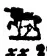

**BURROUGHS WELLCOME & CO., LONDON**

xx 3904

COPYRIGHT

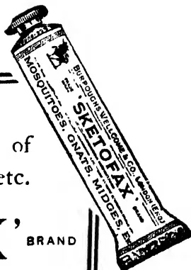

# FRUITS.

## THE MANGO.

NOTES FROM RECENT LITERATURE.

**H. L. VAN BUUREN, Dipl. Agr. (Poona).**

*Assistant to Economic Botanist, Department of Agriculture, Ceylon.*

Of more than passing interest to mango-growers is "The Book of the Mango" by BURNS and PRAYAG, being Bulletin No. 103 of 1920 of the Department of Agriculture, Bombay. This embodies the results of observations and experiments made since 1908 in the Ganeshkhind Botanical Gardens, near Poona, and in various parts of the Bombay Presidency. With extracts and précis from all available literature, the writers bring out the practical problems they are engaged in investigating, suggesting what there is still to be known by furnishing us with all that is known at the present day on them.

### PROPAGATION BY SEED.

Propagation by seed appears to be worth re-considering because some types are known to give seed that give rise to more than one seedling each, i.e., they are polyembryonic. Polyembryonic mangos form a class in themselves. They are unknown in India but are common in the New World.

93------------------------------------------------

FEBRUARY, 1922.]85

In Ceylon, this characteristic has on more than one occasion been brought to the notice of the writer but it was difficult in each case to be sure of the origin of the seed; there is a suspicion, nevertheless, that at least in one instance the seed was of a Ceylon type. The interest in this phenomenon is that American investigators have found polyembryonic mangos coming true to type when propagated by seed. Otherwise, propagation by seed, although the easiest, is not the best method: this because one cannot be sure that the seedling tree will bear the same quality of fruits as its parent.

### GRAFTING.

The best method of propagating the mango is by grafting. Different methods of grafting are described but investigation and experience make the writers to recommend "inarching."

Before grafting it is necessary first to grow your stock plants. For these, seeds must be obtained from a good hardy tree found locally; a semi-wild tree would perhaps be better than any other. The seeds must be germinated fresh: After a month, it is their experience that the germination capacity rapidly decreases. The writers recommend growing seedlings in pots placed in trenches deep enough for the brims of the pots standing in them to come on a level with the surface. Dry leaves should be packed round the pots in the trenches. To get strong seedlings a quick-acting fertiliser is recommended. They have found that one ounce of sodium nitrate per plant applied every six to eight weeks gave good results. Grafting should be done when the stocks are  $1\frac{1}{2}$  to  $2\frac{1}{2}$  years old. If done on younger stocks the resulting plants are less strong and durable and also do not fruit early. If the seedlings are sturdy and well-nourished then "inarching" on one year old stocks is recommended. This is described as follows:—"The stock in its pot is placed so that a branch of the tree from which the scion is to be taken is in contact with the stock. If necessary, the branches bearing the scions should be bent down and fixed conveniently. Where branches cannot be bent so as to meet pot plants on the ground, these pot plants must be elevated on a scaffolding to meet the scion branches. In the Konkan, the pots are tied to the branches of the trees close to the scion. By any of the above methods a large number of stocks can be grafted on from one tree. The branch of the scion is brought close to the stock, and at the point of contact a thin slice of bark and wood is removed from each. The slice may be two or three inches long,  $\frac{1}{4}$  inch broad, and about  $\frac{1}{8}$  inch deep. The cut surfaces should fit each other so that union may be perfect. The cut surfaces should immediately be tied together and covered with grafting clay or wax. It takes nearly two months for perfect union to take place. A month and half after grafting, a cut is made in the scion between the point of junction and the parent tree. This cut is deepened after a week and the scion completely severed after another fortnight. The original top of the stock is then removed. The cuts are later on trimmed and the cut ends tarred."

In Poona it is the usual thing to use the inner part of the sheaf of the plantain leaf, cut into strips, as a substitute for waxed tape. This is applied first; thoroughly moistened, and string tied above it. Then the whole is covered with grafting clay made by mixing equal parts of fresh cowdung and clayey soil. Till union is complete the pots need careful watering.

94------------------------------------------------

86[FEBRUARY, 1922.

### ESTABLISHING THE PLANTATION.

Planting out at distances of thirty feet is advocated. To prevent water-logging, it is better to plant about the end of the rains, especially in districts with a rainfall above 60 inches. Also, "It is always preferable to transplant when the trees are not in flush." In filling up the pits, the writers recommend mixing 1 cwt. of well-rotted farmyard manure plus 5 lb. of bone meal and 10 lb. wood-ashes with the earth to be placed in the pit.

### AFTER CARE.

Till its fourth year it is necessary to irrigate the grafted plants. This, at the commencement, should be done once in three days when there is no rain. After the fourth year watering is not necessary unless the tree actually shows signs of withering. Manuring will be necessary only if inter-crops of vegetables or other food-crops are taken from the soil. Pruning will be necessary to get a good shape. From its fourth year onwards a grafted tree begins to bear. No rationale of pruning for fruits has yet been devised; it is advisable, however, to prune bearing trees after the rains, removing only dead or diseased branches and such as are obviously superfluous.

### HARVESTING AND RIPENING.

Harvesting should be done before the mangos are quite ripe. "The exact time when picking should be done is a matter of personal experience. As a rule, when three or four semi-ripe windfalls are discovered and the fruits are full-sized, picking from that tree may commence."

There are some interesting notes on ripening. "After picking, the fruits must be kept cool and away from the direct sun. They are transferred to a store-house for ripening. The fruits are first spread in one layer on a bed of mango leaves at least four inches thick, and left there for two days exposed. They are then transferred to straw for ripening. In some store-houses half the space is reserved for spreading and half for ripening proper. The store-house should be well ventilated and not completely dark. Country varieties are kept in straw of *Iseilema Wightii* (Sheda). Three to five layers of such fruits are built up separated by two inches of grass. *Ischaemum sulcatum* (Pawna) is avoided as it is found to have the effect of retarding ripening. For superior varieties such as Pairi and Alphonse rice straw is used. This allows of uniform ripening and good coloration. Besides, it is soft and there is no danger of marking the fruit and so spoiling its market value. Two layers at most of such varieties are built up but it is desirable to keep only one layer. Fruits thus preserved in straw ripen about the sixth day and the whole lot is taken out for immediate sale. Sorting is generally done at this time but this would be better done at an earlier stage, namely, immediately after picking, as the fruits can then be handled without damage. If it is desired to delay ripening, then the fruits are not put in straw but are kept exposed on a bed of mango leaves. By this means the ripening can be delayed by about a week."

There are further chapters on "The Transport of Trees, Scions and Seeds," "Renovation of neglected Plantations," "Flowering and Pollination," "Pests and Diseases," "Uses and Canning," and "Mango Classification." The appendix consists of a "Descriptive list of Names of Varieties" numbering some 89 with line-drawings.

95------------------------------------------------

FEBRUARY, 1922.]87

### VARIETIES.

In establishing a mango plantation the question first to decide is whether you would import your plants or whether you would propagate from a good type close at hand. The former is widely practised in Ceylon (grafting being unknown) but this is a very expensive matter. Also, unless the superior foreign types are known, indiscriminate importation is likely to cause disappointment. There are hundreds of types in India that are worthless.

The leading varieties of Bombay that keep well are:—ALPHONSE, FERNANDIN, SAKHARIA, BORSHA, BATLI, and KHOONT. They come into the Bombay market from the middle of May till the end of June. After July two Madras varieties come into the Bombay market, i.e. TOTAPURI and NEELUMB. The former is known in Porto Rico as "TOTAPARI" and is there well reported as a "tree of vigorous growth, precocious and a regular and prolific bearer."

The "PAIRI" is considered to be the second most important mango of Bombay but is of poor keeping quality. It can be recommended for home consumption. BURNS speaks highly of it and so does HIGGINS (Hawaii) and KINMAN (Porto Rico). The last two place it first in flavour and quality. It is also stated to be resistant to fruit flies.

### THE "ALPHONSE" ORDER.

The "ALPHONSE" is the most widely cultivated mango in Bombay, and perhaps, in the whole of India. The "FERNANDIN" belongs to the same class and is considered "a fruit of superior sort," with a taste that is "highly delicious." The imported "FERNANDEZ" of Florida is considered to be of little value and is a good illustration of what happens unless care is exercised in importing from a reliable source.

The "MULGOBA" is a Madras type which meets with its best development in Bangalore. WESTER\* summarizes American experience of this type. He writes: "The tree is very vigorous and of symmetrical growth but lacking in precocity, and has not proved to be either a constant or prolific bearer. From the observations of the writer this is to a large measure due to imperfect fertilization of the flowers. The defect might be overcome by the discovery of some variety whose pollen is more potent than its own, trees of which should then be planted among the *Mulgoba* trees. The *Mulgoba* was the first Indian mango introduced into Florida and was at first extensively planted, but because of its shy bearing qualities it has been discarded in favour of more precocious productive sorts. In appearance and quality the *Mulgoba* is exceptionally good and while commercially unprofitable it is well worthy of a place in a private collection of mangos."

The leading mango of Florida now is the "HADEN" mango which originated as a seedling of the *Mulgoba*. This resembles the *Mulgoba* very closely both in form and quality and is thought to be more productive. It is also a more highly coloured fruit.

Both the *Haden* and *Mulgoba* will be referred to the "Alphonse" Order of mangos characterised by long fruits with no beak and with a high left shoulder. Also, probably, the Bombay "BORSHA" mentioned above, the Ceylon "CHEMPADA MA" (from Jaffna) and the "SINGAPURI" of Sahranpur as described and figured by HARTLESS†. The last is reported to be "cold resistant" and is worthy of note for introduction into higher elevations in Ceylon.

\* A Descriptive List of Mango Varieties in India by P. J. WEETER, THE PHILIPPINE AGRICULTURAL REVIEW, Vol. XIII, No. 4, page 265.

† From a cyclostyled copy of notes and line drawings by A. C. HARTLESS, Supt. Govt. Bot. Gardens, Sahranpur.

96------------------------------------------------

88[FEBRUARY, 1922.

### CLASSIFICATION OF MANGOS.

BURNS and PRAYAG's classification is as follows :—

#### 1. Cohort I.

Round Fruited.

Order No. 1. " ROOS "

Order No. 2. " RAMPHALYA " Very broad in proportion to length

Order No. 2. " DALIMBYA "—Shoulders ridged.

#### 2. Cohort II.

Long Fruited

Order No. 1 " BATLI."—Much elongated.

Order No. 2 " TOTAPURI."—Elongated with downward pointing beak.

Order No. 3 " COWASJI PATEL."—Elongated, slight beak and ridged shoulders.

Order No. 4 " ALPHONSE."—No beak, high left shoulder.

Order No. 5 " PAIRI."—Broad, marked beak.

*Unclassified or Indefinite Forms:*—"Those that fall in neither class on account of being on the border line between the classes and, in addition, of somewhat variable nature."

### THE "PAIRI" ORDER.

The "PAIRI," as previously mentioned, is considered by some to be the finest mango in India but it is of very poor keeping quality.

The "BOMBAY" mango of Madras, Calcutta, Ceylon or America is more often a form referable to the "Pairi" Order. The Ceylon "BETI-AMBA" is thought by some to have been actually introduced from Bombay. It has the typical "Pairi" shape and is probably the commonest variety to be found in the Ceylon markets.

The "BOMBAY MANGO (Calcutta Garden)" of Sahranpur as described and figured by HARTLESS comes under this order. It is described as a good keeper, resistant to cold and prolific. It might be worthy of introduction into the higher elevations of Ceylon.

The "Bombay" Group of mangos as described by ROLLS of Florida does not seem to have any particular relationship with one another and appear to be mixed with forms of the "Alphonse" Order.

In Hawaii there are two varieties referable to this order which are among the leading mango varieties there. The "PAHERI" is doubtlessly the same as "PAIRI" and KINMAN'S opinion of it has been referred to elsewhere. The other variety is the "AMINI" also introduced from India. KILMAN'S\* notes on this type are : "The variety is one of the most regular and prolific tested, being excelled slightly by *Sundersha* and *Tolafari*, while its fruiting season is usually longer than that of other varieties." The flesh is described as "firm, juicy, fibreless, of pleasing flavour and rather strong aroma."

### THE "COWASJI PATEL" ORDER.

The mangos of this group are generally insipid fruits or turpentiney and slightly sour in taste. The "Cowasji Patel" is a very rough and knobby fruit. The mango known under the sobriquet of the "SODA WATER" mango by the Ceylon schoolboy ("Pol Amba" *Sinh.*) belongs to this group. Mangos of this group form the basis of the celebrated mango chutneys and pickles of Bombay and perhaps India.

\* THE MANGO IN PORTO RICO, C. F. KINMAN. P. R. AGR. EXPT. STAT. BULL. No. 24, 1918.

97------------------------------------------------

FEBRUARY, 1922.]89

### THE "TOTAPURI" ORDER.

The "TOTAPURI" is not quite like the Porto Rican "TOTAFARI" mentioned above although the latter is of Indian origin. KINMAN'S observations on the "TOTAFARI" are thus described :—

"The tree is a vigorous grower, open and spreading in habit. It comes into bearing at two or three years after grafting, and is a regular and prolific bearer, the fruit of an individual tree being uniform in size for a given crop. The fruits are sometimes attacked by fruit flies, though seldom seriously. They keep well after picking, and are attractive and suitable for both home and market use." The flavour is described as "subacid, spicy, and very agreeable."

The "TOTAPURI" of Sahranpur is also "acid and of spicy flavour" according to HARTLESS.

The pleasantly acid taste characterises mangos of this group. Thus the Bombay "POPATIA" is "slightly acid but pleasant" (BURNS and PRAYAG). ROLFS\* in classifying the Floridan mangos places "Totafari" in the "Pine-apple Group," so named, probably, from a resemblance in taste and flavour to pine-apple which is characteristic of the "PINE-APPLE" mango of Florida said to be derived from Mexican seedlings.

The Ceylon "PARROT" mango ("Gira Amba" *Sinh.*) comes under this group and is a very fair example of the shape and flavour to be expected in mangos of this order.

A noteworthy variety that is probably a close relative to "Totapuri" is the "SANDERSHAH" of Florida. This must not be confused with the "SOONDERSHAH" of Sahranpur as described by HARTLESS which appears to be a very inferior mango of little if any merit.

The Floridan "Sandershah" was introduced from Bangalore and although it is in flavour reported to be neither so rich nor pleasing as Alphonse, Pairi or Mulgoba, yet the attractive appearance, the size of the fruit, which in many cases weigh over two pounds, and its characteristics as a regular and prolific bearer, ripening late, place it amongst the best of the Indian mangos introduced to America. It is recommended as a canning or preserving mango.

HARTLESS'S "KARELIA" of Sahranpur has a form very nearly similar to the American type and is recommended for trial.

### THE "BATLI" ORDER.

The Bombay mangos of this group worthy of introduction and trial, apart from "BATLI" as mentioned previously, are "DODI," "CALCUTTIO," "KELYA," and "CHATRAPATI." These are all characterised as "luscious" or sweet and pleasant in taste.

The Sahranpur varieties of "GOLA," "SUFaida" and "HATHIHUHL" apparently belong to this group. The two former were introduced to America. The first variety is under trial in Florida. HARTLESS characterises it as a sparse bearer, hardy and cold-resistant, ripens late, keeps well, juicy, of good flavour. In quality it may be classed as second-rate.

The "SUFaida" was introduced into Porto Rico and has been found to be a vigorous grower and a regular but not prolific cropper. The flavour is "sweet, refreshing, pleasant and fairly rich." This variety has a later fruiting season than any other tested in Porto Rico. A defect is that the fruits often crack before they are ripe. The "HATHIHUHL" is also of good quality and deserves mention particularly for trial at high elevations.

### THE "ROUND FRUITED" MANGOS.

In this class the Bombay varieties worthy of mention are "Roos," "DILPASANT," "RAMPHALYA," "SAKHAR GOOTY" and "DALIMBYA." They are all classed as "delicious," "luscious," "pleasant and somewhat heavy."

\* Mangos in Florida. P. H. Rolfs, Bull 127 Univ. of Florida, A.E.S.

98------------------------------------------------

90[FEBRUARY, 1922.

"*Sakhar Gooty*" is almost identical with the Ceylon "HONEY" mango (Mi-Amba *Sinh.*). "*Dilpusant*" is not identical with "DILPASSAND" of South India (described in the TROPICAL AGRICULTURIST, August, 1917, page 83). The latter is not so delicately flavoured and in form characters show group relationship with the "Totapuri" order.

#### OTHER NOTEWORTHY VARIETIES.

The "CAMBODIANA" is a notable variety said to be the native mango of the Malayan Peninsula. The seeds are polyembryonic. Like the "Pairi" it is a delicate sort that does not keep well and is good only for local consumption. KINMAN'S notes on this are :— "The variety fruits early and is a regular and prolific bearer. The fruits are free from blemishes, uniformly coloured, very attractive and among the best in flavour and quality." This variety was introduced into America from Indo-China.

The "CARABAO" of the Philippines, characterised as "coming true from seed" belongs to this type of mango. It is, however, not so precocious. The "CECIL" which originated as a seedling from the "Philippine" mango is considered to be the handsomest and best mango of this group in Florida.

The elongated forms of the "Cambodiana" are nearly alike to the "*Totapuri*" without the beak-like apex. Other forms approximate to the "*Alphonse*" with no beak and a pronounced shoulder or more nearly the "*Gola*" because of the depressed basal cavity.

The mango known in Colombo as the "JAFFNA" mango and in Jaffna as the "COLOMBO" mango is more nearly similar to the "*Cambodiana*" than to the "*Alphonse*."

The "FAIRI" of Sahranpur as described and figured by HARTLESS show strong Cambodiana affinities. HARTLESS'S notes are : "The tree is of medium vigour, cold-resistant, and a shy bearer. The fruit ripens late in season and keeps well." This variety is deserving of trial at higher altitudes.

A group of mangos deserving of mention are those which go under the name of "MALDA" mangos in Calcutta. There are no descriptions available but the aroma and flavour is said to differ from all other Indian mangos. They are among the finest obtainable in India and the covering of the seed is said to be so thin that in cutting a fruit the knife often passes through the seed. WOODROW gives "LANGRA" as a synonym of the "Malda" mangos. The "LANGRAS" described by HARTLESS are among the best varieties in India and are well worthy of introduction for trial in higher elevations. They are in form similar to the "Pairi" mangos. The "CALCUTTA" mango which belongs to the same order suggests an interesting linkage of all these types to the Bombay "Pairi." It is probable that a well-extended inquiry will place the "PAIRI" order of mangos as the most widely distributed class throughout India and not the ALPHONSE order, as is generally believed.

The "KOHITOOR" is another mango that is not described anywhere. As "the premier mango in Murshedabad" it is worthy of mention in any list of the superior Indian mangos that are deserving of introduction into Ceylon.

#### A NEW CITRUS FRUIT.

A new citrus fruit with a pink flesh and sweet flavour, provisionally called a New Tangelo, has been produced by crossing in Florida. A remarkable feature of this cross (which is not unlike an orange), is the absence from the rind of any bitter principle or pungent oil, the rind itself being very mild and edible. This fruit should lend itself to the preparation of candied sections, rind and all being preserved in this form. For further information see the JOURNAL OF HEREDITY for April, 1921.—INDIAN SCIENTIFIC AGRICULTURIST, VOL. III, No. 1.

99------------------------------------------------

FEBRUARY, 1922.]91

## GRAPE VINE CULTIVATION IN MICHAELPATTI.

P. PONNUSAMY NAIDU,

*Asst. Agricultural Demonstrator, Dindigul.*

### SOIL AND MODE OF CULTIVATION.

Red loamy soil with a slight admixture of lime stone or gravel is considered best suited for grape vine cultivation. Experienced ryots say that vine grown in gravelly soil tastes sweet, but in colour is not so nice as when grown in other soils (i.e.), grapes from Krishnagiri are nice to look at but not so luscious and sweet.

### PLANTING.

Pits 3 ft.  $\times$  3 ft.  $\times$  3 ft. are dug at distances of 15 feet and filled with cattle manure and loose soil which are left to decompose for some months. Then young plants (i.e.), fresh cuttings about 10 inches long from the healthy and vigorous plants 5 to 7 years old or young plants which have been previously cut and propagated in mud pots with soil mixed with some manure are planted. During the first two years the intervening spaces are generally cultivated with crops like chillies, onions which require moisture and which give the tender plants necessary shade. The young plants are placed in the pits in cool months of December and January a little after the heavy rains have ceased.

### GROWTH.

The plants attain to a height of 4 to 5 feet when about a year old; until then sticks about 1 inch are placed by the side of the plants to support them. In the beginning of the second year the plants begin to spread when light temporary pandals are put up on which the branches creep.

### PANDALS.

Pandals are put up in the third year. They are of green mulukiluvai poles (*Balsamodendron terryt*) and are 12 feet apart. Slender agathi or pekkarumbu poles (*Saccharum arundinaceum*) are thrown across and fastened by aloe fibre. The mulukiluvai is chosen as it costs little, strikes root quickly, as its roots do not spread and above all as it affords nice shade to the tender creeping branches. Once in two years the agathi poles (laid across for the support of branches) are removed at the time of pruning. The pandal is about 5 feet raised from the ground level.

### AFTER CULTIVATION.

This consists in weeding and hoeing. Hand hoeing is done at all times whenever necessary. But hoeing with mamooty is done only once in three months.

### PRUNING.

This is done generally twice a year. From the third year vine branches are pruned just when old leaves fall making room for new shoots to come. The first pruning is done during winter season (i.e.), last week of December. In the third week after pruning new shoots come and by the 5th week the flowers make their full appearance. For about 10 days after pruning vines are not watered, but from the time the new shoots make their appearance vines are regularly watered on every alternate day. The vine comes to yield during the month of March and by the end of March it is ready for harvest, i.e., gathering. Then a complete rest is given from April to May. It is during this season the vine crop is being manured. The second pruning takes place during summer season from the middle of June. Then the crop would be ready for harvest by the beginning of October. Then as usual there is a resting season from the middle of October to the middle of December.

### YIELD.

The summer yield is generally heavy and ryots get 5 to 6 rupees per maund. The winter yield is poor and is about less than half the summer yield and fetched 3 to 5 rupees per maund in normal conditions. An average-sized healthy vine yields 3 maunds under best conditions in one season.

—JOURNAL OF THE MADRAS AGRIC. STUDENTS' UNION, VOL. XXII, NO. 1, 1922.

100------------------------------------------------

92[FEBRUARY, 1922.

# FOODSTUFFS.

## COWPEAS UTILIZATION.

W. J. MORSE,

*Agronomist, Office of Forage Crop Investigations.*

The following is extracted from FARMERS' BULLETIN 1553 of the United States Department of Agriculture :—

### THE PRINCIPAL USES OF COWPEA.

The Cowpea\* is of ancient cultivation for human food, particularly in Africa and Asia, and also in the Mediterranean region of Europe. In the United States it has been grown mainly for soiling, hay, ensilage, and pasturage for all kinds of stock, and as a soil-improving crop, but in Southern States the seeds, chiefly of the Blackeye and White varieties, have been commonly used for human food.

For feed the cowpea is especially valuable because it will grow on all types of arable soil. It requires little attention but produces most excellent forage. In addition it is of great value as a green manure crop to increase the humus and the nitrogen content of the soils upon which it is grown. It also aids much in keeping the soil in good tilth and maintaining its productiveness.

### COWPEA FOR SEED.

In the United States cowpea is grown mainly as a forage, and therefore little effort is made to harvest seed. The principal factors in making the cowpea an undesirable crop to grow in a commercial way for seed production are the uncertainty of a seed crop, the expenses of harvesting and the low yields generally obtained. However, the value of the crop for forage and soil improvement and the high price of seed make it highly desirable for every farmer to grow sufficient seed to supply at least his own needs.

The demand for seed of well-known varieties has kept the prices in recent years so high as to make cowpea seed production a profitable line of farming.

Cowpea seed has a high feeding value, and is a very palatable and nutritious human food.

---

\* Cowpea=*Vigna sativa*. Sinhalese *Mē*; Tamil *Paithanga*.

101------------------------------------------------

FEBRUARY, 1922.]93

### TIME OF HARVESTING.

Cowpeas ripen so unevenly that it is difficult to judge just what is the proper stage of maturity to cut for seed. With nearly all varieties, blossoms and green and ripe pods occur at the same time.

In harvesting cowpeas for seed the vines should be allowed to mature a greater percentage of pods than when cut for hay. In general the crop should be harvested when one-half to two-thirds of the pods are matured. Although some loss will occur as a result of over-ripe pods shattering the seed, more seed will be obtained than if the crop is harvested before a large percentage of pods are ripe.

### METHOD OF HARVESTING.

Various methods of harvesting the cowpea for seed are employed in different sections of the cowpea region. Hand-picking is the most common way of saving the seed, although the most expensive and laborious.

Another method of harvesting by hand is to pull up the vines or to cut with a corn knife or sickle. The vines are placed in small shocks and left in the field until well cured. This method is slow and only practicable where the acreage is small.

In the United States where large fields are grown for seed production, various machines are used for cutting the vines. Several types of bean and pea picking machines are on the market, but are not extensively used.

### METHODS OF THRASHING.

The ordinary grain separator can be adjusted to thrash cowpeas successfully and it is the machine most generally used. Several modifications of thrashing machines have been devised for handling cowpeas.

### STORAGE OF SEED.

Cowpea seed, if good, can be stored for a considerable length of time without much danger of loss of vitality. If the peas are sufficiently cured in the field, mow, or stack before thrashing, there is little danger of heating. However, seed not properly cured or stored quickly loses its vitality; consequently a germination test is always advisable.

Cowpea seed is subject to attack from insects, especially the cowpea weevil. There are usually some weevils in the seed when thrashed and placed in storage, and in a warm temperature they emerge and lay their eggs upon the other stored seed.

The following table gives the results of germination tests with seeds of

102------------------------------------------------

94[FEBRUARY, 1922.

different varieties kept for 4, 7, and 10 years in a store-room :—

**Germination of seed of standard varieties of cowpeas when stored for different periods.**

<table border="1">
<thead>
<tr>
<th rowspan="2">Variety</th>
<th rowspan="2"></th>
<th rowspan="2">per cent</th>
<th colspan="3">Length of time seed was stored</th>
</tr>
<tr>
<th>4 years</th>
<th>7 years</th>
<th>10 years</th>
</tr>
</thead>
<tbody>
<tr>
<td>Whippoorwill</td>
<td>...</td>
<td>96</td>
<td>96</td>
<td>93.5</td>
<td>79.5</td>
</tr>
<tr>
<td>New Era</td>
<td>...</td>
<td>73</td>
<td>73</td>
<td>61</td>
<td>18</td>
</tr>
<tr>
<td>Iron</td>
<td>...</td>
<td>60.5</td>
<td>60.5</td>
<td>17.5</td>
<td>14.5</td>
</tr>
<tr>
<td>Clay</td>
<td>...</td>
<td>38</td>
<td>38</td>
<td>8</td>
<td>1.5</td>
</tr>
<tr>
<td>Black</td>
<td>...</td>
<td>79</td>
<td>79</td>
<td>82</td>
<td>..</td>
</tr>
<tr>
<td>Taylor</td>
<td>...</td>
<td>50</td>
<td>50</td>
<td>26.5</td>
<td>0</td>
</tr>
<tr>
<td>Blackeye</td>
<td>...</td>
<td>22</td>
<td>22</td>
<td>3.5</td>
<td>0</td>
</tr>
<tr>
<td>Red Ripper</td>
<td>...</td>
<td>3.5</td>
<td>3.5</td>
<td>.5</td>
<td>0</td>
</tr>
<tr>
<td>Groit</td>
<td>...</td>
<td>0</td>
<td>0</td>
<td>0</td>
<td>0</td>
</tr>
<tr>
<td>Michigan Favourite</td>
<td>...</td>
<td>0</td>
<td>0</td>
<td>0</td>
<td>0</td>
</tr>
<tr>
<td>Extra Early Blackeye</td>
<td>...</td>
<td>0</td>
<td>0</td>
<td>0</td>
<td>0</td>
</tr>
</tbody>
</table>

Cowpea seed more than 2 years old ordinarily has lost much of its viability. Good viable seeds are uniformly bright coloured, while seeds which have been exposed to moisture or are dead are duller and darker in colour.

**PROPORTION OF SEED TO HULLS.**

In view of the fact that gathering the pods by hand is very generally practiced, the proportion of seeds to pods is a matter of importance. The results obtained at different experiment stations indicate that the proportions of seed and hulls vary according to the variety and locality as shown in the following table :

**Weight of Seed in 100 pounds of pods of standard varieties of Cowpeas.**

<table border="1">
<thead>
<tr>
<th>Variety</th>
<th></th>
<th>Alabama</th>
<th>Arkansas</th>
<th>Arlington Farm, Va.</th>
</tr>
</thead>
<tbody>
<tr>
<td>Whippoorwill</td>
<td>... pounds</td>
<td>73</td>
<td>67.3</td>
<td>65.2</td>
</tr>
<tr>
<td>New Era</td>
<td>... do</td>
<td>73</td>
<td>61.8</td>
<td>67.8</td>
</tr>
<tr>
<td>Groit</td>
<td>... do</td>
<td>—</td>
<td>—</td>
<td>63.1</td>
</tr>
<tr>
<td>Brabham</td>
<td>... do</td>
<td>—</td>
<td>—</td>
<td>69.2</td>
</tr>
<tr>
<td>Iron</td>
<td>... do</td>
<td>69</td>
<td>65.3</td>
<td>66</td>
</tr>
<tr>
<td>Clay</td>
<td>... do</td>
<td>67</td>
<td>58.3</td>
<td>63.5</td>
</tr>
<tr>
<td>Wonderful</td>
<td>... do</td>
<td>70</td>
<td>—</td>
<td>—</td>
</tr>
<tr>
<td>Red Ripper</td>
<td>... do</td>
<td>71</td>
<td>66</td>
<td>67</td>
</tr>
<tr>
<td>Taylor</td>
<td>... do</td>
<td>77</td>
<td>64.7</td>
<td>72</td>
</tr>
<tr>
<td>Large Blackeye</td>
<td>... do</td>
<td>77</td>
<td>71.2</td>
<td>76.3</td>
</tr>
<tr>
<td>Extra Early Blackeye</td>
<td>... do</td>
<td>76</td>
<td>75</td>
<td>72.3</td>
</tr>
<tr>
<td>Black</td>
<td>... do</td>
<td>76</td>
<td>73.2</td>
<td>71.7</td>
</tr>
<tr>
<td>California Blackeye</td>
<td>... do</td>
<td>—</td>
<td>—</td>
<td>73.3</td>
</tr>
<tr>
<td>Early Buff</td>
<td>... do</td>
<td>—</td>
<td>—</td>
<td>73</td>
</tr>
</tbody>
</table>

**FEEDING VALUE OF COWPEAS.**

The composition of cowpea seed indicates that it is of high feeding value in comparison with other feeding stuffs. Cowpeas have been used at

103------------------------------------------------

FEBRUARY, 1922.]95

the Alabama Agricultural Experiment Station for fattening pigs with excellent results. Excellent results have also been obtained by feeding cowpea seed, either whole or cracked, to poultry.

**Digestible nutrients of cowpea seed in Comparison with those of other feedstuffs.**

<table border="1">
<thead>
<tr>
<th colspan="3" rowspan="2">Feeding stuff</th>
<th colspan="4">Digestible Nutrients in 100 pounds</th>
</tr>
<tr>
<th>Protein</th>
<th>Carbohydrates.</th>
<th>Fat</th>
<th>Total</th>
</tr>
</thead>
<tbody>
<tr>
<td>Cowpea</td>
<td>...</td>
<td>pounds</td>
<td>19.4</td>
<td>54.5</td>
<td>1.1</td>
<td>76.4</td>
</tr>
<tr>
<td>Canada pea</td>
<td>...</td>
<td>do</td>
<td>19.0</td>
<td>55.8</td>
<td>.6</td>
<td>76.2</td>
</tr>
<tr>
<td>Soy bean</td>
<td>...</td>
<td>do</td>
<td>30.7</td>
<td>22.8</td>
<td>14.4</td>
<td>85.9</td>
</tr>
<tr>
<td>Wheat bran</td>
<td>...</td>
<td>do</td>
<td>12.5</td>
<td>41.6</td>
<td>3.0</td>
<td>60.9</td>
</tr>
<tr>
<td>Oats</td>
<td>...</td>
<td>do</td>
<td>9.7</td>
<td>52.1</td>
<td>3.8</td>
<td>70.4</td>
</tr>
<tr>
<td>Wheat middlings</td>
<td>...</td>
<td>do</td>
<td>15.7</td>
<td>52.8</td>
<td>4.3</td>
<td>78.2</td>
</tr>
<tr>
<td>Velvet bean</td>
<td>...</td>
<td>do</td>
<td>18.1</td>
<td>50.8</td>
<td>5.3</td>
<td>80.8</td>
</tr>
<tr>
<td>Corn</td>
<td>...</td>
<td>do</td>
<td>7.7</td>
<td>66.1</td>
<td>4.6</td>
<td>84.2</td>
</tr>
</tbody>
</table>

**COWPEAS FOR HUMAN FOOD.**

The cowpea is generally known as a food in the Southern States of America. Its limited use in the dietary of other parts of the United States is due chiefly to the fact that the culture of the cowpea has been confined principally to the South. No great effort has been made to create a general market, and competition with the navy or field beans in the North has not been developed. It is a most wholesome and nutritious foodstuff, from which a great variety of palatable as well as economical dishes can be made.

Cowpeas are used in three forms for human food—in the pod, shelled green, or shelled dried. In these forms they correspond, respectively, to string beans, shelled green peas, and dried navy beans and call for much the same methods of preparation for the table.

Undoubtedly the cowpea is of the greatest palatability from the time the pods begin to turn yellow until they begin to shrink in ripening. At this stage they are much larger than when fully mature and dry, are more easily cooked, and of better flavour. The colour of the seed has much to do with the popularity of the cowpea for table use. The White varieties, such as the Conch, Cream, or Lady, and the Blackeye varieties, such as the California Blackeye and Large Blackeye are preferred to the coloured varieties.

**YIELDS OF SEED.**

The yield of seed, like that of hay, depends to a very large extent upon conditions of weather, soil, culture, and variety. In many sections the cowpea is rather an uncertain crop, as the yield of seed varies greatly from year to year. The seed yields of the most important commercial varieties reported by investigators at various agricultural experiment stations are shown in the following table. In general, the figures show the average yields for a number of years and indicate the best seed-producing sorts :

104------------------------------------------------

96[FEBRUARY, 1922.

Yield of seed to the acre of the best varieties of cowpeas at different Agricultural Experiment Stations.

<table border="1">
<thead>
<tr>
<th rowspan="2">Variety</th>
<th colspan="12">Average yield of seed per acre ( bushels )</th>
</tr>
<tr>
<th>Alabama</th>
<th>Louisiana</th>
<th>Arizona</th>
<th>Arkansas</th>
<th>Delaware</th>
<th>Georgia</th>
<th>Indiana</th>
<th>Kansas</th>
<th>Mississippi</th>
<th>Missouri</th>
<th>North Carolina</th>
<th>Oklahoma</th>
<th>South Carolina</th>
<th>Texas</th>
<th>Virginia</th>
</tr>
</thead>
<tbody>
<tr>
<td>Black</td>
<td>21.1</td>
<td>13.0</td>
<td>—</td>
<td>15.7</td>
<td>7.4</td>
<td>19.9</td>
<td>8.1</td>
<td>11.1</td>
<td>14.2</td>
<td>18.6</td>
<td>12.9</td>
<td>—</td>
<td>13.0</td>
<td>20.3</td>
<td>20.0</td>
</tr>
<tr>
<td>Brabham</td>
<td>—</td>
<td>—</td>
<td>—</td>
<td>—</td>
<td>—</td>
<td>11.1</td>
<td>—</td>
<td>—</td>
<td>29.1</td>
<td>—</td>
<td>10.0</td>
<td>—</td>
<td>—</td>
<td>4.0</td>
<td>10.6</td>
</tr>
<tr>
<td>Clay</td>
<td>10.8</td>
<td>—</td>
<td>—</td>
<td>9.8</td>
<td>6.6</td>
<td>34.3</td>
<td>5.3</td>
<td>10.9</td>
<td>14.0</td>
<td>14.4</td>
<td>13.7</td>
<td>—</td>
<td>13.3</td>
<td>2.1</td>
<td>—</td>
</tr>
<tr>
<td>California Blackeye</td>
<td>—</td>
<td>—</td>
<td>—</td>
<td>—</td>
<td>—</td>
<td>5.9</td>
<td>—</td>
<td>4.1</td>
<td>—</td>
<td>—</td>
<td>—</td>
<td>8.1</td>
<td>16.3</td>
<td>—</td>
<td>16.3</td>
</tr>
<tr>
<td>Early Buff</td>
<td>—</td>
<td>—</td>
<td>2.4</td>
<td>—</td>
<td>—</td>
<td>—</td>
<td>—</td>
<td>—</td>
<td>—</td>
<td>—</td>
<td>—</td>
<td>—</td>
<td>—</td>
<td>12.6</td>
<td>19.7</td>
</tr>
<tr>
<td>Extra Early Blackeye</td>
<td>16.4</td>
<td>—</td>
<td>—</td>
<td>29.1</td>
<td>5.4</td>
<td>—</td>
<td>14.2</td>
<td>9.9</td>
<td>—</td>
<td>—</td>
<td>9.2</td>
<td>—</td>
<td>9.9</td>
<td>7.2</td>
<td>18.8</td>
</tr>
<tr>
<td>Groit</td>
<td>—</td>
<td>—</td>
<td>—</td>
<td>—</td>
<td>8.2</td>
<td>—</td>
<td>—</td>
<td>—</td>
<td>26.8</td>
<td>14.8</td>
<td>17.3</td>
<td>2.2</td>
<td>—</td>
<td>8.3</td>
<td>27.3</td>
</tr>
<tr>
<td>Iron</td>
<td>14.9</td>
<td>5.0</td>
<td>—</td>
<td>—</td>
<td>7.4</td>
<td>15.8</td>
<td>7.2</td>
<td>2.5</td>
<td>14.8</td>
<td>17.5</td>
<td>8.3</td>
<td>3.3</td>
<td>9.3</td>
<td>14.3</td>
<td>10.9</td>
</tr>
<tr>
<td>Large Blackeye</td>
<td>17.0</td>
<td>6.0</td>
<td>—</td>
<td>23.6</td>
<td>5.6</td>
<td>31.3</td>
<td>—</td>
<td>12.7</td>
<td>17.1</td>
<td>14.8</td>
<td>21.7</td>
<td>—</td>
<td>21.7</td>
<td>17.0</td>
<td>26.3</td>
</tr>
<tr>
<td>Michigan Favourite</td>
<td>—</td>
<td>—</td>
<td>—</td>
<td>—</td>
<td>8.2</td>
<td>—</td>
<td>19.3</td>
<td>11.2</td>
<td>—</td>
<td>11.4</td>
<td>7.9</td>
<td>—</td>
<td>—</td>
<td>—</td>
<td>19.8</td>
</tr>
<tr>
<td>Monetta</td>
<td>—</td>
<td>—</td>
<td>6.4</td>
<td>—</td>
<td>—</td>
<td>—</td>
<td>—</td>
<td>—</td>
<td>—</td>
<td>—</td>
<td>—</td>
<td>—</td>
<td>—</td>
<td>1.3</td>
<td>13.2</td>
</tr>
<tr>
<td>New Era</td>
<td>22.0</td>
<td>18.7</td>
<td>—</td>
<td>39.9</td>
<td>15.6</td>
<td>6.9</td>
<td>14.0</td>
<td>12.4</td>
<td>22.3</td>
<td>14.0</td>
<td>14.7</td>
<td>5.0</td>
<td>24.2</td>
<td>9.6</td>
<td>25.2</td>
</tr>
<tr>
<td>Red Ripper</td>
<td>19.3</td>
<td>4.5</td>
<td>—</td>
<td>11.9</td>
<td>—</td>
<td>27.7</td>
<td>—</td>
<td>7.9</td>
<td>14.2</td>
<td>8.3</td>
<td>14.2</td>
<td>2.0</td>
<td>—</td>
<td>2.7</td>
<td>—</td>
</tr>
<tr>
<td>Taylor</td>
<td>23.6</td>
<td>—</td>
<td>—</td>
<td>19.9</td>
<td>4.9</td>
<td>11.3</td>
<td>—</td>
<td>11.9</td>
<td>21.7</td>
<td>—</td>
<td>10.6</td>
<td>2.4</td>
<td>11.5</td>
<td>9.7</td>
<td>18.6</td>
</tr>
<tr>
<td>Unknown</td>
<td>14.7</td>
<td>—</td>
<td>—</td>
<td>2.5</td>
<td>3.5</td>
<td>30.5</td>
<td>—</td>
<td>5</td>
<td>10.0</td>
<td>—</td>
<td>4.4</td>
<td>1.5</td>
<td>—</td>
<td>13.4</td>
<td>—</td>
</tr>
<tr>
<td>Whippoorwill</td>
<td>12.4</td>
<td>12.7</td>
<td>—</td>
<td>25.6</td>
<td>13.2</td>
<td>25.3</td>
<td>18.3</td>
<td>11.5</td>
<td>28.5</td>
<td>14.0</td>
<td>14.8</td>
<td>1.0</td>
<td>13.8</td>
<td>16.5</td>
<td>10.1</td>
</tr>
</tbody>
</table>

105------------------------------------------------

FEBRUARY, 1922.]97

### COWPEA STRAW.

The straw obtained from thrashing the cowpea for seed is a valuable feed for all kinds of stock. Although no data from feeding tests with this straw are available, farmers and liverymen who have used it claim that it is an excellent feed, some even preferring it to cowpea hay. No ill effects have been reported from its use. The following table gives the digestible nutrients of cowpea straw in comparison with those of the straw of other crops commonly used for feeding:—

#### Digestible nutrients of cowpea straw compared with those of the straw of other important crops.

<table border="1">
<thead>
<tr>
<th rowspan="2">Kind of Straw</th>
<th rowspan="2"></th>
<th colspan="4">Digestible nutrients in 100 pounds</th>
</tr>
<tr>
<th>Protein</th>
<th>Carbohydrates</th>
<th>Fat</th>
<th>Total</th>
</tr>
</thead>
<tbody>
<tr>
<td>Cowpea</td>
<td>... pounds</td>
<td>3.4</td>
<td>39.1</td>
<td>0.7</td>
<td>44.1</td>
</tr>
<tr>
<td>Soy bean</td>
<td>... do</td>
<td>2.8</td>
<td>38.5</td>
<td>1.0</td>
<td>43.5</td>
</tr>
<tr>
<td>Oat</td>
<td>... do</td>
<td>1.0</td>
<td>42.6</td>
<td>9</td>
<td>45.6</td>
</tr>
<tr>
<td>Wheat</td>
<td>... do</td>
<td>0.7</td>
<td>35.1</td>
<td>0.5</td>
<td>36.9</td>
</tr>
<tr>
<td>Rice</td>
<td>... do</td>
<td>9</td>
<td>37.8</td>
<td>3</td>
<td>42.8</td>
</tr>
<tr>
<td>Barley</td>
<td>... do</td>
<td>9</td>
<td>40.2</td>
<td>6</td>
<td>42.5</td>
</tr>
</tbody>
</table>

### COWPEAS FOR HAY.

If cut at the right stage of growth and properly handled, cowpeas make excellent hay of high feeding value. This hay is greatly relished by all farm animals. Well-cured cowpea hay has proved satisfactory for work stock and for beef or milk production. It has also given good results when fed to poultry, hogs, and sheep. Cowpea hay is said to be better suited for feeding cows than horses.

#### TIME AND METHOD OF CUTTING.

Cowpeas should not be cut for hay before the pods begin to turn yellow. The best quality is produced and the hay cures most readily if the vines are cut when most of the pods are full grown, and a considerable number of them are mature. If cut before this stage, the vines are watery and difficult to cure.

The ordinary mowing machine is the most practical machine for cutting cowpeas for hay, but scythes are also sometimes used in harvesting small areas.

#### CURING COWPEA HAY.

Many special devices are used more or less in curing cowpea hay. The most common of these is a pole, usually with crosspieces nailed at right angles, around which the vines are placed. Triangular frames from 2 to 3 or more feet high, built of poles with crosspieces to hold them together, are used to some extent in the same manner. The object of these devices is to keep the vines from becoming too tightly packed and to have an air space in the centre of the cock. These devices give excellent results in curing cowpeas, but, on account of the increased cost and labour involved, are not in general use.

Another method successfully practiced in some localities is that of placing the vines on poles or frames as soon as cut. The vines will form a good surface to shed water and should be left to stand two or three weeks, or until ready to stack.

The use of salt has been recommended by many successful growers. Although not essential, undoubtedly the hay is improved in palatability and it may, in the case of hay not entirely cured, assist in preventing fermentation. About 8 quarts of salt are used to 1 ton of hay.

#### FEEDING VALUE OF HAY.

The chief value of cowpea hay lies in its high percentage of digestible protein, which has been verified by numerous feeding tests. The following

106------------------------------------------------

98[FEBRUARY, 1922.

table gives comparative analyses of important hay crops :—

**Analyses of cowpea hay and other important hay crops.**

<table border="1">
<thead>
<tr>
<th rowspan="2">Kind of Hay</th>
<th colspan="6">Constituents (per cent).</th>
</tr>
<tr>
<th>Moisture</th>
<th>Protein</th>
<th>Fat</th>
<th>Nitrogen free extract</th>
<th>Ash</th>
<th>Fibre</th>
</tr>
</thead>
<tbody>
<tr>
<td>Cowpea</td>
<td>10.4</td>
<td>16.1</td>
<td>3.2</td>
<td>40.3</td>
<td>10.2</td>
<td>19.8</td>
</tr>
<tr>
<td>Soy bean</td>
<td>8.4</td>
<td>15.9</td>
<td>3.9</td>
<td>38.8</td>
<td>8.9</td>
<td>24.1</td>
</tr>
<tr>
<td>Alfalfa</td>
<td>8.7</td>
<td>15.9</td>
<td>2.7</td>
<td>36.8</td>
<td>8.8</td>
<td>27.1</td>
</tr>
<tr>
<td>Timothy</td>
<td>13.2</td>
<td>7.1</td>
<td>2.8</td>
<td>43.3</td>
<td>5.4</td>
<td>28.2</td>
</tr>
<tr>
<td>Red clover</td>
<td>12.9</td>
<td>13.6</td>
<td>3.4</td>
<td>39.1</td>
<td>6.9</td>
<td>24.1</td>
</tr>
</tbody>
</table>

**COWPEAS FOR SOILING.**

Cowpeas can be utilized to good advantage as a soiling crop. With its high percentage of protein it is an excellent supplement to less nitrogenous crops, such as corn, sorghum, and millet. The wide variation in the maturity of the varieties makes it possible to have an abundance of green forage throughout the greater part of the summer and fall.

**COWPEAS FOR SOIL IMPROVEMENT.**

The cowpea has been used as a restorative crop more than any other leguminous crop, especially throughout the Southern States. It is so easily grown and has such a marked effect on the succeeding crops that its use should be greatly increased. Aside from increasing the productiveness of the soil, the cowpea also improves its general physical condition, making heavy clay soils more open and sandy soils more compact. The cowpea has the distinct advantage of making a good growth on soils that will not produce profitable yields of other legumes or cereals. It is an excellent green-manure crop for vineyards and orchards.

The results of analyses made by the North Carolina Agricultural Experiment Station show that 1 ton of cowpea hay contains 47 pounds of nitrogen, 10 pounds of phosphoric acid, and 29 pounds of potash. The following table gives the fertilizing materials in 100 pounds of dry substance of legumes commonly utilized for soil-improving purposes :

**Fertilizing constituents in 100 pounds of dry substance of the tops and roots of important legumes.**

<table border="1">
<thead>
<tr>
<th>Plant and Part</th>
<th></th>
<th>Nitrogen</th>
<th>Phosphoric</th>
<th>Potash</th>
</tr>
</thead>
<tbody>
<tr>
<td>Red clover :</td>
<td></td>
<td></td>
<td></td>
<td></td>
</tr>
<tr>
<td>    Tops</td>
<td>pounds</td>
<td>2.35</td>
<td>0.58</td>
<td>2.14</td>
</tr>
<tr>
<td>    Roots</td>
<td>do</td>
<td>2.74</td>
<td>.84</td>
<td>.82</td>
</tr>
<tr>
<td>Alfalfa :</td>
<td></td>
<td></td>
<td></td>
<td></td>
</tr>
<tr>
<td>    Tops</td>
<td>do</td>
<td>2.30</td>
<td>.54</td>
<td>1.52</td>
</tr>
<tr>
<td>    Roots</td>
<td>do</td>
<td>2.04</td>
<td>.43</td>
<td>.48</td>
</tr>
<tr>
<td>Crimson clover :</td>
<td></td>
<td></td>
<td></td>
<td></td>
</tr>
<tr>
<td>    Tops</td>
<td>do</td>
<td>2.13</td>
<td>.62</td>
<td>1.35</td>
</tr>
<tr>
<td>    Roots</td>
<td>do</td>
<td>1.50</td>
<td>.47</td>
<td>1.02</td>
</tr>
<tr>
<td>Cowpea :</td>
<td></td>
<td></td>
<td></td>
<td></td>
</tr>
<tr>
<td>    Tops</td>
<td>do</td>
<td>1.96</td>
<td>0.51</td>
<td>1.93</td>
</tr>
<tr>
<td>    Roots</td>
<td>do</td>
<td>1.18</td>
<td>.55</td>
<td>.93</td>
</tr>
<tr>
<td>Soy bean :</td>
<td></td>
<td></td>
<td></td>
<td></td>
</tr>
<tr>
<td>    Tops</td>
<td>do</td>
<td>2.18</td>
<td>.61</td>
<td>1.68</td>
</tr>
<tr>
<td>    Roots</td>
<td>do</td>
<td>1.05</td>
<td>.34</td>
<td>.67</td>
</tr>
<tr>
<td>Velvet bean</td>
<td>do</td>
<td>2.51</td>
<td>.53</td>
<td>3.84</td>
</tr>
<tr>
<td>Common vetch</td>
<td></td>
<td></td>
<td></td>
<td></td>
</tr>
<tr>
<td>    Tops</td>
<td>do</td>
<td>2.99</td>
<td>.71</td>
<td>2.68</td>
</tr>
<tr>
<td>    Roots</td>
<td>do</td>
<td>2.19</td>
<td>.79</td>
<td>1.18</td>
</tr>
</tbody>
</table>

107------------------------------------------------

FEBRUARY, 1922.]99

## PROPAGATION OF THE BREADFRUIT IN ST. LUCIA.

The following notes on the propagation of the seedless breadfruit by root cuttings, have been furnished this Department by MR. A. J. BROOKS, Agricultural Superintendent, St. Lucia:—

In an article which appeared in No. 3, Vol. XIII, of the PHILIPPINE AGRICULTURAL REVIEW, attention was directed to the value of the breadfruit as a means of lessening the food shortage experienced during certain periods of the year, and also to the practicability of propagating this seedless plant from dormant roots, by the production of adventitious buds.

The article referred to states: "The observation of the formation of adventitious buds on injured roots of the breadfruit tree led the writer to conduct a series of experiments with root cuttings in 1913, during which it was found that properly handled, and made at the right time, the rooting of cuttings was a very simple matter. Directions how to proceed were subsequently published, but various correspondents who have tried the method have failed to obtain good results, hence it has seemed desirable again to discuss the subject more in detail."

The writer then gives details how to proceed.

A trial was made along the lines suggested, at the Agricultural Station, Reunion, and the results are here recorded.

A full-grown tree was selected in May, when the plant was in a dormant condition owing to the prolonged drought. Four medium size roots were carefully exposed and severed from the tree. These, when cut into lengths of about 6 inches, made ninety-five root cuttings.

These were inserted in nursery beds, the soil being first covered to a depth of 3 inches with sea sand.

Four weeks after insertion, bud formation was observed. At the end of September—four and a half months from the time the cuttings were made—fifty-eight had developed into strong vigorous plants between 6 and 7 inches in height; thirty-five of the remaining cuttings had produced numerous buds, and small white shoots which had not commenced to grow erect, and only two were actually dead.

The fifty-eight plants have now been planted out in permanent situations at Reunion, and the remainder will be treated in the same way when strong enough.

This trial conclusively proves that the seedless breadfruit can be readily propagated in the manner described, and with very little trouble.

There is no doubt that the annual food shortage experienced in Saint Lucia during the months of June to October, could be considerably reduced, if more attention were given to the question of planting breadfruit trees in suitable localities throughout the Colony.

While some planters find in the breadfruit a remunerative crop, others contend that such trees are an abomination, as it supplies the labourer with a cheap food and thereby reduces the necessity for him to work. For this reason alone, breadfruit trees have in some cases been deliberately destroyed. Under these circumstances it is very doubtful if planters in this island will be willing to assist in extending the distribution of this most useful economic plant.—**AGRIC. NEWS, VOL. XX, No. 509.**

108------------------------------------------------

100[FEBRUARY, 1922.

# CEYLON AGRICULTURE.

## MINUTES OF MEETING OF ESTATE PRODUCTS COMMITTEE.

*Minutes of the 6th meeting of the Estate Products Committee of the Board of Agriculture held at the Experiment Station, Peradeniya, at 2-30 p. m. on Thursday, January 12th, 1922.*

*Present:*—The Director of Agriculture (Chairman), The Government Botanist and Mycologist, The Government Agricultural Chemist, The Government Entomologist, The Assistant Botanist and Mycologist, The Assistant Entomologist, Messrs. H. D. Garrick, J. B. Coles, John Horsfall, J. A. Coombe, W. R. Matthew, A. J. Austin Dickson, Neill G. Campbell, J. S. Patterson, M. L. Wilkins, J. P. Blackmore, C. E. A. Dias, Thomas A. de Mel, A. W. Beven, Graham Pandittasekera, C. P. de Silva, N. D. S. Silva, F. R. Senanayake, The Hon'ble Mr. Græme Sinclair, The Hon'ble Mr. O. C. Tillekeratne, Gate Mudalivar A. E. Rajapakse, Dr. C. A. Hewavitarne, Major J. W. Oldfield, O.B.E., M.C., and Mr. T. H. Holland, M.C. (Secretary).

*Visitors:*—Messrs. A. W. Waldock, G. Harbord, M. Park, C. H. Gadd, T. B. Ranaraja, and Major R. T. Holland, D.S.O., M.C.

Letters and telegrams regretting inability to attend were read from Sir Solomon Dias Bandaranaike, Lt.-Col. L. Bayley, Lt.-Col. T. G. Jayawardene, The Government Agents, Western, Central and Northern Provinces; The Hon'ble Mr. H. L. De Mel, C.B.E., the Hon'ble Mr. James Peiries and Mr. A. S. Long Price.

The minutes of the last meeting having been circulated to members were taken as read.

### **Agenda Item 1. Progress Report of the Experiment Station, Peradeniya.**

The CHAIRMAN reviewed and commented on items of interest in the report.

With reference to the girth measurements of rubber trees planted by different methods Mr. J. B. COLES asked how many trees per acre were given by the Avenue method which had given the best growth.

The figures worked out to 105 trees per acre against 109 when planted 20 ft.  $\times$  20 ft.

MR. SHERIDAN PATTERSON asked if thinning out so as to isolate trees in groups of four was recommended.

The CHAIRMAN replied that it was difficult to say, many factors had to be taken into consideration.

Referring to the samples of coffee to be sent to England for valuation Mr. NEILL CAMPBELL asked how they were cured as this had an important bearing on their value.

The CHAIRMAN replied that the samples from all varieties would be cured in the same manner.

Before passing on to the next item the CHAIRMAN exhibited some photographs of the cotton being grown by Government at Ambalantota and remarked that the crop was doing very well at present.

109------------------------------------------------

FEBRUARY, 1922.]101

The Sea Island cotton was looking best, then the Cambodia, but other varieties were doing well. If favourable weather was now experienced a good crop should be obtained.

MR. M. L. WILKINS enquired if any disease was present.

The CHAIRMAN replied that very little trouble had been experienced from disease up to the present time.

MR. WILKINS asked what crop was expected.

The CHAIRMAN replied that he hoped for a crop of 7 cwt. of seed cotton per acre. The cotton had been planted on 10th October since when only 12 inches of rain had fallen; this had not been quite sufficient for early growth but if the weather was now favourable the prospects were good.

MR. TILLEKERATNE then proposed changing the dates of the meetings of the Committee to the 2nd Saturday or Monday in the month in order to avoid the dates coinciding with the meetings of the Legislative Council as they did under the present arrangement.

MR. GRÆME SINCLAIR said that busy men had now so many meetings to attend to and he thought it an advantage for the meetings to coincide; members of both bodies could then attend whichever meeting had business of particular importance to discuss.

MR. C. E. A. DIAS advocated holding alternate meetings in Colombo. More visitors would be present at the Colombo meetings.

The CHAIRMAN said that this subject had been discussed before; the second Thursday in the month had been fixed for the convenience of the planting members. He had had no notice of the subject on this occasion and suggested circularising members asking for their opinions and summarising the replies at a subsequent meeting.

MR. TILLEKERATNE agreed to this.

#### **Agenda Item 2.—Chilaw Coconut Experiments. Report of Sub-Committee.**

MR. M. KELWAY BAMBER, the CHAIRMAN of the Sub-Committee, read a report giving certain recommendations for the continuation of the experiments with modifications. The report further recommended that one or more series of additional experimental plots were desirable on soil more completely representative of large coconut areas. One should be on typical sandy soil in the Chilaw district and one on typical soil in the Kurunegala district.

The CHAIRMAN enquired if additional manurial experiments were intended.

MR. BAMBER replied in the affirmative.

GATE MUDALIYAR A. E. RAJAPAKSE said that he had originally suggested the abandonment of the present experiments on account of the unsuitability of the ground. He had come to know later that Government had leased the land in question for 25 years. He had seen MR. MARTIN, the proprietor, and he was quite ready to come to an arrangement about the land. MUDALIYAR RAJAPAKSE also suggested that some tillage experiments should be started. He agreed with the Sub-Committee's suggestions that deep drains should be dug between the plots and that fresh experiments were desirable.

Mr. T. A. DE MEL agreed and expressed himself in favour of abandoning the present experiments. He thought that all the experimental plots should be divided into three, one sub-plot to be manured, one for green manuring or tillage and one as control. He thought that fresh experiments should be started.

MR. C. E. A. DIAS said that he had only seen the copra figures from the experimental plots after the Sub-Committee had completed their deliberations. He suggested a postponement of the question to enable these figures to be examined.

110------------------------------------------------

102[FEBRUARY, 1922.

MR. KELWAY BAMBER then read out the copra figures referred to.

It appeared that Bone meal had the greatest effect in decreasing the number of nuts per candy and next to this Fish Guano. Following the short rainfall in 1917 and 1918 all plots showed an increase in the number of nuts per candy.

It was agreed that these figures should be published.

MR. NEILL CAMPBELL remarked that the crops were not given; a big crop always meant more nuts per candy.

MR. GRÆME SINCLAIR opposed the further sub-division of the acre plots on the ground that reliable figures would be harder to obtain.

MR. C. P. DE SILVA remarked that on his estates where cattle manure was used the number of nuts per candy was never above 1000. His yield was about 65 nuts per tree.

The CHAIRMAN said that he was anxious to come to a decision on the matter. The Sub-Committee had submitted a report and he would like the meeting to adopt or amend this report. The manures which had been due to apply in October 1921 had not yet been applied pending a decision on the matter.

MR. T. A. DE MEL said that if a control plot to each manured plot was not feasible then all the plots must be even.

MR. J. B. COLES and MR. H. D. GARRICK opposed the further sub-division of the plots and were of the opinion that in most experiments undertaken in the past the plots had been too small.

MR. DIAS said that on account of the unevenness of the land it was necessary to provide a control plot for each plot.

MR. COLES said that the ground was unsuitable and a fresh start should be made elsewhere.

MR. KELWAY BAMBER stated that Mr. MARTIN thought that the plots were representative of a large area of coconut land in that district. He thought the experiments were well worth continuing but did not consider the soils fully represented the Negombo or Chilaw coconut soils. Experiments were desirable in the Kurunegala or Chilaw districts and offers of land had been made. It was however very difficult to select a really even block of coconuts partly on account of the custom of continually supplying vacancies with young plants.

MR. AUSTIN DICKSON emphasised the importance of experimental plots being under observation for at least one or two years before the manures were applied.

The CHAIRMAN agreed and said that it had been demonstrated all over the world with permanent crops that it was necessary to ascertain first the natural yield of the various plots used for experimental purposes. He did not favour the Sub-Committee's suggestion to sub-divide the plots.

MR. A. W. BÉVEN said that he understood a final meeting of the Sub-Committee had been intended and had not taken place.

MR. GRÆME SINCLAIR proposed and Mr. SHERIDAN PATTERSON seconded that the Sub-Committee's report be adopted except the scheme for the subdivision of plots.

MR. T. A. DE MEL, seconded by Mr. C. E. A. DIAS, proposed as an amendment that the matter be referred back to the Sub-Committee.

MR. DE MEL's amendment was carried, 8 voting for and 7 against.

MR. GRÆME SINCLAIR proposed that his place on the Sub-Committee should be taken by Lt.-Col. T. Y. WRIGHT. This was agreed to.

111------------------------------------------------

FEBRUARY, 1922.]103

**Agenda Item 3.— (a) The Improvement of the Quality of nuts by Manuring.**

**(b) Why on certain Estates does the Quality of Coconuts differ largely though the Soil analyses are the same.**

MR. C. E. A. DIAS who introduced this subject said that it appeared to be a fact that the larger the number of nuts per acre the larger the number of nuts per candy of copra. Was it not possible to increase both the number and quality of nuts. He quoted from a table giving figures, yields of nuts, number of nuts per candy and soil analyses from 4 estates.

MR. KELWAY BAMBER said that no doubt manures did affect the quality of nuts, the Bone meal and Fish guano appeared to have done so at Chilaw. He quoted an extract from the JOURNAL OF AGRICULTURAL RESEARCH showing that climate was the great factor in causing variation in the quality of nuts.

MUDALIYAR RAJAPAKSE said that buyers paid more for nuts from well cultivated estates. He quoted figures giving weights of copra from individual nuts; in some case this fell as low as 4 oz. the weights ranged from 4 to 10 oz.

The CHAIRMAN said he had seen photographs which showed that different varieties of nuts varied largely in their copra content but the Chilaw figures indicated that climate was the great controlling factor though possibly manuring had some effect. It was a difficult problem.

MR. DIAS thought that the Department should study the question of good yielding trees as was being done in the case of rubber.

The CHAIRMAN promised at a future meeting figures illustrating differences in varieties of coconuts. The subject was being investigated.

**Agenda Item 4. The Desirability of Experiments to Ascertain the Soil Constituents removed annually by a crop of Nuts and by Toddy.**

MR. A. W. BEVEN in introducing this subject said that it was the custom to tap trees for a certain number of months and then rest them. He gave different periods employed in different districts. In Galle trees were tapped for nine months and rested for three, in Negombo for 8 months and rested for 16 months; in Chilaw tapping alternate years was employed. An Excise officer had informed him that continuous tapping of trees caused tapering. Sometimes trees were tapped with the object of making them bear.

The CHAIRMAN said that a great deal of investigation would be required. He promised to consult with MR. BAMBER as to what could be done in the matter.

**Agenda Item 5. Leaf Break on Coconut Palms.**

MR. SHERIDAN PATTERSON enquired if anything more had been discovered with regard to this disease.

MR. PETCH in reply said that Mr. GADD had been investigating the disease. *Diplodia* was the only fungus that had been discovered in affected leaves and was therefore presumed to be the cause of this disease although inoculation experiments had given no results.

The disease was not regarded as serious. The remedy recommended was cutting off the affected leaves.

MR. PATTERSON said that it was prevalent in young plantations and in this case cutting of leaves was rather a serious consideration.

The CHAIRMAN said that Mr. GADD had been concentrating on coconut diseases for the last year and a statement on the subject would be ready shortly.

MR. DIAS commented on the large amount of damage done to leaves by the Black beetle. He was sure that the Pest was on the increase in Colombo and thought that the Department should take the matter up.

112------------------------------------------------

104[FEBRUARY, 1922.

The CHAIRMAN promised to consider the matter.

**Agenda Item 6. Shot-hole Borer of Tea.**

The CHAIRMAN asked MR. JEPSON to give a resumé of replies received to the circular postcard recently sent out to infested estates asking for information as to the spread of Shot-hole Borer.

MR. JEPSON exhibited specimens of the postcards sent out. He had hoped for at least 80% replies but only 73% had been received.

The three questions asked were as to (1) the intensity of attack on estates infested for some time. (2) The spread to previously unaffected portions of the estate and (3) the spread in the district.

He read a report analysing the opinions received and drew the conclusion that the statement that the borer was on the increase and was spreading to higher elevations was not borne out by the replies received.

MR. PATTERSON said that the serious point was that it was spreading to new districts.

MR. T. A. DE MEL thought that it was spreading to higher elevations.

MR. JEPSON pointed out that his report had of necessity been based on replies received. In the case of Ratnapura for instance the majority of the cards sent had not been returned.

MR. J. B. COLES said that he had seen Shot-hole Borer in Morawak Korale 5 or 6 years ago but he did not think it was spreading.

MR. JOHN HORSFALL asked what percentage of replies had been received from the Haputale district.

MR. JEPSON replied that 38 out of the 43 had been received.

MR. AUSTIN DICKSON enquired if any more results had been obtained at Sarnia.

The CHAIRMAN said that the report on the burial of prunings experiment would be ready for the next meeting. Further observations were needed in the case of the manurial experiments which had not yielded much result yet.

**Agenda Item 7. Tobacco Experiments at Teldeniya.**

The CHAIRMAN said that the object of the experiments was to find out if a good cigar type could be grown in the Teldeniya district. He asked MR. HARBORD, who was in charge of the experiments, to review the position. All the reports on the tobacco were not yet available. Reports from India were awaited as the tobacco was too heavy and coarse for the English market.

MR. HARBORD read extracts from and commented on the report. The tobacco grown were chiefly American. Maryland Mammoth and Halladay's Hybrid had been the most successful varieties.

The CHAIRMAN said that quite good cigars could be produced at Teldeniya. It was largely a question of manufacture. As a rule tobacco was insufficiently cured. This had been got over and a very fair cigar was now obtained. The endeavour was to stimulate a trade in a cheap fair quality cigar in the Teldeniya district.

MR. J. P. BLACKMORE asked if manuring was recommended and said that most Teldeniya cultivators did not believe in manuring tobacco.

The CHAIRMAN replied that artificials had been used in the first year. Too much organic or nitrogenous manure would result in a coarse leaf but judicious manuring would do no harm.

MR. GRAHAM PANDITTASEKERA enquired whether Club root had given trouble.

The CHAIRMAN replied that an eelworm had been found and it was for this reason that Teldeniya cultivators did not grow 2 successive crops of tobacco on the same land.

113------------------------------------------------

FEBRUARY, 1922.]105**Agenda Item 8. Report of the Mycologist on Tea Manurial Plots.**

MR. PETCH submitted a report showing the prevalence of Red Rust and Branch canker on small stems found in the plots at Peradeniya. In the case of Red rust the only point of interest was that the disease was noticeably less in the plots under dadap shade. The fact that Algae require light for their growth would account for this.

In the case of branch canker the disease was noticeably worse in the Assam Hybrid plots.

**Agenda Item 9. Gamboge found in Ceylon.**

MR T. A. DE MEL said that he had heard recently that the chief clerk of the Survey Office at Badulla had discovered Gamboge. He asked for information as to the possibility of obtaining this product in Ceylon.

The CHAIRMAN said that the Department had previously had one or two enquiries regarding Gamboge. He would ask MR. PETCH to give the history of the product in Ceylon.

MR. PETCH said that gamboge is a yellow resin used in paints and also medicinally. It had no particular virtue as a medicine and could easily be replaced.

Old books state that it is obtained from Siam or Ceylon, but it is now known that none was ever put on the market in Ceylon, and that the Ceylon tree is different from the tree from which gamboge is obtained in Siam. The former is *Garcinia Morella* and the latter *Garcinia Cambodia*.

The resins are identical but easier to collect in Siam, where it will run, than in Ceylon where it has to be scraped off. The resin can also be obtained from the Mangosteen.

Before concluding the meeting the CHAIRMAN informed members that action had been taken on the Committee's recommendations with regard to Shot-hole borer legislation and the importation of Indian tea seed which was now prohibited.

Bulletin No. 51 on the disinfection of tea seed by Formaldehyde vapour was laid on the table.

T. H. HOLLAND,

Secretary, Estate Products Committee.

## MINUTES OF MEETINGS OF FOOD PRODUCTION COMMITTEES.

### KALUTARA.

*Minutes of a Meeting of the Food Production Committee, Kalutara District, held at the Kalutara Kachcheri on the 6th December, 1921.*

*Present* :—Mr. B. G. de Glanville, Asst. Govt. Agent, in the Chair. Mr. F. H. Griffith, Mudaliyar J. J. de Mel, Mr. S. O. Felsinger, Asst. Conservator of Forests, Mr. W. N. Goonewardena, Mudaliyar D. T. Perera, Mr. J. C. Abeywardene, Agricultural Instructor. P. K. East; Mr. D. T. J. Weerasuriya, Agricultural Instructor, Rayigam Korale and Panadura Totamune;

114------------------------------------------------

106[FEBRUARY, 1922.

Mudaliyar D. A. Emilian, Mudaliyar Edmund Peiris, Mr. Fred Burnett, Divisional Agricultural Officer, S. D. and Mudaliyar E. H. S. Karunaratne, Hon. Secretary to the Committee.

The minutes of the last meeting were read and confirmed.

1. Allocation of the sum of Rs. 400 allowed by Government for competitions 1921-22. On the suggestion of MR. BURNETT, it was decided to abandon the competitions, and to devote this sum, with the sum of Rs. 200 allowed for Shows, in organising four village Shows in the four Chief Headmen's Divisions, instead of one big Show at Kalutara, as decided upon at the last meeting. The Shows will be held at the Horana (Raigam Korale), Bellana (Pasdum Korale East), Matugama (Pasdum Korale West) and Panadura or Wadduwa (The Totamunes). Each Mudaliyar to form a Show Committee, with himself as Chairman, and the Asst. Govt. Agent as Patron. The Divisional Agricultural Officer, S. D. and the Agricultural Instructors should be Ex-officio members of these Committees.

The Food Production Committee to invite the District Planters' Association to lend its support to these Shows.

2. Report of Agricultural Instructor Weerasuriya regarding the Paddy Transplanting Competition in Panadura Totamune.

3. Read and considered Bulletin on "The Cultivation of Limes." It was decided to circulate this document to the members of the Committee.

#### MATARA.

*Proceedings of a meeting of the Food Production Committee, Malara District, held at the Kachcheri on 6th January, 1922, at 3 p. m.*

*Present* :—Mr. J. D. Brown, in the chair, and the following gentlemen:—The Hon'ble Mr. F. A. Stockdale, The Hon'ble Mudaliyar O. C. Tillakeratne, Messrs. F. Burnett, G. Altendorff, J. E. Wijesinhe, E. Buultjens, Mudaliyars W. A. Amarasekere, S. W. Illangakoon, H. E. Wickremaratne, W. A. Perera, W. A. Wijesinhe, and Messrs. M. J. A. Karunanayake and B. G. Buultjens.

1. Resolved that the lecture on "Improvement to Coconut Cultivation" kindly promised by the Divisional Agricultural Officer be arranged to be delivered at the Court house on 22nd February at 4 p. m.

2. Resolved that the Government Grant of Rs. 400 be apportioned as indicated below.

(a) Rs. 300 to be voted for prizes for transplanting competition and distributed at the rate of Rs. 100 to each of the following divisions (the amount to be divided in 3 prizes of Rs. 50, Rs. 30 and Rs. 20 for each division) :—

Four Gravets, Wellaboda Pattu and Kandaboda Pattu.

(b) Rs. 100 to be allotted for the Weligama Agricultural Show.

3. Resolved to hold the Agricultural Show at Weligama in July next.

4. Resolved that the Assistant Government Agent, Divisional Agricultural Officer and Mr. E. BUULTJENS be asked to judge the transplanting competitions on the following dates :—

18th January, Kandaboda Pattu

19th January, Four Gravets and Wellaboda Pattu

115------------------------------------------------

FEBRUARY, 1922.]107

5. Resolved that Mr. J. E. WIJESINGHE be asked to send for distribution among the members copies of his leaflet re Vel Vidane System.

6. Resolved that draft rules *re* organisation of Agricultural Shows etc., promised by the Director of Agriculture be circulated on receipt.

7. Resolved that the question of reducing or waiving stamp fees on gun licenses be left in the hands of the HON'BLE MUDALIYAR O. C. TILLEKERATNE who has already taken steps in the matter in the Legislative Council.

8. The Director of Agriculture offered to send free of cost Cotton seeds for experimental purposes and also agreed to make provision to defray the cost of an experimental plot of 2 acres in Wellaboda Pattu on the Mudaliyar's undertaking to carry out the experiment with the assistance of MR BURNETT.

The meeting terminated with a vote of thanks to the Chair.

### HAMBANTOTA.

*Minutes of a meeting of the Food Production Committee, Hambantota District, held at the Hambantota Kachcheri at 2 p. m. on the 20th December, 1921.*

*Present* :—The Assistant Government Agent (CHAIRMAN), The Divisional Agricultural Officer, S.D., The Mudaliyar, Magam Pattu ; The Muhandiram, Magam Pattu ; the Chena Surveyor Muhandiram, Hambantota District ; The Kachcheri Mudaliyar (Hony. Secretary).

The Minutes of the previous meeting dated the 24th January, 1921, were read and confirmed.

Considered Divisional Agricultural Officer's Circular No. 1052 of the 13th July 1921 *re* crop competition, No. 1050 of 13th July, 1921 *re* Agricultural Shows and Mudaliyar East Giruwa Pattu's letter No. 1178 of 10th December, 1921 *re* proposed shows in East Giruwa Pattu in January next.

Resolved that each Pattu should have a Pattu Show in 1921-22 at (1) Tissa for Magam Pattu, (2) Ambalantota for East Giruwa Pattu and (3) at a place in West Giruwa Pattu to be decided later, the Mudaliyars of the respective Pattus to form their Committees for organising the shows.

Considered Divisional Agricultural Officer's letter No. 1665 of 3rd October 1921 *re* allocation of grants for competitions and shows during the year 1921-22. Resolved that the sum of Rs. 200 allocated for shows and competitions in this District be equally divided between the three Pattus.

Discussed the question of extending the cultivation of uncultivated lands in the district. (1) Resolved that the Divisional Agricultural Officers should supply, as far as possible, seed for vegetable growing on chenas if the villagers could be induced to devote a portion of each chena for growing vegetables. (2) Resolved that it is desirable to repair certain tanks at present abandoned and the Committee particularly recommend the restoration of (1) Katawewa (Lot No. 2 in F. V. P. 52.) and (2) Badagiriya, in Magam Pattu.

The Divisional Agricultural Officer moved that the Mudaliyar Magam Pattu be thanked for his services in connection with cotton growing in Magam Pattu. The motion being put to the meeting was passed unanimously.

116------------------------------------------------

108[FEBRUARY, 1922.

## PROGRESS REPORT OF THE EXPERIMENT STATION, PERADENIYA.

*For November and December, 1921.*

### TEA.

All small prunings have been forked in in alternate rows with 100 lb. Basic slag and 60 lb. Sulphate of Potash per acre.

All jungle stumps and logs have been dug out and removed or burnt.

An examination of the roots of a dadap and a gliricidia tree of the same age growing side by side showed a far larger number of nodules on the roots of the latter. Those present on the Dadap roots were of a larger size.

### RUBBER.

The trees in the Hill top and Hill side rubber areas planted in June 1913 have been measured and numbered preparatory to bringing them into tapping in 1922.

The average girth of those trees are as follows :—

*Hill top rubber.*

Group A. Planted in clumps of 4 trees, 12 ft. × 12 ft.

40 ft. between clumps. Average girth—28.5 inches

“ B “ in avenues 15 ft. × 15 ft.

40 ft. between avenues

“ “ 29.5 “

“ C “ 20 ft. × 20 ft.

“ “ 27.5 “

*Hill side rubber* Planted 20 ft. × 20 ft.

“ “ 27.2 “

The superiority in the growth of Groups A and B is marked but it should be noted that group B is growing on flat land, Group A on a gentle slope and Group C and the Hill side rubber on steep land.

### CACAO.

Two exceptionally heavy pickings have been taken. Sale of good cacao have been effected @ Rs. 41.50 and 40.50 per cwt. The eradication and removal of stumps and logs had been completed. All the old cacao is receiving a deep forking, as many leaves as possible being buried in. This will be completed in January.

### COCONUTS.

A census of coconut trees was taken in December. There are in all 1863 trees in bearing and 375 young trees not in bearing. The yield of nuts for 1921 is 47,937 being an average of 25.7 nuts per tree in bearing. The majority of this crop was harvested from old palms scattered throughout the cacao and the old grass fields of the station.

At an auction sale in December Rs. 32.50 per 1,000 for unselected nuts was realised.

Drains have been cleaned in the Bandarattenne coconut plot.

### COFFEE.

The crop from the Robusta coffee though late in maturing is a good one.

117------------------------------------------------

FEBRUARY, 1922.]109

The ages of the coffees which yields published in the last report are :—

<table>
<tr>
<td>Robusta part</td>
<td>11 years, part 8 years, part 7 years</td>
</tr>
<tr>
<td>Uganda</td>
<td>6 years</td>
</tr>
<tr>
<td>Quillou</td>
<td>6 years</td>
</tr>
<tr>
<td>Canephora</td>
<td>5 years</td>
</tr>
<tr>
<td>Hybrid</td>
<td>5 years</td>
</tr>
</table>

Samples of coffee from these varieties are being sent to the Imperial Institute, London, for valuation and report.

A small experiment has been started on 3 plots of Robusta coffee with the object of comparing the results from

1. (1) Cattle manure and forking
2. (2) Heavy mulching with green material but no cultivation
3. (3) Plain forking.

A census was taken in December of the number of trees of each variety affected with "Die back." The result showed 41% of the Hybrid bushes were affected whilst between 75% and 86% of all other varieties were affected.

Suckers and die back branches have been pruned.

The new plots have been holed for the reception for 3 further varieties of Robusta types of coffee received from the Belgian Congo.

#### **PADDY.**

The old paddy area has been reploughed and sown with selected green manures to be ploughed in again before the plots are required by the Economic Botanist for the next Yala season.

The new paddy area has again been suffering from lack of water.

#### **ECONOMIC COLLECTION AREA.**

The formation of the new area for annual economic crops has been completed and the portion newly included has been sown with Horse grain as a green manure previous to starting new experiments in the South-West Monsoon.

#### **YAMS.**

22 varieties of *Dioscorea* yams have been dug up from the Fruit plots and replanted in plot 18. The largest weight of yams were given by the Klapa, Baeton and Angiliala varieties which produced an average of 35, 34 and 21 lb. of yams per creeper respectively.

#### **ROADS.**

The cutting, earth work and draining of the new road round the Economic plots has been completed.

Laying of foundation preparatory to metalling has been commenced on another portion of road.

#### **RAINFALL.**

Rainfall for November was 3.86 inches and for December 5.89 inches.

#### **LABOUR.**

A few cases of chicken-pox have occurred among the Sinhalese labour.

T. H. HOLLAND,  
Manager, Experiment Station, Peradeniya.

118------------------------------------------------

110[FEBRUARY, 1922.

# SOILS AND MANURES.

## AGRICULTURAL BACTERIOLOGY.\*

MRS. DOROTHY NORRIS, M.Sc.,

*Agricultural Bacteriologist to the Government of Madras.*

One of the outstanding agricultural problems of the present day is the question of manures.

In Western countries, where mechanical power is rapidly replacing that of animals, supplies of natural manure are quickly diminishing, and the position is little better in this country, where much of the available farmyard manure is utilised for fuel. China and Japan on the other hand, appear to have realised the gravity of the situation and conserve every scrap of human and animal excreta for use on the land.

In view of the foregoing, it is therefore of great interest to note research work on artificial manures carried out by HUTCHINSON and RICHARDS at ROTHAMSTED. So far as can be gauged at present, this work has opened up fresh possibilities, which may revolutionise the question of manuring in the near future, for its limitations should be very quickly disposed of now that the main problem appears to have been solved.

The process may be briefly described as follows:—

It consists of the bacterial fermentation of straw or other waste cellulose containing material, in the presence of a suitable nitrogenous compound.

The three essential factors are:—

1. 1. Air supply
2. 2. Favourable temperature, and
3. 3. Supply of suitable soluble nitrogen compounds.

The basic material is waste straw from any available source, and this is fermented aerobically.

The temperature rises during fermentation to 65° C. when the nitrogen supply is properly adjusted.

The reaction must be neutral, or only slightly alkaline. Hence ammonium sulphate alone as a source of nitrogen is no use, because the medium soon becomes acid.

Nitrogen must be present in an available or indirectly available form, and must not exceed a definite concentration, e.g. if ammonium carbonate from decomposition of urea is used, and exceeds a certain limit, the break down changes cease until the concentration or the alkalinity has been reduced by loss of nitrogen.

1. (a) If the straw is overloaded with nitrogen loss occurs
2. (b) If the exact amount is present the straw rots without loss

\* Paper read at the Madras Agricultural Students' Union Conference, Coimbatore, 19th December, 1921.

119------------------------------------------------

FEBRUARY, 1922.]111

(c) If the straw is under-saturated nitrogen, particularly in the form of Ammonia, can be picked up by the organism present.

The nitrogen appears to be stored in an organic or non-ammoniacal form.

The amount of nitrogen necessary varies from 0.70 to 0.75 pts. of nitrogen per 100 pts. straw and a stabilised product is obtained, when rotting has proceeded to 40%, which usually possesses a Nitrogen content of 2% calculated on the dry material. Urea and ammonium carbonate have been found the most suitable carriers of Nitrogen on a large scale, as they give a favourable reaction, they are however expensive. Cyanamide and ammonium sulphate may be used but the latter must be supplemented by a base. Hence future work should be directed towards one provision of cheaper sources of nitrogen. In preparing the straw for fermentation it is best to heap it and sprinkle with water and leave for two days, when a further sprinkling may be given. When the interior is uniformly moist the nitrogen may be applied in solution, or broadcasted and watered in. The resultant manure is a well disintegrated plastic material which closely resembles well rotted farmyard manure, and has so far given excellent results during trials.

At the same time, although it is possible in this way to make manure without the intervention of animals, the process can be made to utilise liquid manure as the source of nitrogen by allowing this to run through the straw under conditions which encourage the absorption of nitrogen compounds.

To turn from this to the many bacteriological problems connected with the soil itself, it is at once obvious that an immense field for work exists.

It is well known of course that the soil is inhabited by a great variety of micro-organisms, but we know very little about them either individually or in their relationship to growing plants, although soil fertility is greatly affected by their activities.

The usual methods of investigations are extremely artificial. The organism is picked out and studied on arbitrary media—that is to say it is brought under unnatural conditions the moment it is removed from its ordinary environment. The method has undoubtedly given useful results, but it is naturally open to defects. For one thing micro-organisms are considerably influenced by the medium in which they happen to find themselves, and may react totally differently according to the conditions in which they are placed. In fact this method, which may be termed direct method, has proved very difficult, and has given good results only in the hands of a few workers such as Winogradski, Beijerinck and others.

The more useful methods in use are indirect, and may be classified as follows :—

1. 1. Use of various culture media arranged to bring out different groups of organisms. These are usually arranged to favour nitrification, ammonia production, nitrogen fixation and denitrification.

Here again the fundamental objection to the method is that the reactions are studied in medium very different from ordinary soil.

1. 2. Counts of bacteria are made from soil suspensions suitably diluted on 'solid culture medium. This method is also faulty, because firstly no

120------------------------------------------------

112[FEBRUARY, 1922.

medium is known which will bring out all the soil organisms, so that the results are always low, and no medium even distantly resembles the soil in composition or structure, so that the flora obtained on the plates does not necessarily reflect the flora active in the soil.

3. Chemical determinations of the rate of progress of the various changes going on in the soil—absorption of oxygen, evolution of carbon dioxide, production of nitrate, etc.

If the second and third methods are used in conjunction useful results may be obtained. For example, increase in bacterial numbers are so often associated with increased production of nitrate that one is justified in making the assumption that the phenomena are connected. This is not always the case, however, for example, when ammonia producing organisms are caused to multiply by partial sterilisation of soil they do not increase the stock of ammonia and nitrates beyond a certain limiting amount. On the other hand bacterial activity may show no sort of relationship with soil fertility because there is some other limiting factor other than nitrogen supply or rate of decomposition of plant residues.

4. Bacterial activity may on the surface appear to be directly related to soil fertility, but the relationship is accidental, both bacteria and plants being limited by the same factor, e.g., by acid rain water in districts where there are chemical works.

The above outline indicates very briefly some of the principle methods by which soil bacteriological problems are attacked. Soil conditions have naturally a considerable effect on bacterial numbers and on flora generally and in this country, with its vast extremes of climate, interesting results are certain to be obtained as soon as data have been collected.

Bacteria being living organisms, it is natural to suppose that their activity increases with the temperature up to a certain point. The amount of nitrate produced does show this increase, but bacterial numbers do not.

Increasing moisture supply also causes an increase in bacterial numbers, but this is not regular, and the rate of nitrate production rises to a maximum and then falls, consequent on the lack of air caused by the saturation of the soil. Excess of water will of course also wash out the resulting nitrate from the soil.

The effect of added organic matter is to increase the supplies of energy and therefore to increase bacterial numbers, although whether nitrate supplies will be increased depends on the proportion of nitrogen present in the added matter.

The effects of lime, calcium carbonate and magnesium carbonate have been studied, and the results are somewhat contradictory. Where the work has been done on acid soils, benefit has naturally been derived from neutralisation. In neutral soils less concordant results have been obtained, some observers having observed detrimental effects from further addition of calcium carbonate while others have obtained beneficial results—bacterial number, ammonifying power and nitrifying power all being increased.

Magnesium carbonate may be more effective than calcium carbonate in small quantities but it is toxic in larger amounts. Lime in excess of a certain amount acts as a sterilising agent.

121------------------------------------------------

FEBRUARY, 1922.113

### ENEMIES OF BACTERIA IN THE SOIL.

I should like now to refer to a remark I made earlier, about partial sterilisation of soils resulting in the increased production of ammonia producing organisms.

On the surface this would appear the direct opposite of what one should expect. As a matter of fact the apparent contradiction is resolved when one realises that the soil population does not by any means consist mainly of bacteria.

It was found that antiseptics in general first of all diminished the bacteria population, and then led to an enormous increase in numbers, and heat was shown to have the same effect.

Various chemical and physical explanations have been put forward to explain this, but do not wholly account for the facts.

RUSSEL and HUTCHINSON consider that the soil population is complex, and that some of its numbers act detrimentally on the bacteria, which produce plant nutrients. These detrimental forms are more readily killed than the useful bacteria, with the result that the new population produces more ammonia and nitrate than the old one.

This view is still under dispute, as some investigations do not admit the presence of any biological factor in soils detrimental to bacteria.

I have gone into the question of soil bacteriology in some detail, in order to point out that almost the whole of the results so far have been obtained in temperate climates, thereby indicating how much is to be worked out in the tropics.

Another aspect of Agricultural Bacteriology is that of plant disease.

It is now becoming more and more generally realised that bacterial diseases of plants are as common as any other kind.

This branch of agricultural bacteriology is a very young one, the first mention of a bacterial disease being that of pear blight, about forty years ago. Since that announcement the subject has increased enormously, and it is now generally realised that the distribution of bacterial diseases of plants is universal. This is again a subject which has not received a great deal of attention in the tropics, and so, again, a large field for research awaits the attention of the investigator.

The commonest method of infection is probably through wounds in the plant either above or below ground. This indicates the care that should be taken in pruning, and also shows the part which insects may play in the dissemination of disease.

At the same time it is possible for bacteria to infect plants through their natural openings, such as nectaries, water pores and stomata.

Blossom blight of the pear is an example of the first, black rot of the cabbage of the second and angular leaf spot of cotton is mainly stomatal.

Plant diseases have many features in common with those of animals. There is usually latent period, or a period of incubation, during which the disease establishes itself in the plants before it is serious enough to be recognised as such by the damage it does. Like an animal disease it may be thrown off without doing much damage, if the plant is under more favourable condition than the parasite. Everything depends on whether the parasite

122------------------------------------------------

114[FEBRUARY, 1922.

finds the initial conditions entirely suited to its needs or can by means of its metabolic processes quickly make them so, and thereby make rapid growth.

To illustrate the variation in the appearance of disease from time of infection, one can cite the various soft rots which usually appear in one or two days after inoculation, and COBB'S disease of sugar-cane and STEWART'S disease of sweet corn, which may take one to two months. Of course as with animals, the greater the initial infection the shorter the time in which the plant succumbs.

I have already stated that diseases may be transmitted by insects—they can also be carried on the seed and thereby continue from one crop to the next, or they may be carried in the soil itself. Wind and water may also carry infection and possibly birds; the case against the insects, molluscs and worms is complete.

I have no time to consider the prevalence and distribution of bacteria plant diseases, but I should just like to touch on the methods of control. I may say at once, in most cases these still remain to be worked out.

Where diseases are transmitted by seeds, bulbs or tubers and cuttings, the obvious remedy is to use these from disease-free stock.

Some seeds will stand treatment in various antiseptics, but care has to be taken in the use of these, as germination may be injured. Germicidal sprays and control of insects by sprays will keep certain diseases in check, and disease resistant varieties should be grown wherever possible.—PLANTERS' CHRONICLE, VOL. XVI, No. 52.

## CULTIVATION AND WATER CONTENT OF SOILS.

C. R. HARLER, B.Sc., A.I.C.

It is generally recognised that the chief physical properties of a soil affecting plant growth are moisture, aeration, temperature, texture and tilth. The moisture content is affected by drainage in the rainy season and by keeping a loose surface free from weeds in the dry season. Since the free air space in a soil is that space not occupied by water it follows that aeration is dependent on moisture control. The factor most under control is tilth.

*Tilth.*—After land has been beaten down by rain its volume weight is increased from the well tilled condition brought about through cultivation. The difference is strikingly seen when the height of an area which has been hoed or ploughed is compared with that of the landside. This loose condition is called tilth and results from the formation of complex crumbs between which there are large air spaces. In nature tillage is kept by means of a network of roots and the upper surface of the soil is protected from beating rain by a layer of fallen leaves.

In order to understand the true meaning of tilth it is necessary to consider the ultimate mechanical constitution of the soil. The sand silt and clay particles if they were all separate would form with many soils, especially the heavier ones, a solid mass with practically no free air space. Soils which

123------------------------------------------------

FEBRUARY, 1922.]115

have been incorrectly manured and cultivated get into this state and it is often a matter of great time and expense before the soil particles can be aggregated sufficiently to form the "crumb" by which good tilth can be recognised.

*The Optimum Water Content.*—Experienced agriculturists can tell when the soil is in the optimum for cultivation. The soil at the optimum water content contains just enough moisture to cover all the particles and aggregates so that they float in a film of water which acts as a lubricant. At this stage the penetration of the soil is most easy both for plant roots and for agricultural implements. As the soil becomes drier, the film of moisture on the particles becomes thinner and in place of cohesion we get a certain amount of cementation taking place. Finally when the soil is quite dry we get a hard mass which gives rise to solid clods when cultivated.

At the optimum water content the soil occupies its greatest volume and as more water is added it shrinks and in doing so offers a greater resistance to penetration.

*Cultivation and Water Content of the Soil.*—At the end of the rains when the top of the soil has been beaten into a hard cake it is usual to put in a deep hoe and to leave a mulch. This loose layer of soil cuts off the real soil moisture from the air and so effectively stops evaporation that even after a long drought the soil underneath is quite moist. Observations at Tocklai have shown that by this method the moisture remains at about the optimum throughout the dry season, for ordinary drainage is apparently only capable of removing water in excess of the optimum.

If cultivation is carried on whilst the soil is wetter than the optimum the aggregates are broken down in a manner similar to that employed in brick making or in puddling the bottom of tank. If this goes on for some time tilth is destroyed and the crop suffers. After some years, the finer particles which have been released from their aggregates are washed down to the water table and an impermeable pan forms which keeps the water from flowing away in the rains and prevents water from rising in the dry season,

Cultivation at the optimum water content does not involve these complications.

*Determination of the optimum.*—The question may now be asked—How can the optimum be determined? At Tocklai, the soil has often turned beautifully under the hoe but analysis has shown the state to be far above the optimum and undoubtedly tilth has been destroyed. A simple field method has been devised whereby the optimum may be determined.

*Method.*—Take a piled-up double handful of soil ( $1\frac{1}{2}$ -2 lb.) and place in a bottle of about 5 in. diam. and  $6\frac{1}{2}$  in. depth. A wide-mouthed stoppered bottle which may be purchased in the bazaar is convenient for this purpose.

A fair average sample from just below the mulch to a depth of six inches should be shaken with a rotary motion in the bottle for about 45 seconds or a minute.

In collecting the sample care should be taken not to allow any dry lumps of soil which occur in the mulch to be mixed with the true, moist soil, otherwise these lumps are liable, in the shaking, to become coated with a layer of moist soil and to resemble puddled globules.

124------------------------------------------------

116[FEBRUARY, 1922.

The result of this shaking is to form the soil into balls varying in size according to the water content. When a soil is very wet the whole mass of soil can be shaken into one ball. When the soil is far above the optimum the sides of the bottle become smeared with a sticky mass which is quite distinct from the friable soil which in a drier state sticks to the bottles. Soil at the optimum also forms into balls if it is shaken long enough, but these aggregates have not the sticky, wet look nor the putty-like feel and adhesiveness which occurs with wetter samples.

After a few experiments on the lines described above the optimum condition can be recognised by working the soil on the palm of the hand.

*Good Cultivation.*—Good cultivation does not necessarily mean much cultivation. At Tocklai the soil is analysed every day, the moisture content and the optimum value of the soil has been determined by accurate methods. During April of this year (1921) when 14 inches of rain fell on 22 days, the soil was never in a fit state for cultivation. In May on six days only could cultivation be carried on. The whole of June was wet and thence onwards the optimum state was only occasionally reached during the rains. At times grass and weeds became so thick that a hoe had to be put in but the gain was doubtful. A better process is to fork round the bushes.

The history of cultivation in the tea gardens of North-East India throws an interesting light on some of the present day problems of the tea planter. With the great influx of coolies about 15 years ago a great increase in the number of rounds of hoeing followed. This in turn pushed up the crop, but some years later the effect of loss of tilth and pan formation became apparent in the susceptibility of the bush to blight attack. Gardens which have always been short of labour and which in the rainy season have been forced to put every cooly on to plucking and to obtain cultivation till the cold season have remained comparatively free from blight.—QUARTERLY JOURNAL OF SCIENTIFIC DEPT. OF INDIAN TEA ASSOCIATION, Part III, 1921.

## MANURES FOR COFFEE PLANTATIONS.

There appears to be no information available as to the effect over a sufficiently long period, of the application of chemical manures on Coffee, to admit of a favourable opinion or a recommendation for general use being given. Such active artificial manures as Sulphate of Ammonia, Sulphate of Potash, Nitrate of Soda, Superphosphate, etc., are undoubtedly of value for annual crops, where immediate results are desirable and the temporary character of the manure is of secondary consideration; but for Coffee—or any other perennial plant—where a slower and more lasting effect is desirable—a similar value has not been established. It has in fact been stated that "most decidedly the active artificial manures would not be suitable for the coffee tree" (SIR JOHN LEWES, "Manures and Coffee," in BULL. BOT. DEPT. JAMAICA March 1897, p. 57) and much difference of opinion seems to prevail in all coffee growing countries on this point.

The manures, however, that may be safely recommended, are those of an organic character, including prunings, leaves, weeds, coffee-pulp and other refuse obtained in the process of preparation of the bean, farm-yard manure, green-manures, bone, dried blood, oil-seed cake, guano, fish manure, to which may be added the inorganic substances, wood-ashes and lime.

125------------------------------------------------

FEBRUARY 1922.]117

Farm manures and green manures, may not be practicable on all plantations; but in respect of the first, the suggestion of rotting down straw to take its place may be worthy of consideration—this is effected by a process recently discovered as the result of many years' investigation. Humification of the straw is brought about by a fermenting organism; but wet straw alone will not rot down, and some active form of nitrogen to start the process is required—this may be supplied by the urine from stock or by passing sewage through a filter bed made up of straw. At Wainfleet (Lincolnshire) this method has been applied to deal with the sewage from a camp of some 200 men, and further trials are in progress to work out a method of making farmyard manure on a large scale without animals (see "The Present Position of Research in Agriculture," by SIR. DANIEL HALL, in *Journal of the Royal Society of Arts*, April 1st, 1921, p. 305).

The selection, however, of any of the manures mentioned can only be decided on a knowledge of local conditions and under experiment, especially as regards convenience and cost.

A manure of considerable value may be made by mixing the pulp with bone-meal (in the proportion of about one part bone-meal and twenty parts coffee-pulp) together with any general refuse from the plantation, heaped or buried under protection from sun and rain for several months—after the usual method of preparing manure heaps. When sufficiently decayed it may be dug in round the trees, without injury, to the roots if possible, or laid on as a mulch.

The pulp together with parchment and other refuse from the factory, is of value because of the Nitrogen, Phosphoric acid, Potash and Lime it contains and the Bone-meal for the Phosphoric acid, Lime and Nitrogen contained in it. The percentages of the constituents mentioned in the coffee-pulp are considerably higher in fresh material than after exposure to sun and rain for several months, and it is important to conserve them as above described. Any wood-ashes that may be available from burning rubbish on the plantation might be put into the manure heap, to increase the supply of potash. Slaked lime when this is found necessary, (and tropical soils are very often deficient in this respect), might be applied with advantage by distributing it over the whole plantation a few months before applying the mixed or other manures, at the rate of about 15 cwt. per acre or with trees 9 ft. by 9 ft. this would be approximately 3 lb. per tree.

Some guide to the requirements of the coffee trees may be found in the following table, from "Le Cafe": *Dans L'Etat de Saint Paul (Brésil)*", by A. LALIERE (Paris, 1909) p. 122 :—

The annual requirements of 1,000 coffee plants at different ages, of nitrogen, potash and phosphoric acid—the most important constituents taken up by them from the soil, are :—

<table border="1">
<thead>
<tr>
<th>Age of Tree</th>
<th>Nitrogen</th>
<th>Potash</th>
<th>Phosphoric Acid</th>
</tr>
</thead>
<tbody>
<tr>
<td>First 4 years</td>
<td>lb. 9.87</td>
<td>lb. 23.62</td>
<td>lb. 2.49</td>
</tr>
<tr>
<td>From 5 to 8 years</td>
<td>35.7</td>
<td>76.92</td>
<td>19.57</td>
</tr>
<tr>
<td>From 9 to 20 years</td>
<td>28.87</td>
<td>45.83</td>
<td>15.76</td>
</tr>
<tr>
<td>After 20 years (old trees)</td>
<td>5.09</td>
<td>30.53</td>
<td>9.48</td>
</tr>
</tbody>
</table>

KEW BULLETIN No. 9, 1921.

126------------------------------------------------

118[FEBRUARY, 1922.

# PESTS AND DISEASES.

A small decorative horizontal line with a central dot, used as a section separator.

## THE PRESENT PREVALENCE OF SHOT-HOLE BORER OF TEA.

F. P. JEPSON, M.A., F.E.S.

*Assistant Entomologist, Department of Agriculture, Ceylon.*

At a recent meeting of the Estates Products Committee of the Board of Agriculture the opinion was expressed that Shot-hole borer was on the increase and was certainly spreading to higher elevations. In order that a general expression of opinion might be obtained it was suggested by the Committee that all borer-infested estates should be circularised with a request for information on this point. Accordingly circular letter-cards were despatched to all infested estates early in November 1921, and in order that as many replies as possible should be obtained, particular care was taken to reduce the trouble given to those addressed to a minimum. It was only necessary for the recipient of a letter card to detach the perforated reply portion, write "yes" or "no" to each question, sign his name with the name of the estate and post, the reply card being addressed to the Assistant Entomologist and franked for free postage. It was anticipated that at least 80% of replies would have been received, but of the 821 circulars sent out only 603 cards were returned, being equivalent 73.5%. The conclusions arrived at in this paper are based therefore upon the opinions of seventy three per cent of the estates circularised and must be accepted as being representative of the infested districts.

The statement that shot-hole borer was on the "increase" has two interpretations. It is possible, on the one hand, that borer might be on the increase in the sense that it was more prevalent, or intense, in fields where it had been established for many years, while it might, on the other hand be considered on the increase from the point of view of extending its range of attack to portions of an estate which had not previously been infested. For this reason two questions were asked differentiating between these two interpretations of the word "increase." A third question was included inviting the opinion of the Superintendent as to whether borer was spreading in the district in which his estate was situated.

The questions asked were as follows :—

1. 1. In fields where Shot-hole Borer has been established for some years, do you consider that borer is more prevalent at the present time than formerly, say, five years ago?
2. 2. Is borer at present invading portions of your estate which have hitherto remained free?

127------------------------------------------------

FEBRUARY, 1922.]119

3. Do you consider that borer is on the increase in your district?

The replies received have been carefully examined being dealt with in turn according to question and finally summarised. In the case of three districts one circular only was sent to each, two circulars to one district, four circulars to two districts and five circulars to three districts. As the majority of opinions in these cases, expressed as a percentage or ratio for each district would be somewhat misleading, percentages or ratios have not been adopted to indicate a majority opinion for each district. The opinions in favour of or against, borer increase are given in the following tables with the majority of opinions in the final column. The relationship of the majority of opinions expressed to the number of circulars sent out and returned may be seen at a glance from the tables. It is interesting to record that thirty-three replies received emphasised the fact that Shot-hole borer was not more prevalent and was not spreading either on estates or in districts owing to improved cultivation. In forty-one cases where borer was stated to be more prevalent and spreading, the opinion was expressed that this was owing to the cultivation programme having been curtailed on the estates in question. In one case borer was regarded as not being more prevalent where prunings were burnt immediately after pruning, in another where wood was not heavily cut down at pruning time and in still another where green manure was generously applied. In one instance borer was said to be less in fields which had never received any manure, and in another instance it was remarked that there had been a marked decrease in borer during 1921 in spite of reduced cultivation. This information was not asked for and was volunteered, and it would have greatly added to the value of the information desired from this circular if opinions had been invited as to the reason for an increase or decrease in Shot-hole borer incidence at the present time.

#### THE PREVALENCE OF BORER ON ESTATES.

The first question asked was in regard to the present prevalence of, or intensity of attack by, Shot-hole borer upon estates. There has been, for some time past, a most decided opinion, on the part of planters in many of the infested areas, that borer was on the decline and by no means so serious a pest as in the past. This has also been the official view especially during the past eighteen months, but it has not been possible to account for this reduced attack. It was considered that borer might have been influenced by the improved cultivation which, in many cases, followed the conclusion of the war period during which many manures were unobtainable, but no information is available in support of this opinion.

The replies received in answer to the first question are therefore of considerable interest and support in a most marked manner the statements which have been repeatedly made. They have been classified in the

128------------------------------------------------

120[FEBRUARY, 1922.

following table :—

**TABLE I.**  
**Prevalence of Shot-hole borer on Estates.**

<table border="1">
<thead>
<tr>
<th rowspan="2">Planting District</th>
<th colspan="2">Total number of circulars</th>
<th colspan="2">Total opinions expressed</th>
<th colspan="2">Majority of opinions expressed</th>
</tr>
<tr>
<th>Sent out</th>
<th>Returned</th>
<th>Borer more prevalent</th>
<th>Borer not more prevalent</th>
<th>Borer more prevalent</th>
<th>Borer not more prevalent</th>
</tr>
</thead>
<tbody>
<tr><td>Alagalla</td><td>22</td><td>18</td><td>3</td><td>14</td><td>—</td><td>11</td></tr>
<tr><td>Ambagamuwa</td><td>31</td><td>17</td><td>6</td><td>9</td><td>—</td><td>3</td></tr>
<tr><td>Badulla</td><td>62</td><td>52</td><td>19</td><td>29</td><td>—</td><td>10</td></tr>
<tr><td>Balangoda</td><td>17</td><td>10</td><td>3</td><td>3</td><td>—</td><td>—</td></tr>
<tr><td>Dikoya</td><td>4</td><td>2</td><td>—</td><td>2</td><td>—</td><td>2</td></tr>
<tr><td>Dikoya Lower</td><td>22</td><td>16</td><td>3</td><td>13</td><td>—</td><td>10</td></tr>
<tr><td>Dimbula</td><td>9</td><td>8</td><td>1</td><td>4</td><td>—</td><td>3</td></tr>
<tr><td>Dolosbage</td><td>53</td><td>30</td><td>4</td><td>17</td><td>—</td><td>13</td></tr>
<tr><td>Dumbara</td><td>5</td><td>2</td><td>—</td><td>2</td><td>—</td><td>2</td></tr>
<tr><td>Galagedera</td><td>10</td><td>5</td><td>2</td><td>3</td><td>—</td><td>1</td></tr>
<tr><td>Galle</td><td>4</td><td>2</td><td>1</td><td>1</td><td>—</td><td>—</td></tr>
<tr><td>Hantane</td><td>24</td><td>18</td><td>7</td><td>11</td><td>—</td><td>4</td></tr>
<tr><td>Haputale</td><td>43</td><td>38</td><td>18</td><td>18</td><td>—</td><td>—</td></tr>
<tr><td>Haputale West</td><td>1</td><td>1</td><td>—</td><td>1</td><td>—</td><td>1</td></tr>
<tr><td>Hewaheta Lower</td><td>22</td><td>20</td><td>6</td><td>8</td><td>—</td><td>2</td></tr>
<tr><td>Hewaheta Upper</td><td>11</td><td>4</td><td>1</td><td>3</td><td>—</td><td>2</td></tr>
<tr><td>Hunasgeriya</td><td>13</td><td>13</td><td>2</td><td>10</td><td>—</td><td>8</td></tr>
<tr><td>Kadugamuwa</td><td>21</td><td>16</td><td>4</td><td>11</td><td>—</td><td>7</td></tr>
<tr><td>Kalutara</td><td>8</td><td>7</td><td>—</td><td>6</td><td>—</td><td>6</td></tr>
<tr><td>Kegalle</td><td>12</td><td>8</td><td>2</td><td>5</td><td>—</td><td>3</td></tr>
<tr><td>Kelani Valley</td><td>37</td><td>26</td><td>7</td><td>18</td><td>—</td><td>11</td></tr>
<tr><td>Kelebokke</td><td>16</td><td>14</td><td>2</td><td>9</td><td>—</td><td>7</td></tr>
<tr><td>Knuckles</td><td>22</td><td>15</td><td>8</td><td>5</td><td>3</td><td>—</td></tr>
<tr><td>Kotmale</td><td>23</td><td>15</td><td>8</td><td>5</td><td>3</td><td>—</td></tr>
<tr><td>Madulsima</td><td>15</td><td>13</td><td>4</td><td>9</td><td>—</td><td>5</td></tr>
<tr><td>Maskeliya</td><td>8</td><td>5</td><td>—</td><td>4</td><td>—</td><td>4</td></tr>
<tr><td>Matale East</td><td>41</td><td>33</td><td>7</td><td>26</td><td>—</td><td>19</td></tr>
<tr><td>Matale North</td><td>7</td><td>2</td><td>1</td><td>1</td><td>—</td><td>—</td></tr>
<tr><td>Matale South</td><td>18</td><td>13</td><td>6</td><td>7</td><td>—</td><td>1</td></tr>
<tr><td>Matale West</td><td>15</td><td>8</td><td>1</td><td>7</td><td>—</td><td>6</td></tr>
<tr><td>Maturata</td><td>10</td><td>9</td><td>1</td><td>8</td><td>—</td><td>7</td></tr>
<tr><td>Medamahanuwara</td><td>12</td><td>10</td><td>6</td><td>3</td><td>3</td><td>—</td></tr>
<tr><td>Morawak Korale</td><td>1</td><td>1</td><td>—</td><td>—</td><td>—</td><td>—</td></tr>
<tr><td>New Galway</td><td>5</td><td>5</td><td>2</td><td>2</td><td>—</td><td>—</td></tr>
<tr><td>Nilambe</td><td>27</td><td>22</td><td>4</td><td>15</td><td>—</td><td>11</td></tr>
<tr><td>Nitre Cave</td><td>1</td><td>1</td><td>1</td><td>—</td><td>1</td><td>—</td></tr>
<tr><td>Passara</td><td>21</td><td>17</td><td>9</td><td>8</td><td>1</td><td>—</td></tr>
<tr><td>Pundaluoya</td><td>7</td><td>7</td><td>1</td><td>6</td><td>—</td><td>5</td></tr>
<tr><td>Pussellawa</td><td>63</td><td>43</td><td>13</td><td>26</td><td>—</td><td>13</td></tr>
<tr><td>Rakwana</td><td>5</td><td>5</td><td>3</td><td>2</td><td>1</td><td>—</td></tr>
<tr><td>Rangala</td><td>14</td><td>11</td><td>6</td><td>5</td><td>1</td><td>—</td></tr>
<tr><td>Ratnapura</td><td>22</td><td>15</td><td>5</td><td>6</td><td>—</td><td>1</td></tr>
<tr><td>Uda Pussellawa</td><td>10</td><td>8</td><td>4</td><td>3</td><td>1</td><td>—</td></tr>
<tr><td>Walapane Lower</td><td>2</td><td>2</td><td>—</td><td>2</td><td>—</td><td>2</td></tr>
<tr><td>Wattegama &amp; Panwila</td><td>17</td><td>11</td><td>4</td><td>5</td><td>—</td><td>1</td></tr>
<tr><td>Yakdessa</td><td>7</td><td>5</td><td>—</td><td>5</td><td>—</td><td>5</td></tr>
<tr><td>Total for all districts</td><td>820</td><td>603</td><td>185</td><td>357</td><td>14</td><td>186</td></tr>
<tr><td>Do expressed as %</td><td>100.0 %</td><td>73.5 %</td><td>34.1 %</td><td>65.9 %</td><td>—</td><td>31.8 %</td></tr>
</tbody>
</table>

Note.—Where the total number of opinions expressed is less than the number of circulars returned, the difference represents returns where no opinion could be expressed.

129------------------------------------------------

FEBRUARY, 1922.]121

As will be seen from the above table 821 circulars were sent out and 603 returned being equal to 73.5%. Borer is considered to be more prevalent in eight districts, viz., Knuckles, Kotmale, Madulsima, Nitre Cave, Passara, Rakwana, Rangala and Udapussellawa. Of these districts one opinion only was received from Nitre Cave, while Passara, Rakwana, Rangala and Udapussellawa have decided in favour of borer being more prevalent by a majority of one opinion only in each district. Knuckles and Kotmale and Medamahanuwara by three opinions each, opinions are equally divided in the case of Balangoda, Galle, Haputale, Matale North and New Galway and no opinion is expressed in the case of Morawak Korale.

The remaining thirty-two districts unanimously consider borer not to be more prevalent. The total opinions for all districts in favour of borer being more prevalent number 185 (34.1%) against 357 (65.9%) to the contrary, or a majority against of 172, equivalent to 31.8%. It should be mentioned that although borer is considered by some to be more prevalent on estates in Badulla, Haputale and Ratnapura, the replies received do not support this view.

It may be assumed therefore in regard to this question that the general opinion is decidedly against borer being more prevalent on estates.

#### **THE EXTENSION OF THE AREA ATTACKED ON ESTATES.**

The second question was asked with the object of ascertaining whether borer was on the increase in the sense that it was spreading upon estates and invading portions of estates hitherto uninfested. It was anticipated that replies in answer to this question would decide whether borer was extending to higher elevations. Some estates have been completely infested for many years and no possible extension is possible, but there are many, especially up-country, where borer has been restricted to the lower elevations. The following table summarises the replies received in answer to this question.

Borer is considered to be extending its area of attack upon estates in ten districts, viz: Haputale, Knuckles, Madulsima, Medamahanuwara, New Galway, Nitre Cave, Rakwana, Ratnapura, Udapussellawa and Wattegama and Panwila. Nitre Cave is represented by one opinion only. Haputale favours the spread of borer on estates by a majority of fifteen opinions. Medamahanuwara by eight, Ratnapura and Wattegama and Panwila by four each, Madulsima by three and New Galway, Rakwana and Udapussellawa by one opinion each. Opinions on this question are divided in Dumbara, Galle, Matale North and Walapane Lower, while the remaining thirty-two districts are unanimously of the opinion that borer is not extending its range on estates. The total opinions for all districts in favour of borer spreading on estates number 190 (33.2%) and 382 (66.8%) the contrary, or a majority against of 192 opinions equal to 33.6%.

It is concluded therefore that borer is extending its range of attack on estates in the Haputale and Medamahanuwara districts where the spread is marked, and Knuckles, Madulsima, Ratnapura and Wattegama and Panwila

130------------------------------------------------

122[FEBRUARY, 1922.

where the spread is less marked.

**TABLE II.**  
**Extension of area attacked on estates.**

<table border="1">
<thead>
<tr>
<th rowspan="2">Planting District</th>
<th colspan="2">Total number of circulares</th>
<th colspan="2">Total opinions expressed</th>
<th colspan="2">Majority of opinions expressed</th>
</tr>
<tr>
<th>Sent out</th>
<th>Returned</th>
<th>Borer spreading on estates</th>
<th>Borer not spreading on estates</th>
<th>Borer spreading on estates</th>
<th>Borer not spreading on estates</th>
</tr>
</thead>
<tbody>
<tr><td>Alagalla</td><td>22</td><td>18</td><td>3</td><td>13</td><td>—</td><td>10</td></tr>
<tr><td>Ambagamuwa</td><td>31</td><td>17</td><td>2</td><td>13</td><td>—</td><td>11</td></tr>
<tr><td>Badulla</td><td>62</td><td>52</td><td>24</td><td>28</td><td>—</td><td>4</td></tr>
<tr><td>Balangoda</td><td>17</td><td>10</td><td>3</td><td>7</td><td>—</td><td>4</td></tr>
<tr><td>Dikoya</td><td>4</td><td>2</td><td>—</td><td>2</td><td>—</td><td>2</td></tr>
<tr><td>Dikoya Lower</td><td>22</td><td>16</td><td>4</td><td>12</td><td>—</td><td>8</td></tr>
<tr><td>Dimbula</td><td>9</td><td>8</td><td>2</td><td>6</td><td>—</td><td>4</td></tr>
<tr><td>Dolosbage</td><td>52</td><td>30</td><td>1</td><td>23</td><td>—</td><td>22</td></tr>
<tr><td>Dumbara</td><td>5</td><td>2</td><td>1</td><td>1</td><td>—</td><td>—</td></tr>
<tr><td>Galagedera</td><td>10</td><td>5</td><td>1</td><td>2</td><td>—</td><td>1</td></tr>
<tr><td>Galle</td><td>4</td><td>2</td><td>1</td><td>1</td><td>—</td><td>—</td></tr>
<tr><td>Hantane</td><td>24</td><td>18</td><td>4</td><td>14</td><td>—</td><td>10</td></tr>
<tr><td>Haputale</td><td>43</td><td>38</td><td>26</td><td>11</td><td>15</td><td>—</td></tr>
<tr><td>Haputale West</td><td>1</td><td>1</td><td>—</td><td>—</td><td>—</td><td>1</td></tr>
<tr><td>Hewaheta Lower</td><td>22</td><td>20</td><td>9</td><td>10</td><td>—</td><td>1</td></tr>
<tr><td>Hewaheta Upper</td><td>11</td><td>4</td><td>—</td><td>4</td><td>—</td><td>4</td></tr>
<tr><td>Hunasgeriya</td><td>13</td><td>13</td><td>2</td><td>11</td><td>—</td><td>9</td></tr>
<tr><td>Kadugannawa</td><td>21</td><td>16</td><td>5</td><td>10</td><td>—</td><td>5</td></tr>
<tr><td>Kalutara</td><td>8</td><td>7</td><td>1</td><td>5</td><td>—</td><td>4</td></tr>
<tr><td>Kegalle</td><td>12</td><td>8</td><td>2</td><td>5</td><td>—</td><td>3</td></tr>
<tr><td>Kelani Valley</td><td>37</td><td>26</td><td>4</td><td>19</td><td>—</td><td>15</td></tr>
<tr><td>Kelbokke</td><td>16</td><td>14</td><td>4</td><td>7</td><td>—</td><td>3</td></tr>
<tr><td>Knuckles</td><td>22</td><td>15</td><td>8</td><td>4</td><td>4</td><td>—</td></tr>
<tr><td>Kotmale</td><td>23</td><td>15</td><td>5</td><td>10</td><td>—</td><td>5</td></tr>
<tr><td>Madulsina</td><td>15</td><td>13</td><td>8</td><td>5</td><td>3</td><td>—</td></tr>
<tr><td>Maskeliya</td><td>8</td><td>5</td><td>—</td><td>5</td><td>—</td><td>5</td></tr>
<tr><td>Matale East</td><td>41</td><td>33</td><td>6</td><td>27</td><td>—</td><td>21</td></tr>
<tr><td>Matale North</td><td>7</td><td>2</td><td>1</td><td>1</td><td>—</td><td>—</td></tr>
<tr><td>Matale South</td><td>18</td><td>13</td><td>6</td><td>7</td><td>—</td><td>1</td></tr>
<tr><td>Matale West.</td><td>15</td><td>8</td><td>1</td><td>7</td><td>—</td><td>6</td></tr>
<tr><td>Maturata</td><td>10</td><td>9</td><td>4</td><td>5</td><td>—</td><td>1</td></tr>
<tr><td>Medamahanuwara</td><td>12</td><td>10</td><td>9</td><td>1</td><td>8</td><td>—</td></tr>
<tr><td>Morawak Korale</td><td>1</td><td>1</td><td>—</td><td>1</td><td>—</td><td>1</td></tr>
<tr><td>New Galway</td><td>5</td><td>5</td><td>3</td><td>2</td><td>1</td><td>—</td></tr>
<tr><td>Nilambe</td><td>27</td><td>22</td><td>3</td><td>19</td><td>—</td><td>16</td></tr>
<tr><td>Nitre Cave</td><td>1</td><td>1</td><td>1</td><td>—</td><td>1</td><td>—</td></tr>
<tr><td>Passara</td><td>21</td><td>17</td><td>4</td><td>11</td><td>—</td><td>7</td></tr>
<tr><td>Pundaluoya</td><td>7</td><td>7</td><td>1</td><td>6</td><td>—</td><td>5</td></tr>
<tr><td>Pussellawa</td><td>63</td><td>43</td><td>3</td><td>40</td><td>—</td><td>37</td></tr>
<tr><td>Rakwana</td><td>5</td><td>5</td><td>3</td><td>2</td><td>1</td><td>—</td></tr>
<tr><td>Rangala</td><td>14</td><td>11</td><td>4</td><td>7</td><td>—</td><td>3</td></tr>
<tr><td>Ratnapura</td><td>22</td><td>15</td><td>9</td><td>5</td><td>4</td><td>—</td></tr>
<tr><td>Uda Pussellawa</td><td>10</td><td>8</td><td>4</td><td>3</td><td>1</td><td>—</td></tr>
<tr><td>Walapane Lower</td><td>2</td><td>2</td><td>1</td><td>1</td><td>—</td><td>—</td></tr>
<tr><td>Wattegama &amp; Panwila</td><td>17</td><td>11</td><td>7</td><td>3</td><td>4</td><td>—</td></tr>
<tr><td>Yakdessa</td><td>7</td><td>5</td><td>—</td><td>5</td><td>—</td><td>5</td></tr>
<tr><td>Totals for all districts-</td><td>820</td><td>603</td><td>190</td><td>382</td><td>42</td><td>234</td></tr>
<tr><td>Do expressed as %</td><td>100.0%</td><td>73.5%</td><td>33.2%</td><td>66.8%</td><td>—</td><td>33.6%</td></tr>
</tbody>
</table>

*Note.*—Where the total number of opinions is less than the number of circulares returned, the difference represents returns where no opinion could be expressed.

131------------------------------------------------

FEBRUARY, 1922.]123

### THE SPREAD OF SHOT-HOLE BORER IN DISTRICTS.

The views of districts in regard to this question are summarised in the following table :—

**TABLE III.**  
**Spread of borer in Districts.**

<table border="1">
<thead>
<tr>
<th rowspan="2">Planting District</th>
<th colspan="2">Total number of circulars</th>
<th colspan="2">Total opinions expressed</th>
<th colspan="2">Majority of opinions expressed</th>
</tr>
<tr>
<th>Sent out</th>
<th>Returned</th>
<th>Borer spreading in districts</th>
<th>Borer not spreading in districts</th>
<th>Borer spreading in districts</th>
<th>Borer not spreading in districts</th>
</tr>
</thead>
<tbody>
<tr><td>Alagalla</td><td>22</td><td>18</td><td>1</td><td>11</td><td>—</td><td>10</td></tr>
<tr><td>Ambagamuwa</td><td>31</td><td>17</td><td>1</td><td>9</td><td>—</td><td>8</td></tr>
<tr><td>Badulla</td><td>62</td><td>52</td><td>29</td><td>15</td><td>14</td><td>—</td></tr>
<tr><td>Balangoda</td><td>17</td><td>10</td><td>3</td><td>7</td><td>—</td><td>4</td></tr>
<tr><td>Dikoya</td><td>4</td><td>2</td><td>—</td><td>2</td><td>—</td><td>2</td></tr>
<tr><td>Dikoya Lower</td><td>22</td><td>16</td><td>2</td><td>13</td><td>—</td><td>11</td></tr>
<tr><td>Dimbula</td><td>9</td><td>8</td><td>—</td><td>4</td><td>—</td><td>4</td></tr>
<tr><td>Dolosbage</td><td>52</td><td>30</td><td>6</td><td>16</td><td>—</td><td>10</td></tr>
<tr><td>Dumbara</td><td>5</td><td>2</td><td>—</td><td>2</td><td>—</td><td>2</td></tr>
<tr><td>Galagedera</td><td>10</td><td>5</td><td>2</td><td>2</td><td>—</td><td>—</td></tr>
<tr><td>Galle</td><td>4</td><td>2</td><td>1</td><td>—</td><td>1</td><td>—</td></tr>
<tr><td>Hantane</td><td>24</td><td>18</td><td>6</td><td>11</td><td>—</td><td>5</td></tr>
<tr><td>Haputale</td><td>42</td><td>38</td><td>20</td><td>6</td><td>14</td><td>—</td></tr>
<tr><td>Haputale West</td><td>1</td><td>1</td><td>—</td><td>1</td><td>—</td><td>1</td></tr>
<tr><td>Hewaheta Lower</td><td>22</td><td>20</td><td>9</td><td>10</td><td>—</td><td>1</td></tr>
<tr><td>Hewaheta Upper</td><td>11</td><td>4</td><td>—</td><td>4</td><td>—</td><td>4</td></tr>
<tr><td>Hunasgeriya</td><td>13</td><td>13</td><td>2</td><td>7</td><td>—</td><td>5</td></tr>
<tr><td>Kadugannawa</td><td>21</td><td>16</td><td>3</td><td>8</td><td>—</td><td>5</td></tr>
<tr><td>Kalutara</td><td>8</td><td>7</td><td>—</td><td>3</td><td>—</td><td>3</td></tr>
<tr><td>Kegalle</td><td>12</td><td>8</td><td>2</td><td>3</td><td>—</td><td>1</td></tr>
<tr><td>Kelani Valley</td><td>37</td><td>26</td><td>9</td><td>10</td><td>—</td><td>1</td></tr>
<tr><td>Kelebokke</td><td>16</td><td>14</td><td>4</td><td>4</td><td>—</td><td>—</td></tr>
<tr><td>Knuckles</td><td>22</td><td>15</td><td>7</td><td>4</td><td>3</td><td>—</td></tr>
<tr><td>Kotmale</td><td>23</td><td>15</td><td>7</td><td>3</td><td>4</td><td>—</td></tr>
<tr><td>Madulsima</td><td>15</td><td>13</td><td>3</td><td>5</td><td>—</td><td>2</td></tr>
<tr><td>Maskeliya</td><td>8</td><td>8</td><td>—</td><td>4</td><td>—</td><td>4</td></tr>
<tr><td>Matale East</td><td>41</td><td>33</td><td>8</td><td>19</td><td>—</td><td>11</td></tr>
<tr><td>Matale North</td><td>7</td><td>2</td><td>2</td><td>—</td><td>2</td><td>—</td></tr>
<tr><td>Matale South</td><td>18</td><td>13</td><td>6</td><td>7</td><td>—</td><td>1</td></tr>
<tr><td>Matale West</td><td>15</td><td>8</td><td>1</td><td>6</td><td>—</td><td>5</td></tr>
<tr><td>Maturata</td><td>10</td><td>9</td><td>3</td><td>6</td><td>—</td><td>3</td></tr>
<tr><td>Medamahanuwara</td><td>12</td><td>10</td><td>10</td><td>—</td><td>10</td><td>—</td></tr>
<tr><td>Morawak Korale</td><td>1</td><td>1</td><td>—</td><td>—</td><td>—</td><td>—</td></tr>
<tr><td>New Galway</td><td>5</td><td>5</td><td>1</td><td>2</td><td>—</td><td>1</td></tr>
<tr><td>Nilambe</td><td>27</td><td>22</td><td>4</td><td>16</td><td>—</td><td>12</td></tr>
<tr><td>Nitre Cave</td><td>1</td><td>1</td><td>1</td><td>—</td><td>1</td><td>—</td></tr>
<tr><td>Passara</td><td>21</td><td>17</td><td>7</td><td>6</td><td>1</td><td>—</td></tr>
<tr><td>Pundaluoya</td><td>7</td><td>7</td><td>2</td><td>4</td><td>—</td><td>2</td></tr>
<tr><td>Pussellawa</td><td>63</td><td>43</td><td>14</td><td>16</td><td>—</td><td>2</td></tr>
<tr><td>Rakwana</td><td>5</td><td>5</td><td>3</td><td>2</td><td>1</td><td>—</td></tr>
<tr><td>Rangala</td><td>14</td><td>11</td><td>4</td><td>6</td><td>—</td><td>2</td></tr>
<tr><td>Ratnapura</td><td>22</td><td>15</td><td>8</td><td>6</td><td>2</td><td>—</td></tr>
<tr><td>Uda Pussellawa</td><td>10</td><td>8</td><td>4</td><td>4</td><td>—</td><td>—</td></tr>
<tr><td>Walapane Lower</td><td>2</td><td>2</td><td>—</td><td>—</td><td>—</td><td>—</td></tr>
<tr><td>Wattegama &amp; Panwila</td><td>17</td><td>11</td><td>9</td><td>1</td><td>8</td><td>—</td></tr>
<tr><td>Yakdessa</td><td>7</td><td>5</td><td>—</td><td>5</td><td>—</td><td>5</td></tr>
<tr><td>Total for all districts</td><td>820</td><td>603</td><td>204</td><td>270</td><td>61</td><td>127</td></tr>
<tr><td>Do expressed as %</td><td>100.0%</td><td>73.5%</td><td>42.0%</td><td>57.0%</td><td>—</td><td>15.0%</td></tr>
</tbody>
</table>

*Note.*—Where the total number of opinions is less than the number of circulars returned, the difference represents returns where no opinion could be expressed.

132------------------------------------------------

124[FEBRUARY, 1922.

Borer is considered to be spreading in twelve districts, viz : Badulla, Galle, Haputale, Knuckles, Kotmale, Matale North, Medamahanuwara, Nitre Cave, Passara, Rakwana, Ratnapura and Wattegama and Panwila. Of these districts one opinion only is again registered in the case of Nitre Cave, while borer is considered to be spreading in Badulla and Haputale by a majority of fourteen opinions in each case, in Medamahanuwara by ten opinions, Wattegama and Panwila by eight, Kotmale by four, Knuckles by three, Matale North and Ratnapura by two each, and Galle, Passara and Rakwana by one opinion each. Opinions are divided in Galagedera, Kelebokke, Udapussellawa and Walapane Lower, and no opinion is expressed in the case of Morawak Korale. The remaining twenty-nine districts decide against borer spreading in their districts.

The total opinions favouring a spread of borer number 204 (42.0%) and those against 270 (57.0%). The conclusion to be drawn is therefore that borer is undoubtedly extending its sphere of attack in the Badulla, Haputale, Knuckles, Medamahanuwara, and Wattegama and Panwila districts, but as regards other districts reporting a spread of borer, the majority of opinions favouring this view are not striking.

#### THE SUMMARY OF OPINIONS OF DISTRICTS.

The opinions of the forty-six districts concerned in regard to the three questions asked are summarised in the following table :—

TABLE IV.  
Summary of opinions of all Districts.

<table border="1">
<thead>
<tr>
<th rowspan="2">Opinions expressed</th>
<th colspan="3">Number of districts</th>
</tr>
<tr>
<th>Question 1</th>
<th>Question 2</th>
<th>Question 3</th>
</tr>
</thead>
<tbody>
<tr>
<td>Borer more prevalent on estates</td>
<td>8</td>
<td>—</td>
<td>—</td>
</tr>
<tr>
<td>Borer not more prevalent on estates</td>
<td>32</td>
<td>—</td>
<td>—</td>
</tr>
<tr>
<td>Borer spreading on estates</td>
<td>—</td>
<td>10</td>
<td>—</td>
</tr>
<tr>
<td>Borer not spreading on estates</td>
<td>—</td>
<td>32</td>
<td>—</td>
</tr>
<tr>
<td>Borer spreading in district</td>
<td>—</td>
<td>—</td>
<td>12</td>
</tr>
<tr>
<td>Borer not spreading in district</td>
<td>—</td>
<td>—</td>
<td>29</td>
</tr>
<tr>
<td>Opinions even</td>
<td>5</td>
<td>4</td>
<td>4</td>
</tr>
<tr>
<td>No opinions expressed</td>
<td>1</td>
<td>—</td>
<td>1</td>
</tr>
<tr>
<td>Total number of districts</td>
<td>46</td>
<td>46</td>
<td>46</td>
</tr>
</tbody>
</table>

The voting of districts may, very approximately, be stated to be that they decide against borer being more prevalent on estates by a majority of 4 to 1, against borer spreading on estates by a majority of 3 to 1 and against borer spreading in districts by a majority of 2 to 1.

In regard to the views of those districts which report some increase in borer, the opinions expressed have been classified in the following table. Only 15 districts out of forty-six are concerned, the remaining thirty-one districts deciding, from every point of view that borer is not on the increase.

133------------------------------------------------

FEBRUARY, 1922.]125

**TABLE V.**  
**Summary of opinions of districts reporting increase of borer.**

<table border="1">
<thead>
<tr>
<th rowspan="2">Opinions expressed</th>
<th rowspan="2">District</th>
<th colspan="3">Number of opinions</th>
</tr>
<tr>
<th>For</th>
<th>Against</th>
<th>Majority</th>
</tr>
</thead>
<tbody>
<tr>
<td>Borer more prevalent on estates</td>
<td>Rangala</td>
<td>6</td>
<td>5</td>
<td>1</td>
</tr>
<tr>
<td rowspan="2">Borer spreading on estates</td>
<td>Madulsima</td>
<td>8</td>
<td>5</td>
<td>3</td>
</tr>
<tr>
<td>New Galway</td>
<td>3</td>
<td>2</td>
<td>1</td>
</tr>
<tr>
<td rowspan="2">Borer spreading in district</td>
<td>Badulla</td>
<td>29</td>
<td>15</td>
<td>14</td>
</tr>
<tr>
<td>Matale North</td>
<td>2</td>
<td>0</td>
<td>2</td>
</tr>
<tr>
<td>Borer more prevalent and spreading on estates</td>
<td>Udapussellawa</td>
<td>8</td>
<td>6</td>
<td>2</td>
</tr>
<tr>
<td rowspan="2">Borer more prevalent on estates and spreading in districts</td>
<td>Kotmale</td>
<td>15</td>
<td>8</td>
<td>7</td>
</tr>
<tr>
<td>Passara</td>
<td>16</td>
<td>14</td>
<td>2</td>
</tr>
<tr>
<td rowspan="2">Borer spreading on estates and also in districts</td>
<td>Haputale</td>
<td>46</td>
<td>17</td>
<td>29</td>
</tr>
<tr>
<td>Ratnapura</td>
<td>17</td>
<td>11</td>
<td>6</td>
</tr>
<tr>
<td rowspan="5">Borer more prevalent on estates and spreading both on estates and in districts</td>
<td>Wattegama and Panwila</td>
<td>16</td>
<td>4</td>
<td>12</td>
</tr>
<tr>
<td>Knuckles</td>
<td>23</td>
<td>13</td>
<td>10</td>
</tr>
<tr>
<td>Medamahanuwara</td>
<td>25</td>
<td>4</td>
<td>21</td>
</tr>
<tr>
<td>Nitre Cave</td>
<td>3</td>
<td>0</td>
<td>3</td>
</tr>
<tr>
<td>Rakwana</td>
<td>9</td>
<td>6</td>
<td>3</td>
</tr>
</tbody>
</table>

The districts which report an all-round increase in borer as regards prevalence on estates, and spread both on estates and in districts are Knuckles, Medamahanuwara, Nitre Cave and Rakwana, by a majority of ten, twenty-one, three and three opinions respectively. The opinions given in the case of Nitre Cave are from a single estate. Borer is undoubtedly spreading in the Badulla district, is more prevalent on estates and spreading in the Kotmale district and is spreading on estates and in the districts of Haputale, Ratnapura and Wattegama.

#### CONCLUSIONS.

(1). Eight districts consider borer to be more prevalent on estates and thirty-two the contrary, opinions being divided in five districts and one district offering no information. Ten districts consider borer to be spreading on estates and thirty-two the contrary, opinions being equal in four districts. Borer is considered to be spreading in ten districts, while this is considered not to be the case in twenty-nine districts, opinions being equal in four districts and the remaining one offering no opinion on the matter.

(2). Judging from the replies received opinions are in favour of borer being more prevalent on estates in Knuckles, Kotmale, and Medamahanuwara, to be extending its area of attack on estates in Haputale, Knuckles, Madulsima, Medamahanuwara, Ratnapura and Wattegama and Panwila and to be spreading in the following districts:— Badulla, Haputale, Knuckles, Kotmale, Medamahanuwara and Wattegama and Panwila. The most emphatic opinions are in the case of Badulla where borer is decidedly spreading in the district, Haputale and Wattegama and Panwila where it is spreading both on estates and in these districts, and Knuckles and Medamahanuwara where it is more prevalent, and spreading on estates and in these two districts.

(3). It is interesting to record that seventy-four opinions were volunteered in regard to the connection between improved cultivation and reduced borer-attack and it is regretted that the scope of the circular was not extended to invite opinions on this matter.

(4). It is concluded therefore that borer is either more prevalent or is extending its activities in the following districts:— Badulla, Haputale, Knuckles, Kotmale, Medamahanuwara, Wattegama and possibly Ratnapura.

134------------------------------------------------

126[FEBRUARY, 1922.

# APICULTURE.

## BEE-KEEPING NOTES.

One of the most troublesome experiences in bee-keeping in Ceylon is the fact that the frames made by local carpenters do not exactly correspond. In removing a frame containing sealed honey, and trying to replace it with an empty frame, it is frequently found that the latter does not fit. Such mistakes increase the risks run by the bee-keepers in manipulating hives by worrying the bees unnecessarily. When apiculture becomes more generally adopted, it should be possible to arrange with a recognised firm of joinery to undertake the construction of hives, so as to make all the parts interchangeable.

For quieting down bees, and sending them below, a tobacco pipe or cigar will be found more handy and serviceable than a bellows, which frequently handicaps the bee-keeper. Good whiffs of tobacco smoke skillfully blown across the top of the frames, as a rule scares bees : but some strains, such as the Egyptian, are said to resent the use of tobacco smoke which makes them wild. Bee hunters in Ceylon chew pepper corns and blow into the hives, using a small bamboo tube for the purpose.

The question of providing lateral space for honey storage has been raised by one of the members of the Ceylon Bee-keepers' Association. To carry out this plan, it would be desirable to place two queen-excluder sheets on either side of the space occupied by the brood nest. Elimination of the super, and the lateral extension of the hive is not unknown in England and is recommended by some authorities.

MR. A. P. GOONATHILLEKE has proved to satisfaction that the *Apis indica* bee will accept for storage of honey in the super comb-foundation intended for Italian bees. He has turned out some excellent "Sections" of honey, the cells of which were drawn out from such foundation. Other members of the Ceylon Bee-keepers' Association are arranging to use English foundation, kindly provided by MR. GOONATHILLEKE, in their super frames.

Bee-keeping is being taken up so keenly that many Government school teachers and their pupils are becoming quite expert in the handling of bees. Two ex-pupils of Ginigathena School are making a business of capturing swarms, and are prepared to supply colonies at Rs. 5 each. In starting bee-keeping, it is best to begin with a colonised hive ; and amateur bee-keepers upcountry may be glad to know that they can get stocks of bees from the suppliers referred to above (G. A. DISSANAYAKE and K. M. GUNERATNE of Ginigathena, Nawalapitiya) who undertake to colonise hives and deliver them to the owners after stocking. Hives, of approved pattern, are available from the Secretary of the Ceylon Bee-keepers' Association, Peradeniya, at Rs. 10 each : "Supers" are Rs. 5 extra.

C. D.

135------------------------------------------------

FEBRUARY, 1922.]127

# CO-OPERATION.

---

## NOTE ON AGRICULTURAL CO-OPERATION IN MYSORE.

---

There are now nearly 1,500 Co-operative societies in the Mysore State of which nearly 1,360 are credit societies for providing the members with capital. Societies for agricultural or industrial purposes are comparatively few. This is to a large extent natural. The first requirement of a raiyat is credit, and societies for providing it must therefore take priority over other kinds of societies. The Co-operative Department was therefore engaged in meeting this demand. Conditions have changed, however, during the past three or four years. A large number of credit societies have been established in different parts of the State. They have provided their members with capital and trained them in joint action and concerted effort. With their first requirement met to some extent, the members are now turning their thoughts to co-operative societies for the supply of agricultural requirements and for the sale of their produce and the Department is now engaged in meeting this new demand.

Agricultural Co-operation helps the agriculturist in three distinct ways :—

1. 1. It provides him with the capital he needs to carry on his occupation,
2. 2. It puts him in the way of utilising his capital most economically, and
3. 3. It enables him to sell his produce to the best advantage.

Co-operative credit societies obviously perform the first of these functions. The second is performed by societies of various types, such as societies for the supply of seed, of implements, of household goods, of machinery, and the like. And the last function is performed by several kinds of productive and sale societies. The bulk of the work that we here in Mysore have done is with respect to the supply of capital. And even there our work is far from complete. Out of a total of 16,000 villages in this State about 5,000 are served by co-operative credit societies, and they are but inadequately served. The first step therefore in our scheme of Agricultural Co-operation is to multiply credit societies and increase their membership and working capital.

Simultaneously with the increase of credit societies, we should proceed with the formation of the supply, productive and sale societies referred to in the previous paragraph. It is difficult to suggest the exact types of societies which are likely to succeed in Mysore. But I have had the benefit of DR. COLEMAN'S advice and he is of opinion that steps may be taken for the formation of societies for the supply of manure and seed. It is also possible

136------------------------------------------------

128[FEBRUARY, 1922.

to start societies for the supply of ploughs, threshing machines and some of the other implements recommended by the Agricultural Department. The less costly implements may be sold outright to the member and the more costly ones may remain the property of the societies and hired out to the members. Societies for lift irrigation have a great future in Mysore especially in the dry districts of Tumkur, Kolar and Chitaldrug and in some of our river valleys. Societies for the sale of copra, of arecanut, of cotton and other commercial crops and of betel leaves, vegetables, eggs and the like may also be tried. Societies for the sale of milk, butter and ghee have often been thought of and two or three have been registered, but the difficulties connected with their management render them impracticable for the present.

Coming to agricultural productive societies, we have only two kinds of them, viz., jaggery-making and rice-hulling societies. The jaggery-making societies have so far proved a failure and the rice hulling societies have not yet proved a success. As regards the latter, if only the societies are able to get a sufficient supply of paddy, their success appears to be certain.

As regards other forms of agricultural productive societies, there is scope for starting societies to convert areca into nut, and coconut, ground-nut and oil seeds into oil and cake. But anything done in this line must be preceded by a very careful examination of local conditions and circumstances.

In addition to the items of work enumerated in this note, there are certain special schemes which probably could be usefully undertaken on co-operative lines. *e.g.*, the development of the area irrigated by the Tungabhadra, and the extension of sugar-cane cultivation in the area irrigated by the Krishnara jasagara Reservoir.

With so many possibilities, it might appear strange that so little has actually been accomplished in the line of agricultural co-operation. But there are several difficulties. The first is that those who are responsible for the development of co-operation are naturally averse to anything in the nature of an experiment which might or might not turn out a success. But the possibility of failure has to be faced and every precaution which common sense or experience suggests should be taken against such failure. Secondly, non-official leaders are few in Mysore. Everything has practically got to be done by an official agency. An improvement in this respect can come only in course of time and in the meanwhile one can but try as best as one can to interest the people in one's schemes. Lastly, the ignorance of the people offers a difficulty which is practically insurmountable. Arguments, evidence of facts and figures, instances of successes elsewhere, these are absolutely unheeded. But there is a perceptible change for the better in this direction and with the spread of education there is no doubt this difficulty will gradually disappear.—MYSORE AGRIC. CALENDAR, 1922.

137------------------------------------------------

FEBRUARY, 1922.]129

# GENERAL.

## BANANA FIBRE.

**G. P. DARNELL-SMITH, D.Sc., F.I.C., F.C.S., *Biologist*.**

Some interest has been aroused recently in the banana-growing districts of the Tweed in the possibility of banana fibre having a commercial use. After a stool has thrown its bunch and the bunch has been cut, there remains the stem, and it is thought that if the fibre in this could be economically obtained, it might be an additional source of income.

The prospects of making use of banana-fibre, however, do not appear to be very bright. W. FAWCETT, in his book on THE BANANA, states (p. 151):—

The question of the value of fibre from the stem of the banana comes up again and again for discussion in the West Indies, although it was practically settled many years ago, when SIR. D. MORRIS was Director of Public Gardens and Plantations, Jamaica. The stem yields less than  $1\frac{1}{2}$  per cent. of its weight, that is, about  $1\frac{1}{2}$  lb. per ordinary stem as cut. This fibre is described by experts as being "very weak, poor colour, and woody," and as being "only fit for paper worth about £7 or £8 per ton." To obtain 1 ton of fibre it would therefore be necessary to handle nearly 100 tons of fresh stems which must be dealt with as soon as cut and on the spot. This, no doubt could be managed if it were worth while, but as the local prices would probably not exceed 1*d.* per lb., it is scarcely likely that any serious attempt will be made to extract it.

These views were expressed in 1905 by SIR. D. MORRIS, and since then the values of even poor fibres may have increased considerably. The fact, however, must not be lost sight of that to obtain one ton of banana fibre, it would be necessary to handle 100 tons of fresh stems, while on the other hand, the chopped stem has considerable value as manure. It may possibly be that the fibre of the Cavendish banana grown on the Tweed has more value than the Gros Michel grown in Jamaica, for this fibre, when well prepared, appears to have a breaking strain not much inferior to New Zealand flax, and to have greater elasticity.

Two samples were recently submitted for examination to the Technological Museum, and the Curator (Mr. G. HOOPER) has furnished a report, from which the following is extracted:—

"The banana fibres forwarded by you have been tested by the Economic Botanist, in comparison with several commercial fibres, with the following

138------------------------------------------------

130[FEBRUARY, 1922.

results, the breaking strain being given in kilograms per square millimetre:—

<table border="1">
<thead>
<tr>
<th></th>
<th>Extension</th>
<th>Breaking strain in kilograms per sq. millimetre</th>
<th></th>
</tr>
</thead>
<tbody>
<tr>
<td></td>
<td>Per cent.</td>
<td></td>
<td></td>
</tr>
<tr>
<td>Manilla Hemp</td>
<td>2.52</td>
<td>72.61</td>
<td></td>
</tr>
<tr>
<td>New Guinea Sisal</td>
<td>2.63</td>
<td>56.09</td>
<td></td>
</tr>
<tr>
<td>Java Sisal</td>
<td>2.66</td>
<td>55.07</td>
<td></td>
</tr>
<tr>
<td>New Zealand Flax</td>
<td>1.99</td>
<td>48.41</td>
<td rowspan="3">These figures are the mean of those obtained from a number of tests.</td>
</tr>
<tr>
<td>Banana fibre (No. 1)</td>
<td>5.13</td>
<td>43.18</td>
</tr>
<tr>
<td>" " (No. 2)</td>
<td>1.95</td>
<td>37.19</td>
</tr>
</tbody>
</table>

"Banana fibre (No. 1).—The extension is remarkably high, and the fibre is particularly even in area in cross section. The fibre is very clean, and free from adhering thin-walled cellular material.

Banana fibre (No. 2).—This fibre is much inferior in general appearance to No. 1. A large amount of loose adhering cellular matter is present, and a number of the fibres gave a very low breaking strain, though some individual fibres gave very good results. The extension also is much lower, the fibres being in many cases more brittle.

It will be seen from the figures that sample No. 1 is not very much inferior to New Zealand flax, and it possesses a much greater elasticity."

—AGRIC. GAZ. N.S.W., VOL. XXXII, PART 12.

## POWER ALCOHOL.

### UTILIZATION OF EXHAUSTED MOLASSES.

Those interested in the production of power alcohol in tropical countries from the exhausted molasses of sugar-cane factories should secure a copy of Bulletin No. 21 of the Department of Agriculture, Mauritius, entitled "The Composition and Utilisation of Exhausted Molasses in Mauritius" by TEMPANY AND D'AVOINE.

It is estimated that in Mauritius sugar-cane molasses to the extent of 9,000,000 to 10,000,000 gallons are produced annually and that not more than 1,000,000 gallons are utilized every year for the production of potable spirits. The remainder of the molasses is either fed to stock, burnt in the furnaces of sugar factories or applied to the land as a fertilizer.

The value of molasses as a fertilizer to the sugar-cane soils of Mauritius has been established by exhaustive experiments and any proposal to utilize molasses for the production of power alcohol in that colony has to give careful consideration to this agricultural aspect of the question.

Investigations were therefore made in 1915-17 to test whether the fertilizing value of distillery waste was in any way comparable with the fertilizing value of molasses. The experiments have shown that distillery waste in Mauritius has a very considerable fertilizing value, but that it is smaller than that of molasses. Bearing in mind the greater attenuation of the wash the results indicate that satisfactory results will probably follow the application of distillery waste to sugar-cane cultivations.

The practical difficulties in handling large quantities of liquid from distilleries is discussed and certain suggestions made.

139------------------------------------------------

FEBRUARY, 1922.]131

## BOILED COTTON SEED AS STOCK FOOD.

E. GRAHAM,

*Chief Dairy Expert.*

Owing to the increased attention that is now being given to the growing of cotton by farmers, there is a correspondingly larger amount of cotton seed available each year, as feed for stock, and it is of more than passing importance that simple and inexpensive methods of preparing the cotton seed before use in feeding to stock should be understood generally.

A great deal of valuable information concerning the utilisation of cotton seed for stock-feeding purposes has been supplied by officers of the Queensland Agricultural Department, and the same has been available to dairymen interested, through the medium of the Journal, from time to time. While it is widely recognised that cotton seed is comparatively high in nutriment, as a fodder, it has failed to grow into general use as a feed for dairy stock, partially on account of the difficulty attendant to the removal, by means of crushing or other device, of the hornlike substance of the shell which covers the kernel of the seed. However, as the result of experience which has been gained by the feeding of cotton seed, after boiling, to stock, the indications are that the crushing of the seeds and the removal of the shells are not really imperative.

For some time past it has been the practice of several dairymen to feed boiled cotton seed to the dairy cows, and the results to date go to show that the boiled cotton seed is quite satisfactory for use as a concentrate for feeding in conjunction with other fodders, such as white straw chaff, sorghum, cow-cane, etc.

The method of boiling the seed is as follows:—Place sufficient of the seed to meet the requirements of the herd for a day in a copper or other receptacle, and add enough water to cover the seed; then bring to a boil. The boiling should be continued for fifteen to twenty minutes, and by this time it will be found that the shells have been reduced to a sufficiently soft condition to allow of the kernels of the seed being pressed out of the shells with comparative ease. It is noticeable, also, that the shells, by boiling, lose a great deal of their original toughness, and it is highly possible, too, that the shells in this state are more readily digestible.

As the seeds have a tendency to float on water, it is advisable to cover the top of the receptacle in which the boiling is carried out; when this is done it is unnecessary to stir the seeds during boiling.

If boiled in an open vessel, it is best to press the seeds into the boiling water rather than to stir them, because harsh agitation of the seeds when the shells are softened causes the shells to break and the contents to be lost as feed.

After boiling is completed the superfluous water may be run off, and the seed is then ready for feeding purposes.

The boiled seeds do not ferment readily, consequently ample seed may be boiled at one time to fill the requirements for the day. It is estimated that 2 lb. of the boiled seed is approximately equivalent to 1 lb. of the dry seed.

Animals partaking of the cotton seed are healthy in appearance, and no difficulty is experienced in getting cows to take cotton seed in a boiled form.

—QUEENSLAND AGRIC. JOURNAL, VOL. XVI, PART 5.

140------------------------------------------------

132

FEBRUARY, 1922.

**ANIMAL DISEASE RETURN FOR THE MONTH ENDED 31st JANUARY, 1922.**

<table border="1">
<thead>
<tr>
<th>Province, &amp;c.</th>
<th>Disease.</th>
<th>No. of Cases up to date since Jan. 1st, 1922.</th>
<th>Fresh Cases verified.</th>
<th>Deaths.</th>
<th>Balan- ce Ill.</th>
<th>No. Shot.</th>
</tr>
</thead>
<tbody>
<tr>
<td rowspan="2">Western</td>
<td>Rinderpest</td>
<td>71</td>
<td>71</td>
<td>—</td>
<td>—</td>
<td>—</td>
</tr>
<tr>
<td>Foot-and-mouth disease</td>
<td>1</td>
<td>1</td>
<td>50</td>
<td>21</td>
<td>—</td>
</tr>
<tr>
<td rowspan="3">Colombo Municipality</td>
<td>Anthrax</td>
<td>—</td>
<td>—</td>
<td>(Destroyed)</td>
<td>—</td>
<td>—</td>
</tr>
<tr>
<td>Rinderpest</td>
<td>101</td>
<td>101</td>
<td>—</td>
<td>—</td>
<td>—</td>
</tr>
<tr>
<td>Foot-and-mouth disease</td>
<td>2</td>
<td>2</td>
<td>—</td>
<td>—</td>
<td>—</td>
</tr>
<tr>
<td rowspan="3">Cattle Quarantine Station</td>
<td>Rabies</td>
<td>11</td>
<td>11</td>
<td>—</td>
<td>—</td>
<td>—</td>
</tr>
<tr>
<td>Rinderpest</td>
<td>24</td>
<td>24</td>
<td>—</td>
<td>—</td>
<td>—</td>
</tr>
<tr>
<td>Foot-and-mouth disease</td>
<td>—</td>
<td>—</td>
<td>—</td>
<td>—</td>
<td>—</td>
</tr>
<tr>
<td rowspan="2">Central</td>
<td>Rinderpest</td>
<td>1</td>
<td>1</td>
<td>1</td>
<td>—</td>
<td>—</td>
</tr>
<tr>
<td>Foot-and-mouth disease</td>
<td>6</td>
<td>6</td>
<td>5</td>
<td>1</td>
<td>—</td>
</tr>
<tr>
<td rowspan="2">Southern</td>
<td>Plague</td>
<td>—</td>
<td>—</td>
<td>—</td>
<td>—</td>
<td>—</td>
</tr>
<tr>
<td>Rinderpest</td>
<td>6</td>
<td>6</td>
<td>6</td>
<td>—</td>
<td>—</td>
</tr>
<tr>
<td rowspan="2">Northern</td>
<td>Anthrax</td>
<td>8</td>
<td>8</td>
<td>2</td>
<td>6</td>
<td>—</td>
</tr>
<tr>
<td>Foot-and-mouth disease</td>
<td>294</td>
<td>294</td>
<td>294</td>
<td>—</td>
<td>—</td>
</tr>
<tr>
<td rowspan="2">Eastern</td>
<td>Hemorrhagic Septicæmia</td>
<td>—</td>
<td>—</td>
<td>—</td>
<td>—</td>
<td>—</td>
</tr>
<tr>
<td>Rinderpest</td>
<td>Nil</td>
<td>Nil</td>
<td>—</td>
<td>—</td>
<td>—</td>
</tr>
<tr>
<td rowspan="2">North-Western</td>
<td>Foot-and-mouth disease</td>
<td>—</td>
<td>—</td>
<td>—</td>
<td>—</td>
<td>—</td>
</tr>
<tr>
<td>Anthrax</td>
<td>Nil</td>
<td>Nil</td>
<td>—</td>
<td>—</td>
<td>—</td>
</tr>
<tr>
<td rowspan="2">North-Central</td>
<td>Rinderpest</td>
<td>—</td>
<td>—</td>
<td>—</td>
<td>—</td>
<td>—</td>
</tr>
<tr>
<td>Foot-and-mouth disease</td>
<td>Nil</td>
<td>Nil</td>
<td>—</td>
<td>—</td>
<td>—</td>
</tr>
<tr>
<td rowspan="2">Uva</td>
<td>Rinderpest</td>
<td>41</td>
<td>41</td>
<td>3</td>
<td>38</td>
<td>—</td>
</tr>
<tr>
<td>Foot-and-mouth disease</td>
<td>—</td>
<td>—</td>
<td>—</td>
<td>—</td>
<td>—</td>
</tr>
<tr>
<td rowspan="2">Sabaragamuwa</td>
<td>Anthrax</td>
<td>128</td>
<td>128</td>
<td>91</td>
<td>37</td>
<td>—</td>
</tr>
<tr>
<td>Foot-and-mouth disease</td>
<td>—</td>
<td>—</td>
<td>—</td>
<td>—</td>
<td>—</td>
</tr>
</tbody>
</table>

**G. W. STURGESS,**  
Government Veterinary Surgeon.

Colombo, 8th February, 1922.

**METEOROLOGICAL.**

<table border="1">
<thead>
<tr>
<th rowspan="2">Station</th>
<th colspan="2">Temperature</th>
<th rowspan="2">Mean amount of cloud</th>
<th rowspan="2">Mean Wind Direction during month</th>
<th rowspan="2">Daily Mean Velocity.</th>
<th rowspan="2">Rainfall Amount, Inches</th>
<th rowspan="2">Difference from Average</th>
</tr>
<tr>
<th>Mean Day Shade</th>
<th>Mean Humidity %</th>
</tr>
</thead>
<tbody>
<tr>
<td>Colombo</td>
<td>80.0</td>
<td>74</td>
<td>4.4</td>
<td>N</td>
<td>143</td>
<td>2.12</td>
<td>9 - 1.30</td>
</tr>
<tr>
<td>Observatory</td>
<td>77.9</td>
<td>78</td>
<td>3.6</td>
<td>NNE</td>
<td>139</td>
<td>3.89</td>
<td>5 + 1.37</td>
</tr>
<tr>
<td>Puttalam</td>
<td>79.2</td>
<td>75</td>
<td>5.0</td>
<td>NE</td>
<td>191</td>
<td>2.73</td>
<td>6 + 0.11</td>
</tr>
<tr>
<td>Mannar</td>
<td>77.7</td>
<td>80</td>
<td>4.6</td>
<td>NE</td>
<td>123</td>
<td>2.68</td>
<td>7 + 0.38</td>
</tr>
<tr>
<td>Jaffna</td>
<td>79.0</td>
<td>76</td>
<td>6.0</td>
<td>NE</td>
<td>196</td>
<td>2.44</td>
<td>8 + 3.93</td>
</tr>
<tr>
<td>Trincomalee</td>
<td>78.0</td>
<td>84</td>
<td>5.4</td>
<td>NNE</td>
<td>236</td>
<td>11.34</td>
<td>13 + 1.39</td>
</tr>
<tr>
<td>Batticaloa</td>
<td>79.1</td>
<td>78</td>
<td>4.2</td>
<td>NE</td>
<td>322</td>
<td>1.13</td>
<td>7 - 2.22</td>
</tr>
<tr>
<td>Hambantota</td>
<td>79.1</td>
<td>81</td>
<td>5.1</td>
<td>—</td>
<td>110</td>
<td>0.88</td>
<td>8 - 3.45</td>
</tr>
<tr>
<td>Galle</td>
<td>80.7</td>
<td>75</td>
<td>5.2</td>
<td>—</td>
<td>—</td>
<td>5.81</td>
<td>12 + 0.52</td>
</tr>
<tr>
<td>Ratnapura</td>
<td>76.6</td>
<td>78</td>
<td>5.2</td>
<td>—</td>
<td>—</td>
<td>1.21</td>
<td>7 - 2.46</td>
</tr>
<tr>
<td>Anu pura</td>
<td>78.1</td>
<td>74</td>
<td>4.1</td>
<td>—</td>
<td>—</td>
<td>1.80</td>
<td>6 - 1.65</td>
</tr>
<tr>
<td>Kurunegala</td>
<td>75.2</td>
<td>75</td>
<td>4.0</td>
<td>—</td>
<td>—</td>
<td>3.24</td>
<td>9 - 1.78</td>
</tr>
<tr>
<td>Kandy</td>
<td>70.2</td>
<td>83</td>
<td>6.0</td>
<td>—</td>
<td>—</td>
<td>6.75</td>
<td>16 - 2.82</td>
</tr>
<tr>
<td>Badulla</td>
<td>64.7</td>
<td>85</td>
<td>6.0</td>
<td>—</td>
<td>—</td>
<td>4.25</td>
<td>12 - 1.80</td>
</tr>
<tr>
<td>Diyatalawa</td>
<td>57.2</td>
<td>89</td>
<td>6.6</td>
<td>—</td>
<td>—</td>
<td>5.70</td>
<td>9 - 3.85</td>
</tr>
<tr>
<td>Hakgala</td>
<td>57.5</td>
<td>78</td>
<td>5.2</td>
<td>—</td>
<td>—</td>
<td>3.13</td>
<td>10 - 2.46</td>
</tr>
<tr>
<td>N. Eliya</td>
<td>—</td>
<td>—</td>
<td>—</td>
<td>—</td>
<td>—</td>
<td>—</td>
<td>—</td>
</tr>
</tbody>
</table>

In January 1922, the rainfall over three-quarters of the island was below average and over 60 per cent of the month's rainfall was less than 5 inches. The deficits were most pronounced in the "dry" areas, where the January average is high. Thus at Kandy, St. Martin's and Hembantota Estates recorded 27.18 and 23.44 inches respectively but were considerably below their averages which are well over an inch a day for the month. Of the areas where the average was reached or exceeded were part of the Jaffna Peninsula, the south of the North-Western Province and the northern part of the W. and E. districts. (4.72 inches with average 6.7 inches) may be mentioned, but excesses of 2" above average were rare, though cases occurred not only in the district's just mentioned but in such varied parts of the island as Ray-gam (Padukka), Beauséjour (S. uthern Province), Liriyahatota and Kalmunai. The last named is particularly noticeable in view of the very general deficit of rain on the east side of the island. As is often the case, a weak monsoon has been in force by the middle of January, notably in the South-West quadrant though the fact has been commented on this month from such central areas as Pussellawa.

As regards distribution in time the 26th—28th, and the 31st included most of the heavy rain, the number of days on which rain fell being below average at the majority of stations. The offsets of mean temperature were all slightly above average and those of humidity in almost all cases slightly below. The amount of daily temperature variation was also much increased range of daily temperature variation. Thus at Nuwara Eliya there were recorded frosts in the latter part of the month but the maximum temperature at Colombo on January 26th was 93.1 which is above anything recorded at that station last year, despite the fact that annual maxima at Colombo do not usually occur so early in the year as January.

Air pressure was rather low but its distribution was not abnormal.

**A. J. BAMFORD,**  
Supdt. Observatory.

141------------------------------------------------

# THE TROPICAL AGRICULTURIST

---

VOL. LVIII.

PERADENIYA, MARCH, 1922.

No. 3.

---

## PERADENIYA CENTENARY.

---

The present number of the TROPICAL AGRICULTURIST contains an account of the work of Peradeniya since its establishment in 1822. It is thought that this account could not fail to be of interest to those at present engaged in the agricultural development of the island as it shows the various stages in the work of the Royal Botanic Gardens and the gradual evolution of the Department of Agriculture.

The records of the past are too often forgotten and as the records of Peradeniya are so intimately connected with the history of the various agricultural products which have been successfully cultivated in Ceylon, it was thought that the present occasion should be taken to collect together the details of the work of Peradeniya and to indicate the effect of such work.

The early records show that Peradeniya was selected in order that attempts could be made to develop the cultivation of coffee. Considerable areas of this crop were planted on Crown Lands within close proximity of the Gardens but the records do not show what area was actually planted within the Gardens themselves.

The decline of coffee necessitated the engagement of a Mycologist for the staff of Peradeniya, the opening of Hakgala for the cultivation and distribution of cinchona, the opening of Heneratgoda for the cultivation of rubber and attention being given to cacao, tea and other crops.

The first scientific work naturally centred around the investigation of the local flora, and the collections made by various Superintendents and Directors of the Gardens resulted in the production of a Colonial Flora which was considered a model upon which others should be based.

142------------------------------------------------

134[MARCH, 1922.

In conjunction with this investigation of the local flora, work of introduction and acclimatisation took place, and few people at present realize how many of the beautiful trees and plants which are now common in the Colony owe their introduction to the early efforts of Peradeniya.

As the work progressed, it became evident that attention should be given to the pests and diseases of local plants and crops and to the investigation of the growth of agricultural crops in the field. Circulars, Leaflets and Bulletins were prepared for the dissemination of the information gained as the result of these investigations, and the opening of Agricultural Experiment Stations made it possible for the work to expand in many directions.

The Agricultural Society played an important part in the dissemination of agricultural knowledge and assisted the formation, out of the Botanical Department, of a Department of Agriculture designed in time to meet the various requirements of all branches of agriculture.

With the formation of the Department of Agriculture a more detailed study of the local economic crops was begun and this work with coconuts, tobacco and other crops would have greatly progressed but for the Great War. Work has recently been begun on Paddy on an extended scale and provision is being made for further agricultural investigation and education through Divisional Agricultural Officers.

The evolution of Peradeniya has been designed to meet the requirements of the Colony. The proper provision of adequately equipped laboratories will facilitate work in the future, especially in those branches of science applied to agriculture. Facilities for post-graduate work will also be provided.

For the Centenary of Peradeniya it had been proposed to arrange for special celebrations and an Agricultural Conference for the Eastern units of the Empire. Finances have not allowed of such proposals being carried out.

We, however, have the opportunity of welcoming His Royal Highness the PRINCE OF WALES to the Royal Botanic Gardens for the purpose of planting a tree in commemoration of his visit to Ceylon. We offer to HIS ROYAL HIGHNESS a hearty and loyal welcome.

143------------------------------------------------

A hand-drawn map of the Royal Botanic Gardens in Peradeniya, Sri Lanka, circa 1828. The map shows a large, irregularly shaped garden area enclosed by a dashed line. A winding path, labeled 'Walk of the Botanic Gardens', traverses the garden. To the left of the garden is a road labeled 'Road from Colombo to Peradeniya'. To the right is a 'Pace Courte' (Pace Court) area, with a 'Coffee' plantation indicated. The map is signed 'H. M. 1828' at the bottom left.

PHOTO LITHO SURVEY DEPT. CEYLON. FEB. 1899.

ROYAL BOTANIC GARDENS, PERADENIYA, ABOUT 1828.

144------------------------------------------------

This image is a blank white page. It contains several small, dark specks which appear to be scanning artifacts or dust particles. There is no text, handwriting, or printed content on the page.

145------------------------------------------------

MARCH, 1922.]135

# THE ROYAL BOTANIC GARDENS, PERADENIYA.

## HISTORY.

Investigations of the available data relating to Botanic Gardens in Ceylon indicate that no Botanic Garden existed before the year 1810. It is possible, however, that a thorough search of the Government Archives might produce data not at present available, and show that earlier establishments were created.

It has been recorded that in 1810 SIR JOSEPH BANKS, then President of the Royal Society, suggested and drew up a plan for a proper Botanic Garden in Ceylon. The site was in Slave Island in Colombo and was called Kew. The COLOMBO JOURNAL of January 30th, 1833, however, states that

"The late LORD LIVERPOOL, on the suggestion of SIR ALEXANDER JOHNSTON, established a Royal Botanic Garden in Ceylon in 1811."

It is probable that the first Garden was established after the arrival on August 11th, 1812, of WILLIAM KERR—the official notification of his appointment being as follows :—

"His Majesty having signified his pleasure that a Royal Botanic Garden be established in the Island of Ceylon, His Majesty has been pleased to appoint MR. WM. KERR to be Resident Superintendent and Chief Gardener of His Majesty's said Royal Botanic Garden as communicated in the EARL OF LIVERPOOL'S letter to the RT. HON'BLE LIEUT.-GENERAL. MAITLAND dated the 5th of June, 1810."

KERR died in 1814 and the administration accounts of his estate are in the Government Archives. He is there described as WM. KERR of Caltura. ALEXANDER MOON succeeded in the post of Superintendent and arrived in 1817. A Garden was established at Caltura but no official records of its establishment have been found. The CEYLON ALMANAC for 1819 includes under the staff of the Royal Botanic Gardens a clerk at Caltura and a clerk at Colombo, and it has been suggested that the Caltura Garden was supplementary to the Garden at Colombo and was opened for the reception of economic plants which could be cultivated there on a larger scale than was possible at Slave Island. The transfer of exotics from Caltura to Peradeniya

146------------------------------------------------

136[MARCH, 1922.

is indicated in the letter of December 27th, 1821, from the Deputy Secretary to Government.

The reasons which prompted the removal of the Botanic Garden to Peradeniya are more or less a matter of conjecture. The land at Slave Island was considered by SIR EDWARD BARNES, then Lieut.-Governor, to be unsuitable for a Botanic Garden, but it is possible that he may have been persuaded to this opinion by his desire to see the cultivation of coffee spread in the Colony.

Records show that in November, 1821, MOON was instructed "to select a proper spot near Kandy for a Botanical Garden," and the Board of Commissioners for the affairs of Kandyan Provinces was directed to afford him every facility (November 24th, 1821). On December 11th of the same year, MOON sent in a report recommending Peradeniya as a site for the Garden, and this proposal was sanctioned by letter of December 27th, 1821.

MOON's report, a copy of which is in the Kandy Archives, is as follows :—

"I have the honour to report my having explored the neighbourhood in every direction, and I am of opinion that the site of the late Kandian King's Garden at Peradenia is better adapted than any other place for the proposed Botanic Establishment, particularly as CAPTAIN DAWSON of the Royal Engineers has had the goodness to ascertain that a fine stream of running water may be conveyed over the greatest portion of the arable land, the soil of which is a fat tenacious earth slightly mixed on the surface with vegetable mould, the hills are composed of gravelly Kabooc, which will also be found useful in the covering of walks as well as suitable to the nature of some plants; and limestone is also to be had at a short distance from the Garden.

There are already a number of fruit and Forest Trees, common to the Island, dispersed all over the grounds, which will afford immediate shade and shelter to the more tender Exotic and Indigenous Plants on their introduction, and it is sufficiently spacious to admit of an extended Botanical arrangement, including Experimental Horticulture in general."

The remainder of the report deals with the schedule of the fixed establishment and the probable labour available.

The letter from LUSIGNAN the Deputy Secretary to Government accepting the above proposal, dated December 27th, 1821,

147------------------------------------------------

![A detailed botanical map of the Royal Botanic Gardens at Peradeniya, Sri Lanka, dated 1844. The map shows the layout of the gardens, including the Galle and Nawell Roads, and various plant collections and structures. The map is oriented with North at the top. The Galle Road runs along the top and right side, and the Nawell Road runs along the left side. The map includes numerous labels for specific plant collections, such as 'Large trees and shrubs', 'Small trees and shrubs', and 'Large shrubs and trees'. A north arrow is located in the upper right corner. A scale bar is at the bottom center, and a note about the survey is at the bottom left.](79c138edccbce5864dc1e83f83c09d2e_1_img.webp)

A detailed botanical map of the Royal Botanic Gardens at Peradeniya, Sri Lanka, dated 1844. The map shows the layout of the gardens, including the Galle and Nawell Roads, and various plant collections and structures. The map is oriented with North at the top. The Galle Road runs along the top and right side, and the Nawell Road runs along the left side. The map includes numerous labels for specific plant collections, such as 'Large trees and shrubs', 'Small trees and shrubs', and 'Large shrubs and trees'. A north arrow is located in the upper right corner. A scale bar is at the bottom center, and a note about the survey is at the bottom left.

PHOTO LITHO SURVEY DEPT. CEYLON. FEB. 1863.

ROYAL BOTANIC GARDENS, PERADENIYA, 1844.

148------------------------------------------------

This image is a blank white page. It contains several small, dark specks which appear to be scanning artifacts or dust particles. There is no text, handwriting, or printed content on the page.

149------------------------------------------------

MARCH, 1922.]137

is addressed to the Superintendent, Botanical Garden, Colombo, and is as follows :—

"I have had the honour of submitting to the Lieutenant-Governor your letter of the 11th instant with its enclosure, and I am now to signify the Lieutenant-Governor's sanction of the Principal Royal Botanic Garden being at Peradenia, which Garden the Board of Commissioners will be instructed to make over to you and to afford you every aid in procuring extra workmen when particularly required, either those attached to the garden or otherwise.

I now enclose the schedule of the Fixed Establishment of your Department for the year 1822, framed on that suggested by yourself, and I am desired to request you will put yourself in communication with the Collector of Caltura, whom I shall address on the subject, and arrange for delivering over to his charge the garden there, at the same time considering what portion thereof it may be necessary to sell, as the Garden at Peradenia will hereafter be the principal receptacle of that description of Exotics for which the Establishment at Caltura was intended.

I shall hereafter inform you to whom the Garden in Slave Island is to be delivered over.

The Board of Commissioners will consider in concurrence with you of the best means of supplying you with a place of residence in the precincts of the Gardens, and will frame an estimate of the expense of constructing a Bungalow for you on the principle of that lately fitted up for the Lieutenant-Governor, lath and plaster covered with olas, and which will last for several years."

Another letter of the same date written by LUSIGNAN, as Secretary for the Kandyan Provinces, to the Board of Commissioners in Kandy, requests :—

"That the most efficient aid be afforded to Mr. MOON towards establishing the principal Royal Botanic Garden in Ceylon at Peradenia, which is to be given up to him. Mr. MOON mentions there being some private property in the angles of the Garden, for which it would be advisable to exchange other Crown Lands, on which subject enquiry and report must be made. In respect to a residence for MR. MOON, the Lieutenant-Governor thinks that two rooms of 30 feet 4 inches in length, with a verandah round and two detached bedrooms with a kitchen, two servants' rooms and temporary stabling may easily be built at no great expense and will last as long as the uprights are not destroyed by white ants."

At a meeting of the Board of Commissioners held on January 25th, 1822, the Revenue Commissioner submitted the results of his enquiries on the subject of certain private gardens in the angles of the Royal Botanic Garden at Peradeniya in the

150------------------------------------------------

138[MARCH, 1922.

following report :—

“There are four Gardens all situated on the East side, viz.,

1st.—Agala Kotuwewatte, Extent 1 Ammonam, 2 Pelah of Paddy containing 20 cocoanut, 13 Jak, 34 Kekuna, and some coffee and fruit trees. This Garden belongs to the Dalada Maligawa and supplies it annually with 24 measures of oil which can hereafter be furnished by Government. It is in charge of two Gamaheya, who have Paddy Fields for their service. It has no inhabitants.

2nd.—Kandawatte, Extent 1 Ammonam, 2 Pelah of Paddy, containing 15 cocoanut, 4 Jak, and 14 Kekuna trees. This Garden belongs to Natha Dewale, and is possessed and inhabited by Kandawatte Appu, who enjoys the produce thereof and performs the service of Umbrella bearer at the Festival of Maha Parahara as well as of supplying milk to the Dewale. In exchange for this Garden it is proposed to give the Government Garden Atuagawatte at Wellatte (adjoining Peradenia) in extent 1 Pelah, containing 27 cocoanut, 6 Jak, 2 Kekuna, 11 Kittul, and 75 Coffee trees, but as this Garden usually furnished the Dalada Maligawa with 30 cocoanuts annually, the same in future can be supplied by Government from Peradenia.

<table border="0">
<tr>
<td>3rd.—Udowatte and</td>
<td rowspan="2">} These belong to the Ukkurale</td>
</tr>
<tr>
<td>4th—Karandagahawatte</td>
<td rowspan="2">} Vidan of Peradenia. The extent of</td>
</tr>
</table>

the former is 12 Kornies of Paddy and contains 1 Cocoanut, 4 Jak, and 4 Kekuna trees. The extent of the latter is 13 Kornies and contains 20 Kekuna and 150 Coffee trees. In exchange for these, the Government Garden Atuagawawatte in Peradenia may be given. It is 3 Pelah in extent and contains 30 Cocoanut, 5 Jak, 1 Kittul and 150 Coffee trees.

“In order to insure the due collection of the Revenue from the Gardens about to be given up to MR. MOON, it is suggested in communication with that gentleman that the collection be made by him and that he should be at liberty to dispose of as much of the fruit as he could, the rest being sent for to be sold in Kandy by the Revenue Commissioner.

The extent of Peradenia is 75 Ammonams, and contains 800 Cocoanut, 244 Jak, 13 Del, 33 Kittul, 740 Coffee, 77 Pepper Vines and 178 Cardamom plants, besides some Areka and other fruit trees.

The Revenue Commissioner would also remark that, as from the great extent of these Gardens it is possible MR. MOON will not require the whole for his purpose, their value to Government must be increased by appropriating any such part to the planting of coffee.

The parties concerned in the exchange of these Gardens are well satisfied with the arrangement, and the 1st Adikar, Principal of the Maligawa, has given his consent to the proposal respecting Agalakotuawatte.

With respect to the House directed to be built for the residence of MR. MOON, the Revenue Commissioner informs the Board, that there is in

151------------------------------------------------

The map illustrates the extensive layout of the Royal Botanic Gardens in Peradeniya. Key areas labeled include the 'BOTANICAL' garden, the 'GARDENS', and the 'PERADENIYA ROYAL' area. The map shows a complex network of paths, buildings, and landscaped areas. A north arrow is positioned at the top center. The surrounding terrain includes hills and the sea to the east. The map is signed 'Drawn by J. C. C. C. & Co. Ltd.' and 'Surveyed by H. C. C. C. & Co. Ltd.' in the lower right corner.

PHOTO LITHO SURVEY DEPT. CEYLON. FEB. 1862.

ROYAL BOTANIC GARDENS, PERADENIYA, 1860.

152------------------------------------------------

This image is a blank white page. It contains several small, dark specks which appear to be scanning artifacts or dust particles. There is no text, handwriting, or printed content on the page.

153------------------------------------------------

MARCH, 1922.]139

Peradenia, the ruins of an ancient Palace not far distant from the spot that will probably be selected for MR. MOON's House ; and as this is to be a permanent Establishment, it appears advisable that Government should avail itself of the stones to be found on these ruins, for building the house, or pillars only, the intermediate spaces to be built up with a wall of single brick. The expense would be compensated by the durability of such a building.

The Board concurs in opinion with respect to the exchanges and other arrangements submitted by the Revenue Commissioner for acquiring possession of the private gardens situated in the angles of the Royal Garden at Peradenia, it appearing that they will be satisfactory to all the parties interested."

A letter from LUSIGNAN as Secretary, Kandyan Provinces, dated Colombo 16th February, 1822, informed the Board of Commissioners for Kandyan affairs that the measures proposed for acquiring the pieces of land in the vicinity of Peradeniya were sanctioned, and that MOON would be instructed :—

"To attend particularly to realizing as much Revenue as possible from the Garden and to apply as much of it as possibly can be applied to the growth of Coffee. For this purpose, however, and also for the other duties of the Garden, it will be necessary you should consider and report how he is to be furnished with labourers at a cheap rate."

A letter to MOON from LUSIGNAN as Secretary for the Kandyan Provinces of the same date, which is in the Peradeniya records, transmits copies of the above quoted correspondence and states :—

"I am now to signify the Governor's particular wish that you should give your attention to the objects of realising as much Revenue from the Garden at Peradenia and accounting for the same to the Revenue Commissioner and also to the growth of Coffee which His Excellency has particularly at heart to see increased throughout the Island."

The available evidence appears to show therefore that the Botanic Garden at Peradeniya was instituted in February, 1822. Its site is nearly 147 acres in extent and had previously been one of the Gardens of the late Kandyan King. It contained coconuts, jak, del, kittul, coffee, pepper, cardamoms, areca, fruit trees and plants which were common to the Island. There is evidence to show that the transfer of exotics from the Garden at Caltura was made by successive Superintendents at least up to 1843.

The first plan of the Garden is now in the Library of the Royal Horticultural Society in London, where it is bound up in

154------------------------------------------------

140[MARCH, 1922.

a folio volume with paintings of Ceylon plants, etc. It is not dated but the drawings bear the date 1828 when JAMES MACRAE was Superintendent. This plan shows that the Garden had not been laid out to any extent at the time it was drawn.

The first official plan of the Royal Botanic Gardens at Peradeniya appears to have been made in 1843 and shows the progress that had been made in the development of the Garden up to that date. In the early years it is evident that little progress was made in the work of laying out the Garden, attention during the first twenty years being confined to the growing of coffee and the cultivation of vegetables.

In 1844, GEORGE GARDNER, a botanist of established reputation, was appointed and it was from that date that work of development began in earnest.

---

## LANDSCAPE DEVELOPMENT AND ACCLIMATISATION.

---

Attention was first given to the construction of roads and paths and GARDNER reported in 1845 that the "Central walk (now Main Central drive) was straightened and continued down as far as the river." He also emphasized the difficulties caused by the want of an efficient water-supply, "one-third of the labour being employed on carrying water from the river." This same difficulty, though not so acute since the pipe line for conducting water from Hantane Hill-side was laid in 1874, has had to be reckoned with up to the present day.

Owing to the death of GARDNER in 1849, the work of laying-out the Garden received a temporary check, but in the next thirty years the Gardens, under the superintendence of THWAITES, attained considerable fame, due largely to his reputation for botanical research. During the latter part of this period the general outline of the present plan of the Gardens, especially as regards the main roads and paths, was carefully drawn up and improvement of this plan and the addition of new features has since steadily progressed. In 1869 the road "completing a circuit of the Gardens" was reported as finished. This, however, referred to the River-drive only, and did not include the

155------------------------------------------------

*Plate 1. OLD FICUS ELASTICA AVENUE.*

156------------------------------------------------

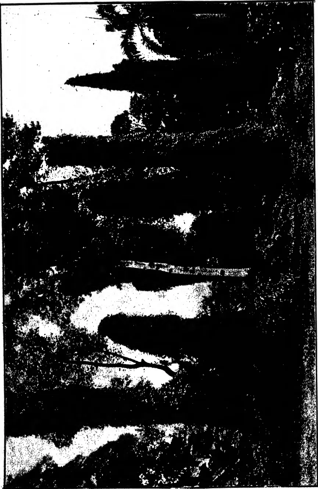A high-contrast, black and white photograph of a landscape. The image is dominated by dark, silhouetted shapes, likely trees or dense bushes, which create a stark contrast against a lighter, textured background. The foreground shows a dark, irregular mass of foliage, while the background features a more defined, elongated dark shape, possibly a path or a line of trees. The overall composition is abstract and moody, with a grainy texture throughout. The photograph is enclosed within a thick black rectangular border.

*Plate 2. "THE RUINS"*

157------------------------------------------------

MARCH, 1922.]141

South-drive extending from the Lake to the former single spanned Satinwood bridge, which was replaced in 1906 by an iron and concrete bridge of 3 spans. The opening of the South Garden, though contemplated by THWAITES, was left for TRIMEN to carry out, and he at once took it in hand on his arrival early in 1880. The circuit of the Gardens was not really complete until the South-drive, commencing at the Lake and finishing in a loop round the palm crescent at the south end of the Gardens, was finished in 1882.

The Gardens are now well served with roads and paths, and, in contrast to many other botanic gardens, all the roads are open to carriages and motor cars.

Up to about 1850 little was, or probably could be, attempted in the way of landscape development, beyond the opening up of road tracks and paths and the maintenance of certain cleared portions. Funds were limited and means of communication poor. THWAITES on several occasions referred to the jungle condition of portions of the grounds and the predominance of *Lantana* and other scrub. Nevertheless the work of introducing and acclimatising ornamental and useful plants steadily advanced. Among the more important introductions in THWAITES' time may be mentioned the Giant Bamboo (*Dendrocalamus giganteus*) of Burma, in 1858; *Amherstia nobilis*, the "Queen of flowering trees," also of Burma, in 1860; Coco-de mer, or Double Coconut (*Lodoicea sechellarum*) of Seychelles, in 1850; the Rain-tree or Guango (*Pithecolobium Saman*) of South America, in 1853; *Cassia nodosa*, 1850; the Upas Tree of Java (*Antiaris toxicaria*) now considered to be the same as *A. innovia* of Ceylon, in 1860; and the beautiful flowering trees, *Saraca declinata* of Sumatra and *Brownea grandiceps* of Brazil, in 1870.

One of the first attempts at ornamental gardening was the laying out, in 1861, of the Fernery, by WILLIAM CAMERON, the first Curator of the Gardens. The Fernery design was on very artistic lines, as may be seen from the old portion still intact. It was considerably extended in 1898, a number of new and wider paths being then made, and a vista opened through the centre affording a view from the Main Central-drive to the

158------------------------------------------------

142[MARCH, 1922.

Palmyrah avenue and beyond. It was again slightly extended in 1916.

The large oval palm group inside the entrance was first begun about 1839 by J. G. LEAR. This at first consisted of three portions, viz., one circular group in the centre and one oval bed at each corner, just inside the gates. In 1867, these were thrown into one group and extended at both ends, forming a large oval, much the same as at present. The palms in the young state must have formed an attractive feature, but it could hardly have been foreseen that many of them would have grown to such a height as to block out completely the view of what was destined to become the Central-drive. In 1880, however, TRIMEN in his first report noted, that the beauty of this group was impaired by the height to which the palms had grown. In 1896 a number of low-growing bushy palms were planted among the tall-growing, bare-stemmed kinds. It was decided in 1920, consequent upon the formation of the new Palmetum in the South Garden, to replace this group, as soon as funds allow, with an ornamental design set in a lawn, with a fountain in the centre. The smaller round group of palms in the centre of the Great Circle was planted about 1860, and the palm crescent in the South Garden in 1882.

A striking landmark for many years was the remarkable double row of *Ficus elastica* which bordered the public road on the left side, from the Colombo direction, at the Entrance. These were planted in 1833 by WATSON, and their enormous buttressed roots, spreading over the surface of the ground, were for many years a source of admiration to visitors. The trees began to crumble away about 1905, partly because of their being too closely planted. In 1912-13, they were cut down and removed as they had become dangerous. A new single row of the same species was planted on the same site in 1914, after much preparation of the ground. These have made rapid growth, being now about 30 feet in height.

Another remarkable feature of the landscape, familiar up to about 1908, was "The Ruins," which consisted of an irregular row of trees along the ridge stretching from the Entrance to near the Lake. These had become completely covered with the giant climber *Thunbergia grandiflora*, which ultimately

159------------------------------------------------

![A detailed black and white map of the Royal Botanic Gardens at Peradeniya, Central Province, Sri Lanka. The map shows the layout of the gardens, including various buildings, paths, and wooded areas. The coastline is visible on the left and top. A compass rose is located in the upper right corner. The title 'Plan OF THE ROYAL BOTANIC GARDENS at PERADENIYA Central Province' is printed in the lower right quadrant. Below the title, it states 'Containing 16 Sheets. 1868. 2. 0'. Further text indicates the map was presented to the Director of the Botanic Gardens on the request of the Director of the General Survey, dated 17th of the 9th month, 1868, and was prepared by J.P. J. Gordon in 1868 and printed by H.C.P. de Silva in 1879. The map is framed by a double-line border.](84727a9cd412c4702031846e38017385_1_img.webp)

PHOTO LITHO SURVEY DEPT. Ceylon. FEB. 1888.

ROYAL BOTANIC GARDENS, PERADENIYA, 1879.

160------------------------------------------------

161------------------------------------------------

MARCH, 1922.]143

killed them. Their tall trunks, covered with a mantle of the deep green creeper, stood for a number of years and presented the appearance of ruins.

The ridge just referred to, outside of which was a deep ditch, at one time doubtless formed the recognised boundary of the Gardens and extended from the river at the south-east corner, on the north side of the present coolie lines, to the bank of the river on the opposite side, following the line of the former Colombo-Kandy road. The latter joined a ferry south of the present lake, and its track, passing through the site of the present Curator's bungalow, could be seen until a few years ago.

Visitors to Peradeniya are struck particularly by the beautiful lawns, a comparatively rare feature in gardens of the tropics. These lawns are the envy of other tropical gardens, but only persons who know can realise the difficulty of making and maintaining lawns in a climate where members of the vegetable kingdom vie with each other with such vigour for possession of the soil, and where animal pests, especially of the subterranean and creeping class, are so rampant. The Great Lawn, which is so beautifully undulating and now covers some seven acres, was first given the character of a lawn about 1885. About 1844 it was under forest and jungle; by 1860 it was considerably cleared, and a portion was reserved as a paddock for grazing cattle up to about 1878. In 1895 it was still further improved by levelling the ground, removing ugly trees, termite hills, tree-stumps, coarse weeds, etc. In 1919 plants of five selected trees (*Poinciana regia*, *Ficus Benjamina*, *Mesua ferrea*, *Pithecolobium Saman*, and *Enterolobium cyclocarpum*) were planted far apart to form isolated specimen trees and afford in time a more park-like effect.

The "Great Circle" lawn, nearly four acres in extent, was made before 1844. In the latter year it is shewn as a circle with a road or path round it, and the central-road straight through. The circular palm group in the centre did not then exist, but a semi-circular bed is shewn in the centre on the west side of the road, with a path round it. A straight path connected this with the outer circular road, opposite the present West-drive, which did not then exist. The Great-circle was

162------------------------------------------------

144[MARCH, 1922.

much improved after the Rubber Exhibition in 1907. The lower portions were raised and a more uniform level effected throughout, the necessary earth being obtained by the removal of a ridge between the lawn and THWAITES Memorial.

The formation of the Arboretum, now covering approximately one-third of the area of the Gardens, was contemplated by GARDNER in 1844, but the land remained largely in a state of "strong forest and jungle" until about 1860, when portions in sections B. D. and E. were under chena. About 1881 certain areas were defined for the planting of prominent natural orders, but the existing vegetation was hopelessly overcrowded to allow of much planting, and consisted largely of useless old or dead trees of "Sapu" (*Michelia Champaca*), "Jak" (*Artocarpus integrifolia*), "Wanasapu" (*Cananga odorata*,) and several species of *Ficus*. In 1896-98, some 750 of the most ungainly specimens were thinned out, much undergrowth removed, a large number of tall tree-stumps uprooted, and giant termite-hills levelled down. Much clearance has again been effected in the last six years, and special attention given to the introduction and planting of species in systematic arrangement. The Arboretum now contains some 48 natural orders.

A supplementary arboretum was formed in the South Garden when this was cleared and opened in 1880-81, but the area has been found to be inadequate, and a beginning was made in 1914 to transfer the representatives of the different orders to their proper places in the larger and original arboretum. The higher portion of the hill in the South Garden has, however, as originally planned, been reserved for Coniferae, the collection of which was considerably extended in 1921.

This transference of plants to the large Arboretum afforded an opportunity for forming an enlarged Palmetum. This was begun in 1914. The area now devoted to a systematic arrangement of palms stretches from the Lake along the hill-side, joining the earlier planted Palm Crescent. This collection of palms includes already some 138 species, representatives of 68 genera, and should in time be the finest collection of palms in the tropics.

The Herbaceous Ground, behind the Talipot avenue, is apparently what THWAITES referred to in 1877 as a "botanical arrangement of plants" for which a piece of ground was then

163------------------------------------------------

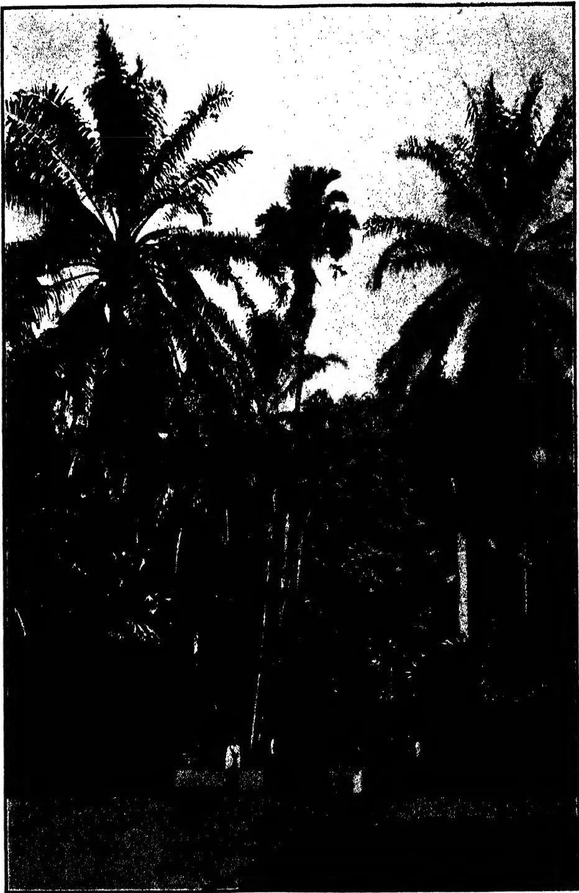A high-contrast black and white photograph showing several palm trees silhouetted against a bright, overexposed sky. The trees are dark and their fronds are spread out. The foreground is very dark, almost black, creating a stark contrast with the white sky. The image has a grainy, photocopied appearance.

*Plate 3. THE ENTRANCE.*

164------------------------------------------------

A high-contrast, black and white photograph of a dense, dark forest or wooded area. The image is dominated by deep shadows and bright highlights from sunlight filtering through the canopy. The foreground is mostly black, with some lighter, textured areas suggesting foliage or ground cover. The upper portion shows more detail of tree trunks and branches against a bright sky.

*Plate 4.* THE MAIN CENTRAL DRIVE.

165------------------------------------------------

MARCH, 1922.]145

being cleared. In that case this date may be taken as the commencement of this interesting collection, which is of special value to students of botany. It was completed in 1881 by TRIMEN.

The small lake, formerly a "tank" or pond, was brought to its present condition in 1896-7, when the banks were sloped down to the water's edge, a path being made along the northern bank and a deep cutting round a clump of trees on the south-west side. By the latter operation the island was formed and sufficient earth obtained to fill the lake from a depth of about 10 feet deep in the centre to a uniform depth of about  $2\frac{1}{2}$  feet. Subsequently the Giant water-lily (*Victoria regia*) and the Papyrus (*Cyperus Papyrus*) were introduced and established here in 1895 and 1897 respectively.

The Nurseries have always been one of the important branches of the work of the Gardens. These have received special attention in recent years and are now divided into two sections, namely the "Ornamental Nursery," which is devoted mainly to ornamental trees, shrubs, climbers, etc., and the "Economic Nursery" which is confined to the raising of stocks of plants of economic value, such as rubber, fibres, shade-trees, fruit-trees, etc. Both nurseries cover in all some 3 acres of ground, with an overflow on the east river-bank.

The Economic Nursery was first begun in 1898 for "Experiment Plots," preceding the Experiment Station established in 1902. The present Ornamental Nursery was begun in 1886, and extended later from time to time, chiefly in 1916. Previous to this the nursery occupied a portion of the ground now under the Palmyrah avenue. The present site, below the Garden offices, was at the commencement of the Gardens used for raising coffee plants, etc.

It is estimated that the living collections in the Gardens include over 3,000 species. The most conspicuous and handsome are the bamboos, palms and trees. Amongst the bamboos may be mentioned the Giant Bamboo of Burma (*Dendrocalamus giganteus*); the Building Bamboo of Java (*Gigantochloa aspera*), and the Yellow or common Bamboo (*Bambusa vulgaris*).

In 1907, some 16 clumps of the Giant Bamboo were planted by the Gardens at distances of 50 yards along the opposite bank

166------------------------------------------------

146[MARCH, 1922.

of the river, belonging to the Experiment Station, facing the Gardens. These are now beginning to form good specimens and to justify the expectations formed of their striking effect on the landscape from the Garden side

Of the palms, the Talipot of Ceylon and South India (*Corypha umbraculifera*), sometimes referred to as the Chieftain of the Palm tribe, is the largest and most majestic. Its creamy white inflorescence at its full development is about 25 feet in height, above the stem, which is usually about 70 to 80 feet high. The "Double Coconut" or Coco-de-mer (*Lodoicea sechellarum*) of Seychelles, is one of the most remarkable of palms. A fine male specimen is growing at Peradeniya, whilst a female palm now heavily laden with fruit, the oldest of which are now 10 years old, is growing at Heneratgoda.

Other striking palms are the Royal Palm (*Oreodoxa regia*) and its close ally *Oreodoxa oleracea*, both of Tropical America; also the Coquita Palm of Chili (*Jubaea spectabilis*), *Raphia pedunculata* of Madagascar, *Arenga saccharifera* (Sugar Palm) of Malaya, the Toddy Palm of Ceylon (*Caryota urens*), with its handsome fern-like leaves, and the various fan-leaved palms, *Livistona*, *Sabal*, *Thrinax*, etc.

Among the more remarkable trees may be mentioned *Ficus altissima*, a Banyan of which a good specimen is on the west river-drive, near the laboratory. Aerial roots developed from the branches have on reaching the ground formed independent stems on both sides of the road. The Cannon-ball Tree (*Courou-pita guianensis*) introduced from Tropical America in 1881, is a very remarkable tree both on account of the peculiar flowers, produced all along the stem down almost to the ground, and of the large, globular, brown fruits. A fine specimen of the Brazil-nut, (*Bertholletia excelsa*) introduced in 1880, is also worthy of mention.

Of beautiful flowering trees, the *Amherstia nobilis*, of Burma, is doubtless the finest. Other beautiful trees are *Lagerstroemia Flos-regina* (pink variety) the "Pride-of-Ceylon," *Cassia Fistula*, or Indian Laburnum, indigenous to Ceylon and India; *Brownea grandiceps*, of Venezuela; *Cassia nodosa*, of Eastern Bengal and Malaya; *Poinciana regia*, "Flamboyant," of Madagascar; *Tabebuia rosea*, of the West Indies, *Spathodea campanulata*, of Tropical Africa, and *Jacaranda ovalifolia*, of Brazil.

167------------------------------------------------

MARCH, 1922.]147

At the commencement of the Gardens, the Colombo-Kandy road passed the entrance at right angles in a straight line from the Foreman's present quarters to the ferry south of the lake. When the ferry was abolished in 1833 and the former Satinwood bridge opened, the consequent deviation in the public road left only one approach to the Entrance, namely from the Kandy side. In the 1860 plan a path is shewn branching off the public road opposite the present Superintendent's bungalow, passing in front of the Chief Clerk's quarters and close to the former Ficus row, to the entrance.

In 1876, THWARRES recorded that a path had been made "for the convenience of visitors coming on foot from the station, (then Peradeniya Junction), through land outside the gardens, bringing into view the peculiar roots of the *Ficus elastica* trees." This apparently was either a reopening of the former path or a deviation of it. This was abolished about 1880, and two short approach roads were made to connect the entrance with the public road, as at present. Both approaches and vicinity were improved in 1894-96, and a gravelled space for carriages made outside the gates. On the triangular space thus formed outside the entrance was a Hindu temple, close to the present Mahogany and Star-apple trees.

In the skeleton plan of the gardens dated about 1828, only one road is shown and that follows the river bank, joining the Colombo-Kandy road, as it then was, at the south-east and south-west angles, the latter junction being at the ferry already referred to, a little south of the lake. This road, however, was probably only a track and placed, in parts, lower down on the bank than the present drive, which was not opened until 1869.

The "Central walk" was completed in 1845, and has since become the Main Central-drive. In 1895, this was considerably improved by filling a dip in the centre, and widening the drive by about 3 feet. The latter was rendered possible by discarding the turf verges, removing the trees closest to the drive, and setting the borders of shrubs and ornamental plants further back. These borders, which are now a feature of the Gardens, being in all some 1,400 yards in length, were then replanted

168------------------------------------------------

148[MARCH, 1922.

throughout with a considerable variety of plants, finishing in front with a line of a pure white-flowered Amaryllid. The drive is edged on both sides with *Malpighia coccigera*, a good substitute for box-edgings in the tropics.

In 1905, the Palmyrah-avenue was made into a drive, and the East-drive, close by, abolished. In 1899, the northern end of the main Central-drive, turning at right angles and passing the Clove grove, was widened and properly made, being joined to the West river-drive by two arms forming a triangle. During 1914-1915 the Central-drive was carried straight through, joining the river-drive nearly opposite the ferry-path for the Experiment Station. The junction of the Lake-road at the Entrance was altered to a graduated curve in 1906, and at the lake itself into a triangle in 1920. The Jacaranda-drive was similarly joined to the West river-drive in 1905, and the latter, below the GARDNER Memorial, was lowered and widened in the same year, being afterwards considerably widened at the corner above the Lake, in 1915.

In 1907-1908 the Museum-road, through a portion of the Great-Lawn, was made. The frontage of the Museum required a considerable amount of filling, owing to the low and sloping ground. The necessary earth for this was obtained by reducing the gradient of the Bat-drive, making a double cutting near the THWAITES' Memorial. The Bat-drive was remade and named TRIMEN drive in 1915.

The first avenue in the Gardens, exclusive of the former double row of *Ficus elastica* at the entrance, already mentioned, was that of the Royal Palm (*Oreodoxa regia*), planted about 1855 and replaced in 1905 by the present and better avenue of Cabbage Palms (*Oreodoxa oleracea*). The next was the Talipot Palm avenue (1880), some of the palms in which flowered in 1918 and fruited and died the following year. Then, in order of sequence, the Palmyrah palm (*Borassus flabellifer*), sown *in situ* in 1887 on the site of what was formerly a nursery and vegetable garden; the new Royal Palm avenue along the northern end of the Main Central-drive (1898); the *Brownea grandiceps* avenue (1900), interplanted with *Cassia multijuja* in 1904; the avenue of Coco-de-mer (*Lodoicea sechellarum*) along Monument-road

169------------------------------------------------

![A detailed historical map of the Royal Botanic Gardens, Peradeniya, dated 1893. The map shows the layout of the gardens, including the Botanic Avenue, Great Lawn, and various buildings like the Conservatory, Plant Houses, and Nursery. It also shows the location of the Barbers, Nurses & Library Museum & Director's House. The map is oriented with North at the top, indicated by a compass rose. The title 'PLAN OF THE ROYAL BOTANIC GARDENS PERADENIYA. 1893.' is prominently displayed in the lower right quadrant. A scale of yards is provided at the bottom right, ranging from 0 to 200 yards. The map is framed by a simple border.](f79657d6606fd8753b82e0205354be9d_1_img.webp)

PHOTO LITHO SURVEY DEPT. CEYLON. FEB. 1893.

ROYAL BOTANIC GARDENS, PERADENIYA, 1893.

170------------------------------------------------

This image is a blank white page. It contains several small, dark specks which appear to be scanning artifacts or dust particles. There is no text, handwriting, or printed content on the page.

171------------------------------------------------

MARCH, 1922.]149

in 1905, and the avenue of Kauri Pine (*Agathis robusta*), planted in 1918.

The shady nutmeg-walk in the Spice Collection is a favoured spot with visitors. The large trees (*Myristica fragrans*) were planted about 1840 and are exceptionally fine specimens, some of them being about 75 feet in height. The spice collection was formed in 1896-98, and considerably extended in 1914. The small plantation of Cloves in the Arboretum was planted in 1874.

The row of the very remarkable Cannon-ball tree (*Courou-pita guianensis*) by the nursery was planted in 1881; the row of the beautiful *Cassia nodosa* along the former east-drive in 1899; the *Amherstia nobilis* row, along the Kandy approach to the entrance, in 1904; the Talipot palms along the Talipot-drive in 1907 (planted with 6-years old seedlings); the beautiful *Jacaranda ovalifolia* along Jacaranda-drive in 1914; and the new *Ficus elastica* row, already mentioned, by the entrance, in 1914.

The most striking and attractive modern feature of the Gardens is the floricultural section, including the Octagon-house (built in 1894 and improved in 1904), the Orchid-house (built in 1888 and improved in 1910), the Flower-garden (begun in 1896), the Pergola, and the collections of Roses, Hibiscus, Crotons, etc. In 1895, a number of the modern fine-flowering varieties of Cannas, probably the first in Ceylon, were introduced and planted here for the first time.

Up to 1894, this area, covering some seven acres, was of the nature of a forest, including a number of young trees and climbers growing on tall trees. The more rare or interesting of these were transplanted to their proper positions in other parts of the garden. Three trees of *Pimenta aoris*, about 25 feet in height, were successfully transplanted to the Spice collection, which was then begun. The Flower-garden at Peradeniya is apparently without a rival in the tropics. By a system of massing, grouping and blending, ornamental foliage and flowering plants, such as *Caladiums*, *Coleus*, *Alternanthera*, *Cannas*, *Pentas*, *Poinsettia*, *Mussaenda*, *Salvias*, *Plumbago*, etc., make here a bright display practically throughout the year.

172------------------------------------------------

150[MARCH, 1922.

Vistas add greatly to the interest and charm of a garden. Of these there are several in the Gardens, the principal being Bridge-view, looking up the river from West river-drive in the Arboretum, showing the Peradeniya bridge on the Colombo-Kandy road, the railway bridge beyond, and tea estates in the distance. The Hantane-Gannoruwa-vista, opened in 1898, diagonally across the Arboretum; the East-vista from the *Oreodoxa regia* avenue across the Arboretum to the Experiment Station and Primrose Hill, begun in 1900 and completed in 1915; and the Fernery vista, opened in 1898. Near the latter a pretty view is obtained from the Central-drive across the Great-lawn, and on the opposite side across the Flower garden, both effected in 1894-98 by making a break in the borders, of the Main Central-drive.

There are two memorials in the Gardens. One was erected in 1855 to commemorate the work of GARDNER, and furnished with a brass tablet in 1883. The THWAITES' Memorial with a brass tablet was erected in 1885. There is also a brass memorial tablet to TRIMEN, presented by the Planters' Association, placed in the Herbarium and Museum building. The two former serve the useful purpose of shelters to visitors, school parties, etc., to the Gardens. It had been intended to erect a suitable Memorial to TRIMEN in the Great Circle during the Centenary year of 1922, but the general depression in Government finances has made the postponement of this proposal inevitable.

Memorial trees have been planted around the Great Circle, in commemoration of visits of Royal personages and of interesting events of Imperial importance. The trees growing at present are *Ficus religiosa*, Bo Tree, planted by the late KING EDWARD in 1875; *Couroupita guianensis*, Cannon-ball Tree, planted by their Majesties KING GEORGE and QUEEN MARY in 1901; *Mesua ferrca*, Na-gaha or Ceylon Iron-wood, planted by the late CZAR of Russia in 1891; and *Poinciana regia*, Flamboyant Tree, planted by PRINCESS HENRY of Prussia in 1899.

A plant of *Treculia africana*, African Breadfruit, was planted by MRS. J. B. CARRUTHERS, about 50 yards back from the Great

173------------------------------------------------

PLAN  
OF THE  
ROYAL BOTANIC GARDENS  
at  
PERADENIYA  
1922

PHOTO LITHO SURVEY DEPT. CEYLON. FEB. 1922.

ROYAL BOTANIC GARDENS, PERADENIYA, 1922.

174------------------------------------------------

175------------------------------------------------

MARCH, 1922.]151

Circle, in its natural order, in 1902, to commemorate KING EDWARD'S Coronation, a plant of *Cassia grandis* by MRS. J. C. WILLIS, in the south-east corner round the Circle, for KING GEORGE'S Coronation in 1911, and a plant of the beautiful *Tabebuia rosea* by MRS. F. A. STOCKDALE, in July 1919, to commemorate Peace and the cessation of the Great War.

In connection with the development of the Gardens, the following events are of interest. The completion of the former Satinwood bridge in 1833, resulted in diverting the public road from the Gardens to its present position. The work of filling up the portion of the new road in the deep hollow near the bridge, on the Kandy side, must have involved the transport of large quantities of earth, much of which was removed from the adjoining South Garden, leaving only the subsoil.

The railway to Kandy was opened in 1867, the nearest station to the Gardens then being Peradeniya, which afterwards became Peradeniya Junction upon the extension of the line to Gampola, etc. The New Peradeniya Station, about half a mile from the garden entrance, was opened in 1889, being intended especially for the convenience of visitors to the Gardens.

The Peradeniya Race-course, opposite the garden frontage and surrounding the Golf links, dates from the early commencement of the Gardens. It was probably first started by the Military, about 1824, and appears to have been long in the charge of the Public Works Department. Later it was transferred to the Kandy Race Club until 1920, when this Club was amalgamated with the Colombo Turf Club.

The ground enclosed by the Race-course, about 36 acres in all, at one time belonged to the Military and is still Crown land. The summit, used for the grand-stand, etc., is still military ground. From the remains of carved stones and pillars discovered here, some of them many feet under the surface, during the conversion of the ground into golf links in 1910-11, this must have been at one time the site of an important palace.

176------------------------------------------------

152[MARCH, 1922.

Whilst much of the land in the vicinity of the Gardens was opened up by Government and planted with coffee, the race-course ground appears to have been for the most part left uncultivated. Parts of it were occupied by P.W.D. coolies, and during the cholera outbreak in 1847, camps for Soldiers, etc., were established there. In 1877, J. FERDINANDS, Clerk and Foreman of the Gardens, was allowed to occupy the ground, which he *chenaed*, on payment of an annual rental of Rs. 150. In 1880, some 18 acres facing the gardens and public road were under the control of the Gardens. Previously several small houses and huts had been built here by local settlers. During 1889, steps were taken, apparently on the initiative of neighbouring planters, to maintain the Race-course and grounds in better condition, and on the recommendation of the Director of the Gardens, the New Peradeniya estate (Ceylon Land and Produce Company) was given in 1890 a 10 years lease of the land at a rental of Rs. 10 per acre. This estate, it may be mentioned, was originally begun as a sugar estate, and is still known by that name in both Sinhalese and Tamil. In the year stated, the frontage area was reduced from 18 to 12 acres, and later, in 1893, to 4 acres.

On the expiry of the lease to the New Peradeniya Estate in 1910, the whole of the race-course ground was taken on lease by the then newly formed Kandy Golf Club, and in 1912 it was opened as the Lewis Links in honour of J. P. LEWIS, C.M.G., retired Government Agent, Kandy. When the Golf Club took over the ground it was under tea, interplanted with Dadaps and other shade trees, all of which had to be cut down and removed. In 1895 much of it was under Liberian Coffee, and afterwards under the drug *Croton Tiglium*.

The Peradeniya Rest-house, built in 1901, in the north corner of the race-course ground, was intended mainly for the accommodation of visitors to, and scientific workers in, the Gardens.

177------------------------------------------------

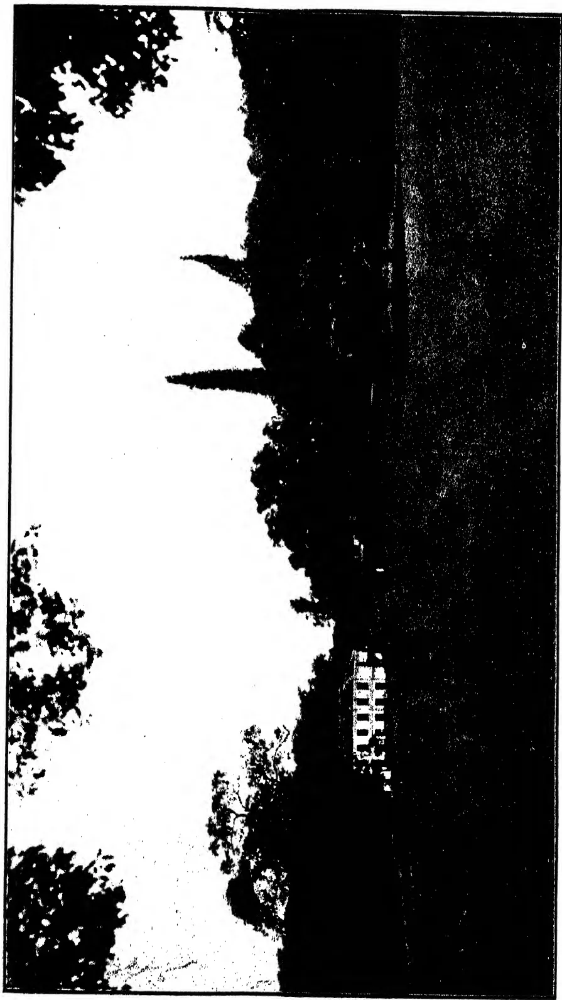A high-contrast black and white photograph of a large, dark, rectangular lawn. In the background, a large, light-colored building with a gabled roof is visible, partially obscured by trees. The sky is bright and clear.

*Plate 5. THE GREAT LAWN.*

178------------------------------------------------

A high-contrast, black and white photograph of a landscape. The foreground is dark and textured, possibly water or dense vegetation. A bright, horizontal band of light, possibly a reflection or a path, cuts across the middle ground. The background is a dark, silhouetted horizon line against a lighter sky.

*Plate 6. THE GREAT CIRCLE.*

179------------------------------------------------

MARCH, 1922.]153

## ESTABLISHMENT OF BRANCH GARDENS.

As the work of Peradeniya developed it became necessary to establish smaller branch gardens in the different climatic zones of the Colony.

Hakgala Garden was established in 1860 as a nursery for Cinchona but the Garden has since been extended so as to afford space for the acclimatisation and trial of trees, shrubs, and plants suitable for the cooler and higher elevations of the Island. Large collections of Acacias, Conifers and Eucalypts have been made in these Gardens, and these collections have been responsible for the spread of a large number of trees which are now common features up-country and are essential for its economic welfare. Extensive nurseries are maintained in these Gardens for the supply of Conifer and Eucalypt plants. The camphor plantation was made in 1895 and areas of the patanas were planted with *Pinus sinensis* in 1885, *Casuarina montana* in 1899, and *Acacia decurrens* and *A. melanoxylon* in 1913. The trial of European and Australian fruits, vegetables and fodder grasses has been carried on for many years, and the trials of ornamental shrubs and of flowers have been of assistance to many interested in floriculture at the higher elevations. The Fernery at Hakgala is both extensive and beautiful, and has been the source of interest to a large number of visitors.

In 1901, a small laboratory was opened for the use of scientific workers, and much work useful to scientific botany and to the botany of Ceylon in particular has been done there.

In 1921, a beginning was made in the establishment of a rockery and with trials with rock plants.

HENERATGODA GARDEN was opened in 1876 for the accommodation of the then recently introduced rubber plants from South America. The original plantation of *Hevea brasiliensis* is the source of considerable interest to scientific workers and to those interested in the rubber industry. Heneratgoda No. 2 is a tree that is known throughout the rubber-producing world for its yield of 392 lb. dry rubber in 4 years and 9 months, during

180------------------------------------------------

154[MARCH, 1922.

1908-13, and its photograph is familiar to the industry. Small plantations of Mangosteen (*Garcinia Mangostana*), Kola (*Cola acuminata*), Cinnamon (*Cinnamomum zeylanicum*) have been made. Some fine specimens of tropical trees are also to be seen in these Gardens, and a feature of considerable interest is the female plant of Coco-de-mer (*Lodoicea sechellarum*) from the Seychelles which was planted in 1884. It flowered first in 1911 and after fertilization with pollen from the male plant at Peradeniya set fruit in the same year and is still bearing this first fruit and many younger ones.

ANURADHAPURA GARDEN was established in 1883 to make trials with trees and shrubs in the Dry Zone of the Colony. It was closed in 1906 when it was decided that the Department should devote greater attention to economic work and to agriculture. Some fine specimens of trees exist on the site of this Garden, which now forms the park-like grounds of the Hotel in this ancient city of Ceylon. Of particular interest are *Eucalyptus alba*, a Eucalypt suited to the drier zones of the Colony, *Santalum album*, (Sañdal), and Teak (*Tectona grandis*).

BADULLA GARDEN was opened in 1886. The introductions to this garden included *Hevea brasiliensis*. These trees grew satisfactorily and demonstrated that rubber would grow on the Uva side of the island. It was closed in 1906 and now forms the Park of the Local Board of Badulla. In it there are fine specimens of trees, some of which have grown to fair dimensions.

THE NUWARA ELIYA GARDEN was opened in 1902. Here trials have been made with conifers and other trees suitable for the highest elevations, with horticultural plants, and with forage and other plants of economic importance. This Garden is now the popular Park of the well-known hill station of Ceylon. Part of the cost of its maintenance is met by the Board of Improvement of Nuwara Eliya and part by Government.

181------------------------------------------------

MARCH, 1922.]155

## BOTANICAL RESEARCH.

The possibilities of botanical research in Ceylon were brought to the notice of European botanists at a comparatively early date in the history of botany. That was chiefly due to the work of PAUL HERMANN, who, as Chief Medical Officer in the Dutch East India Company's service in Ceylon from 1672 to 1677 collected plants in the Maritime Provinces and made notes on their uses. After leaving Ceylon, HERMANN became Professor of Botany at Leyden, and published some drawings and descriptions of Ceylon plants in *Horti Academici Lugduno-Batavi Catalogus* (1687). He had apparently intended to publish full accounts of the plants he had collected in Ceylon, but died before that had been accomplished. After his death, W. SHERARD brought out "*Paradisus Batavus*" (1698), which contains all the descriptions and illustrations of Ceylon plants which HERMANN had prepared for publication. More important than that, however, from a Ceylon point of view was a small book entitled "*Musaeum Zeylanicum*," which SHERARD published in 1717, for it is a Catalogue of HERMANN'S Ceylon herbarium, under the Sinhalese names of the plants, with notes on their uses, the meanings of the Sinhalese names, etc.

SHERARD was also instrumental in sending out to Ceylon a botanical collector, JOHN HARTOG. With the assistance of HARTOG'S specimens, and probably some of HERMANN'S, BURMANN compiled his "*Thesaurus Zeylanicus*" (1737), which contains a full account of what was known of Ceylon Botany at that date.

A few years later there occurred the most noteworthy feature of this period of Ceylon botany. In 1745, HERMANN'S Ceylon herbarium came into the hands of LINNÆUS, who examined and described all the specimens which had survived, and in 1747 published an account of them under the title "*Flora Zeylanica*." In that work, the plants are arranged according to the system of classification which LINNÆUS had recently proposed. Thus, Ceylon has the honour of possessing one of the earliest Floras based on the LINNÆAN system, and that written by LINNÆUS himself.

182------------------------------------------------

156[MARCH, 1922.

Interest in Ceylon botany was maintained throughout the period of the Dutch occupation. Seeds and fruits were sent to Holland by the Dutch Government from time to time, and it is most probable that in that way GAERTNER obtained the Ceylon specimens which figure so largely in his "De fructibus et Seminibus" (1789-91). C. P. THUNBERG, afterwards Professor of Botany at Upsala, collected in Ceylon in 1777-78, and subsequently wrote several papers on Ceylon plants.

In consequence of these investigations, Ceylon plants had become widely known, and the peculiarities of the Ceylon flora had no doubt been observed. This may have been a contributory factor in influencing the British Government to order the establishment of a Royal Botanic Garden in Ceylon.

On the institution of a Royal Botanic Garden in Colombo in 1812, the scientific side of botany was not altogether neglected, though it was perhaps in accordance with the plan of SIR JOSEPH BANKS that the earlier Superintendents were selected for their horticultural attainments so that the preliminary work of laying out the Gardens might be completed before scientific investigation was begun. Among the duties of the Superintendent, however, were "to make discoveries in botany" and "to form a Herbarium of dried plants for the future use of the establishment in Ceylon." But this policy of *festina lente* did not meet with the approval of local enthusiasts, and pressure was prematurely brought to bear on the first Superintendent, KERR, to compile a list of the plants of Ceylon. To the same influence we owe the publication of MOON'S Catalogue of the Indigenous and Exotic Plants growing in Ceylon, like most books written to order, "an unsatisfactory production," its chief value depending on the fact that it brings together in one list most of the previous records of Ceylon plants.

The scientific era of the Royal Botanic Gardens may be said to have begun with the appointment in 1844 of GEORGE GARDNER. The change of policy which that appointment indicates was probably due to the representations of CAPTAIN CHAMPION, an amateur botanist of great ability who was in Ceylon from 1838 to 1847. GARDNER had previously travelled in Brazil, and brought out to Ceylon a large herbarium and a

183------------------------------------------------

*Plate 7.* AN OLD VIEW IN THE ARBORETUM.

184------------------------------------------------

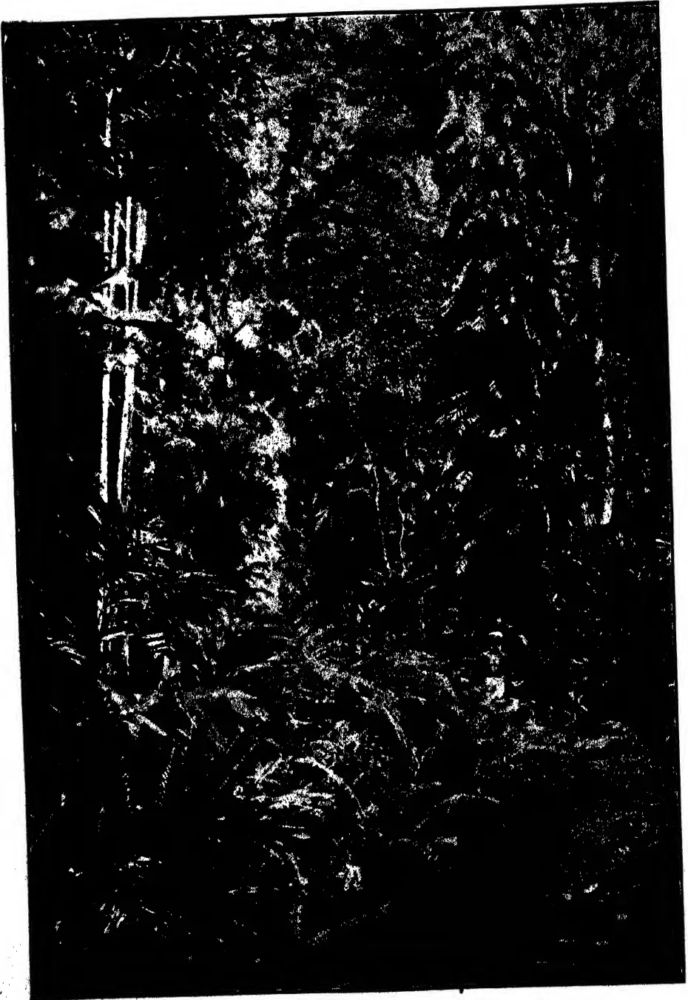A high-contrast, black and white photograph of a dense, overgrown forest, likely a fernery. The image is dominated by dark, tangled foliage, with bright highlights filtering through the canopy. The scene is filled with thick, textured vegetation, including what appears to be ferns and other leafy plants, creating a sense of a wild, untamed environment. The lighting is dramatic, with deep shadows and bright, starburst-like highlights where light breaks through the dense growth.

*Plate 8. THE FERNERY.*

185------------------------------------------------

MARCH, 1922.]157

good botanical library. He threw himself energetically into the work of investigating the Ceylon Flora, but was not destined to complete it, as he died in 1849 at the early age of 37. His contributions to Ceylon Botany are contained in six papers in the CALCUTTA JOURNAL OF NATURAL HISTORY, of which Journal he was one of the conductors, and a paper entitled "Some remarks on the flora of Ceylon" published in the appendix to LEE's translation of RIBEYRO's History of Ceylon, 1847. His interests extended beyond the flowering plants, and he sent to England a collection of specimens and paintings of fungi, which were described by BERKELEY.

Ceylon was fortunate in obtaining as a successor to GARDNER, GEORGE HENRY KENDRICK THWAITES, a botanist who had already secured a European reputation by his investigations on Algæ and Diatomaceæ, his most important contribution being the discovery of conjugation in the latter group, which finally settled their position in nature. On his arrival in Ceylon in 1849, he turned his attention to the phanerogamic flora, and, the duties of the Superintendent of Botanic Gardens being at that time chiefly of a scientific character, he was able to devote himself almost exclusively to its investigation during the next ten years.

THWAITES made numerous collecting tours in various parts of the Island and discovered a number of new and interesting plants, many of which were described in papers in HOOKER'S LONDON JOURNAL OF BOTANY, among them representatives of twenty-five new genera. At the same time he formed a numbered series of Ceylon plants (known as C.P.), sets of which were distributed to the principal herbaria in Europe in exchange for other specimens or for botanical books, so that in the course of a few years Ceylon plants were well represented in botanical collections.

In 1858, THWAITES had amassed sufficient information concerning the flora of Ceylon to begin the publication of a catalogue of Ceylon plants. That work, *Enumeratio Plantarum Zeylaniae*, was completed in 1864, and "at the time of its publication was the first complete account on modern lines of any definitely-circumscribed tropical flora. The want of affinity which the flora thus worked out was seen to have to the general vegetation of the contiguous peninsula of Hindustan

186------------------------------------------------

158[MARCH, 1922.

and its marked relation to that of the Malayan region established facts of the greatest significance in the study of geographical distribution."

After the publication of the *Enumeratio*, THWAITES turned again to cryptogamic botany, and made large collections which were worked out by specialists in England, the fungi by BERKELEY and BROOME, the lichens by LEIGHTON, and the mosses by MITTEN. The abundance of specimens which he sent to England caused Ceylon cryptogams to form a large proportion of the British National Collections.

During the last ten years of THWAITES' tenure of office, the character of the duties of the Director of the Botanic Gardens was steadily changing, and it was becoming more and more necessary that he should address himself to the application of botanical knowledge to practical agriculture. Consequently, his later publications were confined to reports on agricultural subjects. He retired in 1880, and died in Kandy in 1882, never having left the Island since his arrival in 1849.

THWAITES was not only a botanist, but a keen all-round naturalist. He contributed a large part of the information on natural history contained in TENNENT'S *Ceylon*, and notes on butterflies to MOORE'S *Lepidoptera of Ceylon*, the plates for which were executed by the draughtsman of the Royal Botanic Gardens.

Among the botanists who visited Ceylon in THWAITES' time were W. H. HARVEY (Short characters of three new algæ from the shores of Ceylon) DR. T. THOMSON, BECCARI (*Mycetum in itinere Borneensi*), R. H. BEDDOME, H. N. MOSELEY, SIR THOMAS HANBURY, SIR GEORGE KING, etc. M. M. HARTOG, who was Assistant Director of the Gardens from 1875 to 1877, contributed a paper "On the floral structure and affinities of Sapotaceæ."

Towards the close of THWAITES' Directorship, the ravages of the coffee leaf disease fungus induced the Ceylon Government to appoint a Mycologist, attached to the Botanic Gardens, to investigate that disease. This, we believe, was the first appointment of an official mycologist in the British Empire. The botanist selected was HARRY MARSHALL WARD, subsequently Professor of Botany in the University of Cambridge, and celebrated for his researches on fungi. In addition to his official

187------------------------------------------------

MARCH, 1922.]159

reports on the coffee leaf disease, his work in Ceylon is represented by papers, "Researches on the life history of *Hemileia vastatrix*," "On the morphology of *Hemileia vastatrix*," "Researches on the morphology and life history of a tropical Pyrenomycetous fungus," "On the structure, development, and life history of a tropical epiphyllous lichen," and "On the morphology and development of the perithecium of *Meliola*."

MARSHALL WARD left Ceylon on the termination of his temporary appointment (February, 1880—September, 1881).

THWAITES was succeeded by HENRY TRIMEN, who prior to his appointment was an assistant in the Botanical Department of the British Museum and a well-known botanical writer, being joint author of "The Flora of Middlesex," and BENTLEY and TRIMEN'S "Medicinal Plants," as well as proprietor of the JOURNAL OF BOTANY. The work of the Director of Botanic Gardens had now definitely become that of Agricultural Adviser to the Ceylon Government and to planters, and TRIMEN'S annual reports show that he kept that view of his duties always in the foreground. His first scientific contributions from Ceylon dealt with the determination of the various species of Cinchona, a product which was then engaging the attention of the Ceylon planters, and on that subject he was generally regarded as an authority. At the same time, he continued the investigation of the Ceylon flora, making tours in parts of the Island which had not been explored botanically, and contributing papers on his discoveries to the JOURNAL OF BOTANY.

THWAITES' *Enumeratio* was a work of reference for botanists, and contained descriptions of the new species only. It had been his intention to follow that with a full descriptive flora of the Island, but official duties and advancing age prevented his carrying out this work. TRIMEN took up that task and pursued it with a thoroughness which has seldom been equalled, not only touring the Island to fill up the gaps in our local knowledge, but visiting the Herbaria of Kew and the British Museum, the latter of which possesses HERMANN'S herbarium, and determining exactly what the old records referred to, and elucidating with marked success the obscure points in Ceylon botanical history. It is rare to find any detail in relation to the earlier

188------------------------------------------------

160[MARCH, 1922.]

botanical records which TRIMEN had not considered. His labours culminated in the publication of the HANDBOOK OF THE FLORA OF CEYLON which, unfortunately, he did not live to complete. The first three volumes of that work were published during his life-time, while the last two were completed after his death, partly from his notes, by SIR J. D. HOOKER. His historical researches, already referred to, are indicated chiefly by illuminating foot-notes in the Flora; in addition, he published a paper on "HERMANN'S Herbarium and LINNÆUS'S Flora Zeylanica" in the JOURNAL OF THE LINNEAN SOCIETY. His other works include papers "On the Flora of Ceylon, especially as affected by Climate," "Remarks on the Composition, Geographical Affinities and Origin of the Ceylon Flora," and "Hortus Zeylanicus: a classified list of the plants, both native and exotic, growing in the Royal Botanic Gardens, Peradeniya, Ceylon," the latter being not merely a gardens' list, but including the dates of introduction of the majority of the exotic species cultivated in Ceylon. It is remarkable that although TRIMEN was specially interested in the Gramineæ, and, judging from his notes, had contemplated the production of a monograph of that family, none of his manuscript relating to the Gramineæ could be found after his death.

As will be evident, the record of botanical research as outlined above relates chiefly to systematic botany. This was inevitably the case, as the determination of a flora of a country naturally precedes any detailed investigations in ecology, anatomy and other branches of botany. But, thanks to the labours of THWAITES and TRIMEN, Ceylon possessed at the close of the last century a more complete knowledge of its flora, whether phanerogamic or cryptogamic, than any other tropical country.

Meanwhile, the changes in the trend of botanical investigation in Europe had not been without influence in Ceylon. In 1885, PROFESSOR F. O. BOWER had called the attention of British botanists to the advantages to be derived from studying botany in the Tropics, and shortly afterwards had set an example by visiting Ceylon. In the following year, he again brought up the subject, this time before the British Association, TRIMEN

189------------------------------------------------

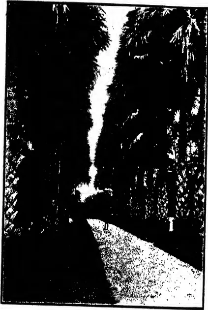

*Plate 9. THE PALMYRAH PALM AVENUE.*

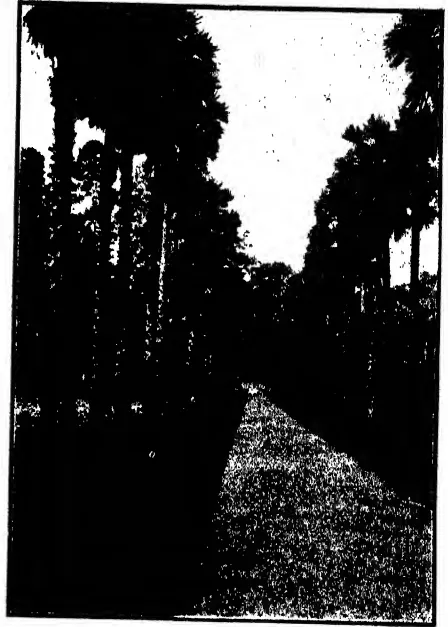

*Plate 10. THE TALIPOT PALM AVENUE.*

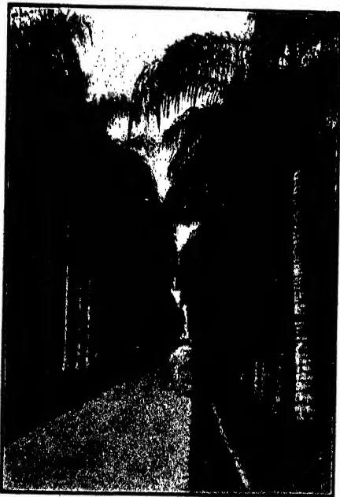

*Plate 11. THE ROYAL PALM AVENUE.*

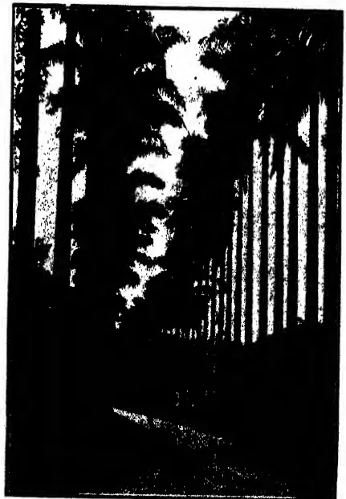

*Plate 12. THE CABBAGE PALM AVENUE.*

190------------------------------------------------

*Plate 13. A VIEW OF THE FLOWER GARDEN.*

191------------------------------------------------

MARCH, 1922.]161

being present in support, with the result that the British Association gave a grant towards fitting up a room at Peradeniya with some of the essentials of a botanical laboratory.

Continental botanists had already realised the possibilities of study in the tropics, and among those who visited Ceylon about this time were K. GOEBEL (*Utricularia*), G. KARSTEN (*Mangrove vegetation*), K. GIESENHAGEN (*Ueber Hexenbesen an tropischen Farnen*), G. HABERLANDT, etc.

The first British botanist to take advantage of the facilities afforded by the British Association grant was M. C. POTTER ("Observations on the Protection of Buds in the Tropics"). He was followed in 1891, by J. B. FARMER, who studied *Hepaticæ* and *Filices*, subsequently discovering the quadripolar spindle in *Pallavicinia decipiens*, and contributing papers on *Angiopteris* and *Helminthostachys*. F. W. KEEBLE, who came out in 1893, investigated the structure and biology of *Loranthus* ("Observations on the Loranthaceæ of Ceylon") and "The hanging foliage of certain tropical trees." W. G. FREEMAN (1896-7) wrote a paper "On the Anabaena-containing roots of *Cycas*," and collected algæ which were subsequently described by W. and G. S. WEST ("A Contribution to the Fresh Water Algæ of Ceylon"). A. J. EWART (1897) studied "The effects of tropical insolation." DR. C. PENZIG (1897) and DR. G. CLAUTRIAU (1897) made general observations on their special subjects, while H. H. W. PEARSON (1897) investigated the flora of the up-country grass lands and, in conjunction with PARKIN, wrote an ecological paper, "The Botany of the Ceylon Patanas." In 1898, DR. MAX FLEISCHER worked in the laboratory and collected mosses in several parts of the Island.

In 1896, TRIMEN was succeeded by J. C. WILLIS who had previously been Senior Assistant in Botany in the University of Glasgow. In the earlier days of his tenure of office, WILLIS thoroughly investigated the *Podostemaceæ* of Ceylon and India, and published "A revision of the *Podostemaceæ* of India and Ceylon," "Studies in the Morphology and Ecology of the *Podostemaceæ* of Ceylon and India," and "On the dorsiven-trality of the *Podostemaceæ*, with reference to current views on evolution." During the same period, he contributed "Notes on

192------------------------------------------------

162[MARCH, 1922.

the flora of Minikoi," and, in collaboration with J. S. GARDINER, published "The Botany of the Maldive Islands." His later work in Ceylon dealt chiefly with problems of evolution, and found expression in "The flora of Ritigala, a study in endemism," "Hill-top floras of Ceylon," "On the flora of Naminakulikanda," "Some evidence against the origin of species by natural selection of infinitesimal variations, and in favour of the theory of mutation," "Further evidence against the origin of species by infinitesimal variations," and "The geographical distribution of the Dilleniaceæ as illustrating the treatment of this subject on the theory of mutation." Ultimately, the views expressed in these papers led to the enunciation of his "Age and Area" theory.

WILLIS retired in 1911, and upon the organization of the Department of Agriculture, PETCH, in 1913, assumed responsibility for systematic botany, and MACMILLAN was entrusted with the superintendence of all horticultural work and the Gardens.

PETCH has been responsible for the following publications:—Revisions of Ceylon Fungi, I-VI; The Fungi of Certain Termite Nests; The Phalloideæ of Ceylon; Studies in Entomogenous Fungi; The Genus Endocalyx; A List of the Mycetozoa of Ceylon; Ustilagineæ and Uredineæ of Ceylon; A Preliminary List of Ceylon Polypori; Gasteromycetæ Zeylanicæ; Hypocreaceæ Zeylanicæ; etc.

In 1898, WILLIS secured the institution of a post of Scientific Assistant, which provided means whereby a young botanist could take up work in Ceylon for a period of two years. The first occupant of that post was J. PARKIN (1898-99) who, after collaborating with PEARSON in his investigation of the botany of the Ceylon Patanas, turned his attention to *Hevea brasiliensis*, the cultivation of which was then beginning to be undertaken on a commercial scale. As a result of his work on the chemistry of Hevea latex, PARKIN recommended the use of acetic acid for coagulation, a method which has been almost universally adopted. Considering the laboratory facilities and equipment then available at Peradeniya, PARKIN's success in dealing with this question was remarkable. His chief work on that subject is contained in a Circular of the Royal Botanic Gardens, entitled "Caoutchouc or India-rubber; its origin, collection, and preparation for the

193------------------------------------------------

MARCH, 1922.]163

market," while he published elsewhere, "Some observations bearing on the function of latex," "Observations on latex and its functions," and on general botanical subjects, "The extra-floral nectaries of *Hevea brasiliensis*," "On a brilliant pigment appearing after injury in species of *Jacobinia*," and "Fungi parasitic upon scale insects."

PARKIN was succeeded in the post of Scientific Assistant by H. WRIGHT (1900-1902) who studied the Ceylon ebonies (The genus *Diospyros* in Ceylon), and various physiological problems (Tropical timbers and their rings of growth: Foliar periodicity of endemic and indigenous trees in Ceylon). After WRIGHT came R. H. LOCK (1903-04) who carried out experiments in plant-breeding, "Studies in plant breeding in the Tropics," and "On the growth of giant bamboos." LOCK's experiments with peas provided the first demonstration on a large scale of the truth of MENDEL's theory, while his observations on the growth of giant bamboos enabled BLACKMAN to formulate his theory of limiting factors. He also made investigations on cacao varieties. A. M. SMITH, who was Scientific Assistant in 1905-06, studied tropical plant physiology "On the internal temperature of leaves; also observations on the periodicity of young coloured leaves of trees;" "On the application of the theory of limiting factors to measurements and observations of growth in Ceylon;" "The effect of the moon's phases on the period of felling bamboos;" "Physiology of plants in the tropics." After 1906, owing to rearrangements in the staff of the Department, the post of Scientific Assistant was abolished.

Other workers who made use of the old laboratory in 1899-1900 included K. GOEBEL, E. S. GOODRICH, E. M. WILCOX, A. PREYER, who investigated the fermentation of cacao (Ueber Kakaofermentation), R. H. YAPP (Fruit dispersal in *Adenostemma viscosum*), K. GIESENHOGEN, A. G. TANSLEY (The flora of the Ceylon littoral, TANSLEY and FRITSCH), and C. HOLTERMANN.

WILLIS began the publication in 1897 of a periodical entitled "Circulars of the Royal Botanic Gardens, Peradeniya," intended to convey information on economic questions, and in 1901 he founded a scientific botanical journal, "The Annals of the Royal Botanic Gardens, Peradeniya."

194------------------------------------------------

164[MARCH, 1922.

It soon became evident that the laboratory accommodation, —a single room, provided with a balance and an unreliable water supply—was quite inadequate to meet the needs of the steadily increasing stream of scientific workers, and, on the representations of the Director, a visitors' laboratory of six rooms was built, and opened at the end of the year 1900. This was occupied, more or less continuously, by scientific visitors until the outbreak of the war in 1914. Space does not permit the enumeration of all of these, and it must suffice to name those who are known to have contributed papers on Ceylon subjects.

C. HOLTERMANN (1900-01), partly on his work on plant physiology and fungi at Peradeniya, wrote "Mykologische Untersuchungen aus den Tropen," "Der Einfluss des Klimas auf den Bau der Pflanzengewebe," "Anatomisch-physiologische Untersuchungen in der Tropen" and "Fungus cultures in the Tropics." W. H. LONG (1901) discovered the prothalli of *Ophioglossum pendulum* and *Helminthostachys zeylanica*, and wrote "On the prothalli of *Ophioglossum pendulum* and *Helminthostachys zeylanica*." "On a prothallus provisionally referred to *Psilotum*" "On the embryo of *Helminthostachys*," "On the anatomy and branching of the rhizome of *Helminthostachys*," "On apospory in *Anthoceros laevis*," and "On the morphology of *Cyathodium*." N. E. SVEDELIUS (1902-03) investigated marine algæ and published five papers on that subject, in addition to others in phanerogamic botany. F. E. FRITSCH (1903) investigated the fresh-water algæ, and published "A general consideration of the sub-aerial and fresh-water algæ of Ceylon," "The role of algal growth in the colonisation of new ground and in the determination of scenery," "The sub-aerial and fresh-water algal flora of Ceylon," and "On the occurrence of, *Pleodorina* in the fresh-water plankton of Ceylon. F. RAMALEY (1904) contributed "A study of certain foliaceous cotyledons," and D. H. CAMPBELL (1906), "Germination of the spores of *Ophioglossum*." F. VON HÖHNEL (1907) worked on fungi and published his results in his "Fragmente zur Mykologie." F. CZAPEK (1907) experimented on hanging foliage, and wrote "Ueber die Blattentfaltung der Amherstieen." W. MAGNUS (1908) wrote "Die atypische Embryonal-entwicklung der Podos-temaceen." H. DINGLER (1909) studied physiological and

195------------------------------------------------

MARCH, 1922.]165

ecological problems, and published "Zur oekologischen Bedeutung der Flugel der Dipterocarpaceen-Fruchte," "Ueber Periodizität sommergruner Baume Mitteleuropas im Gebirgsklima Ceylon," and "Versuche ueber die Periodizität einiger Holzgewächse in den Tropen." W. ROTHERT (1909) made "Beobachtungen an Lianen."

Most of the scientific visitors who worked in the laboratory took away with them material of general interest for future study, and some of this has since been dealt with by them or by their students. To that we owe papers on Ceylon material by T. G. HILL (On the roots of *Bignonia*), H. M. ARMOUR (On the morphology of *Chloranthus*), B. G. CORMACK (On the polystelic roots of certain palms), W. C. WORSDELL (On the comparative anatomy of certain species of the genus *Christisonia*; On the Development of the ovule of *Christisonia*), D. T. GWYNNE-VAUGHAN (On an unexplained point in the anatomy of *Helminthostachys zeylanica*), R. F. SHORE (On the structure of the stem of *Angiopteris evecta*), E. N. THOMAS (Some points in the anatomy of *Acrostichum aureum*), H. THOMAS (Notes on *Cephaeleuros*), R. BEER (On the development of the spores of *Helminthostachys zeylanica*), C. A. BARBER (On the nature and development of the corky excrescences on the stems of *Zanthoxylum*), A. M. CLARK (Secondary thickening in *Kendrickia Walkeri*), etc.

The above account indicates the scientific botanical work which has been done at the Royal Botanic Gardens. It takes no account of the excellent work which has been accomplished by the long line of eminent amateur botanists who have studied the Ceylon flora and contributed considerably to our knowledge. Among these may be mentioned COL. and MRS. WALKER, CAPT. CHAMPION, H. NEVILL, REV. S. O. GLENIE, W. FERGUSON, F. W. K. BECKETT, G. WALL, J. F. JOWITT and their present day representative F. LEWIS.

## ECONOMIC BOTANY AND AGRICULTURE.

The primary work of the Royal Botanic Gardens, in addition to scientific investigations on the indigenous flora of the Colony, has been in connection with the introduction and acclimatisation

196------------------------------------------------

166[MARCH, 1922.

of plants of ornamental and economic value. In this work Peradeniya has played a most important part in the agricultural development of the Colony.

The instructions issued to MOON in 1822 were to the effect that he should give attention to "the growth of coffee which His Excellency has particularly at heart to see established throughout the Island." The Gardens planted some areas in coffee and considerable plantations were established within its vicinity.

Throughout the hundred years since Peradeniya was established special attention has been given to the economic aspect of its functions.

Coffee was probably introduced into the Colony from Java by the Dutch, and in 1845 Peradeniya was largely supplying estates with seedling plants of the Arabian variety. The Liberian coffee was first introduced in 1873, and its cultivation made a marked advance in 1876. In the same year coffee seed was introduced from Mauritius and in 1879 from Jamaica. Coffee leaf disease became noticed first in 1869 and during the years 1880-1881 MARSHALL WARD carried out researches into the life history of the fungus responsible for the disease with a view to discovering preventive measures for its control. The efforts to control the disease were unsuccessful, and the coffee industry of the Colony collapsed completely—to the ruin of most estates and to the financial embarrassment of Government. With dogged industry the coffee planters, with the assistance of TRIMEN, who was enthusiastic in regard to the introduction and spread of new agricultural industries, made extensive trials with other products, with the result that land formerly occupied by coffee was successfully cultivated with cinchona and subsequently with tea. There are, however, remnants of the old Arabian coffee to be found in various districts of the Colony. During recent years, through the efforts of the Experiment Station at Peradeniya the cultivation of the Robusta types of coffee introduced in 1900 have been taken up and are gradually being extended. Other varieties have been experimented with and these trials are being continued.

197------------------------------------------------

A high-contrast black and white photograph showing the interior of a conservatory. The space is densely packed with various plants, including ferns and other foliage. A large, dark, rectangular structure, possibly a window or a piece of equipment, is visible in the background. The lighting is dramatic, creating deep shadows and bright highlights on the leaves and stems.

*Plate 14. A VIEW OF THE INSIDE OF THE OCTAGON CONSERVATORY.*

198------------------------------------------------

*Plate 15.* THE OLD SATINWOOD BRIDGE AT PERADENIYA ON THE COLOMBO-KANDY ROAD.

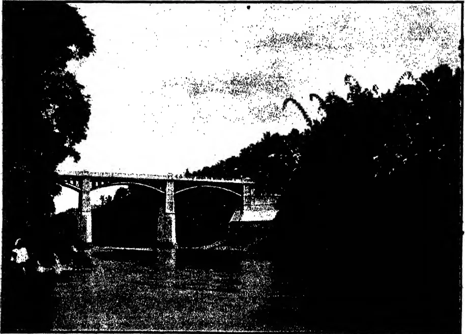

*Plate 16.* THE NEW BRIDGE AT PERADENIYA.

199------------------------------------------------

MARCH, 1922.]167

Following coffee, cinchona was the next important planting industry. In 1861, seeds of cinchona were received from India and plants from Kew. Seed of SPRUCE'S collection of *Cinchona Succirubra* were also received in 1861 from consignments sent to the East by MARKHAM. Plants from the same collection of seed were received from Kew in 1862 and plants of *Cinchona Calisaya* were received from Java in 1863. The present Hakgala garden was selected as a site for the experimental trial of cinchona, and in 1865 about 180,000 plants were distributed while in the year 1876 a total of 1,224,000 plants were sent out. The once lucrative industry of cinchona was the creation of the Botanic Gardens from supplies of seed and plants obtained as the result of MARKHAM'S mission to Peru at the instance and expense of the Indian Government. The industry followed the collapse of coffee and helped very considerably to resuscitate the ruined coffee plantations. With the expansion of cinchona growing in Java and in India, and with the establishment of improved varieties of quinine-yielding plants the industry in Ceylon became unremunerative and gave place to tea.

Another industry that came into prominence upon the collapse of coffee was cacao. This was an old introduction. It is not mentioned previous to MOON'S catalogue in 1824—but there are records of a case of plants introduced from Trinidad in 1834-5 and of young plants being advertised for sale from Peradeniya in 1843-1845.

The possibilities of cacao cultivation were insisted upon by THWAITES and in 1873 a special effort was made to assist its extension by the publication of notes upon its cultivation. In 1880, a consignment of eleven of the most highly prized varieties were secured from Trinidad. Seeds from these have been distributed and have been the origin of most of the hardy Forastero types which are at present under cultivation in the Colony.

The cultivation of tea likewise came into popularity upon the collapse of coffee. It is recorded that tea was introduced before 1828 and was found growing on the site of the old Botanic Garden

200------------------------------------------------

168[MARCH, 1922.

at Caltura in 1841. A re-introduction took place in 1839. In that year WALLICH sent seed of the then newly-discovered Assam tea to the Royal Botanic Gardens, Peradeniya, and plants of the same variety in 1840. Some of these were forwarded to Nuwara Eliya for cultivation. In 1841-42 individual introductions of China and Assam tea seed were made by planters and in 1845 China tea was introduced or re-introduced into the Gardens. In 1847, Assam tea was obtained. The Assam hybrid variety was secured in 1867 and 1868 and in 1870 plants began to be distributed from Hakgala Garden. The first tea made in Ceylon for sale was in May 1872 on Loolecondera Estate, the Superintendent of which secured seed from the Botanic Gardens at Peradeniya in 1866. During 1873 and 1874 many plants of both the Assam hybrid and the China variety were distributed from Peradeniya and Hakgala and additional supplies were imported from India. In 1882, seed from the older established plantations became available and from 1884 the rush into tea took place. Since that date the industry has continued to flourish and expand, with but few set-backs, and is now one of the three main agricultural industries of the Colony.

The whole rubber industry of the East owes much to the work of the Botanic Gardens of Ceylon. The possibility of introducing South American rubber-producing trees into India first occurred to MARKHAM about the year 1870. Two thousand seed of *Hevea brasiliensis* were obtained by the India Office from Cameta in 1873. Only 12 plants were raised at Kew and six of these were sent to Calcutta where the climate proved to be unsuitable. CROSS in 1875 collected plants of *Castilloa elastica*, and cuttings from these were sent to Peradeniya in 1876. In 1876 he again proceeded to Para where he collected 1,080 seedlings, from which 100 plants were eventually raised. He also went to Ceara and collected seeds and plants of *Manihot Glaziovii*. From both of these collections Ceylon received its share for Peradeniya.

Meanwhile, prior to CROSS' second expedition, WICKHAM had been commissioned by Kew to obtain seeds of *Hevea brasiliensis*. He succeeded in obtaining 70,000 seeds from the Tapaios plateau, and from this collection, which was sown in

201------------------------------------------------

A high-contrast black and white photograph of a river scene. The left side is dominated by a large, dark, silhouetted tree with dense foliage. The right side shows a river flowing through a landscape with bamboo plants visible along the banks. The sky is bright and clear.

*Plate 17.* VIEW OF THE MAHAWELIGANGA, SHOWING BAMBOOS.

202------------------------------------------------

A high-contrast, black and white photograph of a long, multi-story building, likely a museum or laboratory, partially obscured by dense foliage and trees in the foreground. The building has a series of windows and a prominent entrance area. The image is oriented horizontally on the page.

*Plate 18. THE LABORATORY, LIBRARY, HERBARIUM & ECONOMIC MUSEUM.*

203------------------------------------------------

MARCH, 1922.]169

the Royal Botanic Gardens, Kew, 7,000 seedlings were raised. From these 1,919 plants were despatched to Ceylon in August 1876. It had previously been considered that through the want of any accessible and properly constituted Botanic Garden in any part of India suitable for the propagation of tropical species the majority of the plants should be sent to Ceylon and thence to Burma and other parts of India. In 1877, the plants were put out at the Garden at Heneratgoda, which had been specially selected and established for their reception. From 1877 to 1880, plants raised from cuttings were distributed to Burma, Southern India and to a few Ceylon planters. The first tree flowered at Heneratgoda in 1880, and the first Ceylon-grown seed were secured in 1881. From 1884 all seeds were sold to estates or were distributed to Botanic Gardens abroad.

It is unnecessary further to describe the now well-known rise of the rubber industry of the East. Ceylon has faithfully carried out the mission entrusted to her, and the greater portion of the important rubber industry of the East owes its plants to seed or stocks from the Botanic Gardens of Ceylon.

The boom in rubber planting took place in 1905-1907. In 1906, the first of the World's Rubber Exhibitions, was held upon the Great Circle of the Royal Botanic Gardens, Peradeniya. At this exhibition—plantation rubber in its then known forms was exhibited and a Conference upon the agriculture and chemistry of rubber held. This Exhibition was the precursor of the International Rubber Exhibitions which have since been periodically held in London and which have done so much to spread a knowledge of rubber, its production, uses and possibilities.

The cultivation of cardamoms was also stimulated from Peradeniya. The valuable Malabar variety was introduced at an early date. THWAITES in 1868, however, advocated its systematic cultivation and in 1873 this industry began to be taken up.

Coca (*Erythroxylon Coca*) was introduced in 1870 and a small industry established. Its cultivation in Ceylon is now prohibited, with the exception of small experimental plots at Peradeniya. This drug thrives well in Ceylon and the whole of the Empire's requirements could easily be supplied by the island.

204------------------------------------------------

170[MARCH, 1922.

Camphor was first introduced in 1852. In 1908, attempts were made to encourage its cultivation. Several of these cultivations were successful, but had to be eventually abandoned owing to the fall in prices. These plantations were established from seed imported from Japan, as camphor, although it has flowered in Ceylon, has not as yet set fertile seed.

Nutmeg was introduced into Ceylon by the Dutch but the plants were afterwards destroyed. It was subsequently reintroduced in 1804 and large number of seeds were supplied from Peradeniya from 1843 onwards. Efforts have also been made from time to time to revive the cultivation of cloves from the trees growing at Peradeniya. Vanilla is grown upon some estates, Peradeniya having supplied planting material from 1853 onwards. Kola, having been introduced into the Gardens in 1879, is still grown upon some estates. Croton cultivation was also encouraged and was successful.

In recent years the possibilities of Sisal have been demonstrated. This plant was introduced by Peradeniya in 1890 and an experimental plantation was made at Mahaillupallama in the North-Central Province in 1909. It grew most satisfactorily and has given rise to a more extended experimental plantation at Anuradhapura and to an estate at Mahaillupallama.

Attempts have also been made at the cultivation of cotton. They were first made at Peradeniya in 1852-53, but the climate was found to be unsuitable. Further efforts were made at Mahaillupallama in 1903 and a more extended trial at Ambalantota in the Southern Province was begun in 1921.

The value of the cultivation of the West African oil-palm is also being tested. This palm was introduced in 1850 and some of the oldest specimens are to be seen at the Entrance Gates of the Royal Botanic Gardens. Seed from selected varieties of this palm were secured from the Gold Coast in 1913, and a small plantation made at the Experiment Station at Anuradhapura. Seed of further varieties from the Belgian Congo and from Nigeria was secured in 1921.

Fodder grasses have also received attention. The principal fodders of Ceylon are the so-called Mauritius Grass, (*Panicum molle*) and Guinea Grass (*Panicum maximum*.) These are both

205------------------------------------------------

MARCH, 1922.]171

South American grasses, which have become naturalised in the island. The date of the introduction of the former is not known but latter was introduced before 1824. *Paspalum conjugatum* was introduced in 1866, and *Paspalum dilatatum* in more recent years. Tests are at present in hand with further introductions.

A large number of valuable trees have been introduced from time to time and acclimatized, and the present re-afforestation with exotic species is based largely upon the experience of introductions by Peradeniya. The West Indian Mahogany (*Swietenia Mahagoni*) was introduced between 1828 and 1843, and succeeds well upon all soils with a coral sub-soil formation. There are good specimens of this valuable timber tree growing in the Gardens at Peradeniya. The Honduras Mahogany (*Swietenia macrophylla*) was introduced in 1888 and gives promise of being a most valuable tree for the low wet zone. *Cedrela Toona* grows with great rapidity between elevations of 4000-5500 feet and is a common feature in up-country tea estates. It was introduced in 1852, while the West Indian species *Cedrela odorata* was secured in 1884. Upon the Uva side of the Colony *Grevillea robusta* is a common feature of the landscape. It was introduced in 1856. The general aspect of many parts of the higher elevations of the island have been changed by plantations of Acacias and Eucalyptus, while Conifers are common features in small plantations, in gardens and along roads. The most common of these are *Acacia Melanoxylon*, *Acacia decurrens*, *Cupressus macrocarpa* introduced in 1881, *Cupressus Knightiana* introduced in 1893 and *Eucalyptus robusta* in 1881. The spread of these species suited to the higher elevations has taken place through the branch garden at Hakgala.

Sandal (*Santalum album*) was first grown at the Peradeniya Gardens in 1869. It, however, requires a drier climate and plants forwarded by Peradeniya to Badulla have given rise to a most promising plantation which has seeded freely and is now spreading naturally.

*Toluifera Pereira*, the Balsam of Peru, was introduced in 1861. It grows well and seeds prolifically in and near Kandy.

The beautiful shade trees along the road sides of Ceylon form one of the pleasing features of the Island and the shade afforded

206------------------------------------------------

172[MARCH, 1922.

thereby is most welcome to all travellers. The majority of shade trees below 3000 feet are *Pithecolobium* (Inga) *Saman*, the Rain Tree of Venezuela, which was introduced by Peradeniya about 1851. Three of the original trees are still to be seen growing in the Gardens. The shade trees for cacao, *Erythrina umbrosa* and *Erythrina velutina*, were introduced in 1881, while the well-known dadap (*Erythrina lithospermum*) used as a green manure for tea cultivations was introduced from Java and *Tephrosia candida* was obtained in 1852. *Alibizzia Moluccana* was secured in 1880 and *Gliricidia maculata* in 1883.

Ceylon owes most of its fruit to importations. The Anonas and Passion fruits were introduced in very early times from Tropical America. Citrus fruits came from India and Java, Pine-apples from America, Papaw and Sapodilla from the West Indies. Peradeniya has played its part in the introductions of fruits, of which mention may be made of the following :— Durian from Malaya in about 1850, Mountain papaw from Peru in 1880, Tree tomato from Peru in 1884 and Cherimoya from Pera in 1882. Péaches, Apples, Plums, Strawberries and Pears have also been tried from time to time at Hakgala, and are cultivated in many gardens up-country.

## DEVELOPMENT OF THE DEPARTMENT OF AGRICULTURE.

While the practical work of Peradeniya in the early years of its existence was mainly directed towards the introduction and acclimatisation of useful and ornamental plants, activities in later years have developed towards economic botany and agriculture. The chief work upon the economic side was the testing and distribution of economic plants of possible commercial value. This work was of great importance in the early economic development of the Colony and it is natural that later requirements necessitated provision for the investigation of the commercial possibilities of economic crops, the study of plant pests and diseases, enquiries into the chemical and physical properties of Ceylon soils and led eventually to the gradual development of a Department of Agriculture.

207------------------------------------------------

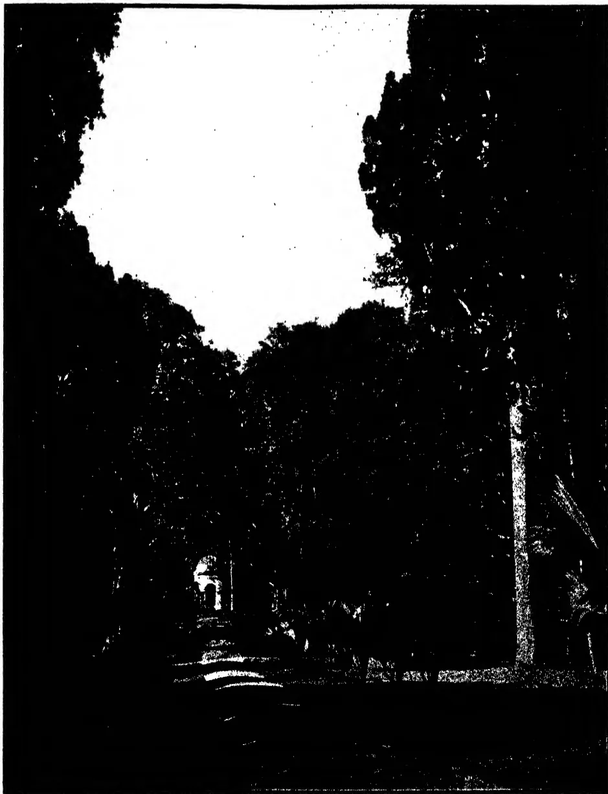A high-contrast black and white photograph of a memorial building, likely a small chapel or pavilion, nestled among dense trees. The building is partially obscured by the foliage, and the sky is bright and overexposed. The image is framed by a thick black border.

*Plate 19.* THE GARDNER MEMORIAL.

208------------------------------------------------

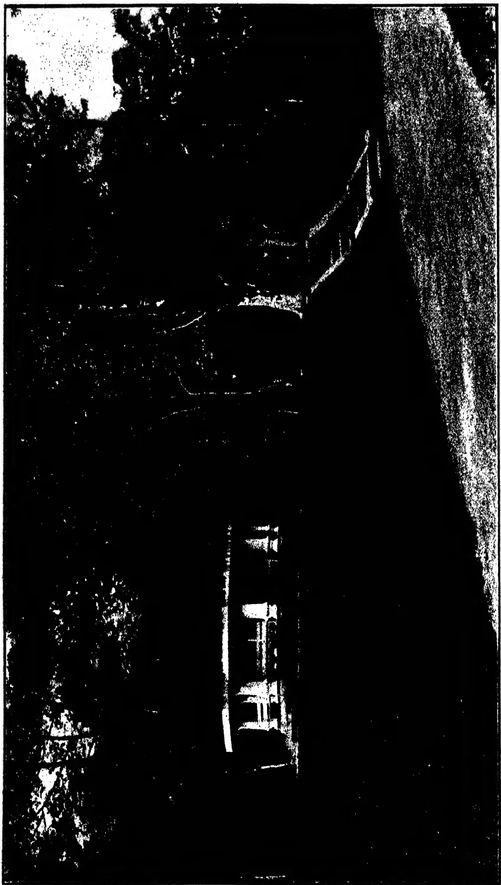A high-contrast, black and white photograph of a long, low building, identified as the Thwaites Memorial. The building is dark and appears to be situated in a wooded or park-like area. The image is oriented horizontally on the page.

*Plate 20. THE THWAITES MEMORIAL.*

209------------------------------------------------

MARCH, 1922.]173

The first step taken for the encouragement of agricultural enquiries was the issue in 1897 of "Circulars," giving brief accounts of the cultivation and treatment of economic crops and information on the important pests and diseases affecting cultivated plants. An honorary Entomologist was appointed and a Mycologist was obtained by the Planters' Association for the investigation of cacao disease—then prevalent in Matale and other districts.

In 1899, a post of Entomologist was established on the permanent staff of the Botanic Gardens and to this post E. E. GREEN was appointed. He is well known as an authority on Coccidæ and as the author of the monograph on "The Coccidæ of Ceylon." He investigated the principal pests of tea, cacao, coconuts, and paddy in Ceylon, and for his labours in entomology in the East he was awarded in 1901 the Barclay Medal being the first recipient of that honour. He was succeeded in 1913 by RUTHERFORD and by HUTSON in 1918. The latter has paid special attention to the pests of tea, coconuts and paddy, having worked out in detail many of the various points not settled by GREEN SPEYER made investigations into the Shot-hole borer pest of tea from 1914 and was followed by JEPSON in 1919. JARDINE made a careful investigation of the Tea Tortrix from 1915-1917. HENRY worked with the Department from 1915-1918 and assisted in classifying the collections. Other work in entomology and zoology has been carried out at Peradeniya by visiting scientists. Among these may be mentioned H. UZEL (Thysanoptera), F. DOFLEIN (Termites), K. ESCHERICH (Termitenleben auf Ceylon) R. C. PUNNETT, C. DOBELL, J. C. F. FRYER and L. PLATE.

In 1900, J. B. CARRUTHERS was appointed Mycologist and investigations of the canker disease of cacao were continued. Other diseases, such as canker disease of rubber, branch canker of tea, root diseases of tea, were also investigated. In 1905, he was succeeded by PETCH, the present occupant of the post. The earlier collection of fungi from Ceylon have been thoroughly examined by him and an attempt has been made to identify all the species of fungi previously recorded from Ceylon. The results of this work are in course of publication as "Revisions of Ceylon

210------------------------------------------------

174[MARCH, 1922.

Fungi." Systematic accounts of several groups have also been published, as well as detailed papers on the fungi of termite nests and fungi parasitic on scale insects. The investigation of the diseases of economic plants has been carefully and thoroughly carried out, and this work on the diseases of cacao, coconuts, tea and rubber are well known to agriculturists in the tropics and to all scientific institutions. Peradeniya has in recent years become a recognised centre of mycological knowledge, and requests for information and for assistance and advice are received from many parts of the Empire's eastern possessions. PETCH in 1911 published "The Physiology and Diseases of *Hevea brasiliensis*" and in 1921 a revised and more complete account of the diseases of *Hevea brasiliensis* under the title "Diseases and Pests of the Rubber Tree." He has also analysed the recent results of experiments on the tapping of rubber and has performed work of the greatest value in his investigations of control measures against various diseases.

In 1906, the services of BAMBER as Agricultural Chemist were obtained. He has been responsible for investigations into the chemical and physical properties of the soils of the Colony, for trials and investigations as to the manurial requirements of various crops, the yields and distillation of citronella and lemon grass oils, the distillation of camphor and for many other investigations of importance to the rubber and other industries. BAMBER's main work in Ceylon has, however, been in connexion with the tea industry and to him that industry is greatly indebted. He has been mainly responsible for the spread of green manuring throughout the Island and the tea industry owes much of its present day methods of cultivation to his efforts. He has also made investigations into the chemistry of tea and has made visits to Assam, Formosa and Japan for the purpose of making enquiries into the methods employed in those countries.

In 1902, the first real step towards the development of the Botanic Gardens department into a Department of Agriculture was taken. The old cacao estate at Gannoruwa, opposite the Botanic Gardens at Peradeniya was acquired. WRIGHT was its first Superintendent and did good work in the investigation of cacao cultivation and the treatment of its diseases, and in the

211------------------------------------------------

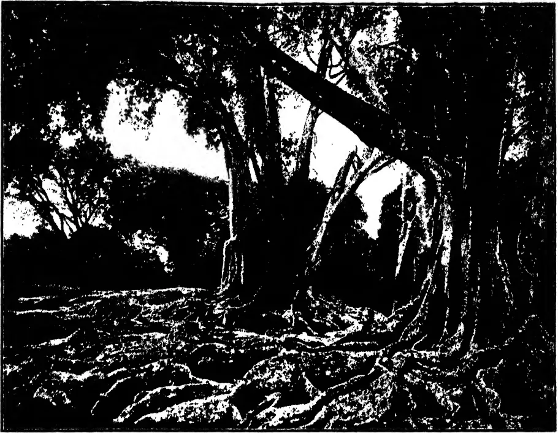

*Plate 21. BUTTRESS ROOTS OF FICUS ELASTICA.*

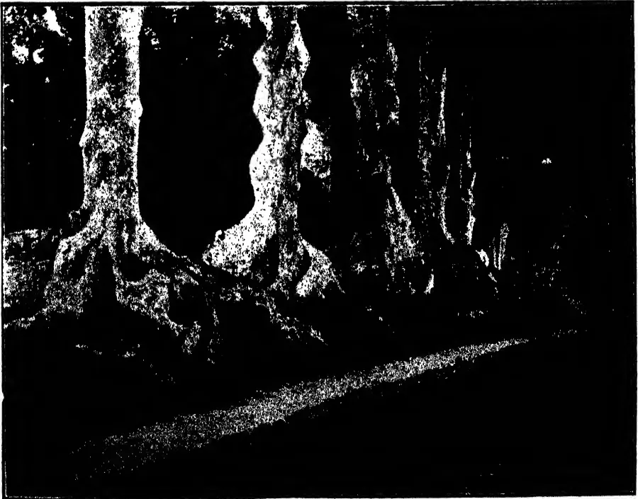

*Plate 22. BUTTRESSES OF CANARIUM COMMUNE.*

212------------------------------------------------

*Plate 23. VIEW OF THE RUBBER EXHIBITION, 1906.*

213------------------------------------------------

MARCH, 1922.]175

development of rubber planting. The work on this Station has been of the greatest value to the planting industry of the Colony. Manurial experiments with various crops are being carried out, tapping experiments with rubber systematically conducted, the cultivation of cacao studied, the value of green manuring in tea demonstrated, yields of lemon grass investigated, trials being made with many crops of economic importance and in recent years detailed investigations, from the point of view of the economic botanist, have been begun in respect to the individual yields of rubber of known parentage, the variation of individuals of cacao of known parentage and to the selection and improvement of paddies. The Station has also provided material for the researches of CAMPBELL with *Hevea brasiliensis* on "Seasonal variations in the Storage of Plant Food and their Relation to Resting Periods." "The effect of Tapping on the movements of Plant Food" and "the Physiological effects of various tapping systems" and of CAMPBELL and BRYCE on "The variation in the Number of Latex vessels at different heights from the ground."

Another Experiment Station was opened in 1904 in the Dry zone at Mahailluppalama. Extensive trials were made with cotton, tobacco, paddy, coconuts under irrigation and with sisal. The latter crop shows promise of being a valuable possibility for the drier regions of the Colony, and upon the closing of this Station in 1918, it was acquired by private enterprise for the first sisal plantation in the colony. All supplies for planting were secured from the plots previously established by the Experiment Station, which has laid the foundation of a possible new era for much of the dry area of the colony—described by some as its most promising unrealized asset.

During 1904, the Agricultural Society was started. The Society has done much to popularize agriculture, to bring to the notice of agriculturists the value of the investigations of Peradeniya and to awaken a demand for a fully equipped Department of Agriculture capable of meeting all the demands of the varied agricultural interests.

In 1906, charge was taken of School Gardens attached to elementary schools. In these Gardens, nature study is taught and

214------------------------------------------------

176[MARCH, 1922.

an effort made to teach the pupils to become keen observers and to take an interest in agriculture and in their rural surroundings. C. DRIEBERG was in charge of these Gardens from their inception until 1919 and performed valuable service in the development of this aspect of agricultural education. Under his guidance, School Gardens developed considerably and would bear comparison with any similar gardens attached to elementary schools anywhere in the Empire.

In 1911, WILLIS retired and the then Botanic Gardens was constituted as a Department of Agriculture. LYNE arrived in 1912 as the first Director of Agriculture.

He took steps to develop the agricultural side of the Department, laying out fresh experiments upon the Experiment Station at Peradeniya, establishing another Experiment Station at Anuradhapura in 1914, a small trial ground for coconuts at Chilaw in 1913 and another in 1917 for tobacco in Jaffna. He also started, in temporary buildings, the Agricultural School at Peradeniya. The control of Co-operative Credit Societies was vested in the Department in 1913.

In 1916, he was succeeded by STOCKDALE and since that date the development of various branches of work have been undertaken. Experimental work has been developed at Peradeniya, and at Anuradhapura in limes, sisal, paddy and other crops. The Agricultural School at Peradeniya has been provided with a permanent home and with the requisite buildings for its students. An Experiment Station has been established at Jaffna, preparatory to the organisation of another Agricultural School for the North, and steps have been taken for the provision of adequate laboratories for the Research staff at Headquarters. An Entomological laboratory was erected in 1921 and a Mycological Laboratory is in the course of construction in 1922.

Experiments with tobacco were begun at Teldeniya in 1919 and with cotton in the Hambantota districts of the Southern Province in 1921 and the improvement and selection of paddy varieties on a large scale was undertaken by an Economic Botanist in 1920. The shortage of foodstuffs during the War period naturally directed attention to the necessity for the extension of the cultivation of foodstuffs in the Colony. The

215------------------------------------------------

MARCH, 1922.]177

work originally begun by the Agricultural Society in Agricultural instruction has been considerably extended and eventually absorbed by the Department of Agriculture. A large increase in the number of itinerating Agricultural Instructors has been sanctioned with a view to assisting village cultivators in the improvement of their cultivations of paddy and other food crops. Trained Supervising Officers have been appointed, demonstration plots opened, competitions begun and demonstrations in co-operation with cultivators organized. Extension of practical elementary training in nature knowledge has taken place through School Gardens and Co-operative Societies encouraged. Plant Pests and Diseases have received special attention and the establishment of an organised inspecting force for their control and for the education and assistance of agriculturists commenced. A Board of Agriculture was organized in 1921, with a view to bringing practical agriculturists into close touch with the Department and to providing the Department with the assistance and advice of those connected with all branches of the agricultural industry of the Colony.

The research staff has been strengthened and special enquiries made into the commercial possibilities of crops not cultivated at present in the Colony.

From small buildings in 1822, Peradeniya has developed an organization which has branches in all parts of the Colony dealing with many and varied aspects of the agriculture of the various districts of the Colony. Its progress has been gradual and has been along lines which ran parallel with the requirements of the Colony. In its early stages it gave first attention to the investigation of the flora of the country, subsequently it introduced large numbers of exotics and helped to build up the prosperous agriculture which has been so dependent upon these introductions. Subsequently it was called upon to deal with the pests and diseases of cultivated products. Later it made experimental investigations into the cultural and manurial requirements of various agricultural crops, began work upon the improvement of existing varieties of cultivated crops and took up the furtherance of agricultural education.

216------------------------------------------------

178[MARCH, 1922.

A Research Institute with fully equipped laboratories is in course of construction and provision is being made for post graduate work in all those branches of science most intimately associated with agriculture.

The following is a complete list of the Staff Officers associated with Peradeniya since its commencement :—

*Superintendents, Royal Botanic Gardens.*

<table>
<tbody>
<tr>
<td>1812-1814</td>
<td>William Kerr</td>
<td>1838-1840</td>
<td>J. G. Lees ( Acting )</td>
</tr>
<tr>
<td>1817-1825</td>
<td>Alexander Moon</td>
<td>1840-1843</td>
<td>H. F. Normansell</td>
</tr>
<tr>
<td>1825-1827</td>
<td>Andrew Walker ( Acting )</td>
<td>1843-1844</td>
<td>W. C. Ondaatje ( Acting )</td>
</tr>
<tr>
<td>1827-1830</td>
<td>James Macrae</td>
<td>1844-1849</td>
<td>George Gardner, F.L.S.</td>
</tr>
<tr>
<td>1830-1832</td>
<td>J. Bird ( Acting )</td>
<td>1849</td>
<td>G. Fraser ( Acting )</td>
</tr>
<tr>
<td>1832-1838</td>
<td>J. C. Watson</td>
<td>1849-1857</td>
<td>G. H. K. Thwaites, C.M.G., Ph.D., F.R.S</td>
</tr>
</tbody>
</table>

*Directors, Royal Botanic Gardens.*

<table>
<tbody>
<tr>
<td>1857-1880</td>
<td>G. H. K. Thwaites, C.M.G., Ph.D., F.R.S.</td>
</tr>
<tr>
<td>1874-1877</td>
<td>M. M. Hartog, Asst. Director</td>
</tr>
<tr>
<td>1878-1879</td>
<td>Daniel Morris, M.A., Asst. Director</td>
</tr>
<tr>
<td>1880-1896</td>
<td>Henry Trimen, M.B., F.R.S., F.L.S.</td>
</tr>
<tr>
<td>1896-1912</td>
<td>J. C. Willis, Sc.D., F.R.S., F.L.S.</td>
</tr>
<tr>
<td>1900-1904</td>
<td>J. B. Carruthers, F.L.S., Asst. Director</td>
</tr>
<tr>
<td>1908-1912</td>
<td>R. H. Lock, Sc.D., F.L.S. Asst. Director</td>
</tr>
</tbody>
</table>

*Directors, Department of Agriculture.*

<table>
<tbody>
<tr>
<td>1912-1916</td>
<td>R. N. Lyne, F.L.S.</td>
</tr>
<tr>
<td>1916-</td>
<td>F. A. Stockdale, M.A., F.L.S</td>
</tr>
</tbody>
</table>

*Curators, Peradeniya.*

<table>
<tbody>
<tr>
<td>1860-1862</td>
<td>W. Cameron</td>
</tr>
<tr>
<td>1880-1895</td>
<td>P. D. G. Clark</td>
</tr>
<tr>
<td>1895-1912</td>
<td>H. F. Macmillan, F.L.S., F.R.H.S.</td>
</tr>
<tr>
<td>1912-</td>
<td>H. F. Macmillan, F.L.S., F.R.H.S. ( Supdt. of Botanic Gardens )</td>
</tr>
<tr>
<td>1914-</td>
<td>T. H. Parsons</td>
</tr>
</tbody>
</table>

*Curators, Hakgala.*

<table>
<tbody>
<tr>
<td>1860-1866</td>
<td>W. MacNicoll</td>
</tr>
<tr>
<td>1868-1881</td>
<td>E. J. Thwaites</td>
</tr>
<tr>
<td>1882-1904</td>
<td>W. Nock ( Supdt. )</td>
</tr>
<tr>
<td>1904-1909</td>
<td>J. K. Nock</td>
</tr>
<tr>
<td>1911-</td>
<td>J. J. Nock</td>
</tr>
</tbody>
</table>

*Scientific Assistants to Directors.*

<table>
<tbody>
<tr>
<td>1898-1899</td>
<td>J. Parkin, M.A.</td>
</tr>
<tr>
<td>1900-1902</td>
<td>Herbert Wright, A.R.C.S.</td>
</tr>
<tr>
<td>1902-</td>
<td>Dr. H. Uzel</td>
</tr>
<tr>
<td>1902-1904</td>
<td>R. H. Lock, M.A.</td>
</tr>
<tr>
<td>1905-1907</td>
<td>A. M. Smith, M.A.</td>
</tr>
</tbody>
</table>

217------------------------------------------------

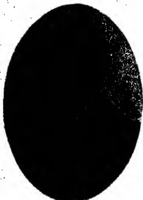

G.H.K. THWAITES C.M.G., Ph.D., F.R.S.  
1857-1880

HENRY TRIMEN M.B., F.R.S., F.L.S.  
1880-1896

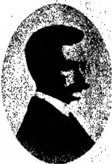

J.C. WILLIS Sc.D., F.R.S., F.L.S.  
1896-1912

DIRECTORS  
OF  
ROYAL BOTANIC GARDENS  
PERADENIYA

R.N. LYNE F.L.S.  
1912-1916

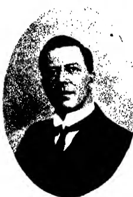

F.A. STOCKDALE, M.A., F.L.S.  
1916-

DIRECTORS OF AGRICULTURE  
CEYLON

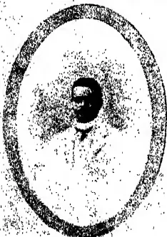

T. PETOH, B.A., B.Sc.  
[BOTANIST]  
1912-

H.F. MACMILLAN, F.R.S.  
[SUPERINTENDENT - GARDENS]  
1912-

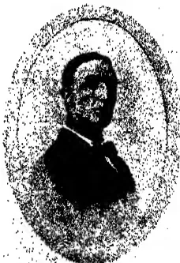

T.N. PARSONS  
[GARDEN, PERADENIYA]  
1912-

Photos.

Platé Ltd.

Plate 24. GROUP OF OFFICERS ENTRUSTED WITH THE WORK OF THE  
ROYAL BOTANIC GARDENS, PERADENIYA.

218------------------------------------------------

A completely blank white page with no visible content, text, or markings.

219------------------------------------------------

MARCH, 1922.]179*Entomologists.*

<table>
<tr>
<td>1899-1913</td>
<td>E. E. Green, F.E.S.</td>
</tr>
<tr>
<td>1913-1915</td>
<td>A. Rutherford, M.A., B.Sc.</td>
</tr>
<tr>
<td>1914-1919</td>
<td>E. Speyer, M.A., F.E.S. (for Shot-hole Borer Investigations)</td>
</tr>
<tr>
<td>1918-</td>
<td>J. C. Hutson, B.A., Ph.D.</td>
</tr>
<tr>
<td>1919-</td>
<td>F. P. Jepson, M.A., F.E.S., (Assistant)</td>
</tr>
<tr>
<td>1917-1919</td>
<td>N. K. Jardine, F.E.S. (for Tea Tortrix Investigations)</td>
</tr>
</table>

*Mycologists.*

<table>
<tr>
<td>1880-1882</td>
<td>H. Marshall Ward, B.A. (Cryptogamist)</td>
</tr>
<tr>
<td>1900-1904</td>
<td>J. B. Carruthers, F.L.S.</td>
</tr>
<tr>
<td>1905-</td>
<td>T. Petch, B.A., B.Sc.</td>
</tr>
<tr>
<td>1913-</td>
<td>G. Bryce, B.Sc. (Assistant)</td>
</tr>
<tr>
<td>1920-</td>
<td>C. H. Gadd, B.Sc. (Assistant)</td>
</tr>
<tr>
<td>1921-</td>
<td>M. Park, A.R.C.S. (Assistant)</td>
</tr>
</table>

*Chemists.*

<table>
<tr>
<td>1900-</td>
<td>M. K. Bamber, M.R.A.C., F.I.C., F.C.S.</td>
</tr>
<tr>
<td>1913-1917</td>
<td>L. E. Campbell, B.Sc., A.I.C. (Rubber Research)</td>
</tr>
<tr>
<td>1922-</td>
<td>T. E. H. O'Brien, B.Sc. (Rubber Research)</td>
</tr>
</table>

*Economic Botanists.*

<table>
<tr>
<td>1919-1921</td>
<td>F. Summers, B.A., M.Sc.</td>
</tr>
<tr>
<td>1921-</td>
<td>R. O. Iliffe, B.A., Dipl. Agr. (Cantab.)</td>
</tr>
</table>

*Divisional Agricultural Officers.*

<table>
<tr>
<td>1920-</td>
<td>G. G. Auchinleck, M.Sc., A.I.C., F.C.S.</td>
</tr>
<tr>
<td>1920-</td>
<td>G. Harbord</td>
</tr>
<tr>
<td>1920-</td>
<td>N. Marshall, B.Sc., Agric.</td>
</tr>
<tr>
<td>1921-</td>
<td>F. Burnett, B. Agr.</td>
</tr>
</table>

*Plant Pest Inspectors.*

<table>
<tr>
<td>1919-</td>
<td>N. K. Jardine, F.E.S.</td>
</tr>
<tr>
<td>1921-</td>
<td>A. T. Reeve, A.R.C.S.</td>
</tr>
</table>

*Managers, Experiment Stations.*

<table>
<tr>
<td>1902-1907</td>
<td>H. Wright, A.R.C.S.</td>
</tr>
<tr>
<td>1904-1910</td>
<td>C. J. C. Mee</td>
</tr>
<tr>
<td>1909-1912</td>
<td>J. A. Holmes, M.R.A.C.</td>
</tr>
<tr>
<td>1910-1920</td>
<td>G. Harbord</td>
</tr>
<tr>
<td>1920-</td>
<td>T. H. Holland</td>
</tr>
<tr>
<td>1919-</td>
<td>H. A. Deutrom (Anuradhapura)</td>
</tr>
</table>

*Superintendent of School Gardens.*

<table>
<tr>
<td>1902-1920</td>
<td>C. Drieberg, B.A., F.H.A.S.</td>
</tr>
</table>

*Tobacco Experts.*

<table>
<tr>
<td>1914-1917</td>
<td>B. F. Scherffius</td>
</tr>
<tr>
<td>1918-1919</td>
<td>W. B. Wilson, B. Agr.</td>
</tr>
</table>

220------------------------------------------------

180[MARCH, 1922.

The DEPARTMENT OF AGRICULTURE is at present as follows :

**ADMINISTRATION.**

The Hon. Mr. F. A. Stockdale, M.A. (Cantab.) F.L.S., Director.

R. Aluwihare, C.C.S., Office Assistant.

C. Duff-Tytler, Shorthand Typist.

**RESEARCH I.—LABORATORIES.**

T. Petch, B.A., B.Sc., (London) Botanist and Mycologist.

J. C. Hutson, B.A. (Oxon), Ph.D., Entomologist.

R. O. Iliffe, M.A., Dip. Agr. (Cantab.) Economic Botanist.

G. Bryce, B.Sc. (Edin.), Assistant Botanist and Mycologist.

C. H. Gadd, B.Sc. (Birm.), Assistant Mycologist.

F. P. Jepson, M.A. (Cantab.) F.E.S., Dip. Agr. (S.E.A.C.) Ast. Ento.

M. Kelway Bamber, M.R.A.C., F.I.C., F.C.S., Consulting Agr. Chemist.

**RESEARCH II.—PLANT PESTS AND DISEASES INSPECTORATE.**

N. K. Jardine, F.E.S., Inspector of Plant Pests and Diseases (Central).

A. T. Reeve, A.R.C.S., Inspector of Plant Pests and Diseases (Southern)

**RESEARCH III.—CENTRAL EXPERIMENT STATION, PERADENIYA.**

T. H. Holland, Dip. Agr. (S.E.A.C.), Manager, Ex. Station, Peradeniya.

**RUBBER RESEARCH.**

M. Park, A R.C.S., Mycologist.

T. E. H. O'Brien, B.Sc., Chemist.

**BOTANIC GARDENS.**

H. F. Macmillan, F.L.S., F.R.H.S., Superintendent, Botanic Gardens.

T. H. Parsons, Curator, Royal Botanic Gardens, Peradeniya.

J. J. Nock, Curator, Hakgala Gardens.

**DIVISIONAL EXPERIMENTS AND DEMONSTRATIONS.**

G. G. Auchinleck, M.Sc. (McGill), A.I.C., F.C.S., Divisional Agricultural Officer, Southern.

N. Marshall, B.Sc., (Durham), Divisional Agricultural Officer, Northern

F. Burnett, B.Sc. Agr. (Oxon), Divisional Agricultural Officer, North-Western.

G. Harbord, Cert. Agr. (S.E.A.C.) Divisional Agricultural Officer, Central (Acting).

**AGRICULTURAL BRANCH.**

J. S. de Silva, Manager, Seed Store and Publication Depot.

Alexander Perera, Inspector of School Gardens, Central.

W. P. A. Cooke, Dip. Agr. (Poona) Farm School Officer, Jaffna.

J. C. Driberg, Dip. Agr. (Poona) Farm School Officer, Peradeniya.

Muhandiram N. Wickremeratne, Secretary Board of Control, Co-operative Societies.

221------------------------------------------------

MARCH, 1922.]181

**AGRICULTURAL BRANCH.—*Conld.***

<table border="0">
<tbody>
<tr>
<td>C. Canagaratnam, Dip. Agr. (Poona) Assistant Manager, Experiment Station, Anuradhapura.</td>
<td>N. Senathiraja, Asst. Farm School Officer, Jaffna.</td>
</tr>
<tr>
<td>W. Molegoda, Senior Agricultural Instructor, Central Division.</td>
<td>N. Senaratne, Dip. Agr. (Poona) Agricultural Instructor.</td>
</tr>
<tr>
<td>J. V. Wickremesekera, Dip. Agr. (Poona) Assistant Farm School Officer, Peradeniya.</td>
<td>A. V. Chelvanayagam do</td>
</tr>
<tr>
<td>J. A. Alles, Dip. Agr. (Poona) Ass- istant to the Divisional Agri- cultural Officer, Galle.</td>
<td>V. Ramanathan do</td>
</tr>
<tr>
<td>K. S. Arumugam, Dip. Agr. (Poona) Agricultural Officer, Kurunegala.</td>
<td>C. P. Crispeyn do</td>
</tr>
<tr>
<td>E. W. Dias Bandaranaike, Dip. Agr. (Poona), Agricultural Officer, Badulla.</td>
<td>P. B. Kapuwatte Probationer</td>
</tr>
<tr>
<td>V. Canagaratnam, Dip. Agr. (Poona), Agricultural Officer, Batticaloa.</td>
<td>A. B. Attygalle do</td>
</tr>
<tr>
<td>C. Wickremeratna, Lecturer School of Tropical Agriculture, Pera- deniya.</td>
<td>G. D. G. de Silva do</td>
</tr>
<tr>
<td>L. A. D. Silva, Agricultural Instructor.</td>
<td>A. C. W. Jayawardena do</td>
</tr>
<tr>
<td>A. D. L. de Z. Jayatilaka, Inspector of School Gardens, Southern Division.</td>
<td>Walter Perera do</td>
</tr>
<tr>
<td>M. J. A. Karunanayake, Agri- cultural Instructor.</td>
<td>B. G. Buultjens do</td>
</tr>
<tr>
<td>A. M. Muttucumarn, Inspector, Co- operative Societies.</td>
<td>C. W. Dangamuwa do</td>
</tr>
<tr>
<td>J. R. Nugawela, Agricultural Instruc- tor, Central Division.</td>
<td>G. Madugalla do</td>
</tr>
<tr>
<td>A. Madanayake, Senior Agricultural Instructor, Ratnapura.</td>
<td>N. Tambiah do</td>
</tr>
<tr>
<td>S. B. Yatawera, Inspector, Co-oper- ative Societies, Central Division.</td>
<td>V. G. Perera do</td>
</tr>
<tr>
<td>M. Amerasinghe, Insp. Co-operative Societies, Southern Division</td>
<td>H. C. Pieris do</td>
</tr>
<tr>
<td></td>
<td>J. Rambukpota do</td>
</tr>
<tr>
<td></td>
<td>D. T. J. Weerasooriya do</td>
</tr>
<tr>
<td></td>
<td>G. de A. Seneviratne do</td>
</tr>
<tr>
<td></td>
<td>W. F. de A. Seneviratne do</td>
</tr>
<tr>
<td></td>
<td>J. D. Nicholas do</td>
</tr>
<tr>
<td></td>
<td>T. C. de Sylva do</td>
</tr>
<tr>
<td></td>
<td>J. C. Abeywardena do</td>
</tr>
<tr>
<td></td>
<td>M. B. Boange do</td>
</tr>
<tr>
<td></td>
<td>A. Abeysinghe do</td>
</tr>
<tr>
<td></td>
<td>P. A. Gooneratne do</td>
</tr>
<tr>
<td></td>
<td>T. V. Thamotheram do</td>
</tr>
<tr>
<td></td>
<td>D. D. Banda Vernacular Instructor.</td>
</tr>
<tr>
<td></td>
<td>K. J. Perera do</td>
</tr>
<tr>
<td></td>
<td>H. S. Perera do</td>
</tr>
<tr>
<td></td>
<td>P. C. Rodrigo do</td>
</tr>
</tbody>
</table>

**RESEARCH BRANCH.**

<table border="0">
<tbody>
<tr>
<td>H. L. Van Buuren, Dip. Agr. (Poona) Assistant to the Economic Botanist.</td>
<td>John Jackson, Sub-Inspector, Plant Pests, Central.</td>
</tr>
<tr>
<td>L. S. Bertus, Assistant to the Botanist and Mycologist.</td>
<td>B. A. Pereira, Sub-Inspector, Plant Pests, Central.</td>
</tr>
<tr>
<td>C. Ragunathan, Dip. Agr. (Poona) Assistant to the Botanist and Mycologist.</td>
<td>M. S. Mendis, Sub-Inspector, Plant Pests, Southern.</td>
</tr>
<tr>
<td>G. D. Austin, Assistant to Entomologist.</td>
<td>R. A. Cameron Sub-Inspector, Plant Pests, Southern.</td>
</tr>
<tr>
<td>E. J. Livera, B.Sc., (London) Ass- istant in Systematic Botany.</td>
<td>D. D. J. M. Silva, Plant Collector.</td>
</tr>
<tr>
<td>H. Ludowyke, Librarian.</td>
<td>Edmund de Alwis, Museum Assistant.</td>
</tr>
<tr>
<td>E. de Alwis, Laboratory Assistant to Entomologist.</td>
<td>Alfred de Alwis, Draughtsman.</td>
</tr>
<tr>
<td></td>
<td>A. G. Alwis do</td>
</tr>
<tr>
<td></td>
<td>G. L. de Silva do</td>
</tr>
<tr>
<td></td>
<td>M. R. M. Jaberatnam Probationer.</td>
</tr>
<tr>
<td></td>
<td>G. T. E. de Silva do</td>
</tr>
</tbody>
</table>

222------------------------------------------------

182[MARCH, 1922.FIELD BRANCH.

<table border="0">
<tbody>
<tr>
<td>H. A. Deutrom, Manager, Experiment Station, Anuradhapura.</td>
<td>R. A. Siriwardena, Gardener, King's Pavilion, Kandy.</td>
</tr>
<tr>
<td>G. E. Jayatilaka Hulugalle, Dip. Agr. (Poona), Assistant Manager, Experiment Station, Peradeniya.</td>
<td>A. Jayasinghe, 3rd Assistant Foreman, Peradeniya.</td>
</tr>
<tr>
<td>T. B. Ranaraja, Actg. Assistant Manager, Experiment Station, Peradeniya.</td>
<td>T. B. Dissanayake, Gardener Queen's House, Colombo.</td>
</tr>
<tr>
<td>D. F. de Silva Gooneratne, Asst-Curator, Heneratgodu Gardens.</td>
<td>P. A. Kirihamy, Gardener, Cuddesdon, Nuwara Eliya.</td>
</tr>
<tr>
<td>K. J. Alexander Sylva, Foreman, Botanic Gardens, Peradeniya.</td>
<td>A. D. Fredrick, Gardener, Temple Trees, Colombo.</td>
</tr>
<tr>
<td>M. J. Fernando, Foreman of Economic Nurseries and Supplies for School Gardens.</td>
<td>G. A. Jothihamy, 1st Upper-Gardener, Peradeniya.</td>
</tr>
<tr>
<td>S. de Silva, Acting Foreman, Experiment Station, Peradeniya.</td>
<td>P. B. Kiridena, Nurseryman Hakgala.</td>
</tr>
<tr>
<td>D. E. Perera, Foreman, Hakgala Gardens.</td>
<td>T. de Silva, 2nd Upper-Gardener, Peradeniya.</td>
</tr>
<tr>
<td>Wilfred de Alwis, Senior Assistant Foreman, Peradeniya Gardens.</td>
<td>Bernard de Alwis, 3rd Upper-Gardener, Peradeniya.</td>
</tr>
<tr>
<td>P. G. Saminathan, Foreman, Experiment Station, Anuradhapura.</td>
<td>Punchibanda Keppitipola, Assistant Foreman, Experiment Station, Peradeniya.</td>
</tr>
<tr>
<td>T. Young, Foreman, Nuwara-Eliya Gardens.</td>
<td>K. M. B. Ranesinghe, Assistant Foreman, Experiment Station, Anuradhapura.</td>
</tr>
<tr>
<td>D. A. W. Ranasinghe, Foreman, Govt. Gardens, Colombo.</td>
<td>John Gardener, Royal Botanic Gardens, Peradeniya</td>
</tr>
<tr>
<td>P. J. Christoffelsz, Head Gardener, Queen's Cottage, Nuwara-Eliya.</td>
<td>Siripina do</td>
</tr>
<tr>
<td>G. E. Punchi Banda, Nurseryman, Peradeniya.</td>
<td>Ammasie do</td>
</tr>
<tr>
<td>D. W. K. Gunawardena, 2nd Assistant Foreman, Peradeniya.</td>
<td>Appuhamy do</td>
</tr>
<tr>
<td>L. A. A. Perera, Assistant Foreman, Experiment Station, Peradeniya.</td>
<td>Sangaran do</td>
</tr>
<tr>
<td></td>
<td>Manis do</td>
</tr>
<tr>
<td></td>
<td>Williambanda do</td>
</tr>
<tr>
<td></td>
<td>Ukkubanda do</td>
</tr>
<tr>
<td></td>
<td>Arnolis do</td>
</tr>
</tbody>
</table>

CLERICAL STAFF.

<table border="0">
<tbody>
<tr>
<td>R. H. Pereira</td>
<td>Chief Clerk</td>
<td>G. Gnanapiragasam</td>
<td>Clerk</td>
</tr>
<tr>
<td>H. L. Perera</td>
<td>Clerk</td>
<td>K. Paramanathan</td>
<td>do</td>
</tr>
<tr>
<td>E. P. Chelliah</td>
<td>do</td>
<td>K. B. Halangoda</td>
<td>do</td>
</tr>
<tr>
<td>S. V. Solomons</td>
<td>do</td>
<td>C. A. Samarasinghe</td>
<td>do</td>
</tr>
<tr>
<td>M. W. B. Palipane</td>
<td>do</td>
<td>D. P. Jayatilleke</td>
<td>do</td>
</tr>
<tr>
<td>M. B. Neangoda</td>
<td>do</td>
<td>P. B. Seneviratne</td>
<td>do</td>
</tr>
<tr>
<td>L. Ratnasabapathy</td>
<td>do</td>
<td>W. D. E. Weeratne</td>
<td>do</td>
</tr>
<tr>
<td>Y. A. Joseph Perera</td>
<td>do</td>
<td>Z. M. Sally</td>
<td>do</td>
</tr>
<tr>
<td>W. L. P. Amerasinghe</td>
<td>do</td>
<td>H. M. Rasnayake</td>
<td>do</td>
</tr>
<tr>
<td>D. D. J. de Silva</td>
<td>do</td>
<td>K. S. M. Fernando</td>
<td>do</td>
</tr>
<tr>
<td>M. B. Medagama</td>
<td>do</td>
<td>K. R. Samaratunga</td>
<td>do</td>
</tr>
<tr>
<td>W. A. W. Gunawardene</td>
<td>do</td>
<td>A. P. Wijenarayane</td>
<td>do</td>
</tr>
<tr>
<td>T. Chellappah</td>
<td>do</td>
<td>A. B. Suriyadasa</td>
<td>do</td>
</tr>
<tr>
<td>A. S. Samaraweera</td>
<td>do</td>
<td>M. Perera</td>
<td>do</td>
</tr>
<tr>
<td>S. Edwards</td>
<td>do</td>
<td>M. D. H. Perera</td>
<td>do</td>
</tr>
<tr>
<td>A. W. L. Samarasinghe</td>
<td>do</td>
<td>B. D. Chandrasekera</td>
<td>do</td>
</tr>
<tr>
<td>L. B. Kapuwatte</td>
<td>do</td>
<td></td>
<td></td>
</tr>
</tbody>
</table>

223------------------------------------------------

MARCH, 1922.]183GENERAL.

<table>
<tr>
<td>David de Silva</td>
<td>Guide</td>
<td>W. K. Hendrick</td>
<td>Peon</td>
</tr>
<tr>
<td>James</td>
<td>Peon</td>
<td>W. A. Richard</td>
<td>do</td>
</tr>
<tr>
<td>M. Peter</td>
<td>do</td>
<td>G. C. Lewis</td>
<td>do</td>
</tr>
<tr>
<td>G. Daniel</td>
<td>do</td>
<td>Badur Deen</td>
<td>do</td>
</tr>
<tr>
<td>M. Joseph Perera</td>
<td>do</td>
<td>U. Sarnelis</td>
<td>do</td>
</tr>
<tr>
<td>Don Peter de Silva</td>
<td>do</td>
<td>A. Anthonypillai</td>
<td>do</td>
</tr>
<tr>
<td>William Perera</td>
<td>do</td>
<td>K. P. Bodiya</td>
<td>do</td>
</tr>
<tr>
<td>B. K. M. Kalu Banda</td>
<td>do</td>
<td>M. James Fonseca</td>
<td>do</td>
</tr>
</table>

The Experiment Stations and Botanic Gardens under its control are as follows :—

MAJOR EXPERIMENT STATIONS.

1. 1. Experiment Station, Peradeniya.
2. 2. Experiment Station, Anuradhapura.
3. 3. Experiment Station, Jaffna.

MINOR EXPERIMENT STATIONS.

<table>
<tr>
<td>1. Teldeniya Tobacco Trial Ground</td>
<td>6. Godakawela Experiment Station</td>
</tr>
<tr>
<td>2. Ambalantota Cotton do</td>
<td>7. Trincomalie do</td>
</tr>
<tr>
<td>3. Weligama Experiment Station</td>
<td>8. Nalanda do</td>
</tr>
<tr>
<td>4. Bandaragama do</td>
<td>9. Dandagamuwa do</td>
</tr>
<tr>
<td>5. Balangoda do</td>
<td></td>
</tr>
</table>

BOTANIC GARDENS.

Royal Botanic Gardens, Peradeniya.

Botanic Gardens, Hakgala.

Botanic Gardens, Heneratgoda.

Botanic Gardens, Nuwara Eliya.

Throughout its history Peradeniya has been served well by its Scientific Staff and by those Ceylonese that have been employed in its services. Full testimony has been given to the devoted work of Harmanis de Alwis Seneviratne, his descendants, and others. In recent years, larger additions to the staff have become necessary, and encouragement has been given to Ceylonese to take up agriculture as a profession. In course of time, Peradeniya will become an Institution concerned with higher education in tropical agricultural sciences as well as for research work. It will also expand its activities throughout the Provinces of the island. Several sons of Ceylon are in England undergoing training for positions in the Department of Agriculture as it expands—several with scholarships provided by Government.

224------------------------------------------------

184[MARCH, 1922.]

The record of Peradeniya for the past hundred years is one of which the Colony and the Empire can be proud. The extension of agricultural science in recent years has been considerable. The future in Ceylon offers great possibilities, and the increasing demands from all classes of agriculturists for assistance and advice indicates the importance of the rôle that Peradeniya is called upon to play in the development and welfare of the Colony.

With the completion of new and fully-equipped laboratories further and improved facilities will be provided for botanical studies and for scientific research applied to agriculture. Visiting scientific workers will find accommodation available and graduates in science from the University College of Colombo will have opportunities for agricultural training and research.

Peradeniya may look back to its past with pride and forward to its future with confidence.

March 24th, 1922.

F. A. STOCKDALE.  
T. PETCH.  
H. F. MACMILLAN.

225------------------------------------------------

# THE TROPICAL AGRICULTURIST

---

VOL. LVIII.

PERADENIYA, APRIL, 1922.

No. 4.

---

## THE BUDDING OF RUBBER.

---

In previous numbers of the TROPICAL AGRICULTURIST attention has been drawn to the possibilities of budding and grafting rubber. The local press has given prominence to the necessity of making extensive trials in the work in Ceylon and several estates are now making a beginning.

Budding rubber has been successfully carried out in Java and Sumatra for some years and recently fairly extensive areas of budded rubber have been planted out in the Federated Malay States. One estate in Sumatra is stated to have over 3,000 acres of budded rubber planted out and it is expected that tapping experiments may begin in Java this year on budded plants that are four years of age.

Two passed students of the School of Tropical Agriculture at Peradeniya have recently been sent to Java to gain practical experience of the budding of rubber. One of these has been sent on private account and the other by the Ceylon Rubber Research Scheme. The latter will be employed for some time at the Botanic Gardens, Heneratgoda, and will also be available to estates that desire his services.

It has been shown that the budding of rubber is a practical possibility, that budded plants make satisfactory growth. Goostees from budded plants have also been successfully grown.

The depression in the rubber industry has given rise to a considerable number of proposals for compulsory or voluntary restriction of output until the market demand becomes greater.

226------------------------------------------------

186[APRIL, 1922.

The restriction scheme of the Rubber Growers' Association was in force until the middle of 1921, when it had to be abandoned for want of sufficient support.

Some rubber-producing countries capable of turning out rubber at low cost are opposed to restriction proposals and many directors of rubber companies are now beginning to recognise that if the industry is to be unfettered with restriction schemes costs of production must be reduced and the outturn per acre from favoured estates increased.

It is well known that there are certain individuals among the trees of a rubber estate that give yields of rubber greatly in excess of the majority. These trees are known to the estate management and to the tappers. It has also been shown that a good yielding tree is always a good yielding tree, unless it becomes affected by disease. It necessarily follows therefore that if a field could be established with plants reproduced vegetatively only from parents of high-yielding capacity the average outturn of rubber would be considerably increased and its cost of production reduced.

It is not anticipated that the effect of the establishment of budded rubber will be noticeable to the industry for several years. The percentage of the acreage of such rubber to the total rubber acreage will remain infinitesimal for a considerable time. Old estates moreover will be unable to accomplish much as the greater part of their acreage is already fully planted out.

It has also yet to be ascertained what actual yields can be secured from budded rubber and it has to be found out whether such rubber will be more liable to disease than rubber raised from seed.

For the present, Ceylon rubber growers are advised to mark all trees giving exceptionally high yields of rubber and to make experimental trials of budding. Every assistance will be given by the Department of Agriculture to those commencing this work.

227------------------------------------------------

APRIL, 1922.]187

# RUBBER.

---

## THE VEGETATIVE REPRODUCTION OF SELECTED STOCK OF HEVEA.

J. N. MILSUM, F.L.S.,

*Assistant Agriculturist, Department of Agriculture, F.M.S. & S.S.*

It is now generally understood that there is considerable variation in the yields of individual rubber trees and it has been found that by means of budding, trees may be propagated with all the visible characters of the parent tree. It is as yet a moot point whether this applies in the case of yield of latex, but it appears possible and preliminary investigations in Java are said to confirm this supposition.

The writer having visited recently the east coast of Sumatra, it appears to be not without interest to record what is being done in this connection, in that country, supplemented with observations gathered from experiments in propagating Hevea at the Experimental Plantations, Kuala Lumpur. It is to be appreciated that as far as the actual practice of budding is concerned, the work is now on an established basis and employed on a number of estates, that are planting rubber. As to whether these areas, when in tapping, will give the yields that are anticipated is a matter for the future.

### PRELIMINARY INVESTIGATIONS TO DETERMINE HIGH YIELDING TREES.

This matter is more complex than is often supposed as so many factors may influence the yield of latex. In the first instance it is uncertain to what extent latex production is a hereditary character. Secondly, whether the yield of latex from any individual tree is constant and not variable according to age and external conditions. A further consideration is what relation may exist between the root of the stock seedling and the eventual yield of the budded tree. It is evident that more research is necessary to enable these questions to be answered with precision.

Very considerable efforts are being made in the Dutch East Indies to ascertain which are consistent high yielding trees for the purpose of providing stock for future planting. In this connection the patient work of the Cinchona planters in Java may be mentioned, where by a long series of selections, strains of Cinchona trees have been obtained and reproduced vegetatively with a considerably increased percentage of alkaloid in the bark. No analogy can be made between yield of quinine and latex production as the means of extracting the product are so widely separated but it does seem possible that the methods employed in Java with Cinchona attended by such marked success may be applicable in the case of Hevea.

To collect data for furnishing evidence as to the heaviest yielders on an estate, the following method is employed. A special gang of coolies follow the tappers and measure the latex from each tree once a month. Glass tubes graduated in six divisions and marked with a simple sign to indicate six

228------------------------------------------------

188[APRIL, 1922.

classes of yielders, are issued to the gang. The sign representing the volume of latex is then marked on the tree with a tapping knife. A vertical series of twelve such signs thus indicates the yields for twelve monthly measurements. Six measurements are said to be sufficient to indicate the lowest yielders but the longer the yields are taken the more reliable is the information obtained. It must be borne in mind that disease stimulates the flow of latex, so it is important that sufficient time elapses to ascertain whether disease is present or not. The trees finally selected are marked with a band of paint.

More precise information may be obtained by marking out the trees that have been found to be consistently the best yielders and after coagulating the latex on at least two occasions a month, recording the average dry weight over a period of one or more years.

Let us assume that a number of trees have been selected as the heaviest yielders on any particular plantation. These trees will provide the material for future planting and it is then necessary to raise nurseries of seedlings as stocks for budding from the selected trees.

#### SEED FOR STOCK PLANTS.

In selecting the seed for the stock seedlings the principle of improvement should be borne in mind and only seed from healthy and high yielding trees be collected. It should be appreciated that seed from such trees are likely to show considerable variability on account of their unknown parentage on the male side. HEUSSER\* has shown, after many experiments with artificial pollination, that Hevea is adapted for cross-pollination and is not absolutely self-sterile, but usually 'selfing' is unsuccessful. Even should it be possible to ensure pollination of the female flower by pollen from male flower of the same tree, the offspring will still show variability account of impurity of strain brought about by possible cross pollination in the previous generation.

#### NURSERIES.

The nursery beds should be laid out from East to West and be about 4 feet wide. The seeds are planted in rows  $1\frac{1}{2}$  feet apart either way, thus allowing plenty of space to work in during budding operations.

#### TIME FOR BUDDING.

Seedlings are considered to be a suitable age for budding when six to nine months old, according to growth. Seeds sown during September produce stumps ready to be budded the following May. Generally the period from the termination of the wintering period to the autumn rains is the season for budding. Further experience is necessary to determine the best months for budding operations in this country.

#### PREPARATION OF THE MATERIAL.

A good material for the binding cloth is ordinary unbleached cotton cloth which is readily procurable from native importers. The cloth is obtainable 34 inches wide and may be cut into two strips of 16 inches wide and is then ready for waxing. Other sizes are procurable but it is most economical to have a cloth of sufficient width to strip into two. After waxing, strips of material are cut off measuring 16 inches by one inch. One yard of

\* ARCHIEF VOOR DE RUBBERCULTUUR, December, 1919, p. 455.

229------------------------------------------------

APRIL, 1922.]189

cloth provides material for binding up 70 stocks. Should binding cloth be required for older stumps, then the strips will have to be correspondingly larger.

Several mixtures have been recommended for waxing the cloth but when tested at the Department of Agriculture, were found unsuitable for general use. The following ingredients made a good wax and so far appear to be the most suitable, though other cheaper grades are satisfactory.

Fifty per cent. Petroleum Jelly (*Paraffinum molle flav.*).

Fifty per cent. White Paraffin Wax (Melting point 125/30 degrees F).

These materials are obtainable in quantity from local firms at the following prices:—*Paraffinum molle flav.*, 70 cents a lb., White Paraffin Wax, 15 cents a lb. (\$19.50 a picul). These two ingredients are melted down in a kerosene tin over a fire, and after a thorough mixing the solution is ready for waxing the cloth and is removed from the fire. A convenient size for the cloth is 16 inches wide by 10 yards long. This, when rolled up, is immersed in the liquid wax and kept moving for 10 to 15 minutes to ensure thorough saturation. The cloth is then unrolled in the solution and hung over a frame in a cool shed to dry, when it is rolled up and ready for cutting into strips for use. One pound of the mixture is sufficient to wax one roll of cloth. The actual costs of this waxed cloth are as follows:

<table>
<thead>
<tr>
<th></th>
<th style="text-align: right;">$</th>
<th style="text-align: right;">cts.</th>
</tr>
</thead>
<tbody>
<tr>
<td>Strip of cloth, 16 inches by 10 yards ...</td>
<td style="text-align: right;">2</td>
<td style="text-align: right;">00</td>
</tr>
<tr>
<td>Half lb. <i>Paraffinum molle flav.</i> at 70 cents per lb....</td>
<td style="text-align: right;">0</td>
<td style="text-align: right;">35</td>
</tr>
<tr>
<td>Half lb. White Paraffin Wax at 15 cents per lb. ...</td>
<td style="text-align: right;">0</td>
<td style="text-align: right;">08</td>
</tr>
<tr>
<td></td>
<td style="text-align: right; border-top: 1px solid black;">2</td>
<td style="text-align: right; border-top: 1px solid black;">43</td>
</tr>
</tbody>
</table>

A roll of cloth is sufficient to make 350 binding strips, so that the cost per strip works out at approximately seven-tenths of a cent.

It is essential to have a good sharp knife. The large types of budding knives as used in Europe are suitable, though other patterns are also satisfactory. A hone should be kept handy and care taken that the edge of the knife is keen during use.

### BUDDING.

As previously indicated, it is considered that the most satisfactory method of reproducing *Hevea* vegetatively is by budding on the young seedling trees that are still in the nursery beds. The details of this operation will, therefore, be described fully and brief reference made only to other possible forms of a sexual reproduction.

A rectangular tongue of bark, from 1½-2½ inches long by about 1/3 the circumference of the stem is lifted and a bud of approximately the same size from a selected tree is inserted beneath. This is then bound up with the waxed cloth and rubbed over gently with the hands to cause the wax to become softened and adhere to the stem.

It is important that the bud be attached to the stock as near to the ground as possible and that during the operation, speed and cleanliness be ensured.

To prevent the latex forming a film over the exposed cambium and thus preventing the proper union of the stock and scion, it is necessary to outline the incisions a short time before the bud is actually removed and inserted

230------------------------------------------------

190[APRIL, 1922.

beneath the tongue of the bark of the stock. About 25 of these incisions may be made before the workman returns to prize up the bark and insert the bud. The bud is situated above the leaf scar. It should be cut from the branch with a portion of the bark above and below it. Any wood adhering to the bud should be removed.

Only mature bark should be used as scions and it should peel easily from the branches of the parent tree. The branches should be removed from the tree early in the morning and be cut up into short lengths and stored in kerosene tins and covered with damp sacking to prevent evaporation.

After two weeks from the time of budding the binding may be removed for the purpose of testing whether the bud has 'taken' or not. To make this test the bark of the bud should be slightly scratched with a knife. Success is indicated by the tissue beneath the cork layer showing green; when black or brown the bud is dead. Failures may have another bud inserted on the other side of the stock and be treated as before.

Those stocks on which the buds have 'taken' are left for a week or more when they are cut back to within about six inches of the living bud. Should the stock be not cut back the bud will remain dormant and refuse to grow. Care must be taken that suckers do not sprout from the stock; should they appear they must be removed early to throw all the vigour of the stock into the bud.

#### COSTS INCURRED IN BUDDING STUMPS.

Until the coolies engaged in budding have had considerable practice, it is unlikely that they will exceed budding 200 stocks during an eight-hour day. A skilled workman will be able to do 250 in a day and possibly more. The costs in connection with the operation work out approximately as follows:—

<table>
<tr>
<td>Two hundred budded stumps less 10 per cent</td>
<td></td>
<td></td>
<td></td>
</tr>
<tr>
<td>failures= 180 stumps from a coolie earning</td>
<td></td>
<td></td>
<td></td>
</tr>
<tr>
<td>45 cents per day</td>
<td>...</td>
<td>...</td>
<td>'25 of a cent</td>
</tr>
<tr>
<td>Cost of waxing cloth</td>
<td>..</td>
<td>..</td>
<td>'70 ..</td>
</tr>
<tr>
<td></td>
<td></td>
<td></td>
<td>—</td>
</tr>
<tr>
<td></td>
<td></td>
<td></td>
<td>'95 ..</td>
</tr>
</table>

or 10 per 1,000 stumps.

There are certain additional charges that must be taken into consideration, but it is a matter of some difficulty to estimate for such as selection of wood for budding, collection and transport to the nurseries, unbinding the waxed cloth, cutting back the stock after the bud has 'taken,' and finally the additional care of raising the seedlings and transporting the stump to the clearing.

It is usual in Sumatra to pay the coolies employed in budding a small sum according to results in addition to their ordinary wages. In all probability, Chinese will make the best workmen in this country and though they will require a higher wage, will turn out a greater number of budded stumps. It is advisable to have a small nursery of stumps set aside for the purpose of training fresh coolies.

#### SUBSEQUENT TREATMENT.

It is as yet a matter of some uncertainty as to the best system to be adopted to establish the stumps in the field after the buds have been grafted

231------------------------------------------------

APRIL, 1922.]191

on successfully. The two principal methods are :

1. (1) Transplanting the stumps to the field while the buds are still in a dormant condition.
2. (2) Allowing the buds to develop in the nursery and planting the stumps in the clearing with several inches of growth from the attached bud.

In the first instance it is claimed that the operation of transplanting results in the buds sprouting earlier and the stumps becoming established sooner in the field. On the other hand it would appear that it is advantage to have the stumps properly developed prior to planting to ensure a regular stand of sound trees. Further experiments are necessary before definite recommendations can be made, but it is hoped that this information will be available in the near future.

#### **BUDDING STUMPS IN THE FIELD.**

This system is not to be recommended on account of the difficulty in securing a regular stand of budded trees. A less number of "takes" are obtained when the stumps are budded in the open field on account of exposure to the sun and air. Similar conditions to that obtaining in the nursery may be secured by planting two or three tapioca cuttings around each stump, but this means a considerably added expense. The cost of budding is increased because of the greater area the coolie has to cover.

#### **OTHER FORMS OF BUDDING.**

*Patch Budding.*—A rectangular patch of bark about two inches by half an inch is removed from the base of the stock and a similar sized patch from the selected tree is inserted. It has been stated that on anatomical grounds, patch budding has certain advantages over other methods, the principal of which being quicker union of patch and stock. It is possible to have special knives made that work to a scale and ensure the bud patch being exactly the same size as the piece of bark removed from the stock.

#### **GRAFTING.**

Mass records\* success with grafting ranging from 40 per cent. successes in the case of cleft-grafting, to 55 per cent. with side-grafting, up to 75 per cent. with crown-grafting. It is, however, considered to be too troublesome an operation to be of practical value and in view of the success with budding, unnecessary.

#### **PROPAGATION BY CUTTINGS.**

In 1919, the writer carried out a series of experiments for the purpose of ascertaining the possibilities of propagating Hevea by cuttings. Wood in various stages of development was used but in no case was more than five per cent. of 'takes' recorded. The experiments proved conclusively that under ordinary conditions, propagation by cuttings is unsatisfactory.

BURKILL† records that out of 1,489, 1-2 inch stakes placed in the ground during January and February, 1917, only 18 or 1.21 per cent. took root and produced leaves. Experiments with cuttings from young twigs were without success.

Similar results were obtained by Mass‡ in Sumatra though he states the

\* ARCHIEF VOOR DE RUBBERCULTUUR, August, 1921, p. 279

† Garden's Bulletin, S.S., Vol. 11, p. 54.

‡ ARCHIEF VOOR DE RUBBERCULTUUR, August, 1919, p. 286

232------------------------------------------------

192[APRIL, 1922.

better results were obtained by ringing the stem prior to severing it from the parent tree. Further, he recommends placing the cuttings deep in the soil and waxing or tarring over the cut surfaces.

Experiments at the Experimental Plantations here, have shown that often good success may be obtained by marcottage, especially in the case of young trees that are marcotted near the ground level. The operation consists of ringing the stem of the young tree as near the ground as possible and placing an earthernware pipe round the stem. The receptacle is then filled with sandy soil and kept in a moist condition. Roots are produced in from two to three months; the stem may be severed and the tree removed a month or so later. Several lateral shoots are produced from the stump, which in turn may also be rooted.

It is more difficult matter to marcot the upper branches of an older tree, mainly on account of keeping the soil surrounding the ring in a moist condition. An experiment is being conducted to ascertain what degree of success may be obtained by this method. A platform is constructed in the branches of the tree and the soil surrounding the marcot kept moist by daily watering, using a small tin above each ball of soil as a supply.

ARENS has recently published a paper\* in which accounts are given of the behaviour of several areas planted with 'gootee' layerings of Hevea. In the majority of cases the results were good, so much so that one estate is adopting this method for future planting. On this estate, the trees from layers reached the tappable age six months earlier than was the case with seedlings and gave a greater yield, presumably on account of the layers having been taken from selected trees. On one estate, with heavy clay soil, many layered trees failed to grow upright and were difficult to tap on account of the leaning position of the trees. DR. ARENS concludes that layers are satisfactory on ordinary soils that are not too wet, provided that the layers have a good root system before planting.—*AGRIC. BULL. OF F.M.S.*, VOL. IX, No. 2.

---

## BUD-GRAFTING OF RUBBER.

A. C. TUTEIN—NOLTHENIUS,

*Superintendent, West Hapulale Estate, Ceylon.*

Within recent months considerable interest has been taken in the possibilities of budding and grafting rubber and perhaps the following resumé taken from an article appearing in the *ARCHIEF VOOR DE RUBBERCULTUUR* for November, 1921, may be of help and interest to those who are keen to experiment or at a loss to know which method of grafting gives the best results.

Perhaps it is too little known that bud-grafting of rubber has been done during the last few years over a very considerable acreage in Sumatra and Java, and although opinions differ and a discussion on the advantages and objections is out of the scope of this small article, has met with success. We are not in a position to publish private acreage figures, etc., but it is of interest to note that on one estate alone already 3,000 acres have been grafted while another 3,000 acres are in hand.

---

\* *ARCHIEF VOOR DE RUBBERCULTUUR*, July 1921, p. 382.

233------------------------------------------------

APRIL, 1922.]193

As is known, many different kinds of plants, shrubs and trees can only be propagated true to type by budding or grafting, and from experiments made we may conclude that *Hevea brasiliensis* in all probability belongs to this class.

Graft propagating *alone* will give us *the* type of the parent tree. Trees grown from seed differ greatly and perhaps it is no exaggeration to say that at present there are as many types as there are rubber trees.

Grafting alone can give us *the* type.

While there are several methods of grafting and budding we may say at once that the method of patch-budding\* has proved to be most successful and we will content ourselves by describing this method as practised now in the field on a big scale.

### PARENT TREES.

It is of the utmost importance that the parent-tree, the tree from which our future type will be propagated, agrees with the following conditions :—

1. 1. Belongs to the smallest number of the best yielders on the estate.
2. 2. Is young and in good vigour.
3. 3. Belongs to the best grown and developed trees.
4. 4. Is free of disease and never having been known to have suffered from Brown bast.

Each parent tree will yield an average of 1000 buds suitable for grafting. Taken at 60 % of successful graftings, one parent tree can give 600 grafts or about sufficient for 6 acres at 100 trees per acre. Only a very small number of parent trees being necessary for an average estate, selection can be carried out as fine as possible.

Most estates have begun to keep yield records for each individual tree, so it should not be difficult to find which trees are the best yielders.

If tapping was started on trees four years old and yield measurements recorded during the 5th and 6th years, we will have 7 year old parent trees, which on good soil ought to be in the prime of health and at their best growth. (All trees with brown bast of course excluded.)

Good yielders, not attacked by brown-bast, prove that although not being entirely immune, they possess a good power of resistance and from such trees off-spring must be obtained while later on it can be proved if these parent trees really are immune for some reason or other.

Other characteristics must be judged with the eye and only the best developed trees will be selected to play the part of parent tree.

The thin branches of the parent tree should only be taken for budding purposes on 6-9 months old stock-plants, while thicker branches can be used for trees up to two years of age.†

The parent tree having been lopped, will throw out many new shoots which after having been thinned out, again will give us valuable grafting-material.

When cutting the branches, care should be taken to see that a good clean cut is made, to be covered with wound-paint or tar.

No lopped parent tree should be tapped for at least three months.

\*Patch budding also appears to give the best results at Peradeniya.—T. H. P.

† A good guide is to select branches giving a bud sheath of equal thickness to the bark at base of stock plant.—T. H. P.

234------------------------------------------------

194[APRIL, 1922.

### GRAFTING MATERIAL.

Before cutting the necessary branches from the parent tree, we must see that they are useful for the purpose.

During wintering the bark is dry and peels badly. Cut a small piece of bark and try if it peels off easily, and if the cambial layer is damp; if so the parent tree can be used, otherwise another parent tree must be selected.

The lopped branches are most easy to handle when cut into pieces of 3 feet length and placed in kerosene oil-tins filled, about 3 inches high, with water.

In this manner a big quantity of material can be collected at once and stored away in a dark, cool place. Good thick branches will keep, up to 14 days, without any failures being noticed, thin branches dry quicker. Storing in wooden cases filled with saturated saw dust has proved most successful in the case of transport.

The number of buds on branches cut in lengths of 3 feet, varies considerably, from 5 to 40 having been found, but as a rule good cuttings will give up to 20 buds useful for our purpose.

During the grafting, the branches are kept in tins with water in a shady spot. Care should be taken not to take buds from the ends, the top being too dry, the other end placed in the water, too wet.

### STOCK PLANTS.

Experience has proved that seedlings and young plants up to one year old, give the best results.\*

Although propagation by budding or grafting gives us trees not grown from seed, it is necessary to select good seeds for the stock plants to be used, as the stock may have an influence on the future tree.

No records are known as to the influence the stock can have as to yield of the grafted tree, but it is very certain that a well-grown healthy stock will give a well-grown healthy tree while a weak stock will reduce the growing power of the future tree.

It would take us too far to give different instances and examples of the influence the stock plant can have on the graft, while very little is really yet known as to the cause.

In selecting seed for the nurseries, care should be taken to collect seeds of one tree at a time. As is known all seeds of one tree are about the same in size, colour and marking. After a little practice a coolie will be able to sort a consignment of seed into as many heaps as the number of trees the seeds were collected from.

If possible the seed should be plucked when ripe, not collected from the ground, this is of great importance for an even and successful germination. Where it can be done, all seed should be shelled (a pair of nut-crackers is very useful) before being put out, when a 100 % good germination can be expected.

The nurseries are made in the ordinary way, the seeds covered with damp sacks, the beds shaded with cadjans, etc., etc.

Only the best plants in the nursery will be selected as our future stocks in the field.

---

\* At Peradeniya approximately 18 months.—T. H. P.

235------------------------------------------------

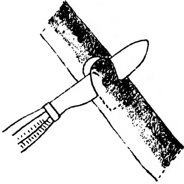

Fig. I  
 Showing patch with bud  
 being cut off branch

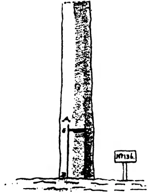

Fig. II  
 Showing wister on stock

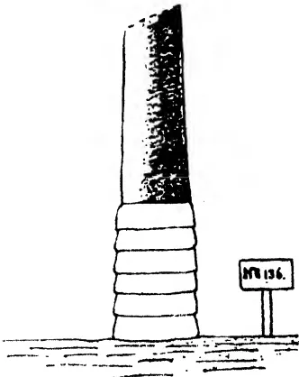

Fig. III  
 Damage in position

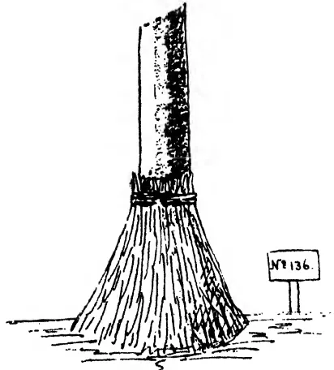

Fig. IV  
 Mono-Rhizome on Stems Screen

236------------------------------------------------

Fig. 3. Removing bark from stock.

Fig. 4. Putting in patch.

*Reproduced from Archief voor Rubbercultuur, November, 1921.*

237------------------------------------------------

APRIL, 1922.]195

### NECESSARY IMPLEMENTS.

After many experiments, it has been found that the American-made grafting knife "Keen-kutter" or cotton-knife is the most suitable for our purpose.

The binding material or bandages to be used are most easily and economically made from cheap "cheese-cloth" (the tamil cooly's vetty), dipped into melted paraffin-wax, and then torn into strips,  $\frac{1}{2}$  yard long by 2 inches wide. The paraffin should be of low-melting point, so that when the bandage has been placed, the wax can be smoothed down with the hand, preventing rain-water, running down the stem, tickling in and under the bandage.

It is of great importance that everything should be done as clean as is possible. Dirt and sand adhere very easily to the wax or the cooly's hands. He should be given a piece of cloth with which he can wipe his hands and knife after each operation.

### METHOD OF BUDDING.

The most practical method giving the best results is patchi-budding.

The cooly, carrying his tin in which the branches are, selects one and after having found a good bud, cuts a small patch together with a thin scale of wood which must be left on the patch for the time being. (fig. 1.)

Having cleaned the stem of the stock plant of sand, mud, etc., two vertical cuts are made, distance apart about the width of the patch cut, and about 3 to 4 inches above the collar of the stock. (see fig. No 2., A-B, C-D)

A horizontal cut (E-F) is then made and the bark carefully lifted up at the corners and stripped down, using the fingers only. The strip is NOT cut off.

The greatest care should be taken to touch the cambial layers as little as is possible. The best manner to prevent the patch becoming dirty or infected, is for the cooly to hold it lightly between the lips when making the incision on the stock.

There is no need at all for the patch to fit exactly in the incision made, in fact in Hevea grafting the patch should be slightly smaller than the incision.

The main principle in bud-grafting is to see that the cambial layers are in absolute contact, the bark-union is a secondary matter.

An advantage is that, if the bark of incision and patch do not fit exactly, there is room for the latex to run away so that coagulation under the patch, as soon as it has been pressed tight, is prevented.

The inserting of the small patch must be done as quickly as possible while the cambial layers on no account must be rubbed.

Holding the patch with one hand, the strip of bark left can be covered over and the grafting can be bandaged with waxed tape in the ordinary way. The idea of leaving the strip of bark is to get as tight a bandage as is possible as more often than not the bark of the patch is thinner than the bark of the stock, so the patch would be lower and the surface uneven.\*

Method in short:—

1. 1. Clean the stem of stock plant, (sand, mud, etc.)
2. 2. Cut the patch with bud, leaving small shaving of wood.
3. 3. Cut the vertical incisions A-B, and C-D in the stock.
4. 4. Carefully lift the small shaving of wood from the patch and see that the "soul" of the bud has not been removed or damaged.
5. 5. Cut E-F and strip the bark down with the fingers.
6. 6. Place patch in position and cover with slip of bark.
7. 7. Bandage and rub the wax into a smooth surface.

---

\* When young thin bud sheaths are used.—T. H. P.

238------------------------------------------------

196[APRIL, 1922.

After having cut E-F, the bark must be lifted at once and patch placed in position so as to prevent latex soiling the cambium.

No grafting should take place during rains.\* After rain all stock plants should be cleaned, mud and sand rubbed off before budding is undertaken.

It is desirable to do the work as shaded as possible, the cooly always working with his back towards the sun. The tins with cuttings can be covered with a sack or a mat while the stock, the operation having been completed, can be shaded for some days with a small screen made of grass or palm leaves. (fig. 4.).

Twenty days after the budding has taken place, the bandage can be removed and the strip of loose bark cut away. The grafting being a success the bark of the patch will show green when scratched.

Stock plants, where the grafting has been a failure, can be re-budded if the incision made the first time did not take up more than half the circumference of the stem.†

Again 10 days later the plant should be cut off, leaving about one foot of stem above the bud.

The stock must be cut off clean, no tar or other covering used as the part above the budding must be allowed to die back when it can be broken off or sawn, when too thick.

All small shoots or buds appearing on the stocks must be removed so as to force the new young bud to sprout. The difference between the "false" buds and the grafted bud is easily noticeable, the former being of a light to dark-brown colour, the grafted bud being light green.

Some of the buds will start sprouting 14 days after the grafting but as a rule only after two months, while a few will even take as long as five to six months.‡

## "UNDERCURED" SMOKED SHEET.

**R. O. BISHOP, M.B.E., A.I.C.,**

*Acting Agricultural Chemist, Department of Agriculture, F.M.S. and S.S.*

Under the title of "Undercured Rubber" the problem of moisture in smoked sheet has been receiving attention recently in the periodicals devoted to the interests of the rubber industry, and reference to the *TIN AND RUBBER JOURNAL* of 15th June will show that there is a considerable difference of opinion as to the justification of the claims made by the brokers in Singapore.

For the investigation of claims arising in connection with so called "undercured" sheet the examination of a series of samples was carried out by the writer in October, 1920, at the original request of the Chairman of the Singapore Chamber of Commerce. Since then many other samples have been examined and several reports have been issued in connection with the work carried out. It appears now that a useful purpose might be served by summarizing all the results obtained and permanently recording the observations which have so far been made on the work already performed.

\*Light showers, however, appear to be favourable to the operation.—T. H. P.

† Provided the second budding is done without loss of time, otherwise the bark has a tendency to harden and does not peel easily.—T. H. P.

‡ After 2 months at Peradeniya.—T. H. P.

239------------------------------------------------

APRIL, 1922.]197

Having defined an under-cured sheet as that which possesses more internal moisture than a correctly cured sheet (N.B. The term has also been used previously in connection with a light coloured smoked sheet) it was established by the rubber appraisers, and upheld by the Singapore Chamber of Commerce, that under-cured rubber could be distinguished by the opacity exhibited at a freshly cut section when viewed against bright daylight.

It was asserted that any samples of smoked sheet giving a plainly marked opaque section were abnormally damp, would develop mould, and also would give unusual trouble to the purchasers when the rubber come to be manufactured into the vulcanized commodity.

The investigation, therefore, resolved itself into a determination of the relative amounts of moisture in smoked sheet as it is normally prepared, and then an examination of the effects which those percentages of moisture would have on the ultimate properties of the rubber concerned.

#### **RELATIVE AMOUNTS OF MOISTURE IN CORRECTLY "CURED" AND IN "UNDERCURED" SMOKED SHEET.**

##### **Methods of Determination of Moisture.**

In the original instance thirteen samples of sheet were examined. The moisture was determined by two methods.

By the first method the sample cut to a standard area of surface was suspended from a glass rod over calcium chloride in a vacuum desiccator. The desiccator was kept in the dark and all weighings were made on the samples at the same time of day so that any error due to variable atmospheric humidity would be eliminated as far as possible. Moreover as the weighings were done in fairly rapid rotation, surface absorption during weighing should be the same for all samples.

By the second method drying of the standard sized sample was accomplished by suspending it in a current of dry air at 80°C in the dark.

In the case of both methods the samples were weighed every 24 hours until no further loss in weight occurred. The maximum loss was expressed as a percentage on the original weight and described as "Total Moisture."

It must be noted that as the smoked rubber contains certain absorbed and absorbed volatile smoke products the figure for total moisture will be too high by the amount of such volatile matters originally present.

Having dried the samples to minimum weight they were then allowed to remain in the air for 24 hours under protection from dust, etc., and all samples were then retained in a desiccator until it was possible to expose them all to the air during the same 24 hours. Thus the humidity of the atmosphere had the same effect on all. The difference between the weight before exposure and the weight after exposure is expressed as a percentage on the original weight of the sample and is described as "External moisture."

The difference between the "Total moisture" and the "External moisture" is described as "Internal moisture" and is a measure of the under-curing of the sample.

For the purpose of the subsequent discussion of results the samples examined have been arranged according to the degree of opacity which they

240------------------------------------------------

198[APRIL, 1922.

exhibited, the arrangement being made by an impartial observer.

<table border="1">
<thead>
<tr>
<th>Sample No.</th>
<th>Loss by desiccation at ordinary temperature "total moisture."</th>
<th>Moisture taken upon exposure to air "surface moisture."</th>
<th>Difference "interior moisture."</th>
<th>Average.</th>
<th>Loss at 80°C in current of dry air "total moisture."</th>
<th>Moisture taken up on exposure to air "surface moisture."</th>
<th>Difference "interior moisture."</th>
<th>Average.</th>
</tr>
</thead>
<tbody>
<tr>
<td>1</td>
<td>0.53</td>
<td>0.43</td>
<td>0.10</td>
<td colspan="2">No opacity.</td>
<td>0.48</td>
<td>0.17</td>
<td>0.17</td>
</tr>
<tr>
<td></td>
<td></td>
<td></td>
<td></td>
<td>0.10</td>
<td>0.65</td>
<td></td>
<td></td>
<td></td>
</tr>
<tr>
<td></td>
<td></td>
<td></td>
<td></td>
<td colspan="5">Very Faint opacity.</td>
</tr>
<tr>
<td>2</td>
<td>0.68</td>
<td>0.48</td>
<td>0.20</td>
<td></td>
<td>0.76</td>
<td>0.51</td>
<td>0.25</td>
<td></td>
</tr>
<tr>
<td>3</td>
<td>0.59</td>
<td>0.46</td>
<td>0.13</td>
<td></td>
<td>0.63</td>
<td>0.46</td>
<td>0.17</td>
<td></td>
</tr>
<tr>
<td>4</td>
<td>0.62</td>
<td>0.49</td>
<td>0.13</td>
<td>0.15</td>
<td>0.73</td>
<td>0.56</td>
<td>0.17</td>
<td>0.20</td>
</tr>
<tr>
<td></td>
<td></td>
<td></td>
<td></td>
<td colspan="5">Slightly More Opaque.</td>
</tr>
<tr>
<td>5</td>
<td>0.46</td>
<td>0.39</td>
<td>0.07</td>
<td></td>
<td>0.48</td>
<td>0.34</td>
<td>0.14</td>
<td></td>
</tr>
<tr>
<td>6</td>
<td>0.63</td>
<td>0.49</td>
<td>0.14</td>
<td></td>
<td>0.66</td>
<td>0.47</td>
<td>0.19</td>
<td></td>
</tr>
<tr>
<td>7</td>
<td>0.53</td>
<td>0.43</td>
<td>0.10</td>
<td></td>
<td>0.65</td>
<td>0.48</td>
<td>0.17</td>
<td></td>
</tr>
<tr>
<td>8</td>
<td>0.57</td>
<td>0.45</td>
<td>0.12</td>
<td></td>
<td>0.86</td>
<td>0.68</td>
<td>0.18</td>
<td></td>
</tr>
<tr>
<td>9</td>
<td>0.56</td>
<td>0.43</td>
<td>0.13</td>
<td>0.11</td>
<td>1.26</td>
<td>0.91</td>
<td>0.35</td>
<td>0.21</td>
</tr>
<tr>
<td></td>
<td></td>
<td></td>
<td></td>
<td colspan="5">More, but not Pronounced Opacity.</td>
</tr>
<tr>
<td>10</td>
<td>0.57</td>
<td>0.45</td>
<td>0.12</td>
<td>0.12</td>
<td>0.63</td>
<td>0.42</td>
<td>0.21</td>
<td>0.21</td>
</tr>
<tr>
<td></td>
<td></td>
<td></td>
<td></td>
<td colspan="5">Pronounced Opacity.</td>
</tr>
<tr>
<td>11</td>
<td>0.85</td>
<td>0.64</td>
<td>0.19</td>
<td></td>
<td>0.89</td>
<td>0.76</td>
<td>0.13</td>
<td></td>
</tr>
<tr>
<td>12</td>
<td>0.54</td>
<td>0.43</td>
<td>0.11</td>
<td>0.15</td>
<td>0.59</td>
<td>0.47</td>
<td>0.12</td>
<td>0.13</td>
</tr>
<tr>
<td></td>
<td></td>
<td></td>
<td></td>
<td colspan="5">Very Pronounced Opacity.</td>
</tr>
<tr>
<td>13</td>
<td>0.54</td>
<td>0.32</td>
<td>0.22</td>
<td>0.22</td>
<td>0.62</td>
<td>0.46</td>
<td>0.16</td>
<td>0.15</td>
</tr>
</tbody>
</table>

The average for internal moisture on the complete series of samples is 0.18 per cent.

From these figures it was apparent that the total volatile matter present in smoked sheet was of the order of 0.6 per cent. and of that total approximately seventy-five per cent. was held at the surface of the sheet. The average figure for the interior "Moisture" even when the samples were dried at 80°C. was 0.18 per cent. only.

As was to be expected the heating of the rubber result in a greater loss than by desiccation at atmospheric temperature, but although this heating was as intense as the maximum reached in working up raw rubber for subsequent vulcanization the total loss of volatile matter amounted to 0.71 per cent. on the average and in one case only was above 1.0 per cent. Ref. Archief VV 1921. "Moisture content of inner and outer layers of smoked sheet" by VAN HEURN.

Another point which was obvious was that the slight differences in moisture content, total or internal, did not bear any relation to the opacity of the interior of the sheet examined.

The results which have been obtained in this series are in agreement with the figures derived from several isolated examinations of smoked sheet but it was not considered that a definite confirmation had been obtained until a second long series of samples had been examined.

Eighteen samples were eventually submitted by the Orient Co., of Singapore and were examined in conjunction with pieces of unsmoked sheet and No. I crepe. Before sending the rubber for examination it had been classified in Singapore by the "Opaque appearance" method and for

241------------------------------------------------

APRIL, 1922.]199

every sample having the correct internal appearance there was a corresponding sample from the same estate having an internally opaque appearance and consequently characterized as internally moist and under-cured. The "dry" samples were numbered 1, 2, 3 and 4, etc., the "wet" samples were numbered 1a, 2a, 3a and 4a, etc.

The method of examination adopted was the desiccation at atmospheric temperature, care being taken that all samples should be treated exactly alike. Desiccation was continued for the same length of time—288 hours—but it was found that much shorter periods were sufficient to reach the maximum loss in the majority of cases. When the samples had all lost their maximum amount of volatile matter the increase in weight after exposure to atmospheric conditions was determined as before.

### RESULTS.

<table border="1">
<thead>
<tr>
<th>Sample</th>
<th>Time taken to reach minimum weight.</th>
<th>Total loss of weight per cent.</th>
<th>Internal moisture per cent.</th>
<th>Surface moisture per cent.</th>
</tr>
</thead>
<tbody>
<tr>
<td>1</td>
<td>96 hours.</td>
<td>0.41</td>
<td>0.16</td>
<td>0.25</td>
</tr>
<tr>
<td>1a</td>
<td>72 "</td>
<td>0.42</td>
<td>0.07</td>
<td>0.35</td>
</tr>
<tr>
<td>2</td>
<td>48 "</td>
<td>0.45</td>
<td>0.02</td>
<td>0.43</td>
</tr>
<tr>
<td>2a</td>
<td>96 "</td>
<td>0.69</td>
<td>0.28</td>
<td>0.41</td>
</tr>
<tr>
<td>3</td>
<td>144 "</td>
<td>0.51</td>
<td>0.15</td>
<td>0.36</td>
</tr>
<tr>
<td>3a</td>
<td>96 "</td>
<td>0.41</td>
<td>0.05</td>
<td>0.36</td>
</tr>
<tr>
<td>4</td>
<td>144 "</td>
<td>0.55</td>
<td>0.23</td>
<td>0.22</td>
</tr>
<tr>
<td>4a</td>
<td>144 "</td>
<td>0.78</td>
<td>0.34</td>
<td>0.44</td>
</tr>
<tr>
<td>5</td>
<td>72 "</td>
<td>0.52</td>
<td>0.48</td>
<td>0.04</td>
</tr>
<tr>
<td>5a</td>
<td>144 "</td>
<td>0.53</td>
<td>0.00</td>
<td>0.53</td>
</tr>
<tr>
<td>6</td>
<td>144 "</td>
<td>0.50</td>
<td>0.19</td>
<td>0.31</td>
</tr>
<tr>
<td>6a</td>
<td>144 "</td>
<td>0.51</td>
<td>0.24</td>
<td>0.27</td>
</tr>
<tr>
<td>7</td>
<td>96 "</td>
<td>0.48</td>
<td>0.15</td>
<td>0.33</td>
</tr>
<tr>
<td>7a</td>
<td>120 "</td>
<td>0.61</td>
<td>0.20</td>
<td>0.41</td>
</tr>
<tr>
<td>8</td>
<td>72 "</td>
<td>0.51</td>
<td>0.00</td>
<td>0.51</td>
</tr>
<tr>
<td>8a</td>
<td>144 "</td>
<td>0.68</td>
<td>0.27</td>
<td>0.41</td>
</tr>
<tr>
<td>9</td>
<td>120 "</td>
<td>0.59</td>
<td>0.22</td>
<td>0.37</td>
</tr>
<tr>
<td>9a</td>
<td>96 "</td>
<td>0.52</td>
<td>0.16</td>
<td>0.36</td>
</tr>
<tr>
<td>Unsmoked sheet } 10</td>
<td>288 "</td>
<td>1.05</td>
<td>0.16</td>
<td>0.89</td>
</tr>
<tr>
<td>  } 11</td>
<td>288 "</td>
<td>1.40</td>
<td>0.11</td>
<td>1.29</td>
</tr>
<tr>
<td>  } 12</td>
<td>288 "</td>
<td>1.08</td>
<td>0.35</td>
<td>0.73</td>
</tr>
<tr>
<td>Crepe. } 13</td>
<td>216 "</td>
<td>0.36</td>
<td>0.02</td>
<td>0.34</td>
</tr>
<tr>
<td>  } 14</td>
<td>264 "</td>
<td>0.24</td>
<td>0.00</td>
<td>0.24</td>
</tr>
</tbody>
</table>

### REMARKS ON RESULTS.

The average figures obtained for the total volatile content of the 18 smoked sheet samples was 0.53 per cent. which is in agreement with that found by the previous determinations.

The average figure for surface moisture or volatile matter was 0.35 per cent. on the smoked sheet.

The average figure for Internal moisture or volatile matter was 0.18 per cent. on the smoked sheet samples.

The total loss on desiccation is greater for unsmoked sheet than for either crepe or smoked sheet but even when the total volatile matter amounts to 1.40 per cent. it is found that 92 per cent. of the amount is on the surface.

In dry crepe which is immediately to be mixed with sulphur preparatory to vulcanization the surface moisture may be as high as 0.34 per cent. and the average figure for smoked sheet was only 0.01 per cent. above this.

In this connection attention is called to the very interesting figures published by O. DE VRIES ARCH. 2 (1918), 852 on the variation in moisture

242------------------------------------------------

200[APRIL, 1922.

content of crepe and smoked sheet during the dry and wet monsoons. DR. VRIES gives 0.34 per cent. to 1.0 per cent. for the normal limits of moisture in crepe and 0.43 per cent. to 1.70 per cent. for the normal limits of moisture in smoked sheet.

The work of MISS KRAYENHOFF VAN DER LEUR Comm. Delft II page 41 has also shown how considerable are the variations of moisture in raw rubber due to variations in atmospheric humidity. G. S. WHITBY—J. S. CH. I. (1918) 280 T.—has also shown that owing to the absorptive nature of the rubber surface, moisture may be retained to the extent of 1.4 per cent.

### CONCLUSIONS.

The conclusions to be drawn from the above may therefore be summarized as follows:—

1. All smoked sheet contains moisture. This may amount to 1.0 per cent. without being abnormal, and on the average is about 0.5 per cent.

2. Of the total moisture in smoked sheet the greater proportion i.e., about 70 per cent.—is held as surface moisture. This is apparently held in an absorbed state and consequently is subject to variation. The variation is dependent on the atmospheric humidity and on the amount of serum solids left in the finished sheet (See page 606 "Estate Rubber" by DR. O. DE VRIES also remarks of VAN HEURN ARCHIEF IV. 1921).

3. The examination of the samples submitted did not demonstrate that there was any significant difference in total moisture between those samples with opaque inner sections and those samples without opaque inner sections.

4. The opacity was not a characteristic of high internal moisture, for it was found that the average internal moisture content for the opaque sheets 1a, 2a, 3a and 4a, etc., was 0.18 per cent. and the average internal moisture content for the non-opaque sheets 1, 2, 3 and 4, etc., was also 0.18 per cent.

### LIABILITY OF SMOKED SHEET TO DEVELOPMENT OF MOULDS.

With regard to the second portion of the investigation, namely to determine the effects of the moisture content in smoked sheet it was thought to be sufficient for the present to examine the samples from above to see if there was any noticeable difference in their propensity to mould development, and if so, whether such was related to their internal moisture.

Portions of the fresh samples were suspended in the air so that the conditions were the same throughout and they were examined daily to see which sample showed the first appearance of mould. The following table gives the samples arranged in order of internal moisture and in order of mould development and also in order of depth of opacity of internal section as judged by a rubber technologist.

<table border="1">
<thead>
<tr>
<th>Order of total Moisture.</th>
<th>Order of internal moisture.</th>
<th>Order of mould development.</th>
<th>Order of opacity</th>
</tr>
</thead>
<tbody>
<tr>
<td>4a</td>
<td>5</td>
<td>4a</td>
<td>9a</td>
</tr>
<tr>
<td>2a</td>
<td>4a</td>
<td>2a</td>
<td>5a</td>
</tr>
<tr>
<td>8a</td>
<td>2a</td>
<td>8a</td>
<td>5</td>
</tr>
<tr>
<td>7a</td>
<td>8a</td>
<td>5</td>
<td>6a</td>
</tr>
<tr>
<td>9</td>
<td>6a</td>
<td>3a</td>
<td>4</td>
</tr>
<tr>
<td>4</td>
<td>4</td>
<td>4</td>
<td>7a</td>
</tr>
<tr>
<td>5a</td>
<td>9</td>
<td>8</td>
<td>9</td>
</tr>
<tr>
<td>9a</td>
<td>7a</td>
<td>7</td>
<td>8a</td>
</tr>
<tr>
<td>5</td>
<td>6</td>
<td>7a</td>
<td>2a</td>
</tr>
<tr>
<td>6a</td>
<td>9</td>
<td>—</td>
<td>3a</td>
</tr>
<tr>
<td>6</td>
<td>1</td>
<td>—</td>
<td>4a</td>
</tr>
<tr>
<td>3</td>
<td>7</td>
<td rowspan="10">Remainder not mouldy.</td>
<td rowspan="10">Remainder not apparently opaque.</td>
</tr>
<tr>
<td>8</td>
<td>3</td>
</tr>
<tr>
<td>7</td>
<td>3a</td>
</tr>
<tr>
<td>2</td>
<td>2</td>
</tr>
<tr>
<td>1a</td>
<td>1a</td>
</tr>
<tr>
<td>1</td>
<td>5a</td>
</tr>
<tr>
<td>3a</td>
<td>8</td>
</tr>
</tbody>
</table>

243------------------------------------------------

APRIL, 1922.]201

There does appear to be some relation between internal moisture and order of mould development but the relation is not very marked and as the same order persisted on the samples after they had been completely dried, and again allowed to develop mould it would appear to be probable that the substances in the rubber which promote mould growth serve to increase the moisture content and it is not the moisture of the rubber which gives rise to mould.

It may be noted here that another investigation is being conducted on the nitrogen content of the samples in order to settle this point, so far, however, no definite results are available.

#### **VULCANIZING CAPACITY.**

With regard to the vulcanizing properties of the samples of smoked sheet and the tensile properties of the vulcanized products the results showed that the amount of moisture contained even in the wettest samples had no apparent effect.

The differences in total moisture between the wettest and the driest samples did not persist when the samples were broken down during the sulphur mixing, and the internal moisture in all the samples of smoked sheet examined was apparently a negligible factor.

It will be of interest to determine to what extent moisture in crude rubber may be lost during working on the mixing rolls. No definite figures are yet available for publication, but the preliminary work in this direction has shown that while being masticated and mixed preparatory to vulcanization moist rubber can be deprived of considerable quantities of water without the necessity of enduring abnormal heating or rolling and it appears that even the total moisture in the most "undercured" samples of smoked sheet now sold on the market cannot persist after mastication and consequently will have no detrimental effects on vulcanizing properties of the rubber.—*AGRIC. BULL.*, of F.M.S., Vol. IX, No. 2.

### **INSTITUTE FOR RUBBER RESEARCH, MALAYA.**

The Colonial Office advised on October 18, that consideration has been given to the Association's views on the recommendations of the Formative Committee, and that MR. CHURCHILL consulted the High Commissioner by telegraph as to whether the imposition of the special export duty, amounting to 021 of 1*d.* per lb. of rubber is feasible at the present low price of that commodity, and a reply was received that the Formative Committee, by a large majority, voted against the postponement of the scheme; the High Commissioner adds that this decision was reached owing to their conviction that the rubber industry would be benefited by the Institute. In these circumstances, MR. CHURCHILL has instructed the High Commissioner to proceed with the necessary legislation for the Incorporation of the Institute, on the understanding that all the States of the Malay Peninsula, as well as the colony, are prepared to share in the scheme, and he proposes to reserve for further consideration in the light of the development of the Institute, the question as to its co-operation with similar bodies elsewhere in British territory.—*BULL. OF RUBBER GROWERS' ASSOCIATION*, Vol. 3, No. 11.

244------------------------------------------------

202[APRIL, 1922.

# TEA.

---

## GRAFTING OF TEA.

---

A. C. TUTEIN-NOLTHENIUS.

The following notes, taken from Bulletin No. LXXVI. of the Experiment Station for Tea, Java, may be of interest to the readers of the TROPICAL AGRICULTURIST :—

During the middle of 1919, several experiments with the grafting or budding of tea were made on the estates owned by the Rubber Plantations Investment Trust Ltd. (Sumatra), and although it is too early to say what results will be obtained in years to come, grafting of tea has been proved to be possible of meeting with success. A good method giving over 80% of successful grafting has been discovered.

### WHY SHOULD TEA BE GRAFTED?

Although we have read and heard quite a lot about the budding and grafting of rubber, we fear that most planters will be very sceptical when reading these short notes on the budding of tea, but it must not be forgotten, that very little really is yet known as regards ennobling tea, improving yet increasing yields, etc., and that continual earnest experimenting alone may bring our knowledge of the bush more into line with other agricultural undertakings. We plant, pluck, prune and manure but too little interest is shown in the scientific side of our main industry.

1. The main object in view when the experiments with grafting and budding of tea were started, was to get a garden of even, good tea-seed bearers, giving the biggest yield of the best seed per acre. In a plot of tea-seed bearers it will be found that a certain percentage are good yielders, while others remain poor or do not yield and are unsuccessful for several reasons.

To cut these out would be an easy and good method but it would prove expensive having a small number of good trees on too big an acreage. The poor yielders can be replaced by young plants or by replanting trees known for their good quality of leaf, etc. This method proves disappointing as a certain percentage of the supplies again would be unsuccessful while the time taken for these supplies to come into bearing would be too long, the crop being late as well as irregular.

The best way to replace poor yielders would be by propagation, obtaining offspring from good trees known for their yield and seed quality.

2. Well known good yielders in not-isolated plots or in unfavourable circumstances are too old for transplanting in isolated plots.

3. For certain reasons one may desire to increase the number of a special tree. For instance, bushes have been found to survive and flourish well in fields practically killed by root diseases, (*rosalinia*, etc.) If this proves these bushes to be fungus-resisting, it would be very important to experiment with tea-seed bearers obtained from such bushes.

245------------------------------------------------

Fig. 1.

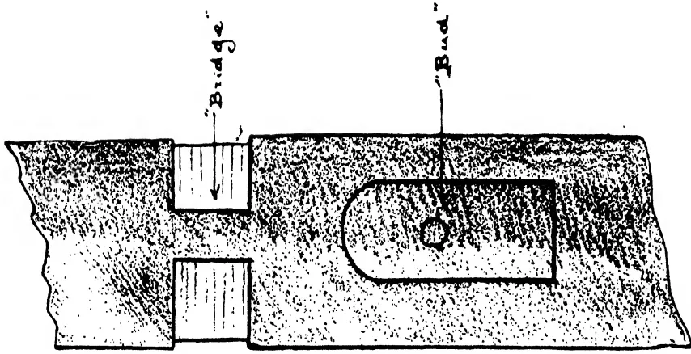

Fig. 2.

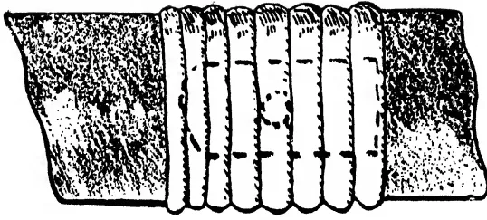

Bandaged Graft

246------------------------------------------------

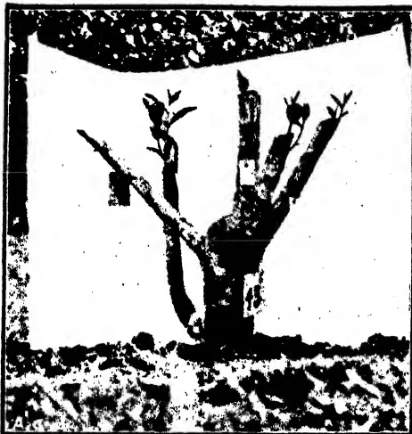A black and white photograph of a tea bush. The bush is relatively small and has several upright stems. At the tips of these stems, there are several small, rounded buds that are beginning to open. The background is a plain, light-colored surface, possibly a wall or a screen, which makes the dark silhouette of the tea bush stand out. The ground in front of the bush is also visible, showing some texture.

Fig. 4. Budded tea, showing buds beginning to shoot.

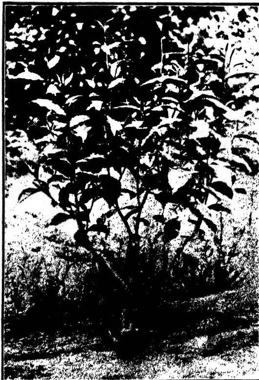A black and white photograph of the same tea bush as in Figure 4, but eight months later. The bush has grown significantly in size and density. It now has many more branches and leaves, creating a much fuller and more complex appearance. The leaves are more prominent and cover a larger area. The overall shape of the bush is more rounded and bushy compared to its initial state.

Fig. 5. Same bush of tea, eight-months later.  
Reproduced from Bulletin 76 by J. G. J. A. Mass,  
Tea Experiment Station, Java.

247------------------------------------------------

APRIL, 1922.]203

4. To obtain several offspring from the same bush or tree for experimental purposes. (Propagating good type, etc.)

5. To try and improve poor bushes or poor jat in fields already in bearing by grafting or budding, not by replanting as is the case now.

It is interesting to note that experiments taken with sending branches with buds, pieces of bark with buds, and scions, etc., by post, have proved successful, e.g., it will be possible to obtain buds and scions from well-known "mother" trees from other tea-gardens or countries.

### METHOD OF BUDDING TEA.

Although crown-, cleft-, and side-grafting of tea have met with a certain amount of success, the best and most easy method for inexperienced workmen (coolies) has been found to be the ordinary bud-grafting or "budding."

I. Small rectangular pieces of bark, about  $1\frac{1}{2}$  in. x 2 in., containing a healthy bud are cut carefully from the thick branches of the "mother" tree, and as soon as possible, inserted in wounds of the same size, made on the  $1\frac{1}{2}$  in. to 3 in. thick branches of the poor tree to be grafted.

The most easy way is :—(see fig. No. 1) cut with a sharp knife the half-circle A-B. Carefully lift the bark with the bone end of the grafting knife, and strip loose to E-F., then cut C-D, care being taken not to injure the cambium or in any way defile the small piece of bark or the to-be patched wound.

There is no necessity to cut off any branches. This means the "mother" tree is not damaged, the wounds healing very quickly.

The small shield of bark with bud having been placed in position, the whole is then carefully bound with waxed tape or paraffined cotton "puttee" fashion.

II. 3 weeks later the bandage can be removed and the grafting examined if the small patch of bark is still green. This being found the case, the branch can be "ringed" just above the bud, a small "bridge" of bark being left. (Fig. No. 2.) The bandage is replaced, care being taken to leave the bud uncovered.

III. If after one month the bud is found to show signs of "sprouting," the entire branch just above the grafting can be cut or sawn off, the cut being tarred or covered with a mixture of yellow wax and kerosene oil.\* If the bud is still dormant the cutting off of the branch can be delayed another 2 or 3 weeks.

The above short resumé gives the method employed with success for the budding of tea, 80% successes having been reported as being obtained by ordinary estate coolies after some little practice.

Budding and grafting in general is most successful when the trees are in good vigour and in full growth, and it is thought that the months of April, May, for those areas which receive the April-May showers, and September-October for those which receive only the North-east monsoon, would be most suitable.

It will be interesting to watch experiments and results proposed to be carried out at Hakgala during the present year.

---

\* Mixture—2 lb. yellow wax or paraffin to one bottle kerosene oil.

248------------------------------------------------

204[APRIL, 1922.

# COFFEE.

## FUNGOID DISEASES OF COFFEE IN KENYA COLONY.

CAPT. J. McDONALD, B.Sc.,

*Mycologist, Department of Agriculture.*

*General Consideration.*—In dealing with fungoid diseases we are concerned with a struggle for supremacy between two plants, the fungus and its host, which is, in this case coffee.

There are very many differences between a fungus and an ordinary plant as commonly understood, but there is one in particular to which the scientist attaches prime importance. The difference is that the fungus does not possess chlorophyll, the green colouring matter, of ordinary plants. If as is often the case, the fungus is one which obtains its food exclusively from dead organic remains, it usually causes no trouble. There are, however, a large number which obtain their nourishment from living plants and it is these with which the planter has to deal.

Successful attack on the part of the parasite depends on several conditions. Generally speaking, warmth and moisture are its chief requisites for development. Without the latter the spores of the fungus, which roughly correspond to the seeds of higher plants, cannot germinate and therefore infection by this means cannot be initiated. Given, however, favourable climatic conditions, the success of the attack still depends largely on the health and vigour of the host. It is therefore of great importance to ensure that conditions favour the tree. Planting in an unfavourable soil will handicap a tree from the start. Weeds by absorbing nourishment from the soil, interfering with aeration, etc., are conducive to unhealthiness, and bad planting and overbearing are further factors producing weakness.

In Kenya at present there are only two diseases of importance which come under the heading of this bulletin. These are the Leaf Disease and Die-back. Even then, it is doubtful whether fungi are ever the primary cause of the latter. Several other diseases give varying degrees of trouble, usually slight or insignificant. Some account of all at present known to occur, however, is included in the following pages in the hope that settlers may be able to identify diseases occurring in their shambas or, in the event of a new disease appearing, may be led to report its appearance at once.

Rust or Leaf Disease (*Hemileia vastatrix*).—This is the most serious fungoid disease of coffee found in this country. If allowed to go unchecked it is capable of defoliating a plantation, while any considerable attack represents a loss of a proportion of food which the leaves would normally manufacture and which should be employed in the further development of the bushes and in the formation of the coffee bean.

In Ceylon during the latter part of the last century, the ravages of Leaf Disease caused the abandonment of the coffee planting industry. While it

249------------------------------------------------

APRIL, 1922.]205

is not thought likely, with our better knowledge of the disease and under the different conditions prevailing in this country, that the disease would cause such havoc here. It still behoves coffee growers to regard it with respect and to keep a watchful eye for its appearance.

The disease is usually first detected by the appearance of orange-yellow spots on the lower sides of the leaves. These spots which are very small when first visible, may enlarge to about half an inch in diameter. The orange-yellow powder of the spots consists of a vast number of the spores of the fungus, each of which is capable when mature of causing a fresh infection. No spores are produced on the upper surfaces of the leaves but when the spots below have become fairly large, pale areas are noticeable above corresponding with the spots below. The centres of the latter as they get older become brown or grey. A severe attack on a leaf may cause it to dry and turn brown.

Infection is produced by the germination of a spore on the under side of the leaf. The spore sends out a fine tube which gains access to the interior of the leaf through one of the numerous breathing pores. Once inside, the tube grows between the cells and forms numerous branches, the whole fungus body being known as the mycelium. This mycelium develops smokers which it intrudes into the cells for the purpose of absorbing the cell content. After a time a part of the mycelium masses in one of the air-spaces beneath a breathing pore and sends out short pedicels through the pore. From the ends of these pedicels the spores are formed. These are at first colourless, but on maturing, the contents of each spore becomes orange-yellow, thus producing the characteristic colour of the spots.

While it is true that the best kept shambas are sometimes invaded by the Leaf Disease, severe attacks in this country are commonly found to be connected with neglect. Weeds are a great source of danger. Not only do they impoverish the ground to a certain extent but they harbour spores of the fungus and, in bad cases, interfere with the ventilation between the bushes and tend to create a damp atmosphere favourable to the activities of the fungus.

A proper system of pruning should be carried out to promote a healthy growth of the bushes.

Diseased leaves should not be left lying about between the bushes. *Hemileia vastatrix* is known to continue spore production on affected leaves for some days after the leaves have fallen. The leaves should be dug under or burned, preferably the former, as by this method organic material is returned to the soil.

It is a matter of common observation that the first leaves of a bush to be attacked are frequently those which are allowed to hang down close to the ground. Fallen spores splashed up by rain easily reach such branches, which should, therefore, be cut off.

Spraying trials in this country have shown that certain fungicides may be used with success as preventive measures against Leaf Disease. Details of three such sprays are given in a pamphlet issued by the Department of Agriculture, entitled "Three Sprays for Coffee affected with *Hemileia Vastatrix* and other Fungous Diseases." Further spray trials are at present in progress and, should these prove successful, details of them will be published later.

250------------------------------------------------

206[APRIL, 1922.

Spraying undoubtedly entails a certain amount of trouble and expense not only in labour but also in the purchase of the necessary chemicals. It is not, therefore, suggested that the spraying the whole of a large shamba should be done every season. It is urged, however, that spraying done at certain times is highly beneficial and well repays trouble and expense. For example, in localities where conditions are favourable to the fungus (such as in the lower parts of the Highlands in a wet season), where signs of the disease have been noticed during the previous season or where the bushes are known to have been weakened from any cause, spraying should be carried out.

In spraying against Leaf Disease it is important to ensure that the under sides of the leaves are thoroughly wetted. The finest nozzle obtainable should be used.

A good plan is to spray once shortly before the rains usually commence and again when the young leaves have expanded somewhat. If second spraying is neglected, the area of new surface exposed by the development of the new leaves will be unprotected by the fungicide.

It has been found in other parts of the world that heavy applications of farmyard manure ( $\frac{1}{2}$  cwt. per tree) have been successful in controlling the disease.

There are leaf diseases known to occur in the Colony but none of them has proved serious.

**Brown Eye Spot (*Cercospora coffeicola*).**—This is the commonest of these lesser leaf spots and is also found on the coffee berries. On the leaves the disease produces round spots usually about a quarter of an inch in diameter. At first these spots are brown but later the centres become greyish white with reddish-brown margin. Affected berries turn black and shrivel, while the pulp tends to adhere to the bean.

The fructifications are found in the centres of the spots and on both sides of the leaf. The spores are colourless, long and tapering.

**Brown Blight (*Cloesporium Coffeanum*).**—This fungus may produce infection on leaves, berries or twigs but up to the present damage as the result of its attacks has been insignificant.

The leaf spots are, as a rule, much less regular in outline than those caused by *Cercospora*. They are first brown, then grey, up to an inch in diameter, while those occurring on the margin of the leaf are frequently elongated. The points where spores are being produced may be seen as minute black specks in the spots, usually on the upper surface of the leaf.

When the berries are attacked a dark stain, which lowers their value, is produced on the beans.

Should either of these diseases become sufficiently serious to call for special measures, spraying with either Bordeaux or the Carbide mixture as described in the pamphlet cited above, is recommended.

**Leaf Spot (*Mycosphaerella coffeicola*).**—Isolated cases of this disease have occurred in this Colony but, as in India, the damage done seems trifling. Small white spots surrounded by a dark band which gradually merges into the normal leaf colour are symptoms. Here again minute black points mark the location of the spores.

251------------------------------------------------

APRIL, 1922.]207

**Sooty-Mould (*Capnodium Braziliense*).**—This is a fungus which occurs chiefly on young coffee, giving the plants the appearance of being covered in soot. This condition scarcely comes under the heading of a fungus disease as the fungus derives no nourishment from the coffee bush but lives on the honeydew excreted by various kinds of insects. It is, therefore, an indication of insect attack. The only harm done by the fungus itself lies in its interference with the free passage of air and sunlight to the leaves.

The remedy for the trouble consists in getting rid of the insects and this varies according to the particular species involved.

**Die-back**—Die-back is a very common malady in this country and is characterised by a blackening and drying up of the primary branches. A few branches may be affected here and there or, as is commonly the case, the whole middle portion of the bush may show the disease while a few shoots at the crown and at the base may remain green.

There is no single cause to which all cases of Die-back can be attributed. Sometimes one or two species of fungi (*Phoma*, *Colletotrichum*, etc.) are found associated with the disease but it is doubtful whether, in this country, a fungus is ever the prime factor.

Probably the most fruitful cause of Die-back is over-cropping followed by an abnormally dry period. Even in a normal season, young plants (2-3 years old), carrying a heavy crop where no disbudding is carried out may die back considerably. Dry weather conditions may also contribute to the trouble by permitting a severe attack of Thrips.

A faulty root system, due to bad planting (twisted tap root, etc.) cut worm damage or the presence of a hard pan hindering root development, are further possible causes.

Trees weakened by a severe attack of Leaf Disease often succumb to Die-back and trees struck by lightning may show a similar appearance.

**Root Diseases.**—The usual symptoms exhibited by coffee bushes suffering from root diseases are a general unhealthy yellow appearance and wilting.

It is rarely possible to name the fungus responsible for the trouble as definite identification depends on an examination of the fructification of the fungus which is only very seldom met with. In the majority of cases root diseases can be traced to the presence of portions of decayed roots of forest trees left in the ground when the land was first cleared.

It is very difficult to save a bush once it has become infected and attention, therefore, would rather be directed to preventing the spread of the disease to neighbouring trees. To do this the affected bush should be dug up with as much of its roots as possible and the whole should be burned on the spot. Any portions of old stumps found in the soil should receive similar treatment. To prevent the fungus spreading through the soil a trench 18 inches deep should be dug round the tree and another should be dug to include the immediate neighbours of the diseased tree in case infection has already reached any of them. In digging the trench the earth should be thrown into the infected area and the soil of this area should be frequently turned to allow free access to sun and air.

It is unwise to replant in the affected spot for a period of 18 months. Some shade trees are known to be capable of starting root disease and their stumps should therefore not be allowed to remain in the ground when such trees are cut down.—FARMERS' JOURNAL, VOL. 4, NO. 1.

252------------------------------------------------

208[APRIL, 1922.

## THE MANURING OF COFFEE ESTATES.

### "PLANTER."

In the very early days of Coffee planting the short-sighted policy was indulged in of letting estates go years without manure. Since manuring was taken in hand, planters in Mysore and Coorg have depended mainly on bones and poonac for manuring their estates. I cannot speak with any certainty of other districts; but that the practice was fairly general is evident from a letter published in the Press from MR. JOHN KENNY, late Manager of the Madras Presidency Manure Works, in which he says, "Bones and white castor have for years been employed by coffee planters in India as a complete manure." The practice is continued till this day in some cases. A certain amount of farmyard manure (cattle manure and sweepings of cooly lines) is utilised, but the quantity available is not sufficient to apply to more than a portion of the area manured each season, except in a few cases. The acreage manured every year usually varies from one-fourth to one-third of the area. In rare cases half the area of an estate, and in still fewer instances the whole of a place is manured every season.

Cattle are expensive to keep for manurial purposes alone, and a large number of estates do not possess the grazing land necessary. At one time in South Coorg dry cattle droppings and village farmyard manure was largely purchased; but it proved expensive, and the results were probably not deemed commensurate with the expenditure, for the practice was discontinued. All planters agreed that cattle manure is *par excellence* the best fertiliser for coffee. Possibilities exist for augmenting farmyard manure by making composts of vegetable matter, cattle manure, lime, line sweepings, coffee pulps and soil. Though this is not neglected in some cases, it is not generally carried out to the extent that it might be. Want of labour is a handicap in some places, bulk manure being slow of application, as to obtain the best results it is necessary to apply half a bushel to each tree. Too often half that quantity is applied to a tree: and I have known cattle manure to be applied at the rate of half a bushel to three trees. This is obviously only sufficient for one season. Jungle top soil and swamp soil are sometimes applied direct to the coffee. The former is of the best, but would be all the better for lime being mixed with it, perhaps at the rate of one of lime to ten of soil. But it is difficult to get good jungle top soil unless there should be a reserved piece of jungle which it is not intended to open. Ryots in South Coorg at one time sold soil to the estates, but Government stopped this impoverishment of their land. It is more necessary to mix lime with swamp soil, especially if it consists of clay, in order to reduce its elements to a soluble state. LIEBIG says: "The process by which the elements of clay are brought into a soluble state by fire corresponds to that by which they are brought into the same condition by the action of lime." The weathering action of the atmosphere will act more slowly and the results will not be as thorough and satisfactory as those brought about by the action of lime, and, in the meantime, the presence of the clay, as clay, may be deleterious to the trees.

Fish and "fish guano" are sometimes applied to the coffee direct or are added to a compost, rendering it very rich in all constituents, chiefly

253------------------------------------------------

APRIL, 1922.]209

**nitrogen**—but the all-important element of potash is wanting. Fish guano consists of what is left of the fish after the extraction of the oil. Fish manure may be said to be bones and poonac (oilcake) in another form, for it contains exactly the same plant foods—nitrogen and phosphates; the organic part of the fish supplying the former and its bony structure the latter. Applied alone, it is apt to supply an excess of nitrogen to the soil, being practically a nitrogenous manure, as the organic part more readily decomposes and becomes available than do the phosphates. The same happens when bones and poonac are applied. The bone meal is said to persist in the soil for two years, by which time the poonac is all exhausted. Burnt clay has also been applied at times. Applied in sufficient quantity it improves the mechanical condition of the soil, making it more open and friable; but it has hardly ever been produced to the extent of being useful in this respect. It is also useful for mixing with artificial manures to secure the more equable distribution of the latter. Finally leguminous green crops have been grown where the coffee has not been too dense to permit of their successful growth and incorporated with the soil, and that other form of green manuring of growing *Erythrina lithosperma* in the coffee and mulching the soil with its loppings is carried out on some places.

Most of the methods of manuring here enumerated have been the result of innovations gradually introduced, and some of them are the direct result of the Scientific Officer (the Deputy Director of Agriculture) **MR. ANSTEAD'S** advice. When manuring was first taken in hand, half inch and one inch bones were largely applied in small holes near the collar of the trees. In eradicating borer these bones were turned up even to the present day in compact masses cemented together by soil. The late **MR. PRINGLE**, Agricultural Chemist to **MESSRS. MATHESON & Co.**'s estates in South Coorg, might well have characterised this as "manuring for posterity." It is appalling to contemplate the amount of money that must have been wasted under the mistaken notion that this method of applying bones was the most approved way of supplying the needs of the trees of plant food.

In all the methods of manuring here noticed, it is to be noted that the plant foods chiefly supplied are nitrogen and phosphates, and in nearly all of them, with the one exception of farmyard manure, the nitrogen is in excess. Farmyard manure is a complete general manure and contains an appreciable amount of potash, which important plant ingredient is notably absent in all the other manures noted. **MR. J. HUGHES**, the Agricultural Chemist, who came out to report on Ceylon soils and the manures best suited to them when coffee was still extant there, gave it as his opinion that excess of nitrogen was not necessary to the well-being of coffee; and the late **MR. PRINGLE** pointed out that an excess of the substance acted deleteriously in making the trees grow a profusion of wood and foliage to the detriment of crop. This has received corroboration from **MR. ANSTEAD**, who agreed with **MR. PRINGLE** that the show of blossom was often out of all proportion to the crop harvested, and the reason for this was probably to be found in an excess of nitrogen supplied to the trees.

**MR. JOHN KENNY** in his letter to the Press referred to above, says: "It is difficult to understand the absence of potash in the mixtures used on coffee plantations," especially as, I may add, in all analyses of coffee soils

254------------------------------------------------

210[APRIL, 1922.

only traces of potash are shown as existing in them ; and that it is the most important element in the nutrition of coffee is clear from an analysis of the requirements of a yield of 7 cwt., by Mr. JOHN HUGHES, referred to above, which showed that the quantity of potash extracted from the soil was nearly double that of the phosphates and more than double that of the nitrogen. DR. VOELCHER the eminent Agricultural Chemist, in his analysis of the coffee and tea soils of Southern India showed that they being of laterite formation, were particularly deficient in phosphoric acid and lime. Lime is another constituent that has not been used as largely as it might have been with the greatest possible benefit. DR. VOELCHER, MESSRS. ANSTEAD and CAMERON have recommended the application of tons per acre. At one time apprehensions were entertained that lime burnt up everything in the soil, perhaps because heat is produced when it is slaked, and destroyed its fertility ! It would take up too much space to enter upon a discussion of the functions of lime in soil, but it may be pointed out that it is an indispensable ingredient of all fertile soils and that in Coffee, where there is an excess of vegetable matter supplied by heavy mulchings from shade trees and weeds, and green manure, its application is necessary to bring about its more complete decomposition.

During the War potash was unobtainable owing to the only known source of supply, Germany, being cut off. But DR. LEHMANN, late Agricultural Officer to the Mysore Government, showed by an analysis that lantana ashes contain as much as 13 per cent. of this valuable constituent. It is not necessary to cut lantana before burning it, as there is an accumulation of dry branches under the thickest in the dry season sufficient to raise a conflagration great enough to consume nearly all of them except the roots. I have had opportunities of seeing this tested again and again. And yet this cheap source of potash is not utilised to the extent it might be. I have seen acres of lantana ashes in the vicinity of an estate lying neglected on the score of its being too expensive to merely transport and apply them to the Coffee. It is to be noted that in all cases where a complete manure is used the result in crops is more satisfactory, and it may safely be said that the addition of an adequate percentage of potash to manure mixture is more highly appreciated now-a-days and is coming into more general use.

Coffee invariably responds magnificently to liberal treatment. The case of MR. MANGLES' Cover-Kollie estate may be cited in illustration of this. According to the late MR. R. H. ELLIOT, the well-known Mysore planter, every acre of this estate used to be manured every year on the following plan. Half the estate received cattle manure at the rate of half a bushel per tree, and the other half artificial manure, and the whole estate a small dose per tree of Nitrate of Soda. The succeeding season the half that received the cattle manure the previous season received artificial manure and the other half the cattle manure, while the whole estate was given the usual dose of Nitrate of Soda. MR. ELLIOT said that the place was the best coffee property he had seen in Southern India (and he had visited a good many). It is 600 acres in extent, I believe, and under the treatment above outlined, it produced an average of 2000 tons of crop yearly.—INDIAN SCIENTIFIC AGRICULTURIST, Vol. 3, No. 1.

255------------------------------------------------

APRIL, 1922.]211

# FOODSTUFFS.

## AWARDS FOR PADDY TRANSPLANTING COMPETITIONS IN MATARA DISTRICT.

The Divisional Agricultural Officer in company with MR. J. D. BROWN (Assistant Government Agent, Matara), and Mr. E. BUULTJENS carried out the final judging of the transplanted paddy plots in Kandaboda, Wellaboda Pattus and the Four Gravets, Matara, on the 18th and 19th March. The awards were made as follows:—

### *Kandaboda Pattu.*

<table>
<tr>
<td>D. A. Wickremasinghe</td>
<td>...</td>
<td>...</td>
<td>1st prize</td>
</tr>
<tr>
<td>I. Don Henderick</td>
<td>...</td>
<td>...</td>
<td>2nd "</td>
</tr>
<tr>
<td>D. A. A. Kodippily</td>
<td>...</td>
<td>...</td>
<td>3rd "</td>
</tr>
</table>

### *Wellaboda Pattu.*

<table>
<tr>
<td>D. G. Don Davith</td>
<td>...</td>
<td>...</td>
<td>1st prize</td>
</tr>
<tr>
<td>C. Tillekeratne</td>
<td>...</td>
<td>...</td>
<td>2nd "</td>
</tr>
<tr>
<td>W. R. Deonis</td>
<td>...</td>
<td>...</td>
<td>3rd "</td>
</tr>
</table>

### *Four Gravels.*

<table>
<tr>
<td>B. Alwis Appu</td>
<td>...</td>
<td>...</td>
<td>1st prize</td>
</tr>
<tr>
<td>Carolis Appu</td>
<td>...</td>
<td>...</td>
<td>2nd "</td>
</tr>
<tr>
<td>Davith Sinno</td>
<td>...</td>
<td>...</td>
<td>3rd "</td>
</tr>
</table>

The final judging for the prize offered by MR. E. W. GOONATILAKA for the best paddy plot in Weligam Korale was also carried during the month; the award being made to D. J. YAPA of Maragoda.

In both cases the awards were made on the following basis:—

<table>
<tr>
<td>Estimated yield</td>
<td>...</td>
<td>...</td>
<td>20 marks</td>
</tr>
<tr>
<td>Uniformity</td>
<td>...</td>
<td>...</td>
<td>20 "</td>
</tr>
<tr>
<td>Cleanness</td>
<td>...</td>
<td>...</td>
<td>20 "</td>
</tr>
<tr>
<td>Free from disease</td>
<td>...</td>
<td>...</td>
<td>10 "</td>
</tr>
<tr>
<td>Strength of straw...</td>
<td>...</td>
<td>...</td>
<td>10 "</td>
</tr>
<tr>
<td>System of irrigation</td>
<td>...</td>
<td>...</td>
<td>10 "</td>
</tr>
<tr>
<td>Distance between plants</td>
<td>...</td>
<td>...</td>
<td>10 "</td>
</tr>
</table>

100 marks

## PADDY TRANSPLANTING COMPETITIONS IN URUWALA PERUWA, HENARATGODA.

The following are the results of Uruwala Peruwa Paddy Transplanting Competitions during the last Maha season:—

<table>
<thead>
<tr>
<th>Name of Winner</th>
<th>Address.</th>
<th>Prize.</th>
</tr>
</thead>
<tbody>
<tr>
<td>E. A. Perera</td>
<td>... Vel Vidana, Kinigama ...</td>
<td>1st prize. English plough and a pair of buffalos offered by the Uruwala Peruwa Co-operative Credit Society.</td>
</tr>
</tbody>
</table>

256------------------------------------------------

212[APRIL, 1922.

<table border="1">
<thead>
<tr>
<th>Name of Winner.</th>
<th>Address.</th>
<th>Prize.</th>
</tr>
</thead>
<tbody>
<tr>
<td>Don Carolis Edurusuriya</td>
<td>Malwatuhiripitiya</td>
<td>... 2nd prize. Rs. 15, offered by the Department of Agriculture.</td>
</tr>
<tr>
<td>Don Charles Alwis Appuhamy</td>
<td>Uruwela</td>
<td>... 3rd prize. Rs. 10, offered by the Department of Agriculture.</td>
</tr>
<tr>
<td>Don D. Dissanayake</td>
<td>Police Vidane, Pitumalgoda</td>
<td>Special prize. Rs. 10.</td>
</tr>
<tr>
<td>Don Hendrick Gunasekera</td>
<td>Police Vidane, Pasgammana</td>
<td>Certificate.</td>
</tr>
</tbody>
</table>

The following were recommended Certificates for good results of their transplanted plots which were less than an acre :—

D. S. Dinawaka, Vel Vidane, Pilikutuwa.  
 Don Charles, Vel Vidane, Buthpitiya.  
 Vel Vidana of Pasgammana.

Don D. Dissanayake, who had one of the best plots but less than one acre in extent, was recommended a special prize.

A. B., ATTYGALLE.

A. I. Veyangoda.

## YAMS (DIOSCOREAS) IN KANDY DISTRICT.

W. MOLEGODE,

*Agricultural Instructor, Central Division.*

A good amount of yams (Dioscoreas) is cultivated in Kandy but not to the extent that may be expected. In Yatinuwara, Uda Palata and Udunuwara chiefly, and in Harispattu and Tumpane in a limited scale the following kinds are cultivated, viz., *Engili-ala*; *Katulala*; *Keku-lala*; *Bindara-ala*; *Kahala-ala*, *Rajawalli*, *Japan-ala*; and several other varieties going under the general name of *Vel-ala*. During the next few months specially, the cultivation of yams will be carried on, as the last few months saw the lifting of the crop. Most varieties of *vel-ala* are seven months crop and are lifted after August. Although the crop is ready to be harvested in seven to nine months the lifting can be delayed for a few months more and sometimes yams are not lifted till the second year, when generally a much better crop is obtained. Uprooted yams do not keep long and are therefore lifted as required.

*Planting.*—Usually yams are planted during February to April though this is not the only time yams can be planted. The cultivation is easy and requires little attention. Holes  $1\frac{1}{2}$  ft. to 3 ft. depending on the variety to be grown are dug at a distance of 4 feet apart and filled up with loose soil. In these the yam heads or pieces of yams are planted and are provided with sticks to climb upon. After this very little attention is necessary beyond watering if the weather conditions be very dry and providing a cover of mulch of dry leaves or straw.

*Seed yams.*—Yams are propagated by tubers produced along the stems or by pieces of the mother yams taken from the upper and older part. The 'Yam Head' or the crown is always planted the following season. As a rule when yams have been lifted and taken for use the top part of it is cut off and stored away in a cool place. It will sprout in time for planting. The stem tubers (*Kondol*) of the first year are generally not used for propagation. Preferably only sprouted pieces are planted.

257------------------------------------------------

APRIL, 1922.]213

# CEYLON AGRICULTURE.

## DEPARTMENT OF AGRICULTURE, 1921.

### EXPERIMENTS AND INVESTIGATIONS.

*The following are the reports furnished by the Department of Agriculture for the 68th Annual Report of the Planters' Association of Ceylon :—*

#### ESTATE PRODUCTS.

Experiments with tea, rubber, cacao and coffee continue to be carried out at the Peradeniya Experiment Station, with sisal, limes, coconuts and oil palms at the Anuradhapura Experiment Station, while trials of cotton have been begun at Ambalantota in the Southern Province. Manurial experiments with coconuts are also being carried out at Chilaw.

The depression in the rubber industry has resulted in a large number of enquiries being made regarding the prospects of other economic crops. Bulletins have been prepared on the cultivation of limes and of pine-apples. Several planters have planted up nurseries of limes preparatory to making an experimental trial with this crop, while enquiries are being made in regard to the prospects of pine-apple canning in the colony. The cultivation of Robusta types of coffee is also extending, particularly in the Ratnapura district. Investigations have also been made into the possibilities of sugar-cane cultivation for the production of power-alcohol and sugar. The cultivation of newly imported varieties of sugar-cane in the Southern Province has demonstrated that they are likely to yield much larger crops than the varieties formerly cultivated. The experiments being made by Government with cotton cultivation have again stimulated a certain amount of interest in this cultivation and there is no doubt that the local Spinning and Weaving Mills could absorb all the cotton that the Island could produce. Distillations of camphor grown at Peradeniya have been made, but the results have not been very satisfactory. Analyses seem to indicate that leaves and small stems of camphor grown up-country yield higher percentages of solid camphor than do leaves and stems from the Peradeniya area. Experiments have also been made with *Chenopodium* and with the distillation of oil from the local species and from others grown from seed imported from Java.

The possibilities of *Gliciridia* as a green manure for tea have been demonstrated at Peradeniya. Tractor trials were conducted by kind permission of the Directors on Clovis Estate, Kurunegala and the relative value of different types of tractors in coconut cultivations tested. Budding and grafting of rubber has received attention. Success was obtained in these experiments in September, and the methods employed have been demonstrated to the Estate Products Committee of the Board of Agriculture and to a meeting of the Kalutara Planters' Association.

The efficacy of the disinfection at Colombo of imported tea seed has been tested. The method has been found not to be reliable and in the

258------------------------------------------------

214[APRIL, 1922.

interests of the tea industry will be discontinued and the import of tea seed from India prohibited. Scale insects on tea in the Haputale district were investigated by the Entomologist and his report was published for general information. Red rust has been prominent in the Ratnapura district and was the subject of discussion before the Sabaragamuwa Planters' Association. The Shot-hole borer pest of tea has received close attention during the year. The latest reports indicate that the pest is at present greatly on the decrease. This in some instances is ascribed to the adoption of better cultivation methods, and to manuring, while it is possible that the year's climatic conditions may have been unfavourable to the pest. The regulations in regard to the control of the movement of tea plants and stumps were found to be unsatisfactory during the year and have been amended so as to conform with the latest investigations in regard to the occurrence and spread of the Shot-hole borer pest. Special work was done in the Badulla district on this pest during the year and is being continued. Tea termites have also been under close investigation during the year.

Diseases of rubber have been less common during the year. A discussion has taken place as to the advisability of adding *Fomes*, *Poria* and *Ustilina* diseases of rubber to the Pest Schedule, but the consensus of opinion was against this proposal. Diseases of coconuts have received the special attention of a Mycologist during the year. These investigations appear to indicate that physiological courses may account for a considerable amount of nut-fall and leaf-droop. The coconut pests of the Batticaloa district have been carefully investigated during the year and the coconut caterpillar added to the scheduled list of insect pests of coconuts which may be dealt with by Plant Pest Boards.

Diseases and pests of cacao have not been in particular evidence during the year, the dryness of the season resulting in smaller losses from pod disease.

The further reorganization of the Department of Agriculture has made progress during the year. Three Divisional Agricultural Officers have been established at Galle, Jaffna and Peradeniya, and an Inspector for Plant Pests and Diseases (Southern) has taken up Headquarters at Avisawella. Additions to the Mycological staff, which had been urged by the Planters' Association, could not be made owing to the urgent necessity for restricting expenditure.

The construction of the new Entomological Laboratory has been practically completed during the year and the building of the new Mycological Laboratory will be begun early in 1922. The Board of Agriculture has been legally constituted. It is advisory to the Department of Agriculture and to Government in all matters agricultural and its Estate Products Committee deals with all questions affecting planting products.

Detailed reports from the Mycological, Entomological and Central Inspecting Division for Pests and Diseases are appended.

## REPORT OF THE MYCOLOGICAL DIVISION.

### RUBBER.

Diseases of *Hevea* were less in evidence during the last year. The irregular rainfall during the South West Monsoon was unfavourable for the development of leaf-fall and pod disease, and though this disease occurred in some districts there was no general outbreak.

Root diseases of *Hevea* constituted rather more than half the total of *Hevea* specimens submitted for examination. Of these 42 per cent. were

259------------------------------------------------

APRIL, 1922.]215

*Fomes lignosus*. 41 per cent. Brown root disease, 11 per cent. *Ustilina*, and 3 per cent. Poria : Two cases of a root disease which is probably caused by a *Xylaria* were recorded : this disease was first noted in 1909, when one case was found, but it had not been observed since.

Complaints of "rust" on smoked sheet have been fairly common. In some instances, this was not the appearance which has hitherto been known as rust, but some new supposed defect discovered by the buyers referred to under the old name. The term rust has hitherto been applied to the formation of a superficial film which cracks when the rubber is stretched. It is now being applied to rubber on which no such film is present, but on which a mark can be made by scratching it. It is quite possible to make a mark with a rough instrument on rubber which is not rusty in the proper sense of the term. Whether that in some cases denotes a defect in the rubber due to chemical action or faults in preparation has not been determined, but it has not been possible to associate it with fungi or bacteria.

#### TEA.

Red rust, which has been prevalent in certain districts for the last two or three years was specially prominent in the Ratnapura district during 1921. A lecture on the subject was given to the Sabaragamuwa Planters' Association, and was published in the daily press. It is generally held that Red Rust is a disease which is serious only on weak bushes, and that among the causes of weakness of the bushes are poverty of the soil and over-plucking. The cessation of manuring during the period of the war, coupled in some cases with hard plucking at the same time, has probably been the main contributing factor to the present occurrence of the disease.

Several cases of the leaf disease of tea caused by *Cercospora Theae* were recorded during the South-West Monsoon, nearly all from Up-country estates. In practically all cases this leaf disease begins on *Acacia* and spreads from the *Acacia* to the tea. The *Acacias* are defoliated, and the falling leaflets convey the disease to the neighbouring tea, in addition to the more normal distribution of the fungus by means of wind-borne spores. *Acacia decurrens* is the usual species concerned, but that is simply because it is the one most generally planted ; the fungus can also attack *Acacia dealbata* and *A. melanoxylon*. Several instances have been recorded in which this disease has occurred in fire-wood reserves on *Acacia decurrens*, and has spread from that plant to Red Gum (*Eucalyptus robusta*) and Karri (*Eucalyptus diversicolor*). The disease does not appear to originate on Red Gums and spread from them to tea. The occurrence of this disease invites consideration of the advisability of planting *Acacias* through tea.

#### COCONUTS.

The following notes on coconut diseases have been contributed by MR. C. H. GADD, Assistant Mycologist :

Coconut diseases in general have been less prevalent during the year owing to the drier climatic conditions being less favourable to fungus growth. No new disease has become prominent nor have any of the known diseases become more conspicuous during this period.

260------------------------------------------------

216[APRIL, 1922.

Nut-fall and leaf-droop still continue to attract attention in the Kurunegala district. Further observations on these diseases indicate that physiological causes may produce symptoms similar to those caused by the direct attack of the fungus *Phytophthora* sp. The removal, for any cause, of a leaf supporting a bunch of nuts is usually followed by a fall of these nuts owing to the nut branch (*Spadix*) breaking. The fallen nuts, if immature, rapidly blacken at the stalk and so resemble nuts attacked by *Phytophthora*. The drooping of the leaf is equivalent to its removal, and for this reason palms affected by leaf droop appear to be affected by nut-fall also. The exact conditions which lead to the physiological form of these diseases have not been accurately determined, but the disease has been reported from several places as following directly upon the drought of the earlier part of the year. The fall of nuts subsequent to drought has been long known but the drooping of leaves from this cause has not been recorded. It should be noted that an excess of water in the soil reacts upon the coconut palm in a way similar to drought. It is therefore, to be expected that deep draining in the wetter, low lying parts of the Kurunegala district will have a beneficial effect on these diseases.

A few cases of bud-rot have been investigated during the year. One case in the Negombo district demonstrated the very virulent nature of this disease under suitable conditions, amongst young palms. The necessity for the immediate destruction by fire of palms affected by this disease cannot be too strongly emphasised.

The removal and destruction of the parts of leaves affected by leaf-break disease or die-back has proved to be efficacious in keeping this disease in check.

No organism has been found to be constantly associated with the 'taper stem' disease of coconuts. Examination of affected palms shows the stem and crown to be healthy though the leaves are dwarfed. In the absence of an active organism at the root, unsuitable soil conditions or malnutrition would appear to be the main causes of the disease. Where a palm is badly affected, only in rare cases would remedial treatment be worth while, for, if the treatment were effective there would always be a contraction in the stem where it had originally tapered, and with the palm again carrying a heavy crown the liability of the stem breaking at this point during a storm would be great.

## REPORT OF THE ENTOMOLOGICAL DIVISION.

### TEA.

The special investigations on Shot-hole-borer were continued by the Assistant Entomologist during the year. MR. JEPSON'S summary of his experiments is given herewith:—

"The Assistant Entomologist left Sarnia Estate, Badulla, early in April and returned to Peradeniya, but has kept in touch with the experiments still in progress on this estate by periodical visits.

During the year, attention in regard to this pest has been concentrated principally upon attempts to limit the incidence of borer by cultural methods, the disposal of prunings, and the experimental use of castor-oil plant as a trap-tree.

261------------------------------------------------

APRIL, 1922.]217

Several manurial experiments are in progress at Sarnia Estate with the object of ascertaining:—(1) whether any particular element, e.g., Nitrogen, Postash, or Phosphoric Acid, assists the bushes to withstand attack by borer; (2) whether borer attack is curtailed by manuring generally and (3) what part liberal manuring plays in promoting the process of gallery entrance healing. The experiments are not concluded but it appears that Nitrogenous manures do, to a small extent, assist the bushes to withstand borer attack.

Castor trap-tree experiments are in progress in the Badulla, Balangoda, Hewaheta, Lower and Wattegama districts. The best grown plants in the Badulla experiment, which are now of ten months' growth, have already commenced to attract borer in large numbers. An experiment on a large scale near Kandy failed owing to the castor plants being completely destroyed by "rust" *Melampsorella Ricini*. Castor at an elevation of over 4,000 feet has been found heavily infected by *X. furnicatus* during the year.

An experiment on a large scale has been conducted to ascertain the effect of certain manures and insecticides upon the inmates of the galleries when buried with prunings, but the results are not yet available. Kerisol and Agrisol were the most successful substances tried, but their general use may be prohibitive on account of their high cost.

Observation regarding the habits of *X. furnicatus* in buried prunings have also been made. Development is able to proceed, without interruption, beneath the soil for a considerable period, all stages of the borer having been found in daily examinations of prunings up to nine weeks after burying.

A circular has been sent, at the instance of the Board of Agriculture, to every estate infested by borer, with the object of ascertaining the general opinion regarding the present status of this pest. Judging by the replies so far received, it appears that borer is less prevalent than formerly, except in the Badulla, Haputale and Knuckles districts where it is considered to be on the increase."

The tea tortrix (*Homona coffearia*) is still prevalent at certain seasons in the districts where it has become established, and this pest appears to be extending its area of attack in parts of the Kelani Valley. No definite results have been obtained in the experiments made by the Plant Pest Inspector with the use of powdered lime against tortrix larvæ.

The fringed nettle-grub (*Natada nararia*) has again been prevalent during the year on several estates, mainly in Uva. This pest has become well established in the Uva tea districts and the prolonged droughts of 1920 and 1921 have been favourable for its almost uninterrupted breeding. This nettle-grub is now known to feed on a number of plants other than tea, most of these, it is true, are such as are to be found in bungalow gardens and are only slightly attacked. It was observed by the writer, however, that interplanted dadaps (*Erythrina*) were being readily eaten by caterpillars.

A sudden and unusually large outbreak of one of the so-called "bag-worms" was reported from one estate, but this attack was checked in its early stages by systematic collection and destruction of the cases.

The importance of controlling all outbreak of leaf-eating caterpillars as soon as they are first noticed cannot be too strongly emphasized. The prompt use of a non-arsenical spray, such as lead chromate, on the few tea bushes to be attacked first will often serve to prevent a serious plague of caterpillars.

262------------------------------------------------

218[APRIL, 1922.

Tea termites (*Calotermes* sp.) have been reported from several estates during the year, and in some cases the attack was only detected after the tea bushes had been tunnelled right down to the roots and were in a dying condition.

Much of the external injury to tea bushes is caused by other kinds of termites which feed on dead wood. These termites contrive to cover portions of tea bushes with a film of earth, under cover of which they eat away any dead bark and wood resulting from old "branch canker" wounds or other injury.

Experiments are being made with certain wood-preserving liquids against these termites.

Large areas of tea on some up-country estates have been attacked by the scale insects known as brown bug (*Suissetis hemispherica*) and green bug (*Coccus viridis*). A report on a typical outbreak of these pests appeared in the TROPICAL AGRICULTURIST for June, 1921, (Vol. LVI, No. 6, pp. 378-380).

Tea mites appear to have fairly generally prevalent during the year. Suggestions for the control of these pests were outlined in the TROPICAL AGRICULTURIST for October 1920, (Vol. LV, No. 4, pp. 225-226).

#### RUBBER.

Several reports of rubber trees being attacked by a large boring grub have been received during the year. Specimens taken from the injured trees show that the damage has been caused by the Hevea stem and root borer (*Balocera rubus*). An account of this pest was given by GREEN in Bulletin No. 3 of the Department of Agriculture, and it has been mentioned in past Planters' Association insect notes.

#### COCONUTS.

During the year the writer has had opportunities of studying the three most important insect pests of coconuts, namely, the coconut caterpillar (*Nephantis serinopa*), the Rhinoceros or Black Beetle (*Oryctes rhinoceros*), and the Red Weevil (*Rhynchophorus ferrugineus*).

The caterpillar has been established in the Eastern Province for many years and during the last few years its outbreaks have been frequent. This year the local Plant Pest Board requested that the caterpillar should be declared a pest under the Ordinance and this has recently been done by His Excellency the Governor in Executive Council.

It has been found that the most effective method of controlling this pest is by the use of various kinds of lights to attract the moth stage, and these measures have been scheduled under the Ordinance. Plant Pest Boards will now be in a position to enforce these measures within their own districts whenever they consider it necessary. Outbreaks of the caterpillar have also occurred in parts of the Southern and North-Western Provinces during the year.

The two beetles are always present on poorly kept coconut estates where they breed in damaged palms, in old stumps and logs and in any mass of

263------------------------------------------------

APRIL, 1922.]219

decaying vegetable matter in far greater numbers than is generally realised. Between them they not infrequently kill out young palms and cause serious injury to older palms.

It is about time that a systematic campaign against these beetles should be started throughout all the coconut areas in the Island. The Eastern Province has already started its campaign.

## REPORT OF PLANT PEST AND DISEASE INSPECTOR, CENTRAL.

The survey of the insect pests of tea estates in the Central Province has been continued, the inspection of twenty-three planting districts having been completed during the year and the inspection of the remaining district of Dimbula has been commenced, 31 estates having already been inspected. The inspection has covered 262 estates and 824 gardens, most of the latter being situated within the Kadugannawa-Gampola-Peradeniya triangle. Eleven nurseries have also been inspected.

121 estates and 820 gardens have been scheduled as being infested by Shot-hole borer *Xyleborus formicatus* and 11 estates by Fluted scale *Ichneva purchasi* during 1921.

### PESTS.

The chief insect pests recorded by the Inspector and Sub-inspectors of this Division during the period under review are the following:—

Tea.—Shot-hole borer (*Xyleborus formicatus*), Leaf miner (*Oscinis theae*), Tea aphid (*Ceylonia theaecola*), Brown bug (*Saissetia hemispherica*), White leaf louse (*Chionaspis theae*), Termites chiefly (*Calotermes militaris*), Tea tortrix (*Homona coffearia*), Leaf roller (*Gracilaria theivora*), Red borer (*Zenura coffeae*), Fringed nettle grub (*Nalada narraria*), Lobster caterpillar (*Staurotus alternus*), Small bag worm (*Psyche albipes*), Red slug (*Helernusia cingala*), Red spider (*Tetranychus bioculatus*).

*Erythrina lithosperma* (Dadap), Dadap caterpillar *Taragama dorsalis*, Spotted locust, *Aularches militaris*, Dadap stem borer, *Terastia meticulosalis*.

*Acacia* spp. —Fluted scale (*Ichneva purchasi*).

*Eucalyptus robusta* (Cum), Tea tortrix, (*H. coffearia*).

*Albizia* spp. Tea tortrix. (*H. coffearia*).

*Cedrela toona* (Toona) Toona shoot borer *Hyssipyla robusta*.

Miscellaneous.—Cardamoms, *Dichocrocis punctiferalis*, Common garden plants, Kalutara snail *Achatina fulica*. This mollusc has now appeared in the Badulla district.

### PERMITS FOR SALE OF STUMPS.

108 applications have been received for permits to sell tea plants. Of these 90 were granted and 18 refused. A total number of 2,562,050 plants were sold on permit during the year.

### PEST REGULATIONS.

The Shot-hole borer regulations have undergone revision during the year and in future permits may be granted for the removal of nursery stock from estates scheduled as being infested by *X. formicatus* providing that they do not, in transit, enter the areas known to be free from borer.

264------------------------------------------------

220[APRIL, 1922.

## MINUTES OF MEETING OF ESTATE PRODUCTS COMMITTEE.

*Minutes of the 7th meeting of the Estate Products Committee of the Board of Agriculture held at the Experiment Station, Peradeniya, at 2-30 p. m. on Thursday February 9th, 1922.*

*Present.*—The Director of Agriculture (CHAIRMAN), The Government Agricultural Chemist, The Assistant Botanist and Mycologist, Messrs. H. D. Garrick, E. W. Keith, N. G. Campbell, George Brown, J. S. Patterson, John Horsfall, G. B. Foote, R. Garnier, Graham Pandittasekera, A. S. Long Price, Gate Mudaliyar A. E. Rajapakse, Lt.-Col. T. Y. Wright, Major J. W. Oldfield, O.B.E., M.C.; The Hon'ble Mr. O. C. Tillekeratne and Mr. T. H. Holland, M.C. (Secretary).

As visitors, Messrs. N. K. Jardine, C. H. Gadd, Dennis Wood and T. B. Ranaraja.

Letters and telegrams regretting inability to attend were received from the Hon'ble Mr. B. Horsburgh, the Hon'ble Mr. H. L. De Mel, Sir Solomon Dias Bandaranaike, Messrs. C. P. de Silva, M. L. Wilkins, F. R. Senanayake, A. W. Beven, T. A. de Mel, J. B. Coles, W. R. Matthew, Dr. C. A. Hewavitarne, Hon'ble Mr. James Peiris, Hon'ble Mr. J. Graeme Sinclair and the Government Agent, Central Province.

The minutes of the previous meeting having been circulated to members were taken as read and confirmed.

Before proceeding with the business on the Agenda the Chairman informed the meeting that out of the replies received to circulars sent out to members with regard to the proposed alteration of date, time and place of the meetings of the Committee 17 members were in favour of the existing arrangements and four in favour of the alteration. He concluded therefore it was desired that the dates of meeting should not be changed.

### **Agenda Item 1. Progress Report of the Experiment Station, Peradeniya.**

In dealing with this report the CHAIRMAN stated that several Arabian Hybrid coffees had been produced in India which were claimed to be disease-resistant. Seeds of two of these, Jackson's Hybrid and Kent's Arabica had been secured and sown in nursery beds. About 6 acres of land were being cleared in preparation for these coffees. He wished also to draw attention to the mention of Kikuya grass. This grass originated in East Africa and from there had been introduced into South Africa and Australia where it was giving excellent results. He had received several inquiries recently from Planters with South African connections. Only a small quantity of the grass was in the possession of the Department and it was not anticipated that planting material would be available before next N. E. monsoon.

The CHAIRMAN referred to a letter from Lt.-Col. G. B. Dickson stating his satisfaction with *Glicidia maculata* grown in tea on Sarnia estate from cuttings sent by the Experiment Station. The latter gave figures with regard to growth and proportion of successes.

MR. R. GARNIER enquired if any coffee was grown with rubber in Ceylon and asked if there was any known objection to the practice.

The CHAIRMAN replied that he was not aware of any in Ceylon beyond a small block which had been planted in the Experiment Station at the request of Mr. C. E. A. DIAS and a small block he had seen in Hewagam Korale of the Western Province. It was however grown in Java and in the Federated Malay States and he knew of no objection to the system when the rubber was young.

265------------------------------------------------

APRIL, 1922.]221**Agenda Item 2. Rubber Manurial Experiiments, Peradeniya.**

The report for 1921 was commented on by MR. M. KELWAY BAMBER.

MR. BRUCE FOOTE remarked on the healthy appearance of the trees and the apparently comparatively low yields and asked if original analyses of the soils were available.

The CHAIRMAN replied that the adjoining plots had been analysed in 1905. He proposed to have comparative figures of past and present analyses tabulated for a subsequent meeting.

MR. NEIL CAMPBELL asked if manurial results on trees such as rubber been published in other countries, most manurial results had been worked out on cereals.

The CHAIRMAN replied that the Rubber Growers' Association had published figures on rubber and that results on Cacao had been published in the West Indies.

LT.-COL. T. Y. WRIGHT asked if there was any object in continuing the experiments.

The CHAIRMAN replied that he was not prepared to stop them as it would be interesting to see how the results were maintained over a number of years.

MR. BAMBER emphasised the fact that the object of the experiments was to note the effect of a so-called excess of different manurial constituents in bark renewal, health of trees, etc. The yields were up to the average of Ceylon estates.

The CHAIRMAN said that he took it from the figures available in this instance not much material benefit was being derived from the application of the manures but the results could not be universally applied.

**Agenda Item 3. Two and three-day tapping trials, Peradeniya 1921.**

MR. HOLLAND briefly commented on the report remarking on the relatively low proportion of the yield of the trees tapped on alternate days obtained by the trees tapped every third day. The explanation of this was that the two-day tapping had reached the lower portion of the tree at a greater speed than had the three-day tapping.

As the two-day tapping cuts had now been changed over and started again at the top a relative renewal of this proportion might be expected in 1922.

The CHAIRMAN remarked that at the last meeting the experiment had been criticised on the ground that the cuts in the two systems started at the same level. It had however been thought advisable to continue this experiment unchanged and start a fresh experiment on a different basis.

**Agenda Item 4 Suggested New Tapping Experiments, Peradeniya.**

The CHAIRMAN read the suggestions which had been prepared. With regard to the first proposal which was an experiment to compare tapping alternate days throughout the year and daily during alternate months MR. SHERIDAN PATTERSON suggested adding a block to be tapped daily throughout the year for comparative purposes.

The CHAIRMAN pointed out that this would reduce the number of trees in each block. He however would note the request.

The next proposal was for a fresh 2 versus 3 day tapping experiment in which the cuts in both system were to be started at the same height from

266------------------------------------------------

222[APRIL, 1922.

the ground but in the case of the 3 day tapping a fresh cut was to be commenced every 6 months at the level which had been reached by the 2 day tapping.

MAJOR OLDFIELD criticised this on the ground of the interval that would elapse every 6 months after changing the cut before the wound response was obtained.

MR GARNIER enquired if 16° was regarded as the most suitable angle for the tapping cut. 22½° was also suggested as a good angle.

The choice of the two angles was put to the meeting with the result that the majority voted in favour of 16°.

MR. BRUCE FOOTE suggested a change over at least every 6 months in tapping.

The CHAIRMAN said that as far as he could remember experiments at Peradeniya over a number of years had revealed nothing in favour of a change over.

Some members also desired the introduction of the V system of tapping into the experiments. The CHAIRMAN promised to consider the possibility.

The remaining proposals were accepted by the meeting.

With regard to the proposals under discussion the CHAIRMAN said that he would like to consult with MR. PETCH on the subject. This was agreed to.

#### **Agenda Item 5. Individual yield of rubber trees.**

MR. HOLLAND commented briefly on the report of experiment in this connection which had been commenced on April 1st on the Experiment Station on 161 trees planted in 1912 from seed of No. 2 Tree Henaratgoda. The report only dealt with a period of 9 months. His opinion was that the yields were more even than was usual. Two facts might account for this; the fact that all the trees were planted from the seed of one tree and the probability that most of the trees of inferior growth had been eliminated in the thinning given to the plots in 1916. MESSRS. BRYCE and GADD were preparing a bulletin on this subject.

MR. BRUCE FOOTE enquired if there were any figures in Ceylon over large areas to prove the apparently somewhat arbitrary statements that 25% of the trees gave 75% of the yield. He had carried out two somewhat rough experiments with latex yields in 2 fields of 45 and 65 acres, the conclusion was that in this case 35% of the trees gave 50% of the yield.

The CHAIRMAN knew of no other individual yield figures from trees of known parentage in Ceylon.

#### **Agenda Item 6. Shot-hole Borer: Burial of Prunings Experiments.**

The CHAIRMAN summarised MR. JEPSON's report owing to the latter's absence through illness. He exhibited graphs in connection with the report. MR. NEILL CAMPBELL asked if the Director would like castor oil experiments on Bellwood estate continued, at large number of plants had died not owing to unfavourable weather and replanting was necessary. The CHAIRMAN said he would be very glad to have the experiments continued and would supply seed for the purpose.

MR. JOHN HORSFALL enquired if there was any explanation of the fact that areas which had previously suffered severely from Shot-hole Borer were not now so badly affected.

The CHAIRMAN remarked that he was glad to hear that such was the case, it appeared to have been the experience of several districts.

267------------------------------------------------

APRIL, 1922.]223**Agenda Item 7. Tea Manurial Experiments, Peradeniya.**

MR. BAMBER commented on his report. The figures had been brought up to date since 1918.

The question was raised as to whether October was the best month to prune the plots.

The CHAIRMAN pointed out that the decision could be postponed for another year.

**Agenda Item 8. Coconut Trial Ground Chilaw—Results for 1921.**

The CHAIRMAN said that he was informed that a meeting of the Sub-Committee appointed to consider the question of the Chilaw Trial Ground had been held immediately preceding this meeting. A report had just been handed to him which he proposed circulating to members. It would then be possible to arrive at a final decision at the next meeting.

The discussion of the 1921 results was therefore postponed with the sanction of the meeting.

**Agenda Item 9. Nut-fall of Coconuts.**

MR. GADD made a statement on this subject. Nut-fall could be divided into fall of the so called "Buttons" and of part-grown nuts. With regard to the former it was found that a larger number of female flowers was produced than could be fertilised. The fall of buttons was probably due to this and not to disease. 151 buttons had been observed to fall from 163 palms during February and March; drought may have been a cause of this.

The fall of older nuts was different. MR. PETCH had first investigated nut-fall some years ago and had found a *Phytophthora* fungus to which the fall had been ascribed. Last year however many fallen nuts had been examined which showed no signs of *Phytophthora*.

It had been found that if collected directly after falling the *Phytophthora* discolouration was absent. Healthy nuts however if knocked off and allowed to lie about developed this discolouration later.

The *Phytophthora* fungus is said to attack the branch; if the branch breaks, the bunch stem is not strong enough to stand the weight of immature nuts and fall results. It may be said therefore that physiological causes also produce nut-fall. The results of spraying with Bordeaux mixture gave no benefit as the weather was dry and not favourable to *Phytophthora*.

MR. LONG PRICE suggested that faulty propping in young trees was largely responsible for nut-fall.

GATE MUDALIYAR RAJAPAKSE remarked that nuts usually fell during a drought.

**Agenda Item 10. Dadaps in Tea. The age or girth at which they become more harmful than beneficial.**

MR. GEO. BROWN who introduced this subject said that one saw dadaps of all ages and sizes in tea and it would be of interest to know when they ceased to be beneficial.

MR. BAMBER quoted the ages and sizes of the dadaps in the plots on the Experiment Station. Young dadaps had been planted to replace the old ones which it was proposed to cut out, but he would not like to say that they had become harmful.

268------------------------------------------------

224[A PRIL, 1922.

The CHAIRMAN said that his impression was that the yields from dadap plots were falling off slightly.

MR. BAMBER promised to look up the figures of the weight of loppings obtained to see if this was falling off at all.

MR. GEO. BROWN asked if a Dadap when old would not tend to produce flowers. It was considered that this flowering need not necessarily indicate "old age."

**Agenda Item 11. Translation and Publication in the "Tropical Agriculturist" of articles of interest from "Archief Voor de Rubbercultuur."**

MR. SHERIDAN PATTERSON said he had heard that there had been some very interesting articles published in the ARCHIEF VOOR DE RUBBERCULTUUR on the effect of manures on Rubber trees and asked if translations could be published.

The CHAIRMAN promised to comply with the request

**Agenda Item 12. Soil Erosion.**

The CHAIRMAN said he did not intend to go fully into this question at the moment. MR. LUSHINGTON in his recent report on the Forest Department had made some interesting observations on the subject which was a very important one. He was aware that estates had individually and collectively taken steps to combat the evil, but Government would like to have the subject reconsidered and he proposed putting the subject on the Agenda at a future meeting.

**THE SNAIL PEST.**

Before the conclusion of the meeting MR. GARRICK said that at the Planters' Association Committee meeting on the following day several representatives of District Associations intended bringing up the subject of the Kalutara snail. He would ask the Chairman to recapitulate his reasons for not advising legislation against this pest.

The CHAIRMAN replied that legislation meant making the presence of snails on a property an offence. Government could only appoint Inspectors and warn owners that legal action would follow. It would become an offence to have snails on any property. In addition the fact that the majority of Sinhalese were as Buddhists averse to taking life was a serious impediment. Jungles also teamed with these snails and the cost of dealing with such areas would be prohibitive. The forests adjoining the town of Kandy formed an instance. It has been shown that small areas, such as vegetable gardens, can be protected by a ring of sawdust watered with a solution of copper sulphate. Collection also gave good results in many instances.

T. H. HOLLAND,  
Secretary, Estate Products Committee.

269------------------------------------------------

APRIL, 1922.]225

## PROGRESS REPORT OF THE EXPERIMENT STATION, PERADENIYA.

*For January and February, 1922.*

### TEA.

The recovery of the tea after pruning was slow, and rather irregular.

41 bushes died and were dug out. Among these were 17 cases of *Diplodia*, 2 of *Fomes lignosus* and 4 of *Sphaerostilbe repens*. The latter 2 diseases were only found in swampy ground.

Plot 155 which received an application of cattle manure in October, 1921, showed a marked superiority in recovery.

6 acres were tipped up to the end of February.

One *Gliricidia* tree died of *Diplodia*.

### RUBBER.

All young supplies were mulched with dadap leaves after lightly stirring the soil.

### CACAO.

A light pruning accompanied by a partial lopping of shade is in progress.

There has been so far no reappearance of the locust pest which did some damage to the dadap shade trees during 1921 and it is hoped that the systematic forking out and destruction of the egg sacks followed by liming the soil has destroyed the pest. The crop is now 3,470 lb. ahead of last season. Sales of best cacao were effected at Rs. 56 per cwt.

### COCONUTS.

At an auction sale in February Rs. 40 per 1,000 nuts was obtained for unselected nuts.

About  $\frac{3}{4}$  of the area covered with illuk in the Bandarattenne coconut plot has been forked. Three or four more forking will be required to eradicate the weed.

### COFFEE.

All plots have been lightly pruned and the shade partially lopped. Die-back has continued to give trouble. A part of plot 140 G of 8 year old Robusta coffee was sprayed weekly with Bordeaux mixture during November, December and January. Although the weather was very favourable for spraying the disease was not appreciably checked. Further investigation of this disease is required.

Quantities of seeds of "Jackson's Hybrid" and "Kent's Arabica" coffee were received from India during January and sown in nursery beds 6 acres of new land under jungle cheddy, grass, *Funthmia elastica* and a small area of Cacao are being cleared for the reception of these.

### SUGAR-CANE.

The ratoan crop of the canes cut in December 1920 was cut in February 1922. The calculated yields per acre are given below :—

<table border="1">
<thead>
<tr>
<th>Variety.</th>
<th>Yield.</th>
<th>Position in order of yield at first cutting.</th>
</tr>
</thead>
<tbody>
<tr>
<td>D. K. 74</td>
<td>18.3 Tons per acre</td>
<td>5</td>
</tr>
<tr>
<td>131 P</td>
<td>18.2 " " "</td>
<td>6</td>
</tr>
<tr>
<td>B.3390</td>
<td>18.1 " " "</td>
<td>4</td>
</tr>
<tr>
<td>55 P</td>
<td>17.8 " " "</td>
<td>3</td>
</tr>
<tr>
<td>Sealy's seedling</td>
<td>17.6 " " "</td>
<td>1</td>
</tr>
<tr>
<td>M.1237</td>
<td>17.0 " " "</td>
<td>2</td>
</tr>
<tr>
<td>Striped Tanna</td>
<td>8.1 " " "</td>
<td>7</td>
</tr>
<tr>
<td>Striped White Tanna</td>
<td>7.3 " " "</td>
<td>8</td>
</tr>
</tbody>
</table>

270------------------------------------------------

226[APRIL, 1922]

### FOODER GRASSES.

The Kikuya grass of which roots were received from Australia in November 1921 has been divided out again and is making excellent growth. The transplanted roots of Sudan grass have not done well. Many have failed and it would appear that this crop must be grown from seed as an annual. A small quantity of roots of Napier's grass (*Pennisetum purpureum*) was received from the Philippine Islands; 3 roots have survived and are growing well.

### MAIZE.

The following calculated yields per acre were obtained from 4 varieties originally received from the Bureau of Plant Industry, Washington, in March 1921:—

<table border="1">
<thead>
<tr>
<th></th>
<th>No. of cobs.</th>
<th>Weight of cobs.</th>
<th>Selected seed lb.</th>
<th>Remainder lb.</th>
<th>Total seed lb.</th>
</tr>
</thead>
<tbody>
<tr>
<td>Brazos White corn ...</td>
<td>4,300</td>
<td>2,560</td>
<td>170</td>
<td>960</td>
<td>1,130</td>
</tr>
<tr>
<td>W. S. Selection 119 Corn...</td>
<td>2,000</td>
<td>580</td>
<td>35</td>
<td>340</td>
<td>375</td>
</tr>
<tr>
<td>Singleton Strawberry corn</td>
<td>1,220</td>
<td>450</td>
<td>25</td>
<td>240</td>
<td>265</td>
</tr>
<tr>
<td>North Western Dent corn</td>
<td colspan="5">Failed on two trials.</td>
</tr>
</tbody>
</table>

The varieties were grown in different plots and the results are not therefore strictly comparable. The growth of Brazos White corn was exceptionally fine. The variety would appear very suitable for this district. The seed was carefully selected and further trials with the first 3 varieties will be made this year.

### EXPERIMENTS WITH NITRATE OF SODA ON MINOR AGRICULTURAL CROPS.

#### Sweet Potatoes.

Twelve plots of 1/10 acre each (1/5 acres in all) were planted with sweet potatoes of 3 varieties. 6 of these plots received one application of Nitrate of Soda at the rate of 400 lb. per acre, two weeks after the planting of the cuttings. The calculated yields per acre were as under:—

<table border="1">
<thead>
<tr>
<th>Variety.</th>
<th>Manured.</th>
<th>Unmanured.</th>
</tr>
</thead>
<tbody>
<tr>
<td>Red Jersey ...</td>
<td>6,065 lb.</td>
<td>4,630 lb.</td>
</tr>
<tr>
<td>Shanghai ...</td>
<td>6,105 "</td>
<td>7,930 "</td>
</tr>
<tr>
<td>Jersey ...</td>
<td>4,650 "</td>
<td>6,985 "</td>
</tr>
<tr>
<td>Average</td>
<td>5,608 lb.</td>
<td>6,405 lb.</td>
</tr>
</tbody>
</table>

A darker and more vigorous growth of foliage was noticeable in the manured plots but in two cases out of three the crops of tuber were less

#### Paspalum Millet.

Two plots were sown broadcast, one received Nitrate of Soda at the rate of 400 lb. per acre in two applications, the other was unmanured. Both plots were weedy and the yield was poor. The manured plot yielded at the rate of 13 bush, 1/4 meas. per acre and the unmanured 8 bush, 4 meas.

#### Hill Paddy.

Four plots were sown, two receiving Nitrate of Soda at the rate of 400 lb. per acre in two applications, and two unmanured. In this case an increase of only two measures per acre was obtained from the manured plots over the unmanured, and a decrease of 220 lb. per acre in the weight of straw. Heavy falls of rain followed the applications of manure and considerable loss by wash must have resulted.

#### ROADS.

Over 900 ft. of foundation has been laid and a further large quantity of stone and metal broken. Metalling will be started in the South-west monsoon.

#### CAMPHOR.

Three further attempts at distillation in a chatty still have been made; in each case the chatties have given out after use for a day or two.

#### RAINFALL.

Rainfall for January was 2.86 inches and for February 5.42 inches.

T. H. HOLLAND,  
Manager, Experiment Station, Peradeniya.

271------------------------------------------------

APRIL, 1922.]227

TRADE MARK 'TABLOID' BRAND

## Medicine Case, No. 258

(The Settler's)

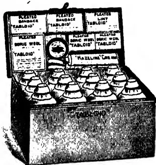

Reduced facsimile

Very compact and serviceable. Contains compressed medications, dressings, etc., all of the highest quality and unaffected by extremes of climate.

Invaluable for use on out-stations beyond reach of immediate medical aid.

*Obtainable at all Chemists and Stores*

BURROUGHS WELLCOME & CO., LONDON AND BOMBAY

nr 3355

*All Rights Reserved*

## AGRICULTURAL EDUCATION.

### AGRICULTURAL EDUCATION IN CEYLON.

**D. H. GRIST, Camb. Dip. Agric.,**

*Agricultural Instructor. Department of Agriculture, F.M.S. and S.S.*

During a recent visit to Ceylon the writer was given an opportunity of studying the system of agricultural education obtaining in that Colony. After detailing the system as there operated, suggestions will be made as to the application advisable for the Federated Malay States. A study of the Ceylon system is valuable because agricultural instruction has there been a settled policy of the Government for about twenty years; and in spite of mistakes that have been made, very material advances have taken place, and the present system would appear to have an assured success.

The following is a brief statement of the educational activities of the Ceylon Government. Under the present system, the direction of all agricultural policy, whether directed towards the training of teachers or others, or in the management of school gardens, is under the sole direction of the

272------------------------------------------------

228[APRIL, 1922.

Department of Agriculture, assisted, in the matter of school and home garden work, by local educational committees. The only exception to this rule appears to be in the elementary botany and school garden work taught to vernacular teachers in the Training College for Teachers, Colombo.

At one time there was an Agricultural College at Colombo, directed by the Department of Public Instruction. It was closed in 1900. The reasons given for it are thus stated :

"The work of it was defective simply because the students who went there did so because they thought that they could get Government employment—not Government employment in the Agricultural line—but in other lines."\*

Thus, it is supposed that the College attracted the wrong class of student, and this was, in fact, brought about by an unsuitable curriculum.

Too much time was devoted to theory, and too little time devoted to the practical work.

The School of Tropical Agriculture, at Peradeniya, founded in 1916, more effectually filled the needs of the Colony. Its course is of an elementary nature, and stress is laid on practical work in the field. In the classrooms, lectures and demonstrations are given; while in the field, students are taught how to handle implements and animals, and the field operations in connection with tea, rubber, cacao, coconuts and other Ceylon products.

The school was designed to attract the following classes of students :

*Firstly.*—The sons of well-to-do agriculturists ;

*Secondly.*—Students who intended to devote their careers to practical agriculture as managers or sub-managers of estates ;

*Thirdly.*—To produce recruits for posts in the Agricultural Department ;

*Fourthly.*—To provide special classes for the benefit of elementary school teachers, who intended to impart tuition and nature study in the elements of rural economy in village schools ;

*Fifthly.*—To give village headmen (corresponding to "penghulu" and "lembaga" in the Federated Malay States) short courses in rural economy in order that they might, by precept and example, encourage sound agricultural practice in their respective parishes.

The present staff consists of the Director of Agriculture as Principal, a Registrar, three lecturers and demonstrators, a lecturer in estate accountancy. With the exception of the Principal, the staff is drawn from the natives of Ceylon. The lecturers have undergone a course of agriculture at the Ceylon Department of Agriculture, and obtained the Poona Diploma in Agriculture. In addition, the scientific officers of the Department of Agriculture give occasional lectures in the subjects in which they are experts.

There are two main courses of instruction :

(1) A two-year course in the English language.—At the present time there are twenty students undergoing their first year of this course, and twenty in their second year ;

(2) (a) A Sinhalese Teachers' Class for about twelve certified teachers from the Educational Department.—They undergo the first year's course only, similar to the English students but delivered in the Sinhalese tongue ;

\*Agricultural Training in Ceylon—XXXVII—1909.

273------------------------------------------------

APRIL, 1922.]229

(b) A village headmen's course of one year, consisting of the ordinary first year's course revised to meet the special requirements of their practical needs.

Vernacular teachers and headmen are admitted to a one-year course in alternate years.

The school is housed in two hostels, and all students pay tuition fees of Rs. 7.50 per mensem, and hostel fees of Rs. 22.50 per mensem.

The school certificate covers the course of instruction of two years. It is given partly on note-book and field-work, and partly on examination results. Special certificates are granted for the vernacular courses. In addition, various prizes are granted in connection with all classes. Scholarships are offered by the Government for the most promising of the students to undergo further training in India.

The courses are largely practical. Each student has a garden to keep in order, and the writer was struck with the keenness shown by the students in the upkeep of their plots. During his visit he also attended lectures in co-operation and accountancy which gave him an idea of the thorough nature of the instruction.

In addition to the above-mentioned activities, the students have a Students' Council which represents the needs of students; a Debating Society, which meets weekly for the discussion of matters of agricultural interest; and a school magazine of an agricultural nature, edited and managed by the students themselves.

A word as to the men produced at the school may not be out of place. The posts in the Agricultural Department filled by former students include sub-inspectors, men for special food campaigns, officers for the co-operative societies, and assistants for the various technical branches.

The Secretary of the Low-Country Products Association stated that there were fourteen old students employed on estates registered with the Low-Country Products Association. "He was pleased to testify to their good work. He found them to be sound, good, reliable boys, and certainly two of them were outstanding men."

#### **THE TRAINING COLLEGE, COLOMBO.**

All vernacular teachers at the Training College, Colombo, pass through a course of training in Elementary Botany and Physiology. They have a small college garden, useful for the supply of matter for botany lessons. The botany instruction is thorough. Many of the students' note-books were examined by the writer. They were works of art.

As a preliminary training prior to admission to the School of Tropical Agriculture, the teaching of the Training College is useful; but the garden is too small and the land poor. As mentioned above, the botany work of this college is under the Education Department.

#### **MIDDLE SCHOOLS.**

The Director of Agriculture has divided the island and has placed a Divisional Agricultural Officer in each division. One "Middle School" is to be erected in each division, under the supervision of the Divisional Officer. It must be realized that Ceylon shows a wide diversity of agricultural conditions. The middle schools—i.e., intermediate to the School of Tropical

274------------------------------------------------

230[APRIL, 1922.

Agricultural and village schools are designed to meet the requirements of each particular local condition.

Vernacular teachers will be trained in such schools. An experimental station will be attached, and distribution of seed, etc., to village schools and individuals made from this centre.

### SCHOOL GARDENS.

School gardens were taken over by the Department of Agriculture in 1906. They have accomplished good work and have also been the means of distributing several improved types of vegetable throughout the Colony. The avowed policy of this department is thus stated by the Director of Agriculture, Ceylon : " It is impossible to teach agriculture in the elementary schools and it is important teachers should realize that the main object of a school garden is to provide material for nature lessons, and to provide common objects of ornamental and economic importance with which to train the power of observation of the pupils." In point of fact, the writer is of opinion that training in agriculture is given in such schools, that the boys are taught the production of local crops with the definite intention that they themselves on leaving school, may apply the school experience on a larger scale. It is probable that the present practice of agricultural education is more suited to the local needs than the impersonal nature study of which the gardens were merely to provide the material.

School Gardens are of two classes—the village school and the central school gardens. In the latter conferences of school teachers are held, and demonstrations are conducted. To take the schools as the writer found them, the majority of head teachers had been through no instruction at the School of Tropical Agriculture. In spite of this, the keenness displayed in this class of work, both by teachers and boys, is the best recommendation of its effectiveness or utility. At the present time there are 484 registered school gardens throughout the Colony and many more await registration. The organization of school garden work is entirely in the hands of the Agricultural Department and all matters relating to the garden work is referred to the Director of Agriculture and not to the Education Department. The executive is controlled by the divisional officers who are Europeans trained in scientific agriculture. Under these officers work a native staff which include Agricultural Instructors and Inspectors of School Gardens. The Instructors only visit school gardens as their other work permits, while the latter devote the whole of their time to instructional work in schools, planning gardens, judging gardens for prizes and procuring the plants and equipment for the various schools.

The students in vernacular schools spend one hour a day in the garden, which may vary in extent from  $\frac{1}{4}$  acre to two acres.

### HOME GARDENS.

An important off-shoot of school garden work is the home garden scheme. The boys are encouraged to apply the teaching of the school garden in the cultivation of plots at home. There are now about 24,000 home gardens in Ceylon.

Of the best school gardens visited by the writer may be mentioned the following :

275------------------------------------------------

APRIL, 1922.]231

Owiteganuwa Vernacular School with 250 boys had about 200 home gardens.

Narandeniya School with 250 boys had 150 home gardens.

It should be pointed out that whereas school garden work is compulsory, home gardens are voluntary. So important has this branch of work become that Inspectors of home gardens are to be appointed.

In connection with both school and home gardens, prizes are awarded for meritorious work.

#### LITERATURE.

A primer of tropical agriculture, adapted as a reader for schools and a senior agricultural reader are the only agricultural books in use, and inadequate. In addition, a journal which records the results of experiments and investigations in native products and of co-operative credit societies is printed for Sinhalese readers and a somewhat similar organ in Tamil.

#### CO-OPERATIVE CREDIT SOCIETIES.

These form an essential link between agricultural education and agricultural practice. Frequently the application of better methods involves the expenditure of more money than the native can afford. To produce large crops, the planter must make the soil his bank. A co-operative society is the only means by which a poor man can hope to procure loans for approved purposes. It may also become his bank in which to deposit his savings. Co-operative societies thus not only provide the means of increasing profits, but encourage thrift. The working of such societies need not be discussed in this place. It is only necessary to state that each village co-operative society should be self-supporting. The venture should not be a Government one, and the initial capital should be raised locally.

In Ceylon, co-operative societies are of growing importance. In 1919 there were 127 societies, 30 of which had been formed during the year.

The total membership of the societies was 15,160 and the paid up capital Rs. 86,721.46. Government loans were granted to the amount of Rs 13,935.

Government have a controlling influence only on such societies. They provide Inspectors, but the internal arrangements are local and the Government takes no responsibility other than that of encouragement and audit.

The Indian societies are controlled in the same manner.

Other educational activities of the Ceylon Department of Agriculture may be briefly stated. They include assistance and encouragement in village agricultural shows and in demonstration plots. The latter exist in various parts of the Colony and no doubt assist in a considerable degree in the work of dissemination of knowledge and the application in practice of the valuable results attained by the scientific officers of the department.

In passing, the writer would like to record his grateful appreciation of the assistance given to him by MR. F. A. STOCKDALE (Director of Agriculture Ceylon), and the officers of his department. MR. STOCKDALE arranged with his officers a tour for the writer that embraced a survey of all the activities of his department. The writer's thanks are due also to the assistance accorded him by the Education Department, and also to the Ceylon Government for providing a free pass over the Ceylon Government Railway, and for assistance in other directions.—*AGRIC. BULL. of F.M.S., VOL. IX, No. 2.*

276------------------------------------------------

232[APRIL, 1922.

# SOILS AND MANURES.

## CHEMICAL ANALYSIS OF SOILS: ITS VALUE AND LIMITATIONS.

JAS. CRABTREE, M.Sc., F.I.C.

During the past decade an appreciable alteration has been manifested in the attitude of the practical man towards the scientist in nearly every industry, a change impelled chiefly by the increasing intricacies of most industrial processes occasioned by their developments, and one which is likely to progress with further advances. Formerly misunderstood, and regarded as an abstruse dreamer, the scientist is coming to be regarded in his true light; "science" means "knowledge" and the scientist is a knowledge specialist, an individual whose function is the acquisition of information of the fundamental laws of nature which are the basis of every change or process, and the application of such information to the improvement of such processes and changes as are necessary to the most economical production of those materials on which man is dependent for his welfare and comfort.

In the swing of the pendulum away from distrust of the scientist, there is a tendency, perhaps unavoidable, of going too far in the other direction, and expecting too much from this worker. Too often is he regarded in the light of a kind of wizard possessed of mystic powers and store of knowledge, an impression which it is to be feared, is in some cases not violently discouraged by the individual himself. He is, however, but human, and probably encounters more insoluble problems than most of his brothers in other walks of life; a closer comprehension by the latter of the limitations of the knowledge at his disposal, and the difficulties which beset his way, cannot but lead to a greater appreciation of the results he obtains.

In endeavouring to arrive at some conception of the value and possibilities of the work of the scientist, it should be remembered, that for thousands of years, man has been acquiring information by the slow and labourious method of "trial and error" and applying this information to his methods by the process of the "rule of thumb." Astonishing as has been the advance from this position within the past century, it must be obvious that the comparatively short study of modern times cannot possibly be expected to have thoroughly elucidated, considerations of modern developments apart, even the phenomena observed and methods developed, during those thousands of years. In no branch of study is this more apparent than in Agriculture, the most ancient of the arts, and the most complex of the sciences. In no science has so much been learnt in a short time, or so little relative progress been made in comparison with the information acquired. This is not surprising, when we reflect that in the growth of any plant are involved considerations of plant physiology and heredity, physical conditions (soil texture, temperature, water, air and light supply), chemical problems of soil reaction and plant food (themselves involving questions of bacteriological,

277------------------------------------------------

APRIL, 1922.]233

protozoological, and fungal changes), with extraneous modifications occasioned by diseases and pests of the plant. Difficult as is the study of any single one of these aspects, the correlation of all of them essential to the full consideration of any Agricultural problem, must be still more so, especially as the undue or insufficient stressing of any one aspect may profoundly modify the conclusions to be arrived at. The information to be obtained by the study of any one only of the above mentioned aspects is limited, and it is the limitations of the ordinary routine chemical examination (or analysis) of soil, that it is intended to discuss in this article.

By "soil" is generally understood any exposed portion of the earth's surface which will support the growth of the higher plants. It consists essentially of two classes of material, disintegrated rock, and "organic matter" or plant and animal debris: variations in extent of disintegration of the former, and the chemical changes it has undergone, and in the amount of modification of the latter, determine the resulting type of soil, which, as is well known, may vary within very wide limits. Nevertheless, the essential components are same in all cases, and it is their relative proportions, climatic conditions apart, which determine the extent of the ability of the soil to support plant growth. It is with the determination of the said relative proportion that chemical analysis is concerned.

The chief components which influence plant growth in any way, and with which the analyst chiefly concerns himself are:— "Organic matter" (containing essentially nitrogen, carbon, hydrogen, and oxygen). Sand, (and other matters insoluble in strong acids) Iron, Alumina, Lime, Magnesia, Potash, Soda, Sulphates, Carbonates, Phosphates, Chlorides (sometimes).

The results of a typical so-called "complete" analysis of cane soils of this colony are set below, as an example

<table>
<thead>
<tr>
<th></th>
<th>Total</th>
<th></th>
</tr>
</thead>
<tbody>
<tr>
<td>Water ... ..</td>
<td>3.50</td>
<td></td>
</tr>
<tr>
<td>Loss on ignition (chiefly organic matter*) ... ..</td>
<td>8.12</td>
<td></td>
</tr>
<tr>
<td>Sand and insoluble</td>
<td>73.58</td>
<td></td>
</tr>
<tr>
<td>Iron oxide ... ..</td>
<td>4.51</td>
<td></td>
</tr>
<tr>
<td>Alumina ... ..</td>
<td>8.98</td>
<td></td>
</tr>
<tr>
<td>Lime ... ..</td>
<td>.20</td>
<td></td>
</tr>
<tr>
<td>Magnesia ... ..</td>
<td>.50</td>
<td></td>
</tr>
<tr>
<td>Potash ... ..</td>
<td>.21</td>
<td>.020</td>
</tr>
<tr>
<td>Soda ... ..</td>
<td>.20</td>
<td></td>
</tr>
<tr>
<td>Sulphuric acid ... ..</td>
<td>.08</td>
<td></td>
</tr>
<tr>
<td>Phosphoric acid ... ..</td>
<td>.09</td>
<td>.010</td>
</tr>
<tr>
<td>Carbonic acid ... ..</td>
<td>nil</td>
<td></td>
</tr>
<tr>
<td>Hydrochloric acid ... ..</td>
<td>.03</td>
<td></td>
</tr>
<tr>
<td></td>
<td>
100.000</td>
<td></td>
</tr>
</tbody>
</table>

Of these substances, the materials directly essential to plant growth are the nitrogen, potash, phosphoric acid, lime, magnesia, iron and sulphuric acid, though the cases where the soil does not contain a sufficiency of lime,

\* Containing Nitrogen.25

278------------------------------------------------

234[APRIL, 1922.

magnesia, iron or sulphuric acid for the requirements of any crop being rare, the first three ingredients may be regarded as the real essentials. All others are of indirect interest only; their respective roles are often more or less imperfectly understood, though often of predominant importance; a consideration of them is outside the scope of this article.

Now, an inspection of the above soil (or preferably a "mechanical analysis" showing the relative proportions of articles of different diameter) will have shown the analyst that the soil is a fairly heavy clay, and from his previous experience of such soils, he is able to say from the chemical results above that this is a soil of distinct potential fertility i.e. it can produce substantial crops of various cultivated plants for a considerable period, given reasonable husbandry and climatic conditions). He might be a little doubtful about the lime content especially as it is less in amount than the magnesia; he might also reasonably doubt the ability of the phosphoric acid to hold out over a long period; a determination of the so-called "available" proportion of these substances mentioned below would help in some respects, but unless the analyst had already had information of the behaviour of that particular class of soil under the conditions and crops under which it was proposed to work it, he could not with confidence state that such and such was the best method of treatment, or of manuring.

Now, suppose a crop of say sugar-cane is grown on his particular plot of land, and assume that the roots of the cane feed on only the upper 18 inches of soil; assume also that an acre of this soil to that depth weighs 3,000,000 lb.; there will then be present in this amount of soil 7,500 lb. of nitrogen, 6,300 lb. of potash, and 2,700 lb. of phosphoric acid by the above analysis. (Even this does not represent the whole as there is still present some potash at any rate in the "insoluble" portion.) The amounts "available" to citric acid will be, potash 200 lb., phosphoric acid 100 lb. Now, if in cultivation a crop of cane were obtained of, say, 40 tons per acre, it would, according to analyses by STUBBS in Louisiana, remove in the whole crop, canes and leaves, about 40 lb. of nitrogen, 90 lb. of potash and 60 lb. of phosphoric acid, that is between 1 and 2 per cent. of the total amount and 60 per cent. of the "citric acid available." On the face of it this would seem to the lay mind to indicate that there was no need to apply any manure of any kind to obtain a crop of this magnitude, yet we know from experience, that in actual cultivation, this soil would, if left unmanured, probably not give us more than about 10 tons. The explanation of this is, that the plant is not able to use the major portion of the material the analysis records as being present; only a quite small proportion of the plant, and it is largely on the rate at which the stored-up materials become available that the productivity of the soil depends. The difficulty of ascertaining this rate will be realised when one notes that the analyst obtains his amounts of plant food from the soil by dissolving it out with concentrated acids, usually at high temperatures; moreover, his results will vary according to the strength of the acid he employs, the temperature he uses, and the duration of time over which the acid is allowed to act on the soil. Now the plant has neither strong acid, nor high temperature at its disposal, and moreover takes months7 in abstracting from the soil the materials it requires. It does not require much reflection to appreciate that

279------------------------------------------------

APRIL, 1922.]235

there will be substantial discrepancies between the analysis made by the analyst and that made by the plant. Herein lies the difficulty of the whole matter. The exact manner in which the plant dissolves out the mineral ingredients at any rate, is not as yet thoroughly understood, and the difficulty of simulating, in the short time at the analyst's disposal (hours or days) what the plant effects slowly over a long period, has so far proved insurmountable. Many attempts have been made to do this the most successful of which was by DYER, who in 1894, estimated the acidity of the roots of a large number of plants, and finding it to be on the average about equal to a one per cent. solution of citric acid, used this latter solution to digest soils for a considerable number of hours: the amounts of mineral constituents he extracted in this way he considered as immediately available to the plant, and found that his results were borne out by the cropping figures of the soils of the Rothamsted and other experiment stations. The method seemed at first sight simple and alluring, but it has since been found that the acidity of the root sap has very little to do with the solution of the mineral ingredients, and that far from being simple the reaction involved are hedged around with numerous complications, a consideration of which would be out of place here. Nevertheless the method has proved to be of considerable value when used in connection with manurial plots and is practically in world-wide use. Other investigators have used different solvents such as dilute hydrochloric and nitric acids, aspartic acid, ammonium citrate, and so on, but to no particular advantage. Even in this method, however, it is impossible to draw general conclusions, for different crops require different amounts of mineral ingredients, and different soil reactions, and inferences drawn from one crop would probably fail with another.

About 1890 several German investigators, losing faith in the abilities of chemical analysis to give information as to manurial requirements, instituted the method of "pot culture" in which crops under inquiry are grown for longer or shorter periods in pots containing the particular soil about which information is required, using different methods of manuring; in short a condensed series of manurial trials. The method, however, proved too cumbersome and was not directly applicable to field conditions, and though of great value in studying soils problems, pot culture is not now used in the routine of soil "analysis."

The question the practical man requires an answer to, from the analyst, is, "what manuring does my soil require *now* to give me the best results at the least cost?" and it is, with this in mind, that the subject is being discussed here, for after all, that is all the majority of practical men are interested in. With analytical methods only at one's disposal a definite answer cannot be given to this query. The only really reliable information is that obtained from actual field trials on the particular class of soil under enquiry in which varying amounts of different manures are applied and their results on crop production accurately recorded from year to year. It is in connection with these field trials that analysis is of the greatest value in the light of the question we are considering. When definite results have been obtained from field trials on the broad general types of soil in any given country or district, and analyses have been made of the soils of the plots from time to time, then definite advice can be given on the handling

280------------------------------------------------

236[APRIL, 1922.

of any particular field elsewhere by sampling the soil on it, comparing its analysis with that of the manurial plots about which we have accumulated so much information, and by means of this comparison, advising in the light of the results obtained on the particular type of soil in the field experiments. In the most progressive countries the agricultural districts are being mapped off by "soil surveys" into areas of the different soil types, classified according to the results of chemical and mechanical analysis, and experiment stations established on those types of sufficiently large area to warrant it. The correlation of any particular field with the fields of the plot trials is then established by analysis, and the advisor thus placed in really sound position to advise on treatment. The matter is not of course as simple as this statement might make it appear: it is the principle only that an attempt here is being made to explain.

Cases of pronounced infertility are a much simpler matter and here the ordinary chemical analysis is on much safer ground; these cases usually result from the marked absence of some plant food, or from some pronounced reaction of the soil, or presence of an injurious factor. These can almost always be traced.

It would be as well to point out here that information obtained from plot trials may not be indispensable where an analyst has been working for some years with soils of one or two different types and has been at the same time able to follow up the performances of these soils in the field. Here his long experience will serve him: he has in fact been accumulating during those years of experience precisely that information which the plot trial is designed to give in greater detail. Unfortunately, however, this experience is often of a nature that cannot be recorded in terms of words and figures, while the statistics of the experiment station plots are at all times available to others.

To recapitulate then:—

Chemical analyses of soils alone can, in the present state of our knowledge, tell us whether a soil is or is not, fertile: i.e., capable, with reasonably good husbandry and climatic conditions, of supporting crops of plants of value to man, for an indefinite period. This information is ordinarily of value only to an agriculturist taking in virgin land or entering on operations in cultivated lands of which he has no previous experience.

It can elucidate cases of pronounced infertility in apparently fertile lands.

Its greatest value directly to the everyday operations of the practical man is usually in conjunction with field trials, for in this way only can really reliable information be given about such problems as manuring and general cultivation.—JOURNAL OF BOARD OF AGRICULTURE, British Guiana, Vol. XIV, No. 4.

281------------------------------------------------

APRIL, 1922.]237

# PESTS AND DISEASES.

## THE "MURDA" DISEASE OF CHILLI (CAPSICUM).\*

G. S. KULKARNI, M. Ag.,

*Asst. Professor of Mycology, Agricultural College, Poona.*

This is a very serious disease, nay, in fact the greatest enemy of the chilli plant, occurring in most parts of the Bombay Presidency. It is, therefore, well known to the cultivators who call it by various names as *murda*, *goja*, *macoda*, and *mirya* in the Daccan, *chandiroga* or *mullagariroga* in the Karnatak, and *Kokadva* in Gujarat.

The disease makes its appearance first in the terminal or axillary tender shoots of the plants. The leaves of the attacked shoots get curled up usually outwards and droop down. Often they show much distortion and wrinkling and are reduced in size. They gradually dry up and drop down. New shoots come up, which are in turn attacked and destroyed. The growth of the plants is thus checked. The disease appears at any stage of the plant. If it begins at the seedling stage the affected plants never produce any flowers and fruits. If the plants are attacked in the flowering stage most of the diseased flowers wither and drop down and the few that escape from berries which are also soon spoiled. The attacked fruits are much smaller than the normal ones and are curved. The disease gradually spreads to the lower branches, and as the internodes of the attacked branches are shortened the leaves appear as if they are in clusters and are reduced to minute scale-like structures. In such a highly malformed stage the plant at times is recognized with great difficulty. Such a severe attack was noticed this year (1920) near Poona in the Baramati valley where in most of the fields the crop was a failure. Reports of ravages of this disease have also been received from the tracts of Bijapur, Gokak, Kolhapur, Khed, Amalsad and Anand.

The cause of this disease is the same mite which causes the *tambera* disease of potato†. That the potato mite has something to do with the chilli trouble was suspected by the writer while the *tambera* disease was being studied in the year 1919, but an attempt to produce the disease in chilli plants by inoculation experiments was not successful as mentioned in the previous paper, probably because the experiments were done rather late in the season. The study was therefore postponed for the next year. Early in June, 1920, the disease was noticed on the chilli seedlings in the writer's compound, and an examination of the diseased plants gave clear proofs of the presence of a mite agreeing in all its stages with that on potato. Inoculation experiments were therefore at once started. Three sound, twenty-days-old potato plants in pots were taken. Two were used for inoculation

\* Paper read at the Eighth Indian Science Congress, Calcutta, 1921.

† Mann, Nagpurkar and Kulkarni. The *Tambera* disease of potato.—AGRI. JOUR. India, pt. XV.

282------------------------------------------------

238[APRIL, 1922.

and the third for control. Inoculation of the plants was made by putting on them affected parts of the chilli plants containing the mites. The infected plants began to show on the ninth day distinct symptoms of attack, viz., the twisting and curling of the leaves with a reddish tinge and the erect bunching habit of the shoots, and on the thirteenth day the tender leaves on one plant began to dry up; on the sixteenth day the affected shoot was completely killed. The control plant remained healthy during this period. Experiments were then made with chilli plants which were inoculated with the potato mite. Six sound chilli plants in pots were chosen, four for inoculation and two for control. Inoculated plants on the 12th day began to show the typical symptoms of the *murda* disease. The leaves became twisted and crumpled, were much reduced in size and had a number of moving mites on them. The control plants remained quite healthy all the while.

The cause of this disease, which had baffled our efforts so long, having been discovered, attempts were at once made to treat the diseased plants with the lime-sulphur wash. Spraying experiments were made at seven different centres in the Presidency-Gokak farm and Goshanhatti in the Belgaum District, Tikkoti and Muttagi in the Bijapur District, Baamati and Karkumb in the Poona District and at Rukdi in the Kolhapur State. Only one spraying was given. Favourable reports as to the efficiency of the treatment were received from all the above places. The results were most successful especially at Gokak and Rukdi, while in other places they were not so marked as the disease was in a far advanced stage at the time of treatment. These preliminary trials show that only one spraying is enough to control the disease if done at the time when the disease just appears. The cost of spraying per acre came to Rs. 10.

Search for other host plants of this mite has shown that besides *guar* (*Cyamopsis psoralioides*), it occurs on *Zinnia*, *Dahlia*, *Tagetes*, *Mirabilis jalapa*, Cape Gooseberry, *Amaranthus polygonus* and *Physalis minima*. In the case of *Zinnia*, the affected plants got stunted in growth, the leaves are twisted and crumpled in various ways and no flowers are borne. If the flowers appear, they are few, and are much reduced in size. Often the flowering parts are transformed into leafy shoots. Early in the season this year, a few affected *Zinnia* plants in front of the Agricultural College buildings, Poona, attracted the writer's attention, and examination of these showed on the under-surface of the leaves any number of moving mites agreeing with those on chilli. Cross-inoculation experiments were made, using the mite obtained from one host to inoculate the other. The results were quite successful, showing the typical symptoms of the disease in each plant. The *Zinnia* disease was one of the constant complaints received from the public, and the worst attack noticed in Poona during the last six years, occurred this year (1920) in the Government House Gardens, Ganeshkhind, where all the *Zinnia* plants were completely spoiled. Its ravages were also reported from the Victoria Gardens, Bombay. No spraying trials were undertaken as the season and the disease had far advanced when the reports were received.

As the mite has already been described in the previous paper, it is not necessary to repeat the description here.

AGRI. JOUR., India, XV, pt. III.

283------------------------------------------------

APRIL, 1922.]239

It is hazardous, no doubt, to attempt to identify the mite, as it is the work of a specialist. However, the following is the venture made by the writer.

In the Indian literature on mites a Litchi disease has been described by Misra\*. The mite in the attacked parts of the plant causes a peculiar hairy growth and it is said to be a species of *Eriophyes*. There is another disease on cotton and jasminum. Here too in the attacked parts the mite produces woolly growth and it is said to belong to a species of *Phyloplus*. The chilli mite differs both in its morphological characters and in the effects produced on the host from these two species. CARPENTER'S† statement that the mite may belong to a red spider group (Tetranychidae) does not seem to hold good. The Tetranychidae‡ have six segments in their legs, while the legs of this mite have five segments. The mite comes very near to the yellow mite of the genus *Tarsonymus* described by WATT and MANN.§ The description and illustrations of the yellow mite agree completely with those of this mite. The peculiar sucking discs with two hooklets at the end of the legs—characteristic of Tarsonymidae¶—are also noticed. It may therefore be a species of Tarsonymidae.—AGRICULTURAL JOURNAL OF INDIA, VOL. XVII, Part 1.

## THE BLACK FLY OF CITRUS AND OTHER SUB-TROPICAL PLANTS.

S. F. ASHBY, B Sc.

\* *Mycologist, Imperial Dept. of Agriculture for the West Indies.*

The black fly (*Aleurocanthus woglumi*) was introduced into Jamaica from India on infested food plants within the last 10 to 15 years. From this focus in the New World it has spread to Cuba, New Providence, the Canal Zone, the Republic of Panama and Costa Rica, and is continuing its spread from these new centres.

It was probably introduced into the Canal Zone between the years 1912 and 1914 the introduction taking place on more than one lot of infested food plants.

This report is based on an intensive study of this pest in the Canal Zone made from June 1918 to August 1919.

The introduction and establishment of this pest in widely separated areas has taken place through nursery stock or infested individual food plants, including cuttings for propagation. Within a region this method of spread is supplemented by the natural flight of the adults, by their carriage on vehicles and trains, and on the clothing of persons passing or working among infested trees.

\* *AGRI. JOUR., India, VII, p. 286.*

† A new disease of the Irish Potatoes, *Phytopathology* VIII, p. 286.

‡ Brown, Max. *Animal parasites of Man*, 1906, p. 355.

§ WATT AND MANN. *Pests and Blights of Tea plant*, 1903, p. 360.

¶ Brown, Max. *Animal Parasites of Man*, 1906, p. 356.

284------------------------------------------------

240[APRIL, 1922.

The important food plants of this insect in the Canal Zone are : *Ardisia revoluta*, various species of the genus *Citrus*, *Coffea arabica*, *Elaeis melanococca*, *Eugenia Jambos* and *E. malaccensis*, *Lucuma mammosa* and *L. nervosa*, *Melicocca bijuga*, and *Mangifera indica*.

This insect under certain conditions, injures seriously plants infested by it, but no plants killed by it have been found in the Canal Zone and Republic of Panama.

There are six stages in the life history of the black fly namely, the egg, three larval instars, the pupa, and the adult. The life history is not clear-cut and there is a decided over-lapping of stages.

The length of time for the completion of one generation ranges from 45 to 113 days. \*The duration of the various stages are : Egg, 11 to 20 days ; first larval instar, 7 to 16 days ; second larval instar 5 to 30 days ; third larval instar, 6 to 20 days ; pupa, 16 to 80 days ; adult, probably 6 to 12 days.

There is a great mortality in the various stages, only 22.5 per cent of the individuals of 700 eggs reached maturity.

The natural climatic factors that tend to hold the insect in check in the Canal Zone are : Drying out during the dry season and the heavy rain during the wet season.

Five species of coccinellids and one species of *Chrysopa* have been found to be predacious on the various stages of *Aleurocanthus woglumi* but they are not as yet sufficiently abundant to be important factors in its control. No internal parasites were found.

The black fly can be controlled by contact insecticides. Five and ten per cent. kerosene emulsions, fish-oil soap at the rate of 1 pound to 2 and to 4 gallons of water, and nicotine oleate have given good results.

There is a possibility that this insect may gain entrance into and become established in the United States, particularly Florida. It already occurs in Cuba and Nassau, New Providence. The way in which it is most apt to be introduced and become established is through infested food plants, such as nursery stock or individual plants, or as cuttings for propagation. This is the way in which it was brought from the Old World to the New and is the way in which it is continuing its spread to widely separated parts of its new home.

About six years ago a planter in Jamaica found some of his grape-fruit trees, previously badly infested by the black fly completely cleared from fly and scales. and noting ants' nests present put nests taken from logwood on all his trees. Within a year they were clean, and have remained so. There was no sign of any general new scale infestation though a few scales were maintained in the nests. It is necessary to have the right variety of *Cremaslogasler brevispinosa* : it builds nests which are long and pointed when full sized. If it is not already present on logwood, *Anona* sp., etc., in Bahamas a few nests could, no doubt, be obtained for experiment from Jamaica with the help of the entomologist.

---

\* Summary of BULLETIN, No. 885 of the U. S. Dept. of Agriculture.

Note by Entomologist, Ceylon :—This species is quite common in Peradeniya and we have had specimens from Colombo ; it is doubtless widely distributed.

Here it is attended by the large red ant *Ecophylla smaragdina*, but I have not observed any other ants feeding on it.

285------------------------------------------------

APRIL, 1922.]241

# APICULTURE.

---

## BEE-KEEPING NOTES.

---

MR. R. WHYTE, a well-known authority on bee-keeping, writing on the subject of Vitamines in Honey, says: "As a digestive stimulant, a rapidly absorbed economical food, a muscular nerve tonic, honey has its reputation;" but it is not generally known that wide commercial use is now made of it in producing Vitamine preparations for rickety children and others. This is a high tribute to the dietetic value of honey which should be given due prominence in advertisements to the general public.

Some time ago the Secretary of the Ceylon Bee Keepers' Association addressed the BEE WORLD on the subject of tainted honey. The December number of that periodical contains an interesting letter from MR. F. BONDIKEV of Delhem, Berlin, which throws further light on this question. He says: "I read with great interest the article by MR. DRIEBERG in the October number of the BEE WORLD on bitter honey. An acquaintance told me the same concerning German East Africa, and in this case also *Hevea* was concerned." MR. BONDIKEV then quotes from ancient writers with reference to the poisonous honey. TENOPHON relates how the soldiers who consumed the honey of Pontus were attacked by a kind of dysentery, some becoming raving and others unconscious. THEOPHASTUS also refers to poisonous honey. While ARISTOTLE mentions a honey which makes people mad but cures lunatics! MR. BONDIKEV believes that there is also a reference in MOLTKE'S TURKISH TRAVELS to the honey from *Azalea pontica* and *Rhododendron ponticum* which is said to be poisonous, but whether injurious to the bees themselves is not clear. He points out that when bees get on to a Buck-wheat field in full bloom the bees "drift" and turn ferocious.

The average life of a worker bee according to DADANT is 35 days. MR. W. STOKES of Romileo, Cheshire, who writes on this subject, is inclined to revise this estimate. He says: "Though some bees would meet with an early death, it is not fair to assume that the same number will die in the first few weeks as in the latter weeks. I would suggest that a more reliable average would be 45 days, on the basis that most of the bees would do 30 days' field work, and the longest lived 60 days."

*Hints.*—(1) In feeding bees do not feed at the entrance or out of doors, as it causes other bees to rob: always feed on the top or over the brood nest. (2) When you observe bees hunting about your hive, trying to get in, be sure robbing is going on. It is then wise to close up the

286------------------------------------------------

242[APRIL, 1922.

entrance of weak hives and only allow an opening sufficient for a single bee, and sprinkle weak carbolic acid solution about the front of attacked hives or where bees are crowding. (3) When bees are hanging out in front of a hive, it shows that they are uncomfortable in it, or have no room. They should be given more air or more room according to circumstances. Shading the hive from the sun in very warm weather is beneficial. (4) If you give bees plenty of room before the honey-flow, and keep them busy at comb-building, they will rarely swarm. If once they feel themselves crowded, and get the swarming fever, there is nothing that will keep them from going. (5) Honey should not be taken from a hive soon after it is stored, as it is then watery, unripe, and likely to become unfit for use very soon. Give the bees time to ripen the honey before removal, when it will be found nice and thick and with a good rich flavour. (6) The old queen always accompanies the first swarm. (7) A queenless stock will raise queens at once if it has eggs or larvae under three days old : and the queen should hatch within a fortnight. MR. YASNO HIRATSUKA of Gi fu-ken, Japan, writing to the Journal of the *Apis Club*, Benson, Oxon, says : "I have read with great interest the notes on *Apis indica* by CAPT. CAMPBELL and MR. DRIEBERG. *A. indica* is not identical with the German bee, as some English bee-keepers' surmise." He then goes on to say that the bees of Japan (*A. Japonica*) are a variety of the Indian bee, and points out a peculiarity in their method of fanning which is with their heads away from and backs towards the entrance, which is exactly what our bees also do. The western bees adopt the opposite position in fanning. (It will be recalled that CAPT. HERBERT CAMPBELL, while in Ceylon, kept bees at Nuwara Eliya.) (8) A robber bee is easily recognised by its quick movements and buzzing about the hive entrance, occasionally trying to settle on the alighting board. When a hive is opened and such bees are observed about it should be quickly closed again. (9) During the honey harvest the entrance might be widened and narrowed down again after it. (10) In seasons of scarcity, due to severe drought or heavy rain, bees should be fed, and they will repay the attention given. (11) The best way to guard against robbers and other evils is to keep the colony strong. (12) Bees won't tolerate nervous, jerky handling. Handle gently ; and with an occasional good puff of smoke one can do almost anything with bees. Smoke the bees a little at the entrance before opening a hive. (13) When stung do not lose any time in scraping the sting off : do not pull it out as you are likely to drive more poison into the wound. (14) About 5,000 English bees go to the pound. In the case of *Apis indica* there would be more. Who can tell us? (15) Before melting old combs for wax, immerse in rain water for 24 hours. This gives more and better wax.

C. D.

287------------------------------------------------

APRIL, 1922.]243

# LIBRARY.

---

## REVIEW OF APPLIED MYCOLOGY.

The Imperial Bureau of Mycology has undertaken the publication of a monthly abstracting journal, the **REVIEW OF APPLIED MYCOLOGY**, for the purpose of supplying, month by month, a summary of the work published in all countries on the diseases of plants and various other aspects of economic mycology.

The first number will be issued in January, 1922, and it is hoped to complete a volume of between four and five hundred pages annually.

Mycologists and plant pathologists often find it difficult to keep themselves informed of the progress of work in other countries. The publication in which an account of current work is given are very numerous and are scattered through a very large number of journals, many of which only occasionally contain an article of interest. There are few, if any, libraries in which all these publications can be found, while the working mycologists in the overseas parts of the British Empire often have access to only a small proportion of them. The Committee of the Imperial Bureau of Mycology have accordingly felt that it is in the highest degree desirable to start the publication of a compact yet comprehensive survey of current literature dealing with the various aspects of applied mycology, on the lines of the **REVIEW OF APPLIED ENTOMOLOGY** published by the Imperial Bureau of Entomology. This survey will be in the form of abstracts in which especial attention will be given to the diseases of tropical crops and similar matters of interest to mycologists in the overseas parts of the British Empire.

It is fully recognised that the success of the **REVIEW** will depend largely on the co-operation of all those interested in the practical applications of mycology and plant pathology, and the Committee earnestly appeal to all such persons to aid by the prompt supply of local publications and by keeping the Bureau advised of developments likely to be of interest to workers in other parts of the Empire, such as the outbreak of new diseases or the spread of old ones.

Though the chief object of the new journal is to give an up-to-date summary of the current work bearing on the practical application of the study of plant diseases to the reduction of the wastage due to such diseases in agriculture the fundamental researches on which most progress in this direction is based have a wider appeal. The **REVIEW** will enable all those who are interested in the progress of science to follow the development of one of its younger branches. The pure scientist will, it is hoped, find many side-lights on the wider problems on which he is engaged, while the practical grower will be able to learn the experience in other countries with improved methods for controlling plant diseases.

E. J. BUTLER.

288------------------------------------------------

244[APRIL, 1922.

## DISEASES OF ANIMALS IN SOUTH AFRICA.\*

The Author states the prime object of the work to be a concise statement of the more serious diseases of farm animals in South Africa as distinct from other lands. The diseases mentioned however are not confined to South Africa, and are met with wherever farm animals are kept. A glance at the list of contents shows that its usefulness is not so circumscribed, and the volume to be a very useful compendium of practical information to every stock owner.

Generally speaking affections other than parasitic are omitted and the diseases described are classified as caused by vegetable parasites, (i.e., bacterial diseases), animal parasites, insects, worms, and ultra-visible viruses. This is a somewhat novel and difficult classification, for example—Rabies under vegetable parasites, Acariasis under animal parasites, and Phthiriasis under insects. However, a useful index provides all that is required.

A suggestion is made that the B. Anthracis while being an obligatory parasite in cold climates may exist facultatively in hot climates. An interesting point in connection with this disease is its prevalence amongst East Indian goats and the hair infection of these animals.

Considerable numbers are shipped weekly to this country. The disease is not prevalent amongst them before shipment, but during the 24 hours transit while crowded on board ship many cases occur, and for three days after landing, while in the quarantine station. Cases then fall off. Cattle brought over on the same ship are very rarely affected. During 1921, 56,857 goats and sheep were imported—397 died from Anthrax after arrival. 13,573 cattle and buffalos were imported with these animals. Anthrax cases—Nil.

During recent years this disease unfortunately has cost human lives, by infection conveyed by shaving brushes. There is no doubt as to the grave danger in connection with East Indian goat hair.

The Author favours the opinion that Swine Plague or Swine Septicæmia in most cases is a complication of Swine Fever. That may be so in countries where Swine fever is largely met with. In this country Swine fever is not a common disease. The writer experienced a very serious outbreak with over two thousand deaths of Swine Septicæmia as a distinct disease from Swine fever—a typical Septicæmia and of a highly contagious nature.

Much information is given with reference to tick borne diseases, also the trypanosomiasis and coccidiosis. One would wish to see in the next edition good illustrations in these sections both of the carriers and the parasites commonly found which would help very much identification in other countries.

In common with printed matter generally the price is somewhat high, nevertheless the volume can be recommended with confidence to all interested in the welfare of live stock.

G. W. S.

---

\* Diseases of Animals in South Africa by C. R. Edmonds, M.R.C.V.S., Asst. Chief Veterinary Surgeon, Rhodesia. Published by Boillièr Tindall & Co. Price 25s. net, Postage 10d.

289------------------------------------------------

APRIL, 1922.]245

# GENERAL.

## RATES OF INTEREST CHARGED IN GRAIN CULTIVATION IN CEYLON.

T. B. P. KEHELPANNALA.

### PADDY.

Inviolable custom has regulated seed interest on cereals for propagation and consumption at certain fixed ratio. The interest levied on seed paddy "Bittaravi" is rated at five lahas\* for every ten lahas or a pela of paddy—approximately half a bushel for every bushel of paddy borrowed. The same rate rules for paddy loaned for consumption, called "Ehevi."† It is a noticeable fact that compound interest does not generally run in the case of paddy borrowed for sowing or consumption. The reason is clear. The established rule warrants the return of paddy loaned for either purpose within the borrowed year; it is contrary to custom to exceed the year-limit, which seldom or never happens.

The peasants' most necessitous time to borrow paddy is during the "Ehela-Pohon Maha,"‡ the ploughing season, when he requires paddy for food. And the recognised rule is to return the loaned paddy with interest to the lender at the next harvest, which entails a period of at the most seven months in the case of fields cultivated with "Ma-wi" for "Maha" season. In districts where fields are cultivated both for "Yala" and "Maha," the borrowed paddy should be returned at each succeeding harvest. "Hatiyal" and "Sudu-vi" take six months to ripen; "Hondaravala" five months; and "Hineti" four months. No interest for paddy is charged for paddy lent in "Ill-Unduwak Maha"—November-December. This is the blossoming season, about two months preceding harvest. The "Ill-Unduwak Maha" is the month of the greatest scarcity in the year in the life of a Kandyan villager, when his food-supply becomes exhausted. This fact is evidenced by the popular adage, "Unduwak mahata undu kudut ne": Even undu (*Phaseolus mungo var. radiatus*) powder is not to be found in "Undu-wap-maha."

Should exceptional circumstances prevent the borrower of seed paddy from returning the paddy with interest at the first harvest immediately following the loan, it is usually repaid with double interest at the second harvest, i.e., two bushels for one bushel. The necessity for this seldom or never arises, except in arid districts where cultivation facilities fail, as a result of drought or insect pests. No compound interest is levied for "Ehevi" paddy borrowed for consumption, even if it exceeds the time-limit within which the paddy is to be returned.

\* The laha, which varies in size, is the standard measure in every Kandyan village. The late Mr. R. W. LEVERS, C.C.S., says, that in the North-Central Province "the laha is the basis of all calculations for all Government assessment."

† Literally "extinct-paddy," paddy lent for consumption, other than that taken for seed. The word "Ehevenava" is peculiar to the Kandyan dialect, and means "to become extinct."

‡ June-July.

290------------------------------------------------

246[APRIL, 1922.

No villager ever grudges to repay borrowed seed paddy with the allotted interest, as intentional non-return is construed a sin and a standing disgrace, which excites the righteous wrath of the gods, and will render future crops unproductive.

In "Ande"\* fields, the seed paddy is invariably supplied by the land-owner. In any case the seed paddy with the accumulated interest is first removed from the "Mulgoda" or "Beta,"† and the remainder equally divided between the land owner and "Ande" cultivator.

In the Anuradhapura District no interest is charged for "Bittaravi" (seed paddy), which in the dialect of that district is appropriately termed "bimagiyavi," literally, "paddy gone to the ground," if it is supplied by the "Ande" cultivator. If the land-owner provides it, neither the seed paddy nor the interest is taken from the paddy crop at the harvest, the crop in entirety is evenly distributed between the landlord and Ande cultivator, as such exaction is thought disreputable. This wholesome example deserves to be copied by Kandyans of other districts.

But the levy of interest on seed paddy is considered just and equitable, considering the difficulty involved and the care that has to be exercised in the selection, storing and preservation of seed paddy, which only a limited few of the richer landlords in a village could afford to do.

Defective seed paddy is often the cause of the failure of a crop. The local supply frequently runs short necessitating the acquirement of seed paddy from other parts. During the recent rice crisis, the demand for seed paddy was so great that the customary interest in kind was flatly rejected, and Hineti seed paddy was sold at the record price between Rs. 5 and Rs. 8 per bushel.

The selecting of good seed paddy is one of the first essentials in paddy cultivation. This has been recognised in every country, even legislative enactments have been passed in places like Japan, America and India to regulate the provision of good seed paddy.

Paddy intended for seed should not be taken from a heap of grain which has been stacked for more than one day as its germination may be spoilt by fermentation.

Seed paddy is measured by the *laha*,‡ ten of which make a bushel.

#### OTHER GRAINS.

The same rate of interest as is payable on paddy is exacted from "El-paddy"§ and "Amu"¶ (*Paspalum scrobiculatum*) also.

\* Fields let out by a land-owner to another to cultivate, the former to half share of the paddy crop and straw as "Gankara Ande" (land-owner's share).

† The whole crop of paddy. [HON. MR. PANABOKKE tells me that in Bintenna under Soraborawewa, where he owns an extensive tract of paddy land, the "Ande" cultivators do not give him half share of the crop as in this district.]

‡ For sowing the *laha* is required to be a measure that holds seven *neli*, eight *lahas* of which make a *pela* of paddy. For dealings, the *laha* varies in size, and requires five, six and seven *neli* to make a *laha*.

§ Unlike paddy, the land-owner is entitled only to 1/3 share of the produce in Ande-chenas.

¶ The land-owner gets 1/3 share of the produce in Amu chenas.

291------------------------------------------------

APRIL, 1922.]247

Among grains, Kurakkan (*Eluesine coracana*) is the only cereal from which seed interest is exempted from ancient times. The custom prevailing from Kandyan times followed even up to date, in districts where kurakkan is abundantly grown, is for the land owner to remove during harvest, only a big basketful of the best grown ears of the first fruits as royalty, in acknowledgment of ownership; the residue, however large, being left for the cultivators. This is the only grain with regard to which such concession is shown. This system is known as "Otukapanawa," literally "cutting the tax." It is a significant fact, however, that in the district of Anuradhapura, kurakkan is infinitely more relished than paddy by the mass of the population. It forms their staple product. A proverbial saying goes that in Anuradhapura District, paddy is so lightly thought of, that the "Kurakkan atuwa" is placed in the house and the paddy granary in the garden outside.

For Indian Corn-Bada-iringu (*Zea mays*) and "Mun-eta" (*Phaseolus mungo*) the seed interest is double that of the quantity acquired for propagation. "Muneta" is generally not lent for consumption, and it is the only grain on which compound interest is freely charged.\*

In the Four Korales, district of Kegalle, "Muneta" and "Bada-iringu" are generally not grown as single crops, but are inter-sown broadcast in "El-chenas." "Muneta" seed is difficult of preservation owing to insect attacks, which may be prevented by the introduction of lime and "Kohomba" (*margosa*) leaves and ripe chillies.

The standard measure for "Muneta" and "Kurakkan" is the "Neliya" which is estimated to be equivalent to two chundus.†

Amu, Kurakkan and Bada-iringu take about four months to ripen, while "Muneta" is harvested in about sixty days.

## WIND BELTS AND HEDGES.

The following paper received from the St. Andrew's Agricultural Association of Grenada, is reproduced for general information :—

Plants growing in situations which are exposed to wind suffer more or less according to the force of the wind in the particular situation. For this reason it is necessary to provide barriers for protecting cultivated plants and trees in order that we may attain the fullest development and produce their best crops under the most congenial conditions.

These barriers generally take the form of hedges of growing plants and trees of a hardy nature which can withstand the force of the wind, grow to a much greater height than the cultivated plants or trees and have a sufficiently dense foliage from the ground up to the highest branches to form an effective barrier to the wind.

\* The custom is prevalent in Four Korales, District of Kegalle. In Kalugamma no interest is charged for "Bada-iringu"; in paddy fields, the land-owner gets  $\frac{1}{2}$  share. Interest in regard to dry grain varies in different districts, but the paddy interest remains all the same in most districts.

† The Kuruni and neli measures are made of rattan, the laha of "Suriya" wood.

292------------------------------------------------

248[APRIL, 1922.

These wind belts give protection to the cultivated plants directly, from the force of the wind on their branches and foliage. The cultivated plants derive benefit from wind belts indirectly also in the following ways. Wind belts protect the surface of the soil from the drying effect of the wind sweeping over it, and therefore assist in the conservation of soil moisture; and for the same reason preserves the necessary humidity in the field. Wind belts in preventing the wind from sweeping over the surface of the foliage, benefit the plants by preventing too rapid transpiration from the leaves.

Young cultivation of permanent crops and annual garden crops require more special protection from wind than established permanent cultivation, for the reason that being of a more tender nature and requiring more moisture in the soil, atmosphere and foliage, they suffer more from wind than the older and hardier plants and trees.

Steep mountain lands exposed to the wind deteriorate rapidly after being cleared of forest, unless *wide* belts of forest trees are left to serve as wind belts.

Temporary hedges of quick growing hardy plants are necessary to protect young cultivation until the taller and hardier and slower growing permanent wind belts take their places. These hedges may also be grown in situations where a short growing wind belt is required merely for the purpose of protecting the surface of the soil from the drying effect of the wind. Aralia and hibiscus, which grow under almost any condition to a height of from ten to fifteen feet and retain their foliage throughout the year, are the most suitable for short, quick growing hedges. These are grown from cuttings set in single or double rows at one foot apart.

Among the many kinds of trees suitable for wind-belts may be mentioned Galba (*Calophyllum Calaba*); Mammee Apple (*Mammea americana*), Cloves (*Eugenia caryophyllata*), Honduras Mahogany (*Swietenia macrophylla*), Mango (*Mangifera indica*), Camphor (*Cinnamomum Camphora*), and the Malacca apple tree. All of these make tall, thick, hardy wind belts and Cloves and Camphor are of economic value, the production of which does not interfere with their value as a wind belt. Mammee Apple, Mango and Malacca Apple produce fruit of some value.

As to the best distance at which wind belts should be spaced, a good deal depends on the topography of the land. At the same time it may be stated that for level land 400 feet is a fair distance. The individual trees in the wind belt should be spaced at from five feet to five feet apart according to its wide or narrow branching habits.

In selecting trees for wind belts the planter should avoid growing those which are host plants to insect pests and diseases to which his cultivated plants are susceptible.

It is necessary to isolate the roots of the wind belts by a deep drain or trench, on each side, at about fifteen feet from the stem of the wind belt trees.—PROCEEDINGS OF AGRIC. SOC. OF TRINIDAD AND TOBAGO, VOL. XXI, PARTS 9 and 10.

293------------------------------------------------

APRIL, 1922.]249

## PAPER MULCH FOR PINE-APPLE GROWING.

According to a paper read by MR. A. T. LONGLEY, at the annual meeting of the Hawaiian Pine-apple Packers' Association, experiments have shown that the use of mulching paper materially increases pine-apple production per acre. The idea of a paper mulch for sugar-cane was patented some years ago, but no experiments with pine-apples were conducted until 1919. It is estimated that there are now 461 acres planted in paper, of which 68 acres will fruit in 1922.

The paper mulch appears to consist of a strip of paper in which are cut holes large enough for the pine-apple plants to grow through. The first yields from the method were obtained last year, and according to MR. LONGLEY it was found that the plants in paper grew uniformly larger, greener, and more healthy, and the fruit larger (equal to a little over  $3\frac{1}{2}$  tons per acre) and better conditioned. The paper mulch prevents the growth of weeds and the packing of the soil under heavy rains, thus greatly reducing the cost of intercultivation. In an experiment at the Hawaiian Pine-apple Association's experiment station, the plant growth on paper mulch was three times greater in weight, and much healthier than on other plots.—*AGRIC. GAZ., N.S.W.*, VOL. XXXIII, PART I.

## AGRICULTURAL STATISTICS, BRITISH INDIA.

### 1920-21.

Summary tables of agricultural statistics for British India for the agricultural year 1920-21 have been issued.

The total area of British Provinces (excluding Indian States) to which these tables relate is 621 million acres according to professional survey, or 618 million acres according to village papers. Of the latter area, 230 million acres represent uncultivable area comprising forests (88 million acres) and other area not available for cultivation (142 million acres); 115 million acres represent cultural waste other than fallow, and 61 million acres the area left fallow during the year. The remainder, 212 million acres, was the net area actually sown during the year. If areas sown more than once be taken as separate areas for each crop, the total area sown in the year 1920-21 comes to 239 million acres, which is 16 million acres or 6 per cent. less than that of 1919-20.

The total area sown may be classified under the two main heads, food crops (197 million acres) and non-food crops (42 million acres). Except in regard to *jawar* and *ragi*, there was generally a decrease in the area under food crops. The noticeable decreases were under *gram* ( $-3\frac{1}{2}$  million acres), *wheat* ( $-3$  million acres), *bajra* ( $-2\frac{1}{2}$  million acres), and *barley* ( $-1$  million acres).

294------------------------------------------------

250[APRIL, 1922.

The total area under non-food crops declined by 2 million acres. This decrease occurred mainly in the area under cotton (-1 million acres), and linseed and rape and mustard ( $\frac{1}{2}$  million acres, each).

The total area irrigated amounted to 49 million acres, which is nearly the same as in the previous year. The canals irrigated 23 million acres, wells 14 million acres, tanks 7 million acres, and other sources 5 million acres. Including the area sown more than once with irrigation, the gross area of irrigated crops comes to 53 million acres, of which rice occupied 18 million, wheat 10 million, barley 3 million, jawar and bajara 3 million, and cotton 3 million acres.

The figures show that although there was a good increase in the areas under food crops during the War years 1914-18, there has been a considerable fall in this acreage recently and that the area at present is not in excess of the acreage recorded during the decade previous to the War.

## MARKET RATES FOR SOME TROPICAL PRODUCTS.

(From Lewis and Peat's Latest Monthly Prices Current)

<table border="1">
<thead>
<tr>
<th>Goods.</th>
<th>Quality.</th>
<th>Price.</th>
<th>Per</th>
<th>Pkgs.</th>
<th>Position.</th>
<th>Market.</th>
</tr>
</thead>
<tbody>
<tr>
<td colspan="7"><i>Beans and Peas—</i></td>
</tr>
<tr>
<td>Butter Beans</td>
<td>Madagascar</td>
<td>£12 to £16</td>
<td>ton</td>
<td>Bags</td>
<td>Spot U.K.</td>
<td>More demand</td>
</tr>
<tr>
<td>Rangoon Beans</td>
<td>Hand Picked</td>
<td>£ 7 10s to £8</td>
<td>"</td>
<td>"</td>
<td>" "</td>
<td>" "</td>
</tr>
<tr>
<td>Soya Beans</td>
<td>Manchuria</td>
<td>£13</td>
<td>"</td>
<td>"</td>
<td>c.i.f. "</td>
<td>Quiet</td>
</tr>
<tr>
<td colspan="7"><i>Copra—</i></td>
</tr>
<tr>
<td></td>
<td>Malabar</td>
<td>£28 10s</td>
<td>"</td>
<td>"</td>
<td>c.i.f. U.K.</td>
<td>Steady</td>
</tr>
<tr>
<td></td>
<td>Ceylon</td>
<td>£27</td>
<td>"</td>
<td>"</td>
<td>" "</td>
<td>"</td>
</tr>
<tr>
<td></td>
<td>Straits</td>
<td></td>
<td></td>
<td></td>
<td></td>
<td></td>
</tr>
<tr>
<td></td>
<td>(F.M.S.)</td>
<td>£25 5s</td>
<td>"</td>
<td>"</td>
<td>" "</td>
<td>"</td>
</tr>
<tr>
<td colspan="7"><i>Groundnuts—</i></td>
</tr>
<tr>
<td></td>
<td>Bombay</td>
<td></td>
<td></td>
<td></td>
<td></td>
<td></td>
</tr>
<tr>
<td></td>
<td>Decorticated</td>
<td>£19</td>
<td>"</td>
<td>"</td>
<td>Continent</td>
<td>Slow</td>
</tr>
<tr>
<td colspan="7"><i>Oils</i></td>
</tr>
<tr>
<td>Palm Oil</td>
<td>Lagos</td>
<td>£38 10s</td>
<td>"</td>
<td>Casks</td>
<td>Spot U.K.</td>
<td>Steady</td>
</tr>
<tr>
<td></td>
<td>Congo</td>
<td>£33 10s</td>
<td>"</td>
<td>"</td>
<td>" "</td>
<td>"</td>
</tr>
<tr>
<td>Coconut Oil</td>
<td>Cochin</td>
<td>48s</td>
<td>Cwt.</td>
<td>"</td>
<td>c.i.f. U.K.</td>
<td>"</td>
</tr>
<tr>
<td></td>
<td>Ceylon</td>
<td>42s</td>
<td>"</td>
<td>"</td>
<td>" "</td>
<td>"</td>
</tr>
<tr>
<td colspan="7"><i>Palm Kernels—</i></td>
</tr>
<tr>
<td></td>
<td>West African</td>
<td>£18 10s</td>
<td>ton</td>
<td>Bags</td>
<td>{ Ex quay L'pool Spot U.K.</td>
<td>"</td>
</tr>
<tr>
<td colspan="7"><i>Seeds—</i></td>
</tr>
<tr>
<td>Sesame Seed</td>
<td>Bombay</td>
<td>£21 10s to</td>
<td></td>
<td></td>
<td></td>
<td>Steady, but</td>
</tr>
<tr>
<td></td>
<td></td>
<td>£22 10s</td>
<td>"</td>
<td>"</td>
<td>c.i.f. U.K.</td>
<td>quiet</td>
</tr>
<tr>
<td>Castor Seed</td>
<td>Bombay</td>
<td>£16 10s</td>
<td>"</td>
<td>"</td>
<td>" "</td>
<td>Steady, but</td>
</tr>
<tr>
<td></td>
<td></td>
<td></td>
<td></td>
<td></td>
<td></td>
<td>quiet and inactive</td>
</tr>
<tr>
<td></td>
<td>Madras</td>
<td>£16</td>
<td>"</td>
<td>"</td>
<td>" "</td>
<td>"</td>
</tr>
</tbody>
</table>

295------------------------------------------------

APRIL, 1922.]

251

**METEOROLOGICAL.  
FEBRUARY, 1922.**

<table border="1">
<thead>
<tr>
<th rowspan="2">Station</th>
<th colspan="2">Temperature</th>
<th colspan="2">Mean Humidity</th>
<th rowspan="2">Mean amount of cloud cover.</th>
<th rowspan="2">Mean Wind Direction during month</th>
<th rowspan="2">Daily Mean Velocity.</th>
<th colspan="2">Rainfall</th>
<th rowspan="2">Difference Average</th>
</tr>
<tr>
<th>Mean Daily Share</th>
<th>Difference Average</th>
<th>Mean</th>
<th>Percentage</th>
<th>Amount</th>
<th>Number of days</th>
</tr>
</thead>
<tbody>
<tr>
<td>Colombo Observatory</td>
<td>79.8</td>
<td>0</td>
<td>78</td>
<td>96</td>
<td>50</td>
<td>NNW</td>
<td>120</td>
<td>212</td>
<td>9</td>
<td>+ 0.30</td>
</tr>
<tr>
<td>Puttalam</td>
<td>78.6</td>
<td>0</td>
<td>79</td>
<td>0</td>
<td>42</td>
<td>NNE</td>
<td>137</td>
<td>391</td>
<td>7</td>
<td>+ 2.68</td>
</tr>
<tr>
<td>Mannar</td>
<td>79.6</td>
<td>0</td>
<td>77</td>
<td>54</td>
<td>56</td>
<td>NNE</td>
<td>126</td>
<td>1475</td>
<td>7</td>
<td>+ 13.71</td>
</tr>
<tr>
<td>Tafina</td>
<td>78.2</td>
<td>0</td>
<td>82</td>
<td>54</td>
<td>56</td>
<td>ENE</td>
<td>191</td>
<td>523</td>
<td>10</td>
<td>+ 4.09</td>
</tr>
<tr>
<td>Trincomalee Batticaloa</td>
<td>79.8</td>
<td>0</td>
<td>78</td>
<td>60</td>
<td>60</td>
<td>ENE</td>
<td>178</td>
<td>304</td>
<td>9</td>
<td>+ 0.97</td>
</tr>
<tr>
<td>Hambantota</td>
<td>78.4</td>
<td>0</td>
<td>85</td>
<td>40</td>
<td>40</td>
<td>ENE</td>
<td>194</td>
<td>552</td>
<td>9</td>
<td>+ 2.21</td>
</tr>
<tr>
<td>Galle</td>
<td>79.2</td>
<td>+ 0.2</td>
<td>78</td>
<td>42</td>
<td>42</td>
<td>ENE</td>
<td>284</td>
<td>163</td>
<td>8</td>
<td>+ 0.16</td>
</tr>
<tr>
<td>Ratnapura</td>
<td>79.4</td>
<td>0</td>
<td>81</td>
<td>48</td>
<td>48</td>
<td>Var.</td>
<td>129</td>
<td>316</td>
<td>6</td>
<td>+ 0.45</td>
</tr>
<tr>
<td>Anu pura</td>
<td>81.4</td>
<td>+ 0.4</td>
<td>74</td>
<td>56</td>
<td>56</td>
<td>Var.</td>
<td>—</td>
<td>673</td>
<td>11</td>
<td>+ 2.35</td>
</tr>
<tr>
<td>Kurunegala</td>
<td>77.8</td>
<td>0</td>
<td>81</td>
<td>39</td>
<td>39</td>
<td>—</td>
<td>—</td>
<td>768</td>
<td>9</td>
<td>+ 6.24</td>
</tr>
<tr>
<td>Kandy</td>
<td>79.2</td>
<td>0</td>
<td>76</td>
<td>52</td>
<td>52</td>
<td>—</td>
<td>—</td>
<td>416</td>
<td>9</td>
<td>+ 2.62</td>
</tr>
<tr>
<td>Badulla</td>
<td>71.0</td>
<td>+ 0.1</td>
<td>82</td>
<td>66</td>
<td>66</td>
<td>—</td>
<td>—</td>
<td>324</td>
<td>9</td>
<td>+ 0.59</td>
</tr>
<tr>
<td>Diyatalawa</td>
<td>65.6</td>
<td>0</td>
<td>79</td>
<td>57</td>
<td>57</td>
<td>—</td>
<td>—</td>
<td>297</td>
<td>12</td>
<td>0.11</td>
</tr>
<tr>
<td>Hakgala</td>
<td>58.0</td>
<td>+ 0.1</td>
<td>91</td>
<td>74</td>
<td>74</td>
<td>—</td>
<td>—</td>
<td>245</td>
<td>15</td>
<td>0.05</td>
</tr>
<tr>
<td>N. Eliya</td>
<td>58.1</td>
<td>+ 0.6</td>
<td>78</td>
<td>66</td>
<td>66</td>
<td>—</td>
<td>—</td>
<td>255</td>
<td>9</td>
<td>+ 3.63</td>
</tr>
</tbody>
</table>

The chief meteorological feature of the month was the depression that passed over the island on the 11th-14th. Its course was roughly north-western from Kalmunai through Vakaneri and Vavuniya, to Mannar and the rain was concentrated on a narrow strip with a sharp decrease in amount within a few miles of the coast. The depression moved northward with a slight rise in pressure. The trouble the figures include the depression at Vakaneri, Sankilancarawa 7.8, Kebitti kolawa 7.8, Vavuniya 8.5, Puvarasanku am 10.3, Cheddikam 11.6, Mantota 11.6, Mannar 11.2.

Northward the fall of snow by Anur, dhapura 5.4 inches, Kalmunai 5.3 inches, and Kandy 2.3, and Southward the fall of snow by Puliyanakulam 7.8 inches, Manukulara 6.8, Kullinmochi 2.3, and Southward by Anur, dhapura 5.4 inches, Kalmunai 5.3 inches, and Kandy 2.3 inches. The snow at all stations in the next day less than half an inch was recorded at most of the stations that had been in the centre of the previous day's downpour.

As regards monthly totals, most of the stations in the northern half of the island have but small averages in February, and passed them this year with a good deal to spare and in many cases February was the wettest month. The wettest station in the north was at Kalmunai, and the wettest in the south was at Puliyanakulam. The wettest station in the south was at Puliyanakulam, and the wettest in the north was at Kalmunai. The wettest station in the north was at Kalmunai, and the wettest in the south was at Puliyanakulam.

In the southern half of the island, even without the Pel of torrential rain on the 12th, more stations were above average in rain. Round the outer shorelines of the main hills a loose ring of stations was found at which the rain was heavy and was recorded at Kalmunai, Vakaneri, Sankilancarawa, Kandy, Kullinmochi, and some stations in the Rangala, Malale North and Pussellawa districts. Within the first few commonest offsets were of the order of plus 1 inches, though a few stations were below average in Mas-keliya and the Wellimada-Diyatalawa hollow.

Of the other areas that fail to reach their average, the most definite was in the Southern Province, and the least definite was in the Northern Province. The most definite was in the Western Province, in parts of Uva, and the southern part of the Eastern Province. As will be seen from the table the temperature variations were not large and were roughly speaking, negative in the north and positive in the south.

Pressure was lower than usual and the gradient steeper which fact also shows in the mean daily wind velocity. The amount of clouded sky were also both slightly above average.

A. J. BAMFORD,  
Supdt. Observatory.

**ANIMAL DISEASE RETURN FOR THE  
MONTH ENDED 28th FEBRUARY, 1922.**

<table border="1">
<thead>
<tr>
<th>Province, &amp;c.</th>
<th>Disease</th>
<th>No. of Cases in the month Jan. 1st. 1922.</th>
<th>Fresh Cases</th>
<th>Recovered Cases</th>
<th>Deaths</th>
<th>Bal-ance</th>
<th>No. shot</th>
</tr>
</thead>
<tbody>
<tr>
<td rowspan="2">Western</td>
<td>Rinderpest</td>
<td>100</td>
<td>29</td>
<td>87</td>
<td>—</td>
<td>13</td>
<td>—</td>
</tr>
<tr>
<td>Foot-and-mouth disease</td>
<td>1</td>
<td>—</td>
<td>—</td>
<td>—</td>
<td>—</td>
<td>—</td>
</tr>
<tr>
<td rowspan="2">Colombo Municipality</td>
<td>Rabies</td>
<td>1</td>
<td>—</td>
<td>—</td>
<td>—</td>
<td>—</td>
<td>—</td>
</tr>
<tr>
<td>Foot-and-mouth disease</td>
<td>115</td>
<td>11</td>
<td>—</td>
<td>—</td>
<td>—</td>
<td>—</td>
</tr>
<tr>
<td rowspan="2">Cattle Quarantine Station</td>
<td>Rabies</td>
<td>6</td>
<td>4</td>
<td>—</td>
<td>—</td>
<td>—</td>
<td>—</td>
</tr>
<tr>
<td>Foot-and-mouth disease</td>
<td>19</td>
<td>—</td>
<td>—</td>
<td>—</td>
<td>—</td>
<td>—</td>
</tr>
<tr>
<td rowspan="2">Central</td>
<td>Rinderpest</td>
<td>5</td>
<td>27</td>
<td>—</td>
<td>—</td>
<td>—</td>
<td>—</td>
</tr>
<tr>
<td>Foot-and-mouth disease</td>
<td>1</td>
<td>—</td>
<td>—</td>
<td>—</td>
<td>—</td>
<td>—</td>
</tr>
<tr>
<td rowspan="2">Southern</td>
<td>Rinderpest</td>
<td>6</td>
<td>—</td>
<td>—</td>
<td>—</td>
<td>—</td>
<td>—</td>
</tr>
<tr>
<td>Foot-and-mouth disease</td>
<td>6</td>
<td>—</td>
<td>—</td>
<td>—</td>
<td>—</td>
<td>—</td>
</tr>
<tr>
<td rowspan="2">Northern</td>
<td>Rinderpest</td>
<td>8</td>
<td>—</td>
<td>—</td>
<td>—</td>
<td>—</td>
<td>—</td>
</tr>
<tr>
<td>Foot-and-mouth disease</td>
<td>294</td>
<td>—</td>
<td>291</td>
<td>—</td>
<td>—</td>
<td>—</td>
</tr>
<tr>
<td rowspan="2">Eastern</td>
<td>Rinderpest</td>
<td>—</td>
<td>—</td>
<td>—</td>
<td>—</td>
<td>—</td>
<td>—</td>
</tr>
<tr>
<td>Foot-and-mouth disease</td>
<td>—</td>
<td>Nil</td>
<td>—</td>
<td>—</td>
<td>—</td>
<td>—</td>
</tr>
<tr>
<td rowspan="2">North-Western</td>
<td>Rinderpest</td>
<td>—</td>
<td>—</td>
<td>—</td>
<td>—</td>
<td>—</td>
<td>—</td>
</tr>
<tr>
<td>Foot-and-mouth disease</td>
<td>—</td>
<td>Nil</td>
<td>—</td>
<td>—</td>
<td>—</td>
<td>—</td>
</tr>
<tr>
<td rowspan="2">North-Central</td>
<td>Rinderpest</td>
<td>—</td>
<td>—</td>
<td>—</td>
<td>—</td>
<td>—</td>
<td>—</td>
</tr>
<tr>
<td>Foot-and-mouth disease</td>
<td>—</td>
<td>Nil</td>
<td>—</td>
<td>—</td>
<td>—</td>
<td>—</td>
</tr>
<tr>
<td rowspan="2">Uva</td>
<td>Rinderpest</td>
<td>78</td>
<td>37</td>
<td>67</td>
<td>—</td>
<td>11</td>
<td>—</td>
</tr>
<tr>
<td>Foot-and-mouth disease</td>
<td>—</td>
<td>—</td>
<td>—</td>
<td>—</td>
<td>—</td>
<td>—</td>
</tr>
<tr>
<td rowspan="2">Sabaragamuwa</td>
<td>Rinderpest</td>
<td>229</td>
<td>92</td>
<td>184</td>
<td>—</td>
<td>35</td>
<td>—</td>
</tr>
<tr>
<td>Foot-and-mouth disease</td>
<td>—</td>
<td>—</td>
<td>—</td>
<td>—</td>
<td>—</td>
<td>—</td>
</tr>
</tbody>
</table>

G. W. STURGESS,  
Government Veterinary Surgeon

Colombo, 6th March, 1922.

296------------------------------------------------

252

[APRIL, 1922.

**METEOROLOGICAL.**  
MARCH, 1922.

**ANIMAL DISEASE RETURN FOR THE MONTH ENDED 31st MARCH, 1922.**

<table border="1">
<thead>
<tr>
<th>Province, etc.</th>
<th>Disease</th>
<th>No. of Cases up to date since Jan. 1st 1922.</th>
<th>Fresh Cases</th>
<th>Recoveries</th>
<th>Deaths</th>
<th>Bat. and other cases</th>
<th>No. Shot</th>
</tr>
</thead>
<tbody>
<tr>
<td rowspan="3">Western</td>
<td>Rinderpest</td>
<td>173</td>
<td>13</td>
<td>106</td>
<td>1</td>
<td>—</td>
<td>—</td>
</tr>
<tr>
<td>Foot-and-mouth disease</td>
<td>1</td>
<td>—</td>
<td>—</td>
<td>—</td>
<td>6</td>
<td>—</td>
</tr>
<tr>
<td>Anthrax</td>
<td>—</td>
<td>—</td>
<td>—</td>
<td>—</td>
<td>—</td>
<td>—</td>
</tr>
<tr>
<td rowspan="3">Colombo Municipality</td>
<td>Rinderpest</td>
<td>122</td>
<td>7</td>
<td>—</td>
<td>—</td>
<td>—</td>
<td>—</td>
</tr>
<tr>
<td>Foot-and-mouth disease</td>
<td>—</td>
<td>—</td>
<td>—</td>
<td>—</td>
<td>—</td>
<td>—</td>
</tr>
<tr>
<td>Anthrax</td>
<td>—</td>
<td>—</td>
<td>—</td>
<td>—</td>
<td>—</td>
<td>—</td>
</tr>
<tr>
<td rowspan="3">Cattle Quarantine Station</td>
<td>Rinderpest</td>
<td>6</td>
<td>—</td>
<td>—</td>
<td>—</td>
<td>—</td>
<td>—</td>
</tr>
<tr>
<td>Foot-and-mouth disease</td>
<td>40</td>
<td>21</td>
<td>—</td>
<td>—</td>
<td>—</td>
<td>—</td>
</tr>
<tr>
<td>Anthrax</td>
<td>74</td>
<td>—</td>
<td>—</td>
<td>—</td>
<td>—</td>
<td>—</td>
</tr>
<tr>
<td rowspan="3">Central</td>
<td>Rinderpest</td>
<td>1</td>
<td>—</td>
<td>—</td>
<td>—</td>
<td>—</td>
<td>—</td>
</tr>
<tr>
<td>Foot-and-mouth disease</td>
<td>2</td>
<td>2</td>
<td>1</td>
<td>2</td>
<td>—</td>
<td>—</td>
</tr>
<tr>
<td>Anthrax</td>
<td>6</td>
<td>—</td>
<td>—</td>
<td>—</td>
<td>—</td>
<td>—</td>
</tr>
<tr>
<td rowspan="3">Southern</td>
<td>Rinderpest</td>
<td>6</td>
<td>—</td>
<td>6</td>
<td>—</td>
<td>—</td>
<td>—</td>
</tr>
<tr>
<td>Foot-and-mouth disease</td>
<td>35</td>
<td>27</td>
<td>4</td>
<td>31</td>
<td>—</td>
<td>—</td>
</tr>
<tr>
<td>Anthrax</td>
<td>—</td>
<td>—</td>
<td>—</td>
<td>—</td>
<td>—</td>
<td>—</td>
</tr>
<tr>
<td rowspan="3">Northern</td>
<td>Rinderpest</td>
<td>291</td>
<td>—</td>
<td>294</td>
<td>—</td>
<td>—</td>
<td>—</td>
</tr>
<tr>
<td>Foot-and-mouth disease</td>
<td>—</td>
<td>—</td>
<td>—</td>
<td>—</td>
<td>—</td>
<td>—</td>
</tr>
<tr>
<td>Anthrax</td>
<td>—</td>
<td>—</td>
<td>—</td>
<td>—</td>
<td>—</td>
<td>—</td>
</tr>
<tr>
<td rowspan="3">Eastern</td>
<td>Rinderpest</td>
<td>—</td>
<td>Nil</td>
<td>—</td>
<td>—</td>
<td>—</td>
<td>—</td>
</tr>
<tr>
<td>Foot-and-mouth disease</td>
<td>—</td>
<td>—</td>
<td>—</td>
<td>—</td>
<td>—</td>
<td>—</td>
</tr>
<tr>
<td>Anthrax</td>
<td>—</td>
<td>—</td>
<td>—</td>
<td>—</td>
<td>—</td>
<td>—</td>
</tr>
<tr>
<td rowspan="3">North-Western</td>
<td>Rinderpest</td>
<td>—</td>
<td>Nil</td>
<td>—</td>
<td>—</td>
<td>—</td>
<td>—</td>
</tr>
<tr>
<td>Foot-and-mouth disease</td>
<td>—</td>
<td>—</td>
<td>—</td>
<td>—</td>
<td>—</td>
<td>—</td>
</tr>
<tr>
<td>Anthrax</td>
<td>—</td>
<td>—</td>
<td>—</td>
<td>—</td>
<td>—</td>
<td>—</td>
</tr>
<tr>
<td rowspan="3">North-Central</td>
<td>Rinderpest</td>
<td>—</td>
<td>Nil</td>
<td>—</td>
<td>—</td>
<td>—</td>
<td>—</td>
</tr>
<tr>
<td>Foot-and-mouth disease</td>
<td>—</td>
<td>—</td>
<td>—</td>
<td>—</td>
<td>—</td>
<td>—</td>
</tr>
<tr>
<td>Anthrax</td>
<td>—</td>
<td>—</td>
<td>—</td>
<td>—</td>
<td>—</td>
<td>—</td>
</tr>
<tr>
<td rowspan="3">Uva</td>
<td>Rinderpest</td>
<td>123</td>
<td>45</td>
<td>10</td>
<td>—</td>
<td>13</td>
<td>—</td>
</tr>
<tr>
<td>Foot-and-mouth disease</td>
<td>—</td>
<td>—</td>
<td>—</td>
<td>—</td>
<td>—</td>
<td>—</td>
</tr>
<tr>
<td>Anthrax</td>
<td>—</td>
<td>—</td>
<td>—</td>
<td>—</td>
<td>—</td>
<td>—</td>
</tr>
<tr>
<td rowspan="3">Sabaragamuwa</td>
<td>Rinderpest</td>
<td>290</td>
<td>70</td>
<td>234</td>
<td>—</td>
<td>56</td>
<td>—</td>
</tr>
<tr>
<td>Foot-and-mouth disease</td>
<td>—</td>
<td>—</td>
<td>—</td>
<td>—</td>
<td>—</td>
<td>—</td>
</tr>
<tr>
<td>Anthrax</td>
<td>—</td>
<td>—</td>
<td>—</td>
<td>—</td>
<td>—</td>
<td>—</td>
</tr>
</tbody>
</table>

G. W. STURGESS,  
Government Veterinary Surgeon.

Colombo, 5th April, 1922.

**METEOROLOGICAL NOTES.**

(Continued from next Column.)

The 26th was certainly the most interesting day, as on it, for the first time this year, an upper wind from the South-west was re-ordered (compare the reference above to Bandaragama on that day) which was followed on the 29th by a temporary, but very typical change in the general conditions. Like the rainfall the amount of cloud was in general below average. Temperature was above average at most low-country stations but below it at the up-country ones, thanks chiefly to low night temperatures associated with the lack of cloud referred to above. Humidity was on the whole above average at the hill stations and below it at the coast.

A. J. BAMFORD,  
Supdt. Observatory.

<table border="1">
<thead>
<tr>
<th rowspan="2">Station</th>
<th colspan="2">Temperature</th>
<th rowspan="2">Mean amount of cloud 0=clear 10=overcast</th>
<th rowspan="2">Mean Wind Direction during month</th>
<th rowspan="2">Daily Mean Velocity</th>
<th colspan="2">Rainfall</th>
</tr>
<tr>
<th>Mean Daily shade</th>
<th>Diff. Ice from Average</th>
<th>Amount</th>
<th>Difference from Average</th>
</tr>
</thead>
<tbody>
<tr>
<td>Colombo</td>
<td>81.6</td>
<td>+ 0.2</td>
<td>80</td>
<td>WSW</td>
<td>94</td>
<td>1.63</td>
<td>5</td>
<td>— 2.69</td>
</tr>
<tr>
<td>Observatory</td>
<td>80.6</td>
<td>+ 0.6</td>
<td>78</td>
<td>WSW</td>
<td>123</td>
<td>—</td>
<td>0</td>
<td>— 1.35</td>
</tr>
<tr>
<td>Puttalam *</td>
<td>82.8</td>
<td>+ 0.2</td>
<td>76</td>
<td>V</td>
<td>170</td>
<td>0</td>
<td>0</td>
<td>— 1.01</td>
</tr>
<tr>
<td>Marimar</td>
<td>82.9</td>
<td>+ 0.1</td>
<td>73</td>
<td>SE</td>
<td>189</td>
<td>0</td>
<td>0</td>
<td>— 1.08</td>
</tr>
<tr>
<td>Jaffna</td>
<td>82.7</td>
<td>—</td>
<td>—</td>
<td>—</td>
<td>—</td>
<td>0.42</td>
<td>2</td>
<td>— 1.94</td>
</tr>
<tr>
<td>Trincomalee</td>
<td>81.0</td>
<td>+ 0.2</td>
<td>81</td>
<td>ENE</td>
<td>159</td>
<td>—</td>
<td>0</td>
<td>— 1.70</td>
</tr>
<tr>
<td>Batticaloa</td>
<td>81.3</td>
<td>+ 0.9</td>
<td>74</td>
<td>ENE</td>
<td>207</td>
<td>0.52</td>
<td>4</td>
<td>— 1.71</td>
</tr>
<tr>
<td>Hambantota</td>
<td>80.8</td>
<td>+ 0.4</td>
<td>78</td>
<td>SW</td>
<td>128</td>
<td>2.45</td>
<td>9</td>
<td>— 1.46</td>
</tr>
<tr>
<td>Galle</td>
<td>82.4</td>
<td>+ 0.2</td>
<td>74</td>
<td>—</td>
<td>—</td>
<td>9.97</td>
<td>21</td>
<td>— 2.20</td>
</tr>
<tr>
<td>Katnapura</td>
<td>82.6</td>
<td>+ 0.6</td>
<td>71</td>
<td>—</td>
<td>—</td>
<td>0.48</td>
<td>4</td>
<td>— 2.62</td>
</tr>
<tr>
<td>Anu pura</td>
<td>83.2</td>
<td>+ 0.2</td>
<td>70</td>
<td>—</td>
<td>—</td>
<td>2.22</td>
<td>7</td>
<td>— 0.86</td>
</tr>
<tr>
<td>Kurunegala</td>
<td>78.7</td>
<td>+ 0.3</td>
<td>72</td>
<td>—</td>
<td>—</td>
<td>0.41</td>
<td>4</td>
<td>— 3.94</td>
</tr>
<tr>
<td>Kandy</td>
<td>73.4</td>
<td>0</td>
<td>76</td>
<td>—</td>
<td>—</td>
<td>1.62</td>
<td>4</td>
<td>— 2.54</td>
</tr>
<tr>
<td>Badulla</td>
<td>66.8</td>
<td>— 1.0</td>
<td>75</td>
<td>—</td>
<td>—</td>
<td>1.70</td>
<td>3</td>
<td>— 3.51</td>
</tr>
<tr>
<td>Divatalawa</td>
<td>59.6</td>
<td>— 0.6</td>
<td>90</td>
<td>—</td>
<td>—</td>
<td>1.79</td>
<td>5</td>
<td>— 1.54</td>
</tr>
<tr>
<td>Hakgala</td>
<td>56.7</td>
<td>— 2.5</td>
<td>77</td>
<td>—</td>
<td>—</td>
<td>—</td>
<td>—</td>
<td>—</td>
</tr>
<tr>
<td>N. Eliya</td>
<td>—</td>
<td>—</td>
<td>—</td>
<td>—</td>
<td>—</td>
<td>—</td>
<td>—</td>
<td>—</td>
</tr>
</tbody>
</table>

\* 18 days observations.

The wind almost throughout the island in March 1922 was below normal. By far the commonest deficits were from 2 to 5 inches though north of Anuradapura they were consistently smaller than this, for the simple reason that in that area the March averages are themselves less than 2 inches. Deficits of over 5 inches though less frequent, occurred in a variety of districts in the southern half of the island, the area most affected being roughly defined by Colombo, Kegalle, Kurunegala, though there was another marked group in the centre of the Southern Province.

In several of these cases the rainfall for March 1922 was the lowest on record for the month. In the case of the latter, the lowest on record for the island was 0.41 inches at the last month a number of stations in the north of the island were abnormal in the other direction and broke their maximum records for February.

Looking next at the few stations that reached their average, Kalutara is noteworthy since with the height of 3.39 inches on the 21st/22nd it passed its monthly average by 2.7 ins. Embilipitiya (in extreme South East of Sabaragamuwa) and Maragala (Uva) also passed their average by more than 2 inches and both received more of their rain in the early part of the month, not only on the 21st/22nd but on the 27th/28th. Kalutara and Maragala were also made to Bandaragama 7.15 inches on the 27th/28th—this is a comparatively new station it has no average yet with which to compare its current figures.

In terms of absolute rainfall, irrespective of averages, the chief items to comment on are first the large number of stations in the Northern and Eastern Provinces that measured no rain at all, and secondly the distribution of the (few) stations that recorded over 10 inches, the majority of which lie in a belt stretching southward from Yatiyantota through Surandira, Eneiyakada and Kegala to Carney Is (North of Katnapura).

Other reports of over 10 inches include Hinduma and Meerabedde (on the outward slope, south east from Haputale). As regards the variation of type during the month, a comparison of the monthly distribution of the kind associated with local events (thunders torms, an example of which has already been quoted in the reference to Kalutara.

297------------------------------------------------

# THE TROPICAL AGRICULTURIST

---

VOL. LVIII.

PERADENIYA, JUNE, 1922.

No. 6.

---

## BUDDING RUBBER.

---

Keen interest is now being taken in the question of budding rubber in Ceylon. In our present number are reproduced the lecture given by the Curator of the Royal Botanic Gardens, Peradeniya, before the Sabaragamuwa Planters' Association and the report of the officer of the Department of Agriculture selected for training in Java.

It was only during last year that the possibilities of successful budding under Ceylon conditions were demonstrated and a small number of successes were secured in the nurseries of the Royal Botanic Gardens, Peradeniya and by MR. ROY BERTRAND upon an estate in the Kalutara district.

These successes have naturally led to further enquiries being made and many estates are now alive to the work that has been accomplished in Java and elsewhere, and are desirous of making trials upon their properties.

The Ceylon Rubber Research Scheme undertook to send a subordinate officer of the Department of Agriculture to Java for training in the art of budding rubber, and is also offering an award for the largest number of budded plants obtained by any estate before the end of the present year.

It has also been decided that the services of the trained officer should be loaned to estates for experimental trials under estate conditions. Several estates have already signified their desire to avail themselves of this opportunity.

During the month of May, buddings were carried out at the Botanic Gardens, Henaratgoda, from trees (Numbers 2, 39 and 439) known to be high yielders. The weather was dry particularly at the beginning of the month, but it is expected that

298------------------------------------------------

318[JUNE, 1922.

at least twenty-five successfully budded plants have been secured and that better results will have been obtained from the buddings made during the wetter days of the first part of June.

For estates, it is essential that they should have secured in the first instance reliable data as to those trees which are heavy yielders and that suitable nurseries have been established. Budding in nurseries appears to be preferable to direct budding in the field, although the latter may be quite successful under certain conditions.

Old estates with no available lands for new clearings cannot take advantage of the benefits which may accrue from areas of budded rubber. It has yet to be demonstrated that it would be a wise policy to cut out old rubber and to plant up new areas. The conditions under which such a procedure could be adopted with safety have yet to be demonstrated and it is quite possible that areas would have to remain for several years before being replanted if the dangers from diseases were to be avoided.

Estates with areas yet unplanted or with areas planted during the past two years should make experiments with budded rubber, and ascertain for themselves the increases in yields that can be secured by such a method. It is not suggested that large areas should be so dealt with at the beginning, for the yielding capacity of budded rubber has yet to be demonstrated.

Everything points, however, to budded rubber being capable of producing greatly increased yields over areas planted with a mixed population raised from seed. It is also possible that with the progress of time, competition between the various rubber-producing countries will become keener and those that are able to turn out their product at the lowest cost will find themselves in the most favourable position.

Now that estates have taken up the question seriously, it is expected that rapid progress will be made. Java, Sumatra and the Federated Malay States are all more advanced than Ceylon in this matter of the budding of rubber, but this should make it only the more important that its possibilities in this country should be fully tested.

299------------------------------------------------

JUNE, 1922.]319.

# RUBBER.

## BUDDING OF RUBBER.

T. H. PARSONS, CURATOR, R.B.G., PERADENIYA.

Whilst the subject of this lecture\* is primarily to give the results of experiments carried out to date at Peradeniya on Rubber Budding, it is perhaps advisable to firstly give some reason as to why this selective reproduction beyond the normal collecting and raising of seeds is necessary.

The object therefore of applying the respective forms of reproduction to *Hevea* are, briefly, to increase the yield of latex in conjunction with a healthy and strong tree. Of the respective forms of reproduction, seed selection and vegetative reproduction apply to *Hevea*, and vegetative reproduction can for the purpose of this lecture be confined to Budding.

Members here to-day do not need telling that plantations of *Hevea* consist of many bad yielders and few good ones, and that by propagation from normal seed, a young plantation will again consist of many bad and a few good yielders, and so on indefinitely.

The natural high yielders of an estate can be found on an examination of their latex rings, and for this purpose investigations in Java have been undertaken for ascertaining the number of latex rings in the young budded rubber and is summarised by DR. W. VISCHER in "Communications of the West Java Experiment Station" as being extremely favourable to the budded plants.

It is now necessary to emphasise most forcibly the importance of knowing the latex yielding capabilities of your mother trees, as a considerable time must necessarily elapse before reliable records can be obtained. This should be the preliminary stage of any experiments undertaken in regard to the required improvements mentioned above.

Experiments in Java on seed selection are already in hand, seed having been obtained and imported for breeding and hybridizing experiments, and in the direction of seed selection and thinning. The length of time required however to breed a tree such as *Hevea* true to type tends to rule this method out for present discussion here, though it must be remembered that seed selection should result in a most highly productive variety of tree after a constant form that breeds true to type has been isolated and established. As before mentioned, however, the time that this would take, probably the third or fourth generation, is not conducive to immediate results by any means.

The second means of reproduction therefore is by vegetative reproduction, and in the form of budding, which concerns us at the present moment more than seed selection, because of the fact that results are seen and obtained in a much shorter space of time and particularly in the fact that there appears a greater certainty of transmitting the qualities of the parent by means of this vegetative form of reproduction.

---

\* A lecture delivered by MR. T. H. PARSONS, Curator, Royal Botanic Gardens, Peradeniya, before a meeting of the Saharagamuwa Planters' Association.

300------------------------------------------------

320[JUNE, 1922.

With regard to this DR. VISCHER in the article mentioned above concludes that the generative offspring of a single mother tree belongs to many different types, and the combined superior qualities of the mother tree re-appear only as a rare exception in the offspring. Vegetative offspring on the other hand belongs to a single type, and the peculiarities of the mother tree in all cases re-appear in spite of the stock and foreign roots on which the buds has been grafted.

The results which theoretically might be expected from this improvement in type of Hevea is sufficiently illustrated if we cast our minds back to what has been done in respect to other economic products when improvement of type either through seed selection, hybridization or by vegetative propagation has been undertaken.

Further, it is necessary to lay force on the fact of the impossibility of the present trees competing against an improved type such as this budded rubber is expected to be. An illustration of this is seen in the results obtained in Java on Cinchona where the planters doubled the production from the individual trees purely by careful and continuous selection.

Java has at the present moment some acres of budded Rubber now four years old. The buds were obtained from known heavy yielders, and on the theory mentioned above the vegetative offspring should be expected to reproduce the characters of its parent. Since however the product of Hevea is peculiar to itself, in the form of a latex yield, it is possible that the expected results may be somewhat modified. From investigations up to the present however it is noted there is sound reason to anticipate that budded rubber will result in all that is expected of it, and, if so, no estate can hope in the future years with the present type of Rubber to cope with this improved form of tree, and on this assumption it is obvious that the old estates who do not advance with the times must necessarily, slowly but surely, go to the wall.

The question as to the exact extent latex production is a hereditary character and also what relation may exist between the root of the stock and the budded scion in the eventual yield, should be definitely answered within a short time when the tapping records of the plants budded in Java in 1917 are obtained.

The actual operation of budding and its preparation can now be described. In the first case care should be taken to obtain seed for the stock seedlings from your healthiest and high yielding trees. These should be sown in nursery beds and later thinned out to approximately 18 in. apart. This will allow of accessibility when the budding operations commence.

The stock seedlings should be large enough for budding purposes at from 12 to 18 months old, therefore seeds sown in August-September should be ready in the following August to January which months have proved the most satisfactory months so far at Peradeniya for budding operations.

The materials required will be a sharp budding knife, budding tape, and grafting wax. Ordinary cotton cloth answers the purpose quite well and can be cut to various lengths or widths according to the size of the stock budded.

The grafting wax is composed of 1 part beeswax, 1 part tallow and 2 parts resin. The beeswax and tallow should be melted, adding the resin after it has been well powdered, and the whole stirred well. Soak the

301------------------------------------------------

JUNE, 1922.]321

budding tape or cloth in the mixture whilst it is hot and hang up to dry for an hour or so, afterwards winding the tape or cloth around a stick. The waxed tape will thus keep of suitable consistency for a long time.

Another preparation found to be satisfactory where tried in the more rainy districts is resin + lb., beeswax 1 lb. and enough linseed oil to work well.

Of the forms of budding, it is generally recognised that patch budding is preferable to Tee budding, a difficulty being experienced in the latter method in getting rid of the latex which exudes following the incision. Inverted Tee budding however has its advantages. A description of these methods are given below, quoted from the Rubber Research Scheme (Ceylon) circular and published in the TROPICAL AGRICULTURIST for December 1921 on the subject of BUDDING AND GRAFTING OF RUBBER.

*The T and Inverted T method of budding :—*

The method employed is to remove a piece of bark with bud required to be inserted into the stock and then to remove carefully the small portion of wood taken with the bark. In the bark of the stock into which the bud is to be inserted an incision in the form of a T in T budding, and the reverse in inverted Tee budding is made. The bark is then raised and the bud is gently pushed into the opening. It should be bound with waxed tape, leaving only the tip of the bud exposed. At Peradeniya it appears that complete covering of the inserted bud for a few days may be desirable.

*Patch budding :—*

" In this case a rectangular piece of bark containing a bud is transferred into the stem from which a similarly shaped piece of bark has been removed. A small quantity of grafting wax is then smeared over the edges of contact and the bark then tied firmly with budding tape or strands of bark. After this the whole should be covered with strips of cloth dipped in melted paraffin wax, as a further preventive against the admission of air and moisture. It is necessary that the bud should fit accurately the incision in the stock."

During and subsequent to the operation shady conditions are necessary.

It is necessary also to add that great care should be taken in removing the small portion of wood from the bud sheath as experience here has shown that unless great care is used the small bud will remain in the piece of wood discarded and an empty sheath is consequently put on the stock.

The budding should be made as near ground level as possible as shown in illustration. All cuts should be clean ones, and the operations should be carried out speedily and cleanly.

After 14 to 18 days the bandages can be removed. If the operation has been a successful one the bud and bud sheath will show a healthy green and similar to its appearance at time of budding. After the bandages have been removed for a week the stock can be cut to within 3 in. of the bud joint, which will result in all the vigour of the stock plant being forced into the newly attached bud.

The parent tree from which the buds are obtained must obviously be of those known to be heavy yielders, free from disease, and the healthiest possible, and the buds will be located invariably on the previous season's wood. The numbers of buds the parent tree will furnish will depend of course on the size and age of the tree.

302------------------------------------------------

322[JUNE, 1922]

A point to note is in regard to the fitting of the bud into the incision. It has to date been held that an accurate and tight fit of the bud sheath with the incision is essential. MR. NOLTHENIUS in a translation of a recent article on bud grafting of Rubber from the ARCHIEF VOOR DE RUBBERCULTUUR states that there is no need at all for the patch to fit exactly in the incision and that in Hevea budding the patch should be slightly smaller than the incision. The contention is that the main principle in budding or bud-grafting is to see that the cambium layers are in absolute contact, the bark union being a secondary matter. It also states that the advantage is that, if the bark of incision and patch do not fit exactly, that there is room for the latex to run away so that coagulating under the patch as soon as it is pressed tight with the bandage tape, is prevented. This may be so, and if such is the case, bud grafting is so much the easier. In fact MR. ROY BERTRAND mentions that he has had success with a discrepancy of not less than  $1/8$  of an inch between the edges of the bud sheath and the edge of the bark on the stock. It appears therefore that the difficulty and time taken in getting a close and tight fit can be eliminated.

The right degree of pressure to apply when binding up the inverted bud with the tape is difficult to estimate, as to bind too tightly will damage the delicate cambium, whilst to bind slackly or loosely would allow outside conditions to affect the bud and would not be waterproof.

Another point to note subsequent to the budding operation is that the buds are liable to become damaged by mud splashed up by the rain. In order to avoid this the ground under the plants should be covered with straw, dried grass or dried leaves.

The actual experiments in budding carried out at Peradeniya were commenced in 1920 on a limited number of stocks that were then available in the Nurseries, to ascertain the feasibility of the application of budding to Ceylon and to find out the best methods. For this purpose budding was tried at Peradeniya in July 1920 on 2-year-old plants in nursery beds. Dry weather followed soon afterwards, and efforts were made to keep the buds moist. At first they appeared to have formed a union with the stock, looking bright green and apparently putting out fresh growth, but they afterwards shrivelled up and died. The method adopted was the "Inverted T and Shield" the latter being taken with a fairly large allowance of bark. Experiments were again tried in 1921 and plants of  $1\frac{1}{2}$  years old Hevea in nursery beds were budded with fairly dormant buds in January on the T and inverted T system. These buddings were made low down on the stock, and looked well for the first week, but all the buds died within a fortnight.

On the next budding the heavy rains of 1'27 and '90 respectively resulted in damage by soil splashing, the bud bandage being entirely coated with sand. It was decided henceforth to make the buddings higher than previously.

Regular buddings were undertaken during February, March, April, and May, the latter two months with more advanced buds, but in each case no successes were obtained. In the dry months of February and March all buds rapidly died off though larger shields were inserted with the buds with the object of allowing the bud to retain its vitality over a longer period.

303------------------------------------------------

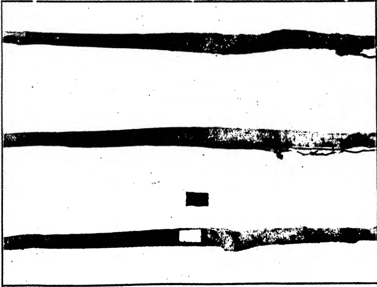A black and white photograph showing three horizontal rubber stumps. The stumps are dark and textured. The leftmost stump has a small, light-colored rectangular patch on its surface. The middle stump has a small, dark rectangular patch. The rightmost stump has a small, light-colored rectangular patch. The stumps are set against a light, textured background.

Fig. 1. YOUNG RUBBER STUMPS, SHOWING  
PATCH BUDDING.

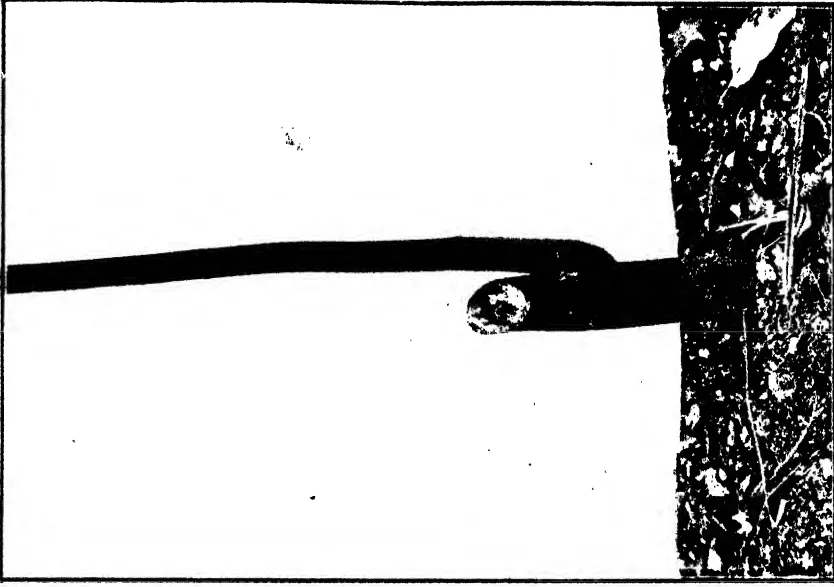A black and white photograph showing a single rubber bud. The bud is a dark, elongated, and slightly curved structure. It is positioned horizontally, with its base on the right side, attached to a textured, dark background. The bud itself is light-colored and has a distinct, rounded tip.

Fig 2 GROWTH OF BUD.

304------------------------------------------------

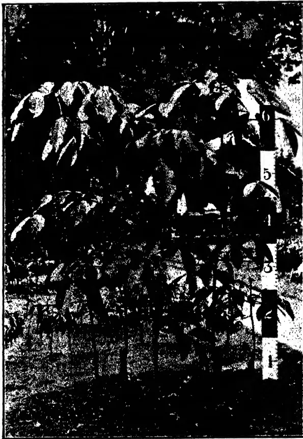A high-contrast, black and white photograph of a rubber tree in a nursery. The tree has large, rounded, and somewhat drooping leaves. To the right of the tree, a vertical scale bar is visible, marked with numbers 1, 2, 3, 4, 5, and 6. The background is dark and indistinct, suggesting a dense nursery environment. The image is framed by a thick black border.

Fig. 3. BUDDED RUBBER IN NURSERIES  
AT PERADENIYA.

305------------------------------------------------

JUNE, 1922.]323

The buddings of April with average size buds, when a few showers were experienced, survived for three weeks in a green state, but eventually died. The longer period these lasted was assumed to be due to the favourable conditions due to showers, and to a less dormant bud than previously being used.

With the failure of the May buddings however the T system was discarded and Patch Budding substituted during the following months. The result of this was that the bud and shield retained their vitality in each case for periods varying from 3 to  $4\frac{1}{2}$  weeks during the more favourable weather, but eventually dried up. On a careful inspection of the dried buds I found no sign of a junction with the cambium of the stock owing to latex having coagulated over the cambium surface of the stock. This was remedied in subsequent buddings by making the vertical incisions on the stock a short time prior to the removal of the section of bark.

The buddings undertaken on September 13th however (budded with moderate sized buds, still on patch system) have at last proved that the present system of budding is a correct one for Hevea. Of the twelve, six were successful, these buds beginning to show growth about the middle of November and at end of year had attained a bud growth varying from 18 in. to 30 in. The height at present varies from 6 ft. to 8 ft.

The two illustrations show the September buddings at 7 months from time of budding and the junction of stock and bud at 7 months old.

I would add that successful budding of Hevea has also been accomplished by MR. ROY BERTRAND at Neboda to whom I am indebted for assistance in a comparison of our respective operations enabling me to arrive at more definite opinion than otherwise would have been the case.

In conclusion I would quote a portion of a paper given to the Kajan District Planters' Association in Malaya recently by MAJOR GAUGH on the effect budding is likely to have on the Industry. He states: "As regards the effect bud-grafting will have on the rubber industry if it is the success that is thought certain, a trebled and quadrupled yield might make people wonder how the rubber will be absorbed. I do not believe there is any reason for panic. It is no use bud-grafting grown trees, and if you fell old trees and replant, the growth of the young trees will be very poor on most washed-out soils of the average rubber estate. What is left, therefore, for old established companies to do? They should certainly, first of all, bud any newly planted clearings which they are lucky enough to possess, before the trees grow too large and then they should turn their attention to their reserve jungle and open it up for bud-grafting. If they have neither young clearings nor jungle, they had better begin to look about and see if they cannot get jungle ear-marked for them against the day when the Government again grants or sells lands. No estate can hope to be still prosperous eight years hence, with only ordinary rubber if competing against Dutch and other estates with areas producing rubber at perhaps *3d.* per lb., but an estate with an appreciable area of budded rubber could tap that at a good profit and, at the same time, could devise schemes for extracting high yields of rubber at a profit by intensive tapping of divided up areas of their ordinary rubber, in rotation. In some such manner all estates might continue to show a good profit indefinitely."

306------------------------------------------------

324[JUNE, 1922.

## NOTES ON BUDDING OF RUBBER IN JAVA.

T. V. THAMOTHARAM.

Budding is carried on in a very extensive scale in Java with great success. The process of budding is simple but a great deal of care is essential.

Grafting is not carried on in rubber as it has not proved a success.

The following points should be carefully observed in budding rubber :—

(1) *The Budding Knife*.—The knife should be very sharp and pointed. It should be made of steel of good quality and should be kept free from rust.

(2) *Best Time for Budding*.—In Java budding is carried on during the rainy season, i.e., between January and May. It is best to carry on budding during the rainy season. During this period the bark peels off easily and the scion grows into the stock rapidly.

(3) *Stocks used for Budding*.—The stocks should be between 1—2 years of age and they should be free from disease.

(4) *Which Buds to Use*.—The buds must be removed from trees which are known to be high yielders. The scion also, like the stock, should be healthy and free from disease.

### THE DIFFERENT METHODS OF BUDDING.

The following are the three well known methods :—(a) Pluk or Patch, (b) Deli, (c) Forkert.

#### Pluk or Patch budding

The diagram illustrates the Pluk or Patch budding method in three stages. On the left, a vertical section of a tree trunk is shown with a rectangular patch of bark being removed. A label with an arrow points to this patch, stating "The way how the bark is removed from the stock". In the middle, a small rectangular bud is shown being taken from a donor tree. On the right, the bud is shown being inserted into the wound in the stock. A label with an arrow points to the bud, stating "Bud removed". Below the bud, a label with an arrow points to the wound, stating "Scion". At the bottom, a label with an arrow points to the bud being tied with a band, stating "The bud is transferred in the stock and tied firmly with manila hemp."

FIG. 1.

The bud must be removed with a small piece of bark adhering to it. A piece of bark of the same size is then removed from the stock and the bud

307------------------------------------------------

JUNE, 1922.]325

transferred to it. This should then be well bandaged with Manila hemp. Special precautions must be taken not to damage the bud during the operation. The bud should be shaded from the sun and the bandage air-tight.

*Deli Method.*

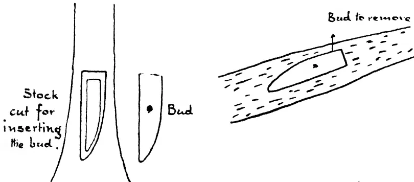

The diagram shows a vertical stem with a rectangular cut labeled "Stock cut for inserting the bud." and a bud labeled "Bud". To the right, a bud is shown being removed from a stem, labeled "Bud to remove".

FIG. 2.

In this method the bud is shaved up with a clean cut and an incision as shown in the diagram is then made in the stock and the bud inserted in it. The whole area is then firmly tied up with a bandage without leaving any portion of the bud exposed.

*Forkert Method :*

The diagram shows a stem with a bud being removed, labeled "The method of removing the bark for transferring the bud is." Below, the bud is inserted into the stem, labeled "How the bud is transferred in the stock". To the right, the stem is wrapped with a bandage.

FIG. 3.

In this method the bud is removed with a downward stroke of the budding knife. The bud is inserted as in Deli method and covered up with a portion of the bark of the stem as shown in the diagram. It is then tied up with manila hemp.

308------------------------------------------------

326[JUNE, 1922.

### AFTER TREATMENT OF BUDS.

After 15 days or so the bandage is removed and if it is found that the bud is green we can be sure that the operation has been successful. After one month of budding if the budded portion is still found to be green then the stock is cut off leaving about 2 inches above the budded part. The cut is then tarred. Some buds grow rapidly but others take a long time to shoot. When the bud shows signs of healthy growth then the stock is ready for planting in the field.

### GOOTEE-LAYERING OF BUDDED PLANTS.

This is called in Java "Marcoting." The Manager, Experiment Station, told me that budded plants may not be true to type because the roots of the plant belong to one parent and the stem and branches to another. In this case a good variety is introduced into a bad variety. There may be some effect of the latter upon the former. In order to make it entirely pure the budded plant is "marcotted" two years after budding. The "marcotted" plant is then similar to its parent in its yielding capacity.

*The Method of Gootee-layering* :—The bark is usually removed round the branch for nearly an inch in length below a node. After the removal of the bark the cambium too should be removed with the aid of the budding-knife. This should be done without injuring the wood. The portion from which the bark was removed is then covered up with clayey soil. This is, in turn,

FIG. 4.

covered with well prepared coconut fibre and dust and carefully tied up with thin strips of bamboo. After about four to six months roots will be noticed piercing through the bandage. The branch should now be cut off and transferred to a basket. It should be planted in the field one month after being transferred to the basket.

309------------------------------------------------

JUNE, 1922.]327

# COCONUTS.

## CHILAW COCONUT EXPERIMENTS.

The figures for these manurial experiments have been supplied to members and the actual position was shown in the graph exhibited at the meeting.

All plots show increased yields of nuts, more particularly those on the lighter land.

The most marked increase in number of nuts per palm is shown by plot No 8 which receives applications of lime and this plot gave yields in excess of its previous highest record in 1918. Plot No. 9 securing the Organic mixtures also showed good increases and now gives second largest yield. Plot 15 which has received lime in 1919 and 1920 has also shown good increases in crops since this application. Plot 13 securing the Organic mixture shows improvement. Plot 4 securing Steamed bone meal, has been the most steady of all plots and showed the effect of drought less than other plots.

The copra yields per palm and the number of nuts per candy of copra are also circulated. They have been put into graph form and the amount of copra per palm has been calculated.

If this graph is analysed the following results are found.

Plot 1. Number of nuts per palm improved during 1918 but then fell heavily owing to the shortness of rainfall. The copra per palm followed the course of number of nuts per palm.

Plot 2. The fall in 1918 was not considerable but the nuts were smaller. The copra yield per palm therefore fell more than the average. The improvement in 1920 was slower than the average but the recovery in the copra per palm was normal and these nuts increased in size with the improvement of the rainfall.

Plot 3. This is one of the steady plots and was not greatly affected by climatic conditions. The recovery after drought was fairly good. The number of nuts per candy fell somewhat considerably in 1918, but subsequently the position improved.

Plot 4. The best plot of the series and not so seriously affected by drought as the other plots. Recovery after drought good. Nuts above average size.

Plot 5. Fell rapidly in 1918 but recovery after 1919 was normal.

Plot 6. This plot was given uniformly satisfactory results. The size of nuts has improved and consequently the amount of copra per palm in 1921 was greater than in 1917.

Plot 7. This plot fell rapidly but just as rapidly recovered. The size of nuts was seriously affected by drought but they improved in 1920.

310------------------------------------------------

328[JUNE, 1922.

Plot 8. Nuts per palm greatly increased but size of nuts poor. The increased copra outturn is due to increase in the number of nuts.

Plot 9. The increased copra outturn in 1921 was due to improvement both in number of nuts per palm and to increase in size of nuts.

Plot 10. Rapid fall in 1918 and 1919 but just as rapid recovery. Effects of droughts clearly shown. Size of nuts fell greatly in dry weather.

Plot 11. Similar to 10 but better improvement in 1921 doubtless due to cultivation in 1920 and 1921. Good increase in number of nuts per palm.

Plot 12. Similar to 10 and 11. Increase in number of nuts per palm satisfactory after drought but fall in size of nuts during drought with improvement in 1920.

Plot 13. Rapid fall and just as rapid recovery. Number of nuts improved but size did not improve after 1920.

Plot 14. The number of nuts per palm steady. Size of nuts did not fall as much as in other plots, but there was a serious fall in the size of nuts in 1921.

Plot 15. Rapid fall and subsequently a very rapid rise brought out by the increase in the number of nuts per palm.

In general it may be concluded that crops of coconuts are largely dependent upon the rainfall of the previous 18 months. If there is a shortage of rainfall there is a rapid fall of crop. The size of nuts also varies with the rainfall. Ploughing and harrowing help very considerably during a dry period to maintain crops. The number of nuts harvested are maintained but the size is not improved and shows but little variation from plots where no cultivation was carried on.

Applications of Lime, both on heavy land and upon the lighter soil, have given markedly increased crops. The size of the nuts is however poor and therefore copra output is not so great as would be expected from the crops of nuts.

Steamed bone meal appears to be responsible for steadily maintained crops and for the maintenance in the size of the nuts. In general however the size of nuts is improved only by the application of Nitrogen. Organic nitrogen appears to be preferable but plot 6 which has received Sulphate of ammonia has also shown improvement. Mineral manures appear to possess greater residual effects than Organic manures.

F. A. STOCKDALE.

Director of Agriculture.

27th April, 1922.

311------------------------------------------------

JUNE, 1922.]329

## CHILAW COCONUT TRIAL GROUND: DETAILS OF TREATMENT, 1915-1920.

<table style="width: 100%; border-collapse: collapse;">
<thead>
<tr>
<th style="text-align: left; vertical-align: bottom;">No. of Field</th>
<th style="text-align: left; vertical-align: bottom;">Treatment.</th>
</tr>
</thead>
<tbody>
<tr>
<td>1.</td>
<td>Clean weeding</td>
</tr>
<tr>
<td>2.</td>
<td>Sulphate of Ammonia <math>2\frac{1}{2}</math> lb. per palm in 1915. Disc harrowed monthly 1916 and 1917 " " 10 times 1918 and 1919 " " 7 times 1920 and 1921.</td>
</tr>
<tr>
<td>3.</td>
<td>Groundnut cake 6 lb. per palm 1915, Crushed fish 6 lb. per palm in 1916, 1917, 1918, 1919 and 1920.</td>
</tr>
<tr>
<td>4.</td>
<td>Steamed bone meal 8 lb. per palm in 1915, 1916, 1917, 1918, 1919 and 1920.</td>
</tr>
<tr>
<td>5.</td>
<td>Sulphate of Potash <math>2\frac{3}{4}</math> lb. per palm in 1915, 1916, 1917, Mendis Potash 5 lb. per palm 1918, 1919. Sulphate of Potash 3 lb. 1920.</td>
</tr>
<tr>
<td>6.</td>
<td>Ammonia sulphate 4 lb. per palm in 1915, 1916 and 1917, Mendis Potash 5 lb. per palm 1918. Sulphate of Ammonia 4 lb. per palm in 1919, 1920.</td>
</tr>
<tr>
<td>7.</td>
<td>Mineral mixture 6 lb. per palm in 1915, 1916, 1917. Mineral mixture 7 lb. 2 oz. per palm in 1918, 1919. Mineral mixture 6 lb. in 1920.</td>
</tr>
<tr>
<td>8.</td>
<td>Lime 10 tons per acre 1915, 1916 and 1917. Lime <math>\frac{1}{2}</math> ton in 1918, 1919 and 1920. Harrowed 7 times in 1921.</td>
</tr>
<tr>
<td>9.</td>
<td>Mixed manure 10 lb. per palm in 1915, 1916, 1917. Organic mixture 12 lb. 4 oz. per palm in 1918 and 1919, 10 lb. 2 oz. in 1920.</td>
</tr>
<tr>
<td>10.</td>
<td>Mulched with husks in 1915. No treatment subsequently beyond clean weeding around trees.</td>
</tr>
<tr>
<td>11.</td>
<td>Mulched with husks in rings round palms. Dug in 1920.</td>
</tr>
<tr>
<td>12.</td>
<td>Ploughed and disced. Harrowed 7 times in 1921.</td>
</tr>
<tr>
<td>13.</td>
<td>Ploughed and disced. Mixed manure 1917. Organic mixture 12 lb. 4 oz. per palm 1918, 1919. 10 lb. 2 oz. in 1920. Harrowed 8 times in 1921.</td>
</tr>
<tr>
<td>14.</td>
<td>Dug with mamoty and mulched with leaves. From 1919 mulch removed and plot harrowed in 1919 10 times, and 7 times in 1920 and 1921 respectively.</td>
</tr>
<tr>
<td>15.</td>
<td>Watered. Watering stopped in 1919 and lime applied at the rate of <math>\frac{1}{2}</math> ton per plot, similar applications made in 1920. Harrowed 7 times in 1921.</td>
</tr>
<tr>
<td>16.</td>
<td>No treatment, Store, etc.</td>
</tr>
</tbody>
</table>

312------------------------------------------------

330[JUNE, 1922.]

TABLE I.  
Statement of yields of the Chillaw Coconut Trial Ground.

<table border="1">
<thead>
<tr>
<th rowspan="2">Plot</th>
<th rowspan="2">Number of palms</th>
<th colspan="2">1915</th>
<th colspan="2">1916</th>
<th colspan="2">1917</th>
<th colspan="2">1918</th>
<th colspan="2">1919</th>
<th colspan="2">1920</th>
<th colspan="2">1921</th>
</tr>
<tr>
<th>Yields</th>
<th>Yields per palm</th>
<th>Yields</th>
<th>Yields per palm</th>
<th>Yields</th>
<th>Yields per palm</th>
<th>Yields</th>
<th>Yields per palm</th>
<th>Yields</th>
<th>Yields per palm</th>
<th>Yields</th>
<th>Yields per palm</th>
<th>No. of palms</th>
<th>Yields per palm</th>
</tr>
</thead>
<tbody>
<tr>
<td>1</td>
<td>47</td>
<td>1931</td>
<td>41.1</td>
<td>2677</td>
<td>57.0</td>
<td>3262</td>
<td>69.2</td>
<td>3550</td>
<td>75.5</td>
<td>2428</td>
<td>51.6</td>
<td>2504</td>
<td>53.1</td>
<td>47</td>
<td>2917</td>
<td>62.1</td>
</tr>
<tr>
<td>2</td>
<td>72</td>
<td>2804</td>
<td>38.9</td>
<td>4010</td>
<td>66.8</td>
<td>5267</td>
<td>73.1</td>
<td>5082</td>
<td>70.6</td>
<td>4060</td>
<td>56.4</td>
<td>4061</td>
<td>56.4</td>
<td>71</td>
<td>4787</td>
<td>67.4</td>
</tr>
<tr>
<td>3</td>
<td>89</td>
<td>3581</td>
<td>40.2</td>
<td>5014</td>
<td>56.3</td>
<td>5217</td>
<td>58.6</td>
<td>5127</td>
<td>58.7</td>
<td>4404</td>
<td>49.6</td>
<td>4811</td>
<td>54.1</td>
<td>89</td>
<td>4916</td>
<td>55.2</td>
</tr>
<tr>
<td>4</td>
<td>81</td>
<td>4429</td>
<td>54.7</td>
<td>5800</td>
<td>71.6</td>
<td>5648</td>
<td>69.7</td>
<td>5993</td>
<td>74.0</td>
<td>4885</td>
<td>60.3</td>
<td>5244</td>
<td>64.7</td>
<td>80</td>
<td>5562</td>
<td>69.5</td>
</tr>
<tr>
<td>5</td>
<td>84</td>
<td>3542</td>
<td>42.2</td>
<td>5225</td>
<td>62.2</td>
<td>5690</td>
<td>67.7</td>
<td>4848</td>
<td>57.9</td>
<td>3894</td>
<td>46.3</td>
<td>4945</td>
<td>58.9</td>
<td>87</td>
<td>5464</td>
<td>62.8</td>
</tr>
<tr>
<td>6</td>
<td>78</td>
<td>3829</td>
<td>49.0</td>
<td>4074</td>
<td>52.2</td>
<td>5114</td>
<td>65.5</td>
<td>5094</td>
<td>65.3</td>
<td>4041</td>
<td>51.8</td>
<td>5153</td>
<td>66.1</td>
<td>78</td>
<td>5295</td>
<td>67.9</td>
</tr>
<tr>
<td>7</td>
<td>92</td>
<td>3304</td>
<td>35.9</td>
<td>4714</td>
<td>51.2</td>
<td>5585</td>
<td>60.7</td>
<td>5392</td>
<td>58.6</td>
<td>4066</td>
<td>44.2</td>
<td>5084</td>
<td>55.2</td>
<td>90</td>
<td>6258</td>
<td>69.5</td>
</tr>
<tr>
<td>8</td>
<td>68</td>
<td>2674</td>
<td>39.3</td>
<td>3306</td>
<td>48.6</td>
<td>4057</td>
<td>59.6</td>
<td>4903</td>
<td>72.1</td>
<td>3251</td>
<td>47.8</td>
<td>3378</td>
<td>49.7</td>
<td>64</td>
<td>4813</td>
<td>75.2</td>
</tr>
<tr>
<td>9</td>
<td>85</td>
<td>3383</td>
<td>39.8</td>
<td>4499</td>
<td>52.9</td>
<td>5464</td>
<td>64.2</td>
<td>5098</td>
<td>59.9</td>
<td>3586</td>
<td>42.2</td>
<td>4483</td>
<td>52.7</td>
<td>86</td>
<td>6058</td>
<td>70.5</td>
</tr>
<tr>
<td>10</td>
<td>107</td>
<td>2933</td>
<td>27.4</td>
<td>4616</td>
<td>43.1</td>
<td>4576</td>
<td>42.7</td>
<td>3034</td>
<td>28.2</td>
<td>2019</td>
<td>18.9</td>
<td>3307</td>
<td>30.9</td>
<td>101</td>
<td>4407</td>
<td>43.6</td>
</tr>
<tr>
<td>11</td>
<td>100</td>
<td>2861</td>
<td>28.6</td>
<td>4286</td>
<td>42.9</td>
<td>3713</td>
<td>37.1</td>
<td>2271</td>
<td>22.7</td>
<td>1579</td>
<td>15.8</td>
<td>3091</td>
<td>30.9</td>
<td>97</td>
<td>5048</td>
<td>52.0</td>
</tr>
<tr>
<td>12</td>
<td>101</td>
<td>2936</td>
<td>29.1</td>
<td>4691</td>
<td>46.4</td>
<td>3772</td>
<td>37.3</td>
<td>3375</td>
<td>33.4</td>
<td>2109</td>
<td>20.9</td>
<td>3628</td>
<td>35.9</td>
<td>97</td>
<td>4481</td>
<td>46.2</td>
</tr>
<tr>
<td>13</td>
<td>99</td>
<td>1859</td>
<td>18.7</td>
<td>3694</td>
<td>37.3</td>
<td>3384</td>
<td>34.1</td>
<td>3232</td>
<td>32.6</td>
<td>2045</td>
<td>20.6</td>
<td>4195</td>
<td>42.4</td>
<td>99</td>
<td>5148</td>
<td>52.0</td>
</tr>
<tr>
<td>14</td>
<td>46</td>
<td>2338</td>
<td>18.4</td>
<td>2294</td>
<td>50.0</td>
<td>2054</td>
<td>44.6</td>
<td>1918</td>
<td>47.7</td>
<td>1370</td>
<td>29.8</td>
<td>1868</td>
<td>40.6</td>
<td>52</td>
<td>2370</td>
<td>45.6</td>
</tr>
<tr>
<td>15</td>
<td>81</td>
<td>—</td>
<td>—</td>
<td>3087</td>
<td>38.1</td>
<td>2094</td>
<td>25.8</td>
<td>2026</td>
<td>25.0</td>
<td>1341</td>
<td>16.5</td>
<td>2512</td>
<td>31.0</td>
<td>76</td>
<td>4153</td>
<td>54.7</td>
</tr>
<tr>
<td>16</td>
<td>59</td>
<td>2373</td>
<td>40.2</td>
<td>3222</td>
<td>54.6</td>
<td>3055</td>
<td>51.7</td>
<td>3154</td>
<td>53.4</td>
<td>2841</td>
<td>48.1</td>
<td>2730</td>
<td>46.3</td>
<td>62</td>
<td>3204</td>
<td>51.6</td>
</tr>
<tr>
<td>Rainfall</td>
<td></td>
<td>-</td>
<td>53.33 in.</td>
<td></td>
<td>64.69 in.</td>
<td></td>
<td>41.66 in.</td>
<td></td>
<td>51.78 in.</td>
<td></td>
<td>54.99 in.</td>
<td></td>
<td>69.50 in.</td>
<td></td>
<td></td>
<td>44.68 in.</td>
</tr>
<tr>
<td>Wet days</td>
<td></td>
<td>-</td>
<td>86</td>
<td></td>
<td>88</td>
<td></td>
<td>75</td>
<td></td>
<td>76</td>
<td></td>
<td>100</td>
<td></td>
<td>95</td>
<td></td>
<td></td>
<td>78</td>
</tr>
</tbody>
</table>

313------------------------------------------------

JUNE, 1922.]331CHILAW COCONUT EXPERIMENTS.Copra Figures. Table II.

<table border="1">
<thead>
<tr>
<th>Plot</th>
<th>1917. Copra per palm lb.</th>
<th>1918. Copra per palm lb.</th>
<th>1919. Copra per palm lb.</th>
<th>1920. Copra per palm lb.</th>
<th>1921. Copra per palm lb.</th>
</tr>
</thead>
<tbody>
<tr><td>1</td><td>27.0</td><td>27.9</td><td>16.6</td><td>20.2</td><td>25.7</td></tr>
<tr><td>2</td><td>32.6</td><td>24.4</td><td>19.0</td><td>22.8</td><td>28.4</td></tr>
<tr><td>3</td><td>30.1</td><td>24.6</td><td>19.9</td><td>24.5</td><td>27.7</td></tr>
<tr><td>4</td><td>35.8</td><td>32.6</td><td>25.1</td><td>31.1</td><td>34.9</td></tr>
<tr><td>5</td><td>32.6</td><td>23.8</td><td>18.0</td><td>26.7</td><td>29.7</td></tr>
<tr><td>6</td><td>28.7</td><td>24.5</td><td>19.0</td><td>28.6</td><td>31.4</td></tr>
<tr><td>7</td><td>25.1</td><td>20.1</td><td>14.5</td><td>23.0</td><td>28.8</td></tr>
<tr><td>8</td><td>22.3</td><td>21.2</td><td>13.3</td><td>18.4</td><td>27.6</td></tr>
<tr><td>9</td><td>24.2</td><td>17.7</td><td>12.4</td><td>20.4</td><td>28.3</td></tr>
<tr><td>10</td><td>16.8</td><td>8.0</td><td>5.7</td><td>11.8</td><td>17.8</td></tr>
<tr><td>11</td><td>16.0</td><td>7.5</td><td>5.2</td><td>13.6</td><td>22.0</td></tr>
<tr><td>12</td><td>15.5</td><td>10.4</td><td>5.9</td><td>14.4</td><td>18.5</td></tr>
<tr><td>13</td><td>14.5</td><td>10.2</td><td>6.2</td><td>15.8</td><td>19.9</td></tr>
<tr><td>14</td><td>17.6</td><td>12.9</td><td>9.8</td><td>15.0</td><td>16.1</td></tr>
<tr><td>15</td><td>10.1</td><td>8.1</td><td>4.6</td><td>13.3</td><td>21.1</td></tr>
<tr><td>16</td><td>19.0</td><td>16.7</td><td>14.5</td><td>18.0</td><td>21.8</td></tr>
</tbody>
</table>

CHILAW COCONUT EXPERIMENTS.Copra Figures—Table III.

Number of nuts per candy of Copra.

<table border="1">
<thead>
<tr>
<th>Plot.</th>
<th>1917</th>
<th>1918</th>
<th>1919</th>
<th>1920</th>
<th>1921</th>
</tr>
</thead>
<tbody>
<tr><td>1</td><td>1379</td><td>1491</td><td>1694</td><td>1429</td><td>1330</td></tr>
<tr><td>2</td><td>1231</td><td>1590</td><td>1613</td><td>1353</td><td>1293</td></tr>
<tr><td>3</td><td>1065</td><td>1269</td><td>1346</td><td>1199</td><td>1096</td></tr>
<tr><td>4</td><td>1055</td><td>1237</td><td>1294</td><td>1126</td><td>1083</td></tr>
<tr><td>5</td><td>1139</td><td>1310</td><td>1402</td><td>1179</td><td>1163</td></tr>
<tr><td>6</td><td>1228</td><td>1454</td><td>1472</td><td>1261</td><td>1183</td></tr>
<tr><td>7</td><td>1317</td><td>1559</td><td>1660</td><td>1316</td><td>1333</td></tr>
<tr><td>8</td><td>1467</td><td>1863</td><td>1972</td><td>1484</td><td>1495</td></tr>
<tr><td>9</td><td>1456</td><td>1839</td><td>1847</td><td>1429</td><td>1364</td></tr>
<tr><td>10</td><td>1399</td><td>1922</td><td>1787</td><td>1406</td><td>1333</td></tr>
<tr><td>11</td><td>1265</td><td>1626</td><td>1620</td><td>1240</td><td>1285</td></tr>
<tr><td>12</td><td>1299</td><td>1721</td><td>1902</td><td>1359</td><td>1355</td></tr>
<tr><td>13</td><td>1297</td><td>1728</td><td>1752</td><td>1434</td><td>1410</td></tr>
<tr><td>14</td><td>1381</td><td>1745</td><td>1641</td><td>1446</td><td>1533</td></tr>
<tr><td>15</td><td>1386</td><td>1660</td><td>1947</td><td>1262</td><td>1412</td></tr>
<tr><td>16</td><td>1464</td><td>1640</td><td>1767</td><td>1378</td><td>1293</td></tr>
</tbody>
</table>

314------------------------------------------------

332[JUNE, 1922

## MANNING COCONUT TRIAL

### REPORT FROM

*The following report upon these experiments has*

The experiment was started on the 15th of February 1917 to determine its products be returned to it. The fallings including the leaves, husks, water, that is removed from it.

### PRODUCTS OF

<table border="1">
<thead>
<tr>
<th>Year.</th>
<th>Number of bunches in the 35 trees.</th>
<th>Number of fallen branches.</th>
<th>Weight of the fallen branches. lbs.</th>
<th>Weight of other fallings lbs.</th>
<th>Number of nuts from the 35 trees</th>
<th>Weight of the Green nuts. lbs.</th>
<th>Weight of the same nuts after 2 Months. lbs.</th>
<th>Weight of the husks of the nuts after 2 Months. lbs.</th>
<th>Weight of water in the nuts on the opening day. lbs.</th>
<th>Weight of kernel and shells of the nuts. lbs.</th>
<th>Weight of the shells. lbs.</th>
<th>Weight of copra produced by the 35 trees lbs.</th>
</tr>
</thead>
<tbody>
<tr>
<td>1917</td>
<td>406</td>
<td>410</td>
<td>2644</td>
<td>759</td>
<td>2165</td>
<td>7935</td>
<td>5903</td>
<td>2728</td>
<td>577</td>
<td>2674</td>
<td>743</td>
<td>1015</td>
</tr>
<tr>
<td>1918</td>
<td>404</td>
<td>500</td>
<td>2145</td>
<td>776</td>
<td>2164</td>
<td>7663</td>
<td>5655</td>
<td>2797</td>
<td>485</td>
<td>2364</td>
<td>745</td>
<td>943</td>
</tr>
<tr>
<td>1919</td>
<td>367</td>
<td>477</td>
<td>2015</td>
<td>575</td>
<td>2068</td>
<td>7511</td>
<td>5801</td>
<td>2926</td>
<td>510</td>
<td>2383</td>
<td>745</td>
<td>919</td>
</tr>
<tr>
<td>1920</td>
<td>368</td>
<td>551</td>
<td>2007</td>
<td>540</td>
<td>2052</td>
<td>7311</td>
<td>5587</td>
<td>2904</td>
<td>378</td>
<td>2313</td>
<td>725</td>
<td>910</td>
</tr>
<tr>
<td>1921</td>
<td>360</td>
<td>493</td>
<td>1981</td>
<td>515</td>
<td>2047</td>
<td>6659</td>
<td>4678</td>
<td>1951</td>
<td>290</td>
<td>2245</td>
<td>706</td>
<td>912</td>
</tr>
</tbody>
</table>

### PRODUCTS

<table border="1">
<thead>
<tr>
<th rowspan="2">Products returned.</th>
<th colspan="5">Total weight of products returned to the soil in 1917.</th>
<th colspan="5">Total weight of products returned to the soil in 1918</th>
</tr>
<tr>
<th>lb.</th>
<th>Ton</th>
<th>cwt</th>
<th>qrs.</th>
<th>lb.</th>
<th>lb.</th>
<th>Ton</th>
<th>cwt</th>
<th>qrs.</th>
<th>lb.</th>
</tr>
</thead>
<tbody>
<tr>
<td>Branches</td>
<td>2644</td>
<td>1</td>
<td>3</td>
<td>2</td>
<td>12</td>
<td>2145</td>
<td>0</td>
<td>19</td>
<td>0</td>
<td>17</td>
</tr>
<tr>
<td>Other fallings</td>
<td>759</td>
<td>0</td>
<td>6</td>
<td>3</td>
<td>3</td>
<td>776</td>
<td>0</td>
<td>6</td>
<td>3</td>
<td>20</td>
</tr>
<tr>
<td>Husks</td>
<td>2728</td>
<td>1</td>
<td>4</td>
<td>1</td>
<td>12</td>
<td>2797</td>
<td>1</td>
<td>4</td>
<td>3</td>
<td>25</td>
</tr>
<tr>
<td>Water</td>
<td>577</td>
<td>0</td>
<td>5</td>
<td>0</td>
<td>17</td>
<td>485</td>
<td>0</td>
<td>4</td>
<td>1</td>
<td>9</td>
</tr>
<tr>
<td>Shells</td>
<td>743</td>
<td>0</td>
<td>6</td>
<td>2</td>
<td>15</td>
<td>745</td>
<td>0</td>
<td>6</td>
<td>2</td>
<td>17</td>
</tr>
<tr>
<td>Poonac</td>
<td>338</td>
<td>0</td>
<td>3</td>
<td>0</td>
<td>2</td>
<td>314</td>
<td>0</td>
<td>2</td>
<td>3</td>
<td>6</td>
</tr>
<tr>
<td>Total weight of products returned to the soil</td>
<td>7789</td>
<td>3</td>
<td>9</td>
<td>2</td>
<td>5</td>
<td>7262</td>
<td>3</td>
<td>4</td>
<td>3</td>
<td>10</td>
</tr>
</tbody>
</table>

Total weight of products produced by the 35 trees.

<table border="1">
<thead>
<tr>
<th></th>
<th>Tons.</th>
<th>cwt.</th>
<th>qrs.</th>
<th>lb</th>
</tr>
</thead>
<tbody>
<tr>
<td>In 1917</td>
<td>3</td>
<td>15</td>
<td>2</td>
<td>12</td>
</tr>
<tr>
<td>" 1918</td>
<td>3</td>
<td>10</td>
<td>1</td>
<td>24</td>
</tr>
<tr>
<td>" 1919</td>
<td>3</td>
<td>8</td>
<td>2</td>
<td>17</td>
</tr>
<tr>
<td>" 1920</td>
<td>3</td>
<td>6</td>
<td>2</td>
<td>16</td>
</tr>
<tr>
<td>" 1921</td>
<td>2</td>
<td>16</td>
<td>2</td>
<td>27</td>
</tr>
</tbody>
</table>

315------------------------------------------------

JUNE, 1922.]333

## GROUND, NEGOMBO.

1917 to 1921.

been supplied by Gate Mudaliyar A. E. Rajapakse :—

if the fertility of a coconut land and its productivity could be maintained if shells and poonac are returned to it once a year and oil is the only product

### THE SOIL.

<table border="1">
<thead>
<tr>
<th rowspan="2">Weight of poonac</th>
<th rowspan="2">Weight of oil removed</th>
<th rowspan="2">Average nuts per tree</th>
<th rowspan="2">Largest annual crop of a tree.</th>
<th rowspan="2">Smallest annual crop of a tree.</th>
<th colspan="2">Largest quantity of copra produced by a tree.</th>
<th colspan="2">Smallest quantity of copra produced by a tree.</th>
<th rowspan="2">Annual Rainfall.</th>
</tr>
<tr>
<th>lb.</th>
<th>oz.</th>
<th>lb.</th>
<th>oz.</th>
<th>Inches.</th>
</tr>
</thead>
<tbody>
<tr>
<td>338</td>
<td>677</td>
<td>61.8</td>
<td>94</td>
<td>23</td>
<td>41</td>
<td>13</td>
<td>11</td>
<td>10</td>
<td>71.58</td>
</tr>
<tr>
<td>314</td>
<td>629</td>
<td>61.7</td>
<td>112</td>
<td>20</td>
<td>51</td>
<td>13</td>
<td>9</td>
<td>4</td>
<td>61.50</td>
</tr>
<tr>
<td>306</td>
<td>613</td>
<td>59.8</td>
<td>112</td>
<td>15</td>
<td>33</td>
<td>2</td>
<td>7</td>
<td>12</td>
<td>80.36</td>
</tr>
<tr>
<td>303</td>
<td>617</td>
<td>58.6</td>
<td>86</td>
<td>5</td>
<td>30</td>
<td>5</td>
<td>2</td>
<td>13</td>
<td>80.22</td>
</tr>
<tr>
<td>304</td>
<td>608</td>
<td>58.5</td>
<td>84</td>
<td>20</td>
<td>37</td>
<td>4</td>
<td>7</td>
<td>7</td>
<td>51.47</td>
</tr>
</tbody>
</table>

### RETURNED.

<table border="1">
<thead>
<tr>
<th colspan="5">Total weight of products returned to the soil in 1919.</th>
<th colspan="5">Total weight of products returned to the soil in 1920.</th>
<th colspan="5">Total weight of products returned to the soil in 1921.</th>
</tr>
<tr>
<th>lb.</th>
<th>Ton.</th>
<th>cwt.</th>
<th>qrs.</th>
<th>lb.</th>
<th>lb.</th>
<th>Ton.</th>
<th>cwt.</th>
<th>qrs.</th>
<th>lb.</th>
<th>lb.</th>
<th>Ton.</th>
<th>cwt.</th>
<th>qrs.</th>
<th>lb.</th>
</tr>
</thead>
<tbody>
<tr>
<td>2015</td>
<td>0</td>
<td>17</td>
<td>3</td>
<td>27</td>
<td>2007</td>
<td>0</td>
<td>17</td>
<td>3</td>
<td>19</td>
<td>1981</td>
<td>0</td>
<td>17</td>
<td>2</td>
<td>21</td>
</tr>
<tr>
<td>575</td>
<td>0</td>
<td>5</td>
<td>0</td>
<td>15</td>
<td>540</td>
<td>0</td>
<td>4</td>
<td>3</td>
<td>8</td>
<td>515</td>
<td>0</td>
<td>4</td>
<td>2</td>
<td>11</td>
</tr>
<tr>
<td>2926</td>
<td>1</td>
<td>6</td>
<td>0</td>
<td>14</td>
<td>2904</td>
<td>1</td>
<td>5</td>
<td>3</td>
<td>20</td>
<td>1951</td>
<td>0</td>
<td>17</td>
<td>1</td>
<td>19</td>
</tr>
<tr>
<td>510</td>
<td>0</td>
<td>4</td>
<td>2</td>
<td>6</td>
<td>378</td>
<td>0</td>
<td>3</td>
<td>1</td>
<td>14</td>
<td>200</td>
<td>0</td>
<td>2</td>
<td>2</td>
<td>10</td>
</tr>
<tr>
<td>745</td>
<td>0</td>
<td>6</td>
<td>2</td>
<td>17</td>
<td>725</td>
<td>0</td>
<td>6</td>
<td>1</td>
<td>25</td>
<td>706</td>
<td>0</td>
<td>6</td>
<td>1</td>
<td>6</td>
</tr>
<tr>
<td>306</td>
<td>0</td>
<td>2</td>
<td>2</td>
<td>26</td>
<td>303</td>
<td>0</td>
<td>2</td>
<td>2</td>
<td>23</td>
<td>304</td>
<td>0</td>
<td>2</td>
<td>2</td>
<td>24</td>
</tr>
<tr>
<td>7077</td>
<td>3</td>
<td>3</td>
<td>0</td>
<td>21</td>
<td>6857</td>
<td>3</td>
<td>1</td>
<td>0</td>
<td>25</td>
<td>5747</td>
<td>2</td>
<td>11</td>
<td>1</td>
<td>7</td>
</tr>
</tbody>
</table>

316------------------------------------------------

334[JUNE, 1922]

## MANNING COCONUT TRIAL

FROM 1st MAY 1921

*The following report has been supplied*

The plots were organized in May 1921 each acre plot being divided manurial treatment is continued to determine definitely what proportion of crops of the individual plots are separately recorded and also the quantities

*A denotes good soil — B denotes very*

<table border="1">
<thead>
<tr>
<th rowspan="2">Number of the Plot</th>
<th colspan="4">1922 ( April 30th ) A census of the Palms</th>
<th colspan="6">Bimonthly Crops</th>
<th rowspan="2">Total annual crop</th>
</tr>
<tr>
<th>In bearing</th>
<th>In Flower</th>
<th>About to flower</th>
<th>Young</th>
<th>June Crop</th>
<th>August Crop</th>
<th>October crop</th>
<th>December crop</th>
<th>February crop</th>
<th>April crop</th>
</tr>
</thead>
<tbody>
<tr>
<td>No. 1 A</td>
<td>24</td>
<td>6</td>
<td>5</td>
<td>—</td>
<td>91</td>
<td>91</td>
<td>75</td>
<td>27</td>
<td>22</td>
<td>67</td>
<td>373</td>
</tr>
<tr>
<td>1 B</td>
<td>8</td>
<td>11</td>
<td>16</td>
<td>—</td>
<td>12</td>
<td>10</td>
<td>9</td>
<td>2</td>
<td>7</td>
<td>10</td>
<td>50</td>
</tr>
<tr>
<td>No. 2 A</td>
<td>30</td>
<td>—</td>
<td>2</td>
<td>3</td>
<td>171</td>
<td>238</td>
<td>182</td>
<td>59</td>
<td>76</td>
<td>96</td>
<td>822</td>
</tr>
<tr>
<td>2 B</td>
<td>9</td>
<td>6</td>
<td>19</td>
<td>1</td>
<td>49</td>
<td>38</td>
<td>44</td>
<td>14</td>
<td>10</td>
<td>19</td>
<td>174</td>
</tr>
<tr>
<td>No. 3 A</td>
<td>23</td>
<td>2</td>
<td>8</td>
<td>2</td>
<td>194</td>
<td>155</td>
<td>97</td>
<td>59</td>
<td>49</td>
<td>96</td>
<td>650</td>
</tr>
<tr>
<td>3 B</td>
<td>13</td>
<td>11</td>
<td>11</td>
<td>—</td>
<td>97</td>
<td>53</td>
<td>50</td>
<td>18</td>
<td>10</td>
<td>24</td>
<td>252</td>
</tr>
<tr>
<td>No. 4 A</td>
<td>22</td>
<td>7</td>
<td>5</td>
<td>—</td>
<td>50</td>
<td>28</td>
<td>22</td>
<td>28</td>
<td>19</td>
<td>52</td>
<td>199</td>
</tr>
<tr>
<td>4 B</td>
<td>12</td>
<td>9</td>
<td>9</td>
<td>5</td>
<td>23</td>
<td>16</td>
<td>12</td>
<td>3</td>
<td>11</td>
<td>19</td>
<td>84</td>
</tr>
<tr>
<td>No. 5 A</td>
<td>25</td>
<td>6</td>
<td>3</td>
<td>1</td>
<td>103</td>
<td>69</td>
<td>72</td>
<td>47</td>
<td>36</td>
<td>65</td>
<td>392</td>
</tr>
<tr>
<td>5 B</td>
<td>15</td>
<td>3</td>
<td>14</td>
<td>3</td>
<td>53</td>
<td>23</td>
<td>42</td>
<td>13</td>
<td>11</td>
<td>17</td>
<td>159</td>
</tr>
<tr>
<td>No. 6 A</td>
<td>18</td>
<td>7</td>
<td>9</td>
<td>1</td>
<td>99</td>
<td>68</td>
<td>59</td>
<td>29</td>
<td>55</td>
<td>82</td>
<td>392</td>
</tr>
<tr>
<td>6 B</td>
<td>18</td>
<td>6</td>
<td>7</td>
<td>4</td>
<td>78</td>
<td>43</td>
<td>40</td>
<td>33</td>
<td>25</td>
<td>29</td>
<td>248</td>
</tr>
<tr>
<td>No. 7 A</td>
<td>25</td>
<td>4</td>
<td>2</td>
<td>4</td>
<td>182</td>
<td>115</td>
<td>61</td>
<td>33</td>
<td>63</td>
<td>95</td>
<td>549</td>
</tr>
<tr>
<td>7 B</td>
<td>17</td>
<td>5</td>
<td>7</td>
<td>6</td>
<td>28</td>
<td>22</td>
<td>27</td>
<td>23</td>
<td>15</td>
<td>14</td>
<td>129</td>
</tr>
<tr>
<td>No. 8 A</td>
<td>8</td>
<td>6</td>
<td>17</td>
<td>4</td>
<td>16</td>
<td>14</td>
<td>23</td>
<td>7</td>
<td>20</td>
<td>13</td>
<td>93</td>
</tr>
<tr>
<td>8 B</td>
<td>8</td>
<td>2</td>
<td>18</td>
<td>15</td>
<td>—</td>
<td>—</td>
<td>—</td>
<td>—</td>
<td>—</td>
<td>—</td>
<td>—</td>
</tr>
<tr>
<td>No. 9 A</td>
<td>19</td>
<td>4</td>
<td>9</td>
<td>3</td>
<td>97</td>
<td>66</td>
<td>47</td>
<td>37</td>
<td>43</td>
<td>68</td>
<td>358</td>
</tr>
<tr>
<td>9 B</td>
<td>1</td>
<td>3</td>
<td>24</td>
<td>7</td>
<td>—</td>
<td>—</td>
<td>—</td>
<td>1</td>
<td>6</td>
<td>—</td>
<td>7</td>
</tr>
<tr>
<td>No. 10 A</td>
<td>19</td>
<td>6</td>
<td>10</td>
<td>—</td>
<td>93</td>
<td>72</td>
<td>65</td>
<td>45</td>
<td>54</td>
<td>86</td>
<td>415</td>
</tr>
<tr>
<td>10 B</td>
<td>2</td>
<td>5</td>
<td>24</td>
<td>4</td>
<td>—</td>
<td>—</td>
<td>—</td>
<td>—</td>
<td>—</td>
<td>—</td>
<td>—</td>
</tr>
<tr>
<td>No. 11 *</td>
<td>33</td>
<td>2</td>
<td>—</td>
<td>—</td>
<td>331</td>
<td>242</td>
<td>145</td>
<td>71</td>
<td>96</td>
<td>213</td>
<td>1,098</td>
</tr>
<tr>
<td>No. 12 †</td>
<td>24</td>
<td>7</td>
<td>3</td>
<td>1</td>
<td>73</td>
<td>76</td>
<td>58</td>
<td>28</td>
<td>50</td>
<td>75</td>
<td>360</td>
</tr>
</tbody>
</table>

Plot 11 is mulched with coconut husks after manuring.

317------------------------------------------------

JUNE, 1922.]335GROUND, NEGOMBO.

to 1st MAY, 1922.

by *Gale Mudaliyar A. E. Rajapakse* :—

into half acre plots separating the good soil from the poor soil and the same Nitrogen, Phosphoric acid and Potash is requisite for nut production. The of manure applied to them annually.

poor sand without any organic matter.

<table border="1">
<thead>
<tr>
<th colspan="14">Manurial compost applied</th>
<th rowspan="2">Number of times ploughed</th>
<th rowspan="2">Average annual crop per bearing trees.</th>
</tr>
<tr>
<th>Ground nut cake. lb.</th>
<th>Bone meal lb.</th>
<th>Sulphate of Potash lb.</th>
<th>Degel boneMeal lb.</th>
<th>Ammonium Sulphate lb.</th>
<th>Con. Super Phosphate lb.</th>
<th>Potassium Nitrate lb.</th>
<th>Sodium Nitrate lb.</th>
<th>Basic slag lb.</th>
<th>Nitrolim lb.</th>
<th>Kanit lb.</th>
<th>Lime lb.</th>
<th>Fish manure</th>
</tr>
</thead>
<tbody>
<tr>
<td>180</td>
<td>69</td>
<td>30</td>
<td>—</td>
<td>—</td>
<td>—</td>
<td>—</td>
<td>—</td>
<td>—</td>
<td>—</td>
<td>—</td>
<td>—</td>
<td>—</td>
<td>—</td>
<td>Once</td>
<td>15.5</td>
</tr>
<tr>
<td>180</td>
<td>69</td>
<td>30</td>
<td>—</td>
<td>—</td>
<td>—</td>
<td>—</td>
<td>—</td>
<td>—</td>
<td>—</td>
<td>—</td>
<td>—</td>
<td>—</td>
<td>—</td>
<td>do</td>
<td>6</td>
</tr>
<tr>
<td>—</td>
<td>—</td>
<td>30</td>
<td>50</td>
<td>—</td>
<td>—</td>
<td>—</td>
<td>—</td>
<td>—</td>
<td>—</td>
<td>—</td>
<td>—</td>
<td>—</td>
<td>—</td>
<td>do</td>
<td>27.4</td>
</tr>
<tr>
<td>—</td>
<td>—</td>
<td>30</td>
<td>50</td>
<td>—</td>
<td>—</td>
<td>—</td>
<td>—</td>
<td>—</td>
<td>—</td>
<td>—</td>
<td>—</td>
<td>—</td>
<td>—</td>
<td>do</td>
<td>18</td>
</tr>
<tr>
<td>214</td>
<td>—</td>
<td>30</td>
<td>—</td>
<td>—</td>
<td>—</td>
<td>—</td>
<td>—</td>
<td>—</td>
<td>—</td>
<td>—</td>
<td>—</td>
<td>—</td>
<td>—</td>
<td>do</td>
<td>28.2</td>
</tr>
<tr>
<td>214</td>
<td>—</td>
<td>30</td>
<td>—</td>
<td>—</td>
<td>—</td>
<td>—</td>
<td>—</td>
<td>—</td>
<td>—</td>
<td>—</td>
<td>—</td>
<td>—</td>
<td>—</td>
<td>do</td>
<td>19</td>
</tr>
<tr>
<td>207</td>
<td>—</td>
<td>—</td>
<td>50</td>
<td>—</td>
<td>—</td>
<td>—</td>
<td>—</td>
<td>—</td>
<td>—</td>
<td>—</td>
<td>—</td>
<td>—</td>
<td>—</td>
<td>do</td>
<td>9.04</td>
</tr>
<tr>
<td>207</td>
<td>—</td>
<td>—</td>
<td>50</td>
<td>—</td>
<td>—</td>
<td>—</td>
<td>—</td>
<td>—</td>
<td>—</td>
<td>—</td>
<td>—</td>
<td>—</td>
<td>—</td>
<td>do</td>
<td>7</td>
</tr>
<tr>
<td>—</td>
<td>—</td>
<td>—</td>
<td>—</td>
<td>—</td>
<td>—</td>
<td>—</td>
<td>—</td>
<td>—</td>
<td>—</td>
<td>—</td>
<td>—</td>
<td>—</td>
<td>—</td>
<td>Monthly</td>
<td>15.7</td>
</tr>
<tr>
<td>—</td>
<td>—</td>
<td>—</td>
<td>—</td>
<td>—</td>
<td>—</td>
<td>—</td>
<td>—</td>
<td>—</td>
<td>—</td>
<td>—</td>
<td>—</td>
<td>—</td>
<td>—</td>
<td>do</td>
<td>10</td>
</tr>
<tr>
<td>—</td>
<td>—</td>
<td>30</td>
<td>—</td>
<td>—</td>
<td>—</td>
<td>—</td>
<td>—</td>
<td>75</td>
<td>84</td>
<td>—</td>
<td>—</td>
<td>—</td>
<td>—</td>
<td>Once</td>
<td>22</td>
</tr>
<tr>
<td>—</td>
<td>—</td>
<td>30</td>
<td>—</td>
<td>—</td>
<td>—</td>
<td>—</td>
<td>—</td>
<td>75</td>
<td>84</td>
<td>—</td>
<td>—</td>
<td>—</td>
<td>—</td>
<td>do</td>
<td>13</td>
</tr>
<tr>
<td>—</td>
<td>—</td>
<td>—</td>
<td>—</td>
<td>75</td>
<td>36</td>
<td>—</td>
<td>—</td>
<td>—</td>
<td>—</td>
<td>125</td>
<td>—</td>
<td>—</td>
<td>—</td>
<td>do</td>
<td>22</td>
</tr>
<tr>
<td>—</td>
<td>—</td>
<td>—</td>
<td>—</td>
<td>75</td>
<td>36</td>
<td>—</td>
<td>—</td>
<td>—</td>
<td>—</td>
<td>125</td>
<td>—</td>
<td>—</td>
<td>—</td>
<td>do</td>
<td>7</td>
</tr>
<tr>
<td>—</td>
<td>—</td>
<td>—</td>
<td>—</td>
<td>—</td>
<td>—</td>
<td>—</td>
<td>—</td>
<td>—</td>
<td>—</td>
<td>—</td>
<td>—</td>
<td>—</td>
<td>—</td>
<td>Not worked</td>
<td>11.6</td>
</tr>
<tr>
<td>—</td>
<td>—</td>
<td>—</td>
<td>—</td>
<td>—</td>
<td>—</td>
<td>—</td>
<td>—</td>
<td>—</td>
<td>—</td>
<td>—</td>
<td>—</td>
<td>—</td>
<td>—</td>
<td>—</td>
<td>—</td>
</tr>
<tr>
<td>—</td>
<td>—</td>
<td>—</td>
<td>—</td>
<td>—</td>
<td>15</td>
<td>43</td>
<td>74</td>
<td>—</td>
<td>—</td>
<td>—</td>
<td>—</td>
<td>—</td>
<td>—</td>
<td>Once</td>
<td>18.8</td>
</tr>
<tr>
<td>—</td>
<td>—</td>
<td>—</td>
<td>—</td>
<td>—</td>
<td>15</td>
<td>43</td>
<td>74</td>
<td>—</td>
<td>—</td>
<td>—</td>
<td>—</td>
<td>—</td>
<td>—</td>
<td>do</td>
<td>7</td>
</tr>
<tr>
<td>—</td>
<td>—</td>
<td>30</td>
<td>—</td>
<td>—</td>
<td>—</td>
<td>—</td>
<td>—</td>
<td>75</td>
<td>84</td>
<td>—</td>
<td>111</td>
<td>—</td>
<td>—</td>
<td>do</td>
<td>21.8</td>
</tr>
<tr>
<td>—</td>
<td>—</td>
<td>30</td>
<td>—</td>
<td>—</td>
<td>—</td>
<td>—</td>
<td>—</td>
<td>75</td>
<td>84</td>
<td>—</td>
<td>111</td>
<td>—</td>
<td>—</td>
<td>do</td>
<td>—</td>
</tr>
<tr>
<td>180</td>
<td>69</td>
<td>30</td>
<td>—</td>
<td>—</td>
<td>—</td>
<td>—</td>
<td>—</td>
<td>—</td>
<td>—</td>
<td>—</td>
<td>—</td>
<td>—</td>
<td>—</td>
<td>do</td>
<td>33.2</td>
</tr>
<tr>
<td>180</td>
<td>69</td>
<td>30</td>
<td>—</td>
<td>—</td>
<td>—</td>
<td>—</td>
<td>—</td>
<td>—</td>
<td>—</td>
<td>—</td>
<td>—</td>
<td>—</td>
<td>—</td>
<td>do</td>
<td>15</td>
</tr>
</tbody>
</table>

† Plot 12 is mulched with fibre dust after manuring. Rainfall 51.47 inches,

318------------------------------------------------

336[JUNE, 1922.

# COFFEE.

---

## THE PREPARATION OF MYSORE COFFEE FOR THE ENGLISH MARKET.

---

The following is a précis of valuable information contained in a pamphlet entitled "The Preparation of Mysore Coffee for the English Market" which has recently been published by Mr. E. W. RUTHERFORD.

In the coffee bean there is no exact standard of quality but the buyer requires uniformity, evenness of colour and absence of faulty beans.

The structure of a ripe coffee berry ("cherry") is as follows:—(1) An outer coloured skin, (2) a thin light coloured layer of fruity matter, (3) a network of slender filaments, (4) a gummy substance resembling mucilage after fermentation, (5) the "Parchment," (6) a pellicle called the silver skin, (7) two semi-elliptic seeds or one elliptic seed ("Peaberry").

Quality depends largely on the proportion of sugar, gum and pectin to free acid and the proportion of soluble to insoluble matter.

During ripening saccharine matter is formed and free acid diminishes; a light rainfall and plenty of sunshine and air give favourable conditions for this process and will result in a good quality berry.

*Picking.*—Only mature fruit must be picked. In mature fruit the outer skin will be cherry red with perhaps a shade of golden colour but no green, the berry will come off its stem easily and on applying a slight pressure the seed will shoot out easily from the skin. Unripe fruit if present must be picked out when the fruit is measured and not allowed into the vat.

*Pulping.*—Pulping should be done as soon as possible to prevent possibility of fermenting which causes a discoloured bean known as "Foxy" coffee.

If a batch of coffee has unavoidably turned "Foxy" it should be kept separate from other coffee.

The setting of the pulper should be watched as cutting, pricking or rubbing of the beans may spoil a sample.

*Fermenting.*—After pulping, the gummy matter surrounding the parchment should be allowed to ferment to enable it to be removed in a soluble condition by washing. Fermentation must not be carried so far as to affect the parchment or the bean itself. The parchment is fermented in vats covered with old coconut matting for from 18 to 36 hours. Very ripe fruit, warm or rainy weather and a warm vat hasten fermentation while the opposite conditions retard the process.

*Washing.*—When on rubbing in the hands the glucose comes away easily, leaving a clean parchment the coffee is ready for washing. To facilitate washing the coffee should be trampled into a sticky mass in the vat before water is let in. Water should be clean and if slightly sun warmed washing will be expedited. While washing all light beans which float should be removed. Badly washed parchment may start fermenting again and so turn the bean acid besides picking up much dust which it is impossible to remove afterwards.

319------------------------------------------------

JUNE, 1922.]337

*Drying.*—After washing, the coffee is first put to drain on raised barbecues. It should be spread evenly and fairly thickly, continually turned over to avoid heating and left till all surface moisture has evaporated, but no longer.

The parchment is then removed to the ground where it is evenly spread an inch or so thick and continually turned to get a uniform drying. Fairly thick spreading results in slow drying which allows the colour of the beans to gradually develop. Thin spreading is likely to cause uneven drying. At a later stage when a hand rubbed sample shows a "damp slate blue" colour drying may be accelerated till the parchment weighs 32 to 33 lb. to the bushel when though still containing a little moisture it will be ready for despatch to the coast. Over-drying only bleaches the colours. Coffee is very hygroscopic and contact with moisture during the early stage of drying must be avoided. If covered with mats as a protection from damp care must be taken that heat is not developed under them.

*Bulking and Sacking.*—Any lots which are not in the same state of dryness should be sacked and despatched separately. Dry parchment should be kept in a heap and continually turned over till ready for sacking.

The following written in 1910 is a resumé of an enquiry made after a great outcry from Home Brokers and buyers in 1903 that the bulk of the East Indian coffee had deteriorated. The enquiry was undertaken by the writer for the purpose of obtaining samples of his proprietor's coffee during its preparation at Mangalore and discovering what influence if any the coast curing had on the colour of the beans.

The instructions were to take hand-rubbed samples as a criterion and prove by—

(1) A sample taken on arrival of carts in Manglore:— "If coffee deteriorates on the way down."

(2) A sample after drying in Mangalore:— "If the drying causes loss of colour."

(3) A sample after the coffee had passed through the mill:— "If the milling does any harm."

(1) *The journey from the estate to Mangalore.*— It was found that under normal conditions no deterioration of colour took place on the journey down up to the period of redrying. Damp and fermentation are the only dangers. In badly covered carts there is some danger from rain and dripping and at the river crossings some cartmen drive through the river to avoid paying ferry fees. If coffee is sent down in a very damp state it may ferment in the sacks.

On arrival in Mangalore cartmen go straight to the works and deliver their pass. The sacks are counted, the seals examined and the carters pour the contents in bushels. The bushels are then struck and counted by the firm's men and the contents emptied into sacks which are weighed to obtain the average weight per bushel on arrival. The following particulars are now entered in the books:—

Waybill No., Estate name, Bushels according to Planter, Bushels as measured in Mangalore, Date of despatch from Estate and receipt on Coast, Average weight per bushel, Condition,

320------------------------------------------------

338[JUNE, 1922.

A card containing these particulars follow the coffee through all further stages. Parchment is sometimes sent down from estates at weights varying from the weight soon after removal from the washing vats down to 28 lb. per bushel. Damp coffee often ferments in the bags and causes much trouble to the curers while, if the coffee is over-dry, the parchment may crack and the bean turn pale. A mixture of lots at different stages of dryness means uneven drying on the coast. 32 to 33 lb. per bushel is the best weight.

(2) *The Re-drying on the Coast.*—All coffee on arrival at the coast contains a certain amount of moisture. While this moisture is present the colour cannot be fixed and it is useless to compare estate hand-rubbed samples with samples after drying on the coast. The London market wants blue but perfectly dry coffee. Colour changes from a state at vat weight to bluish grey at 35 lb. After this it assumes a mottled appearance and when quite dry the colour is fixed at a blue green to slaty green. An inferior colour to start with ends in a pale grey. The coffee is shot out on to drying grounds as soon as practicable after its receipt and turned over continually. A damp coffee may take several hours or even days to dry while one nearly dry on arrival may need only  $\frac{1}{4}$  to  $\frac{1}{2}$  hour. This re-drying is continued till the parchment is hard and crisp and the coffee a safe weight for peeling. If milled too damp the parchment and silver skin would be ingrained into the bean by friction. A dry bean should crack like a nut between the teeth. When the horny part is hardened and the germ destroyed by the sunning the colour should be fixed.

Different coffees have different optimum weights for milling. The curer endeavours to stop the drying as soon as all moisture is driven off. Drying under mats produces uneven results and is to be deprecated. Small lots despatched soon after estate drying arrive in better condition than large ones which have been kept after drying to make up a big batch. With regard to colour probably the order of selling colours would be (1) Bluish green, (2) Greenish, (3) Slaty green, (4) Greyish green, (5) Greyish, (6) Pale in direct sunlight but grey in ordinary sunlight.

Numbers 1 to 4 would probably liquor better than (5) but would not necessarily roast better.

In bold coffees the "suture" or line down the centre of the bean is nearly or quite straight, in others it is not so. Bold fine, medium, round, flat, long beans and peas have a straight line if among colours 1 to 4 but not in the case of colours 5 or 6 in which case the beans will be slightly concave and malformed.

Reports from Home on samples of coffee taken during the process of re-drying on the coast indicated clearly that if dried thoroughly and evenly on the estate no deterioration of colour or quality resulted from a few days' detention on the coast and the sunning necessary to prepare the beans for milling.

After drying coffee is re-weighed and then stored to allow to cool before milling.

*The Milling.*—The "Edge Runner" peeler is now generally in use and consists of a circular trough ridged down the sides, two peeling rollers with ridges up their sides and on their faces swung on a cross beam which revolves. Two sweepers follow the rollers. When the rollers meet the coffee they are caused to rotate in addition on their own axis. The trough will contain 18 to 20 bushels of parchment which takes about 10 minutes to peel.

Coffee should be quite dry for peeling, if damp it will deteriorate after milling. After a few revolutions of the rollers the trough is filled with a compost of parchment and silver skins which acts as a kind of protective

321------------------------------------------------

JUNE, 1922.]339

cushion for the beans. A parchment that has not been "crisped" or a dirty parchment is bound to cause discolouration. All coffee loses some colour during milling. In the case of uneven drying the loss is greater on the beans which contain moisture. It would appear that the rollers remove the outer parchment by friction and not by pressure. A faint white line round the edge of the bean after milling indicates either insufficient drying of the coffee or faulty setting of the peeler. Such beans always turn pale.

It has been proved that moist sea air is harmful to coffee after milling though storage during the season of land winds improves it.

Reports from Home on samples taken after milling proved that loss of colour always followed milling especially if the coffee was unevenly dried.

*Winnowing and Sizing.*—The beans are carried from the peeling pit by travelling carriers to the winnower where dust and chaff are removed by a fan. Thence it passes to the sizers which consist of meshed cylinders which revolve and let each class of bean pass into different compartments.

The sizer classes the beans according to their width, thickness and afterwards according to flatness or roundness. Sometimes an extra separator is subsequently used which classes the beans according to their length. Another subsidiary machine is the Pea berry separator which separates out the "Peas."

*Garbling.*—This consists in picking out all "broken," "foxy," "black," "pale," "withered," "pulper-damaged," "pricked," "cut," "rubbed," and "coated" beans. Coated beans are those with the silver skin attached to them and generally result from leaf disease, picking when unripe or bad fermenting.

The coffee is now ready for shipping and is carefully weighed into sacks. The "Outturn of clean coffee" is now available.

A good outturn does not necessarily mean good prices, much depends on the moisture present when received by the curer.

#### SUMMARY.

1. 1. Good cultivation and liberal bulk manuring produce good quality coffee.
2. 2. Pick ripe fruit and pulp soon after picking.
3. 3. Ferment glucose well to avoid coated beans; good fermentation is conducive to even drying.
4. 4. Wash well with clean water. Avoid contact with dust.
5. 5. Dry evenly.
6. 6. Do not mix coffees of a different stage of dryness for despatch.
7. 7. Do not split parchment by excessive or too rapid drying.
8. 8. After estate drying keep coffee turned over in heaps and not sacked.

*Supplementary remarks.*—The buyer requires a coffee which will roast evenly so that some berries may not be turned to charcoal and spoil the roast by taking up aroma. Pea berry roasts evenly and fetches high prices. A uniform coloured coffee generally roasts evenly. A bluish coloured coffee usually liquors better than a grey coloured coffee of equal dryness. Coffee which has lost a little colour during milling would probably roast and liquor as well as a hand-rubbed sample of the same coffee, but if inferior or unevenly dried beans are mixed with either they will show up in the roasting.

The value of coffee depends on form, size, colour, smell, flavour, age and uniformity. Colour appears to depend more on the degree of ripeness when the fruit is picked and care in preparation than on the soil or class of coffee grown.

T. H. HOLLAND.

322------------------------------------------------

340[JUNE, 1922.]

## CERCOSPORA LEAF SPOT OF COFFEE.

COLIN G. WELLES,

*Associate Professor of Plant Pathology, College of Agriculture, University of Philippines.*

In the PHILIPPINE JOURNAL OF SCIENCE, Vol. 19, No. 6, mention is made of the leaf spot of coffee caused by *Cercospora coffeicola* BERKELY and COOKE as occurring in nursery stock causing rather severe spotting and ultimate defoliation.

The occurrence of the disease at present is negligible.

### REVIEW OF LITERATURE.

The leaf spot under discussion is commonly known as "brown eye spot" "brown eyed disease," or "berry spot." These names are derived from the type and appearance of the disease in various localities.

This disease has been reported from Mexico, Cuba, Trinidad, Porto Rico, Java, Uganda, and India. In India the fungus has been found to parasitize the leaves only, but in other places the berry spot is very serious, usually destroying all fruits attacked.

### THE DISEASE IN THE PHILIPPINES.

In the Philippine Islands the disease is confined only to leaves, and has been observed only on nursery stock and has not been found on mature trees.

### SPECIES ATTACKED.

Five varieties of coffee are grown in the college nursery and out of these only *Coffea bukobensis* has been affected; the unattacked are *Coffea liberica*, *Coffea robusta*, *Coffea congensis*, and *Coffea conophora*. The origin of the disease is not known. *Coffea bukobensis*, the only disease species, has been obtained from the Kaiserliches Biologisch Landwirtschaftliches Institut, Hafen Taya, in 1914, and it is not likely that the disease has been introduced through these seeds as in that case the fungus would have been observed earlier.

### SYMPTOMS.

The lesions when young are light brown. Later the centre portion turns grayish, exhibiting concentric striations and encircled by brown rings. The lesions are found mostly on the upper surface of the leaves. At first they do not penetrate through the leaf, but later a distinct spot is produced on the under surface.

In some instances the spots coalesce and form an irregular lesion. In severe attacks the leaves turn brown and fall off, frequently leaving but a tuft of young leaves on a long stem.

### CONTROL.

Spraying experiments carried on with Bordeaux mixture prove conclusively that the brown eye spot may be easily controlled.

Spraying every two weeks is recommended. If the attack is limited in extent there is no reason why complete eradication may not be effected.

In Porto Rico shading has reduced the berry loss from 10 to 30 per cent.

323------------------------------------------------

JUNE, 1922.]341

# COTTON.

## COTTON CULTIVATION.

### DEPARTMENT OF AGRICULTURE, CEYLON, LEAFLET NO. 19.)

*Climate and Rainfall.*—Cotton cannot be grown satisfactorily in the wetter parts of the Colony. It can be relied upon to give good results in the drier areas, if the following conditions prevail:—

(1) If for the first three months after sowing seed there is a uniform rainfall with falls that are not heavy. It is essential that rain should fall shortly after sowing the seed or otherwise field mice will destroy it. Light showers at frequent intervals are of far greater value than heavier falls with long periods of dry weather between the falls of rain.

(2) If during the fourth month no heavy falls of rains are experienced. Heavy showers during flowering may cause the shedding of flowers and of bolls.

(3) If after the fourth month dry weather can be relied upon. Rain hinders the picking of cotton and spoils much of it.

From the above it is essential that due regard should be given to climatic conditions. Otherwise disappointment is certain to result. A district with a total annual rainfall of over 75 inches should be avoided. Satisfactory crops can be grown in localities which receive from 40 to 60 inches of rain annually.

Areas subject to the south west monsoon should generally be avoided, and areas which receive only the north-east monsoon selected. The best results have so far been obtained in the Hambantota District of the Southern Province, while tracts in the Kolonna korale possess good soil and have the desired rainfall distribution for cotton. In the Northern Province and in the North-Central Province cotton could be grown, although at the end of the year rains are frequently too heavy. Similarly, cotton could be grown in the Eastern Province if sowing was not done until late in the year, and there are some prospects before cotton in parts of Uva and the Matale District of the Central Province.

*Land.*—The land should have good drainage. Cotton will not tolerate bad drainage. The land should not be too heavy and light, sandy land should be avoided if a satisfactory rainfall cannot be relied upon.

If the land is in jungle or scrub, a good burn off is essential, for thereby bottom weeds are destroyed. The growth of cotton is seriously checked by weeds. It is benefited by the ashes of a good burn. All jungle or scrub should be cut down to ground level.

Tillage in land from jungle is difficult during the first year, and manuring the rows in which the cotton is to be sown is about the most that can be attempted. In subsequent years tillage must be carefully attended to.

324------------------------------------------------

342[JUNE, 1922.

*Sowing of Seed.*—Only seed of good quality should be used. The germination of seed should be tested before sowing. This can be done by sowing 50 seeds in damp soil in a flower pot. Germination will take place within seven days. When the germination of the seed has been ascertained it will be possible to calculate the number of seed that should be sown per hole. If the seed is good, 4 to 5 seeds per hole should be used. If it is not of high germinative power, a larger number should be sown. To be on the safe side, all growers of cotton should allow for a seed rate of 10 lb. of seed per acre.

Sea Island cotton, American Uplands, or Cambodia should be sown at distances of 2 feet apart in rows  $3\frac{1}{2}$  to 4 feet apart. The rows should run from north-east to south-west if possible, so as to minimise the danger of damage by wind. If the soil is good, planting 4 feet by 2 feet is recommended. This was the distance adopted at Ambalantota. For smaller growing varieties 3 feet by  $1\frac{1}{2}$  feet may be adopted. On light soils, when growth will not be so luxuriant, closer planting can be adopted than on richer soils.

If 3 or 4 plants are growing in each hole, they should be thinned to 2 when the plants are 9 to 12 inches in height.

Any blanks should be immediately re-supplied with seed. Do *not* attempt to transplant. The transplanting of cotton seedlings does not pay.

*Cultivation.*—On jungle land much inter-cultivation will not be necessary unless the land is heavy. It must, however, be kept quite clean from weeds. Weeds soon stop the healthy growth of cotton in its early stages, and may eventually smother out the young cotton seedlings if weeding is neglected. *It pays to weed cotton.* Unless this is done poor crops can only be expected.

When the plants are 2 feet high, soil should be drawn towards the young plants. This can be done with a mamoty when weeding operations are being carried out. The soil hilled up round the young plants should be 2 to 3 inches high. It assists plants and helps to prevent their being blown over by wind.

If the land is not new land from jungle more cultivation is necessary. This can be done with mamoties at the time of weeding. A good tilth should be aimed at. Early cultivation in cotton pays and the land should be kept in good tilth up to the time of general flowering.

*Manuring.*—This will not be necessary for the first crop, but subsequent crops, particularly if grown on the same land, should receive up to 100 lb. of nitrate of soda per acre. This should be applied before the seed is sown. Some growers, however, may advocate application when the plants are 6 inches high. Basic slag is also a good manure for cotton.

*Pests and Diseases.*—Cotton should be examined every day during the growing period for pests and diseases. This work is most essential, for pests often cause very serious damage, and it is only by detecting them in the early stages that this damage can be prevented.

All Imbul, Katu-imbul, or Suriya trees should be cut down from areas where cotton is being grown. Also all malvaceous shrubs and weeds should be destroyed. Pests of cotton often breed upon these plants, and if these wild plants (alternative hosts of cotton pests) are controlled, damage by pests is minimised.

325------------------------------------------------

JUNE, 1922.]343

The following pests may be anticipated :—

1. (1) Aphids. These are not usually serious, and are controlled by their natural enemies. If they become serious, spray affected plants with kerosene emulsion or tobacco solution.
2. (2) Leaf Roller (*Sylepla derogata*). This is occasionally serious. All caterpillars should be collected from the folded leaves or crushed in the folds.
3. (3) Boll Worms (*Evias* spp.) The caterpillars bore into young shoots, buds and flowers, and later into the bolls. The affected parts must be collected and destroyed and attacked bolls similarly dealt with.
4. (4) Pink Boll Worm (*Platyedra gossypiella*). May become a serious pest. It bores into bolls and destroys seeds and cotton. All attacked bolls should be collected throughout the whole season and burnt. At the end of the season all old unpicked bolls should be burned and all stems uprooted and thoroughly burned. It is only by clean cultivation that this pest can be kept in check.
5. (5) Red Bug or Stainer (*Dysdercus cingulatus*). This punctures the bolls and assists in staining cotton. It should be collected and destroyed.
6. (6) Dusky Cotton Bug (*Oryzocanus luctus*). This is found on old bolls. It should be collected and destroyed.

Egg masses of insects noticed in the fields on the leaves should always be collected and destroyed. At the end of the season it is essential that all old plants should be rooted up and burnt. Similarly, all plants detected with disease should be removed as soon as possible.

**Harvesting.**—At an early stage plants burst a few bolls. They should be left alone. It does not pay to gather the crop in small quantities. The greatest care should be exercised in plucking the cotton clean. Never permit a cooly to offer dirty cotton, with little broken pieces of leaf in it; have it all carefully picked over. This is most important. The whole financial success of cotton depends upon its cleanliness. It must be absolutely clean, and to secure this the greatest care and vigilance is necessary. A conductor who is slack in this respect is useless. One dirty bale will condemn the rest of the shipment and make a difference between a very substantial profit and a serious loss. Once a reputation for clean cotton is gained, your cotton will always command a ready sale. Never pick when the cotton is damp with dew or after rain, or before the bolls are properly open and the cotton quite ripe.

When it is received at the store have it spread out on a platform, exposed to the sun, so as to dry. The first, second, and third pickings should always be kept quite separate and the sacks marked. Check all weights carefully. Weigh each picking, weigh the bulk to make certain of being correct, and also to avoid being cheated by the pickers. Get the cotton ginned as soon as possible in order to avoid loss from squirrels and rats and stow away in a dry place.

326------------------------------------------------

344[JUNE, 1922.

*Crop Periods.*—If cotton is sown with the first rains of October, some picking will begin at the end of January. The first picking should be completed by the end of March. Flowering will commence again in early April, and the result of the second picking will depend upon the showers of that month. The second crop should be ready for picking during May and June. All cotton should be removed before July 15 and all stems burnt, particularly if a second crop of cotton is to be grown. The removal and burning of the stems of one crop two months before the time of planting the next is most essential. It is the only satisfactory means of keeping in check such pests as pink boll worm and cotton stainers. Many cotton-growing countries have adopted legislative measures to make such precautions compulsory. If cotton-growing extends in Ceylon, similar measures will be necessary in the interests of the industry.

May 4, 1922.

F. BURNETT,  
Divisional Agricultural Officer.

## COTTON EXPERIMENTS IN CEYLON, 1921-22.

### MEMORANDUM READ AT A MEETING OF THE BOARD OF AGRICULTURE.

The success that had been obtained in recent years from small areas of Cambodia cotton warranted further experiments being carried on by the Department of Agriculture. Previous experiments had been carried out in the North-Central Province with Indian, Egyptian, Upland, and Sea Island varieties, and yields of 400 to 550 lb. of seed cotton per acre were obtained. Experiments were also made in the Kurunegala District by private enterprise, and some fairly satisfactory results secured. Seed of Cambodia cotton had been introduced by the Agricultural Society, and good results had been obtained in the Hambantota District, especially by the Mudaliyar of Magam pattu.

It was therefore decided to make further tests in the Hambantota District, and to endeavour to encourage villagers to take up the cultivation, by distribution of seed and by a guarantee to purchase the crops raised at a fixed rate. A total of 1,951 lb. of Cambodia seed was distributed for the season 1921-22, and a guarantee to purchase all crops grown by small cultivators in the Hambantota District was given.

The results of the experiments, which were begun in July, 1921, are given in detail up to the end of the first picking. Felling was commenced in July, and the "burn off" was completed before the end of September. Sowing began on October 10, with the first rains. The earliest sown cotton has been uniformly the best throughout, and areas which were covered with a fair amount of scrub jungle and which burned off well have given the least trouble with weeding. In areas which had previously been cleared, weeding was excessively heavy, and some check to the growth of the cotton plants occurred. The effect of weeds on the growth of cotton was most marked, and it was only by strenuous efforts that weeding was completed at the critical time in the growth of the cotton.

The actual yields of the first picking have been as follows:—

<table border="1">
<thead>
<tr>
<th>Variety.</th>
<th>Total Yield. lb.</th>
<th>No. of Acres.</th>
<th>Yield of Seed Cotton per Acre. lb.</th>
</tr>
</thead>
<tbody>
<tr>
<td>Cambodia</td>
<td>18,411</td>
<td>29<math>\frac{1}{2}</math></td>
<td>622</td>
</tr>
<tr>
<td>Durango (American Upland)</td>
<td>12,782</td>
<td>18<math>\frac{1}{2}</math></td>
<td>690</td>
</tr>
<tr>
<td>Karanganny</td>
<td>2,938</td>
<td>6<math>\frac{1}{2}</math></td>
<td>452</td>
</tr>
<tr>
<td>Sea Island</td>
<td>1,088</td>
<td>1<math>\frac{1}{2}</math></td>
<td>593</td>
</tr>
<tr>
<td>Sakellaridis</td>
<td>770</td>
<td>2<math>\frac{1}{2}</math></td>
<td>312</td>
</tr>
<tr>
<td>Assili</td>
<td>148</td>
<td>1<math>\frac{1}{2}</math></td>
<td>444</td>
</tr>
<tr>
<td>Aschmouni</td>
<td>96</td>
<td>1<math>\frac{1}{2}</math></td>
<td>288</td>
</tr>
<tr>
<td>Cauto (American)</td>
<td>108</td>
<td>1<math>\frac{1}{2}</math></td>
<td>294</td>
</tr>
</tbody>
</table>

327------------------------------------------------

JUNE, 1922.]345

The actual expenditure incurred to date upon 60 acres of cotton at Ambalantota and Kiula has been as follows :—

<table border="1">
<thead>
<tr>
<th><i>Capital Expenditure.</i></th>
<th>RS.</th>
<th>C.</th>
<th><i>Recurring Expenditure.</i></th>
<th>RS.</th>
<th>C.</th>
</tr>
</thead>
<tbody>
<tr>
<td>Clearing and burning</td>
<td></td>
<td></td>
<td>Hoeing lines for planting</td>
<td></td>
<td></td>
</tr>
<tr>
<td>    60 acres</td>
<td>1,887</td>
<td>50</td>
<td>    and sowing</td>
<td>1,457</td>
<td>18</td>
</tr>
<tr>
<td>Building sheds for coolies</td>
<td>178</td>
<td>35</td>
<td>Cost of seed</td>
<td>60</td>
<td>00</td>
</tr>
<tr>
<td>Fencing</td>
<td>335</td>
<td>84</td>
<td>Weeding</td>
<td>1,278</td>
<td>14</td>
</tr>
<tr>
<td>Bags</td>
<td>71</td>
<td>05</td>
<td>Harvesting</td>
<td>911</td>
<td>28</td>
</tr>
<tr>
<td>Implements</td>
<td>590</td>
<td>15</td>
<td>Sundries</td>
<td>75</td>
<td>95</td>
</tr>
<tr>
<td></td>
<td><u>3,062</u></td>
<td><u>89</u></td>
<td></td>
<td><u>3,782</u></td>
<td><u>55</u></td>
</tr>
</tbody>
</table>

Total ... Rs. 6,845 44

It has to be considered how the capital expenditure should be distributed. It is probably reasonable to distribute this expenditure over five years. In any case the total expenditure to date has been Rs. 114 per acre.

The crop has not yet been sold, but 5 tons have been supplied to the Spinning and Weaving Mills, Colombo. The Cambodia has been valued at Rs. 20 per cwt. of seed cotton, the Karanganny at Rs. 16 per cwt., and the American Upland at Rs. 35 per cwt. of seed cotton. Arrangements are also being made for the return of seed for supplies for planting purposes.

The American Upland is of a very good quality, and would command a ready sale in any cotton market. The Cambodia is of average quality, being slightly irregular in length of staple. Attempts will be made to secure a fresh strain of Cambodia and to carry on with the present seed of American Upland. If the quality of this cotton can be maintained, then there are considerable possibilities before cotton growing in Ceylon.

It remains, therefore, to consider what steps shall be taken to popularize cotton growing, and what further experiments shall be made. The Spinning and Weaving Mills, Colombo, encouraged by our results, are going to take up nearly 400 acres adjoining the Ambalantota area, and the fullest possible assistance will be given to them by the Department. This firm is prepared also to specify for some years at the beginning of each cotton season the price that they will guarantee to a Ceylon-grown crop. In May of each year they are prepared to guarantee a price for the following year, at least until the cotton crop becomes an important one. This should prove of value in the establishment of an industry. There remains to be considered the following :—

1. (1) Free distribution of seed.
2. (2) Guarantee of price by Government, in co-operation with the Spinning and Weaving Mills, to all small growers.
3. (3) The establishment of purchasing centres to which cotton may be brought, and the provision of arrangements for transport of same.

It has also to be considered whether one area at a time should be concentrated upon, and whether further experiments by the Department of Agriculture in other districts are desirable. The advice of the members of the Board of Agriculture on the various points raised by this short memorandum are sought, in order that a definite policy may be decided upon

F. A. STOCKDALE,

Director of Agriculture.

May 4, 1922.

328------------------------------------------------

346[JUNE, 1922.

# FOODSTUFFS.

## MILK AND ITS USES IN THE HOME.\*

The following extracts are taken from FARMERS' BULLETIN 1207 of the United States Department of Agriculture:—

### COMPOSITION OF MILK.

Milk as it is drawn from the cow is an opaque, whitish liquid, which varies considerably in appearance and in flavour. It is commonly described as consisting of a thin, bluish-white, somewhat transparent liquid, called the plasma, in which are floating numerous minute yellowish globules of fat. Many analyses show the average composition of milk to be: Water, 87 per cent; protein, 3.3 per cent; fat, 4 per cent; milk sugar, 5 per cent; and mineral matter, 0.7 per cent.

Milk is slightly heavier than water, its specific gravity ranging from 1.029 to 1.034 at 60°F. This means that while a quart of water weighs 2 pounds  $1\frac{1}{3}$  ounces, a quart of milk weighs 1.029 to 1.034 times 2 pounds  $1\frac{1}{3}$  ounces, or not far from 2 pounds  $2\frac{1}{3}$  ounces. The specific gravity depends upon the proportion of water and other substances. Since the fat is lighter than water, the richer the milk is in butter fat the lower its specific gravity, provided, of course, the other solids are not increased proportionally. It follows also that the removal of the fat increases the specific gravity, so that skim milk has a specific gravity of from 1.033 to 1.037.

The freezing point of milk also varies with the composition, falling as the proportion of solids increases and rising as water is added. In average milk it is about 31°F.

### PROTEIN COMPOUNDS.

Protein compounds are important nitrogenous ingredients of food indispensable in the formation of body tissues and fluids. They may also be burned in the body to furnish energy. Protein in food takes different forms, for example, egg albumin in the white of egg, myosin in lean meat, and legumin in peas and beans. These forms of protein, both in food materials and in the human body, are made up of various combinations of amino-acids; and the proteins in foods are spoken of as more or less adequate according as they yield a large or small proportion of the amino-acids needed by the body.

The total amount of protein varies somewhat in milk from different cows, but averages about 3.3 per cent. by weight of the whole milk. The principal protein compound in milk is casein, which because of its phosphorus content is classified as a phospho-protein. Albumin, in the special form of lact-albumin, is present in much smaller amounts, being on the average about one-seventh of the total protein. The proportion of albumin to casein varies in the milk of different kinds of animals, of different cows, and also in the milk of the same cow. Both of these compounds are

\* Prepared in the office of Home Economics with the co operation of the Dairy Division Bureau of Animal Industry.

329------------------------------------------------

JUNE, 1922.]347

adequate proteins, as are also the proteins found in eggs and meat. There are other nitrogenous substances occurring in milk, but in such small quantities that they need not be considered here.

When sufficient acid is added to milk, or develops in it from the action of the lactic-acid-forming bacteria, the casein is precipitated in light, white flakes. Another kind of precipitation occurs when rennin is added, as in making cheese or junket. This ferment is present in human gastric juice, also in the lining of calves' stomachs, from which it is extracted for commercial purposes. Junket tablets and liquid rennet are preparations containing this ferment.

#### FAT.

The fat of milk is the most important of its constituents commercially, since it is the source of butter and enters largely into the composition of cheese. This fat, known as butter fat, is made up of different fats, several of which (stearin, palmitin, and olein) are also present in large proportions in the fat from meat, tallow, and lard for example, as well as in many vegetable oils. However, butter fat differs from the fats of most other foods in containing also certain volatile acids.

The amount and character of fat in milk varies widely. The amount should not fall below 3 per cent. by weight, and except in unusually rich milk does not exceed 5 per cent. It averages about 4 per cent. of the milk, or about 31 per cent. of the total solids. It is found throughout the milk in emulsified form, that is, in small globules, which vary in size in the different kinds of milk. Since these globules are lighter than water, they tend to rise to the top of the milk as it stands, thus forming cream. Cream is not pure butter fat but contains much fat mixed with smaller amounts of the other ingredients of milk. The cream should measure about one-fifth of the total volume.

#### MILK SUGAR.

The carbohydrate of milk is lactose, or milk sugar. It is similar in chemical composition to cane sugar, but does not dissolve so readily and is far less sweet. The amount of milk sugar in cow's milk varies from 4 to 6 per cent. the average being about 5 per cent. of the total milk, or 38 per cent. of the total solids.

Most of the milk sugar remains in the whey when casein or curd is removed in cheese making, and may be easily separated from it. Milk sugar may be obtained in crystals, but is usually marketed as a fine white powder much like confectioners' sugar in appearance. It is used in modifying milk for babies, as a vehicle for drugs, and in many other ways. Its manufacture is an important industry.

#### MINERAL MATTER.

The ash constituents in milk consist mainly of the phosphates and chlorids of soda, potash, and lime, and make about 0.7 of 1 per cent. of the whole milk, or 5 per cent. of the solid matter. The ash as a whole is neutral or slightly alkaline, differing in that respect from the ash in the other animal foods.

The three mineral substances in which American diets are often deficient, even when otherwise adequate, are phosphorus, iron, and lime, or calcium. Phosphorus in both organic and inorganic forms is relatively abundant in milk. Milk does not contain much iron, but what little is present is in an unusually available form. Milk is, however, much richer in lime than other common foods. This is one of the reasons why it is such an excellent food for children; it furnishes lime for the building of bones and teeth.

330------------------------------------------------

348[JUNE, 1922.

### VITAMINES.

Vitamines are recently discovered constituents of certain foods. Relatively little is known about the nature of these vitamins save that they are indispensable for normal health and growth and that if they are left out of the diet for a long period, so-called "deficiency diseases" develop. At least three kinds are now recognized which, until more satisfactory names are agreed upon, may be designated as vitamine. A (soluble in fat and sometimes called antirachitic, because the absence of it is believed to induce rachitis, or rickets, in children), vitamine B (soluble in water and sometimes called antineuritic or preventive of polyneuritis and beriberi), and vitamine C (soluble in water and sometimes called antiscorbutic, or preventive of scurvy). All three are present in milk.

Vitamine A is of especial importance for two reasons. One is that without it children can not grow and develop normally, even though their food is otherwise sufficient for their needs. The second reason is that vitamine A is found in such foods as milk, egg, yolk, green-leaf vegetables, fats surrounding the vital organs of animals, to a less extent in meat, and perhaps in certain fruits, and in few so abundant as in milk. It appears to go with the milk, fat and so is found in whole milk, cream, and butter.

Vitamine B is found in most foods except those which have been artificially purified, such as white flour, cornstarch, polished rice, refined sugar, and most table oils.

Vitamine C is known to be supplied by certain fruits and vegetables and milk. Its efficacy in milk seems to be easily destroyed, and absolutely fresh, uncooked milk is the only milk that should be relied on to supply it.

### FOOD VALUE OF MILK COMPARED WITH SOME OTHER FOODS.

It is a commonplace saying that milk is a perfect food. This may be taken to mean that it contains, first, materials that children need for growth; second, materials that young and old alike need for the repair of their body machinery; and third, materials that all need for fuel, to provide them with heat and with the energy necessary for work. Such a statement should not be understood to mean that milk has these ingredients in such proportions that it can serve satisfactorily as an exclusive food for a grown person or even for a child. To the growing child, however, no other food can satisfactorily replace milk as a part of the diet. Each child should take a full quart of milk each day, but at least a pint without fail.

Iron is a food ingredient that the body needs in greater amounts than are found in milk. This lack is not dangerous for infants because there is a supply of iron in their bodies at birth on which they can draw to supplement the small amount in milk, but older children and adults need more generous supplies, such as can be obtained from egg yolk, meat, whole cereals, and fruits and vegetables, such as prunes and raisins, spinach, and beet tops.

That milk is much more than a beverage is not recognized by everybody. The following table shows that, as a source both of energy and of protein, milk ranks with other foods rich in these respects

### MILK AS A SOURCE OF PROTEIN AND ENERGY.

<table border="1">
<thead>
<tr>
<th>Protein Value</th>
<th>Energy Value</th>
</tr>
</thead>
<tbody>
<tr>
<td>1 quart of milk contains as much protein as :—</td>
<td>1 quart of milk yields as much energy as :—</td>
</tr>
<tr>
<td>7 ounces of sirloin steak</td>
<td>11.3 ounces of sirloin steak</td>
</tr>
<tr>
<td>6 ounces of round steak</td>
<td>14.9 ounces of round steak</td>
</tr>
<tr>
<td>8.6 ounces of fowl</td>
<td>14.5 ounces of fowl</td>
</tr>
<tr>
<td>4.3 eggs</td>
<td>9 eggs</td>
</tr>
</tbody>
</table>

331------------------------------------------------

JUNE, 1922.]349

Milk and milk products can be used interchangeably with meats and eggs as a source of protein. A quart of milk contains as much protein as 5 ounces of dried beans or a 12-ounce loaf of bread, and while the legumes and cereals are considered a cheap source of protein it should be remembered that their proteins are not so completely utilized for tissue building as those in milk, meat, and eggs.

Though milk is an extremely valuable food, differing from all others, except possibly eggs, in that it contains fairly good proportions of almost all the ingredients necessary for the building and repair of the body and for supplying the energy for its activities, the ingredients are so diluted with water that a large quantity (5 or 6 quarts each day) would be required to meet the needs of an adult. Also in order to get the required amount of energy from milk, unnecessary quantities of protein would have to be consumed. Furthermore, healthy digestive organs can do their work better when at least part of the food is in solid form, though even for adults, milk alone can support life for a considerable time, if not indefinitely. The chief value of milk is in combination with other foods.

#### DIGESTIBILITY.

The amount of nourishment that any kind of food furnishes to the body depends not only upon the food materials that it contains, but also upon how much of those materials the body can actually utilize. Whether milk is to be classed as a digestible or indigestible food will therefore depend upon the proportions of protein, fats, carbohydrates, and mineral matter that the digestive organs of the average normal person are found to transform into material available for the use of the body.

No one element of the various digestive juices; which act upon the food as it passes through the alimentary canal, acts upon all classes of nutrients. All are digested separately, though in some cases at the same time. Since milk contains considerable quantities of each class of nutrients, the way in which it is digested can be better understood by following the changes in each nutrient separately.

The protein compounds are usually considered as giving the most trouble in the digestion of milk, mainly because of the casein. Milk is commonly classed as a liquid food, and so it is until it reaches the stomach. There the rennin of the gastric juice precipitates the casein into a curd from which the other ingredients are separated, much as the whey separates from the curd in cheese making. The acid and the pepsin of the gastric juice together work upon the curd and render a small part of it more soluble, but the bulk of the casein is digested in the small intestine by the trypsin of the pancreatic juice. Experiments\* have shown that casein which has not been curdled by rennin is more completely digested by trypsin than the curdled casein. Apparently, then, the formation of the curd, especially when tough and leathery, means extra work for the digestive organs. Limewater is sometimes added to milk to prevent such a curd, which is especially likely to form when considerable calcium phosphate is present.

The albumin of milk is for the most part easily digested by either the pepsin or the trypsin.

---

\* *Archiv. Physiol.*, Nov., 1902, p. 605.

332------------------------------------------------

350[JUNE, 1922.

The digestion of fats depends mainly upon getting the globules into such fine size that they may be easily passed through the walls of the intestines. Separating the fat into such tiny globules is called emulsification. Another change, saponification, also helps in the absorption of fat. The alkaline pancreatic juice unites with the acids of the fat, to form a soap, while the glycerin is set free, much as in ordinary soap making. Both the soap and the glycerin are more easily absorbed than the original fat.

The digestibility of any fat depends on the temperature at which it melts, and milk fat, which, as every one knows, grows soft in a warm room and liquefies at about the temperature of the body, is more digestible than those which require more heat to soften them.

The character of the globules may also have some effect on digestibility, and since those in milk are smaller and more easily emulsified than those in other foods, milk fat is considered especially good for invalids and children. The size of the globules varies in milk from different breeds of dairy cattle. There is a theory that the fat of milk containing the larger globules—that is, milk on which cream rises freely, such as the milk from Jersey or Guernsey cows—is less easily digested than that in which smaller globules remain longer in suspension. A mechanical process has recently been introduced by which the globules in milk can be made very small and so mixed through the milk that they will not rise to the surface in the usual way. This is known as homogenization. It does not appear to destroy any of the nutritive qualities of the milk, and seems likely to prove useful in modifying milk for infants and invalids as well as in other ways.

The bulk of the milk sugar is believed to be digested by one of the ferments of the pancreatic juice after it passes from the stomach into the intestines.

It is commonly supposed that the lactic acid of sour milk is changed to simpler bodies in the digestive tract and assimilated, and its presence may be beneficial in checking the growth of putrefactive bacteria that cause intestinal disorders.

Experiments show that the major portion of milk and milk products leave the stomach within an hour and a half.

#### PROPORTION OF NUTRIENTS DIGESTED.

In connection with the nutrition investigations of the Department of Agriculture, many experiments have been made to determine how thoroughly the protein, fats, and carbohydrates of milk are digested and assimilated, and much similar work has been reported by other investigators. The results obtained vary within rather wide limits, owing either to individual peculiarities of the subject or to conditions under which the milk was taken.

For persons who digest milk well the average coefficients of digestibility may run as high as 98 per cent. for protein, 99 per cent. for fat, and 99 per cent. for carbohydrates. The average values for animal food are 97 per cent. protein, 95 per cent. fat, and 98 per cent. carbohydrates. In general it seems fair to say that milk is on the average as well or even more thoroughly digested than other animal foods.

When milk is the only food eaten by healthy adults, considerably less of the nutrients supplied are assimilated than in the case when it forms a part

333------------------------------------------------

JUNE, 1922.]351

of a mixed diet. Taking other food with the milk hinders the formation of the lumps of casein in the stomach and so makes the milk easier to digest. Of course, very young children digest mothers' milk alone better than any other food, but this is because of the peculiarities of their digestive organs, to which such milk is thoroughly adapted by nature, both in composition and in physical properties. If other milk is substituted for mothers' milk it must usually be modified for best results. For adults in poor health, milk is commonly an important food, and many individuals whose digestive organs are not in good condition can derive more benefit from it than from any other single food.

### MILK FOR INFANTS.

That the best food for infants is milk from strong, healthy women is universally admitted. When this is not obtainable the more nearly the substitute resembles it the better. The milk of the ass and the mare is in many important respects more like human milk than is that of the cow, and their milk used frequently to be given to babies. Goat's milk, too, is highly thought of. At present cow's milk is the most common substitute, and when necessary is artificially modified to make it resemble human milk more closely.

Cow's milk contains more protein, less sugar, and slightly less fat than woman's milk, as shown in the following table :—

### AVERAGE COMPOSITION OF MILK OF VARIOUS KINDS.

<table border="1">
<thead>
<tr>
<th rowspan="2">Kind of Milk</th>
<th rowspan="2">Water</th>
<th rowspan="2">Total Solids</th>
<th colspan="3">Protein</th>
<th rowspan="2">Fat</th>
<th rowspan="2">Carbohydrates (milk sugar)</th>
<th rowspan="2">Mineral matters</th>
<th rowspan="2">Fuel Value per pound</th>
</tr>
<tr>
<th>Casein</th>
<th>Albumin</th>
<th>Total</th>
</tr>
<tr>
<th></th>
<th><i>Per ct.</i></th>
<th><i>Per ct.</i></th>
<th><i>Per ct.</i></th>
<th><i>Per ct.</i></th>
<th><i>Per ct.</i></th>
<th><i>Per ct.</i></th>
<th><i>Per ct.</i></th>
<th><i>Per ct.</i></th>
<th><i>Calories.</i></th>
</tr>
</thead>
<tbody>
<tr>
<td>Woman</td>
<td>88.3</td>
<td>11.7</td>
<td>—</td>
<td>—</td>
<td>1.2</td>
<td>3.3</td>
<td>7.0</td>
<td>0.3</td>
<td>285</td>
</tr>
<tr>
<td>Cow</td>
<td>87.0</td>
<td>12.8</td>
<td>2.8</td>
<td>0.5</td>
<td>3.3</td>
<td>4.0</td>
<td>5.0</td>
<td>.7</td>
<td>315</td>
</tr>
<tr>
<td>Goat</td>
<td>85.7</td>
<td>14.3</td>
<td>3.5</td>
<td>1.0</td>
<td>4.5</td>
<td>4.7</td>
<td>4.4</td>
<td>.8</td>
<td>355</td>
</tr>
<tr>
<td>Sheep</td>
<td>81.9</td>
<td>18.1</td>
<td>—</td>
<td>—</td>
<td>5.3</td>
<td>7.3</td>
<td>4.7</td>
<td>.9</td>
<td>480</td>
</tr>
<tr>
<td>Buffalo (Indian)</td>
<td>82.2</td>
<td>—</td>
<td>4.3</td>
<td>.5</td>
<td>4.8</td>
<td>7.5</td>
<td>4.8</td>
<td>.8</td>
<td>480</td>
</tr>
<tr>
<td>Camel</td>
<td>87.1</td>
<td>—</td>
<td>3.5</td>
<td>.4</td>
<td>3.9</td>
<td>2.9</td>
<td>5.4</td>
<td>.7</td>
<td>285</td>
</tr>
<tr>
<td>Llama</td>
<td>86.6</td>
<td>—</td>
<td>3.0</td>
<td>.9</td>
<td>3.9</td>
<td>3.2</td>
<td>5.6</td>
<td>.8</td>
<td>305</td>
</tr>
<tr>
<td>Reindeer</td>
<td>67.2</td>
<td>—</td>
<td>8.4</td>
<td>1.5</td>
<td>9.9</td>
<td>17.1</td>
<td>2.8</td>
<td>1.5</td>
<td>930</td>
</tr>
<tr>
<td>Mare</td>
<td>90.6</td>
<td>9.9</td>
<td>1.3</td>
<td>.8</td>
<td>2.1</td>
<td>1.1</td>
<td>5.9</td>
<td>.4</td>
<td>190</td>
</tr>
<tr>
<td>Ass</td>
<td>90.1</td>
<td>10.4</td>
<td>.8</td>
<td>1.1</td>
<td>1.9</td>
<td>1.4</td>
<td>6.2</td>
<td>.5</td>
<td>205</td>
</tr>
</tbody>
</table>

Cow's milk also has larger fat globules ; there is more casein in proportion to the albumin ; and the casein is said to form a tougher curd than that of human milk. The deficiency in milk sugar in the cow's milk can easily be made good by adding either milk sugar itself or some other digestible carbohydrates, such as rice flour or arrowroot. The fat globules can be broken down by the homogenization and rendered more like human milk. The casein also may be made more easy of digestion by the addition of limewater, or may be artificially predigested by peptonizing or by boiling, but nothing can exactly reproduce the protein of human milk. For this reason perhaps more than for any other, cow's milk, no matter how skillfully modified, is never quite so satisfactory as human milk for infants,

334------------------------------------------------

352[JUNE, 1922.

Fortunately, most healthy babies thrive on good cow's milk or cow's milk simply modified. It is the sickly who require special preparations, and their needs vary so greatly that only the physician acquainted with the case, and not always he, can say what change is necessary. There are laboratories in many large cities and towns where modified milk of all sorts can be procured on prescription.

All babies fed on raw cow's milk are in more or less danger from the undesirable bacteria which it may contain and which cause diarrhoea and other serious infant disorders. The methods of pasteurizing and sterilizing milk to avoid this danger are discussed later in the article. When raw-milk is used great pains should be taken not only to obtain fresh, clean milk from tuberculin-tested cows, but, also to care for it scrupulously after it is purchased. It is usually more important that the milk should be pure than that it should be rich in cream. Especially as the fat in very creamy milk may be less digestible on account of the size of the fat globules. Specially "certified" raw milk produced and bottled under strictly sanitary conditions is for sale in most large cities, necessarily at a high price to cover the expenses of rigid inspection.

#### BACTERIA IN MILK.

Besides the chemical compounds, milk also contains large numbers of minute organisms called bacteria. Few, if any, are normally present in the milk within the udders of clean, healthy cows, but they are so abundant everywhere in the air, especially about the stable and barnyard, and cling in such numbers to the bodies of the cows, that they are almost always found in milk as soon as it leaves the udders or even just inside the teats. Utensils that have not been sterilized are another very common source of bacteria in milk. Bacteria reproduce very rapidly in a favourable medium, such as warm milk, and the number present becomes very large unless measures are taken to hinder their increase. The amount in milk of a given age varies of course with the conditions.

A great many kinds of bacteria have been found in milk, each of which occasions a special set of changes as it develops. Perhaps the most prevalent kinds are those that cause the ordinary souring of milk and are the first to produce any noticeable change in the taste and odour. In their growth they feed upon the milk sugar and convert it into lactic and volatile acids, which give slightly soured milk its peculiar taste and odour. When enough of this lactic acid has formed it acts upon the casein, causing it to separate into loose, light flakes and to form, upon standing, the ordinary "clabbery" milk. Other bacteria developing in sour milk may give it a strong, unpleasant odour or flavour, and still others, which occur occasionally, colour it very brightly or give it a slimy or ropy consistency. Some of the products of bacterial action on milk are desirable, however, for instance those that give to butter and cheese the characteristic flavours and odours.

#### HOW TO PASTEURIZE MILK AT HOME.

Milk and cream for ordinary use or milk for feeding infants may be successfully pasteurized at home. The process is not difficult and requires only simple equipment. A pail somewhat deeper than the bottles containing the milk and with a perforated false bottom is perhaps the most convenient utensil in which to heat the milk. An inverted pie tin with a few holes

335------------------------------------------------

UNE, 1922.]353

punched in it serves very well as the false bottom, its purpose being to raise the bottles from the bottom of the pail, allowing free circulation of water and preventing the bottles from bumping. A good thermometer with the scale etched on the glass is needed. The ordinary floating dairy thermometer is likely to be inaccurate.

For general use, milk is most conveniently pasteurized in the bottles in which it has been delivered. Pour out a little of the milk, replace the covers, punch a hole through the cap of one of the bottles, and insert the thermometer. Set the bottles of milk in a pail, fill with cold water nearly to the level of the milk, and heat the contents until the thermometer in the milk registers 145°F. Remove the pail from the flame and allow the bottles to remain in the water for 30 minutes, reheating if necessary to maintain the temperature of 145°. After the 30-minute period, replace the hot water gradually with cold until the temperature of the milk is reduced to 50°F. If necessary use ice in the water to bring the milk to this temperature. After cooling, put the bottles in the refrigerator and keep them at 50°F, or less.

Milk for infants is best pasteurized in the nursing bottles in the quantity needed for each feeding. It is then in the most convenient form to use, and there is no possibility of contamination by pouring in into other bottles. It is customary to pasteurize enough at a time to last for 24 hours. Milk in these smaller bottles is pasteurized by a slightly different method than it is in ordinary bottles. A wire or tin basket that holds the bottles upright in the hotwater bath and makes it possible to handle them all at one time and without scalding the fingers is a great convenience.

Pour into each bottle the exact quantity of milk required for a feeding, after modifying it, if necessary according to directions. It is wise to prepare an extra bottle, for there is always the possibility that one may be broken during pasteurizing. Adjust the seals, or plug the tops of the bottles with clean ordinary (not absorbent) cotton, and insert the thermometer in one of them. Place the bottles in wire basket, set it in the pail, fill the pail with water nearly to the level of the milk, and heat until the thermometer in the milk registers 145°F. Remove the bottles, change the thermometer from the milk to the water, and add cold water until the temperature of the water is also 145°F. Put the bottles back into the water, cover them with an old bath towel or other heavy suitable cloth, and let them stand for at least 30 minutes. Then cool them as much as possible by running cold water into the pail, and store them in the refrigerator, or still better pack broken ice about them before putting them in the refrigerator. Remove the milk, bottle by bottle, from the refrigerator as needed. If a bottle is warmed and not used, discard it: do not return it to the refrigerator to be used later.

#### CARE OF MILK IN THE HOME.

No matter how well milk has been handled up to the time it is delivered to the consumer, it can not be expected to keep well if it is then carelessly treated. Milk should be kept clean, covered, and cool; these three points, consumer as well as producer should never disregard.

#### SUMMARY.

Milk is one of the most important foods, in spite of the fact that it is about seven-eighths water. With a few exceptions, it excels all other foods in the variety and quality of materials that it furnishes the body, and is suitable for persons of all ages.

336------------------------------------------------

354[JUNE, 1922.

The solids of milk comprise protein, fat, sugar, and mineral matter, all in such form that they can be easily utilized in building and repairing the tissues and bones of the body. Milk is far richer in lime, for example, than other common foods, which makes it especially valuable for young children who need lime to build bones and teeth.

Fresh whole milk also contains all three of the vitamins, constituents of certain foods found by scientists to be necessary for the maintenance of health and normal growth. Milk fat is frequently the most readily available source of vitamin A, which children must have in order to grow and develop normally.

The commission on milk standards of the New York milk committee is recommending the general adoption of a standard for milk calling for at least  $3\frac{1}{4}$  per cent. fat and  $8\frac{1}{2}$  per cent. solids. Such a standard is a fair basis from which to judge the quality of market milk and also to regulate the price.

Certified milk is a special grade produced in establishments rigidly inspected and vouched for by a medical milk commission and must therefore conform to a high standard of purity.

Milk is one of the easiest of all foods to digest, for the normal healthy person and for many invalids as well.

For infants cow's milk often needs to be artificially modified so that it more nearly resembles woman's milk, in which the fat globules are much smaller and there is more sugar.

Milk should be kept clean, covered, and cool from the time it is drawn from the cow until it is used, in order to prevent the bacteria in it from developing and causing it to spoil.

Even milk that looks clean may contain germs of such diseases as typhoid fever, tuberculosis, scarlet fever, septic sore throat, and diphtheria, if drawn from diseased cows, if handled by persons carrying the germs of these diseases, or if the utensils and containers are washed in polluted water, or if the milk is contaminated by flies.

Pasteurizing milk, or holding it at a temperature of  $145^{\circ}\text{F}$ . for 30 minutes, is the best practicable method of destroying disease-producing bacteria without producing undesirable chemical changes in the milk itself. Milk for general use or for infant feeding can be successfully pasteurized at home, and this should be done if there is any question about its purity.

The consumer must share with those who produce and handle milk the responsibility of keeping it sweet and pure until used. It must be kept in a clean, cool place free from undesirable odours and put only in scrupulously clean vessels.

The care of the refrigerator plays an important part in the keeping quality of milk stored in it. It should be inspected at least each week and thoroughly cleaned at regular intervals.

Skim milk, although lacking in fat, is a highly nutritious food especially useful in cooking or combining with other foods. It contains practically all the protein, sugar, and mineral matter of the whole milk.

Condensed, evaporated, and dried milk may be used for many purposes in place of fresh milk when the latter is not available. For feeding children they do not, however, entirely take the place of fresh milk and need to be supplemented by fresh green vegetables and fruit juices.

The fat in cream and butter is very thoroughly and easily digested and carries with it relatively large amounts of the necessary growth-promoting vitamin A.

Cheese contains almost all the protein and fat and much of the sugar and mineral matters of the milk from which it is made. Ordinary American, or Cheddar cheese, for example, contains a far higher proportion of calcium than does any other common food.

337------------------------------------------------

JUNE, 1922.]355

## TRANSPLANTING OF PADDY IN KANDY.

W. MOLEGODE,

*Agricultural Instructor.*

Results of several further trials made during the last *Maha* cultivation to ascertain the least number of seedlings it is necessary to transplant and yields obtained from a number of fields transplanted either with too many or two few seedlings go to show that a definite rule for general adoption in Kandy district cannot be made. It will be observed from results given below that planting of single seedlings or two seedlings cannot at present be recommended. Curiously, when some years back a test similar to one marked A. below was tried the best results were obtained from single seedlings. When attached to the Ceylon Agricultural Society I remember dealing with some carefully prepared reports on the results of transplanting experiments which showed that striking results were obtained with single seedlings, for instance at Ambalangoda, Horana, Matara, Rayigama, etc. Whether like in India, where in the Madras Presidency excellent results have always been obtained with single seedlings while the same method of transplanting has failed to give the desired results in, for instance, Bihar and Orissa, that there are areas in Ceylon well adapted to single seedlings can be ascertained only by further carefully conducted trials. In the Kandy district trials have been made during the last 12 years and the results have shown that with the prevailing conditions 3 or 4 plants, not too far apart on ordinary fertile soil and not too close on recognised fertile fields, is a good system to adopt.

*Trial A.* 1921-1922. *Centre.*—Kondedeniya (Harispattu)

<table>
<tr>
<td>Single seedlings 6 inches apart</td>
<td>34 bushels per acre</td>
</tr>
<tr>
<td>Two seedlings do</td>
<td>40 " "</td>
</tr>
<tr>
<td>Three seedlings do</td>
<td>48 " "</td>
</tr>
</table>

*Trial B.* 1921-1922 *Centre.*—Katugastota (Yatinuwara)

<table>
<tr>
<td>Two seedlings 6 inches apart</td>
<td>36 bushels per acre</td>
</tr>
<tr>
<td>Three seedlings do</td>
<td>47 " "</td>
</tr>
</table>

*Trial C.* 1921-1922 *Centre.*—Watuwela (Harispattu)

<table>
<tr>
<td>Two seedlings 5 inches apart</td>
<td>26 bushels per acre</td>
</tr>
<tr>
<td>Three seedlings do</td>
<td>29½ " "</td>
</tr>
<tr>
<td>Four seedlings do</td>
<td>30 " "</td>
</tr>
</table>

*N. B.* Poor crop for this field. It is a high yielding one. The whole of this range of fields gave poorer crops than previous years.

*Trial D.* 1921-1922 *Centre.*—Siyabalagastenne (Yatinuwara)

<table>
<tr>
<td>Two and three seedlings 6 inches apart</td>
<td>38 bushels per acre</td>
</tr>
<tr>
<td>Three and four seedlings do</td>
<td>46 " "</td>
</tr>
<tr>
<td>Four and five seedlings do</td>
<td>42 " "</td>
</tr>
</table>

*Trial E.* 1921-22 *Centre.*—Mavilmade (Yatinuwara)

<table>
<tr>
<td>Three seedlings 5 inches apart</td>
<td>49 bushels per acre</td>
</tr>
<tr>
<td>Four seedlings do</td>
<td>54 " "</td>
</tr>
</table>

*N. B.* Crop below the average. Suffered owing to lack of water.

*Example A.* Werellagama (Harispattu)

<table>
<tr>
<td>Two seedlings 5 inches apart</td>
<td>42 bushels per acre</td>
</tr>
<tr>
<td>Adjoining fields transplanted un-systematically, but larger number of seedlings per hole</td>
<td>54 " "</td>
</tr>
</table>

*Example B.* Mavilmade (Yatinuwara)

<table>
<tr>
<td>Three seedlings 5 inches apart</td>
<td>46 bushels per acre</td>
</tr>
<tr>
<td>Adjoining fields 3, 4, 5 seedlings at 4, 5 and 6 inches</td>
<td>39 " "</td>
</tr>
</table>

338------------------------------------------------

356[JUNE, 1922.

# CEYLON AGRICULTURE.

—†—

## BOARD OF AGRICULTURE.

*Minutes of a meeting of the Board of Agriculture held at the Victoria Commemoration Buildings, Kandy, at 2-30 p.m. on Thursday, May 11, 1922.*

HIS EXCELLENCY THE GOVERNOR presided.

*Present* :—The Hon. the Colonial Secretary, the Government Agent, C. P., Kandy ; the Director of Agriculture, the Hon. Mr. J. H. Meedeniya, Adigar, the Hon. Mr. H. L. De Mel, C.B.E., the Hon. Mr. T. B. L. Moone-malle, the Hon. Mr. James Peiries, the Hon. Mr. O. C. Tillekeratne, Lieut.-Col. T. G. Jayawardene, Lieut.-Col. T. Y. Wright, Lieut.-Col. L. Bayley, Messrs. A. W. Beven, C. W. Bibile, Ratemahatmaya ; N. G. Campbell, W. Coombe, L. A. Dassanayake, Gate Mudaliyar ; C. Driberg, E. F. Edirisinghe, Mudaliyar ; H. D. Garrick, E. W. Keith, A. S. Long-Price, W. R. Matthew, S. Muttutamby, P. B. Nugawela, Ratemahatmaya ; Graham Pandittasekera, A. E. Rajapakse, Gate Mudaliyar ; R. A. Senior White, W. A. de Silva, E. C. Villiers, A. A. Wickremasinghe, M. L. Wilkins, the Government Veterinary Surgeon, the Government Agricultural Chemist ; the Entomologist, the Economic Botanist, the Botanist and Mycologist, the Divisional Agricultural Officer, Central and Mr. R. Aluwihare (Secretary).

*Visitors* :—The Hon. Robert Trefusis, the Hon. Mr. E. R. Tambimuttu, Messrs. C. C. Ryan, A. M. Cooper, J. E. P. Rajapakse and K. Bandara Beddewela.

The minutes of the previous meeting held on August 24, 1921, were taken as read and confirmed.

### Agenda Item 1.—Election of Committees.

The DIRECTOR OF AGRICULTURE proposed that the names on the printed list which had been circulated to the members be approved as members of the various Committees of the Board of Agriculture for the forthcoming year with the addition of the name of MR. K. BANDARA BEDDEWELA, who was appointed to serve on the Food Products Committee of the Board of Agriculture.

### Agenda Item 2.—Report on Work of Board.

The DIRECTOR OF AGRICULTURE read his report on the work of the Board of Agriculture during the year 1921.

### Agenda Item 3.—Resolution re Food Production.

The following resolution, standing in the name of the HON. DR. H. M. FERNANDO, was formally moved by MR. W. A. DE SILVA in the former's absence:—

"In view of the fact that Government has abandoned the policy of increasing food production in this country by means of legislation, to consider whether it is desirable that, in the alienation of Crown lands for agricultural purposes in the future, provision should be made that a definite proportion of each land so alienated be devoted entirely to the growing of food products."

339------------------------------------------------

JUNE, 1922.]357

The DIRECTOR OF AGRICULTURE read the Memorandum sent by the HON. DR. H. M. FERNANDO in support of his motion.

MUDALIYAR E. F. EDIRISINGHE seconded.

A discussion followed in which His EXCELLENCY THE GOVERNOR, and the following members took part :—Lieut.-Col. T. Y. Wright, the Hon. Mr. H. L. De Mel, Messrs. W. Coombe, and W. A. de Silva, Hon. Mr. James Peiries, Lieut.-Col. T. G. Jayawardene and Director of Agriculture.

HIS EXCELLENCY THE GOVERNOR closed the discussion and suggested the postponement of the motion for reconsideration at the next meeting of the Board. This was agreed to.

**Agenda Item 4.—Committee for Developments of Lands.**

MR. W. A. DE SILVA moved the following resolution :—

“That the appointment of an Advisory Committee to deal with the development of land, more particularly in the tank districts, is desirable.”

In support of his motion he advocated the formation of an Advisory Board with the object of bringing a closer co-operation between the Forest Department, the Revenue Departments, the Irrigation Department, the Medical Department and the Department of Agriculture. He said if there was such a Board they could call for meetings from time to time and give advice to the cultivators in matters that should be dealt with by each Department and remove the serious difficulties that lie before the would-be cultivator.

HIS EXCELLENCY THE GOVERNOR offered certain remarks on the motion and said that he was quite opposed to the appointment of Committees and suggested that steps should be taken to bring together in conclave all the various Heads of Departments interested in lands which are to be offered for sale under tank areas. He stated that the question of forming a conclave of Heads of Departments would receive consideration without delay. MR. W. A. DE SILVA withdrew his motion in favour of the proposal put forward by HIS EXCELLENCY THE GOVERNOR.

**Agenda Item 5.—Cotton Experiments.**

The DIRECTOR OF AGRICULTURE speaking on the possibilities of a Cotton industry in Ceylon, referred to the successful experiments which had been conducted in Ambalantota and Kiula. He said that cotton could be grown well in the North-Western, Northern and Uva Provinces, if climatic conditions were favourable. He briefly reviewed the yields of the three varieties of cotton, viz., American Upland, Cambodia and Egyptian and stated that he had received an offer of Rs. 20/- per cwt. from the Colombo Spinning and Weaving Mills for the Cambodia cotton which had already been grown at Ambalantota. In concluding his remarks he said the question to be considered was whether Government could help them to foster the industry and he also put forward three suggestions which he thought would be useful ones, viz., (1) that Government might well issue seed free for the purpose of encouraging the planting of small experimental plots; (2) that the price for the cotton should be guaranteed and this could be done in view of the promise made by the Colombo Spinning and Weaving Mills; (3) that some arrangements be made to establish purchasing centres, where any cotton brought in could be purchased, paid for and sent to Colombo.

The DIRECTOR OF AGRICULTURE answered certain questions raised by LT.-COL. T. Y. WRIGHT and MUDALIYAR E. F. EDIRISINGHE.

340------------------------------------------------

358[JUNE, 1922.

The HON. MR. J. H. MEEDENIYA said that if Central Stations were established where the villagers could dispose of their cotton, its cultivation would quickly become popular. He said that the Magam Pattu Mudaliyar made a profit of from Rs. 50/- to 60/- on an acre on cotton grown in his district. He also gave results of cotton experiments conducted by him at Embilipitiya.

HIS EXCELLENCY THE GOVERNOR said that he was once the Governor of a cotton growing colony where he had seen large areas of cotton being grown by large estate owners and small cultivators. The people of the country found that it paid them extremely well and consequently they too were inclined to plant up all the land with cotton, to the detriment of foodstuffs, since they found that cotton paid them best. HIS EXCELLENCY stated that central markets were organized under Government supervision for the sale of cotton. The cultivators picked their cotton and at a certain time of the year they were notified to bring the cotton for sale to the Central Market, where a minimum price was fixed and the cotton put up for auction. The highest bidder, provided his bid was above the minimum price laid down, secured the lot. By this means the cotton industry of Nyasaland and Uganda Protectorates were established. HIS EXCELLENCY said that the offer of the Colombo Spinning and Weaving Mills to buy up all the cotton grown in the Island at fixed prices should result in the establishment of an important industry, which he was convinced would not clash with the planting of food products.

This closed the discussion on the subject.

**Agenda Item 6. -- Plant Pest and Disease Regulations.**

The DIRECTOR OF AGRICULTURE, speaking on the motion, pointed out that the regulations under Plant Pests Ordinances No. 5 of 1901 and No. 6 of 1907 now in vogue (1) in regard to the fumigation of plants imported and (2) in regard to the control of the pests in the island needed revision and amendment. The first regulation does not allow the officer fumigating to use his discretion as to whether fumigation in some cases is actually necessary and as to whether destruction of any consignment of plants particularly harmful is advisable. The second regulation has made no provision in case of an emergency to deal with and to take prompt action in case of a serious outbreak of a pest without reference to a Plant Pest Board who in turn had to refer the matter to the old Committee of Agricultural Experiments. He intended to bring up the matter for discussion at the next meeting of the Board of Agriculture with the proposed amendments for consideration. In the meantime he would be glad if any member of the Board would communicate to him his views on the existing Ordinances and Regulations.

The meeting terminated at 4-30 p.m.

R. ALUWIHARE,  
Secretary, Board of Agriculture.

341------------------------------------------------

JUNE, 1922.]359

## MINUTES OF MEETING OF ESTATE PRODUCTS COMMITTEE.

*Minutes of the 8th meeting of the Estate Products Committee of the Board of Agriculture held at the Victoria Commemoration Buildings, Kandy, at 10 a.m. on Thursday, May 11th, 1922.*

*Present* :—The Director of Agriculture (Chairman), The Botanist and Mycologist, The Government Entomologist, The Government Agricultural Chemist, The Acting Assistant Entomologist, Messrs. H. D. Garrick, E. W. Keith, J. S. Patterson, George Brown, The Hon'ble Mr. James Peiries, Messrs. A. S. Long-Price, W. R. Matthew, A. W. Beven, Graham Pandittasekera, N. G. Campbell, Gate Mudaliyar A. E. Rajapakse, Lt.-Cols. L. Bayley, T. Y. Wright and T. G. Jayawardene and Mr. T. H. Holland, M. C. (Secretary).

*As Visitors* :—Messrs. E. C. Villiers, J. A. Coombe, George Marshall, and J. E. P. Rajapakse.

Letters and telegrams regretting the inability to attend were received from the Hon'ble the Controller of Revenue, Major J. W. Oldfield, O.B.E., M.C. ; Messrs. C. P. de Silva, R. Garnier and J. B. Coles.

The minutes of the last meeting having been circulated to members were taken as read and confirmed.

### **Agenda Item 1.—Progress Report of the Experiment Station, Peradeniya.**

The CHAIRMAN remarked that good yields of sugar-cane were still being obtained from plant canes. The analyses of the juices were reported to be much better than last year. Full details would be published later.

The rubber experiments previously agreed upon by the Committee had been started with the exception that a block for daily tapping had not been included as after consultation with officers of the Department and in view of previous results it appeared that this would not afford further information.

MR. J. S. PATTERSON agreed with this view, but said that it would have been interesting to see if the trees tapped daily were more liable to Brown bast.

MR. GEORGE BROWN referring to the bushes which had died in the Tea manurial plots asked whether *Diplodia* or the hard pruning was considered to be the actual cause of death.

The CHAIRMAN replied that it was hard to say, the drought was also probably a contributory cause.

MR. PETCH was of the opinion that the hard pruning had probably added the finishing touch.

### **Agenda Item 2.—Cacao manurial Experiments, Peradeniya.**

MR. M. KELWAY BAMBER reviewed the report which had been circulated to members. Referring to the "B" cacao experiments MR. KEITH remarked that there was only one experiment with Phosphoric acid and that estates were applying mixtures containing larger proportions of this element.

LT.-COL. T. G. JAYAWARDENE enquired how the difference between plots 1 and 11 and 2 and 12 which received similar treatment were accounted for.

342------------------------------------------------

360[JUNE, 1922.

The CHAIRMAN replied that the fact that Plot 1 was on the outside and exposed to the wind. This probably accounted for the inferiority in yield of this plot. Cacao would not tolerate wind.

**Agenda Item 3.—Wattle Bark.**

The CHAIRMAN read a letter from the Imperial Institute, London, which pointed out that the production of Wattle Bark in Ceylon might prove profitable on account of the present demand in London.

There was a factory in Natal which extracted the tannin from the bark and exported this. A good deal of Acacia was grown Up-country for fuel and it was worth consideration whether it would not pay to strip the bark from the trees before cutting them for fuel. Two estates to the CHAIRMAN's knowledge had sold wattle bark to a local tannery at prices corresponding with those now quoted from England.

In reply to a question from LT.-COL. T. Y. WRIGHT, MR. KELWAY BAMBER stated that analyses of Ceylon bark had been made some years ago, some samples had given good results but the results were very erratic. It was pointed out that on Tea estates the Acacias were usually cut before they were 4 years old.

The CHAIRMAN remarked that the heavy freight as compared with that from South Africa had in the past placed Ceylon at a disadvantage.

**Agenda Item 4.—Chilaw Coconut Experiments.**

*(a) Consideration of results of Experiments up to end of 1921.*

The CHAIRMAN stated that the results had been in the hands of members for some time. He had also had the results prepared in graph form since 1917 from which year the copra outturn was available. These graphs were exhibited to members. When all the figures were analysed in detail the results which were indicated in the report were obtained.

The CHAIRMAN then reviewed the report.

The general conclusions in the report were now open for criticism and discussion. MR. J. S. PATTERSON asked what was the average number of nuts per candy. MR. BAMBER worked this out to 1290 which was considered high for the Chilaw district. MR. BAMBER stated that the soil of the plots was of two types but he thought there was a considerable area of similar soils in the district.

*(b). Consideration of the Report of the Sub-committee Appointed to Deal with these experiments.*

Following a discussion on the conditions of the lease of the land in question and of the methods of procedure adopted in carrying out the experiments, MR. BAMBER read and commented on the Sub-committee's report.

MR. J. S. PATTERSON suggested doubling the quantities of manure and applying them biannually. LT.-COL. T. Y. WRIGHT enquired how the manures were applied and on being informed that they were applied in trenches round the trees suggested that it might be better to apply them to the whole rows.

LT.-COL. T. G. JAYAWARDENE suggested a small permanent sub-committee whose members should visit these experiments at intervals.

The CHAIRMAN did not see that this would serve any useful purpose.

343------------------------------------------------

JUNE, 1922.]361

After some further discussion the question whether the experiments should be continued was put to the meeting. The majority of the Committee voted in favour of their continuance. The question as to whether the Sub-committee's report should be given effect to was then put to the meeting.

The majority voted in favour of giving effect to the report.

It was also agreed that plot No. 9 should be classed with plots 1 to 8 and that the future division of the plots should be 1 to 9 and 10 to 16 inclusive.

#### **Agenda Item 5.—Results of Coconut Trials at Negombo and Jaela.**

The CHAIRMAN said that GATE MUDALIYAR RAJAPAKSE carried out these experiments in the interests of the coconut industry and he would ask him to read his report taking the Negombo experiments first.

MUDALIYAR RAJAPAKSE then read and commented on the report of the Negombo experiments.

The CHAIRMAN enquired the age of the palms.

MUDALIYAR RAJAPAKSE replied that they were planted in 1912 and added that from this year the figures for oil extraction will also be available. In dealing with the area in which all the products of the trees less the oil were returned to the soil the CHAIRMAN remarked that the figures showed a slight falling off.

MUDALIYAR RAJAPAKSE agreed but said that drought was partly responsible and that some of the materials took a considerable time to decompose.

MUDALIYAR RAJAPAKSE said that owing to drought in 1921 the weight of materials returned to the soil was considerably reduced.

The CHAIRMAN said that this would affect the 1922 crop but not the 1921 crop.

In reply to a question from MR. PATTERSON, MUDALIYAR RAJAPAKSE said that the number of nuts per candy was larger than the average estate outturn in that district.

#### **Experiments at Jaela.**

MR J. E. P. RAJAPAKSE who is in charge of these experiments read a report and reviewed the objects and course of the experiments.

The CHAIRMAN said that there was no doubt that the unmanured and uncultivated plots had been making very little progress and a marked improvement had taken place since treatment had been given.

He proposed a hearty vote of thanks to MUDALIYAR RAJAPAKSE for carrying on these experiments in the interests of the industry.

This was carried with acclamation.

#### **Agenda Item 6.—Pests of Coconuts.**

The CHAIRMAN said that his object was to stimulate an interest in these pests. He had sent a circular to members about the coconut caterpillar in the Batticaloa district in order to get the schedule altered.

Cutting leaves was the only practical remedy that the Entomologist could advise at present. The pest had previously only made its appearance every 4 to 6 years but now annual outbreaks were taking place at Batticaloa. It was necessary to consider whether the parasitic control had changed. In

344------------------------------------------------

362[JUNE, 1922.

other coconut districts the pest was sporadic but in Batticaloa it had now become a very serious question and measures were necessary which might seem to some rather drastic. The Entomologist had gone carefully into the matter and would make some remarks. He had noticed many dead palms in coconut districts and it was a question whether the time to compel the clearing up and burning of these palms had not come.

DR. HUTSON then made some remarks about coconut pests. Commenting with the coconut caterpillar he said that this pest had been previously sporadic but was now chronic in the Batticaloa district. The caterpillars attacked the under side of the leaves and where a large number were present the leaves became riddled with galleries and died. On some estates in the Eastern Province two-thirds of the fronds were dead and only two or three leaves were left at the top of the trees. He exhibited photos showing trees in this state. In 1906 GREEN had investigated the pest and light traps were then in use on some estates. GREEN had decided that light traps were useful and that affected leaves should be cut off. In the early stages only a slight loss of leaves will result but in the advanced stages cutting of leaves becomes serious and leads to the fall of nuts and to younger nuts not coming on. Nothing much had been done since GREEN's investigations to endeavour to check the spread of the pest.

On well cultivated estates the pest generally took longer to become established and was more easily checked than on poorly cultivated estates.

The pest was declared in September 1921 but the cutting and burning of leaves was objected to by many cultivators and it was decided to make a trial with light traps.

In March 1922 light traps were only in use on a few estates. Small fires were general but did not attract or destroy a sufficient number of moths though a double purpose was served, if the fires were made with infested leaves. It has now been decided to amend the regulations and enforce the cutting and burning of leaves supplemented by the optional use of light traps.

The method was drastic and it remained to be seen how trees would stand it. Spraying was only practical on young trees and it was only of use to spray the underside of the leaves. In the Eastern Province the parasites which attacked the coconut caterpillar were themselves attacked by other parasites and could not therefore do their best in checking the pest. In the Western Province there was a small wasp which was the only important parasite and this insect was probably responsible for maintaining an efficient check upon the pest in that Province.

Turning to coconut beetles DR. HUTSON said that they had been on the increase during the last 1½ years. They were bad in the Eastern Province and quite serious in the Kandy district. The black beetle bred chiefly in old stumps and rubbish and did not do very serious damage itself except in young trees but by injuring the trees gave an entrance to the red weevil which could only enter through an injured portion. Control of the beetles consisted in clearing up and burning stumps and rubbish. The question was more serious in dry years.

MR. GEORGE BROWN referring to light traps asked if they were stationary or revolving. In the light of other experience it was necessary for the beam of light to actually strike the moth in its flight in order to attract it to the lamp.

345------------------------------------------------

UNE, 1922.]363

The CHAIRMAN replied that the lamps used were open all round.

DR. HUTSON said that a powerful motor lamp had been experimented with but the moth merely remained in the beam particularly where it was focussed on any solid object and did not approach the lamp.

LIEUT.-COL. T. Y. WRIGHT asked if there was any particular season when the moths emerged.

DR. HUTSON replied that it was now practically continuous in the Eastern Province.

MUDALIYAR RAJAPAKSE said that the pest had appeared in 1914 in the Negombo district but that cutting and burning the leaves at the outset had easily checked the pest.

The Committee endorsed the decision to ask for the cutting and burning of affected leaves or portions thereof to be scheduled under the Ordinance.

**Agenda Item 7.—Varieties of Coconuts.**

The CHAIRMAN asked leave to postpone this item till the next meeting

The meeting then terminated with a vote of thanks to the chair.

T. H. HOLLAND,  
Secretary,  
Estates Products Committee.

## MINUTES OF A MEETING OF THE FOOD PRODUCTS COMMITTEE.

*Minutes of a meeting of the Food Products Committee of the Board of Agriculture held at the Royal Botanic Gardens, Peradeniya, at 9 a.m., on May 12, 1922.*

*Present:—*The Hon. Mr. F. A. Stockdale, Director of Agriculture, (Chairman), the Hon. Mr. C. C. Tillekeratne, the Hon. Mr. T. B. L. Moone-male, Mr. G. W. Sturgess, Government Veterinary Surgeon; Mr. P. B. Nugawela, Ratemahatmaya and Diyawadana Nilame; Mr. C. Drieberg, Mr. A. Sabapathy, Gate Mudaliyar L. A. Dassanayake, Gate Mudaliyar C. H. A. Samarakkody, Mudaliyar E. F. Edirisinghe, Mr. R. A. Senior White, Mr. A. A. Wickremasinghe, Mr. K. Bandara Beddewela, Mr. C. W. Bibile, Ratemahatmaya, Mr. S. Muttutamby, Mr. R. O. Iliffe, Economic Botanist, and Mr. N. Wickremaratne (Secretary).

*Visitor.—*The Hon. Mr. E. R. Tambimuttu.

Minutes of the meeting held on December 14th were confirmed.

**Agenda Item 2.—Transport of Straw on the Railway.**

The CHAIRMAN tabled the letter received from Government in reply to further representation as was resolved at the last meeting with regard to the reduction of rail freight on straw from Anuradhapura to Jaffna. It was intimated that it would be possible to reduce the rate if the straw is properly baled by press. He informed that he had already taken steps to secure a small baling press.

A discussion followed in which Messrs. A. SABAPATHY, G. W. STURGESS, R. A. SENIOR WHITE, C. DRIEBERG, E. R. TAMBIMUTTU, and the CHAIRMAN took part. MR. SABAPATHY dwelt on the present difficult position of the

346------------------------------------------------

364[JUNE, 1922.

question of cattle food in the Jaffna Peninsula and the increase of the importation of cattle to the Peninsula for agricultural purposes. He suggested that the Government should take the initiative in the matter of pressing straw as ordinarily the villager was slow to adopt innovations. MR. STURGESS made mention of a Canadian wooden press suitable for the purpose seen in Colombo sometime back and stated that American and Canadian types of presses should be investigated.

MR. DRIEBERG suggested Anuradhapura as a suitable centre for baling experiments.

The CHAIRMAN was quite in sympathy with the proposal and expressed his appreciation of MR. SABAPATHY'S intentions and agreed to start experiments with baling of straw by press at Anuradhapura.

**Agenda Item 3.—Paddy Cultivation by Prison Labour.**

The CHAIRMAN submitted a statement showing the nationality and previous occupation of the prisoners employed at the Experiment Station, Anuradhapura as was agreed to at the last meeting, and stated that the yields of the fields where the prisoners were employed have been 18, 22 and 23 bushels per acre per crop. A large number of prisoners who were employed has been included among those who were released on the occasion of the visit of H. R. H. THE PRINCE OF WALES.

The HON. MR. TILLEKERATNE asked for the reason for the production of these particulars and the CHAIRMAN explained.

MR. WICKREMASINGHE suggested that land should be set apart in the colonization scheme for them, and the CHAIRMAN remarked that this involves the question of finance.

MR. SENIOR WHITE asked whether the number of prisoners released was large, and the CHAIRMAN said that it was about 50%. He stated that he could secure figures.

MESSRS. E. F. EDIRISINGHE and T. B. L. MOONEMALE offered remarks.

The CHAIRMAN said that the experiments would be continued for another six months and that full details would be given at the end of the period. In the meantime he undertook to find out the number of released prisoners.

**Agenda Item 4.—Irrigation Facilities for Paddy Cultivation.**

A list of urgent irrigation works which were required for facilitating the cultivation of paddy in the interest of increase of food production was submitted by the CHAIRMAN who said that the list was supplied by the various Food Production Committees and asked for representatives of the local Committees to give their views on the question.

MESSRS. SENIOR WHITE, EDIRISINGHE, TAMBIMUTTU, TILLEKERATNE, SABAPATHY, DRIEBERG, NUGAWELA, BIBILE and the CHAIRMAN offered remarks.

MR. SENIOR WHITE spoke of the delay in undertaking the work that has already received sanction and money voted and mentioned the case of an irrigation work at Bowetenne in the Matale District.

MUDALIYAR EDIRISINGHE speaking on behalf of the Nuwara Eliya Food Production Committee said that there were 40 urgent works of which only four were selected so they were most urgent and important. He suggested as a means of expediting the works that there should be more

347------------------------------------------------

JUNE, 1922.]365

co-operation and co-ordination between the Departments interested in the work namely the Departments of Irrigation, Agriculture and Revenue. He advocated the division of the works to two classes. First, works which require the supervision of skilled engineers and second the smaller works which did not require the services of such skilled engineers. He advocated that the funds for minor works should be allocated by the Food Products Committee of the Board of Agriculture.

MR. SENIOR WHITE suggested the fixing of a limit of an expenditure of Rs. 50/- per acre on works that should be brought under the minor works.

The HON. MR. TILLEKERATNE speaking on behalf of the Matara Committee said that the Polatuganga flood outlet scheme first came for consideration in 1833 and if they were going to give first consideration to urgent works of irrigation they should also pay some regard to priority.

The HON. MR. TAMBIMUTTU suggested that the proposals should be referred to the Director of Irrigation for his remarks and then the matter be placed before the Committee at an early date so that the report may be sent to Government before the estimates are settled in June.

The CHAIRMAN agreed to adopt the suggestion and to call a meeting to be held in Colombo in June after receiving report from the Director of Irrigation.

MR. SABAPATHY urged the taking up of the minor works in the Mullaitivu District and MR. SENIOR WHITE asked that the wants of Matale should not be overlooked.

MUDALIYAR EDIRISINGHE pressed his motion with regard to the placing of the finances of smaller works in the hands of the CHAIRMAN of the Committee. The CHAIRMAN thought that caution in this matter would have to be exercised.

MR. DRIEBERG thought that the suggestion would carry the same effect if the finances remained in the same hands as they were at present but the disposal of it in the hands of the CHAIRMAN.

MUDALIYAR EDIRISINHE finally proposed "That the amount allocated by the Legislative Council for the minor irrigation works be expended on the recommendation of this Committee."

MR. SENIOR WHITE seconded and the resolution was unanimously carried.

The CHAIRMAN agreed to call for estimates from the Director of Irrigation and to refer back the lists to Food Production Committees for further reports and to call a meeting at end of June to be held at Colombo.

MUDALIYAR EDIRISINHE suggested the holding of next meeting in Jaffna and the CHAIRMAN said that he might consider this matter in connexion with later meetings.

#### Agenda Item 5.—Bunchy Top Plantain Disease.

A summarised report of the Government Agent, Western Province, on "Bunchy Top" Disease of Plantains in the Colombo and Kalutara District was tabled.

MR. WICKREMESINGHE wished to know what was the remedy for the disease.

348------------------------------------------------

366[JUNE, 1922.

The CHAIRMAN explained and reference was made to the Leaflet issued on the treatment of the disease. He asked the members whether they have observed any variety immune from the disease.

MR. WICKREMESINGHE said that the variety known as 'Embul hondara-wala was once supposed to be immune from the disease but that this variety was now being attacked with the disease.

MR. SENIOR WHITE suggested the prohibition of the import of plants from the diseased areas to the Northern and Eastern Provinces.

The CHAIRMAN thought that the present situation is such that it was difficult to adopt such measures.

MR. NUGAWELA suggested the desirability of obtaining reports with regard to the disease from other districts as well and proposed that an Experiment Station be started at a plantain growing centre such as Rambukkana in order to carry out experiments.

The CHAIRMAN agreed to consider this suggestion.

MR. SABAPATHY and MR. BEDDEWELA related their experience how plantain plants brought from Jaffna and Polgahawela respectively and planted in Colombo were attacked with the disease.

MR. WICKREMARATNE said that his experience was that at first disease appeared among plants in poor soil but at present the disease spreads into new clearings and that the disease is virulent.

The CHAIRMAN explained that the application of potash was necessary for the good growth of the plants and the presence of potash in the new clearings was responsible for the absence of the disease in such lands and that if the disease is evident in the new clearings also as MR. WICKREMESINGHE indicated that was a matter which required investigations.

The HON. MR. MOONEMALE said that the disease is spreading to Galagedera district and that measures should be adopted to stop the spread of the disease.

GATE MUDALIYAR SAMARAKKODY offered to place 2 acres or more of land at Rambukkana at the disposal of the Chairman for Experiments for the control of the disease.

It was agreed to take necessary steps as regards the obtaining of reports on the prevalence of the disease in other districts, the prohibition of the import of plantain plants from the Western Province to North and Eastern Provinces and the starting of a control plot at Rambukkana.

#### **Agenda Item 6.—Growing and Transplanting of Paddy.**

In tabling the report of the Divisional Agricultural Officer, Northern, on the experiments with growing and transplanting of paddy crops at the Experiment Station, Anuradhapura, the Chairman referred to the experiments began by MR. SUMMERS, the late Economic Botanist at Anuradhapura with regard to the question of tillering and transplanting and that the experiments reported in the report have shown that transplanted paddy has given a yield of 25 per cent. over that of broadcast sowing. This he considered of very considerable interest as it gave increased yields and reduced the seed rate. He proposed to devise with the aid of MR. ILIFFE, the Economic Botanist, and the Manager of the Experiment Station, Anuradhapura, experiments

349------------------------------------------------

JUNE, 1922.]367

with drilling seed to ascertain whether in the Low country where transplanting is difficult drilling could be practised instead of broadcasting. It should also save the seed rate as in the Batticaloa district where the seed rate was  $3\frac{1}{2}$  bushels per acre.

MR. BEDDEWELA thought that the plots were too small to convince the villager of the benefit of transplanting and suggested larger areas.

The CHAIRMAN explained that the plots at Anuradhapura were not at present intended for demonstration plots but were experiment plots and when the experiments proved successful it was proposed to establish demonstration plots in various districts for the benefit of the village cultivator.

The HON. MR. TILLEKERATNE said that transplanting had recently been carried out at Matara and that at Matara Wellaboda Pattu it has been very successful.

MR. BIBILE suggested the requisition of a seed-drill from Poona.

It was agreed to obtain a seed-drill from India for experiments.

The meeting terminated at 11.30 a.m.

N. WICKREMARATNE,  
Secretary,  
Food Products Committee.

## REPORT ON THE WORK OF THE BOARD OF AGRICULTURE DURING 1921.

Since the last meeting of the Board of Agriculture in Colombo in August, 1921, five meetings of the Estates Products Committee have been held and one meeting of the Food Products Committee. Arrangements for the second meeting of the Food Products Committee could not be done before this meeting and has been fixed for to-morrow morning.

Several important matters connected with Pests and Diseases have received consideration. The investigations into the methods of disinfecting tea seed at the Fumigatorium, Colombo, have been completed, and in view of the fact that the method cannot be relied upon absolutely to protect the tea industry of Ceylon from the leaf blister-blight of India, it was decided that the prohibition of the import of tea seed into Ceylon from India was essential. The shot-hole borer investigations have been continued—two bulletins giving the results of experiments with the burial of prunings and with the use of various manures are at present in the press. The regulations relating to the shot-hole borer pest have been amended upon the advice of the Estates Products Committee in order to remove some restrictions which were found in practice to be unnecessary. It is satisfactory to record that there is every indication that the shot-hole borer pest of tea is at

350------------------------------------------------

368[JUNE, 1922.]

present generally on the decline. In but few districts do its ravages appear to be on the increase. The question of adding root diseases of rubber to the Pests and Disease schedule has also been considered. It was decided that no useful purpose would be served by such action. The nut-fall of coconuts has been discussed and the results of investigations made during the year considered. The details of these investigations are at present in the press.

The coconut caterpillar is causing considerable damage in certain areas of the Batticaloa district and will have to be dealt with by the Plant Pest Board if its ravages are to be controlled. Work on the Bunchy Top disease of plantains is being continued and leaflets on this disease in the vernaculars have been prepared and distributed.

The results of the various experiments carried out by the Department of Agriculture upon its Experiment Stations have all been presented to the Committees of the Board at the completion of the year. These have included manurial experiments with tea, rubber, cacao, and coconuts, tapping experiments with rubber and the individual yield of rubber trees. The detailed results of the individual yield experiments have been carefully analysed, barks of individual trees have been examined, girth measurements taken and prepared for publication in bulletin form. The question of budding of rubber has also been considered and analyses of soils under rubber began in order to ascertain if there has been improvement or deterioration.

The Food Products Committee has considered the question of fodder supply to the Jaffna Peninsula and as the result of these considerations it has been decided to make experimental baling of paddy straw. The railway will provide for "pressed-straw rates" and it has to be ascertained whether the pressing of paddy straw cannot be encouraged to the benefit of the paddy cultivation of districts where there is at present little or no demand for the straw. The results of paddy manurial experiments have been presented to the Food Products Committee and the policy to be decided upon for the continuation of these experiments and for the encouragement of agricultural competitions amongst small owners discussed.

The work of the Economic Botanist upon the improvement of paddy varieties by selection has been discussed and the work done by prisoners in the cultivation of paddy at the Anuradhapura Experimental station considered. Analyses of a large number of paddy soils of Ceylon have been made and compared with analyses of paddy soils of other countries in the East. These are now ready for publication and will be presented for consideration in due course.

May 8, 1922.

F. A. STOCKDALE,  
Director of Agriculture.

351------------------------------------------------

JUNE, 1922.]369

## PROGRESS REPORT OF THE EXPERIMENT STATION, PERADENIYA.

*For March and April, 1922.*

### TEA.

All the plots under experiment have been tipped and are in bearing. The recovery from pruning has been slow. A further number of bushes have died since pruning and have been dug out. In the Control plot (Assam Hybrid) 50 bushes have died, the average number in the Single plots was 19 per plot and in the Manipuri 8 per plot. *Diplodia* has been largely responsible for these losses. The manures were applied as per programme after the first rains in April.

A small area badly affected with Cora grass is being scraped weekly as an experiment.

### RUBBER.

Tapping of the Avenue rubber under manurial experiment commenced on April 1st.

(1). New 2 versus 3-day tapping trials (cuts in 3-day tapping starting at 2/3 height of 2-day tapping).

(2). Tapping of trees planted in clumps and trees planted in Avenues half the trees in each case being tapped with a V cut.

(3). Alternate days versus alternate months tapping experiments.

### CACAO.

Pruning and lopping of shade was completed in April. The manurial experiments with the exception of "B" cacao area terminated on March 31st. The total crop of dry cacao for the year was 217.3 cwt. = 4.87 cwt. per acre. The previous season's crop was 152.2 cwt. = 3.46 cwt. per acre. The crops from the different plots will still be gathered separately.

### COFFEE.

Diebacks are now being removed and burned fortnightly. Seed of *Marago pipe* coffee has been obtained from South India for the Economic collection.

The Kent's Arabica coffee has germinated well and Jackson's Hybrid fairly well.

### SUGAR-CANE.

The following calculated yields per acre were obtained from canes 17 and 18 months old harvested in March and April, 1922.

<table>
<thead>
<tr>
<th>Variety.</th>
<th colspan="4"></th>
<th>Tons per acre.</th>
</tr>
</thead>
<tbody>
<tr>
<td>D. K. 74</td>
<td>...</td>
<td>...</td>
<td>...</td>
<td>..</td>
<td>42.7</td>
</tr>
<tr>
<td>Sin Nombre</td>
<td>...</td>
<td>...</td>
<td>...</td>
<td>...</td>
<td>38.9</td>
</tr>
<tr>
<td>Red Top Mauritius</td>
<td>...</td>
<td>...</td>
<td>...</td>
<td>...</td>
<td>32.1</td>
</tr>
<tr>
<td>3390</td>
<td>...</td>
<td>...</td>
<td>...</td>
<td>...</td>
<td>22.4</td>
</tr>
<tr>
<td>Striped White Tanna</td>
<td>...</td>
<td>...</td>
<td>...</td>
<td>...</td>
<td>20.1</td>
</tr>
<tr>
<td>*Sealy's seedling</td>
<td>...</td>
<td>...</td>
<td>...</td>
<td>...</td>
<td>18.2</td>
</tr>
<tr>
<td>†Barbados 203</td>
<td>..</td>
<td>...</td>
<td>...</td>
<td>...</td>
<td>13.8</td>
</tr>
<tr>
<td colspan="5" style="text-align: right;">Average</td>
<td>26.8 Tons.</td>
</tr>
</tbody>
</table>

\*There were many gaps in this variety owing to lack of sets at the time of supplying.

†Signs of fairly extensive thefts were found in this plot. Without these varieties the average yield is 31.5 tons per acre.

352------------------------------------------------

370[JUNE, 1922.

In the case of the following varieties majority of the canes were cut in August 1921. The yields are not therefore strictly comparable.

<table border="1">
<thead>
<tr>
<th colspan="4">Variety.</th>
<th>Tons per acre.</th>
</tr>
</thead>
<tbody>
<tr>
<td>Striped White Tanna</td>
<td>...</td>
<td>...</td>
<td>...</td>
<td>30.5</td>
</tr>
<tr>
<td>1237</td>
<td>...</td>
<td>...</td>
<td>...</td>
<td>21.7</td>
</tr>
<tr>
<td>55 P</td>
<td>...</td>
<td>...</td>
<td>...</td>
<td>15.7</td>
</tr>
<tr>
<td>131 P</td>
<td>...</td>
<td>...</td>
<td>...</td>
<td>12.0</td>
</tr>
<tr>
<td colspan="4" style="text-align: right;">Average</td>
<td>19.9 Tons</td>
</tr>
</tbody>
</table>

A small germination test was carried out with sets of these old canes.

Sets of varieties 1237, Striped White Tanna and 55 P were planted at intervals of 10 days, the canes being 16 months old at the first planted, each set containing 3 eyes. The results are shown below :—

<table border="1">
<thead>
<tr>
<th rowspan="2">Variety</th>
<th rowspan="2">No. of sets put in at each planting</th>
<th rowspan="2">Total sets planted</th>
<th colspan="4">No. and shoots survived from</th>
<th rowspan="2">Total</th>
</tr>
<tr>
<th>1st Planting</th>
<th>2nd Planting</th>
<th>3rd Planting</th>
<th>4th Planting</th>
</tr>
</thead>
<tbody>
<tr>
<td>1237</td>
<td>13</td>
<td>52</td>
<td>5</td>
<td>1</td>
<td>Nil</td>
<td>Nil</td>
<td>6</td>
</tr>
<tr>
<td>Striped white Tanna</td>
<td>13</td>
<td>52</td>
<td>32</td>
<td>16</td>
<td>8</td>
<td>4</td>
<td>60</td>
</tr>
<tr>
<td>55 P</td>
<td>13</td>
<td>52</td>
<td>22</td>
<td>14</td>
<td>2</td>
<td>1</td>
<td>39</td>
</tr>
<tr>
<td>Total...</td>
<td>39</td>
<td>156</td>
<td>59</td>
<td>31</td>
<td>10</td>
<td>5</td>
<td>105</td>
</tr>
</tbody>
</table>

After the first planting a well distributed rain fell for 4 days while mainly dry weather prevailed after, the other plantings. The sets were however regularly watered. It will be seen that although the germination of the 3 varieties showed great variation and the whole results were poor there was a regular and marked decline in germination with sets from canes of increased age.

### TUBERS.

A small experiment has been started in planting whole manioc cuttings upright attached to a stake as opposed to the ordinary method. Though more cuttings are needed an experimenter in Trinidad claims to have obtained tubers in three months by this method against a normal period of 6 months.

### GENERAL.

Decorations and other preparations for His ROYAL HIGHNESS THE PRINCE OF WALES' visit absorbed labour during March and works are somewhat in arrears in consequence.

The weather has been very dry.

Rainfall for March was 1.05 inches and for April 6.57 inches.

T. H. HOLLAND,  
Manager, Experiment Station.

353------------------------------------------------

JUNE, 1922.]371

TRADE MARK **'TABLOID'** BRAND  
Medical Outfits

Invaluable for use on up-country stations, plantations, mines, spice or tea gardens, etc., where immediate medical aid is unavailable.

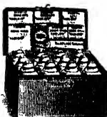

*Reduced facsimile*

**'TABLOID' Brand  
Medicine Case, No. 258**

Contains twelve 1½ oz. bottles of 'Tabloid' and 'Soloid' Brand products, 'Hazeline' Cream, 'Tabloid' Bandages and Dressings, etc.

Size: 8½ × 5½ × 4¼ in.

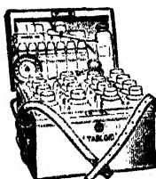

*Reduced facsimile*

**'TABLOID' Brand  
Medicine Chest, No. 254**

Contains sixteen 1¾ oz. glass-stoppered bottles and seven 4 dr. phials of 'Tabloid' and 'Soloid' Brand products, Instruments, Dressings, etc.

Size: 9 × 6½ × 6¼ in.

*At all Chemists and Stores*

**BURROUGHS WELLCOME & CO., LONDON AND BOMBAY**

*All Rights Reserved*

a.r. 3402

## AGRICULTURAL EDUCATION.

### SCHOOL GARDENS COMPETITION.

*Lieut.-Col. Wright's Competition for School Gardens in the  
North-Western Province.*

In March, 1921, LT.-COL. WRIGHT offered the Director of Agriculture Rs. 100.00 for competition amongst the school gardens of the North-Western Province with a view to encouraging teachers in the improvement of their school gardens and in the cultivation of vegetables and foodstuffs. It was decided to offer prizes as follows:—

**KURUNEGALA DISTRICT.** *First Prize valued Rs. 50.00.*

*Second Prize valued Rs. 25.00.*

**PUTTLAM-CHILAW DISTRICT.** *First Prize valued Rs. 25.00*

Thirty-five gardens in the Kurunegala District and nine in the PUTTALAM-CHILAW district entered for the competition. These gardens have all been inspected by MR. K. S. ARUMUGAM, Agricultural Officer, Kurunegala, with

354------------------------------------------------

372[JUNE, 1922]

the following results:

KURUNEGALA. *First Prize*.....Kankaniyamulla... M. S. V. 269. marks.

*Second Prize*.....Medamulla ... B. V. S. 229. marks

PUTTALAM-CHILAW. *First Prize*.....Walpaluwa ... B. V. S. 181. marks.

The full report of MR. ARUMUGAM is as follows:—

"Thirty-five school gardens in the Kurunegala District and nine in the Chilaw-Puttalam District have competed for the above mentioned prizes.

Forty-three varieties of vegetables, including currystuffs, were cultivated in the various school gardens which have competed for this prize.

A question was raised whether currystuffs should be included in the list of vegetables. After giving due consideration to this question, I have included them in the list.

*English vegetables.*—Cabbage (leafy kind), radish, tomatos, spinach, and salad have been cultivated with great success in most of the school gardens. None of the schools in Chilaw and Puttalam Districts has tried cabbage. Only five schools, situated in the drier parts of Kurunegala District, have planted potatos, and the crop is fair.

*Indian vegetables and currystuffs*—Coriander, anise, cumin and turmeric were cultivated in a few school gardens with partial success, while dhall was grown in many of them. Kankaniyamulle has introduced gram and pepper. Gram grew very well there.

*Indigenous vegetables.*—Both the teachers and the students of all the schools are convinced that the cultivation of onions is profitable. Red onions, white onions and Bombay onions were grown in all the school gardens. In most of the school gardens this crop was re-planted as soon as the harvesting of the previous crop was over. Brinjals, chillies, lady's fingers, snake gourd and ridge gourd are the most common vegetables. In each school garden different kinds of these vegetables were grown. Best kind of bitter gourd was produced by Mahannneriya school garden only.

*Best Vegetables Produced.*

Mahannneriya S. G. has produced the best bitter gourd.

<table border="0">
<tr>
<td>Awlegama S. G.</td>
<td>...</td>
<td>...</td>
<td>...</td>
<td>tomatos</td>
</tr>
</table>

<table border="0">
<tr>
<td>Kankaniyamulla</td>
<td>...</td>
<td>...</td>
<td>...</td>
<td>(cow peas)</td>
</tr>
</table>

<table border="0">
<tr>
<td>Bandara-Koswatta</td>
<td>...</td>
<td>...</td>
<td>ash pumpkin and cabbage.</td>
<td></td>
</tr>
</table>

<table border="0">
<tr>
<td>Hettipola</td>
<td>...</td>
<td>...</td>
<td>...</td>
<td>cabbage.</td>
</tr>
</table>

<table border="0">
<tr>
<td>Mahannneriya</td>
<td>...</td>
<td>..</td>
<td>knolkhoh and cabbage.</td>
<td></td>
</tr>
</table>

Kankaniyamulla S. G. has distinguished itself not only by growing a greater number of varieties of vegetables but also by cultivating many kinds of each variety.

Medamulla S. G. has won the second prize by being good all round. Many varieties of vegetables and different kinds of each variety were cultivated. Cultivation was satisfactory.

Cultivation in general was satisfactory but it can be improved. The beds were well prepared and manured. No artificial manure was used. Mulching was not done in most of the School Gardens.

In judging the cultivation of vegetables in various school gardens, though allowance was made for conditions of climate, soil, manure, water, etc., still it was found necessary to assign some marks to soil, water, manure, cultivation, and to kinds and miscellaneous crops.

355------------------------------------------------

JUNE, 1922.]373

*Soil.* Number of marks... .....10.

Marks are assigned according to physical character of the soil, its depth, fertility and its capacity for holding soil moisture.

(1) Very sandy soil, containing big particles of sand is assigned 8 marks e.g., Mahakumbukkadawala school garden.

(2) Very sandy soil, subjected to cultivation for a long period, is assigned 10 marks, e.g. Makandura school garden.

(3) Shallow soil, situated on the slope of a hill. cannot retain soil moisture, is given 10 marks e.g. Wadakoda school garden.

*Water.* Marks are assigned according to the depth of water, its proximity to the garden, and the amount of energy required to carry it to the plots. Highest marks are assigned to conditions requiring the greatest amount of energy to be spent.

*Manure.* Quantity of manure available in the locality, and the amount of labour and time required for transporting same to the garden are taken into consideration.

*Cultivation.* Skill in cultivation, mulching, formation of beds, etc., are taken into consideration.

*Miscellaneous crops and kinds.* Gardens which have cultivated many varieties of fruits, food crops, yams, medicinal plants, and ornamental plants could not find sufficient space to cultivate many kinds of each variety of vegetable. As such gardens too should receive some consideration, 10 marks have been assigned to this item. The total marks were as follows :—

**Kurunegala District.**

<table>
<thead>
<tr>
<th>Order of Merit.</th>
<th>Name of school.</th>
<th>No. of marks.</th>
</tr>
</thead>
<tbody>
<tr>
<td>1.</td>
<td>Kankaniyamulla M. V. S.</td>
<td>269</td>
</tr>
<tr>
<td>2.</td>
<td>Medamulla</td>
<td>229</td>
</tr>
<tr>
<td>3.</td>
<td>Boyagane</td>
<td>201</td>
</tr>
<tr>
<td>4.</td>
<td>Awlegama</td>
<td>194</td>
</tr>
<tr>
<td>5.</td>
<td>Makandura</td>
<td>179</td>
</tr>
<tr>
<td>6.</td>
<td>Mahananneriya</td>
<td>175</td>
</tr>
<tr>
<td>7.</td>
<td>Hettipola</td>
<td>165</td>
</tr>
<tr>
<td>8.</td>
<td>Weuda</td>
<td>152</td>
</tr>
<tr>
<td>9.</td>
<td>Gonigoda</td>
<td>149</td>
</tr>
<tr>
<td>10.</td>
<td>Balalla</td>
<td>142</td>
</tr>
<tr>
<td>11.</td>
<td>Wariyapola</td>
<td>141</td>
</tr>
<tr>
<td>12.</td>
<td>Buluwela</td>
<td>136</td>
</tr>
<tr>
<td>13.</td>
<td>Hunupola</td>
<td>134</td>
</tr>
<tr>
<td>14.</td>
<td>Nakkawatta</td>
<td>133</td>
</tr>
<tr>
<td>15.</td>
<td>Atamune</td>
<td>131</td>
</tr>
<tr>
<td></td>
<td>Itanawatta</td>
<td>131</td>
</tr>
<tr>
<td>16.</td>
<td>Bandara-koswatta</td>
<td>126</td>
</tr>
<tr>
<td>17.</td>
<td>Giriulla</td>
<td>123</td>
</tr>
<tr>
<td>18.</td>
<td>Watareka</td>
<td>122</td>
</tr>
<tr>
<td>19.</td>
<td>Kirindewa</td>
<td>121</td>
</tr>
</tbody>
</table>

356------------------------------------------------

374[JUNE, 1922.

<table>
<tr>
<td></td>
<td>Madagalla</td>
<td>121</td>
</tr>
<tr>
<td>20.</td>
<td>Meddegama</td>
<td>119</td>
</tr>
<tr>
<td>21.</td>
<td>Moragane</td>
<td>115</td>
</tr>
<tr>
<td>22.</td>
<td>Kudakatnoruwa</td>
<td>114</td>
</tr>
<tr>
<td>23.</td>
<td>Wadakada</td>
<td>113</td>
</tr>
<tr>
<td>24.</td>
<td>Polpitigama</td>
<td>112</td>
</tr>
<tr>
<td>25.</td>
<td>Dinlwewa</td>
<td>110</td>
</tr>
<tr>
<td>26.</td>
<td>Ehetuwewa B. V. S.</td>
<td>105</td>
</tr>
<tr>
<td>27.</td>
<td>Poimadulla</td>
<td>83</td>
</tr>
<tr>
<td>28.</td>
<td>Digalla</td>
<td>81</td>
</tr>
<tr>
<td></td>
<td>Konwewa</td>
<td>81</td>
</tr>
<tr>
<td></td>
<td>Ehetuwewa G. V. S.</td>
<td>81</td>
</tr>
<tr>
<td>29.</td>
<td>Monnekulama</td>
<td>72</td>
</tr>
<tr>
<td>30.</td>
<td>Nettipolagedera</td>
<td>65</td>
</tr>
<tr>
<td>31.</td>
<td>Horatepola</td>
<td>44</td>
</tr>
</table>

#### Chilaw and Puttalam.

<table>
<thead>
<tr>
<th>Order of Merit.</th>
<th>Name of school.</th>
<th>No. of marks.</th>
</tr>
</thead>
<tbody>
<tr>
<td>1.</td>
<td>Walpaluwa</td>
<td>181</td>
</tr>
<tr>
<td>2.</td>
<td>Anamaduwa</td>
<td>158</td>
</tr>
<tr>
<td>3.</td>
<td>Ihalapuliyanikulama</td>
<td>126</td>
</tr>
<tr>
<td>4.</td>
<td>Walahapitiya</td>
<td>113</td>
</tr>
<tr>
<td>5.</td>
<td>Mahakumbukkadawala</td>
<td>104</td>
</tr>
<tr>
<td>6.</td>
<td>Kelegama</td>
<td>95</td>
</tr>
<tr>
<td>7.</td>
<td>Etiyawela</td>
<td>66</td>
</tr>
<tr>
<td>8.</td>
<td>Nattandiya</td>
<td>62</td>
</tr>
<tr>
<td>9.</td>
<td>Maiwawa</td>
<td>28</td>
</tr>
</tbody>
</table>

## LESSONS IN MAIZE GROWING.

For six years maize-growing competitions have been carried out for lads in the Transvaal, with most encouraging results, for the benefit derived from these competitions is not confined to those only who participate in them. It extends also to neighbouring farmers who obtain practical demonstration of the value of sound methods of cultivation, and are induced to put them into practice on their own farms; the younger generation also are stimulated by the interest in the rural schools that these competitions engender. And that there is room for much improvement in the methods employed in the cultivation of our staple crop is evident from the low average yield of maize in the Union. Climatic conditions during the year over a large area of the Transvaal were not as favourable for maize as could have been wished, yet some of the competitors obtained as much as 15 bags per acre. The average yields per acre were  $6\frac{1}{2}$  bags in the low veld, 5 in the high veld, and  $3\frac{1}{2}$  in the middle veld. There were 50 lads who actually competed in the 1920-21 competition, and in view of the excellent results that must arise from them, it is trusted that competitions of this nature will grow in popularity. Their worth is recognised in other countries, where their beneficial influence is known to be widespread. A general extension of the movement in South Africa would be of speedy value to farmers of to-day, and establish a heritage of surpassing value to those who will follow them.—JOURN. OF DEPT. OF AGRIC., UNION OF SOUTH AFRICA, VOL. IV., No. 3.

357------------------------------------------------

JUNE, 1922.]375

# PESTS AND DISEASES.

## PESTS ON TEA AND COCONUTS.

The following extracts on more important pests which have been reported during the first quarter of 1922 have been taken from the Progress Report of the Entomologist for the period :—

### TEA.

The reports of the Plant Pests Inspector, Southern, indicate that *Helopeltis* has been prevalent on several estates in the Southern Division. This pest has also been reported from Dolosbage.

Outbreaks of caterpillar pests include Tea Tortrix (*Homona coffearia*), Red Slug (*Heterusia cingula*), Fringed Nettle Grub (*Natada nararia*), Bag worms (*Acanthopsyche hypoleuca*), and Faggot worms (*Chalia doubledayi*). A record of interest is the occurrence of the large stem-boring and bark-eating caterpillar (*Phassus purpurascens*) on an up-country estate in a small area of tea which had been rested for the past four years. This species was recorded by RUTHERFORD as attacking *Cinchona succirubra* in Ceylon, but we have no previous record of its being a pest of tea. It is probable, however, that this caterpillar is by no means a stranger to tea in Ceylon, and that the injury done by it has been attributed to the Red Borer (*Zeuzera coffeeae*) or to the bark-eating borer (*Arabela quadrinotata*). This *Phassus* borer not only tunnels in the branches, but eats away portions of the bark under cover of a webbed gallery covered with frass. A related species, *Phassus malabaricus* is known to bore into the roots of tea bushes in India.

An outbreak of the small grey weevil (*Mylllocerus curvicornis*) was reported from one up-country estate. These weevils eat notches out of the edges of tea leaves giving the bushes a ragged appearance. Dadaps are similarly affected.

Tea mites have also been reported from several estates, the more common species being the small red-spider or scarlet mite (*Tenuipalpus obovatus*) and the yellow mite (*Tarsonemus translucens*).

### COCONUTS.

The Coconut Caterpillar (*Nephantis serinopa*) has been seriously prevalent on several estates South of Batticaloa for several months, and recent reports indicate that it is increasing on some estates to the north of Batticaloa. Outbreaks of this pest have occurred recently in the North-Western and Southern Provinces.

A leaflet on this caterpillar will be published shortly, giving the latest information as to the habits and life history of the pest and the measures which must be adopted for its control.

The Black Beetle (*Oryctes rhinoceros*) and the red Weevil (*Rhynchophorus ferrugineus*) have been unusually prevalent in some districts during the past few months. The Black Beetle has been particularly abundant and this is not surprising when one takes into account the vast number of breeding places for this pest which exist in almost every place where coconuts and other palms grow in Ceylon.

358------------------------------------------------

376[JUNE, 1922.]

The collection and destruction of the beetles will be an endless task unless steps are taken to eradicate the breeding places of the grubs. The destruction by fire of all old hollow and decaying palm stumps, fallen logs and dead palms, and the breaking up of all heaps of decaying vegetable matter, such as animal manure, rotting coconut refuse, etc., will go a long way towards reducing the numbers of the Black Beetle. The reduction in the numbers of the Beetle will mean fewer injured palms, and incidentally will mean fewer Red Weevils, since the weevil breeds mainly in palms already injured by the Black Beetle.

## COMMON NAMES OF USEFUL CHEMICALS.

It sometimes happens that a chemical name is given to some commodity that the farmer is advised to purchase. Under its imposing title he wonders what it is, but really the substance is perfectly well known to him by its "common" name. Nobody goes to the paint shop and asks for two-pennyworth of sodium chloride when he wants common salt, and most of us have learnt that methylated spirits are pure alcohol with 10 per cent. poisonous methylated or wood spirit added for commercial purposes and to protect the revenue. Still there are many other common substances which are veiled under scientific names. Here are a few:—

### *Common Names.*

Alum  
Ammonia  
Baking soda  
Bluestone  
Borax  
British gum  
Carbolic acid  
Caustic soda  
Chalk  
Chloride of lime  
  
Common salt  
Cream of tartar  
Epsom salts  
Glycerine  
Laughing gas  
Litharge  
Liver of sulphur  
Oil of vitriol  
Pearlash  
Slaked lime  
Spirits of salts  
Stone lime  
Sugar of lead  
Sulphate of ammonia  
Verdigris  
Vinegar  
Washing soda  
White lead  
White vitriol

### *Chemical Names.*

Potassium aluminium sulphate  
Ammonium hydrate  
Hydrogen sodium carbonate  
Copper sulphate  
Sodium bibrate  
Dextrin  
Phenol  
Sodium hydroxide  
Calcium carbonate  
Calcium chloride and hypo-  
chlorite  
Sodium chloride  
Potassium tartrate  
Magnesium sulphate  
Glycerol  
Nitrous oxide  
Lead oxide  
Potassium sulphide  
Sulphuric acid  
Potassium carbonate  
Calcium hydroxide  
Hydrochloric or muriatic acid  
Calcium carbonate  
Lead acetate  
Ammonium sulphate  
Basic copper acetate  
Acetic acid  
Sodium carbonate  
Basic lead carbonate  
Zinc sulphate

AGRIC. GAZ. N.S.W., VOL. XXXIII, Part 3.

359------------------------------------------------

JUNE, 1922.]377

# APICULTURE.

## BEE-KEEPING NOTES.

The fact that orange blossoms produce nectar in large quantities is not sufficiently recognised by bee-keepers. In California, when weather conditions are favourable, nectar is so abundant on the blossoms that the men working under the orange trees often find their clothes sticky owing to the nectar that has dropped on them when the branches are shaken. The potential power of the orange as a honey secreter must not be lost sight of by local beekeepers, and colonies must be kept strong to take advantage of the orange honey-flow. According to GLEANINGS IN BEE CULTURE an average colony output of honey in California varies from 40 to 250 lb. (chiefly from orange flowers) according to the character of the flow and the skill of the bee-keeper.

The President of the Ceylon Bee-keepers' Association (THE HON'BLE MR. STOCKDALE), writing to the Secretary, states that it has been represented to him that a single-walled hive would be quite sufficient for a place like Ceylon, and prove less expensive. The question is being submitted to leading bee-keepers for their views.

The ideal of a perfect comb especially for the brood chamber is one of the great aims of bee-keeping. So far the invention of comb-foundation stands out as the most important single step in this direction, and yet, as we all know, this does not always result in the production of perfect combs. Both of the aluminium comb and so-called "semi-comb" are creating great interest at present, but it would be as well to try these only on a small scale, and wait for further developments. Mr. H. H. Root of the well-known house of "A. I. ROOT" makes a plea for wood-base foundation, which is said to give good results. With the keen interest that is being taken in the solution of this problem, it may be expected that before long we shall reach what is practically the acme of perfection. It may be mentioned that wire-cloth, celluloid, paper and Bristol board and Bakelite were all found unsuitable.

The latest and most popular of bee pastures is Huban clover, for which extraordinary properties are claimed. From British Columbia comes a report that it "makes growth of 31 inches in 21 days." Bee-masters are said to look upon the plant as an ideal means of improving and prolonging the honey-flow. Being also an excellent fodder and soil renovator, it is likely to be extensively grown wherever found suitable. The Ceylon Bee-keepers' Association has written for a small quantity of seed, which will be distributed among its members, with a view to giving a trial to this much-lauded honey plant.

MR M. SHANKS, one of the pioneers of bee-keeping in the Island, writes:—"I am as much interested in bee-keeping as ever, and have now more time to devote to it. I have 20 hives of "Me-messas" (*Apis indica*). I find that the "Kanaya" or dammer bee causes a lot of trouble to weak colonies of Me-messas, by entering the hives and smearing the inside with resinous matter. I have sometimes seen about 10 dammer bees going for a Me-messa bee, and dragging it out of the hive; and have had to shut up two of my small colonies to save them from these intruders. I should like to know whether anyone else has had trouble of this description: I have,

360------------------------------------------------

378[JUNE, 1922.

however, encouraged the dammer bee to build in a box and found the honey quite good.

"Last honey season I had 4 hives of Me-messas working in one super and they did splendidly. I secured 16 bottles (of 26 oz. each) of honey from them, and had two large swarms. The frames I use are  $13\frac{1}{2}$ "  $\times$  5". I have hives to hold from 5 to 12 frames and two to hold 16 : but consider the 12 frame hive the most convenient and satisfactory. During the season, when there is some honey (not too much) coming in, a good queen will keep 9 frames pretty well filled with eggs and brood. I took some 30 bottles of honey from 9 hives, though with a proper extractor I should have got a great deal more."

The notes received from MR. SHANKS, detailing his experience of bee-keeping in Ceylon, are particularly interesting; and the Secretary, Ceylon Bee-keepers' Association will be glad if members of the Association, and others who keep bees, will follow MR. SHANKS' example and furnish him with notes embodying their own experience.

C. D.

## TO TRANSFER BEES FROM OLD HIVES TO NEW.

**W. A. GOODAORE, Senior Apiary Inspector.**

So unsystematically do some people commence bee-keeping that by the time they have decided that it is an occupation worthy of serious application, their stock is housed in hives of all shapes and sizes. Bee-keeping, on even the most modest scale, should be commenced with good hives of modern standard type. The transfer of bees from old Hives to those of standard pattern may be effected as follows :—

For each hiveful of bees to be transferred, prepare a standard hive body, complete with frames, and standard-sized bottom board. All the frames, with the exception of one in each body, should be wired, and contain sheets (preferably full ones) of comb foundation. Find and cage the queen from the old live, cut out a selected comb of brood from one of the frames, and fit it neatly into the unwired frame from one of the new bodies, making it secure with string fastened right round the frame, and place the frame of brood in the new body toward the centre. Remove the old body from its stand, and substitute the new hive body with its bottom board, but no cover. Place a queen excluder over the new body, fit over this the old hive, minus its bottom board, and finally liberate the queen at the entrance to the new hive.

The object of the foregoing procedure is to get the queen established in the body of the new hive, and to allow the brood in the old hive to emerge and keep up the strength of the colony. The queen will, of course, be unable to re-enter the old hive because of the excluder. Nine days after the transfer, the old hive on top of the excluder should be examined, and any queen cells destroyed. In twenty-one days all the brood in the old hive will have emerged, and the apiarist can remove the excluder and the old hive and replace them with standard supers.

Transferring work should be carried out during warm weather while a honey flow is on, and preferably during the early summer, but if the autumn prospects for bees are good, early February is not too late.—*AGRIC. GAZ., N.S.W., VOL. XXXIII, PART 2.*

361------------------------------------------------

JUNE, 1922.]379

# GENERAL.

## THE PAPAW (CARICA PAPAYA).

W. MOLEGODE,

*Agricultural Instructor.*

Few of the cultivated Tropical Fruit Trees are so common in Ceylon as the Papaw or Papaya which produces one of the most wholesome and popular fruits obtainable almost anywhere in the colony throughout the year. The papaw is easily grown and begins to produce a crop in less than a year.\* It is commonly met in a semi-wild state yielding an abundant crop. Few, if any, native gardens are lacking in a few papaw trees and rarely, if ever, have they been planted. Most of the papaw trees found are self grown. Till a few years back more enterprising villagers near towns cultivated papaws for the market, but now in certain areas in Kegalle, Matale, Kandy, Kurunegala, Galagedera, the papaw is largely cultivated for the latex which produces the papain of commerce and there are signs that papaw cultivation for this purpose is extending in the Island.

The papaw is a large succulent herb belonging to the natural order Passifloraceæ. It is supposed to be a native of tropical South America and the West Indies and is believed to have been introduced into the Island early in the XVIIth century. The tree seldom exceeds 20 feet in height. It is polygamous, that is male, female and hermaphrodite flowers are formed on the same or distinct trees. Trees bearing only the 'male' flowers are not productive. The hermaphrodite flowers yield the best fruits, oblong in shape, while the more roundish fruits are recognised to be the result of female flowers.

### USES.

The fruit of the papaw is very largely used as a vegetable and as a dessert. It is well-known that tough meat if rubbed with the papaw juice or covered in the leaves or cooked with a green fruit becomes tender. It is even supposed that flesh of animals fed on the leaves and fruits become tender. The papaw fruit is considered a valuable remedy in cases of dyspepsia. The green fruit is a recognised wholesome vegetable. It is cooked in a variety of ways, and may be boiled and served with melted butter as a side dish or salad. The ripe fruit is one of the most favourite desserts in the Island Hotels and, but for the plantain, is the only 'dessert' available during the greater part of the year. The ripe fruit is also served in the form of many a tempting dish but it is best taken by itself when properly ripe, never too ripe, and if one likes with a dash of sugar or salt. Owing to the vegetable pepsin (papain) in it it has the effect of helping in the assimilation of all food with which it is eaten, hence it is considered by some a specific for dyspepsia. An excellent sauce is also made from the ripe fruit.

---

\* At Katugastota the writer put seeds in nursery on 20th March last year, young seedlings were transplanted early in May. In January this year trees 6 to 8 feet were bearing fruits and are heavily bearing now.

362------------------------------------------------

380[JUNE, 1922.

### VARIETIES.

Numerous species of *Carica* are on record. There are only two varieties worth our attention viz., the ordinary papaw (*Carica papaya*) and the Mountain papaw (*C. cardamarcensis*). The latter though introduced as recently as 1880, has become a very common high elevation fruit and has become thoroughly acclimatised in the Nuwara Eliya district where it is frequently found growing even in a wild state. The fruit of the mountain papaw is much smaller in size to the ordinary papaw, pearshaped and ridged and is less favoured as a dessert. The papaw (*C. papaya*) has by cross-fertilisation produced numerous forms, but only differing in size of fruit and flavour.

### CULTIVATION.

The papaw does best between sea level and 3,000 ft. elevation, coming to maturity earlier and producing fruits of a better flavour in the lower elevations. It prefers a warm and humid climate and, being rather sensitive to stagnant water and clayey soils, likes a well drained loamy or sandy soil with proportion of humus. The tree being composed of soft spongy wood is liable to be easily injured by strong winds and should therefore be protected from heavy blowing. Under favourable conditions a papaw tree will fruit in 10 to 12 months and continue to bear, sometimes as many as 100 fruits in different stages of growth being found on the tree, for three or four years and often longer. But as the tree grows beyond the 5th year it not only become difficult to gather the fruits but they come smaller and inferior in quality, so that if a plantation is to be kept up it is advisable to interplant every year. A point to bear in mind is that as soon as it is discovered that a tree is only bearing 'male' flowers it must be removed and another planted.

Old trees can be rejuvenated by cutting off the trunk about  $2\frac{1}{2}$  or 3 feet above the ground. A number of buds will soon sprout from the stump of which only two or three should be allowed to develop, and in a short time the stump will have become transformed into a full bearing tree.

### PROPAGATION.

The papaw is propagated entirely from its seed. Fresh seed should germinate in 10 to 15 days. The seed beds should be well prepared, the soil thoroughly dug, freed of all weeds and well broken up. On this soil sow seeds about 6 inches apart and cover them up. The bed should be well watered. Shade should be provided both from sun and rain. Seeds can also be sown straight away in holes prepared for them. The village method of growing papaw is to cut down the jungle growth, allow it to dry and then sow the papaw seed broadcast and set fire to the dried jungle. The burning of the seed coating is believed to hasten germination.

### TRANSPLANTING.

When the nursery plants are 4 to 6 inches high (there is no harm even if they are 10 to 12 inches), they may be transplanted in the field. A dull-moist-day is the best for planting out. If there had been no rain it will be necessary to thoroughly water the nursery beds before the plants are lifted up. In removing the plants from the beds take them up with a ball of earth. Do not plant any deeper than the plants were in the nursery. Shade the plants and water them when necessary. In order to reduce the evaporation of water from the young plants it is advisable to trim off three-fourths

363------------------------------------------------

JUNE, 1922.]381

the leaf blades. If larger plants are transplanted it is very necessary that all except the young buds and tender leaf blades should be removed and such plants should never be transplanted during excessive rains.

Transplant in holes  $1\frac{1}{2}$  by  $1\frac{1}{2}$  feet filled up with a mixture of well decomposed manure, humus and sand. The distance at which papaw should be put down depends on the nature and fertility of the land. 10 by 10 feet for ordinary soils, varying to 15 by 15 for fertile land.

#### AFTER CULTIVATION.

Papaw being a quick growing plant requires more water than most other plants, and should therefore get water as often as necessary. Keep the weeds down and work the soil round the plants, but do not injure the roots. A good mulch round the plants will do a lot of good. No further attention is necessary.

As stated before, the trees will begin to bear in about a year. For the purpose of a dessert fruit the fruits should not be plucked till they are ripe.

The papaw is a large, green fleshy fruit of different shapes. In some varieties the fruits are almost round like a ball and generally contain a large hollow cavity inside with the seeds attached to the placenta covering the edible pulp. In some varieties the fruits are oblong and oval and may be 10 to 12 inches long. Some fruits contain a large quantity of seeds cramped together in the hollow cavity in the centre of the fruit. Some fruits are almost seedless. A well developed fruit may weigh 6 or 7 lb.

The edible pulp in the fully ripe fruit is soft and should be of a yellow colour. Practically the whole fruit except for the seed cavity and the thin skin contains flesh which is edible.

A well grown tree will produce anything between 50 to 100 fruits a year and they sell between 10 to 20 cts. a fruit. The papaw has the disadvantage of being easily damaged when ripe owing to its softness and consequently marketing is a difficult problem.

#### SEED.

Seed should be taken from the best fruits. The best does not mean the largest but those that are sweet and well flavoured with small seed cavities and few seeds. Oblong fruits are generally preferred for seed purpose as the most likely to produce the true type. The seed should be gently dried in the sun and may be kept pretty long if mixed in ash.

About 3,500 fresh and 4,500 moderately dried seeds go to a pound.

#### PAPAIN.

Only matured but not ripe fruits should be tapped for the latex. The best 'tapping knife' is a sharp edged piece of bamboo with which the rind of the fruit is cut from end to end. Steel knives are never used. A sharp piece of ivory, bone or glass may be used. The juice is collected in porcelain cups or earthen ware hung below the tapped fruits. The latex coagulates rapidly and naturally. In Ceylon for several years the papain industry was in the hands of villagers and no systematic tapping, collecting and curing was practised. Sun drying was the only method adopted. Under the strong sun the latex would be sufficiently dry in a day or two and if fresh earthen vessels are employed it will help rapid drying because the vessels will absorb the moisture. In wet weather sun drying is a difficult problem. Long exposure to air and light and smoke drying spoils the colour of the papain. In wet weather rapid drying in a hot air chamber will produce the best coloured papain.

364------------------------------------------------

382[JUNE, 1922.

### YIELD OF PAPAIN.

The Ceylon hybrid papaw is most favoured as the best yielding variety. It is estimated that 1 lb. of latex can be obtained from about 35 average sized fruits at one tapping. The climatic condition and bearing capacity of trees have a great bearing on the output of latex.

### SELECTION OF CASTOR SEED.

The importance of all oils has been greatly emphasized during the late war. Of all vegetable oils castor oil is perhaps the one the demand for which is most likely to increase. Originally used as an illuminant in the days before the introduction of the mineral oils, its use has completely changed to that of one of the most valuable lubricants known. Attempts have therefore been made in India to determine whether by chemical selection it is possible to improve the race of castor from the point of view of its oil-yielding properties. The work is described in *Bulletin 117*, Agricultural Institute, Pusa.

The main difficulty in the way of such a selection appeared to lie in the fact that the castor plant, with its separate male and female flowers, was much more likely to be subject to cross-fertilization than a plant whose flowers were hermaphrodite. In consequence the investigation, although it had appealed to the writer for many years, was left alone, as being probably of only academic value. In 1918, however, an article appeared in the *JOURNAL OF HEREDITY* (Vol. IX, (1918), p. 198) in which it was stated that, contrary to expectation, castor plants grown in America had not been found very subject to cross-fertilization. In consequence an attempt was made to survey the different types obtained from various parts of Bihar. A number of types were sent in by different district inspectors, and were examined for oil-content in the writer's laboratory after drying. Remarkable differences in oil content on seed were observed from these different types of which seventy-five were isolated from seed characters, by courtesy of the Assistant Economic Botanist, MR. A. C. GHOSH. This oil-content as estimated by ether extraction, varied from as low as 21.8 per cent. to as high as 58.8 per cent. on the whole seed. Such differences appeared very striking, and selections were made and planted of seeds of very low and of very high oil-content. Of the 'low' collections, no type had an oil-content of more than 40 per cent., and the average of fourteen selections was 32.9 per cent. oil on seed. Of the 'high' collections, no type contained under 50 per cent. of oil, and the average oil-content of thirteen selections was 52.8 per cent. These types on growing were found to be very impure. This was only to be expected as the crops have never been grown with any attempt to keep different varieties separate. It was, however, to be expected that the first generations of plants from seed with oil-content as widely varying as the above, would also, on the average show very large divergences which, even if they were less than those of their parents, would still be very large. Of these selections only twelve of each kind, 'high' and 'low', actually grew, whilst actually the average oil-content of the seed of plants from 'high' seed was 49.3 per cent., and that of seed from 'low' seed was 50.6 per cent. Results such as these could not be expected to have occurred as a result of cross-fertilization, nor to have been due to mixed varieties, and it was assumed that the great differences, originally observed in oil-content in the seed of these varieties, may have been observed owing to the different conditions under which the plants were grown. At any rate it is obvious

365------------------------------------------------

JUNE, 1922.]383

that selection of seeds at random from different localities, in which the seed may have been grown under very different conditions, is not likely to be of much use.

Fresh selections were therefore made from the highest and lowest yielders of the 1919 crop. In this crop, the plots of which were grown under uniform conditions at Sabour, the differences between high and low yielders were not so great. Fifteen parents of low oil-content were taken, and twenty of high oil-content. Of the descendants of the fifteen 'low' plants only ten plots showed good growth. It would therefore be better to consider only these ten, as it is possible that this state of growth of the plant may have an effect on the oil-content of the seed. Nine of the twenty 'high' plots should probably also be eliminated, as they were badly affected by insect attack, and, in consequence, the flowers and seed were probably abnormal. In fact, the amount of seed produced was very small, and in every case showed an oil-content below the average. The mean of eleven good plots was 49.6 per cent. for descendants of parents whose mean was 54.2 per cent. The mean of the ten well-grown 'low' plots was 48.6 per cent. from parents whose mean was 42.5 per cent.

These results were found to differ very little from those obtained by taking the mean of all the plots, whether well or ill grown. In this case the mean of the twenty 'high' parents was 54.8 per cent. and of their descendants 47.8 per cent. The mean of the fifteen 'low' parents was 44.1 per cent. and of their descendants 47.5 per cent. There appear, therefore, to be strong indications that in the majority of cases the plants do not transmit a high or low oil-content for even one generation, but that both 'high' and 'low' seeds give plants which, in nearly every case, give a seed near the mean oil-content, which lies somewhere close to 49 per cent. when the plants are healthy and a little lower when the reverse is the case. It will be seen, moreover, that the inclusion of the unhealthy plots has in each case, as was to be expected, lowered the mean oil-content of seed observed. Out of the whole series, however, two appear to have kept pure as regards high oil-content for more than one generation.

In connection with this interesting chemical selection, it is pointed out that variations occur between samples taken from a crop of a single strain. It is therefore necessary to determine the magnitude of these variations so as not to be misled. It was found that the probable error in the oil determination of a single sample of any one variety was about 1.0 per cent. of the weight of the seed.—*AGRIC. NEWS*, VOL. XXI, No. 516.

## CURRENT PERIODICAL LITERATURE OF AGRICULTURE.

The following is a list of a few articles appearing in some of the periodical publications received in the Department of Agriculture Library.

Those indicated are what are thought to be of value to those interested in Agriculture or one or some of its branches.

*Agriculture, Soils and Manures*:—Cycles in the Yield of Crops, *Nature*, Vol. 109, No. 2731, March 2, p. 261.

West Indian Agriculture in 1897 and 1922, *Agricultural News*, Vol. XXI, No. 517, p. 49

Agricultural Experiments in Ithaca, N. Y., *Nature*, Vol. 109, No. 2734, March 2

366------------------------------------------------

384[JUNE, 1922.

Some Physical Constants of Soil, Indian Tea Association Quarterly Journal, No. 4 of 1921, p. 214

Supply of Irrigation Water from Wells and Rivers, Journal of Mysore Agricultural and Experimental Union, Vol. III, No. 4, p. 180

The Manuring of Tropical Crops. Indian Scientific Agriculturist, Vol. III, Part 4, p. 140.

The Use of Phosphate in Agriculture. Indian Scientific Agriculturist, Vol III, Part 4, p. 151

Explosives and Fertilisers. Indian Scientific Agriculturist, Vol. III, Part 4, p. 158

*Apiculture*:—Instructions on Bee-keeping. Department of Agriculture, Burma, Bulletin 17.

Swarm Control. Farmers' Bulletin, U. S. Department of Agriculture No. 1198.

*Diseases*:—Fungus Disease of the Tea Leaf. Indian Tea Association Quarterly Journal, Part 4 of 1921, p. 209.

Ziekten en Plagen der Cultuurgewassen in Nederlandsch Indie in 1921 (van Hall). Med. v. h. Instituut voor Plantenziekten No. 53

La Enfermedad de la Raiz en el Cafe, Porto Rico Experiment Station, Bulletin No. 32.

Diseases of Cultivated Plants in Ceylon. Department of Agriculture, Ceylon. Bulletin 52.

*Essential Oils*:—Huilles Essentielles nouvelles du Tonkin et de l' Annam L Agronomic Coloniale 6e Annee, No. 51, p. 65.

*Poultry*:—Feeding Hens for Laying Purposes. Farmers' Journal, Vol. IV, No. 14, p. 9

Some Essential for Success. Farmers' Journal, Vol. IV, No. 14, p. 9

*Selection*:—A few Facts about seeds. Mysore Agricultural and Experiment Station Union Journal, Vol. III, No. 4, p. 219.

Dormancy in Seeds. Mysore Agricultural and Experiment Station Union Journal, Vol. III, No. 4, p. 220.

*Veterinary*:—Preparation of Anti-Rinderpest Serum using Animals of Moderate Susceptibility as Virus Producers. Agricultural Research Institute, Pusa, Bulletin 129.

To tell the Age of Cattle. Indian Scientific Agriculturist, Vol III, Part 4, p. 146.

*Insects and Pests*:—Getting rid of Grubs. Farmers' Journal, Vol. IV, No. 13, p. 11.

Caterpillar Control by Collecting Chrysalides. Indian Tea Association Quarterly Journal, Part 4 of 1921, p. 175.

Notes on More Important Insect Pests of Crops in Mysore, Journal of the Mysore Agricultural and Experiment Station Union, Vol. III, No. 4, p. 189.

Cane Pest Cambat and Control. Queensland Agricultural Journal, Vol. XVII, March, p. 103.

Les Insectes nuisibles aux Cultures du Maroc, (Vayssié, P.), Annales des Epephytics, Joure VII, Fase 8.

367------------------------------------------------

JUNE, 1922.]385

**De Klappertor en de Palmsnuitkeven**, Inst. voer Plantenziekten, Bulletin 17.

The Coccidæ of Jamaica (Gowdey, C. C.), Department of Agriculture, Jamaica, Entomological Bulletin No. 1 of 1921.

*Economic Plants*—*Agave*.

Sisal Hemp in Ceylon, Agricultural News, Barbados, Feb. 18, 1922, p. 63.

In Support of Jamaica Sisal, Agricultural News, Barbados, Vol. XXI, No. 517, Feb. 18, p. 22

*Cassava*:—Improved Methods of Planting Cassava. Mysore Economic Journal, Vol. VIII, No. 1, January, 1922, p. 87.

Cassava as a Source of Alcohol, Indian Scientific Agriculturist, Vol. III., Part 4, p. 164.

*Cacao*:—Roepke, W., Cacao, Haarlem, n.d.,

Le Cacaoyer, Notes D' Agriculture Sur la Guadeloupe L' Agronomic Coloniale 6e Annee No. 51, p. 78.

*Citrus*:—Lime and Lemon Industry in India, Indian Scientific Agriculturist, Vol. III, No. 4, p. 165.

*Coconut*:—The Coconut Palm in Ceylon, B. C., Tropical Life, Vol. XVIII, No. 3.

Petite Catechisme sur les Cocotiers (G. G. Auchinleck), Department of Agriculture, Seychelles, Bulletin No. 15.

*Coffee*:—Suitable Shade for Coffee. Indian Scientific Agriculturist, March 1922, p. 126.

Le Caffeier Notes sur la Guadeloupe. Agronomic Coloniale 6e annee, No. 51, p. 81.

Coffee Pruning in Central America, Journal of Mysore Agricultural and Experiment Union, Vol. III, No. 4, p. 234.

*Grasses* —Nigerian Grass for Paper Making. Bulletin of the Imperial Institute, Vol. XIX, No. 3, p. 271.

A New Fodder Grass from Uganda. Bulletin of the Imperial Institute, Vol. XIX, No. 3, p. 295.

Para and Paspalum: Two Introduced Grasses of Guam, Guam Agricultural Experiment Station, Bulletin No. 1.

*Green Manuring*:—Decomposition of Green Manuring Plants. Agricultural Journal of India, March, 1922, p. 133.

*Medical Plants and Herbs*:—The Vegetable Family Physician. Transactions of Botanical Society, Edinburgh, Sessions LXXXIV, 1919-20, p. 2.

*Pine-apples*:—Growing and Canning of Pine-apples in Ceylon. Mysore Economic Journal, Vol. VIII, No. 1, p. 63.

*Rice*:—The 'Gwabo' Disease of Paddy, Department of Agriculture Burma, Bulletin No. 18.

*Rubber*:—Recovery of Hevea Trees after Ringing, Kew Bulletin, No. 2 of 1922, p. 91.

368------------------------------------------------

386[JUNE, 1922.

Tapping Tests and Bast Examination of Hevea Plants from selected Seed, Med. van het Algemeen Proefstation er A.V.R.C.S. Rubber series 32. Latex and Rubber from Individual Trees. Difference in Proportion of Rubber from Different Trees : Are the Properties of Rubber from one Tree Constant ? *Archief voor de Rubbercultuur*, Vol. VI, No. 4, p. 160.

An Apparently Non-Parasitic Dieback of Hevea Brasiliensis, *Archief voor de Rubbercultuur* Vol. VI, No. 3, p. 110.

Experiments with Boehinger's Coagulating Powder, *Archief voor de Rubbercultuur*, Vol. VI, No. 4, p. 140.

*Sugar-Cane* :—Sugar-cane Industry in Natal and Zululand. *Farmers' Journal*, Vol. IV, No. 15, p. 25.

Germination and Preservation of Sugar-cane Pollen. *Agricultural Journal of India*, March 1922, p. 127.

Recent work in Cane Agriculture. *International Sugar Journal*, No. 280, Vol. XXIV, p. 199.

A Disease of the Cane Leaf. *Agricultural News*, Vol. XXI, No. 517.

Three Major Cane Diseases. *Agricultural News*, Vol. XXI, No. 517, p. 62.

*Tea* :—Formaldehyde Vapour as a Disinfectant of Tea Seed.

*Tobacco* :—The Uses of Waste Tobacco. *Journal of Department of Agriculture*, S. Africa, Vol. IV, No. 3. p. 198.

The Future of the Tobacco Industry. *Journal of Department of Agriculture*, S. Africa, Vol. IV, No. 3, p. 224.

Tabaksasch, Deli-Proefstation te Medan, *Vlugschrift*, No. 8.

*Vanilla* :—Vanilla, Vanilline, Vanille-extracten ( *Utermask*, W. L. Mededeeling van het Kolonial Instituut, Amsterdam, No. 3.

Notes sur la Vanille à Praslin, Dept. de L' Agriculture, Seychelles, *Feuille des planteurs* ( No. 3 )

*Weeds* :—The Problem of Witchweed. *Agricultural Journal of India*, March 1922, p. 163.

*Miscellaneous* :—Plastic wood. *Queensland Agricultural Journal*, Vol. XVIII, March 1922, p. 107.

Flowering Trees of Brisbane Botanic Gardens, *Queensland Agricultura Journal*, March 1922, p. 110.

Ceylon Timbers, *Bulletin of the Imperial Institute*, Vol. XIX, No. 3, p. 282.

Jardines-Ecoles et les Jardines des élèves, *Department de L' Agriculture*, Seychelles, *Feuille des Planteurs* ( No. 5 )

Notes on Nature Study, *Department of Agriculture*, Seychelles, *Bulletin* No. 14, ( G. G. Auchinleck ).

Monographs on Floral Odours—Orchids, Honeysuckle and Carnation. *Perfumery and Essential Oil Record*, Vol. XIII, No. 4, p. 106.

Preservation of Fruit Juices. *Perfumery and Essential Oil Record* Vol. XIII, No. 4, p. 119.

H. LUDOWYK,

Librarian, Department of Agriculture.

369------------------------------------------------

# THE TROPICAL AGRICULTURIST

---

VOL. LIX.

PERADENIYA, JULY, 1922.

No. 1.

---

## SHOT-HOLE BORER OF TEA.

---

The investigations into this pest of tea have been continued and some results of importance are being secured from the experiments that have been conducted during the past two years.

Two bulletins are in the press embodying the results of experiments with burial of prunings and of investigations in regard to the effect of various manures upon the pest.

The extracts from the Progress Report of the Entomologist in charge of Shot-hole Borer investigations included in the present number of the TROPICAL AGRICULTURIST are of interest and outline further experiments

Information which has recently been gathered from affected estates indicates that during the past twelve months this pest of tea has been on the decrease and that it does not appear to be spreading much further either upon the estates themselves or in the various districts. There are, however, exceptions to this general belief and there are still some areas in which the spread is upon the increase.

The burial of pruning experiments have shown that the pest is capable of emerging from prunings which have been buried to even reasonable depths and that its life cycle may be completed in galleries in prunings which have been so buried.

The manurial experiments indicate that nitrogenous manures such as sulphate of ammonia and nitrate of soda have the effect of either reducing attack or of preventing it to some appreciable degree. Satisfactory results have also been obtained with applications of lime. It is therefore proposed to carry out a further

370------------------------------------------------

2[JULY, 1922.

series of experiments with these manures and with muriate of potash and ephos phosphate.

Recently there has been observed a very, considerable amount of healing of shot-hole borer galleries, particularly in certain districts ; and it is thought that applications of manures may have some influence upon this healing. Further observations on this point are to receive attention.

Further trials are also being made in regard to the use of castor as a trap for the shot-hole borer and several experiments are already being carried out at different centres. It has to be ascertained if borers bred in tea readily pass into castor or *vice versa* or if separate races have preference to the particular plant in which they have been bred.

The shot-hole borer pest of tea is a difficult problem and it is only by lengthy and continuous investigations that progress will be made. It is, however, satisfactory to note that solid progress has been made.

Several estates are carrying on their own experiments and it would probably hasten the solution of the problem if a larger number can arrange to carry out experiments even upon a small scale.

All growers of tea are recommended to secure the bulletins of the Department of Agriculture dealing with this pest as soon as they are available. There may be certain points which strike the practical agriculturist as offering out possibilities of further profitable investigation and the co-operation of affected estates is desirable if early results are to be secured.

It is only by continued concentration upon the problem by all concerned that progress can be made. The co-operation of the practical agriculturist is desired by the entomologists as there appears to be every reason to believe that cultural methods must play an important part in the control of the pest.

The Department is already indebted to several estates for the use of lands for experiments and to manure firms for supplies of manures. It desires to acknowledge this assistance so readily given.

371------------------------------------------------

JULY, 1922.]3

# RUBBER.

## THE PEACHEY PROCESS.

### COLD VULCANISATION OF RUBBER.

The title of this paper \* naturally suggests a complete survey of all the known processes for effecting the vulcanisation of rubber without the aid of heat. I propose, however, to confine my remarks to the most recent of these processes, and the one of which I can claim to have an intimate knowledge, viz., the cold vulcanisation of rubber by treatment with gases, and to make occasional references only to the older processes. I must content myself at the moment with giving you some idea of the progress which has been made in adapting the new process to large scale manufacture and explaining some of its numerous industrial applications.

#### A NEW FIELD FOR RUBBER.

In fact, I wish to show you that this process, which was evolved in a college laboratory, and which has occasionally been criticised as being an "academic" process, has proved itself on a larger scale to possess industrial possibilities greater than anything which could have been foreseen in the early experimental days. It opens up a new field for the utilisation of rubber conjointly with various waste material in the production of a wide range of useful and durable materials which should compete, in quality, with certain standard products on the market to-day, and could be sold at about half the price. This is, perhaps, the largest field, but the new process is applicable for many other purposes, and to many other manufactures, and in nearly every case it leads to the production of new technical effects which are unobtainable by the use of any other vulcanising process.

#### THE MAIN FEATURES.

The process is based upon the fact that when rubber is treated alternately with the two gases—sulphur dioxide and hydrogen sulphide, these gases are readily absorbed, and, reacting in the material, produce an active form of sulphur which combines with the rubber at the ordinary temperature, bringing about vulcanisation. Persumably the gases react in the following manner :—

$$2\text{H}_2\text{S} + \text{SO}_2 = 2\text{H}_2\text{O} + 3\text{S}.$$

The simplest explanation of the high activity of the sulphur (ordinary sulphur does not begin to combine with rubber at an appreciable rate until a temperature of 120 to 130 degs. Cent. is reached) is that it is in the nascent condition.

Recently it has been suggested that the sulphur produced in the reaction between sulphur dioxide and hydrogen sulphide is in a triatomic form, viz., as thiozone, but, in my opinion, this would presume the preformation of

\* A paper read before the Institution of Rubber Industry, London District, on March 14, by MR. S. J. PEACHEY.

372------------------------------------------------

4[JULY, 1922.

atomic (nascent) sulphur, and its vulcanising action would probably result from its decomposition into diatomic and atomic sulphur, so that both theories amount to much the same thing.

The process is applicable not only to rubber in its ordinary dry form (*i.e.*, containing the usual trace of moisture) but can also be applied to rubber in solution.

If a solution of rubber in benzol or naptha containing hydrogen sulphide is mixed with a solution of sulphur dioxide in benzol, viscosity begins to increase, and after a short time the solution sets to a jelly, which, after evaporation of the solvent, becomes vulcanised rubber.

### CHEAPLY AND EASILY PRODUCED.

The two gases are cheaply and easily produced, and the vulcanisation takes place at ordinary atmospheric pressure, and without the aid of heat. This latter feature renders possible the vulcanisation of rubber incorporated with organic waste material such as leather buffings, wood meal, cork dust, wool and cotton wastes, etc.—materials which cannot satisfactorily be employed in conjunction with rubber when the hot vulcanisation process is to be applied.

Further, it renders possible the use of a large variety of coal tar dyestuffs, lakes, etc., which are destroyed by the hot process of vulcanisation, but which are not affected in the least by the gas treatment.

Another advantage of the new process is that it renders possible for the first time the wet moulding of rubber goods. A rubber solution suitably treated with the two gases, may be poured into a mould, allowed to remain for a short time and taken out as a permanently shaped jelly, which, on drying, shrinks uniformly and without losing shape, yielding a vulcanised rubber article.

The solution process is also applicable to the cementing of rubber to rubber, and of rubber to leather, the surfaces to be joined being merely coated with a solution of rubber containing the two gases, pressed together, and allowed to stand for a short period, when cold vulcanisation takes place; the jointed materials after diffusion and evaporation of the solvent show a strength of adhesion which is considerably greater than that obtained by any other method.

It is important to note that the vulcanisation of rubber in solution by the gas process can be made a more or less exact quantitative method, any desired coefficient of vulcanisation being obtainable with the production of comparatively minute amounts of free sulphur.

### METHODS OF APPLYING THE PROCESS.

The various modifications and applications of the basic principle of the process, viz., the interaction of sulphur dioxide and hydrogen sulphide disseminated through a mass of rubber, may be broadly classified under two heads: (1) The chamber or dry gas treatment, and (2) the two solution process.

**Chamber Process:**—In the former process, the rubber or compound containing rubber—preferably in the form of sheets of not too great a thickness—is exposed to an atmosphere of sulphur dioxide for a period averaging

373------------------------------------------------

JULY, 1922.]5

about 10 minutes. This operation is carried out in a chamber constructed preferably of aluminium, wood, or stoneware, but which may also be built up of sheet iron suitably treated with a protective coating such as bitumastic paint or duoprene.

The ideal metal for the chamber is aluminium, in that this metal is not corroded by the gases either singly or conjointly. The magnesium-aluminium alloys are equally useful.

After 10 minutes' exposure to the sulphur dioxide, a current of air is blown through the chamber to sweep out the gas.

After this has been effected, the air current is continued for a few minutes in order to remove the absorbed gas, *i.e.*, the layer of gas concentrated on the surface of the material. This short air blowing has little effect on the absorbed gas, and is necessary in order to prevent "blooming" on the goods due to the interaction of the  $H_2S$  with the surface  $SO_2$ .

The chamber is now filled with hydrogen sulphide, and the material is left in contact with this gas for about 30 minutes, at the end of which period vulcanisation is found to be complete.

It should be noted that the 30 minutes period in the hydrogen sulphide represents treatment with excess of this gas.

The degree of vulcanisation is governed by the time of exposure to sulphur dioxide, and it is advisable in every case to expose to an excess of hydrogen sulphide until no free sulphur dioxide is left in the material.

It should be clearly stated here that the method I have described is only applicable to goods of a thickness which depends to a great extent on the nature of filling materials employed in compounding the rubber.

#### **PENETRATION OF PURE RUBBER.**

With pure rubber, penetration is less than with a compounded rubber. In presence of porous or fibrous materials such as leather buffings, wood meal, wool waste, cotton waste, cork dust, and the like, penetration is greatly facilitated, and I have succeeded in obtaining penetration through sheets of a thickness of half an inch. Normally, however, one works with sheets varying between 1.9 and 3.5 mm., these being the two common linoleum standards in this country.

Such sheets may, however, be built up like plywood to any desired thickness, after vulcanisation, by the use of the two solution cementing process.

In the early days of the process it appeared likely that it would be restricted in use to the vulcanisation of sheets of quite moderate thickness.

As the result of investigations carried out in the laboratories of the Company, it is now possible to apply the process to the production of masses of rubber of any size, and to obtain a perfectly uniform vulcanisation throughout. This application of the process should properly come under the heading of the two solution process, and will be referred to again. The application of the chamber process to the vulcanisation of mixings containing organic filling materials and coal tar dyestuffs, is illustrated by a number of exhibits of floor and wall coverings, sole leather, embossed leathers, felt roofing material, etc., all of which are produced by compounding rubber to

374------------------------------------------------

6[JULY, 1922.

the extent of about 30 per cent. with about 70 per cent. of various waste materials—wood flour, leather buffings, shoddy waste, slate powder, and so on, and vulcanising in the gases. As an example of the cost of such mixings take the case of the sole leathers, which contain: Rubber 30 per cent.; leather buffings, 70 per cent. The cost of materials per 100 lb. of product is:—

<table>
<thead>
<tr>
<th></th>
<th>s. d.</th>
</tr>
</thead>
<tbody>
<tr>
<td>30 lb. of rubber at 1s</td>
<td>30 0</td>
</tr>
<tr>
<td>70 lb. of leather waste at <math>\frac{1}{2}</math>d.</td>
<td>3 0</td>
</tr>
<tr>
<td>100 lb. product</td>
<td>33 0</td>
</tr>
<tr>
<td>1 lb. product</td>
<td>0 4</td>
</tr>
</tbody>
</table>

Labour and on costs bring this up to about 6d. A good sole leather to-day costs 4s. 6d. per lb.

Further 1 mm. thickness of the rubber-leather product will outwear 2.5 mm. of new leather, a statement based on the result of numerous actual wearing tests.

#### PROOFED FABRIC AND DIPPED GOODS.

Other important applications of the chamber process are to the vulcanisation of proofed fabric and of dipped and surgical goods. In the former case the fabric, which may be dyed with any good coal tar dyestuff (methyl violet is an exception) is spread in the ordinary manner with a thin coating of rubber and dried on steam chests. A pure rubber dough is preferred, in that it yields a transparent coating which does not mask the colour of the fabric. When quite free from solvent, the rubber coated fabric is dusted with farina in the usual manner, and is then exposed in a chamber to the alternate action of sulphur dioxide (3 to 5 minutes) and hydrogen sulphide (10 to 20 minutes). An excellent vulcanisation is obtained, and the colour of the fabric is not altered in the slightest degree. The process may be applied equally to cotton, wool, or silk fabric.

Dipped goods, such as teats, surgeons' gloves, and surgical goods generally are conveniently cured by the chamber process, and retain their colour and transparency unaltered.

#### CURING RAW RUBBER GOODS.

Reference must be made to one other important application of the chamber process, viz., to the curing of goods fashioned from raw rubber in either the crepe or sheet form.

During the last few months the idea of using raw crepe rubber or smoked sheet for the production of useful articles, such as door mats, motor car mats, washing gloves, soles, pram tyres, cushions, etc., has been urged strongly by those interested in reducing the surplus stocks of raw rubber and increasing its price.

The idea seems to be quite a feasible one, provided that a certain degree of stability is imparted to the goods by vulcanisation. That the unvulcanised crepe or smoked sheet could prove satisfactory in wear is doubtful, although unworked rubber certainly differs quite considerably in some of its properties from the mechanically softened or masticated material which is employed in ordinary rubber manufacture.

The gas process has proved to be highly satisfactory in curing articles made of raw crepe or smoked sheet, and its application in practice is exceedingly simple. With thick goods the cure is not a thorough one, but is sufficient to increase very considerably the tenacity and durability of the goods and to render them comparatively resistant to temperature changes. With thinner goods a thorough cure is not difficult to obtain, and such goods will resist the temperature of boiling water perfectly.

375------------------------------------------------

JULY, 1922.]7

### THE TWO SOLUTION PROCESS.

I have referred previously to the fact that the vulcanisation of dissolved rubber may be effected by the interaction in the solution of the two gases sulphur dioxide and hydrogen sulphide.

This may be demonstrated very effectively by taking a quantity of rubber solution of not too great a viscosity (say, a 10 per cent. solution of moderately well masticated rubber in benzole), saturating this solution with hydrogen sulphide, and then mixing with a solution of sulphur dioxide in benzole. After thorough admixture by shaking, it is observed that the liquid, which at first will run quite readily, gradually thickens and becomes more viscous, and ultimately it sets to a stiff jelly which cannot be poured, and which is quite free from tackiness. This jelly has sufficient coherence and tenacity to enable it to be handled quite freely. Further, it is quite insoluble in and non-mixable with any further addition of solvent. It is in fact a gel of vulcanised rubber, and, on eliminating the solvent by evaporation, it shrinks to a mass of vulcanised rubber.

The vulcanisation may be made practically quantitative to yield any desired coefficient of vulcanisation from say, one up to 15.

In practice, it is convenient to employ a 12.5 per cent. solution of masticated rubber in benzole or naphtha (pyridine free) and to saturate or approximately saturate with hydrogen sulphide.

A second solution is now prepared consisting merely of  $\text{SO}_2$  dissolved in benzole or naphtha.

A convenient strength is 2.4 grms. of sulphur dioxide per 100 cu. cm. of solvent. In order to prepare a gel of vulcanised rubber with a coefficient of 2.5 one mixes 10 vols. of the first solution with 1 vol. of the second, shaking, or stirring thoroughly, to obtain uniform admixture. In from 15 to 20 minutes, the solution sets to a gel, which on drying yields a mass of perfectly cured rubber.

Gelling and a good soft vulcanisation may be obtained with as low a coefficient as 1, but experience indicates that the optimum cure yielding the best physical properties lies somewhere between 2 and 2.5. It should be noted that by using a solution of rubber saturated with  $\text{H}_2\text{S}$ , one always ensures the presence of an excess of this gas, and the degree of vulcanisation is then governed entirely by the amount of  $\text{SO}_2$  solution added.

The reaction between the dissolved rubber and the active sulphur by the interaction of the  $\text{H}_2\text{S}$  and  $\text{SO}_2$  appears to be not quite theoretically complete, but only the merest traces of free sulphur are produced when one is working for a coefficient of 1.2.5.

Practically any benzene soluble coal tar dyestuff may be introduced into the rubber solution, yielding coloured gels and rubbers in great variety. The colours are quite unaffected by the process.

### WET MOULDING.

At first sight this vulcanisation of rubber in solution may appear to be of academic interest only. A little consideration, however, will show that it can be applied most usefully in a number of ways, and laboratory investigations at Willesden indicate that it may easily form the basis of a large scale production of rubber goods by a wholly new method, which may be termed wet moulding.

Although such possibilities were foreseen in the early days of the discovery of the process, the credit for actually applying the process in this way and producing "poured" goods for the first time, belongs to MR. FORDYCE JONES, of the Reliance Rubber Co. MR. FORDYCE JONES appears to me to be the fortunate possessor of a very rare combination of gifts. He has a vivid imagination, and he has the capacity for harnessing his imagination and reducing his dreams to works practice. Within a few weeks of hearing of

376------------------------------------------------

8[JULY, 1922.

the new method of vulcanisation, the idea occurred to him of applying the two solution process to the wet moulding of goods which had previously been produced by the "dipping" process. Shortly afterwards, he brought to the Willesden laboratories samples of his first moulds with which he then and there demonstrated the process.

The problem was not an easy one, for it involved numerous abstruse calculations as to the degree of shrinkage which would take place with different thicknesses of solution and in various curbed portions of the mould.

Since then MR. FORDYCE JONES has designed and patented a machine for the continuous production of such moulded articles, to be used in conjunction with a solvent recovery plant.

The idea has been extended, and during the last month or two moulded hot-water bottles, goloshes, tubing and hose have been produced at the Willesden laboratories.

So far we have produced these wet moulded goods mainly in 100 per cent. rubber, but the loading of the products with fillers is an obvious and easy step.

Other applications of the two solution process which appear to me to be of considerable importance must be briefly referred to.

#### A WET RE-FORMING PROCESS.

The first may be called a wet re-forming process, in that it is analogous—although somewhat remotely so—to the re-forming process invented and worked by MR. T. GARE.

The starting point is ground waste rubber—the quality of which is chosen according to the quality of re-formed rubber which it is desired to produce. The ground waste is mixed with a quantity of rubber solution corresponding to about 5 per cent. new rubber in the weight of the waste, previously saturated with hydrogen sulphide and mixed with the necessary amount of benzene sulphur dioxide solution. The mixing is effected in any suitable machine (e. g., a small Pfeiderer) and the wet (really only damp) mixture is then pressed into moulds.

Vulcanisation of the binding solution takes place in about 20 minutes, after which time the moulds are opened and the articles allowed to dry. A perfectly consolidated mass of re-formed rubber is obtained with high tensile strength and excellent physical properties. In this connection, MR. FORDYCE JONES has designed and patented a machine for the continuous production of such re-formed goods, and his original machine is now set up at Willesden.

Another important application of the two solution process is to the repairing of tyres. If a 12½ per cent. solution of rubber in benzol or naphtha is saturated with hydrogen sulphide and then mixed with one-tenth of its volume of a 2·4 solution of sulphur dioxide in benzol, and the mixture, after stirring, is employed as a cement for joining canvas duck to itself or to rubber, a quite remarkable strength is obtained.

In practice a coat of the mixed solution is applied to each of the surfaces to be united and is allowed to dry off (about 15 to 20 minutes). A second coat is then applied to each surface and is allowed to dry to a strong tackiness (about two minutes). The two surfaces are now pressed or rolled together, and allowed to stand for several hours. Vulcanisation takes place in less than 30 minutes, but full strength is only obtained after the solvent has evaporated and diffused out from the jointed material.

Similarly, rubber may be cemented to rubber or to leather, and leather itself to leather. So strong is the adhesion obtained that it is found quite practicable to attach leather soles to boots without nailing or stitching in such a manner that they can only be removed by cutting away.

377------------------------------------------------

JULY, 1922.]9

### BUILDING UP OF TYRES.

I may refer also to the possibilities of this process in connection with the actual building up of tyres.

For tyre building by the ordinary process, the duck is first subjected to a drying process prior to impregnating and coating with rubber. I am informed that during this preliminary drying process there is a very considerable loss of strength. Whether this is due to actual tendering of the fibres or simply loss of the conditioning or not, I do not know, but there appears to be no question that it occurs. This loss in strength is further increased during moulding process, when the complete type is enclosed in a mould and subjected to heat for a considerable time.

By the use of the two solution process both these losses are eliminated. If the layers of duck are built up by layers of cold vulcanising solution, no preliminary drying is needed, and the ultimate attachment of the tread can also be effected without the aid of heat.

A complete tyre has recently been built up at Willesden without the use of heat at any stage, and running tests will be commenced this week. These should be of great interest, as indicating exactly what weakening effect is to be attributed to the use of heat.

If the tests are successful we should be able to claim not only an increased life for the tyre but also a considerably diminished cost of production.

Finally, I should like to refer briefly to the plant which we have in use at the company's laboratories and to that which is being designed for factory use.

### GENERATION OF THE GASES.

The sulphur dioxide is compressed to the liquid form in steel cylinders, each containing 56 lb. weight of the liquid gas. These are connected up directly and as required to the gas mains leading to the gassing chambers. On opening the cylinder valves an immediate steady stream of the gas is generated.

The hydrogen sulphide is generated by the action of dilute hydrochloric or sulphuric acid on sulphide or iron. The operation is carried out in a generator constructed of tantiron.

The gas is collected in an oil sealed gasometer, and is drawn off as required.

### GAS CHAMBERS.

The vulcanising chambers are constructed of sheet aluminium strengthened by steel supports.

They are rectangular in shape and fitted with a number of aluminium wire grids or trays, which are loaded up on a trolley and run in or out of the chamber as required.

The small chamber at Willesden is 6 ft. by 1 ft. 3 in. by 2 ft., and is adapted for either sheets of compounded rubber, dipped goods, or raw rubber articles. Aluminium stopcocks are employed in conjunction with leaden gas mains, and the chamber is furnished with a water gauge tube.

### SOLUTION GASSING PLANT.

The gassing of rubber solution with hydrogen sulphide is effected in a cylindrical aluminium vessel closed by a bolted down cover, through which passes a shaft terminating inside in an archimedean screw working in a tube. The vessel is connected with the gas supply, and on rotating the screw the solution is continuously drawn up the tube and poured over its top, exposing a large area of fresh solution to the gas all the time. Under these conditions a rapid saturation takes place.—MALAYAN TIN AND RUBBER JOURNAL, VOL. XI, No 9.

378------------------------------------------------

10[JULY, 1922.

A  
most  
effective preventive  
of insect bites

TRADE MARK **SKETOFAK** BRAND

## ANTISEPTIC CREAM

If you smear a little 'SKETOFAK' lightly on the skin, mosquitoes, midges, sandflies, gnats, etc., will avoid you.

Used after an attack it relieves pain and reduces inflammation.

Reduced  
facsimile

BURROUGHS WELLCOME & CO., LONDON AND BOMBAY

xx 3429

All Rights Reserved

---

---

# COFFEE.

---

## THE PRUNING AND HANDLING OF COFFEE.

---

BY A PLANTER.

In order that pruning should be of the greatest benefit to coffee, it should be commenced as soon as practicable after the harvesting of the crop, and completed as early as possible before the blossoms showers are due, because growth is quiescent at this period, and the duration of "wintering" is shortlived with Coffee, especially if crop has been late. Unfortunately, owing to lack of labour, in the majority of cases it is not possible to complete the pruning in one year, and too often the work, combined with the thinning out of new wood, technically known as "handling," has to be carried out during the monsoon to get it finished in two seasons. Done at this time, it is more with the object of preventing the trees becoming a hopeless tangle and to make room for the growth of new wood; whereas if it were carried out at the proper time, it would go to strengthen the crop bearing wood and be effectual in adding to the crop. The circumstances seem inconceivable under which handling and pruning coffee can be dispensed

379------------------------------------------------

JULY, 1922.]11

with. The only case in which it is claimed to have been successfully dispensed with is in Coffee grown on the Leeming system, as described in the *INDIAN SCIENTIFIC AGRICULTURIST* for November 1921. The system of pruning carried out in Coffee plantations in India is practically the same as that for which the rules are laid down in *LABORIE'S* work on coffee planting—published, I think, early in the 19th century, with notifications to suit the different conditions obtaining in the several Districts.

The first operation consists of topping the plants when they have attained the required height. The method of doing this sometimes followed is to only remove the apex when there is the risk of the stem splitting with the weight of the crop on the first pair of primaries. The most approved method therefore, as it obviates this risk, is to remove one primary in addition to the apex. The effect of topping it is to cause the plant to throw up suckers, which are efforts on its part to grow to its natural height. The constant removal of these causes the tree to throw out a profusion of lateral growth, and the necessity for handling, or thinning out superfluous growth, arises, to prevent it becoming an impenetrable thicket, and to induce it to produce regular average crops.

The formation of the coffee tree renders it eminently adaptable for handling and pruning. In the words of *LABORIE* though it is “garnished” all round with horizontal primary branches, no two of them are in direct line. The secondaries grow in pairs at the nodes of the primaries, one on each side of the parent branches, and the same formation characterises the growth of the tertiaries on the secondaries. In carrying out handling the first thing attended to is to remove all suckers from the main stem, and all secondaries within six inches of the stem. The next operation according to rule is to remove every alternate secondary on each side of the primaries, the idea being that the amputated secondaries would be replaced by fresh growth, when the new secondaries would be left to bear the succeeding crop, while those which had borne the previous season's crop would be in turn removed. But secondaries are not renewed with such unfailing regularity, and they often enough fail to grow at the nodes after a time, and dependence has then to be placed on tertiaries which are at first suppressed. It sometimes happens with some trees that instead of growing in the strictly natural fashion above described, only a single or a pair of secondaries will appear on the primaries instead of the full complement, while these secondaries will have a full complement of pairs of tertiaries at the nodes along their whole length. From this it is evident that it is difficult to lay down hard and fast rules with regard to the pruning of Coffee.

In the early days, where a sufficiency of labour was available to permit of it, handling used to be done two or three times during a season; all shoots which had grown after the selection of wood made on the first occasion being removed in the subsequent rounds. As the trees grew older and more subject to leaf disease, the usual procedure was to carry out centring

380------------------------------------------------

12[JULY, 1922.

(the removal of suckers and secondaries within half a foot of the stems) in May and June, a *pucka* handling in September and October and pruning after crop. It was generally held that centring gave admission to sufficient light and air to help the trees to retain their lower primaries and maintain their fruitfulness, but except where it was associated with wide planting it has failed to do so, and a large percentage of "umbrella" trees is noticeable in nearly all cases where the unfortunate practice of close planting has been the rule, especially where pruning has been neglected. It has been demonstrated in Java that the dying off of the lower branches of Robusta coffee is due to lack of light caused by close planting and dense shade. Close planting arose there because the plants closed up in two years shade the soil and, while the moisture of the soil so necessary to coffee is thus preserved, the weeding expenses are lessened. Against these advantages there are the serious disadvantages that in closely planted estates a year with a heavy crop is always followed by one with a poor crop. "The shade affects the tree, it is covered with leaves, but no fruit bearing wood is to be seen; all the fruit bearing wood remains green and sappy (succulent) with the result that there is little or no crop." Close planting in districts badly affected by borer in this country was in some cases adopted as a protective measure against the pest, the conditions close planting gives rise to being antagonistic to the increase of the insect. It kept the soil moist and cool and made it difficult for the insects' eggs to hatch successfully. SIR GEORGE WATT when on tour through the coffee districts of Southern India, on noting the good effects of light penetrating all parts of coffee trees is credited with recommending that in pruning old trees they should be made to assume a pyramidal shape, i.e., the top-most primaries should be cut back shortest, and each succeeding set of primaries somewhat longer than the superior set. Even supposing that old trees retained all their original primaries this pyramidal shape imposed on the trees would not be maintained long, as the secondaries which the upper primaries would throw out, getting, as they would, the largest share of light would outstrip in growth those lower down and overlap them.

Most planters are agreed that the heavy pruning of neglected coffee is to be deprecated. The process of restoring the trees to order should be extended over two or three seasons. In this way serious loss of crop is avoided and the trees saved a severe shock, from which some would perhaps not recover. The pruning now-a-days consists of cutting out non-bearing wood, and the plan favoured is to leave a large frame-work on the trees for the production of new wood for the succeeding season, and not reduce those that have overborne to "parrot poles." Large thick secondaries are left, even if dry at the tips. These branches contain material stored up in their tissues which is capable of growing new shoots. This is lost to the trees if the branches are cut off.—INDIAN SCIENTIFIC AGRICULTURIST, VOL. 3, NO. 2.

381------------------------------------------------

JULY, 1922.]13

# CACAO.

## CACAO CULTIVATION IN GRENADA.

R. O. WILLIAMS,

*Curator, Botanical Department, Trinidad and Tobago  
(Formerly Superintendent of Agriculture, Grenada.)*

The following paper was read by MR. R. O. WILLIAMS at a meeting of the Naparima (Trinidad) District Agricultural Society in November, 1921. It gives a useful comparison between Grenada conditions and methods of cultivation and those of Trinidad.

During my two years as Superintendent of Agriculture in Grenada I was called upon in the course of my duties to visit estates in all parts of the island and thus had opportunities of studying various methods of work and I should here like to say that I was at all times treated with the greatest courtesy and kindness by the planters and others with whom I came in contact.

Although Trinidad and Grenada are so close together, only about ninety miles apart, and the climatic conditions are not very different, there are distinct differences in the methods employed in the cultivation of their staple crop.

Sugar was at one time the staple crop of Grenada but when prices fell it was more or less abandoned and cacao steadily planted, chiefly though by small proprietors. In the year 1855 the exports of cacao are stated to have been 5,069 bags which by 1880 had risen to 28,735 bags. The crop afterwards continued to increase till at the present time it ranges between 70,000 and 80,000 bags of 180 lb. net per annum. Little increase of exports is to be expected in the future as most of the cacao plantations have reached full bearing and but few new areas are being planted.

Agriculturally, Grenada is a much more fully developed Colony than Trinidad, consequently there is less available land suitable for further cacao planting and under present conditions it would be a much better economic policy to concentrate any further agricultural efforts on the production of ground provisions and other local foodstuffs.

There is a large number of peasant proprietors in Grenada most of whom own small plots of cacao. Whilst some of these small proprietors take a keen interest in their cultivation, there is on the part of others a need for improvement in their methods and the curing of the crop for market.

In a country relying principally on one crop for its support small uncared or neglected patches of that particular crop may present a menace on account of the liability of their forming breeding grounds for pests and diseases. Improper methods of preparing the crop for market have also a detrimental effect on the reputation of that crop on the market.

I intend this afternoon to deal with my subject under two heads.  
(1) Methods of cultivation and (2) Treatment of Pests.

382------------------------------------------------

14[JULY, 1922.

The latter subject comes in for as great a share of attention from the Grenada planter as the former and as I hope to explain later when dealing with the questions of no-shade and partial shade it is of the greatest necessity that a rigorous control over pests and diseases be exercised.

### PLANTING.

With very few exceptions, cacao in Grenada is much more closely planted than in Trinidad. The actual distance varies owing to the irregular manner in which planting operations were carried out, but an average distance could probably be estimated at nine or ten feet. The irregularity of planting is due to the fact that most of the estates were originally planted on the metayer system, under which system I believe the peasant was responsible for the planting as well as for the care of the trees, until they were taken over by the estate proprietor.

In Trinidad most of the cacao has been established under the contract system, by which the peasant makes himself responsible only for the care and not for the planting of the young trees.

The irregularity of planting so common in Grenada is not only detrimental to a proper well balanced development of the trees but is also troublesome when lining out drains.

### TEMPORARY SHADE.

Although cacao in Grenada is largely grown without permanent shade, the young plots and bare patches in old plots are replanted in much the same manner as practised in Trinidad—bananas, plantains, canes, tannias, etc., being used as temporary shade.

### PERMANENT SHADE.

The question probably of most interest to the Trinidad planter is that of permanent shade and it is on this point principally where the Grenada methods of cultivation differ from those of Trinidad.

Many of the cacao fields in Grenada are entirely without shade, others have numbers of other trees, principally breadfruit and other fruit trees scattered amongst them and in a few cases a systematic planting of Immortelles has been practised.

Before we go further with this question I should say that the Grenada planter fully recognises that when cacao is grown without shade it must either be naturally protected from wind or else be supplied with good wind breaks, that the soil must be frequently forked and manured and the land thoroughly drained. If he neglects these essential conditions in a no-shade plot he is only courting failure.

In a plot shaded by large trees, such trees besides various other functions assist in carrying off the surplus water from the soil and thus serve as a form of natural drainage. In places where there are no, or few, shade trees, a stricter attention has to be paid to drainage than in those carrying a large number.

Instances have occurred in Grenada where it has been thought advisable to cut out large trees protecting the cacao, with the result that the cacao suffered badly from exposure and the resultant maladies, and in some cases efforts were afterwards made to re-establish shade trees.

383------------------------------------------------

JULY, 1922.]15

The question of shade for plants in general is largely a matter of what the plants have been accustomed to. Plants reared under shaded and protected conditions are much more delicate than those reared without and are bound to suffer if such shade or protection is suddenly removed. An example of this was provided at the no-shade plot at River Estate, where, for a few years after the Immortelles had been removed the crop dropped below its average of former years, till eventually when the trees became accustomed to the new conditions the crops increased.

When cacao is grown without shade not only is it necessary to pay more attention to drainage but it is also essential to give better cultural conditions by forking and manuring and this the Grenada planter usually does in a very thorough manner. He endeavours as far as possible to keep a good tilth on his soil and it is doubtful if his efforts in these matters were relaxed whether it would be possible to make a paying concern of cacao growing without shade. The actual position in Grenada seems to be that the planter endeavours by forking and manuring to do what the Trinidad planter does largely with shade trees. The Trinidad planter protects his soil from loss of organic matter by the action of the sun and wind and the Grenada planter replaces his loss. The latter is no doubt preferable so long as it can be maintained economically, as in the no shade fields of Grenada little loss from pod rot if to be observed and this fact alone should more than compensate for extra expense and labour.

It is marvellous to see on certain of the exposed seaboard of Grenada in what condition the trees are maintained by cultural measures although the tops of the trees present a close clipped appearance from their exposure to the wind.

The close planting already referred to, helps of course to a certain extent also to protect the soil from exposure to wind and sun. Whether this close planting will have an ultimate detrimental effect on the life of the trees remains to be seen, but it is very probable that it will.

#### MANURING.

As regards manuring, the Grenada planter has been in the habit of treating his plantation fairly generously. Besides chemical manures of which large amounts were till recently regularly supplied, large quantities of pen manure were also either bought from peasants or made on estates.

A system of making pen manure largely in practice on estates is to picket cattle in various parts of the field, where they are fed for a few months and then removed to another place, the heap meanwhile being allowed to rot down till it is in suitable condition for applying to the cacao. Whilst this system has its disadvantages in that all the valuable liquid portion of the manure is lost or only benefits the few trees in the immediate vicinity and the manure is unprotected from weather it *has* certain advantages, the principal being from the planter's point of view, a saving of labour in carting feed for the stock and bringing the manure back to the cacao. This class of manure is bought from peasants at from one to two cents per cacao basket. A common practice is for the estate labourers to take over the feeding of an animal and be paid for the manure.

Horse beans (*Canavalia ensiformis*) are used to quite a large extent on the best estates, being sown under the cacao and turned in as green manure

384------------------------------------------------

16[JULY, 1922]

or cut and left to form a mulch. Several thousand pounds of seed are distributed annually by the local Agricultural Department.

On one of the best estates a proper rotation system of intensive cultivation is carried out, by which the fields are treated in one year with pen manure, in the second with leaves, brushings and prunings bedded in, in the third bedded again and mulched, if material is available, in the fourth artificial manures are applied and in the fifth the soil is limed to clear up the land for a repetition of the rotation. Under this system it was arranged that one-fifth of the estate would receive one or the other of the above-mentioned treatments each year.

#### PARTIAL SHADE.

So far I have dealt almost entirely with complete no-shade conditions but in many of the fields there are a large number of what are known in Grenada as "foreign trees" such as mango, breadfruit, etc., and whilst from an agricultural point of view these are not such good shade for cacao as the Immortelles, it must be remembered that they play an important part in the economic life of the island. At certain times of the year the breadfruit is the staple food of peasantry, fruiting as it does when other local provisions are scarce. The breadfruit crop is gathered almost entirely from amongst the cacao plantations.

The so-called "foreign" trees do give a certain amount of shade and protection to many of the fields which are sometimes described as having no-shade and this should be borne in mind when considering the subject.

#### WINDBREAKS AND HEDGES.

A good deal of attention is given to the establishment and care of windbreaks and their value is very great, galba (*Calophyllum Calaba*) is one of the principal trees used for the purpose, whilst almond (*Terminalia Catappa*), cashew (*Anacardium occidentale*), mango (*Mangifera indica*), and other trees are used to a lesser extent. Protection to most cacao fields is also afforded by hedges, the principal plants used for the purpose being galba, which is planted thickly and trimmed periodically and the wild coffee *Aralia* (*Guilfoylei*). A very fine example of the latter can be seen along the eastern main road where there is a long, thick stretch of this plant growing to a height of about fifteen or twenty feet.

#### PRUNING.

With regard to the pruning of cacao in Grenada opinions amongst planters differ, as they do in Trinidad. The planter's chief care however is to see that his pruning is not so severe as to expose the soil to sun and wind, as he has no other protection he can rely upon, as has the planter who cultivates his cacao on the shade principle, but, owing to the close distances at which the trees are planted, fairly heavy prunings are necessary.

Owing to the close planting it is difficult to prune in such a manner as to prevent interlacing of the branches and such a condition consequently usually exists. Chupons, or suckers as they are called in Grenada, are only allowed to grow when a renew to the tree is required.

#### BEDDING.

This term is applied in Grenada to the method used for disposal of the surplus leaves. When the soil becomes thickly strewn with leaves the practice is to rake them together into heaps and dig holes a few feet square

385------------------------------------------------

JULY, 1922.]17

into which they are put and the soil thrown back upon them. This has the advantage of returning all leaves, etc., to the soil and thus increasing the stock of humus. This system is generally recognised amongst planters as being one of the cheapest and best ways of cleaning up the plantation. On heavy soils, under which head the majority of those in Grenada may be classed, holes of this kind unless supplied with an outlet into a drain are apt to form water pockets which on flat lands may prove troublesome. The broken pods are also often buried in the same way.

A few persons adopt a system of raking the leaves away from the trunks of the trees and burning them under careful supervision. This is not a system to be recommended as by its practice much vegetable matter is destroyed which if retained in the soil would form valuable humus. When practised on the same fields for successive years it must have an ultimate detrimental effect on the cultivation. Another point is that unless done under very careful supervision, the result may be a scorching of the trees. On the other hand this method has an advantage in fields infested with mealy bug, in that the leaves falling to the ground are often thickly covered with the pest which can, as I have observed, migrate back to the plant. It is very doubtful however whether the good done in this way can in any way counter-balance the harm caused by the loss of vegetable matter to the soil.

#### METHODS OF SMALL PROPRIETORS.

In my remarks on cultivation I have confined myself chiefly to methods adopted by the large estate proprietor in Grenada, but it must be remembered that there is also a very large peasant proprietary whose numbers run into thousands and in the majority of cases it cannot be said that the peasant pays the same attention to his cultivation as the larger planter.

The peasants' product as prepared for market is also not generally of as high a standard as that prepared by the estates, principally for the reason that he is anxious to realise ready money and will not wait to allow the beans the necessary period of fermentation.

Another reason is that the quantity of wet cacao that he gathers at one particular time is so small that unless dealt with very carefully only imperfect fermentation takes place. Some of the smaller proprietors are now making efforts to prepare their crop for market in a better manner and the low prices paid for cacao this year have shown them how really necessary this is at certain times during the last few months unfermented cacao was practically unsaleable.

It has been suggested by the Mycologist of the Imperial Department of Agriculture that a two-walled box stuffed with dry grass or some such material would be a useful article to experiment with in which to ferment small quantities of cacao.

In fermenting small lots of say thirty to forty pounds of cacao it will be found that the maximum temperature is usually reached at about the third or fourth day and begins to drop fairly rapidly after. With large lots of cacao such as are handled by estates the maximum temperature is I believe not reached till the fifth or sixth day and the beans have therefore a longer period of fermentation.

There is room for much useful work in assisting and instructing the peasant regarding the fermentation of his crop and its preparation for market.

386------------------------------------------------

18[JULY, 1922.

Preparation of the estate product is done on much the same lines as in Trinidad with the exception that no clay is used.

The drying trays are usually in the form of sliding drawers under the Boucans or sometimes a combination of sliding drawers and roofs. There are also installed on a number of the larger estates artificial Gordon rotary driers, made by JOHN GORDON AND COMPANY, Broad Street, London.

### PESTS.

I will now pass on to discuss a few of the commoner pests of cacao in Grenada and the methods adopted for keeping them under control.

### THRIPS.

Thrips is the most widely distributed and most virulent pest of cacao in Grenada and has at times caused great anxiety to the planter. Expert advice has been sought on many occasions and the pest has been so thoroughly investigated that the planter is now quite conversant with the mode of tackling it and usually puts such knowledge into practice at the first signs of an outbreak.

Thrips are probably always present in cacao fields and when suitable conditions for their propagation prevail (usually those unsuitable for the growth of the cacao tree) they assume epidemic form. They are minute insects which cause damage to the tree by sucking the leaves and thus bringing about defoliation. A badly infected plot will be rendered practically leafless. If no control measures be exercised and successive attacks be made on new flushes of leaves the trees may be killed outright. The pods are also usually infested, especially in the dry season. The infection on these can easily be distinguished by the brownish markings which in bad cases may completely alter the appearance of the pods. This causes much loss of time in picking and some loss or detriment to the cured product may result from the inability to distinguish when such pods are ripe, and unripe pods may thus be gathered together with the ripe and thus lower the grade of the cured beans.

Thrips attacks are usually worse after the heaviest rains although minor attacks are reported throughout the year. All such attacks are usually found in conjunction with some bad condition of the soil, viz., lack of drainage or manure or a poor condition of the cultivation. The remedy is therefore to put the soil in proper condition but as this cannot be done quickly it is necessary to spray in the case of a severe attack in which immediate relief is required.

The best spray for the purpose and the one most generally employed is Nicotine sulphate (Black Leaf 40), used (on the recommendation of MR. URICH, Entomologist of the Trinidad Department of Agriculture, who visited Grenada a few years ago to advise on Thrips) at the rate of six ounces to fifty gallons. It is usually applied in combination with Bordeaux mixture made on the 5'5'50 formula.

When the trees are in a healthy condition it is doubtful whether ever thrips assume epidemic form, in fact it was once stated by MR. BALLOU, Entomologist of the Imperial Department of Agriculture, that thrips might be regarded as a friend of the planter in that it showed him that something was wrong with his cultivation.

In short then the advice for treatment of an epidemic of thrips is to improve the cultivation and spray with a mixture of nicotine sulphate. As a preventative measure the advice is to keep the cultivation to a high standard. Unless a high standard of cultivation is maintained under the no-shade conditions, the trees are more susceptible to attacks of thrips for the reason stated when dealing with permanent shade.

387------------------------------------------------

JULY, 1922.]19

### MEALY BUG AND BLACK ANTS.

A pest which is causing considerable trouble in the cacao fields of Grenada at the present time is mealy bug, which, in combination with the black ant, is commonly found on estates and is no doubt the cause of considerable loss in crop.

In bad attacks the undersides of the leaves are thickly covered with the white mealy bugs as are also the flower cushions, flowers and pods. The mealy bugs form an attraction for the black ants which feed on their excretion. Large colonies of both pests are found clustering among the cushions of infested trees. They make their way into holes and crevices caused by pruning and the gathering of pods and almost certainly aggravate such injuries.

A short time ago a visit was paid by the Entomologist of the Imperial Department of Agriculture to specially investigate this pest, and we visited together plantations in all parts of the Island. After his visit a set of experiments were commenced by his suggestion in three different parts of the Island to test the value of various mixtures for spraying purposes. As a preliminary measure to spraying he recommended the thorough cleaning up of the trees by close pruning of all old stumps of branches and dead material and the painting with crude oil of the cut surfaces.

The spraying materials recommended for trial were.

Bordeaux Nicotine 5'5'50'6.

Bordeaux and arsenate of lead 5'5'50'2,

Lime sulphur : Stock solution. 4 lb. lime, 8 lb. sulphur, 9 gallons water, boiled together for 45 minutes and diluted 1 to 14.

Crude oil emulsion : 1 lb. soap, 1 gallon crude oil to 10 gallons of water.

The preliminary observations showed very little beneficial results from the spraying with the two former mixtures. Lime sulphur was effective where actual contact with the insects was obtained, but crude oil emulsion appeared to be the most effective from all points of view. The oil laid somewhat thickly on the trunk and leaves but no injury was noticed either to the leaves or bark.

The flowers with which the emulsion came in contact were however injured, and it would be necessary to spray with such an emulsion when the trees were not in flower. An emulsion made in more dilute proportions might also be tried.

Besides being the most effective spray of the four experimented with crude oil emulsion was also found to be much the cheapest. Lime sulphur is worthy of further trials provided sulphur can be obtained at a cheaper rate than it was possible to purchase it at in Grenada.

Whilst, as MR. BALLOU points out, neither of the sprays has the power of penetration, it seems to me that the crude oil emulsion may also act as a preventative as well as a cure by making the surface of the trees distasteful to the insects. This work, however, is still in such an early experimental stage that it would be presumption on my part to offer any definite opinion. In Trinidad mealy bugs, from their scarcity, may be presumed to be kept in check by fungus parasites by virtue of our more humid conditions.

### TERMITES.

Another pest not as serious as the former but all the same one which accounts for the loss of a fair number of trees annually in certain parts of the island, is the large termite (*Kalotermes Ballouii*). This large termite or wood-ant enters old wounds and tunnels through the wood of the tree sometimes for a distance of four or five feet. The occurrence of this pest in a tree is usually not observed till the whole tree or branch is broken down. It can however be discovered earlier if an examination of old decayed

388------------------------------------------------

20[JULY, 1922.

wounds be made. The point of a knife dug into the rotten wood will as a rule expose a few of the insects if they are present.

The old adage, prevention is better than cure, is the best to apply to this pest, and if all wounds caused by pruning be treated with an antiseptic and even all old treated wounds inspected and re-treated occasionally if necessary, little trouble from the pest should be experienced. Whilst speaking of antiseptics I may say that paint and tar have been and are still largely used in Grenada for the treatment of wounds, but crude oil is now becoming the most popular remedy and I must say that from personal observations it is apparently most efficacious.

#### OTHER PESTS.

There are a number of other pests more or less minor importance and with which you are familiar, so I will not treat them in detail.

Bird vine is fairly troublesome, but it does not appear to be such a strong or rapidly-growing species as the one with which you are so familiar in Trinidad and Tobago.

#### YIELD.

As to the comparison in crop between the two islands I have no very definite information, but should say that as a rough average we might assume Trinidad to be 3 to 4 bags per acre and Grenada 4 to 5, the Trinidad bags being 165 lb. net and the Grenada 180 lb.

VAN HALL says in his book on cacao that on a well-managed plantation in Grenada 350 kilogrammes (approximately 4 bags) per acre were obtained, whilst he gives three instances of Trinidad in which 230 kilos (about 3 bags), 135 kilos, ( $1\frac{3}{4}$  bags) and 112 kilos, about ( $1\frac{1}{2}$  bags) were obtained.

I should not leave this subject without reference to the somewhat famous estate of Good Hope, where it is on record that the late REV. G. W. BRANCH by intensive cultivation reaped as many as 87 bags per annum from 12 acres, or over 7 bags per acre. His methods of cultivation by which he achieved such results can be judged from his reply to a question once asked him by MR. G. WHITFIELD SMITH as to whether he intended extending his cultivation. It is published in VOL. I. of the WEST INDIAN BULLETIN. He said "No; the remaining portion of my land is too much swept by prevailing winds to be of any value for cacao; besides I find that it pays me better to keep a portion in cane cultivation or some other fodder, not from the profit to be derived from sugar, but because it enables me to feed my stock; without this I could get no manure, and without manure I could get no cacao. I look upon my stock, therefore, as part of my working capital. People here seem entirely to forget this. I very often hear them speaking of the hard work they are having to get their plantation 'covered in' as they call it, but if they knew what I know, they would find it more to their interest to keep one-fifth of their plantation in pasture lands and fields of fodder plants, and to keep several head of stock to fertilise the other four-fifths."

#### GENERAL.

One word in conclusion as to the official agricultural activities in the island. The agricultural officers resident in the island are always at the service of planters and peasants for advice and demonstration in all matters connected with agriculture. A stock of spraying materials and apparatus is kept at the Botanic Gardens for sale and hire to planters or for loan and gift to needy peasants and this stock is fully made use of by both classes of the community.

There are also the officers of the Imperial Department of Agriculture who pay occasional visits to the island and have by demonstration and valuable reports done much to assist the agriculturist.—BULL. OF THE DEPT. OF AGRIC., TRINIDAD & TOBAGO VOL. XIX, PART 4.

389------------------------------------------------

JULY, 1922 ]21

# PESTS AND DISEASES.

## THE COCONUT CATERPILLAR (*Nephantis serinopa.*)

(*Department of Agriculture, Ceylon, Leaflet No. 20.*)

The coconut caterpillar has been established for many years as a pest of coconuts on both the Eastern and Western sides of the island, but so far as is known it does not occur on the inland coconut areas.

The damage is done to the fronds or leaves by the caterpillars which eat away the underside of the leaflets so that they turn grey and die. If the pest is allowed to spread it sometimes happens that every single palm on an estate may become infested with the caterpillars and all the fronds, except the youngest at the top of the palms, are killed. The nuts may be attacked and the vitality of the infested palms is lowered, so that there is a marked reduction in the crop during the next two years after a serious outbreak.

This caterpillar has recently been declared a Pest under the Plant Pest and Disease Ordinance, and measures should be taken to control it. A short account of the pest is given here, so that coconut growers may take notice of the caterpillar and the damage which it causes and may know what measures must be adopted to control this pest.

### DESCRIPTION OF STAGES.

The coconut caterpillar, like all other caterpillar pests, passes through four stages in its development. (1) egg, (2) caterpillar, (3) cocoon, (4) moth. As will be seen below, the first three stages live actually on some portion of the leaves, while the fourth stage, the moth, is more active and can fly about. The moths, however, do spend most of their lives on or near the coconut or other palms, such as palmyrah.

*Moths.*—The small greyish moths (see figure 1) are not very active as compared with other moths and do not fly much unless disturbed. Their presence on an estate may be detected by shaking or beating the lower leaves smartly and any small moths that fly away a short distance and soon settle down again are almost certain to be the coconut moth. They are also sometimes found resting under cadjan sheds during wet weather. The resting position of the moth is shown in figure 2.

*Eggs.*—The moths lay their eggs on the underside of the leaves, and, if the leaves have already been attacked by the caterpillars, the eggs are usually laid under the webbed galleries made by the caterpillars (see figure 3). The eggs are very small (see figure 3 and 4) and are not easy to find. They are whitish when freshly laid, but turn pinkish before hatching. A single female moth can lay more than 350 eggs during its life which only lasts about two weeks.

*Caterpillars.*—The eggs hatch in about ten days into very small caterpillars. These cover themselves with a few threads under which they start eating away small portions of the green underside of the leaflets. The

390------------------------------------------------

22[JULY, 1922.

galleries are extended and are covered with some of the small pieces of leaf bitten off by the caterpillars and with small pieces of waste matter.

*Cocoons.*—The caterpillars are full-grown in from six to eight weeks and form their cocoons usually on the underside of the leaflets, covering these cocoons with small pieces of leaf and waste matter. Figure 12 shows the injury to a portion of a coconut leaflet caused by the caterpillars, and two cocoons are shown.

*Moths.*—The cocoon stage lasts about two weeks, after which the moths come out and are soon ready to begin egg-laying for another brood of caterpillars.

#### **DAMAGE DONE BY THE CATERPILLARS.**

If the first brood of caterpillars has been a small one it usually happens that only a few of the lower fronds on a few palms are slightly attacked and show small brown patches. In such cases the damage may not be noticed, or if it is noticed the planter decides that no great harm has been done and hopes that the pest will disappear. It is true that the pest does sometimes die off without doing much damage, which may mean that the caterpillars and cocoons have been destroyed by their natural enemies, such as parasites. At other times, if these parasites are not sufficiently numerous to check the caterpillars it may happen that most of the first brood of caterpillars will develop into moths. These moths may spread over a wider area and lay their eggs for a second brood of caterpillars. This brood is usually much larger than the first and within a short time the planter finds that the attack has spread over perhaps four or five acres and that the lower leaves of the palms originally attacked are beginning to turn a greyish-brown colour and die off. Unless control measures are taken at this stage the pest will be liable to increase very rapidly and will attack thousands of trees over large areas. All the lower fronds rapidly turn grey and dry up, and are no longer of any use to the palms. The nuts may also be attacked and young nuts may fall as the result of caterpillar injury. Palms which have been weakened previously by coconut beetles, by diseases, or by starvation and neglect, may die after a bad attack of caterpillar, but palms which are usually kept healthy and well-nourished recover rapidly from a caterpillar attack.

#### **FOOD PLANTS.**

Besides attacking the coconut palm, the caterpillars also feed on palmyrah leaves, especially on the younger palms sometimes found along the roadsides, on uncultivated lands, and on coconut areas. All infested leaves should be cut and burnt, otherwise the pest will continue to breed on the palmyraths after the coconut palms have been treated, and will attack adjacent coconut palms later. The coconut caterpillars are also found sometimes on ornamental palms in bungalow gardens. If the attack is only a slight one and on small palms the caterpillars can be destroyed by rubbing off the webbed galleries with a rough cloth. Badly attacked leaves should be cut and burnt.

#### **CONTROL MEASURES.**

*Cutting and burning of leaves.*—As soon as the first signs of the caterpillars are noticed on a coconut area it is important that prompt measures should be taken to check the pest before it becomes serious. The simplest

391------------------------------------------------

JULY, 1922.]23

remedy in an early stage of the attack is to cut off and burn all infested leaves or parts of leaves which show any traces of the caterpillar galleries. The infested material must be burnt within 12 hours of removal from the palms. The cutting and burning of infested leaves or parts of leaves is recommended because it is the most effective method of killing the eggs, caterpillars and cocoons of the pest which are on the leaves. This measure has been scheduled under the Plant Pests and Diseases Ordinance and must be carried out by all coconut growers who have the pest on their palms. Coconut growers should not wait for the pest to disappear, but must treat their infested palms as soon as any injury is noticed. The cutting of a few leaves at this stage will not injure the palms and will save their own and their neighbours' palms from serious injury and loss of crop.

*Light-traps.*—The cutting and burning of infested leaves will prevent the development of a large number of moths by killing the eggs, caterpillars and cocoons which develop into moths. There will always be some moths left in an infested area and these moths can be caught and killed by using light traps. These traps consist of an ordinary bullock-cart oil lamp placed in the middle of a flat shallow pan containing water and some kerosene, or coconut oil, to cover the water. A mixture of half kerosene and half coconut oil is suitable for the lamp. The pan should be at least 24 inches across and should be raised about 4 or 5 feet off the ground on a platform made of sticks. The oil on the water is useful for preventing the moths from escaping after they fall into the pan, as they are killed quickly by the oil. Acetylene lights may be used instead of oil lamps, but are more expensive. The oil light-traps should be used at the rate of at least three to an acre, and should be used at the beginning of an outbreak on every favourable night except on very wet nights or on bright moonlight nights. The use of light-traps is not compulsory but is recommended as a measure to be adopted at the same time that the infested leaves are being cut. It is important that the light-traps should be kept clean so as to give a good light and should be attended to regularly by responsible coolies. They can be stopped as soon as it is found that no more coconut moths are being caught. The coconut moths can be distinguished from other small moths which are caught in the traps by the fact that their wings are rounded at the tips whereas the wings of the other moths are usually pointed.

*Other Measures.*—Bright fires are only useful if they are made of the coconut leaves which have the caterpillar pest on them. It has been found that the burning of small fires at night among the infested palms does not attract very many moths and very few moths are killed, so that these fires are not recommended for general use at nights unless the infested leaves cut during the day are burnt.

Smoky fires made by burning tar and sulphur are probably of no real value in controlling the pest. It is more effective to cut and burn the infested leaves than to try and kill the caterpillars by smoke.

Spraying the affected palms with a poison cannot be recommended for general use at present until experiments have been made to find out whether it is effective or not.

*General Remarks.*—All coconut growers should endeavour to keep their palms in as healthy a condition as possible by cultivation and manuring, and

392------------------------------------------------

24[JULY, 1922.

the coconut area should be kept clean so as to prevent the coconut beetle from breeding and attacking the palms. Vigorous palms are not so badly attacked by the caterpillar as weaker palms and they are able to recover more rapidly after a caterpillar attack. All coconut growers should be on the look-out for the first signs of the caterpillar pest and should take measures to control it before it can spread over a large area when it is very difficult to control. All coconut growers in any district infested by the caterpillar should co-operate to keep the pest in check by seeing that their own palms are kept free from the caterpillar.

J. C. HUTSON,  
Government Entomologist.

#### EXPLANATION OF THE ILLUSTRATIONS.

- Fig. 1. Moth, flying position.
- Fig. 2. Moth, resting position.
- Fig. 3. Eggs laid on leaf under edge of larval gallery, enlarged three times.
- Fig. 4. On the left, an egg mass natural size ; on the right, a single egg enlarged to show markings.
- Figs. 5, 6, 7, 8. Stages of the caterpillar, enlarged.
- Fig. 9. Cocoon turned over to show the pupa inside.
- Fig. 10. Pupa, front view.
- • Fig. 11. Pupa, side view.
- Fig. 12. Portion of coconut leaf showing injury by caterpillars, starting at the top and ending in two cocoons near the bottom. The arrows indicate where eggs may be laid. Notice the galleries of young caterpillars radiating from the cocoons.

The natural sizes of figures 1, 2 and 5 to 11 are indicated by the lines near each figure.

## INVESTIGATIONS INTO SHOT-HOLE BORER OF TEA.

The following extract is taken from the Progress Report of the Assistant Entomologist for the 1st Quarter, 1922:—

Most of the period under review has been devoted to calculations in connection with experiments in progress at Sarnia Estate.

*Burial of Prunings Experiment.*—This experiment was carried out on a large scale in 1921. Eighteen substances were tried and over 10,500 galleries examined involving a considerable amount of calculation in interpreting the results. An account of this experiment has been submitted in the form of a bulletin which is now in the press. A brief summary of the results was communicated to the Estate Products Committee on March 9th.

*Manurial Experiments.*—There have been two series of manurial experiments in progress at Sarnia Estate. The first series was with individual manures and was designed, in the first instance, to ascertain the effects, if any, of Nitrogen, Potash and Phosphoric acid upon shot-hole Borer. A final

393------------------------------------------------

This scientific plate illustrates the life cycle and morphology of the coconut caterpillar (*Helicoverpa zea*). The figures are numbered as follows:

- **1**: Dorsal view of the adult moth, showing its wings and antennae.
- **2**: Ventral view of the adult moth, showing its legs and the underside of its wings.
- **3**: A detailed view of the caterpillar's head, showing its mouthparts and sensory structures.
- **4**: An egg and a hatching, showing the initial stage of development.
- **5**: A first instar larva, showing its segmented body and small hairs.
- **6**: A second instar larva, showing its segmented body and larger hairs.
- **7**: A third instar larva, showing its segmented body and even larger hairs.
- **8**: A fourth instar larva, showing its segmented body and very large hairs.
- **9**: A cocoon, showing the protective structure in which the caterpillar pupates.
- **10**: A pupa, dorsal view, showing the developing adult structures.
- **11**: A pupa, ventral view, showing the developing adult structures.
- **12**: A large illustration showing a caterpillar feeding on a coconut husk, with lines indicating the path of its movement.

The plate is signed "S. S. S. 1897" in the bottom right corner.

THE COCONUT CATERPILLAR.

394------------------------------------------------

395------------------------------------------------

JULY, 1922.]25

detailed examination of the plots in the third field (Mahattenne 50 acres) was made in February and it has now been possible to analyse the results of treatment. Briefly it may be stated that sulphate of ammonia and nitrate of soda, and, to a lesser extent, lime have had some beneficial effect in reducing borer attack, and with the experience and information gained it is desirable that further experiments should be commenced on more elaborate lines nearer to head-quarters. The results of the Sarnia experiments have been written up in collaboration with MR. C. H. GADD who has been good enough to interest himself in these experiments particularly in regard to the calculation of the experimental error in interpreting the results. The paper is now ready for publication. This series of experiments is therefore complete.

The second series of experiments, which are still in progress, are with a general mixture at varying rates per acre. It is stated that up to a few years ago fields on Sarnia Estate were severely attacked by borer up to pruning time. It was the practice, at that time, to manure with a 200 lb. per acre pruning mixture, followed by 350 lb. per acre general mixture one year after pruning and by a further 350 lb. of the same mixture per acre two years after pruning. Since 1919, the application of general mixture, two years after pruning, has been increased from 350 lb. to 550 lb. per acre and a most marked decrease in borer, in all third year fields so treated, has been observed since this practice was adopted. It has also been noticed that gallery-entrance healing has been very prevalent in these fields, 75% - 90% of the total galleries present on the bushes being completely occluded. Comparatively few inmates were present in the few galleries which had not healed.

The second series of experiments was commenced therefore in order to ascertain :—

1. (1) the effects upon borer of a good general manure mixture at varying rates per acre.
2. (2) whether liberal manuring in any way promoted the progress of gallery-entrance healing.

Plots were arranged in two fields viz., "Mahattenne 50 acres" at the commencement of the second year from pruning and "Dotlands 21 acres" at the commencement of the third year from last pruning.

*Mahattenne 50 acres.*—Figure 1 shows the arrangement of the plots in this field. There are 25 plots each of approximately 200 bushes. The treatment and proposed further treatment of these plots is as follows :—

<table border="1">
<thead>
<tr>
<th>Plot Nos.</th>
<th>Previous treatment</th>
<th>Proposed future treatment.</th>
</tr>
</thead>
<tbody>
<tr>
<td>5 plots A1-A5</td>
<td>Aug. 1921, 350 lb. per acre (<math>23\frac{1}{2}</math> lb. per plot)</td>
<td>No further treatment before pruning</td>
</tr>
<tr>
<td>5 ,, B1-B5</td>
<td>Aug. 1921, 550 lb. per acre (<math>36\frac{2}{3}</math> lb. per plot)</td>
<td>No further treatment before pruning</td>
</tr>
<tr>
<td>5 ,, C1-C5</td>
<td>Aug. 1921, 350 lb. per acre (<math>23\frac{1}{2}</math> lb. per plot)</td>
<td>Aug. 1922, 550 lb. per acre (<math>36\frac{2}{3}</math> lb. per plot)</td>
</tr>
<tr>
<td>5 ,, D1-D5</td>
<td>Aug. 1921, 550 lb. per acre (<math>36\frac{2}{3}</math> lb. per plot)</td>
<td>Aug. 1922, 350 lb. per acre (<math>23\frac{1}{2}</math> lb. per plot)</td>
</tr>
<tr>
<td>5 ,, E1-E5</td>
<td>Aug. 1921. No treatment Controls</td>
<td>Aug. 1922. No treatment</td>
</tr>
</tbody>
</table>

396------------------------------------------------

26[JULY. 1922.

No examinations have yet been made in this field but an examination should be made in May 1922, and another one in August 1922, when the plots CI-C5 should be remanured with 550 lb. per acre (i.e.  $36\frac{2}{3}$  lb. per plot) and plots DI-D5 with 350 lb. per acre (i.e.  $23\frac{1}{3}$  lb. per plot) general manure. Plots AI-A5, BI-B5 and E1-E5 are to receive no *further treatment* before the field is next pruned beyond ordinary forking at the time the other plots are manured. The general mixture applied was as follows:—

<table>
<tr>
<td>Fish manure</td>
<td>...</td>
<td>250 lb.</td>
</tr>
<tr>
<td>Sulphate of ammonia</td>
<td>...</td>
<td>60 ..</td>
</tr>
<tr>
<td>Muriate of Potash</td>
<td>...</td>
<td>40 ..</td>
</tr>
<tr>
<td></td>
<td></td>
<td><u>350 lb.</u></td>
</tr>
</table>

The same mixture should be applied in August 1922 and in the event of the Sarnia Estate mixture having been altered, a mixture made up as above should be purchased. If the mixture has not been altered the amounts required have been promised by the estate free of charge. A total of 300 lb. of this mixture will be required for the plots in this field.

*Dolland 21 acres.* The arrangement of plots in this field is shown in figure 2.

The treatment these plots have received is as follows:—

<table>
<thead>
<tr>
<th>Plot Nos.</th>
<th>Previous treatment</th>
<th>Proposed future treatment</th>
</tr>
</thead>
<tbody>
<tr>
<td>3 Plots AI-A3</td>
<td>Aug. 1921, 550 lb. per acre (<math>36\frac{2}{3}</math> lb. per plot)</td>
<td>No further treatment</td>
</tr>
<tr>
<td>3 ,, BI-B3</td>
<td>Aug. 1921, 350 lb. per acre (<math>23\frac{1}{3}</math> lb. per plot)</td>
<td>.. ..</td>
</tr>
<tr>
<td>3 ,, CI-C3</td>
<td>Aug. 1921, No treatment. Controls</td>
<td>.. ..</td>
</tr>
</tbody>
</table>

One examination of these plots was made in February 1922, twelve bushes being examined in detail in each plot as follows:—The bushes in every row, except first and last, in a diagonal line from corner to corner across each plot were selected. The total branches on each bush, formed since last pruning and of sufficient size to allow of borer entry, were first counted. The open galleries present on each of these branches were then counted and recorded and then the galleries present in the collar and old frame up to the last pruning cut, and finally the number of healed galleries. This information was recorded in a field note-book for future use.

This field should be re-examined in May 1922 and finally in August 1922 prior to pruning when these plots can be abandoned. It is emphasised that particular attention should be paid to the number of healed galleries in the treated plots as compared with the control plots and it is essential that a most accurate record of the number of open galleries present should be made. In counting the number of branches present on each bush, only those branches large enough to admit of a gallery being formed are considered.

#### PROPOSED NEW EXPERIMENTS.

It is suggested that a further series of experiments with individual manures should be commenced as soon as possible, nearer head-quarters

397------------------------------------------------

JULY, 1922.]27

than Sarnia, with the object of confirming the results obtained in the Sarnia experiments. It has been shown in the Sarnia trials that some benefit, as regards Shot-hole Borer attack, follows manuring with nitrate of soda, sulphate of ammonia and lime. Much information and experience have been gained in the Sarnia experiments and it is now possible to decide the least number of bushes which constitute a plot, the least number of bushes required to make a correct observation and the number of galleries to be examined.

The substances that should be tried are sulphate of ammonia, nitrate of soda, lime, muriate of potash, and ephos phosphate.

The experiments should be commenced immediately after pruning and an application of each manure, except lime, should be given at the rate of 200 lb. per acre (i.e. 7 lb. per plot) as soon after pruning as possible. It is suggested that lime be applied at the rate of one ton per acre (i.e.  $77\frac{1}{2}$  lb. per plot) at pruning time. The manure and lime should be applied to every row and the control plots should be forked at the same time as the other plots are manured. Twelve months after pruning the plots should be remanured with half the quantities given at the first application, i.e. 100 lb. artificial manure and 1120 lb. of lime per acre followed by a further dressing, at the same rates, 18 months after pruning and six months before next pruning. These recommendations apply to tea at an elevation of approximately 2000 feet where a two-year pruning interval is usual.

Examinations of the plots should be made at the 6th, 12th, 18th and 24th month after the commencement of the experiment, the last examination being made immediately prior to pruning. Examinations should be made to compare in the various plots:—

1. (1) The number of open galleries present per branch.
2. (2) The number of healed galleries present per branch.
3. (3) The number of galleries occupied and empty.
4. (4) The number of individuals present per gallery.

At least 20 bushes should be examined in detail in each plot allowing 80 bushes in the combined plots for a complete observation for each manure at each examination,—and at least 25 galleries from each plot allowing a total of 100 galleries for a complete observation in each case.

---

## PREVENTION AND CONTROL OF INSECT PESTS.

C. C. GOWDEY, B. Sc., F. E. S., F. Z. S.,

*Government Entomologist, Jamaica.*

The term "disease" as herein applied to plants refers to the abnormal condition resulting in weakness and often in death, whether that abnormal condition extends through the whole plant or is merely limited to a localized injury to certain parts of the plant without apparent effect on the vitality of the plant as a whole. For instance, take the case of the fruit flies, which attack several kinds of fruits without any evidence whatsoever of an abnormal condition of the trees themselves, so that the degree or intensity of the "disease" from the point of view of the life of the tree is negligible, yet as the commercial value of the crop of fruit is affected, the "disease" is serious.

398------------------------------------------------

28[JULY, 1922.

Diseases are referable to two categories—non-parasitic and parasitic.

*Non-Parasitic Diseases.*—Plants when placed in an unfavourable environment, such as for instance, unfavourable climatic or soil conditions, become unhealthy and unthrifty, and in consequence of which either die as a direct consequence or easily fall a prey to insect and fungus parasites. Under the same environmental conditions one crop may thrive where another may succumb and, moreover, even with the same crop, one or more individuals may thrive much better than another. From experiments it is possible to select the varieties of crops which are suitable for the climatic and soil conditions existing in a locality; yet, the part played by the several environmental factors in the development of the plant is but imperfectly understood, and the same remark equally applies to the status of our knowledge of the constitutional differences of the individuals of the same variety.

*Parasitic Diseases.*—Within this category falls those plant diseases caused by the action of organisms, which obtain their food requirements at the expense of the plant with the result that the plant may be killed, wholly or in part, or malformed, weakened and rendered unproductive. The organisms which may cause the above conditions are insects, fungi, bacteria and such flowering plants as *Cuscuta* (love vine), and mistletoe. Of these only the first mentioned falls within the scope of this Circular.

#### GENERAL METHODS OF PREVENTION.

(1) Submit promptly to a competent authority any disease, with which you are unfamiliar, as soon as it comes under your notice in your locality, for by so doing you may be assisting in preventing the establishing of a dangerous disease.

(2) Endeavour to avoid the first introduction of disease into your cultivations by taking the trouble of inspecting your nursery stock, rejecting any plants or seeds that are diseased. In some cases it may be advisable to disinfect seeds by immersion for a quarter of an hour in a solution of corrosive sublimate ( 1 : 1,000 ), and in the case of sugar-cane soaking the cuttings in Bordeaux Mixture.

(3) Collect and burn all diseased plants, or parts thereof, crop debris and prunings. In the case of diseased plants these are obviously a medium of infection. Crop debris and prunings may not only furnish food for insects in the interval between harvesting and planting, but also provide hiding places for pests.

(4) *Rotation of Crops.*—In the case of a crop badly attacked by an insect it should be followed by other crops, not closely related, which are not liable to be attacked by that pest. It is well-known that certain varieties of plants are much less susceptible or more immune to certain diseases than others. Though complete immunity of one variety of plant to a disease affecting other varieties of the same plant is distinctly rare, the less nearly related the crops are to one another the less likely are they to be affected by the same disease. This points to the advisability of a system of rotation of crops, for in this way many parasites can be starved out, though this is not always possible owing to the omnivorous character of certain insects.

399------------------------------------------------

JULY, 1922.]29

(5) *The Cultivation.*—The object of an agriculturist should be to maintain his crop in a vigorous, thrifty condition and this can be obtained without forcing, which is undesirable, for plants in such a condition produce sappy growth—a condition predisposing to disease. Vigorous, thrifty crops can be obtained by proper cultivation fertilizing with suitable manures and pruning.

Cultivation by causing physical, chemical and bacterial changes in the soil, increases the food supply of the crop.

*Chemical Changes.*—By thorough cultivation soil aeration is increased and thereby a larger proportion of the soil constituents are acted on by the atmospheric oxygen, resulting in a larger supply of plant food being rendered available. Also, by frequent cultivation the constituents of the soil become more mixed and balanced.

*Physical Changes.*—Cultivation breaks up the particles of the soil and the smaller the particles the larger the area exposed to the solvent action of the root-hairs; and, furthermore, the finer the soil the more easily is it penetrated by the root system, which becomes more extensive and co-ordinates with the extensive root system is the increased vigour of the plant and increased resistance to disease.

*Bacterial Changes.*—Proper cultivation improves the conditions for the development of the bacterial organisms in the soil, whereby more food is rendered available. The organisms may be regarded as falling into two classes. The better known are the bacteria which form nodules on leguminous plants and store up atmospheric nitrogen, which on decomposing becomes available as plant food. Soils in which these bacteria naturally occur may by cultivation be so improved that the bacteria increase. The other class of bacterial organisms decompose vegetative substances rendering them available as plant food and this process of decomposition is aided by aeration, that is, by cultivation.

(6) *Fertilizing.*—If a vigorous condition of plants is to be attained the necessity for the fertilizing of the crop and so supplying the constituents required by it and which may be absent or deficient in the soil is obvious. Equally so is the necessity for the knowledge of what the constituents require by the crop are and in what constituents the soil is deficient; in other words, the planter should ascertain the food his crop requires and have his soil analysed and then he will be in the position to know what fertilizer to supply.

(7) *Pruning.*—That pruning, markedly in the case of horticultural crops, has a beneficial effect is shown in the vigour of the plant and in the quality and quantity of the fruit, has progressed beyond the empirical stage and is now an accepted fact and should be practised by every planter.

(8) *Fallowing.*—The term refers to the practice of resting the land for a varying period between the harvesting of the main crop and the next planting of the same crop, not necessarily implying that no crop whatsoever is grown on land in fallow. The three main ways of fallowing land are:—

First, abandoning the land and allowing the stubble of the main crop to remain and grasses and weeds to grow unchecked during the interval of the harvesting and planting of the main crop, or for even longer. The reason for such a practice is that it is considered that certain pests, for example root borers, will be starved out and this is to a certain extent true. Such a

400------------------------------------------------

30[JULY, 1922.

practice as this should not be considered in the event of an attack of the Fall Army Worm on sugar cane or corn, for this pest feeds readily on grasses and certain weeds.

Secondly, a clean fallow, that is, the removal of the remains of the main crop and the maintaining of the land free of vegetation of any sort by frequent cultivation. The advisability of this practice is open to question, in the tropics at any rate, for it is quite probable that the good results accruing from this practice may be neutralized by the probable destruction of the bacterial organisms exposed to the sun by cultivation in the absence of shade-giving vegetation.

Thirdly, the growing of a leguminous crop immediately after the harvesting of the main crop. The value of the practice is that the tilth of the soil is maintained or increased by the cultivation necessary for the raising of this crop, the production of green manure, and the fixation in the soil of atmospheric nitrogen by means of the bacteria within the root nodules.

### GENERAL METHODS OF CONTROL.

(1) *Repellents*.—These are materials applied to plants to prevent attacks by insects. For example, air-slaked lime, which is dusted on some plants to protect them from certain insects.

(2) *Trap Crops*.—In some instances it is practical to inter-plant the main crop with another crop more attractive to a particular insect than is the main crop and after the insects have gathered on the inter-planted crop to destroy the insects by ploughing under, burning or spraying the inter-planted, or trap crop.

(3) *Hand-picking*.—This measure is often a practicable one in ridding a crop of insects, being often the simplest and cheapest measure. An instance of the practicability of this method is in the case of the 'stink bugs' attacking truck crops, e.g. tomatos, cucumbers, beans.

(4) *Trapping*.—In the case of certain insects, such as cotton 'stainers' and the banana borer, this method is undoubtedly very effective. It consists in scattering parts of the plant about the fields, visiting these traps at regular and frequent intervals and destroying the insects which have congregated therein or under.

(5) *Insecticides*.—The presence of many diseases in cultivated crops has forced the agriculturist to seek means of control and satisfactory control in most cases can only be maintained by spraying various mixtures on the affected plants. Though spraying is the most expensive operation carried out on a plantation, the value of the crop is so greatly augmented in comparison with the outlay, high though it be, that spraying should be regarded as a cheap form of insurance and a regular practice in the routine of farm management.

Spraying to be successful must be most thoroughly done, all affected parts of the plants must be covered to ensure satisfactory results. The value of thoroughness in application cannot be over-estimated.

Also, it is necessary that the agriculturist should acquaint himself with the 'whys' and 'wherefores' of this subject. He should become acquainted with the life-history and habits of the pests which he encounters, with the nature of the insecticides he applies, and realize the importance of spraying at the proper time and in the proper way. Before undertaking spraying

401------------------------------------------------

JULY, 1922.]31

measures a knowledge of the mouth parts of the insect concerned is necessary, for it determines the class of insecticide to be applied. Broadly expressed, insects feed in two ways: (a) by sucking the juices of plants, and (b) by chewing portions of the plants. There are, of course, exceptions to this broad statement.

*Contact Insecticides.*—Those insects which procure their food by piercing beneath the surface and sucking the juices of plants are usually controlled by a contact insecticide, which requires for its success contact with the body of the insect, so that each individual must be hit with the spray in order to be destroyed—thus necessitating absolute thoroughness. Contact insecticides fall, generally speaking, within three classes:—(a) oil combinations and soap sprays, (b) sulphur sprays, and (c) tobacco sprays—and their effect on the insect's body differs. Oily combinations and soap sprays enter the breathing tubes, which they penetrate and destroy the vital body tissues. Sulphur sprays kill the insect by (1) corroding the body wall, (2) depriving the insects of oxygen, and (3) softening the waxy covering of scale insects and fixing the insects to the plant on the wax hardening. Tobacco sprays give off a vapour which on entering the breathing tubes acts on the nervous system resulting in paralysis and death.

Numerous contact insecticides are applied against piercing and sucking insects and the most generally used are discussed below.

*Kerosene Emulsion.*—This is the oldest remedy for scale insects, plant lice and other sucking and soft-bodied insects. It is generally used because all the materials required are readily obtainable, but there are other insecticides on the market preferable as they are more easily prepared and unless the emulsion is properly made there is danger of injury to the foliage due to free oil. This emulsion is made as follows:—

Hard Soap,  $\frac{1}{2}$  lb., or soft soap  $\frac{1}{2}$  pt.  
Water, boiling, 1 gal.  
Kerosene, 2 gals.

The soap, shaved finely, is dissolved in boiling water and then 2 gallons of kerosene is added and churned with a force pump several minutes until a creamy emulsion is obtained and no free oil can be detected. This is the stock solution, which on cooling forms a jelly-like mass. When required for use it should be diluted with nine times its bulk of warm water.

*Whale Oil Soap.*—It should be used at the rate of 1 lb. to from 5 to 8 gallons of water, the soap being dissolved in boiling water and diluted with cold water to the desired strength. It is very effective against scale insects and plant lice.

*Self-Boiled Lime-Sulphur.*—The formula is:—

Lime, Unslaked, 8 lb.  
Sulphur, Flowers of 8 lb.  
Water, 50 gals.

The lime is slaked by adding enough water to cover it and the sulphur is added to it through a sieve. The slaking of the lime will supply enough heat to boil the mixture for several minutes. Stir the liquid and as soon as the slaking ceases add enough water to prevent further boiling. Prolonged boiling causes the formation of certain chemical compounds injurious to the foliage. The mixture should be diluted to 50 gallons.

402------------------------------------------------

32[JULY, 1922.

This insecticide may be applied separately or combined with arsenate of lead as a combination spray against both sucking and chewing insects, or combined with Bordeaux mixture for the control of both sucking and fungus disease.

"*Black Leaf 40.*"—This and other similar tobacco preparations are perhaps the most satisfactory sprays against scale insects and plant lice. It is a solution of nicotine sulphate containing 40% active nicotine. The ordinary dilution of this insecticide is one part to 800 parts of water with the addition of 2 lb. of soap dissolved in boiling water to every 50 gallons of diluted "*Black Leaf 40.*" In a small amount the formula would be:—

"*Black Leaf 40,*"  $1\frac{1}{2}$  teaspoonfuls.

Water, 1 gal.,

Soap, dissolved in boiling water,  $2\frac{1}{3}$  oz.

*Stomach Poisons.*—These are used only in the case of insects which bite off and chew their food and are applied to the material on which the insect feeds and must be eaten with the food in order to be effective.

Stomach Poisons usually consist of arsenic as the poisonous substance on which the killing power depends. There are two forms of arsenicals; those called arsenites, which usually contain a high percentage of arsenic, for example, Paris Green; and those called arsenates, which contain a relatively low percentage of arsenic, for example, arsenate of lead. Both arsenites and arsenates should contain only a small percentage of free, or water-soluble, arsenic, which if present in large quantities is injurious to foliage, causing the so-called 'burning.'

*Paris Green.*—The use of this insecticide is recommended in cases in which quick action is required, as it contains 50% of arsenic; but it is being replaced by arsenate of lead, as Paris Green has the disadvantages of being easily washed off by rain and, also, necessitates constant agitation during spraying, as its power of suspension is low. It should always be applied mixed with air-slaked lime, which combine with the water-soluble arsenic, thus preventing in a large measure foliage burning. The formula is:—

Paris Green,  $1\frac{1}{3}$  lb.

Lime, Air-slaked, 2 lb.

Water, 50 gals.

When used dry, that is, dusted on the plants, it is applied in the proportion of one part to 20 parts of air-slaked lime, preferably, or fine road dust or flour.

*Arsenate of Lead.*—This insecticide is on the market in two forms, as a paste and as a powder; in the former it contains from  $12\frac{1}{2}$  to 32% of arsenic and in the latter from 27 to 32% of arsenic. The paste is applied at the rate of 3 to 5 lb. to 50 gallons of water and the powder at the rate of from  $1\frac{1}{2}$  to  $2\frac{1}{2}$  lb. to the same amount of water.

It is used in preference to Paris Green as it is not readily washed off by rains, does not burn the foliage, and has a high power of suspension.

*Arsenate of Lime or Calcium Arsenate.*—This contains about 45% of arsenic. It has the advantages of quick action and cheapness, but it is easily washed off by rain and it is not safe to use it unless combined with a fungicide.

403------------------------------------------------

JULY, 1922.]33

*London Purple.*—This insecticide is no longer used, except in baits, on account of its variable composition.

*Poison Bran Mash.*—Such a bait as this is most effective for controlling cutworms and grasshoppers. The formula is :—

Bran, 25 lb.  
Paris Green or London Purple, 1 lb.  
Molasses, 2 qts.  
Oranges or lemons, 3.  
Water,  $\frac{1}{2}$  gal.

Mix the bran and Paris Green, stir in the molasses and orange juice, together with the ground up fruit and rind, and enough water to make a stiff mash. The bait should be spread broadcast before dusk.

*Combined Insecticides and Fungicides.*—As the control of fungus diseases is closely connected with that of insects, combination sprays which will control both by a single operation are to be recommended. Only certain insecticides and fungicides, however, can be safely combined. Self-boiled lime-sulphur may be combined with arsenate of lead to control both sucking and chewing insects. Bordeaux Mixture and arsenate of lead may be combined to control fungus diseases and leaf-eating insects. Bordeaux Mixture, arsenate of lead and "Black Leaf 40" may be combined to control fungus diseases, leaf-eating insects and sucking insects.

*Bordeaux Mixture.*—This is a fungicide, but the directions for preparing it are given, as it is frequently combined with insecticides :

Copper sulphate (Bluestone), 4 to 6 lb.,  
Lime, Unslaked, 4 to 6 lb.  
Water, 50 gals.

Dissolve the bluestone in a gallon or two of warm water. After the lime has been thoroughly slaked, strain the resulting milk of lime to remove the lumps. To prepare the bluestone solution suspend the required amount of bluestone in a coarse cloth bag over the mouth of the vessel which is to contain the solution. As soon as all the bluestone is dissolved pour the bluestone solution and milk of lime together simultaneously, and stir. The resulting mixture is Bordeaux Mixture.

To test whether the bluestone has been naturalized by the lime—(a) On the addition of potassium ferrocyanide to the mixture there is no change if sufficient lime has been used, but if more lime is required the mixture turns reddish or purplish. (b) If sufficient lime has been used blue litmus paper remains unchanged, but if the amount of lime is insufficient the blue paper turns red. (c) If metallic copper precipitates on the blade of a knife, more lime is required.

If Bordeaux Mixture is to be used in combination with arsenate of lead, 3 lb. of the latter should be added to each 50 gallons of the Bordeaux Mixture.

*Fumigation.*—Both biting and sucking insects often occur in such places to make it possible to destroy them by poisoning the air, that is, fumigation. The gases most generally used are carbon bisulphide and hydrocyanic acid gas.

*Carbon Bisulphide.*—This is a heavy liquid which rapidly evaporates, producing a poisonous highly inflammable gas. It is used for destroying clothes moths, grain pests, subterranean pests, such as ants, root lice and maggots, and borers in trees. For indoor fumigation it is used at the rate of 2 teaspoonfuls to every cubic foot of space and fumigation should last for from 24 to 48 hours. As the gas is so inflammable it should never be used in the proximity of fire, even near a lighted cigarette, and as it is much heavier than air the vessels used in the fumigation should be shallow and placed near the top of the space to be fumigated.

404------------------------------------------------

34[JULY, 1922.

*Hydrocyanic Acid Gas.*—This is one of the most effective and deadly gases known. It is used for destroying household, nursery, greenhouse and mill pests. The gas is generated by combining potassium or sodium cyanide, 98 or 99 % pure, sulphuric acid, specific gravity 1.83, 92 % pure, and water. The formula is:—

Potassium cyanide, 1 part,  
Sulphuric acid (fluid measure), 1 part,  
Water, 3 parts.

or,

Sodium cyanide, 1 part  
Sulphuric acid (fluid measure)  $1\frac{1}{2}$  parts  
Water, 2 parts.

Pour the required amount of water into an *earthenware* or *granite* jar and add the acid *slowly*. Then drop in the cyanide, which has been broken into pieces the size of an egg, and leave the building quickly. After fumigation the building should be opened and aired for about 30 minutes before entering.

For household fumigation and fumigation of dormant nursery stock, use 1 oz. of potassium cyanide, or  $\frac{3}{4}$  oz. of sodium cyanide, to every 100 cu. ft. of space. For household fumigation at least 12 hours is required for fumigation and for dormant nursery stock from 50 minutes to an hour.

#### CONCLUSION.

In the case of all crops the best possible conditions for growth, such as thorough preparation, cultivation, etc., are of great importance in the prevention of diseases. It often happens, though, that the same crop is grown for many years on the same land and as a result the land is exhausted and infested with disease. In such cases the trouble is often attributed directly to weather conditions, to insect and fungus diseases; but, though these do play an important part in the failure of the crops, I have tried to show that these factors can be partially controlled by the adoption of certain agricultural practices by rectifying primary adverse conditions.

It is probable that the greatest advances to be made in the control of plant diseases will be in the development of resistant varieties of crops by hybridization and selection. The so-called 'improved' plants are usually so from the point of view of the consumer, and consequently of the grower, and not from the point of view of the vitality of the plant, which by the 'improvement' is removed from the normal and becomes more susceptible to disease.—ENTOMOLOGICAL CIR. No. 5, 1921, DEPT. OF AGRIC., Jamaica.

## THE BROWN BAST DISEASE OF THE PARA RUBBER-TREE.\*

DR. S. E. CHANDLER.

During the early years of rubber planting in the East considerable optimism prevailed in certain quarters as to the powers of the Para rubber-tree (*Hevea brasiliensis*) to resist disease in its new home. The planting of such great areas with a single crop plant, however, was practically certain to result sooner or later in fungal disease, to say nothing of insect attack: and, although little was (and still is) known as to the functions of latex in plants it was safe to predict that the regular withdrawal of considerable quantities

(\*) "BROWN BAST DISEASE OF PLANTATION RUBBER, ITS CAUSE AND PREVENTION." By R. D. RANDS. Mededeelingen van het Instituut voor Plantenziekten, Department van Landbouw, Nijverheid en Handel, No. 47 (1921); overgedrukt uit her Archief voor ed Rubber cultuur, Jaargang V., No. 5 (Mei 1921.)

405------------------------------------------------

JULY, 1922.]35

of latex from the trees would result in physiological disturbances which might become a factor of commercial importance. Events have proved these views to be well founded. As compared with many crops, rubber has been comparatively free from visitations, but several fungal diseases are now recognised and insect pests are not unknown; while a disease hitherto ascribed to physiological causes, and known as "brown bast" has attained such importance as to constitute the most dangerous cultural menace to the rubber-planting industry at the present day.

Brown bast is a disease of the bark\* of tapped trees, but it does not involve the death of the tree, or even of the affected bark. The disease may be recognised by a difficulty in obtaining latex on tapping to the usual depth, followed ultimately by the cessation of latex flow (when the tree is said to be "dry"), and is further characterised by a brownish or olive-green discolouration of the middle and inner bark, which may show a definite brown line on the tapping cut near the cambium. External signs of the disease may be lacking, but in the more severe cases the outer bark often scales and splits longitudinally and an exudation of latex occurs. This condition sometimes results from the secondary development of woody "burrs" nodules, or plates within the diseased tissue, and, unless the case is dealt with, these bodies may cause the bark ultimately to become so knotted and irregular as to be useless for tapping purposes. The formation of burrs and nodules, however, is not necessarily associated with brown bast, as has been shown by BATESON, BRYCE, and others.

Brown bast was widely reported as an epidemic in the plantations during 1916-18, and a satisfactory method of treatment became a matter of prime importance. Pending exact knowledge as to the cause of the disease, the methods recommended were based on the observations that affected latex-vessels do not again function, that the diseased portion of the bark is useless for further tapping, and that the disease "spreads" in the bark. Planters were therefore advised to remove the diseased tissue, either by "scraping" the brown bast tissue from the bark, or by carefully "stripping" off the bark down to the cambium. In the latter case, especially, measures should be taken to protect the delicate exposed surface so that a satisfactory regeneration of the bark by the cambium may take place. The removal of the superficial layers of the affected bark, followed by the application of warm tar to the exposed surface, has also been practised.

It was early recognised, however, that the best chance of devising adequate measures of control would result from a correct understanding of the nature of the disease, and considerable research on this subject has been carried out by British and Dutch botanists in the East. So far, attempts to associate the disease definitely with bacterial or fungal attack have failed, and at the present time brown bast cannot be ascribed to any causal organism, though it has been claimed by KEUCHENIUS that bacteria are present in the diseased tissue. With the bulk of evidence against a parasitic origin of the disease, most investigators have fallen back on the theory that brown bast is a physiological disease, the result of metabolic disturbances as to the nature of which, however, little or no information is available.

---

\* "HISTOLOGICAL STUDIES ON THE BROWN BAST DISEASE OF PLANTATION RUBBER" By R. D. RANDS. Mededeelingen van het Instituut voor Plantenziekten, Department van Landbouw Nijverheid en Handel, No. 49 (1921).

The term "bark" is here used in the planter's sense of the tissue actually involved in the tapping operation.

406------------------------------------------------

36[JULY, 1922.

Recently a series of important publications on the etiology of brown bast have appeared almost simultaneously. The results obtained are of exceptional interest, inasmuch as the work has been carried out by investigators widely separated and working independently on material derived from several different planting countries. RANDS (1) and (2) has dealt with the disease in Java and Sumatra; SANDERSON and SUTCLIFFE\* in British Malaya; GANDRUP † in Java; while FARMER and HORNE‡ in London, have examined diseased material from British North Borneo and Malaya. These investigations throw much light on the anatomy of the diseased tissue and the probable immediate cause of brown bast, while in the case last mentioned it seems probable that a valuable advance has been made towards a correct understanding of the nature of the disease.

The two papers of RANDS§ (1) and (2), who published preliminary reports in 1919 and 1920, are complementary. The first-mentioned paper contains a full statement to date of the results of the author's investigations commenced in 1918 at the instance of the Director of the Government Rubber Estates in the Dutch East Indies, and still in progress. RANDS's results support the view of the non-parasitic origin of the disease, and indicate that the repeated withdrawal of the latex from the same tissues is the chief causal factor concerned. The drained tissues respond by secreting a gum, which in its effects prevents a further loss of latex. The time-interval between successive tappings and the system of tapping adopted appear to be the most important predisposing factors; in the author's experience a heavy occurrence of the disease is invariably associated with a drastic system of tapping. The second paper records the botanical (anatomical) evidence on which the results are based. According to RANDS, brown bast appears to be a special type of wound-gum secretion favoured by conditions which promote the vital activity of the tree. The characteristic brown discoloration of the diseased bark is stated to be due to the deposition of a yellow plastic "gum" in the cavities of the latex-vessels and in many of the intercellular spaces of the bark (phloem) parenchyma, thus recalling similar observations made by BOBILIOFF.

The gum is formed, not by the breaking down of cell-walls, but as a secretion of the protoplasts of the parenchymatous cells adjacent to the latex-vessels. It passes into the latter through the common cell-wall (which is thereby stained yellow), and also into the existing intercellular spaces or into such spaces formed and enlarged under the stimulus of the secretion. It is secreted in largest quantities during the wet season, and is most abundant in vigorous trees in full growth. Investigation showed that the gum is practically identical with the "wound-gum" formed locally as a result of artificial wounds made in the wood and bark of the tree, and is similar to the corresponding product in other plants. It differs from the true gums, however, in

\* BROWN BAST: "An Investigation into its Causes and Methods of Treatment." By A. R. SANDERSON and H. SUTCLIFFE. Pp. 71 x 26 plates. (London: The Rubber Growers' Association, Inc., n.d.) 7s. 6d. net.

† Over den Steencellenring in de Schors van Hevea." Door Johannes Gandrup. Mededelingen van het Besoekisch Proefstation, Rubberserie, No. 19 (1921); overgedrukt uit het Archief voor de Rubbercultuur, Jaargang V., No. 9 (September, 1921).

‡ "Phloem Necrosis Brown Bast Disease in *Hevea Brasiliensis*." By ATRHUR S. HORNE. Annals of Botany, Vol. 35, No. 139, July 1921.

§ "ON BROWN BAST AND ITS IMMEDIATE CAUSE." By J. B. FARMER and A. S. HORNE. India-Rubber Journal, Vol. 61, No. 25, June 18, 1921.

407------------------------------------------------

JULY, 1922.]37

its chemical reactions. The clogging of the latex-vessels appears to be the chief factor in arresting the latex flow, but the coagulation of the latex within the vessels is also indicated as a contributory factor. Under the highest powers the gum is seen to possess a well-marked alveolar structure which is not an artefact. RANDS was unable to determine whether the gum-formation results from enzyme action, as has been suggested in the case of the gummosis of *prunus*. As regards, the burrs, RANDS's results in general confirm the previous work of RUTGERS, BATESON, BRYCE, and others, and especially the suggestion of BATESON that burr-formation is favoured by excessive tapping. The woody burrs arise from the activity of a secondary cambium formed about a group of gummed latex-vessels; the varied form of the mature structure (pea-shaped, knobby, or plate-like) depends upon the disposition and extent of the secondary cambium.

The book by SANDERSON and SUTCLIFFE\* is primarily intended as a practical guide for estate managers in diagnosing the disease and in treating affected trees. The authors lay special emphasis upon the desirability of early treatment, and recommend "stripping" of the bark, not only as curative in effect, but also as the simplest and cheapest procedure. A considerable portion of the book, however, is devoted to the results of a microscopical study of the disease and the authors claim their work to be the first attempt to describe the pathological anatomy of brown bast and to formulate a theory by which the observed facts may be explained. They regard brown bast as physiological in origin, and consider tapping to be its prime cause. As regards pathological anatomy, SANDERSON and SUTCLIFFE find that the constant and characteristic feature is a meristematic activity of the parenchyma cells of the bark. Other characters described by them, viz., the deposition of "tannins" and crystals of calcium oxalate, the occurrence of abnormal numbers of stone-cells at unusual depths in the bark, the depletion of starch, and the presence of globules of "oil or fatty matter" (suggested possibly as a substitution product for starch, or as the result of a breaking down of that substance), are regarded as secondary symptoms arising from the meristematic activity.

Elsewhere, however, the authors state that the occurrence of "tannins" is not characteristic of the disease, while large numbers of oily globules are not constantly present. The meristematic tissue originates at a point roughly corresponding to the depth of tapping, and occurs almost invariably in the immediate vicinity of the latex-vessels. The result is a partial displacement of these vessels, which, in consequence, are often ruptured, the latex percolating into the intercellular spaces, where it coagulates. The latex within the vessels also appears to be coagulated *in situ* (cf. RANDS), possibly through the agency of the by-products of the metabolism of the actively dividing cells. The coagulated latex is considered to be an additional source of irritation, stimulating the surrounding tissue to further meristematic activity.

The views put forward by these authors as to the immediate origin of the disease are interesting. They consider that the abnormal meristem may be due to the stimulus arising from the wound meristem formed just beneath

\* "Over den Steencellenring in de Schors van Hevea." Door Johannes Gandrup. Mededeelingen van het Besoekisch Proefstation, Rubberserie, No. 19 (1921): overgedrukt uit het Archief voor de Rubbercultuur, Jaargang V., No. 9 (September 1921).

408------------------------------------------------

38[JULY, 1922.

the surface of the tapping cut, or it may be a secondary effect of the abnormal vigour of the cork cambium which early arises over the previously tapped surface to form the renewal bark. SANDERSON and SUTCLIFFE regard it as "highly probable" that the growth of this cork cambium "provides the stimulus for starting meristematic activity at an equal, or almost equal, depth in the cortex below the tapping cut, *i.e.*, in the untapped portion of the cortex below. Such induced cambial activity spreading from the renewal bark was first described by LOCK, but it is not quite clear from the present paper whether SANDERSON and SUTCLIFFE have independent evidence of a similar phenomenon in the case of brown bast.

As regards burr-formation, the case is put that, while the meristem of brown bast may remain as such, it may also give rise to woody tissue internally and unlignified elements externally. It is in this latter manner that burrs originate, and the degree and character of the burr-formation depend upon the amount and disposition of the meristem concerned. SANDERSON and SUTCLIFFE ascribe considerable importance to the production of stone-cell tissue as a secondary character of brown bast. In this respect they are supported by other writers. The cells on the outer limits of the meristem may be largely converted into stone-cells, which sometimes form extensive seleritic masses resulting in the scaling of the outer bark. The observation of GANDRUP\* are interesting in this connection, since this worker shows that in the young Hevea plant the stone-cells arise among the thickened prosenchymatous pericycle fibres (bast fibres), which later are almost completely replaced by a ring of stone-cells.

The papers of FARMER and HORNE (5) and (6) give the results of a research carried out in the botanical laboratories of the Imperial College of Science and Technology on material received from British North Borneo and Malaya. The work formed the subject of an exhibit at the Rubber Exhibition of 1921, and was briefly noticed in NATURE of June 16 last, p. 499. It is understood that further work is in progress and that a full illustrated account of the results will be published. These authors have concentrated attention upon the earliest stages of the disease, and obtained results which definitely advance the problem a step towards solution. In transverse sections of diseased bark, numerous minute golden-yellow spots of irregular outline were observed in the phloem from the cambium outwards. Under high magnification these coloured areas sometimes appeared to resemble intercellular spaces (*cf.* RANDS's) works, but on careful examination the golden areas were found to be sections of necrotic *sieve-tubes*, the waved outlines in many cases being clearly transverse sections of the large vertical sieve-plates characteristic of Hevea phloem. In the young phloem the disease is confined to the sieve tubes, but in the older tissue phloem parenchyma, medullary-ray cells and latex-vessels have been involved in the local tissue degeneration. Commonly, a diseased area was found to be more or less completely surrounded by an active meristem ("wound-cambium,") which in some cases gave rise to lignified elements and constituted the initial stages of a burr.

\* "ON BROWN BAST AND ITS IMMEDIATE CAUSE." By J. B. FARMER and A. S. HORNE. *India-Rubber Journal*, Vol. 61, No. 25, June 18, 1921.

409------------------------------------------------

JULY, 1922.]39

It will be seen that this investigation emphasises the fact that, quite apart from the latex-vessels, elements (sieve-tubes) of vital importance in the nutritional processes of the plant are injured during tapping. The sieve-tubes cease to function and, in becoming disorganised, initiate the condition known as brown bast. The disease, therefore, is primarily due to phloem necrosis analogous to the cases of similar disease reported in the potato and in Liberian coffee. Observations were also made regarding the origin of burr development. It is stated that, as a result of the activities of the wound cambiums, diseased groups of cells become enclosed in "pockets" of stone-cells. SANDERSON and SUTCLIFFE also refer to stone-cells derived from the pathological meristem in the bark tissue.

In reading this series of papers for the first time it is difficult to believe that the authors are dealing with the same problem. No evidence for a parasitic origin of the disease is brought forward in any case, but their respective investigations lead the authors to differ in their views as to the immediate origin of the disease. SANDERSON and SUTCLIFFE point to an induced meristematic activity in the bark as the characteristic feature of the pathological anatomy. To RANDS the disease is a special case of gummosis which is the outcome of a wound response resulting from tapping; while FARMER and HORNE regard phloem necrosis as, "beyond doubt," the immediate cause of the disease. The present writer carefully examined HORNE's remarkable preparations and camera-lucida drawings shown at the Rubber Exhibition last year, and recently he has been allowed to compare further the drawings with the illustrations accompanying the papers of RANDS and of SANDERSON and SUTCLIFFE. He considers that the true relations of the seemingly conflicting results are apparent on the view that a difficult piece of anatomy has been carried out to varying degrees of finality by the respective workers. In the case of HORNE's work there is little doubt that his investigation has shown that the immediate cause of brown bast is a degeneration of the sieve-tubes and neighbouring elements, accompanied by the more or less complete localisation of the necrotic area by an active meristem. RANDS's research appears to have fallen just short of complete success. In spite of his histological methods to prove his "inter-cellulars" to be such, comparison of his drawings with those of HORNE strongly suggests that they are the necrotic sieve-tube areas illustrated by the latter worker. It is remarkable that throughout RANDS's anatomical paper he uses the word "sieve-tube" twice only, though in the only diagram in which sieve-tubes appear each of the two sieve-tubes figured is blocked with "gum." RANDS's view that the disease is a type of "gummosis" is by no means beside the mark; it may well be so regarded in its ultimate symptoms, but he failed to detect the primary cause. The abundant meristematic activity emphasised by SANDERSON and SUTCLIFFE would appear to be a secondary character, and is possibly a development of the pathological meristem referred to by FARMER and HORNE. It may be significant in this connection that the bark examined by SANDERSON and SUTCLIFFE was from trees which "had been taken out of tapping for some little time owing to brown bast," and in which, therefore, there may have been time for the meristem to reach considerable development. The suggestion that the pathological meristem is formed as a result of the stimulus afforded by the

410------------------------------------------------

40[JULY 1922.

activity of the cork-cambium of the tapped bark above the diseased area is interesting, and the authors might usefully have given further evidence in support of the contention.

There would appear to be some difference of opinion as to the condition of the starch reserve in the diseased bark. SANDERSON and SUTCLIFFE report that starch is usually absent, or present in small quantities only, and regard this depletion as accounted for by the demands for food materials made upon the neighbouring tissue by the meristematic cells. RANDS, however, states that evidence based on observations of the starch reserves indicates that the response of the tissues, resulting in the "disease" is more the effect of a stimulus connected with a loss of latex than of an actual depletion of (starch) reserve food, though he suggests the possibility of effects caused by the temporary depletion of other food substances, e.g., the proteid constituents of the latex which are known to suffer a reduction as the consequence of hard tapping.

If the initial occurrence of phloem necrosis is confirmed, there will remain the problem of the cause of this condition. The solution of the problem is inseparably connected with the general question of phloem necrosis in plants. Thus light may be thrown on brown bast by the recent work of QUANIER, who claims that phloem necrosis in the potato can be transmitted from one plant to another.

As pointed out by FARMER and HORNE, the current investigation of brown bast disease points clearly to the urgent need for a wider understanding of the general physiology of Hevea, in which, of course, the laticiferous system would call for special attention. The present writer ventures to suggest that before this question (of which little is as yet known) can be dealt with successfully, it is essential that fuller knowledge of the anatomy and histology of laticiferous tissue in general should be available. Useful pioneer work has been done by MEUNIER, but the papers under review show how far from complete such knowledge is at present in the case of Hevea alone. There is little doubt that, as in zoology, *comparative* anatomy would be highly suggestive and helpful. The study should extend at least to carefully selected arboreal laticiferous plants, of which the various "rubber-trees" which have been cultivated or exploited commercially would probably be sufficient, since the character of their laticiferous systems varies greatly in important features. The essential difference between the laticiferous systems of Hevea and Funtumia, and the presence in Castilloa, Funtumia, and Landolphia of a striking development of laticiferous tissue in the xylem (medullary rays), connecting the latex-tubes in the phloem radially with those in the pith, are but instances of a significant state of affairs. A thorough study of this question could not fail to lead to important scientific knowledge which, in competent hands, might well result in practical applications. Again, such striking facts as the occurrence in *Funtumia elastica* of an excellent latex rich in caoutchouc, while in the closely related *F. latifolia* (often found growing with the former species) there is a commercially useless latex containing abundant "resins" in place of caoutchouc present problems, difficult indeed, that might well receive more attention at the hands of biological chemists. The preliminary anatomical work would be best carried out in the tropics, but with a little organization much might be accomplished in this country, as is evident from the fact that observations which may prove to be the key to the correct understanding of a baffling disease of Hevea have recently been made in London.—NATURE, Vol. 109, No. 2733.

411------------------------------------------------

JULY, 1922.]41

## A DISEASED CONDITION OF RICE.

F. J. F. SHAW, D.Sc., A.R.C.S., F.L.S.,

*Second Imperial Mycologist.*

A recent publication\* from the United States describes a diseased condition of irrigated rice which resembles that which has sometimes been observed in India in specimens submitted for mycological examination. The disease is named "straighthead" of rice and is stated to be one of the most destructive diseases of irrigated rice in the southern part of the United States. The chief symptom, from which the name is derived, is that the riceheads, or panicles, are nearly sterile and remain erect when mature. In severe cases plants even fail to head. All parts of the plants, however, may be affected. The leaves are said to be greener and somewhat stiffer than normal, and diseased plants remain green long after normal plants are mature and dead. There is an abundance of large roots but few small roots and root hairs are developed.

The disease is said to be caused by certain unfavourable soil conditions, all attempts to find a parasitic organism having failed. The unfavourable condition of the soil is attributed to decaying organic matter, which produces a condition that allows an excess of water to be taken into the soil. The air is thus pressed out of the soil and, in the resulting lack of aeration, the root system fails to develop normally, disturbing the nutrition of the plant and causing the formation of empty grains. Hence the plants remain sterile and straighthead is the result. Straighthead is therefore attributed to lack of aeration in the soil and is said to be prevented by a proper system of irrigation and drainage, recommendations which have recently been advanced as a cure for "wilt" of indigo in Bihar.

The explanation of straighthead which is advanced in the paper under review is a purely physical one. If we admit that lack of soil aeration is the cause of straighthead, it is by no means improbable that the deficit of oxygen is due to more complex causes than are suggested. The presence of decaying organic matter would at least suggest that bacterial activity may result in the production of toxins, and that the benefits of aeration are due rather to the oxidation of these toxins than to the direct supply of oxygen to the plant. In paddy growing in swamp soils it has been shown that the action of an algal growth on the surface, combined with a slow downward percolation of water, results ultimately in an increase of root aeration. The downward percolation of water is a necessary condition for the health of the crop. The fact that in some parts of India large quantities of green leaf are puddled into the soil is in contradiction to the view that decaying

---

\* Straighthead of Rice and its Control. *U.S.A. Dept. Agri. Farmers' Bull.* 1212.

412------------------------------------------------

42[JULY, 1922.

organic matter produces a soil condition injurious to paddy. However, it cannot be denied that a condition of paddy similar to that described as straighthead is by no means scarce in India.

In India a considerable proportion of the specimens showing this condition come from the districts of Raipur and Bilaspur in the Central Provinces. A small percentage of these specimens are parasitized by *Sclerotium Oryzoe* Catt, but in the remainder no causal organism has been found. In other cases, from the Punjab, Burma and Assam, paddy showing these symptoms has been found infected with a fungal parasite, probably a species of *Cephalosporium*. The part which this fungus may play in causing paddy disease is at present obscure but, allowing for a proportion of damage due to these parasites, there remains in specimens from the above areas and from Bihar and Orissa and Kashmir a considerable amount of disease for which at present a satisfactory explanation, on a parasitic basis, is lacking.

In Italy the disease known as "brusone" has been attributed to the attack of *Piricularia Oryzoe*. This fungus is occasionally the cause of serious damages to paddy in certain areas in Madras, and is also known in Japan, and is doubtless responsible for a proportion of the damage known as "brusone." The symptoms of "brusone" are a reddening of the plant, feeble development of the fine root system and lack of grain, the last two characters agreeing with the chief symptoms of straighthead. BRIZI in a series of water cultures showed that a diseased condition of paddy could be produced by want of aeration, the condition of the roots in the non-aerated cultures resembling that of the roots of plants suffering from "brusone." Further experiments showed that the addition of an alga to non-aerated water cultures, in which the liquid contained a little  $C^{O_2}$  in solution, enabled the plants to produce a healthy growth. BRIZI concluded that the algal film present on the surface of paddy fields must consume much of the  $C^{O_2}$  given off by the roots and largely increase the quantity of dissolved oxygen in the water. He states that "brusone" is generally worse in compact impermeable soils and especially in the presence of excess of organic manures which in their putrefaction lead to intense reduction.

The important fact which emerges from these experiments by BRIZI is that a diseased condition of paddy has been shown to be dependent upon a deficiency in the supply of oxygen to the roots. This however can scarcely be accepted as an explanation of "brusone," as not all impermeable soils produce this condition and the disease is also known to occur on percolating soils. More extensive knowledge of the biochemical processes involved in the activity of the micro-organisms of soils is required before we can postulate any general cause for this group of diseases.—AGRIC. JOURN. OF INDIA VOL. XVII, Part II.

413------------------------------------------------

[JULY, 1922.]43

# CO-OPERATION.

## SOME IMPRESSIONS OF THE CO-OPERATIVE MOVEMENT IN ENGLAND.

ALBERT J. SAUNDERS, M.A., F.R.Econ.S.,

*American College, Madura.*

During a recent visit to Manchester, England, I took the opportunity of making some personal investigations of the co-operative movement in England, and shall pass on some of my impressions. Manchester stands intimately connected with much of the economic and industrial history of England. It was the scene of the long activities of COBDEN and JOHN BRIGHT, and the Free Trade Hall standing in the heart of the City is a memorial to those stirring days. It is here also that one finds the centre of England's spinning and weaving industry. To fully realize the extent of this great business one has only to take a train or motor car ride in almost any direction from Manchester, and try to count the number of factories en route. There are scores and scores of textile factories employing tens of thousands of operatives, while their raw materials come from and their finished products in both wool and cotton go to all parts of the world. But in addition to these things it should not be forgotten that Manchester and its vicinity is the house of co-operation, and the great importance of this contribution to progress may be appreciated from JOHN RUSKIN's statement: "Government and co-operation are in all things the laws of life; anarchy and competition the laws of death."

The great precursor of the movement is without doubt---ROBERT OWEN (1771-1858), and concerning him and his work, C. J. HOLYOAKE has said; thus, by his work and teaching ROBERT OWEN "Set men's minds upon the tract of co-operation," and helped to lay the foundations of the co-operative movement and so earned the title "the father of co-operation." It was in 1844 that the real founding of the movement took place. A little group of workers at Rochdale, just close to Manchester desiring to improve the social condition of themselves and their community resolved to start a co-operative society. There were twenty-eight of them, and their total capital amount only to £28. They have ever since been known as the "Rochdale Pioneers." I paid a visit to Rochdale, and stood for a long time gazing at the little, old building, which was the Pioneers' first store. I asked the officer of the present society who accompanied me if this first store belonged now to the society, and he replied, "No, we would like to get it, but the owners knowing its sentimental value to us have put an almost prohibitive price upon it." I said, "How foreign to the whole spirit of co-operation is their attitude. They presume to make a great profit out of a value which they themselves have had no part whatsoever in creating. Whatever value there is in that old building has been created by the thousands of co-operators all over England, and yet the proprietors wish to appropriate to themselves all that advantage which others have created. This is one of the worst abuses of unearned increment and private property with a social value that I know

414------------------------------------------------

44[JULY, 1922.

of." It was a very small stock of butter, sugar, flour, candles, and meal that was offered for sale on the 21st of December 1844, when the shutters were taken down and the door opened, amid the jeers of the assembled lads and the scorn of the curious people. One local grocer prophesied that "the farthing candle would soon burn out," and said that "a wheelbarrow was sufficiently capacious to remove all the stock."

The phenomenal growth of the movement has proved the faith of the pioneers. In 1844 there were 28 members with a capital of £28. In 1845 the membership of the society numbered 74, while the trade amounted to £710. In 1919, the parent society had a membership of 24,000; its share capital had reached £429,000; and its trade for the year amounted to £779,000. The question naturally arises—what were the principles which inspired these pioneers and what objects did they have which have produced such marvellous results? The first object was to start a retail store, where good quality and correct weight goods might be sold to members, and the "profits" from the sales were to be divided among them, each one receiving a share according to the amount he had spent at the store. Housing conditions in Rochdale were extremely bad; so the second object was "the building, purchasing or erecting of a number of houses in which members who so desired might reside." Another object was to relieve the evils of unemployment and low wages in their community by "the manufacture of such articles as the society determined upon, to provide for the employment of those members who were without employment or who might be suffering in consequence of repeated reductions in their "wages." "A fourth object was the renting or purchasing of an estate or estates of land, to be cultivated by those members of the Society who might be out of employment or whose labour might be badly paid." Thus was anticipated even in those early days—Productive co-operation. "The final object—towards which the attainment of these others were but steps—was no less than this—that as soon as practicable this society shall proceed to arrange the powers of production, distribution, education and government; or, in other words to establish a self-supporting home colony of united interests or assist other societies in establishing such colonies." In a word the object of the early co-operators was "unrestricted co-operation on the part of all the members for every purpose of social life."

That these principles have been abundantly justified are proved by the statistics of the co-operative union which I quote from the People's Year Book 1921, page 349.

"In this regard the figures for 1919 are not only expressive but impressive as well, revealing as they do a collective membership exceeding 4,000,000; share and loan capital to the approximate total of £100,000,000; a collective turnover amounting to £325,000,000; an army of employees mustering 190,000 in round figures, and a wages and salaries bill to the tune of £21,000,000.

As to the advance in 1919 that is specifically denoted by the increase of 287,000 in membership, the increase of nearly £18,500,000 in share and loan capital; the increase of £76,000,000 (in round figures) in sales; the increase of net surplus by over £4,000,000; and the advance in wages and salaries to the amount of close on £6,230,000 . . . .

As to the march of the movement since the pre-war year 1913, the increase shown by the comparative figures for the period of 1913-19 are sufficiently indicative, showing as they do that the membership of the Union has increased by 1,170,000, and that share and loan capital has increased by £44,000,000; while the increase in the turn-over amounts to £195,000,000, and the increase in net surplus to over £7,500,000. Co-operative employees further more have increased in number by 44,000 and odd and the wages

415------------------------------------------------

JULY, 1922.]45

and salaries by £12,500,000 approximately. In other words the membership since 1913 has increased 19 per cent., share and loan capital by 80 per cent., sales by 150 per cent., the net surplus by 53 per cent., the number of employees by 31 per cent., and wages salaries by 147 per cent."

The Census figures of 1920 report the co-operative membership in Great Britain as follows :—

*Membership of Co-operative Societies.*

<table>
<thead>
<tr>
<th></th>
<th>1921</th>
<th>1911</th>
</tr>
</thead>
<tbody>
<tr>
<td>England and Wales</td>
<td>3,879,146</td>
<td>2,342,484</td>
</tr>
<tr>
<td>Scotland</td>
<td>680,165</td>
<td>418,047</td>
</tr>
<tr>
<td>Great Britain</td>
<td>4,559,311</td>
<td>2,760,531</td>
</tr>
</tbody>
</table>

Now to arrive at the full strength of co-operation in Great Britain one must multiply the above total by 4 or 5, as every member probably represents a family of several persons. That will give a grand total of not less than 18,000,000 co-operators out of a total population of 42,767,530, or one person in every three in Great Britain is a co-operator, and this really astonishing growth has been experienced in a short period of 76 years.

As I have already said the movement began with a retail store, but other departments were soon added. First came Producers' Co-operative Societies; then the Co-operative Wholesale Society; and then Foreign Trading, Shipping and Banking. It was an eye-opening experience to visit the palatial central premises of the Co-operative Wholesale Society in Manchester. That great organization owns: Flour Mills, Food Factories, Boot works, Textile Mills, Soap works, Printing works, Clothing factories, Farm and fruit lands, Coal Mines, Tea plantations, Motor works, Steamships, etc. From such a small beginning, see what a mighty movement has come to spread its influence for good. England is the home of co-operation, but the principle has travelled and is now operating all over the world. It manifests itself differently in different countries according to local needs. As for instance in England, we find distribution has been more largely emphasised; in Germany and other European states it has been credit societies and banking; in Ireland agricultural societies have been greatly successful. India began with credit, but now rightly is developing along the further lines of production and distribution.

I was greatly disappointed in not being able to visit Ireland, as I wished to study at first hand in Dublin and vicinity the Irish application of co-operation. It is common knowledge that the movement under such leaders as SIR HORACE PLUNKETT and others has produced wonderful transformations in the economic and social condition of the peasants of Ireland. The Irish Agricultural Organization Society was established in 1894. This society has, at an expenditure of about a quarter of a million sterling, built up the pioneer farmers' co-operative movement in English speaking countries. The example and success of Ireland have been followed by England, Scotland and Wales and now by the United States of America. It is teaching Irish farmers "Better business" in the most practical of all ways—by getting them to do it, and not merely to talk about it. The Irish co-operative movement, as it seems to me, is more in line with the needs of India, and I hope for the time when the India co-operators will take as their motto all through the country—Better business on the Farm, in the workshop, and in the market place. If India is to compete in the world market, she must produce more and better quality of goods.

It was a great pleasure while in London to meet and have a chat with MR. H. W. WOLFF, whose writings are so well-known in India. I wended my way to the Reform Club just near Trafalgar Square and was cordially

416------------------------------------------------

46[JULY, 1922

received by MR. WOLFF. We drew up our chairs before the fire, and spent a very pleasant half an hour together. Although getting up in years now, MR. WOLFF still takes a deep interest in things Indian and especially all matters co-operative. In the development of co-operation in India, he agreed with me that in addition to the credit societies there must be fostered also enterprise for increasing and bettering production. If India is to be saved from the dislocation and unemployment which may attend the incoming factory system, there must be developed a much better home for cottage industry for the village workers in India, and co-operative societies can be used greatly and efficiently to that end.

I had the privilege also of meeting and hearing PROFESSOR SIDNEY WEBB lecture at the London School of Economics. He dealt with the history of the co-operative movement. He and MRS. WEBB are publishing shortly a new study of the Co-operative Movement in England. It promises to be a worthy work. I have placed an order for a copy and when it comes I may offer a book review of it to the Journal.

I enjoyed an interview in Manchester with PROFESSOR F. HALL, M.A., Advisor of Studies in connection with co-operative education. This department is doing a fine work along educational lines. The objects of co-operative education are, primarily, the promotion of co-operative character and opinions by teaching the history, theory and principles of the movement, with economics, and industrial and constitutional history in so far as they have bearing on co-operation; and accordingly, though not necessarily of less import, the turning of men and women to take part in industrial and social reforms and civic life generally. The syllabus of studies, a copy of which I have, deals with the principles of co-operation. Industrial History, Economics, Citizenship, Sociology and Ethics, Education in Propaganda and Public Speaking, Emergency classes and Technical classes.

That is the kind of educational work that the movement should be undertaking throughout India. I was pleased to see this very thing advocated in the "Bengal, Behar, and Orissa Co-operative Journal" by PROFESSOR MUKHERJI, M.A. In an article on "Co-operative Education" he makes appreciative reference to the Co-operative College in Manchester and makes a strong plea for the establishment of an all-India Co-operative College and founding of chairs in co-operation at the various Indian universities.

The principle of co-operation in contradistinction to competition has long since past the experimental stage; it is now firmly established as one of the greatest forces in our modern life. The experience of England points to the fact that India's hope of economic solution must lie in the application of that same principle. Among the many Americans who visited England last summer were a group of economists who expressed their opinion of English co-operation in these words which will bear repeating here:—

"While the external features of the various activities which we saw were in themselves impressive, we were impressed most of all with the fact that the directing genius of the huge business is located—by the democratic choice of the members—in the hands of the directors, who are workmen, and who conduct its affairs without remuneration after their own day's work is done. England has given to us many valuable suggestions during our summer here, but none of greater importance than is found in the success of the co-operative movement."

The motto of the movement is a worthy one for India in these new days of political responsibility. Each for all, and all for each.

"The real unseen and all we see,

Is pregnant with that happier time

When o'er the earth, and every sea,

'Ours' shall supplant the 'Mine' and 'Thine.'"

MYSORE ECO. JOURN. VOL. 8, NO. 4.

417------------------------------------------------

JULY, 1922.]47

# POULTRY.

## THE SELECTION OF A STUD LEGHORN.

C. R. VIVYAN.

In writing on the above subject, I do so mindful of the fact that the external form of a fowl is not an infallible guide to a breeder when making his selections for the breeding pens. Because of the law of variation like does not always produce like, but by continually breeding from the fittest as shown by results from the trapnest or single pen, success is practically assured.

*The Law of Correlation.*—That inter-dependent principle of development and suppression that seems to obtain between the different organs of the body and the various functions of the same. This law shows how certain peculiarities of structure will obtain between the various organs of the body which belong inherently to the species. By its operation a change in one organ or set of organs in some part of the body is followed by a corresponding change in another organ or set of organs in some parts of the body. It explains why difficulty is met in securing in the highest degree, development of essentially different characteristics and qualities in the same animal. If there is increase in part of the animal there will be decrease in some other part of same. As an illustration let us cite the case of MR. W. A. BARTLET, who a few years ago, starting from a purely exhibition type of White Wyandotte, in a few generations so changed the structure as to call forth ridicule from the Bench men. MR. BARTLET, whose primary object was to produce eggs, in breeding from birds with good records from his single pens, evolved a different type. An illustration of the modifying influence of function on structure. Push milk production beyond a certain limit and it reacts against beef production; wool and flesh of the highest excellence in one individual sheep is apparently antagonistic; speed and "draught" power as a combination in horses impossible. MR. GEO. OETTLE some few years ago when writing on bees wrote: "The less beautiful bees fill their hive much more quickly than the beautiful." Luxuriant foliage together with abundant fruit production is unattainable.

I mention these instances of the impossibility of dual attainment in the Highest Degree for the benefit of beginners who may imagine they can breed a show bird and egg-producer with commercial possibilities. A modification of a single character or a number of characters, such as "no feathers in face, so many serrations on comb," may involve rearrangement of the dominant characteristics and this may result in the transposition of latent characters which generate atavic tendencies.

### POINTS TO LOOK FOR.

The following are the points I should look for if I were unfortunate not to possess single pen or trap-nest records:

The beak, short, stout at base. Upper mandible well arched (an indication of constitutional vigour), a wide nostril. This feature is associated with

418------------------------------------------------

48[JULY, 1922]

roomy air passages and a vigorous play of the lungs. The large nostril favours free respiration which in turn helps to strengthen all the vital powers. When thus strengthened, vigour is generated and likewise nerve power. This feature I have never read or heard any poultryman make mention of, and I may be looked upon as a faddist, however, let any breeder with a hen of known excellence examine this for himself. Let him also examine a hen that catches every complaint that fowl-flesh is heir to, and he will soon satisfy himself on the matter.

Head, short, particularly in males; a little length often present in productive females; wide between and behind the eyes. This is linked with large development of the spinal chord which in turn is associated with nervous force, that is to say, a large distributor of nervous energy.

*Feathers on Face.*—I have yet to see a real good layer without feathering on face. What ground the framers of the standard had for styling it a fault I should very much like to know.

The eye, full and clear (not sunken). This reflects a vigorous condition of health which in turn is the outcome of constitution. The standard requires a "bright red eye" which is what one might expect in a pullet on the point of laying—with vitality stored up ready to be drawn upon when her mission in life begins. Observe the eye of a chicken a few days old, and it will be seen to be of a blue tint. As it grows in strength so it changes to a green, then orange, and finally red (White Leghorns I refer to). The converse order happens when the pullet begins to lay. The hen bred as she is to-day to lay her four or five eggs per week, cannot be expected to be in the same condition of vigour as she was when a pullet, and those who expect her to retain the red eye after a season or two of productiveness are asking the laws of Nature to halt. Beginners often discard a hen that shows light eye, pale legs and beak—the result, invariably of well doing—because the Standard regards it as a fault, and that is where, to my mind, the pity of the whole thing lies, as the beginner is often entirely dependent on selecting his birds according to the Standard type.

*Neck*—in the female moderately long and fine. The male, fair length of neck with neck hackles well-rounded out and strong and full at base. (An indication of present strength.)

*A wide breast and capacious chest.*—This is associated with roominess within the chest cavity, hence, the vital forces within, such as the heart and lungs, have abundant room for vigorous action. Due allowance must be made for the refinement of form in the female.

A good round spring of the ribs (particularly the male) and closely spaced, keel short. Through correlation the round spring of rib follows much width through the chest and the deep rib and frame. The close spacing of the ribs and short keep prevent undue length in the coupling which is associated with weakness. The round spring of ribs ensures the capacious stomach, and this in turn is linked with the large consumption of food and vigorous digestion which are essential to robustness as well as utility. To judge a bird for spring of rib, hold it by the legs, head down,

419------------------------------------------------

JULY. 1922.]49

place the hand over the back at the shoulder joints. For spacing of rib push away feathering with forefinger when close spacing or undue length will readily be felt. Shoulders and back broad, with depth from lower back to lower stomach. Indicative of abundant nutrition, stomach full, soft and pliable. The covering feathers of a soft texture.

Legs moderately fine, inclining to short, well apart, and possessed of smooth joints. Short limbs accompany the compact body; width between them accompanies width in frame, and smooth joints indicate a correct nutrition. The colour of the legs in Cockerels and Pullets at maturity should be yellow, but when the latter begins to lay the yellow pigment is drawn upon. It was found by experiment that the laying hen removed the yellow pigment more rapidly than it could be replaced by normal metabolism. It was also discovered that the birds with pale legs, beak and ani had a high percentage of fat in their blood and a high average egg-production

The skin, soft and smooth. When these conditions prevail the underlying blood-vessels and the sebaceous glands are active. When these are active the colouring of the skin, legs, and beak are yellow, the feathering is well fed and oiled with the result that they are attractive to the eye. These sebaceous glands under the skin produce a peculiar oil for the whole of the outer body. The cells take out of the blood stream pigments which they store up in their own bodies to be used as stated. If the feathering be white or practically colourless they are not hard worked and the reverse is the case with black or dark plumaged birds. When there is much heat in the body they get very active and so we often find in white plumaged birds with say, an overplus of heat due to the heat giving qualities of food, a vigorous digestion, etc., the colouring finds its way into the feathering in far greater quantities than suits the makers of the Standard and so we get brassiness." I am aware that the sun helps, but unless the cells were active no amount of sun could possibly produce it. Considering this yellow pigment is used in the making of the commercial egg, and the lack of it the cause of pale yolks, surely the male showing an abundance of this desirable commodity stored within him should not be faulted for his apparent fitness for the purpose for which he was built and debarred from handing on this quality to his daughters? But the whole question hangs on a name. A bird called the White Leghorn should be white say the opponents of "brassiness" (Phoebus! What a name). However, the man who means to earn a living per medium of eggs won't ponder long over a name.

In the male I like the saddle hackles long and fine.

Tail, in both sexes, carried high.

MR. TOM BARRON, lecturing in England, said: "I like a hen to carry her tail high. I cannot tell you why, but be sure she is a good layer." For fear of using up more than my allotted space, I shall content myself with

420------------------------------------------------

50[JULY, 1922.

one illustration showing that high tail carriage is indicative of high egg-production. The jungle fowl—the progenitor of our layers—mates only in the season of plenty. She lays, say, twenty-four eggs per year. Her tail carriage is parallel. A stage further in the evolution of the productive hen we find the exhibition type. She is only a moderate layer. Tail carriage about 45 degrees. The hen bred solely for eggs, of whatever breed, carries her tail nearly if not perpendicular. Both the Indian Runner and the Pekin ducks, the prolific layers, what little tails they possess is star-gazing.

The hen that moults late has generally laid well; if she is known to have done so, she is valuable. But she must moult quickly which would link her to the highest degree of vigour. At the same time there are good hens that moult late and slowly but lay well through it, they also are valuable.

A quiet disposition. A wariness that is not in keeping with the restfulness which is necessary to secure well-doing in a high degree is not the best type of bird to choose. A quiet disposition is preferable in both sexes.

Nervous force is abolutely necessary which is the outcome of strong vigour and abundant nerve power and activity which must not be confused with nerve power and activity which is the outcome of natural timidity and unrest. An active carriage bears testimony to healthful action in all the organs of the body and especially those concerned in digestion. No sooner do these organs lose vigour than there is a corresponding loss of freeness of movement and activity in the carriage. The eye loses its brightness and to get back to the tail, it sinks and droops due to lack of sustenance, derangement in the circulation, and a rising temperature.

For the breeders I like both sexes a little over the standard weight. "The hens with long, deep, rectangular bodies and parallel top and bottom lines."

I have found the heavy combed hens very productive. I do not like them principally for the discomfort it causes the hen. I should dub such a hen that had proved her worth. Her daughters often are fine combed.

If I should be asked, "what do you first look for in a breeding bird or a pullet," I should say, 'width between and behind the eyes'" to which, as I have said, is linked large development of the spinal cord, the distributor of energy. The central nervous system, composed of brain and spinal column, is the instrument that constitutes the engine, or drawing power of the whole body, and the male that has width at the back of the skull would not be found wanting when the breeding impulse is called into service. Needless to say I do not look upon it as the only qualification, but with breeding and other evidences of fitness he would be my choice. I do not expect any "old birds" to gather wisdom from my article, but if it will assist a beginner I shall feel amply repaid.—SOUTH AFRICAN POULTRY MAGAZINE AND SMALL-HOLDER, Vol. XIII, No. 122.

421------------------------------------------------

JULY, 1922.]51

# GENERAL.

## BUD SELECTION AS A METHOD FOR THE IMPROVEMENT OF ECONOMIC PLANTS.

H. L. van BUUREN, Dip. Agr. (Poona),

*Assistant to the Economic Botanist.*

It is well established that vegetative propagation or asexual propagation is the best way to fix a type, or, in other words, to preserve and multiply a type. Some would even assert that a variety established in this manner requires no further selection. The evidence is in some cases so conflicting and the opinions held are so diverse that the writer has thought it advantageous to acquaint the reader with the general nature of the evidence upon which these opinions are based.

Whatever method of vegetative propagation be adopted, whether cuttings, or layerings, budding, or grafting, it is the rule to encourage only one bud to grow and to form the main stem of the plant. The bud, therefore, might for all practical considerations be regarded as the unit of the plant.

The points to consider and discuss are the relative merits of bud selection and seed selection. How far is bud selection more effective and practicable in the hands of the plant breeder compared with the seed selection? What are the limitations of bud selection?

### THE SEED vs. THE BUD.

The problems of seed selection are the problems of the nature of the variations present in a progeny raised by seed. Are the problems of bud selection the same or are they different? Let us consider a theoretical argument first. There are certain differences between sexual propagation and asexual propagation. In the latter method the bud might be said to have only one parent and consequently there can be no blending of different characters as might be said to be the case in the former method. Here a combination of the characters of two parents result in a new individual to the extent that it is different from either of the parents. In the latter method the individual offspring forms part of the same plant from which the bud is derived.

Literally it is "a chip off the old block." The critical question is as to whether this "chip" will go on to develop exactly like the "old block." If so, we may consider in a given variety that any healthy and vigorously growing tree with exceptionally good powers of bearing is a suitable starting point for bud selection for variety improvement. On this argument by continual bud selection from superior plants it should be possible to bring about a steady improvement in a variety and thus develop gradually a very superior strain. It is on this opinion that, perhaps in a decade or so, we shall have definite information, furnished by some more comprehensive investigations on vegetatively propagated plants. The evidence to date does furnish some amount of information and it is with a view to enable the reader to judge the evidence critically that the digression to give a resumé of first principles will now be made.

422------------------------------------------------

52[JULY, 1922.

### THE TWO KINDS OF VARIATION.

Plants are known to vary among themselves. These variations are of two kinds, e.g. those (1) that are inherited and (2) that are not inherited.

Heritable variations may be expected to occur on any plant but they are rarely met with. They are known as mutations and further reference will be made to them later. The non-heritable variations are, by far, larger in number and of more frequent occurrence. They are best known as fluctuations or modifications and result from the influence of the environment as deviations (i.e. either as an increase or decrease) in size or shape, in chemical composition, or in some other quality, from the character as found in the mean type of plant. It is to QUETELET'S discovery of the law of fluctuating variability that we owe a clear conception of this type of variation. QUETELET'S law asserts that such deviations from the mean as described above obey the law of probability, i.e. they behave as if they were dependent on chance only. The practical application of all this is seen in the selection of an extreme fluctuation, e.g. a plant with the largest or most delicious fruits in a variety.

Propagation of this extreme fluctuation by seed that is self-fertilized will give offspring showing deviations from the mean for the variety. There will be no improvement. Supposing on the other hand that we adopted bud propagation of this extreme fluctuation? Will there be an improvement?

### DE VRIES' ANALYSIS OF FLUCTUATIONS.

HUGO DE VRIES delivered a series of lectures at the University of California in 1904. These lectures were published in book form under the title "Species and Varieties: Their Origin by Mutation." Even if DE VRIES was expressing his own views they doubtlessly have influenced scientific opinion at that time and it is interesting to give the gist of his view as far as they are applicable to this subject. Fluctuations, according to DE VRIES, are of two kinds which he designates by the terms "individual" and "partial" fluctuations. The former indicates the differences between individuals while partial variability is limited to the deviations shown by the parts of one plant from the average. Individual variability is determined at the time the embryo develops in the seed beginning with the fusion of the sexual cells. Individual differences seem to be due to the conditions under which germination of the seed takes place. Once the root system is developed and the first leaves appear, external conditions act separately in every part of the plant and we have then the beginning of possible partial variability. Hence, says DE VRIES if we wish to exclude individual variability it is sufficient if we exclude the use of seeds. Vegetative propagation "is the way in which to limit variability to the partial 'half.'"

### VEGETATIVE PROPAGATION OF EXTREMES.

DE VRIES refers to the improvement of the sugar-cane as an example of what has been attained by asexual propagation. As examples that fluctuating variability plays a prominent part in improvements, he illustrates with CROZY'S work on *Cannas*, LEMOINE'S on double lilacs, etc. etc. He concludes with "Vegetative propagation has the great advantage of exempting the varieties from regression to mediocrity, which always follows multiplication by seeds. It affords the possibility of keeping the extremes (fluctuations, H. L. VANB.) constant, and this is not its only advantage. Another, likewise, highly interesting side of the question is the uniformity of the whole strain."

423------------------------------------------------

JULY, 1922.]53

Not one of DE VRIES examples can bear close criticism in the light of our present knowledge. It must be remembered that this was before JOHANNSEN'S discovery of pure lines threw light on the composition of our cultivated plants. Till that time it was DARWIN'S theory of the method of evolution that held sway. It was assumed that a species or variety could be gradually transformed in the direction of the selection.

#### JOHANNSEN'S PURE LINE CONCEPT.

JOHANNSEN proved that unless a mutation took place there is no effect in selecting within a pure line. Any variations that occur are fluctuations; they occur by mere chance and are not inherited. A pure line, as defined by JOHANNSEN, is the progeny of a single self-fertilized individual of homogeneous factorial composition. (Self-fertilization carried on from generation to generation tends rapidly towards a homogeneous condition.)

JOHANNSEN'S work threw light on the problem of selection by explaining why continuous selection within a variety is necessary in some cases while it has little or no effect in certain other crops.

The interesting point of DE VRIES views is that quite recently SHAMEL and his associates have brought forward the theory that varieties may be improved by the cumulative effect of selecting favourable bud variations year after year. Perhaps there exists no more spectacular a case of the success of bud selection in plant improvement than SHAMEL'S work on the improvement of citrus fruits in California.

His views on bud variation are therefore most interesting.

#### SHAMEL ON BUD VARIATIONS.

"Bud variations may be divided into two general classes: (1) those which are not inherited and (2) those which are inherited. The non-heritable variations include that type of variation which is the result of environmental influence and is exhibited in the response of all kinds of plants in the same definite way to the stimulation of environmental factors.

"In this discussion we are concerned primarily with the types of bud variations which are inherited. These types may be conveniently divided into two classes, (a) bud fluctuations or continuous bud variations and (b) bud mutations or discontinuous bud variations. CASTLE defines fluctuations as "those which are purely quantitative, plus or minus, as compared with the prevailing racial conditions" The value of bud fluctuation or continuous bud variations in the work of plant improvement is a matter of dispute amongst some investigators. The particular point at issue seems to be the possibility of changing the mode or increasing the maximum through the continuous selection of maximum bud fluctuations. The experience and observations of the writer have led him to believe that by continuous selection in isolated strains the mean of the variation in the selected population may be raised to a point more nearly approximating the maximum exhibition of the character in the strain. This conclusion has been reached as the result of study and observations in the amelioration of several of our important economic plants, among which may be mentioned the increase of the average percentage of oil, protein, and starch in the composition of maize through the systematic selection of seed possessing the maximum amounts of these elements in their composition; the increase in the yield of varieties of tobacco through systematic selection of seed from the best individual plants;

424------------------------------------------------

54[JULY, 1922.

the increase in yield of violets through the selection and propagation of cuttings from the most productive plants; the increase in the yield of potatoes by the selection of tubers from the high-yielding hills; the improvement in the yield of citrus fruits through the propagation of the best-yielding parent trees; and many other equally striking similar experiences. It is argued by some of the opponents to this conclusion that even if these improvements in plant behaviour have been effected it will be necessary to continue the selection by means of which they were secured in order to preserve and maintain them. This idea may or may not be correct and, even granting that it may be sound in some cases, it does not vitiate the fundamental importance of selection in developing and maintaining improved production. It is the personal opinion of the writer that through the selection of observed bud fluctuations in any plant character, such as size, number, or chemical composition, those of genetic character will be included so that through repeated selection, races will be developed which are progressively larger, more productive, or otherwise changed in the direction of the selection. From the commercial standpoint it is thought that this phase of plant breeding is the most important one concerned in the work for the improvement of plants."

The reference to HOPKIN & SMITH'S work at the Illinois Station on the breeding of maize for oil, protein, and starch content is particularly unfortunate because SURFACE'S analysis of those data confirms the view that selection is ineffective, however long continued, within pure lines.

The conception of pure lines is important because it enters into the question of the composition of our agricultural varieties. It is necessary to consider this before we take a step further into making a careful examination of SHAMEL'S work.

### THE COMPOSITION OF AN AGRICULTURAL VARIETY.

A variety may be said to consist of a mixture of pure lines or pure strains. This does not refer to admixtures that are obviously accidental or purposely put in as adulterants. If the variety naturally favours cross-pollination then the variety will consist of a large number of strains made up of (1) a certain number of pure lines, (2) the progeny resulting from crosses of these pure lines among themselves, and (3) crosses with strains outside of the variety.

If the variety is naturally self-fertilized it will consist of a number of pure lines.

These pure lines have distinguishing characters. Sorting out of them is difficult because fluctuations on the extreme side of one overlap with those of another. From the practical point of view the importance of these pure lines is that some are of poor quality and yield, whilst others are of superior quality and high-yielding powers. The result of a mixture of them is to average out the yields and so mask the effect of the superior pure lines. If these pure lines are separated out or isolated it is possible to test and compare them among themselves for any desirable characters and thus select those that are the best. It is important to remember that such selection work, whilst it appears to improve a variety, has done nothing more than to perpetuate the most desirable strain, eliminating all those in the variety which pulled it down to mediocrity. There is no addition of anything new, and so it cannot be said, in any sense, to have improved the variety.

425------------------------------------------------

JULY, 1922.]55

The methods employed to obtain pure lines from a mixed population such as an agricultural variety, will depend on the method of fertilization of the plant. These need not concern us here. The question that might pertinently be asked is—How did breeders by continuous selection and propagation of the best individuals bring about a distinct improvement in a variety?

### HOW CONTINUOUS SELECTION MAY EFFECT AN IMPROVEMENT.

To take the hypothetical case of a variety of cereal we shall assume that it is made up of six pure lines A, B, C, D, E, and F.

These pure lines might be assumed to show the following mean yields with their highest and lowest yields as extreme fluctuations. The table expresses yields in number of grains per plant.

<table border="1">
<thead>
<tr>
<th>Pure Lines.</th>
<th></th>
<th>Mean.</th>
<th>Extremes.</th>
</tr>
</thead>
<tbody>
<tr>
<td>A</td>
<td>-</td>
<td>1,500</td>
<td>100—2,200</td>
</tr>
<tr>
<td>B</td>
<td>-</td>
<td>1,000</td>
<td>95—2,000</td>
</tr>
<tr>
<td>C</td>
<td>-</td>
<td>800</td>
<td>85—1,500</td>
</tr>
<tr>
<td>D</td>
<td>-</td>
<td>500</td>
<td>75—2,000</td>
</tr>
<tr>
<td>E</td>
<td>-</td>
<td>300</td>
<td>50—2,000</td>
</tr>
<tr>
<td>F</td>
<td>-</td>
<td>100</td>
<td>25—1,500</td>
</tr>
</tbody>
</table>

If the selection made was of all those containing 1,500 and more grains to the plant the chances are that little if no improvement will be effected. Continuous selection might very slowly raise the yield of the selected progeny, according as plants of strains B, C, D, E, and F, are eliminated. A steady cumulative effect will depend entirely on the proportionate number of higher yielding strains being raised in the selections.

If the selection consisted of plants with 2000 grains and over per plant, it is easy to see how strains "C" & "F" will drop out. "E" however, might persist in further selections, and the proportion it bears to the composition of the selection will determine the extent of the apparent improvement. It is not difficult, however, to imagine how continuous selection might, even fortuitously, bring about a selection of individuals belonging only to the "A" strain. Then comes the apparent improvement and the establishment of a "new" variety. As mentioned before nothing new has been *brought into* the variety; selection has *taken out* the best strain in the variety, and, by eliminating the rest of the strains, has isolated it.

The important point about a pure line, isolated by whatever method, is that no amount of further selection will bring about any improvement. In the "A" strain, plants with 2,200 grains might be selected and propagated, the progeny will give plants with grain fluctuating about 1,500. There can be no further improvement unless a mutation occurs. Continuous selection, therefore, may bring about an improvement as long as the variety consists of a mixture of pure lines. If the variety consists of one pure line only, no improvement is possible.

A high yielding variety made up entirely of a pure line can very easily deteriorate by contamination due to natural crossing or by accidental mixture in the field. The importance of keeping the strain pure is thus easily realised.

426------------------------------------------------

56[JULY, 1922.]

### SHAMEL'S WORK ON CITRUS FRUITS.

To return now to SHAMEL'S work. He has been able to distinguish thirteen important strains of Washington Navel orange, and about twelve important strains of the Valencia variety.

"Tree-census observations in navel-orange orchards in California show a general average of about 25% of trees of diverse strains, most of which are inferior to the Washington as regards both the amount and the commercial quality of the fruit" . . . . . "Individual trees are relatively very stable over a series of years in the character and the amount of their fruit production" . . . . . "So far, not a single failure has been observed in transmitting the characteristics of the parent trees by means of the selected buds. The large amount of positive evidence as to the possibility of improving undesirable trees by top-working them with selected buds has resulted in the almost universal adoption of this practice by California citrus growers." (SHAMEL, SCOTT & POMEROY C.S. Citrus Fruit improvement, A Study of Bud Variation in the Washington Navel Orange. Bul. 623 U. S. Dept. of Agr. cf. also Bul. Nos. 624 and 697).

It is clear from a study of SHAMEL'S work,—and these quotations bring it out,—that improvement has been effected by eliminating undesirable strains and budding on strains of a desirable character.

Such improvement, as one writer points out, is not *variety improvement* but *crop improvement*.

### THE AMELIORATION OF A STRAIN THROUGH BUD SELECTION.

SHAMEL and his associates have, initiated another series of experiments, which will, doubtlessly, in the future, give some very valuable information about bud variation and bud selection. This side of his work, SHAMEL refers to as "The Amelioration of Varieties and Strains through Bud Selection" and he defines it as "the keeping up, or the bringing up, of the average performance of the individuals to that shown by the behaviour of the best individuals in the variety or the strain through bud selection." This means that once a strain has been isolated and established, bud selection will be carried out within the strain, to test whether superior individuals of the strain can transmit their powers of productiveness through budding. The case is on all fours with selection within a pure line. (There is one possible exception—any superior parent plant thus selected for propagation may be a hybrid.)

The work is, nevertheless, interesting, and is to be accomplished, (1) by means of individual plant records kept for as long a period as is found to be necessary, so as to determine the inherent plant characters and thus enable a selection of the best individual plants for propagation, and, (2) through the propagation, of the superior plants selected on the basis of performance records and progeny tests.

A certain amount of evidence from this work is at hand and it would appear that there are inherent differences with respect to quality and yield between different trees of the same strain of a citrus variety. If this be true then bud variation of the type of heritable fluctuations are to be found in citrus or the varietal strain investigated is probably made up of several minor strains or bud mutations must be of very common occurrence.

427------------------------------------------------

JULY, 1922.]57

The only way to decide this question is by comparing the progeny of individual trees in a strain propagated by seed as against those vegetatively propagated. In the Valencia and Washington Navel strains, seeds are rare, and fruits are developed generally without fertilization. Consequently, the carrying out of such an experiment is difficult.

#### SEEDLINGS vs. BUDDED PLANTS OF CACAO IN TRINIDAD.

There is only one experiment on these lines that the writer can search out in existing literature that will contribute towards clearing up the nature of bud variation. The Department of Agriculture, Trinidad and Tobago, planned out an experiment in 1914 to test the relative merits of cacao seedlings, with grafted and budded plants. Each plot contains ten trees raised in these different methods from each of 28 parent trees and seven trees from the 29th parent tree.

These 29 good bearing trees, have had their individual yields kept since 1910-1911.

It is not fair to discuss the experiment as it is just commencing to give results but they are quoted to show what is taking place. The following is a summary from the Annual Report for 1919-1920:—

"(a) More trees have come into bearing in the seedling plots and [that] they have given more cacao than either the budded or grafted plots.

(b) The trees budded at stake have given more cacao than either the grafted or trees budded in the nursery. This was to be expected as the latter have to remain in bamboo pots until the buds and grafts are well caught. Not only do the roots become pot bound but it is not unlikely the plants suffer from want of food as they seldom have the same healthy appearance of the trees budded at stake.

(c) The grafted trees have given more cacao than the trees budded in the nursery and

(d) Both the seedlings and trees budded at stake raised with immortel shade have given better returns than the trees raised similarly without immortel shade. The trees in the latter are nevertheless quite as healthy as in the former."

#### THE KEEPING OF INDIVIDUAL PERFORMANCE RECORDS.

From the practical view-point of the planter or fruit-grower, the question is whether it will pay to keep individual tree performance records as a basis for selection and what are its limitations.

If the plantation consists entirely, or even largely, of the progeny of a pure strain, then such work is useless unless it has been demonstrated that the variety or strain has occasionally given high-yielding mutants i.e. variants which are heritable.

If the plantation consists of a mixed population of pure strains, then such performance records, if correlated with certain morphological characters, will, by bud-selection, as much as by seed selection, help in isolating pure strains of the desirable type. Bud-selection might be preferred because of the shorter time taken to bring the trees to bearing. The advantage is still more pronounced when the desirable type is a hybrid. Here bud-selection will give progeny true in type to the hybrid, whilst seed-selection will require two or more generations before the pure strain can be fixed and multiplied. Another advantage that one could see in using vegetative

428------------------------------------------------

58[JULY, 1922.

means of propagation is that in a variety that is naturally cross-fertilized it is possible to select, because of its desirable qualities, an individual as a type for the starting-point of a pure line, only to find that the seeds are contaminated by cross-fertilization with an undesirable type. Should, however, bud-selection of this type be adopted it is possible to eliminate the influence of the undesirable characters of the male parent and so get the desired isolation in one generation. By seed two or more generations will be necessary before isolation can be effected.

The disadvantage of vegetative propagation is seen in the case of a hybrid which, with many desirable qualities, possesses an undesirable character in combination. It is only by raising from seed that it will be possible to choose that combination where the undesirable character is removed.

There is only one case where bud propagation may be said to rule out seed propagation as a method of plant improvement. This is the case when bud mutations are known to occur frequently.

#### BUD MUTATIONS.

The frequent occurrence of bud mutations in citrus fruits has been demonstrated by SHAMEL and it is no doubt that it is to their occurrence that a large measure of the success of SHAMEL'S improvement work is due. Whether by perpetuating desirable mutations or, more often, by eliminating undesirable mutations, SHAMEL has successfully demonstrated the practicability of bud-selection.

Selection work on these lines has been already initiated by SHAMEL in Hawaii, and if bud mutations occur as frequently in the sugar-cane as is stated, one might predict optimistically a large measure of success.

The sweet-potato promises a measure of success by bud-selection because it is doubtlessly true that all the known varieties have originated as bud mutations.

It is more than probable that all our cultivated plants and varieties have arisen chiefly as bud mutations. In seed-propagated plants the frequency of bud mutations has yet to be studied.

#### BUD SELECTION FROM INDIVIDUALS WITH RECORDED YIELDS.

The keeping of individual performance records, however laborious, appears to merit, for these reasons, some amount of attention. That success has not met all such endeavours is seen in the investigations carried on with apples. The best example, perhaps, is the investigation commenced by DR. C. WHITTEN, commencing in 1895, at the Missouri Agricultural Experiment Station. An orchard of over 200 trees of apples of the Ben Davis variety formed the basis of the investigation. From these, after careful observations extending for some years, it was possible to isolate the most productive tree which is stated to have given fruit that was unusually large and of a fine quality. The most unproductive tree was also singled out, and here the fruits were small and poorly-coloured. These two trees furnished the material for starting a bud selection experiment to test whether the variations in productiveness can be transmitted to the offspring.

The grafted plants were taken out of the nursery when they were two years old and planted out in such a manner that trees from the "Poor" parent alternated with trees from the "Good" parent.

429------------------------------------------------

JULY, 1922.]59

From 1912 to 1918 detailed records of fruit production were kept and the following table shows the average yields per tree of the two lots of trees :

<table>
<thead>
<tr>
<th></th>
<th></th>
<th>Average Yield from " Good " Parent, Bushels.</th>
<th>Average Yield from " Poor " Parent Bushels.</th>
</tr>
</thead>
<tbody>
<tr>
<td>1912</td>
<td>...</td>
<td>... 6.1</td>
<td>5.4</td>
</tr>
<tr>
<td>1913</td>
<td>...</td>
<td>... 7.0</td>
<td>11.3</td>
</tr>
<tr>
<td>1914</td>
<td>...</td>
<td>... 10.2</td>
<td>6.3</td>
</tr>
<tr>
<td>1915</td>
<td>...</td>
<td>... 7.1</td>
<td>10.3</td>
</tr>
<tr>
<td>1916</td>
<td>...</td>
<td>... 4.7</td>
<td>8.1</td>
</tr>
<tr>
<td>1917</td>
<td>...</td>
<td>... 11.4</td>
<td>6.6</td>
</tr>
<tr>
<td>1918</td>
<td>..</td>
<td>.. 4.2</td>
<td>11.8</td>
</tr>
<tr>
<td></td>
<td>Average ...</td>
<td>7.2</td>
<td>Average 8.5</td>
</tr>
</tbody>
</table>

This table shows two interesting points (1) The progeny of the "Poor" Parent is slightly more productive than those of the "Good" Parent. (2) the two lots have alternated with each other in high and low yields. This however is analysed and considered to be purely accidental.

Another interesting point is that for the first three years grading of the fruit was done. After 1914 this was dropped because the trees from the "Poor" parent produced fruit that could not be distinguished in grade from that of the "Good" parent!

This experiment shows how fluctuations of a very extreme type were used for vegetative propagation and were found incapable of transmitting their unusual degrees of development upon their daughter plants. In such an orchard the keeping of individual performance records were of no use. It mattered little what plant was selected the result would be the same. The experiments on strawberries described by GARDNER (MISSOURI A.E.S. RES. BULL. No. 39, 1920) show how the progeny of the extremely productive selection was practically the same as that from the extremely unproductive selection. Nothing was gained or lost by the selection. The work on bud selection of sugar-cane is also here worthy of note. NOEL DEERR summarizes it in the following terms :—

#### ASEXUAL MULTIPLICATION OF EXTREMES IN SUGAR-CANE.

"*Sugar Content* :—Based on the knowledge that the seed from sugar-rich beets afford a rich strain, attempts have been made to obtain sweet strains of cane by selecting for use as cuttings tops from sweet canes. Early results in the West Indies gave no promise of success, but KOBUS in Java obtained in experiments definite results, and further observed that the heaviest canes were the sweetest, so that the routine of the selection was much simplified. Following on his work, NASH and others in Java selected tops on a specific-gravity basis, believing that the descendants of such tops would maintain that characteristic combined with a high sugar content. The whole question has been the subject of further detailed studies, and of much controversy in Java, with the unhappy finding that this means of improving the cane is not well founded."

#### CORRELATION OF HIGH YIELD WITH MORPHOLOGICAL CHARACTERS.

It would appear as previously mentioned that unless such characteristics as high yielding power, high sugar content etc. are correlated with certain heritable morphological features, bud selection within a variety is of no avail.

430------------------------------------------------

60[JULY, 1922.

SHAMEL states the following: "In the investigational record work it was found that there is a definite correlation of the amount of yield and the commercial quality of the fruits, the highest yielding trees usually producing the highest proportion of first-grade fruits of the most desirable commercial size." "Success depends apparently on such correlation. WHIPPLE\* discussing his work on line-selection in potatoes, summarizes some of his observations as follows:—"Since certain vine characteristics are so closely correlated with yields, selection based on vine development alone promises to be more reliable than selection based on tuber production, either by weight or number, and much more practical."

### "RUNNING OUT" IN VEGETATIVE PROPAGATION.

WHIPPLE\* found a stumbling block in his line-selection work in the number of degenerate individuals which used to come up with persistent regularity. Selection based chiefly on identifying by their vine characteristics the degenerates and their intermediates, and scrapping them, is suggested by WHIPPLE, as a very successful method of improving the crop.

The "running out" of varieties when propagated vegetatively opens up another large field of investigation, which, as in the case above-mentioned, might handicap the plant-breeder in variety improvement, or aid him by bud-selection, to improve a crop. Space prevents giving the matter further attention.

### SUMMARY AND CONCLUSIONS.

The evidence brought forward would appear to favour the idea that bud-selection has nothing intrinsically of value in it when compared with seed selection as a method of plant-breeding. The problems of variation are apparently the same. All fluctuations or modifications are not heritable. The efficacy of bud selection as a means of improving a type depends upon the frequent appearance of high-yielding mutations. Its handicap is in its impossibility to bring about recombinations of characters. It has a distinct practical value in improving a crop by selecting only the desirable strain of a variety and eliminating all those that are undesirable. In vegetatively propagated plants selection is necessary to prevent "running out" or deterioration.

For tree crops the gain in time obtained by this method of propagation, combined with other little advantages, bring bud selection to a very important place in the work of plant improvement.

## COLA AND ITS CULTIVATION.†

### AN INDIGENOUS CROP ON THE GOLD COAST COLONY.

In the Gold Coast Colony the phenomenal success of the cacao industry has overshadowed other crops, consequently it is hardly realised that cola is still a profitable cultivation, the demand for which is not affected by European markets, therefore the local price paid for the crop is fairly constant. The fact of its being indigenous and requiring the minimum of cultivation makes it surprising that the native farmers do not give more attention to extending the cultivation of this crop. Should the cacao industry

\* WHIPPLE O.B. Line-Selection Work with Potatoes. Journ. Agric. Research, Vol XIX, No. 11, P 543.

† An important paper contributed by Mr. T. HUNTER (Superintendent of Agriculture, Dakkwa, Gold Coast Colony) to the Tropical Congress at the Agricultural Hall, London in June, 1921.

431------------------------------------------------

JULY, 1922.]61

by any means fail, or the present depression last for any considerable time, this is undoubtedly one of the permanent crops which native farmers could and probably would fall back on, but despite the teaching of this fact on the part of agricultural officers over a period of some years, very little has been done to further the industry. Yet its value was particularly pointed out during the periods when cacao was almost unsaleable, whilst cola was selling readily locally and so caused the natives to realize whilst the cacao slump lasted how valuable cola was. When, unfortunately, cacao prices began to rise the friendly cola was soon forgotten.

### TRADE.

The nut is used chiefly as a stimulant, and is much favoured by the Mohammedan tribes. The reply of one old Hausa chief to the writer when questioned as to its uses was: "You like your tobacco, so we like our cola." Apart from its medicinal value this seems to be correct, as one generally finds a Hausa man continually chewing the nut. The trade is entirely in the hands of Hausa traders who are particularly keen, and the bulk of the crop finds its way into the Mohammedan country, via coast towns, being shipped to Lagos, then up the Nigerian railway to Kano, and other centres in Northern Nigeria. A small portion also finds its way into the interior direct by caravan route but this latter means of transport has decreased in the same way that the export by sea increased as the Northern Nigerian railway was extended.

The value of the industry will be seen in the following table, which shows the export by sea, practically all going to Lagos, during the period 1910 to 1920:—

<table>
<thead>
<tr>
<th>Year.</th>
<th>Exports. lb.</th>
<th>Value. £</th>
</tr>
</thead>
<tbody>
<tr>
<td>1910</td>
<td>... 5,156,500</td>
<td>... 77,716</td>
</tr>
<tr>
<td>1911</td>
<td>... 5,791,931</td>
<td>... 93,099</td>
</tr>
<tr>
<td>1912</td>
<td>... 7,133,165</td>
<td>.. 134,231</td>
</tr>
<tr>
<td>1913</td>
<td>... 7,024,868</td>
<td>... 144,705</td>
</tr>
<tr>
<td>1914</td>
<td>... 7,862,414</td>
<td>... 142,490</td>
</tr>
<tr>
<td>1915</td>
<td>... 8,267,100</td>
<td>... 139,163</td>
</tr>
<tr>
<td>1916</td>
<td>... 6,742,898</td>
<td>... 130,571</td>
</tr>
<tr>
<td>1917</td>
<td>.. 11,984,645</td>
<td>.. 239,134</td>
</tr>
<tr>
<td>1918</td>
<td>... 13,254,538</td>
<td>... 262,144</td>
</tr>
<tr>
<td>1919</td>
<td>... 16,319,972</td>
<td>... 350,249</td>
</tr>
<tr>
<td>1920</td>
<td>... 16,203,851</td>
<td>.. 452,745</td>
</tr>
</tbody>
</table>

The increasing value is probably also due to the reduced cost of transport consequent on rail and motor road extensions.

### SPECIES AND DISTRIBUTION.

*Cola acuminata*, which produces the *cola* of commerce is found throughout the Gold Coast Colony and Ashanti, but the principal cola belt is in Ashanti, from between twenty to sixty miles north-east of Coomassie, stretching through the central and western provinces to a point at a similar distance north-west of Coomassie. In this belt one finds a grove of trees varying in size at almost every village. One also finds it for some distance beyond this area in the fringing forests near streams of the more open country. These groves require very little attention, the dense shade afforded by the trees themselves keeping down the undergrowth.

432------------------------------------------------

62[JULY, 1922.

Several other species are found, but traders reject these in preference for *C. acuminata*, which generally has but two cotyledons, a distinguishing feature of the true cola. There would appear to be something in this, as in European market reports halves are generally quoted, although quarters also are sometimes.\* Samples of dried nuts of three species, *C. acuminata*, *C. Johnsoni*, and *C. verticilata*, from Aburi, examined at the Imperial Institute in 1910, showed a higher percentage of caffeine in *C. acuminata*, and it was then stated that this greater richness in the stimulating alkaloid caffeine is no doubt the reason for the preference shown by natives for nuts of this species, which are also slightly bitter, whereas the others are tasteless.

The seeds or nuts, as they are termed, are usually red or purplish in colour, but one frequently finds a white form which seems to be a variety of *acuminata*. This white form, for some reason, is much more highly esteemed, being worth, in W. Africa, three or four times more than the red nut, although on analysis both dry and fresh nuts show their caffeine contents to be almost identical. Both red and white nuts are produced on the same tree, and as the white form does not come true from seed, the fixation of this type is desirable if possible.

#### CULTIVATION.

The cultural requirements to bring about the best results are similar to those of cacao, viz., a deep, rich soil with heavy and evenly distributed rainfalls, but it also grows fairly successfully under rather drier conditions than is suitable for cacao.

Plants are propagated from seeds and cuttings, but very little attention seems to have been paid in recent years to increasing the cultivation except with an occasional seedling plant or branch, inserted as a cutting, put in near by or between some cacao. The existing trees are cleaned round to gather the crop and no other attention is given.

The progress of the blocks of trees on various agricultural stations illustrate to the native farmer that it would pay to make more plantations of this crop.

#### THE NEED OF SHADE.

Experience shows that growth is slow and disappointing during the early years, if the plants are not well shaded until they attain a height of 10 ft. Plantations at Aburi and Tarquah originally formed by planting trees in lines through the bush, were then developed by gradually cutting away the intervening bush, with the result that fairly regular plantations are now established.

The tree grows to a large size and liberal spacing is required, 30 ft. apart being advisable for final development. They begin to bear when five or six years old, and should be in full bearing at twelve to fifteen years, when good fruiting trees should produce well over 1,000 nuts annually. At Aburi, one tree fifteen to twenty years old in 1914 produced over 5,000 nuts.

Naturally, as the yields of individual trees vary very considerably, seed-nuts should only be obtained from those of known records, and this is work which is now under way in the Colony. Meanwhile, up to now only one European company has undertaken the cultivation of this crop. The results appear satisfactory, but no data is available.

\* H. F. MACMILLAN, of Ceylon, in his well-known TROPICAL GARDENING tells us that there are two species—*C. acuminata* and *C. vera*, the former with four cotyledons and those of the latter—the more valuable one—with only two.—ED., T. L.

433------------------------------------------------

JULY, 1922.]63

### DISEASES AND PESTS.

Fungoid diseases generally give no great cause for alarm. The common root diseases, *Fomes lignosus* and *Hymenochaete noxia*, are occasionally found on cola. "Horse Hair" and "White Thread Fungus," *Marasium* sp., are also frequently found attacking the trees; the latter does not appear to spread so rapidly or cause nearly so much damage as it does on cacao. Insect pests are much more troublesome and demand much closer attention. Damage is frequently caused by stem borer, larvæ of a cerambycid beetle, *Phosphorus virescens*, Oliv, but this is readily controlled by the usual method of dealing with such pests, i.e., cutting away badly infested branches and destroying the borers *in situ*.

A fruit fly, *Ceratitis cola*, does much damage to the testa of cola fruits by tunnelling and eating its way through the white fleshy covering, leaving discoloured markings on the nuts, and again, when fruits fall to the ground, the nuts are rapidly ruined by a weevil, *Balanogastris cola*. These pests render a large number of nuts unsaleable.

The Government Entomologist has given these pests considerable attention, and recommends—as a practical remedy to preserve the nuts from the weevil, which is a scavenger directly encouraged by errors of cultivation—“that the nuts should be collected as soon as ripe before they fall to the ground, whilst the number of the fruit-fly would be considerably reduced by burying infested fruit deeply instead of allowing any to remain on the ground,” or by opening fruits and cleaning the nuts in an open place to which fowls have access, as they destroy large numbers of the larvæ and pupæ of the fly.

In his annual report for 1919 the Entomologist states that at Aburi, owing to energetic measures being taken to ensure that the fruit is harvested as soon as mature, none being allowed to remain on the ground, there was a marked diminution of injury to nuts caused by the weevil, and a still greater reduction of the damage would have been effected but for the fact that during the off season a few fruits mature. These few, owing to faulty supervision, are allowed to remain on the ground, not being sufficient to demand the usual attention, and so, being left, they are at once used by the weevil for breeding, and thus carry the pest over until the main season arrives. The control of this pest requires a rigid close season, for even if the weevil were not killed outright, its numbers would then be considerably reduced, to the advantage of the succeeding crop. Some cheap form of incinerator would be an advantage, also an economy to help get rid of all the small nuts, in addition to badly damaged material, as, owing to the fact that cola can be grown on laterite soils, the burial of infected material would be somewhat costly and difficult to accomplish, and so tends to be neglected unless under very reliable supervision.

The Hausa traders who purchase the nuts realize the need for early collection owing to this pest, so they prefer to visit the farms during the cropping season and gather the fruits from the trees themselves as they ripen. This is undoubtedly a step in the right direction, especially as, on account of this, a large number of nuts are saved, but unfortunately no attempt is made to destroy discarded nuts which are thrown down anywhere, and thus increase the menace from this pest and tend to make it become a more

434------------------------------------------------

64[JULY, 1922.

urgent one. It is doubtful if much can be done to prevent this until the effects of recent education have made more progress, backed possibly by some form of legislation similar to that advocated for the protection of the cacao industry.

#### HARVESTING AND PACKING THE CROP.

Hausa traders in most instances purchase as well as doing all the work necessary in connection with the harvesting and packing of the crop. These people go to considerable trouble over this, as the nuts have to be kept in a fresh state for some considerable time for the local, i.e., the West African markets, and herein is an example of what might be done with cacao to improve its quality, if merchants could only be prevailed upon to purchase good sound beans or were able to make a satisfactory difference in price according to quality.

The nuts are kept in a fresh state, as they appear to be more valuable fresh than when dried, at any rate so far as the West African market is concerned; but although it has been stated that the therapeutic value of fresh nuts is greater than that of the dried ones, apparently only dried nuts are shipped to the European and New York markets, and the analysis at the Imperial Institute in 1909 did not support the view that the nuts deteriorate on drying. All the same, fresh nuts are no doubt preferred, as they are more agreeable for chewing.

The traders visit the various villages during the cropping season and generally gather the fruit themselves as they ripen. These are then most carefully picked over and cleaned. The price paid to the owner varies according to the size of the nut and the distance of the centre to which they are to be finally despatched. Fourpence to ninepence per hundred for the coloured ones, up to as much as two shillings to five shillings for the white, are the prices usually paid.

Speaking of the Ashanti trade, these nuts are conveyed to one of the large markets, such are Kintampo in Northern Ashanti and Bontuku in French territory, but the bulk of the crop now comes to Coomassie for the railway and for export by sea to Lagos. Here they are again very carefully picked over, wiped, and packed in broad leaves of *Thaumato-coccus Daniella*, or other similar species of *Scitamineæ*. Sometimes the broad leaves of *Cola cordifolia* are used, after which they are tightly packed in large hampers lined with sacking, each package weighing 3 or 4 cwt. For transport inland the packages are of course made into convenient head loads. The scene at Coomassie railway during the season is an extremely busy one, and the writer has seen as many as one hundred of these large packages ready for the railway at one time. The nuts are examined every three or four weeks, picked over, washed, and repacked in fresh leaves. From this it will be easily understood how the more rapid and easier methods of transport have considerably reduced the length of time on the journey, with consequently less work over examining the nuts.

With the advance of the Gold Coast railway through the Northern Territory to Cambaga, I quite anticipate the bulk of the cola crop will be transported by this line, which is on the direct route for Timbuctoo, one of the great routes for traffic.

435------------------------------------------------

JULY, 1922.]65

These notes deal entirely with the West African trade. So far as I am aware, no cola is shipped from the Gold Coast to European markets, but should the demand for the nut increase in Europe or elsewhere, there is little doubt but that the cultivation could be increased in West Africa to meet this. In that case investigation would be necessary as to an easy method of drying the nut or preserving it in its fresh state. The export of dried nuts has been tried by one firm at least, but apparently this was not a success, probably on account of the natives finding cacao a more easy and lucrative crop. In any case, at present all the nuts produced are readily purchased by the Hausa traders.

The West Indies, Java, Jamaica, and Sierra Leone are among the trade sources for the European and New York markets. The product is not official in the "British Pharmacopœia" but it has some medicinal value and various preparations are made. "Kola Chocolate," "Kola Elixir," "Kola Wine," and also a fluid extract (Squire's "Companion to the British Pharmacopœia.")

Christy (New and Rare Drugs, 1888,) it will be remembered, advertised "Kolatina" and "Kola Chocolate" as five times more sustaining than cacao, but it would appear that it has never been a serious competitor to the latter, as the market in cola never seems to have been more than "fair."

\* \* \* \* \*

Having some notes by us, ex the *Bulletin* of the Institute at Rome on the Cola in Indo-China, it may not be amiss to "tag" them on to MR. HUNTER'S useful article for comparison and further reference.

When we left our old abode we had to part company with most of our literature previous to 1920, but can remember that the *Gardens Bulletin* of the Straits Settlement for November 11th, 1918, had some notes by MR. J. E. MATHIEU on the cola at Singapore, which at the time we noticed mentioned the fact that the West African preferred those nuts with only two cotyledons

Volume II. No. 3, of the *Gardens Bulletin* (probably issued in 1919) included, we believe, some data regarding the yields of cola trees in the Economic Gardens at Singapore, and in the June issue—Vol. II, No. 8 of 1920, p. 306—we are told that "MR. MATHIEU had some of the cola trees manured, and one fruit just matured weighs 1 lb., and contains six fully developed seed." This monster measured 6 in. in length by  $10\frac{1}{2}$  in. in circumference. This, we are told, is a considerable advance on those hitherto recorded, and is to be attributed to the effects of manuring.

Both in the Straits and Indo-China the botanical name is given as *C. nitida*. The variety grown in Indo-China is described as being *C. nitida mixta*, for it has two cotyledons, and its seeds are red, white, or of various intermediate shades. MATHIEU claims, in his article of November, 1918, that *C. nitida* includes those trees whose fruit have two cotyledons, whilst *C. acuminata* includes those with more than two. This is exactly opposite to what MR. MACMILLAN in Ceylon claims, whilst MR. HUNTER tells us that *C. acuminata* generally has but two cotyledons. Is not this divergence in views worthy of attention, as otherwise mistakes may be made, and those who start planting may use the very kind—with more than two cotyledons—that they do not want. It will be noticed that neither MACMILLAN nor MR. HUNTER ever speak of *C. nitida*.

436------------------------------------------------

66[JULY, 1922.

Somewhere we read that the *C. nilida* has three sub-varieties, viz., *C. nilida*, with white kernels; *C. nilida rubra*, with red; and the *C. nilida mixta*, as already mentioned, with red, white and intermediate shades in the colour of its seeds.

The white pulp surrounding the seeds (in Indo-China), we are told, contains nearly 9 per cent. of sugar, from which, by fermentation about 4 per cent. of absolute alcohol can be obtained.

The following is beyond us, but we include it in case others who can appreciate its value have not seen the figures:

In the manufacture of alcoholic extracts, the dry powdered seeds are treated with 60 per cent. alcohol, and the extract thus obtained is concentrated until 1 litre of the solution contains an amount of extracted matter corresponding to 1 kg. of dried seeds, or in other words, until this alcohol contains 12.5 per cent. of dry extract (Codax, 1918, and DR. BRISSEM orets's formula.)

When fresh fruit is used containing 40 to 50 per cent. of moisture, more highly concentrated alcohol may be added; in such a case, the authors used 75 per cent. alcohol.

The following two analyses will give an idea of the high content of cola nuts from Cochin-China:—

**Analysis No. 2,303.**

<table>
<thead>
<tr>
<th></th>
<th></th>
<th>Per cent. of dry nuts.</th>
</tr>
</thead>
<tbody>
<tr>
<td>1</td>
<td>Matter extracted in a Soxhlet in 75° alcohol</td>
<td>... 15.34</td>
</tr>
<tr>
<td></td>
<td>Ash of extract...</td>
<td>... 0.32</td>
</tr>
<tr>
<td>2</td>
<td>Matter extracted in a Soxhlet in 75° alcohol</td>
<td>... 13.11</td>
</tr>
<tr>
<td></td>
<td>Ash of extract...</td>
<td>... 0.27</td>
</tr>
</tbody>
</table>

**Analysis No. 2,306.**

<table>
<thead>
<tr>
<th></th>
<th></th>
<th>Per cent.</th>
</tr>
</thead>
<tbody>
<tr>
<td></td>
<td>Moisture per cent. of raw material, dried</td>
<td>... 0.850</td>
</tr>
<tr>
<td></td>
<td>Nitrogen 1.82 per cent., expressed as albuminoids</td>
<td>7.387</td>
</tr>
<tr>
<td></td>
<td>Glucose ... ..</td>
<td>1.189</td>
</tr>
<tr>
<td></td>
<td>Saccharose ... ..</td>
<td>0.277</td>
</tr>
<tr>
<td></td>
<td>Starch ... ..</td>
<td>70.670</td>
</tr>
<tr>
<td></td>
<td>Cellulose ... ..</td>
<td>2.333</td>
</tr>
<tr>
<td></td>
<td>Tannin ... ..</td>
<td>7.907</td>
</tr>
<tr>
<td></td>
<td><math>P_2O_5</math> ... ..</td>
<td>0.345</td>
</tr>
<tr>
<td></td>
<td><math>Fe_2O_3</math> ... ..</td>
<td>0.330</td>
</tr>
<tr>
<td></td>
<td><math>MgO</math> ... ..</td>
<td>0.380</td>
</tr>
<tr>
<td></td>
<td><math>CaO</math> ... ..</td>
<td>0.296</td>
</tr>
<tr>
<td></td>
<td><math>K_2O</math> ... ..</td>
<td>2.181</td>
</tr>
<tr>
<td></td>
<td><math>SiO_2</math> and not estimated ... ..</td>
<td>0.108</td>
</tr>
<tr>
<td></td>
<td>Caffeine ... ..</td>
<td>1.927</td>
</tr>
<tr>
<td></td>
<td>Theobromine ... ..</td>
<td>1.927</td>
</tr>
<tr>
<td></td>
<td>Colouring matters and not estimated ... ..</td>
<td>traces</td>
</tr>
<tr>
<td colspan="2"></td>
<td>
100,000</td>
</tr>
</tbody>
</table>

In the same fruit, sometimes the dark seeds, and sometimes the lighter ones, are the richer in alkaloid, so that there is no correlation between the colour of the seed and its caffeine content.

Cochin-China cola nuts have a very good average caffeine content and the authors found that it varied from 1.19 to 2.39 per cent. of the dry nut, whereas the powdered nut of commerce contains from 1.25 to 2.2 per cent.

—TROPICAL LIFE, Vol. XVIII, Nos. 3 & 4.

437------------------------------------------------

JULY, 1922.]67

## PERIODICAL LITERATURE OF AGRICULTURE.

### II.

#### AGRICULTURE. THE SOIL, MANURING AND IRRIGATION.

Agriculture in Madras, 1921-22.—Mysore Economic Journal, Ap. 1922, p. 257.

Science and Agriculture.—Indian Scientific Agriculturist. May 1922, p. 190.

Milpa Agriculture, A primitive tropical system.—Annual Report, Smithsonian Institute, 1919, pp. 307 326.

Agriculture in India.—Nature, May 6, 1922, p. 596.

L'Agriculture in Syrie III. Arboriculturel, frutiere et Viticulture.—Revue de Botanique Appliquee, Ap. 30, 1922, p. 146.

Mechanics of Tillage Implements.—Agricultural Journal, India, March 1922, p. 119.

Soil Sourness: Its Meaning and Significance.—West Indian Bulletin, vol. XIX, No. 1, p. 37

Drainage and its Relation to Crop Production.—Journal of the Mysore Agricultural and Experiment Union, Vol. IV, No. 1, p. 45

The Ecological Significance of Soil Shrinkage.—West Indian Bulletin, Vol. XIX, Pt. 2, March 1922, p. 125

Physiological Humidity of the Soil and its Direct Determination.—West Indian Bulletin, Vol. XIX, Pt. 2, March 1922, p. 137

Liming as a Means of Soil Amendment.—West Indian Bulletin, Vol. XIX Part 2, March 1922, p. 161

Nitrate of Lime as Fertiliser.—Agric. News, Vol. XXI, 19th March 1922, p. 86

Coal Ashes for Soil.—Queensland Agric. Journal, May 1922, p. 252

#### BOTANY.

The Flora of French Guiana (Review of Mr. Broadway's account).—Agric. News, March 18, 1922, Vol. XXI, No. 519, p. 93

New Hybrids of Orchids.—Gardeners' Chronicle, No. 1844, April 29, 1922, p. 216

Trees and Shrubs of Savoie.—Gardeners' Chronicle, No. 1844, April 29, 1922, p. 212.

Hitchcock, Floral Aspects of British Guiana.—Annual Report of the Smithsonian Inst. 1919, pp. 293-305.

Van Rosenboug, Two New Malayan Fern Genera.—Bulletin Du Jardin Botanique, Ser. III, Vol. IV, No. 2

Plant Nomenclature.—Journal of Botany, May 1922, p. 129

#### DISEASES AND PESTS.

Fungoid Diseases of Coffee in Kenya Colony, Bulletin 2. of Dept. of Agriculture, British East Africa,

Report on the Prevalence of Some Plant Pests and Diseases of Crops in the West Indies during 1920.—West Indian Bulletin, Vol. XIX, Pt. 2, March 1922, p. 239.

A Fungus Disease of Nutmegs in Grenada.—Agric. News, Vol. XXI, March 18, 1922, p. 93.

Red Ring Diseases of Coconuts.—Agric. News, Vol. XXI, March 18, 1922, p. 93.

438------------------------------------------------

[JULY, 1922.

*Vascular Disease of the Banana in Java*—Agricult. News, Vol. XXI, March 18, 1922, p. 95.

The Coconut Bleeding Disease.—Bulletin 127. Agricultural Institute, Pusa.

Treatment of Mouldy Rot Disease.—Agricult. Bull., F.M.S., August and September, 1921, p. 179.

Combat and Control of Cane Pests.—Queensland Agric. Journal, May 1922, p. 216.

Cane Pest Combat and Control.—Queensland Agric. Journal, May, 1922, p. 236.

Banana Feckle in the Philippines.—Phytopathology, Feb. 1922, p. 101.

#### ENTOMOLOGY.

An Entomologist's Tour Round the World—Mysore Agric. and Experiment Union, Vol. 17, Pt. 1, p. 10.

Notes on the More Important Pests of Crops in Mysore State.—Journal of the Mysore Agric. and Experiment Union, Vol. IV, No. 1, p. 18.

Indian Parasitic Flies.—Journal Bombay Natural History Society, Vol. XXVIII, No. 2, March 1922.

Cacao Thrips—Bull. 44. Dept. of Agriculture, Suriname.

„ „ (Review of above).—Agricult. News, Vol. XXI., March 18th, 1922, p. 90.

The Weevil Fauna of South India with special Reference to Species of Economic Importance.—Bull. No. 125. Research Institute, Pusa.

Notes on the "Kadondong" Beetle.—Agricult. Bull. F.M.S., Vol. IX, Pt. 3, August and September, 1921, p. 192.

Le Ver Rose de la Capsule du Coton.—Extract Jardin Coloniale, Paris 1921.

Banana Beetle Borers.—Queensland Agric. Journal, May 1922, p. 240.

To Get Rid of Black Ants.—Queensland Agric. Journal, May 1922, p. 252.

Fruit Fly Investigation.—Queensland Agric. Journal, May 1922, p. 246.

The Seventeenth Year Locust (Snodgrass).—Annual Report, Smithsonian Inst. 1919, pp. 381-419.

Carpenter and Andrews, A Note on the Different Insect Control Methods in Tea, and against the Mosquito Blight in particular.—Indian Tea Association Publication, Calcutta 1922.

The Big Spathe Boring Moth of Coconut.—Agricult. Circular, Fiji, October.—December, 1921, p. 101.

Gowdy, C. C., The Fall Army Worm.—Dept. of Agric. Jamaica, Entomological Circular No. 4 of 1921

Gowdy, C. C., The Citrus Black Fly.—Dept. of Agric. Jamaica, Entomological Circular No. 3 of 1921.

#### ESSENTIAL OILS.

The Application of Essential Oils.—Perfumery and Essential Oil Record, Vol. XIII, No. 4, p. 103.

Chlorophyll.—Perfumery and Essential Oil Record, Vol. XIII, No. 4, p. 114.

Produits Oleagineux et Huilles Vegetales.—International Institute of Agric. Rome, 1921.

#### FARMING AND DAIRYING.

The Dairy Herd, Queensland Agric. College, Gatton, Queensland Agric. Journal, May 1922, p. 218.

Dairy Industry.—Queensland Agric. Journal, May 1922, p. 22

A Handy Wash-up Vat for Dairymen.—Agricult. Gazette, N. S. W., May, 1922, p. 321.

439------------------------------------------------

JULY, 1922.]69

Hawaii Fights for Non-Tubercular Milk.—Agric. Gazette, N. S. W., May 1922, p. 348.

#### FORESTRY.

Protection des Forets Coloniale.—Revue de Botanique Appliquée, April 30, 1922, p. 157.

Notes sur les Bois de Madagascar et les Eplois.—Bulletin Economique de Madagascar, 1921, p. 157.

#### POULTRY.

How to Tell the Egg-laying Type.—Modern Farming, April, 1922, p. 97.

Standard Varieties of Chickens—The Bantam Varieties.—U. S. Dept. of Agric., Farmers' Bull. 1251.

Standard Varieties of Chickens—The Ornamental Breeds.—U. S. Dept. of Agric. Farmers' Bull. 1921.

A successful Co-operative Egg and Poultry Society.—Journ., Ministry of Agriculture, May 1922, p. 171.

#### SEEDS, BREEDING, SELECTION.

The Germination and Purity of Seeds Sold in Made-up Packets.—Queensland Agric. Journal, May 1922, p. 215.

A Typical American "Better Way" Campaign.—Agric. Gazette, N. S. W., May 1922, p. 316.

#### ECONOMIC PLANTS.

*Agave*.—La Culture du Sisal au Soudan française.—Revue du Botanique Appliquée, April 1922, p. 132.

*Cacao*.—Le Cacaoyeur, Notes D'Agric. sur la Guadeloupe.—L'Agronomie Coloniale, Vol. VI, No. 51, p. 78.

Navel, H. C., Les Principaux Ennemis du Cacaoyer and Ues des San Thomet de Principé, Paris, 1922.

*Cassava*.—Improvement in the method of Planting Cassava.—Mysore Economic Journal, Vol. VIII, No. 1, Jan. 1922, p. 87.

*Cinnamon*.—Cinnamon: Sources, Production and Trade—Bull. of Imperial Institute, Vol. XIX, Pt. 3, p. 319.

*Citrus*.—Lime and Lemon Industry in India.—Indian Scientific Agriculturist, Vol. III, Pt. 4, p. 165.

New Feature of Bud Variation in Citrus.—U. S. Dept. of Agric. Dept. Circular 206, 1922.

*Coffee*.—Root Disease of Coffee. Planters' Chronicle, Vol. XVII, No. 19, p. 286.

Coffee Notes, Tropical Life, Vol. XVIII, Pt. 4, April 1922, p. 64.

Coffee, A Report on Coffee Culture in Uganda with Comparative Notes on Costa Rica, Dept. of Agric. Uganda, Cir. 7.

*Coconut*.—The Coconut Bleeding Disease.—Bull. 227. Agric. Research Institute, Pusa.

*Cotton*.—Cotton Export from the West Indies.—Agric. News, Vol. XXI, No. 19, March 18, 1922, p. 83.

Cawnpore American Cotton II.—Bull. 126., Research Institute, Pusa.

Cotton Cultivation, Cir. 2. Dept. of Agric., Uganda,

Growth and Correlation of Sea Island Cotton.—West Indian Bull. Vol. XIX, Pt. 2, March 1922, p. 214.

440------------------------------------------------

70JULY, 1922.

*Drugs.*—Notes on Garlic.—Indian and Eastern Druggist, Vol. III, No. 5, May, 1922, p. 130.

*Hemp.*—Bowstring Hemp.—Agric. Bull. F.M.S., Vol. IX, Pt. 3, Aug. & Sept., 1921, p. 167.

*Maize.*—The Effects of Mutilating the Seeds on the Growth and Production of Corn.—U. S. Dept. of Agric. Bull. 1011.

*Mais.*—Bull. Economique de Madagascar, 1921, p. 253.

*Papaw.*—Champignons nuisibles au Papayer au Natal.—Bull. Economique de L'Indochina, No. 151, p. 832.

*Plantain.*—Dried Bananas.—Agric. Circular, Fiji, Oct.-Dec. 1921, p. 101.

*West Indian Dried Bananas.*—Agric. Circular, Fiji, Oct.-Dec. 1921, p. 101.

*Potatoes.*—Care of Seed Potatoes.—Farmers' Journal ; Vol. IV., No. 14, p. 22.

Le Selection des Pommes de terre en Hollands.—Revue de Botanique Appliquee 30 April, 1922, p. 129.

Susceptibility of Certain Species of Sweet Potatoes to Decay by *Rhizopus nigricans* and *Rhizopus tricti*—Journal of Agric. Research, November, 26th, 1921, p. 511.

*Rubber.*—Rubber in drie Werelddeelen, Archief voor de Rubbercultuur, Vol. 6, No. 5, May 1922, p. 176.

Latex and Paper pulp for tyres.—TROPICAL LIFE, April 1922, p. 61.

Commercial Experiments in the Use of Rubber in Paper Making.—Rubber Growers' Assn. Bull. April, 1922, p. 156-160.

The Treatment of Mouldy Rot Disease.—Agric. Bull., F.M.S., August and September, 1921, p. 184.

*Sugar-cane and Sugar.*—Uba Cane, the Cindrella of the Sugar Industry.—Indian Scientific Agriculturist, May 1922, p. 194.

Sugar and the Douglas Fir.—Agric. News, March 18, 1922, p. 89.

Mc NIEL, J., the Sugar Industry of India.

Question of Distance between Cane Rows.—Agric. News, March 18, 1922, p. 83.

Some English Implements for Sugar Cultivation.—Agric. News, March 18, 1922, p. 84.

A Summary of Some Experiments Conducted with Sugar-cane by the Bureau of Sugar Experiment Stations since 1902.—Queensland Agric. Journ., May 1922, p. 219.

*Tea.*—Tea Production.—Planters' Chronicle, May 27, 1922, p. 111.

Composition des Thes verts consommés dans L'Afrique du Nord.—L'Agronomic Coloniale, April 1922, p. 115.

*Tobacco.*—Sur L'origine suppose' des Tobaccos Cultive's.—Revue Botanique Appliquee, 30th April, 1922, p. 159.

Inheritance in Nicotina Tobacum.—Univ. of California Pub. Botany, Vol. 5, No. 17, pp. 457-482, April 14, 1922.

H. L.

441------------------------------------------------

JULY, 1922.]

# MARKET RATES.

## MARKET RATES FOR SOME TROPICAL PRODUCTS.

(FROM LEWIS & PEAT'S LATEST MONTHLY PRICES CURRENT).

<table border="1">
<thead>
<tr>
<th>GOODS</th>
<th>QUALITY</th>
<th>PRICE</th>
<th>PER</th>
<th>PKGS</th>
<th>POSITION</th>
<th>MARKET</th>
</tr>
</thead>
<tbody>
<tr>
<td colspan="7"><b>BEANS AND PEAS</b></td>
</tr>
<tr>
<td>Butter Beans</td>
<td>Madagascar New Crop...</td>
<td>£16 10/</td>
<td>ton</td>
<td>Bags</td>
<td>Spot U.K.</td>
<td>Better demand</td>
</tr>
<tr>
<td>Rangoon Beans</td>
<td>Hand Picked</td>
<td>£6 5 to £6 10</td>
<td>"</td>
<td>"</td>
<td>" "</td>
<td>Quiet</td>
</tr>
<tr>
<td>Soya Beans</td>
<td>Manchuria</td>
<td>£12 15/</td>
<td>"</td>
<td>"</td>
<td>C.i.f "</td>
<td>"</td>
</tr>
<tr>
<td colspan="7"><b>CAKES-</b></td>
</tr>
<tr>
<td>Ground Nut Cake</td>
<td>Bombay 55/60</td>
<td>£10</td>
<td>ton</td>
<td>Bags</td>
<td>C.i.f, U.K.</td>
<td>Better demand</td>
</tr>
<tr>
<td>Copra Cake</td>
<td>Malabar</td>
<td>£10</td>
<td>"</td>
<td>"</td>
<td>" "</td>
<td>" "</td>
</tr>
<tr>
<td colspan="7"><b>COPRA--</b></td>
</tr>
<tr>
<td></td>
<td>Malabar</td>
<td>£26 10</td>
<td>ton</td>
<td>Bags</td>
<td>C.i.f, U.K.</td>
<td>Quiet</td>
</tr>
<tr>
<td></td>
<td>Ceylon</td>
<td>£26</td>
<td>"</td>
<td>"</td>
<td>" "</td>
<td>"</td>
</tr>
<tr>
<td colspan="7"><b>GROUND NUTS--</b></td>
</tr>
<tr>
<td></td>
<td>Bombay Decorticated</td>
<td>£23</td>
<td>ton</td>
<td>Bags</td>
<td>C.i.f, Continent</td>
<td>Very firm</td>
</tr>
<tr>
<td colspan="7"><b>OILS--</b></td>
</tr>
<tr>
<td>Palm Oil</td>
<td>Lagos</td>
<td>£34 10</td>
<td>ton</td>
<td>Casks</td>
<td>Spot U.K.</td>
<td>Steady</td>
</tr>
<tr>
<td></td>
<td>Congo</td>
<td>£30</td>
<td>"</td>
<td>"</td>
<td>" "</td>
<td>"</td>
</tr>
<tr>
<td>Coconut Oil</td>
<td>Cochin</td>
<td>41/</td>
<td>cwt</td>
<td>"</td>
<td>C.i.f U.K.</td>
<td>"</td>
</tr>
<tr>
<td></td>
<td>Ceylon</td>
<td>39/9</td>
<td>"</td>
<td>"</td>
<td>" "</td>
<td>"</td>
</tr>
<tr>
<td colspan="7"><b>PALM KERNELS--</b></td>
</tr>
<tr>
<td></td>
<td>West African</td>
<td>£18 5.</td>
<td>ton</td>
<td>Bags</td>
<td>{ Ex quay L pool Spot U.K.</td>
<td>Quiet</td>
</tr>
<tr>
<td colspan="7"><b>SEEDS--</b></td>
</tr>
<tr>
<td>Castor Seed</td>
<td>Bombay</td>
<td>£16 10/</td>
<td>ton</td>
<td>Bags</td>
<td>C.i.f U.K.</td>
<td>Steady</td>
</tr>
<tr>
<td></td>
<td>Madras</td>
<td>£16</td>
<td>"</td>
<td>"</td>
<td>" "</td>
<td>"</td>
</tr>
<tr>
<td>Sesame Seed</td>
<td>Bombay</td>
<td>£23</td>
<td>"</td>
<td>"</td>
<td>" Continent</td>
<td>Better. More demand</td>
</tr>
</tbody>
</table>

### ESSENTIAL OILS.

(From Perfumery and Essential Oil Record, Vol. 13, No. 5.)

<table border="1">
<thead>
<tr>
<th>GOODS</th>
<th>QUALITY</th>
<th>PRICE</th>
<th>PER</th>
<th>PKGS.</th>
<th>POSITION</th>
<th>MARKET</th>
</tr>
</thead>
<tbody>
<tr>
<td>Camphor Oil</td>
<td>White</td>
<td>85s to 90s.</td>
<td>cwt.</td>
<td>Tins or cases</td>
<td></td>
<td>Cheaper</td>
</tr>
<tr>
<td>Do</td>
<td>Brown</td>
<td>75s.</td>
<td>"</td>
<td>Drums</td>
<td>Spot</td>
<td>"</td>
</tr>
<tr>
<td>Cinnamon Leaf Oil</td>
<td></td>
<td>5½d.</td>
<td>oz.</td>
<td></td>
<td>"</td>
<td></td>
</tr>
<tr>
<td>Do</td>
<td></td>
<td>4½d.</td>
<td>"</td>
<td></td>
<td>C.i.f.</td>
<td></td>
</tr>
<tr>
<td>Cinnamon Bark Oil</td>
<td></td>
<td>48s. to 52s.</td>
<td>lb.</td>
<td></td>
<td></td>
<td></td>
</tr>
<tr>
<td>Do</td>
<td>Genuine</td>
<td>7s.</td>
<td>oz.</td>
<td></td>
<td></td>
<td></td>
</tr>
<tr>
<td>Citronella Oil [Ceylon]</td>
<td></td>
<td>1s. 1½d. to 1s. 1¼d.</td>
<td>lb.</td>
<td></td>
<td>Spot</td>
<td>In request</td>
</tr>
<tr>
<td>Lemon Grass Oil</td>
<td>Cochin</td>
<td>2½d to 3d.</td>
<td>oz.</td>
<td></td>
<td>"</td>
<td>Firmer</td>
</tr>
<tr>
<td>Lime Oil</td>
<td>Distilled</td>
<td>2s. 3d. to 2s. 6d.</td>
<td>lb.</td>
<td></td>
<td>"</td>
<td></td>
</tr>
<tr>
<td>Do</td>
<td>Hand-pressed</td>
<td>11s.</td>
<td>"</td>
<td></td>
<td></td>
<td></td>
</tr>
</tbody>
</table>

442------------------------------------------------

[JULY, 1922]

**METEOROLOGICAL.**

JUNE, 1922.

<table border="1">
<thead>
<tr>
<th rowspan="2">Station</th>
<th colspan="2">Temperature</th>
<th rowspan="2">Mean Humidity %</th>
<th rowspan="2">Mean amount of cloud cover</th>
<th rowspan="2">Mean Wind Direction during month</th>
<th rowspan="2">Daily Mean Velocity Miles</th>
<th colspan="2">Rainfall</th>
</tr>
<tr>
<th>Mean Daily Shade</th>
<th>Difference from Average</th>
<th>Amount Inches</th>
<th>Percentage</th>
</tr>
</thead>
<tbody>
<tr>
<td>Colombo Observatory</td>
<td>82.0</td>
<td>+ 0.3</td>
<td>81</td>
<td>9.0</td>
<td>WSW</td>
<td>161</td>
<td>9.86</td>
<td>25</td>
</tr>
<tr>
<td>Puttalam</td>
<td>83.2</td>
<td>+ 1.2</td>
<td>77</td>
<td>4.9</td>
<td>SW</td>
<td>328</td>
<td>0.47</td>
<td>7</td>
</tr>
<tr>
<td>Mannar</td>
<td>85.8</td>
<td>+ 1.1</td>
<td>74</td>
<td>5.5</td>
<td>SW</td>
<td>26.1</td>
<td>0.00</td>
<td>0</td>
</tr>
<tr>
<td>Jaffna</td>
<td>84.8</td>
<td>+ 1.0</td>
<td>75</td>
<td>5.2</td>
<td>SW</td>
<td>382</td>
<td>0.21</td>
<td>1</td>
</tr>
<tr>
<td>Trincomalee</td>
<td>86.2</td>
<td>+ 0.6</td>
<td>68</td>
<td>6.7</td>
<td>WSW</td>
<td>262</td>
<td>2.27</td>
<td>2</td>
</tr>
<tr>
<td>Batticaloa</td>
<td>85.2</td>
<td>0</td>
<td>64</td>
<td>4.1</td>
<td>Var.</td>
<td>159</td>
<td>0.08</td>
<td>1</td>
</tr>
<tr>
<td>Hambantota</td>
<td>81.8</td>
<td>+ 0.2</td>
<td>80</td>
<td>5.7</td>
<td>WSW</td>
<td>370</td>
<td>4.18</td>
<td>12</td>
</tr>
<tr>
<td>Galle</td>
<td>80.4</td>
<td>- 0.2</td>
<td>84</td>
<td>7.4</td>
<td>WSW</td>
<td>3.30</td>
<td>12.70</td>
<td>26</td>
</tr>
<tr>
<td>Ratnapura</td>
<td>80.6</td>
<td>0</td>
<td>84</td>
<td>7.7</td>
<td>WSW</td>
<td>24.58</td>
<td>27</td>
<td>4</td>
</tr>
<tr>
<td>Anu pura</td>
<td>84.2</td>
<td>+ 1.0</td>
<td>68</td>
<td>6.0</td>
<td>—</td>
<td>—</td>
<td>1.77</td>
<td>4</td>
</tr>
<tr>
<td>Kurunegala</td>
<td>80.9</td>
<td>0</td>
<td>80</td>
<td>7.6</td>
<td>—</td>
<td>—</td>
<td>8.88</td>
<td>24</td>
</tr>
<tr>
<td>Kandy</td>
<td>76.8</td>
<td>+ 0.2</td>
<td>83</td>
<td>7.7</td>
<td>—</td>
<td>—</td>
<td>9.64</td>
<td>27</td>
</tr>
<tr>
<td>Badulla</td>
<td>75.6</td>
<td>+ 0.2</td>
<td>76</td>
<td>6.6</td>
<td>—</td>
<td>—</td>
<td>1.47</td>
<td>10</td>
</tr>
<tr>
<td>Diyatalawa</td>
<td>71.1</td>
<td>+ 0.6</td>
<td>68</td>
<td>6.3</td>
<td>—</td>
<td>—</td>
<td>1.41</td>
<td>11</td>
</tr>
<tr>
<td>Hakgala</td>
<td>62.0</td>
<td>+ 0.2</td>
<td>86</td>
<td>7.4</td>
<td>—</td>
<td>—</td>
<td>5.94</td>
<td>22</td>
</tr>
<tr>
<td>N. Eliya</td>
<td>61.0</td>
<td>+ 1.1</td>
<td>86</td>
<td>9.4</td>
<td>—</td>
<td>—</td>
<td>10.69</td>
<td>28</td>
</tr>
</tbody>
</table>

The monsoon rainfall in June 1922 was slightly above average in the greater part of the South West quadrant of the island i. e. the areas in which June averages are high. Among noteworthy returns are Blackwater Estate (Nawalapitiya) 45.97, Warawala Railway Station 43.23, Carney Estate (Ratnapura) 39.87 inches. Onsets of more than 1 inch and average occurred freely in Sabaragamuwa, chiefly in the Ratnapura, Kandy, and Batticaloa districts. Onsets of 1 inch or more were reached in the southern half of the Kandy district. Onsets of 1 inch or more were recorded at Hatton and some stations in the Kamboda district, and at the end of the month such stations as Hatton and Watagoda were still considerably below their average for the year as reckoned from January 1st up to date.

In the Western Province and southern half of the North-Western Province June onsets were more often above normal than below, but in the northern half of the island, and in the northern half of the Central Province and in Uva onsets were on the whole smaller than average.

In the south, Hambantota, and one or two stations near the coast west of it, reached their average but without much to spare.

The greater part of the stations in the North, East and South-East of the island recorded very little rain—less even than their own low averages for the months of January to May were received from the districts of Puttalam, Mannar, Vavuniya, Elephant Pass and Batticaloa.

As regards the distribution in time during the month the chief variations were (1) a weakening of the gradient on the 10th-17th which had the effect of a lowering thunderstorms and some rain on the usually dry lee side (e.g. Anuradhapura 1.09 on 17th 18th, Trincomalee 1.84 inches on the 18th/19th); (2) A period from 22nd-25th in which the rain came on the distribution approximated more to normal there was a distinctly above average strength in the last few days of the month.

The pressure gradient, wind velocity, or rainfall, when the mean wind velocity for the month worked out at a little above average while the direction though chiefly from South-West to West-South West had a trifle more of the northerly element than usual.

**ANIMAL DISEASE RETURN FOR THE MONTH ENDED 30th JUNE, 1922.**

<table border="1">
<thead>
<tr>
<th>Province, &amp;c.</th>
<th>Disease</th>
<th>No. of cases to date since Jan. 1st, 1922.</th>
<th>Fresh Cases</th>
<th>Recovered Cases</th>
<th>Deaths</th>
<th>Bal- ance</th>
<th>No. Shot.</th>
</tr>
</thead>
<tbody>
<tr>
<td rowspan="4">Western</td>
<td>Rinderpest</td>
<td>21</td>
<td>—</td>
<td>—</td>
<td>8</td>
<td>—</td>
<td>—</td>
</tr>
<tr>
<td>Foot-and-mouth disease</td>
<td>258</td>
<td>58</td>
<td>225</td>
<td>1</td>
<td>32</td>
<td>—</td>
</tr>
<tr>
<td>Rabies</td>
<td>1</td>
<td>—</td>
<td>—</td>
<td>—</td>
<td>—</td>
<td>—</td>
</tr>
<tr>
<td>Hemorrhagic Septicæmia</td>
<td>14</td>
<td>14</td>
<td>—</td>
<td>—</td>
<td>—</td>
<td>—</td>
</tr>
<tr>
<td rowspan="4">Colombo Municipality</td>
<td>Foot-and-mouth disease</td>
<td>122</td>
<td>—</td>
<td>—</td>
<td>5</td>
<td>—</td>
<td>—</td>
</tr>
<tr>
<td>Rabies</td>
<td>8</td>
<td>—</td>
<td>—</td>
<td>—</td>
<td>—</td>
<td>—</td>
</tr>
<tr>
<td>Rinderpest</td>
<td>15</td>
<td>2</td>
<td>—</td>
<td>—</td>
<td>—</td>
<td>—</td>
</tr>
<tr>
<td>Foot-and-mouth disease</td>
<td>46</td>
<td>—</td>
<td>—</td>
<td>—</td>
<td>—</td>
<td>—</td>
</tr>
<tr>
<td rowspan="4">Cattle Quarantine Station</td>
<td>Rinderpest</td>
<td>122</td>
<td>6</td>
<td>—</td>
<td>—</td>
<td>—</td>
<td>—</td>
</tr>
<tr>
<td>Foot-and-mouth disease</td>
<td>7</td>
<td>—</td>
<td>—</td>
<td>—</td>
<td>—</td>
<td>—</td>
</tr>
<tr>
<td>Rabies</td>
<td>1</td>
<td>—</td>
<td>—</td>
<td>—</td>
<td>—</td>
<td>—</td>
</tr>
<tr>
<td>Foot-and-mouth disease</td>
<td>7</td>
<td>—</td>
<td>—</td>
<td>—</td>
<td>—</td>
<td>—</td>
</tr>
<tr>
<td rowspan="4">Central</td>
<td>Rinderpest</td>
<td>6</td>
<td>—</td>
<td>—</td>
<td>—</td>
<td>—</td>
<td>—</td>
</tr>
<tr>
<td>Foot-and-mouth disease</td>
<td>6</td>
<td>—</td>
<td>—</td>
<td>—</td>
<td>—</td>
<td>—</td>
</tr>
<tr>
<td>Rabies</td>
<td>2</td>
<td>—</td>
<td>—</td>
<td>—</td>
<td>—</td>
<td>—</td>
</tr>
<tr>
<td>Foot-and-mouth disease</td>
<td>37</td>
<td>—</td>
<td>—</td>
<td>—</td>
<td>—</td>
<td>—</td>
</tr>
<tr>
<td rowspan="4">Southern</td>
<td>Rinderpest</td>
<td>3</td>
<td>—</td>
<td>—</td>
<td>—</td>
<td>—</td>
<td>—</td>
</tr>
<tr>
<td>Foot-and-mouth disease</td>
<td>6</td>
<td>—</td>
<td>—</td>
<td>—</td>
<td>—</td>
<td>—</td>
</tr>
<tr>
<td>Rabies</td>
<td>1</td>
<td>—</td>
<td>—</td>
<td>—</td>
<td>—</td>
<td>—</td>
</tr>
<tr>
<td>Hemorrhagic Septicæmia</td>
<td>3</td>
<td>—</td>
<td>—</td>
<td>—</td>
<td>—</td>
<td>—</td>
</tr>
<tr>
<td rowspan="4">Northern</td>
<td>Rinderpest</td>
<td>291</td>
<td>—</td>
<td>—</td>
<td>—</td>
<td>—</td>
<td>—</td>
</tr>
<tr>
<td>Foot-and-mouth disease</td>
<td>291</td>
<td>—</td>
<td>—</td>
<td>—</td>
<td>—</td>
<td>—</td>
</tr>
<tr>
<td>Rabies</td>
<td>—</td>
<td>—</td>
<td>—</td>
<td>—</td>
<td>—</td>
<td>—</td>
</tr>
<tr>
<td>Hemorrhagic Septicæmia</td>
<td>—</td>
<td>—</td>
<td>—</td>
<td>—</td>
<td>—</td>
<td>—</td>
</tr>
<tr>
<td rowspan="4">Eastern</td>
<td>Rinderpest</td>
<td>—</td>
<td>—</td>
<td>—</td>
<td>—</td>
<td>—</td>
<td>—</td>
</tr>
<tr>
<td>Foot-and-mouth disease</td>
<td>—</td>
<td>—</td>
<td>—</td>
<td>—</td>
<td>—</td>
<td>—</td>
</tr>
<tr>
<td>Rabies</td>
<td>—</td>
<td>—</td>
<td>—</td>
<td>—</td>
<td>—</td>
<td>—</td>
</tr>
<tr>
<td>Hemorrhagic Septicæmia</td>
<td>—</td>
<td>—</td>
<td>—</td>
<td>—</td>
<td>—</td>
<td>—</td>
</tr>
<tr>
<td rowspan="4">North-Western</td>
<td>Rinderpest</td>
<td>—</td>
<td>—</td>
<td>—</td>
<td>—</td>
<td>—</td>
<td>—</td>
</tr>
<tr>
<td>Foot-and-mouth disease</td>
<td>—</td>
<td>—</td>
<td>—</td>
<td>—</td>
<td>—</td>
<td>—</td>
</tr>
<tr>
<td>Rabies</td>
<td>—</td>
<td>—</td>
<td>—</td>
<td>—</td>
<td>—</td>
<td>—</td>
</tr>
<tr>
<td>Hemorrhagic Septicæmia</td>
<td>—</td>
<td>—</td>
<td>—</td>
<td>—</td>
<td>—</td>
<td>—</td>
</tr>
<tr>
<td rowspan="4">North-Central</td>
<td>Rinderpest</td>
<td>—</td>
<td>—</td>
<td>—</td>
<td>—</td>
<td>—</td>
<td>—</td>
</tr>
<tr>
<td>Foot-and-mouth disease</td>
<td>—</td>
<td>—</td>
<td>—</td>
<td>—</td>
<td>—</td>
<td>—</td>
</tr>
<tr>
<td>Rabies</td>
<td>—</td>
<td>—</td>
<td>—</td>
<td>—</td>
<td>—</td>
<td>—</td>
</tr>
<tr>
<td>Hemorrhagic Septicæmia</td>
<td>—</td>
<td>—</td>
<td>—</td>
<td>—</td>
<td>—</td>
<td>—</td>
</tr>
<tr>
<td rowspan="4">Uva</td>
<td>Rinderpest</td>
<td>267</td>
<td>—</td>
<td>—</td>
<td>—</td>
<td>—</td>
<td>—</td>
</tr>
<tr>
<td>Foot-and-mouth disease</td>
<td>267</td>
<td>—</td>
<td>—</td>
<td>—</td>
<td>—</td>
<td>—</td>
</tr>
<tr>
<td>Rabies</td>
<td>81</td>
<td>—</td>
<td>—</td>
<td>—</td>
<td>—</td>
<td>—</td>
</tr>
<tr>
<td>Hemorrhagic Septicæmia</td>
<td>—</td>
<td>—</td>
<td>—</td>
<td>—</td>
<td>—</td>
<td>—</td>
</tr>
<tr>
<td rowspan="4">Sabaragamuwa</td>
<td>Rinderpest</td>
<td>963</td>
<td>—</td>
<td>—</td>
<td>—</td>
<td>—</td>
<td>—</td>
</tr>
<tr>
<td>Foot-and-mouth disease</td>
<td>963</td>
<td>—</td>
<td>—</td>
<td>—</td>
<td>—</td>
<td>—</td>
</tr>
<tr>
<td>Rabies</td>
<td>2</td>
<td>—</td>
<td>—</td>
<td>—</td>
<td>—</td>
<td>—</td>
</tr>
<tr>
<td>Hemorrhagic Septicæmia</td>
<td>—</td>
<td>—</td>
<td>—</td>
<td>—</td>
<td>—</td>
<td>—</td>
</tr>
</tbody>
</table>

**G. W. STURGESS,**  
Government Veterinary Surgeon.

Colombo, 7th July, 1922.

**METEOROLOGICAL NOTES.**

(Continued from next Column.)

Humidity was consistently below average while amount of cloud and temperature were in general a trifle above it.

**A. J. BAMFORD,**  
Supdt. Observatory

443------------------------------------------------

# THE TROPICAL AGRICULTURIST

---

VOL. LIX.

PERADENIYA, SEPTEMBER, 1922.

No. 3.

---

## THE CULTIVATION OF COTTON IN CEYLON.

---

The interest that is being taken throughout the world in the cultivation of more cotton and the stimulus that is being given by the Empire Cotton Growers' Association to this cultivation has not been without influence upon Ceylon. The encouraging results that have this year been obtained from the Ambalantota experiments and the opening of a new mill in Colombo by the Ceylon Spinning & Weaving Company have awakened an interest in the possibilities for this product in the Colony.

Areas of Crown land have been taken up for the cultivation of cotton on most favourable lease terms and a considerable number of small experimental cultivations will be made upon private lands during the forthcoming North-East season.

There are undoubtedly considerable areas in Ceylon that are capable of growing good crops of cotton, but up to the present the efforts that have been made to establish this industry have not been very successful.

One of the main reasons for this non-success is the complete absence in the Colony of any form, other than that of chenas, paddy and vegetables, of cultivation of annual crops. Cotton to be successful must be treated as an annual, and proper cultivation is required throughout the whole growing period. All fields must be examined daily for the occurrence of insect pests and control measures against such pests must be promptly applied. The picking also requires close attention and has to be carefully done.

444------------------------------------------------

138[SEPTEMBER, 1922.

Permanent crops such as rubber, tea, cacao and coconuts have in the past produced profits which were in excess of those that could be anticipated from the cultivation of cotton, while citronella and cinnamon demanded very little attention after they had been fully established.

Circumstances now demand that attention should be given to the cultivation of new products and there is little doubt that the cultivation of cotton is worthy of the closest investigation and experiment.

Supplies of seed will be secured for all intending growers; advice given on cultivation and on the treatment of pests and diseases; while the Ceylon Spinning & Weaving Company are prepared to give guarantees to purchase all cotton of standard quality delivered at Colombo.

The sowing season is now approaching and those who intend to make experimental trials are requested to register their requirements of seed as early as possible so that there may be no shortage of stocks and so that delays in the supply of seed shall not occur.

The Department of Agriculture proposes to supply seed of Cambodia cotton except to those that specify for seed of other varieties. It also intends to continue its experiments at Ambalantota and is importing further strains of Cambodia cotton from Madras for experiment. If the results of the next year's work are again satisfactory and the trials by growers in other parts of the Colony successful it may become necessary for the Department to maintain a seed farm for the supply of selected cotton seed.

Cotton is a crop that deteriorates rapidly unless selection is continuously carried on and if there is any increase in the incidence of the Pink boll-worm disinfected seed will have to be arranged for if cotton cultivation is to be assured of success.

Pink boll-worm did not appear in the first crop of cotton at Ambalantota. It occurred in small numbers in the second picking but the burning of all stalks was thoroughly carried out before the ploughing of the land for next season's crop was commenced.

The careful control of all pests is essential if cotton cultivation is to be successful.

445------------------------------------------------

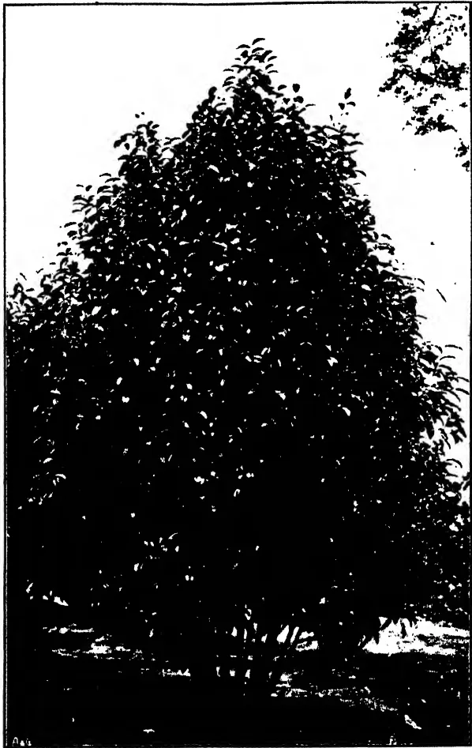A black and white photograph of a dense, well-shaped tea bush. The bush is conical in shape, with many small, dark leaves visible. It stands in a field with some ground cover and a few other plants in the background. The lighting is bright, creating high contrast between the dark leaves and the light background.

*Plate 1.*  
A WELL SHAPED TEA SEED BEARER.  
(Reproduced from Java Tea Experiment  
Station Bulletin, No. 76)

446------------------------------------------------

This image is a blank white page. It contains several small, dark specks which appear to be scanning artifacts or dust particles. There is no text, handwriting, or printed content on the page.

447------------------------------------------------

SEPTEMBER, 1922.]139

# TEA.

## OBSERVATIONS ON TEA-SEED BEARERS.

G. G. AUCHINLECK, M.Sc., A.I.C., F.C.S.,

*Divisional Agricultural Officer, (Central) Ceylon.*

Very little information has been published regarding the correct treatment of tea-bushes cultivated as sources of seed. In past files of the TROPICAL AGRICULTURIST there are two short references to certain trials in India, and text books on tea-planting do not deal with the question. The trials in India are also described briefly in the QUARTERLY JOURNAL OF THE INDIAN TEA ASSOCIATION (Part III, 1918).

It is therefore not possible to give figures of yield of seed obtained by different methods of treatment. Under ordinary conditions, the question would perhaps not be of urgent importance, but the importation of seed from India into Ceylon is now prohibited, and in consequence every grower will probably find it necessary to force the yield of his seed-bearers up to its maximum in order to fill local orders.

The few references available point to the fact that, both in Ceylon and India, fields of seed-bearers receive careful cultivation and manuring, but are neglected in the matters of spacing and pruning. As the trees increase in size, the yield of seed per acre tends to decrease in spite of increased manuring and more careful methods of cultivation. Trials of the effects of different planting-distances and of various systems of pruning are needed, and in preparation for these a critical discussion of the probable needs of the tea plant is necessary. Some guidance can be obtained by considering the methods found suitable for other seed-crops, and by observing the mode of growth of the tea-plant under normal conditions.

### SEED BEARERS IN CEYLON.

On many of those estates in Ceylon which possess varieties of tea of recognised merit, definite areas are set aside on which tea-plants are grown merely as sources of seed. In 1922 selected seed from these properties is being sold at prices ranging from Rs. 70 to Rs. 90 per maund of 80 pounds, and figures at the disposal of the Department of Agriculture indicate that the yield of seed of all grades varies from 1,500 to 4,000 pounds per acre, in accordance with variations in climate, soil and treatment.

Many of the fields of seed-bearers in Ceylon appear to have originally been planted for plucking, and to have later been allowed to grow for seed bearing. Whatever may have been their origin, the distances between the plants are considerably smaller than appear advisable for trees of their height and natural width. Three feet and a half, sometimes thinned out to seven feet, is a not uncommon distance, 1,000 to 1,200 plants being the usual number per acre; the area of ground available for each plant is therefore from 43 to 36 square feet. Adult trees planted at this distance range in height from 15 to 25 feet.

448------------------------------------------------

140[SEPTEMBER, 1922.

It does not seem possible that trees growing under these conditions can be healthy and normally productive. The trees have single, straight stems, free from any branches or leaves, up to a height of 8 to 12 feet, surmounted by a quite inadequate crown of crowded branches and leaves.

No system of pruning, such as is carried out in the case of all fruit-bearing trees in temperate climates, appears to be adopted in the case of these tea fields. In the tropics regular systems of pruning have been adopted for coffee-trees, and to a less extent for cacao and limes.

Two quite different problems are therefore involved, and on neither of them is there any reliable information obtainable. There is firstly the effect, on the yield of seed, of excessively close planting, and secondly the effect of a careful system of topping and pruning whereby crowded, useless wood is removed and replaced by young, productive shoots. There is the further problem of the extent to which thinning-out, topping and pruning of old seed-bearers can be made profitable. Both in India and Ceylon, there is fairly strong evidence that wide spacing and systematic pruning are profitable, and also that even drastic treatment of old, crowded seed-bearers is in the end found to be of benefit.

#### NORMAL GROWTH OF A TEA-PLANT.

There is little doubt that an adult tea-plant, growing normally in the open, varies in height from 12 to 20 feet. It tends to sucker somewhat freely from the base of the trunk, and so usually develops a bushy or shrubby habit. As a result, the head or crown of leaves begins to form at a short distance from the ground, and the general outline of the plant is oval or conical in shape. In horizontal diameter the crown is about 12 feet wide, and vertically about 12 to 15 feet. These points are clearly brought out in Plate I, in which a well-shaped tree, photographed on the Java Tea Experiment Station, is shown. In Plate II, the general habit and shape of closely planted seed-bearers in Ceylon are shown, and a useful comparison can be made.

The leaves of a tea-plant are single, and are arranged in an open spiral round the shoot, apparently 6 to 7 leaves completing one turn of the spiral. The flowers occur, usually in pairs, in the axil of each leaf. Once a pair of flowers has been produced and has formed into fruit, the axil producing them is apparently unable to give forth more flowers in subsequent seasons, and that particular joint or node of the branch becomes sterile: in this matter the tea-plant seems to resemble the coffee-shrub, and there is little doubt that both these plants rely entirely on their young shoots for each year's crop of flowers and fruit. In the case of cacao, flowers are produced year after year on the same 'cushions.'

The immense importance of topping back coffee plants in order to force growth of laterals, the thinning-out of superfluous laterals, and the annual cutting back of laterals in order to force the production of new flowering-shoots are too well known to require any emphasis here. A presumption is raised that similar treatment of a tea-plant would produce similar results.

The shoots and branches of the tea-plant show a more marked tendency to grow vertically, even when the plant is in the open, than do those of the coffee-plant. The differentiation into vertical stems and horizontal

449------------------------------------------------

*Plate II.*  
TEA SEED BEARERS IN CEYLON TOO CLOSELY PLANTED.

450------------------------------------------------

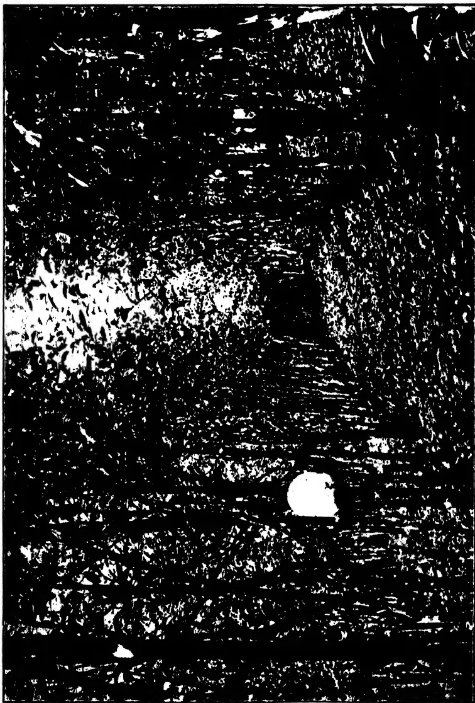

*Plate III. TEA SEED BEARERS IN CEYLON.*

Planted in rows, but trees too close in the rows.

451------------------------------------------------

SEPTEMBER, 1922.]141

laterals is clearer in the case of the coffee plant. It follows from this that cutting back of old laterals is the most important phase of pruning in the case of coffee, whereas pruning to obtain an open, wide, head in the young plant, and annual topping of vertical shoots so as to force outward lateral growth in older plants is the rational method for tea seed-bearers.

The question of pruning tea-plants will be dealt with later, but for the present it can be stated that the most profitable and natural shape of tree to be aimed at is probably the spherical or widely oval.

### EFFECT OF CLOSE-PLANTING.

There is perhaps no point upon which so much misunderstanding exists as that of the effect upon a tree of close-planting or over-crowding. At the same time, there are few conditions which exert so great an effect upon a healthy tree. When attempting to deal with an over-crowded field the planter usually keeps the soil in mind : on the assumption that a larger number of trees needs more plant-food from the soil, he proceeds to increase his manuring and intensify his methods of cultivation. The fundamental mistake in this method is that the harmful effects of over-crowding, like that of too heavy shading, are to a much greater extent due to diminution of sunlight and of leaf-surface than to insufficiency of soil-minerals.

The actual living substance of plants is chiefly drawn, not from the soil, but from the air. As the capacity of each square inch of leaf-surface for absorbing air is definite and limited, any reduction of leaf-surface means a correspondingly less ability to grow. The whole life of any tree is directed towards one end, the production of fruit, so that the plant may reproduce its kind. A tea-bush weighing 100 pounds, contains the following substances.

<table>
<tr>
<td>Water</td>
<td>50 to 80 pounds</td>
</tr>
<tr>
<td>Organic matter</td>
<td>18 to 40 pounds</td>
</tr>
<tr>
<td>Mineral ash</td>
<td>1 to 8 ,,</td>
</tr>
</table>

Manuring is necessary for stimulation of growth, but growth is the building up of living matter from the air.

The loss of leaf-surface caused by close planting can be demonstrated. In figure I. are shown three spherically-shaped trees, 15 feet in diameter, planted 15 feet apart, or 193 trees per acre.

A sphere of 15 feet diameter has an outside surface or periphery of 706 square feet, so that 193 trees would possess a total of 136,354 square feet of surface exposed to sunlight and capable of bearing flowers.

"In figure II. are depicted trees of similar habit planted  $7\frac{1}{2}$  feet apart, or 772 trees per acre. The centre tree has been dotted in completely, and it shows that only a small part of each tree is left exposed to sunlight. This small part is  $7\frac{1}{2}$  feet in width, and the area of its surface is approximately 50 sq. feet.

452------------------------------------------------

142[SEPTEMBER, 1922.]

Under these conditions the total area of surface exposed by an acre of 772 trees would be 38,600 sq. feet or 1/3rd of the area exposed by the widely spaced trees.

There are other losses. Similar cramping of the roots occurs, and the trees grow taller in their search for sunlight thus building up woody trunk instead of young flowering shoots. This increase in height, which is considerable, is not shewn in the Figures.

In Figures 3 and 4 are depicted conical trees, and here the loss is less. Cones of 15 feet diameter at the base have an area (excluding their bases) of 400 square feet or 77,200 square feet for 193 trees per acre. When planted at  $7\frac{1}{2}$  feet distance the conical heads not overlapped by neighbours are 7 $\frac{1}{2}$  feet in height, that is each is 100 square feet in area, and the total exposed surface is 77,200 square feet per acre of 772 trees.

In this case there is no loss of total surface per acre. It is clear, however, that loss of seed is caused by cramping of roots in the soil, by undue crowding of branches at the tops, and by waste of energy in building up non-productive increase in the length of the trunk. The inconvenience of reaping seed from, or the pruning of the heads of trees which have been forced upwards by close planting hardly needs emphasizing.

#### RENOVATION OF OLD BEARERS.

From observations made on tea trees growing in the open on moderately good soil, it appears fairly certain that 12 feet is the minimum distance at which seed bearers should be planted. Probably 15 feet would be even more profitable. In other words, a field carrying 1,200 plants per acre should be thinned out to not more than 300 plants, and better still to 193 plants.

It is unlikely that an old tree, of 20 to 25 feet in height, with a branchless trunk of perhaps 10 or 12 feet, can form lower laterals even if overlapping neighbours be removed. It will be necessary to cut back the top in order to force laterals. In the trials made by the Indian Tea Association, such trees were topped at 7 feet, at 3 feet, and to the ground. Actual figures are not given, but it is stated that best results were obtained by cutting back to the ground, in spite of the fact that two years' loss of seed followed the drastic treatment. Trees topped at 7 and 3 feet did not form such satisfactory heads and the ultimate yield was less.

A certain amount of thinning can be effected by removing weak trees which have been overshadowed by their neighbours. This method still leaves the remaining trees limited in their ability to form lower laterals. In the end it will probably be found more profitable and quicker to remove alternate rows of trees and to cut back the remaining ones.

The loss entailed need not be great. An estate possessing 10 acres of seed-bearers, yielding 2,000 pounds of seed per acre, could thin and top one

453------------------------------------------------

EFFECT ON SPHERICAL TREES OF CLOSE PLANTING.

Figure 1

<table>
<tr>
<td>Diameter of head</td>
<td>-</td>
<td>15 feet</td>
</tr>
<tr>
<td>Distance of planting</td>
<td>-</td>
<td>15 feet</td>
</tr>
<tr>
<td>Area of head exposed to light (per tree)</td>
<td>-</td>
<td>706½ sq. ft.</td>
</tr>
</table>

Figure 2

Trees similar to those in Figure 1  
 Planting distance reduced to 7½ feet  
 Area of head exposed to light, app. 50 feet

454------------------------------------------------

EFFECT ON CONICAL TREES OF CLOSE PLANTING.

Figure 3

<table border="0">
<tr>
<td>Diameter of base of head</td>
<td>-</td>
<td>15 feet</td>
</tr>
<tr>
<td>Distance of planting</td>
<td>-</td>
<td>15 feet</td>
</tr>
<tr>
<td>Area of head exposed to light ( per tree )</td>
<td>-</td>
<td>400 sq. ft.</td>
</tr>
</table>

Figure 4

<table border="0">
<tr>
<td>Trees similar to those in Figure 3</td>
</tr>
<tr>
<td>Planting distance reduced to <math>7\frac{1}{2}</math> feet</td>
</tr>
<tr>
<td>Area of head exposed to light, 100 sq. feet</td>
</tr>
</table>

455------------------------------------------------

SEPTEMBER, 1922.]143

acre as an experiment and observe the results. The loss of seed could quite easily be made good by reaping from the trees in the ordinary cultivation grown for plucking. From the results observed in this acre, the method to be adopted on the remaining 9 acres could be decided.

Seed-bearers of 30 years of age, planted at the distance common in Ceylon, appear to range in height from 15 to 20 feet. It is probable that at 10 years of age, the trees would be of such a size as to be in contact with their neighbours. As bearers will live for more than 50 years, it is quite easily comprehended how the progressive diminution in yield of seed per tree takes place. The chief result of good cultivation and heavy manuring is to force such trees higher and higher, without increasing the bearing surface by a single square foot, while producing more wood the upkeep of which is a greater strain on the leaves.

#### PRUNING FOR INCREASED SEED.

A common feature of fruit trees in the tropics is the alternate bearing of heavy and light crops. During one year the tree exhausts itself by production of a heavy crop, and in the subsequent year rests from fruiting, using its spare energy for making new wood. The effect of manuring is to intensify this behaviour: in other words it causes a heavier crop in the productive year, but has little effect in the resting year.

As a matter of fact this behaviour is not purely due to the absence of winter. The same thing occurs in temperate climates, if the trees are left to themselves.

In temperate climates, with their more advanced systems of agriculture, fruit trees are not left to themselves but are pruned annually, and the alternate heavy and light cropping is replaced by a more regular average annual yield. The effect of manuring on pruned trees therefore is to force to a constant high level the annual average yield.

In the case of the seed-bearers, pruning is practically entirely neglected. Four main lines of work are needed—(a) to prevent the tree from growing too high, (b) to shape the tree so as to obtain the maximum of exposed leaf-surface, (c) to thin out crowded shoots, and (d) to cut back old sterile branches so as to force new productive shoots.

Where the trees are set widely apart there should be little difficulty in keeping them at a maximum height of 15 feet, and probably even 12 feet. To effect this, the tea tree should be made to branch low, instead of forming one leading trunk, an object easily attained by cutting it back in its young stages almost to the ground. It has been found in the case of the tea plant that 6 to 10 stems are a suitable number to allow on the collar (note Plate I). In Figure 5 the method and its results are indicated diagrammatically.

456------------------------------------------------

144[SEPTEMBER, 1922.

This system is rendered more easy by the naturally bushy or shrubby habit of the tea plant. By keeping the trees at a moderate height the reaping of the crop, removal of *Loranthus* and diseases, and annual pruning for new wood, are all rendered cheaper and easier.

After basal branching has been induced, it is necessary to counteract the natural tendency of the branches to grow vertically. This is effected by cutting back the vertical shoots so as to force branching. The vertical shoots should be topped just above eyes which face outward, as is indicated in Figure 5. In general, it is probable that this topping might be done at a height of 3 to 4 feet from the ground, and the process should be repeated at successively higher points in subsequent seasons after the crop from the new branches has been reaped. Throughout the life of the plant, pruning should be directed towards obtaining a spherical or broadly oval head.

Once the general shape of the tree has been formed and set by careful pruning, occasional thinning-out of crowded laterals, and annual clipping-back of sterile laterals so as to produce young flowering shoots, are probably all that will be found necessary. Work of this sort needs some skill, but it should be possible to train a certain number of labourers in the work, and to place them under the supervision of a smart overseer: trained pruning-gangs of this sort are used on the best cacao estates in West Indies.

#### SUMMARY.

Foregoing remarks may be summarized as follows:—

(1) Tea-seed bearers in Ceylon and India are usually planted far too closely.

(2) Close planting results in unwieldy height, in a serious reduction of the area of flowering surface of the trees, and in reduction of the seed-crop.

(3) Heavy manuring and good cultivation cannot overcome the effects of close planting.

(4) Thinning of closely planted bearers is necessary if increased yields are desired. 300 plants per acre are probably the maximum number which should be allowed.

(5) Thinning must probably be accompanied by cutting-back in order to force lateral branching.

(6) It is probable that a spherical or oval shape is the most natural and profitable one for a tea-seed bearer.

(7) Probably the tea-plant relies entirely on its new shoots for production of flowers and seed, and therefore careful annual pruning would be profitable.

(8) The whole question of the care of tea-seed bearers appears to have been neglected, and systematic trials of various methods of pruning are needed.

457------------------------------------------------

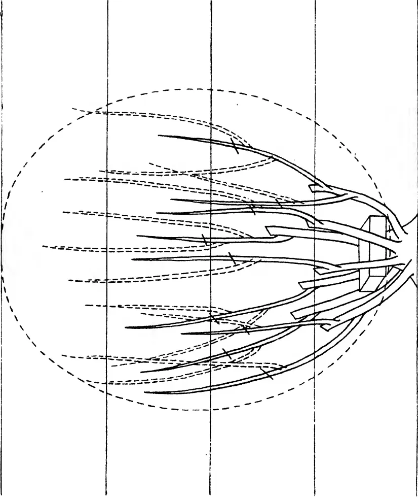A technical diagram of a tree trunk and its branches. The trunk is a vertical line on the right side of the image. From the trunk, several branches extend horizontally to the left. The branches are shown in two states: solid lines representing the current growth and dashed lines representing the branches that will be pruned. A large dashed oval is drawn around the branches, indicating the desired oval shape for the tree. The branches are pruned to follow the curve of the oval. There are also some small rectangular shapes on the trunk, possibly representing grafts or specific pruning points.

Figure 5  
Pruning for oval shape.

458------------------------------------------------

A completely blank white page with no visible content, text, or markings.

459------------------------------------------------

SEPTEMBER, 1922.]145

# RUBBER.

## SOME NOTES ON RUBBER ESTATES OF THE FUTURE.\*

VICTOR RIS, MEDAN.

1. The Influence of Selection of Planting Material on the yield of rubber estates.

Until very recently, in fact, almost until the extensive opening up of Rubber lands was discontinued in consequence of the rapidly decreasing price, all Rubber Estates in the East were planted up with more or less unselected seed. No selection on a clear scientific basis had anywhere been adopted, that is to say, nowhere to any appreciable extent.

The result of planting up such large areas with unselected material is now clearly to be seen everywhere and the following figures illustrate what may be considered to hold good for the majority of Estates in the East when their full planted up acreage is considered :

It may be said that 75 % of the planted trees yield 40 % of the crop and 25 % of the planted trees yield the balance of 60 %.

These trees are hereafter referred to as Class A and Class B trees respectively.

Of the total number of planted trees on an Estate 10 % may be said to yield 25 % of the crop whilst 1 % of the total planted trees yield 5 % of the crop.

Such trees are hereafter referred to as Class C and Class D trees respectively.

Under "Class A" are included many trees which yield no latex or practically none. Under "Class D" are included trees, whose records show they yield year after year between 55 and 60 lb.

On the basis of these figures, we can deduce that an average Estate yielding at present 400 lb. per acre per annum could be expected to yield if planted :

with trees described above as *class "B"* 960 lb. per annum

<table>
<tbody>
<tr>
<td>do</td>
<td>do</td>
<td><i>class "C"</i></td>
<td>1,000</td>
<td>do</td>
</tr>
</tbody>
</table>

<table>
<tbody>
<tr>
<td>do</td>
<td>do</td>
<td><i>class "D"</i></td>
<td>2,000</td>
<td>do</td>
</tr>
</tbody>
</table>

The figures further clearly prove what has been already stated above, i.e., that not only has unselected planting material been used for planting up Estates, but that, taken on the average, *poor* planting material has been used and that it is most important that for future plantings the planting material should be most carefully selected on scientific lines.

\* The following notes have been compiled as a report by Mr. VICTOR RIS. Visiting Agent, Medan.

460------------------------------------------------

146[SEPTEMBER, 1922.

In the Dutch East Indies this urgent need has been recognised for a good many years and the highly trained staffs of Botanists attached to the Experimental Stations and, I may here especially mention the Research Station of the Avros, have been extensively engaged on work connected with the Hevea selection problem.

The results of their research work so far obtained, show :

(a) That the greatest success is attained in grafting or budding parts of selected high yielders on to the young root system of ordinary trees, thereby solving the problem of multiplication of high yielders in a short space of time.

The stems developed from such buddings show all the valuable characteristics of the mother tree. Structure of bark, number of latex carrying vessels, etc., in the offspring stem are equal to those in the mother tree. There is therefore every reason to believe that trees so grown will equal or at any rate approximate, the yield of the mother trees.

In this connection it is interesting to note, as a further proof that the characteristics of the mother tree will be found in the trees grown from buddings, that the offsprings of yellow latex yielding mother trees yield also yellow latex whilst offsprings of white latex yielders yield white latex. As a matter of fact, one can go so far as to say that if an "eye" of a yellow latex yielder is grafted on to a white latex yielding stem, a tapping cut made at a later date across the grafting point yields in the upper part yellow latex and in the lower portion white latex. This is merely of course mentioned as a side light on the possibilities of grafting.

Grafting has passed out of the experimental stage and it can be adopted with the best results for any new Rubber Clearings. It is a fact that some hundred thousand graftings have already been carried out with complete success and grafting material from highly selected trees is beginning to form an "article of commerce." First class material is now being very eagerly sought for in many quarters. The Avros Research Station alone supplied to its members in 1921 about 6,000 meters of branch of selected trees. One meter carries about 10 sleeping eyes suitable for budding.

(b) The slower process of multiplication of high yielders, i.e., the process of generative selection, is also being very carefully gone into and satisfactory results have already been obtained.

After extensive and often pretty costly experiments it has been possible to obtain self-pollination on some selected high yielders. In this way it becomes possible to arrive eventually at the isolation of, biologically speaking, "pure lines," the selection which is considered to be the ideal one.

This selection naturally will take time before full results are obtained because "pure lines" can only be determined as such after several generations have proved to show constant characteristics i.e., proved that the characteristics are hereditary.

Moreover, even if full results are eventually obtained such "pure line" selection and production of "pure line" seed will very probably never yield sufficient seed for planting up large areas.

The limited number of high class "pure line" seeds will in all probability mostly be used for growing trees to be used for budding material. Budding as mentioned under (a) will therefore remain most probably the principal method of multiplication of high yielders in a short space of time.

461------------------------------------------------

SEPTEMBER, 1922.]147

## 2. The Influence of the Selection of Soil on the Yield of Rubber Estates.

Until quite recently, it was taken for granted in the Rubber world that *Hevea Brasiliensis* would grow a paying crop almost anywhere in the Tropics. That *Hevea* can grow anywhere, or at least keep alive anywhere is proved to be about correct, but the idea that *Hevea* would yield a paying crop anywhere has been proved to be a fatal mistake.

Such mistakes have been made in every Rubber planting country in the East; any soil from bare sand flats, peat land and to abrupt and rocky hill sides, all classes of soil have been planted up.

The range available for comparison so far as yield per planted acre goes is therefore a very wide one and instances of the extent to which the quality of the soil influences the yield per acre are not far to find. They are at hand in every Rubber producing country.

I intend to deal hereafter especially with conditions prevailing in the East Coast of Sumatra, but all that is to be said can be taken as holding good, *mutatis mutandis*, in other Eastern Rubber producing countries.

The bulk of the Estates are as already stated planted up with unselected seeds originating all from the same sources and the Estates therefore, from this point of view, can be taken as being built up on parallel lines. The seed factor can thus be eliminated when the yields of different soils are compared, so also can climatic conditions such are excellent from sea coast to the foot of the Hills, from South to North.

But the yield per acre varies from 250 lb. per acre to 600 lb. per acre in specially good fields although considerably higher figures are recorded. It is now, I think, quite clear that such variations, a full 140% in yield, form the strongest indication, in fact the clearest possible proof, that the quality of the soil is a prominent factor determining (all other conditions being equal) the yield of the Rubber tree.

Eliminating about 80,000 acres planted on the East Coast yielding under 300 lb. per acre the balance can be taken as yielding in average 400 lb. per acre per year. Now, keeping in view that there are large fields capable of yielding 600 lb. (and over), one is forced to conclude that proper selection of soil influences the yield by an increase of 50%. Taking extreme figures in this connection, 250 lb. and 600 lb., the influence would be by 140%.

## 3 The combined influence of Seed Selection and Soil Selection on the Yield of Rubber Estates.

Under heading (1) I have said that :

<table>
<tbody>
<tr>
<td>an acre planted with class "b" trees would yield</td>
<td>...</td>
<td>960 lb.</td>
</tr>
<tr>
<td>do class "c" do</td>
<td>...</td>
<td>1000 ,,</td>
</tr>
<tr>
<td>do class "d" do</td>
<td>..</td>
<td>2000 ,,</td>
</tr>
<tr>
<td>on average soil yielding from unselected seeds</td>
<td>...</td>
<td>400 ,,</td>
</tr>
</tbody>
</table>

Under heading (2) I explained that by soil selection the yield can be improved by 50% as compared with the yield of existing average Estates. Therefore :

<table>
<tbody>
<tr>
<td>One acre class "b" trees planted on selected land can be expected to</td>
<td>yield 1440 lb.</td>
</tr>
<tr>
<td>One acre of class "c" do do</td>
<td>1500 ,,</td>
</tr>
<tr>
<td>One acre of class "d" do do</td>
<td>3000 ,,</td>
</tr>
</tbody>
</table>

In the light of yields as now obtained on average Rubber Estates these figures seem extraordinary, but in my opinion one must look at same as possible figures, certainly so, as far as the intrinsic yielding capacity of selected fields is concerned. The first two mentioned should be obtainable under reasonably careful selection of both factors, seed and soil, whilst the third should be obtainable under exceptionally favourable circumstances and is therefore more of theoretical interest only.

Still, personally, I should not venture to estimate for such yields in respect of any larger Rubber areas to be opened up in future notwithstanding

462------------------------------------------------

148[SEPTEMBER, 1922.

that I am fully convinced that Rubber Estates can be laid out and show an intrinsic yielding capacity as stated for class "b" and class "c" trees.

But intrinsic yielding capacity and actually obtainable yields are two different matters. A number of factors such as for instance the necessity to rest a number of trees from time to time, the influence of the tapping system and tapping force on the yield, are factors which in practice must tend to keep the actual yield well below the maximum the trees are theoretically able to give.

As regards "resting" nothing at this juncture can be said for certain, but from past experience one can deduce the trees benefit greatly by being rested from time to time for shorter or longer periods.

As regards "tapping system," the final word has certainly not yet been said, but in all probability any new system for extracting latex from the trees will always be a system by which not the last drop of latex will or can be extracted and by which the cambium will not be over-irritated. Past experience with drastic systems, the cause of Brown Bast and all the misery connected with such, have served as a good lesson.

So far as the influence of the factor "tapping force" goes, everyone knows that in the way the tapping force must be used at present, little chance is given the individual tree to yield its best. Improvements as compared with present day methods will certainly be effected in the future but the actual results obtained by any large force, even the best, will always remain below estimated possible results. No large force will ever consist of ideal tappers only, one will always have to be content with average skill.

How these factors and perhaps many others, will affect the actual yield if such is compared with the intrinsic yielding capacity, is difficult to ascertain at this juncture. A number of those who apparently forget to take the adverse factors into their calculations estimate future yields to reach 1,500, 2,000 and more lb. per acre and others who are more conversant with the practical, daily working of Estates do not hesitate to estimate for at least 1,200 lb. In my opinion the latter will be nearer reality than the former.

For the purpose of the following calculation I take a yield of 1000 lb. per acre per annum and in doing so, I am sure, I am on the safe side. (Selection influenced the yield of sugar-cane and cinchona by almost tripling the output as compared with former unselected cultivations).

4. Calculation of cost per lb. of Rubber for Estates in full bearing of 2,000 acres yielding 2,000,000 lb. per annum.

It can now be safely stated that Estates producing 400 lb. per acre under no restriction scheme can place their rubber on the London market at an "all in cost" of 40 cents or say 8*d.* per lb. Of that sum 26 cents represents "Estates Cost" and 14 cents the cost from f. o. b. to "Sold London."

The "all in cost" per lb. for producers of 1000 lb. per acre would fall to about 25 cents or approximately 5*d.* per lb. "all in."

The annual net returns per acre from Estates yielding 400 lb. and 1000 lb. respectively therefore compare as follows :

<table border="1">
<thead>
<tr>
<th>Selling Price per lb.</th>
<th>Net return per acre yielding 400 lb.</th>
<th>Net return per acre yielding 1000 lb.</th>
</tr>
</thead>
<tbody>
<tr>
<td>5 <i>d.</i></td>
<td>loss £. 5. -. -</td>
<td>£. -. -. -</td>
</tr>
<tr>
<td>6 <i>d.</i></td>
<td>loss 3. 6. 8</td>
<td>profit 4. 3. 4</td>
</tr>
<tr>
<td>7 <i>d.</i></td>
<td>loss 1.13. 4</td>
<td>" 8. 6. 8</td>
</tr>
<tr>
<td>8 <i>d.</i></td>
<td>" -. -. -</td>
<td>" 12.10. 0</td>
</tr>
<tr>
<td>9 <i>d.</i></td>
<td>profit 1.13. 4</td>
<td>" 16.13. 4</td>
</tr>
<tr>
<td>10 <i>d.</i></td>
<td>" 3. 6. 8</td>
<td>" 20.16. 8</td>
</tr>
<tr>
<td>11 <i>d.</i></td>
<td>" 5. 0. 0</td>
<td>" 25. -. -</td>
</tr>
<tr>
<td>12 <i>d.</i></td>
<td>" 6.13. 4</td>
<td>" 29. 3. 4</td>
</tr>
</tbody>
</table>

463------------------------------------------------

SEPTEMBER, 1922.]149

The uncertain factor of Government's income taxes is of course left out of account.

The actual capital cost per acre of the existing 400 lb. yielders can probably be taken as falling between £50—and £60—whilst the cost of the 1,000 lb. yielders to be opened up in future may be taken as lying between £70—and £80—.

Considering the possibilities and merits of stringent selection of planting material and soil to be planted up, one is perhaps doing well to bear in mind the excellent results obtained in the Dutch East Indies during the latter half of the last century in the cultivation of the sugar-cane, cinchona and tobacco and to remember that no other Eastern Tropical colonies can compete successfully with the Dutch Indies on the world's market in these lines.—

ARCHIEF VOOR DE RUBBERCULTUUR, Juni, 1922.

## ROOT SYSTEMS OF HEVEA ON DIFFERENT SOILS.

J. GRANTHAM AND O. F. BISHOP.

(Summary.)

1. The root systems of Hevea on different soils show enormous variation. The height of the water table is the most potent factor in the limitation of root development. Mechanical resistance is a limiting factor on the cementing soils.

2. There is a general correlation of development above and below the ground. The trees on permatangs with an extensive root system and poor development above the ground are an exception.

3. There is no correlation between individual good root development and high yield on the better soil types, but a certain amount on the poorer types. The better soils with the more extensive root systems give the better yield.

4. The typical features of the root system become apparent at an early age (3-3½ years) but are less marked than later. The differences of the root systems on different soils at this age are greater than those shown by the crowns.

5. The pre-eminent importance of lowering the water table as far as practicable is indicated.

6. Although breaking up the cementing soil by cultivation or explosives thus diminishing its mechanical resistance, might be thought to be beneficial, experiments have given negative results.

7. The importance of undertaking any measures of soil improvement at an early age is indicated.

8. Root interference should be considered in connection with thinning problems. With the greatest spread of roots observed, the roots of one tree may be in competition with as many as 58 other trees.

9. The spread of roots mentioned above gives rise to the possibility of one tree with diseased roots infecting a large number of others.—ARCHIEF VOOR DE RUBBERCULTUUR, Juli, 1922.

464------------------------------------------------

150[SEPTEMBER, 1922.

# COFFEE.

## COFFEE CULTURE.\*

J. HAGEN.

*(Translated from the Dutch by H. LUDOWYK, Librarian, Department of Agriculture.)*

### CHAPTER I.

#### History.

Three centuries have elapsed since Coffee came to be known in Europe as a stimulating drink. Before this time it was used principally as a drug. In the Mohamedan lands of Persia and Arabia even as early as in the first half of the fourteenth century, Coffee was an esteemed delicacy. Arabia was for a long time considered, though wrongly, the cradle of the coffee plant.

The question where coffee was first used is a difficult one to answer; and less information is available when one seeks an answer to the question of how men came to use it—to prepare the beverage in the manner known at the present day. One of the oldest accounts tells us of how a goat-herd always noticed great sprightliness in his animals whenever they had eaten of the leaves of a certain tree that was unknown to him. This experience incited the Prior of an Arabian monastery to try an infusion of the berries in order to ward off sleep; and this the monks used to sip during their protracted nightly watches. Another account states that in a forest fire some roasted seeds having come in contact with water, an infusion naturally resulted. None of these accounts satisfy us, and, probably, we shall ever remain ignorant regarding this matter.

It does, however, appear certain that a German doctor, LEONARD RANWOLF, became acquainted with coffee in 1573 at Aleppo. He wrote about coffee, describing it, later, in 1852. Another doctor, PROSPER ALPIN, attached to the Venetian embassy in Egypt, gave, in 1591, a description of the coffee bough together with a careful description of the seed which he had used as a drug. It must have been at about the middle of the seventeenth century before coffee became fairly well known, and EDWARDS, an Englishman, introduced into London from Constantinople the habit of coffee-drinking. So popular did the drink become that in 1652 PASQUA ROSCOE caused his Greek servant to open the first coffee house in London. The undertaking having been successful, others followed suit, and, especially in the reign of CHARLES II, coffee houses became fashionable. Further we find mention of the opening of coffee houses at Marseilles, Paris and Vienna between 1671 and 1683.

It was the same case with coffee as it was with tobacco and cinchona: religion was the means by which it was spread among the Mohamedans. But it was Religion, Politics and Medicine that tried in Europe to retard

\* ONZE KOLONIALE LANDBOUW VII: DE KOFFIECULTUUR DOOR J. HAGEN, oud Planter. TWEEDE DRUK. 8vo, 89 pp. HAARLEM. H. D. TJEENE en ZOON, 1917, Prijs 2 25.

465------------------------------------------------

SEPTEMBER, 1922.]151

the spread of its use. Orthodox Christians looked upon coffee houses as hot bed of vice; the Government considered them the rendezvous of those who disturbed the public peace and violated the laws of the land; and the medical faculty too deprecated the use of coffee. All this opposition was of no avail. Coffee had set forth on its victorious march over the whole world. Now even the poorest can afford to buy it.

With pride can it be stated that the universal spread of coffee is due to the work of Dutchmen; for it was they that first brought plants from Malabar to Java. The plants brought over in 1696 and planted in the Governor-General's (WILLIAM OUTCHOORN) garden were destroyed by a flood. In 1699 ZWAARDENKROON brought to Java some other plants which grew well and were the parent trees of the East Indian coffee cultivations.

According to PAYEN, one of the plants cultivated in Java was sent to Amsterdam addressed to the Burgomaster, NICHOLAS WITSEN, c/o the Administrator of the East India Company. It was planted and carefully tended in the botanical garden where it bloomed and bore fruit. It is needless to mention that the seeds were again planted out. One of their descendants, a tree five feet high, which had already blossomed and fruited, was, in 1714, presented to LODEWIJK by the Council of Amsterdam. The tree was planted in the Royal Gardens at Marley and was well looked after, and its seeds were again cultivated. In 1721, four young plants were conveyed to Martinique by a French marine officer of Clieux. Only one of these plants survived the difficult journey. It is said that this man had to share with the plant his pittance of water in order to save it from withering. This became the parent tree of the coffee cultivations of the French Colonies.

In 1719 coffee plants were sent from Amsterdam to Suriname where the COUNT OF NEALE took them under his care. In 1722 DE LA MOTTE AIGRON, the French Governor of Cayenne was trying to procure, by some underhand means, a coffee plant, not knowing that already in 1721 the French had brought ill-gotten seeds to Cayenne.

Plants were again sent from Martinique to the different parts of Central and South America. In 1723 coffee plants were introduced from French Guiana and planted in Para. Here, however, soil and climate were rather unfavourable for carrying on its cultivation to any considerable extent. In 1770 a small beginning was made in Rio de Janeiro and from here the cultivation of coffee spread to all the Brazilian States—San Paulo, Minas Gerais and Espírito Santo; and to such an extent that for a long time Brazil has been the country that produced most of the world's coffee.

In our East Indian possessions, its cultivation quickly spread: for after the first attempt in 1756, the Directors of the East India Company foresaw that the coffee cultivation would be a great source of income. The results did justice to their foresight. For many years coffee brought in much profit. The interest the Company took furthered the quick spread of coffee cultivation. More than any one else did ZWAARDENKROON, first in a subordinate capacity, and later as Governor-General, give to it all his interest and every attention.

It was, however, in 1830, with the introduction of "de Cultuurstelsel"—systematic cultivation—that the cultivation was first taken in hand on vigorous and improved lines.

466------------------------------------------------

152[SEPTEMBER, 1922.

We might now be fairly convinced that coffee for a number of years caused a flow of many millions into the Government Exchequer. Throughout all this time, only one species of coffee was cultivated. This was Arabian coffee which showed itself best suited to the conditions of soil and climate.

But, alas! the days of Arabian coffee cultivation in Java are numbered. Diseases and pests, and principally the leaf diseases, have so taxed it that success in coffee planting has come to be as uncertain as that of a gamble. The great irregularity and uncertainty of the yield is the reason why a cultivation of this sort will have to be abandoned here, or, practically speaking, is already nearly abandoned.

## CHAPTER II.

### BOTANY—SPECIES—VARIETIES.

Coffee belongs to the Order of the Rubiaceæ, and to the genus *Coffea* in which there are as many as seventy different species.

Not one of the species of coffee grown in our Colonies is indigenous to them. The greater part of these species are indigenous to Africa where different species are found growing in a wild state. *Coffea Arabica* can be taken as typical of most of these. This species of coffee was brought over in the fifteenth century to Arabia and India. The other varieties cultivated in the Dutch East Indies resemble, more or less, the Liberian coffee. The difference even in appearance between these and those of the Arabian type is very striking.

#### COFFEA ARABICA.

*Coffea Arabica* is a tree which attains a height of from 25-30 feet. The tree forms a genuine tap root, which seldom, however, grows longer than two and a half feet. The bark, rough on the outside, has, usually, a greyish colour. On the trunk the supple branches arrange themselves in a decussate order—corresponding pairs standing over against each other. The branches bear elliptical or oval leaves. The leaves are pointed at the apex. The breadth of the leaves ranges from one half to two inches, and the length from 2-8 inches. They show from 9 to 12 veins on each side of the midrib. The regular and arc shaped veins run laterally from the midrib. Midrib and veins are all well clearly visible by reason of the bright green surface of the leaf.

The flowers number from three to sixteen in each of the axils of the leaves where they appear. Each group of three flowers is surrounded by four bracts. Two of these bracts are three-cornered, and the other two are drawn out and long. They never extend beyond the calyx. The flowers last but a short time, but they appear many times a year. The flowers are snow white and are of a strong but pleasant odour reminding one somewhat of the scent of the Spanish Jessamine. The flower is short and has a small light green calyx.

The flowers have five petals. The corolla of the flower has a long tube of about 2 inches in length. The petals which are lancet-shaped and rounded at the end are about  $1\frac{1}{2}$  inches long. The stamens, five to seven in number, project beyond the flower. The pistil is continuous with the tube of the flower. At the end the style divides itself into two parts, forming a forked stigma, each of whose parts is about  $\frac{1}{2}$  of an inch long. A bilocular ovary completes the flower.

467------------------------------------------------

SEPTEMBER, 1922.]153

Besides the normal bloom, there appears, especially in abnormally rainy years, a large number of small flowers which give rise to no fruit. These appear at the axils of the leaves. They have a very short stem and are of a light green colour.

After pollination and cross-pollination have been completed, the corollas fall off, and the young fruit begins to develop. The fruit gets ripe within a period of from five to seven months. The time taken for ripening depends on climate and soil. The fruit, in spite of its containing a stone, we have already called a berry. The fruit has a fleshy rind inside which a sweet jelly-like substance lies. This substance adheres fast to the hard thin horny rind of the seed. Under this rind is again a thin silvery film just outside the beans. The fruit contains, normally, two beans which are oval in shape, and lie with their flat sides against each other. Sometimes, when only one fecund particle of pollen takes part in the development of the ovule, the bean becomes oval, and we have the male or the round bean coffee. Rare cases occur in which a berry has three or more beans—(*Coffea polysperma*.)

Arabian coffee has now been cultivated in our Archipelago for the past two centuries. During the course of this time, in different localities, several types have arisen, characteristic of the place wherein they developed. Plants typical of those that grow in a certain locality when cultivated in another locality do not preserve their own characteristics and nature, but, in time, modify themselves to such an extent as to become, practically, plants typical of the place of their adoption. It is on this account that we find such classifications as Malang, Menado, Padang, Preanger coffee, etc.

#### LIBERIAN COFFEE.

During the last thirty years Liberian coffee has been planted on a very large scale. This species has, undoubtedly, excellent qualities; and in the first few years, so far did it succeed beyond the most sanguine expectations of the planters, that it was even predicted that the Liberian coffee would supplant the Arabian type. The native homes of Liberia coffee are Angola, and the Liberian Republic from which it derives its name. In both these countries it grows uncultivated.

The first consignment of seeds imported in 1873 failed altogether. But in 1875, however, Buitenzorg obtained through the Botanic Gardens of the Leiden Academy, a number of young plants; and later, more plants were received through the Royal Botanic Gardens, Kew.

The difference between the Arabian and the Liberian coffee is great. The latter grows to be a flourishing tree 35 feet or more in height. Its trunk is of a reddish brown colour. Its leaves are leathery, deeply puckered and pointed. Sometimes there are little undulations towards the margin of the leaf. The leaves are shiny in appearance and oval in shape. They are from 6 to 12 inches long, and from 2½ to 6 inches broad. The stem of the leaf is short and stiff, and there are from eight to ten pairs of veins with smaller ones towards the end. All these run into the midrib. The flowers are large. They are the largest flowers of all species of coffee. They are pure white in colour, and are, usually, each separate from the other. The number of petals is, generally, from six to eight; and the pollen tube is about ½ an inch long. The fruits of individual trees differ very much in size and form. The berry is practically round, and one generally agrees to call its shape oblong. The colour of the ripe berry is something between a golden or yellowish to a dark red colour. The rind and also the pulp are thick. The rind is tough and strong; and this makes the preparation of Liberian coffee more difficult than the preparation of the Arabian coffee. The proportion of the manufactured coffee to the raw berries used is very small—it being at about

468------------------------------------------------

154[SEPTEMBER, 1922.

1 to 10. In the case of Arabian coffee the proportion stands at 1 to 5. As already mentioned there are great differences in the size and form of leaf and fruit.

The Liberian tree blooms many times in the year while the Arabian type blooms at most five times. One of these might be called the great or the chief flowering. At one and the same time both ripe berries and young fruit are noticed on the tree. This is, indeed, of great advantage, since plucking is spread over the course of the whole year. There is, also, not the great demand on the resources of the tree which it would have to meet in a short space of time if it had to bring forth one heavy crop. This is the case with the Arabian coffee; and this is the reason why the tree was so severely affected by the leaf disease. It is evident that the Liberian plantations, for the same reason, employ less labour, since the crop can be gathered regularly with a small number of pluckers. Liberian coffee requires more hand-plucking than the Arabian coffee since the ripe berries of the former remain a long time on the tree, while those of the latter fall off soon.

At first the flavour of Liberian coffee was much criticised; but the advance of its cultivation and the careful preparation of it have, however, brought about such a change for the better, that the market prices are high. One of the factors that contributed to the improvement of its flavour was in the finding of the proper method of roasting it. Liberian coffee should be roasted for a long time over a slow fire.

In spite of all that has been said here to the credit of Liberian coffee we all have to admit the deplorable fact that its time too is past. The reasons of its decline cannot with certainty be laid down. Investigations have shown us that a good healthy plantation is now well nigh impracticable.

The failure of Liberian and Arabian coffees has given rise to attempts to breed other species and varieties. I shall mention those species which compare favourably with those that have previously been cultivated.

The Maragogype coffee was introduced in 1881 into Buitenzorg from Brazil where it sprung from a variety of Arabian coffee. It has succeeded only in two counties. The tree is not very productive. However deplorable this or any other quality in it might be, the tree produces a large bean of a fine bluish gray colour and of excellent flavour. This tree resembles the Arabian coffee very much. Its leaves, however, are larger and more heavily puckered, while the branches are more supple and thinner.

### **HYBRIDS.**

The product of a crossing of the Arabian with the Liberian captivated people's attention, as this plant was supposed to be immune to attacks of the leaf disease. All these varieties are spontaneous hybrids or mutations. The best known, the Kalimas hybrid, was discovered on a Liberia seed bed of the Kalimas estate company in Bodja, in 1885. This hybrid has been improved still more by grafting and has been known so far as being practically immune to the leaf disease. I shall name yet two more hybrids—the Kawisari hybrid and the hybrid of Soember Sengkaring. These hybrids resemble both parent trees. As a rule, they have the form and appearance of the mother and thus inherit the strong, lusty growth of the Liberia, while the fruits resemble more those of Arabian coffee, but are a little smaller and have thinner peal.

The number of hybrids, however, can be multiplied by grafting. The results of grafting sometimes give us strikingly different hybrids. Most of the hybrids give a fine handsome product having on one part the bluish gray colour of the father, and on the other the yellow colour of the mother.

469------------------------------------------------

SEPTEMBER, 1922.]155

### NEW SPECIES.

We shall now pass over to the newer species which, in fact, I should have dealt with first, since they were lately introduced. We notice that these generally divide themselves into two groups : those that resemble the Arabica and others that are closely allied to the Liberica. To the first of these groups belongs, Robusta, the Quillou and the Uganda. To the second Abecouta, the Excelsa and the Dybowskii. For us the first two are of most importance ; and of these two the Robusta is the variety that should be given precedence.

#### ROBUSTA COFFEE.

This coffee plant was introduced in 1901 by MR. H. H. T. VAN LENNEP, one of our most eminent planters. For a long time this gentleman having noticed that both Arabian and Liberian coffee were deteriorating, repeatedly wrote and spoke regarding the circumstance. As soon as he read in the weekly " de Indische Mecuur " a description of a variety of coffee that was imported into Brussels from Africa by HILDERMAN, its characteristics so pleased him that he determined to get these plants. The first consignment of 160 plants arrived in good condition. They were planted on the grounds of the Karang-Redjo Estate Company. The trees took root well, and seemed to do honour to their name. They were robust plants, of flourishing growth with strong large leaves, and yielded quickly and copiously. They were immune to the leaf disease and bloomed very often. While the Arabian coffee first came into crop only at its fourth year, and the Liberian properly at its fifth, the Robusta had given in its third year a big crop. While the product of the first two varieties were at most 7 cwt. per acre, the Robusta plantation yielded very often double that and more.

As in the case of Liberica, the Robusta too shows a great inclination for variation. We find examples where leaves undulate somewhat towards the margin, and exhibit other peculiarities both in formation and grouping. Examples of others occur wherein the leaves exhibit none of these peculiarities, but are flat, with the end of the leaf not sharp as usual but very obtuse. The measurements of the leaves also vary very much. The fruits are also noticed to vary. Types with small berries we find along with those that have large berries. Variation in the proportion of the raw to the cured product is also seen to exist to a great degree, it being between  $3\frac{1}{2}$  and  $5\frac{1}{2}$  to 1.

But every single characteristic is observed to be a characteristic of the Robusta whereby it distinguishes itself from the other species, the Quillou, the Uganda and the Canephora.

One of those differences is that of the colour of the berry is of a very dark red with a tinge of blue when ripe, and when unripe is of a green colour with not the least bit of brown. Further, the young leaves are mostly light green, and what is generally a silvery film around the bean has a greenish hue in it.

#### THE QUILLOU COFFEE.

The Quillou was procured by the Government from the experiment gardens at Liberville in French Congo. In comparison with the Robusta, a plantation of Quillou is more uniform, as one deals with a type that is less prone to variation. It is not impossible for a Quillou variety to appear in a plantation of Robusta, as, sometimes, Quillou seeds or hybrids came along with a consignment of Robusta. In any case there do appear in Robusta plantations, certain trees that one cannot differentiate from the Quillou.

The most characteristic and surprising difference between the two is in the colour of the youngest leaves which in the Quillou are rust brown or yellowish brown, and in the Robusta a light or yellowish green. The full-grown leaf of the Quillou is also somewhat light green, at least lighter than that of the Robusta. Furthermore, the positions of the leaves on the

470------------------------------------------------

156[SEPTEMBER, 1922.

branches are different : in the Quillou the leaves of the primary branches hang right down. This same inclination in the Quillou leaves is noticed also in the main branches. The main branches of the Robusta slant upwards, while in the case of the Quillou they are more horizontal. This being the case, the leaves are broader and the space between the trees ought to be greater than the spacing in Robusta estates.

The light red or vermilion colour of the ripe berry is also an important characteristic for identification. As said before, in the Robusta it is dark red with a tinge of blue, while the colour of what is a silvery film elsewhere is a muddy brown. The output of cleaned dry coffee to berries in the case of Quillou is also favourable viz 1 : 4.

However, it comes into bearing a year later than the Robusta. This point in its disfavour is more than made up for by the great crop it seems to be able to yield when carefully handled. The plants seem to need no shade at all, but require regular pruning.

#### THE CANEPHORA.

The Canephora distinguishes itself by the bronze colour of the very young berries. When ripe, the berries are vermilion red as in the case of the Quillou ; the tinge of blue of the Robusta is absent. The most surprising and characteristic difference is the form of the leaf. The leaf of the Canephora is finer, smaller and tapers off more towards the apex than do the other two, Robusta and Quillou. It is also not so fine, but is rather leathery ; not undulating, but flat. The end of the stem of the leaf is not heart shaped but tapers down. It seems to be a very easy victim to the leaf disease, and this fact does not augur well for its future. The output of cleaned dry coffee to berries is 1 : 4 $\frac{1}{2}$ .

#### THE UGANDA COFFEE.

The Uganda coffee is the fourth of the type resembling the Robusta that is already being cultivated. Of this we can pronounce no definite opinion. The native home of the Uganda coffee is Uganda. The characteristics of the Uganda are these. The berry is light or clear red, the leaves are finer than the Robusta leaves, smaller and more oblong. They undulate very much, and undulate regularly towards the margin and have bubbles between the veins. They are never flat, but are curved along the midrib so as to give them a boat shape—this appears also in some of the Robusta types. The flowers are somewhat smaller than those of the species akin to Robusta. The produce is good and is the same as in the Quillou in quantity—4 piculs to one.

#### THE EXCELSA COFFEE.

This, as I have already said, resembles the Liberian type. It was discovered by AUG. CHAVALIER in the region to the North of Oubangi, a tributary of the Congo. It grew wild there. As these regions had a climate but little favourable, with a long period of drought, one justly expects that the Excelsa can withstand drought well. The results of cultivation were favourable in different parts, especially in the regions that were particularly favourable to the Hevea. The product was good also in dry regions. It is not good as a catch crop, but if a portion of land annexed to a hevea plantation to be cultivated with it, it will do well.

The leaves are larger and broader than those of the Liberian. The branches are coarser and thicker, while the berries are smaller and are of a plain dark red colour. The berries are broad and rounded, the greatest breadth being towards the head. The peel of the berry is soft and easily broken, and the fruit too, is easy to cut into pieces.

As the trees get very large they will require spacing of at least 12 ft. by 12 ft., and as the trees grow very high the tops will have to be lopped off. The product is not constant. It ranges between 3 $\frac{1}{2}$  to 5 $\frac{1}{2}$  cwt. per acre.

471------------------------------------------------

SEPTEMBER, 1922.]157

# AGRICULTURAL EDUCATION

## THE SCHOOL OF AGRICULTURE, PERADENIYA.

**PRIZE DAY: SATURDAY, AUGUST 4, 1922.**

The annual prize distribution of the School of Agriculture took place on Saturday afternoon at Irene Hostel, Peradeniya. MR. W. L. KINDERSLEY, Government Agent, Central Province, presided and others accommodated with him were : MRS. KINDERSLEY, MR. W. A. de SILVA, the HON. MR. F. A. STOCKDALE (Principal), and MR. J. C. DRIEBERG (Farm School Officer).

MR. STOCKDALE read the following report :—

### THE REPORT.

This is the fifth prize-giving which has been held at the School of Tropical Agriculture. The last prize-giving was held on September 24th, 1921, when the new school building was opened by HIS EXCELLENCY THE GOVERNOR.

Since then three final examinations have been held, one for Headmen in December, 1921 ; another for the Government Vernacular Teachers' Class and the third for the 2nd year English class in March, 1922. For the English Class examination, 17 students presented themselves. The results were as follows :—passes 12, partial passes 3, failures 2. In the pass list, 1 student gained a First Class, and 6 students Second Classes. It is to these students that Prizes and Certificates are being given to-day.

In all 129 students have passed through this school and gained certificates, and of these 30 have found employment in the Agricultural services of Government. Others are doing very good work upon estates, several are cultivating their own lands, whilst some have secured employment in spheres non-agricultural.

The new School year commenced in May last, when two new classes were formed. The first year Class on the English side is now composed of the full complement of 20 students, and the Vernacular Teachers' Class is composed of 12 men. The full strength of the School at present is 46.

The students of the Training Colony, Peradeniya, still continue to attend the Saturday morning class, and a paper on Agriculture is set them at the end of each session.

### STAFF.

The post of Registrar of the School, which hitherto had been a temporary one, was finally abolished at the end of last year ; and consequent upon the departure of the Registrar in December, MR. J. C. DRIEBERG, who had been connected with the School from its inception in 1916, was appointed in charge of the School and Hostel as Farm School Officer, under the general supervision of the Divisional Agricultural Officer. To MR. ST. L. H. de ZYLVA, who had been Registrar for the past 6 years, is due the

472------------------------------------------------

158[SEPTEMBER, 1922.

credit of an organisation which made for efficiency. He was ably supported in his work by his wife and it is with the deepest regret that I have to record her early death, after a brief illness. MRS. DE ZYLVA identified herself with the activities of the School and took a keen personal interest in the students.

MR. C. CANAGARATNAM, who had been on the staff since October, 1919, left last December on being appointed Assistant Manager, Dry Zone Experiment Station, Anuradhapura. MR. C. WICKRAMARATNA continues to be in charge of the work of the Vernacular Teachers' Class. MR. G. V. WICKREMASEKERA, one of the past students of the School, who had been awarded a scholarship to Poona for further training, was appointed to the School as Assistant Farm School Officer, in October 1921. MR. E. S. DE S. JAYASUNDERA, who is receiving a prize to-day, has volunteered his services to the School for a short time, and assists the School Officers in their work both in the field and in the laboratory.

The lectures in Estate Accounts, since January 1922, have been taken by MR. CLAUDE PEREIRA, Accountant of Pallekelley Estate.

#### WORK OF SCHOOL.

Some re-organization of the work of students has been made during the year, in order that more practical work should be provided. Additions are being gradually introduced so as to make the course more attractive as well as more instructive. A commencement has been made with Bee-keeping. Poultry, thanks to a donation from the HON. DR. H. M. FERNANDO, will be installed shortly and if funds permit, the building of the cattle-shed for a small dairy will be taken in hand in October.

The Students continue to go regularly to the Experiment Station, Peradeniya, for planting demonstrations conducted by the Manager of the Station; and to the Botanic Gardens for demonstrations in Horticulture conducted by the Curator. Lectures on co-operation are given at the School by the Secretary, Board of Control, Co-operative Societies.

The work continues to be satisfactory, though it is desired that students who come to the school should do so with a more definite object in view, and should apply their energies in the direction of the practical side of agriculture.

Work on the plots and the paddy field is solely the work of students. They also tap and prepare the rubber on School property and have recently taken over an additional block of about 4 acres of tea and rubber. Practical work in these areas is being made an important part of the work of the students' second year.

#### GROUND.

The school frontage is slowly undergoing reformation, and an additional tennis court is in the course of construction.

#### TOURS.

The School proceeded on the annual tour in February last, to Colombo, Negombo and Kalutara, and spent a week visiting places of agricultural interest. Whilst at Negombo for 2 days the students were the guests of Mr. J. E. P. Rajapakse. Occasional visits have been taken by students to

473------------------------------------------------

SEPTEMBER, 1922.]159

the Peradeniya Chocolate Factory, New Peradeniya Estate Tea and Rubber Factory, to the Kandy Seminary Farm, to the Ross and Lochnagar Estates, and to the New Experiment Station at Nalanda.

### SPORTS.

Athletic Sports are being held under the auspices of the School and of the Old Boys' Union for the first time. The Indo-Ceylon Trading Coy. have very generously offered a silver challenge cup to be won twice in succession before it passes from the safe-keeping of the School.

To all who have assisted by the offer of Prizes the best thanks of the School are due.

### AWARD LIST.

The award List this year includes, for the first time, "the Governor's Prize" presented by His Excellency the Governor for general efficiency in Practical Agriculture. The School recognises the importance of the offer of this Prize by His Excellency. It demonstrates his keen interest in agriculture and will encourage students in their Practical work. GATE MUDALIYAR A. E. RAJAPAKSE again offers the "Rajapakse Gold Medal" for the best all-round student of the course; and we are indebted to him for his continued interest in the welfare of the school. For the prizes which are to be presented this afternoon we have to express our most cordial thanks to HIS EXCELLENCY THE GOVERNOR, GATE MUDALIYAR RAJAPAKSE and to the following gentlemen:—

Sir Solomon Dias Bandaranaike, Hon. Dr. H. M. Fernando, Hon. Mr. H. L. De Mel, Maniagar V. M. Muttukumaru, Mr. R. Salgado, Mr. W. A. de Silva, Mr. Graham Panditasekera, Mr. J. C. Ratwatte, and Muhandiram N. Wickramaratne.

### CONCLUSION.

The interest of agriculturists in the work of the School is essential to our progress and to the progress of agriculture in the Colony. Throughout the past year the number of enquiries addressed to the Department of Agriculture for information upon pests and diseases, manuring, cultivation problems, new products, etc., has increased to a very large extent and it is with pleasure that I can record that an increasing number of enquiries are coming in from Ceylonese agriculturists. In many cases these enquiries can be traced to the work and efforts of past students of the School. This is a healthy sign. It indicates that students as they pass out from the School do not forget that they are entrusted with the spreading of scientific knowledge concerning agriculture throughout the various districts of the Colony and I look forward to the time when it will be possible to establish and equip further agricultural schools and also to provide for higher and fuller Courses in Agricultural Science.

On behalf of the School I have to extend a hearty welcome to MR. W. L. KINDERSLEY and MRS. KINDERSLEY. I have to thank you, Sir, for presiding over the Prize Giving, and MRS. KINDERSLEY for so graciously distributing the awards and certificates. I also have to thank MR. W. A. DE SILVA for the address he has promised us this afternoon.

F. A. STOCKDALE,

Director of Agriculture.

August 3rd, 1922.

474------------------------------------------------

160[SEPTEMBER, 1922.

The CHAIRMAN then called upon MRS. KINDERSLEY to give away the prizes and certificates. The following is the list :—

## AWARDS.

### MEDALS.

"The Rajapakse Gold Medal," for the best all-round student of the course, presented by Gate Mudaliyar A. E. Rajapakse, J.P., awarded to Lionel A. J. Abeyesundere.

### PRIZES.

His Excellency the Governor's Prize, presented for general efficiency in Practical Agriculture, awarded to Lionel A. E. Abeyesundere.

#### For Agriculture :—

1st Prize presented by Sir Solomon Dias Bandaranaike, Kt., awarded to Lionel A. J. Abeyesundere.

2nd Prize presented by Muhandiram N. Wickramaratne, awarded to F. Donald Peries.

#### For Economic Products :—

1st Prize presented by the Hon. Mr. H. L. De Mel, C.B.E., awarded to E. Stanser de S. Jayasundera.

2nd Prize presented by W. A. de Silva, Esq., awarded to K. C. Victor de Silva.

#### For Agricultural Botany :—

1st Prize presented by V. M. Muttukumaru, Esq., Maniagar, awarded to F. Donald Peries.

2nd Prize presented by J. C. Ratwatte, Esq., awarded to E. Stanser de S. Jayasundera.

#### For Agricultural Chemistry :—

1st Prize presented by R. Salgado, Esq., awarded to Lionel A. J. Abeyesundere.

2nd Prize presented by E. A. Elapata Esq., R.M., awarded to Don Jayasena Welaratne.

#### For Agricultural Zoology :—

1st Prize presented by the Hon. Dr. H. M. Fernando, awarded to Francis A. Wickramasuriya.

2nd Prize presented by Graham Pandittasakera, Esq., awarded to Ernest V. Ponnudurai.

## CERTIFICATES.

Class 1.—Lionel Anthony Joseph Abeyesundere.

Class 2.—Kotthigoda Cankanange Victor de Silva ; Everard Stanser de Silva Jayasundera ; Frederick Donald Peries ; Ernest Valupillai Ponnudurai ; Don Jayasena Welaratne ; Francis Abeysinghe Wickramasuriya.

Pass.—Vidanagamachchige Dharmadasa ; E. Daniel Muttettuwegama ; Shelton Odris Peiris ; Coornulasuriyage David Perera ; Sidney James Rambukpotha

Partial Certificates.—Nandu Silva Goonesekere Karunaratne ; Kodikara Arachchige Pabilis Perera ; Everard Rodney Douglas Schrader.

475------------------------------------------------

SEPTEMBER, 1922.]161

### THE CHAIRMAN'S ADDRESS.

MR. KINDERSLEY said :—MR. STOCKDALE had been able to get as much money from Government as no other Government Officer had done. This was as it should be, because, Ceylon was an agricultural country. Every time he (the speaker) went on circuit he preached to the headmen to do their utmost to help the Agricultural Instructors. He congratulated the College on their past labours. They should not forget the year 1918. India cut off the supply of food and in many districts, even the goiyas themselves suffered. Sooner or later the events of 1918 would come round again. It was, therefore, of the highest importance that Ceylon should be self-supporting as regards their food supply.

### DR. SILVA'S REMARKS.

DR. W. A. DE SILVA in addressing the gathering said :—A school of that kind required a good amount of spade work, before it could be made a success. The Principal and the staff should be congratulated for having laid the foundation of the future agricultural education of the Colony. Laying the foundation of a new ideal was a task of a difficult nature. It was a task which anyone ought to be proud of. They had to consider that agricultural education had vast possibilities. That was only a beginning and if the general public interested in the Island, extended their help and encouragement, they could expect much in the future. There were two forms of agricultural education. One was higher agricultural education where scientific agriculturists were trained for research work. He was glad that that school had at the outset not undertaken that work, because anyone who wanted to qualify himself for research work had to

#### Equip Himself with a Better Knowledge

than most of the boys possessed at present. One had to pass the B. Sc., or a similar examination before he could commence that kind of education. Now that they had the University College, it would be possible in the near future to find there that higher education which would help to train men to undertake research work in Ceylon. He hoped that the time might not be far when teaching of these sciences would be imparted in the vernacular. He knew that in some places in India sciences were taught in the vernacular. He knew of a Veterinary College in Lahore, where science was taught in the vernacular and a diploma of this College was held in high esteem. He thought that the two years' course in the school was not sufficient. They had no prodigies in Ceylon and he did not think that a two years' course would give one a really good training in agriculture. He also hoped that it would be possible in that school to have a three or four years' course of training. A lot of young people spoke of *swaraj* and *swaraj* depended on themselves. There was no reason why the young men of the present day should not be trained to face the world.

The REV. A. G. FRASER proposed a vote of thanks to the chair.

476------------------------------------------------

162[SEPTEMBER, 1922.

# P A D

## PADDY TRANSPLANTING

The following are the results of paddy Transplanting Experiments

<table border="1">
<thead>
<tr>
<th>Name of Field and Cultivator's Name</th>
<th>Extent</th>
<th>Amount Sown</th>
<th>Date when put in Nursery</th>
<th>Variety of paddy and Age</th>
<th>When transplanted</th>
</tr>
</thead>
<tbody>
<tr>
<td>Wakkumbure in Kendalela range (cultivated by Messrs. Gunawardene and P. D. Seneviratne.</td>
<td>8 Pelas</td>
<td>3 Bushels</td>
<td>26.10.21</td>
<td>Murungawi 4½ months</td>
<td>10.11.21</td>
</tr>
<tr>
<td>Tingolpellella in Mahawela range (cultivated by Mr. A. Rambukpota)</td>
<td>3 Amunams</td>
<td>2¼ Bushels</td>
<td>2.10.21</td>
<td>Murungawi 4½ months</td>
<td>1.3.11.21</td>
</tr>
<tr>
<td>Field cultivated by Owalgedera Ganeti in Hanwella range.</td>
<td>7 Pelas</td>
<td>1 Bushel and 2 measures</td>
<td>21.10.21</td>
<td>Ratawi 4 months</td>
<td>23.11.21</td>
</tr>
<tr>
<td>Polgaharava (cultivated by Yakdessa of Puwakgodemulla) Mahawela range.</td>
<td>1 Amunam</td>
<td>1 Bushel and 2 measures</td>
<td>2.10.21</td>
<td>Kalaba 4 months</td>
<td>2.3.11.21</td>
</tr>
<tr>
<td>Ratnagoda in Kendalela range (cultivated by Basnayake Nilame. Bandara-nayake)</td>
<td>5 Pelas</td>
<td>1¼ Bushels</td>
<td>1.11.21</td>
<td>Haleli 5 months</td>
<td>3.12.21</td>
</tr>
<tr>
<td>Mailatte in Kendalela range (cultivated by Bandaranayake (Junior))</td>
<td>5 Pelas</td>
<td>1¼ Bushels</td>
<td>2.11.21</td>
<td>Murungawi 4½ months</td>
<td>5.12.21</td>
</tr>
<tr>
<td>Field belonging to Proctor Stephen Perera</td>
<td>4 Amunams</td>
<td>3¼ Bushels</td>
<td>5.11.21</td>
<td>Halsuduwe 4 months</td>
<td>15.12.21</td>
</tr>
</tbody>
</table>

## PADDY TRANSPLANTING COM-

The following are the results of the Paddy Transplanting Competitions. The final judging was done by the Divisional Agricultural Officer and the 1st Prize Don. Tiyadoris Wanigasekera (field Panwala Maha Kumbura) 3rd Prize Don Carolis Dahanayake (field Atuketiya)

The yields were estimated to be fully 2½ to 3 times that of the ad-

477------------------------------------------------

SEPTEMBER, 1922.]163

# DY.

## EXPERIMENTS IN BADULLA.

carried out in Badulla District during the last Yala Season.

<table border="1">
<thead>
<tr>
<th>Manure applied</th>
<th>Yield in Bushels</th>
<th>Straw</th>
<th>Average Yield of Paddy per Acre</th>
<th>Average yield of straw per Acre</th>
<th>Remarks</th>
</tr>
</thead>
<tbody>
<tr>
<td>6 Bags Fish refuse</td>
<td>80 bushels</td>
<td>1,900 bundles</td>
<td>40 bushels</td>
<td>950 bundles</td>
<td></td>
</tr>
<tr>
<td>Ash and cattle manure</td>
<td>61 bushels</td>
<td>1,300 bundles</td>
<td>20 1/3 bushels</td>
<td>433 bundles</td>
<td>Rains had come down during the flowering season thus poor average.</td>
</tr>
<tr>
<td>Not manured</td>
<td>75 bushels</td>
<td>2,500 bundles</td>
<td>42.85 bushels</td>
<td>1428.57 bundles</td>
<td>Good fields naturally fertile.</td>
</tr>
<tr>
<td>Not manured</td>
<td>14 bushels</td>
<td>800 bundles</td>
<td>14 bushels</td>
<td>800 bundles</td>
<td></td>
</tr>
<tr>
<td>Not manured</td>
<td>65 bushels</td>
<td>1,000 bundles</td>
<td>52 bushels</td>
<td>800 bundles</td>
<td>Probably due to the effect of last year's manure cow-dung and green leaf and 5 months variety.</td>
</tr>
<tr>
<td>Green and cattle manure</td>
<td>49 bushels</td>
<td>800 bundles</td>
<td>39.2 bushels</td>
<td>640 bundles</td>
<td></td>
</tr>
<tr>
<td>Cow-dung</td>
<td>108 bushels</td>
<td>3,200 bundles</td>
<td>27 bushels</td>
<td>800 bundles</td>
<td>Good deal of this grain was sucked by the bug and at the same time there was more of vegetative growth.</td>
</tr>
</tbody>
</table>

## PETITIONS IN MATARA DISTRICT.

for the prize offered by the Gangaboda Pattu Co-operative Credit Society. Assistant Government Agent, Matara:—

2nd Prize Vitaranage Don Carolis (held Wikkala Kumbura)

4th Prize Hewa Willalage Don Nicholas (held Maha Kumbura)

joining broadcasted plots.

478------------------------------------------------

164[SEPTEMBER, 1922.

# CEYLON AGRICULTURE.

## BOARD OF AGRICULTURE.

*Minutes of the 9th Meeting of the Estate Products Committee of the Board of Agriculture held at the Director of Agriculture's Bungalow, Peradeniya, at 2.30 p. m. on Thursday, July 13th, 1922.*

*Present.*—The Director of Agriculture (Chairman), the Botanist and Mycologist, the Entomologist, the Agricultural Chemist, the Asst. Botanist and Mycologist, the Acting Asst. Entomologist, Lt.-Col. T. Y. Wright, Major J. W. Oldfield, O.B.E., M.C., Messrs. N. G. Campbell, E. W. Keith, H. D. Garrick, A. P. Waldock, R. Garnier, W. R. Matthew, A. S. Long Price, L. H. S. Peiris, F. R. Senanayake, A. P. Goonatilleke, G. B. Foote, A. M. Clement Dias, Graham Pandittesekera, George Brown, E. C. Villiers, M. L. Wilkins, N. D. S. Silva, the Hon. Mr. O. C. Tillekeratne, the Hon. Mr. H. L. De Mel and Mr. T. H. Holland, M.C. (Secretary).

*As Visitors* :—Messrs. T. A. Coombe, R. F. Lushington, A. W. Bowles, A. T. Reeve, C. H. Gadd, T. Mitchell, Huntley Wilkinson, T. P. Blackmore and Major W. H. Murray.

The CHAIRMAN first referred to the death of MR. C. P. DE SILVA, a member of this Committee, and moved a vote of condolence to his widow and family and that a record of this vote be sent to them. This was carried, all members standing.

The CHAIRMAN then announced the following appointments to the Committee :—

Mr. L. H. S. Peiris in place of the late Mr. C. P. de Silva  
 Mr. A. P. Waldock in place of Mr. W. Coombe  
 Mr. A. M. C. Dias during the absence of Mr. C. E. A. Dias  
 Mr. W. C. Bandaranayake during the absence of Dr. C. A. Hewavitarne  
 Mr. A. P. Goonatilleke during Mr. F. R. Senanayake's tenure of the Chairmanship of the Low-country Products Association.

Letters and telegrams regretting inability to attend were received from the Hon. Mr. James Peiris, the Hon. the Controller of Revenue, Sir Solomon Dias Bandaranaike, Gate Mudaliyar A. E. Rajapakse, the Government Agent, Central Province, Messrs. A. W. Beven and W. C. Bandaranaike, Lieut.-Cols. W. J. B. Dickson and T. G. Jayawardene.

### **Agenda Item 1. Progress Report of the Experiment Station, Peradeniya.**

The CHAIRMAN in commenting on this report referred to Adlay (Job's tear") the growth of which is spreading in the Philippine Islands and which might form a useful addition to the dry grains of Ceylon. The variety on trial at Peradeniya was soft shelled, the varieties found growing wild in Ceylon were hard shelled. Cluster beans which were mentioned in the report were largely grown in India.

MR. BRUCE FOOTE referring to KENT'S Arabica and JACKSON'S Hybrid coffees enquired if any sign of leaf disease had appeared and whether these coffees were disease-resistant.

479------------------------------------------------

SEPTEMBER, 1922.]165

The CHAIRMAN replied that the nursery plants were healthy. KENT'S Arabica was a product of seed selection; both coffees were said to be more resistant than the ordinary Arabica. MR. BRUCE FOOTE said that these coffees were highly spoken of in South India.

In reply to an enquiry the CHAIRMAN said that he would furnish the address from which seed of these coffees could be obtained but that in the case of KENT'S Arabica he had given a guarantee not to sell any seed or plants for seven years. There would probably be a surplus of plants and these he proposed to distribute to the smaller experiment stations for trial.

MR. H. L. DE MEL enquired if any experiments had been carried out in planting coconuts in different positions.

MR. PETCH gave an account of an old experiment at Peradeniya in which owing to a misunderstanding the nuts had been thrown away after germination hence no records of their subsequent growth were available.

The CHAIRMAN promised to arrange for experiments. MR. GRAHAM PANDITTESEKERE asked for experiments in planting dried fallen nuts against ripe picked nuts.

MR. CLEMENT DIAS asked if there were any experiments with regard to the best size to plant out coconuts.

MR. LONG PRICE remarked that young plants invariably did better than old ones.

MR. H. L. DE MEL in referring to Fodder grasses asked if any planting material of Kikuya Grass was available.

The CHAIRMAN replied that a small quantity might be available next N. E. Monsoon.

#### **Agenda Item II. Progress of Investigations of Shot-Hole Borer in Tea.**

The CHAIRMAN said that the result of MR. JEPSON'S investigations and calculations in collaboration with MR. GADD were now in the press in the form of a Bulletin. It would appear from these that the use of nitrogenous manures such as nitrate of soda and sulphate of ammonia had produced a marked beneficial effect and that lime had produced a less marked effect. It was therefore proposed that a fresh series of experiments should be instituted to investigate these points. The location of the experiments had to be decided, it was preferable that they should be as near Peradeniya as possible. He apologised that owing to late arrival from the press it had been impossible to circulate the report but he had placed the subject on the agenda in order to obtain opinions and suggestions of members with regard to the proposed new experiments. He would ask MR. JARDINE to review the Sarnia experiments.

MR. JARDINE reviewed the experiments now being carried out. With regard to the second series of manurial experiments the first examination of galleries was carried out in May and early June, the second was due in August and after this it would be necessary to decide whether any benefit was being derived from these experiments and whether they should be continued.

For the renewal of the castor oil experiments it was necessary to find land free from Shot-hole borer near to Head Quarters if possible. This was agreed to be a difficult matter.

The Committee approved the continuation of the experiments as outlined.

480------------------------------------------------

166[SEPTEMBER, 1922.

**Agenda Item III. The desirability of Removing Fluted Scale from the Scheduled List of Pests.**

The CHAIRMAN stated that the pest had been scheduled in 1917 when it was thought to be a serious pest. It was feared at first that tea would be attacked but this had not occurred. The scale usually confined its attacks to acacias. It was controlled in Ceylon by Lady Bird Beetles and certain entomogenous fungi. DR. HUTSON said that the Fluted scale had been first found in the Agra Patanas in 1915. It had spread gradually but had never been found to breed on tea. It had been found on Albizzia, Dadap, Tephrosia candida, Casuarina and a few other plants. It had not been a pest since 1919. In 1920 the Vedalia Beetle had been imported and successfully put out in several districts and had cleared off the Fluted Scale. In other districts the scale was controlled by the local Lady Bird Beetle and by certain fungi. MR. M. L. WILKINS said he had in the past seen a great deal of Fluted Scale on Dadaps and on Boga medalloa, the scale had later died off though he did not attribute this to the declaration of the pest.

The CHAIRMAN said that 85 estates were scheduled at the present time and pointed out the disadvantages which these estates suffered by keeping the Fluted Scale on the scheduled list.

MR. A. P. WALDOCK enquired if these estates were now all free from the pest and was informed that this was not so.

MR. GARRICK proposed and MR. WALDOCK seconded that enquiry should be made from the scheduled estates as to whether the Fluted Scale was (1) Present and (2) serious and that the results of this enquiry should be placed before the next meeting of the Committee. This was carried.

**Agenda Item IV.—The Effects on the Tea Bush Root System of**

1. (1) *Collar Pruning* :
2. (2) *Hard Pruning* ;
3. (3) *Light Pruning* .

MR. GEORGE BROWN enquired what was known on the probable effect of these operations. MR. PETCH said that there was no definite information on this.

The CHAIRMAN said he believed that in Forestry it was stated that if a tree was coppiced at ground level the resulting new shoots started an entirely new root system. He promised to look up further Forestry records and supply any information obtainable.

MR. COOMBE enquired if it was best in that case to cut gums right down to the ground rather than to leave 2 ft. . . The CHAIRMAN said he believed it was so. MR. LUSHINGTON in his recent report had strongly recommended this style of coppicing and the Forest Department intended to try to introduce it.

MR. PETCH said that the examination of the roots of growing trees was a considerable task. In America glass-sided inspection pits were used for the purpose. It was not really known yet at what times of year the roots of the tea bush grew in Ceylon. MR. BRUCE FOOTE suggested that it would be best to ascertain this first.

A discussion followed on hard pruning and the best times of year to prune tea.

481------------------------------------------------

SEPTEMBER, 1922.]167

### **Agenda Item V —The Prohibition of Imports of Hevea Plants.**

MR. BRUCE FOOTE said that he had already obtained much of the information he had intended to ask for in introducing this question. He was, however, of the opinion that some system of examination and control was desirable in the case of imported Hevea Plants. He quoted regulations in force in the Federated Malay States. MR. PETCH said that Federated Malay States had first only prohibited import from British Guiana but had now stopped all importation. There were three diseases which it was possible to introduce and which were not at present known in Ceylon; one of these was a mildew similar to grape mildew and another was "Mouldy rot."

The CHAIRMAN said that the subject had been discussed in 1919 and imports from the Western Hemisphere had then been prohibited. If thought desirable it might be possible to prohibit all imports. MR. BRUCE FOOTE did not think total prohibition of imports was desirable but some system of control and permits.

The CHAIRMAN said that the whole Ordinance was under consideration, he was not sure whether under the present Ordinance they had the power to make such regulations. He would look into this. He enquired whether, if feasible, the meeting was in favour of the inspection of Hevea plants from Java, Malaya and the East.

The meeting was in favour of such control.

### **Agenda Item VI. —Budding of Hevea and its Aspects as Regards Old Estates.**

MR. BRUCE FOOTE who introduced this subject said that it appeared to him that if budding was a success old estates would have to cut out their old rubber and replant or they would not be able to compete.

MR. GARNIER questioned whether replanting of old estates on poor washed soil would be successful.

He enquired further whether a good yielding tree was always a good yielder.

The CHAIRMAN replied that he thought it was proved in Java that a good yielder was always a good yielder though of course returns from trees should not be based upon yields over short periods.

MR. GARNIER then asked a number of further questions: (1) whether it follows that the offspring of a good yielding mother tree growing on good soil would be a good yielder if planted in inferior soil; (2), to what extent root formation affects latex production and will the stock influence the latex production; (3), Brown Bast is generally understood to be a result of over tapping. Would it be advisable to plant seed from a Brown Bast tree; (4), Is difficulty found in procuring sufficient buds and is it necessary to cut branches of mother trees in order to get them; (5), Has anything been proved about the consistency of latex from budded trees.

In reply to (1) the CHAIRMAN said that he would not like to say that good yielders were always found growing in good soil. The selection of high yielders was naturally a question of great importance. In Java and Sumatra records had been kept over whole estates for one or two years. The most sensible system appeared to be the measurement of the latex, say once a month in glasses graduated with symbols denoting the class of yielder and the marking of a corresponding symbol on the tree.

482------------------------------------------------

168[SEPTEMBER, 1922.

With reference to (2) there was no data with regard to rubber, but in citrus orchards in America it had been found that the stock had a distinct influence on the size and flavour of the fruit. For this reason authorities in Java had recommended marcotting budded rubber-plants after the growth of the scion and thus producing an entirely new tree. With regard to (4) he agreed that it was necessary to cut the branches but did not see any difficulty in procuring sufficient buds. He would leave the question of Brown Bast to MR. PETCH. MR. PETCH said that in the case of some diseases of which Ustulina was one, an abnormal flow of latex occurred before the trees died. This was not invariably the case with Brown Bast. If records of yields were kept even for two months Brown Bast trees could be eliminated. He would not advocate taking seed from Brown Bast trees. As to the question of whether the best yielders were more liable to Brown Bast, authorities in Java said that this was not so but it had been found that better grown trees were more liable.

MR. E. C. VILLIERS referring to the question of marcotting, asked why goatee layers could not be taken direct from the mother tree.

The CHAIRMAN replied that success was only obtained in rubber on young wood, goatee layers from old trees were not successful. There was still much work required in Ceylon on actual Budding; some recent attempts at Henaratgoda had been mostly unsuccessful. Meanwhile estates should keep records to ascertain their high yielding trees. To return to the original question it was hard to see how old estates were to profit from budding.

MR. M. C. WILKINS thought that some old rubber had been actually cut out in the Straits.

**Agenda Item VII.—Mikania Scandens and Other Cover Plants to Prevent Erosion in Old Rubber Land.**

MR. BRUCE FOOTE enquired if *Mikania scandens* had been tried in old rubber.

MR. M. L. WILKINS said he had tried many plants for this purpose. The most successful had been cush-cush grass which grew easily in old rubber and was easily eradicated. *Desmodium trifolium* had also proved useful but he did not favour *Mikania scandens* which was not very effective in preventing wash and which grew well where it was not wanted and often failed where it was wanted. A discussion on other plants for the prevention of wash followed.

**Agenda Item VIII.—The Necessity of Agricultural Instructors Keeping a close look-out for Coconut Pests and Promptly Bringing these to the Notice of those Concerned.**

The Hon. MR. H. L. DE MEL said that coconut pests were increasing and it was necessary to draw the attention of small proprietors, who often did not realise they had the pests, to their presence.

The CHAIRMAN said that a month or two ago he had drawn the attention of Plant Pest Boards to coconut pests and to the necessity of the removal of dead palms. Coconut pests had received a great deal of attention this year. Leaflets had been prepared and would be translated into Tamil and Sinhalese for general circulation. He would also circularise the Agricultural Instructors. A discussion followed as to the utility or otherwise of Plant Pest Boards.

483------------------------------------------------

SEPTEMBER, 1922.]169

MR. BRUCE FOOTE mentioned that the Western Province Board, of which he was a member, had only met once in eight years.

The CHAIRMAN agreed with the necessity for discussing the question of Plant Pest Boards. He would collect all particulars and put the subject on the Agenda for the next meeting for full discussion.

**Agenda Item IX.—Why Large Areas are not Opened up in Coconuts.**

The Hon. MR. H. L. DE MEL who introduced this question said that very little land had been opened up in coconuts since 1912, 1913 and 1914 although the demand was growing daily. Desiccated coconut was used throughout the Empire and with the increase in knowledge and up to date methods coconuts should be a profitable enterprise. It was contended that a man who opened up a coconut plantation benefited his children and not himself but he personally had not found it so. He knew of some reasons for this state of affairs but would like to hear the views of other members.

MR. CLEMENT DIAS said that out of an area of 25 acres of young coconuts he had clean weeded 6 acres, the trees in these 6 acres had borne nuts in 4 years, whereas the unweeded portion had taken 8 years. Clean weeding was an expensive operation and he thought the large expenditure required and the long wait for a return furnished one reason for the lack of enthusiasm in opening up land in coconuts.

MR. LONG PRICE and others suggested that MR. DE MEL should give his opinion.

MR. DE MEL said that in his opinion the main reason was that Government sold large areas of land without making any plans or provision for Railways, Roads and transport facilities. The expense involved and the lack of capital formed another reason. Malaria formed yet another. He criticised the lack of provision of hospitals in this connection.

MR. F. R. SENANAYAKE said he could give a few reasons :—Cultivators had not time to reap the benefits which went to their children, the high price of coconut land and the fact that large estates did not as a rule go in for catch crops as did the small cultivators, the absence of hospitals and means of coping with malaria and the difficulty in getting land settled.

A discussion followed in which the land settlement policy was criticised and instances were given of protracted delays in land settlement cases. MR. GARRICK asked if MESSRS. DE MEL and SENANAYAKE thought that Government should build roads and hospitals in the jungle before any land was opened up. MR. DE MEL replied that when a *bona fide* intention to open land existed a certain expenditure on roads, etc., could be justly demanded and would increase the capital value of the land. Building field hospitals as a first step always paid.

MR. A. P. GOONATILLEKE said that sufficient attention was not paid to roads already in existence.

The CHAIRMAN said that the whole question was a matter of finance.

MR. BRUCE FOOTE thought that this Committee should tell the Government that its land settlement policy was radically unsound.

The meeting then terminated.

T. H. HOLLAND,  
Secretary, Estates Products Committee.

484------------------------------------------------

170[SEPTEMBER, 1922.

## MINUTES OF MEETINGS OF FOOD PRODUCTS COMMITTEES.

### MATALE.

*Minutes of a meeting of the Matale Food Production Committee held at the Matale Kachcheri on Wednesday the 31st May, 1922.*

*Present.*—The Assistant Government Agent (in the chair), Mr. L. P. Emerson, Divisional Irrigation Engineer, C.D.; Mr. G. Harbord, Divisional Agricultural Officer, C.D.; the 3 Ratemahatmayas of the district; Mr. M. B. Boange, Agricultural Instructor and Mr. G. F. Abayakoon (Hony. Secretary).

The Minutes of the last meeting were read and confirmed.

*Irrigation Works:* Reconsidered the proposals for irrigation works put forward in 1920 together with the remarks of the Asst. Govt. Agent and the Divisional Irrigation Engineer on these works:—

(a) *Bowelenne*: Approved action of the Asst. Govt. Agent and Divisional Irrigation Engineer.

(b) *Raitalawela*: Resolved not to press for the present.

(c) *Foratota*: Resolved that the bigger Poratota scheme should be pushed on.

(d) *Nikawella*: Resolved to watch further the progress of the existing timber anicut.

(e) *Audelle Pahala Amuna*: Held that the field owners must maintain the channel better themselves.

(f) *Dekinde*: Approved report of Divisional Irrigation Engineer.

### Paddy Cultivation and Vegetable Garden Competitions.

(a) *Paddy Competition*: Resolved to pay the whole of the Rs. 60/- allotted for Matale South in three prizes to the Group containing Kohonsiya, Madasiya and Udasiya Pattus.

Consideration of Matale East and North deferred as results not declared yet.

(b) *Vegetable Garden Competitions*: Consideration deferred as competition still going on and vegetables not ready yet.

*Delays in obtaining Loans for Irrigation Schemes.*—Resolved that it is desirable that Irrigation Schemes for which the shareholders are contributing the money, whether by repayment in a lump sum or in instalment with interest, should be pushed through with the utmost despatch and that Government should be approached to say definitely if they will loan money and if so up to what sum per annum for this purpose if the schemes are recommended by both the Government Agent and the Director of Irrigation.

### MATARA.

*Proceedings of a meeting of the Matara Food Production Committee, held at the Kachcheri on 31st July, 1922, at 3 p.m.*

Present Mr. J. D. Brown in the Chair and the following gentlemen: Messrs. E. Buultjens, J. E. Wijesinhe and Mudaliyars W. A. Amerasekera, P. F. de Livera, H. E. Wickremaratne, W. A. Perera, W. A. Wijesinhe and D. L. Wirasinhe and Messrs. M. J. A. Karumanayake, B. Buultjens and Mohammed Joonoos, J.P.

1. Read and confirmed the minutes of the meeting held on 6th January 1922.

2. Resolved that a sum of Rs. 750/- be asked for Shows, etc. Owing to the paucity of the unofficial element at the meeting to-day the question of allocations is deferred.

Resolved that transplanting competitions be arranged in Weligam Korale and Gangaboda Pattu for Yala 1922.

485------------------------------------------------

SEPTEMBER, 1922.]171

## PROGRESS REPORT OF THE EXPERIMENT STATION, PERADENIYA.

*For May and June, 1922.*

### TEA.

In the plots under manurial experiment a further number of bushes that have died since pruning have been dug out ; the total numbers of dead bushes for the different plots are

<table style="width: 100%; border-collapse: collapse;">
<tbody>
<tr>
<td>Plot 141</td>
<td>...</td>
<td>49 bushes</td>
<td rowspan="3" style="vertical-align: middle; padding-left: 10px;">} Singlo and Assam Indigenous</td>
</tr>
<tr>
<td>" 142</td>
<td>...</td>
<td>47 "</td>
</tr>
<tr>
<td>" 143</td>
<td>...</td>
<td>57 "</td>
</tr>
<tr>
<td>" 144</td>
<td>...</td>
<td>26 "</td>
<td>Dadap plot</td>
<td rowspan="2" style="vertical-align: middle; padding-left: 10px;">} Assam Hybrid</td>
</tr>
<tr>
<td>" 145</td>
<td>...</td>
<td>110 "</td>
<td>Control plot</td>
</tr>
<tr>
<td>" 146</td>
<td>...</td>
<td>25 "</td>
<td rowspan="5" style="vertical-align: middle; padding-left: 10px;">} Manipuri Indigenous</td>
</tr>
<tr>
<td>" 147</td>
<td>...</td>
<td>17 "</td>
</tr>
<tr>
<td>" 148</td>
<td>...</td>
<td>17 "</td>
</tr>
<tr>
<td>" 149</td>
<td>...</td>
<td>15 "</td>
<td>Dadap plot</td>
</tr>
<tr>
<td>" 150</td>
<td>...</td>
<td>29 "</td>
<td></td>
</tr>
<tr>
<td>" 155</td>
<td>...</td>
<td>25 "</td>
<td>Cattle manure</td>
<td></td>
</tr>
</tbody>
</table>

Three facts stand out :—

1. (1) The superior power of resistance of the Manipuri Indigenous.
2. (2) The superiority of the Dadap plots in their classes
3. (3) The inferior resistance of the Control plot.

The figures for the different sub-plots are unfortunately not available from the start but of the bushes dug out during May and June, 141 B which receives Groundnut cake only has 19 casualties against 7 in 141 A which receives Groundnut cake and Sulphate of Potash ; 142 B which receives Groundnut cake only has 21 casualties against 16 in 142 A which receives Groundnut cake and Superphosphate. 143 A which receives Sulphate of Potash and Superphosphate has 18 casualties against 13 in 143 B which receives a complete mixture. In the Manipuri the difference between the sub-plots are negligible.

8,000 vacancies in the Hillside Tea-clearing were supplied with stumps from Norwood Estate in fairly favourable weather. Over the whole of this clearing, seeds of *Indigofera arrecta* and *Indigofera Suffruticosa* have been sown round the contours in lines 6 ft. apart to form natural terraces. These are coming up well and should be of great benefit to this poor washed soil.

Two of the Economic plots have been planted with basket plants of Assam Indigenous and Manipuri Indigenous tea. A small area of cora grass was scraped weekly during March, April and May and left unweeded during June. The growth is as thick as ever but the individual plants are weaker, it is possible that the method might be successful if carried out over a long period but the cost over a large area would be prohibitive.

A large amount of couch grass was forked out of plots 147 and 148.

486------------------------------------------------

172[SEPTEMBER, 1922.

### RUBBER.

Vacancies in the New Avenue Rubber were supplied with stumps from seed of No. 2 tree Henaratgoda.

After some failures due to snails the green manuring scheme of this area has been reorganized. The lower flat portion is now planted in blocks of *Gliricidia maculata*, *Crotalaria Muijusai*, *Crotalaria Striata*, *Crotalaria Incana*, *Cajanus Indicus* and *Indigofera Arrecta*. The upper steep portion has been planted round the contours with Groundnuts to prevent wash. In plots 151 to 154 (the original 2 and 3 day tapping trials) 3 trees were attacked by *Fomes Lignosus*. The trees were uprooted and burnt, the ground limed and an extensive system of trenching carried out.

The disease has been present for some years in these plots.

### CACAO.

All the cacao is looking much healthier. A picking was taken in May and a small picking in June. The difficulties in curing without artificial drying arrangements are considerable.

### COCONUTS.

Plants grown from the 19 varieties of nuts received from Alexandra Estate, Jaela, were planted out in the Fodder grass plots. The intention is to plant 20 trees of each variety. A few nuts are still required to make up this number, 20 plants grown from Java nuts have been planted out in the same area to complete a vacant quarter of an acre plot. 30 plants of the varieties from Jaela were sent to Henaratgoda Gardens.

### COFFEE.

Vacancies were supplied in the Economic plots and the coffee in the Bandarattenne rubber.

One Economic plot was planted with seed at stake of Maragogipe coffee. A small number of pot plants of the following varieties grown from seed received from Belgian Congo were planted out:—

(1) *Coffea Arnoldiana*, (2) *Coffea Klainii* (3), *Coffea aruwimiensis*. The seedlings of Kent's special Arabica and of Jackson's Hybrid are healthy and growing rapidly, particularly the former. The clearing of 6 acres intended for these coffees is not yet ready and lack of funds makes the problem of completing the draining, roading, holing, and shade planting a serious one.

### SUGAR-CANE.

After completion of harvesting in April the trash was packed in alternate rows and the bare rows deep forked.

### FODDER GRASSES.

The Kikuyu grass was divided and cuttings planted out in rows 2 ft. 6 in. × 1 ft. in Plot 158 (1 acre).

487------------------------------------------------

SEPTEMBER, 1922.]173

Planting material was insufficient for closer planting but the distances given will allow weeding in the early stages and at a later date the grass can be redivided and planted closer. It is a vigorous surface creeper somewhat resembling water grass in habit. The plants of Napier's grass obtained from the Philippine Islands have grown to a height of 9 and 10 feet. After flowering, specimens will be submitted to the Botanist for confirmation of identification.

#### TUBERS.

Twenty-four varieties of sweet potatoes have been dug and cuttings of 20 varieties replanted. Some fresh yields have been obtained but it is thought best to summarise all these yields at a future date.

#### ANNUAL ECONOMIC AREA.

This area comprising 6 acres divided in 24 quarter-acre plots have been planted with the following crops for trial :—

<table>
<tbody>
<tr>
<td>Maize</td>
<td>...</td>
<td>3 varieties</td>
<td>...</td>
<td>1 acre.</td>
</tr>
<tr>
<td>Adlay</td>
<td>...</td>
<td>...</td>
<td>...</td>
<td><math>\frac{1}{2}</math> "</td>
</tr>
<tr>
<td>Kurakkan</td>
<td>...</td>
<td>...</td>
<td>...</td>
<td><math>\frac{1}{4}</math> "</td>
</tr>
<tr>
<td>Buckwheat</td>
<td>...</td>
<td>...</td>
<td>...</td>
<td><math>\frac{1}{4}</math> "</td>
</tr>
<tr>
<td>Dhall</td>
<td>..</td>
<td>...</td>
<td>...</td>
<td><math>\frac{1}{2}</math> "</td>
</tr>
<tr>
<td>Cow peas</td>
<td>...</td>
<td>2 varieties</td>
<td>...</td>
<td><math>\frac{1}{2}</math> "</td>
</tr>
<tr>
<td>Cluster beans</td>
<td>..</td>
<td>2 varieties</td>
<td>...</td>
<td>1 "</td>
</tr>
<tr>
<td>Sweet potatoes</td>
<td>...</td>
<td>8 varieties</td>
<td>...</td>
<td>2 "</td>
</tr>
</tbody>
</table>

The weeding of this area in addition to other fresh areas taken in is likely to present considerable difficulty.

#### ECONOMIC COLLECTION.

All vacancies have been supplied where planting material was available. Several plots were planted with fresh products.

#### GENERAL.

The metalling of the portion of road previously paved is in progress.

The rainfall for May was 2.14 inches and for June 10.45 inches. The large demands on labour for planting and sowing during June have left the weeding considerably in arrears. Lack of funds has prevented the continuation of the eradication of *Iluk* in the Bandarattenne coconuts and other areas and a gradual spread of this weed is taking place which will increase the expenditure necessary in the future.

A few cases of influenza appeared among the labour force at the end of June.

T. H. HOLLAND,  
Manager,

Experiment Station, Peradeniya.

488------------------------------------------------

174[SEPTEMBER, 1922.

# SOILS AND MANURES.

## MODERN WORK ON SOIL PHYSICS.

G. G. AUCHINLECK, M. Sc., F.I.C.,

Divisional Agricultural Officer, Central, Ceylon.

Investigation of soils in the laboratory is in the majority of cases understood by the planter to mean chemical investigation, and the term is usually further limited to include merely the identification and estimation of the commoner mineral plant-foods such as lime, potash, phosphoric acid and nitrogen. One series of problems only is considered, namely, those concerned with the chemical relations between the stores of plant-food in the soil and the supply necessary for the plant.

Very little consideration is needed to show that a limited investigation of this sort is not sufficient. There is a whole range of factors which influence the welfare of the plant to just as great an extent as does the partial deficiency on the excess of a particular plant food, and which cannot be investigated by purely chemical methods. Some of these factors, as for example, deficient or excessive rainfall, extremes of temperature, shallowness of soil, exposure to strong winds, inadequate drainage of water from the soil, leave no marks on the soil and plant which can up to the present be detected by any laboratory method.

Changes and fluctuations in the soil which are due to bacteria or other organisms cannot be followed and understood by purely chemical methods. The decay of farmyard manure or of leaf-mould in the soil, the necessary change of ammonia to nitrates, the oxidation of sulphur compounds, the fixing of atmospheric nitrogen in the soil by nodule-bacteria or by free organisms, the effects of antiseptics and disinfectants on the soil, the alteration of the manure known as calcium cyanamide into lime and nitrate are cases in point. The rapidity or slowness of these processes in a soil to a large extent governs the loss or gain in fertility, and the study of their control is mainly a function of biology or physics.

### PHYSICAL PROBLEMS.

There are on the other hand numerous problems, some of them comparatively simple in nature, and most of them of direct interest to the planter, which are either physical or are most conveniently attacked by physical methods. Examples in point are the relation between tillth of the soil and plant-growth, the stickiness of clay soils, the cracking of dried clay soils, the aeration of soils, the removal of harmful substances from the soil, the meaning of 'soil-acidity', the retention of manures by the soil, the capacity of different soils for holding moisture, the rise of subsoil water to the surface, the formation of 'hard pan' or 'plough-sole', the effect on the plant of increasing the concentration of dissolved substances in the soil, the influence of organic matter on the retention of moisture by the soil, the effect of mulching, lateral transfer of soil-water to drains.

489------------------------------------------------

SEPTEMBER, 1922.]175

For a sound understanding of these problems, it is necessary to modify the purely chemical view of the relations between the soil and the plant, and to include a view of the structure of the soil as well as of its chemical composition.

### SURFACE-AREA OF PARTICLES OF THE SOIL.

The root-hairs, or absorbing organs of the roots of plants, can obtain the necessary solution of mineral plant-food only from the surfaces of the soil particles. They are not able to pierce a solid grain of gravel, sand or clay. The importance of mere size of the soil-grains, and the degree to which they adhere together or are separated, will therefore be realized at once, but the following example will perhaps emphasize the fact.

Let us consider the case of a cube of soil one foot high, wide and deep. If this cube were solid, the total amount of surface available as a feeding ground for roots would be that of the six faces, namely 6 square feet. Upon cutting the cube in two, in a direction parallel to one of its faces, it is clear that a fresh surface of two square feet is exposed, making the total 8 square feet. We can now continue to cut slices parallel to the first until each slice is the thickness of the diameter of a soil grain, and each cut adds two square feet of new surface while the volume and weight of the soil remain unchanged.

It is clear that similar slices may be cut in three directions, namely vertically away from the cutter, vertically from right to left and horizontally. Supposing that slices in the three directions were cut, each of a thickness of  $\frac{1}{5000}$  of an inch (999 cuts in each inch being needed) the total area of the resulting little cubes or particles of soil would be as follows:—

$6 + (3 \times 2 \times 12 \times 999)$  square feet or 71934 square feet, a little short of 6 acres, for the one cubic foot of soil.

In order to lend more interest to the problem, the area of the surface of the particles of a loamy soil is calculated below.

<table border="0">
<thead>
<tr>
<th></th>
<th>Average Size of Particles.</th>
<th>Percentage Present.</th>
<th>Area of Surface of Particles per cubic foot of 70 lb.</th>
</tr>
</thead>
<tbody>
<tr>
<td>Gravels ...</td>
<td><math>(\frac{1}{10} \text{th. of inch})</math></td>
<td>36</td>
<td>26</td>
</tr>
<tr>
<td>Coarse Sands</td>
<td><math>(\frac{1}{30} \text{th. " " "})</math></td>
<td>704</td>
<td>1516</td>
</tr>
<tr>
<td>Fine Sands</td>
<td><math>(\frac{1}{100} \text{ " " "})</math></td>
<td>872</td>
<td>6273</td>
</tr>
<tr>
<td>Silts ...</td>
<td><math>(\frac{1}{1000} \text{ " " "})</math></td>
<td>7084</td>
<td>51,0005</td>
</tr>
<tr>
<td>Clay ...</td>
<td><math>(\frac{1}{25000} \text{ " " "})</math></td>
<td>458</td>
<td>82,4397</td>
</tr>
<tr>
<td colspan="3"></td>
<td>
134,2217</td>
</tr>
<tr>
<td colspan="3">Original surface of cube</td>
<td>6</td>
</tr>
<tr>
<td colspan="3">Total square feet</td>
<td>
134,2277</td>
</tr>
</tbody>
</table>

The total area of surface on the particles of one cubic foot of loam therefore amounts to about 3 acres, if the particles are all cubical in shape. If the particles were all spherical in shape, with diameters equal to the dimensions given above, the area would be about one-half the above or  $1\frac{1}{2}$  acres.

490------------------------------------------------

176[SEPTEMBER, 1922.

It is obvious that in the soil under consideration it would not be usual to find all the particles separated : there would be granules, or floccules of particles, adhering closely enough to one another to be impermeable to root-hairs. The figures, however, serve to mark extreme limits of hardness and tilth of soils, and give an indication of the loss that occurs if soil be left untilled. That the plant can probably deal with plant food from even such minute particles as those occurring in a perfectly tilled loam is not improbable, seeing that the average root-hairs is about  $\frac{1}{100}$  of an inch in thickness, and may occur to the number of 10,000 to 40,000 on a square inch of the feeding-zone of a sound root-tip.

### THE WATER OF THE SOIL.

One cubic foot of soil composed entirely of particles of sand, each of  $\frac{1}{30}$  th of an inch in diameter would have a total surface of 2,160 square feet as compared with the three acres in the case of the loam discussed above. As the water in the soil dissolves mineral plant-food from the surfaces of the particles, and can penetrate into the smallest crevices, it is not difficult to realize one reason why a loam is richer than a sandy soil, even though the chemical composition of the particles of each soil be the same. It is clearly a matter of importance to study the manner in which this water is held by the soil and the amounts in which it occurs.

A pebble which is dipped into water retains, when it is removed, a film of water over its whole surface, and this does not occur in the case of all liquids: quicksilver for example will not wet a soil pebble. It is clear therefore that there exists between the water and the pebble an attraction strong enough to hold up a definite weight of water, and to prevent it being dragged to the ground by gravity. Observation also shews us that owing to attraction between its own particles the water exists in the form of a thin film spread over the whole surface of the pebble.

### FILM-WATER.

Some conception of the thinness of this film may be gained by considering the following facts. A clay soil which has been kneaded thoroughly with water will contain 40% of water, while the soil allowed to dry in the air will contain 20%. The weight of one cubic foot of wet clay soil is about 100 pounds, and of the air-dried soil 80 pounds, and of these weights 40 pounds and 16 pounds are due to water respectively, these weights of water measuring 64 cubic feet and 256 cubic feet. The water occurs as a film spread over the surfaces of all the particles, and we know that the total areas of surface of the particles are from 2 acres to 3 acres. We may therefore calculate the average thickness of the water-film as follows:

<table border="1">
<thead>
<tr>
<th>Area of Surface of Soil particles in Square feet.</th>
<th>Volume of Film water Cubic feet.</th>
<th>Thickness of Water-film in feet (volume ÷ area)</th>
</tr>
</thead>
<tbody>
<tr>
<td>43,560</td>
<td>64 to 256</td>
<td>0000150 to 00000590</td>
</tr>
<tr>
<td>87,120</td>
<td>do</td>
<td>0000075 ,, 00000295</td>
</tr>
<tr>
<td>130,680</td>
<td>do</td>
<td>0000050 ,, 00000197</td>
</tr>
</tbody>
</table>

Reducing the highest and lowest of these values to inches, we obtain a probable maximum of  $\frac{1}{5000}$  th of an inch and a probable minimum of  $\frac{1}{40,000}$  th of an inch for the thickness of the water-films in soils varying from a loamy

491------------------------------------------------

SEPTEMBER, 1922.]177

to a clay texture, and ranging from a state of moderate wetness to the air dried state. This film is held by the soil with a considerable degree of tenacity, since upon spinning average soils in a centrifuge at a rate corresponding to a force 1000 times the force of gravity, there still remains an amount of water varying from 5 to 15 per cent. of the weight of the soil.

#### MOISTURE EQUIVALENT.

The various grades of particles have been separated from one another by various workers, and the moisture retained by each under this centrifugal force calculated. These figures shew the effect upon retained moisture of diminishing the size of particles.

<table>
<thead>
<tr>
<th>Grade of Particles.</th>
<th>Moisture retained by 100 parts</th>
</tr>
</thead>
<tbody>
<tr>
<td>Fine Gravel (<math>\frac{1}{12}</math> to <math>\frac{1}{24}</math> inch)</td>
<td>1.18</td>
</tr>
<tr>
<td>Coarse Sand (<math>\frac{1}{25}</math> to <math>\frac{1}{50}</math> ,, )</td>
<td>1.44</td>
</tr>
<tr>
<td>Medium Sand (<math>\frac{1}{50}</math> to <math>\frac{1}{100}</math> inch)</td>
<td>1.85</td>
</tr>
<tr>
<td>Fine Sand (<math>\frac{1}{100}</math> to <math>\frac{1}{250}</math> ,, )</td>
<td>2.34</td>
</tr>
<tr>
<td>Very Fine Sand (<math>\frac{1}{250}</math> to <math>\frac{1}{500}</math> inch)</td>
<td>4.62</td>
</tr>
<tr>
<td>Silt (<math>\frac{1}{500}</math> to <math>\frac{1}{5000}</math> inch)</td>
<td>24.99</td>
</tr>
<tr>
<td>Clay (<math>\frac{1}{5000}</math> to <math>\frac{1}{250000}</math> inch)</td>
<td>61.03</td>
</tr>
</tbody>
</table>

From these figures the moisture retention can be approximately found for any soil by calculation, and the figure so obtained is known as the 'moisture-equivalent' of the soil. At this point the percentage of minerals dissolved in the film-water is practically the same for all soils.

#### HYGROSCOPIC MOISTURE.

It is of some interest to consider what occurs if a soil be thoroughly dried and then exposed to the air. The film-water of soil contains mineral substances dissolved evenly throughout the water, and, if the water be gradually driven off by drying in an oven the solution becomes increasingly concentrated until finally the minerals begin to be deposited upon the surfaces of the particles. In the final stage, all water has disappeared and the whole of the minerals have been deposited in a uniform coat over the soil-particles. If now the dried soil be exposed to the atmosphere, moisture is taken from the air by the soluble coat of minerals and the minerals again begin to dissolve.

Several factors control this transfer of moisture from the air to the soil, but the chief one is the solubility of the minerals concerned. The air is limited in its capacity to absorb moisture, and its capacity varies according to its temperature. The interchange of moisture between air and dried soil is therefore, at any one moment of time, a balance between solubility of soil minerals, temperature of the air, degree of saturation of the air with moisture, and the rapidity with which the air passes over the soil. A point of greater importance is that the smaller the soil particles the greater is the total amount of surface from which minerals have been dissolved from their surfaces by the soil, water, and consequently the greater the weight of water per cubic foot of soil reabsorbed from the air. In other words, both the

492------------------------------------------------

178[SEPTEMBER, 1922.

film-water and the water taken from the air increase as the total surface of particles increases : the following figures shew the observed absorption of water from the air of different classes of soil, at ordinary temperatures and humidities of the air.

<table>
<thead>
<tr>
<th>Class of Soil.</th>
<th>Percentage of Water absorbed by Dried Soil.</th>
</tr>
</thead>
<tbody>
<tr>
<td>Large grained loam</td>
<td>2.5</td>
</tr>
<tr>
<td>Dust-Soil</td>
<td>4.9</td>
</tr>
<tr>
<td>Fine-grained clay</td>
<td>9.3</td>
</tr>
<tr>
<td>Heavy clay soil</td>
<td>18.6</td>
</tr>
</tbody>
</table>

### AIR-SPACES IN THE SOIL.

The average grains which make up a soil are two-and a half times as heavy as water, and a cubic foot of soil in ordinary tilth contains 60 pounds of particles and 10 pounds of moisture. A cubic foot of water weighs  $62\frac{1}{2}$  pounds, and the soil under consideration is therefore composed of the following volumes of water and particles :—

<table>
<thead>
<tr>
<th>Substance.</th>
<th>Percentage volume occupied in Soil.</th>
</tr>
</thead>
<tbody>
<tr>
<td>Water</td>
<td>16.0 (i.e. <math>\frac{1 \times 10 \times 100}{62\frac{1}{2}}</math>)</td>
</tr>
<tr>
<td>Particles of Soil</td>
<td>40.0 (i.e. <math>\frac{1 \times 100}{2\frac{1}{2}}</math>)</td>
</tr>
<tr>
<td>Air-spaces</td>
<td>44.0 (by difference)</td>
</tr>
<tr>
<td></td>
<td>100.0</td>
</tr>
</tbody>
</table>

Spheres of the same size, packed so as to be in contact with one another squarely, have a total of 47.64 per cent. of air-spaces between them : if packed obliquely in contact, the air-space is reduced to 25.95 % of the volume. The particles of soil are very varied in size and shape, and in loose, tilled soil are not closely in contact, so that the air spaces vary in volumes. By actual determination the volume of air-space in soils of various kinds and in various states of tilth has been found to vary from 20 to 70 % of the volume of the soil.

Each granule or particle of soil being surrounded by air space, excepting at those points at which it is in contact with other particles, it follows that the air spaces, however contorted in size and direction they may be, must form continuous tubes in all directions throughout the soil.

### MOVEMENTS OF MOISTURE.

We are now in a position to understand the behaviour of soil to water and air. If a block of soil be entirely immersed in water, the water rises into all the air spaces, the air of the soil is forced out above and the whole of the spaces are filled with water. Upon removal of the block from the water, a certain amount of the water drains away, leaving a film of water completely lining all the air spaces. Where the diameter of a space is considerably greater than the thickness of the water-films lining it, a central core of air takes the place of the water that has drained away ; where the diameter is equal to or less than the thickness of the water-films, the whole space is filled with water.

If now the block of soil be placed so that its lower edge alone be in contact with the surface of water in a dish, we have a continuous framework of water extending from the dish-water through the soil-spaces to

493------------------------------------------------

SEPTEMBER, 1922.]179

the atmosphere above and around the block of soil. As water on the surface of the block is dried or evaporated into the atmosphere, film-water moves up to take its place and a corresponding amount of water is drawn into the soil from the dish, a slowly moving current being thus established which is in contact at most points of its course with the air in the soil.

### THE PLANT AND THE SOIL-WATER.

The speed at which the current of film-water in the block of soil moves upward against the force of gravity is greater in the case of a large-grained soil than in one made up of fine particles, as may be seen from the following rates observed on two different grades of soil.

<table>
<thead>
<tr>
<th>Nature of Soil.</th>
<th>Height at which Current Ceased.</th>
<th>Days necessary to reach maximum height.</th>
</tr>
</thead>
<tbody>
<tr>
<td>Sandy light</td>
<td>16 inches</td>
<td>6 days</td>
</tr>
<tr>
<td>Heavy clay</td>
<td>50 "</td>
<td>195 "</td>
</tr>
</tbody>
</table>

The rate was therefore  $2\frac{2}{3}$  inches per day in the one case, and  $\frac{1}{4}$  inch per day in the other.

The reason for this is easily understood if we consider the following problems. A rectangular tube 10 inches long and one inch square will hold 10 cubic inches of water, and the surface of the water in contact with the tube, and therefore liable to friction, is 40 square inches. The surface exposed to friction is therefore 4 square inches for every one cubic inch of water. If the tube be  $\frac{1}{2}$  an inch square but the same length, the volume of water will be  $2\frac{1}{2}$  cubic inches, and the surface exposed to friction against the tube will be 20 square inches. The surface liable to friction in this case is therefore 8 square inches per cubic inch of water. From these figures we see that as we halve the diameter of the tube we double the amount of friction and halve the speed of flow of the current, and we may draw a general rule that the speed of rise of water in soils is inversely proportional to the diameters of the air-spaces, so long as other factors remain the same.

### TRANSPIRATION RATIOS.

The speed of rise of the film-water through the soil is immensely accelerated if a plant be growing on the surface of the soil, and the increase differs with different plants. In order to build up one pound of solid matter in their bodies plants have to consume very great quantities of water, and the amounts have been determined for various crops as follows:—

<table>
<thead>
<tr>
<th>Crops.</th>
<th colspan="3">Pounds of Water absorbed per 1 pound of Dry Matter built up.</th>
</tr>
</thead>
<tbody>
<tr>
<td>Pine</td>
<td>...</td>
<td>...</td>
<td>75</td>
</tr>
<tr>
<td>Peas</td>
<td>...</td>
<td>...</td>
<td>300</td>
</tr>
<tr>
<td>Barley</td>
<td>...</td>
<td>...</td>
<td>310</td>
</tr>
<tr>
<td>Clover</td>
<td>...</td>
<td>...</td>
<td>330</td>
</tr>
<tr>
<td>Wheat</td>
<td>...</td>
<td>...</td>
<td>360</td>
</tr>
<tr>
<td>Oats</td>
<td>...</td>
<td>...</td>
<td>402</td>
</tr>
<tr>
<td>Birch</td>
<td>...</td>
<td>...</td>
<td>750</td>
</tr>
</tbody>
</table>

These amounts will vary as the temperature and moisture of the air surrounding the plant vary, but, if these conditions be much similar for all the crops studied, it becomes clear that each kind of plant has its own particular rate of absorbing and using water. In general the rule holds good that the rate of absorption is a fair measure of the plant's resistance to drought or to excessive moisture.

494------------------------------------------------

180[SEPTEMBER, 1922.

### CAPILLARY RISE.

When we turn to consider the maximum height to which the film-water will rise in soils, we find that a similar relationship holds between the diameter of the air space and the height of rise. The rise is due to attraction between the surfaces of the particles surrounding the air space, and the water, and therefore the attraction and consequently the rise increases in proportion as the diameter decreases. A cylindrical tube  $\frac{1}{25}$  th of an inch in diameter will hold up a column of water  $\frac{1}{2}$  inch high by surface attraction, the volume so held up being approximately  $\frac{1}{800}$  cubic inch, and the surface of contact, liable to attraction, between the water and the tube is  $\frac{1}{16}$  th of a square inch. By halving the diameter of the tube the surface in contact is doubled, and consequently the attraction and the height are doubled. In the following table the heights of rise of water are shewn for cylindrical air spaces of the same diameter as the various grades of particles in soil.

<table>
<thead>
<tr>
<th>Diameter of air space.</th>
<th>Height of rise of Water.</th>
</tr>
</thead>
<tbody>
<tr>
<td><math>\frac{1}{10}</math> th inch</td>
<td><math>\frac{1}{5}</math> th inch</td>
</tr>
<tr>
<td><math>\frac{1}{30}</math> th ,,</td>
<td><math>\frac{3}{5}</math> th ,,</td>
</tr>
<tr>
<td><math>\frac{1}{100}</math> th ,,</td>
<td>2 inches</td>
</tr>
<tr>
<td><math>\frac{1}{1000}</math> th ,,</td>
<td>20 ,,</td>
</tr>
<tr>
<td><math>\frac{1}{25000}</math> th ,,</td>
<td>500 ,,</td>
</tr>
</tbody>
</table>

Any alteration in shape of the tube which increases the ratio of contact surface to volume of the water obviously must increase the maximum height of rise.

In the absence of the force of gravity, which tends to pull down the film-water, the height of rise would be limited only by the diameter of the tube. In the case of each column of water, however, there arrives a moment when the weight of water held up becomes equal to the lifting-power of the force of attraction between tube and water, and the column ceases to rise.

The wilting-point or withering-point of a plant is the point at which the absorption of water by the roots becomes greater than the amount of water supplied by the water-films in contact with the roots. We have seen that the percentage of water in a fine-grained clay soil is greater and will rise higher than that in a coarse sand. On the other hand, the rise is slower, and the top layers of a clay soil drawing its water from below may be dried out more rapidly by the plant than would a sandy soil in the same situation.

### BEHAVIOUR OF VERY SMALL PARTICLES.

If a soil-particle of moderate size be dropped into water, it sinks to the bottom at a definite rate which rate is a balance between five forces. Gravity tends to pull it down, friction against the water-particles retards the speed of its descent, the weight of the water it displaces presses it upward, while its attraction for surrounding particles of water, an attraction which occurs between any two fragments of matter, tends to prevent it sinking. In addition, a surface electric charge is developed of any solid in contact with a liquid and this strongly attracts neighbouring water particles.

If we drop successively smaller soil-particles into water, we note that their speeds of sinking lessen as their sizes lessen. The force of gravity, or weight, of the particles lessens as we diminish the size of the particle, but

495------------------------------------------------

SEPTEMBER, 1922.]181

the area of surface of the particle, liable to friction and to surface attraction, does not diminish to the same extent. The following figures make this point clear.

<table border="1">
<thead>
<tr>
<th>Size of Particle.</th>
<th>Volume.</th>
<th>Surface.</th>
<th>Ratio surface : volume.</th>
</tr>
</thead>
<tbody>
<tr>
<td>1 inch</td>
<td>1 cub. inch</td>
<td>6 sq. inch</td>
<td>6 : 1</td>
</tr>
<tr>
<td><math>\frac{1}{10}</math> "</td>
<td><math>\frac{1}{1000}</math> "</td>
<td><math>\frac{6}{100}</math> "</td>
<td>60 : 1</td>
</tr>
<tr>
<td><math>\frac{1}{100}</math> "</td>
<td><math>\frac{1}{1,000,000}</math> "</td>
<td><math>\frac{5}{10,000}</math> "</td>
<td>600 : 1</td>
</tr>
</tbody>
</table>

By lessening the size of our particle we finally arrive at one whose very small weight is equal to its combined friction and surface-attraction for neighbouring water-particles. In a still smaller soil grain, the force of its surface-attraction alone may be more powerful than its weight. Such particles cannot sink, but must remain for ever suspended between surrounding water-particles, unless some special means be adopted of destroying their electrical surface-charge.

### COLLOIDAL CLAY.

Particles of this order of size are usually below  $\frac{1}{25,000}$  th of an inch in diameter. The ratio of surface to volume of a cubical particle of the diameter of  $\frac{1}{50,000}$  th of an inch is about 300,000 : 1. In agriculture they are spoken of as colloidal clay, and their influence is so overwhelming upon both the chemical and physical characters of an agricultural soil as to make them the most important of all the types of particles.

We can prepare a suspension of colloidal clay by pestling an ounce of soil with water, until all the particles have been thoroughly freed from one another, and then mixing it with a large volume of water. In twenty-four hours the coarser gravels, sands and silts settle down, and the surface liquid with its suspended colloidal clay may be poured off. An addition of lime to such a liquid flocculates the clay, that is, it discharges the surface electricity of the particles and allows them to collect together in large masses which sink to the bottom. Nitrate of soda or sulphate of ammonia reverses this flocculation and forces the particles into suspension once more.

In one ounce of colloidal clay there are 90 billion particles of  $\frac{1}{50,000}$  th of an inch in diameter. If these were suspended in one cubic foot of water, the distance between any two particles would be about  $\frac{1}{1000}$ th of an inch, so that the particles would have plenty of room for movement. If now we gradually dry the water away, the distances between particles lessen, until finally their movements are less free and the moisture sets into a jelly. If all water be dried away the jelly becomes a rigid block, and upon strongly heating this block a hard solid earthenware is produced.

The colloidal jelly is really a minutely fine net-work of water in which are enmeshed immense numbers of separate colloidal clay particles. Each particle is surrounded by a closely adhering film of water, and the films, with their attractions to one another and to the clay, give an elastic rigidity to the whole system. It can be moulded into any shape, it offers a fair resistance to fracture or perforation, and the total surface of contact between clay particles and water is immense.

### SHRINKAGE OF SOILS.

If on a block of colloidal jelly of this sort two marks be made and the distance between the marks be daily measured as the block dries, the degree of shrinkage of the block can be determined.

It has been found that this maximum shrinkage is about 23.5% for colloidal clay jellies, and by using this figure it is possible to calculate, with a fair degree of correctness, the percentage of colloidal clay in any agricultural

496------------------------------------------------

182[SEPTEMBER, 1922.

soil, the soil being first pestled and puddled, moulded into a brick and the linear shrinkage measured. Following are the shrinkages and colloidal clay percentages of a few typical agricultural soils.

<table border="1">
<thead>
<tr>
<th>Shrinkage %</th>
<th>Colloidal Clay calculated</th>
<th>Class of Soil.</th>
</tr>
</thead>
<tbody>
<tr>
<td>13.0</td>
<td>55</td>
<td>Heavy clay loam</td>
</tr>
<tr>
<td>12.1</td>
<td>51</td>
<td>Heavy loam</td>
</tr>
<tr>
<td>8.8</td>
<td>37</td>
<td>Medium loam</td>
</tr>
<tr>
<td>6.0</td>
<td>25</td>
<td>Moderately light loam</td>
</tr>
<tr>
<td>2.9</td>
<td>12</td>
<td>Light loam</td>
</tr>
</tbody>
</table>

### CHARACTERS OF A COLLOIDAL SOIL JELLY.

The characters of heavy soils are due entirely to their content of colloidal clay, and the characters of colloidal clay are the direct outcome of the minute sizes of its particles and their relatively enormous areas of surface. The shrinkage, cracking and hardening of clay soils, the effect of trampling or ploughing such soils in their wet state, the slow rise of water through them increasing the effects of a drought, the great water-holding capacity they show when thoroughly tilled, the difficulty of draining them, the good effects of lime and bad effects of nitrate of soda, and their superiority over sandy soils from the point of view of chemical fertility can all be understood in the light of their physical composition. The tension of the network of extremely thin water-films and their enmeshed colloidal soil particles is so great, that comparatively large quantities of gravel, sand or silt can be mixed in with the jelly without markedly weakening its colloidal, jelly-like characters. This is easily understood by observing the figures in an early section of this paper, where so small a proportion as  $4\frac{1}{2}$  % of clay in a soil is seen to possess two-thirds of the total particle-surface of the soil.

Hitherto we have considered merely a mixture of soil particles with pure water. In soil, the water-films contain comparatively large amounts of mineral salts dissolved from the soil-grains or from manures, and it is of interest to note the relations existing between these salts and the soil particles.

### ABSORPTION OF DISSOLVED MINERALS.

In a moisture-saturated soil, in which the whole of the air spaces have been completely filled with a solution of dissolved minerals, there is a concentration of the dissolved salts near the surfaces of the surrounding soil-particles. To put this in another way, the soil-water in the core or middle of any air space contains a lower percentage of dissolved salts than do the layers near the soil-particles which enclose the space, and from this we learn that a definite attraction exists between the soil-grains and the dissolved minerals. This concentration or attraction is responsible for the removal of sea-salts by filtration through sand, commonly seen in connection with wells near the sea, and is also bound up with the whole question of the retention and the loss of manures by a soil. Incidentally it has a very important bearing on the question of extracting soil with water or acids for analysis.

The following table shows the retention of ammonia from an ammoniacal manure by different types of soil.

<table border="1">
<thead>
<tr>
<th rowspan="2">Soil No.</th>
<th colspan="3">Percentages of</th>
<th colspan="2">Ammonia retained (milligrams per 100 grams.)</th>
</tr>
<tr>
<th>Gravels</th>
<th>Sand</th>
<th>Silt and Clay</th>
<th>...</th>
<th>...</th>
</tr>
</thead>
<tbody>
<tr>
<td>A</td>
<td>61.0</td>
<td>35.7</td>
<td>3.1</td>
<td>...</td>
<td>2.80</td>
</tr>
<tr>
<td>B</td>
<td>8.5</td>
<td>11.2</td>
<td>78.1</td>
<td>...</td>
<td>15.30</td>
</tr>
<tr>
<td>C</td>
<td>10.1</td>
<td>27.3</td>
<td>62.4</td>
<td>...</td>
<td>18.40</td>
</tr>
<tr>
<td>D</td>
<td>16.8</td>
<td>20.0</td>
<td>62.2</td>
<td>...</td>
<td>20.40</td>
</tr>
<tr>
<td>E</td>
<td>7.5</td>
<td>19.0</td>
<td>72.8</td>
<td>...</td>
<td>25.50</td>
</tr>
</tbody>
</table>

497------------------------------------------------

SEPTEMBER, 1922.]183

These amounts of ammonia are equivalent to the following weights of sulphate of ammonia retained by the top 6 inches of soil on an acre :—400, 2,500, 2,800, 3,200, 4,000 pounds. It is clear that the relation between the percentage of clay present in these soils and the amounts of ammonia retained is not an exact one, the reason being that other factors, such as acidity and chemical composition, have some effect. The difference between the soil with large amounts of gravels and sands and those with high percentages of fine-grained silts and clays is however strikingly shewn.

This physical retention of dissolved substances is known as absorption, and is well-known in cases other than soil. For example, the removal of dissolved colouring-matters from sugar by finely powdered bone-charcoal, the removal of ill-smelling gases by charcoal, the creation of a vacuum in a flask or barometer-tube by coconut charcoal, are a few cases in point. Being a surface-phenomenon, absorption increases in direct ratio as the size of the absorbing particles decreases, or in other words as the ratio of surface to volume of the absorbent increases.

Absorption prevents the complete removal of the soil solution by any washing method. If enough water be added to a weight of soil, the dissolved minerals distribute themselves between the soil water and the added water, but are more concentrated near the walls than in the centres of the air-spaces. Upon draining away the water, the more concentrated part is left as a film over the soil particles. Obviously by repeating the process it is possible to extract practically all the dissolved minerals, but complete extraction is theoretically impossible. Pressure or squeezing of the soil up to 5 or 10 tons per square inch does not extract all nor does powerful suction. The method which appears most promising is to trickle a liquid like petrol or alcohol down through a column of the soil under examination, by which the whole of the soil solution is displaced and forced out below; in this way it is possible to obtain the solution unchanged for examination.

#### LIME REQUIREMENT OF A SOIL.

Lime, like ammonia, is absorbed by the particle-surfaces of a soil, and the amount is proportional to the surfaces. In addition a certain amount is used up to flocculate the clay. Part of it neutralises any acidity and destroys any other poisonous compounds that may be present. Several laboratory methods have been devised to determine the amounts needed for these purposes by various agricultural soils, and the results have been found to be directly applicable to the field, so that the determination of 'lime requirement' of a soil may be now said to rank as one of the most useful, direct and practical methods available to the agricultural man.

Some idea of lime requirement figures may be gained from the following amounts determined by various workers :—

<table>
<thead>
<tr>
<th>Soil No.</th>
<th>Lime required per Acre in Pounds.</th>
</tr>
</thead>
<tbody>
<tr>
<td>A.</td>
<td>None</td>
</tr>
<tr>
<td>B.</td>
<td>550</td>
</tr>
<tr>
<td>C.</td>
<td>1200</td>
</tr>
<tr>
<td>D.</td>
<td>1500</td>
</tr>
<tr>
<td>E.</td>
<td>2200</td>
</tr>
<tr>
<td>F.</td>
<td>3600</td>
</tr>
<tr>
<td>G.</td>
<td>12200</td>
</tr>
</tbody>
</table>

#### RESULTS.

The increased attention which has been paid to the physical constitution and behaviour of soils has been of benefit in many ways. From the point of view of the planter, it has resulted in supplying a basis for practically all the methods of cultivation in common use. Drainage, moisture, preservation, tillage, retention and loss of manures, mulching, the action of lime, the 'puddling' of clay soils are among the problems upon which a great deal of light has been thrown.

498------------------------------------------------

184[SEPTEMBER, 1922.

The purely chemical side of soil problems used to be the only one which received attention from scientific workers, and field operations were regarded as being the province solely of the planter or farmer. Both suffered, since on the one hand it was found that many soil problems could neither be understood nor solved by chemical methods alone, and, on the other, field operations lacked the scientific basis necessary for precision and certainty.

In addition, it is not too much to claim that problems of fertility associated with the life-history and functions of bacteria and other organisms in the soil, are closely related to the physical problems. The rapid increase in the study of the aeration of the soil, the manner in which moisture is held by the soil, the effect of acidity, the effect of heat and other disinfectants on the soil has to a large extent laid the foundations upon which the modern study of soil bacteriology have been laid.

#### ACKNOWLEDGMENTS.

It is not possible to acknowledge in detail the sources from which material used in this article have been drawn. HALL, KING, HILGARD, RUSSELL and other authors have been freely used, and English and American periodicals, notably JOURNAL OF AGRICULTURAL SCIENCE, JOURNAL OF AGRICULTURAL RESEARCH and SOIL SCIENCE have supplied information concerning recent advances.

### GREEN MANURING.

H. J PAGE, M.B.E., B.Sc., A.I.C.,

*Rothamsted Experimental Station.*

*(Continued from page 94 of last issue.)*

*The Mode of Action of Green Manures.*—The effect of a green manure on the succeeding crop as compared with that of farmyard manure can be considered under three heads, according to its influence on (1) the supply of mineral nutrients to the main crop; (2) the supply of nitrogen to the main crop; (3) the physical properties of the soil—tilth, moisture-holding capacity, etc.

(1) *Effect on the Supply of Minerals.*—Farmyard manure adds potash and some phosphates to the soil, and these being derived partly from feeding stuffs imported from outside the farm, are a gain to the soil. A green manure, on the other hand, only returns to the soil those mineral substances which it first took from it, so that before it can be equal in its effects to farmyard manure in this respect, it must be supplemented by mineral manures; there is, however, no difficulty about this, and indeed, it always pays to grow the green crops with mineral manures in order to get as large a bulk of green stuff as possible. Further, although the green crop only returns to the soil those minerals it took from it, a deep-rooted green manure crop, by opening up the sub-soil, will not only bring up from the subsoil mineral substances which on its decomposition will be added to the surface soil, but also, the ensuing main crop will itself have a better chance of penetrating into the subsoil with its roots, and tapping the mineral resources there. There is also some evidence that a green manure used in conjunction with raw mineral phosphate renders the phosphoric acid of the latter more readily available to the succeeding crop.

(2) *Effect on the Supply of Nitrogen.*—Farmyard manure similarly adds to the soil large quantities of nitrogen. Much of this nitrogen has been purchased, either in the form of cake, or as manures used for the growth of

499------------------------------------------------

SEPTEMBER, 1922.]185

roots or forage crops. The nitrogen in green manures, on the other hand, may be wholly, or largely a clear gain. Thus a leguminous crop collects from the atmosphere large amounts of nitrogen, which are added to the soil, when the crop is turned in. An average crop of vetches may easily add to the soil as much nitrogen as 10 tons of stable manure to the acre. Even a non-leguminous crop, though incapable of fixing atmospheric nitrogen, saves nitrogen for use by the subsequent main crop, by absorbing from the soil nitrates which would otherwise be lost in the drainage water. Green manures therefore may be regarded as comparing not unfavourably with farmyard manure as a means of adding nitrogen to the soil. The relative advantages of green manures and of following on stiff soils are not definitely known. Fallowing is known to have a very beneficial effect on the biological processes of nitrification and nitrogen fixation, both of which are depressed by a growing crop, but on the other hand, the accumulated nitrate of a bare fallow may be lost by leaching in the autumn. Probably the best plan on soils which are known to benefit by a bare summer fallow is that already mentioned as used in Essex, namely, to fallow during the dry summer months, and sow a green manure in early autumn to save the accumulated nitrates from leaching.

It is not, however, certain that the nitrogen added to soil by green manures is always as readily available to the following crop as that of farmyard manure. This is a point upon which further investigation is needed; the results of the Woburn experiment already quoted illustrate this aspect. Although the amount of nitrogen added to the soil by vetches was found to be markedly superior to that added by mustard, and although analysis of the soil showed that after vetches it was indeed richer in nitrogen than after mustard, yet the wheat after mustard was always a bigger crop than after vetches. Evidently there is some factor operating in the light land at Woburn to limit the availability of the nitrogen buried with the green crop, a factor which is apparently not operative in Rothamsted soil.

Although the nitrogen question is one which undoubtedly bulks large in the value of farmyard manure, and of green manures, it is not the indispensable factor in either. There is no reason to suppose that the requirements of a crop for nitrogen, as for minerals, cannot be adequately met by an enlightened use of artificials. As stated before, it is as a source of organic matter—"humus"—that farmyard manure must be chiefly prized, and it is similarly as a source of humus and by their effects on the physical properties of the soil that green manures must stand or fall.

(3) *Effect on the Supply of Moisture and on the Physical Properties of the Soil.*—We do not know definitely whether, bulk for bulk of dry matter, green manures are as efficient as farmyard manures as sources of humus, nor whether the humus produced from both is of the same character. These are questions which can only be answered after much more work has been done on the general question of humus formation and the nature and properties of humus, and in the meantime we can only assume that humus can be equally well derived from either, and that once formed it will have the same effects in both cases in improving the physical condition of the soil. It is evident then that the difference between farmyard and green manures will be due to the difference in their mode of preparation and application. The essential difference is of course that the farmyard manure is made off the land, and is usually applied only when decomposition is well in hand, whereas the green manure is actually grown on the land to which it is to be applied, and is so applied in an undecomposed state. During the growth of the green crop important effects are exerted on the moisture content of the soil; on the one hand the transpiration of water by the growing crop dries out the soil, and light showers may not reach its surface; on the other hand,

500------------------------------------------------

186[SEPTEMBER, 1922.

the surface of the soil is screened from the direct action of frost, the beating of rain, and the sun's rays. Whether these actions are beneficial or the reverse, depends, among other things, on the type of soil and the time of year.

The drying effect of transpiration will be of little consequence in the cooler part of the year or on a soil well supplied with moisture, but may be decidedly harmful on a light soil or in a very dry season. The screening of the soil from frost and the beating down of the rain may do no harm, or even be positively beneficial, on a light soil, while a heavy soil may suffer by being screened from frost, though it also probably benefits by being saved from the beating down of heavy rain. Further, the incorporation in the surface soil of undecayed plant material mechanically opens up the soil, and at the same time the capillary channels connecting the subsoil water with the surface are broken. These also are effects which may be beneficial or the reverse according to circumstances. A stiff cold wet soil benefits greatly by the improved drainage caused by this opening up, especially in the wet months of the year, but a light sandy soil which is already too open may be harmed unless the buried crop rots sufficiently quickly to lose its fibrous structure before dry hot weather comes round.

Again, even after the buried crop has thoroughly rotted, the effects of its previous growth may persist and influence the growth of the succeeding crop, either as a result of the drying out of the soil previously mentioned, or in the case of a deep rooted green crop, by opening up the subsoil and enabling the ensuing crop to draw on supplies of subsoil water which it would not otherwise obtain. A striking illustration of this effect of a deep-rooted green manure crop is reported by SCHULTZ, to whose pioneer work at Lupitz, in Saxony, so much of our knowledge of the principles of green manuring is due. SCHULTZ grew potatoes on plots which had previously been green manured with lupins, and on adjacent plots which had received a dressing of farmyard manure of equal nitrogen content. The crops of potatoes were weighed and the depth to which their roots penetrated was also determined. The results obtained were:—

**DEPTH OF ROOTING AND YIELDS OF POTATOS AFTER GREEN MANURING WITH LUPINS.**

*Schultz-Lupitz. (Light sandy soil).*

<table>
<thead>
<tr>
<th></th>
<th>After lupins.</th>
<th>After farmyard manure.</th>
</tr>
</thead>
<tbody>
<tr>
<td>Depth of penetration of roots</td>
<td>47 in.</td>
<td>... 15-17 in.</td>
</tr>
<tr>
<td>Yield of tubers per acre</td>
<td>9 tons</td>
<td>... 6 tons</td>
</tr>
</tbody>
</table>

In a similar experiment with rye the results were:—

<table>
<thead>
<tr>
<th></th>
<th>Rye after lupins.</th>
<th>Rye after potatoes and heavy dressing of artificials.</th>
<th>Rye on poor arable land.</th>
</tr>
</thead>
<tbody>
<tr>
<td>Height above ground</td>
<td>47-66 in.</td>
<td>... 27-37 in.</td>
<td>... 20-35 in.</td>
</tr>
<tr>
<td>Depth of roots</td>
<td>... 45 in.</td>
<td>... 20-24 in.</td>
<td>... 16 in.</td>
</tr>
<tr>
<td>Yield of grain per acre</td>
<td>27 bush.</td>
<td>... 12 bush.</td>
<td>... 9<math>\frac{1}{2}</math> bush.</td>
</tr>
</tbody>
</table>

Space does not permit of a more detailed discussion of the mode of action of green manures, but it is hoped that the above remarks will serve to illustrate not only some of the reasons why under suitable conditions green manuring may have such beneficial results as it is known to have but also, how

501------------------------------------------------

SEPTEMBER, 1922.]187

the attainment of success with green manures depends on a careful consideration of the actual conditions of soil, climate, etc., in the locality concerned. We thus come finally to the consideration of those practical questions on which ultimately the success of any system of manuring depends. We have seen that it is possible to obtain considerable crop-increases by green manuring, and indeed that in certain districts in this country the system is used with success, and we have examined the factors which are operative in determining the action of green manures. What we now have to consider is how existing knowledge can best be applied in practice. It is not surprising that different soils, and districts with different climates, respond differently to similar methods of green manuring, and the knowledge at our disposal at present does not enable us to do more than suggest what are likely to be satisfactory systems to suit specified conditions. Many more careful experiments are needed before one can say with any degree of certainty what is the best method under given circumstances.

*The Practical Problems of Green Manuring.*—The practical problems fall into two parts: green manuring may be required either to maintain the fertility of land already yielding profitable crops; or to build up the fertility of poor waste land or of land which is badly run down and in danger of being no longer profitable to farm. In the first case, that of *maintaining* the fertility of the soil, it is obvious that the system adopted must interfere as little as possible with the normal cropping. This rules out the possibility of giving the whole, or a larger part of the growing season to a green manure crop, and it becomes necessary to take advantage of the intervals in the normal rotation. Now in ordinary farming on a standard four-course rotation, the only intervals usually available will be: (a) From the wheat harvest until the roots are sown the following spring, and similarly after oats or barley when seeds have not been sown with them in the spring, (b) from the time the roots are lifted until the spring corn is sown. As regards (b) mangolds or swedes and main crop potatoes are lifted too late for a catch crop to be put in, so that it is only when these crops have failed or after early potatoes or white turnips that this interval can be utilised.

Where a less rigid rotation is followed, as in market gardening districts, and even in ordinary farming now that the tractor has made possible much greater elasticity in rotation, many more favourable opportunities of catch cropping with green manures present themselves.

*Suitable Crops.*—It is thus clear that catch crops must be used which are able either to make rapid growth in the late summer and in autumn, or which can withstand the winter. The best crop to use depends very much on the district, but the widespread use of mustard is due to the very rapid growth it makes even on poor soils, so that if sown on the stubble in August, or even early September, it will give a good stand for turning in before winter corn or when the heavy frosts come on in November or December. Other crops which are to be recommended in districts where they are known to do well, are rye, oats, Italian rye grass, buckwheat (which does well on poor light soils), rape (giant or ordinary), and thousand-headed kale; all of these in a good season may give a good bulk of green stuff by the end of the autumn. In the case where the crop can be grown on through the winter for turning under in January or February before spring corn, or even later, before roots, other crops to be considered are vetches, crimson clover, red clover, winter beans, late swedes or turnips, and winter oats, rye or barley.

502------------------------------------------------

188[SEPTEMBER, 1922,

It is generally the case that a leguminous crop is to be preferred to a non-leguminous one, by virtue of its power of gathering nitrogen, but the Woburn results show that this is not always true, and in any case, since it is bulk of organic matter, rather than nitrogen which is primarily to be aimed at, the crop should be chosen which will give the largest growth in the time available and then, other things being equal, preference should be given to a deep-rooted, nitrogen-gathering crop. The system of green manuring already mentioned as finding application in the Biggleswade district, and elsewhere, in which the green crop is sown with the spring corn, and turned under in the autumn or early in the following year, merits a more extended trial and has the advantage that less rapidly growing legumes such as seradella, sainfoin, lucerne, and white alsike, hop or Bokhara clover can be used. There is much scope for the trial of new crops not previously grown to any extent in this country. Among such may be mentioned an annual sweet white clover, *Melilotus alba*, var, *annua*, which has lately come into prominence as a fodder and green manure crop in the United States. Some seed of this crop has recently been obtained at Rothamsted, and is to be tried during the coming season. Soy beans also are used as green manure in America and could profitably be tried in this country. One of the chief difficulties liable to be met with in green manuring is that the catch crop has often to be sown in very dry soil, with somewhat uncertain prospects of good germination. Here again, there is much scope for the introduction of new varieties specially adapted to give good germination and growth under dry conditions.

*When to Plough in.*—A point needing careful consideration is whether green manures preceding a spring-sown crop should be turned under at the beginning or the end of the winter. This depends to a large extent on the district. On a light soil, where decomposition is rapid and leaching considerable, it is probably best to leave the crop above ground as long as possible. Such a soil does not suffer appreciably by being protected from the action of frost, while if the crop is turned under at the beginning of the winter, decomposition may have proceeded so far by the spring that a large part of the nitrogen will have been lost in the drainage water. The results of the Wisley experiments quoted above illustrate this point. On a stiff soil, however, rotting is slower, and leaching much less, while the mechanical action of the unrotted plant material in facilitating drainage during the wet season will be beneficial, so that on such soils it may be better to turn the crop under earlier, say in early December, so that the heavy soil may be exposed to the beneficial action of the hard frosts.

Another practical point to be borne in mind is the minimum time which should elapse between the turning under of the green crop and the sowing of the succeeding main crop. In some cases failure of the main crop has been found to occur if the interval has been too short. This may be due to some check on germination by the primary products of decomposition of the green manure or to the action of fungi, but this harmful action disappears in a short time, and it may be taken that an interval of about one month is sufficient.

*Green Manuring for Land Reclamation.*—In dealing with the second part of the problem, that of building up the fertility of waste or exhausted land, greater opportunity for green manuring is available. On such land, which with ordinary farming brings in little or no profit, the green manure can be grown as part of a special rotation in which the whole of a growing season is given up to the green crop, or a series of green crops. For poor, light sandy soils, in cases where the application of lime is too costly, blue lupins are a very suitable crop, and the results obtained in Germany by SCHULTZ and more recently in Suffolk and Notts, as already quoted, show with what success such a method may be used. Where lime can be applied, many

503------------------------------------------------

SEPTEMBER, 1922.]189

more crops are available; field peas, horse beans, and the like merit consideration, and choice can also be made of such of those crops mentioned in the preceding paragraphs, which are suitable to the soil concerned.

*Manuring of the Green Crops.*—In order to get the best possible growth of green crops, a sufficient dressing of phosphate should always be given, together with potash if there is any indication of its being needed. A moderate dressing of nitrate of soda or sulphate of ammonia will also often be beneficial, in giving the crops a good start, especially for crops sown on the stubble, where nitrates will be at a low ebb.

*Method of Turning in the Green Crop.*—With regard to the actual turning under of the green crop, if the latter is very dense, it should be gone over in front of the plough with a disk-harrow or roller, or an extra horse should be put on in front of the team to help frample down the crop. It may also be necessary to fix a heavy chain on the plough and to use a disk coulter. As to depth of burial, it is generally found that shallow burial 5 in. to 6 in. is as good as, or better than deep burial. There is also some evidence that the rotting of the buried crop is expedited if a very light dressing of stable manure is ploughed in with the green crop.

*What Crops benefit most of Green Manuring.*—There is some evidence that hoed crops such as potatoes, sugar beet, mangolds, and turnips, benefit more than others by green manuring, and since the interval between wheat and roots in the ordinary four-course rotation is the one in which green manuring with catch crops can be most easily fitted, more attention should be directed to the use of green manure for these crops. Green manures for winter appear also to be undoubtedly of great benefit, though it is apparently for wheat especially that there appears to be some uncertainty as to the relative merits of leguminous and non-leguminous crops.

*The Economic Value of Green Manures.*—In conclusion, it must be pointed out that we are not in possession of precise data concerning the economic value of green manures. The fact that they find extended application in many places abroad and in special districts of this country is good evidence that their use in many circumstances is economically sound, but in considering them as an alternative to animal manures we are brought up against the vexed question of whether the keeping of animals merely as manure-makers is an economic proposition. There is no doubt that on light lands, the standard system of feeding green crops to sheep folded on the land will hold its own against green manuring in many districts, but after all, there is a limit to the number of sheep any farmer can keep, and many specialist growers would prefer to do without them; moreover, some of the poor light lands like those of Suffolk are not suitable to sheep.

On heavy lands it is often not practicable to fold sheep on the arable fields, and on such lands, if green manuring is not adopted, all the animal manure which is required beyond that given by the stock normally kept for fatting or dairy purposes, must be provided by extra cattle kept primarily for the manure they provide, or must be bought in. By going in for green manures, the farmer could wholly or partly dispense with these extra cattle, could reduce his area under roots and forage crops, and use a greater proportion of his land every year for growing marketable crops. Although in some circumstances a green manure crop itself may encroach somewhat on the time the land is available for growing a marketable crop, it must be remembered that this may be more than made up for by the increased crops obtained, and by the fact that in growing a green manure on the land to which it is to be applied, all charges for carting and spreading dung are avoided. With prevailing prices of feeding stuffs and of labour the cost of producing and applying animal manure to the land is undoubtedly very many times that of the same amount of organic matter and nitrogen applied as green manure.—JOURN. OF MINISTRY OF AGRICULTURE, VOL. XXIX, No. 3.

504------------------------------------------------

190[SEPTEMBER, 1922.

TRADE MARK **'SKETOFOX'** BRAND  
**ANTISEPTIC CREAM**

Prevents attack from Gnats, Mosquitoes, and other harmful insects.

Applied to an insect bite, 'SKETOFOX' quickly stops irritation and reduces inflammation. Fragrant. Does not stain skin or clothing.

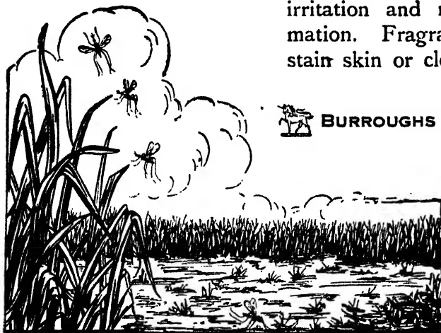

**BURROUGHS WELLCOME & Co.**  
 LONDON

*In collapsible tubes,  
 at all Chemists and  
 Stores*

xx 3554

*All Rights Reserved*

## POULTRY.

### THE SEX OF EGGS.

Investigations into a means of increasing the proportion of hens to cocks in hatchings were described in a communication by M. LIENHART of the University of Nancy,\* made to the Académie des Sciences in 1919. Starting from the facts that in the same breed cocks are heavier than hens, that the weight of young male chickens is higher than that of females, and that the same difference is perceptible even in newly-hatched chicks, it occurred to MR. LIENHART that the eggs from which male birds are developed might also be heavier than those producing females.

Experiments which he then made did appear to show that by selecting for incubating eggs heavier than the average a larger proportion than usual of male birds was produced. This was only the case, however, when eggs of a single pure breed were used, and it appeared that the result would be more certain if eggs were used from fowls all of the same age and at the height of the laying season.

\* See JOURNAL D' AGRICULTURE PRATIQUE, 14th Aug., 1919.

505------------------------------------------------

SEPTEMBER, 1922.]191

Further experiments at the Experimental Station of Coligny (France) have given the following results \* :—

<table border="1">
<tbody>
<tr>
<td>Sitting of</td>
<td>15</td>
<td>eggs,</td>
<td>medium weight,</td>
<td>rather light,</td>
<td>8 hens,</td>
<td>4 cocks.</td>
</tr>
<tr>
<td>"</td>
<td>"</td>
<td>15</td>
<td>"</td>
<td>" heavy,</td>
<td>4</td>
<td>" 7</td>
</tr>
<tr>
<td>"</td>
<td>"</td>
<td>15</td>
<td>all heavy</td>
<td>...</td>
<td>4</td>
<td>" 9</td>
</tr>
<tr>
<td>"</td>
<td>"</td>
<td>15</td>
<td>light weight (below average)</td>
<td></td>
<td>9</td>
<td>" 3</td>
</tr>
<tr>
<td>"</td>
<td>"</td>
<td>15</td>
<td>(from 5 hens) lightest weight</td>
<td></td>
<td>11</td>
<td>" 2</td>
</tr>
</tbody>
</table>

Other experiments gave negative results and M. LIENHART found † that these were always obtained with breeds of mixed origin, such as Faverolles, Mantes, Coucous de Malines, etc. With Leghorn, Minorca and Bresse eggs, a large proportion of males with heavy eggs, and a large proportion of females with light eggs, were always obtained.

In reality, the progenitors of the Faverolles had very different weight averages of eggs :—Houdan 1.94 oz., Brahma 1.87 oz., Dorking 2.19 oz. It follows that certain families of Faverolles have eggs approaching Houdan eggs, and others again Dorking eggs. If then, light Faverolles eggs (average weight 2.12 oz) are selected to obtain females, one may include in the sitting heavy eggs of the Houdan type or Brahma type and consequently obtain males. With eggs from a single Faverolles hen, however, of which the eggs were of a constant average weight, M. LIENHART obtained a majority of males with the heavier weights and vice versa.

These results are sufficient to encourage further investigation into the possibility of making, under practical conditions, such a selection of eggs for sitting that a large proportion of the sex desired may be obtained.—JOURNAL OF MINISTRY OF AGRICULTURE, Vol. XXIX, No. 3.

## ‘ FOWL SICKNESS.’

During the long dry weather, and where many fowls and chickens are raised, all congregated in one yard, morning and evening, to be fed, fowl cholera is certain to occur. This is chiefly caused by birds being fed on land infected by their own droppings, or those of turkeys, ducks, etc. Where there is heavy rain the soil gets washed clean, especially where the yard is on a slope. Of course poultry should not be fed in the house yard, for though we admit it is a difficult thing to keep the birds away, still if their feed was always scattered on grass, or below the coffee or other trees away from the house, taking a different spot every day, this would prevent any “fowl sickness.”

When fowls congregate in the house yard, the soil becomes foul with their droppings, some of which adhere to the grain feed, and this surely causes the bowel trouble that is usually called “fowl cholera.” Chickens and grown birds attacked often die off by the dozen every day. To stop it, put a teaspoonful of disinfectant in the water (1 teaspoonful to the quart), and feed dry rice or parched corn for a week, always on clean ground. To disinfect the yard sprinkle lime over it, burn bush over it, or spray with a disinfectant.—JOURN. OF JAMAICA AGRIC. SOC., VOL. XXVI, No. 5.

\* JOURNAL D’ AGRICULTURE PRATIQUE, 25th Feb., 1922.

† Bulletin de la Société de Biologie, No. 36, 10th Dec., 1921.

506------------------------------------------------

192[SEPTEMBER, 1922.

# APICULTURE.

---

## BEE-KEEPING NOTES.

---

The evolution of bee-keeping is touched upon by MISS ANNIE BELTS, B.Sc., in the June BEE WORLD. She points out that in Palaeolithic times man lived by the chase, and, in order to secure his honey, first followed the bee home where he cut out the combs, while at a later period (in the bushman or semi-domestication stage) he exerted a proprietary right over a hive, when he discovered it, and skillfully robbed it every year, (incidentally she remarks that the first alcoholic beverage of early man was fermented honey or mead).

In Neolithic times came both agriculture and apiculture when in settling down in one spot man was in a position to keep bees as well as grow crops.

Investigation and research would seem to indicate that the Mindan Cretans who kept bees came from Syria and ultimately from or near India, thence spreading to Europe and Northern Africa. Further evidence on this point is promised.

The Glasgow District Bee-keepers' Association pocket book gives the following as the Prime Factors for securing the honey harvest : (1) a strong colony, (2) this to coincide with the honey flow, (3) good weather conditions. In order to secure (1) and (2) the following conditions are necessary :—(a) union of weak stocks, (b) stimulative feeding, (c) transference of sealed brood from the weaker to the stronger hives, (d) prevention of swarming. The problem of the swarm is thus dealt with : Swarming and honey getting are antagonistic. Should a swarm occur make a nucleus on a new stand with 3 or 4 frames containing the best queen cells and all adhering bees. Insert fresh frames (with comb or foundation) in place of those taken from the parent colony and put back the swarm. Otherwise cut out the queen-cells, and put back the swarm to finish the work in the supers.

In an article on Bee-keeping and Agriculture in GLEANINGS IN BEE-CULTURE for April last we read that in 1911 the United Planters' Association of Southern India asked Government to pass some regulations prohibiting the destruction of bees in the Coffee districts, on account of the reduction of the coffee crop due to destruction of bees in certain districts. As a result the Madras Department of Agriculture made a careful study of the fertilisation of coffee and published the results in Bulletin No. 69 in which the fact is recorded that "the natural and most desirable form of pollination is achieved by the aid of flower-visiting insects of which bees are the most important."

THOMAS KEARNEY of the Bureau of Plant Industry, U.S. Department of Agriculture refers in the JOURNAL OF HEREDITY for March, 1921, to the

507------------------------------------------------

SEPTEMBER, 1922.]193

importance of the honey-bee in increasing the yield of Cotton. "It would, therefore, seem desirable," he says, "to encourage the keeping of bees in the vicinity of cotton fields."

GEORGE DEMUTH, an authority on Apiculture, writes that more and more careful investigation is revealing the value of the honey bee to Agriculture. The growers of insect-pollinated crops will not take a chance on the haphazard pollination by insects not under control. Agriculture will demand that large numbers of bees be kept even if they never yielded any return in honey.

This opinion is well worth the careful consideration of coconut planters.

The variation in the size of frames (as well as the construction of hives) would appear to be as great in the West as in the East. The following refers to the dimensions of the frames used for *A. mellifica*: Quinby hives,  $19\frac{1}{4}$  by 11 or  $18\frac{1}{2}$  by 11 inches: Jumbo  $17\frac{5}{8}$  by  $11\frac{1}{4}$ : Langstroth,  $17\frac{5}{8}$  by  $9\frac{1}{2}$ : Adair  $13\frac{3}{8}$  by  $11\frac{1}{4}$ : American, 12 by 12, Gullup,  $11\frac{1}{4}$  by  $11\frac{1}{4}$ : Haddon,  $18\frac{1}{6}$  by  $5\frac{3}{8}$ : Danzenbaker, 17 by  $7\frac{1}{2}$ : British standard, 14 by  $8\frac{1}{2}$ .

For *A. indica*, frames of the following dimensions are advocated: Imperial Entomologist, India,  $14 \times 8\frac{1}{2}$  (British standard): Ghosh,  $11\frac{1}{4} \times 8\frac{1}{2}$  (kerosene box hive): Father Newton (Trichinopoly),  $8 \times 5\frac{1}{2}$ : Shanks,  $13\frac{1}{2} \times 5$ : Andree,  $12 \times 7$ : Ceylon Bee-keepers' Association  $11 \times 5$ : Goonetilleke,  $8\frac{1}{2} \times 4\frac{1}{2}$ .

MR. GOONATILLEKE writes:—"I am in favour of the Danzenbaker type of hive for the following reasons:—(1) the frames are self-spacing, (2) the bees are induced to attach their combs to the bottom and the sides of the frames, (3) the swarming impulse is reduced to a degree, (4) the sealed honey is evenly used up. The top and bottom bars of my frames are  $\frac{3}{8}$  in. wide, but I would even make them narrower, say  $\frac{9}{16}$  or  $\frac{1}{2}$  in. so that the combs may extend well beyond the edges of the frame. This enables one to use the uncapping knife without being hampered. By placing the knife horizontal with the edge of the bar the layer of cappings ( $\frac{1}{16}$ th or slightly more in thickness) can be sliced off and the honey cells laid bare for extraction. A width of  $\frac{5}{8}$  or  $\frac{9}{16}$  for the top and bottom bars may do in the brood chamber but not for the super: but I prefer the same width for both.

In regard to space between combs, MR. GOONATILLEKE says that he thinks a  $\frac{3}{8}$  in. space sufficient for one layer of bees on the face of each comb. I know that in nature bees have a wider space, but this allows more than one layer of bees on the face of the combs and encourages idleness. If room is given for only a single the bees will be kept busy. A space of  $\frac{3}{8}$  in. is not sufficient.

I maintain that the normal thickness of comb is  $\frac{3}{8}$  in.

Here are some interesting points for discussion: and the views of members of the Ceylon Bee-keepers' Association based on their own experience, will be welcomed by the Secretary.

C. D.

508------------------------------------------------

194[SEPTEMBER, 1922.

# GENERAL.

---

## DRIED BANANAS.

---

C. H. WRIGHT, M.A., F.I.C.,

*Government Chemist, Fiji.*

Considering the larger quantities of bananas which are grown in Fiji it is surprising what little use has been made of them as food. A certain quantity are of course eaten as food by Fijians, but the remainder were until recently nearly all exported for consumption as fresh fruit. But now that the Australian market is closed owing to the high import duty recently imposed, it is advisable to consider whether some use could not be made in Fiji of the large quantities of bananas, which were formerly exported to Australia.

With the object of finding some solution of this problem and also helping any one who is interested in the question, dried bananas were prepared at the Chemical Laboratory during this month (July); samples of the "banana chips" and banana flour" so prepared can be seen there by anyone who wishes to do so. The objects of this work were to learn something more than can be found in books as to the preparation; to determine the yield; and to obtain sufficient of the flour for analysis and for trials as a food. The analysis of the banana flour prepared at the Laboratory is not yet complete nor have trials yet been made as to the possibility of using it in making bread. It is hoped to consider these and other matters in the next number of the Agricultural Circular.\*

### PREPARATION.

The preparation of banana flour is thus described by W. FAWCETT in *THE BANANA, ITS CULTIVATION, DISTRIBUTION AND COMMERCIAL USES*, London, 1913, pp 114-115 :—

"Banana flour as made from the fully grown unripe banana, that is, before the starch is changed into sugar in the ripening. It is difficult to peel green bananas, but if they are first put into scalding water (176° F.) for four or five minutes, the peel is easily removed. The peeled fruit is dried in the sun or put into a drier of some kind to reduce the percentage of water from 75 to 15. The drying is more readily effected if the fruit is cut up small. Steel knives should not be used as they turn the banana black; nickel blades are better, and very effective knives can be made from bamboo. The peasantry in Jamaica, after taking off the skin, cut the bananas into thin slices and lay them on stones in the sun. One day's hot sun is sufficient to dry them, after which they are put into a mortar pounded and then sifted. Two bunches make ten quarts of flour."

In the experiments carried out by me at the Chemical Laboratory, the fully developed but unripe green bananas were dropped into boiling water and left there for about five minutes. They were then immersed in cold water, and when cold they were peeled with a rustless steel knife. It is well known that if a green banana is cut with an ordinary steel knife the knife is turned black, and the banana is discoloured. This is due to the tannin in the green banana, which forms a black compound with iron. Hence FAWCETT recommends nickel blades or pieces of split bamboo;

\* See October issue of 'T.A.'—Ed. 'T.A.'

509------------------------------------------------

SEPTEMBER, 1922.]195

but what is far preferable is a rustless steel knife, which was used in my experiments for peeling and cutting up the bananas, and even when smeared with the juice of the green banana and left over night did not show any signs of discolouration. The peeled bananas were then cut lengthwise into four or five strips, which were then dried in the sun. Even lately, when the weather in Suva has not been very favourable for such work, it was found that they were nearly dry after one day's exposure to the sun. It is necessary that the slices of banana are dried as quickly as possible : otherwise the ripening process goes on and the starch in the banana is converted into sugar ; the pieces of banana then become coated with a sticky sugary layer, which will not dry. In view of these facts drying in a dryer would be far preferable to sun drying. The dry slices of banana are known as "banana chips;" they are quite hard and break with a distinct snap ; they are like a dry unsweetened biscuit to eat and have a faint agreeable taste similar to that of the banana.

Banana flour is made by grinding the "banana chips." In my experiments the latter were ground in a coffee-grinder. As thus prepared the banana flour is pale yellow, and has a faint sweetish smell. No doubt if I had the means of grinding it more finely and then sieving it, the flour would be whiter, and perhaps more attractive in appearance. FAWCETT, *loc. cit.*, p. 115, states that in a factory at one time in operation at Montpelier, Jamaica, the bananas were dried in a vacuum dryer in which they were stirred and cut up. "The drying was complete in about two hours; by this time the bananas had been reduced to the appearance of somewhat coarse flour with only 15 per cent of water. The mass was removed from the drier, and passed through sieves containing 120 meshes to the square inch. Whatever remained in the sieve was passed through a simple mill and sifted afresh." The object of this sieving is, however not quite obvious since there is nothing objectionable in the dried banana ; and it would seem that a very palatable flour can be obtained from the "banana chips" by grinding only.

#### YIELD.

A short time ago as a result of an inquiry I looked up the subject and was unable to find in any book or journal the average weight of a banana and the ratio of skin to pulp. But I did find in THORPE'S DICTIONARY OF APPLIED CHEMISTRY, article banana, an analysis by LEUSCHER of the pulp of unripe banana and in FAWCETT'S THE BANANA, p. 110, an analysis of banana flour by H. H. COUSINS, Director of Agriculture, Jamaica, from these analyses the percentage of starch in the pulp of the unripe banana is 19.1 per cent., and in the banana flour it is 60.4 per cent. Hence 100 lb. of the pulp of the unripe banana contains 19.1 lb. starch. This weight of starch is contained in  $19.1 \times 100/60.4 = 31.6$  lb. of flour. That is to say the banana pulp yields 31.6 per cent of its weight of banana flour. This figure is of interest because by actual experiments described later I found that the average yield was 34.4 per cent. Remembering that bananas, like all natural products, vary in composition this is a very satisfactory agreement.

In the experiments carried out by me an enamelled iron bowl or plate was weighed to the nearest whole gram. On it were placed two or three fully developed but unripe bananas and weighed again. These bananas were then peeled as described above and the bowl or plate together with the peeled bananas weighed. The peeled bananas were then cut up with a rustless steel knife on the same bowl or plate, and were heated in a steam oven until they were dry. The bowl or plate together with the "banana chips" were weighed at intervals until the weight was constant. In this way I found the weight of one banana, the percentage of pulp in the whole banana, and the yield of banana chips."

510------------------------------------------------

196[SEPTEMBER, 1922.

As was to be expected the weight of a banana varies considerably; even the bananas on one bunch vary greatly in weight, depending on whether they are taken from the upper, middle or lower hands. In all I weighed 37 bananas, and the weight of one banana was found to vary from 109 to 144 grams with an average of 132.4 grams ( $=4.67$  oz Av.). As the average of six experiments I found that the peeled fruits amounts to 55.3 per cent of the whole banana, or in other words the skin makes up 44.7 per cent by weight of the green banana. In five experiments which agree very closely amongst themselves I found that the dried bananas ("chips") are 17.3 per cent by weight of the whole green bananas, and 31.4 per cent of the peeled fruit (pulp).

From the above data it is now possible to calculate the yield of banana flour per bunch. For the sake of the calculation suppose that a bunch consists of 100 bananas. The 100 bananas will weigh  $132.4 \times 100 = 13,240$  grams. This will yield 17.3 per cent of its weight of dried bananas; hence the weight of dried bananas  $= 13,240 \times 17.3 = 2,290.5$  grams  $= 5.05$  lb. If the bunch consisted of 150 bananas, then the weight of dried bananas obtained would be  $5.05 \times 1.5 = 7.58$  lb. It will be noticed from the quotation given above that FAWCETT states that one bunch of bananas yields five quarts of flour. I found that  $\frac{1}{2}$  pint of flour prepared in the laboratory weighed 155 grams. Therefore one quart weighs  $155 \times 4 = 620$  grams, and five quarts weigh 3,100 grams  $= 6.83$  lb. This agrees very well with the yield calculated above, and it may be safely said that the yield of flour from one bunch of bananas will be from 5 to  $7\frac{1}{2}$  lb. depending on the size of the bunch.—

AGRIC. CIR. FIJI. VOL. 2. NO. 3.

## COCONUT CROPS FROM CEYLON AND MALAYAN COMPANIES.

MR. H. K. RUTHERFORD, who continues to take a keen interest in all matters relating to the agriculture of this Colony, has sent the following interesting note for publication in the TROPICAL AGRICULTURIST.

"I have kept a record of Coconut crops from Ceylon and Malayan Companies for several years and also the number of nuts taken in each country to produce a candy and the following is the result:—

7 Malayan Companies (15 crops) average 1062 nuts per candy.

12 Ceylon Companies (32 crops) average 1240 nuts per candy.

The Coconut therefore in Malaya shew an advantage over those in Ceylon of 16.6%, the former taking 4248 to produce a ton of copra and the latter 4960.

In all probability this difference is largely due to the fact that the coconut plantations in Malaya are much younger than those in Ceylon, as it is well known that young coconut trees produce heavier nuts than those from old trees."

## PERIODICAL LITERATURE OF AGRICULTURE.

### IV.

#### AGRICULTURE, THE SOIL, MANURING AND IRRIGATION.

Agricultural Research in Great Britain, **Nature**, Vol. 110, No. 2750, p. 93.

Marais, J. S., Agricultural Value of Insoluble Phosphates.—**Soil Science**, Vol. XIII, No. 5, pp. 355-409.

Whittles, C. L., Classification of Soils.—**Journal Agric. Science**, Vol. XII, No. 2, pp. 166-181.

Wiles, H. H., Experience in Manuring Green Crops, Season 1921.—**Indian**

511------------------------------------------------

SEPTEMBER, 1922.]197**Tea Association Quart. Journal**, Pt. I of 1922, pp. 22-32.

Piper, C. V., & Pieters, A. J., Green Manuring.—**U. S. Dept. of Agric. Farmers' Bull.** 1250.

Myers, W. I., An Economic Study of Tractors.—**Cornell Univ. Agric. Expt. Sta. Bull.** 405

Crops Doubled by Gassing with Carbon Dioxide.—**Indian Scientific Agriculturist**, Vol. III, Pt. 6, pp. 58-62.

Joshi, Studies in Methods to prevent Nitrogen losses from Dung and Urine during Storage.—**Agric. Journal of India**, Vol. XVII, Pt. 4, pp. 367-374.

BOTANY.

Depape, C., Pleocene Flora of the Rhone Valley.—**Ann. des. Sciences Naturelles Bot.** Ser. X, T. IV. Nos. 3 & 4.

Blake, S. F., New Plants from Guatemala, Contrib.—**U. S. Nat. Herbarium**, Vol. 24, Pt. 1.

Tams, W. H., T., Pollination of Early Spring Flowers.—**Journal of Bot.** Vol. IX, No. 715, p. 203,

Raines, M. A., Vegetative Vigor of the Host.—**Am. Journ. of Bot.**, Vol. IX, No. 4, pp. 182-203.

Waby, J. F., Plants Worth Knowing.—**Jour. Board of Agric., Br. Guiana** Vol. XV, Pt. 2, pp. 73-77.

Mason, T. E., Water Balance of Plants; Its Significance in Crop Production.—**West Indian Bull.** Vol. XVIII, Pt. 4, p. 157-183.

The Dispersal of Fungi. **Indian Scientific Agriculturist**, Vol. III, Pt. 6, pp. 246-248.

DISEASES AND PESTS.

Winston, F. R., Commercial Control of Citrus Scab. **U. S. Dept. Agric. Cir.** 215.

Wakefield, E. M., Mosaic Diseases of Plants.

Paillot, Simultaneous Treatment for Cryptogamic and Insect Parasites by means of Sprays.—**Annales des Epiphyties**, Tome VII, 1919-20, pp. 169-191.

Maublane, Brown Rot of Cacao.—**L'Agronomie Coloniale**, Vol. VI, No. 54, pp. 177-183.

Gunn, D., The Wooly Bear Caterpillar.—**Journal Dept. of Agric. U. S. Africa**, Vol. IV. No. 6, pp. 542-547.

Suryth, E. G., Plant Inspection and Quarantine Report 1918-19.—**Dept. of Agric., Porto Rico Bull.** 23.

ENTOMOLOGY.

Insect War on the World; Cotton Crop Ravages.—**Indian Scientific Agriculturist**, Vol. III, Pt. 6, pp. 261-262.

Ainslie, G. G., Worms Injurious to Cereal and Forage Crops.—**U. S. Dept. Agric. Farmers' Bull.** 1258.

White Coffee Leaf Miner.—**Farmers' Journal**, Vol. IV, No. 26, pp. 9 & 10.

POULTRY.

Keeping Eggs, **Indian Scientific Agriculturist**, May 1922, p. 185.

Broody Hen.—**Journal Board of Agric., Br. Guiana**, Vol. XV. Pt. 2, p. 66.

Poultry Notes—Worms, Lice, Diarrhoea.—**Journal Board of Agric. Br. Guiana**, Vol. XV, Pt. 2, p. 71.

512------------------------------------------------

198[SEPTEMBER, 1922.SEEDS, SELECTION AND BREEDING.

Webber, H. J., Methods of Propagating the Orange and other Citrus Fruits, **Bull. Bot. Dept., Jamaica**, Vol. V, Pt. IV, pp. 75-87.

Dr. W. J. Beal's Seed Variability Experiment.—**American Journal of Bot.** Vol. IX, No. 5, p. 266.

Jochems, S., Verslag, van de Selectieproeven, over het jaar 1921, Meded. V. L. Deli Profstation, Medan, No. XXIII.

ECONOMIC PLANTS.*Agave.*

La Culture du Sisal au Soudan française.—**Revue de Bot. Appliquée**, Avril 1922, p. 132.

*Banana.*

Salvador, W., Food Value of Philippine Bananas.—**Phil. Journal of Science**, Vol. 20, No. 3, pp. 363-366.

Ripening Bananas in Air-tight Chamber.—**Agric. Gazette, N. S. W.**, Vol. XXXIII, Pt. 7, p. 482.

*Cacao.*

Maublane, Brown Rot of Cacao.—**L'Agronomic Coloniale**, Vol. VI, No. 54, pp. 177-183.

*Coconut.*

Norris, R., Improvement of the Coconut Jaggery Industry in the West Coast. **Agric. Journal of India**, Vol. XVII, Pt. 4, pp. 333-366.

*Coffee.*

Boyd, A. J., Coffee Growing in Queensland.—**Queensland Agric. Journal**, Vol. XVIII, Pt. 1, p. 7.

Box, H., The White Leaf Miner.—**Farmers' Journal**, Vol. IV, No. 26 pp. 9-10.

*Cotton.*

Gilbert, W. W., The Diseases of Cotton.—**Revue de Botanique Appliquée**, Tome 2, No. 10, p. 274

Cotton Growing in Mozambique.—**Bull. of the Imperial Institute**, Vol. XIX, No. 4, pp. 447-452.

An Improved type of Cotton for the Dharwar-American Tract.—**Indian Scientific Agriculturist**, Vol. XVII, Pt. IV, p. 347-352.

Prospects of Cotton Growing in the Northern Provinces of Nigeria.—**Bull. Imp. Inst.**, Vol. XIX, No. 4, p. 469.

*Kudzu.*

Le Kudzu (Aug. Chevalier).—**Revue de Botanique Appliquée**, Vol. 2, No. 10, pp. 279-281.

*Rice.*

Wells, A. H., Agcaoli, F and Felician, R. T., Philippine Rice.—**Philippine Journal of Science**, Vol. XX, No. 3, pp. 353-361.

*Rubber.*

Maas and Rutges, Grondbewerking in Heveatuinen, Archief voor de Rubercultuur, Vol. VI, No. 7.

*Sweet Potatoes.*

Beattie, J. H. and Thompson, H. C., Sweet Potato Studies.—**U. S. Dept. of Agric. Bull.** 1063.

*Sugar.*

The World's Trade in Sugar.—**Bull. Imp. Inst.**, Vol. XIX, No. 4, p. 475.

Report and Analysis of Sugar Cane Grown in Kenya.—**Farmers' Journal**, Vol. IV, No. 26, pp. 17-20.

*Tea.*

Stuart, C. P., Experiments in Pruning. Meded. v. h.—**Profestation voor Thee**, No. LXXIX.

H. L.

513------------------------------------------------

SEPTEMBER, 1922.]

199

# MARKET RATES.

## MARKET RATES FOR SOME TROPICAL PRODUCTS

(FROM LEWIS & PEAT'S Ltd., LATEST MONTHLY PRICES CURRENT).

<table border="1">
<thead>
<tr>
<th>GOODS</th>
<th>QUALITY</th>
<th>PRICE</th>
<th>PER</th>
<th>PKGS</th>
<th>POSITION</th>
<th>MARKET</th>
</tr>
</thead>
<tbody>
<tr>
<td colspan="7"><b>BEANS AND PEAS—</b></td>
</tr>
<tr>
<td>Butter Beans</td>
<td>Madagascar New Crop...</td>
<td>£16 10/</td>
<td>ton</td>
<td>Bags</td>
<td>Spot U.K.</td>
<td>Quiet</td>
</tr>
<tr>
<td>Rangoon Beans</td>
<td>Hand Picked...</td>
<td>£6 17/6</td>
<td>"</td>
<td>"</td>
<td>" "</td>
<td>"</td>
</tr>
<tr>
<td>Soya Beans</td>
<td>Manchuria...</td>
<td>£13</td>
<td>"</td>
<td>"</td>
<td>C.i.f. "</td>
<td>"</td>
</tr>
<tr>
<td>Green Peas</td>
<td>Japanese, f.a.q.</td>
<td>£48</td>
<td>"</td>
<td>"</td>
<td>" "</td>
<td>Steady</td>
</tr>
<tr>
<td>"</td>
<td>Dutch</td>
<td>£24 to £28</td>
<td>"</td>
<td>"</td>
<td>Spot "</td>
<td>"</td>
</tr>
<tr>
<td colspan="7"><b>CAKES—</b></td>
</tr>
<tr>
<td>Ground Nut Cake</td>
<td>Bombay 55olb</td>
<td>£10</td>
<td>ton</td>
<td>Bags</td>
<td>C.i.f. U.K.</td>
<td>Better demand</td>
</tr>
<tr>
<td>Copra Cake</td>
<td>Malabar</td>
<td>£10</td>
<td>"</td>
<td>"</td>
<td>" "</td>
<td>" "</td>
</tr>
<tr>
<td>"</td>
<td>Ceylon</td>
<td>£9</td>
<td>"</td>
<td>"</td>
<td>" "</td>
<td>" "</td>
</tr>
<tr>
<td colspan="7"><b>COPRA—</b></td>
</tr>
<tr>
<td></td>
<td>Malabar</td>
<td>£27</td>
<td>ton</td>
<td>Bags</td>
<td>C.i.f. U.K.</td>
<td>Steady</td>
</tr>
<tr>
<td></td>
<td>Ceylon</td>
<td>£26 10/</td>
<td>"</td>
<td>"</td>
<td>" "</td>
<td>"</td>
</tr>
<tr>
<td colspan="7"><b>GROUND NUTS—</b></td>
</tr>
<tr>
<td></td>
<td>Bombay Decorticated</td>
<td>£22 5/</td>
<td>ton</td>
<td>Bags</td>
<td>C.i.f. Continent</td>
<td>Slow</td>
</tr>
<tr>
<td colspan="7"><b>OILS—</b></td>
</tr>
<tr>
<td>Palm Oil</td>
<td>Lagos</td>
<td>£35</td>
<td>ton</td>
<td>Casks</td>
<td>Spot U.K.</td>
<td>Steady</td>
</tr>
<tr>
<td>"</td>
<td>Congo</td>
<td>£31</td>
<td>"</td>
<td>"</td>
<td>" "</td>
<td>"</td>
</tr>
<tr>
<td>Coconut Oil</td>
<td>Cochin</td>
<td>43/</td>
<td>cwt</td>
<td>"</td>
<td>C.i.f. U.K.</td>
<td>"</td>
</tr>
<tr>
<td></td>
<td>Ceylon</td>
<td>39/</td>
<td>"</td>
<td>"</td>
<td>" "</td>
<td>"</td>
</tr>
<tr>
<td>Palm Kernel Oil</td>
<td>Crushed</td>
<td>37/6</td>
<td>"</td>
<td>Naked</td>
<td>Spot "</td>
<td>Firm. Good demand</td>
</tr>
<tr>
<td colspan="7"><b>PALM KERNELS—</b></td>
</tr>
<tr>
<td></td>
<td>West African</td>
<td>£17 17/6 to £18</td>
<td>ton</td>
<td>Bags</td>
<td>{ Ex quay L'pool Spot U.K.</td>
<td>Steady</td>
</tr>
<tr>
<td colspan="7"><b>SEEDS—</b></td>
</tr>
<tr>
<td>Castor Seed</td>
<td>Bombay</td>
<td>£19</td>
<td>ton</td>
<td>Bags</td>
<td>C.i.f. U.K.</td>
<td>Firm</td>
</tr>
<tr>
<td></td>
<td>Madras</td>
<td>£18</td>
<td>"</td>
<td>"</td>
<td>" "</td>
<td>"</td>
</tr>
<tr>
<td>Sesame Seed</td>
<td>Bombay</td>
<td>£26</td>
<td>"</td>
<td>"</td>
<td>" Continent</td>
<td>Inactive</td>
</tr>
</tbody>
</table>

### ESSENTIAL OILS.

(From Perfumery and Essential Oil Record, Vol. 13, No. 6.)

<table border="1">
<thead>
<tr>
<th>GOODS</th>
<th>QUALITY</th>
<th>PRICE</th>
<th>PER</th>
<th>PKGS.</th>
<th>POSITION</th>
<th>MARKET</th>
</tr>
</thead>
<tbody>
<tr>
<td>Camphor Oil</td>
<td>White</td>
<td>8s. to 85s.</td>
<td>cwt.</td>
<td>Drums and</td>
<td></td>
<td>Easier again</td>
</tr>
<tr>
<td>Do</td>
<td>Brown</td>
<td>75s.</td>
<td>Drums</td>
<td>cases</td>
<td></td>
<td></td>
</tr>
<tr>
<td>Cinnamon Leaf Oil</td>
<td></td>
<td>51d.</td>
<td>oz.</td>
<td>Spot</td>
<td></td>
<td></td>
</tr>
<tr>
<td>Do</td>
<td></td>
<td>4½d.</td>
<td>"</td>
<td></td>
<td>C.i.f.</td>
<td>Steady</td>
</tr>
<tr>
<td>Cinnamon Bark Oil</td>
<td>Genuine</td>
<td>7s.</td>
<td>"</td>
<td></td>
<td></td>
<td></td>
</tr>
<tr>
<td>Citronella Oil</td>
<td>Ceylon</td>
<td>1s. 11½d. to 1-11½d.</td>
<td>lb.</td>
<td></td>
<td>Spot</td>
<td>Little Improvement</td>
</tr>
<tr>
<td>Citronella Oil</td>
<td>Java</td>
<td>2s. 11d. to 2s. 11½d.</td>
<td>lb.</td>
<td></td>
<td>"</td>
<td></td>
</tr>
<tr>
<td>Do</td>
<td>Burmese</td>
<td>2s. 11d. to 2s. 11½d.</td>
<td>"</td>
<td></td>
<td>"</td>
<td></td>
</tr>
<tr>
<td>Lemongrass Oil</td>
<td>Cochin</td>
<td>2½d.</td>
<td>oz.</td>
<td></td>
<td></td>
<td>Steady</td>
</tr>
<tr>
<td>Lime Oil</td>
<td>Distilled in large lines</td>
<td>2s. 3d.</td>
<td>lb.</td>
<td></td>
<td>"</td>
<td></td>
</tr>
<tr>
<td>Do</td>
<td>Hand-pressed</td>
<td>10s. 6d. to 11s.</td>
<td>"</td>
<td></td>
<td></td>
<td>Nominal</td>
</tr>
<tr>
<td>Nutmeg Oil</td>
<td>In quantity</td>
<td>5s.</td>
<td>"</td>
<td></td>
<td></td>
<td></td>
</tr>
</tbody>
</table>

514------------------------------------------------

200

[SEPTEMBER, 1922.

**METEOROLOGICAL.**  
**AUGUST, 1922.**

<table border="1">
<thead>
<tr>
<th rowspan="2">Station</th>
<th colspan="2">Temperature</th>
<th colspan="2">Mean Humidity</th>
<th rowspan="2">Mean amount of cloud clear, 10 = overcast</th>
<th rowspan="2">Mean Wind Direction during month</th>
<th rowspan="2">Daily Mean Velocity.</th>
<th colspan="2">Rainfall</th>
<th rowspan="2">Difference from Average</th>
</tr>
<tr>
<th>Mean Daily Shade</th>
<th>Mean Difference from Average</th>
<th>Mean</th>
<th>%</th>
<th>Amount</th>
<th>No. of days</th>
<th>Inches</th>
<th>Inches</th>
</tr>
</thead>
<tbody>
<tr>
<td>Colombo</td>
<td>81.2</td>
<td>+ 0.2</td>
<td>80</td>
<td>8.8</td>
<td>SW</td>
<td>139</td>
<td>1.11</td>
<td>10</td>
<td>1.59</td>
</tr>
<tr>
<td>Observatory</td>
<td>81.5</td>
<td>+ 0.1</td>
<td>75</td>
<td>4.8</td>
<td>SW</td>
<td>270</td>
<td>0.00</td>
<td>0</td>
<td>0.75</td>
</tr>
<tr>
<td>Puttalam</td>
<td>83.4</td>
<td>+ 0.2</td>
<td>74</td>
<td>7.3</td>
<td>SSW</td>
<td>252</td>
<td>0.38</td>
<td>2</td>
<td>0.21</td>
</tr>
<tr>
<td>Mannar</td>
<td>82.6</td>
<td>+ 0.2</td>
<td>77</td>
<td>6.5</td>
<td>SSW</td>
<td>351</td>
<td>2.01</td>
<td>5</td>
<td>+ 0.49</td>
</tr>
<tr>
<td>Jaffna</td>
<td>86.0</td>
<td>+ 1.2</td>
<td>61</td>
<td>6.9</td>
<td>WSW</td>
<td>237</td>
<td>3.02</td>
<td>7</td>
<td>+ 1.17</td>
</tr>
<tr>
<td>Trincomalee</td>
<td>85.0</td>
<td>+ 1.1</td>
<td>66</td>
<td>5.0</td>
<td>Var.</td>
<td>157</td>
<td>1.04</td>
<td>2</td>
<td>+ 1.21</td>
</tr>
<tr>
<td>Batticaloa</td>
<td>81.6</td>
<td>+ 0.2</td>
<td>78</td>
<td>4.8</td>
<td>WSW</td>
<td>421</td>
<td>0.47</td>
<td>9</td>
<td>0.77</td>
</tr>
<tr>
<td>Hambantota</td>
<td>78.9</td>
<td>+ 0.2</td>
<td>87</td>
<td>7.8</td>
<td>WNW</td>
<td>253</td>
<td>4.56</td>
<td>21</td>
<td>0.83</td>
</tr>
<tr>
<td>Galle</td>
<td>80.4</td>
<td>+ 0.2</td>
<td>82</td>
<td>7.4</td>
<td>—</td>
<td>—</td>
<td>6.66</td>
<td>28</td>
<td>5.13</td>
</tr>
<tr>
<td>Ratnapura</td>
<td>84.1</td>
<td>+ 0.5</td>
<td>64</td>
<td>6.0</td>
<td>—</td>
<td>—</td>
<td>0.26</td>
<td>1</td>
<td>1.58</td>
</tr>
<tr>
<td>Annu pura</td>
<td>81.5</td>
<td>+ 0.7</td>
<td>74</td>
<td>6.6</td>
<td>—</td>
<td>—</td>
<td>0.90</td>
<td>13</td>
<td>2.86</td>
</tr>
<tr>
<td>Kurunegala</td>
<td>75.9</td>
<td>+ 0.1</td>
<td>80</td>
<td>8.1</td>
<td>—</td>
<td>—</td>
<td>4.98</td>
<td>22</td>
<td>0.60</td>
</tr>
<tr>
<td>Kandy</td>
<td>76.0</td>
<td>+ 0.6</td>
<td>70</td>
<td>6.6</td>
<td>—</td>
<td>—</td>
<td>2.15</td>
<td>6</td>
<td>1.10</td>
</tr>
<tr>
<td>Badulla</td>
<td>71.0</td>
<td>+ 1.0</td>
<td>65</td>
<td>6.0</td>
<td>—</td>
<td>—</td>
<td>1.26</td>
<td>6</td>
<td>2.38</td>
</tr>
<tr>
<td>Diyatalawa</td>
<td>61.9</td>
<td>+ 0.2</td>
<td>84</td>
<td>7.5</td>
<td>—</td>
<td>—</td>
<td>2.42</td>
<td>13</td>
<td>2.12</td>
</tr>
<tr>
<td>Hakgala</td>
<td>60.6</td>
<td>+ 1.2</td>
<td>86</td>
<td>9.2</td>
<td>—</td>
<td>—</td>
<td>6.73</td>
<td>28</td>
<td>1.11</td>
</tr>
<tr>
<td>N. Eliya</td>
<td>—</td>
<td>—</td>
<td>—</td>
<td>—</td>
<td>—</td>
<td>—</td>
<td>—</td>
<td>—</td>
<td>—</td>
</tr>
</tbody>
</table>

The rainfall in August, 1922 was deficient over more than three-quarters of the island. This fact, sweeping statement can however be qualified by adding that small deficits were experienced in the northern and eastern parts of the island. The average number of rainy days, than in the quantity of rain, is of the table above. Nuwara Eliya and Ratnapura are below average rainfall but both recorded rain on 28 days—a number in advance of their averages by 7 & 6 respectively.

Reports giving rainfall totals appreciably ahead of average came for the most part from the Dikoya, Maskeliya area e.g. Lucombe 24.3 in. (average 18.3 in.) Blair Athol 21.1 in. (average 18.3 in.) and further towards the south west, Carney (Adam's Peak) 21.7 in. (average 16.1 in.). Blackwater a total of 32.7 in. is also noteworthy.

In each of the Northern, North, Western, Eastern, Southern, and Uva provinces there were stations that reached their average (though without much margin) but in each of these provinces the great majority of stations were a little below. In the North Central Province stations appear to have reached average. In the Western Province, and northern half of the Southern Province, there were commonest and clearest of all the west coast including more than 5 inches were recorded over a strip from Ratnapura to the west coast including stations as far as Rayigam and as far south as Gekhanakanda.

No reports of over 4 inches in a day were received but there were several of over 3 inches chiefly on the 13th/19th from the Dikoya-Maskeliya-Nawalapiya area. The stations that reported no rain whatever for the month included nearly all those in the Puttalam area, a few, but by no means the majority, further north, Alattinuwara and Talabura.

The pressure gradient did not differ much from normal and the mean wind velocities were normal or only slightly above. Temperature off-sets, as can be seen from the table, were above, especially on the East side, while the humidity was below and the amount of cloud on the whole above.

**A. J. BAMFORD,**  
Supdt. Observatory.

**ANIMAL DISEASE RETURN FOR THE**  
**MONTH ENDED 31st AUGUST, 1922.**

<table border="1">
<thead>
<tr>
<th>Province, &amp;c.</th>
<th>Disease.</th>
<th>No. of Cases to date since Jan. 1st, 1922.</th>
<th>Fresh Recoveries.</th>
<th>Deaths.</th>
<th>Bal- ance III.</th>
<th>No. Shot.</th>
</tr>
</thead>
<tbody>
<tr>
<td rowspan="3">Western</td>
<td>Rinderpest</td>
<td>11</td>
<td>—</td>
<td>8</td>
<td>—</td>
<td>—</td>
</tr>
<tr>
<td>Foot-and-mouth disease</td>
<td>289</td>
<td>24</td>
<td>1</td>
<td>15</td>
<td>—</td>
</tr>
<tr>
<td>Anthrax</td>
<td>—</td>
<td>—</td>
<td>—</td>
<td>—</td>
<td>—</td>
</tr>
<tr>
<td rowspan="3">Colombo Municipality</td>
<td>Rinderpest</td>
<td>7</td>
<td>3</td>
<td>1</td>
<td>—</td>
<td>3</td>
</tr>
<tr>
<td>Hemorrhagic Septicæmia</td>
<td>15</td>
<td>—</td>
<td>—</td>
<td>—</td>
<td>—</td>
</tr>
<tr>
<td>Foot-and-mouth disease</td>
<td>129</td>
<td>—</td>
<td>—</td>
<td>—</td>
<td>—</td>
</tr>
<tr>
<td rowspan="3">Galle Quarantine Station</td>
<td>Rinderpest</td>
<td>10</td>
<td>—</td>
<td>—</td>
<td>—</td>
<td>—</td>
</tr>
<tr>
<td>Foot-and-mouth disease</td>
<td>56</td>
<td>—</td>
<td>—</td>
<td>—</td>
<td>—</td>
</tr>
<tr>
<td>Anthrax</td>
<td>133</td>
<td>—</td>
<td>—</td>
<td>—</td>
<td>—</td>
</tr>
<tr>
<td rowspan="3">Central</td>
<td>Rinderpest</td>
<td>87</td>
<td>44</td>
<td>76</td>
<td>10</td>
<td>—</td>
</tr>
<tr>
<td>Foot-and-mouth disease</td>
<td>6</td>
<td>—</td>
<td>6</td>
<td>—</td>
<td>—</td>
</tr>
<tr>
<td>Anthrax</td>
<td>7</td>
<td>—</td>
<td>7</td>
<td>—</td>
<td>—</td>
</tr>
<tr>
<td rowspan="3">Southern</td>
<td>Rinderpest</td>
<td>—</td>
<td>—</td>
<td>—</td>
<td>—</td>
<td>—</td>
</tr>
<tr>
<td>Foot-and-mouth disease</td>
<td>6</td>
<td>6</td>
<td>—</td>
<td>—</td>
<td>—</td>
</tr>
<tr>
<td>Anthrax</td>
<td>37</td>
<td>4</td>
<td>33</td>
<td>—</td>
<td>—</td>
</tr>
<tr>
<td rowspan="3">Northern</td>
<td>Rinderpest</td>
<td>3</td>
<td>—</td>
<td>1</td>
<td>—</td>
<td>—</td>
</tr>
<tr>
<td>Foot-and-mouth disease</td>
<td>294</td>
<td>294</td>
<td>—</td>
<td>—</td>
<td>—</td>
</tr>
<tr>
<td>Anthrax</td>
<td>—</td>
<td>—</td>
<td>—</td>
<td>—</td>
<td>—</td>
</tr>
<tr>
<td rowspan="3">Eastern</td>
<td>Rinderpest</td>
<td>18</td>
<td>—</td>
<td>18</td>
<td>—</td>
<td>—</td>
</tr>
<tr>
<td>Foot-and-mouth disease</td>
<td>—</td>
<td>—</td>
<td>—</td>
<td>—</td>
<td>—</td>
</tr>
<tr>
<td>Anthrax</td>
<td>—</td>
<td>—</td>
<td>—</td>
<td>—</td>
<td>—</td>
</tr>
<tr>
<td rowspan="3">North-Western</td>
<td>Rinderpest</td>
<td>174</td>
<td>120</td>
<td>171</td>
<td>3</td>
<td>—</td>
</tr>
<tr>
<td>Foot-and-mouth disease</td>
<td>—</td>
<td>—</td>
<td>—</td>
<td>—</td>
<td>—</td>
</tr>
<tr>
<td>Anthrax</td>
<td>—</td>
<td>—</td>
<td>—</td>
<td>—</td>
<td>—</td>
</tr>
<tr>
<td rowspan="3">North-Central</td>
<td>Rinderpest</td>
<td>2</td>
<td>1</td>
<td>2</td>
<td>—</td>
<td>—</td>
</tr>
<tr>
<td>Foot-and-mouth disease</td>
<td>—</td>
<td>—</td>
<td>—</td>
<td>—</td>
<td>—</td>
</tr>
<tr>
<td>Anthrax</td>
<td>278</td>
<td>275</td>
<td>3</td>
<td>—</td>
<td>—</td>
</tr>
<tr>
<td rowspan="3">Uva</td>
<td>Rinderpest</td>
<td>1435</td>
<td>330</td>
<td>1315</td>
<td>120</td>
<td>—</td>
</tr>
<tr>
<td>Foot-and-mouth disease</td>
<td>—</td>
<td>—</td>
<td>—</td>
<td>—</td>
<td>—</td>
</tr>
<tr>
<td>Anthrax</td>
<td>3</td>
<td>—</td>
<td>3</td>
<td>—</td>
<td>—</td>
</tr>
<tr>
<td rowspan="3">Sabaragamuwa</td>
<td>Rinderpest</td>
<td>—</td>
<td>—</td>
<td>—</td>
<td>—</td>
<td>—</td>
</tr>
<tr>
<td>Foot-and-mouth disease</td>
<td>—</td>
<td>—</td>
<td>—</td>
<td>—</td>
<td>—</td>
</tr>
<tr>
<td>Anthrax</td>
<td>—</td>
<td>—</td>
<td>—</td>
<td>—</td>
<td>—</td>
</tr>
</tbody>
</table>

**G. W. STURGESS,**  
Government Veterinary Surgeon.  
Colombo, 5th September, 1922.

\* Figures for August 1922, not to hand.

515------------------------------------------------

# THE TROPICAL AGRICULTURIST

---

VOL. LIX.

PERADENIYA, OCTOBER, 1922.

No. 4.

---

## PADDY CULTIVATION IN CEYLON.

---

It may be advisable to review the progress that has been made in recent years in the improvement of paddy cultivation in the Colony. During the past few months there has been further closing down of those food production schemes which were organized during the period of rice shortage for the opening, under company enterprise, of large areas of irrigable lands. These companies have experienced financial losses and have found that it is impossible to continue operations with profit.

The experience of all companies is the same and it has become evident that paddy cultivation to be financially successful on new lands must, in general, be carried on by the cultivators themselves in small blocks. Private owners, as well as companies, have opened up fairly considerable areas in certain localities, but have found it preferable to carry on after the first few years on the share system. They thereby virtually become the landlords and the cultivators of areas averaging five to ten acres in extent, the tenants' rent for advances of seed paddy, buffalos and land being payable by definite and fixed amounts of grain out of the crops realized.

This system is working successfully in certain areas and provides in normal seasons reasonable financial return on the capital invested and overcomes the great difficulty that the small cultivator experiences in the initial stages of opening new lands—viz., the provision of adequate capital for the first expensive operations of clearing jungle and *aswedumizing*.

In the Eastern Province, where capitalists and food production companies have not been inclined to take up new lands, the provision of capital in the early stages has been made possible through the Batticaloa Paddy Bank, and largely increased areas have been brought under cultivation as the result of its operations.

There is evidence in certain districts, however, that where new lands have been opened some of the older lands have been abandoned. This is the natural sequence of a shortage of

516------------------------------------------------

202[OCTOBER, 1922.

labour, and one is obliged to accept the view that the opening of new lands under paddy must be a gradual process and that the addition of extensive areas cannot in the near future be expected.

It therefore becomes increasingly evident that closer attention should be given to those lands already under paddy cultivation and every endeavour made to render them more productive.

What are the directions in which improvement can be effected?

Statistics recently collected by the Director of Statistics clearly demonstrate the importance of village irrigation works. The total area of land under such works greatly exceeds the area under major works. It is well-known to all that many of these village works are in need of repairs, and with a view to assisting in such repairs the Legislative Council has in past years voted sums of money. It has also been recently decided by the Local Loan and Development Commissioners that they will be prepared to consider applications for loans for the provision or repair of masonry headworks to minor irrigation works where adequate security is offered. By this means it is hoped that material assistance can be given to the improvement of the minor or village irrigation works.

The work of those irrigation headmen responsible for the clearing of channels and the distribution of water appears to require closer supervision, and the best means for effecting such improved supervision is being considered.

Turning to the cultivation itself. The methods of cultivation require improvement. Ploughing demonstrations have been held in many localities during the past year and the necessity for thorough preparatory cultivation emphasized.

The use of manures is gradually increasing. The results of trials in all districts have demonstrated the value of green manures and of applications of phosphatic manures. In the Jaffna district of the Northern Province the spread of green manures is taking place and demands for seed from other districts are increasing.

Transplanting is being extended gradually in areas suited to this form of cultivation and some interest has been evinced in selection of seed. The work of the Economic Botanist in the evolution of new pure strains is progressing satisfactorily and supplies of pure seed paddy will shortly be available.

Competitions have assisted towards the improvement of cultivation methods and, if continued, they cannot fail to bring about increased crops.

517------------------------------------------------

OCTOBER, 1922.]203

# COFFEE.

## REPORT ON COFFEES FROM CEYLON.

BY THE IMPERIAL INSTITUTE OF THE UNITED KINGDOM,  
THE COLONIES AND INDIA.

The five samples of coffee which are the subject of this report were forwarded to the Imperial Institute by the Director of Agriculture, and are referred to in his letter No. 272 dated the 31st January, 1922.

It was stated that the coffees had been grown on the Experiment Station at Peradeniya.

### DESCRIPTION.

The samples each weighed about 5 lb. and represented five varieties of ungraded coffee in the parchment. Their characteristics are given in the following table :—

<table border="1">
<thead>
<tr>
<th>No.</th>
<th>Label.</th>
<th>Description.</th>
<th>Percentage of parchment in berries.</th>
<th>Average weight of beans freed from parchment in grams.</th>
</tr>
</thead>
<tbody>
<tr>
<td>1.</td>
<td>"Robusta"</td>
<td>Seed coat dull brown, tightly adhering in most cases, but loosely in others. Beans dull greyish-cream. - -</td>
<td>12.0</td>
<td>0.15</td>
</tr>
<tr>
<td>2.</td>
<td>"Hybrid"</td>
<td>Seed coat light brown, tightly adhering. Beans greyish-cream to cream, opaque. -</td>
<td>13.0</td>
<td>0.13</td>
</tr>
<tr>
<td>3.</td>
<td>"Cane-phora"</td>
<td>Seed coat light brown, tightly adhering. Beans greyish-cream to cream. - -</td>
<td>10.6</td>
<td>0.14</td>
</tr>
<tr>
<td>4.</td>
<td>"Quillou"</td>
<td>Seed coat brown, tightly adhering in some cases, but in others fairly loose. Beans greyish-cream to cream, opaque. - -</td>
<td>10.9</td>
<td>0.15</td>
</tr>
<tr>
<td>5.</td>
<td>"Uganda"</td>
<td>Seed coat light brown, tightly adhering. Beans greyish-cream to cream. - -</td>
<td>14.0</td>
<td>0.14</td>
</tr>
</tbody>
</table>

### RESULTS OF EXAMINATION.

The beans were analysed with the following results :—

<table border="1">
<thead>
<tr>
<th></th>
<th></th>
<th>No. 1 Robusta. per cent.</th>
<th>No. 2 Hybrid. per cent.</th>
<th>No. 3 Canephora. per cent.</th>
<th>No. 4 Quillou. per cent.</th>
<th>No. 5 Uganda. per cent.</th>
</tr>
</thead>
<tbody>
<tr>
<td>Moisture</td>
<td>-</td>
<td>10.1</td>
<td>10.1</td>
<td>10.4</td>
<td>10.4</td>
<td>10.6</td>
</tr>
<tr>
<td>Caffeine</td>
<td>-</td>
<td>2.1</td>
<td>2.3</td>
<td>2.3</td>
<td>2.4</td>
<td>2.3</td>
</tr>
<tr>
<td>Crude Proteins</td>
<td>-</td>
<td>13.4</td>
<td>11.5</td>
<td>11.4</td>
<td>11.2</td>
<td>12.4</td>
</tr>
<tr>
<td>Fat</td>
<td>-</td>
<td>6.7</td>
<td>6.1</td>
<td>7.8</td>
<td>6.9</td>
<td>7.1</td>
</tr>
</tbody>
</table>

518------------------------------------------------

204[OCTOBER, 1922.

<table border="1">
<thead>
<tr>
<th></th>
<th></th>
<th>No. 1 Robusta. per cent.</th>
<th>No. 2 Hybrid. per cent.</th>
<th>No. 3 Canephora. per cent.</th>
<th>No. 4 Quillou. per cent.</th>
<th>No. 5 Uganda. per cent.</th>
</tr>
</thead>
<tbody>
<tr>
<td>Carbohydrates etc., (by difference) -</td>
<td>-</td>
<td>49.6</td>
<td>52.1</td>
<td>49.3</td>
<td>51.5</td>
<td>50.8</td>
</tr>
<tr>
<td>Fibre -</td>
<td>-</td>
<td>14.6</td>
<td>14.5</td>
<td>15.3</td>
<td>14.1</td>
<td>13.5</td>
</tr>
<tr>
<td>Ash -</td>
<td>-</td>
<td>3.5</td>
<td>3.4</td>
<td>3.5</td>
<td>3.5</td>
<td>3.3</td>
</tr>
</tbody>
</table>

For comparison with these results the following figures recorded for some of the above varieties of coffee and for Arabian coffee (*Coffea arabica*) may be quoted :—

<table border="1">
<thead>
<tr>
<th></th>
<th></th>
<th>Robusta. per cent.</th>
<th>Canephora. per cent.</th>
<th>Quillou. per cent.</th>
<th>C. arabica. per cent.</th>
</tr>
</thead>
<tbody>
<tr>
<td>Moisture -</td>
<td>-</td>
<td>13.1</td>
<td>8.7</td>
<td>—</td>
<td>8 to 12</td>
</tr>
<tr>
<td>Caffeine -</td>
<td>-</td>
<td>1.5 to 2.4</td>
<td>2.3</td>
<td>2.4 to 2.8</td>
<td>1.0 to 1.5</td>
</tr>
<tr>
<td>Crude Proteins</td>
<td>-</td>
<td>—</td>
<td>9.9</td>
<td>—</td>
<td>7 to 12</td>
</tr>
<tr>
<td>Fat -</td>
<td>-</td>
<td>7.79</td>
<td>7.8</td>
<td>—</td>
<td>11 to 14</td>
</tr>
<tr>
<td>Carbohydrates, etc., (by difference) -</td>
<td>-</td>
<td>—</td>
<td>48.7</td>
<td>—</td>
<td>38 to 51</td>
</tr>
<tr>
<td>Fibre -</td>
<td>-</td>
<td>—</td>
<td>18.4</td>
<td>—</td>
<td>18 to 22</td>
</tr>
<tr>
<td>Ash -</td>
<td>-</td>
<td>—</td>
<td>4.2</td>
<td>—</td>
<td>3.5 to 4</td>
</tr>
</tbody>
</table>

The five coffees from Ceylon are similar in chemical composition, and contain, in comparison with *C. arabica* a high percentage of caffeine and a somewhat larger amount of proteins. The percentage of fat and fibre are considerably lower than *C. arabica*.

#### COMMERCIAL VALUATION.

It was stated in the trade that these coffees are not particularly suitable for use in the United Kingdom but that they would find a market here for re-export. They should be husked and cleaned before shipment, and would then be ready saleable on the Continent of Europe in large quantities, up to 250 to 500 bags at a time. If forwarded in the parchment the coffees would realise only about 45s per cwt. in the United Kingdom, but if husked and cleaned their present value would be approximately as follows :—

<table border="1">
<thead>
<tr>
<th></th>
<th></th>
<th>Per cwt.</th>
</tr>
</thead>
<tbody>
<tr>
<td>No. 1. ...</td>
<td>Robusta ...</td>
<td>60s.</td>
</tr>
<tr>
<td>No. 2. ...</td>
<td>Hybrid ...</td>
<td>58s.</td>
</tr>
<tr>
<td>No. 3. ...</td>
<td>Canephora ...</td>
<td>62s.</td>
</tr>
<tr>
<td>No. 4. ...</td>
<td>Quillou ...</td>
<td>65s.</td>
</tr>
<tr>
<td>No. 5. ...</td>
<td>Uganda ...</td>
<td>63s.</td>
</tr>
</tbody>
</table>

#### REMARKS.

These five samples of coffee are all well prepared and would be saleable in London for re-export to the Continent.

18th July, 1922.

519------------------------------------------------

OCTOBER, 1922 ]205

# SUGAR-CANE.

## FURTHER ANALYSES OF CEYLON-GROWN CANES.

The experiments with cultivations of sugar-cane have been continued at Peradeniya and Anuradhapura Experiment Stations and samples from all varieties have been analysed by the Government Agricultural Chemist.

In the TROPICAL AGRICULTURIST for April, 1921, the analyses of sugar-canes grown at Peradeniya and at Anuradhapura were given and the results of these analyses were fully discussed. In the editorial of the same issue, it was stated that these analyses were only the preliminaries of a more complete series. The sucrose contents of the juices from this first series were low, the glucose ratios exceptionally high and the purities poor.

It was thought that these results may have been due to the canes having been cut before they were fully ripe and that better results would have been secured if the canes had been carried over to the dry months of February and March.

For the present series of analyses, the canes were cut in December, January and March. The failure of the North-East Monsoon around Peradeniya during the latter part of 1921 resulted in the canes ripening earlier than usual, while at Anuradhapura Station the rainfall was somewhat in excess of normal.

The rainfalls at both stations during the months December 1921-February 1922 were as follows:—

<table>
<thead>
<tr>
<th></th>
<th></th>
<th>Peradeniya,</th>
<th>Anuradhapura.</th>
</tr>
</thead>
<tbody>
<tr>
<td>December, 1921</td>
<td>...</td>
<td>5.29</td>
<td>12.77</td>
</tr>
<tr>
<td>January, 1922</td>
<td>...</td>
<td>2.86</td>
<td>1.01</td>
</tr>
<tr>
<td>February, 1922</td>
<td>...</td>
<td>5.42</td>
<td>11.24</td>
</tr>
</tbody>
</table>

The analytical figures this year show a marked improvement over those of the previous year, which indicates that when the sugar-canes are fully ripe fair juices may be expected. The glucose ratios are generally high and the purities on the whole are rather low.

At Peradeniya the best figures were given by those canes cut on January 18th, 1922. The subsequent cutting of February 2nd gave poorer results and it is possible that growth had begun again before the last cuttings and that such growth was stimulated by the heavy rains which fell on January 31st and February 1st.

At Anuradhapura, the best results were obtained from those canes cut for analyses on January 25th. At this Station there was heavy rain on February 1st and again in the middle of the month.

The experiments are still being continued in order to ascertain which varieties should be grown if it is decided to open up further experimental areas in sugar-cane. The area under sugar-cane near Kalupahane in the Province of Uva is extending gradually and supplies of varieties new to the district are being arranged for.

520------------------------------------------------

206[OCTOBER, 1922.SUMMARY OF ANALYSES.

<table border="1">
<thead>
<tr>
<th>Variety</th>
<th>Crushing Gms. Juice % Gms. Cane</th>
<th>Specific Gravity Juice @ 30° C.</th>
<th>Brix. Tot. Solids Gms. % Gms. Juice</th>
<th>Sucrose Gms. % CC. Juice</th>
<th>Glucose Gms. CC. Juice</th>
<th>Glucose Ratio (Glucose % Sucrose)</th>
<th>Extracted Suc- rose Gms. % Gms. Cane</th>
<th>Purity Sucrose Gms. % Total Solids Gms.</th>
<th>Dates Received</th>
</tr>
</thead>
<tbody>
<tr>
<td rowspan="5">Stripped Tanna</td>
<td>50.0</td>
<td>1.068</td>
<td>17.3</td>
<td>13.7</td>
<td>1.8</td>
<td>13.0</td>
<td>5.8</td>
<td>73.9</td>
<td>21.12.21</td>
</tr>
<tr>
<td>55.0</td>
<td>1.084</td>
<td>20.8</td>
<td>15.0</td>
<td>1.8</td>
<td>12.0</td>
<td>7.3</td>
<td>66.4</td>
<td>3.1.22</td>
</tr>
<tr>
<td>51.0</td>
<td>1.080</td>
<td>20.0</td>
<td>20.2</td>
<td>0.3</td>
<td>1.4</td>
<td>8.7</td>
<td>93.5</td>
<td>18.1.22</td>
</tr>
<tr>
<td>58.0</td>
<td>1.078</td>
<td>19.8</td>
<td>18.9</td>
<td>2.0</td>
<td>10.6</td>
<td>9.4</td>
<td>88.3</td>
<td>2.2.22</td>
</tr>
<tr>
<td>54.0</td>
<td>1.062</td>
<td>16.5</td>
<td>12.3</td>
<td>4.0</td>
<td>32.5</td>
<td>4.6</td>
<td>70.3</td>
<td></td>
</tr>
<tr>
<td rowspan="3">Sin Nombre</td>
<td>48.0</td>
<td>1.086</td>
<td>21.8</td>
<td>16.7</td>
<td>2.4</td>
<td>14.4</td>
<td>6.8</td>
<td>73.7</td>
<td></td>
</tr>
<tr>
<td>47.2</td>
<td>1.080</td>
<td>20.9</td>
<td>18.6</td>
<td>1.1</td>
<td>5.9</td>
<td>7.6</td>
<td>82.3</td>
<td></td>
</tr>
<tr>
<td>47.0</td>
<td>1.069</td>
<td>17.8</td>
<td>15.0</td>
<td>1.9</td>
<td>12.7</td>
<td>6.3</td>
<td>78.6</td>
<td></td>
</tr>
<tr>
<td rowspan="4">D. K. 74</td>
<td>52.0</td>
<td>1.062</td>
<td>16.3</td>
<td>12.4</td>
<td>3.0</td>
<td>24.0</td>
<td>5.7</td>
<td>71.7</td>
<td></td>
</tr>
<tr>
<td>57.6</td>
<td>1.073</td>
<td>18.8</td>
<td>13.0</td>
<td>3.2</td>
<td>24.6</td>
<td>6.7</td>
<td>64.4</td>
<td></td>
</tr>
<tr>
<td>55.0</td>
<td>1.075</td>
<td>19.3</td>
<td>16.8</td>
<td>2.1</td>
<td>12.5</td>
<td>7.7</td>
<td>80.8</td>
<td></td>
</tr>
<tr>
<td>59.0</td>
<td>1.056</td>
<td>14.8</td>
<td>11.4</td>
<td>2.6</td>
<td>22.9</td>
<td>6.0</td>
<td>75.0</td>
<td></td>
</tr>
<tr>
<td rowspan="4">55 P.</td>
<td>53.0</td>
<td>1.065</td>
<td>16.7</td>
<td>12.5</td>
<td>3.0</td>
<td>24.0</td>
<td>5.7</td>
<td>70.0</td>
<td></td>
</tr>
<tr>
<td>57.4</td>
<td>1.073</td>
<td>18.3</td>
<td>14.0</td>
<td>3.6</td>
<td>25.7</td>
<td>7.4</td>
<td>71.0</td>
<td></td>
</tr>
<tr>
<td>51.0</td>
<td>1.080</td>
<td>20.0</td>
<td>20.2</td>
<td>0.3</td>
<td>1.0</td>
<td>8.7</td>
<td>93.5</td>
<td></td>
</tr>
<tr>
<td>58.0</td>
<td>1.068</td>
<td>17.3</td>
<td>14.3</td>
<td>1.6</td>
<td>11.0</td>
<td>7.3</td>
<td>77.4</td>
<td></td>
</tr>
<tr>
<td rowspan="4">Sealy's Seedling</td>
<td>47.0</td>
<td>1.062</td>
<td>15.8</td>
<td>12.8</td>
<td>1.5</td>
<td>11.7</td>
<td>4.9</td>
<td>76.0</td>
<td></td>
</tr>
<tr>
<td>46.0</td>
<td>1.080</td>
<td>20.3</td>
<td>14.3</td>
<td>2.1</td>
<td>14.6</td>
<td>5.7</td>
<td>65.0</td>
<td></td>
</tr>
<tr>
<td>41.0</td>
<td>1.074</td>
<td>19.1</td>
<td>18.4</td>
<td>1.3</td>
<td>7.0</td>
<td>6.4</td>
<td>89.5</td>
<td></td>
</tr>
<tr>
<td>50.0</td>
<td>1.071</td>
<td>18.5</td>
<td>15.2</td>
<td>1.2</td>
<td>7.9</td>
<td>6.8</td>
<td>82.5</td>
<td></td>
</tr>
<tr>
<td rowspan="4">Red Top Mauritius</td>
<td>48.0</td>
<td>1.065</td>
<td>16.9</td>
<td>13.5</td>
<td>2.2</td>
<td>16.0</td>
<td>5.2</td>
<td>75.1</td>
<td></td>
</tr>
<tr>
<td>54.0</td>
<td>1.071</td>
<td>18.3</td>
<td>13.9</td>
<td>2.6</td>
<td>18.9</td>
<td>6.0</td>
<td>71.0</td>
<td></td>
</tr>
<tr>
<td>46.6</td>
<td>1.072</td>
<td>18.8</td>
<td>16.4</td>
<td>1.3</td>
<td>8.0</td>
<td>6.7</td>
<td>87.2</td>
<td></td>
</tr>
<tr>
<td>47.0</td>
<td>1.069</td>
<td>17.8</td>
<td>13.6</td>
<td>2.1</td>
<td>15.4</td>
<td>6.1</td>
<td>71.3</td>
<td></td>
</tr>
<tr>
<td rowspan="4">1 3 1 P.</td>
<td>52.6</td>
<td>1.065</td>
<td>17.0</td>
<td>12.9</td>
<td>2.8</td>
<td>21.7</td>
<td>5.5</td>
<td>71.1</td>
<td></td>
</tr>
<tr>
<td>52.4</td>
<td>1.080</td>
<td>20.3</td>
<td>14.6</td>
<td>3.8</td>
<td>26.0</td>
<td>6.7</td>
<td>66.5</td>
<td></td>
</tr>
<tr>
<td>50.0</td>
<td>1.077</td>
<td>19.8</td>
<td>17.1</td>
<td>1.5</td>
<td>8.8</td>
<td>7.5</td>
<td>80.3</td>
<td></td>
</tr>
<tr>
<td>56.0</td>
<td>1.065</td>
<td>17.0</td>
<td>14.6</td>
<td>1.9</td>
<td>13.0</td>
<td>7.0</td>
<td>80.6</td>
<td></td>
</tr>
<tr>
<td rowspan="4">M. 1 2 3 7</td>
<td>53.4</td>
<td>1.059</td>
<td>15.3</td>
<td>12.4</td>
<td>1.9</td>
<td>15.0</td>
<td>5.8</td>
<td>76.6</td>
<td></td>
</tr>
<tr>
<td>46.0</td>
<td>1.066</td>
<td>16.7</td>
<td>14.7</td>
<td>1.2</td>
<td>8.1</td>
<td>5.8</td>
<td>82.6</td>
<td></td>
</tr>
<tr>
<td>52.0</td>
<td>1.075</td>
<td>19.0</td>
<td>17.3</td>
<td>1.4</td>
<td>8.0</td>
<td>7.4</td>
<td>85.3</td>
<td></td>
</tr>
<tr>
<td>55.2</td>
<td>1.073</td>
<td>18.3</td>
<td>16.2</td>
<td>1.3</td>
<td>8.0</td>
<td>8.7</td>
<td>82.5</td>
<td></td>
</tr>
<tr>
<td rowspan="4">Striped White Tanna</td>
<td>46.0</td>
<td>1.057</td>
<td>15.3</td>
<td>12.4</td>
<td>2.3</td>
<td>18.3</td>
<td>4.9</td>
<td>76.4</td>
<td></td>
</tr>
<tr>
<td>45.0</td>
<td>1.065</td>
<td>16.8</td>
<td>13.8</td>
<td>1.5</td>
<td>10.9</td>
<td>4.9</td>
<td>77.9</td>
<td></td>
</tr>
<tr>
<td>43.0</td>
<td>1.073</td>
<td>18.8</td>
<td>18.5</td>
<td>1.5</td>
<td>8.1</td>
<td>7.4</td>
<td>91.5</td>
<td></td>
</tr>
<tr>
<td>49.0</td>
<td>1.074</td>
<td>19.1</td>
<td>14.8</td>
<td>1.6</td>
<td>10.8</td>
<td>6.2</td>
<td>72.2</td>
<td></td>
</tr>
<tr>
<td rowspan="4">B. 208</td>
<td>54.0</td>
<td>1.063</td>
<td>16.8</td>
<td>13.8</td>
<td>2.2</td>
<td>16.0</td>
<td>6.6</td>
<td>77.4</td>
<td></td>
</tr>
<tr>
<td>53.0</td>
<td>1.083</td>
<td>21.0</td>
<td>17.0</td>
<td>1.8</td>
<td>10.6</td>
<td>8.3</td>
<td>74.3</td>
<td></td>
</tr>
<tr>
<td>54.0</td>
<td>1.080</td>
<td>20.9</td>
<td>18.7</td>
<td>1.1</td>
<td>5.9</td>
<td>8.9</td>
<td>82.8</td>
<td></td>
</tr>
<tr>
<td>53.0</td>
<td>1.074</td>
<td>19.1</td>
<td>18.7</td>
<td>0.8</td>
<td>4.2</td>
<td>8.8</td>
<td>91.1</td>
<td></td>
</tr>
<tr>
<td rowspan="4">B 3 3 9 0</td>
<td>52.0</td>
<td>1.066</td>
<td>17.3</td>
<td>13.2</td>
<td>3.1</td>
<td>23.5</td>
<td>5.7</td>
<td>71.6</td>
<td></td>
</tr>
<tr>
<td>46.0</td>
<td>1.065</td>
<td>17.0</td>
<td>14.3</td>
<td>1.9</td>
<td>13.3</td>
<td>5.5</td>
<td>79.0</td>
<td></td>
</tr>
<tr>
<td>50.0</td>
<td>1.064</td>
<td>16.8</td>
<td>13.1</td>
<td>2.3</td>
<td>17.5</td>
<td>5.8</td>
<td>73.2</td>
<td></td>
</tr>
<tr>
<td>53.0</td>
<td>1.063</td>
<td>16.5</td>
<td>14.9</td>
<td>2.0</td>
<td>13.4</td>
<td>6.7</td>
<td>84.8</td>
<td></td>
</tr>
</tbody>
</table>

521------------------------------------------------

OCTOBER, 1922.]207SUMMARY OF ANALYSES.SUGAR-CANE GROWN AT ANURADHAPURA.

<table border="1">
<thead>
<tr>
<th>Variety.</th>
<th>Crushing Gms. Juice % Gms. Cane.</th>
<th>Specific Gravity Juice @ 30°C</th>
<th>Brix, Tot. Solids Gms. % Gms. Juice.</th>
<th>Sucrose Gms. % CC. Juice.</th>
<th>Glucose Gms. % CC. Juice.</th>
<th>Glucose Ratio (Glucose % Sucrose)</th>
<th>Extracted Sucrose Gms. % Gms. Cane.</th>
<th>Purity (Sucrose % Total Solids.)</th>
<th>Dates Received.</th>
</tr>
</thead>
<tbody>
<tr>
<td rowspan="4">Stripped Tanna</td>
<td>49.0</td>
<td>1.065</td>
<td>17.1</td>
<td>15.4</td>
<td>1.3</td>
<td>8.4</td>
<td>6.6</td>
<td>84.8</td>
<td>1st Lot 25/1/22</td>
</tr>
<tr>
<td>50.4</td>
<td>1.072</td>
<td>18.1</td>
<td>14.9</td>
<td>1.8</td>
<td>12.0</td>
<td>5.9</td>
<td>76.8</td>
<td>2nd Lot 3/2/22</td>
</tr>
<tr>
<td>48.0</td>
<td>1.065</td>
<td>16.9</td>
<td>13.4</td>
<td>1.5</td>
<td>11.1</td>
<td>5.6</td>
<td>74.6</td>
<td>3rd Lot 14/2/22</td>
</tr>
<tr>
<td>47.0</td>
<td>1.075</td>
<td>19.1</td>
<td>17.7</td>
<td>2.2</td>
<td>12.0</td>
<td>7.4</td>
<td>86.4</td>
<td>4th Lot 23/2/22</td>
</tr>
<tr>
<td rowspan="4">Sin Nombre</td>
<td>42.0</td>
<td>1.082</td>
<td>21.0</td>
<td>18.5</td>
<td>2.8</td>
<td>15.0</td>
<td>5.9</td>
<td>81.4</td>
<td></td>
</tr>
<tr>
<td>53.0</td>
<td>1.081</td>
<td>20.8</td>
<td>17.9</td>
<td>2.2</td>
<td>12.3</td>
<td>7.2</td>
<td>79.3</td>
<td></td>
</tr>
<tr>
<td>54.4</td>
<td>1.069</td>
<td>17.9</td>
<td>15.0</td>
<td>0.9</td>
<td>6.0</td>
<td>7.1</td>
<td>78.2</td>
<td></td>
</tr>
<tr>
<td>53.0</td>
<td>1.073</td>
<td>18.9</td>
<td>15.2</td>
<td>2.0</td>
<td>13.1</td>
<td>7.0</td>
<td>75.1</td>
<td></td>
</tr>
<tr>
<td rowspan="4">D. K. 74</td>
<td>49.0</td>
<td>1.080</td>
<td>20.2</td>
<td>19.7</td>
<td>2.2</td>
<td>11.1</td>
<td>8.3</td>
<td>90.0</td>
<td></td>
</tr>
<tr>
<td>52.0</td>
<td>1.067</td>
<td>17.6</td>
<td>14.3</td>
<td>2.0</td>
<td>13.9</td>
<td>6.7</td>
<td>76.1</td>
<td></td>
</tr>
<tr>
<td>53.0</td>
<td>1.075</td>
<td>19.5</td>
<td>17.0</td>
<td>1.4</td>
<td>8.2</td>
<td>7.5</td>
<td>81.0</td>
<td></td>
</tr>
<tr>
<td>53.0</td>
<td>1.076</td>
<td>19.7</td>
<td>15.1</td>
<td>1.8</td>
<td>11.9</td>
<td>7.5</td>
<td>71.0</td>
<td></td>
</tr>
<tr>
<td rowspan="4">55 P.</td>
<td>49.0</td>
<td>1.061</td>
<td>15.8</td>
<td>15.6</td>
<td>1.6</td>
<td>10.2</td>
<td>6.5</td>
<td>93.0</td>
<td></td>
</tr>
<tr>
<td>59.4</td>
<td>1.062</td>
<td>16.5</td>
<td>12.4</td>
<td>2.1</td>
<td>17.0</td>
<td>7.0</td>
<td>70.3</td>
<td></td>
</tr>
<tr>
<td>64.0</td>
<td>1.077</td>
<td>19.4</td>
<td>18.5</td>
<td>1.5</td>
<td>7.0</td>
<td>10.1</td>
<td>88.6</td>
<td></td>
</tr>
<tr>
<td>58.8</td>
<td>1.068</td>
<td>17.0</td>
<td>12.8</td>
<td>2.0</td>
<td>15.0</td>
<td>6.2</td>
<td>70.6</td>
<td></td>
</tr>
<tr>
<td rowspan="4">Sealy's Seed- ling</td>
<td>42.0</td>
<td>1.073</td>
<td>18.0</td>
<td>15.7</td>
<td>1.9</td>
<td>12.5</td>
<td>5.7</td>
<td>81.1</td>
<td></td>
</tr>
<tr>
<td>53.0</td>
<td>1.063</td>
<td>16.5</td>
<td>14.9</td>
<td>2.0</td>
<td>13.4</td>
<td>6.7</td>
<td>84.8</td>
<td></td>
</tr>
<tr>
<td>57.6</td>
<td>1.071</td>
<td>15.4</td>
<td>12.0</td>
<td>2.2</td>
<td>18.3</td>
<td>5.6</td>
<td>72.7</td>
<td></td>
</tr>
<tr>
<td>60.0</td>
<td>1.061</td>
<td>15.7</td>
<td>11.6</td>
<td>3.2</td>
<td>27.6</td>
<td>5.9</td>
<td>69.4</td>
<td></td>
</tr>
<tr>
<td rowspan="4">Red Top Mauritius</td>
<td>50.0</td>
<td>1.076</td>
<td>19.3</td>
<td>20.0</td>
<td>1.6</td>
<td>8.0</td>
<td>8.7</td>
<td>96.3</td>
<td></td>
</tr>
<tr>
<td>48.0</td>
<td>1.074</td>
<td>19.0</td>
<td>15.6</td>
<td>1.6</td>
<td>10.2</td>
<td>5.4</td>
<td>76.3</td>
<td></td>
</tr>
<tr>
<td>53.0</td>
<td>1.076</td>
<td>19.9</td>
<td>17.0</td>
<td>1.1</td>
<td>6.5</td>
<td>8.6</td>
<td>79.4</td>
<td></td>
</tr>
<tr>
<td>57.0</td>
<td>1.071</td>
<td>18.4</td>
<td>13.9</td>
<td>2.2</td>
<td>15.8</td>
<td>6.0</td>
<td>65.2</td>
<td></td>
</tr>
<tr>
<td rowspan="4">1 3 1 P.</td>
<td>57.0</td>
<td>1.075</td>
<td>19.1</td>
<td>17.8</td>
<td>2.2</td>
<td>12.3</td>
<td>8.1</td>
<td>86.3</td>
<td></td>
</tr>
<tr>
<td>58.0</td>
<td>1.075</td>
<td>19.3</td>
<td>15.4</td>
<td>2.1</td>
<td>13.0</td>
<td>7.2</td>
<td>74.0</td>
<td></td>
</tr>
<tr>
<td>62.0</td>
<td>1.063</td>
<td>17.9</td>
<td>14.9</td>
<td>1.2</td>
<td>8.0</td>
<td>8.0</td>
<td>72.0</td>
<td></td>
</tr>
<tr>
<td>61.0</td>
<td>1.076</td>
<td>19.4</td>
<td>12.9</td>
<td>2.3</td>
<td>17.9</td>
<td>6.8</td>
<td>61.7</td>
<td></td>
</tr>
<tr>
<td rowspan="4">M. 1 2 3 7</td>
<td>55.4</td>
<td>1.071</td>
<td>18.1</td>
<td>18.1</td>
<td>1.6</td>
<td>8.8</td>
<td>8.7</td>
<td>93.0</td>
<td></td>
</tr>
<tr>
<td>55.0</td>
<td>1.074</td>
<td>19.1</td>
<td>14.9</td>
<td>2.0</td>
<td>13.0</td>
<td>6.6</td>
<td>72.2</td>
<td></td>
</tr>
<tr>
<td>52.4</td>
<td>1.078</td>
<td>19.9</td>
<td>16.0</td>
<td>1.4</td>
<td>8.7</td>
<td>6.9</td>
<td>74.3</td>
<td></td>
</tr>
<tr>
<td>54.4</td>
<td>1.075</td>
<td>18.9</td>
<td>15.1</td>
<td>1.8</td>
<td>11.8</td>
<td>6.4</td>
<td>74.0</td>
<td></td>
</tr>
<tr>
<td rowspan="4">Striped White Tanna</td>
<td>45.0</td>
<td>1.066</td>
<td>17.8</td>
<td>16.0</td>
<td>1.2</td>
<td>7.5</td>
<td>6.2</td>
<td>84.2</td>
<td></td>
</tr>
<tr>
<td>51.0</td>
<td>1.074</td>
<td>19.2</td>
<td>14.8</td>
<td>1.8</td>
<td>12.2</td>
<td>6.1</td>
<td>71.8</td>
<td></td>
</tr>
<tr>
<td>47.0</td>
<td>1.069</td>
<td>17.9</td>
<td>14.1</td>
<td>1.3</td>
<td>9.2</td>
<td>5.9</td>
<td>73.7</td>
<td></td>
</tr>
<tr>
<td>49.0</td>
<td>1.074</td>
<td>18.8</td>
<td>13.2</td>
<td>2.2</td>
<td>16.9</td>
<td>4.7</td>
<td>64.8</td>
<td></td>
</tr>
<tr>
<td rowspan="4">B. 208</td>
<td>55.0</td>
<td>1.079</td>
<td>20.0</td>
<td>18.8</td>
<td>2.1</td>
<td>11.2</td>
<td>9.4</td>
<td>87.0</td>
<td></td>
</tr>
<tr>
<td>55.0</td>
<td>1.074</td>
<td>19.1</td>
<td>14.9</td>
<td>2.0</td>
<td>13.0</td>
<td>6.6</td>
<td>72.7</td>
<td></td>
</tr>
<tr>
<td>57.0</td>
<td>1.076</td>
<td>19.1</td>
<td>16.9</td>
<td>1.0</td>
<td>5.9</td>
<td>8.1</td>
<td>82.2</td>
<td></td>
</tr>
<tr>
<td>63.0</td>
<td>1.080</td>
<td>20.1</td>
<td>16.5</td>
<td>1.8</td>
<td>10.9</td>
<td>9.9</td>
<td>75.6</td>
<td></td>
</tr>
</tbody>
</table>

M. KELWAY BAMBER,

Government Agricultural Chemist

14th June, 1922.

522------------------------------------------------

208[OCTOBER, 1922.

# COTTON.

---

## IMPROVING THE QUALITY OF COTTON AND THE INCREASE OF ITS YIELD.

A. J. BOYD.

In view of the reported decrease in the quantity and quality of cotton grown in the United States of America and in Egypt, during the year 1919 and previous to that time, the Ministry of Agriculture of Egypt specially invited the Director of Agriculture in the United Provinces of India, MR. MARTIN LEAKE, M.A., to visit Egypt to make recommendations for the improvement of the quality of the cottons grown in that country, and for increasing the yield. MR. LEAKE accordingly paid two visits to Egypt, and furnished a report embodying many valuable suggestions to that end. His recommendations with regard to the cotton industry in Egypt are equally applicable to Queensland's conditions, especially his references to the necessity for raising pure seed. This is a most important matter in connection with cotton-growing in Australia to ensure good prices in the British cotton market. Although cotton has been grown in Queensland for many years, there has in the past, been little attention paid to the raising of pure seed. Much of the cotton grown here was then raised from mixed seeds, with the result that the highest price was not received for the ginned cotton exported to England, owing to its want of uniformity in length and the strength of the fibre. MR. LEAKE said, in his report, that the cotton produced in Egypt is, and must continue to be, diverse, and the various classes required to be produced in quantities approximating to the relative demand. Market flexibility may enable new cottons to be absorbed at a high price up to a certain point, but it must not be overlooked that over-production of the high-priced cotton will reduce its price to such a level that it is not profitable to grow it. Distinction should be made between cottons with an intrinsic value and those with an artificial value.

Also, while diversity of class is required, uniformity within the class is essential.

The general opinion of Manchester is that the demand for goods manufactured from the higher grades of cottons, although at the present time mainly potential, is large enough to absorb at its full relative value as much of the long-staple cotton as Egypt is capable of producing. The area in that country suitable for the production of Sea Island cotton is very restricted, and MR. LEAKE reasonably holds the opinion that there is every justification for attempting to develop in Egypt a cotton to take the place of Sea Island. He advises that measures should be taken to see that the two factors "price and yield" should be sensibly equal for all kinds grown, and he summarises these measures under the heads of Economic, Botanical, Agricultural, and Commercial.

1. The *Economic*, includes a knowledge of the normal relative requirements of the different classes of cotton and their normal relative price is

523------------------------------------------------

OCTOBER, 1922.]209

essential. Accurate information is also necessary as to the developments taking place in other countries which are liable to upset the balance.

2. The *Botanical*.—The main lines of work are—

(a) Selection, with a view to the isolation and maintenance of pure strains of the existent standard cottons, and also to the discovery of new types ;

(b) Hybridisation, which may be looked upon as a *direct* method of evolving new and improved types ; and

(c) Physiological investigation, which is concerned with discovering the exact relationship between the plant and its environment, so that the latter may be controlled, as far as possible, to the benefit of the crop.

3. *Agricultural*.—By this is implied the testing of strains or varieties evolved by the processes of selection and hybridisation, and also the trial of new methods of cultivation suggested by the physiological investigations.

4. *Commercial*.—Some systems of seed control is essential, if purity is to be maintained in the stocks of seed produced.

To enable the production and development of special improved strains of cotton to proceed along satisfactory lines, the following organization is recommended :—

Firstly, the *Botanical Section*, to be engaged on the establishment of pure races and the production of sufficient seed to allow of adequate experimental trial of these types, and for their subsequent multiplication.

For the next stage, an *Agricultural Section* requires developing, which can deal effectively with the trial of the new types produced by the Botanical Section. The whole country should be divided up into a series of circles, based, as far as possible, on "type traits" dependent on environmental conditions. The "circle" officers would each have an experimental farm under their charge, and should also have an intimate knowledge of their district, its capabilities, and requirements.

The stage following the experimental farm is the *seed farm*, which is concerned with the multiplication of the small stocks of pure seeds into a quantity sufficient for distribution to cultivators.

MR. LEAKE hesitates to allot the control of these farms definitely to either the Botanical Section or the circle officers, but considers that it is a matter which can only be decided in the light of experience and with due regard to the factor of personal individuality. When the work of propagation on the seed farm is complete, the *Commercial Section* will take over the further control of the seed.

The circle officer in each circle will keep in touch with the cultivators to whom the seed from the seed farms has been issued, and will advise the Commercial Section as to their reliability as cultivators. He will inform the ginneries of the names of their cultivators and arrange for their cotton to be ginned separately. The Commercial Section will take over the seed from their crops, mark it with a Government mark indicating that it has been passed as seed to be used for sowing, and issue it, on payment, to growers throughout the district.

This process will take place year after year, fresh seed from the seed farms continually replacing that of the previous year. It is further suggested

524------------------------------------------------

210[OCTOBER, 1922.

that the ginneries should be licensed for the sale of *laqawi* (seed to be sown), and that the ginneries so licensed should assist in distributing seed to cultivators.

The above valuable report appeared in the First Annual Report, 1920, of the Cotton Research Board, Cairo, Egypt. I have considerably condensed it, retaining only those portions which, in view of the almost certain revival of the cotton industry in Queensland, may prove serviceable to our Government in its future dealing with the cotton industry.—QUEENSLAND AGRIC. JOUR., Vol. XVIII, Pt. 1.

---

## KAPOK OR TREE COTTON.

---

W. MOLEGODE,

*Agricultural Instructor.*

There is this year an unprecedented demand for and a ready sale of Kapok or Pillow Cotton, as it is commonly called. Within less than 30 days the price rose from Rs. 8 to Rs. 18 per cwt. of unclean Kapok and has since risen to much higher rates. The reason for this sudden demand has still to be explained as even very dirty stuff and half-matured pods sold for good prices. It is of course well-known that Kapok is extensively used for upholstering purposes and takes a prominent part in the manufacture of non-conducting felts and in the construction of life-belts, buoys, etc. The present demand, it is stated, is due to the larger employment of Kapok for textile purposes. Whatever the uses to which it is put may be there are signs that the demand will continue and therefore the question arises if the extensive cultivation of this crop is not practicable. Hitherto Kapok has only been grown as a fence tree. It is largely grown along fences in North Matale, Hanguranketa way and here in Kandy it is a common tree, attracting the attention of the people only when pods ripen and begin to burst. The current demand has given an impetus and already during this monsoon many people are planting out cuttings. The cultivation of Kapok requires but little labour and capital. ✓It is easily propagated either by seed or stumps. ✓It is quick growing and fast yielding. ✓Raised from seed the tree will begin to give a fair crop of pods in about 3 years. ✓If large cuttings from already bearing trees are planted generally a crop can be obtained in about a year. Kapok is one of the earliest crops to grow and can be profitably cultivated on land unsuitable for more paying products. Practically no cultivation is necessary. If seeds are planted sow a few on a hill prepared by digging out the earth and making it loose. When plants are well established and are about a foot high remove all but the sturdiest plants. Seed may be sown in nurseries and planted out in holes prepared for the purpose. If stumps are planted a fairly deep hole say about 1½ feet deep is made with an *Alavango*. Insert the stump into this and press the soil around. Planting should be at a distance of 15-20 feet apart. Very little attention and care is necessary when stumps begin to shoot out or seedlings are planted, once they get established.

525------------------------------------------------

OCTOBER, 1922.]211

On plantation, up-country station  
or mine—

TRADE MARK **'TABLOID'** BRAND

Medicine Chest, No. 254

("The Indian")

(Size: 9 x 6¾ x 6¼ in.)

will prove its value to you in many  
ways, especially when immediate  
medical aid is difficult to obtain.

It contains a comprehensive equip-  
ment of 'TABLOID' products, dressings,  
etc., which keep perfectly and are  
always fresh and ready for instant use.

*At all Chemists and Stores*

*Illustrated lists post free from*

**BURROUGHS WELLCOME & CO.**  
LONDON

xv 3602

*All Rights Reserved*

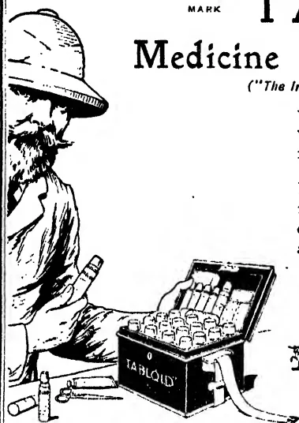

## PADDY.

### PADDY CULTIVATION IN YATINUWARA.

W. MOLEGODE,

*Agricultural Instructor.*

Yatinuwara division of Kandy district, which also embraces the greater part of the Municipal area of Kandy, has an area of 29 square miles of which 3,687 acres are paddy fields. The village population of Yatinuwara, that is, exclusive of estate population and that of the Municipal area, is 25,117. The total output of paddy for both crops in 1921, according to the statistics supplied to the Superintendent of Census by the minor headmen, (which it has to be emphasised are far from accurate), was 84,265 bushels. Of this 2,583 bushels were raised in Gangawata Korale which is the Municipal area : that is, only 81,682 bushels of paddy or approximately 40,341 of clean rice was locally produced for a population of 25,117 which works at 1 2/5 bushels rice per head. Even assuming that the figures of the headmen are based on the lowest estimate it is clear that the village population of this division is depending to a large extent on imported rice.

526------------------------------------------------

212[OCTOBER, 1922.

### SEASONS AND VARIETIES OF PADDY.

Like in the rest of the Kandyan district there are two seasons—*Maha* and *Yala*—corresponding to the North-East and South-West monsoons respectively. The former commences, if favourable weather conditions prevail, in July and lasts up to following March. During this season if early cultivation is possible Mavi (7 months) and Hatiel (6 months) are generally grown. If there be no rains in July or August, Hondarawale (5 months) is ordinarily cultivated. If the monsoon is unusually delayed, Heeneti (4 months) is cultivated. Among other varieties grown during this season are Ratavi (5 months), Molagusamba (5 months), Kuruvi (4½ months). *Yala* cultivation is limited and carried on between April and June. The varieties grown are Heeneti (4½ months) and Balavi (3 months). In June 1921 only 691·5 acres were brought under *Yala* cultivation.

The *Maha* crop is harvested between January and April and the *Yala* in August-September.

### PREPARATION OF THE SOIL.

The fields are ploughed three times.—(1) *Bin-neguma* which is usually done with the fall of the early rains when the soil is sufficiently moist. At this ploughing the soil is dug up and water is turned into the fields. If there is sufficient water the vegetable matter gets easily decomposed and the lumps of soil turned over by the ploughing get well saturated with water and a thorough aeration of the soil takes place. (2) The second ploughing or *Dehiya* (*De'* second, *Hiya* ploughing) is done after a period varying from 3 weeks to 2 months depending on the amount of water available. At this ploughing the soil is thoroughly broken and the decomposing vegetable matter is ploughed in. In place of this ploughing often the Mamotie is used—*Keluma*—when the soil is entirely turned over and the decomposing vegetable matter turned in. (3) The *Medêhiya*, (*Mede'* mud, *hiya*, ploughing) may follow the second ploughing almost immediately or is done after a short interval. The object of the *Mêdehiya* is to thoroughly mix up the soil and making it as marshy as possible. The soil is then levelled, drains are made and everything is ready to receive the seed or plants.

### SEED PADDY AND SEEDLINGS.

As far as his knowledge goes, due attention and care are given by all paddy cultivators to seed paddy. As a rule the previous year's seed is used the following season. No attention has hitherto been given to scientific selection of seed paddy. The seed is obtained from well matured crops that were harvested at the proper time. If the crop after it has been reaped is even by an accident caught in a shower of rain paddy from that crop is never used for seed. Seed paddy is well dried and stored away separately with care. Very often seed is introduced from adjoining districts. The upper portion of Kegalle district is specially favoured as a good centre for this purpose. Such introductions have given better results than the use of local seed. Before using the seed a handful of it is germinated and tested. 75% germination is considered satisfactory. Cultivators are now being educated to make a methodical selection of seed paddy. Without exception the villager germinates his seed in the house. The methods adopted are unnecessarily laborious. The seed is soaked in a tub of clear water over night. In the morning it is taken out of the water and is spread on

527------------------------------------------------

OCTOBER, 1922.]213

plantain or *habarala* leaves to a thickness of 4-5 inches in the shape of a mattress. The top and sides are covered with the same leaves and mats or gunnies are spread over and a certain amount of pressure is brought on the seed bed placing heavy weights. In this state the seed is kept for 4 to 6 days. Two days previous to sowing out in the fields the germinated seed is 'broken loose' or the tufts are broken and again heaped up gently on the ground after having applied a coating of fresh cowdung on the ground. The heap is lightly covered with leaves. This germinated seed is sown broadcast in the field or in the nursery.

The seed rate whether broadcasted or transplanted is 2 bushels per acre. This quantity is being reduced gradually and many cultivators now sow only 1 to  $1\frac{1}{2}$  bushel in nurseries intended for 2 pelas or 1 acre fields.

### NURSERIES.

Nurseries for raising plants are well prepared and are always located in the most favourable block in the field itself; when *Yala* is cultivated a sufficiently large field is kept in reserve for seed beds. The plants are allowed to grow in the nurseries at the rate of a week for each month of the 'age' of the variety grown, e.g., Hondarawela (5 months) are transplanted in the fifth week, Hatiel (6 months) is transplanted in the sixth week. The general practice is to sow the nurseries much too thick. Over-crowding of plants both in the nurseries and in the fields is a common sight. The present tendency is to allow more room and greater spacing than before and gradually over-crowding is being lessened.

### TRANSPLANTING.

If favourable weather conditions prevail the greater extent of fields are transplanted; also most fields on which a *Yala* crop is grown are, as a rule, transplanted. Ordinarily bunches of plants numbering from 3 to 6 are stacked together at distances varying from three to six inches. Wherever demonstration plots were once established or actual transplanting was supervised more systematic transplanting, putting a limited number of plants at more regular distances, have followed. For example, in the whole of the area between Kandy and Katugastota extending towards Halloluwa in one direction and embracing practically all the fields in Gangawata Korale about 500 acres are transplanted systematically, putting 2 or 3 plants at regular distances of  $4 \times 4$ ,  $5 \times 5$ , or  $6 \times 6$  ins. according to the nature of the fields. Transplanting of paddy is always done by women on *Attama* system—co-operation. If hired labour is employed the payment used to be one *pela* in paddy grain for each *pela* extent transplanted. This has now degenerated into money payment and gangs of women could be hired, rate charged being Rs. 5 per *pela* extent or Rs. 10 per acre transplanted. 30 well practised women will transplant an acre in one day if seedlings are brought to them to the field itself.

### WEEDING AND THINNING OUT.

If the paddy was broadcasted thinning out (*Neluma*) and a weeding are carried out after about 6 weeks or two months from time of sowing. In some cases all the plants are pulled out and replanted.

### PESTS.

The following three pests occur commonly but have never yet known to have appeared in any epidemic form:—(1) *Goyan messa*, the Paddy Fly or Rice Bug (*Leptocorisa varicornis*); (2) Godawella, the Paddy Cut-worm or the Army worm (*Spodoptera maurilia*), and (3) *Puruk panuwa*, the Stem-borer (*Chelo simplex*). Charms are common precautions against the Paddy Fly. The following remedial measures are also adopted:—(1) Driving away of the fly by smoking aromatic herbs and resinous substances; (2) lighting of

528------------------------------------------------

214[OCTOBER, 1922.

lamps towards the evening to attract the fly; (3) drawing a rope saturated with resin and kerosene oil over the plants so as to brush against the ear heads. (4) A number of sticks are tied together in the form of an *ekel* broom and this is smeared with sticky *jak* milk and is tied to a long pole and passed over the heads of paddy so as to catch the fly which stick to the smeared portion. The use of Lefroy's bags has been demonstrated but it is not likely to become popular. The treatment against the cut-worm adopted is to flood the fields.

No notice is taken of the borer, although, in my opinion the damage done by the borer in certain seasons and certain areas is even greater than that caused by the Bug. The field rats generally appear in most areas and cause sometimes considerable damage. Rats are trapped by various devices and are also scared away by the use of various forms of scare crows. There is a common belief that if paddy plants cut up by the rats are spread over on roads and paths frequented by people there follows an immediate reduction of the damage.

Quite  $2\frac{1}{2}$  per cent. of the paddy crop is destroyed by the paddy fly, another 2% by the stem-borer.

#### HARVESTING.

When the crop is about to ripen any supply of water is stopped as dry conditions hasten maturity. When the crop is fully ripe it is reaped and threshed the same night on specially prepared floor.—*Kimata*,—by buffalos being driven over the heaped-up sheaves. As the buffalos are being driven layers of the straw as they are freed of the grain is removed and stacked away. The paddy is winnowed by blowing off the empties and dirt with a forcible swing of the winnow up and down.

The grain is well dried before storing.

#### YIELD.

The yield depends on the nature of the fields and methods of cultivation adopted. Taken as a whole the average yield in Yatinuwara is 30 bushels per acre during *Maha* and 20 bushels during *Yala*. There are many *Mada kumburas* that yield up to 80 bushels. There are a number of fields that yield 60 to 70 bushels even with ordinary cultivation. Fields that only give 20 to 25 have given 40 to 50 bushels in some years and where greater attention has been given to cultivation. Some of the *Goda kumburas* do not yield more than 15 bushels, i.e. only  $7\frac{1}{2}$  fold. In some years, as for instance during 1921-1922 *Maha*, owing to unfavourable weather conditions most of the *Goda kumburas* only yielded 10 or 12 bushels for 2 bushels of seed sown. Taken all things into consideration, the output of paddy for Yatinuwara a year at present may be safely put down at over 100,000 bushels in place of the 84,265 of the headmen's estimates.

#### LAND TENURES, Etc.

Most cultivators cultivate their own fields. Those who cannot afford to cultivate by themselves seek the assistance of others and work on the *Karu-andé* system. When this is done  $\frac{1}{3}$  share of the crop goes to the person assisting—the work however is evenly shared by both parties alike. Those who do not cultivate let out their fields on *Andé*, a rather iniquitous and antiquated system whereby the landlord gets exactly half share of the produce in grain and straw and also a rent called *Madaran* (ground rent) varying from Rs. 3/- to Rs. 10/- per *pela*. The landlord renders no kind of help or assistance to the cultivator. Even the seed paddy has to be secured by the cultivator and invariably the cultivator has even to transport the landlord's share to his house and feed the *Kankanama* who is sent to watch the threshing, winnowing and distribution of the crop. The extent of paddy fields in Yatinuwara is proportionately so low in comparison with the

529------------------------------------------------

OCTOBER, 1922.]215

cultivating class—being less than  $\frac{1}{2}$  acre per head of population and the demand therefore being so great, this system of *Andé* cultivation has taken too strong a hold that it is unlikely that an improvement is possible unless the large land owners themselves accede to a change.

The *Multettu* system of cultivation is confined to the Headmen and more well-to-do village population. Under this system the cultivation is done by feeding the workmen and paying for certain items.

Paddy cultivation, however, is generally carried out here as elsewhere on the co-operative basis—*Attama*—mutual help being rendered. But for this system paddy cultivation will suffer greatly.

### COST OF CULTIVATION.

The following statement prepared from recent experience and with the aid of several cultivators shows the cost of cultivating an acre of paddy in Yatinuwara, provided every item was paid for :—

<table>
<tbody>
<tr>
<td>1. Clearing <i>Wanatas</i>, water courses, repairing ridges, etc.</td>
<td></td>
<td></td>
<td></td>
</tr>
<tr>
<td>    3 men at Cts. 75 each</td>
<td>...</td>
<td>Rs. 2'25</td>
<td></td>
</tr>
<tr>
<td>    2 boys at ,, 37<math>\frac{1}{2}</math> ,,</td>
<td>..</td>
<td>Cts. 0'75</td>
<td>Rs. 3'00</td>
</tr>
<tr>
<td>2. Binneguma :</td>
<td></td>
<td></td>
<td></td>
</tr>
<tr>
<td>    3 pairs of buffalos at Rs. 2/-</td>
<td>Rs. 6'00</td>
<td></td>
<td></td>
</tr>
<tr>
<td>    4 men and 2 boys</td>
<td>.. 3'75</td>
<td>.. 9'75</td>
<td></td>
</tr>
<tr>
<td>3. Second ploughing or turning the soil</td>
<td>.. 8'50</td>
<td>.. 8'50</td>
<td></td>
</tr>
<tr>
<td>4. Mada Hêya</td>
<td>.. 9'75</td>
<td>.. 9'75</td>
<td></td>
</tr>
<tr>
<td>5. Transplanting</td>
<td>.. 10'00</td>
<td>.. 10'00</td>
<td></td>
</tr>
<tr>
<td>6. Harvesting, including Threshing</td>
<td>.. 15'00</td>
<td>.. 15'00</td>
<td></td>
</tr>
<tr>
<td>7. Winnowing, etc.</td>
<td>.. 5'00</td>
<td>.. 5'00</td>
<td></td>
</tr>
<tr>
<td>8. Bundling straw</td>
<td>.. 3'00</td>
<td>.. 3'00</td>
<td></td>
</tr>
<tr>
<td>9. Seed paddy</td>
<td>.. 10'00</td>
<td>.. 10'00</td>
<td></td>
</tr>
<tr>
<td>10. Nursery</td>
<td>.. 4'00</td>
<td>.. 4'00</td>
<td></td>
</tr>
<tr>
<td></td>
<td>
Total Rs. 78'00</td>
<td>
78'00</td>
<td>
</td>
</tr>
</tbody>
</table>

### OBSERVATIONS.

Considering that the fields in the larger area in Yatinuwara are generally fertile and that satisfactory results have been obtained by the use of green leaves and artificial manures, there is undoubtedly the possibility of reckoning on a low average yield of 30 bushels throughout the district for *Maha* which would give 110,610 bushels paddy for *Maha*. If a little more energy is displayed by the cultivators themselves, one-third the area at least could be regularly cultivated during *Yala*; and, reckoning 15 bushels per acre as the average, the output would be 18,485 for *Yala*, a total of 129,095 bushels a year. If the more pressing minor irrigation works are attended to and the existing *Amunas*, channels and springs are better constructed, sufficient water for an additional 500 acres during *Yala* and better irrigation for *Maha* could be provided. As at least half the area is transplanted during the *Maha* a minimum saving of 3,600 bushels of seed paddy can be effected. If all cultivators used selected seed, a practice gradually extending, not only will the yield be considerably better, but the seed-rate can also be very considerably reduced.

Already a few cultivators use their *goda kumburas* (drier fields) for growing other crops than paddy during the *Yala*. This practice can be extended. There is a general scarcity of ploughing buffalos and other cattle due largely to want of pastures. A common pasture land would be of immense benefit. Large number of cattle means manure in the villages. An improved plough has become necessary. The improvement of the existing plough has been taken in hand with satisfactory results.

530------------------------------------------------

216[OCTOBER, 1922.

# FODDERS.

## REPORT ON FODDER GRASS TRIALS, AT EXPERIMENT STATION, PERADENIYA.

T. H. HOLLAND, Dip. Agr.,

Manager, Experiment Station, Peradeniya.

M. KELWAY BAMBER, M.R.A.C., F.I.C., F.C.S.,

Agricultural Chemist.

Although a number of Fodder grasses are under cultivation in Ceylon no reliable record of their relative yields and merits has so far been compiled, and it was with the object of supplying this information that these trials were inaugurated in 1921. Three aspects of the value of the grasses have been taken into consideration.

1. Yield, (2) Analysis and food value, (3) Palatability.

Their suitability for different districts can only be determined by trial.

Analyses of samples of the grasses were carried out by the Government Agricultural Chemist and these figures, together with the yields, will be found in the attached table. The yields shewn are from August 4th, 1921, to August 4th, 1922.

The grasses are growing on a strip of sloping land and along the bank of the Mahaweliganga, running approximately east and west. All the plots were holed for coconuts in November 1921 with the exception of the *Paspalum dilatatum* plot and this has somewhat reduced the cutting area.

All the grasses with the exception of water grass and *Paspalum dilatatum* have been weeded periodically, usually every two months.

### REMARKS ON INDIVIDUAL GRASSES.

#### Guinea grass "A." *Panicum maximum*.

Clumps of this grass were found growing apparently wild at Bandaranenne end of the Experiment Station and in June 1920 one acre was planted up and labelled "Elephant grass." When these trials were commenced a specimen of this grass was sent to the Botanist and Mycologist for identification. The grass was identified as *Panicum maximum* or Guinea grass. The grass is however larger and coarser than the ordinary Guinea grass and the leaves are of a darker shade. The identification was therefore queried but was confirmed. The plot is now labelled Guinea grass "A" to distinguish it from the ordinary Guinea grass which is labelled Guinea grass "B." The growth is extremely vigorous, clumps that have been left uncultivated have produced leaves as broad as 2½ inches. It has given the highest yield of any grass but must be cut young or a larger part will be rejected by stock on account of its coarseness.

The plot is sloping and the soil is sandy on the side nearest the river. The clumps are planted 3 ft. by 3 ft. but this distance is somewhat excessive and 2½ by 2½ ft. or 2 ft. by 3 ft. would be quite sufficient.

#### Guinea grass "B." *Panicum maximum*.

This plot was planted from root divisions in December 1920 on land which was previously under maize. The ground is slightly sloping and the lower side contains a large proportion of sand. In January 1921 the plot was given a dressing of cattle manure which was forked in between the rows. This manure had been exposed to rain and weather for many months and was of a very poor quality. Vacancies were supplied in April, 1921, the weather after the original planting having been dry. 2½ ft. by 2½ ft. would appear to be about the best planting distance for this grass. The yield is the second highest and the number of food units second only to *Paspalum dilatatum*. The ground is well covered and the grass is healthy in appearance.

531------------------------------------------------

OCTOBER, 1922.]217**Water grass or Mauritius grass.—*Panicum Mulicum*.**

This plot was planted up with cuttings 1 ft. long about 1 ft. apart in December 1920. Part of the ground had been under maize and part under cheddy. Dry weather followed and vacancies were supplied in April. The grass was carefully weeded once after planting, thereafter on account of its creeping habit only one hand-weeding was possible. The lower part of this plot is extremely sandy and the soil is not really suitable for the grass. Though the growth was apparently fairly vigorous a large admixture of other grasses and weeds quickly sprang up. Sensitive weed predominated and in December 1921 efficient cutting of the water grass was impossible owing to the thorns of this weed. As a result only the tips of the grass were cut and the yield greatly declined. An attempt was made to eradicate the weeds with mamoties but though an improvement was effected and the yield increased success was only temporary and the plot probably does not now contain more than 50% of water grass. In suitable soil in a moist situation the grass would probably effectually smother all other growth and give the heaviest yield of all.

**\**Paspalum Virgatum*.**

This plot was planted up in January 1921 with roots obtained from the Royal Botanic Gardens, Peradeniya. The roots were planted  $1\frac{1}{2}$  ft. by 1 ft. which has proved a suitable distance. In April 1922 a dressing of cattle manure of the same quality as given to the Guinea grass was forked in.

This plot was under Cassava. It is rather steeper and is somewhat sandy towards the lower side. A few large tree stumps take up a good deal of space. The grass grew well from the start and presents a healthy appearance.

***Paspalum dilatatum*.**

This plot was formerly under cassava. The land is steep and the soil poor and washed. Roots of the grass were obtained from Hakgala Gardens and planting was commenced in June 1921 the roots being planted 9 in. by 18 in. This distance appears suitable here. The growth was rather patchy at first and in August a considerable number of vacancies were supplied. The growth was slow at first but the grass has now taken hold well and presents a thick fairly uniform cover. On account of its spreading habit it effectually keeps down weeds and no weeding has been done or required for many months. It is the smallest grass under trial and has given the lowest yield but the number of food units is very high. It has been stated that this grass is only suitable at elevations between 3,000 and 6,000 feet but this statement is hardly borne out by these trials. Although this grass was planted in June and July 1921 the first cutting was not taken till November and for this reason the yields have only been taken for the last 6 months of the period. These yields have been multiplied by two and are not strictly comparable with the remainder.

***Rhodes grass.—*Chloris gayana*.***

This plot was under cheddy. It is flatter and very sandy towards the river side. In June 1921 after clearing the land 4 rows of Rhodes grass were planted while half the total area was planted up with Natal grass, *Tricholana Rosea*. In April the Rhodes grass was divided out and gave sufficient roots to plant nearly half an acre. In June 1921 it was decided to uproot the Natal grass, the Rhodes grass was redivided and planted over the whole area. The first cutting (a small one) was taken on August 4th 1921, so that the grass was the last to be planted (except for a portion of the *Paspalum dilatatum*.) Unlike the other grasses therefore the first cutting was reckoned in the yields now recorded; this was naturally a small one and the fact must be borne in mind when making a comparison of yields. The grass has grown well and appears healthy but has not formed as good a cover as the Guinea grass. It is planted  $1\frac{1}{2}$  ft. by 1 ft. and might even be planted somewhat closer, say 1 ft. by 1 ft.

\*A report has recently been received from the Director, Royal Botanic Gardens, Kew, that specimens from this plot have been identified as a variety of *Paspalum dilatatum*.—ED., T. A

532------------------------------------------------

218[OCTOBER, 1922.

## OTHER GRASSES ORIGINALLY INCLUDED IN THE TRIALS.

### Bermuda grass or Doob.—*Cynodon dactylon*.

One acre of this grass was planted up in December, 1920. The grass is considered a valuable one in India but in this instance the growth never exceeded 3 or 4 inches and, whatever the value, the yield would have obviously been so inferior that its inclusion in the trials was abandoned. Once established the grass is exceedingly tenacious; repeated ploughings and several hand-weedings have failed to eradicate it from the plot.

### Natal grass.—*Tricholana Rosea*.

This grass flowered almost as soon as planted. The plot always showed up as a sheet of white woolly flowers but the grass seemed of little use as a fodder grass.

## PALATABILITY.

Two attempts were made, one in February, 1922, and one in June, 1922, to ascertain the relative palatability of these grasses.

On the first occasion bundles of freshly cut grass of each variety were placed in a ring and 14 head of cattle (country cows and calves) were lead in turn into the centre of the ring and let loose.

Preference was shown for grasses as follows:—

<table>
<tbody>
<tr>
<td>Guinea grass "B"</td>
<td>...</td>
<td>...</td>
<td>8 votes</td>
</tr>
<tr>
<td>" " "A"</td>
<td>...</td>
<td>...</td>
<td>5 "</td>
</tr>
<tr>
<td><i>Paspalum virgatum</i></td>
<td>...</td>
<td>...</td>
<td>2 "</td>
</tr>
<tr>
<td>Water grass</td>
<td>...</td>
<td>...</td>
<td>1 "</td>
</tr>
<tr>
<td><i>Paspalum dilatatum</i></td>
<td>...</td>
<td>...</td>
<td>— —</td>
</tr>
<tr>
<td>Rhodes grass</td>
<td>..</td>
<td>...</td>
<td>— —</td>
</tr>
</tbody>
</table>

In two cases favour appeared to be equally divided between Guinea grass A and B so that each grass was awarded a vote.

There is a large element of chance in such a test however and too much reliance cannot be placed upon it.

The second test was carried out in "heats" on the "knock out" principle.

The grasses were taken in pairs and 4 cows lead up to each pair of bundles in turn. If an animal appeared impartial a vote was given to each grass.

It appeared from this test that Guinea grass "B" (the ordinary Guinea grass) and both the *Paspalums* were the favourites. In both tests Rhodes grass seemed least in favour but I have seen stock eat it with avidity when given alone and this may be said of all the above grasses with the exception of Guinea grass "A" when allowed to grow too coarse.

## GENERAL CONCLUSIONS.

Guinea grass "B" would appear from all points of view the best grass for this locality. It is only beaten in yield by Guinea grass "A," and I would not recommend the latter owing to its coarseness, though curiously enough it shows the lowest content of woody fibre.

It is true that *Paspalum dilatatum* shows a higher number of food units but this is more than made up for by the increased yield of the Guinea grass. It would take 150 lb. of Guinea grass to produce a number of food units equivalent to that yielded by 100 lb. of *Paspalum dilatatum* but by comparing the yields we find that 173 lb. of Guinea grass are cut for every 100 lb. of *Paspalum dilatatum*. It is also to be noted that the fibre content of the latter grass is the highest of all and the albuminoid ratio the lowest. An additional advantage in Guinea grass is that, being commonly grown, planting material is always easily obtained. Lastly, it is certainly a favourite with stock. Water grass in suitable localities would probably give equally good results. These comparisons may need revision after another year's yields have been recorded.

533------------------------------------------------

OCTOBER, 1922.]219Yields of Fodder grasses from August 4th, 1921, to August 4th, 1922, and Analyses.

<table border="1">
<thead>
<tr>
<th rowspan="2">Variety.</th>
<th rowspan="2">Area.</th>
<th rowspan="2">Total yield Tons</th>
<th rowspan="2">No. of cuttings</th>
<th rowspan="2">Weight per cutting Tons.</th>
<th colspan="10">ANALYSIS</th>
<th rowspan="2">Albuminoid ratio calculating ether extract as fat</th>
<th rowspan="2">Food units per <math>\frac{1}{2}</math> acre</th>
<th rowspan="2">Ratio</th>
</tr>
<tr>
<th>Moisture</th>
<th>Ash</th>
<th>Ether extract</th>
<th>Woody fibre</th>
<th>Carbohydrates</th>
<th>Proteids</th>
<th>Nitrogen</th>
<th>Food-units</th>
</tr>
</thead>
<tbody>
<tr>
<td>Guinea grass "A"</td>
<td></td>
<td></td>
<td></td>
<td></td>
<td></td>
<td></td>
<td></td>
<td></td>
<td></td>
<td></td>
<td></td>
<td></td>
<td></td>
<td></td>
<td></td>
<td></td>
</tr>
<tr>
<td>Panicum maximum</td>
<td>1 acre</td>
<td>40.8</td>
<td>13</td>
<td>3.1</td>
<td>80.60%</td>
<td>4.85%</td>
<td>1.02%</td>
<td>4.80%</td>
<td>6.78%</td>
<td>1.95%</td>
<td>0.31%</td>
<td>14.20%</td>
<td>1:4.2</td>
<td>580</td>
<td>178</td>
</tr>
<tr>
<td>Guinea grass "B"</td>
<td></td>
<td></td>
<td></td>
<td></td>
<td></td>
<td></td>
<td></td>
<td></td>
<td></td>
<td></td>
<td></td>
<td></td>
<td></td>
<td></td>
<td></td>
<td></td>
</tr>
<tr>
<td>Panicum maximum</td>
<td>1 "</td>
<td>39.4</td>
<td>12</td>
<td>3.3</td>
<td>77.26"</td>
<td>3.30"</td>
<td>0.60"</td>
<td>6.53"</td>
<td>8.90"</td>
<td>3.47"</td>
<td>0.55"</td>
<td>19.07"</td>
<td>1:6*</td>
<td>752</td>
<td>231</td>
</tr>
<tr>
<td>Water grass</td>
<td></td>
<td></td>
<td></td>
<td></td>
<td></td>
<td></td>
<td></td>
<td></td>
<td></td>
<td></td>
<td></td>
<td></td>
<td></td>
<td></td>
<td></td>
<td></td>
</tr>
<tr>
<td>Panicum muticum</td>
<td>1 "</td>
<td>33.2</td>
<td>8</td>
<td>4.1</td>
<td>76.30"</td>
<td>3.00"</td>
<td>0.30"</td>
<td>6.8"</td>
<td>12.2"</td>
<td>1.4"</td>
<td>0.23"</td>
<td>16.3"</td>
<td>1:9</td>
<td>541</td>
<td>166</td>
</tr>
<tr>
<td>Paspalum virgatum</td>
<td><math>\frac{1}{2}</math> "</td>
<td>27.8</td>
<td>10</td>
<td>2.8</td>
<td>76.30"</td>
<td>4.00"</td>
<td>0.50"</td>
<td>7.20"</td>
<td>9.6"</td>
<td>2.4"</td>
<td>0.40"</td>
<td>16.9"</td>
<td>1:42*</td>
<td>470</td>
<td>144</td>
</tr>
<tr>
<td>Rhodes grass, Chloris gayana</td>
<td>1 "</td>
<td>22.9</td>
<td>8</td>
<td>2.8</td>
<td>80.10"</td>
<td>1.24"</td>
<td>0.28"</td>
<td>7.10"</td>
<td>9.78"</td>
<td>1.50"</td>
<td>0.24"</td>
<td>14.23"</td>
<td>1:6.75</td>
<td>326</td>
<td>100</td>
</tr>
<tr>
<td>Paspalum dilatatum</td>
<td><math>\frac{1}{2}</math> "</td>
<td>22.7</td>
<td>6</td>
<td>3.8</td>
<td>64.40"</td>
<td>3.18"</td>
<td>1.03"</td>
<td>10.00"</td>
<td>18.36"</td>
<td>3.03"</td>
<td>0.48"</td>
<td>28.51"</td>
<td>1:13†</td>
<td>647</td>
<td>198</td>
</tr>
</tbody>
</table>

\* A dressing of cattle manure of poor quality forked in. † Yields of last six months taken and multiplied by two.

534------------------------------------------------

220[OCTOBER, 1922.

## KIKUYU GRASS.

(*PENNISETUM CLANDESTINUM* Chiov.)

O. Staff.

In 1911 MR. J. BURTT-DAVY received from MR. DAVID FORBES of Athole Amsterdam, Transvaal, a single root of a peculiar grass which he had collected on the shores of Lake Naivasha, Kikuyu, whilst hunting there, the grass having attracted his attention by the partiality which the wild game showed for it. The root was transplanted in one of the plots of the Botanical Station at Groenkloof, Pretoria, and soon established itself.\* It has since flowered there regularly every year, but not seeded, the original plant and its descendants being apparently all functionally female.† In THE FARMERS' WEEKLY of March 23rd, 1917, MR. H. A. MELLE published a fuller account of the grass as it presented itself under cultivation, the greater part of which is reproduced here.

"Kikuyu grass (*Pennisetum longistylum*), says MR. MELLE, is a perennial, running grass, and like the "kweek" forms a dense turf. It has branching, leafy stems. The leaves are flat and spreading. Kikuyu has numerous stout rhizomes, as thick as a lead-pencil, and by the growth of these a single plant may cover an area of several square yards. If grown in a vicinity where there is not much moisture it will make very little top-growth, but will send out shoots and spread along the ground and establish itself firmly. But in the presence of moisture it will put on top-growth. I have seen it grow  $2\frac{1}{2}$  to 3 ft. high. As yet it has not been observed to set seed in South Africa although it flowers regularly at the Groenkloof Botanical Station every summer.

Kikuyu is a summer grass, but will remain green until the first severe frost and will start growing again long before the veld grasses. At the time of writing our meadows have been scorched by frost and the veld grasses have become coarse and dry; whereas the Kikuyu is still putting on growth and is beautifully green and succulent. Its drought resistant qualities have proved to be equal if not better than any of the other grasses.

Kikuyu may be considered as essentially a pasture grass. In districts where the rainfall is over 30 inches it might be possible to get two or three cuttings a season. What number of plants it can carry per acre has not been ascertained, but it will probably carry more than any other grass owing to its dense and rapid growth, combined with its resistance to eradication. If a sod of this grass be taken up, a few rhizomes (underground shoots) are always left in the ground; these in two weeks' time will send out green leaves and soon re-established themselves.

As Kikuyu can only be propagated by roots or runners the initial cost of establishing a pasture would be more than other grasses that bear seed. This, however, is compensated for by the fact that when it has been put in, provided there is sufficient moisture in the soil to start it growing, it will take care of itself. There is, moreover, no fear of it becoming choked by weeds. Although Kikuyu is such a hardy and vigorous grass it would be advisable to well prepare the ground previous to planting as it will then strike immediately and have an advantage over any undesirable plant.

\* A preliminary note announcing the introduction of the grass was published in the Report on the Department of Agriculture, UNION OF SOUTH AFRICA, for 1910-1911, p. 241. Here also appears the name Kikuyu Grass for the first time.

† A short article by MR. BURTT-DAVY in the AGRICULTURAL JOURNAL OF SOUTH AFRICA, VOL. 11, pp. 146-147, describes the experience gained with this grass in the Transvaal by them (1915), and deals with its uses and disadvantages. It also states the circumstances of its introduction, and that with some reserve it had been referred at Kew to *Pennisetum longistylum*.

535------------------------------------------------

OCTOBER, 1922.]221

(a) **Palatability.**—I can say with every assurance that Kikuyu is one of the most palatable grasses. All stock eat it greedily and will leave most grasses to get to it. If stock are allowed on a patch of Kikuyu it will be seen that they will graze contentedly, and when they have had their fill they like to lie down on it, for the Kikuyu forming such a dense turf provides a very comfortable rest.

(b) **Chemical Analysis.**—From the following table kindly supplied by the Division of Chemistry, it will be seen that Kikuyu is one of our most nutritious grasses :—

<table border="1">
<thead>
<tr>
<th>Air-dried Material.</th>
<th>Moisture.</th>
<th>Protein.</th>
<th>Carbo- hydrates.</th>
<th>Fat (Ether Extract)</th>
<th>Crude Fibre.</th>
<th>Ash.</th>
<th>Containing true Protein.</th>
<th>Nitrogen.</th>
<th>Albuminoid Nitrogen.</th>
</tr>
</thead>
<tbody>
<tr>
<td>Kikuyu grass</td>
<td>8.29</td>
<td>12.36</td>
<td>35.06</td>
<td>1.7</td>
<td>33.08</td>
<td>9.42</td>
<td>8.31</td>
<td>1.977</td>
<td>1.330</td>
</tr>
<tr>
<td>Guinea grass (<i>Panicum maximum</i>)</td>
<td>8.02</td>
<td>9.03</td>
<td>28.63</td>
<td>1.68</td>
<td>40.54</td>
<td>12.10</td>
<td>7.09</td>
<td>1.445</td>
<td>1.134</td>
</tr>
<tr>
<td>Warm Baths grass (<i>Digitaria</i> sp.)</td>
<td>10.94</td>
<td>8.33</td>
<td>25.22</td>
<td>1.72</td>
<td>34.56</td>
<td>9.23</td>
<td>6.13</td>
<td>1.333</td>
<td>0.980</td>
</tr>
<tr>
<td>Vinger grass</td>
<td>6.93</td>
<td>8.12</td>
<td>33.94</td>
<td>1.68</td>
<td>39.68</td>
<td>9.65</td>
<td>5.51</td>
<td>1.299</td>
<td>0.882</td>
</tr>
<tr>
<td>Blauwzaad grass (<i>Eragrostis</i> sp.)</td>
<td>7.91</td>
<td>6.58</td>
<td>43.78</td>
<td>1.80</td>
<td>34.50</td>
<td>5.43</td>
<td>5.43</td>
<td>1.053</td>
<td>0.868</td>
</tr>
</tbody>
</table>

Kikuya grows well on any kind of soil but thrives best on moist vlei soil. We have it growing on alluvial vlei, on heavy clay loam, on gravel clay, on red loam, and poor impoverished stiff clay. On all these it is doing remarkably well. It is also known to do remarkably well on sandy soils.

Like all other grasses Kikuyu has also its disadvantages, and among these the chief are :—

(1) It is a summer grass as it does not remain green throughout the winter, unless watered and not subjected to frost.

(2) As it does not appear to form seed in this country, the only means of propagating it is by runners, hence freight, which involves additional expense. And it may happen that when it reaches its destination the ground prepared for it may not have sufficient moisture to start it growing. Although this is enumerated as a disadvantage it may also be considered as an advantage; yielding no seed there is no fear of it establishing itself voluntarily in an adjoining field.

(3) Being such a hardy and persistent grower when once established it will be very difficult to eradicate. We have a good illustration of this on the Station. About a month ago we disposed of large quantities of Kikuyu and the patch from which we took the grass three weeks ago was apparently quite clean but now is beautifully green and almost covered with Kikuyu.

(4) Kikuyu is so aggressive that no other plant can grow with it. This is a great advantage because when planted on the veld it will establish itself against any of our veld grasses of minor feeding value.

(5) There is a likelihood of a Kikuyu pasture becoming sod-bound and if this should happen, the field should be disked and ploughed or harrowed.

(6) It is only natural that a plant of such vigorous growth as Kikuyu would soon impoverish the soil.

Kikuyu responds generously to manure, for where there are animal droppings on a patch it will be noticed the grass grows there higher than anywhere else

536------------------------------------------------

222[OCTOBER, 1922.

Lawns have been grown from this grass around the laboratories of the Botanical Division and on the terraces of the Union Buildings, Pretoria. The bright, light green colour of the foliage forms a lovely setting for ornamental gardening. It will also make an excellent field lawn as it forms a dense, soft and springy turf when closely grazed or clipped.

On account of its ability to grow on practically any type of soil and its creeping characteristics, it should be an excellent soil binder, on dam walls, on sandy soils and on eroding slopes and dongas.

Then again it can be recommended as a grass for planting in a poultry-run. Fowls seem very fond of the leaves, and owing to its aggressive nature it can withstand the ravages of the fowls' scratchings, etc.

As Kikuyu is easily propagated by cuttings it may be either planted by cuttings or 'roots.' Our practice is to take the grass out in sod, then cut it up into pieces about 3 ins. square and plant it out 6 ft. by 6 ft. or 6 ft. distant between the rows and 3 ft. distant in the rows. Our results have shown that when planted 6 ft. by 6 ft. on fairly good soil it covers the ground in a single season.

Kikuyu being a summer grass the best time of planting is during the spring and summer rains, but it can be planted as late as April when the frosts do not occur before May.

In order to recover the cost of preparing the ground for Kikuyu it is possible after the last cultivation of mealies to put down Kikuyu between the rows.

Subsequently an attempt was made to introduce the grass into Mashonaland. The success seems to have been complete, as may be seen from the following note in the RHODESIA AGRICULTURAL JOURNAL, Vol. XV. (1918) p. 327 :—

“Kikuyu Grass :—As late as a year ago it was mentioned in an article in the RHODESIA AGRICULTURAL JOURNAL (June, 1917) that, despite all efforts up to then, no pasture grass had been discovered suitable for Rhodesia which formed a thick bottom and might prove useful for grazing purposes. Since that date, however, our trials with Kikuyu grass (*Pennisetum longistylum*) on the prevailing red soils of Mashonaland have shown that this grass adapts itself perfectly to local conditions, and fulfils all the expectations that have been aroused from reports concerning its behaviour in the Union. The first lot of roots introduced by the Department of Agriculture were obtained from the Potchefstroom experiment farm in March, 1917. Through delays, these arrived in a seemingly dead condition, and after a preliminary soaking were planted out. Practically no rain fell after planting, yet by December, 1917, considerable growth had been made, and the runners became the source of our principal propagation plots. A further lot of slips were imported from Natal in December, 1917, and were planted out one foot apart each way. The slips soon covered the ground entirely, and the growth was so vigorous that the paths and adjoining beds were invaded. The spreading power of this grass is one of its most remarkable features, and not only does it spread along the surface of the ground, but its runners penetrate downwards to a considerable depth in the course of a single season, making its hold upon the ground very firm, and rendering it hardy against tramping. In view of its known excellent feeding qualities, its vigour and its adaptability to Rhodesia, it can be confidently recommended. It is expected that slips in limited quantities will be available for distribution during the coming season.”

When in 1915 the first very meagre specimens of the grass reached Kew from Pretoria they were recognised as identical with some fragments of a *Pennisetum* which in 1906 had been received from Mr. A. LINTON among

537------------------------------------------------

OCTOBER, 1922.]223

pieces of *Cynodon Dactylon*, collected at "Linoru" (evidently meant for Lamoru, the first railway station west of Kikuyu). Both were then considered to be probably stunted and very much reduced forms of *Pennisetum longistylum*, a conception corresponding more or less to LEEKE's treatment of the plant as a var. *clandestina* of the same species "congrua—et cum forma normali evidentier consanguinea." However, after the accession of better material from East Africa, and the experience gained in the Transvaal, namely, that improved conditions did not affect the peculiar structure of the grass, it became evident that the extreme reduction of the inflorescence and the stunted condition of the vegetative parts were not casual features impressed on the plant by an especially unfavourable habitat, but fixed and perfectly definite characters of specific rank. This was also the conclusion PILGER came to when describing the grass which he had from Lamoru (collected by G. SCHEFFLER in 1909), as a new species, *Pennisetum inclusum* (in ENGLER'S JAHRB. XV. p. 209). Further search in the literature on *Pennisetum*, however, showed that PILGER had been forestalled by CHIOVENDA who had already in 1903 (ANNUAR. 1ST. BOT. ROMA, VIII., p. 41) accorded the grass the status of a species, taking up an unpublished name of HOCHSTETTER'S "clandestinum" as *nomen specificum*. CHIOVENDA'S species was based on a specimen of SCHIMPER'S, 2084 (no locality stated), which is not represented in the collection at Kew and the British Museum at London, nor was the species itself recorded in the Index Kewensis. CHIOVENDA'S description, however, and his figures leave no doubt as to the identity of the plant. Thus the Kikuyu grass will have to be known under the name proposed by him, namely, *Pennisetum clandestinum*, Hochst ex Chiov.

The two most striking features of *Pennisetum clandestinum* are its stunted growth and proclivity to the formation of very vigorous runners, and the extreme reduction of the inflorescence and its inclusion in the top sheath. In habit it resembles strong specimens of *Cynodon Dactylon* to a remarkable degree, so much so that barren specimens of both may be all but indistinguishable. The anatomical differences are, however, obvious. Grown in good and well-watered soil it throws up barren stems up to 30 cm. (according to MELLE, l.c., even 1 m.) high with elongated internodes (up to 7 cm., and long slender blades (up to over 20 cm. by 3-4 mm.), whilst the flowering shoots seem to remain short (5-6 cm.) even under such favourable conditions. The reduction of the inflorescence affects not only the number of spikelets (2-4), but also the involucreal bristles which are short, the longest not surpassing three-quarters the length of the spikelet, delicate and eplumose and have evidently lost their function; further, the glumes, the lower of which is quite suppressed, whilst the upper is merely a small nerveless or almost nerveless scale; the lower floret which is reduced to its valve and finally the stamens which are occasionally arrested, the flowers becoming thereby functionally female. The valves share the relatively great number of nerves (11-14) with those of *P. longistylum*, but they are narrower, longer, thinner and in the lower part almost devoid of chlorophyll—no doubt in response to their concealed position. The genetic derivation of *P. clandestinum* from *P. longistylum* is obvious, but the power of reversion to its ancestral type seems to have been lost. The reduction of the inflorescences to so few spikelets—and of these sometimes a portion only fertile—must mean poor seeding, a loss amply balanced by the vigour of the vegetative reproduction of the grass by runners and stolons. The area of *P. clandestinum* extends from Eritrea to Mt. Elgon and the highland of West Usambura. *P. longistylum* on the other hand is so far only known from Northern Abyssinia, and the adjoining parts of the Italian colony of Eritrea.

—KEW BULL. NO. 2, 1921.

538------------------------------------------------

224[OCTOBER, 1922.

# AGRICULTURAL EDUCATION.

## SCHOOL AND HOME GARDEN AWARDS, 1921-22.

The following awards have been made by the Department of Agriculture to those Government vernacular schools which have done satisfactory work in School Gardens during the year 1921-22. These awards have been made upon recommendations based upon inspections of the Gardens and of the Nature-study work carried on in conjunction with these Gardens. In the Central, Southern and Northern agricultural divisions this work of inspection has been organized by the Divisional Agricultural Officers and in the North-Western Province, Uva Province and the Districts of Colombo, Ratnapura and Batticaloa it has been carried out by the Senior Agricultural Instructors. School Gardens as a whole have continued to improve during the year and it is satisfactory to note that marked improvement has been made in the Colombo District, where work did not come up to the required standard in 1920-21. The work of Gardens in the Kurunegala district of the North-Western Province has also greatly improved—largely as the result of the competition for Lt.-COL. T. Y. WRIGHT's prizes.

There has been increased activity in the establishment of Home Gardens in those districts to which awards were made last year, and it is probable that the increase in the number of awards during the present year will tend further to stimulate this important extension of the lessons of the School Gardens into the small gardens attached to the homes of pupils. Great importance is attached to this extension work and teachers are being encouraged to pay particular attention to it. There are still some districts where home gardens have not developed to any great extent, and attention will be given to those districts during the forthcoming year by inspectors with a view to fostering this form of agricultural instruction.

The monetary awards specified in the attached list are distributed amongst the teachers and assistant teachers and the pupils equally, while the awards for creditable home gardens are personal to the recipients.

During the year a largely increased distribution of implements has been made to School Gardens in all districts, and the equipment of Schools with implements has now very materially improved. All new School Gardens are being equipped with tools supplied from funds of District School Committees, and when a satisfactory supply has been made the garden is registered by the Department of Agriculture, inspected and, if satisfactory, taken on the list of the Department for maintenance of equipment, regular inspection and for awards. Large supplies of seed and plants have also been distributed from the Central Seed Store and the Botanic Gardens, Peradeniya, but all teachers are encouraged to reserve stocks of seed from crops grown in the Gardens for use in subsequent seasons and for distribution amongst pupils who are undertaking to cultivate Home Gardens.

539------------------------------------------------

OCTOBER, 1922.]225

There is no doubt as to the value of this work in School Gardens and too much stress cannot be made upon its importance. The standard of work continues to progress.

Teachers do not as yet, however, make sufficient use of the plants growing in the School Gardens for lessons in the school room. The agricultural readers are under revision and all inspectors give instructions as to how nature lessons should be carried out and also give demonstration lessons at the time of their inspections.

All who have seen School Garden work in other countries are impressed by the progress already made in Ceylon. There are, however, many directions in which further improvement can be carried out and steady efforts in various directions are being maintained. If the sons and daughters of village cultivators can be taught to make careful observations of Nature in their School Gardens, particularly in the rural areas, and will put into practice in their home gardens the practical lessons learned, there is little doubt that their ultimate work upon their lands and in their paddy fields will show material improvement.

F. A. STOCKDALE,  
Director of Agriculture.

23rd September, 1922.

## CENTRAL DIVISION.

### SCHOOL GARDENS.

#### Kandy District.

<table border="1">
<thead>
<tr>
<th><i>Name of School.</i></th>
<th><i>Name of Teacher.</i></th>
<th><i>Award.</i></th>
</tr>
</thead>
<tbody>
<tr>
<td>Idamegama, B.V.S.</td>
<td>M. G. S. de Silva</td>
<td>Certificate and Rs. 20 00</td>
</tr>
<tr>
<td>Nugawela, B.V.S.</td>
<td>D. M. U. Banda</td>
<td>" " " 20 00</td>
</tr>
<tr>
<td>Gunnepana, G.V.S.</td>
<td>Mrs. D. J. Rupesinghe</td>
<td>" " " 20 00</td>
</tr>
<tr>
<td>Gunnepana, B.V.S.</td>
<td>W. M. A. Weerasinghe</td>
<td>" " " 20 00</td>
</tr>
<tr>
<td>Mediwaka, M.V.S.</td>
<td>G. D. Banda</td>
<td>" " " 20 00</td>
</tr>
<tr>
<td>Alawatugoda, B.V.S.</td>
<td>P. R. Banda</td>
<td>" " " 15 00</td>
</tr>
<tr>
<td>Doragamuwa, B.V.S.</td>
<td>D. H. Hendrick</td>
<td>" " " 15 00</td>
</tr>
<tr>
<td>Paranagama, B.V.S.</td>
<td>W. W. Perera</td>
<td>" " " 15 00</td>
</tr>
<tr>
<td>Batuwatte, G.V.S.</td>
<td>W. R. S. Kahalakalawa</td>
<td>" " " 15 00</td>
</tr>
<tr>
<td>Giraulla, B.V.S.</td>
<td>N. Magiris</td>
<td>" " " 15 00</td>
</tr>
<tr>
<td>Hindagala, M.V.S.</td>
<td>P. B. Kehelgamuwa</td>
<td>" " " 15 00</td>
</tr>
<tr>
<td>Deltota, B.V.S.</td>
<td>K. D. A. Nanayakkara</td>
<td>" " " 15 00</td>
</tr>
<tr>
<td>Talatuoya, B.V.S.</td>
<td>R. M. D. Godamunne</td>
<td>" " " 15 00</td>
</tr>
<tr>
<td>Keulgama, B.V.S.</td>
<td>P. B. Wijetunga</td>
<td>" " " 10 00</td>
</tr>
<tr>
<td>Handessa, B.V.S.</td>
<td>K. D. Abilinu</td>
<td>" " " 10 00</td>
</tr>
<tr>
<td>Ginigathena, B.V.S.</td>
<td>H. M. Siyatu</td>
<td>" " " 10 00</td>
</tr>
<tr>
<td>Hanwella, B.V.S.</td>
<td>A. M. Appuhamy</td>
<td>" " " 10 00</td>
</tr>
<tr>
<td>Nugawela, G.V.S.</td>
<td>G. G. B. Seneviratne</td>
<td>" " " 10 00</td>
</tr>
<tr>
<td>Haloluwa, B.V.S.</td>
<td>K. K. D. N. Nanayakkara</td>
<td>" " " 10 00</td>
</tr>
<tr>
<td>Panwila, B.V.S.</td>
<td>P. Sederis Appuhamy</td>
<td>" " " 10 00</td>
</tr>
<tr>
<td>Menikdiwela, M.V.S.</td>
<td>M. B. Petiyagoda</td>
<td>Certificate</td>
</tr>
<tr>
<td>Werapitiya, B.V.S.</td>
<td>K. M. P. Banda</td>
<td>"</td>
</tr>
<tr>
<td>Teldeniya, A.V.S.</td>
<td>M. B. Weerakoon</td>
<td>"</td>
</tr>
<tr>
<td>Kobbekaduwa, M.V.S.</td>
<td>M. W. R. Weerakoon</td>
<td>"</td>
</tr>
<tr>
<td>Muruddeniya, B.V.S.</td>
<td>K. B. Dissanayake</td>
<td>"</td>
</tr>
</tbody>
</table>

540------------------------------------------------

226[OCTOBER, 1922.

<table border="1">
<thead>
<tr>
<th colspan="3"><b>Matale District.</b></th>
</tr>
<tr>
<th><i>Name of School.</i></th>
<th><i>Name of Teacher.</i></th>
<th><i>Award.</i></th>
</tr>
</thead>
<tbody>
<tr>
<td>Palapatwala, M.V.S.</td>
<td>S. P. Vitanapatiram</td>
<td>Certificate and Rs. 15 00</td>
</tr>
<tr>
<td>Dullewa, B.V.S.</td>
<td>A. K. M. T. Banda</td>
<td>" " " 10 00</td>
</tr>
<tr>
<td>Kaikawela, B.V.S.</td>
<td>D. L. de Alwis</td>
<td>" " " 10 00</td>
</tr>
<tr>
<td>Tenne, B.V.S.</td>
<td>G. K. Banda</td>
<td>Certificate</td>
</tr>
<tr>
<td>Madipola, B.V.S.</td>
<td>P. W. D. Banda</td>
<td>"</td>
</tr>
<tr>
<td>Madawela Ulpota</td>
<td>R. T. Banda</td>
<td>"</td>
</tr>
<tr>
<td>Puwakpitiya, M.V.S.</td>
<td></td>
<td>"</td>
</tr>
</tbody>
</table>

<table border="1">
<thead>
<tr>
<th colspan="3"><b>Nuwara Eliya District.</b></th>
</tr>
</thead>
<tbody>
<tr>
<td>Wataddora, B.V.S.</td>
<td>G. K. Karunatilleke</td>
<td>Certificate and Rs. 20 00</td>
</tr>
<tr>
<td>Pundaluoya, M.V.S.</td>
<td>B. M. K. Banda</td>
<td>" " " 15 00</td>
</tr>
<tr>
<td>Udamaduwa, B.V.S.</td>
<td>H. B. James Sinno</td>
<td>" " " 15 00</td>
</tr>
<tr>
<td>Tispone, M.V.S.</td>
<td>K. B. Ekanayake</td>
<td>" " " 10 00</td>
</tr>
<tr>
<td>Madulla, B.V.S.</td>
<td>W. Siyatu</td>
<td>Certificate</td>
</tr>
<tr>
<td>Munwatte</td>
<td>B. M. K. Banda</td>
<td>"</td>
</tr>
<tr>
<td>Morape</td>
<td>W. W. de Silva</td>
<td>"</td>
</tr>
<tr>
<td>Kalaganwatte</td>
<td>P. B. Weerasinghe</td>
<td>"</td>
</tr>
</tbody>
</table>

<table border="1">
<thead>
<tr>
<th colspan="3"><b>Kegalle District.</b></th>
</tr>
</thead>
<tbody>
<tr>
<td>Ambepussa, B.V.S.</td>
<td>James Sinno</td>
<td>Certificate and Rs. 20 00</td>
</tr>
<tr>
<td>Nilwala, B.V.S.</td>
<td>D. H. Ranasinghe</td>
<td>" " " 20 00</td>
</tr>
<tr>
<td>Getiyamulle, M.V.S.</td>
<td>W. Amarasena</td>
<td>" " " 15 00</td>
</tr>
<tr>
<td>Galapitamada, B.V.S.</td>
<td>W. W. P. Wijeratne</td>
<td>" " " 15 00</td>
</tr>
<tr>
<td>Mawanella, B.I.</td>
<td>R. M. Perera</td>
<td>" " " 15 00</td>
</tr>
<tr>
<td>Bosella, B.V.S.</td>
<td>M. D. Premasuriya</td>
<td>" " " 20 00</td>
</tr>
<tr>
<td>Beddewela, B.V.S.</td>
<td>K. D. J. Wickramasinghe</td>
<td>" " " 10 00</td>
</tr>
<tr>
<td>Dombemada, B.V.S.</td>
<td>M. Wickremasinghe</td>
<td>" " " 10 00</td>
</tr>
<tr>
<td>Beddewale, G.V.S.</td>
<td>H. A. Hematata</td>
<td>" " " 10 00</td>
</tr>
<tr>
<td>Deraniyagala, B.V.S.</td>
<td>Pieris Appu</td>
<td>" " " 10 00</td>
</tr>
<tr>
<td>Atulagama, B.V.S.</td>
<td>D. M. P. Welatantri</td>
<td>" " " 10 00</td>
</tr>
<tr>
<td>Mawatagoda, B.V.S.</td>
<td>W. Piyasena</td>
<td>" " " 10 00</td>
</tr>
<tr>
<td>Kotapola, B.V.S.</td>
<td>D. D. Wijesinghe</td>
<td>Certificate</td>
</tr>
<tr>
<td>Kehelwatte, B.V.S.</td>
<td>A. M. K. Banda</td>
<td>"</td>
</tr>
<tr>
<td>Hematagama, B.V.S.</td>
<td>D. R. Ranatunga</td>
<td>"</td>
</tr>
<tr>
<td>Wakirigala, B.V.S.</td>
<td>W. M. B. Banda</td>
<td>"</td>
</tr>
<tr>
<td>Hettimulla, B.V.S.</td>
<td>D. A. Rajapakse</td>
<td>"</td>
</tr>
</tbody>
</table>

## SOUTHERN DIVISION.

### SCHOOL GARDENS.

#### Kalutara District.

<table border="1">
<thead>
<tr>
<th><i>Name of School.</i></th>
<th><i>Name of Teacher.</i></th>
<th><i>Award.</i></th>
</tr>
</thead>
<tbody>
<tr>
<td>Alutgama, B.V.S.</td>
<td>G. P. Abeysekera</td>
<td>Certificate and Rs. 20 00</td>
</tr>
<tr>
<td>Walallawita, B.V.S.</td>
<td>A. Munasinhe</td>
<td>" " " 20 00</td>
</tr>
<tr>
<td>Paragastota, M.V.S.</td>
<td>James Peiris</td>
<td>" " " 15 00</td>
</tr>
<tr>
<td>Latpandura, B.V.S.</td>
<td>D. F. Manamperi</td>
<td>" " " 15 00</td>
</tr>
<tr>
<td>Bopitiya, B.V.S.</td>
<td>B. D. Leyaris</td>
<td>" " " 15 00</td>
</tr>
<tr>
<td>Handapangoda, B.V.S.</td>
<td>M. D. William</td>
<td>" " " 10 00</td>
</tr>
<tr>
<td>Ilimbe, M.V.S.</td>
<td>W. Kirineris</td>
<td>" " " 10 00</td>
</tr>
<tr>
<td>Uduwara, B.V.S.</td>
<td>D. C. Amarasinhe</td>
<td>" " " 10 00</td>
</tr>
</tbody>
</table>

541------------------------------------------------

OCTOBER, 1922.]227**Kalutara District.—(Contd.)**

<table border="1">
<thead>
<tr>
<th><i>Name of School.</i></th>
<th><i>Name of Teacher.</i></th>
<th><i>Award.</i></th>
</tr>
</thead>
<tbody>
<tr>
<td>Bellana, B.V.S.</td>
<td>H. A. Perera</td>
<td>Certificate and Rs. 10 00</td>
</tr>
<tr>
<td>Bulatsinhala, B.V.S.</td>
<td>T. Perera</td>
<td>" " " 10 00</td>
</tr>
<tr>
<td>Govinna, B.V.S.</td>
<td>P. S. Perera</td>
<td>" " " 10 00</td>
</tr>
<tr>
<td>Liniyawa, M.V.S.</td>
<td>D. G. Abeysinghe</td>
<td>" " " 10 00</td>
</tr>
<tr>
<td>Migahatenne, B.V.S.</td>
<td>K. H. de S. Jayasekera</td>
<td>" " " 10 00</td>
</tr>
<tr>
<td>Warakagoda, B.V.S.</td>
<td>M. D. Charles</td>
<td>" " " 10 00</td>
</tr>
<tr>
<td>Kevitiyagala, M.V.S.</td>
<td>W. S. S. Wijeyatilleke</td>
<td>" " " 10 00</td>
</tr>
<tr>
<td>Galapata, B.V.S.</td>
<td>I. D. Perera</td>
<td>" " " 10 00</td>
</tr>
<tr>
<td>Tantirimulla, B.V.S.</td>
<td>D. H. Kannangara</td>
<td>" " " 10 00</td>
</tr>
<tr>
<td>Tudugala, B.V.S.</td>
<td>D. P. Ranawcera (now at Wigoda B, Veyangoda)</td>
<td>" " " 10 00</td>
</tr>
<tr>
<td>Kalupana, B.V.S.</td>
<td>D. J. Pulleperuma</td>
<td>Certificate</td>
</tr>
<tr>
<td>Bellapitiya, B.V.S.</td>
<td>M. D. Neris</td>
<td>"</td>
</tr>
<tr>
<td>Ittapana, B.V.S.</td>
<td>D. C. Gunasekera</td>
<td>"</td>
</tr>
<tr>
<td>Welikala, B.V.S.</td>
<td>H. S. Perera</td>
<td>"</td>
</tr>
<tr>
<td>Nauttuduwa, B.V.S.</td>
<td>Don Hendrick</td>
<td>"</td>
</tr>
</tbody>
</table>

**Galle District.**

<table border="1">
<tbody>
<tr>
<td>Niyagama, B.V.S.</td>
<td>D. P. Wijesinghe</td>
<td>Certificate and Rs. 15 00</td>
</tr>
<tr>
<td>Nagoda, M.V.S.</td>
<td>D. S. Kannangara</td>
<td>" " " 15 00</td>
</tr>
<tr>
<td>Horadugoda, M.V.S.</td>
<td>D. U. Samaratunga</td>
<td>" " " 15 00</td>
</tr>
<tr>
<td>Magedera, M.V.S.</td>
<td>S. A. Kodituwakku</td>
<td>" " " 15 00</td>
</tr>
<tr>
<td>Kahaduwa Ambana B.V.S.</td>
<td>K. A. Carolis</td>
<td>" " " 10 00</td>
</tr>
<tr>
<td>Rantotuwila, B.V.S.</td>
<td>G. D. Johannes</td>
<td>" " " 10 00</td>
</tr>
<tr>
<td>Yatagala, B.V.S.</td>
<td>S. M. Abeysekera</td>
<td>" " " 10 00</td>
</tr>
<tr>
<td>Bussa, B.V.S.</td>
<td>A. J. E. de Silva</td>
<td>" " " 10 00</td>
</tr>
<tr>
<td>Keembiya, B.V.S.</td>
<td>W. D. Cornelis</td>
<td>" " " 10 00</td>
</tr>
<tr>
<td>Gonagala, B.V.S.</td>
<td>D. W. Welaratne</td>
<td>" " " 10 00</td>
</tr>
<tr>
<td>Telikada, B.V.S.</td>
<td>D. K. Mahaliyane</td>
<td>" " " 10 00</td>
</tr>
<tr>
<td>Polpagoda, M.V.S.</td>
<td>H. L. Endoris</td>
<td>" " " 10 00</td>
</tr>
<tr>
<td>Ihalagoda, B.V.S.</td>
<td>B. G. Wijayapala</td>
<td>" " " 10 00</td>
</tr>
<tr>
<td>Kottawa, B.V.S.</td>
<td>D. T. S. Jayawardene</td>
<td>" " " 10 00</td>
</tr>
<tr>
<td>Elakala (Horawala) B.</td>
<td>H. R. H. Premaratne</td>
<td>Certificate</td>
</tr>
<tr>
<td>Walapita, M.V.S.</td>
<td>P. R. Seneviratne</td>
<td>"</td>
</tr>
</tbody>
</table>

**Matara District.**

<table border="1">
<tbody>
<tr>
<td>Narandeniya, B.V.S.</td>
<td>T. D. Nicholas</td>
<td>Certificate and Rs. 20 00</td>
</tr>
<tr>
<td>Kotapola, B.V.S.</td>
<td>P. F. Abeywickrema</td>
<td>" " " 20 00</td>
</tr>
<tr>
<td>Bamunugama, M.V.S.</td>
<td>K. P. Kulasinghe</td>
<td>" " " 15 00</td>
</tr>
<tr>
<td>Marambe, M.V.S.</td>
<td>H. D. Silva</td>
<td>" " " 15 00</td>
</tr>
<tr>
<td>Karagoda, Uyangoda, B.V.S.</td>
<td>D. D. Dias</td>
<td>" " " 15 00</td>
</tr>
<tr>
<td>Tihagoda, B.V.S.</td>
<td>D. H. de Silva</td>
<td>" " " 15 00</td>
</tr>
<tr>
<td>Aparekka, B.V.S.</td>
<td>D. A. Abeywickrema</td>
<td>" " " 10 00</td>
</tr>
<tr>
<td>Talpawila, B.V.S.</td>
<td>N. Samarasinghe</td>
<td>" " " 10 00</td>
</tr>
<tr>
<td>Bopagoda, M.V.S.</td>
<td>W. H. U. de Silva</td>
<td>" " " 10 00</td>
</tr>
<tr>
<td>Beralapanatara, M.V.S.</td>
<td>D. A. Wickremasinghe</td>
<td>" " " 10 00</td>
</tr>
<tr>
<td>Alapaladeniya, M.V.S.</td>
<td>H. G. Charitananda</td>
<td>" " " 10 00</td>
</tr>
<tr>
<td>Rotumba, B.V.S.</td>
<td>D. D. W. Gunasekera</td>
<td>" " " 10 00</td>
</tr>
<tr>
<td>Paraduwa, B.V.S.</td>
<td>T. Wickremanayake</td>
<td>" " " 10 00</td>
</tr>
</tbody>
</table>

542------------------------------------------------

228[OCTOBER, 1922.**Matara District.—(Contd.)**

<table>
<thead>
<tr>
<th><i>Name of School.</i></th>
<th><i>Name of Teacher.</i></th>
<th><i>Award.</i></th>
</tr>
</thead>
<tbody>
<tr>
<td>Deiyandara, B.V.S.</td>
<td>A. H. T. de Silva</td>
<td>Certificate and Rs. 10 00</td>
</tr>
<tr>
<td>Atureliya, M.V.S.</td>
<td>Odiris de Silva</td>
<td>" " " 10 00</td>
</tr>
<tr>
<td>Morawaka, B.V.S.</td>
<td>D. Abeywickrema</td>
<td>" " " 10 00</td>
</tr>
<tr>
<td>Owitigamuwa, M.V.S.</td>
<td>K. Byes</td>
<td>" " " 10 00</td>
</tr>
<tr>
<td>Dampella, B.V.S.</td>
<td>D. D. Andrayes</td>
<td>Certificate</td>
</tr>
<tr>
<td>Pallegama, B.V.S.</td>
<td>L. M. Kawenis</td>
<td>"</td>
</tr>
<tr>
<td>Urubokka, M.V.S.</td>
<td>M. Alwis</td>
<td>"</td>
</tr>
<tr>
<td>Makandura, M.V.S.</td>
<td>D. C. Samarawickrema</td>
<td>"</td>
</tr>
</tbody>
</table>

**Hambantota District.**

<table>
<tbody>
<tr>
<td>Mandanduwa, M.V.S.</td>
<td>B. Jayasekera</td>
<td>Certificate and Rs. 15 00</td>
</tr>
<tr>
<td>Nihiluwa, B.V.S.</td>
<td>D. B. Senerat Yapa</td>
<td>" " " 15 00</td>
</tr>
<tr>
<td>Warapitiya, B.V.S.</td>
<td>M. Hendrick</td>
<td>" " " 15 00</td>
</tr>
<tr>
<td>Tissamaharama, B.V.S.</td>
<td>Jayasekera Don Cornelis</td>
<td>" " " 10 00</td>
</tr>
<tr>
<td>Mulana (Angunakolape- lessa)</td>
<td>D. Edirisuriya</td>
<td>" " " 10 00</td>
</tr>
<tr>
<td>Nakulugamuwa, B.V.S.</td>
<td>D. S. Wickremasinghe</td>
<td>" " " 10 00</td>
</tr>
<tr>
<td>Paltuduwa, M.V.S.</td>
<td>D. P. Ferdinando</td>
<td>" " " 10 00</td>
</tr>
<tr>
<td>Katuwana, B.V.S.</td>
<td>D. H. Mutha Meranna</td>
<td>" " " 10 00</td>
</tr>
<tr>
<td>Ranna, B.V.S.</td>
<td>D. Hettihewa</td>
<td>" " " 10 00</td>
</tr>
<tr>
<td>Middeniya, B.V.S.</td>
<td>Thomas Appu</td>
<td>" " " 10 00</td>
</tr>
<tr>
<td>Talwatte, B.V.S.</td>
<td>H. S. A. G. Patabendi</td>
<td>Certificate</td>
</tr>
<tr>
<td>Talawa, B.V.S.</td>
<td>J. P. S. Abeykoon</td>
<td>"</td>
</tr>
</tbody>
</table>

**NORTHERN DIVISION.****SCHOOL GARDENS.****Anuradhapura District.**

<table>
<thead>
<tr>
<th><i>Name of School.</i></th>
<th><i>Name of Teacher.</i></th>
<th><i>Award.</i></th>
</tr>
</thead>
<tbody>
<tr>
<td>Minneriya, B.V.S.</td>
<td>P. M. P. Gunasekera</td>
<td>Certificate and Rs. 20 00</td>
</tr>
<tr>
<td>Etambagaskade, B.V.S.</td>
<td>D. M. D. B. Dayawardena</td>
<td>" " " 15 00</td>
</tr>
<tr>
<td>Etaweeragollewa, B.V.S.</td>
<td>A. W. Gunasekera</td>
<td>" " " 15 00</td>
</tr>
<tr>
<td>Talgaswewa, B.V.S.</td>
<td>A. W. D. Baron</td>
<td>" " " 15 00</td>
</tr>
<tr>
<td>Ranerewa, B.V.S.</td>
<td>T. B. Rajapakse</td>
<td>" " " 15 00</td>
</tr>
<tr>
<td>Moragaswewa, B.V.S.</td>
<td>K. D. Banda</td>
<td>" " " 10 00</td>
</tr>
<tr>
<td>Topawewa, B.V.S.</td>
<td>W. Appuhamy</td>
<td>" " " 10 00</td>
</tr>
<tr>
<td>Kendewa, B.V.S.</td>
<td>P. Dingiri Banda</td>
<td>" " " 10 00</td>
</tr>
<tr>
<td>Kahatagasdigiliya, B.V.S.</td>
<td>K. B. Weerakoon</td>
<td>" " " 10 00</td>
</tr>
<tr>
<td>Kirigollewa, B.V.S.</td>
<td>K. G. M. Banda</td>
<td>" " " 10 00</td>
</tr>
<tr>
<td>Horawapatana, B.V.S.</td>
<td>U. Ranhamy</td>
<td>Certificate</td>
</tr>
<tr>
<td>Eppawela, B.V.S.</td>
<td>D. C. Goonetilleke</td>
<td>"</td>
</tr>
<tr>
<td>Konwewa, B.V.S.</td>
<td>M. Attanayake</td>
<td>"</td>
</tr>
<tr>
<td>Mahaelagamuwa, B.V.S.</td>
<td>T. B. Amunugama</td>
<td>"</td>
</tr>
</tbody>
</table>

**Mannar District.**

<table>
<tbody>
<tr>
<td>Erukallanpiddy, B.V.S.</td>
<td>K. Alexander</td>
<td>Certificate and Rs. 20 00</td>
</tr>
<tr>
<td>Vidattaltivu, B.V.S.</td>
<td>J. K. Vallipuram</td>
<td>Certificate</td>
</tr>
</tbody>
</table>

**Mullaitivu District.**

<table>
<tbody>
<tr>
<td>Iratperiyakulam, B.V.S.</td>
<td>D. M. Dharmawardena</td>
<td>Certificate and Rs. 20 00</td>
</tr>
<tr>
<td>Madukinda, B.V.S.</td>
<td>D. Akalis</td>
<td>" " " 15 00</td>
</tr>
<tr>
<td>Irahai-illupikulam, B.V.S.</td>
<td>K. Arunugam</td>
<td>" " " 15 00</td>
</tr>
<tr>
<td>Puttukulam, B.V.S.</td>
<td>S. M. Arunasalam</td>
<td>" " " 10 00</td>
</tr>
</tbody>
</table>

543------------------------------------------------

OCTOBER, 1922.]229

## WESTERN PROVINCE.

### SCHOOL GARDENS.

#### Colombo District.

<table border="0">
<thead>
<tr>
<th style="text-align: left;"><i>Name of School.</i></th>
<th style="text-align: left;"><i>Name of Teacher.</i></th>
<th style="text-align: left;"><i>Award.</i></th>
</tr>
</thead>
<tbody>
<tr>
<td>Mirigama, A.V.B.S.</td>
<td>D. W. Nissanga</td>
<td>Certificate and Rs. 25 00</td>
</tr>
<tr>
<td>Urapola, B.V.S.</td>
<td>D. A. Ranaweera</td>
<td>" " " 20 00</td>
</tr>
<tr>
<td>Kiriwattuduwa, B.V.S.</td>
<td>M. D. Peiris</td>
<td>" " " 20 00</td>
</tr>
<tr>
<td>Mallehewa, B.V.S.</td>
<td>A. M. Premasuriya</td>
<td>" " " 15 00</td>
</tr>
<tr>
<td>Minuwangoda, A.V.B.S.</td>
<td>— Jayawardene</td>
<td>" " " 15 00</td>
</tr>
<tr>
<td>Gehenuwela, B.V.S.</td>
<td>G. A. G. Perera</td>
<td>" " " 15 00</td>
</tr>
<tr>
<td>Botale, G.V.S.</td>
<td>Mrs. M. N. Senanayake</td>
<td>" " " 15 00</td>
</tr>
<tr>
<td>Mirigama, G.V.S.</td>
<td>Miss Siriwardene</td>
<td>" " " 15 00</td>
</tr>
<tr>
<td>Kumbaloluwa, B.V.S.</td>
<td>K. M. D. S. Abeytunga</td>
<td>" " " 10 00</td>
</tr>
<tr>
<td>Mugalegoda, B.V.S.</td>
<td>K. H. Somapala</td>
<td>" " " 15 00</td>
</tr>
<tr>
<td>Dangalla, B.V.S.</td>
<td>V. D. D. Wickramaratne</td>
<td>" " " 15 00</td>
</tr>
<tr>
<td>Kirindiwela, B.V.S.</td>
<td>M. L. Silva</td>
<td>" " " 10 00</td>
</tr>
<tr>
<td>Kesbewa, B.V.S.</td>
<td>G. C. Dabre</td>
<td>" " " 10 00</td>
</tr>
<tr>
<td>Alutgama, B.V.S.</td>
<td>D. J. Perera</td>
<td>" " " 10 00</td>
</tr>
<tr>
<td>Wewala, B.V.S.</td>
<td>K. D. William</td>
<td>" " " 10 00</td>
</tr>
<tr>
<td>Green Street, M.V.S.</td>
<td>H. D. Sauriel</td>
<td>" " " 10 00</td>
</tr>
<tr>
<td>Danowita, B.V.S.</td>
<td>H. P. Sumanapala</td>
<td>" " " 10 00</td>
</tr>
<tr>
<td>Butthpitiya, B.V.S.</td>
<td>D. H. Jayasekera</td>
<td>" " " 10 00</td>
</tr>
<tr>
<td>Ellakkala, G.V.S.</td>
<td>Mrs. J. N. Jayasinghe</td>
<td>" " " 10 00</td>
</tr>
<tr>
<td>Alutgama, G.V.S.</td>
<td>Mrs. D. N. Nissanga</td>
<td>" " " 10 00</td>
</tr>
<tr>
<td>Padukka, G.V.S.</td>
<td>Mrs. D. M. Amerasinghe</td>
<td>" " " 10 00</td>
</tr>
<tr>
<td>Padukka, A.V.B.S.</td>
<td>G. D. de Silva</td>
<td>" " " 10 00</td>
</tr>
<tr>
<td>Hunumulla, B.V.S.</td>
<td>R. D. Jussey</td>
<td>" " " 10 00</td>
</tr>
<tr>
<td>Diulapitiya, B.V.S.</td>
<td>D. H. Jayasinghe</td>
<td>" " " 10 00</td>
</tr>
</tbody>
</table>

## NORTH-WESTERN PROVINCE.

### SCHOOL GARDENS.

#### Kurunegala District.

<table border="0">
<thead>
<tr>
<th style="text-align: left;"><i>Name of School.</i></th>
<th style="text-align: left;"><i>Name of Teacher.</i></th>
<th style="text-align: left;"><i>Award.</i></th>
</tr>
</thead>
<tbody>
<tr>
<td>Boyagane, B.V.S.</td>
<td>D. A. Perera</td>
<td>Certificate and Rs. 15 00</td>
</tr>
<tr>
<td>Medamulla, B.V.S.</td>
<td>H. M. D. Banda</td>
<td>" " " 20 00</td>
</tr>
<tr>
<td>Meddegama, B.V.S.</td>
<td>W. W. Fernando</td>
<td>" " " 10 00</td>
</tr>
<tr>
<td>Nakkawatte, B.V.S.</td>
<td>K. D. J. Gunatilleke</td>
<td>" " " 20 00</td>
</tr>
<tr>
<td>Kirindewa, B.V.S.</td>
<td>J. A. Munasinghe</td>
<td>" " " 25 00</td>
</tr>
<tr>
<td>Kankaniyamulla, B.V.S.</td>
<td>K. D. Geiris</td>
<td>" " " 20 00</td>
</tr>
<tr>
<td>Makandura, B.V.S.</td>
<td>Romel Perera</td>
<td>" " " 10 00</td>
</tr>
<tr>
<td>Hettipola, B.V.S.</td>
<td>W. A. Senaratne</td>
<td>" " " 15 00</td>
</tr>
<tr>
<td>Bandarawatte, B.V.S.</td>
<td>W. A. Banda</td>
<td>" " " 10 00</td>
</tr>
<tr>
<td>Itanawatte, B.V.S.</td>
<td>H. M. Wariyapola</td>
<td>" " " 10 00</td>
</tr>
<tr>
<td>Madagalla, B.V.S.</td>
<td>Don Pedrick</td>
<td>" " " 15 00</td>
</tr>
<tr>
<td>Narammala, B.V.S.</td>
<td>D. Kebilitigoda</td>
<td>" " " 10 00</td>
</tr>
<tr>
<td>Nikaweratiya, B.V.S.</td>
<td>B. R. Senanayake</td>
<td>" " " 10 00</td>
</tr>
<tr>
<td>Diullegoda, B.V.S.</td>
<td>K. M. D. Banda</td>
<td>" " " 10 00</td>
</tr>
<tr>
<td>Mahananneriya, B.V.S.</td>
<td>D. P. S. Diyala</td>
<td>" " " 10 00</td>
</tr>
</tbody>
</table>

544------------------------------------------------

230[OCTOBER, 1922.]**Kurunegala District.—(Contd.)**

<table>
<thead>
<tr>
<th><i>Name of School.</i></th>
<th><i>Name of Teacher.</i></th>
<th><i>Award.</i></th>
</tr>
</thead>
<tbody>
<tr>
<td>Awlegama, B.V.S.</td>
<td>W. B. U. Banda</td>
<td>Certificate and Rs. 15 00</td>
</tr>
<tr>
<td>Delwita, B.V.S.</td>
<td>R. P. Appuhamy</td>
<td>" " " 10 00</td>
</tr>
<tr>
<td>Ambanpola, V.B.S.</td>
<td>K. D. Banda</td>
<td>" " " 10 00</td>
</tr>
<tr>
<td>Buluela, B.V.S.</td>
<td>M. P. Weerakoon</td>
<td>" " " 15 00</td>
</tr>
</tbody>
</table>

**Chilaw-Puttalam District.**

<table>
<tbody>
<tr>
<td>Anamaduwa, B.V.S.</td>
<td>A. Abeykoon</td>
<td>Certificate and Rs. 10 00</td>
</tr>
<tr>
<td>Walpaluwa, B.V.S.</td>
<td>A. Gunarathamy</td>
<td>" " " 20 00</td>
</tr>
<tr>
<td>Ihalapuliyamkulam, B.V.S.</td>
<td>W. P. Perera</td>
<td>" " " 10 00</td>
</tr>
<tr>
<td>Kelegama, B.V.S.</td>
<td>D. P. Marasinghe</td>
<td>" " " 15 00</td>
</tr>
<tr>
<td>Wadakanda, B.V.S.</td>
<td>W. Perera</td>
<td>" " " 15 00</td>
</tr>
<tr>
<td>Walahapitiya, B.V.S.</td>
<td>S. M. Jinadasa</td>
<td>" " " 15 00</td>
</tr>
<tr>
<td>Wakada, B.V.S.</td>
<td>H. Arungala</td>
<td>" " " 10 00</td>
</tr>
</tbody>
</table>

**PROVINCE OF SABARAGAMUWA.****SCHOOL GARDENS.****Ratnapura District.**

<table>
<thead>
<tr>
<th><i>Name of School.</i></th>
<th><i>Name of Teacher.</i></th>
<th><i>Award.</i></th>
</tr>
</thead>
<tbody>
<tr>
<td>Opanaike, B.V.S.</td>
<td>D. B. Kotalawela</td>
<td>Certificate and Rs. 20 00</td>
</tr>
<tr>
<td>Malwala, M.V.S.</td>
<td>L. D. Abraham</td>
<td>" " " 20 00</td>
</tr>
<tr>
<td>Godakawela, B.V.S.</td>
<td>M. James</td>
<td>" " " 15 00</td>
</tr>
<tr>
<td>Impulpe, B.V.S.</td>
<td>D. D. Siriwardene</td>
<td>" " " 15 00</td>
</tr>
<tr>
<td>Karandana, B.V.S.</td>
<td>K. N. Thigoris</td>
<td>" " " 15 00</td>
</tr>
<tr>
<td>Udagama, B.V.S.</td>
<td>A. D. Seneris</td>
<td>" " " 15 00</td>
</tr>
<tr>
<td>Dahahana, B.V.S.</td>
<td>G. J. Sinno</td>
<td>" " " 15 00</td>
</tr>
<tr>
<td>Illukkumbure, B.V.S.</td>
<td>H. K. Ratranhamy</td>
<td>" " " 15 00</td>
</tr>
<tr>
<td>Pallekande, G.V.S.</td>
<td>Mrs. M. P. Perera</td>
<td>" " " 15 00</td>
</tr>
<tr>
<td>Dippitigala, B.V.S.</td>
<td>C. Perera</td>
<td>" " " 10 00</td>
</tr>
<tr>
<td>Madalagama, M.V.S.</td>
<td>Don Arnolis</td>
<td>" " " 10 00</td>
</tr>
<tr>
<td>Balangoda, G.V.S.</td>
<td>Mrs. K. Sampohamy</td>
<td>" " " 10 00</td>
</tr>
<tr>
<td>Imbulpe, G.V.S.</td>
<td>Miss G. Alice Nona</td>
<td>" " " 10 00</td>
</tr>
<tr>
<td>Ematiyagoda, B.V.S.</td>
<td>Edirisinghe</td>
<td>" " " 10 00</td>
</tr>
<tr>
<td>Weligepola, B.V.S.</td>
<td>M. D. J. Appuhamy</td>
<td>" " " 10 00</td>
</tr>
<tr>
<td>Epitawela, M.V.S.</td>
<td>M. S. Wickremasinghe</td>
<td>" " " 10 00</td>
</tr>
<tr>
<td>Pallekanda, B.V.S.</td>
<td>H. M. Tennekoon</td>
<td>" " " 10 00</td>
</tr>
<tr>
<td>Nivitigala, G.V.S.</td>
<td>D. M. Gunawardena</td>
<td>" " " 10 00</td>
</tr>
<tr>
<td>Kalawana, M.V.S.</td>
<td>K. B. Dissanayake</td>
<td>" " " 10 00</td>
</tr>
<tr>
<td>Eratne, B.V.S.</td>
<td>M. A. Don Anthony</td>
<td>" " " 10 00</td>
</tr>
</tbody>
</table>

**UVA PROVINCE.****SCHOOL GARDENS.**

<table>
<thead>
<tr>
<th><i>Name of School.</i></th>
<th><i>Name of Teacher.</i></th>
<th><i>Award.</i></th>
</tr>
</thead>
<tbody>
<tr>
<td>Passara, B.V.S.</td>
<td>J. S. de S. Senanayake</td>
<td>Certificate and Rs. 20 00</td>
</tr>
<tr>
<td>Tennepanguwa, B.V.S.</td>
<td>R. M. K. Karunarathe</td>
<td>" " " 15 00</td>
</tr>
<tr>
<td>Bibilegama</td>
<td>R. M. Banda</td>
<td>" " " 15 00</td>
</tr>
<tr>
<td>Beramada, B.V.S.</td>
<td>P. A. K. Banda</td>
<td>" " " 15 00</td>
</tr>
<tr>
<td>Etampitiya, B.V.S.</td>
<td>William Sinno</td>
<td>" " " 15 00</td>
</tr>
<tr>
<td>Meegahakiula, B.V.S.</td>
<td>John Sinno</td>
<td>" " " 10 00</td>
</tr>
<tr>
<td>Welimada, B.V.S.</td>
<td>M. W. Abeyaratne</td>
<td>" " " 10 00</td>
</tr>
</tbody>
</table>

545------------------------------------------------

OCTOBER, 1922.]231**Uva Province.—(Contd.)**

<table border="1">
<thead>
<tr>
<th><i>Name of School.</i></th>
<th><i>Name of Teacher.</i></th>
<th><i>Award.</i></th>
</tr>
</thead>
<tbody>
<tr>
<td>Dickwella</td>
<td>H. M. P. Abeyaratne</td>
<td>Certificate and Rs. 10 00</td>
</tr>
<tr>
<td>Spring Valley, M.v.s.</td>
<td>C. Vyrmuttu</td>
<td>" " " 10 00</td>
</tr>
<tr>
<td>Kalupahana, B.v.s.</td>
<td>C. Ranasinghe</td>
<td>" " " 10 00</td>
</tr>
<tr>
<td>Palugama, B.v.s.</td>
<td>D. S. Ranaweera</td>
<td>" " " 10 00</td>
</tr>
<tr>
<td>Wangiyakumbura, B.v.s.</td>
<td>L. D. Lewis</td>
<td>" " " 10 00</td>
</tr>
<tr>
<td>Lunugala, B.v.s.</td>
<td>G. J. Ratnayake</td>
<td>Certificate</td>
</tr>
<tr>
<td>Kumbalwella, B.v.s.</td>
<td>R. B. Ekanayake</td>
<td>"</td>
</tr>
<tr>
<td>Uraniya, B.v.s.</td>
<td>C. Siyadoris</td>
<td>"</td>
</tr>
<tr>
<td>Kottegoda, B.v.s.</td>
<td>R. Punchihewa</td>
<td>"</td>
</tr>
<tr>
<td>Arawa</td>
<td>M. U. Banda</td>
<td>"</td>
</tr>
<tr>
<td>Haputale, B.v.s.</td>
<td>H. M. Peiris</td>
<td>"</td>
</tr>
<tr>
<td>Bodagama, B.v.s.</td>
<td>V. P. A. Darlis</td>
<td>"</td>
</tr>
<tr>
<td>Siyabalanduwa, B.v.s.</td>
<td>B. P. Senanayake</td>
<td>"</td>
</tr>
</tbody>
</table>

**EASTERN PROVINCE.****SCHOOL GARDENS.****Batticaloa District.**

<table border="1">
<thead>
<tr>
<th><i>Name of School.</i></th>
<th><i>Name of Teacher.</i></th>
<th><i>Award.</i></th>
</tr>
</thead>
<tbody>
<tr>
<td>Oluvil, B.v.s.</td>
<td>V. Pattakudy</td>
<td>Certificate and Rs. 20 00</td>
</tr>
<tr>
<td>Nindur, B.v.s.</td>
<td>S. S. Chelliah</td>
<td>" " " 15 00</td>
</tr>
<tr>
<td>Oddaimawady, B.v.s.</td>
<td>V. Sinnathamby</td>
<td>" " " 15 00</td>
</tr>
<tr>
<td>Kattankudy, B.v.s.</td>
<td>K. E. Velupillai</td>
<td>" " " 10 00</td>
</tr>
</tbody>
</table>

**CENTRAL DIVISION.****HOME GARDENS.****Kandy District.**

<table border="1">
<thead>
<tr>
<th><i>Name of School.</i></th>
<th><i>Name of Pupil.</i></th>
<th><i>Award.</i></th>
</tr>
</thead>
<tbody>
<tr>
<td>Idamegama, B.v.s.</td>
<td>1 K. M. G. Loku Banda</td>
<td>Certificate and Rs. 5 00</td>
</tr>
<tr>
<td>"</td>
<td>2 K. K. Muttu Banda</td>
<td>" " " 3 00</td>
</tr>
<tr>
<td>"</td>
<td>3 K. G. Kirisaduwa</td>
<td>" " " 2 00</td>
</tr>
<tr>
<td>Hindagala, B.v.s.</td>
<td>1 B. G. Kiri Banda</td>
<td>" " " 5 00</td>
</tr>
<tr>
<td>"</td>
<td>2 Podihamine</td>
<td>" " " 3 00</td>
</tr>
<tr>
<td>"</td>
<td>3 B. G. Appuhamy</td>
<td>" " " 2 00</td>
</tr>
<tr>
<td>Giraulla, B.v.s.</td>
<td>1 Dharmapala</td>
<td>" " " 5 00</td>
</tr>
<tr>
<td>"</td>
<td>2 M. K. Sedera</td>
<td>" " " 3 00</td>
</tr>
<tr>
<td>"</td>
<td>3 Appuwa</td>
<td>" " " 2 00</td>
</tr>
<tr>
<td>Gunnepana, B.v.s.</td>
<td>1 D. W. Abdul Majeed</td>
<td>" " " 5 00</td>
</tr>
<tr>
<td>"</td>
<td>2 E. W. Abeyratne</td>
<td>" " " 3 00</td>
</tr>
<tr>
<td>"</td>
<td>3 E. W. Bandara</td>
<td>" " " 2 00</td>
</tr>
<tr>
<td>Gunnepana, G.v.s.</td>
<td>1 Luwisa Nona</td>
<td>" " " 5 00</td>
</tr>
<tr>
<td>"</td>
<td>2 V. M. D. Karunaratne</td>
<td>" " " 3 00</td>
</tr>
<tr>
<td>"</td>
<td>3 P. K. G. Palingumenika</td>
<td>" " " 2 00</td>
</tr>
<tr>
<td>Nugawela, B.v.s.</td>
<td>1 M. K. Kiri Banda</td>
<td>" " " 5 00</td>
</tr>
<tr>
<td>"</td>
<td>2 D. Medduma Banda</td>
<td>" " " 3 00</td>
</tr>
<tr>
<td>"</td>
<td>3 W. M. Punchi Banda</td>
<td>" " " 2 00</td>
</tr>
<tr>
<td>Doragamuwa, B.v.s.</td>
<td>1 G. M. H. Banda</td>
<td>" " " 5 00</td>
</tr>
<tr>
<td>"</td>
<td>2 W. Banda</td>
<td>" " " 3 00</td>
</tr>
<tr>
<td>"</td>
<td>3 A. G. Don Lewis</td>
<td>" " " 2 00</td>
</tr>
</tbody>
</table>

546------------------------------------------------

232[OCTOBER, 1922.**Kandy District.—(Contd.)**

<table>
<thead>
<tr>
<th><i>Name of School.</i></th>
<th><i>Name of Pupil.</i></th>
<th><i>Award.</i></th>
</tr>
</thead>
<tbody>
<tr>
<td>Halloluwa, B.v.s.</td>
<td>1 S. Siridara</td>
<td>Certificate and Rs. 5 00</td>
</tr>
<tr>
<td>"</td>
<td>2 Juwanis</td>
<td>" " " 3 00</td>
</tr>
<tr>
<td>"</td>
<td>3 A. D. Sumana</td>
<td>" " " 2 00</td>
</tr>
<tr>
<td>Ginigathena, B.v.s.</td>
<td>1 V. Attapattu</td>
<td>" " " 5 00</td>
</tr>
<tr>
<td>"</td>
<td>2 K. Mudianse</td>
<td>" " " 3 00</td>
</tr>
<tr>
<td>"</td>
<td>3 Punchiappuhamy</td>
<td>" " " 2 00</td>
</tr>
<tr>
<td>Kobbekaduwa, B.v.s.</td>
<td>1 P. W. Bodiya</td>
<td>" " " 5 00</td>
</tr>
<tr>
<td>"</td>
<td>2 K. W. Siriwediya</td>
<td>" " " 3 00</td>
</tr>
<tr>
<td>"</td>
<td>3 K. K. Loku Banda</td>
<td>" " " 2 00</td>
</tr>
</tbody>
</table>

**Matale District.**

<table>
<thead>
<tr>
<th></th>
<th></th>
<th>Certificate and Rs.</th>
</tr>
</thead>
<tbody>
<tr>
<td>Palapatwela, B.v.s.</td>
<td>1 H. A. Abeyaratne</td>
<td>5 00</td>
</tr>
<tr>
<td>"</td>
<td>2 Publis Sinno</td>
<td>" " " 3 00</td>
</tr>
<tr>
<td>"</td>
<td>3 H. M. Karunaratne</td>
<td>" " " 2 00</td>
</tr>
<tr>
<td>Tenne, B.v.s.</td>
<td>1 G. Kalu Banda</td>
<td>" " " 5 00</td>
</tr>
<tr>
<td>"</td>
<td>2 O. A. Podiappuhamy</td>
<td>" " " 3 00</td>
</tr>
<tr>
<td>"</td>
<td>3 D. K. Malliya</td>
<td>" " " 2 00</td>
</tr>
</tbody>
</table>

**Nuwara Eliya District.**

<table>
<thead>
<tr>
<th></th>
<th></th>
<th>Certificate and Rs.</th>
</tr>
</thead>
<tbody>
<tr>
<td>Wataddora, B.v.s.</td>
<td>1 Pinna</td>
<td>5 00</td>
</tr>
<tr>
<td>"</td>
<td>2 Kondasingha</td>
<td>" " " 3 00</td>
</tr>
<tr>
<td>"</td>
<td>3 Siyatu</td>
<td>" " " 2 00</td>
</tr>
<tr>
<td>Kalaganwatte, B.v.s.</td>
<td>1 D. G. Punchi Banda</td>
<td>" " " 5 00</td>
</tr>
<tr>
<td>"</td>
<td>2 V. M. Karunaratne</td>
<td>" " " 3 00</td>
</tr>
<tr>
<td>"</td>
<td>3 Daniel Fernando</td>
<td>" " " 2 00</td>
</tr>
<tr>
<td>Pundaluoya, B.v.s.</td>
<td>1 L. H. Simon Appu</td>
<td>" " " 5 00</td>
</tr>
<tr>
<td>"</td>
<td>2 Punchi Banda</td>
<td>" " " 3 00</td>
</tr>
<tr>
<td>"</td>
<td>3 A. Elpitiya</td>
<td>" " " 2 00</td>
</tr>
</tbody>
</table>

**Kegalle District.**

<table>
<thead>
<tr>
<th></th>
<th></th>
<th>Certificate and Rs.</th>
</tr>
</thead>
<tbody>
<tr>
<td>Bosella, B.v.s.</td>
<td>1 Punchiappuhamy</td>
<td>5 00</td>
</tr>
<tr>
<td>"</td>
<td>2 Kiri Banda</td>
<td>" " " 3 00</td>
</tr>
<tr>
<td>"</td>
<td>3 Ratterana</td>
<td>" " " 2 00</td>
</tr>
<tr>
<td>Getiyamulla, B.v.s.</td>
<td>1 K. L. Muhandirama</td>
<td>" " " 5 00</td>
</tr>
<tr>
<td>"</td>
<td>2 Heen Banda</td>
<td>" " " 3 00</td>
</tr>
<tr>
<td>"</td>
<td>3 Ukku Banda</td>
<td>" " " 2 00</td>
</tr>
<tr>
<td>Beddewela, B.v.s.</td>
<td>1 Saida</td>
<td>" " " 5 00</td>
</tr>
<tr>
<td>"</td>
<td>2 N. Punchi Appuhamy</td>
<td>" " " 3 00</td>
</tr>
<tr>
<td>"</td>
<td>3 Piyadasa</td>
<td>" " " 2 00</td>
</tr>
<tr>
<td>Ambeppussa, B.v.s.</td>
<td>1 Pina</td>
<td>" " " 5 00</td>
</tr>
<tr>
<td>"</td>
<td>2 David</td>
<td>" " " 3 00</td>
</tr>
<tr>
<td>"</td>
<td>3 Sarnelis</td>
<td>" " " 2 00</td>
</tr>
<tr>
<td>Wakirigala, B.v.s.</td>
<td>1 K. B. Ranasinghe</td>
<td>" " " 5 00</td>
</tr>
<tr>
<td>"</td>
<td>2 A. W. Kiribanda</td>
<td>" " " 3 00</td>
</tr>
<tr>
<td>"</td>
<td>3 W. Kira</td>
<td>" " " 2 00</td>
</tr>
</tbody>
</table>

**SOUTHERN DIVISION.****HOME GARDENS.****Kalutara District.**

<table>
<thead>
<tr>
<th><i>Name of School.</i></th>
<th><i>Name of Pupil.</i></th>
<th><i>Award.</i></th>
</tr>
</thead>
<tbody>
<tr>
<td>Alutgama, B.v.s.</td>
<td>Don Seeman</td>
<td>Certificate and Rs. 5 00</td>
</tr>
<tr>
<td>Leeniyawa, M.v.s.</td>
<td>A. D. Wijesinghe</td>
<td>" " " 5 00</td>
</tr>
<tr>
<td>Walallawita, B.v.s.</td>
<td>W. K. Julian</td>
<td>" " " 5 00</td>
</tr>
</tbody>
</table>

547------------------------------------------------

OCTOBER, 1922.]233**Kalutara District.—(Contd.)**

<table border="1">
<thead>
<tr>
<th><i>Name of School.</i></th>
<th><i>Name of Pupil.</i></th>
<th><i>Award.</i></th>
</tr>
</thead>
<tbody>
<tr>
<td>Bellana, B.V.S.</td>
<td>1 D. D. Handy</td>
<td>Certificate and Rs. 5 00</td>
</tr>
<tr>
<td>"</td>
<td>2 R. Alwis</td>
<td>" " " 5 00</td>
</tr>
<tr>
<td>Tantirimulla, B.V.S.</td>
<td>Don Nonis Jayawardene</td>
<td>" " " 5 00</td>
</tr>
<tr>
<td>Panapitiya, B.V.S.</td>
<td>1 M. Aron Sinno</td>
<td>" " " 5 00</td>
</tr>
<tr>
<td>"</td>
<td>2 Simon Rodrigo</td>
<td>" " " 5 00</td>
</tr>
<tr>
<td>Kevitiyagala, M.V.S.</td>
<td>1 U. D. Gunasinghe</td>
<td>" " " 5 00</td>
</tr>
<tr>
<td>"</td>
<td>2 W. Jayasinghe</td>
<td>" " " 5 00</td>
</tr>
<tr>
<td>Tudugala, B.V.S.</td>
<td>D. A. Wijegunaratne</td>
<td>" " " 3 00</td>
</tr>
<tr>
<td>Bopitiya, B.V.S.</td>
<td>1 K. D. David</td>
<td>" " " 3 00</td>
</tr>
<tr>
<td>"</td>
<td>2 P. M. Rodrigo</td>
<td>" " " 3 00</td>
</tr>
<tr>
<td>Lathpandura, B.V.S.</td>
<td>C. Albert</td>
<td>" " " 3 00</td>
</tr>
<tr>
<td>Nauttuduwa, B.V.S.</td>
<td>1 H. T. Martin</td>
<td>Certificate</td>
</tr>
<tr>
<td>"</td>
<td>2 L. Peter</td>
<td>"</td>
</tr>
<tr>
<td>Kulupana, B.V.S.</td>
<td>Martin</td>
<td>"</td>
</tr>
<tr>
<td>Ilimbe, M.V.S.</td>
<td>Lewis Sinno</td>
<td>"</td>
</tr>
<tr>
<td>Galpata, B.V.S.</td>
<td>Jimo Sinno</td>
<td>"</td>
</tr>
</tbody>
</table>

**Galle District.**

<table border="1">
<tbody>
<tr>
<td>Rantotuwila, B.V.S.</td>
<td>1 James Sinno</td>
<td>Certificate and Rs. 5 00</td>
</tr>
<tr>
<td>"</td>
<td>2 Kalu Sinno</td>
<td>" " " 5 00</td>
</tr>
<tr>
<td>Gonagala, B.V.S.</td>
<td>1 Punchi Sinno</td>
<td>" " " 5 00</td>
</tr>
<tr>
<td>"</td>
<td>2 Abaran Silva</td>
<td>" " " 5 00</td>
</tr>
<tr>
<td>Elakake, B.V.S.</td>
<td>1 Johanis Appu</td>
<td>" " " 5 00</td>
</tr>
<tr>
<td>Niyagama, B.V.S.</td>
<td>1 B. D. Mahatun</td>
<td>" " " 5 00</td>
</tr>
<tr>
<td>"</td>
<td>2 Harmanis</td>
<td>" " " 5 00</td>
</tr>
<tr>
<td>Yatalamatte, B.V.S.</td>
<td>A. Wickramasinghe</td>
<td>" " " 3 00</td>
</tr>
<tr>
<td>Mabotuwana, B.V.S.</td>
<td>1 Robert</td>
<td>" " " 3 00</td>
</tr>
<tr>
<td>"</td>
<td>2 Andarayas</td>
<td>" " " 3 00</td>
</tr>
<tr>
<td>Ihalagoda, B.V.S.</td>
<td>1 Martin Sinno</td>
<td>" " " 3 00</td>
</tr>
<tr>
<td>"</td>
<td>2 Mendis</td>
<td>" " " 3 00</td>
</tr>
<tr>
<td>Telikada, B.V.S.</td>
<td>1 Weetin Jayasinghe</td>
<td>Certificate</td>
</tr>
<tr>
<td>"</td>
<td>2 Tedias Wijesundra</td>
<td>"</td>
</tr>
<tr>
<td>Walapita, M.V.S.</td>
<td>A. V. Francis</td>
<td>"</td>
</tr>
<tr>
<td>Hungantota</td>
<td>K. Martin</td>
<td>"</td>
</tr>
<tr>
<td>Magedera, M.V.S.</td>
<td>1 T. G. C. Samarawickrama</td>
<td>"</td>
</tr>
<tr>
<td>"</td>
<td>I. A. Kodituwakku</td>
<td>"</td>
</tr>
<tr>
<td>Nagoda, M.V.S.</td>
<td>K. K. Sirisena</td>
<td>"</td>
</tr>
<tr>
<td>Kahaduwa Ambana, B.V.S.</td>
<td>D P. Jayasinhe</td>
<td>"</td>
</tr>
<tr>
<td>"</td>
<td>P. Brampy</td>
<td>"</td>
</tr>
<tr>
<td>Polpagoda, M.V.S.</td>
<td>H. Martin</td>
<td>"</td>
</tr>
</tbody>
</table>

**Matara District**

<table border="1">
<tbody>
<tr>
<td>Dampella, B.V.S.</td>
<td>1 H. P. James</td>
<td>Certificate and Rs. 5 00</td>
</tr>
<tr>
<td>"</td>
<td>2 P. P. James Sinno</td>
<td>" " " 5 00</td>
</tr>
<tr>
<td>Paraduwa, B.V.S.</td>
<td>1 D. D. Rajapakse Yapa</td>
<td>" " " 5 00</td>
</tr>
<tr>
<td>"</td>
<td>2 M. K. Siyadoris</td>
<td>" " " 5 00</td>
</tr>
<tr>
<td>Makandura, M.V.S.</td>
<td>1 D. A. Samarasinghe</td>
<td>" " " 5 00</td>
</tr>
<tr>
<td>"</td>
<td>2 R. Wimalagunaratne</td>
<td>" " " 5 00</td>
</tr>
</tbody>
</table>

548------------------------------------------------

234[OCTOBER, 1922.**Matara District.—(Contd.)**

<table border="1">
<thead>
<tr>
<th><i>Name of School.</i></th>
<th><i>Name of Pupil.</i></th>
<th><i>Award.</i></th>
</tr>
</thead>
<tbody>
<tr>
<td>Owitigamuwa, M.V.S.</td>
<td>1 D. S. Abeynayake</td>
<td>Certificate and Rs. 5 00</td>
</tr>
<tr>
<td>"</td>
<td>2 Servin Mendis</td>
<td>" " " 5 00</td>
</tr>
<tr>
<td>Talpawila, B.V.S.</td>
<td>1 M. Samarasinghe</td>
<td>" " " 5 00</td>
</tr>
<tr>
<td>"</td>
<td>2 G. Samarajewa</td>
<td>" " " 5 00</td>
</tr>
<tr>
<td>Marambe, M.V.S.</td>
<td>H. H. Gunapala</td>
<td>" " " 3 00</td>
</tr>
<tr>
<td>Urubokke, M.V.S.</td>
<td>D. A. Dinoris</td>
<td>" " " 3 00</td>
</tr>
<tr>
<td>Aparekka, B.V.S.</td>
<td>D. C. Gunasekera</td>
<td>" " " 3 00</td>
</tr>
<tr>
<td>Bamunugama, M.V.S.</td>
<td>Thomas Kumasaru</td>
<td>" " " 3 00</td>
</tr>
<tr>
<td>Beralapanatara, M.V.S.</td>
<td>D. Don Hendrick</td>
<td>" " " 3 00</td>
</tr>
<tr>
<td>Narandeniya, B.V.S.</td>
<td>1 D. D. S. Jayawardena</td>
<td>Certificate</td>
</tr>
<tr>
<td>"</td>
<td>2 P. A. Basnayake</td>
<td>"</td>
</tr>
<tr>
<td>Beiyandara, B.V.S.</td>
<td>1 H. Hinniya</td>
<td>"</td>
</tr>
<tr>
<td>"</td>
<td>2 William Ratnayake</td>
<td>"</td>
</tr>
<tr>
<td>Bopagoda, M.V.S.</td>
<td>1 M. K. Dionis</td>
<td>"</td>
</tr>
<tr>
<td>"</td>
<td>2 W. C. Bachcho Appu</td>
<td>"</td>
</tr>
<tr>
<td>Alapaladeniya, M.V.S.</td>
<td>1 Hendrick Yapa</td>
<td>"</td>
</tr>
<tr>
<td>"</td>
<td>2 Eddy Karunaratne</td>
<td>"</td>
</tr>
</tbody>
</table>

**Hambantota District**

<table border="1">
<tbody>
<tr>
<td>Talwatte, B.V.S.</td>
<td>1 Charles Kandamby</td>
<td>Certificate and Rs. 5 00</td>
</tr>
<tr>
<td>"</td>
<td>2 J. Ratnayake</td>
<td>" " " 5 00</td>
</tr>
<tr>
<td>Tissamaharama, B.V.S.</td>
<td>1 M. G. M. Siriwardena</td>
<td>" " " 5 00</td>
</tr>
<tr>
<td>"</td>
<td>2 P. Gunawickrema</td>
<td>" " " 5 00</td>
</tr>
<tr>
<td>Talawa, B.V.S.</td>
<td>K. Siyadoris</td>
<td>" " " 5 00</td>
</tr>
<tr>
<td>Middeniya, B.V.S.</td>
<td>D. D. Abeysinghe</td>
<td>" " " 3 00</td>
</tr>
<tr>
<td>Katuwana, B.V.S.</td>
<td>A. P. Kirigoris</td>
<td>" " " 3 00</td>
</tr>
<tr>
<td>Mulana, B.V.S.</td>
<td>D. N. D. Ratnayake</td>
<td>Certificate</td>
</tr>
<tr>
<td>Madarawana, B.V.S.</td>
<td>1 C. A. Wijesekera</td>
<td>"</td>
</tr>
<tr>
<td>"</td>
<td>2 J. Wijesinghe</td>
<td>"</td>
</tr>
</tbody>
</table>

**WESTERN PROVINCE.****HOME GARDENS.****Colombo District.**

<table border="1">
<thead>
<tr>
<th><i>Name of School.</i></th>
<th><i>Name of Pupil.</i></th>
<th><i>Award.</i></th>
</tr>
</thead>
<tbody>
<tr>
<td>Kesbewa, B.V.S.</td>
<td>1 P. Sarnelis</td>
<td>Certificate and Rs. 5 00</td>
</tr>
<tr>
<td>"</td>
<td>2 P. Gunadasa</td>
<td>" " " 3 00</td>
</tr>
<tr>
<td>"</td>
<td>3 W. Hendrick</td>
<td>" " " 2 00</td>
</tr>
<tr>
<td>Bope, B.V.S.</td>
<td>1 Nonis Sinno</td>
<td>" " " 5 00</td>
</tr>
<tr>
<td>"</td>
<td>2 Avis Sinno</td>
<td>" " " 3 00</td>
</tr>
<tr>
<td>"</td>
<td>3 Sugathan Sinno</td>
<td>" " " 2 00</td>
</tr>
<tr>
<td>Duilapitiya, B.V.S.</td>
<td>1 Bastian Appuhamy</td>
<td>" " " 5 00</td>
</tr>
<tr>
<td>"</td>
<td>2 S. Abraham Sinno</td>
<td>" " " 3 00</td>
</tr>
<tr>
<td>"</td>
<td>3 William Appu</td>
<td>" " " 2 00</td>
</tr>
<tr>
<td>Mirigama, G.V.S.</td>
<td>1 Podinona</td>
<td>" " " 5 00</td>
</tr>
<tr>
<td>"</td>
<td>2 Mary Nona</td>
<td>" " " 3 00</td>
</tr>
<tr>
<td>Ellakkala, G.V.S.</td>
<td>1 K. H. Ellanhamy</td>
<td>" " " 3 00</td>
</tr>
<tr>
<td>"</td>
<td>2 J. K. Podinona</td>
<td>" " " 2 00</td>
</tr>
<tr>
<td>Urapola, B.V.S.</td>
<td>1 L. D. Peter</td>
<td>" " " 5 00</td>
</tr>
<tr>
<td>"</td>
<td>2 H. D. Abilin</td>
<td>" " " 3 00</td>
</tr>
<tr>
<td>"</td>
<td>3 H. D. Robiel</td>
<td>" " " 2 00</td>
</tr>
</tbody>
</table>

549------------------------------------------------

OCTOBER, 1922.]235**Colombo District.—(Contd.)**

<table border="1">
<thead>
<tr>
<th><i>Name of School.</i></th>
<th><i>Name of Pupil.</i></th>
<th colspan="3"><i>Award.</i></th>
</tr>
<tr>
<th></th>
<th></th>
<th><i>Certificate and</i></th>
<th><i>Rs.</i></th>
<th></th>
</tr>
</thead>
<tbody>
<tr>
<td>Danowita, B.V.S.</td>
<td>1 Agorisa</td>
<td></td>
<td></td>
<td>5 00</td>
</tr>
<tr>
<td>"</td>
<td>2 Banduwa</td>
<td>"</td>
<td>"</td>
<td>3 00</td>
</tr>
<tr>
<td>"</td>
<td>3 Edmund Sinno</td>
<td>"</td>
<td>"</td>
<td>2 00</td>
</tr>
<tr>
<td>Wigoda, B.V.S.</td>
<td>1 Tilakaratne</td>
<td>"</td>
<td>"</td>
<td>5 00</td>
</tr>
<tr>
<td>"</td>
<td>2 Wimaladharma</td>
<td>"</td>
<td>"</td>
<td>3 00</td>
</tr>
<tr>
<td>"</td>
<td>3 Gunatilake</td>
<td>"</td>
<td>"</td>
<td>2 00</td>
</tr>
<tr>
<td>Alutgama, B.V.S.</td>
<td>1 Diyonis</td>
<td>"</td>
<td>"</td>
<td>5 00</td>
</tr>
<tr>
<td>"</td>
<td>2 Eddie Perera</td>
<td>"</td>
<td>"</td>
<td>3 00</td>
</tr>
<tr>
<td>"</td>
<td>3 Marthelis</td>
<td>"</td>
<td>"</td>
<td>2 00</td>
</tr>
<tr>
<td>Padukka, G.V.S.</td>
<td>1 Somawathie Margaret</td>
<td>"</td>
<td>"</td>
<td>5 00</td>
</tr>
<tr>
<td>"</td>
<td>2 Pemawathie Pathma- peruma</td>
<td>"</td>
<td>"</td>
<td>3 00</td>
</tr>
<tr>
<td>"</td>
<td>3 H. Isohamy</td>
<td>"</td>
<td>"</td>
<td>2 00</td>
</tr>
<tr>
<td>Mallehewa, B.V.S.</td>
<td>1 H. M. Weerawardene</td>
<td>"</td>
<td>"</td>
<td>5 00</td>
</tr>
<tr>
<td>"</td>
<td>2 J. R. Jakolis</td>
<td>"</td>
<td>"</td>
<td>3 00</td>
</tr>
<tr>
<td>"</td>
<td>3 Methias Sinno</td>
<td>"</td>
<td>"</td>
<td>2 00</td>
</tr>
<tr>
<td>Aturugiriya, B.V.S.</td>
<td>1 Bramphy Sinno</td>
<td>"</td>
<td>"</td>
<td>5 00</td>
</tr>
<tr>
<td>"</td>
<td>2 James Perera</td>
<td>"</td>
<td>"</td>
<td>3 00</td>
</tr>
<tr>
<td>"</td>
<td>3 Mudali Sinno</td>
<td>"</td>
<td>"</td>
<td>2 00</td>
</tr>
<tr>
<td>Kinigama, B.V.S.</td>
<td>1 D. S. Dassanayake</td>
<td>"</td>
<td>"</td>
<td>5 00</td>
</tr>
<tr>
<td>"</td>
<td>2 M. Charles</td>
<td>"</td>
<td>"</td>
<td>3 00</td>
</tr>
<tr>
<td>"</td>
<td>3 D. P. Rajapakse</td>
<td>"</td>
<td>"</td>
<td>2 00</td>
</tr>
<tr>
<td>Udugaha-Walpol, B.V.S.</td>
<td>1 Rapiel</td>
<td>"</td>
<td>"</td>
<td>5 00</td>
</tr>
<tr>
<td>"</td>
<td>2 Gunasekera</td>
<td>"</td>
<td>"</td>
<td>3 00</td>
</tr>
<tr>
<td>"</td>
<td>3 Charles</td>
<td>"</td>
<td>"</td>
<td>2 00</td>
</tr>
<tr>
<td>Gehenuwela, B.V.S.</td>
<td>1 Semanaris</td>
<td>"</td>
<td>"</td>
<td>5 00</td>
</tr>
<tr>
<td>"</td>
<td>2 Sineris Perera</td>
<td>"</td>
<td>"</td>
<td>3 00</td>
</tr>
<tr>
<td>"</td>
<td>3 Agiris Cooray</td>
<td>"</td>
<td>"</td>
<td>2 00</td>
</tr>
<tr>
<td>Hunumulla, B.V.S.</td>
<td>1 Gunatilake</td>
<td>"</td>
<td>"</td>
<td>5 00</td>
</tr>
<tr>
<td>"</td>
<td>2 Thomas Sinno</td>
<td>"</td>
<td>"</td>
<td>3 00</td>
</tr>
<tr>
<td>"</td>
<td>3 Sirisena</td>
<td>"</td>
<td>"</td>
<td>2 00</td>
</tr>
</tbody>
</table>

**Kurunegala District.**

<table border="1">
<thead>
<tr>
<th><i>Name of School.</i></th>
<th><i>Name of Pupil.</i></th>
<th colspan="3"><i>Award.</i></th>
</tr>
<tr>
<th></th>
<th></th>
<th><i>Certificate and</i></th>
<th><i>Rs.</i></th>
<th></th>
</tr>
</thead>
<tbody>
<tr>
<td>Nikaweratiya, B.V.S.</td>
<td>D. Ranhamy</td>
<td></td>
<td></td>
<td>3 00</td>
</tr>
<tr>
<td>Wadakada, B.V.S.</td>
<td>1 Dingiri Banda</td>
<td>"</td>
<td>"</td>
<td>3 00</td>
</tr>
<tr>
<td>"</td>
<td>2 Punchi Banda</td>
<td>"</td>
<td>"</td>
<td>3 00</td>
</tr>
<tr>
<td>Polpitigama, B.V.S.</td>
<td>1 A. Dingiri Banda</td>
<td>"</td>
<td>"</td>
<td>3 00</td>
</tr>
<tr>
<td>"</td>
<td>2 M. Ranhamy</td>
<td>"</td>
<td>"</td>
<td>3 00</td>
</tr>
<tr>
<td>Giriulla, B.V.S.</td>
<td>1 H. M. Punchi Banda</td>
<td>"</td>
<td>"</td>
<td>3 00</td>
</tr>
<tr>
<td>"</td>
<td>2 H. M. Punchirala</td>
<td>"</td>
<td>"</td>
<td>3 00</td>
</tr>
<tr>
<td>"</td>
<td>3 H. A. Dingiri Banda</td>
<td>"</td>
<td>"</td>
<td>2 00</td>
</tr>
<tr>
<td>Bandarakoswatte, B.V.S.</td>
<td>1 Appunaide</td>
<td>"</td>
<td>"</td>
<td>3 00</td>
</tr>
<tr>
<td>Medagama, B.V.S.</td>
<td>1 Jayasena</td>
<td>"</td>
<td>"</td>
<td>7 50</td>
</tr>
<tr>
<td>"</td>
<td>2 Hawadiya</td>
<td>"</td>
<td>"</td>
<td>3 00</td>
</tr>
<tr>
<td>"</td>
<td>3 Kiri Banda</td>
<td>"</td>
<td>"</td>
<td>2 00</td>
</tr>
<tr>
<td>Buluela, B.V.S.</td>
<td>1 Kalu Banda Tisna</td>
<td>"</td>
<td>"</td>
<td>3 00</td>
</tr>
<tr>
<td>"</td>
<td>2 Arona</td>
<td>"</td>
<td>"</td>
<td>3 00</td>
</tr>
<tr>
<td>"</td>
<td>3 Kalu Banda</td>
<td>"</td>
<td>"</td>
<td>2 00</td>
</tr>
<tr>
<td>Ambanpola, B.V.S.</td>
<td>Kapuru Banda</td>
<td>"</td>
<td>"</td>
<td>3 00</td>
</tr>
<tr>
<td>Kankaniyamulla, B.V.S.</td>
<td>1 Abeykoon</td>
<td>"</td>
<td>"</td>
<td>3 00</td>
</tr>
<tr>
<td>"</td>
<td>2 Piyatilleka</td>
<td>"</td>
<td>"</td>
<td>3 00</td>
</tr>
<tr>
<td>Mawatagama, B.V.S.</td>
<td>1</td>
<td>"</td>
<td>"</td>
<td>3 00</td>
</tr>
<tr>
<td>"</td>
<td>2</td>
<td>"</td>
<td>"</td>
<td>3 00</td>
</tr>
<tr>
<td>"</td>
<td>3</td>
<td>"</td>
<td>"</td>
<td>3 00</td>
</tr>
</tbody>
</table>

550------------------------------------------------

236[OCTOBER, 1922.

## PROVINCE OF SABARAGAMUWA.

### HOME GARDENS.

### Ratnapura District.

<table border="1">
<thead>
<tr>
<th style="text-align: left;"><i>Name of School.</i></th>
<th style="text-align: left;"><i>Name of Pupil.</i></th>
<th style="text-align: left;"><i>Award.</i></th>
</tr>
</thead>
<tbody>
<tr>
<td>Karandana, B.V.S.</td>
<td>1 A. A. Goonewardene</td>
<td>Certificate and Rs. 5 00</td>
</tr>
<tr>
<td>"</td>
<td>2 K. W. Brampy Sinno</td>
<td>" " " 3 00</td>
</tr>
<tr>
<td>"</td>
<td>3 Salma</td>
<td>" " " 2 00</td>
</tr>
<tr>
<td>Illukkumbura, B.V.S.</td>
<td>1 G. C. Harmanisa</td>
<td>" " " 5 00</td>
</tr>
<tr>
<td>"</td>
<td>2 G. Elwatte Arnolisa</td>
<td>" " " 3 00</td>
</tr>
<tr>
<td>"</td>
<td>3 A. M. Pendirisa</td>
<td>" " " 2 00</td>
</tr>
<tr>
<td>Imbulpe, B.V.S.</td>
<td>1 K. M. Dingiri Mudiyanse</td>
<td>" " " 7 00</td>
</tr>
<tr>
<td>"</td>
<td>2 Balis Sinno</td>
<td>" " " 3 00</td>
</tr>
<tr>
<td>"</td>
<td>3 Punchi Mudianse</td>
<td>" " " 2 00</td>
</tr>
<tr>
<td>Pallekanda, G.V.S.</td>
<td>1 Rosalin</td>
<td>" " " 5 00</td>
</tr>
<tr>
<td>"</td>
<td>2 Ango</td>
<td>" " " 3 00</td>
</tr>
<tr>
<td>"</td>
<td>3 Cecilina</td>
<td>" " " 2 00</td>
</tr>
<tr>
<td>Weligepola, B.V.S.</td>
<td>1 Brahamanahamy</td>
<td>" " " 5 00</td>
</tr>
<tr>
<td>"</td>
<td>2 Kuda Mahatmaya</td>
<td>" " " 3 00</td>
</tr>
<tr>
<td>"</td>
<td>3 Punchi Mahatmaya</td>
<td>" " " 2 00</td>
</tr>
<tr>
<td>Udagama, B.V.S.</td>
<td>1 M. D. Charles</td>
<td>" " " 5 00</td>
</tr>
<tr>
<td>"</td>
<td>2 O. P. Brahamanahamy</td>
<td>" " " 3 00</td>
</tr>
<tr>
<td>"</td>
<td>3 M. D. Kirimenike</td>
<td>" " " 2 00</td>
</tr>
<tr>
<td>Pallekanda, B.V.S.</td>
<td>1 Juwanisa</td>
<td>" " " 3 00</td>
</tr>
<tr>
<td>"</td>
<td>2 David</td>
<td>" " " 3 00</td>
</tr>
<tr>
<td>"</td>
<td>3 Pendirisa</td>
<td>" " " 2 00</td>
</tr>
<tr>
<td>Malwala, M.V.S.</td>
<td>1 Lewis Sinno</td>
<td>" " " 5 00</td>
</tr>
<tr>
<td>"</td>
<td>2 T. K. Dingiri Mahatmaya</td>
<td>" " " 3 00</td>
</tr>
<tr>
<td>"</td>
<td>3 John</td>
<td>" " " 2 00</td>
</tr>
<tr>
<td>Galella, M.V.S.</td>
<td>1 Mathuhenaya</td>
<td>" " " 5 00</td>
</tr>
<tr>
<td>"</td>
<td>2 Senaratne</td>
<td>" " " 3 00</td>
</tr>
<tr>
<td>"</td>
<td>3 M. E. Edirisinghe</td>
<td>" " " 2 00</td>
</tr>
<tr>
<td>Dippitigala, M.V.S.</td>
<td>1 Hafmanisa</td>
<td>" " " 3 00</td>
</tr>
<tr>
<td>"</td>
<td>2 Henry Ranaweera</td>
<td>" " " 2 00</td>
</tr>
<tr>
<td>Balangoda, G.V.S.</td>
<td>1 Victor Nona</td>
<td>" " " 3 00</td>
</tr>
<tr>
<td>"</td>
<td>2 Ran Menika</td>
<td>" " " 3 00</td>
</tr>
<tr>
<td>"</td>
<td>3 Juli Nona</td>
<td>" " " 2 00</td>
</tr>
<tr>
<td>Opanaike, B.V.S.</td>
<td>1 Ukku Banda</td>
<td>" " " 7 50</td>
</tr>
<tr>
<td>"</td>
<td>2 Sanmahamy</td>
<td>" " " 3 00</td>
</tr>
<tr>
<td>"</td>
<td>3 Pilarisa</td>
<td>" " " 2 00</td>
</tr>
<tr>
<td>Kalawana, M.V.S.</td>
<td>1 Menik Appuwa</td>
<td>" " " 7 50</td>
</tr>
<tr>
<td>"</td>
<td>2 Podiappu</td>
<td>" " " 3 00</td>
</tr>
<tr>
<td>"</td>
<td>3 Serahamy</td>
<td>" " " 2 00</td>
</tr>
<tr>
<td>Imbulpe, G.V.S.</td>
<td>1 Bandara Menike</td>
<td>" " " 3 00</td>
</tr>
<tr>
<td>"</td>
<td>2 Huratal Hamy</td>
<td>" " " 2 00</td>
</tr>
<tr>
<td>Udagama, G.V.S.</td>
<td>1 Heen Menike</td>
<td>" " " 3 00</td>
</tr>
<tr>
<td>"</td>
<td>2 Subawathie Kumari-</td>
<td>" " " "</td>
</tr>
<tr>
<td>"</td>
<td>hamy</td>
<td>" " " 2 00</td>
</tr>
<tr>
<td>"</td>
<td>3 Yaso</td>
<td>" " " 2 00</td>
</tr>
<tr>
<td>Galagama, B.V.S.</td>
<td>1 T. R. Punchiappuhamy</td>
<td>" " " 3 00</td>
</tr>
<tr>
<td>"</td>
<td>2 T. Robosinno</td>
<td>" " " 3 00</td>
</tr>
<tr>
<td>"</td>
<td>3 A. K. Seeman</td>
<td>" " " 2 00</td>
</tr>
<tr>
<td>Ematiyaoda, B.V.S.</td>
<td>1 Telanisa</td>
<td>" " " 5 00</td>
</tr>
<tr>
<td>"</td>
<td>2 Sara</td>
<td>" " " 3 00</td>
</tr>
<tr>
<td>"</td>
<td>3 Haramanisa</td>
<td>" " " 2 00</td>
</tr>
<tr>
<td>Madalagama, B.V.S.</td>
<td>1 Arnolisa</td>
<td>" " " 3 00</td>
</tr>
<tr>
<td>"</td>
<td>2 Siriwardenehamy</td>
<td>" " " 2 00</td>
</tr>
<tr>
<td>"</td>
<td>3 A. Arnolisa</td>
<td>" " " 2 00</td>
</tr>
</tbody>
</table>

551------------------------------------------------

OCTOBER, 1922.]237

# SOILS AND MANURES.

## RAINS CULTIVATION.

P. H. CARPENTER, F.I.C., F.C.S.

*Chief Scientific Officer,*

and H. R. COOPER, B.Sc., F.C.S.,

*Chemist.*

From the earliest days of man's history agriculture has been pursued and in the course of many centuries much practical knowledge has been accumulated, but it has been only in comparatively recent times that it has become recognised that the natural sciences can assist the Agriculturist towards a better appreciation of the problems confronting him. Agriculture in the past has been a method of the rule-of-thumb and improvements have been effected only by a very slow process. Science has now, however, been commandeered to assist in its development and perhaps one of its primary duties at the present time is not to alter agricultural methods so much as to explain the reason for performing the common operations. The experience of the ages has taught men the necessity of cultivating the soil if crops are to be grown and as a consequence of this certain principles have become recognized, but it is not always fully appreciated how best to adapt such general principles to the particular conditions of soil, climate, etc. It is with the object of helping towards the better understanding of the effect of some of the operations of cultivation that this article is written so that men shall be in a better position to adopt the general principle to their own particular needs. It is not intended to enter into a discussion of the whole question of cultivation but, as the title of the article suggests, into only one aspect of it, namely, cultivation in the rains.

In respect to cultivation in the rains our opinion in general terms may be expressed as follows :—Hoeing in the rains generally does more harm than good. When it is considered that a large proportion of the increase of tea crop in the past 15 years or so has been due to cultivation, the above expressed opinion requires explanation and it becomes necessary to examine in more detail the effects of cultivation as carried out in the operation of hoeing during the rains. What are the benefits that are expected to arise from hoeing? These can be briefly summarised under three headings :—

1. (1) The keeping down of jungle ;
2. (2) Increased availability of food to the bush ;
3. (3) A better physical condition or state of tilth in the soil.

The increased availability of food to the bush is of course largely dependent upon the physical condition of the soil ; and improved tilth includes amongst other things better aeration of the soil.

Jungle undoubtedly does harm to the tea among which it grows. It becomes a competitor for food and water and also any plant growing in the

552------------------------------------------------

238[OCTOBER, 1922.

neighbourhood of another plant exerts a poisonous effect upon it. Undoubtedly the main benefit that has been derived from hoeing in the rains has been from the removal of jungle.

The effect of hoeing on the physical state of the soil has not always been good. When the soil is too wet, not only does it produce no improvement, but actually spoils the existing tilth. Very fortunately, hoeing does not exercise the same sheering effect as does ploughing, and ordinary light hoeing in the rains generally amounts to little more than cutting through the roots of the jungle at a very shallow depth below the surface. Further, the very presence of the jungle tends to minimise the puddling effect which ruins tilth.

Loss of tilth from rains hoeing has therefore been slow, particularly as the drying of the soil during each cold weather acts in the opposite direction and restores at least a great part of the lost tilth.

Probably even more serious than the effect of the hoeing itself had been the effect of heavy rain beating on an unprotected surface of clean loose soil.

Not only does this beating directly puddle the soil and leave a most unpleasant 'skin' on the surface (insufficiently previous to water and air), but the finer soil particles are washed down, leaving the surface much more sandy indeed, but tending to 'pan' the soil at a little below the cultivation depth, thereby greatly interfering with the efficiency of the drainage.

After many years the bad effect of hoeing wet soil, and of leaving clean soil exposed to the rain, has become apparent on many soils.

In a soil in good tilth the very small sticky colloidal clay particles join together to form a small number of large particles or aggregates, and thus the soil loses much of its clayey nature; it becomes less sticky and the increased size of the various interspaces between the aggregates allows a freer movement of air and water. The puddling effect of hoeing in the rains causes these aggregates to break down, the soil becomes more sticky, less pervious to water, and more inefficiently aerated. These physical effects cause changes in chemical and biological reactions in the soil. The soil acidity increases, nitrification becomes slower, and plant foods generally become less available and in extreme cases actually are lost altogether.

Since puddling affects the clay particles of a soil, the effect of rains hoeing is seen at its worst on soils of a high clay content. All fertile soils, however, contain, some clay and therefore the effect is produced on all soils though to different degrees. Sandy soils containing little clay may be so little affected, that the effect is completely reversed at the next drying so that no permanent harm results; and there are a few extremely sandy tea soils so deficient in the colloid particles which 'bind' a soil, that puddling of the very small quantity of clay present may actually be beneficial.

With the exception of these sands, however, it is clear that hoeing during the rains would be better avoided.

During dry periods when breaks in the rains occur, hoeing often becomes possible and as much should be done then as is practicable. Good drainage is at such times of very great assistance since it will permit of hoeing to be commenced sooner and the time increased during which hoeing will do good and not harm.

553------------------------------------------------

OCTOBER, 1922.]239

To the cessation of hoeing during the rains there are two great objections.

The first is that hoeing is hard exercise, and a labour force soon gets out of training if hoeing is dropped, so that when hoeing is resumed the men get sore hands, and their unused muscles cannot do the work which they performed with ease when in condition. In some cases the men actually become unwell, from the loss of the exercise to which they had become accustomed.

Objections have also been made that a garden cannot afford to pay labour to sit in the lines and do nothing. Since it is clearly better to pay men to do nothing than to pay them to do harm, this objection has little force.

However it is necessary to provide alternative work. On many gardens all the labour available can be used for plucking; while methods of keeping down jungle other than hoeing (which will be dealt with later) also, of course, use labour, but neither of these will keep the men in condition and it is advisable to provide as much work as possible, which involves the swinging of a hoe.

When the soil is wet the digging of drains, and the deepening and cleaning of old ones is very much easier than in the cold weather. The area of which the tillth is thus spoiled is in any case small, while if the excavated soil is left heaped up until the cold weather, it will be subjected to that alternate wetting and drying which rapidly produces a state of good tillth.

Trenching is also easy work during the rains and it would be of great advantage to get in crops like Arhar before they get too woody. In this case, however, some care would be necessary. The filling in of the trenches should be left till a time when the soil is not too wet, otherwise the puddling effect may be serious. In the cold weather trenches should be filled in as soon as possible to avoid undue drying out of the soil. In the rains, trenches could be left open with good effect. Trenching, however, could be done in the rains only on a small scale. From good yielding tea, the cutting of the root ends would decrease the flush for the remainder of the season. In young tea, however, and in cases where the state of the tea warrants some sacrifice of present crop for the sake of future yield, trenching in the rains is strongly recommended as an alternative to hoeing provided that the filling in of the trenches be done when the soil is not so wet as to puddle on working.

Assuming that a manager can so arrange his work that the men can be fully and satisfactorily employed during the rains without hoeing work, there still remains the serious problem of keeping down the jungle.

Without any doubt the presence of much jungle produces serious loss of crop, and during the rains, the jungle is growing very rapidly indeed.

If we examine the factors which make up the harmful effect of jungle on tea,—competition for water, competition for food, and toxic effect on neighbouring bushes—it is at once clear that the most serious factor of competition for water is not active at all at the times when it is recommended that hoeing shall not be done. The soil has then too much water, and it is therefore obvious that there is more than enough water present for tea and jungle both.

554------------------------------------------------

240[OCTOBER, 1922.]

A full explanation of the last factor (of toxicity) is not yet agreed upon. It is very probably due to the presence of too great a concentration of carbon dioxide, and to a corresponding deficiency of oxygen in the soil. Rain water falling on, and percolating through a well drained soil carries with it dissolved oxygen from the air and keeps the soil thoroughly well aerated, while excess carbon dioxide (or other soluble toxin if there be any) is at the same time washed out. The toxic action of jungle then is also at its minimum during the rains.

The only bad effect of jungle which is active in the rains is the competition for food, and this of course may be serious. The loss of food by washing out however is also very serious and such loss is permanent. The presence of some jungle will minimise this loss by washing and such food as is taken up by the jungle is always returned to the soil when the jungle decomposes after being buried. The buried jungle also supplies to the soil organic matter which has very largely been obtained from the air.

The jungle thus acts as a "catch crop." The term "catch crop" is used in general agriculture to mean a crop specially planted when in the ordinary rotation the soil would otherwise be fallow. The special function of the catch crop is to take up the soluble plant foods (nitrates forming the most important part), which would otherwise be washed out and lost.

When it is remembered also that the presence of jungle not only prevents the puddling of the surface of the soil by rain, but actually by its root action improves the tilth of the soil, it will be clear that the presence of some jungle may not be altogether a bad thing on soils where the tea does not cover the ground.

If the tea completely covers the ground it of course provides all of these advantages for itself. It will not allow the beating of unprotected soil by rain, its roots will very thoroughly explore all the available soil and so reduce the loss of soluble food, and by its prunings it will maintain the organic matter content of the soil. In addition it will keep down jungle for itself; for jungle will not grow in thick shade. A good food supply will of course be necessary either from a naturally very rich soil, or from manuring.

There are in the Surma Valley rich clay flats giving over 20 mds. of tea per acre which are either never cultivated or get no more than two or three scrapings in a year. The soil is absolutely free of jungle and is in beautiful tilth. They would gain in improved aeration and gain greater efficiency from buried prunings, if a cold-weather hoe could be given, but in a place as described a hoe cannot be swung, and where any cultivation at all is given, it amounts to little more than scratching the soil with a hoe pushed under the branches. Yet with no cultivation (or practically none) the soils are in beautiful tilth. Many regularly well-hoed soils are very bad in comparison.

These rich clay flats are here interesting, firstly because they demonstrate that tilth may be maintained without hoeing, and secondly because

555------------------------------------------------

OCTOBER, 1922.]241

they suggest a means of minimising the necessity of hoeing to keep down jungle.

Where the tea itself does not cover the ground (as is the usual case, even though outside branches are frequently lightly touching) the use of shade will assist very effectively to keep down jungle, and will also provide the advantages of a catch crop to greater or less extent.

The low growing leguminous plants usually used as green manures perform the functions of a catch crop perfectly, particularly having regard to the time of sowing—March to May. It is at this time that nitrate formation is likely to have reached a maximum, and loss of nitrates by washing out is therefore prevented over a critical period. The green crop also kills out jungle by its very denseness and ability to grow rapidly. The growth of a crop like cowpeas is very strongly advised where there is much jungle of a particularly undesirable nature, like thatch grass.

More effective shade can be provided by a taller crop like Dhaincha or over a greater part of the season by semi-permanent crops like Arhar or Boga medloa. When these latter are planted as hedges between every second or third row of tea a greatly reduced jungle growth is obtained.

Shade trees also contribute to the same effect. One does not see serious trouble from the thatch grass or other deep rooted and tall grasses under shade trees, but plants like *Ageratum* (Ilami, cold weather weed) or shallow-rooted, low-growing grasses which do little harm become established.

The tea bushes, like the jungle, might be expected to suffer from the shade effect. Tea however is one of the plants actually benefited by light shade, although an amount of shade which keeps down jungle altogether would certainly do harm to the tea.

It is clear then that green crops and shade trees may be used to reduce the necessity for cultivation in the rains, but of course it is not expected that green manures and shade trees can be grown all over a garden at once.

It has already been pointed out that a light covering of jungle, during the rains, is preferable to absolutely bare soil; but deep-rooted and tall jungle must never be allowed to become established nor should even better types of jungle be allowed to become excessive.

On the greater part of the area of most gardens direct methods will have to be adopted to keep down jungle. It is the main object of this article to insist that hoeing should be pushed on as rapidly as possible whenever the soil is not too wet, but that other methods should be adopted whenever it is clear that hoeing would puddle the soil. At the same time it is not desired to establish an absolute rule that no hoeing must be done in the rains. Where bad types of jungle like thatch are prevalent the damage done by it may be more than would be done by a single hoe in the rains. Still, even then the hoeing need not be done when it is actually raining

556------------------------------------------------

242[OCTOBER, 1922.

Bearing in mind the principles which have to be considered the Manager's discretion will have to be used.

Alternatives which are preferred to hoeing are hand-forking and sickling which should be used in combination.

The forking will aim at establishing a circle, of about 3 feet diameter around the bush, which is absolutely clean weeded. Within this circle jungle will hardly get a start since it is well covered by the bush, and this clean surface will provide free exchange of gases between soil atmosphere and the air above, thus ensuring aeration of the soil around the bush.

This forking will naturally be much better applied when the soil is near its optimum water content, but when the soil is wet it can be made rather a pulling out of weeds by hand assisted by the fork, than an actual working of the soil.

The jungle between the lines may be left to grow to some height without any great loss to the tea (at times when there is water enough for both), and whenever it is considered excessive it may be sickled by hand. A proper application of forking and sickling should at least reduce the necessity for hoeing to a minimum.

It may be pointed out that all these methods of doing without hoeing during the rains will be particularly valuable on slopes and teelas where cultivation not only ruins tilth but leads to greatly increased loss of soil by wash. In these situations the very best cover crop is the tea bush itself. Teelas and slopes should therefore be close-planted and kept continually infilled.

#### SUMMARY.

1. 1. Hoeing a wet soil ruins the tilth.
2. 2. In the rains the soil is generally too wet, and therefore hoeing in the rains should be avoided.
3. 3. Unless cultivated, soils will grow jungle, which in excess is harmful.
4. 4. In dry intervals hoeing improves tilth, and hoeing should then be carried on as rapidly as possible.
5. 5. This alone will not generally keep down jungle sufficiently; but rather than spoil tilth by hoeing wet soil, hand-forking and sickling should be used.

1. 6. Green manure crops greatly assist to reduce jungle.

1. 7. Shade greatly reduces jungle growth. It may be provided by tall green manure crops like Arhar, by shade trees, or the tea bush itself. If grown to cover the ground thickly and completely no jungle at all will grow under tea, and in that case hoeing may be dispensed with altogether, except when the soil is at its optimum water content.

1. 8. The hoeing men who by dropping hoeing may be left unemployed may be used for draining, trenching, hand-forking, and sickling.—QUARTERLY JOURNAL OF INDIAN TEA ASSOCIATION, SCIENTIFIC DEPT., Part 1, 1922.

557------------------------------------------------

OCTOBER, 1922.]243

# PESTS AND DISEASES.

## SOME DISEASES OF TEA.

At a meeting of the Dimbula Planters' Association held on August 28, 1922, MR. T. PETCH delivered the following lecture :—

When your Chairman asked me to address you on the subject of the diseases of tea, he indicated rather a wide field. At the present time there are on record about two dozen leaf diseases, another two dozen stem diseases, and about a score of root diseases. They don't all occur in Ceylon, but most of them do. In fact, I believe that up to the present Ceylon has originated—I mean, first put on record—more tea diseases than any other tea-growing country. That is not because more diseases exist in this country, but because the planters have been on the alert to observe them and because Ceylon has had mycologists more or less connected with tea for a longer period than any other countries. Japan is now taking a hand in the investigation of tea diseases, and, judging by what has been published so far, we shall soon be left far behind, as regards the number of different species of fungi found on our tea bushes.

Of course, these diseases are not all equally serious. Some are generally distributed, but never cause any appreciable damage. Others occur so rarely that they need not be taken into consideration, as yet. In any case, it would be impossible to go over the whole field, and therefore I propose to confine my remarks this afternoon to a few of the more recent or more serious diseases which are not sufficiently well-known.

### LEAF DISEASES.

With regard to leaf diseases, a new disease (*Cercospora Thea*), has made its appearance in Up-country districts during the last three or four years. It was not then new to the mycologist. It first occurred on young plants in a nursery in Pundaluoya in 1909, in July, during the monsoon rains, but it was not observed again until 1919 when reports began to come in of a disease which attacked tea in the neighbourhood of acacias. It was first recorded from this district, but it has since been identified in most districts above 4,000 ft. We have one record of its occurrence at 3,000 ft., but it is not known in the Low-country. With, I think, one exception, it has always been associated with acacias.

The disease appears towards the end of the monsoon rains. It begins first on the acacias. These drop their leaves and may be completely defoliated. The smaller branches may die back, and young plants may be killed, but in general the trees put on new foliage when the rains cease.

From the acacias the disease passes to the tea. The effect on the tea leaf is very variable, the appearance of the diseased leaves varying according to the age of the leaf. On the flush it causes minute, black or black-brown spots, usually more or less circular and sodden looking. They resemble to some extent the spots caused by *helopeltis*, but the latter are larger, more

558------------------------------------------------

244[OCTOBER, 1922.

irregular, and have a reddish tinge. Large numbers of these spots may occur on a single leaf, and if the rains continue they may join up with one another so that the whole leaf becomes black and rotten. If, however, dry weather sets in, the progress of the disease may be arrested, and the leaf may continue its development, but it is then distorted and crumpled.

On older leaves, the fungus causes circular black spots, which, if the weather changes, become grey or white with a well-defined, raised, purple or purple-black margin. These spots resemble the common bird's eye spots but they are usually larger, up to five millimetres or so in diameter.

On the old full-grown leaves, the effect is again different. On these, the fungus usually causes large diffuse discoloured patches which may extend over the whole leaf. These patches are chocolate-brown mottled with yellow-brown, and somewhat resemble the spots caused by brown blight. When old, the patches turn grey, with a narrow purple-black margin up to a millimetre wide. Without a microscopical examination, it is scarcely possible to distinguish this spot from grey or brown blight. The only possible distinguishing character is the purple-black marginal line, and that may occur in grey blight.

When bushes are attacked by this disease the flush is of course spoilt. The bushes may lose most of their leaves, and the upper branches may be completely defoliated, while the remaining leaves bear large discoloured patches or circular spots. The fungus can attack the green stems, and on these it causes purple sunken areas.

If the larger spots are examined with a lens, a fine white cob-webby covering will be found on the under surface, and spreading from the spot over the green part of the leaf. On the smaller spots there may not be any superficial mycelium. The spores are produced on this external mycelium. They are rodshaped, and, for fungus spores, very long, up to a two-hundredth of an inch. Consequently, they can in many cases be seen with a simple lens in white clusters on the lower surface of the spot. As they are produced externally, they can readily be conveyed by the wind from one plant to another.

#### HOW THE DISEASE SPREADS.

The disease spreads from the acacias to the tea in two ways. In the first place the spores which are produced on the acacias are blown by the wind or washed by the rain on to the leaves of the neighbouring tea, where they germinate and set up the disease. That is the normal method of distribution of a fungus disease. But, in addition to that, the disease can be conveyed to the tea by the falling leaflets of the acacias. The acacia leaflet is small and flat, and when moist, or when the tea leaf is wet, it adheres to the leaves of the tea bush and the fungus grows from the Acacia leaflet into the tea leaf. In fields attacked by this disease it is usually quite easy to find Acacia leaflets attached by a web of mycelium to a diseased patch on the tea leaf. In fact, that is one of the readiest ways of identifying this disease.

The Acacia which is most generally concerned in this disease is *Acacia decurrens*, but that is merely because it is the one most usually planted. It can also attack *Acacia dealbata* and *Acacia Melanoxylon*.

559------------------------------------------------

OCTOBER, 1922.]245

The disease has occurred on Acacias in firewood reserves and forest plantations and has spread from the Acacias to Red Gums and Karri, both of which are species of Eucalyptus. Young Acacias have been killed in these cases, but the Eucalyptus has not suffered so severely. The disease causes large spots on the Eucalyptus leaves, but they appear to resist the fungus better than the leaf of tea, and no defoliation has been observed in their case. Up to the present, the disease has not been recorded on Red Gums planted alone or in tea, and consequently we have no case in which it has spread from Red Gums to tea.

This is essentially a wet weather disease. It appears towards the close of the rains, and stops when fine weather sets in.

#### STEM DISEASES.

With regard to stem diseases, here is one which we have known for some years, as rather a rare disease, but which appears to be increasing. As far as we know, it is entirely an Up-country disease. A photograph of a diseased stem was published in the TROPICAL AGRICULTURIST some years ago. It is fairly easy to identify by the black thorns which are produced on the stem.

As a rule, the disease first attacks a lateral branch, one or two inches in diameter and kills it back to the main stem. The wood of the branch turns rather dark-brown, but it does not become soft. It is almost as hard as normal wood. However, it is more brittle, and the dead branches are easily broken off. It is probable that these dead branches may be broken off accidentally by the pluckers and consequently the disease may escape notice.

The fructification of the fungus (*Aglaospora aculeata*) is formed beneath the bark, and as it develops it raises the outer layers of the bark and causes them to crack. The apex of the fructification then projects as a conical black thorn surrounded by an area of cracked bark. These thorns are sometimes arranged in straight lines, sometimes in circles.

If the disease is not dealt with, the fungus spreads into the main stem, and ultimately kills the bush. I have had cases recently in which it had travelled down into the roots. The thorns are produced on the thick branches and on the main stem.

Infection is conveyed by means of spores which are extruded from openings at the tops of the thorns. The stems are apparently infected at pruning cuts, and the fungus travels from the branches to the stem. We have not yet found the fungus on any other plant than tea.

The dead branches should be cut off and burnt. But to get rid of the whole of the fungus, all the discoloured wood should be removed, and in many cases that will involve collar pruning, because, as a general rule, the disease is not found until it has travelled into the main stem.

#### ROOT DISEASES.

On the question of root diseases—the root disease of tea which causes most trouble Up-country is the oldest root disease of tea we have. The common root disease of tea Up-country is caused by *Poria hypolateritia*. If you want a popular name, it might be known as Red Root Disease. The affected roots are generally, but not always, red.

560------------------------------------------------

246[OCTOBER, 1922.

When tea was first planted on a large scale in Ceylon, after 1880, large numbers of the young plants died out. This commonly occurred round certain jungle stumps, and consequently these stumps were said to be poisonous to tea. At the present day, we know that the death of these plants is due to the attack of a fungus which develops on the jungle stumps and travels from them to the tea. One of the most general sources of this disease was the stump of the *Bombu*, and the fungus which develops on *Bombu* stumps is *Poria hypolateritia*. So, the common tea root disease Up-country to-day is the same as that which troubled the pioneer tea planters. It is somewhat disappointing to realise that we have not succeeded in exterminating that disease. But, on the other hand, we may derive some comfort from the knowledge that tea has survived its attacks for forty years.

The disease is identified by the strands of mycelium which the fungus forms on the exterior of the root. These are at first white and soft, but they soon become compact, tough, and red or dark red. At first they form a network spreading over the root, but subsequently the strands expand laterally and fuse with one another into continuous sheets. It is only the exterior of the strands which is red. Internally they are white. When a diseased bush is dug up, the mycelium is usually damaged more or less, and the interior of the strands exposed, so that the diseased root appears mottled, red and white.

On young tea, or on bushes which die soon after they are attacked, the appearance of the roots is that already described. But if the fungus has been growing on the root for a comparatively long time before the bush died, or if the bush has been dead some time, the appearance of the roots may be different. When the strands and sheets are old, they turn black, so that the general colour of the root; when it is dug up and the mycelium damaged, is black and white, instead of red and white. In that stage, the disease is not so easy to identify. It might be confused with *Rosellinia*, though the black strands of *Rosellinia* are usually loose and woolly. Again, the mycelium in this old stage may fasten small stones to the root, and the disease might then be mistaken for Brown Root disease. But the roots are never so strongly encrusted as in Brown Root disease, and there is no brown mycelium between the stones or brown lines in the wood. Even in these old cases, it is often possible to find red strands at the collar, and the fructification may be present there.

The effect of the fungus on the wood of the root varies. In the case of young plants, the wood is hard and does not show much sign of decay, at the time the plant dies. But in old plants, where the fungus has been attacking the bush for a long time, the wood may be quite soft and watery. On old plants, the disease causes a wet rot of the roots. This decayed wood is often traversed by red lines or red plates, more or less gelatinous in texture. If these decayed roots are kept in some closed receptacle—a box will do—they soon become covered with white fluffy mycelium. There is often a thin white layer of mycelium between the wood and the bark when the roots are dug up.

The fructification of the fungus is formed on the stem just above ground, as a rule. It is a thin plate, pink or reddish in colour, lying flat on the stem. It may be up to four inches in diameter and about a quarter of an inch thick.

561------------------------------------------------

OCTOBER, 1922.]247

It consists of a layer of tubes, closely packed side by side, on a red, horny basal layer. The margin is at first white and fleecy, but it becomes red and horny later. The surface of the fructification is covered with minute holes, which are the openings of the tubes. The spores of the fungus are produced in these tubes, and, as the tubes point downwards, the spores fall out when they are ripe and are blown away.

This disease is quite common in young tea. It is the usual root disease of new clearings. In those cases, it undoubtedly begins on the jungle stumps. Bombu stumps are well-known to afford a starting point for the disease, but it can originate also from stumps of Doon (*Doona zeylanica*). It is probable, however, that it may begin on most jungle stumps, as the fungus is a common one in Up-country jungles, though chiefly on decaying logs.

The spores of the fungus alight on the jungle stumps, and there develop threads which cause the decay of the stump. After some time, the fungus travels out from the stump through the soil in the form of stout red cords, and when these meet the roots of a tea bush, they grow over them and give rise to fine threads which penetrate into the roots and cause them to decay. Thus the dead bushes usually occur in patches round a jungle stump.

#### IN YOUNG TEA.

In dealing with this disease in young tea, the dead bushes should be dug up and burnt, together with any jungle stump in the diseased patch. Lime should then be forked in over the patch, and a trench, about a foot deep, dug round it, the soil dug out being thrown inwards over the diseased area. Trenching is essential, because the fungus spreads underground by means of its cords or rhizomorphs; and it is always advisable to dig the trench so as to include a ring of bushes which appear to be healthy. The reason for that is that the fungus may already have travelled underground further than is indicated by the dead bushes, and it may be already attacking the next row, even though the bushes show no signs of it. If that is the case and the trench is placed round the site of the dead bushes only, the next row will die subsequently, and the patch must be treated again. On the other hand, if a row of apparently healthy bushes has been included within the trench, these, if attacked, are already isolated and the fungus cannot travel further on from them.

It is worth while making a special effort to get rid of this disease in new clearings. If it is not eradicated then, it continues to spread and kill out bushes for many years. In one case, where the disease had been known to exist from the first year after planting, 2,200 dead bushes were removed in the sixth year from a field of 26 acres.

How long it persists from the infection from the original jungle stumps it is not possible to say, because estate records of the occurrence of root disease in a particular field are, as a rule, incomplete. I have seen it spreading from jungle stumps, 14 years old. But there are many instances of its occurrence in old tea from which all the jungle stumps have long since disappeared. There are two possible explanations of that. One is that it has been in existence in the affected field ever since it was opened, killing out a few bushes every year. It is not possible to verify that hypothesis, because, as I have already stated, estates in general have no records on the subject. However, it does not seem to be very probable. The other explanation is

562------------------------------------------------

248[OCTOBER, 1922.

that, as in the case of other root diseases, the attack can occur directly on the tea bush, as well as *via* a jungle stump. It is quite probable that if the spores of the fungus alight on an exposed root, especially if it is damaged, they may be able to infect the bush directly. I do not see any other way of explaining very many of the cases which occur in old tea.

In one case, the disease originated on the stumps of *Albizzia* which had been grown through the tea and afterwards felled. That, however, is an exceptional case.

#### REMOVAL OF ACACIA STUMPS.

During the last year or so, we have been consulted on several occasions with regard to *Acacia* stumps, whether when it has been decided to remove *Acacias*, they should merely be felled at ground level or whether the stumps should be extracted as far as possible. The point for decision, of course, is whether root diseases originate from *Acacia* stumps, or whether it is probable that they will do so.

At the present time there is very little direct evidence on this point. We know what happens to *Acacia* stumps when large trees have been felled, but our records do not relate to *Acacia* stumps in tea. *Acacias* in tea are a comparatively recent institution, and there has not yet been any opportunity of finding out what happens if *Acacias* in tea are cut down and the stumps left to decay. Consequently we can only prophesy from our knowledge of what happens in other situations.

The fungus which most commonly develops on *Acacia* stumps is *Fomes applanatus*. This is one of the large bracket fungi, a very common fungus, which, in general, is only saprophytic. It is parasitic on *Acacia*, on which it causes a root disease, and in South India, it is parasitic on coffee. It is one of the root diseases of coffee which originate from decaying jungle stumps. In Ceylon, it has been found causing a root disease of tea on two occasions. In one case, the disease had spread to the tea from a decaying *Inga Saman* stump, and in the other case from a decaying *Grevillea* stump. In view of the readiness with which *Fomes applanatus* develops on *Acacia* stumps, I should expect that they would communicate that root disease to tea.

Another root disease of *Acacia decurrens* in Ceylon is caused by an agaric (toadstool), *Armillaria fuscipes*. A description of these root diseases of *Acacia* was published in 1910. In this disease the tap root of the *Acacia* splits longitudinally, and there is a thick layer of fungus tissue between the bark and the wood. The fungus travels from one plant to another through the soil by means of stout cords of mycelium. This disease has not yet been recognised on tea in Ceylon. But it occurs on tea in Java, where it is known as the root splitting disease. This is another possible disease from *Acacia* stumps.

A third possibility is not a root disease, but a stem disease. It is sometimes found, in Up-country districts, that large old bushes begin to go hollow. That is, the branches begin to die in the middle of the bush, and this condition gradually spreads outwards, so that the bush has only an outer circle of living branches. This usually occurs on bushes which, at some time or other, have been pruned low down on a thick main stem, so that they consist of a number of branches, arising laterally from a short main stem about four inches or so in diameter, with a wide pruning cut

563------------------------------------------------

OCTOBER, 1922.]249

exposing a large area of wood, at the top. This disease is caused by a fungus which begins to develop on the exposed wood of the pruning cut and causes the decay of the wood. The fungus progresses most rapidly in the old wood in the centre, so that the diseased region is cup-shaped, and if the decayed wood weathers out, a cup-shaped hollow may be formed. As the fungus advances, it approaches the exterior of the stem, and naturally it reaches the upper edge first. Thus the first branches to be attacked are those which spring from the upper part of the stem, and these are the branches which form the centre of the bush. Consequently the bush becomes hollow. As the fungus travels further down the stem more branches are killed, until ultimately all the bush is dead.

Now, this stem disease, which we call Stump Rot, is caused by a fungus, *Irpea destruens*, which is fairly common in Up-country jungles, but especially common on decaying Acacia stumps. Consequently, if Acacia stumps are left to decay, we may expect this fungus to occur on very many of them, with the result that myriads of spores will be produced, capable of infecting the tea and causing Stump Rot.

Therefore, although we have at present no instances of Acacia stumps serving as a source of root disease in tea, it appears that there is a great possibility that they will do so, and we can only advise that if Acacias are removed, the stumps should be extracted as far as possible.

## THE RED WEEVIL OR PALM WEEVIL.

(*RHYNCHOPHORUS FERRUGINEUS.*)

(*Department of Agriculture, Ceylon, Leaflet No. 22.*)

### INTRODUCTION.

This leaflet, giving a brief account of the Red Weevil with the measures which are to be adopted for its control, is the third in the series of coconut pest leaflets issued by the Department of Agriculture for the information of all coconut growers in Ceylon. The other leaflets, Nos. 20 and 21, have dealt with the Coconut Caterpillar and the Black Beetle respectively. In the opinion of the writer the Red Weevil is the most important pest of the three in Ceylon since it is prevalent in all coconut areas and is capable, in the larval stage, of killing young palms and seriously injuring older palms. Much of the damage done to the crowns of palms by the Red Weevil larvae is attributed to the Black Beetle which often seems to be regarded as the more serious pest of the two beetles. It is true that the larvae of both the Black Beetle and Red Weevil may sometimes be found in the crowns of dying palms, but in such cases it is the Weevil grubs which are usually responsible for the dying condition of the palms, while the beetle grubs have only come in after the palm has begun to decay. The differences between the various stages of the two beetles and their close association with each other will be explained elsewhere in this leaflet.

### NATURE OF DAMAGE.

The Red Weevil, as indicated above, is probably the most serious pest of coconuts in Ceylon, since it breeds actually in living palms which are in many cases killed or seriously injured. This pest does practically no

564------------------------------------------------

250[OCTOBER, 1922.]

damage to palms in the weevil or adult stage beyond making small holes or punctures with its snout or proboscis in any wound or soft spot. These punctures may be made partly for feeding and partly for the laying of eggs. The damage is done by the larvæ which hatch from these eggs and tunnel about inside the palm, eventually eating out a fairly large cavity inside the crown or the trunk. Since the larvæ work entirely inside a palm the injury is often not detected until it is too late to save the palm. Quite young palms, 4 or 5 years old, are quickly riddled and killed off by an attack of weevil grubs, while the injury to palms a few years older is often fatal, since they may be attacked anywhere from the crown to the base. Injury to the crown is almost invariably fatal unless detected early and results in the withering and collapse of the young central leaves. In cases where the trunk or the base is attacked the injury may sometimes be detected by the oozing of a brownish liquid, or small pieces of chewed fibre from a small hole in the trunk or at the base. If the infestation is noticed in the early stages the palm can sometimes be saved by prompt renewal of the larvæ and treatment of the wound.

Old palms may sometimes be attacked in the crown, usually after injury by Black Beetle, and in such cases the results may be fatal. Old palms are rarely attacked in the trunk or at the base since by that time the tissues have become too hard to permit larval development, even if these are still attractive to egg-laying weevils.

#### A DECLARED PEST.

The Red Weevil was declared a Pest under the Ordinance in 1907 at the same time as the Black Beetle, but no general campaign has been waged against this pest. The collection of Weevils and the treatment of injured palms is carried out on some estates.

#### LIFE HISTORY AND HABITS OF THE DIFFERENT STAGES.

*Weevil.*—The Red Weevil or Palm Weevil is one of the largest of the Weevils or snout-bearing beetles. It is usually about  $1\frac{1}{2}$  inches long, including the snout, and is generally of a reddish brown colour, with black markings behind the head. It varies considerably in size, colour and markings. The usual shape is indicated in figure 1. In both sexes the mouth parts are lengthened in the form of a slender and slightly curved snout or proboscis which bears a very small pair of biting jaws at the end and a pair of antennæ near the base. The snout of the female (fig. 7) is more slender than that of the male (fig. 8) which bears a small "brush" of short hairs on the upper side near the end. The weevils in the adult stage do very little feeding on the palms, but can live for two or three months after emerging from their cocoons. They may sometimes be seen flying about during the day, but are less active after dark. They are quickly attracted to any palm which has been injured by wind, or by knife wounds, or which has been bored by the Black Beetle. Diseased palms are also attractive. Any injured or diseased palm is a favourable breeding-place and the female beetles flock there to lay their eggs. Experiments recently made in the Dutch East Indies with marked Red Weevils indicated that they can detect favourable breeding-places at a distance of 1,000 yards, or more than half a mile.

*Eggs.*—The eggs are small, slender and whitish to creamy white and are usually about  $1/10$  of an inch long by  $1/25$  of an inch broad as shown in

565------------------------------------------------

OCTOBER, 1922.]251

figures 2 and 3. They increase very little in size before hatching in from 4 to 5 days. A list of places in which eggs may be laid on a palm is given below (See Habits of Oviposition).

*Grubs or Larvæ.*—The newly hatched grubs are small and whitish, and in general appearance they closely resemble the full-grown grubs (see fig. 4). They have a light-brown head with jaws strong enough to enable them to bore their way about inside the palm. They have a stout fleshy body, but no legs. They feed on living plant tissues inside the palm, being entirely surrounded by their food and protected during the whole period of their development into beetles. They are full-grown in two or three months and then form their cocoons wherever they happen to have been feeding inside the palm. As many as 50 larvæ may sometimes be found in a single palm.

*Cocoons and Pupa.*—The fully developed grub forms its cocoon by winding around itself a number of tough, fibrous threads to form a stout compact hollow cell (see fig. 5) within which it remains quiet for a few days. During this period it gradually shrinks to about two-thirds its former size, having stopped feeding. It then changes in the pupal stage, remaining in this stage for about two weeks. The pupa is pale brown at first, but becomes slightly darker before the emergence of the weevil. Figure 6 shows the pupa with the snout, legs and wings closely applied to the underside of the body.

*Weevil.*—After about two weeks the weevil comes out of its pupal skin, but remains inside its fibre cocoon for about two weeks before making its way out into the open. In some cases the cocoons are packed so tightly within the cavity in the palm that some of them are pressed out of their normal shape and the weevils fail to develop properly and die inside. Preliminary breeding experiments carried out under laboratory conditions at Peradeniya indicate that the complete life cycle from egg to weevil takes about 4 to 5 months, but the period of development may be shorter under natural conditions and in the coastal districts.

*Habits of Oviposition.*—Under laboratory conditions the female weevils laid a few eggs almost daily during a period of over a month, but unfortunately most of them were killed off by a fungus disease. During this period the greatest number of eggs obtained from one female was 231, while others laid from 50 to 200 eggs before being killed by disease. Fuller details will be published later. In the Dutch East Indies the maximum number of eggs obtained from a single female Red Weevil was 531, and it seems highly probable that under natural conditions in Ceylon a female weevil may lay considerably more than 200 eggs.

The female lays her eggs in any part of a palm where she can find a wound or a soft spot. She may either first make a small hole, sometimes  $\frac{1}{3}$  of an inch deep, with her snout and then put an egg down into this hole with her long ovipositor. Or she may push an egg into a convenient crack or a soft spot with her ovipositor alone. The weevil often makes use of the holes bored into the crown of palm by the Black Beetle, or she may push her eggs into the soft tissues at the base of a damaged leaf stalk. Eggs may also be laid anywhere in the trunk where there is a soft spot or a wound, or they may be deposited at the base of palms where the bark has cracked.

566------------------------------------------------

252[OCTOBER, 1922.

Young palms up to 10 or 12 years old are specially liable to attack since they are more easily damaged and therefore more attractive to egg-laying weevils than older palms.

#### DIFFERENCES BETWEEN THE RED WEEVIL AND THE BLACK BEETLE.

Except that these two pests are both beetles they are quite different in general appearance throughout their various stages of development and in their breeding habits. These differences have been brought out separately in leaflet No. 21 and in the present leaflet, but they are here contrasted together for convenient reference.

*Beetles.*—The Red Weevil is smaller and more slender than the Black Beetle and is reddish-brown in colour with a long slender snout projecting forwards and downwards from the front part of the head. The Black Beetle is a much larger and stouter insect and is dark brown to blackish in colour with a horn curving upwards and backwards from the top of the head. The Weevil does practically no injury to the palm, but the Beetle damages palms by boring into the crown in order to feed on the sap.

*Eggs and Larvæ.*—The Weevil lays its small, slender, whitish eggs in any wound or soft spot on living palms and its larvæ feed and develop inside the living parts of the palm, eventually killing it or injuring it seriously. The Beetle lays its rather broadly oval whitish eggs in dead palms, in manure and other refuse heaps, in old palm stumps and logs, and its larvæ feed and develop in such places and have nothing whatever to do with living healthy palms, so far as is known at the present time. The Weevil larvæ are rather stout fleshy grubs, tapering at both ends, of a creamy colour and with no legs, whereas the Beetle larvæ are somewhat cylindrical, usually resting in curved position, of a dirty white to bluish colour and have six rather long, jointed legs.

*Cocoons and Pupæ.*—The cocoons of the Red Weevil are formed inside the cavity made in the living palm by the larvæ and are made of fibrous threads wrapped closely round the pupa. The Black Beetle larva makes no regular cocoon but forms its pupa in an earthen cell under refuse heaps, or hollows out of a cell in the walls of old palm logs, or constructs a cell out of the vegetable mould in such logs. Both of these pests change into the adult stage from the pupa and the development starts all over again.

#### THE CLOSE ASSOCIATION OF THE RED WEEVIL WITH THE BLACK BEETLE.

These two pests are dependent on each other to some extent for providing breeding places, and it has been pointed out by other writers that they do far more damage working together than either of them would be able to accomplish alone. For instance, the Black Beetle bores a hole in the crown of a perfectly sound and healthy palm which ordinarily would be proof against weevil attack. This injury, however, lets in the Red Weevil to lay its eggs in the wound and its larvæ kill or seriously injure the palm. The dead or dying palm forms a suitable breeding-place for the Black Beetle larvæ which complete their development and emerge as Beetles to injure more palms. Since these two pests are both more or less prevalent throughout the coconut areas in Ceylon and are so closely associated with each other in their attacks on the palms it is of vital importance to the coconut

567------------------------------------------------

OCTOBER, 1922.]253

industry that more attention should be paid to their control. The coconut palm during the first ten or twelve years of its life is particularly liable to injury by these two beetles whose methods of attack are not as conspicuous as those of the coconut caterpillar, but far more deadly. There is still far too great a tendency among coconut growers to leave young palms to take care of themselves until they come into bearing, although there is a steadily increasing number of planters who are beginning to realise that the extra care and attention given to palms in their early years is well worth the trouble and expense involved and may be regarded as a sound investment. This brings us to the measures of control which must be adopted, both remedial and preventive.

### CONTROL MEASURES.

The control of the Black Beetle, as outlined in Leaflet No. 21, will help to reduce the number of injured palms in which Red Weevils are likely to lay their eggs and breed, and will therefore assist in the control of the Weevil. These measures include the collection and destruction of the Black Beetles; the periodical cleaning up of all estates and gardens by the removal and destruction by fire of all dead palm stumps and logs; and the proper disposal of all manure and refuse heaps at regular intervals. But in view of the fact that the Red Weevil has its own peculiar breeding habits it is essential that definite measures of control be taken against this pest also.

### REMEDIAL MEASURES.

All young palms up to 10 or 12 years old should be visited frequently by the specially trained "beetlers" or beetle-catchers so that the attack may be detected in its early stages. As soon as the presence of weevil grubs is detected anywhere from the crown to the base of the trunk the cavity formed by the grubs should be carefully excavated and all dead and decaying matter thoroughly cleaned out, leaving only the healthy tissues. The cavity should then be tarred several times inside and around the edges and finally filled in with mortar or cement level with the trunk. All larvæ, cocoons, and weevils removed from the cavity should be killed immediately. A bad attack in the crown can rarely be satisfactorily cured, and in such cases it is safer to remove and dispose of the palm so as to prevent further breeding of Weevils and Beetles. Older palms should also receive attention periodically and the preventive measures given below will usually protect these.

*Preventive Measures.*—These are especially applicable to young palms up to 10 or 12 years of age. Avoid unnecessary wounding of young palms, as all wounds are attractive to egg-laying weevils. It has been found in the Dutch East Indies that eggs may be laid even in wounds a month old.

Do not strip off old leaves, but allow them to drop naturally. When cutting the leaves for control of Coconut Caterpillar leave at least two feet of the leaf-stalk on the palm.

All the wounds made by knives, cart-wheels, etc., must be tarred immediately and thoroughly, especially in the case of young palms.

Palms which are growing on land which is subject to periodical flooding should be mounded up with soil at the base as a protection from weevil attacks. This measure should also be applied to young palms which have their roots exposed.

568------------------------------------------------

254[OCTOBER, 1922.

### FOOD PLANTS.

The Red Weevil probably attacks almost any kind of palm which is in a sufficiently attractive condition, but it apparently prefers the coconut palm. It has been found attacking the palmyra (*Borassus flabellifer*), the date palm (*Phoenix dactylifera*), the cabbage palm (*Oreodoxa oleracei*), and *Livistona* palms. It probably also attacks the Kitul or Toddy palm (*Caryota urens*), the Areca palm (*Areca catechu*) and the talipot (*Corypha umbraculifera*). It may be mentioned that the Black Beetle breeds in most of the above palms when they are in a dead or decaying condition.

### NATURAL ENEMIES.

No natural enemies of the Red Weevil have been found so far in Ceylon.

J. C. HUTSON,

Peradeniya, August 15, 1922.

Government Entomologist.

### EXPLANATION OF ILLUSTRATIONS.

- Figure 1 Red Weevil with snout extended.
- Figure 2 Eggs laid in a piece of leaf stalk.
- Figure 3 Egg enlarged. Outline at side shows natural size.
- Figure 4 Full-grown larva or grub, slightly enlarged.
- Figure 5 Cocoon.
- Figure 6 Pupa, removed from cocoon.
- Figure 7 Head of female weevil.
- Figure 8 Head of male weevil, showing "brush" of hairs on the snout.

The lines near figures 1, 4 and 6 show natural size. Other figures about natural size.

## THE DESTRUCTIVE INSECTS AND PESTS ORDER (U.K.) OF 1922.

With reference to the Circular from the Ministry of Agriculture and Fisheries published in the TROPICAL AGRICULTURIST for December 1921 it is notified for general information that a circular despatch has been received from the Secretary of State forwarding copies of the amended order which come into force from July 1st, 1922. It is understood that similar orders will shortly be made by the Board of Agriculture for Scotland and the Ministry of Agriculture North Ireland :

### THE DESTRUCTIVE INSECTS AND PESTS ORDER OF 1922.

(Dated 31st May, 1922.)

(D. I. P. 532)

The Minister of Agriculture and Fisheries, by virtue and in exercise of the powers vested in him under the Destructive Insects and Pests Acts, 1877 and 1907, and of every other power enabling him in this behalf, orders as follows :—

#### Commencement.

1. This Order shall come into operation on the first day of July, nineteen hundred and twenty two.

569------------------------------------------------

1

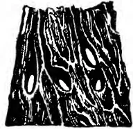

2

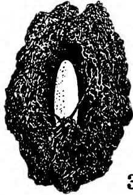

3

0

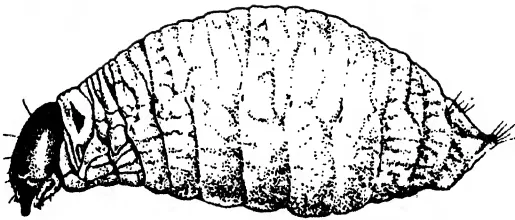

4

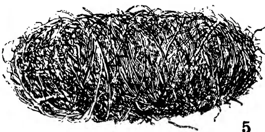

5

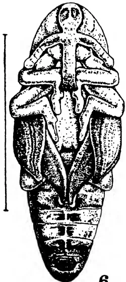

6

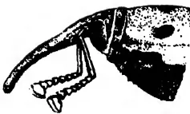

7

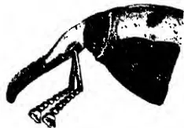

8

J. George Ollis

THE RED WEEVIL.  
*Rhynchosphorus ferrugineus.*

570------------------------------------------------

This image is a blank white page. It contains several small, dark specks which appear to be scanning artifacts or dust particles. There is no text, handwriting, or printed content on the page.

571------------------------------------------------

OCTOBER, 1922.]255

### Definitions.

2. In this Order :—“The Minister” means the Minister of Agriculture and Fisheries ; “Inspector” means an Inspector of the Ministry of Agriculture and Fisheries ; and the expression “plant” shall, where the context permits, include tree and shrub and the fruit, seeds, tubers, bulbs, layers, cuttings or other parts of a plant.

### Restriction on Importation of Plants.

3.—(1) The landing in England and Wales from any country other than Scotland, Ireland and the Channel Islands of any of the plants mentioned in the First Schedule to this Order is prohibited except in accordance with the regulations set out in the Third Schedule hereto.

(2) The importer of any plant the landing of which is regulated by this Article shall comply with the Regulations set out in the Third Schedule hereto.

(3) This Article shall not apply to any plant the landing of which is authorised by a general license issued by the Minister or by a special license issued by an Inspector or to a consignment of a plant to the Minister for experimental or scientific purposes.

### Powers of Entry.

4. An Inspector may, upon production if so required of his appointment or authority, enter any premises and examine any plant on such premises which has been landed in England or Wales from any country except as aforesaid or on which he has reason to believe that an insect or pest mentioned in the Second Schedule to this Order exists or has recently existed.

### Precautions to be adopted in case of Disease.

5.—(1) An Inspector may at any time and from time to time by a Notice served on the occupier of premises on which he has reason to believe that there is any plant attacked with any insect or pest mentioned in the Second Schedule to this Order, require him to adopt such measures for prevention of the spread of the insect or pest as are specified in the Notice.

(2) A Notice under this Article may prescribe the time within which the adoption of any measure thereby prescribed shall be completed.

### Power to deal with living specimens of Insects or Pests,

6. No person shall land, sell, or offer for sale, a living specimen of any insect or pest mentioned in the Second Schedule to this Order, except with the written permission of the Minister, and an Inspector may, by a Notice served on any person having in his possession or under his charge any such living specimen, require him to adopt such measures for the prevention of the spread of the insect or pest as are specified in the Notice.

### Service of Notices, Etc.

7. For the purpose of this Order a Notice shall be deemed to be served on any person if it is delivered to him personally or left for him at his last known place of abode or business or sent through the post in a letter addressed to him there ; and a Notice purporting to be signed by an Inspector shall be *prima facie* evidence that it was signed by him.

572------------------------------------------------

256[OCTOBER, 1922.

**Information to be given as to Diseased Plants or parts thereof.**

8. Every person who has or has had in his possession or under his charge any plant which is attacked by an insect or pest mentioned in the Second Schedule to this Order, and every person who as auctioneer, salesman, or otherwise has sold or offered for sale any such plant shall if so required in writing by the Minister or an Inspector, give to the Minister or Inspector all such information as he possesses as to the persons in whose possessions or under whose charge the plant is or has been; provided that any information given under this Article shall not be available as evidence against the person giving the same in any prosecution under this Order, except in respect of an alleged failure, to comply with this Article.

**Offences.**

9.—(1) Every person shall be liable on conviction to a penalty not exceeding ten pounds, who does any act in contravention of this Order or the Regulations in the Third Schedule to this Order or any Notice served on him under this Order, or fails to do any act which he is required to do by this Order or the said Regulations or any such Notice.

(2) This Article does not apply to the landing or attempted landing of anything in contravention of this Order the penalty for which is provided by section 1 of the Destructive Insects Act, 1877, as amended by the Destructive Insects and Pests Act, 1907.

**Revocation of Order.**

(10) The Destructive Insects and Pests Order of 1921 is hereby revoked; provided that such revocation shall not:—

- (i) affect the previous operation of such Order or anything duly done or suffered under such Order; or
- (ii) affect any right, privilege, obligation or liability acquired, accrued, or incurred under such Order; or
- (iii) affect any penalty incurred in respect of any offence committed against such Order; or
- (iv) affect any investigation, legal proceeding or remedy in respect of any such right, privilege, obligation, liability or penalty as aforesaid;

and any such investigation, legal proceeding or remedy may be instituted, continued, or enforced, and any such penalty may be imposed as if this Order had not been made.

**Application of the Order.**

11. This Order shall apply to England and Wales.

**Short Title.**

12. This Order may be cited as the Destructive Insects and Pests Order of 1922.

In witness whereof the Official Seal of the Minister of Agriculture and Fisheries is hereunto affixed this thirty-first day of May, nineteen hundred and twenty-two.

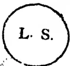

A. D. HALL,  
Authorised by the Minister.

**FIRST SCHEDULE.**

(a) All living plants with a persistent woody stem above ground, and parts of the same, except seeds, when for use in propagation—such as fruit trees, stocks and stools, forest trees, and ornamental shrubs and grafts, layers and cuttings thereof.

573------------------------------------------------

OCTOBER, 1922.]257

(b) All potatos; and all tubers, bulbs, rhizomes, corms, and hop stocks for planting.

(c) Seeds of onions and of leeks for sowing.

(d) Gooseberries.

### SECOND SCHEDULE.

**Fungi.**—Black Knot of Plum and Cherry (*Urowrightia morbosa*, Sacc.)  
Fire or Pear Blight (*Bacillus amylovorus*, Trev.)  
Chestnut Canker (*Endothia parasitica* (Murr.) Ander & Ander.)  
Wart Disease or Black Scab of Potatos (*Synchytrium endobioticum*, Perc.)  
Onion and Leek Smut (*Urocystis cepulac*, Frost)  
Downy Mildew of Hops (*Peronospermum humuli*, Miy. et Taka).

**Insects.**—Vine Louse (*Phylloxera vastatrix*, Planch.)  
American Apple Capsids (*Heterocordylus malinus* Reut.) and *Lygidea mendax*, Reut.)  
Pear Tingid (*Stephanitis pyri*, Fab.)  
Colorado Beetle (*Leptinotarsa decemlineata*, Say.)  
Plum Curculio (*Conotrachelus nenuphar*, Herbst.)  
Potato Moth (*Phthorimaea operculella*, Zell.)  
American Lackey Moths (*Malacosoma americana*, Fab. and M.)  
*disstria*, Hubn.)  
Oriental Fruit Moth (*Cydia molesta*, Busck.)  
San José Scale (*Aspidiotus perniciosus*, Comst.)  
Japanese Fruit Scale (*Diaspis pentagona*, Newst.)  
Apple Fruit Fly (*Rhagoletis pomonella*, Welsh.)  
Cherry Fruit Flies (*Rhagoletis cerasi*, Linn.) *R. cingulata*, Loew., and *R. fausta*, Osten Saken.)  
Gooseberry Fruit Fly (*Epochra canadensis*, Loew.)

### THIRD SCHEDULE.

#### Regulations Governing the Importation of Plants into England and Wales.

1. The restrictions on landing imposed by the Order and these Regulations do not apply to plants, the landing of which is authorised by a general license issued by the Minister or by a special license issued by an Inspector or to consignments of plants to the Minister for experimental or scientific purposes.

#### 2—Inspection and Certification as a Condition of Entry.

(a) In the case of an importation of plants, otherwise than through the post, from a country whose service of plant inspection is recognised for the time being, each consignment must be accompanied by two copies of a certificate issued after inspection, and not more than 14 days prior to the date of shipment, by a duly authorised official of the country whence the plants are exported, in the form prescribed below. One copy of the certificate must be produced to the Customs Officer at the port of entry, and the other copy must be forwarded by the importer to the consignee. In the case of consignments imported through the post, a copy of the prescribed certificate need not be produced to the Customs Officer, but a copy must be affixed to each package.

The original of the certificate must be forwarded by post before the plants are despatched, by the Exporter to the Horticulture Division of the Ministry of Agriculture and Fisheries, Whitehall Place, London, S.W. 1.

#### Certificate of Examination of Plants, No.

This is to certify that the plants included in the package or consignment described below were thoroughly inspected by \_\_\_\_\_, a duly authorised official of \_\_\_\_\_, on \_\_\_\_\_, and were found or believed by him to be healthy and free from any of the

574------------------------------------------------

258[OCTOBER, 1922.]

plant diseases or pests named in the Second Schedule to the Destructive Insects and Pests Order of 1922.

This additional certificate must be given for all potatoes :—

Further, it is hereby certified that no case of the disease known as Wart Disease or Black Scab of Potatoes (*Synchytrium endobioticum*) has occurred on the farm or holding where the potatoes included in this consignment were grown nor within 500 yards (approximately  $\frac{1}{2}$  kilometre) thereof.

(Signed) .....

(Official Status) .....

The following details must be filled in by the Shipper :—

Number and description of packages in consignment.....

Distinguishing marks .....

Description of Plants .....

Grown at .....

Name and Address of Exporter .....

Name and Address of Consignee .....

Name of vessel .....

Date of shipment .....

Port of shipment.....

Port of Landing in England and Wales .....

Approx. Date of Landing .....

(Signed) .....

An Inspector of the Ministry of Agriculture and Fisheries may open and examine the contents of any consignment or package imported or believed to have been imported into England or Wales, notwithstanding the fact that the consignment may be accompanied by, or the package may have attached thereto, the duly authorised copy certificate.

(b) In the case of an importation of plants from a country where no recognised service of plant inspection is maintained and in the case of a consignment of plants which is not accompanied by copy certificates as above mentioned, or of a package of plants imported through the post to which a copy certificate is not attached, the plants shall be retained by the importer or consignee until they have been examined by an Inspector of the Ministry of Agriculture and Fisheries at a suitable place designated by the Inspector or by the Ministry and certified in writing to be healthy and free from the insects and pests mentioned in the Second Schedule to this order or until their removal has been authorised in writing by the Ministry or by an Inspector of the Ministry.

(c) Any imported plants which on inspection are found to be unhealthy or attacked by any insect or pest mentioned in the Second Schedule to this Order, and which, in the judgment of the Inspector, cannot be cleaned by disinfection or other treatment, shall, with the packing and package, either be destroyed or returned to the country of exportation by the importer thereof.

(d) When disinfection or other treatment of the plants is allowed, it shall be carried out by the importer, and under the supervision of an Inspector of the Ministry of Agriculture and Fisheries at a suitable place designated by the Inspector or the Ministry, and no part of the consignment shall be moved from the place designated without the written consent of the Inspector of the Ministry of Agriculture and Fisheries.

(e) The Ministry's charge for the services of the Inspector and all charges for storage, cartage and labour incident to inspection and disinfection, shall be paid by the importer.

3. Plants will not be deemed to be healthy which are attacked by any insect or pest mentioned in the Schedule and the Note to the Sale of Diseased Plants Order of 1922.

(Extracts from the "London Gazette" of Friday, 2nd June, 1922.)

575------------------------------------------------

OCTOBER, 1922.]259

# APICULTURE.

## BEE-KEEPING NOTES.

An almost incredible record of a queen is reported by *Gleanings in Bee Culture* for July last. This prolific bee was the property of MR. C. B. HAMILTON of Fenton, Michigan. He purchased the queen and colony in April last year, and kept them well fed with syrup against the honey-flow, which was provided by a plentiful crop of red clover, sweet clover and lucerne which yielded enormous quantities of nectar. MR. HAMILTON first put in 6 supers of sections, and when these were filled, piled on more till he finally had 24 supers each containing 24 sections. In the end he took away 23 twenty-four-pound cases of honey. The queen was the most prolific he ever had. She kept on laying and he continued feeding with warm syrup up to the honey-flow by which time there were "bushels of bees." With such a crowd of healthy bees and a long honey flow he was thus able to get 577 sections of sealed honey.

The Secretary of the Apis Club, writing on 1st August, says "we are sending you with our compliments a British standard specimen of Adminson's semi-comb (small celled worker variety). This may or may not suit *A. indica*, but does suit *A. fasciata*, and other small races of bees, including some Italian strains. You can obtain the large-celled worker variety from LEES' Beehive Works, Uxbridge, England, whose catalogue we are sending you." The Secretary of Ceylon Bee-keepers' Association will be pleased to forward the specimen to any one interested in this substitute for ordinary wax comb, foundation, for inspection.

As a preventative against swarming, keep open brood outside and hatching in the centre of the brood nest. Arrange the brood thus before putting on the super.

In the Rocky mountains is a bee plant (*Cleome serrulata*) which yields enormous quantities of honey; but under cultivation at lower altitudes it yielded disappointing results. This is pointed out as an instance of a nectar-bearing plant which is of minor importance outside its natural environment, but a source of large crops of honey in its natural habitat. The high altitude at which the plant grows may affect its nectar-producing capacity, which would appear to be lowered by decreased elevation.

The headquarters of the Apis Club are at Benson in Oxfordshire, where one can examine the merits of every race of bees, study all the up-to-date apparatus for bee-keeping, and consult a fine library. The Club owes much to MR. ABUSHADY, who has been the driving force that brought it to its present satisfactory position. The Ceylon Bee-keepers' Association has arranged for a visit to the headquarters of the Apis Club by a lady at present on a holiday in England, who will no doubt have much of interest to say on her return to the Colony.

576------------------------------------------------

260[OCTOBER, 1922.

What is "royal jelly?" DR. A. VON PLANTA, a Swiss Scientist, tells us that Royal jelly on an average consists of 69% water and 31% dry substance. This dry substance is made up of 45% albumen, 14% fat, and 20% sugar—a nutritious enough mixture.

MR. M. SHANKS, in a letter to the Secretary, Ceylon Bee-keepers' Association, says: "I see by the BEE WORLD that someone claims to have mated queens artificially. If that can be done, the crossing of *A. indica* with *A. mellifica* should be a simple matter.

"I have frames spaced  $1\frac{3}{8}$ ,  $1\frac{1}{8}$ ,  $1\frac{1}{16}$  and 1 inch, and have had fairly good combs from all. The 1 inch spacing is quite all right for combs where worker brood only is being raised, but with drone larvæ it is too narrow. We can't get spacing that will exactly suit both drone and worker larvæ; but I think  $1\frac{1}{8}$  will serve the purpose best. I am now adopting  $1\frac{1}{8}$  in most of my hives.

"I have measured the spacing in natural hives (in clay pots chiefly), and found it varies greatly, being sometimes only  $\frac{1}{4}$  in. from centre to centre.

"From measurements I have taken worker comb is  $\frac{5}{8}$  in. thick, as you say; if the spacing is  $1\frac{1}{8}$ , that would give an intercomb passage of  $\frac{1}{2}$  inch for the bees. For honey the spacing may be anything up to 2 in. When my bees are fairly started in the supers, I spaced out the frames on seeing signs of cells being sealed; and have secured nice combs of sealed honey  $1\frac{3}{4}$  inches thick.

"My top-bars are mostly  $\frac{1}{2}$  in. wide (top and bottom are alike since my frames are reversible), but I would rather have them  $\frac{3}{4}$  inch. I find that with a narrow bar, during a honey flow the bees build right round and sometimes on to the cover:  $\frac{3}{4}$  inch is more too broad where the spacing is  $1\frac{1}{8}$  inch. This would leave a passage of  $\frac{3}{8}$  in. for the bees.

"As regards size of frames and hive, if I had to make new hives for myself, I would adopt the English standard frame and make the hive  $15\frac{1}{8}$  in. square. This will allow for 14 frames, but I would only have 12, with 2 well-fitting division boards or dummies. This to all intents and purposes would be a double hive, and could be contracted as required. With good queen management and ordinary seasons, such a hive should answer well. I find queens lay better when they have good-sized frames. I have tried *A. indica* on Langstroth frames, but I found them rather too large. I have just completed 12 frames  $13\frac{1}{2} \times 7$  in. and put two on to the depth of one of my hives, and will fit them with "starters" and transfer one of my colonies to them. I find that it is the large hives that bring in the goods."

The extracts from MR. SHANKS' notes will be read with interest by all members of the Ceylon Bee-keepers' Association, to whom he is well-known as an enthusiastic apiarist and an investigator, with an open mind, and very keen on experimenting. Though there are many who will not be prepared to agree with him as to the suitability of the British standard frame for *A. indica* bees, they will read his views with interest, and look forward to the results of his experiments, especially the working of the four-chambered four-queened hive he is trying.

C. D.

577------------------------------------------------

OCTOBER, 1922.]261

# GENERAL.

## PERIODICAL LITERATURE OF AGRICULTURE.

### V.

#### AGRICULTURE, THE SOIL, MANURING AND IRRIGATION.

Pensa, A., Agricultural Conditions in the Philippines, **Philippine Agric. Review**, Vol. XIV, No. 2, pp. 129-158.

S. B. L., Capacity of an Acre, **Indian Scientific Agriculturist**, Vol. III, No. 7, pp. 282-284.

Juritz, F., Basic Slag: The Change in its Composition, **Journ. Dept. of Agric., U. S. Africa**, Vol. V, No. 1, pp. 76-79.

Charpuray, P. V., Help the Hardpressed Farmers (Rock or Stone Meal) **Mysore Economic Journal**, Vol. VIII, No. 6, pp. 404-406.

Russel, E. J., Phosphatic Fertilisers, **Journ. of Ministry of Agric., U.K.**, Vol. XXIX, No. 3.

#### CO-OPERATION, ECONOMICS AND EDUCATION.

Report of the working of the Co-operative Credit Societies, Mauritius, 1921.

Wester, P. J., Mindanao, **Philippine Agric. Review**, Vol. XIV, No. 2, pp. 195-201.

Macdonald, Wm., Agriculture and Land Settlement in South Africa, **United Empire**, Vol. IV, No. 6, p. 472.

Noor, I. M., Local Land Tenure, **Malayan Agricultural Journal**, Vol. X, No. 1, pp. 13-17.

Wood, T. B., The School of Agriculture, University of Cambridge, **Journ. Ministry of Agric., U.K.**, Vol. XXIX, Nos. 3 & 4.

Agricultural Research in Great Britain, **Nature**, Vol. 110, No. 2750, p. 93.

Paush, E., Agricultural Experiment: Its Design and Interpretation, **Agric. Dept., U. S. Africa, Science Bull.** No. 22.

#### ENTOMOLOGY.

Russel, H., Indian Parasitic Flies, **Journ. Bombay Nat. History Soc.**, Vol. XXXVIII, No. 3, pp. 703-718.

Dagar, H. C., Mosquitos of the United States, Reprint No. 2447. Proceedings **U. S. National Museum**, Vol. 62, Art. 1, pp. 1-119.

Davidson, J., Biological Studies of *Aphis rumices* Reproduction on Varieties of *Vicia faba*, **Annals of Applied Biology**, Vol. IX, No. 2, pp. 135-145.

#### ECONOMIC PLANTS.

##### *Adaly.*

Wester, P. J., Additional Data on Adaly, **Philippine Agric. Review**, Vol. XIV, No. 2, pp. 159-184.

##### *Avocado.*

Wester, P. J., The Avocado and its Propagation, **Philippine Agric. Review**, Vol. XIV, No. 2, pp. 185-194.

##### *Bread Fruit.*

Wester, P. J., Seedless Bread-fruit in Carolina Islands, **Philippine Agric. Review**, Vol. XIV, No. 2, pp. 202-204.

578------------------------------------------------

262[OCTOBER, 1922.*Chaulmoogra.*

Chaulmoogra Oil, **Chemist & Druggist**, Vol. XCVII, No. 2216, p. 73.

*Citrus.*

Golang, F. C., Some Varieties of Citrus Fruits for the Philippines, **Philippine Agric. Review**, Vol. XV, No. 1, pp. 44-48.

*Coconut.*

Sundaraman, S., Coconut Stem Bleeding Disease, **Mysore Economic Journ.** Vol. 8, Pt. 6.

Jack, W. W., and Sands, W. N., The Dwarf Coconut in Malaya, **Malayan Agric. Journ.**, Vol. X, No. 1, pp. 4-12.

Trent Vale, The Leaves of the Coconut Palm, **Indian Scientific Agriculturist**, Vol. III, Pt. 7, p. 273.

*Fibre Plants.*

Wigglesworth, A., The Fibre Industry of East Africa, **Farmers' Journ.**, Vol. 4, No. 29, p. 9.

*Fruit Trees.*

Watt, G. S., Hints on Planting Deciduous Fruit Trees, **Farmers' Journ.**, Vol. 4, No. 29, p. 15.

*Garlic.*

Garlic (by Gujarati), **Indian Scientific Agriculturist**, Vol. III, Nos. 7 & 8.

*Ground Nuts.*

Mainwaring, C., Ground Nut, **Farmers' Journ.**, Vol. 4, No. 30, p. 25.

*Maize.*

Douglas J., Field Experiments with Maize, **Agric. Gazette, N.S.W.**, Vol. XXXIII, Pt. 7, p. 465.

Bart-Davy, J., Some New Points on Maize Growing, **Farmers' Journ.**, Vol. IV, No. 28, 29 & 30.

*Rice.*

The Inheritance of Beardedness of Rice in Natural Hybrids, **Philippine Agric. Review**, Vol. XV, No. 1.

Sandaraaman, Helminthosporium Disease of Rice, **Pusa Agric. Research Inst. Bull.** No. 128.

*Sugar-Cane.*

Lee, H. A., & Medalla, M. G., Experiments on Fiji Disease, Mosaic Disease and Smut of Sugar-cane, **Philippine Agric. Review**, Vol. XIV, Pt. 4.

Lee, H. A. Medalla & Wells, C. G., Fiji Disease of Sugar-cane, **Philippine Agric. Review**, Vol. XIV, Pt. 4.

Lee, H. A. & Kope, E. W., Mosaic Disease of Sugar-cane, **Philippine Agric. Review**, Vol. XIV, Pt. 4.

*Tea.*

Mosquito Blight of Tea is a Symptom and not a Disease, **Planters' Chronicle**, Vol. XVII, No. 30.

*Tomato.*

Bowley, W. F. Sleepy Disease of Tomato, **Annals of Applied Biology**, Vol. IX, No. 2.

*Miscellaneous.*

Lee, H. A. & Merino, G., The Prevention of the Importation of Injurious Insects and Parasitic Fungi on Economic Crops, **Philippine Agric. Review**, Vol. XIV, No. 4.

Pedigree of Seeds, **Indian Scientific Agriculturist**, Vol. III, Pt. 7.

Merril, E. D., New and Noteworthy Philippine Plants, **Philippine Journ. of Science**, Vol. 20, No. 4.

579------------------------------------------------

OCTOBER, 1922.]263

# MARKET RATES.

## MARKET RATES FOR SOME TROPICAL PRODUCTS.

(FROM LEWIS & PEAT'S Ltd., LATEST MONTHLY PRICES CURRENT.)

<table border="1">
<thead>
<tr>
<th>GOODS</th>
<th>QUALITY</th>
<th>PRICE</th>
<th>PER</th>
<th>PKGS</th>
<th>POSITION</th>
<th>MARKET</th>
</tr>
</thead>
<tbody>
<tr>
<td colspan="7"><b>BEANS AND PEAS</b></td>
</tr>
<tr>
<td>Butter Beans</td>
<td>Madagascar New Crop...</td>
<td>£14 a £15</td>
<td>ton</td>
<td>Bags</td>
<td>Spot U.K.</td>
<td>Quiet</td>
</tr>
<tr>
<td>Rangoon Beans</td>
<td>Hand Picked</td>
<td>£7.5</td>
<td>"</td>
<td>"</td>
<td>" "</td>
<td>"</td>
</tr>
<tr>
<td>Soya Beans</td>
<td>Manchuria</td>
<td>£13</td>
<td>"</td>
<td>"</td>
<td>C.i.f.</td>
<td>"</td>
</tr>
<tr>
<td>Green Peas</td>
<td>Japanese, f.a.q.</td>
<td>£31</td>
<td>"</td>
<td>"</td>
<td>" "</td>
<td>Market steady</td>
</tr>
<tr>
<td>"</td>
<td>Dutch</td>
<td>£24</td>
<td>"</td>
<td>"</td>
<td>Spot "</td>
<td>" "</td>
</tr>
<tr>
<td colspan="7"><b>CAKES—</b></td>
</tr>
<tr>
<td>Ground Nut Cake</td>
<td>Bombay 55ol.</td>
<td>£10/10</td>
<td>ton</td>
<td>Bags</td>
<td>C.i.f. U.K.</td>
<td>Slow</td>
</tr>
<tr>
<td>Copra Cake</td>
<td>Malabar</td>
<td>£10</td>
<td>"</td>
<td>"</td>
<td>" "</td>
<td>"</td>
</tr>
<tr>
<td></td>
<td>Ceylon</td>
<td>£9/10</td>
<td>"</td>
<td>"</td>
<td>" "</td>
<td>"</td>
</tr>
<tr>
<td></td>
<td>Straits</td>
<td>£9</td>
<td>"</td>
<td>"</td>
<td>" "</td>
<td>"</td>
</tr>
<tr>
<td colspan="7"><b>COPRA —</b></td>
</tr>
<tr>
<td></td>
<td>Malabar</td>
<td>£27</td>
<td>ton</td>
<td>Bags</td>
<td>C.i.f. U.K.</td>
<td>Steady</td>
</tr>
<tr>
<td></td>
<td>Ceylon</td>
<td>£26 10</td>
<td>"</td>
<td>"</td>
<td>" "</td>
<td>"</td>
</tr>
<tr>
<td></td>
<td>Straits (F.M.S.)</td>
<td>£25/5</td>
<td>"</td>
<td>"</td>
<td>" "</td>
<td>"</td>
</tr>
<tr>
<td colspan="7"><b>GROUND NUTS—</b></td>
</tr>
<tr>
<td></td>
<td>Bombay Decorticated</td>
<td>£21 2/6</td>
<td>ton</td>
<td>Bags</td>
<td>C.i.f. Continent</td>
<td>Slow</td>
</tr>
<tr>
<td colspan="7"><b>OILS—</b></td>
</tr>
<tr>
<td>Palm Oil</td>
<td>Lagos</td>
<td>£34/10</td>
<td>ton</td>
<td>Casks</td>
<td>Spot U.K.</td>
<td>Steady</td>
</tr>
<tr>
<td>"</td>
<td>Congo</td>
<td>£31/10</td>
<td>"</td>
<td>"</td>
<td>" "</td>
<td>"</td>
</tr>
<tr>
<td>Coconut Oil</td>
<td>Cochin</td>
<td>43</td>
<td>cwt</td>
<td>"</td>
<td>C.i.f. U.K.</td>
<td>"</td>
</tr>
<tr>
<td></td>
<td>Ceylon</td>
<td>39</td>
<td>"</td>
<td>"</td>
<td>" "</td>
<td>"</td>
</tr>
<tr>
<td>Palm Kernel Oil</td>
<td>Crushed</td>
<td>36/6</td>
<td>"</td>
<td>Naked</td>
<td>Spot "</td>
<td>Firm. Fair demand</td>
</tr>
<tr>
<td colspan="7"><b>PALM KERNELS—</b></td>
</tr>
<tr>
<td></td>
<td>West African</td>
<td>£17 15</td>
<td>ton</td>
<td>Bags</td>
<td>Ex quay L'pool Spot U.K.</td>
<td>Steady</td>
</tr>
<tr>
<td colspan="7"><b>SEEDS—</b></td>
</tr>
<tr>
<td>Castor Seed</td>
<td>Bombay</td>
<td>£19</td>
<td>ton</td>
<td>Bags</td>
<td>C.i.f. U.K.</td>
<td>Quiet</td>
</tr>
<tr>
<td></td>
<td>Madras</td>
<td>£18</td>
<td>"</td>
<td>"</td>
<td>" "</td>
<td>"</td>
</tr>
<tr>
<td>Sesame Seed</td>
<td>Bombay</td>
<td>£24</td>
<td>"</td>
<td>"</td>
<td>" Continent</td>
<td>Inactive</td>
</tr>
</tbody>
</table>

### ESSENTIAL OILS.

(From Perfumery and Essential Oil Record, Vol. 13, No. 6.)

<table border="1">
<thead>
<tr>
<th>GOODS</th>
<th>QUALITY</th>
<th>PRICE</th>
<th>PER</th>
<th>PKGS.</th>
<th>POSITION</th>
<th>MARKET</th>
</tr>
</thead>
<tbody>
<tr>
<td>Campher Oil</td>
<td>White</td>
<td>77s 6d to 80s.</td>
<td>cwt.</td>
<td>Drums</td>
<td></td>
<td>Cheaper</td>
</tr>
<tr>
<td>Do</td>
<td>Brown</td>
<td>70s.</td>
<td>"</td>
<td>"</td>
<td>Spot</td>
<td></td>
</tr>
<tr>
<td>Cinnamon Leaf Oil</td>
<td></td>
<td>44d.</td>
<td>oz.</td>
<td></td>
<td>"</td>
<td></td>
</tr>
<tr>
<td>Do</td>
<td></td>
<td>3 3/4d.</td>
<td>"</td>
<td></td>
<td>C.i.f.</td>
<td></td>
</tr>
<tr>
<td>Cinnamon Bark Oil</td>
<td>Genuine</td>
<td>6s 6d</td>
<td>"</td>
<td></td>
<td></td>
<td></td>
</tr>
<tr>
<td>Citronella Oil</td>
<td>Ceylon</td>
<td>2s. 6d.</td>
<td>lb.</td>
<td>Drums</td>
<td>Spot</td>
<td>Not much business</td>
</tr>
<tr>
<td>Do</td>
<td>do</td>
<td>2s 1d</td>
<td>"</td>
<td>"</td>
<td>C.i.f. afloat</td>
<td></td>
</tr>
<tr>
<td>Do</td>
<td>do</td>
<td>2s 2 1/2d</td>
<td>"</td>
<td>"</td>
<td>C.i.f.</td>
<td></td>
</tr>
<tr>
<td>Lemongrass Oil</td>
<td>Cochin</td>
<td>2 1/2d.</td>
<td>oz.</td>
<td>"</td>
<td>"</td>
<td></td>
</tr>
<tr>
<td>Lime Oil</td>
<td>Distilled</td>
<td>2s.</td>
<td>lb.</td>
<td></td>
<td>Spot</td>
<td>Easeir</td>
</tr>
<tr>
<td>Do</td>
<td>Hand-pressed</td>
<td>10s. 6d.</td>
<td>"</td>
<td></td>
<td></td>
<td>Nominal</td>
</tr>
</tbody>
</table>

580------------------------------------------------

264

[OCTOBER, 1922]

**METEOROLOGICAL.**  
SEPTEMBER, 1922.

<table border="1">
<thead>
<tr>
<th rowspan="2">Station</th>
<th colspan="2">Temperature</th>
<th rowspan="2">Mean amount of cloud cover, 10 or over</th>
<th rowspan="2">Mean Wind Direction during month</th>
<th rowspan="2">Daily Mean Velocity, Miles</th>
<th colspan="2">Rainfall</th>
<th rowspan="2">Difference from Average</th>
</tr>
<tr>
<th>Mean Daily Shade</th>
<th>Mean Humidity, %</th>
<th>Amount</th>
<th>Days</th>
</tr>
</thead>
<tbody>
<tr>
<td>Colombo</td>
<td>81.2</td>
<td>80</td>
<td>90</td>
<td>WSW</td>
<td>141</td>
<td>1.36</td>
<td>13</td>
<td>- 3.62</td>
</tr>
<tr>
<td>Observatory</td>
<td>81.8</td>
<td>74</td>
<td>47</td>
<td>SW</td>
<td>306</td>
<td>0.00</td>
<td>0</td>
<td>- 1.01</td>
</tr>
<tr>
<td>Puttalam</td>
<td>+ 0.2</td>
<td>75</td>
<td>71</td>
<td>SSW</td>
<td>264</td>
<td>0.52</td>
<td>1</td>
<td>- 0.54</td>
</tr>
<tr>
<td>Mannar</td>
<td>83.1</td>
<td>80</td>
<td>54</td>
<td>SSW</td>
<td>377</td>
<td>2.06</td>
<td>6</td>
<td>- 0.83</td>
</tr>
<tr>
<td>Jaffna</td>
<td>82.2</td>
<td>- 0.4</td>
<td>64</td>
<td>WSW</td>
<td>148</td>
<td>0.51</td>
<td>7</td>
<td>- 4.11</td>
</tr>
<tr>
<td>Trincomalee</td>
<td>86.6</td>
<td>+ 2.2</td>
<td>62</td>
<td>Var.</td>
<td>248</td>
<td>0.17</td>
<td>3</td>
<td>- 2.54</td>
</tr>
<tr>
<td>Batticaloa</td>
<td>84.8</td>
<td>+ 1.3</td>
<td>52</td>
<td>SW</td>
<td>412</td>
<td>0.95</td>
<td>4</td>
<td>- 1.31</td>
</tr>
<tr>
<td>Hambantota</td>
<td>81.6</td>
<td>+ 0.4</td>
<td>74</td>
<td>WNW</td>
<td>314</td>
<td>9.55</td>
<td>22</td>
<td>+ 2.08</td>
</tr>
<tr>
<td>Galle</td>
<td>78.4</td>
<td>+ 1.6</td>
<td>87</td>
<td>SW</td>
<td>11.49</td>
<td>23</td>
<td>0</td>
<td>+ 2.93</td>
</tr>
<tr>
<td>Ranu/pura</td>
<td>80.1</td>
<td>+ 0.8</td>
<td>66</td>
<td>—</td>
<td>—</td>
<td>0.00</td>
<td>0</td>
<td>- 2.31</td>
</tr>
<tr>
<td>Kurunegala</td>
<td>84.2</td>
<td>+ 0.1</td>
<td>74</td>
<td>—</td>
<td>—</td>
<td>2.67</td>
<td>11</td>
<td>- 0.49</td>
</tr>
<tr>
<td>Kandy</td>
<td>75.2</td>
<td>- 0.6</td>
<td>80</td>
<td>—</td>
<td>—</td>
<td>5.37</td>
<td>17</td>
<td>- 3.05</td>
</tr>
<tr>
<td>Badulla</td>
<td>75.8</td>
<td>+ 0.7</td>
<td>70</td>
<td>—</td>
<td>—</td>
<td>0.34</td>
<td>7</td>
<td>- 3.19</td>
</tr>
<tr>
<td>Diyatalawa</td>
<td>71.0</td>
<td>+ 1.6</td>
<td>64</td>
<td>—</td>
<td>—</td>
<td>0.53</td>
<td>7</td>
<td>- 4.11</td>
</tr>
<tr>
<td>Hakgala</td>
<td>62.0</td>
<td>+ 0.4</td>
<td>80</td>
<td>—</td>
<td>—</td>
<td>3.82</td>
<td>14</td>
<td>+ 1.23</td>
</tr>
<tr>
<td>N. Eliya</td>
<td>60.8</td>
<td>+ 1.4</td>
<td>84</td>
<td>—</td>
<td>—</td>
<td>9.58</td>
<td>19</td>
<td>+ 2.28</td>
</tr>
</tbody>
</table>

The rainfall in September was below normal over the greater part of the island, but probably the most distinctive feature was the similarity in distribution between August and September so that, to an even greater extent than usual, conditions at the end of September must be regarded as a cumulative effect rather than due to that month alone. This was notably so in certain areas round Chilaw and Batticaloa where this month's totals were not far below average, but the drought was emphasised by a series of small deficits in the preceding months.

As in August, the pressure gradient was higher than usual and this showed both in the wind averages being higher, and in the number of thunderstorms rather smaller, than usual. Backwater 31.88 ins., and Kenilworth 28.64 ins. again figure among the wettest regions, and other stations in the south of the Central Province were generally at least two inches ahead of their average. Those in the Pussellawwa and Kandy districts of the Central Province were below average, though Peradeniya was not far above but in the rest of that Province just below average.

In the Southern Province the average was passed by over 2 ins. at Galle and a few neighbouring stations, and was reached at some stations in the Jaffna Peninsula, Anningkanda, etc. The average was also reached at some stations in the Eastern Province and a few isolated cases such as Kalutara, Rotawewa (Eastern Province) and Medagama (Uva).

In practically all the other provinces there were consistent deficits. In the Kelani Valley there were frequently from 5 ins. to 10 ins., but elsewhere the commonest offsets were between 2 ins. and 5 ins. The stations that recorded no rain include more than half of those in the North-Western Province, nearly all in the North-Central Province, and a few in Uva.

The column of temperature offsets above shows the natural accompaniment of the deficient rain—a fact that was also commented on in the previous columns that do not give actual temperatures. The pressure gradient was consistently below average and the cloudiness rather above—in which items they agree with the August figures.

A. J. BAMFORD,  
Supdt. Observatory.

**ANIMAL DISEASE RETURN FOR THE MONTH ENDED 30th SEPTEMBER, 1922.**

<table border="1">
<thead>
<tr>
<th>Province, &amp;c.</th>
<th>Disease.</th>
<th>No. of Cases up to date since Jan. 1st, 1922.</th>
<th>Fresh Recoveries</th>
<th>Deaths</th>
<th>Balance Ill.</th>
<th>No. Shot.</th>
</tr>
</thead>
<tbody>
<tr>
<td rowspan="3">Western</td>
<td>Rinderpest</td>
<td>11</td>
<td>4</td>
<td>3</td>
<td>8</td>
<td>—</td>
</tr>
<tr>
<td>Foot-and-mouth disease</td>
<td>293</td>
<td>288</td>
<td>1</td>
<td>1</td>
<td>4</td>
</tr>
<tr>
<td>Anthrax</td>
<td>4</td>
<td>—</td>
<td>—</td>
<td>—</td>
<td>3</td>
</tr>
<tr>
<td rowspan="3">Colombo Municipality</td>
<td>Hemorrhagic Septicæmia</td>
<td>7</td>
<td>2</td>
<td>3</td>
<td>—</td>
<td>—</td>
</tr>
<tr>
<td>Rinderpest</td>
<td>19</td>
<td>—</td>
<td>—</td>
<td>—</td>
<td>—</td>
</tr>
<tr>
<td>Foot-and-mouth disease</td>
<td>137</td>
<td>4</td>
<td>—</td>
<td>—</td>
<td>—</td>
</tr>
<tr>
<td rowspan="3">Cattle Quarantine Station*</td>
<td>Rabies</td>
<td>17</td>
<td>3</td>
<td>—</td>
<td>—</td>
<td>—</td>
</tr>
<tr>
<td>Rinderpest</td>
<td>19</td>
<td>—</td>
<td>—</td>
<td>—</td>
<td>—</td>
</tr>
<tr>
<td>Foot-and-mouth disease</td>
<td>50</td>
<td>—</td>
<td>—</td>
<td>—</td>
<td>—</td>
</tr>
<tr>
<td rowspan="3">Central</td>
<td>Rinderpest</td>
<td>151</td>
<td>—</td>
<td>—</td>
<td>—</td>
<td>—</td>
</tr>
<tr>
<td>Foot-and-mouth disease</td>
<td>17</td>
<td>17</td>
<td>8</td>
<td>2</td>
<td>—</td>
</tr>
<tr>
<td>Anthrax</td>
<td>97</td>
<td>10</td>
<td>91</td>
<td>1</td>
<td>2</td>
</tr>
<tr>
<td rowspan="3">Southern</td>
<td>Piroplasmiasis</td>
<td>6</td>
<td>—</td>
<td>7</td>
<td>—</td>
<td>—</td>
</tr>
<tr>
<td>Rinderpest</td>
<td>—</td>
<td>—</td>
<td>—</td>
<td>—</td>
<td>—</td>
</tr>
<tr>
<td>Foot-and-mouth disease</td>
<td>2</td>
<td>6</td>
<td>2</td>
<td>—</td>
<td>—</td>
</tr>
<tr>
<td rowspan="3">Northern</td>
<td>Anthrax</td>
<td>37</td>
<td>4</td>
<td>33</td>
<td>—</td>
<td>—</td>
</tr>
<tr>
<td>Hemorrhagic Septicæmia</td>
<td>—</td>
<td>—</td>
<td>—</td>
<td>—</td>
<td>—</td>
</tr>
<tr>
<td>Rinderpest</td>
<td>294</td>
<td>4</td>
<td>291</td>
<td>—</td>
<td>—</td>
</tr>
<tr>
<td rowspan="3">Eastern</td>
<td>Foot-and-mouth disease</td>
<td>18</td>
<td>—</td>
<td>—</td>
<td>—</td>
<td>—</td>
</tr>
<tr>
<td>Anthrax</td>
<td>—</td>
<td>—</td>
<td>—</td>
<td>—</td>
<td>—</td>
</tr>
<tr>
<td>Rinderpest</td>
<td>191</td>
<td>17</td>
<td>183</td>
<td>8</td>
<td>—</td>
</tr>
<tr>
<td rowspan="3">North-Western</td>
<td>Foot-and-mouth disease</td>
<td>—</td>
<td>—</td>
<td>—</td>
<td>—</td>
<td>—</td>
</tr>
<tr>
<td>Anthrax</td>
<td>—</td>
<td>—</td>
<td>—</td>
<td>—</td>
<td>—</td>
</tr>
<tr>
<td>Rinderpest</td>
<td>7</td>
<td>5</td>
<td>3</td>
<td>1</td>
<td>—</td>
</tr>
<tr>
<td rowspan="3">North-Central</td>
<td>Foot-and-mouth disease</td>
<td>2</td>
<td>—</td>
<td>—</td>
<td>—</td>
<td>—</td>
</tr>
<tr>
<td>Anthrax</td>
<td>—</td>
<td>—</td>
<td>—</td>
<td>—</td>
<td>—</td>
</tr>
<tr>
<td>Rinderpest</td>
<td>283</td>
<td>5</td>
<td>278</td>
<td>3</td>
<td>2</td>
</tr>
<tr>
<td rowspan="3">Uva</td>
<td>Foot-and-mouth disease</td>
<td>5</td>
<td>—</td>
<td>—</td>
<td>—</td>
<td>—</td>
</tr>
<tr>
<td>Anthrax</td>
<td>—</td>
<td>—</td>
<td>—</td>
<td>—</td>
<td>—</td>
</tr>
<tr>
<td>Rinderpest</td>
<td>1520</td>
<td>85</td>
<td>1438</td>
<td>3</td>
<td>87</td>
</tr>
<tr>
<td rowspan="3">Sabaragamuwa</td>
<td>Foot-and-mouth disease</td>
<td>2</td>
<td>6</td>
<td>9</td>
<td>—</td>
<td>—</td>
</tr>
<tr>
<td>Anthrax</td>
<td>—</td>
<td>—</td>
<td>—</td>
<td>—</td>
<td>—</td>
</tr>
<tr>
<td>Rabies</td>
<td>9</td>
<td>1</td>
<td>—</td>
<td>—</td>
<td>—</td>
</tr>
</tbody>
</table>

G. W. STURGESS,  
Government Veterinary Surgeon.  
Colombo, 5th October, 1922.

\* Figures for September 1922, not yet to hand.

581------------------------------------------------

A completely blank white page with no visible content, text, or markings.

582------------------------------------------------

<!-- stage4: FAINT old-images-only -->

[Faint page: no legible print of its own could be verified; text withheld (stage 4 review list)]

583------------------------------------------------

# THE TROPICAL AGRICULTURIST

---

VOL. LIX.

PERADENIYA, NOVEMBER, 1922.

No. 5.

---

## PESTS AND DISEASES OF CULTIVATED PLANTS.

---

Within recent years public opinion has demanded throughout the whole world that greater attention be given to the control and prevention of the spread of Pests and Diseases of cultivated plants with a view to checking the dissemination of these pests and diseases from one country to another and to controlling the spread of such pests and diseases within affected areas.

It must be confessed that whereas many efforts have been eminently successful others have yielded but small results. In certain instances, pests and diseases, despite all the efforts of the authorities, have not only spread in their country of origin but have also spread to other countries. Even in the cases of these failures, it has frequently been demonstrated that large and profitable industries would have been destroyed if drastic measures to prevent the spread of the particular pests and diseases had not been taken.

Most countries have during the past few years in the light of experience gained with the working of plant pest and disease legislation made certain modifications and by agreement the general use of certificates is to be given a trial in respect of the movement of plant imports from one country to another, where approved technical services are available for the proper issue and control of such certificates.

Similarly the public opinion of many countries has hardened with respect to prohibitions of specified imports likely to be dangerous and with respect to the proper control of pests or diseases in any area.

584------------------------------------------------

266[NOVEMBER, 1922.

It is gratifying to find that a similar change of opinion has taken place amongst the agriculturists of Ceylon and whereas but a few years ago any regulations in regard to the control of pests and diseases were considered irksome and designed against the liberty of the subject, cultivators of crops are now asking that further appointments of Inspectors and Sub-Inspectors shall be made in order that regulations may be more effectively enforced and in order that epidemics of pests or diseases may be prevented.

The provision of such organizations is sound policy and is in the nature of an insurance.

A beginning has already been made in two divisions, embracing large areas of tea and rubber, and it is very pleasing to note that the Low-country Products Association—representing a very large section of the coconut industry—are asking that similar provision should be provided for those districts dependent for their wealth upon the coconut palm.

The revision of the existing Ordinances and Regulations dealing with the control of Plant Pests and Diseases are also being undertaken with a view to simplifying them and making them more effective in operation and with a view to incorporating sections in accord with the latest practice of other countries.

Ample opportunity is being afforded to agriculturists to consider the draft ordinances and regulations so that helpful criticism may be forthcoming. The efficient control of Plant Pests and Diseases is so influenced by public opinion that it is necessary that the aims and objects of any legislation should be fully understood, appreciated, and approved by those whom it is designed to serve.

The present proposals are designed to assist the agricultural industries and to provide means whereby such industries may be safeguarded against abnormal losses in the future. When their preparation has been concluded the organization necessary for putting them into effective operation will have to be arranged for.

585------------------------------------------------

NOVEMBER, 1922.]267

# RUBBER.

## THE ASH OF RUBBER AND ITS SIGNIFICANCE.

ALEXANDER BRUCE, B.Sc.

When rubber latex from Hevea is evaporated and ashed, the mineral matter is obtained, amounting to about 0.5%. The predominating constituents found are Potash and Phosphoric Acid. Prepared rubber in the form of Crepe or Sheet have the same predominating constituents but in different proportions.

Table I.

<table border="1">
<thead>
<tr>
<th></th>
<th>Latex.</th>
<th>* Crepe.</th>
<th>* Sheet.</th>
</tr>
</thead>
<tbody>
<tr>
<td>Lime (CaO)</td>
<td>- 8.7%</td>
<td>†16.4%</td>
<td>‡11.4%</td>
</tr>
<tr>
<td>Magnesia (MgO)</td>
<td>- 5.8 ,,</td>
<td>6.2 ,,</td>
<td>7.6 ,,</td>
</tr>
<tr>
<td>Potash (K2O)</td>
<td>- 43.0 ,,</td>
<td>23.4 ,,</td>
<td>26.4 ,,</td>
</tr>
<tr>
<td>Soda (Na2O)</td>
<td>- 12.4 ,,</td>
<td>8.9 ,,</td>
<td>6.8 ,,</td>
</tr>
<tr>
<td>Phosphoric Acid (P2O5)</td>
<td>- 24.0 ,,</td>
<td>43.0 ,,</td>
<td>42.2 ,,</td>
</tr>
<tr>
<td>Sulphuric Acid (SO3)</td>
<td>- 2.8 ,,</td>
<td>1.4 ,,</td>
<td>1.8 ,,</td>
</tr>
<tr>
<td>Insoluble Matter (SiO2)</td>
<td>- 2.6 ,,</td>
<td>—</td>
<td>—</td>
</tr>
<tr>
<td>(Chlorine, Carbonic) Acid, Iron etc.)</td>
<td>- 0.7 ,,</td>
<td>0.7 ,,</td>
<td>3.6 ,,</td>
</tr>
</tbody>
</table>

Reference to Table I. shows that constituents follow the following order, in Latex:—(1) Potash, (2) Phosphoric Acid, (3) Soda, (4) Lime, (5) Magnesia. In Crepe:—(1) Phosphoric Acid, (2) Potash, (3) Lime, (4) Soda, (5) Magnesia. In sheet: similar to Crepe; Magnesia is greater than Soda.

The Potash and Phosphoric Acid being the chief constituents, they will be considered first.

Table II.

<table border="1">
<thead>
<tr>
<th></th>
<th>Ratio.</th>
<th>Potash K2O Phos. Acid P2O5</th>
</tr>
</thead>
<tbody>
<tr>
<td>Latex</td>
<td>- 43/24</td>
<td>= 1.79</td>
</tr>
<tr>
<td>Crepe</td>
<td>- 23.4/43.0</td>
<td>= 0.544</td>
</tr>
<tr>
<td>Sheet</td>
<td>- 26.4/42.2</td>
<td>= 0.625</td>
</tr>
</tbody>
</table>

Showing reduction of ratio Potash : Phosphoric Acid to about 1/3 in the Ash of the washed coagulum.

Tables 1 & 2 indicate that the preparation of the raw rubber has materially changed the proportion of the Ash constituents from that found in the latex. The Phosphoric Acid has been doubled and the Potash halved, Lime and Magnesia have been increased, Soda and Sulphates reduced. These constituents in which there has been a reduction represent the salts in

\* The Crepe and sheet samples were ordinary commercial rubber, and the ashes were calculated free from Insoluble Matter, etc., which had gained entrance to the rubber in the course of manufacture.

† Calculated free from 27% Insoluble Matter, etc.,

‡ Calculated free from 50% Insoluble Matter, etc.

586------------------------------------------------

268[NOVEMBER, 1922.

solution in the mother (or waste) liquors and those dissolved out by washing and coagulation treatment, constituents which have been increased represents the insoluble Salts and those occluded in the rubber coagulum.

Phosphates are essential for mitotic cell division, doubtless because phosphorous is a constituent of the nucleus and also for the normal transformation of starch. The close connection between cell division and phosphates supply may account for the large amount of phosphorous stored up in the seed for the use of the young plant.

It is a point worth noting that the period of greatest production of rubber in Ceylon and therefore of latex on an estate, is the last quarter of the year, which coincides with the period immediately after the trees have made their effort in propagation, of their species, in preparation and elaboration of seed. The seed crop is shed in August-September, and it is after that period that the yield of rubber increases. Latex is apparently associated with the preparation of the seed crop, and in the elaboration of the proteins and starch in the leaf, particularly in the new leaf in April, after the leaf-fall in February-March. CAMPBELL (Bulletin of the Ceylon Agricultural Dept. 17) has shown that tapping results in a partial withdrawal of starch below the cut.

Potash is necessary for the elaboration of Carbo Hydrates. By withdrawing latex from the tree, starch transformation at the cut is weakened; the heavier the tapping the weaker starch translocation becomes. Potash also has a bearing on the mitotic cell division. Potash may be replaced by Soda.

Calcium stimulates root growth. Calcium like potassium occurs more in the leaf than in the seed. Calcium may be associated with protein metabolism as there is a close relation between Calcium and Nitrogen.

Magnesia is necessary for the Chlorophyll and, like Phosphorous, moves to the seed.

These results although interesting could be further investigated to find the variation of the constituents of the latex, organic and inorganic, ionisable and unionisable, as a whole, and individually—as a whole by means of the conductivity before and after ignition individually by minute analyses.

Colloids are uncrystallizable complexes; examples of these are proteins and rubber. Colloids are separated from crystalloids by means of a skin or dialyses paper, crystalloids pass through into the vessel of water in which the membrane full of the test liquid is suspended, by this means a separation is effected; a deduction may be made, after determination, before and after ignition, of the state of combination of the constituents of the dialysate—(the dialysable liquor) and the undialysable liquor. Some of the constituents may be in organic combination, some inorganic. Hevea leaf juice could be similarly worked out.

Acidity or concentration of hydrogen ions, P.H. in latex and leaf juice might also have a bearing on the physiology of the rubber tree.

The enzymes of Hevea latex—oxidising, coagulating invertase, proteolytic—might also be examined and their working conditions and functions determined.

Accumulation of such data, when obtained, would extend the present knowledge of Hevea latex, its functions, and general physiology of the rubber tree, and throw light on the drain on the tree by tapping.

587------------------------------------------------

NOVEMBER, 1922.]269

# COFFEE.

## COFFEE CULTURE.\*

J. HAGEN.

(Translated from the Dutch by H. L. LUDOWYK, Librarian, Department of Agriculture.)

[Continued from September issue.]

### CHAPTER III.

#### Chemical Composition.

The stimulant element in Coffee is Caffeine, which, however, does not affect the flavour of the beverage.

Caffeine occurs in nearly every part of the coffee plant. The berry contains from 0.6 to 2.5% of it, the bark 0.45%, the leaves from 1.10 to 1.25%, the young twigs 0.60%, the mature branches 0.20%, and the flowers 0.30%.

As a result partly of the unreliability of the old analyses the difference between the highest and the lowest percentage of Caffeine known to occur in coffee was found to be very great. On this account, the same kinds of coffee were analysed in different methods and the figures obtained were 1.76 and 0.24.

A later analysis gives the following figures:—

<table>
<tbody>
<tr>
<td>Mokka</td>
<td>...</td>
<td>...</td>
<td>...</td>
<td>1.08%</td>
</tr>
<tr>
<td>Ceylon</td>
<td>...</td>
<td>...</td>
<td>...</td>
<td>1.24 "</td>
</tr>
<tr>
<td>East Indian</td>
<td>..</td>
<td>...</td>
<td>1.11—1.29</td>
<td>..</td>
</tr>
<tr>
<td>Java I</td>
<td>...</td>
<td>...</td>
<td>...</td>
<td>0.83 "</td>
</tr>
<tr>
<td>.. II</td>
<td>...</td>
<td>...</td>
<td>...</td>
<td>1.04 "</td>
</tr>
<tr>
<td>Paarl Java</td>
<td>...</td>
<td>...</td>
<td>...</td>
<td>1.10 "</td>
</tr>
<tr>
<td>Preanger</td>
<td>...</td>
<td>...</td>
<td>...</td>
<td>1.02 "</td>
</tr>
<tr>
<td>Superior Java Liberian</td>
<td>...</td>
<td>...</td>
<td>1.0—1.37</td>
<td>..</td>
</tr>
<tr>
<td>.. Malakka Liberian</td>
<td>...</td>
<td>...</td>
<td>1.26—1.35</td>
<td>..</td>
</tr>
</tbody>
</table>

The composition of coffee according to the analysis of Konig and Bomer, which has been generally accepted, is given below:—

<table>
<tbody>
<tr>
<td>Water</td>
<td>...</td>
<td>...</td>
<td>...</td>
<td>10.73%</td>
</tr>
<tr>
<td>Nitrogenous substances</td>
<td>...</td>
<td>...</td>
<td>...</td>
<td>12.64 "</td>
</tr>
<tr>
<td>Caffeine</td>
<td>...</td>
<td>...</td>
<td>..</td>
<td>1.07 "</td>
</tr>
<tr>
<td>Sugar</td>
<td>...</td>
<td>...</td>
<td>...</td>
<td>8.62 "</td>
</tr>
<tr>
<td>Other Nitrogenous extracts</td>
<td>...</td>
<td>...</td>
<td>..</td>
<td>19.30 "</td>
</tr>
<tr>
<td>Dextrin</td>
<td>...</td>
<td>...</td>
<td>..</td>
<td>0.86 "</td>
</tr>
<tr>
<td>Tannin</td>
<td>...</td>
<td>...</td>
<td>...</td>
<td>9.02 "</td>
</tr>
<tr>
<td>Crude Tissue...</td>
<td>...</td>
<td>...</td>
<td>...</td>
<td>24.01 "</td>
</tr>
<tr>
<td>Ash</td>
<td>...</td>
<td>...</td>
<td>...</td>
<td>3.02 "</td>
</tr>
<tr>
<td>Water extract</td>
<td>...</td>
<td>...</td>
<td>...</td>
<td>30.84 "</td>
</tr>
<tr>
<td>Ether extract (Fat)</td>
<td>...</td>
<td>...</td>
<td>...</td>
<td>11.80 "</td>
</tr>
</tbody>
</table>

\* ONZE KOLONIALE LANDBOUW VII. DIE KOFFIECULTUUR, DOOR J. HAGEN, and Planter TWEEDE DRUK. HAARLEM, 1917, H. D. THRIEME en Zoon, Prijs f. 2.25.

588------------------------------------------------

270[NOVEMBER, 1922.

Before coffee is infused it has to be roasted or burnt; and this process greatly affects its chemical composition. The changes that coffee undergoes in this process are well set out in the following table:—

<table border="1">
<thead>
<tr>
<th></th>
<th>Weight.</th>
<th>Matter Soluble in water.</th>
<th>Organic matter.</th>
<th>Nitrogenous matter without caffeine.</th>
<th>Fats.</th>
<th>Sugar.</th>
<th>Other Nitrogenous matter.</th>
<th>Crude Tissue.</th>
<th>Ash.</th>
<th>Water.</th>
<th>Caffeine.</th>
</tr>
</thead>
<tbody>
<tr>
<td>Unroasted</td>
<td>- 300</td>
<td>82.32</td>
<td>255.69</td>
<td>28.69</td>
<td>39.69</td>
<td>9.75</td>
<td>90.88</td>
<td>83.16</td>
<td>10.44</td>
<td>33.87</td>
<td>3.540</td>
</tr>
<tr>
<td>Roasted</td>
<td>- 246.7</td>
<td>73.29</td>
<td>229.58</td>
<td>29.43</td>
<td>3.23</td>
<td>3.23</td>
<td>94.49</td>
<td>59.87</td>
<td>9.85</td>
<td>7.87</td>
<td>3.403</td>
</tr>
<tr>
<td colspan="12" style="text-align:center;">In burnt coffee thus more (+) or less (—).</td>
</tr>
<tr>
<td></td>
<td>—</td>
<td>—</td>
<td>—</td>
<td>+</td>
<td>—</td>
<td>—</td>
<td>+</td>
<td>—</td>
<td>—</td>
<td>—</td>
<td>—</td>
</tr>
<tr>
<td></td>
<td>53.3</td>
<td>9.03</td>
<td>261.1</td>
<td>0.74</td>
<td>1.13</td>
<td>6.52</td>
<td>3.61</td>
<td>23.29</td>
<td>0.59</td>
<td>26.</td>
<td>0.137</td>
</tr>
</tbody>
</table>

This in itself indicates that the constituents are not dissipated, but are partly transformed into substances that greatly contribute to the aroma of the roasted product. Of these the following have been separated:—

<table border="0">
<tbody>
<tr>
<td>Acetone <math>C H_3 CO. C H_3</math></td>
<td>Trimethylamine <math>N (C H_3)_3</math></td>
</tr>
<tr>
<td>Furfurol <math>C_5 H_4 O_2</math></td>
<td>Formic Acid <math>HCOOH</math></td>
</tr>
<tr>
<td>Ammonia <math>N H_3</math></td>
<td>Acetic Acid <math>CH_3 COOH</math></td>
</tr>
<tr>
<td>Furfuran <math>C_4 H_4 O</math></td>
<td>Resorcin <math>C_6 H_4 (OH)_2</math></td>
</tr>
<tr>
<td colspan="2" style="text-align:center;">Pyridine <math>C_6 H_5 N</math> and Pyridine bases</td>
</tr>
</tbody>
</table>

All these are not identified in one analysis. Those that occur most frequently are Furfurol and Acetic Acid.

## CHAPTER IV.

### CULTURE.

#### (a) CHOICE OF LAND.

As the coffee plant draws heavily upon the resources of the soil, one cannot be too careful in the choice of land for it. It requires a rich loose and porous soil where no impervious layer occurs to impede the development of the tap root.

Virgin forest land is, for these reasons, the most suitable. On such soil, rich in humus the trees thrive luxuriously, adorned with dark green foliage. The points that one has to pay special attention to are these:

(1) With regard to level, the land should not be irregular, and personally, I should say, the flatter the land, the better.

(2) Although the coffee tree can be cultivated at even the height of 5,000 ft. above sea level, there are certain types best suited for certain heights. For example, Robusta and Liberian coffee are more suited to low lands though both thrive on land up to nearly 2,500 ft. above sea level. Arabian Coffee succeeds at even greater elevations—to about 4,000 feet and over. The amount and the distribution of rainfall also exert great influence on coffee. The amount of rainfall which would be considered most favourable would be about 40 inches a year. The East Monsoon of 1913 shewed that Robusta could very well withstand a protracted drought; but we planters find the East Monsoon amply sufficient for our Arabian coffee.

(3) Continued winds are very bad for coffee.

(4) One should choose land in whose vicinity is some place of flowing water. If there be a lively winding river, so much the better. Then, later on water-power might be obtained from it for the preparation of the coffee.

589------------------------------------------------

NOVEMBER, 1922.]271

It will also be beneficial to us if, in the forests of the land we have chosen, really good timber trees be found. The wood will come in very handy for the building of bungalows and establishments.

By want of strict attention to the particulars enumerated many tracts opened up failed completely, and much capital was lost. Coffee planted on unsuitable land had at once its innumerable enemies to contend against, and could then hardly be expected to succeed.

### (b) CLEARINGS.

We shall now proceed, taking a favourable hypothetical case. Let us suppose that we have at our disposal an uniform tract of forest land at least 900 to 1800 acres in extent, and fulfilling all the required conditions.

What we should do first is to choose a suitable site for dwellings for ourselves and for the workmen. This done, we can prepare for clearing the forest land. Before starting on the felling we should divide up the land which is to be cleared into a number of equal squares. Doing this we give no chance for complaint to the labourers who often claim more than their due.

For this purpose, taking a fixed point (preferably a boundary mark shown on the plan) a line is cut in the forest from North towards South and another from East towards West. Then at equal distances similar lines are cut. Thus we obtain square blocks of forest land. In order to have good control over the felling operations, each square block worked at should be completely felled and cleared before another is started upon. After clearing the smaller trees, the felling of the larger trees should follow. All the wood cut down should be allowed to lie on the land for some time till it dries sufficiently.

Now comes the task that takes an enormous length of time: that of burning the wood, gathering together the portions not consumed the first time, and setting fire to them again. This clearing should not be overdone, for too much burning causes a loss of the humus with which it is so difficult to replenish the land.

When the land is sufficiently cleared, it is divided up into blocks. Thus, we would have a number of small gardens of even size and each bounded by a path. If the land be flat, these paths can be turned into road ways; otherwise, let them simply remain unplanted; or, if planted, not with coffee, but, preferably, with some plants having red leaves so that one is able at a glance to notice the different allotments.

If this method be carried out, the difficulty of measuring each plot being eliminated, a plan of the whole estate, if necessary, can be drawn up in a few hours. On the irregular portions of the land a road-tracer should be used in order to give the roads such a gradient as would permit of superintendence being done on horseback.

### (c) DISTANCE BETWEEN PLANTS.

It is clear that the distance between plants in the case of Coffee depends on the variety planted as well as on the climate and soil. Generally, the higher the land is above the level, the wider should be the distance between the plants. If the land planted be very fertile, the distance between the plants should be rather wider than usual. This is done to provide space for

590------------------------------------------------

272[NOVEMBER, 1922.

the more flourishing growth of the trees. Arabian Coffee is generally planted at from 6 by 6 to 8 by 9 feet, so that an acre be made to take in from 1200 to 600 plants. Liberian Coffee is planted 12 feet apart, and Robusta 6 by 8 or 7 by 8 feet.

The long continuous terraces that are made for a Cinchona plantation are unusual on a coffee estate. The distance between the plants is marked out by means of squares, and each plant is given its own terrace according as the conditions of the land—level or sloping—and the texture of the soil on the spot requires it. On a declivity practically no terrace is made, and in order to prevent the soil denudation during the heavy rains, some binding plants or grasses are planted, or a beam is laid across to arrest the soil.

The marking out of the distances should be done on contract by separate workmen who are skilled in it and do it very fast. A beginning is made by making a drain along the edge of the plot that has already been marked off by the paths. Now, measuring along the drain with a piece of wood of the length required—the distance between the plants—the workmen drive bamboo pegs into the ground. Each peg marks the place where a plant is to be put in. This is the place for the first row of plants. When that is done with, a drain is made parallel to the first and at such a distance from it is in the distance that is to be between the rows. Just as in the case of the first row, pegs are driven in. If all this work be well carried out, from whatever position one looks at them, every peg should be the intersecting or meeting point of three straight lines.

As all the plots are of the same size, each one should contain the same number of trees as any other; and hence, the same number of pegs should have been driven in. But there may be places that, owing to the presence of a huge boulder or of a water course, cannot be planted. The number of places that for these reasons are not marked should be taken count of in order that one be able to know exactly how many plants are to be put.

Once the ground has been made ready, then comes the making of the holes for planting. After the holes have been dug they are left open for some time in order to aerate the soil and take away any sourness that might be in it.

As a rule, the holes are made 2 feet in depth and with a diameter too of the same measurement. I, personally, think that making these holes in soft, friable forest ground is almost superfluous, though it is different when one has to deal with a heavy damp soil. In the case of the former, softening, turning up, and forking of the soil in order to remove remnant roots as far as possible is sufficient; but both methods can be adopted. Thus far, every thing has been done to prepare for planting. The setting in of the regular rains is all that one now waits for. At least this is the case in Java where there is a distinctly marked dry and wet weather.

#### (d) NURSERIES.

While the clearing of the land was going on, we ought to have been paying attention to the plants we were to put out. Coffee, according to the species and variety of plant taken and according to the place it is planted in, requires a period of from 5 to 9 months to develop before it is planted out in the open in the estate. During this period it should be in the nursery.

591------------------------------------------------

NOVEMBER, 1922.]273

For a nursery we require land with a gentle slope, or a flat piece of land, not far from some water supply, so that in time of drought we might be able to water the plants. The piece of land chosen should be divided up into beds of, at most, 4 feet breadth. Wider beds are hard to tend. Trenches from 6 inches to 1 foot broad should be made between the beds. We should take care that the flow of water along these trenches is regular and that no part of the nursery remains dry or ill supplied.

The beds should be well ploughed and forked and made clear of all weeds and roots. The whole area of the beds has to be provided with some means of artificial shade. Some covering on a bamboo frame-work high enough to let a man walk about in an upright position in the nursery should be used.

In order to shew its deficiencies, one need not dwell on the old method of transplanting on to the beds seeds that fall and germinate under the trees. The chief of the defects is the disregard of the heredity of the seedling. We cannot be too careful with regard to the selection of the seed; we should make certain that the seeds to be planted have been selected from the most robust and healthy parent trees.

Since many varieties such as Liberia, Abeokuta and Robusta vary to a great extent, it is most useful to gather our seed only from such trees as have been marked out as being the best type to propagate; and this plucking should be done under good supervision.

Many planters are in favour of exchanging seeds; and thus they introduce seeds of foreign countries. Personally, I think that we ought to be very careful to see that we import seeds from countries whose climatic conditions vary but slightly from those of ours. If this point were disregarded some process for acclimatisation should be resorted to.

Having carefully selected our parent trees and the seeds too under good European supervision the berries should be peeled by hand and the pulpy layer taken off by means of ash or sand. The seeds should then be washed and dried in the shade. One sees the obvious necessity for eliminating as undesirable the berries that are very light. This discarding should be done whilst washing the berries. Then the abnormally large and round beans should be picked out and the rest sorted according to their weights and measurements.

A very young tree should not be chosen as a parent tree; for we should be in a position to judge how, in the course of some years, a tree has fared against disease and pests.

In the nurseries two methods can be adopted: first putting the seeds two inches apart from one another in the beds in order to germinate, and weaning the seedlings away just before the first leaves are formed, or somewhat later, after the first leaves have fully appeared; and secondly, putting the seed straight away on the nursery beds at distances of from 5 by 5 to 10 by 10 inches apart and omitting the weaning process.

Both these methods have their advantages as well as disadvantages. In following the first, one has to tend fewer germinating beds, and can on that account usefully occupy one's time in preparing the nursery beds. If the

592------------------------------------------------

274[NOVEMBER, 1922.

second method were to be followed, the nursery has to be completely ready before starting; but the labour of weaning which demands the utmost care and attention, if we want to prevent what generally results from want of it, the astonishing number of bent tap-roots.

The distance at which the seeds are to be planted in the beds depends on the species used. The Liberian types are planted with the distances between the seeds greater than that in the case of Arabian varieties (these latter being planted about 6 inches apart). It depends also upon the length of time the plants are to remain in the nurseries. In some cases it might be found useful to plant out only when the plants are over a year old. In such cases the planting in the nurseries should be at a distance of 1 ft. by 1 ft.

Care should be taken to have a good surplus of seeds and have consequently a surplus of plants; for, in the process of weaning and planting out there should be ample scope for careful selection. When they are to be put in their permanent places on the land, the plants should be very carefully examined and the less healthy and less robust ones should be replaced by better ones. For this purpose a small weaning bed should be laid out and planted.

When transplanting the seedlings, they should be very carefully up-rooted with the help of a fork or a sharp bamboo "sollet." After this the earth adhering to the roots should be shaken off. The main root should be sharply cut at the end. The places where the seedlings are to be planted should already have been marked on the beds by means of small pegs. In these places holes 6 inches in depth should be made with the aid of a round pointed stick. In this hole the plant should be put. The filling in of the holes should be done by hand, the plant being held at the required height. Then the earth should be lightly pressed down either with the hand or with the bamboo "sollet." If this method be carried out, we are sure not to have the tap-roots of our plants bent.

During the whole period in which the plants are in the nursery, care should be taken to keep the beds entirely free of weeds. The soil in the beds between the plants should be constantly turned and broken up by means of the sharpened bamboo "sollet" in order to open up the soil that the rains render rather compact.

During the North-East Monsoon it would be advisable to water the beds, but this should not be done too early as the plants are very drought-resistant. As the plants, when put out in the field, will have to be exposed to the full force of the sun, it would be necessary, slowly and gradually, to do away with all the artificial shade.

In addition to this most commonly used method of laying out and tending a nursery, here described, the seed can be germinated in pieces of bamboo, in long gutter-like receptacles of split giant bamboo filled with earth, or in flower pots, etc.

#### (e) GRAFTING.

We have already seen that some species of coffee, and especially the hybrids, are very variable, so that they cannot be favourably propagated by seed. For this reason people have had recourse to grafting, and with very great success.

593------------------------------------------------

NOVEMBER, 1922.]275

A Liberian plant is generally chosen as the stock because its root system is good and is not easily susceptible to root diseases.

There are two methods of grafting in common use. The first method is to cut the scion obliquely, graft it against a corresponding cut on the Liberian stock and bind it fast. According to the second, the pointed graft is set in a vertical slot on the stock, and covered with a jacket. The first method is known as the "approach" method and the second as the Crown method. These two methods are not described in detail as they are amply dealt with in the *Coffee Guide* and other periodicals.

I shall only remark that branch grafting improves the condition of the branches and prevents them growing upwards. They inherit a tendency for spreading outwards. Top grafting does this too, so that for growing plants it is preferable.

#### (f) PLANTING.

When the plants are old enough—with five to eight leaves and the first pair of branches appearing—and the rains have set in they should be transplanted.

The planting may also be done in one of two ways: with the earth adhering to the roots and without it. The second method is preferable since it is cheaper and the coffee thus transplanted bears well too. Besides, one is also able to examine the roots well before planting out. But there are circumstances under which one is forced to plant with the earth—e.g., when heavy, clayey soils from which the plants have to be transplanted do not permit of the employment of the other method.

For planting out, the best plant ought to be chosen—robust, dark green plants, without the slightest trace of disease. Whole beds are sometimes noticed to have plants with yellowish and curled up leaves. There one can at once identify the so-called "blorok" coffee. These plants should be eliminated as they never thrive on the estate.

When planting without the clod, the plants ought to be carefully taken out of the nursery beds, and the tap-root shortened to the length of about 9 inches.

A workman makes with a stake a hole at each place where a tree has to be planted. A woman then follows and places in it a plant, fills up the hole with earth, adjusts the plant to the desired height, pats the ground with the bamboo "sollet" and lightly presses down the soil with one hand while the other yet holds the plant in position.

If this method be followed, the root will not get bent. When planting with the earth adhering to the roots, the soil around the stems of the plants should be well stamped down in order that the earth may get well compressed to form a ball of earth that would adhere well to the roots. If the tap root projects out of the ball, the protruding portion should be snapped off. The transport of the plants to their places on the estate should also be done with due care.

Unless it be absolutely necessary, I, personally, would never plant with the ball of earth, not only on account of the extra cost but also to avoid the great difficulty of transport.

(To be continued)

594------------------------------------------------

276[NOVEMBER, 1922.

# SOILS AND MANURES.

## THE LATERITE SOILS OF GOA.

PEDRO CORREIA AFONSO, B.Ag.

*Of the Department of Agriculture, Portuguese India.*

It was for a long time held both by geologists and by agronomists that the laterite soils of India were a vast expanse of land characterised by their small productivity.

OLDHAM,\* describing the nature and the composition of the lateritic rock, says:—"The surface of the country composed of the more solid forms of the laterite are usually very barren, the trees and shrubs growing upon it being thinly scattered and of small size. This infertility is due, in great part, to the rock being so porous that all the water sinks into it, and sufficient moisture is not retained to support vegetation. The result is that laterite plateaux are usually bare of soil and frequently almost bare of vegetation. Of course this barrenness is not universal, soil sometimes accumulates on laterite caps, and some of the more gravelly or more argillaceous varieties support a moderate amount of vegetation. Still the general effect of the rock is to produce barrenness."

HILGARD† surveying the work of Indian old authors like VOELCKER‡ and LEATHER§, says:—"The productivity of laterite soils seems throughout to be only moderate, yet much higher than would be expected of soils of similar composition in the temperate zones, where the rate of soil formation is so much slower than in the tropics."

But ever since it was shown that the physical characters of a soil deserve a far greater prominence than was given to it by the agronomists of the old school, the whole outlook regarding the laterite soils has changed and it has become quite clear that under certain conditions of treatment the laterite soils can be made to yield as satisfactorily as the best types of Indian soils. For the physical factor, with its influence on soil aeration and the soil microflora, is one of the most important and permanently beneficial features of laterite soils.

Working on one of the "so-called inferior soils" of lateritic formation, at the CHANDKURI Farm, Raipur, C. P., COULSTON and AIYER¶ were able to grow more than merely satisfactorily a large number of crops and obtained much larger yields than on black soil. "The time may yet come," they said, "when with the extension of irrigation facilities, these lateritic soils will be treated as garden land of the best quality."

\* R. D. OLDHAM—The Geology of India (1893).

† E. W. HILGARD—Soils, etc. (1918).

‡ VOELCKER—Report on the improvement of Indian Agriculture (1892).

§ W. LEATHER—On the Composition of Indian Soils. (1896).

¶ D. COULSTON and A. R. P. AIYER—The Physical texture of soils in its relation to crop production. Agricultural Journal of India, Special Science Congress Number, 1918, p. 89, V. also AIYER and BAL—The Chemical and Biological aspect of Bhatta soils.—AGR. J. IND. 1920. p. 644.

595------------------------------------------------

NOVEMBER, 1922.]277

Now the laterite soils of Goa have for a long time been so treated and have produced very many crops, both under dry and irrigated conditions. It is my purpose to describe shortly the result of my observations and of a few experiments that I have been able to undertake on such soils.

### DISTRIBUTION AND OCCURRENCE OF LATERITE ON GOA.

The origin and the mode of formation of laterite in the Western coast of India is by no means definitely ascertained. Little has been written on the geology of our territory. N. DE MATOS\* then Director of the Survey Department, summarising the then existing knowledge in an article of "The Problem of laterite formation" attempted an original explanation; but gave cause to current wrong notions on the subject. Capt., now Vice-Admiral, A. E. NEUPARTH† of the Portuguese Navy, wrote a few "Notes on the geological constitution of the Goa Territory." Capt. G. CABRAL‡, then Director of Public Works, published a report on the geology of Goa which contains a few original observations. Among foreign workers, BRUCE FOOTE visited our territory and a few observations concerning Goa are to be found in his work on "The Geological Features of the Southern Maratha Country." R. D. OLDHAM, F. H. HOLLAND and L. FERMOR also visited Gôa, but they do not particularly refer to the laterite of this territory. About the vast expanse of lateritic formation in which our country is included, Oldham§ states:—"South of Malwan the underlying rock is no longer trap but gneiss or some other metamorphic formation. The laterite which is extensively developed appears to be similar to that of the Bombay Deccan." CHRISTIAN said that there was no other kind of rock in Goa. This opinion was adopted by Newbold¶ in whose opinion the hills of Goa consisted of schists and granites and adaptations.

### CHEMICAL COMPOSITION.

The following table shows five analyses\*\* of typical laterite soils of Goa. For the sake of comparison the analyses of certain laterite soils in British India are also given.

TABLE I.

#### Chemical and Mechanical Analysis of 5 laterite soils in Goa.

<table border="1">
<thead>
<tr>
<th rowspan="2">Chemical</th>
<th>1</th>
<th>2</th>
<th>3</th>
<th>4</th>
<th>5</th>
</tr>
<tr>
<th>Riceland high</th>
<th>Riceland low</th>
<th>Coconut garden</th>
<th>Riceland</th>
<th>Riceland</th>
</tr>
<tr>
<th>Chemical</th>
<th>...</th>
<th>%</th>
<th>%</th>
<th>%</th>
<th>%</th>
</tr>
</thead>
<tbody>
<tr>
<td>Sand</td>
<td>...</td>
<td>73.58</td>
<td>83.36</td>
<td>79.86</td>
<td>74.86</td>
<td>84.56</td>
</tr>
<tr>
<td>Loss on ignition</td>
<td>...</td>
<td>8.42</td>
<td>5.86</td>
<td>6.00</td>
<td>7.60</td>
<td>8.68</td>
</tr>
<tr>
<td>Lime</td>
<td>...</td>
<td>0.28</td>
<td>0.16</td>
<td>0.20</td>
<td>0.39</td>
<td>0.35</td>
</tr>
<tr>
<td>Potash</td>
<td>...</td>
<td>0.27</td>
<td>0.15</td>
<td>0.17</td>
<td>0.43</td>
<td>0.34</td>
</tr>
<tr>
<td>Phosphoric acid</td>
<td>...</td>
<td>0.27</td>
<td>0.08</td>
<td>0.17</td>
<td>0.11</td>
<td>0.08</td>
</tr>
<tr>
<td>Nitrogen</td>
<td>..</td>
<td>0.11</td>
<td>0.10</td>
<td>0.10</td>
<td>0.06</td>
<td>0.04</td>
</tr>
</tbody>
</table>

\* N. DE MATOS—Carta Agricola do Concelho das Ilhas de Goa (1908).

† As quoted by G. CABRAL.

‡ G. CABRAL—Geologia de Goa. Government Gazette, 1910.

§ R. D. OLDHAM—A Manual of the Geology of India (1893).

¶ T. J. NEWBOLD—Notes chiefly Geological, across the Peninsula from Masulipatam to Goa, etc (1844.)

\*\* I am indebted for these analyses to the Agricultural Chemist, Bombay Dept. of Agriculture.

596------------------------------------------------

278[NOVEMBER, 1922.Mechanical

<table>
<tr>
<td>Finest and fine silt</td>
<td>...</td>
<td>17.70</td>
<td>12.65</td>
<td>13.02</td>
</tr>
<tr>
<td>Medium silt</td>
<td>...</td>
<td>6.75</td>
<td>4.06</td>
<td>4.99</td>
</tr>
<tr>
<td>Coarse silt</td>
<td>...</td>
<td>5.14</td>
<td>11.60</td>
<td>4.20</td>
</tr>
<tr>
<td>Fine sand</td>
<td>..</td>
<td>47.75</td>
<td>60.29</td>
<td>43.13</td>
</tr>
<tr>
<td>Coarse sand</td>
<td>...</td>
<td>22.06</td>
<td>11.40</td>
<td>34.66</td>
</tr>
</table>

TABLE II.Chemical and mechanical analysis of three laterite soils in British India.

<table>
<thead>
<tr>
<th></th>
<th>Chandkuri Farm *</th>
<th>Ratnagiri Farm †</th>
<th>South Kanara ‡</th>
</tr>
</thead>
<tbody>
<tr>
<td>Chemical</td>
<td></td>
<td></td>
<td></td>
</tr>
<tr>
<td>Sand</td>
<td>...</td>
<td>35.23</td>
<td>44.03</td>
</tr>
<tr>
<td>Loss on ignition</td>
<td>...</td>
<td>2.04</td>
<td>6.50</td>
</tr>
<tr>
<td>Lime</td>
<td>...</td>
<td>0.08</td>
<td>0.018</td>
</tr>
<tr>
<td>Potash, total</td>
<td>...</td>
<td>0.527</td>
<td>0.12</td>
</tr>
<tr>
<td>Potash available</td>
<td>...</td>
<td>0.08</td>
<td>0.0001</td>
</tr>
<tr>
<td>Phosphoric acid, total</td>
<td>...</td>
<td>0.048</td>
<td>0.063</td>
</tr>
<tr>
<td>Phosph. acid, available</td>
<td>...</td>
<td>0.007</td>
<td>0.0025</td>
</tr>
<tr>
<td>Nitrogen</td>
<td>...</td>
<td>0.025</td>
<td>0.16</td>
</tr>
<tr>
<td>Mechanical</td>
<td></td>
<td></td>
<td></td>
</tr>
<tr>
<td>Stones and gravel</td>
<td>...</td>
<td>69.00</td>
<td>—</td>
</tr>
<tr>
<td>Coarse sand</td>
<td>..</td>
<td>9.88</td>
<td>—</td>
</tr>
<tr>
<td>Fine sand</td>
<td>...</td>
<td>5.22</td>
<td>—</td>
</tr>
<tr>
<td>Silt</td>
<td>...</td>
<td>4.95</td>
<td>—</td>
</tr>
<tr>
<td>Fine silt</td>
<td>..</td>
<td>3.63</td>
<td>—</td>
</tr>
<tr>
<td>Clay</td>
<td>...</td>
<td>4.60</td>
<td>—</td>
</tr>
<tr>
<td>Moisture</td>
<td>...</td>
<td>0.68</td>
<td>—</td>
</tr>
</tbody>
</table>

From the above analyses it will be seen that the laterite soils of Goa compare favourably with the soils of the same type in British India. It may be useful to mention that WORLTMANN (15) states that the "terra roxa" or laterite of Brazil has the following composition:—0.02 to 0.08 of Potash, 0.02 to 0.10 of lime and 0.045 to 0.10 of Phosphoric acid.

In the Goa soils there is a possible deficiency of Phosphoric acid and nitrogen, while potash is well represented.

But the most important feature of these soils is the physical constitution. Their porosity and permeability to water are highly appreciable qualities. Such soils have appropriate conditions of aeration and for the development of the microscopic flora. Under such conditions the cultivated plants make the best possible use of manures which can be applied most economically. They are suitable for irrigation and hence are capable of yielding some of the most lucrative of our crops.

Crops produced on the laterite soils of Goa.

Among fruit trees, the Mango (*Mangifera Indica* Linn.) holds the most prominent position. In fact, the laterite soils of Goa are said to be the home of the grafted mango, the finest varieties being produced on such soils. The mango crop is not irrigated in Goa. The tree grows well in the deeper kinds of soils. The annual export of mangos from Goa amounts to 10,000,000 fruits.

\* From the paper by CLOUSTON and AIYER above referred to.

† From the Report of The Ratnagiri Agricultural Station for the four years 1916-17 to 1919-20 (1922). The high-lying soils of which the analysis is given are described as "mostly gravelly in consistency, have excellent drainage and are very suitable for irrigation." Low-lying soils are "loams with an admixture of coarse gravel."

‡ From the Report of the work of coconut stations in the Kasargod Taluk for 1917-18 by H. A. C. SAMPSON (1918). The soil quoted for analysis is described as "a fairly heavy loam containing laterite sand or gravel."

597------------------------------------------------

NOVEMBER, 1922.]279

In shallow soils, the cashew-nut tree (*Anacardium occidentale* Linn.) grows under paying conditions. 25% of the high-lying soils are under this crop. Goa exports annually an average of 1,360,112 kilograms of cashew-nuts. The juicy peduncle yields an annual production of 163,500 gallons of spirits.

Among timber trees that flourish well in our laterite soils the teak *Tectona grandis* Linn.) deserves first mention. Next comes the Jak (*Artocarpus integrifolia* Linn.), the wild Jak (*A. hirata* Lamk); *Adina cordifolia* Hook. f.; *Pterocarpus marsupium* Roxb.; *Penlaplera arjuna* Roxb.; *Terminalia tomentosa* W. and Arh.; *T. paniculata* Roth.; *T. belerica* Roxb.; *Xylia dolabriformis* Roxb.; *Aegle marmelos* Correia; and various others of minor importance.

The laterite soils present a peculiar advantage, on account of their drainage facilities, for the growth of the banana under irrigation. In the village of Moira a special variety of *Musa* is found and is known by the name of the village. This variety requires a thorough drainage, a condition which is easily met with in the village referred to; Fish is the principal manure used at the rate of 15 lb. per plant. The net profits amount to over 300 rupees per acre.

The cultivation of onions is carried on extensively in the laterite soils, under well irrigation. Fish is the usual manure. The yield is approximately 15,000 kilos per hectare. 1,000,000 kg. of onions and other bulbs are annually exported from Goa, chiefly to the ports of South Kanara, all this produce being grown on laterite soils.

Sugar-cane is grown to a certain extent, producing nearly 96 tons per hectare. The present writer has introduced in this territory select varieties like Kavangiri, B-208, Striped Mauritius, Manjav, Red Sports. The first two and Manjav have done very well. Comparative yields will be measured from this year onwards. Fish, the usual manure, is being compared with a mixture of ammonium sulphate and safflower cake.

Pine-apples are also grown under the particular conditions of the Ponda division of this territory. The indigenous variety grows quite satisfactorily and about 170,000 fruits are annually exported to Bombay. I have in the current year attempted to introduce the Kew and Mauritius varieties from Ceylon; so far, as regards growth the experiment is quite satisfactory; it is yet premature to report on the yield.

Chillies, tomates, various kinds of cucurbits, hibiscus, etc., are widely distributed and deserve mention.

The areca palm is grown where irrigation facilities are available. According to WATT\* Goa ranks fourth in order of importance among the chief areas of areca production. This is almost totally grown on laterite soils. Besides the extensive local consumption, the export amounts to 1,087,000 kilos per year.

In shallow soils unsuitable for a regular cultivation, agaves (*A. cantala* Roxb. and *A. vera-cruz* Miller), bamboos (*Oxythenantera Stocksii* Munro, *Bambusa arundinacea* Willd), and other species are found. The present writer has successfully grown *Agave sisalana*. The area under fodder grasses is not small.

A large area of laterite soils, high-lying and terraced, is under rice cultivation; in such soils the success of the crop depends on the quality of the monsoon. Generally the lateritic high-lying soils are classed as poor. Experiments made by the author show clearly that with phosphatic and nitrogenous manures, but chiefly the last, the yield may be increased to a large extent. In a soil which ordinarily produces 3,000 lb. per hectare, the application of bonemeal, at the rate of 840 lb. per hectare, increased the

\* WATT—The Commercial Products of India.

598------------------------------------------------

280[NOVEMBER, 1922.

yield to 4,800 lb. and the application on ammonium sulphate at the rate of 280 lb. per hectare increased the yield to 8,160 lb. per hectare.

No less important, in the Goa territory, is the area of laterite under coconut cultivation. Coconut plantations on laterite soils are generally less productive than on other soils, but such is the case because these soils are not given the special treatment they require. All things considered, the laterite soils form quite a suitable medium for the growth of coconuts. Let us consider, from the point of view of its adaptations to particular soils, the root system of the coconut tree. As described by COPELAND\* the base of the tree, which is large and convex, is buried to a depth of 50 centimetres; the roots grow from this base in all sides; in heavy land their length is up to 5 metres and in light soils up to 7 m. The whole root system is at a depth of 15 to 45 cm. A complete inability to grow in water and also in extremely dry situations characterises the roots of the coconut tree. The hypodermis of ordinary roots is impermeable to air and there are specially developed respiratory roots. Such being the case, the coconut trees must have a soil with a deep water table and sufficient surface humidity. The soils must be sufficiently porous to enable water and air to circulate freely. The best soils for coconuts are therefore the deep alluvial soils, the sandy soils along the seashore and the bases of hills. Under these conditions the laterite soils evidently stand the physical test.

In chemical composition, the laterite soils of Goa show a remarkable deficiency in phosphoric acid, but potash is abundant. Such a defect is satisfactorily overcome by a suitable system of manuring. It is known that coconuts are extremely sensitive to manuring and the conditions of the laterite soils enable the plants to make a thorough and economic use of them.

In Goa the coconut trees are not irrigated. To obtain the best yields in soils of laterite formation a system of treatment has to be followed whereby the largest quantity of rain water is made to enter the soil and the least quantity is allowed to evaporate. The division of a plantation in small fields or compartments is the first step towards this end. Frequent ploughing and the growth of covercrops are an essential consideration. W. K. S. and Eureka ploughs have proved very useful in my experience, and an effort is being made to distribute them widely. Species of *Phaseolus* make a suitable cover. In 1919, a Government plantation situated on laterite soil and very much run down, came under my management. The effect of the 1918 drought had been severe. In 1920 I started treatment on the lines described, and the results are shown below.

<table>
<thead>
<tr>
<th></th>
<th></th>
<th>Number of Nuts.</th>
</tr>
</thead>
<tbody>
<tr>
<td>1918—19</td>
<td>...</td>
<td>7'577</td>
</tr>
<tr>
<td>1919—20</td>
<td>...</td>
<td>5'660</td>
</tr>
<tr>
<td>1920—21</td>
<td>...</td>
<td>8'012</td>
</tr>
<tr>
<td>1921—22</td>
<td>...</td>
<td>14'464</td>
</tr>
</tbody>
</table>

The results of the writer's observations and experience in Goa may be summarised as follows:—

1. 1. The laterite soils of Goa have high agricultural possibilities and form some of the best cultivable land of the country.
2. 2. Wherever irrigation facilities are given, crops like sugar-cane, bananas, onions, areca, etc., are grown to the greatest advantage.
3. 3. The laterite soils of Goa are an ideal situation for fruit and timber trees.
4. 4. Sulphate of ammonia has given the best results in rice cultivation in laterite soils of Goa.
5. 5. Laterite soils are suitable for coconut trees. The economy of the cultivation depends on treatment employed.

\* E. B. COPELAND.—The Coconut (1914).

599------------------------------------------------

NOVEMBER, 1922.]281

# PESTS AND DISEASES.

## DEPARTMENT OF AGRICULTURE, CEYLON.

### OPENING OF NEW ENTOMOLOGICAL AND MYCOLOGICAL LABORATORIES.

*October, 10, 1922.*

Situated at the very entrance of Peradeniya, the heart of the Agricultural life of Ceylon, the new laboratories are at once a source of attraction. The work in connection with the construction of these buildings and of the pretty bungalows in their neighbourhood was begun in May, 1921, and has involved seventeen months of labour. The entomological laboratory and the three bungalows for the staff were taken in hand first, while the construction of the mycological laboratory was begun in February this year. The buildings are constructed practically on similar lines. The Entomological laboratory consists of two rooms for Entomologists, two rooms for Assistants and students, a dark room, an insectory, a store room, a library and lecture-room, a room for collection and a room for the clerk. The Mycological laboratory comprises three rooms for Mycologists, two rooms for Assistants and students, a room for Incubators, a culture room, and room for specimens and records, dark room and rooms for clerical work, for general work and for stores.

The laboratories stand by the road leading to New Peradeniya Station and are in immediate vicinity of the Railway Station and the Post Office.

#### OPENING.

HIS EXCELLENCY THE GOVERNOR arrived at 4 o'clock, attended by the HON. ROBERT TREFUSIS, Private Secretary, and was received by the HON. MR. F. A. STOCKDALE, and MRS. STOCKDALE. MESSRS A. DE COURCY CARSON and S. J. KIRBY, who had supervised the construction of the laboratories were presented to HIS EXCELLENCY as were the officers of the Department of Agriculture and their wives.

Those presented were :—Mr. T. Petch, Dr. J. C. Hutson, Mr. and Mrs, N. K. Jardine, Mr. and Mrs. and Miss Macmillan, Mr. and Mrs. G. Bryce, Mr. and Mrs. C. H. Gadd, Mr. and Mrs. T. H. Parsons, Mr. and Mrs. T. H. Holland, Mr. and Mrs. R. O. Iliffe, Messrs. A. T. Reeve, F. Burnett, R. Aluwihare and Mr. and Mrs. R. H. Pereira.

#### THE DIRECTOR OF AGRICULTURE'S SPEECH.

THE HON. MR. F. A. STOCKDALE, Director of Agriculture, said :—Your Excellency, it is my pleasant duty this afternoon to ask you to declare open these two laboratories for the Research Branches of the Department of Agriculture. The Entomological Laboratory was finished early in the year and has been equipped. The Mycological Laboratory has just been completed and will be equipped ready for use from January next.

600------------------------------------------------

282[NOVEMBER, 1922.

Shortly after your arrival in Ceylon you publicly announced that the fostering of the Agricultural industries—upon which the whole economic framework of the Colony is built—would receive special attention during your term of administration. Various proposals for the provision of scientific assistance to agriculture have been examined by you. It was recognised that, rather sooner than later, steps would have to be taken to afford facilities within the Colony for higher training in branches of agricultural science, and that this would become essential as soon as the University College had been established. You also appreciated that any Department of Agriculture under tropical conditions required strong research branches. Problems in tropical agriculture which require solution are many and without research officers gradually accumulating material of a scientific nature, the department would not be fulfilling its proper functions or duties towards the agricultural industries. The higher teaching of agricultural science would also be rendered impossible.

Your service, Sir, in other tropical portions of the Empire has provided experience of the damage that agricultural crops of the tropics may suffer from pests and diseases, and in order that the existing agricultural industries of Ceylon should be given some guarantee of security it was decided that the proper equipment of the Entomological and Mycological branches of the Department was necessary at the earliest possible date. The Legislative Council, to whom in Select Committee the policy of your Government regarding the development of the Agricultural Department was fully and carefully explained, examined the proposals in detail, concurred in them and provided the necessary funds for capital expenditure for the purchase of the site for the building and equipment of Laboratories at Headquarters.

The buildings which are to be opened, together with three bungalows for staff, have been completed by the Public Works Department as the result of seventeen months' work, and these buildings reflect credit upon that branch of the administration. I desire to take this opportunity to record my personal appreciation of the efforts of the Provincial and District Engineers, and of their willing co-operation. I also desire to place on record the public-spirited manner with which the Municipal Council of Kandy has undertaken to allow the extension of their water system to these laboratories. The members of that Council have recognised the national value of such laboratories to Ceylon and their possible imperial value to the Empire, and have thereby enabled us to proceed with confidence.

The first stage of equipment for the research staff at Headquarters has been completed. This year, it has not yet been found possible to find funds for the establishment and equipment of an urgently required research laboratory in Agricultural Chemistry, but it is hoped that its provision will not be long deferred. It has been my privilege to take a share in this equipment for two branches of the Department. To one who has seen other agricultural departments in various parts of the Empire and who is familiar with the equipments of staffs in India and other countries, it was a matter for astonishment that such solid work had been done in Ceylon in the past with such meagre accommodation and equipment. This work reflects great credit upon those scientific workers, such as **MR. E. E. GREEN**, and his present successors **DR. HUTSON**, and **MR. JEPSON** in the Entomological Branch, and **MR. PETCH** and his collaborators, **MESSRS BRYCE** and **GADD** in the Mycological Branch

601------------------------------------------------

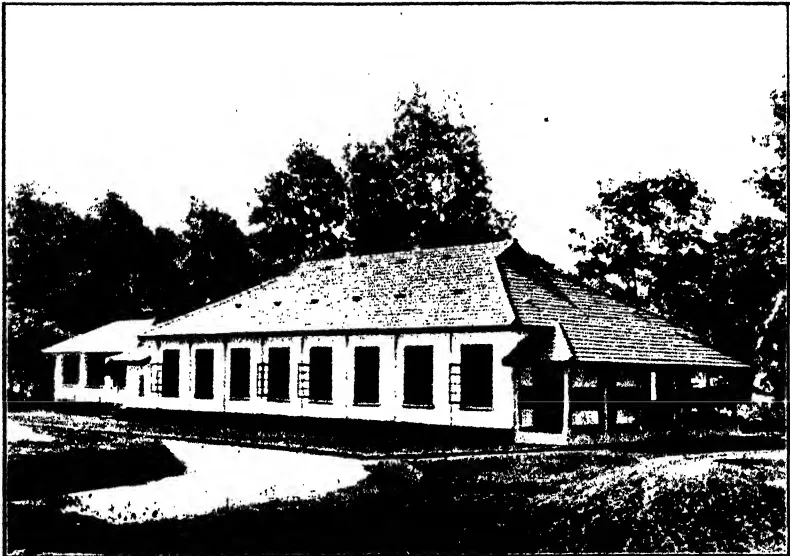A black and white photograph of a single-story building with a gabled roof and a long verandah. The building is surrounded by trees and a lawn. The photograph is framed by a thin black border.

NEW ENTOMOLOGICAL LABORATORY AND INSECTARY  
Department of Agriculture, Ceylon.

602------------------------------------------------

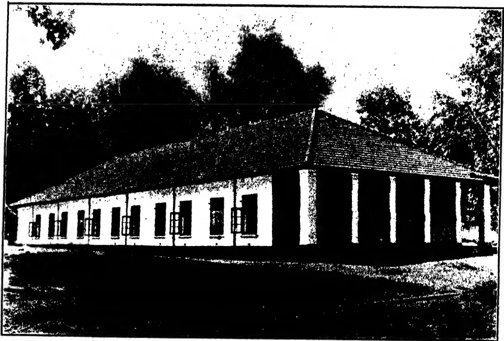A black and white photograph of a long, single-story building with a gabled roof. The building has a series of windows along its side and a covered porch area supported by several columns. It is surrounded by trees and a grassy area in the foreground.

NEW MYCOLOGICAL LABORATORY  
Department of Agriculture, Ceylon.

603------------------------------------------------

NOVEMBER, 1922.]283

of the Department. These workers by devotion to scientific work have built up a reputation for the Ceylon Agricultural Department which is well known throughout the Empire. This has been done without proper laboratories and without adequate equipment and it is gratifying that this serious handicap has at last been removed.

In each laboratory special accommodation has been provided for students, in order to afford facilities for post-graduate training and research work in Entomology and Plant Pathology, and proposals are now under consideration with the Principal and Council of the University College as to the lines upon which such training shall take. I have, Sir, great pleasure in asking you to declare open these two laboratories.

#### **H. E. THE GOVERNOR'S SPEECH.**

HIS EXCELLENCY SIR WILLIAM MANNING, having expressed the pleasure which he felt at being present that day, referred to the calamity which had overwhelmed the coffee industry in Ceylon 30 or 40 years ago. This was a very bitter example of the ravages which are wrought by diseases which afflict the agricultural industries of tropical countries. The fate of King Coffee alone should be sufficient to bring home to the people of Ceylon the vast importance of taking all possible steps to investigate fully the causes which lead to the spreading of agricultural diseases. HIS EXCELLENCY referred to his experiences in other Colonies in order to impress upon his hearers the danger of allowing insidious diseases, which affect our staple industries, to obtain a foothold in the country. In Jamaica, a country in which he had recently served, a few sporadic cases of the Panama diseases of bananas made their appearance some years ago. The Panama disease of banana was rife in South America, and when it spread to Jamaica every effort was made to deal with the small outbreaks as they occurred. A determined effort had been made to control the disease but Jamaica had been unable to bring to bear upon the subject that scientific assistance which should have been secured in view of the vital importance of the industry. The disease was still present and efforts were being continued to check its spread. The banana industry was of very great importance to the economic welfare of Jamaica and this disease was another historical example which emphasized the necessity for proper provision being made to prevent diseases of agricultural crops obtaining a firm hold and causing widespread havoc. It was only by scientific investigation that it was possible to discover the means whereby such agricultural diseases as those he had described might be effectively dealt with in their early stages.

With regard to the laboratories which it was to be his pleasant duty to declare open that day he desired to emphasize that, even with these important additions to the scientific resources of the Department of Agriculture, he still did not think sufficient had been done for the Department. It was more than ever necessary that there should be a Chemical Laboratory, and whatever else was wanted ought to be provided without delay. Even from a purely material point of view there was much at stake. Many millions of British capital were invested in this island, and there were many thousands of Europeans and Ceylonese whose all depended upon the prosperity of two or three of the more important agricultural industries. It would be sheer folly, and the worst possible want of pre-vision, not to be prepared to meet any emergency which might arise to threaten one of those industries upon which the well-being of this country so obviously depended. HIS EXCELLENCY

604------------------------------------------------

284[NOVEMBER, 1922.

assured his hearers that in him they would find one who would be always ready to press the views which he had expressed that day. The buildings which were about to be opened were essentially necessary if the Colony was to avoid risks which, in his opinion, ought never to be taken.

There was one other subject upon which he desired to speak. He wished to refer with regret to a phase—he trusted it would be ephemeral—which was at present passing over this country. He referred to the carping criticism of almost everything connected with practically every Government Department. He realised that much of this criticism was founded upon want of knowledge, and, perhaps, it was also partially due to a desire on the part of certain critics to attain some cheap reputation which, in the long run, would be bound to suffer in the light of facts. The Agricultural Department, to a large extent, had been very free from such criticism and one of the chief reasons was because the planters of this Island were, in the main, eminently reasonable and sensible men. Instead of levelling at the head of Government criticism of a purely destructive nature the planting community usually put forward criticism of a constructive kind. His EXCELLENCY regretted having had to make these remarks, but he made them with a full consciousness of what they meant.

Reverting to the laboratories to be opened and the uses to which they would be put, SIR WILLIAM said it was, as they all knew, the desire of Government to train Ceylonese to take their part in the duties of the Scientific Staff of the Department of Agriculture. There already existed in Ceylon a University College and it was desirable that, eventually, that College should offer a Degree in Agriculture. The laboratories about to be opened and the University College would afford such teaching as would enable the Ceylonese student to take his place beside his European teacher as, a skilled technologist in the Department of Agriculture.

He himself believed, and others shared the belief with him, that better times were coming for Ceylon. The depression which existed to-day in the rubber industry was likely to pass away, but there was always the danger that in these days of depression in one particular industry greater attention would be given to those industries in which a larger measure of prosperity was shown. There were, as they knew, many diseases which affected the rubber plant and these diseases, unless taken in time, and thoroughly examined might end in a disaster similar to those which had overtaken other Ceylon agricultural industries in the past. He trusted, therefore, that they would not disregard some of those important problems which faced rubber cultivators at the present moment, merely because the rubber industry was not so prosperous now as it had been in the past.

With regard to the minor industries also there were many diseases which urgently called for research. No doubt these would receive attention now that the Department of Agriculture possessed more adequate means where-with to deal with such problems.

Referring to the staff, His EXCELLENCY said that he could only repeat and commend what the Director of Agriculture had said in his remarks of the work that the staff had done in the past in incompletely equipped buildings. It must have meant a considerable amount of labour and difficulty to those

605------------------------------------------------

NOVEMBER, 1922.]285

who were engaged in research work on agricultural matters, and they deserved all the praise given them by Mr. STOCKDALE. HIS EXCELLENCY hoped that in the new buildings they would find all the facilities necessary to proceed with their researches.

HIS EXCELLENCY congratulated the P.W.D. upon the appearance of the buildings, which were a credit to that Department.

Concluding, HIS EXCELLENCY hoped that the work done at the new laboratories would be as good as, or even better than, it had been in the past. He wished the staff all success and felt sure that they would do all that was expected of them in the future.

HIS EXCELLENCY then formally declared the laboratories open, and, passing through the main entrance followed by the gathering, he proceeded to inspect the buildings. HIS EXCELLENCY was shown round by MR. STOCKDALE, MR. A. DE COURCY CARSON, DR. J. C. HUTSON and MR. T. PETCH.

Before the Governor took his departure, the HON. MR. T. Y. WRIGHT proposed a vote of thanks to HIS EXCELLENCY and assured him of the support of the planting community in matters relating to the Department of Agriculture and to the agricultural welfare of the Island.

## DISEASES OF CACAO IN TRINIDAD.\*

WILLIAM NOWELL,

*Acting Director of Agriculture and Pathologist, Trinidad and Tobago.*

The first demand of the practical planter when the rise of agricultural science began to attract his notice, was to have his soils and manures analysed, that he might learn what substances were deficient and how they might be replaced. The results did not come up to expectation. Though belief in the method still lingers in the minds of agriculturists, where it was implanted by what seemed the highest scientific authority, the fact cannot be gainsaid that men of science themselves have lost faith in its utility and are now something like unanimous that the only sound test of the completeness of the soil is the crop it will produce, and the only way to test a manure is to try it, which brings us back, it would appear, to very much the same place we started from. The journey however has been far from wasted, for a great deal of useful knowledge has been acquired in its course. In developing the science of an art so ancient as agriculture it is inevitable that a great deal of time should be taken up in finding reasons for practices already long established.

It is one of the objects of this lecture to show that in the field of plant pathology there is also a tendency, at any rate in the school of opinion which I represent, to arrest the agriculturist in his pursuit of some still more expert who is to cure him of his ills and to bring him back to purely agricultural measures as a remedy.

You are all by now familiar with the fact that disease in plants is for the most part caused, in the immediate sense of that word, by infestation

\* Read at a meeting of the Agricultural Society of Trinidad and Tobago on 11th May, 1922.

606------------------------------------------------

286[NOVEMBER, 1922.

with some insect, mite, worm, fungus or bacterium which lives at the expense of the host, and in the case of a cultivated plant, affects its productiveness in one way or another. In dealing with the special subject of this lecture, as it happens, I shall need to refer, with one not very wide exception, only to diseases of fungus origin.

A fungus is itself a plant, reproduced by dust-like spores which serve the purpose of seeds. The fungi which grow on the different organs of the cacao tree are in all essentials similar to the mould which grow on old bread or damp boots, save only that they have the power of attacking living instead of being confined to non-living material. As a convenient expression of this last-mentioned fact, they are called parasites.

### DIEBACK.

With the coming of the first resident mycologist to the British West Indies and the interest in plant diseases which then developed, a good deal of attention was given to the affection of cacao known under the general term dieback. In this connection the name of the fungus *Diplodia* may almost be said to have become a household word and it may have occurred to some of those present to wonder what has become of it, since now a reference to it is scarcely ever made. As with the root disease of sugar-cane and its attendant fungus *Marasmius* it is now pretty generally accepted that dieback of cacao is little more than a convenient term to describe the result of defects in the conditions under which the tree is grown.

The cacao tree is by its nature suited to humid conditions, to a considerable depth of soil, and a fairly abundant supply of humus. For this reason a cacao field is usually so managed as to approximate to forest conditions in respect of atmospheric humidity, shading of the ground, and supply of organic material. This is usually accomplished by inter-planting with shade trees, or where these are dispensed with, by taking advantage of natural shelter or by growing windbreaks, by close planting and by the use of mulch and pen manure. A fairly high and regular rainfall is required to maintain the necessary humidity and where it is inclined to be deficient the means of protection referred to require to be the more perfect. On light well drained soil more protection is required than on soils which are heavy and retentive.

When the conditions fall short of any of the requirements outlined, the effect is to induce in the tree a more or less severe manifestation of the condition known as dieback.

The lightest form is shown only in the diminished size and, 'hardening' of the leaves. Next comes the condition in which the outstanding twigs lose their leaves and dry off, new foliage being produced later from short shoots which develop further back. Trees in this state are familiar objects in exposed positions and present a more or less dense head of foliage with numerous dead twigs projecting above it. In yet more severe cases the dying back extends to the larger branches and may gradually involve them all. At every stage of this retrogression any temporary improvement in the conditions stops the process and new shoots are sent out behind the margin of injury, but with the recurrence of unfavourable conditions the process may continue until the tree is wholly dead. Such failing trees and even trees in which the condition is as yet only incipient are particularly liable to severe attacks of the cacao thrips which contribute materially to their decline.

607------------------------------------------------

NOVEMBER, 1922.]287

In the progress of the affection as thus described the *Diplodia* fungus has been considered to have an important share. While it is almost universally present infesting the sickly twigs and branches it is safe to say that dieback of the type under consideration would take place if the fungus were entirely absent. The most that I am disposed to allow is that the effect of infestation may be to extend the range of the injury and give to it a progressive nature in weakly resisting twigs or branches which might otherwise remain for the time being alive and have a chance to recover if conditions improved.

It will be obvious from this account that the remedies for dieback are entirely agricultural. It is first of all necessary to form a judgment as to the defects in the conditions which are responsible in any particular case. On heavy soils the adequacy of drainage and aeration should be questioned. On light soils especially, the conditions as to exposure both lateral and vertical should be considered in relation to the amount of rainfall received, and the retention of sufficient moisture in the soil during periods of dry weather. Deficiencies of this kind should be met by the provision of quick growing screens of *Hibiscus* or some other hedge plant, by the provision of temporary shade, and above all, by the addition of pen manure or heavy vegetable mulch to the soil. A great deal of dieback, especially in peasant holdings, is directly due to neglect of reasonable measures of cultivation and manuring. The same is true of some neglected estates, while another cause is to be found in the injudicious removal of shade without compensation in the shape of increased attention to the soil. Cacao trees are not seldom planted where the soil is too shallow to maintain them, and the sub-soil too dense for root penetration, in which case the trees reach in a few years the limits of their development and begin to fail. Where a group of trees in good soil show symptoms resembling dieback search should be made for the evidences of *Rosellinia* root disease.

#### DIPLODIA POD ROT.

Reference may be made at this point to the affection which figures in West Indian literature as brown or *Diplodia* pod rot. It is not clear that most of the injury to pods at one time ascribed to *Diplodia* was really due to the *Phytophthora* or black rot presently to be dealt with. *Diplodia* has but weak powers of parasitism and while it is able to destroy pods to which it has gained access, its entry is only possible in the case of pods which are injured, much overripe, or which have been picked for some time and left to lie.

#### ALGAL DISEASE.

An affection which is somewhat like dieback in being related to exposure, but is due to a definite parasite, is that known as algal disease. The causative organism is not a fungus, but closely resembles one in habit. It is abundant in the West Indies on the leaves of many plants, notably mango and avocado, where it does no visible harm. Under certain circumstances it attacks the small branches of susceptible trees, and has long been troublesome on tea in India.

The first outward sign of the disease on cacao is the occurrence during the dry season, on the twigs of the previous season's growth, of dark purplish or black spots ranging up to half an inch in diameter. With the coming of the rains these take on a rusty-red colour due to the development of fruiting bodies in the form of minute globular heads on fine stalks.

608------------------------------------------------

288[NOVEMBER, 1922.

Infection of the twigs appears to take place from spores germinating in the surface cracks which develop during the formation of the first layers of bark. The alga pushes in among the tissues underlying the bark, which are sloughed away and give the twig a ragged appearance. If growth is not sufficiently vigorous to throw off the infection by this means the twig is sooner or later ringed and dries off.

The disease is frequent on young trees not thoroughly established, especially in rather poor soils or exposed positions. With the development of adequate shelter and the improvement of the soil by shade or manuring the affection disappears. Meanwhile some immediate relief may be obtained by coating the twigs with Bordeaux mixture during the dry season.

#### THREAD BLIGHT.

A minor disease which arises under conditions of an opposite type, namely too great humidity, is thread blight, in which the under-sides of the leaves are covered with white branching fungus strands or a more uniform buff coloured layer. This growth is connected with thicker strands running along the twigs and the characteristic effect of the disease is the production of dead leaves which remain hanging by the attachment so formed. The affection may be suppressed by reducing humidity, a measure which will be discussed later.

#### ROSELLINIA ROOT DISEASE.

Although the existence of *Rosellinia* root disease has only recently been recognised in the island, there is every reason to believe that it has existed from the time of the first clearings, and no doubt it was more abundant when the richer forest lands now in cacao were first planted. It is a slow-working disease and at the present time exists on a good many estates and takes its toll of trees without causing alarm or even attracting much attention. It is caused by a fungus which grows in damp sheltered situations on woody and other vegetable matter in or on the soil. In new clearings it spreads to living trees from certain kinds of forest stumps. In older cultivations it usually occurs in situations where forest material is deposited by flooded streams. It is common in the valleys of the Northern Range; of its distribution in other parts of the island not much is known as yet, but I have seen it in the Montserrat district and as far away as Guayaguayare.

The typical effect of this disease is to kill out trees in a group slowly extending on its margin. When as frequently occurs a Hibiscus hedge is affected a gap is formed which continues to extend in both directions. The cacao trees attacked may dry off slowly from the top, without attempting to renew by chupons as is the rule in dieback disease, or they may be ringed at the collar and die suddenly, often after setting an abnormal number of pods.

The fungus spreads through shaded soil rich in organic matter like a slowly smouldering fire, attacking any plants that come in its way. If the surface is too dry or the soil too poor for this method, extension may still take place from tree to tree along the roots. Avocado and breadfruit trees are particularly susceptible, and in other islands where the disease has been studied often form centres from which the cacao trees are attacked.

The remedial measures to be taken for *Rosellinia* disease are suggested by its nature as described. Extension through the soil should be stopped by chessboard trenching carried below the level of the lateral roots. Diseased trees should be promptly dug out with as many of their roots as possible and thoroughly burnt.

609------------------------------------------------

NOVEMBER, 1922.]289

The surface of the infested soil should be kept clean and exposed as much as possible, and time should be allowed for this to take effect before supplies are planted. With these precautions conscientiously carried out there is little to be feared from root disease, but careless or half-hearted work is of no service at all.

#### BLACK POD ROT AND CANKER.

By far the most important fungus to the cacao industry of Trinidad is the cottony white mould known to science as *Phytophthora Faberi*, which gives rise to pod rot or black cacao, and to canker of the stems and branches. Apparently these diseases occur in all cacao-growing countries, though there are very considerable differences in their incidence. In the Western Tropics and in Ceylon both canker and pod-rot are prevalent but pod-rot is the more prominent trouble, while in Java canker is a more serious disease and pod-rot relatively uncommon. The loss of the ripe pods during the rainy season in Trinidad was estimated by Mr. J. B. RORER, the late Mycologist to the Board of Agriculture as varying from 30 to 60 per cent. while the increased yield obtained by spraying in RORER's experiments showed that heavy losses of young pods also take place.

There is no question about the powers of parasitism of *Phytophthora*. It is a close relation of the potato blight fungus, which had a marked effect upon the history of the world. Like that fungus it is closely dependent upon humidity and given that condition it can attack pods of any age without need of previous injury, and largely by way of infected pods gain access to the stem and give rise to canker. The appearance of pod-rot is so familiar that I need not stay to describe it.

In dealing with a disease such as this the natural line of attack is upon the fungus which produces it. In the case of the related potato disease spraying with Bordeaux mixture has been more successful and has become more a matter of regular practice than with any other disease of a cultivated plant. In Trinidad RORER devoted a great deal of time and energy to the proof that spraying cacao is a practical and paying proposition. His results were presented in lectures and publications to the planters of the Colony and so far as I know his figures have not been questioned. Yet this method of control has never been generally adopted and is at the present time in almost total abeyance.

I do not propose to make this situation the occasion for reproach. In countries with a highly developed agriculture and especially where mechanical aids are so readily adopted as they are in the United States of America, the practice of spraying fruit trees at frequent intervals has become a matter of routine. Agriculture in Trinidad, especially on cacao estates, is not highly developed, and in the adoption of mechanical appliances there are difficulties in the shape of untrained labour, in the absence of repair facilities, in poor means of access to cultivations, and not least, in the rapid deterioration of rubber hose. Spraying to be of value must be systematic, frequent, and indefinitely repeated. Bordeaux mixture is strictly preventive of infection and not a cure.

I see no present prospect of the adoption of spraying as a regular practice on Trinidad cacao estates. As a matter of fact we do not spray for pod-rot at River Estate and I have not so far found it advisable to recommend it.

610------------------------------------------------

290[NOVEMBER, 1922.

While spraying is the most direct and the most immediately applicable measure there are others which go nearer to the root of the matter and have, in view of their application to Trinidad, the great advantage of depending directly upon agricultural skill and not involving either the practice of a new art or the provision of new machinery.

The fungus as I have said belongs to a group that is particularly dependent on humidity. Its commonest method of reproduction is one in which its spores are liberated into and swim in a film of water. It is true that it is able to modify this procedure and produce conidia that germinate in the more ordinary way, but it is not by any means adapted for activity under even moderately dry conditions. This is its weak side and it can be attacked on it. The reason it has developed as a pest of cacao is because the conditions maintained in a cacao cultivation are, during the wet season at any rate, such as suit its requirements. Its control by cultural measures resolves itself into the question how far we may modify these conditions in the direction of dryness without affecting the general health of the tree. The degree of humidity in a cacao field is governed by the weather, by the situation as regards the contour of the ground and the nearness of hills and forests, by the condition of the soil in respect to natural and artificial drainage, by the extent of pruning and by the amount of shade provided. Three of these factors are under our control, drainage, pruning, and shade. There ought to be no need, though I cannot say there is none, to insist upon the importance of drainage, as much on general grounds as for the special purpose we are considering. But it is mainly by means of shade trees, and to a lesser degree by pruning, that the conditions considered suitable to cacao are provided. If we think the matter out we can see that the growing of immortelles though it may be in many cases the best means available is a somewhat clumsy expedient. If shade trees are the right size when the field, let us say, is fifteen years old, they have grown too big long before it is thirty. But their reduction in size or number is an awkward business, entailing very considerable risk of damage to the trees beneath them. It is easier to let them alone and so we get the condition which is so common of shade trees far more numerous than is desirable for their size or far larger than is necessary for their number. It is in such fields that pod-rot, other things being equal, is most severely prevalent. It is interesting to know on the authority of a Ceylon planter who recently paid us a visit how in that island the difficulty just referred to is avoided. They replace their shade trees, a different species of immortelle from ours, with very large cuttings every ten years or so. It is notable that in Grenada, where most fields are without shade, pod-rot is very much less prevalent than in Trinidad.

Where the soil is reasonably good the policy I recommend is to reduce immortelles to a minimum where they cannot be dispensed with altogether, to supply their function by means of marginal windbreaks where needed and by the use of mulch and pen manure in the soil, to prune the cacao trees themselves where necessary for the free circulation of air, and to see that drainage is thoroughly adequate. These things being done it can be guaranteed that pod-rot will be seldom troublesome.

I have left myself little time to discuss the advisability of sanitary measures in the removal and disposal of diseased pods. I would only remind

611------------------------------------------------

NOVEMBER, 1922.]291

you of the general experience that pod-rot and canker are highly prevalent in the neighbourhood of the breaking places, where the diseased pods are collected and usually left to lie until the sound pickings have been dealt with.

With the reduction of pod-rot the main source of canker infections is removed. The treatment of canker is I think well understood and I will only say that I do not favour deep excision, but the removal of the outer layer of bark so that the patch may dry out, and I do not recommend dressings which will hinder this drying.

In conclusion it will be seen that the fungus diseases of cacao fall into two classes:—

(1) Debility diseases which depend on a lack of vigour in the trees.

(2) Diseases which can attack trees without regard to vigour, but which can only develop when the external conditions favour the fungus by which they are caused.

Both types can be met by purely agricultural methods, and once their nature has been established it is rather to the cacao agronomist than to the pathologist that the grower should look for advice.—PROCEEDINGS OF THE AGRIC. SOC. OF TRINIDAD AND TOBAGO, VOL. XXII, PART 5.

## INSECT PROBLEMS OF THE PINE-APPLE INDUSTRY.

D. T. FULLAWAY.

I do not know what MR. WHITE had in mind when he injected the word "problem" into the title of my subject, but I am glad he did so, for it gives me latitude to express a conviction which I have had for some time but did not know anyone shared with me, namely, that the insects are going to prove a problem if measures are not taken to restrain them. I have hitherto considered the pine-apple growers more fortunate than other crop producers in regard to losses occasioned by insects, for while the mealybug and the scale and a few minor pests have always had to be contended with, the damage which they have done in the past has been on the whole insignificant. But the alarming out-break of the fruit beetle last spring and the red spider scare this fall, coupled with the statement of MR. HORNER in regard to ants, lead me to believe that, in the rapid expansion of the industry, too little attention has been paid to the insects, and their capacity for harm is not realized. As compared with other crops, however, I think it can still be maintained that the pine-apple crop enjoys a remarkable freedom from injury by insects, and nothing of a distressing or calamitous nature should be anticipated from my previous remarks.

As most of you, I presume, are aware, nearly all of our injurious insects are non-indigenous species, which have been brought to our shores in commercial shipments or along with plants introduced as stock for propagation; and among them are a host of species which are indiscriminate in their feeding habits. Cutworms, wireworms, grasshoppers, fruit flies and the Japanese beetle are examples. Many of our crops suffer severely from the attacks of insects of this sort. The pine-apple plant, however, is never, or scarcely ever, touched by them. The reason for this, in my opinion, is found

612------------------------------------------------

292[NOVEMBER, 1922.]

in the nature of the plant. I believe it is unattractive to them. The insects which we find on the pine-apple—such as the mealy-bug, scale, and red spider—are considered to be closely associated with the plant. They are found on the pine-apple in other countries and have evidently been brought here on plants introduced for propagation before there was any industry and (in the case of the two first, anyway) before we had a plant quarantine. There are also other insects, of much greater import, attached to the pine-apple plant in other lands, the beetle-borer of the West Indies, and the fruit-fly of the South Seas, which has now reached as far north as Fiji, for example, but the likelihood of their reaching these Islands is now very remote, I judge, in view of the close and careful scrutiny given to plants which are brought into the Islands, and the probability that we shall soon have in force a legal prohibition on the importation of any more pine-apple plants. If my estimation of the situation is correct, then it appears that the chief aim and purpose of the pine-apple growers should be to keep the present insect population of their fields at a low level, and the question arises, can it be done under the stress of a rapid expansion, accompanied as usual by a striving for maximum production with minimum effort and expense? I will develop this point more, later.

In the meantime let me tell as briefly as possible what is known of the nature and habits of our present pine-apple pests.

I will discuss the mealy-bug first. This insect, while invariably found on the pine-apple and known as a pine-apple pest for many decades, is not confined strictly to the pine-apple. It is also found on sugar-cane, bananas, roots of grasses, and some other plants. You are probably all familiar with this insect, for it has a characteristic appearance and is recognizable at once. It is a small, louse-like creature with a white waxy covering, secreted from glands lying under the derm and poured out in beautifully arranged filaments. It is most commonly found in clusters at the base of the fruit or leaves where the adults congregate to produce young. The young come from eggs which are hatched within the body of the female. The progeny of one individual is commonly from fifty to one hundred. For a time they rest beneath the body of the mother, but gradually they move out and their naked bodies soon develop a waxy covering. The younger individuals are rather flat. They are active also, and have a tendency to disperse over the plant, so that they are often found scattered through the crown or over the outer portion of the leaves. They are sometimes found also on the stem and roots. The insect moults its skin a number of times during its development to accommodate its enlarging body, but the actual number of moults has not yet been accurately determined. Growth proceeds slowly. Several months are consumed in reaching the adult stage, so that only a few generations can occur during the year. Mature individuals have rather swollen bodies, and their tendency is to hide in obscure parts of the plant, particularly where the epidermis is very thin. This habit is responsible for their being more destructive than the scale, as I shall presently explain. Males are sometimes seen. Their cocoons are elongate and loosely constructed of white waxy filaments. Their occurrence, however, is very uncommon, and I believe the insect reproduces itself for the most part asexually. While there are many mealy-bug enemies, they are not seen to any great extent on the pine-apple plant, and the colonies of the

613------------------------------------------------

NOVEMBER, 1922.]293

mealy-bug found in sheltered spots usually appear to be in a flourishing condition, never mussed up as if they had been disturbed by these enemies. Occasionally the mealybug-devouring Coccinellid or ladybird beetle, *Cryptolæmus montrouzieri* and *Scymnus bipunctatus* are observed on the plants searching for food, and I have more than once seen their larvæ, which are also predaceous upon mealy-bugs, on heavily infested fruits; but it is not at all a common occurrence.

The scale, I believe, is confined strictly to the pine-apple plant, and has been known for nearly a century and a half. It was described first in 1778. While a near relative of the mealy-bug, it is totally dissimilar in appearance. This is owing to the peculiar character of its waxy covering. Aside from the fact that the body of the real insect is vastly smaller, the secretion does not remain fluffy, but hardens and compacts, assuming at the same time an almost flat surface and a circular outline. The scale is found most commonly on the leaves of the pine-apple plant. Its young come from eggs, which are hatched beneath the scale. They are yellowish white, oval and a fourth of a millimeter long. The eggs of one female number commonly from fifty to seventy-five and hatch after five or six days from date of extrusion. The newly hatched louse is very small, flat, oval, orange-yellow coloured and bare of covering, possessing functional legs so that it is capable of moving off to find a suitable location for its future development. When this is found, however, it becomes sedentary, developing a tough scale over its soft and tender body. Thenceforth its legs are functionless (disappearing at the first moult) and its powers of locomotion are restricted. The first scale is very small and consists only of the thickened cuticle and some fluffy wax curling upward from the margin. Growth proceeds very slowly and is outwardly manifested by the gradual enlargement of the scale. The skin is moulted twice (in the case of the female insect) to accommodate the expanding body, and these exuviae are incorporated in the waxy material of the scale appearing at the front end. The first moult occurs in about 15 days, the second 17 days later; the third instar is the longest, occupying usually 25 to 30 days. Thus four generations can occur in a twelve month. The males of this species are quite numerous and are distinguishable after the first moult, when this form enters a pupal state, the body becoming attenuate to some extent and the waxy portion of the test covering it, assuming the same elongate form with three prominent longitudinal ridges. After twenty-five days the pupa transforms into the adult male insect, which emerges from the test by a longitudinal rent in its side. In addition to legs and antennæ this form possesses functional wings and is capable of flying. Its powers of flight are very feeble, however, and it is oftenest seen crawling over the plant, seeking the female, in order to mate with them and give fertility to their eggs.

The scale insect is often destroyed by internal parasites, particularly by species of *Aphelinus* and by *Aspidioliphague citrinus*, and occasionally some one of the scale-feeding Coccinellid or ladybird beetles is seen working upon infested plants.

Now, I have said that the scale and the mealy-bugs are closely related insects. They belong to the same family, namely, Fam. *Coccidae* (Hemiptera, or true bugs). Notwithstanding the many superficial differences which

614------------------------------------------------

294[NOVEMBER, 1922.

distinguish them, their structure is essentially similar. One of the most striking features of this structural similarity, shared also by the leaf-hoppers and the aphids, two other families of plant-lice common in Hawaii, is the character of the mouth-parts; and as this determines the manner in which the insect gains its sustenance from the plant, and also has an important bearing on the means of controlling insects of this type, it is perhaps worth while at this point to give some consideration to the structure of the mouth. The type of mouth-parts possessed by the greater number of injurious insects (beetle and caterpillars, for example) is what is known as "cutting and biting mouth-parts," the main feature of which is the apposed heavy-knifed-edged jaws which tear and rend the plant tissue to fragments, so that they can be gathered together by the remaining parts, ground and swallowed. The plant where the insect is feeding is entirely consumed. Not so, however, with the plant louse. Its mouth-parts, while homologous throughout, are different both in structure and purpose. Instead of the heavy lamellate jaws, there are apposed long slender stylets or filamentous rods with grooved or channelled inner surfaces forming a piercing and sucking organs, with the pharyngeal pump behind them, and instead of organized tissue unorganized tissue is consumed. That is to say, the fluid contents of the cells, referred to loosely as the juice of the plant, is sucked out of it, and the solid matter suspended in it is strained out in the alimentary tract of the louse and constitutes its food. Inasmuch as they take only a solution of food, obviously large quantities of the juice of the plant must be absorbed to meet the requirements of their growing bodies, but unless the infestation of these insects is very severe and they are present in extremely large numbers, their feeding does not prove much of a drain on a succulent plant like the pine-apple—on tender leaves, yes; but on a hardy, succulent plant they make little impression except when they are numerous. The chief injury resides in the puncture of the epidermic of the plant, for this furnishes an entrance for the spores of pathogenic organisms, which often invade the tissues and quickly destroy them. Unfortunately the pine-apple is very susceptible to some rapidly-developing rots, which thus gain access to the plant, so it should be apparent that it is very essential that these insects be discouraged from multiplying on the plant just as much as possible.

Another feature of the life of these insects which should not be overlooked is their close association with ants. This and several other related families of insects are peculiar in the respect that their representatives uniformly excrete a sugary fluid known as honey-dew, which many ants find good provender. The ants have become so habituated to this food that they tend the insects in much the same way as man does his domestic animals, and it is often the case that in waging war on the scale insects, et cetera, you immediately become involved with the ants. It is a well authenticated fact that the ants protect their benefactors from the attacks of parasites, and in the case of the mealy-bug of the pine-apple, they minister to their comfort still further by providing the semi-obscurity which this species desires by packing up pellets of soil to roof them over. You can see this at any time on a pine-apple fruit. And this feature of their association is responsible for greater damage to fruit than any other single cause. The covering of dirt, by shutting off the evaporative influence of the surrounding air, causes moisture to collect on the surface of the fruit, which softens the skin, causes it to break and thus

615------------------------------------------------

NOVEMBER, 1922.]295

induces rot. They also habitually run along the roots and are responsible for some of the retardation of growth which results from root destruction. Ant infestation is more noticeable in summer months than in winter, as the cold, wet weather and flooding which occurs during the winter months undoubtedly weaken ant colonies, and this decimation is certainly reflected in the reduction of mealy-bug infestation during the winter months. Ant infestation increases with the age of the fields and when the fields become so overgrown that cultivation is no longer practical, they make the mealy-bug control problem extremely difficult.

Now, I believe I have shown that these two enemies of the pine-apple are capable of causing considerable injury to the plants, particularly the fruits, and it seems to me a natural corollary that they should be prevented from accomplishing this result if possible. As the insects suck their food from the cells of the plant, naturally they cannot be reached by a stomach poison like arsenic. It is therefore necessary to use other means of killing them, either poisonous gases or vapors, caustics, asphyxiation by a mechanical stoppage of their breathing apparatus or washing them off their hosts. But here the question arises. To what extent does this injury go; and, provided it can be stopped, will the effort required to effect the purpose pay? That is to say, does the damage expressed in loss of fruit amount to as much as it would be necessary to expend in labour and materials to prevent it? That is entirely a practical question which can only be answered after experimentation. We are trying to arrive at some conclusion in this regard at the present time. My only excuse for not having complete data already is that hitherto little interest has been displayed in the matter. I presume other factors in the production of fruit have proved of greater and more vital importance to the industry, and have crowded out a consideration of this one. I know that for some years it was a common practice to use tobacco dust to discourage the mealy-bug. It has been conceded that the effect was salutary. But the practice was discontinued, probably because other field operations absorbed all the labour and material which could be applied. I have recently experimented on a large scale with three different contact insecticides applicable to the mealy-bug and scale, namely, nicotine, mineral oil and sulphur. The nicotine was applied as tobacco dust, tobacco decoction, water diluted nicotine sulphate and nicotine sulphate with sulphur and an inert dust. The mineral oils used were kerosene and distillate emulsified with ivory soap and whale-oil soap. The sulphur was applied as a dust and as an aqueous liquid in combination with lime. All liquid applications were sprayed on to the plants with the aid of a knapsack spray pump and through a Vernmore nozzle. Dusts were applied with a patent dusting machine, except in the case of tobacco dust, where it was sometimes applied by hand. Each of these applications has its individual merits, some their detractions, and none of them cleared out the insects entirely. I believe the tobacco decoction with soap gave the most satisfactory results, and I believe it could be applied along with the iron sulphate given to the plants with as good results and more cheaply than when each would be applied separately. The aim was to kill the insects without burning the plant, and therefore it was necessary to establish a minimum and maximum limit upon the concentration of the liquid applications. With the dusts it was necessary to limit the quantity placed in the heart of the plant, particularly during cold, wet weather, when its vitality is weakened by the loss of roots, in order to avoid setting up roots at this point. It was easily demonstrated that the immature forms could be killed with any one of the insecticides used, but mature individuals often proved resistant; and it is too obvious to be denied that many individuals escape the action of the insecticide at each application. The treatment, therefore, to be effective, must be continued throughout the growth of the plant, at regular intervals,

616------------------------------------------------

296[NOVEMBER, 1922]

which should be closer during the summer months than through the winter, because of the greater prevalence of the insects during the summer months when they are favoured by meteorological conditions. The effect, I believe, would be to keep the insects constantly at a low level and prevent in a measure the baneful influence of an accumulation of individuals so evident in old fields. I am also strongly of the opinion that a search for parasites and predators of these two insects in the regions where they are supposed to be indigenous would yield results of great benefit to the industry, and if I am supported by the pine-apple interests I intend to urge the Government to undertake this much-needed work. We are supporting a man in Mexico at the present time, and if he has sufficient time at his disposal and funds are available when he has finished the work at present in hand, he will proceed to the Gulf Coast and investigate this matter, anyway.

The pine-apple mite or red spider is apparently another strict parasite. I do not know of its being found on any other plant than the pine-apple. While its presence in the Islands was reported as far back as 1908, it is only in the last planting season that its injuries have come to our notice. Red spiders really do not come within the scope of this treatise, as they are not insects, but because it usually falls to the lot of the economic entomologist to deal with them, and particularly on account of their novelty here in connection with pine-apples, and their great economic importance, I have decided to include them in the discussion. Their real affinity, however, is with the true spiders, scorpions, ticks, etc. From insects they are distinguished by the possession of four pairs of legs (in the adult) and only two divisions to the body. Insects never have more than three pairs of legs, and the trunk of the body is always divided into three parts.

The young of red spiders arise from eggs, which are laid, in the case of the pine-apple red spider, on the surface of the leaf. The mouth-parts are adapted for biting. The pine-apple mite was first discovered in Florida, in 1899. It is known to have come here on plants from Florida on several occasions in recent years, when the plants were destroyed; probably the first to reach the Islands also came in this way. This furnishes an excellent example of the value of strict quarantine, and also shows the folly of introducing plants from abroad except under the most careful supervision to be exercised by those conversant with the risks so taken. The infestation which I have seen have been usually at the base of the leaves, where they are most completely imbricated and tightly clasped to the stem. The mites seem to flourish best in these situations usually occurring in Colonies in which are found all stages—eggs, larvæ and adults. While they are almost microscopic in size, they are readily discerned, or at least their presence is indicated by the reddish coloration given to the blanched tender tissue by their scarifying trophi. As in the case of the mealy-bug and scale, the most potent effect of their injuries is the entrance of spores of pathogenic organisms through the wounds which they inflict. They are very much protected in the situations in which they are found from dusts and liquid applications, which would undoubtedly be effective if they could reach their object, and are known to be beneficial where the mites are so numerous that they have to spread to the more exposed surfaces of the leaves. Sulphur appears to be the most effective lethal agent, applied either as a fine dust or in combination with lime as liquid lime-sulphur. It was supposed that however well mites might conceal themselves, they could be reached by confined poisonous gases, but this method, which appeared to be particularly well adapted to the treatment of slips, suckers and tops intended for planting, has proved unreliable. Whether mites are peculiarly resistant to asphyxiation, or whether the gases fail to penetrate during their maximum concentration, has not been determined, but so far the results of fumigation have been disappointing, as

617------------------------------------------------

NOVEMBER, 1922.]297

individuals are not killed even when the concentration of the gas is pushed beyond the limit of safety to the plants.

Since the discovery of the Florida species, *Sligmæus floridanus* two other species of mites have been found commonly on pine-apples, one a species of *Tarsonemus*, probably the *T. anasæ*, described by TRYON, in Queensland, Australia, and mentioned as injurious there; the other a species of *Tyroglyphus*, a fungus-eating acarid, a congener of which is also mentioned by TRYON in reporting on the mite-infestation of Queensland pine-apple plants.

While I am referring to these incidental infestation, I may also speak of several other insects which occasionally do slight damage to the plant. My attention has repeatedly been called to a leaf injury which I have traced to a very common grasshopper here. The injury is so inconsequential, however, that it is hardly worth mentioning. I have also recently seen an injury to the hearts of slips and suckers caused by the larvæ of a very common ground beetle. And as an instance of how consternating and baleful the undesired presence of a mere scavenger can be, I need only recall the experience of previous packing seasons, particularly the last, with the fruit beetle. Undoubtedly this insect will yield to the measures which are generally used for the suppression of all filth feeders, or scavengers, namely, the elimination of the rotting material in which they develop. And this topic leads me naturally to my last consideration, the accumulation of insect life under certain favourable conditions.

As one passes through a pine-apple section it is impossible not to notice the sharp contrast between newly planted and old rattoon fields. I wish to impress on you that a closer inspection reveals a contrast just as vivid in the state of the insect population at the beginning and end of the crop. From a meagre source, the infestation grows larger and larger, and by the time it becomes necessary to replant on account of the diminution in size of the fruit and overgrown condition of the field, the insect colonies are beginning to have an effect on the growth of the plant. They have accumulated to such an extent that further accumulation would mean its death. Little attention is paid to the matter, however, because the fields are about to be abandoned. I believe these fields have furnished most of the insect troubles of the past year, and represent a condition which challenges the grower's ability to maintain a low level of insect life throughout the fields. I am not urging the elimination of the third or any other rattoon crop, but I do think if the troubles of the past year are to be avoided in the future, corrective measures should be taken and their application apply to the crop throughout its growth, so that the cumulation of which I have spoken could not occur.—HAWAIIAN FORESTER AND AGRICULTURIST, VOL. XXIX, No. 1.

## POISON BAITS FOR CUTWORMS.

One of the oldest and most generally used methods of controlling cutworms, according to the SOUTH AFRICAN JOURNAL OF THE DEPARTMENT OF AGRICULTURE, is the broadcasting on the land of poisoned bait made by poisoning wheat bran, cut-up green stuff, or other similar substance, with arsenic, and adding sugar, treacle, salt, chopped citrus fruit, or other things supposed to attract the worms. Very little truly scientific work has been done to determine whether cutworms actually respond to these supposedly attractive substances. Incomplete experiments at Cedera, Natal, to determine the reaction to odour of various cutworms and army worms indicate that the sense of smell is very poorly developed in these larvæ. Starved cutworms, for instance, can apparently detect the odour of their crushed food plant only when it is but a few inches away from them. The discovery of a bait which will attract cutworms from other available food does not appear very hopeful, although work with this object in view has not been abandoned.—

AGRIC. GAZ., N.S.W., VOL. XXXIII, PART 6.

618------------------------------------------------

298[NOVEMBER, 1922.

# FORESTRY.

## OUR FORESTS.

FREDERICK LEWIS,

*Railway Extension Department, Ceylon.*

MR. LUSHINGTON'S Report aroused considerable interest in this large Colonial asset. It is not however very evident that the public, as a whole really knows what the value that asset is, either directly, or potentially. This may be due to an imperfect knowledge of the different species of woods that we have in this Island, or to a good deal of indifference. Probably to both, because, Ceylon has shared, in common with many other countries, that ignorance and indifference that has led, not only to a neglect of the forests themselves, but to a complete want of consideration of how they should be conserved. Hence it follows that, as a rule, Forest Administration is the last-born of Government Departments and springs into life often too late :—

Before we can form the smallest notion of the problem of Forestry, in such a country as this, it is essential that we should first glance at its early occupation. Ceylon, as we know, has been invaded—if we may apply that term—more than once. We know nothing of the ideas about Forestry that these early "invaders" possessed, and certainly we have no evidence to show that they preserved the kindly fruits of the earth, so that in due time they might enjoy them.

We may safely assume that when Anuradhapura was in the building, no special regard was paid to the preservation of any valuable species, or that Forest operations were in any way under control.

During the Portuguese period, we can fairly assume that, as their interests were of the "get-rich-quick" order, not the smallest attention was paid to Forest Development, but rather the contrary.

The Dutch, on the other hand, had some regard for some of the valuable fruit trees, and they undoubtedly fostered their preservation and the cultivation, sporadically, of teak. But their efforts do not appear to have materially improved matters beyond establishing a systematic cultivation of Cinnamon, when it became evident that the supply of that valuable spice was becoming yearly more difficult to procure.

They certainly did not make plantations of calamander, which they treated as a special article of value, and as a perquisite.

The evidence is not forthcoming that the Kandyan Monarchs protected their forests, or possibly the wholesale destruction of woodland for Chenia cultivation would not have gained such a footing in Ceylon, as it has done.

In such circumstances as these, it is easily conceivable that much of our primeval Forests were not only depleted of valuable species, but whole areas were destroyed beyond all hope of restoration.

619------------------------------------------------

NOVEMBER, 1922.]299

Added to the foregoing considerations, we must view the conditions under which Forests grow, in such a country as Ceylon. We find that the rainfall is very varied, as from a comparatively few inches per annum, it rises, in many places, to extraordinarily high figures. That variation alone is an important factor in the distribution of species, density and volume of timber to the acre. But added to this is the altitudinal effect on many forms of Forest growth for we find that our Hill Forests are distinctly different to the forests of the plains. We have also large extents of land that we class as "Patana Country," of which Uva is a striking example.

We have further to consider that most important factor that dominates all forest operations, namely, the density of any given species, or in other words, the abundance in any one locality of trees of the same kind. Unfortunately for Ceylon, we have no such thing, in any appreciable extent, as "Pure Forest." Even our gregarious species confine themselves to limited areas, with but very few exceptions. This preponderating difficulty is probably unknown to the average man, and without its being explained to him, he is hardly likely to appreciate it.

By "Pure Forest," we mean a Forest all of one dominating species. The Pine Forests of Europe and America are examples of this class.

Where a Forest is composed of many different species, as in Ceylon, we are confronted with the problem of how such forests can best be exploited, without risk of extermination. Let us assume the case of a block of Forest, say of 1,000 acres in extent that has within it 25 distinct species, indiscriminately growing. To assume that it would be safe to say that each species represents 40 acres is obviously absurd. Each of these kinds will have its own rate of growth, by which it follows that if the whole of this 1,000 acres is to be worked, the felling of the individual trees must be regulated—if continued exploitation is determined—by the equation of growth of each particular kind of tree. This, at the start therefore, presents a very complex proposition as to how best to "work" this area, without exterminating the species found within it. To simplify the illustration, let us assume that species A. takes 15 years to reach exploitable maturity, and species Z. takes 400 years: what then must be the best rotational method of working? Clearly we must know how many trees of each kind are involved in areas to be operated on, and equally we must know how long each species takes to reach its useable age. A "working plan" therefore, to meet these varying conditions, must be elaborated with remarkable care, if preservation is to be regarded. A moment's consideration will show that the rigid application of a scientifically correct working plan, applied to an area constituted in the manner here outlined, would involve very limited annual operations, or alternatively, operations conducted at distant intervals, with its concomitant disadvantages of irregular supply.

To secure a regular supply, therefore, a very large area must be operated upon, but the larger the area to be worked, then increasingly there must be a corresponding increase in means of communication, natural or artificial, as the case may be.

To this must be added, Protection.

A popular idea is current that our Forests are full of valuable species, but if a careful analysis is made of those kinds that are of real utility—other than fuel—it will be found that this popular notion is a fallacy. Our really valuable species are not many, and vastly disproportionate to the gross total of species that abound here. We have only to look at any house in the country, and we will find that, for structural purposes, but few kinds of woods have been adopted. We may be shocked to see that a great deal of the building material has been imported, and we may deplore that fact.

620------------------------------------------------

300[NOVEMBER, 1922.

But the reason is not far to seek, if we examine the situation carefully, for we cannot get away from the fact that if it "pays better" to import, import we will.

Perhaps out of the most common woods in domestic use, is the unsurpassed Jak; but jak is not a truly Forest tree. Under certain conditions, and in certain parts of the country, jak trees may be found in Forest, but broadly speaking it is a domesticated plant and thrives excellently under cultivation. From that source, that is to say, from private gardens, the great mass of our jakwood, in all its forms, is derived and possibly there could be no more valuable asset to the country than a block of ten thousand acres of this quick-growing and valuable tree.

Another excellent and beautiful wood is Nedun, but it is restricted to the wet country, mostly in the west of Ceylon, and that generally as a water-side tree. It is peculiar to Ceylon and runs imminent risk of extermination, much in the same way as that purely ornamental wood Calamander does.

Like Nedun, Calamander is peculiar to Ceylon and its natural habitat is extremely restricted, while its enemies, owing to its value, are many.

It has the further disadvantage of being a plant in which the sexes of flowers are on separate trees, as in the Nutmeg. This difficulty alone seriously hinders its natural reproduction, coupled with the additional circumstance that it is exceedingly slow growing. It is popularly supposed to be widely distributed in Ceylon, whereas it is practically confined only to a very small section of the wet zone.

Probably from the Forester's point of view, our most valuable order of trees is found in the *Dipterocarps*, but though the family embraces a large number of genera and individual species, their distribution is distinctly confined only to a part of the Island. In the Eastern Province, for example, *Vatica* is the only *Dipterocarp* to be found there, and it is confined to the sides of non-perennial streams. In Uva, excepting Moneragala and near Passara and Lunugala, *Dipterocarps* are almost non-present. A valuable *Hopea* certainly does occur in a few places in that Province, but practically the order is conspicuous by its absence. In the Northern and North-Central Provinces, *Dipterocarps* may be said to be unknown, so that it resolves itself into a limited distribution over parts of the N.-W. Province, the Western Province, part of Sabaragamuwa and the Galle and Matara Districts, added to a little in the Central Province.

Of this magnificent order "Hora," "Dun," and "Mendora" are examples of the highest value, and they possess the great advantage of being cylindrical in stem, and gregarious in habit.

We think that the Planting Community who have lands in the high-rainfall districts of the Kalutara, Kelani Valley and Ratnapura Districts, would be well advised if they planted up "Hora" in much of their estates. Not only is the tree quick growing, but in its working, it affords the maximum of workable wood. Its cultivation on a large scale, and the planting of some of our "Duns" in the hill country, is much to be advocated, provided the area so planted is on such a scale as to justify systematic operations.

In like manner, there is much to be said in favour of the planting on a large scale of Ironwood, though that particular species is very slow growing. It is a magnificent timber.

Our dry zones produce our Satinwood, "Palu" and "Halmilla." The two former are still fairly abundant, but there are many parts of the country where all these species have been over-worked, almost to the point of extinction. "Palu" is not always to be found equally in all parts of the Dry Zone, as certain soils are less favourable to its growth than others. It is slow of growth, and in operation is very wasteful. Ranai on the other hand is one of our Dry Zone species that could with advantage be grown more easily than Palu, and yields a larger percentage of workable timber.

621------------------------------------------------

LAND ONCE IN FOREST

This was chenaed later and was suffering from severe drought at time photograph was taken.

622------------------------------------------------

This image is a blank white page. It contains several small, dark specks which appear to be scanning artifacts or dust particles. There is no text, handwriting, or printed content on the page.

623------------------------------------------------

NOVEMBER, 1922 ]301

Our common "Milla"—a close relative to Teak—grows well in both the dry and wet forests. It is an exceedingly useful wood, and moderately rapid growing. It has the disadvantages of having a non-cylindrical stem, which means, that in working, there is a high proportion of waste.

"Kumbuk" is another of our dry-zone trees, but this is a riverine species. Like "Milla" it grows fairly quickly, but its stem is generally irregular in outline, thus causing an inconvenient amount of wastage in sawing. Its value, as a furniture wood, is not sufficiently appreciated.

Of ebony, little need be said, because it is a wood of which the uses are restricted, so that its cultivation on an extended scale could hardly be justified. It is moreover extremely slow growing, like its relative Calamander.

Passing to the subject of woods for the manufacture of packages, such as tea boxes and cases for rubber, it seems to be ridiculous that Ceylon should import such a vast amount of purely packing-case material from abroad.

The fault is not self-evident as many suppose, because the packing case industry is beset with many local factors. At the outset, it is obvious that the cost of the package must be small, as the exporter never gets his package back. Cheapness being essential it follows that the commonest woods are sought for, with the result that an extraordinary mixture of all sorts and conditions of timber are brought together. The Tea-box manufacturer buys his wood from the middle-man, who naturally buys the cheapest stuff he can get, and transports it by the cheapest methods and along the shortest routes. He is not concerned in the quality or the seasoning of the logs he sells: all he is concerned in is to make his pile as fast as he can, and if the tea-box manufacturer will pay him his price, there is no reason for him to be interested further.

The consequence of this state of things is that those forests which produce soft and common woods within easy reach of outlets are rapidly over-worked and denuded of the timber that was once abundant there. All kinds of woods are got together hurriedly, drawn down to the nearest navigable stream and floated off, as soon as circumstances will admit. These said "circumstances" may involve a period of a few weeks, or many months, with the result that no thought of seasoning can enter the timberman's mind, while the purchaser at the other end, not only finds that he has got packages of different sorts of wood put together, but the individual pieces may have different degrees of seasoning.

Nor can we blame the tea-box maker for this. He has certain contracts to carry out, and he has only a limited ground on which he can store or dry his timber. Between the two, he has no alternative but to put together as fast as he can, the faulty packages he has contracted to supply.

When the exporter of the tea hears from his people in London that the boxes have arrived in a hopeless condition, he very properly goes to the people who can supply an article that has no such objection. This state of affairs naturally militates against the local article, and increases the importation of such a simple thing as a tea box, from abroad.

Nor is this the last of the objections against the local article. A log may, from the tea-box manufacturer's point of view, be divided into three distinct sections. The portion nearest the base yields the maximum of workable wood: the middle, the second best: the end of the log, according to its "taper" the least. If he buys a whole log he pays the same price per cubic foot for the whole, but its value to him is in direct ratio to what he can most economically make use of, for his particular business. The importer of Foreign timber is not concerned in this, because he gets his wood already cut up, and he only has to put it together into his ultimate form.

624------------------------------------------------

302[NOVEMBER, 1922.

Here again the local industry is handicapped. One has very little conception of the enormous proportion of waste that there is between the tree as it stands, and the finished article.

A possible means of getting over this difficulty would be to reduce all the wood to wood pulp, and turn it into planks, by compression, thus securing a standard of size, weight, and rigidity, with the maximum saving of material. Experiment alone would show if this suggested course would be possible and practicable, and if it was found to succeed, then an enormous market is thrown open to our Forests in many parts of Ceylon, and woods could be utilised that are now disregarded, or only used for fuel.

Our sleeper supply, in Ceylon, is dependent on imported woods, or practically so. This is very unfortunate for Ceylon, but it is mainly due to the fact that the Forests of the country cannot meet the requirements of the Railway. Many experiments have been tried with local woods, but the result has shown no appreciable reduction in imported sleepers.

Much might be said of the faulty methods of seasoning, and a great deal can be done to improve matters in that direction, but for all that, it is to be feared the country cannot keep pace with the demand, especially if the forests are to continue to be self-supporting. It is certain, however, that a very great deal more could be done with Ceylon woods in Railway sleeper supply, were it not for a prejudice that exists—a prejudice more often due to the failure of contractors to supply, than to the quality of the wood supplied. Not only so, but an economy could be effected in treating the sleeper directly after it is laid in the road, exposed to sun and rain. No effort or attempt appears to have been made to cover the exposed surface of the sleeper after it has been laid down, so as to keep out sand and dust that falls into the cracks caused by exposure. Each pinch of sand falling into these crevices acts as a wedge to widen the crack, that in turn is again filled with more sand and in this way the wood is very quickly reduced to a splintered mass. Experiments with a fluid coating of waterproof material might solve this difficulty, and prolong the lives of thousands of sleepers.

Reference has been made in this sketch to chena cultivation. We have no authentic information as to when it was introduced, but we are painfully aware of the harm done by this most wasteful and pernicious form of so-called cultivation. Not only has it destroyed an enormous amount of Forest, but by its spread, it has taken people away from the centres of concentrated activities, to their own ultimate disadvantage, in a number of different ways. It has impoverished the soil, as well as the people. It has turned large areas into deserted country, and it has reduced water supply, that otherwise could have been directed into Tanks, for paddy fields.

Perhaps the only excuse that might be found for chena cultivation is that to some extent it produces food crops, while there is not sufficient water for field cultivation. This excuse, however, is not free from criticism.

The *ultimate* effect of chena cultivation, as a whole, is more far-reaching than any temporary relief that it may bring. This practice has involved the country in very large loss of property, and expenditure, while the corresponding advantages have been of the smallest to the people themselves. We believe that, had there not been an acre of chena in Ceylon, the Food question would never have been so grave and acute as we have had painful reason to know that it has been.

We are not prepared to contend that chena cultivation has, in a marked degree, affected our climate or rainfall as we have not sufficient reliable data to demonstrate such a suggestion, but we have ample evidence to know that it has totally failed to improve the prosperity of the people, or to wean them from wasteful methods of cultivation to systems beneficial to themselves individually, and to the prosperity of the country as a whole.

625------------------------------------------------

NOVEMBER, 1922.]303

# CEYLON AGRICULTURE.

## BOARD OF AGRICULTURE.

### MINUTES OF MEETING OF ESTATE PRODUCTS COMMITTEE.

*Minutes of the tenth meeting of the Estate Products Committee of the Board of Agriculture held at the Experiment Station, Peradeniya, at 2-30 p.m. on Thursday September 7th, 1922.*

*Present* :—The Director of Agriculture (Chairman), the Botanist and Mycologist, the Agricultural Chemist, the Entomologist, the Assistant Botanist and Mycologist, the Acting Assistant Entomologist, the Government Agent, Central Province, Messrs. H. D. Garrick, John Horsfall, M. L. Wilkins, E. W. Keith, N. G. Campbell, G. B. Foote, J. S. Patterson, A. P. Waldock, F. R. Senanayake, T. A. de Mel, L. H. S. Pieris, A. S. Long Price, Lieut-Col. T. G. Jayawardena, Major J. W. Oldfield, O.B.E., M.C., and Mr. T. H. Holland, M.C. (Secretary).

*As Visitors* :—Messrs. J. A. Coombe, S. P. Blackmore, K. B. Beddewela and C. H. Gadd.

Letters and telegrams regretting inability to attend were received from :—

The Hon'ble the Controller of Revenue, Lieut.-Cols. T. Y. Wright and L. Bayly, Sir Solomon Dias Bandaranaike, C.M.G., Gate Mudaliyar A. E. Rajapakse, the Hon. Mr. H. L. De Mel, Messrs. R. Garnier, W. R. Matthew, A. J. Austin Dickson, A. W. Beven, George Brown, E. C. Villiers, W. C. Dias Bandaranaike, A. P. Goonatilleke, and A. M. Clement Dias.

The minutes of the last meeting having been circulated to members were taken as read and confirmed.

#### Agenda Item 1.—Progress Report, Experiment Station, Peradeniya.

The CHAIRMAN commented on a few points in the report and said with regard to camphor the Manager of the Experiment Station wished him to give some additional information. Since writing the report a further distillation had been made at Peradeniya in which the leaves had been stripped from the twigs which were entirely excluded.

Camphor equal to 1.08% of the weight of leaves had been obtained ; this result was better than that obtained from Hakgala leaves. The statement made in the report to the effect that elevation appeared to influence the camphor content had therefore to be contradicted.

Camphor had been recently sold locally at Rs. 3.25 per lb. and even if only 0.6% were obtained from leaves and twigs it would appear that there was a profit.

MR. FOOTE enquired how the yields of camphor compared with those obtained in Formosa and other countries.

The CHAIRMAN replied that only roots and wood were distilled in Formosa.

626------------------------------------------------

304[NOVEMBER, 1922.

MR. WILKINS referring to the recording of rubber latex yields from individual trees asked if it would not be possible to devise a miniature Metrolac by which the quality of latex of each tree might be tested; at present mere quantitative results were obtained.

MR. PETCH replied that the Metrolac was only of use in normal latex. In latex of an abnormal quality a large error was obtained. From a scientific point of view the Metrolac was hopelessly inaccurate.

MR. FOOTE added that it was frequently unsatisfactory from the practical point of view.

MR. KINDERSLEY asked whether a record was kept of the number of villagers visiting the Experiment Station and whether there was any reason to suppose that the number was increasing.

The CHAIRMAN replied that a record was not kept. Previously, days had been fixed and Headmen were invited to bring villagers round the Experiment Station. Arrangements of this sort could be made again.

MR. KINDERSLEY said he thought it very desirable that villagers should have opportunities of seeing what improvements could be effected in the cultivation of local products by up-to-date methods.

**Agenda Item 2.—Results of Fodder Grass Trials—Experiment Station, Peradeniya.**

The CHAIRMAN commented on this report which had been circulated to members.

MR. T. A. DE MEL suggested that for the sake of comparison all the plots should be treated alike.

The CHAIRMAN replied that they would be so treated during the next year.

MR. M. L. WILKINS enquired at what time of day the palatability test had been carried out.

MR. HOLLAND replied that they had been carried out in the early morning.

**Agenda Item 4 & 5.—Work of Plant Pest Boards and Proposed Amendment to Plant Pests and Diseases Ordinances.**

A report in this connection had been circulated to members. In this report were incorporated a number of questions which would have to be settled in Ceylon in order to arrive at a line of policy.

MR. KINDERSLEY was of the opinion that it was necessary to know the Director of Agriculture's answers to questions 3 and 4 before the questions could be answered.

The CHAIRMAN gave details of the existing strength of the Plant Pest Inspectorate Branch of the Department. The Central Division comprised largely the principal tea areas and the Southern Division the principal rubber areas. There were no Inspectors for the coconut areas; for this work at present one of the other Inspectors had to be taken from his duties or one of the Mycological or Entomological staff utilized. He certainly thought that an inspecting force for the coconut areas was necessary.

MR. PETCH then made some remarks about the original scope and functions of the Plant Pest Boards. These Boards could only decide as to whether regulations should be applied in their districts in the case of

627------------------------------------------------

NOVEMBER, 1922.]305

pests which had been declared such by the Governor in Executive Council.

It was noticed from the report that certain Boards had discussed pests and diseases which had not been declared pests, they were therefore acting outside their province in so doing.

MR. KINDERSLEY was of the opinion that local authority without technical assistance could not be expected to control the spread of pests and diseases. When in Badulla he had convened a meeting of the local Plant Pest Board but had been the only member in attendance. He thought that centralised inspection was necessary.

Several members were of the opinion that the retention of some form of local body was desirable.

The CHAIRMAN thought that Local Boards or Committees would be of great value as advisory to Inspectors as to the line of action that was desirable and feasible in their locality. Appeal could also be made to this local body if undue hardship was thought to be inflicted by the enforcement of measures.

MR. WILKINS suggested that the Director of Agriculture in consultation with the legal authorities should draft an ordinance to meet the case and lay the draft before the Committee.

The CHAIRMAN replied that this would have to be done but he wished first to obtain suggestions from the Committee for the drafting of this ordinance.

Some members were of the opinion that appeal from regulations on the decision of an Inspector to a local body would make for inefficiency and was undesirable.

It was also suggested that the Plant Pest Inspector for the Division or another member of the Department should be CHAIRMAN of the local bodies.

MR. FOOTE said that any ordinance drafted should be elastic so as to allow for future expansion in inspecting staff, etc.

LIEUT.-COL. JAYAWARDENE suggested that Divisional Agricultural Officers should be CHAIRMAN of the local bodies.

MAJOR OLDFIELD asked if the CHAIRMAN did not think it desirable to retain the connection with the Revenue Officers.

The CHAIRMAN replied that he thought it desirable.

LIEUT.-COL. JAYAWARDENE suggested that the Revenue Officers might be CHAIRMAN, but the Divisional Agricultural Officers should be members of the Boards.

The CHAIRMAN said that he was convinced that in the end a central organization would be necessary but this would have to be arrived at by stages. He took it that the meeting was at present in favour of aiming at closer co-operation between the local bodies and the Department of Agriculture. He thought that the declaration of a pest should rest with the Estates Products Committee. He suggested that a sub-committee be formed to examine and report on the proposed draft ordinance when ready.

The following names were proposed as members:—

The Director of Agriculture, The Government Agent, Central Province, Messrs. Petch, Garrick, Foote, Senanayake, Hutson and Jardine.

The appointment of this committee was carried by the meeting.

628------------------------------------------------

306[NOVEMBER, 1922.

**Agenda Item 5.—Tortrix moth: is it increasing and spreading to hitherto Immune Districts and what, if any, further investigations are being made in regard to this pest.**

MR. A. P. WALDOCK said that the pest appeared to be spreading to fresh districts and that very little was being done to carry out the recommendations made in MR. JARDINE'S bulletin on this pest.

He read a letter from a Maskeliya Planter who suggested certain objections to MR. JARDINE'S recommendations, and considered them only practical on a small scale. The cost of the materials was one of the objections raised, he found that prices of these had now considerably declined. He was informed that Sodium Carbonate being very deliquescent had to be imported in bottles and this added considerably to its cost; would not washing soda do as well?

The CHAIRMAN said that he thought that the Maskeliya Planter in question had not read MR. JARDINE'S Bulletin very carefully. He would ask MR. JARDINE to explain matters.

MR. JARDINE said MR. WALDOCK'S Maskeliya correspondent seemed to be under some misapprehensions. The establishment of flight breaks formed the vital part of the whole scheme. Without flight breaks large areas could not be effectively sprayed.

The moths were low fliers and were spread by wind. The action of the flight breaks was to reduce the area liable to be attacked and therefore the area in which spraying was necessary.

Subject to correction he had always been under the impression that Sodium Carbonate was washing soda. The spraying materials had purposely been bought retail in order that the maximum cost of spraying might be arrived at in the first instance. Later, materials could be bought wholesale at cheaper rates. He wished to emphasise that to consider spraying before the general establishment of flight breaks was to put the cart before the horse.

MR. WALDOCK said that he had no intention of criticising the advice given by the Department. He thought that Tortrix was spreading and should be declared as a pest.

The CHAIRMAN said that the question of Tea Tortrix had been very thoroughly examined by MR. JARDINE, his recommendations had now been before the tea industry for three years and it was up to that industry to give effect to the recommendations made.

MR. JARDINE'S recommendations had only been adopted in very few cases and he would like to see a real trial made of them. The Government had its own duties to perform and could not in addition undertake duties that belonged to the industry itself.

MR. WILKINS said he was sceptical about the efficiency of flight breaks. He had seen a broad belt of large gums with a dense undergrowth on a badly infested estate, the moths had passed through this belt though they had taken some time to do so.

MR. JARDINE suggested that if the trees were large ones the branches were too high to intercept the moths which were low fliers. Ten feet was quite high enough for a flight break.

The CHAIRMAN said that if Estates would establish flight breaks he would undertake to do the spraying so as to demonstrate its feasibility.

629------------------------------------------------

NOVEMBER, 1922.]307

**Agenda Item 6.—*Cereasporrella These*, which has recently been noticed in Dikoya. Is it Serious?**

MR. WALDOCK said he had gained a good deal of information on the subject from MR. PETCH's lecture to the Dimbula Planters' Association. He would like to know if the disease was serious.

MR. PETCH said the disease had been known to the Mycological Division since 1909. It was mostly confined to elevations above 4,000 and occurred round Nannuya, Ramboda and Uda Pussellawa.

It was serious but only temporarily so since it did not kill the bushes.

He exhibited diagrams showing the form of spots upon tea leaves. On young flush many spots might coalesce and the leaf was then killed. On old leaves it is hardly distinguishable from grey blight.

It is conveyed not only by spores but also by Acacia leaflets blown off by the wind. It is serious at the end of the monsoon and then dies off again.

MR. WALDOCK asked MR. PETCH for an opinion as to whether he would discourage the planting of Acacias on account of the disease.

MR. PETCH said that if he were the Visiting Agent of an estate he personally would not have acacias on that estate but the planter must decide for himself whether the benefits to be derived from acacias outweighed their disadvantages.

MR. FOOTE asked if the disease was always spread from acacias.

MR. PETCH said he believed only one specimen had been received from an estate where there were no acacias.

MR. WILKINS said he had seen a good deal of the disease about the country in small patches only, often in places where there were no acacias. He did not think the disease was serious.

MR. PETCH asked how MR. WILKINS had identified the disease.

MR. WILKINS replied that he had sent a specimen to MR. PETCH.

MR. PETCH agreed that he had on one occasion identified a specimen as *Cereasporrella These* but emphasised the impossibility of identifying the disease without seeing the spores under a microscope. The ordinary bird's eye spot on tea which was harmless was very similar in appearance.

**Agenda Item 7.—Shot-Hole Borer.**

MR. WALDOCK enquired what was the "Pruning mixture" referred to in the Sarnia experiments. He also noticed that crushed fish was included in the general mixture; from cost and analysis Fish Guano seemed better value.

The CHAIRMAN replied that the mixtures used were those which the estate usually employed: he would secure details of the mixture in question.

MR. WALDOCK remarked that a certain Visiting Agent had recommended burying the leaves and small twigs after pruning and mulching the large branches on the surface.

The CHAIRMAN said that the Department recommended burying small prunings and burning the large branches.

MR. NEILL CAMPBELL emphasised that burning must be carried out within 24 hours to be of any use.

**Agenda Item 8.—Fluted Scale—Consideration of replies from infested estates.**

MR. JARDINE commented on the report which embodied and analysed the replies received from infested estates on this subject.

630------------------------------------------------

306[NOVEMBER, 1922]

The CHAIRMAN said that the Committee must now decide on the action to be taken.

MR. WALDOCK enquired what difference it made to an estate to be scheduled.

The CHAIRMAN explained the inconveniences in the matter of obtaining permits for transport of plants, etc.

The question of the removal of Fluted scale from the list of scheduled pests was put to the meeting. A majority voted in favour of its removal from the schedule.

**Agenda Item 9.—The desirability of protecting the Cabaragoya which is in danger of extinction in many parts.**

This subject was introduced by MR. FOOTE who said that the Cabaragoya was soon likely to become extinct in the Kelani Valley.

The CHAIRMAN said that the matter had been taken up by the Assistant Government Agent, Kegalle, who had enlisted the support of other Government Agents and Assistant Government Agents.

The Entomologist had supported the case and the matter was now before Government. The Cabaragoya fed largely off crabs which did so much damage in paddy fields.

MR. NEILL CAMPBELL added that it was an excellent scavenger.

The meeting passed a resolution in favour of the protection of the Cabaragoya to be forwarded to Government.

**Agenda Item 10.—Enquiry as to whether 6 to 8 Months after Tea prunings had been buried, it would be better to apply a general mixture on the top of the decaying humus from these prunings or in the vacant rows.**

MR. WILKINS said this subject was often argued between planters. Some held that the manure should be applied to the young roots which would be found in abundance in the decaying prunings and others that these feeding roots should not be disturbed. He would like to hear the scientific view.

MR. BAMBER said that on a new estate he would put the manure on the top of the prunings in order to obtain quicker returns but that on an estate which had been cultivated for some years he would recommend putting it in the vacant rows.

**Agenda Item 11.—Enquiry as to whether the Department is in Possession of Data to show or tend to show a connection between yield per acre and the prevalence of Brown Bast.**

MAJOR OLDFIELD said that Brown Bast was considered to be due to over-drastric tapping resulting in the formation of gum or in some such process which stopped the flow of latex. There were methods of excessive removal of latex which could not be called hard tapping and he suggested that in such cases the trees were stimulated to protest and Brown Bast resulted. He knew of high yielding fields where the tapping could not be called hard which appeared prone to Brown Bast. This led him to suggest the connection between high yield and Brown Bast.

MR. PETCH gave some figures of an experiment at Peradeniya which did not appear to connect yield and Brown Bast. These figures however were not based upon a sufficiently large enough number of observations. He outlined an experiment which had been carried out on a large

631------------------------------------------------

NOVEMBER, 1922.]309

scale in Sumatra. No definite data however were obtainable from the results. There was an idea that trees tapped with two cuts were more liable to Brown Bast. The only thing that can be definitely said is that countries which tap daily have more Brown Bast than Ceylon.

MR. FOOTE asked if there was any connection between the water pressure in the roots due to damp soil and the prevalence of Brown Bast. From long observation he had formed the opinion that Brown Bast was more common in damp soils and since the damper soils were usually the richer this might give rise to the idea that good yields and Brown Bast went together.

MR. PETCH said with regard to root pressure that it was now considered that such a pressure did not exist.

**Agenda Item 12.—Enquiry regarding the Uses of "Arghan Fibre" and the Conditions under which its Cultivation is most Productive. Is the Plant now being grown on the Experiment Station and, if not, will the Department consider the advisability of introducing it for trial.**

The CHAIRMAN replied that "Arghan" was a fibre obtained from a Bromeliad whose natural habitat was the wet forests of Central or South America. The identity of the plant was not known. All plants in the East were the property of the Arghan Company and were in nurseries in the Federated Malay States. Presumably these plants would be either planted by the Company or offered to the Public for sale. The fibre had been reported upon favourably by the textile trade and after the required treatment might be applicable to a number of uses.

The Department was not in possession of any plants and the information it had in regard to the localities from which the original plants were secured and their possible identity was at present confidential.

Applications should be made to the Company's Agents. MR. THORPE of Matale was the Company's Agent in Ceylon.

MR. WALDOCK read a letter from a Company called the "Land and Survey Co." which laid claim to the possession of certain information on the subject and which alleged that "Arghan" was "Columbian Pita."

The CHAIRMAN said that "Pita" merely meant fibre.

**Agenda Item 13.—Report by the Imperial Institute on Robusta Coffees.**

The CHAIRMAN read the above report on samples of coffees grown on the Experiment Station, Peradeniya.

MR. FOOTE enquired why it was stated that these coffees were not suitable for the English market.

The CHAIRMAN replied that England was not a coffee drinking country, only Arabica was consumed there.

T. H. HOLLAND,  
Secretary,  
Estate Products Committee.

632------------------------------------------------

310[NOVEMBER, 1922.

## MINUTES OF MEETINGS OF FOOD PRODUCTS COMMITTEES.

### ANURADHAPURA.

*Minutes of meeting of the Anuradhapura Food Production Committee held at the Anuradhapura Kachcheri on September 2, 1922.*

*Present:*—Mr. G. F. R. Browning, Government Agent, N.C.P. (in the Chair), Messrs. H. R. Freeman, R. O. Iliffe, Acting Divisional Agricultural Officer, Northern Division, B. W. G. Tennekoon, Kachcheri Mudaliyar and S. Phillipson (Secretary).

1. The CHAIRMAN opened the proceedings by explaining his object in forming the Committee, which was to have at his disposal the advice of others familiar with the needs of the Province in spending to advantage a sum of Rs. 3,500 allotted for Food Production purposes from the Paddy Permit Fund. The Committee might also make suggestions as to spending a part of the accumulated balances in the Tank Fine Fund and the Irrigation Fine Fund (Village Works).

2. Letters from MESSRS. H. R. FREEMAN, B. W. G. TENNEKOON and L. B. BULANKULAMA DISSAWE, and from the DIVISIONAL AGRICULTURAL OFFICER, Northern Division, and the DIVISIONAL IRRIGATION ENGINEER, Northern Division, expressing their willingness to serve on the Committee, were taken as read.

3. Letter No. 223 of 26-8-22 from the Divisional Irrigation Engineer, Northern Division, regretting his inability to be present at the meeting was taken as read.

4. Letters between the Government Agent, N. C. P., and the Hon'ble the Treasurer (commencing from the Treasurer's letter No. 122 of 25-7-22) and terminating with the Government Agent's letter No. 414 of 25-8-22) on the subject of funds available for expenditure by the Committee and the items of suggested expenditure, were read.

5. The Committee then considered the question of loans for seed paddy. It was resolved to let the matter stand over till later in the year as so far there had been no demand for such loans.

6. It was decided after discussion to leave the question of improvements of Agricultural Roads (means of communication between villages) to the Village Committees.

7. With regard to wells, it was resolved to ask the Superintendent of Village Works to submit Estimates for improvements to six existing wells for which applications had been received and to report on the comparative urgency of these works.

8. It was decided that Dispensaries did not come under the purview of this Committee.

9. (a) It was resolved that two prizes, the first Rs. 50 and the second Rs. 25 be offered to the settlers of the Ratmale Colony for the best cultivated plots (not less than half an acre in extent) during the next Maha cultivation.

(b) It was also decided that three prizes, one of Rs. 50, and two of Rs. 25 each, be offered to the cultivators under the City Tanks for the best cultivated plots (not less than half an acre in extent) during the next Maha cultivation. The names of those cultivators under the City Tanks who wish to compete for these prizes should be sent to the Kachcheri before the 30th September, 1922.

10. Rs. 1,000 was voted from the sum of Rs. 3,500 allotted from the Paddy Permit Fund for the manufacture of cement pipe sluices for village tanks.

11. Various proposals submitted by the Chief Headmen and the Village Tank Staff for new Irrigation Works, restoration of old works, and Agricultural Roads, were considered. It was decided to leave these proposals over for the consideration of the meeting to be held before the 25th October, 1922.

633------------------------------------------------

NOVEMBER, 1922.]311

12. It was resolved to spend Rs. 315 from the Irrigation Fine Fund (Village Works) for improving the spill and raising the stop wall of Ranawa Tank in Kiralowa Korale.

#### KANDY.

*Minutes of a meeting of the Kandy Food Production Committee held at the Kandy Kachcheri on 20th September, 1922, at 2 p.m.*

*Present:—*Mr. W. L. Kindersley (in the chair), Mr. H. J. L. Leigh-Clare, Secretary, Mr. G. G. Auchinleck, Divisional Agricultural Officer, C. D. the Ratemahatmayas of Harispattu, Pata Dumbaara and Tumpane, the Chief Interpreter of the Kandy Kachcheri and Messrs. W. Molegode, J. R. Nugawela and C. W. Dangamuwa, Agricultural Instructors.

Minutes of the previous meeting were confirmed.

Considered letter No. 3,782 of 30th August, 1922 from the Divisional Agricultural Officer, C.D., re Co-operative Credit Societies. Resolved to recommend to Societies to take up the purchase and resale of products and to make efforts to standardise production especially in cacao in order that the villagers may get better and more stable prices for their products.

Considered letter No. 3,832 of 2nd September, 1922, from the Divisional Agricultural Officer, C.D., re widening the sphere, and if necessary increasing the membership of the Food Production Committee. Resolved that this Committee should change its name to that of Kandy Agricultural Committee, and should add to its functions that of Plant Pests Committee, and agricultural matters not dealt with by the Planters' Association, and should extend its membership so as to be fully representative: and that the Director of Agriculture be requested to draft a constitution for the Committee in its new aspect.

Considered letter No. 3,867 of 4th September, 1922, from the Divisional Agricultural Officer, C.D. re vegetable garden competition yala season 1922. Resolved that in view of the notice under which the competition was started the suggestion cannot be adopted but that in future competitions should be adopted.

Considered letter No. 3,846 of the 4th September, 1922 from the Divisional Agricultural Officer, C.D., re organising of small agricultural societies in the District. Resolved that the proposal is worth adopting and that such societies shall be registered in the office of this Committee.

Laid the recommendations of the Agricultural Instructor concerning the vegetable garden competition in Kulugammanasiya pattu and Medasiya pattu Korales (letter No. 3,935 of 8th September, 1922, from the Divisional Agricultural Officer, C.D.). Resolved to adopt the recommendations of the Agricultural Instructor.

Considered what amount should be asked from the Director of Agriculture regarding shows and competitions during 1922-1923 (Divisional Agricultural Officer's letter No. 3,781 of 30th August, 1922). Resolved to ask the Director of Agriculture for Rs. 1,000/- for Kandy Agricultural Show for August in addition to the sums for shows and competitions.

Discussed the list of irrigation works. Resolved to put up those not estimated for to Divisional Irrigation Engineer for estimates, and to inform the Director of Agriculture that probably Rs. 8,000 could be utilized on loan.

Tabled the statement of lands leased for asweddumization and chena permits.

634------------------------------------------------

312[NOVEMBER, 1922.

### RATNAPURA.

*Minutes of a Meeting of the Ratnapura Food Production Committee held on 25th September, 1922.*

*Present* :—The Hon. Mr. H. W. Codrington (Chairman), Messrs. P. B. Mattettuwegama (Ratemahatmaya), H. A. Goonasekara (Ratemahatmaya), F. Marambe (Ratemahatmaya), E. C. Fernando, Asst. Conservator of Forests ; A. Madanayake, Senior Agricultural Instructor ; S. Sinnathurai, Agricultural Instructor, Kuruwita ; Harry Ellawala, Proctor ; T. Wallooppillai, Proctor ; and C. R. P. Jayawardana, Kachcheri Mudaliyar.

Minutes of the General Meeting held on 7th January, 1921, and the Special Meeting held on 22nd July, 1921, were read and confirmed.

Reports of the Judges regarding Garden Cultivation Competitions were circulated.

Resolved that the larger landed proprietors be not debarred from entering agricultural competitions but that the money prizes be confined to the cultivators, certificates only being issued to the larger landed proprietors.

Resolved that the organisation of paddy cultivation or other competitions for 1922-23 be referred to a Sub-committee consisting of Messrs. T. Wallooppillai, Harry Ellawala and A. Madanayake, Senior Agricultural Instructor, to report in October.

Prizes allotted to the successful competitors 1921-22 were distributed and Certificates of the Department of Agriculture delivered.

MR. A. C. ATTIGALLA was elected (by 5 votes to 4) a member of this Committee *vice* MR. D. C. WIJAYASINHA who has left the district. Resolved that the CHAIRMAN, Sabaragamuwa Planters' Association be requested to nominate a successor to MR. PATERSON.

MR. HARRY ELLAWALA announced his intention to offer yearly an additional prize of Rs. 10/- for Kuruwiti Korale (Paddy Cultivation).

MR. T. WALLOOPELLAI proposed that the prizes for Agricultural Competitions be handed over to the successful competitors by the Government Agent on Circuit.

## PROGRESS REPORT OF THE EXPERIMENT STATION, PERADENIYA.

*For July and August, 1922.*

### TEA.

The tea is looking healthy but the crop harvested for July and August is rather less than half that harvested in July and August 1920 at a similar interval from a light pruning instead of a severe pruning. In plot 149 after a final lopping, the old dadaps (18 years old) have been dug out.

A careful examination of the roots of four trees showed in one case that although old nodules were found on about 1/3 of the small roots none were found on the remainder and no new nodules appeared to be being formed. In the 3 other cases however a fairly vigorous formation of new nodules appeared to be in progress.

The demand for *Gliricidia* as a green manure tree for tea is now considerable, orders are already booked for 9,000 cuttings for North-East planting and it is doubtful if the supply will be sufficient.

635------------------------------------------------

NOVEMBER, 1922.]313

### RUBBER.

Measures have been taken to produce a better quality of cured rubber. Part of an old building has been converted into a smoke-room and will be taken into use from September 1st.

In the Hillside rubber the old drains which have been completely covered up for the last 3 or 4 years have been re-opened. An efficient system of terracing exists in addition to these drains.

Vacancies in the New Avenue Rubber were supplied with stumps grown from seed of No. 2 tree Heneratgoda during the wet weather in August. Commencing in July weekly latex yield records in Cubic Centimeters have been recorded from all the old rubber trees in tapping under manurial experiment with the object of ascertaining if there are any exceptional yielders from which buds could be taken for budding on to young stumps grown from No. 2 tree Heneratgoda seed now in the nurseries.

### CACAO.

All diseased pods have been collected monthly.

Bark canker is giving considerable trouble. The method of light scraping followed by rubbing with copper sulphate crystals is not giving satisfactory results. It is now proposed to revert to clean excision on part of the area.

Crop prospects are good but likely to be inferior to 1921-22.

### COCONUTS.

Heavy rain followed the planting out of the 19 varieties of coconuts in the Fodder grass plots in June last. The plants are not looking well.

A number of vacancies have been supplied.

On August 1st, 48 nuts picked from two Java coconut trees were planted in nursery beds as follows:—

- (1) 12 nuts horizontal.
- (2) 12 nuts vertical.
- (3) 12 ,, slanting at about 45°
- (4) 12 ,, in the position assumed when dropped from a height on to a level piece of ground (mostly positions (1) and (3) and intermediate positions).

It is proposed to plant a similar number of nuts which have fallen naturally from the same trees in the same positions.

The total crop is at present 9,000 nuts in advance of 1921 but prices realised have been low.

### COFFEE.

Fortnightly removal and burning of diebacks has been continued. In the two rows of Robusta coffee in which the diebacks were left untouched since June 1st and from row 2 of which a large proportion of immature berries were removed to check overbearing, the dieback branches were removed and counted in August.

Row (1) (control) showed 12 trees affected and 4'2 dieback branches per tree,

Row 2. 11 trees affected and 8'4 dieback branches per tree.

636------------------------------------------------

314[NOVEMBER, 1922.

The row under treatment is therefore more severely affected at present than the control row. It is *possible that insufficient young berries* were removed. Over 2,000 per tree were taken off however and this number indicates the large proportion of berries that would not in any case come to maturity. It is also possible that the treatment was not started early enough in the life of the tree.

Crop prospects appear very good. The demand for Robusta coffee seed is very much less than it was, the area under coffee on the Experiment Station is extending and as soon as funds are available provision should be made for pulping and proper curing of the crop for the market.

The majority of the drains in the new 6 acre coffee clearing have been dug and lining has been commenced.

#### CAMPHOR.

A distillation of leaves sent from Hakgala resulted in an outturn of '96% of camphor. Leaves and twigs grown on the Experiment Station have not yielded more than '6%.

In the former case no twigs were included but it is not thought that this will make much difference and it would appear that elevation exerts a considerable influence on camphor content.

#### ANNUAL ECONOMIC AREA.

The growth of the crops on this area (Maize, Adlay, Kurakkan, Buck-wheat, Sweet potatoes, Cluster beans, Cow peas and Dhall) is extremely patchy. This may be attributed to.

1. (1) Mixed past history of the area,
2. (2) Lack of natural drainage,
3. (3) Poor soil.

It appears that fairly heavy manuring will have to be employed in the future and it is probable that the present crops will serve more as a field for seed selection for future trials than as a reliable guide of yields obtainable. Maize and Dhall are the most promising. Cow peas as usual have suffered considerably from snails.

#### ECONOMIC COLLECTION.

Three varieties of Cacao have been added and a plot of Vanilla planted.

#### FODDER PLANTS.

The early growth of the acre of Kikuyu grass planted out in June has been somewhat disappointing. There are a good many gaps but the remainder has now taken hold well and is beginning to spread. Much expensive hand-weeding has been necessary to keep down the Doob which is firmly established in this plot.

$\frac{1}{2}$  acre of Lucerne was sown in June and has made uniform and fairly vigorous growth.

#### ROADS.

A further length of road has been metalled and rolled and a further length of foundation laid.

#### RAINFALL.

Rainfall for July was 10.99 inches and for August 5.46 inches.

T. H. HOLLAND,  
Manager.

637------------------------------------------------

NOVEMBER, 1922.]315

# POULTRY.

---

## THE FEEDING OF POULTRY.

---

**J. FISHER, B.Sc. (Agric), N.D.A. (Hons.),**

*Principal, School of Agriculture, Cedara, Natal.*

The subject of poultry feeding is one which always possesses an interest for the poultry-keeper, whether he be a keeper of utility fowls, a fancier, or even a common farmer. At the present time when foodstuffs are much dearer than in normal time, the subject is a far more important one, and a few ideas with regard to the foods and the functions which their ingredients serve in the fowl's body will not be out of place.

The process of digestion in the fowl is a somewhat complicated one, but the whole trend of it is to convert materials which are not soluble into soluble forms. Just as plants cannot absorb insoluble material from the earth in which they grow, so animals cannot absorb insoluble materials from their alimentary canal. Everything which is absorbed into the fowl's circulation has been rendered soluble. Once in the blood vascular system the food ingredients can be carried to any tissue which requires to be nourished. When a fowl feeds, the food passes down the oesophagus into the crop. This is really a storage organ and very little digestion occurs therein. From the crop food passes gradually into the stomach or proventriculus where it is acted upon by the gastric juices secreted by glands in the wall of the stomach. The function of this gastric juice is to change the insoluble food compounds into soluble ones. The food, however, does not remain long enough in the stomach for all its ingredients to be rendered soluble, and as it passes on to the gizzard it is ground into a fine condition so that the action of the gastric juice will be more thorough and also quicker. After passing through the gizzard the partially digested food enters a U-shaped portion of the small intestine, known as the duodenum. Whilst in this part of the alimentary canal the pancreatic juice and the bile are poured out upon the food. These juices continue the action of the stomach, save that the reaction is now alkaline, where previously it was acid. As the food is worked along the small intestine the soluble portions are absorbed into the circulatory system and carried to these parts of the body where activity occurs, whilst the insoluble material, or waste passes onwards to be secreted as dung.

Where a food to be submitted to the chemist for analysis, his report thereon would contain certain terms which it will pay us to consider briefly.

(1) Water; (2) proteid matter; (3) carbohydrates; (4) fat; (5) ash constituents.

(1) Water.—Every living thing requires water, and fowls are no exception. The water given to fowls may be free, or combined in the form of green, succulent foods, as lucerne, clover, cabbages, etc. The amount

638------------------------------------------------

316[NOVEMBER, 1922.

taken in this way, however, does not suffice for the needs of the bird, and free water to drink should be supplied. Such water should be as pure as possible, and should be shaded from the heat of the sun also.

(2) Proteid Matter. This is the most important constituent of the food as no other ingredient even in excess can replace the proteid matter. In the fowl's system protein is responsible for building up the lean flesh, the blood serum, the nervous system, the feathers, etc., and in the laying hen there must be sufficient for the formation of the albumen, or white of egg. Whilst carbohydrates and fat can replace one another, the proteid material remains apart. The fowl's body is composed of :—

Bones, 10 per cent.  
Flesh and sinews, 40 per cent.  
Fat, 24 per cent.  
Blood, skin, feathers, etc., 26 per cent.

When it is remembered that most grain and other foods grown on the farm are deficient in protein, the importance of this is recognised. Maize grain, for example, contains about 10 per cent. only of protein. Chicks, which are rapid growers, young ducks, etc., need large quantities of protein food to build up their muscles, their blood, their feathers, skin, etc., and so the foods for them must supply large quantities of these. Milk, which is rich in protein matter, thus becomes a good food for chicks and also laying hens.

Eggs contain :—

Water, 65 per cent.  
Fat,  $9\frac{1}{2}$  per cent.  
Protein, 13 per cent.

Should more protein be fed than is required, the surplus may be used for other purposes, but additional excretory work will require to be done.

(3) Carbohydrates.—This group includes the sugars, starches, etc., which are found in the food. They are the chief suppliers of heat and energy. Whilst the fowl is in motion energy is being used up, and the carbohydrates supply this.

Many farm foods are rich in starch, containing up to 70 per cent., as in maize. Fed in excess of what is required to maintain heat or supply energy, the excess is used to form fat. Maize is known to be a very fattening food.

(4) Fat.—Fat supplied in the food tends to form fat in the body. Should the carbohydrates fail to give the requisite heat and energy, fat may be used for this. Fat, however, weight for weight, gives out  $2\frac{1}{2}$  times as much heat as carbohydrates. In this way it is concentrated energy, and the fowl stores up its reserve in this way.

(5) Ash Constituents.—The rate of growth of young poultry is very rapid, and this being so, ash or mineral matter is required in fairly large amounts. To illustrate: A chick, weighing  $1\frac{1}{2}$  ozs. when hatched, and 27 ozs. at 10 weeks old, has in the 10 weeks multiplied its original weight 18 times. The rate of growth of skeleton is greater than that of the flesh, and in ducks and geese it is greater than in fowls.

The adult female, when laying regularly, requires a lot of lime, or access thereto, to provide the necessary shell-forming material. Fowls on free range pick up a lot of this material for themselves, but when confined this

639------------------------------------------------

NOVEMBER, 1922.]

317

must be provided. Fresh green bone supplies material of this nature, and shell (oyster) and charcoal are frequently fed in addition.

Wheat grain is reckoned about the best all round grain for poultry. It has the following composition :—

<table>
<tr>
<td>Protein</td>
<td>11.9</td>
<td>per cent.</td>
<td></td>
</tr>
<tr>
<td>Carbohydrates</td>
<td>71.9</td>
<td>"</td>
<td></td>
</tr>
<tr>
<td>Fat</td>
<td>2.1</td>
<td>"</td>
<td>A lb. Ratio 1.64.</td>
</tr>
<tr>
<td>Ash</td>
<td>1.5</td>
<td>"</td>
<td></td>
</tr>
</table>

This term A lb. Ratio, is one which is used to state the ratio between the proteid matter of the food and the other ingredients (Carbohydrates and fat) reckoned in terms of carbohydrates. As fat is  $2\frac{1}{4}$ ,  $2\frac{1}{2}$  times as concentrated as the carbohydrates the figure for its percentage is multiplied by 2.25.

The foods which are used, therefore, should approximate fairly closely to wheat, which has proved suitable as a food.

If we compare maize with wheat we have:—

<table>
<tr>
<td>Protein</td>
<td>...</td>
<td>10.3</td>
<td>...</td>
<td>Lower protein</td>
</tr>
<tr>
<td>C.H.O.</td>
<td>...</td>
<td>70.4</td>
<td>...</td>
<td>Considerably more fat</td>
</tr>
<tr>
<td>Fat</td>
<td>...</td>
<td>5.0</td>
<td>...</td>
<td></td>
</tr>
<tr>
<td>Ash</td>
<td>...</td>
<td>1.5</td>
<td>...</td>
<td>Less ash. A lb. Ratio 1.8</td>
</tr>
</table>

This is a wider ratio than for wheat, and there is too little protein and too much fat.

Take buckwheat. The figures are:—

<table>
<tr>
<td>Protein</td>
<td>...</td>
<td>10.8</td>
<td>...</td>
<td></td>
</tr>
<tr>
<td>C.H.O.</td>
<td>...</td>
<td>59.7</td>
<td>...</td>
<td></td>
</tr>
<tr>
<td>Fat</td>
<td>...</td>
<td>2.4</td>
<td>...</td>
<td></td>
</tr>
<tr>
<td>Ash</td>
<td>...</td>
<td>2.0</td>
<td>...</td>
<td>A. lb. Ratio 1.6</td>
</tr>
</table>

In buckwheat the fibre is high, though 11.7 per cent. as compared with 1.8 per cent. in wheat and 2.2 per cent. in maize.

<table>
<thead>
<tr>
<th colspan="2">Sunflower Seed,</th>
<th colspan="2">Kernel,</th>
</tr>
</thead>
<tbody>
<tr>
<td>Protein</td>
<td>... 16.3</td>
<td>... 30.5</td>
<td></td>
</tr>
<tr>
<td>C.H.O.</td>
<td>.. 21.4</td>
<td>Fibre 29.9</td>
<td>14.5 Fibre 2.6</td>
</tr>
<tr>
<td>Fat</td>
<td>... 21.2</td>
<td>... 42.8</td>
<td></td>
</tr>
<tr>
<td>Ash</td>
<td>... 2.6</td>
<td>... 2.8</td>
<td></td>
</tr>
</tbody>
</table>

These analyses throw light at once on why these grains are not so valuable as wheat for feeding purposes.

Maize is the cheapest grain in this country, and every endeavour must, therefore, be made to feed as much as possible of this.

Maize is not the best food during the hot weather, and can be used to a larger extent in cold weather when the greater percentage of fat and carbohydrates which it contains have their use in keeping the fowls warm.

The larger kinds of maize are too big without being cracked for fowls, and the smaller flint mealies are generally fed in preference to the large flat ones.

A by-product from maize, hominy feed, is more valuable than maize, having a larger percentage of protein and more ash constituents.

Kaffircorn is a constituent of most mixed poultry foods, and the size of grain is a quite suitable food even for young chicks. Its composition is about :—Protein, 11.2; ash, 1.6; fat, 3.1; C.H.O., 71.5; about equally rich in C.H.O., with maize, but with less fat, and a little more protein. There is no noticeable difference in the composition of the red or white varieties. The following compositions will indicate the particular merit of the foods

640------------------------------------------------

318[NOVEMBER, 1922.

in question :—

<table border="1">
<thead>
<tr>
<th></th>
<th>Protein.</th>
<th>Ash.</th>
<th>Fat.</th>
<th>C.H.O.</th>
</tr>
</thead>
<tbody>
<tr>
<td>Dried blood</td>
<td>84.4</td>
<td>4.7</td>
<td>2.5</td>
<td>—</td>
</tr>
<tr>
<td>Meat scrap</td>
<td>71.2</td>
<td>4.1</td>
<td>13.7</td>
<td>—</td>
</tr>
<tr>
<td>Fresh bone</td>
<td>20.6</td>
<td>22.8</td>
<td>20.5</td>
<td>1.9</td>
</tr>
<tr>
<td>Raw ground bone</td>
<td>23.9</td>
<td>64.4</td>
<td>3</td>
<td>3.4</td>
</tr>
<tr>
<td>Cow's milk</td>
<td>3.6</td>
<td>7</td>
<td>3.7</td>
<td>4.9</td>
</tr>
<tr>
<td>Skim milk</td>
<td>3.1</td>
<td>7</td>
<td>3</td>
<td>5.3</td>
</tr>
<tr>
<td>Buttermilk</td>
<td>4.0</td>
<td>7</td>
<td>1.1</td>
<td>4.0</td>
</tr>
<tr>
<td>Whey</td>
<td>6</td>
<td>5</td>
<td>1</td>
<td>5.1</td>
</tr>
</tbody>
</table>

Where it is desired to bring the amount of protein in the food to a higher percentage, some of these foods can be used. Earth-nut cake could also be used, soaking before feeding, and feeding along with the soft food. This possesses about 47 per cent. protein matter.

From the foods already briefly mentioned it will be possible to compound a mixture having a composition approximating to that of wheat, either in hard grains or in meals, etc.

I do not propose to enter into the merits or demerits of feeding mashes, but simply state that mashes can be used with success, and the foods mentioned can be used therein.

At the Maine Experiment Station the following mixture is used for laying hens :—

<table border="1">
<tbody>
<tr>
<td>Wheat bran</td>
<td>..</td>
<td>...</td>
<td>...</td>
<td>1</td>
</tr>
<tr>
<td>Corn meal</td>
<td>...</td>
<td>...</td>
<td>...</td>
<td>1</td>
</tr>
<tr>
<td>Middling</td>
<td>...</td>
<td>...</td>
<td>...</td>
<td>1</td>
</tr>
<tr>
<td>Gluten meal or brewers' grains</td>
<td>...</td>
<td>...</td>
<td>...</td>
<td>1</td>
</tr>
<tr>
<td>Linseed meal</td>
<td>...</td>
<td>...</td>
<td>...</td>
<td>1</td>
</tr>
<tr>
<td>Beef scraps</td>
<td>...</td>
<td>...</td>
<td>...</td>
<td>1</td>
</tr>
</tbody>
</table>

At West Virginia Experiment Station the following dry mash is employed (for laying hens) :—

<table border="1">
<tbody>
<tr>
<td>Corn meal</td>
<td>...</td>
<td>...</td>
<td>...</td>
<td>3½</td>
</tr>
<tr>
<td>Bran</td>
<td>...</td>
<td>...</td>
<td>...</td>
<td>5½</td>
</tr>
<tr>
<td>Middlings</td>
<td>...</td>
<td>...</td>
<td>...</td>
<td>3</td>
</tr>
<tr>
<td>Oil meal</td>
<td>...</td>
<td>...</td>
<td>...</td>
<td>1</td>
</tr>
<tr>
<td>Beef scraps</td>
<td>...</td>
<td>...</td>
<td>...</td>
<td>2½</td>
</tr>
</tbody>
</table>

One point with regard to foods is that they must be acceptable and liked by the fowls, and unless this is the case, the best results cannot be secured. A mixture gives better results than a single grain ration feed continuously.

With regard to the valuation of respective foods, a fairly good comparison can be obtained by finding out how many units of food there are, a unit being 1 per cent. in a ton.

Since protein and fat have greater values than carbohydrates, the total units may be obtained by multiplying the percentage of fat and protein by 2½ and adding to the percentage C.H.O.

If we take bran and pollard we get :—

<table border="1">
<thead>
<tr>
<th></th>
<th>Protein</th>
<th>C.H.O.</th>
<th>Fat</th>
<th></th>
</tr>
</thead>
<tbody>
<tr>
<td>Bran</td>
<td>15.4</td>
<td>53.9</td>
<td>4.0</td>
<td>97.55 units</td>
</tr>
<tr>
<td>Middlings</td>
<td>16.9</td>
<td>56.2</td>
<td>5.1</td>
<td>105.69 ,,</td>
</tr>
</tbody>
</table>

showing that middlings are a richer food than bran. Maize gives us 104 units and the value of bran assigned to a unit is about 1/3. Thus maize would be worth  $104 \times 1/3$ , £6 10s, per ton or 13 per bag of 200 lb., and so the value of different foods can be compared from the point of view of composition. Other factors, however, crop up with the practical feeder, and such an one must see that the food is palatable, not too fattening, that it does not cause indigestion, etc., etc.—SOUTH AFRICAN POULTRY MAGAZINE AND SHAREHOLDER, VOL. XIV, No. 127.

641------------------------------------------------

NOVEMBER, 1922.]319

# APICULTURE.

## BEE-KEEPING NOTES.

A correspondent writing in CHAMBER'S JOURNAL on "Bees in Strange Places" mentions the following interesting facts: "In the height of the honey-flow a strong hive of bees in England will sometimes store more than 10 lb. of honey in a working day. In a chimney in Blatsoe Castle the combs were found to be as much as 9 feet in length, and contained great quantities of honey. I have known more than two hundred-weight of honey taken from a church where bees had remained undisturbed through several seasons.

Reports on Huban clover from the Low-country (Kurunegala and Hanwella) are disappointing: in Dimbulla the plant is making fair growth, but is delaying to blossom: in Matale District (CAPT. L. W. BARBER reports) the Huban flourished and produced a good blossom, but as far as he has observed—the bees have not taken to the plant. Whether they will do so in time remains to be seen: but there is just the possibility that though the flowers suit *A. mellifica* they may not suit *A. indica*. In any case Ceylon bee-keepers should not entertain great expectations from "introductions," but rely more upon local honey plants.

CAPT. L. W. BARBER, who has been keeping bees at Ukuwela, writes: "I have been having a great time, hiving 4 swarms. One in the roof was a bit of a job shifting, but I got off with only one sting, and secured pots of honey—about 15 lb. The bees in the roof had been building, between the rafters and the tiles, narrow combs, but all filled with honey; while the brood occupied the combs hanging below the rafters. Another lot had built in a box, and the combs were about 14 inches across at the top and about 14 inches deep, but tapered below. Each colony had 10 combs, of which the middle six contained honey and brood, the other four having only honey. I am trying a new hive of 8 frames  $7\frac{1}{2}$  inches deep, and 10 inches long, with an entrance at top and bottom. The bees go out at bottom and enter at top. I find this arrangement quite satisfactory.

Some of the honey was bitter and as strongly flavoured as a ripe Jaffna cheroot, due I suppose to a tobacco field in blossom. I suspect Dadap (*Erythrina lithosperma*) is also responsible for strongly flavoured-honey. The bees are very keen on Fennel, of which I am growing a lot

Specimens of a bee, frequenting flowers, especially roses, at Lindula were sent to DR. HUTSON, Government Entomologist, by the Secretary. It has been identified as a *Ceralina*, but is said not to be a honey-gatherer.

Together with the bee was observed a fly which has been identified by MR SENIOR WHITE as *Rhinia testacea*.

MR. JOSHINOBU TOKUDA, in charge of Bee Investigation, Imperial Zoo Technical Experiment Station, Chiba-Shi, Japan, writes: "I have read your paper on Indian Bees in the May number of the BEE WORLD with great interest. I am anxious to secure some specimens of drone and worker bees of *Apis florea* and *A. indica*. As you know we have a variety of the latter in this country, with which I am anxious to compare your specimens." Arrangements are being made to supply the specimens asked for.

642------------------------------------------------

320[NOVEMBER, 1922.

F. W. L. SLADEN, the eminent Apiarist, who died recently, visited India and Ceylon in 1896-7; and his remarks about our bees should be of interest to local bee-keepers.

Of *A. dorsata* (Bambara) he says that the workers seemed to him to be less industrious than English bees. At Silugiri (N. Bengal), on a hot and cloudless day, he found that they did not appear on the flowers till after 10 a.m., and then they worked very leisurely. These bees, according to information given him, although they migrate do not ascend the hills above 2,000 ft., the cold at high altitudes being too great for them. In the Khasia hills MR. SLADEN says he found a dark variety of this bee known as *A zonata*.

Of *A. florca* (Danduvel-messa) he remarks that the drone has a remarkable lobe on the posterior leg. A black variety of this species was met with in the warm valleys of the E. Himalayas.

With regard to *A. indica* he observes that it is closely allied to *A. mellifica*, the English bee. In the plains the scutellum and abdomen are yellow as in the Exxa Golden Bee; but in the hills the variety is larger and darker. The width of the cells is  $\frac{7}{8}$  that of English bee cells. The black variety is said to be very docile—a fact which FATHER NEWTON too makes special mention of—and scarcely sting at all. A remarkable thing about these bees is that the plates under the abdomen are soft and almost membranous. MR. SLADEN adds that in Ceylon he found a bee similar to the one at Darjeeling colonising in the stems of palm trees. In Kashmir the variety differ in having hairs on the underside very dense and quite white.

The latest claim for bee-honey is that it is a renovator of the complexion; and yet it is not a new claim, for it is said that honey was so used in ancient times, when it was employed as a "beautifier" when used both as food and as a cosmetic! In the WOMAN'S HOME COMPANION, honey is said to bring back flower-freshness to the face. Here is the recipe: Mix a tablespoonful of honey with a similar quantity of white flour and a few drops of rose water, so that the mixture forms a paste. Smear this over the face and let it dry for half an hour, and wash off. This should be done at least twice a week.

MR. SHANKS, writing on September 25th, says that the comb foundation supplied by the Ceylon Beekeepers' Association has been readily accepted by his bees. He gave them four frames of it, and in a few days they drew out three of them. This foundation was turned out by Mr. C. CROZIER in the machine belonging to the Association.

Frequent applications are being received for a book of instructions in bee-keeping, but, except the little pamphlet entitled "Hints," the Association has not published any manual of practical directions for beginners. At the request of the Director of Agriculture the Secretary has now prepared a handbook for local use, and it is hoped that this will be issued about the end of the year. Applications for copies should be addressed to the Agricultural Department.

The Secretary has received from the Apis Club one of the Club's badges in the form of a button to be worn on the coat. It is of blue and gold, is shaped like the old-fashioned skep, and represents the sun shining on the two hemispheres bound together by a bond of union—quite a handsome and suggestive memento.

C. D.

643------------------------------------------------

NOVEMBER, 1922.]321

# GENERAL.

## THE RESUSCITATION OF DECADENT CITRUS GROVES.

C. C. GOWDEY, B.Sc., F.E.S., F.Z.S.

*Government Entomologist, Jamaica.*

In Jamaica, Citrus trees planted in fertile soil grow vigorously and produce heavy crops of fruit without any attention being paid to them. After a certain number of years, the number of years being governed by the environmental conditions under which the trees are growing, the foliage becomes less, the fruit smaller and fewer. The time has come when the problem of the treatment of the decadent Citrus groves in Jamaica must be faced. The problem resolves itself into the maintenance of the old trees, which being in good condition, are still producing profitably, and, secondly, the treatment of those trees which from one reason or the other have become devitalized and are consequently unproductive. The treatment of the latter is the more difficult problem, and it is the one with which this article is the more concerned. It hinges on the question of the length of life of a citrus tree, which in turn depends on :—

(a) Environmental conditions, for instance, soil and climatic conditions.

(b) The degree of attention that has been meted out to a particular grove, that is, the degree of cultivation, the system of pruning, etc.

(c) Varietal conditions, that is, on the variety of citrus, and the kind of root-stock used.

By the life of a citrus tree I refer to the length of the productive period of the tree. In Brazil it is recorded that there are trees a hundred years old and still within the productive age, and in Jamaica the same holds good for trees said to be fifty years old. But in the latter case, at any rate, the statement refers to trees that have received a certain amount of attention, that is, those grown under favourable environmental conditions.

### CAUSES OF DEVITALIZED TREES.

The main causes of devitalized trees are .—

*Unfavourable Soil Conditions.*—This is undoubtedly the most common cause of devitalized trees. The unsuitability of the soil may have been existing at the time of planting or it may have been that such a state of affairs has been brought about by certain cultural measures, for instance, the use of unsuitable fertilizers, neglect of cultural practices.

*Unsuitable Fertilizers.*—The use of unsuitable fertilizers and fertilizers that contain certain toxic substances with the result that the soil is rendered unsuitable has been known to be the cause of devitalized trees.

*Neglect of Proper Cultural Practices.*—Unfortunately, with few exceptions, Citrus is being grown under very poor conditions brought about by

644------------------------------------------------

322[NOVEMBER, 1922.

neglect. The fruit is gathered and nothing is returned to the soil and no attention is paid to cultural practices, with the result that the trees are paying the penalty of such neglect.

*Unsatisfactory Root-stock.*—A great deal depends on the selection of the root-stock suitable for the environmental conditions of a given locality, for if the root-stock is unsuitable the decline of the trees will be merely a matter of time. The sour oranges grown in Jamaica are hardier and more resistant to disease and insect pests than are the sweet oranges. Therefore, until a better stock is introduced for propagation, it would be advisable to use sour orange stock for that purpose.

*Fungi and Insect Pests.*—These are often the cause of the decline of Citrus trees. Their development is often favoured by unfavourable soil conditions, by neglect, by careless pruning and by injuries to the trees.

### TREATMENT OF DEVITALIZED TREES.

*Soil Improvement.*—Citrus trees which have become unproductive as a result of neglect can often be brought back to normal, or almost normal, productivity by the application of a liberal amount of organic matter at the proper season. How much and what kind of fertilizer should be applied are difficult questions to answer specifically. But when soils begin to fail the substances in which the soil first becomes deficient are nitrogen and phosphoric acid. The most suitable organic matter is stable manure, which should be applied in such an amount as to supply 150 lb. of nitrogen per acre. The Californian furrow-manure method of applying stable manure in the treatment of old or decadent groves could be adopted here with advantage. This method consists in digging furrows, six to ten inches deep, near the drip of the tree branches, putting from 10 to 25 cubic feet of stable manure into the furrows and covering up the furrows with soil.

*Cultivation.*—The soil within a radius of about ten feet of the tree should be cultivated by loosening the soil by means of a fork and maintained free from deep-rooted weeds. Cultivation should be deeper on heavy than on light soils.

By thorough cultivation soil aeration is increased, resulting in a larger supply of plant food being rendered available. Cultivation breaks up the particles of the soil and the smaller the particles the larger the area exposed to the solvent action of the roots; and, furthermore, the finer the soil the more easily is it penetrated by the root system, which becomes more extensive and co-ordinate with the more extensive root system is the increased vigour of the plant and increased resistance to disease. Moreover, proper cultivation improves the conditions for the development of the bacterial organisms in the soil whereby more food is rendered available.

*Cover Crops.*—Cover crops in the Citrus grove have many advantages and but few disadvantages. They have the advantages of increasing the fertility of the soil, of improving the physical condition of the soil, of increasing the soil bacteria, of adding atmospheric nitrogen to the soil when the cover crop is leguminous, and of preventing erosion of hillsides. On the other hand, they have the disadvantage of causing root-pruning incident to the cultivation of the cover crop, which is not advisable while the trees are blooming or bearing. In Jamaica cowpeas and peanuts are probably the best cover crops.

645------------------------------------------------

NOVEMBER, 1922]323

*Removal of Epiphytes.*—Such epiphytes as “old man's beard” tree pines and lichens, which tend towards causing the trees to become ‘barkbound’ should be removed and the tree maintained in a clean condition.

*Pruning.*—On this subject there is a great diversity of opinion amongst practical growers and this is rather what should be expected, for there is as much individuality amongst Citrus trees as there is amongst children. The chief object of pruning is to develop trees of such size and shape as to make it possible for the trees to produce a large crop of “A” quality fruit. The custom has been to prune Citrus trees only in so far as to remove dead branches and water-sprouts. The result of such a system of pruning is a tree of dense, impervious foliage growing close to the fruit distributed on the outer branches.

Decadent trees will usually respond to judicious pruning if the soil conditions have been improved by fertilization and thorough cultivation. In the case of young trees there is usually plenty of sunshine, which is so essential to the process of nitrification that takes place in the soil, but when the trees become larger the overhanging branches restrict the amount of light and in addition prevent the cultivation of the ground beneath them and this portion of the ground becomes hard and provides a smaller amount of nourishment, so that at the time when the trees being larger require more nourishment, the nourishment is lessened. So, such branches should be removed so as to permit the access of sunlight to the soil and the cultivation of the ground beneath them. By heavy pruning almost the same amount of nourishment can be made available to the old trees as was available at the earlier stage. All suckers, crossed, diseased and dead branches should be removed.

Pruning, however, must not be regarded as a substitute for cultivation, but as a supplementary measure to stimulate new growth and for the removal of undesirable growth and dead branches. The growth in old trees which does not respond to pruning should be removed, but if environmental conditions are favourable new growth will take the place of the old growth. Pruning should be done in the early spring. All the cut surfaces should be tarred.

*Top-working Decadent Trees.*—It may become necessary to change a grove from one variety of Citrus to another and this can be done by top-working by one of two methods :

1. 1. By cutting off the whole top and budding into the trunk or into the stubs of the large branches.

1. 2. By cutting the top back leaving the branch stubs and budding into the shoots which grow from these stubs.

In either case ‘safety branches’ are often left in order to draw the sap and prevent the buds from being ‘drowned out.’ Large buds should be used and the hard bark on the old branches and trunk near the incisions of the bud should be scraped thin. After the buds have begun to sprout care should be taken to ensure that they are not crowded by sprouts from the stock.

*Tree Renewal.*—Though decadent trees can often be renewed by the above methods, in some cases renewal by these processes takes such a long

646------------------------------------------------

324[NOVEMBER, 1922.

time that the question arises whether or not from the point of view of economy such decadent trees should not be uprooted. This question can only be answered for individual cases by the individual grower, environmental conditions and economy being the factors to be considered. In the event of the replacing of the tree being considered necessary, another question arises—namely whether the stump of the decadent tree should be used as a stock or that of a hardier variety, such as the sour orange. This also can only be answered after consideration of the individual case, but as a general rule it is safer to resort to the latter method of renewal.

*Elimination of Unproductive Strains.*—Old trees, which, though remaining healthy, are unproductive, can be brought back to a productive, fruiting state by being top-worked and budded from a superior strain or variety. It may probably prove more economical in the end to renew such cases as outlined, as a top-worked tree requires considerable care for a long time after being top-worked.

*Protection from wind.*—It is unhappily no uncommon sight to see Citrus trees in Jamaica growing in the most exposed situations. Whether or not these trees were provided with wind breaks, which were later removed on account of their having been planted too close to the Citrus trees, and had consequently entered into competition with the Citrus trees, I am not in a position to state. But the fact remains that there are a large number of Citrus trees being grown in commons unprotected from the wind and such positions are wholly unsuitable for these trees. From these facts arises the consideration as to the advisability of planting wind-breaks for such trees. In answering this question two points must be considered —(1) whether or not it is an economic practice, and (2) the question of the wind-breaks harbouring pests of Citrus. The first point must be left to the individual grower. As to the second, Eucalyptus are probably the safest species to use for this purpose, but it is necessary to regulate the height to which they should grow.

*Control of Insect Pests:*—The most important Citrus pests in Jamaica are scale insects and the Black-fly.

Of scale there are no less than sixteen species recorded as attacking Citrus in this island. Of the most injurious species are the orange snow scale, *Chionaspis citri*, which attacks the trunk and larger branches; the Purple Scale (known locally as the Mussel Scale) *Lepidosaphes daekii*, which is found thickly encrusted on the branches, young twigs, leaves and on the fruit; and *Selenaspidus articulatus*, which attacks the foliage and fruit. The most efficient sprays for use against these insects are kerosene emulsion lime-sulphur mixture, and 'Black Leaf 40.'\*

The Citrus Black Fly, *Aleurocanthus woglumi*, is unfortunately only two well known to all Citrus growers in Jamaica. The life-history and habits of this insect, as well as the control measures to be used against it, have been dealt with in detail elsewhere.†

*Disease.*—Old Citrus trees frequently excrete gum from the trunks and main branches. Until recently this was supposed to be due to

\* Entomological Circular No. 5, Jamaica Department of Agriculture (1921)

† Entomological Circular No. 3, Jamaica Department of Agriculture.

647------------------------------------------------

NOVEMBER, 1922.]325

physiological causes, but it is now considered to be caused by a fungus. When a case of gumming is discovered the spot should be treated by cutting away every portion of diseased tissue and painting it with Bordeaux Mixture paste—a thick white wash of 2 lb. of unslaked lime and 1 lb. of copper sulphate (bluestone).

*Conclusion.*

I have pointed out the most common causes of the decline of Citrus trees and presented suggestions for the treatment of such trees, showing that such trees can be treated so as to renew their vigour and their productivity; at the same time pointing out that whether the expense involved in such treatment is to be preferred to the renewal by replanting is a matter for consideration by the individual grower, for he is best fitted for weighing the factors in his individual case.

In conclusion, I lay emphasis on the fact that the best time to pay attention to a grove is during its infancy and that it should not be allowed to fall back into poor condition, for the productive period of a grove is to a very large extent determined by the amount of attention paid to it in its infancy.

—ENTOMOLOGICAL CIR. NO. 7, 1922, DEPT. OF AGRIC., JAMAICA.

## HOW TO BUD CITRUS PLANTS.

J. SHAW-HELLIER, SOUTH AFRICA.

The following observations, based upon years of practical experience with budding citrus trees in South Africa, may be of interest to readers of the TROPICAL AGRICULTURIST :—

The illustrations which were drawn by MAJOR V. W. BECKLEY will help readers to gain a clear view of the suggestions made.

The **shield budding** is the most successful system of budding for citrus plants. Only best seeds should be sown in the nursery. Weak seedlings should be removed and the healthy and strong plants should be allowed to remain in it. The Nurseryman's motto should be "The survival of the fittest." Only strong and healthy plants should be used for planting. Bud-ded trees which do not show a vigorous growth should be removed and only trees with a vigorous growth should be left to grow for budding.

*Soil.*—The nursery should be of light sandy soil.

*Distance apart.*—The rows should be 3 feet or alternately 3-4 feet apart. The latter spacing is better, as when the tops are bent back, it gives more room in the rows. The trees should be 1 foot apart in the rows.

*Working.*—The nursery should be deeply ploughed or dug before the trees are put in. After-cultivation can be done best with a Plant Junior Wheel hoe. This should be run between the rows as soon as the surface is dug after every rain at least every ten days.

*Budwood.*—This should be young and mature, and usually about the thickness of a pencil. It will be noticed that the eyes near the top of the wood are the best developed and grow quickest. The leaf should be cut off but the little stem is left out. These sticks of budwood are then tied into bundles of about 12 each and each bundle is wrapped in a wet cloth. These

648------------------------------------------------

326[NOVEMBER, 1922.

bundles are then put into a small box, of which half the cover is off, and are taken into the nursery and kept turned on their sides in shade and in a moist place.

*Waxed Cloth.*—Take a thin cloth which will tear well one way. It can be a yard one way but 9 ins. in the way it tears well. Melt the beeswax in an open pan. To three pounds of beeswax and about a pound of rosin. Dip the pieces of cloth into the melted wax, and as soon as they are covered with wax, take them up with a stick. Let another person with two sticks remove off the surplus wax, and hang them in a shady place. These should not be allowed to stick together, and when dry, take a knife and cut along edge small cuts  $\frac{1}{2}$  an inch apart. It can then be torn into 9 inches  $\times$   $\frac{1}{2}$  inch strips and is ready for use.

*Culling Bud.*—The illustration will clearly show how this should be done. The bud should be cut and at once be inserted. This can be done with a little practice. The wood in the bud should not be touched.

*Opening the Stock.*—The bud is usually put in about six inches from the ground. The cross cut is made first; slant the knife well up and turn a little to the right and left. Then place the knife about 1 inch above this cut and draw down to meet the cross-cut, and turn a little to the right and left. This will lift edges of bark slightly.

*Inserting Bud.*—If the sap is flowing well the bud can easily be pushed with the thumb. If there is any difficulty, put the point of budding knife below little stem and push up. The bud should go a little higher than the cut was made. It easily splits the bark.

*Wrapping.*—Start at the bottom so as to cover the cross cut well and wrap tightly. Take two or three turns below the eye, and leave the eye uncovered but everywhere else lap the cloth over well so that it sheds water perfectly. To finish on top bring the end of the cloth on to the wrapping and smear well with the thumb, this will secure it.

*Culling and Bending Back Top.*—In ten days time if the bud is green the top should be cut. First unwrap the budding cloth from above the eye and leave it hanging, then take a pruning knife, hold it slanting well towards the ground and cut 8 or 9 inches above the bud nearly half through. Take in each hand and it will be found easy to split it down the centre. Split to within about 1 inch of the bud and rest the top on the ground. The tops from two rows are turned into the centre and can be worked on.

*Tying up Bud.*—Take budding cloth from lower part of the bud, put this loosely round the bud and split part of stock and twist the ends together. This will keep the bud from being blown about.

*Cutting off Top.*—This should be done after the bud has made a second growth. Take the pruning shear, hold it so that the bottom part is nearly on the ground and cut. The cut must be a long slanting one perfectly close so that it may heal quickly and completely.

*Cutting back Bud.*—When the second growth is quite mature, cut half of this growth away with a slanting cut between the eyes before it starts to grow again. If this is not convenient this operation can be done at the third growth instead of the second. It is well to do this cutting back about 3 days before removing to the permanent position.

649------------------------------------------------

*The Bud.*

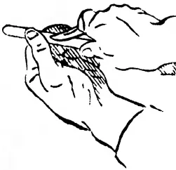

*Correct position for cutting Bud  
(knife diagonal)*

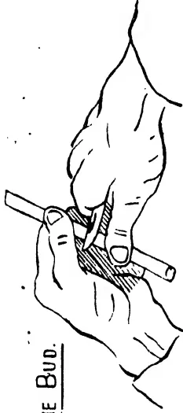

*Wrong position (Knife square across)*

CUTTING THE BUD.

*Front View.*

*Side View.*

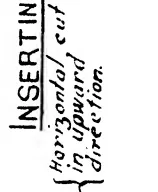

*horizontal cut  
in upward  
direction.*

INSERTING THE BUD.

*Dotted lines  
represent  
bud-shield  
under bark  
of stock.*

*Cutting the Stock.*

*Bud inserted. Bud Wrapped*

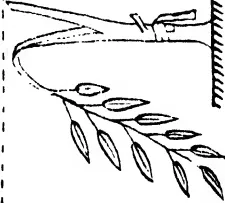

*Stock split and bent  
over on to ground.*

TREATING THE STOCK.

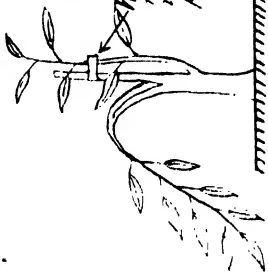

*Wrapping re-used  
to tie up new bud-  
wood to upright  
portion of stock.*

650------------------------------------------------

This image is a blank white page. It contains several small, dark specks which appear to be scanning artifacts or dust particles. There is no text, handwriting, or printed content on the page.

651------------------------------------------------

NOVEMBER, 1922.]327

*Tools.*—The tools required are: A budding knife, pruning knife, pruning shear, oil stone, strop and a little oil. The most difficult part of budding is to have the tools well kept. The budding knife should be as sharp as a razor and needs a rub on the oil stone after every day's work. The strop should be taken to the nursery so that the budding knife can have a rub about every hour. The other tools also should be sharp and in good order if the work is to be properly done.

*Division of Labour.*—It is well to have one man to open the tree cut and insert the bud, and another to follow him and wrap. There can be further sub-divisions. It is necessary to get the bud in and wrapped as soon as possible.

*When to Bud.*—When the weather is hot and moist the year round budding can be done every month in the year. When there are defined wet and dry seasons, budding must be done between the two. Budding should not be done during the season when the nights are cool. When the tree is growing well it is right for budding. Do not force the bud.

*Fertilizers.*—If the soil has been used and is poor, do not use any organic manures such as oil cakes, fish manures, etc. These may encourage ants and may be very troublesome in a nursery.

## EXPERIENCE OF PRICKLY PEAR AS AN EMERGENCY CATTLE FOOD.

N. V. HANMANTE; B. Ag.,

*District Agricultural Overseer, District Kolaba, Bombay.*

During the famine of 1918-19, in a period of extreme stress for fodder in the Eastern Deccan, a method was for the first time worked out which allowed the use of prickly pear as a fodder for cattle on a large scale, and which was successful in keeping the animals in health. The method used was described in a Bulletin\* issued by PROF. J. B. KNIGHT, in 1920, but still a good deal of suspicion remained with regard to the fodder, which required further demonstration on a larger scale to convince cattle owners as to its utility in famine periods.

The famine conditions which prevailed in the Ahmednagar District in 1920-21 gave the opportunity for a further demonstration of the value of prickly pear, and it was decided to run several cattle camps in the district. The camp at Rahuri, of which the writer was in charge was run from the beginning with prickly pear as the principal rough fodder. It was started as a relief measure by the Collector of the district, the Agricultural Department of the Bombay Presidency being responsible for the management.

The bullocks for the camp were purchased in the surrounding bazaars at an average price of Rs. 19-4-0 per animal, though a large number was purchased at a much lower rate. The total number of cattle admitted into the camp was 1, 583. The animals required a little breaking in before

\* BOMBAY DEPT. AGRIC. BULL. 97 (1920).

652------------------------------------------------

328[NOVEMBER 1932.

they were content to eat prickly pear as their chief fodder, but in most cases they became quite accustomed to it within a week. The thorns of prickly pear were burnt off in the furnace (a modification of the village blacksmith's furnace) described in PROF. KNIGHT'S Bulletin, and then chopped into small slices. Various chopping devices were used, but most of the fodder was cut up in chaff-cutters. The chopped up prickly pear was then mixed with the requisite amount of cotton seed and fed to the animals.

The quantity of prickly pear consumed per day by a bullock, which was not accustomed to the diet, was from seven to eight pounds for the first six to ten days. After this period, the animal usually began to consume more, the maximum quantity eaten per day by an animal being as high as forty pounds. Even with this amount there was no derangement in the animal's digestion.

It is obvious that, owing to the extreme dilution of the food material in prickly pear, it cannot serve as a fodder alone, even as a maintenance ration. Furthermore, whenever attempts were made to feed it alone, the animals almost always scoured badly. In order, therefore, to supplement the nutrients in the prickly pear and to avoid the scouring action, two pounds of cotton seed and two to three pounds of dry grass were given daily to each animal.

The condition of the animals on admission to the camp was deplorable. There was, however, a rapid improvement when they were brought on the above ration, and after two months or so they became decidedly vigorous.

The animals were maintained in this way from the middle of February to the middle of June, 1921, when they were sold to the cultivators of the district. In the meantime, the bullocks were used for various kinds of light and even heavy work. The whole of the carting of grass and food, stuffs for the camp was done by the bullocks fed on prickly pear. The prickly pear itself was brought by the same means from places five to six miles away, and the cultivation of an area of land attached to the farms, where green fodder was grown under irrigation, was carried on by the same agency. These facts disprove the local opinion that animals fed on prickly pear are of no use for work even when they are given concentrated foods with it.

Out of the 1,583 animals brought to the camp, most of them in very bad condition, there were 56 deaths in all in four months. Fifteen animals died on account of extreme starvation before they were brought to the camp, and the remaining forty-one from rinderpest which appeared no less than four times in spite of careful segregation of new animals. In the cases of deaths due to previous emaciation, post-mortem examination showed no injury to the alimentary canal as the result of feeding with prickly pear.

The daily average cost of food per animal in the camp, including the carting and preparation of the prickly pear, the cost of cotton seed and the cost of the dry grass given, amounted to three and a half annas per day or Rs. 6-9-0 per month.

653------------------------------------------------

NOVEMBER, 1922]329

During the whole run of the camp, it was noticed that it was very difficult, if not impossible, to bring old and weak animals into good condition by means of the ration provided, but that those which had not already suffered from starvation could be maintained without deterioration and without much trouble. Young animals accustomed themselves to the food quickly, and flourished on it, even when emaciated before being brought to the camp. As a method of saving cattle in years of fodder famine such camps should therefore concentrate their energies on young animals which will much better repay the attention bestowed upon them.—*AGRIC. JOURNAL OF INDIA*, VOL. XVII, PART IV.

## TRANSPLANTING.

The art of transplanting seedlings, the art of "transplanting" *par excellence*, is one that requires deft fingers, an attentive brain and a well trained eye. The essence of the art is to remove successfully a small, often delicate seedling from its original seed bed, be it box or bed in the garden, to a fresh site. Now, success depends on many small things, neglect one and your operation is a failure. First of all the new site must be thoroughly prepared, of good rich soil, suitable for the young seedling, for all but the hardier ones free from stones, sticks, grass, or other weeds, and of a fine tilth, neither too wet nor too dry. If a handful of soil is taken up, squeezed and remains in a ball when thrown down it is too wet, if it goes to dust without any signs of adhesion it is too dry; in the first case turn your soil over and allow sun and wind to dry it until the texture is satisfactory, in the second case *sprinkle* it with water and turn it over until it is satisfactory.

Take the greatest care in taking up your seedlings, especially if they were sown rather thickly, or you will break off innumerable root points and the young seedlings will suffer. In dry weather do not expose your seedlings to the hot dry air, cover them with damp moss or a wet cloth even if they are to be out of the ground only a few minutes. Transpiration when the young plant has no means of replacing lost moisture is a thing to be prevented by every means in one's power.

When planting young seedlings into the earth, be sure to make the hole deep and wide in proportion to the plant to be reset, be sure to put the seedling only a very little deeper than it grew originally, place it at the side of the hole, and press the soil with a perpendicular action, not laterally, very firmly around the young plant, being careful to make the soil firmer round the lower part of the root than the upper, *but* make it firm. Water the young seedlings thoroughly, *immediately* you have put them into the ground. Do not wait to finish a large bed but water at any rate within 5 minutes of putting out a portion of the plants. If you wish to test the correctness of the advice given here, put out a portion of your plants in a badly prepared dry bed, take up the plants carelessly, put them in deeply and loosely and leave them four or five hours without water and see the result. I have seen it in my own garden.—*JOURN. OF JAMAICA AGRIC. SOC.*, Vol. XXVI, No. 8.

654------------------------------------------------

330[NOVEMBER, 1922.

## THE CAULIFLOWER.

S. N. MULLICK,

*Mullick Agricultural Farm, Ranaghat*

This vegetable originally came from Europe; now all Indians use it and many try to grow it in their farms.

To achieve success in the cultivation of this delicious vegetable the ground must be well manured.

Two ounces of seed are sufficient for 50 square feet of seed bed and gives enough plants for one acre of land. To secure the best results transplanting should be done twice.

The seed-bed should be prepared before the rains in an open sunny situation. For early sowings the seed-bed should be raised a foot higher than the surrounding ground in order to secure good drainage, but for sowings made after the rains this is not necessary. The soil should be friable, and well manured.

The seed should be sown broadcast and covered with a thin layer (about one-eighth of an inch) of light sifted soil.

If the weather is dry at the time of sowing, water the seed bed with a fine-rosed can. The seed should not be sown when the soil is in a saturated condition.

Shade should be given during the middle of the day for the first week. Do not keep the plants always in shade because the less the shade the more robust will be the plant and less liable to attack from insects.

The plots should be clean and near water. From four to six weeks before planting, decomposed farmyard manure should be spread over the surface to a depth of 4 or 5 inches. Dig over to a depth of 15 to 18 inches, thoroughly incorporating the manure with the soil.

The seedlings should be planted in rows 3 inches apart and 2 inches from plant to plant. Here the plants will be much sturdier and hardier than before.

The second plot should be made as recommended before. Here the plants will be finally transplanted. Plant in ridges  $2\frac{1}{2}$  feet apart, 2 feet from plant to plant. The plants should be watered in the evening.

Cauliflower has several insect enemies. When these are noticed the leaves should be dusted every second or third day with the ~~ash~~ of cow-dung or sprayed with a weak solution of phenyle. If the latter is used a teaspoonful of the fluid should be mixed with one gallon of water.—INDIAN SCIENTIFIC AGRICULTURIST, Vol. 3, No. 8.

655------------------------------------------------

NOVEMBER, 1922.]331

# MARKET RATES.

## MARKET RATES FOR SOME TROPICAL PRODUCTS.

(FROM LEWIS & PEAT'S Ltd., LATEST MONTHLY PRICES CURRENT.)

<table border="1">
<thead>
<tr>
<th>GOODS</th>
<th>QUALITY</th>
<th>PRICE</th>
<th>PER</th>
<th>PKGS</th>
<th>POSITION</th>
<th>MARKET</th>
</tr>
</thead>
<tbody>
<tr>
<td colspan="7"><b>BEANS AND PEAS—</b></td>
</tr>
<tr>
<td>Butter Beans</td>
<td>Madagascar New Crop...</td>
<td>£13 a £14</td>
<td>ton</td>
<td>Bags</td>
<td>Spot U.K.</td>
<td>Quiet</td>
</tr>
<tr>
<td>Rangoon Beans</td>
<td>Hand Picked</td>
<td>£7.5</td>
<td>"</td>
<td>"</td>
<td>" "</td>
<td>"</td>
</tr>
<tr>
<td>Soya Beans</td>
<td>Manchuria</td>
<td>£11.15</td>
<td>"</td>
<td>"</td>
<td>C.i.f.</td>
<td>"</td>
</tr>
<tr>
<td>Green Peas</td>
<td>Japanese, f.a.q.</td>
<td>£30</td>
<td>"</td>
<td>"</td>
<td>" "</td>
<td>Market steady</td>
</tr>
<tr>
<td>"</td>
<td>Dutch</td>
<td>£24</td>
<td>"</td>
<td>"</td>
<td>Spot "</td>
<td>" "</td>
</tr>
<tr>
<td colspan="7"><b>CAKES—</b></td>
</tr>
<tr>
<td>Ground Nut Cake</td>
<td>Bombay 55olb</td>
<td>£10/10</td>
<td>ton</td>
<td>Bags</td>
<td>C.i.f. U.K.</td>
<td>Slow</td>
</tr>
<tr>
<td>Copra Cake</td>
<td>Malabar</td>
<td>£10</td>
<td>"</td>
<td>"</td>
<td>" "</td>
<td>"</td>
</tr>
<tr>
<td>"</td>
<td>Ceylon</td>
<td>£9/10</td>
<td>"</td>
<td>"</td>
<td>" "</td>
<td>"</td>
</tr>
<tr>
<td>"</td>
<td>Straits</td>
<td>£9</td>
<td>"</td>
<td>"</td>
<td>" "</td>
<td>"</td>
</tr>
<tr>
<td colspan="7"><b>COPRA—</b></td>
</tr>
<tr>
<td>"</td>
<td>Malabar</td>
<td>£24.15</td>
<td>ton</td>
<td>Bags</td>
<td>C.i.f. U.K.</td>
<td>Quiet, and prices easier</td>
</tr>
<tr>
<td>"</td>
<td>Ceylon</td>
<td>£24.5</td>
<td>"</td>
<td>"</td>
<td>" "</td>
<td>"</td>
</tr>
<tr>
<td>"</td>
<td>Straits (F.M.S.)</td>
<td>£23.5</td>
<td>"</td>
<td>"</td>
<td>" "</td>
<td>"</td>
</tr>
<tr>
<td colspan="7"><b>GROUND NUTS—</b></td>
</tr>
<tr>
<td>"</td>
<td>Bombay Decorticated</td>
<td>£19.10</td>
<td>ton</td>
<td>Bags</td>
<td>C.i.f. Continent</td>
<td>Slow</td>
</tr>
<tr>
<td colspan="7"><b>OILS—</b></td>
</tr>
<tr>
<td>Palm Oil</td>
<td>Lagos</td>
<td>£32</td>
<td>ton</td>
<td>Casks</td>
<td>Spot U.K.</td>
<td>Steady</td>
</tr>
<tr>
<td>"</td>
<td>Congo</td>
<td>£30</td>
<td>"</td>
<td>"</td>
<td>" "</td>
<td>"</td>
</tr>
<tr>
<td>Coconut Oil</td>
<td>Cochin</td>
<td>42</td>
<td>cwt</td>
<td>"</td>
<td>C.i.f. U.K.</td>
<td>"</td>
</tr>
<tr>
<td>"</td>
<td>Ceylon</td>
<td>37</td>
<td>"</td>
<td>"</td>
<td>" "</td>
<td>"</td>
</tr>
<tr>
<td>Palm Kernel Oil</td>
<td>Crushed</td>
<td>34/6</td>
<td>"</td>
<td>Naked</td>
<td>Spot "</td>
<td>Quiet</td>
</tr>
<tr>
<td colspan="7"><b>PALM KERNELS—</b></td>
</tr>
<tr>
<td>"</td>
<td>West African</td>
<td>£16.10</td>
<td>ton</td>
<td>Bags</td>
<td>Ex quay L'pool Spot U.K.</td>
<td>Steady</td>
</tr>
<tr>
<td colspan="7"><b>SEEDS—</b></td>
</tr>
<tr>
<td>Castor Seed</td>
<td>Bombay</td>
<td>£17/10</td>
<td>ton</td>
<td>Bags</td>
<td>C.i.f. U.K.</td>
<td>Quiet</td>
</tr>
<tr>
<td>"</td>
<td>Madras</td>
<td>£16/10</td>
<td>"</td>
<td>"</td>
<td>" "</td>
<td>"</td>
</tr>
<tr>
<td>Sesame Seed</td>
<td>Bombay</td>
<td>£21/15</td>
<td>"</td>
<td>"</td>
<td>" Continent</td>
<td>"</td>
</tr>
</tbody>
</table>

### ESSENTIAL OIL.

(From *Perfumery and Essential Oil Record*, Vol. 13, No. 10)

*Camphor Oil* is steady, white offering at 78s. to 80s. per cwt., inside figure in drums; forward business done at 75s. c.i.f.; brown on spot is 70s. (drums)

*Cinnamon Leaf Oil* is in fair demand; spot is easier, 4½d. per oz. and c.i.f. also lower at 3½d.; Mysore is quoted at 8s. 3d. c.i.f.

*Cinnamon Bark Oil* continues difficult to operate in view of so-called B.P. qualities being frequently sophistications, but the genuine is worth 6s. 6d. per oz., there are plenty of enquiries, but very few orders on the really genuine.

*Citronella Oil.*—The little Ceylon actually on spot has been selling at 2s. 6d., but new arrivals are now offered at 2s. 2d. to 2s. 4d. per lb.; forward is quoted at 2s. 1d. c.i.f. Java can still be had at 2s. 10½d. to 2s. 11d. per lb. for large quantities in drums, and at 3s. for small supplies; the c.i.f. position is steady at 2s. 9d. to 2s. 9½d., as against 2s. 8½d. recently.

*Lemon Grass Oil.*—Cochin is unchanged at 2¾d. for original drums, with to arrive at 2¾d. c.i.f. per oz.

*Lime Oil* is easier at 1s. 11d. to 2s. per lb. spot for distilled in large lines; hand-pressed has dropped to 7s. 6d.

656------------------------------------------------

332

[NOVEMBER, 1922.]

**ANIMAL DISEASE RETURN FOR THE MONTH ENDED 30th OCTOBER, 1922.**

<table border="1">
<thead>
<tr>
<th>Province, &amp;c.</th>
<th>Disease.</th>
<th>No. of Cases up to date since Jan. 1, 1922.</th>
<th>Fresh Recoveries.</th>
<th>Deaths.</th>
<th>Bal-ance Ill.</th>
<th>No. Shot.</th>
</tr>
</thead>
<tbody>
<tr>
<td rowspan="3">Western</td>
<td>Rinderpest Foot-and-mouth disease Anthrax Rabies</td>
<td>12 301 4</td>
<td>1 11 —</td>
<td>3 9 1</td>
<td>— 6 —</td>
<td>— — 3</td>
</tr>
<tr>
<td>Hemorrhagic Septicæmia</td>
<td>7</td>
<td>2</td>
<td>5</td>
<td>—</td>
<td>—</td>
</tr>
<tr>
<td>Rinderpest Foot-and-mouth disease Anthrax Rabies</td>
<td>56 135 15</td>
<td>37 1 —</td>
<td>— — —</td>
<td>— — —</td>
<td>— — —</td>
</tr>
<tr>
<td>Colombo Municipality</td>
<td>Rinderpest Foot-and-mouth disease Anthrax Rabies</td>
<td>27 50 33</td>
<td>— — 16</td>
<td>— — 4</td>
<td>— — 29</td>
<td>— — 1</td>
</tr>
<tr>
<td>Cattle Quarantine Station*</td>
<td>Rinderpest Foot-and-mouth disease Anthrax Rabies</td>
<td>27 50 33</td>
<td>— — 16</td>
<td>— — 4</td>
<td>— — 29</td>
<td>— — 1</td>
</tr>
<tr>
<td rowspan="2">Central</td>
<td>Rinderpest Foot-and-mouth disease Anthrax Rabies</td>
<td>170 100 7</td>
<td>12 4 7</td>
<td>10 96 7</td>
<td>12 1 10</td>
<td>— — —</td>
</tr>
<tr>
<td>Intemperismosis</td>
<td>—</td>
<td>—</td>
<td>—</td>
<td>—</td>
<td>—</td>
</tr>
<tr>
<td rowspan="2">Southern</td>
<td>Rinderpest Foot-and-mouth disease Anthrax Rabies</td>
<td>6 2 37</td>
<td>— — 4</td>
<td>— — 3</td>
<td>— — 2</td>
<td>— — —</td>
</tr>
<tr>
<td>Hemorrhagic Septicæmia</td>
<td>—</td>
<td>—</td>
<td>—</td>
<td>—</td>
<td>—</td>
</tr>
<tr>
<td rowspan="2">Northern</td>
<td>Rinderpest Foot-and-mouth disease Anthrax Rabies</td>
<td>291 18</td>
<td>— 18</td>
<td>— —</td>
<td>— —</td>
<td>— —</td>
</tr>
<tr>
<td>Hemorrhagic Septicæmia</td>
<td>—</td>
<td>—</td>
<td>—</td>
<td>—</td>
<td>—</td>
</tr>
<tr>
<td rowspan="2">Eastern</td>
<td>Rinderpest Foot-and-mouth disease Anthrax Rabies</td>
<td>191 7</td>
<td>— 3</td>
<td>— 3</td>
<td>— —</td>
<td>— —</td>
</tr>
<tr>
<td>Hemorrhagic Septicæmia</td>
<td>—</td>
<td>—</td>
<td>—</td>
<td>—</td>
<td>—</td>
</tr>
<tr>
<td rowspan="2">North-Western</td>
<td>Rinderpest Foot-and-mouth disease Anthrax Rabies</td>
<td>191 7</td>
<td>— 3</td>
<td>— 3</td>
<td>— —</td>
<td>— —</td>
</tr>
<tr>
<td>Hemorrhagic Septicæmia</td>
<td>—</td>
<td>—</td>
<td>—</td>
<td>—</td>
<td>—</td>
</tr>
<tr>
<td rowspan="2">North-Central</td>
<td>Rinderpest Foot-and-mouth disease Anthrax Rabies</td>
<td>2 —</td>
<td>— —</td>
<td>— —</td>
<td>— —</td>
<td>— —</td>
</tr>
<tr>
<td>Hemorrhagic Septicæmia</td>
<td>—</td>
<td>—</td>
<td>—</td>
<td>—</td>
<td>—</td>
</tr>
<tr>
<td rowspan="2">Uva</td>
<td>Rinderpest Foot-and-mouth disease Anthrax Rabies</td>
<td>283 16</td>
<td>— 10</td>
<td>— 6</td>
<td>— —</td>
<td>— —</td>
</tr>
<tr>
<td>Hemorrhagic Septicæmia</td>
<td>—</td>
<td>—</td>
<td>—</td>
<td>—</td>
<td>—</td>
</tr>
<tr>
<td rowspan="2">Sabaragamuwa</td>
<td>Rinderpest Foot-and-mouth disease Anthrax Rabies</td>
<td>1517 7</td>
<td>17 2</td>
<td>532 7</td>
<td>5 11</td>
<td>— —</td>
</tr>
<tr>
<td>Hemorrhagic Septicæmia</td>
<td>—</td>
<td>—</td>
<td>—</td>
<td>—</td>
<td>—</td>
</tr>
</tbody>
</table>

\* Figures for October, 1922, not yet to hand.

Colombo, 2nd November, 1922. **G. W. STURGESS,** Government Veterinary Surgeon.

**METEOROLOGICAL NOTES.**

(Continued from next Column.)

The distribution of pressure was rather smoother than usual in October, and the mean wind velocities about equally divided above and below their averages the biggest offset being at Batticaloa where the velocity was appreciably above normal.

A. J. BAMFORD.

Suptd. Observatory.

**METEOROLOGICAL.**  
OCTOBER, 1922.

<table border="1">
<thead>
<tr>
<th rowspan="2">Station</th>
<th colspan="2">Temperature</th>
<th colspan="2">Humidity</th>
<th rowspan="2">Mean amount of cloud 10 overcast</th>
<th rowspan="2">Mean Wind Direction during month</th>
<th rowspan="2">Daily Mean Velocity.</th>
<th rowspan="2">Amount</th>
<th rowspan="2">No. of Rainy days</th>
<th rowspan="2">Inches</th>
<th rowspan="2">Difference from Average</th>
</tr>
<tr>
<th>Mean Daily Shade</th>
<th>Difference Average</th>
<th>Mean</th>
<th>%</th>
</tr>
</thead>
<tbody>
<tr>
<td>Colombo Observatory</td>
<td>80.2</td>
<td>0</td>
<td>82</td>
<td>84</td>
<td>8.4</td>
<td>NW</td>
<td>92</td>
<td>10.92</td>
<td>21</td>
<td>2</td>
<td>2.20</td>
</tr>
<tr>
<td>Puttalam</td>
<td>80.2</td>
<td>0.6</td>
<td>80</td>
<td>50</td>
<td>5.0</td>
<td>WSW</td>
<td>142</td>
<td>9.44</td>
<td>20</td>
<td>—</td>
<td>0.54</td>
</tr>
<tr>
<td>Mannar</td>
<td>82.0</td>
<td>0.5</td>
<td>78</td>
<td>80</td>
<td>7.8</td>
<td>WSW</td>
<td>189</td>
<td>11.96</td>
<td>17</td>
<td>+</td>
<td>4.09</td>
</tr>
<tr>
<td>Taffna</td>
<td>80.8</td>
<td>0.8</td>
<td>83</td>
<td>7.6</td>
<td>7.6</td>
<td>Var.</td>
<td>187</td>
<td>13.55</td>
<td>16</td>
<td>+</td>
<td>4.23</td>
</tr>
<tr>
<td>Trincomalee</td>
<td>82.0</td>
<td>0.5</td>
<td>77</td>
<td>6.0</td>
<td>6.0</td>
<td>NE</td>
<td>125</td>
<td>21.27</td>
<td>22</td>
<td>+</td>
<td>13.24</td>
</tr>
<tr>
<td>Batticaloa</td>
<td>80.8</td>
<td>0.9</td>
<td>82</td>
<td>6.1</td>
<td>6.1</td>
<td>SW</td>
<td>179</td>
<td>11.35</td>
<td>19</td>
<td>+</td>
<td>4.98</td>
</tr>
<tr>
<td>Hambantota</td>
<td>80.6</td>
<td>+0.2</td>
<td>79</td>
<td>+8</td>
<td>+8</td>
<td>NWN</td>
<td>253</td>
<td>3.10</td>
<td>12</td>
<td>—</td>
<td>1.34</td>
</tr>
<tr>
<td>Galle</td>
<td>78.7</td>
<td>+0.6</td>
<td>86</td>
<td>6.9</td>
<td>6.9</td>
<td>—</td>
<td>193</td>
<td>11.72</td>
<td>21</td>
<td>+</td>
<td>10.31</td>
</tr>
<tr>
<td>Rathnapura</td>
<td>80.6</td>
<td>0</td>
<td>76</td>
<td>6.8</td>
<td>6.8</td>
<td>—</td>
<td>—</td>
<td>12.88</td>
<td>23</td>
<td>—</td>
<td>6.12</td>
</tr>
<tr>
<td>Anu pura</td>
<td>81.4</td>
<td>+0.3</td>
<td>77</td>
<td>7.0</td>
<td>7.0</td>
<td>—</td>
<td>—</td>
<td>21.91</td>
<td>20</td>
<td>+</td>
<td>1.88</td>
</tr>
<tr>
<td>Kurunegala</td>
<td>80.6</td>
<td>+0.6</td>
<td>80</td>
<td>6.6</td>
<td>6.6</td>
<td>—</td>
<td>—</td>
<td>12.95</td>
<td>22</td>
<td>+</td>
<td>5.54</td>
</tr>
<tr>
<td>Kandy</td>
<td>74.8</td>
<td>+0.5</td>
<td>80</td>
<td>7.6</td>
<td>7.6</td>
<td>—</td>
<td>—</td>
<td>21.63</td>
<td>29</td>
<td>+</td>
<td>11.97</td>
</tr>
<tr>
<td>Badulla</td>
<td>76.4</td>
<td>0</td>
<td>80</td>
<td>7.7</td>
<td>7.7</td>
<td>—</td>
<td>—</td>
<td>15.87</td>
<td>27</td>
<td>+</td>
<td>5.54</td>
</tr>
<tr>
<td>Diyatawa</td>
<td>68.4</td>
<td>0</td>
<td>80</td>
<td>7.5</td>
<td>7.5</td>
<td>—</td>
<td>—</td>
<td>20.16</td>
<td>26</td>
<td>+</td>
<td>8.12</td>
</tr>
<tr>
<td>Hakgala</td>
<td>61.0</td>
<td>+1.0</td>
<td>85</td>
<td>8.4</td>
<td>8.4</td>
<td>—</td>
<td>—</td>
<td>16.93</td>
<td>26</td>
<td>+</td>
<td>5.96</td>
</tr>
<tr>
<td>N. Eliya</td>
<td>60.6</td>
<td>+</td>
<td>85</td>
<td>—</td>
<td>—</td>
<td>—</td>
<td>—</td>
<td>—</td>
<td>—</td>
<td>—</td>
<td>—</td>
</tr>
</tbody>
</table>

A rough summary of the October rainfall can be obtained by drawing an approximately straight line from Puttalam to Hambantota. The rainfall was above average east of this line and below average west of it. The dividing line may be defined as follows:—A little more closely as just west of Kurunegala than the main line, and the biggest offsets from average were in the Nithe Cave and adjacent districts, St. Martin's, 41.68 inches, Hendon 38.72 inches, and Alutnuwara 34.17 inches all reported more than double their October averages, while other reports above 30 inches include Kobonella, Doormadella, Oonoomagalla, Orwell, Keanatelle, Mahadova, Duckwar, and Leigergwatta. Off-sets of over ten inches above average were common in the Central Province and not infrequent in the North-Central Province. Uva, and the north-west of the Central and North-West Provinces, were the driest months.

In the area west of the line defined above, deficits of more than 10 inches occurred at a series of stations running southward from near Henarattota to Galle. On each side of this strip deficits were not quite so great; between it and the west coast they were usually from 5 to 10 inches and east of it the area below average included a good deal of Sabarigamuwa and the Southern Province, and extended into the north-west of the Central Province, and recorded 12.25 inches or 4 inches below its average. In the parts of the North-Western Province that were below average the deficits were usually not great particularly as at the inland stations.

As regards the distribution in time through the month, the first ten days were comparatively quiet though in some cases (e. g. in Uva) they included the first 12 hours of the month, and the last 12 hours were the last 12 hours of the month, and the biggest offsets from average were in the Nithe Cave and adjacent districts, St. Martin's, 41.68 inches, Hendon 38.72 inches, and Alutnuwara 34.17 inches all reported more than double their October averages, while other reports above 30 inches include Kobonella, Doormadella, Oonoomagalla, Orwell, Keanatelle, Mahadova, Duckwar, and Leigergwatta. Off-sets of over ten inches above average were common in the Central Province and not infrequent in the North-Central Province. Uva, and the north-west of the Central and North-West Provinces, were the driest months.

The variation of the Humidity figures from average follow the general run of the rainfall, that is, above on the coast, and below inland, and with roughly summarised as positive inland and negative on the coast.

657------------------------------------------------

# THE TROPICAL AGRICULTURIST

---

VOL. LIX.

PERADENIYA, DECEMBER, 1922.

No. 6.

---

## FIBRES.

---

Increasing interest is being taken in the production of fibres and the demand for certain classes of such products is at present great. The extraordinary demand for Kapok during the past year has resulted in frequent enquiries being made as to the commercial prospects of plantations of this product, and the shortage of supplies of flax has resulted in enquiries for fibres which may be employed as linen substitutes.

There is also a world shortage of cotton particularly of the long stapled kinds. Prices for all grades of cotton are firm.

The recent experiments with cotton in Ceylon have been decidedly promising and areas amounting to 250 acres have been opened up in the Hambantota district for the present season, while seed sufficient to plant another 350 acres has been distributed by the Department of Agriculture to other districts.

In certain areas, the prospects for cotton cultivation in Ceylon are promising provided sufficient attention is given to cultivation and to the proper control of insect pests. Whether the long stapled varieties can be grown year after year without deterioration has yet to be demonstrated, but it is interesting to note that the most promising of the experimental plots at Ambalantota at the present time are those sown with seed which was secured after careful selection from special plants selected in last season's cultivation.

The question of Kapok was fully dealt with at the last meeting of the Estate Products Committee of the Board of Agriculture, and at the prices now ruling for this product there is reason

658------------------------------------------------

334DECEMBER, 1922.

to suppose that its cultivation would be profitable and particularly on those lands and in those areas which, by reason of a low rainfall, cannot be utilized for many tropical products. Experimental plots of this product have been established at Anuradhapura.

Roselle has been grown in several parts of the Federated Malay States and its fibre has been disposed of at very profitable rates. A small trial plot at the Anuradhapura Experiment Station has made very fair growth. This was grown from seed secured from the Philippines, but other varieties are now stated to be more promising and to give better results in wet districts.

The cultivation of the new fibre "Arghan" has been frequently discussed during the past few months, but all supplies of planting material in the East are at present in private nurseries in the Federated Malay States.

The demand for supplies of Sisal for planting purposes has been maintained throughout the year and beginnings on a small scale with this fibre are being made in several districts.

The erection of the small mill for scrutching sisal has been completed at the Anuradhapura Experiment Station and trial runs have been made. These have been satisfactory and it is intended to commence regular work as soon as the present rainy season is over. The Maha-iluppalama sisal plantation is also making progress and machinery will be erected during the coming year.

There are vast areas of the Colony in the dry zone which are not at present utilized for the cultivation of economic crops and there is room for an enormous economic development if it can be demonstrated that profit-earning crops can be grown in this zone without irrigation. It was with this object that the Department of Agriculture started trials with various fibres and sufficient data have already been secured to warrant the belief that the development of these dry areas need no longer be delayed.

659------------------------------------------------

DECEMBER, 1922.]335

# FIBRES.

## (KAPOK (*ERIODENDRON ANFRAC TUOSUM*))\*

(The Kapok tree (*Eriodendron anfractuosum*) presumably of American origin, is now found growing in most tropical regions of the world; it is found in abundance throughout the Malay Archipelago and is now cultivated on a commercial scale in Java and adjacent islands,) where its gaunt form and lean branches, leafless in the dry season, is a familiar feature of many roadside and riverine Kampongs.

Its fruit, from 4 to 5 inches in length, is of an elongated egg-shape, and enclosed in a husk which, at maturity, becomes woody and burst open showing a number of spherical balls of white or cream-coloured floss lodged between five valves (placentas) of semi-ligneous, semi-pithy consistency. Unlike the lint of true cotton (*Gossypium*), the floss of Kapok does not grow direct from the seeds; it originates at the inner side of the capsule-valves and is not adherent to the seeds: hence the separation of the seeds from the floss is a relatively easy process, which can be done quite effectively by hand or by machinery of the simplest design requiring only very small power.

After freeing it from the seeds, the Kapok is put to dry in the sun, then pressed and packed in mats for export to Europe, where it is fast becoming an indispensable staple of many trades owing to its unrivalled qualities of lightness, buoyancy, imperviousness to water, its elasticity and silkiness.

## (CULTIVATION.)

The cultivation of the Kapok tree offers no new problem to the rubber planter: it presents the same cycle of operations, *viz*: clearing—draining—nurseries—lining—holing—planting from stumps, etc. But owing to the tender nature of the wood of the Kapok tree, white ants are apt to cause great damage and, where the operation is not too costly, the ground should be stumped, in places where the ants are known to be. Kapok is seen growing at different altitudes above sea-level, but it is seen at its best at low elevations along alluvial strips by the river side. From this it may be inferred that (deep soils of a sandy loamy nature suit it better than other soils.) It may also be inferred that Kapok likes open situations with a good circulation of air, such as generally exists along the course of rivers, and that confined situations in narrow closed valleys, where the air is still, will not suit it. (Its very branching in widely spaced horizontal tiers is indicative of a sun and air-loving tree, and, for that reason the practice frequently followed by Malays of interplanting Kapok with coconuts, is not one to be recommended, although it fulfils well enough the purpose to which it is sometimes put in Java, of shading coffee or cacao or pepper, all plants of

\* Extracts from a Lecture given at Kuala Kangsar, on August 16th, by E. MATHIEU, Superintendent, Government Plantation, Kuala Kangsar.

660------------------------------------------------

336[DECEMBER, 1922.

smaller and slower growth than itself.) Alluvial strips along rivers are, however, not to be found everywhere: in most cases, one has to make the best of one's circumstances, and, taking the good and the bad, to shape one's work towards the improvement of one's land by cultivation, by liming in some cases, by mulching, by inter-planting, and digging in, leguminous crops, which all tend to make compact soils more porous, besides increasing the supply of nitrogen, when it is short. By these means, soils of a heavy clayey nature (provided the subsoil allows of percolation) may be brought, in a year or two, to a high state of fertility and it is no uncommon sight to see bunches of Kapok trees doing well on high land, in soil of a refractory character, where the naturally unfavourable conditions have been corrected by design, or by fortuitous circumstance.

I have in mind a row of six Kapok trees, 9 years old, growing as a screen, in front of a stable built on a narrow promontory about 300 yards away from the sea-board, and 160 feet above its level. Nothing but rank bushes, and thin lalang grew on the hard-baked clay badly eroded by rains. Yet, owing to the supply of dung from two horses, the Kapok trees grew well and gave abundant crops.

### PROPAGATION.

The Kapok tree is reared from seed or from branch cutting which take very readily; and where old trees of a high-yielding character, or otherwise profitable, are available in the neighbourhood, it may be possible to reproduce the strain by means of cuttings; but, as a general rule, for planting on a large scale, seeds will have to be resorted to.

The opinion is often expressed that plantation from cuttings gives faster growth and earlier crops, than is obtained by plantation from seed: but this is open to question. According to the "JOURNAL OF THE SOCIETY OF ARTS" (23rd July, 1909) the reverse would be the case, that is to say that plantation from seed gives earlier results. Be this as it may, the clump of Kapok trees, referred to below, which were sown on the 15th March, 1921, shows that trees planted from seed *do* make very rapid growth.

One objection to the use of cuttings is that where there are white ants, they are very liable to be destroyed by them.

A second objection, the Malays tell you, is that trees grown from cuttings form no tap-root, and, for that reason, their life is shorter, and they are more liable to be uprooted by wind-storms than is the case with trees grown from seed. Three plants grown from cuttings, planted 4 months previously, were found, when uprooted and examined by me, showing a number of lateral roots issuing from between the bark and the callus formed at the original cut, but there was no vestige of a tap-root.

The seeds should be taken from pods with a thin husk that have matured on trees at least 7 to 8 years old; the pods should be of full size and picked soon after they have opened, when the floss is just showing below the peduncle.

It is possible to buy seeds very cheap from the establishments where Kapok is cleaned, but the use of such seed of unknown origin is open to serious objection. The pods may have come from young trees or from poor-yielding trees, they may have been plucked unripe. The best course

661------------------------------------------------

DECEMBER, 1922.]337

would be, where possible, to buy the crop of one or two of the oldest and best yielding trees of a group after having opened a few pods. As a tree with 400 pods would give an average of 58,000 seeds, the stock of seed thus obtained would more than cover the requirements of an estate of 100 acres and afford an ample margin for future selection. This would imply some little expense, and the trouble of cleaning the Kapok, but the importance, for the future of the estate, of securing the best strain possible, is such that a few dollars more should not be considered.

If the seeds are not fresh, they can be roughly tested in water: they will not sink at first, but after a night's steeping, the heavier ones will have sunk to the bottom of the vessel: these alone should be used for sowing in the nurseries.

#### NURSERIES.

These should be laid out in slightly raised beds, 3½ feet broad, and of any suitable length. The seeds are sown 9 inches apart. A couple of germinating beds should be made close by, sown 3 inches by 3, to supply early any vacancies which occur in the beds, either from the failure to germinate, or from the act of insects. Allowing fully for such failures and also for selection among the seedlings (6 pounds of seeds should be sufficient for the planting of 100 acres) One-third of an acre, allowing for drains and alleys between the beds, should meet the requirements.

If they have been originally well dug and freed from weeds by raking, the beds will require little attention beyond an occasional watering in times of drought. The nursery requires no shading. When, after 2 months, the seedlings are about 12 inches high, a little scouring between the rows with a garden fork will be found very stimulating to the young plants, especially if accompanied by a light watering with liquid manure: a handful of fowl droppings in a Kerosene tin of water, will suffice for many beds.

(Under good treatment, and fair conditions, the young Kapok trees grow very fast.) In a bed, at Kuala Kangsar, are now to be seen (16th August, 1922) a clump of trees planted on 15th March, 1921, some of which are 25 feet high, with a diameter of 5 to 6 inches at ground surface. On digging up one of the lateral roots, it was found to be 10½ feet long. This rapidity of growth explains the very general use of Kapok as a shade-tree for coffee, etc.

With such rapid growth, the trees cannot well be kept in the nursery beds for more than six months: past that stage they are too large for easy handling.

#### TRANSPLANTING.

The young trees are treated in the same way as young rubber, that is to say, they are topped, the leaves are stripped and roots trimmed.

The tap-root is a long one, but the lateral roots are sparse, and in order to tear as few of them as possible, in the lifting, it is essential that the nursery beds should be previously softened by rain or by a copious watering. Moreover, the lifting of a plant causes it to lose most of its internal water, and, as owing to the mutilation of its roots, it cannot, for the time being, take up any fresh water, it is necessary that it should have a large supply of it in its cells at the time of lifting.

662------------------------------------------------

338[DECEMBER, 1922.

The holes on good and should be spaced 18 feet  $\times$  18 feet which allows 132 trees per acre. On poorer soils and on sloping ground, a distance of 16 feet would be sufficient.

#### YIELD.

As, so far as I know, Kapok has nowhere been put under systematic cultivation in Malaya, it is impossible to say with assurance when its bearing period begins and what yields of floss are obtained. Figures and information gathered from Kampong Malayas are vague and conflicting, and, to get reliable data, one must actually go to the trees at fruiting time, and take the figures on the spot. But, even then, as the groves are only in small groups and such groups offer no uniformity of age nor of growth, the striking of an average is of little practical value.

I counted over 400 pods on one tree—which, although it may be considered good, is not an exceptional number. Ten pods gave 1,870 seeds weighing 2 oz. 85, and 1½ oz. of floss. To conclude from this that 132 trees on one acre, planted 18 feet  $\times$  18 feet, would give 52,800 pods with a content of 940 pounds of seed and 495 pounds of floss would have been misleading, for other trees round about the Kampong showed very poor crops.

We have to go, for more precise information, to the statements of the Department of Agriculture of Buitenzorg in Java, from which we gather that, under favourable conditions, a small crop of clean Kapok, amounting to about one pikul (= 133 pounds) per acre, or say one pound per tree, may be gathered at the end of the third year. The crop increases to 1½ to 2 pounds in the fifth year and thence forward the yield of 3 pounds of clean floss per tree, equivalent to 396 pounds per acre may be considered as a normal annual crop.\*

From personal observations of the way the tree responds to cultivation, I am inclined to think that, under favourable conditions, as above stipulated, these figures are below the normal to be obtained from well grown trees under systematic cultivation. A general average of 400 pods per tree yielding a yearly crop of 4 to 5 pounds of floss, or 528 pounds per acre of 132 trees, appears to me to be obtainable.

But such results will only be attained on condition that the land receives proper treatment and that the practice of clean weeding, and the evils it implies, is given up for more rational methods. For it must be borne in mind that 528 pounds of floss taken annually from one acre represent only a small portion of its output.

Twenty ripe pods, taken off a heap weighing altogether 18 ounces, gave approximately the following components.

<table>
<tbody>
<tr>
<td>Husks</td>
<td>...</td>
<td>...</td>
<td>...</td>
<td>8' 1</td>
<td rowspan="4">} 18 oz.</td>
</tr>
<tr>
<td>Seeds</td>
<td>...</td>
<td>...</td>
<td>...</td>
<td>5' 75</td>
</tr>
<tr>
<td>Floss</td>
<td>...</td>
<td>...</td>
<td>...</td>
<td>3' —</td>
</tr>
<tr>
<td>Placenta and peduncles</td>
<td>...</td>
<td>...</td>
<td>...</td>
<td>1' 25</td>
</tr>
</tbody>
</table>

\* *Note.*—On June 18th, in company with MR. D. H. GRIST, Agricultural Instructor, I had one tree picked of its pods. The tree, said to be 9 to 10 years old, had grown uncared for, without any cultivation amid a grove of durian trees. Thus surrounded, it had, called by the sun, grown to a great height and the coolie had to climb up it to the first branches which were 30 feet from the ground and thence beat the pods down with a long pole, as is done for walnuts in Europe. It took 45 minutes to bring down the crop of 583 pods, a number of fruit being left on the tree. The 583 pods gave 6 pounds of No. 1 clean floss and 4 ounces of No. 2 soiled fibre. One hundred pods give roughly 1 pound of clean floss.

663------------------------------------------------

DECEMBER, 1922.]339

One acre of 132 trees with 400 pods would, on this basis give a total output of 2,974 pounds made up as follows :— Husks 1,320 lb.—Seeds 948 lb.—Floss 500 lb.—Placenta, etc. 206 lb.

If the soil is to be maintained in its original state of fertility and of high yield, this yearly output of 2,974 pounds off one acre yearly must be made good by cultivation, by manuring or by the planting of restorative crops such as *Vigna Sinensis*, ground-nut, Lima beans, or velvet-beans (*Stizolobium nivium*) which are, as far as my experience goes, among the most prolific creators of nitrogen in these countries.

Fortunately, in the case of Kapok, the seed itself is a by-product of high value, consisting of about 50% of seed-coat and 50% of kernel containing up to 24.5% oil (BULLETIN IMPERIAL INSTITUTE, Vol. XVIII, No. 3), the resulting cake, after expression, containing from 4½ to 5% of nitrogen. The problem of manuring the land therefore solves itself, whether the planter sells the seed and uses the proceeds for the purchase of fertilisers, or whether he puts them back to the land, after passing through cattle.

With regard to the time it takes for the Kapok tree to first bear fruit, which was stated above to be the end of the third year, MR. C. DRIEBERG, the well known Secretary of the Ceylon Agricultural Society, states in the Society's year book for 1917-1918, that the tree begins to bear in about two years. Judging from the growth of the 4 trees which were planted 17 months ago (15th March, 1921), I am inclined to believe that the same may be the case, in Malaya, with well grown trees.

#### HARVESTING.

(In countries where there are well marked dry and wet seasons, the Kapok tree flowers at the end of the wet season or at the beginning of the dry season, and towards the end of the dry season the fruit is in the ripening stage.\* It is ripe and ready to be picked when the shell has turned from green to brown, and, having shrunk considerably, it is well fretted with wrinkles. The pods however do not all ripen at the same time and two, sometimes three, pickings will be necessary to get all the crop in. The gathering is done by means of a small hooked knife at the end of a long pole, before the pods have opened, or immediately after the floss, bursting from the dehiscent shell, has become visible from below. It is of the utmost importance that the pods should be gathered at the proper stage of ripeness, for it is found that, even after a course of drying in the sun for several days, incompletely mature pods do not dehisce; they turn brown, and take on the wrinkles of ripeness, but the shells do not open and, moreover, when they have been opened with a mallet, the floss is found to adhere quite strongly to the inside surface of the shells, so that it takes much time and many pulls before the fibre is detached from them.)

With mature pods, the case is different; even if the shells were still closed at the time of picking, a couple of days' exposure to the sun sees them open of themselves, and the floss, completely freed from the shells,

\* *Note.*—In the Kuala Kangsar District, the harvesting begins towards the latter part of April and lasts until the end of June.

664------------------------------------------------

340[DECEMBER, 1922.

drops out in a lump at the least touch, while the five segments divide quite freely—which allows the capsule-valves to be extracted with the greatest ease.

Incomplete maturity affects very materially the cost of cleaning the fibre. To make this point quite clear, I made two separate lots of pods—one lot of 100 mature pods which after a few days' exposure to the sun had opened their shells, and another lot of 100 incompletely matured pods, from the same tree, which pods, although quite brown and wrinkled, after 9 days' exposure to the sun, had to be opened by beating with a mallet.

In the case of the 100 mature pods, it took one boy one hour and twenty minutes to divide the pods into segments to extract the capsule-valves, and to place the segments on the screen ready for the final beating.

In the case of the 100 immature pods, it took the same boy, working most diligently, three hours to accomplish precisely the same work. The beating itself, and the freeing of the floss from seeds, took just under twenty minutes in both cases.

Thus, briefly, a day's task costing 35 cents (boy labour) and taken as 7 hours of effective work would treat 525 mature pods, or 233 immature pods.

As, on average, one hundred pods go to one pound of clean floss the cost of cleaning one pound of No. 1 clean floss works out at :

Mature pods \$0.066 plus 0.03 for beating = 0.096 per pound.

Immature pods 0.15 , 0.03 for beating = 0.18 per pound.

or \$12.77 and \$23.94 per pikul respectively.

According to MR. D. H. GRIST, who has made careful investigations through Lower and Upper Perak, Kapok trees are frequently to be seen in the former District, which are from 20 to 25 years of age. We may take it therefore that, under careful systematic cultivation, the life of a plantation will be at least as long.

(The pods should be exposed to the sun for several days until they all show the usual signs of maturity, *i.e.*, the shells take a brown colour with deep wrinkles, and they have begun to open below the peduncle.)

The pods which do not open their shells are beaten with a mallet; one stroke or two suffice. The contents of the pods can then be scooped out, and put to dry in the sun on a cemented floor for a few hours. In opening the floss, the five capsule-valves which partition the inside should be drawn out, a quite easy process in mature pods as they yield readily to the least pull of the fingers. These valves constitute the waste included in the above figures and if they are not taken out at this stage, a large portion of the semi-papery semi-pithy substance, broken up in the subsequent operation of beating, remain inextricably embedded in the final product, forming small hard lumps which detract from the value of the fibre.

The proportion in weight of floss to seed is as 3 to 5, with slight variations according to the state of maturity.

665------------------------------------------------

DECEMBER, 1922.]341CLEANING.

(The complete elimination of the seed should be aimed at in the production of a high grade Kapok.)

Discoloured floss should also be kept apart and packed by itself as a second grade. The discoloration to a dark shade of grey is due, in most cases, to the black pigment in the tegument of the seeds and it is visible in the angles of the capsule-valves in opening the latter. As stated above, the capsule-valves should be thrown out and the discoloured fibre should not be fixed with first grade fibre. (The cleaning of the fibre should proceed as follows :—)

1st. Opening of the pods and throwing away the shells for the compost heap.

2nd. Separating, with the fingers, the five segments into which the floss is partitioned. At this point, the discoloration, if any, is seen at the centre, and the pods are sorted accordingly in two heaps, *i.e.*, pure white, and discoloured.

3rd. The placenta which divide the segments are drawn with the fingers and thrown out as waste.

4th. The divided segments are spread to dry in the sun for a couple of hours.

5th. The segments are spread on a perforated platform for the operation of beating. The beating can be conveniently done in large wooden cases, say 8 feet long by 3 feet broad and 18 inches deep with a false bottom of wire netting of  $\frac{1}{2}$  inch mesh, on which the segments of Kapok are spread to a depth of 4 to 6 inches.

Previous to beating, the mass of segments is rubbed by hand for five minutes, on the screen; this causes the greater part of the seed to separate and to fall below through the false bottom of wire-netting. The fibre is then beaten with sticks, a process which has the effect of breaking up the spherical balls in which the seeds are embedded, and by tossing up the floss, of releasing the remainder of the seed which also falls below.

Thus freed from seeds, the floss forms into flakes which became thinner and thinner as the whipping proceeds. As a result of the division and subdivision of the floss into its elementary filaments, the flakes become so light that many are seen floating like cloudlets through the air.

Beating greatly improves the appearance of the floss by swelling it, by straightening the filaments and making the colour more uniformly white throughout.

After a few minutes' beating, the top layers of the floss are taken off and given a second light beating on a separate platform, to rid them finally of any remaining seeds. The floss is then ready for packing. As one supply of segments is finished a fresh supply is put through the beating process, and so on until the whole stock is done with.)

The beating can take place in the open, if there is no wind, but if there is the least wind, it must take place indoors away from any draught, for if the air is not perfectly still, the flakes are wafted away and, after floating for a while, they settle at a distance on floor, on tables, on shelves or anywhere, forming a litter of down which it is not easy to collect.

666------------------------------------------------

342[DECEMBER, 1922.

So thin and light, in fact, are the flakes that they are barely visible and there is a danger of their entering men's mouths. For that reason, it will be imperative, while the beating is going on, to adopt the practice followed by the Natives of India, when they clean their cotton at the farm, by covering their mouths with a piece of loosely-woven cloth. If the work of beating is kept up for some hours, the eyes are also likely to smart from the same cause, and it will be a wise precaution to provide the workers with goggles.

#### COST OF HARVESTING—OF CLEANING AND BAILING KAPOK.

When the trees are of moderate height, the gathering of the pods is a relatively simple affair and inexpensive. A coolie can take 25 trees in his day's round, which brings the cost to 2 cents per tree, or altogether, as he may have to go round three different times, to 6 cents per tree, which for 132 trees would bring the cost of harvesting to \$8 per acre.

Where the trees are very tall, and high climbing is necessary, the cost, as was shown in the case of one tree picked in June 18th, is greater, but it need not be as great as shown in that particular instance, when the object was to get as much as possible of the crop, mature or immature, at one time.

In the case of such trees, the gatherer should concern himself mostly with those pods which have opened and which show their floss; these are made to fall easily by beating with the pole or by shaking the branches. Some of the floss will no doubt fall to the ground, but if the ground around is clean, it can be gathered unsoiled; or, if soiled, it can be gathered apart and freed from earth by beating on the screen.

Under such conditions, 15 minutes would suffice to bring down the crop in sight, and the gatherer could take 25 trees in a day's round, but it would need four or five visits to get all the crop as it ripens, and this would bring the cost of cropping to 8 or 10 cents per tree, or say \$12 per acre. If we take this figure as the cost of harvesting, we shall, in most cases, be on the safe side.

We have already worked out the cost of opening and cleaning the floss of matured pods1 (the only case that need be considered), at 0.096 per pound, which is equivalent for 528 pounds (the assumed output of one acre) to \$50.70 per acre.

Assuming that 3 men, weighing the fibre, packing it into the press box and working the press, turn out one bale in 30 minutes—assuming again that one man takes the same time to sew the matting and to mark it, we shall have 4 men turning out 14 bales of 90 pounds which is equal to 1,260 pounds in a day of 7 hours costing in wages ( $4 \times 0.50$ ) \$2.

These 14 bales will require 28 mats costing each 20 cents or altogether \$5.60 which brings the cost of bailing 1,260 pounds to \$7.60 or say \$8, and finally to the figure of \$3.35 per acre with an output of 528 pounds.

We thus come finally to the following figures:—

<table>
<tbody>
<tr>
<td>Harvesting</td>
<td>...</td>
<td>$12.00</td>
</tr>
<tr>
<td>Screening and cleaning the kapok</td>
<td>...</td>
<td>$50.70</td>
</tr>
<tr>
<td>Bailing, pressing and mats</td>
<td>...</td>
<td>$3.35</td>
</tr>
</tbody>
</table>

Total costs per acre of 528 pounds output \$66.05

667------------------------------------------------

DECEMBER, 1922.]343

(MECHANICAL CLEANERS)

(As stated at the beginning of these notes, the fibre of Kapok does not adhere to the seed. There is therefore no need, as with cotton, for ginning machines which tear the seed from the lint : all that is required, to get a clean floss, is to loosen the seed from the surrounding mass and by gravitation, to give it a way out.)

(Whipping, which has just been described, is one way of doing this, but it would not be practicable for the treatment of large quantities of fibre, and, moreover the cost is high. Mechanical "ginning," if we may use the word, is then necessary. Machines have in fact been in use for some years by exporting firms, for cleaning Kapok, some worked by hand, some by motor.)

(One machine was credited with an output of 800 to 1,000 kilos of clean Kapok per day (Henri Jumelle). It was in the form of a vertical cylinder fitted inside with rows of blades fixed to its sides : inside this cylinder and on the same axis, a rotating shaft was also fitted with blades which alternated with those of the cylinder : seized successively between the blades of the cylinder and those of the rotating shaft, the Kapok was divided and its loosened mass let free the seeds which, by gravitation found their way to the bottom of the cylinder and escaped through perforations in it. The work performed by this machine was, however, reported to be not altogether satisfactory.)

(Various Dutch machines, described by MR. SALEBY in Bulletin No. 26 of the PHILIPPINE BUREAU OF AGRICULTURE, have since made their appearance on the market. They are built on very much the same principle as the machine just described, some horizontal, some vertical, and are capable of turning out quantities of 120 to 200 kilos of floss per day with a motive power of  $\frac{1}{2}$  to 1 horse power only. The price of one of these machines (the Lienau) was before the war 150 Pesos, without motor. (1 Peso = 2s. 0. 66d. sterling.)

These machines are all very simple in construction, and strong and, by their price, they are within the reach of all producers, large and small.

PRESSING AND BAILING.

The clean floss is weighed into lots of a given weight, then pressed in hand-presses of the same kind as those used for pressing tobacco in Sumatra. Excess of Pressure would affect the resilience of the floss.

The bales exported from Java to Europe are made up to do 90 pounds with a capacity of 12 cubic feet (31 in.  $\times$  25 in.  $\times$  26 $\frac{1}{3}$  in.).

Kapok is also exported to Europe in so-called double bales weighing 1'60 pikuls and to Australia in bales weighing 1'20 pikuls and in single bales of 0'80 pikuls.

Matting can be used for baling Kapok, in preference to sacking ; matting being smooth of surface, the floss is less liable to attach itself to it in flakes than it does to sacking.

## NOTES ON KAPOK.

The following notes were read by MR. A. P. WALDOCK at the meeting of the Estate Products Committee of the Board of Agriculture held at Peradeniya on November 9th :—

The word "Kapok" is apparently of Dutch-Malay origin, and was originally used to denote the floss produced alone, not the trees itself. The alternative terms "Silk-Cotton" or "Tree-Cotton" are sometimes used, but commercially the term "Kapok" is now generally adopted. The trees belong to the family "Bombaceæ," of which there are many varieties. The true "Kapok" is the produce of a tree *Ceiba Pentandra* or *Eriodendron Anfractuosum*, and it may be distinguished from those of the allied genus *Bombax* by its smaller size and the fact that it has comparatively small whitish flowers, whereas the *Bombax Malabarica* has very much larger red

668------------------------------------------------

344[DECEMBER, 1922.

flowers. The *Bombax Malabarica* is common, I understand, in Ceylon and goes by the Sinhalese name of "Katu Imbul." Another distinguishing feature of this tree is that the stem is covered with huge thorns, whereas the stem of the true "Kapok" tree is almost smooth with only a few of these thorns, usually of a smaller size. The floss of the Katu Imbul is inferior, and it is generally assumed that the Kapok produced in Ceylon and India is inferior to that of Java owing to the admixture of this floss with that of the true Kapok. Be this as it may, I have after many enquiries failed to ascertain that the floss of the former is used and the uncleaned kapok which I have had to deal with seems to have consisted only of pods of the *Eriodendron*, similar in every way to the samples supplied to me by the Director of Agriculture. I have, however, obtained sample pods from Java of what is known as Mid-Java Kapok and the floss contained therein certainly has a more silky appearance and is softer to the touch than ours, so that possibly we have not got the best variety in Ceylon. This is a matter worthy of investigation, so that if the industry be revived in Ceylon we may compete on equal terms with Java.

The growth of this tree seems eminently suitable as a village industry as it flourishes in a wider range of soils than most tropical plants of economic importance, and could be grown in almost any of the odd vacant areas often found in the villages. Once established practically no attention is required and the villagers would have only to await the ripening of the fruit in due season to reap their harvest. The business of the preliminary cleaning of the pods, *i.e.*, the removal of the husks and the "nettai" or core would provide easy work in the home for the women folk and children. The uncleaned kapok is usually delivered with the husks only removed, but as the core is a waste product it would be advantageous if this also were removed by hand in the villages before delivery to the dealers. Approximately the fruit yields in weight 50 % of seed, 33 % in floss, and 17 % of core. I have no information as to the yield of Kapok in Ceylon, but according to figures given in a bulletin published by the Agricultural Department of the Philippines a tree in full bearing should give about 330 to 400 pods, while it requires about 100 pods to yield a pound of clean floss. If planted as a principal crop it is said that the trees should be spaced say 20 feet  $\times$  20 feet or about 115 trees per acre, and on the basis of these figures the yield of clean kapok should be anything from 360 to 440 lb. per acre, which at present prices ruling for the product should give a fair return. The trees can, I believe, be usually grown along boundaries of estates and would provide excellent living standards for fences, apart from their value otherwise.

The industry has assumed considerable proportions in Java though I have no recent figures of export. In 1912 the export was no less than 10,000 tons and I think it may be safely assumed that with the growing demand for the article, the production has considerably increased in the past decade. In Ceylon the product has received little attention in recent years as an article of export, and little more of the Kapok has hitherto been gathered than would satisfy the small local demand. Recently, however, owing to the frequent enquiries from Europe and America more attention has been attracted to the product, and, were supplies available in quantity, a considerable export business could be developed. The Customs Returns for the eight months ended August last show a total export of only 1,587 cwt. two-thirds of which went to Holland, but had it been possible to satisfy the constant enquiries received a much larger export would have resulted.

I will not detain you further but think that I have given you sufficient information to show that there is a fair prospect for not only the villager but also the larger estate proprietor in the planting of this product and it seems to be worthy of some attention by the Agricultural Department with a view to making its possibilities better known.

669------------------------------------------------

DECEMBER, 1922.]345

Before leaving this subject I should like to draw members' attention to another somewhat similar product, the value of which I do not think is known. Commercially the floss seems to be known as "Akund" and it is the product of shrubs botanically known as *Calotropis gigantea* and *Calotropis procera*. The Sinhalese call it "Wara" and the Tamils "Errakulai." As will be seen from the sample which I have here, it is more silky and of longer staple than Kapok, and as far as I know it is not used for the same purposes, though precisely what I cannot tell you. The shrub grows wild over nearly the whole Low-country I believe, and is usually to be found in abandoned chenas. The villagers do not seem to be aware that the floss has any commercial value, and as far as I know it has never been exploited in Ceylon, though it forms an article of export from both India and Java, and my firm has recently had inquiries for it, both from London and New York. Whether the demand for it is sufficient to justify investigation into it as a village industry and commercial proposition I do not yet know, but it might be worth while if the Agricultural Department make enquiries as to its possibilities.

In conclusion, I would like to say that most of my information in regard to Kapok has been obtained from Bulletin No. 26 of the Philippine Islands Bureau of Agriculture, a copy of which I have here and which gives many more details in regard to methods of planting, etc., than I have been able to include in my remarks. If the Committee consider the matter worth exploiting further perhaps the Department would be good enough to issue an up-to-date pamphlet on the subject.

### ROSELLE FIBRE.

In the INDUSTRIAL INDIA, Vol I, No. 12, is published an article on the above subject from which the following summary, which will be of interest to the Ceylon agriculturist, is taken:—

There are several species of the *Hibiscus* plants, of which Roselle is one indigenous to India and other tropical countries, from which fibre is obtained.

The *Hibiscus Salariffa* (the name originated in the Philippines) has got two varieties, viz, the "Victor" and the "Altissima." The latter type *Hibiscus Sabdariffa* var. *Allissima* (or Rosella) is more interesting. This was planted in Bengal over a hundred years ago by a DR. ROXBURGH, who has reported on it as follows:—"The bark abounds in flaxen fibre, but in none have I found so large a quantity of beautiful, glossy, and white fibres as in this. To these promising qualities may be added the luxuriant growth and habit of the plant, rendering it an object deserving of every care and attention; at least until the real worth of the material is ascertained."

"I find the best season for sowing seed in Bengal is just when the first rains begin, which is generally in May, in beds, and when the plants are about 6 in. high transplant them 9 in. asunder, and about as much from each other on the rows. In 1801 I had 40 square yards planted in this manner, which yielded 33 lb. of the naturally very clean fibre."

#### SLOW RECOGNITION.

ROYLE in his work on FIBROUS PLANTS OF INDIA, some sixty years after ROXBURGH had made these experiments, makes the following statement:—

"The original fibres, obtained by DR. ROXBURGH, are still in the India House; they are 9 or 10 feet in length; a fibrous mass of fine and easily diversible fibre."

The yield obtained by ROXBURGH (deducting 5 per cent. for drains and paths) is equivalent to a yield of 3,820 lb. of clean fibre per acre, or nearly 14 tons. These results were obtained in Bengal, which was not considered ideal for Roselle. In the Malay States with a rainfall of between 90 and 120 inches per annum better results had been obtained. There the plant is ready to cut four months after planting, and plants 10 to 12 feet high have been obtained and the output per acre had been doubled.

670------------------------------------------------

346[DECEMBER, 1922.

"Roselle" was first planted in the Botanical Gardens in Singapore for the purpose of jam making, but the "Altissima" variety was disappointing. It was only after its jam making propensities showed failure, that attention was paid to its fibre value, and experiments were carried out which have been wholly satisfactory. Samples were sent to England for examination, with a view to paper making, but the reports showed the fibre to be of too great a value for that purpose, as it could be used for most of the purposes that jute is used for at the present day.

#### ITS CULTIVATION.

Well-drained and carefully prepared beds are made, and the seeds planted equi-distant. The plants are allowed to grow until they attain a height of about 6 in., and then are transplanted into the field where they mature. The sticks are cut before the fruiting stage, as this produces a finer fibre.

"Retting" consists simply of steeping the fibrous sticks, put up in bundles, in water for a certain length of time, which varies according to the temperature. The higher the temperature, within limits, the shorter the steeping. Eight to twelve day's steeping is usually sufficient.

The actual factor responsible for the breaking up of the gummy cement is a fermenting process, due to the action of bacteria, therefore "retting" must be done in tanks or pools or more or less stagnant water, a rapid current being destructive to microbian action.

What we are concerned with, however, is the fact that retting done under proper conditions does effectually break up the gummy substance in which the fibres are embedded. What then remains to be done is to beat the bundle of sticks on the water, in order to isolate the fibres from the woody cores, and to free them of the outer cuticle.

#### ITS PREPARATION.

The following directions are given by the Flax Society (ROYLE'S FIBROUS PLANTS OF INDIA):—

"River water is the best. If spring water is used, let the water settle for some weeks in a pond, so that the action of the air and sun may soften it. Water containing iron and other minerals should not be used.

Having explained the retting process, the process of how fibre is finally isolated from the retted sticks was also explained. Taking in his right hand a bundle of sticks, the coolie beats the thick ends with a mallet on a length of about 6 in., on a block of wood. This loosens the fibre at that end. At the same time, he breaks the beaten end by giving them one or two sharp twists this way and that; the twisting effectually severs the two portions of the inner core without severing the fibre. Then the upper part of the woody core ceases to be connected with the lower end. The coolie stands in the retting pool, and grips a bundle by the loosened end, and whirls it above his head, bringing it down with some force on the water in just the same way a "dhoby" washes clothes. This is done half a dozen times with a push and pull movement of the sticks in the water, and at each beating some of the wands will drop away from the bundle, leaving the fibre in the hand.

A rinsing in clear water then follows, and that is all. The operation of steeping is complete, a couple of days' drying, and the fibre is ready to be baled and marketed."

#### SOIL AND WEATHER.

Roselle has been cultivated under different conditions of soil from a sandy alluvial loam to a stiff yellow clay at the foot of a hill. The plant has done well in most cases, but it has a thicker stem and grows faster in a fairly light loam.

Owing to the rapid growth and quick returns, at least two crops of Roselle could be produced yearly.

671------------------------------------------------

DECEMBER, 1922.]347

# OIL PALMS.

## INVESTIGATIONS ON OIL PALMS IN SUMATRA.

The A. V. R. O. S. Experiment Station, Medan, Sumatra, has recently published a bulletin entitled INVESTIGATIONS ON OIL PALMS. The authors are DRS. A. A. L. RUTGERS, HEUSSER, and YAMPOLSKY, and MESSRS. BLOMENDAAL, VAN HEURN and MAAS. The bulletin is published in English at a price of 10 shillings (Rs. 7.50), and contains 125 pages of letter press, 19 excellent plates and 4 diagrams.

The conversion of the primitive oil-palm industry of West Africa into a systematic plantation industry has been slow. The Ceylon Department of Agriculture has for some time had in hand the preparation of a concise bulletin on the subject, and difficulty has been experienced in obtaining trustworthy records of such practical matters as yields, factory methods and marketing. It is precisely this class of information which is supplied by the Sumatra bulletin, and, while the bulletin does not claim to be a complete treatise on the oil-palm, it sheds much light on problems which have hitherto hindered development, and should be in the hands of everyone interested in the subject.

The chief points of interest in the bulletin are summarized in the following paragraphs for the information of readers of the TROPICAL AGRICULTURIST:—

### HISTORY OF THE INDUSTRY.

The oil-palm was imported into Java as early as 1848, and the Dutch Government established 14 acres of cultivation in Java and 3 acres in Sumatra in 1858. These were completely successful, but the large supplies from West Africa and the difficulties of handling the oil-palm fruits hindered the establishment of plantations for many years. The following figures show the beginning and rise of the industry on the East Coast of Sumatra:—

<table>
<thead>
<tr>
<th>Year.</th>
<th>Total Area of Plantations.</th>
</tr>
</thead>
<tbody>
<tr>
<td>1910</td>
<td>... nil</td>
</tr>
<tr>
<td>1914</td>
<td>... 6,500 acres.</td>
</tr>
<tr>
<td>1917</td>
<td>... 6,500 "</td>
</tr>
<tr>
<td>1918</td>
<td>... 8,500 "</td>
</tr>
<tr>
<td>1920</td>
<td>... 17,100 "</td>
</tr>
<tr>
<td>1922</td>
<td>... 28,000 "</td>
</tr>
</tbody>
</table>

Sumatra has had better fortune than other countries. The original four plants imported in 1858 were of a good type, and their descendants have inherited their good qualities. A thick oil-bearing pulp, medium thickness of shell, a kernel of good average size, and purity and stability of the resultant seed are the chief characters of this "Deli" type, and most of the existing plantations have been set out from this seed. Later importations from West Africa have shown that many worthless types exist there.

672------------------------------------------------

348[DECEMBER, 1922.

### VARIETIES.

Variations in the oil-palm appear to be as numerous as those in the coconut palm, and hitherto attempts to classify and name them have been elaborate and unsatisfactory. It is a relief to turn from these classifications, based largely on minor difference of colour, shape and habit, and to note the simple agricultural classification used by the Sumatra workers.

Five types are recognised (a) Congo, practically worthless on account of its thin oil-pulp, thick seed-shell and small kernel, (b) Deli type, a good average variety, (c) Lisombe, with large kernels, thick oil-pulp and very thin seed shell, (d) pea type, with no shell, very small kernel and large proportion of oil-pulp, and (e) mantle type in which the fruit is surrounded by numerous oil-bearing carpels. The Lisombe and Mantle types are regarded as being extremely promising, and it is possible that productive strains from these two together with selected strains of Deli will eventually replace the existing mixture of inferior and mediocre types.

Two lines of work have been started in order to improve the yield of oil. Estates have begun to cut out those palms which possess inferior characters, in order to preclude the possibility of cross-fertilisation. On the other hand, the Experiment Station has selected seed from desirable trees and is using these as parents. Low percentage of shell, high yield of oil per tree, and the power of transmitting these characters to their descendants are the points desired. So far, no correlation has been found between external characters of the palm or fruit and the oil-producing capacity.

### NURSERY WORK.

Measurement of leaves and observations in the field indicate that  $29\frac{1}{2} \times 29\frac{1}{2}$  feet is probably rather too wide a planting distance, while the minimum allowable is  $26 \times 26$  feet: these distances would give 50 and 64 plants per acre on the square system, and 58 and 73 plants if the triangular system be employed.

Normally the oil-palm seed take from 6 to 12 months to germinate. Work in Sumatra has shewn that, by heating the seed to  $40^{\circ}\text{C}$  ( $104^{\circ}\text{F}$ ), the period may be reduced to two to four months, and this method is becoming a matter of ordinary estate routine. Heating is carried out by placing the seed for a fortnight between layers of fresh dung in shallow pits in the soil: the heat of fermentation of the dung is sufficient. The same result is obtained if the seed is immersed in water for a week, the temperature of the water being each day raised to  $104^{\circ}\text{F}$  by means of a lamp. Seeds freed from their pulp germinate more quickly, and fully-ripe seed more quickly than immature or over-ripe ones.

### PLANTATION WORK.

In addition to treating the questions of catch crops, green dressings, clean-weeding, preventing loss by erosion, the annual removal of plant food by the crop, and the cost of running a Fordson Tractor, this chapter gives valuable information regarding the effect on the crop of cutting off the lower leaves of the oil-palm.

Until comparatively lately it has been generally accepted that higher yields are obtained when the leaves below fruit-bunches are cut away, and the practice has apparently been carried to excess on the Sumatra plantations. The records in this bulletin show conclusively that this severe pruning causes losses of crop varying from 10 to 40 per cent. Basal leaves should be cut away, but leaves supporting fruit-bunches should remain until the bunches are mature and have been reaped.

673------------------------------------------------

DECEMBER, 1922.]349

### ARTIFICIAL POLLINATION.

This chapter of the Sumatra bulletin is specially noteworthy for its excellent photographs and drawings. Among the latter, there is given a sketch of an aspirator or atomizer used for blowing pollen on to the female flowers. Owing to the arrangement of flowers on the bunch, and the large number of flowers present, pollination is rarely complete in the oil-palm and many fruits are aborted or partially developed.

Artificial pollination has apparently become a part of ordinary routine on some Sumatra estates. Trials during two estate harvests have given the following results :

<table>
<thead>
<tr>
<th rowspan="2">No. of Palms</th>
<th colspan="2">Pounds of Fruits produced.</th>
</tr>
<tr>
<th>Natural Pollination</th>
<th>Artificial Pollination.</th>
</tr>
</thead>
<tbody>
<tr>
<td>700</td>
<td>2,341</td>
<td>5,630</td>
</tr>
<tr>
<td>700</td>
<td>5,174</td>
<td>13,767</td>
</tr>
</tbody>
</table>

increases were 141 % and 166 % respectively.

A labourer new to the work can pollinate 500 trees per day, an experienced labourer 1,000 trees. As the operation is necessary every third day, it is possible to give a block of 3,000 palms to each expert labourer. Two coolies can collect in one afternoon enough pollen to keep 10 pollinators occupied next day. By storing the pollen over quicklime, it has kept fertile for nine weeks, a remarkable result considering its fragile and perishable nature.

### ESTIMATING THE AGE OF PALMS.

Height of the palm and the number of leaves present, which were the two data previously used for roughly estimating age, obviously vary considerably with the soil and climate. The method evolved by the authors of the bulletin is typical of the care which has been bestowed on all sections of their work.

The leaves of the palm are arranged in 8 spirals around the trunk, and the leaf bases, like those of the talipot, are persistent for years. The number of leaves annually produced increases as the palm reaches the zenith of its vigour, and then gradually lessens. By counting the leaves and leaf-bases on one spiral of each palm, and repeating the observation on 780 palms of known ages, the authors have constructed a table of annual increases in leaf production from the 1st to the 30th year of bearing.

The results of this work are obviously applicable to Sumatra alone, but the ingenious and simple method can be used to compile similar tables elsewhere.

### DISEASES.

One suspected fungoid disease (crown-disease) has been noted in Sumatra, the causal organism being so far undiscovered. Among the insect pests, Rhinoceros and Red Beetles of coconut palms are noted as also attacking the oil-palm. The authors realize that as the areas under oil-palms increase it is probable that certain diseases will become epidemic, but so far Sumatra has escaped lightly.

### PALM-OIL.

The oil-palm industry is now at the threshold of developments by which the inferior oil produced hitherto will be replaced by a high-grade product. The present product cannot be used for edible purposes, owing to its large content of free acid. This acid develops in bruised fruit with incredible rapidity, as may be seen by the following table :—

<table>
<tbody>
<tr>
<td>Unbruised pulp</td>
<td>...</td>
<td>1 to 2 %</td>
<td>free acid</td>
</tr>
<tr>
<td>Freshly removed pulp</td>
<td>...</td>
<td>11.7 %</td>
<td>"</td>
</tr>
<tr>
<td>Immediately after pressing</td>
<td>...</td>
<td>42.9 %</td>
<td>"</td>
</tr>
<tr>
<td>5 minutes " "</td>
<td>...</td>
<td>66.5 %</td>
<td>"</td>
</tr>
<tr>
<td>15 " " "</td>
<td>...</td>
<td>78.2 %</td>
<td>"</td>
</tr>
<tr>
<td>60 minutes after pressing</td>
<td>...</td>
<td>85.1 %</td>
<td>"</td>
</tr>
</tbody>
</table>

674------------------------------------------------

350[DECEMBER, 1922]

Immediately after rupturing the cells of the fruit, enzymes (fermenting bodies) attack the oil and split it into free acids.

This acid oil is sold at good prices (£40 per ton) for soap making, but palm-oil is peculiarly suitable as a base for edible fats such as margarine, and this must eventually be its chief use. The trouble is prevented if the enzymes are killed by heating the fruits before pressing, and in this way oil containing only 1 to 4% of free acid is produced.

The primitive West African method consists in removing the fruits from the bunches by hand, and pressing them by hand under warm water in kettles or pans: the loss of oil is great, and the quality is poor. The earlier plantation method in Sumatra consists in removal of the fruit from the bunches, either by hand or by mechanical threshers, boiling the fruit in pans or steaming them in steam-chambers, removing the pulp by machines, and then pressing the pulp in hydraulic presses. By this method the percentage of free acid in the oil remains high, as the preliminary bruising caused by removing the fruits, whether by hand or machinery, sets free enzymes which attack the oil: the yield of oil is however more satisfactory than in the West African process.

Trials in Sumatra show that high-grade oil is produced if the bunches are heated by steam or hot water before the fruit is removed, and it is probable that in this method will lie future developments of the industry. The whole factory processes will then include:—

- (a) Cutting of whole bunches from the palms, and transport to the factory.
- (b) Steaming or boiling for 5 to 20 minutes.
- (c) Drying the bunches.
- (d) Removing fruits from bunches by mechanical threshers.
- (e) Preliminary light pressing or crushing.
- (f) Removal of pulp from fruits mechanically.
- (g) Pressing the pulp for pulp-oil.
- (h) Crushing the seed for kernel-oil, or shipping the seed whole.

Heating the bunches before threshing, in addition to killing the enzymes, renders the removal of fruits from the bunches much easier. Drying after heating is apparently necessary because the threshers do not work satisfactorily with wet fruit, and also because the natural moisture of the fruit affects the quality of the oil.

Steamed fruits naturally do not require the same degree of drying as do boiled fruits. On the other hand, the difficulty of constructing steam chambers large enough to contain a great number of bulky bunches, makes it probable that hot-water tanks, combined with a subsequent travelling way through drying passages will be found the cheapest and easiest method.

#### MACHINERY AND FACTORY.

The authors have carefully estimated the cost of the various methods of handling the fruit, and conclude that boiling the whole bunches in hot water tanks will be found cheaper than hanging them in sheds until the fruits ripen and fall. In spite of the increased cost of transporting whole bunches, it appears certain that the higher quality of the oil will more than pay for the increased cost: plucked fruit cannot be made to produce oil of good quality.

Satisfactory machinery is now obtainable from several firms in Europe for threshing, pressing the fruit, de-pulping, pressing the pulp, crushing the seeds and pressing the kernels. The one link missing from the chain is the devising of the best and cheapest method of heating and drying the bunches. There is no mechanical difficulty involved: there is simply the fact that growers are uncertain whether steaming or boiling is the more efficient method, and the decision is not likely to be long in coming.

675------------------------------------------------

DECEMBER, 1922.]351

Detail of machinery and of costs cannot be dealt with here, but can be found by reference to the bulletin and to other publications on the subject.

### MARKETING.

Standard casks for shipment of palm-oil are described in this chapter, and also the specifications for valuing palm-oil in the Liverpool market are quoted in full. It is clear that the Liverpool specifications are at present based on acid West African oils, and that high-grade plantation oil will need new and special methods of valuation.

The hardening or solidification of palm-oil is necessary before it can be used for manufacture of margarine. This process is usually effected by means of hydrogen. The Sumatra authors think that this should be left to manufacturers in Europe, and that the process will not become part of the plantation routine, in spite of the greater convenience of shipping solid oil. Bleaching of the oil, which also causes some degree of solidification, will probably form a regular part of the factory work of plantations.

### CROP RECORDS.

The experiments recorded in this chapter were carried out for the most part on plantations. They show that the fruiting of oil palms is not uniform over the whole year: maximum ripening usually occurs in the dry months and minimum in the wet, dull months. Even, well-distributed, plentiful rainfall is necessary for the oil-palm. 100 inches per annum appears from available data to be necessary for optimum results.

New and more accurate figures for the composition of the fruits are published here. Careful records and weights give the following results:—

<table>
<tbody>
<tr>
<td>Pericarp (pulp)</td>
<td>%</td>
<td>fruit</td>
<td>...</td>
<td>...</td>
<td>59.5</td>
<td>%</td>
</tr>
<tr>
<td>Shells of seed</td>
<td>%</td>
<td>"</td>
<td>...</td>
<td>...</td>
<td>32.2</td>
<td>"</td>
</tr>
<tr>
<td>Kernels</td>
<td>%</td>
<td>"</td>
<td>...</td>
<td>...</td>
<td>8.3</td>
<td>"</td>
</tr>
<tr>
<td colspan="5"></td>
<td colspan="2">
</td>
</tr>
<tr>
<td colspan="5"></td>
<td>100.0</td>
<td></td>
</tr>
<tr>
<td colspan="5"></td>
<td colspan="2">
</td>
</tr>
</tbody>
</table>

The pericarp yields 50 % of its weight in oil and the kernels 50 %.

Records from plantations and experiment stations enable the writers to put forward the following estimates of yield with a fair degree of confidence: the figures are regarded as below the probable yield on an efficient plantation.

### POUNDS PER ACRE.

<table>
<thead>
<tr>
<th></th>
<th></th>
<th>Fruit.</th>
<th>Palm-oil.</th>
<th>Kernels.</th>
</tr>
</thead>
<tbody>
<tr>
<td>4th year</td>
<td>...</td>
<td>2,516</td>
<td>755</td>
<td>200</td>
</tr>
<tr>
<td>5th—7th years</td>
<td>...</td>
<td>5,034</td>
<td>1,510</td>
<td>401</td>
</tr>
<tr>
<td>8th—10th years</td>
<td>...</td>
<td>5,663</td>
<td>1,698</td>
<td>452</td>
</tr>
<tr>
<td>11th—20th years</td>
<td>...</td>
<td>7,480</td>
<td>2,244</td>
<td>598</td>
</tr>
<tr>
<td>21st—30th years</td>
<td>...</td>
<td>7,480</td>
<td>2,244</td>
<td>598</td>
</tr>
<tr>
<td>Over 30 years</td>
<td>...</td>
<td>4,400</td>
<td>1,320</td>
<td>352</td>
</tr>
</tbody>
</table>

The average price of pulp-oil is taken at £40 per ton and of palm-kernels at £25, these prices being lower than present market quotations.

### CONCLUSION.

This bulletin records the great step forward that has been made by the oil-palm industry in the last few years. From the earliest primitive industry carried out in West Africa, it is developing into an organised and capitalized plantation industry. The bulletin is a record of the excellent investigations carried out by the authors in Sumatra, and should be in the hands of every one interested in the subject.

G. G. AUCHINLECK.

676------------------------------------------------

352[DECEMBER, 1922.

# CINCHONA.

## THE CINCHONA (QUININE) INDUSTRY IN JAVA.

W. N. SANDS, F.L.S.,

*Assistant Economic Botanist, Dept. of Agriculture, F.M.S. & S.S.*

In January of the present year, the writer, acting under instruction received from the Acting Director of Agriculture, F.M.S. & S.S., visited the chief districts in Java where Cinchona is successfully cultivated in order to obtain as much information as possible concerning the industry as carried on there. The following account is the outcome of that mission.

The history of the introduction into Java from the South American Andes of the different species of Cinchona which produce the barks used in the preparation of quinine, and allied alkaloids, is fairly generally known and need not be referred to in detail here. Briefly, it may be stated that the first attempts at Cinchona cultivation in Java were made in 1852, but these were not a commercial success because the species grown gave such a low yield of alkaloids. In 1865, however, the industry was established on a firm basis following the introduction of seed of a variety of Cinchona very rich in quinine, which was secured in South America by an Englishman named CHARLES LEDGER and known under the name of *C. Calisaya*, var. *Ledgeriana* (Howard) or *C. Ledgeriana* (Moens).

The Ledger seed sown in Java yielded 20,000 plants, and it is mainly from these that the remarkable industry has been built up. It may be of interest to add that several survivors of the original Ledger trees are still to be seen in the Government Cinchona Plantations at Tjinjiroean in the Pangalengan district.

As Cinchona cultivation was established in Java as far back as 1865, planters there have available upwards of 50 years of accumulated scientific results and practical experience to guide them in their efforts.

The production of Cinchona bark has become a highly specialized undertaking and the large measure of success which has been attained has led to the capture by Java of the world's market for quinine.

The phenomenal success is due chiefly to :—

- (a) Excellent agricultural methods.
- (b) Suitable soil, elevation, temperature and rainfall.
- (c) A plentiful supply of cheap labour.
- (d) Careful selection and propagation of desirable strains of Cinchona, more particularly *C. Ledgeriana*.
- (e) The regulation in recent years of market prices for the bark by agreements between growers and manufacturers.
- (f) The valuable experimental and other work, extending over many years of the Government Cinchona Plantations.

It may be mentioned that recently there has been some restriction of output of bark in order to maintain remunerative prices for quinine sulphate in foreign markets.

677------------------------------------------------

DECEMBER, 1922.]353**ACREAGE PLANTED AND EXPORTS OF QUININE AND BARK.**

During the past six years, judging from the large quantities of seed and plants supplied to growers from the Government Plantations and private nurseries, there has undoubtedly been an increase in the area of Cinchona planted, but the acreage now available for new extensions is very limited.

It is difficult, for various reasons, to obtain reliable figures of the total area under Cinchona in the Dutch East Indies, but it is estimated at between 35,000 and 40,000 acres for Java, and 1,900 acres for Sumatra.

The exports of Quinine and Bark from the Dutch East Indies for the five years 1916-1920 as given in official reports are as follows :—

**EXPORTS OF QUININE SULPHATE.**

<table>
<thead>
<tr>
<th>Year</th>
<th>Quantity</th>
<th>Value</th>
</tr>
</thead>
<tbody>
<tr>
<td>1916 ...</td>
<td>115,175 k.g. ...</td>
<td>3,800,775 guilders.</td>
</tr>
<tr>
<td>1917 ...</td>
<td>120,978 .. ...</td>
<td>6,563,880 ..</td>
</tr>
<tr>
<td>1918 ...</td>
<td>252,636 .. ...</td>
<td>12,808,547 ..</td>
</tr>
<tr>
<td>1919 ...</td>
<td>640,328 .. ...</td>
<td>32,336,566 ..</td>
</tr>
<tr>
<td>1920 ...</td>
<td>418,861 .. ...</td>
<td>not available.</td>
</tr>
</tbody>
</table>

**EXPORTS OF BARK. '**

<table>
<tbody>
<tr>
<td>1916 ...</td>
<td>8,258,474 k.g. ...</td>
<td>5,533,177 guilders.</td>
</tr>
<tr>
<td>1917 ...</td>
<td>2,735,440 .. ...</td>
<td>2,790,149 ..</td>
</tr>
<tr>
<td>1918 ...</td>
<td>2,439,500 .. ...</td>
<td>2,488,289 ..</td>
</tr>
<tr>
<td>1919 ...</td>
<td>5,420,796 .. ...</td>
<td>5,529,213 ..</td>
</tr>
<tr>
<td>1920 ...</td>
<td>4,636,244 .. ...</td>
<td>not available.</td>
</tr>
</tbody>
</table>

The average yearly exports of quinine sulphate for the period named are 311,395 k.g. (686,042 lb.) and bark 4,698,091 k.g. (10,350,482 lb.) Taking the average percentage of quinine, calculated as quinine sulphate, in Java barks at 6.25%, the above quantity of bark would yield about 646,905 lb. of quinine sulphate, which amount if added to 686,042 lb. of locally manufactured salt, gives an annual production of 1,332,947 lb. This output is probably in excess of the demand of the world's markets at the present time.

Under an agreement between growers and manufacturers, the latter have contracted to purchase at a minimum price such a quantity of dry bark as will yield 1,134,609 lb. of quinine sulphate. This amount could be obtained from 1,153,744 lb. of bark. As the yield per acre of a well managed plantation in a suitable district is 650 lb. of dry bark equal to 40 lb. of quinine sulphate, the total acreage required to produce this amount would be 28,365 acres only. Considering that it is estimated that there are well over 35,000 acres under Cinchona it means that after deducting the output of the few growers not working under agreement with the Dutch manufacturers who are, as mentioned before, restricting their purchases, and estimating that low yields from unfavourably situated cultivations are counterbalanced by high yielding ones, there is a considerable reserve of bark which could be harvested and placed on the market should circumstances warrant such action being taken.

The Java industry, therefore, is in a very strong position, and it is said that the quinine derived from the local bark represents 95% of the world's output.

678------------------------------------------------

354[DECEMBER, 1922.]

### NATURE OF LAND ON WHICH CINCHONA IS GROWN.

Most of the Cinchona plantations are situated on the slopes of the mountains at elevations between 3500 and 6000 feet. Fairly steep as well as gently sloping land is used. In some places the land is almost flat, but for the most part the cultivations are on sloping ground where rain and soil water can readily drain away. The soils are light loams of volcanic origin, usually of good depth, rich in plant food and easily worked.

The best results are obtained on freshly cleared jungle land with its high percentage of organic matter. Here the growth of Cinchona, particularly "Ledgeriana" reaches its maximum development and yields bark with the highest percentage of quinine. It is important to note that there is now available very little jungle land for the growth of "Ledgeriana" seedlings, and these rarely thrive on land previously used. Stony soil is unsatisfactory as it is very troublesome to cultivate and renders harvesting operations difficult. Clay soils are said to be quite unsuited for Cinchona. On poor lands the trees never develop satisfactorily.

The best soil, therefore, is a deep light friable loam rich in organic matter, well drained and with a gravelly or other porous sub-soil. A sloping yet sheltered situation is necessary. Exposure to high winds may destroy trees and branches. On the other hand, in very calm and sheltered places diseases of stem and branch may cause more damage than in open situations. Injury due to the frost has also to be guarded against. Low-lying areas in the Pangalengan highlands were seen on which Cinchona had been killed by it. At 5,000 to 6,000 feet elevation in Java no damage is done by frost on sloping lands although in adjoining depressions frost may frequently be experienced in the dry season.

Cinchona, particularly the high-yielding and valuable "Ledgeriana" type, is most liable to the ill effects of unfavourable soil conditions, yet its range of growth is capable of extension, within limits, by the grafting of strains selected for particular conditions on the "succirubra" species.

The chemical analyses of some of the best Cinchona soils in Java indicate that they are well supplied with nitrogen and phosphorus, but the writer was surprised to find in an extensive series of analyses of soils of a large group of estates no mention of potassium, and it may be that lack of available potash is the limiting factor on the poorer or previously cultivated lands, judging from the physiological effects produced. In similar volcanic soils in the West Indies an insufficient supply of potash in the soil led to the dwarfing of cotton plants, the reddening and the premature shedding of their leaves such as was frequently seen in certain Cinchona nurseries and cultivations.

It is difficult to foretell what effect the dissimilar mountain soils of Malaya would have on the growth and yield of the best quinine producing species and varieties, but the formation of observation and selection gardens at suitable elevations would soon solve this problem.

### ELEVATION, RAINFALL AND TEMPERATURE.

Cinchona is chiefly grown in Java at elevations between 3500 and 6000 feet above sea-level. Below and above these altitudes the yields of bark are not good. The most suitable elevation is from 4000 to 5500 feet the height of the best estates in the Pangalengan highlands.

679------------------------------------------------

DECEMBER, 1922.]355

There are cultivations established as low as 3200 feet where the trees grow rapidly in early years, but they have a short life—about 15 years only, and are more susceptible to disease. At 7000 feet the growth of the trees is slow and yields are low. The effect of elevation on the percentage of quinine in the bark is negligible between 3300 and 6000 feet where other conditions are similar.

With regard to low elevations, the experiments in Malaya with Cinchona at 1500 feet have clearly shown that the bark produced is useless for manufacturing purposes on account of the small quantity of quinine it contains.

A heavy and well-distributed rainfall is required. In the Pre-anger and Cheribon mountains, where over 90% of the bark is produced, the annual rainfall is from 115 to 210 inches. The wetter period of the year is from November to April, and the drier from June to September. The driest month is August. On a large group of plantations where the mean annual rainfall for the five years 1916-1920 was 164 inches, the average number of days per annum on which rain was recorded was 209.

It would appear certain that a minimum yearly precipitation of 100 inches is necessary for the best development of the tree, but this must be so evenly spread over the year that no long periods of drought intervene.

As mentioned previously, areas where frost occurs have to be avoided. The day temperatures of the best Cinchona districts range between 54°F and 86°F, and the night temperatures between 46°F and 59°F. The lowest night temperatures are experienced in the drier months of the year.

#### **SPECIES, VARIETIES AND HYBRIDS CULTIVATED.**

There are many species and varieties of Cinchona, but few are of commercial importance. At the present time most of the bark used for manufacturing purposes is produced by the "Ledgeriana" variety of *Cinchona Calisaya*. "Ledgeriana" strains produce excellent bark with a quinine content higher than any other kind. They thrive best between elevations of 4000 and 5500 feet.

The original Ledger trees showed much variation in growth, bark characters and quinine content even when grown under similar conditions. The variation in quinine content alone is stated to have been from 3% to 13%. Many strains of this variety have been selected for particular purposes or characters, and wide differences are to be seen between the various types.

The points which receive particular consideration in selection work are:—

(a) Strong healthy growth; (b) erect stem and erect branching habit; (c) the size and colour of the leaves; (d) thickness of bark; (e) quinine content of bark; (f) age at which first flowers are formed; (g) resistance to pests and diseases.

The growth character is most important for it is found that certain strains which thrive in one locality do not grow satisfactorily in others, the result is, that on estates in different districts quite distinct types suited to local conditions are to be observed.

680------------------------------------------------

356[DECEMBER, 1922.

The stem and branching habit of the several types show wide variation, and unless these with an erect manner of growth are selected the trees quickly crowd each other and require frequent thinning so that a smaller yield of bark, per unit area is obtained from strains with the spreading habit than from those with erect characters. Strains with reddish leaves of medium size are favoured by planters, still some of those with green leaves are also good bark producers.

As a good yield of bark is of first consideration, strains are selected with thick bark provided that the quinine content is not below the average. Types are found which produce bark with a very high quinine content, but as a rule their vegetative characters are poor.

The age at which a tree flowers is important for early flowering is correlated with loss of vegetative vigour. As the richest bark is produced in 6 to 8 years after planting, trees which flower before reaching the latter age are not selected.

As to the selection of types showing resistance to pests and diseases, strains were seen which were certainly far less damaged by the sucking insect (*Helopeltis Antonii*) than others on the same plantation. In regard to diseases some of the selections were not as badly attacked by pink-disease (*Corticium Javanicum*) as others, and planters expressed the opinion that the apparent resistance shown by particular strains to the above-named pest and disease was real.

The "Ledgeriana" types can only be successfully grown on their own roots on virgin land, of which there is a very limited area now available. Practically all the fields when replanted are put under selected "Ledgeriana" strains grafted on *C. succirubra*, which has a much stronger root-system than "Ledgeriana" and grows well over a wider range of territory and in poorer soils.

In a few years it may be expected that practically no strains other than selected "grafted Ledgeriana" will be grown on most of the Cinchona areas. A first generation hybrid between "Ledgeriana" and "succirubra" which produced the so-called "hybrid bark" was rather extensively grown at one time but it is rapidly disappearing. This hybrid had vegetative characters more closely resembling *C. succirubra* than *C. Ledgeriana* but was richer in quinine than the former. It was grafted on to *C. succirubra*.

The variability shown in the growth and leaf characters of some of the "Ledgeriana" selections appear to indicate that they may have been derived from hybrid trees which had been back-crossed with 'Ledgeriana' but as they are propagated by grafting only, they retain the characters for which they were selected.

"*Cinchona succirubra* produces the bark used for pharmaceutical purposes, and is grown on a few small estates where the elevation and land are not as a rule suitable for 'Ledgeriana'. Large estates grow very little of it for this purpose as the preparation of the bark requires expert knowledge and is troublesome and expensive. On all large estates, however, it is extensively used to produce seedlings for grafting purposes only."

681------------------------------------------------

DECEMBER, 1922.]357

Small plots of *C. officinalis* and *C. Pahuadiana* were seen but they are not of commercial importance to-day.

It will be seen therefore that only two kinds of Cinchona are being grown extensively in Java and the one of the greatest importance is 'Ledgeriana' from which especially good strains have been isolated.

### THE BREEDING AND PROPAGATION OF CINCHONA.

Several of the best 'Ledgeriana' types now in cultivation had their origin as chance seedlings in plantations, whilst others have been obtained as the result of planting plots of high-yielding trees under isolation conditions in the forest. It is well known that the original 'Ledgeriana' seedling showed much variation, with the result that their offspring are also variable in character. In no single instance was a plantation of 'Ledgeriana' seedlings seen in which variation was not observable, even when the seedlings had been derived from isolated seed-plots of selected grafted strains, and the seedlings had been carefully sorted out in the nursery before being taken to the field. The breeding of Cinchona presents special difficulties owing to this, and also to the fact that the genus has dimorphic flowers, that is, some trees produce long-styled flowers only and others short-styled. The long-styled are more numerous. Seed is produced as the result of the natural crossing by insects of long and short-styled flowers. As far as could be ascertained it is not yet definitely known (a) whether there are self-fertile trees, (b) whether long-styled flowers can be fertilized occasionally by pollen from similar flowers on other trees, (c) whether short-styled flowers are sometimes fertile to pollen from similar short-styled flowers on other trees. All experiments so far have given negative results. Observations show that in any plantation with either long or short-styled types only, very few seeds are produced, whereas in seed-gardens where the two forms are always planted together, an abundant supply of seed is obtained. To procure seed, therefore, and also to obtain new types, isolated plots are formed in clearings in the jungle far removed from plantations.

The small isolated plots contain two specially selected grafted Ledgeriana trees, one with long, and the other with short-styled flowers, but here difficulties arise for the two trees may not flower simultaneously, for example, one of them may flower when 8 years old and the other not until it is 25 years of age or more. Even should they flower in the same year the flowering period may be different. However, records were seen of some of the results obtained from these plots: in one case the two selected parental types had an average quinine content of 10% and were derived from the original 'Ledgeriana' trees which contained from 3 to 13% of quinine. Their progeny had quinine percentages of 7.57 to 13.57% with an average of 10% as against an average of 8% of the original 'Ledgeriana's—a gain therefore of 2%. This work is important even if there is not a large increase in the quinine content of the bark of the trees, and the breeding operations cannot be closely controlled, because there are fewer poor seedlings produced and there is always a chance that as a result of new combinations of characters, types may be found and isolated which will prove of great value.

682------------------------------------------------

358[DECEMBER, 1922.

*Bud variations.*—Bud-variations or mutations are apparently rare, so that the possibility of improvement of stocks by means of these is very small. One was seen at Tjinjiroean which was quite distinct in growth characters from the tree from which it was obtained, but it was not considered of much value.

*Observation Gardens.*—On most large estates a field containing a collection of specially selected trees from different districts is maintained in order to obtain information respecting the growth and yield of bark and quinine of each strain under the particular conditions of the estate. Observations on the trees and tests of the bark are made from time to time, and those strains which show promising results are used to supply shoots for the reproduction of the desirable types by grafting.

*Seed-Gardens and Seed Production.*—The isolated gardens for the production of large supplies of *Ledgeriana* seed are also made in the jungle. In these, selected grafted plants, again of long and short-styled forms, are cultivated. On the Government Plantations about 1000 plants are grown in each garden in the proportion of 800 long to 200 short-styled. On a large private estate the proportions are equal. In this way an abundant supply of seed is produced. To obtain 'succirubra' seed a similar practice is followed.

*Seed Selection.*—The seed is contained in a small capsule which opens from the base upwards. The capsules ripen in 5 to 6 months after the flowering period. The seed is small, winged, flat and light in weight. 3500 'Ledgeriana' seeds are contained in one gramme. 'Succirubra' seed is rather larger and heavier than 'Ledgeriana'. On estates where the seed-supply is ample, the seed is not mechanically selected so as to remove those that are imperfect, but on the Government Plantations much care is exercised to obtain seed which will give a germination percentage of not less than 90% when sent out to growers.

When ripe the seed-capsules are collected from the trees and carefully air-dried in large muslin bags hung up under shelter. The capsules open when sufficiently dried and the seed falls out. The seed is next separated from the dry parts of the capsule by winnowing and is then subjected to a sorting process to eliminate those seeds that are defective.

This mechanical selection of the seed is done in a dark room in which a large illuminated box with a flat frosted glass lid divided into four sections is placed. The seed is spread out thinly on the glass lid and women separate the good from the imperfect seed by means of a feather. The light transmitted through the glass lid discloses the character of the embryo in the centre of the seed: if it is imperfect, it is semi-transparent and indistinct in outline; if perfect, it is opaque and well defined.

Specially selected and tested seed is sold to planters at rates varying from 4 to 9 dollars per gramme.

*Methods of Propagation by means of Seed and Grafting.*—Only two methods of reproducing *Cinchona* are practised on a large scale, but these are the most difficult of all the operations connected with the industry in that they require much expert care and attention.

The nurseries are, as a rule, placed in new jungle clearings in sheltered positions and near an abundant supply of fresh water.

683------------------------------------------------

DECEMBER, 1922.]359

A very large number of seedlings is required annually, particularly of 'succirubra' which is used so extensively for grafting.

Both for 'Ledgeriana' and 'succirubra' the same method of sowing seed and raising seedlings is employed. All the seed is sown in specially constructed seed-sheds, formed of bamboo poles of which a large supply must be available. Some estates actually plant special areas with bamboos to meet their requirements. The sheds are from 5 to 7 feet high, and of similar width with a roof shelter of  $\frac{1}{2}$ ,  $\frac{3}{4}$ , or full span. The roof is covered with grass, usually dried 'lallang' or similar material. The sides, including the front, are sheltered by movable bamboo or grass-covered frames which can be arranged and adjusted as circumstances require. The length of the shed may be from 15 to 20 feet or even longer. A trench 2 feet deep and 21 feet wide is dug along the whole length of the shed at the back in the case of a  $\frac{1}{2}$  span roof, and along the centre in  $\frac{3}{4}$  and full span sheds. A space in front, about 18 inches wide in the former case, and the same width both back and front in the latter, is left to allow room for the grower to attend to the seedlings. The trench is filled with fresh jungle mould and lined off with bamboo poles.

The seed is sown thickly on the top of the mould at the rate of 2 to 8 grammes per square yard, 2 to 3 grammes being the usual quantity sown. The sowing rate varies according to the ideas of the individual planter. When seed is plentiful, and not purchased at a high price, the large quantity is occasionally sown, but even with expert care and supervision, there is considerable risk of the resulting mass of seedlings being destroyed by pests and diseases. If successful this method is less expensive for fewer seed-sheds are necessary.

The seed germinates in about 3 weeks from the time it is sown and from then onwards extreme care and watchfulness have to be exercised in the watering, lighting and sheltering of the young plants. If the soil is too wet or there is insufficient diffused light for the seedlings, "damping off" disease often destroys them; if kept too dry or exposed to wind, "red-spider" or "orange mite" may cause much damage to the tender leaves and shoots.

The best months for sowing seed are May and June but sowings are made in other months of the year, for example seed was being put down in January of the present year on two of the estates visited.

If 1,300-1,500 young plants are obtained from a gramme of seed this is considered a good average.

A seed-bed  $19\frac{1}{2}$  by  $3\frac{1}{2}$  feet was seen on one plantation which had been sown at the high rate of 8 grammes per square yard and from which 60,000 seedlings had already been transplanted and it was still thickly covered with seedlings.

The seedlings often grow unevenly with the result that some may be removed at 5 months from the time of sowing the seed, whilst others in the same bed may not be ready for 12 months.

When the young plants have developed two or three pairs of leaves and are 3 to 4 inches high they are taken out and transplanted into specially prepared nursery-beds. On most of the plantations the seedlings are placed

684------------------------------------------------

360[DECEMBER, 1922.]

out in rows 5-6 inches apart and remain in the same beds until planted out in their permanent situations. On other estates the seed-beds are thinned out earlier and the seedlings transplanted at 2 inches apart. When they are 5 to 6 inches high they are transferred to other beds at a distance of 6 inches each way. In the latter method there are two removals instead of one, and more seedlings may be secured from a given quantity of seed, on the other hand, this method requires more nursery space and entails additional expenditure. In both cases the results are satisfactory.

The nursery-beds, which usually measure 4 feet in width are raised about 1 foot from the level of the ground with a space of 2 feet between each, and as indicated above, are composed of fresh jungle mould. The seedlings for these beds are taken out of the seed-sheds without soil around their roots and are not pinched back. In planting them out, a board 4 feet long and 5 or 6 inches broad as the case may be, and notched along one side at every 5 or 6 inches, is used. A small hole is made in the soil with a wooden 'dibber' which fits the semi-circular notches of the board and the seedling is planted in it. By using a board-spacer such as described, the plants are evenly spaced and the number per bed can be readily ascertained. After the beds are planted they are closely covered with a low flat shelter made of bamboo and dried 'lallang' or other suitable material, which is raised on stake 18 inches high. These shelters are made in sections so that they can be raised and the seedlings watered and weeded from time to time. In one large private nursery the beds were strewn with finely chopped 'lallang' after planting, to retain moisture and prevent the washing away of soil from the plants by heavy rains. Here again, instead of specially made shelters, the seedlings were covered with the leaves of a fern, resembling the bracken (*Pteris aquilina* L.) The leaves were placed in the ground along each side of the beds and bent over the plants. These fern-leaf shelters are inexpensive and are said to give efficient service for 8 months, by which time the seedlings do not need protection.

The seedlings of 'Ledgeriana' are ready for planting out in their permanent positions in 2 to 3 years from the time of sowing the seed. They should then be about 3 feet high. It sometimes happens that under especially good conditions the plants may be strong enough to take up when 2 years old. 'Succirubra' seedlings are usually ready for grafting when 2 years old; they should then have clean straight stems of the thickness of a finger.

The operations connected with the raising of seedlings have been described in some detail because they are most critical. Unless a full supply of healthy plants is raised annually, progress is retarded. When it is considered that the number of plants required to plant up a field of 50 acres only, is not less than 200,000, the importance of efficient nursery work will be realized.

**Grafting.**—In grafting 'Ledgeriana' scions on to 'succirubra' stocks care must be taken to obtain shoots for scions with ripened wood of the previous year, and of course from trees possessing the good characters it is desired to produce. The shoots on removal from the parent trees have their leaves cut off and are kept in a fresh condition until required. The 'succirubra' stock is prepared to receive the scion by making a downward

685------------------------------------------------

DECEMBER, 1922.]361

cut about 3 inches long on one side of the plant through the bark and slightly into the wood at the base. The lower portion of the cut should be as near the ground as possible. The scion as prepared for insertion is about  $4\frac{1}{2}$  inches long and consists of one internode and a half and contain two nodes with buds in a dormant condition. A portion of the base of the scion,  $2\frac{1}{2}$  inches long, is sliced off along one side and the lower buds removed. The scion is then fitted carefully under the bark of the stock and tied in tightly by means of a narrow strip of bast-fibre obtained from the "baru" or "waru" (*Hibiscus liliaceus*.) In the process of tying in the scion, the upper part of the tongue of bark of the stock is cut off, leaving about  $\frac{1}{2}$  inch of the lower portion. The graft is then covered with grafting-wax softened in a small portable stove. By using the "baru" fibre the necessity for severing the material when the stock and scion have united, such as is the case with "raffa" is avoided for the bast-fibre decays within a short time after it has fulfilled its purpose. A specially trained man can graft 400 plants per day.

The percentage of the grafts which grow is usually over 90. This was frequently seen, and it shows how skilfully the work is performed. After the buds have started to shoot from the scion, the top of the stem of the stock is pruned off. Later on, when the buds have developed well the stem is cut off just above the graft and all shoots which may grow from the 'succirubra' stock below are removed. The 'succirubra' shoots are readily seen on account of the large size of their leaves.

The grafted plants are ready for the field in 8 to 12 months from the time they are grafted. The grafting operations are usually performed in the wetter months of the year.

From the time of sowing the seed of 'succirubra' for stocks, until the 'Ledgeriana' subsequently grafted on them are ready for the field, a period of approximately 3 years is required.

As stated before, nearly all the replanting in Java is being done with grafted 'Ledgerianas' so that it is essential that large supplies of these should be available each year. The magnitude of this work can be judged from the fact that in the present year there were no less than 2,000,000 grafted plants in the Government nurseries at Tjinjiroean and hundreds of thousands were seen in every private nursery.

#### PREPARATION OF LAND AND PLANTING.

In clearing jungle containing heavy timber felling is performed as in Malaya, but the subsequent treatment is quite different. The larger trunks may, or may not, be removed, most of them however are usually taken away on account of the local scarcity of wood for building purposes and for fuel. After the leaves have fallen from them, the branches, undergrowth, etc., are collected and placed into depressions and piled along the margins of the fields. The large stumps are not removed. Under no circumstances are the clearings burnt over as this is considered a very deleterious practice leading to the destruction of much valuable organic matter which would in time form humus. The finest Cinchona is produced on soils containing up to 18% of this constituent.

The initial cost of clearing the land is, therefore, heavy, but the results which follow justify the expenditure.

686------------------------------------------------

362[DECEMBER, 1922.

The land after it is cleared is deeply 'changkolled' all over to a depth of not less than 1 foot and lined off for terraces by means of a road-tracer. Much care is exercised in forming the terraces, so that in following the contour of the land they are exactly level.

The terraces may be narrow or fairly wide. On very steep hillsides they may be only three feet wide, on gentle slopes five feet or more. The edge of each terrace is slightly raised to prevent wash. Well terraced land requires little drainage for even on the steepest slopes very little wash occurs notwithstanding that the rainfall is always heavy.

The terrace-system is universally adopted in the Pangalengan highlands and is a feature of Cinchona culture in those areas. The Javanese coolie is an adept at terracing and draining on account of his training in the wonderfully terraced wet-padi 'sawahs'. The cost of preparing land in this way is high, but it is amply repaid owing to the conservation of the rich surface soil. A few drains are necessary to carry off flood-water but not many of these are required as the rain is evenly distributed over the land and the soil and sub-soil are porous. In the Cheribon mountains, terracing is not done but other precautions, which will be described later, are taken to prevent loss of the top soil.

In preparing land that has already borne one or two crops, a similar procedure is followed, and as much as possible of the organic matter from the Lantana, Eupatorium and other weeds with which the land becomes densely covered when rested for 10 to 15 years, is buried under the soil. If leguminous green-dressing plants have been grown these are similarly treated.

Fields previously cultivated are sometimes replanted after a brief interval, but this is not usual, and if done, manures—particularly those which contain a fairly high percentage of nitrogen—are used.

The best time for planting is at the commencement of the West Monsoon in October or November; still, it is not always possible to complete the work in these months and the operations may have to be continued till the month of January. To ensure success, a sufficient interval before the advent of dry weather must be allowed so that the plants can establish themselves.

The seedlings and grafted plants in the nursery beds are pruned back to a height of about 2 feet, according to the size of the plants and all, or the greater part of, the leaves are removed. The plants are watered if the soil is dry, then, lifted carefully without any soil adhering to their roots and taken in bundles to the field to be planted. Only robust plants, free from disease, and in the case of seedlings those closely resembling the type desired, are selected for planting. The usual planting distances are 4 feet by 4 feet or 3 feet by 4 feet, but this spacing cannot be strictly maintained on steep lands. The terraces vary in width according to the original slope of the land and therefore each may carry one, two or even three lines of plants as the case may be. For each acre about 4,000 grafted plants or seedlings are necessary as some supplying of "dead holes" is always required.

The total cost of establishing a plantation including nurseries, felling, clearing, cultivation, terracing, draining and planting was given as from

687------------------------------------------------

DECEMBER, 1922.]363

\$75 to \$106 per acre for average land, with an additional outlay for maintenance, totalling \$45 per acre at the end of 3 years when the first small crop of bark may be harvested.

### CULTURAL METHODS.

*Soil Aeration.*—In order that the root-system may develop well two methods of aerating the soil are widely adopted on flat or gently sloping land. The first consists of digging long narrow trenches about 2 feet deep and 1 foot wide between each row of trees, with cross-bars at intervals to prevent the lateral wash. If the narrow trenches are discontinuous, they may each be 15-20 feet long alternating with trenches with similar dimensions in adjoining rows.

The other method is to dig pits 3 feet deep where trees have been uprooted in the process of harvesting the bark. The system is in favour in some districts because less damage is done to the roots of the remainder of the trees.

The trenches and pits, in addition to aerating the soil, also prevent erosion.

In weeding, the original trenches and pits are gradually filled with weeds, and when full, are replaced by new ones.

*Weeding.*—Although the trees quickly shade the ground, weeding is always necessary. The plantations are usually "clean weeded" and "chang-kolled" at least once a year, but often two or three times. The weeds placed in the pits or trenches add considerably to the organic matter in the soil when they decay.

A monthly system of weeding known as "selective weeding" is often practised. Under this system all the grasses, certain of which are particularly difficult to eradicate, are taken out and the less troublesome weeds are allowed to remain until the fields are "clean weeded."

The cost of weeding varies in different districts. It may average \$15 per acre, per annum, over a long period of years. In the early years of cultivation, however, it may cost as much as \$25 per acre. These figures are of doubtful value, but are given because the pay of coolies in Java appears to be much the same as in Malaya at the present time.

*Manures and Green-Dressings.*—Very little manure is used and that chiefly in fields quickly replanted after a crop has been harvested. The manures favoured are obtained from the local oil mills. They may consist of a mixture of coconut, ground-nut and castor meals, or one kind of meal alone. They are essentially nitrogenous fertilizers containing about 6% of nitrogen with small quantities of other plant foods and are applied to the land at the rate of 250-300 lb. per acre.

Although extensive use is not yet made of leguminous and other plants to improve the fertility of the soil and to prevent wash, still much interest is being taken in the subject and a large number of experiments with different species is being made throughout the Cinchona districts. The plants are grown chiefly in young and old plantations. In young fields they are planted thickly so as to cover the soil rapidly. In older fields they are grown along the lower edges of terraces, and on land not terraced, in lines at intervals across the slope of the ground. When the trees thickly cover the soil, green-dressing plants do not thrive, therefore it is mainly in the earlier and later stages of a plantation that these are useful.

688------------------------------------------------

364[DECEMBER 1922.

The leguminous plants which thrive well are: *Lupinus luteus*, *Crotalaria usseramoensis*, *Tephrosia Vogelsi*, *Acacia decurrens* and *Albizia montana*. Many others are under trial, but the first four mentioned above are the chief ones grown in established plantations, whilst all may be grown as cover-crops on lands being rested. Non-leguminous plants, such as a strong growing *Eupatorium* and *Lantana camara* are also allowed to cover lands thrown out of cultivation. The former is used extensively on one estate and in areas carrying old trees, where it is planted in lines 30 to 40 feet apart across the fields to prevent wash and supply organic matter. In fields under cultivation all the green-dressing plants are pruned back at frequent intervals and the prunings allowed to remain on the land to form humus.

#### METHODS OF HARVESTING BARK.

Quinine and the other alkaloids only occur in the bark of the tree. The bark of commerce is obtained from the stems, branches and roots. The first crop of bark is obtained in 3 to 4 years from the time of planting the trees. In the third year, if the growth has been rapid, the young trees may be pruned to one stem and some of the plants thinned out, but as a rule the harvest starts in the fourth year. Experience is necessary in thinning out a plantation. The first trees to be uprooted are those which are diseased or have grown badly; the next those that crowd each other. Superfluous branches on other trees are pruned at the same time. In selecting trees for removal, care must be exercised that no spaces are left which are insufficiently covered by branches and foliage. The primary object of thinning and pruning is to allow the remaining trees more room to develop and produce good bark. The number of trees taken out at the first harvest may be few or many. In particularly good fields nearly  $\frac{1}{4}$  of the trees may be dug up. The first crop obtained is small and amounts to 125-150 lb. of dry bark per acre.

The thinning out of trees by uprooting them is continued each year, as well as the pruning of the lower branches of others that need such attention till the number of trees is so reduced that further thinning would be unwise. All the trees are therefore removed in time. The age at which complete removal is desirable depends on several factors, such as elevation, fertility of the soil and the market price for bark, and may vary from 15 to 30 years.

From the commencement of harvesting operations in the third year or fourth year after planting, very little replanting is done in the fields. In the first two or three years a few new plants may be put in to fill up large spaces from which unsatisfactory or diseased trees have been removed, but the earlier system of continuous replanting as thinning progressed is now discarded because it gave unsatisfactory results.

The annual crops of bark gradually get larger but after the fifth year they do not increase very much.

This method of dealing with the trees in order to obtain the 'Ledgeriana' bark used for manufacturing purposes is the only one practised on a large scale to-day. It has supplanted the older systems of 'mossing,' 'scraping,' and 'stumping' so often referred to in publications relating to Cinchona.

Trees whose stems or branches are diseased are cut back to within 4 inches of the ground and new stems are allowed to develop from the stump, but healthy trees are rarely treated in this manner.

689------------------------------------------------

DECEMBER, 1922.]365

In uprooting large trees, the branches are trimmed off first, the stem is next felled and the roots dug out very carefully so as to avoid damaging neighbouring trees.

The stems and branches are cut up into suitable lengths in order to facilitate the barking operations. In the case of grafted trees the stems are separated from the roots by cutting them off just below the point where they grafted. The roots are freed as much as possible from earth, and if necessary washed in water before being dealt with. The bark is beaten off the stems, branches and roots in the fields. Wooden mallets are used for this work and it is interesting to note how readily the bark is detached from the wood.

Bone-knives are used to take off portions of bark which cannot be beaten off. Knives made of metal are not used as they are quickly destroyed by the alkaloids.

The bark from the stems and larger branches not less than  $2\frac{1}{2}$  inches in diameter, is kept separate from that derived from the roots and smaller branches. In the case of young seedling and grafts, the stem and root bark are not separated because of the low quinine content of each. With older 'Ledgeriana' trees grafted on to "succirubra," the stem and branch bark is of course kept quite apart from that of the root, as the quinine content of the "succirubra" roots is always low and it is not influenced to any extent by the high-yielding 'Ledgeriana' grafted on to it. Close supervision of the harvesting operations is required in order to avoid mixing the different barks. The bark of twigs is not collected.

The cost of harvesting wet-bark is about  $\frac{1}{2}$  cent per pound with an average daily output per harvester of 100 lb.

The uprooting of *Cinchona succirubra* to obtain the pharmaceutical bark takes place in much the same manner as described above but much more skill and care have to be exercised in removing the bark in lengths of different dimensions and to preserve the exterior layers with the attached lichens. The preparation of this bark is carried on by a few small estates. As the bark is produced mainly for the cinchonidine and other alkaloids it contains, and not quinine, the methods of preparing it need not be given in detail here.

#### DRYING OF BARK.

The bark of different grades is taken from the fields to the factory and placed in the sun to dry. The sun-driers consist of long wooden trays 8 feet wide and 1 foot deep, raised off the ground, and so arranged that they can be quickly covered with galvanized iron sheets, or grass-covered frames, when rain is falling and at night. The bark is frequently turned over in the trays during the time it is drying. There are several forms of sun-driers, but the fixed tray system with galvanized iron covers is the one generally adopted.

After drying from 3 to 5 days in the sun, the bark is transferred to the "Sirocco." It then contains about 20% of moisture as against 68 to 70% — the average moisture content of wet-bark as harvested.

The "Sirocco" is usually placed in a large two-storied stone or iron building, divided into two or more sections. One end section contains the "Sirocco" and in the others the dry bark is milled, packed and stored.

690------------------------------------------------

366[DECEMBER, 1922.

The Davidson Sirocco which is now generally used on large estates, is built entirely of iron. The furnace and heating-chamber are on the ground floor, and the drying-chamber immediately above, on the upper story. The drying section contains a number of movable trays with perforated metal bottoms. The bark is placed in these trays and is dried by means of the hot air which rises from below. The temperature of the drying chamber is carefully controlled. It has been proved that the bark does not deteriorate in quality when allowed to dry in the sun for a few days before completing the drying in the "sirocco" at a temperature which should not exceed 80°C (175°F.)

A thermograph is placed in a prominent position in front of the furnace to indicate the temperature of the drying chamber at any moment. A rotating dial shows the temperature at a glance, and it also records the temperature to which the bark has been subjected throughout the whole period of drying, together with the time and duration of such temperatures.

The finished bark contains from 10 to 12% of moisture after drying from 12 to 24 hours in the "sirocco." The length of time required depends on the quantity of moisture originally contained in the bark.

To prepare the dry bark for the market it is simply crushed to rough powder on the floor by pounding it with heavy wooden poles or in a simple disintegrator, and rammed tightly into sacks, each of which is made to contain 180 to 200 pounds.

The amount of dry bark obtained is 40 to 50% of the original weight of wet bark. Mature bark gives a higher percentage of dry bark than that from young trees.

On one large group of estates the average cost of producing dry bark is 10 cents per pound.

#### LABOUR FORCE REQUIRED.

An effort was made to obtain an idea of the labour force required for a plantation but this was difficult to estimate owing to the different systems of cultivation. If the system is very intensive  $\frac{1}{2}$  unit per acre would be necessary. For average conditions  $\frac{1}{4}$  unit per acre should fulfil requirements.

#### YIELD OF BARK.

The yield of bark varies considerably but in a well managed plantation with suitable soil and elevation and the use of selected types of trees, the average annual production may be taken as under :—

<table border="1">
<thead>
<tr>
<th>Year of Production</th>
<th>Quantity of Dry Bark per acre</th>
<th>Quinine as Q. Sulphate %</th>
</tr>
</thead>
<tbody>
<tr>
<td>1st ... ..</td>
<td>125 lb.</td>
<td>5</td>
</tr>
<tr>
<td>2nd ... ..</td>
<td>250 ,,</td>
<td>6<math>\frac{1}{2}</math></td>
</tr>
<tr>
<td>3rd ... ..</td>
<td>375 ,,</td>
<td>7</td>
</tr>
<tr>
<td>4th .. ..</td>
<td>500 ,,</td>
<td>7<math>\frac{1}{2}</math></td>
</tr>
<tr>
<td>5th ... ..</td>
<td>630 ,,</td>
<td>8</td>
</tr>
</tbody>
</table>

The subsequent annual yields may not increase very much and can be taken at 650 lb. per acre. The general average yield is smaller than this at the present time especially in places where the strains grown are mixed in character and spaces in fields have been replanted as thinning progressed. A yield of 550 lb. of dry bark with an average quinine content of 6% may be a

691------------------------------------------------

DECEMBER, 1922.]367

fairer estimate, still the fact remains that the substitution of selected high-yielding grafted trees for poor ones is being universally adopted and this must have a beneficial influence on the yield of bark in future.

The quantity of each grade of bark obtained from a plantation varies, but most variation is shown in the quantity of root-bark. From rich well aerated soils the percentage of root-bark obtained from the trees is much higher than from those grown under less favourable conditions.

The following statistics of grades of bark harvested in a large plantation in the Cheribon mountains during the five years 1916-1920 are of interest.

<table border="1">
<thead>
<tr>
<th rowspan="2">Year</th>
<th colspan="3">Grade of Bark</th>
</tr>
<tr>
<th>Steam</th>
<th>Branch</th>
<th>Root</th>
</tr>
</thead>
<tbody>
<tr>
<td></td>
<td>%</td>
<td>%</td>
<td>%</td>
</tr>
<tr>
<td>1916</td>
<td>32</td>
<td>60</td>
<td>8</td>
</tr>
<tr>
<td>1917</td>
<td>71</td>
<td>23</td>
<td>6</td>
</tr>
<tr>
<td>1918</td>
<td>60</td>
<td>28</td>
<td>12</td>
</tr>
<tr>
<td>1919</td>
<td>38</td>
<td>38</td>
<td>24</td>
</tr>
<tr>
<td>1920</td>
<td>47</td>
<td>42</td>
<td>11</td>
</tr>
</tbody>
</table>

The trees were 'Ledgeriana' seedlings and grafts from 3 to 19 years age. As all of these fields would be older in 1921, it was expected that the harvest of root bark in that year would amount to 16% of the total, however, the percentage is generally lower here than in the Pangalengan area, where it may often amount to 50%.

#### THE ALKALOIDAL CONTENTS OF BARKS.

The alkaloids occur chiefly in the bark of the stem, branches and roots. In the wood and leaves there are traces of them, but none in fruits, seeds or flowers. The alkaloids are quinine, cinchonidine, quinine, cinchonine and amorphous alkaloids. Barks for the manufacture of quinine sulphate are valued in respect of the percentage of quinine they contain.

The alkaloidal contents of the best natural Calisaya bark marketed about 1865, and typical good quality *C. Calisaya* var *Ledgeriana* bark sold in Amsterdam in 1914, were according to HOWARD\* as under:—

<table border="1">
<thead>
<tr>
<th>Alkaloid</th>
<th>Calisaya (1865)</th>
<th>Ledgeriana (1914)</th>
</tr>
<tr>
<td></td>
<td>%</td>
<td>%</td>
</tr>
</thead>
<tbody>
<tr>
<td>Quinine -</td>
<td>3.615</td>
<td>7.92</td>
</tr>
<tr>
<td>Cinchonidine -</td>
<td>0.750</td>
<td>0.105</td>
</tr>
<tr>
<td>Quinidine -</td>
<td>0.165</td>
<td>0.080</td>
</tr>
<tr>
<td>Cinchonine -</td>
<td>0.340</td>
<td>0.815</td>
</tr>
<tr>
<td>Amorphous Alkd. -</td>
<td>0.930</td>
<td>0.910</td>
</tr>
<tr>
<td>Total...</td>
<td>5.800</td>
<td>9.100</td>
</tr>
</tbody>
</table>

These results show the outstanding superiority of the variety 'Ledgeriana' as a source of quinine. *Cinchona succirubra*, the only other species of importance, produces bark with 2 to 5% of quinine, but contains larger quantities of other alkaloids, particularly cinchonidine.

\* HOWARD, D.—JOURNAL SOCIETY CHEMICAL INDUSTRY, Vol. XXV, No. 3

692------------------------------------------------

368[DECEMBER, 1922.

The largest quantity of quinine is found in the outer layers of the living bark under the corky portion. It shows a progressive decrease inwards to the cambium layer. The cork also contains quinine but in smaller proportions to that of the true bark. In old trees half of the bark harvested may consist of cork. The quinine is not evenly distributed in the bark tissues, and the richest bark is that of the stem at a height of 4 to 5 feet from the ground. The quinine content is somewhat less above this height and in the branches. The lower stem bark may contain more quinine than the upper. The root-bark always yields less quinine than stem and branch bark. 'Ledgeriana' trees on their own roots produce much more valuable root bark than those grafted on 'succirubra'. The influence of grafting on the quinine content of 'succirubra' stock, when a high-yielding 'ledgeriana' is placed on it, appears to be negligible, although the writer was informed on one estate that the 'succirubra' stoke gave a higher yield of quinine than normal when a good 'Ledgeriana' was grown on it.

The quinine content, calculated as quinine sulphate, of the grades of bark reaped on a large plantation in 1921 with trees 3 to 19 years old was:—

<table>
<thead>
<tr>
<th>Grade</th>
<th colspan="2"></th>
<th>Quinine as Q Sulphate</th>
</tr>
</thead>
<tbody>
<tr>
<td>Branch</td>
<td>...</td>
<td>...</td>
<td>5.93</td>
</tr>
<tr>
<td>Stem</td>
<td>...</td>
<td>...</td>
<td>6.33</td>
</tr>
<tr>
<td>Root</td>
<td>...</td>
<td>...</td>
<td>5.07</td>
</tr>
<tr>
<td>Mixed</td>
<td>...</td>
<td>...</td>
<td>5.34</td>
</tr>
</tbody>
</table>

These results are rather low, still they give an indication of the relative richness in quinine of the different classes of bark obtained from 'Ledgeriana' grafts and seedlings at elevations between 3,400 to 4,500 feet. In the Pangalengan area a somewhat higher return all round is obtained.

The quality of stem and branch bark depends on the age of the bark and the conditions under which it is grown. The effect of age, elevation and soil has already been referred to, and it may be of interest to add that in places where the stems are densely shaded the bark development is poor, but this condition is quickly improved by thinning out and pruning the trees so as to allow the bark to obtain more light and air. Root-bark is also uneven in quality. As a rule thin roots produce better bark than thick ones, but are difficult to harvest.

In a previous table where yields of bark are discussed, it is shown that the first year's harvest of a plantation with good 'Ledgeriana' types in a suitable district may be expected to yield bark with 5% of quinine rising to 8% in the fifth year. The annual increment of quinine in the bark is studied closely in the selection and observation gardens, and samples of stem-bark are taken annually from each type grown and analysed. In one garden, for example, there was noted a group of grafted trees planted in 1915 all of which were derived from a selected parent tree with bark containing 13.41% of quinine. In 1919 or four years from the date of planting, the bark contained 7.96% quinine and in 1920, 11.75%. The 1921 records were not available but it was expected that further increase in quinine would be shown.

It is a noteworthy feature that the quantity of quinine occurring in the bark is not the same even when the grafted trees are all derived from one parent tree and grown under similar conditions adjoining each other. The

693------------------------------------------------

DECEMBER, 1922.]369

differences may amount to 2 or 3% and occasionally more. The variation in the quinine content of the bark of seedlings has already been noted and shown to be due to the heterozygous nature of the parental types.

As far as is yet known, there are no seasonal fluctuations in the quinine content of bark.

### DEGENERATION IN YIELD OF QUININE.

In certain districts disappointment was expressed at the lower quantities of quinine in the bark when harvested than were expected as the result of planting superior grafted types. The view widely held is that the lower quinine content is due to the replanting of lands that have already borne two or three crops. If this is correct, it would appear that some particular plant food or foods are not available in sufficient amounts in such soils, and that with the application of suitable fertilizers the yield of quinine would improve.

### PESTS AND DISEASES.

Some of the pests and diseases of *Cinchona* have been already referred to, such as those attacking seedlings, viz:—'Pink Disease' and 'Helopeltis.' These are the most prevalent, still there are many others which could be named; in fact long lists have been published by Dutch scientists. Of other pests the large caterpillar of the Atlas moth (*Atlas Atlas*) and a small species with stinging hairs *Euproctis flexuosa* were frequently seen feeding on the leaves. Diseases of roots and stem may also cause damage. On the whole it may be said that with the exception of 'Pink Disease,' the mites and fungi attacking seedlings and 'Helopeltis,' there are few pests and diseases which cause wide-spread damage to *Cinchona* where good cultural and sanitary methods are practised, and where the trees are grown at suitable altitudes.

### THE MARKETING OF BARK.

The bark as graded is purchased either locally or in European markets on the basis of the quinine it contains calculated as quinine sulphate.

The price is quoted in Dutch cents for 1% quinine sulphate per  $\frac{1}{2}$  kilogram of bark—the unit. To arrive at the value of  $\frac{1}{2}$  kilogram of bark, the percentage of quinine sulphate shown by analysis is multiplied by the price quoted, which is the unit price. For example, supposing the bark contains 6.25% of quinine sulphate and the unit price is 6, the value of  $\frac{1}{2}$  kilogram is 37.50 cents, or per kilogram 75 cents. Again if the unit price is 6, the value of  $\frac{1}{2}$  kilogram of quinine sulphate is 100 cents  $\times 6 = \text{fl } 6.00$  or for 1 kilogram, fl 12.00.

At various times producers of bark in Java have attempted to strengthen their position against the manufacturers who formed a combine to keep down prices for bark, but it was not until 1913 that the growers succeeded in making an agreement with manufacturers and obtaining a guaranteed minimum price for the quinine their bark contained. At the same time the growers agreed not to sell bark to anyone else, whilst the manufacturers accepted obligations for buying a certain maximum quantity only. The first agreement was for five years, and this has since been renewed for a further term with certain further advantages to the growers in the form of a division of the profits made by manufacturers when the sale price of quinine sulphate exceeded a certain figure.

694------------------------------------------------

370[DECEMBER, 1922.

Notwithstanding this agreement, some of the large producers consider that they could obtain better prices if they adopted a process devised locally under which it is possible to extract crude quinine sulphate from wet bark on estates. The process is not believed to be covered by patent rights, and as far as the writer is aware it is not yet being worked, because the manufacturers of quinine compounds are not in favour of it. Still there is no doubt that if it could be successfully employed there would be a large saving in the drying, packing, transport and freight charges, all of which are paid by the growers. The freight and transport charges alone would only be about 7 to 8% of those now paid. The cost of manufacture would be far less than the total of the charges given above, especially if the production of this crude sulphate was carried on along co-operative lines.

### THE EXTRACTION OF QUININE.

The extraction of quinine and other alkaloids is carried on in large factories under chemical supervision. There is one large factory at Bandoen, in Java and two in Holland. These work in agreement, and are said to control 90% of the Java output of bark.

The general manufacturing methods are fairly well known to chemists but it is in the separation and purification of the alkaloids on a commercial scale and the preparation of the various products for the market that difficulties arise. Several of the processes are said to be secretly guarded.

If it were possible to arrange for the extraction of quinine sulphate locally at some future date in order to supply the demand, then the size and arrangement of a factory would have to be carefully considered in relation to the area and situation of land selected and alienated for Cinchona.

The Malayan requirements of quinine are approximately 20,000 lb. per annum. Assuming that a factory was required to extract this quantity annually, the amount of dry bark which would have to be produced is 333,333 lb. containing 6% of quinine as quinine sulphate. From the date already given it has been shown that a moderate annual production per acre of dry bark may be taken at 550 lb. from plantations at the fifth year's harvest, or 8 years from the time of planting. Therefore, at 550 lb. per acre the total acreage necessary at the fifth harvest to produce 333,333 lb. of dry bark would be 606 acres.

Possibly it would not be found practicable at the outset to plant more than 100 acres per annum, even if the labour was available, on account of the large number of plants that would be required. For 100 acres, 400,000 plants would be wanted. It is not likely therefore that the full crop would be obtained by harvesting in the fourth year from the time planting was commenced and a longer time would have to be allowed to reach the stage at which a sufficient supply of bark would be reaped.

### THE POSSIBILITY OF GROWING CINCHONA IN MALAYA.

It is difficult to foretell exactly how Cinchona would thrive under local conditions as so little is known concerning the climate and soils of the higher mountain lands of Malaya, still if areas of land at elevations from 3500 to 6000 feet and not too steep but with good rainfall and fairly light rich soil are found, it may be expected that Cinchona will grow and yield well on them.

The Dutch growers in Java have selected strains of 'Ledgeriana' for dissimilar soil conditions and have extended the culture of these by grafting them on to the hardier "succirubra" so that the establishment of observation gardens for different types of Cinchona at elevations from 4000 to 5000 feet should be undertaken in Malaya at an early date in order that as much information as possible may be obtained concerning the crop, with the least possible delay. Further districts likely to prove suitable for estates should be investigated. —MALAYAN AGRIC. JOUR., Vol. X, No. 3.

695------------------------------------------------

DECEMBER, 1922.]371

# FRUITS.

## GRAPE CULTURE.

FITZ GREEVES,

*Senior Agricultural Instructor, British Guiana.*

Grape Vines require as much sunshine as can possibly be obtained and should never be planted where the root condition can be shaded. They should be planted as far as possible from large growing trees. Sunlight and plenty of air are indispensable and should be secured.

### SOIL.

Any good garden soil with good drainage will do fairly well, and where such is not the case, it should be provided. Good drainage means good ventilation of the soil, and that means that all the processes essential to fertility are at work.

Before the vine is planted the soil should be well broken up to the depth of  $1\frac{1}{2}$  to 2 feet. The deeper and broader the tillage, the larger will be the root run, the ampler will be the food supply and the more vigorous the vine. Some well rotted stable manure, wood ashes, broken bones and lime-rubbish added at the time the ground is prepared will be of lasting service. The less the soil is disturbed afterwards, the better. Where stable manure is used constantly, a light dressing of lime every three or four years will be of benefit. Badly nurtured vines are exposed to numberless perils from both insect pests and diseases, which healthy vines escape.

### PROPAGATION.

Vines may be propagated from seeds, but the general method is to grow them from cuttings which will come into bearing earlier.

So soon as root action begins and new growth shows, a slender twiggy stick about 5 or 6 ft. long should be given it to climb up, as without this aid the vine will show possibly two or three growths not one of them of any value. No sub-laterals must be allowed to grow; they must be stopped at the first leaf, but on no account must they be taken out entirely; their province is to feed and develop the main growth, and if they are removed the cane will probably ripen when a little thicker than an ordinary pencil. Vines may be trained in a variety of ways, each having its own advantage. Thousands of vines, we are told, and tons of grapes are grown annually in pots, where land cannot be obtained for a permanent trellis, this method might often be usefully adopted. Trellises may be made at the discretion of the grower and adapted to circumstances. Whatever method of training may be followed, the principles that govern the training, pruning and after-treatment are the same.

Fruit may be taken from a vine the second year; it is however better not to do so, but wait one or even two years longer, by which time the vine should be strong and vigorous to yield fruit for many years.

### PRUNING.

This is an intentional and artificial removal of certain portions of the vine to serve one or more of the following ends:—

1. (1) To give some desired shape to the vine.
2. (2) To remove superfluous or ill-shaped growths.
3. (3) To concentrate the vital forces of the vine within a limited area.
4. (4) To secure an even distribution of fruit over the different parts of the vine.

696------------------------------------------------

372[DECEMBER, 1922.

(5) To open up and keep the canes (stems) with foliage and fruit well exposed to the influences of air, light and warmth, and to secure more and better fruit. You may put a new reading into the old proverb—"Spare the knife and spoil the vine" for "a vine left to itself bringeth its owner to shame."

Young vines pruned to one eye do well, but old vines must be pruned back to a good plump visible bud. Vines should be pruned at the same time every year, not until the canes or stems are ripe, and then pruned back to two or three eyes. In pruning, first cut out all dead or dying wood, then take out all the thin feeble immature growths that are perpetually showing on the trunk and branches of old vines. You ought then to have nothing left except the ripe canes from which you are to get your crop. Apply the same principle to all the canes alike. Cut out completely all sub-laterals. Leave nothing on the vine but what has a purpose to serve by being there. After pruning, your vine must be well watered until new growth begins, after which the vines must not be allowed to need much water. Never start a vine into growth with dry roots; as soon as the new growths show where the fruits will be, attention must be given to restricting the crop. Never leave more than two bunches on one cane as nothing is lost by doing this.

After the fruits are set, no time should be lost in thinning.

When quality is required it is safe to cut out from one-third to one-half of the berries—some growers take out as many as two-thirds. At the time of thinning, shoulders should be tied up carefully or else cut out—never allow them to press upon the bunch.

Grapes that ripen in the shade are of superior flavour, take a better colour, and keep better.

The following are the varieties which thrive and fruit best in this Colony:—

Royal Ascot, a small, dark, purple variety, which sometimes fruits without being pruned and is not sweet until very ripe.

Black Hamburgh, a dark purple berry, somewhat larger than the preceding one, of a much nicer flavour.

Muscat of Alexandria, a pale green variety when ripe, round berry, large bunches and of a delicious flavour.

White Muscatel, a whitish, large, oblong berry, large bunches and a fine flavour.

#### DISEASES.

*Shanking*—caused from over-cropping, too early ripening of wood, excessive heat and moisture. The causes always arise from soil condition, and defective nutrition. In this case, the berries at the end of the bunch wither and show signs of falling off.

*Aultracuose or coal disease*.—This fungus attacks all parts of the vine, but most commonly the berries. The disease is so called from the dark colouration of the affected parts. Spraying with Bordeaux Mixture is recommended as a cure.

*Vine Mildew*.—This disease attacks the skin of the fruit and causes it to burst. Dusting the fruit with "Flowers of Sulphur" destroys the fungus.—JOURN. OF BOARD OF AGRIC., BRITISH GUIANA, Vol XV, No. 3.

697------------------------------------------------

DECEMBER, 1922.]373

# CEYLON AGRICULTURE.

## BOARD OF AGRICULTURE.

*Minutes of a meeting of the Board of Agriculture held at the Victoria Commemoration Buildings, Kandy, at 3 p.m. on Monday, October, 9, 1922.*

HIS EXCELLENCY THE GOVERNOR presided.

*Present:*—The Hon. Mr. B. Horsburgh, Colonial Secretary, the Hon. Mr. F. A. Stockdale, Director of Agriculture, Hon. Dr. H. M. Fernando, Hon. Lieut.-Col. T. Y. Wright, Hon. Mr. T. B. L. Moonemalle, Messrs. W. L. Kindersley, Government Agent, C. P., Kandy, T. Petch, A. W. Beven, A. S. Long Price, S. Tyagaraja, A. Sabapathy, S. Muttutamby, G. G. Auchinleck, R. Senior White, N. K. Jardine, John Horsfall, Graham Pandittasekera, F. R. Senanayake, T. Walloopillai, O. C. Tillakeratne, A. A. Wickremasinghe, G. B. Foote, E. W. Keith, N. G. Campbell, J. S. Patterson, A. J. Austin Dickson, W. R. Mathew, C. Drieberg, R. O. Iliffe, F. Burnett, T. A. de Mel, H. L. De Mel, K. Bandara Beddewela, A. P. Goonatilleke, Lieut.-Col. T. G. Jayawardena, Dr. J. C. Hutson, Dr. W. A. de Silva, Gate Mudaliyar L. A. Dassenaiké, Mudaliyar B. J. H. Bahar, Mudaliyar E. F. Edirisinghe, Muhandiram N. Wickramaratne and R. Aluwihare, Secretary.

*Visitors:*—Hon. R. Trefusis, Private Secretary to His Excellency the Governor, Messrs. G. A. Vallipuram, C. G. Spiller, R. E. Paranagama, R. M., S. O. Sirimane and P. R. Shand.

The minutes of the previous meeting held on May 11, 1922, were taken as read and confirmed.

### **Agenda Item No. 2.—Table Minutes of Meeting of various Heads of Departments interested in Lands which are to be offered for Sale under Tank Areas.**

The DIRECTOR OF AGRICULTURE tabled the minutes of the meeting of the various Heads of Departments interested in lands which are to be offered for sale under tank areas. He said at the last meeting DR. W. A. DE SILVA brought up the question of the appointment of an advisory committee to consider and go into questions relating to the irrigation of lands in undeveloped areas. At the suggestion of HIS EXCELLENCY THE GOVERNOR it was decided to hold a conference of Heads of Departments who were directly concerned in the development of irrigable lands. A conference was held under the presidency of the Controller of Revenue and the following were present, viz., the Director of Irrigation, the Conservator of Forests, the Director of Agriculture, and Dr. W. A. de Silva. They decided upon opening three distinct areas, viz., one under Nachchaduwa in the North-Central Province, one under Unichichai in the Eastern Province and one under Kirindi in the Southern Province. The Director of Agriculture said that any one wishing to obtain particulars in order to select lands under the above three areas should apply to the Kachcheries concerned when information will be supplied to them. In concluding his remarks on this question

698------------------------------------------------

374[DECEMBER, 1922.

he said that a further conference would be held this month to decide details of the Nachachaduwa Scheme which would be available shortly.

There was no further discussion on this question.

**Agenda Item No. 3.—Further consideration of the Motion brought forward by the Hon. Dr. H. M. Fernando at the last meeting and the previous one.**

The CHAIRMAN said that this question was under consideration for some time past and it was decided at the last meeting to have this motion considered at a subsequent meeting. He said he had very little to say on the motion and asked if any members present would continue the discussion from where it was left off at the last meeting.

The motion read thus :—“In view of the fact that Government has abandoned the policy of increasing food production in this country by means of legislation, to consider whether it is desirable that, in the alienation of Crown lands for agricultural purposes in the future, provision should be made that a definite proportion of each land so alienated be devoted entirely to the growing of food products.”

A discussion followed in which the following members took part, viz., Messrs. T. A. de Mel, T. Petch, W. L. Kindersley, the Hon. Dr. H. M. Fernando, and the Director of Agriculture.

Mr. T. A. DE MEL said that the resolution as it stood now was considered by the Committee of the Low-Country Products Association and also by the Estates Products Committee of this Board. He said that the Low-Country Products Association were unable to define the word “alienated.” He wished to know whether it was the intention in future to dispose of lands for cultivation only on leases or whether it was going to be outright sales and whether it would be right in law or possible to have any condition that any part of it should be reserved for a special purpose. He said that the condition should be clearly defined as many people were considering it for some time past. His other objection to the resolution was whether the word “devoted” meant to imply that within the area the purchaser of the land was bound to grow food or whether it was optional for him to leave it unplanted and make use of only in time of necessity. He went to say that if it was optional he would point out that the latter part of the resolution would mean a serious handicap in the development of the country and he thought that it would work to the detriment of the country.

The HON. DR. H. M. FERNANDO in support of his motion said that the object of his motion was to try by some indirect method to enforce some kind of food production under certain conditions on large estates who had control of resident labour and who could arrange with that labour to produce some food on the estate itself. He recalled to the members the situation all planters had to face in the years 1919 and 1920 when they were faced with a shortage of food stuffs and if at that time estate proprietors had a spare piece of land reserved for the growing of food stuffs as substitutes for rice they would have overcome the difficulties with much greater success. He said he particularly brought up this motion before the Board to ascertain the views of the proprietary and other planters as to how such a scheme would work in the country. In conclusion he said that there

699------------------------------------------------

DECEMBER, 1922,375

were difficulties to be faced, but if the conditions were carefully examined the resolution would only be enforced on such land where food products could be grown side by side with economic products and thereby overcoming a great deal of difficulty.

The CHAIRMAN in closing the discussion on the motion brought forward by the Hon. DR. H. M. FERNANDO said that he personally disagreed with the motion as he thought that such a resolution containing the clause as set out there could not be legally operative. One might sell land with a condition of this description, but the possibility of carrying out this condition would be difficult. Secondly, one may lease the land for the purpose of reserving such land, when difficulties arise, for the supply of food and the Government should have the power of calling upon the lessee to produce food upon the area. The CHAIRMAN said that there were legal difficulties in this connection and though he saw the importance of it he doubted the practicability of it.

The motion was put to the house and lost by a majority of 18 votes to 2—DR. FERNANDO and MUDALIYAR EDIRISINGHE voting for it.

**Agenda Item No. 4.—Consideration of Amendments to the  
“Plant Pests Ordinance, No. 6 of 1907.”**

The Director of Agriculture in introducing the subject on the consideration of amendments of Plant Pests Ordinance, No. 6 of 1907, said that the advisability and necessity for the amendment of the Plant Pests and Diseases Ordinance was brought up for consideration at the last meeting of the Board and at that meeting he invited suggestions from members as to what form the amendments should take. The Director of Agriculture said that the proposal for amending the Plant Pests Ordinance was brought before the Estate Products Committee of the Board of Agriculture and suggestions were made by certain members as to amendments of the Ordinance, which it was proposed to bring into force if the Board approved of it. He gave a brief review of the draft of the Amending Ordinance and the rules proposed under it.

The meeting decided to resume discussion on this question at a subsequent meeting of the Board.

**Agenda Item No. 5.—Consideration of the existing Vel Vidane  
System.**

The Director of Agriculture said that there was a feeling in several parts of the Colony that the present Vel Vidane System could be improved upon and sought suggestions for the more efficient working of the present system from the members present.

The following members expressed their views on the subject, viz., Messrs. T. A. de Mel, O. C. Tillekeratne, F. Burnett, Dr. W. A. de Silva, Mr. A. A. Wickramasinghe, Mudaliyar E. F. Edirisinghe and Messrs. K. Bandara Beddewela, F. R. Senanayaka and S. Tyagaraja.

The CHAIRMAN in closing the discussion on the subject said that the remarks of MESSRS. F. R. SENANAYAKE and S. TYAGARAJA had come nearest to the solution of the question and said that he would like to see how far the new Ordinance framed for the improvement of the Vel Vidane System would work. If it was found to be unsatisfactory the subject may be reconsidered later.

700------------------------------------------------

376[DECEMBER, 1922.

**Agenda Item No. 6.—Amendment to Rule No. 3 of the Draft Rules of the Board of Agriculture.**

MR. G. BRUCE FOOTE moved that Rule No. 3. of the Draft Rules of the Board of Agriculture be amended to read as follows :—

“The Estates Products Committee shall meet at Peradeniya six times per annum on the Thursday preceding the 2nd Friday in the months of January, March, May, July, September and November.”

This was seconded by the HON. THE DIRECTOR OF AGRICULTURE and unanimously carried.

The meeting terminated at 4.30 p.m. with a vote of thanks to the Planters' Association for the use of their hall for the meeting.

R. ALUWIHARE,  
Secretary, Board of Agriculture.

**ESTATES PRODUCTS COMMITTEE OF THE BOARD OF AGRICULTURE.**

*Minutes of the 11th Meeting of the Estates Products Committee of the Board of Agriculture held at the School of Tropical Agriculture, Peradeniya, at 2.30 p.m. on Thursday, November 9th, 1922.*

*Present* :—The Director of Agriculture (Chairman), The Government Botanist and Mycologist, the Government Entomologist, the Government Agricultural Chemist, the Assistant Botanist and Mycologist, the Acting Assistant Entomologist, the Government Agent, C. P., Lt.-Col. T. Y. Wright, Major J. W. Oldfield, O.B.E., M.C., Messrs. H. D. Garrick, Geo. Brown, E. C. Villiers, John Horsfall, Graham Pandittasekera, F. R. Senanayake, A. P. Waldock, J. S. Patterson, A. J. Austin Dickson, E. W. Keith and T. H. Holland, M.C., (Secretary).

*Visitors* :—Messrs. C. H. Gadd, M. Park, A. T. Reeve, and G. B. Foote.

Letters and telegrams regretting inability to attend were received from the Acting Controller of Revenue, Lt.-Col. L. Bayly, the Government Agent, N.P., Messrs. N. G. Campbell and A. M. C. Dias.

**Agenda Item 1.—Progress Report of the Experiment Station, Peradeniya.**

The CHAIRMAN reviewed this report. He mentioned that a successful and largely attended Rubber Budding demonstration had been held at the Experiment Station on October 11th and that since that date a number of visitors had availed themselves of the offer of instruction in budding which had been published in the press. The budding at the Experiment Station and in the Gardens was nearly over and MR. THAMOTHERAM would then be available for further demonstrations on Estates. The percentage of apparent success obtained on the Experiment Station was at present very satisfactory.

MR. GEO. BROWN enquired if any more tea bushes had died in the Tea manurial plots.

MR. HOLLAND replied that the losses now appeared at an end and the number was substantially as previously published.

LT.-COL. T. Y. WRIGHT asked the reason for the increase in Revenue of the Experiment Station.

701------------------------------------------------

DECEMBER, 1922.]377

The CHAIRMAN replied that the revenue depended mainly on Cacao, Tea and Coconuts and fluctuated with the prices of these products. Every effort had been made during the year to increase the revenue by all possible means. In reply to a further question he stated that the expenditure was about Rs. 29,000 per annum.

**Agenda Item 2.—Consideration of Draft Ordinance—Plant Pests and Diseases**

The CHAIRMAN remarked that copies of the draft ordinance had been sent out to members and he asked for comments thereon.

MR. A. P. WALDOCK said that a copy of the draft had not been received by the Estates Proprietary Association.

The CHAIRMAN promised to send a copy if desired.

MR. W. L. KINDERSLEY thought that the Ordinance should contain an indemnity clause for the protection of officers.

The CHAIRMAN said that this clause was present.

MR. KINDERSLEY agreed that it was in the rules but thought it should be incorporated in the Ordinance itself.

MAJOR J. W. OLDFIELD enquired if the Ordinance would cover packages other than those containing plants. He had seen Manila hats imported in tubes made from some plant somewhat resembling bamboo which had developed a fungus growth after arrival. He thought that some risk might be incurred in this way.

The CHAIRMAN promised to consider if such packages could be included in the Ordinance without involving too much work.

MR. A. P. WALDOCK enquired why inspection of plants from countries from which certificates were accepted was necessary.

The CHAIRMAN replied that it was a necessary precautionary provision designed to guard against some particular pest. The right to inspection of such packages must be maintained.

Every parcel would not necessarily be examined.

MR. A. P. WALDOCK said that he thought it necessary to guard against vexatious delays.

The CHAIRMAN said that no extra delay should be involved, fumigation took place every afternoon and plants which arrived in the morning should be treated the same day. There should be no delay.

MR. BRUCE FOOTE as one of the members of the Sub-committee which had drafted the Ordinance said that he thought the right to examine all plants very necessary. Countries which issued certificates might be lax in their precautions and it would not be safe to rely entirely on these certificates.

The CHAIRMAN agreed with this view.

LT.-COL. T. Y. WRIGHT asked why certificates were accepted at all.

The CHAIRMAN replied that it was now the international custom to accept certificates from countries which had a recognised phytopathological service.

MR. E. C. VILLIERS said that it was difficult to get information as to when plants would be treated and when delivery would be expected. He had also received plants which had the appearance of having been heavily watered and had rotted in consequence. A consignment which he had been allowed to see personally through the Fumigatorium had suffered no damage at all.

702------------------------------------------------

378[DECEMBER, 1922.

The CHAIRMAN said that no watering should have been done after fumigation.

MR. F. R. SENANAYAKE said that the old Ordinance contained a clause guarding against vexatious conduct on the part of officers.

The CHAIRMAN said that if desired the inclusion of such a clause might be considered.

MR. F. R. SENANAYAKE said that such inclusion might be necessary. The Lowcountry Products Association had not had time yet to consider the draft Ordinance.

The meeting agreed to postpone further action until replies had been received from the various agricultural bodies to which the draft Ordinance had been sent.

MR. H. D. GARRICK said that the subject of the recent prohibition of tea seed in order to exclude the possibility of introducing Blister Blight was being brought up at the Planters' Association meeting on the following day. Articles had lately appeared in the press arguing against the necessity of the measure.

MR. PETCH said that he thought some of the facts stated in the press were incorrect but he had been waiting till the matter had been referred to Peradeniya.

The CHAIRMAN suggested that MR. GARRICK should postpone further consideration of the question till all the facts available had been presented to the Department for consideration.

#### **Agenda Item 3.—The Selection of Hevea by Bark Examination.**

MR. PETCH gave the meeting some interesting information on this subject. The material was drawn partly from Bulletin No. 55 by MESSRS. BRYCE AND GADD which was laid on the table during the meeting and partly from figures from Java. He exhibited a table one column of which gave the yields of a certain set of trees and another column the number of rows of latex vessels found in these trees. He demonstrated that the highest yielders could not be discovered by counting the latex vessels. The operation of counting latex vessels needed a certain amount of skill, involved a considerable expenditure of time, produced unreliable results and could not be recommended to estates. Determination of yield was the only effective method that could be recommended.

The CHAIRMAN drew attention to the Bulletin on the improvement of yield in Hevea by the selection of seed bearers just published by MESSRS. BRYCE AND GADD and remarked that it was the only work yet done on trees on which the parentage on one side was known.

#### **Agenda Item 4.—The possibility of Converting the Tea Manurial Experiment Plots at Peradeniya to quality instead of quantity production.**

MR. JOHN HORSFALL in introducing the subject said that quality was now generally aimed at rather than quantity. Scientific information was required as to how this could be arrived at. He wished to know whether it would be possible to make arrangements for gauging the effect of the manures applied at Peradeniya by quality rather than by quantity.

MR. M. KELWAY BAMBER said that when the Tea manurial experiments had been originally planned the idea was to have a small Factory at Peradeniya,

703------------------------------------------------

DECEMBER, 1922.]379

This idea had not materialised and it was moreover considered that acre and half-acre plots would not furnish sufficient leaf for separate manufacture. It was at present hard to say much about the effect of manures on quality. He was strongly of the opinion that forcing manures by which he meant large applications of soluble manures affected quality adversely. In some experiments carried out up-country some time ago it had appeared that fields manured with lime and phosphoric acid had produced rather better quality tea but this was a single test and it had not been possible to confirm it.

The CHAIRMAN remarked that against a possibly injurious effect by soluble nitrogenous manures on quality of tea the fact that it was indicated that they exerted a beneficial effect on tea attacked by Shot-hole Borer had to be kept in mind.

LT.-COL. T. Y. WRIGHT thought that there was a lot to be said for MR. HORSFALL'S idea. Since up-country estates usually obtained good quality it would be better to concentrate any investigations on mid-country tea. He would also like to see similar investigations carried out on coconuts.

MR. BAMBER thought that soil and manures had very little to do with flavour. He instanced the flavour obtained by Uva teas when the dry season came on which was absent at other times.

It was considered that investigations in the methods of estates which obtained outstanding prices would be of more value than an attempt to convert the Peradeniya experiments and the CHAIRMAN promised to consult with MR. BAMBER as to a possible line of action.

#### Agenda Item 5.—The Possibilities of Kapok as a Village Industry.

MR. A. P. WALDOCK read some interesting notes on Kapok. The demand was now great and prices up to Rs. 72 per cwt. were realised whereas Rs. 7 a cwt. had formerly been a normal price.

He thought that the villager as a rule did not realise the value of the product.

The true kapok was obtained from the tree *Eriodendron Anfracluosum* and might be distinguished from the *Bombax Malabarica* ("Katu Imbul") by its smooth thornless stem and comparatively small whitish flowers. Indian and Ceylon Kapok were usually supposed to be mixed with floss of Katu Imbul and fetched a much lower price than Java Kapok. He had not himself noticed this admixture.

The tree was hardy, required but little attention and seemed eminently suitable for planting in waste spaces in villages. The preparation was simple and if sufficient supplies were available a considerable export trade could be developed.

MR. WALDOCK then mentioned another similar product known commercially as Akund, obtained from the shrubs *Calotropis gigantea* and *Calotropis procera* called by the Sinhalese "Wara gaha" and by the Tamils "Irrinkan marram." These shrubs grew wild over most of the low-country. The floss was more silky and of a longer staple than kapok. Villagers did not seem aware of its value though it formed an article of export from both Java and India and his firm had lately had enquiries for the product both from London and New York.

704------------------------------------------------

380[DECEMBER, 1922.

An enquiry as to its possibilities might be worth while.

The CHAIRMAN thanked MR. WALDOCK for drawing attention to the subject of Kapok. He had secured 25 lb. of seed of the best Java variety though information from Java indicated that the superiority lay in climatic conditions and was not generic.

An area of Kapok was being planted at the Anuradhapura Experiment Station and the preparation of a publication on the subject was already in hand.

With regard to Akund the Agricultural Instructor at Batticaloa had reported that though not available at this season considerable quantities of the floss could be collected later.

LT.-COL. T. Y. WRIGHT asked if anything was done to draw villagers' attention to the prices that could be obtained for their produce. At present the middlemen were the gainers.

The CHAIRMAN said that nothing was done now. He realised the immense importance of organizing village industries but would it require a much larger staff and a larger vote to undertake the work.

Lt.-Col. T. Y. WRIGHT thought that something might be done by pamphlets and through Agricultural Instructors.

MR. H. D. GARRICK thought that the Local Food Production or Agricultural Committee might do a good deal to help.

MR. GEO. Brown asked the reason for the large demand for kapok.

MR. WALDOCK said he believed it was now being used for spinning for the manufacture of fabrics. It was also largely used for life belts.

The CHAIRMAN said that Kapok was now being used in the manufacture of mercerized articles and that the reason that Ceylon prices for kapok ruled lower than Java prices was that Ceylon was usually commercially associated with India and Indian kapok usually had a considerable admixture of the floss of *Bombax Malabarica*.

He promised to see what could be done to draw the attention of villagers to Colombo prices for commercial products.

#### **Agenda Item 6.—The Irrigation of Coconut and the Effects of Applications of Salt.**

MR. A. P. WALDOCK said he had recently visited Batticaloa when the coconuts were suffering from drought. He wondered whether irrigating with semi-salt water from the Batticaloa "kalapus" would be injurious to the palms. He quoted a Visiting Agent's report which emphasised the benefit derived from irrigating coconuts in one instance. This appeared to be about the only estate which went in for the practice.

The CHAIRMAN said that there was a record of the instalment of an irrigation plant for coconuts in the Negombo district in 1888. He quoted figures from the Old Maha-iluppalama Experiment Station which showed clearly the value of irrigating coconuts both in early bearing and in yield.

With regard to salt he could find no scientific information though it was known that coconuts would stand brackish water if it was moving but would not stand brackish water which was stagnant.

MR. GARRICK said that at Maha-iluppalama some of the irrigated trees appeared to have suffered from an excess of water.

705------------------------------------------------

382[DECEMBER, 1922.

*Visitors* :—MR. W. C. DIAS BANDARANAYAKE and MR. S. O. Sirimana.

The minutes of the meeting held on May 12th were confirmed.

**Agenda Item 2.—Irrigation facilities for Paddy Cultivation.**

The CHAIRMAN read out the letter received from the Director of Irrigation in reply to enquiries made by him as agreed at the last meeting of the Committee in which the Director of Irrigation reports on the conditions of certain irrigation works which received the attention of the Committee. He said that provision had already been made in the estimate for 1922-23 for undertaking certain irrigation works in the Eastern and Southern Provinces. A list of urgent works received from various Food Production Committees was circulated.

A discussion followed in which Messrs. W. A. de Silva, R. Senior White, A. A. Wickremasinghe, H. L. De Mel and K. Bandara Beddewela took part. It was finally agreed that in the opinion of the Committee that the small irrigation works that would cost Rs. 1,000 and under should be left to be attended to in the hands of the Government Agents and Assistant Government Agents.

**Agenda Item 3.—“Bunchy Top” Plantain Disease.**

The CHAIRMAN tabled a summarised report of the reports of the Government Agents and Assistant Government Agents on the prevalence of the “Bunchy top” disease and said that the Government Agents of the Northern and Eastern Provinces report that the “Bunchy Top” disease has not spread to their respective provinces. He gave a brief account of the possible checking of the spread of the disease by systematic cultivation and by adopting rotation of crops.

He also stated that he has already made arrangements to establish a control plot at Rambukkana on 2 acre plot of lands kindly placed at the disposal of the Department by GATE MUDALIYAR C. H. A. SAMARAKKODY.

In reply to MR. SENIOR WHITE regarding the prohibition of transport of plants to the Eastern and Northern Provinces the CHAIRMAN said that it was difficult, but he promised to communicate to the Committee any further information later on.

**Agenda Item 4.—Results of Paddy Manurial Experiments.**

The CHAIRMAN in tabling a summary of the reports of the Paddy Manurial Experiments and demonstrations during Maha Season 1921-1922 said the experiments and demonstrations were carried out in co-operation with field owners in all the districts in the Colony and that the full results would be published in the TROPICAL AGRICULTURIST. The conclusions were that—“These experiments and demonstrations have again emphasized the value of the use of green leaf and green manures in the manuring of paddy. Yields are increased in phosphatic manures, such as superphosphate, ephos phosphate, or bones employed, in addition to green manure. The green manure may be leaves collected from trees adjoining the fields, or may be special crops grown upon the paddy fields themselves. When green manuring is not practicable the use of manures containing organic nitrogen are recommended. Fish guano and steamed animal meal suggests themselves in this connection. Trials with the former during the past year have shown its value.”

706------------------------------------------------

DECEMBER, 1922.]383

The Department of Agriculture is continuing these demonstrations with manures for paddy fields, and is endeavouring as far as possible to encourage the further use of green manuring. Seeds of green manure can be secured through the Seed Store at Peradeniya, or upon application to any Divisional Agricultural Officer or Agricultural Instructor.

MR. A. A. WICKRAMASINGHE asked about the time that sunn hemp takes as a green manure crop and the CHAIRMAN replied. MR. A. SABAPATHY said that in Jaffna the root of sunn hemp is used for manurial purposes, fibre is taken from its stem and the leaf is used as a fodder for cattle.

#### Agenda Item 5.

MR. C. DRIEBERG asked "What progress has been made in extending the cultivation of Indian corn and sorghum, dhall and other legumes such as lab lab, lima, etc.," and said that as the Department is importing seeds of these crops for distribution such centres as Welimada and Dumbara for Lima beans, Walapane for Indian corn, Kurunegala district for Dhall, have facilities for extension and improvement.

The CHAIRMAN stated that dhall is being grown in the North-Western Province and the results in other centres in respect of other crops were disappointing. Birds do a considerable damage to sorghum, but it had been found that the red seeded kinds were rarely attacked while the white seeded varieties were seriously damaged.

He suggested improvement by seed selection and extension of cultivation by growing with cotton as a mixed crop.

MR. BEDDEWELA suggested the exchange of seeds of Indian corn from one district to another. MR. G. AUCHINLECK, Divisional Agricultural Officer, said that increased yields were obtained by seed selection. MR. W. A. DE SILVA thought that offering of large prizes for large quantity of exhibits at shows instead of small quantity as it is the practice now would help to increase the cultivations and suggested exhibits of 50 bushels and awards of Rs. 50'00 each.

MR. AUCHINLECK suggested the inspection of plots.

MR. H. L. DE MEL suggested the establishment of  $\frac{1}{2}$  acre demonstration plots.

MR. SENIOR WHITE thought that competition in the growing of maize by the size of plots as well as the quantity of yield may do well.

The CHAIRMAN said that he would consider the direction of attention of the Department for the extension of the growing of these crops by establishment of trial plots and the exhibition of large quantities at shows.

#### Agenda Item 6.

MR. A. A. WICKRAMASINHA asked—

"Is it the intention of the Government to repress food production in Kegalle District, as evidenced from change of policy adopted by the Government officials regarding cultivating and planting of chena lands by villagers, and the suppression of Crown leases given during the food crisis" and in support he made a long statement as regards the question of food production and chena cultivation in the district. He said that he was made to move in

707------------------------------------------------

384[DECEMBER, 1922.]

the matter as the present official authority in the District is rather antagonistic to the production of food and he cited two individual cases in support of his argument. He said that in the case of one, a man who has *aswedtumised*  $4\frac{1}{2}$  acres and actually brought the lands to paddy field condition was prosecuted for exceeding the area, namely two acres, he was permitted to cultivate, and fined Rs. 100 and his land on which he spent over Rs. 400 was confiscated. In the case of the other, MR. BOYAGODA who was given nearly 150 acres of land for food production, the Assistant Government Agent has informed the lessee that the lease would be cancelled. MR. BOYAGODA has raised some food crops from these lands and has spent money to bring them under cultivation. He said that MR. C. DRIEBERG who has visited the lands recently would bear testimony as to the work done. He also said that chena cultivation is being suppressed in the district.

MR. DRIEBERG in reply to the CHAIRMAN said that he visited the lands under reference and made his report. Some of the lands have been *aswedtumised*. He suggested the CHAIRMAN to visit the lands.

The CHAIRMAN enquired whether MR. WICKREMASINHA had brought these questions before the Kegalle Food Production Committee and MR. WICKREMASINHA said that there were no meetings of this Committee until the 3rd October.

The CHAIRMAN said that these being individual cases he would ask MR. WICKREMASINHA to bring these before the Kegalle Food Production Committee of which he was a member.

MR. H. L. DE. MEL brought to the notice of the meeting that he had numerous complaints from Kurunegala District regarding the suppression of chena cultivation and suggested that the CHAIRMAN may be pleased to write and ascertain from the Government Agent, Kurunegala, whether Government has issued new Revenue orders on the subject. He knew of instances where the produce of new clearings were confiscated.

#### Agenda Item 7.

MR. S. MUTTUTAMBY moved that—

"To effect a satisfactory advance in the matter of paddy production in the northern parts of the Island, it is necessary to increase the water supply available in the dry season by diverting the waters of the river which receives the drainage of the south-west monsoon," and said that rain water from Dambulla district could be turned to flow down Malwatu-oya. The CHAIRMAN thought that his suggestions were impracticable owing to the expense involved, but as the mover pressed for action he would communicate with the Director of Irrigation on the matter and the results would be made known.

#### Agenda Item 8.

MR. A. SABAPATHY moved—

"That Government be asked to afford cheaper facilities for travelling by railway between stations in the Jaffna Peninsula and the Paranthan station and stoppages at Kilinochchi and Iranamadu to persons who are engaged in opening up lands under the Iranamadu irrigation schemes, or to their accredited agents, to encourage more frequent supervision of labour, in the absence of which food production in this area is proving a failure," and said

708------------------------------------------------

DECEMBER, 1922.]385

that a large sum of money has been spent by Government on Iranamadu Scheme and in consideration of this and the unhealthy condition of the locality some facilities should be given for the Jaffna farmer to enable him to produce food in this area and as the coolies employed in estates are given certain concessions, those who are engaged in producing food at Iranamadu should also be given reduced rates on travelling by train.

MR. DE MEL suggested special rates and that the matter should first go before the Railway Advisory Board.

This was agreed to.

The meeting terminated at 1-30 p.m.

## ANURADHAPURA FOOD PRODUCTION COMMITTEE.

*Minutes of the Meeting of the Anuradhapura Food Production Committee  
held at the Kachcheri on October 21, 1922.*

*Present* :—Mr. G. F. R. Browning, Government Agent (in the chair), Messrs. H. R. Freeman, R. O. Iliffe, Acting Divisional Agricultural Officer, N. D., B. G. Meaden, Divisional Irrigation Engineer, N. D., L. B. Bulankulam Dissawe, B. W. G. Tennekoon, Kachcheri Mudaliyar and Mr. C. C. Woolley (Secretary).

1. Minutes of the previous meeting held on September 2, 1922, were read and confirmed.

2. Letter No. 3371 of October 14, 1922, from the Hon'ble the Treasurer stating that application had been made for a re-vote in the Supplementary Supply Bill for 1922-23 of the sum of Rs. 3,500 allowed for the Committee was read. It was resolved to ask the Treasurer if money was now available for expenditure.

3. The Committee was informed that, in reference to resolution No. 9 (a) passed at the meeting held on 2-9-22, the Colonization Officer had published a notice to that effect in the Colony and that, in reference to resolution 9 (b) regarding prizes to be offered for *maha* cultivation under the City Tanks, there has so far been only one competitor. In reference to the latter, it was resolved to republish the notice more widely, copies being sent to the Gravets Mudaliyar and to the Irrigation Superintendent, City Tanks, and the date of receiving applications being extended to November 15, 1922.

4. The question of defects in the present method of issuing permits for the restoration of *palu* tanks and asking Government to amend General Order 1170 on the subject was brought up for consideration. It was resolved that the CHAIRMAN should confer with the Hon. the Controller of Revenue on his visit to Anuradhapura shortly and that the matter should be brought forward again for discussion at the next meeting.

5. MR. FREEMAN'S memorandum regarding the issue of chena permits in cases of illicit clearing reports, after they had been dealt with, was discussed. MR. FREEMAN was satisfied with the present procedure.

709------------------------------------------------

386[DECEMBER, 1922.

6. MR. FREEMAN'S memorandum dated the 9th October, 1922, on the Food Production Position of the Island, was tabled. It was resolved to circulate to the members desiring perusal those parts of the memorandum not published in *Times of Ceylon* of the 14th October, 1922.

7. Petition No. 3507 of 1922 from the villagers of Kiralowa Korale praying for the restoration of an ela to get water from Nalanda Oya to their fields was considered. It was decided that no action was possible by this Committee.

8. Petition No. 4201 of 1922 for the raising of the spill of kuda Kekirawa in Kalagam Korale South and the estimate for Rs. 94.50 submitted by the Irrigation Sub-Inspector, Kekirawa, were considered. It was resolved that the work be undertaken, subject to the estimate being approved by the Divisional Irrigation Engineer, the cost being met from Irrigation Fine Fund (Village Works).

9. Petition No. 3267 of 1922 praying for a well in Illukgodagama in Maminiya Korale was considered. It was resolved to ask the Superintendent of Minor Roads for estimates for a central well which would serve this village and others in the vicinity.

10. Estimates for Rs. 3,250 submitted by the Superintendent of Minor Roads for the construction of or improvements to wells at Dambawetuna, Kalawewa, Hinguruwewa, Unduruwewa Galkulama, Habarana, Welimapotana, Marasingha, Hamillawa, Rambewa, Kotagala Pausala, and Hapuwidiagama, and the estimate for Rs. 1,000 submitted by the Revenue Officer, Tammankaduwa, for the construction of a well at Yakure, were considered, and it was resolved to forward the list to Government in reply to the Hon'ble the Colonial Secretary's letter No. 122/15205 of 13th October, 1922, recommending that they be undertaken this financial year.

11. Various proposals submitted by the Chief Headmen and the Irrigation Staff under the Government Agent for (a) New Works, (b) Restoration of Old Works, and (c) Agricultural Roads, were considered. It was resolved that the list be sent to the Director of Irrigation in compliance with letter No. 31 of 19th May 1922 from the Hon'ble the Controller of Revenue should include: (i) (a) Regulators and cart bridges across Yoda-ela, (b) A masonry spill at Mediyawa tank, and (c) construction of an agricultural road from  $8\frac{1}{2}$  mile on Kekirawa-Talawa Road to Kallanchiya, etc., vide Mr. Misso's letter of 7.10.22 to MR. FREEMAN, (ii) Restoration of Yoda-ela feeding Topawewa with repairs to Topawewa bund and spill and (iii) Extention of main channel from the level sluice at Nuwerawewa.

12. Considered proposals by MR. FREEMAN for improvements and repairs to Village Tanks, (viz: Alittana, Werpankulama, Hiralugama, Dutuwewa, Pandarallawa, Kirimetiyawa, and Korasagalla) for which estimates amounting to Rs. 4,165.07 were submitted, and it was decided that the works be undertaken, subject to the estimates being approved by the Divisional Irrigation Engineer, the cost being met from Irrigation Fine Fund (Village Works).

13. Letter No. 3256 of 23-9-22 from the Assistant Government Agent, Trincomalee, regarding the opening of a village path from Anaivikunthankulam to Oddankulam was considered and it was decided that no action was possible by this Committee.

14. On MR. FREEMAN'S motion, it was resolved that the Committee was in favour of protection of Kabaragoyas and that a copy of this resolution be sent to the Director of Agriculture.

15. MR. FREEMAN withdrew his motion as to whether any action was necessary regarding water hyacinth or Lanka Palu Creeper.

710------------------------------------------------

DECEMBER, 1922.]387

16. MR. FREEMAN moved that the Gravets Mudaliyar may be asked whether he can persuade the owner of Hakgamuwa field to cultivate. The Gravets Mudaliyar undertook to do so.

17. MR. FREEMAN withdrew his motion that the Assistant Conservator of Forests and an unofficial member be added to the Food Production Committee.

18. MR. FREEMAN submitted for consideration letter dated the 7th October, 1922, from MR. L. MISSO regarding regulators and cart bridges across Yoda-ela and it was decided to include the proposals in the list to be sent to the Director of Irrigation—vide para. 11 above.

19. MR. FREEMAN enquired whether there had been any demand for seed paddy since the last meeting and he was informed in the negative.

20. MR. FREEMAN spoke about the complaints of villagers regarding Getadiula and Hamillakulama tank-bed cultivation. The CHAIRMAN undertook to look into the matter.

## KEGALLE FOOD PRODUCTION COMMITTEE.

*Minutes of Meeting of the Kegalle Food Production Committee held at the Kegalle Town Hall, on 3rd October, 1922.*

*Present* :—The Assistant Government Agent (in the Chair), Messrs. G. G. Auchinleck, Divisional Agricultural Officer, Ratemahatmayas M. B. Mapitigama, J. H. Meedeniya, P. C. Dedigama, C. L. Ratwatte, Messrs. A. Franklin, P. B. Rankotdiwala, R. P. Weerasooriya, A. C. Kanakasabai, S. A. Molligoda, S. C. Jayawardena, Dodanwela Korala, Abeyratne Korala, Nugawela Korala, Rambukpota Korala, Higgoda Korala, Mr. A. E. Ondaatje and Mr. A. F. Goonaratne (Hony. Secretary).

Minutes of the last meeting were read and confirmed.

MR. AUCHINLECK, D.A.O., addressed the meeting on the desirability of forming a District Agricultural Committee.

On the proposal of MR. A. F. GOONARATNE seconded by MAPITIGAMA Ratemahatmaya it was decided that this Food Production Committee be formed into a District Agricultural Committee and that Government be approached for sanction of the change of name and functions of the Committee.

It was also decided that the Planters' Association, Kegalle, be asked to nominate members in place of MESSRS. A. E. BARRS and D. FAIRWEATHER deceased and that the election of new members be deferred until the views of Government are known regarding the new constitution.

The Divisional Agricultural Officer addressed the meeting on the benefits of Co-operative Credit Societies.

MR. DEDIGAMA, Ratemahatmaya, suggested the desirability of introducing practical lessons on Co-operative Credit Societies to Government Vernacular Schools. MR. DEDIGAMA undertook to submit a scheme.

The question of Agricultural Shows was discussed and it was decided to postpone further consideration of the question to a future meeting. The Committee was not in favour of large district shows.

It was decided that paddy fields and vegetable garden competitions be started for 1923 in each Ratemahatmaya's Division under the same conditions as in 1922 and that the prizes be Rs. 25 and Rs. 15 for 1 and 2 respectively.

711------------------------------------------------

388[DECEMBER, 1922.

It was suggested that certificates issued to the prize winners be in Sinhalese. The Divisional Agricultural Officer undertook to draft the rules of competition.

*Plant Pests.*—Divisional Agricultural Officer informed the Committee that an experimental plantain plot is being started at Rambukkana with a view to demonstrating the treatment for plantain bunchy tops.

The CHAIRMAN proposed a vote of thanks to the Divisional Agricultural Officer for attending the meeting and for his valuable suggestions and assistance.

## PROGRESS REPORT OF THE EXPERIMENT STATION, PERADENIYA.

*From 1st September, 1922 to 31st October, 1922.*

### TEA.

Crop shows an increase and the tea is looking well. Holes are being redug in the vacancies in the old plots and it is intended to supply all these next year.

The Indigofera planted round the contours in the Hillside tea clearing has made, on the whole, good growth.

### RUBBER.

A demonstration in budding was given in the Experiment Station nurseries on October 11th.

Starting from October 18th, 12 stumps have been budded daily unless weather prevented, 4 on the Deli system, 4 with the square patch and 4 with the diamond patch. Buds for each batch of 12 have been taken from a different parent tree. The buds have been obtained from the 11 best yielders of the offspring of No. 2 tree Henaratgoda under individual yield experiment.

Careful records have been kept with a view to comparing the characteristics of the offspring with those of the parent trees from which the buds have been taken.

The new smoke house is working satisfactorily. Samples of smoked sheets sent for comparative valuation with the unsmoked biscuits formerly turned out were quoted at 15 cents per lb. higher than the latter. A Diamond roller has now been purchased and will be taken into use from November 1st.

It is hoped to effect a further improvement.

A smaller area of steep land deeply shaded by old rubber has been planted in terraces of cush-cush grass as a test in wash prevention.

### COCONUTS.

All the Illuk was now forced out of the Bandarattenne coconuts at a considerable expenditure of labour. After reforking the area two or three times it is intended to plant up with a suitable green Manure.

### COFFEE.

The new 6 acres coffee clearing has been planted up, three acres with Jackson's Hybrid and three with Kent's Arabica. Weather was favourable. The plants were lifted with transplanting tools and are looking extremely well. Gliricidia cuttings have been planted over the whole area. Clean weeding has not so far been attempted except round the plants.

712------------------------------------------------

DECEMBER, 1922.]389

Part of the area is covered with *Mikania scandens* which at present precludes the sowing of any green manure. The terracing of the steepest portion of the land is in progress.

Yields for the Robusta types of coffee for the season 1921-22 are given below, two plots containing a number of different varieties have been ruled out and only the larger plots included.

<table border="1">
<thead>
<tr>
<th>Variety.</th>
<th>Age.</th>
<th>Average lb. of berries per tree.</th>
</tr>
</thead>
<tbody>
<tr>
<td rowspan="3">Robusta</td>
<td>Part 11 years</td>
<td rowspan="3">2'09</td>
</tr>
<tr>
<td>" 8 "</td>
</tr>
<tr>
<td>" 7 "</td>
</tr>
<tr>
<td>Uganda</td>
<td>6 ..</td>
<td>3'70</td>
</tr>
<tr>
<td>Canephora</td>
<td>5 ..</td>
<td>2'00</td>
</tr>
<tr>
<td>Quillou</td>
<td>6 ..</td>
<td>2'62</td>
</tr>
<tr>
<td>" Hybrid "</td>
<td>5 ..</td>
<td>2'54</td>
</tr>
</tbody>
</table>

These yields show a general improvement on last season's and it is believed that the coming season's yields will show a further increase.

It is to be noted that the above yield of Hybrid was obtained from an unshaded plot collar-pruned some years ago. The Hybrid trees round the Show plots, the yields of which are not included in the above, yielded at the rate of 14 lb. of berries per tree.

A plot of Robusta collar-pruned in June 1922 has made a remarkable recovery, the selected suckers have made vigorous and rapid growth and appear likely to bear a crop again in a year's time. This treatment would appear beneficial in old Robusta which suffers severely from Dieback.

Snails have been observed to eat off the rind of ripe and half-ripe berries and have occasioned a small amount of damage in this way.

#### FODDER PLANTS.

The Kikuyu grass was divided out in wet weather, creeping roots taken from thicker portions were planted to fill up vacancies. The spread of the grass has now rendered weeding impossible and it is feared that after a time the grass may become much mixed with Couch, Doob and other weeds.

One cut of lucerne gave approximately 1,000 lb. green fodder per acre. The plot is now looking yellow and unhealthy and the next cutting is likely to be of little value.

#### ECONOMIC COLLECTION.

Vacancies have been supplied where possible during the wet weather. All plots at present vacant have been sown with green manures with the double object of multiplying seed and of shading the ground it being thought that the poorness of this area is partly due to long exposure.

#### ANNUAL ECONOMIC AREA.

Seed from selected plants has been collected from the Cow-pea and Cluster bean plots.

Harvesting of Maize is nearly completed.

#### GENERAL.

Two green manures received from Java, *Chloria Cajanifolia* and *Cassia Paltillaria* are making good growth.

The revenue of the Experiment Station for the Financial year ending 30th September, 1922, was Rs. 18,210'57 against Rs. 12,200'00 for the previous year.

#### RAINFALL.

Rainfall for September was 7'14 inches and for October 13'79 inches.

T. H. HOLLAND,

Manager,

Experiment Station, Peradeniya.

713------------------------------------------------

390[DECEMBER, 1922.

# APICULTURE.

## BEE-KEEPING NOTES.

MR. SHANKS, in a letter dated 4th September, writes: "From my two years' experience of bee-keeping in this locality (Hanwalla, K. V.), I am in favour of good-sized hives. I transferred two stocks into hives with 12 frames,  $13\frac{1}{2} \times 7$  inches. In the one I transferred on August 5th, there are now 7 nice combs, 6 with eggs and larvæ and young bees hatching out all the time, and in the other, transferred on August 29th, there are 3 combs nearly half drawn out, and 2 others started. As there is little honey coming in I have been feeding both lots daily with syrup made of 8 teaspoons sugar in  $\frac{1}{4}$  pint water. I am hoping to get a good crop of honey from, these two lots. One of the queens is black and other golden: so I shall test the one against the other. There should be a flow of honey here about the first week of November lasting about 5 weeks; another in February. I don't know whether I shall be ready to take advantage of the first flow."

As regards the difficulty of getting a market for his produce, MR. SHANKS, says: I am offered only Re. 1 per bottle for my honey, but rather than sell at this rate I prefer to give away free what I can't use myself. My honey is perfectly pure, more than 90% from virgin combs, and never touched by hand.

The Secretary of the Apis Club, writing on August 11th, writes:—"With reference to procuring bees from Europe, we would strongly advise you, in view of the prevalence of Acarine disease in Britain, to absolutely shun imports in the shape of live bees from this country. In fact it is the duty of your Society to urge the Department of Agriculture to impose such prohibition as other countries (Canada, the U. S. A., New Zealand and Australia) have done. On the other hand if you will write to France (see advertisements in BEE WORLD) you will safeguard yourself, apart from securing fine bees."

DR. RENNIE, President of the Apis Club, writing on August 2nd, says:—"I am very glad to get into touch with anyone who knows something about bees in India and Ceylon. I have handled only dead specimens of *A. dorsata*, and do not know the other two species, *A. indica* and *A. florea*. I would very much like to receive some material of your bees. For my purpose these would be best sent preserved in alcohol or formalin, but I should also be glad of example suitable as museum specimens. My work being now mainly research and lecturing on Parasitology (at Marischall College, Aberdeen), I have not done much lately in Nature Study work, although I still examine in schools."

According to the BEE WORLD, even in the cases of the Sahara the honey bees do not fail to provide a supply of honey from the palm trees. This would go to indicate that the palm family is capable of meeting the requirements of bees: so that one may expect a coconut estate to be suitable pasture, especially where there is no forest for many miles around.

714------------------------------------------------

DECEMBER, 1922.]391

MR. GEORGE DEMUTH, writing in GLEANING IN BEE CULTURE, says that it would take about 500 eggs to make 1 grain or 240,000 to weigh 1 ounce. A good queen is capable of laying 3,000 eggs in 24 hours, but in England that would be only in the spring: in winter there is no laying at all. The weight of the queen would depend upon whether she is laying heavily or not: ordinarily she weighs about  $3\frac{1}{2}$  grains.

The Vitamin content of honey has been investigated by the American Scientists HAWK, SMITH and BERGEIM, and they have shown that it practically doubles the value of food to which it is added. Nature prompts the bee to collect the most perfect food they can, and it is this that is appropriated by the bee keeper. And yet there are many who will not bring themselves to acknowledge the value of honey as food, nor take the trouble to provide themselves with it by keeping bees.

DR. SACKETT, Bacteriologist of the Colorado Agricultural College, has made some important experiments, the results of which are published in bulletin 252 of the Station. He scientifically introduced the organisms known as the typhoid-colon group into pure honey, with the result that it was found that the deadly germs, which cause intestinal diseases in man, cannot live in honey. Honey is also said to be particularly beneficial in cases of kidney trouble, to the exclusion of all other forms of sweets.

MR. A. P. GOONATILLEKE, who has done so much for bee-keeping in Ceylon, is working in with MR. J. P. OBEYESKERE, Mudaliyar of Veyangoda, another keen apiarist. Bee-keeping is going strong in the Veyangoda District. Recently, at the request of the Mudaliyar, MR. GOONATILLEKE delivered a lecture, before the Attanagalla Association, on the management of hives. During the last "flow" he ran most of his hives or section comb honey with success.

CAPT. L. W. BARBER, who raised a good crop of Huban clover at the Grove Estate, Ukuwela, and reported that he did not find the bees working on the blossom, now writes that they are busy on it. This is welcome news, and, if Huban becomes acclimatised, it should prove a good stand-by for Ceylon bee-keepers. CAPT. BARBER, within the short time he has been keeping bees, had done a lot of work, and has some strong colonies. His impending departure to settle down in England means the loss of an enthusiastic apiarist.

The well-known firm of A. I. ROOT have been kind enough to send the Secretary a specimen of their wood-base foundation. The Manager in his letter says: "We have already tried imbedding wire at the time the foundation is milled, but it was not a success. We have since tried other kinds of artificial bases, including wood, and intend to carry on our experiments until we are able to recommend a non-sag foundation. The wood foundation, of which a specimen is sent, must not be considered a solution of the problem." In concluding his letter the Manager states, "We sincerely hope you will call upon us from time to time for assistance in developing bee-keeping along modern lines throughout Ceylon."

C. D.

715------------------------------------------------

392[DECEMBER, 1922.

# GENERAL.

---

## HARISPATTU VEGETABLE GARDEN COMPETITION, 1922.

---

A sum of Rs. 240 divided into three first prizes of Rs. 10 each, and six second prizes of Rs. 5 each, for each of two Korales in Harispattu, viz :— Kulugammana Siyapattu and Medasiya Pattu, were offered for competition among *bona fide* vegetable growers. There were in all 43 competitors— 23 from Kulugammana and 20 from Medasiya Pattu. Although these are large vegetable growing areas there was not a general desire at first to enter into the competition. Consequently judging was confined to the gardens that had been registered by a certain date; while visits to these gardens were being made, interest was roused and many others wished to come into the competition. As judging progressed keener interest was being displayed by the competitors and other growers particularly in Kulugammana Siyapattu Korale.

The prize gardens, specially the three first in Kulugammana, were well cultivated and well maintained throughout the period. In all these gardens snake gourd, and bitter gourd predominated. Next in importance came cucumber, brinjals, loofa, and chillie. All the three at one time or other had beans. Other crops grown were mē, bandakka, tomato.

The rest of the prize gardens were smaller in area and were planted with chillie, brinjals, bandakka, beans, cucumber, loofa, tomato, etc. Most gardens in Medasiya Pattu Korale had a fair portion devoted to manioc. Several gardens in Kulugammana Siya-Pattu had the Indian radish—both the white and purple varieties.

All the prize gardens were well cultivated and all throughout the season were weedless. Most gardens at one stage had the fruit-fly but it was a general out-break, and no points were deducted against this. No gardener used artificial manure. Cattle manure and keppitiya leaves were largely used.

I made two visits of inspection of all gardens and visited the prize gardens more often. If a further competition is to be organised I would suggest that fewer prizes but of a higher value be given.

The following are recommended for awards:—

### *Kulugammana Siya Pattu.*

#### *Rs. 10/- prizes.*

1. 1. H. B. Yatawatte, Aracci, Danturewatte, Kondedeniya.
2. 2. K. T. Banda, Aracci, Ohatennewatte & Gonakotuwa, Yatiwawela.
3. 3. H. Dunuwila, Tennewatte, Uduwawela.

#### *Rs. 5/-*

1. 1. Diggalegedera Premadasa, Godapathenewatte, Heenagama.
2. 2. L. B. Karumaratne, Gallenekotuwe, Dodahagama.
3. 3. Sumana Unnanse, Tavalangodewatte, Uduwawela.
4. 4. J. Keerale, Wallehena, Kondedeniya.
5. 5. D. M. Punchirala, Dalugahatenne, Tittepahala.
6. 6. K. Kirihenaya, Udaha Kotuwa, Kondedeniya.

#### *Diplomas.*

1. 1. P. B. Samarakoon, Wategodapitiya, Yatiwawela.
2. 2. K. Ukku Banda, Kirigoda Kotuwa, Kondedeniya.

716------------------------------------------------

DECEMBER, 1922.]393*Medasiyapattu Korale.**Rs. 10/- prizes.*

1. 1. L. B. Niyangoda, Aracci, Waldeniyawatte, Niyangoda.
2. 2. P. B. Rathnayake, Wahukotuwahena, Kumburegama.
3. 3. Kalu Banda, Aracci, Kalatapitiyewatte, Medawela, Ponnen, Bogahamudunehena, Medawela. Divided into two of Rs. 5/- each.

*Rs. 5/-*

1. 1. Kaul Duraya, Vidane, Palu Kopiwatte, Girihagama.
2. 2. Talgahagodagedara Loku Banda, Potale.
3. 3. Kawauna Appuva, Totepitiya, Idemegama.
4. 4. N. Dingiri Banda, Retugaha-gederawatte, Marawanagoda.
5. 5. Hettimudiyanselagedera Mudiyanse, Niyangoda.
6. 6. Dingirihamy, Katugollewatte, Attaragama.

W. MOLEGODE,  
Agricultural Instructor.  
23/8/22.

## PERIODICAL LITERATURE OF AGRICULTURE.

### VI.

#### ECONOMIC BOTANY.

##### AGRICULTURE.

Coleman, L. C., How can we Increase our Cultivated Area?—**Journ. of the Mysore Agric. & Expt. Union**, Vol. 10, No. 3.

Crop Production and Rotation—**Farmers' Journ.**, Vol. IV, No. 35.

Goodrich, C. L., Factors that make for success in Farming in the South.—**U. S. Dept. of Agric. Farmers' Bull.** 1121.

Reflections on Past Conditions of Agriculture in India.—By G. K. D.—**Indian Scientific Agric.**, Vol. III, No. 10.

##### *Bananas.*

Panama Disease—**Journ. of the Agric. Society of Jamaica**, Vol. XXVI, No. 7.

Chevalier, A. La Culture du Bananier en Afrique Tropicale envue de L'alimentation des Noires.—**Revue de Botanique Appliquee**, 2eannee, No. 12.

##### *Cassava.*

Lecomte, P. Culture et Preparation da Manioc.—**Rev. de Botanique Appliquee**, Vol. II, No. 2.

##### *Coconuts.*

Coconut Planting in N. Borneo.—**Indian Scientific Agric.** Vol. III. No. 8.

Wates, L. A., Coconuts.—**Journ. of Agric. Soc. of Jamaica**, Vol. XXVI, No. 7.

West, H. P. & Feliciano, J. M., Extraction of Copra Cake with Solvents.—**Philippine Journ. of Science**, Vol. XX, No. 5.

Wildermann, E. de., Quelque Notes a propos de la Culture du Cocotier.—**Revue de Botanique Appliquee**, Vol. II, No. 11.

##### *Coffee.*

The Importance of Mulching Coffee.—By "Planter."—**Indian Scientific Agric.**, Vol. III, No. 10.

Mild Coffee—**Indian Scientific Agric.**, Vol. III, No. 10.

717------------------------------------------------

394[DECEMBER, 1922.*Cotton.*

Dallmort le Cotton Mede.—**Revue de Botanique Appliquée**, Vol. II, No. 11.  
 Lamb, P. H., Present Position and Prospects of Cotton Growing in the Northern Provinces of Nigeria.—**Imperial Institute Bull.**, Vol. XIX, No. 4.  
 Macare, C. M. The World's Cotton Supply.—**Agric. Journ. of India**, Vol. XVII, Pt. 5.

*Oil Palm.*

Machinery for Oil Palm Industry.—**Imperial Inst. Bull.**, Vol. XIX, No. 4.

*Pepper and Chillies.*

Brown, T. W., Peppers and Chillies.—**Ministry of Agric., Egypt, Bull.** 16, **Hort. Soc.**

*Rubber.*

De Vries, Latex en Rubber van jonge Boomen.—**Ned-Indisch Rubber Tijdschrift**, Vol. VII, No. 13.  
 Grondwege, Over de Oorzach van Rustiness of Hevea brasiliensis.—**Ned-Indisch Rubber Tijdschrift**, Vol. VII, No. 13.

*Sisal.*

Sisal Hemp in East Africa.—**Journ. of the Jamaica Agric. Soc.**, Vol. XXV, No. 8.  
 Une Erpertise du Sisal de Tulear.—**Bull. Economique de Madagascar**, 4 ieme Trin. 1921.

*Sugar Cane.*

Useful Hints to Growers.—**Indian Scientific Agric.**, Vol. III, No. 8.

*Tobacco.*

Etude Methodique des Tabacs d' Indochine.—**Bull. Economique de L' Indo-Chine**, No. 153.  
 Gabriel, C., La Culture du Tabac en Corse.—**Revue de Botanique Appliquée**, Vol. II, No. 11.  
 Oosthuizen, J. de P., Different Methods of Curing Tobacco.—**Journ. Dept. Agric. U. S. Africa**, Vol. V, No. 2.

*Chemistry.*

Adinarayan Rao—A New Source of Manure.—**Agric. Journ. of India**, Vol. XVII, Pt. 5.  
 Basic Slag—2nd Interim Report of Permanent Committee.—**Journ. of Ministry of Agric. U. K.**, Vol. XXIX, Pt. 6.  
 Bone Meal for Paddy—**Indian Scientific Agric.**, Vol. III, Pt. 8.  
 Iyengar, B. V., Availability of Phosphates in Red Soils.—**Journ. of the Mysore Agric. and Expt. Union**, Vol. IV, No. 3.  
 Hutchinson, C., M.A., Source of Error in Pot Culture Experiments.—**Agric Journ. of India**, Vol. XVII, Pt. 5.  
 H. J. P., Phosphatic Fertilisers.—**Nature**, No. 2,757.  
 Loew, O., Chlorid of Lime as Soil Disinfectant.—**Porto Rico Agric. Expt. Station**, Notes, No. 142.  
 Olson, T. M., Feeding Dairy Cattle—**Agric. Expt. Stn., South Dakota, Coll. of Agric., Mech. and Arts, Bull.** 195.  
 Robertson, G. S., Field Experiments with Basic Slag.—**Journ. Ministry of Agric. U. K.**, Vol. XXIX, Pt. 6.

*Economics.*

Co-operation in Madras by. (Rusticus), **Mysore Economic Journ.**, Vol. VIII, No. 7.  
 Landowners and the State.—**Nature**, Vol. 119, No. 2763.

718------------------------------------------------

DECEMBER, 1922.]395

# MARKET RATES.

## MARKET RATES FOR SOME TROPICAL PRODUCTS

(FROM LEWIS & PEAT'S Ltd., LATEST MONTHLY PRICES CURRENT.)

<table border="1">
<thead>
<tr>
<th>GOODS</th>
<th>QUALITY</th>
<th>PRICE</th>
<th>PER</th>
<th>PKGS</th>
<th>POSITION</th>
<th>MARKET</th>
</tr>
</thead>
<tbody>
<tr>
<td colspan="7"><b>BEANS AND PEAS—</b></td>
</tr>
<tr>
<td>Butter Beans</td>
<td>Madagascar New Crop...</td>
<td>£10/10s a £12</td>
<td>ton</td>
<td>Bags</td>
<td>Spot U.K.</td>
<td>Quiet</td>
</tr>
<tr>
<td>Rangoon Beans</td>
<td>Hand Picked</td>
<td>£7/5</td>
<td>"</td>
<td>"</td>
<td>" "</td>
<td>"</td>
</tr>
<tr>
<td>Soya Beans</td>
<td>Manchuria</td>
<td>£11</td>
<td>"</td>
<td>"</td>
<td>C.i.f.</td>
<td>"</td>
</tr>
<tr>
<td>Green Peas</td>
<td>Japanese, f.a.q.</td>
<td>£25 a 27</td>
<td>"</td>
<td>"</td>
<td>" "</td>
<td>Market steady</td>
</tr>
<tr>
<td>"</td>
<td>Dutch</td>
<td>£20 a 23</td>
<td>"</td>
<td>"</td>
<td>Spot "</td>
<td>" "</td>
</tr>
<tr>
<td colspan="7"><b>CAKES—</b></td>
</tr>
<tr>
<td>Ground Nut Cake</td>
<td>Bombay 55/0</td>
<td>£10</td>
<td>ton</td>
<td>Bags</td>
<td>C.i.f. U.K.</td>
<td>Slow</td>
</tr>
<tr>
<td>Copra Cake</td>
<td>Malabar</td>
<td>£10/10/</td>
<td>"</td>
<td>"</td>
<td>" "</td>
<td>"</td>
</tr>
<tr>
<td>"</td>
<td>Ceylon</td>
<td>£10</td>
<td>"</td>
<td>"</td>
<td>" "</td>
<td>"</td>
</tr>
<tr>
<td>"</td>
<td>Straits</td>
<td>£7/10/</td>
<td>"</td>
<td>"</td>
<td>" "</td>
<td>"</td>
</tr>
<tr>
<td colspan="7"><b>COPRA—</b></td>
</tr>
<tr>
<td>"</td>
<td>Malabar</td>
<td>£24/15</td>
<td>ton</td>
<td>Bags</td>
<td>C.i.f. U.K.</td>
<td>Steady</td>
</tr>
<tr>
<td>"</td>
<td>Ceylon</td>
<td>£24/10</td>
<td>"</td>
<td>"</td>
<td>" "</td>
<td>"</td>
</tr>
<tr>
<td>"</td>
<td>Straits (F.M.S.)</td>
<td>£23/5</td>
<td>"</td>
<td>"</td>
<td>" "</td>
<td>"</td>
</tr>
<tr>
<td>GROUND NUTS—</td>
<td>Bombay Decorticated</td>
<td>£19/</td>
<td>ton</td>
<td>Bags</td>
<td>C.i.f. Continent</td>
<td>Slow</td>
</tr>
<tr>
<td colspan="7"><b>OILS—</b></td>
</tr>
<tr>
<td>Palm Oil</td>
<td>Lagos</td>
<td>£33</td>
<td>ton</td>
<td>Casks</td>
<td>Spot U.K.</td>
<td>Steady</td>
</tr>
<tr>
<td>"</td>
<td>Congo</td>
<td>£30</td>
<td>"</td>
<td>"</td>
<td>" "</td>
<td>"</td>
</tr>
<tr>
<td>Coconut Oil</td>
<td>Cochin</td>
<td>42/6</td>
<td>cwt</td>
<td>"</td>
<td>C.i.f. U.K.</td>
<td>"</td>
</tr>
<tr>
<td>"</td>
<td>Ceylon</td>
<td>36/6</td>
<td>"</td>
<td>"</td>
<td>" "</td>
<td>"</td>
</tr>
<tr>
<td>Palm Kernel Oil</td>
<td>Crushed</td>
<td>34/</td>
<td>"</td>
<td>Naked</td>
<td>Spot "</td>
<td>Quiet</td>
</tr>
<tr>
<td>PALM KERNELS—</td>
<td>West African</td>
<td>£16/10</td>
<td>ton</td>
<td>Bags</td>
<td>{ Ex quay L'pool Spot U.K. }</td>
<td>Steady</td>
</tr>
<tr>
<td colspan="7"><b>SEEDS—</b></td>
</tr>
<tr>
<td>Castor Seed</td>
<td>Bombay</td>
<td>£16/15</td>
<td>ton</td>
<td>Bags</td>
<td>C.i.f. U.K.</td>
<td>Quiet</td>
</tr>
<tr>
<td>"</td>
<td>Madras</td>
<td>£15/15</td>
<td>"</td>
<td>"</td>
<td>" "</td>
<td>"</td>
</tr>
<tr>
<td>Sesame Seed</td>
<td>Bombay</td>
<td>£21/</td>
<td>"</td>
<td>"</td>
<td>" Continent</td>
<td>"</td>
</tr>
</tbody>
</table>

### ESSENTIAL OIL.

(From *Perfumery and Essential Oil Record*, Vol. 13, No. 11.)

*Camphor Oil* is firmer at 85s. per cwt. for white in tins in cases on spot, with not much offering forward; brown on spot is 75s. (drums).

*Cinnamon Leaf Oil* has come in for a good deal of business; spot value is still 4½d. per oz., but c. i. f. if firmer at 3½ to 3¾. Mysore is quoted at 8s. 3d. c. i. f.

*Cinnamon Bark Oil*.—Our previous report may be repeated:—It continues difficult to operate in, in view of so-called B. P. qualities being frequently sophistications, but the genuine is worth 6s. 6d. per oz.; there are plenty of enquiries, but very few orders on the really genuine.

*Citronella Oil* (Ceylon).—Offers have been a little more plentiful, and the spot value has receded to 2s. 3d. per lb. in drums, and to 2s. 6d. to 2s. 9d. for re-packed; forward is quoted at 2s. 1d. c. i. f. The Java distillate is distinctly firmer; re-sellers are realising that the reported reports of strength at the source are based on fact, and there are now few willing to quit below 3s. either spot or forward.

*Lamongrass Oil* is quiet, and sellers have accepted 2½d. per oz. for goods afloat; the quotation at the source is firm at 2 7-16d. c. i. f.

719------------------------------------------------

306

[DECEMBER, 1922.

**ANIMAL DISEASE RETURN FOR THE MONTH ENDED 30th NOVEMBER, 1922.**

<table border="1">
<thead>
<tr>
<th>Province &amp;c.</th>
<th>Disease.</th>
<th>No. of Cases to date since Jan 1st 1922.</th>
<th>Fresh Recoveries.</th>
<th>Deaths.</th>
<th>Balance till.</th>
<th>No. Shot.</th>
</tr>
</thead>
<tbody>
<tr>
<td rowspan="3">Western</td>
<td>Rinderpest</td>
<td>12</td>
<td>3</td>
<td>9</td>
<td>23</td>
<td>—</td>
</tr>
<tr>
<td>Foot-and-mouth disease</td>
<td>574</td>
<td>380</td>
<td>1</td>
<td>—</td>
<td>—</td>
</tr>
<tr>
<td>Anthrax Rabies</td>
<td>4</td>
<td>2</td>
<td>5</td>
<td>—</td>
<td>3</td>
</tr>
<tr>
<td rowspan="3">Colombo Municipality</td>
<td>Hemorrhagic Septicæmia</td>
<td>7</td>
<td>—</td>
<td>—</td>
<td>—</td>
<td>—</td>
</tr>
<tr>
<td>Rinderpest</td>
<td>86</td>
<td>—</td>
<td>—</td>
<td>—</td>
<td>—</td>
</tr>
<tr>
<td>Foot-and-mouth disease</td>
<td>138</td>
<td>—</td>
<td>—</td>
<td>—</td>
<td>—</td>
</tr>
<tr>
<td rowspan="3">Cattle Quarantine Station</td>
<td>Anthrax Rabies</td>
<td>15</td>
<td>—</td>
<td>—</td>
<td>—</td>
<td>—</td>
</tr>
<tr>
<td>Rinderpest</td>
<td>65</td>
<td>—</td>
<td>—</td>
<td>—</td>
<td>—</td>
</tr>
<tr>
<td>Foot-and-mouth disease</td>
<td>51</td>
<td>—</td>
<td>—</td>
<td>—</td>
<td>—</td>
</tr>
<tr>
<td rowspan="3">Central</td>
<td>Rinderpest</td>
<td>122</td>
<td>—</td>
<td>—</td>
<td>—</td>
<td>—</td>
</tr>
<tr>
<td>Foot-and-mouth disease</td>
<td>158</td>
<td>19</td>
<td>2</td>
<td>4</td>
<td>—</td>
</tr>
<tr>
<td>Anthrax</td>
<td>10</td>
<td>—</td>
<td>10</td>
<td>—</td>
<td>—</td>
</tr>
<tr>
<td rowspan="3">Southern</td>
<td>Piroplasmosis</td>
<td>7</td>
<td>—</td>
<td>—</td>
<td>—</td>
<td>—</td>
</tr>
<tr>
<td>Rinderpest</td>
<td>—</td>
<td>—</td>
<td>—</td>
<td>—</td>
<td>—</td>
</tr>
<tr>
<td>Foot-and-mouth disease</td>
<td>6</td>
<td>6</td>
<td>—</td>
<td>—</td>
<td>—</td>
</tr>
<tr>
<td rowspan="3">Northern</td>
<td>Anthrax</td>
<td>32</td>
<td>—</td>
<td>34</td>
<td>—</td>
<td>—</td>
</tr>
<tr>
<td>Hemorrhagic Septicæmia</td>
<td>—</td>
<td>—</td>
<td>—</td>
<td>—</td>
<td>—</td>
</tr>
<tr>
<td>Rinderpest</td>
<td>261</td>
<td>291</td>
<td>—</td>
<td>—</td>
<td>—</td>
</tr>
<tr>
<td rowspan="3">Eastern</td>
<td>Foot-and-mouth disease</td>
<td>—</td>
<td>—</td>
<td>—</td>
<td>—</td>
<td>—</td>
</tr>
<tr>
<td>Anthrax</td>
<td>—</td>
<td>—</td>
<td>—</td>
<td>—</td>
<td>—</td>
</tr>
<tr>
<td>Rinderpest</td>
<td>26</td>
<td>8</td>
<td>2</td>
<td>1</td>
<td>—</td>
</tr>
<tr>
<td rowspan="3">North-Western</td>
<td>Foot-and-mouth disease</td>
<td>91</td>
<td>—</td>
<td>—</td>
<td>—</td>
<td>—</td>
</tr>
<tr>
<td>Anthrax</td>
<td>—</td>
<td>—</td>
<td>—</td>
<td>—</td>
<td>—</td>
</tr>
<tr>
<td>Rinderpest</td>
<td>7</td>
<td>—</td>
<td>4</td>
<td>—</td>
<td>—</td>
</tr>
<tr>
<td rowspan="3">North-Central</td>
<td>Foot-and-mouth disease</td>
<td>—</td>
<td>—</td>
<td>—</td>
<td>—</td>
<td>—</td>
</tr>
<tr>
<td>Anthrax</td>
<td>—</td>
<td>—</td>
<td>—</td>
<td>—</td>
<td>—</td>
</tr>
<tr>
<td>Rinderpest</td>
<td>2</td>
<td>—</td>
<td>—</td>
<td>—</td>
<td>—</td>
</tr>
<tr>
<td rowspan="3">Uva</td>
<td>Foot-and-mouth disease</td>
<td>283</td>
<td>280</td>
<td>3</td>
<td>—</td>
<td>—</td>
</tr>
<tr>
<td>Anthrax</td>
<td>16</td>
<td>—</td>
<td>10</td>
<td>—</td>
<td>—</td>
</tr>
<tr>
<td>Hemorrhagic Septicæmia</td>
<td>1</td>
<td>1</td>
<td>—</td>
<td>—</td>
<td>—</td>
</tr>
<tr>
<td rowspan="3">Sabaragamuwa</td>
<td>Piroplasmosis</td>
<td>—</td>
<td>—</td>
<td>—</td>
<td>—</td>
<td>—</td>
</tr>
<tr>
<td>Rinderpest</td>
<td>1537</td>
<td>1532</td>
<td>5</td>
<td>—</td>
<td>—</td>
</tr>
<tr>
<td>Foot-and-mouth disease</td>
<td>12</td>
<td>—</td>
<td>11</td>
<td>—</td>
<td>—</td>
</tr>
<tr>
<td rowspan="3"></td>
<td>Anthrax</td>
<td>12</td>
<td>—</td>
<td>12</td>
<td>—</td>
<td>—</td>
</tr>
<tr>
<td>Hemorrhagic Septicæmia</td>
<td>—</td>
<td>—</td>
<td>—</td>
<td>—</td>
<td>—</td>
</tr>
<tr>
<td>Rabies</td>
<td>—</td>
<td>—</td>
<td>—</td>
<td>—</td>
<td>—</td>
</tr>
</tbody>
</table>

\* Figures for November, 1922, not yet to hand.  
Colombo, 6th December, 1922.

G. W. STURGESS,  
Government Veterinary Surgeon.

**METEOROLOGICAL NOTES.**

(Continued from next Column.)

Comments on exceptional winds were made by many of the rainfall records e.g. at Poonagala, Annigkande and Ledgerwatte.  
The numerical means of barometric pressure were taken through in view of the sudden changes during the depressions this last item is merely numerical.

A. J. BAMFORD,  
Supdt. Observatory.

**METEOROLOGICAL.**  
NOVEMBER, 1922.

<table border="1">
<thead>
<tr>
<th rowspan="2">Station</th>
<th colspan="3">Temperature</th>
<th rowspan="2">Mean amount of cloud 0 = clear, 10 = overcast.</th>
<th rowspan="2">Mean Wind Direction during month</th>
<th rowspan="2">Daily Mean Velocity.</th>
<th colspan="2">Rainfall</th>
<th rowspan="2">Difference from Area</th>
</tr>
<tr>
<th>Mean Daily Shade</th>
<th>Mean Air Temperature</th>
<th>Mean Humidity</th>
<th>Amount</th>
<th>No. of Rainy days</th>
</tr>
<tr>
<th></th>
<th>°</th>
<th>°</th>
<th>%</th>
<th></th>
<th></th>
<th>Miles, Inches</th>
<th>Inches</th>
<th></th>
<th>Inches</th>
</tr>
</thead>
<tbody>
<tr>
<td>Colombo</td>
<td>79.2</td>
<td>-0.4</td>
<td>83</td>
<td>7.4</td>
<td>Var.</td>
<td>102</td>
<td>21.47</td>
<td>21</td>
<td>+10.96</td>
</tr>
<tr>
<td>Observatory</td>
<td>78.6</td>
<td>-0.6</td>
<td>82</td>
<td>5.7</td>
<td>WNW</td>
<td>124</td>
<td>19.51</td>
<td>21</td>
<td>+9.43</td>
</tr>
<tr>
<td>Puttalam</td>
<td>80.4</td>
<td>0</td>
<td>82</td>
<td>7.2</td>
<td>Var.</td>
<td>202</td>
<td>10.30</td>
<td>19</td>
<td>-0.12</td>
</tr>
<tr>
<td>Mannar</td>
<td>79.2</td>
<td>-0.2</td>
<td>85</td>
<td>6.6</td>
<td>do</td>
<td>172</td>
<td>12.21</td>
<td>18</td>
<td>-2.59</td>
</tr>
<tr>
<td>Jaffna</td>
<td>79.8</td>
<td>-0.2</td>
<td>81</td>
<td>6.7</td>
<td>WNW</td>
<td>156</td>
<td>10.22</td>
<td>17</td>
<td>-3.75</td>
</tr>
<tr>
<td>Trincomalee</td>
<td>79.7</td>
<td>+0.1</td>
<td>86</td>
<td>5.8</td>
<td>Var.</td>
<td>163</td>
<td>18.38</td>
<td>15</td>
<td>+5.19</td>
</tr>
<tr>
<td>Batticaloa</td>
<td>79.6</td>
<td>0</td>
<td>84</td>
<td>5.4</td>
<td>SW</td>
<td>225</td>
<td>8.54</td>
<td>19</td>
<td>+1.88</td>
</tr>
<tr>
<td>Hambantota</td>
<td>78.8</td>
<td>-0.1</td>
<td>84</td>
<td>7.0</td>
<td>WNW</td>
<td>223</td>
<td>14.08</td>
<td>18</td>
<td>+2.76</td>
</tr>
<tr>
<td>Galle</td>
<td>79.6</td>
<td>-0.3</td>
<td>80</td>
<td>6.2</td>
<td>—</td>
<td>—</td>
<td>15.58</td>
<td>19</td>
<td>+1.38</td>
</tr>
<tr>
<td>Ranapura</td>
<td>78.1</td>
<td>-0.7</td>
<td>84</td>
<td>6.8</td>
<td>—</td>
<td>—</td>
<td>18.49</td>
<td>21</td>
<td>+7.94</td>
</tr>
<tr>
<td>Anu pura</td>
<td>78.4</td>
<td>-1.1</td>
<td>82</td>
<td>6.8</td>
<td>—</td>
<td>—</td>
<td>16.87</td>
<td>18</td>
<td>+5.52</td>
</tr>
<tr>
<td>Kandy</td>
<td>75.0</td>
<td>-0.4</td>
<td>78</td>
<td>6.8</td>
<td>—</td>
<td>—</td>
<td>11.04</td>
<td>20</td>
<td>+0.45</td>
</tr>
<tr>
<td>Kurunegala</td>
<td>72.2</td>
<td>0</td>
<td>86</td>
<td>7.4</td>
<td>—</td>
<td>—</td>
<td>10.05</td>
<td>19</td>
<td>-0.48</td>
</tr>
<tr>
<td>Badulla</td>
<td>67.2</td>
<td>+0.2</td>
<td>82</td>
<td>8.0</td>
<td>—</td>
<td>—</td>
<td>8.88</td>
<td>24</td>
<td>-0.71</td>
</tr>
<tr>
<td>Diyatalaawa</td>
<td>60.6</td>
<td>+1.0</td>
<td>89</td>
<td>8.4</td>
<td>—</td>
<td>—</td>
<td>0.82</td>
<td>17</td>
<td>-1.94</td>
</tr>
<tr>
<td>Hakgala</td>
<td>61.0</td>
<td>+1.9</td>
<td>86</td>
<td>8.0</td>
<td>—</td>
<td>—</td>
<td>8.03</td>
<td>22</td>
<td>-0.94</td>
</tr>
<tr>
<td>N. Eliya</td>
<td>61.0</td>
<td>+1.9</td>
<td>86</td>
<td>8.0</td>
<td>—</td>
<td>—</td>
<td>—</td>
<td>—</td>
<td>—</td>
</tr>
</tbody>
</table>

During the first week of November a depression formed so far to the island and moved northward subsequently crossing the Indian coast near Madras. It gave heavy rain in several parts of the island, the heaviest being at Tubbawa on the 2nd. Its influence was followed by a period of fine weather, the temperature rising which lasted from the 5th to the 11th, during which period falls of heavy rain occurred, which was followed by a good deal of irregularly distributed local rain from the 13th to the 15th but little rain on the 16th. After which the general rain of the island had been interrupted by a period of fine weather, with occasional showers, including the local rain round Hambantota on the 16th, 17th and 18th, and with very vigorous rain in Uva on the 23rd to 24 (Tubbawa 5.97 in., Lunugala 5.25 in.).

From the 27th to the end of the month a second depression was in evidence. Like the first, it first appeared in the South-East of the island but its subsequent movement was rather erratic. The first depression was on the 21st, and the second on the 25th, at Muradikadawella, over 6 in. at Poonagala, and over 5 in. at Lunugala and at Poonagala. By the evening of the 29th its centre had got across to the Gulf of Mannar and its subsequent career was in a West North West direction across the Arabian Sea. At this time the west coast received rain during both depressions, as well as the east coast. The first depression was on the 21st, and the second on the 25th. At Franklands, Essex, very good rain, Ragana 30.25 in. and Ratanagala 30.25 in. while a line is drawn from Puttalam through Kurunegala to Katunpura and back to the coast at Ambantota practically the whole area west of it passed its average with 5 in.

On the other side (that is, chiefly to the island's east), averages were passed at most stations east of a line defined by Vasaneri, Badulla, Diyatalawa and Hambantota, the biggest offices being in Uva e.g. Poo aala. Between these two main areas of excessive rainfall there was a central strip at which averages were not reached. The deficit's were extended southwards as Central Province stations though the area below averages. north-eastward to include stations like Minneriya, the south coast round Tangalle, and north most of the stations of the Jaffna peninsula, though the recorded over ten inches in the month, failed to reach their own November averages. It will be seen that temperatures were a trifle below average the chief exception to the table. The presence of the depressions shows in the mean wind velocity, which is much lower than the average, and the several stations the wind direction was too available to admit of a definite mean value.

720------------------------------------------------

This image is a blank white page. It contains several small, dark specks which appear to be scanning artifacts or dust particles. There is no text, handwriting, or printed content on the page.

721------------------------------------------------

A completely blank white page with no visible content, text, or markings.

722------------------------------------------------

<!-- stage4: FAINT old-images-only -->

[Faint page: no legible print of its own could be verified; text withheld (stage 4 review list)]
