630.5  
TAC  
V.62

1------------------------------------------------

2------------------------------------------------

3------------------------------------------------

4------------------------------------------------

The  
— Tropical —  
Agriculturist:  
Journal of Agriculture,  
Ceylon

---

---

Published by  
**The Department of Agriculture,  
Peradeniya.**

*Founded 1881.*

*Vol. LXII.*

.....

Containing Numbers I to VI  
January to June, 1924.

Printers:—Cave, Colombo.

5------------------------------------------------

# INDEX.

<table style="width: 100%; border-collapse: collapse;">
<thead>
<tr>
<th style="text-align: left;"></th>
<th style="text-align: right;">Page.</th>
<th style="text-align: left;"></th>
<th style="text-align: right;">Page.</th>
</tr>
</thead>
<tbody>
<tr>
<td colspan="2" style="text-align: center;"><b>A</b></td>
<td colspan="2" style="text-align: center;"><b>C.—Contd.</b></td>
</tr>
<tr>
<td>Advice on Soil Management for the Planter ... ..</td>
<td style="text-align: right;">33</td>
<td>Carnauba Wax ... ..</td>
<td style="text-align: right;">378</td>
</tr>
<tr>
<td>Agricultural Bank of South Africa, The Land and ... ..</td>
<td style="text-align: right;">50</td>
<td>Castor Seed, Cultivation, etc., Notes on ... ..</td>
<td style="text-align: right;">18</td>
</tr>
<tr>
<td>Agricultural Competitions by Co-operative Societies in Galle District ... ..</td>
<td style="text-align: right;">180</td>
<td>Casuarina Planting, Note on ... ..</td>
<td style="text-align: right;">56</td>
</tr>
<tr>
<td>Agricultural Competitions by Co-operative Societies in Kalutara District ... ..</td>
<td style="text-align: right;">183</td>
<td>Caterpillar or "Worm", Tomato ... ..</td>
<td style="text-align: right;">104</td>
</tr>
<tr>
<td>Agricultural Competitions by Co-operative Societies in Matara District ... ..</td>
<td style="text-align: right;">181</td>
<td>(Cattle) Feeding Experiments, Bangalore ... ..</td>
<td style="text-align: right;">280</td>
</tr>
<tr>
<td>Agricultural Competitions in the Hambantota District ... ..</td>
<td style="text-align: right;">185</td>
<td>Cattle Urine and Farmyard Manure, Preservation of Cow-dung ... ..</td>
<td style="text-align: right;">165</td>
</tr>
<tr>
<td>Agricultural Progress... ..</td>
<td style="text-align: right;">1</td>
<td><i>Centrosema pubescens</i> Seed, Notes on the Treatment of ... ..</td>
<td style="text-align: right;">32</td>
</tr>
<tr>
<td>Agricultural Publications, New ... ..</td>
<td style="text-align: right;">129</td>
<td>Ceylon Entomology ... ..</td>
<td style="text-align: right;">288</td>
</tr>
<tr>
<td>Agriculture, Bacteria which Benefit Agriculture in India, Development of ... ..</td>
<td style="text-align: right;">163</td>
<td>Ceylon Mole Rat (<i>Gunomys Gracilis</i>) ... ..</td>
<td style="text-align: right;">166</td>
</tr>
<tr>
<td>Agriculture, Teaching of ... ..</td>
<td style="text-align: right;">109</td>
<td>Chickens, Standard Varieties of ... ..</td>
<td style="text-align: right;">43</td>
</tr>
<tr>
<td>Aims and Work of the Imperial College of Tropical Agriculture, West Indies ... ..</td>
<td style="text-align: right;">170</td>
<td>Chickens, Toe-pecking in ... ..</td>
<td style="text-align: right;">122</td>
</tr>
<tr>
<td>Alawatugoda Sunday Market Show ... ..</td>
<td style="text-align: right;">290</td>
<td>Cigar Beetle ... ..</td>
<td style="text-align: right;">10</td>
</tr>
<tr>
<td>Animal Disease Return for the Month ended 31st Dec., 1923 ... ..</td>
<td style="text-align: right;">64</td>
<td>Coconut Cake as a Feeding Stuff, Some Notes on Recent Experimental Work on the Value of... ..</td>
<td style="text-align: right;">21</td>
</tr>
<tr>
<td>Animal Disease Return for the Month ended 31st Jan., 1924 ... ..</td>
<td style="text-align: right;">128</td>
<td>Coconuts in the Nursery, Best position to place ... ..</td>
<td style="text-align: right;">62</td>
</tr>
<tr>
<td>Animal Disease Return for the Month ended 29th Feb., 1924... ..</td>
<td style="text-align: right;">192</td>
<td>Coconuts, Manuring ... ..</td>
<td style="text-align: right;">257</td>
</tr>
<tr>
<td>Animal Disease Return for the Month ended 31st March, 1924 ... ..</td>
<td style="text-align: right;">256</td>
<td>Coconuts, Notes on the Cultivation and Manuring of ... ..</td>
<td style="text-align: right;">264</td>
</tr>
<tr>
<td>Animal Disease Return for the Month ended 30th April, 1924 ... ..</td>
<td style="text-align: right;">320</td>
<td>Coconuts, Varieties of ... ..</td>
<td style="text-align: right;">204</td>
</tr>
<tr>
<td>Animal Disease Return for the Month ended 31st May, 1924 ... ..</td>
<td style="text-align: right;">384</td>
<td>Coffee Culture, Grafting in 76, 147, 272, 336</td>
<td></td>
</tr>
<tr>
<td>Anuradhapura Food Production and Agricultural Committee, Minutes of Meeting of ... ..</td>
<td style="text-align: right;">115</td>
<td>College of Tropical Agriculture, West Indies, Aims and Work of the Imperial ... ..</td>
<td style="text-align: right;">170</td>
</tr>
<tr>
<td>Areca-nut in Ceylon ... ..</td>
<td style="text-align: right;">123</td>
<td>Colombo District Food Production Committee, Minutes of Meeting of ... ..</td>
<td style="text-align: right;">242</td>
</tr>
<tr>
<td colspan="2" style="text-align: center;"><b>B</b></td>
<td>Competitions in Kegalle District, Maha Season 1923-24, Paddy Cultivation .. ..</td>
<td style="text-align: right;">291</td>
</tr>
<tr>
<td>Bacteria in the Soil, Part played by ... ..</td>
<td style="text-align: right;">98</td>
<td>Competitions in Matale South during 1923, Vegetable Garden ... ..</td>
<td style="text-align: right;">55</td>
</tr>
<tr>
<td>Bacteria which benefit Agriculture ... ..</td>
<td style="text-align: right;">163</td>
<td>Competitions in Ratnapura District 1922-23, Paddy and Garden Cultivation ... ..</td>
<td style="text-align: right;">54</td>
</tr>
<tr>
<td>Banana Experiments... ..</td>
<td style="text-align: right;">41</td>
<td>Competitions in Trincomalie, Industrial Show and Paddy and Vegetable Garden... ..</td>
<td style="text-align: right;">53</td>
</tr>
<tr>
<td>Bandakka and its Value ... ..</td>
<td style="text-align: right;">126</td>
<td>Competitions in Uva, Paddy Transplanting ... ..</td>
<td style="text-align: right;">189</td>
</tr>
<tr>
<td>Beetle Borer, Plantain Root ... ..</td>
<td style="text-align: right;">372</td>
<td>Competitions in Walapane 1923-24 Season, Home Garden ... ..</td>
<td style="text-align: right;">249</td>
</tr>
<tr>
<td>Beetle, Cigar ... ..</td>
<td style="text-align: right;">10</td>
<td>Co-operation in Mysore ... ..</td>
<td style="text-align: right;">298</td>
</tr>
<tr>
<td>Best Position to place Coconuts in the Nursery ... ..</td>
<td style="text-align: right;">62</td>
<td>Co-operation Means Mutual Aid ... ..</td>
<td style="text-align: right;">52</td>
</tr>
<tr>
<td>Blister Blight of Tea ... ..</td>
<td style="text-align: right;">73</td>
<td>Co-operative Marketing in the United States of America ... ..</td>
<td style="text-align: right;">174</td>
</tr>
<tr>
<td>Board of Agriculture, Minutes of Meeting of the ... ..</td>
<td style="text-align: right;">25, 234</td>
<td>Co-operative Societies in Ceylon, Need for Producers' ... ..</td>
<td style="text-align: right;">251</td>
</tr>
<tr>
<td>Board of Agriculture, Minutes of Meeting of the Estate Products Committee of the ... ..</td>
<td style="text-align: right;">238, 359</td>
<td>Co-operative Societies in the Galle District, Agricultural Competitions by ... ..</td>
<td style="text-align: right;">180</td>
</tr>
<tr>
<td>Budding, A Simple form of ... ..</td>
<td style="text-align: right;">382</td>
<td>Co-operative Societies in the Kalutara District, Agricultural Competitions by ... ..</td>
<td style="text-align: right;">183</td>
</tr>
<tr>
<td>Budding of Hevea ... ..</td>
<td style="text-align: right;">3</td>
<td>Co-operative Societies in the Matara District, Agricultural Competitions by ... ..</td>
<td style="text-align: right;">181</td>
</tr>
<tr>
<td>Bud-Grafting of Rubber ... ..</td>
<td style="text-align: right;">7</td>
<td>Co-operative Society Ltd., Government Printing Office ... ..</td>
<td style="text-align: right;">381</td>
</tr>
<tr>
<td colspan="2" style="text-align: center;"><b>C</b></td>
<td>Co-operator, Eight Aims for the ... ..</td>
<td style="text-align: right;">307</td>
</tr>
<tr>
<td>Cabbage and Knol-kohl Seedlings from Flea-beetles, Protection of Care and Management of the Dairy Cow ... ..</td>
<td style="text-align: right;">168</td>
<td></td>
<td></td>
</tr>
<tr>
<td></td>
<td style="text-align: right;">348</td>
<td></td>
<td></td>
</tr>
</tbody>
</table>

6------------------------------------------------

## INDEX.—Contd.

<table border="0" style="width: 100%; border-collapse: collapse;">
<thead>
<tr>
<th style="text-align: left; width: 45%;"></th>
<th style="text-align: right; width: 15%;">Page,</th>
<th style="text-align: left; width: 45%;"></th>
<th style="text-align: right; width: 15%;">Page,</th>
</tr>
</thead>
<tbody>
<tr>
<td colspan="2" style="text-align: center;"><b>C.—Contd.</b></td>
<td colspan="2" style="text-align: center;"><b>F</b></td>
</tr>
<tr>
<td>Cotton Competitions in East Giruwa Pattu ... ..</td>
<td style="text-align: right; vertical-align: bottom;">371</td>
<td>Feeding Experiments, Bangalore ...</td>
<td style="text-align: right; vertical-align: bottom;">280</td>
</tr>
<tr>
<td>Cotton Culture ... ..</td>
<td style="text-align: right; vertical-align: bottom;">210</td>
<td>Feeding Stuff, Some Notes on Recent Experimental Work on Value of Coconut Poonac Cakes as a ... ..</td>
<td style="text-align: right; vertical-align: bottom;">21</td>
</tr>
<tr>
<td>Cotton Fields, Need for Fresh ...</td>
<td style="text-align: right; vertical-align: bottom;">13</td>
<td>Fertiliser for Fruit Trees, Wood Ash as a ... ..</td>
<td style="text-align: right; vertical-align: bottom;">103</td>
</tr>
<tr>
<td>Cotton Growing in Hambantota District... ..</td>
<td style="text-align: right; vertical-align: bottom;">12</td>
<td>Fertilisers of Great Britain, New Nitrogenous ... ..</td>
<td style="text-align: right; vertical-align: bottom;">156</td>
</tr>
<tr>
<td>Cowdung, Cattle Urine and Farm-yard Manure, Preservation of ...</td>
<td style="text-align: right; vertical-align: bottom;">165</td>
<td>Fertilizing Fruit Trees ... ..</td>
<td style="text-align: right; vertical-align: bottom;">358</td>
</tr>
<tr>
<td>Cow's Milk Secretion due to the Change from Dry to Green Diet, Influence on ... ..</td>
<td style="text-align: right; vertical-align: bottom;">228</td>
<td>Few Observations on Paddy (<i>Oryza sativa</i>) Crossing ... ..</td>
<td style="text-align: right; vertical-align: bottom;">188</td>
</tr>
<tr>
<td>Cultivation of Tobaccos in Ceylon for the European Market ...</td>
<td style="text-align: right; vertical-align: bottom;">9</td>
<td>Food, Easy Method of Balancing ...</td>
<td style="text-align: right; vertical-align: bottom;">120</td>
</tr>
<tr>
<td>Cutworms, Successful Attack on ...</td>
<td style="text-align: right; vertical-align: bottom;">289</td>
<td>Food Production Committee, Minutes of Meeting of Colombo District ... ..</td>
<td style="text-align: right; vertical-align: bottom;">242</td>
</tr>
<tr>
<td colspan="2" style="text-align: center;"><b>D</b></td>
<td>Food Production Committee, Minutes of Meeting of Mannar District ... ..</td>
<td style="text-align: right; vertical-align: bottom;">241</td>
</tr>
<tr>
<td>Dairy Cow, Care and Management of the ... ..</td>
<td style="text-align: right; vertical-align: bottom;">348</td>
<td>Fruit Trees, Fertilizing ... ..</td>
<td style="text-align: right; vertical-align: bottom;">358</td>
</tr>
<tr>
<td>Dairy Farming in Ceylon, Scope for Department of Agriculture 1923, Experiments and Investigations</td>
<td style="text-align: right; vertical-align: bottom;">225</td>
<td>Fruit Trees, Manuring ... ..</td>
<td style="text-align: right; vertical-align: bottom;">357</td>
</tr>
<tr>
<td>Department of Agriculture, Year Book of the ... ..</td>
<td style="text-align: right; vertical-align: bottom;">193</td>
<td colspan="2" style="text-align: center;"><b>G</b></td>
</tr>
<tr>
<td>Development of Agriculture in India</td>
<td style="text-align: right; vertical-align: bottom;">308</td>
<td>Government Printing Office Co-operative Society, Ltd. ... ..</td>
<td style="text-align: right; vertical-align: bottom;">381</td>
</tr>
<tr>
<td>Different Methods of Curing Tobacco in South Africa ...</td>
<td style="text-align: right; vertical-align: bottom;">11</td>
<td>Grafting in Coffee Culture 76, 147, 272,</td>
<td style="text-align: right; vertical-align: bottom;">336</td>
</tr>
<tr>
<td>Diploma in Dairying, Indian ..</td>
<td style="text-align: right; vertical-align: bottom;">172</td>
<td>Green Manures, Value of Some ...</td>
<td style="text-align: right; vertical-align: bottom;">351</td>
</tr>
<tr>
<td>Disease Return for the Month ended 31st Dec., 1923, Animal ...</td>
<td style="text-align: right; vertical-align: bottom;">64</td>
<td colspan="2" style="text-align: center;"><b>H</b></td>
</tr>
<tr>
<td>Disease Return for the Month ended 31st Jan., 1924, Animal ...</td>
<td style="text-align: right; vertical-align: bottom;">128</td>
<td>Hevea, Budding of ... ..</td>
<td style="text-align: right; vertical-align: bottom;">3</td>
</tr>
<tr>
<td>Disease Return for the Month ended 29th Feb., 1924, Animal ...</td>
<td style="text-align: right; vertical-align: bottom;">192</td>
<td>Home Gardens Competitions, Walapane 1923-24 Season ...</td>
<td style="text-align: right; vertical-align: bottom;">249</td>
</tr>
<tr>
<td>Disease Return for the Month ended 31st March, 1924, Animal ...</td>
<td style="text-align: right; vertical-align: bottom;">256</td>
<td colspan="2" style="text-align: center;"><b>I</b></td>
</tr>
<tr>
<td>Disease Return for the Month ended 30th April, 1924, Animal ...</td>
<td style="text-align: right; vertical-align: bottom;">320</td>
<td>Importance of Chemical Technology</td>
<td style="text-align: right; vertical-align: bottom;">374</td>
</tr>
<tr>
<td>Disease Return for the Month ended 31st May, 1924, Animal ...</td>
<td style="text-align: right; vertical-align: bottom;">384</td>
<td>Indian Diploma in Dairying ...</td>
<td style="text-align: right; vertical-align: bottom;">172</td>
</tr>
<tr>
<td>Diseases of Tea, Some Observations on Stem and Root ...</td>
<td style="text-align: right; vertical-align: bottom;">69</td>
<td>Industrial Show and Paddy and Vegetable Garden Competitions in Trincomalee ... ..</td>
<td style="text-align: right; vertical-align: bottom;">53</td>
</tr>
<tr>
<td colspan="2" style="text-align: center;"><b>E</b></td>
<td>Influence of Cows' Milk Secretion due to the Change from Dry to Green Diet ... ..</td>
<td style="text-align: right; vertical-align: bottom;">228</td>
</tr>
<tr>
<td>Easy Method of Balancing Food ...</td>
<td style="text-align: right; vertical-align: bottom;">120</td>
<td colspan="2" style="text-align: center;"><b>K</b></td>
</tr>
<tr>
<td>Eight Aims for the Co-operator ...</td>
<td style="text-align: right; vertical-align: bottom;">307</td>
<td>Kandy District Agricultural Committee, Minutes of Meeting of</td>
<td style="text-align: right; vertical-align: bottom;">117</td>
</tr>
<tr>
<td>Entomology, Ceylon ... ..</td>
<td style="text-align: right; vertical-align: bottom;">288</td>
<td>Kegalle District Agricultural Committee, Minutes of Meeting of</td>
<td style="text-align: right; vertical-align: bottom;">365</td>
</tr>
<tr>
<td>Eradication of the Sensitive Plant (<i>Mimosa pudica</i>) ... ..</td>
<td style="text-align: right; vertical-align: bottom;">169</td>
<td>Knol-kohl Seedlings from Flea-beetles, Protection of Cabbage and ... ..</td>
<td style="text-align: right; vertical-align: bottom;">168</td>
</tr>
<tr>
<td>Estate Products Committee of the Board of Agriculture, Minutes of Meeting of the ... ..</td>
<td style="text-align: right; vertical-align: bottom;">238, 359</td>
<td>Kurakkan Experiments at Jaffna ...</td>
<td style="text-align: right; vertical-align: bottom;">186</td>
</tr>
<tr>
<td>Experiment Station, Peradeniya, for January-February 1924, Progress Report of the ... ..</td>
<td style="text-align: right; vertical-align: bottom;">246</td>
<td colspan="2" style="text-align: center;"><b>L</b></td>
</tr>
<tr>
<td>Experiment Station, Peradeniya, for March-April 1924, Progress Report of the ... ..</td>
<td style="text-align: right; vertical-align: bottom;">367</td>
<td>Land and Agricultural Bank of South Africa ... ..</td>
<td style="text-align: right; vertical-align: bottom;">50</td>
</tr>
<tr>
<td>Experiment Station, Peradeniya, for November-December, 1923, Progress Report of the ... ..</td>
<td style="text-align: right; vertical-align: bottom;">243</td>
<td>Latex Production, Some Notes on Tapping Systems from the Point of View of ... ..</td>
<td style="text-align: right; vertical-align: bottom;">135</td>
</tr>
<tr>
<td>Experiment Station, Report of Rubber Tapping Experiments, 1923: Peradeniya ... ..</td>
<td style="text-align: right; vertical-align: bottom;">195</td>
<td>Lime (Citrus) Tree Borer (<i>Chelidonium cinctum</i>, Guer) ...</td>
<td style="text-align: right; vertical-align: bottom;">40</td>
</tr>
<tr>
<td>Experiment with Tea Seed in Manured Soils ... ..</td>
<td style="text-align: right; vertical-align: bottom;">259</td>
<td colspan="2" style="text-align: center;"><b>M</b></td>
</tr>
<tr>
<td>Experimental Tapping on Hevea-Buddings ... ..</td>
<td style="text-align: right; vertical-align: bottom;">202</td>
<td>Mannar District Food Production Committee, Minutes of Meeting of the ... ..</td>
<td style="text-align: right; vertical-align: bottom;">241</td>
</tr>
<tr>
<td>Experiments and Investigations: Department of Agriculture, 1923</td>
<td style="text-align: right; vertical-align: bottom;">229</td>
<td>Manure, Preservation of Cow-dung, Cattle Urine and Farmyard ...</td>
<td style="text-align: right; vertical-align: bottom;">165</td>
</tr>
<tr>
<td></td>
<td></td>
<td>Manured Soils, Experiments with Tea Seed in ... ..</td>
<td style="text-align: right; vertical-align: bottom;">259</td>
</tr>
<tr>
<td></td>
<td></td>
<td>Manures, Value of Some Green ...</td>
<td style="text-align: right; vertical-align: bottom;">351</td>
</tr>
</tbody>
</table>

2

7------------------------------------------------

## INDEX.—Contd.

<table style="width: 100%; border-collapse: collapse;">
<thead>
<tr>
<th style="text-align: left;"></th>
<th style="text-align: right;">Page.</th>
</tr>
</thead>
<tbody>
<tr>
<td colspan="2" style="text-align: center;"><b>M.—Contd.</b></td>
</tr>
<tr>
<td>Manuring Coconuts ... ..</td>
<td style="text-align: right;">257</td>
</tr>
<tr>
<td>Manuring Fruit Trees ... ..</td>
<td style="text-align: right;">357</td>
</tr>
<tr>
<td>Market Rates for Some Ceylon Products 63, 127, 191, 255, 319, 383</td>
<td></td>
</tr>
<tr>
<td>Matale District Agricultural Committee, Minutes of Meeting of the ... ..</td>
<td style="text-align: right;">29, 119, 363</td>
</tr>
<tr>
<td>Matara District Food Production Committee, Minutes of Meeting of ... ..</td>
<td style="text-align: right;">31</td>
</tr>
<tr>
<td>Mesquite, the (<i>Prosopis juliflora</i>) ... ..</td>
<td style="text-align: right;">59</td>
</tr>
<tr>
<td>Meteorological Return for December, 1923 ... ..</td>
<td style="text-align: right;">64</td>
</tr>
<tr>
<td>Meteorological Return for January, 1924 ... ..</td>
<td style="text-align: right;">128</td>
</tr>
<tr>
<td>Meteorological Return for February, 1924 ... ..</td>
<td style="text-align: right;">192</td>
</tr>
<tr>
<td>Meteorological Return for March, 1924 ... ..</td>
<td style="text-align: right;">256</td>
</tr>
<tr>
<td>Meteorological Return for April, 1924 ... ..</td>
<td style="text-align: right;">320</td>
</tr>
<tr>
<td>Meteorological Return for May, 1924 ... ..</td>
<td style="text-align: right;">384</td>
</tr>
<tr>
<td>Minutes of Meeting of the Anuradhapura Food Production and Agricultural Committee ... ..</td>
<td style="text-align: right;">115</td>
</tr>
<tr>
<td>Minutes of Meeting of the Board of Agriculture ... ..</td>
<td style="text-align: right;">25, 234</td>
</tr>
<tr>
<td>Minutes of Meeting of the Colombo District Food Production Committee ... ..</td>
<td style="text-align: right;">242</td>
</tr>
<tr>
<td>Minutes of Meeting of Estate Products Committee of the Board of Agriculture ... ..</td>
<td style="text-align: right;">238, 359</td>
</tr>
<tr>
<td>Minutes of Meeting of Kandy District Agricultural Committee ... ..</td>
<td style="text-align: right;">117</td>
</tr>
<tr>
<td>Minutes of Meeting of Kegalle District Agricultural Committee ... ..</td>
<td style="text-align: right;">365</td>
</tr>
<tr>
<td>Minutes of Meeting of Mannar District Food Production Committee ... ..</td>
<td style="text-align: right;">241</td>
</tr>
<tr>
<td>Minutes of Meeting of Matale District Agricultural Committee 29, 119, 363</td>
<td></td>
</tr>
<tr>
<td>Minutes of Meeting of Matara District Food Production Committee ... ..</td>
<td style="text-align: right;">31</td>
</tr>
<tr>
<td>Minutes of Meeting of Nuwara Eliya District Agricultural Committee ... ..</td>
<td style="text-align: right;">173</td>
</tr>
<tr>
<td>Minutes of Meeting of Trincomalee District Food Production Committee ... ..</td>
<td style="text-align: right;">30</td>
</tr>
<tr>
<td>Mole Rat, Ceylon (<i>Genomys Gracilis</i>) ... ..</td>
<td style="text-align: right;">166</td>
</tr>
</tbody>
</table>

<table style="width: 100%; border-collapse: collapse;">
<tbody>
<tr>
<td colspan="2" style="text-align: center;"><b>N</b></td>
</tr>
<tr>
<td>Need for Fresh Cotton Fields ... ..</td>
<td style="text-align: right;">13</td>
</tr>
<tr>
<td>Need for Producers' Co-operative Societies in Ceylon ... ..</td>
<td style="text-align: right;">251</td>
</tr>
<tr>
<td>New Nitrogenous Fertilisers of Great Britain ... ..</td>
<td style="text-align: right;">156</td>
</tr>
<tr>
<td>Note on Casuarina Planting ... ..</td>
<td style="text-align: right;">56</td>
</tr>
<tr>
<td>Notes on Castor Seed, Cultivation, etc. ... ..</td>
<td style="text-align: right;">18</td>
</tr>
<tr>
<td>Notes on the Cultivation and Manuring of Coconuts ... ..</td>
<td style="text-align: right;">264</td>
</tr>
<tr>
<td>Notes on the Treatment of <i>Centrosema pubescens</i> Seed ... ..</td>
<td style="text-align: right;">32</td>
</tr>
<tr>
<td>Nuwara Eliya District Agricultural Committee, Minutes of Meeting of ... ..</td>
<td style="text-align: right;">173</td>
</tr>
</tbody>
</table>

<table style="width: 100%; border-collapse: collapse;">
<tbody>
<tr>
<td colspan="2" style="text-align: center;"><b>O</b></td>
</tr>
<tr>
<td>Oil, Rozelle... ..</td>
<td style="text-align: right;">381</td>
</tr>
</tbody>
</table>

<table style="width: 100%; border-collapse: collapse;">
<thead>
<tr>
<th style="text-align: left;"></th>
<th style="text-align: right;">Page.</th>
</tr>
</thead>
<tbody>
<tr>
<td colspan="2" style="text-align: center;"><b>O.—Contd.</b></td>
</tr>
<tr>
<td>Oil Yielding Trees and Plants, Some Uncultivated ... ..</td>
<td style="text-align: right;">87</td>
</tr>
<tr>
<td colspan="2" style="text-align: center;"><b>P</b></td>
</tr>
<tr>
<td>Paddy and Garden Cultivation Competitions in Ratnapura District 1922-23 ... ..</td>
<td style="text-align: right;">54</td>
</tr>
<tr>
<td>Paddy and Vegetable Garden Competitions in Trincomalie, Industrial Show and ... ..</td>
<td style="text-align: right;">53</td>
</tr>
<tr>
<td>Paddy (<i>Oryza sativa</i>) Crossing, Few Observations on ... ..</td>
<td style="text-align: right;">188</td>
</tr>
<tr>
<td>Paddy Cultivation ... ..</td>
<td style="text-align: right;">16</td>
</tr>
<tr>
<td>Paddy Cultivation Competitions in Kegalle District, Maha Season 1923-24 ... ..</td>
<td style="text-align: right;">291</td>
</tr>
<tr>
<td>Paddy Transplanting Competitions in Uva .. ..</td>
<td style="text-align: right;">189</td>
</tr>
<tr>
<td>Paddy, Varieties of Ceylon ... ..</td>
<td style="text-align: right;">218</td>
</tr>
<tr>
<td>Part played by Bacteria in the Soil ... ..</td>
<td style="text-align: right;">98</td>
</tr>
<tr>
<td>Phytophthora Leaf-fall of Rubber ... ..</td>
<td style="text-align: right;">144</td>
</tr>
<tr>
<td>Plantain Root Beetle Borer ... ..</td>
<td style="text-align: right;">372</td>
</tr>
<tr>
<td>Pomegranate, the ... ..</td>
<td style="text-align: right;">380</td>
</tr>
<tr>
<td>Preservation of Cow-dung, Cattle Urine and Farmyard Manure ... ..</td>
<td style="text-align: right;">165</td>
</tr>
<tr>
<td>Prize Day at the School of Tropical Agriculture, Peradeniya ... ..</td>
<td style="text-align: right;">292</td>
</tr>
<tr>
<td>Progress Report of the Experiment Station, Peradeniya, January-February, 1924 .. ..</td>
<td style="text-align: right;">246</td>
</tr>
<tr>
<td>Progress Report of the Experiment Station, Peradeniya, March-April, 1924 ... ..</td>
<td style="text-align: right;">367</td>
</tr>
<tr>
<td>Progress Report of the Experiment Station, Peradeniya, November-December, 1923 ... ..</td>
<td style="text-align: right;">234</td>
</tr>
<tr>
<td>Protection of Cabbage and Knol Kohl Seedlings from Flea-beetles ... ..</td>
<td style="text-align: right;">168</td>
</tr>
</tbody>
</table>

<table style="width: 100%; border-collapse: collapse;">
<tbody>
<tr>
<td colspan="2" style="text-align: center;"><b>R</b></td>
</tr>
<tr>
<td>Rates for Some Ceylon Products, Market 63, 127, 191, 255, 319, 383</td>
<td></td>
</tr>
<tr>
<td>Report on Rubber Tapping Experiments 1923: Peradeniya Experiment Station ... ..</td>
<td style="text-align: right;">195</td>
</tr>
<tr>
<td>Root Pruning .. ..</td>
<td style="text-align: right;">60</td>
</tr>
<tr>
<td>Rozelle Oil ... ..</td>
<td style="text-align: right;">381</td>
</tr>
<tr>
<td>Rubber, Bud-Grafting of ... ..</td>
<td style="text-align: right;">7</td>
</tr>
<tr>
<td>(Rubber), Budding of Hevea ... ..</td>
<td style="text-align: right;">3</td>
</tr>
<tr>
<td>(Rubber), Hevea-Buddings, Experimental Tapping on ... ..</td>
<td style="text-align: right;">202</td>
</tr>
<tr>
<td>Rubber, Phytophthora Leaf-fall of ... ..</td>
<td style="text-align: right;">144</td>
</tr>
<tr>
<td>Rubber Research in Ceylon ... ..</td>
<td style="text-align: right;">321</td>
</tr>
<tr>
<td>Rubber Research Scheme, Ceylon ... ..</td>
<td style="text-align: right;">199</td>
</tr>
<tr>
<td>Rubber Research Scheme during 1923, Work of Ceylon ... ..</td>
<td style="text-align: right;">323</td>
</tr>
<tr>
<td>Rubber Tapping Experiments 1923: Peradeniya Experiment Station, Report ... ..</td>
<td style="text-align: right;">195</td>
</tr>
<tr>
<td>Rubber, Tapping of .. ..</td>
<td style="text-align: right;">146</td>
</tr>
</tbody>
</table>

<table style="width: 100%; border-collapse: collapse;">
<tbody>
<tr>
<td colspan="2" style="text-align: center;"><b>S</b></td>
</tr>
<tr>
<td>School of Tropical Agriculture, Peradeniya, Prize Day at the ... ..</td>
<td style="text-align: right;">292</td>
</tr>
<tr>
<td>Scope for Dairy Farming in Ceylon ... ..</td>
<td style="text-align: right;">225</td>
</tr>
<tr>
<td>Sensitive Plant (<i>Mimosa pudica</i>), Eradication of the... ..</td>
<td style="text-align: right;">169</td>
</tr>
<tr>
<td>Show, Alawatugoda Sunday Market ... ..</td>
<td style="text-align: right;">290</td>
</tr>
</tbody>
</table>

3

8------------------------------------------------

# INDEX.—Contd.

<table style="width: 100%; border-collapse: collapse;">
<thead>
<tr>
<th style="text-align: left;"></th>
<th style="text-align: right;">Page.</th>
</tr>
</thead>
<tbody>
<tr>
<td colspan="2" style="text-align: center;"><b>S.—Contd.</b></td>
</tr>
<tr>
<td>Show and Paddy and Vegetable Garden Competitions in Trincomalie, Industrial ...</td>
<td style="text-align: right; vertical-align: bottom;">53</td>
</tr>
<tr>
<td>Show 1924, Trincomalie Agricultural and Industrial ...</td>
<td style="text-align: right; vertical-align: bottom;">373</td>
</tr>
<tr>
<td>Simple Form of Budding, A ...</td>
<td style="text-align: right; vertical-align: bottom;">382</td>
</tr>
<tr>
<td>Sisal Hemp Plantations in the Gold Coast ...</td>
<td style="text-align: right; vertical-align: bottom;">376</td>
</tr>
<tr>
<td>Soil Management for the Planter, Advice on ...</td>
<td style="text-align: right; vertical-align: bottom;">33</td>
</tr>
<tr>
<td>Soil Organic Matter ..</td>
<td style="text-align: right; vertical-align: bottom;">38</td>
</tr>
<tr>
<td>Soil, Part Played by Bacteria in the ...</td>
<td style="text-align: right; vertical-align: bottom;">98</td>
</tr>
<tr>
<td>Soil Sourness ...</td>
<td style="text-align: right; vertical-align: bottom;">36</td>
</tr>
<tr>
<td>Soil Surveys—Their Importance and Advantages and Relation to Soil Analyses ...</td>
<td style="text-align: right; vertical-align: bottom;">90</td>
</tr>
<tr>
<td>Soils, Experiments with Tea Seed in Manured ...</td>
<td style="text-align: right; vertical-align: bottom;">259</td>
</tr>
<tr>
<td>Some Notes on Recent Experimental Work on the Value of Coconut Cake as a Feeding-Stuff ...</td>
<td style="text-align: right; vertical-align: bottom;">21</td>
</tr>
<tr>
<td>Some Notes on Tapping Systems from the Point of View of Latex Production ...</td>
<td style="text-align: right; vertical-align: bottom;">135</td>
</tr>
<tr>
<td>Some Observations in Micro-organisms Associated with Tea Fermentation ...</td>
<td style="text-align: right; vertical-align: bottom;">131</td>
</tr>
<tr>
<td>Some Observations on Stem and Root Diseases of Tea ...</td>
<td style="text-align: right; vertical-align: bottom;">69</td>
</tr>
<tr>
<td>Some Uncultivated Oil Yielding Trees and Plants ...</td>
<td style="text-align: right; vertical-align: bottom;">87</td>
</tr>
<tr>
<td>Standard Varieties of Chickens ...</td>
<td style="text-align: right; vertical-align: bottom;">43</td>
</tr>
<tr>
<td>Successful Attack on Cutworms ...</td>
<td style="text-align: right; vertical-align: bottom;">289</td>
</tr>
<tr>
<td>Sunn Hemp Trials in Matale District ...</td>
<td style="text-align: right; vertical-align: bottom;">101</td>
</tr>
<tr>
<td>Sweet Potato ...</td>
<td style="text-align: right; vertical-align: bottom;">316</td>
</tr>
<tr>
<td colspan="2" style="text-align: center;"><b>T</b></td>
</tr>
<tr>
<td>Tapping Experiments 1923 : Peradeniya Experiment Station, Report on ...</td>
<td style="text-align: right; vertical-align: bottom;">195</td>
</tr>
<tr>
<td>Tapping of Rubber ...</td>
<td style="text-align: right; vertical-align: bottom;">146</td>
</tr>
<tr>
<td>Tapping on Hevea-Buddings, Experimental ...</td>
<td style="text-align: right; vertical-align: bottom;">202</td>
</tr>
<tr>
<td>Tapping Systems from the Point of View of Latex Production, Some Notes on ...</td>
<td style="text-align: right; vertical-align: bottom;">135</td>
</tr>
<tr>
<td>Tea, Blister Blight of ...</td>
<td style="text-align: right; vertical-align: bottom;">73</td>
</tr>
<tr>
<td>Tea Fermentation, Some Observations on Micro-organisms Associated with ...</td>
<td style="text-align: right; vertical-align: bottom;">131</td>
</tr>
</tbody>
</table>

<table style="width: 100%; border-collapse: collapse;">
<thead>
<tr>
<th style="text-align: left;"></th>
<th style="text-align: right;">Page.</th>
</tr>
</thead>
<tbody>
<tr>
<td colspan="2" style="text-align: center;"><b>T.—Contd.</b></td>
</tr>
<tr>
<td>Tea Seed in Manured Soils, an Experiment with ..</td>
<td style="text-align: right; vertical-align: bottom;">259</td>
</tr>
<tr>
<td>Tea Seed, Ripening of ...</td>
<td style="text-align: right; vertical-align: bottom;">134</td>
</tr>
<tr>
<td>Tea, Some Observations on Stem and Root Diseases of ...</td>
<td style="text-align: right; vertical-align: bottom;">69</td>
</tr>
<tr>
<td>Tea, Vegetative Propagation of ..</td>
<td style="text-align: right; vertical-align: bottom;">65, 67</td>
</tr>
<tr>
<td>Teaching of Agriculture ...</td>
<td style="text-align: right; vertical-align: bottom;">109</td>
</tr>
<tr>
<td>Technology, Importance of Chemical ...</td>
<td style="text-align: right; vertical-align: bottom;">374</td>
</tr>
<tr>
<td>Tobacco in South Africa, Different Methods of Curing ...</td>
<td style="text-align: right; vertical-align: bottom;">11</td>
</tr>
<tr>
<td>Tobaccos in Ceylon for the European Market, Cultivation of ...</td>
<td style="text-align: right; vertical-align: bottom;">9</td>
</tr>
<tr>
<td>Toe-pecking in Chickens ...</td>
<td style="text-align: right; vertical-align: bottom;">122</td>
</tr>
<tr>
<td>Tomato Caterpillar or " Worm" ...</td>
<td style="text-align: right; vertical-align: bottom;">104</td>
</tr>
<tr>
<td>Transplanting Large Trees ...</td>
<td style="text-align: right; vertical-align: bottom;">190</td>
</tr>
<tr>
<td>Trincomalie Agricultural and Industrial Show, 1924 ...</td>
<td style="text-align: right; vertical-align: bottom;">373</td>
</tr>
<tr>
<td>Trincomalie District Food Production Committee. Minutes of Meeting of ...</td>
<td style="text-align: right; vertical-align: bottom;">30</td>
</tr>
<tr>
<td>Tropical Agriculture ...</td>
<td style="text-align: right; vertical-align: bottom;">62</td>
</tr>
</tbody>
</table>

## U

<table style="width: 100%; border-collapse: collapse;">
<tbody>
<tr>
<td>United States of America, Co-operative Marketing in the ...</td>
<td style="text-align: right; vertical-align: bottom;">174</td>
</tr>
</tbody>
</table>

## V

<table style="width: 100%; border-collapse: collapse;">
<tbody>
<tr>
<td>Value of Some Green Manures ...</td>
<td style="text-align: right; vertical-align: bottom;">351</td>
</tr>
<tr>
<td>Varieties of Ceylon Paddy ...</td>
<td style="text-align: right; vertical-align: bottom;">218</td>
</tr>
<tr>
<td>Varieties of Coconuts ...</td>
<td style="text-align: right; vertical-align: bottom;">204</td>
</tr>
<tr>
<td>Vegetable Garden Competitions in Matale South during 1923 ...</td>
<td style="text-align: right; vertical-align: bottom;">55</td>
</tr>
<tr>
<td>Vegetable Garden Competitions in Trincomalie, Industrial Show, Paddy and ...</td>
<td style="text-align: right; vertical-align: bottom;">53</td>
</tr>
<tr>
<td>Vegetative Propagation of Tea ...</td>
<td style="text-align: right; vertical-align: bottom;">65, 67</td>
</tr>
</tbody>
</table>

## W

<table style="width: 100%; border-collapse: collapse;">
<tbody>
<tr>
<td>Wax, Carnauba ...</td>
<td style="text-align: right; vertical-align: bottom;">378</td>
</tr>
<tr>
<td>Wood Ash as a Fertiliser for Fruit Trees ...</td>
<td style="text-align: right; vertical-align: bottom;">103</td>
</tr>
<tr>
<td>Work of Ceylon Rubber Research Scheme during 1923 ...</td>
<td style="text-align: right; vertical-align: bottom;">323</td>
</tr>
</tbody>
</table>

## Y

<table style="width: 100%; border-collapse: collapse;">
<tbody>
<tr>
<td>Yearbook of the Department of Agriculture ...</td>
<td style="text-align: right; vertical-align: bottom;">193</td>
</tr>
</tbody>
</table>

### LIST OF ILLUSTRATIONS APPEARING IN Nos. 1-6 of VOL. LXII.

<table style="width: 100%; border-collapse: collapse;">
<tbody>
<tr>
<td>Selecting Seed Paddy ...</td>
<td style="text-align: right; vertical-align: bottom;">16</td>
<td>Variety of Coconut: No. 9</td>
<td></td>
</tr>
<tr>
<td>Blister Blight of Tea ...</td>
<td style="text-align: right; vertical-align: bottom;">74</td>
<td>do do " 10</td>
<td></td>
</tr>
<tr>
<td>Effect of Sunnhemp on Paddy ...</td>
<td style="text-align: right; vertical-align: bottom;">102</td>
<td>do do " 11</td>
<td></td>
</tr>
<tr>
<td>Diagrams showing thickness of Husks in Inches of 18 Varieties of Coconuts ...</td>
<td style="text-align: right; vertical-align: bottom;">204</td>
<td>do do " 12</td>
<td></td>
</tr>
<tr>
<td>Variety of Coconut: No. 1</td>
<td></td>
<td>do do " 13</td>
<td></td>
</tr>
<tr>
<td>do do " 2</td>
<td></td>
<td>do do " 14</td>
<td style="text-align: right; vertical-align: bottom;">208, 209</td>
</tr>
<tr>
<td>do do " 3</td>
<td></td>
<td>do do " 15</td>
<td></td>
</tr>
<tr>
<td>do do " 4</td>
<td style="text-align: right; vertical-align: bottom;">206, 207</td>
<td>do do " 16</td>
<td></td>
</tr>
<tr>
<td>do do " 5</td>
<td></td>
<td>do do " 17</td>
<td></td>
</tr>
<tr>
<td>do do " 6</td>
<td></td>
<td>do do " 18</td>
<td></td>
</tr>
<tr>
<td>do do " 7</td>
<td></td>
<td>do do " 19</td>
<td></td>
</tr>
<tr>
<td>do do " 8</td>
<td></td>
<td>Plantain Root Beetle Borer ...</td>
<td style="text-align: right; vertical-align: bottom;">372</td>
</tr>
</tbody>
</table>

4

9------------------------------------------------

10------------------------------------------------

# THE TROPICAL AGRICULTURIST

---

VOL. LXII. PERADENIYA, JANUARY, 1924. **No. 1.**

---

## AGRICULTURAL PROGRESS.

---

The opening of another New Year would appear to be the fitting opportunity to refer to some of the directions in which it is hoped that the Department of Agriculture will expand during the next twelve months.

The year should see the completion of the new Chemical Laboratory and provision made for an extension of research work in agricultural chemistry. The value of such work should be considerable and the agricultural industries should stand to profit by it.

Discussions will take place early in the year in regard to the establishment of Research Schemes for the Tea and Coconut industries. The Scheme which has been in force for some time in co-operation with the Rubber Industry has progressed satisfactorily and has produced work of considerable value to the Rubber Industry.

Similar schemes on a co-operative basis appear to be desirable for the two other capitalistic industries and it is expected that it will be possible to launch them at an early date. The tea industry is at present prosperous and therefore is desirous of establishing its research work on a sound basis. Similarly the coconut industry expects a year of good crops and is desirous that more scientific work should be done for it.

For the paddy industry, the work of the Economic Botanist in raising improved varieties will be continued and encouraged, and further trials will be made with the employment of green manures in paddy cultivation. Demonstrations will be continued and competitions increased and otherwise encouraged.

11------------------------------------------------

2[JANUARY, 1924.

The Plant Pest and Disease Legislation is at present under amendment and it is hoped subsequently to put this work on a more satisfactory basis. The agricultural industries recognise the importance of this side of the Department of Agriculture's activities and it is felt that the fullest support from those industries can be relied upon.

The experiments which have been carried out with cotton have been most encouraging and it is intended to secure as early as possible further expert advice and then to make further experimental trials with this crop in other parts of the Colony. The approaching shortage of the world's cotton crops demands that serious attention should be given to this crop in all areas in which it can be grown. There is no doubt that considerable areas in Ceylon are suited for cotton cultivation and therefore every encouragement should be given to stimulating such a possible new industry. The trials with sisal will also be continued and the possibilities before roselle—which has given most encouraging results on the Peradeniya Experiment Station—tested.

At the Agricultural School, Peradeniya, a new departure will be made by the establishment of a small model dairy and the year should see the completion of the buildings for the Agricultural School at Jaffna in the newly opened Experiment Station. Poultry-keeping is also being started and endeavours will be made to make the agricultural courses as practical as possible. Scholarships are being offered to some of the successful students who have passed through the full course at the Agricultural School, Peradeniya by a Proprietary coconut planter for practical training in coconut cultivation and two such students begin work in January.

It will be the endeavour of the Department to keep the agricultural public informed of the results of experiments, researches and investigations through its publications and endeavours are to be made during the year to improve the general character of the TROPICAL AGRICULTURIST and of the Department's Vernacular Publications. The publication of the Year Book which met with considerable appreciation last year will be continued and some of the results of the work of technical officers published therein.

Progress must be the keynote of the agricultural industries and this progress is dependent upon research, education and instruction.

12------------------------------------------------

JANUARY, 1924.]3

# RUBBER.

## BUDDING OF HEVEA.

The Director of the Plantations Research Department of the United States Rubber Plantations, Ltd., Kisaran, Sumatra, kindly sends us the appended article he has translated from the "Ned. Ind. Rubber on Thee Tijdschrift" of September 1. The article is signed "G. F. B." which we venture to presume stands for MR. G. F. BODDE, who was until a year or two ago in charge of the well-known Pasar Waringin Estate. The article is headed "Two different Opinions" and is as follows :—

In the July issue of the "ARCHIEF VOOR DE RUBBERCULTUUR" there appeared as a communication of the A.V.R.O.S. Proefstation, a lecture, held by MR. J. G. J. A. MAAS on "Modern Rubber Cultivation," which expresses quite a different opinion with regard to the problem of budding than DR. A. STEINMANN'S lecture, held in the general meeting of the Rubber Planters' Association at Bandoeng, which was printed in the same issue of the "Archief." The opinion of DR. STEINMANN is based on experiments made on Pasar Waringin and Bodjong Datar ; whereas MR. MAAS mentions the results of Experiments on (1) Pasar Waringin, (2) Bodjong Datar, (3-4) H.A.P.M., (5) Melamboe, (6-7) another estate not named, (8) Bandar Bedjamboe and (9) Proefstation A.V.R.O.S. (provisional announcement of tapping experiments by DR. HEUSSER).

The tapping results of Pasar Waringin, given by both lecturers, do not entirely agree, but the differences are so small, that the different opinions of the writers cannot be ascribed thereto but must be ascribed rather to a different valuation of the data available.

### OPPOSITE OPINIONS.

We will not take the part of either opinion and confine ourselves to putting some of the conclusions of the learned writers against each other.

DR. STEINMANN is of the opinion that—

"One will be wise, provisionally to draw the conclusion, that the difficult and expensive process of budding, at least for the laying out of tapping gardens, will very probably not be worth the expense" (page 293), and on the next page :—

"The future of budding with Hevea cultivation, as is the case with the tea growing, will probably lie in the formation of Seed Gardens in order rapidly to obtain a collection of the very best mother trees, which, by natural cross fertilisation, supply superior seed."

MR. MASS is of the opinion that :

1. "The budded trees on Pasir Waringin, had a larger average producing capacity than the seedlings from illegitimate selected seed with which they were compared (page 279). 2. Buddings originating from the better mother trees, thus produce considerably more than

13------------------------------------------------

4[JANUARY, 1924.

seedlings of equal diameter (page 279 at the bottom). 3. So far, the results obtained on various estates with their own selected budding material are in agreement (page 282). The provisional results of the tapping experiments that DR. HEUSSER is now making on buddings from trees selected by himself show that probably still better results may be expected from the proefstation-selection material. "It appears to me, that already we may expect an important increase of production from the budding material we have now at our disposal in comparison with unselected seedlings" (page 283).

#### F.M.S. OPINION CRITICISED.

Also on the other side (the F.M.S. and S.S.), opinions concerning this problem differ. We think it useful, to put against one another some verdicts, which we found in the MALAYAN TIN AND KUBBER JOURNAL.

Last month, MR. BELGRAVE, Plant Physiologist of the Department of Agriculture, held a lecture on budding, of which we quote the following :

"The current opinion that budding of Hevea, from analogy of results obtained with other crops, would *a priori* come up to expectations, was disputed on the following grounds :

1. Budding has proved a failure with many cultivation crops, such as cacao, sugar-cane and tea (?).

2. There is not a single indication, that the stem plays a more important part in the flowing of latex than the roots, since there is no characteristic property of the former known, which has a considerable influence on the production.

3. It is not proved that the reduction is a characteristic hereditary character of the tree, and that it is not to be considered much more dependent upon external factors.

Further, he lays stress on four possible disadvantages connected with budding, *viz* :

(a) the costs may prove to be more than the contemplated increase of production.

(b) the point where the bud grows together with the stock will always remain the weak point.

(We recollect the following occurrence from our field experience: Some 30 very promising two-year-old budded trees were badly damaged by a whirlwind. Most of the crowns were totally destroyed and some trees were broken off on 1 or 2 meters high. It was striking that not a single stem was broken lower than 1 meter. In connection herewith some of the lost trees were put to a test. The decapitated stems were bent downward, while we braced ourselves against the base of the trunk, but we never succeeded in breaking the stem at the place where the bud and stem grow together. In most cases the breakage took place above it, and some times the understem broke, but the junction itself withstood our efforts. It seems that the tissues which constitute the junction strengthen the point of attachment in such a way as to make it extra strong. It is a common knowledge that a broken arm or leg, provided that it is well set, will never break at the point of the old fracture).

14------------------------------------------------

JANUARY, 1924.]5

(c) vegetative multiplication usually results in degeneration, for which as a proof is adduced...that marcots (tjangkoks) have been found, which were affected by white ants!

(d) If the mother tree is extra sensitive for certain diseases, the risk is run, that the whole clone will be afflicted by it and it is pointed out that the occurrence of Brown Bast often accompanies a high production.

As something very remarkable it is mentioned, that the H. A. P. M. plants its new plantings nowadays of alternate rows of buddings and seedlings, from which MR. BELGRAVE concludes that the success of budding with that cultivation company is doubtful.

Comment is here not necessary.

#### MR. H. GOUGH'S CRITICISM.

In the following issue MR. H. GOUGH criticises this lecture. With the first theory he agrees by granting that success obtained with other cultivation crops is no proof that the same must be the case with Hevea.

Regarding the second theory, he refers to the relatively large uniformity in the latex producing capacity of the members of the same clone. In view of the fact that these are put on all sorts of stems, which, unbudded, would have shown the same variable stand that characterises our ordinary plantings, he derives therefrom the proof that the properties of the stem and not the roots are impressed on the budded tree.

In dispute of the third theory, the verdict of DR. VISSCHER in the November issue of the ARCHIEF VOOR DE RUBBERCULTUUR is quoted in the following form :

"The productivity of budded trees stands in close connection with the number of latex vessels, and is equally an intrinsic hereditary faculty which is characteristic of the type."

Against the fear, expressed by MR. BELGRAVE, that budded trees may be more susceptible to Brown Bast than seedlings, the reasonable question is put, whether any planter for that reason would plant estates of low producers.

MR. GOUGH concludes his comment with the statement, that the method followed out by the H.A.P.M., for the greater part, if not exclusively, is based on the advice of the former Director of the A.V.R.O.S. Proefstation. The latter gave him personally to understand that, in his opinion, by vegetative reproduction, even with our present incomplete knowledge, increase of production by 50 per cent. probably will prove attainable.

This is incorrect. The H.A.P.M. adopted this method early in 1921 on the advice of its own Research Department the A.V.R.O.S. They would probably have given similar advice, however.

In connection with the above, the editor of the MALAYAN TIN & RUBBER JOURNAL is of the opinion, that :

"Any valuable conclusion arrived at in this connection will be a trump card in the hands of our friends across the Straits of Malacca if they get it before we do. If the Dutch in Sumatra and Java extensively produce a rubber tree which will yield 10 to 20 per cent. more rubber than our trees they will at once place the great rubber industry of Malaya in the background so far as efficient rubber-growing is concerned. It is, therefore, the

15------------------------------------------------

6[JANUARY, 1924.

duty of the Government of the Federated Malay States, and the rubber growers, to see that we in Malaya not only keep abreast of what the Dutch in Java and Sumatra are doing in the way of improving the production of their future rubber trees, but also to see that we keep ahead of them. To do this, money has to be spent on scientific assistance and we repeat that this must not be grudged either by the Government or the rubber grower."

#### DEFINITE PROOF: 1,702 LB. PER ACRE.

We are authorized to communicate without mentioning any names the provisional results of a very promising tapping experiment on budded trees.

In February-March, 1919 a clearing was planted. All individuals in March last, when the experiment was started (thus at the age of 4 years), had reached a stem-thickness of 50 centimeters at 1 meter above the junction. Tapping was daily on a cut over the half circumference at 1 meter high. The average daily production has so far amounted to 67 cubic centimeters of latex. The best yielder gave daily an average of 80 cubic centimeters and the poorest one 56 cubic centimeters, a deviation upwards of 19 per cent. and downwards of 17 per cent.

With a planting system of 20 by 20 a rubber content of 33% and 350 tapping days in the year, this figure means a yearly crop per bouw of not less than 1,386 Kilos dry, and this at the age of four years (equivalent to 1,702 lb. per acre).

The pioneers, among whom we count ourselves, saw in vegetative multiplication the surest and quickest means to fix in the offspring the desired faculties of *each outstanding yielder*.

The results obtained thus far from tapping experiments on the first plantings, established by vegetative methods, seem to show that the original expectations, *especially in their generality*, were on too high a scale.

Several trees, noticeable as good yielders, show in their vegetative offspring disappointing results.

Some mother trees produce a clearing of decidedly inferior individuals, but with some, among which is the example given by us, a striking agreement between latex producing capacity of mother trees and buddings cannot be denied, not to mention the striking uniformity in diameter, growth and individual production.

At the present stage we would like to lay stress on the following:—

Let our scientific advisers and our practical men renounce the preconceived ideas with regard to the usefulness of vegetative multiplication to make our future plantings more productive than the present ones.

If only one clearing comes up to expectations, proof is given that, in the cultivation of Hevea, the vegetative method of multiplication can practically lead to the desired result, and that is the main thing; that is what is at stake.

It is up to our scientists to investigate why this is not the case with all mother trees, and what problems it is worth while to consider and what problems not.

We have not immediately reached our goal, but this is no reason to turn back on our way, and to speak of a failure, when the alternative (*i.e.*; generative reproduction) on scientific grounds gives us an expectation of results at any rate doubtful and certainly no quicker.

Many extremely important problems in this field wait for a solution. many unforeseen difficulties may be encountered, and much effort is to be predicted, but in spite of all it is our conviction that increase of the productivity of our future plantings may be reached better and more surely by vegetative than by generative reproduction.—G. F. B.—MALAYAN TIN AND RUBBER JOURNAL. VOL. XII, No. 19.

16------------------------------------------------

JANUARY, 1924.]7

## BUD-GRAFTING OF RUBBER.

### SCIENTIFIC RESEARCH REVIEWED.

#### MAJOR GOUGH'S VIEWS.

MAJOR H. GOUGH, the well-known planter of Kajang, Selangor, who has hitherto been in the forefront of local planters who are taking a practical interest in bud-grafting of rubber, writes to the Press on the present position of affairs as dealt with in the editorial columns of the MALAYAN TIN AND RUBBER JOURNAL of last issue.

The report of the Secretary of Agriculture S.S. and F.M.S., in the section dealing with rubber, says referring to Bud-grafting:—

“The recent work, however, of Dutch scientists has shown that numerous difficulties remain to be overcome before this procedure can be relied upon to give satisfactory results on an estate scale.”

Some of your readers may be interested to read a few extracts from the most important of recent Dutch papers on the subject and thus be able to form some sort of opinion for themselves as to whether any increase of yield is likely if bud-grafting is practised on an estate scale.

The most important pronouncements of Dutch scientists on this subject which have appeared recently are contained in the July number of their official organ, the ARCHIEF VOOR DE RUBBERCULTUUR. One is by DR. STEINMANN with an introduction by DR. BERNARD, the other is by Mr. J. G. A. A. MASS of the A.V.R.O.S. Experimental Station. Both seem to agree that old methods of planting are out of date. They argue, so far as I can judge as to which is best of the two acknowledged methods of very appreciably increasing yield, *viz*:—bud-grafting, or by sowing seedlings from selected trees. Of these gentlemen, DR. STEINMANN bases his deductions on the results obtained on two estates. Mr. MASS bases his on the results from the same two with the addition of seven others including the A.V.R.O.S. Experimental Station, and also on the result of his own investigations.

DR. STEINMANN, referring to the good results obtained by planting with seedlings from the seed of selected high yielders, and comparing them with the production obtained from bud-grafts, says:—

#### A DUTCH SCIENTIST'S OPINION.

“Therefore it would be advisable in the meantime to draw the conclusion that very probably the difficult and expensive work of bud-grafting, at least for the laying out of tapping fields, will not be worth the trouble.”

A couple of pages further on he is somewhat contradictory and says:—

“About the value of bud-grafting for tapping trees we will however for the time being draw no definite conclusions.”

In the above remark he is clearly comparing the results obtained from seedlings from high yielding mother trees (not ordinary seedlings), with bud-grafts.

MR. MAAS comes to different conclusions from DR. STEINMANN after analysing the results in very considerably wider fields of investigations. He

17------------------------------------------------

8[JANUARY, 1924]

makes the very important statement :—

“ It appears to me that with the bud-grafting material at present at our disposal, already an important production increase may be expected in comparison with unselected seedlings.”

If this very plain statement by a scientist of high repute who has devoted years to the subject on which he writes is correct, and when one reads the details of practical results obtained already it is difficult to believe it possible that it is incorrect, then it will be folly to ignore all that it means to the rubber planting community, and to the country generally.

Again MR. MAAS says:—

“ Illegitimate selected seedlings appear to me, up to the present, on an average not so good as bud-grafts.”

(By illegitimate selected seed, he means seeds from selected high yielding trees).

Again :—

“ In answer to the question’ what shall we plant at present—bud-grafts or selected seeds?’ (he seems to take it for granted one or the other must be planted) “ I advise, for safety’s sake, plant both bud-grafts and selected seedlings in alternate rows. . . . not less than 140 to 150 trees per acre, so that later on a proper thinning out will be possible.”

#### IN JAVA AND SUMATRA.

In the Netherlands Indies it has been recognised for some time past that ordinary planting methods are out of date. Over there it seems to be realised that high yields can be obtained either by bud-grafting or by seed selection. There is some difference of opinion at present as to whether the more expensive bud-grafting will give so much better results than selected seeds as to justify the expenditure. In my humble opinion the weight of evidence now available distinctly shows that, though seed from selected trees may give much better results than was expected, bud-grafting gives even better than the seed results, though, of course, as everyone is now aware, with the material at present available, on an average nothing approaching the extravagant yields which were thought possible two or three years ago can be obtained.

I believe that the Netherlands Indies are right in apparently taking it as certain that old planting methods are out of date and that a substantial increase of yield over normal can be obtained by bud-grafting or else by seed from selected trees, or by a combination of both methods and at the same time close planting so as to give scope for rational thinning out of bad yielders.

There can be little doubt that after a considerable number of years of experimental and practical work this substantial increase now obtainable under present new methods will be very greatly improved later on. There is however no reason on this account why those who wish to plant now should not take full advantage of bud-grafting and seed selecting, as even with present day knowledge they will obtain properties of a very much higher value than by planting under the old ordinary conditions.

Dangers, such as that arising from the risk of Brown Bast, can already be shown to be avoidable to a practical extent.—MALAYAN TIN AND RUBBER JOURNAL, Vol. XII. No. 20.

18------------------------------------------------

JANUARY, 1924.]9

# TOBACCO.

## THE CULTIVATION OF TOBACCOS IN CEYLON FOR THE EUROPEAN MARKET.

F. A. STOCKDALE, M.A., F.L.S.,

*Director of Agriculture, Ceylon.*

Experiments in tobacco cultivation have been carried out for a number of years, and the results of these experiments have been published from time to time.

Attention was first given to the Jaffna area, in view of the difficulties which were experienced by tobacco growers there with the Travancore market. A large number of varieties were experimented with, and attempts at flue-curing were undertaken. As the result of these experiments it was found that White Burley Tobacco of good quality and colour could be produced and that this product commanded a ready sale on the European markets. The burning qualities of this tobacco were not as satisfactory as could be hoped for, but the burning qualities of Jaffna-grown White Burley is not complained of. Generally, this type of tobacco is used for manufacture of pipe tobacco mixtures. The burning quality of all tobaccos grown at Jaffna are not good, and this has been ascertained to be due to an excess of chlorine in the leaf.

Having found that good crops of White Burley could be grown for the European market, endeavours were made by means of a purchase scheme to encourage tobacco cultivators to take up the cultivation of this type of tobacco. The results have been as follows:—

<table>
<thead>
<tr>
<th colspan="3"></th>
<th>Plants grown.</th>
<th colspan="2">Value,</th>
</tr>
<tr>
<th colspan="3"></th>
<th></th>
<th>Rs.</th>
<th>c.</th>
</tr>
</thead>
<tbody>
<tr>
<td>1920</td>
<td>...</td>
<td>Two cultivators ...</td>
<td>... 1,095 ...</td>
<td>177</td>
<td>10</td>
</tr>
<tr>
<td>1921</td>
<td>...</td>
<td>Seven cultivators</td>
<td>... 2,687 ...</td>
<td>466</td>
<td>80</td>
</tr>
<tr>
<td>1922</td>
<td>...</td>
<td>Seven cultivators</td>
<td>... 4,611 ...</td>
<td>646</td>
<td>80</td>
</tr>
</tbody>
</table>

This progress has been slow, but this year there is increased keenness to take up the cultivation, and it is expected that fifty cultivators will grow White Burley this year and that they will grow some 33,000 plants.

The next experiments were carried out in the Dumbara Valley at Tel-deniya, and subsequently at Nalanda Experiment Station. These trials consisted of a series of experiments with cigar and cigarette types, and the results obtained have been published for general information. Good acreage yields of different cigar types were secured, and the manufactured leaf was of fair burning quality. It was, however, heavy in body and of a slightly acrid flavour. The reports on the suitability of these tobaccos for the European market were not encouraging, and it was subsequently ascertained that only the Maryland Mammoth would be acceptable, and this at a price which would not be remunerative under Ceylon conditions.

19------------------------------------------------

10[JANUARY, 1924.

During March, 1923, MESSRS. HURD of the Imperial Tobacco Company and PALETHORPE of the British-American Tobacco Company visited Ceylon and inspected samples of Ceylon-grown White Burley and of the different cigar types being grown at Nalanda. With the exception of some Maryland Mammoth no type of tobacco grown at Nalanda was considered to be of sufficiently good quality for the English market, and they strongly advised that trials should be made in this area with White Burley. They instanced the growth of the cultivation of White Burley in several parts of India, where several thousands of acres are now under this type of tobacco, and they stated that the demand for White Burley of good quality was steady.

They promised to send over a representative of the Indian Leaf Tobacco Development Co., and accordingly Mr. ACREE visited Ceylon in August. He visited the Dumbara Valley and Matale tobacco-growing areas and went fully into the possibilities of flue-curing. He was convinced that the types of tobacco which gave the greatest promise for Ceylon conditions were the Burley types, and advised trials with White Burley grown from Ceylon seed, Indian seed, and American seed, and he also advocated small trials with Blue River Burley and Adcock tobaccos.

Arrangements have been made for these trials this season, and tobacco experiments on the line indicated above will be made at Jaffna, Nalanda, Ambalantota, and Bibile Experiment Stations.

MR. ACREE was emphatic on the necessity of making trials with White Burley on non-irrigated land, as the quality is invariably better than when grown under irrigation. He was also convinced that conditions in Ceylon were not favourable for flue-curing of tobacco, and he did not advocate further experiments in this direction.

---

## THE CIGAR BEETLE.

W. V. TOWER.

There is a small insect known as the cigar beetle which does a tremendous amount of damage to harvested tobacco in Porto Rico as well as in other countries in both the tropical and temperate zones. This is nothing new but was known and described more than one hundred years ago. It is only of late years, however, that successful means have been found for destroying it.

This insect occurs in cured tobacco, doing considerable damage in the loose leaf, in the bales, and especially in cigars. While it consumes tobacco in all three conditions, it does the most harm to the cigars, because it cuts holes which, while only few in number, make it impossible for the cigar to be smoked. This insect is so widely distributed and the damage caused by it so great, that at this time it is a menace to the tobacco industry in Porto Rico. Not only are large amounts of tobacco consumed outright through the warehouses by this insect but thousands of manufactured cigars are returned to the manufacturer by the dealers because they have been damaged by the insects emerging from the cigars after they have been placed on sale with the retail trade.

20------------------------------------------------

JANUARY, 1924.]11

The writer has spent three months of the present year fumigating warehouses and factories for the largest tobacco company operating in Porto Rico. All buildings where tobacco was stored as well as work rooms were fumigated; space to the extent of 4,700,000 cubic feet. This work was so successful that it is not probable that the buildings and the contents will be allowed to again become infested with this insect.

The losses occurring in stored tobacco of whatever form are so great and the methods of fumigation so cheap that every producer or dealer in tobacco should arrange to have the work done. Of the many different methods tried during the last hundred years, fumigation with hydrocyanic acid gas has proven the most successful as well as, under our conditions, cheapest. However, this method is very dangerous as the gas evolved is fatal to any organism that breathes and the gas is very quick and deadly in its action. If the tobacco owner wishes to undertake the fumigation it should be done only under the direction of an expert in the beginning and until the method is thoroughly learned and all points carefully considered by whoever is to continue the work. The Station will undertake to advise any one who desires to carry out this work in Porto Rico.

---

## DIFFERENT METHODS OF CURING TOBACCO IN SOUTH AFRICA.

---

J. DU P. OOSTHUIZEN,

*Manager, Experiment Station, Rustenberg, (in Journal of the Department  
of Agriculture, Union of South Africa, Vol. V, No. 2.)*

The rapid increase in the world's consumption of cigarettes has led to a corresponding increase in tobacco leaf production in South Africa (in 1921 approximately 18,000,000 lb. weight of leaf) a large proportion, however, consisting of inferior or low grade leaf tobacco due to lack of regular methods in growing, curing and handling the crop. The light type of tobacco offers the best market to the grower, but even under favourable conditions of soil and climate, the present methods of curing, render the crop unfit for cigarette manufacture.

With a view to assisting growers to remedy this defect and also to improve the quality of their tobacco generally, the author has explained in detail the various changes that take place in the leaf in the curing process, and the results obtained with the different methods. The control of the two chief factors heat and moisture is responsible for the resulting quality of the leaf. A full description is given of the four methods of curing viz.: air; flue; sun, and fire-curing. As regards flue cured tobacco a one week's record is given of the exact temperature maintained, moisture regulations, etc.

The importance of careful handling after curing up to the time of sale is accentuated. Details are given as to the correct method of conditioning, grading, stacking, baling and transport.—INTERNATIONAL REVIEW OF SCI. AND PRAC. OF AGRIC., VOL. I, NO. 1.

21------------------------------------------------

12[JANUARY, 1924.

# COTTON.

## COTTON GROWING IN HAMBANTOTA DISTRICT.

F. BURNETT,

*Divisional Agricultural Officer, Southern.*

My remarks on cotton growing in the Hambantota District will be confined to a brief survey of cotton growing by the villagers in that district. As a result of the experiments conducted at the Ambalantota Cotton Experimental Station, there has been a steady growing demand for cotton seed by small holders in that district; and in 1923 the following scheme was mooted to encourage cotton growing by the peasants in one-acre plots. The scheme was that every cultivator applying for two acres of chena land (this being the usual acreage given out to cultivators for chena cultivation in that district) would also be given the option of taking a lease of 3 acres in all, on condition that one acre was planted with cotton, the extra one acre being leased for cotton at one rupee. These suggestions were approved, and on March 29th a meeting of the Food Production Committee, Hambantota, was convened in order to discuss further details of the scheme. Questions that had to be settled were :—

1. (1) Variety of cotton to be grown.
2. (2) Appointment of an Agricultural Officer to supervise and instruct all cultivators.
3. (3) Amount of seed wanted, supply and payment for same.
4. (4) Fixing of main and minor collecting centres.
5. (5) Obtaining a guaranteed price for the 1925 crop.

As a result of the meeting referred to, propaganda work was started, and leaflets issued, showing results that had been achieved at the Experimental Station. The Chief Headmen were enthusiastic, as they knew the results that could be obtained by growing small plots. By the end of May the following number of applicants for land for cotton had been received and the rent for same deposited :—

<table>
<thead>
<tr>
<th></th>
<th></th>
<th>Acres.</th>
</tr>
</thead>
<tbody>
<tr>
<td>Paranagam palata</td>
<td>... ..</td>
<td>426</td>
</tr>
<tr>
<td>Walgam palata</td>
<td>... ..</td>
<td>231</td>
</tr>
<tr>
<td>Ihala Walakada palata</td>
<td>... ..</td>
<td>294</td>
</tr>
<tr>
<td>Pahala Walakada palata</td>
<td>... ..</td>
<td>179</td>
</tr>
<tr>
<td>Modaragam palata</td>
<td>... ..</td>
<td>101</td>
</tr>
</tbody>
</table>

Making a total of 1,231 acres in East Giruwa pattu alone. There were also 217 applicants from Magam pattu and 102 applicants from West Giruwa pattu. A grand total of 1,649 acres.

The large number of applicants from East Giruwa pattu has been due to MUDALIYAR WIJETUNGA who has worked very enthusiastically to popularize this new industry.

22------------------------------------------------

JANUARY, 1924.]13

The supply of seed caused a little anxiety, as it was desirable to supply the cultivators with a long staple variety to enable them to fetch as high a price as possible on the market. Durango was recommended, but sufficient seed of this was unobtainable. The Director of Agriculture, however, secured an adequate supply of a long-staple American Upland variety from South Africa, and the consignment of seed arrived at Hambantota on September 29th, in time for planting with the break of the north-east monsoon. The seed was packeted in 6 and 7 lb. packets, and delivered to various distributing centres and to the cultivators by means of double carts, in co-operation with the headmen. It was found that the small holder was unable to pay for the seed at the time of delivery and payment for the seed at a reduced rate has been deferred until harvest.

Unfortunately this year the continuous rains have interfered with the burning of the chenas, and this will militate against such a successful year as was at first anticipated. However, where it has been found impossible to burn, permission has been given to the small holder to cultivate last year's chenas, and in spite of the rain a considerable acreage will be planted up. I have recently seen plots with the seedlings first coming through and planted in a systematic manner. Some of the cultivators have already experienced some of the troubles previously encountered at the Experimental Station. Field rats and mice have destroyed some seed, and where this has happened re-seeding has been necessary.

Last year the cotton grown by small holders was bought by the Agricultural Department direct at a guaranteed price and afterwards sold to the Weaving and Spinning Mills, Colombo. This year owing to a much larger area being planted, other arrangements will be necessary, and further details of buying the crop will be worked out after an estimate has been made later on of the yield to be expected.

## NEED FOR FRESH COTTON FIELDS.

An instructive lecture was delivered at the Textile Institute, Manchester, by MR. WALTER R. DUNLOP, Professor of Economics at the West Indian Agricultural College, on "Cotton and some of its Problems." MR. MYERS, Chairman of the Lancashire Section of the Institute, occupied the chair.

The lecturer, in giving a brief history of the cotton supply in this country, said the enormous industry of this country and the world was essentially a nineteenth century development, extending from the French Revolution in 1798 to the outbreak of the European War in 1914. Up to the French Revolution France was the coming cotton country, but the Revolution brought as its material penalty a set-back to French industrialism, which took at least ten years to recover. Britain diverted the supply of cotton to this country.

Regarding the present position of world production and consumption, PROFESSOR DUNLOP said that during the last 25 years the consumption had been increasing at a greater rate than production. It was due to the

23------------------------------------------------

14[JANUARY, 1924.

increasing manufacturing demand of the United States, Canada, Japan and India, and to a reduction in the acreage yield in America and Egypt. The decrease in Egypt per feddan had been due to poorer lands being brought under cultivation, bad drainage, and insect pests like the pink boll-worm, the latter being the main factor. In the United States during the last ten years it was due to the spread of the boll-weevil and labour shortage. In new areas the pink boll-worm was the most serious insect pest. The boll-weevil was confined entirely to America, whereas the pink boll-worm was world-wide in its distribution.

Discussing the United States crop, the lecturer said that perhaps the most serious feature was the tendency to violent fluctuations due to the reaction of prices on area planted, the weather damage during prolonged picking periods, and the notoriously speculative character of the crop. Mixed farming also made regulation of the cotton area economically easy, while high labour costs did not make it attractive or even possible at pre-war prices. Furthermore, conditions in the United States were not conducive to the preservation of uniformity and of quality—a very important matter for Lancashire. There had been deterioration in quality as well as quantity due to longer picking periods, inefficient baling and compressing, and insect pests. To indicate the immediate position, in the season 1921-22 the world's crop was 15 million bales and the world's consumption nearly  $21\frac{1}{4}$  million bales, of which nearly 13 million bales was consumed in the United States. This implied the absorption of the carry-over, or post-seasonal stock, and was obviously serious. The position at present was that trade would not revive sufficiently to make the supply of cotton a serious matter for some years. The present need for expanding and stabilizing the production of cotton in the near future was obvious, and it was a matter the urgency of which had long been recognized. The work of the British Cotton Growing Association had led to excellent results, and it was also being taken up by the Empire Cotton Growing Corporation with the assistance of the spinners, and they would by means of the Corporation be able to provide more scientifically trained men in new areas. The Sudan, India, East and West Africa and Queensland were being given increasing opportunities to expand.

The department with which he had been connected in the West Indies had tried to re-establish Sea Island cotton round about 1897, and it took many years, with great difficulty and perseverance, before that industry could be properly established. Now, through lack of demand for finer cottons, the existence of the industry was jeopardized. They had to be very careful or it might deteriorate, and possibly disappear.

The expansion of cotton into new regions of the empire was no easy task. This was a matter which might not interest them directly, but he thought it was extremely advisable for people in Lancashire to be familiar with what was happening and what they were trying to do at the production end. It was evident in regard to these problems the difficulties which would arise were temperature, water, labour supply, transport and finance. It was to be hoped that no scheme would be attempted unless these matters were present and could be provided for. They were obviously essential in these regions and demanded the employment of men of ability.

In regard to pests in new areas, from the standpoint of American production the boll-weevil was by far the most serious pest; but it was the pink boll-worm which was the most menacing pest in new areas. The distribution of the pink boll-worm gave cause for considerable anxiety, but the boll-weevil was entirely confined to the United States and tropical America, whereas the pink boll-worm had a world distribution, which was an important point in regard to sending cotton into new areas.

24------------------------------------------------

JANUARY, 1924.]15

The development of cotton in new areas required a study of human nature, economic subjects in general, as well as a study of natural scientific conditions. Cotton was grown by coloured labour largely. At present, as MR. HIMBURY showed, cotton cultivation was between 17 degrees north of the equator and 15 degrees south, and the production of cotton would not only be largely dependent on coloured labour but also on coloured management. All this meant that scientific organization and study of man in relation to cotton would be as necessary as the study of cotton in relation to man.

In developing the empire's cotton fields in the future it would be necessary to have economic research. By economic research he meant investigation into the problems and difficulties along lines that came under the studies of the various schools of economics and conducted along practical lines, and accurate costing would be necessary. The study of marketing was very important in other forms of raw material. He was advocating industrializing cotton, to put it on the same organized scale as the intermediate manufacturing industries through which the raw material went before it reached the consumer in the form of goods. It required broad thinking. From the spinner, even from the consumer, to the cotton grower there must be one continuous line of organized contact—a cotton industry to embrace production, manufacture, and distribution. Research and ingenuity in this country must be unremittingly applied to keep up and extend the demand.

At the growers' end psycho-economic science, as well as natural science would be wanted. The conception of tropical labour as a herd of human energy to be exploited was archaic. A feature of cotton growing was that it was increasingly becoming the occupation of the smaller peasant proprietors. In any case, even with ordinary wage earners, motion studies, reduction of fatigue and possibly vocational selection were necessary. The object was to save time, reduce fatigue, strengthen efficiency and lessen the cost of production. These were only some of the possible applications of psycho-economics. One could mention further the statistical (mathematical) study of the cost of living, market prices of cotton and production costs in different countries and the complex and important problems of price reactions on production in different areas. Accurate costing was essential, especially when there was rotation of crops, and systematised methods should be introduced in order to avoid, for instance, the inclusion of interest on capital as a costing charge as had been done recently in Texas. Accurate costing could be done. It had been done by the rubber industry, which produced perhaps the best costing figures of any industry growing raw material in tropical countries. On the other hand, in certain districts where cotton was grown in rotation with other crops, he did not think any one really knew the cost of its production.

But in the long run the ultimate success of establishing new and large areas would depend upon a rational combination of interests. There ought to be closer economic contact between the manufacturing and the producing end. If the new areas were to be established, it was up to manufacturers, spinners and even consumers to do what they could to stabilize prices and stimulate the demand, especially for the finer kinds. A good example of the tendency to organize an industry right through from the production of the raw material to the manufacturing was seen in connection with rubber. Something like the general organization that was there being attempted should be done in relation to cotton. If some of the lines of development he had suggested were followed, by the end of the twentieth century the supply of cotton would be satisfactory, and the industry as a whole would be not merely one of the greatest imperial industries but one of the greatest imperial achievements.—*AGRIC. JOURN. OF INDIA*, Vol. XVIII. No. VI.

25------------------------------------------------

16[JANUARY, 1924.

# PADDY.

## PADDY CULTIVATION.

W. MOLEGODA,  
*Agricultural Instructor.*

### SELECTION OF SEED.

One of the reasons why we get low yields for our paddy is because our cultivators do not take the trouble to get the best seed. The paddy cultivator in Ceylon is reputed to be careful about his seed paddy but his care does not extend beyond securing seed that gives a good percentage of germination. He does not care if the seed is mixed with another or several strains of paddy; he does not care if it is the produce of a weak plant; all he wants to be sure about is that the seed is from a matured crop that did not get wet at harvest. His test of good seed is to germinate a handful and see how it germinates.

During the last few years a persistent effort has been made to educate the paddy cultivator to select his seed paddy and the results already produced in certain areas are satisfactory. Numerous instances can be quoted where trials with selected seed have yielded marked increases of crops. The ordinary cultivator when he sees the methods adopted in making the selection complains that it involves unnecessary labour but the more intelligent and careful cultivators have almost always followed the methods adopted, as stated before, with good results. The methods so far followed have been simple and can easily be understood and practised by all paddy cultivators. It may be that this system adopted in the selection of seed can be considerably improved but any elaborate methods involving great trouble and scientific knowledge were deliberately avoided for good reasons so far.

The accompanying photograph shows the actual selection of seed paddy conducted in the company of cultivators and for their benefit. The methods followed may be summarised as follows:—

(1) The area of operation was visited during the latter part of the growth of plants and plants above the ordinary were noted.

(2) When the crop was about to ripen the better plants were noted and marked.

(3) Just before harvest the best of these plants were selected and the best ear-heads were harvested for seed.

The following points were taken into consideration in noting the plants.

(a) Healthy growth.

(b) Number of tillers of uniform growth bearing ear-heads true to type of the variety cultivated.

(c) Similarity of ear-heads and uniformity of the stage of ripeness.

26------------------------------------------------

A black and white photograph showing a group of people working in a field, likely selecting seed paddy. The field is bordered by a dense line of palm trees on the left and a body of water on the right. The people are scattered across the field, some standing and some kneeling, engaged in agricultural work.

SELECTING SEED PADDY

27------------------------------------------------

<!-- stage4: FAINT old-images-only -->

[Faint page: no legible print of its own could be verified; text withheld (stage 4 review list)]

This image is a scan of a blank page. The background is a uniform light beige or off-white color. There are several small, dark specks scattered across the surface, which appear to be scanning artifacts or dust particles. A faint, vertical line or crease is visible near the center of the page, possibly indicating a fold or a scanning artifact. The overall texture is slightly grainy, typical of a scanned document.

28------------------------------------------------

JANUARY, 1924.]17

However good the tillering capacity, however long and heavy the ear-heads were, weak plants that had gone flat were rejected as also those plants that had tillered heavily but contained a proportional number of stalks without ear-heads. For example a plant with 10 tillers bearing 8 ear-heads was preferred to a plant with 18 tillers and only 10 ear-heads.

Before gathering, the ear-heads were examined and although long and well packed the ears were, if they did not contain well filled and well developed grains true to type, such ear-heads were passed over.

These were roughly the lines of selection adopted and in some cases the use of seed selected in this manner give results that compared very favourably, as for instance (1) In Mavilmada a field  $\frac{1}{2}$  acre in extent gave 28 bushels as compared with 22 bushels with village seed; (2) in Yatiwawala a field about  $\frac{3}{4}$  acre gave 40 bushels as compared with a field of the same sowing extent which gave little over 34 bushels; (3) in Dunuwile the increase of yields have been from 15-25%; (4) in Kondedeniya last Maha season several plots were sown with seed selected in this manner by the cultivators themselves and everyone of them expressed their satisfaction at the results. (5) The field attached to the School of Tropical Agriculture has been planted during the last three years with Hatiel selected by me. The percentage of germination here has been over 95% and the quality of the seedlings so good that the seed rate was very considerably reduced. In the villages where seed selected in this manner is used the seed rate is being gradually reduced and where two bushels were used before for raising seedlings to plant an acre the rate has been reduced by 50% and possibly as time goes on this quantity will be reduced still more.

During the last Maha season most of the paddy in Harispattu as well as in other parts of the district was "laid down" by the rains and much loss caused thereby, but the fields growing selected seed were not so badly affected. That conclusively proved to the cultivator that the use of good seed was beneficial in more than one respect.

A number of cultivators were made to select seed last season and that paddy is now growing on their fields. Further selections will be continued during the present Maha season more extensively and I expect by a much larger number of cultivators.

To those intending to adopt this simple method of seed selection the following hints may be useful.

1. 1. Always select the ear-heads from the standing crop. If once harvested it will be difficult to say whether the particular ear is from the plants noted.

1. 2. Always aim at strong plants with a number of well developed ear-heads.

1. 3. Reject all plants bearing any discoloured or diseased grains.

1. 4. Pass over all plants that have fallen flat.

1. 5. At the first noting of the plants mark them for identification. At the second examination mark them for selection. At the final selection reject all bad selections.

1. 6. Harvest the selected plants separately and thrash the paddy carefully. Dry the seed well in the sun and store away preferably in an earthen vessel.

29------------------------------------------------

18[JANUARY, 1924.

# OILS.

## NOTES ON CASTOR SEED, CULTIVATION, ETC.

COMPILED BY THE DEPARTMENT OF AGRICULTURE,  
KENYA COLONY.

191*Climatic.*—Castor (*Ricinus communis*) is sensitive to frost and is therefore only adapted to warm climates or to countries where the summers are sufficiently long to mature the seeds. As a rough guide it may be regarded that where maize can be successfully grown castor will succeed.

*Rainfall.*—The plant requires a fair amount of moisture and rainfall after sowing is essential to ensure good germination. In some districts its cultivation appears to be restricted by excessive rainfall.

*Soil.*—The soil best suited for the cultivation of castor is a rich, well-drained sandy or clayey loam, or any land that produces good wheat and maize; loose sandy soils and heavy clay should be avoided.

*Effect on Soil.*—The castor plant soon exhausts the soil and consequently manures are necessary to keep up the supply of available nitrogen, potash and phosphoric acid. A valuable manure for this purpose is the residual cake left after the expression of oil from the seed. The empty capsules, shells, leaves and stems of the plant should also be returned to the soil. Pure crops of castor should not be taken from the same land more than once in 5 or 6 years.

10*Varieties.*—Numerous varieties both indigenous and imported are at present existent in the Colony. No data indicating the best varieties to plant are at present available. These matters can be governed only by local conditions and experience.

*Treatment of Seed.*—Before sowing it is advisable to pour warm water over the seeds and to allow them to steep, without further heating, for 24 hours.

*Spacement.* (1) *Large Seeded Varieties* should be sown in rows 5 to 6 feet apart and at a similar distance in the rows.

(2) *The Small Seeded Varieties* may be planted 3 feet between the rows and 18 inches from plant to plant.

*Sowing.*—In order to obtain a regular stand it is advisable to place 3 or 4 seeds 6 inches apart in each little mound along the rows, or they may be dropped in the furrow made by the plough and covered by the following plough, dibbled in by hand.

*Thinning.*—When the seedlings are 6 to 8 in. high they should be thinned out and only the most vigorous specimen in each group left to develop.

*Quantity of Seed Per Acre.*—About 10 lb. of the large seeded varieties and 14 lb. of the small seeded are required to plant an acre.

*Cultivating.*—It is advisable to slightly mould up the plants by drawing the soil up around the stems to prevent moisture collecting at the base. Until the plants attain a height of 2 feet hoeing or ploughing should be practised to keep down weeds and conserve soil moisture.

30------------------------------------------------

JANUARY, 1924.]19

*Pruning.*—If plants grow too vigorously and long shoots are consequently produced the latter should be topped, and retained at a height of 6 to 8 feet thereby promoting branching, the formation of more flowers and increased crop of seeds. The seeds are also easier to collect from dwarf plants than from tall specimens.

*Period from Sowing to Harvesting.*—Large seeded varieties ripen according to climatic conditions in from 7 to 10 months from time of sowing. Small seeded varieties from 4 to 5 months.

*Appearance when Ripening.*—When ripe the seed capsules become hard and brown and spread out somewhat on the stalk on which they are borne.

*Harvesting.*—As soon as the capsules shew signs of ripening the spikes should be cut from the plant, this should be done rapidly because if left too long on the plant they frequently dehisce and scatter the seed. When the collecting has once commenced the whole crop requires to be looked over at least once a week. Harvesting is a tedious process but not laborious and can be undertaken by women and children.

*Drying.*—The capsules should be conveyed to a drying shed or barn; where buildings are not available a drying floor in the open may be made by sweeping clean a piece of dry firm level ground enclosing it with boards or sheet iron 4 feet to 6 feet high to prevent the seeds being scattered when the capsules dehisce. If the latter course is adopted provision against rain should be provided. The capsules should be spread on the floor, exposed to the sun and air and occasionally turned over. In less than a week most of them will have burst and shed their seed. If the capsules appear disinclined to open, beating them may be resorted to. Another method is to pass a wooden roller drawn by a pony whose hoofs are protected by padding, over them.

Another method employed in some parts of India is to stack the capsules in heaps in a building. They are then covered with straw and weighted. After about a week the outer husk is soft and rotten. They are then exposed to the sun and beaten to free the seeds.

*Collection and Cleaning the Seed.*—After the seeds have been separated from the capsules the empty husks should be removed and the seeds swept together and collected. The pieces of husk and other debris with which they are mixed may be removed by winnowing either by hand or by passing the seeds through a fanning machine.

*Storing.*—The seed should be stored in a dry place until pressed or packed for export.

*Yield.*—In India. When grown as a pure crop the yield per acre is from 300 lb. to 900 lb. The yield of individual plants grown together as a single crop is much less than that of well developed freely branched plants that have been grown singly, as much as 20 lb. of seed per plant has been collected from those.

*In the United States* on suitable soil and with good cultivation 900 to 3,150 lb. per acre have been harvested.

*In Brazil* it is calculated that in the castor plantations each plant yields from 4.5 to 11.25 lb. of seed.

*Diseases.*—No reports of disease seriously affecting castor plants have been received. It should be noted, however, that some varieties (particularly imported varieties) are susceptible to rust.

*Insect Pests.*—Castor plants are subject to attack by the Goat Moth 'Borer.' This pest is not regarded as being of a serious nature if castor is planted as an annual crop.

Caterpillar of Brown Tail Moth feeds on the leaves but unless in great numbers are not responsible for much loss of foliage.

31------------------------------------------------

20[JANUARY, 1924.

*Oil Content.*—The percentage of Oil in Indian seed ranges from 41·1 to 48·7 %.

A sample of castor seed grown at Njoro was examined by the Acting Director of Chemical Research in September 1923 and found to contain 51·6 % of oil. A sample grown at Nakuru and sent to London in September 1923 contained 50·90 % of oil, but in this instance the free fatty acid in the oil was very high namely 3·91 % instead of nearer the average of 2 %.

*World's Supply and Demand.*—The main source of production is India. During 1922 the exports from India were :—

<table>
<tbody>
<tr>
<td>To United Kingdom</td>
<td>...</td>
<td>...</td>
<td>18,627</td>
<td>tons</td>
</tr>
<tr>
<td>„ Belgium</td>
<td>...</td>
<td>...</td>
<td>8,266</td>
<td>„</td>
</tr>
<tr>
<td>„ France</td>
<td>...</td>
<td>...</td>
<td>15,949</td>
<td>„</td>
</tr>
<tr>
<td>„ Italy</td>
<td>...</td>
<td>...</td>
<td>7,585</td>
<td>„</td>
</tr>
<tr>
<td>„ United States of America</td>
<td>...</td>
<td>...</td>
<td>32,324</td>
<td>„</td>
</tr>
<tr>
<td>„ Other countries</td>
<td>...</td>
<td>...</td>
<td>2,724</td>
<td>„</td>
</tr>
<tr>
<td colspan="3"></td>
<td>
Total</td>
<td>85,475 tons</td>
</tr>
</tbody>
</table>

A considerable quantity is produced in Brazil but no information as to the actual quantities exported therefrom is available.

*Exports : Castor Seeds exported from Mombasa.*—

<table>
<thead>
<tr>
<th>1913-14</th>
<th>1914</th>
<th>1919-1920</th>
<th>1921</th>
<th>1922</th>
</tr>
<tr>
<th>Quantity, value.</th>
<th>Quantity value</th>
<th></th>
<th>Quantity value.</th>
<th></th>
</tr>
</thead>
<tbody>
<tr>
<td>162 cwt. £168</td>
<td>162 cwt. £59</td>
<td>Nil. Nil.</td>
<td>1,205 cwt. £675</td>
<td>Nil.</td>
</tr>
</tbody>
</table>

*Recent Prices.*—Bombay, (24th August, 1923) £16 6s. 8d. per ton, f.o.b., f. a. q.

LONDON, (2nd August, 1923) £19 10s. per ton, c. i. f.

*Expression of Oil.*—Castor seed should be pressed twice, the first pressing can be done without heating the meal so that an oil of high quality is obtained. The cakes would be stored until a quantity has accumulated, they would then be passed through the reducer, crushed, heated and pressed a second time. The cakes when pressed once only will contain about 12 % of oil ; with double pressing this should be reduced to about 8 %. As castor seed cake cannot be used for cattle feeding but only as a fuel or fertilizer, the utmost yield of oil should be obtained and therefore double pressing is advised.

*Cost of Machinery.*—An Oil Mill with a capacity of 1½ cwt. per hour with special grooved rollers suitable for castor seed can be purchased for £750 f.o.b., United Kingdom ports. This is a complete plant for the purpose, exclusive of driving engine. The shipping weight of the plant is approximately 5 tons.

*Uses of castor seed.*—

1. (1) Medicinally, as a purgative (Oil),
2. (2) Lubricant (Oil)
3. (3) Illuminant (Oil)
4. (4) Leather dressing (Oil)
5. (5) Preparation of "Turkey Red" Dye (Oil)
6. (6) Preparation of Rubber substitutes (Oil)
7. (7) Manufacture of Soap (Oil)
8. (8) Preparation of "Cognac" (Oil)
9. (9) Castor Seed Cake
10. (10) „ „ Meal } as manure, etc., etc., etc.

*Castor Trees for Sericulture.*—The castor leaves are the food of the Eri Silk Moth. The leaves are picked and fed to the caterpillars on trays in huts or wattle and daub bandas. The deprivation of leaves does not materially affect the volume of the seed crop.—FARMERS' JOURNAL, Vol. 5, No. 43.

32------------------------------------------------

[JANUARY, 1924.]21

# CATTLE FOOD

## SOME NOTES ON RECENT EXPERIMENTAL WORK ON THE VALUE OF COCONUT CAKE AS A FEEDING STUFF.

A. W. R. JOACHIM, B.Sc. (LONDON), A.I.C., DIP. AGRIC. (CANTAB.)

*Office Assistant, Dept. of Agriculture, Ceylon.*

Coconut cake, or 'poonac' as it is commonly known in Ceylon, has been widely used as a feed to dairy cows and to some extent to other farm animals in all countries where the coconut industry flourishes—California, the Philippines, Ceylon, etc. Of recent years it has been fairly extensively used in Europe and as its use is likely to increase it would be well to write a short note on the value of this oil meal in feeding cattle and farm animals generally. When fed to dairy cows, coconut meal tends to produce milk which gives a hard butter of excellent flavour. It can thus be combined with other cakes e.g., linseed cake, that have the opposite effect. As a food for pigs its value lies in the fact that the pork obtained is firm and of a good quality. Coconut meal is also used for feeding poultry and horses. For the latter it is used either mixed with oats, or as a substitute for it, the effect of the mixture being more pronounced than when oats alone are used.

The cake was reported (a) to have a beneficial influence on the milk secretion of cows, increasing the fat content of the milk and (b) retarding the natural decrease in milk yield due to advancing lactation. This was recently tested at California by F. W. WOLL and the results obtained confirm the statement made. To test the truth of (a) "twenty-four cows were selected for the experiment, and were separated into three lots as nearly uniform as possible as to breeding, age, body weight and production of milk and butter fat. The experiment was divided into two periods of six weeks each." After uniform preliminary feeding the two lots were rationed as follows:—

### PERIOD I.

<table>
<tr>
<td>Lot A.</td>
<td>Regular grain mixture.</td>
</tr>
<tr>
<td>Lot B.</td>
<td>Regular grain mixture + 2 lb. coconut meal per head daily.</td>
</tr>
<tr>
<td>Lot C.</td>
<td>Regular grain mixture + 4 lb. do do do.</td>
</tr>
</table>

### PERIOD II.

<table>
<tr>
<td>Lot A.</td>
<td>Regular grain mixture.</td>
</tr>
<tr>
<td>Lot B.</td>
<td>do do + 4 lb. coconut meal per head daily.</td>
</tr>
<tr>
<td>Lot C.</td>
<td>do do + 2 lb. do do do.</td>
</tr>
</table>

"All conditions surrounding the cows were made as uniform as possible. The milk of the individual cows was weighed at each milking, and samples tested for butter fat and solids once a week. The results show that the production of butter fat due to the feeding of 2 lb. coconut meal was 3.9% higher than that of the check lot and that obtained when 4 lb. of meal were fed only 8% higher than of the check lot. The average milk yield too was somewhat higher for the lots fed with the 2 lb. coconut meal than for the check lot and a corresponding decrease occurred when 4 lb. coconut meal were fed." This shows that light feeding with coconut meal is greatly beneficial to dairy cows.

The experiment to demonstrate (b) was conducted thus. Rations of coconut meal and coconut meal mixed with grain were given to two lots of

33------------------------------------------------

22[JANUARY, 1924.

twelve cows each, the feeding being carried on as follows:—

**LOT A.**

Period I. Regular grain mixture

Period II. Grain mixture + coconut meal

**LOT B.**

Period I. Grain mixture + coconut meal

Period II. Regular grain mixture only

The results prove that the rations of coconut meal and mixed grain feeds are not only equal, but somewhat superior to the standard mixtures for milk production.

In view of the foregoing statements and experimental results obtained and the fact that coconut meal is the chief concentrated foodstuff used for dairy cattle in Ceylon, an account of the origin, chemical composition, and nutritive value of this meal will be of use.

*Origin*:—As is well-known, coconut cake is obtained as a bye product in the manufacture of coconut oil from 'copra'. The percentage of oil in the copra varies from 30 to 50 of the dried product according to the degree of maturity of the nuts. Two methods are usually adopted for its extraction (1) by pressure and (2) by the use of solvents.

The residue is usually obtained in the form of slabs or cakes about  $\frac{3}{4}$  inch thick. These are usually ground down into 'meal' or broken into small pieces. In Ceylon, 'poonac' is classified as 'chekku' and 'mill' poonac—the former being extracted by the native mill or 'chekku' and the latter by the hydraulic press. As a rule the *chekku* mill poonac contains more oil than mill poonac, and is therefore of a higher feeding value than the latter.

*Chemical Composition*.—Analyses of numerous samples of both kind of 'poonac' were made by COCHRAN and the results are given below.

**TABLE I.**

<table border="1">
<thead>
<tr>
<th></th>
<th></th>
<th><i>Mill</i></th>
<th><i>Chekkū</i></th>
</tr>
</thead>
<tbody>
<tr>
<td>Moisture</td>
<td>...</td>
<td>11.7%</td>
<td>12.4%</td>
</tr>
<tr>
<td>Oil or Fat</td>
<td>...</td>
<td>11.6,,</td>
<td>15.0,,</td>
</tr>
<tr>
<td>Proteins (Albumenoids)</td>
<td>...</td>
<td>19.0,,</td>
<td>18.0,,</td>
</tr>
<tr>
<td>Carbo-hydrates</td>
<td>...</td>
<td>43.2,,</td>
<td>41.0,,</td>
</tr>
<tr>
<td>Woody Fibre</td>
<td>...</td>
<td>6.0,,</td>
<td>5.6,,</td>
</tr>
<tr>
<td>Ash</td>
<td>...</td>
<td>8.5,,</td>
<td>8.5,,</td>
</tr>
<tr>
<td></td>
<td></td>
<td>
100.0</td>
<td>
100.0</td>
</tr>
<tr>
<td>Nutritive Ratio</td>
<td>...</td>
<td>1.3.75</td>
<td>1.4.36</td>
</tr>
<tr>
<td>Nutritive Value</td>
<td>...</td>
<td>91.2</td>
<td>96.5</td>
</tr>
</tbody>
</table>

More modern analyses made by WOLL of the Agricultural Experimental Station, California, on the Californian varieties of the meal gave the following average results:—

**TABLE II.**

<table border="1">
<thead>
<tr>
<th></th>
<th><i>Average</i></th>
<th><i>Ranges</i></th>
</tr>
</thead>
<tbody>
<tr>
<td>Moisture</td>
<td>10.55%</td>
<td>6.9—15.7</td>
</tr>
<tr>
<td>Protein</td>
<td>20.69,,</td>
<td>18.5—22.4</td>
</tr>
<tr>
<td>Fat</td>
<td>8.78,,</td>
<td>6.5—10.7</td>
</tr>
<tr>
<td>Fibre</td>
<td>9.60,,</td>
<td>5.7—14.7</td>
</tr>
<tr>
<td>Carbo-hydrates, etc.</td>
<td>44.41,,</td>
<td>39.6—49.5</td>
</tr>
<tr>
<td>Ash</td>
<td>5.97,,</td>
<td>5.1—7.0</td>
</tr>
<tr>
<td></td>
<td>
100</td>
<td>
100</td>
</tr>
</tbody>
</table>

It will be seen from the above analyses that the composition of the meal varies considerably according to the quality of the raw material and the method of manufacture especially with reference to the extent to which the oil is removed in the manufacturing process.

34------------------------------------------------

JANUARY, 1924.]23

The average compositions and digestibilities of the most important concentrated Feeding Stuffs and the costs of same per cwt. are appended for comparison.

TABLE III.

<table border="1">
<thead>
<tr>
<th rowspan="2"></th>
<th rowspan="2">Cost per cwt.</th>
<th rowspan="2">Proteins</th>
<th rowspan="2">Fat</th>
<th rowspan="2">Fibre</th>
<th rowspan="2">Carbo-hydrate</th>
<th colspan="2">Digestible</th>
</tr>
<tr>
<th>Protein</th>
<th>Carbo-hydrate</th>
</tr>
</thead>
<tbody>
<tr>
<td>Cotton-seed Meal</td>
<td>—</td>
<td>40.5</td>
<td>8.5</td>
<td>9.9</td>
<td>27.0</td>
<td>35.6</td>
<td>39.8</td>
</tr>
<tr>
<td rowspan="2">Linseed meal { old prices</td>
<td>Rs.</td>
<td>33.9</td>
<td>7.8</td>
<td>7.3</td>
<td>35.9</td>
<td>30.2</td>
<td>47.5</td>
</tr>
<tr>
<td>11</td>
<td>37.5</td>
<td>2.9</td>
<td>8.9</td>
<td>36.4</td>
<td>31.5</td>
<td>41.1</td>
</tr>
<tr>
<td>Ground Barley</td>
<td>9.50</td>
<td>12.0</td>
<td>1.8</td>
<td>4.2</td>
<td>68.7</td>
<td>9.4</td>
<td>75.9</td>
</tr>
<tr>
<td>Groundnut meal</td>
<td>7.50</td>
<td>47.6</td>
<td>8.0</td>
<td>5.1</td>
<td>23.7</td>
<td>42.9</td>
<td>38.3</td>
</tr>
<tr>
<td>Coconut meal</td>
<td>7.00</td>
<td>19.5</td>
<td>10.4</td>
<td>9.5</td>
<td>42.1</td>
<td>16.4</td>
<td>64.2</td>
</tr>
</tbody>
</table>

*Feeding Value and Costs.*—Tables II & III show that the protein, fat and ash contents of the meal are comparatively high. It is thus of high feeding value to stock and especially to dairy cattle. It differs from the Linseed and Cotton seed meal in that it contains considerably less protein or flesh-forming material, but more fat. Its high protein content makes it a valuable component to be compounded with starchy foods like cereal grains or medium protein feeds like wheat bran.

With regard to the digestibility, coconut meal is seen to have in comparison with other meals a very high digestibility.

The digestibility of coconut meal was determined by several investigators in experiments with sheep, cattle and pigs. The results obtained are as follows:—

<table>
<thead>
<tr>
<th></th>
<th></th>
<th>Range</th>
<th>Average</th>
</tr>
</thead>
<tbody>
<tr>
<td>Dry</td>
<td>...</td>
<td>75—90</td>
<td>82%</td>
</tr>
<tr>
<td>Crude protein</td>
<td>...</td>
<td>75—90</td>
<td>85,,</td>
</tr>
<tr>
<td>Fat</td>
<td>...</td>
<td>96—100</td>
<td>98,,</td>
</tr>
<tr>
<td>Fibre</td>
<td>...</td>
<td>23—73</td>
<td>50,,</td>
</tr>
<tr>
<td>Carbo-hydrates</td>
<td>...</td>
<td>80—87</td>
<td>83,,</td>
</tr>
</tbody>
</table>

TABLE IV.

The *Nutritive Ratio* by which term is meant the ratio of ( $\% \text{ digestible carbo-hydrates} + 2.25 \times \% \text{ digestible fats}$ ) to the  $\%$  of digestible protein is about 3.5:1. This, while being closer to that of wheat bran is under than that of the nitrogenous meals, e.g., cotton seed meal which has a nutritive ratio of 1.12:1. Coconut meal therefore is essentially one that has to be fed along with starchy foods if anything like the normal nutritive ratio 5.1 for ordinary dairy cattle is to be obtained.

In more recent years ARMSBY in America has adopted the method of "*Net Energy Values*" to compare the nutritive value of different feeding stuffs. This figure expresses our nearest correct estimate of the feeding value of a foodstuff. His figures for the concentrated meals are as follows:—

<table>
<thead>
<tr>
<th></th>
<th></th>
<th>Nett Energy Value.</th>
</tr>
</thead>
<tbody>
<tr>
<td>Cotton seed meal</td>
<td>...</td>
<td>90.0</td>
</tr>
<tr>
<td>Ground Barley</td>
<td>..</td>
<td>89.9</td>
</tr>
<tr>
<td>Linseed meal</td>
<td>...</td>
<td>88.9</td>
</tr>
<tr>
<td>Coconut meal</td>
<td>...</td>
<td>83.5</td>
</tr>
<tr>
<td>Wheat Bran</td>
<td>...</td>
<td>53.0</td>
</tr>
</tbody>
</table>

35------------------------------------------------

24[JANUARY, 1924]

It is obvious therefore that coconut meal approaches very nearly to Linseed meal and Ground Barley in nutritive value; but as these feeds are much more expensive than the former, the extensive use of the latter mixed in suitable proportions with other feeding stuffs, is more than justified.

If the "Food Unit" is taken as the basis of valuation, this comparative cheapness of coconut meal is clearly demonstrated. The usual method adopted in practice for determining the number of food units contained in a feeding stuff, is by expressing the total nutritive constituents in terms of soluble carbo-hydrates. Fat and protein being roughly two and half times as valuable as soluble carbo-hydrate (the protein being a flesh former besides supplying energy, and the fat giving out 2.3 times as much heat as carbo-hydrate), the % of these constituents in the food stuff is multiplied by 2.5. The number of food units in coconut cake is thus, the figures being taken from Table III,

$$42.1 + 2.5 (10.4 + 19.5) = 116.85 \text{ food units}$$

$$\text{in linseed cake } 36.4 + 2.5 (2.9 + 37.5) = 137.4 \text{ food units}$$

The cost of coconut cake being, according to the present market rates, Rs. 7/- a cwt. and that of linseed cake Rs. 11/-, the price of one food unit of coconut cake is 700/116.85 cents or 6 cents, and of linseed cake 1100/137.4 cents or 8 cents. It is evident therefore that a unit of coconut cake is cheaper than that of linseed cake, and hence the greater reason for a judicious extension of its use as a feed to dairy cattle and other farm animals.

There are some objections though to the extended use of this cake. Coconut 'poonac' is supposed to become rancid with keeping and hence unpalatable. This is due to an increase in the free fatty acid present in the cake, the amount in an average sample being about 1%.

If care be taken the meal can be kept well for about two months, dampness, a high temperature, etc., being factors detrimental to the keeping quality of the cake. The keeping power of the cake will also depend on its method of preparation, the greater fat-containing samples being more difficult to preserve in good condition.

There is another objection to the more widespread use of this cake, and that is the disinclination of stock more particularly pigs and horses, to eat it at first. This difficulty can be overcome by feeding only small quantities of the cake at the start, and that of the best quality. Fresh cake has usually an aromatic, nutty flavour, and when mixed with other foods is very palatable, and will be appreciated by the farm animals. The same thing applies to some dairy cattle as well. Later on however a relish for the cake is developed. In no case should more than two or three pounds per day be given for, as the experimental results at California show, while a light ration of the cake has a very beneficial effect, a heavy ration has just the very opposite effect.

There are thus great possibilities for the future of coconut cake. This will of course depend on the quality of the cake manufactured. In Ceylon greater care should be taken in its preparation, and especially in the preparation of "poonac" for export. Experimental work too should be done to test its nutritive value in Ceylon cattle. There are opportunities for gentlemen farmers in Ceylon, who go in for cattle breeding, to conduct experiments of a similar nature to those dealt with, and thereby to establish on a firm basis the great value of this feeding stuff in animal nutrition.

36------------------------------------------------

JANUARY, 1924.]25

# CEYLON AGRICULTURE.

## BOARD OF AGRICULTURE.

*Minutes of a Meeting of the Board of Agriculture held at the Legislative Council Chamber, at 12 noon on Wednesday, November 21st, 1923.*

HIS EXCELLENCY THE GOVERNOR presided.

*Present.*—The Hon. Mr. F. A. Stockdale, Director of Agriculture; the Hon. Mr. W. L. Kindersley, Government Agent, Central Province, Kandy; Sir Solomon Dias Bandaranaike; the Hon. Sir Marcus Fernando; the Hon. Mr. H. L. De Mel; the Hon. Mr. T. B. Panabokke; Dr. W. A. de Silva, Dr. C. A. Hewavitarne; Mr. C. W. Bibile, R.M., Mudaliyar V. M. Muttucumaru; Mudaliyar G. A. Goonetilleke; Messrs. T. A. de Mel; J. E. P. Rajapakse; C. Drieberg; Graham Pandittesekera; E. C. Villiers; A. Sabapathy; Allen Coombe; Ed. W. Keith; T. Waioopillai; A. P. Waldock; D. S. Senanayake; C. E. A. Dias; L. H. S. Peiris; K. Bandara-Beddewela; Gate Mudaliyar C. H. A. Samarakkody; Gate Mudaliyar L. A. Dassenaiké; Mr. Albert A. Wickremasinghe; Gate Mudaliyar A. E. Rajapakse; Mudaliyar E. F. Edirisinghe; Messrs. G. G. Auchinleck, R. O. Illiffe; F. P. Jepson, G. Harbord; F. Burnett, G. E. J. Hulugalle; W. R. Jacks; A. M. C. Dias; and A. W. R. Joachim (Secretary).

*Visitors.*—Hon. R. Trefusis, Private Secretary to His Excellency the Governor; Messrs. T. H. Holland and N. Wickremaratne.

Letters or telegrams expressing inability to be present were received from:—The Hon. the Controller of Revenue; Hon. Lieut.-Col. T. Y. Wright; Col. T. G. Jayawardena; Messrs. R. G. Coombe; L. A. Wright; S. Muttutamby; S. R. Hamer and A. J. Austin Dickson.

The minutes of the previous meeting held on October 9th, 1922, were taken as read and confirmed.

The HON. MR. STOCKDALE said that before proceeding with the Agenda he would refer to the death of the Hon. MR. O. C. TILLEKERATNE, which had taken place since the last meeting of the Board. He moved that the Board do pass a vote of condolence on his death, expressing their deep regret to his widow and family. This was seconded by SIR MARCUS FERNANDO.

HIS EXCELLENCY THE GOVERNOR referred to the work done by the deceased to the country generally, and as a member of the Board. He put the motion to the meeting, which was passed in the usual manner, all standing.

### Agenda Item No. 2. The Adulteration of Citronella Oil.

In the absence of MR. BAMBER, the Director of Agriculture added some remarks to the paper on the subject, which had already been circulated among the members. Citronella oil, he said, had for a long time been adulterated with 5% Kerosene. Recently however alcohol had been employed and to a very considerable extent. He had made careful enquiries on the matter. It was not the producer but the middleman who was to

37------------------------------------------------

26[JANUARY, 1924.

be blamed for the adulteration. MR. BAMBER had suggested that there were two possible methods by which they could prevent adulteration—either by having Government inspection and test of the oils, or by asking the exporters to protect themselves by having their oils analysed before export. It was for the meeting to decide which of these alternatives was to be adopted.

The HON. SIR MARCUS FERNANDO made a few remarks on the subject and wanted to know if the opinion of the trade on the matter had been ascertained.

MR. T. A. DE MEL agreed that the adulteration was not done by the producers, but by the middlemen. He said there was a Sub-Committee of the Low-country Products Association appointed to deal with the matter, and pending their report he thought it advisable to postpone the consideration of the question.

HIS EXCELLENCY thought the suggestion might be adopted, and further discussion of the subject was held over for a future meeting.

**Agenda Item No. 3. The Present Position Regarding the Cultivation of Tobacco for European Market.**

The Director of Agriculture said that during the year representatives of three tobacco interests had visited Ceylon viz., from—

The Imperial Tobacco Company  
The British-American Tobacco Co., and  
The Indian Leaf Tobacco Development Co.

All were convinced that the types of tobacco which gave the greatest promise for Ceylon conditions were the Burley types—chiefly White Burley—and this was most suitable for the European market. Experiments had been tried and were conducted in Jaffna, the Dumbara Valley, Ambalantota and elsewhere.

MR. G. HARBORD reviewed the progress made, and outlined results of experiments carried on in Jaffna. He said as a result of experiments conducted since 1919, White Burley tobacco was found to be most suitable. The number of cultivators was steadily increasing, and the progress made was encouraging. He outlined the scheme of experimental trials that were to be adopted at Jaffna. A statement on the subject by the Director of Agriculture was tabled. There was no further discussion on this question.

**Agenda Item No. 4.—The Present Position regarding Cotton Cultivation in the Hambantota District.**

MR. F. BURNETT, Divisional Agricultural Officer, Southern, read a paper on Cotton Growing in the Hambantota district. He said that as a result of the experiments conducted at the Ambalantota Cotton Experimental Station and Government's scheme for encouraging cotton cultivation, there was a steady growing demand for cotton seed by small holders. The seed supplied by the Department was of the Durango and American Upland varieties and was offered at a reduced rate, payment to be deferred till after the harvest. This year the rains had interfered with the burning of the chenas and the cultivation, but progress was generally satisfactory. The cotton last year was bought by the Agricultural Department and sold to the Spinning and Weaving Mills, Colombo, at a fixed rate. This year other arrangements would have to be made. The CHAIRMAN invited discussion.

38------------------------------------------------

JANUARY, 1924.]27

The HON. MR. H. L. DE MEL asked whether machinery could be introduced into the district for ginning cotton. MR. BURNETT replied that the question was being considered by the Director of Agriculture.

SIR H. MARCUS FERNANDO enquired whether after the cotton was picked by the cultivators, the plants were burnt so as to prevent the danger of attack from insect pests. MR. BURNETT said that the question had been considered, and that legislation would have to be introduced later on.

HIS EXCELLENCY THE GOVERNOR remarked that the question of cotton cultivation was one of extreme importance, as it was one that concerned Imperial interests. The cotton crop in America was steadily decreasing, and in a few years America would be able to export very little cotton. It was therefore imperative that the Empire should produce its own cotton, if the Lancashire Cotton industry was to survive. Ceylon could take her share in this production. He was of opinion that there were large areas in the country which could be suitably opened up with cotton in the area through which the new railways were to run. He felt that the time was rapidly approaching when British Cotton Growers' Association should be asked to send an expert here to look into the whole question. One important point which he must emphasize was the desirability of seed selection if a high standard cotton was to be produced.

The Director of Agriculture referred to the question raised by SIR MARCUS FERNANDO and said that the matter had been kept in view, and that the existing laws when consolidated would include this question also.

MR T. A. DE MEL suggested that the expert from the British Cotton Growers' Association be sent for early so that his report might be available for the British Empire Exhibition.

The CHAIRMAN thought it could not be done as quickly as MR. DE MEL asked for as the railway through the area would not be ready for another year. He had no objection whatever to writing to the Secretary asking him whether it was desirable that an expert be sent to Ceylon during the coming year.

The discussion then dropped.

#### Agenda Item No. 5.

Consideration of Motion brought forward by MR. E. F. EDIRISINGHE, MUDALIYAR :—“That, with a view to increasing the food production of the Colony and producing men trained in Agricultural pursuits, that agricultural education be made compulsory in all village and town schools and Colleges in the Island, and that Government should take the necessary steps to provide a supply of teachers for this purpose.”

MUDALIYAR EDIRISINGHE in bringing forward his motion said that in Ceylon there was a lack of interest in, and apathy towards, agricultural matters on the part of the general public. This lack of interest and apathy was due to two causes :—bigotry and prejudice on the part of the older generation, and a supreme contempt for agricultural pursuits on the part of the younger generation. The tendency even among village youths of the present day was to leave the village and migrate into towns. He argued that if the boys be given when young a complete education in agriculture, the desire for following agricultural pursuits later on in life, will be stimulated. He therefore pleaded for compulsory agricultural education in villages and

39------------------------------------------------

28[JANUARY, 1924.

towns. Thanks to the efforts of the Director of Agriculture, something was done in the matter as evinced by the encouragement that had been given to school gardens, an increase in the number of demonstration plots, and the establishment of the School of Tropical Agriculture. He thought that teachers and especially the vernacular teachers should be given a thorough education in Agriculture.

MR. A. A. WICKREMASINGHE in seconding the resolution said that a similar resolution was passed by the Food Production Committee some time ago. Ceylon being an agricultural Colony, the pursuit of agriculture on a scientific basis was essential for its full development. The many efforts made by the Government and the people to successfully increase the food production of the Colony were hindered by the existence of malaria. This must first be overcome. Government should, however, undertake to educate the boys in agriculture.

A discussion then followed—those taking part being MR. D. S. SENANAYAKE, SIR H. MARCUS FERNANDO, the HON. MR. H. L. DE MEL and the Director of Agriculture. The last mentioned confined his remarks solely to agricultural education in Ceylon. At the present time, he said, there were over 500 elementary schools with school gardens and with a view to the improvement of these gardens, courses were given at Peradeniya to twelve selected teachers. Headmen too were trained there. At the School of Agriculture, Peradeniya, higher education in agriculture was given. Next year they would have an agricultural school in Jaffna as well. With a view to systematising the teaching of nature study, in schools, a syllabus had been drawn up and this would be incorporated in the vernaculars. The matter with regard to Secondary Schools was very much more complicated. In course of time, he hoped, however, that Agricultural Science would be taught in schools. Personally he did not like the wording of the motion, but if the mover was prepared to remove the words “be made compulsory” and insert the words “be encouraged” he would accept the motion.

The CHAIRMAN made a few remarks on the subject and stated that the mover would be wise to do away with the words “be made compulsory” in the motion, as suggested by the Director of Agriculture and use instead the word “encourage.” MUDALIYAR EDIRISINGHE agreed to the substitution of the words and the motion was carried.

#### **Agenda Item No. 6.—Soil Erosion.**

The Director of Agriculture said that the question of Soil Erosion was first drawn attention to by MR. LUSHINGTON during his visit to the Island. It was discussed in detail at the last meeting of the Estate Products Committee, and a sub-Committee was appointed to enquire into the question and report.

This Committee was to make recommendations as to the measures to be adopted for the prevention of soil erosion, more particularly in connection with Government land which it might decide to alienate in the future for cultivation purposes. He brought forward the matter before the full Board to state what was being done in regard to it.

The meeting terminated at 1-45 p.m.

A. W. R. JOACHIM,  
Secretary, Board of Agriculture

40------------------------------------------------

JANUARY, 1924.]29

## DISTRICT AGRICULTURAL COMMITTEES. MATALE.

*The Minutes of a Meeting of the Matale District Agricultural Committee held on November 7, 1923, at the Matale Kachcheri.*

The Assistant Government Agent in the Chair. There were also present Messrs. G. G. Auchinleck, Divisional Agricultural Officer, N. K. Jardine, Plant Pest Inspector, Dr. Alfred de Silva, the three Ratemahatmayas and Mr. G. F. Abeyakoon, Hon. Secretary.

The Minutes of the previous meeting were read and confirmed.

1. *Vegetable Garden Competitions.*—Tabled 1922-23 results of Vegetable Garden Competitions in Matale South.

2. *Paddy Cultivation Competitions.*—Tabled 1922-23 results of Paddy competitions in Matale North.

As regards 1923-24 Competitions for Matale North and other Divisions on request of the Ratemahatmayas the Divisional Agricultural Officer promised to devise a system of regular reports from the Agricultural Instructors on the progress of Competitions. The reports will be sent to the Ratemahatmayas concerned and later submitted to the Committee.

3. *Cacao Competitions.*—Tabled letter from MR. C. C. BARBER stating his unwillingness to act as a judge. Resolved to ask MR. BARBER to reconsider his decision.

Tabled notice sent by the Divisional Agricultural Officer regarding Cacao Competition. These were amended by the addition of a few words.

Resolved that in future before these leaflets, whether in English or Sinhalese, are printed and issued, the Instructor should consult the Ratemahatmaya of the division so that nothing important is omitted.

4. *Food Products Committee of the Board of Agriculture.*—Tabled notes on a meeting of the Food Products Committee, Board of Agriculture, held at Colombo on 14th August, 1923 sent by MR. W. R. JACKS (Member Food Products Committee, Board of Agriculture).

5. *Shows and Competitions 1923-24.*—Considered letter from the Director of Agriculture regarding allocations for Shows and Competitions 1923-24 and passed a vote of thanks to the Director of Agriculture and the Divisional Agricultural Officer for granting such a good allocation to Matale.

Tabled leaflet on Shows and Competitions to be held at Nuwara Eliya during 1923-24.

6. *Sunnhemp Cultivation.*—Tabled papers regarding results of sunnhemp experiment at Nalanda and discussed.

7. *Rat and Crab Pests.*—Tabled copies of a paper on Rat and Crab Pests submitted by MR. N. K. JARDINE together with the report of the Ratemahatmaya, Matale South. Resolved to circulate report of MR. JARDINE and to bring up the matter for discussion at the next meeting.

8. *Cotton Cultivation.*—Tabled notes on results of cotton trials at Nalanda Experiment Station. Resolved to issue copies to members.

9. *Circulation of Papers.*—Resolved that if there is sufficient time papers about matters coming up for discussion be circulated before the meeting. If there is no time to circulate CHAIRMAN undertakes to send copies of the more important papers to all members.

41------------------------------------------------

30[JANUARY, 1924.

## TRINCOMALIE.

*Minutes of a meeting of the District Food Production Committee, Trincomalie,  
held at the Trincomalie Kachcheri on 12th November, 1923 at 9 a.m.*

*Present:—*Mr. W. L. Murphy, Asst. Govt. Agent, in the Chair and Messrs. G. D. Templer, Deputy Conservator of Forests, W. G. Vallipuram, Office Assistant, Secretary, K Somasunderam, Town Vanniah and A. V. Chelvanayagam, Agric. Instructor.

1. Read and confirmed minutes of the last meeting held on 6th November, 1922.

2. It was proposed by MR. K. SOMASUNDERAM and seconded by MR. A. V. CHELVANAYAGAM that the Sub Divisional Officer of the Irrigation Department be appointed a member of this Committee, in place of the Divisional Irrigation Engineer. Carried.

3. It was proposed by the CHAIRMAN and seconded by MR. SOMASUNDERAM that MR. B. A. R. HUGHES, be appointed a member of this Committee. Carried.

4. Resolved that in addition to the sum of Rs. 200/- allowed by the Director of Agriculture, a sum of not less than Rs. 300/- be obtained on account of the show and competition plots, and that subscription lists be sent to each Committee member for collection of as much money as possible, informing them that a sum of not less than Rs. 300/- is needed.

5. Resolved that the show to be held next year is to have an industrial section, the show will be held (Monday preferable) at the end of February or early in March on a date to be fixed by the sub-Committee and that the site should be the Central Market.

6. Resolved that the following gentlemen be appointed to form the sub-Committee to frame rules and make all necessary arrangements for the Show :—Mr. W. L. Murphy, Asst. Govt. Agent, Mr. W. G. Vallipuram, Office Assistant, the Divisional Agricultural Officer, Mr. B. A. R. Hughes, District Engineer, Mr. G. D. Templer, Deputy Conservator of Forests, Messrs. K. Somasunderam, Town Vanniah, K Vairamuttu, Vanniah, Koddiyarpattu, A. Canagasingham, Vanniah Tamblegam, M. Rasiah, Vanniah Kaddudulampattu, A. V. Chelvanayagam, Agric. Instructor, Mutturaja, Sub-Divisional Officer (I.D.), S. Thiagarajah and M. M. Subramaniam with power to add to their number.

Mr. S. CANAGASURIAM to be clerk to the Committee.

7. Resolved to have competition plots for paddy and garden produce

(a) Paddy plots for Pinmari cultivation in Koddiyar and Tamblegam. Dates and details to be arranged by the Sub-Committee after consultation with the Chief Headman.

(b) Garden Competition to be open to the whole district. All the Chief Headmen are to be invited to enter the competition as an example to the people of their divisions.

Applications to be registered on or before 15th December next. Further details will be arranged by the Sub-Committee.

(c) Application for registration (paddy and garden) should be sent to the Secretary through the Chief Headmen accompanied by a fee of cents fifty each. Chief Headman to collect this fee from applicants and remit it, to the Secretary.

42------------------------------------------------

JANUARY, 1924.]31

(d) The Sub-Committee which will be the same for the show (vide resolution No. 6) to frame rules regarding competition plots.

8. The following are appointed judges of competition plots (paddy and garden):—

1. 1. The Assistant Government Agent, Trincomalie
2. 2. The Kachcheri Mudaliyar
3. 3. The Agricultural Instructor

Resolved that fruit trees, for distribution to any applicants for them, be obtained from Peradeniya on their understanding to pay cost, and the Chief Headmen and Agricultural Instructor be asked to send on lists of what are required.

## MATARA.

*Proceedings of a Meeting of the Food Production Committee held at the Kachcheri on the 19th November, at 10 a.m.*

*Present.*—MR. G. S. WODEMAN (in the chair) and the following:—Messrs. F. Burnett, Divisional Agricultural Officer; G. Altendorf, M. Junoos. B. Samaraweera, J. E. Wijesinghe, Dr. V. D. Gunaratne, Mudaliyars W. A. Amarasekara (Secretary), S. W. Ilangakoon, H. E. Wickramaratne, W. A. Wijesinghe, Messrs. B. A. Perera, H. C. Peiris, P. C. Goonaratne and Francis Wijesinghe.

*Minutes.*—The minutes of the meeting held on the 12th November, 1923 were read and confirmed.

*Board of Agriculture Representative.*—It was resolved that MUDALIYAR W. A. AMARASEKERA be nominated as representative of the Committee on the Board of Agriculture.

*Competitions for 1924.*—It was resolved that transplanting and vegetable garden competitions be restricted to members of the Co-operative Societies and that paddy transplanting competitions be held for the ensuing Yala in Weligam Korale, Morawak Korale and Kandaboda Pattu and garden competitions in Four Gravets, Wellaboda Pattu and Gangaboda Pattu and that the judging of the transplanting plots be tentatively fixed for August and garden competitions for July.

It was further resolved that the existing conditions be observed in respect of transplanting competitions and that the area of a garden entering for the competition be not less than half an acre.

*Apportionment of Grant and Prizes.*—It was resolved that the Government Grant of Rs. 370, apportioned for prizes, be supplemented by a contribution of Rs. 250, from the Huwandiram Funds and that the amount be divided as follows:—

1. (a) Rs. 20, to be apportioned for printing charges.
2. (b) Rs. 95, for prizes for each of the 6 Divisions to be divided in 3 prizes of Rs. 50, Rs. 30, and Rs. 15.
3. (c) Rs. 5, for each division to be awarded to the Hony. Secretary of Co-operative Credit Societies who secure the largest number of competitors.

*District Agricultural Committee.*—It was resolved to recommend that the name of the Committee be changed to "District Agricultural Committee" and that its functions be enlarged so as to cover all matters relating to agriculture in the District.

The meeting terminated with a vote of thanks to MR. BURNETT, D.A.O., for coming from Galle to attend the meeting.

43------------------------------------------------

32[JANUARY, 1924.

# SOILS AND MANURES.

## NOTES ON THE TREATMENT OF *CENTROSEMA PUBESCENS* SEED.

E. F. VANDER MUELEN.

*Agriculturist, Buitenzorg, Java.*

*Preliminary.*—Our germination experiments show that germination is quicker and more regular if the seed has been soaked in water at about 60° Celsius, a temperature easily obtained by mixing equal quantities of boiling water and well water.

The seed should be left in the water to cool off. If the seed is to be planted out at the beginning of the West Monsoon with its moderate rainfall then it is advisable to leave the seed soaking in the water for a night. If planted out at the height of the West Monsoon then it should be planted out directly the water has cooled off.

As the plant in its youth appears to be very sensitive to the force of heavy rain it is advisable to begin planting out directly the first rains begin; when older the plant does not suffer from heavy rain; the mother-garden is situated in a district with an annual rain-fall between 5,000 and 6,000 millimetres (200/240 inches) and a very pronounced East (dry) Monsoon. At the height of both the East and West Monsoon the cover there remains a fresh green.

*Planting out.*—Like all other green manures *Centrosema pubescens* requires a loose soil to ensure quick growth and it is desirable to make the planting hole a patjol (tjangkol) blade deep and to break up the clods of earth and mix them with a little stable manure. It is specially important that the seed should not be planted too deep, and it is quite sufficient to push the seed at most 1 centimetre (say  $\frac{1}{4}$ ) into the loose earth and then press a little soil over it. Coolies are always inclined to plant too deep, especially when working with a planting stick. Any seeds, i.e., those much swelled by the soaking in water, lying above ground are much damaged by ants etc.

Although *Centrosema* when it has once caught on stands shade very well it starts badly in shade and it is therefore advisable to plant it first in places where plenty of light can reach the soil.

In old gardens it is most to be recommended for vacancies caused by thinning out etc., garden boundaries, road edges, etc., etc. It is in such places that one finds most weed growth and grasses and it is just here that this cover plant will give its best services with its great capacity for throwing out shoots, and it is from these nesting centres that it spreads in all directions.

In heavy shade *Vigna* is more suitable and a combination of these leguminosæ would appear promising for gardens already closed up.

For old gardens where the Rubber trees were formerly heavily top pruned and now vigorously thinned out *Centrosema pubescens* by itself is very

44------------------------------------------------

JANUARY, 1924.]33

suitable and will quickly form a complete cover.

A planting distance of  $3 \times 3$  feet with 2 or 3 seeds in each hole is sufficient and 1 lb. (15/18,000 seed) will plant a bouw (1.75 acres).

For young gardens we consider it the best cover plant after *Mimosa*; this catches on in weedy gardens and quickly smothers the weeds, but *Centrosema pubescens* will only catch on in clear ground and requires care for some months. It is necessary to weed it a time or two, but if it has once closed up and covered the ground it will then smother any weeds that may come up.

One advantage of *Centrosema pubescens* over *Mimosa* is that it does not die back in the dry weather and this protects the soil from drying up just during the wintering time.

It is desirable to give it temporarily a chance to climb by putting branches or thin bamboos in the immediate neighbourhood, which facilitates weeding for the first few months and also assist the development of the plant.

For washed-out, poor soils on which Leguminosæ as a rule catch on badly, we recommend the following rather laborious but very efficient method of planting:—

Lay 5 or 6 seeds out in bamboo baskets of about 25 centimetres (10 in.) high and 15 c.m. (6 in.) diameter, filled with a half mixture of stable manure and earth, and water the baskets daily in dry weather. In each basket place a thin bamboo up which the plant can climb and after some months transfer the baskets to the gardens. To start with, one basket in the cross of 4 Rubber trees or in vacancies in a  $5 \times 5$  foot planting distance will be sufficient.

If economically done the cost of this work is surprisingly low and the chance of successful growth very much increased.

*Centrosema pubescens* seems to catch on best on heavy, but porous soil where it forms a fine, luxuriant cover.

Seed setting can be much assisted by giving the plant a chance of climbing before the dry weather.

---

## ADVICE ON SOIL MANAGEMENT FOR THE PLANTER.

---

### DEEP PLOUGHING DESIRABLE.

This is the time of year to think about ploughing. A lot depends upon the way ploughing is done, much more indeed than many people are willing to admit.

It is always admitted in countries where good farming is the rule rather than the exception, that deep ploughing is an indication of good farming. In the average community, those farmers who plough deeper than their neighbours are considered to be the most successful managers, because deep ploughing means increased efficiency in the use of the natural resources of the soil.

45------------------------------------------------

34[JANUARY, 1924.

Distinction should, however, be made between deep ploughing and subsoiling. The latter consists in loosening the subsoil without bringing it to the surface or mixing it with organic matter. Its practice as to soils and seasons is far more limited than deep ploughing.

There are many reasons why deep ploughing is beneficial. In the first place the heavier soils, including clay and those which tend to take on the character of a hard pan, are loosened up, which enables the roots to penetrate easier and the soil to absorb the rain water. Often the roots of crops are confined to a rather shallow surface region of soil by the refractory condition of the soil beneath. It is in such cases particularly that subsoiling would prove helpful.

Since all good soil management involves the use of organic manures of one sort or another, deep ploughing results in mixing this more thoroughly with the soil, with resultant benefit. As a general rule the failure to maintain a reasonable supply of organic matter in the soil coincides with a large decrease in productive capacity, not because the soil is exhausted in total food supply, but because bad physical conditions of the soil results, and the availability of the plant food present is thereby reduced. An important result is to increase the capacity of the soil to hold water in a form available to crops.

Where crops are likely to suffer from a lack of water, which is especially the case on light, sandy soils, and also gravelly soils, deep ploughing and the generous use of organic manures, coupled with thorough surface tillage, is the primary method for the control of such conditions. On both sandy and clay soils this practice will increase the soil moisture to an extent equal to one or more inches in rainfall, and since the total amount of water required to produce medium yields of crops is only eight to ten inches of rainfall, this saving may be an important factor in success.

A fertile soil teems with minute organisms which are beneficial in many ways, such as the proper decay of manure and stubble, and the gathering of nitrogen from the air. Stirring the soil, which exposes it to the air and gives it a better relation, stimulates these organisms and increases their number and activity.

Experiments carried out in America have shown that ploughing from eight to ten inches deep increased the number of bacteria and their production of ammonia, and reduced the tendency to the wasting of nitrogen commonly known as denitrification.

All of the effects mentioned react upon the soil itself to increase the availability of the plant food present. The normal soil must be regarded as an immense store of mineral plant food elements in a slightly available form. A primary object of tillage is to increase the availability of these materials, so that the crops can obtain what they require of potash and phosphorus.

The subsoil is just as rich in these constituents as the soil, but it is only by the maintenance of the conditions associated with deep ploughing that they can be used as effectively as possible. Such methods proportionately reduce the need of commercial fertilisers, which are relatively expensive.

46------------------------------------------------

JANUARY, 1924.]35

When coupled with the generous use of organic manures there is no soil condition where deep ploughing is not beneficial. But on light sandy and gravelly soils, which are already more loose than is desirable, no benefit will follow from deep ploughing without manure.

On heavy soils deep ploughing is beneficial, irrespective of the use of manure, because of the structural change. It has been observed that green manures ploughed under shallow is positively injurious in many cases, but deep ploughing gives beneficial results. Humid and arid regions, temperate and tropical regions alike respond to deep ploughing. Its practicability may vary somewhat with the season, quantity of manure turned under, and the succeeding crop, but these limitations cannot be discussed here, and on the average they had better be disregarded rather than that deep ploughing should not be practised.

Since deep ploughing involves turning the lower material up to the surface, and in certain regions the subsoil tends to have some poisonous properties, it is not wise to increase the depth of ploughing too rapidly. An inch each ploughing is as much as is ordinarily safe where the fresh soil is turned on top. If it is only partially brought to the surface, as is the case with a certain type of implements, the increase in depth may be greater.

Ploughing to a depth of from nine to 12 inches is ordinarily practical and is certainly desirable. There are, of course, limitations in the matter of draught, but in many instances more animals and larger implements are in the line of efficiency and economy.

#### PREPARATION OF THE SOIL FOR PLANTING.

After a field has been turned over, and is lying with its fresh surface exposed to wind and weather, the length of time that the land should be left before being worked down depends, firstly, on the time at the farmer's disposal, and, secondly, on the type of the soil. It is best to leave the land till the weeds start to come up, and then give it a good discing with the furrow. This may have to be repeated if the land is heavy and does not cut up too well the first time. The second stroke of the disc will do far better if the tine harrows are run over the once-disc'd soil to stir up and level the surface.

If the discs are used several times without a harrowing in between, the surface of the ground gets very uneven and is bad for rolling. This is especially so in heavy country. If the field can be left now for a few days, it will do it a great deal of good. If, in the meantime, much rain has fallen, it will pay to disc again before harrowing. A good heavy tine harrow is both economical, in that the tines do not easily break, and efficient as the tines get in well and stir the soil deeply as well as pulling out the weeds. If the farmer has a lot of ground to work down, a good big spread of harrows (say five leaves) will soon save their cost in time saved. A span drawing a five-leaved set will harrow thirty acres or more per day. After the harrows have done as much good work as they can do it must be decided what implement will come next. If there are any clods it might pay to disc again. If the surface is lumpy then the roller is needed.

A very useful home-made clod crusher may be made as under:—  
Cut four blue-gum poles of a length suitable for negotiating the gates of the

47------------------------------------------------

36[JANUARY, 924.

farm, and a weight suitable to the strength of the team. These poles are chained together about 2 feet apart, and a suitable coupling is fixed on to the middle of the front pole. A seat can be fastened on to the crusher where it is thought to be convenient. It will be found that this simple implement is very cheap, and it does excellent work. It will break up clods and lumps, and leave a good seed-bed behind it.

After the land is rolled or crushed, it may be necessary to tine harrow again, and, indeed, these operations of rolling and harrowing should be alternate until the surface is in a state of fine subdivision and the weeds are dead on top. After the final rolling, some prefer to give the field a stroke with the tripod harrows, bevel edge first or one with the inverted tines to make a good bed to sow on.

A good many men have the implements, and they work by rule of thumb, plough, disc, harrow, roll and sow. That may be all right in some cases, but in the great majority of cases the field would neither be clean nor worked. It should always be a hard and fast rule never to sow a seed until the field is clean. If the field is not clean, it simply means that the ploughing and subsequent work is wasted, as all the farmer will get will be a good crop of weeds and a stunted lot of specimens of the crop he has sown. It cannot be too clearly understood that the very best job made of the field is absolutely the only one that will do.

Many readers, no doubt, will say that this looks very nice on paper, and that the time taken up will be too great. That is not so, and what is written here is the result of practical experience. The man who saves and gets his cane in first will practically always find that his neighbour who has made a good job of the field and sowed his seed a bit later will have a far better crop which will soon catch up to the one sown first.—SOUTH AFRICAN SUGAR JOURNAL, Vol. 7, No. 10.

---

## SOIL SOURNESS.

---

Among the most stimulating and useful of the discussions held in the Botanical Section during the recent meeting of the British Association in Liverpool was one on soil sourness. This is indeed not surprising, since, in addition to its theoretical interest to the botanist and the chemist, the subject presents many problems of great importance to the farmer and, albeit, less urgently owing to smaller scale and more intensive culture, to the gardener also.

Attention was directed to the fact that soil "sourness" and soil "acidity" are not interchangeable terms. The conditions described do not necessarily occur together, although some degree of acidity is commonly a feature of "sour" soils.

In practice, soil "sourness" is recognised by the characteristic failure of certain crops; by the dominance of certain weeds, e.g., Field Spurrey and Sheep's Sorrel; by the prevalence of certain diseases, notably Finger and Toe of Cruciferous crops; and, lastly, by the rectification of all these conditions that immediately follow an application of lime or chalk to the soil.

48------------------------------------------------

JANUARY, 1924.]37

Now the cause of "sourness" is not acidity of hydrogen-ion concentration, since this may be high when "sourness," as above defined, is absent.

The following features are associated by the soil chemist with soils of this class:—(1) Acidity on high hydrogen-ion concentration; (2) a high power for absorbing lime; (3) characteristic ratios expressing the proportions of the various soil bases present—calcium, magnesium, sodium and potassium on the one hand with the so-called weak bases—alumina, iron, manganese, etc., on the other.

That the problem is a very complex one is indicated by the fact that, although the peculiarities just cited are invariably found in "sour" soils, cases are not lacking of certain soils, rich in organic matter, which possess these characteristics without the corresponding phenomena of "sourness." While the practical grower associates the problems arising from soil sourness more especially with the failure of certain crops, the plant ecologist finds that the prevalence of certain species in the field is a reliable indication of sourness, although he is puzzled at present to know whether the characteristic healthy type of vegetation so frequently found on these soils is correlated directly with the scarcity of lime salts or with the acidity and deficiency of oxygen usually coupled with this scarcity of calcium.

Much experimental work bearing directly or indirectly on the problem is in progress, both in this country and in the United States. More especially may results of special interest be looked for from the three following lines of research:—(1) The significance of acidity (hydrogen-ion concentration) in relation to plant growth; (2) the effect of variation in the proportions of the various soil bases, more especially calcium, magnesium, sodium, potassium and alumina; and, closely associated with the latter, (3) the real significance of the so-called lime-shy or calcifuge habit in certain groups of plants.

Bearing on the first of these, DR. E. F. SALISBURY contributed a paper at Liverpool in which the results of numerous observations on the degree of soil acidity associated in nature with the distribution of particular plant species were expressed as curves. It was suggested that certain species, e.g., the Bracken, has a natural distribution closely associated with the degree of soil acidity, a well-marked "optimum" being recognisable in the curves. On the other hand, discussion elicited the fact that no experimental data were available to support the view that the soil reaction behaved as a critical factor.

Both in the country and in the United States data are rapidly accumulating recording the association of particular species with varying degrees of soil acidity, and experimental work is in progress to test the existence or not of critical degrees of acidity for individual species.

At present no sure conclusions can be drawn, and it must not be forgotten that many difficulties of interpretation arise. For example, the presence of certain plants, e.g., Sheep's Sorrel is often regarded as an indication of sourness. Experimentally, it is known that Sorrel will grow quite well on calcareous soils, and in general it must be recognised that a plant may grow well on "sour" soil, not because the condition is specially favourable to it, but because being relatively tolerant of sourness, it flourishes owing to lack of effective competition.

49------------------------------------------------

38[JANUARY, 1924.

Similarly, a plant species may be absent from natural vegetation, not because it cannot tolerate the soil conditions, but because its toleration is less than that of any of its competitors.

In another field of research, a group of workers attaches great importance to what may be called the "basic ratio" of the soil. It was pointed out by DR. COMBER that the cause of sourness is not merely the ratio of calcium to other bases (e.g., potassium and sodium), since the addition of neutral calcium salts does not reduce the sourness, and the addition of potassium and sodium salts does not enhance it.

In the rather special case of Heath plants, which so commonly form the natural vegetation on sour soils, it is held by certain workers that the important basic ratio in the soil is the proportion of sodium, potassium and magnesium, to calcium, on what is termed the  $\frac{K + Na + Mg}{Ca}$ .

There is also some evidence that the ratio of basic lime to weak bases especially alumina, may be a fundamental cause of sourness—a view which fits in well with the known toxicity of aluminium under certain conditions. —

M.C.R.—GARDENERS' CHRONICLE, Vol. LXXIV. No. 1923.

## SOIL ORGANIC MATTER.

### THE SIGNIFICANCE OF LEGUMES.

H. WENHOLZ B.Sc. Agr.,

*Special Agricultural Instructor.*

Farmers often inquire as to whether the ploughing in of weeds as green manure is not as good practice as ploughing in a legume which has been specially grown for the purpose. Experiments in New South Wales have shown that better results usually follow green manuring with a leguminous crop than with a non-legume under most conditions, but no reasonable explanation of these results has ever been given.

Considerable light is now thrown on the matter by some work carried out at the Washington (U.S.A.) Agricultural Experiment Station. It has been found that\* the nitrogen-carbon ratio in soils, irrespective of their origin, is practically a constant, and tends to remain so. Taking carbon as an index of the organic matter in the soil, this indicates that the soil organic matter cannot be increased, or even mentioned, unless the necessary nitrogen is provided.

Further, it has been shown† that the nitrogen-carbon ratio in the material returned to the soil has a very pronounced influence on the kind

\* WASHINGTON AGR. EXPT. STN., BULL. 176 (1923)

† WASHINGTON AGR. EXPT. STN. 31st Rept. (1921)

50------------------------------------------------

JANUARY, 1924.]39

and rate of decomposition. Organic material like non-legume straw, having a wide nitrogen-carbon ratio (1 to 75), has a depressing effect on nitrate development when applied to the soil, and such effect is seen until there has been sufficient decomposition to cause the ratio to approach that of the organic matter in the soil. On the other hand, where organic matter having a narrow nitrogen-carbon ratio (1 to 10), like legume hay or legume green manure, is incorporated into the soil, there is an immediate and rapid nitrate development. There is also less loss of carbon dioxide ( $\text{CO}_2$ ), and an indication of greater maintenance of organic matter.

These discoveries emphasise the superiority of the legume for green manure for supplying organic matter, and also in those cases where it is desired to increase the available nitrogen in the soil, as in cold districts or with winter crops where nitrification is naturally slow, but also in warm districts with a good rainfall, where the nitrogen has been depleted by leaching. Where cultivated crops like maize and potatoes are largely grown the loss of organic matter is greatest, and it seems from these discoveries that leguminous crops must be grown if the yields of the main crops are to be maintained. Whether the legumes are used for green manuring or fed off by stock will have to be determined by the individual farm economy.

In our wheat belt we have generally found that a wheat crop on stubble land has yielded better after the burning or removal of the straw stubble than when the straw stubble was ploughed under. We have, in the past, ascribed this difference very largely, if not solely, to the insufficient consolidation and moisture-holding capacity of the sub-surface where organic matter difficult of decomposition was ploughed in, but the bulletin referred to gives a further reason for the difference. The reduction in yield is ascribed to the transformation of nitrogen already available for plant-food into a non-available form. It is stated that the application of straw to the soil stimulates the increase of bacteria, which use the straw as a source of carbon and the nitrates in the soil as a source of nitrogen. The nitrates are transformed into organic nitrogenous material, and for the time being are lost as available plant-food. The more straw applied the greater is the loss of nitrates. Nearly all the carbon is lost as carbonic acid ( $\text{CO}_2$ ), and with its loss non-leguminous crop residues like straw cannot be materially depended on to influence the soil organic matter. Paradoxical though it may seem, the return of organic matter to the soil in the form of wheat or oat straw does not apparently increase the soil organic matter any more than burning the straw under these conditions.

In hot, dry districts, where nitrogen losses from the soil are light, it is thought that there may be sufficient free fixation of nitrogen for maintaining, or even increasing, the soil organic matter. This would explain, further, why fallowing in such districts is to be preferred to even rotation cropping.

AGRIC. GAZ. OF N. S. W., Vol. XXXIV, Pt. 9,

51------------------------------------------------

40[JANUARY, 1924.

# PESTS AND DISEASES.

## THE LIME (CITRUS) TREE BORER

(CHELIDONIUM CINCTUM, GUER.)

K. KUNHI KANNAN, M.A., Ph.D.,

*Mysore Agricultural Department.*

The early stages of this serious pest of lime and other citrus trees were first described very briefly by MR. ANSTEAD, now Director of Agriculture, Madras, in a note read before the 3rd Entomological Conference held at Pusa in February 1919. Certain important details pointing to a very simple remedy were, however, not observed by him. An account of these may not, therefore, be unwelcome to those who are interested in the cultivation of these valuable fruit trees. It was observed last year that the adult insect,—a metallic green beetle with a yellow cross bar on the wings,—emerges from the pupa late in the hot season towards the end of April or early in May. But on reaching the adult stage the insect does not immediately get out of the tree but remains there a good long while in the pupal chamber made by packing borings into partition walls before and behind the beetle in the tunnel it has made. Closely adjacent to each wall, there is a layer of chalk secreted evidently by the grub before it turned into a pupa. The beetle has a very fine smell, re-calling that of lemon grass oil but not quite like it. Soon after the first heavy showers of the monsoon are received, the beetle gets out of the tree. No adults have yet been detected in the lime groves, but late in June when eggs were looked for, they were found. At that time several twigs in each of the trees, smaller than a lead pencil in size, were observed withering and a little below these usually at a fork or at the origin of a spine, gummy exudations were noticed. When these latter were examined, the egg shells were found submerged in the gum or floating on the top of it. They were of a diaphanous green, broadly oval and with a rim all round and a delicate honey-comb pattern on the top surface. Where the eggs had failed to hatch, or their contents had been devoured by parasites there was no gum and they were found firmly fixed in the fork. The gum clearly, therefore, comes afterwards and as a result of the initial work of excavation of the young grub. The young grub eats a small oval patch of the bark just below the egg and then buries itself into the twig making a cork-screw cut round the twig, which, though it does not usually involve the bark, extends to the pith and is so complete that with a very light pull the twig can be broken off. After eating round the twig in this way the grub proceeds along the pith upwards towards the extremity of the twig.

As a result of the cork-screw cut gum exudes with which submerges the empty egg-shell or lifts it off from its place. When the young grub hatches out plenty of rains have been received and there is a vigorous circulation of the sap for the growth of the fresh leaves noticed about this time. The larva in all its stages of growth requires plenty of ventilation and makes small

52------------------------------------------------

JANUARY, 1924.]41

holes along its track for the purpose. Unless therefore the circulation of the sap is cut off the air holes that it makes in the twig would soon get blocked up with gum and would not allow for proper respiration. It is therefore for this reason that the cork-screw cut is made by the grub. For much the same reason it is that the grub works its way upwards into the twig. For it is obvious, in a downward course, to cut off the sap first and then excavate is impossible.

How long the larva remains in the drying twig has yet to be determined but it is certainly at least a month. It appears likely that the return journey does not take place until the sap circulation becomes less vigorous. The course to the main part of the tree also is marked by air holes through which the borings are discharged from time to time.

From the detailed description given above a simple remedy suggests itself. The cork-screw cut of the twig selected by the larva for its early excavations is so complete that a gentle knock or pull is all that is required to break it off and since the larva remains in the twig for at least a month the removal of the twig will secure the grub before it has had time to work its way back into the main part of the tree. The pruning of the drying twigs suggested in ignorance of the early habits of the grub is laborious and troublesome on account of the numerous spines of the tree. In the light of the habits now described such a procedure appears not to be necessary. The twig in which the larva works is easily noticed by its withering and the place of egg-laying by the exudation of gum which is fairly conspicuous. With a long stick ending in a narrow fork the dry twig can be easily removed. The twig is caught in the fork and a sharp turn is given to the stick in the hand when the twig is broken off and drops to the ground. No further action is necessary. The twigs may be left on the ground and the grubs having but very feebly developed legs cannot make their way again into the tree. This operation has been tested and found to be very easy, and there is at least a clear month after the twig has begun to dry in which to carry it out.—JOURN. OF MYSORE AGRIC. & EXPT. UNION, Vol. V. No. 3.

## BANANA EXPERIMENTS.

H. W. SIMMONDS, F.E.S.,

*Acting Government Entomologist, Fiji.*

The following banana experiments against the borer *Cosmopolites sordida* were carried out in the garden of the Agricultural Department, Suva :—

The object was to see whether it would be possible to obtain a stand of bananas clean of borer *Cosmopolites sordida*, using suckers from affected plots. With this object in view the garden (which had had no bananas growing in it for many years) was dug up at both sides and back, and in July, 1921, the following suckers were placed in it :—

(a) Four Blue Javas taken from the Cottage Home. This was a nice looking block bearing good fruit, but with considerable borer present;

(b) Two Ladies Fingers. The plants these were taken from were very poor, and borer was also present;

53------------------------------------------------

42[JANUARY, 1924.

(c) Three Cavendish. These were taken from a block very badly infected with borer.

All were carefully scrubbed and every effort made to see that no borers or eggs were present, yet despite these precautions three of Javas and two of the Cavendish quickly showed by their failure to make growth, and yellowness, the presence of borer, and these were at once dug up and burned, borer being present in numbers in each.

The others went ahead well except that the remaining Java presently developed bunchy-top. This was unexpected as there was no bunchy-top present in the original clump or near, but since then two other clumps in the neighbourhood have developed the disease.

The other three plants went ahead well and threw some fine suckers. Two of these suckers were removed from the Cavendish and planted out—

(1) Near the bunchy-top Java, and this one quickly developed bunchy top itself;

(2) In a distant part of the garden, and this went ahead well.

A year later another sucker was taken off this plant and no sign of borer was found in doing so.

Just before the bunch on this banana was ready to cut, one of its suckers showed yellowness, and, on digging out, was found to be affected by the beetle. This was removed and burnt, and since then no sign of borer has been found in the plot.

So that, despite the utmost care in selecting and washing suckers, borer is likely to be introduced. Nevertheless, if prompt measures are taken and all affected plants dug out as soon as they show signs of being affected (and the majority do this within three months of planting) the disease can be so far kept under control as to have comparatively little effect upon the yield of fruit. Further, if suckers are taken from young plants in planting up there is far less risk of introducing borer than when suckers are used from old plants.

It is absolutely necessary that the ground shall be clean before planting and to bring this about all old plants shall be dug out and burned, at least a year before it is intended to plant up with bananas, meanwhile the land can be used for some other crop. The borer has never been known to fly, and infection takes place from diseased suckers and from beetles crawling from neighbouring plantations. To prevent this latter, traps can be set, consisting of pieces of banana corn laid between the two estates and examined underneath daily for adult beetles. New traps should be used and the old ones burnt every two weeks.—AGRIC. CIR. DEPT. OF AGRIC., FIJI, VOL. 5. No. 1.

54------------------------------------------------

JANUARY, 1924.]43

# POULTRY.

## STANDARD VARIETIES OF CHICKENS.

### THE AMERICAN CLASS.

ROB. R. SLOCUM,

*Formerly of the Animal Husbandry Division, Bureau of Animal Industry.*  
(Revised by Alfred R. Lee, Poultryman, Animal Husbandry Division.)

Practically every farm in the United States keeps chickens. In the majority of instances the flock of poultry is kept merely as a side line, to utilize material which otherwise would go to waste, and to furnish eggs and meat for the farmer's table. At many seasons of the year the flock will produce a large surplus over what is needed for the farmer's own use, and this when sold yields a considerable income, sometimes sufficient to pay for the groceries and wholly or in part to clothe the family.

#### THE KIND OF CHICKEN THE FARMER WANTS.

To meet these demands the farmer therefore desires a breed or variety of chickens which are not only good layers, but also have size enough to provide suitable carcasses for the table. The breeds which meet these two demands are commonly called the general-purpose breeds and in the main are those comprising the American class as given in the American Standard of Perfection. The Orpington, belonging to the English class, is also a well-known general-purpose breed in this country. The general-purpose breeds are undoubtedly the most popular breeds in the United States. Certain of these, namely, the Plymouth Rocks, Wyandottes, Rhode Island Reds, Orpingtons, and Jersey Black Giants, compose the bulk of purebred poultry kept on the general farms and their blood is evident in most of the farm flocks.

#### CHARACTERISTICS OF THE GENERAL-PURPOSE BREEDS.

In size the general-purpose breeds are intermediate between the meat breeds, such as the Brahmas, and the egg breeds, such as the Leghorns. They are of a much quieter temperament than the egg breeds, and for that reason are more easily handled in confinement. They mature earlier than the meat breeds, but not so quickly as the lighter egg breeds. In activity and ability to "rustle" for a living they are again intermediate between the meat and the egg breeds, but are good foragers. Because of the fact that they fatten readily and are of a fair size they are very popular with the poultry packer, and sell to better advantage in those localities where the farmer is compelled to look to the poultry packer for a market for his fowls.

Because of the tendency for the general-purpose breeds to put on fat much more readily than the egg breeds, they must be fed more carefully when kept in confinement; otherwise there is a tendency for them to "break down behind"—in other words to accumulate an excessive amount of fat in the abdominal region. Where the fowls have free range, however, this trouble is not likely to occur.

55------------------------------------------------

44[JANUARY, 1924.

They are sitters and make good mothers. This is an important consideration where the farmer keeps only a small flock and does not wish to invest money in hatching and brooding equipment. These birds are layers of brown eggs. In consequence, they are not so suitable for conditions where a premium is paid for white eggs; under such conditions, where large poultry farms have been established, the White Leghorn has come to be the most popular fowl.

All the American breeds are clean legged; that is, they have shanks free from feathers. They also have yellow legs and skin, except the Java and the Jersey Black Giant, in which the legs are black or leaden blue and yellow. In the markets of the United States the former is a desirable point as the demand is for yellow skin and legs in table fowls.

### BREEDS AND VARIETIES.

The American class includes the following standard breeds and varieties:—

<table>
<thead>
<tr>
<th colspan="2"><i>Breeds.</i></th>
<th colspan="2"><i>Varieties.</i></th>
</tr>
</thead>
<tbody>
<tr>
<td>Plymouth Rock</td>
<td>...</td>
<td>...</td>
<td>Barred, White, Buff, Silver, Penciled, Partridge, Columbian, Blue.</td>
</tr>
<tr>
<td>Wyandotte</td>
<td>...</td>
<td>...</td>
<td>White, Buff, Silver, Golden, Partridge, Silver-Penciled, Columbian, Black.</td>
</tr>
<tr>
<td>Java</td>
<td>...</td>
<td>...</td>
<td>Black, Mottled.</td>
</tr>
<tr>
<td>Dominique</td>
<td>...</td>
<td>...</td>
<td></td>
</tr>
<tr>
<td>Rhode Island Red</td>
<td>...</td>
<td>...</td>
<td>Single Comb, Rose Comb.</td>
</tr>
<tr>
<td>Rhode Island White</td>
<td>...</td>
<td>...</td>
<td>Rose Comb.</td>
</tr>
<tr>
<td>Buckeye</td>
<td>...</td>
<td>...</td>
<td></td>
</tr>
<tr>
<td>Jersey Black Giant</td>
<td>...</td>
<td>...</td>
<td></td>
</tr>
<tr>
<td>Chantecler</td>
<td>...</td>
<td>...</td>
<td></td>
</tr>
</tbody>
</table>

In describing these breeds and varieties it is the intention to give only a general statement of their appearance and characteristics. For a description sufficiently detailed to enable one to breed exhibition specimens it will be necessary to refer to the American Standard of Perfection, a book published by the American Poultry Association, which is the guide by which all the poultry shows in the United States are judged.

### THE PLYMOUTH ROCK.

The Plymouth Rock has been for years the most popular breed in the United States. The Barred Plymouth Rock was the original variety and was developed in the United States, various lines of blood being used in the making. It is probable that the Dominique, the Black Cochin, the Black Java, the Brahma, and the Pit Game were used for this purpose. The size and type of shape of all the varieties of Plymouth Rocks are supposed to be identical. In general the breed may be described as a good-sized, rather long-bodied chicken, with fairly prominent breast and good depth of body, showing when dressed a well-rounded, compact carcass. This breed has a single comb and yellow legs, bill, and skin. The standard weight of cocks is  $9\frac{1}{2}$  pounds; of hens,  $7\frac{1}{2}$  pounds; cockerels, 8 pounds; pullets, 6 pounds. They are layers of good-sized, brown-shelled eggs, and are reputed especially as winter layers.

56------------------------------------------------

JANUARY, 1924.]45

The Barred Plymouth Rock is by far the most popular general-purpose or farm fowl. This variety has so long been a favourite with the general public that the barred colour is generally associated with quality in table fowls. The Barred Plymouth Rock plumage is a grayish white, each feather of which is crossed by dark bars which are almost black. It is desired that these bars should be as even in width, as parallel, as straight, and as well carried down to the skin as possible. Each feather should end with a narrow, dark tip. The barring in the hackle and saddle is narrower than in other sections. The alternating dark and light bars give a bluish cast or shade to the general colour, which should be even throughout the surface. It is common for solid black feathers or feathers which are partly black to occur in practically all strains in this variety, but this should not be taken as a sign of impure breeding. Black spots are also common occurrences on the shanks, particularly in females, but this does not indicate impurity.

There is a decided tendency for the males of this variety to come lighter in colour than the females, and for this reason breeders are usually obliged to resort to two separate matings, one for the production of males of standard or exhibition colour and the other for the production of females of standard or exhibition colour. This system of breeding is known as double mating. In mating for males of exhibition colour a male of about standard colour is used with medium dark females, or those two or three shades darker than females of exhibition colour, in which the barring is as distinct and as narrow as possible, showing a clear-cut line between the black and white bars. This mating is known as the cockerel mating, because it produces a greater percentage of exhibition or standard-coloured males, while the females produced are too dark in colour for exhibition, but are suitable for continuing this line of breeding. In mating for females of exhibition colour, females of about standard colour are used with a medium light male or one that is two or three shades lighter than males of exhibition colour, but which shows distinct barring and as strong barring in the under-colour as can be obtained. This mating is known as the pullet mating, because it produces a greater percentage of females of exhibition colour, while the males produced are too light for exhibition, but may be used to continue this line of breeding. Several of the poultry shows in the United States have two separate classes in the Barred Plymouth Rocks, one for dark barred and one for light barred, in which both males and females are exhibited.

The White Plymouth Rock is the second most popular variety of this breed. All the characteristics of the White Plymouth Rock are supposed to be identical with those of the Barred Plymouth Rock except colour. As a matter of fact the White Plymouth Rock tends to run somewhat larger in size, and the type is a little more uniform and a little better than that of the Barred Plymouth Rock. In colour the White Plymouth Rock should be a pure white throughout, free from black ticking and from any brassiness or creaminess.

The Buff Plymouth Rock is distinguished from the other Rocks by the colour alone, which should be an even shade of golden buff throughout. Shafting, or the presence of feathers having a shaft of different colour from

57------------------------------------------------

46[JANUARY, 1924.

the rest of the feather, and mealiness, or the presence of feathers sprinkled with lighter colour as though powdered with meal, are undesirable. As deep an undercolour of buff as it is possible to obtain is desirable. There is a great difference of opinion as to what constitutes desirable buff colour, some favouring the lighter colour, approaching lemon, while others favour a much darker buff, approaching red. The important point is to have the shade as even as possible over the entire surface.

The Silver-Penciled Plymouth Rock is one of the new varieties. Its plumage is distinctive and very beautiful. In general, the plumage of the male consists of a silver-white top colour, extending over the shoulders and back, the hackle and saddle striped with black. The rest of the body plumage, including the main tail feathers and sickles, is black. The wings when folded show a bar of black extending across below the shoulder. Below this the wing shows white, due to the white on the outside of the secondaries. In the female the general trend of colour is gray, with delicate distinct, concentric penciling of dark on each feather except the hackle, each feather of which is silvery white with a black centre, showing a slight gray penciling, and the main tail feathers, which are black, with the two top feathers showing some penciling. The colour of the plumage is practically the same as that of the Dark Brahma.

The Partridge Plymouth Rock is also one of the newer varieties of this breed. The colouring of this variety is very attractive and is practically the same as that of the Partridge Cochin and also of the Silver-Penciled Plymouth Rock, except that the white of the Silver-Penciled is replaced by red or reddish brown.

The Columbian Plymouth Rock, a variety of comparatively recent origin, is very attractive in colouring and has proved quite popular. In general the colour is white, the hackle feathers being black with a narrow edging of white, and the main tail feathers black, the tail coverts being black with a distinct white lacing. The wings also carry some black on the primary and secondary feathers, which is almost hidden when the wings are folded. The colour of this variety is practically the same as that of the Light Brahma.

The Blue Plymouth Rock is a recent variety obtained by crossing the Blue Andalusian on the Barred Plymouth Rock. This variety should have typical Plymouth Rock type combined with Blue Andalusian colour. This breed has general characters similar to those of the other varieties of Plymouth Rocks. A general top colour of dark, lustrous blue, approaching black, is the standard for the male. This colour extends over the hackle, back, saddle, shoulders, sickle feathers, and tail coverts. The rest of the plumage is a slaty blue showing a well-defined lacing of darker blue in all sections. In the female the general plumage colour is a slaty blue of even shade, each feather except the primaries having a clear, well-defined, narrow lacing of darker blue similar to the breast colour of the male. The neck is decidedly darker than the rest of the body colour. Both sexes have a slaty blue undercolour.

#### THE WYANDOTTE.

The Wyandotte is a rose-comb breed and is characterized as a breed of curves. The body is comparatively round and set somewhat lower on the legs than the Plymouth Rock. It is inclined to be a looser-feathered breed,

58------------------------------------------------

JANUARY, 1924.]47

and its general shape and character of feathering gives it an appearance of being somewhat short backed and short bodied. The Wyandotte is a breed which also was developed in the United States, and has become very popular. The Silver Wyandotte was the original variety, and it is generally believed that the Dark Brahma the Silver-Spangled Hamburg, and the Buff Cochin played a part in its origin. It is somewhat smaller than the Plymouth Rock, the standard weight being, for the cock,  $8\frac{1}{2}$  pounds; hen,  $6\frac{1}{2}$  pounds; cockerel,  $7\frac{1}{2}$  pounds; pullet,  $5\frac{1}{2}$  pounds. The hens are fairly prolific layers of brown eggs, are reputed to be good winter layers, and the breed as a whole makes a fine table fowl. The young chickens do not tend to have the same leggy stage which is characteristic of the Rocks and most of the other general-purpose breeds, and the breed is therefore well suited for the production of broilers. Like the Plymouth Rock, all the varieties of this breed are yellow legged and yellow skinned, which adds to their market popularity.

In the Silver Wyandotte the male has a silver-white back and saddle, the hackle and saddle feathers being striped with black. The feathers of the body and breast are white, each laced with a black edge. The main tail feathers are black. The fluff is a slate colour with some gray mixture. The colour of the female shows white feathers laced with black over the entire body except the hackle, which is black laced with white, and the main tail feathers, which are black, and some black in the wings, while the fluff is slate mixed with gray. The colour combination and the character of markings of the Silver Wyandotte make this a very attractive variety.

In the Golden Wyandotte the general colour Scheme is the same as in the Silver Wyandotte, except that the white of the Silver variety is replaced with red and reddish brown. Like the Silver Wyandotte, the colour and markings of the Golden are very attractive.

The White Wyandotte is undoubtedly the most popular variety of this breed. The colour is white throughout, and should be free from any brassiness or creaminess or black2 ticking.

In the Buff Wyandotte the colours should be an even shade of buff throughout, being identical with that of the Buff Plymouth Rock.

In the Black Wyandotte the colour is black in all sections, showing a greenish sheen, free from purple barring. The undercolour is lighter, somewhat on the slate order.

In the Partridge Wyandotte the colour is the same as in the Partridge Plymouth Rock. In the Silver-Penciled and Columbian Wyandotte the colour is the same as in the corresponding varieties of the Plymouth Rocks.

### THE JAVA.

The Java is one of the oldest breeds developed in the United States. In general this fowl tends to be long in body and broad in back. The comb is single, and the legs of the Black variety are black or black approaching yellow, while those of the Mottled variety are yellow and leaden blue. The colour of the legs detracts somewhat from the fowl for market purposes. The skin, however, is yellow. The hens are good layers of brown-shelled eggs, and the fowls are suitable for table purposes. This breed is not very commonly found at the present time. The standard weights are: Cock,  $9\frac{1}{2}$  pounds; hen,  $7\frac{1}{2}$  pounds; cockerel, 8 pounds; pullet,  $6\frac{1}{2}$  pounds.

There are two varieties of Javas, the Black and the Mottled. The colour of the Black Java is black throughout, with a greenish sheen on the surface plumage. Purple barring is undesirable. In the Mottled Java the plumage is a mottled black and white throughout, the black being more plentiful than the white. The undercolour of the Mottled Java is slaty.

59------------------------------------------------

48[JANUARY, 1924.

### THE DOMINIQUE.

The Dominique is also one of the oldest of the American breeds. The Dominique colour is associated in the minds of people throughout the country with the barnyard fowl and is frequently confused with the Barred Plymouth Rock colour. The Dominique is somewhat smaller and somewhat slighter in body, with a tail somewhat longer and sickles more prominent, than the other American breeds. This breed has a rose comb and yellow legs and skin. The hens lay brown-shelled eggs and are good table fowls, although somewhat smaller than the other general-purpose breeds. The standard weights for this breed are: Cock, 7 pounds; hen, 5 pounds; cockerel, 6 pounds; pullet, 4 pounds. The pure-bred Dominique is not extensively kept at the present time in the United States.

In colour of plumage the Dominique has a general bluish or slaty cast, the feathers in all sections being barred throughout with alternate, rather irregular, dark and light bars. The markings somewhat resemble those of the Barred Plymouth Rock, but are less distinct, and lack the clean-cut character of the Plymouth Rock barring. Like the Barred Plymouth Rock, each feather should end with a dark tip. The Dominique male may be, and often is, one or two shades lighter than the female. Slate undercolour occurs throughout.

### THE RHODE ISLAND RED.

The Rhode Island Red is one of the newer breeds which have been developed in this country. At the present time it bears an excellent reputation among the farmers and is kept very extensively throughout the farming districts. The breed originated in Rhode Island, where it was developed by the farmers engaged in poultry raising. The Malay, Buff Cochin, Buff Leghorn, and Wyandotte are said to have been used in its development.

In type the Rhode Island Red has a rather long, rectangular body and is somewhat rangier in appearance than the Plymouth Rock or the Wyandotte. The hens are prolific layers of brown-shelled eggs, and the breed makes a very suitable table fowl, having yellow legs and yellow skin. The Rhode Island Reds have enjoyed an excellent reputation for hardiness, which in the main, they have well deserved. The standard weights for this breed are: Cock,  $8\frac{1}{2}$  pounds; hen,  $6\frac{1}{2}$  pounds; cockerel,  $7\frac{1}{2}$  pounds; pullet, 5 pounds.

There are two varieties of the Rhode Island Red which are identical in colour and type, but one of which has a single comb and the other a rose comb.

In colour the Rhode Island Red is a rich, dark red, approaching a mahogany. It is desired to have this colour as even as possible over the entire surface. There is a tendency, however, for the hackle and the lower part of the saddle of the male to be lighter in colour than the back and shoulders. The main tail feathers in both sexes are black and the wings also show some black. In the hackle of the female there is also a slight ticking of black. The undercolour of all sections should be red, and free from a dark or slaty appearance, which is known as smut.

### THE RHODE ISLAND WHITE.

The Rose-Comb Rhode Island White has recently been admitted to the American class. The type and other characteristics are identical with the Rose-Comb Rhode Island Red, except that the plumage should be of pure white colour, free from any tint of brassiness. This variety was before the public a number of years before it was admitted to the American Standard.

60------------------------------------------------

JANUARY, 1924.]49

It has the desirable qualities of a general-purpose breed found in the Rhode Island Red. Good type is essential, as otherwise specimens of this breed may be mistaken for White Wyandottes.

#### THE BUCKEYE.

The Buckeyes are an American breed of comparatively recent origin. In type they approach somewhat to the Cornish, being erect and broad-breasted. The standard weights are:—Cock, 9 pounds; hen,  $6\frac{1}{2}$  pounds; cockerel, 8 pounds; pullet,  $5\frac{1}{2}$  pounds. This breed has a pea comb, which doubtless comes from the Cornish blood used in originating it. The hens lay brown eggs. In colour Buckeyes are mahogany bay, which is slightly darker on the wing bows of the males. The flight and tail feathers often carry black as well. The undercolour should be red, except in the back, where a bar of slate is desired.

#### THE JERSEY BLACK GIANT.

The Jersey Black Giant recently admitted to the Standard, is the largest of American breeds. Though usually regarded as meat fowls, they are good layers of brown eggs and resemble the other general-purpose fowls in most of their characters. They are especially good rustlers, considering their size.

This breed originated on the farms of New Jersey, where capons were produced in large numbers for the Philadelphia market. Size and stamina are requisites for stock used for this purpose. The breed was produced as the result of crossing the Black Langshan, Black Java, Dark Brahma, and Partridge Cochin.

The colour of plumage, shanks, and feet and the head points of this bird are similar to those of the Black Java, but the type resembles particularly that of the Plymouth Rock and also approaches that of the Rhode Island Red. The Jersey Black Giant is, however, a much broader, deeper, and longer bird than either of the last two. The plumage in all sections is a rich black with a greenish sheen. The undercolour is lighter, approaching white at the skin. This breed has a single comb and black shanks with yellow on the under surface of the feet and toes.

Standard weights for the breed are: Cock, 13 pounds; hen, 10 pounds; cockerel, 11 pounds; pullet, 8 pounds.

The size and yellow skin make the Jersey Black Giant a very attractive market fowl except for the objectionable black shanks.

#### THE CHANTECLER.

The Chantecler, which is a recent addition to the Standard, originated in Canada, and is especially adapted to extreme northern sections because of its small comb and wattles and its heavy, closely feathered plumage, which enable it to withstand cold weather. The comb and wattles, on account of their small size, are not likely to become frozen.

The most noticeable characteristics of the breed are a conformation resembling that of the Cornish, especially in breast development and carriage, and the smallness of the cushion-shaped comb and the wattles. The Cornish, White Leghorn, White Wyandotte, Rhode Island Red, and White Plymouth Rock were used in producing the new breed. This stock has produced a general-purpose breed showing greater length of body than the Cornish and having better egg production than is usually found in that breed. The yellow skin and shanks, combined with good size, make the Chantecler attractive as a market fowl. The breed produces a brown egg, the same as the other general-purpose breeds of the American class.

The standard weights are: Cock, 9 pounds; hen, 7 pounds; cockerel, 7 pounds; pullet,  $6\frac{1}{2}$  pounds.—FARMERS' BULL. No. 1347 of U.S. Dept. of Agric.

61------------------------------------------------

50[JANUARY, 1924.

# CO-OPERATION.

## THE LAND AND AGRICULTURAL BANK OF SOUTH AFRICA.

The year 1922 is looked upon in South Africa as having been the worst year for the farming community for two decades. Great ravages were caused among crops and stock by disease, drought, locusts, and hail; at the same time, owing to the slump in the value of produce, prices were very low. These facts combined caused such heavy losses to farmers that it was feared that many would be obliged to leave their farms to seek other means of livelihood; events showed, however, that it was only in isolated cases that debtors left their farms to take up other work.

A Parliamentary grant of £500,000 was made to the Land and Agricultural Bank in 1922 to enable it to continue to make advances during the year. In spite of this the Bank was still compelled to restrict its operations in certain respects—advances were not made purely to redeem existing bonds, nor to enable persons owing sufficient land to purchase other land nor to persons who carry on any business other than farming unless they permanently reside on their farms, and unless farming is their main business.

The number of applications for ordinary loans received by the Bank in 1922 was 3,554 for a total amount of £2,062,677, as against 2,647 applications for a total of £1,499,871 in 1921. The number of applications granted by the Bank during 1922 was 2,700 for a total amount of £1,286,468.

During the year the Bank made advances amounting to £1,092,870. The purposes for which they were granted are shown in the following table :—

**Purposes for which Advances were made by the Land and Agricultural Bank during the year ended 31st December, 1922.**

<table border="1">
<thead>
<tr>
<th rowspan="2">Province</th>
<th rowspan="2">Improvements</th>
<th rowspan="2">Purchase of Stock</th>
<th rowspan="2">Discharge of Liabilities</th>
<th colspan="2">Purchase of Land</th>
<th rowspan="2">Total</th>
</tr>
<tr>
<th>By persons owning no land</th>
<th>By persons owning insufficient land</th>
</tr>
<tr>
<th></th>
<th>£</th>
<th>£</th>
<th>£</th>
<th>£</th>
<th>£</th>
<th>£</th>
</tr>
</thead>
<tbody>
<tr>
<td>Transvaal</td>
<td>119,606</td>
<td>69,163</td>
<td>241,965</td>
<td>120,773</td>
<td>63,388</td>
<td>614,895</td>
</tr>
<tr>
<td>Orange Free State</td>
<td>28,760</td>
<td>12,902</td>
<td>104,618</td>
<td>69,145</td>
<td>23,250</td>
<td>238,675</td>
</tr>
<tr>
<td>Natal</td>
<td>18,312</td>
<td>9,398</td>
<td>25,186</td>
<td>22,416</td>
<td>11,583</td>
<td>86,895</td>
</tr>
<tr>
<td>Cape</td>
<td>29,598</td>
<td>8,753</td>
<td>71,596</td>
<td>28,685</td>
<td>13,773</td>
<td>152,405</td>
</tr>
<tr>
<td>Total</td>
<td>£196,276</td>
<td>100,216</td>
<td>443,365</td>
<td>241,019</td>
<td>111,994</td>
<td>1,092,870</td>
</tr>
</tbody>
</table>

62------------------------------------------------

JANUARY, 1924 ]51

During 1922 the Bank received 645 applications for fencing advances for a total amount of £160,329. Of these, 449 applications, representing £100,560, were approved, 22 were withdrawn and the remainder were pending. The advances approved averaged £50 per mile of fencing proposed. The fencing advances paid out during the year amounted to £59,730. The number of applications for vermin-proof fencing is increasing rapidly, particularly as a result of Act No. 11 of 1922 which makes contributions to this type of fencing compulsory in areas where the majority of farmers desire it. The provisions of the Fencing Act No. 17 of 1912, have been extended by Act No. 40 of 1922 to include the fencing of public roads.

The applications for advances for the erection of dipping-tanks numbered 262 for a total amount of £33,169. Of these, 213 applications representing £27,267 were already approved before the end of the year, the average per tank being £128. The amount paid out by the Bank during the year in respect of dipping-tanks was £31,603, of which £1,000 was for tanks in native areas.

Up to the end of 1922 no advances had been made under the special provisions of Section 16 of Act No. 36 of 1921 for the construction of silos. The reason is, not that provision for these advances is unnecessary, but that, owing to the difficulties with which they have been beset, farmers have not cared to incur expenditure which could be avoided.

Co-operative agricultural societies applied during the year for advances amounting to £609,470; of this sum £601,970 was granted. The loans to co-operative societies outstanding at the end of the year totalled £750,565.

The amount still owing to the Bank by farmers in certain areas of the Cape Midlands, in respect of loans amounting to £50,538 granted after the drought and floods of 1916, was £1,030 on 1st January, 1922. During the year this was reduced to £220 and has since been further reduced to £121. It is hoped that during 1923 these accounts will be finally closed.

Under Section 20 of Act No. 33 of 1909 of the Orange Free State, advances were made by the Land and Agricultural Loan Fund of the Orange Free State to applicants who were unable to furnish the security of first mortgage of land, a total amount of £124,555 being advanced to 884 debtors. When the provincial banks were absorbed by the Land and Agricultural Bank in October, 1912 there was £105,960 still owing; this has now been reduced to £2,258, in respect of 40 debtors. These advances have been of special help to the sons of farmers who owned their farms.

There is a large number of farmers in the Union who, although they especially have suffered during the past few years, are precluded from State assistance by the fact that they are not landowners. It has been suggested that there should be some form of State assistance to these tenant farmers to provide for their needs until they are in a position to acquire their own land and qualify for advances from the Land Bank. The Bank considers that a co-operative scheme is the best method of assisting these men, and accordingly proposes that farmers should group themselves into small societies of about 50 members with unlimited liability. These societies would be the medium through which tenant farmers could be assisted.

63------------------------------------------------

52[JANUARY, 1924.]

Although the Land Bank Act had been amended in 1921 by Act No. 36 of 1921, further amendments were made in 1922. These amendments made by Act No. 40 of 1922, provide for advances to companies with limited liability, and empower the Bank to accept money on deposit for the purpose of providing for the seasonal requirements of Co-operative societies and companies. Under the terms of these amending Acts the Bank has power to raise money by discounting with other banks bills of co-operative societies and companies, by obtaining overdrafts from other banks, by issuing Land Bank bills, and by receiving money on deposit. So far the Bank has not had occasion to discount bills of societies since an overdraft on reasonable terms forms the most satisfactory means of financing the seasonable requirements of co-operative societies. Furthermore, the special powers of raising money by means of deposits have not been used to any appreciable extent. When, however, the Bank is called upon to finance other produce, such as wool and mohair, short-date credit will be required continuously throughout the year and the whole position will then have to be reconsidered.—F. L. T.—INTERNATIONAL REVIEW OF AGRIC. ECONOMICS, Year I., No. 3.

## CO-OPERATION MEANS MUTUAL AID.

The life-infusing force of the co-operative movement is the spirit of mutual aid. Agricultural co-operation the world over is rooted in economic necessity; it develops from a real need for mutual aid, and though a product of hard, cold realism it is not without a palpitating idealism—the true co-operative spirit without which the movement would be as a husk without corn. Queenslanders have no need to look beyond the borders of their own State for outstanding examples of co-operative success. In the dairying industry alone co-operative progress has been phenomenal. Co-operative principles are being extended to other branches of the farming industry and further extensions are planned. The need for united effort, the primary factor, is already sharply felt in every section of the industry, but there are other essentials which the co-operating farmer must also take into account. Some business must be the basis of any new organisation. It must be competently directed by men who mean business and who understand business; its members must be taken into the confidence of its directorate; they must fully realise the aims, possibilities, obstacles and responsibilities, individually and collectively, that pertain to undertaking. Experience teaches that each and every co-operator should have a clear and complete knowledge of the principles of co-operation. Co-operative success is otherwise bound up in sufficient business; faith in the co-operative idea; existence of the real spirit of mutual help; adequate capital; sound accountancy; loyalty; leadership—and managerial brains at least equal in quality to the brains of the entrenched interests that co-operators will have to fight.—QUEENSLAND AGRIC. JOURN., Vol. XX., Pt. 4.

64------------------------------------------------

JANUARY, 1924.]53

# GENERAL.

---

## INDUSTRIAL SHOW AND PADDY AND VEGETABLE GARDEN COMPETITIONS IN TRINCOMALIE.

---

In connection with the Industrial Show proposed to be held at Trincomalie on 31st March, 1924, it has been decided to adopt the same rules as were passed for the show held last year, which includes that all exhibits entered for competition should be grown, bred, or made in the Trincomalie District by the competitors. The prizes are to consist mostly of cash of not less than Rs. 2 each in addition to the certificates awarded. Each variety exhibited is to be awarded a prize.

The exhibition is to be divided into four sections, viz. Section I—vegetables; Section II—grains and pulses; Section III—fruits; Section IV—industries.

### PADDY COMPETITION.

It has been decided that the competition for the Pinmari cultivation should be open to the whole of Trincomalie District and that the judging of the plots should take place by the end of July, 1924, for which the following prizes have been offered :—

<table>
<tr>
<td>1st Prize</td>
<td>...</td>
<td>...</td>
<td>Rs. 50'00</td>
</tr>
<tr>
<td>2nd Prize</td>
<td>...</td>
<td>...</td>
<td>Rs. 30'00</td>
</tr>
<tr>
<td>3rd Prize</td>
<td>...</td>
<td>..</td>
<td>Rs. 15'00</td>
</tr>
</table>

Under the rules the area to be sown is to be not less than 3 acres, and the age of the paddy sown should not be less than three months, the competitors being only *bona fide* cultivators. In awarding points to competitors notice will be taken of improved methods adopted such as manuring, weeding and transplanting.

### VEGETABLE GARDEN COMPETITION.

An extent of not less than  $\frac{1}{2}$  an acre to be cultivated with six varieties of vegetables including peas and beans, for which the following prizes are to be awarded :—

<table>
<tr>
<td>1st Prize</td>
<td>...</td>
<td>...</td>
<td>Rs. 50'00</td>
</tr>
<tr>
<td>2nd Prize</td>
<td>...</td>
<td>...</td>
<td>Rs. 30'00</td>
</tr>
<tr>
<td>3rd Prize</td>
<td>...</td>
<td>...</td>
<td>Rs. 15'00</td>
</tr>
</table>

65------------------------------------------------

54[JANUARY, 1924.

## PADDY AND GARDEN CULTIVATION COMPETITIONS IN RATNAPURA DISTRICT 1922-23.

Under the auspices of the Ratnapura District Food Production Committee, paddy and garden competitions were held during the year 1922-23, and the following is a list of those who have been awarded prizes. In addition to the money prize a certificate was also given to each of the successful competitors:—

### PADDY CULTIVATION COMPETITIONS.

#### Kuruwiti Korale.

<table style="width: 100%; border-collapse: collapse;">
<tr>
<td style="width: 5%;">1</td>
<td style="width: 70%;">Kalawane Vidanalage Siribohamy of Watuyaya ..</td>
<td style="width: 25%; text-align: right;">Rs. 20'00</td>
</tr>
<tr>
<td rowspan="2" style="vertical-align: middle;">{</td>
<td>2 Manamperi Mudiyanselage Lokumahatmaya of Walandure ..</td>
<td style="text-align: right;">10'00</td>
</tr>
<tr>
<td>2 Hapuarachi Vidanalage Serahamy of Walandure ..</td>
<td style="text-align: right;">10'00</td>
</tr>
<tr>
<td>3</td>
<td>T. D. de Silva of Weralupe ..</td>
<td style="text-align: right;">5'00</td>
</tr>
</table>

#### Nawadun Korale.

<table style="width: 100%; border-collapse: collapse;">
<tr>
<td style="width: 5%;">1</td>
<td style="width: 70%;">P. A. W. Mudalihamy of Denaweka, Udakada ..</td>
<td style="width: 25%; text-align: right;">20'00</td>
</tr>
<tr>
<td>2</td>
<td>K. Punchappuhamy of Denaweka, Udakada ..</td>
<td style="text-align: right;">10'00</td>
</tr>
<tr>
<td>3</td>
<td>Mahara Appuhamy of Kammaramgapitiya ..</td>
<td style="text-align: right;">5'00</td>
</tr>
</table>

#### Kukulu Korale.

<table style="width: 100%; border-collapse: collapse;">
<tr>
<td style="width: 5%;">1</td>
<td style="width: 70%;">G. Allisa of Galature ..</td>
<td style="width: 25%; text-align: right;">20'00</td>
</tr>
<tr>
<td>2</td>
<td>W. Karolis Fonseka of Galature ..</td>
<td style="text-align: right;">10'00</td>
</tr>
</table>

#### Kadawata and Meda Korales.

<table style="width: 100%; border-collapse: collapse;">
<tr>
<td style="width: 5%;">1</td>
<td style="width: 70%;">Ampitiyewatte Kirisantha of Massenna ..</td>
<td style="width: 25%; text-align: right;">20'00</td>
</tr>
<tr>
<td>2</td>
<td>Ratnayakage Ukkurala of Massenikanda ..</td>
<td style="text-align: right;">10'00</td>
</tr>
</table>

### GARDEN CULTIVATION COMPETITION.

#### Kuruwiti Korale.

<table style="width: 100%; border-collapse: collapse;">
<tr>
<td style="width: 5%;">1</td>
<td style="width: 70%;">Hewawasam Puwakpitiyege Jornis Singho of Hig-gashena ..</td>
<td style="width: 25%; text-align: right;">20'00</td>
</tr>
<tr>
<td>2</td>
<td>M. M. Podi Nilame of Kandangoda ..</td>
<td style="text-align: right;">10'00</td>
</tr>
<tr>
<td>3</td>
<td>K. Pina Gan Arachchi of Gilimale South ..</td>
<td style="text-align: right;">5'00</td>
</tr>
</table>

#### Kukulu Korale.

<table style="width: 100%; border-collapse: collapse;">
<tr>
<td style="width: 5%;">1</td>
<td style="width: 70%;">Samarasingha Arachchilage Herathamy of Weddagala ..</td>
<td style="width: 25%; text-align: right;">20'00</td>
</tr>
</table>

#### Atakalan Korale.

<table style="width: 100%; border-collapse: collapse;">
<tr>
<td style="width: 5%;">1</td>
<td style="width: 70%;">M. C. Charles Appuhamy of Madalagama ..</td>
<td style="width: 25%; text-align: right;">25'00</td>
</tr>
<tr>
<td>2</td>
<td>No recommendation ..</td>
<td style="text-align: right;">..</td>
</tr>
<tr>
<td>3</td>
<td>M. W. Ran Banda of Balawinna ..</td>
<td style="text-align: right;">5'00</td>
</tr>
</table>

#### Kadawata and Meda Korales.

<table style="width: 100%; border-collapse: collapse;">
<tr>
<td style="width: 5%;">1</td>
<td style="width: 70%;">Singho Rodrigo Appuhamy of Weligepola ..</td>
<td style="width: 25%; text-align: right;">20'00</td>
</tr>
<tr>
<td>2</td>
<td>Nallaperuma Arachchilage James Appu of Horakanwala ..</td>
<td style="text-align: right;">10'00</td>
</tr>
</table>

66------------------------------------------------

JANUARY, 1924.]55

## VEGETABLE GARDEN COMPETITIONS IN MATALE SOUTH DURING 1923.

A garden Competition was organised for Matale South to be held during the year 1923. The object of the above competitions was to encourage *bona fide* villagers to adopt the cultivation of food stuffs on their lands. It was decided to award two first and second prizes of Rs. 50/- and Rs. 25/- respectively ; the divisions being divided according to importance into two divisions viz :—

- (a) Kehensiya, Madasiya and Udasiya Pattus and
- (b) Gampahasiya, Asgiri Udasiya and Pallesiya Pattus.

Lists of registered plots were collected by the Ratemahatmayas Matale South and the Agricultural Instructor in good time.

Nearly 100 cultivators competed for the prizes at the start but this number later decreased to about 60, others having abandoned their plots owing to the unusual delay of the monsoon rains.

In the divisions indicated by (B) above, only the first prize was awarded. We did not recommend a second prize as the remaining plots were not up to the requirements and therefore we decided to recommend the second prize to the third best competitor in the (A) divisions as competition in this area was very keen. The winner of the first prize in (B) division is fully deserving of it as he has taken a lot of trouble in preparing his garden and making it productive.

On the whole the tempting prizes offered had resulted in a larger increase in food stuffs cultivated within the division, than it would have been otherwise.

First judging was carried out during the month of May 1923, and second judging was completed during July. During the second judging four plots in (A) and 2 in (B) were selected for the final judging. The final judging was completed during the first week of September and after careful consideration the following were decided upon as the deserving prize-winners :—

- (A) 1st prize to Oyagawage Weerappu of Padivita Wasama.  
  2nd prize to T. B. Arawwawela of Nugapitiya Wasama.
- (B) 1st prize to N. B. D. Giragama of Udugama,  
  2nd prize to Sahul Hamidu, Arachchi of Warakamure (in A Division)

Judges : (Sgd.) WALTER A. UDUGAMA,  
Ratemahatmaya, Matale South,  
(Sgd.) GRATIÆN DE SILVA,  
Agricultural Instructor, Matale.

67------------------------------------------------

56[JANUARY, 1924.

## NOTE ON CASUARINA PLANTING.

E. P. POPART,

*Conservator of Forests, Central Circle, Madras.*

The varying and in some districts apparently excessive cost of casuarina plantations induced me to call for information from all districts in the circle in which casuarina is planted. District Forest-officers were asked in December 1893 to furnish the following information:—

1. (1) Average yield per acre, age at which felled and net revenue.
2. (2) Usual date of formation of nurseries with cost of (a) preparation (b) watering, (c) permanent and temporary establishment per mensem, and (d) rate of wages paid for coolies with number of months employed.
3. (This information to be reduced to show the cost per acre of plantation.)
4. (3) Cost per acre of planting out, including (a) sinking and cleaning wells with number per acre, (b) digging pits for seedlings, (c) planting out, (d) watering, (e) replanting casualties and (f) establishment, permanent or temporary.

(4) With regard to the charges for 3 (d) watering, (i) number of years usually watered and number of months in each year, (ii) cost during first year, second year, and (iii) number of seedlings a coolie is supposed to water per diem and the number of times watered each month.

2. The information has been furnished more or less. It has naturally taken some time to tabulate as old returns had to be examined. That from Chingleput is particularly incomplete and unreliable. No attempt had been made in Trichinopoly to record the yield per acre. It is evident, and to be regretted, that in these districts in the old days sufficient interest was not taken to check the work. It is not to be wondered at if the cost has been high. No branch of forest cultural operations lends itself more readily to cheating by subordinates.

3. The following is a summary of the information received, omitting Chingleput, which is not worth tabulating:—

(a) *Average age of felling.*—The average age of felling is ten years.

(b) *Outturn per acre.*—The average outturn ranges between 50 tons in Nellore and 28 in North Arcot. The plantations in North Arcot are situated some distance from the coast, have less moisture and are altogether less favourably placed. It is intelligible that the growth is slower.

(c) *Cost of nurseries.*—The seed is sown in nurseries in Nellore, North and South Arcot about February, in Tanjore not until June and in Trichinopoly at various times. There is no reason for delaying the sowing in Tanjore until June, and in future the practice in other districts should be followed. Trichinopoly is somewhat different; as the padugais are liable to flooding during the rains, the formation of the nurseries has to be deferred. The cost of nurseries differs very materially and cannot be accounted for by difference in the rate of wages paid to coolies. In Nellore the cost of nursery for one acre of plantation amounted to 9 annas 1 pie. In Tanjore it would appear the cost has been Rs. 5 per acre. In South Arcot it is shown as Rs. 2-5-7. It is impossible to gather from the North Arcot statement the cost reduced to an acre of plantation, but the cost per acre of nursery is given as Rs. 140. The area this nursery is supposed to provide with plants is not given.

(d) *Cost per acre of planting.*—(i) *The cost of putting in* Nellore and Tanjore amounted to 6 annas per 1,000 plants, in South Arcot to 6 annas per acre and in Trichinopoly is put down at Re 1-1-6 per acre. There is ample scope for reduction in the last-named district. (ii) *The cost of planting out* the seedlings in Nellore and Tanjore was practically the same, 4 annas

68------------------------------------------------

JANUARY, 1924.]57

and five pies per acre. In South Arcot, inclusive of watering while planting it, amounted to one rupee per acre; the higher rate in this district compared with Nellore is due to the larger number of plants put out—1,210 per acre instead of 540. In Trichinopoly however the cost of planting out 1,210 seedlings is shown as Rs 3-6-0 per acre. In future I think 9ft.  $\times$  9ft. may be adopted, as a rule for the distance when planting, and the cost, I consider, should not exceed 6 annas.

(e) *Cost of watering*—(i) *Wells*.—The cost of sinking wells varied from 4 annas per well in Nellore and Trichinopoly to 14 annas in Tanjore. This naturally depends upon the soil and the depth of the water level below the surface. The number of wells per acre ranged from three-fourths of a well per acre in Nellore to two in Tanjore. It is not advisable to stint the number of wells, their cost is trifling and it must be borne in mind the nearer the wells the greater the number of plants a cooly can water per diem.

(ii) *Number of plants watered per diem by one cooly*.—In Nellore a cooly watered 1,000 plants per diem, giving each plant half of a large chatty. In Tanjore the same number of plants was watered twice a day, each plant receiving two-thirds of a chatty. In South Arcot the number varied from 600 to 800 plants. In North Arcot a female cooly watered 150 to 200 plants, giving each plant one whole chatty, and in Trichinopoly only 135 plants. There is no doubt the figures in the last district do not represent a fair day's work, and there is no reason for the average being below that of other districts. With three wells to the acre a male cooly should water at least 600 plants per diem.

(iii) *Length of time watered*.—In Nellore it was the practice to water the seedlings for 4 years. In the first year the plants were watered daily from time of putting out (September and October) until May after which the number of coolies employed depended upon the intensity of the south-west monsoon and the site of the plantation; on high sand banks daily watering was undertaken until the north-east monsoon. The second year watering was conducted from February to May and in August and September. The third year watering was confined to the months March to May and August and September, the same during the fourth year. The cost amounted to Rs. 41-14-4 per acre. In North Arcot it was the custom to water for three years throughout. In South Arcot, as a rule, plants were watered for six months in the first year, four or five in the second and occasionally during unfavourable seasons for some time in the third year. The cost for two years' watering amounted to Rs. 26. In Tanjore plants have been watered for four months in the first year, eight in the second, six months in the third and two months in the fourth, and the cost has been Rs. 58 per acre. In Trichinopoly, watering was supposed to be carried on for eight months in the first year, six months in the second and three months in the third. The plants were only watered from four to six times per mensem, yet the cost of watering amounted to Rs. 96-2-6 per acre. It is certain that the watering charges in some of the districts were excessive and no reason can be assigned for the excess. I feel convinced that under ordinary circumstances, except in North Arcot, it is seldom necessary to water regularly for more than two years, though it may be found advisable to water parts of plantations during the third year. Even in North Arcot it is decidedly unnecessary to water regularly for the whole three years.

(f) *Establishments*.—In some districts the permanent establishment undertook the supervision of plantations, in others temporary overseers were entertained. These charges cannot well be compared as they depend upon the strength and distribution of the permanent establishment.

(g) *Total cost per acre until the plantations are virtually left to themselves exclusive of supervision charges*.—Nellore Rs. 42-14-0, North Arcot Rs. 45, South Arcot Rs. 32-6-0, Tanjore Rs. 68, Trichinopoly Rs. 108-11-6.

69------------------------------------------------

58

[JANUARY, 1924.

4. Since submission of these returns in every district it has been found possible to reduce the cost of these plantations. The following appears to me an extreme estimate of the cost per acre of a plantation on sandy soil on which the seedlings are put out 9 ft. x 9 ft. or 540 plants per acre :—

<table border="0">
<thead>
<tr>
<th></th>
<th></th>
<th></th>
<th></th>
<th>Rs.</th>
<th>A.</th>
<th>P.</th>
</tr>
</thead>
<tbody>
<tr>
<td>Nursery charges</td>
<td>...</td>
<td>...</td>
<td>..</td>
<td>0</td>
<td>9</td>
<td>0</td>
</tr>
<tr>
<td>Pitting</td>
<td>...</td>
<td>...</td>
<td>...</td>
<td>0</td>
<td>6</td>
<td>0</td>
</tr>
<tr>
<td>Planting out</td>
<td>...</td>
<td>...</td>
<td>...</td>
<td>0</td>
<td>6</td>
<td>0</td>
</tr>
<tr>
<td>Wells</td>
<td>...</td>
<td>...</td>
<td>...</td>
<td>2</td>
<td>0</td>
<td>0</td>
</tr>
<tr>
<td colspan="7" style="text-align: center;"><i>Watering.</i></td>
</tr>
<tr>
<td colspan="7">First year—</td>
</tr>
<tr>
<td colspan="7" style="text-align: right;">Rs. A. P.</td>
</tr>
<tr>
<td colspan="7">Two months daily watering 600 plants per diem</td>
</tr>
<tr>
<td colspan="7">at 2 annas per cooly = <math>\frac{540 \times 2 \times 2 \times 30}{600} = 108</math></td>
</tr>
<tr>
<td>annas</td>
<td>...</td>
<td>...</td>
<td>...</td>
<td>6</td>
<td>12</td>
<td>0</td>
</tr>
<tr>
<td colspan="7">Three months watering alternate days = <math>\frac{540}{600} \times</math></td>
</tr>
<tr>
<td colspan="7"><math>\frac{30}{2} \times \frac{3}{1} \times \frac{2}{1} = 81</math> annas</td>
</tr>
<tr>
<td></td>
<td>...</td>
<td>...</td>
<td>...</td>
<td>5</td>
<td>1</td>
<td>0</td>
</tr>
<tr>
<td colspan="7">Three months watering every third day = <math>\frac{540}{600} \times</math></td>
</tr>
<tr>
<td colspan="7"><math>\frac{30}{3} \times \frac{3}{1} \times \frac{2}{1} = 54</math> annas</td>
</tr>
<tr>
<td></td>
<td>...</td>
<td>...</td>
<td>...</td>
<td>3</td>
<td>0</td>
<td>0</td>
</tr>
<tr>
<td colspan="4"></td>
<td>—</td>
<td>—</td>
<td>15 3</td>
</tr>
<tr>
<td colspan="7">Second year—</td>
</tr>
<tr>
<td colspan="7">Six months watering every third day = <math>\frac{540}{600} \times</math></td>
</tr>
<tr>
<td colspan="7"><math>\frac{30}{3} \times \frac{6}{1} \times \frac{2}{1} = 108</math> annas</td>
</tr>
<tr>
<td></td>
<td>...</td>
<td>...</td>
<td>...</td>
<td>6</td>
<td>12</td>
<td>0</td>
</tr>
<tr>
<td colspan="7">Third year—</td>
</tr>
<tr>
<td colspan="7">Four months watering every third day = <math>\frac{540}{600} \times</math></td>
</tr>
<tr>
<td colspan="7"><math>\frac{30}{3} \times \frac{4}{1} \times \frac{2}{1} = 72</math> annas</td>
</tr>
<tr>
<td></td>
<td>...</td>
<td>...</td>
<td>...</td>
<td>4</td>
<td>8</td>
<td>0</td>
</tr>
<tr>
<td colspan="4"></td>
<td>—</td>
<td>—</td>
<td>29 12 0</td>
</tr>
<tr>
<td colspan="7">Add 10 per cent. for contingencies, or say</td>
</tr>
<tr>
<td></td>
<td>...</td>
<td>...</td>
<td>...</td>
<td>3</td>
<td>4</td>
<td>0</td>
</tr>
<tr>
<td colspan="4"></td>
<td>—</td>
<td>—</td>
<td>33 0 0</td>
</tr>
</tbody>
</table>

5. From previous experience it should be safe to estimate that a plantation, except in North Arcot, will yield after ten years 40 tons per acre. The revenue after deducting felling and removal charges will certainly amount to Rs. 3 per ton =

<table border="0">
<tbody>
<tr>
<td>Deduct.—</td>
<td>...</td>
<td>...</td>
<td>...</td>
<td>Rs.</td>
<td>120</td>
</tr>
<tr>
<td>Cost of planting</td>
<td>...</td>
<td>...</td>
<td>...</td>
<td>Rs.</td>
<td>33</td>
</tr>
<tr>
<td>Interest at 5 per cent, for ten years, say</td>
<td>...</td>
<td>...</td>
<td>...</td>
<td>„</td>
<td>16</td>
</tr>
<tr>
<td>Establishment charges, say 10 per cent, for ten years</td>
<td>...</td>
<td>...</td>
<td>...</td>
<td>„</td>
<td>33</td>
</tr>
<tr>
<td colspan="4"></td>
<td>—</td>
<td>82</td>
</tr>
<tr>
<td colspan="4">Total net revenue</td>
<td>...</td>
<td>Rs. 38</td>
</tr>
</tbody>
</table>

Or Rs.  $3\frac{4}{5}$  per acre per annum.

In districts like North Arcot, the estimated outturn will probably not be realized; on the other hand, however, it is certain the revenue will exceed Rs. 3 per ton and the net revenue should not fall below my estimate.

Leaflet No. 1 of Dept. of Land Revenue, Madras Forest Branch

70------------------------------------------------

JANUARY, 1924.]59

## THE MESQUITE (*PROSOPIS JULIFLORA*).

W. ROBERTSON BROWN,

*Agricultural Officer, N. W. Frontier Province.*

In the March (1923) Number of the Agricultural Journal of India DR. K KUNSHIKANNAN brought this useful sub-tree to the notice of the Indian farmer. My first acquaintance with it was in 1905 at Lahore, where its remarkable resistance to drought was already fully appreciated by the Superintendent of the Agri-horticultural Gardens, and it was being successfully employed to clothe red sun-baked brick-kiln mounds in the gardens and around the city. Since then I have seen the mesquite at many places between Cawnpore and the Khyber, also in South Africa, and no matter how hot the position, the tree has invariably been vigorous and bountiful of fruit. At the Peshawar Agricultural Station, where the mercury frequently exceeds 120° F., in the burning summer days, and falls to 26° F. in the cold season, where the average annual rainfall is about 13 inches only, a trial was started in 1911 to determine the economic value of the tree as food for stock, for fuel, and in clothing dry waste land. With no attention whatever since the plants were set out, the mesquite has flourished exceedingly and borne heavy crops of beans. The results of the observations at the station may be briefly stated as follows :—

*Food for stock.*—Well-fed sheep and goats readily eat the ripe beans under the trees, but take them sparingly from the crib. Cattle or horses in good condition do not eat the beans. Neither sheep, goats, cattle, horses, nor even camels willingly eat the mesquite leaves.

*Fuel.*—No tree grows more rapidly than the mesquite on arid land, or yields more fuel thereon in a shorter space of time. The wood burns well.

*Clothing arid land.*—To convert bare, drought-stricken yet fertile land in the N.W. Province into open wood-land, it is only necessary to establish a few groups of mesquite trees on the tract, and to leave the work of distribution to the sheep and goats which eat the beans but not the plants. To clothe dry sun-stricken ravine land, or to embellish slopes or banks, no shrub or plant of any kind known to me can compare with the mesquite in persistent vigour and delicate beauty. From the beginning of April, when the pendulous sprays of graceful feathery foliage and honey-coloured tassels of blossom unfold, until late November when, for the second time in the year, the branches of the trees bend with their load of nourishing beans, few of the great family of Acacias are more pleasing than the mesquite. By the roadside in desert tracts, where the *Kikar* (*Acacia arabica*) the *ber* (*Zizyphus jujuba*), the *phulai* (*Acacia modestus*, and even the *jhand* (*Prosopis spicigera*) do not survive, the mesquite can be established in belts or plantations. In the past few years, officers who have been studying at the Peshawar station with a view to farming abroad, have been impressed by the beauty and usefulness of the mesquite, and numerous parcels of seed have been sent to them in Africa and Australia.

When on an agricultural tour in South Africa in 1921, I was invited to visit some farms on the Karroo—that vast dry tract of heathery scrub whereon, in the frequent visitations of drought, hundreds of thousands of

71------------------------------------------------

60[JANUARY, 1924.

the Merino lambs have to be sacrificed at birth to save the famished ewes from death—and to think of any drought-resistant shrub or tree which might help to tide over the periods of pasture famine. As the homestead of the first Karroo farm was approached, almost the first trees to come in my view were mesquite. An eager inquiry revealed the fact the trees had been planted by an officer of the Indian Irrigation Service who had been engaged in the construction of a dam near the farm, and had procured the seeds from the Punjab. I was informed that the sheep ate the beans greedily, and that by their agency seedlings were springing up far over the land. The farm manager only feared that the mesquite might become too aggressive. I determined to find by actual experiment in India the extent to which seedling mesquites might be expected to germinate from the dung of sheep not specially fed on mesquite beans, but which had picked up the beans in the course of their daily wandering over stubble, on pasture, or under the mesquite trees. On 6th September, 1921, 10 seed-beds, each measuring 8 square yards, were sown with the dung of the Peshawar station sheep which have access to mesquite trees. The dung was over six months old, and it is noteworthy that it had not been consolidated. It is the practice at the Peshawar station to sweep the pens and remove the droppings almost daily. The beds were irrigated and within five days fully 300 mesquite seedlings sprang up in each small bed. When the plants were 4 inches high and less than a month old, the roots of some of them were found to be over 4 feet long. To gain information on a field scale, a border, half a mile long and 12 feet wide, was next manured with the sheep dung. Seven days after irrigation was given—within seven days of spreading the dung—thousands of seedlings germinated throughout the length of the border. The results of these tests were published in the *South African Journal of Agriculture* (January 1923). Clearly then, sheep eat mesquite beans and the voided seeds germinate readily when the land is moist. To establish the mesquite on any dry tract or ravine land between Cawnpore and Peshawar, it is only necessary to sow small nucleus areas here and there, after rain has fallen in the month of August or September, or perhaps even in the early spring, and to let the plants fight their way to fruitfulness, after which the sheep and goats may be depended on to clothe the land with this valuable famine fodder. Although the germination of the seeds is most surely attained by feeding the beans to sheep, excellent results may also be got by pouring boiling water over the seeds in the evening and letting them steep till they are sown on the following day. Beans or seeds of the mesquite can probably be supplied by the Government gardens in North-West India. The Crop at Peshawar is being employed in sowing bare ravine land in the province.—AGRIC JOURN. OF INDIA, Vol. XVIII., Pt. VI.

---

## ROOT PRUNING.

W. AUTON.

*Pyrford Court Gardens, Woking.*

Root pruning is a practice about which there is considerable controversy, but under certain conditions it may prove of the greatest value in changing the disposition of over-luxuriant trees to form wood growth into a disposition to form fruit buds.

It does not always ensure the ends for which it is resorted to. In some instances the wrong time is chosen for the operation, in others it is conducted in an injurious manner, while not infrequently it is adopted without

72------------------------------------------------

JANUARY, 1924.]61

sufficient reason in direct opposition to the old adage "let well alone." In all cases where fruit trees are making a fair promise of fruitfulness, root pruning should not be undertaken, as it is more likely to prove harmful than beneficial. It does happen sometimes, however, that in places where the climate is eminently favourable to fruit production the trees make an excessive amount of growth, and in such cases judicious root pruning may bring them to a bearing state.

The season for root pruning should not be deferred until after the fall of the leaf; a better time for the operation is as soon as the growth of the season is completed and while the trees still retain their foliage. Several advantages accrue from carrying out the work during late September and October, and completing it before the fall of the leaf. In the first place any check given now will tend to the ripening of buds already formed, but which might start into growth and be lost in the event of the autumn proving warm and moist. Further, the soil is now sufficiently warm to promote a speedy healing of the wounds the pruning will occasion and the production of surface fibres from the cut ends of the fleshy roots, these fibrous roots being the very aid that the trees require to induce a condition of fruitfulness. Finally, it is usually much easier to carry out the work now than later when unfavourable weather conditions may cause weeks or months to elapse before an opportunity occurs.

It should be remembered that the principal object of the pruner should be to discourage the formation of deep tap roots, which go far down into cold clay or wet gravel, and encourage the formation of an abundance of surface fibrous roots that will always be benefitted by the influence of light and air. It should therefore be clearly understood that hacking and chopping of the roots is not to be desired. Clean cuts heal quickly and the roots when healed soon develop fibres, while bruised roots die back and foster disease. Such roots, therefore, as are injured by the spade should be trimmed cleanly by means of a sharp knife.

It is usually good practice to prune the roots on one side of the tree only in the one year, and to complete the work on the other side the next. In any case a trench should be opened at a sufficient distance from the tree to leave untouched a large mass of soil immediately surrounding the stem. When the thick and far-extending roots have been cut through all the prunings should be carefully collected and removed. In the process of filling up the trench good, turfy loam with a liberal addition of lime rubble and coarse bone-meal should be used, to encourage the production of a dense mass of fibrous roots.

It is a common mistake to suppose that a poor soil is the best to use in place of that taken out of the trench, the error being founded on the consideration that excessive luxuriance implies the existence of an excess of nourishment in the soil, whereas it may imply a deficiency of suitable food for the production of fruit and an excess of that required for the growth of stem and branch. Frequently trees grow freely in a wet soil, and in many cases where fruit trees make much growth and bear little fruit drainage may be needed much more than root pruning. Those contemplating planting fruit trees this autumn where the soil is known to be of a wet nature would do well to plant on slight mounds. This is often done with a view to restricting wood growth and inducing fruitfulness.—GARDENERS' CHRONICLE, VOL. LXXIV, No. 1917.

73------------------------------------------------

62[JANUARY, 1924.

## TROPICAL AGRICULTURE.

The Governing Body of the Imperial College of Tropical Agriculture, realising the need for the provision of scientists and technologists if the sugar industry of the British Empire is to be developed and our dependence on foreign countries for our sugar supplies obviated are establishing and equipping at St. Augustine, Trinidad, a model sugar factory towards which the British Sugar Machinery Manufacturers are contributing plant to the value of £20,000.

It is expected that the Factory will be completed next year, and meanwhile the Governing Body have appointed MR. E. C. FREELAND to be Professor of Sugar Technology, and MR. P. E. TURNER to be his Assistant and Demonstrator. MR. FREELAND was trained at the Louisiana Sugar Experiment Station and took the degree of B. S. at the Audubon Sugar School in 1918. MR. TURNER was educated at University College, Reading, and took an honours degree (London) in Chemistry in 1922.

Other recent appointments to the College have been those of MR. C. L. WITHYCOMBE and MR. E. E. CHEESMAN, who have been appointed Demonstrators in Zoology and Entomology, and Botany respectively. MR. WITHYCOMBE obtained the degree of B.Sc. in Chemistry, Botany and Zoology at King's College, Strand in 1921; M.Sc. in Zoology in 1922 and Ph. D. in 1923, while MR. CHEESMAN graduated at the University of London taking the First Class B.Sc. degree, with 2nd Class honours in Botany, in 1921.

## THE BEST POSITION TO PLACE COCO-NUTS IN THE NURSERY.

The Editor, TROPICAL AGRICULTURIST.

SIR,—From the very remote times it had been the practice in some countries to place the nuts in nurseries in vertical position with stalk end pointing upwards and this is the practice that was followed by the old Jesuit planters in India (cf. *Arte Palmarica*, a book about two centuries old). Quite recently, however, the advisability of this mode of planting has been seriously contested by scientists who favour the horizontal or oblique planting with acute end pointing downwards. This view has received support from experiments made on some experimental stations and also from men like Prudhomme, Copeiand, Preuss, Barret, Wester, Munro and Brown, Smith and Pape, and Sampson who have written treatises on coconuts. The tendency among the modern planters is also to support this view. It will be of great interest, therefore, if MR. RAJAPAKSE would supply any available data on which he based his following statement:

"Some think it (a nut in the nursery, should be placed horizontally as it is the natural position but experience has proved the upright position to be better and more convenient for planting." (TROPICAL AGRICULTURIST, Sept. 1923, p 166).

I take this opportunity to suggest that the planters who have the opportunity of sowing the nuts should try to test the superiority of any of these methods not only as regards the germination of the nuts but also with regard to the performance of these seedlings in their permanent place.

Yours faithfully,  
C. X. FURTADO.

20·XI·23.

74------------------------------------------------

JANUARY, 1924.]

63

# MARKET RATES.

## MARKET RATES FOR SOME TROPICAL PRODUCTS.

(FROM LEWIS & PEAT'S, Ltd., MONTHLY PRICES CURRENT OF 5th DECEMBER, 1923, LONDON).

<table border="1">
<thead>
<tr>
<th>GOODS</th>
<th>QUALITY</th>
<th>PRICE</th>
<th>PER</th>
<th>Pkgs.</th>
<th>POSITION</th>
<th>MARKET</th>
</tr>
</thead>
<tbody>
<tr>
<td>OPRA—</td>
<td></td>
<td></td>
<td></td>
<td></td>
<td></td>
<td></td>
</tr>
<tr>
<td>... Ceylon</td>
<td>...</td>
<td>£ 31/10</td>
<td>ton</td>
<td>Bags</td>
<td>C. i.f. U.K.</td>
<td>Very Firm</td>
</tr>
<tr>
<td>... Malabar</td>
<td>...</td>
<td>Nominal</td>
<td>"</td>
<td>"</td>
<td>" "</td>
<td>"</td>
</tr>
<tr>
<td>... Straits</td>
<td>...</td>
<td>£ 30</td>
<td>"</td>
<td>"</td>
<td>" "</td>
<td>"</td>
</tr>
<tr>
<td>... [F.M.S.]</td>
<td>...</td>
<td></td>
<td></td>
<td></td>
<td></td>
<td></td>
</tr>
<tr>
<td>LS—</td>
<td></td>
<td></td>
<td></td>
<td></td>
<td></td>
<td></td>
</tr>
<tr>
<td>Coconut Oil</td>
<td>Ceylon</td>
<td>47/</td>
<td>cwt.</td>
<td>Casks</td>
<td>" "</td>
<td>Steady</td>
</tr>
<tr>
<td>"</td>
<td>Cochin</td>
<td>Nominal</td>
<td>"</td>
<td>"</td>
<td>" "</td>
<td>"</td>
</tr>
<tr>
<td>Palm Oil</td>
<td>Congo</td>
<td>£ 38</td>
<td>ton</td>
<td>"</td>
<td>Spot</td>
<td>Firm</td>
</tr>
<tr>
<td>"</td>
<td>Lagos</td>
<td>£ 38 15/</td>
<td>"</td>
<td>"</td>
<td>" "</td>
<td>"</td>
</tr>
<tr>
<td>Palm Kernel Oil</td>
<td>Crushed</td>
<td>42</td>
<td>cwt.</td>
<td>Naked</td>
<td>" "</td>
<td>Firm</td>
</tr>
<tr>
<td>ALM KERNELS</td>
<td>West African</td>
<td>£ 20/10</td>
<td>ton</td>
<td>Bags</td>
<td>{ Ex quay L'pool. Spot U.K. }</td>
<td>Very Firm</td>
</tr>
<tr>
<td>SEEDS—</td>
<td></td>
<td></td>
<td></td>
<td></td>
<td></td>
<td></td>
</tr>
<tr>
<td>Castor Seed</td>
<td>Bombay</td>
<td>£ 26 10</td>
<td>ton</td>
<td>Bags</td>
<td>C. i.f. U.K.</td>
<td>Very Firm and Scarce</td>
</tr>
</tbody>
</table>

### COLOMBO.

(From Weekly Prices Current published by the Ceylon Chamber of Commerce dated 31st December, 1923).

<table border="1">
<thead>
<tr>
<th colspan="2"></th>
<th>Rs.</th>
<th>c.</th>
<th>@</th>
<th>Rs.</th>
<th>c.</th>
</tr>
</thead>
<tbody>
<tr>
<td colspan="7"><b>Cardamoms</b></td>
</tr>
<tr>
<td>All round parcel well bleached</td>
<td>-</td>
<td>-</td>
<td>-</td>
<td>per lb.</td>
<td colspan="2">No Quotations available</td>
</tr>
<tr>
<td>" " medium</td>
<td>-</td>
<td>-</td>
<td>-</td>
<td>"</td>
<td colspan="2"></td>
</tr>
<tr>
<td colspan="7"><b>Cinnamon Quills.—(At Buyer's Stores)</b></td>
</tr>
<tr>
<td>Ordinary assortment (in bales of 100 lb. nett)</td>
<td>-</td>
<td>-</td>
<td>-</td>
<td>"</td>
<td>0 56</td>
<td>" 0 59</td>
</tr>
<tr>
<td>No. 1</td>
<td>-</td>
<td>-</td>
<td>-</td>
<td>"</td>
<td>0 59</td>
<td>" 0 61</td>
</tr>
<tr>
<td>No. 2</td>
<td>-</td>
<td>-</td>
<td>-</td>
<td>"</td>
<td>0 57</td>
<td>" 0 59</td>
</tr>
<tr>
<td>No. 3</td>
<td>-</td>
<td>-</td>
<td>-</td>
<td>"</td>
<td>0 55</td>
<td>" 0 57</td>
</tr>
<tr>
<td>No. 4</td>
<td>-</td>
<td>-</td>
<td>-</td>
<td>"</td>
<td>0 53</td>
<td>" 0 55</td>
</tr>
<tr>
<td colspan="7"><b>Cinnamon Chips.—Maradana (At Buyer's Stores)</b></td>
</tr>
<tr>
<td>(in bags of 56 lb. nett) per candy of 560 lb.</td>
<td>-</td>
<td>-</td>
<td>-</td>
<td></td>
<td>55 00</td>
<td>" 60 00</td>
</tr>
<tr>
<td colspan="7"><b>Stronella Oil.—(ex Seller's Stores without Packages)</b></td>
</tr>
<tr>
<td></td>
<td>-</td>
<td>-</td>
<td>-</td>
<td>"</td>
<td>2 05</td>
<td>" 2 10</td>
</tr>
<tr>
<td colspan="7"><b>Cacao.—(At Buyer's Stores)</b></td>
</tr>
<tr>
<td>Estate—Finest</td>
<td>-</td>
<td>-</td>
<td>-</td>
<td>per cwt.</td>
<td>40 00</td>
<td>" 50 00</td>
</tr>
<tr>
<td>" Medium</td>
<td>-</td>
<td>-</td>
<td>-</td>
<td>"</td>
<td>30 00</td>
<td>" 45 00</td>
</tr>
<tr>
<td>" Common (Black)</td>
<td>-</td>
<td>-</td>
<td>-</td>
<td>"</td>
<td>20 00</td>
<td>" 30 00</td>
</tr>
<tr>
<td colspan="7"><b>Coconut.—(Desiccated.) Granulated goods (Delivered at Wharf or Buyer's Stores)</b></td>
</tr>
<tr>
<td>Assortment</td>
<td>Medium 50%</td>
<td>Fine 50%</td>
<td>-</td>
<td>per lb.</td>
<td>0 22½</td>
<td>" 0 23½</td>
</tr>
<tr>
<td colspan="7"><b>Cores.—(At Buyer's Stores)</b></td>
</tr>
<tr>
<td>Coconut Bristle No. 1</td>
<td>-</td>
<td>-</td>
<td>-</td>
<td>per cwt.</td>
<td rowspan="2">{ 13 75</td>
<td rowspan="2">" 14 50</td>
</tr>
<tr>
<td>do " 2</td>
<td>-</td>
<td>-</td>
<td>-</td>
<td>"</td>
</tr>
<tr>
<td>Coconut Mattress No. 1</td>
<td>-</td>
<td>-</td>
<td>-</td>
<td>"</td>
<td rowspan="2">{ 2 70</td>
<td rowspan="2">" 3 00</td>
</tr>
<tr>
<td>do " 2</td>
<td>-</td>
<td>-</td>
<td>-</td>
<td>"</td>
</tr>
<tr>
<td>Coir Yarn, Kogalla No. 4 to 9</td>
<td>-</td>
<td>-</td>
<td>-</td>
<td>"</td>
<td>13 00</td>
<td>" 22 00</td>
</tr>
<tr>
<td>do Colombo " 3 to 7</td>
<td>-</td>
<td>-</td>
<td>-</td>
<td>"</td>
<td>13 00</td>
<td>" 15 50</td>
</tr>
</tbody>
</table>

75------------------------------------------------

64

[JANUARY, 1924

**METEOROLOGICAL  
DECEMBER, 1923.**

<table border="1">
<thead>
<tr>
<th rowspan="2">Station</th>
<th colspan="2">Temperature</th>
<th rowspan="2">Mean Humidity %</th>
<th rowspan="2">Mean amount of Cloud 0=clear 10=overcast</th>
<th rowspan="2">Mean Wind Direction during Month</th>
<th rowspan="2">Daily Mean Velocity Miles.</th>
<th colspan="2">Rainfall</th>
<th rowspan="2">Difference from Average Inches</th>
</tr>
<tr>
<th>Mean Daily Shade</th>
<th>Dif- ference from Average</th>
<th>Amount Inches</th>
<th>No. of Rainy Days</th>
</tr>
</thead>
<tbody>
<tr>
<td>Colombo</td>
<td>79.0</td>
<td>0</td>
<td>82</td>
<td>7.0</td>
<td>N</td>
<td>106</td>
<td>9.02</td>
<td>17</td>
<td>+4.45</td>
</tr>
<tr>
<td>Observatory</td>
<td>77.8</td>
<td>+0.2</td>
<td>85</td>
<td>6.1</td>
<td>NNE</td>
<td>139</td>
<td>9.52</td>
<td>15</td>
<td>+3.29</td>
</tr>
<tr>
<td>Puttalam</td>
<td>78.2</td>
<td>-0.6</td>
<td>86</td>
<td>8.3</td>
<td>NNE</td>
<td>259</td>
<td>18.30</td>
<td>24</td>
<td>+10.54</td>
</tr>
<tr>
<td>Mannar</td>
<td>77.4</td>
<td>-0.2</td>
<td>84</td>
<td>8.7</td>
<td>NE</td>
<td>87</td>
<td>21.25</td>
<td>23</td>
<td>+10.77</td>
</tr>
<tr>
<td>Jaffna</td>
<td>78.0</td>
<td>-0.6</td>
<td>87</td>
<td>8.0</td>
<td>NE</td>
<td>229</td>
<td>24.16</td>
<td>28</td>
<td>+9.90</td>
</tr>
<tr>
<td>Trincomalee</td>
<td>78.0</td>
<td>0</td>
<td>80</td>
<td>7.2</td>
<td>NNE</td>
<td>209</td>
<td>28.13</td>
<td>28</td>
<td>+11.56</td>
</tr>
<tr>
<td>Batticaloa</td>
<td>78.7</td>
<td>+0.1</td>
<td>84</td>
<td>5.2</td>
<td>NE</td>
<td>281</td>
<td>8.80</td>
<td>13</td>
<td>+3.42</td>
</tr>
<tr>
<td>Hambantota</td>
<td>78.5</td>
<td>+0.1</td>
<td>84</td>
<td>7.0</td>
<td>Var:</td>
<td>135</td>
<td>9.00</td>
<td>13</td>
<td>+2.36</td>
</tr>
<tr>
<td>Galle</td>
<td>79.6</td>
<td>+0.2</td>
<td>80</td>
<td>6.4</td>
<td>—</td>
<td>—</td>
<td>8.35</td>
<td>19</td>
<td>-6.43</td>
</tr>
<tr>
<td>Ratnapura</td>
<td>76.4</td>
<td>-0.6</td>
<td>90</td>
<td>8.0</td>
<td>—</td>
<td>—</td>
<td>15.80</td>
<td>22</td>
<td>+6.96</td>
</tr>
<tr>
<td>Anu'pura</td>
<td>77.6</td>
<td>-0.4</td>
<td>82</td>
<td>7.2</td>
<td>—</td>
<td>—</td>
<td>12.38</td>
<td>15</td>
<td>+4.86</td>
</tr>
<tr>
<td>Kurunegala</td>
<td>74.6</td>
<td>+0.1</td>
<td>82</td>
<td>7.0</td>
<td>—</td>
<td>—</td>
<td>15.23</td>
<td>18</td>
<td>+6.23</td>
</tr>
<tr>
<td>Kandy</td>
<td>70.8</td>
<td>+0.2</td>
<td>88</td>
<td>8.2</td>
<td>—</td>
<td>—</td>
<td>21.79</td>
<td>25</td>
<td>+9.54</td>
</tr>
<tr>
<td>Badulla</td>
<td>65.4</td>
<td>+0.4</td>
<td>86</td>
<td>8.0</td>
<td>—</td>
<td>—</td>
<td>12.15</td>
<td>23</td>
<td>+4.22</td>
</tr>
<tr>
<td>Diyatalawa</td>
<td>59.0</td>
<td>+1.0</td>
<td>92</td>
<td>8.4</td>
<td>—</td>
<td>—</td>
<td>18.46</td>
<td>28</td>
<td>+5.12</td>
</tr>
<tr>
<td>Hakgala</td>
<td>59.6</td>
<td>+1.8</td>
<td>84</td>
<td>7.4</td>
<td>—</td>
<td>—</td>
<td>12.40</td>
<td>23</td>
<td>+3.00</td>
</tr>
<tr>
<td>N. Eliya</td>
<td></td>
<td></td>
<td></td>
<td></td>
<td></td>
<td></td>
<td></td>
<td></td>
<td></td>
</tr>
</tbody>
</table>

Rainfall in December was consistently above average. The highest totals occurred in the North and on the North-East shoulders of the main hill country, and these areas were also the ones in which the offsets above average were greatest. Among noteworthy figures were the following:— Sacumbe 52.23, Dooremadella 49.07, Vangalachettykulam 47.46, Kobonella 47.4, Mankulam 47.56, Gammaduwa 45.50 inches.

The few stations that failed to reach their average included one or two in the Ratnapura district, and some in the middle of the Southern Province, but in none of these cases were the deficits large.

There was a good deal of depressional activity during the month though the use of the word "cyclone" was not strictly justified. This activity was well marked from the 11th to the 17th (particularly the 14th) and then, after a slight respite on the 18th and 19th, was even more in evidence on the 20th. 22nd at which period a definite depression formed east of the island. Fortunately it followed a less westerly course than is usual at this time of year and so allowed much clearer weather over the Xmas holidays. Falls of six or seven inches in a day were far too numerous to mention them individually, but the following reports of over eight inches were noted:— 14th. Baduluwella 12.70, Kobonella 9.45, Medagama 8.87, Madugoda 8.65, 16th. Kobonella 9.00, 20th. Gammaduwa 8.73, Alagalla 8.75, Dooremadella, 8.12, 21st. Rugam 8.54.

Temperature was fairly evenly distributed and an examination of the offsets column will show that roughly speaking the northern half of the island was a trifle below, and the southern half above average though only in the cases of Nuwara Eliya and Hakgala did these differences exceed 1.0f.

Amount of cloud and humidity were both above average and the mean wind velocities were also above the average for December at all stations except Colombo, where the mean for the month was just below average despite some high velocities on and about the 21st. In addition to the figures supplied from stations that are supplied with anemometers, comments on unusually high wind were received from a number of other stations e.g. West Haputale.

**ANIMAL DISEASE RETURN FOR THE  
MONTH ENDED 31st DECEMBER, 1923.**

<table border="1">
<thead>
<tr>
<th>Province, &amp;c.</th>
<th>Disease</th>
<th>No. of Cases up to date since Jan 1st, 1923</th>
<th>Fresh Cases</th>
<th>Reco- veries</th>
<th>Deaths</th>
<th>Bal- ance Ill</th>
<th>No. Shot</th>
</tr>
</thead>
<tbody>
<tr>
<td rowspan="4">Western</td>
<td>Rinderpest</td>
<td>429</td>
<td>136</td>
<td>78</td>
<td>316</td>
<td>12</td>
<td>23</td>
</tr>
<tr>
<td>Foot-and-mouth disease</td>
<td>3419</td>
<td>...</td>
<td>3382</td>
<td>37</td>
<td>—</td>
<td>—</td>
</tr>
<tr>
<td>Anthrax</td>
<td>2</td>
<td>—</td>
<td>—</td>
<td>—</td>
<td>—</td>
<td>—</td>
</tr>
<tr>
<td>Hemorrhagic Septicæmia</td>
<td>1</td>
<td>—</td>
<td>—</td>
<td>2</td>
<td>—</td>
<td>1</td>
</tr>
<tr>
<td rowspan="3">Colombo Municipality</td>
<td>Rinderpest</td>
<td>606</td>
<td>223</td>
<td>—</td>
<td>—</td>
<td>—</td>
<td>—</td>
</tr>
<tr>
<td>Foot-and-mouth disease</td>
<td>87</td>
<td>1</td>
<td>85</td>
<td>2</td>
<td>—</td>
<td>—</td>
</tr>
<tr>
<td>Anthrax</td>
<td>1</td>
<td>—</td>
<td>—</td>
<td>1</td>
<td>—</td>
<td>—</td>
</tr>
<tr>
<td rowspan="3">Cattle Quarantine Station</td>
<td>Rabies</td>
<td>10</td>
<td>—</td>
<td>—</td>
<td>10</td>
<td>—</td>
<td>—</td>
</tr>
<tr>
<td>Rinderpest</td>
<td>31</td>
<td>—</td>
<td>16</td>
<td>15</td>
<td>—</td>
<td>—</td>
</tr>
<tr>
<td>Foot-and-mouth disease</td>
<td>22</td>
<td>—</td>
<td>21</td>
<td>1</td>
<td>—</td>
<td>—</td>
</tr>
<tr>
<td rowspan="4">Central</td>
<td>Anthrax</td>
<td>193</td>
<td>11</td>
<td>—</td>
<td>193</td>
<td>—</td>
<td>—</td>
</tr>
<tr>
<td>Rinderpest</td>
<td>—</td>
<td>—</td>
<td>—</td>
<td>—</td>
<td>—</td>
<td>—</td>
</tr>
<tr>
<td>Foot-and-mouth disease</td>
<td>6.1</td>
<td>5</td>
<td>643</td>
<td>8</td>
<td>—</td>
<td>—</td>
</tr>
<tr>
<td>Anthrax</td>
<td>11</td>
<td>5</td>
<td>1</td>
<td>11</td>
<td>—</td>
<td>—</td>
</tr>
<tr>
<td rowspan="3">Southern</td>
<td>Piroplasmosis</td>
<td>2</td>
<td>—</td>
<td>—</td>
<td>2</td>
<td>—</td>
<td>—</td>
</tr>
<tr>
<td>Rabies</td>
<td>—</td>
<td>—</td>
<td>—</td>
<td>—</td>
<td>—</td>
<td>—</td>
</tr>
<tr>
<td>Rinderpest</td>
<td>1154</td>
<td>—</td>
<td>1133</td>
<td>21</td>
<td>—</td>
<td>—</td>
</tr>
<tr>
<td rowspan="2">Northern</td>
<td>Foot-and-mouth disease</td>
<td>—</td>
<td>—</td>
<td>—</td>
<td>—</td>
<td>—</td>
<td>—</td>
</tr>
<tr>
<td>Anthrax</td>
<td>8</td>
<td>8</td>
<td>—</td>
<td>—</td>
<td>—</td>
<td>—</td>
</tr>
<tr>
<td rowspan="3">Eastern</td>
<td>Rinderpest</td>
<td>—</td>
<td>—</td>
<td>—</td>
<td>—</td>
<td>—</td>
<td>—</td>
</tr>
<tr>
<td>Foot-and-mouth disease</td>
<td>—</td>
<td>—</td>
<td>—</td>
<td>—</td>
<td>—</td>
<td>—</td>
</tr>
<tr>
<td>Anthrax</td>
<td>9</td>
<td>—</td>
<td>4</td>
<td>5</td>
<td>—</td>
<td>—</td>
</tr>
<tr>
<td rowspan="2">North-Western</td>
<td>Surra</td>
<td>8</td>
<td>2</td>
<td>—</td>
<td>5</td>
<td>3</td>
<td>—</td>
</tr>
<tr>
<td>Rinderpest</td>
<td>98</td>
<td>—</td>
<td>960</td>
<td>22</td>
<td>—</td>
<td>—</td>
</tr>
<tr>
<td rowspan="3">North-Central</td>
<td>Foot-and-mouth disease</td>
<td>5</td>
<td>—</td>
<td>—</td>
<td>5</td>
<td>—</td>
<td>—</td>
</tr>
<tr>
<td>Anthrax</td>
<td>—</td>
<td>—</td>
<td>—</td>
<td>—</td>
<td>—</td>
<td>—</td>
</tr>
<tr>
<td>Rinderpest</td>
<td>158</td>
<td>—</td>
<td>158</td>
<td>—</td>
<td>—</td>
<td>—</td>
</tr>
<tr>
<td rowspan="4">Uva</td>
<td>Foot-and-mouth disease</td>
<td>6</td>
<td>—</td>
<td>—</td>
<td>6</td>
<td>—</td>
<td>—</td>
</tr>
<tr>
<td>Anthrax</td>
<td>—</td>
<td>—</td>
<td>—</td>
<td>—</td>
<td>—</td>
<td>—</td>
</tr>
<tr>
<td>Piroplasmosis</td>
<td>7</td>
<td>—</td>
<td>7</td>
<td>—</td>
<td>—</td>
<td>—</td>
</tr>
<tr>
<td>Foot-and-mouth disease</td>
<td>—</td>
<td>—</td>
<td>—</td>
<td>—</td>
<td>—</td>
<td>—</td>
</tr>
<tr>
<td rowspan="4">Sabaragamuwa</td>
<td>Anthrax</td>
<td>3</td>
<td>—</td>
<td>1</td>
<td>2</td>
<td>—</td>
<td>—</td>
</tr>
<tr>
<td>Hemorrhagic Septicæmia</td>
<td>15</td>
<td>1</td>
<td>—</td>
<td>15</td>
<td>—</td>
<td>1</td>
</tr>
<tr>
<td>Tuberculosis</td>
<td>1</td>
<td>—</td>
<td>—</td>
<td>—</td>
<td>—</td>
<td>—</td>
</tr>
<tr>
<td>Rabies</td>
<td>—</td>
<td>—</td>
<td>—</td>
<td>—</td>
<td>—</td>
<td>—</td>
</tr>
<tr>
<td rowspan="3">Sabaragamuwa</td>
<td>Rinderpest</td>
<td>7</td>
<td>—</td>
<td>2</td>
<td>3</td>
<td>—</td>
<td>2</td>
</tr>
<tr>
<td>Foot-and-mouth disease</td>
<td>2576</td>
<td>19</td>
<td>2518</td>
<td>27</td>
<td>33</td>
<td>2</td>
</tr>
<tr>
<td>Anthrax</td>
<td>27</td>
<td>—</td>
<td>—</td>
<td>27</td>
<td>—</td>
<td>—</td>
</tr>
<tr>
<td rowspan="2">Sabaragamuwa</td>
<td>Rabies</td>
<td>12</td>
<td>—</td>
<td>—</td>
<td>12</td>
<td>—</td>
<td>—</td>
</tr>
<tr>
<td>Hemorrhagic Septicæmia</td>
<td>3</td>
<td>—</td>
<td>—</td>
<td>—</td>
<td>—</td>
<td>3</td>
</tr>
</tbody>
</table>

**G. W. STURGESS,**  
Government Veterinary Surgeon

Colombo, January 12, 1924.

A. J. BAMEFORD,

76------------------------------------------------

# CONTENTS.

<table border="0">
<thead>
<tr>
<th></th>
<th style="text-align: right;">PAGE</th>
<th></th>
<th style="text-align: right;">PAGE</th>
</tr>
</thead>
<tbody>
<tr>
<td>Vegetative Propagation of Tea . ..</td>
<td style="text-align: right;">65</td>
<td>Minutes of Meeting of Anuradhapura</td>
<td></td>
</tr>
<tr>
<td>Vegetative Propagation of Tea ...</td>
<td style="text-align: right;">67</td>
<td>Food Production and Agricultural</td>
<td></td>
</tr>
<tr>
<td>Some Observations on Stem and Root</td>
<td></td>
<td>Committee ... ..</td>
<td style="text-align: right;">115</td>
</tr>
<tr>
<td>Diseases of Tea .. ..</td>
<td style="text-align: right;">69</td>
<td>Minutes of Meeting of Kandy District</td>
<td></td>
</tr>
<tr>
<td>Blister Blight of Tea ... ..</td>
<td style="text-align: right;">73</td>
<td>Agricultural Committee ...</td>
<td style="text-align: right;">117</td>
</tr>
<tr>
<td>Grafting in Coffee Culture ...</td>
<td style="text-align: right;">76</td>
<td>Minutes of Meeting of Matale District</td>
<td></td>
</tr>
<tr>
<td>Some Uncultivated Oil Yielding</td>
<td></td>
<td>Agricultural Committee ...</td>
<td style="text-align: right;">119</td>
</tr>
<tr>
<td>Trees and Plants .. ..</td>
<td style="text-align: right;">87</td>
<td>An Easy Method of Balancing Food</td>
<td style="text-align: right;">120</td>
</tr>
<tr>
<td>Soil Surveys—Their Importance and</td>
<td></td>
<td>Toe-Pecking in Chickens ...</td>
<td style="text-align: right;">122</td>
</tr>
<tr>
<td>Advantages and Relation to Soil</td>
<td></td>
<td>The Arecanut in Ceylon ...</td>
<td style="text-align: right;">123</td>
</tr>
<tr>
<td>Analyses ... ..</td>
<td style="text-align: right;">90</td>
<td>Bandakka and its Value ...</td>
<td style="text-align: right;">126</td>
</tr>
<tr>
<td>Part Played by Bacteria in the Soil</td>
<td style="text-align: right;">98</td>
<td>Market Rates for Some Ceylon</td>
<td></td>
</tr>
<tr>
<td>Sunn Hemp Trials in Matale District</td>
<td style="text-align: right;">101</td>
<td>Products ... ..</td>
<td style="text-align: right;">127</td>
</tr>
<tr>
<td>Wood Ash as a Fertiliser for Fruit</td>
<td></td>
<td>Animal Disease Return for the Month</td>
<td></td>
</tr>
<tr>
<td>Trees ... ..</td>
<td style="text-align: right;">103</td>
<td>ended 31st January, 1924 ...</td>
<td style="text-align: right;">128</td>
</tr>
<tr>
<td>Tomato Caterpillar or "Worm" ...</td>
<td style="text-align: right;">104</td>
<td>Meteorological Return for January,</td>
<td></td>
</tr>
<tr>
<td>Teaching of Agriculture ...</td>
<td style="text-align: right;">109</td>
<td>1924 ... ..</td>
<td style="text-align: right;">128</td>
</tr>
</tbody>
</table>

---

---

## FREWIN & Co.,

16, Baillie Street, COLOMBO.

PRINTERS, PUBLISHERS, STATIONERS,  
RUBBER STAMP MAKERS, ENGRAVERS, &c.

**Estate Printing of Every Description Undertaken**

*QUOTATIONS & SAMPLES FREE.*

Place your Printing Orders with us and Save Money.

## FREWIN & Co.,

16, Baillie Street, COLOMBO.

Telephone No. 96

77------------------------------------------------

## INDEX TO THE FEBRUARY NUMBER

<table style="width: 100%; border-collapse: collapse;">
<thead>
<tr>
<th style="text-align: left;"></th>
<th style="text-align: right;">PAGE.</th>
<th style="text-align: left;"></th>
<th style="text-align: right;">PAGE</th>
</tr>
</thead>
<tbody>
<tr>
<td>Agriculture, Teaching of ...</td>
<td style="text-align: right;">109</td>
<td>Minutes of Meeting of Kandy District Agricultural Committee ...</td>
<td style="text-align: right;">117</td>
</tr>
<tr>
<td>Animal Disease Return for the Month ended 31st January, 1924 ...</td>
<td style="text-align: right;">128</td>
<td>Minutes of Meeting of Matale District Agricultural Committee ...</td>
<td style="text-align: right;">119</td>
</tr>
<tr>
<td>Anuradhapura Food Production and Agricultural Committee, Minutes of Meeting of ..</td>
<td style="text-align: right;">115</td>
<td>Oil Yielding Trees and Plants, Some Uncultivated ...</td>
<td style="text-align: right;">87</td>
</tr>
<tr>
<td>Arcanut in Ceylon ...</td>
<td style="text-align: right;">123</td>
<td>Part Played by Bacteria in the Soil ...</td>
<td style="text-align: right;">98</td>
</tr>
<tr>
<td>Bacteria in the Soil, Part played by ...</td>
<td style="text-align: right;">98</td>
<td>Rates for Some Ceylon Products, Market ...</td>
<td style="text-align: right;">127</td>
</tr>
<tr>
<td>Bandakka and its Value ...</td>
<td style="text-align: right;">126</td>
<td>Soil, Part Played by Bacteria in the Soil Surveys—Their Importance and Advantages and Relation to Soil Analyses...</td>
<td style="text-align: right;">98 90</td>
</tr>
<tr>
<td>Blister Blight of Tea ...</td>
<td style="text-align: right;">73</td>
<td>Some Observations on Stem and Root Diseases of Tea ...</td>
<td style="text-align: right;">69</td>
</tr>
<tr>
<td>Caterpillar or "Worm," Tomato ...</td>
<td style="text-align: right;">104</td>
<td>Some Uncultivated Oil Yielding Trees and Plants ...</td>
<td style="text-align: right;">87</td>
</tr>
<tr>
<td>Chickens, Toe-pecking in ...</td>
<td style="text-align: right;">122</td>
<td>Sunn Hemp Trials in Matale District ...</td>
<td style="text-align: right;">101</td>
</tr>
<tr>
<td>Coffee Culture, Grafting in ...</td>
<td style="text-align: right;">76</td>
<td>Tea, Blister Blight of ...</td>
<td style="text-align: right;">73</td>
</tr>
<tr>
<td>Disease Return for the Month ended 31st January, 1924, Animal ...</td>
<td style="text-align: right;">128</td>
<td>Tea, Some Observations on Stem and Root Diseases of ...</td>
<td style="text-align: right;">69</td>
</tr>
<tr>
<td>Diseases of Tea, Some Observations on Stem and Root ...</td>
<td style="text-align: right;">69</td>
<td>Tea, Vegetative Propagation of ...</td>
<td style="text-align: right;">65</td>
</tr>
<tr>
<td>Easy Method of Balancing Food ...</td>
<td style="text-align: right;">120</td>
<td>Tea, Vegetative Propagation of ...</td>
<td style="text-align: right;">67</td>
</tr>
<tr>
<td>Fertiliser for Fruit Trees, Wood Ash as a ...</td>
<td style="text-align: right;">103</td>
<td>Teaching of Agriculture ...</td>
<td style="text-align: right;">109</td>
</tr>
<tr>
<td>Food, Easy Method of Balancing ...</td>
<td style="text-align: right;">120</td>
<td>Toe-pecking in Chickens ...</td>
<td style="text-align: right;">122</td>
</tr>
<tr>
<td>Grafting in Coffee Culture ...</td>
<td style="text-align: right;">76</td>
<td>Tomato Caterpillar or "Worm" ...</td>
<td style="text-align: right;">104</td>
</tr>
<tr>
<td>Kandy District Agricultural Committee, Minutes of Meeting of ...</td>
<td style="text-align: right;">117</td>
<td>Vegetative Propagation of Tea ...</td>
<td style="text-align: right;">65</td>
</tr>
<tr>
<td>Market Rates for Some Ceylon Products ...</td>
<td style="text-align: right;">127</td>
<td>Vegetative Propagation of Tea ...</td>
<td style="text-align: right;">67</td>
</tr>
<tr>
<td>Matale District Agricultural Committee, Minutes of Meeting of ...</td>
<td style="text-align: right;">119</td>
<td>Wood Ash as a Fertiliser for Fruit Trees ...</td>
<td style="text-align: right;">103</td>
</tr>
<tr>
<td>Meteorological Return for January, 1924 ...</td>
<td style="text-align: right;">128</td>
<td></td>
<td></td>
</tr>
<tr>
<td>Minutes of Meeting of Anuradhapura Food Production and Agricultural Committee ...</td>
<td style="text-align: right;">115</td>
<td></td>
<td></td>
</tr>
</tbody>
</table>

## NOBLE-GLASGOW EXPLOSIVES

DYNAMITE, DETONATORS, BLASTING POWDER,  
FUSE, AMMUNITION AND ALL ACCESSORIES

**R & J Dick's Original  
BALATA BELTING**

NONE TO EQUAL IT IN DURABILITY  
— FOR SIZES AND PRICES —

**BOSANQUET & Co., Ltd.**  
*Sole Agents*

78------------------------------------------------

# THE TROPICAL AGRICULTURIST

---

VOL. LXII. PERADENIYA, FEBRUARY, 1924. **No. 2.**

---

## THE VEGETATIVE PROPAGATION OF TEA.

---

In the early days of tea planting in India trials were made at propagation by means of cuttings. In certain cases this method was found to have been reliable, while in others unfavourable results were obtained. It was obvious that if the weather conditions were suitable more satisfactory results were secured than when the weather conditions were unfavourable.

During the past year some trials with the propagation of tea from cuttings were made at the Botanic Gardens, Hakgala. The Curator of these gardens had previously had considerable success with the propagation of Camelias when the cuttings were not less than 18 inches in length and when not less than 8 inches of the cuttings were inserted into the ground. A similar method was tried with tea and has been found to be quite successful.

In cases therefore where tea seed is short and particularly on the wetter side of the island it is thought that the propagation of tea by means of cuttings is well worth a trial and this is especially the case when vacancies in a field of uniform jât are required to be filled in.

The question of the vegetative propagation of tea has received special attention in Java and a special bulletin has recently been published in English which gives a concise account of the experiments that have been carried out in that country.

The introductory portion of this bulletin is reproduced in the present number of the TROPICAL AGRICULTURIST and it can be concluded therefrom that crown grafting, rectangular patch-budding and upright stem layering between halved sections of bamboos can be recommended.

79------------------------------------------------

66[FEBRUARY, 1924.

In Ceylon, rectangular patch-budding has been experimented with, but has not been successful. Crown grafting has not yet been attempted.

These two methods are suitable when it is desired to make seed gardens of uniform jât of a selected type, and should be experimented with by all those who desire to propagate varieties of exceptionally good qualities. Inferior jât seed-bearers can be re-placed by these methods and the quality of the seed garden thereby improved.

The upright method of stem layering can be recommended for more general trial. The best results have been obtained with two-year old shoots on pruned trees. These are ringed for a width of about one-sixth of an inch just below a bud or young side-branch which has been cut off. The cambium is then destroyed by rubbing the wood with the back of a pocket knife, and the leaves or twigs just above the ring-wound are cut away. This ringed bark is then covered with a bamboo section split into two halves, which are bound tightly together and then filled loosely with leaf mould.

Layers made by this method root within nine months and can then be severed from the parent tree, topped about one foot above the bamboos and planted out in the same way as a stump grown from seed is dealt with.

It is recommended that these layers should be shaded during the first year after planting and the use of green manure plants is advocated.

This method of reproducing tea by means of layers can be employed when tea seed is short and is particularly to be recommended for the filling of vacancies and for securing a field of uniform jât.

The experiments in Java with growing cuttings have not been successful, but these were carried out in beds made of moist sand, while the trials in Ceylon were conducted in nursery beds made of ordinary soil with an admixture of leaf mould. It has yet to be demonstrated whether the cuttings which have been raised this year will stand transplanting well and produce good healthy bushes. Sufficient has been done to warrant further trials being made and now that the results of experiments in Java have been made available in concise form it is to be hoped that tea estates will make trials of their own.

The tea industry should not be content with its present jâts of tea and every attention should be given to selection of special types and to their propagation by vegetative means.

80------------------------------------------------

FEBRUARY, 1924.]67

# TEA.

## VEGETATIVE PROPAGATION OF TEA.

MR. A. A. M. N. KEUCHENIUS.\*

In connection with the selection experiments conducted at the Government's Cinchona Plantations "Tjinjiroean," altitude 5,000 ft.—6000 ft. near Bandong (Java) by the Selection Department of the Tea Experimental Station, it was essential to establish a method of vegetative propagation allowing the inferior trees in a seed garden to be easily converted into grafts from the superior ones. In this way seed gardens of uniform type and consisting of a small number of carefully selected trees may be obtained. Besides, grafting or budding may be useful—firstly, to convert inferior plucking bushes into good *jat*, immune or highly-yielding plants—secondly, to obtain an absolutely uniform (isogenous) material for pruning, plucking and similar experiments.

The subsequent methods were put to the test :

### 1. *Crown-grafting.*

The following factors were found to exert a notable influence on the result : *a.* shade during first period after grafting ; *b.* innate faculties of parent tree and stock ; *c.* stage of development of the scion buds ; *d.* diameter and age of scion ; *e.* length of scion ; *f.* diameter of stock ; *g.* age of same ; *h.* age of parent tree ; *i.* climatic conditions. By a judicious arrangement, the proportion of successful grafting was raised to 74% on an average, a percentage of 60-75% being easily obtained.

### 2. *Rectangular Patch-budding.*

Success was obtained in about 87% of the cases, while 75-85% is a fair estimate.

It is important to compare this method, which was successfully developed by MESSRS. MAAS and SLOTEMAKER in Sumatra, with the preceding one from an economic point of view. Grafting, then, appears to be easily first, at least on high-situated estates, notwithstanding the lower vitality of grafts as shown by the above figures. One 10-year-old parent tree at Tjinjiroean yields about 150 scions on an average, twice in a season ; some trees produce up to 1,000 scions at a time ; on the other hand, it was impossible to obtain more than 50 buds from one tree in one season, but perhaps this figure might be increased by suitable pruning. Again, the grafting and budding processes are performed by a skilled workman at a rate of about 135 scions or 55 buds a day (6 hours), not including the cutting of the scion ; if the operation is done at the nursery, 200 grafts and 80 buddings respectively may be obtained. Putting the price of one 2-year-old stump at  $1\frac{1}{2}$  cent. a full-grown crown-graft will cost about 4 cents, one budding  $1\frac{1}{2}$  cents. Hence one Hectare ( $2\frac{1}{2}$  acres) of ordinary plucking gardens, made with grafting or budding, would cost 210 or 250 guilders

\* Summary of a report in *Mededelingen van het Proefstation voor Thee*, No. LXXXIV, 1923).

81------------------------------------------------

68[FEBRUARY, 1924.

respectively, *more* than the same garden planted with stumps. A considerable reduction of costs would, however, be brought about if parent trees were found combining a high leaf-yielding capacity or other desirable features with a natural aptitude for grafting or budding; in fact some trees have been found where crown-grafting was successful in 85 % of the grafts made.

### 3. *Upright stem layering* between halved section of bamboo-stem.

Recently made layerings are much weaker than stumps and should be handled with much care. In one instance 210 out of 300 layerings took root (70 %), and of these 156 (52 % of the original number) survived when planted out. The applicability of this method is therefore confined to such cases where it is thought essential to avoid inserting the root system of another individual (stock) between the foliage and the soil, *e.g.*, for manuring experiments.

On comparing the bamboo method with a fibre wrapping (so-called coir of the coconut, or *eju*-fibre of *Arenga* (*saccharifera* Labill)). It proved very much superior to these materials which are in vogue with the Javanese. Figs. 14-15\* illustrate the difference in root-formation, which was attained after 9 months in 83 % of the bamboo layerings, 62 % of the coir and less than 15 % of the *eju*-fibre wrappings.

### 4. *Inarching*.

This is the only method leaving the supply of nutrients to the scion unimpaired, so that it may be kept joined with the stock for an indefinite period and there is practically no risk of failure (98 % of the inarched stocks succeeded). It is, however, tedious and expensive and therefore scarcely applicable on a large scale. It is a good plan to have one-year-old stocks planted round the parent tree either in the ground or in pots or bamboo-crates, and to employ two men one bending and pressing the mother branch against the stock, the other making the corresponding incisions and binding both parts together. Finally the junction is covered with wax and fixed by a prop stuck in the earth.

### 5. *Veneer-grafting*.

This method is extensively used in *Cinchona*, and therefore has also been experimented with in tea for many years. It has, however, been abandoned, as it was impossible to raise the figure of successful graftings above 37 %, whereas the average success did not exceed about 20 %.

### 6. *Shield-grafting*.

This method recommended by MR. VANLEERSUM as early as 1912 has been tried on a large scale; the best conditions (season, stage of scions and stocks, etc.) were carefully investigated; the results were, however, about the same as in Veneer-grafting.

### 7. *Cleft-grafting*.

The results obtained with this method, customary with coffee, were extremely bad: only 4 % of the graftings survived.

### 8. *Shield-budding*.

The vigour of the plants obtained by this procedure was remarkable; it is however worthless for tea selection, as only 2 % of the buddings were successful.

---

\* Not reproduced.

82------------------------------------------------

FEBRUARY, 1924.]69

9. *Budding by veneering.*

Although this method resembles very much the rectangular patch budding and was carried out by skilled rubber grafters, the experiment was a complete failure.

10. *Splice-grafting.*

None of the grafts made in this way survived.

11. *Crown-grafting by triangular inlaying.*

This method was tested in rather a small number of plants; the success was nil.

12. *Layering.*

It is said that this method and the following one are much in use in Formosa. Two variants were tried: 1. one-year-old shoots were ringed and bent down, then covered with earth and fixed by two hookpins; 2. all stocks were decapitated and in each 3-5 vigorous shoots were kept and ringed, then the plants were earthed up 4 inches above the ringed portion. The latter procedure gave better results than the former, and within 9 months produced an abundance of hair roots in 94% of the shoots. They are then, however, not yet self supporting, so that they should be very carefully separated from the parent tree and transplanted.

13 *Cutting.*

This operation, consisting in placing branches, stripped of their leaves, in moist sand, is on the whole more successful in herbaceous plants than in trees with hard wood such as tea. Accordingly, only 2% of the tea cuttings survived.

The following tabular statement may convey an idea of the relative growth resulting from the principal methods, 10-14 months after grafting.

<table border="1">
<thead>
<tr>
<th rowspan="2">Method</th>
<th colspan="3">Grafts</th>
</tr>
<tr>
<th>Length increase.</th>
<th>Diameter increase.</th>
<th>Stocks, diameter increase.</th>
</tr>
</thead>
<tbody>
<tr>
<td>1. Crown-grafting ...</td>
<td>51%</td>
<td>47%</td>
<td>28%</td>
</tr>
<tr>
<td>5. Veneer "</td>
<td>46%</td>
<td>33%</td>
<td>18%</td>
</tr>
<tr>
<td>6. Shield "</td>
<td>27%</td>
<td>48%</td>
<td>21%</td>
</tr>
<tr>
<td>2. Rect. patch budding ...</td>
<td>35%</td>
<td>57%</td>
<td>23%</td>
</tr>
<tr>
<td>8. Shield budding ...</td>
<td>56%</td>
<td>53%</td>
<td>21%</td>
</tr>
</tbody>
</table>

—MEDEDEELINGEN PROEFSTATION VOOR THEE, No. LXXXV.

## SOME OBSERVATIONS ON STEM AND ROOT DISEASES OF TEA.

### STEM DISEASES.

During the past few months there has been a considerable increase in the number of specimens of stem diseases received at Tocklai. The writer paid a short visit to Cachar and the Dooars recently and studied some of the diseases concerned on the spot.

#### CORTICIUM spp.

The commonest form of stem disease was characterised by wounds extending along one side of the stem. These wounds had sometimes

83------------------------------------------------

70[FEBRUARY, 1924.

healed leaving a long scar, but in many cases the branches had commenced to decay and large cankers had formed.

It was found that these cankers were not formed by the same fungus in each case, but that a number of fungi were responsible for similar diseases. The commonest of these appeared to be species of *Corticium*. This type of fungus produces very fine threads, which run over the bark and often extend to the leaves. They are almost invisible in one species, while in another they produce visible cords somewhat resembling Thread blight, but quite distinct in character. In most cases the specimens received at Tocklai bore no trace of these fungi, only the wounds and scars were apparent. These were often infected by other fungi and frequently the bushes were also attacked by *Thyridaria tarda*. As the fungi concerned were of the kind unlikely to produce cankers further investigation was carried out to ascertain the original cause of the cankers. Later, the various stages in the formation of the cankers were observed, and the fungi causing them were isolated.

In the Dooars and in Cachar a species of *Corticium* was observed which was obviously attacking the bark of the tea, in most cases killing it in long strips, sometimes on the upper surface but more often on the under side. The young red wood is often completely ringed and dead. The external mycelium of the fungus is white and occasionally collects together in threads of sufficient thickness to be visible to the naked eye. The fructifications of the fungus are to be found on small twigs which have been dead some time and are about to fall off. The fructifications are pinkish white patches about  $\frac{1}{8}$  in. to  $\frac{1}{4}$  in. in diameter. The fungus does not appear to attack the leaves at all, but many of the leaves die because of the reduction in food supply due to the damage to the stems.

Another species of *Corticium* was also found often on the same gardens. This was able to attack the leaves in a manner resembling the Black Rot found in Assam, but the fructifications did not appear to be found on the leaves, but on the young stems before the death of the latter. In this case the fungal mycelium was invisible to the naked eye. This fungus resembles the one described by PETCH as being common in Ceylon. This fungus appears in patches of tea. The tea may appear quite healthy one day and the next day the leaves on a patch of 20 or 30 bushes suddenly become mottled with red patches between the veins. The progress of this disease is extraordinarily rapid and in a few days the bushes seem to be almost dead, all the leaves and young shoots having died back. The bushes recover to some extent, but are soon reattacked, and if untreated will die right out.

If the bushes survive the attacks of these fungi for any length of time, the bark begins to grow over the portions which have been killed by the *Corticium* and strips and ridges of new cortex are produced. In some cases the wound is completely covered, but as a rule other fungi attack the dead bark and spread thence to the wood, causing the damaged branches to decay and ultimately die right back. In Cachar one of the commonest is *Auricularia Auricula judica*. The fungus produces brown gelatinous fruits like ears. It kills the branches and in time extends to the roots. It is a wound parasite and does not appear to attack the tea except through

84------------------------------------------------

FEBRUARY, 1924.]71

wounds caused by other agencies. Another common fungus which follows the wounds caused by *Corticium* is *Thyridaria*. This fungus attacks the whole bush, causing it to become moribund and eventually killing it altogether. The characteristics of this disease have been described before on a number of occasions.

#### PESTALOZZIA sp.

On two gardens in the Doors a stem disease was found on areas which had been badly attacked by Mosquito blight in former years. The stems in this case bore curious swellings, not continuous, like those produced by the *Corticium* species, but at irregular intervals. In many cases the early stages are characterised by a row of small cracks through which new bark appears. These were usually near the axils of leaves on red wood. The fungus present in these cankers was isolated and grown in pure culture. It produced spores in time and was found to be similar to, if not identical with, that producing Grey blight—*Pestalozzia theæ*. The stems of undiseased tea bushes were inoculated with the fungus in various ways. It was found that the fungus was only able to infect at wounds. The characteristic swelling developed where the fungus was inoculated into pin pricks. Stems similarly pricked but not inoculated did not produce the swellings. To make assurance doubly sure the fungus was re-isolated from the artificially produced swellings. It would seem that the fungus infected the plant at the punctures made by the female mosquito when depositing her eggs. The fungus, however, causes the tea to die back and seriously reduces crop.

#### NECTRIA CINNABARINA.

Another stem disease is doing considerable damage. This is caused by *Nectria cinnabarina*. In this case cankers are rarely produced, but sooner or later the tiny fructifications appear and are easily recognisable. The stems die back slowly and the bush becomes moribund,

#### VELVET BLIGHT.

From time to time a curious disease of stems known as Blue Velvet Blight appears in Darjeeling. This fungus forms a bluish coloured velvety coating on the stems and the stems frequently die back. Recently a similar fungus has been found in a number of places. It differs in colour, however. It is brown, almost the same colour as brown root rot. This fungus looks very alarming but apparently does no damage. A seedling covered with the fungus was received by post in January last. As it was alive on receipt it was planted in a pot. It is still alive and very vigorous, in spite of its thick overcoat of fungus. However, it is possible that in moister climates the coating of fungus would harbour other disease-producing organisms. It is therefore desirable to strip off the fungus wherever it is found. The fungi in both cases are species of *Septobasidium*.

#### GENERAL TREATMENT OF STEM DISEASES.

In all the above-mentioned stem diseases, with the exception of the last, it is necessary to proceed as follows :—

1. 1. Cut out all the diseased wood well below the obviously diseased portions. This should be done as soon as possible
2. 2. The prunings should in all cases be burned at once.

85------------------------------------------------

72[FEBRUARY, 1924.

3. Immediately after 1 and 2, spray thoroughly all diseased patches and the bushes in their vicinity with Lime sulphur solution (See "Notes on the Spraying of Tea" published by the Scientific Department of the Indian Tea Association). Stock solution diluted 8 times with water

In the following cold weather.

4. Go over the sections again and wherever the disease is still present repeat the treatment.

5. Spray all sections on which the disease has been found with Lime sulphur solution. Stock solution diluted 5 times.

6. Paint all the cuts on heavy pruned or cut-back tea with the following fungicidal paste.

Dissolve 4 lb. of Copper sulphate by suspending it in a bag in 1 gallon of hot rice water. When cold add sufficient slaked lime to form a paste. This paste is more satisfactory than that suggested in previous Quarterly Journals.

It is most important that treatment should be carried out as soon as possible, as most of the diseases concerned spread rapidly, and if a large area is allowed to become infected the loss in crop and the cost of treatment are likely to be very considerable.

#### ROOT DISEASES.

In addition to the abnormal increase in stem diseases there have been a number of exceptional cases of root disease. Early in the season the writer investigated a root disease closely resembling that caused by *Thyridaria tarda*. The latter disease is invariably found on sandy soils. The case in question was on a stiff, very hard soil. The fungus was a *Diplodia* like *Thyridaria tarda*, but different in some respects. The small black dots produced on the dead roots were in this case often accompanied by tufts of white mycelium. In this respect it resembled the description given by PETCH of *Diplodia* root disease found in Ceylon.

#### PORIA SPP.

About the same time a number of specimens were received bearing fructifications of species of *Poria*. PETCH says that the commonest root disease in Ceylon is caused by *Poria hypolateritia*. It is curious that in the tea districts of North-East India so few specimens of *Poria* species have been found on tea. This year, however, at least two distinct species have been found on tea. In all cases the plants were growing in stiff soils.

*Poria* species produce thick stands of fungus, resembling roots, which spread starwise both outside and under the bark of the roots. The strands of mycelium often spread upwards to the branches. After the death of the bush, sometimes before, the fructification forms. This is a plate adhering to a branch. The plate is eventually covered with minute pores. The colour of the plate and of the strands of fungus varies with the species.

The commoner species has a yellowish brown fructification and white or cream mycelium. This later becomes black and in this stage may be mistaken for *Sphaerostible repens*. Another species has a pinkish coloured fructification and mycelium of a similar colour.

#### POLYPORUS SP.

In addition to the *Porias*, on the same class of soil species of *Polyporus* has also appeared on tea. This has white bracket-like fruits produced in clusters just above the collar. The mycelium is white and somewhat fluffy. It spreads over the roots in thick strands.

86------------------------------------------------

FEBRUARY, 1924.]73

### FOMES LUCIDUS

*Fomes lucidus* was also found this year more frequently than usual. The fungus is easily recognised by the hard bracket fructification it produces on the dead stumps. The upper surface of the bracket is coloured red brown and often presents a varnished appearance.

On one garden in the Dooars, on a small section of stiff black soil, all the above-mentioned diseases were represented and another one in addition. In this case the Sau trees, particularly the *Albizzia moluccanas*, were dying back, and an examination of the roots showed that the dying back was caused by root diseases and the root diseases had spread to the tea from them.

### SOIL TREATMENT VERY IMPORTANT.

All the above-mentioned diseases were found on stiff soils, and in devising treatment special attention has to be paid to the peculiar soil conditions. In the case of the diseases caused by species of *Poria*, *Polyporus* and *Fomes lucidus* mere removal of the dead roots is not sufficient as the fungus actually grows through the soil. By digging trenches round the diseased bushes and removing the latter carefully the disease may be checked, but it is unlikely that it will be eradicated until the physical condition of the soil is improved. In some cases, owing to the nature of the soil and the climatic conditions, it is impossible to bring about satisfactory aeration by drainage. Hoeing when the soil is soaking wet makes matters worse, while hoeing when it is dry is almost impossible owing to its excessive hardness. It is necessary therefore to cultivate this soil just at the right time—when it is not too wet nor yet too dry. Such soils should not be hoed when too wet to crumble. Thorough cultivation at this time will go a long way towards checking the disease. The corpses and diseased plants must of course be removed and burned as soon as possible and a heavy dressing of lime applied to the soil wherever the diseases appear. In addition, if the chemical conditions of the soil requires it, the whole of the stiff area should be heavily limed at the time the thorough cultivation is given.—A. C. T.—QR. JOURN. OF SCI. DEPT. OF THE INDIAN TEA ASSN., Pt. III., 1923.

---

### BLISTER BLIGHT OF TEA.

L. S. BERTUS,

*Assistant to the Botanist and Mycologist.*

Blister blight caused by *Exobasidium vexans* has been known to affect tea in India as far back as 1868. The disease makes its appearance chiefly during the rainy season. The first symptom is the appearance of small, circular, translucent, pale or pinkish spots on the leaves. In some cases the spot may be deep red on both sides of the leaf. A spot enlarges generally to about  $\frac{3}{8}$  of an inch or rarely to almost an inch. On the upper surface of the leaf the spot becomes gradually depressed into a shallow cavity and on the lower surface it bulges slightly, thus forming a blister from which the blight takes its name. The upper concave surface is smooth, pale green, yellowish or pinkish and sometimes deep red, while the lower convex

87------------------------------------------------

74[FEBRUARY, 1924.

surface remains dull and becomes first Grey and powdery and then pure white. The lower surface produces colourless spores which give the white appearance to the under side of the blister. In few cases the form of blister may be reversed, the blister appearing on the upper surface and the hollow below. Both forms may be found on the same leaf, but the white spore-bearing surface is always most evident in the lower surface. Gradually the white surface of the blister becomes dark brown or almost black and the blister shrinks to a flattened patch in the same plane as the rest of the leaf surface.

If a blister forms on the midrib, the leaf often folds or rolls up; if near the margin the leaf may curl. On a young leaf, the blister sometimes appears on or near the leaf stalk and then besides being twisted, the leaf gets stunted. Blisters that come on the midrib have often an irregular outline, spreading lengthwise rather than across the leaf. The number of blisters on a leaf may vary from one to twenty. Very often the blisters run into one another, causing much distortion or curling of the leaf. Fresh young leaves and buds are liable to infection, but leaves over four weeks old are immune.

After the disease has appeared on the leaves, it spreads to the leaf-stalks and the young succulent green stems, but here the appearance of the disease is not so conspicuous, though the damage caused is more serious. No blister is formed on the stem though the course of the disease is the same. The colour of the young spot is very similar but the red colour is not developed. The spot which is circular at first, becomes elongated along the stem and gradually extends round it. The affected area gets slightly swollen and when the spore-formation stage is reached, the spot appears grey, instead of white like the blister. The disease eats into the young stem so that the leaves and buds above it wither and blacken and the stem bends over at the affected part.

The method of attack in the field is often very erratic. The disease does not appear to begin in one place and spread from there but may appear anywhere and spread rapidly. Several bushes may get badly diseased and scattered bushes may get very lightly affected. Certain bushes appear to be immune from the disease and remain unaffected, though the surrounding bushes may be badly attacked. When after a few days of sunshine a spell of wet weather recurs, a few blistered leaves may be seen scattered throughout an apparently healthy patch. Shade favours the blight, and it is worse in moist, shady localities. It was frequently found that bushes under trees grown for shade had the disease, while the exposed surrounding bushes were free, and when both were affected, the bushes under shade suffered more severely. Bushes that had been lightly picked in order to strengthen them were occasionally the worst attacked. This is because in light picking more succulent leaf is left leaving a greater amount of suitable surface for the disease to work on. Still in spite of the blisters the bushes gained more by being spared than they lost because of the disease. In the young, succulent leaves of heavy pruned bushes, the blight develops very vigorously and may destroy nearly all the leaves; ninety per cent. of the bushes may have all their leaves blistered or fallen off and even the young buds may be blistered and stunted.

88------------------------------------------------

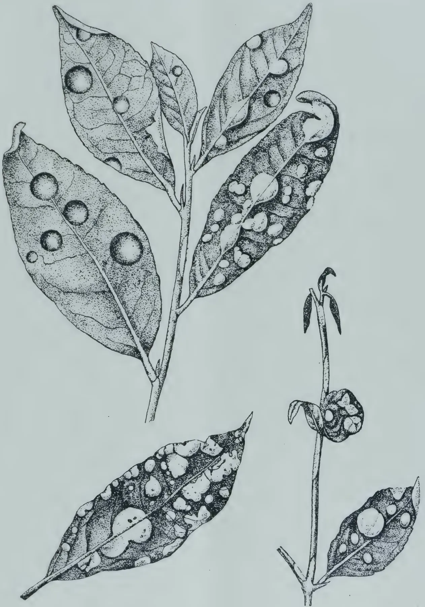A detailed black and white botanical illustration of a tea plant branch. The illustration shows several leaves and a shoot tip. The leaves are oval-shaped with serrated margins and prominent venation. They are covered with numerous circular, raised blisters of varying sizes. Some blisters are small and scattered, while others are large and confluent, especially on the lower leaves. The shoot tip at the top right shows a young bud and a small, curled leaf. The drawing is rendered with fine lines and stippling to show texture and shading.

BLISTER BLIGHT OF TEA

Reproduced, by permission, from Bulletin No. 18, Agricultural Research Institute, Pusa, India

89------------------------------------------------

This image is a scan of a blank page. The background is a uniform light blue color. There are several small, dark specks scattered across the surface, which appear to be dust or scanning artifacts. No text, lines, or other graphical elements are present.

90------------------------------------------------

FEBRUARY, 1924.]75

The disease is severe in localities with a high rainfall. Evidence points to the disease being more severe at high elevations and worse between 4,000 and 5,500 ft. The real factor with regard to severity is not elevation but moisture.

The blight attacks the high quality "Assam" and "hybrid" varieties more severely than the "China" and "Manipuri." In some cases "China" jat also gets badly affected. "Manipuri" may remain immune in some localities and may get as badly affected as the "Assam" in others.

The appearance of the disease as an epidemic appears to be regulated by climatic conditions. In Assam when the disease has established itself for many years, the blight appears quite suddenly, kills off new shoots and leaves and the bushes gradually recover. One year it spreads with remarkable rapidity over a garden and the next year may be entirely absent.

How blister blight got established on tea in India is not known; the probability is that it lives all the year round on tea only, as *Exobasidium vexans*, so far, has not been found on any other plant in India. Spores of the fungus are distributed by the wind and the disease is severe on slopes exposed to the wind. Coolies while plucking leaf may carry infection in their clothes. The disease is also most probably introduced into unaffected areas with the seed or the earth in which it is usually packed.

The loss sustained to tea owing to this disease may be gauged by the following example: In 3 gardens in India comprising about 1,300 acres of tea, the blistered leaves gathered and destroyed in two seasons amounted to 903 maunds and  $\frac{1}{6}$  of this represented loss of leaf that would have produced tea, i.e., about  $37\frac{1}{2}$  maunds (3000 lb.) of manufactured tea. The cost of collecting the blistered leaves amounted to Rs. 657, which also represented loss.

Methods that have been adopted for combating the disease are (1) Picking off diseased material, (2) Pruning, (3) Spraying with fungicides. The first and second aim at lessening the spread of the disease by destroying the material which carry infection. The third aims at killing the fungus and at preventing the growth of spores that may fall on sprayed leaves. The first method is only practicable late in the season after good growth has been made as it would be dangerous to the bushes after unfavourable growth early in the season. Another drawback is the strong labour force required. As it is likely that unpruned tea carries the disease from the end of one season to the beginning of the next it is recommended that in cold weather no tea be left unpruned. As heavy pruning may reduce the vitality of the bush to withstand a subsequent attack, cutting back must be done with caution when an outbreak may be expected. Spraying is difficult. It is on the lower surface of the leaf that the spray has to fall on and during wet weather the fungicide is washed off. On heavy pruned tea, new extensions, and seed beds spraying could be carried out with a certain amount of success. The fungicide used is Bordeaux mixture.

91------------------------------------------------

76[FEBRUARY, 1924.

# COFFEE.

## GRAFTING IN COFFEE CULTURE.\*

DR. P. J. S. CRAMER.

(Translated from the *Nederlandsch-Indisch Rubber-en Thee Tijdschrift* 1923, Nos. 18, 19 and 20, by H. L. Ludowyk, Librarian, Department of Agriculture, Ceylon.)

### BRIEF HISTORY.

The title I originally intended giving to my discourse of to-day was this: "A New Development in the Cultivation of Coffee." But I feared, however, that, when it was noticed that the new development referred to by me was grafting, many of you would protest that it was no novelty at all.

More than two decades have elapsed since such planters as REIMSDIJK on Klein Getas, BUTIN SCHAAP on Kandangan, and EVERARD on Kaiwisari grafted coffee and established large coffee plantations, every tree of which was grafted. Before this both Arabian and Liberian Coffee grew in Java in their original state as in their natural home. All this is perfectly true; grafting in itself is nothing new in coffee cultivation. And when I deal particularly with the graft, the method of carrying out the process of grafting and such like points, I am certain that, to most of you, I shall be serving up old matter though supplemented and garnished here and there, by some new data. This, however, is not the aim of the discourse I have in view. My chief aim is to discuss the subject of grafting from a point of view that is quite different from any view-point so far taken. I have in mind particularly to make people realise that these methods discussed by me can produce better results than those hitherto obtained.

The prospects of the coffee industry seem to assume for us a changed aspect; a new vista, bright and hopeful, with fair possibilities for enhancing the out-put, and for the better protection of plants from disease, stretches before us.

### BUTIN SCHAAP'S GRAFT.

In the past when people had recourse to grafting they had three different purposes in view. The earliest experiments were undertaken in order to protect the then generally preferred Arabian Coffee from eelworms which infested Arabian plants raised on the same stock. The example of the grafting of the European grape vine on the American varieties in order to withstand the grape louse was adopted for coffee. The pioneer in this work was the Administrateur of Kandangan Estate, BUTIN SCHAAP who grafted the Margogipe (variety a variety of Arabian Coffee) on a Liberian stock. Later, another famous planter, KRITHE again grafted Arabian coffee

\* Address to the Kederische Agricultural Union at its meeting of Nov. 24, 1923, at Blitar, as an introduction to an excursion to be made to the Government Coffee Seed Station, at Bangelan.

The impromptu speech is here annotated and furnished with data regarding the experiments at Bangelan, which were not then available.

92------------------------------------------------

FEBRUARY, 1924.]77

on Liberian stocks according to a different method, that of Splice Grafting. Grafting of Arabian Coffee was even at the very beginning found impracticable as success was very uncertain, and, even if the graft was successful, Arabian plants over a different stock became rather an unreliable producer.

#### THE KLEIN GETAS GRAFT.

The second aim of the experiments in grafting was to propagate desirable types of plants which were difficult to obtain under ordinary cultivation. I shall now bring before you from the history of coffee cultivation the Klein Getas Graft, as it was generally called, and indicate certain particulars which were pointed out to me by certain planters of Central Java. In 1889 the then Administrator of the coffee estate of Kalinas found among his beds of Liberian plants an exceptionally robust plant. Whereupon it was immediately supposed that the plant in question was a hybrid between Liberian as mother and Arabian coffee as male, for those were the only two types that were then planted in Java. The man who discovered this plant took quite a fancy to it, and as it was a plant that greatly interested him, he planted the hybrid carefully near the dwellings of some employees on the estate. After the course of two years the first berries appeared. They were very carefully gathered and used as seed. No one had access to the treasured new plant which was going to make its owner rich indeed. The Superintendent of an adjoining estate, having been unsuccessful in his effort to obtain any seed of the coveted tree, managed to secure for himself only two branches. He took these to his estate Klein Getas, tried an experiment in grafting them on plants on his beds and succeeded. Thus came about the first instance when a coffee branch was grafted on a plant. The grafted plants were planted out and by further grafting more such graft-hybrids were propagated and very soon these found their way out of Klein Getas to other parts of Central Java and East Java, where some specimens, which were brought over and planted so long ago, are yet to be found.

REIMSDIJK in this case made use of the process of grafting for the purpose of having an estate planted within a short period with plants of the Kalimas hybrid.

The owner of the discovered hybrid, DESSAUVAGIE, planted out his seed. But they did not grow true, as experience in seed propagation generally shows, and gave rise to inferior types which, with regard to the harvest produced, were very much behind those hybrids his neighbour obtained by grafting. Although it was effected with the aid of the newly discovered Kalymas hybrid, when men, by general consent, for many succeeding years, continued to call the graft the Klein Getas Graft, they were, even unconsciously, paying a tribute to the man who did a great service to the coffee industry, not by the discovery of a mere chance hybrid, but by keen perception and insight into the great possibilities the hybrid would have for practical purposes if properly experimented upon and with success; and this vision culminating in the introduction of a method of grafting then altogether unknown formed a wealthy contribution indeed to coffee cultivation.

#### THE KAWISARI GRAFT.

And now we pass to the third aim to effect which grafting is resorted to: The method used for this purpose was resorted to first on Kawisari. The aim in the first place was to convert certain old Liberian trees, which produced but very poorly, into hybrids that perform their functions of

93------------------------------------------------

78[FEBRUARY, 1924.

production in an appreciable degree. The attention and observation of the experimenting planter, aided by chance, helped again in the discovery of something valuable. Among a number of Liberian seedlings of his sowing, HEER EVERARD discovered some very fine remarkable specimens of plants. These he labelled with the letters A. B. C. and D. in order to differentiate and identify them from one another. Soon the plants marked B. and D. began to develop in such a way as entirely to give satisfaction. The nature of the leaf which bore certain characteristics of Arabian coffee, in addition to others of its own, at once helped to corroborate the supposition that it was a hybrid. Then experiments were conducted with the old and poorly producing Liberian trees. Two offshoots were put forth. The cleft grafting of one of the offshoots of the hybrid on the old roots was successful, and, with all the appearance and the true characteristic of a well grafted tree, it produced very satisfactorily. Thus the Liberian plants which were not of any account as producers were practically regenerated by grafting into heavy producers. Afterwards, encouraged by these successes the breeding of graft-hybrids on nursery beds was largely undertaken and in this manner HEER WILLEMSE brought under cultivation several hundreds of bouws of heavily producing coffee plants grafted with both the specimens of the Kawisari hybrid which are mentioned above.

A great advantage that the system of Kawisari grafting possessed was that, from the beginning, offshoots were used, and not, as in the case of the Klein Getas method, branches. This advantage was in a great measure responsible for the wider popularity of the Kawisari hybrid and the generally acknowledged superiority of the Kawisari grafting method over all others; and it is certainly noticeable, even in a cursory survey, that this is the most popular hybrid.

For the sake of completeness I may also mention here that the Nestor of Coffee planters, HEER OTTOLANDER, has also planted at Pantjoer a very large estate of grafted hybrids. These plants on his estate were made up of a collection of various types and varieties which were in a curious manner brought together to make up a complete plantation of a complexity of specimens.

This is but a short sketch of the history of the introduction of grafting to coffee culture. Here we should also express our great esteem for, and indebtedness to, the worthy old planters who helped in a great measure to put the methods of grafting into practical use.

#### GRAFTING OF HYBRIDS.

I will bring before you two points from the history of coffee grafting. In the first place the grafting of hybrids alone has been adopted on somewhat a large scale. There are two reasons for this occurrence. As we shall see somewhat later, the hybrids of coffee are specially suited for the purposes of grafting; growth and splicing take place fast and conveniently. The second reason for their preference for grafting is due to the fact that, generally, hybrids cannot be propagated by seed except with very disappointing results. People could therefore have recourse to grafting in order to plant up an estate with hybrid plants that can bear heavily.

94------------------------------------------------

FEBRUARY, 1924.]79

The second fact that I want to bring up to your notice is that grafting was resorted to only through constraint. It was adopted in no way by choice but simply because it was the only possible means in certain cases to the attainment of the aim in view for bringing under cultivation a fair and suitable plantation of coffee.

With these remarks we bring to a close our brief review of the history of coffee grafting. In the decade that saw the application and practice of the methods newly devised, an important and valuable fund of experience must have been gained, undoubtedly : in the first place, the methods have been so much improved that grafting presents, or, in any case, should present, no difficulty. Cleft-grafting of seedlings or of offshoots of old stumps, on beds, or *in situ* on the estate respectively, is, I think, the generally adopted process as it is considered the easiest and the surest.

#### GRAFT HYBRIDS COMPARED WITH ROBUSTA.

But grafting has not spread as it might have been expected to during the period 1900-1910 when both Arabian and Liberia coffee abandoned us. It can in no way be attributed to the want of knowledge and information regarding it. I may here help you to recall to your minds that I myself many times championed the cause of grafting. At the Ninth (9th) Coffee Congress of the 13th and 14th December 1907 held at Soerabaja, I emphasised the fact that measures should be adopted in order to arrest the deterioration that was manifest in Liberian coffee, and I stated in conclusion that we should go back to planting new varieties. I advised not only the adoption of Robusta, but also recommended hybrids. The twelfth point of my conclusions ran thus : " It is not probable that plantations of the above mentioned hybrids (Kalimas and Kawisari hybrids) will be attacked to any serious extent by the leaf disease. In land below 2,000 feet altitude, and even at higher elevations, with a satisfactory rainfall their cultivation will be found to be profitable. In this lies the recommendation that in addition to Robusta, large plantations of graft hybrids should also be laid out." In 1919 in the 'Indische Mercurr' of 19th July, I took up the question again. I discussed which should be given the preference, Robusta coffee or the graft hybrids.

Although Robusta was known to possess several advantages, when the case for both was summed up, it was seen that there were some points in which the hybrids scored and showed themselves far superior to Robusta. And I deducing from this, recommended that graft-hybrids should be widely planted in addition to Robusta as these graft-hybrids would serve as a good reserve stock which would every year afford an appreciable, although not a very abnormally great, harvest. This advice had very little effect. Robusta was so easily raised, as it had only to be propagated by the sowing of seed, it produced so very copiously, and people were so much taken up with the new variety, that very little attention was paid to the graft-hybrid which was not so easily propagated. And as it happens so often in agriculture here was *le bien ennemi du mieux*.

#### GENERAL APPROBATION OF GRAFTING.

The fact, that, for the thousands and the quickly spreading tens of thousands of bouws of Robusta, there were planted only some hundreds or at most two thousand bouws of the graft-hybrids, at once arrests our attention ; and the reason for this preference of Robusta, which is not difficult

95------------------------------------------------

80[FEBRUARY, 1924.

to find, becomes clear. Grafting has but to a slight degree won the approval of planters as it is more difficult than mere sowing; the grafted plants require more attention from the planters than that generally paid to others, and further, a large stock of planting material requires a fair length of time and a good amount of labour to propagate. Especially when a large piece of land has to be opened up and planted with coffee in a short space of time, grafting of plants offers almost insurmountable difficulty. The question is often asked why planters, nearly always, when planting out an estate, merely use seedlings and why they but seldom, only by way of an exception, use grafted plants. The answer is simply this: the first method is the easier.

Grafting requires rather great skill on the part of the planter. In the first place he should be careful to see that a good number of stocks are ready on the beds for grafting. If grafting is to be done on a large scale then the necessary measures should be adopted in time: for example, if a large tract of land is to be planted with grafted trees at the end of 1924, then the seed for propagating the stocks should already have been sown in the germinating beds in September 1923, so that by November of the same year the seedlings can be transplanted in the nursery beds. Then at about the time of the next west monsoon the grafting can take place. The necessary tubes have to be procured and kept ready. The necessary number of scions that are suitable for grafting on the stocks have also to be kept in readiness. Above all, there should be two men very well trained in the processes of grafting, for doing this work alone. The last mentioned requirement seems very often difficult to procure. In order to overcome this difficulty I wish to remind you that aspirant grafters can always be trained in this work for private estates at Coffee Experiment Station at Bangelan.

What I have stated above is quite enough to make it clear to all planters that if grafting is to be resorted to on a large scale on estates, the necessary steps for it should be taken over a year in advance.

When I returned to Java after an absence of some years and continued to take an interest in coffee cultivation, I was in 1914 given in charge of the Coffee Experiment Station at Bangelan, and there I set about working on the problem of grafting in order to resuscitate interest in it.

At the outset I felt keenly conscious of the great difficulties of which I have spoken before. They were not insurmountable but made us realise that bringing into bearing a plantation of grafted coffee trees was not plain sailing as we have thought, and that a fair number of years would have to pass before we saw the culmination of our labours. The Administrator of Bangelan, HEER BOOM, was the man who laid the foundation upon which his successor HEER GEISSLER worked; and HEER PARKINSON completed the work. HEER PARKINSON, who is to the present time conducting the operations at Bangelan, will certainly lay out in the course of a few years yet a great number of valuable plots planted with grafted trees.

Before I give you an account of the experience gained by the grafting done at the Coffee Experiment Station at Bangelan, or even before I give in outline an account of the experiments themselves which we shall inspect to-morrow, I wish to set out before you the essential points of difference between the aims we have in view to attain by grafting, and the aims of

96------------------------------------------------

FEBRUARY, 1924.]81

those (BUTIN SCHAAP, REIMSDIJK and others) who introduced the systems of grafting which were summed up by me before. As we have already mentioned, grafting was formerly resorted to when the improvement of plants by seed selection alone was not possible; Liberian coffee was grafted in order to overcome the attacks of the eelworm pest, and partly to overhaul certain old Liberian stumps; always, as these instances show, forced by necessity, to achieve certain aims, but never because grafting was given the preference as the more effectual method of plant improvement.

When we began the experiments in grafting at Bangelan, no real immediate necessity; no compelling circumstance of a pest to counteract, or such-like causes as above spoken of, narrowed down our aims. The experiments were undertaken purely and simply, because grafting, in itself a far-reaching study, seemed a sure and worthy means of raising the standard of our coffee cultivations.

In order to get some enlightenment from the experience of others in this matter we should direct our attention not to what the history of coffee cultivation alone affords, but we should far rather take lessons from the other industries of different climes which have reached a higher stage of development and for which grafting helped to achieve, centuries ago, practical results to their benefit. So much was grafting resorted to that no one would attempt, for instance, to plant up an orchard or a vineyard that is to be of any repute with plain seedlings. The fact that good fruit trees are planted only after grafting speaks of itself in favour of this process. The value of grafting in agriculture is decisively acknowledged and experiments and research with regard to it tend merely to find out which are the best stocks to graft upon and what improvements can be achieved in plants by the selection of scion and stock, and such like issues. For this reason we find ourselves more and more engaged in studying the various applications for vegetative propagation that are resorted to in Tropical Agriculture.

The opening of a station in the Lampongs for work in the selection of permanent crops, together with my endeavours at Bangelan, has enabled me to direct the work and the experiments in this station in the direction of vegetative propagation of our principal industrial plants. Now, in a short time, the advantages gained by the direct bearing the work of each of these establishments has on that of the other will entirely be lost and opportunities for valuable experimentation will greatly be curtailed by the abolishing of the Experiment Station in the Lampongs. I wish now to express fully and frankly the great importance I attach to a good as well-staffed permanent experimental establishment for conducting experiments in grafting. In the last ten years we have done continuous experimental work on many different crops; and, basing the statement on the conclusions drawn from those experiments, I can make bold to say that I consider grafting the best method to adopt in order to make our permanent crops more flourishing. I will not dare to say that the path to success by it has been established or that each one who takes to it will be successful. No, the way has yet to be firmly established; there is a number of difficulties that have to be overcome; but we have to admit that the faint trace of what might be the path exists.

97------------------------------------------------

82[FEBRUARY, 1924.

Many years have passed since we began our experiments and investigations in grafting. The reason for the very scanty information and even the absence of it with regard to our work which the general public possesses may be explained by the fact that the progress of these experiments is so very slow, each taking some years to complete. In order to be more clearly impressed we should turn our attention to other countries. In Europe, already very long ago, grafting was well established and generally resorted to. The wideness of its application in fruit culture can be judged from the fact that it would have been a cause for great surprise if a man attempted to plant out an orchard, a vineyard or a citrus plantation without grafted plants. If there is another country which lends itself well to compare with ours it is America. In America for centuries the propagation of fruit plants had been carried on only by means of seed, till two great supporters of grafting advocated its cause and encouraged people to graft their plants with good varieties introduced from Europe. They had not to work long, for soon the superior value of grafting was established; and the method is now generally adopted except, perhaps, in the cultivation of citrus fruits which industry is rather tardy in taking it on.

Modern methods of cultivation recommend propagation to be carried on by means of grafting exclusively.

It is really instructive to trace the history of a branch of fruit cultivation in America. We shall take for example the cultivation of peaches, one of the most important fruits in the United States. We notice that the first planting of grafted trees does not date back relatively to very distant years. The first introduction of grafting in this line of fruit cultivation occurred about a century ago and it came to be adopted largely about the year 1850, not before. I shall here recount certain points of special interest from a work of PROF. HENDRICK who produced a series of remarkably complete and finely illustrated monographs of the most important kinds of fruits of the State of New York. In this series, among other fruits, he deals with peaches. The book entitled THE PEACHES OF NEW YORK appeared in 1917. The following passage is extracted from the work. "Towards the end of the eighteenth century the sowing of peach kernels heralded the system of grafting. It is not definitely known who in the UNITED STATES began grafting. The desirability of obtaining grafted plant-material was recognised and spoken of already in 1736. An English botanist, PETER COLLINSON, followed and supported by his American colleague JOHN BARTRAM, urged the grafting of plums and nectarines on stocks of peach trees. Apparently this question had been considered before the time we are speaking of, for COLLINSON writes to BARTRAM, 'Now, try it for once, for I have a firm conviction that it will succeed.' It was difficult to convince BARTRAM; but even ten years later COLLINSON is seen busy trying to spur him on to follow the course he advised him to take. In a letter dated 26th April, 1746 he writes with a certain amount of impatience, 'Although you are unable to perceive it, I have, however, told you what can be achieved by the grafting of the peach tree as stock'.

Apparently, peaches were first grafted in America by PRINCE and his pioneers at the nurseries at Flushing in Long Island, for in their Catalogue of 1771 they include twenty-nine varieties; but most of them appear to

98------------------------------------------------

FEBRUARY, 1924.]83

have been different types rather than varieties. Twenty years later they placed on their list thirty-five varieties and stated, in addition, that all were 'inoculated,' meaning that they were brought into existence by grafting. JOHN KENRICK, who for many years was the most celebrated of PRINCE'S colleagues, and who had his nurseries at Newton, Massachusetts, began his work in 1790 with a number of peach kernels. The trees he obtained by sowing these he did not graft. Four years later, as it has been communicated to us, he came to be acquainted with grafting and he resorted to breeding on a large scale with his collection of varieties. And by this means he made a speciality of grafted peach trees.

Until the middle of the last century, in spite of all this work done in grafting, peaches were generally propagated by means of kernels. The land between the coast of Atlantic Ocean and the Mississippi in the half century that followed the Civil War, was in a short time colonised and in nearly every farm between the Great Lakes on the North and the Gulf of Mexico on the South, except one strip in the extreme north of this region, peaches were planted. The products of these great resources of peaches served not only as food for men, but were also used for fattening pigs; and these fruits, in addition to apples, then formed one of the chief sources for the alcoholic beverages which the peasants of that country always had in stock for their daily consumption. There were millions of peach trees in America before the year 1825, but until that time there were very few varieties identified. Then the knowledge of grafting began to spread: nurseries seemed to rise from the ground as if by magic; the large and varied collections of peach varieties were well sifted and subjected to selection. Local varieties were soon established, and when the means of communication were better developed, the new varieties started on their spreading advance, until in 1860, in the different nurseries, more than 400 different varieties were enumerated, a number that at the end of the century was so augmented as to reach the thousand."

I will yet, once more, emphasise the importance of the fact that the elimination of seedlings by the introduction of grafted plants must take place. The necessity for the replacing of the old means of propagation is not so necessary in the case of the peach, for the characteristics of its different varieties are fairly well preserved when propagated by seed. But no one will, however, plant an orchard of peach trees with seedlings. The figures given below show that in California alone 7,800,000 grafted peach trees were in bearing, and 4,400,000 belonged to young and undeveloped plantations. These figures give us a clear example of how much can be done in the way of grafting. If other examples are required they are not wanting. I shall quote them for your edification: all the lemons consumed in Europe, most of which come from Italy, are those picked from grafted trees: in that country (Italy) there were in the beginning of this century no less than eight million grafted lemon trees in bearing. In Southern France there were in 1895 nearly 600,000 Hectares planted with grafted Vines. This area is about four times as great as that of all our coffee cultivation (in the Dutch East Indies). When we have such striking figures brought before us, we naturally ask ourselves the question if ever the time will come when all the coffee beans—at least the coffee raised in the estates of the Dutch East Indies—will be picked from grafted trees.

99------------------------------------------------

84[FEBRUARY, 1924.

### GRAFTING EXPERIMENTS AT BANGELAN STATION.

When, in 1914, I was first connected with the Experiment Station at Bangelan, at the very initiative, when drawing up the programme of work to be done, I gave to grafting the foremost importance in my Scheme. We made a departure from the standpoint from which, up to this time, grafting was considered; we no longer looked upon grafting as a method of propagation adopted only when the use of seedlings was not practicable; no, we placed it, on the other hand, on the foreground in order to establish it as the means for improving our plantations and lowering the cost of production, not as the means we were driven to by resource, but the one we adopted by choice.

The most important item then of the programme drawn up for Bangelan in 1915 was the study of grafting.

With regard to the grafting experiments I made a note in it to this effect: "The considerably greater portion of our work in Bangelan should be directed in the way of grafting. Plantations of grafted plants which should be directly descended from superior parent trees should be established. These plants will derive from the parents their valuable characteristics. With the aid of these grafted plants which will be distributed to estates attempts can be made by planters to improve their cultivations."

"If as a result of the work of Bangelan they induce people cultivating coffee to follow in our footsteps, the Experiment Station will be doing for the industry what at the present time is of the greatest importance both to the estates situated in the highlands as well as those on the low country.

"The system is simple enough. We bring into our collection as many different kinds as possible. Those which, either by their appearance or by reason of the reputation they bear on the plantation, recommend themselves to us as being the best, we ameliorate by grafting. All inconsistent types being eliminated, our plantation of grafted plants shall always be uniform and preserve its characteristics,

"The difficulty of all this lies in the execution."

In 1913 I also gave an explanation of both the methods of grafting that ought to be tried: grafting while the young plants were in their nursery beds, and grafting on the open field.

In the programme of work for 1915 I wrote: "A second method of grafting is carried out on the beds and *Excelsa* is preferably used as stock. If the necessary number of suitable scions are obtained, by grafting on beds, planting-material for distributing on the estate can be conveniently cultivated. Before we advance so far, a period of time certainly not less than one year and perhaps less than three years will have passed.

"While the field grafting goes on it will be very advisable, by way of exception, to bring well under cultivation a good plot of practically important hybrids such as the *Kawisari* hybrids B and D., and also the *Kalimas* hybrid. In 1916 one or two bouws of each of these hybrids should be planted in order that they serve for experimental purposes and also to demonstrate practically the great value of these hybrids.

"For laying out the plots for the graft-hybrids, the sloping parts of the land towards the north, between Old and New Bangelan, can be used; it has been reckoned that there will be ample room for the purpose even for spreading after the trees have developed.

100------------------------------------------------

FEBRUARY, 1924.]85

"With regard to the records and the books that are kept regarding the experiments done I may mention that there is a field book in which all the plots are represented and where annually entries are made of the grafts that have been successfully effected; the grafts done on the beds are recorded in the special book. The plots that are occupied by plants that have been grafted on beds and transferred later are naturally entered on the field book."

In the same programme of work the transformation of the old plots by means of grafting is also described as follows:—

There is a number of plots at Bangelan containing plants which are a mixture of types although they are all descended from one parent tree. Their only value is for what precarious crop they might provide, and there seems to be hardly any use in letting them remain as they are. The plants in these plots should all be cut down to the stem and the off-shoots then arising should be grafted. Each plot which was about  $\frac{1}{2}$  a bouw in area, was grafted with scions from one parent tree, and we thus obtained, at length, a number of good plots of some uniformity from a heterogeneous collection.

This reformation can also be effected gradually so that the loss resulting from the crop that one has to forego is so minimised as to be neglected. Every year the bad yielders should be cut and grafted; the trees that are good can also be cut and grafted gradually. In the course of a few years the whole patch will contain only uniform grafted trees.

In the years 1915 and 1916, with the co-operation of the administrateur, I inspected each and every plot and made a list of those that were noticed by us to be badly in want of grafting. A beginning has been made by cutting and grafting the trees on these plots. But records should be kept for each of these plots, or rather a plan of each with the trees on them, to show which trees have been grafted and what kind of scion was used on it.

#### GRAFTING ON BEDS.

The experiments on Bangelan were forthwith carried on in two entirely different branches. In the first case a series of small plots was laid out, and the plants of each was descended from a parent tree of ours which was selected after noticing for a long time its capacity for production. These square plots are very small and have only sixteen grafted plants in each, planted in four rows of four trees to a row. So we obtain a field of unique appearance, like a chess board, divided up into small squares, each of which contains sixteen grafted plants of one parent tree. This is, as it were, a pattern of all our parent trees, a living museum wherein all our superior material is collected together. It is therefore called 'de Museumtuin,' the museum garden. The laying out and establishing of this field took place at the end of 1916, the beginning of 1917 and the beginning of 1918.

A second field of grafted plants consists of plots somewhat larger than those in 'de Museumtuin' and each plot has seven rows with seven plants to each row. These are called group plots. They were laid out and planted primarily for this purpose: by quickly improving the grafted plants on the smaller plots, to obtain material for spreading the cultivated plots so that, in time, the offsprings of each parent plant occupied the area of one Hectare. The somewhat larger group gardens serve remarkably to emphasise and drive home the already existing impression of the importance of the parent trees. The laying out of this group garden was begun at the beginning of 1918.

Lastly, the third lot of this series of plots that I have to mention is the 'hectaretuin.' Every one of these plots occupies the area of one hectare which is fully planted with grafted plants of one parent tree. Each of these is surrounded by a border patch of even breadth which is also planted with grafted trees all of another one parent tree. These plots were brought under cultivation in the beginning of 1918 and 1920 and are at

101------------------------------------------------

86[FEBRUARY, 1924.

present in production. This is the series of plots to which Bangelan has recourse for the supply of grafts on a large scale. In the past few years all the plots of grafted coffee, both the large and the small plots, yielded a regular harvest from the time the trees came into bearing. The records of the crops have been kept and afford us a deal of very interesting data regarding the productivity of grafted plants. These are the total numbers of the plots on the Station.

250 'Museumtuinen,' plots with 16 grafted plants to a plot, planted at the end of 1916 and 1917.

139 'Groeptuinen,' plots with 49-98 grafted plants to each plot, planted at the end of 1917.

30 'Hectare,' plots with 1100-1600 grafted plants to each plot, planted at the end of 1918 and 1919.

15 Border plots planted at the end of 1918.

### FIELD GRAFTING.

Besides these experiments which were carried on on plot beds, there was a number of grafting experiments carried out on old trees which were cut down to a stump. For the purpose of these experiments twenty plots which for some unknown reason had been set apart for the purpose of procuring seed as planting material were used. There was some fear that the heterogeneity of the collection of types on these plots would, if the plants were used as seed-bearers, help in the spread of irregular plantations. If these plots were to be entirely re-planted we would have needed more grafted plants than we could afford. So another plan was adopted to remedy them. A row of trees of these plots was cut down as far as the stem and the offshoots on these were grafted with scions from our collection of parent trees. In this manner the work was steadily continued, starting from the North West of the field. At the end of 1915 a series of twenty plots were thus experimented upon. In this manner the field on which the grafting was carried on was thoroughly changed and reformed into an uniform collection of grafted plants derived from one parent tree. The field was also rendered a good deal more productive than it was. There are points about this method of grafting that recommend themselves to planters and even lead them to think it the preferable method. There are points too that are prejudicial to its adoption, for example, the more difficult control. For us, however, this method of grafting in the field was great importance and had its favourable side. Several different sorts of stocks had to be used in grafting these plots, and in the first years, during the course of these operations, we had a good deal of experience with regard to the most important issue in grafting—the relative values of the stocks used and the success obtained with them.

We have here summed up briefly the account of the experiment at Bangelan. As it is generally known, from 1915 onwards research has been diligently carried on at the Bangelan Experiment Station in grafting. We have brought to bear on these experiments all our experience, and we may have had to suspend one experiment for results to be obtained from another which we had to start, we may also certainly, on many occasions, have groped in the dark; but this must occur in experimentation, and I feel confident that in a short time it will appear clearly to all that the results of our experiments will make the coffee industry turn the corner that will lead it to a highly desired state of success. It should not be forgotten that criticism is easier than a well-founded statement regarding a probable occurrence in the future; and grafting on a large scale in coffee culture was placed on quite a different foundation by the experiments conducted at Bangelan.

102------------------------------------------------

FEBRUARY, 1924.]87

# OILS.

## SOME UNCULTIVATED OIL YIELDING TREES AND PLANTS.

W. MOLEGODE,

*Agricultural Instructor.*

We have many uncultivated trees and plants from the seeds of which oil is extracted for various uses. A few of them are dealt with in the following article. Of these some are obtainable in fair quantities and the production of larger quantities could be easily encouraged in the rural districts if purchasing agencies are to be established.

Kohomba, Kekuna, and Mee are well known village oils, Eriya, Domba and Duhudu are obtainable in limited quantities. The others mentioned in the list are extracted as required. The following oils and oil-seeds were included in the collection of miscellaneous agricultural products recently sent to the British Empire Exhibition, viz :—Kohomba, Kekuna, Mee Domba, Duhudu and Dorana.

*Kohomba* : Margosa, *Azadirachta Indica*.—A very valuable tree, almost every part of it is utilised in some form or other in native medicines. It is a very large handsome dry zone tree with brownish red bark and crowded leaves. The wood is now largely used for cabinet making. It is a hard, heavy wood of a red brown colour, large graining and takes a magnificent polish. In some parts of the Island it is a cultivated tree. In the Kandy district it is often met with in village gardens having been carefully grown for medicinal requirements.

The oil extracted from the seed is highly valued for its medicinal properties both by the Sinhalese and Tamils. The seeds yield about 15 per cent. of oil of a very strong disagreeable odour and bitter taste. It is used in various diseases both internally and externally. As an anthelmintic and antiseptic it is much in use.

A full grown tree will bear heavy crops. The oil is rather costly—a quart bottle is sold in Kandy at Rs. 1.50.

*Kekuna* : The Candlenut, *Aleurites triloba*.—The tree grows luxuriantly in the Kandy district and elevations up to about 2,500 ft. above sea level. It is a quick growing tree and begins to bear in 3 or 4 years. Under favourable conditions such as a protected situation and moist soil it is a very prolific bearer yielding many thousands of fruit. The hard shelled seed contains the kernel yielding on pressure over 50 per cent. of oil which is easily extracted by simple methods by the villager and is employed largely in the rural districts as a lamp oil. Its commercial possibility lies in it being a good lubricating and soap-making oil and possibly for making varnishes.

103------------------------------------------------

88[FEBRUARY, 1924.

Until recently Kekuna was very common and a fairly large quantity of oil was in use in the villages. The use of Kekuna wood for making tea boxes caused the felling of the tree to a large extent; but as this wood has now been condemned as a suitable chest there is the possibility of a trade in Kekuna oil being started more specially as soap factories are being established in the country.

Good clear Kekuna oil could be bought at about Rs. 1.50 per gallon. A bushel of seed would give about 2 gallons of oil and some times a single tree gives five or more bushels of Kekuna nuts.

*Mee* : *Bassia longifolia*.—A common tree both in the wet and dry districts. Attains to a great size. Affords a very hard, heavy and durable wood.

The seed yields a large amount of an edible oil still largely used in the villages in cooking and preparation of native cakes. It is reported to possess valuable medicinal properties and is commonly used in pains arising from rheumatism. It is one of the compounds of the *Pas-tèl* (five oils) so valued as an application in sprains and other rheumatic pains.

A fairly large amount of oil is produced in villages for home use. This oil has not entered the market yet. It is a cheap oil—a bottle sells in the villages at about 30 cts.

*Dəmba*—*Calophyllum Inophyllum*.—This is commonly referred to as the Alexandrian Laurel. A moderate sized tree common in the low-country chiefly on the sea coast. Affords a useful wood which is much favoured for cart poles.

The seed yields a high percentage of a fixed non-edible oil used largely as a varnish and medicinally for external application for rheumatism.

*Duhudu*—*Celastrus paniculatus*.—The seed of this large climbing shrub yields a valuable oil of a very bitter nature reputed to be a nerve tonic and a brain stimulant. It is also used externally for sores and skin affections. The bark of the creeper is also used medicinally.

The Duhudu creeper is confined to a limited area and is frequently met in the moist part of Ratnapura and Upper Uva. It is a prolific bearer and the small red angular seed yields 40-50 per cent. of a dark red thick oil.

*Kina*—*Calophyllum tomentosum*.—A large tree common in medium elevations. A well-known and favourite wood.

The seeds yield a valuable oil which is used in cutaneous diseases of all kinds and is specially good for itch.

*Na*—Iron wood—*Mesua ferrea*.—A prominent tree around temples grown for its sweet scented flowers and the beautiful red coloured young leaves used at religious ceremonies.

The seeds yield a fixed oil of a deep yellow or brown colour extremely bitter in taste. It is used as an application for cutaneous affections and as an illuminant. The percentage of oil in the Na kernel is very high and exceeds 65.

104------------------------------------------------

FEBRUARY, 1924.]89

*Iriya—Myristica Irya.*—A tall slender tree. Easily recognised by the large clusters of reddish brown fruits.

The seeds yield a popular lamp oil.

*Karanda—Pongamia glabra.*—A common tree specially on the banks of streams and rivers.

The seeds yield a thick oil of a bitter taste used in skin diseases.

*Telambu—Sterculia foetida.*—The Telambu tree is easily distinguished by the strong offensive smell of its flowers or by the large dull red or orange coloured woody fruits with its black seeds. The seed itself is eaten roasted and has a pleasant taste. It yields a good proportion of oil of a bland non-drying nature. The oil is edible and is also used for burning and should find a market among soap makers.

*Dorana—Dipterocarpus glandulosus.*—Dorana oil is obtained by burning charcoal in cavities cut in the stem of the tree. This is a well-known industrial oil used for mixing paints and as a varnish. It is also of medicinal value.

A fair amount of the oil is produced in the Southern Province.

*Munamal—Mimusops Elengi.*—A very large tree. Occasionally cultivated for its fragrant flowers and the bark which is used medicinally.

The seed yields a fatty oil of a very bitter taste.

*Makulu—Hydnocarpus venanata.*—A common tree growing by the side of rivers and streams. The fruits are poisonous and used as a fish-poison. The seed yields an oil which is used in the treatment of skin diseases.

*Madol—Garcinia echinocarpa.*—A common tree easily recognised by many long aerial roots near the ground.

The seeds yield an oil used for illuminating.

*Kon—Ceylon Oak—Schleichera trijuga.*—A very large tree common up to about 2,000 feet and yielding abundant crops of fruits.

The seeds contain a very high percentage of a fatty oil so well-known as Macassar oil much valued as a hair oil.

*Rankirigokatu—Argemone mexicana.*—This plant can be recognised by the variegated green and white prickly leaves and bright yellow flowers.

The seeds yield an oil which is employed by chitra workers.

*Weta enderu—Physic nut—Jatropha Curcas.*—An excellent hedge plant; will grow under the most adverse conditions.

The seeds yield an oil with drastic purgative properties. Externally it is applied in itch and eczema. It should be good soap-making oil.

*Kaju—Cashew nut—Anacardium occidentale.*—The kernels—the cashew nut—yield a light bland oil. The pericarp or shell yields a black acid and powerfully vesicating oil.

*Panela—Soap nut tree—Sapindus emarginatus.*—The fruit is used for soap. The seed yields a semi-solid oil used as a substitute for soap.

105------------------------------------------------

90[FEBRUARY, 1924.

# SOILS AND MANURES.

---

## SOIL SURVEYS.

---

### THEIR IMPORTANCE AND ADVANTAGES, AND RELATION TO SOIL ANALYSES.

---

**A. W. R. JOACHIM, B. Sc., (London), A.I.C., Dip. Agric. (Cantab.),**

*Office Assistant, Department of Agriculture, Ceylon.*

1. 1. History of Soil Maps—Relation to Geological Maps—Soil Types.
2. 2. Functions, Objects and advantages to both the individual and the State.
3. 3. Classification of Soils by Surveys.
4. 4. Surveys—Methods adopted in various Countries—Practical details of Soil Surveying.
5. 5. Reports and Maps.
6. 6. Relation of Soil Surveys to Soil Analyses—Chemical and Physical.
7. 7. Soil Surveys and Ceylon Crops.

Conclusion.

The practice of mapping soils was adopted and encouraged from a very early date, but the chief maps so obtained were geological and failed to show any of the superficial deposits which more than anything else affect the constitution of the "soil" as Agriculturists know it. To us the soil signifies that mixture of clay, sand, silt and stones which covers the surface of the earth to a thickness of nine inches. The layer below this is termed the "sub-soil." Later on "drift" maps were published, as distinguished from the "solid" or geological maps already referred to. These drift-maps showed the relative positions of soils which had been transported through various agencies from their original area of formation. Though these were an improvement on the "solid" maps so far as the "soil" proper was concerned, they were by no means "soil maps" as they took no account whatever of the relative fineness of the materials composing the drift. It was only comparatively recently that "soil" maps came into usage and this was chiefly due to the efforts of the United States Department of Agriculture Soil Bureau, which has carried out a very extensive soil survey in the U.S.A., furnishing very valuable detailed information of the various types of soils that are met with in many areas, as well as complete "Soil" maps of the different areas dealt with. Since then nearly all the more important agricultural countries of the world have carried on soil surveys, the methods followed being different in the different States. In the United Kingdom, France, Germany, Belgium, and Japan systematic surveys of at least parts of the country have been made, and further progress is reported. The methods of Soil classification and Survey adopted by these countries will be dealt with later on.

It might then be asked what are Soil Maps and what is a Soil Survey? What are their functions, and their advantages? Of what use are they to the practical agriculturist? How can they be used to interpret the results

106------------------------------------------------

FEBRUARY, 1924.]91

of a Soil Analysis—physical or chemical? What methods have been adopted to carry out these soil surveys? It is the purpose of this paper to answer as far as possible the questions asked. A "soil map" shows the boundaries of "types" of soil, these types being founded on a consideration of their physical and to some extent chemical characters. This brings us on to the important question of soil "types." In a Soil Survey, the unit of classification is the "Soil type," and this may be defined as an area of soil that is essentially alike with regard to texture, agency of formation and kind of material from which it was formed, and any other special properties, chiefly chemical. A consideration of each of these properties will show how it affects the soil composition. Thus from the point of view of texture soils may be clayey, gravelly, silty or sandy. The various agencies of formation, viz., weathering, glaciation, water transport and erosion, biological processes will each have a different effect on the soil constitution. Then again as regards the rock from which the soil is formed, a soil derived from a basic rock will, generally speaking, be differently constituted from one formed from an acid rock. As to special properties, soils may be calcareous when an excess of chalk occurs or peaty when there is present an excess of organic matter. Again colour and ultimate chemical composition will each go to differentiate one soil type from another. A little consideration will show that though the soils of two areas may be of the same "type," yet their crop and agricultural relations may be different, due to different climatic and temperature conditions. This is not often the case. On the other hand, the same climatic and temperature conditions on two different soils often results in the formation of the same "type." This theory of soil formation called the "genetic" theory was first formulated by the Russian Soil Worker, SIBERTZEV, and postulates that given uniform climate and temperature conditions, all areas of soil will have the same soil qualities irrespective of the rock from which each was formed. European Russia is an instance in question. As a result of climatic conditions on soil, we have "alkali" soils when the rainfall is very slight, the Black earth soils of Russia, the Lateritic soils of the Tropics, etc.

A Soil Survey is therefore a survey of the types of the soil of a district, the areas of occurrence being represented on a chart or map, different types being differently represented, and their character and chief economic and agricultural relations described in printed reports.

MR. WHITNEY, the Head of the Bureau of Soils, U.S.A. Department of Agriculture, has defined his work on Soil Surveys thus :—"Many soil maps had been prepared, but they were based upon the geology of the area and were of little or no use to the farmers. The Division of Soils believes that a classification of soils with reference to texture, structure, physiographic position, and crop relations should be made and the areas of different soils outlined in colours on maps and that this would enable a farmer or a prospective purchaser of land in the area, to determine at a glance the farming value of any tract of land." This in short expresses the main purpose of a soil survey—the correct valuation of agricultural land and its suitability to varied crops. To really render the scientific study of soils properly available for the service of the agriculturist, a general soil survey of a district is necessary.

107------------------------------------------------

92[FEBRUARY, 1924.

What now are the functions of a Soil Survey? What are its uses and advantages?

The functions of a soil survey are (1) the investigation of the nature and occurrence of soils in the field, and (2) the classification of soils. The occurrence of differences in the tillage and manurial requirements of soils, their crop relations, and agricultural value, makes necessary the determination of the properties of the soil that are chiefly responsible for these differences, and their arrangement into an orderly scheme of classification. The aim of the survey is to divide the land into areas of approximately the same general agricultural character.

Whilst a soil survey is useful in many ways, it is by no means a final investigation. It is chiefly a supplement to the analysis of a soil of any particular area for, by comparison with the "standard type" of the area as determined by a soil survey, valuable information relating to cultural and manurial operations of crops can be secured. It is a means of determining the status of the soil and its related conditions in the field. It throws light on many farm practices common in certain districts and may lead to their improvement.

The objects of a soil survey are described by HALL and RUSSELL thus :—

"(1) to show the distribution of soils of similar agricultural properties and to define these soils by some method of analysis—

(2) to trace such correlations as exist between the chemical and physical properties of soil, and the crops and agricultural methods associated with them—

(3) on the basis of the observed distribution of the soil types and the ascertained associations, to afford guidance as to cropping and manuring over the whole area."

Whilst of great use to the individual, it is no less useful to the State. To the individual\* (1) it points out the character and location of several types of soil on his farm which may be correlated with particular crops and farm practices. Thus, for example, if a Soil Survey of Ceylon has been made, it will be possible for a prospective cultivator of virgin soil to know what crops will best suit the district he is intending to cultivate, and what cultural methods to adopt.

(2) shows him the relationship of soils over wide areas, and forms the basis for the adoption of new crops and methods of soil management.

(3) provides a reliable source of information concerning soil conditions, e. g., whether a land has to be drained, or whether it has too much chalk, etc.

(4) reveals important problems of soil improvement—as for instance whether a soil has to be limed (to counteract acidity) or otherwise manured.

(5) standardises methods of description and representation of soils.

(6) affords a guide in the selection of land for particular purposes.

The value of a soil survey to the State lies in the fact that it (1) shows its soil resources, (2) forms the basis of correlation of all other

---

\* LYON and FIPPIN.

108------------------------------------------------

FEBRUARY, 1924.]93

kinds of information, the character of which is effected by soil relations, e. g., manuring of a certain crop for certain types of soil—

(3) shows the occurrence and importance of large questions of soil improvement.

(4) gives a basis on which much of the results of experiments, investigations, and observations on soil improvements, crop growth and farm management should be applied.

(5) is a means of communication and mutual understanding between the Government institutions concerned with Agriculture and the farmer.

In brief it is an inventory of the resources of the country in land and closely allied interests.

Now that we have seen the advantages derived from a Soil Survey, it may be well to give a short account of the methods adopted in various countries, and a more detailed account of the one that is most commonly adopted, and which would suit conditions in Ceylon best. In this connection mention might be made of the various soil classifications adopted in the different countries for these have a direct bearing on the 'technique' of Soil Surveys.

The classification of soils which the farmer is generally accustomed to, divides soils into six classes—gravelly, sandy, loamy, marly, clayey and peaty. A loam contains sand and clay in equal proportions; a marl is a soil containing a fair proportion of chalk in addition to clay. Peaty soils are those in which undecayed organic matter is present to an excessive degree. Besides this there is the 'genetic' classification of soils already referred to. It is the most satisfactory general classification of soils. Attempts have also been made to classify soils on a geological basis. Vegetative features have also been adopted as a factor in soil classification, but vegetation affords information regarding the properties of a soil only when the correlation has been worked out. Further, natural vegetation is now seldom present in well settled areas. As mentioned before in many countries a soil survey has been made part of the national service for the agriculturist. The U.S.A. has given us most elaborate details of soil surveys. The work is carried out by the Federal Department of Agriculture, as well as by the individual States. Types of soil are established by the U. S. Soil Bureau for each area undertaken, the character of the crop, and native vegetation being taken into consideration. Where crops vary greatly without any marked difference in character of soil, the botanical aspect is taken as the main factor in soil classification. The name given to a soil to express its physical texture—clay, loam, etc.—is based on its average character to a depth of 24 to 30". The maps published are usually of the scale 1 inch to the mile. In Prussia and Russia the genetic classification of soils is adopted, and surveys are based on this. In France the work rests with the local authorities of each Department. The survey is made on a petrogeological or mineralogical basis. In England various methods of soil surveys are adopted, depending on the district in which it is carried out. Thus as an example of a Soil Survey based on geological formation and mode of origin we have the survey of the soils of Surrey, Sussex and Kent by HALL and RUSSEL. For a classification of soils from the genetic standpoint we have the soil of N. Wales and Scotland by HENDRICK and ORR. In the majority of cases though, the basis upon which

109------------------------------------------------

94[FEBRUARY, 1924.

the soil survey is constructed, is the origin of soils, viz., geological. Each geological formation will give rise to a distinct 'type' of soil, if it has been formed *in situ*. Transport by water will give rise to two or more types.

The only classification that can be conveniently adopted is one based on the physical texture of the soil and indicated by such conventional terms as clays, loams, marls, etc.

\* "The character of the information which must accompany a soil survey must largely depend on the purpose of the survey, and whether it is concerned with the agriculture of an old and settled country like England with a definite system of agriculture, or whether it deals with a new country and aims at showing the capacities of the land for crops and industries." In the U. S. the latter form of soil survey is exemplified. In Ceylon both forms are necessary. Thus the cultivation of special crops like tobacco, cotton, sugar, sisal, etc., can be extended into new districts possessing suitable soils with the minimum of risk which always attends a new venture, provided an adequate soil survey of Ceylon be carried out. Again, the suitability of land for paddy cultivation, and irrigation purposes, and the most prominent methods of land reclamation should be features in the work of a soil survey in Ceylon. Further, the recommendation of suitable methods of cultivation and manuring to secure higher yields in the already cultivated areas, are all necessary and useful information which a soil survey will provide.

The chief application of a Soil Survey in Ceylon will lie in the information it could afford as to the use of manures. The manure bills are often heavy ones, and considerable economy can be effected in this direction by a judicious system of manuring, the information so needed being furnished by the Soil Survey. At the same time the soil will be of 'good heart' i.e., in good condition and the general state of the crops vigorous and healthy.

A paper of this nature would not be complete without some account of the practical details of soil surveying. In planning a soil survey it must be remembered that the whole work is empirical. The agricultural and vegetation characteristics have first to be ascertained by field trials, and then systematised and amplified by laboratory data. Therefore the whole region must first be gone over carefully and divided up into areas with similar agricultural or vegetative characteristics. In general there will be a direct relation between the agricultural and geological areas as shown on drift maps. But as agriculture is also influenced by altitude and rainfall, contour and rainfall maps must also be used. Within each vegetative area a large number of soil samples must be taken representing the area as closely as possible. An auger is usually used in sampling, and both the soil and sub-soil are sampled. The soil should be taken from level regions, or from long gentle slopes and not on made ground, steep slopes or recently manured land. It is immaterial whether the soil sample is taken from arable or pasture land, for although the vegetation may vary yet the type may be the same. The difference of vegetation is due to differences in the compound particles as effected by cultural operations and not to the ultimate particles, which essentially constitute the soil type. Small variations in Calcium carbonate, organic matter, or water content may considerably affect the vegetative relationships of soil, although the type may be the same. The number of

\*HALL.

110------------------------------------------------

FEBRUARY, 1924.]95

samples to be taken will depend on the circumstances. Where the area is large and uniform, two or three samples may suffice, but in other cases local variations may be so great that a large number of samples may be taken. The depth of sampling should be 9 in. for soil, and 18 in. for sub-soil. If any marked change in soil occurs, samples should only be taken to the point where this sets in. The samples of soil and sub-soil must then be sent to the Laboratory for examination. At the same time such data as height of water table, method of cultivation of soil, suitable manures and crops, agricultural value of the land, its behaviour during drought and wet weather should be obtained. The relationship of each type of soil to natural vegetation and cultivated plants should be observed. Information about troublesome weeds, and native vegetation, should also be obtained.

The characterisation of soil types is effected by mechanical analysis and determinations of Calcium carbonate and organic matter. Representative samples should be subject to chemical analysis. Soils about which precise information have been obtained by manurial and other trials should be very completely examined, as they would serve as standards.

The Soil Survey Report will be comprised of (1) a map of the district showing distribution of soil types. The scale should be 6 inches to the mile. Besides this in England different maps are constructed on the dot principle showing the distribution of each important crop. A dot may represent any particular area say 10 acres, the intensity of dots depending on the intensity of cultivation. The figures are obtained from the parish returns. These maps are of advantage as they show at a glance, the distribution of particular crops in any area. In Ceylon these maps can easily be constructed provided the returns are obtained from the different local Government bodies and Kachcheries.

(2) The printed Report which should include (a) the location and boundaries of the area, (b) the general physical features, (c) climatic conditions, (d) its agricultural history and development, (e) description of soils and types and (f) suggestions for improvement in the management of the soil—cultural, manurial and otherwise.

A further question remains to be answered—what relation is there between a soil survey and the Physical and Chemical analyses of a soil? As mentioned before, the basis of classification of a soil is its mechanical analysis. "We are not in a position to deduce the agricultural properties of a soil, either its behaviour under cultivation or manuring, or its adaptability to particular crops from its analysis, except in the roughest general fashion. For example we cannot from first principles draw up a specification of a soil for fruit growing; but by correlating the analyses of a large number of soils which have been found in practice suitable for fruit, we may find certain features in common, which in future may be taken as determining the nature of a fruit soil." So also with Rubber and Tea soils. But in these cases besides the mechanical constitution or physical structure of the soil, climatic effects play a great part.

Even on the chemical side the same is true. The significance of a given amount of Phosphoric acid say 1% in a soil of a given type, cannot be laid down *a priori*, but must be ascertained from the results from field

111------------------------------------------------

96[FEBRUARY, 1924.

experiments upon the area in question. Soil analysis only reveals *one set* of factors in plant production, and these have to be interpreted in the light of local conditions such as climate, water supply and drainage. Information about these is only completely supplied by a soil survey. Mechanical analysis gives by far the most useful information in comparing soils, but this is greatly modified by the amount of chalk and organic matter in the soil. By mechanical analysis one is able to say whether the defects observed with regard to cultural growth of any particular area are due to defects of soil or situation.

The chemical work in connection with soil surveys consists, so far as the laboratory work is concerned, with the determination of organic matter and calcium carbonate in the soil. The % of Nitrogen is for most soils about 3% of the organic matter, though some of the best loams with most favourable conditions for nitrification, show on analysis but little nitrogen. The  $\text{CaCO}_3$  analysis shows whether the soil is acid and needs liming. When an agricultural chemist is asked to analyse a soil he is expected to give some information about the crops to which it is suited, and the manures that must be applied. The vegetative relationships of soil are determined not solely by the nature of the soil, but by its position, sub-soil, climate, and other factors so that it is obviously impossible for the Chemist to make a satisfactory report on the sample of soil on the basis of a chemical analysis only.

"Soil analyses are limited to (1) comparisons between soils showing which are fundamentally identical and which are not, (2) tracing the correlation that exists between the crops and agricultural methods adopted and the chemical and physical properties of soil."

To do either of these satisfactorily, it is necessary to make a systematic soil survey. The problems set by the farmer to the analyst could only be answered if the analyst has an adequate knowledge of the soil type and the locality and the results of manurial or other trials on that type. He can, by ascertaining the difference between the sample and the type give the information wanted within a reasonable degree of probability; otherwise his report can only be a matter of guess work. Manures ought to be recommended as a result of experience with the different crops in the different districts, e.g., Coconuts in the Chilaw district may need a different system of manuring to that in the Southern Province. When a soil of a particular crop is sent from a particular district to an agricultural chemist, before making any recommendations he must have a fairly complete knowledge of the typical soil of the particular district from which the sample comes. This is only obtained during a soil survey from farmers or from typical field experiments that will show the effect of various manures on typical soils. The analyst must possess an adequate knowledge of the *type* if he is to properly interpret the analysis of a single sample of soil sent in by a farmer. The uses of a soil analysis may be summarised thus. It shows the farmer the defects in his soil as regards sourness, alkalinity, presence of excessive salt, stiffness, presence of plant poisons, lack of humus or of lime, poor water-holding capacity, need for drainage, imperviousness to passage of water, tendency to set hard on drying, general poverty in plant-food, excessive proportion of any soil ingredient, e.g., clay, peat, chalk or sand, and power of nitrification. In addition, it suggests to him the proper treatment his land should undergo

112------------------------------------------------

FEBRUARY, 1924.]97

so as to be benefited by subsequent manuring. The determination of the amounts of nitrogen, phosphoric acid and potash *does not of itself* afford any information as to necessary manuring. This depends on the nature of the crop chiefly, and to a lesser extent, on the district and climate. Neither is it any guide to the suitability of the soil for different crops. This information can only be supplied by a systematic soil survey.

Before concluding reference must be made to the work of the kind described in the foregoing that could advantageously and with great success be done in Ceylon. Some work of this type has been undertaken in Ceylon by BRUCE who dealt with Paddy Soils and by BAMBER who reported on Tea Soils. But the ground covered by these two officers is by no means very extensive, and great deal more work on lines as started by them will have to be carried out if any good results are to accrue therefrom. Two methods could be followed :—Either a general survey of a particular district can be undertaken, say of the Western Province or a survey of all the Soils of a district under a particular crop, e.g., the paddy or coconut soils of Ceylon. In either case, for the successful accomplishment of the aims of the survey, experimental stations will have to be established in the main districts on a typical soil of this district, and manurial, cultural and varietal experiments tried. As a result of these, information could be supplied the cultivators of the district as to the best method of cultivating and manuring their crops to obtain the optimum yields. A manurial recipe that suits one district will probably not suit another if the soil and climatic conditions of the two differ, neither will the cultural operations adopted in one district be of any use in the other. The work will doubtless entail great expenditure, and will probably take a few years before any tangible results are obtained, but it is essential, if any good is to come out of manurial trials, and if anything like an intensive system of crop husbandry is to be established here. Ceylon yields for various crops are, generally speaking, poor in comparison with those of other countries, and unless greater attention is paid to correct manuring—only arrived at by experimental trial—and correct agricultural methods, the poor yields now obtained will be still considerably lessened. The more urgency therefore for a Soil Survey in Ceylon. Unfortunately Ceylon soils as a whole are of a poor character, its geological nature being chiefly “lateritic.” Laterite, as is well known, is formed as the result of a peculiar type of weathering of rocks rich in aluminium and iron, under special climatic conditions such as we find in the tropics—strongly contrasted wet and dry seasons being essential. Others again think that laterite formation is a bacterial process. In any case there is a loss of free silica, lime and magnesia due to the weathering, and a consequent increase of iron and alumina. Hence the reason for the general acidity of Ceylon Soils. Where carbonates do occur they are chiefly of the dolomitic, i.e., magnesium limestone variety, and hence not of great value to plant growth.

Ceylon, being purely an Agricultural Country, should not be backward where Agricultural Development is concerned. A great deal has been done in Ceylon from the standpoint of pests and diseases, but comparatively little on the chemical side. All progressive and advanced agricultural countries have started soil surveys on a large scale, and even such countries like Mesopotamia, which are only just being developed, are making extensive Soil Surveys, and thus utilising the valuable information and knowledge acquired by scientific research to the benefit of the village cultivator. Work on lines similar to those dealt with should be started in Ceylon, and it will not be long before its benefits will be experienced both by the rich proprietary planters and agencies in Ceylon, and the poor peasant cultivators who form so large a percentage of the agricultural community in Ceylon.

113------------------------------------------------

98[FEBRUARY, 1924]

## THE PART PLAYED BY BACTERIA IN THE SOIL.

The good old word "tilth" as applied to soil needs to come back into general use. It serves to denote a condition of the land and to set forth an ideal of management covered by no other term.

95 Keeping it in fettle is something more than the mere mechanical task of tillage. In fact, the German word for tilth, "gare" is frequently interpreted as meaning fermentation. It is an interpretation which fits well, for we know that a good soil is seething with life, pouring forth invisible gases that leaven it and fine its texture, and leaving behind by-products ideal for plant food. And ranked as a chemical laboratory, no learned doctor with his retorts and bottler-arrayed walls can duplicate or even approximate the re-action that Nature working through this life-filled upper eight inches of a ploughed field carried on night and day uninterruptedly year after year.

These midget chemists of the land, the bacteria, play the major role in promoting tilth. In teeming hordes they are present. They often number more than three billion to the ounce of soil, and under many conditions algae, moulds and protozoa are equally abundant. The total microscopic life in an acre of land has been calculated as weighing from 500 to 700 lb., or approximately the equivalent of livestock that a good pasture acre will carry. And while the role that this soil life plays is so complex that it will probably take more generations of close study before the full activities going on under the surface of the land are clearly understood, a few broadly fundamental facts have already been brought to light.

In the first place, it is clear that soil life is necessary for true fertility—that is, for power of the land to produce crops. Not only must this germ life be abundant, but it must be in a healthy well-nourished state and actively multiplying, in order that the land may have that loose, crumbly texture taken as a good omen by the eye of every experienced farmer.

### TIRELESS NITROGEN GATHERERS.

Bacteria, for the most part, subsist on organic matter or vegetable matter in the land. Not only does this teeming soil life break down added vegetable matter, producing, or setting free, mineral salts upon which crops directly feed, but one large group of soil bacteria functions in the nitrogen-gathering role probably with as great benefit to soil fertility and tilth as the better-known nitrogen-fixing germs which grow on the roots of leguminous plants. A legume crop will contain from 100 to 200 lb. of nitrogen. Probably half of this comes from nitrogen compounds already in the land, and the remainder is gathered in from the air by the aid of nitrogen-fixing germs with which the roots of the legume are inoculated. We hear much of the importance of having a legume crop in the rotation. We hear, however, but little of the other and greater source of nitrogen supply in our soils. This other great source is through the action of bacteria feeding on the dead vegetable matter.

One leading American bacteriologist recently stated that the quantity of nitrogen fixed in soils by these independent organisms varies from 10 to 40 lb. a year an acre. The larger quantity is often to be found when a plentiful food supply in the form of organic matter is made available for

114------------------------------------------------

FEBRUARY, 1924.]99

them to feed upon. These germs, while fixing annually a smaller quantity of nitrogen than is gathered in by a legume crop, more than overcome this handicap through working all the time, and in all soils, while the legume rarely ever occupies the land as much as the half time, and usually only one year in the four-year rotation.

It has been the experience of mankind for ages back that vegetable matter turned into the land made it more productive. Since the establishment of experimental institutions in America an abundance of data has been accumulated, all showing that organic matter in the land takes the leading upbuilding part. But now we know that this organic matter is not used directly by crops; that it must first be broken down by soil life. With the exception of nitrate, acid, phosphate and the various potash salts, plants take no fertilisers in the form we put into the soil. Not only are bacteria necessary in preparing the raw food we supply in form for plants to consume, which is a mineral form, but the bacteria themselves thus fed, gather vast quantities of nitrogen, the most expensive of all plant foods. The quantity they gather seems to bear a close relation to the provisions we make for their food supply. And this conclusion puts the problem of the tilth of the land in a new light.

Soil life also shows considerable preference in its diet. It has long been observed that stable manure in many cases exerts an effect on crop growth out of all proportion to the plant food it contains as shown by analysis, and that the same is true of green matter turned into the land in the early spring. Studies during the recent years have shown that both these substances make wonderful feeding for the bacterial flora of the soil, causing a sharp upward spurt in soil life activity. In pot experiments, a small quantity of green matter chopped into one soil pot almost always caused a sharp leaping ahead of the plant it grew as compared with another plant in a similar pot where the soil was not so treated. It seems there is considerable evidence to justify us in planning cropping systems in so far as soil maintenance goes, with a view to feeding of plenty of vegetable matter to the soil bacteria, and if a goodly quantity of this bacteria food we offer is in a succulent green state, there is plenty of evidence that it will be all the more relished.

We passed through a state of mind not so long back when common observation of farmers, out of line with some half-understood but supposedly wholly elucidated theory, was ranged as mere superstition or old women's tales. Science is to-day more tolerant and less cocksure than it used to be. In fact, some of the hypotheses on which learned men are now working seem more strange and weird than what were ranked as superstitions of by-gone times. Our thought with reference to soil problems seems itself to be in a healthy state of ferment.

One bacteriologist, in discussing the role of this microscopic life in promoting tilth in soils, called what we know as poor land "raw" and likened it unto a green cheese, both of which he said were prepared for real food, one for humans by the ripening action of enzymes in the milk, and the other for plants by the ripening action of bacterial activities.

#### NEW LIGHT ON ROTATIONS.

Take the case of the explanation of why rotation of crops is beneficial. The farmer has long known that by rotation he could keep the land in better tilth, and that he could keep both himself

115------------------------------------------------

100[FEBRUARY, 1924.

and the land more regularly employed. Not long ago rotations were claimed by scientists to keep up yields better than single cropping through the fact that different kinds of plants remove plant food elements from the soil in different proportions, and that by changing from one crop to another, the soil supply of plant food was kept more evenly balanced. This point of view has long since been pretty well abandoned. Then for a long while we looked upon rotations as being a means of keeping up fertility through growing periodically a sod or legume crop to boost the vegetable matter and nitrogen supply, and beyond this, shifting crops is a means of keeping both land and labour the more continuously employed.

Now we are finding that different crops act on the soil bacteria in different ways. Legumes, apart from being host plants to what we term symbiotic bacteria growing on their roots, the bacteria being fed carbo-hydrates by the plants and in turn feeding the plants with nitrogenous material apart from the well-known fact, it has been proved is that legume crops specially favour the development of bacteria in general in the soil. Fortunately, most of our cultivated crops seem friendly toward soil bacteria. Some few, notably mustard, are said to be detrimental to the nitrifying and other desirable soil bacteria.

Wheat does not seem to leave the bacterial flora of the soil in as good condition as maize or potatos. European agriculture has pretty well settled down on a system which does not include the growing of wheat oftener than once in two years. The excellent results generally secured from growing mixed crops seem to tie on closely with the observation that the bacterial life of the soil is always found in a more healthy state when several plant varieties are grown together than where one crop occupies the land. And every observing farmer knows that mixed grass pastures and meadows, and of small grains grown for feed, make a bigger yield than when a single variety occupies the land.

While soil bacteria in the main feed upon vegetable matter and the only way to keep the land in a high state of fermentation and tilth is to supply this favourite bacterial food, mineral fertilisers enter into the problem to a more or less important degree. The nitrifying group of germs of the so-called azotobacter group is considered now to be the real backbone of our farming. But for these little busybodies working night and day, our nitrogen balance would be struck so far in the wrong direction that farming would be a more or less hopeless task. This group of bacteria shows a strong liking for phosphatic fertilisers, growing and multiplying at a rapidly increased rate when this element is fully supplied. Possibly this fact explains, fully as much as does the direct plant food theory, good returns from far and wide through using phosphate fertilisers.

The bacterial reaction to potash is noticeable, but not so striking. Mineral nitrogen fertilisers show a pronounced effect in this wise: Application of nitrate of soda tends to make the soil reaction alkaline, while the action of ammonium sulphate is to make the soil acid. Bacteria thrive best in an alkaline soil. Alkalinity, however, can be carried too far, causing too great activity of bacteria too rapid breaking down of the soil vegetable

116------------------------------------------------

FEBRUARY, 1924.]101

matter and a waste of plant food, as well as destruction of bacterial food, and a consequent period of famine, unless heroic measures are taken to keep up the vegetable matter supply.

There is something in the old saying about lime enriching the father but impoverishing the son. Farmers who use lime liberally should make equally liberal provisions for keeping the soil provided with vegetable matter. Excess lime builds up a terrific bacterial appetite which makes sometimes for a wasteful burning out of vegetable matter that must be replaced or else soil tilth will suffer.

Plants do not take up carbohydrates from the soil relying on their own leaf laboratories for the production of these substances. Yet it is a fairly well-known fact that molasses or sugar often shows a great stimulating effect on plant growth. A week ago the writer sprinkled a few spoonfuls of sugar over a fern pot here by my writing table. It had already been liberally supplied with dumpings from my pipe. A new burst of growth and a deepening in colour is now noticeable. The explanation lies in the fact that sugar is ideal food for bacteria, greatly stimulating growth and activity. This more active germ life has broken down the tobacco and other vegetable matter in the pot, and has probably fixed a considerable quantity of nitrogen from the air, making available a bountiful food supply for the fern. Of course sugar is too expensive a product to be used in field application under any circumstances, and I merely cite the case to show how crops are fed by this indirect method of feeding soil bacteria.

We are doing pretty much the same thing when we plant a rotation so as to yield a bountiful crop residue, or to have catch crops or winter cover crops fitted in along with or between the major plantings. We are merely feeding the soil bacteria. And in no inconsiderable degree this is what we do when we apply lime or phosphate fertilisers to the land. Starve the soil bacteria and the land loses tilth. Feed this germ life in the land and the soil mellows and yields its fruit in season.—SOUTH AFRICAN SUGAR JOURNAL, Vol. 7, No. 11.

## SUNN HEMP TRIALS IN MATALE DISTRICT.

**G. G. AUCHINLECK, M.Sc., F.I.C.,**

*Divisional Agricultural Officer, Central,*

**and M. B. BOANGE,**

*Agricultural Instructor.*

Sunn Hemp (*Crotolaria Juncea*) is grown to a fairly large extent in the northern and north-western parts of Ceylon, where it serves the double purpose of supplying green manure for the paddy fields and providing bark-fibre for the manufacture of twine.

In the drier parts of Matale North, and in many other parts of the Central Division, it is possible to cultivate but one crop of paddy in the year. Usually the crop is grown during the Maha (November to April) season, and the field is unused during the Yala (May to October). In cases where green-manure is applied, it is collected from neighbouring waste lands and

117------------------------------------------------

102[FEBRUARY, 1924.

transported to the paddy field, and the experience of the Department of Agriculture has shewn that the cost of collecting, transporting and burying 1000 pounds of green manure varies from Rs. 5/- to Rs. 15/- per acre of paddy treated.

It is clear that a leguminous crop might with advantage be grown on the paddy-field during the Yala season and turned under just before field-operations for the Maha season, a method which is used in parts of the northern and north-western districts. Not only might the total weight of green-manure be far greater per acre, but the cost would probably be less, and in addition the land would be utilized and benefited instead of being allowed to lie waste.

In May 1923 a trial was carried out with Sunn Hemp on the standard paddy-plots at Nalanda Experiment Station in Matale North. After the previous paddy crop had been reaped, the fields were dug over and Sunn Hemp was sown. In all, twenty-one plots each of 1000 square feet (50 ft.  $\times$  20 ft.) were sown in May and the crop of Sunn Hemp was reaped after it had flowered in September to October. The resultant weights of green-manure were as follows :—

*Pounds green manure reaped and weighed*

<table>
<thead>
<tr>
<th><i>Plot No.</i></th>
<th><i>Per plot</i></th>
<th><i>Per acre</i></th>
</tr>
</thead>
<tbody>
<tr>
<td>A7</td>
<td>564</td>
<td>24568</td>
</tr>
<tr>
<td>A1</td>
<td>532</td>
<td>23174</td>
</tr>
<tr>
<td>B12</td>
<td>415</td>
<td>18077</td>
</tr>
<tr>
<td>C13</td>
<td>376</td>
<td>16378</td>
</tr>
<tr>
<td>C3</td>
<td>368</td>
<td>16030</td>
</tr>
<tr>
<td>B6</td>
<td>356</td>
<td>15507</td>
</tr>
<tr>
<td>C41</td>
<td>337</td>
<td>14680</td>
</tr>
<tr>
<td>B14</td>
<td>307</td>
<td>13373</td>
</tr>
<tr>
<td>C4</td>
<td>298</td>
<td>12981</td>
</tr>
<tr>
<td>C1</td>
<td>267</td>
<td>12630</td>
</tr>
<tr>
<td>C7</td>
<td>209</td>
<td>9104</td>
</tr>
<tr>
<td>C12</td>
<td>209</td>
<td>9104</td>
</tr>
<tr>
<td>C5</td>
<td>206</td>
<td>8973</td>
</tr>
<tr>
<td>B13</td>
<td>202</td>
<td>8799</td>
</tr>
<tr>
<td>C6</td>
<td>182</td>
<td>7928</td>
</tr>
<tr>
<td>C10</td>
<td>159</td>
<td>6926</td>
</tr>
<tr>
<td>C2</td>
<td>150</td>
<td>6534</td>
</tr>
<tr>
<td>C11</td>
<td>141</td>
<td>6142</td>
</tr>
<tr>
<td>C8</td>
<td>132</td>
<td>5750</td>
</tr>
<tr>
<td>C15</td>
<td>114</td>
<td>4965</td>
</tr>
<tr>
<td>C9</td>
<td>94</td>
<td>4095</td>
</tr>
<tr>
<td>
</td>
<td>
</td>
<td>
</td>
</tr>
<tr>
<td>Total 5618</td>
<td></td>
<td>Average 11653</td>
</tr>
<tr>
<td>
</td>
<td>
</td>
<td>
</td>
</tr>
</tbody>
</table>

118------------------------------------------------

A black and white photograph showing a field with a distinct boundary. The area to the left of the boundary is densely covered with low-lying vegetation, while the area to the right is a more open field with taller grass. A bare tree stands on the left side of the boundary.

EFFECT OF SUNNHEMP ON PADDY

Note the difference in growth where the Sunnhemp was buried.

119------------------------------------------------

This image is a scan of a blank page. The paper has a light beige or cream-colored tint. There are a few very small, dark specks scattered across the surface, which appear to be scanning artifacts or dust particles. No text, lines, or other markings are present on the page.

120------------------------------------------------

FEBRUARY, 1924.]103

The variations in yield are considerable, ranging from 4095 pounds (1 $\frac{3}{4}$  tons) to 24568 pounds (11 tons) per acre, with an average of 11653 pounds (or 5 tons), these variations indicating the irregularities occurring in a newly levelled field.

The plots on which these trials were made are small, being each about 1/40th of an acre in area, but the total area planted amounted to about half an acre. The figures obtained for total yield are therefore from a large enough area to be accepted as representative of ordinary field conditions. The land, which had been levelled for only one year, was still raw and probably below the standard of quality of older fields in the neighbourhood. The figures can probably therefore be accepted as representing yields from bad, medium and fairly good soils of the area. Even the lowest yield recorded is from 3 to 4 times the magnitude of an average dressing of green-manure applied to paddy-fields by the villager and the cost of collecting and transport is saved.

From observations made elsewhere, it is practically certain that Sunn Hemp will not thrive on muddy, undrained soils. Where the paddy field can be kept dry during 4 or 5 months in the year, or on hillside soils, the success of the plant seems certain. In the case of the trials under consideration, the fields were moistened with irrigation-water during the earlier stages of growth of the young sunn hemp seedlings, but thereafter no irrigation was necessary. The rainfall for the period was as follows:—

<table>
<tr>
<td>May</td>
<td>...</td>
<td>...</td>
<td>90</td>
</tr>
<tr>
<td>June</td>
<td>..</td>
<td>..</td>
<td>410</td>
</tr>
<tr>
<td>July</td>
<td>...</td>
<td>...</td>
<td>201</td>
</tr>
<tr>
<td>August</td>
<td>...</td>
<td>...</td>
<td>316</td>
</tr>
<tr>
<td>September</td>
<td>...</td>
<td>...</td>
<td>195</td>
</tr>
</table>

Total 1212 inches

It seems fairly certain that the cultivation of sunn hemp on paddy-fields in Matale North is a profitable undertaking; and the system might be tried in other parts of the Central Division.

## WOOD ASH AS A FERTILISER FOR FRUIT TREES.

A. A. RAMSAY, *Chemist*.

Although wood ash is a useful commodity on account of its potash content, its use in manuring orchards is not to be recommended as a general practice. If applied to heavy soils, injury to their physical condition will probably result, though on light sandy soils little harm may be done. The amount of potash in wood ash varies considerably, but it may safely be assumed that fourteen parts of ash will contain the same amount of potash as one part sulphate of potash. The best means of utilising wood ash is in the form of compost, or mixed with bonedust or superphosphate.—*AGRIC. GAZ., N.S.W., Vol., XXXIV, Pt. 9.*

121------------------------------------------------

104[FEBRUARY, 1924.

# PESTS AND DISEASES.

## TOMATO CATERPILLAR OR "WORM."

(*CHLORIDEA OBSOLETA*, SAY.—NOCTUIDÆ)

HENRY TRYONS,

*Government Entomologist and Vegetable Pathologist.*

### INTRODUCTORY.

Moth caterpillars of one kind or another have been unusually prevalent since the winter months in Southern Queensland, with corresponding injury to plant life. In some instances the moths, their progenitors, have occurred in swarms, extending over large areas.

Amongst the cultivated plants that have suffered is the tomato, ordinarily one of the most profitable ones that are being grown; and the depredator in its case that has committed (and is inflicting still) the most serious injury is the so-called Tomato Fruit Worm—the caterpillar of a noctuid moth—named *Chloridea obsoleta*, that in some instances has rendered useless the entire yield. This insect is of no new occurrence here, being described as a pest insect by the present writer in 1889, when already it was well known. Nor is it exclusively an Australian denizen, for it occurs apparently nearly all the world over, including many of the oceanic islands throughout both the temperate and tropical zones. Moreover, its injurious relations are manifested by a very large number of food-plants, including staple crops, such as maize, cotton and tobacco. Its dietary here is, too, as general as it is elsewhere. This and its mode of living constitute it an injurious insect of special prime importance, and volumes of literature have been produced relating to it and its control, although notwithstanding—after years of research—the methods devised fall short of meeting the requirements of the situation. One of the most recent compilations was "Injurious Insects of Cotton—The Cotton Worm," issued in February, 1923, by this Office. This very general dietary amongst plants, its very rapid increase, and its habits, especially with regard to feeding, render its subjugation or control exceedingly difficult.

### THE INSECT AND ITS HABITS.

Without repeating what is set forth in the pamphlet mentioned, it may be stated that the parent of the caterpillar is a stout-bodied moth measuring about  $\frac{2}{3}$  inch in length, with a wing-spread of about  $1\frac{1}{2}$  inches. When settled, the front wings—usually drab coloured with indistinct brown markings—almost conceal the hind ones, that are whitish with broadly black tips; the former making rather a wide angle with the body and sloping away on each side. These moths are nocturnal in their habits, generally speaking, and occur concealed settled in herbage, or under earth clods during the day, but moving off with dart-like rapidity when disturbed.

The moth feeds on the nectar or honey of different flowers, usually after sundown, but occasionally during daylight, when it may be seen with quivering wings on the blossom it affects.

122------------------------------------------------

FEBRUARY, 1924.]105

Each female moth, according to estimates made, may lay from 400 to 3,000 eggs, the average being about 1,000. Moreover, it may commence laying—having meanwhile mated—on the second day of its emergence from the chrysalis, and continue laying for ten or twelve days after this. These eggs are at first whitish in colour and measure about one-fiftieth of an inch across (about half the size of the head of a small pin) and are low dome-shaped, almost spherical, with a series of fine ribs radiating downwards from their tops. They darken as they mature or when parasitised. In the case of the tomato, they are usually placed (always singly) on the green calyx-segments of the flower bud or flower or on the tender tomato growth; but when the insect is numerous, elsewhere.

Our assistants, T. H. SIMMONDS B. Sc., and J. WEDDELL, referring to a marked incident of this nature, recently informed us as follows:—

“Eggs were found on stems, foliage, calyx, petals, stamens. In one case, five eggs were seen clustered on the petals of one flower. The following counts of eggs from one branch, consisting of about six leaves and two flower sprays, were made:—Leaf, 5 eggs on under surface, 6 eggs on upper; flower, 10 eggs on petals and 3 eggs on calyx.” Sometimes all the eggs laid will give rise to caterpillars, but as A. A. GIRAULT, Assistant Entomologist, discovered in the course of investigations in the United States in 1905, commonly many do not do so.

The eggs, when deposited, are capable of hatching in as short a period as three days, but usually rather more than four elapse before the tiny pale dark-headed caterpillars emerge. These caterpillars may exceptionally come to maturity amidst the foliage of the tomato plant, but usually speedily repair to the green fruit, tunnelling their way into it near the calyx end, even when this is partly grown. More frequently, however, as the outcome of the situation in which they are deposited, the minute ovary as it is formed receives their earliest attention. On this subject MESSRS. SIMMONDS and WEDDELL again have observed as follows:—

“In several cases the petals had been eaten and young fruit beneath just commencing to ‘set’ also eaten. Once, on removing the petals and stamens, a very young larva was found inside on the developing fruit.”

From the first scene of the insect’s depredations, especially in cases such as these, the growing caterpillar passes from one fruit to another, injuring all in turn. Thus a single caterpillar may do considerable damage, since every fruit entered is “done for” so to speak.

The caterpillars each have a larval period of about two weeks on an average, but this may be extended to three. During this time they vary greatly in appearance with each of the six changes of their skins, being unstriped during the first two instars. (Further description is unnecessary in writing for tomato growers.) When full grown it is about  $1\frac{4}{5}$  inch long.

When this happens, the caterpillar drops to the ground and digs its way into it, after moving off, if at all, usually but a few inches only. Thus it enters to a depth in it of from  $3\frac{1}{2}$  inches to 6 or 7 inches—usually, say, 4 inches. In this position—after first making a special exit tube that nearly reaches the surface again—it forms a little oval cell in which it transforms

123------------------------------------------------

106[FEBRUARY, 1924.

to a smooth, glossy-brown chrysalis having two straight thorn-like bodies at the tail end. (*Note*.—Should the soil be covered with rubbish, the chrysalis chamber may be nearer the surface.)

This chrysalis or pupal condition varies in duration according to the temperature to which, when in the soil, it is subject. It may be short as ten and a-half days, but be many days longer if cold be experienced. In a temperate climate where frosts constantly occur during the winter, the insects may live in this condition for eight to nine months. When, however, the full period has been reached, the insect comes forth from its chrysalis.

#### NATURAL INCREASE AND CONTROL.

The foregoing remarks will suggest that between one egg-laying and another, on the part of the succeeding moth generations, from twenty-eight to thirty-two days may elapse only, and with a congenial climate like that of Southern Queensland it may be readily understood that there may be many generations of moths, and so many distinct broods of caterpillars during such a long season as is devoted to tomato-growing in the latitude of Brisbane. These broods, however, are not distinctly defined, as all the moths of one age do not emerge on a single day and oviposition in the case of any one individual extends also over several.

The theoretical potential increase, however, is perhaps never realised, as natural conditions supervene to obviate this. These are weather conditions, food conditions, and natural enemies—birds, insects and diseases. On the other hand, as has recently happened, these natural agencies for controlling numerical development and crop injury have evidently been restrained in their activity and hence the loss of crop.

There is, however, in the presence of parasites of the Tomato Caterpillar that have come upon the scene, some prospect of natural enemies operating to restore normal conditions, notwithstanding the immense toll on insectivorous bird life arising from extensive bush fires operating during the breeding seasons, when all birds are animal (insect) feeders—fires often wantonly started. These parasites that have been observed by the staff are a minute egg-parasite (*Trichogramma*), a caterpillar fly parasite (*Tachinus*), and an *Ichneumon* parasite; but as yet the extent to which they are operative has not been ascertained. Again, disease that is present with the occurrence of wet weather might prove especially virulent towards the insect.

#### MEASURES OF CONTROL.

*Field Practice*.—Avoid growing in the vicinity of crops of tomato plants that in common with it afford sustenance for the insect, unless they, too, receive continuous attention directed towards its repression. This especially applies to maize, cotton, cape gooseberry (*Physalis*), rossella, and tobacco, but also to plants that receive less attention by the *Chloridea* than they; thus peas must not be overlooked, and so also certain ornamental plants such as snapdragon or *Antirrhinum*.

Wormy tomatoes (being already rendered useless) should be gathered and destroyed; burying to a depth of 1 foot will in most cases meet the latter requirement. This will prevent sound fruit being visited by caterpillars from injured fruit; but it will also destroy those "worms" that otherwise would leave it, to enter the soil to give rise in a few days to moths whose

124------------------------------------------------

FEBRUARY, 1924.]107

progeny would intensify the trouble. Tomato plants when eradicated should also be burnt, as soon as practicable, rather than left in heaps on the headlands.

Prior to planting, and especially when contrary to what is above suggested, devoting the same area to immediate successive tomato growth and in which case as long an interval as may be found convenient should be observed, the soil should be well cultivated and turned over more than once. Thus will be exposed to the fatal action of birds and the weather those insects dwelling in it, either as chrysalises or caterpillars about to change within their earthen cells. So also when the tomatoes are being grown the soil should be cultivated wherever it is admissible to do so. Should again a "green crop" such as cowpea or Mauritius bean, that may harbour also the insect be ploughed under prior to planting, this should be well covered under and pressed down by rolling, so that any caterpillars present be destroyed.

As far as economic considerations will admit of it, crops that are not attacked by this insect should be grown in alternation with those that are—e.g., cucumbers or rock melons as a substitute for tomatoes.

*Trap Crops.*—Observation indicates that although the insect reared as a moth from one kind of plant has often acquired a liking for it again, generally speaking, there are those that it especially favours. This especially applies to maize as compared with tomato, particularly to the cooking variety known as sweet corn. Maize is therefore commonly grown in other countries as a trap crop in protecting cotton from its injurious presence. It is especially serviceable in dealing with the first brood of insects. Its value as a trap entirely depends, however, on its being taken out and used as or converted into fodder, as soon as or shortly after the silking stage has been reached. Otherwise it will serve whilst attracting the moths from all round it, to furnish in due course others to attack the plant it is intended to protect. Obviously it is not implied that maize can be grown as a substitute for the tomato as a crop of equal monetary value, but when no yield of tomatoes is promised owing to caterpillar attack its growth may be profitable. Under special circumstances the use of a special "green manure" plant, *Canavallia striata*, whose pods are favoured by *Chloridea*, has been adopted with some success as a trap crop.

*Trapping and Repellants.*—With regard to methods of destruction directed against the moth itself, the very extended experience of entomologists in other countries, as well as in Australia, does not afford much promise of success. It is not at all or very seldom attracted by light, and therefore special trap lamps, torches, or fires are not available for its capture and destruction. Again, the same remark applies to baits, with or without poison incorporated in them, so useful in coping with the final forms (moths) of other destructive caterpillars. Nor do we know of any substance that will with certainty repel attack on plants threatened. Our Queensland experiences suggest that Bordeaux mixture, when well applied, has some efficacy as a deterrent, but the caterpillar being an internal feeder, except when in the earliest stages of its life, any deterrent has only a transient use.

*Contact Insecticides.*—This also applies to the use of contact insecticides, on whose efficacy success in coping with other plant injurious insects is so noteworthy. Here, however, we are further confronted with a plant very liable to injury by these potent applications with too abundant foliage to be affected by them. Our assistants, MESSRS. J. H. SIMMONDS, B.Sc., and

125------------------------------------------------

108[FEBRUARY, 1924.

J. WEDDELL, have, however, pointed out that the "worm" is often partly exposed when tunnelling in the fruit and thus not only so when recently emerged from the egg, and so then may also be reached by a direct application, and the writer proposes to test the action of DERRINE (that is not plant injurious) under these circumstances.

*Food Insecticides.*—The use of arsenic-containing insecticides, and the same applies to those containing antimony or cardmium, is not always attended with profitable results. In fact, under field experimental conditions elsewhere, more wormy fruit has been noticed on tomatoes after the application of arsenate of lead (or Paris Green) than on control plants that have not received any. The better results from the use of these bodies will, however, be reached by closely noticing when the prevalence on the plants of the moth's eggs occur, and then spraying about a week subsequent to this event, a small hand magnifier being useful for the preliminary observation. The application of these insecticides in the form of powder diluted with corn meal, ground sulphur, lime, ashes, etc., is favoured elsewhere, but success in this case is conditioned largely by the state of the atmosphere, since when the air is dry the insecticidal powder is liable to be soon blown away. For the same reason it must be applied very early in the day when dew is still upon the plants or when light rain is being experienced.

*Insecticide and Fungicide.*—As a routine treatment of tomato, as well as of potato plants, this Office has persistently advised the application of Bordeaux mixture, of 4-40-1 strength (freshly slaked lime 4 lb., bluestone 4 lb., water 40 gallons) made quite neutral, and which is especially adherent if a little soap solution, or preferably molasses, be incorporated with it. This treatment is recommended as a preventive of blight and of less harmful leaf disease, the former of which at times is quite fatal to the tomato. Arsenate of lead may be combined with this fungicide, and 1 lb. to 24 gallons (six kerosene tinfuls) is the amount of it that should be added. As, however, with its use as a fungicide only several applications are necessary. This, however, should have some reference to the general hatching of the eggs of each moth brood, rather than to the lapse of so many days. Spraying also should be commenced very early so as to catch the first brood, as it is very necessary to concentrate on this. In Sumatra the same insect is very harmful to the tobacco, and there the plants are sprayed whilst still in the seed bed.

The Bordeaux mixture slightly reduces the potency of the poison, but then it promotes its adhesiveness to the plant as well as exerts some deterrent action in warding off attack.

### NATURAL ENEMIES.

Sedulously preserve native insectivorous birds. Even many of those proclaimed "pests," if permitted to operate over the soil of a tomato field undergoing cultivation would rid it of the insects then occurring thereon.

A study of the parasites of *Chloridea obsoleta*, as recorded in the world's entomological literature, does not leave much hope of any efficacious work in reducing the insect, through the introductions of ones not already occurring here. Borneo is the only country apparently in which this method has been essayed, and its effort has been concerned with an egg-parasite that, as it seems, already occurs here.

The very slight extent, if at all, to which *Chloridea obsoleta* occurs to an injurious extent in Egypt in relation to the different plants it is associated with there seems to receive its explanation not in the work of parasites but in the cultural treatment that the soil there persistently receives. So also to a less degree with respect to British India. —QUEENSLAND AGRIC. JOURN., Vol. XX, Pt. 5.

126------------------------------------------------

FEBRUARY, 1924.]109

# AGRICULTURAL EDUCATION.

---

## THE TEACHING OF AGRICULTURE.\*

---

SIR A. DANIEL HALL, K.C.B., L.L.D., F.R.S.,

*Chief Scientific Adviser and Director-General of the Intelligence Department  
of the Ministry of Agriculture.*

I cannot help feeling that the object of my remarks is still somewhat in a tentative condition, and it may be better if I reserve a formal exposition of the subject so that all I have to say may be regarded by way of stimulus and suggestion rather than a direction to a particular action that I should like to see taken. This must be the case with all good teaching. The teacher has to work out a method, that method may not be a good one for universal adoption, but if a man has worked it out for himself and is keen, the very fact of his keenness may make that method an extremely profitable one.

*Closer Consideration of the Method of Teaching.*—What I have to bring before you is this, put broadly, that the actual method of our teaching, whether we teach inside the college or the farm institute or whether we teach in the country, requires more consideration than it ordinarily gets. We all of us in this country begin teaching agriculture in a thoroughly haphazard amateurish fashion. We go to college and later on when we leave, we find ourselves put in front of a class and required to teach on our own account. I think most people's experience would be similar to mine; no one gave me a hint or suggestion of what methods to follow—I floundered about and tried one method after another.

Many scientific and technical men have a certain scorn for what generally may be called the art of exposition, whether in speech or writing. In writing I have often occasion to deplore the style and quality of the written matter that is put out. In teaching I have from time to time listened to lectures and classroom instruction, and I do not think the teaching might be enormously improved if the men thought a little more about this matter of teaching as an art in itself, independent of the material that is to be set forth, an art which has a code of rules and laws of its own. I do not want to lay down methods at this moment. Every man will think out his own method, but I do want to plead for a consideration of the method itself as something worth thinking about, something by which the work—whether it is in classroom or lecture room—can be made more effective. I want you to take it that teaching is not a process into which you drop quite naturally, that it only involves the doling out of so much information to be got up by the class, whereby all the teacher can be expected to do will have been accomplished. If that were the case, if there were nothing in the functions of the teacher but to hand out a certain amount of knowledge, why have

---

\* The substance of an address given by SIR DANIEL HALL to the Agricultural Education Association at Aberystwyth on 10th July, 1923.

127------------------------------------------------

110[FEBRUARY, 1924.

any oral teaching at all? Why not content oneself with books, or with some kind of organisation like the correspondence college? The organisation of a correspondence college for example can show the student exactly what he ought to read, it can set him papers, mark and comment on them. The way these colleges flourish proves that they can be effective in promoting the acquisition of knowledge for examination purposes. In fact one must take that the very existence of these correspondence colleges on a large scale points out that there is a defect in the ordinary teaching given in the country. If the oral teaching were of the right kind the correspondence college, which gets its results and could not live if it did not get its results, would go out of existence.

To give an illustration of what I mean; you are all familiar with one of the very commonest forms of classroom teaching in University or University College—the lecturer who practically dictates to his students a certain text which he has prepared. The lecturer prepares very carefully his lecture as a résumé of a particular section of the subject and delivers this from the platform so that every student may take it down verbatim and get it accurately transcribed into a note-book. That form of instruction is very popular, especially amongst students. It supplies them with a short-cut to knowledge; it absolves them from the necessity of reading anything other than their notes. They need not buy text-books; still less need they compare the different views of other people on the subject, and they regard this as a very profitable form of instruction. If they get up the notes which the professor has given them they expect to be able to pass the required examination. One knows the type of lecture note-book which is produced in that way, and I believe in some of the Universities it has considerable financial value. That always reminds me of a story of a Cambridge undergraduate in the time of a very famous coach known as Big Smith. The undergraduate had just come into residence and was taking counsel with some senior friends as to what course to pursue, should he read for Honours or a Pass. He asked what was the difference between a Tripos and a Poll degree. The old hand replied "if you go for the Tripos go to Brown, of Trinity, and he tells you what he thinks about it; then you go to Jones, of Jesus, and he tells you what he thinks about it; then you go to Tomkinson, of Caius, and he tells you what some other Johnny thinks. If you take a Poll you go to Big Smith and he tells you what it is." That is the attitude of the typical undergraduate; he wants positive knowledge delivered to him in neat little packets ready to be handed over the examination counter. I submit, however, that the teaching of that kind will eventually be replaced by the gramophone. It would be cheaper to the University to replace such professors by gramophones.

Of course there is the converse of the process, where the lecturer refuses to allow his students to take a note at all. That was my own practice in the later days of my actual teaching career. I was asking my students for their attention; I did not want them to divert their attention by taking notes. The object of my lecture was to impart a point of view and to get my students to apprehend the principles of the subject. So far as notes went it was my practice to issue a typescript at the end of the lecture, which contained subject headings, tables and diagrams, and

128------------------------------------------------

FEBRUARY, 1924.]111

references to the text-books indicating where details of the matters dealt with could be found. I do not say mine was the right way but it was an attempt to teach, whereas the other way is only an attempt to supply information. I throw out that as an illustration ; the point I want to make is that the mere process of teaching does require thinking about.

On the other side let us take the outside lecture, the lecture that every college or institute teacher is required to give from time to time to audiences in villages and country centres. As a rule the preliminaries are organised for him ; he walks into the place and is rather apt to suppose that if he delivers the lecture and the people do not leave the room in too large quantities during the process, that his method is good. If the audience falls off during the lecture course, he blames the organisation.

But we have to ask ourselves whether the lecture method is suited to the village audiences at all, whether the type of teaching we have to do in the counties has not to start from an entirely different point of view. I want to suggest that the prime effort of the extramural teacher must be in some way to drag the members of the audience into the fray themselves. They must be led to become active participants in the process of education. You have not much time in dealing with an audience of that description ; you are running over the whole of agriculture, perhaps in six lectures and you only have time for stimulus. The technique of the process by which you can get your pupils to read and work for themselves does require a good deal of consideration. Put yourself the question, "How am I to get my audience to help themselves? I, in charge, can only help people, I cannot teach them : I can only point out the lines upon which they can teach themselves."

*How we can Improve our Methods of Teaching.*—I take these as illustrations of the kind of subject I should like to see discussed, the methods of teaching inside and outside the college, how, by thinking for ourselves, we can improve our own methods. I want specifically to suggest the question of how the subject of agriculture itself ought to be treated in our Colleges and Farm Institutes, etc., because there I can see perhaps the greatest opening for better technique and indeed for some considerable reconstruction of our aims in teaching agriculture.

I think we are inheritors in this country of rather a mistaken tradition. I know quite well 30 years ago when colleges began to start in Great Britain for the teaching of agriculture, the general idea of their founders was that agriculture could be regarded as an assembly of applied sciences. There was chemistry, botany, zoology, geology and so forth, all sciences throwing light upon the growing of crops and the feeding of animals. If we first taught these sciences to agricultural students and then the application of those sciences to agriculture, we were teaching agriculture. You may remember that the first Cambridge diploma did not proceed further than that. It was content with an examination in applied sciences and treated agriculture itself as one of those rather mechanical extras which are pursued in practical life but which should hardly concern the university. So I think we were given a set towards the treatment of agriculture as just an assembly of applied sciences, and it was conceived that we could bring out a farmer by grounding the youth thoroughly in chemistry, botany, zoology and so forth.

129------------------------------------------------

112[FEBRUARY, 1924.

Now agriculture is a subject *sui generis*, something, quite distinct from an applied science; it has its own technique and methods and its own fundamental science, which is neither chemistry, botany nor zoology, nor anything of the kind popularly termed science. It is accountancy which lies at the basis of the teaching of agriculture, and as pure chemistry is the grammar of the agricultural chemist and botany of the agricultural botanist so is accountancy the grammar fundamental in the instruction of the farmer.

*The Object of our Teaching.*—If we start off with that somewhat one-sided statement we shall get a little nearer to what is the right form of teaching. Let us begin by asking ourselves what we are after when we are dealing with the young men in an agricultural college. What is our object: what are we going to try and turn out? I think it is agreed that we are not thinking of turning out teachers, officials or that kind of man; we are thinking really of turning out a thoroughly equipped farmer and we want to ask ourselves what we mean by that—a thoroughly equipped farmer under modern conditions, and how we can help to ensure that type of man by education. We know well the old farmer who has no education behind him; he tells the teacher that no-one can learn farming in a classroom and that he has no opinion whatever of book farmers. The answer is not easy, but I think we can remove that kind of reproach if we take our teaching of agriculture from a somewhat different angle. What he means is that success in farming depends upon a number of qualities which are personal and many of which are only obtained by experience. If a man has no will or determination, if he lacks a certain firmness about making a bargain, of course he cannot become a successful farmer—and none of the efforts of the educator are directed towards giving these qualities.

Still, putting aside these inborn faculties and the essential matter of experience, what does characterise a good farmer as distinct from a bad farmer? We can sum it up in one word—management. The good farmer not only knows what work had to be done, what good work is, the technique of growing his crops and breeding cattle, etc., but he knows how most effectively to dispose of the staff of labour that he has on that particular land. His job as farmer is a manager. The agricultural college is dealing mainly with men who are going to be managers of labour, directors of other people's work. They are not going to do manual work themselves, except perhaps in their younger days, but in the main they are going to be heads and not hands.

*Developing the Idea of Management.*—When you turn to compare the successful with the unsuccessful farmer you will probably find in a great many cases that the question of financial success depends upon this disposal of labour more than anything else. We may sum up the object of the agricultural college as the training of managers. That being the case what I want to submit to you is that we must direct our teaching to that end.

Suppose we turn to one of the most successful text-books on agriculture that we have in England, the late PROFESSOR FREAM'S—almost the only widely distributed text-book that has been written in English on agriculture—do you find that point of view, management, set out from the beginning of the book to the end? There may be an odd chapter or two about it, but in the main the book is concerned with the description of the

130------------------------------------------------

FEBRUARY, 1924.]113

materials of the farmer. You are told how to discriminate between fescues and poas, hop trefoil and yellow clover—just the kind of things that are so much taught and learned by the agricultural student and so heartily despised by the old type of farmer. The old farmer is wrong; you cannot know too much of anything. None of these descriptive points are without their value, only they cannot replace the other things, the vital study of the economics of a farm and its management. That is the point that I want to bring forward in these remarks.

The teaching of agriculture as I have seen it, and I speak from experience, is far too much a mere matter of description. It may not even be descriptive of the kind of farm the teacher knows himself, it may be a discussion on the old systems of farming. It is not unknown that men continue to teach the East of Scotland form of agriculture as described in STEPHENS' "Book of the Farm" as the only method of successful farming. It may have little to do with the farming that was going on round about the college, having been worked out on a different rotation and for a different soil and climate. Let us have done with this purely descriptive teaching of agriculture.

The teaching of agriculture should be to an increasing degree a matter of personal experience, and it should be in every district largely based upon what is going on round about the college. It should begin as a description, so far as it is descriptive, of the farming practice amongst the people the student comes from; that is the first thing; let us localise our teaching. In this way the teacher can introduce the element of personal investigation; he begins by finding out what the people round about are doing, that will lead him to comparisons of their methods with other people's methods. He can fall back on the standard system of his text-book, compare it with the local system and discuss the difference that he finds between the two. The critical faculty is brought into play.

But we must go a step further if we have in view management, so that the student, when he leaves college and begins to work on his own account, shall be in a position to be critical of the work that he gets done, and not merely in the hands of his foreman or bailiff. We must not be content merely with describing. We must ask ourselves about each of the processes, how many men, how many horses, how much time, what will it cost step by step, and criticise these costs in the light of the results. Here the real critical process comes into play. The agricultural teacher dealing with, say, the potato crop, should have acquired for himself, by direct observation, a picture of the practice of a successful potato grower under certain conditions. He has followed the crop through, he has found out the number of men at work and the amount they did, and he is in a position to sum up the costs. That alone is a description which may be of great help to a student later on. But if he can set alongside that a description of the methods of two other equally good farmers and in different districts with the details of the alternative operations, the number of men on the job and the costs, I should think he is entering his students in the art of being managers. That is the first step. It has not got to end there.

After the teacher has been through the raising of crops and the treatment of livestock as individual operations, he has got to get his students into a perception of how a really good farmer schemes out his work from week to week, and how, given a certain staff at his disposal, he uses them to the best advantage. From my own observation of practical farming

131------------------------------------------------

114[FEBRUARY, 1924.

there lies the difference between the successful and the bad farmer—the way in which a good farmer has his work planned out and with a given staff always is ready to throw in his strength at the right moment. Of course you cannot fetch that, but you can awaken the student very much to the necessity of thinking it out for himself.

It is in that connection the college farm is going to be most useful for the purpose of the teacher. The college farm should be run as a practical business proposition which is illustrating management and which is a textbook of the teacher in the lessons he is giving. Every student should keep an exact diary, week by week of the operations that go on on the college farm, and it should be a diary with full details. It does not record "March 15th, sowing barley on the 10-acre field." No, he says "sowing barley on the 10-acre field; wheat stubble ploughed in November, wanted more frosts, a little stale on top and wet below." Then should follow the operations, the horses and men to each and the time taken. Further, the teacher should be giving the actual cash transactions from week to week. The teacher taking his class on Monday morning will say "our business during this week is so and so, I propose the men shall do so and so," and he shows them how he has schemed out the use of his staff during the week and the alternative in case the weather is unfavourable. It is in this way we can make our agriculture itself scientific, and not merely descriptive of accessory scientific facts which may be of value but which are of secondary importance compared with the question of management.

When we get on to the second and third year of teaching we have to consider broader economic questions; the reason for this or that branch of the business, why we are producing milk, why we are fattening bullocks, etc. We can begin with a consideration of the policy of the college farm, for it is the one which is close at hand, the one about which the teacher has the most details. But neighbouring farmers are generally willing to help the college by disclosing enough of their accounts to give the teacher materials for the discussion of policy. Now this means that agricultural teaching should be founded upon a system of cost accounting. The feature of efficient management depends fundamentally upon a good book-keeping system to begin with, and the constant use of that book-keeping to check operating costs, so I think that the student must be inducted early into the point of view of cost accounting.

We are apt sometimes to assume that we can describe the right method of farming. I do not think there is a right method of farming, there is only a best compromise to adopt under given circumstances as regards soil, climate, markets, etc. The teacher's object should be to get the student into a critical way of examining other people's work so that eventually he will pass on to criticise his own work. The machinery for this is only to be supplied by a sound system of costing. Therefore the teacher of agriculture should investigate costs for himself so as to establish a comparative system of teaching comparing A's methods with B's methods and discussing with his class how relatively they arrive at the same ends though one may cost a little more. He is then in a position to criticise the whole conduct of particular farms, always with the management in view, and the results in cash as the fundamental test of the rightness or otherwise of the operation.

I do not think I need say anything more. I could have elaborated but I rather want to throw out these suggestions for you to turn over for yourselves and see if they will not strike on your box and modify the methods by which you teach. I am convinced that if you think about these points of the technique of teaching, you can make your work more effective.—JOURN. OF MIN. OF AGRIC., VOL. XXX., No. 9.

132------------------------------------------------

FEBRUARY, 1924.]115

# CEYLON AGRICULTURE.

## FOOD PRODUCTION AND AGRICULTURAL COMMITTEES.

### ANURADHAPURA.

*Minutes of a meeting of the Anuradhapura Food Production and Agricultural Committee held at the Kachcheri on 1st December, 1923.*

*Present* :—Mr. A. W. Seymour, Government Agent, North-Central Province in the Chair), Messrs. H. R. Freeman, B. W. G. Tennekoon, Kachcheri Mudaliyar (Acting Ratemahatmaya, Kalagam Palata), and C. C. Woolley, Office Assistant to the Government Agent, N. C. P. (Secretary).

1. The Minutes of the previous meeting held on the 1st September, 1923, were taken as read and were confirmed.

2. The meeting was informed that 8,000 jak seeds for Rs. 20/- and 4,000 jak seeds for Rs. 10/- were purchased and distributed among the villages and the school gardens respectively and that the Manager, Seed Store, Peradeniya, states that, if further seeds were required, they would be supplied without further cost. It was resolved to apply for a further similar quantity.

3. The correspondence with the Divisional Agricultural Officer, Northern Division, regarding the supply of sugar cane cuttings to villagers—vide resolution No. 12 of the 3rd March, 1923—was submitted for the information of the members. The Director of Agriculture had made available supplies of sugar cane cuttings at Rs. 2/- per 100, but so far no villagers had applied for them. Mr. TENNEKOON, Acting Ratemahatmaya, Kalagam Palata, said that he would report on the requirements for Kalagam Palata.

4. The meeting was informed, in reference to the question of the disposal of the unallotted lots in the Ratmale Colony—vide paragraph 16 of the minutes of the last meeting—that the matter was still under consideration of the Hon'ble the Controller of Revenue.

5. The Divisional Irrigation Engineer, Northern Division's letter No. 331 of the 22nd September, 1923, expressing his disagreement with paragraph 18 of the minutes of the last meeting regarding the failure of the Pankuliya Yala crop, was read.

6. Government Agent's letter No. 430 of the 29th September, 1923, to the Hon'ble the Treasurer giving details of expenditure during 1922-23 of Rs. 3,127-54 from 'Profits on Food Control' Fund and asking for re-vote of the balance of Rs. 372'46 and the Treasurer's reply No. 17845 of the 19th November, 1923, authorising payments were read.

7. Petition No. 4729 of 1923 from P. B. WERAGAMA praying for an advance of Rs. 500 for the purchase of buffalos was refused as there were no funds available.

8. It was resolved to advance a sum of Rs. 64/- to a villager of Konwewa to purchase seed paddy—vide resolution No. 10 passed at the last meeting.

133------------------------------------------------

116[FEBRUARY, 1924.

9. Petition No. 4917 of 1923 from the villagers of Aliyawetunuwewa in Maminiya Korale praying for assistance to construct a well was considered. It was decided to recommend to the Government Agent that this will be placed on his waiting list.

10. Letter No. 3564 of the 15th November, 1923 from the Secretary, Board of Agriculture, asking to submit the name of a representative for membership of the Board of Agriculture for the next three years was considered. It was resolved to recommend Mr. FREEMAN.

11. Letter No. 2550 of the 1st November, 1923, from the Divisional Agricultural Officer, Northern Division, regarding Shows and Competitions for 1923-24 was considered. It was resolved to continue the system of competitions adopted last year, i.e., to allot Rs. 50/- as prizes for each Division, competition being restricted to paddy cultivation only and the rules being those as approved by resolution No. 5 of the 3rd March, 1923.

12. On Mr. FREEMAN's enquiry, the meeting was informed (i) that all the lots available under Nachchaduwa for lease to the small holders have been allotted; (ii) that there are still 90 applicants on waiting list; (iii) that there is no objection to immediate occupation of the lots on payment of rent; (iv) that the applicants who have been allotted lots are given time till 1st January, 1924, to inspect the land if they wish; and (v) that the rent will be considered payable as from 1st April, 1924, although occupants may enter the land now.

13. MR. FREEMAN asked (a) if the Government Agent would recommend that the land between the Pawatkulam bund and Pawatkulam old field (about 20 acres in extent) be granted to the Pawatkulam shareholders on food production permit and (b) when the food production permit would be given to the Hidogama people for the 35 or 40 acres adjoining the tisbamba. In reply, he was requested to direct the people to send applications, which will be considered by the Government Agent.

14. On MR. FREEMAN's suggestion, it was decided to recommend to the Government Agent that lot 109 in I. S. P. P. No. 3 (Hidogama) be advertised for sale as early as possible.

15. In reply to MR. FREEMAN's enquiry the CHAIRMAN stated that in the capacity of Government Agent he would cause inspection of a new gangoda site for Hidogama to be made, as the present site was reported to be swampy and unhealthy.

16. MR. FREEMAN submitted an application from the people of Pahaluwewa for 20 acres of land on food production permit. The CHAIRMAN stated that as Government Agent he would arrange for an inspection of the site to be made.

17. On MR. FREEMAN's enquiry, the meeting was informed that it has been decided to sell by public auction the Ceylon Mills Co.'s land under Kalawewa and that the Government Agent would receive applications for the same.

18. On MR. FREEMAN's enquiry, regarding applications for land along the Batticaloa-Trincomalee Light Railway trace, the meeting was informed that one application had been received for 100 acres of land in Tammankaduwa on food production permit.

19. On MR. FREEMAN's enquiry, Divisional Irrigation Engineer, N.D.'s letter No. 420 of 28-11-23 stating that the Kennedy Gauge Outlet to feed Hidogama Tank was placed for experimental purposes and that a sluice of adequate capacity would be provided, was read.

20. On MR. FREEMAN's enquiry regarding the raising of the road through Gonwewa Tank to prevent loss to cultivation, the meeting was

134------------------------------------------------

FEBRUARY, 1924.]117

informed that information was being collected to place the matter before the Public Works Department.

21. MR. FREEMAN undertook to submit at the next meeting figures of cost of cultivation of land at Pankuliya in connection with the Yala water supply question.

22. MR. FREEMAN withdrew his question regarding the earth work for Tammanewa bund, as he said that he had received a satisfactory reply from the Government Agent.

23. MR. FREEMAN enquired whether the Government Agent would sanction some gingely chénas for the next Yala season, especially in the Willachchiya and Nuwaragam Korales, the driest part of the Province. The meeting was informed that the Government Agent intended making a circuit in this area and would investigate this matter.

24. MR. FREEMAN was informed that repairs had been effected to the majority of spills and sluices of the list furnished by him in 1922 and that work on some was now in progress.

25. On MR. FREEMAN'S enquiry, the meeting was informed that an estimate for Rs. 8000/- to repair Kidawarankulam breaches had been framed and that the estimate was now under consideration by the Irrigation Department.

## KANDY.

*Minutes of a Meeting of the Kandy Agricultural Committee held at the Kandy Kachcheri on the 8th December, 1923, at 9 a.m.*

*Present.*—The Hon. the Government Agent, Central Province, the Divisional Agricultural Officer, Central Division, Ratemahatmayas of Yatinuwara, Harispattu, Pata Hewaheta and Uda Bulatgama, Chief Interpreter. Kandy Kachcheri, the Plant Pest Inspector and Messrs. D. J. Blyth, W. R. Hancock, J. P. Blackmore and J. C. Ratwatte Dissawa.

The Divisional Agricultural Officer, Central Division, took the chair till the arrival of the Government Agent.

1. Tabled the replies from the Ratemahatmayas regarding rat and crab pests in paddy fields. The Plant Pest Inspector gave the result of work in India, and asked for copies of reports of Ratemahatmayas and specimens of local rats. MR. J. C. RATWATTE, Dissawa, stated that a paddy field of his at Pallemahiyawa was being damaged by rats and invited the Plant Pest Inspector to visit it.

2. Tabled a leaflet on shows and competitions in Nuwara Eliya district for the information of the members.

3. Read letter No. 3,203 of 22nd October, 1923 from the Divisional Agricultural Officer, Central Division, informing that the following allocations for Grants-in-aid for Agricultural Shows and Competitions had been made to the Central Division :—

<table>
<thead>
<tr>
<th></th>
<th><i>Competitions.</i></th>
<th><i>Shows.</i></th>
</tr>
<tr>
<th></th>
<th>Rs.</th>
<th>Rs.</th>
</tr>
</thead>
<tbody>
<tr>
<td>Kandy District ..</td>
<td>300</td>
<td>200</td>
</tr>
<tr>
<td>Matale ..</td>
<td>600</td>
<td>200</td>
</tr>
<tr>
<td>Cacao Competition (Matale) ..</td>
<td>240</td>
<td>—</td>
</tr>
<tr>
<td>Nuwara Eliya District ..</td>
<td>225</td>
<td>100</td>
</tr>
<tr>
<td>Kegalle District ..</td>
<td>400</td>
<td>100</td>
</tr>
<tr>
<td></td>
<td>
1,765</td>
<td>
600</td>
</tr>
</tbody>
</table>

Total Rs. 2,365.00

135------------------------------------------------

118[FEBRUARY, 1924.

4. Read letter No. 3,259 of 26th October, 1923 from the Divisional Agricultural Officer giving results obtained from 21 plots of sunnhemp at Nalanda Experiment Station during Yala season 1923. The yield varied from 24,568 lb. to 4,095 lb. per acre—10 tons to 2 tons per acre. Sunnhemp is grown in the Northern and North-Western parts of the Colony. The fibre produced from the bark is a recognised commercial article used for twine-making in Ceylon. At Nalanda it was planted chiefly as a green manure for paddy. In drier parts of the Colony, where the fields are not cultivated for Yala it would be possible to grow sunnhemp and turn the whole into the soil as manure or extract the bark fibre and return leaves and refuse to the soil. The method is worthy of trial by cultivators.

5. Read letter No. 3,335 of 30th October, 1923 from the Divisional Agricultural Officer, Central Division suggesting to hold a tea growing competition amongst owners of small tea holdings in Udunuwera. The Committee approved the suggestion.

6. Read letter No. 922 of 19th November, 1923 from Ratemahatmaya Harispattu informing that the Harispattu Show has been postponed indefinitely. The Ratemahatmaya stated that the idea is not abandoned though postponed indefinitely.

7. Laid letter No. 3,609 of 28th November, 1923 from the Divisional Agricultural Officer suggesting to recall the Rs. 125 allocated for Harispattu Show. Resolved to recall the amount and to expend the money as suggested by the Divisional Agricultural Officer, viz :—

<table>
<tr>
<td>Prizes for Alawatugoda Market Show</td>
<td>...</td>
<td>Rs. 70'00</td>
</tr>
<tr>
<td>Prizes for Pupils, Home Gardens</td>
<td>...</td>
<td>Rs. 36'00</td>
</tr>
</table>

cancelled the issue of silver medals.

The balance Rs. 19 to be kept in hand for printing advertisements regarding these competitions.

8. Read letter No. 3,565 of 15th November, 1923 from the Secretary, Board of Agriculture, to nominate a fresh member to serve on the Board of Agriculture. MR. P. B. NUGAWELA, Diyawadene Nilame, was elected a member of the Committee and nominated to serve on the Board of Agriculture.

9. Laid letter No. 3,586 of 27th November, 1923, from the Divisional Agricultural Officer with leaflets on Shows and Competitions for discussion. The printed leaflets were adopted with the exception of Harispattu Show and vegetable garden competition of Harispattu.

10. Read letter No. 683 of 23rd November, 1923 from the Ratemahatmaya Yatinuwera regarding the destruction of jak trees, which produces food and timber. Resolved to suggest to Director of Education to give through schools propaganda insisting on need for replanting when any trees are cut, and also to give prizes of Rs. 15 and Rs. 10 for the best 25 Jak trees of 2 years and Rs. 15 for the best 5 bread-fruit trees of the same age in Yatinuwara Division. The Divisional Agricultural Officer to arrange rules for next meeting.

11. MR. J. C. RATWATTE, Dissawa, suggested that MR. JARDINE'S paper on Banana Boring Beetle in plantains be circulated in vernacular. Resolved to ask the Director of Agriculture to supply up to 3,000 copies for distribution.

136------------------------------------------------

FEBRUARY, 1924.]119

12. Tabled the results of the last Kandy Agricultural and Industrial Show. The Divisional Agricultural Officer addressed the planting members urging them to take a keener interest in the forthcoming Show in August 1924. Members present consented to do so.

## MATALE.

*Minutes of a meeting of the Matale District Agricultural Committee held on January 9, 1924, at the Matale Kachcheri with the Assistant Government Agent in the Chair.*

There were also present MESSRS. F. VAN ROOYEN, W. A. UDUGAMA, Ratemahatmaya, Matale South and D. B. UDUWAWALA, Ratemahatmaya, Matale East.

1. 1. Minutes of the previous meeting were read and confirmed.
2. 2. *Rat and Crab Pests.*—Tabled papers *re* Rat and Crab Pests.
3. 3. *Agricultural Shows and Competitions.*—Tabled leaflet *re* Agricultural Shows and Competitions 1923-24-Kandy District.

Considered application of the Co-operative Credit Society, Matale East, that the Rattota Agricultural Show be held in July and not in March or April. This application is supported by the Ratemahatmaya, Matale East. Resolved that the Show be held in July.

4. *Programme of work of Agricultural Instructor, Nalanda.*—Tabled Divisional Agricultural Officer's letter No. 3812 of 22.12.1923 and connected correspondence *re* programme of work of the Agricultural Instructor, Nalanda. In the absence of the Divisional Agricultural Officer and the Ratemahatmaya, Matale North, resolved to defer consideration till next meeting.

5. *Bunchy Top Disease.*—Tabled report of 10.12.1923 of MR. C. P. CRISPEYN, Agricultural Instructor, on the Rambukkana Experiment.

6. *Paddy Pests.*—Tabled the report *re* paddy pest at Kendangamuwa. Resolved to defer discussion on paddy pests till a later meeting.

7. *Cotton.*—Considered the question of cotton prices and steps to be taken to promote cotton cultivation in 1924.

Tabled letter of 5.1.24 of the Divisional Agricultural Officer announcing price which Ceylon Spinning and Weaving Company is prepared to pay for all Ceylon grown cotton 1923-24 crop. That has already been circulated.

(2) Resolved to ask the Assistant Government Agent in view of the desirability of increasing the land under cotton cultivation especially in Matale North, to deal with all applications for lease or purchase of land for cotton cultivation with the least delay possible; further to ask him to grant facilities for growing of cotton as a chena product. Subject of cotton production to be brought up again at the March or May meeting.

(3) Resolved that the Divisional Agricultural Officer be asked for further advice *re* purchase of cotton by Co-operative or other means so as to obtain good prices and to encourage production.

8. *March Meeting.*—Resolved that the March meeting be held on a day during the last ten days of that month: 10 days' notice to be given to members of the date.

137------------------------------------------------

120[FEBRUARY, 1924.

# POULTRY.

---

## AN EASY METHOD OF BALANCING FOOD.

---

A. E. VANDEFORT.

To the poultryman who has worried over the problem of preparing balanced rations from feed tables giving the percentage of protein and carbo-hydrates the following method is simple.

Ever since the business of poultry-raising began to present tangible inducements in relation to profits there has existed an unheralded need for some simple, practical method of working out a balanced ration for laying hens. Until late years all such computations have had to be based on the nutrients of a food as shown by the chemical analysis. That is to say, the total digestible protein content of any food or mixture of foods is compared to the total carbo-hydrates, which are meant in this instance to include the fats multiplied by two and a quarter.

If, after comparing these two groups of food nutrients it is found that proportion of one to the other is suitable for the purpose for which the food or mixture of foods is intended, the product is called a balanced ration. Thus, for laying hens we say that the ratio of the protein to the carbo-hydrates should be about one to four and a half. In other words, for every pound of protein there should be four and a half pounds of carbo-hydrates.

All that one needs to work out a ration on this basis is a list of the common poultry foods, together with their chemical analysis, and a knowledge of the formula used. This formula calls for reducing the fats to carbo-hydrates by multiplying by two and a quarter, adding this product to the former and dividing the result obtained by the protein. It is a simple rule and has been written about and preached from the institute platform for more than a decade, yet we will venture the assertion that not one farmer in ten can take a list of foods in which the chemical analysis is given and work out a balanced ration for laying hens.

The problem itself is simple enough, but the form of presentation is not such as lends itself readily to the farmer's methods of figuring. At least that is our idea of why it has never impressed itself more firmly on that intensely practical citizen.

A new method of balancing rations is more simple. Instead of determining the availability of a food from the standpoint of protein, carbo-hydrates, fats, and so on, the nutrient contents of the various common food-stuffs is reduced to yolks and whites, for example, instead of giving the percentage of protein in 100 pounds of corn, the food value is given as 225 yolks and 134 whites.

The mere fact that the value of a food is expressed by the terms yolks and whites is in itself a wonderful improvement over the old system. It is not necessary now to go into long discussion to show why a ration is wide

138------------------------------------------------

FEBRUARY, 1924.]121

or narrow, for anyone can appreciate at a glance that any food or mixture of foods which does not include an equal number of yolks and whites, and shells, can produce eggs only in proportion to the minimum number of any of the above substances. If a ration contains seventy-five yolks, twenty-five whites, and seventy-five shells, it is obvious that it can produce only twenty-five eggs. This mixture is wide and deficient in protein.

Following is a table giving the potential food values of the common foodstuffs in the terms of yolks and whites :—

*Grain.*

<table>
<thead>
<tr>
<th></th>
<th></th>
<th>Yolks.</th>
<th>Whites.</th>
</tr>
</thead>
<tbody>
<tr>
<td>Maize</td>
<td>...</td>
<td>255</td>
<td>134</td>
</tr>
<tr>
<td>Peas</td>
<td>...</td>
<td>189</td>
<td>305</td>
</tr>
<tr>
<td>Wheat</td>
<td>..</td>
<td>248</td>
<td>182</td>
</tr>
<tr>
<td>Oats</td>
<td>...</td>
<td>195</td>
<td>155</td>
</tr>
<tr>
<td>Barley</td>
<td>..</td>
<td>203</td>
<td>145</td>
</tr>
<tr>
<td>Buckwheat</td>
<td>..</td>
<td>178</td>
<td>128</td>
</tr>
<tr>
<td>Sunflower seed</td>
<td>...</td>
<td>233</td>
<td>266</td>
</tr>
</tbody>
</table>

*Meat Food.*

<table>
<tbody>
<tr>
<td>Meat meal</td>
<td>...</td>
<td>106</td>
<td>1107</td>
</tr>
<tr>
<td>Dried blood</td>
<td>...</td>
<td>19</td>
<td>871</td>
</tr>
<tr>
<td>Green cut bones</td>
<td>...</td>
<td>196</td>
<td>336</td>
</tr>
</tbody>
</table>

*Green Food.*

<table>
<tbody>
<tr>
<td>Lucerne</td>
<td>...</td>
<td>46</td>
<td>67</td>
</tr>
<tr>
<td>Clover</td>
<td>...</td>
<td>54</td>
<td>48</td>
</tr>
<tr>
<td>Cabbage</td>
<td>...</td>
<td>40</td>
<td>11</td>
</tr>
<tr>
<td>Rape</td>
<td>...</td>
<td>56</td>
<td>11</td>
</tr>
</tbody>
</table>

*Liquids.*

<table>
<tbody>
<tr>
<td>Whole milk</td>
<td>...</td>
<td>44</td>
<td>60</td>
</tr>
<tr>
<td>Skimmed milk</td>
<td>...</td>
<td>22</td>
<td>52</td>
</tr>
<tr>
<td>Butter milk</td>
<td>...</td>
<td>22</td>
<td>65</td>
</tr>
</tbody>
</table>

*Milk Products.*

<table>
<tbody>
<tr>
<td>Bran</td>
<td>...</td>
<td>155</td>
<td>205</td>
</tr>
<tr>
<td>Pollard</td>
<td>...</td>
<td>205</td>
<td>220</td>
</tr>
<tr>
<td>Maize Meal</td>
<td>...</td>
<td>260</td>
<td>135</td>
</tr>
<tr>
<td>Ground oats</td>
<td>...</td>
<td>195</td>
<td>155</td>
</tr>
<tr>
<td>Lucerne meal</td>
<td>...</td>
<td>133</td>
<td>205</td>
</tr>
</tbody>
</table>

*Vegetables, Roots, etc.*

<table>
<tbody>
<tr>
<td>Apples</td>
<td>...</td>
<td>62</td>
<td>12</td>
</tr>
<tr>
<td>Mangel beets</td>
<td>...</td>
<td>19</td>
<td>18</td>
</tr>
<tr>
<td>Onions</td>
<td>...</td>
<td>11</td>
<td>25</td>
</tr>
<tr>
<td>Potatos</td>
<td>...</td>
<td>55</td>
<td>15</td>
</tr>
<tr>
<td>Turnips</td>
<td>...</td>
<td>26</td>
<td>16</td>
</tr>
<tr>
<td>Pumpkins</td>
<td>...</td>
<td>22</td>
<td>23</td>
</tr>
</tbody>
</table>

With this table before him, all that any farmer or poultry raiser has to do in compiling a balanced ration is to ascertain whether or not the totals of yolks and whites in the foods which he wishes to use are equal. If not equal, he has but to add or take away foods rich in yolks or whites until the desired result is obtained.

139------------------------------------------------

122[FEBRUARY, 1924.

The following ration is given to illustrate the use of the table. Sale can be added at the rate of one pound to every hundred pounds of the mixture.

<table>
<thead>
<tr>
<th colspan="6" style="text-align: center;"><i>Grain.</i></th>
</tr>
<tr>
<th></th>
<th></th>
<th></th>
<th style="text-align: center;">Pounds.</th>
<th style="text-align: center;">Yolks.</th>
<th style="text-align: center;">Whites.</th>
</tr>
</thead>
<tbody>
<tr>
<td>Maize</td>
<td>...</td>
<td>...</td>
<td style="text-align: center;">200</td>
<td style="text-align: center;">510</td>
<td style="text-align: center;">268</td>
</tr>
<tr>
<th colspan="6" style="text-align: center;"><i>Mash.</i></th>
</tr>
<tr>
<td>Pollard</td>
<td>...</td>
<td>...</td>
<td style="text-align: center;">20</td>
<td style="text-align: center;">41</td>
<td style="text-align: center;">44</td>
</tr>
<tr>
<td>Bran</td>
<td>...</td>
<td>...</td>
<td style="text-align: center;">20</td>
<td style="text-align: center;">31</td>
<td style="text-align: center;">41</td>
</tr>
<tr>
<td>Oats</td>
<td>...</td>
<td>...</td>
<td style="text-align: center;">20</td>
<td style="text-align: center;">39</td>
<td style="text-align: center;">31</td>
</tr>
<tr>
<td>Maize meal</td>
<td>...</td>
<td>...</td>
<td style="text-align: center;">20</td>
<td style="text-align: center;">52</td>
<td style="text-align: center;">28</td>
</tr>
<tr>
<td>Meat Scraps</td>
<td>...</td>
<td>...</td>
<td style="text-align: center;">26</td>
<td style="text-align: center;">27</td>
<td style="text-align: center;">88</td>
</tr>
<tr>
<td colspan="3" style="text-align: right;">Total</td>
<td style="text-align: center; border-top: 1px solid black;">306</td>
<td style="text-align: center; border-top: 1px solid black;">700</td>
<td style="text-align: center; border-top: 1px solid black;">500</td>
</tr>
</tbody>
</table>

All rations can be supplied with 100 per cent, of shell and water if these substances are kept before the fowls at all times. As has already been stated, a balanced ration should contain an equal number of yolks and whites, yet all rations that contain the same number of these two substances are not necessarily good rations for egg production.

A good ration should be composed of the cheapest foods that will provide an equal number of yolks and whites, have sufficient bulk in the form of bran, lucerne meal, ground oats, and so on, to distend the intestines and assist digestion and to be palatable or relished by the fowls. Another point it will be well to bear in mind in making up a ration is that most of the feeding experiments to date have shown that animal foods, such as beef scrap, fish scrap, and milk, are more efficient sources of raw materials for the manufacture of whites than are the vegetable foods, such as oil meal and cotton seed meal. The latter are rich in whites, but do not seem to be especially palatable to the fowls.—SOUTH AFRICAN POULTRY MAG. AND SMALL-HOLDER, Vol. XVI, No. 142.

## TOE-PECKING IN CHICKENS.

J. GRASHUIS.

During the summer of 1922, the author undertook the treatment of 150 pure-bred white Leghorn chickens only a few days old. He found the sick birds to have all lost part, or the whole, of one toe, while one toe was missing on the feet of those that had succumbed to the disease. Sometimes, the tail also was injured. It was very noticeable that all the birds thus affected had been in the habit of pecking their toes.

After trying various remedies, the author finally gave the chicks per head and per day 50 mgm. of "phosphone" dissolved in 200 gm. oleum jecorisaselli, 100 gm. of chalk and 50 gm. of kitchen salt.

The results obtained were very satisfactory, as after 5 days, the disease entirely disappeared. The treatment was continued for 10 days, and one month after it began, there was no sign of any recurrence of the malady. INTERNATIONAL REVIEW OF SCIENCE AND PRACTICE OF AGRICULTURE, Vol. I, No. 2.

140------------------------------------------------

FEBRUARY, 1924 ]123

# GENERAL.

## THE ARECANUT IN CEYLON.

W. MOLEGODE,

*Agricultural Instructor.*

Next to the coconut, the arecanut (*Areca catechu*), Sinhalese *Puwak* Tamil *Pakku*, is economically the most important palm grown in the Island. It is the commonest form of village vegetation in the wetter districts of the Island lying below 3,000 ft. elevation. Besides its extensive use by the people, being an indispensable ingredient of chewing so generally practised throughout the Island and the East, the arecanut is an important commercial product as is to be seen from the table of export trade appended to this article. Historically arecanut has attached to it an importance of no mean value. Prior to the British rule the arecanut was a valued commodity and was one of the Island's chief sources of revenue and exchange. In the Portuguese period it was the chief media of exchange or barter between the Kandyans and the Maritime Provinces. The Dutch considered and treated arecanut as the chief source of revenue and made an excellent trade of it jealously regulating its purchase and disposal. Trading with the Kandyans at this time was only permissible on a Passport from the Governor and a strict rule was made that all arecanut collected in the Kandyans country should be delivered at the Government Stores at a rate fixed by the authorities. The Government at Batavia fixed the buying and selling prices, and whatever the local Government made beyond the rates was considered the Governor's perquisite. The trade in the article at the time was very considerable and it has been recorded that the Dutch exported annually from twelve to fifteen thousands *Amunams* of arecanut (N.B.—The standard measure of the arecanut was the *Amuna*=24,000 dried nuts was the recognized equivalent of an *Amuna* which weighed between 280 and 290 lb.). The British Government when they took control of the Maritime Provinces left the arecanut trade perfectly free only imposing an export duty on it and the revenue from this source in the early British times amounted to one-fourth the revenue from Customs. Even at the present time it is one of the most important village crops. We have no pure plantations of arecanut as are to be found in India, except in the Kegalle district in which there have always been extensive plantations. At one time the extent under arecanut in the Kegalle district was 24,000 acres. In the times of the Kandyans Kings, Kegalle was the chief arecanut area and it still remains so. In the Kandy district during the last two decades a good amount of arecanut has been planted. In South Matale, in the eastern portion of Kurunegala district, in many parts of Uva, in all lower elevations of Nuwara Eliya district arecanut is a prominent feature of the village gardens being a favourite boundary tree and also planted along paths and drains and around compounds but in many instances the dense *arambas* of arecanut trees so commonly seen are

141------------------------------------------------

124[FEBRUARY, 1924.

self-established having grown up from nuts that have dropped from the early planted trees. The area under this palm throughout the Island at the present time has been estimated to be 63,000 acres and the amount of arecanut exported per year is valued at over Rs. 3,000,000.

In Ceylon there are three recognised types of arecanut cultivated: (1) the Sinhalese Puwak which bears heavy bunches of a small size fruit; (2) Rata Puwak and (3) Hamban Puwak. The latter two produce larger sized fruits but do not form into *Karunka* or *Kalipakku* as well as the Sinhalese or common arecanut. In this the nuts are very close grained and therefore dry well and keep better when cured. The other two varieties are generally used in the raw state and are preferred to the Sinhalese variety because of their fragrant qualities and fetch better prices. The common variety is a heavy yielder. Occasionally single bunches containing as many as 1,000 fruits are seen. In the other mentioned varieties the fruits are much larger but the bunches are not so heavily laden. These two varieties have also the advantage of coming into bearing earlier than the common Sinhalese variety which takes 7 or 8 years to bear.

The arecanut is usually planted at close distances. The common practice is to put them at about 5 feet apart. In *Arambes* they grow huddled together and sometimes at a density of about 2,500 trees to the acre. A good distance to plant arecanut would be 7 feet by 7 feet thus giving 889 trees to the acre, although many plant  $6 \times 6$  growing 1,200 trees to the acre.

The arecanut palm is well adapted to elevations below 3,000 feet where the rainfall is not low and is well distributed. It grows on most soils except rocky. It is a heavy surface feeder. Better the soil better the growth and crop as with all crops. Even on poor soil though the start is slow and poor arecanuts have been known to revive wonderfully. If good strong plants are to be obtained arecanuts must be planted in pits large enough—the larger the better. Holes one and half feet deep and foot square is the least size to be adopted. These should be half filled and the seed or plant put rather deep in the soil. Villagers plant in holes dug with one dig of the Alavango or Mamotie but such planting never produce the best results. Some advocate the planting of seedlings of at least 6 months. Some favour older plants of one and even two years, others prefer to plant the fruit itself in their places. The writer has seen and followed all the three methods adopted with equal success. What is most essential is the use of good seed. The villager is very indifferent about selection of seed, he obtains his seed supply from his own garden or from the adjoining garden because it is convenient but cares little about getting the best seed supply. Arecanut for planting must only be taken from a strong well developed tree of vigorous growth with healthy leaves bearing bigger branches than the average tree. The fruits must be quite ripe and possess all the characteristics of the type desired. They should be dried in the sun for a day or two and put in nurseries if plants are desired or planted in holes in situ.

The land should be kept clear of jungle growth and flowering weeds. Clean weeding is not necessary but a circle round each plant cleared of all grass should be made. Careful draining is not required but the soil around plants should not get water-logged. When the plants are established little

142------------------------------------------------

FEBRUARY, 1924.]125

further attention is necessary. Grown under good conditions the arecanut palm will begin to yield from about the 7th or 8th year and continue to bear full crops till about the twentieth year after which the yield begins to be irregular and nuts smaller in size.

All calculations of yields have hitherto been based on 1200 tree to the acre. Reckoning on an average yield of 300 nuts per tree it has been estimated that 30 cwt. of arecanut would be a fair average crop per acre but it would be safer to estimate a yield of 20 cwt. from 890 trees giving an average of 3 lb. *Kalipakku* per tree or the same weight of *Karunka* from the Sinhalese Puwak and an average of 250 nuts from a tree of Hamban and Rata Puwak. These latter are almost always sold in ripe undried state and ordinarily fetch Rs. 1 to Rs. 1.25 per 1,000 though this year the price rose to Rs. 2.50 to Rs. 3.50 per 1,000 fruits. The *Kalipakku* usually sells at Rs. 28 to Rs. 30 per cwt. at the local markets.

At the time of writing there is a great demand for all types of arecanut and the current prices on 15th October are :

*Ripe arecanut*

<table>
<tr>
<td>Rata or Hambanpuwak</td>
<td>...</td>
<td>Rs. 2.50 per 1000</td>
</tr>
<tr>
<td>Sinhalese Puwak</td>
<td>...</td>
<td>Rs. 1.50 to Rs. 1.75 per 1000</td>
</tr>
</table>

*Kalipakku*

<table>
<tr>
<td>1st grade</td>
<td>...</td>
<td>Rs. 40.00 to Rs. 42.00 per cwt.</td>
</tr>
<tr>
<td>2nd grade</td>
<td>...</td>
<td>Rs. 35.00 to Rs. 38.00 per cwt.</td>
</tr>
</table>

<table>
<tr>
<td><i>Karunka or Kallapakku</i>—</td>
<td>...</td>
<td>Rs. 24.00 per cwt.</td>
</tr>
</table>

The arecanut tree itself is very largely used and valued as a building material for temporary structures and semi-permanent buildings. The hard stem gives a useful wood which is used as reeppers, rafters and for wattle and daub walls and in making handles for spears, knives, katties, etc., and in various other ways.

The leaf sheath is used chiefly for making buckets and utensils for drawing and carrying water and bags for holding fruits, flowers, sweetmeats, etc. It is also sometimes used as plates and cups.

The inflorescence is indispensable in the carrying out of various religious ceremonies and is a chief offering at temples and altars. Every part of the areca palm is made use of in Ceylon.

More than any other tree the arecanut is preferred by the villager as standards for betel and pepper vines and for running the heavier varieties of yam creepers.

**Quantities and Values of Exports of Arecanuts from Ceylon.**

<table>
<thead>
<tr>
<th rowspan="2">Year.</th>
<th>Quantity.</th>
<th>Value.</th>
</tr>
<tr>
<th>Cwt.</th>
<th>Rs.</th>
</tr>
</thead>
<tbody>
<tr>
<td>1909</td>
<td>149,649</td>
<td>2,378,476</td>
</tr>
<tr>
<td>1912</td>
<td>115,891</td>
<td>2,824,690</td>
</tr>
<tr>
<td>1914</td>
<td>93,200</td>
<td>1,798,439</td>
</tr>
<tr>
<td>1915</td>
<td>171,854</td>
<td>3,345,711</td>
</tr>
<tr>
<td>1916</td>
<td>123,205</td>
<td>2,804,500</td>
</tr>
<tr>
<td>1917</td>
<td>154,000</td>
<td>2,954,001</td>
</tr>
<tr>
<td>1918</td>
<td>214,780</td>
<td>3,801,682</td>
</tr>
<tr>
<td>1919</td>
<td>150,457</td>
<td>3,059,158</td>
</tr>
<tr>
<td>1920</td>
<td>124,048</td>
<td>2,923,822</td>
</tr>
<tr>
<td>1921</td>
<td>131,045</td>
<td>3,303,073</td>
</tr>
</tbody>
</table>

143------------------------------------------------

126[FEBRUARY, 1924.

## BANDAKKA AND ITS VALUE.

W. MOLEGODE,

*Agricultural Instructor.*

Bandakka, Okra, or Ladies Finger (*Hibiscus esculentus*) is a well-known vegetable cultivated throughout the Island but its excellent properties as a nutritious vegetable possessing considerable medicinal properties has been little realised. It is one of our most esteemed vegetables and is extensively cultivated being easily raised from seed and is largely used by all classes. The Bandakka is a herbaceous annual belonging to the *Malvaceæ* and is regarded as of African origin, but is now naturalised in all tropical countries. It is cultivated for its fruits or capsules which are from six to twelve inches long, about an inch in diameter, ridged and bristly in some varieties and round or slightly ridged and free of bristles in some varieties. These fruits in their unripe state are much esteemed as vegetable and are prepared in various ways. They abound in mild mucilage possessing valuable emollient and demulcent properties and is used in cases of catarrhal affections, fevers, irritable state of the bladder, etc. In hoarseness and in dry irritable state of the throat causing troublesome cough, a soup prepared by boiling down a few unripe bandakka in about a pint and half of water and taken after straining and sweetening to taste has proved beneficial in the case of the writer. Sometimes a free inhalation of the vapour of this hot 'Bandakka Soup' has been known to act wonderfully on dry troublesome coughs and hoarseness. In cases where there is difficulty in passing urine the 'Bandakka Soup' has acted very beneficially. The leaves of the bandakka plant are used externally as an emollient poultice.

The plant yields a white silky strong fibre very much like Rosella fibre.

### CULTIVATION.

Bandakka is readily raised from seed. As a garden crop it is best grown on hills. Prepare holes 1 by 1 ft. and 3 feet. apart. Fill these up with a good mixture of loose soil and manure. Sow 2 or 3 seeds in each of these holes. When plants are about 6 inches high thin out leaving only the sturdiest plant. Young plants do not transplant with ease. In three months' time fruits could be gathered. These should be picked while they are tender. When ripe they are tough and fibrous. When the plant has grown to five feet top off and allow it to spread.

There are now three distinct varieties generally grown but the best is the slightly ridged, round, smooth variety with a white velvet appearance and comparatively free from spiny hairs or bristles. These are known in the Sinhalese districts as Japana Bandakka.

144------------------------------------------------

FEBRUARY, 1924.]

127

# MARKET RATES.

## MARKET RATES FOR SOME CEYLON PRODUCTS.

(FROM THE CEYLON CHAMBER OF COMMERCE WEEKLY PRICE CURRENT, DATED 14th JANUARY, 1924).

<table border="1">
<thead>
<tr>
<th rowspan="2">NAME OF PRODUCE</th>
<th colspan="4">CURRENT PRICE</th>
<th rowspan="2">REMARKS</th>
</tr>
<tr>
<th>Rs.</th>
<th>cts.</th>
<th>at</th>
<th>Rs.</th>
<th>cts.</th>
</tr>
</thead>
<tbody>
<tr>
<td><b>CARDAMOMS</b></td>
<td></td>
<td></td>
<td></td>
<td></td>
<td></td>
</tr>
<tr>
<td>All round parcel well bleached</td>
<td>...</td>
<td>...</td>
<td>per lb.</td>
<td>...</td>
<td>...</td>
</tr>
<tr>
<td>Do do medium</td>
<td>...</td>
<td>...</td>
<td>do</td>
<td>...</td>
<td>...</td>
</tr>
<tr>
<td>Special assortment O &amp; I only</td>
<td>...</td>
<td>...</td>
<td>do</td>
<td>...</td>
<td>...</td>
</tr>
<tr>
<td>Seeds</td>
<td>...</td>
<td>...</td>
<td>do</td>
<td>...</td>
<td>...</td>
</tr>
<tr>
<td>Green</td>
<td>...</td>
<td>...</td>
<td>do</td>
<td>2 75</td>
<td>2 82</td>
</tr>
<tr>
<td><b>CINNAMON QUILLS—[At Buyer's Stores]</b></td>
<td></td>
<td></td>
<td></td>
<td></td>
<td></td>
</tr>
<tr>
<td>Ordinary assortment (in bales of 100 lb. nett)</td>
<td>...</td>
<td>...</td>
<td>per lb.</td>
<td>0 56</td>
<td>0 60</td>
</tr>
<tr>
<td>No. 1</td>
<td>...</td>
<td>...</td>
<td>do</td>
<td>0 58</td>
<td>0 62</td>
</tr>
<tr>
<td>No. 2</td>
<td>...</td>
<td>...</td>
<td>do</td>
<td>0 56</td>
<td>0 60</td>
</tr>
<tr>
<td>No. 3</td>
<td>...</td>
<td>...</td>
<td>do</td>
<td>0 54</td>
<td>0 58</td>
</tr>
<tr>
<td>No. 4</td>
<td>...</td>
<td>...</td>
<td>do</td>
<td>0 52</td>
<td>0 56</td>
</tr>
<tr>
<td><b>CINNAMON CHIPS—Maradana, (At Buyer's Stores) (in bags of 56 lb. nett) per candy of 560 lb.</b></td>
<td>...</td>
<td>...</td>
<td></td>
<td>55 00</td>
<td>65 00</td>
</tr>
<tr>
<td><b>CITRONELLA OIL—(ex-Seller's Stores without packages)</b></td>
<td>...</td>
<td>...</td>
<td>per lb.</td>
<td>2 00</td>
<td>2 05</td>
<td>Nominal</td>
</tr>
<tr>
<td><b>CACAO—(At Buyer's Stores)</b></td>
<td></td>
<td></td>
<td></td>
<td></td>
<td></td>
</tr>
<tr>
<td>Estate—Finest</td>
<td>...</td>
<td>...</td>
<td>per cwt.</td>
<td>46 00</td>
<td>53 00</td>
<td></td>
</tr>
<tr>
<td>Do Medium</td>
<td>...</td>
<td>...</td>
<td>do</td>
<td>30 00</td>
<td>45 00</td>
<td></td>
</tr>
<tr>
<td>Do Common (Black)</td>
<td>...</td>
<td>...</td>
<td>do</td>
<td>20 00</td>
<td>32 00</td>
<td></td>
</tr>
<tr>
<td><b>COCONUT—(Desiccated) Granulated goods (Delivered at Wharf or Buyer's Stores)</b></td>
<td></td>
<td></td>
<td></td>
<td></td>
<td></td>
</tr>
<tr>
<td>Assortment: Medium 50 per cent, Fine 50 per cent.</td>
<td>...</td>
<td>...</td>
<td>per lb.</td>
<td>0 24</td>
<td>0 25</td>
<td></td>
</tr>
<tr>
<td><b>COCONUT OIL—</b></td>
<td></td>
<td></td>
<td></td>
<td></td>
<td></td>
</tr>
<tr>
<td>White Oil f.o.b</td>
<td>...</td>
<td>...</td>
<td>per ton</td>
<td>635 00</td>
<td>645 00</td>
<td></td>
</tr>
<tr>
<td>Ordinary Oil do</td>
<td>...</td>
<td>...</td>
<td>do</td>
<td>605 00</td>
<td>615 00</td>
<td></td>
</tr>
<tr>
<td><b>COPRA—</b></td>
<td></td>
<td></td>
<td></td>
<td></td>
<td></td>
</tr>
<tr>
<td>Calpentyn</td>
<td></td>
<td></td>
<td></td>
<td></td>
<td></td>
</tr>
<tr>
<td>Estate</td>
<td></td>
<td></td>
<td></td>
<td></td>
<td></td>
</tr>
<tr>
<td>Ordinary quality (Maravila)</td>
<td></td>
<td></td>
<td></td>
<td></td>
<td></td>
</tr>
<tr>
<td>Cart Do do</td>
<td></td>
<td></td>
<td></td>
<td></td>
<td></td>
</tr>
<tr>
<td></td>
<td></td>
<td>No. 1 quality</td>
<td></td>
<td></td>
<td></td>
</tr>
<tr>
<td></td>
<td></td>
<td>per candy of 560 lb.</td>
<td></td>
<td></td>
<td></td>
</tr>
<tr>
<td></td>
<td></td>
<td>do 560 "</td>
<td></td>
<td>90 00</td>
<td>95 25</td>
<td></td>
</tr>
<tr>
<td></td>
<td></td>
<td>do 560 "</td>
<td></td>
<td></td>
<td></td>
</tr>
<tr>
<td></td>
<td></td>
<td>do 560 "</td>
<td></td>
<td></td>
<td></td>
</tr>
<tr>
<td><b>FIBRES—(At Buyers' Stores)</b></td>
<td></td>
<td></td>
<td></td>
<td></td>
<td></td>
</tr>
<tr>
<td>Coconut Bristle No. 1</td>
<td>...</td>
<td>...</td>
<td>per cwt.</td>
<td>13 80</td>
<td>14 75</td>
<td></td>
</tr>
<tr>
<td>Do No. 2</td>
<td>...</td>
<td>...</td>
<td>do</td>
<td></td>
<td></td>
<td></td>
</tr>
<tr>
<td>Coconut Mattress No. 1</td>
<td>...</td>
<td>...</td>
<td>do</td>
<td>2 75</td>
<td>3 00</td>
<td></td>
</tr>
<tr>
<td>Do No. 2</td>
<td>...</td>
<td>...</td>
<td>do</td>
<td></td>
<td></td>
<td></td>
</tr>
<tr>
<td>Coir yarn, Kogalla No. 4 to 9</td>
<td>...</td>
<td>...</td>
<td>do</td>
<td>13 00</td>
<td>22 00</td>
<td></td>
</tr>
<tr>
<td>Do Colombo No. 3 to 7</td>
<td>...</td>
<td>...</td>
<td>do</td>
<td>13 00</td>
<td>15 50</td>
<td></td>
</tr>
</tbody>
</table>

<table border="1">
<thead>
<tr>
<th rowspan="2">PLUMBAGO</th>
<th colspan="4">X. B.</th>
<th colspan="4">B</th>
<th colspan="4">B. E.</th>
</tr>
<tr>
<th>Rs.</th>
<th>cts.</th>
<th>Rs.</th>
<th>cts.</th>
<th>Rs.</th>
<th>cts.</th>
<th>Rs.</th>
<th>cts.</th>
<th>Rs.</th>
<th>cts.</th>
<th>Rs.</th>
<th>cts.</th>
</tr>
</thead>
<tbody>
<tr>
<td>Ordinary Lumps</td>
<td>...</td>
<td>per ton</td>
<td>300 00</td>
<td>at 350 00</td>
<td>225 00</td>
<td>at 275 00</td>
<td>175 00</td>
<td>at 200 00</td>
<td></td>
<td></td>
<td></td>
<td></td>
</tr>
<tr>
<td>Chips</td>
<td>...</td>
<td>do</td>
<td>200 00</td>
<td>250 00</td>
<td>150 00</td>
<td>200 00</td>
<td>100 00</td>
<td>160 00</td>
<td></td>
<td></td>
<td></td>
<td></td>
</tr>
<tr>
<td>Dust</td>
<td>...</td>
<td>do</td>
<td>125 00</td>
<td>175 00</td>
<td>75 00</td>
<td>125 00</td>
<td>50 00</td>
<td>75 00</td>
<td></td>
<td></td>
<td></td>
<td></td>
</tr>
<tr>
<td>Do Flying</td>
<td>...</td>
<td>do</td>
<td>75 00</td>
<td>145 00</td>
<td>50 00</td>
<td>90 00</td>
<td>30 00</td>
<td>60 00</td>
<td></td>
<td></td>
<td></td>
<td></td>
</tr>
</tbody>
</table>

145------------------------------------------------

128

[FEBRUARY, 1924.

**ANIMAL DISEASE RETURN FOR THE MONTH ENDED 31st JANUARY, 1924.**

<table border="1">
<thead>
<tr>
<th>Province, &amp;c.</th>
<th>Disease</th>
<th>No. of Cases up to date since Jan 1st, 1924</th>
<th>Fresh Cases</th>
<th>Recoveries</th>
<th>Deaths</th>
<th>Bal-ance Ill</th>
<th>No. Shot</th>
</tr>
</thead>
<tbody>
<tr>
<td rowspan="3">Western</td>
<td>Rinderpest</td>
<td>51</td>
<td>51</td>
<td>11</td>
<td>36</td>
<td>4</td>
<td>—</td>
</tr>
<tr>
<td>Foot-and-mouth disease</td>
<td>—</td>
<td>—</td>
<td>—</td>
<td>—</td>
<td>—</td>
<td>—</td>
</tr>
<tr>
<td>Anthrax</td>
<td>—</td>
<td>—</td>
<td>—</td>
<td>—</td>
<td>—</td>
<td>—</td>
</tr>
<tr>
<td rowspan="3">Colombo Municipality</td>
<td>Haemorrhagic Septicæmia Rabies</td>
<td>—</td>
<td>—</td>
<td>—</td>
<td>—</td>
<td>—</td>
<td>—</td>
</tr>
<tr>
<td>Rinderpest</td>
<td>82</td>
<td>82</td>
<td>—</td>
<td>—</td>
<td>—</td>
<td>—</td>
</tr>
<tr>
<td>Foot-and-mouth disease</td>
<td>—</td>
<td>—</td>
<td>—</td>
<td>—</td>
<td>—</td>
<td>—</td>
</tr>
<tr>
<td rowspan="3">Cattle Quarantine Station</td>
<td>Anthrax Rabies</td>
<td>—</td>
<td>—</td>
<td>—</td>
<td>—</td>
<td>—</td>
<td>—</td>
</tr>
<tr>
<td>Rinderpest</td>
<td>—</td>
<td>—</td>
<td>—</td>
<td>—</td>
<td>—</td>
<td>—</td>
</tr>
<tr>
<td>Foot-and-mouth disease</td>
<td>22</td>
<td>22</td>
<td>—</td>
<td>22</td>
<td>—</td>
<td>—</td>
</tr>
<tr>
<td rowspan="3">Central</td>
<td>Anthrax</td>
<td>—</td>
<td>—</td>
<td>—</td>
<td>—</td>
<td>—</td>
<td>—</td>
</tr>
<tr>
<td>Rinderpest</td>
<td>—</td>
<td>—</td>
<td>—</td>
<td>—</td>
<td>—</td>
<td>—</td>
</tr>
<tr>
<td>Foot-and-mouth disease</td>
<td>1</td>
<td>1</td>
<td>—</td>
<td>1</td>
<td>—</td>
<td>—</td>
</tr>
<tr>
<td rowspan="3">Southern</td>
<td>Anthrax</td>
<td>2</td>
<td>2</td>
<td>—</td>
<td>—</td>
<td>2</td>
<td>—</td>
</tr>
<tr>
<td>Etioplasmosis Rabies</td>
<td>—</td>
<td>—</td>
<td>—</td>
<td>—</td>
<td>—</td>
<td>—</td>
</tr>
<tr>
<td>Rinderpest</td>
<td>—</td>
<td>—</td>
<td>—</td>
<td>—</td>
<td>—</td>
<td>—</td>
</tr>
<tr>
<td rowspan="3">Northern</td>
<td>Foot-and-mouth disease</td>
<td>1</td>
<td>1</td>
<td>1</td>
<td>—</td>
<td>—</td>
<td>—</td>
</tr>
<tr>
<td>Anthrax</td>
<td>—</td>
<td>—</td>
<td>—</td>
<td>—</td>
<td>—</td>
<td>—</td>
</tr>
<tr>
<td>Rinderpest</td>
<td>—</td>
<td>—</td>
<td>—</td>
<td>—</td>
<td>—</td>
<td>—</td>
</tr>
<tr>
<td rowspan="3">Eastern</td>
<td>Foot-and-mouth disease</td>
<td>Free</td>
<td>—</td>
<td>—</td>
<td>—</td>
<td>—</td>
<td>—</td>
</tr>
<tr>
<td>Anthrax</td>
<td>—</td>
<td>—</td>
<td>—</td>
<td>—</td>
<td>—</td>
<td>—</td>
</tr>
<tr>
<td>Rinderpest</td>
<td>1</td>
<td>1</td>
<td>—</td>
<td>—</td>
<td>—</td>
<td>—</td>
</tr>
<tr>
<td rowspan="3">North-Western</td>
<td>Foot-and-mouth disease</td>
<td>5</td>
<td>5</td>
<td>3</td>
<td>2</td>
<td>15</td>
<td>—</td>
</tr>
<tr>
<td>Anthrax</td>
<td>3</td>
<td>3</td>
<td>10</td>
<td>—</td>
<td>—</td>
<td>—</td>
</tr>
<tr>
<td>Rinderpest</td>
<td>—</td>
<td>—</td>
<td>—</td>
<td>—</td>
<td>—</td>
<td>—</td>
</tr>
<tr>
<td rowspan="3">North-Central</td>
<td>Foot-and-mouth disease</td>
<td>Free</td>
<td>—</td>
<td>—</td>
<td>—</td>
<td>—</td>
<td>—</td>
</tr>
<tr>
<td>Anthrax</td>
<td>—</td>
<td>—</td>
<td>—</td>
<td>—</td>
<td>—</td>
<td>—</td>
</tr>
<tr>
<td>Proplasmosis</td>
<td>—</td>
<td>—</td>
<td>—</td>
<td>—</td>
<td>—</td>
<td>—</td>
</tr>
<tr>
<td rowspan="3">Uva</td>
<td>Rinderpest</td>
<td>Free</td>
<td>—</td>
<td>—</td>
<td>—</td>
<td>—</td>
<td>—</td>
</tr>
<tr>
<td>Foot-and-mouth disease</td>
<td>—</td>
<td>—</td>
<td>—</td>
<td>—</td>
<td>—</td>
<td>—</td>
</tr>
<tr>
<td>Anthrax</td>
<td>—</td>
<td>—</td>
<td>—</td>
<td>—</td>
<td>—</td>
<td>—</td>
</tr>
<tr>
<td rowspan="3">Saharagamuwa</td>
<td>Haemorrhagic Septicæmia Rabies</td>
<td>76</td>
<td>76</td>
<td>29</td>
<td>—</td>
<td>47</td>
<td>—</td>
</tr>
<tr>
<td>Tuberculosis</td>
<td>—</td>
<td>—</td>
<td>—</td>
<td>—</td>
<td>—</td>
<td>—</td>
</tr>
<tr>
<td>Rinderpest</td>
<td>—</td>
<td>—</td>
<td>—</td>
<td>—</td>
<td>—</td>
<td>—</td>
</tr>
</tbody>
</table>

Colombo, 8th February, 1924.

M. CRAWFORD,

for Government Veterinary Surgeon.

**METEOROLOGICAL JANUARY, 1924.**

<table border="1">
<thead>
<tr>
<th rowspan="2">Station</th>
<th colspan="2">Temperature</th>
<th rowspan="2">Mean Humidity %</th>
<th rowspan="2">Mean amount of Cloud 0=clear 10=overcast</th>
<th rowspan="2">Mean Wind Direction during Month</th>
<th rowspan="2">Daily Mean Velocity Miles.</th>
<th colspan="2">Rainfall</th>
</tr>
<tr>
<th>Mean Daily Shade</th>
<th>Difference from Average</th>
<th>Amount Inches</th>
<th>No. of Rainy Days</th>
<th>Difference from Average Inches</th>
</tr>
</thead>
<tbody>
<tr>
<td>Colombo</td>
<td>80.1</td>
<td>+1.0</td>
<td>78</td>
<td>44</td>
<td>NNE</td>
<td>141</td>
<td>2.56</td>
<td>7</td>
<td>- 1.00</td>
</tr>
<tr>
<td>Puttalam</td>
<td>78.4</td>
<td>+1.0</td>
<td>78</td>
<td>40</td>
<td>NNE</td>
<td>153</td>
<td>2.59</td>
<td>10</td>
<td>- 0.09</td>
</tr>
<tr>
<td>Mannar</td>
<td>79.2</td>
<td>+0.4</td>
<td>80</td>
<td>54</td>
<td>NNE</td>
<td>278</td>
<td>2.91</td>
<td>10</td>
<td>+0.19</td>
</tr>
<tr>
<td>Jaffna</td>
<td>77.8</td>
<td>+0.4</td>
<td>78</td>
<td>66</td>
<td>NE</td>
<td>82</td>
<td>2.99</td>
<td>7</td>
<td>+0.45</td>
</tr>
<tr>
<td>Trincomalee</td>
<td>78.0</td>
<td>- 0.7</td>
<td>82</td>
<td>66</td>
<td>NNE</td>
<td>221</td>
<td>7.83</td>
<td>16</td>
<td>+1.29</td>
</tr>
<tr>
<td>Batticaloa</td>
<td>78.2</td>
<td>+0.4</td>
<td>82</td>
<td>68</td>
<td>NNE</td>
<td>194</td>
<td>13.15</td>
<td>17</td>
<td>+2.95</td>
</tr>
<tr>
<td>Hambantota</td>
<td>79.2</td>
<td>+0.8</td>
<td>81</td>
<td>37</td>
<td>NE</td>
<td>342</td>
<td>5.35</td>
<td>11</td>
<td>+2.01</td>
</tr>
<tr>
<td>Galle</td>
<td>79.2</td>
<td>+1.0</td>
<td>84</td>
<td>54</td>
<td>Var:</td>
<td>111</td>
<td>2.10</td>
<td>10</td>
<td>+2.21</td>
</tr>
<tr>
<td>Ratnapura</td>
<td>81.6</td>
<td>+1.8</td>
<td>76</td>
<td>58</td>
<td>—</td>
<td>—</td>
<td>5.05</td>
<td>16</td>
<td>- 0.28</td>
</tr>
<tr>
<td>Anu'pura</td>
<td>76.3</td>
<td>- 0.1</td>
<td>84</td>
<td>56</td>
<td>—</td>
<td>—</td>
<td>4.65</td>
<td>10</td>
<td>+0.70</td>
</tr>
<tr>
<td>Kurunegala</td>
<td>78.2</td>
<td>+0.2</td>
<td>78</td>
<td>50</td>
<td>—</td>
<td>—</td>
<td>0.87</td>
<td>6</td>
<td>- 2.79</td>
</tr>
<tr>
<td>Kandy</td>
<td>76.2</td>
<td>+1.8</td>
<td>75</td>
<td>50</td>
<td>—</td>
<td>—</td>
<td>2.43</td>
<td>11</td>
<td>- 2.79</td>
</tr>
<tr>
<td>Badulla</td>
<td>71.3</td>
<td>+1.1</td>
<td>86</td>
<td>75</td>
<td>—</td>
<td>—</td>
<td>5.59</td>
<td>19</td>
<td>4.12</td>
</tr>
<tr>
<td>Diyatalawa</td>
<td>65.8</td>
<td>+1.2</td>
<td>80</td>
<td>76</td>
<td>—</td>
<td>—</td>
<td>3.74</td>
<td>14</td>
<td>- 2.44</td>
</tr>
<tr>
<td>Hakgala</td>
<td>58.2</td>
<td>+1.2</td>
<td>92</td>
<td>74</td>
<td>—</td>
<td>—</td>
<td>7.90</td>
<td>20</td>
<td>1.73</td>
</tr>
<tr>
<td>N. Eliya</td>
<td>59.2</td>
<td>+1.8</td>
<td>85</td>
<td>68</td>
<td>—</td>
<td>—</td>
<td>3.56</td>
<td>14</td>
<td>- 2.09</td>
</tr>
</tbody>
</table>

Throughout January the North-East Monsoon dominated the weather, though the depression that was active in the Bay of Bengal towards the end of last month may have helped to produce the thunderstorm type of weather that was generally experienced over the Island during the first week.

Over the greater part of the Island there was considerably more rain in the first half of the month than the second, while the total for the whole month did not differ greatly from normal. Precipitation was heaviest immediately to the North and East of the hills, and in the Eastern Province, but in more than half the Island the average was not reached, deficits of from two to five inches being particularly common.

On the other hand rainfall was above average by small amounts in quite a number of districts, though there was no large area throughout which this was consistently true, the nearest approaches to it being in the Kelani Valley and around Matara and Trincomalee.

Of the returns so far received Doormadamella with a total of 23.66 inches and Keenakelle with 21.58 head the list while the heaviest falls in one day occurred at Urubokka, 7.60; Keenakelle, 6.11; Lahugalla, 5.78 and Sakamam 5.16 inches. Only one station (Talamannar) failed to record any rain at all.

Air pressure was above normal and more so to the North than the South which explains the strong Northerly winds experienced. Heavy Northerly winds of great force were reported from stations during the last few days of the month.

Clouding was above normal to the North, East and Upcountry. Humidity followed the same distribution but was much heavier than usual upcountry. As may be seen from the above table and despite the stronger Northerly winds the temperature was at most stations higher than usual.

146------------------------------------------------

# CONTENTS.

---

<table border="0">
<thead>
<tr>
<th style="text-align: center;">PAGE.</th>
<th style="text-align: center;">PAGE.</th>
</tr>
</thead>
<tbody>
<tr>
<td>Year-book of the Department of Agriculture .. ... 193</td>
<td>Minutes of Meeting of Mannar District Food Production Committee ... 241</td>
</tr>
<tr>
<td>Report on Rubber Tapping Experiments 1923 : Peradeniya Experiment Station ... .. 195</td>
<td>Minutes of Meeting of Colombo District Food Production Committee ... .. 242</td>
</tr>
<tr>
<td>Rubber Research Scheme, Ceylon ... 199</td>
<td>Progress Report of the Experiment Station, Peradeniya for November-December, 1923 ... 243</td>
</tr>
<tr>
<td>Experimental Tapping on Hevea-Buddings ... .. 202</td>
<td>Progress Report of the Experiment Station, Peradeniya for January-February, 1924 ... .. 246</td>
</tr>
<tr>
<td>Varieties of Coconuts ... .. 204</td>
<td>Home Gardens Competitions, Walapane, 1923-24 Season ... 249</td>
</tr>
<tr>
<td>Cotton Culture ... .. 210</td>
<td>Need for Producers' Co-operative Societies in Ceylon ... 251</td>
</tr>
<tr>
<td>Varieties of Ceylon Paddy ... 218</td>
<td>Market Rates for Some Ceylon Products ... .. 255</td>
</tr>
<tr>
<td>Scope for Dairy Farming in Ceylon ... 225</td>
<td>Animal Disease Return for the Month ended 31st March, 1924 ... 256</td>
</tr>
<tr>
<td>Influence of Cows' Milk Secretion Due to the Change from Dry to Green Diet ... .. 228</td>
<td>Meteorological Return for March, 1924 ... .. 256</td>
</tr>
<tr>
<td>Department of Agriculture, 1923 : Experiments and Investigations ... 229</td>
<td></td>
</tr>
<tr>
<td>Minutes of Meeting of the Board of Agriculture ... .. 234</td>
<td></td>
</tr>
<tr>
<td>Minutes of Meeting of the Estate Products Committee of the Board of Agriculture ... .. 238</td>
<td></td>
</tr>
</tbody>
</table>

## FREWIN & Co.,

16, Baillie Street, COLOMBO.

PRINTERS, PUBLISHERS, STATIONERS,  
RUBBER STAMP MAKERS, ENGRAVERS, &c.

**Estate Printing of Every Description  
Undertaken**

*QUOTATIONS & SAMPLES FREE.*

Place your Printing Orders with us and  
Save Money.

## FREWIN & Co.,

16, Baillie Street, COLOMBO.

Telephone No. 96

147------------------------------------------------

## INDEX TO THE APRIL NUMBER

<table style="width: 100%; border-collapse: collapse;">
<thead>
<tr>
<th style="text-align: left; width: 50%;">PAGE.</th>
<th style="text-align: right; width: 50%;">PAGE.</th>
</tr>
</thead>
<tbody>
<tr>
<td>Animal Disease Return for the Month ended 31st March, 1924 ... 256</td>
<td>Mannar District Food Production Committee, Minutes of Meeting of the ... 241</td>
</tr>
<tr>
<td>Board of Agriculture, Minutes of Meeting of the ... 234</td>
<td>Market Rates for Some Ceylon Products ... 255</td>
</tr>
<tr>
<td>Coconuts, Varieties of ... 204</td>
<td>Meteorological Return for March, 1924 ... 256</td>
</tr>
<tr>
<td>Colombo District Food Production Committee, Minutes of Meeting of ... 242</td>
<td>Minutes of Meeting of the Board of Agriculture ... 234</td>
</tr>
<tr>
<td>Competitions, Walapane 1923-24 Season, Home Gardens ... 249</td>
<td>Minutes of Meeting of the Colombo District Food Production Committee ... 242</td>
</tr>
<tr>
<td>Co-operative Societies in Ceylon, Need for Producers' ... 251</td>
<td>Minutes of Meeting of the Estate Products Committee of the Board of Agriculture ... 238</td>
</tr>
<tr>
<td>Cotton Culture ... 210</td>
<td>Minutes of Meeting of the Mannar District Food Production Committee ... 241</td>
</tr>
<tr>
<td>Cows' Milk Secretion Due to the Change from Dry to Green Diet ... 228</td>
<td>Need for Producers' Co-operative Societies in Ceylon ... 251</td>
</tr>
<tr>
<td>Dairy Farming in Ceylon, Scope for Department of Agriculture, 1923 : Experiments and Investigations 229</td>
<td>Paddy, Varieties of Ceylon ... 218</td>
</tr>
<tr>
<td>Department of Agriculture, Year-book of the ... 193</td>
<td>Progress Report of the Experiment Station, Peradeniya for January-February, 1924 ... 246</td>
</tr>
<tr>
<td>Disease Return for the Month ended 31st March, 1924, Animal ... 256</td>
<td>Progress Report of the Experiment Station, Peradeniya for November-December, 1923 ... 243</td>
</tr>
<tr>
<td>Estate Products Committee of the Board of Agriculture, Minutes of Meeting of the ... 238</td>
<td>Rates for some Ceylon Products, Market ... 255</td>
</tr>
<tr>
<td>Experiment Station Peradeniya, for January-February, 1924, Progress Report of the ... 246</td>
<td>Report on Rubber Tapping Experiments 1923 : Peradeniya Experiment Station ... 195</td>
</tr>
<tr>
<td>Experiment Station Peradeniya for November-December, 1923, Progress Report of the ... 243</td>
<td>(Rubber) Hevea-Buddings, Experimental Tapping on ... 202</td>
</tr>
<tr>
<td>Experiment Station, Report of Rubber Tapping Experiments, 1923 : Peradeniya ... 195</td>
<td>Rubber Research Scheme, Ceylon ... 199</td>
</tr>
<tr>
<td>Experimental Tapping on Hevea-Buddings ... 202</td>
<td>Rubber Tapping Experiments 1923 : Peradeniya Experiment Station, Report ... 195</td>
</tr>
<tr>
<td>Experiments and Investigations : Department of Agriculture, 1923 ... 229</td>
<td>Scope for Dairy Farming in Ceylon 225</td>
</tr>
<tr>
<td>Food Production Committee, Minutes of Meeting of Colombo District 242</td>
<td>Tapping Experiments, 1923 : Peradeniya Experiment Station. Report on ... 195</td>
</tr>
<tr>
<td>Food Production Committee, Minutes of Meeting of Mannar District ... 241</td>
<td>Tapping on Hevea-Buddings, Experimental ... 202</td>
</tr>
<tr>
<td>Home Gardens Competitions, Walapane 1923-24 Season ... 249</td>
<td>Varieties of Ceylon Paddy ... 218</td>
</tr>
<tr>
<td>Influence of Cows' Milk Secretion Due to the Change from Dry to Green Diet ... 228</td>
<td>Varieties of Coconuts ... 204</td>
</tr>
<tr>
<td></td>
<td>Year-book of the Department of Agriculture ... 193</td>
</tr>
</tbody>
</table>

## NOBLE-GLASGOW EXPLOSIVES

DYNAMITE, DETONATORS, BLASTING POWDER,  
FUSE, AMMUNITION AND ALL ACCESSORIES

**R & J Dick's Original**  
**BALATA BELTING**

NONE TO EQUAL IT IN DURABILITY  
— FOR SIZES AND PRICES —

**BOSANQUET & Co., Ltd.**  
*Sole Agents*

148------------------------------------------------

THE  
**TROPICAL AGRICULTURIST**

VOL. LXII.

PERADENIYA, APRIL, 1924.

No. 4.

---

**THE YEAR-BOOK OF THE DEPARTMENT  
OF AGRICULTURE.**

---

This Year-book has been issued and distributed to the members of the various agricultural associations of the Colony. It follows the lines of the Year-book issued in the previous year and includes articles specially prepared by members of the Department of Agriculture.

Soil erosion is briefly dealt with and the attention of agriculturists drawn to the methods which can be employed to prevent this loss of soil and fertility on old estates, in new clearings and in unalienated lands.

Under Tea, the control of Tea termites is dealt with, and this article should be of practical value to tea estates on which this problem is becoming increasingly more important year by year.

The growth and yield in Hevea is summarized under Rubber and the conclusion that yield is an inherent character independent of vegetative vigour is one of importance. Evidence has been secured which indicates that a rubber tree is, in general, born a good yielder or a bad yielder, and no special cultivation or treatment will convert a poor yielder into a good one. High yielders may, however, as the result of disease or unfavourable soil and climatic conditions become mediocre or even poor yielders and cultivation and manuring should be directed towards the maintenance of trees in normal conditions of health and growth. The results of a Brown bast census are also given and should be of interest to rubber growers.

Under Coconuts, further details are given of continued observations on nut-fall. It is concluded that the inability of certain palms to carry their nuts to maturity is an inherent

149------------------------------------------------

194[APRIL, 1924.

character and is not in all cases the result of fungus diseases or of adverse environmental conditions. An illustrated account is also given of some abnormalities in coconuts which have been sent to the Department during the year.

The results of the trials with different methods of planting paddy are analysed in detail and should be studied by those interested in the improvement of paddy cultivation.

Under Fibres, the results of experiments with cotton, rozelle and sisal are given whilst under Fodders the results of the trials at Peradeniya and Jaffna Experiment Stations are fully discussed.

Details of further experience with green manures and cover plants at the Experiment Station, Peradeniya, are given. The yields which have been obtained from *Gliricidia maculata* as a green manure in tea should prove to be of interest to those who have made trials with this plant, while the details given regarding other green manure plants should be of general interest.

Other articles include a description of the soft-rot of vanilla, an account of the plantain-root beetle-borer, an emergency method of applying spray-fluids, a preliminary account of the rats which cause losses to the agriculturist and a brief account of the Indian glowworm which is a predator on the African or Kalutara snail.

The irrigation of crops in the Jaffna peninsula is also fully dealt with and illustrations given of the well-sweep, the Persian wheel or Noria and Stoney's pattern of the Double Mhote.

A brief account of the earlier work in connection with the improvement of chillies by selection on the Jaffna Experiment Station is also included, and coloured illustrations given of some of the types which have been isolated for further experimental work.

The first issue of this Year-book of the Department of Agriculture was appreciated by agriculturists and its favourable reception has been a source of great encouragement to all members of the staff. The second issue, covering as it does the work of 1923, is now in the hands of the agricultural public and it is hoped that it will be found to be of value and assistance,

150------------------------------------------------

APRIL, 1924.]195

# RUBBER.

## REPORT ON RUBBER TAPPING EXPERI- MENTS, 1923.

### PERADENIYA EXPERIMENT STATION.

T. H. HOLLAND, M.S.E.A.C.,

Manager, Experiment Station, Peradeniya.

The old two-vs. three-day tapping trials—Plots 151—154.

The following table gives the yields obtained in this experiment from the time of commencement up to the end of 1923.

<table border="1">
<thead>
<tr>
<th colspan="5">Two-day Tapping yields per tree.</th>
<th colspan="4">Three-day Tapping yields per tree.</th>
<th rowspan="3">Percent- age of 2-day tapping Yield</th>
</tr>
<tr>
<th>Year</th>
<th>Series 1</th>
<th>Series 3</th>
<th>Series 5</th>
<th>Av. of 3</th>
<th>Series 2</th>
<th>Series 4</th>
<th>Series 6</th>
<th>Av. of 3</th>
</tr>
<tr>
<th></th>
<th>lb. oz.</th>
<th>lb. oz.</th>
<th>lb. oz.</th>
<th>series lb. oz.</th>
<th>lb. oz.</th>
<th>lb. oz.</th>
<th>lb. oz.</th>
<th>series lb. oz.</th>
</tr>
</thead>
<tbody>
<tr>
<td>1919</td>
<td>3' 2</td>
<td>3' 4</td>
<td>3' 4</td>
<td>3' 3</td>
<td>2' 5</td>
<td>2' 4</td>
<td>2' 8</td>
<td>2' 6</td>
<td>73'6%</td>
</tr>
<tr>
<td>1920</td>
<td>3' 12</td>
<td>3' 7</td>
<td>3' 7</td>
<td>3' 8</td>
<td>2' 7</td>
<td>2' 10</td>
<td>2' 8</td>
<td>2' 8</td>
<td>70'9%</td>
</tr>
<tr>
<td>1921</td>
<td>4' 3</td>
<td>4' 2</td>
<td>4' 5</td>
<td>4' 3</td>
<td>2' 15</td>
<td>2' 12</td>
<td>3' 3</td>
<td>2' 15</td>
<td>69'6</td>
</tr>
<tr>
<td>1922</td>
<td>4' 0</td>
<td>4' 5</td>
<td>5' 1</td>
<td>4' 7</td>
<td>3' 4</td>
<td>3' 5</td>
<td>4' 3</td>
<td>3' 11</td>
<td>71'3</td>
</tr>
<tr>
<td>1923</td>
<td>3' 9</td>
<td>4' 7</td>
<td>4' 13</td>
<td>4' 4</td>
<td>1' 15</td>
<td>2' 6</td>
<td>3' 1</td>
<td>2' 7</td>
<td>57'5</td>
</tr>
<tr>
<td>Total</td>
<td>18' 10</td>
<td>19' 9</td>
<td>20' 14</td>
<td>19' 9</td>
<td>12' 14</td>
<td>13' 5</td>
<td>15' 7</td>
<td>13' 15</td>
<td>71' 12</td>
</tr>
</tbody>
</table>

In 1923 the trees tapped on alternate days received 173 tappings while these on every third day received only 112 owing to wet days.

180 trees within narrow limits of girth dimensions were originally included in the experiment. 12 trees have subsequently been lost chiefly from *Fomes lignosus*. 8 trees among those tapped on alternate days and 4 trees among those tapped on every third day. The first tapping cut in all cases was a single cut to the left at 30 inches from the ground at an angle of  $22\frac{1}{2}^\circ$  on the half circumference. There is no change over till the bottom of the panel is reached. The alternate day tapping cut was first changed over to the top of a new panel in February 1922 and the three-day tapping cut in July 1923. This throws some light on the comparative yields for 1921, 1922, and 1923. After the change in February 1922 the increase in yield per tree over 1921 for the trees tapped on alternate days was only 3 oz., while the increase in the case of the trees tapped every three days, where no change had taken place, was 12 ozs. Also the percentage of the two-day tapping yield obtained by the trees tapped every third day was 71'3% compared with 69'6% in 1921. In 1923 a general decrease in yield is noted which is due largely to the wet season; the increase is proportionately larger in the trees tapped every three day, partly owing to the wet weather encountered

151------------------------------------------------

196[APRIL, 1924.

on the days when these trees were due to be tapped. The remarkable falling off in Series 2 calls for special attention; it is in this area that most of the losses from Fomes have occurred; several of the trees have recently shown a marked diminution in yield, possibly indicating a diseased condition; it may be necessary to exclude this series from future comparison. In the trees tapped every two days 5.8 % of the trees are showing possible symptoms of Brown Bast, against 1.1 % in the trees tapped every third day. 22 trees of those tapped every two days were slightly affected with Bark rot and 11 trees among those tapped on every third day. No difference can be noted in the bark renewal in the different methods of tapping. The allowance of bark was 8 in. for the trees tapped on alternate days and 5 in. for those tapped every third day; the actual consumption averaged 7½ in. and 4 5/6 in. The proportion of dry rubber (less scrap) to latex was 39.0 % in the alternate day and 39.6 % in the three-day tapping.

### HILL-TOP RUBBER.

Three simultaneous and overlapping experiments are in progress in this area :—

1. 1. Comparison of three methods of planting
2. 2. Comparison of V cut with single cut.
3. 3. New 2- vs 3-day tapping experiment.

#### 1. Comparison of three methods of planting.

Tapping in this area was started in April 1922 and the following table gives the yields and the other data from the time of commencement to the end of 1923 of those trees only which are tapped with a single cut on alternate days :—

<table border="1">
<thead>
<tr>
<th rowspan="2">No. of block</th>
<th rowspan="2">Method of tapping</th>
<th rowspan="2">No. of trees per acre.</th>
<th>Av. girth of trees</th>
<th>Yield per tree for whole period.</th>
<th>Calculated yield per acre for whole period.</th>
<th rowspan="2">Nature of land</th>
</tr>
<tr>
<th>Jany. 1914.</th>
<th>lb. oz.</th>
<th>lb. oz.</th>
</tr>
</thead>
<tbody>
<tr>
<td>A</td>
<td>Clumps of 4 trees 12 ft. × 12 ft. with 40 ft. between clumps.</td>
<td>69</td>
<td>33.33</td>
<td>6.2</td>
<td>422.10</td>
<td>Sloping</td>
</tr>
<tr>
<td>B</td>
<td>Avenues, trees 15 ft. × 12 ft. with 40 ft. between avenues.</td>
<td>112</td>
<td>34.12</td>
<td>4.0</td>
<td>448.0</td>
<td>Flat</td>
</tr>
<tr>
<td>C</td>
<td>20 ft. × 20 ft. on the square</td>
<td>109</td>
<td>32.69</td>
<td>4.15</td>
<td>538.3</td>
<td>Steep and rocky.</td>
</tr>
</tbody>
</table>

The yields of the trees widely spaced in clumps claim attention. The growth of the trees as measured by girth would appear to follow the nature of the land rather than the method of planting. All the above trees are tapped with single cut to the left at an angle of 16° starting at 24 inches from the ground. In addition to the lie of the land the fact that the trees in Block C are tapped by a different man to those in Blocks A and B renders comparison of yields difficult.

152------------------------------------------------

APRIL, 1924.]197

### COMPARISON OF V CUT AND SINGLE CUT.

Half the trees in Block A (clumps) and half in Block B (avenues) are tapped with single cut to the left at 16° and half with a single V cut, both on the half circumference and on alternate days throughout the year. 152 trees are tapped on each system. The following table gives the yields per tree to date:—

<table border="1">
<thead>
<tr>
<th rowspan="3">Year.</th>
<th colspan="6">Single Cut.</th>
<th colspan="6">V. Cut.</th>
</tr>
<tr>
<th colspan="2">Block A</th>
<th colspan="2">Block B</th>
<th colspan="2">Average</th>
<th colspan="2">Block A</th>
<th colspan="2">Block B</th>
<th colspan="2">Average</th>
</tr>
<tr>
<th>lb.</th>
<th>oz.</th>
<th>lb.</th>
<th>oz.</th>
<th>lb.</th>
<th>oz.</th>
<th>lb.</th>
<th>oz.</th>
<th>lb.</th>
<th>oz.</th>
<th>lb.</th>
<th>oz.</th>
</tr>
</thead>
<tbody>
<tr>
<td>1922</td>
<td>2</td>
<td>7</td>
<td>1</td>
<td>12</td>
<td>2</td>
<td>1</td>
<td>2</td>
<td>5</td>
<td>1</td>
<td>12</td>
<td>2</td>
<td>0</td>
</tr>
<tr>
<td>April to December</td>
<td></td>
<td></td>
<td></td>
<td></td>
<td></td>
<td></td>
<td></td>
<td></td>
<td></td>
<td></td>
<td></td>
<td></td>
</tr>
<tr>
<td>1923</td>
<td>3</td>
<td>11</td>
<td>2</td>
<td>4</td>
<td>3</td>
<td>7</td>
<td>4</td>
<td>0</td>
<td>2</td>
<td>12</td>
<td>3</td>
<td>6</td>
</tr>
<tr>
<td>Total</td>
<td>6</td>
<td>2</td>
<td>4</td>
<td>0</td>
<td>5</td>
<td>8</td>
<td>6</td>
<td>5</td>
<td>4</td>
<td>8</td>
<td>5</td>
<td>6</td>
</tr>
</tbody>
</table>

All the trees are tapped by one man.

The results so far do not indicate any advantage in the V cut as far as yield is concerned. A similar conclusion was indicated from experiments carried out in plots 80 and 81 in 1914.

The bark renewal in this block is perhaps the best on the station; that of the trees tapped with the V cut appears slightly more vigorous than that of the trees tapped with a single cut. The average bark consumption was 7½ inches in the V cuts and 7⅓ inches in the single cuts. The average proportion of dry rubber (less scrap) to latex is 30·9% in the V cuts and 32·0% in the single cuts.

### NEW 2- VS. 3-DAY TAPPING TRIALS,

The difference between this experiment and the other experiment in progress in plots 151–154 is that in this case the cuts on the trees tapped every three days were started at 16 in. from the ground i.e., two-thirds of the height (24 inches) at which the cut on the trees tapped on alternate days were started. The experiment is in progress in Block C. of the Hill-top rubber which as stated is on fairly steep and rocky land.

The block is divided into 6 series, Series 1, 3 and 5 being tapped on alternate days and Series 2, 4 and 6 on every third day. The method is throughout one cut to the left at 16° on the half circumference. Two tappers are employed but their tasks are changed round periodically to equalise the personal factor. The following table gives the yields from the commencement of the experiments:—

<table border="1">
<thead>
<tr>
<th rowspan="3">Year.</th>
<th colspan="5">Two-day Tapping.</th>
<th colspan="5">Three-day Tapping.</th>
<th rowspan="3">% of two-day tapping yield</th>
</tr>
<tr>
<th>Series 1</th>
<th>Series 3</th>
<th>Series 5</th>
<th colspan="2">Av. of 3 series</th>
<th>Series 2</th>
<th>Series 4</th>
<th>Series 6</th>
<th colspan="2">Av. of 3 Series</th>
</tr>
<tr>
<th>lb.</th>
<th>oz.</th>
<th>lb.</th>
<th>oz.</th>
<th>lb.</th>
<th>oz.</th>
<th>lb.</th>
<th>oz.</th>
<th>lb.</th>
<th>oz.</th>
</tr>
</thead>
<tbody>
<tr>
<td>1922</td>
<td></td>
<td></td>
<td></td>
<td></td>
<td></td>
<td></td>
<td></td>
<td></td>
<td></td>
<td></td>
<td></td>
</tr>
<tr>
<td>April to December</td>
<td>2</td>
<td>2</td>
<td>2</td>
<td>3</td>
<td>1</td>
<td>13</td>
<td>2</td>
<td>1</td>
<td>9</td>
<td>1</td>
<td>9</td>
<td>75·7</td>
</tr>
<tr>
<td>1923</td>
<td>3</td>
<td>0</td>
<td>3</td>
<td>2</td>
<td>2</td>
<td>10</td>
<td>2</td>
<td>10</td>
<td>2</td>
<td>4</td>
<td>2</td>
<td>85·1</td>
</tr>
<tr>
<td>Total</td>
<td>5</td>
<td>2</td>
<td>5</td>
<td>5</td>
<td>4</td>
<td>7</td>
<td>5</td>
<td>4</td>
<td>4</td>
<td>3</td>
<td>13</td>
<td>81·1</td>
</tr>
</tbody>
</table>

153------------------------------------------------

198[APRIL, 1924.

It will be noted that the percentages in the last column are higher than any obtained in the old experiment in plots 151-154, even in the year 1922, when the two-day tapping cut in that experiment had been changed to the top of a new panel. In 1923 the larger percentage in the Hill-top rubber is partly accounted for by the fact that the trees tapped every three days in that experiment received 116 tappings while owing to the accidental distribution of wet days those in plots 151-154 received only 112 tappings. The trees tapped on alternate days received 173 tappings in each case.

Again, for some reason the full bark allowance of 5 inches was utilised in the three-day tapping while  $7\frac{1}{2}$  inches out of the allowance of 8 inches was utilised in the alternate day-tapping.

53 trees of those tapped on alternate days were slightly affected with bark rot and 40 trees of those tapped every three days. Only one tree in Block C. is showing Brown Bast symptoms. The bark renewal appears about equal in the two methods of tapping; in comparing series 5 and 6 the renewal appears superior in the two-day tapping but in the case of series 1 and 2 the position is reversed, and the differences can be accounted for in the lie of the land. The proportion of dry rubber (less scrap) to latex was 31.2% in the alternate-day tapping and 32% in the three-day tapping.

### THE HILLSIDE RUBBER.

#### TAPPING ON ALTERNATE-DAYS THROUGHOUT THE YEAR VS. TAPPING DAILY IN ALTERNATE MONTHS.

This block of  $7\frac{1}{2}$  acres is divided into six series two of which are tapped on alternate days throughout the year, two daily in January, March, May etc., and two daily in February, April, June, etc. The method in all cases is a single cut to the left at  $16^\circ$  starting at 24 inches from the ground on the half circumference. The trees selected for tapping are within narrow limits of girth measurement and all are tapped by one man. Tapping commenced on April 7th, 1922, but the yields in the following table are given from June 1922 giving 4 tapping months for each of the daily tapped series.

<table border="1">
<thead>
<tr>
<th colspan="4"><i>Alternate-day tapping.</i></th>
<th colspan="3"><i>Daily tapping January, March, May, etc.</i></th>
<th colspan="3"><i>Daily tapping, February April, June, etc.</i></th>
</tr>
<tr>
<th>Year</th>
<th>Series 1</th>
<th>Series 6</th>
<th>Av'ge.</th>
<th>Series 2</th>
<th>Series 4</th>
<th>Average</th>
<th>Series 3</th>
<th>Series 5</th>
<th>Average</th>
</tr>
<tr>
<th></th>
<th>lb. oz.</th>
<th>lb. oz.</th>
<th>lb. oz.</th>
<th>lb. oz.</th>
<th>lb. oz.</th>
<th>lb. oz.</th>
<th>lb. oz.</th>
<th>lb. oz.</th>
<th>lb. oz.</th>
</tr>
</thead>
<tbody>
<tr>
<td>1922</td>
<td></td>
<td></td>
<td></td>
<td></td>
<td></td>
<td></td>
<td></td>
<td></td>
<td></td>
</tr>
<tr>
<td>June to 1</td>
<td>14</td>
<td>1 14</td>
<td>1 14</td>
<td>1 13</td>
<td>2 0</td>
<td>1 14</td>
<td>1 15</td>
<td>1 15</td>
<td>1 15</td>
</tr>
<tr>
<td>December</td>
<td></td>
<td></td>
<td></td>
<td></td>
<td></td>
<td></td>
<td></td>
<td></td>
<td></td>
</tr>
<tr>
<td>1923</td>
<td>3 8</td>
<td>3 0</td>
<td>3 4</td>
<td>3 0</td>
<td>3 3</td>
<td>3 2</td>
<td>2 14</td>
<td>3 0</td>
<td>2 15</td>
</tr>
<tr>
<td>Total</td>
<td>5 6</td>
<td>4 14</td>
<td>5 2</td>
<td>4 13</td>
<td>5 3</td>
<td>5 0</td>
<td>4 13</td>
<td>4 15</td>
<td>4 14</td>
</tr>
</tbody>
</table>

The yield is slightly in favour of the alternate-day tapping. Moreover a census of trees showing Brown Bast symptoms taken in December gave the following figures:—

Among the trees tapped daily on alternate months 16 trees showed positive symptoms while 17 further trees had gone dry and were regarded as likely to develop Brown Bast. If these dry trees are included a total of 13% affected trees is reached against 4% of the trees tapped on alternate days. The bark renewal however appears superior in the trees tapped daily on alternate months.

154------------------------------------------------

APRIL, 1924.]199

## RUBBER RESEARCH SCHEME, CEYLON.

The following are the remarks of MR. F. A. STOCKDALE, Director of Agriculture, at the Annual General Meeting of the above Scheme, held at Kandy, on March 13th, 1924. A summary of the reports of Technical Officers of the Scheme will be published in a subsequent issue :

On behalf of the Executive Committee of the Ceylon Rubber Research Scheme it is my pleasure to present their Report for the year 1923. The report has been in the hands of all Subscribers to the Scheme for some days and I need therefore only refer but briefly to its contents.

This is the second Annual General Meeting of the Scheme since re-organisation and I am glad to be able to report another year of solid progress. The value of the Scheme to the industry can be judged by the interest the industry takes in it and by the work which its officers have carried out.

The interest that the industry is taking in the Scheme is shown by the increase in Membership. Fifty-two new subscribers joined the Scheme in 1923 and since the beginning of this year a further twelve have joined—bringing the number of Rubber Growers' Association Members to 101 and the number of local Subscribers up to a total of 86. The rubber acreage represented in the Scheme is now 65% of the total rubber in Ceylon and 87% of the rubber owned by European capital. I hope that during the present year Ceylonese owners of rubber will support the Scheme and will take full advantage of the work of its officers. At present the only Ceylonese subscribers are the HON'BLE SIR H. M. FERNANDO and MR. C. E. A. DIAS. The latter takes a very live interest in the scientific work of the officers of the Scheme and the Executive Committee propose to invite him to join that Committee as a representative of Ceylonese interests. I look forward with confidence to increasing Membership during the year and to the time when the whole Industry will contribute to its support.

Regarding the work of the officers I would refer subscribers to the detailed reports which have been printed.

The work of MR. MITCHELL during his visits to estates has been very useful and I have had transmitted to me by Agents and Directors of Companies several expressions of appreciation of his full and informative reports. MR. MITCHELL has paid visits to 81 estates during the year and has dealt with disease and cultural problems in the field and with difficulties in the factory. He has emphasized the necessity of paying attention to Brown Bast and has given many practical demonstrations in regard to its treatment. This disease is also having the special detailed study of the Physiological Botanist, MR. TAYLOR. You will have the opportunity of hearing from him to-day the result of his observations in Ceylon, Malaya and Java. The cause of this disease is still obscure, but its investigation is proceeding on sound lines.

MR. O'BRIEN has carried out during the year an important series of investigations on the preservation of latex and the results of this research are published in Bulletin No. 32 which will be distributed in a few days and will be of value to all interested in the Rubber Industry. He has begun

155------------------------------------------------

200[APRIL, 1924.

preliminary investigations on the disinfectant action of smoke on sheet and has co-operated with the Mycologist in the investigation of "Rust." The result of this work confirms previous investigations made in Java as to the cause of this defect of sheet rubber and the means of checking it have been found to be simple. MR. PARK has also studied in detail the secondary leaf fall and pod disease of rubber and has started a series of manurial experiments to determine the effect, if any, of manure on the incidence of this disease. He has also carried out further experiments to ascertain the effect of preventive disinfectants upon Bark Rot. Last year the penetration of different disinfectants were studied and this work is being followed up now by a study of the effect of the disinfectants on the disease itself and the results obtained so far are worthy of examination. MR. PARK reverts to his post of Assistant Mycologist in the Department of Agriculture from January 1st this year and steps are being taken to secure a Mycologist for the Scheme in his place.

During last year, special emphasis was laid on the possibilities of budding rubber. Further work in this connection has been done and MR. TAYLOR will be in a position to summarize to-day the position in Java. There is belief in Java scientific circles that the budding of rubber is likely to play an important part in the distant future of the rubber industry, but the results of early tappings have not come up to the expectations of the practical men in the industry. It is necessary that further detailed experimental work should be carried out. This work will be entrusted to MR. TAYLOR who will make studies of union of scion and stock, influence of stock on scion, value of different trees for bud wood and the growth of different budded plants. I personally think that the Scheme should concentrate upon the budding of rubber and make the fullest investigations possible. I do not adopt the attitude which has been accepted in some quarters that absolute dependence should be had for our future plantations on seedling stocks—whether selected or not. Similarly I desire to emphasize the effect that secondary leaf fall may have on the Industry in Ceylon, and plead for its most careful study not only from scientific workers, but also from all rubber estate Superintendents and Visiting Agents. Experiments on the effect of manuring on this disease are now being made by many estates. In this connection the Rubber Research Scheme would welcome details of any results which may be considered as being of possible value to the Industry as a whole.

The work of the Technical Officers of the Scheme and the formulation of new lines of work have been examined throughout the year by the Technical Committee and I desire to convey the thanks of the Scheme to those gentlemen who have assisted it with their knowledge and advice and to welcome to this Technical Committee during the present year MR. ROY BERTRAND of Govinna Estate.

The Accounts of the Scheme have been audited, and are clearly set out at the end of the Report. The year under review has seen the adjustment of salaries to officers to scales of salaries adopted by Government for Technical Officers in the Department of Agriculture. It has also seen the erection of a new laboratory on Culloden Estate and in this connection the thanks of the Scheme are due to MESSRS. WILKINS and O'BRIEN for general

156------------------------------------------------

APRIL, 1924.]201

supervision over the work of construction and erection of fittings. Government has increased its grant to Rs. 67,500 to the Scheme during the year, consequent upon the increased subscriptions from local subscribers. In the Executive Committee Report the amount of local subscription is given as Rs. 18,069 whereas in the accounts this sum is represented as Rs. 159 recovered in 1923 which had been included in the 1922 statement, Rs. 16,700 included in the Income and Expenditure Account and Rs. 1,210 paid in 1923 on account of the year 1924. The Executive Committee estimated the subscriptions from local Members at Rs. 20,000 for 1924 but anticipated that a sum less than this might be received on account of loss on exchange. It is, however, gratifying to be able to report that up to date a sum of Rs. 21,750 has been received this year and a further Rs. 1,300 is due in July next. Your Executive Committee have decided to build two bungalows during the current year for the Technical Officers stationed at Culloden, paying for one out of the current year's revenue and for the other by means of a transfer from the General Reserve Account. It has also decided to issue circulars quarterly embodying the progress of the work of officers of the Scheme regularly to all subscribers. An amount of Rs. 10,360 has been transferred to a special Reserve Account for passages and bonuses and a further Rs. 10,000 will be set aside during this year to the same Fund. You will also observe that liberal depreciation has been written off the various properties belonging to the Scheme.

Details of the investigations at the Imperial Institute are given in a separate annexure as they were not received in sufficient time for incorporation in the General Report. The principal investigation is a continuation of the study of the variability of plantation rubber. Two interim reports have already been issued and two others are in the press. Tests of rubber prepared from preserved latex have also been made and technical trials by the Kaye's Rubber Latex Process Ltd., carried out with latex preserved with Ammonia and Caustic Soda. The preparation of rubber samples in Ceylon has been under the supervision of Technical Officers in Ceylon.

The London Committee had a balance of £ 826-0-3 in hand at the end of the year.

What effect the changes of the constitution of the Imperial Institute will have on the work in London cannot yet be ascertained. This matter is however being taken up by the London Advisory Committee and has already been under consideration of the Executive Committee to-day. I personally shall be proceeding to England in June and I have placed my services, in connection with the solution of this unforeseen difficulty, at the disposal of your Executive Committee. I may mention that I have had advantage of discussions recently with MR. G. H. GOLLEDGE, one of the representatives of Ceylon Planting Interests on the London Advisory Committee. He gave me details of the work in London and was impressed with the progress that has been made in Ceylon in the past few years. For this progress the thanks of the Scheme are due to the staff who have worked whole-heartedly for the interests of the Scheme and of the rubber industry in general. That the results of this work is appreciated is evidenced by the desire of the Tea and Coconut Industries to establish Research Schemes of a similar nature to that of the Rubber Research Scheme whose work for the past year I am now reviewing. If the plantation industries of Ceylon are to progress, scientific

157------------------------------------------------

202[APRIL, 1924.

research work they must have and it is gratifying to all scientific workers in Ceylon to find that the industries recognise the importance of such work and are volunteering to contribute on a share basis with Government in the provision of funds for this work.

Gentlemen, I thank you for your attendance here to-day and in conclusion I desire to express the thanks of the Scheme to the Chamber of Commerce for the use of its room in Colombo for Meetings, the Planters' Association for the use of this Hall to-day and to our Auditor for his careful scrutiny of accounts.

I move the adoption of the Reports of the Executive Committee and the Annual Statement of Accounts and Balance Sheet as audited and would invite any Members to comment thereon.

---

## EXPERIMENTAL TAPPING ON HEVEA-BUDDINGS.

By DR. C. HEUSSER,

### SUMMARY.

The buddings, of which the tapping results are communicated, are planted in different small gardens and were all tapped by the same tapper. The tapping system was one left cut under an angle of  $30^\circ$  over half the circumference of the tree at 50 c.m. above the union between scion and stock. The buildings were tapped during 20 consecutive days. The daily production of each tree was determined as dry rubber. Besides the production, the circumference of the trees at 1 M. above the ground and the length of the tapping cuts were also measured, and at the height of the tapping cut a sample of the bark was examined for its thickness and the number of its latex vessels. The largest number of the trees were wintering for the first time during the experiment, so that the obtained production data will not be flattered with regard to weather variations.

The characteristics of the mother trees and buddings are treated successively in the paper, dividing them into two groups, A. and B. according to how they fulfilled the expectations, while the buddings in the seed garden *Perdagangan* are treated in group C.

The experiment gave the following results: confirming those of VISCHER.\*

1. The experimental tappings have shown convincingly that the production power of the buddings of one and the same clone is uniform and increases proportionally with the increase of the dimensions of the plant (trunk circumference : thickness of the bark and number of latex vessels).

2. That the vegetative off-spring of the examined mother trees show great differences in quality.

It is proved, as already stated by VISCHER that there are high yielding rubber trees possessing this property through heredity and not through external conditions only.

They guarantee that the selection of Hevea will have a future, applied either vegetatively or generatively.

---

\* *Archief* 1922, 416.

158------------------------------------------------

APRIL, 1924.]203

An examination of illegitimate seedlings from good mother trees show their production power to be very different.

By comparing the tapping results of the illegitimate seedlings with the buddings of the mother trees 33, 35, and 36, the conclusion is arrived at that buddings will be better than illegitimate seedlings. It is however not improbable that legitimate seedlings will be even better if obtained by a good cross pollination or by self-fertilisation.

A budding is an artificial product and therefore disturbances will always be present, at the union between scion and stock, which may be profitable as well as detrimental for stock and bud. They are the internal causes of a number of external phenomena of the Hevea buddings, such as elephant foot, the cylindric shape of the budding and the phenomenon first found by GRANTHAM, that the production of the budding falls back as the cut approaches the stock.

The bark thickness of the buddings at a height of  $\frac{1}{2}$  M. seems to be slightly thinner than that of seedlings; it is however very constant, also regarding the number of latex vessel rows, to a height of more than 1 M.

The renewal of the bark of buddings up to the present gave no reason for complaints. Hevea buddings show a very striking abundant fertility, a phenomenon also observed with other plants and generally used by the European fruit cultivation.

It is expected that the stock will always have a detrimental influence on the production of the budding and that we will probably not be able to obtain the same production as from the normal mother tree.

An individually marked influence of the stock on the shape of the budding could not yet be observed; the buddings show a very good resemblance regarding ramification and crown formation and in this manner the characteristics of the mother tree are often recognised.

For practical purposes the following conclusions are of importance:—

There are mother trees whose buddings give unsatisfactory production. Thus be careful with the selection of your mother trees.

The quality of a mother tree for budding purposes can only be determined with security from the tapping results of its buddings. Thus, for budding purposes on the estates use only budding wood of trees (or buddings from those trees) whose buddings have been tapped with good results.

Regarding our knowledge about the budding problem it is worth considering:

*a.* to mix well the planting of the buddings of the different mother trees or if one wants to be more cautious:

*b.* to plant the buddings and the seedlings of selected seed in alternate rows using a planting system of for instance 18 x 18 feet so as to allow thinning out of the small yielders of seedlings and the undesirable buddings.

Planting gardens with buddings must be considered a temporary measure; as the seed selection becomes sufficiently advanced to enable us to provide seeds of practically hereditarily good strain, the old generative propagation will be applied once more.—ARCHIEF VOOR DE RUBBERCULTUUR, 8e Jaargang No. 1.

159------------------------------------------------

204[APRIL, 1924.

# COCONUT.

## VARIETIES OF COCONUTS.

Several countries have begun investigations of the varieties of coconuts and some have begun collecting data as to the yields of individual palms of their different types. It is being found that individual palms may vary considerably in their yields of nuts and it is to be expected that plantations grown from selected palms which regularly give high yields would be more profitable than plantations established with but little care and without any proper selection of seed nuts.

A preliminary investigation of some of the varieties of coconuts in Ceylon has been begun in co-operation with MUDALIYAR A. E. RAJAPAKSE on his Alexandra Estate, Jaela. There are on this property 19 types of coconuts which have been selected by MR. J. E. P. RAJAPAKSE as being distinct from each other in respect of external features, shape and size of nuts. Some of these were known to MR. RAJAPAKSE as being particularly good copra yielders and had been selected by him for planting purposes.

An examination of the nuts of these 19 types has been made by MR J. C. DRIEBERG, Farm School Officer, Peradeniya, and his report is as follows :—

“ Four of the palms are special types, viz., the tembili or king-coconut (No. 18), the yellow gon-tembili (No. 17), a large imported nut resembling the large San Ramoa nut (No. 3), and another imported nut (No. 19).

The remaining fifteen can be grouped into 9 groups as follows :—

<table>
<tbody>
<tr>
<td>Group i</td>
<td>...</td>
<td>Nos.</td>
<td>2 and 4</td>
</tr>
<tr>
<td>ii</td>
<td>...</td>
<td>„</td>
<td>5</td>
</tr>
<tr>
<td>iii</td>
<td>...</td>
<td>„</td>
<td>6</td>
</tr>
<tr>
<td>iv</td>
<td>...</td>
<td>„</td>
<td>12 and 16</td>
</tr>
<tr>
<td>v</td>
<td>...</td>
<td>„</td>
<td>9</td>
</tr>
<tr>
<td>vi</td>
<td>...</td>
<td>„</td>
<td>8 and 10</td>
</tr>
<tr>
<td>vii</td>
<td>...</td>
<td>„</td>
<td>14 and 15</td>
</tr>
<tr>
<td>viii</td>
<td>...</td>
<td>„</td>
<td>1 and 13</td>
</tr>
<tr>
<td>ix</td>
<td>...</td>
<td>„</td>
<td>7 and 11</td>
</tr>
</tbody>
</table>

The details are given in the following pages in regard to the size and weight of the nuts grouped above

160------------------------------------------------

<table border="1">
<tbody>
<tr>
<td>
<b>1</b> 
        2.1, 2.4, 1.2, 1.0, 1.4, 1.4, 2.2, 3.
      </td>
<td>
<b>2</b> 
        3.2, 3.4, 1.9, 1.4, 1.5, 1.2, 3.6, 1.2
      </td>
<td>
<b>3</b> 
        2.5, 3.4, 2.1, 1.6, 1.5, 1.2, 3.25, 1.4
      </td>
</tr>
<tr>
<td>
<b>4</b> 
        2.6, 2.9, 1.4, 1.4, 1.2, 1.0, 2.4, 1.0
      </td>
<td>
<b>5</b> 
        1.9, 2.6, 1.1, 0.8, 1.3, 1.3, 3.0, 1.3
      </td>
<td>
<b>6</b> 
        2.0, 1.9, 0.7, 0.6, 1.4, 0.9, 2.5, 0.7
      </td>
</tr>
<tr>
<td>
<b>7</b> 
        3.8, 4.5, 1.4, 1.6, 1.5, 1.1, 3.8, 0.9
      </td>
<td>
<b>8</b> 
        2.5, 3.3, 1.3, 1.1, 1.2, 0.7, 2.8, 0.8
      </td>
<td>
<b>9</b> 
        1.8, 2.6, 0.7, 1.6, 1.0, 0.6, 2.4, 0.7
      </td>
</tr>
<tr>
<td>
<b>10</b> 
        1.6, 2.8, 1.5, 1.1, 1.2, 1.0, 2.6, 0.9
      </td>
<td>
<b>11</b> 
        2.3, 2.8, 0.9, 0.7, 1.4, 1.4, 3.2, 1.2
      </td>
<td>
<b>12</b> 
        2.2, 2.5, 0.4, 0.3, 1.2, 1.0, 2.4, 0.7
      </td>
</tr>
<tr>
<td>
<b>13</b> 
        1.3, 2.1, 1.6, 1.3, 1.0, 1.8, 0.8, 0.9
      </td>
<td>
<b>15</b> 
        1.3, 2.0, 0.9, 0.8, 0.9, 0.9, 1.8, 0.6
      </td>
<td>
<b>16</b> 
        2.6, 3.3, 0.8, 0.5, 1.3, 0.6, 3.3, 0.6
      </td>
</tr>
<tr>
<td>
<b>17</b> 
        1.5, 1.8, 1.0, 1.0, 1.0, 0.8, 1.8, 0.5
      </td>
<td>
<b>18</b> 
        2.4, 2.6, 0.4, 0.3, 1.0, 0.7, 2.7, 0.6
      </td>
<td>
<b>19</b> 
        1.0, 1.3, 0.4, 0.7, 0.8, 0.7, 1.3, 0.5
      </td>
</tr>
</tbody>
</table>

DIAGRAMS SHOWING THICKNESS OF HUSKS IN INCHES OF 19 VARIETIES OF COCONUTS.

161------------------------------------------------

This image is a scan of a blank page. The background is a uniform light beige or off-white color. There are several small, dark specks scattered across the surface, which appear to be dust or scanning artifacts. No text, lines, or other graphical elements are present.

162------------------------------------------------

APRIL, 1924.]

205

<table border="1">
<thead>
<tr>
<th rowspan="3">No.</th>
<th rowspan="3"></th>
<th colspan="3">External Dimensions</th>
<th colspan="4">Internal Dimensions</th>
<th colspan="6">WEIGHTS</th>
</tr>
<tr>
<th rowspan="2">Circumference Longit. Lateral ins.</th>
<th colspan="2">Diameters and Diagonals ins.</th>
<th rowspan="2">Shell thickness ins.</th>
<th rowspan="2">Meat thickness ins.</th>
<th colspan="2">Whole Nut</th>
<th colspan="2">Husk</th>
<th colspan="2">Shell</th>
<th colspan="2">Meat</th>
</tr>
<tr>
<th>Longit. Lateral ins.</th>
<th>Diagonals ins.</th>
<th>lb.</th>
<th>oz.</th>
<th>lb.</th>
<th>oz.</th>
<th>lb.</th>
<th>oz.</th>
<th>lb.</th>
<th>oz.</th>
</tr>
</thead>
<tbody>
<tr>
<td rowspan="2">1</td>
<td>Type Nut</td>
<td>28.25</td>
<td>aa 1</td>
<td>12.0</td>
<td>aa 1</td>
<td>8.5</td>
<td></td>
<td>5</td>
<td>10</td>
<td></td>
<td></td>
<td></td>
<td></td>
<td></td>
<td></td>
</tr>
<tr>
<td>Cut Nut</td>
<td>27.00</td>
<td>bb 1</td>
<td>10.1</td>
<td>bb 1</td>
<td>7.5</td>
<td>0.15</td>
<td>5</td>
<td>9</td>
<td>2</td>
<td>12</td>
<td>0</td>
<td>10</td>
<td>1</td>
<td>0 17.9</td>
</tr>
<tr>
<td rowspan="2">2</td>
<td>Type Nut</td>
<td>29.0</td>
<td>cc 1</td>
<td>11.8</td>
<td>cc 1</td>
<td>8.5</td>
<td></td>
<td>4</td>
<td></td>
<td></td>
<td></td>
<td></td>
<td></td>
<td></td>
<td></td>
</tr>
<tr>
<td>Cut Nut</td>
<td>28.5</td>
<td>dd 1</td>
<td>11.2</td>
<td>dd 1</td>
<td>8.0</td>
<td>0.1</td>
<td>4</td>
<td>9</td>
<td>1</td>
<td>10</td>
<td>0</td>
<td>8</td>
<td>0</td>
<td>15 20.5</td>
</tr>
<tr>
<td rowspan="2">3</td>
<td>Type Nut</td>
<td>31.0</td>
<td>aa 1</td>
<td>13.0</td>
<td>aa 1</td>
<td>9.0</td>
<td></td>
<td>6</td>
<td>0</td>
<td></td>
<td></td>
<td></td>
<td></td>
<td></td>
<td></td>
</tr>
<tr>
<td>Cut Nut</td>
<td>31.0</td>
<td>bb 1</td>
<td>11.7</td>
<td>bb 1</td>
<td>8.2</td>
<td>0.15</td>
<td>5</td>
<td>2</td>
<td>2</td>
<td>12</td>
<td>0</td>
<td>12</td>
<td>0</td>
<td>14 17.0</td>
</tr>
<tr>
<td rowspan="2">4</td>
<td>Type Nut</td>
<td>26.0</td>
<td>cc 1</td>
<td>14.1</td>
<td>cc 1</td>
<td>9.5</td>
<td></td>
<td>3</td>
<td>5</td>
<td></td>
<td></td>
<td></td>
<td></td>
<td></td>
<td></td>
</tr>
<tr>
<td>Cut Nut</td>
<td>28.0</td>
<td>dd 1</td>
<td>16.9</td>
<td>dd 1</td>
<td>9.8</td>
<td>0.15</td>
<td>3</td>
<td>7</td>
<td>1</td>
<td>11</td>
<td>0</td>
<td>7</td>
<td>1</td>
<td>2 34.5</td>
</tr>
<tr>
<td rowspan="2">5</td>
<td>Type Nut</td>
<td>28.5</td>
<td>aa 1</td>
<td>12.7</td>
<td>aa 1</td>
<td>8.9</td>
<td></td>
<td>5</td>
<td>6</td>
<td></td>
<td></td>
<td></td>
<td></td>
<td></td>
<td></td>
</tr>
<tr>
<td>Cut Nut</td>
<td>28.5</td>
<td>bb 1</td>
<td>7.5</td>
<td>bb 1</td>
<td>6.1</td>
<td>0.55</td>
<td>5</td>
<td>5</td>
<td>3</td>
<td>0</td>
<td>0</td>
<td>8</td>
<td>1</td>
<td>2 21.1</td>
</tr>
<tr>
<td rowspan="2">6</td>
<td>Type Nut</td>
<td>25.0</td>
<td>cc 1</td>
<td>13.8</td>
<td>cc 1</td>
<td>9.6</td>
<td></td>
<td>4</td>
<td>2</td>
<td></td>
<td></td>
<td></td>
<td></td>
<td></td>
<td></td>
</tr>
<tr>
<td>Cut Nut</td>
<td>25.5</td>
<td>dd 1</td>
<td>12.8</td>
<td>dd 1</td>
<td>9.0</td>
<td>0.175</td>
<td>4</td>
<td>2</td>
<td>1</td>
<td>8</td>
<td>0</td>
<td>10</td>
<td>1</td>
<td>2 27.2</td>
</tr>
<tr>
<td rowspan="2">7</td>
<td>Type Nut</td>
<td>30.5</td>
<td>aa 1</td>
<td>12.1</td>
<td>aa 1</td>
<td>8.7</td>
<td></td>
<td>4</td>
<td>0</td>
<td></td>
<td></td>
<td></td>
<td></td>
<td></td>
<td></td>
</tr>
<tr>
<td>Cut Nut</td>
<td>30.25</td>
<td>bb 1</td>
<td>7.8</td>
<td>bb 1</td>
<td>6.4</td>
<td>0.15</td>
<td>4</td>
<td>6</td>
<td>2</td>
<td>10</td>
<td>0</td>
<td>11</td>
<td>0</td>
<td>12 17.1</td>
</tr>
</tbody>
</table>

163------------------------------------------------

206

[APRIL, 1924.

<table border="1">
<thead>
<tr>
<th rowspan="3">No.</th>
<th colspan="4">External Dimensions</th>
<th colspan="4">Internal Dimensions</th>
<th colspan="10">WEIGHTS</th>
</tr>
<tr>
<th colspan="2">Circumference</th>
<th colspan="2">Diameters and Diagonals ins.</th>
<th colspan="2">Diameters and Diagonals ins.</th>
<th>Shell Thickness ins.</th>
<th>Meat Thickness ins.</th>
<th colspan="2">Whole Nut</th>
<th colspan="2">Husk</th>
<th colspan="2">Shell</th>
<th colspan="2">Meat</th>
</tr>
<tr>
<th>Longit. ins.</th>
<th>Lateral ins.</th>
<th></th>
<th></th>
<th></th>
<th></th>
<th></th>
<th></th>
<th>lb.</th>
<th>oz.</th>
<th>lb.</th>
<th>oz.</th>
<th>lb.</th>
<th>oz.</th>
<th>lb.</th>
<th>oz.</th>
<th>lb.</th>
<th>oz.</th>
<th>%</th>
</tr>
</thead>
<tbody>
<tr>
<td rowspan="4">8 Type nut Cut nut</td>
<td>27.0</td>
<td>22.25</td>
<td>aa 1 12.7</td>
<td>bb 1 9.1</td>
<td>aa 1 9.0</td>
<td>bb 1 7.0</td>
<td rowspan="4">0.15</td>
<td rowspan="4">0.5</td>
<td>3</td>
<td>12</td>
<td></td>
<td></td>
<td>0</td>
<td>9</td>
<td>0</td>
<td>14</td>
<td>24.1</td>
<td></td>
<td></td>
</tr>
<tr>
<td>27.5</td>
<td>22.75</td>
<td>cc 1 13.1</td>
<td>dd 1 12.7</td>
<td>cc 1 9.1</td>
<td>dd 1 8.8</td>
<td>3</td>
<td>10</td>
<td>1</td>
<td>14</td>
<td></td>
<td></td>
<td></td>
<td></td>
<td></td>
<td></td>
<td></td>
<td></td>
</tr>
<tr>
<td>24.0</td>
<td>19.5</td>
<td>aa 1 10.4</td>
<td>bb 1 7.4</td>
<td>aa 1 7.6</td>
<td>bb 1 6.0</td>
<td>3</td>
<td>10</td>
<td></td>
<td></td>
<td></td>
<td></td>
<td></td>
<td></td>
<td></td>
<td></td>
<td></td>
<td></td>
<td></td>
</tr>
<tr>
<td>24.25</td>
<td>20.5</td>
<td>cc 1 11.2</td>
<td>dd 1 10.5</td>
<td>cc 1 8.0</td>
<td>dd 1 7.5</td>
<td>3</td>
<td>12</td>
<td>2</td>
<td>4</td>
<td>0</td>
<td>8</td>
<td>0</td>
<td>15</td>
<td>25.0</td>
<td></td>
<td></td>
<td></td>
<td></td>
</tr>
<tr>
<td rowspan="4">10 Type nut Cut nut</td>
<td>25.5</td>
<td>22.75</td>
<td>aa 1 10.5</td>
<td>bb 1 9.5</td>
<td>aa 1 7.7</td>
<td>bb 1 7.1</td>
<td rowspan="4">0.15</td>
<td rowspan="4">0.5</td>
<td>3</td>
<td>15</td>
<td></td>
<td></td>
<td></td>
<td></td>
<td></td>
<td></td>
<td></td>
<td></td>
<td></td>
<td></td>
</tr>
<tr>
<td>26.5</td>
<td>23.0</td>
<td>cc 1 12.4</td>
<td>dd 1 12.1</td>
<td>cc 1 8.6</td>
<td>dd 1 8.4</td>
<td>4</td>
<td>4</td>
<td>2</td>
<td>0</td>
<td>0</td>
<td>8</td>
<td>1</td>
<td>0</td>
<td>23.5</td>
<td></td>
<td></td>
<td></td>
<td></td>
</tr>
<tr>
<td>26.5</td>
<td>21.25</td>
<td>aa 1 12.7</td>
<td>bb 1 8.6</td>
<td>aa 1 9.0</td>
<td>bb 1 6.5</td>
<td>3</td>
<td>9</td>
<td></td>
<td></td>
<td></td>
<td></td>
<td></td>
<td></td>
<td></td>
<td></td>
<td></td>
<td></td>
<td></td>
</tr>
<tr>
<td>27.25</td>
<td>22.0</td>
<td>cc 1 13.8</td>
<td>dd 1 12.6</td>
<td>cc 1 9.5</td>
<td>dd 1 8.7</td>
<td>4</td>
<td>2</td>
<td>2</td>
<td>0</td>
<td>0</td>
<td>6</td>
<td>0</td>
<td>14</td>
<td>21.2</td>
<td></td>
<td></td>
<td></td>
<td></td>
</tr>
<tr>
<td rowspan="4">12 Type nut Cut nut</td>
<td>24.5</td>
<td>19.5</td>
<td>aa 1 12.0</td>
<td>bb 1 7.0</td>
<td>aa 1 8.6</td>
<td>bb 1 5.9</td>
<td rowspan="4">0.15</td>
<td rowspan="4">0.5</td>
<td>3</td>
<td>2</td>
<td></td>
<td></td>
<td></td>
<td></td>
<td></td>
<td></td>
<td></td>
<td></td>
<td></td>
<td></td>
</tr>
<tr>
<td>25.0</td>
<td>19.5</td>
<td>cc 1 12.2</td>
<td>dd 1 10.5</td>
<td>cc 1 8.7</td>
<td>dd 1 7.8</td>
<td>2</td>
<td>14</td>
<td>1</td>
<td>0</td>
<td>0</td>
<td>7</td>
<td>1</td>
<td>0</td>
<td>34.7</td>
<td></td>
<td></td>
<td></td>
<td></td>
</tr>
<tr>
<td>22.5</td>
<td>22.0</td>
<td>aa 1 9.3</td>
<td>bb 1 9.6</td>
<td>aa 1 7.0</td>
<td>bb 1 7.2</td>
<td>3</td>
<td>6</td>
<td></td>
<td></td>
<td></td>
<td></td>
<td></td>
<td></td>
<td></td>
<td></td>
<td></td>
<td></td>
<td></td>
</tr>
<tr>
<td>23.75</td>
<td>23.0</td>
<td>cc 1 10.7</td>
<td>dd 1 10.8</td>
<td>cc 1 7.7</td>
<td>dd 1 7.7</td>
<td>4</td>
<td>0</td>
<td>1</td>
<td>13</td>
<td>0</td>
<td>7</td>
<td>1</td>
<td>0</td>
<td>25.0</td>
<td></td>
<td></td>
<td></td>
<td></td>
</tr>
<tr>
<td rowspan="4">14 Type nut Cut nut</td>
<td>25.0</td>
<td>20.75</td>
<td>aa 1</td>
<td>bb 1</td>
<td>aa 1</td>
<td>bb 1</td>
<td rowspan="4">0.15</td>
<td rowspan="4">0.55</td>
<td>3</td>
<td>12</td>
<td>2</td>
<td>0</td>
<td>0</td>
<td>8</td>
<td>1</td>
<td>0</td>
<td>26.6</td>
<td></td>
<td></td>
<td></td>
</tr>
<tr>
<td></td>
<td></td>
<td>cc 1</td>
<td>dd 1</td>
<td>cc 1</td>
<td>dd 1</td>
<td>3</td>
<td>12</td>
<td>2</td>
<td>0</td>
<td>0</td>
<td>8</td>
<td>1</td>
<td>0</td>
<td>26.6</td>
<td></td>
<td></td>
<td></td>
<td></td>
</tr>
</tbody>
</table>

164------------------------------------------------

<!-- stage4: ACCEPT_CAP r1O/O_001:64 -->

A black and white photograph showing three coconut specimens arranged horizontally. The leftmost specimen is a cross-section of a coconut, revealing a thick, dark outer shell and a large, white, circular inner cavity. The middle specimen is a whole coconut, showing its dark, textured surface. The rightmost specimen is another cross-section of a coconut, similar to the first, showing a thick, dark outer shell and a large, white, circular inner cavity. A ruler is visible at the top of the frame, providing a scale for the specimens. The entire image is enclosed in a rectangular border.

VARIETY No. 1.

A black and white photograph showing three coconut specimens arranged horizontally. The leftmost specimen is a cross-section of a coconut, revealing a thick, dark outer shell and a large, white, circular inner cavity. The middle specimen is a whole coconut, showing its dark, textured surface. The rightmost specimen is another cross-section of a coconut, similar to the first, showing a thick, dark outer shell and a large, white, circular inner cavity. A ruler is visible at the top of the frame, providing a scale for the specimens. The entire image is enclosed in a rectangular border.

VARIETY No. 2.

165------------------------------------------------

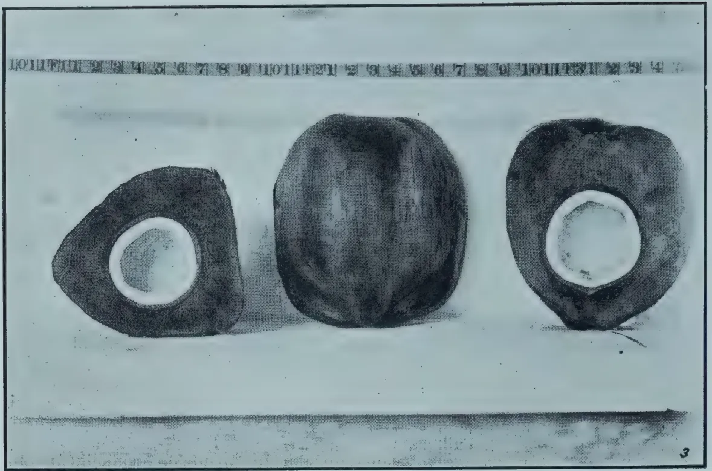A black and white photograph showing three coconut halves and one whole coconut arranged horizontally. The coconut halves are positioned on the left and right, showing their white interior. The whole coconut is in the center. Above the coconuts is a ruler with markings from 1 to 12 inches. The entire scene is enclosed in a rectangular frame. A small number '3' is located in the bottom right corner of the frame.

VARIETY No. 3.

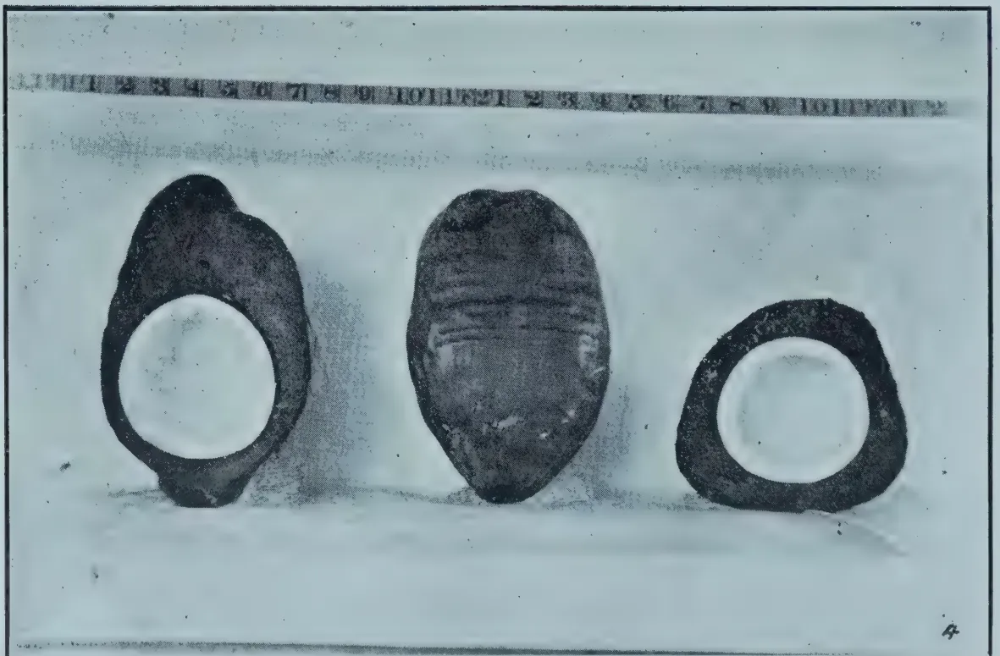A black and white photograph showing three coconut halves and one whole coconut arranged horizontally. The coconut halves are positioned on the left and right, showing their white interior. The whole coconut is in the center. Above the coconuts is a ruler with markings from 1 to 12 inches. The entire scene is enclosed in a rectangular frame. A small number '4' is located in the bottom right corner of the frame.

VARIETY No. 4.

166------------------------------------------------

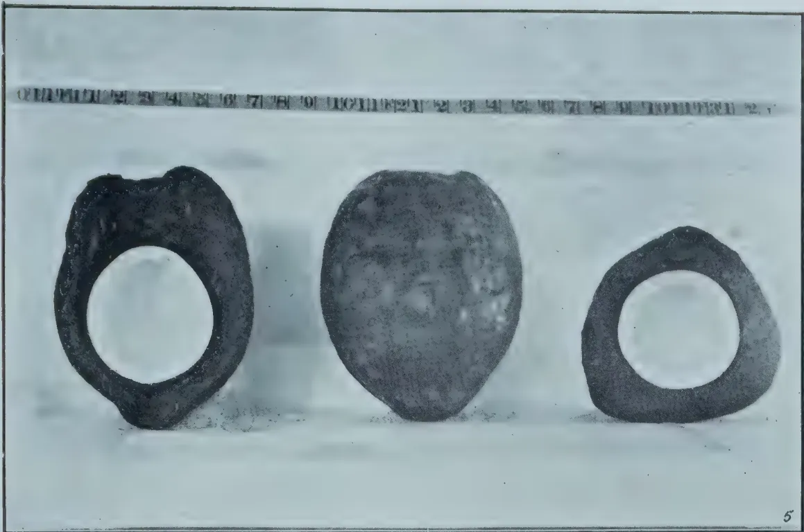A black and white photograph showing three dark, ring-shaped objects, likely archaeological artifacts, arranged horizontally. The object on the left is a ring with a thick, irregular border and a large, light-colored central opening. The middle object is a solid, dark, roughly oval-shaped piece. The object on the right is a ring with a thick, irregular border and a large, light-colored central opening, similar to the first but slightly smaller. Above the objects is a ruler with markings from 2 to 12 inches. A small number '5' is visible in the bottom right corner of the image frame.

VARIETY No. 5.

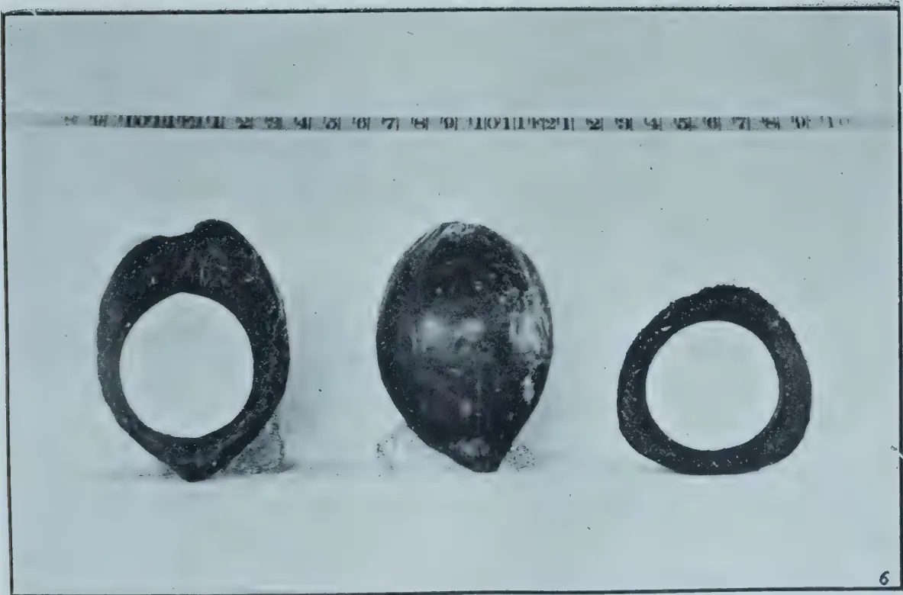A black and white photograph showing three dark, ring-shaped objects, likely archaeological artifacts, arranged horizontally. The object on the left is a ring with a thick, irregular border and a large, light-colored central opening. The middle object is a solid, dark, roughly oval-shaped piece. The object on the right is a ring with a thick, irregular border and a large, light-colored central opening. Above the objects is a ruler with markings from 2 to 10 inches. A small number '6' is visible in the bottom right corner of the image frame.

VARIETY No. 6.

167------------------------------------------------

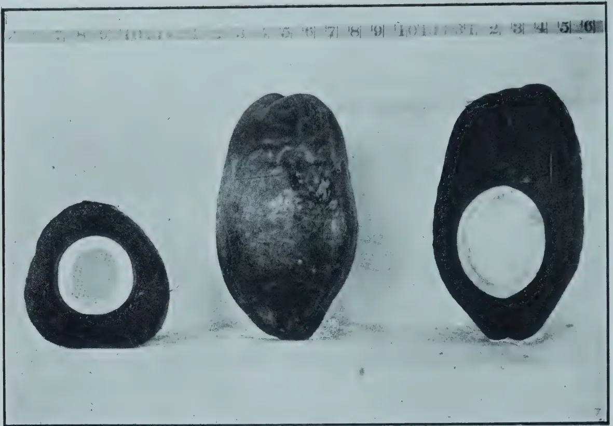A black and white photograph showing three views of a dark, oval-shaped object, likely a seed or fruit cross-section. The object is dark with a lighter, circular center. The left view shows the object from the side, revealing its thickness. The middle view shows the object from the top, showing its surface texture. The right view shows the object from the bottom, revealing its thickness. A ruler is visible at the top of the image, with markings from 1 to 16.

VARIETY No. 7.

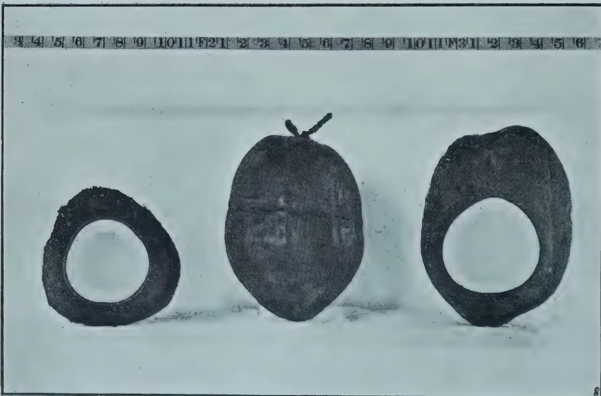A black and white photograph showing three views of a dark, oval-shaped object, likely a seed or fruit cross-section. The object is dark with a lighter, circular center. The left view shows the object from the side, revealing its thickness. The middle view shows the object from the top, showing its surface texture and a small stem at the top. The right view shows the object from the bottom, revealing its thickness. A ruler is visible at the top of the image, with markings from 1 to 16.

VARIETY No. 8.

168------------------------------------------------

APRIL, 1924.]207

<table border="1">
<thead>
<tr>
<th rowspan="3">No.</th>
<th colspan="4">External Dimensions</th>
<th colspan="3">Internal Dimensions</th>
<th colspan="8">WEIGHTS</th>
</tr>
<tr>
<th colspan="2">Circumference</th>
<th rowspan="2">Diameters and Diagonals ins.</th>
<th rowspan="2">Diameters and Diagonals ins.</th>
<th rowspan="2">Shell Thickness ins.</th>
<th rowspan="2">Meat Thickness ins.</th>
<th colspan="2">Whole nut</th>
<th colspan="2">Husk</th>
<th colspan="2">Shell</th>
<th colspan="2">Meat</th>
</tr>
<tr>
<th>Longit. ins.</th>
<th>Lat. ins.</th>
<th>lb.</th>
<th>oz.</th>
<th>lb.</th>
<th>oz.</th>
<th>lb.</th>
<th>oz.</th>
<th>lb.</th>
<th>oz.</th>
</tr>
</thead>
<tbody>
<tr>
<td rowspan="2">15 Type nut</td>
<td>22.5</td>
<td>20.0</td>
<td>aa 1 9.6</td>
<td>aa 1 7.4</td>
<td rowspan="2">0.15</td>
<td rowspan="2">0.5</td>
<td>3</td>
<td>2</td>
<td rowspan="2">1</td>
<td rowspan="2">2</td>
<td rowspan="2">0</td>
<td rowspan="2">8</td>
<td rowspan="2">1</td>
<td rowspan="2">0</td>
</tr>
<tr>
<td>23.0</td>
<td>20.5</td>
<td>bb 1 7.8</td>
<td>bb 1 6.3</td>
<td>3</td>
<td>6</td>
<td>29.6</td>
</tr>
<tr>
<td rowspan="2">16 Type nut</td>
<td>28.5</td>
<td>21.0</td>
<td>cc 1 10.9</td>
<td>cc 1 8.0</td>
<td rowspan="2">0.125</td>
<td rowspan="2">0.5</td>
<td>5</td>
<td>0</td>
<td rowspan="2">1</td>
<td rowspan="2">4</td>
<td rowspan="2">0</td>
<td rowspan="2">8</td>
<td rowspan="2">0</td>
<td rowspan="2">14</td>
</tr>
<tr>
<td>27.0</td>
<td>20.25</td>
<td>dd 1 10.1</td>
<td>dd 1 7.5</td>
<td>4</td>
<td>8</td>
<td>19.4</td>
</tr>
<tr>
<td rowspan="2">17 Type nut</td>
<td>22.0</td>
<td>21.5</td>
<td>aa 1 9.5</td>
<td>aa 1 7.0</td>
<td rowspan="2">0.2</td>
<td rowspan="2">0.55</td>
<td>3</td>
<td>9</td>
<td rowspan="2">2</td>
<td rowspan="2">0</td>
<td rowspan="2">0</td>
<td rowspan="2">7</td>
<td rowspan="2">0</td>
<td rowspan="2">14</td>
</tr>
<tr>
<td>22.5</td>
<td>21.75</td>
<td>bb 1 8.0</td>
<td>bb 1 6.5</td>
<td>3</td>
<td>8</td>
<td>25.0</td>
</tr>
<tr>
<td rowspan="2">18 Type nut</td>
<td>21.75</td>
<td>17.0</td>
<td>cc 1 9.6</td>
<td>cc 1 7.0</td>
<td rowspan="2">0.1</td>
<td rowspan="2">0.5</td>
<td>2</td>
<td>12</td>
<td rowspan="2">0</td>
<td rowspan="2">14</td>
<td rowspan="2">0</td>
<td rowspan="2">5</td>
<td rowspan="2">0</td>
<td rowspan="2">12</td>
</tr>
<tr>
<td>22.0</td>
<td>17.5</td>
<td>dd 1 9.3</td>
<td>dd 1 6.5</td>
<td>2</td>
<td>11</td>
<td>27.9</td>
</tr>
<tr>
<td rowspan="2">19 Type nut</td>
<td>20.0</td>
<td>18.5</td>
<td>aa 1 11.4</td>
<td>aa 1 8.0</td>
<td rowspan="2">0.2</td>
<td rowspan="2">0.5</td>
<td>2</td>
<td>8</td>
<td rowspan="2">0</td>
<td rowspan="2">13</td>
<td rowspan="2">0</td>
<td rowspan="2">4</td>
<td rowspan="2">0</td>
<td rowspan="2">10</td>
</tr>
<tr>
<td>19.5</td>
<td>18.0</td>
<td>bb 1 6.5</td>
<td>bb 1 5.5</td>
<td>2</td>
<td>8</td>
<td>25.0</td>
</tr>
<tr>
<td rowspan="2">19 Cut nut</td>
<td>20.0</td>
<td>18.5</td>
<td>cc 1 11.0</td>
<td>cc 1 7.7</td>
<td rowspan="2">0.15</td>
<td rowspan="2">0.5</td>
<td>2</td>
<td>8</td>
<td rowspan="2">0</td>
<td rowspan="2">13</td>
<td rowspan="2">0</td>
<td rowspan="2">4</td>
<td rowspan="2">0</td>
<td rowspan="2">10</td>
</tr>
<tr>
<td>19.5</td>
<td>18.0</td>
<td>dd 1 10.2</td>
<td>dd 1 7.2</td>
<td>2</td>
<td>8</td>
<td>25.0</td>
</tr>
</tbody>
</table>

169------------------------------------------------

208[APRIL, 1924.

### COLOUR.

The following general observations have been made regarding the colour of the mature nuts:

<table>
<tr>
<td>green</td>
<td>Nos. 5, 9, 13, 1, 7, 11</td>
</tr>
<tr>
<td>brownish</td>
<td>,, 2, 12, 8, 15</td>
</tr>
<tr>
<td>brown</td>
<td>,, 4, 16, 10, 14</td>
</tr>
<tr>
<td>dark brown or reddish</td>
<td>No. 6</td>
</tr>
</table>

The question of colour, though it is a somewhat indefinite character, cannot, however, be overlooked entirely for there appears to be a general belief that seed nuts for planting in Ceylon should be of green colour. Observations on the nuts under examination show the error of this idea.

### SIZE.

This is a factor somewhat difficult to gauge from the figures of girth given—or even from the photographs; but it can distinctly be observed by looking at and handling the nuts.

A determination of the *volume*, perhaps, would be a safer estimate of size. We can however discriminate between:—

<table>
<tr>
<td>large nuts</td>
<td>Nos. 1, 2, 4, 5, 6, 7, 8, 10</td>
</tr>
<tr>
<td>and small nuts</td>
<td>,, 9, 11, 12, 13, 14, 15, 16</td>
</tr>
</table>

### SHAPE OF NUTS.

Some are distinctly long, while a few are round. Many must be classed as intermediate.

<table>
<tr>
<td>The long nuts are numbers</td>
<td>7 typical</td>
<td>2, 4, 8</td>
</tr>
<tr>
<td>The round nuts are</td>
<td>,, 13</td>
<td>,, and 1</td>
</tr>
</table>

### RELATIVE AMOUNTS OF KERNEL, SHELL AND HUSK.

The chief value of coconuts being their use in the preparation of copra, it is obvious that nuts with the greatest amount of kernel or meat are to be desired. In taking the weight of the fresh meat of mature nuts, the weights of the shell and husk were also taken; and the percentage of meat to the whole nut (minus water) was determined. This helps to arrange the nuts in a systematic manner according to their quality.

The weight of the shell scarcely varies; the weight of the kernel varies *but little*, the range being from 12 to 18 ozs.; whereas that of the husk shows a wide range from 16 to 48 ozs.

It is only when the amount of husk in a nut is considered that the precise value of any one type can be fully appreciated from the commercial point of view, for example:

<table>
<thead>
<tr>
<th colspan="4"></th>
<th style="text-align: right;"><i>Proportion.</i></th>
</tr>
</thead>
<tbody>
<tr>
<td>No. 12</td>
<td>shows</td>
<td>16 oz.</td>
<td>meat and 16 oz.</td>
<td>husk</td>
<td style="text-align: right;">1 : 1</td>
</tr>
<tr>
<td>,, 10</td>
<td>,,</td>
<td>16 ,,</td>
<td>,, 32 ,,</td>
<td>,,</td>
<td style="text-align: right;">1 : 2</td>
</tr>
<tr>
<td>,, 7</td>
<td>,,</td>
<td>12 ,,</td>
<td>,, 42 ,,</td>
<td>,,</td>
<td style="text-align: right;">1 : 3.5</td>
</tr>
</tbody>
</table>

This proportion of kernel to husk is of very considerable importance to those growers who manufacture copra only.

From the figures of analysis of the inorganic matter taken up by the different parts of the coconut (fruit) made by LEPINE the proportion of the

170------------------------------------------------

0 1 2 3 4 5 6 7 8 9 10 11 12 13 14 15 16

9

VARIETY No. 9.

0 1 2 3 4 5 6 7 8 9 10 11 12 13 14 15 16

10

VARIETY No. 10.

171------------------------------------------------

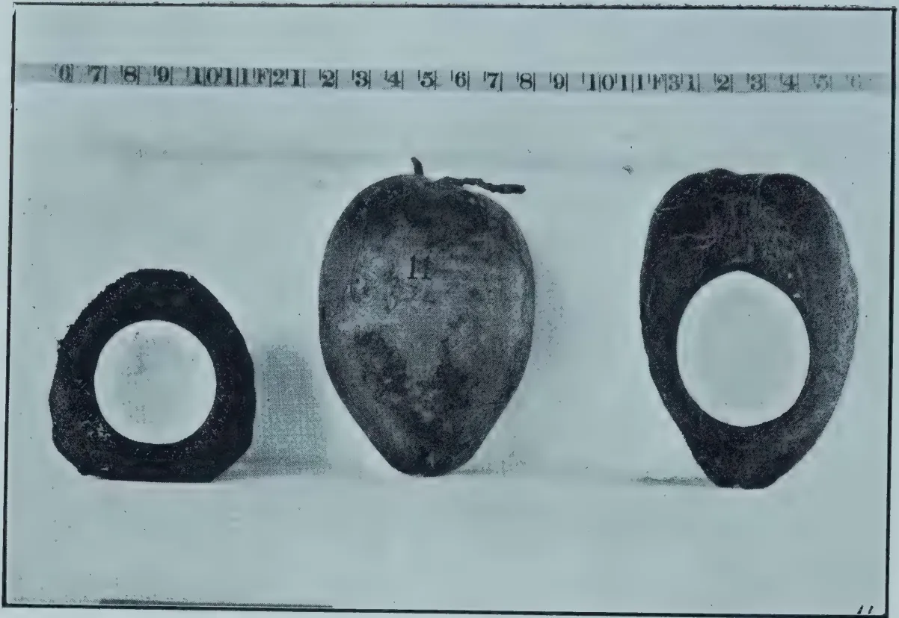A black and white photograph showing three coconut halves and one whole coconut. The coconut halves are positioned on the left and right, showing the white interior. The whole coconut is in the center, with the number '11' printed on its surface. A ruler is placed horizontally above the coconuts, with markings from 0 to 15 inches visible. The entire scene is enclosed in a rectangular border.

VARIETY No. 11.

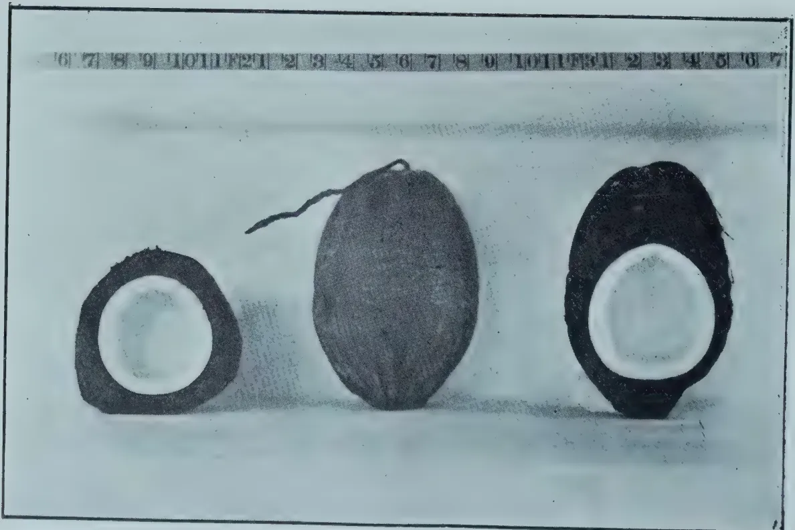A black and white photograph showing three coconut halves and one whole coconut. The coconut halves are positioned on the left and right, showing the white interior. The whole coconut is in the center, with a small stem or fiber protruding from the top. A ruler is placed horizontally above the coconuts, with markings from 0 to 15 inches visible. The entire scene is enclosed in a rectangular border.

VARIETY No. 12.

172------------------------------------------------

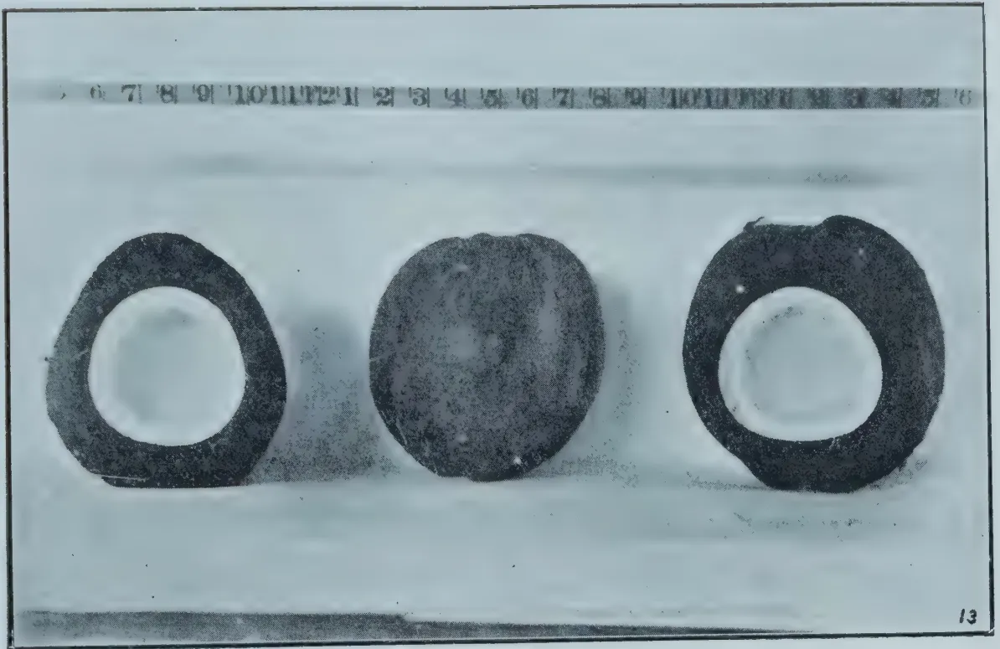A black and white photograph showing three coconut halves and one whole coconut arranged horizontally. The halves are split lengthwise, revealing the white interior. The whole coconut is positioned in the center. Above the coconuts is a ruler with markings from 6 to 16. The entire scene is enclosed in a rectangular frame. In the bottom right corner of the frame, the number '13' is printed.

VARIETY No. 13.

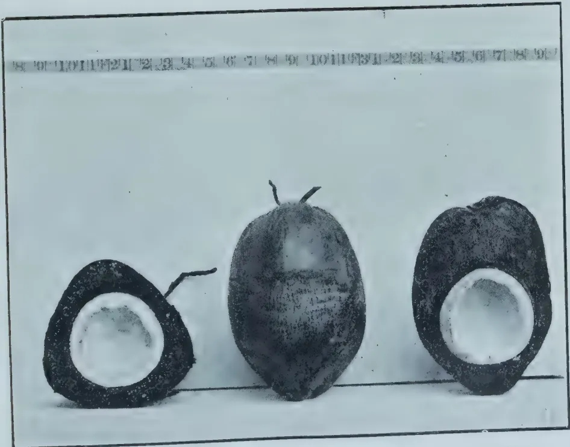A black and white photograph showing three coconut halves and one whole coconut arranged horizontally. The halves are split lengthwise, revealing the white interior. The whole coconut is positioned in the center. Above the coconuts is a ruler with markings from 8 to 19. The entire scene is enclosed in a rectangular frame.

VARIETY No. 14.

173------------------------------------------------

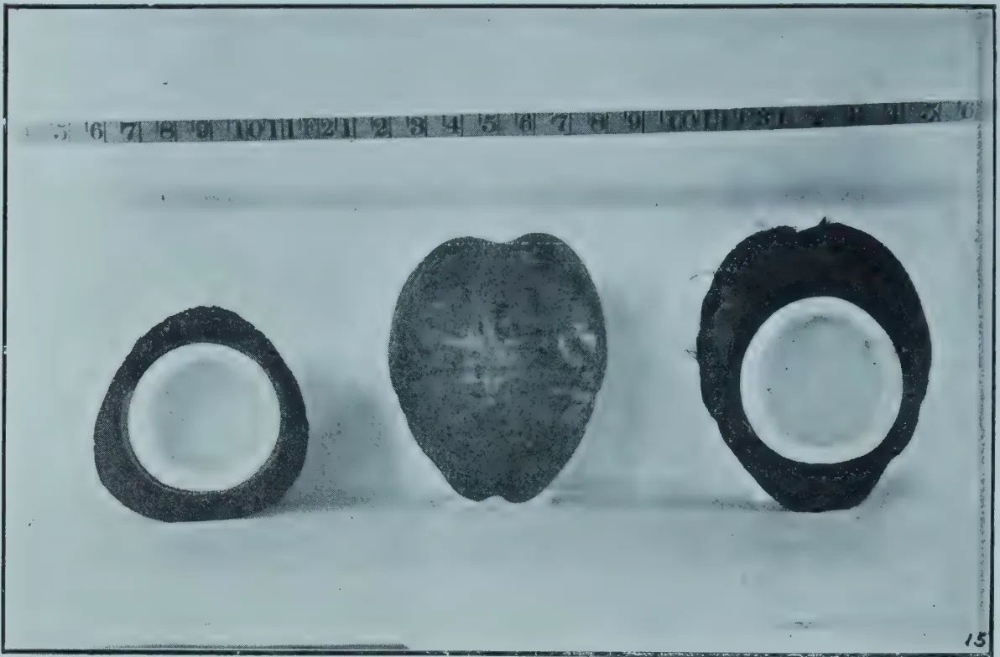A black and white photograph showing three coconut halves arranged horizontally. The left and right halves are split lengthwise, revealing the white interior and the dark outer shell. The middle half is a solid, dark, oval-shaped piece. Above the coconuts is a ruler with markings from 5 to 16 inches. The number '15' is handwritten in the bottom right corner of the image frame.

VARIETY No. 15.

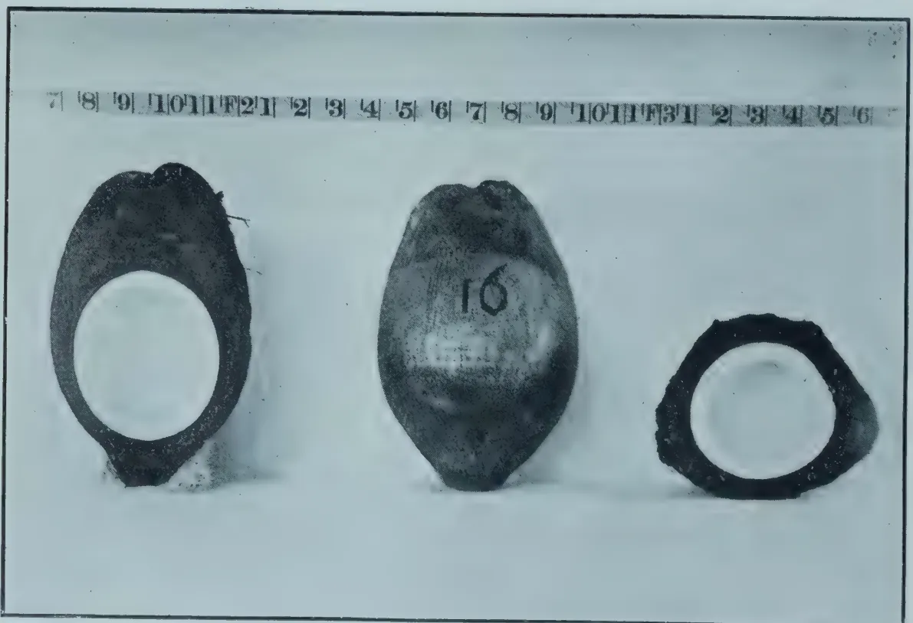A black and white photograph showing three coconut halves arranged horizontally. The left and right halves are split lengthwise, revealing the white interior and the dark outer shell. The middle half is a solid, dark, oval-shaped piece with the number '16' handwritten on its surface. Above the coconuts is a ruler with markings from 7 to 16 inches. The number '16' is handwritten in the bottom right corner of the image frame.

VARIETY No. 16.

174------------------------------------------------

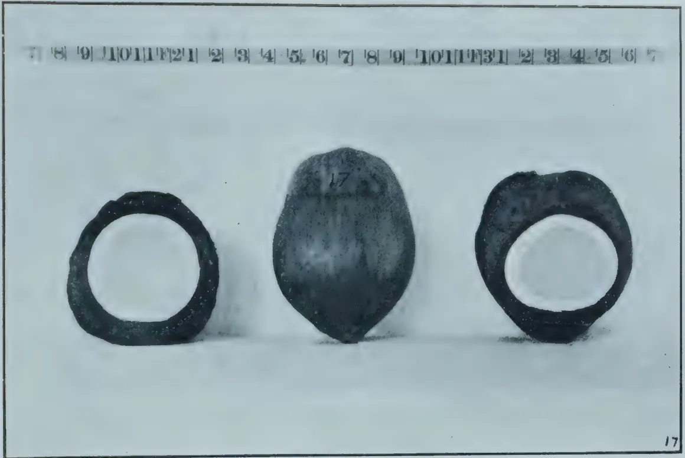A black and white photograph showing three coconut halves arranged horizontally. The left half is a cross-section showing a thick, dark outer shell and a large, light-colored interior. The middle half is a side view of the coconut, showing its characteristic teardrop shape and a small number '17' written on its surface. The right half is another cross-section, similar to the left one. Above the coconuts is a ruler with markings from 1 to 17. The entire photograph is enclosed in a thin black rectangular border.

VARIETY No. 17.

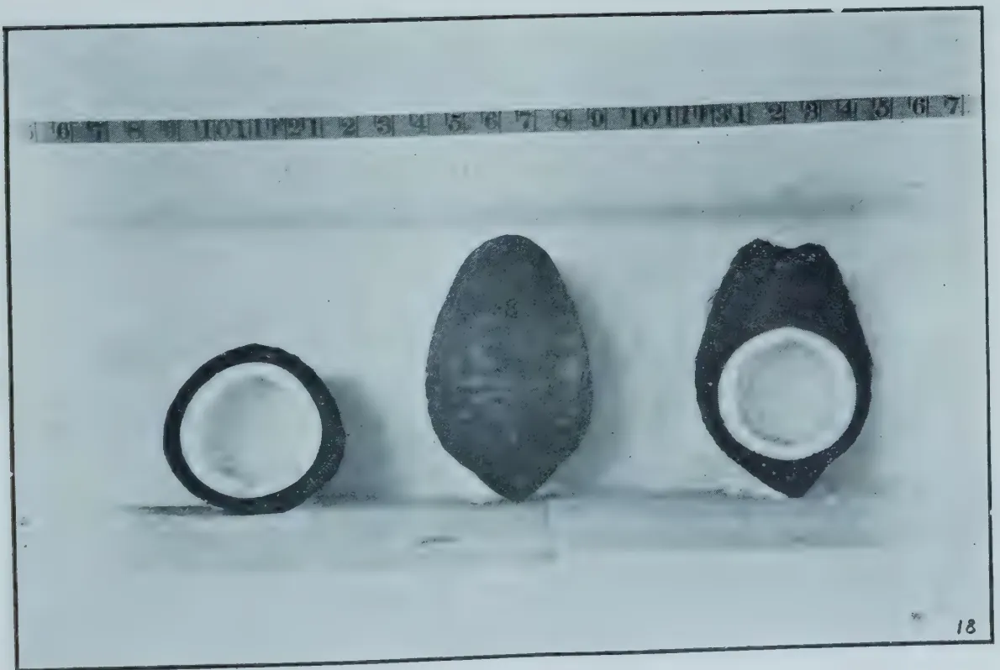A black and white photograph showing three coconut halves arranged horizontally. The left half is a cross-section showing a thick, dark outer shell and a large, light-colored interior. The middle half is a side view of the coconut, showing its characteristic teardrop shape and a small number '18' written on its surface. The right half is another cross-section, similar to the left one. Above the coconuts is a ruler with markings from 1 to 18. The entire photograph is enclosed in a thin black rectangular border.

VARIETY No. 18.

175------------------------------------------------

A black and white photograph showing three dark, ring-shaped objects arranged horizontally. Above the objects is a ruler with markings from 7 to 19. The objects are positioned at approximately 11, 14, and 17 on the ruler. The object in the center is a solid dark ring, while the two on either side are hollow rings. The entire image is enclosed in a black rectangular border.

VARIETY No. 19.

19

176------------------------------------------------

APRIL, 1924.]209

important ingredients taken by the meat and the husk is as follows:

<table>
<thead>
<tr>
<th></th>
<th><i>Husk.</i></th>
<th><i>Kernel.</i></th>
</tr>
</thead>
<tbody>
<tr>
<td>Salts of Potash</td>
<td>9<math>\frac{1}{2}</math></td>
<td>1</td>
</tr>
<tr>
<td>Phos of Lime</td>
<td>1</td>
<td>3</td>
</tr>
<tr>
<td>Salts of Lime over</td>
<td>100</td>
<td>1</td>
</tr>
</tbody>
</table>

That is to say, the husk takes up as much as 9 $\frac{1}{2}$  times the amount of Potash Salts which is absorbed by the meat, and over 100 times the amount of Lime Salts which the meat takes up.

The meat, however, uses up 3 times more of Phos. of Lime than the husk.

Thus it is obvious that the more fibrous types of nuts are to be avoided as being uneconomical feeders. This fact has been maintained by PRUDHOMME who states that: "nuts possessing a mesocarp which is only slightly thick should be preferred, since the fibrous coverings of the nuts take up a large part of the nutritive material absorbed by the plant."

#### SELECTION OF NUTS.

Can desirable nuts be known by their external features? It appears but reasonable to expect that larger nuts would possess proportionately more kernel than smaller ones; but the figures obtained do not bear this out, for it is found that the 3 best nuts, Nos. 12, 15, 16 are comparatively small beside the large sized nuts such as 1 and 7, 2 and 4. Buyers of nuts for copra-making or desiccating appear to prefer the rounder to the longer nuts, but this is only partly confirmed by observations made.

Nos. 7 and 11, 2 and 4 are long and contain a great amount of husk; but, strangely, of the best nuts, Nos. 12 and 16 also belong to the class of long nuts. This is evident from the figures of girth:

<table>
<thead>
<tr>
<th></th>
<th></th>
<th>Weight girth</th>
<th>Lateral girth</th>
<th>Difference of length over breadth</th>
</tr>
<tr>
<th></th>
<th>No.</th>
<th>ins:</th>
<th>ins:</th>
<th>ins.</th>
</tr>
</thead>
<tbody>
<tr>
<td rowspan="4">Poor nuts</td>
<td>7</td>
<td>30.25</td>
<td>21.25</td>
<td>9.00</td>
</tr>
<tr>
<td>4</td>
<td>28.00</td>
<td>21.00</td>
<td>7.00</td>
</tr>
<tr>
<td>2</td>
<td>28.05</td>
<td>23.00</td>
<td>5.05</td>
</tr>
<tr>
<td>11</td>
<td>27.25</td>
<td>22.00</td>
<td>5.25</td>
</tr>
<tr>
<td rowspan="2">Good nuts</td>
<td>12</td>
<td>25.00</td>
<td>19.05</td>
<td>5.95</td>
</tr>
<tr>
<td>16</td>
<td>27.00</td>
<td>20.25</td>
<td>6.75</td>
</tr>
</tbody>
</table>

Colour, perhaps, might offer some indication of worth? The best nuts 12 and 15 are brownish; No. 6 is reddish and Nos. 16 and 4 are brown; while the *green* nuts 5, 9, 13, 1, 7, 11 come low in the scale.

One other point with reference to the proportion of husk to meat, to which attention might be drawn is the economic aspect of manuring.

#### CONCLUSION.

The above are only preliminary notes made during investigation and it is not proposed for the present to make any reference to the question of particular trees or types of nuts breeding true to type.

Ten plants from each of the 19 selected trees have been put down in separate blocks by MR. RAJAPAKSE at Jaela; while 25 plants of each have been planted at the Experiment Station, Peradeniya, and a small number of a few of the types at the Botanic Gardens, Heneratgoda. These will serve as plots of Coconuts of known percentage on which future researches and investigations can be made.

F. A. STOCKDALE.

177------------------------------------------------

210[APRIL, 1924.

# COTTON.

## COTTON CULTURE.

BY PIETER KOCH, B.Sc., Agr.

*Assistant Chief, Tobacco and Cotton Division, and Manager of the Rustenburg Experiment Station.*

The cotton plant is the most important fibre plant cultivated. It has become an absolute necessity to every civilized community. The plant is grown over very extensive areas, and its cultivation and the manufacturing of its products give employment to many millions of people. From its products hundreds of necessaries are manufactured; for instance, from the fibre are made clothes, explosives, bioscope films, etc.; from the seed, oil, soap, and many other articles; from the seed-meal, animal foods, fertilizers, and dye-stuffs.

The annual world production of cotton lint is normally about 20,000,000 bales of 500 lb. each, being the quantity actually consumed in the cotton mills, and exclusive of the large amounts used locally by primitive tribes in China, India, Africa, and other countries. At present South Africa produces only a small amount of the world's supply. The farmers in this country have for many years (since about 1860) been trying to produce cotton, but until a few years ago (about 1912) their efforts met with failure owing to lack of knowledge of cultural methods and want of gins and means of conveyance. However, cotton culture has made rapid progress in recent years, especially in the middle and low veld of the Transvaal and Natal, where conditions are ideal for the crop. The future is now most promising. The great possibilities of cotton in those parts are causing wide-spread interest, and a realization of the very important part it will play in the development of the vast, sparsely populated, and fertile regions in the hotter parts of the Union. The periodical droughts to which large areas of the country are subject have further concentrated attention on this plant—when maize and other crops failed cotton grew, stood up to the trying conditions, and yielded a profitable return. Consequently, every year sees an ever-increasing acreage under cotton, so that at present many thousands of morgen are devoted exclusively to this purpose.

*Botanical Features.*—Botanically, cotton belongs to the Malvaceæ and falls under the genus *Gossypium*. The plant is exceedingly subject to variations, and consequently exists in a large number of forms. The chief factors influencing this tendency to variation are differences in climate, soil, environment, methods of cultivation, and hybridization. Generally it is divided into two groups, namely, the American and the Asiatic. In South Africa the first group only is grown, which includes the Upland varieties (*Gossypium hirsutum*), Sea Island (*G. barbadense*), and Egyptian cotton (*G. peruvianum*). The first of these three includes all the short and some of the long staple varieties, and is grown mostly in the Transvaal and Natal; the

178------------------------------------------------

APRIL, 1924.]211

second produces the best, longest, and most valuable lint, and is grown on a very small scale along the coastal regions; the third is the cotton of Egypt, and has a beautiful, glossy appearance. This variety has been tried in several parts of the Union with varying results. An American-Egyptian variety (Pima) has given good returns under irrigation at Rustenburg. Experiments have also been conducted with a tree cotton (Caravonica), but has proved unsatisfactory.

The difference between Upland and Pima is that the latter is taller, with longer and thinner branches, much longer, deeply lobed leaves, small pointed bolls, and much later maturity. The flowers, moreover, are rich yellow in colour, with purple spots at the base, longer and finer fibres, and black, almost naked, seeds. Some Upland varieties, e.g., Wise, Peterkin, and Moss, however, also possess black, naked seeds. The fibre of Upland measures from  $\frac{3}{4}$  to  $1\frac{1}{2}$  inch in length and that of Pima and Sea Island from  $1\frac{1}{2}$  to 2 inches. A fibre consists of a single hollow cell in the form of a long, narrow tube. As it ripens it loses its tube-like form, becomes flattened, and, after the boll opens, develops a peculiar twist. The presence of this twist imparts a roughness to the fibres which enables them to exert a certain amount of grip on each other, and makes it possible for them to be spun into thread. Immature fibres contain practically no twist, and they are very weak and brittle; hence the presence of much unripe cotton reduces the value of the lint to an appreciable extent.

The seeds bearing the fibre or lint are known as seed-cotton, and the fibre after removal from the seeds constitutes the raw cotton of commerce. About one-third of seed-cotton is lint and two-thirds seed. Ginned Upland cotton seed consists of approximately 10 per cent. fuzz, 36 per cent. hulls, 20 per cent. oil, and 34 per cent. oil-cake.

The cotton plant is a perennial shrub, but under cultivation is generally considered to be an annual and is usually re-planted every season. Whether ratooning will be practised to some extent in the future is very unlikely.\* By ratooning is meant the method of cutting off the old stalk close to the ground, when a new plant or "volunteer" takes its place the following year, re-seeding thus being eliminated. Authorities state that after the second year the lint deteriorates greatly by losing its gloss and strength—two of the most important and desirable properties of cotton.

The practice is not recommended, as the volunteer stand of cotton is usually insufficient to produce maximum yields, and the cost of interculture is out of proportion to the returns, besides favouring the increase of injurious insect-pests and the development of diseases. It is only under exceptional conditions obtaining in certain areas that ratconing might pay.

*Climate.*—Cotton is pre-eminently suited to warm regions. During the growing period the temperature should be uniformly hot, as the plant is very susceptible to sudden changes of temperature, and any check tends to produce premature ripening. Areas which in summer are subject to sudden changes of temperature or cold nights cannot be expected to produce good yields of first-class cotton. Continuous strong winds also have a detrimental

\* See "Cotton: Ratooning Experiments," by J. DU P. OOSTHUIZEN, in the *Journal of the Department of Agriculture*, February, 1922.

179------------------------------------------------

212[APRIL, 1924.

effect on the crop. After the plants are full grown a lower temperature and dry weather are required in order to retard growth and further the development of the bolls. The plant being sensitive to frost, it is necessary that no frost occur for six or seven months, the time occupied in the growing and maturing of the crop. In localities that are subject to frost, planting should not be done before 1st October, but also not later than November.

A summer rainfall of not less than 18 to 20 inches, fairly well distributed over the whole period of growth, is essential. (This does not refer to areas where cotton can be grown under irrigation.) During the first five or six weeks the plant is delicate and weak, consequently the soil should not dry out too much during this time. Thereafter, the plant can withstand much drought, the taproot being long and penetrating well into the ground.

During harvesting time it is desirable that the weather be dry and sunny.

*Soil.*—The crop can be grown on nearly every type of soil where maize grows, provided it is deep and well drained. The most suitable soil, however, is a loam. A clay soil also gives good results, if it is well cultivated and the seed sown early. Light, sandy soil should be manured judiciously, otherwise the growth will be poor and a small crop reaped. Under favourable weather conditions "turf" soils occasionally yield excellent crops. It may be stated as a general rule that the most suitable soil is a deep, sandy loam or medium loam with good drainage, yet capable of retaining sufficient moisture to supply the demand of the crop. If the soil is very fertile, branches and leaves are formed at the expense of fruit.

*Seed Selection.*—The selection of seed plays a highly important role in cotton culture. It is essential that good seed be planted, and, as the cotton plant is very sensitive to climatic and soil conditions, the greatest care must be exercised in selecting seed-plants. The grower is advised to keep seed only of the most suitable plants for the following season's seed-plot. Seed should be taken from those plants which show uniformity of type and at the same time produce a great number of well-developed bolls. The height of a plant is not always an indication of its suitability. There are varieties of cotton which, under very favourable conditions, attain a height of from 8 to 10 feet; but those of about 3 to 4 feet usually give the best returns.

It is also important that the seed matures normally and is dried properly prior to being stored. If it is stored in a heap in a damp condition, overheating takes place and the power of germination is partly destroyed.

*Varieties to Grow.*—The industry has now reached a stage where it is possible to state with a fair degree of certainty which varieties are best adapted to the various areas of the Union. For the greater part of the Transvaal the so-called "Improved Bancroft" a large boll, long staple Upland variety, has proved one of the very best; it is therefore grown to the exclusion of practically all other varieties. In the Barberton District a little Watt's Long Staple and Zululand Hybrid are grown, but the bulk of the Barberton crop likewise consists of improved Bancroft. Another variety grown in the Transvaal is Uganda. In the Vryheid District, Natal, and in Zululand, Zululand Hybrid is largely grown; and in other parts of Natal, Griffin is a favourite. In the Transkei, Nyasaland Upland is the principal variety cultivated. Pima, an American-Egyptian variety, is now

180------------------------------------------------

APRIL, 1924.]213

being experimented with under irrigation in various parts of the country. Sea Island, and possibly a few other varieties, are grown on a small scale here and there, but those enumerated are the chief ones grown.

The cotton flower is most susceptible to hybridization by insects, especially bees, which fly for miles in search of food. It is therefore most important, if disastrous results and endless trouble are to be avoided, that farmers in one particular area or district should grow only one single suitable variety. Even if hybridization or crossing with other varieties is prevented there is the great danger of the seed of different varieties getting mixed at the ginneries, no matter how careful the managers may be. Unless multiplication of varieties is avoided our cotton cannot be expected to remain pure. Not that the varieties which are grown at present are by any means faultless, but they are rapidly being improved and purified, and have shown their suitability for the conditions of this country.

*Soil Fertility and Rotation.*—Most agricultural soils are deficient in one or more of the plant-foods, nitrogen, potash, and phosphorus.

If the growth is poor and the plants are yellowish, the soil is as a rule lacking in nitrogen. This plant-food can easily and economically be supplied to the soil by ploughing under as a green manure such leguminous crops as velvet beans, cowpeas, soya beans, and field peas. If nitrogen in commercial forms is to be used, it should not be applied too freely, as it tends to produce luxuriant vegetation and retards ripening.

A deficiency of potash can generally be detected by a large percentage of rusty leaves which drop off in great numbers, and by stunted growth and poor stalk development. Potash is present mainly in the stem and leaves.

Phosphorus appears to be the chief element required by practically all South African soils. The cotton plant is particularly sensitive to the absence of phosphates, a deficiency of which results in the production of a light crop of poor quality. The application of phosphatic manures checks coarse growth, tends to early ripening, and greatly improves the quality of the lint. On many South African cotton soils superphosphate can be used alone at the rate of from 400 to 600 lb. per morgen, depending on the soil and the previous treatment it has received;\* but it is usually more effective if employed in conjunction with some nitrogen and potash or kraal manure. On sour soils an application of 1,000 lb. of agricultural lime will be beneficial. The practice of growing cotton year after year on the same land is not to be recommended, since it results in the gradual deterioration of both soil and crop, and the multiplication of insect pests and diseases. In planning a rotation it is well to include a leguminous crop; and as cotton has long, deeply penetrating roots it should be followed by a crop having a different rooting system, such as maize, kaffir corn, or buckwheat, more so as different crops remove the essential elements in varying proportions. The system to be adopted depends largely on circumstances and local conditions. It is useful to know that cotton is not subject to the attack of rooibloom (witchweed).

\* If to be drilled in with a fertilizer attachment, half quantities are to be used.

181------------------------------------------------

214[APRIL, 1924.

Among the principal field crops grown commercially, cotton is the least exhausting. The following table, taken from "Cotton," by BURKETT and POE is interesting:—

**Plant-Foods Drawn from the Soil by Crops.**

<table border="1">
<thead>
<tr>
<th style="text-align: left;"><i>Crop.</i></th>
<th></th>
<th style="text-align: center;"><i>Nitrogen.</i></th>
<th style="text-align: center;"><i>Phosphates.</i></th>
<th style="text-align: center;"><i>Potash.</i></th>
<th style="text-align: center;"><i>Total.</i></th>
</tr>
</thead>
<tbody>
<tr>
<td><i>Cotton</i></td>
<td></td>
<td></td>
<td></td>
<td></td>
<td></td>
</tr>
<tr>
<td></td>
<td>300 lb. of lint</td>
<td style="text-align: center;">...</td>
<td style="text-align: center;">1'02</td>
<td style="text-align: center;">0'30</td>
<td style="text-align: center;">1'37</td>
<td style="text-align: center;">2'69</td>
</tr>
<tr>
<td></td>
<td>650 lb. of seed</td>
<td style="text-align: center;">...</td>
<td style="text-align: center;">20'34</td>
<td style="text-align: center;">10'67</td>
<td style="text-align: center;">7'84</td>
<td style="text-align: center;">38'85</td>
</tr>
<tr>
<td></td>
<td></td>
<td></td>
<td style="text-align: center;">
21'36</td>
<td style="text-align: center;">
10'97</td>
<td style="text-align: center;">
9'21</td>
<td style="text-align: center;">
41'54</td>
</tr>
<tr>
<td><i>Maize</i></td>
<td></td>
<td></td>
<td></td>
<td></td>
<td></td>
</tr>
<tr>
<td></td>
<td>8<math>\frac{3}{4}</math> bags</td>
<td style="text-align: center;">...</td>
<td style="text-align: center;">32'14</td>
<td style="text-align: center;">12'36</td>
<td style="text-align: center;">7'06</td>
<td style="text-align: center;">51'56</td>
</tr>
<tr>
<td></td>
<td>4,000 lb. of stover</td>
<td style="text-align: center;">...</td>
<td style="text-align: center;">41'60</td>
<td style="text-align: center;">11'60</td>
<td style="text-align: center;">56'00</td>
<td style="text-align: center;">109'20</td>
</tr>
<tr>
<td></td>
<td></td>
<td></td>
<td style="text-align: center;">
73'74</td>
<td style="text-align: center;">
23'96</td>
<td style="text-align: center;">
63'06</td>
<td style="text-align: center;">
160'76</td>
</tr>
<tr>
<td><i>Wheat</i></td>
<td></td>
<td></td>
<td></td>
<td></td>
<td></td>
</tr>
<tr>
<td></td>
<td>3<math>\frac{1}{2}</math> bags</td>
<td style="text-align: center;">...</td>
<td style="text-align: center;">19'75</td>
<td style="text-align: center;">7'44</td>
<td style="text-align: center;">5'10</td>
<td style="text-align: center;">32'29</td>
</tr>
<tr>
<td></td>
<td>2,300 lb. of straw</td>
<td style="text-align: center;">...</td>
<td style="text-align: center;">13'57</td>
<td style="text-align: center;">2'76</td>
<td style="text-align: center;">11'73</td>
<td style="text-align: center;">28'06</td>
</tr>
<tr>
<td></td>
<td></td>
<td></td>
<td style="text-align: center;">
33'32</td>
<td style="text-align: center;">
10'20</td>
<td style="text-align: center;">
16'83</td>
<td style="text-align: center;">
60'35</td>
</tr>
<tr>
<td><i>Tobacco*</i></td>
<td></td>
<td></td>
<td></td>
<td></td>
<td></td>
</tr>
<tr>
<td></td>
<td>1,000 lb. of leaves</td>
<td style="text-align: center;">...</td>
<td style="text-align: center;">44'00</td>
<td style="text-align: center;">5'00</td>
<td style="text-align: center;">52'00</td>
<td style="text-align: center;">101'00</td>
</tr>
<tr>
<td></td>
<td>353 lb. of stalk</td>
<td style="text-align: center;">...</td>
<td style="text-align: center;">12'00</td>
<td style="text-align: center;">2'00</td>
<td style="text-align: center;">17'00</td>
<td style="text-align: center;">31'00</td>
</tr>
<tr>
<td></td>
<td></td>
<td></td>
<td style="text-align: center;">
56'00</td>
<td style="text-align: center;">
7'00</td>
<td style="text-align: center;">
69'00</td>
<td style="text-align: center;">
132'00</td>
</tr>
</tbody>
</table>

The farmer should endeavour to obtain the greatest yields at a minimum cost by methodical and scientific treatment of the soil. This may be called intensive cultivation as contrasted with extensive cultivation. It is far better to grow 50 morgen of cotton yielding 1,600 lb. of seed cotton per morgen than to grow 100 morgen yielding 800 lb. per morgen.

*Preparation of the Soil.*—It is not possible in a concise article as the present one to state fully when and how the soil should be worked as so much depends on the class and type of soil and on the prevailing weather conditions. Where possible the lands should be ploughed in autumn or early winter, and to a depth of 9 to 12 inches—depending on the nature and kind of soil utilized. As soon as the first soaking spring rains set in the lands are ploughed again, if necessary, and rolled and harrowed to a fine tilth. As soon as all danger of frost has disappeared the seed can be planted. The earlier the planting the greater the chance for the plants to come to full maturity and the bigger the yield.

The seed germinates in from seven to twelve days. When the plant is about forty to fifty days old the first flower-buds (squares) appear; after that it takes some three weeks for the buds to open. From the time of the open flower until the boll opens is a period of another fifty days. The warmer the weather the sooner the bolls open.

\* Taken from Killabrew and Myrick's "Tobacco Leaf."

182------------------------------------------------

APRIL, 1924.]215

*When and How to Plant.*--Seeding is done between October and the middle of November. In the warmest low veld areas planting may be done until the end of November. In fertile soil the distance between the rows should be approximately four feet but in poor soil not wider than 3 feet. In sticky or heavy soil the seed must be planted thicker than in sandy, light soil. As the young plants emerge from the ground similarly to bean plants, the depth of seeding should not be greater than from one to two inches, otherwise the cotyledons (seed-leaves) are unable to push through the hard-crust of earth which is formed after rain. Should the seedlings be unable to burst through this crust, as is often the case on some soils, a light harrow dragged across the rows will be helpful.

Forty to fifty lb. of seed are ample for planting one morgen of ground. When the plants have reached a height of six to eight inches they are thinned out to a distance of about ten to twelve inches apart. Thinning is done with hand-hoes, or if the soil is soft and moist, by hand.

*Cultivation.*—The object of cultivation is to destroy weeds which would damage and perhaps choke the crop; to break the crust formed by sunshine after rain, thus creating a mulch whereby capillary action is impeded and the moisture-holding capacity of the soil improved; and to facilitate the penetration of air into the soil. Proper cultivation also aids the growth of useful bacteria, the chemical solution of plant-food, and checks insect-pests.

As soon as the plants are well above the ground, cultivation should be proceeded with, and repeated after each rain as soon as the soil has dried sufficiently to prevent puddling. At first it may be deeper than afterwards, especially when a heavy rain has caused packing of the soil. But the plants have attained a height of ten to twelve inches the cultivator should not be set deeper than three inches. The feeding-roots of the cotton plant spread from three to nine inches under the surface of the ground; deep cultivation would consequently result in the breaking of the roots, and the plants would suffer. Cultivation should be continued until the bolls make their appearance. Shortly afterwards this operation should be discontinued, otherwise the squares may get bruised and the yield diminished accordingly.

*Picking.*—As soon as the cotton fields are white with open bolls, that is when about a third of the bolls are open, harvesting should be commenced. It takes approximately three pickings before the whole crop is gathered. When cotton is wet after rain or heavy dew, harvesting is not proceeded with until it is dry. If it is found that moist seed-cotton has been picked, it should be spread open on bucksails or canvas to dry, and then stored in a clean, dry, protected shed or on a loft.

Care should be taken to pick only seed-cotton—all leaves, pieces of boll, and other foreign matter are to be avoided and discarded, as such impurities detract from the value of the product. Soiled cotton should be gathered and ginned separately. The employment of native women and children for harvesting is the most economical. Picking is light, clean, and attractive work. An active woman can pick as much as 75 lb. per day if the plants are rather full of open bolls. The average, however, is 40 lb. of clean seed-cotton per day. Some natives who have become skilled in the work can pick as much as 100 lb. per day.

183------------------------------------------------

216[APRIL, 1924.

Muid sacks are commonly used in this country for harvesting. On both sides of the opening a riem of cord is fastened and then hung over the neck and shoulders of the picker. Picking is the most expensive item in cotton production.

*Ginning and Preparation for Market.*—The cotton is conveyed in wool packs to central establishments for ginning. This consists in separating the lint from the seed. About one-third of the weight of seed-cotton is lint and the remainder seed.

There are two kinds in general use, namely, roller-gins and saw-gins. The former is used for long-staple cottons with naked seeds, and the latter almost exclusively for ginning cottons with fuzzy seeds. The great majority of gins are saw-gins, as they do much quicker and cheaper work. An ordinary roller-gin requiring 2-horsepower can treat about 35 lb. of seed-cotton per hour, whereas a saw-gin with the same horsepower can gin 180 lb. per hour. The saws of the latter have a speed of some 400 revolutions per minute, and the teeth of the saws pull the lint from the seeds, while a brush, revolving at high speed, again removes the lint from the saws.

The following results, obtained at the Rustenburg Experiment Station, are interesting :—

#### COMPARISON BETWEEN ROLLER AND SAW GINS.

<table border="1">
<thead>
<tr>
<th>Type of Gin</th>
<th>Time</th>
<th>Variety of Cotton</th>
<th>Quantity of Seed Cotton Handled.</th>
</tr>
</thead>
<tbody>
<tr>
<td>Roller-Gin (roller 3 ft. 3 in.)</td>
<td>1 hour</td>
<td>Pima</td>
<td>44½ lb.</td>
</tr>
<tr>
<td>Do " " "</td>
<td>1 ,,</td>
<td>Improved Bancroft</td>
<td>23 ,,</td>
</tr>
<tr>
<td>50-saw Gin " " "</td>
<td>1 ,,</td>
<td>Pima</td>
<td>525 ,,</td>
</tr>
<tr>
<td>Do " " "</td>
<td>1 ,,</td>
<td>Improved Bancroft</td>
<td>485 ,,</td>
</tr>
</tbody>
</table>

Before the invention of the saw-gin in 1792 by WHITNEY and HOLMES in America, it took one man a whole day to separate 1 lb. of lint with his fingers (the general practice followed at the time). After the machine had come into use the growing cotton in North America made enormous strides. The increasing demand for ginning in the Union of South Africa is being met, and to-day there are several large gins permanently established in various parts of the Transvaal and Natal.

After being ginned the lint is pressed by means of a powerful press into bales of 54 inches by 27 inches by 20 inches, and weighing approximately 500 lb. each. The bales are covered with hessian or sack cloth and fastened with iron hoops to prevent them from expanding. South African bales are, as a whole, far neater, more attractive, and less wasty than American bales.

*Cost of Production and Profit.*—Cost and profit naturally depend largely on the value of lint, the yield, and the distance from the ginneries. Even if these should be quite favourable, sufficient labour must be available at reasonable wages. Without an ample supply of cheap labour it is almost hopeless, if not impossible, to grow cotton profitably. Fortunately, most parts of the Union suitable for the growing of cotton are very well supplied with cheap labour.

184------------------------------------------------

APRIL, 1924.]217

The cost works out at about £4 to £6 per morgen, and the net profit at about £8 to £16. It is not possible to give definite figures as so much depends on the farmer himself, on circumstances, and on the many variable factors that enter into the estimate. This, however, may be stated with certainty, that, where conditions are favourable and the farmer does his duty, cotton is a profitable crop to grow and pays better than maize. Moreover, the cotton plant in South Africa is not yet subject to such serious insect-pests and diseases as it is in America and Egypt, where the profits of the growers are greatly reduced by the depredations of the cotton boll weevil and the pink bollworm respectively. When cotton is grown on a more extensive scale, more pests will most likely make their appearance; but in such event means will no doubt be devised to combat them. Bollworms are at present the greatest pest the South African cotton grower has to contend with. Leaf-hoppers (jassids) also cause some loss in certain areas.

Cotton lint has the advantage that it be kept for many years without any danger of deterioration, and there is an ever-increasing demand for it.

*Conclusion.*—North America produces about 60 per cent. of the world's cotton. In most other countries where it is grown to any great extent the possibilities of a much greater production are either more or less small or certain limiting factors are present. The only countries where cotton can still be grown extensively are Africa and a few of the South American Republics, especially Brazil. Much is being done by European commercial bodies to further cotton growing in Africa, as it is a vital matter to the cotton factories, in which hundreds of millions of pounds sterling have been invested, and on which millions of people are dependent for their daily bread.

Every year the United States of America manufactures more of its cotton, and more textile buildings are being erected, with the result that the spinners in England and on the continent of Europe are unable to obtain full supplies for their own mills. Furthermore, the boll weevil is making such inroads in the American crop that, instead of the production increasing, it is at a standstill or actually decreasing. The demand is increasing much faster than the supply. Hundreds of millions of the world's population are still only partly clad, or practically naked. The different races are steadily adopting the garb of civilization. The production of wool and other fibre suitable for clothing is so limited that at present the only solution seems to be the very much greater production of cotton.

The tendency is for prices to remain high, and even to rise still higher; this tendency will increase when conditions in Europe become more settled. The cotton grower therefore need have no fear whatever of over-production. In 1764 North America exported eight bags of cotton to Liverpool, and this probably represented the whole amount exported during that year, whereas to-day the export runs into several millions of bales. The amount of cotton produced in South Africa at present may not be very large, yet it is most encouraging if one considers that the culture of this crop is of recent date and practically unknown to many farmers of this country. Furthermore, the vast northern and eastern sections of the Union, where cotton is being grown most successfully, are still sparsely populated by Europeans. The prospects of the cotton grower are decidedly good, and there is not the slightest reason why thousands of farmers in the middle and lowveld should not give attention to this most promising and remunerative crop.—JOURN. OF DEPT. OF AGRIC., U.S. AFRICA, Vol. XIII, No. 1.

185------------------------------------------------

218[APRIL, 1924.

# PADDY.

## VARIETIES OF CEYLON PADDY.

W. MOLEGODE,

*Agricultural Instructor.*

Ceylon is reputed to possess over five hundred varieties of paddy. The late NUGAWELA DISAVA exhibited at the Kandy Agri-Horticultural and Industrial Exhibition held in 1902 a collection of 300 named varieties collected throughout the Island. About ten years back I took possession of his list and part of the paddy from MR. JAS. R. NUGAWELA, Agricultural Instructor, and both of us tried to replace the lost varieties but without success. At that time most of the samples of paddy had gone bad. In 1915 and 1916, from the Office of the Ceylon Agricultural Society, I attempted to obtain the names of paddies grown in the different districts from various headmen and through the Agricultural Instructors, then few in number, and I was able to make up a list of only 168 names. When a collection of paddies now growing throughout the Colony was being got together to be sent to the British Empire Exhibition we found that not more than 150 kinds were available and even among these we found the same paddy sent from different districts with a slightly altered name. It must therefore be presumed that only about one hundred and fifty types are now being grown throughout the Island.

The following list of the names of paddies has been compiled from the late NUGAWELA DISAVA's list and from information I have gathered from various sources during the last ten or twelve years. I do not believe that so many different kinds of paddies ever existed in Ceylon. It is clear that no system has been followed in naming paddies. The cultivator gives a name, sometimes an appropriate name, whenever a supply of new seed is obtained and when that paddy gets distributed it carries its new name with it. For instance, the paddies the Economic Botanist has given out in recent years, owing to their not being named, are known in the villages as Peradeniya Mavi or Peradeniya Samba. The paddy raised from Hatiel and Hondaravala, selected by me, is known among cultivators as Molecode Hatiel and Molecode Hondaravala. The paddy the late DR. LOCK tried and distributed is known as Lock's paddy. Ajantawi is a paddy that a Government Agent introduced to the district. Matale-heenati is heenati from Matale now growing in Ulagalle Korale; Madakalapu balawi is short-aged paddy from Batticaloa now growing in Wellessa and in this manner the names of Ceylon paddies have got multiplied. Then again, the main types are sub-divided into Kalu (black), Sudu (white), Ratu (red), Kiri (milky), Bala (short-aged) and so on as for example Kalu-heenati, Sudu-heenati, Kirikottiyaran, Bala-kottiyaran, etc.

186------------------------------------------------

APRIL, 1924.]219

In the following list are also included the names of paddies introduced to the Colony in recent years; but most of them have got so mixed up that it is unlikely that the paddies, except a few varieties like Molagusamba, Rascadum, or Gawrisamba, can be recognised.

The figures within brackets indicate the "age" of the paddies by month. It should, however, be remembered that the age (time of maturity) also differs when varieties are introduced from cold to hot districts and *vice versa*, and types of paddies like Kuruwi, Kohuwi, etc., are three months in some districts but 4 and 5 in some. Mawi is 8, 7, 6 and even 5 months.

<table>
<tbody>
<tr>
<td>1</td>
<td>Ahas-kara-elwi (5-6)</td>
<td>41</td>
<td>Bala-thatu wi (4)</td>
</tr>
<tr>
<td>2</td>
<td>Ahunel wi (4-5)</td>
<td>42</td>
<td>Bala-tudu wi (4-5)</td>
</tr>
<tr>
<td>3</td>
<td>Ajanta wi (4)</td>
<td>43</td>
<td>Bala wi (2½-3)</td>
</tr>
<tr>
<td>4</td>
<td>Alagusamba (5)</td>
<td>44</td>
<td>Bankok</td>
</tr>
<tr>
<td>5</td>
<td>Alakiyaranam</td>
<td>45</td>
<td>Banku (4)</td>
</tr>
<tr>
<td>6</td>
<td>Amala Waria Samba (5)</td>
<td>46</td>
<td>Bathbowi (6)</td>
</tr>
<tr>
<td>7</td>
<td>Amba kuruwi (5)</td>
<td>47</td>
<td>Bathjan kaharamana (4-5)</td>
</tr>
<tr>
<td>8</td>
<td>Ambala elwi (4½)</td>
<td>48</td>
<td>Batu el (4)</td>
</tr>
<tr>
<td>9</td>
<td>Andu kara-elwi (5-6)</td>
<td>49</td>
<td>Batu kiriyal (4)</td>
</tr>
<tr>
<td>10</td>
<td>Anai kodan (5)</td>
<td>50</td>
<td>Batu kuruwi (4½)</td>
</tr>
<tr>
<td>11</td>
<td>Anai Kothan Samba</td>
<td>51</td>
<td>Bibili el (4)</td>
</tr>
<tr>
<td>12</td>
<td>Anchu Moligan KaJuppen</td>
<td>52</td>
<td>Bopatwi (5)</td>
</tr>
<tr>
<td>13</td>
<td>Andun Kottan</td>
<td>53</td>
<td>Boraluwi (5)</td>
</tr>
<tr>
<td>14</td>
<td>Aruvathan Vellai Samba (4)</td>
<td>54</td>
<td>Boro (6)</td>
</tr>
<tr>
<td>15</td>
<td>Askarayal (4)</td>
<td>55</td>
<td>Buruma wi (5)</td>
</tr>
<tr>
<td>16</td>
<td>Atharali Samba (4)</td>
<td>56</td>
<td>Carolina (5)</td>
</tr>
<tr>
<td>17</td>
<td>Ava Sura Samba (115 days)</td>
<td>57</td>
<td>Chenadi (3)</td>
</tr>
<tr>
<td>18</td>
<td>Badshabog (6)</td>
<td>58</td>
<td>Chithirai kali (4)</td>
</tr>
<tr>
<td>19</td>
<td>Balada el (5)</td>
<td>59</td>
<td>Chitra elwi (5)</td>
</tr>
<tr>
<td>20</td>
<td>Bala dikwi (4)</td>
<td>60</td>
<td>Chori kurumbai</td>
</tr>
<tr>
<td>21</td>
<td>Bala elwi</td>
<td>61</td>
<td>Colomba wi (6)</td>
</tr>
<tr>
<td>22</td>
<td>Bala goda wi (3)</td>
<td>62</td>
<td>Daha elwi (4½)</td>
</tr>
<tr>
<td>23</td>
<td>Bala hatiel (5)</td>
<td>63</td>
<td>Dampotu wi (4)</td>
</tr>
<tr>
<td>24</td>
<td>Bala heenwi (4)</td>
<td>64</td>
<td>Dandu el.(4)</td>
</tr>
<tr>
<td>25</td>
<td>Bala kalu wi (4)</td>
<td>65</td>
<td>Dandu-mara-wi (5)</td>
</tr>
<tr>
<td>26</td>
<td>Bala-kalubawi (3)</td>
<td>66</td>
<td>Dasyawakara wi (4)</td>
</tr>
<tr>
<td>27</td>
<td>Bala kiri kottiyaran (3)</td>
<td>67</td>
<td>Demarara (4 varieties) (6)</td>
</tr>
<tr>
<td>28</td>
<td>Bala kohumawi (5)</td>
<td>68</td>
<td>Dena-kahanaran (5)</td>
</tr>
<tr>
<td>29</td>
<td>Bala-kottiyaran (3)</td>
<td>69</td>
<td>Dena kara el (5)</td>
</tr>
<tr>
<td>30</td>
<td>Bala-kuruwi (4)</td>
<td>70</td>
<td>Dena wi (5)</td>
</tr>
<tr>
<td>31</td>
<td>Bala-madata valu (3)</td>
<td>71</td>
<td>Dena-pola-elwi (4-5)</td>
</tr>
<tr>
<td>32</td>
<td>Bala mada wi (4-5)</td>
<td>72</td>
<td>Denuwara wi (5)</td>
</tr>
<tr>
<td>33</td>
<td>Bala-mawi (6)</td>
<td>73</td>
<td>Dewareddiri</td>
</tr>
<tr>
<td>34</td>
<td>Bala-mukala wi (4)</td>
<td>74</td>
<td>Dhanala (4)</td>
</tr>
<tr>
<td>35</td>
<td>Bala-panneti (3)</td>
<td>75</td>
<td>Dik heenati</td>
</tr>
<tr>
<td>36</td>
<td>Bala-rata-wi (4)</td>
<td>76</td>
<td>Dik-suduwi (5)</td>
</tr>
<tr>
<td>37</td>
<td>Bala-ratu wi (4)</td>
<td>77</td>
<td>Dik-taluwi (5)</td>
</tr>
<tr>
<td>38</td>
<td>Bala sudu karayal (4)</td>
<td>78</td>
<td>Dik-tuduwi (5)</td>
</tr>
<tr>
<td>39</td>
<td>Bala sudu wi (4)</td>
<td>79</td>
<td>Dik wi (5)</td>
</tr>
<tr>
<td>40</td>
<td>Bala sudu kuruwi (4)</td>
<td>80</td>
<td>Dodki (6)</td>
</tr>
</tbody>
</table>

187------------------------------------------------

220[APRIL, 1924.

<table border="0">
<tbody>
<tr>
<td>81</td>
<td>Dotulu-wi (5)</td>
<td>130</td>
<td>Heen askarayal (4)</td>
</tr>
<tr>
<td>82</td>
<td>Ehetu wi (5)</td>
<td>131</td>
<td>Heen boraluwi (4)</td>
</tr>
<tr>
<td>83</td>
<td>Ekavai</td>
<td>132</td>
<td>Heen-dena karamana (5)</td>
</tr>
<tr>
<td>84</td>
<td>Ekel Samba (5)</td>
<td>133</td>
<td>Heen deva karayel (6)</td>
</tr>
<tr>
<td>85</td>
<td>Ekku Samba</td>
<td>134</td>
<td>Heen deweredderi (6)</td>
</tr>
<tr>
<td>86</td>
<td>Elan balyan (5)</td>
<td>135</td>
<td>Heen dikwi (4-5)</td>
</tr>
<tr>
<td>87</td>
<td>Elan-kolyan (5)</td>
<td>136</td>
<td>Heen el (5)</td>
</tr>
<tr>
<td>88</td>
<td>Ele-handiram (5)</td>
<td>137</td>
<td>Heeneti</td>
</tr>
<tr>
<td>89</td>
<td>Ella nellai (+)</td>
<td>138</td>
<td>Heen hamba (5)</td>
</tr>
<tr>
<td>90</td>
<td>El-pola-el (5)</td>
<td>139</td>
<td>Heen-kahanâran (5)</td>
</tr>
<tr>
<td>91</td>
<td>Ele-wena wi (3)</td>
<td>140</td>
<td>Heen kalu dhanala (5)</td>
</tr>
<tr>
<td>92</td>
<td>El-wi (4-7)</td>
<td>141</td>
<td>Heen kalu el (4)</td>
</tr>
<tr>
<td>93</td>
<td>Endi-elwi (4-5)</td>
<td>142</td>
<td>Heen-kaluwi (4)</td>
</tr>
<tr>
<td>94</td>
<td>Fino (5)</td>
<td>143</td>
<td>Heen kara el (5)</td>
</tr>
<tr>
<td>95</td>
<td>Gal honderavala (5)</td>
<td>144</td>
<td>Heen karalina (5)</td>
</tr>
<tr>
<td>96</td>
<td>Galkada (4)</td>
<td>145</td>
<td>Heen karulu.wi (4-5)</td>
</tr>
<tr>
<td>97</td>
<td>Galkada Elwi (4-5)</td>
<td>146</td>
<td>Heen kirinâran</td>
</tr>
<tr>
<td>98</td>
<td>Gal pawi (<math>3\frac{1}{2}</math>-4)</td>
<td>147</td>
<td>Heen kohuma wi (6)</td>
</tr>
<tr>
<td>99</td>
<td>Gamboda heeneti (+)</td>
<td>148</td>
<td>Heen-kurumba wi (4-5)</td>
</tr>
<tr>
<td>100</td>
<td>Gana-tumba-elwi (<math>4\frac{1}{2}</math>)</td>
<td>149</td>
<td>Heen-kuruwi (4)</td>
</tr>
<tr>
<td>101</td>
<td>Gana tumba-wi (5)</td>
<td>150</td>
<td>Heen mudukiri-el (4)</td>
</tr>
<tr>
<td>102</td>
<td>Gangala wi (5)</td>
<td>151</td>
<td>Heen mukalawi (5)</td>
</tr>
<tr>
<td>103</td>
<td>Gawri Samba (<math>5\frac{1}{2}</math>)</td>
<td>152</td>
<td>Heen naduwi (4)</td>
</tr>
<tr>
<td>104</td>
<td>Getala-valu (<math>3\frac{1}{2}</math>)</td>
<td>153</td>
<td>Heen panneti (4-5)</td>
</tr>
<tr>
<td>105</td>
<td>Gini kurumba wi (+)</td>
<td>154</td>
<td>Heen pinala el (5)</td>
</tr>
<tr>
<td>106</td>
<td>Gira-el (4-5)</td>
<td>155</td>
<td>Heen-pola el</td>
</tr>
<tr>
<td>107</td>
<td>Girange-mana wi (5)</td>
<td>156</td>
<td>Heen-puluk-hamba (5)</td>
</tr>
<tr>
<td>108</td>
<td>Giressa (4-5)</td>
<td>157</td>
<td>Heen-ratawi (4-5)</td>
</tr>
<tr>
<td>109</td>
<td>Gnavara (<math>2\frac{1}{2}</math>)</td>
<td>158</td>
<td>Heen-rath-el (5)</td>
</tr>
<tr>
<td>110</td>
<td>Goda-handiram (4-5)</td>
<td>159</td>
<td>Heen-ratuwi (4 5)</td>
</tr>
<tr>
<td>111</td>
<td>Goda-hondaravalu (<math>4\frac{1}{2}</math>)</td>
<td>160</td>
<td>Heen-sapumal wi (5)</td>
</tr>
<tr>
<td>112</td>
<td>Goda mawi (<math>4\frac{1}{2}</math>)</td>
<td>161</td>
<td>Heen sivuru wi (4)</td>
</tr>
<tr>
<td>113</td>
<td>Godâ-tavalu (4)</td>
<td>162</td>
<td>Heen-sudu hatel (6)</td>
</tr>
<tr>
<td>114</td>
<td>Goda wi (3-4)</td>
<td>163</td>
<td>Heen-suduwi (4)</td>
</tr>
<tr>
<td>115</td>
<td>Golden-seal paddy (6)</td>
<td>164</td>
<td>Heen suvande el (5)</td>
</tr>
<tr>
<td>116</td>
<td>Guru hatelli</td>
<td>165</td>
<td>Heen-tavala (4)</td>
</tr>
<tr>
<td>117</td>
<td>Guru wi (5)</td>
<td>166</td>
<td>Heen tudu wi (6)</td>
</tr>
<tr>
<td>118</td>
<td>Hâl-bo wi (6)</td>
<td>167</td>
<td>Hetada-wi (<math>2-2\frac{1}{2}</math>)</td>
</tr>
<tr>
<td>119</td>
<td>Hâl-sudu wi (45)</td>
<td>168</td>
<td>Hondaravala (5)</td>
</tr>
<tr>
<td>120</td>
<td>Hâlvedi wi (5)</td>
<td>169</td>
<td>Huru thaluwel (6)</td>
</tr>
<tr>
<td>121</td>
<td>Hamba wi (5)</td>
<td>170</td>
<td>Ilan kalayan (4)</td>
</tr>
<tr>
<td>122</td>
<td>Handiram (5 6)</td>
<td>171</td>
<td>Illankalai (5)</td>
</tr>
<tr>
<td>123</td>
<td>Hane-el (5)</td>
<td>172</td>
<td>Inasimang (169 days)</td>
</tr>
<tr>
<td>124</td>
<td>Han-kara wi</td>
<td>173</td>
<td>Indian kuru wi (<math>2\frac{1}{2}</math>)</td>
</tr>
<tr>
<td>125</td>
<td>Hat-el (6)</td>
<td>174</td>
<td>Indrasal (5)</td>
</tr>
<tr>
<td>126</td>
<td>Hatheli (5)</td>
<td>175</td>
<td>Induru-karayal (5)</td>
</tr>
<tr>
<td>127</td>
<td>Hath-kiriyal (7)</td>
<td>176</td>
<td>Irumbuwi (5)</td>
</tr>
<tr>
<td>128</td>
<td>Hatiel (6)</td>
<td>177</td>
<td>Irungavânan (4)</td>
</tr>
<tr>
<td>129</td>
<td>Hapumal wi (5)</td>
<td>178</td>
<td>Japan wi (<math>2\frac{1}{2}</math>)</td>
</tr>
</tbody>
</table>

188------------------------------------------------

APRIL, 1924.]221

<table border="0">
<tbody>
<tr>
<td>179</td>
<td>Jeera Samba (<math>3\frac{1}{2}</math>-4)</td>
<td>228</td>
<td>Kalu nadu madaluwa (5-6)</td>
</tr>
<tr>
<td>180</td>
<td>Kachchipota (<math>3\frac{1}{2}</math>)</td>
<td>229</td>
<td>Kalu nahatu wi (6)</td>
</tr>
<tr>
<td>181</td>
<td>Kadai kalluthan</td>
<td>230</td>
<td>Kalu nara kuruwi (<math>3\frac{1}{2}</math>)</td>
</tr>
<tr>
<td>182</td>
<td>Kaha el (7)</td>
<td>231</td>
<td>Kalu wiyan kaliyan (4)</td>
</tr>
<tr>
<td>183</td>
<td>Kaha kottambe (6)</td>
<td>232</td>
<td>Kambiwi (5)</td>
</tr>
<tr>
<td>184</td>
<td>Kaha naran (5)</td>
<td>233</td>
<td>Kandu kara wi (5-6)</td>
</tr>
<tr>
<td>185</td>
<td>Kaha podi el (5)</td>
<td>234</td>
<td>Kandupahala balawi (<math>2\frac{1}{2}</math>)</td>
</tr>
<tr>
<td>186</td>
<td>Kaha sivuruwi (5)</td>
<td>235</td>
<td>Kandy murunkan</td>
</tr>
<tr>
<td>187</td>
<td>Kahata el (6)</td>
<td>236</td>
<td>Kara (4)</td>
</tr>
<tr>
<td>188</td>
<td>Kahata-hamba (4-5)</td>
<td>237</td>
<td>Karalkalu wi (5)</td>
</tr>
<tr>
<td>189</td>
<td>Kahatanel (7)</td>
<td>238</td>
<td>Karalnemu wi (6)</td>
</tr>
<tr>
<td>190</td>
<td>Kahata wi (5)</td>
<td>239</td>
<td>Kara samba (3)</td>
</tr>
<tr>
<td>191</td>
<td>Kaha thatu el (5)</td>
<td>240</td>
<td>Karuppen (5)</td>
</tr>
<tr>
<td>192</td>
<td>Kaha tuduwi (4)</td>
<td>241</td>
<td>Karutha Illankalayan</td>
</tr>
<tr>
<td>193</td>
<td>Kaiwara samba (5)</td>
<td>242</td>
<td>Karutha perinellu</td>
</tr>
<tr>
<td>194</td>
<td>Kalabawi (4)</td>
<td>243</td>
<td>Kekki kotta samba (4)</td>
</tr>
<tr>
<td>195</td>
<td>Kalamba (6)</td>
<td>244</td>
<td>Kerali</td>
</tr>
<tr>
<td>196</td>
<td>Kalanpei (5)</td>
<td>245</td>
<td>Ker karuppen (3)</td>
</tr>
<tr>
<td>197</td>
<td>Kal kooran</td>
<td>246</td>
<td>Kerundu samba</td>
</tr>
<tr>
<td>198</td>
<td>Kalkunda (5)</td>
<td>247</td>
<td>Kewatta samba (5)</td>
</tr>
<tr>
<td>199</td>
<td>Kalu akuramboda (<math>3\frac{1}{2}</math>)</td>
<td>248</td>
<td>Kiri-el (<math>4\frac{1}{2}</math>-5)</td>
</tr>
<tr>
<td>200</td>
<td>Kalu balawi (4)</td>
<td>249</td>
<td>Kiri-ela handiram (4-5)</td>
</tr>
<tr>
<td>201</td>
<td>Kalu boraluwi (5)</td>
<td>250</td>
<td>Kiri kara (3)</td>
</tr>
<tr>
<td>202</td>
<td>Kalu dena karayal (5)</td>
<td>251</td>
<td>Kiri kottiyaran (5)</td>
</tr>
<tr>
<td>203</td>
<td>Kalu el (5)</td>
<td>252</td>
<td>Kiri kunda (3)</td>
</tr>
<tr>
<td>204</td>
<td>Kalu giressa (5)</td>
<td>253</td>
<td>Kiri kurumba (5)</td>
</tr>
<tr>
<td>205</td>
<td>Kalu goda-heeneti (4)</td>
<td>254</td>
<td>Kiri naran (5)</td>
</tr>
<tr>
<td>206</td>
<td>Kalu hamba heenati (6)</td>
<td>255</td>
<td>Kiri rat-el (5)</td>
</tr>
<tr>
<td>207</td>
<td>Kalu handiran (6)</td>
<td>256</td>
<td>Kiri-sudu-el (7)</td>
</tr>
<tr>
<td>208</td>
<td>Kalu hathiel (6)</td>
<td>257</td>
<td>Kitul pathwel (6)</td>
</tr>
<tr>
<td>209</td>
<td>Kalu heenati (<math>4-4\frac{1}{2}</math>)</td>
<td>258</td>
<td>Kochchi wi (4)</td>
</tr>
<tr>
<td>210</td>
<td>Kalu heendik wi (4)</td>
<td>259</td>
<td>Kohu balawi (4)</td>
</tr>
<tr>
<td>211</td>
<td>Kalu hondarawala (3)</td>
<td>260</td>
<td>Kohu honderavala (5)</td>
</tr>
<tr>
<td>212</td>
<td>Kalu kahata samba (5)</td>
<td>261</td>
<td>Kohu kararamana wi (5)</td>
</tr>
<tr>
<td>213</td>
<td>Kama kambu samba</td>
<td>262</td>
<td>Kohu maladuwa (6)</td>
</tr>
<tr>
<td>214</td>
<td>Kalu-kanda wi (4)</td>
<td>263</td>
<td>Kohu mawi (7)</td>
</tr>
<tr>
<td>215</td>
<td>Kalu karawi (6)</td>
<td>264</td>
<td>Kohu mudukiriel (5)</td>
</tr>
<tr>
<td>216</td>
<td>Kalu-kiri-handiram (6)</td>
<td>265</td>
<td>Kohu rat-el</td>
</tr>
<tr>
<td>217</td>
<td>Kalu kochi (5)</td>
<td>266</td>
<td>Kohu wi (5-7)</td>
</tr>
<tr>
<td>218</td>
<td>Kalu kohumawi (7)</td>
<td>267</td>
<td>Kokku vellai</td>
</tr>
<tr>
<td>219</td>
<td>Kalu kombila</td>
<td>268</td>
<td>Kola bara wi (4)</td>
</tr>
<tr>
<td>220</td>
<td>Kalu kumara (5)</td>
<td>269</td>
<td>Kola el (3-4)</td>
</tr>
<tr>
<td>221</td>
<td>Kalu kumara mawi (7)</td>
<td>270</td>
<td>Kolol (<math>3\frac{1}{2}</math>)</td>
</tr>
<tr>
<td>222</td>
<td>Kalu kumara samba (5)</td>
<td>271</td>
<td>Koranki</td>
</tr>
<tr>
<td>223</td>
<td>Kalu kurumba wi (5)</td>
<td>272</td>
<td>Koseta-el (4)</td>
</tr>
<tr>
<td>224</td>
<td>Kalu kuruwi (5-6)</td>
<td>273</td>
<td>Kota handiram (5)</td>
</tr>
<tr>
<td>225</td>
<td>Kalu wi (4-6)</td>
<td>274</td>
<td>Kottamalli (5)</td>
</tr>
<tr>
<td>226</td>
<td>Kalu madaluva (5-6)</td>
<td>275</td>
<td>Kottamba wi (5)</td>
</tr>
<tr>
<td>227</td>
<td>Kalu mukala wi (6)</td>
<td>276</td>
<td>Kottiyaran (4-5)</td>
</tr>
</tbody>
</table>

189------------------------------------------------

222[APRIL, 1924.

<table border="0">
<tbody>
<tr>
<td>277</td>
<td>Kulla salai</td>
<td>326</td>
<td>Maha nandu (6)</td>
</tr>
<tr>
<td>278</td>
<td>Kunchinelli (4)</td>
<td>327</td>
<td>Maha nandu madaluwa (7)</td>
</tr>
<tr>
<td>279</td>
<td>Kuru bala hamba (4)</td>
<td>328</td>
<td>Maha-pinna-el (4-5)</td>
</tr>
<tr>
<td>280</td>
<td>Kuru bala wi (3-4)</td>
<td>329</td>
<td>Maha rath-el (5-6)</td>
</tr>
<tr>
<td>281</td>
<td>Kuru mawi (7)</td>
<td>330</td>
<td>Maha rathkunda (7)</td>
</tr>
<tr>
<td>282</td>
<td>Kuru nara wi (5)</td>
<td>331</td>
<td>Maha ratuwi (6)</td>
</tr>
<tr>
<td>283</td>
<td>Kuru rata wi (5)</td>
<td>332</td>
<td>Maha-sudu kochchi (5)</td>
</tr>
<tr>
<td>284</td>
<td>Kuru ratu wi (5)</td>
<td>333</td>
<td>Maha sudu madaluwa (6)</td>
</tr>
<tr>
<td>285</td>
<td>Kuru sudu wi (5)</td>
<td>334</td>
<td>Maha suduwi (6)</td>
</tr>
<tr>
<td>286</td>
<td>Kuruvai (<math>2\frac{1}{2}</math>)</td>
<td>335</td>
<td>Maha wekala-el (4-6)</td>
</tr>
<tr>
<td>287</td>
<td>Kuruvinelli (4)</td>
<td>336</td>
<td>Maha-wi (7-9)</td>
</tr>
<tr>
<td>288</td>
<td>Kuru wi (5)</td>
<td>337</td>
<td>Malayalakan Vellai</td>
</tr>
<tr>
<td>289</td>
<td>Kurulu tudu wi (5)</td>
<td>338</td>
<td>Malvaran (3)</td>
</tr>
<tr>
<td>290</td>
<td>Kurulu wi (5-6)</td>
<td>339</td>
<td>Mana medera samba (5)</td>
</tr>
<tr>
<td>291</td>
<td>Lemasooria wi (5)</td>
<td>340</td>
<td>Manalvari (5)</td>
</tr>
<tr>
<td>292</td>
<td>Lena-el (4-5)</td>
<td>341</td>
<td>Mana samba (4)</td>
</tr>
<tr>
<td>293</td>
<td>Lock's Hathiel (6)</td>
<td>342</td>
<td>Manchel Karuppen (4)</td>
</tr>
<tr>
<td>294</td>
<td>Loku giressa (5)</td>
<td>343</td>
<td>Manel wi (6)</td>
</tr>
<tr>
<td>295</td>
<td>Luan Ton (5)</td>
<td>344</td>
<td>Mangal saral</td>
</tr>
<tr>
<td>296</td>
<td>Luan tuang (5)</td>
<td>345</td>
<td>Marawi (4)</td>
</tr>
<tr>
<td>297</td>
<td>Macan (179 days)</td>
<td>346</td>
<td>Matale heeneti (3)</td>
</tr>
<tr>
<td>298</td>
<td>Macan Pina (143)</td>
<td>347</td>
<td>Meepath-elwi (6)</td>
</tr>
<tr>
<td>299</td>
<td>Mada-el (6)</td>
<td>348</td>
<td>Milchai (5)</td>
</tr>
<tr>
<td>300</td>
<td>Madakalapu bala wi (3)</td>
<td>349</td>
<td>Molagoda hatiel (6)</td>
</tr>
<tr>
<td>301</td>
<td>Madapola el (6)</td>
<td>350</td>
<td>Molagu samba (5)</td>
</tr>
<tr>
<td>302</td>
<td>Madatavalu (6)</td>
<td>351</td>
<td>Moli karuppen (4)</td>
</tr>
<tr>
<td>303</td>
<td>Mada wi (4-6)</td>
<td>352</td>
<td>Mookala dahanala (5)</td>
</tr>
<tr>
<td>304</td>
<td>Madol (3)</td>
<td>353</td>
<td>Moopengun (4-5)</td>
</tr>
<tr>
<td>305</td>
<td>Maddai karuppen (5)</td>
<td>354</td>
<td>Mothai karuppen (4-5)</td>
</tr>
<tr>
<td>306</td>
<td>Maha bam kottel (5)</td>
<td>355</td>
<td>Mothai kiriyai</td>
</tr>
<tr>
<td>307</td>
<td>Maha bibili-el (4-5)</td>
<td>356</td>
<td>Mothera gam perunel (6)</td>
</tr>
<tr>
<td>308</td>
<td>Maha-boralu el (5-6)</td>
<td>357</td>
<td>Mookala wi (6)</td>
</tr>
<tr>
<td>309</td>
<td>Maha dandu-elwi (7)</td>
<td>358</td>
<td>Mudu kiriel (4-5)</td>
</tr>
<tr>
<td>310</td>
<td>Maha dikwi (6)</td>
<td>359</td>
<td>Mullu kallunda (5)</td>
</tr>
<tr>
<td>311</td>
<td>Maha hatiel (7)</td>
<td>360</td>
<td>Mullai nellu</td>
</tr>
<tr>
<td>312</td>
<td>Maha honderavala (6)</td>
<td>361</td>
<td>Mulanay (<math>4\frac{1}{2}</math>)</td>
</tr>
<tr>
<td>313</td>
<td>Maha kahanâran (5)</td>
<td>362</td>
<td>Murungan (<math>4\frac{1}{2}</math>)</td>
</tr>
<tr>
<td>314</td>
<td>Maha kalumadaluwa (5)</td>
<td>363</td>
<td>Murunga wi (5)</td>
</tr>
<tr>
<td>315</td>
<td>Maha kaluwi (6)</td>
<td>364</td>
<td>Mutu kallunda (4 &amp; 5)</td>
</tr>
<tr>
<td>316</td>
<td>Maha karanâran (4-5)</td>
<td>365</td>
<td>Mutu manikkan (5 &amp; 6)</td>
</tr>
<tr>
<td>317</td>
<td>Maha karayal (7)</td>
<td>366</td>
<td>Mutu rundai</td>
</tr>
<tr>
<td>318</td>
<td>Maha kirinâran (5)</td>
<td>367</td>
<td>Mutu samba (5-6)</td>
</tr>
<tr>
<td>319</td>
<td>Maha kottamba (6)</td>
<td>368</td>
<td>Nadu kalu rata wi (5)</td>
</tr>
<tr>
<td>320</td>
<td>Maha mada-el (4-5)</td>
<td>369</td>
<td>Nadu magalpawi (5)</td>
</tr>
<tr>
<td>321</td>
<td>Maha madaluwa (6)</td>
<td>370</td>
<td>Nadu maha bala wi (4)</td>
</tr>
<tr>
<td>322</td>
<td>Maha madol (4)</td>
<td>371</td>
<td>Nadu maha kirinâran</td>
</tr>
<tr>
<td>323</td>
<td>Maha mahawi (8)</td>
<td>372</td>
<td>Nadu maha kuruwi</td>
</tr>
<tr>
<td>324</td>
<td>Maha mukalawi (7)</td>
<td>373</td>
<td>Nadu maha ratawi (6)</td>
</tr>
<tr>
<td>325</td>
<td>Maha mut-tès (7)</td>
<td>374</td>
<td>Nadu mawi (7)</td>
</tr>
</tbody>
</table>

190------------------------------------------------

APRIL, 1924.]223

<table border="0">
<tbody>
<tr>
<td>375</td>
<td>Nadu mootkala wi (5)</td>
<td>422</td>
<td>Punchi bibile-el (<math>4\frac{1}{2}</math>)</td>
</tr>
<tr>
<td>376</td>
<td>Nadu murunken</td>
<td>423</td>
<td>Punchi pinna-el (<math>4\frac{1}{2}</math>)</td>
</tr>
<tr>
<td>377</td>
<td>Nadu wi (6)</td>
<td>424</td>
<td>Puru palai</td>
</tr>
<tr>
<td>378</td>
<td>Nalawariya</td>
<td>425</td>
<td>Pura samba</td>
</tr>
<tr>
<td>379</td>
<td>Narakuru wi (<math>3\frac{1}{2}</math>)</td>
<td>426</td>
<td>Pusbaraha wi (4-5)</td>
</tr>
<tr>
<td>380</td>
<td>Norungan (4)</td>
<td>427</td>
<td>Puvilan kalayan</td>
</tr>
<tr>
<td>381</td>
<td>Onnari Valan</td>
<td>428</td>
<td>Puwak malhatili</td>
</tr>
<tr>
<td>382</td>
<td>Oran samba</td>
<td>429</td>
<td>Puwak malwi (5)</td>
</tr>
<tr>
<td>383</td>
<td>Ottavalan</td>
<td>430</td>
<td>Raman samba (6)</td>
</tr>
<tr>
<td>384</td>
<td>Pallai sittarai (4)</td>
<td>431</td>
<td>Ran halwi (5)</td>
</tr>
<tr>
<td>385</td>
<td>Panan kalayan (4)</td>
<td>432</td>
<td>Ran karayal (5)</td>
</tr>
<tr>
<td>386</td>
<td>Pandinelli</td>
<td>433</td>
<td>Ran kuruwi (5)</td>
</tr>
<tr>
<td>387</td>
<td>Pannan kalayan samba</td>
<td>434</td>
<td>Ran manikkam (3)</td>
</tr>
<tr>
<td>388</td>
<td>Panni (144 days)</td>
<td>435</td>
<td>Ran pothwi (5)</td>
</tr>
<tr>
<td>389</td>
<td>Panniti (4)</td>
<td>436</td>
<td>Ran wi (5)</td>
</tr>
<tr>
<td>390</td>
<td>Patcha Perunel</td>
<td>437</td>
<td>Rascadum (<math>3\frac{1}{2}</math>-4)</td>
</tr>
<tr>
<td>391</td>
<td>Penitivi (4)</td>
<td>438</td>
<td>Rata karayal (5)</td>
</tr>
<tr>
<td>392</td>
<td>Peradeniya wi (5-7)</td>
<td>439</td>
<td>Ratalavalu (4)</td>
</tr>
<tr>
<td>393</td>
<td>Perennial paddy</td>
<td>440</td>
<td>Rata mawi (6-7)</td>
</tr>
<tr>
<td>394</td>
<td>Peria illunkulai (6)</td>
<td>441</td>
<td>Rata samba (6)</td>
</tr>
<tr>
<td>395</td>
<td>Peria murungan</td>
<td>442</td>
<td>Rata suduwi (5)</td>
</tr>
<tr>
<td>396</td>
<td>Perinel (5)</td>
<td>443</td>
<td>Rata wi (4-7)</td>
</tr>
<tr>
<td>397</td>
<td>Peria nelli (6)</td>
<td>444</td>
<td>Rathdel (4)</td>
</tr>
<tr>
<td>398</td>
<td>Periya samba (5)</td>
<td>445</td>
<td>Rath-el (6-7)</td>
</tr>
<tr>
<td>399</td>
<td>Periya vellai</td>
<td>446</td>
<td>Rath-kunda (4)</td>
</tr>
<tr>
<td>400</td>
<td>Perunel samba (6)</td>
<td>447</td>
<td>Rathu giressa (5)</td>
</tr>
<tr>
<td>401</td>
<td>Pihatu elwi (4)</td>
<td>448</td>
<td>Rathu handiram (5)</td>
</tr>
<tr>
<td>402</td>
<td>Pihatu wi (4)</td>
<td>449</td>
<td>Rathu hatiel (6)</td>
</tr>
<tr>
<td>403</td>
<td>Piniling deni-el (171 days)</td>
<td>450</td>
<td>Rathu honderavalu</td>
</tr>
<tr>
<td>404</td>
<td>Podi heeneti (4)</td>
<td>451</td>
<td>Rathu mapath-el</td>
</tr>
<tr>
<td>405</td>
<td>Podi kalu heenati (4)</td>
<td>452</td>
<td>Rathu pat-el (7)</td>
</tr>
<tr>
<td>406</td>
<td>Podi kirinaran (3)</td>
<td>453</td>
<td>Rath-wel (4)</td>
</tr>
<tr>
<td>407</td>
<td>Podi madaluwa (5-6)</td>
<td>454</td>
<td>Sadai samba (6)</td>
</tr>
<tr>
<td>408</td>
<td>Podi mavi (7)</td>
<td>455</td>
<td>Saigun (4)</td>
</tr>
<tr>
<td>409</td>
<td>Podi mut-tès (5)</td>
<td>456</td>
<td>Samba (5-7)</td>
</tr>
<tr>
<td>410</td>
<td>Podi rata wi (4)</td>
<td>457</td>
<td>Samba-vellai-samba</td>
</tr>
<tr>
<td>411</td>
<td>Podi sayan (3)</td>
<td>458</td>
<td>Samuddrabala wi (5)</td>
</tr>
<tr>
<td>412</td>
<td>Podi soolai (5)</td>
<td>459</td>
<td>Sapu dewaredderi (6)</td>
</tr>
<tr>
<td>413</td>
<td>Podi sùdu dahanala (4-5)</td>
<td>460</td>
<td>Sapumalwi (6)</td>
</tr>
<tr>
<td>414</td>
<td>Podi sulu wi (5)</td>
<td>461</td>
<td>Sarali</td>
</tr>
<tr>
<td>415</td>
<td>Podi wi (4-5)</td>
<td>462</td>
<td>Sathara korale elwi (6)</td>
</tr>
<tr>
<td>416</td>
<td>Pokuru meepat-el</td>
<td>463</td>
<td>Savakar</td>
</tr>
<tr>
<td>417</td>
<td>Pola el (4-5)</td>
<td>464</td>
<td>Sebeneri (5)</td>
</tr>
<tr>
<td>418</td>
<td>Ponati (4)</td>
<td>465</td>
<td>Seenadi (4)</td>
</tr>
<tr>
<td>419</td>
<td>Postuguer</td>
<td>*466</td>
<td>Seigun (4)</td>
</tr>
<tr>
<td>420</td>
<td>Potu wi (4)</td>
<td>467</td>
<td>Sellai kai</td>
</tr>
<tr>
<td>241</td>
<td>Puluk hamba (5)</td>
<td>468</td>
<td>Senegal (5)</td>
</tr>
</tbody>
</table>

191------------------------------------------------

224[APRIL, 1924.

<table border="0">
<tbody>
<tr>
<td>469</td>
<td>Senors II (145) days</td>
<td>518</td>
<td>Tala-mal-el (4-5)</td>
</tr>
<tr>
<td>470</td>
<td>Shangale (3)</td>
<td>519</td>
<td>Tana samba</td>
</tr>
<tr>
<td>471</td>
<td>Sheeraka samba (4-5)</td>
<td>520</td>
<td>Tanayel-el (5)</td>
</tr>
<tr>
<td>472</td>
<td>Sinna karuppen (4)</td>
<td>521</td>
<td>Tanjore samba (5)</td>
</tr>
<tr>
<td>473</td>
<td>Sinna madel (4)</td>
<td>522</td>
<td>Taung-deik-Pan (6)</td>
</tr>
<tr>
<td>474</td>
<td>Sinna mutu samba</td>
<td>523</td>
<td>Tawalu-heeneti</td>
</tr>
<tr>
<td>475</td>
<td>Sinna samba (<math>4\frac{1}{2}</math>)</td>
<td>524</td>
<td>Thanga pullai heeneti</td>
</tr>
<tr>
<td>476</td>
<td>Sinna vellai</td>
<td>525</td>
<td>Thattan samba (4)</td>
</tr>
<tr>
<td>477</td>
<td>Sinna vellai samba (4-5)</td>
<td>526</td>
<td>Thatuwel (6)</td>
</tr>
<tr>
<td>478</td>
<td>Sirumanian samba</td>
<td>527</td>
<td>Thati wi (5)</td>
</tr>
<tr>
<td>479</td>
<td>Siruvellai (4)</td>
<td>528</td>
<td>Thilla nagakan (4)</td>
</tr>
<tr>
<td>480</td>
<td>Sith-therai keli (4)</td>
<td>529</td>
<td>Thonnur (3)</td>
</tr>
<tr>
<td>481</td>
<td>Sivuru wi (5)</td>
<td>530</td>
<td>Thunmaswi (3)</td>
</tr>
<tr>
<td>482</td>
<td>Sudu akuramboda (3)</td>
<td>531</td>
<td>Tillanaayagam</td>
</tr>
<tr>
<td>483</td>
<td>Sudu dahanala (4-5)</td>
<td>532</td>
<td>Tirakanthana</td>
</tr>
<tr>
<td>484</td>
<td>Sudu deni karayel (5)</td>
<td>533</td>
<td>Tiranayagam samba (5)</td>
</tr>
<tr>
<td>485</td>
<td>Sudu dewaredderi (6)</td>
<td>534</td>
<td>Tsimakata (9)</td>
</tr>
<tr>
<td>486</td>
<td>Sudu-duru wi (5)</td>
<td>535</td>
<td>Tudu wi</td>
</tr>
<tr>
<td>487</td>
<td>Sudu giressa (5)</td>
<td>536</td>
<td>Tuttiri-el (4-5)</td>
</tr>
<tr>
<td>488</td>
<td>Sudu handiram (6)</td>
<td>537</td>
<td>Udarata samba (6)</td>
</tr>
<tr>
<td>489</td>
<td>Sudu hathiel (6)</td>
<td>538</td>
<td>Ukpuruk-wi</td>
</tr>
<tr>
<td>490</td>
<td>Sudu heenati (4)</td>
<td>539</td>
<td>Upland paddy (5)</td>
</tr>
<tr>
<td>491</td>
<td>Sudu honderavala</td>
<td>540</td>
<td>Uran samba (4)</td>
</tr>
<tr>
<td>492</td>
<td>Sudu inalni</td>
<td>541</td>
<td>Uruwi (6)</td>
</tr>
<tr>
<td>493</td>
<td>Sudu kahata hamba (5)</td>
<td>542</td>
<td>Vadam samba (4)</td>
</tr>
<tr>
<td>494</td>
<td>Sudu kanda wi (5)</td>
<td>543</td>
<td>Vanan (3)</td>
</tr>
<tr>
<td>495</td>
<td>Sudu kara-el (5)</td>
<td>544</td>
<td>Varian (<math>2\frac{1}{2}</math>)</td>
</tr>
<tr>
<td>496</td>
<td>Sudu kara wi (5)</td>
<td>545</td>
<td>Vattu keriyai</td>
</tr>
<tr>
<td>497</td>
<td>Sudu kiri wi (5)</td>
<td>546</td>
<td>Vattu kottai</td>
</tr>
<tr>
<td>498</td>
<td>Sudu kochchi (5)</td>
<td>547</td>
<td>Vattu pittan</td>
</tr>
<tr>
<td>499</td>
<td>Sudu kohu mawi (7)</td>
<td>548</td>
<td>Vayaga samba</td>
</tr>
<tr>
<td>500</td>
<td>Sudu kottiyaran (5)</td>
<td>549</td>
<td>Vayal valai</td>
</tr>
<tr>
<td>501</td>
<td>Sudu kurumawi (5)</td>
<td>550</td>
<td>Vellai garadu samba</td>
</tr>
<tr>
<td>502</td>
<td>Sudu madaluwa (5)</td>
<td>551</td>
<td>Vellai kurunellai (4)</td>
</tr>
<tr>
<td>503</td>
<td>Sudu malwi (5)</td>
<td>552</td>
<td>Vellai perin-el (5)</td>
</tr>
<tr>
<td>504</td>
<td>Sudu mawi (7)</td>
<td>553</td>
<td>Vellai samba (5)</td>
</tr>
<tr>
<td>505</td>
<td>Sudu meepat el (6)</td>
<td>554</td>
<td>Vellai samba</td>
</tr>
<tr>
<td>506</td>
<td>Sudu mookalawi (5)</td>
<td>555</td>
<td>Vellai vanan (4)</td>
</tr>
<tr>
<td>507</td>
<td>Sudu murungawi</td>
<td>556</td>
<td>Vellai vethumyla (3)</td>
</tr>
<tr>
<td>508</td>
<td>Sudu nadu madaluwa (<math>5\frac{1}{2}</math>)</td>
<td>557</td>
<td>Viran vainan karuppen</td>
</tr>
<tr>
<td>509</td>
<td>Sudu rata wi (5)</td>
<td>558</td>
<td>Vokola-el (<math>4\frac{1}{2}</math>)</td>
</tr>
<tr>
<td>510</td>
<td>Sudu thatuwi (5)</td>
<td>559</td>
<td>Vyaka samba (4)</td>
</tr>
<tr>
<td>511</td>
<td>Sudu wi (5)</td>
<td>560</td>
<td>Yahaing (3)</td>
</tr>
<tr>
<td>512</td>
<td>Sulai</td>
<td>561</td>
<td>Yapani (5)</td>
</tr>
<tr>
<td>513</td>
<td>Sultani (5)</td>
<td>562</td>
<td>Walkanati (6)</td>
</tr>
<tr>
<td>514</td>
<td>Surumuni-el</td>
<td>563</td>
<td>Wanni heenati (<math>2\frac{1}{2}</math>•3)</td>
</tr>
<tr>
<td>515</td>
<td>Suvanda wi (5)</td>
<td>564</td>
<td>Wanni wi (3)</td>
</tr>
<tr>
<td>516</td>
<td>Suvande-el (5)</td>
<td>565</td>
<td>Wari kayan (<math>3\frac{1}{2}</math>)</td>
</tr>
<tr>
<td>517</td>
<td>Taka suka (6)</td>
<td>566</td>
<td>Wedirata wi (2)</td>
</tr>
<tr>
<td></td>
<td></td>
<td>567</td>
<td>Wellessa wi (3)</td>
</tr>
</tbody>
</table>

192------------------------------------------------

APRIL, 1924.]225

# LIVE STOCK.

## THE SCOPE FOR DAIRY FARMING IN CEYLON.\*

SIR H. MARCUS FERNANDO, M.D.

That dairy farming and animal husbandry constitute an important and indispensable branch of agriculture no one can dispute, but hitherto little or no advance has been made in this department in Ceylon. Milk and butter are essential food products, and the former is indispensable in infant feeding. It is therefore of the utmost importance for any country or people to have a ready supply of dairy products of sound quality at a reasonable cost. Year after year we hear of the appalling death-rate amongst infants in our urban centres, and on the estates and plantations. This great waste of human life is partly due to the inability of the poorer classes to obtain fresh milk at a moderate price. The price of milk in Colombo is inordinately high, utterly beyond the reach of the lower classes. In some parts milk is not obtainable at any cost.

How much this country depends on its imports for dairy products may be gauged by the customs returns:— We imported in 1923—

<table>
<thead>
<tr>
<th></th>
<th></th>
<th>Value.</th>
</tr>
<tr>
<th></th>
<th>lb.</th>
<th>Rs.</th>
</tr>
</thead>
<tbody>
<tr>
<td>Butter, frozen and tinned</td>
<td>... 533,674</td>
<td>583,424</td>
</tr>
<tr>
<td>Milk, preserved and tinned</td>
<td>... 1,087,725</td>
<td>493,410</td>
</tr>
<tr>
<td></td>
<td></td>
<td style="border-top: 1px solid black;">Total 1,076,834</td>
</tr>
</tbody>
</table>

This dependence on foreign countries is due principally to the fact that no attempt has hitherto been made to breed dairy cattle in a systematic manner on a scale adequate to supply the country's requirements. We have depended to a great extent on the cows imported from India, a country whose best dairy breeds are far inferior to European standards. With poor milking cows the cost of milk production is necessarily high, and when in addition to this handicap rinderpest and other Epizootics are endemically present in and around Colombo, little explanation is needed to account for the extraordinarily high price that fresh milk commands.

The question then arises whether there is scope in Ceylon for the breeding of high class milch cows, and to what extent the possibilities for successful dairy farming exist in the present state of agricultural practice. Tea and rubber estates offer very little scope for cattle breeding; yet despite many difficulties small herds of European cattle are scattered throughout the hill plantations, maintained almost entirely on stall feeding. Pasturage for grazing, and ground for exercise are not available on such plantations; and even where land is available it is too valuable to be laid down for pasturage.

On coconut plantations the conditions are entirely different. There is always some pasturage between the palm trees as the land is not clean weeded. Over the moist zone of the coconut area, say in the Colombo, Negombo, and part of the Kurunegala District, the pasturage available in the low-lying sections of coconut plantations is considerable, and is capable

\* Paper read before the Board of Agriculture, held on March 13, 1924.

193------------------------------------------------

226[APRIL, 1924.

of carrying a fair number of cattle. Such pasturage can be further increased and improved by cultivation and manuring. Moreover, coconut estates generally include low-lying areas here and there which may be laid down permanently under grass for stall feeding. Such reserves enable an estate to feed the cattle during a long drought, when open pasturage is dried up. As a matter of fact most coconut plantations carry cattle, but the fault is that they carry more cattle that the pasturage is able to feed. The proprietors generally take little or no interest in breeding livestock. They leave the matter entirely in the hands of their managers who have no knowledge of cattle breeding. The stock explanation for the unhealthy condition of cattle under such circumstances, is that the cattle are meant for manure and for no other purpose. The belief is general that the amount of manure obtainable from a given area depends on the number of cattle one can place on it. The fact is overlooked that the amount of manure is determined by the quantity and quality of the pasturage and not by the number of cattle that graze, and that the policy of overstocking on coconut estates is both mistaken and profitless.

It is more profitable to breed say twenty head of useful selected cattle on a hundred-acre estate rather than permitting a poor stunted half-starved herd of forty to roam about the plantation, a prey to disease and a source of danger to neighbouring herds. In this again the owners of estates are seriously handicapped. Managers of estates who understand the principles and practice of stock breeding on modern scientific lines are not available locally.

I hope that with the opening of the dairy at Peradeniya this year, the diploma-holders of the Agricultural College there will be qualified to carry out such work. Despite all these drawbacks and difficulties it is an agreeable fact to find that several proprietors owning coconut plantations have succeeded in breeding very useful and improved type of cattle on their lands. In the low-country such success has been restricted to the breeding of Indian types which, however, as I have already pointed, are not satisfactory dairy animals.

Even some of the best type of Indian milch cows, such as the Scind, do not yield anything comparable to the milk breeds of Europe. The Government of India have fully realized this, and have therefore undertaken to set up dairy farms and breeding stations for the special purpose of improving the milk strain of Indian cattle. It is not possible to assert with any degree of accuracy the milk yield of Indian cows in Ceylon, as milk records of dairy herds are not kept as in England or elsewhere. As a rough approximation the average yield of such cows, in a milk herd, may be stated at 200 to 300 gallons per annum. Such a cow would be considered very unprofitable in England, as it would not pay for its maintenance in a herd. The Board of Agriculture in England with the object of weeding out unprofitable animals from milking herds, restricts its subsidy only to cows giving over 600 gallons a year, and there are many herds throughout the country which can boast of a record of over 1,000 gallons per cow per annum. Last year the milk recording scheme of the Board of Agriculture disclosed the fact that there were in England some 114 cows giving an annual yield of over 2,000 gallons. These yields, enormous in comparison to the output of Indian cattle, is the chief factor in lowering the cost of milk production.

In dealing with our milk problem our first consideration must therefore be diverted to the improvement of the milk yield of our cows. No permanent advantage can be gained unless this fundamental defect is righted. What then are the means whereby we can attain this end? Two separate methods of selective breeding can be utilized. We can start with one of

194------------------------------------------------

APRIL, 1924.]227

the best Indian types and proceed to select and breed from the best milkers within that type—a long and laborious process which may require perhaps thirty or forty years of continuous work to attain tangible results. The second method is to mate cows of Indian or other breeds to a pedigree stud bull of known milk strain, and continue this process of always using a pure strain bull for three or four generations. This is a quicker and surer process, a grade of animals approximating to the type of the sires may be obtained with practical certainty in three or four generations, say in ten or twelve years.

Both these lines of selective breeding are practised in the Government breeding and dairy farms in India, and some noteworthy results have already been obtained. At Pusa both lines of selection are pursued side by side. Pure Montgomery cattle are bred as well as cross-bred animals between Montgomery cows and Ayrshire pedigree bulls. At some of the military dairy farms, Ayrshire cross-bred cattle are the predominant feature. More recently I learn that at Mysore an extensive experiment has been started by the Maharajah to cross native cows with Frisian bulls, under the direction of a Canadian cattle expert.

Similar work has been started in Ceylon, recently, and I hope that the enterprising planters concerned in such work will be good enough to report their results from time to time for the benefit of those who are waiting for such information to follow their example.

During the last three years my son, Mr. R. M. FERNANDO, has been conducting an experiment in cross breeding of this nature, with an imported British Frisian bull from England in the Kurunegala District on Meegahatenne and Aspokuna estates. Another such young bull was imported in December last to continue the experiment. I may here mention that MR. BOWIE of Talawakele, who has been a very successful breeder of European cattle for many years, imported in 1921 three British Frisians, one bull and two heifers. Results from these experiments have so far been satisfactory. Cattle imported from England or Australia require great care in the low-country, but cross-bred animals born in the low-country thrive readily if in addition to pasturage the animals are kept free from ticks.

Apart from the scanty pasturage that exists on coconut lands grass may be laid down for stall feeding in low-lying fields or on high land specially devoted for grass alone where suitable. I admit that the temptation to devote land for grass, otherwise suitable for growing coconuts, will never be great as long as land for coconuts or other permanent crops remain as high as they are at present. But to indicate how land devoted to grass growing compares with land given over to such uses elsewhere, I may submit the following figures from my own experience and observation. In the Colombo District and in the wet zone generally ten cuttings of Guinea grass can be obtained a year, yielding from 30 to 40 tons per acre of green fodder, when the land is properly and systematically manured. This grass is well suited to all sorts of livestock, and it is esteemed highly in India, and in other tropical countries where it can be grown. A similar yield can be obtained from water grass which however is not so nourishing, and which requires more moisture for its growth. A more concrete idea of these figures may perhaps be obtained when I say that each acre of such land can maintain three cows. This is in striking contrast of the three acres which is generally agreed upon as needful for the maintenance of one cow in England. We in Ceylon therefore have a decided advantage in the growing of fodder grasses.

I have so far refrained from alluding to the difficulties encountered in cattle breeding in Ceylon. I would be giving a very wrong view of the situation, were I to ignore this aspect of the question. The most important

195------------------------------------------------

228[APRIL, 1924.

obstacle to the successful breeding of cattle is undoubtedly the recurring epidemics of rinderpest and hoof-and-mouth disease. The former disease is the more deadly foe, as if it is allowed to spread it can decimate herds over a wide extent of the country. On the other hand, hoof-and-mouth disease is comparatively mild in the low-country, as the death-rate is small and recovery rapid. Nevertheless, it is disastrous to dairies as the milk yield is seriously affected.

Apart from these ravages cattle in Ceylon are not affected to the same extent to tuberculosis, pneumonia, and anthrax, as they are in Europe. The trouble with ticks is a factor that has to be fought incessantly on estates. The systematic use of the dip or spraying with arsenic solution is well worth while. Such protection has to be maintained year after year on low-country estates as the ground can never be freed from tick infestation, owing to their spread from wild animals such as hare and deer.

Sufficient evidence has already been advanced in this paper to show that there is ample scope in this country, to breed an improved type of milch cattle by appropriate selective methods. Once such an improved type of cows is available locally, the production of milk will not only be easier but will be much less costly. Efforts by private owners to carry out such work should receive encouragement in the form of land on easy terms, provided that such lands are devoted entirely for the maintenance of cattle and the growing of fodder crops. There is a great difficulty at present in obtaining lands, well watered, at a reasonable cost, as such lands are more valuable for permanent crops. Lands in the dry zone are not suited to the breeding of cows for dairy purposes. They may be satisfactory for the breeding of transport animals of the Indian type, and of buffalos, but not for the type of animals that will accelerate milk production.

## INFLUENCE ON COWS' MILK SECRETION DUE TO THE CHANGE FROM DRY TO GREEN DIET.

E. GOLDONI.

The author has made an experimental study of the alterations in milk secretion and on the composition of milk in cows when sent to pasture after being fed on hay. The conclusions are as follows: grass feeding appears to favour an increased yield, especially at the evening milking, but it does not seem to affect the yield in proportion to the age of the cow, or the condition of the secretion. When on grass diet, the evening milking tends to be more abundant than the morning milking; the acidity of the milk of cows whose lactation period is already advanced increases whereas it diminishes with other cows and the point of congelation is slightly lowered; moreover, the density of the whey may diminish and its congelation point decrease. Grass feeding has no effect on the content in fatty matter and the examination of the average yields of all the cows shewed that for both dry and grass diet, the degree of acidity, the amount of dry and non-fatty residue, the density and the percentage of water were the same, although during the change of diet, the density had slightly increased for the morning milk and slightly decreased for the evening milk. On the whole, the variations between the figures for these different points were less marked for a grass than for a dry diet.—  
INTERNATIONAL REVIEW OF SCI. AND PRAC. OF AGRIC., VOL. 1., No. 3,

196------------------------------------------------

APRIL, 1924.]229

# CEYLON AGRICULTURE.

## DEPARTMENT OF AGRICULTURE, 1923.

### EXPERIMENTS AND INVESTIGATIONS.

*The following are the reports furnished by the Department of Agriculture for the 70th Annual Report of the Planters' Association of Ceylon :—*

#### ESTATE PRODUCTS.

The experimental work with tea, rubber, cacao and coffee have been continued at Peradeniya Experiment Station and with limes, sisal and oil palms at Anuradhapura, with cotton at Ambalantota and with coconuts at Chilaw.

Special attention has been given during the year to the question of soil erosion and the introduction of several new leguminous cover plants made. There is no doubt that this question of soil erosion deserves the most serious attention by all interested in the agricultural welfare of Ceylon and that every possible step should be adopted towards preventing further loss of the finer and more fertile portions of our soils.

The experiments in connection with the control of shot-hole-borer of tea have been brought to a conclusion on Sarnia Estate and a fresh series has been commenced on New Peradeniya. The results of experiments indicate that good cultivation and liberal manuring are the most practicable means of controlling the spread of this pest. Tea termites have received considerable attention during the year and there appears to be reason to suppose that these pests are now the most serious pests affecting the tea crop. The chief disease of tea which attracted attention was the Witches Broom disease. This is at present under investigation.

Considerable difficulty has been experienced by the tea industry in securing supplies of tea seed. The Island's crop was very short during the year and in many cases germination was poor. The question of withdrawing the prohibition against the import of tea seed from India was discussed by the Estate Products Committee of the Board of Agriculture but it was decided that such a course could not be recommended, as the risk of introducing the leaf blister blight from India was too great.

*Gliricidia maculata* continued to give excellent results on the Experiment Station, Peradeniya, as a green manure and the demand for cuttings exceeded the supply.

The analyses of the yields of individual trees obtained from the tapping of rubber trees grown on the Experiment Station, Peradeniya, from the well-known No. 2 tree of the original Henaratgoda plantation have been continued. The latest figures available lead to the conclusion that yield is an inherent character independent of vegetative vigour and that no special cultivation or treatment can convert a poor yielder into a good one. This is a fact of considerable importance and may lead to some modification of the views previously held in regard to the manuring of rubber. Full details

197------------------------------------------------

230[APRIL, 1924.

of the results as analysed by MESSRS. BRYCE and GADD are to be found in Bulletin No. 68. Work on Brown bast has been carried out by officers of the Rubber Research Scheme and a census has been made on certain estates by the Physiological Botanist of that Scheme and MR. REEVE, Plant Pest and Disease Inspector, Southern. These investigations showed that the incidence of Brown bast is influenced very considerably by environmental conditions.

The yields of coffee varieties on the Experiment Station, Peradeniya, have been considerably higher during the year—probably the result of a liberal manuring. Sisal was prepared at Anuradhapura Experiment Station during the first half year and a good product has been prepared, and the lime and oil-palm areas considerably improved by systematic cultivation and attention.

The caterpillar pest of coconuts continues to do serious damage in the Batticaloa district of the Eastern Province, and has also been recorded from several new localities in the Central, North-Western and Western Provinces. The Department recommends that all growers should keep this pest under close supervision and that it should not be allowed to become a serious pest in several localities. An outbreak of black beetle occurred in the Matara district and has been brought under control in certain sections of the affected area by means of a vigorous campaign.

The Cotton experiments at Ambalantota have been encouraging and good yields have been again secured. Over 500 acres have been planted in cotton in the Hambantota district this year and smaller areas are being grown in the Matale district of the Central Province, the Province of Uva and in the North-Western Province.

A special Committee considered during the year the equipment of the Experiment Station, Peradeniya, and has recommended the provision of adequate factory accommodation for dealing with its crops. Provision has been made for a small dairy attached to the Agricultural School at Peradeniya and for the building of a Chemical Laboratory for the Department.

The amendment and consolidation of the Plant Pest and Disease legislation has received special attention during the year and the amending Ordinance, as approved by the Board of Agriculture, is now before the Legislative Council.

Detailed reports on Pests and Diseases from the Mycological, Entomological and Inspecting Divisions of the Department are appended.

#### REPORT OF MYCOLOGICAL DIVISION.

##### TEA.

The chief disease of tea which has attracted attention during the year is that known as the Witches' Broom disease. This is characterised by the production of shoots in clusters from the old wood, usually after pruning. Some of the shoots die, and others arise from the main stem at their bases, ultimately forming a brush of dead and living twigs up to a foot or more in length. The disease is apparently of slow development, and its full course has not yet been observed. It is prevalent on the Eastern side of the hills, though examples have been received from other districts. The cause has not yet been ascertained. Investigations on this disease were carried on by DR. BRYCE up to the time of his departure from Ceylon, and they are now being resumed by MR. PARK.

198------------------------------------------------

APRIL, 1924.]231

The tea seed crop of 1923 was to a large extent a failure. This was the case, not only on the western side of the hills, where the failure was usually attributed to the excessive rainfall, but also on the eastern side where the usual dry weather prevailed. In the latter case, the failure appeared to be due to the fact that the husk did not dry and split when the seed was ripe, with the consequence that the seed remained on the tree until it was too old to germinate.

#### RUBBER.

Leaf fall and pod disease were prevalent during the prolonged rains but opinions appear to differ as regards the severity of the disease compared with previous years. A comparative study of the *Phytophthoras* on *Hevea*, cacao, breadfruit, papaw, *Dendrobium* and *Odontadeniya* has been made by MR. GADD. Though there are differences between the strains from the different plants, it would appear that they are all to be regarded as biological forms of one species viz, *Phytophthora Faberi*. All of them can attack *Hevea* fruits.

Cases have been observed of the occurrence of *Fomes Lucidus* on *Hevea* roots under conditions which suggest that this fungus can cause root disease. It is known to cause root disease of coconuts and other palms in Ceylon, and of tea in Northern India. Investigations on this have been begun.

#### COCONUTS.

The number of disease specimens of coconuts has shown an increase during the year. These have been chiefly Grey Blight, but the increase is notable as indicating a greater interest in diseases of the coconut palm, especially among the smaller estate proprietors.

MR. GADD has continued observations on the fall of immature nuts, and the effect of spraying on the fall of such nuts. The *Phytophthora* nut-fall has not been found during these investigations, and the nut-fall observed appears to have been due solely to physiological causes. As was to be expected under these circumstances, the experiments in spraying with Bordeaux mixture did not show any definite advantage. An article on this subject has appearance in the Year-book of the Department of Agriculture.

#### REPORT OF ENTOMOLOGICAL DIVISION.

##### TEA.

The most noticeable feature in regard to tea pests during the year has been the greatly increased interest in the various species of termites which are known to attack tea. It is certain that these pests are on the increase in many districts. Improved methods of destroying the colonies of *Calotermes* species in the bushes, and those of the scavenging termites in mounds and underground nests, are urgently desired. In regard to the scavenging termites the removal from the bushes of all dead and diseased bark and wood, caused by branch canker, and the eradication of dead tree stumps, upon which these termites feed, is urged if the damage due to these insects is to be reduced.

The special investigation of shot-hole borer (*Xyleborus fornicatus*) has been continued and particularly promising results have been obtained in regard to the control of this pest by cultural methods. New experiments

199------------------------------------------------

232[APRIL, 1924.

have been commenced near Peradeniya with individual manures to confirm the results obtained in previous preliminary experiments. The trials with Castor (*Ricinus communis*) as a trap-tree for this pest have been abandoned as they failed to indicate any reduction in the numbers of borers in the interplanted areas.

The Tortrix (*Homona coffearia*) continues to be a troublesome pest in certain localities and few attempts have been made to establish flight breaks preparatory to controlling this pest by spraying with lead-chromate. Several outbreaks of other leaf-eating caterpillars have occurred in various districts but none of them have been of a serious nature.

Green bug (*Coccus viridis*) and brown bug (*Saissetia hemispherica*) have been prevalent during the year particularly in the Haputale district where they are considered to be on the increase and to be the cause of a considerable loss of crop.

#### COCONUTS.

The coconut leaf caterpillar (*Nephantis serinopa*) is extending its sphere of activity and new records have been received during the year from Badulla, Jaffna, Kelani Valley and Peradeniya. This pest has been successfully controlled on certain estates by the pruning and burning of infested leaflets at the commencement of the attack and has increased where no such measures have been adopted.

Severe damage was caused to young coconuts on an estate in the Eastern Province by the paddy swarming caterpillar, which has not previously been recorded as attacking coconuts.

Few complaints have been received regarding the rhinoceros beetle (*Oryctes rhinoceros*) and the red Weevil (*Rhyncophorus errugineus*) but several minor pests of coconuts have been recorded during the year.

#### COTTON

Outbreaks of the cotton leaf-caterpillar (*Cosmophila crosa*) occurred in the Southern and Northern Provinces but were promptly controlled. The leaf folder (*Sylepla derogata*), the boll-worm (*Earias* sp.) and the strainer (*Dysdercus cingulatus*) have also been reported as damaging this crop.

#### CACAO.

Considerable damage was caused in the Kandy district to plants in a cacao nursery by the larvae of *Euproctis* sp. and other pests of this crop have been reported.

#### GREEN MANURE TREES.

*Tephrosia candida* has been damaged by *Ceroplastodes cajani*, and the pod borers *Etiella zinckenella* and *Araecerus susculatus*? Dadap by the stem borer *Terastia meliculosalis* and plant sucking bugs; *Albizzia*, by the Nettle grub (*Thosea cana*) *Terias* sp. and bagworms (*Psychidae*), and *Gliricidia maculata* and *Leucaena glauca* by the Coccid (*Pseudococcus virgatus*).

#### MISCELLANEOUS.

##### PADDY.

Several outbreaks of paddy swarming caterpillar (*Spodoptera mauritia*) occurred in the Eastern Province towards the end of the year and damage by other pests has been reported.

200------------------------------------------------

APRIL, 1924.]233

Plantains have been damaged by the root borer (*Cosmopolites soddidus*) and the stem borer (*Odoiporus longicollis*). The larvae of *Papilio polytes* have completely defoliated citrus trees and the fruit has also been damaged by the fruit-fly (*Dacus ferrugineus*). Green bug (*Coccus viridis*), red borer (*Zeuxera coffeeae*) and the Scolytid (*Xyleborus compactus*) have been reported from coffee, and grass lawns and pasture have been severely damaged, in many districts, by the larvae of *Pachyzancla phoeopteralis*.

The snail (*Achatina fulica*) is extending its range to new districts but is considered to be less prevalent in the Kandy district as compared with former years.

#### PLANT PESTS AND DISEASES INSPECTION. REPORT OF CENTRAL DIVISION.

During the year 47, 794 acres of tea have been inspected, comprising 157 estates, 196 gardens and 19 nurseries. Seventy two estates and two hundred and six gardens have been scheduled as areas infested as areas with Shot-hole Borer. There is evidence that the area in which this pest occurs is widening and that it has made its appearance in two districts which were previously free. Every care has been taken to prevent its dissemination by the sale of plants, but, as it is exceedingly difficult to check the illicit sale of plants without permits, there is a continual leakage of borer-infested stumps throughout the tea growing area. The total number of plants sold under permit during the year was 2,093,500.

Tea Tortrix was again general, especially on mid and low country estates. It caused severe damage to nursery plants. Those estates which possessed knapsack sprayers were able to save nursery stock by carrying out control measures.

From experiments carried out during the last three years it has been found that tea cannot be recommended as an adequate flight break, for, owing to the lack of uniformity of jat on all tea estates large and numerous gaps appear in the line of breaks. Trials will be made with quick growing plants of manurial value and timber and fuel trees.

Helopeltis was recorded on eighteen occasions, but was checked before any material loss of crops occurred.

The presence of *Calotermes militaris* was recorded on ten estates during the year.

The Inspectorate has been in continual and close touch with the small cultivator. Illustrated posters in the Vernaculars of the major pests together with leaflets have been distributed amongst them.

The Banana Root Weevil and a bacterial disease of Betel Vine have received special attention.

#### REPORT OF SOUTHERN DIVISION.

##### Rubber.

*Root diseases.*—No exceptional outbreaks of root diseases have been noted through the year. *Fomes linguosus* is present on most estates and takes its yearly toll, but in most cases the deaths occur in or near well-known infected areas and very few new areas have been seen. The various other root diseases occur chiefly as isolated cases. Both *Ustilina zonata* and Brown root disease are very common but neither *Poria hypobrunia* nor *Sphaerostible repens* appear to do much damage.

201------------------------------------------------

234[APRIL, 1924.

*Phytophthora disease.*—Owing to the extremely heavy rainfall during the past year all forms of Phytophthora disease have been very prevalent. Secondary leaf-fall and pod rot started with the June rains and carried on well into August and September. In districts such as Kalutara and Kelani Valley which normally suffer considerably from this disease the attack was no more severe than that experienced in 1922. Ratnapura district, however, which normally does not experience bad attacks of secondary leaf-fall suffered fairly heavily this year. In the two former districts many estates must have lost at least 25 % of the normal foliage and it was the exception to find a seed capable of germination.

Owing to the almost general use of some form of disinfectant on the tapping cut, Bark rot was not nearly so prevalent as might have been expected although some cases did appear during the N. E. months in spite of all care in applying preventives.

Claret canker has been very prevalent on all estates and during the coming dry weather this disease should receive careful attention.

Brown Bast.—This much discussed disease does not appear to be increasing at all rapidly and if, as is generally thought now, the disease is a physiological one, the resting and light tapping consequent on restriction should tend to keep new cases of this disease down to a minimum.

*Other Stem Diseases.*—Pink disease still continues to be prevalent in the younger rubber areas, i. e. rubber 3—4 years old, but is very seldom met with in older rubber. The damage caused by Dieback (*Botrydiplodia theobromae*) during the past year has been very slight.

---

## MINUTES OF MEETINGS OF THE BOARD OF AGRICULTURE.

---

*Minutes of a Meeting of the Board of Agriculture held on Thursday, March 13th, 1924, at 10 a.m. at the Victoria Commemoration Buildings, Kandy.*

HIS EXCELLENCY THE GOVERNOR presided :

*Present:*—The Hon. Mr. F. A. Stockdale, Director of Agriculture ; the Hon. Mr. W. L. Kindersley, Government Agent, Central Province ; the Hon. Sir Marcus Fernando, Messrs. D. S. Cameron, J. Græme Sinclair, J. B. Coles, G. W. Hunter-Blair, N. G. Campbell, Graham Pandittesekera, R. A. Senior White, G. G. Auchinleck, Divisional Agricultural Officer, Central, G. Harbord, Divisional Agricultural Officer, Northern, F. Burnett, Divisional Agricultural Officer, Southern, G. E. Jayatilleke Hulugalle, Divisional Agricultural Officer, N.W.P., Oswald Balean, C. B. Loudon Shand, John Horsfall, John A. Coombe, A. S. Long Price, Allan Coombe, S. Muttutamby, Albert A. Wickremasinghe, J. E. P. Rajapakse, A. F. B. Smeaton, T. A. de Mel, Gate Mudaliyar L. A. Dassanaike, Mudaliyars W. A. Ameresekere, Edmund Peiris, George A. Goonetilleke, Messrs. T. Walloopillai, R. O. Iliffe, Economic Botanist and T. H. Holland, Manager, Experiment Station, Dr. J. C. Hutson, Govt. Entomologist, Messrs. E. M. Windus, E. Maberly Byrde, J. W. Oldfield, A. T. Sydney Smith, J. Sheridan Patterson, A. P. Waldock, S. Tyagaraja and A. W. R. Joachim, (Secretary).

202------------------------------------------------

APRIL, 1924.]235

*Visitors* :—The Hon. R. Trefusis, Private Secretary to His Excellency the Governor ; Messrs. John Grieg, Alex. Stent, Chas. Gibbon, Jas. D. Dunlop and Mr. G. B. Foote.

Letters or telegrams expressing inability to be present were received from :—The Hon. the Controller of Revenue ; Hon. Mr. Jas. Peiris, Gate Mudaliyar A. E. Rajapakse ; Hon. Mr. H. L. De Mel, C. B. E., Messrs. A. W. Beven, A. Dyson Rook, A. J. Austin Dickson, C. W. Bibile, D. S. Senanayake, A. C. Yates M. K. T. Sandys, Asst. Govt. Agent, Mullaittivu, N. D. S. Silva ; M. Kelway Bamber, C. Driemberg and Mudaliyar S. P. Wijetunga.

The minutes of the previous meeting held on November 21, 1923, were taken as read, and confirmed.

**Agenda Item No. 2.—Appointment of Standing Committees.**

The Director of Agriculture proposed that the following Standing Committees be appointed :—

**EXECUTIVE COMMITTEE.**

<table>
<tr>
<td>His Excellency the Governor, <i>President</i></td>
<td>The Hon. the Member for the European Rural Electorate</td>
</tr>
<tr>
<td>The Hon. the Colonial Secretary, <i>Vice-President</i></td>
<td>The Hon. Sir H. M. Fernando The Chairman, Planters' Association</td>
</tr>
<tr>
<td>The Hon. the Controller of Revenue</td>
<td>Mr. J. B. Coles</td>
</tr>
<tr>
<td>The Hon. the Director of Agriculture</td>
<td>Mr. R. G. Coombe Dr. W. A. de Silva Mr. C. E. A. Dias</td>
</tr>
</table>

**ESTATE PRODUCTS COMMITTEE.**

<table>
<tr>
<td>The Hon. the Director of Agriculture, <i>Chairman</i></td>
<td>Mr. H. D. Garrick</td>
</tr>
<tr>
<td>The Hon. the Member for the European Rural Electorate</td>
<td>Mr. H. W. Gavin</td>
</tr>
<tr>
<td>The Hon. Sir H. M. Fernando</td>
<td>The Government Veterinary Surgeon</td>
</tr>
<tr>
<td>Mr. O. Balean</td>
<td>Mr. John Horsfall</td>
</tr>
<tr>
<td>Sir S. D. Bandaranaike</td>
<td>Mr. E. W. Keith</td>
</tr>
<tr>
<td>Mr. A. W. Beven</td>
<td>Mr. A. S. Long Price</td>
</tr>
<tr>
<td>Mr. G. W. Hunter-Blair</td>
<td>The Manager, Experiment Station, Peradeniya</td>
</tr>
<tr>
<td>The Botanist and Mycologist</td>
<td>Mr. W. R. Matthew (on leave) Mr. C. C. Durrant (acting)</td>
</tr>
<tr>
<td>Mr. E. Maberly Byrde</td>
<td>Mr. J. Graeme Sinclair</td>
</tr>
<tr>
<td>Mr. D. S. Cameron</td>
<td>Mr. Graham Pandittesekera</td>
</tr>
<tr>
<td>Mr. N. G. Campbell</td>
<td>Mr. J. Sheridan Patterson</td>
</tr>
<tr>
<td>The Chairman, Ceylon Planters' Association</td>
<td>The Hon. Mr. James Peiris</td>
</tr>
<tr>
<td>Mr. J. B. Coles</td>
<td>Mr. J. E. P. Rajapakse</td>
</tr>
<tr>
<td>Mr. Allan Coombe</td>
<td>Gate Mudaliyar A. E. Rajapakse</td>
</tr>
<tr>
<td>Mr. R. G. Coombe</td>
<td>Mr. M. H. Reeves</td>
</tr>
<tr>
<td>Mr. H. P. Daniell</td>
<td>Mr. A. Dyson Rooke</td>
</tr>
<tr>
<td>The Hon. Mr. H. L. De Mel, C.B.E.</td>
<td>Mr. D. S. Senanayake</td>
</tr>
<tr>
<td>Mr. T. A. de Mel</td>
<td>Mr. C. B. Loudon Shand (on leave)</td>
</tr>
<tr>
<td>Mr. Wace de Niese</td>
<td>Mr. E. M. Windus (acting)</td>
</tr>
<tr>
<td>Dr. W. A. de Silva</td>
<td>Mr. N. D. S. Silva</td>
</tr>
<tr>
<td>Mr. C. E. A. Dias</td>
<td>Mr. A. F. B. Smeaton</td>
</tr>
<tr>
<td>Mr. A. J. Austin-Dickson</td>
<td>Mr. A. T. Sydney Smith</td>
</tr>
<tr>
<td>The Divisional Agricultural Officer, Central</td>
<td>Mr. A. P. Waldock</td>
</tr>
<tr>
<td>The Entomologist</td>
<td>Mr. L. A. Wright</td>
</tr>
<tr>
<td>Mr. A. A. Franklin</td>
<td>Mr. A. C. Yates</td>
</tr>
<tr>
<td></td>
<td>Secretary : Mr. T. H. Holland.</td>
</tr>
</table>

203------------------------------------------------

236[APRIL, 1924.

### FOOD PRODUCTS COMMITTEE.

The Hon. the Director of Agriculture (*Chairman*)  
 The Hon. the Member for the European Rural Electorate  
 The Hon. Sir H. M. Fernando  
 Mudaliyar W. A. Amarasekera  
 Mr. C. W. Bibile, Ratemahatmaya  
 Gate Mudaliyar L. A. Dassanaike  
 The Hon. Mr. H. L. De Mel, C.B.E.  
 Dr. W. A. de Silva  
 Mr. C. E. A. Dias  
 Mr. C. Drieberg  
 The Divisional Agricultural Officer, Central  
 The Divisional Agricultural Officer, Southern  
 The Divisional Agricultural Officer, Northern  
 The Divisional Agricultural Officer, North-Western  
 The Economic Botanist

Secretary to the Board:

Mr. A. W. R. Joachim

Mudaliyar E. F. Edirisinghe  
 Government Veterinary Surgeon  
 Mudaliyar G. A. Gunatillake  
 Mudaliyar K. V. Markandan  
 The Hon. Mr. J. H. Meedeniya  
 The Hon. Mr. T. B. L. Moone malle  
 Mudaliyar S. Muttuthamby  
 Mr. P. B. Nugawela  
 The Hon. Mr. James Peiries  
 Mudaliyar Edmund Peiris  
 Gate Mudaliyar A. E. Rajapakse  
 Mr. A. Sabapathy  
 Mr. M. K. T. Sandys  
 Mr. D. S. Senanayake  
 Mr. N. D. S. Silva  
 Mr. S. Tyagarajah  
 Mudaliyar S. P. Wijetunga  
 Mr. T. Walloopillai  
 Mr. R. A. Senior White  
 Mr. A. A. Wickramasinghe

Secretary: Mr. N. Wickramaratne

and asked for further suggestions. There being none forthcoming the Committees, as so constituted, were unanimously approved.

#### Agenda Item No. 3—The Scope for Dairy Farming in Ceylon by Sir Marcus Fernando, M.D.

SIR MARCUS FERNANDO read his paper on the "Scope for Dairy Farming in Ceylon," which had previously been circulated among members. In it he dealt with the main causes that contributed towards the extremely poor condition of Ceylon cattle generally and dairy cattle in particular. He also outlined two methods whereby the milk yield of Ceylon cows could be improved—one by selective type breeding and the other by mating cows of one breed to a pedigree stud bull of known milk strain. In the Government breeding and dairy farms in India these lines of selective breeding had been practised, and noteworthy results had been obtained. Similar work had been started in Ceylon recently.

The great problem in Ceylon was the question of fodder grasses. There was also the question of cattle disease, viz., rinderpest and foot and mouth disease. There was however ample scope in Ceylon to breed an improved type of milch cattle by appropriate selective methods.

The Director of Agriculture, speaking next, emphasised the importance of the subject matter of Sir. MARCUS FERNANDO's paper to the country. He said that crossing between cattle of European and Indigenous stock had to be undertaken with caution. At Peradeniya a small dairy had recently been started for instructional purposes under the School of Agriculture and experiments were being carried out with Scind cattle specially selected for the Agricultural Department. With regard to fodder grasses, he stated that the Department had given attention to this matter for several years and that at Peradeniya and Jaffna successful experiments had been carried out—in the latter place with one of the sorghums. The whole question of dairying turned on the successful growing of fodder.

204------------------------------------------------

APRIL, 1924.]237

HIS EXCELLENCY THE GOVERNOR after thanking SIR. MARCUS for his interesting paper offered some very valuable comments on the subject. With regard to the milk supply of Colombo, he said that it was far from what he thought clean. This was due, as SIR. MARCUS had said, to the fact that the quality of the cattle was poor and the grazing worse. In India, although extensive experiments had been carried out in cattle breeding, the strain of cattle in the villages was often inferior to those found in Ceylon. A great deal was talked in the country on the necessity for the improvement of cattle breeding, but little was done. Though some good may have resulted as a result of crossing experiments so far as the herds of cattle in the hands of estate owners went, no tangible results were noticed in the herds that roam about the roads. He agreed with SIR. MARCUS that there were too many cattle in Ceylon, many of these being starved and disease stricken. So long as the whole country was overrun with the wretched breed of cattle one found so rampant, there was very little chance of improving the dairying of this country.

SIR. MARCUS replied briefly and the discussion was closed.

**Agenda Item No. 4—Declaration of Pests and Diseases under the  
Amending Plant Pests Ordinance.**

The Director of Agriculture in moving the declaration of pests and diseases under the Amending Plant Pests Ordinance, said that this Bill was before the Legislature and would come up for discussion some time this month. He had put the item on the Agenda in order to seek the advice or (and) sanction of the Board to the proposals now submitted. The following was the list which the Mycologist, the Entomologist and Plant Pest Inspectors had submitted should be declared under that Ordinance :—

1. 1. Shot-hole Borer of Tea
2. 2. Black beetle of Coconuts
3. 3. Red weevil of Coconuts
4. 4. Coconut Caterpillar
5. 5. Bud Rot of Coconuts caused either by *Bacillus Coli* or by a species of *Phytophthora*.
6. 6. Bunchy-top disease of Plantains
7. 7. Red Weevil of Plantains
8. 8. Soft-rot of Betel.

The first five of these had already been declared pests. It was thought desirable to add the last three as the diseases of plantain were spreading throughout the Island, and the soft-rot of betel was common in the low country. The motion of the Director of Agriculture was carried.

The meeting then terminated.

A. W. R. JOACHIM,  
*Secretary,*  
Board of Agriculture,

205------------------------------------------------

238[APRIL, 1924.

## MINUTES OF MEETING OF ESTATE PRODUCTS COMMITTEE OF THE BOARD OF AGRICULTURE.

*Minutes of the 18th Meeting of the Estate Products Committee of the Board of Agriculture held at the School of Tropical Agriculture, Peradeniya, at 10. a.m. on Saturday, March 15th, 1924.*

*Present.*—The Director of Agriculture (Chairman), the Government Botanist and Mycologist, the Government Agricultural Chemist, the Government Entomologist, the Divisional Agricultural Officer, Central Division, Messrs. John Horsfall, C. C. Durrant, J. S. Patterson, N. G. Campbell, J. B. Coles, A. T. Sydney Smith, A. Coombe, D. S. Cameron, J. Graeme Sinclair, A. P. Waldock, J. W. Oldfield, A. F. B. Smeaton, E. M. Windus, E. W. Keith, H. D. Garrick and T. H. Holland (*Secretary*).

*As visitors.*—MESSRS. F. P. JEPSON and A. WILKINSON. Before commencing the business on the agenda the CHAIRMAN said that this was the first meeting of the new Committee which had been elected at the Board of Agriculture Meeting on March 13th. He wished to thank the members of the old Committee who had given him the benefit of their advice and assistance during the last three years. He welcomed the new members to the Committee.

The minutes of the last meeting were confirmed.

*Agenda Item 1 and 2. Progress Reports of the Experiment Station, Peradeniya, for the months of November and December, 1923, and January and February, 1924.*

The CHAIRMAN briefly reviewed these reports.

MR. NEILL CAMPBELL in referring to the coppicing of coffee said that it was a recognised fact in the coffee days that coppiced Arabian coffee would only yield one crop subsequent to coppicing.

MR. JOHN HORSFALL in referring to *Indigofera endecaphylla* said that he had been advised to sow the seed in nurseries and then plant out cuttings from the nurseries.

*Agenda Item 3. Manurial experiments on the Experiment Station, Peradeniya for 1923.*

MR. M. KELWAY BAMBER briefly commented on the statement of yields which had been circulated to members. He remarked that the hard pruning in 1921 had greatly depressed the yields which were now however gradually returning to normal.

The low rainfall of 1921 was partly responsible for the poor recovery after pruning.

*Agenda Item 4. Rubber manurial experiments on the Experiment Station, Peradeniya for 1923.*

MR. KELWAY BAMBER commented on the figures which had been circulated to members. He detailed the costs of the applications, compared them with the value of the increases in yield, if any, obtained, showing that in these experiments the manurial applications had in no case been profitable, nor had the growth been improved by the manuring.

206------------------------------------------------

APRIL, 1924]239

The CHAIRMAN asked MR. J. W. OLDFIELD to give the meeting details of some manurial experiments carried out on the estate under his charge.

MR. OLDFIELD said that he had been led to furnish an account of these experiments by the statement made in Bulletin 68 that no manurial experiments on rubber had, to the knowledge of the writers, indubitably proved that the application of manures had increased the yield. He could not agree with that view. MR. OLDFIELD then gave the details of his experiments with nitrate of soda. The primary object had been to note the effect of this manure on leaf fall, but striking and immediate increases in yield had been obtained in the blocks where the soil was poor, and lesser increases on better soil. The increases on the poor soil amounted to  $\frac{1}{2}$  lb. of dry rubber per tree and on the better soil to  $\frac{1}{4}$  lb. per tree.

In reply to MR. BAMBER, MR. OLDFIELD stated that 5 cwt. per acre of nitrate of soda had been applied in two applications at an interval of 4 weeks.

The CHAIRMAN thanked MR. OLDFIELD for his interesting information.

With regard to DR. BRYCE and MR. GADD's conclusions as set out briefly in the Departmental Year-book, he thought that the position was that where conditions were such as to allow a tree to produce its maximum natural yield manuring would not increase the yield. Where however conditions were not favourable, as in the case of the poor soil in MR. OLDFIELD's experiments, manuring might bring about conditions which would allow the tree to give its maximum yield; beyond this it would have no effect.

MR. GRAEME SINCLAIR said that he was also arranging for trials with nitrate of soda.

*Agenda Item 5.—Rubber Tapping Experiments on the Experiment Station, Peradeniya, for 1923.*

MR. HOLLAND commented on the report which had been circulated to members. In conclusion the CHAIRMAN mentioned that tapping experiments were also in progress at Henaratgoda in which individual yields of trees were being recorded. He also asked for suggestions for further experiments in three plots grown from the seed of No. 2 tree Henaratgoda on the Experiment Station, Peradeniya; he was in favour of keeping individual yields on this plot. This suggestion was approved by the meeting.

*Agenda Item 6.—Report of the Sub-Committee of the Board of Agriculture on Soil Erosion.*

The CHAIRMAN read the Sub-Committee's report. MR. D. S. CAMERON who had not been present at the meeting had dissented from para 4 of the report.

MR. JOHN HORSFALL proposed an amendment which he thought would deal with MR. CAMERON's objection. The report was adopted by the meeting with para 4 amended to read as follows:—

"That in cases where it is in the interest of the State, as determined by the Forest Department that privately owned lands, steep in slope or in catchment areas of important rivers or streams, should be under forest, the Government should be asked to encourage the planting up of such lands by the issue free to the owners of such lands of the necessary seeds or plants for planting them up and (or) to make monetary grants to such owners for their planting in forest."

207------------------------------------------------

240[APRIL, 1924.

MR. A. P. WALDOCK spoke on the need of a bulletin giving information to agriculturists as to the most suitable species of trees for fuel and timber purposes. Other members said that they had experienced difficulty in obtaining the information and also the seeds required. The CHAIRMAN said he fully recognised the need for a bulletin giving the accumulated experience of the Forest and Agricultural Departments in this matter. He had already approached the Conservator of Forests on the subject and would endeavour to get such a publication made available.

**Agenda Item 7.—Bulletin No. 68. Yield and Growth of *Hevea Brasiliensis*.**

The CHAIRMAN stated that this bulletin had been published and had been circulated to subscribers.

An extra item was, with the permission of the meeting, placed on the agenda at the instance of MR. A. P. WALDOCK, namely.—

**“THE PARASITIC CONTROL OF SHOT-HOLE BORER.”**

MR. WALDOCK read an extract from the NATIONAL GEOGRAPHICAL MAGAZINE describing MUIR’S eventually successful search for a parasite of the sugar-cane borer in Hawaii. He said that he could find no mention in the Departmental publications of the question of the parasitic control of shot-hole borer though he understood that the point had been considered.

MR. JEPSON gave a brief account of the position in Ceylon. Two attempts had been made to introduce parasites. In 1909 or 1910 GREEN had endeavoured to introduce a beetle which preyed upon a borer in Pine forests in Scotland. Though some larvæ were landed alive they did not thrive and the attempt was not successful.

In 1915 SPEYER introduced a predacious beetle but no further records were available. More recently communications had been addressed to Java regarding a possible parasite from that country.

The Java authorities were, however, not hopeful as to success with the species in question.

The CHAIRMAN said that it was now recognised that the control of pests by the multiplication of parasites which were already in the country was not usually successful; it was therefore necessary to look to other countries for parasites and to import them. Shot-hole Borer had only recently attracted attention in Java and no parasite likely to be of benefit to Ceylon had as yet been found. Further communication would however be made with Java. There was at present no authentic record of Shot-hole borer in tea in South India.

T. H. HOLLAND,  
Secretary, E. P. C.

208------------------------------------------------

APRIL, 1924.]241

## MINUTES OF MEETINGS OF FOOD PRODUCTION COMMITTEES.

### MANNAR.

*Minutes of the Mannar District Food Production Committee Meeting held at the  
Murungan Resthouse on March 5th, 1924.*

*Present.*—Mr. C. L. Wickremesinghe, Assistant Government Agent, Mannar (in the chair); Mr. G. Harbord, Divisional Agricultural Officer, N.D.; Mudaliyar S. Muttutamby, District Adigar, Mannar; Mr. A. R. James, District Adigar, Mantai; Mr. S. M. P. Arulappah, District Adigar, Musali, Mr. G. Syms, Assistant Irrigation Engineer, Giant's Tank; Mr. A. E. Scheffer, Irrigation Superintendent, Giant's Tank; Mr. V. Ramanathan, Agricultural Instructor; Revd. Fathers N. Santiago and J. Francis, Messrs. A. L. Savundranayagam, A. Seemampillai, M. S. Hamid, I. Vinasitamby, K. Neina Mohamado, A. Zactassi Croos, Ana Una Habibu Mohamado, Marisal Santan, A. N. Mohamado Muthalawawa and the Secretary Mr. P. Ponniah Hubert, Kachcheri Mudaliyar.

1 The CHAIRMAN intimated that in view of the fact that the maximum irrigable extent under Giant's Tank has already been reached and of the difficulty of obtaining sufficient labour to develop even the existing lands, an increase in food production can only be expected by the adoption of better methods of cultivation, and initiated a discussion. After discussion it was resolved that :—

(A) The Assistant Government Agent be requested to have the existing rules in respect to stray cattle and cattle trespass rigorously enforced as cultivators suffered considerable damage owing to cattle trespass.

(B) The adoption of improved methods be popularized.

(1) By organising, whenever possible, competitions under the following heads :—

- (a) Green manuring
- (b) Manuring with other manures
- (c) Weeding
- (d) Transplanting
- (e) Seed selection

(2) By Committee members undertaking similar demonstrations with the assistance of the Agricultural Department.

(3) By demonstration at a central station.

*Re (B) (1)* The Committee desired that at the start only green manuring competitions be organised for next Kalapokam in Nanaddan East, Nanaddan West, Mantai South and Mantai North.

*Re (B) (2)* Committee members present expressed their willingness to undertake suitable demonstrations.

*Re (3)* The Divisional Agricultural Officer intimated that the Director of Agriculture has agreed to sanction the establishment of such a station probably at Uylankulam.

2 The Divisional Agricultural Officer initiated a discussion on the aim and objects of village cattle.

209------------------------------------------------

242[APRIL, 1924]

3 It was pointed out that cultivators are required to pay royalty for satin and palu timber required for ploughs. The Committee were of opinion the necessary timber should be issued free. The CHAIRMAN promised to consider the matter as Assistant Government Agent.

4 The members were unanimously of opinion that the cultivation was greatly hampered and that the further development of cultivation almost impossible owing to the absence of proper roads. They recommended that the following programme be placed before Government :—

- (1) Improvement and metalling of the following roads :—
  - (a) Vankalai-Nanaddan minor road
  - (b) Nanaddan-Arippu minor road
  - (c) Murungan-Nanaddan minor road
  - (d) Adampan-byilankulam minor road
  - (e) Silavaturai-Murungan minor road
  - (f) Mantai-Alkaddiveli-Parapukadatan minor road
  - (g) Uylankulam-Nanaddan minor road

and that if they cannot be taken over by the Public Works Department.—

(2) Government be requested to give suitable grants to the District Road Committee for their improvement and better maintenance as agricultural roads.

### COLOMBO

*Minutes of a meeting of the Food Production Committee of the Colombo District, held at the Colombo Kachcheri on Thursday the 14th, February, 1924 at 10 a.m.*

*Present* :—The Hon. the Government Agent, W. P. (in the chair), Dr. W. A. de Silva, J.P., Mr. D. C. Senanayaka, Gate Mudaliyar L. A. Dassanaike (Mudaliyar, Hapitigam Korale), Gate Mudaliyar C. H. A. Samarakkody (Mudaliyar, Alutkuru Korale North,) Mudaliyar T. F. Abeykoon (Mudaliyar, Alutkuru Korale South), Mudaliyar D. C. R. Wijesinghe (Mudaliyar, Siyane Korale West), Mohandiram Maurice Perera (Acting Mudaliyar of Colombo), Mudaliyar A. E. Abhayratne (Mudaliyar, Hewagam Korale), Mudaliyar J. P. Obeyesekera (Mudaliyar, Siyane Korale East), Mudaliyar C. W. de Fonseka (Mudaliyar, Salpiti Korale) and Atapattu Mudaliyar W. A. Samarasinghe, who acted as Secretary,

1. The minutes of the previous meeting were taken as read and confirmed.

2 The President read letter from the Director of Agriculture No. 2370/1457 of 17. 10. 23. intimating that a sum of Rs. 400/- had been allocated to the Colombo District in aid of Shows and Competitions. After discussion it was decided that half the allocation (viz: Rs. 200) be offered as prizes for Competitions to School Gardens in the Colombo District and the remaining half (Rs. 200/-) be granted in aid of the Village Show to be held at Attanagalla.

The prizes to be awarded for Competition among schools were to be as follows :—

- 1st Prize Rs. 25/-
- 2nd Prize Rs. 15/-
- 3rd Prize Rs. 5/-

for the three best School Gardens in each Korale according to merit.

210------------------------------------------------

APRIL, 1924]243

This will involve an expenditure of Rs. 45/- in each Korale or a total expenditure of Rs. 360/- in the 8 Chief Headman's Divisions. The difference between the amount and the amount allotted from the vote was decided to be met from the funds of the Colombo Horticultural Society which are in charge of the Hon. the Government Agent, W.P. It was also resolved that select seeds be obtained from Messrs. Poocha & Sons, Poona, for distribution to the competing schools, of the following varieties of vegetables, viz : Radishes, Snake Gourds, Brinjals, Chillies and Capsicums.

3. A summary of replies received from Mudaliyars to a Circular enquiring what was the present state of Food Production and of the Peruwa Food Production Committee was read for information. It transpired that Food Production in the District was satisfactory and that the Peruwa Food Production Societies created at the time of the rice scarcity had almost entirely died out because there was no business of any practical importance to engage their attention.

The meeting terminated with a vote of thanks to the chair.

---

## PROGRESS REPORT OF THE EXPERIMENT STATION, PERADENIYA

---

*For November and December, 1923.*

### TEA.

The pruning of the whole area was completed. In the six plots which are sub-divided into half acre plots for manurial purposes one branch in each bush was left unpruned in the B. plots while the A. plots were pruned in the ordinary manner. In plots 141, 142 and 143 (Singlo and Assam Indigenous jat) no particular difference in the recovery of the bushes can be noted. In plots 146, 147 and 148 (Dark Leaf Manipuri jat) the B. plots show a distinct improvement over the A. plots. In the case of plot 148 B. this might be attributed to the fact that this plot receives a complete manurial mixture whereas plot 148 A. receives groundnut cake only. In the cases of 146 B. and 147 B. it would be hard to attribute any improvement to the manurial mixture.

The pruning mixture of 100 lb. Basic slag and 60 lb. Sulphate of Potash per acre was applied throughout.

In the Hillside tea clearing 6 new drains were put in and some of the old drains deepened and enlarged.

Other tea drains were cleaned. Weeding was in arrears but was got up to date at the end of December.

### RUBBER.

A complete census of trees affected by Brown Bast and other diseases was taken in December. In some cases interesting figures were obtained. These will appear in the reports on the experiments concerned.

Some new drains have been put in to the Avenue rubber. Terracing in the Hillside rubber has been repaired. Continuous rain in December greatly interfered with tapping.

211------------------------------------------------

244[APRIL, 1924.

### CACAO.

The crop is extremely poor and is at present approximately 1 cwt. per acre below last year's crop. The proportion of diseased pods is very large. Bark cancer treatment was postponed till more favourable weather.

There seems little doubt that Kalutara snails devour the blossom found on the stems of trees and this must result in a considerable loss of crop. They are seldom seen on the branches. Some alterations and improvements were made to the fermenting tanks with a view to commencing experiments in January.

### COFFEE.

In the Quillon and Uganda plots which are shaded by dadaps new dadap cuttings were planted with a view to the eventual removal of the old trees.

Plot 140 E (Robusta) was treated as per plan viz., 1/3 area cattle manure and forking; 1/3 heavy mulch and no cultivation; 1/3 area plain forking.

The result of collar-pruning this plot in January 1922 has not been a complete success. The new bushes formed by leaving one good sucker have grown rapidly and are now bearing berries. They have not however been free from die back and lateral branches are very sparse. It would probably be better to let two suckers grow up and this will be tried when opportunity offers.

The condition of 6 acres of Jackson's Hybrid and Kent's Arabia coffee is far from satisfactory. Many bushes are dying out in the poorer portions and leaf disease is prevalent. It is thought that insufficient shade may be a contributory cause and a row of *Lucæna glauca* has been planted between each row of *Gliricidia*. It will probably be necessary to substitute Hybrid or some other hardy variety for the Arabian in the upper and poorer portion of this land.

Kalutara snails have been observed eating coffee blossom and a periodical collection of snails in the coffee plots was commenced.

### GREEN MANURES AND COVER PLANTS.

Two years' records of loppings obtained from *Gliricidia* and Dadap trees of the same age planted in tea give some interesting figures which are set out in the following table :—

<table>
<thead>
<tr>
<th></th>
<th><i>Gliricidia</i>,</th>
<th><i>Dadap</i>.</th>
</tr>
</thead>
<tbody>
<tr>
<td>Weight of green loppings per tree per year.</td>
<td>141 lb.</td>
<td>90 lb.</td>
</tr>
<tr>
<td>Percentage of Organic matter in fresh loppings (from Government Agricultural Chemist's analysis).</td>
<td>29.2 %</td>
<td>10.4 %</td>
</tr>
<tr>
<td>Weight of green loppings per acre planted 16 in by 16 in</td>
<td>13.6 Tons</td>
<td>7.2 Tons.</td>
</tr>
<tr>
<td>Weight of organic matter per acre</td>
<td>2.7 ,,</td>
<td>.7 ,,</td>
</tr>
</tbody>
</table>

It will be seen that the *Gliricidia* has supplied nearly 4 times the quantity of organic matter per acre supplied by the *Dadap*.

Reports received from Norwood and Dimbulla indicate that *Gliricidia* is inferior to the *Dadap* in those districts and it does not appear to be very suitable for the higher elevations in districts which get the South-west monsoon.

212------------------------------------------------

APRIL, 1924.]245

Attempts to propagate *Indigofera Endecaphylla* from cuttings have not proved very successful. Only a few cuttings have struck and growth is very slow. Propagation from seed would appear advisable. The original Show plot of this plant flowered and a good quantity of seed has been set.

Propagation of *Vigna Oligosperma* from cuttings has so far almost completely failed. The plant has not flowered yet, so that further multiplication is held up.

The plot of *Centrosema Pubescens* has made fair growth and the plant appears quicker and easier to establish than *Centrosema Plumeri*. On the other hand some seed sown in a very steep bare washed slope has failed almost completely.

Contour hedges of *Indigofera arrecta* in the Hillside tea are beginning to die out after a life of  $1\frac{1}{2}$  years and 3 loppings.

#### ANNUAL ECONOMIC AREA.

The cultivation of this area was put in hand when the heaviest rains appeared to be over. The following crops have been sown :—

<table>
<tr>
<td>Cow peas 3 varieties</td>
<td>Sugar-canes (8 varieties)</td>
</tr>
<tr>
<td>Adlay (Coix jobi Lachrymæ)</td>
<td>Sweet potatoes</td>
</tr>
<tr>
<td>Maize (2 varieties)</td>
<td>Buckwheat</td>
</tr>
<tr>
<td>Vetches (2 varieties)</td>
<td></td>
</tr>
</table>

The whole area, which produced very poor crops for the first two seasons, received last year an application of cattle manure of approximately 16 tons per acre.

In addition some of the crops have now received artificial manures. The deprivations of snails were largely responsible for some of the earlier failures and on this occasion a barrier of ashes or sand and copper sulphate has been maintained on the side from which snails approach. These precautions have proved successful and prospects for most of the crops are promising. Whether such measures are an economic possibility on a field scale will be shown when the cultivation sheets which are being maintained for these crops are complete and the crops disposed of.

#### PLANTAINS.

A small experiment in prevention of Bunchy Top by the use of

- (a) Sulphur
- (b) Sulphur and Phosphatic manures

has been inaugurated on the lines of an experienced plantain grower in Queensland who claimed success in the prevention of this disease.

#### COUCH GRASS AND ILUK.

All the available male labour during November and December was employed in forking out these two weeds which obtained a firm hold during the period of war retrenchment. 255 coolies were employed in this work but the round is not yet complete. Unless constant and unremitting attention is given to this work the position, now sufficiently bad, will become hopeless. Other urgent works have been postponed for this work which I consider of paramount importance. The problem is at its worst in the fodder grass plots two of which were reclaimed from a mixed growth of cheddy and iluk.

213------------------------------------------------

246[APRIL, 1924.

### LABOUR.

Until additional line-room and funds are provided to enable a larger permanent labour force to be maintained no great improvement can be looked for. The present labour force of a little more than  $\frac{3}{4}$  cooly per cultivated acre is insufficient for the class of cultivation carried on and the weeds to be coped with. An experiment in eradicating a patch of iluk (without forking) is in progress in plot 23. This patch has been divided into 3 plots, 1 plot has been planted among the iluk with manioc cuttings, 1 foot apart, 1 plot with Ceara rubber cuttings in alavango holes, and one plot sown with mustard seed after cutting the iluk.

### ADLAY (*Coix jöbi Lachrymae.*)

A crop of this food grain harvested in December yielded 69 bush. or 2,484 lb. of grain per acre and 22,060 lb. of straw. This yield was obtained in plot C 4 of the Annual Economic area which as stated received a general application of 16 tons cattle manure per acre. Two previous crops of Adlay grown in this area yielded only about half this quantity of grain. Fifteen small lots of grain were distributed free to Experiment Station employees including Tamils, Sinhalese and Mohammedans. Some cooked and ate the grain as rice, some made the flour into the dish known by Sinhalese as "Pittu" and by Tamils as "Puttu" and some made it into "Roti." All expressed their approval of the grain as a food and their willingness to buy it when available. When it is considered that the food value is superior to rice, wheat or oats, and that yields as quoted above can be obtained, the grain appears to deserve considerable attention. A further area has been sown. Six varieties obtained from the Philippine Islands have also been harvested and the seed reserved for varietal tests. The straw is coarse but young bulls with good teeth will eat it.

### ROSELLE FIBRE.

Two plots of this fibre were harvested during the period under review, the yields were respectively 1,617 lb. and 1,970 lb. of clean fibre per acre. The average length of fibre was in one case 11.7 ft. and in the other 10.2 ft. Full details will be given in the Department Year-book. A trial plot has been reserved for seed which is now available.

### RAINFALL.

The rainfall for November was 8.97 inches and for December 14.68 inches, making a total for the year of 116.08 inches compared with 83.27 inches for 1922.

T. H. HOLLAND,  
Manager, Experiment Station, Peradeniya.

## PROGRESS REPORT OF THE EXPERIMENT STATION, PERADENIYA

*For the months of January and February 1924.*

### TEA.

Tipping was completed and all tea was in bearing at the end of February. The bushes are looking healthy. In February all the young bushes in the Hillside tea received one basket of old cattle manure per bush. This was first mulched on the surface and later forked in after the heavy shower of rain on February 25th.

214------------------------------------------------

APRIL, 1924.]247

### RUBBER.

The staff in charge of this crop has been mostly employed in the calculation and preparation of figures of the experiments up to the end of 1923 in addition to the preparation of much additional material for the New Guide book of the Station.

### CACAO.

Lopping of Dadap shade, pruning of Cacao and treatment of cacao stem-canker started in February. The light scraping and rubbing with copper sulphate crystals as a canker treatment is being continued as it appears to have been effective last year. A small picking was taken in February. A scheme of cacao fermenting experiments has been planned and two series completed in January. One cwt. of each lot has been shipped to England for examination by MESSRS. CADBURY. Samples have also been sent to Colombo brokers whose reports are not all yet to hand. The experiments are not yet complete. A full report will be published in due course. A reward of Re 1 per sack for Kalutara snails resulted in the collection of over two tons of snails from the cacao plots.

### COFFEE.

Picking of crop continued and a good many orders for seed were supplied.

### COCONUTS.

The crop for 1923 from the old trees amounted to 25.2 nuts per tree. Of the nuts planted in different positions, twelve in each position, the following germinated:—Horizontal 6, Vertical 10, Slanting at about 45° 11. The plants have been planted out in Plot 161 B. for comparison of the growth and form of the trees.

### FODDER GRASSES.

All the plots under experiment were manured with 10 cart-loads of old cattle manure per acre. This was spread on the surface and will be forked in later if labour is available, which at present seems very doubtful. The Efwatakala grass which was divided out in the Fruit plots in December 1923 has made excellent growth and has withstood the drought admirably. The Elephant grass (*Pennisetum purpurascens*) which was similarly divided has mostly died out.

### ANNUAL ECONOMIC AREA.

The crops planted in December which made a good start suffered from the complete and unusually early cessation of rain after the first week of January; the situation was aggravated by the high wind which prevailed. The growth is stunted and the crops have matured prematurely.

### ECONOMIC COLLECTION.

All young plants were mulched and the young Liberian coffee plants planted in last North-east monsoon were watered.

### SUGAR CANES.

All canes in plots 19 and 20 were cut, the stumps were dug up and the trash burnt. Iluk has become re-established in these plots during the growth of the sugar-cane and it will be necessary to fork this out when labour can be spared before ploughing is done.

The fact that portions of some plots, and in three cases the whole plots, were cut in August 1923 renders the yield figures of less comparative value.

215------------------------------------------------

248[APRIL, 1924.CALCULATED YIELDS IN TONS PER ACRE.

<table border="1">
<thead>
<tr>
<th>VARIETY.</th>
<th>1st crop* 1920-21 Annual Economic area.</th>
<th>1st crop 1921-22 Plots 19 &amp; 20.</th>
<th>1st ratoon crop. Annual Economic area. 1921-22.</th>
<th>First ratoon crop. 1922-23 Plots 19 &amp; 20.</th>
<th>Second ratoon crop.</th>
</tr>
</thead>
<tbody>
<tr>
<td>1237 ...</td>
<td>37.8</td>
<td>21.7</td>
<td>17.0</td>
<td>22.4</td>
<td>16.4</td>
</tr>
<tr>
<td>55 P. ...</td>
<td>35.4</td>
<td>15.7</td>
<td>17.8</td>
<td>23.3</td>
<td>16.5</td>
</tr>
<tr>
<td>Sealy's seedling ..</td>
<td>45.8</td>
<td>18.2</td>
<td>17.6</td>
<td>—</td>
<td>—</td>
</tr>
<tr>
<td>131 P. ...</td>
<td>20.8</td>
<td>12.0</td>
<td>18.2</td>
<td>25.0</td>
<td>16.9</td>
</tr>
<tr>
<td>D. K. 74 ...</td>
<td>21.8</td>
<td>42.7</td>
<td>18.3</td>
<td>25.0</td>
<td>—</td>
</tr>
<tr>
<td>3390 ...</td>
<td>27.6</td>
<td>22.4</td>
<td>18.1</td>
<td>20.1</td>
<td>—</td>
</tr>
<tr>
<td>Striped Tanna ...</td>
<td>—</td>
<td>30.5</td>
<td>8.1</td>
<td>16.4</td>
<td>—</td>
</tr>
<tr>
<td>Striped White Tanna ...</td>
<td>14.1</td>
<td>20.1</td>
<td>7.3</td>
<td>—</td>
<td>—</td>
</tr>
<tr>
<td>Barbados 208 ...</td>
<td>—</td>
<td>13.8</td>
<td>—</td>
<td>4.1</td>
<td>—</td>
</tr>
<tr>
<td>Red Top Mauritius ...</td>
<td>—</td>
<td>32.1</td>
<td>—</td>
<td>28.9</td>
<td>—</td>
</tr>
<tr>
<td>Sin Nombre ...</td>
<td>—</td>
<td>38.9</td>
<td>—</td>
<td>44.8</td>
<td>—</td>
</tr>
</tbody>
</table>

GREEN MANURES AND COVER PLANTS.

The *Vigna oligosperma* shows no sign of flowering.

The *Indigofera endecaphylla* started to die back partially with the commencement of dry weather but came on again at the first shower of rain. Seed has been collected. Seed of *Pueraria javanica*, another creeping leguminous plant which was sown last November, was at first thought to have failed but some plants have now appeared and show signs of making a good cover.

ROADS.

Good progress was made in laying foundations; carting of metal and gravel has been in progress.

GENERAL.

The employment of women in spreading cattle manure in the Hillside tea and grass plots resulted in the weeding falling in arrears, in January, but this was rectified by the end of February. It has been necessary slightly to reduce the village labour force on account of lack of funds. Forking of couch and iluk was suspended as the ground was too hard and the labour was required for other purposes.

All cheddy has been cleared in the coconut areas and elsewhere where required.

Thirty members of the Board of Agriculture visited the station on January 10th.

The Manager's and Assistant Manager's time has been largely occupied in compiling a Guide Book of the Station. This has now been completed.

The rainfall for January was 1.50 inches and for February 2.50 inches.

T. H. HOLLAND.

Manager,

Experiment Station, Peradeniya.

\* These yields were calculated from only small areas.

216------------------------------------------------

APRIL, 1924.]249

## HOME GARDENS COMPETITIONS, WALAPANE, 1923-24 SEASON.

These competitions were instituted in order to stimulate the production of vegetables in Home Gardens cultivated by the school boys, and to educate the future agriculturists of the district on scientific lines, and also to enable the school boys to apply the agricultural education received at school in practice.

For this purpose the competition was organised for the ten Government Vernacular Schools of the district.

The entries were as follows :—

<table style="width: 100%; border-collapse: collapse;">
<thead>
<tr>
<th style="text-align: left;"></th>
<th style="text-align: center;"><i>School.</i></th>
<th style="text-align: center;"><i>Entries.</i></th>
</tr>
</thead>
<tbody>
<tr>
<td>Oyapalata Korale</td>
<td style="text-align: center;">Pannala</td>
<td style="text-align: center;">13</td>
</tr>
<tr>
<td>do</td>
<td style="text-align: center;">* Batugolle</td>
<td style="text-align: center;">28</td>
</tr>
<tr>
<td>Yatipalata</td>
<td style="text-align: center;">Nildandahinne</td>
<td style="text-align: center;">19</td>
</tr>
<tr>
<td>do</td>
<td style="text-align: center;">* Madulla</td>
<td style="text-align: center;">6</td>
</tr>
<tr>
<td>Udapalata</td>
<td style="text-align: center;">Rupaha</td>
<td style="text-align: center;">15</td>
</tr>
<tr>
<td>Medapalata</td>
<td style="text-align: center;">* Kalaganwatte</td>
<td style="text-align: center;">15</td>
</tr>
<tr>
<td>do</td>
<td style="text-align: center;">* Udamadura</td>
<td style="text-align: center;">6</td>
</tr>
<tr>
<td>do</td>
<td style="text-align: center;">* Teripehe</td>
<td style="text-align: center;">14</td>
</tr>
<tr>
<td>do</td>
<td style="text-align: center;">Ilukkana</td>
<td style="text-align: center;">7</td>
</tr>
<tr>
<td>do</td>
<td style="text-align: center;">Arukwatte</td>
<td style="text-align: center;">10</td>
</tr>
</tbody>
</table>

Total 133 entries.

Preliminary judging was carried out by the resident teacher and the teacher of the adjoining school, who submitted to me the names of the six best competitors from each school whose gardens were in their opinion most deserving of further consideration.

The final judging was to be carried out by a Committee consisting of the Agricultural Instructor of the district, Inspector of Home Gardens, resident teacher and with two village agriculturists. Unfortunately the visit of the Inspector of Home Gardens conflicted with my leave. The judging was carried out without the Inspector of Home Gardens. The six best home gardens of each school were visited and inspected by myself, resident teacher and with two village agriculturists, and the Committee picked out the three best gardens from each school.

The judges were guided by the consideration of the following when inspecting gardens :— System of cultivation, drainage, manuring, estimation of yield, freedom of diseases and tilth of soil.

### LIST OF PRIZE-WINNERS AND AMOUNT OF PRIZES.

<table style="width: 100%; border-collapse: collapse;">
<tbody>
<tr>
<td style="vertical-align: top;"><i>Pannala</i></td>
<td>1st. A. G. Sadris appu Rs. 5/-; 2nd. K. C. Heen Manika Rs. 3/-; 3rd. D. M. Appuhamy Rs. 2/-.</td>
</tr>
<tr>
<td style="vertical-align: top;"><i>Batugolle</i></td>
<td>1st. B. Punchirala Rs. 5/-; 2nd. T. Appuhamy Rs. 3/-; 3rd. A. Punchi Banda Rs. 2/-.</td>
</tr>
<tr>
<td style="vertical-align: top;"><i>Nildandahinne</i></td>
<td>1st. B. Sudu Banda Rs. 5/-; 2nd. R. C. Banda Rs. 3/-; 3rd. W. Soysa Rs. 2/-.</td>
</tr>
</tbody>
</table>

\* These schools have registered school gardens.

217------------------------------------------------

250[APRIL, 1924.

**LIST OF PRIZE-WINNERS AND AMOUNT OF PRIZES.—Contd.**

<table>
<tbody>
<tr>
<td><i>Madulla</i></td>
<td>1st. M. Siman Naide Rs. 5/-; 2nd. M. Punchi Naide Rs. 3/-; 3rd. B. Punchi Banda Rs. 2/-.</td>
</tr>
<tr>
<td><i>Rupaha</i></td>
<td>1st. B. Dharmasena Rs. 5/-; 2nd. E. W. Punchirala Rs. 3/-; 3rd. L. Appuhamy Rs. 2/-.</td>
</tr>
<tr>
<td><i>Kalaganwatte</i></td>
<td>1st. A. C. Punchi Banda Rs. 5/-; 2nd. B. M. Karunaratne Rs. 3/-; 3rd. G. G. Punchirala Rs. 2/-.</td>
</tr>
<tr>
<td><i>Udamadure</i></td>
<td>1st. W. M. D. Banda Rs. 5/-; 2nd. T. B. Galagoda Rs. 2/-; 3rd. B. C. Kiri Banda Rs. 2/-.</td>
</tr>
<tr>
<td><i>Tiripehe</i></td>
<td>1st. B. D. Udawela Rs. 5/-; 2nd. W. C. Punchi Banda Rs. 3/-; 3rd. H. S. Punchirala Rs. 2/-.</td>
</tr>
<tr>
<td><i>Arukwatte</i></td>
<td>1st. A. B. Pemaratne Rs. 5/-; 2nd. E. W. Sugendara Rs. 3/-; 3rd. T. G. Ukku Banda Rs. 2/-.</td>
</tr>
<tr>
<td><i>Ilukhinne</i></td>
<td>Gardens were abandoned due to poverty. This is the poorest village in the District.</td>
</tr>
</tbody>
</table>

Gardens cultivated with less than 1/16th of an acre and not more than 1/8th of an acre were eligible for competition. Pupils below 4th form were restricted. Each competition was restricted to each school: not more than 10 kinds of the named vegetables were to be cultivated and of which at least six kinds should be cultivated. The prize-winners of the respective schools had observed the rules laid down for the competition to their very best. This was due to the careful supervision of the teachers. I am very much impressed on the whole with the work of both the teachers and pupils. The advantages of competition of this nature was realised by pupils, teachers and parents. A distinct improvement was seen in the gardens cultivated by the boys attending schools having registered gardens. I am of opinion that other schools too should have registered gardens, at least the following:—Pannala, Rupaha, and Nildandahinne. Of this Pannala, and Nildandahinne have already sufficient accommodation for decent gardens. In case of Rupaha land will have to be acquired.

Up to the time of the final judging, the home gardens were visited often by me with the teachers. The competition being the first of its kind organised in the district, the improvement in the system of cultivation and entries are very satisfactory. I strongly feel in consideration of the great improvement it has effected this year, that this competition should be held annually.

A sum of Rs. 100/- was necessary for 10 first prizes of Rs. 5/-; 10 second prizes of Rs. 3/- and 10 third prizes of Rs. 2/- each. This sum was subscribed by a few of the planters of the district and by MRS. G. G. AUCHINLECK and MRS. E. T. DYSON.

GEO. MADUGALLE,  
Agricultural Instructor, Walapane.

218------------------------------------------------

APRIL, 1924.]251

# CO-OPERATION.

## THE NEED FOR PRODUCERS' CO-OPERATIVE SOCIETIES IN CEYLON.

M. B. NEANGODA,

*Secretary, Department of Agriculture Co-operative Society, Ltd.*

Although provision has been made in the "Co-operative Societies Ordinance No. 34 of 1921" for the registration of non-credit Societies, so far little advantage has been taken by agriculturists of these provisions. The Co-operative credit movement is making steady progress in Ceylon but no attention, whatever, is being paid by our workers to the other branches of Co-operation which in Agricultural countries like Denmark, Ireland and America have been of immense benefit to agriculturists, be they large or small.

The inability on the part of Ceylonese agriculturists to appreciate the usefulness of Co-operative Societies for the common sale of produce or for the common purchase of agricultural requirements is rather surprising. The major agricultural industries of Ceylon are not, as is generally supposed, altogether in the hands of the large estate-owners. Out of some 20,000 acres under Cacao over 7,000 acres belong to the small-holders. Of 400,000 acres under rubber no less than 95,000 acres are in the hands of small owners cultivating 15 acres and less. The citronella industry which represents Rs. 2,130,000 of our annual exports is altogether in the hands of Ceylonese agriculturists, the majority of whom are small-holders. Of the area under tea, viz., 404,400 acres, about 9,000 acres belong to small-holders.

The above statistics will show that the small-holders' produce, if not well turned out and properly marketed, can, to a certain extent, mar the reputation of Ceylon as a producer country. The complaints received from foreign buyers about our recent shipments of citronella oil show that this is something more than a mere possibility. It has been found that the citronella oil exported from Ceylon during recent months has been adulterated to an alarming extent by the addition of cheap alcohol. It has also been found that the responsibility for this adulteration lies not with the producer or exporter but with the man who acts as intermediary between the two. Government inspection of oil before shipment and various other devices to prevent adulterated oil from leaving Ceylon have been suggested. A simple and less expensive method lies in the hands of the producers themselves: and that is to eliminate the middleman altogether by organising themselves into Co-operative Societies and dealing direct with the exporter. If producers can be made to do this, not only will an unadulterated oil reach the exporters' hands, but what is more important, the producer himself will get a better price for his oil.

Producers of Cacao, Tea and Rubber too stand to benefit by adopting the Co-operative method of selling produce. At the present moment, while large owners are selling their 1st grade cacao for Rs. 50'00 in Colombo, the small owners around Kandy, the centre of the Cacac industry, do not get a price higher than Rs. 15'00 for their product, although the quality is the same. A census taken by an officer of the Agricultural Department about a year ago showed that within a single month some 4,000 cwts. of village cacao had passed through the hands of the dealers in Katugastota. This cacao comes into the dealers' hands in lots of varying size and of varying

219------------------------------------------------

252[APRIL, 1924.

grades. To cover the cost of grading, losses in weight due to drage, and also possible losses due to market fluctuations the dealer gives the producer a price which is so low that it hardly pays the latter for his labour. It is fortunate that to the Ceylon villager time is not a thing of value; otherwise a good many of our agricultural industries, e.g., paddy cultivation, would have long been abandoned, as the returns they bring are not in any way commensurate with the time and labour expended on them.

There is another reason why the Cacao grower fails to get a reasonable price for his produce. The harvesting of the annual crop takes place almost simultaneously in the cacao growing areas of the Island, and does not take more than a few months. The village producer, whose stock of cash is never great, shows a feverish anxiety to sell his produce immediately he gathers his crop. During this season, the middleman, on the other hand, is not at all keen to buy—at least not at anything like a reasonable price. It never enters the mind of the villager that when the supply of any commodity exceeds the demand at the time, the price is bound to drop. Thus by trying to sell his produce at a time when the market is glutted the producer loses the fruit of his toil.

A Co-operative Society alone can remove these disadvantages. In the first place it will buy the produce direct from the grower and before selling it will make every effort to grade the produce into the standard grades required by exporters. In the second place it will keep a careful eye on the market and learn to sell only when prices are good. The middleman too, no doubt, is guided by these principles. But the great difference between him and a Co-operative Society is this: whereas the middleman pockets the profits that he makes on the transaction, the Co-operative Society returns to its members whatever profits it makes.

The above remarks apply to growers of rubber and tea as well. Since the improvement in the tea market a large number of factories have sprung up in various parts of the Island. The owners of these, who do not possess an inch of cultivated land, depend altogether on what is termed "bought leaf," or in other words, leaf purchased from small growers. Although at present the prices for manufactured leaf fluctuate but rarely in Colombo, the prices paid for green leaf by these manufacturers vary from day to day, the price being regulated entirely by the supply and the local demand. In some districts rings have been formed by the owners of factories to keep down prices. If the small producers can make up their minds to jointly sell their leaf in bulk to a Tea factory of repute, or arrange with the Factory to manufacture their leaf for them and effect the sale of the manufactured leaf on their behalf, the producers can expect to get at least a few cents more per pound than what they get under existing arrangements. Tea factories of repute undertake this kind of work for individual growers. How much more will they not do such work for Societies formed by small growers, when the cry all round is, that the quality of our teas should be maintained at a high standard if our hold on the world's markets is to be retained?

As stated at the outset Produce Co-operation has so far received no attention in Ceylon. The problems we have to tackle are not easy; but other agricultural countries like ours have had to face similar problems which have been successfully solved. Their experience is at our disposal and, therefore, the mistakes they have made we can avoid.

The modern Co-operative movement owes its origin to the action of the 12, now historic, Rochdale weavers who on a bleak winter evening in the year 1843 met together to devise ways and means to better their miserable position. At that meeting they decided to establish a provision store from which they could buy their bare necessities. To find the requisite capital, each member agreed to contribute 2d. per week for a year. The

220------------------------------------------------

APRIL, 1924.]253

twelve members later increased to 28, and with some £28 which they managed to scrape together, they opened on 21st, December, 1844, a small shop, where only at first flour, sugar and butter were stocked. This tiny little seed has now sprung up and developed into a mighty big tree. To day there are in England 2,500 retail distributive Societies with a membership of 2,500,000 and an annual turnover of £111,000,000. The Co-operative Wholesale, which supplies the major requirements of these Societies, has alone a turnover of £43,000,000. The Rochdale Society adopted certain rules which are now considered to be essential for the successful working of a Co-operative Society. They were: (a) Payment of a fixed remuneration on capital, (b) Sales at market prices and (c) Distribution of profits in proportion to the amount of purchases made by a member and (d) each member one vote.

The Co-operative movement in England was, till recent years, confined to the towns. But in other countries, to which the idea was carried, the reverse has taken place. For instance, in Denmark, repeated efforts to establish Distributive Co-operative Societies in the towns failed. On the other hand the idea was enthusiastically taken up by the farmers and the present prosperity of Danish agriculture is altogether due to the enthusiasm with which the small farmers took to Co-operation.

Up to about 1880 peasant butter in Denmark came to the market in such small quantities, that were it ever so good, it was useless for export. Just as our village cacao growers do at present, the Danish small-holders handed over their home-made butter to the butter merchants, who graded, milled and exported it. Even the finest peasant butter at this time realised less than the butter produced by the large estate owners, because it did not reach the merchants in a marketable condition.

The Co-operative dairy enabled the small-holders to get over these difficulties. The practice of manufacturing butter in their own cottages was discontinued. The small-holders' milk was collected and converted into butter at a central Co-operative Dairy and payment was made for the milk supplied according to its fat content. The profits made by the Co-operative Dairy were distributed to the members at the end of a specified period in proportion to the value of milk supplied by them.

Within a short period the butter produced by the Co-operative Dairies was found to be even superior to that produced in the large estates. "The advantage these Co-operative Dairies had over private dairies was that the man who supplied the milk was interested in the result. He therefore took care to supply to the dairy good milk and also saw to it that his neighbour did the same." In 1882 there were only two Co-operative Dairies in Denmark. In 1888 they had increased to 489. At the end of 1914 the figures were as follows:—

<table>
<tr>
<td>Co-operative Dairies</td>
<td>1168</td>
</tr>
<tr>
<td>Private Collective Dairies</td>
<td>196</td>
</tr>
<tr>
<td>Estate Dairies</td>
<td>16</td>
</tr>
</table>

With the improvement in the quality of the butter produced by the Co-operative Dairy Societies there was a marked increase in uniformity. The result was that foreign buyers were willing to pay for Danish Co-operative butter a higher price owing to its uniformity. Thanks to the Co-operative Dairy the small-holder with one cow was able to get the same price for his milk as his richer neighbour who owned hundreds.

The following figures show what rapid progress the dairy industry has made in Denmark since the organisation of Co-operative Dairies in that country.

221------------------------------------------------

254[APRIL, 1924.

<table>
<thead>
<tr>
<th>Yearly Average.</th>
<th>Tons of Butter exported.</th>
</tr>
</thead>
<tbody>
<tr>
<td>1881-85</td>
<td>15,630</td>
</tr>
<tr>
<td>1886-90</td>
<td>29,730</td>
</tr>
<tr>
<td>1891-95</td>
<td>48,070</td>
</tr>
<tr>
<td>1896-1900</td>
<td>57,396</td>
</tr>
<tr>
<td>1901-1905</td>
<td>76,044</td>
</tr>
<tr>
<td>1906-1910</td>
<td>90,180</td>
</tr>
<tr>
<td>1911-1915</td>
<td>99,420</td>
</tr>
</tbody>
</table>

The principles on which a Co-operative Dairy is organised are these :

- (a) Members bind themselves to deliver to the dairy all the milk they produce;
- (b) all are jointly and severally liable;
- (c) the proceeds are divided in proportion to the amount of milk delivered by each;
- (d) all milk producers can be members without any contribution in cash.\*

The Co-operative egg-collecting Societies of Denmark, the Co-operative fruit exchanges of California are other types of Co-operative Societies which can be used as models by us in organising societies for marketing our agricultural products.

In Denmark, the initial capital required by a Co-operative Society is borrowed generally from a bank on the joint liability of members. The exchange banks of Ceylon are not likely to undertake this kind of business; neither have we yet in Ceylon Co-operative Central banks for financing Co-operative undertakings. The capital required for a Co-operative Society will, therefore, have to come partly from the members themselves and partly from the State. This is the present arrangement under which our credit Societies obtain their working capital.

Is there not a great similarity between the dairy industry of Denmark and some of our agricultural industries? Are the principles which have held good in the case of the Dairy Industry not applicable to some of these industries? The citronella industry is the one that suggests itself first. At present the small grower sells his grass to the private distiller or the latter distils the oil for the producer on a share basis, the distillers' share being usually one-sixth of the oil produced. These distilleries are on the one hand not very efficient and up to date. On the other hand their owners run them as profit-earning concerns and therefore pay as little as possible to the grower for his grass. If Co-operative citronella distilleries, modelled after the Danish Co-operative Dairies, can be organised a great improvement can be effected in the quality of the oil. Higher prices too could be paid to the producer who will share the profits in proportion to the amount of grass he supplies to the distillery. The Middleman, who is said to be responsible for the adulteration of oil, could be eliminated because the output of a co-operative distillery would be large and therefore direct dealing with exporters is quite easy.

At present the small-holders' rubber comes to the market invariably in the form of rubber sheet. These are neither uniform nor well turned out. They do not fetch a fraction of what the factory-made crepe rubber fetches. Is there no possibility of establishing in the more prosperous rubber districts, where the small-holders predominate, Co-operative factories for purchasing latex direct from the small-holders and converting it into crepe rubber?

Co-operative Societies for marketing the small-holders' cacao as well as unmanufactured tea leaf have also a very good chance in Ceylon.

"A Co-operative Society must be a child of necessity." A society has no chance of success unless its usefulness in a locality can easily be demonstrated. The Ceylon villager, like his brother in other parts of the world, is conservative and is slow to take up a new idea. But once a practical scheme is put before him by people, whose sincerity he has no reason to doubt, his support is assured. To do this we want men who believe more in work and less in talk.

222------------------------------------------------

APRIL, 1924.]255

# MARKET RATES.

## MARKET RATES FOR SOME CEYLON PRODUCTS.

(FROM THE CEYLON CHAMBER OF COMMERCE WEEKLY PRICE CURRENT, DATED 17th MARCH, 1924.)

<table border="1">
<thead>
<tr>
<th rowspan="2">NAME OF PRODUCE</th>
<th colspan="4">CURRENT PRICE</th>
<th rowspan="2">REMARKS</th>
</tr>
<tr>
<th>Rs.</th>
<th>cts.</th>
<th>at</th>
<th>Rs.</th>
<th>cts.</th>
</tr>
</thead>
<tbody>
<tr>
<td colspan="6"><b>CARDAMOMS</b></td>
</tr>
<tr>
<td>All round parcel well bleached</td>
<td>...</td>
<td>...</td>
<td>per lb.</td>
<td>...</td>
<td>...</td>
</tr>
<tr>
<td>Do do medium</td>
<td>...</td>
<td>...</td>
<td>do</td>
<td>3 25</td>
<td>3 50</td>
</tr>
<tr>
<td>Special assortment O &amp; I only</td>
<td>...</td>
<td>...</td>
<td>do</td>
<td>...</td>
<td>...</td>
</tr>
<tr>
<td>Seeds</td>
<td>...</td>
<td>...</td>
<td>do</td>
<td>3 50</td>
<td>3 70</td>
</tr>
<tr>
<td>Green</td>
<td>...</td>
<td>...</td>
<td>do</td>
<td>2 50</td>
<td>3 00</td>
</tr>
<tr>
<td colspan="6"><b>CINNAMON QUILLS—[At Buyer's Stores]</b></td>
</tr>
<tr>
<td>Ordinary assortment (in bales of 100 lb. nett)</td>
<td>...</td>
<td>...</td>
<td>per lb.</td>
<td>0 59</td>
<td>0 64</td>
</tr>
<tr>
<td>No. 1</td>
<td>...</td>
<td>...</td>
<td>do</td>
<td>0 61</td>
<td>0 66</td>
</tr>
<tr>
<td>No. 2</td>
<td>...</td>
<td>...</td>
<td>do</td>
<td>0 59</td>
<td>0 64</td>
</tr>
<tr>
<td>No. 3</td>
<td>...</td>
<td>...</td>
<td>do</td>
<td>0 57</td>
<td>0 62</td>
</tr>
<tr>
<td>No. 4</td>
<td>...</td>
<td>...</td>
<td>do</td>
<td>0 55</td>
<td>0 60</td>
</tr>
<tr>
<td colspan="6"><b>CINNAMON CHIPS—Maradana, (At Buyer's Stores) (in bags of 56 lb. nett) per candy of 560 lb.</b></td>
</tr>
<tr>
<td></td>
<td>...</td>
<td>...</td>
<td>...</td>
<td>52 50</td>
<td>62 50</td>
</tr>
<tr>
<td colspan="6"><b>CITRONELLA OIL—(ex-Seller's Stores without packages)</b></td>
</tr>
<tr>
<td></td>
<td>...</td>
<td>...</td>
<td>per lb.</td>
<td>2 10</td>
<td>2 20</td>
</tr>
<tr>
<td colspan="6"><b>CACAO—(At Buyer's Stores)</b></td>
</tr>
<tr>
<td>Estate—Finest</td>
<td>...</td>
<td>...</td>
<td>per cwt.</td>
<td>53 00</td>
<td>57 00</td>
</tr>
<tr>
<td>Do Medium</td>
<td>...</td>
<td>...</td>
<td>do</td>
<td>28 00</td>
<td>50 00</td>
</tr>
<tr>
<td>Do Common (Black)</td>
<td>...</td>
<td>...</td>
<td>do</td>
<td>10 00</td>
<td>20 00</td>
</tr>
<tr>
<td colspan="6"><b>COCONUT—(Desiccated) Granulated goods (Delivered at Wharf or Buyer's Stores)</b></td>
</tr>
<tr>
<td>Assortment: Medium 50 per cent, Fine 50 per cent.</td>
<td>...</td>
<td>...</td>
<td>per lb.</td>
<td>0 22</td>
<td>0 24</td>
</tr>
<tr>
<td colspan="6"><b>COCONUT OIL—</b></td>
</tr>
<tr>
<td>White Oil f.o.b</td>
<td>...</td>
<td>...</td>
<td>per ton</td>
<td>612 50</td>
<td>635 00</td>
</tr>
<tr>
<td>Ordinary Oil do</td>
<td>...</td>
<td>...</td>
<td>do</td>
<td>580 00</td>
<td>592 50</td>
</tr>
<tr>
<td colspan="6"><b>COPRA—</b></td>
</tr>
<tr>
<td>Calpentyn</td>
<td></td>
<td>No. 1 quality</td>
<td rowspan="4">} per candy of 560 lb.</td>
<td rowspan="4">88 00</td>
<td rowspan="4">91 50</td>
</tr>
<tr>
<td>Estate</td>
<td></td>
<td>do 560</td>
</tr>
<tr>
<td>Ordinary quality (Marawila)</td>
<td></td>
<td>do 560</td>
</tr>
<tr>
<td>Cart Do do</td>
<td></td>
<td>do 560</td>
</tr>
<tr>
<td colspan="6"><b>FIBRES—(At Buyer's Stores)</b></td>
</tr>
<tr>
<td>Coconut Bristle No. 1</td>
<td>...</td>
<td>...</td>
<td>per cwt.</td>
<td rowspan="2">} 12 75</td>
<td rowspan="2">14 35</td>
</tr>
<tr>
<td>Do No. 2</td>
<td>...</td>
<td>...</td>
<td>do</td>
</tr>
<tr>
<td>Coconut Mattress No. 1</td>
<td>...</td>
<td>...</td>
<td>do</td>
<td rowspan="2">} 2 75</td>
<td rowspan="2">3 00</td>
</tr>
<tr>
<td>Do No. 2</td>
<td>...</td>
<td>...</td>
<td>do</td>
</tr>
<tr>
<td>Coir yarn Kogalla No. 4 to 9</td>
<td>...</td>
<td>...</td>
<td>do</td>
<td>12 00</td>
<td>25 00</td>
</tr>
<tr>
<td>Do Colombo No. 3 to 7</td>
<td>...</td>
<td>...</td>
<td>do</td>
<td>12 00</td>
<td>25 00</td>
</tr>
<tr>
<td colspan="6"><b>PLUMBAGO</b></td>
</tr>
<tr>
<td></td>
<td></td>
<td>X. B.</td>
<td></td>
<td>B.</td>
<td>B. E.</td>
</tr>
<tr>
<td></td>
<td></td>
<td>Rs. cts.</td>
<td>Rs. cts.</td>
<td>Rs. cts.</td>
<td>Rs. cts.</td>
</tr>
<tr>
<td>Ordinary Lumps</td>
<td>...</td>
<td>300 00 at 350 00</td>
<td>215 00 at 250 00</td>
<td>150 00 at 185 00</td>
<td></td>
</tr>
<tr>
<td>Chips</td>
<td>...</td>
<td>175 00 " 250 00</td>
<td>130 00 " 200 00</td>
<td>100 00 " 150 00</td>
<td></td>
</tr>
<tr>
<td>Dust</td>
<td>...</td>
<td>100 00 " 175 00</td>
<td>70 00 " 125 00</td>
<td>40 00 " 75 00</td>
<td></td>
</tr>
<tr>
<td>Do Flying</td>
<td>...</td>
<td>60 00 " 145 00</td>
<td>40 00 " 90 00</td>
<td>25 00 " 60 00</td>
<td></td>
</tr>
</tbody>
</table>

223------------------------------------------------

256

[APRIL, 1924.

**METEOROLOGICAL  
MARCH, 1924.**

<table border="1">
<thead>
<tr>
<th rowspan="2">Station</th>
<th colspan="2">Temperature</th>
<th rowspan="2">Mean Humidity %</th>
<th rowspan="2">Mean amount of Cloud 0=clear 10=overcast</th>
<th rowspan="2">Mean Wind Direction during Month</th>
<th rowspan="2">Daily Mean Velocity Miles.</th>
<th colspan="2">Rainfall</th>
<th rowspan="2">Difference from Average Inches</th>
</tr>
<tr>
<th>Mean Daily Shade °</th>
<th>Difference from Average °</th>
<th>Amount Inches</th>
<th>No. of Rainy Days</th>
</tr>
</thead>
<tbody>
<tr>
<td>Colombo</td>
<td>81.4</td>
<td>0</td>
<td>78</td>
<td>5.4</td>
<td>Var.</td>
<td>89</td>
<td>11.29</td>
<td>12</td>
<td>+7.20</td>
</tr>
<tr>
<td>Observatory</td>
<td>81.0</td>
<td>-0.2</td>
<td>76</td>
<td>4.0</td>
<td>NNE</td>
<td>127</td>
<td>8.01</td>
<td>13</td>
<td>+5.15</td>
</tr>
<tr>
<td>Puttalam</td>
<td>82.6</td>
<td>-0.4</td>
<td>75</td>
<td>4.6</td>
<td>NNE</td>
<td>191</td>
<td>4.08</td>
<td>8</td>
<td>+2.70</td>
</tr>
<tr>
<td>Mannar</td>
<td>82.0</td>
<td>-0.8</td>
<td>72</td>
<td>4.4</td>
<td>ENE</td>
<td>85</td>
<td>2.80</td>
<td>9</td>
<td>+1.69</td>
</tr>
<tr>
<td>Jaffna</td>
<td>81.6</td>
<td>-1.0</td>
<td>75</td>
<td>5.3</td>
<td>ENE</td>
<td>143</td>
<td>8.23</td>
<td>12</td>
<td>+6.71</td>
</tr>
<tr>
<td>Trincomalee</td>
<td>80.0</td>
<td>-0.8</td>
<td>79</td>
<td>4.9</td>
<td>NNE</td>
<td>142</td>
<td>11.91</td>
<td>15</td>
<td>+9.04</td>
</tr>
<tr>
<td>Batticaloa</td>
<td>80.8</td>
<td>+0.4</td>
<td>82</td>
<td>4.2</td>
<td>ENE</td>
<td>227</td>
<td>8.49</td>
<td>15</td>
<td>+6.31</td>
</tr>
<tr>
<td>Hambantota</td>
<td>80.4</td>
<td>-0.7</td>
<td>84</td>
<td>5.3</td>
<td>Var.</td>
<td>117</td>
<td>8.79</td>
<td>15</td>
<td>+4.52</td>
</tr>
<tr>
<td>Galle</td>
<td>82.4</td>
<td>+0.2</td>
<td>76</td>
<td>5.8</td>
<td>—</td>
<td>—</td>
<td>20.82</td>
<td>22</td>
<td>+12.24</td>
</tr>
<tr>
<td>Ratnapura</td>
<td>80.6</td>
<td>-1.4</td>
<td>76</td>
<td>5.0</td>
<td>—</td>
<td>—</td>
<td>4.73</td>
<td>10</td>
<td>+2.05</td>
</tr>
<tr>
<td>Anu'pura</td>
<td>82.5</td>
<td>-0.4</td>
<td>71</td>
<td>5.3</td>
<td>—</td>
<td>—</td>
<td>3.99</td>
<td>9</td>
<td>-10.92</td>
</tr>
<tr>
<td>Kurunegala</td>
<td>78.5</td>
<td>+0.1</td>
<td>72</td>
<td>5.0</td>
<td>—</td>
<td>—</td>
<td>5.86</td>
<td>15</td>
<td>+2.00</td>
</tr>
<tr>
<td>Kandy</td>
<td>73.4</td>
<td>0</td>
<td>80</td>
<td>6.4</td>
<td>—</td>
<td>—</td>
<td>8.66</td>
<td>16</td>
<td>+4.32</td>
</tr>
<tr>
<td>Badulla</td>
<td>67.8</td>
<td>0</td>
<td>74</td>
<td>6.8</td>
<td>—</td>
<td>—</td>
<td>4.47</td>
<td>16</td>
<td>+0.47</td>
</tr>
<tr>
<td>Diyatalawa</td>
<td>60.8</td>
<td>+0.6</td>
<td>82</td>
<td>6.6</td>
<td>—</td>
<td>—</td>
<td>10.96</td>
<td>17</td>
<td>+5.74</td>
</tr>
<tr>
<td>Hakgala</td>
<td>60.6</td>
<td>+1.5</td>
<td>78</td>
<td>6.4</td>
<td>—</td>
<td>—</td>
<td>7.66</td>
<td>16</td>
<td>+4.34</td>
</tr>
<tr>
<td>N.' Eliya</td>
<td></td>
<td></td>
<td></td>
<td></td>
<td></td>
<td></td>
<td></td>
<td></td>
<td></td>
</tr>
</tbody>
</table>

Air Pressure was slightly higher to the North than/ in the South and so accounted for the northerly tendency in the wind experienced over the Island. For March, though the wind was slightly above the average in velocity it was not strong enough to prevent local convectonal winds, which winds were strongly marked. With land and sea breezes dominant thunderstorms were rife.

Over the Island, generally, the weather during the first ten days was fine and bright. For the remainder of the month the mornings were mostly fine and bright with heavy clouding or thunderstorms later in the day.

Except for the district to the Northeast of the hills, between East and South of Anuradhapura down to and including Kurunegala, where the rainfall in amount was less than the average, the rainfall for the Island was above the average both in quantity and in the number of rainy days experienced.

Rainfall was well distributed during the latter part of the month but no very excessive falls were recorded. Of the ten stations reporting over five inches of rain during the 24 hours Tanamalwila with 5.80 inches and Denapama with 5.75 head the list. Precipitation was heaviest between the coast and to the South and West of the Hills.

For Ceylon, the barometer from the 23rd to the 29th was almost phenomenally low and it was about this period that the thunderstorms were most numerous. Clouding was slightly above normal.

Humidity to the South and Southwest was normal, above normal up-country and below to the North and East.

The temperature did not vary much from the average but what differences there were practically followed the distribution of Humidity.

J. E. EVANS,  
Supdt., Observatory.

**ANIMAL DISEASE RETURN FOR THE  
MONTH ENDED 31st MARCH, 1924.**

<table border="1">
<thead>
<tr>
<th>Province, &amp;c.</th>
<th>Disease</th>
<th>No. of Cases up to date since Jan 1st, 1924</th>
<th>Fresh Cases</th>
<th>Recoveries</th>
<th>Deaths</th>
<th>Bal- ance Till</th>
<th>No. Shot</th>
</tr>
</thead>
<tbody>
<tr>
<td rowspan="2">Western</td>
<td>Rinderpest Foot-and-mouth disease Anthrax</td>
<td>220 3</td>
<td>87 —</td>
<td>53 3</td>
<td>139 —</td>
<td>23 —</td>
<td>5 —</td>
</tr>
<tr>
<td>Rinderpest Foot-and-mouth disease Rabies</td>
<td>236 —</td>
<td>60 —</td>
<td>22 —</td>
<td>155 —</td>
<td>59 —</td>
<td>— —</td>
</tr>
<tr>
<td rowspan="2">Colombo Municipality</td>
<td>Rinderpest Foot-and-mouth disease Rabies</td>
<td>— —</td>
<td>— —</td>
<td>— —</td>
<td>— —</td>
<td>— —</td>
<td>— —</td>
</tr>
<tr>
<td>Rinderpest Foot-and-mouth disease Rabies</td>
<td>3 8</td>
<td>— 8</td>
<td>2 7</td>
<td>1 1</td>
<td>— —</td>
<td>— —</td>
</tr>
<tr>
<td rowspan="2">Cattle Quarantine Station</td>
<td>Rinderpest Foot-and-mouth disease Rabies</td>
<td>75* —</td>
<td>22 —</td>
<td>— —</td>
<td>75 —</td>
<td>— —</td>
<td>— —</td>
</tr>
<tr>
<td>* 2 cases amongst cattle</td>
<td></td>
<td></td>
<td></td>
<td></td>
<td></td>
<td></td>
</tr>
<tr>
<td rowspan="2">Central</td>
<td>Rinderpest Foot-and-mouth disease Anthrax</td>
<td>— 3</td>
<td>— 1</td>
<td>— —</td>
<td>— 3</td>
<td>— —</td>
<td>— —</td>
</tr>
<tr>
<td>Firoplasmosis</td>
<td>4 —</td>
<td>1 —</td>
<td>— —</td>
<td>— —</td>
<td>4 —</td>
<td>— —</td>
</tr>
<tr>
<td rowspan="2">Southern</td>
<td>Rinderpest Foot-and-mouth disease Anthrax</td>
<td>— 2</td>
<td>— 1</td>
<td>— 2</td>
<td>— —</td>
<td>— —</td>
<td>— —</td>
</tr>
<tr>
<td>Firoplasmosis</td>
<td>— —</td>
<td>— —</td>
<td>— —</td>
<td>— —</td>
<td>— —</td>
<td>— —</td>
</tr>
<tr>
<td rowspan="2">Northern</td>
<td>Rinderpest Foot-and-mouth disease Anthrax</td>
<td>— —</td>
<td>— —</td>
<td>— —</td>
<td>— —</td>
<td>— —</td>
<td>— —</td>
</tr>
<tr>
<td>Haemorrhagic Septicaemia</td>
<td>97* —</td>
<td>64 —</td>
<td>2 —</td>
<td>86 —</td>
<td>9 —</td>
<td>— —</td>
</tr>
<tr>
<td rowspan="2">Eastern</td>
<td>Rinderpest Foot-and-mouth disease Anthrax</td>
<td>— 1</td>
<td>— —</td>
<td>— 1</td>
<td>— —</td>
<td>— —</td>
<td>— —</td>
</tr>
<tr>
<td>Firoplasmosis</td>
<td>— —</td>
<td>— —</td>
<td>— —</td>
<td>— —</td>
<td>— —</td>
<td>— —</td>
</tr>
<tr>
<td rowspan="2">North-Western</td>
<td>Rinderpest Foot-and-mouth disease Rabies</td>
<td>243 25</td>
<td>3 —</td>
<td>91 25</td>
<td>144 —</td>
<td>3 —</td>
<td>5 —</td>
</tr>
<tr>
<td>Haemorrhagic Septicaemia</td>
<td>1 —</td>
<td>1 —</td>
<td>— —</td>
<td>— —</td>
<td>— —</td>
<td>— —</td>
</tr>
<tr>
<td rowspan="2">North-Central</td>
<td>Rinderpest Foot-and-mouth disease Anthrax</td>
<td>78 —</td>
<td>78 —</td>
<td>60 —</td>
<td>— —</td>
<td>18 —</td>
<td>— —</td>
</tr>
<tr>
<td>Firoplasmosis</td>
<td>— —</td>
<td>— —</td>
<td>— —</td>
<td>— —</td>
<td>— —</td>
<td>— —</td>
</tr>
<tr>
<td rowspan="2">Uva</td>
<td>Rinderpest Foot-and-mouth disease Anthrax</td>
<td>— 3</td>
<td>— 3</td>
<td>— —</td>
<td>— 3</td>
<td>— —</td>
<td>— —</td>
</tr>
<tr>
<td>Firoplasmosis</td>
<td>— —</td>
<td>— —</td>
<td>— —</td>
<td>— —</td>
<td>— —</td>
<td>— —</td>
</tr>
<tr>
<td rowspan="2">Sabaragamuwa</td>
<td>Rinderpest Foot-and-mouth disease Rabies</td>
<td>76 6</td>
<td>— 6</td>
<td>76 —</td>
<td>— 6</td>
<td>— —</td>
<td>— —</td>
</tr>
<tr>
<td>Haemorrhagic Septicaemia</td>
<td>3 1</td>
<td>3 1</td>
<td>3 —</td>
<td>3 1</td>
<td>3 —</td>
<td>3 —</td>
</tr>
</tbody>
</table>

a 23 cases amongst goats  
G. W. STURGESS,  
Government Veterinary Surgeon.  
Colombo, 7th April, 1924.

224------------------------------------------------

# CONTENTS.

---

<table>
<thead>
<tr>
<th></th>
<th style="text-align: right;">PAGE.</th>
<th></th>
<th style="text-align: right;">PAGE.</th>
</tr>
</thead>
<tbody>
<tr>
<td>Manuring Coconuts ... ..</td>
<td style="text-align: right;">257</td>
<td>Prize Day at the School of Tropical Agriculture, Peradeniya ... ..</td>
<td style="text-align: right;">292</td>
</tr>
<tr>
<td>An Experiment with Tea Seed in Manured Soils ... ..</td>
<td style="text-align: right;">259</td>
<td>Co-operation in Mysore ... ..</td>
<td style="text-align: right;">298</td>
</tr>
<tr>
<td>Notes on the Cultivation and Manuring of Coconuts ... ..</td>
<td style="text-align: right;">264</td>
<td>Eight Aims for the Co-operator ... ..</td>
<td style="text-align: right;">307</td>
</tr>
<tr>
<td>Grafting in Coffee Culture ... ..</td>
<td style="text-align: right;">272</td>
<td>Development of Agriculture in India ... ..</td>
<td style="text-align: right;">308</td>
</tr>
<tr>
<td>Feeding Experiments, Bangalore ... ..</td>
<td style="text-align: right;">280</td>
<td>Sweet Potato .. ... ..</td>
<td style="text-align: right;">316</td>
</tr>
<tr>
<td>Ceylon Entomology ... ..</td>
<td style="text-align: right;">288</td>
<td>Market Rates for Some Ceylon Products ... ..</td>
<td style="text-align: right;">319</td>
</tr>
<tr>
<td>Successful Attack on Cutworms ... ..</td>
<td style="text-align: right;">289</td>
<td>Animal Disease Return for the Month ended 30th April, 1924 ... ..</td>
<td style="text-align: right;">320</td>
</tr>
<tr>
<td>Alawatugoda Sunday Market Show</td>
<td style="text-align: right;">290</td>
<td>Meteorological Return for April, 1924</td>
<td style="text-align: right;">320</td>
</tr>
<tr>
<td>Paddy Cultivation Competitions in Kegalle District, Maha Season 1923-24 ... ..</td>
<td style="text-align: right;">291</td>
<td></td>
<td></td>
</tr>
</tbody>
</table>

---

## FREWIN & Co.,

16, Baillie Street, COLOMBO.

PRINTERS, PUBLISHERS, STATIONERS,  
RUBBER STAMP MAKERS, ENGRAVERS, &c.

**Estate Printing of Every Description  
Undertaken**

*QUOTATIONS & SAMPLES FREE.*

Place your Printing Orders with us and  
Save Money.

---

## FREWIN & Co.,

16, Baillie Street, COLOMBO.

Telephone No. 96

225------------------------------------------------

## INDEX TO THE MAY NUMBER

<table style="width: 100%; border-collapse: collapse;">
<thead>
<tr>
<th style="text-align: left; width: 50%;"></th>
<th style="text-align: right; width: 25%;">PAGE.</th>
<th style="text-align: left; width: 50%;"></th>
<th style="text-align: right; width: 25%;">PAGE.</th>
</tr>
</thead>
<tbody>
<tr>
<td>Agriculture in India, Development of</td>
<td style="text-align: right;">308</td>
<td>Feeding Experiments, Bangalore</td>
<td style="text-align: right;">280</td>
</tr>
<tr>
<td>Alawatugoda Sunday Market Show</td>
<td style="text-align: right;">290</td>
<td>Grafting in Coffee Culture</td>
<td style="text-align: right;">272</td>
</tr>
<tr>
<td>Animal Disease Return for the Month ended 30th April, 1924</td>
<td style="text-align: right;">320</td>
<td>Manured Soils. Experiment with Tea Seed in ... ..</td>
<td style="text-align: right;">259</td>
</tr>
<tr>
<td>(Cattle) Feeding Experiments, Banga- lore ... ..</td>
<td style="text-align: right;">280</td>
<td>Manuring Coconuts ... ..</td>
<td style="text-align: right;">257</td>
</tr>
<tr>
<td>Ceylon Entomology ... ..</td>
<td style="text-align: right;">288</td>
<td>Market Rates for Some Ceylon Pro- ducts ... ..</td>
<td style="text-align: right;">319</td>
</tr>
<tr>
<td>Coconuts, Manuring ... ..</td>
<td style="text-align: right;">257</td>
<td>Meteorological Return for April, 1924</td>
<td style="text-align: right;">320</td>
</tr>
<tr>
<td>Coconuts, Notes on the Cultivation and Manuring of ... ..</td>
<td style="text-align: right;">264</td>
<td>Notes on the Cultivation and Manur- ing of Coconuts ... ..</td>
<td style="text-align: right;">264</td>
</tr>
<tr>
<td>Coffee Culture, Grafting in ... ..</td>
<td style="text-align: right;">272</td>
<td>Paddy Cultivation Competitions in Kegalle District, Maha Season 1923-24 ... ..</td>
<td style="text-align: right;">291</td>
</tr>
<tr>
<td>Competitions in Kegalle District, Maha Season 1923-24, Paddy Cultivation ... ..</td>
<td style="text-align: right;">291</td>
<td>Prize Day at the School of Tropical Agriculture, Peradeniya ... ..</td>
<td style="text-align: right;">292</td>
</tr>
<tr>
<td>Co-operation in Mysore ... ..</td>
<td style="text-align: right;">298</td>
<td>School of Tropical Agriculture, Pera- deniya. Prize Day at the ... ..</td>
<td style="text-align: right;">292</td>
</tr>
<tr>
<td>Co-operator, Eight Aims for the ... ..</td>
<td style="text-align: right;">307</td>
<td>Show, Alawatugoda Sunday Market</td>
<td style="text-align: right;">290</td>
</tr>
<tr>
<td>Cutworms, Successful Attack on ... ..</td>
<td style="text-align: right;">289</td>
<td>Soils, Experiment with Tea Seed in Manured ... ..</td>
<td style="text-align: right;">259</td>
</tr>
<tr>
<td>Development of Agriculture in India</td>
<td style="text-align: right;">308</td>
<td>Successful Attack on Cutworms ... ..</td>
<td style="text-align: right;">289</td>
</tr>
<tr>
<td>Disease Return for the Month ended 30th April, 1924, Animal ... ..</td>
<td style="text-align: right;">320</td>
<td>Sweet Potato ... ..</td>
<td style="text-align: right;">316</td>
</tr>
<tr>
<td>Entomology, Ceylon ... ..</td>
<td style="text-align: right;">288</td>
<td>Tea Seed in Manured Soils, Experi- ments with ... ..</td>
<td style="text-align: right;">259</td>
</tr>
<tr>
<td>Experiment with Tea Seed in Manured Soils ... ..</td>
<td style="text-align: right;">259</td>
<td></td>
<td></td>
</tr>
<tr>
<td>Eight Aims for the Co-operator ... ..</td>
<td style="text-align: right;">307</td>
<td></td>
<td></td>
</tr>
</tbody>
</table>

### NOBLE-GLASGOW EXPLOSIVES

DYNAMITE, DETONATORS, BLASTING POWDER,  
FUSE, AMMUNITION AND ALL ACCESSORIES

**R & J Dick's Original**  
**BALATA BELTING**

NONE TO EQUAL IT IN DURABILITY  
— FOR SIZES AND PRICES —

**BOSANQUET & Co., Ltd.**

*Sole Agents*

226------------------------------------------------

# THE TROPICAL AGRICULTURIST

---

VOL. LXII.

PERAÐENIYA, MAY, 1924.

No. 5.

---

## MANURING COCONUTS.

---

Readers of the TROPICAL AGRICULTURIST are referred to the article contained in the present number on the manuring of coconuts.

This is a subject which has received a considerable amount of attention during recent years and in this subject a good deal of interest has been shown in Ceylon.

The value of manuring coconuts is well known to coconut growers and various practices have been evolved through ages of experience. Accurate experimental data on the effect of different manures on coconut crops are however scanty and are not easy to secure except when considerable areas of palms can be dealt with and the proper duplication of plots made in order to make the probable error of experiment calculable. In Madras, the study of the coconut has been conducted on several experiment stations, but attention has been largely directed to the physiology of the tree and to cultural operations.

The writer of the present article has had considerable experience in dealing with the subject under review and he bases his observations upon experience gained in Ceylon. His article is therefore deserving of careful attention by all growers of coconuts.

In previous numbers of the TROPICAL AGRICULTURIST reference has been made to this subject and the good results which can be secured from manuring young palms has been brought to the attention of readers.

The problem of the proper manuring of old palms still requires final solution, but much information of value has been accumulated.

227------------------------------------------------

258[MAY, 1924.

In Ceylon it is now general to make use of cattle manure, of tying cattle or buffalos around the palms and of all ashes which result from the burning of the fallen leaves, etc. The use of coir dust from fibre mills has increased in recent years and the value of burying husks has been demonstrated in some areas.

There are several estates which are using green manures and it is expected that this system will increase considerably during the next few years, especially on those estates where ploughing is becoming general.

The majority of the larger estates also make applications of artificial fertilizers. These are applied annually or more frequently every two years. These applications generally consist of mixtures and their constituents vary with the decision of the estate proprietor or superintendent, and with the cost of the different manures in Colombo. Some guide to the composition of these mixtures can be obtained from the results of the experiments on the Chilaw Trial Ground and of those carried out by the Colombo Commercial Company.

These experiments have, however, been conducted on only a small scale and therefore the results obtained so far must not be accepted as being finally conclusive. They can only serve as a guide and it is always advisable that estates should make their own experiments. Many have done so and have gained information of certain practical value.

The examination of the results of the various experiments carried out in Ceylon and a consideration of them, together with actual experience in connexion with estates, have formed the ground work on which the present article is based, and it is hoped that it will be helpful to those who desire to make a careful study of the subject.

It is not to be concluded that finality has been reached. Every estate must make experiments of its own if it desires precise information for its peculiar soil and climatic conditions. It is also expected that on the Central Coconut Experiment Station which is to be started in connexion with the Coconut Research Scheme, manurial experiments will be laid down in order to secure further information. The methods of application of manure is also another subject that requires investigation, for on this point in Ceylon there is still a considerable divergence of opinion.

228------------------------------------------------

MAY, 1924.]259

# TEA.

---

## AN EXPERIMENT WITH TEA SEED IN MANURED SOILS.

---

FREDRICK LEWIS.

Six samples of soil from a Tea Estate, in a wet district, were selected in the following manner.

(A) "Top Soil" from Forest land, that had never been cleared.

(B) Soil from a Tea field that had been in cultivation for approximately 24 years.

(C) Soil from a very exhausted piece of Tea land, that had been under cultivation for approximately 28 years.

All these samples were carefully freed of fragments of stones, pebbles, or bits of wood, and were separately sifted, and divided as follows :

Two samples, ... A & A1, of soil "A"

Two samples, ... B & B1, of soil "B"

and Two samples, ... C & C1, of soil "C"

Each sample of soil was put into a wooden box, which was first carefully prepared by drilling drainage holes, and by placing over them some rough gravel and straw, so that there was no chance of the soil becoming water-logged, and at the same time care was taken to preserve an equal depth of porous strata in each box, and a corresponding depth of soil above it.

A useful manurial preparation was next made from a well mixed composition of :—

400 lb. Fish guano

100 lb. Fish manure

100 lb. Blood meal

70 lb. Algerian Phosphate

and 70 lb of Muriate of Potash.

From this, four ounces of the mixture was added and well mixed with the soils above, which were then sorted out as follows :

Box A. Forest soil alone

.. A1. Forest soil with 4 oz. of mixture

.. B. Soil from 24 year land, simple

.. B1. do do with 4 oz. of mixture

.. C. Soil from 28 year land, simple

.. C1. do do with 4 oz. of mixture

229------------------------------------------------

260[MAY, 1924.

Immediately afterwards I planted mixed Tea seeds in each box. The seed was from a well known estate, the present trees of which were from high jat Indian seed, planted in, or about, the year 1879.

The seeds were planted at a uniform depth of 3 inches from the surface, and were put in on the 28th April, 1923.

The boxes were placed on a stand out in the open, and when there was no rain, each box was watered by hand, to a volume as nearly as possible of  $\frac{1}{50}$  of an inch, in terms of Rainfall.

By the 31st of May, there was no sign of Tea seed germination, but the rainfall for that month was below normal, though as stated above it was artificially compensated for. The shade temperature for the period was 80°F. max. and 52°F. min.

The boxes in which these soil samples were placed gave the following superficial areas.

<table>
<tbody>
<tr>
<td>(Unmanured)</td>
<td>Box A.</td>
<td>=</td>
<td>121 sq. inches</td>
<td>=</td>
<td><math>\frac{1}{51840}</math> of an acre</td>
</tr>
<tr>
<td>(Manured)</td>
<td>„ A1.</td>
<td>=</td>
<td>116 sq. „</td>
<td>=</td>
<td><math>\frac{1}{54074}</math> of an acre</td>
</tr>
<tr>
<td>(Unmanured)</td>
<td>„ B.</td>
<td>=</td>
<td>108 sq. „</td>
<td>=</td>
<td><math>\frac{1}{58080}</math> of an acre</td>
</tr>
<tr>
<td>(Manured)</td>
<td>„ B1</td>
<td>=</td>
<td>110<math>\frac{1}{4}</math> sq. „</td>
<td>=</td>
<td><math>\frac{1}{56894}</math> of an acre</td>
</tr>
<tr>
<td>(Unmanured)</td>
<td>„ C.</td>
<td>=</td>
<td>108 sq. „</td>
<td>=</td>
<td><math>\frac{1}{58080}</math> of an acre</td>
</tr>
<tr>
<td>(Manured)</td>
<td>„ C1.</td>
<td>=</td>
<td>102 sq. „</td>
<td>=</td>
<td><math>\frac{1}{61496}</math> of an acre</td>
</tr>
</tbody>
</table>

The object of recording the superficial area of each, is to show the result *per acre* of vegetable growth produced under the conditions applying to each, or in other words the following “crop” per acre.

On the 4th of June, or 37 days after planting of the Tea seeds put into each sample box, not one of the Tea plants showed above ground; but the weed growth was very remarkable. I pulled out all the weeds that could be removed without breaking their stems in the operation, giving the following result.

Box A gave 115 weeds ; A1. gave 215 ; B. gave 0 ; B1. gave 2 ; C. gave 11 ; and C1. gave 4.

If these are multiplied by the superficial area of each box, we obtain the following results :

<table>
<tbody>
<tr>
<td>Sample A</td>
<td>=</td>
<td>5,961,600 weeds per acre</td>
</tr>
<tr>
<td>„ A1</td>
<td>=</td>
<td>11,625,910 do</td>
</tr>
<tr>
<td>„ B</td>
<td>=</td>
<td>Nil</td>
</tr>
<tr>
<td>„ B1</td>
<td>=</td>
<td>113,788 do</td>
</tr>
<tr>
<td>„ C</td>
<td>=</td>
<td>638,880 do</td>
</tr>
<tr>
<td>„ C1</td>
<td>=</td>
<td>245,984 do</td>
</tr>
</tbody>
</table>

230------------------------------------------------

MAY, 1924.]261

After removing the weeds, I divided them up into their natural orders, resulting as follows :

<table border="1">
<thead>
<tr>
<th>ORDER.</th>
<th>Sample A. Unmanured.</th>
<th>Sample A1. manured.</th>
<th>Sample B. Unmanured.</th>
<th>Sample B1 manured.</th>
<th>Sample C. Unmanured.</th>
<th>Sample C1. manured.</th>
</tr>
</thead>
<tbody>
<tr>
<td>Compositæ ...</td>
<td>92</td>
<td>186</td>
<td>—</td>
<td>1</td>
<td>8</td>
<td>1</td>
</tr>
<tr>
<td>Geraniaceæ ..</td>
<td>3</td>
<td>5</td>
<td>—</td>
<td>—</td>
<td>—</td>
<td>—</td>
</tr>
<tr>
<td>Cruciferae ...</td>
<td>1</td>
<td>1</td>
<td>—</td>
<td>—</td>
<td>—</td>
<td>—</td>
</tr>
<tr>
<td>Amarantaceæ ..</td>
<td>—</td>
<td>6</td>
<td>—</td>
<td>—</td>
<td>—</td>
<td>—</td>
</tr>
<tr>
<td>Araceæ ...</td>
<td>5</td>
<td>4</td>
<td>—</td>
<td>—</td>
<td>—</td>
<td>—</td>
</tr>
<tr>
<td>Cyperaceæ ...</td>
<td>3</td>
<td>2</td>
<td>—</td>
<td>—</td>
<td>3</td>
<td>—</td>
</tr>
<tr>
<td>Gramineæ ...</td>
<td>5</td>
<td>11</td>
<td>—</td>
<td>1</td>
<td>—</td>
<td>3</td>
</tr>
<tr>
<td>Commelinaceæ ...</td>
<td>1</td>
<td>—</td>
<td>—</td>
<td>—</td>
<td>—</td>
<td>—</td>
</tr>
<tr>
<td>Rutaceæ ...</td>
<td>1</td>
<td>—</td>
<td>—</td>
<td>—</td>
<td>—</td>
<td>—</td>
</tr>
<tr>
<td>Euphorbiaceæ ...</td>
<td>2</td>
<td>—</td>
<td>—</td>
<td>—</td>
<td>—</td>
<td>—</td>
</tr>
<tr>
<td>Unclassed ...</td>
<td>2</td>
<td>—</td>
<td>—</td>
<td>—</td>
<td>—</td>
<td>—</td>
</tr>
<tr>
<td>TOTALS ...</td>
<td>115</td>
<td>215</td>
<td>—</td>
<td>2</td>
<td>11</td>
<td>4</td>
</tr>
</tbody>
</table>

I had no means at my disposal sufficiently accurate for the purpose of determining the exact weight of weed thus collected and thereby to show that result to the acre, but the foregoing figures afford interesting data. It must also be borne in mind that these figures apply only to the first weeding, which, as will be seen, was confined only to those that could be conveniently collected.

The germination of the Tea seed was as follows :

On the 8th June, or 41 days after planting :—

Sample A. had 1 plant above ground

.. A1. had none

.. B. had 1 plant above ground

.. B1. had none

.. C. had 1 plant above ground

.. C1. had none

It will be observed that in none of the manured soils was there a single Tea plant above ground, but contrasted with the weed result, with the solitary exception of sample C, the manured samples indicated a much more marked germination than the unmanured.

231------------------------------------------------

262[MAY, 1924.

By the 10th of July, or 73 days after the seed was planted, the following was the result in Tea plants :

<table>
<tr>
<td>Sample A.</td>
<td>(unmanured)</td>
<td>8 Tea Plants</td>
</tr>
<tr>
<td>„</td>
<td>A1. (manured)</td>
<td>1 Tea Plant</td>
</tr>
<tr>
<td>„</td>
<td>B. (unmanured)</td>
<td>5 Tea Plants</td>
</tr>
<tr>
<td>„</td>
<td>B1. (manured)</td>
<td>10 Tea Plants</td>
</tr>
<tr>
<td>„</td>
<td>C. (unmanured)</td>
<td>7 Tea Plants</td>
</tr>
<tr>
<td>„</td>
<td>C1. (manured)</td>
<td>6 Tea Plants</td>
</tr>
</table>

The point to be observed here is that, while the manured Forest soil produced practically double the weed growth, it produced the lowest result in Tea seed germination or growth, while the maximum of Tea Plants appeared to respond to manure in a soil that had been cultivated with Tea for 24 years, and which, for reasons that are not apparent, produced only 2 weeds.

On the 30th June I pulled out all the remaining weeds that were too small to gather on the first occasion, and these I sorted into their natural orders, with the result that

Unmanured Sample A. had produced

<table>
<tr>
<td>20</td>
<td>Compositæ</td>
</tr>
<tr>
<td>3</td>
<td>Gramineæ</td>
</tr>
<tr>
<td>1</td>
<td>Araceæ</td>
</tr>
<tr>
<td>4</td>
<td>Geraniaceæ</td>
</tr>
</table>

Manured sample A1. had produced

<table>
<tr>
<td>50</td>
<td>Compositæ</td>
</tr>
<tr>
<td>1</td>
<td>Umbelliferæ</td>
</tr>
<tr>
<td>10</td>
<td>Araceæ</td>
</tr>
</table>

The remaining samples except for most minute examples, were weedless.

Adding the first and second weedings together, we still find that the weed result appears to point to a very rapid and extraordinary response to the manured mixture applied, but if that is a correct assumption, it is not clear why the Tea germination does not correspond. Assuming for the moment that the same number of weeds as were produced by these samples could be grown on an acre of ground treated in the same way, and comparing it as manured and unmanured, the figures are particularly striking as will be seen by the following table :

<table>
<tr>
<td>Unmanured Sample A.</td>
<td>= 143 weeds</td>
<td>= 7,413,120 weeds per acre</td>
</tr>
<tr>
<td>Manured sample A1.</td>
<td>= 276 „</td>
<td>= 14,824,424 do</td>
</tr>
<tr>
<td>Unmanured sample B,</td>
<td>= Nil</td>
<td></td>
</tr>
<tr>
<td>Manured sample B1.</td>
<td>= 2 weeds</td>
<td>= 113,788 do</td>
</tr>
<tr>
<td>Unmanured sample C.</td>
<td>= 11 „</td>
<td>= 638,880 do</td>
</tr>
<tr>
<td>Manured sample C1.</td>
<td>= 4 „</td>
<td>= 245,984 do</td>
</tr>
</table>

It will further be seen by the foregoing, that the manured Forest soil gives practically double the weed crop that the unmanured did, and it is difficult to assume that this result is not due to the stimulus received by manuring, when we observe its effects spread over the different orders into which the weeds are classed.

232------------------------------------------------

MAY, 1924.]263

The following table shows this clearly in some—

**FOREST SOILS.**

<table border="1">
<thead>
<tr>
<th rowspan="2">ORDER.</th>
<th>Manured.</th>
<th>Unmanured.</th>
</tr>
<tr>
<th>Weeds per acre.</th>
<th>Weeds per acre.</th>
</tr>
</thead>
<tbody>
<tr>
<td>Compositæ ..</td>
<td>12,761,464</td>
<td>5,806,000</td>
</tr>
<tr>
<td>Geraniaceæ ..</td>
<td>270,370</td>
<td>362,880</td>
</tr>
<tr>
<td>Cruciferae ..</td>
<td>54,074</td>
<td>51,840</td>
</tr>
<tr>
<td>Amarantaceæ ..</td>
<td>324,444</td>
<td>—</td>
</tr>
<tr>
<td>Araceæ ..</td>
<td>757,046</td>
<td>311,040</td>
</tr>
<tr>
<td>Cyperaceæ ..</td>
<td>108,140</td>
<td>155,020</td>
</tr>
<tr>
<td>Gramineæ ..</td>
<td>594,770</td>
<td>414,720</td>
</tr>
<tr>
<td>Commelinaceæ ..</td>
<td>—</td>
<td>51,840</td>
</tr>
<tr>
<td>Rutaceæ ..</td>
<td>—</td>
<td>51,840</td>
</tr>
<tr>
<td>Euphorbiaceæ ..</td>
<td>—</td>
<td>103,680</td>
</tr>
<tr>
<td>Umbelliferae ..</td>
<td>54,074</td>
<td>—</td>
</tr>
<tr>
<td>Unclassed ..</td>
<td>—</td>
<td>103,680</td>
</tr>
</tbody>
</table>

These figures, however, are only arrived at by multiplying the superficial area of the sample plot by the crop turnon, so that where the sample plot is very small, as in these cases, the ratios when extended to an acre would tend to magnify deficiencies just as much as individuals, but nevertheless it is difficult to come to any other conclusion than that manure affects weed growth to a very remarkable degree, and it then becomes a matter for consideration if the weeds do not absorb more of the manure than does the plant for which the manure was intended.

Another question suggests itself, namely the relative rates at which plants are capable of assimilating manure, and from this arises the further deduction that, if weeds can absorb manurial matter faster than the plant to be benefited, what proportion is left of the manure for the purpose for which it is applied?

Closely involved with these problems is that of root periodicity, i.e., the period when feeding roots are at their maximum of development, and their readiness to absorb plant food.

The relationship of electrical condition of the air to root formation is probably also a factor in the case, and it has important bearing on the point of what is the right time of the year that manure should be applied, and how far does this apply to different species of economic plants?

I regret that circumstances beyond my control prevented my conducting my experiments over a whole year, but it suggests itself that these might be so arranged in order to show the variations produced by applying manure at different times of the year.

My experiment, however, was mainly to observe the effect of a rich manure on the growth of Tea, from the seed, and not on the Tea already growing.

233------------------------------------------------

264[MAY, 1924.

# SOILS AND MANURES.

## NOTES ON THE CULTIVATION AND MANURING OF COCONUTS.

TRENT VALE.

No other crop in the world responds more gratefully to manuring than the coconut.

The difference between an estate which has been systematically cultivated and judiciously manured and one on which the palms have been left to their own devices, without any assistance in the way of tillage and the addition of plant-food, is apparent at the first glance.

On an uncultivated and unmanured estate the palms are invariably stunted and poorly developed, the foliage scanty and yellow in colour, and the few nuts scattered here and there amongst the trees give promise of little by way of a paying harvest. On the other hand, estates on which the soil has been aerated by frequent cultivations and enriched by periodical applications of manure present a vastly different appearance. The palms themselves are lusty and vigorous, the crowns a wide spread mass of glossy deep-green foliage, and every flowering stalk is thickly covered with nuts.

There are also several other very important differences between a cultivated and an uncultivated estate which are not so immediately apparent to the eye. In the first place, a cultivated and manured estate withstands the adverse effects of a period of drought far better than one which has been neglected. In the cultivated estate the roots are much deeper in the soil, they have a much greater range in which to search for moisture and plant-food, and the soil itself invariably contains more moisture than an uncultivated estate.

Secondly, the fall of young immature nuts is much less upon a cultivated and manured estate. The fall of young nuts is the source of very serious loss to the coconut planter and anything which can be done to prevent it is worthy of his closest attention. The premature fall of nuts is brought about by the weakness of the slender stalk which connects the nut to the flowering spike. On neglected estates these stalks are feeble and brittle the consequence being that many of them snap when the palm is shaken by the wind or when the growing nut is pushed aside by a more robust neighbour. On those estates which are cultivated and manured these stalks are much more strongly developed and they are also far more supple with the result that they merely bend instead of breaking when they are subjected to extra strain.

Thirdly, the meat of nuts grown upon cultivated and manured estates is much thicker and heavier than that of nuts grown upon neglected estates, the former therefore require fewer nuts to produce a candy of copra and they command a higher price when sold direct to the desiccating and oil mills.

The proper time to commence to manure coconuts is when the young seedlings are transplanted from the nursery to the field.

234------------------------------------------------

MAY, 1924.]265

This is a critical period in the life of the young palm when it is naturally in a weakened condition, this disability being brought about by two distinct causes.

In the first place the food in the form of the meat in the nut is at this time on the point of being exhausted. When the embryo commenced to germinate it was supplied with a lavish store of food upon which it could draw freely, and this enabled it to put forth a number of roots and a few green leaves. But the time soon comes when the growing plant has consumed the whole of the meat contained in the seed-nut and thenceforth it has to fend for itself. It is now weaned, and from this time onwards the only food it can obtain is that which it is able to extract from the soil and from the atmosphere.

This change over in the source of the food supply is a critical period in the life of all young things, both animal and vegetable, and at no other time in the whole course of their existence do they benefit so greatly by a supply of food-stuffs suitably chosen to meet their special requirements and to enable them to weather this transition period successfully without being unduly checked in their development.

Secondly, it is just about this time that the young palms are removed from the nursery to their permanent situations in the field. The transplanting of young seedlings is of course an essential practice in successful estate management chiefly because it enables the planter to select his future palms; he takes advantage of this opportunity to stock his fields with robust young plants and to reject those which shew signs of feebleness and of unsatisfactory growth. Nevertheless, the removal of the seedling from one spot to another, however carefully it may be done, inevitably causes a temporary check in the growth of the plant. The tender roots have to be cut back, otherwise they die back from the ends, and thus the plant is temporarily deprived of the greater number of the feeding portions of its roots.

For these principal reasons everything possible must be done to succour the young palms during this particular period and, if the following rules are carefully observed, it will be found that the seedlings will rapidly recover from the set-back brought about by the change in the source of food supply and by the removal from the nursery to the field.

The holes which are intended to receive the young palms should be dug two or three months before the time of transplanting, and they should be in the form of a cube with sides of three feet.

These holes should be left open until a week before transplanting takes place when they should be filled to a depth of two feet with surface soil collected from around the holes. With this surface soil should be mixed a small quantity of soluble and readily-available plant food which will nourish the tender seedling at the precise moment at which it specially requires such assistance.

It is a common practice in Ceylon to place quantities of cattle manure and ashes in these holes but in doing so the vitally important point is entirely overlooked that neither of these fertilisers is of any use to the plant for some considerable time after it has been placed in the soil.

235------------------------------------------------

266[MAY, 1924.

A number of complicated chemical changes have to take place before the food in these manures is rendered available and until these changes have been effected the plant can make no use whatever of them. Both cattle manure and ashes are excellent forms of fertilising material when used at the proper time and in the proper way, but so far as the young seedling is concerned at the time of transplanting they might just as well not be placed in the holes at all for all the good they do.

The case is vastly different when small quantities of concentrated and immediately available plant-food is mixed with the soil in the holes. Such fertilisers have only to enter into solution in the soil moisture and the plant can at once commence to feed upon them. By the time the actual transplanting takes place, therefore, the soil in the holes will be impregnated with available plant-food which will be taken up by the roots immediately the absorbing tips come into contact with it.

For this purpose no better mixture could be devised than the following :—

<table>
<thead>
<tr>
<th></th>
<th><i>Nitrogen</i></th>
<th><i>Phosphoric acid</i></th>
<th><i>Potash</i></th>
</tr>
</thead>
<tbody>
<tr>
<td>150 lb. Superphosphate</td>
<td></td>
<td>27 lb.</td>
<td></td>
</tr>
<tr>
<td>150 ,, Nitrate of Soda</td>
<td>23 lb.</td>
<td></td>
<td></td>
</tr>
<tr>
<td>50 ,, Muriate of Potash</td>
<td></td>
<td></td>
<td>26 lb.</td>
</tr>
<tr>
<td>350 ,,</td>
<td>23 ,,</td>
<td>27 ,,</td>
<td>26 ,,</td>
</tr>
</tbody>
</table>

Application :—2 lb. of the above mixture to be incorporated with the surface soil placed in each hole.

This mixture is of a fairly concentrated nature, containing between six and seven per cent. of each of the fertilising materials, nitrogen, phosphoric acid and potash, and all the plant-food is in an immediately available form so that there is no question of any delay being incurred before the seedling can make use of it.

By applying two pounds of this mixture to each young plant a total of a little over one hundredweight per acre is required the cost of which is trivial compared to the immense assistance it affords the seedlings at just that one time above all others when such assistance is most beneficial and most necessary.

About one week after the holes have been filled to a depth of two feet with surface soil impregnated with artificial plant-food the seedlings should be transferred from the nursery. Naturally only the sturdiest of the youngsters should be selected for transplanting and these should have their roots trimmed back a few inches with a sharp knife. They should then be planted out in the specially prepared holes so that the top of the seed nut is just about six inches below the ordinary level of the soil. No advantage whatever is gained by planting the seedlings any deeper in the soil than this, in fact the development of the young plant is greatly retarded by over deep planting.

The seed nut itself should be completely covered with soil and the earth should be carefully pressed firmly round the nut by hand.

The holes will now be about five inches deep with the well developed leaves of a robust young palm growing from the centre of each hole.

236------------------------------------------------

MAY, 1924.]267

While the growing palms require a constant and adequate supply of moisture it is a great mistake to allow stagnant water to lie in the holes. To prevent this, where the slope of the land permits, small gullies should be cut to carry away any excess of water, while in flat fields where such gullies are impracticable the holes must be filled up to the normal level of the soil so as to prevent water from remaining round the plants.

The next thing to do is to protect the palms from grazing animals and this is probably best effected by erecting stout walls of husks four or five feet away from the plants well outside the spread of the leaves.

The soil inside these walls should receive constant tillage by forking to a depth of at least six inches. The importance of this cannot well be exaggerated. Such tillage not only aerates the soil and conserves the moisture but it also ensures that the roots will develop deeply in the soil right from the very commencement. The roots of the palm, like the roots of all other ordinarily cultivated plants, must breathe. If cultivation is neglected the soil becomes compact with the result that air is excluded from all but the top inch or so of soil the consequence being that the roots are forced upwards and are confined to the surface layers only, this being the only place in which they can breathe. The evil effects of this state of affairs are manifold. During periods of drought the roots suffer severely from the scorching sun, they are parched by the lack of moisture—the top two inches of soil being invariably the driest, except of course immediately after rain—and they can search for plant-food only in a very restricted portion of the soil.

Moreover, when once this condition has been allowed to develop it is an exceedingly difficult business to rectify it. The roots will be confined in the form of a thick mat in the top three inches of soil and to plough or dig the whole estate in this condition would be to cut every single root into a hundred pieces. If such a process did not actually kill the palms it would at least inflict upon them such a severe check that it would take them several years to recover from it.

However, if these roots have been kept down to the proper depth by adequate forking and, later, by ploughing, this difficulty will never arise and the palms will develop quickly and strongly.

When the above programme is carried out carefully and thoroughly the planter has the satisfaction of knowing that everything possible has been done to give his young charges a good start in life, and he can look forward to the future development of the palms with confidence and assurance.

We have now to consider the treatment of the estate during the time which must elapse before the palms come into bearing.

\* \* \* \* \*

"All coconut growers are strongly advised to pay careful attention to the cultivation of their young palms. If this were done plantations in Ceylon would not take an average of ten years or more to come into full bearing."

The above paragraph is extracted from an article written by the Director of Agriculture, published in the November issue of the *Tropical Agriculturist*, dealing with the excellent results obtained from the early manuring of coconuts on the properties of two well known coconut planters.

237------------------------------------------------

268[MAY, 1924.

This article, together with the illustrations which accompany it, should receive the close attention of all interested in coconut cultivation. It will amply repay study.

During the twelve months following the transplanting of the seedlings from the nursery to the field the soil should be cultivated at frequent intervals and kept free from weeds.

The cultivation of the soil is absolutely essential for the production of the maximum development of the young palms. By the repeated stirring of the soil to a depth of four to six inches the moisture is conserved and prevented from evaporating, rain water soaks downwards into the soil instead of running off the surface into the drains, air is drawn downwards into the soil in the wake of the descending rain, and the roots of the palms are kept out of the hot dry surface layers and made to develop deep in the soil where a far greater supply of moisture and plant-food are at their disposal.

The actual amount of cultivation which is carried out during this year will of course be governed by the size of the new clearing, the amount of labour and the number of cattle available for the work. To obtain the best results the land should be ploughed at least three times during the year and harrowed three times also. This would mean that the soil of the new clearing would be turned over and stirred six times during the year and the beneficial effects of such cultivation upon the palms would more than repay the expense incurred.

As a matter of fact the expense involved is very small on those estates which are possessed of a resident labour force and a number of trained cattle, while the increase in the development and vigour of the palms following upon such treatment has only to be seen to be immediately appreciated.

A further effect of such cultivation will be the destruction of weeds. Weeds and grass are a pest upon all coconut estates—with the exception of grass grown upon steep slopes to prevent soil erosion; they increase enormously the loss of soil moisture, they rob the land of valuable plant-food and they prevent the penetration of air into the soil. But they are particularly harmful in the case of new plantations. The young growing palm requires everything it can get in the way of moisture, plant-food and air and to allow utterly useless weeds to have a share in these good things must obviously result in retarding the development of the palm.

One year after the transplanting of the seedlings they should receive another small dressing of fertilisers to assist them in their growth.

This dressing should take the form of the following mixture:—

<table>
<thead>
<tr>
<th></th>
<th><i>Nitrogen.</i></th>
<th><i>Phosphoric Acid.</i></th>
<th><i>Potash</i></th>
</tr>
</thead>
<tbody>
<tr>
<td>200 lb. Fish Guano</td>
<td>15 lb.</td>
<td>17 lb.</td>
<td></td>
</tr>
<tr>
<td>150 ,, Nitrate of Soda</td>
<td>23 ,,</td>
<td></td>
<td></td>
</tr>
<tr>
<td>150 ,, Superphosphate</td>
<td></td>
<td>27 ,,</td>
<td></td>
</tr>
<tr>
<td>100 ,, Muriate of Potash</td>
<td></td>
<td></td>
<td>52 lb.</td>
</tr>
<tr>
<td>600 ,,</td>
<td>38 ,,</td>
<td>44 ,,</td>
<td>52 ,,</td>
</tr>
</tbody>
</table>

Application:—4 lb. per palm.

This mixture is of the same nature as that used at the time of transplanting except that it contains a good proportion of organic fertilising material in the form of Fish Guano.

238------------------------------------------------

MAY, 1924.]269

Fish Guano shares with the true guanos the property of continuing to yield nitrogen to the plant throughout the whole growing season, a property which makes it a particularly useful form of fertiliser. In addition to this it contains a valuable proportion of phosphoric acid.

Both these plant foods, nitrogen and phosphoric acid, are supplemented by the other manures which provide the plant with nourishment more quickly than organic fertilisers. The Nitrate of Soda provides an immediately available supply of nitrogen and the superphosphate an equally available supply of phosphoric acid. The palm's requirements as regards potash are met by means of the Muriate of Potash which is included in the mixture.

This mixture of manures should be applied to the palms in semi-circular trenches dug not less than three feet away from the base of the trees.

Precisely the same treatment should be given to the palms during the following four or five years as was given during the first year. The soil should be stirred as frequently as possible, more especially during dry weather, and the same manure mixture should be applied in quantities increasing by one pound per palm per annum up to a maximum of eight pounds per tree.

The only important difference to be observed in the treatment of the estate lies in the method of applying the manure to the palms.

It is frequently insufficiently realised that plant-food applied in the form of manure can be made to serve a very useful purpose altogether apart from the actual nourishment which it supplies to the plant, this purpose being to strengthen and to encourage root development.

The roots of the coconut palm spread out radially from the base of the tree and subdivide into smaller and more numerous branches as they grow outwards. Plant-food is absorbed by only a small portion of each tiny rootlet, the absorbing area being situated at the tips of the branches immediately behind the root-caps.

Therefore the further away from the palm the manure is applied—provided that the limit of actual root extent is not exceeded—the more feeding tips will it come into contact with and the more readily will it be absorbed by the palm. And the root development which invariably follows an application of manure will be vastly greater when the application is made at a good distance from the palm than when it is made near the base. Not only are there greater numbers of roots to branch and to subdivide but also the area of soil in which they can develop is proportionately greater. The result of this is that when all the manure has been absorbed the palm is possessed of a greatly increased and strengthened root system through which it is brought into contact with a far larger number of soil particles and thus is able to extract very much more plant-food from the soil.

When properly applied the effect of manure is permanent. While the manure is being absorbed the root system is rapidly increasing by the subdivision of the branches and when it has been completely consumed the newly developed rootlets continue to supply the palm with an increased supply of food extracted from the fresh areas of soil into which they have penetrated.

One occasionally hears it said that if you commence to manure coconuts you have to continue to do so; otherwise the palms "go back."

239------------------------------------------------

270[MAY, 1924.

Where palms do go back in this way it will invariably be found that the manures have been incorrectly applied in such a way that little or no permanent root development has been encouraged. This frequently happens when cattle are tied to the palms for the purpose of supplying them with manure. The manure falls within a few feet of the base of the palm and sooner or later a thick mass of fine hair-like roots develop. Now, if only these roots were sufficiently deep in the soil and if only they had sufficient room in which to grow they would be of immense benefit to the palm. But as a matter of fact they are of very little temporary use to the palm and later on they become actually harmful. They grow right up to the surface of the soil, where they are subsequently scorched by the sun or destroyed by cultivation, and they are so crowded together right in near the base of the palm that they have relatively very little soil from which to extract water and mineral plant-food.

The ultimate result of this is that these newly developed roots die and the palm consequently receives a severe set-back.

Much the same thing is liable to occur when the walls of husks, originally built to protect the young palms from injury by cattle, are left in one position too long. The roots of the palms are encouraged to grow upwards in search of the plant food in the rotting base of the wall and, when eventually the wall is cleared away, a circular belt of tender roots is left at the surface of the soil to be scorched and killed. All this can be prevented by applying the manure in the proper way, that is to say in the proper place and at the proper depth.

Obviously the place in which the roots have at their disposal the greatest area of soil in which to develop, and from which to obtain plant-food, is midway between the rows of palms, and everything possible should therefore be done to encourage deep and vigorous root development in this area.

Provided that the young plantation has been cultivated and manured the roots of the palms four years after transplanting will have developed outwards to such an extent that those from one row of palms will meet and intermingle with those of the adjacent rows, and from this time onwards semi-circular trench method of applying the manure should be discontinued and all future applications should be made along a broad strip down the centres of the rows. If artificial manures are being applied all that it is necessary to do is to broadcast the mixture by hand and then plough it under, while if the land is being dressed with cattle manure this should be placed in long trenches three feet wide and six inches deep dug down the centre of the rows.

Now, provided that the young plantation is reasonably fortunately situated in a district where the soil is fairly good and the rainfall adequate as regards both quantity and distribution the palms, if treated in the manner outlined above, will commence to bear nuts in the sixth year after transplanting and the yield will increase rapidly from year to year.

\* \* \* \* \*

Very special treatment is required in the case of old estates which have not been previously cultivated or manured.

On these estates it will almost always be found that the soil is very hard and compact and that the roots are matted together in the top two or three inches of soil.

240------------------------------------------------

MAY, 1924.271

As noted previously, to plough an estate in this condition would mean cutting through practically every single root, a procedure which would have a devastating effect upon the palms. Heroic measures are both useless and dangerous, the work must be taken in hand carefully and gradually.

The first thing to do is to break up the soil and thus allow water and air to penetrate into the lower layers, and this must be done without breaking any large proportion of the roots.

The most effective way of carrying this out is by the use of long-tined forks. The forks should be driven right down into the soil, to a depth of eight or ten inches if possible, and pushed backwards and forwards until the crust of earth immediately round the fork is thoroughly broken up. The soil should not be turned over as to do this it would first be necessary to break the roots which is just what should be avoided. After being thrust backwards and forwards a few times the fork should be pulled straight out and driven into the soil in a fresh place.

Alternate rows only should be treated in this way at first, and when the field or the estate has been completed then the rows which were missed on the first occasion should be similarly forked.

The effect of this will be that the rain water will sink down into the soil, drawing air after it, and thus new layers of plant-food will be placed at the disposal of the roots, a condition of which they will rapidly take advantage by sending down young rootlets into the fresh areas.

The entire estate should be forked in this manner at least twice during the year, and the same process should be repeated twice again during the second year.

After this it will be quite safe to put the ploughs into the soil, and this should be done as frequently as possible during the third year, the only precaution to be taken being to plough alternate rows first and to allow three or four months to elapse before the second rows are ploughed. If this ploughing is done effectively it will result in the complete destruction of the grass and weeds, a very important point in connection with the welfare of the palms.

During the third year work should be commenced on burying husks. Trenches should be dug three feet wide and three feet deep down the centre of alternate rows, and these should be filled with husks, sprinkled with lime or basic slag, to a depth of two and a half feet, the top six inches being filled in with earth.

Applications of manure should be made annually commencing with the year during which the ploughs are first used, the mixture being the same as is prescribed above.

This special method of cultivation carried out over a period of three years will effectively break up the hardened soil and will result in a very considerable development of the roots of the palm in the deeper layers. Many of the older roots will be broken but not before the palm has been stimulated into producing fresh and vigorous root-growth.

Once a fine tilth has been obtained in the surface layers every care should be taken to preserve it and to prevent the soil from again setting into hard cakes.

Henceforth the old estate should be treated in the same manner as that detailed above for young plantations; the soil should be ploughed and harrowed as frequently as possible, the light harrows being kept busy every day during the dry weather in order to break up the surface and to prevent as far as possible the evaporation of the soil-moisture, and the estate should be dressed once a year with the mixture of manures at the rate of eight pounds per palm.

241------------------------------------------------

272[MAY, 1924.

# COFFEE.

## GRAFTING IN COFFEE CULTURE.

DR. P. J. S. CRAMER.

(Translated from the *Nederlandsch Indisch Rubber en thee Tijdschrift* No. 4 of 1924, by H. L. Ludowyk, Librarian, Department of Agriculture, Ceylon.)

(Continued from the March Number.)

### THE DIFFICULTIES INVOLVED.

After summing up in the previous chapter the points in favour of grafting we ought to bring forward now the difficulties bound up with grafting operations. One of them, an important one, was referred to at the beginning of this article; grafting demands more deliberation and forethought of the planter; the execution of the process and the laying out of the estate often present difficulties. In the beginning it is not easy to procure a sufficient number of scions or to obtain the satisfactory type of stock. That this difficulty is not insuperable is clearly illustrated by the existence of such large grafted estates as Kawisari, the trees of which are all grafted from one parent tree; there are on this estate a couple of hundreds of bouws of hybrid grafts too in production. Whilst admitting that these difficulties exist, I am not of opinion that this demand of greater attention, provision and labour of those in the industry is anywhere so great as to make it impossible for them to meet it. I consider it advisable while warning my readers once again against this prejudice to warn them also not to underestimate the difficulties that will offer. Continued attention should be devoted to the development of the stocks: experience teaches very often that in many cases sufficient regard has not been paid to them. What planters often hope to achieve with the use of certain selected grafts is, to a great extent, dependent on the stock; and good nursing and care of the stock, which does not cost much, will amply reward him by its contribution to his success.

The difficulties involved in the work, the extra labour, forethought and attention naturally augment the prices of grafts which are higher than those of seedlings. When all items of expenditure are taken into consideration—the cost of the stock, the gathering of the scions and the loss in the crop entailed by the excision of offshoots, the loss from unsuccessful grafts, the emoluments of the grafter, the depreciation written off for the reacting tubes, and other such like expenses—grafting will certainly be found much more expensive than the usual method of raising nursery plants from seed: what is more, the demand the grafted plants make on the time of the planter who has to bestow on his young nursery extra attention and a deal of forethought should be taken into the reckoning. Bangelan at present raises grafts which are given at 15 cents each when the order given is for a number less than one thousand, and you may depend upon it that there is not much made in the way of profit.

242------------------------------------------------

MAY, 1924.]273

## DISAPPOINTMENTS FROM UNSUITABLE PARENT TREES SELECTED.

A second difficulty arises from the variation of the fitness of different parent trees for grafting which I have spoken of before. Regularity in this regard can be greatly achieved by selecting scions from trees of one sowing. One might be apt to conclude that scions from trees of prolific and vigorous growth grafted on scions having this same characteristic will all the more easily fuse together and flourish soon for one might think that they are the two fit types to be brought together for the purpose; but results of experiments show that our assumption is not correct. Quillou, for example, on Bangelan, is the most vigorous grower with great strength of trunk and branches when grafted with a scion of one of the Robusta varieties; but many Quillou parent trees however seem to be rather unsuitable as in but a small percentage of the grafts did fusion take place. Scions from several parent trees of Excelsa and of Dybowskii which is closely allied to it are very difficult to graft with successfully, although both the species are very vigorous growers. The plants of garden No. 126 which are all raised from seed of Excelsa can be cited as telling examples. In a very remarkably beautiful seedling plantation of No. 121 which is at present 14 years old, a number of parent trees was selected in 1914 originally for the purpose of laying out a new plantation of seedling stock. Soon after, the same trees served also for getting scions from for grafting experiments. These parent trees, of the same sowing gathered from one tree, behaved differently one from another. The scions of No. 121'09 when used for graft experiments offered great difficulty as they did not fuse easily with the stocks. Out of a number of 80 graft experiments carried out, as HEER PARKINSON said to me, hardly a dozen were successful. Scions from No. 121'13 on the other hand were very suitable and combined easily with the stocks. A great number of very well spliced and successful grafts of No. 121'07 which have been planted in a plot along with seedling stock of seeds obtained from the same parent tree testify to the fact that scions of this parent tree are very favourable for grafting.

In contrast to these vigorously growing plants which are often difficult subjects for grafting there also exist rather weakly growers which easily splice and succeed when grafted. Congo coffee which on its own roots is one of the weakest species, often being of a pale yellow colour, and by the dark colour of its branches and the small leaves reminding one of the resemblance it bears to Arabian coffee, easily picks up and becomes a vigorous, well foliated and beautiful tree when it is grafted. Canephora and Uganda are generally easy to graft.

Grafts of hybrids are generally the best for successful grafts. This is true even of the most heterogeneous combinations. On Bangelan for instance successful grafts have been effected by Excelsa x Liberica Congo x Uganda, Liberica x Arabica, Robusta x Magrogipe, Robusta x Liberica, Stenophylla x Abeokuta, Canephora x Robusta, Robusta x Quillou; and it has already been shown that these hybrids are very successful as grafts.

I should not fail to add that in the case of all the graft experiments the stocks certainly play an important part, and that some varieties, for example, scions of a certain definite Robusta parent grafted on an Excelsa stock, succeeds with difficulty, whilst the same on stocks of a Robusta type easily splice and flourish.

243------------------------------------------------

274[MAY, 1924.

### THE INFLUENCE OF THE SCION.

In many cases the scion itself seems to exercise unfavourable influences on the tree. The leaf disease appears to have a greater hold, and the drought-resisting capacity of the tree is greatly diminished. This is a very important point and we should dwell on it a little more fully since it is the centre round which all other issues gravitate in trying to arrive at a decision whether grafting can, when resorted to on a large scale, improve the coffee trees of the estate.

In order to study perfectly the exact kind of influence the scion exerts on the tree, one plot should be laid out with seedling stock and another from the same seed as the trees on this plot, corresponding exactly with it, and grafted, plant for plant, with each of the other. This experiment has not up to the present time been undertaken, but it will be undertaken later on Bangelan when opportunity offers. We have made an experiment similar to it : corresponding with a number of parent trees of the Robusta types a set of grafted plants raised from one particular parent plant was laid out and compared with sets of plants on an adjoining division whose plots were raised from ungrafted seedling stock of one parent tree. In the table given below the figures given show the products given by each series. It will be noticed that in every case a plot raised from seedling stock is compared with a grafted one. In the table the grafted plots are indicated by the sign + before the figures showing their produce. It may be noticed for example that plot No. 350 was planted during the West monsoon of 1917-1918 with grafts of *Bukobensis* while plot No. 534, which lies just by it, was planted at the same time as its neighbour but with ungrafted seedling stock of one parent tree. Besides, in another part of the experiment station, during the course of the following year, two more plots were laid out with seedling stocks selected from one parent tree : No. 317a and 315b.

Table II.

Comparison of grafted plants and plants raised from seedling stock of the Robusta types (Products given in Kg. market coffee per bouw.)

<table border="1">
<thead>
<tr>
<th>Plot Number</th>
<th>Bukobensis</th>
<th>2-01</th>
<th>Size</th>
<th>1921</th>
<th>1922</th>
<th>1923</th>
</tr>
</thead>
<tbody>
<tr>
<td>+ 350</td>
<td>December</td>
<td>1917</td>
<td>0.068</td>
<td>174</td>
<td>639</td>
<td>243</td>
</tr>
<tr>
<td>534a</td>
<td>"</td>
<td>"</td>
<td>0.231</td>
<td>451</td>
<td>1,001</td>
<td>423</td>
</tr>
<tr>
<td>317a</td>
<td>"</td>
<td>1918</td>
<td>1.123</td>
<td>287</td>
<td>822</td>
<td>590</td>
</tr>
<tr>
<td>315b</td>
<td>"</td>
<td>"</td>
<td>0.384</td>
<td>348</td>
<td>763</td>
<td>546</td>
</tr>
<tr>
<td>516/17</td>
<td>Uganda</td>
<td>2-13</td>
<td>0.097</td>
<td>417</td>
<td>407</td>
<td>530</td>
</tr>
<tr>
<td>357</td>
<td>"</td>
<td>"</td>
<td>0.066</td>
<td>491</td>
<td>326</td>
<td>456</td>
</tr>
<tr>
<td>526</td>
<td>Iaurentii</td>
<td>3-02</td>
<td>0.063</td>
<td>229</td>
<td>850</td>
<td>465</td>
</tr>
<tr>
<td>528a</td>
<td>"</td>
<td>"</td>
<td>0.233</td>
<td>1,045</td>
<td>625</td>
<td>230</td>
</tr>
<tr>
<td>535/36</td>
<td>Quillou</td>
<td>7-02</td>
<td>0.074</td>
<td>408</td>
<td>829</td>
<td>137</td>
</tr>
<tr>
<td>312a</td>
<td>"</td>
<td>"</td>
<td>1.050</td>
<td>81</td>
<td>1,212</td>
<td>317</td>
</tr>
<tr>
<td>313a</td>
<td>"</td>
<td>"</td>
<td>0.835</td>
<td>408</td>
<td>1,455</td>
<td>302</td>
</tr>
<tr>
<td>523</td>
<td>"</td>
<td>7-02-01</td>
<td>0.068</td>
<td>425</td>
<td>741</td>
<td>321</td>
</tr>
<tr>
<td>314a</td>
<td>"</td>
<td>"</td>
<td>0.745</td>
<td>173</td>
<td>644</td>
<td>183</td>
</tr>
<tr>
<td>315a</td>
<td>"</td>
<td>"</td>
<td>0.312</td>
<td>89</td>
<td>812</td>
<td>217</td>
</tr>
</tbody>
</table>

244------------------------------------------------

MAY, 1924.]275

If we were to compare the amounts of the crops in Bangelan for the different years it will be noticed that 1919 and 1920 were years in which poor crops were gathered; in 1920 the crop completely failed, the average for the whole station in figures generously stated being about one picol per bouw. This failure in the crop is wholly due to the pest which descended so ravageously on the whole estate that it injured the trees and by degrees destroyed the blossoms. In 1919 and 1920 the coffee berry-beetle too infested the estate heavily and created much damage. "Ram-passons"—total destruction of the berries—of many plots had to take place. The year 1921 was a fairly favourable year; 1922 brought in a good harvest; and in 1923 the crop again diminished to some extent.

What do we notice now when we compare grafted plots with ungrafted ones. In the first series, the case of Bukobensis No. 2'01, the plants raised from seedling stock and ungrafted give larger crops than the grafted plants; in 1920 they gave 451 kg. per bouw as against 174 kg. of 243 kg. of the products of grafted trees. In 1921 they gave 423 and 243 kg. Even the plots raised from seedling stock a year later gave much more than these grafted plots.

In some parallel instances however grafted plots give more, often considerably more than plots raised from seedling stock. Canephora No. 15'03 for example is one of these. One of these grafted plots was laid out at the end of 1917 and the other at the end of 1918. Both these plots are far more productive than corresponding plots raised from seedling stock.

**Table III.**

Comparison of Canephora grafted and ungrafted plots. Products are given in Kg. of market coffee per bouw.

<table border="1">
<thead>
<tr>
<th>Plot Number.</th>
<th></th>
<th></th>
<th>Size</th>
<th>1921</th>
<th>1922</th>
<th>1923</th>
</tr>
</thead>
<tbody>
<tr>
<td colspan="7"><b>Canephora Djati Roenggo 2 02</b></td>
</tr>
<tr>
<td>+ 522</td>
<td>December.</td>
<td>1917</td>
<td>0.068</td>
<td>159</td>
<td>402</td>
<td>242</td>
</tr>
<tr>
<td>569</td>
<td>"</td>
<td>"</td>
<td>0.463</td>
<td>228</td>
<td>687</td>
<td>417</td>
</tr>
<tr>
<td colspan="7"><b>Canephora Vart. Quillou 4 02</b></td>
</tr>
<tr>
<td>+ 524</td>
<td>December</td>
<td>1917</td>
<td>0.068</td>
<td>260</td>
<td>1515</td>
<td>335</td>
</tr>
<tr>
<td>564</td>
<td>"</td>
<td>"</td>
<td>0.422</td>
<td>230</td>
<td>823</td>
<td>595</td>
</tr>
<tr>
<td>+ 615 a</td>
<td>"</td>
<td>1918</td>
<td>0.119</td>
<td>79</td>
<td>1125</td>
<td>200</td>
</tr>
<tr>
<td colspan="7"><b>Canephora 15.03</b></td>
</tr>
<tr>
<td>+ 524</td>
<td>December</td>
<td>1917</td>
<td>0.068</td>
<td>768</td>
<td>615</td>
<td>304</td>
</tr>
<tr>
<td>566</td>
<td>"</td>
<td>"</td>
<td>0.453</td>
<td>267</td>
<td>551</td>
<td>456</td>
</tr>
<tr>
<td>+ 612 a</td>
<td>"</td>
<td>1918</td>
<td>0.094</td>
<td>113</td>
<td>1435</td>
<td>705</td>
</tr>
<tr>
<td colspan="7"><b>Canephora 20</b></td>
</tr>
<tr>
<td>+ 514/15</td>
<td>December</td>
<td>1917</td>
<td>0.136</td>
<td>583</td>
<td>1157</td>
<td>419</td>
</tr>
<tr>
<td>571</td>
<td>"</td>
<td>"</td>
<td>0.419</td>
<td>355</td>
<td>1069</td>
<td>599</td>
</tr>
<tr>
<td colspan="7"><b>Canephora 21</b></td>
</tr>
<tr>
<td>+ 533</td>
<td>December</td>
<td>1917</td>
<td>0.068</td>
<td>231</td>
<td>781</td>
<td>256</td>
</tr>
<tr>
<td>565</td>
<td>"</td>
<td>"</td>
<td>0.451</td>
<td>381</td>
<td>517</td>
<td>356</td>
</tr>
<tr>
<td colspan="7"><b>Canephora 30.08</b></td>
</tr>
<tr>
<td>+ 520/21</td>
<td>December</td>
<td>1917</td>
<td>0.136</td>
<td>405</td>
<td>1130</td>
<td>241</td>
</tr>
<tr>
<td>567</td>
<td>"</td>
<td>"</td>
<td>0.450</td>
<td>203</td>
<td>527</td>
<td>395</td>
</tr>
<tr>
<td>613 a</td>
<td>"</td>
<td>1918</td>
<td>0.094</td>
<td>35</td>
<td>319</td>
<td>398</td>
</tr>
</tbody>
</table>

245------------------------------------------------

276[MAY, 1924.Table IV.

Comparison between the products of Robusta grafted and ungrafted plots. Products given in Kg. of market coffee per bouw.

<table border="1">
<thead>
<tr>
<th>Plot Number.</th>
<th></th>
<th></th>
<th>Size</th>
<th>1921</th>
<th>1922</th>
<th>1923</th>
<th>Total</th>
</tr>
</thead>
<tbody>
<tr>
<td></td>
<td colspan="7"><b>Robusta 27—</b></td>
</tr>
<tr>
<td>+ 532</td>
<td>December</td>
<td>1917</td>
<td>0.068</td>
<td>808</td>
<td>890</td>
<td>722</td>
<td>2420</td>
</tr>
<tr>
<td>575</td>
<td>„</td>
<td>„</td>
<td>0.467</td>
<td>336</td>
<td>857</td>
<td>529</td>
<td>1722</td>
</tr>
<tr>
<td></td>
<td colspan="7"><b>Robusta Bajoe—Lor 25</b></td>
</tr>
<tr>
<td>+ 525</td>
<td>December</td>
<td>1917</td>
<td>0.068</td>
<td>333</td>
<td>1421</td>
<td>410</td>
<td>2164</td>
</tr>
<tr>
<td>578</td>
<td>„</td>
<td>„</td>
<td>0.469</td>
<td>478</td>
<td>919</td>
<td>742</td>
<td>2139</td>
</tr>
<tr>
<td></td>
<td colspan="7"><b>Robusta Bajoe—Lor 2</b></td>
</tr>
<tr>
<td>+ 540</td>
<td>December</td>
<td>1917</td>
<td>0.068</td>
<td>652</td>
<td>914</td>
<td>533</td>
<td>2099</td>
</tr>
<tr>
<td>576</td>
<td>„</td>
<td>„</td>
<td>0.446</td>
<td>315</td>
<td>674</td>
<td>476</td>
<td>1465</td>
</tr>
<tr>
<td></td>
<td colspan="7"><b>Robusta Kali Glidik 2</b></td>
</tr>
<tr>
<td>+ 525</td>
<td>December</td>
<td>1917</td>
<td>0.068</td>
<td>181</td>
<td>706</td>
<td>707</td>
<td>1594</td>
</tr>
<tr>
<td>556</td>
<td>„</td>
<td>„</td>
<td>0.468</td>
<td>209</td>
<td>687</td>
<td>647</td>
<td>1543</td>
</tr>
<tr>
<td></td>
<td colspan="7"><b>Robusta Tjandi Sewoe 17</b></td>
</tr>
<tr>
<td>+ 525</td>
<td>December</td>
<td>1917</td>
<td>0.068</td>
<td>356</td>
<td>1017</td>
<td>201</td>
<td>1574</td>
</tr>
<tr>
<td>529</td>
<td>„</td>
<td>„</td>
<td>0.467</td>
<td>145</td>
<td>550</td>
<td>336</td>
<td>1031</td>
</tr>
<tr>
<td></td>
<td colspan="7"><b>Robusta Soekarme 23</b></td>
</tr>
<tr>
<td>+ 527</td>
<td>December</td>
<td>1917</td>
<td>0.068</td>
<td>159</td>
<td>601</td>
<td>91</td>
<td>851</td>
</tr>
<tr>
<td>581</td>
<td>„</td>
<td>„</td>
<td>0.460</td>
<td>194</td>
<td>752</td>
<td>442</td>
<td>1388</td>
</tr>
</tbody>
</table>

Table 4 shows records of such experiments with reference to Robusta. The productivity of grafted and ungrafted trees when compared seems nearly alike although in the table given, only in one case, the last, are the figures for ungrafted coffee higher than those for the grafted plots. Though in every case but one the figures for grafted coffee is higher, the totals of the products of the plot nearly tally.

The figures given in the tables made up so far are not sufficient to give us a complete idea of the relative productivity of grafted and ungrafted trees. To arrive at the desired evidence I shall give another example bringing up again thereby into prominence a few points which once were very important considerations. I chose for this purpose a Robusta plantation, No. 105, which was laid out for the purpose of the comparative study. This mother tree is one of the most beautiful of the Bangelan trees. For a tree raised from seedling stock it has done very well consistently. In coffee estates of different parts and under varied conditions people who planted its seed have been so pleased with it that they repeatedly made requests for seed of that particular tree. The plots raised from the seedling stock of this parent plant are, in Bangelan too, very productive. The berry of this tree is large. The descendants of this tree have to such a high degree the general robusta characteristic of resistance to leaf disease that these plots have never been attacked by it. The parent tree itself and all its descendants have year after year brought forth abundant crops.

As soon as the experiments on grafting had got a fair pace in Bangelan we specially laid out a large plantation of grafted plots of which this tree No. 105 was the parent. Our chief motive in the making of these plots was to use the trees as seed-bearers. This being the case, we have from Robusta No. 105 a wealth of statistical information in connection with the relative productivity of grafted and ungrafted trees. These figures are shown in Table No. 5.

246------------------------------------------------

MAY, 1924.]277Table V.ROBUSTA 105.

Products of the Ungrafted Plots (in Kg. market coffee per bouw).

<table border="1">
<thead>
<tr>
<th>Plot</th>
<th>Planted in</th>
<th>Bouws</th>
<th>1913</th>
<th>1914</th>
<th>1915</th>
<th>1916</th>
<th>1917</th>
<th>1918</th>
<th>1919</th>
<th>1920</th>
<th>1921</th>
<th>1922</th>
<th>1923</th>
</tr>
</thead>
<tbody>
<tr>
<td>38</td>
<td>Dec. 1909</td>
<td>0.670</td>
<td>893</td>
<td>313</td>
<td>1103</td>
<td>1418</td>
<td>1433</td>
<td>1084</td>
<td>496</td>
<td>179</td>
<td>3113</td>
<td>1016</td>
<td>737</td>
</tr>
<tr>
<td>217</td>
<td>Jan. 1913</td>
<td>0.500</td>
<td></td>
<td></td>
<td>510</td>
<td>2013</td>
<td>1241</td>
<td>1750</td>
<td>10</td>
<td>15</td>
<td>694</td>
<td>962</td>
<td>657</td>
</tr>
<tr>
<td>218</td>
<td>do</td>
<td>0.500</td>
<td></td>
<td></td>
<td>548</td>
<td>1728</td>
<td>995</td>
<td>1534</td>
<td>11</td>
<td>26</td>
<td>661</td>
<td>800</td>
<td>493</td>
</tr>
<tr>
<td>238</td>
<td>Jan. 1914</td>
<td>0.209</td>
<td></td>
<td></td>
<td></td>
<td>309</td>
<td>1156</td>
<td>1464</td>
<td>244</td>
<td>134</td>
<td>1162</td>
<td>855</td>
<td>993</td>
</tr>
<tr>
<td>239</td>
<td>do</td>
<td>0.416</td>
<td></td>
<td></td>
<td></td>
<td>479</td>
<td>1805</td>
<td>1608</td>
<td>141</td>
<td>89</td>
<td>1505</td>
<td>1181</td>
<td>1090</td>
</tr>
<tr>
<td>240</td>
<td>do</td>
<td>0.536</td>
<td></td>
<td></td>
<td></td>
<td>453</td>
<td>1870</td>
<td>1819</td>
<td>154</td>
<td>86</td>
<td>1255</td>
<td>1405</td>
<td>788</td>
</tr>
<tr>
<td>241</td>
<td>do</td>
<td>0.295</td>
<td></td>
<td></td>
<td></td>
<td>295</td>
<td>1172</td>
<td>1318</td>
<td>156</td>
<td>111</td>
<td>940</td>
<td>1145</td>
<td>594</td>
</tr>
<tr>
<td>24a</td>
<td>Dec. 1912</td>
<td>0.386</td>
<td></td>
<td></td>
<td>1844</td>
<td>1763</td>
<td>2008</td>
<td>847</td>
<td>632</td>
<td>92</td>
<td>2307</td>
<td>1318</td>
<td>756</td>
</tr>
</tbody>
</table>

Products of Grafted Plots (Excelsa stocks).

<table border="1">
<tbody>
<tr>
<td>527</td>
<td>Dec. 1917</td>
<td>0.068</td>
<td></td>
<td></td>
<td></td>
<td></td>
<td></td>
<td></td>
<td></td>
<td>1</td>
<td>1120</td>
<td>143</td>
</tr>
<tr>
<td></td>
<td>„ 1918</td>
<td>1.514</td>
<td></td>
<td></td>
<td></td>
<td></td>
<td></td>
<td></td>
<td></td>
<td>82</td>
<td>968</td>
<td>233</td>
</tr>
<tr>
<td></td>
<td>„ 1919</td>
<td>1.559</td>
<td></td>
<td></td>
<td></td>
<td></td>
<td></td>
<td></td>
<td></td>
<td></td>
<td>248</td>
<td>443</td>
</tr>
<tr>
<td></td>
<td>„ „</td>
<td>1.511</td>
<td></td>
<td></td>
<td></td>
<td></td>
<td></td>
<td></td>
<td></td>
<td></td>
<td>54</td>
<td>366</td>
</tr>
</tbody>
</table>

Grafted Plots (Uganda stocks).

<table border="1">
<tbody>
<tr>
<td>120</td>
<td>Field grafted when adult</td>
<td>0.184</td>
<td></td>
<td></td>
<td></td>
<td></td>
<td></td>
<td></td>
<td></td>
<td>73</td>
<td>565</td>
<td>366</td>
</tr>
</tbody>
</table>

Product of Parent Plant (in Kg.)

<table border="1">
<tbody>
<tr>
<td>1</td>
<td>Dec. 1901</td>
<td>4.230</td>
<td>6.279</td>
<td>4.238</td>
<td>6.598</td>
<td>5.218</td>
</tr>
</tbody>
</table>

What have we now learnt by comparing the figures showing the products of the grafted plots raised from this parent tree? They were planted in January 1919 and January 1920. At the beginning they seemed brilliant, and as regards its growth there seemed to be nothing more that could be desired; the plantation, by its beautifully fresh appearance, its regularity, and vigorous development, so attracted the attention of all who beheld it that we really thought it would be one of the very best of our plantations in Bangalen. When, however, the trees began to bear, our hopes were all dashed down. Immediately after the first harvest, they began to display the symptoms of trees suffering from the effects of over-production; the appearance of these adverse symptoms were all the more to be regretted as the product brought forth was not at all high enough to justify their appearance on a good plantation. The small grafted plantation laid out at the end of 1917 or the beginning of 1918 gave in 1921 almost no crop; in 1922, the fifth year, it produced 1,120 kg. per bouw, which is yet only 19 pikol—not very high figures surely even for a normal plantation. The larger graft plot laid out one or two years later behaved much worse. The figures for the youngest "hectaretuinen" are so low that one might be inclined to attribute it to a failure of the crop; yet if you examine the trees they seem to be suffering from the effects of over-production.

This is the condition of things that obtains not only in the plantations laid out with grafted material which had undergone the process of grafting on the nursery beds, but also on the plots where the grafting was carried out on the open field when the trees were fully grown as in the case of the

247------------------------------------------------

278[MAY, 1924.

Uganda stumps that were used as stocks. Here too the figures showing the amounts of crop produced are far below those of the good robusta plots on Bangelan. The product of 10 picols per bouw is never reached. In addition to the low production these trees in other ways too can hardly claim merit; they are not of good habit and appearance; they are sparsely foliated or have wholly defoliated branches and show many of the after-effects of the leaf disease.

The figures showing the productivity of the parent tree are on the other hand very good. In the period between 1913 and 1918 this tree produced on an average 5'686 kg. per year. The plantation raised from seedling stock descended from this parent show in like manner a capacity for heavy production. Crops of over 30 picol per bouw were gathered in some years; and these produced so much as fifty picols per bouw. The remarkable uniformity of the quantity of the crop produced—which was maintained even in the years 1919 and 1920 when there were bad failures—is very striking.

We shall later bring up instances of a number of other examples of grafted plants, descended from very productive Robusta parent trees, that bear very badly and are unsatisfactory. Among the examples of such disappointments which have continually occurred in Bangelan as a result of the experiments carried on there, there have been noticed some trees which seemed to have imbibed from the grafted scion alone all its undesirable characters; other instances have been noticed of these scions, of a parent tree that gave rise to unsatisfactory grafted tree, turning to very good account indeed over a different stock. Herein then lies the cause, very probably, of the phenomenon: the failure of the tree to produce well is to be attributed to the influence of the stock on the tree. Robusta when grafted on certain varieties fare less satisfactorily than when grafted on others; on Excelsa, however, scions from Robusta parents are altogether unsatisfactory.

Speaking of the influence the stock has in settling the character of the tree, brings me back to the next point—the third disadvantage which might be cited as a strong point against grafting—which I shall deal with, leaving this matter alone for some time till I come back to expatiate on it more fully. The third point is this: the scion itself in many cases very clearly exhibits the degenerating influence it exercises on the grafted tree. The tendency of grafts for exercising this bad influence can in a good measure be counteracted by the happy combination of stock and scion. In the case of every species, certain parent trees should be used to combine with stocks best suited for them.

The last argument against grafting I bring forward is the fact that of a number of graft experiments carried out, a certain percentage of them always fail, or get spliced slowly and badly. In spite of all I have said with regard to the uniformity of grafted trees in their condition and habit and their quantity of production, we are yet left with a few deficiencies: in every large estate of grafted coffee two to three years old there will always be noticed among the plants a certain number of individuals that are much inferior to the rest. They hardly put forth branches; the leaves assume a pale yellowish colour; and the slender stem of the plant, especially as it grows older, gets crusty and is covered by mossy growths on it. The whole plant conveys the impression of stagnation in growth. One might not be willing to take these symptoms as sure marks of deterioration of the trees but it is most advisable to uproot these and replace them by better plants.

The trees that are thus tardy in growth and are generally failures are usually those that did not get well spliced after the operation of grafting; but they are slightly better than those that entirely failed in the experiment. These plants occur in every grafted lot when fusion in some cases does not take place within the proper interval, and naturally the scion dies very fast

248------------------------------------------------

MAY, 1924.]279

and dries up. Further, there occur a certain percentage of grafted plants in which the combination between stock and scion has not been perfectly established, not so imperfectly, however, as to entail the death of the plant. These plants, taken for well fused grafts, are planted out on the estate: but such badly fused grafts always remained, wherever we had occasion to notice them, in the same weakly state all their lives, and were never known to become vigorous.

Luckily the remedy for this evil is simple enough, as it consists only in uprooting the unsatisfactory plants when they are noticed by the planter as he takes his regular round of the plantation periodically—from shortly after the plants have been laid out till nearly a year after in order to examine the plants and estimate losses and vacancies on the plantation—and replacing them by good ones; it is in fact the same as what is done when ungrafted stock is used; if the plants do not strike in, they are pulled up and replaced. In the preparation of planting material, especially grafted material, one should not be sparing; one should see to it that there is ample stock in reserve to replace many such undesirable plants.

One should carefully distinguish between the appearance of such weakly tardy growers and plants that, as I have spoken of, have deteriorated owing to the unwholesome influence exerted on the plant by the stock. In the case of plants, caused to deteriorate on account of the stock being unsuitable, the undesirable characters are not evident in the first years; they in fact appear most luxuriant from the start, but show marks of their unhealthy habit and deteriorate only just after they have begun to produce. Traces of the deterioration can be noticed, however, when the plant is very young if one carefully examines it; and the practised eye is able to single out such plants even whilst they are on the nursery beds.

As mentioned before, these phenomena should be carefully studied. In other lands too, people have, during the past few years, given a good deal of attention to the variations which occur in planting material after grafting and budding. It is possible that, partly at least, what they put down for being variations are nothing more than what we have discussed above as the weak and tardy growers which owe their adverse characters only to the fact of incomplete success in grafting. The American experimenter, DR. WEBBER, one whose work has been surely of utmost service to others working in the same sphere, has been of opinion that these variations are to be attributed to the fact that the vigour of growth of the different stocks is not the same. Till we gain wider and more comprehensive knowledge of the behaviour of stocks in general we prefer to refrain from discussing the results of the experiments made by this gentleman.

A recapitulation of what has already been said in the discussion on the arguments brought forward by me against grafting on a large scale can now be made: The first point urged was the additional labour and attention as well as the greater expenditure involved in the preparation of planting material; the second difficulty arises from the great variation of the fitness of different parent trees for grafting, even though they in some cases be originally descended from one parent tree; thirdly the scion exerts, in many instances, a detrimental influence on the growth of the tree in case the stock matched with it be not happily chosen and happens to be unsuitable for it to combine with; the fourth difficulty is the occurrence of a certain percentage of weak and tardy growers. As the discussion so far will tend to show, these difficulties, great as they may be, are not insurmountable or unavoidable. I am of opinion that we should try to overcome them by the selection of good stocks and by carefully combining a suitable stock to a suitable scion when preparing our material by grafting.

We shall devote the next chapter to the discussion of the question concerned with the stock.

249------------------------------------------------

280[MAY, 1924.

# CATTLE.

## FEEDING EXPERIMENTS, BANGALORE.

R. W. LITTLEWOOD, N. D. A.,

*Deputy Director of Agriculture, Live-stock, Madras.*

### Experiment I.

The following feeding experiment was conducted at the Bangalore Military Dairy with the intention to see whether it benefited a dairy man to include 3 lb. of rice bran in his cow's ration. All the cows in the experiment were half-bred, their food was weighed daily, and they were fed in troughs. In some instances, a certain amount of stealing amongst the cows went on, but this could not be avoided owing to the construction of the troughs. There were two groups of six cows. Every effort was made to procure cows whose total weight, their number of days in milk and their total daily milk yield corresponded as nearly as possible.

The milk was weighed and tested for fat each morning and evening.

Each animal was weighed before the experiment and at the end of each week during the experiment and their weights recorded.

The rations fed to the two groups were as follows:—

<table>
<thead>
<tr>
<th></th>
<th>Group I.</th>
<th>Group II.</th>
</tr>
<tr>
<th></th>
<th>Lb.</th>
<th>Lb.</th>
</tr>
</thead>
<tbody>
<tr>
<td>Cotton seed meal</td>
<td>3</td>
<td>3</td>
</tr>
<tr>
<td>Wheat bran</td>
<td>3</td>
<td>3</td>
</tr>
<tr>
<td>Rice bran</td>
<td>3</td>
<td>—</td>
</tr>
<tr>
<td>Gram husk</td>
<td>2</td>
<td>2</td>
</tr>
<tr>
<td>Brewers grain (wet)</td>
<td>16</td>
<td>16</td>
</tr>
<tr>
<td>Salt</td>
<td>oz. 1</td>
<td>oz. 1</td>
</tr>
<tr>
<td>Silage</td>
<td>20</td>
<td>20</td>
</tr>
<tr>
<td>Green grass</td>
<td>10</td>
<td>10</td>
</tr>
<tr>
<td>Hay</td>
<td>5</td>
<td>5</td>
</tr>
</tbody>
</table>

### Group I.

<table border="1">
<thead>
<tr>
<th>Number</th>
<th>Age</th>
<th>Daily milk yield before experiment commenced</th>
<th>Weight</th>
<th>Number of days in milk</th>
<th>Number of Calves</th>
<th>Date of Serving</th>
</tr>
<tr>
<th></th>
<th>Y. M. D.</th>
<th>lb.</th>
<th></th>
<th></th>
<th></th>
<th></th>
</tr>
</thead>
<tbody>
<tr>
<td>834</td>
<td>3 1 12</td>
<td>23</td>
<td>800</td>
<td>59</td>
<td>1st calf</td>
<td>Not served</td>
</tr>
<tr>
<td>711</td>
<td>3 5 12</td>
<td>24</td>
<td>750</td>
<td>44</td>
<td>1st ,,</td>
<td>15th January, 1920</td>
</tr>
<tr>
<td>426</td>
<td>5 3 12</td>
<td>17</td>
<td>820</td>
<td>9</td>
<td>3rd ,,</td>
<td>27th January, 1920</td>
</tr>
<tr>
<td>429</td>
<td>5 2 12</td>
<td>22</td>
<td>720</td>
<td>58</td>
<td>2nd ,,</td>
<td>28th December, 1920</td>
</tr>
<tr>
<td>709</td>
<td>3 5 12</td>
<td>20</td>
<td>670</td>
<td>65</td>
<td>1st ,,</td>
<td>13th January, 1920</td>
</tr>
<tr>
<td>828</td>
<td>2 8 12</td>
<td>17</td>
<td>600</td>
<td>69</td>
<td>1st ,,</td>
<td>Not served</td>
</tr>
<tr>
<td>Total -</td>
<td></td>
<td>123</td>
<td>4,360</td>
<td>304</td>
<td></td>
<td></td>
</tr>
</tbody>
</table>

250------------------------------------------------

May, 1924.]281Group II.

<table border="1">
<tbody>
<tr>
<td>497</td>
<td>4</td>
<td>5</td>
<td>12</td>
<td>20</td>
<td>810</td>
<td>95</td>
<td>1st calf</td>
<td>16th January, 1920</td>
</tr>
<tr>
<td>518</td>
<td>4</td>
<td>0</td>
<td>0</td>
<td>20</td>
<td>670</td>
<td>39</td>
<td>3rd ,,</td>
<td>17th January, 1920</td>
</tr>
<tr>
<td>513</td>
<td>4</td>
<td>1</td>
<td>12</td>
<td>24</td>
<td>880</td>
<td>79</td>
<td>1st ,,</td>
<td>Not served</td>
</tr>
<tr>
<td>714</td>
<td>3</td>
<td>4</td>
<td>12</td>
<td>19</td>
<td>530</td>
<td>21</td>
<td>1st ,,</td>
<td>Do</td>
</tr>
<tr>
<td>812</td>
<td>2</td>
<td>10</td>
<td>12</td>
<td>21</td>
<td>510</td>
<td>26</td>
<td>1st ,,</td>
<td>2nd February, 1920</td>
</tr>
<tr>
<td>549</td>
<td>8</td>
<td>0</td>
<td>0</td>
<td>19</td>
<td>570</td>
<td>41</td>
<td>4th ,,</td>
<td>31st January, 1920</td>
</tr>
<tr>
<td colspan="4">Total -</td>
<td>123</td>
<td>3,970</td>
<td>301</td>
<td></td>
<td></td>
</tr>
</tbody>
</table>

WEIGHT OF COWS.Group I.

<table border="1">
<thead>
<tr>
<th rowspan="2">Number</th>
<th colspan="2">Weight at Commencement of experiment</th>
<th rowspan="2">Weight after the experiment</th>
<th rowspan="2">Increase or decrease in weight</th>
</tr>
<tr>
<th></th>
<th>lb.</th>
</tr>
</thead>
<tbody>
<tr>
<td>834</td>
<td></td>
<td>800</td>
<td>860</td>
<td>+ 60</td>
</tr>
<tr>
<td>711</td>
<td></td>
<td>750</td>
<td>750</td>
<td>—</td>
</tr>
<tr>
<td>426</td>
<td></td>
<td>820</td>
<td>840</td>
<td>+ 20</td>
</tr>
<tr>
<td>429</td>
<td></td>
<td>720</td>
<td>740</td>
<td>+ 20</td>
</tr>
<tr>
<td>709</td>
<td></td>
<td>670</td>
<td>730</td>
<td>+ 60</td>
</tr>
<tr>
<td>828</td>
<td></td>
<td>600</td>
<td>660</td>
<td>+ 60</td>
</tr>
<tr>
<td colspan="2">Total -</td>
<td>4,360</td>
<td>4,580</td>
<td>+ 220</td>
</tr>
</tbody>
</table>

Group II.

<table border="1">
<tbody>
<tr>
<td>497</td>
<td>810</td>
<td>860</td>
<td>+ 50</td>
</tr>
<tr>
<td>518</td>
<td>670</td>
<td>720</td>
<td>+ 50</td>
</tr>
<tr>
<td>513</td>
<td>880</td>
<td>890</td>
<td>+ 10</td>
</tr>
<tr>
<td>714</td>
<td>530</td>
<td>600</td>
<td>+ 70</td>
</tr>
<tr>
<td>812</td>
<td>510</td>
<td>580</td>
<td>+ 70</td>
</tr>
<tr>
<td>549</td>
<td>570</td>
<td>610</td>
<td>+ 40</td>
</tr>
<tr>
<td colspan="2">Total -</td>
<td>3,970</td>
<td>4,260</td>
<td>+ 290</td>
</tr>
</tbody>
</table>

WEEKLY YIELD OF MILK.Group I.

<table border="1">
<thead>
<tr>
<th rowspan="2">Number</th>
<th colspan="2">1st week</th>
<th colspan="2">2nd week</th>
<th colspan="2">3rd week</th>
<th colspan="2">4th week</th>
<th colspan="2">5th week</th>
<th rowspan="2">Total</th>
</tr>
<tr>
<th></th>
<th>lb.</th>
<th></th>
<th>lb.</th>
<th></th>
<th>lb.</th>
<th></th>
<th>lb.</th>
<th></th>
<th>lb.</th>
</tr>
</thead>
<tbody>
<tr>
<td>834</td>
<td></td>
<td>159</td>
<td></td>
<td>152</td>
<td></td>
<td>148</td>
<td></td>
<td>153</td>
<td></td>
<td>147</td>
<td>—</td>
</tr>
<tr>
<td>711</td>
<td></td>
<td>181</td>
<td></td>
<td>180</td>
<td></td>
<td>178</td>
<td></td>
<td>168</td>
<td></td>
<td>154</td>
<td>—</td>
</tr>
<tr>
<td>426</td>
<td></td>
<td>140</td>
<td></td>
<td>155</td>
<td></td>
<td>157</td>
<td></td>
<td>161</td>
<td></td>
<td>152</td>
<td>—</td>
</tr>
<tr>
<td>429</td>
<td></td>
<td>152</td>
<td></td>
<td>146</td>
<td></td>
<td>149</td>
<td></td>
<td>147</td>
<td></td>
<td>140</td>
<td>—</td>
</tr>
<tr>
<td>709</td>
<td></td>
<td>148</td>
<td></td>
<td>139</td>
<td></td>
<td>144</td>
<td></td>
<td>147</td>
<td></td>
<td>135</td>
<td>—</td>
</tr>
<tr>
<td>828</td>
<td></td>
<td>137</td>
<td></td>
<td>136</td>
<td></td>
<td>123</td>
<td></td>
<td>130</td>
<td></td>
<td>129</td>
<td>—</td>
</tr>
<tr>
<td colspan="2"></td>
<td>917</td>
<td colspan="2">908</td>
<td colspan="2">899</td>
<td colspan="2">906</td>
<td colspan="2">857</td>
<td>4,487</td>
</tr>
<tr>
<td>Fats Average per cent</td>
<td>M.</td>
<td>E.</td>
<td>M.</td>
<td>E.</td>
<td>M.</td>
<td>E.</td>
<td>M.</td>
<td>E.</td>
<td>M.</td>
<td>E.</td>
<td>M=Morning E=Evening</td>
</tr>
<tr>
<td></td>
<td>4.28</td>
<td>5.41</td>
<td>4.48</td>
<td>5.35</td>
<td>4.15</td>
<td>5.04</td>
<td>4.30</td>
<td>5.08</td>
<td>4.20</td>
<td>5.18</td>
<td></td>
</tr>
</tbody>
</table>

251------------------------------------------------

282[MAY, 1924.

<table border="1">
<thead>
<tr>
<th colspan="12">Group II.</th>
</tr>
</thead>
<tbody>
<tr>
<td>497</td>
<td>143</td>
<td></td>
<td>134</td>
<td></td>
<td>136</td>
<td></td>
<td>130</td>
<td></td>
<td>129</td>
<td></td>
<td></td>
</tr>
<tr>
<td>518</td>
<td>138</td>
<td></td>
<td>143</td>
<td></td>
<td>133</td>
<td></td>
<td>132</td>
<td></td>
<td>127</td>
<td></td>
<td></td>
</tr>
<tr>
<td>513</td>
<td>160</td>
<td></td>
<td>156</td>
<td></td>
<td>159</td>
<td></td>
<td>156</td>
<td></td>
<td>146</td>
<td></td>
<td></td>
</tr>
<tr>
<td>714</td>
<td>139</td>
<td></td>
<td>138</td>
<td></td>
<td>140</td>
<td></td>
<td>139</td>
<td></td>
<td>130</td>
<td></td>
<td></td>
</tr>
<tr>
<td>812</td>
<td>144</td>
<td></td>
<td>141</td>
<td></td>
<td>145</td>
<td></td>
<td>140</td>
<td></td>
<td>136</td>
<td></td>
<td></td>
</tr>
<tr>
<td>549</td>
<td>118</td>
<td></td>
<td>114</td>
<td></td>
<td>117</td>
<td></td>
<td>117</td>
<td></td>
<td>109</td>
<td></td>
<td></td>
</tr>
<tr>
<td></td>
<td>842</td>
<td></td>
<td>826</td>
<td></td>
<td>830</td>
<td></td>
<td>814</td>
<td></td>
<td>777</td>
<td></td>
<td>4,089</td>
</tr>
<tr>
<td>Fat per cent.</td>
<td>M. 4.32</td>
<td>E. 5.25</td>
<td>M. 4.31</td>
<td>E. 5.22</td>
<td>M. 4.44</td>
<td>E. 5.12</td>
<td>M. 4.37</td>
<td>E. 5.18</td>
<td>M. 4.21</td>
<td>E. 5.21</td>
<td></td>
</tr>
</tbody>
</table>

From the above it will be seen that the total increase of milk of Group I. over group II. is 398 lb. in 5 weeks. If this milk is taken at the usual Bangalore price, viz., annas 3 per lb., there is a sum of Rs. 74-10-0

The amount of rice bran consumed by the 6 cows in group I for the 5 weeks amounted to 630 lb. The price paid for this bran was Rs. 4-0-0 per 130 lb. therefore the 630 lb. cost Rs. 20-9-0.

From the above it can be concluded that by feeding this extra 3 lb. rice bran, a profit of Rs. 54-1-0 was made and this works out approximately at Rs. 9 per cow for 5 weeks, that is Rs. 1-12-0 per week or 4 annas per day.

Group II gained 290 lb. and group 1, 220 lb. in body weight in the 5 weeks, but I think this can be discarded as some cows put more flesh on than others.

As paddy is grown extensively in this Presidency it behoves the ryot to use this bran, which can be purchased at all local markets and mills for feeding this breeding stock as it is a good food where milk is required.

### EXPERIMENT II.

The following experiment was tried in order to see if by substituting 20 lb. of green fodder (Rhodes grass) in a cow's ration by 12 lb. silage, made of maize and cholam, any increase or decrease in milk yields was noticeable.

It may be worth while mentioning here that silage is only green fodder crops (such as maize and cholam, etc.,) cut whilst they are green and stored in pits which must be dry, the fodder is either chaffed or put in long; it is pressed down by weights or by bullocks trampling it in order to squeeze out all the air and so make one large compressed mass. This silage can be used for feeding the cattle when grazing is scanty and when there are no green fodder crops growing, it comes fresh out of the pit and dairy cattle relish it very much when once they have accustomed themselves to it. Silage is an excellent fodder for India.

This experiment was conducted at Bangalore with cross-bred cows and lasted two months. The cows were milked three times a day at 2 a.m., 8 a.m. and 2 p.m. As before, animals (5 in each group) were selected and efforts made to procure cows about the same weight, the same number of days in milk and which yielded about the same amount of milk.

252------------------------------------------------

MAY, 1924.]

283

The rations fed to the animals consisted of—

<table border="0">
<thead>
<tr>
<th></th>
<th style="text-align: center;"><i>Group I.</i></th>
<th style="text-align: center;"><i>Group II.</i></th>
</tr>
<tr>
<th></th>
<th style="text-align: center;">lb.</th>
<th style="text-align: center;">lb.</th>
</tr>
</thead>
<tbody>
<tr>
<td>Mixture</td>
<td style="text-align: center;">7</td>
<td style="text-align: center;">7</td>
</tr>
<tr>
<td>Groundnut cake</td>
<td style="text-align: center;">3</td>
<td style="text-align: center;">3</td>
</tr>
<tr>
<td>Brewers' grain, wet</td>
<td style="text-align: center;">12</td>
<td style="text-align: center;">12</td>
</tr>
<tr>
<td>Salt</td>
<td style="text-align: center;">2 oz.</td>
<td style="text-align: center;">2 oz.</td>
</tr>
<tr>
<td>Silage</td>
<td style="text-align: center;">12</td>
<td style="text-align: center;">20</td>
</tr>
<tr>
<td>Hay</td>
<td style="text-align: center;">Unlimited</td>
<td style="text-align: center;">Unlimited</td>
</tr>
</tbody>
</table>

\* The mixture was made up of—

- Bran
- Cotton seed meal
- Rice meal

Hay is put in racks in the paddocks and the cows are allowed to eat as much as they want. The milk was weighed and tested each day and records kept. The cows were each weighed before the commencement of the scheme and at the end of each week and their weights noted.

**Group I.**

<table border="1">
<thead>
<tr>
<th rowspan="2">Number of cow</th>
<th rowspan="2">Date of birth</th>
<th>Daily milk yield</th>
<th rowspan="2">Weight</th>
<th rowspan="2">Number of days in milk at commencement</th>
<th rowspan="2">Number of calves</th>
<th rowspan="2">Date of service</th>
</tr>
<tr>
<th>Lb.</th>
</tr>
</thead>
<tbody>
<tr>
<td>893</td>
<td>14- 3-18</td>
<td>23</td>
<td>780</td>
<td>9</td>
<td>2</td>
<td>25- 9-22</td>
</tr>
<tr>
<td>818</td>
<td>18- 4-17</td>
<td>23</td>
<td>700</td>
<td>101</td>
<td>3</td>
<td>8- 7-22</td>
</tr>
<tr>
<td>792</td>
<td>9-11-16</td>
<td>29</td>
<td>760</td>
<td>16</td>
<td>4</td>
<td>5-10-22</td>
</tr>
<tr>
<td>961</td>
<td>25-11-18</td>
<td>30</td>
<td>830</td>
<td>91</td>
<td>1</td>
<td>3- 8-22</td>
</tr>
<tr>
<td>495</td>
<td>25 -7-15</td>
<td>32</td>
<td>970</td>
<td>61</td>
<td>4</td>
<td>2- 8-22</td>
</tr>
<tr>
<td></td>
<td style="text-align: center;">—</td>
<td style="text-align: center;">137</td>
<td style="text-align: center;">4,040</td>
<td style="text-align: center;">278</td>
<td style="text-align: center;">—</td>
<td style="text-align: center;">—</td>
</tr>
</tbody>
</table>

**Group II.**

<table border="1">
<tbody>
<tr>
<td>967</td>
<td>21- 1-19</td>
<td>26</td>
<td>720</td>
<td>9</td>
<td>2</td>
<td>16-8-22</td>
</tr>
<tr>
<td>207</td>
<td>14- 2-19</td>
<td>23</td>
<td>760</td>
<td>101</td>
<td>1</td>
<td>8-7-22</td>
</tr>
<tr>
<td>888</td>
<td>27- 2-18</td>
<td>29</td>
<td>800</td>
<td>19</td>
<td>2</td>
<td>17-9-22</td>
</tr>
<tr>
<td>426</td>
<td>20-11-14</td>
<td>27</td>
<td>990</td>
<td>90</td>
<td>5</td>
<td>19-9-22</td>
</tr>
<tr>
<td>821</td>
<td>1- 5-17</td>
<td>29</td>
<td>780</td>
<td>58</td>
<td>3</td>
<td>15-7-22</td>
</tr>
<tr>
<td></td>
<td style="text-align: center;">—</td>
<td style="text-align: center;">134</td>
<td style="text-align: center;">4,050</td>
<td style="text-align: center;">277</td>
<td style="text-align: center;">—</td>
<td style="text-align: center;">—</td>
</tr>
</tbody>
</table>

**WEIGHT OF COWS.**

**Group I.**

<table border="1">
<thead>
<tr>
<th rowspan="2">Number</th>
<th>1st week</th>
<th>2nd week</th>
<th>3rd week</th>
<th>4th week</th>
<th>5th week</th>
<th>6th week</th>
<th>7th week</th>
<th>8th week</th>
<th>9th week</th>
</tr>
<tr>
<th>Lb.</th>
<th>Lb.</th>
<th>Lb.</th>
<th>Lb.</th>
<th>Lb.</th>
<th>Lb.</th>
<th>Lb.</th>
<th>Lb.</th>
<th>Lb.</th>
</tr>
</thead>
<tbody>
<tr>
<td>893</td>
<td>746</td>
<td>746</td>
<td>782</td>
<td>794</td>
<td>752</td>
<td>760</td>
<td>804</td>
<td>780</td>
<td>760</td>
</tr>
<tr>
<td>818</td>
<td>716</td>
<td>706</td>
<td>717</td>
<td>734</td>
<td>676</td>
<td>680</td>
<td>734</td>
<td>728</td>
<td>746</td>
</tr>
<tr>
<td>792</td>
<td>716</td>
<td>708</td>
<td>719</td>
<td>750</td>
<td>720</td>
<td>680</td>
<td>736</td>
<td>728</td>
<td>720</td>
</tr>
<tr>
<td>961</td>
<td>840</td>
<td>842</td>
<td>848</td>
<td>854</td>
<td>824</td>
<td>825</td>
<td>844</td>
<td>840</td>
<td>840</td>
</tr>
<tr>
<td>495</td>
<td>1,012</td>
<td>1004</td>
<td>1,020</td>
<td>1,030</td>
<td>990</td>
<td>1,000</td>
<td>1,046</td>
<td>988</td>
<td>1,020</td>
</tr>
<tr>
<td></td>
<td style="text-align: center;">4,030</td>
<td style="text-align: center;">4,006</td>
<td style="text-align: center;">4,086</td>
<td style="text-align: center;">4,162</td>
<td style="text-align: center;">3,962</td>
<td style="text-align: center;">3,945</td>
<td style="text-align: center;">4,164</td>
<td style="text-align: center;">4,064</td>
<td style="text-align: center;">4,086</td>
</tr>
</tbody>
</table>

253------------------------------------------------

284[MAY, 1924.Group II.

<table border="1">
<tbody>
<tr>
<td>967</td><td>740</td><td>742</td><td>770</td><td>756</td><td>746</td><td>744</td><td>780</td><td>752</td><td>740</td>
</tr>
<tr>
<td>207</td><td>802</td><td>816</td><td>800</td><td>830</td><td>810</td><td>820</td><td>850</td><td>832</td><td>836</td>
</tr>
<tr>
<td>888</td><td>828</td><td>846</td><td>856</td><td>860</td><td>904</td><td>836</td><td>876</td><td>860</td><td>880</td>
</tr>
<tr>
<td>426</td><td>972</td><td>1,006</td><td>920</td><td>1,034</td><td>980</td><td>972</td><td>1,004</td><td>960</td><td>980</td>
</tr>
<tr>
<td>821</td><td>780</td><td>800</td><td>796</td><td>830</td><td>746</td><td>750</td><td>824</td><td>892</td><td>746</td>
</tr>
<tr>
<td></td><td>4,122</td><td>4,210</td><td>4,142</td><td>4,310</td><td>4,186</td><td>4,122</td><td>4,334</td><td>4,296</td><td>4,182</td>
</tr>
</tbody>
</table>

Weekly Yields of Milk in Lb. per Cow.Group I.

<table border="1">
<thead>
<tr>
<th>No. of cow</th><th>1st week</th><th>2nd week</th><th>3rd week</th><th>4th week</th><th>5th week</th><th>6th week</th><th>7th week</th><th>8th week</th><th>9th week</th>
</tr>
<tr>
<td></td><td>Lb.</td><td>Lb.</td><td>Lb.</td><td>Lb.</td><td>Lb.</td><td>Lb.</td><td>Lb.</td><td>Lb.</td><td>Lb.</td>
</tr>
</thead>
<tbody>
<tr>
<td>893</td><td>163</td><td>175</td><td>180</td><td>174</td><td>170</td><td>170</td><td>167</td><td>166</td><td>170</td>
</tr>
<tr>
<td>818</td><td>158</td><td>157</td><td>149</td><td>146</td><td>149</td><td>147</td><td>145</td><td>136</td><td>143</td>
</tr>
<tr>
<td>792</td><td>205</td><td>202</td><td>194</td><td>199</td><td>191</td><td>182</td><td>175</td><td>168</td><td>171</td>
</tr>
<tr>
<td>961</td><td>208</td><td>210</td><td>212</td><td>208</td><td>200</td><td>194</td><td>203</td><td>201</td><td>200</td>
</tr>
<tr>
<td>495</td><td>215</td><td>206</td><td>204</td><td>197</td><td>192</td><td>189</td><td>187</td><td>166</td><td>178</td>
</tr>
<tr>
<td></td><td>949</td><td>950</td><td>939</td><td>924</td><td>902</td><td>882</td><td>877</td><td>837</td><td>862</td>
</tr>
<tr>
<td>Fat</td><td>M. E.</td><td>M. E.</td><td>M. E.</td><td>M. E.</td><td>M. E.</td><td>M. E.</td><td>M. E.</td><td>M. E.</td><td>M. E.</td>
</tr>
<tr>
<td>per cent.</td><td>3.5 5.2</td><td>3.4 5.3</td><td>3.4 4.8</td><td>3.4 5.0</td><td>3.3 5.2</td><td>3.4 5.0</td><td>3.6 5.0</td><td>3.2 5.0</td><td>3.5 5.2</td>
</tr>
</tbody>
</table>

Group II.

<table border="1">
<tbody>
<tr>
<td>967</td><td>175</td><td>175</td><td>173</td><td>175</td><td>172</td><td>163</td><td>159</td><td>155</td><td>161</td>
</tr>
<tr>
<td>207</td><td>161</td><td>168</td><td>166</td><td>163</td><td>156</td><td>147</td><td>146</td><td>146</td><td>149</td>
</tr>
<tr>
<td>888</td><td>195</td><td>197</td><td>194</td><td>186</td><td>192</td><td>187</td><td>183</td><td>173</td><td>180</td>
</tr>
<tr>
<td>426</td><td>195</td><td>188</td><td>190</td><td>189</td><td>181</td><td>175</td><td>176</td><td>164*</td><td>174</td>
</tr>
<tr>
<td>821</td><td>191</td><td>183</td><td>179</td><td>181</td><td>177</td><td>148*</td><td>142</td><td>145</td><td>142</td>
</tr>
<tr>
<td></td><td>917</td><td>911</td><td>902</td><td>894</td><td>878</td><td>820</td><td>806</td><td>783</td><td>806</td>
</tr>
<tr>
<td>Fat</td><td>M. E.</td><td>M. E.</td><td>M. E.</td><td>M. E.</td><td>M. E.</td><td>M. E.</td><td>M. E.</td><td>M. E.</td><td>M. E.</td>
</tr>
<tr>
<td>per cent.</td><td>3.4 8.5</td><td>3.2 5.8</td><td>3.3 5.1</td><td>3.4 5.1</td><td>3.4 5.4</td><td>3.5 5.4</td><td>3.6 5.1</td><td>3.4 5.4</td><td>3.6 5.6</td>
</tr>
</tbody>
</table>

The experiment has not given us very much information. Cow No. 821 fell sick during the sixth week of the experiment and never quite regained its normal yield. Cow No. 426 was sick during the last week of the experiment also.

The average daily Milk-yields of the two groups up to the end of the fifth week does not show much difference, as Group I commenced with a total daily yield of 137 lb. and Group II, 134 lb. at the end of the fifth week. Group I, yielded 126 lb. and Group II, 122 lb., whereas at the end of the experiment Group I, yielded 117 lb. and Group II, 108 lb.

The weights of the animals at the commencement of the experiment and at the end of it, do not show very much difference.

The only conclusion one can come to from the above experiment is that 6 lb. silage is equal to about 10 lb. of green grass (Rhodes) for feeding to Dairy Cattle.

254------------------------------------------------

MAY, 1924.]285

### EXPERIMENT III.

The Milkmen of Madras have a great prejudice against groundnut cake as a food for milch cow; so the following experiment was conducted at Bangalore to determine the feeding value of three different kinds of cake, viz., groundnut cake, linseed cake and gingelly cake.

2. Three groups of 5 cows each were selected and were arranged in groups as near as possible to relate to daily yield, days in milk and body weight.

3. The rations were mixed for each group and labelled separately. Each group had 42 bags of rations, each containing 55 lb. of concentrates, the brewers' grain being issued fresh daily. The same men milked the cattle throughout.

4. During the 6th week one of the cattle, No. 209—A in Group 1—fell sick so that it would be as well to take results up to the end of the fifth week:—

All the cows were milked 3 times a day, their milk was weighed daily and the milk tested for fat.

The rations fed to the cows consisted of—

<table border="1">
<thead>
<tr>
<th></th>
<th>Group I.</th>
<th>Group II.</th>
<th>Group III.</th>
</tr>
<tr>
<th></th>
<th>Lb.</th>
<th>Lb.</th>
<th>Lb.</th>
</tr>
</thead>
<tbody>
<tr>
<td>Linseed cake</td>
<td>2</td>
<td>—</td>
<td>—</td>
</tr>
<tr>
<td>Groundnut cake</td>
<td>—</td>
<td>2</td>
<td>—</td>
</tr>
<tr>
<td>Gingelly cake</td>
<td>—</td>
<td>—</td>
<td>2</td>
</tr>
<tr>
<td>Rice Meal</td>
<td>2</td>
<td>2</td>
<td>2</td>
</tr>
<tr>
<td>Cotton seed hulls</td>
<td>2</td>
<td>2</td>
<td>2</td>
</tr>
<tr>
<td>Wheat Bran</td>
<td>3</td>
<td>3</td>
<td>3</td>
</tr>
<tr>
<td>Cotton seed hulls</td>
<td>1</td>
<td>1</td>
<td>1</td>
</tr>
<tr>
<td>Gram</td>
<td>1</td>
<td>1</td>
<td>1</td>
</tr>
<tr>
<td>Brewers' grain</td>
<td>12</td>
<td>12</td>
<td>12</td>
</tr>
<tr>
<td>Hay</td>
<td>10</td>
<td>10</td>
<td>10</td>
</tr>
<tr>
<td>Silage</td>
<td>25</td>
<td>25</td>
<td>25</td>
</tr>
</tbody>
</table>

### Particulars of the Cows, Group I.

<table border="1">
<thead>
<tr>
<th>No. of cow</th>
<th>Date of birth</th>
<th>Daily milk yield before experiment commenced</th>
<th>Weight</th>
<th>No. of days in milk</th>
<th>Date of service</th>
<th>No. of calves it had till it came into experiment</th>
</tr>
<tr>
<th></th>
<th></th>
<th>Lb.</th>
<th>Lb.</th>
<th></th>
<th></th>
<th></th>
</tr>
</thead>
<tbody>
<tr>
<td>457</td>
<td>6- 4-15</td>
<td>27</td>
<td>1,016</td>
<td>103</td>
<td>29- 6-21</td>
<td>4</td>
</tr>
<tr>
<td>898</td>
<td>19- 3-18</td>
<td>24</td>
<td>800</td>
<td>120</td>
<td>6- 7-21</td>
<td>2</td>
</tr>
<tr>
<td>967</td>
<td>21- 9-19</td>
<td>22</td>
<td>700</td>
<td>27</td>
<td>30- 9-21</td>
<td>1</td>
</tr>
<tr>
<td>862</td>
<td>24- 9-17</td>
<td>26</td>
<td>876</td>
<td>117</td>
<td>20- 5-21</td>
<td>2</td>
</tr>
<tr>
<td>209-A</td>
<td>17- 3-19</td>
<td>23</td>
<td>556</td>
<td>69</td>
<td>—</td>
<td>1</td>
</tr>
<tr>
<td></td>
<td>Total</td>
<td>122</td>
<td>3,948</td>
<td>436</td>
<td>—</td>
<td>—</td>
</tr>
</tbody>
</table>

### Group II.

<table border="1">
<tbody>
<tr>
<td>478</td>
<td>22- 6-15</td>
<td>26</td>
<td>916</td>
<td>103</td>
<td>14- 7-21</td>
<td>3</td>
</tr>
<tr>
<td>301</td>
<td>12- 3-12</td>
<td>24</td>
<td>876</td>
<td>78</td>
<td>16- 9-21</td>
<td>6</td>
</tr>
<tr>
<td>865</td>
<td>7-10-17</td>
<td>22</td>
<td>636</td>
<td>122</td>
<td>19- 6-21</td>
<td>2</td>
</tr>
<tr>
<td>904</td>
<td>23- 3-18</td>
<td>31</td>
<td>840</td>
<td>42</td>
<td>5- 9-21</td>
<td>2</td>
</tr>
<tr>
<td>972</td>
<td>24- 1-19</td>
<td>21</td>
<td>684</td>
<td>94</td>
<td>12- 8-21</td>
<td>1</td>
</tr>
<tr>
<td></td>
<td>Total</td>
<td>124</td>
<td>3,952</td>
<td>439</td>
<td>—</td>
<td>—</td>
</tr>
</tbody>
</table>

255------------------------------------------------

286[MAY, 1924.Group III.

<table border="1">
<tbody>
<tr>
<td>495</td>
<td>25- 7-15</td>
<td>25</td>
<td>988</td>
<td>110</td>
<td>14- 8-21</td>
<td>3</td>
</tr>
<tr>
<td>888</td>
<td>27- 2-18</td>
<td>26</td>
<td>812</td>
<td>51</td>
<td>24- 9-21</td>
<td>1</td>
</tr>
<tr>
<td>870</td>
<td>25-10-17</td>
<td>21</td>
<td>758</td>
<td>133</td>
<td>2-10-21</td>
<td>2</td>
</tr>
<tr>
<td>500</td>
<td>28- 9-15</td>
<td>30</td>
<td>936</td>
<td>118</td>
<td>1- 7-21</td>
<td>3</td>
</tr>
<tr>
<td>77-A</td>
<td>15-10-17</td>
<td>21</td>
<td>780</td>
<td>27</td>
<td>—</td>
<td>1</td>
</tr>
<tr>
<td></td>
<td>Total</td>
<td>123</td>
<td>4,274</td>
<td>439</td>
<td>—</td>
<td>—</td>
</tr>
</tbody>
</table>

**Weight of Cows Showing the Increase or Decrease  
During Experiment.**

Group I.

<table border="1">
<thead>
<tr>
<th>No. of Cow.</th>
<th>Weight at commencement of experiment</th>
<th>Weight at end of experiment</th>
<th>Increase or decrease</th>
<th>Remarks.</th>
</tr>
<tr>
<td></td>
<td>Lb.</td>
<td>Lb.</td>
<td>Lb.</td>
<td></td>
</tr>
</thead>
<tbody>
<tr>
<td>457</td>
<td>1,016</td>
<td>1,040</td>
<td>+ 24</td>
<td></td>
</tr>
<tr>
<td>898</td>
<td>800</td>
<td>840</td>
<td>+ 40</td>
<td></td>
</tr>
<tr>
<td>967</td>
<td>700</td>
<td>730</td>
<td>+ 30</td>
<td></td>
</tr>
<tr>
<td>862</td>
<td>876</td>
<td>906</td>
<td>+ 30</td>
<td></td>
</tr>
<tr>
<td>209-A</td>
<td>556</td>
<td>520</td>
<td>-36</td>
<td>Fell sick</td>
</tr>
<tr>
<td></td>
<td></td>
<td></td>
<td>+ 88</td>
<td></td>
</tr>
</tbody>
</table>

Group II.

<table border="1">
<tbody>
<tr>
<td>478</td>
<td>916</td>
<td>880</td>
<td>-36</td>
</tr>
<tr>
<td>301</td>
<td>876</td>
<td>905</td>
<td>+ 30</td>
</tr>
<tr>
<td>865</td>
<td>636</td>
<td>641</td>
<td>+ 12</td>
</tr>
<tr>
<td>904</td>
<td>840</td>
<td>882</td>
<td>+ 42</td>
</tr>
<tr>
<td>972</td>
<td>684</td>
<td>728</td>
<td>+ 42</td>
</tr>
<tr>
<td></td>
<td></td>
<td></td>
<td>+ 90</td>
</tr>
</tbody>
</table>

Group III.

<table border="1">
<tbody>
<tr>
<td>495</td>
<td>988</td>
<td>1,006</td>
<td>+ 18</td>
</tr>
<tr>
<td>888</td>
<td>812</td>
<td>828</td>
<td>+ 16</td>
</tr>
<tr>
<td>870</td>
<td>758</td>
<td>786</td>
<td>+ 28</td>
</tr>
<tr>
<td>500</td>
<td>936</td>
<td>968</td>
<td>+ 32</td>
</tr>
<tr>
<td>77-A</td>
<td>780</td>
<td>806</td>
<td>+ 26</td>
</tr>
<tr>
<td></td>
<td></td>
<td></td>
<td>+ 120</td>
</tr>
</tbody>
</table>

**WEEKLY YIELD OF MILK.**

Group I.

<table border="1">
<thead>
<tr>
<th>No. of cow</th>
<th>1st week</th>
<th>2nd week</th>
<th>3rd week</th>
<th>4th week</th>
<th>5th week</th>
<th>6th week</th>
<th>Total</th>
</tr>
<tr>
<td></td>
<td>Lb.</td>
<td>Lb.</td>
<td>Lb.</td>
<td>Lb.</td>
<td>Lb.</td>
<td>Lb.</td>
<td></td>
</tr>
</thead>
<tbody>
<tr>
<td>457</td>
<td>188</td>
<td>179</td>
<td>174</td>
<td>173</td>
<td>166</td>
<td>160</td>
<td>1,040</td>
</tr>
<tr>
<td>898</td>
<td>173</td>
<td>178</td>
<td>170</td>
<td>165</td>
<td>162</td>
<td>159</td>
<td>1,007</td>
</tr>
<tr>
<td>967</td>
<td>155</td>
<td>155</td>
<td>158</td>
<td>157</td>
<td>152</td>
<td>147</td>
<td>924</td>
</tr>
<tr>
<td>862</td>
<td>184</td>
<td>179</td>
<td>163</td>
<td>164</td>
<td>149</td>
<td>154</td>
<td>993</td>
</tr>
<tr>
<td>209-A</td>
<td>166</td>
<td>152</td>
<td>145</td>
<td>129</td>
<td>125</td>
<td>71</td>
<td>788</td>
</tr>
<tr>
<td>Total</td>
<td>866</td>
<td>843</td>
<td>810</td>
<td>788</td>
<td>754</td>
<td>691</td>
<td>4,752</td>
</tr>
<tr>
<td>Fat per cent.</td>
<td>M. E. 3'6 5'3</td>
<td>M. E. 4'0 5'5</td>
<td>M. E. 3'6 5'4</td>
<td>M. E. 3'8 5'2</td>
<td>M. E. 3'8 5'5</td>
<td>M. E. 3'7 5'6</td>
<td></td>
</tr>
</tbody>
</table>

256------------------------------------------------

MAY, 1924.]287Group II.

<table border="1">
<tbody>
<tr>
<td>478</td>
<td>180</td>
<td>171</td>
<td>160</td>
<td>160</td>
<td>146</td>
<td>153</td>
<td>970</td>
</tr>
<tr>
<td>301</td>
<td>168</td>
<td>161</td>
<td>162</td>
<td>154</td>
<td>149</td>
<td>149</td>
<td>943</td>
</tr>
<tr>
<td>865</td>
<td>151</td>
<td>148</td>
<td>147</td>
<td>142</td>
<td>128</td>
<td>139</td>
<td>855</td>
</tr>
<tr>
<td>904</td>
<td>221</td>
<td>213</td>
<td>208</td>
<td>198</td>
<td>203</td>
<td>201</td>
<td>1,244</td>
</tr>
<tr>
<td>972</td>
<td>144</td>
<td>145</td>
<td>186</td>
<td>144</td>
<td>149</td>
<td>147</td>
<td>915</td>
</tr>
<tr>
<td>Total</td>
<td>864</td>
<td>838</td>
<td>863</td>
<td>798</td>
<td>775</td>
<td>789</td>
<td>4,927</td>
</tr>
<tr>
<td>Fat</td>
<td>M. E.</td>
<td>M. E.</td>
<td>M. E.</td>
<td>M. E.</td>
<td>M. E.</td>
<td>M. E.</td>
<td></td>
</tr>
<tr>
<td>per cent.</td>
<td>3.5 5.5</td>
<td>3.6 5.4</td>
<td>3.6 5.4</td>
<td>3.7 5.2</td>
<td>3.8 5.4</td>
<td>3.8 5.4</td>
<td></td>
</tr>
</tbody>
</table>

Group III.

<table border="1">
<tbody>
<tr>
<td>495</td>
<td>169</td>
<td>163</td>
<td>162</td>
<td>160</td>
<td>160</td>
<td>161</td>
<td>975</td>
</tr>
<tr>
<td>888</td>
<td>173</td>
<td>167</td>
<td>169</td>
<td>167</td>
<td>160</td>
<td>160</td>
<td>996</td>
</tr>
<tr>
<td>870</td>
<td>155</td>
<td>149</td>
<td>151</td>
<td>155</td>
<td>150</td>
<td>154</td>
<td>914</td>
</tr>
<tr>
<td>500</td>
<td>203</td>
<td>203</td>
<td>203</td>
<td>193</td>
<td>191</td>
<td>188</td>
<td>1,191</td>
</tr>
<tr>
<td>77-A</td>
<td>152</td>
<td>153</td>
<td>143</td>
<td>162</td>
<td>160</td>
<td>157</td>
<td>927</td>
</tr>
<tr>
<td>Total</td>
<td>852</td>
<td>828</td>
<td>828</td>
<td>837</td>
<td>821</td>
<td>820</td>
<td>4,993</td>
</tr>
<tr>
<td>Fat</td>
<td>M. E.</td>
<td>M. E.</td>
<td>M. E.</td>
<td>M. E.</td>
<td>M. E.</td>
<td>M. E.</td>
<td></td>
</tr>
<tr>
<td>per cent.</td>
<td>3.8 5.7</td>
<td>3.9 5.5</td>
<td>3.5 5.3</td>
<td>3.6 5.2</td>
<td>3.6 5.4</td>
<td>3.7 5.6</td>
<td></td>
</tr>
</tbody>
</table>

From the results obtained it will be seen that Group No. III did better than either Groups I and II in the yield of milk and also the weight of the animals, but when the price of this cake is compared with the price of groundnut cake fed to Group II cows it will be seen that it is much more economical as gingelly cake costs Rs. 8-5-4 per 100 lb. at Bangalore and Rs. 6-10-0 at Madras and groundnut cake costs Rs. 4-7-6 per 100 lb. at Bangalore and Madras.

After this experiment I should advise milkmen to feed ground-nut cake instead of gingelly cake as it is a great saving.

The superstition of the Madras milkmen that groundnut cake is not as good as gingelly cake for feeding milk cows is not well founded as the amount of milk yielded by feeding gingelly cake does not cover the extra cost of it.

<table>
<thead>
<tr>
<th></th>
<th>Rs.</th>
<th>A.</th>
<th>P.</th>
</tr>
</thead>
<tbody>
<tr>
<td>Cost of feeding the cake—Gingelly</td>
<td>29</td>
<td>2</td>
<td>8</td>
</tr>
<tr>
<td>" " " " " Groundnut</td>
<td>15</td>
<td>10</td>
<td>3</td>
</tr>
<tr>
<td>" " " " " Linseed</td>
<td>23</td>
<td>5</td>
<td>11</td>
</tr>
<tr>
<td>Value of extra Milk 88 lb. Group I</td>
<td>16</td>
<td>8</td>
<td>0</td>
</tr>
<tr>
<td>Do 90 II</td>
<td>16</td>
<td>14</td>
<td>0</td>
</tr>
<tr>
<td>Do 120 III</td>
<td>22</td>
<td>8</td>
<td>0</td>
</tr>
</tbody>
</table>

MADRAS AGRIC. YEAR BOOK, 1923.

257------------------------------------------------

288[MAY, 1924.

# PESTS AND DISEASES.

## CEYLON ENTOMOLOGY.

The following extract is taken from the Progress Report of Government Entomologist for the 1st Quarter, 1924:—

The following are some of the more important pests concerning which enquiries have been made during the period under review.

### TEA.

Termites (*Calotermes* spp.) continue to be some of the more important pests of tea at various elevations. An unofficial experiment with Carbon bisulphide against *C. militaris* on an up-country estate has indicated that this fumigant may have a fatal effect on some bushes, but there appears to be no indication that these bushes may not have died from some other cause. It is also reported that bushes treated some three years ago on the same estate have been attacked again. This may mean that the termites were not entirely killed out at that time or that a re-infestation has occurred. It can hardly be expected, however, that Carbon bisulphide will have any permanent effect in preventing re-infestation of tea bushes.

At the suggestion of the Acting Entomologist, experiments are being made with explosives to destroy the nests of the mound-building termites on an up-country estate.

Green bug (*Coccus viridis*) was reported to be prevalent on an estate in the Haputale district. The Acting Entomologist visited the estate early in February and submitted a full report on the subject.

Tortrix (*Homona coffearia*) has been prevalent on some estates.

An outbreak of the lobster caterpillar (*Stauropus alternus*) was reported from one estate.

The caterpillars of *Prodenia litura*, a pest of many cultivated plants, were reported to be eating tea leaves on one estate. No serious damage appears to have been done, since the Superintendent stated that the caterpillars got on the young shoots of tea and died there. The cause of death appears to have been a "wilt" disease.

### COCONUTS.

The caterpillar (*Nephantis serinopa*) is still present to a slight extent on a group of estates in the Polgahawela district. The Assistant in Entomology visited the estates and reported that all of them except one had taken or were taking measures to control the pest. His report has been submitted.

### CACAO.

A specimen of the Red Borer (*Zeuzera coffea*) was forwarded with a portion of the cacao branch in which it had been boring. This is the first record which we have had of this insect attacking cacao.

### VEGETABLE CROPS.

The Assistant in Entomology has continued the investigation of some pests of vegetable crops on the plots near the Laboratory, and visits have been paid to the Farm School plots and those of the Economic Botanist at Gannoruwa for purpose of investigations.

258------------------------------------------------

MAY, 1924.]289

Special attention has been paid to the pests of Snake gourd (*Trichosanthes anguina*) and Bitter gourd (*Momordica charantia*).

**Snake Gourd**—Both the larvæ and adults of the beetle *Epilachna dodecastigma* damage the leaves, while in the case of the beetle *Aulacophora* sp the adults feed on the leaves and deposit their eggs in the soil close to the main stem of the creeper. The grubs feed on the roots and lower portion of the stem. The bionomics of these beetles are being worked out and drawings of the stages are being made by the draughtsman.

The caterpillars of *Plusia* sp. and *Margaronia indica* have been observed attacking the leaves. They are partially controlled by small hymenopterous parasites. A caterpillar borer (*Sesiidæ*) has also been found.

**Bitter Gourd**—is attacked by *Epilachna 28-punctata* and *Xenarthra cervicornis*, both leaf-eating beetles. Fruit flies (*Chætodacus* spp.) have recently begun to attack the gourds, and poison baits are to be tried.

#### COTTON.

The cotton leaf-folder (*Sylepta derogata*) was reported from the Balangoda district, and the lobster caterpillar (*Stauropus alternus*) was sent in from Nalanda Experiment Station. This is the first record we have had of this insect attacking cotton.

---

## A SUCCESSFUL ATTACK ON CUTWORMS.

---

H. G. WHITE.

*Superintendent, Narara Viticultural Nursery.*

Throughout the district of Gosford cutworms were very bad about the middle of October. Considerable damage was done to plants, particularly tomatoes, many growers having to make several plantings before obtaining a good stand.

Throughout this nursery and vineyard they were also very numerous and at one time we were finding fifty and more cutworms round each vine. This was in ground that had not been cultivated until late in the season. Where the land had been cultivated and kept free from weeds and rubbish it was also fairly free from cutworms. The block of vines where the cutworms were so numerous was taken in hand immediately and sprayed with arsenate of lead. The following evening a poison bait, made of 1 lb. Paris Green, 24 lb. bran and 9 quarts water in which 9 ounces of salt had been previously dissolved, was laid.

Another section was treated with the poison bait only. Not many dead worms were found the following morning, but on the second day fully 80 per cent. of the cutworms round each vine were dead. The vines sprayed with the arsenate of lead showed no better results than those that received the poison bait only, so the spraying was not repeated. On the third evening a fresh supply of poison bait was laid. The following morning the remaining cutworms appeared listless and towards evening all were apparently dead. Nine days after application the bed was apparently free from cutworms.—*AGRIC. GAZ. OF N.S.W.*, VOL. XXXV. Pt. I.

259------------------------------------------------

290[MAY, 1924.

# CEYLON AGRICULTURE.

## ALAWATUGODA SUNDAY MARKET SHOW.

W. MOLEGODE,

*Agricultural Instructor.*

The Alawatugoda Sunday Market Show was held on Sunday, 6th April, 1924, and opened by the HON. MR. W. L. KINDERSLEY, Government Agent, at 2-30 p.m., when he addressed the gathering at length on the need to grow food crops.

The object of the Show was to popularise the Sunday Market which was established on 29th July last year to answer the needs of the village producer of Udagampaha Korale in Harispattu. Ever since, on Sundays the villager brings his garden produce and articles of village industries such as pots and pans, knives and katties, mats and baskets, etc., which find ready buyers among traders and estate coolies.

On the day of the Show 60 people brought things and there were in all 174 lots representing vegetables, fruits, curry-stuffs, yams, village rice, kurakkan, coconuts, arecanut, plantains, knives and katties, mats, brooms and locally made washing soap. Nothing was specially prepared for the Show. Everything that was brought was ordinary marketing stuff. A committee of judges consisting of Messrs. A. N. Hutt, G. G. Auchinleck, C. E. Hamilton, H. Nugawela and W. Molecode marked out articles for awards. Mr. W. A. Udugama, Ratemahatmaya, Matale South, who was present, kindly assisted the judges. The list of awards is given below.

Cash for prizes were provided by the Department of Agriculture, the Hon. Mr. W. L. Kindersley, Mr. C. E. Hamilton, Mr. G. G. Auchinleck, Nugawela Ratemahatmaya, Mr. J. R. Nugawela and Mr. W. Molecode.

The presence of the Government Agent and of the Assistant Government Agent and other officials at the Show greatly encouraged the people and it is to be hoped that, now this Market is growing, a better site will be provided at an early date. For the present it is held on the grounds of the Circuit Bungalow which is far too small for the purpose.

### List of Awards.

<table>
<tbody>
<tr>
<td>1. Collection of Vegetables ...</td>
<td>1st prize, Rs. 12'00</td>
<td>P. R. Amarakoon</td>
</tr>
<tr>
<td>...</td>
<td>2nd " "</td>
<td>8'00 M. Kirihamy</td>
</tr>
<tr>
<td>...</td>
<td>3rd " "</td>
<td>5'00 E. Dingawa</td>
</tr>
<tr>
<td>2. Cooly Garden Vegetables...</td>
<td>Rs. 10'00</td>
<td>Achchu of Syston</td>
</tr>
<tr>
<td>3. Collection of fruits ...</td>
<td>Rs. 7'50</td>
<td>P. R. Amarakoon</td>
</tr>
<tr>
<td>4. Plantains, Honderawala ...</td>
<td>Rs. 2'50</td>
<td>R. Punchi Banda</td>
</tr>
<tr>
<td>" Anamalu ...</td>
<td>Rs. 2'50</td>
<td>K. Mudalihamy</td>
</tr>
<tr>
<td>5. Green Chillies ...</td>
<td>Rs. 2'50</td>
<td>P. Siribadde</td>
</tr>
<tr>
<td>6. Heen Miris ...</td>
<td>Rs. 2'50</td>
<td>W. T. Kuda Banda</td>
</tr>
<tr>
<td>7. Ginger ...</td>
<td>Rs. 2'50</td>
<td>K. Appuhamy</td>
</tr>
<tr>
<td>8. Dry Turmeric ...</td>
<td>Rs. 2'50</td>
<td>W. T. Kuda Banda</td>
</tr>
<tr>
<td>9. Country Rice ...</td>
<td>Rs. 5'00</td>
<td>A. R. Amarakoon</td>
</tr>
<tr>
<td>" ...</td>
<td>Rs. 2'50</td>
<td>T. B. Ratnayake</td>
</tr>
<tr>
<td>10. Kurakkan ...</td>
<td>Rs. 2'50</td>
<td>K. Kiri Banda</td>
</tr>
<tr>
<td>11. Home Garden Produce, 1st</td>
<td>Rs. 5'00</td>
<td>L. B. Werekoon, Alawatugoda School</td>
</tr>
</tbody>
</table>

260------------------------------------------------

MAY. 1924.]291

<table>
<tbody>
<tr>
<td>Home garden produce</td>
<td>2nd</td>
<td>Rs. 3'00,</td>
<td>S. Panditharatna, Alawatugoda School</td>
</tr>
<tr>
<td></td>
<td>3rd</td>
<td>Rs. 2'50,</td>
<td>M. B. Ratnayake, Ankumbura School</td>
</tr>
<tr>
<td>12. Village Poultry</td>
<td>...</td>
<td>Rs. 5'00,</td>
<td>R. M. Punchi Banda</td>
</tr>
<tr>
<td>13. Goats</td>
<td>...</td>
<td>Rs. 7'50,</td>
<td>N. D. Perera</td>
</tr>
<tr>
<td>"</td>
<td>...</td>
<td>Rs. 2'50,</td>
<td>Karuppen</td>
</tr>
<tr>
<td colspan="4" style="text-align: center;"><b>Special Prizes.</b></td>
</tr>
<tr>
<td>14. Brinjals</td>
<td>...</td>
<td>Rs. 2 50,</td>
<td>P. Siribedde</td>
</tr>
<tr>
<td>15. Ash Plantains</td>
<td>...</td>
<td>Rs. 2'50,</td>
<td>D. Punchirala</td>
</tr>
<tr>
<td>16. Locally made Soap</td>
<td>...</td>
<td>Rs. 2'50,</td>
<td>N. Noor Deen</td>
</tr>
</tbody>
</table>

## PADDY CULTIVATION COMPETITIONS IN KEGALLE DISTRICT, MAHA SEASON 1923-24

The following prizes for the best cultivated area of paddy in the Maha Season of 1923-24 were allocated by the Department of Agriculture —

<table>
<thead>
<tr>
<th></th>
<th>1st. Prize</th>
<th>2nd. Prize</th>
</tr>
</thead>
<tbody>
<tr>
<td>Beligal Korale</td>
<td>Rs. 30</td>
<td>Rs. 20</td>
</tr>
<tr>
<td>Galboda-Kinigoda Korale</td>
<td>„ 30</td>
<td>„ 20</td>
</tr>
<tr>
<td>Paranakuru Korale</td>
<td>„ 30</td>
<td>„ 20</td>
</tr>
</tbody>
</table>

The object of these competitions is to encourage better methods of cultivation, manuring, transplanting, etc.

These competitions were organized by the District Agricultural Committee and worked through the headmen and the Cultivators' Improvement Societies.

The prizes as will be seen are attractive as compared with previous years and hence keenness was displayed by the cultivators in their methods of cultivation.

Inspections were made at various stages of growth and the principal points judged were methods of cultivation, cleanliness of surroundings, manuring, seed rate, etc.

*Beligal Korale.*—Fifty-three competitors entered for competition and the judges MR. P. C. DEDIGAMA Ratemahatmaya and MR. C. P. CRISPEYN, Agricultural Instructor, recommended the two following competitors for the prizes:—

*1st Prize.*—Ratukankanamalage Punchi Appuhamy of Ampe

*2nd Prize.*—Dissanayaka Mudianselage Punchi Banda of Bambaragama

*Galboda-Kinigoda Korale.*—Forty-six competitors entered for competition. The Judges MR. C. L. RATWATTE Ratemahatmaya and MR. C. P. CRISPEYN, Agricultural Instructor, recommended the two following competitors for the prizes.

*1st. Prize.*—W. M. D. Banda, of Ussapitiya

*2nd. Prize.*—H. Mudianse of Batambura

*Paranakuru Korale.*—Forty competitors entered for competition and MR. M. B. MAPITIGAMA Ratemahatmaya and MR. C. P. CRISPEYN, Agricultural Instructor, recommended the two following competitors for the prizes.—

*1st. Prize.*—N. U. Arachchi of Rahala

*2nd. Prize.*—D. P. P. Weerasinha of Hatgampola

261------------------------------------------------

292[MAY, 1924.

# AGRICULTURAL EDUCATION.

## SCHOOL OF AGRICULTURE, PERADENIYA.

**PRIZE DAY: SATURDAY, MARCH 29, 1924.**

The annual prize distribution of the School of Agriculture took place on Saturday afternoon March 29th at the School Hall. SIR ANTON BERTRAM, Chief Justice, presided, and others accommodated with him were : Lady Bertram, the Hon. Mr. W. L. Kindersley, the Hon. Mr. F. A. Stockdale (Principal), Mr. G. G. Auchinleck, Divisional Agricultural Officer, Central, and Mr. J. C. Drieberg (Farm School Officer).

MR. STOCKDALE read the following report :

### THE REPORT.

The prize-givings of this School have usually been held in the latter half of the year but it has been thought advisable that they should in future follow immediately after the Final examination. The awards and certificates will therefore be distributed to those Students who have just completed their second year's course, whilst medals and certificates will be awarded to the Teachers of Vernacular Schools who have had a special course of training for one year.

The number of students in the School in the English Class is 27—15 second year students who have just completed their course and 12 first year students. In addition there are 12 teachers from Government Vernacular Schools for the special one year's course in the vernacular. For the next course 20 students have been selected from the 34 applicants. Two of the students for the next course are coming from the Northern Shan States in Burma having been specially selected by the Superintendent of these States who desires that they should receive special training in the cultivation and manufacture of tea.

The work of the school has been under the supervision of the Divisional Agricultural Officer Central, and the various lectures and field work have been carried out under the instruction of Mr. J. C. DRIEBERG, Farm School Officer, Mr. JAYASUNDERA an old student of the School and Mr. WICKREMASEKERA until 15th June last and subsequently Mr. JANSZ, another old student of the School. Special lectures have also been given by Mr. AUCHINLECK, Mr. PETCH and Mr. JOACHIM and by officers of the Entomological, Mycological and Economic Botany division of the Department, and special attention is given to the field cultivation of paddy, tea, rubber, cacao and coconuts and to the growing of various food crops on those plots which are worked by the students themselves. A beginning has been made with Poultry-keeping and the results so far obtained have been encouraging. Bee-keeping has not made as much progress as I could have hoped for, but some students have shown a keen interest in this work. The establishment of a small instructional dairy is being undertaken. Specially selected Scind

262------------------------------------------------

MAY, 1924.]293

cattle have been secured from India and are housed temporarily on the Experiment Station pending the completion of the buildings which have been promised by the Public Works Department for May next. It is intended to run this dairy on commercial lines and to give students at the School practical experience in animal husbandry and especially in the feeding and handling of cattle.

The further extension of the practical training for students of this School has been made possible by the offer by GATE MUDALIYAR A. E. RAJAPAKSE of special training to passed students of the School in coconut cultivation upon his estate at Puttalam. One student has already passed through this special course and two others are at present on the estate. The thanks of the School are due to MUDALIYAR RAJAPAKSE for this practical assistance and it is hoped that other estate owners will come forward with further offers of training in actual estate work for the passed students of the School.

A new line of work undertaken by the students in the last term has been the study of agricultural economics in a village near to Peradeniya. Periodic visits were made to the village in the company of a member of the Staff with the object of obtaining first-hand information regarding the economic condition of the inhabitants and the state of the agriculture of the village. This work has been inspected by the Director of Statistics and he was pleased with the type of enquiry carried out and the interest shown therein by the Students.

The instruction in the School has been modified somewhat in the past two years so as to bring the Students into the closest possible touch with the practical side of agriculture. Students are now being required to do a greater amount of actual work in the field and to undertake in their second year definite works of responsibility. The examination results this year have not been up to the usual standard in Chemistry and Botany. Two first classes have been awarded and one second class, 5 pass certificates and 6 partial certificates. Those students who come to the School with good educational qualifications have maintained the examination standards of previous years, whilst the others with lower educational qualifications have been unable to do so. All students are however leaving the School better equipped in practical agriculture than students did formerly.

The annual tour of the School took place early in January in Colombo and Negombo, and the places of agricultural interest visited were—the Manure Works of A. Baur and The Commercial Co., the Government Dairy, Sir H. M. Fernando's Farm at Mattacooly, The Wester Seaton Dairy at Negombo, the Alexandra Coconut Trial Grounds, Mr. J. D Vander Straaten's Fibre and Desiccating Mills, Messrs. Seneviratne's Oil Mill; Palugaswewa Estate, Puttalam; The Sewage Treatment Works, The Colombo Gas Works, The Ice and Cold Storage Co., The Observatory, The Spinning & Weaving Mills and the Hewavitarne Weaving School. The best thanks of the School are tendered to the respective proprietors and managers of these establishments, for their courtesy in receiving the students and taking them over the works. In every case the visit was of both interest and profit to the Students. While in Negombo the students were the guests of Gate Mudaliyar RAJAPAKSE and of Mr. J. E. P. RAJAPAKSE, to whom the School tenders its grateful thanks.

There has been a demand in some quarters that this School should do work of a much higher standard even up to University standard. This would not be possible except by students with educational qualifications up to Matriculation standard. Such demands have been made by persons who have a complete misconception of the objects of this Farm School at Peradeniya and of the school which will be opened next year for the Tamil

263------------------------------------------------

294[MAY, 1924.

districts at Jaffna. These schools are designed for an essentially practical training in agriculture and the sciences that underlie agriculture. They aim at providing the sons of land-owners with a knowledge which will enable them to develop their lands and to deal with the various pests and diseases which affect their crops. An agricultural college of University status will undoubtedly have to be established in Ceylon as an institution affiliated to the University of Colombo, but such an institution will require a staff of specialists which will equal in number that staff provided for the Imperial College of Agriculture in the West Indies where there are 7 Professors in addition to Lecturers and Demonstrators. The Peradeniya School was always intended as a middle school of agriculture and has been designed on lines which have been successful in other countries in providing a practical training for the sons of agriculturists. It does not aim at a University Standard.

The training of the teachers from the Government Vernacular Schools has been under the charge of Mr. C. WICKREMARATNE. The examination results have been good and the work of these teachers throughout the whole of their course has been excellent. Their practical work on plots has been very good throughout. Those teachers who had previously passed through the Training College, Colombo, have made the most progress and observation lessons on Agricultural subjects have shown clearly the value of this earlier training.

The School tenders its thanks to the donors of prizes, by the offer of which they show their appreciation of the work being done here; and at the same time encourage the work of students. His Excellency the Governor has again given his prize for general efficiency in Practical Agriculture; and Gate Mudaliyar A. E. Rajapakse continues to offer the gold medal for the best all-round student of the course. The other gentlemen who have kindly given prizes are: Sir Solomon Dias Bandaranaike, Sir H. Marcus Fernando, the Hon. Mr. H. L. De Mel, Mudaliyar V. M. Muttukumar, Mr. C. E. A. Dias, Mr. J. C. Ratwatte Dissawe, and Mr. Elapata Dissawe, Mr. W. A. de Silva, Mr. Graham Panditsekera and Muhandiram N. Wickremaratne.

The staff of the School has put in hard work during the year and I desire to make here special reference to it. I cannot close without a reference to the loss which the Department of Agriculture and this School have incurred by the death of Mr. H. L. Van Buuren. Mr. Van Buuren was a lecturer at the School until he was selected for more responsible work in the division of Economic Botany. He throughout took a keen interest in the work of the School, and the Colony has lost a promising agricultural officer by his death.

The Governor's Prize goes to Mr. M. S. Bandara who had been selected by Richmond College, Galle, for this special agricultural training and who returns to Richmond to start the teaching of agriculture in that College. The Rajapakse Gold Medal is awarded to Mr. C. St. J. C. Pereira who has done well in all subjects.

We welcome, you, Sir, again to our prize-giving. This is the third occasion on which you have visited the School. It was opened by you in 1916 and I think you will note the progress that has been made since that year in the equipment of the School. I regret that MRS KINDERSLEY is prevented by illness from giving away the Prizes and Certificates on this occasion but LADY BERTRAM has graciously consented to do so.

F. A. STOCKDALE,

Principal.

264------------------------------------------------

MAY, 1924.]295

The Chairman then called upon LADY BERTRAM to give away the prizes and certificates. The following is the list :

### AWARDS.

#### MEDALS.

"The Rajapakse Gold Medal," for the best all-round student of the course, presented by Gate Mudaliyar A. E. Rajapakse, J. P., awarded to C. St. J. C. Pereira.

#### PRIZES.

His Excellency the Governor's Prize, presented for general efficiency in Practical Agriculture, awarded to M. S. Bandara.

#### *For Agriculture :—*

1st Prize presented by Sir Solomon Dias Bandaranaike, Kt., awarded to W. B. Mahagedara.

2nd Prize presented by Muhandiram N. Wickramaratne, awarded to M. S. Bandara.

#### *For Agricultural Chemistry :—*

1st Prize presented by C. E. A. Dias, Esq., awarded to C. St. J. C. Pereira.

2nd Prize presented by E. A. Elapata, Dissawe, awarded to M. S. Bandara.

#### *For Agricultural Botany :—*

1st Prize presented by Mudaliyar V. M. Muttukumar, awarded to S. Dharmarajah.

2nd Prize presented by J. C. Ratwatte, Dissawe, awarded to D. Seneviratne.

#### *For Agricultural Zoology :—*

1st Prize presented by the Hon. Sir H. Marcus Fernando, awarded to C. St. J. C. Pereira.

2nd Prize presented by Dr. W. A. de Silva, awarded to D. Seneviratne.

#### *For Economic Products :—*

1st Prize presented by Hon. Mr. H. L. De Mel, C.B.E., awarded to W. B. Mahagedara.

2nd Prize presented by Graham Pandittesakere, Esq., awarded to S. Dharmarajah.

### CERTIFICATES.

Class 1.—Cramer St. John Collette Pereira, W. B. Mahagedara.

Class 2.—Mendis Samuel Bandara.

Pass.—Subramaniam Dharmarajah; Alfred Frederick Goonewardene; Frederick Arthur Jayawardene; Seenithamby Nalla Ratnam, Dewawansa Seneviratne; Clarence Emmanuel Llewellyn de Silva; J. S. Tilton de Silva; Walter Peiris Goonetilleke; Joseph Adolphus Berkman Mackelvie; Edward Herbert Perera; Percy Hamlyn Rambukpotha.

### AWARDS OF CERTIFICATES TO TEACHERS.

<table>
<tr>
<td>Silver Medal</td>
<td>...</td>
<td>R. B. Herath</td>
</tr>
<tr>
<td>Bronze Medal</td>
<td>...</td>
<td>D. A. Edirisinghe</td>
</tr>
<tr>
<td>do</td>
<td>...</td>
<td>C. A. Perera</td>
</tr>
</table>

### CERTIFICATES.

L. D. Abraham; K. D. Charles; U. B. Dissanayake; D. A. Edirisinghe; D. C. S. Jayasekera; P. B. Herath; R. B. Herath; M. Mudiyanse; C. A. Perera; D. J. Rajapakse; H. K. Ratranhamy; W. A. Wanasinghe.

265------------------------------------------------

296[MAY, 1924.

### THE CHAIRMAN'S SPEECH.

SIR ANTON BERTRAM said : Ladies and Gentlemen, I should like in the first place most warmly to congratulate the winners of prizes and certificates. As one saw them coming up to receive their honours, one felt that they were a set of young men of whom any country might be proud. It is very interesting to see that their number includes those who are going to be responsible for village education throughout the country. I don't suppose there is any more important responsibility. I congratulate the young men who have adopted the profession of agriculture. It is one of the professions most worthy of a gentleman and always has been, throughout the history of the world, and I think, too, that it is one of the most fruitful avenues to a happy life. In my younger days I was in the chambers of LORD LOREBURN, the great LORD CHANCELLOR, then SIR ROBERT REID. I always remember a saying of his. When we had done our afternoon's work, he would sometimes tell me the inner secrets of politics or talk about other general subjects but one day he said to me, "I will tell you something—I will tell you my inner creed. This is my advice to you; do something to relate yourself to the earth, whether it be even tending a flower-garden, do something to bring yourself into contact with Mother Earth. That is my philosophy of life. That is one of the real roads to happiness." These were somewhat mystical observations to come from a great and busy lawyer, but I believe that there is a great philosophical truth in them. I believe you young men who have chosen this profession will have your reward. I always come to Peradeniya with pleasure and this is the third prize-giving I have attended. The whole place is so full of beauty that to come here is to be inspired. I recollect the last time I was in Kandy one day returning from Matale and seeing on the roadside, I forget which road, a village school. And the schoolmaster there was obviously a man of enterprise. His school was on the top of a slope. It was turned into a trim lawn. On the top there grew a row of dræenas and on the space below he had inscribed by means of white stones an inscription in both languages, English and Sinhalese. These were the words of the inscription : "Agriculture, Mother of the State." I hope during these sessions to go and visit the school of that excellent school-master. I hope he is still there and that his inscription remains.

Well, as I say, one comes here and feels inspired by the beauty of these surroundings, and one is tempted to indulge in general and eloquent observations. But I think we have been duly warned in the columns of the Press in recent days that this question of agriculture is one which requires something more than mere enthusiasm. It requires something in the way of real deliberate thinking. We speak of agriculture as an occupation to which our young men should come. I myself have compared it with the legal profession to the advantage of agriculture. Well, as I have said, this is a matter which requires a certain amount of thinking. We are always advising people to go back to the land and devote themselves to the land.

There is no finer class of men in the world than the class of country gentlemen. In the history of England the country gentleman has been one of the greatest and most important elements. There is no more important class than that and I hope myself that this is a class which will more and more develop in Ceylon, but it is limited to those who are blessed with paternal acres. But for the great body of young men of this country, what is their outlook? They cannot all live on their paternal acres. The paternal estate gets divided generation after generation, and, when a father reflects "to what career shall I send my boy," what is the position? If the boy has great intellectual abilities, if he shows certain aptitude for study and has an active mind, his father may say "I will send him to law." If he has an interest in science, his father may say "I will make him a doctor." But what will be the position of a father whose boy delights in the open air? Can the father say "I make him an agriculturist? What career will be open to the boy under present conditions?"

266------------------------------------------------

MAY, 1924.]297

I think myself that it is the destiny of this school as it develops to provide an agricultural career for the young men of the soil. At present when we look on its numbers we must say that it is still in its infancy—a vigorous infancy, no doubt, but still in its infancy. I myself think that it should be possible for young men in Ceylon to look forward to earning their living in the profession of agriculture. At present, I think, the openings for them are very small. It has not been realised how valuable it would be for the successful conduct of agriculture to have a superintendent who has had a sound agricultural education, but I trust it will be more and more realised, and that young men of this country who wish to devote themselves to that career will find a sphere which will reward their energies and encourage their ambitions. I do hope that this school is destined to provide that, though, of course, it is not good to provide a supply unless there is a demand. But I do trust that the example of these young men we have seen to-day, when they take charge of posts in connection with estates, or perhaps estates themselves will make it clear that it is an advantage to have had a practical scientific training. I look forward to the development of the curriculum of the school. I look forward to the day when owners of large coconut estates or rubber estates or even tea estates, when they want an assistant superintendent or a superintendent will regard the school at Peradeniya as the natural place to go to find in an old boy of that institution the young man they consider most worth having. MR. STOCKDALE, in his highly interesting report—a report the interest of which can hardly be perhaps realised at the first reading—spoke of the coming college in connection with the University. I confess that he somewhat terrified me when he indicated that in order to make an effective agricultural college affiliated to the new University, you would require apparently as large a staff as the whole of the rest of the University, for all the other subjects combined. Well, this is a large demand, but I trust we are destined to have that college, whatever the cost. I imagine that the site of the college will be Peradeniya and not Colombo. It is quite possible to have a University composed of colleges in different parts of the country, but I imagine that the number of young men from Ceylon who will desire to devote themselves in that advanced manner to the scientific side of agriculture to obtain a University degree will be comparatively limited. I believe that even when we have that college, the real source—the principal source of education in agriculture—will be this school. It is something between a school and a University. It is a place for the training of practical agriculturists upon a scientific basis, and combining with that basis a real, practical, first-hand training. Whatever the future of the University this school is destined to progress and enlarge. I congratulate it on the progress it has made and I look forward to still greater progress, on a much larger scale in the future. May I say one word of friendly criticism? When I was last here I expressed the hope that the grounds of this school which looked bare at that time, would, as time went on, harmonise with the exquisite beauties of Peradeniya. Beauty is so easy to obtain in this wonderful climate; but I confess that on looking at them now they still wear a severely business-like air. Indeed, on walking through the gardens themselves the other day they seemed to wear an unwonted appearance and I wondered whether the blighting breath of retrenchment had breathed upon them. MR. STOCKDALE, however, assures me that this is a purely seasonal feature and that the lovely sight one is accustomed to catch from the Orchid House would charm us again in due course. May I once more congratulate the young men who have won prizes and express the hope that the training which they have received will lead to a life which is both efficient and happy.

THE HON. MR. F. A. STOCKDALE proposed the vote of thanks to SIR ANTON and LADY BERTRAM.

267------------------------------------------------

298[MAY, 1924,

# CO-OPERATION.

## CO-OPERATION IN MYSORE.

MR. MIR HAMZA HUSSAIN, B.A., B.L.\*

*First Member of Council, Mysore State.*

The movement in India is not essentially of popular growth in the sense that it is not due to any demand or desire on the part of the people for a new order of society. The teachings which led to the establishment of the co-operative movement in the West led also to the spread of socialism. In fact the creed of ROBERT OWEN was mixed up with socialism. In some continental countries co-operation is allied to socialism. In India we need entertain no such fear. There is no such class here as that of capitalists and no divergence therefore between capital and labour. Thanks to the caste system, it prevents the cleavage of society into what is called in the West the capitalists and labourites. Any caste, however numerous, will contain within its fold both these classes of persons who will necessarily come into social contact with one another. So far as the Mahomedans are concerned, the doctrine of social equality is so much ingrained in them on account of their religious teachings that there is no possibility of an exclusive class of landed proprietors or capitalists springing up.

The co-operative movement in India owes its origin, as you know, to the Co-operative Credit Societies Act, 1904, which was inspired first by the report of SIR FREDERICK NICHOLSON and subsequently by the Committee that was appointed by LORD CURZON under the presidency of SIR EDWARD LAW. The Act of 1904 has since been replaced by Act of 1915 which authorizes the establishment of non-credit societies and of Central and Provincial Banks. Though the movement in the present form is an exotic which was planted on the soil of India, it has taken firm root and has spread itself to all parts of India. There were at the end of the year 1921-22, 47,879 co-operative societies including Central Banks and Unions, with a membership of 2,983,534 and a working capital of Rs. 289,832,000 and they advanced loans to the extent of Rs. 161,149,710. This remarkable growth in the space of about 18 years is due partly to the exertions of the Co-operative Department which was created under the Act in almost all provinces of British India and chiefly to the fact that co-operation both as an idea and as a system of business was not unknown to India. There was an indigenous system of banking available to persons of small means called the Nidhi which corresponds in some respects to Provident Funds and Friendly Societies of European countries. There is besides the co-operative partnership system which is practised even to this day by the Marwadis and Labbe merchants under which an employee after some years of successful working becomes a partner of the business with

\* Presidential Address delivered at the Mysore Co-operative Conference.

268------------------------------------------------

MAY, 1924.]299

his employers. But the most important of all Indian co-operative institutions is the joint family system under which labour, capital and skill combine to manage a family business working under the accepted co-operative formula 'each for all and all for each.' PROFESSOR MARSHALL in his great work on Economics says: "The accumulation of capital is governed by a variety of causes, by custom, by habits of self-control and forecasting and realizing the future and above all by the power of family affection." It is this power of family affection which has given the Hindu society the power to resist the hordes of foreign invasions and keep the village community intact. Wherever the joint family system is in vogue, the family, whether it be of an agriculturist or of a merchant or trader, flourishes and its prosperity declines the moment the family becomes divided. But the present tendency of the Hindu society is plainly individualistic. As soon as a member of a joint Hindu family begins to earn, he separates himself and sets up an independent establishment of his own and this tendency has been greatly encouraged by our Civil Courts who go so far as to treat an unambiguous and unequivocal intention to separate, as equivalent to an actual partition. However, a co-operative society seems to be the only remedy against the evils of this individualistic system.

#### CO-OPERATION IN MYSORE.

Our State was the first in the field of co-operation in India. Whilst other provinces were still cogitating, the late SIR SESHADRI IYER conceived the idea of Agricultural Banks and started them in the year 1904. I shall deal with this subject later on, but I may state here that with the passing of the Act of 1904, we gave up our special institution and fell into line with British India. We passed a legislation, the Co-operative Societies Regulation of 1905, which, though somewhat different from the Indian Act of 1904, is mainly based on that model, and since the passing of the amended Regulation of 1918, our system is in complete accord with that obtaining in British India.

The progress that we have made in the field of co-operation cannot but be regarded as satisfactory. This is also the opinion of the Committee that sat under the presidency of the HON'BLE LALUBHAI SAMALDAS to examine the spread and working of the co-operative system in Mysore. There are in all now 1,539 societies with a total number of membership of 101,091 and a working capital of Rs. 8,695,108. The progress of the movement was slow and cautious during the first five years of its existence there being 111 societies at the end of the year 1910-11. During the subsequent quinquennium, the number rose to 800 and since then its progress has been steady. Having regard to the population and its area, our State, though, not the first or the second, occupies a leading place among the provinces in British India as is shown by the percentages noted below:—

<table>
<tbody>
<tr>
<td>Punjab</td>
<td>...</td>
<td>45.0</td>
</tr>
<tr>
<td>Central Provinces</td>
<td>...</td>
<td>35.7</td>
</tr>
<tr>
<td>Bombay</td>
<td>...</td>
<td>17.7</td>
</tr>
<tr>
<td>Madras</td>
<td>...</td>
<td>17.5</td>
</tr>
<tr>
<td>Bengal</td>
<td>...</td>
<td>14.4</td>
</tr>
<tr>
<td>Mysore</td>
<td>...</td>
<td>25.3</td>
</tr>
</tbody>
</table>

269------------------------------------------------

300[MAY, 1924.

### AGRICULTURAL CREDIT SOCIETIES.

Our societies may be divided into credit societies and non-credit societies and the former into agricultural and non-agricultural. Our societies as in British India are mostly of the agricultural credit type, there being as many as 1170 belonging to that class. Though the societies afford cheap capital to the agriculturist, they are wanting in the true spirit of co-operation since they are based on the share system and the shareholders, as you all know, are generally anxious to have a good dividend on the shares. Provision has been made to restrict this tendency, by providing that profits beyond a certain limit ought not to be distributed without the permission of the Registrar, but instances are not wanting where dividends have been distributed without any such permission. It is hoped that the Registrar will not hesitate to cancel the registration of such recalcitrant societies.

There is a great scope for the expansion of the system. There are 16,000 villages in the State. It is too much to expect that every village should have a society of its own, but giving one co-operative society for 3 villages, we must at least have 5,000 societies in the State of the kind under consideration. There is no doubt, that the paucity of workers in villages hampers the work of development but with the expansion of primary and middle school education, there should be no difficulty in reaching this goal in the course of a few years. There is a great need for the societies of cotton growers, paddy growers, ragi growers, potato growers, etc., who can purchase the produce from the ryots and sell it to the best advantage allowing the seller to share in the profits. There are a few societies of this kind but their number is insignificant. Formation of such societies will greatly increase the prosperity and well-being of the ryot.

I have not been able to find from published reports how many of our societies are in a moribund condition and how many of them have been allowed by the Department to remain in a state of suspended animation. My impression is that there are a good many societies which are not in working condition. The Registrar, I hope, will take steps to wind them up after giving them a chance to revive; for it is far better to have a small number of societies in an efficient condition than a large number of them in an indifferent condition.

### NON-AGRICULTURAL CREDIT SOCIETIES.

It has been found difficult to draw a line between an agricultural credit society and a non-agricultural credit society, because the membership of these societies is a mixed one consisting of both the agriculturists and non-agriculturists. Taking such societies as have for their members a majority of non-agriculturists, the Mysore Committee on Co-operation compute the number of such societies at 263 with a membership of 4,296 and a share capital of Rs. 1,844,000. With regard to these societies, the Committee observe :—

“ We may say generally of these societies that they form a strong and satisfactory side of the co-operative movement in the State. The members are, as a rule, literate and there is no difficulty in securing a proper managing committee. The funds raised by them being mostly local, considerable watch is kept by the members generally on the acts of the managing

270------------------------------------------------

MAY, 1924.]301

committee and any serious irregularity or neglect on their part is immediately noted and steps taken to set matters right. These societies are exceptionally strong on the financial side. Scarcely any of them ever stand in need of financial assistance from the central institutions. They have secured public confidence and they are able to raise all the money they want by local deposits."

It is these societies that can solve many an economic and industrial problem of the State, as they are backed up by the intelligentsia of the country. Having adequate capital at their command and an enlightened management alive to the needs of the times, these societies can very well follow the example of the wholesale societies of England and add a productive branch to their activities. These societies can, in addition to their ordinary business of credit, start a small industrial workshop, say, for the hulling of rice, for the manufacture of jaggery, ghee and oils, etc. It has been proposed that the reserve fund of these societies may be added on to the working capital and utilized in lending it to borrowers. But a better course would be to divert it for the purposes stated above. It is the productive side of our co-operation that requires development and we want more societies for the conversion of our produce into finished products.

#### NON-CREDIT SOCIETIES.

There are very few societies formed for the purpose of supplying purely the agricultural needs of the ryots. Out of 146 societies there are only 72 societies which are formed to supply manure, seeds to the ryots, but the amount of work they do is almost insignificant. We have adopted of late a combined system of credit and supply under which the ordinary credit societies purchase manure, seeds, etc., and supply them to the ryots. The Agricultural and Co-operative Departments are working hand in hand and as a result of their combined efforts we have already started 46 societies of this type and in course of time, we are sure that other agricultural co-operative societies will follow suit and enlarge the sphere of usefulness. Under this head also come the societies like the weavers' societies of craftsmen and artisans. There are in all 69 societies of this description of which 43 are weavers' societies. Of the latter the Bangalore Weavers' Society is the most important. It has a membership of 236, with a share capital of Rs. 12,742. The society did business to the extent of Rs. 139,571 during the year 1921-22 and was able to declare a dividend of 10 per cent. But the drawback in the constitution of the society is that it permits the sale of goods manufactured with the materials supplied by it to outsiders and this may land it in difficulties. The Mysore Co-operative Committee recommended the establishment of a central sale society to which all the primary weavers' societies should be affiliated. The suggestion is commendable and may be adopted. In fact the present weavers' society can be easily converted into an organization of this kind.

The Census Report shows that there are 34 castes in the Mysore State most of which are those of artisans and craftsmen and other manual labourers who live mostly in towns and big villages. There is plenty of scope for the formation of societies amongst them. For example, there should be a milkmen or gollars' society in almost every town for the supply of milk, a fuel society for the supply of fuel, a blacksmiths' society, a jewellers' society and so on. There is abundant material for this purpose and a rich harvest will be reaped if a little co-operative spirit is infused into the men.

271------------------------------------------------

302[MAY, 1924.

### SERICULTURAL SOCIETIES.

Next to agriculture, sericulture is the most important industry in the State, but it is a matter for regret that there are only 6 co-operative societies for the supply of disease-free eggs and implements for rearing cocoons, etc. working in the State. There is no object gained in having an exclusive society for the purpose. Just as in the case of agriculture a combined credit and supply society has been found to be useful; sericultural societies of the kind will be more popular and will relieve the ryot of the necessity of going to the sowcar to raise money for his ordinary needs.

### GRAIN BANKS.

The necessity of grain banks to enable the ryot to tide over a season of distress is apparent, but there is no agreement as to the type of the society to be started. MR. ZAHIRUDDIN MECCI, who takes a keen interest in the formation of such banks, has elaborated a scheme under which each village is expected to form a bank of its own, each family in the village contributing a certain quantity of grain in the harvest season which will be loaned to the ryots in the time of need. The Mysore Co-operative Committee has examined this scheme as also the scheme of our late Registrar, MR. SHAMA RAO, and has recommended that the grain banks should be placed on a co-operative basis. This is the only possible alternative, but unless there is some provision made for the disposal of the surplus stored grain after the necessary reserve is formed, the society will be a charitable institution only and will not be able to attract grain deposits from well-to-do members who may not feel the necessity in time of distress to borrow grain from the bank. The matter may be discussed in this Conference and measures may be devised to place the scheme on a practical footing.

Talking of grain banks, I may refer to the necessity of consolidation of scattered holdings and it seems to me that having regard to the habits of ryots, co-operative farming will not be a success as it has been in Denmark. But I would like to see a co-operative farm being worked up. Government have been releasing a large extent of Amrut Mahal lands for cultivation. An estate can easily be carved out and worked on co-operative principles. It is for the intelligentsia of the country to take up the scheme and work it to success.

### CO-OPERATIVE STORES.

There are 80 stores in the State and many of them are run by credit societies. They are engaged in the supply of household provisions and cloths. They are to be found mostly in the towns and are patronized mostly by the official class who find in a store a useful credit house for the purchase of their daily necessities of life. The constitution of these Societies is based on the Rochdale system, with this difference—that the sales are not made invariably on a cash basis and price charged is not the market price. The Mysore Co-operative Committee who examined the question in great detail are in favour of allowing the present practice to continue. I would, however, like to draw the attention of this Conference to the Co-operative formula “credit for consumption is the road to poverty—credit for production is the road to well-being.”

272------------------------------------------------

MAY, 1924.]303

### HOUSE-BUILDING SOCIETIES.

In England, house-building societies are generally brought under the co-operative movement. There is a separate Act called the House Building Societies Act, 1894, under which house building societies are registered. There is, however, a movement of very recent growth called the Tenants' Co-partnership System under which a society buys a piece of land, constructs a number of houses and lets them out to its members. There are very few societies of this description in England, but they have sprung up very rapidly and promise great extension and usefulness in future. We have 7 building' societies of which only 4 are active. These societies, with the exception of the Non-gazetted Officers' Association Co-operative Society, are credit societies formed for advancing money for constructing houses for the supply of materials for the same purpose, and in one case only for buying of houses also. The Non-gazetted Officers' Association Co-operative Society is the only association that has acquired a piece of land, laid it out and constructed houses. The Mysore Co-operative Committee are strongly in favour of the Tenants' Co-partnership System, but advocate at the same time financial aid to the societies from State funds. Government have already sanctioned an advance of a sum of Rs. 10,000 for the Non-gazetted Officers' Association Co-operative Society and the general question of making a fixed allotment every year will, of course, be examined. But these societies, though they have been serving a useful purpose in enabling the members to secure houses of their own, cannot go far to relieve congestion in towns and cities or to solve the problem of housing the poor. These are matters that come within the purview of State or municipal socialism and need not be discussed here.

### CENTRAL BANKS AND UNIONS.

In the financing of primary societies the central banks play an important part. In some provinces in British India there is an intermediate body called the Union, a federation of co-operative societies which undertake the duties of supervision of the primary societies, the investigation of their applications for loans, combined in some instances with a guarantee for the loans advanced to societies. Of the Unions which were started in Mysore, some did not start work, while others which started work did not prosper and three of them have, under the orders of Government, been converted into District Banks. Our State being a small one and there being a Government department for the investigation of loans the necessity for the existence of an intermediary is not apparent and the Mysore Co-operative Committee have rightly recommended, I think, the cancellation of the few existing Unions.

The financing of the primary societies is done now chiefly by the central banks. The Central Co-operative Bank and the Provincial Co-operative Bank are doing good work and are in a prosperous condition, the Central Bank having declared very recently a dividend of  $10\frac{1}{2}$  per cent. The Provincial Bank passed through a period of great stress very recently, but I am glad to state that with the assistance of the department it has tided over the crisis. There is some difference in the constitution of the two banks. The management in the Provincial Bank is largely in the hands of affiliated societies, whereas, in the Central Co-operative Bank it is in the

273------------------------------------------------

304[MAY, 1924.

hands of individual members. There is also the difference that the Provincial Bank lends money to primary societies only, but the Central Bank lends money both to primary societies and to individuals. It is the latter aspect of the Central Bank's activities that has come in for adverse comment at the hands of the Mysore Co-operative Committee, as in actual working the bank has been advancing a large proportion of its loans to individuals. The Committee recommended the amalgamation of the two banks with a constitution similar to that of the Provincial Bank or in the alternative, alteration of the constitution of the Central Bank. The recommendation of the Committee will, I hope, receive full and adequate attention at the hands of the Central Bank.

#### AGRICULTURAL BANKS AND LAND MORTGAGE BANKS.

I have stated that Mysore was the first in the field of co-operation in India as it started agricultural banks in the year 1894. The constitution of these banks was on the approved Raffisen type, but they were all financed by the State. There were in all 61 banks started and a sum of Rs. 1,730,341 was advanced to them by the State. The coffee banks of Chickmagalur and Saklespur appropriated between them Rs. 975,915 and a sum of Rs. 459,211 has in all been recovered from them. The rest of the 59 banks received a sum of Rs. 753,426 and a sum of Rs. 731,418 has been recovered from them. It will thus be seen that the loss caused to Government from these latter banks is insignificant. It is the failure of the coffee banks that has brought the whole system into disrepute. Had the department not been discouraged by the failure of the coffee banks and worked up the remaining banks, the small sum of Rs. 22,000 which the Government have lost upon the latter would have been easily recovered and the great majority of them would have been doing useful work as the two surviving banks of Palhalli, Seringapatam Taluk and Hongenahalli, Malur Taluk, have been doing in spite of adverse circumstances. Various reasons have been assigned for the failure of the agricultural banks. The Committee think that the failure was due to inefficient management, lack of proper supervision and above all to the cheap capital that was available to them for borrowing. But I have already shown that there was no failure as regards non-coffee banks and in respect of the coffee banks the failure was due, I think, to the fact that the Government advanced money directly to these banks, the accepted principle being that the Government, if it furnishes any financial aid at all, should do so through an intermediate body who will supervise properly the application of the money and stand guarantee to it for its security. The department, I think, should try to revive the system and start new banks on that model with money borrowed from the Central Banks. There is absolutely no reason why a system which has succeeded so well in the barren tracts of Germany and has been successfully adopted by other countries should be a failure in our State.

The Government have been giving from time immemorial financial aid to the ryot in the shape of takkavi loans and now the system has received statutory recognition under Regulation No. IV of 1891 which is based upon the British Indian Act of 1884. It is now acknowledged that the measure is a failure inasmuch as it has failed to achieve the object in view, *viz.*, relief of the indebtedness of the ryot and so a demand is being made for the

274------------------------------------------------

MAY, 1924.]305

movement of separate land mortgage banks. Opinion is divided as to whether such banks should be on a co-operative basis or not. It has been frequently urged that an agricultural bank of the Egyptian type should be started. But the Egyptian bank is not considered to be an unqualified success. This is what a Professor of Economics in Egypt says about this bank :—

"The idea suggesting the foundation of the agricultural bank was of the happiest. . . . The peasantry have largely drawn upon its resources—now grown to twelve crores of rupees ; at the present time they stand at fifteen crores. To what uses has this enormous capital been put by them ? Only too often to one that was quite unproductive to pay the expense of some merry making, to buy some young fellow off his military service. Even where the loan has not been squandered in this fashion, it has often enough been wasted upon the purchase of land that did not pay the interest and sinking fund of the loan. During the last two years the bank has been able to recover its loans only partially and with great difficulty."

The Government of India had the system examined and they are of opinion that it is unsuited to India. HENRY WOLFF, the famous writer on Co-operation, says that "the tale of the Agricultural Bank of Egypt is manifestly, as an example for India, a tale of failure." He, of course, advocates a bank based upon co-operative credit system. An Indian writer on Economics observes as follows :—

"The importance of co-operative credit societies cannot be gain-said. They supply a badly felt want of the cultivator by providing him with credit where he has none. Agricultural operations are facilitated and higher profits are ensured. Credit societies very largely perform the same function as agricultural banks, and they are eminently useful to cultivators who have only small pieces of land to mortgage. They enable them to capitalize their honesty and, on the principle of self-help and mutual aid, to improve their conditions. This is an aspect of the agrarian and the general economic question which should not be lost sight of."

The Mysore Co-operative Committee have after full consideration recommended the formation of two State-aided Banks, one for arecanut growers and the other for coffee-planters. There can be no objection to the Government granting financial aid to the proposed banks provided property security is forthcoming, but in the Madras area the best property has no market value. Our experience of agricultural banks has shown that when the property is brought to sale, it fails to fetch an adequate price owing to the paucity of bidders. It will have to be purchased in the long run by the Government or allowed to remain in the possession of the defaulters himself with liberty to him to sell the produce without any liability for the payment of his debt.

#### COTTAGE INDUSTRIES.

There is another branch of the co-operative movement to which it is necessary to call the attention of the Co-operative Department as well as the Industrial Department, viz. the sector of cottage industry. It is stated in the report on co-operation that only one co-operative society of this kind is working in Bangalore. This is very disappointing after the enormous efforts made by the Government to revive cottage industries. It is not

275------------------------------------------------

306[MAY, 1924.]

necessary for me to go into the history of those efforts, but as President of a Co-operative Conference, it appears to me that the Government's attempts failed because they were not based upon co-operative basis. The Department of Industries and the Co-operative Department should join hands and try to develop cottage industries. Societies for nakki-making, lace-making and for embroidery can be formed, raw material can be given to the workers and the finished products purchased. This will be a great boom to ghosha women and will go a long way to relieve their distress.

#### AUDIT AND SUPERVISION.

I have so far briefly dealt with the different types of co-operative societies that are now in existence in the State and shown the direction in which further development is possible. As regards audit and supervision, there is no suggestion anywhere that the departmental control and vigilance should be relaxed. It would be better if the central banks themselves take up the supervision of the primary societies and propagandist work. But in the present state of their finance I do not think they will be prepared to replace the department. Government have recently recognised the department and increased the number of Assistant Registrars. The suits filed by the Co-operative Societies are being disposed of with greater promptitude than before, but the progress in the execution of the decrees still continues to be slow. Government have issued instructions in the matter to their revenue officers, but a very heavy burden has been thrown upon the Revenue Department, there being as many as 3,899 decrees pending execution with them at the end of the year 1922-23. You have to consider whether it is not advisable to adopt the British Indian system of sending decrees for execution of Civil Courts, but if you decide that the present system should continue, you will have to consider whether it is not advisable to give a bonus to the Shekdar on decree amount recovered so as to serve as an inducement for prompt execution. Personally, I would prefer the employment of a Shekdar for a particular area, say, a Sub-Division, at the cost of the societies of that area. That will relieve him of the Government work and enable him to devote his full time and attention to the execution of co-operative decrees.

#### STATE AID TO CO-OPERATIVE SOCIETIES.

"State aid is said to be dangerous to co-operation" and that is the reason why the Government of India have abstained from giving financial aid to the societies except in the beginning of the movement. But the practice in European countries is different. "Some societies aided by the State in France have had a long and successful career." We in Mysore have followed the example of British India, but I think the depressed class societies will not be able to stand on their legs unless Government gives them financial aid in the beginning. Government will in time of emergency come to the aid of a central bank as the Government of India did during the time of the great war. But it is its present duty, I think, to arrange for a fluid reserve for the apex bank. The Central Co-operative Bank does not seem to require any such aid, but if its amalgamation with the Provincial Bank takes place as recommended by the Co-operative Committee, the question will assume importance and will perhaps be brought before the Government.

Satisfactory as the progress of the Co-operative movement has been in the State it has not yet added to national wealth or the prosperity of the

276------------------------------------------------

MAY, 1924.]307

State as a whole, for the foreign money-lender and merchant are still flourishing in the State. In spite of the large number of agricultural credit societies established in the State, the Marwadi has been throwing his tentacles into the remotest parts of the State and the Labbe merchant is thriving as an exporter of grain. The foreign trade continues to be in the hands of outsiders and few Mysoreans have succeeded in establishing a foreign agency or depôt. Unless the Mysorean is more enterprising and prepared to take greater risks, he will remain in the background in the commercial world. We must look to the co-operative movement alone to produce men of this kind and when such men are forthcoming, the prosperity of the country is assured.

The rapid progress which the movement has made in the State is due entirely to the interest which HIS HIGHNESS THE MAHARAJA and HIS HIGHNESS THE YUVARAJA have taken in the movement. It becomes the members to work honestly and zealously to promote the welfare of the societies to which they belong. They should avoid the main defects of societies, *viz.*, irregularity and unpunctuality in payment and should not allow the affairs of the society to drift into the hands of the Secretary. Says PROFESSOR MARSHALL : "The true co-operator combines a keen business intellect with a spirit full of an earnest faith and some co-operative societies have been served excellently by men of great genius both mentally and morally—men who for the sake of the co-operative faith that is in them, have worked with great ability and energy and with perfect uprightness, being all the time content with lower pay than they could have got as business managers on their account or for private firms. Men of this stamp are more common among the officers of the co-operative societies than in other occupations and though they are not very common even there, yet it may be hoped that the diffusion of a better knowledge of true principles of co-operation and the increase of general education are every day fitting a large number of co-operators for the complex problems of business management." It is hoped that our co-operative societies will produce men of this type who will carry the movement to higher stages of development.

—MYSORE ECONOMIC JOURNAL. VOL. 10, No. 2.

## EIGHT AIMS FOR THE CO-OPERATOR.

Co-operation is not a "get-rich-quick" method, nor a panacea for all the ills of the business side of farming. Co-operative combinations of farmers can be usefully formed to achieve the following objects :—

- To obtain better value for produce
- To improve the quality and appearance of produce
- To cut out all unnecessary middlemen's profits
- To break up rings
- To cheapen purchases and insurance
- To facilitate the obtaining of credit
- To create markets and to steady them
- To make possible the utilisation of the best machinery and sires.

AGRIC. GAZ. N. S. W., VOL. XXXIV Pt. 6.

277------------------------------------------------

308[MAY, 1924.

# GENERAL.

---

## THE DEVELOPMENT OF AGRICULTURE IN INDIA.

---

**D. CLOUSTON, C. I. E., M.A., D. Sc.,**

*Director of Agriculture, Central Provinces.*

Agriculture is admittedly our largest industry in India and furnishes practically all the material for the food and clothing of the people as a whole as well as raw materials for the larger part of our manufacturing industries : over the greater part of India it is in a backward state at present and therefore offers great scope for development on scientific lines. The value of the land, buildings, stock, implements, etc., which form the capital of the land-holders of this country, must run into thousands of crores of rupees : the value of that could almost certainly be doubled by the application of science to practice. The scope for improvement is so great that the cost to Government of maintaining an efficient Department of Agriculture should be insignificant as compared with the value of the results which such a department would in course of time produce. Rapid progress will necessarily be slow owing to the apathy and ignorance of the people themselves. It is the bounden duty of Government therefore to provide the driving power ; in no other way can it be provided. In India an intelligent appreciation of the value of research and of scientific methods hardly exists outside Government departments ; very few of our public men who voice the sentiments of the people are personally interested in the development of agriculture, and our practical agriculturists are not sufficiently well educated to be able to express their views clearly, or to give a scientific department the backing it requires and deserves. India is placed at a disadvantage in this respect as compared with England, for example, with its large number of up-to-date "gentlemen" farmers, many of whom have studied the theory and practice of scientific agriculture at Universities and Agricultural Colleges. These farmers themselves conduct experiments with the assistance of the large staff of scientific advisers employed by the Ministry of Agriculture, the Universities and Colleges ; they keep in touch with every new development in agriculture by subscribing for scientific periodicals, and play an important part in moulding the policy of Government. Living as they do in a scientific atmosphere, they appreciate the value of science and give the scientist the backing he needs.

### THE APPLICATION OF SCIENCE.

The standard of cultivation in India to-day closely resembles that which obtained in England two centuries ago, when the wooden plough, since relegated to the museums as a relic of the past, was the tillage implement in common use. Such land as was under cultivation in England at that time gave very poor yields, and for want of efficient implements and draught power very large areas were never cropped. The agricultural unit in

278------------------------------------------------

May, 1924.]309

England at this time was the village with its scattered holdings, common grazing grounds, half starved cattle, and poor crops resulting from bad cultivation—all of which are characteristic of most parts of India at the present day. Wars and more especially the Napoleonic wars, the rapid development of manufacturing industries in urban centres, the consequent increase in the Urban population and the decrease in the population of rural areas all helped to force up wages and the cost of farm produce. High prices, coupled with a rise in the cost of labour, stimulated the use of labour-saving appliances and the production of larger acreage yields; and the open field system of scattered holdings with its bad cultivation which resulted therefrom gave way slowly before economic pressure. In England the leading "gentlemen" farmers were the first to adopt the more intensive methods of farming demanded by the times. Holdings were consolidated and fenced, and the cultivation of turnips, clover and other new crops which were to revolutionize farming was taken up on a large scale. There was as yet no science of agriculture which could be applied to the solution of its manifold problems. Men like JETHRO TULL, BAKEWELL, LORD TOWNSEND and YOUNG, though not themselves scientists in our sense of the term, possessed the scientific habit of mind which they brought to bear on the agricultural problems of the day, and thus prepared the way for scientists who about the middle of the nineteenth century did so much for the development of English agriculture. As a result of the war of 1914-18 scientific enquiry in all branches of agriculture has been stimulated afresh in England. Statesmen and the public generally now realize the paramount importance of scientific investigation and of providing for the endowment of work connected with the development of agriculture on a scale commensurate with its great importance. They see, as they never did before, that the countries which have made the greatest progress and which obtain from the soil the highest return are those which have developed their research institutions.

#### AN ECONOMIC REVOLUTION.

The introduction of improved implements and machinery, of better seed and cattle and of manures and crop rotations which followed in the wake of scientific investigation revolutionized agriculture in the West, and has in about a century and a half enabled the English farmer to double the outturn of his crops, to drain and bring under cultivation large areas of waste land, to improve his methods of cultivation generally, and to make much larger profits. The increased productiveness of the land effected was all in the interests not only of the cultivator, but of the average citizen, helping as it did to keep down the cost of living at a time when our population was fast increasing. It was in the interests of the nation, too, in enabling it to hold its position in the markets of the world; but for the development of agriculture it would have been impossible for England to feed the hundreds of thousands of urban workers employed in her factories, and she could never have developed her great manufacturing industries. If India desires to develop her main industry—agriculture—it can be done in the same way as it has been and still is being done in England and other advanced countries, namely, by employing highly qualified investigators to show the way, and by disseminating the results of their work among the cultivators.

279------------------------------------------------

310[MAY, 1924.

History repeats itself ; the economic conditions which obtain in India to-day resemble in many respects those which led to the development of more intensive farming in England in the eighteenth century. The price of farm produce has risen very much : industries other than agriculture are drawing labourers from rural to manufacturing centres, and there has been a general rise in wages. If he is to take full advantage of the new situation thus created, the land-holder in this country will have to follow the example of the English farmer by adopting more intensive methods of cultivation involving the use of labour-saving machinery, of manures, and of better methods of cultivation generally. There are many indications that he is beginning to do so, the pity is that he is not as yet sufficiently well educated to take much part in moulding the policy of his Government. His supposed views are generally represented by men who live in towns and who are not practical agriculturists. This class of politician has within the last two years somewhat weakened the driving power of the Executive Government and progress is thereby being retarded.

The land-holder in this country, unlike the English farmer of a century and a half ago, is in the fortunate position of having at his back a body of agricultural scientists who have, by research and experiment, produced results which should be of the greatest value if applied. Much has already been done to improve the cattle and the staple crops of the country by selection and by hybridization, and the financial results therefrom have been most striking. To take but one example, namely cotton, the area now being sown in India every year with improved varieties probably exceeds 2,000,000 acres, and the increased profits therefrom, calculated on the basis of an increase of Rs. 10 per acre, must be somewhere in the neighbourhood of two crores of rupees annually. There is no reason, however, why the increased profit on the cultivation of this crop should not be raised to twenty-three crores of rupees a year; for the total area under cotton is over 23,000,000 acres. In one province alone, namely, the Central Provinces, the introduction of a selected cotton is reckoned to have increased the annual value of the cotton crop by at least 70 lakhs of rupees which covers the annual expenditure on the working of the Department of Agriculture seven times over. For the improvement of other important crops, such as rice, wheat, *juar* (*Sorghum vulgare*), oil seeds and jute, there is also great scope for improvement, and much has already been done in that direction. It is no exaggeration to say that the value of crops in this country could be increased by hundreds of crores, by merely substituting improved strains of seed for the inferior low-yielding varieties at present grown.

#### CATTLE BREEDING.

In India where the bullock is the draught animal in common use and where milk products are common articles in the dietary of the people, cattle-breeding is of enormous importance. Poor draught cattle result in bad cultivation ; bad cultivation results in poor outturns of grain for the cultivator and of fodder for his cattle ; this again results in an impoverished cultivator and in weak and therefore inefficient draught bullocks. How to break this vicious circle is one of the most difficult problems facing the scientific investigator and Indian farmer to-day ; for the standard of

280------------------------------------------------

MAY, 1924.]311

cultivation possible is largely dependent on the quality of the draught bullocks available. The introduction of improved implements on a large scale would be practicable if there were bullocks sufficiently strong to work them. The position, however, is by no means hopeless. Cattle in India to-day are probably but little, if any, inferior to those which were found in England in the middle of the eighteenth century. By better breeding and feeding English breeds have since that time been improved out of all resemblance to their progenitors. The improved breeds evolved have gained a world-wide fame, and England has become the world's principal stud farm. In the middle of the eighteenth century we read that cows in England were such poor milkers that they did not produce enough milk to feed their calves, and that an average cow could be purchased for £3 or Rs. 45 in Indian money. By selection and cross-breeding, cows of some of our English breeds now yield 40 seers of milk daily and are worth at least Rs. 750. Most cows of Indian breeds are such poor milkers that it does not pay to keep them for dairy purposes; the average cow when in full milk seldom gives more than 6 lb. of milk per day. By selection and crossing the quality of breeds both for milk and draught purposes has, on Government farms, been greatly improved, and what is being done to-day on Government farms will be done in 20 years or less by enterprising cattle-owners in this country. A herd of Montgomery cows on the farm of the Pusa Research Institute has within 10 years been improved to such an extent by selection that their average daily milk yield per cow has increased from  $5\frac{1}{2}$  to 9 lb. per day, including dry periods during which no milk was given. This improvement should add at least 40 rupees to the value of each animal; but the improvement effected by cross-breeding is still more striking, the average yield from the Pusa Ayrshire-Montgomery crosses on the same basis of calculation being 15 lb. per day. The improvement effected on some of the breeding farms managed by Provincial Governments where draught breeds are kept is also worthy of note. The animals bred thereon are much larger and stronger than those reared in villages under existing conditions, and they are probably worth at least Rs. 40 more per head. Taking into account the fact that there are about  $14\frac{1}{2}$  crores of animals in India, it is evident that there is enormous scope for adding to their value by better breeding and feeding.

### AGRICULTURAL IMPLEMENTS.

The Indian cultivator is working at a great disadvantage owing to the inefficiency of his agricultural appliances. His tillage implements are so light and small that they do not kill out weeds effectively; nor can they be used for ploughing under weeds and other forms of leaf manure when that is necessary. Of all the implements in common use in India the country plough or *nagar*, as it is commonly called, is perhaps the most inefficient. It may be described as a piece of wood shod with an iron point which constitutes the share. It is fitted with a wooden pole and is usually drawn by one pair of bullocks. Having no breast it stirs the soil without inverting it, and, having no cutting parts it does not eradicate weeds. The argument advanced against the introduction of iron ploughs and other improved implements is that they are generally heavier to pull than those in common use, and are not, therefore, suitable for the draught cattle of this country. The improved implements are, however, appreciably lighter in draught as a rule than those which they are replacing. The M. S. N. plough so popular in rice tracts weighs 34 lb. and can be drawn by a pair of very small bullocks.

281------------------------------------------------

312[MAY, 1924.

Ploughs of the Rajah and Punjab types which have found favour in the Gangetic valley are not too heavy for one pair of ordinary bullocks.

In black cotton soil tracts, improved iron ploughs have become very popular; thousands are now being sold there every year and some cultivators have of late years taken to the system of ploughing land on hire with Turnwrest ploughs after completing their work on their own farms. Another plough, which has done exceptionally well in this tract, is the Sabul which is specially suitable for ploughing cotton land in the dry season. An important feature of the Sabul plough is that it is equipped with a share having a renewable and adjustable bar point made from a specially prepared high carbon steel. The plough weighs 145 lb. and does better work when drawn by two pairs of bullocks than the heavy *desi* plough which requires three pairs.

Land-holders are beginning to realize that it pays to eradicate from their fields perennial weeds such as *dub* (*Cynodon dactylon*) and *kunda* (*Andropogon punctatum*) which in badly tilled fields compete year after year with their staple crops for the limited amount of moisture and plant food available in the soil. The loss in yield due to the growth of weeds in cultivated fields must in the aggregate be colossal, more especially in tracts where *khari* crops are mainly grown. But even in *rabi* tracts, where wheat and gram are the principal staples, the loss in yield every year due to the low standard of cultivation and to the perennial crop of weeds resulting therefrom is enormous. *Kans* grass (*Saccharum spontaneum*), one of the most obnoxious of these weeds, has got thoroughly established over large areas in Central India, the Central Provinces and Bundelkhand in the United Provinces. This weed has a stoloniferous root which branches freely at a depth of about 7 or 8 inches from the surface. It is found in the best wheat soils which retain moisture in the hot weather and many hundreds of thousands of acres of such land have gone out of cultivation in consequence. Much of this area has lain fallow since the famines of 1896 and 1900; but in addition to this fallow area, there are many hundreds of thousands of acres in which *kans* competes year after year with the wheat, gram and other *rabi* crops grown, the yields of which are thereby greatly reduced. After each famine the draught power of the village is reduced, for many bullocks die of partial starvation and the strength of the remainder is reduced owing to the same cause. For want of sufficient bullock power the weed gets the upper hand and the land is allowed to lie fallow thereafter. Such is the fate of the patient plodding tiller of the soil in India to-day where the bullock supplies the motive power. In a famine year unfortunately the quantity of food required by the bullock to produce the energy needed is not forthcoming. The Settlement Officer of Saugor District in the north of the Central Provinces says that the area under *kans* in that district alone amounted in 1916 to about 180,000 acres or 15 per cent. of the cropped area. We may take it that land-holders in *kans*-infested tracts are losing at least Rs. 30 an acre annually by allowing any such land to lie fallow.

#### TACKLING THE WEEDS.

To reclaim *kans* land by means of the ordinary implements used in the villages is almost impossible, except when the weed is tackled in its

282------------------------------------------------

MAY, 1924.]313

early stages by more or less continuous ploughing, and even then it is extremely difficult to accomplish. Small areas of *kans* have been eradicated by means of both the Sabul and the Turnwrest ploughs worked to a depth of 7 or 8 inches. With the inferior bullocks available in the wheat tract it is difficult, however, for the ordinary cultivator to use these ploughs in the dry weather when the soil is dry and hard; and *kans* cannot be killed by ploughing during the rains. The introduction of the motor tractor may perhaps solve the difficulty. The cost per acre of ploughing clean land with tractors is about Rs. 20, including interest and depreciation: in stiff soil badly infested with *kans* the indications are that the cost will be about Rs. 30. But even at Rs. 30 it will pay the owner very handsomely to have such land brought under cultivation, seeing that one crop should about cover the cost of reclamation. When tractors are used, the land can be ploughed in the dry weather in which case the roots of the weed are killed by being exposed to the sun and dry air.

From experiments already carried out it would appear that over 90 per cent. of the roots are killed by one ploughing. Enterprising land-holders at times eradicate small areas of *kans* by manual labour, in which case the cost of hand-digging amounts to Rs. 80 an acre. In a test carried out on the College Farm, Nagpur, it was found that when employed for eradicating *kans* a tractor did as much work per day as 16 pairs of bullocks, and as much as 288 men when employed in removing the roots by digging.

On the strength of information obtained from these and other experiments, the Government of Central Provinces has agreed to give loans under the Land Improvement Loans Act to cultivators desirous of eradicating *kans* and other perennial weeds from their fields, and the Department of Agriculture is now working tractors lent by an enterprising Bombay firm ploughing weedy land for cultivators at a fixed acreage rate. Syndicates or private firms will, it is hoped, take up this important line of work in course of time. It requires no great strength of imagination to understand the potential value of mechanical power if used for converting such fallow areas into productive land.

#### USE OF TRACTORS.

There is a good deal of controversy as to the respective merits of steam cable sets and motor tractors. Into this controversy I do not wish to enter; suffice it to say that the former would probably prove the more efficient for work in the *kans*-infested areas already referred to. Their initial cost is, on the other hand, so high that there is little chance of their being tested by Government in these days of financial stringency. The tractor is being tried because it is much less costly; it can, moreover, be used with advantage not only for ploughing and cultivating land, but for driving stationary machines such as cotton gins, pumps, flour mills and fodder cutters. As at present designed, the tractors tried are not sufficiently strong and fool-proof for Indian conditions, and much difficulty has been experienced in some provinces in keeping them in good running order. Workshops where repairs can be executed are few and very far between, and all the agents in this country have not yet realized the paramount importance of keeping a large supply of spares in stock. Still the fact remains that under specific conditions and with intelligent use the tractor is a farm-power unit of great

283------------------------------------------------

314[MAY, 1924.

possibilities in tracts where the draught power at present available is inadequate. There are on the market at the present time more than 50 makes of tractors varying to some extent in type. They may be roughly classified as wheeled types and caterpillar types.

Tractors of the caterpillar type are well suited for after-cultivation work; their weight is distributed over a much larger area than that of wheeled tractors, and they do not therefore pack the soil so much. They can for the same reason be worked on land which is too wet for wheeled tractors. Another advantage claimed for this type is that they are very suitable for work in small fields as they can be turned in a small space. For ploughing hard land there is little to choose between the two types; but it may be claimed for the wheeled types that there are no tracks to be renewed every second year or so, and that the cost of upkeep is, therefore less. For stationary work both kinds are equally suitable. Both types suffer in the hands of careless drivers from over-heating and many breakdowns are due to this cause alone; for it is extremely difficult at present to get in this country properly trained mechanics, and to put a tractor in the hands of a man of the cooly class, even after he has been trained to drive it, is to court disaster. This and other difficulties will, however, gradually disappear with the advent of facilities for training mechanics.

The improvement of draught cattle, the introduction of better implements and the use of mechanical power will enable the cultivator to perform his tillage operation under optimum conditions; poor yields are often due in no small measure to the land being ploughed badly or too late. The wheat grower, for example, who harvests his crop in March spends weeks in treading out the grain under the feet of his bullocks and in separating it from the chaff. Given a good threshing machine and winnower, this work could be done in as many days. So much time is spent over each operation at present that ploughing for the next crop has often to be put off till the rains. Over a greater part of the wheat tract, the monsoon breaks about the middle of June, and in years of heavy and continuous rainfall the breaks are so short that the area ploughed before the close of the monsoon is small. With the abrupt cessation of the monsoon, the soil rapidly dries and becomes too hard for ploughing with the country plough. The seed has thus to be sown in a badly prepared seed-bed. Ploughing with improved ploughs in the hot weather has, in some parts of India, increased the yield very largely. Land ploughed before the rains break absorbs much more of the rainfall than unploughed land. Ploughing provides for the better aeration of the soil, too, and thereby stimulates bacterial action in the formation of nitrates. Ploughing thus done under optimum conditions provides for the succeeding *rabi* crop a store of moisture and nitrogen.

#### DEMAND FOR IMPROVED IMPLEMENTS.

The introduction of improved tillage implements has opened up a vista of great possibilities for the agriculture of this country. The efficiency of these implements is largely due to their having been designed by the trained engineers of certain firms working in collaboration with agricultural experts in India. Many of the improved ploughs thus introduced have met a felt want. Machines for harvesting crops, for cleaning grain and for chopping fodder have yet to be evolved. A reaping machine suited for

284------------------------------------------------

MAY, 1924.]315

cutting *juar* would be a boon ; such a reaper should be high-geared and should have a short cut of from three to four feet. The fingers of the knife bar and the knife itself should be strong and the sheaf board long enough to support the stalks which are usually six or seven feet long and about three-quarters of an inch in diameter. For wheat mowers there is already a small demand which is likely to increase, as the cost of labour, more especially at harvest time, is rising.

For fodder cutters a fair demand already exists. In *juar*-growing tracts about one fifth of the stalk is wasted when fed whole to cattle, as they refuse to eat the coarse ends unless they are cut into small pieces. The high price of these machines prevents all but well-to-do cultivators from buying them.

For winnowers, too, a demand already exists ; but the prices charged for imported machines are so high that cultivators cannot afford to purchase them. The winnowers made in India by village carpenters are less expensive, but at the same time less durable. The sale of these inferior country-made imitations of imported machines is no doubt detrimental to the trade in agricultural machinery generally ; but the solution of the difficulty is in the hands of the big manufacturer. To create a demand, they must be prepared to supply India with her requirements at reasonable prices.

The method in vogue in India of treading out the corn with the muzzled ox is a slow and primitive process. The need of improved machinery is becoming more evident every year. Threshers driven by oil engines are now being used on Government farms and will no doubt find favour among cultivators in course of time. One objection to their use is that they do not break up the straw into small pieces. This objection, however, is not a very serious one, perhaps, seeing that this can be done later by means of a separate fodder cutter.

The demand for improved iron cane mills of the three-roller type and capable of being worked by a pair of bullocks is very great. Most of these bullock-driven mills give about 10 per cent. more juice than the *desi* mill which they are fast replacing. Their introduction must be adding lakhs of rupees every year to the profits of cane cultivation in India ; for there are now hundreds of thousands of them in use. It is a pity that no firm in England has specialized in the manufacture of bullock-driven cane mills ; for the workmanship of those turned out in India is generally poor. The mills turned out by the Nahan foundry in the Punjab are an exception to the rule, and the demand for the mills made there exceeds the supply. A small all-iron cane mill capable of crushing half a ton of cane per day when worked by a pair of bullocks would find a ready market in this country if offered for sale at Rs. 200 or less.

#### FENCING AGAINST ANIMALS.

Wild and domesticated animals do a great deal of damage to crops in India. Wire fencing is used on a small scale only, and the result is that stray cattle in the villages as well as antelope, wild pigs, jackals, etc., rob the cultivator of the fruits of his labour. Of the wild animals to be considered in this case, the wild pig is perhaps the most destructive. Being a nocturnal feeder he lies hidden during the day in the jungle or grass-covered wastes which are often many miles from the crops, on which he feeds. The

285------------------------------------------------

316[MAY, 1924,

cultivator sometimes constructs a fence of thorns or bamboos round the field he wishes to protect, but as all such fences are more or less inefficient, it is customary for him to keep also a watcher in the fenced fields at night. The wild yells of this watcher on the approach of "grunters" are generally sufficient to scare them away; but, at times, Homer-like he nods and the pigs break in and steal. In the morning the owner of the field finds that his crop has been very materially damaged and his profits for the year thereby reduced. Patent pig-proof woven wire fencing has been introduced in some provinces with good results. The demand for this type of fencing wire is likely to increase very largely.

The whole field of Indian agriculture still bristles with unsolved problems; but in a short article it is possible to deal only with a few of the outstanding ones. The activities of Provincial Departments of Agriculture extend over a wide field and improvements are being introduced which are both adding to the wealth of the cultivator and fitting him for further progress. The great task of reconstruction is well worth all the brains and energy which can be put into it; for on the development of agriculture depends not only the prosperity of India's many millions of agriculturists, but to a great extent the lot of those engaged in other industries, too. Increased crop production will help to banish famine and poverty from the land and to bring us nearer the realization of our desire, namely, to make India "a garden ringing with cheerful and contented life, with smiling fields and food in plenty."—AGRIC. JOURN. OF INDIA. VOL. XIX., PT. II.

---

## SWEET POTATO.

---

### W. MOLEGODE, AGRICULTURAL INSTRUCTOR.

The Sweet Potato (*Ipomæa batatas*) is an important food crop in Ceylon. It is grown throughout the Colony chiefly in the Central, Southern, Western and North-Western Provinces. Its cultivation has, within the last few years, spread very appreciably. It is a popular food, easily raised, giving large yields and selling readily. It has no equal from the point of a cheap and nutritious food and as a substitute for the regular diet of the people in the event of a rice famine. In some Tropical countries such as the Pacific Islands, Tropical America it is the principal food of the people. It is grown extensively in Japan and in that country something like 700,000 acres are cultivated with this crop. In the United States of America nearly a million acres are devoted to sweet potato. In the Southern States specially it is very extensively grown and is recognised as one of the principal vegetable foods of the inhabitants.

### VARIETIES.

There are a large number of varieties of sweet potato, differing in shape, colour, and bearing habit. Some produce extremely large tubers weighing 10 to 12 lb. each, others perfectly round ones of a moderate size. Some produce in clusters around the main roots, others spread widely. In some varieties both the vines and tubers are purplish or reddish. In others the leaves are green and tubers red. In most varieties, however, the tubers

286------------------------------------------------

MAY, 1924.]317

are brown, whitish or yellow. All varieties come under two main heads—the early and late varieties. The former reaches maturity in three to four months and the latter takes five, six and some seven months. A few years back ten varieties of improved types of the 'age' of six and seven months were introduced to the Colony and these are fairly extensively grown now.

The following are among the varieties introduced in recent years :— Cluster, Jersey, Red Jersey, Pumpkin Yams, Black Spanish, Southern Queen, Shanghai, Scaly, Joes, Raison, and Pierson. The Jersey group which has multiplied into many kinds are becoming very popular. At Peradeniya the 'Jersey' which is described as "growth healthy and vigorous, leaf crinkled, tubers medium uniform, clustered close to the stem and easy to dig, skin smooth light yellow" gave a yield of 12,972 lb. per acre. The cluster sweet potato which was originally introduced from Queensland is rapidly replacing the native varieties.

### CULTIVATION.

*Soil and Climate.*—The best soil for sweet potato is a light well drained sandy loam. Stiff clayey and wet soils are unsuitable. On very fertile soil the crop tends to run into vines at the expense of the tubers. In Ceylon this crop is grown from sea level up to about 4,500 feet elevation. The ideal conditions are moderate rainfall during early growing period and lot of sun.

*Culture.*—Propagation is usually by cuttings of the matured stem. If cuttings are not available few well formed tubers of a medium size put in nursery will send up shoots from which cuttings could be obtained to establish a plantation. The soil for sweet potato should be worked to a depth of 6 or 8 inches. The best method to plant is on ridges. These should be raised about 6 inches, and should be about 3 feet from centre to centre with a shallow trench between. The cuttings should be planted about 12 inches apart. These should be about 9 inches long and buried about 3 inches deep in the soil and the soil firmed around each cutting. The soil should be moist at time of planting. If it is dry weather it will be necessary to water for a few days. The cuttings will strike root in about a week and after that the growth will be vigorous. The long trailing branches should not be allowed to root at the nodes. They should from time to time be turned back towards the centre of the ridge so as to secure a better yield of good tubers from the main root.

*Manuring.*—Sweet potato exhausts the soil to a great extent. When it is intended to continually grow this crop a good application of manure is necessary. What manure and quantity to be applied depends on the soil. An excessive amount of organic matter in the soil will frequently produce more leaf and stem at the expense of the tubers, at the same time it is possible that the tubers will be small and the yield poor on soils that do not contain sufficient organic matter to produce a fine growth of vine. The best results have been obtained from lands heavily manured for the previous crop. A leguminous crop grown in rotation and the green stuff ploughed in will give sufficient organic manure. A liberal application of lime should be made at the time of ploughing in. A good application of rotted stable manure when possible, several tons per acre, will be found very beneficial on worn-out land deficient in organic matter, but the application

287------------------------------------------------

318[MAY, 1924.

must be made at the time of preparing the soil. Quite the best and most economical way of maintaining the suitability of land for sweet potato is by adopting a rotation of crops. Cowpeas (*Vigna catiang*), Green gram (*Phaseolus mungo*), Horse gram (*Dolichos biflorum*) and Black gram (*Phaseolus radiatus*) could be grown in rotation with sweet potato. The crop responds well to commercial fertilisers containing 2 to 4% nitrogen, 6 to 8% phosphoric acid and 8 to 10% potash. This has been recommended as a good all-round mixture but the amount of each ingredient will however depend on the nature of the soil and may be increased or reduced.

Fertilisers should be applied at the right time—a week or ten days before planting. If applied just before planting they may injure the cuttings.

Lime has a beneficial effect on sweet potato hastening maturity and increasing the yield, and specially when a green manure crop is ploughed in a good application of lime will do good.

### HARVEST AND YIELD.

The crop is ready for lifting when the leaves begin to turn yellow, which will be from about the hundredth day of planting for the early variety and from about fifty days more for the later varieties. To ascertain the proper maturity of the tubers, dig out a few tubers and cut them through. If the sap dries soon and forms a white crust over the surface the tubers have reached maturity. Before digging for the crop cut off all the vines. Care should be taken not to injure the tubers as injured ones will not keep well. Sweet-potato sometimes is allowed to remain in the soil for some months, lifting only as required.

The yield depends on the soil and other conditions and the variety grown and cultural methods adopted. Yields vary from 8 to 15,000 lbs. per acre. Under perfect conditions yields of over 25,000 lb. have been obtained in the Philippine Islands. At Peradeniya the Jersey variety has given 12,975 lbs.

### USES.

The uses of sweet potato as a vegetable food are well known. In some localities sweet potato is dried for its flour. The leaves are also used as a vegetable. The vines are used as fodder. In Japan it is an important fodder crop. The following analysis of the sweet potato and the potato will show the comparative food value :

<table>
<thead>
<tr>
<th></th>
<th></th>
<th></th>
<th>Sweet Potato</th>
<th>The Potato.</th>
</tr>
</thead>
<tbody>
<tr>
<td>Water</td>
<td>...</td>
<td>...</td>
<td>70.36 %</td>
<td>76.22 %</td>
</tr>
<tr>
<td>Proteid</td>
<td>...</td>
<td>...</td>
<td>2.04 %</td>
<td>2.21 %</td>
</tr>
<tr>
<td>Fat</td>
<td>...</td>
<td>...</td>
<td>.87 %</td>
<td>.13 %</td>
</tr>
<tr>
<td>Carbohydrates</td>
<td>...</td>
<td>...</td>
<td>24.31 %</td>
<td>19.94 %</td>
</tr>
<tr>
<td>Fibre</td>
<td>...</td>
<td>...</td>
<td>1.33 %</td>
<td>.34 %</td>
</tr>
<tr>
<td>Ash</td>
<td>...</td>
<td>...</td>
<td>1.09 %</td>
<td>1.29 %</td>
</tr>
</tbody>
</table>

### STORING.

Sweet potato can be kept for a long time if properly stored. In the Southern States of America where the industry is a very big one, storage houses are specially constructed. To keep sweet potato for any length of time it is necessary that the crop should be carefully handled. The tubers must not be injured, they should be free of adhering earth, free of surface moisture and must not be exposed too long to the sun. The following simple method of storing is recommended. Put a thick layer of dry sand; on this place a layer of sweet potato, run in sand until all crevices are filled up and the tubers are covered, place another layer of sweet potato and repeat the process till the lot is stored; cover the whole with straw or any such dry material.

288------------------------------------------------

MAY, 1924.]

319

# MARKET RATES.

## MARKET RATES FOR SOME CEYLON PRODUCTS.

(FROM THE CEYLON CHAMBER OF COMMERCE WEEKLY PRICE CURRENT, DATED 7th APRIL, 1924.)

<table border="1">
<thead>
<tr>
<th rowspan="2">NAME OF PRODUCE</th>
<th colspan="4">CURRENT PRICE</th>
<th rowspan="2">REMARKS</th>
</tr>
<tr>
<th>Rs.</th>
<th>cts.</th>
<th>at</th>
<th>Rs.</th>
<th>cts.</th>
</tr>
</thead>
<tbody>
<tr>
<td colspan="6"><b>CARDAMOMS</b></td>
</tr>
<tr>
<td>All round parcel well bleached</td>
<td>...</td>
<td>...</td>
<td>per lb.</td>
<td>3 70</td>
<td>3 90</td>
</tr>
<tr>
<td>Do do medium</td>
<td>...</td>
<td>...</td>
<td>do</td>
<td>3 30</td>
<td>3 60</td>
</tr>
<tr>
<td>Special assortment O &amp; I only</td>
<td>...</td>
<td>...</td>
<td>do</td>
<td>4 00</td>
<td>4 35</td>
</tr>
<tr>
<td>Seeds</td>
<td>...</td>
<td>...</td>
<td>do</td>
<td>3 65</td>
<td>3 80</td>
</tr>
<tr>
<td>Green</td>
<td>...</td>
<td>...</td>
<td>do</td>
<td>2 60</td>
<td>3 00</td>
</tr>
<tr>
<td colspan="6"><b>CINNAMON QUILLS—[At Buyer's Stores]</b></td>
</tr>
<tr>
<td>Ordinary assortment (in bales of 100 lb. nett)</td>
<td>...</td>
<td>...</td>
<td>per lb.</td>
<td>0 59</td>
<td>0 67</td>
</tr>
<tr>
<td>No. 1</td>
<td>...</td>
<td>...</td>
<td>do</td>
<td>0 62</td>
<td>0 66</td>
</tr>
<tr>
<td>No. 2</td>
<td>...</td>
<td>...</td>
<td>do</td>
<td>0 59</td>
<td>0 64</td>
</tr>
<tr>
<td>No. 3</td>
<td>...</td>
<td>...</td>
<td>do</td>
<td>0 55</td>
<td>0 62</td>
</tr>
<tr>
<td>No. 4</td>
<td>...</td>
<td>...</td>
<td>do</td>
<td>0 53</td>
<td>0 59</td>
</tr>
<tr>
<td colspan="6"><b>CINNAMON CHIPS—Maradana, (At Buyer's Stores in bags of 56 lb. nett) per candy of 560 lb.</b></td>
</tr>
<tr>
<td></td>
<td>...</td>
<td>...</td>
<td>...</td>
<td>55 00</td>
<td>65 00</td>
</tr>
<tr>
<td colspan="6"><b>CITRONELLA OIL—(ex-Seller's Stores without packages)</b></td>
</tr>
<tr>
<td></td>
<td>...</td>
<td>...</td>
<td>per lb.</td>
<td>2 10</td>
<td>2 20</td>
</tr>
<tr>
<td colspan="6"><b>CACAO—(At Buyer's Stores)</b></td>
</tr>
<tr>
<td>Estate—Finest</td>
<td>...</td>
<td>...</td>
<td>per cwt.</td>
<td>54 00</td>
<td>58 00</td>
</tr>
<tr>
<td>Do Medium</td>
<td>...</td>
<td>...</td>
<td>do</td>
<td>40 00</td>
<td>53 00</td>
</tr>
<tr>
<td>Do Common (Black)</td>
<td>...</td>
<td>...</td>
<td>do</td>
<td>15 00</td>
<td>30 00</td>
</tr>
<tr>
<td colspan="6"><b>COCONUT—(Desiccated) Granulated goods (Delivered at Wharf or Buyer's Stores)</b></td>
</tr>
<tr>
<td>Assortment: Medium 50 per cent. Fine 50 per cent.</td>
<td>...</td>
<td>...</td>
<td>per lb.</td>
<td>0 213/4</td>
<td>0 23</td>
</tr>
<tr>
<td colspan="6"><b>COCONUT OIL—</b></td>
</tr>
<tr>
<td>White Oil f.o.b</td>
<td>...</td>
<td>...</td>
<td>per ton</td>
<td>610 00</td>
<td>620 00</td>
</tr>
<tr>
<td>Ordinary Oil do</td>
<td>...</td>
<td>...</td>
<td>do</td>
<td>567 50</td>
<td>575 00</td>
</tr>
<tr>
<td colspan="6"><b>COPRA—</b></td>
</tr>
<tr>
<td>Calpentyn No. 1 quality per candy of 560 lb.</td>
<td></td>
<td></td>
<td rowspan="3">}</td>
<td>85 50</td>
<td>87 25</td>
</tr>
<tr>
<td>Estate</td>
<td></td>
<td></td>
<td></td>
<td></td>
</tr>
<tr>
<td>Ordinary quality (Maravila)</td>
<td></td>
<td></td>
<td></td>
<td></td>
</tr>
<tr>
<td>Cart Do do</td>
<td></td>
<td></td>
<td></td>
<td></td>
<td></td>
</tr>
<tr>
<td colspan="6"><b>FIBRES—(At Buyer's Stores)</b></td>
</tr>
<tr>
<td>Coconut Bristle No. 1</td>
<td>...</td>
<td>...</td>
<td>per cwt.</td>
<td rowspan="2">} 13 00</td>
<td rowspan="2">14 25</td>
</tr>
<tr>
<td>Do No. 2</td>
<td>...</td>
<td>...</td>
<td>do</td>
</tr>
<tr>
<td>Coconut Mattress No. 1</td>
<td>...</td>
<td>...</td>
<td>do</td>
<td rowspan="2">} 2 65</td>
<td rowspan="2">3 20</td>
</tr>
<tr>
<td>Do No. 2</td>
<td>...</td>
<td>...</td>
<td>do</td>
</tr>
<tr>
<td>Coir yarn Kogalla Nos. 4 to 9</td>
<td>...</td>
<td>...</td>
<td>do</td>
<td>12 00</td>
<td>25 00</td>
</tr>
<tr>
<td>Do Colombo Nos. 3 to 7</td>
<td>...</td>
<td>...</td>
<td>do</td>
<td>12 00</td>
<td>25 00</td>
</tr>
</tbody>
</table>

<table border="1">
<thead>
<tr>
<th rowspan="2">PLUMBAGO</th>
<th colspan="2">X. B.</th>
<th colspan="2">B</th>
<th colspan="2">B. E.</th>
</tr>
<tr>
<th>Rs.</th>
<th>cts.</th>
<th>Rs.</th>
<th>cts.</th>
<th>Rs.</th>
<th>cts.</th>
</tr>
</thead>
<tbody>
<tr>
<td>Ordinary Lumps</td>
<td>300 00</td>
<td>at 350 00</td>
<td>215 00</td>
<td>at 250 00</td>
<td>150 00</td>
<td>at 185 00</td>
</tr>
<tr>
<td>Chips</td>
<td>175 00</td>
<td>do 250 00</td>
<td>150 00</td>
<td>do 200 00</td>
<td>100 00</td>
<td>do 150 00</td>
</tr>
<tr>
<td>Dust</td>
<td>100 00</td>
<td>do 175 00</td>
<td>70 00</td>
<td>do 125 00</td>
<td>40 00</td>
<td>do 75 00</td>
</tr>
<tr>
<td>Do Flying</td>
<td>60 00</td>
<td>do 145 00</td>
<td>40 00</td>
<td>do 95 00</td>
<td>25 00</td>
<td>do 60 00</td>
</tr>
</tbody>
</table>

289------------------------------------------------

320

[MAY, 1924.

**METEOROLOGICAL**  
APRIL, 1924.

<table border="1">
<thead>
<tr>
<th rowspan="2">Station</th>
<th colspan="2">Temperature</th>
<th rowspan="2">Mean Humidity %</th>
<th rowspan="2">Mean amount of Cloud 0=clear 10=overcast</th>
<th rowspan="2">Mean Wind Direction during Month</th>
<th rowspan="2">Daily Mean Velocity Miles.</th>
<th colspan="2">Rainfall</th>
<th rowspan="2">Difference from Average Inches</th>
</tr>
<tr>
<th>Mean Daily Shade</th>
<th>Difference from Average</th>
<th>Amount Inches</th>
<th>No. of Rainy Days</th>
</tr>
</thead>
<tbody>
<tr>
<td>Colombo</td>
<td>82.6</td>
<td>0</td>
<td>82</td>
<td>6.2</td>
<td>SW</td>
<td>96</td>
<td>8.92</td>
<td>20</td>
<td>+1.14</td>
</tr>
<tr>
<td>Observatory</td>
<td>83.2</td>
<td>+0.4</td>
<td>81</td>
<td>3.0</td>
<td>SW</td>
<td>140</td>
<td>1.90</td>
<td>8</td>
<td>-3.59</td>
</tr>
<tr>
<td>Puttalam</td>
<td>85.7</td>
<td>+0.4</td>
<td>75</td>
<td>4.8</td>
<td>SW</td>
<td>161</td>
<td>2.90</td>
<td>5</td>
<td>+0.10</td>
</tr>
<tr>
<td>Mannar</td>
<td>86.5</td>
<td>+0.7</td>
<td>71</td>
<td>3.0</td>
<td>SSW</td>
<td>235</td>
<td>0.25</td>
<td>4</td>
<td>-1.72</td>
</tr>
<tr>
<td>Jaffna</td>
<td>85.2</td>
<td>0</td>
<td>76</td>
<td>3.8</td>
<td>SE</td>
<td>130</td>
<td>2.40</td>
<td>3</td>
<td>+0.43</td>
</tr>
<tr>
<td>Trincomalee</td>
<td>84.0</td>
<td>+0.8</td>
<td>76</td>
<td>3.4</td>
<td>ESE</td>
<td>113</td>
<td>1.20</td>
<td>3</td>
<td>-0.69</td>
</tr>
<tr>
<td>Batticaloa</td>
<td>82.4</td>
<td>+0.6</td>
<td>82</td>
<td>3.9</td>
<td>SW</td>
<td>228</td>
<td>1.47</td>
<td>9</td>
<td>-1.85</td>
</tr>
<tr>
<td>Hambantota</td>
<td>82.0</td>
<td>+0.2</td>
<td>84</td>
<td>5.4</td>
<td>SW</td>
<td>133</td>
<td>9.63</td>
<td>17</td>
<td>-0.21</td>
</tr>
<tr>
<td>Galle</td>
<td>83.5</td>
<td>+1.1</td>
<td>76</td>
<td>5.8</td>
<td>—</td>
<td>—</td>
<td>10.90</td>
<td>15</td>
<td>-1.55</td>
</tr>
<tr>
<td>Ratnapura</td>
<td>84.1</td>
<td>+0.5</td>
<td>78</td>
<td>4.8</td>
<td>—</td>
<td>—</td>
<td>5.69</td>
<td>13</td>
<td>-0.94</td>
</tr>
<tr>
<td>Anupura</td>
<td>83.5</td>
<td>+0.1</td>
<td>76</td>
<td>6.4</td>
<td>—</td>
<td>—</td>
<td>8.43</td>
<td>13</td>
<td>-0.96</td>
</tr>
<tr>
<td>Kurunegala</td>
<td>79.8</td>
<td>+0.9</td>
<td>78</td>
<td>4.3</td>
<td>—</td>
<td>—</td>
<td>1.17</td>
<td>10</td>
<td>-5.61</td>
</tr>
<tr>
<td>Kandy</td>
<td>75.6</td>
<td>+0.2</td>
<td>82</td>
<td>6.1</td>
<td>—</td>
<td>—</td>
<td>3.97</td>
<td>11</td>
<td>-3.49</td>
</tr>
<tr>
<td>Badulla</td>
<td>69.6</td>
<td>+0.2</td>
<td>77</td>
<td>6.6</td>
<td>—</td>
<td>—</td>
<td>3.43</td>
<td>14</td>
<td>-2.18</td>
</tr>
<tr>
<td>Diyatalawa</td>
<td>62.2</td>
<td>0</td>
<td>86</td>
<td>6.5</td>
<td>—</td>
<td>—</td>
<td>2.63</td>
<td>14</td>
<td>-4.18</td>
</tr>
<tr>
<td>Hakgala</td>
<td>61.2</td>
<td>+0.8</td>
<td>82</td>
<td>6.2</td>
<td>—</td>
<td>—</td>
<td>2.66</td>
<td>13</td>
<td>-3.00</td>
</tr>
<tr>
<td>N. Eliya</td>
<td></td>
<td></td>
<td></td>
<td></td>
<td></td>
<td></td>
<td></td>
<td></td>
<td></td>
</tr>
</tbody>
</table>

The weather of April as a hot weather month was typical of the period between the monsoons. In general, the mornings were fine and clear. Clouding became heavier as the day wore on and the clouds dissipated during the night.

Thunderstorms accounted for the precipitation, which occurred mostly in the afternoon or night.

The temperature has been higher than usual, and for the South-West of the Island and for the Hills has been very humid and trying. Rainfall was heaviest in the South-West of the Island and at medium elevations. It was, generally, under the average. An excess of rainfall was experienced along the coast strip from Colombo southwards to Kalutara, centrally over the Northern Province, and in a few other places. The distribution in days on which rain was experienced followed very closely the actual distribution of rain.

Air pressure was below normal. From the 2nd a slight South-West gradient has existed which is perhaps responsible for the rainfall being heavier in the South-West quarter of the Island.

In consequence, the wind has been mostly from the South-West and, in general, slightly above average strength. The following daily rainfalls of 5 inches or over were recorded during the month:

- 17-18 Batapola, 5.90 inches
- 17-18 Hirimbura, 9.80 inches
- 17-18 Kalutara, 5.50 inches
- 19-20 Anningkanda, 6.03 inches
- 28-29 Oonoogaloya, 5.44 inches

J. E. EVANS,  
Supdt., Observatory.

**ANIMAL DISEASE RETURN FOR THE**  
MONTH ENDED 30th APRIL, 1924.

<table border="1">
<thead>
<tr>
<th>Province, &amp;c.</th>
<th>Disease</th>
<th>No. of Cases up to date since Jan 1st, 1924</th>
<th>Fresh Cases</th>
<th>Recoveries</th>
<th>Deaths</th>
<th>Bal- ance Ill</th>
<th>No. Shot</th>
</tr>
</thead>
<tbody>
<tr>
<td rowspan="2">Western</td>
<td>Rinderpest</td>
<td>303</td>
<td>83</td>
<td>88</td>
<td>197</td>
<td>11</td>
<td>7</td>
</tr>
<tr>
<td>Foot-and-mouth disease</td>
<td>3</td>
<td>—</td>
<td>3</td>
<td>—</td>
<td>—</td>
<td>—</td>
</tr>
<tr>
<td rowspan="3">Colombo Municipality</td>
<td>Anthrax</td>
<td>—</td>
<td>—</td>
<td>—</td>
<td>—</td>
<td>—</td>
<td>—</td>
</tr>
<tr>
<td>Rinderpest</td>
<td>256</td>
<td>—</td>
<td>—</td>
<td>—</td>
<td>—</td>
<td>—</td>
</tr>
<tr>
<td>Foot-and-mouth disease</td>
<td>—</td>
<td>—</td>
<td>—</td>
<td>—</td>
<td>—</td>
<td>—</td>
</tr>
<tr>
<td rowspan="3">Cattle Quarantine Station</td>
<td>Anthrax</td>
<td>—</td>
<td>—</td>
<td>—</td>
<td>—</td>
<td>—</td>
<td>—</td>
</tr>
<tr>
<td>Rabies</td>
<td>—</td>
<td>—</td>
<td>—</td>
<td>—</td>
<td>—</td>
<td>—</td>
</tr>
<tr>
<td>Rinderpest</td>
<td>3</td>
<td>—</td>
<td>—</td>
<td>—</td>
<td>—</td>
<td>—</td>
</tr>
<tr>
<td rowspan="3">Central</td>
<td>Foot-and-mouth disease</td>
<td>8</td>
<td>—</td>
<td>—</td>
<td>—</td>
<td>—</td>
<td>—</td>
</tr>
<tr>
<td>Anthrax</td>
<td>75*</td>
<td>—</td>
<td>—</td>
<td>—</td>
<td>—</td>
<td>—</td>
</tr>
<tr>
<td>Pleuro-Pneumonia (in goats)</td>
<td>—</td>
<td>—</td>
<td>—</td>
<td>—</td>
<td>—</td>
<td>—</td>
</tr>
<tr>
<td rowspan="3">Southern</td>
<td>* 2 cases amongst cattle</td>
<td>—</td>
<td>—</td>
<td>—</td>
<td>—</td>
<td>—</td>
<td>—</td>
</tr>
<tr>
<td>Rinderpest</td>
<td>—</td>
<td>—</td>
<td>—</td>
<td>—</td>
<td>—</td>
<td>—</td>
</tr>
<tr>
<td>Foot-and-mouth disease</td>
<td>34</td>
<td>34</td>
<td>23</td>
<td>1</td>
<td>10</td>
<td>—</td>
</tr>
<tr>
<td rowspan="3">Northern</td>
<td>Anthrax</td>
<td>3</td>
<td>—</td>
<td>—</td>
<td>3</td>
<td>—</td>
<td>—</td>
</tr>
<tr>
<td>Rabies</td>
<td>4</td>
<td>—</td>
<td>—</td>
<td>—</td>
<td>1</td>
<td>—</td>
</tr>
<tr>
<td>Firoplasmosis</td>
<td>—</td>
<td>—</td>
<td>—</td>
<td>—</td>
<td>—</td>
<td>—</td>
</tr>
<tr>
<td rowspan="3">Eastern</td>
<td>Rinderpest</td>
<td>—</td>
<td>—</td>
<td>—</td>
<td>—</td>
<td>—</td>
<td>—</td>
</tr>
<tr>
<td>Foot-and-mouth disease</td>
<td>—</td>
<td>—</td>
<td>—</td>
<td>—</td>
<td>—</td>
<td>—</td>
</tr>
<tr>
<td>Anthrax</td>
<td>—</td>
<td>—</td>
<td>—</td>
<td>—</td>
<td>—</td>
<td>—</td>
</tr>
<tr>
<td rowspan="3">North-Western</td>
<td>Rinderpest</td>
<td>—</td>
<td>—</td>
<td>—</td>
<td>—</td>
<td>—</td>
<td>—</td>
</tr>
<tr>
<td>Foot-and-mouth disease</td>
<td>243</td>
<td>42</td>
<td>92</td>
<td>146</td>
<td>—</td>
<td>5</td>
</tr>
<tr>
<td>Anthrax</td>
<td>67</td>
<td>—</td>
<td>67</td>
<td>—</td>
<td>—</td>
<td>—</td>
</tr>
<tr>
<td rowspan="3">North-Central</td>
<td>Rabies</td>
<td>1</td>
<td>—</td>
<td>—</td>
<td>—</td>
<td>—</td>
<td>1</td>
</tr>
<tr>
<td>Rinderpest</td>
<td>—</td>
<td>—</td>
<td>—</td>
<td>—</td>
<td>—</td>
<td>—</td>
</tr>
<tr>
<td>Foot-and-mouth disease</td>
<td>78</td>
<td>—</td>
<td>78</td>
<td>—</td>
<td>—</td>
<td>—</td>
</tr>
<tr>
<td rowspan="3">Uva (reported Black Quarter)</td>
<td>Anthrax</td>
<td>—</td>
<td>—</td>
<td>—</td>
<td>—</td>
<td>—</td>
<td>—</td>
</tr>
<tr>
<td>Rabies</td>
<td>—</td>
<td>—</td>
<td>—</td>
<td>—</td>
<td>—</td>
<td>—</td>
</tr>
<tr>
<td>Rinderpest</td>
<td>—</td>
<td>—</td>
<td>—</td>
<td>—</td>
<td>—</td>
<td>—</td>
</tr>
<tr>
<td rowspan="3">Sabaragamuwa</td>
<td>Foot-and-mouth disease</td>
<td>—</td>
<td>—</td>
<td>—</td>
<td>—</td>
<td>—</td>
<td>—</td>
</tr>
<tr>
<td>Anthrax</td>
<td>3</td>
<td>—</td>
<td>—</td>
<td>3</td>
<td>—</td>
<td>—</td>
</tr>
<tr>
<td>Rabies</td>
<td>11</td>
<td>11</td>
<td>—</td>
<td>11</td>
<td>—</td>
<td>—</td>
</tr>
<tr>
<td></td>
<td>Haemorrhagic Septicæmia</td>
<td>Under</td>
<td>Investigati</td>
<td>on</td>
<td>—</td>
<td>—</td>
<td>—</td>
</tr>
<tr>
<td></td>
<td>or Black Quarter</td>
<td>—</td>
<td>—</td>
<td>—</td>
<td>—</td>
<td>—</td>
<td>—</td>
</tr>
<tr>
<td></td>
<td>Rinderpest</td>
<td>76</td>
<td>—</td>
<td>76</td>
<td>—</td>
<td>—</td>
<td>—</td>
</tr>
<tr>
<td></td>
<td>Foot-and-mouth disease</td>
<td>6</td>
<td>—</td>
<td>—</td>
<td>6</td>
<td>—</td>
<td>—</td>
</tr>
<tr>
<td></td>
<td>Anthrax</td>
<td>3</td>
<td>—</td>
<td>—</td>
<td>3</td>
<td>—</td>
<td>—</td>
</tr>
<tr>
<td></td>
<td>Rabies</td>
<td>1</td>
<td>—</td>
<td>—</td>
<td>1</td>
<td>—</td>
<td>—</td>
</tr>
</tbody>
</table>

† 48 amongst 97 goats imported by Mr. C. E. A. Dias on 5th March, 1924.

M. CRAWFORD,  
for Government Veterinary Surgeon.  
Colombo, 7th May, 1924.

290------------------------------------------------

# CONTENTS.

<table border="0">
<thead>
<tr>
<th></th>
<th style="text-align: right;">PAGE.</th>
<th></th>
<th style="text-align: right;">PAGE.</th>
</tr>
</thead>
<tbody>
<tr>
<td>Rubber Research in Ceylon ...</td>
<td style="text-align: right;">321</td>
<td>Cotton Competitions in East Giruwa Pattu ...</td>
<td style="text-align: right;">371</td>
</tr>
<tr>
<td>Work of Ceylon Rubber Research Scheme during 1923 ...</td>
<td style="text-align: right;">323</td>
<td>Plantain Root Beetle Borer ...</td>
<td style="text-align: right;">372</td>
</tr>
<tr>
<td>Grafting in Coffee Culture ...</td>
<td style="text-align: right;">336</td>
<td>Trincomalie Agricultural and Industrial Show, 1924 ...</td>
<td style="text-align: right;">373</td>
</tr>
<tr>
<td>Care and Management of the Dairy Cow ...</td>
<td style="text-align: right;">348</td>
<td>Importance of Chemical Technology ...</td>
<td style="text-align: right;">374</td>
</tr>
<tr>
<td>Value of Some Green Manures ...</td>
<td style="text-align: right;">351</td>
<td>Sisal Hemp Plantations in the Gold Coast ...</td>
<td style="text-align: right;">376</td>
</tr>
<tr>
<td>Manuring Fruit Trees ...</td>
<td style="text-align: right;">357</td>
<td>Carnauba Wax ...</td>
<td style="text-align: right;">378</td>
</tr>
<tr>
<td>Fertilizing Fruit Trees ...</td>
<td style="text-align: right;">358</td>
<td>The Pomegranate ...</td>
<td style="text-align: right;">380</td>
</tr>
<tr>
<td>Minutes of Meeting of the Estate Products Committee of the Board of Agriculture ...</td>
<td style="text-align: right;">359</td>
<td>Government Printing Office Co-operative Society, Ltd. ...</td>
<td style="text-align: right;">381</td>
</tr>
<tr>
<td>Minutes of Meeting of Matale District Agricultural Committee ...</td>
<td style="text-align: right;">363</td>
<td>Rozelle Oil ...</td>
<td style="text-align: right;">381</td>
</tr>
<tr>
<td>Minutes of Meeting of Kegalle District Agricultural Committee ..</td>
<td style="text-align: right;">365</td>
<td>A Simple Form of Budding ...</td>
<td style="text-align: right;">382</td>
</tr>
<tr>
<td>Progress Report of the Experiment Station, Peradeniya... ..</td>
<td style="text-align: right;">367</td>
<td>Market Rates for Some Ceylon Products ...</td>
<td style="text-align: right;">383</td>
</tr>
<tr>
<td></td>
<td></td>
<td>Animal Disease Return for the Month ended 31st May, 1924 ..</td>
<td style="text-align: right;">384</td>
</tr>
<tr>
<td></td>
<td></td>
<td>Meteorological Return for May, 1924</td>
<td style="text-align: right;">384</td>
</tr>
</tbody>
</table>

## FREWIN & Co.,

16, Baillie Street, COLOMBO.

PRINTERS, PUBLISHERS, STATIONERS,  
RUBBER STAMP MAKERS, ENGRAVERS, &c.

**Estate Printing of Every Description  
Undertaken**

*QUOTATIONS & SAMPLES FREE.*

Place your Printing Orders with us and  
Save Money.

## FREWIN & Co.,

16, Baillie Street, COLOMBO.

Telephone No. 96

291------------------------------------------------

## INDEX TO THE JUNE NUMBER

<table style="width: 100%; border-collapse: collapse;">
<thead>
<tr>
<th style="text-align: left; width: 50%;">PAGE</th>
<th style="text-align: right; width: 50%;">PAGE.</th>
</tr>
</thead>
<tbody>
<tr>
<td>Animal Disease Return for the Month ended 31st May, 1924 ... 184</td>
<td>Manures, Value of Some Green ... 351</td>
</tr>
<tr>
<td>A Simple Form of Budding ... 382</td>
<td>Manuring Fruit Trees ... 357</td>
</tr>
<tr>
<td>Beetle Borer, Plantain Root ... 372</td>
<td>Market Rates for Some Ceylon Products ... 383</td>
</tr>
<tr>
<td>Board of Agriculture, Minutes of Meeting of the Estate Products Committee of the ... 359</td>
<td>Matale District Agricultural Committee, Minutes of Meeting of the Meteorological Return for May, 1924 384</td>
</tr>
<tr>
<td>Budding, A Simple Form of ... 382</td>
<td>Minutes of Meeting of the Estate Products Committee of the Board of Agriculture ... 359</td>
</tr>
<tr>
<td>Care and Management of the Dairy Cow ... 348</td>
<td>Minutes of Meeting of the Kegalle District Agricultural Committee 365</td>
</tr>
<tr>
<td>Carnauba Wax ... 336</td>
<td>Minutes of Meeting of the Matale District Agricultural Committee 363</td>
</tr>
<tr>
<td>Coffee Culture, Grafting in ... 336</td>
<td>Oil, Rozelle ... 381</td>
</tr>
<tr>
<td>Co-operative Society, Ltd., Government Printing Office ... 381</td>
<td>Plantain Root Beetle Borer ... 372</td>
</tr>
<tr>
<td>Cotton Competitions in East Giruwa Pattu ... 371</td>
<td>Pomegranate, The ... 380</td>
</tr>
<tr>
<td>Dairy Cow, Care and Management of the ... 348</td>
<td>Progress Report of the Experiment Station, Peradeniya ... 367</td>
</tr>
<tr>
<td>Disease Return for the Month ended 31st May, 1924, Animal ... 384</td>
<td>Rates for Some Ceylon Products, Market ... 383</td>
</tr>
<tr>
<td>Estate Products Committee of the Board of Agriculture, Minutes of Meeting of the ... 359</td>
<td>Rozelle Oil ... 381</td>
</tr>
<tr>
<td>Experiment Station, Peradeniya, Progress Report of the ... 367</td>
<td>Rubber Research in Ceylon ... 321</td>
</tr>
<tr>
<td>Fertilizing Fruit Trees ... 358</td>
<td>Rubber Research Scheme during 1923, Work of Ceylon ... 323</td>
</tr>
<tr>
<td>Form of Budding, A Simple ... 382</td>
<td>Show 1924, Trincomalie Agricultural and Industrial ... 373</td>
</tr>
<tr>
<td>Fruit Trees, Manuring ... 357</td>
<td>Simple Form of Budding, A ... 382</td>
</tr>
<tr>
<td>Fruit Trees, Fertilizing ... 358</td>
<td>Sisal Hemp Plantations in the Gold Coast ... 376</td>
</tr>
<tr>
<td>Government Printing Office, Co-operative Society, Ltd. ... 381</td>
<td>Technology, Importance of Chemical Trincomalie Agricultural and Industrial Show, 1924 ... 373</td>
</tr>
<tr>
<td>Grafting in Coffee Culture ... 336</td>
<td>Value of Some Green Manures ... 351</td>
</tr>
<tr>
<td>Green Manures, Value of Some ... 351</td>
<td>Wax, Carnauba ... 378</td>
</tr>
<tr>
<td>Importance of Chemical Technology 374</td>
<td>Work of Ceylon Rubber Research Scheme during 1923 ... 323</td>
</tr>
<tr>
<td>Kegalle District Agricultural Committee. Minutes of Meeting of ... 365</td>
<td></td>
</tr>
</tbody>
</table>

### NOBLE-GLASGOW EXPLOSIVES

DYNAMITE, DETONATORS, BLASTING POWDER,  
FUSE, AMMUNITION AND ALL ACCESSORIES

**R & J Dick's Original**  
**BALATA BELTING**

NONE TO EQUAL IT IN DURABILITY  
— FOR SIZES AND PRICES —

**BOSANQUET & Co., Ltd.**  
*Sole Agents*

292------------------------------------------------

# THE TROPICAL AGRICULTURIST

---

VOL. LXII.

PERADENIYA, JUNE, 1924.

No. 6.

---

## RUBBER RESEARCH IN CEYLON.

---

In our present number is included a summary of the work of the Ceylon Rubber Research Scheme for the year 1923 and the attention of readers is directed to it.

A general review is given of the occurrence of diseases on estates and of the measures that are being taken to combat them, and particulars are likewise given of the research work which has been carried out in Ceylon in connexion with the preservation of latex, the cause and prevention of rust on sheet, brown bast investigation, and the study of the use of preservatives against bark diseases. Work has also been carried out in London for the Scheme in connexion with the variability of rubber from various districts in Ceylon and with the use of latex preserved in different ways in paper manufacture, etc.

Definite programmes of work have been drawn up by the Executive Committee of the Scheme and research work along the lines so decided upon is progressing satisfactorily. The work in connexion with rust on sheet is of immediate practical value to Ceylon estates. The cause of this disease of sheet rubber has been ascertained and previous investigations in Java confirmed. Its control on estates is not difficult and there is no reason why rust on sheet rubber should not entirely disappear.

The penetration effect of disinfectants used in the control of bark diseases had been previously studied and this work has been further extended by an investigation of the effect of disinfectants on the fungi which cause bark rot. It is possible that different disinfectants may have different effects on bark rot disease and it is expected that when these investigations have continued through another wet season, results of importance will be made available.

293------------------------------------------------

322[JUNE, 1924.

Similarly the work on the preservation of latex is of immediate practical value. Various preservatives have been tested in Ceylon, and shipments of latex preserved with such preservatives have been made. The preservation of latex in different types of containers have been studied and the effect of such containers on the latex examined. Work has also been begun on testing the effects of smoking sheet rubber—particularly in regard to the prevention of mould.

The work of the Physiological Botanist has been directed to a study of Brown bast and to an examination of the budding of rubber. Some progress has been made in the Brown bast investigations and much experimental work is still necessary in budding. The budding work in Java has been studied on the spot and future work on this important aspect of the rubber industry has been outlined. There are many firm believers in the possibilities before budded rubber and Ceylon cannot afford to allow other rubber-growing countries to outstrip it in the investigations connected with it.

The investigations into the variability of Ceylon plantation rubber have been continued in London, and it has been decided to make further studies of this subject in Ceylon in order to ascertain if it is possible to produce standard products and showing but little variability while under vulcanization. It is thought that greater standardization can be effected than at the present time.

The two outstanding problems in Ceylon from the disease point of view are Brown bast and Pod and Leaf disease. These are the real dangers to the industry at the present time and the concentration of all concerned with the rubber industry to their study is essential. Estates are carrying out various experiments having a bearing upon their investigation and this co-operation between the estates and the research officers is bound to produce results of material practical value. The problem of budded rubber also requires close investigation and in the field, investigations on the use of green manures against soil wash and on the use of manures are still required.

294------------------------------------------------

JUNE, 1924.]323

# RUBBER.

---

## WORK OF CEYLON RUBBER RESEARCH SCHEME DURING 1923.

J. MITCHELL, A.R.C. Sc.,

*Organising Secretary of the Scheme.*

The following account has been abstracted from the Reports which were presented at the Second Ordinary General Meeting of the Ceylon Rubber Research Scheme held at the Victoria Commemoration Buildings, Kandy, on March 13th, 1924.

*Membership.*—At December 31st, 1923, there were 101 Rubber Growers' Association Members and 74 Rubber Research Scheme Members, making 175 Members in all. At December 31st, 1922, there were 99 Rubber Growers' Association Members and 24 Rubber Research Scheme Members. There has, therefore, been an increase of 52 Members during the year under review.

*Acreage Represented.*—Of the total acreage of rubber cultivation in Ceylon the Rubber Research Scheme now has a representation of approximately 60% and of European-owned Estates a representation of 80%. Further efforts are being made to increase the Membership so as to make the Rubber Research Scheme representative of practically the whole Rubber Growing Industry in Ceylon.

*Technical Officers.*—The following officers have served throughout the year :—

- (a) *Ceylon.*—Mr. J. Mitchell, A.R.C. Sc., Organising Secretary.
- ,, ,, T. E. H. O'Brien, B.Sc., A.I.C., Chemist,
- ,, ,, M. Park, A.R.C. Sc., Mycologist.
- ,, ,, R. A. Taylor, B.Sc., Physiological Botanist.
- (b) *London.*—Mr. G. Martin, B.Sc., A.I.C., Chemist and Superintendent.
- ,, ,, W. S. Davey, B.Sc., A.I.C., Chemist.
- ,, ,, F. L. Elliott, A.I.C., Chemist.
- ,, ,, L. L. Stewart, Laboratory Assistant.

MR. MALCOLM PARK, who was seconded to the Rubber Research Scheme from the Department of Agriculture, reverts to his former appointment on January 1st, 1924, and the necessary steps to secure a successor have been taken.

On December 13th, 1923, MR. R. A. TAYLOR proceeded to Java and the Federated Malay States for a period of 3 months' study.

*Laboratories.*—The new laboratories for the Technical Officers of the Rubber Research Scheme working on Culloden Estate, Neboda, were completed at the end of October, 1923, and the Officers moved into them during November. The building comprises Chemical, Mycological and Botanical Laboratories, Dark Room, Store, Office and Library. A complete water service to same has been installed. A considerable amount of equipment has been received from England and it will now be possible to carry out research work under good conditions. It is proposed to retain the old laboratory as a general store for manures, chemicals, and rubber samples.

295------------------------------------------------

324[JUNE, 1924.

## PROGRESS OF WORK.

### 1. Work in Ceylon.

(A) *Organising Secretary*.—MR. J. MITCHELL has carried out the duties of General Secretary to the Research Scheme and of Secretary to the Executive and Technical Committees. The correspondence has steadily increased during the year and has now reached considerable dimensions. Much of this consists of enquiries for advice on problems connected with rubber cultivation and the preparation of rubber. Now that the financial position of the Rubber Industry has improved, interest is being taken in the problems of manuring and cultivation.

In addition to the Secretarial work, MR. MITCHELL has during the year paid visits to 81 estates and has issued reports on these visits to the Agents and to the Superintendents of the estates visited. The creation of a close link between the Research Scheme and the Estate Superintendents is regarded as of considerable importance to the Research Scheme.

The following notes are taken from MR. MITCHELL's report :—

### DISEASES.

1. *Fomes Lignosus*.—This disease has been noted on almost every estate visited and in some cases has been responsible for the loss of a considerable number of trees. It may be stated, however, that all serious outbreaks occurred where previous treatment had been inadequate owing to lack of funds or to insufficient knowledge of the disease. The need for more complete removal of infected material and decaying timber from diseased areas is being appreciated and there is now less reliance on simple isolation by trenches as a means of checking the spread of the fungus. On numerous occasions it was possible to demonstrate that simple trenching, without at the same time removing diseased material, had not prevented the fungus from spreading to neighbouring trees and in many cases it was found necessary to re-treat areas dealt with three to five years ago.

2. *Fomes lamaensis* (*Brown Root Disease*).—This disease has been noted on most estates visited, but no serious outbreaks have occurred.

3. *Ustulina Zonata*.—This disease has been noted on almost every estate visited. The characteristic features of the disease appear to be well known to all, and considerable attention has been given to treatment. Some excellent curative work is being done on many estates in connection with the treatment of trees which are slightly affected and it is likely that fewer deaths will be recorded in the future.

4. *Poria Hypobrunnea*.—This disease has not assumed any importance during the year and it was rarely noted on estates visited. However, the destructive effect on trees attacked makes it a disease worthy of attention at all times and it should not be neglected.

5. *Sphaerostilbe repens*.—This disease was noted on three estates during the year, but in each case was responsible for the death of isolated trees only. Recently, however, there has been a much more widespread attack by this fungus apparently following on repeated flooding of areas during the abnormal rains of last year. A repetition of such weather conditions might conceivably lead to a more pronounced development of this disease and it will be necessary to give the matter close attention.

296------------------------------------------------

JUNE, 1924.]325

6. *Xylaria Thwaitsii*.—This root disease has been observed on one estate only, but was relatively serious on that property. A full description with photographs of the fungus is given by MR. T. PETCH in the Department of Agriculture YEAR BOOK for 1923 and this account should be carefully read by all Superintendents in order that they may be able readily to locate the disease.

7. *Secondary Leaf-fall and Pod Disease*.—This disease has been prevalent throughout the Kālutara and Kelani Valley districts and has been more prevalent than usual in the Ratnapura district. While it is considered that the disease was not worse than in 1922 there can be little doubt that the ill-effects of succeeding attacks are becoming more pronounced and there appears to be a marked deterioration in the general appearance and vigour of the trees on the estates affected.

The Manurial Experiments carried out under the supervision of the Mycologist of the Rubber Research Scheme gave indications that the incidence of this disease might be reduced by manuring, and it is proposed to repeat these experiments on the same areas during 1924 to determine if the above mentioned benefits are maintained. It is not possible at the present time to make any recommendations in this connection, but should the further experiments yield favourable results, Members will be notified.

8. *Black Stripe Canker or Bark Rot*.—Most estates have suffered from the attacks of Bark Rot, particularly during September and October. There has, however, been more careful and systematic application of the various disinfectants with the result that the disease has been much less prevalent than was to be expected having regard to the exceptional weather conditions which have prevailed during the latter half of the year. There is good reason to state that while systematic application of disinfectants does not entirely prevent Bark Rot it brings about a very considerable reduction in the number of cases which occur and appreciably inhibits the progress of the disease.

9. *Claret Coloured or Patch Canker*.—This disease has been prevalent on most estates, but has been kept well in hand by early attention to cases as they appeared. There is still need for greater discrimination in the treatment carried out on estates as considerable damage is done by haphazard methods which have little connection with real "patch canker."

10. *Die-Back (Botryodiplodia theobromæ)*.—This disease has appeared on a few estates, but up to the present time has not been responsible for many deaths. The rapidity with which a tree is killed by this disease is, however, a disquieting feature of its attack and consequently there should be no delay in dealing with cases when reported.

11. *Pink Disease (Corticium Salmonicolor)*.—Cases of this disease have been reported from time to time in three and four year old rubber, but none have come under the writer's notice during the year.

12. *Brown Bast*.—Further observations and the results arising out of a careful census on selected areas suggest that this disease is more prevalent than is fully appreciated. Owing to the absence of records taken in previous years and the general habit of removing (during thinning operations) trees severely affected by Brown Bast, it is impossible to state if the disease is increasing. Nevertheless, where records are now being taken the

297------------------------------------------------

326[JUNE, 1924.

number of cases noted is usually higher than was expected. There is, consequently, a danger of depreciation of estates taking place without attracting the attention which would be given to well defined diseases such as *Fomes Lignosus* and others which cause the death of the trees. The utmost vigilance is required to locate the early stages of the disease and close attention to the matter is strongly urged.

#### GENERAL PROBLEMS.

1. *Tapping*.—The quality of work done on most estates still remains good, but the constant wet weather was responsible for much hurried work which led to more frequent injury than usual being done. There is now a tendency to adopt more conservative systems of tapping and many estates are working on the third-day system. The lengthening of the period between successive tappings would appear to be a sound policy where there is a distinct deficiency of bark reserves and where renewal is slow. The third-day system appears likely to become a more general practice in the future.

2. *Budding of Rubber*.—While there has not been so much experimental work done in this connection in Ceylon during 1923 as during 1922 there is no lack of interest in the subject. It would appear that a waiting policy is being adopted until more definite results of the yields from budded rubber in Java are available. This has doubtless been brought about by the scepticism expressed by certain Malayan and Java observers. Some tapping results from budded rubber on an estate in Java have been published, which indicated that the expectations of pioneers of this method of propagation might not be realised. The results so far obtained are not conclusive and it is desirable to await the publication of the results which should shortly be available for experiments carried out under scientific control by the Department of Agriculture in Java. Efforts should be directed on Ceylon estates towards finding if mistakes have been made in the methods adopted, or in the choice of mother trees, or in other directions. It is fairly certain that the present method of using seed from any tree without knowledge of its quality leaves much to be desired. Again, in Ceylon, the successive attacks of Pod Disease have greatly reduced the production of seed so that it may not be easy to obtain seed in quality and quantity when it is required. Budded rubber is still in the experimental stage. An open mind as to the merits or demerits of the practice should be maintained and experimental work continued.

3. *Factory Practice*.—(a) *Crepe*.—The standard of crepe rubber manufacture has remained high and very few complaints have been recorded. The complaints which were received concerned streakiness, dullness of colour, mottling, and general discolouration. These are minor defects and were not difficult to remedy.

(b) *Sheet*.—The manufacture of sheet rubber is still far from the desired standard. This is attributable to the various methods of preparation and smoking practised on estates. It is, under present conditions, improbable that any high degree of uniformity in smoked sheet will be secured in Ceylon. Numerous enquiries on defects have been received and dealt with. These concerned rust, greasiness and tackiness, and improvements have been effected by slight changes in the method of preparation and by alterations in the conditions of smoking. Mould has been common on rubber passing through Colombo and arriving in England.

298------------------------------------------------

JUNE, 1924.]327

4. *Manuring*.—Now that better financial conditions prevail in the Rubber Industry considerable interest is being shown in the question of manuring. There seems little doubt that the cessation of manuring during the past four or more years has brought about a reduction in the general vitality of the trees, and this is now being expressed in a slower rate of bark renewal, and in a more pronounced development of secondary leaf-fall throughout the Island. Apart from the composition of the manures and the quantity to be applied per acre the most careful consideration should be given to the method of application. The conditions on different estates are so widely dissimilar that no standard method can be applicable to all if the best results are to be obtained.

5. *Cover Plants*.—Following on the series of contributions on "soil erosion," which appeared in the TROPICAL AGRICULTURIST during 1923, considerable interest is being shown in the question of establishing cover plants and numerous enquiries have been received. In a general way this question has been discussed for the past 20 years and while there has been unanimity as to the value of cover plants to prevent erosion, the practical difficulties have been such as to cause much disappointment in the results achieved.

(a) *Boga Medeloa* (*Tephrosia Candida*).—Up to the present time the best results appear to have attended the growing of this plant. It should not, however, be allowed to become old and woody as it may then assist in the spread of root diseases.

(b) *Desmodium triflorum*.—This plant gives a good cover and fairly large areas have been successfully established. In many cases, however, it has proved disappointing and in spite of much attention has quickly died off.

(c) *Centrosema Plumieri*, *Centrosema pubescens*.—Experiments are being carried out with these plants on a few estates, but at present the areas covered are very small and it remains to be seen if they can be successfully established.

(B) *Chemist*.—MR. T. E. H. O'BRIEN submitted the following report:—

1. *Preservation of Latex*.—Experiments were continued with a view to determining whether Ammonia could satisfactorily be replaced by a less expensive preservative. A report on the experiments has been prepared and is now in the press. The conclusion was reached that it appears unlikely that Ammonia will be superceded in the near future.

Samples were prepared using a mixture of Caustic Soda and Formalin as preservative. When the minimum quantity of Caustic Soda was present, the latex was found to be in good condition on examination after 3 months. In those samples in which a larger quantity of Caustic Soda was present it was found that a certain amount of coalescence occurred. A similar result was obtained when a mixture of Caustic Soda and Izal was used as preservative. For commercial purposes it is obvious that a wide margin of safety in the use of a preservative is necessary and it is therefore unlikely that Caustic Soda and Formalin can be used satisfactorily. In connection with these experiments it was established that Formalin is slowly acted on by Caustic Soda at the concentrations at which they were used.

Caustic Soda appears to have a slow hydrolytic action on the protein matter which acts as the protective colloid of latex. Such latex is very

299------------------------------------------------

328[JUNE, 1924.

sensitive to acid and coagulates immediately if dilute acid is added to neutralise the Caustic Soda. Experiments were carried out to observe the effect of addition of protective colloids to latex previously preserved with Caustic Soda. It was found that in presence of 3% of glue or 1.5% of gelatin such latex could be neutralised without coagulation taking place. A paper on the subject has been written and forwarded to London for publication in one of the technical journals. It is thought possible that further investigation will show that latex preserved with Caustic Soda and subsequently treated with glue could be used for certain industrial purposes.

Experiments were carried out at a Cold Storage Depôt to determine the effect of low temperatures on latex preserved with Ammonia. From the results it was concluded that this factor need not be considered in deciding on the amount of Ammonia required for preservation of latex.

Experiments were made to observe the effect of shaking latex preserved with Ammonia. For this purpose the samples were strapped to a tea sifting machine, which had been geared down to run at about half its normal speed. It was found after 72 hours' shaking that a certain amount of coagulation had taken place. The amount of coagulation decreased with increasing percentages of preservative. There was also less coagulation when the tins were almost completely filled with latex (1 inch air space). From the effects of vigorous shaking it might be expected that the more gentle shaking to which latex is subjected in transit to Europe would cause a certain amount of coalescence and this appears to be the case. A number of samples of latex preserved with Ammonia were forwarded to the Imperial Institute for examination. It was reported that all these samples showed slight signs of coalescence whereas the control samples retained at Culloden were free from coalescence.

Vulcanisation tests on rubber prepared from the preserved latex showed that the rubber possessed good tensile properties. The rate of vulcanisation was 25% faster than that of rubber prepared from fresh latex on the same estate. No difference was observed between samples packed in kerosene tins and those in iron drums. This was confirmed in a report from MR. F. KAYE (inventor of the latex paper process) to whom a parallel series of samples was forwarded.

For efficient preservation of latex it has been decided to recommend that not less than 3 gallons of strong liquid Ammonia (25% concentration) should be added to 100 gallons of undiluted latex (3½ lb. dry rubber per gallon).

2. *The Disinfectant Action of Smoke.*—Up to the present time only preliminary experiments have been carried out. A small experimental smoke house was constructed and various adjustments made so that temperature, volume of smoke, etc. can be regulated. It is hoped that the experiments will be completed during the coming year.

3. *Hydrometers.*—An instrument having the same functions as the "Metrolac" was received and tested. In most respects it resembled the "Metrolac" but had the advantage that it could be calibrated in water.

Two specimens of glass hydrometers in an experimental form were received and tested. One of these was the glass "Metrolac." In each case

300------------------------------------------------

JUNE, 1924.]329

it was found that the instrument was considerably less sensitive than the brass "Metrolac." In designing a glass hydrometer there appears to be difficulty in making the instrument sufficiently strong for factory use without sacrificing sensitivity. Glass hydrometers have two advantages—(a) low initial cost, (b) periodical calibration is unnecessary. It is considered, however, that to be of value, a glass hydrometer should be not less sensitive than the "Metrolac." Several experimental hydrometers were made in the laboratory and an attempt to develop a suitable instrument for factory use is being made.

4. *Samples for the Imperial Institute.*—Preparation of the samples required by the Imperial Institute for vulcanisation tests was continued. Ten series of samples were prepared in the Kalutara, Kelani Valley, and Matale Districts. In addition three series of samples were prepared by the Mycologist in the Uva District. The weight of rubber samples prepared was approximately 800 lb.

5. "Rust" on Sheet.—An investigation into the question of the occurrence of "rust" on sheet rubber has been carried out and full details are given in Bulletin No. 31. It was demonstrated that "rust"

- (a) Is caused by micro-organisms,
- (b) Develops when the surface drying of sheet is too slow,
- (c) Develops readily in badly ventilated smoke houses.

It is recommended that :—

(a) Coagulating pans, jars, and tables be kept clean and that wooden utensils be washed with hot water (over 120°F) every few days.

(b) The smoke house be definitely ventilated so as to create an upward draught through the smoke house.

(c) After rolling, the sheets should be hung in an airy situation for an hour or two and then be removed without delay to the smoke house.

The exceptionally wet weather experienced during the year has had an influence on the experimental work of the Scheme. In addition to delaying completion of the new laboratories it has in several cases prevented the carrying out of experiments requiring the use of undiluted latex or latex from trees tapped at regular intervals.

(C) *Mycologist.*—MR. M. PARK submitted the following report :—

The main work during the year has been in connection with Phytophthora diseases of Hevea studied either directly or indirectly. This conveniently falls under the headings treated below.

1. *Manuring Experiments.*—Experiments which will need to be carried out over several years, have been started to determine the effect of manure on the incidence and severity of leaf-fall and pod disease (Phytophthora sp.). Suitable plots ranging from 1 to 2½ acres in extent were chosen and manured with nitrate of soda at the rate of approximately 5 lb. per tree. Similar experiments on a third estate are under observations. The manure was applied at the end of March by broadcasting and forking. Control plots under similar conditions were chosen and forked only. Several visits have been paid to these estates and observations made. An attack of leaf-fall and pod disease came on with the S. W. Monsoon at the end of May, and it was seen that the manured plots only gave indications of this disease several days after the corresponding control plots were attacked.

301------------------------------------------------

330[JUNE, 1924.

At the end of the Monsoon period and after the attack of leaf-fall had finished, it has been noted that the foliage of the manured plots is in all cases denser and darker in colour than that of the corresponding control plots.

Methods of comparing the plots by means of counting the diseased pods on the trees, comparing the density of shade by means of actinometers, photographing the plots through light filters, etc., have been suggested by the Technical Committee, and it is hoped that more tangible results will be available next year. It is proposed to continue this experiment under the same conditions during 1924.

In connection with the above experiments, yield determinations have been made on one estate since April. Systematic figures have been obtained and personal errors excluded as far as possible. The results have been tabulated and a graph prepared. The latter shows that the average yield per tapping per plot has been consistently greater for the manured than for the control blocks although there was no relative increase after the first month of the experiment.

2. *Mechanism of Leaf-fall.*—A number of preparations have been made in the laboratory to determine the difference, if any, between normal leaf-fall due to wintering and that due to an attack of *Phytophthora* sp. Sections were made of the junctions of leaflet petiole and petiole-stem of diseased and healthy leaves. Examinations showed no abnormality, the layer of cork cambium cutting off the leaf being similar to that in wintering. Large numbers of stone-cells were observed at the petiole-stem junction in both healthy and diseased material. At the same time attempts were made to find immune types. The trees found last year to be attacked only slightly by the disease were seen to be heavily attacked this season. The only trees found showing dense and healthy foliage after an attack were those in situations of particularly good soil, more especially in the neighbourhood of cooly lines. This would tend to show that the severity of the attack might be counteracted by conditions of good nutrition.

3. *Study of the entry of Phytophthora sp. into petioles.*—A series of inoculations was made to determine the method of entry of the spores of *Phytophthora* sp. into the petioles of *Hevea*. Healthy groups of leaves were collected and the petioles thoroughly cleaned. Inoculations were made by placing drops of the suspension of mature *Phytophthora* spores in a dilute agar gel on the unwounded petioles. After varying intervals the material was fixed in osmic acid and imbedded in paraffin. Sections were cut with a microtome and a number of preparations made. These will be examined in due course.

4. *Bark Rot Experiments.*—An effort has been made to discover which of the disinfectants in common use is the most satisfactory as a preventive against the incidence of Bark Rot.

A low-lying, fairly uniform area was chosen and seven blocks of trees marked. Each block consisted of one tapper's task and was about 2 acres in extent, containing 160-200 trees. The blocks were treated as follows:—

<table border="0">
<tbody>
<tr>
<td>1. Agrisol 5 %</td>
<td>5. Carbolineum Heveaum 5 %</td>
</tr>
<tr>
<td>2. Brunolinum Plantarium 5 %</td>
<td>6. Fungicidal Paterlineum 5 %</td>
</tr>
<tr>
<td>3. Cargillineum Mixture</td>
<td>7. Control untreated.</td>
</tr>
<tr>
<td>4. Izal 3 %</td>
<td></td>
</tr>
</tbody>
</table>

302------------------------------------------------

JUNE, 1924.]331

The trees were tapped on alternate days, and applications made on the second day, after the removal of the scrap rubber. The experiment was started with the opening of a new cut at the end of September. Rainfall on most afternoons during the experiment and the weather favoured the incidence of the disease. The amounts of disinfectants used were noted in order to compare the costs of application.

Tree to tree examinations were made and the number of cases of Bark Rot noted and tabulated. After the first examination it was found that the control plot was so seriously affected that the estate desired that an application of disinfectant should be made. At the same time a second round of applications was made on all other plots.

The results show that, whereas Bark Rot attacked the control block to the extent of over 60% of the trees, the treated blocks were affected to the extent of 10-20% of the trees during the same period. Further, it was clearly indicated that once Bark Rot attacked a tree, a stronger disinfectant than those used in this experiment is necessary to check the disease.

It is proposed to repeat the above during the next Bark Rot season.

5. *Experiments on "Rust" on Smoked Sheet.*—Further work has been done in connection with the above. A more complete series of inoculations of sterile sheets has been carried out and the results published with those of the Chemist in Bulletin No. 31. In collaboration with the Chemist a number of tests were carried out to determine the amount of different substances necessary to inhibit the growth of organisms in culture. The organisms used were those obtained from "rusty" sheet and the culture medium was the same as in the previous experiment.

6. *Other Diseases.*—A number of cases of root diseases, etc., have been received and identified during the year. From observations made it seems unlikely that there is any immunity of trees to root diseases.

(D) *Physiological Botanist.*—MR. R. A. TAYLOR submitted the following report :—

1. *Brown Bast.*

(a) *Anatomical Study.*—An anatomical study of this disease has been carried out to determine the nature of the changes taking place in the bark tissues during the development of Brown Bast, and to test certain of the theories advanced as to the cause of these changes. Disintegration of phloem cells has been found, but it has not yet been possible to definitely ascertain in which of the bark tissues the disease commences.

(b) *Experimental Study.*—Three blocks of 1000, 1160, and 722 trees in different environmental situations have been carefully examined and a census of the cases of those affected by Brown Bast has been taken. It is proposed to keep these under observation with a view to determining the relative rate of increase of the disease. As a result of the observations on these trees I am of opinion that environment plays an important part in the development of Brown Bast. Trees grown under relatively damp conditions as in hollows and places sheltered from the winds appear to be less affected than those grown in drier situations even though the former have been more severely treated in the past. The effect of frequent tapping on the incidence of Brown Bast has been studied, and as reported by other observers there seems little doubt that frequent tapping increases the incidence of this disease. An effect was produced in the cortical tissues of a

303------------------------------------------------

332[JUNE, 1924.

jak tree by frequent tapping, suggesting that some similar disturbance had taken place there. The effect of injecting extracts from bark suffering from Brown Bast into healthy trees has been studied and discolouration of the tissues took place. Further study will be necessary to determine the nature of discolouration. The effect of manures on trees affected by Brown Bast is being studied and any effects observed will be reported in due course.

2. *Germination of Seeds and Anatomical Study of Seedlings.*—A study of germination and the early growth of the young seedling has indicated several structures, further examination of which might throw light on the value of latex to the plant. These structures are:—

(a) The elongated cotyledon bases which convey the food supplies from the endosperm to the young plant. Should the latex vessels have any conducting function one would expect it to be taken full advantage of at this period.

(b) The ring of side rootlets which are often more than one inch long before the tap-root is distinguishable.

(c) The downwardly directed adventitious branches formed by the tap-root when the tip is amputated.

The growth of the epicotyl is at first very rapid but slows down while the first two foliage leaves are being developed. These two first leaves, unlike those subsequently formed, are opposite and are stipulate. The young stem is markedly heliotropic and follows the sun round. This study is being made with a view to following the course of development of the laticiferous system as the plant gets older.

3. *Budding.*—A small nursery has been prepared and 200 plants are now well established. These will be used for a continuation of the above study and of problems in connection with budding of rubber such as the method of union of stock and scion in budded plants.

4. *Seed Selection.*—Attempts have been made to secure self-fertilised seed from selected parents, but without success. It is proposed to repeat these experiments during the next flowering season.

5. *Change-over System.*—Experiments are in progress to determine if the change-over system of tapping leads to improvement in the rate of bark renewal and if a higher yield of rubber is obtained under this system than under the no-change over system.

#### **SUMMARY OF PRINCIPAL TECHNICAL WORK CARRIED OUT DURING THE YEAR AT THE IMPERIAL INSTITUTE, LONDON.**

The Technical Officers working at the Imperial Institute, London, submitted the following report:—

(1) *Methods of Testing Rubber.*—On completion of the examination of over 500 samples of Ceylon rubber under the previous Scheme, it was considered advisable to review, in the light of the experience gained, the whole question of the tests carried out and the methods employed, with a view to determining what alterations were desirable before undertaking the examination of the new series of samples. After careful consideration the Technical Sub-Committee decided that the tests should be modified in certain respects and also extended, and a statement giving full particulars of the procedure now adopted has been prepared and will be published for the information of other investigators.

304------------------------------------------------

JUNE, 1924.]333

As it is frequently claimed that the results of tests with a rubber-sulphur mixing, as generally adopted, do not afford any criterion as to the behaviour of the rubber on vulcanisation with the technical mixings employed by manufacturers, tests are now being made not only with the rubber-sulphur mixing hitherto used, but also with a mixing containing zinc oxide and an organic accelerator.

In view of the fact that the amount of zinc oxide employed by manufacturers in accelerator mixings varies considerably according to the nature of the article being made, it is of interest that the results of preliminary investigations show that with accelerator mixings containing moderate amounts of zinc oxide there are marked differences in the mechanical and vulcanising properties of samples of the same form of rubber which do not occur when large quantity is used, but that even in the latter case there is still some variability in time of cure. The results also indicate that variability in a mixing containing small quantities of zinc oxide is chiefly due to the acetone-soluble acids naturally present in rubber, and a detailed examination of the acetone extract of this series of rubbers is therefore being carried out.

Considerable difficulty is experienced in comparing the results of different workers owing to variations in the methods of testing employed, and in the conditions under which the tests are made. The effect of these variations is being studied in conjunction with the Central Rubber Station in Java, and duplicate tests are being carried out in Java and at the Imperial Institute by the methods employed at both Stations. It is known that the temperature at which the test-pieces are stretched and broken has an important effect on the results, and a detailed study of this subject is in progress.

During the year the Committee have also been in communication with the Rubber Division of the American Chemical Society on the subject of testing rubber, and it is hoped ultimately to arrange for a more uniform practice to be adopted by investigators.

(2) *Variability*.—In order to investigate fully the extent of the variation in several forms of rubber prepared on different estates, four sets of samples are being prepared at intervals of three months on four estates situated in different parts of the Island. Nine of the sixteen sets of samples have already been received from Ceylon. The examination of five sets has been completed, and interim reports on two of them sent to the Colony; the four other sets were under examination at the close of the year. No definite conclusions can be arrived at until the whole series has been examined.

(3) *Wet Rubbers*.—The results obtained under the previous Scheme suggest that wet rubbers may have all the advantages of slab rubber and fine hard Para, and in order to determine whether this conclusion would be confirmed on further investigation, arrangements were made with the Ceylon Committee for the preparation of a series of rubbers containing various amounts of moisture. Most of these have now arrived and will shortly be submitted to vulcanising and mechanical tests.

305------------------------------------------------

334[JUNE, 1924.

(4) *Other Investigations.*—In view of the large quantities of latex which are being used in connection with the HOPKINSON Sprayed Latex Process, a detailed examination of HOPKINSON rubber is being made by the Staff in London. In this process the sprayed latex is coagulated in such a way that the whole of the solid constituents of latex are included in the rubber. The results so far obtained show that this rubber appears to possess unusual features, but does not give any indication of being generally superior to the ordinary forms of plantation rubber.

Tests have also been made to determine the effect on the mechanical and vulcanising properties of rubber of the use of "Kilmold" and of sodium silico-fluoride as coagulants, and of sodium sulphite as a preservative.

Attempts have been made to discover a trustworthy and quick method of determining the amount of rubber in latex by means of bromine, and also to isolate and identify the natural accelerator in wet rubbers, but owing to the pressure of other work these investigations have had to be postponed until a more convenient opportunity.

(5) *Preservation of Latex.*—In connection with the experiments carried out by the Chemist in Ceylon on the preservation of latex, samples preserved with 1·5, 2, 3, 4 and 5 per cent. of 20 per cent. ammonia were examined at the Imperial Institute four months after preparation. None had coagulated but all exhibited coalescence of the latex globules and "creaming," which was more pronounced in the latices containing the smallest quantities of ammonia. The Technical Sub-Committee therefore suggested that further samples of these should be prepared in order that the results might be confirmed. No appreciable difference was observed between latex shipped in kerosene tins and iron drums.

The results of vulcanising and mechanical tests with rubbers prepared at the Imperial Institute from these latices furnished no evidence of deterioration of the rubbers due to the presence of ammonia in the latex.

At the request of the Ceylon Committee arrangements were made for Messrs. Kaye's Latex Process Ltd., to carry out trials with a duplicate set of these samples and with others preserved with caustic soda in order to determine their suitability for paper-making. The latices were utilised for the manufacture of boards, specimens of which have been despatched to Ceylon, together with a report on the trials. All the samples of ammonia preserved latex except that containing 1·5 per cent. of ammonia were stated to be quite satisfactory. Caustic soda was found to be much less effective than ammonia as a preservative.

(6) In January last the Technical Sub-Committee discussed with the Director of the Research Association of British Rubber and Tyre Manufacturers a number of questions of importance to the Ceylon Rubber industry, which were referred to in his paper on "Plantation Rubber from the Point of View of the Manufacturer." It appeared from the discussion that the chief complaint of manufacturers is that wood splinters and dirt are almost invariably present on the surface and also embedded in plantation rubber when received at the factory. In order to obtain first-hand information on this point cases of rubber were inspected at a factory in London by MR. MARTIN. This inspection confirmed the opinion previously expressed by the

306------------------------------------------------

JUNE, 1924.]335

Rubber Growers' Association that on the whole Rubber leaves the plantation in a clean and satisfactory condition, but that sometimes it is contaminated with wood splinters from defective cases or caused by the methods adopted for opening the cases. An account of the enquiries made by the Technical Sub-Committee was forwarded to the Ceylon Committee, who suggested that the difficulty would be overcome if rubber baled in jute hessian were accepted: It is understood that this method of packing is objected to in the London market because it compresses the rubber and makes sampling difficult. It was, however, used during the war for rubber shipped to the United States of America, and enquiries are being made as to the views of the rubber trade in America.

It was stated that plantation rubber was found unsatisfactory for the manufacture of ebonite golf ball tape and solution, and at the request of the Technical Sub-Committee the Director of the Association obtained further particulars of the difficulties experienced by manufacturers in this connection.

After further consideration of the matter the Sub-Committee decided to arrange for a number of special tests to be carried out with different forms of Ceylon Plantation Rubber in order to determine their suitability for the manufacture of golf ball tape as compared with fine hard Para. The other problems raised by the Manufacturers' Research Association will be further considered when these investigations are completed.

*Publications.*—The following is a list of Bulletins, Reports, and papers issued by Technical Officers of the Rubber Research Scheme during the year :—

1. Bulletin No. 32 "Preservation of Latex" by Mr. T. E. H. O'Brien. In this Bulletin the following reports from the Imperial Institute are incorporated :—

(a) Microscopical and Chemical examination of latex preserved with Ammonia.

(b) Vulcanising and Mechanical tests on rubbers prepared from Ammonia preserved latex.

2. Bulletin No. 33 "Vulcanisation Tests." This is the 1st Interim Report on samples of rubber from different districts in Ceylon.

3. Bulletin No. 34 (in the press) "Vulcanisation Tests." This is the 2nd Interim Report on samples of rubber from different districts in Ceylon.

4. Bulletin No. 35 (in the press) "Vulcanisation Tests." This is the 3rd Interim Report on samples of rubber from different districts in Ceylon.

5. Paper on "Protective Colloids and Preserved Latex" by Mr. T. E. H. O'Brien. This has been forwarded to London for publication in a suitable Technical Journal.

6. Paper on "The co-efficient of Vulcanisation of Rubber" by Messrs. Martin and Elliott. (Journal of the Society of Chemical Industry, XLI, 1922, p. 98 T.)

7. Paper on "Variability of Rubber. Effect of Organic Accelerators" by Messrs. Martin and Davey. (Journal of the Society of Chemical Industry, XLI, 1923, p. 98 T.)

8. Paper on "Methods to be used in determining the activity of Organic Accelerators." Read by Mr. Martin at Joint Meeting of Chemical Industry and the Institution of Rubber Industry at Manchester. December 7th, 1923. (see India Rubber Journal, December 22nd, 1923.)

307------------------------------------------------

336[JUNE, 1924.

# COFFEE.

---

## GRAFTING IN COFFEE CULTURE,

DR. P. J. S. CRAMER.

(Translated from the *Nederlandsch Indisch Rubber en thee Tijdschrift* No. 5 of 1924, by H. L. Ludowyk, Librarian, Department of Agriculture, Ceylon)

(Continued from the May Number.)

### THE STOCK.

In our discussion so far, the consideration of the scion which had been our principal theme took up much space and we bestowed but little attention to the studying of the stocks for the purpose of ascertaining to what extent this member, from its hidden position under the soil, influences the structure and the behaviour of the other. As we said in discussing the difficulties involved in grafting, much of the influence will be no other than detrimental if the selection of stock for scion is unsuitable.

Up to the present time but little experimental research has been made in regard to the selection of coffee stocks for grafting. When experiments in the grafting of coffee were first undertaken, all who worked at it generally preferred to select Liberian stocks as they held the theory then generally believed that this species was more immune than any other to attacks of the eelworm pest. It was, however, noticed later that to procure good planting material raised from liberian stocks was very difficult as the plants were so badly attacked in the nursery beds by the leaf disease that only with the utmost care and the frequent applications of Bordeaux mixture spray was a fair number of stocks procured from a large number laid out. As new varieties of Liberian coffee came and after they, having been subjected to tests of infection, were discovered to be much more resistant to eelworm attacks than either Liberian or Robusta coffee, the opportunity for using plants of these varieties as stocks for grafting experiments was taken advantage of. Excelsa was deemed by far the best suited for the purpose. One infection with the eelworm gave a negative result, but an example may easily be cited of excelsa stocks attacked by this pest. It occurred on a patch of heavy, parched and unsheltered ground. Considering the disadvantage of this locality one would feel inclined to conclude that this species would not fare badly on dry spots. It has done sufficiently well on sandy as well as on clayey soils. In addition, excelsa is a vigorous grower and lastly, although it is not entirely immune to the leaf disease, it is not attacked by it so violently as to render the raising of stocks for the preparation of grafting material fraught with incessant difficulty. All these reasons then led experimenters to decide to utilise excelsa stocks when grafting. The large grafted plantations that were opened up on Bangelan during the early years of our operations consist of various types of coffee, all grafted on excelsa stocks.

308------------------------------------------------

JUNE, 1924.]337

In the beginning this selection seemed, by its results, to be a favourable one : the young grafted plantations developed very well ; but later, when the plants came into bearing, the disappointment caused by the selection was very great, for the production of these trees, which at the start was not very high, began steadily to decrease. The figures given in the table of the last chapter for the production of robusta No. 105 is a very good example for showing how, in the case of most robusta type parent trees grafted with *excelsa* as stock, when scions are used from them for grafting on a large scale, the crops obtained from the descendants are small. I must add, however, that in the smaller plots where there is a fairly large number of robusta grafts, those grafted with *excelsa* as stock grow very well and produce a good harvest. This probably is due to peculiarities which certain individual trees possess.

Among the trees that were cut down and grafted on the open field there luckily happen to be a certain number of trees of the robusta types which have been grafted with robusta scions too. Observation of these trees has led us to infer that several parent trees whose scions when grafted on *excelsa* failed to give satisfaction, serve very well when they are used as parent trees for those old trees of the robusta type; and the resulting grafted descendants grow well, acquire a good habit and produce abundantly. But this is not always the case: we have already seen that robusta No. 105 which was used for taking scions from for grafting on stocks of the robusta type of Uganda coffee gave no results that we can consider satisfactory.

A good opportunity offers for bringing side by side both the cases we have now discussed when we compare robusta No. 83 with No. 78 and No. 59. All these three good parent trees are in one plot and were planted at the end of 1904 from seed of the first lot of robusta plants imported to Bangelan ( See Table 6. )

The average product of each of these three parent trees was much lower than that of No. 105 which produced on an average 5'686 kg. of market coffee. The figures are these :—

<table>
<tr>
<td>Robusta No. 59</td>
<td>average</td>
<td>3'191</td>
<td>kg.</td>
<td>per</td>
<td>year</td>
</tr>
<tr>
<td>„</td>
<td>No. 78</td>
<td>„</td>
<td>4'073</td>
<td>„</td>
<td>„</td>
</tr>
<tr>
<td>„</td>
<td>No. 83</td>
<td>„</td>
<td>4'352</td>
<td>„</td>
<td>„</td>
</tr>
</table>

It is peculiar that when the figures showing the productivity of the graft descendants of these trees on *excelsa* stocks are examined the order changes and stands as given below:

No. 83 on *excelsa* is altogether unsatisfactory.  
 No. 78 too is rather unsatisfactory, while  
 No. 59 gives tolerably good results.

This is very clear from what the table shows. No. 83 has given at least one crop that was quite satisfactory (No. 501/502 in 1902, 726 kg. or 12 picul per bouw.) ; the products of No. 78 were far from being satisfactory bringing forth as it did only such amounts as 214, 242, 235, 251 and 457 kg. per bouw; the other plantation, on the contrary—No. 59—which produced 967 kg. or 16 picul per bouw, reached a fair standard. The appearance of the plantations too show that Nos. 83 and 78 are unsuitable parent trees for *excelsa*. At the end of the east monsoon all the trees are quite shorn of all their foliage. On this account the worst part of this plot was cut down this year—all the trees reduced to stumps in order that they may be grafted anew.

309------------------------------------------------

338[JUNE, 1924.

**Table 6.**  
**ROBUSTA 83**

*Figures given in Kg. of market coffee per bouw.—Area in bouws.*

<table border="1">
<thead>
<tr>
<th>Plot Number</th>
<th>Planted in</th>
<th>Size in Bouws.</th>
<th>Grafted on Excelsa</th>
<th>1921</th>
<th>1922</th>
<th>1923</th>
</tr>
</thead>
<tbody>
<tr>
<td>501/502</td>
<td>December 1907</td>
<td>0.093</td>
<td></td>
<td>348</td>
<td>726</td>
<td>262</td>
</tr>
<tr>
<td>72</td>
<td>Grafted on open field</td>
<td>0.083</td>
<td>(on old sankurensis)</td>
<td>640</td>
<td>412</td>
<td>262</td>
</tr>
<tr>
<td>614</td>
<td>December 1919</td>
<td>1.521</td>
<td>on excelsa</td>
<td>—</td>
<td>398</td>
<td>208</td>
</tr>
</tbody>
</table>

*Plants raised from Seedling Stock.*

<table border="1">
<tbody>
<tr>
<td>720</td>
<td>December 1919</td>
<td>0.415</td>
<td></td>
<td>—</td>
<td>528</td>
<td>1096</td>
</tr>
<tr>
<td>39</td>
<td>" 1908</td>
<td>0.452</td>
<td></td>
<td>2,238</td>
<td>909</td>
<td>472</td>
</tr>
<tr>
<td>242</td>
<td>January 1914</td>
<td>0.312</td>
<td></td>
<td>949</td>
<td>1194</td>
<td>591</td>
</tr>
<tr>
<td>243</td>
<td>" "</td>
<td>0.500</td>
<td></td>
<td>1,182</td>
<td>796</td>
<td>852</td>
</tr>
<tr>
<td>244</td>
<td>" "</td>
<td>0.897</td>
<td></td>
<td>996</td>
<td>1,135</td>
<td>588</td>
</tr>
<tr>
<td>245</td>
<td>" "</td>
<td>0.612</td>
<td></td>
<td>862</td>
<td>1,073</td>
<td>646</td>
</tr>
<tr>
<td>246</td>
<td>" "</td>
<td>0.692</td>
<td></td>
<td>1,046</td>
<td>1,022</td>
<td>775</td>
</tr>
<tr>
<td>247</td>
<td>" "</td>
<td>0.349</td>
<td></td>
<td>1,152</td>
<td>1,913</td>
<td>690</td>
</tr>
</tbody>
</table>

*Parent Tree No. 83 (in Kg.)*

<table border="1">
<thead>
<tr>
<th>Plot Number</th>
<th>Planted in</th>
<th>1914</th>
<th>1915</th>
<th>1916</th>
<th>1917</th>
<th>1918</th>
</tr>
</thead>
<tbody>
<tr>
<td>106</td>
<td>December 1904</td>
<td>3.846</td>
<td>2.995</td>
<td>6.173</td>
<td>2.727</td>
<td>6.020</td>
</tr>
</tbody>
</table>

**ROBUSTA No. 59**

<table border="1">
<thead>
<tr>
<th>Plot Number</th>
<th>Planted in</th>
<th>Size in Bouws</th>
<th>Grafted on Excelsa</th>
<th>1921</th>
<th>1922</th>
<th>1923</th>
</tr>
</thead>
<tbody>
<tr>
<td>532</td>
<td>December 1917</td>
<td>0.068</td>
<td></td>
<td>297</td>
<td>816</td>
<td>269</td>
</tr>
<tr>
<td>533</td>
<td>" "</td>
<td>0.068</td>
<td></td>
<td>276</td>
<td>1,057</td>
<td>286</td>
</tr>
<tr>
<td>606</td>
<td>January 1919</td>
<td>1.562</td>
<td></td>
<td>89</td>
<td>1,198</td>
<td>207 (1)</td>
</tr>
<tr>
<td>612</td>
<td>" 1920</td>
<td>1.606</td>
<td></td>
<td>3</td>
<td>446</td>
<td>408</td>
</tr>
<tr>
<td>616</td>
<td>December 1919</td>
<td>1.605</td>
<td></td>
<td>—</td>
<td>602</td>
<td>967</td>
</tr>
</tbody>
</table>

*Plants raised from Seedling Stock.*

<table border="1">
<tbody>
<tr>
<td>4</td>
<td>December 1909</td>
<td>0.338</td>
<td></td>
<td>538</td>
<td>371</td>
<td>134</td>
</tr>
<tr>
<td>128</td>
<td>" "</td>
<td>0.500</td>
<td></td>
<td>1,996</td>
<td>673</td>
<td>742</td>
</tr>
<tr>
<td>221</td>
<td>January 1913</td>
<td>0.500</td>
<td></td>
<td>629</td>
<td>771</td>
<td>350</td>
</tr>
<tr>
<td>222</td>
<td>" "</td>
<td>0.500</td>
<td></td>
<td>489</td>
<td>741</td>
<td>439</td>
</tr>
<tr>
<td>235</td>
<td>" 1914</td>
<td>0.708</td>
<td></td>
<td>702</td>
<td>731</td>
<td>377</td>
</tr>
<tr>
<td>236</td>
<td>" "</td>
<td>0.708</td>
<td></td>
<td>983</td>
<td>876</td>
<td>620</td>
</tr>
<tr>
<td>237</td>
<td>" "</td>
<td>0.204</td>
<td></td>
<td>1,042</td>
<td>997</td>
<td>570</td>
</tr>
<tr>
<td>342a</td>
<td>" 1919</td>
<td>0.321</td>
<td></td>
<td>—</td>
<td>145</td>
<td>362</td>
</tr>
<tr>
<td>711</td>
<td>December 1919</td>
<td>0.489</td>
<td></td>
<td>—</td>
<td>343</td>
<td>410</td>
</tr>
<tr>
<td>721a</td>
<td>" "</td>
<td>0.308</td>
<td></td>
<td>—</td>
<td>366</td>
<td>895</td>
</tr>
</tbody>
</table>

*(Parent Tree No. 59 in Kg.)*

<table border="1">
<thead>
<tr>
<th>Plot Number</th>
<th>Planted in</th>
<th>1914</th>
<th>1915</th>
<th>1916</th>
<th>1917</th>
<th>1918</th>
</tr>
</thead>
<tbody>
<tr>
<td>106</td>
<td>December 1904</td>
<td>2.422</td>
<td>4.152</td>
<td>3.420</td>
<td>1.635</td>
<td>4.329</td>
</tr>
</tbody>
</table>

(1) Many cuttings were taken to provide scions for grafting

310------------------------------------------------

JUNE, 1924.]339

It is worth the while comparing the grafts of No. 83 and No. 78 grafted on the old stocks of the robusta types with the grafts on excelsa stocks. No. 78 was grafted on Laurentia, a robusta type; the products of the full-grown plantation amounted to 987 and 907 kg. per bouw, which is roundly 15 to 16 picul—a product which may well be considered satisfactory. The parent No. 83 was grafted on old trees of the Sankurensis variety which is also of the robusta type. The product in this case was 640 kg. in 1921; in both the following years the product was 412 kg. and 262 kg.; we observe now that the figures here given are so varied and descend so low as to make the industry at this rate of production not to be at all a paying one. In the example given above we have specimens of two parent trees, one of which fails to give satisfactory results when grafted either on excelsa stocks or stocks of the robusta types, while the other, though it fails to bring about successful descendants when grafted on excelsa stocks serves quite satisfactorily when used as a parent on robusta stocks.

There are also certain other parent trees of the robusta types which when grafted both with excelsa and robusta stock give rise to plants that produce hardly any crop. Robusta 72'01 which is a tree that produces its crop early is a very favourable parent for selecting scions from for grafting on Canephora, but when grafted on excelsa the results are bad. A very striking example of the differences in production of trees with scions from the same parent grafted on different stocks is to be noticed in robusta No. 124'01 which is a cross between robusta and quillou. (Table 7). In the past few years scions from this parent grafted on excelsa stocks gave rise to trees that give bad crops, while a plot containing old Canephora grafted with the scions of the same parent has regularly given very good crops. Quillou No. 66 which was grafted in the same way on excelsa stock succeeded and gave good crops, and the same parent grafted on Canephora in the 'groepentuinen' succeeded in like manner. The produce of both these graft plots was about the same quantity in 1921. Before 1912 these grafts of quillou on canephora gave but two picul per bouw as crop; in 1923 the crop increased to about 12 picul; the grafts on excelsa, however, gave an abnormally low crop of about  $3\frac{1}{2}$  picul. The results of grafting Congo coffee on excelsa are the same as those got by grafting it on the robusta types (Uganda and Canephora), both leading to successful grafts giving good crops.

A number of grafted trees were procured by making excelsa scions of No. 121'07 to combine with Uganda; these were attacked by the leaf disease. The attacks of the leaf disease were not so disastrous when the same parent tree was made to combine with stocks of excelsa. The descendants of excelsa No. 121'12 which were obtained both by grafting quillou trees on the open field and by grafting them on excelsa stocks in the 'groepentuinen' were found to be very keenly susceptible to attacks of the leaf disease. Two other trees No. 121'10 and 121'11 grafted on the robusta types as well as on excelsa stock have turned out to be very good producers and sound healthy trees with a good appearance. Finally another fact that at once strikes one's notice is that certain varieties of excelsa can be grafted successfully and

311------------------------------------------------

340[JUNE, 1924.

produce well in a place with a rather damp climate. In the experiment station at Buitenzorg, for instance, the type generally used for stocks is excelsa and there all the variations and adverse phenomena that were noticed to occur repeatedly in Bangelan when scions of the robusta type were grafted on excelsa stock, were entirely absent. The fact that sometimes very different species of coffee do very well when grafted on excelsa stocks (I have named Congo coffee already and can add the name of Coffea Perieri, a type that is so far removed from the other species as to prevent one from identifying it as a real true coffee species) bears out the truth of the statement that what we are concerned with in this case is not a mere question of affinity.

Nearly all the hybrids when grafted on excelsa stocks give rise to very satisfactory trees. This reminds us of an experiment made by HEER PARKINSON who, reversing the ordinary form of procedure in grafting, tried to employ hybrid stocks and graft on them scions of species and parent trees that did not fare well when grafted on excelsa and other robusta stocks. Seedling stocks of the Kawisari hybrid and similar forms lend themselves favourably for this purpose. They contain, however, a high percentage of weak growers and plants with badly developed root systems.

**TABLE 7.**  
**Robusta 124--01.**

*Produce given in Kg. of market coffee per bouw.*

<table border="1">
<thead>
<tr>
<th>Plot</th>
<th>Planted in</th>
<th>Size</th>
<th>1914</th>
<th>1915</th>
<th>1916</th>
<th>1917</th>
<th>1918</th>
<th>1919</th>
<th>1920</th>
<th>1921</th>
<th>1922</th>
<th>1923</th>
</tr>
</thead>
<tbody>
<tr>
<td colspan="13">Seedling stock (plants raised from)</td>
</tr>
<tr>
<td>17a</td>
<td>Dec., 1912</td>
<td>0.539</td>
<td></td>
<td>217</td>
<td>1567</td>
<td>1573</td>
<td>868</td>
<td>658</td>
<td>85</td>
<td>1055</td>
<td>1634</td>
<td>111</td>
</tr>
<tr>
<td>348</td>
<td>Feb., 1917</td>
<td>0.340</td>
<td></td>
<td></td>
<td></td>
<td></td>
<td></td>
<td>102</td>
<td>82</td>
<td>404</td>
<td>888</td>
<td>214</td>
</tr>
<tr>
<td>349</td>
<td>" "</td>
<td></td>
<td></td>
<td></td>
<td></td>
<td></td>
<td></td>
<td>80</td>
<td>32</td>
<td>385</td>
<td>784</td>
<td>141</td>
</tr>
<tr>
<td colspan="13">Grafts on Excelsa</td>
</tr>
<tr>
<td>505/06</td>
<td>Dec., 1917</td>
<td>0.407</td>
<td></td>
<td></td>
<td></td>
<td></td>
<td></td>
<td></td>
<td></td>
<td>297</td>
<td>1208</td>
<td>416</td>
</tr>
<tr>
<td>609</td>
<td>" 1918</td>
<td>0.939</td>
<td></td>
<td></td>
<td></td>
<td></td>
<td></td>
<td></td>
<td></td>
<td>53</td>
<td>791</td>
<td>395</td>
</tr>
<tr>
<td>617</td>
<td>" 1919</td>
<td>1.553</td>
<td></td>
<td></td>
<td></td>
<td></td>
<td></td>
<td></td>
<td></td>
<td></td>
<td>292</td>
<td>373</td>
</tr>
<tr>
<td>619</td>
<td>" "</td>
<td>1.526</td>
<td></td>
<td></td>
<td></td>
<td></td>
<td></td>
<td></td>
<td></td>
<td></td>
<td>7</td>
<td>231</td>
</tr>
<tr>
<td colspan="13">Grafts on old Canephora (grafted from 1916 onwards)</td>
</tr>
<tr>
<td>125</td>
<td></td>
<td></td>
<td></td>
<td></td>
<td></td>
<td></td>
<td></td>
<td></td>
<td>297</td>
<td>2654</td>
<td>1387</td>
<td>963</td>
</tr>
<tr>
<td colspan="13">Parent tree. Produce in kg.</td>
</tr>
<tr>
<td>35</td>
<td>Dec., 1908</td>
<td></td>
<td></td>
<td>2.991</td>
<td>9.949</td>
<td>0.822</td>
<td>2.530</td>
<td colspan="5">Cut down</td>
</tr>
<tr>
<td colspan="13" style="text-align: center;"><b>Robusta 78</b></td>
</tr>
<tr>
<td colspan="13">Plants raised from seedling stock</td>
</tr>
<tr>
<td>50</td>
<td>Dec., 1908</td>
<td>1.528</td>
<td>429</td>
<td>609</td>
<td>1398</td>
<td>719</td>
<td>1090</td>
<td>914</td>
<td>188</td>
<td>2115</td>
<td>1085</td>
<td>877</td>
</tr>
<tr>
<td>119</td>
<td>" "</td>
<td>0.502</td>
<td>958</td>
<td>643</td>
<td>13.8</td>
<td>1045</td>
<td>1333</td>
<td>404</td>
<td>144</td>
<td>2936</td>
<td>802</td>
<td>1224</td>
</tr>
<tr>
<td>214</td>
<td>Jan., 1913</td>
<td>0.500</td>
<td></td>
<td>351</td>
<td>1612</td>
<td>800</td>
<td>1282</td>
<td>3</td>
<td>31</td>
<td>613</td>
<td>877</td>
<td>561</td>
</tr>
<tr>
<td>149</td>
<td>Feb., 1915</td>
<td>1.215</td>
<td></td>
<td></td>
<td></td>
<td></td>
<td>280</td>
<td>126</td>
<td>115</td>
<td>1799</td>
<td>2421</td>
<td>1267</td>
</tr>
<tr>
<td>332a</td>
<td>Dec., 1919</td>
<td>0.568</td>
<td></td>
<td></td>
<td></td>
<td></td>
<td></td>
<td></td>
<td></td>
<td></td>
<td>379</td>
<td>888</td>
</tr>
<tr>
<td>706</td>
<td>" "</td>
<td>0.489</td>
<td></td>
<td></td>
<td></td>
<td></td>
<td></td>
<td></td>
<td></td>
<td></td>
<td>225</td>
<td>531</td>
</tr>
<tr>
<td colspan="13">Grafts on old Laurentii from 1915 onwards</td>
</tr>
<tr>
<td>42</td>
<td></td>
<td>0.208</td>
<td></td>
<td></td>
<td></td>
<td></td>
<td></td>
<td></td>
<td>62</td>
<td>401</td>
<td>987</td>
<td>907</td>
</tr>
<tr>
<td colspan="13">Grafts on Excelsa</td>
</tr>
<tr>
<td>501/62</td>
<td>Dec., 1917</td>
<td>0.217</td>
<td></td>
<td></td>
<td></td>
<td></td>
<td></td>
<td></td>
<td></td>
<td>214</td>
<td>245</td>
<td>235</td>
</tr>
<tr>
<td>613</td>
<td>" 1919</td>
<td>1.569</td>
<td></td>
<td></td>
<td></td>
<td></td>
<td></td>
<td></td>
<td></td>
<td></td>
<td>251</td>
<td>457</td>
</tr>
<tr>
<td colspan="13">Parent tree. Produce in kg.</td>
</tr>
<tr>
<td>106</td>
<td>Dec., 1904</td>
<td></td>
<td></td>
<td>2.689</td>
<td>5.017</td>
<td>3.053</td>
<td>5.538</td>
<td></td>
<td></td>
<td></td>
<td></td>
<td></td>
</tr>
</tbody>
</table>

312------------------------------------------------

JUNE, 1924.]341

The cross between robusta and quillou, No. 124'01 was used for procuring seed in order to raise the plants that were to serve as stocks for grafting. Other experiments are to be carried on on these lines during the course of this year. In one case a hardy hybrid on an excelsa stock has been cut down to a stump and the robusta type that is difficult to graft will be made to combine with the offset of this hybrid stump. I quote these experiments mainly to point out the more forcibly that the question of the choice of appropriate stocks has not been settled but that the problem is yet being investigated into. Besides, we need not be at all ashamed to admit that the scope of our knowledge in this regard is so very limited. Consider the great number of species of fruits for which so little has been done that in what pertains to stocks and grafting there is much groping in the dark; in America, for instance, the first efforts in this line were undertaken but comparatively a few years ago and naturally not so much has been done as even to establish by experiment and proof what the best stocks are for the grafting of the more important fruits they cultivate. Prof. HENDRICK who is connected with the experiment station at Geneva in New York State has started a series of experiments with different kinds of fruits. In every case a series of varieties has been grafted on different stocks. A report of such experiments made on plums has lately appeared (New York Agric. Expt. Sta., Geneva. N.Y., Bul. 495, Jan. 1923: U. P. HENDRICK, Stocks for Plums). In America the fruit-growers do not raise the stocks themselves, but import them from France as nursery plants. The French too propagate these stocks by sowing the seed they import from Italy. From these facts it is obvious that the position is rendered much more intricate in America than in this country where each estate, as a rule, propagates all the plant stock that it requires for the purpose of grafting. Formerly the stocks raised in France were propagated by means of cuttings and they were consequently much more uniform. A wild type of plum, the so-called myrobalan, was generally used for the raising of stocks. The reason for the choice of the French planting material is now easily perceived: the stock they raise is comparatively cheap; the grafts of the type they select lend themselves very easily to graft purposes; and they grow very well in nursery beds. HENDRICK wants to investigate and ascertain whether this species known as myrobalan is, in addition to being easily grafted and being cheap, the best species in the long run for use as stocks. In Europe grafting on the St. Julien plum stock is done very largely. This kind does not however put on leaves as well and turn to as good account in the nursery, and young grafts and buds on these stocks do not grow so successfully as on the myrobalan. In America peach stocks are not infrequently used to graft plums on. In this case the scion fuses and puts on leaves very well. These stocks, peach, serve exceptionally well when the scion employed is the Japanese plum.

In his experiments Prof. HENDRICK has tried fifteen different types of plums belonging to different groups on six different types of stocks. The following conclusions may be drawn as a result of the experiment: a series of five European plum species succeed best on myrobalan: both as regards growth, as well as stocks that seemed most conducive to furthering the productivity of the grafts, first came the peach and then followed the different

313------------------------------------------------

342[JUNE, 1924.

species of plums; the order of merit of the stocks as regards growth was this: myrobalan, St. Julien, then the other species of plums, and then the peach. Two Japanese plum varieties seem to grow best on myrobalan as stock, but a third, however, seems to fare worse on this stock than on any other although in this case and in that of the other two Japanese sorts the myrobalan stock is the best for them if only the growth of the tree be taken into consideration. If the Japanese varieties grafted on different stocks were to be arranged in order according to their importance as regards quantity of crop obtained the grafts on roots of the same variety as the scions will be one but the worst; as regards growth too, grafts on roots of the same variety occupy a very low position in the order—two but the last.

Two varieties of *Pr. institia* grew best on myrobalan; the first of these also produced best on the same myrobalan stock, while the production of the other was best on the peach stock. Other species reached the best stage of growth and production with roots of their own kind. These facts show what different results have been obtained; it is specially noticeable that sometimes grafts of any special species prove very satisfactory when placed over stocks of this same species; the most complete growth and the largest product are obtained when one species is grafted on a stock of another species; and the myrobalan species is noticed, on the other hand, to be an almost universal stock as most of the species are very successfully grafted on it and prove very satisfactory, some species very often succeeding best on it from a point of view of growth and production as well.

In Europe horticulturists have profited a good deal by the experience of many centuries in fruit production and know how even to regulate the growth of their scions by selecting the most suitable stocks, paying due regard to the conditions obtaining in the different localities.

If a person desires to propagate large pear trees, then he grafts the scion of the variety desired on stocks of a wild type. The same kind of stock is used in case the variety that has to be used as scion has a tendency to be a weak grower: the wild type lends to it its vigour. When trees of a pyramid shape are desired, cultivated species are selected for stocks. Grafts on these stocks produce more abundantly and their fruit is superior in quality to the products of the others. These stocks, however, make very heavy demands on the resources of the soil. On poor soils success has been achieved by grafting pears on hawthorn stocks: these stocks seem to adapt themselves more favourably to calcareous soils. One can scarcely say that on such a soil a flourishing and well developed plantation of pear trees can be raised; but it is possible by the use of this stock to grow a fairly successful plantation on it. Medlar scions are grafted preferably on hawthorn stocks. It should also be stated that in the selection of varieties of pears as stocks, preference is given, and even the range of selection is restricted, to varieties that can be propagated by cuttings.

In the selection of stocks for grafting apples too the same principles seem to hold good: if large trees are desired a wild type of the plant is chosen as stock; if a smaller type of tree pyramidal in shape is desired for the orchard the grafting is done on a dwarf variety such as the paradise-apple. For getting the intermediate forms the doneiju is used as stock. In this case

314------------------------------------------------

JUNE, 1924.]343

the selection is guided by the desire to obtain a stock that has been considerably improved by cultivation and possesses a taproot that does not pierce very deep down: the deficiency in the taproot is compensated by a greater profusion of lateral roots. Although this root system will not sustain a tree of vigorous growth, the graft on it is enabled to become a prolific producer of a superior type of fruit.

The St. Julien plum variety is chosen for grafting peach scions on; the usual peach seedling stock is also used especially in the Southern parts; and peach scions are also grafted on almond stocks. This grafting of peaches on almond stocks is done mostly in the warm regions and on dry soils.

A very strange occurrence took place in the case of two citrus varieties. During the past few years the planting of the Satsuma orange, which to a certain extent resembles the Mandarin, was widely extended in the United States of North America along the Gulf of Mexico in the Southern States. Citrus grafts have been raised all the world over with the sour orange as stock. The experiment was tried with the Satsuma orange too. The scion and stock spliced well but the later development of the plants was so slow and unsatisfactory that they remained but dwarf trees, produced no fruits, or a few inferior fruits. The person who carried out these experiments, SWINGLE (see Circular No. 46. Bureau of Plant Industry, U. S. Dept. of Agriculture: The Limitation of the Satsuma orange to trifoliolate orange stock, 28 Dec., 1909) sums up convincingly when he makes, as a result of his observation, the pithy statement that a five dollar banknote might as well be expected to be more productive in its own way if interred, than a graft of the Satsuma orange planted on a sour orange stock. When, however, the Satsuma orange is grafted on a very different citrus variety from Japan, namely *Citrus trifoliata*, the beauty and luxuriance of the growth of the resulting grafts clearly prove how successfully these two varieties combine. The small Japanese citrus fruits well known to many persons as the Kum-quat is just as successfully grafted on the *Citrus trifoliata* stocks: it succeeds on *C. trifoliata* stocks very much better than it does on the sour orange stocks. When the Japanese Kum-quat is grafted on the sour orange the offshoots often die off soon after the eyes have developed and leaves have been put forth. This is a phenomenon that very rarely occurs among citrus grafts. It will strike one as being very peculiar that when in California an experiment was made by grafting lemons on *Citrus trifoliata* the combination seemed to be unsuccessful, but the result was quite different when the same were grafted on the sour orange. The reason for the different results obtained in these two cases is simply the different natures of the two kinds of stocks used.

A large number of experiments have been carried on in California to test the results obtained by grafting certain citrus types on many different types of stocks (Experiments with stocks for Citrus, by W. W. BONNS and W. M. MARTZ, Bul. No. 267, Univ. of California, Berkeley 1916). The authors remind their readers that the deserved attention has not been paid to the great importance of the stock in citrus cultivation, and that in propagating, the selection of suitable stocks has been altogether neglected. As it is very well known, there exists in California very flourishing industry of

315------------------------------------------------

344[JUNE, 1924.

oranges and lemons, which, as far as the technique in cultivation and the handling and forwarding of the crop is concerned, has reached a very high stage of advancement. There is probably no other interest of the industry to which as little attention has been paid by those engaged in it as to the selection of suitable stocks for grafting. Different points were discussed in the bulletin that we quoted above : among others, the susceptibility of the different varieties to severe attack of particular diseases while the young plants were yet in the nurseries. The authors follow this up by reviewing the various experiences of citrus cultivators of the United States who used several different kinds of stocks in grafting. In California stocks are obtained principally from seedlings of the sour orange and the orange. The wild citron is little, or not at all, used there ; but in Florida, however, it is grafted on to a large extent, and with great success. The wild lemon or citron gets a strong and well developed root system which withstands the hardships of a drought very well. Grafts placed on it quickly sprout out. The first crop yielded by the orange trees grafted on wild citron stocks are extraordinary. The peel of the fruit is thick and the flesh is dry ; but these undesirable traits disappear later. The tree is also reported to have a tendency to reach an abnormal height.

About the year 1900 *Citrus trifoliata* was popular as a stock in California. In Florida this sort was used as stock on certain stiff soils. The trees raised on this stock can bear extreme cold ( $0^{\circ}$  Fahrenheit). In the Southern States the wild citron is used as stock, and on poor soils it is the only stock on which grafts produce a fairly good harvest.

In California, by way of experiment, two orange varieties, the Washington Navel and Valencia together with the Eureka citron were grafted on the stocks of each of these varieties : the orange, the sour orange and trifoliata. The grafted trees were afterwards planted out on three different types of ground. When the trees came into bearing the products of all trees compared with those of one another were found to be very different as regards the quality of the crop yielded by each tree, the weight of the crop and the market qualities of the crop : the fruits of each individual tree too were as varied in the same respects. These observations were made in 1907. Even eight years later general conclusions could not be drawn. The trifoliata stock alone, that had the citron grafted on it, was of stunted growth. This fact seemed to influence the authors to discourage the use of this stock. It is quite a remarkable fact that when this stock is used the scion remains rather dwarfed in growth, whilst the stock gets abnormally thick, much thicker than the scion. The authors are of opinion that this must necessarily be a phenomenon of frequent occurrence whenever a relatively small root system that can normally bear with success but a small tree, has grafted or budded on it a scion of a variety well known for its vigour of growth.

Naturally the condition of the ground on which the grafted plants are to be grown has also to be taken into consideration when selecting stock. I have brought forward already an example in support of this statement : when people in France have to raise pears on dry and poor ground, they graft their varieties on the hawthorn and not on the cultivated species. In the interests of the grape vine cultivations in France much work has been

316------------------------------------------------

JUNE, 1924.]345

done in the selection of stocks : grafting is done on a very large scale there on stocks of species that are known to be particularly resistant to the grape louse. Many different species have for this reason been experimented with and careful observations have been made in order to ascertain on the one hand to what extent the growth of the French grape is improved when grown over the different stocks, and to what extent the foliation and growth of the plant is enhanced or depreciated ; and on the other hand for what particular soils particular varieties are best suited. The propagation of special types of stocks for grafting of the vine is carried out with less difficulty than that experienced by us in raising special varieties of stocks for grafting tropical crops, as the stocks in the case of the European vine are raised from cuttings.

In order to procure good stocks for different types of soils the cultivators in France have experimented with a number of pure American species ; further, hybrids have been made use of to a great extent—hybrids of the American species, as well as hybrids between American and French species. In the choice of combinations the 'affinity' of one species or variety for another has been a good guide. The affinity is considered good or close when the scion develops on the stock as if it were not a different portion from the stock, but a part of itself ; in such cases the mark at the place where splicing takes place quickly disappears and the scion appears as if it had always been continuous with the stock. The pure American species seem to have but very little affinity for the European species ; there is better mutual affinity between the hybrids of the American species ; the crosses between *riparia* x *rupestris*, for example, have for the French grape vines a more marked affinity than that which either the pure *riparia* or the pure *rupestris* have for them. The affinity is yet greater between hybrids of the combination of the European and the American species. It is here that the great advantage that does not offer itself in coffee culture is made great use of in grape vine culture : these hybrids need not be sown in order to propagate stocks. I saw in Southern France several sowings of such hybrid and noticed that they varied hardly less than a sowing of one of our coffee-hybrids. But even this variation can to a great extent be avoided by neglecting sowing and resorting to propagation by cuttings.

The three pure species that are most widely used as stocks are *Vitis Berlandieri*. *V. rupestris* and *V. riparia*. The first does not succeed well when propagated by cuttings : only from 5.10 % of the cuttings strike on and grow ; and it is for this reason that hybrids of this species are used generally. The species has, however, many good characteristics ; it can, for example, excellently withstand drought ; it adapts itself to a high percentage of lime content in the soil ; it is at the same time very resistant to the grape louse. *Vitis rupestris*, which is just as resistant to this pest cannot bear as well a high percentage of lime in the soil. Only a few varieties of it can put up with it to some extent, the highest percentage of lime that the best variety—*rupestris* du Lot—can endure being 30 %. This variety is one of the fittest for stocks for infertile, stony ground. The chief advantages it has are that it strikes in and grows easily and has a great affinity for the European varieties. *Vitis riparia* which is

317------------------------------------------------

346[JUNE, 1924.

very resistant to *Phylloxera* makes very heavy demands, however, upon the resources of the soil ; it requires to be planted on good, loose, deep and humid ground ; it has an aversion for a high clay content in the soil and will not grow on soils with more than 15 % clay content. It is further a favourable kind of stock for the French vine ; it is easily grafted on this stock, produces luxuriantly and ripens its grapes early—8 to 10 days earlier than the grapes on plants on other stocks.

The hybrids of the American species combine in themselves very often the good characters of both their parents with the adverse qualities hardly ever asserting themselves. So the hybrids between *riparia* and *berlandieri* inherit from the first named parent the power of being easily propagated by cuttings, and from the other its great resistance to the ill-effect of a great lime content in the soil. The hybrid *riparia x rupestris* grow even on infertile ground: No. 101 grows satisfactorily on deep compact ground; No. 3306 on little fertile humid ground, No. 3306 on poor, dry and stony ground. I will not here mention all the different hybrids and species used; but I shall bring forward one variety, *solonis*, which has been brought into existence by the crossing of hybrids. This hybrid of hybrids is not so very resistant to the vine louse as one might expect considering its descent, but it grows on deep damp ground very satisfactorily and is the only stock that could be used to make vines grow on salty soils.

Finally the so-called Franco-Americans, which are crosses between French and American varieties, should also be mentioned.

One cross between the French *chasselas* and *berlandieri*, No. 41 B is specially suited to dry and stiff limy soils. This stock can grow even on soils having from 75—80 % lime content, and has inherited all the virtues of the *berlandieri* and none of its unfavourable characters. *Mourvidre x rupestris*, No. 1201 lends itself to damp limy soils, *aramon x rupestris* Ganzin No. 1 can grow on soils with so high a percentage of lime as 90 % ; it also has a great affinity for the French varieties.

To such advantage has experience and investigation been used in this industry as regards ascertaining the most favourable stock for different soils, that it has been possible to draw up a table wherein the different types of soils and the kind of stock best suited for them are given. I have extracted this table from the "LARCUSSE AGRICOLE", 1922, ii, p. 411.

#### Table. 8.

##### Stocks suitable for Calcareous Soils.

Ground types having 65—70 % lime content.

Suitable for cretaceous, dry ground: *Berlandieri* (varieties) *Chasselas x Berlandieri* No. 41 B.

Ground having 40—50 % lime content.

Suitable for marly, somewhat damp land: *mourvidre x Rupestris* No. 1202  
*Armon-Rupestris-Ganzin* No. 1.

318------------------------------------------------

JUNE, 1924.]347

Ground having 35—40 % lime content.

Suitable for damp soils: Berlandieri x Riparia No. 420 and 420 B Rupestris x Berlandieri No. 301 A and 219 B.

Ground having 25—30 % lime content.

Fit for good soils, even for somewhat compact fruitful soils: Riparia x Rupestris No. 101

Fit for poor and somewhat damp soils: Riparia x Rupestris No. 3306

Fit for good, dry and stony ground: Riparia x Rupestris No. 3309 Rupestris du Lot.

Ground having 20—25 % lime content.

Suitable for very damp ground: Solonis x Riparia No. 1616.

Ground having 15 % lime content.

Suitable for fertile and somewhat damp soil: Riparia Gloine de Montpellier

Suitable for granitic or gravelly ground: Vicalla.

The example of the wine industry teaches us what can yet be achieved in the selection of stocks.

The work done by WEBBER too in the selection of Citrus stocks (Univ. of California, Agric. Expt. Sta. Bul. No. 317) is well worth studying and applying when we consider the same problems for our cultures.

When some of the young budded plants were shaded, WEBBER found that variations in the thickness of the growth of the plants occurred. The production also seemed to be affected; the largest budded trees came into bearing two years before the others. I learn that these variations yet continue to occur. WEBBER has tried to investigate into the causes of these continual variations, and they appear to him for the present to be due to the varying vigour of growth of the stocks.

In 1914, in order to study the capacity for production of the different stocks, WEBBER laid out a nursery bed of sour oranges and oranges: sixteen varieties of sour oranges and 4 of oranges all of which were set apart for taking buds from. These were again budded on stocks of sour oranges;  $4\frac{1}{2}$  years after the budding and  $2\frac{1}{2}$  years after they were planted out, all these budded plants remained true to their types. But when the seeds of the sour oranges were sown later, marked variations were observed as regards vigour of growth. When a selection of seed from the small and the large trees was made and sown a year after, it was found that 301 plants of the seeds from the larger trees had an average of 18.19 ins. and 228 of those of seeds from small trees had an average of 9.07 ins.

It is to these variations in growth and other hereditary characters of the stocks that WEBBER ascribes the variations in the development of the bud. I have dealt at length on his experiments in order that they might serve as an example to us, as his work is of particular interest. It will be very well worth the trouble if we try—as he has done and succeeded in the case of citrus fruits—to start, and keep on working at, a series of experiments with our different tropical crops in which variations in growth and in other respects of seedlings occur to as great an extent.

319------------------------------------------------

348[JUNE, 1924]

# CATTLE.

## CARE AND MANAGEMENT OF THE DAIRY COW.

E. K. HALL, M.Sc.

*Lecturer in Animal Husbandry, Glen School of Agriculture.*

Intelligent care is essential to profitable milk production. Given the proper environment, the cow is an economical transformer of raw material into finished product. While breeding and feeding are the two most important features in the improvement of the herd, there are others that require equal attention. The proper management of the dairy herd requires the careful consideration of many details, some apparently unimportant, but all essential to the well-being of the milk cow. And improved breeds, with their increased capacity for serving man, require the best care and management. A highly improved breed deteriorates much sooner when neglected or managed ignorantly than a breed that has undergone little or no improvement. They cannot do well if managed under primitive methods. To be profitable, the herd must be well looked after.

Cows show their appreciation of comfort by a better response at the milk pail. Comfort, shelter, protection, hygiene, kindness, and regularity are all important. The cow is a creature of habit, and regularity is necessary. She should be milked and fed at regular intervals. Delay in feeding a cow at the accustomed time makes her restless and discontented; also, if she is not milked in the same order as usual. Restlessness and discontent are disturbing, and tend to decrease the yield of milk. Feed, milk, and send the cows to and from grazing at a regular time, and have the same milkers attend to the same cows each day. The cow should be treated with kindness, which improves her disposition. Fear or unkindness causes the cow to "hold up" her milk. Do not allow dogs to molest the cows. Avoid unnecessary shouting or the cracking of whips in the vicinity of the milking herd, and drive milk cows quietly and without undue haste.

Shelter and protection against cold winds and rains, and extremes of heat and cold, are essential for dairy cows. Continued exposure lowers the vitality, decreases the yields, and, in the case of the young animal, retards development. Food which would otherwise promote growth or production is taken up in solely keeping the body warm where shelter is lacking. With adequate shelter a minimum of food is required for maintaining the body heat of the animal. But many farms are quite destitute of shelter.

Instinctively all animals seek shade during the heat of the day. If there is no natural shelter provision should be made therefor and here windbreaks are of great service. A cow likes a shady spot where she can rest and chew her cud and not be tormented by flies.

320------------------------------------------------

JUNE, 1924.]349

The proper housing of dairy cows is a matter of increasing importance. It is not necessary to have elaborate buildings. The main requirements of the cow-house are dry, comfortable, sanitary quarters; good ventilation and freedom from draughts. Overcrowding is to be avoided; also dark, badly ventilated quarters. Fresh air and sunlight are essential to health. The quarters should be well drained and afford warmth in the cold weather. Bedding contributes much to the comfort of cows and tends to prevent certain udder troubles.

Safeguard the health of the animals by having good sanitary surroundings. If the manure is removed regularly the number of flies will be reduced. Cleanliness of the quarters and sanitary methods will do much to prevent disease.

To secure the best results, the cow should have a period of rest of six to eight weeks between lactation periods. Producing offspring and milk continuously is a heavy tax on a cow, and she should therefore be dried off every year before the next calving. The cow will produce much better if in a good thrifty condition at calving time. It is advisable to give the cow a laxative ration from ten to fourteen days before calving. Feeds such as wheat-bran, mangels, silage, and linseed are laxative. For twelve hours after calving she will not need anything except water, preferably with the chill taken off. For a few days afterwards she must be fed sparingly. Increase the ration gradually so that she is on full-feed about thirty days after calving.

Milking is an important operation. To encourage the habit of persistency the milking should be thorough and the udder should be stripped. The pernicious habit of "wet" milking must be abandoned. Cleanliness demands "dry" milking. If necessary, a little lubricant, such as vaseline, may be used to prevent chapping and cracking of the teats. It is most essential, of course, to use scrupulously clean utensils for the milk. If the cows have their flanks, bellies, and thighs brushed about half an hour before milking it will secure the production of clean milk. Grooming and brushing also keep the skin cleaner and the cow in a more thrifty condition. At any rate before milking, the udder and teats should be wiped with a cloth rinsed in warm water, followed by a dry cloth.

Winter feeding deserves greater attention. Systematically provided, the young stock would grow out better, the milk cows would keep up a better flow, and the dry stock would be in a better condition for milk production at next calving. A cow calving down in poor condition is very severely handicapped.

Since lactation is a severe drain on a growing animal, heifers should not be bred too young. The age will depend largely on the breed and the growth and development of the individual. It is seldom wise to have heifers calve down before they are at least two years of age. The slower maturing breeds, if well-grown, may be served at about twenty-one months of age, and the earlier maturing breeds at eighteen months.

If any improvement is sought, then it is absolutely necessary to keep production records of the cows, without which everything is uncertain. Judgment of the best milkers is often wrong, because frequently based on

321------------------------------------------------

350[JUNE, 1924.]

the quantity of milk given just after calving, and not on the return for the whole lactation period. Many cows give a big yield shortly after calving, but fall off in yield very quickly. Others, perhaps, give a smaller amount to begin with, but are more persistent and keep up the flow for a full lactation period. The only reliable guide to the cow's production is her record—it is the only method by which the true value of a herd can be ascertained. The keeping of these records is not so laborious as it seems to be, but at any rate the information obtained will more than repay for whatever time and labour are entailed.

In the dairy herd, if a bull is to effect improvement, his heifers must give more milk and butter-fat than did their dams at the same age and under the same conditions. This can only be ascertained by records of production. Without this information it is impossible to know whether a sire is building up or breaking down a herd. The keeping of systematic records also enables the elimination of the poor producers from the herd, and in the majority of the herds there are cows being milked at a loss. In building up a good dairy herd attention must also be paid to the offspring which later will replace cows worn out or discarded. The aim should be to keep them growing and not retard development by lack of food and of the right kind. Their growth should receive no check and they should gain constantly. The calves should, of course, be hand-reared, otherwise it is not known how much milk they are getting, and, further, what quantity the dam is giving. And this information is necessary if the herd is to be improved. There are many other reasons why hand-rearing should be practised. One of them is that it is not economical to feed an ordinary calf on whole milk, especially as the calf always gets the most valuable part—the strippings.

The use of inferior bulls is to be deplored. Intelligent feeding and care will not be of much avail unless they are accompanied by proper breeding. The value of a good sire can hardly be over-estimated. The use of a good pure-bred bull will change the character of the herd in a few years. On the other hand an inferior bull will ruin a herd in a very short while. There are far too many scrub bulls in use in the country. Until these are eliminated the standard of production of our dairy cows will remain low. A scrub bull is a most expensive investment, and, what is more, no improvement is brought about by his use. Unfortunately the scrub bull is not only worthless himself, but continues in producing inferior stock. But the use of a good sire not only results in increased production—the offspring are worth more. And although the initial expense is greater, the returns are also greater.

The production of the dairy herds of the Union will show no real improvement until the scrub sire is replaced by a good pure-bred sire. Success in dairying depends on the efficiency of the cow, which is governed by breeding, and by the intelligent feeding, care, and management of the cow.—JOUR. OF THE DEPT. OF AGRIC., U.S. AFRICA, Vol. VIII. No. 3.

322------------------------------------------------

JUNE, 1924.]351

# SOILS AND MANURES.

## THE VALUE OF SOME GREEN MANURES.

L. KOCH,

(Chief of the Plant Breeding Station for Annual Crops, Buitenzorg—Java).

As green manuring is one of the cheapest and best methods of soil improvement, it is interesting to get some idea of the quantity of dry matter, nitrogen and phosphate which green manures can provide.

During several years, investigations on these subjects have been made by the General Agricultural Experiment Station at Buitenzorg, some of which are described in the "ALGEMEEN LANDBOUW-WEEKBLAD" No. 5—1923, published also in pamphlet form by the Station (pamphlet No. 35).

In the tables at the end of this article the results of these experiments are given.

### (1) *The experiments.*

The method for obtaining figures on the quantity of material at the time of cutting was not the same in all experiments. In some cases cuttings were made out of one plantation, in others from different plantations at different times of the year. The figures mentioned in the tables therefore cannot be strictly compared, but as a whole they give an idea as to which crops can be cut at an early date, which are late starters. The cuttings were mostly taken out of the middle of a plantation at a place where the growth was approximately the average. The size of most cuttings was 12 Rijndland feet square = 3.74 Meter square.

### (2) *The percentage of dry matter.*

As the quantity of dry matter is of great importance to soil improvement, a small sample of the material was artificially dried at a high temperature (221° F.).

The green manures, if planted in a crop rotation, yield a great mass of dry matter. The percentage of water depends on the age and on the plant used. Plants with woody branches and stems yield a percentage of waterfree matter, that is much higher than leafy crops. The percentage is very low in some cases, high in others.

<table border="1">
<thead>
<tr>
<th>Plant</th>
<th>Age in Days</th>
<th>% Waterfree Matter</th>
<th>Total quantity of waterfree matter lb. per acre.</th>
</tr>
</thead>
<tbody>
<tr>
<td><i>Crotalaria anagyroides</i></td>
<td>75</td>
<td>13.24</td>
<td>3239</td>
</tr>
<tr>
<td>"</td>
<td>90</td>
<td>17.06</td>
<td>5630</td>
</tr>
<tr>
<td>"</td>
<td>107</td>
<td>18.09</td>
<td>8076</td>
</tr>
<tr>
<td><i>Mimosa invisa</i></td>
<td>135</td>
<td>20.07</td>
<td>3623</td>
</tr>
<tr>
<td><i>Phaseolus semierectus</i></td>
<td>135</td>
<td>17.89</td>
<td>6321</td>
</tr>
<tr>
<td><i>Indigofera sumatrana</i></td>
<td>148</td>
<td>39.71</td>
<td>8728</td>
</tr>
<tr>
<td>"</td>
<td>355</td>
<td>47.07</td>
<td>28692</td>
</tr>
</tbody>
</table>

In some cuttings the proportion between leaves, stems and roots (sun-dried—not absolutely dried) was calculated. The greater part of the dry matter seems to come from the stems, so that without doubt the woody parts of the plant are of high importance for humus formation.

323------------------------------------------------

352[JUNE, 1924.

<table border="1">
<thead>
<tr>
<th rowspan="2">Plant</th>
<th rowspan="2">Age in days.</th>
<th colspan="3">Percentage in sundried matter.</th>
</tr>
<tr>
<th>Leaves</th>
<th>Stems</th>
<th>Roots</th>
</tr>
</thead>
<tbody>
<tr>
<td><i>Crotalaria usaramoensis</i></td>
<td>154</td>
<td>19.6</td>
<td>71.4</td>
<td>8.9</td>
</tr>
<tr>
<td><i>Crotalaria anagyroides</i></td>
<td>90</td>
<td>20.6</td>
<td>69.1</td>
<td>10.3</td>
</tr>
<tr>
<td>"</td>
<td>107</td>
<td>18.1</td>
<td>68.—</td>
<td>13.8</td>
</tr>
<tr>
<td>"</td>
<td>122</td>
<td>16.1</td>
<td>73.3</td>
<td>10.5</td>
</tr>
<tr>
<td>"</td>
<td>134</td>
<td>22.9</td>
<td>67.1</td>
<td>10.—</td>
</tr>
<tr>
<td>"</td>
<td>138</td>
<td>15.—</td>
<td>72.3</td>
<td>12.6</td>
</tr>
<tr>
<td>"</td>
<td>153</td>
<td>14.7</td>
<td>72.4</td>
<td>12.9</td>
</tr>
<tr>
<td>"</td>
<td>154</td>
<td>15.5</td>
<td>76.2</td>
<td>8.3</td>
</tr>
<tr>
<td><i>Tephrosia candida</i></td>
<td>196</td>
<td>36.4</td>
<td>50.—</td>
<td>13.6</td>
</tr>
</tbody>
</table>

(3) *The quantity of nitrogen.*

Table 2 contains figures concerning the quantity of nitrogen which was found in the green manures. To give an idea, not only the total quantity of nitrogen was calculated, but also the equivalent quantity of sulphate of ammonia. The effect of these two on a crop is of course not the same, the nitrogen of organic origin being liberated gradually. So that the influence of green manures can sometimes be recognised by the eye even after two years and more under the same circumstances under which the nitrogen of sulphate of ammonia is already exhausted after six months.

The quantities mentioned in table 2 underline the importance of green manuring in cases of want of nitrogen. Some crops can yield quantities of nitrogen per acre equivalent to approximately 1500 lb. of sulphate of ammonia. Quick growers like *Crotalaria usaramoensis* and *Crotalaria anagyroides*, as well as slow growing crops, such as *Indigofera sumatrana*, show sometimes very high figures.

Nitrogen is mostly localised in the leaves and young twigs. The woody stems and the roots contain only 1/3-1/7 of the percentage of the former.

*Mimosa invisa* and *Phaseolus lunatus* are richest in nitrogen as to the percentage contained in the dry matter (more than 3%). Other plants, such as *Indigofera sumatrana*, *Cassia mimosoides* and *Desmodium gyroides* show low figures. The percentage in *Crotalaria anagyroides* is highest when the plants are young, and becomes gradually smaller as the plants grow older.

Table 2 shows that if the time for growing a leguminous crop is short, only some plants may be grown at a profit, whereas for the purpose of planting between perennial crops, such as rubber and coffee, usually the slower growing leguminous plants, which can be pruned repeatedly ought to be used. If only 4.7 months are available for green manuring, *Crotalaria usaramoensis*, *Crotalaria anagyroides* and *Indigofera hirsuta* are among the best. *Indigofera sumatrana*, *Tephrosia candida*, *Tephrosia Vogelii* and *Tephrosia Hookeriana* are more suited for a longer growing period. In the experiments *Desmodium gyroides* and *Centrosema Plumieri* proved to be of little value. *Mimosa invisa* is valuable for long as well as for short keeping; the difficulty, however, with this plant is its thorny nature, and the fact that it dies in the dry season, to sprout up again from seed as soon as the rains set in.

324------------------------------------------------

JUNE, 1924.]353(4) *The quantity of phosphate.*

Not only does the quantity of nitrogen differ with the plants and with the age: table 3 shows that also in the quantity of phosphate there is a great difference between the value of some plants.

To make comparison easy the equivalent quantity of superphosphate (40%  $P_2O_5$ ) is calculated also.

A great deal of phosphate was found at an age of 4-5 months in *Crotalaria usaramoensis*, *Crotalaria anagyroides*, *Cassia mimosoides* and *Indigofera hirsuta*. The quantity is small in *Centrosema Plumieri*, *Tephrosia Vogelii* (cut young) and *Mimosa invisa*. The quantity of phosphate compared with the quantity of nitrogen differs also with the plant. In percentage of the total quantity of nitrogen, the quantity of phosphate was in :

<table>
<tbody>
<tr>
<td>I</td>
<td><i>Crot. usaramoensis</i></td>
<td>90 days</td>
<td>0.1125</td>
</tr>
<tr>
<td>II</td>
<td>„</td>
<td>135 „</td>
<td>0.1253</td>
</tr>
<tr>
<td>III</td>
<td>„</td>
<td>138 „</td>
<td>0.1188</td>
</tr>
<tr>
<td>IV</td>
<td>„</td>
<td>154 „</td>
<td>0.1870</td>
</tr>
<tr>
<td>V</td>
<td>„</td>
<td>190 „</td>
<td>0.1323</td>
</tr>
<tr>
<td>VI</td>
<td><i>Crotalaria anagyroides</i></td>
<td>75 „</td>
<td>0.2041</td>
</tr>
<tr>
<td>VII</td>
<td>„</td>
<td>90 „</td>
<td>0.3059</td>
</tr>
<tr>
<td>VIII</td>
<td>„</td>
<td>107 „</td>
<td>0.2010</td>
</tr>
<tr>
<td>IX</td>
<td>„</td>
<td>122 „</td>
<td>0.1890</td>
</tr>
<tr>
<td>X</td>
<td>„</td>
<td>134 „</td>
<td>0.2268</td>
</tr>
<tr>
<td>XI</td>
<td>„</td>
<td>135 „</td>
<td>0.1942</td>
</tr>
<tr>
<td>XII</td>
<td>„</td>
<td>138 „</td>
<td>0.2137</td>
</tr>
<tr>
<td>XIII</td>
<td>„</td>
<td>153 „</td>
<td>0.2309</td>
</tr>
<tr>
<td>XIV</td>
<td>„</td>
<td>154 „</td>
<td>0.2017</td>
</tr>
<tr>
<td>XV</td>
<td><i>Mimosa invisa</i></td>
<td>135 „</td>
<td>0.1637</td>
</tr>
<tr>
<td>XVI</td>
<td>„</td>
<td>176 „</td>
<td>0.2577</td>
</tr>
<tr>
<td>XVII</td>
<td><i>Indigofera sumatrana</i></td>
<td>148 „</td>
<td>0.2076</td>
</tr>
<tr>
<td>XVIII</td>
<td>„</td>
<td>354 „</td>
<td>0.1496</td>
</tr>
<tr>
<td>XIX</td>
<td><i>Tephrosia Vogelii</i></td>
<td>154 „</td>
<td>0.1868</td>
</tr>
<tr>
<td>XX</td>
<td>„</td>
<td>349 „</td>
<td>0.1761</td>
</tr>
<tr>
<td>XXI</td>
<td><i>Cassia mimosoides</i></td>
<td>134 „</td>
<td>0.3941</td>
</tr>
<tr>
<td>XXII</td>
<td><i>Phaseolus semierectus</i></td>
<td>135 „</td>
<td>0.1944</td>
</tr>
<tr>
<td>XXIII</td>
<td><i>Tephrosia candida</i></td>
<td>196 „</td>
<td>0.3287</td>
</tr>
<tr>
<td>XXIV</td>
<td><i>Phaseolus lunatus</i></td>
<td>176 „</td>
<td>0.2616</td>
</tr>
<tr>
<td>XXV</td>
<td><i>Centrosema Plumieri</i></td>
<td>196 „</td>
<td>0.3228</td>
</tr>
<tr>
<td>XXVI</td>
<td><i>Indigofera hirsuta</i></td>
<td>148 „</td>
<td>0.1475</td>
</tr>
<tr>
<td>XXVII</td>
<td><i>Tephrosia Hookeriana</i></td>
<td>354 „</td>
<td>0.1444</td>
</tr>
<tr>
<td>XXVIII</td>
<td><i>Desmodium gyroides</i></td>
<td>185 „</td>
<td>0.2147</td>
</tr>
</tbody>
</table>

325------------------------------------------------

354[JUNE, 1924.Table I.

<table border="1">
<thead>
<tr>
<th rowspan="3">CROP</th>
<th rowspan="3">Age in Days</th>
<th rowspan="3">Part of the Plant</th>
<th colspan="4">Yield in fresh and waterfree Product in Pounds per Acre</th>
<th rowspan="3">Percentage Waterfree Material</th>
</tr>
<tr>
<th rowspan="2">Fresh Total</th>
<th colspan="3">Waterfree</th>
</tr>
<tr>
<th>Leaves and Twigs</th>
<th>Stems and Roots</th>
<th>Total</th>
</tr>
</thead>
<tbody>
<tr>
<td>I <i>Crotalaria usaramoensis</i></td>
<td>90</td>
<td>Prunings</td>
<td>10,094</td>
<td>1,630</td>
<td></td>
<td>1,630</td>
<td>16.14</td>
</tr>
<tr>
<td>II Cr. usar.</td>
<td>135</td>
<td>Whole</td>
<td>31,060</td>
<td></td>
<td></td>
<td>8,576</td>
<td>27.61</td>
</tr>
<tr>
<td>III Cr. usar.</td>
<td>138</td>
<td>"</td>
<td>42,513</td>
<td>4,645</td>
<td>5,625</td>
<td>10,270</td>
<td>24.34</td>
</tr>
<tr>
<td>IV Cr. usar.</td>
<td>154</td>
<td>"</td>
<td>41,543</td>
<td></td>
<td></td>
<td>9,753</td>
<td>23.48</td>
</tr>
<tr>
<td>V Cr. usar.</td>
<td>190</td>
<td>"</td>
<td>49,890</td>
<td>3,404</td>
<td>9,439</td>
<td>12,843</td>
<td>25.74</td>
</tr>
<tr>
<td>VI Cr. anagy- roides</td>
<td>75</td>
<td>"</td>
<td>24,460</td>
<td></td>
<td></td>
<td>3,239</td>
<td>13.24</td>
</tr>
<tr>
<td>VII Cr. anag.</td>
<td>90</td>
<td>"</td>
<td>33,001</td>
<td></td>
<td></td>
<td>5,630</td>
<td>17.06</td>
</tr>
<tr>
<td>VIII Cr. anag.</td>
<td>107</td>
<td>"</td>
<td>44,649</td>
<td></td>
<td></td>
<td>8,076</td>
<td>18.09</td>
</tr>
<tr>
<td>IX Cr. anag.</td>
<td>122</td>
<td>"</td>
<td>47,755</td>
<td></td>
<td></td>
<td>10,591</td>
<td>22.18</td>
</tr>
<tr>
<td>X Cr. anagy- roides</td>
<td>134</td>
<td>"</td>
<td>53,773</td>
<td></td>
<td></td>
<td>11,609</td>
<td>21.59</td>
</tr>
<tr>
<td>XI Cr. anag.</td>
<td>135</td>
<td>"</td>
<td>37,854</td>
<td></td>
<td></td>
<td>10,247</td>
<td>27.07</td>
</tr>
<tr>
<td>XII Cr. anag.</td>
<td>138</td>
<td>"</td>
<td>55,714</td>
<td></td>
<td></td>
<td>13,647</td>
<td>24.49</td>
</tr>
<tr>
<td>XIII Cr. anag.</td>
<td>153</td>
<td>"</td>
<td>58,238</td>
<td></td>
<td></td>
<td>14,004</td>
<td>24.05</td>
</tr>
<tr>
<td>XIV Cr. anag.</td>
<td>154</td>
<td>"</td>
<td>61,926</td>
<td></td>
<td></td>
<td>15,619</td>
<td>25.22</td>
</tr>
<tr>
<td>XV <i>Mimosa invisa</i></td>
<td>135</td>
<td>"</td>
<td>18,054</td>
<td></td>
<td></td>
<td>3,623</td>
<td>20.07</td>
</tr>
<tr>
<td>XVI <i>Mimosa invisa</i></td>
<td>176</td>
<td>"</td>
<td>12,812</td>
<td></td>
<td></td>
<td>3,362</td>
<td>25.85</td>
</tr>
<tr>
<td>XVII <i>Indigofera sumatrana</i></td>
<td>148</td>
<td>"</td>
<td>21,075</td>
<td>3,035</td>
<td>5,693</td>
<td>8,728</td>
<td>39.71</td>
</tr>
<tr>
<td>XVIII <i>Ind. sum.</i></td>
<td>354</td>
<td>"</td>
<td>60,955</td>
<td>6,219</td>
<td>22,473</td>
<td>28,692</td>
<td>47.07</td>
</tr>
<tr>
<td>XIX <i>Tephrosia Vogelii</i></td>
<td>154</td>
<td>"</td>
<td>24,460</td>
<td>2,229</td>
<td>3,890</td>
<td>6,120</td>
<td>25.02</td>
</tr>
<tr>
<td>XX <i>Teph. Vog.</i></td>
<td>349</td>
<td>"</td>
<td>62,508</td>
<td>4,726</td>
<td>13,284</td>
<td>18,010</td>
<td>28.81</td>
</tr>
<tr>
<td>XXI <i>Cassia mimo- soides</i></td>
<td>134</td>
<td>"</td>
<td>25,525</td>
<td></td>
<td></td>
<td>9,279</td>
<td>26.12</td>
</tr>
<tr>
<td>XXII <i>Phas. semi- erectus</i></td>
<td>135</td>
<td>"</td>
<td>35,331</td>
<td></td>
<td></td>
<td>6,321</td>
<td>17.89</td>
</tr>
<tr>
<td>XXIII <i>Tephrosia candida</i></td>
<td>196</td>
<td>"</td>
<td>30,284</td>
<td></td>
<td></td>
<td>7,509</td>
<td>24.79</td>
</tr>
<tr>
<td>XXIV <i>Phaseolus lunatus</i></td>
<td>176</td>
<td>"</td>
<td>14,521</td>
<td></td>
<td></td>
<td>4,341</td>
<td>29.80</td>
</tr>
<tr>
<td>XXV <i>Centrosema Plumieri</i></td>
<td>196</td>
<td>"</td>
<td>14,521</td>
<td></td>
<td></td>
<td>2,531</td>
<td>17.43</td>
</tr>
<tr>
<td>XXVI <i>Indigofera hirsuta</i></td>
<td>148</td>
<td>"</td>
<td>36,690</td>
<td>3,700</td>
<td>4,963</td>
<td>8,663</td>
<td>23.61</td>
</tr>
<tr>
<td>XXVII <i>Tephrosia Hookeriana</i></td>
<td>354</td>
<td>"</td>
<td>31,060</td>
<td>4,410</td>
<td>7,440</td>
<td>11,850</td>
<td>38.15</td>
</tr>
<tr>
<td>XXVIII <i>Desmodium gyroides</i></td>
<td>185</td>
<td>"</td>
<td>12,424</td>
<td>1,472</td>
<td>1,873</td>
<td>33,45</td>
<td>26.93</td>
</tr>
</tbody>
</table>

326------------------------------------------------

JUNE, 1924.]355Table II.

<table border="1">
<thead>
<tr>
<th rowspan="3">CROP</th>
<th colspan="2">YIELD IN NITROGEN</th>
<th colspan="3">% Nitrogen (N)</th>
<th rowspan="3">Nitrogen lb. per acre</th>
<th rowspan="3">Sulphate of ammonia at 20% contain- ing the same quantity of nitrogen lb.</th>
</tr>
<tr>
<th rowspan="2">Age in Days</th>
<th rowspan="2">Waterfree product lb. per acre</th>
<th colspan="3">In Waterfree Product</th>
</tr>
<tr>
<th>Leaves and Twigs</th>
<th>Stems and Roots</th>
<th>Total</th>
</tr>
</thead>
<tbody>
<tr>
<td>I <i>Crotalaria</i> <i>usaramoensis</i></td>
<td>(1) 90</td>
<td>1,650</td>
<td>4.55</td>
<td>—</td>
<td>4.55</td>
<td>74.54</td>
<td>372.70</td>
</tr>
<tr>
<td>II „</td>
<td>135</td>
<td>8,576</td>
<td>—</td>
<td>—</td>
<td>2.04</td>
<td>174.71</td>
<td>873.6</td>
</tr>
<tr>
<td>III „</td>
<td>138</td>
<td>10,270</td>
<td>3.75</td>
<td>0.71</td>
<td>2.07</td>
<td>214.31</td>
<td>1,071.6</td>
</tr>
<tr>
<td>IV „</td>
<td>154</td>
<td>9,753</td>
<td>—</td>
<td>—</td>
<td>2.56</td>
<td>250.03</td>
<td>1,250.2</td>
</tr>
<tr>
<td>V „</td>
<td>190</td>
<td>12,843</td>
<td>4.14</td>
<td>0.65</td>
<td>1.57</td>
<td>201.89</td>
<td>1,009.5</td>
</tr>
<tr>
<td>VI <i>Crot. anagy-</i> <i>roides</i></td>
<td>75</td>
<td>3,239</td>
<td>—</td>
<td>—</td>
<td>2.31</td>
<td>74.54</td>
<td>372.7</td>
</tr>
<tr>
<td>VII „</td>
<td>90</td>
<td>5,630</td>
<td>—</td>
<td>—</td>
<td>1.86</td>
<td>104.83</td>
<td>524.1</td>
</tr>
<tr>
<td>VIII „</td>
<td>107</td>
<td>8,076</td>
<td>—</td>
<td>—</td>
<td>1.97</td>
<td>159.18</td>
<td>795.9</td>
</tr>
<tr>
<td>IX „</td>
<td>122</td>
<td>10,591</td>
<td>—</td>
<td>—</td>
<td>1.86</td>
<td>197.23</td>
<td>986.2</td>
</tr>
<tr>
<td>X „</td>
<td>134</td>
<td>11,609</td>
<td>—</td>
<td>—</td>
<td>1.70</td>
<td>197.23</td>
<td>986.2</td>
</tr>
<tr>
<td>XI „</td>
<td>135</td>
<td>10,247</td>
<td>—</td>
<td>—</td>
<td>1.50</td>
<td>153.75</td>
<td>768.7</td>
</tr>
<tr>
<td>XII „</td>
<td>138</td>
<td>13,647</td>
<td>—</td>
<td>—</td>
<td>1.16</td>
<td>158.41</td>
<td>792.0</td>
</tr>
<tr>
<td>XIII „</td>
<td>153</td>
<td>14,004</td>
<td>—</td>
<td>—</td>
<td>0.93</td>
<td>130.45</td>
<td>652.3</td>
</tr>
<tr>
<td>XIV „</td>
<td>154</td>
<td>15,619</td>
<td>—</td>
<td>—</td>
<td>2.00</td>
<td>312.15</td>
<td>1,560.8</td>
</tr>
<tr>
<td>XV <i>Mimosa in-</i> <i>visa</i></td>
<td>135</td>
<td>3,623</td>
<td>—</td>
<td>—</td>
<td>3.19</td>
<td>115.70</td>
<td>587.5</td>
</tr>
<tr>
<td>XVI „</td>
<td>176</td>
<td>3,362</td>
<td>—</td>
<td>—</td>
<td>3.09</td>
<td>106.38</td>
<td>531.9</td>
</tr>
<tr>
<td>XVII <i>Indigofera</i> <i>sumatrana</i></td>
<td>148</td>
<td>8,728</td>
<td>2.30</td>
<td>0.47</td>
<td>1.10</td>
<td>96.29</td>
<td>481.4</td>
</tr>
<tr>
<td>XVIII „</td>
<td>354</td>
<td>28,692</td>
<td>2.20</td>
<td>0.71</td>
<td>1.04</td>
<td>297.40</td>
<td>1,487.0</td>
</tr>
<tr>
<td>XIX <i>Tephrosia</i> <i>Vogelii</i></td>
<td>154</td>
<td>6,120</td>
<td>3.21</td>
<td>0.74</td>
<td>1.64</td>
<td>100.17</td>
<td>500.8</td>
</tr>
<tr>
<td>XX „</td>
<td>349</td>
<td>18,010</td>
<td>2.97</td>
<td>0.75</td>
<td>1.33</td>
<td>239.94</td>
<td>1,199.7</td>
</tr>
<tr>
<td>XXI <i>Cassia mimo-</i> <i>soides</i></td>
<td>134</td>
<td>9,279</td>
<td>—</td>
<td>—</td>
<td>1.29</td>
<td>119.58</td>
<td>597.9</td>
</tr>
<tr>
<td>XXII <i>Phaseolus</i> <i>semierectus</i></td>
<td>135</td>
<td>6,321</td>
<td>—</td>
<td>—</td>
<td>1.76</td>
<td>111.04</td>
<td>555.2</td>
</tr>
<tr>
<td>XXIII <i>Tephrosia</i> <i>candida</i></td>
<td>196</td>
<td>7,509</td>
<td>—</td>
<td>—</td>
<td>1.80</td>
<td>135.11</td>
<td>675.6</td>
</tr>
<tr>
<td>XXIV <i>Phaseolus</i> <i>lunatus</i></td>
<td>176</td>
<td>4,341</td>
<td>—</td>
<td>—</td>
<td>3.08</td>
<td>133.56</td>
<td>667.8</td>
</tr>
<tr>
<td>XXV <i>Centrosema</i> <i>Plumieri</i></td>
<td>196</td>
<td>2,531</td>
<td>—</td>
<td>—</td>
<td>2.41</td>
<td>61.34</td>
<td>306.7</td>
</tr>
<tr>
<td>XXVI <i>Indigofera</i> <i>hirsuta</i></td>
<td>148</td>
<td>8,663</td>
<td>3.26</td>
<td>0.97</td>
<td>1.94</td>
<td>168.50</td>
<td>842.5</td>
</tr>
<tr>
<td>XXVII <i>Tephrosia</i> <i>Hookeriana</i></td>
<td>354</td>
<td>11,850</td>
<td>2.90</td>
<td>0.89</td>
<td>1.64</td>
<td>194.13</td>
<td>970.6</td>
</tr>
<tr>
<td>XXVIII <i>Desmodium</i> <i>gyroides</i></td>
<td>185</td>
<td>3,345</td>
<td>2.73</td>
<td>0.65</td>
<td>1.58</td>
<td>52.80</td>
<td>264.0</td>
</tr>
</tbody>
</table>

(1) N B prunings

327------------------------------------------------

356JUNE, 1924].Table III.

<table border="1">
<thead>
<tr>
<th rowspan="3">CROP</th>
<th colspan="5">YIELD IN PHOSPHATE (P2O5)</th>
<th rowspan="3">Phos- phate lb. per acre</th>
<th rowspan="3">Superphos- phate (at 20%) containing the same quantity of phosphate lb.</th>
</tr>
<tr>
<th rowspan="2">Age in days</th>
<th rowspan="2">Water- free Product lb. per acre</th>
<th colspan="3">% phosphate in water- free product</th>
</tr>
<tr>
<th>Leaves and Twigs</th>
<th>Stems and Roots</th>
<th>Total</th>
</tr>
</thead>
<tbody>
<tr>
<td>I <i>Crotalaria usaramoensis</i></td>
<td>90</td>
<td>1,650</td>
<td>0.516</td>
<td>—</td>
<td>0.516</td>
<td>8.39</td>
<td>21.—</td>
</tr>
<tr>
<td>II „</td>
<td>135</td>
<td>8,576</td>
<td>—</td>
<td>—</td>
<td>0.255</td>
<td>21.90</td>
<td>54.8</td>
</tr>
<tr>
<td>III „</td>
<td>138</td>
<td>10,270</td>
<td>0.412</td>
<td>0.112</td>
<td>0.246</td>
<td>25.47</td>
<td>63.7</td>
</tr>
<tr>
<td>IV „</td>
<td>154</td>
<td>9,753</td>
<td>—</td>
<td>—</td>
<td>0.479</td>
<td>46.75</td>
<td>116.9</td>
</tr>
<tr>
<td>V „</td>
<td>190</td>
<td>12,843</td>
<td>0.446</td>
<td>0.122</td>
<td>0.208</td>
<td>26.71</td>
<td>66.8</td>
</tr>
<tr>
<td>VI <i>Crotalaria anagyroides</i></td>
<td>75</td>
<td>3,239</td>
<td>—</td>
<td>—</td>
<td>0.470</td>
<td>15.22</td>
<td>38.1</td>
</tr>
<tr>
<td>VII „</td>
<td>90</td>
<td>5,630</td>
<td>—</td>
<td>—</td>
<td>0.570</td>
<td>32.07</td>
<td>80.2</td>
</tr>
<tr>
<td>VIII „</td>
<td>107</td>
<td>8,076</td>
<td>—</td>
<td>—</td>
<td>0.396</td>
<td>31.99</td>
<td>80.0</td>
</tr>
<tr>
<td>IX „</td>
<td>122</td>
<td>10,591</td>
<td>—</td>
<td>—</td>
<td>0.352</td>
<td>37.27</td>
<td>93.2</td>
</tr>
<tr>
<td>X „</td>
<td>134</td>
<td>11,609</td>
<td>—</td>
<td>—</td>
<td>0.385</td>
<td>44.73</td>
<td>111.83</td>
</tr>
<tr>
<td>XI „</td>
<td>135</td>
<td>10,247</td>
<td>—</td>
<td>—</td>
<td>0.278</td>
<td>28.50</td>
<td>71.3</td>
</tr>
<tr>
<td>XII „</td>
<td>138</td>
<td>13,647</td>
<td>—</td>
<td>—</td>
<td>0.248</td>
<td>33.86</td>
<td>84.7</td>
</tr>
<tr>
<td>XIII „</td>
<td>153</td>
<td>14,004</td>
<td>—</td>
<td>—</td>
<td>0.215</td>
<td>30.13</td>
<td>75.3</td>
</tr>
<tr>
<td>XIV „</td>
<td>154</td>
<td>15,619</td>
<td>—</td>
<td>—</td>
<td>0.413</td>
<td>62.97</td>
<td>157.4</td>
</tr>
<tr>
<td>XV <i>Mimosa invisa</i></td>
<td>135</td>
<td>3,623</td>
<td>—</td>
<td>—</td>
<td>0.522</td>
<td>18.95</td>
<td>47.4</td>
</tr>
<tr>
<td>XVI „</td>
<td>176</td>
<td>3,362</td>
<td>—</td>
<td>—</td>
<td>0.801</td>
<td>27.57</td>
<td>68.9</td>
</tr>
<tr>
<td>XVII <i>Indigofera sumatrana</i></td>
<td>148</td>
<td>8,728</td>
<td>0.451</td>
<td>0.169</td>
<td>0.266</td>
<td>23.22</td>
<td>58.1</td>
</tr>
<tr>
<td>XVIII „</td>
<td>354</td>
<td>28,692</td>
<td>0.288</td>
<td>0.180</td>
<td>0.155</td>
<td>44.49</td>
<td>111.23</td>
</tr>
<tr>
<td>XIX <i>Tephrosia Vogelii</i></td>
<td>154</td>
<td>6,120</td>
<td>0.567</td>
<td>0.156</td>
<td>0.306</td>
<td>18.71</td>
<td>46.8</td>
</tr>
<tr>
<td>XX „</td>
<td>349</td>
<td>18,010</td>
<td>0.510</td>
<td>0.137</td>
<td>0.235</td>
<td>42.24</td>
<td>105.6</td>
</tr>
<tr>
<td>XXI <i>Cassia mimosoides</i></td>
<td>134</td>
<td>9,279</td>
<td>—</td>
<td>—</td>
<td>0.508</td>
<td>47.13</td>
<td>117.8</td>
</tr>
<tr>
<td>XXII <i>Phaseolus semierectus</i></td>
<td>135</td>
<td>6,321</td>
<td>—</td>
<td>—</td>
<td>0.341</td>
<td>21.59</td>
<td>54.0</td>
</tr>
<tr>
<td>XXIII <i>Tephrosia candida</i></td>
<td>196</td>
<td>7,509</td>
<td>—</td>
<td>—</td>
<td>0.592</td>
<td>44.42</td>
<td>111.1</td>
</tr>
<tr>
<td>XXIV <i>Phaseolus lunatus</i></td>
<td>176</td>
<td>4,341</td>
<td>—</td>
<td>—</td>
<td>0.805</td>
<td>34.94</td>
<td>87.4</td>
</tr>
<tr>
<td>XXV <i>Centrosema Plumieri</i></td>
<td>196</td>
<td>2,531</td>
<td>—</td>
<td>—</td>
<td>0.782</td>
<td>19.80</td>
<td>49.50</td>
</tr>
<tr>
<td>XXVI <i>Indigofera hirsuta</i></td>
<td>148</td>
<td>8,663</td>
<td>0.468</td>
<td>0.152</td>
<td>0.287</td>
<td>24.85</td>
<td>62.1</td>
</tr>
<tr>
<td>XXVII <i>Tephrosia Hookeriana</i></td>
<td>354</td>
<td>11,850</td>
<td>0.430</td>
<td>0.122</td>
<td>0.237</td>
<td>28.03</td>
<td>70.1</td>
</tr>
<tr>
<td>XXVIII <i>Desmodium gyroides</i></td>
<td>185</td>
<td>3,345</td>
<td>0.527</td>
<td>0.190</td>
<td>0.339</td>
<td>11.34</td>
<td>28.4</td>
</tr>
</tbody>
</table>

328------------------------------------------------

JUNE, 1924.]357

## MANURING FRUIT TREES.

F. JORDAN

The time and method of applying stimulants to fruit trees are deserving of more careful consideration than is often bestowed upon them, for whilst good and continuous crops of fruit cannot be secured without applying stimulants, if they are wrongly applied injury follows. Before the market fruit grower expends his capital on a large scale, he seeks a suitable locality for fruit growing where the soil and sub-soil are of the right nature. The private gardener is more or less handicapped by various adverse circumstances, as very rarely does he take charge of a garden of his own making, and the fruit and vegetable garden is often situated in one of the worst positions for fruit growing.

There are hungry soils and rich soils, some are warm, others cold, all requiring different treatment in the application of stimulants. The latter may be applied to certain soils in any quantity and at any season, whilst others would be soured if treated in a like manner. The nature of the soil and the condition of the roots should always be considered, as the mere application of manure is not sufficient in itself to produce good fruit unless the roots are in good condition. The providing of stimulants to the roots should not be regarded as a panacea for all evils; if manure in some form or other is desirable, the question arises when should it be applied to produce the best results? Trees that are prone to produce fruit instead of growth depend, in a great measure, for their continuance in vigour on artificial feeding, and its mode of application is important because, if wrongly applied, the even balance between fruiting and growing may be again disturbed. Neglect of feeding would result in scabby and worthless fruit. Such trees when growing in a naturally light and poor soil may receive liberal supplies of both solid and liquid manure at all seasons of the year, whilst if growing in a heavy land the feeding should be limited to their period of growth. In the former case a course of treatment should be commenced when all the fruit has been gathered. If the soil is dry it should be soaked with clear water, to be followed in a few days by watering with liquid manure, and the application of manure water may be repeated in the course of a fortnight.

When the trees are dormant a liberal dressing of farmyard manure should be spread over the roots after these have been bared of the soil, which should be spread over the manure. If a stronger manure, such as fowl's dung is used, this should be mixed with soil before applying it. This will suffice until the fruits commence to swell, when the grower is often puzzled to know which to select of the many manures recommended, from the drainage of the manure heap to highly concentrated forms such as sulphate of ammonia. As a rule it is best to avoid highly-concentrated and quick-acting manures unless in the most experienced hands. A mulching of farmyard manure affords an excellent and safe stimulant during the growing season, also liquid manure made from the same material.

Two points should always be observed when applying liquid manure, these being to use it in a clear state and well diluted. Soot is also a very valuable manure.

329------------------------------------------------

358[JUNE, 1924.

Overfeeding is an evil to be carefully guarded against at all times; this is an error made by many growers in their anxiety to obtain large size, whereas overfeeding results in grossness and encourages disease and decay. Liquid manure should never be applied when the soil is dry; it should follow, in a day or two, an application of clear water.

Where the soil is of a retentive nature, it is wise to dispense with mulchings to a large extent, and depend more on liquid manure and stimulants which may be sprinkled on the surface and washed in, because in the case of heavy soils it is well to avoid the use of any material tending to clog the surface. Winter dressings of manure should be replaced by root producing materials, such as charred refuse and bone meal, neither would I mulch heavily in summer on such soils unless for the purpose of checking evaporation during a very dry season. When trees on heavy soils show signs of weakness and disease, a cautious use of stimulants is necessary, as their use only aggravates the evil, and they are best dispensed with altogether, with the exception of those of slow action, or until health has been restored to the tree by the substitution of fresh soil, drainage, etc., as may be required. When weakness is the result of exhaustion, mild, stimulating manures will prove very beneficial, but they should be applied with moderation at first, afterwards increasing their strength as the trees show signs of improvement. In the case of young trees of vigorous habit, great care is necessary in applying stimulants; such trees should be allowed to reach a fruitful state unaided by manures of any kind, and this they will do in time if not restricted too much. It must not be inferred that I prefer a stunted tree, which I look upon with equal disfavour, the one being as obstinate to start into healthy growth as the other.—GARDENERS' CHRONICLE, Vol. LXXV. No. 1946.

---

## FERTILIZING FRUIT TREES.

---

Fruit trees must have a liberal supply of nitrogen, phosphorus and potassium to insure vigorous growth and profitable production. Of these elements, nitrogen, upon which luxuriant dark green foliage, vigorous twig growth, and fruit bud formation depend, is the one generally lacking, as shown by many tests made in different parts of the State by the Ohio Experiment Station.

These experiments show that the long-cultivated soils of the uplands still contain sufficient phosphorus and potassium to meet the needs of fruit trees. However, the application of nitrogen in upland orchards of southern Ohio doubled and even trebled the yield of fruit.

The nitrogen fertilizer is scattered on the ground beneath the outer ends of the branches at the rate of three or four ounces for each year of the tree's age. The use of nitrogen in one of these forms has become quite general in the hilly sections of southern Ohio, where the experiments have run the longest, and has practically revolutionized the apple growing in industry in that section.—INDIAN SCI. AGRICULTURIST, Vol. V. No. 4.

330------------------------------------------------

JUNE, 1924.]359

# CEYLON AGRICULTURE.

## MINUTES OF MEETING OF THE ESTATE PRODUCTS COMMITTEE OF THE BOARD OF AGRICULTURE.

*Minutes of the Nineteenth Meeting of the Estate Products Committee of the Board of Agriculture, held at the School of Tropical Agriculture, Peradeniya, at 2.30 p. m. on Thursday, May 8th, 1924.*

*Present* :—The Director of Agriculture (Chairman), the Government Botanist and Mycologist, the Government Entomologist, the Government Veterinary Surgeon, the Hon. Lieut.-Col. T. Y. Wright, Gate Mudaliyar A. E. Rajapakse, the Hon. Mr. H. L. De Mel, Messrs. G. Pandittasekera, A. W. Beven, J. E. P. Rajapakse, A. Dyson Rooke, A. Coombe, J. A. Coombe, E. Maberley Byrde, J. W. Scott, J. Horsfall, H. B. Daniell, J. W. Oldfield, A. T. Sydney Smith, L. A. Wright, E. M. Windus, A. F. B. Smeaton, J. S. Patterson, A. M. Reeves, R. P. Gorton, J. B. Coles, G. W. Hunter-Blair, H. D. Garrick, A. S. Long Price and T. H. Holland (Secretary).

*As visitors* :—Messrs. H. A. Deutrom, T. B. Coombe, J. A. Rogers and W. Rettie.

Letters and telegrams regretting inability to attend were received from the Hon. the Controller of Revenue; the Hon. the Government Agent, Central Province, Kandy; the Hon. Mr. James Peiris; Messrs. N. D. S. Silva; D. S. Senanayake; D. S. Camerón; A. C. Yates; H. W. Gavin; C. E. A. Dias; J. Graeme Sinclair; T. A. de Mel; Wace de Niese and C. C. Durrant.

The minutes of the previous meeting were confirmed.

The CHAIRMAN announced the following appointments to the Committee:—

Mr. J. W. Scott vice Mr. A. J. Austin Dickson

Mr. J. Graeme Sinclair vice Mr. J. W. Oldfield

Mr. Felix R. Dias, vice Sir Solomon Dias Bandaranaike

Mr. J. A. Coombe vice Mr. R. G. Coombe

Mr. R. P. Gorton vice Mr. A. A. Franklin

Mr. R. S. Battams vice Mr. A. P. Waldock

### Agenda Item 1. Progress Report of the Experiment Station, Peradeniya, for the months of March and April, 1924.

The CHAIRMAN briefly reviewed this report.

MR. JOHN HORSFALL said that he observed that *Vigna oligosperma* had climbed to a height of 3 feet or so; would there not be a danger of it climbing up the tea bushes?

The CHAIRMAN agreed that this was possible, but did not think the danger was very serious. It was considerably planted in Java among young rubber, he did not know if it had been planted among tea.

A member stated that it was also grown in tea.

331------------------------------------------------

360[JUNE, 1924.**Agenda Item 2. Report on "B" Cacao manurial experiment, Experiment Station, Peradeniya.**

MR. HOLLAND commented on the report which had been circulated to members. He remarked that although the block under experiment had been planted from seed of a single tree, a considerable diversity in types of pods was apparent. A possible weak point in the experiment was that the plots were not duplicated. Though two plots were bracketed together, they were in reality one plot, divided in the centre by a drain. It was to be noted that in this experiment, the control plot had, over the whole period, given the lowest yield. Nevertheless the manuring had in no case been profitable and the heavy applications of lime in particular had proved most uneconomical.

The CHAIRMAN said that the results confirmed those of experiments in other parts of the world with which he was familiar in showing that a large expenditure on nitrogenous manures was unprofitable. In the West Indies the application of phosphates was generally considered advisable, while nitrogen was supplied by mulching with some green material.

He asked the opinion of the Committee as to whether the experiment should be modified, or whether it would be advisable to consult MR. KEITH, who was the member who was most interested in cacao.

The meeting agreed that the CHAIRMAN should take the matter up with MR. KEITH.

**Agenda Item 3. Proposals for Coconut Research Scheme.**

These proposals were tabled for the information of members.

The CHAIRMAN said that at a meeting of the Committee held in July, 1923, it had been agreed that the Chilaw Coconut Trial Ground was too small and was not satisfactorily meeting the needs of the industry. Subsequently a joint committee of the Planters' Association and the Low-Country Products Association had drawn up the proposals now before the meeting. The Executive Council had agreed that Government should support the Scheme but thought that the Government and the Industry should contribute equal shares; and that the Government contribution was to be limited to a maximum of Rs. 90,000 per annum. The suggestion of the Committee which had drawn up the proposals was that the Experiment Station should consist of 100 acres in bearing, 100 acres of young coconuts, and 200 acres in reserve. It was proposed that the staff should consist of one Agriculturist, in charge of the station, one Mycologist, one Entomologist and one travelling officer.

In reply to a question by the HON. MR. H. L. DE MEL the CHAIRMAN stated that it was estimated that the cost of the personal emoluments, allowances and travelling would amount to Rs. 50,000 to 60,000 per annum.

The CHAIRMAN proposed that a sub-committee should be formed to consider detailed estimates and to go into the question of the selection of the necessary land.

The names of Hon'bles Lieut.-Col. T. Y. Wright and Mr. H. L. De Mel, Mr. A. S. Long Price, Gate Mudaliyar A. E. Rajapakse and Mr. Graham Pandittasekera were put forward. Mr. J. S. Patterson regretted his inability to serve. A sub-committee as constituted above was appointed with power to add to their number.

332------------------------------------------------

JUNE, 1924.]361**Agenda Item 4. Tea Research Scheme.**

Proposals for the Tea Research Scheme, which was of a similar nature to the Coconut Research Scheme, were laid on the table.

The CHAIRMAN stated that Government had agreed to the Scheme but desired the Ceylon Estates Proprietary Association to be consulted. The proposals had already been sent to that Association, but he believed that further details would be required. The matter was also to be discussed at the Planters' Association Committee meeting on the following day. In view of these considerations he did not propose taking any further action in the matter for the time being.

Lieut.-Col. T. Y. WRIGHT moved a hearty vote of thanks to the Director of Agriculture for the trouble he had taken over these two Research Schemes.

**Agenda Item 5. Draft Plant Pests and Diseases Proclamation.**

The Draft proclamation and schedule was laid on the table.

The CHAIRMAN said that the plant pests and diseases had now been before the committee for a long time, but the ordinance was not yet through the Council. In compiling the schedule he had consulted the Technical Officers of the Department.

With regard to item 7, the Entomologist had suggested that the stem weevil of plantains should be added to the list as this weevil did damage similar to that done by the root weevil and both were often found together. This was agreed to.

The CHAIRMAN then read the schedule section by section and asked for comments from members. With regard to the measures against Shot-hole-Borer he stated that he intended taking up this question again at a later date; for the present he proposed to ask the Committee to approve of the confirmation of the measures at present in force. These were agreed to.

The proposed measures with regard to the Black Beetle of coconuts were also those which were in force at present.

LIEUT.-COL. T. Y. WRIGHT initiated a discussion on the clause which required no manure or rubbish heaps to be kept for longer than 4 months.

MR. LONG PRICE said manure pits must generally be kept for a considerably longer period if they were to be of any use. The CHAIRMAN promised to consult further with the Entomologist on the question of manure pits.

MR. LONG PRICE then remarked that large numbers of coconut stems which were not split or sawn, were used for girders for bridges and thought that the prohibition of their use would cause hardships, if it were possible at all. After some further discussion the meeting agreed to the substitution of the words "except such as are used for building purposes, or for bridges" for the words "except such as have been sawn or split into rafters for building purposes." It was also agreed that the same alteration should be made in the section relating to the red weevil of coconuts and that any alteration made in the regulations about manure pits with regard to the Black Beetle should apply to this section as well.

MR. H. L. DE MEL asked whether, in the event of an owner preferring to pay the fine rather than carry out the prescribed measures, provision was

333------------------------------------------------

362[JUNE, 1924.

made in the ordinance for the Department to carry out the necessary measures. The CHAIRMAN replied that such provision was made.

The proposed regulations with regard to the Coconut caterpillar and the Bud-rot of coconuts were agreed to.

**Agenda Item 6.—Is Calcium cyanamide (Nitrolim) a reliable manure for Coconuts.**

MR. J. E. P. RAJAPAKSE said that Calcium cyanamide was now a very cheap source of Nitrogen ; he wished to enquire as to the keeping qualities and efficiency of the manure.

MUDALIYAR A. E. RAJAPAKSE said that the manure had been used in the Manning Trial Grounds in combination with other manures, and that the plot in question was doing very well. He was making further arrangements to determine whether it was a suitable form of nitrogen for coconuts.

The CHAIRMAN said that though the Department had no direct experience with the use of Calcium cyanamide on coconuts, the use of this manure needed care as it sometimes contained other Calcium compounds which had a burning effect. A trial of Nitrolim on paddy had not been successful and had resulted in burning. He referred to SIR J. RUSSELL's article in the TROPICAL AGRICULTURIST of March, 1924, on the new nitrogenous fertilisers and read extracts from that article. He believed that the keeping qualities of the manure were quite good. He advised using it with caution. He promised to submit the question to the Acting Government Agricultural Chemist, and to ask that officer to write to MR. RAJAPAKSE on the subject.

MR. SMEATON enquired if Nitrolim had been tried with tea.

The CHAIRMAN replied that he believed it had been successfully applied to tea.

**Agenda Item 7.—The possible Toxic effect of Desmodium on Ceylon Soils.**

MR. J. W. OLDFIELD said that Desmodiums were largely used in some districts as cover plants and there was an impression that they exerted a toxic effect.

MR. PETCH enquired on what plant the toxic effect was alleged to have been exerted.

MR. OLDFIELD replied that it was on rubber.

MR. PETCH said that Desmodiums were always found in mixed growth, if the plants had a toxic effect one would expect to find them growing aloen,

The CHAIRMAN outlined the experiments on the toxic action of plants carried out at Woburn by PICKERING. These experiments showed that a toxic effect had been produced on fruit trees by grasses, and resulted in the admission of the possible toxic effect of one plant on another alongside it.

Other experiments had been carried out at Rothamstead and Oxford. The present position was that toxins might occur on sour or badly drained soils, but there is no evidence of their presence in normally aerated soils with sufficient plant food and lime. There is no evidence of any plant excretions conferring toxic properties on the soils. No evidence of a leguminous plant exerting a toxic influence was known,

334------------------------------------------------

JUNE, 1924.]363

MR. PATTERSON said that all the rubber he had seen growing in proximity to *Desmodiums* was quite healthy, and there was nothing to indicate any toxic action.

MR. SMEATON'S experience was similar.

MR. SYDNEY SMITH made an enquiry with regard to "Clover sickness".

MR. PETCH replied that Clover sickness was due to a fungus. If clover were grown continuously on land the fungus multiplied to such an extent that growth was affected.

The CHAIRMAN was of the opinion that soil analysis would not throw any light on the question.

#### OTHER BUSINESS.

MR. HORSFALL brought up the question of barren seed-bearers and quoted a case where no seed was found on a considerable area of seed-bearers.

The CHAIRMAN had seen a case in which he thought that certain jâts of tea did not produce seed under Ceylon conditions.

MR. PETCH remarked in other species trees were frequently found which produced no seed.

It was further stated that experiments in root pruning, manuring, etc., would shortly be carried out on a jât of tea which normally produced no seed. The results of these experiments should be of interest.

T. H. HOLLAND,

Secretary,

Estate Products Committee.

## MINUTES OF MEETINGS OF DISTRICT AGRICULTURAL COMMITTEES.

### MATALE

*The minutes of a meeting of the Matale District Agricultural Committee held on the 28th March, 1924, at 2.30 p.m., at the Matale Kachcheri.*

The Assistant Government Agent in the Chair. There were also present Messrs. R. Senior White, W. R. Jacks, G. F. Abayakoon, (Hony. Secretary), the Divisional Agricultural Officer, and the three Ratemahatmayas of the District.

1. Minutes of the previous meeting were read and confirmed.

2. *Programme of work of Agricultural Instructor, Nalanda.*—The Divisional Agricultural Officer had written that he was not prepared to consent to the submission of the Instructor's monthly programmes to the Ratemahatmaya. Such a procedure might involve alterations in the work of Instructors which were not authorised by the Department of Agriculture. The CHAIRMAN explained that no direct control of the Instructor by the Ratemahatmaya was implied or intended. After some discussion the Divisional Agricultural Officer agreed to supply for the information of Ratemahatmayas copies of Instructors' monthly circuit programmes which had previously been approved by the Department of Agriculture.

335------------------------------------------------

364[ JUNE, 1924.

3. *Cotton Cultivation.*—The Divisional Agricultural Officer stated that trials at Hambantota and Nalanda had shown that cotton could be profitably grown in these places. Little progress would be made unless this Committee devised a definite policy directed towards the encouragement of the cotton industry in Matale. The Department of Agriculture would supply seed, provide for instructions, and buy all cotton produced by growers. The possibility was discussed of adopting the policy of issuing leases for cultivation of cotton along with chena leases, and the Divisional Agricultural Officer undertook to obtain details early of the system employed at Hambantota last season.

The Committee also decided that the Divisional Agricultural Officer should prepare a poster or leaflet in Sinhalese giving facts and figures concerning the cultivation of cotton in Matale North and East.

4. *Paddy Pest at Kendangamuwa.*—Papers submitted to meeting. Agreed that no action is necessary.

5. *Sunnhemp as Green Manure.*—A photograph was circulated showing the effects upon paddy of the burial of sunnhemp in the fields at Nalanda Experiment Station. It was explained that the sunnhemp was grown on the paddy fields during the yala season, when the land is usually left fallow, and that yields varying from 2 to 11 tons of green manure per acre were obtained. The rapid improvement, in uniformity and fertility, of these new fields appeared to be due to the burial of the large quantities of green manure, and the Divisional staff would endeavour to induce villagers to employ similar methods.

6. *Agricultural Shows and Competitions 1924-25.*—There were 6 paddy and 4 vegetable competitions and a cacao cultivation competition last year.

The Divisional Agricultural Officer recommended the same next year, viz. :—

#### **PADDY CULTIVATION COMPETITIONS.**

1. (1) Rs. 50/- and Rs. 25/- for Matale South (Kohonsiya, Medasiya and Udasiya Pattus.)
2. (2) Rs. 50/- and Rs. 25/- for Matale South (Gampahasiya and Asgiri Pattus.)
3. (3) Rs. 30/- and Rs. 15/- for Matale East (Matale Pallesiya Pattu and Ambanganga Korale.)
4. (4) Rs. 30/- and Rs. 15/- for Matale East (Gangala and Laggala Korales.)
5. (5) Rs. 40/- and Rs. 20/- for Matale North (Udugoda Udasiya, Pallesiya and Wagapanaha Udasiya Pattus.)
6. (6) Rs. 40/- and Rs. 20/- for Matale North (Wagapanaha Pallesiya Pattu, Kanda Palla and Inamaluwa Korales.)

#### **VEGETABLE GARDEN COMPETITIONS.**

1. (1) Rs. 50/- and Rs. 25/- for Matale South (Kohonsiya, Medasiya and Udasiya Pattus.)
2. (2) Rs. 40/- and Rs. 20/- for Matale South (Gampahasiya, Asgiri Udasiya and Pallesiya Pattus.)
3. (3) Rs. 40/- and Rs. 20/- for Matale East (whole of Matale East.)
4. (4) Rs. 40/- and Rs. 20/- for Matale North (whole of Matale North.)

336------------------------------------------------

JUNE, 1924.]365

### CACAO CULTIVATION COMPETITIONS.

<table>
<tr>
<td>Class A</td>
<td>(Holdings of 2 to 5 acres area)</td>
<td>1st Prize</td>
<td>Rs. 100/-</td>
</tr>
<tr>
<td>"</td>
<td>Do</td>
<td>do</td>
<td>2nd " " 50/-</td>
</tr>
<tr>
<td>Class B</td>
<td>(Holdings of 2 acres or less)</td>
<td>1st Prize</td>
<td>Rs. 60/-</td>
</tr>
<tr>
<td>"</td>
<td>Do</td>
<td>do</td>
<td>2nd " " 30/-</td>
</tr>
</table>

The Committee agreed to this proposal.

Three shows are to be held this year, 1 in each division, and it is proposed to hold three similar shows next year.

7. *Registration of new School Gardens.*—The Divisional Agricultural Officer stated that, under existing regulations, the Department of Agriculture does not supply implements to unregistered school gardens, and that a school garden could not be registered until the first supply of implements had been provided by the school committee of the District. At present there were over a dozen school gardens in the Central Division whose registration had been delayed, in some cases for many years. Members were of opinion that the School Committee was not likely to be in a position to increase the allocation for registration of new school gardens.

8. *Co-operative Credit Societies.*—Circulated letter No. 894, dated 25-3-1924 from the Assistant Registrar of Co-operative Credit Societies, regarding training classes for Honorary workers of Co-operative Credit Societies.

9. *Late Mr. C. P. Anderson.*—MR. SENIOR WHITE proposed a vote of condolence to be sent to DR. CATHERINE ANDERSON, the sister of the late MR. C. P. ANDERSON who had served on this Committee since its inception. Carried unanimously, all standing.

10. *Other Business.*—MR. G. F. ABAYAKOON (Hony. Secretary) gave notice that at the next meeting of this Committee he will read a paper on some random notes to increase the food supply in the District.

### KEGALLE.

*Minutes of the Meeting of the District Agricultural Committee, Kegalle, held at the Circuit Bungalow at Pinnawala on 4th April, 1924.*

*Present*—The Asst. Govt. Agent, Kegalle (in the chair), Messrs. M. B. Mapitigama, C. L. Ratwatte and P. C. Dedigama Ratemahatmayas, C. P. Crispeyn, Agricultural Instructor, N. W. Morgappah (visitor), G. G. Auchinleck, Divisional Agricultural Officer (Central), R. Abeyratne, Korala of Meddemediliya Pattu and A. F. Gunaratne, Kachcheri Mudaliyar (Secretary).

1. Read letters from MESSRS. A. A. WICKRAMASINGHE and F. DUNCAN regretting their inability to attend the meeting.

2. Minutes of the last meeting were read and confirmed.

3. It was resolved to invite the attention of the Ratemahatmaya of Three Korales to letter No. 1087 of 27th July, 1923, re Sunday Fair at Ruwanwella.

4. Read letter No. 1836 of 8th September, 1923, from Divisional Agricultural Officer re Agricultural Shows and Competitions; (b) Read letter No. 3204 from Divisional Agricultural Officer re Shows and Competitions, Nuwara Eliya District; (c) Read letter No. 587 of 29th February, 1924, re Agricultural Shows and Competitions 1924-25; (d) Read letter No. 3215 of 24th October, 1923, re Shows and Competitions 1923-24.

337------------------------------------------------

366[JUNE, 1924.

5. It was resolved to ask for a grant for Paddy Cultivation Competition Rs. 200/-, Vegetable Garden Competition Rs. 200/-, for Paddy Transplanting Competition Rs. 50/-; and Rs. 30/- for two prizes for Cotton Growing Competition 1924-25.

6. It was resolved to ask for a grant of Rs. 150/- for prizes of Rs. 50/- each for Sunday Market Competitions at Morontota, Arandara and Kaduganawa. Conditions to be arranged by the Agricultural Instructor.

7. It was resolved to advertise a Competition for the best plantation of jak planted between May and December, 1924, not less than 25 trees to be planted 30 feet apart. Judging to take place in October, 1926. Names of competitors should be given to the Ratemahatmaya of the respective divisions before December, 1924. There will be two prizes of Rs 30/- and Rs. 15/- for each Ratemahatmaya's division. It was also decided to give notice widely of this Competition. Trees planted along boundary fences will be admissible. Points to be considered in awarding prizes are: (1) Trouble taken to protect from cattle, (2) holing. The Divisional Agricultural Officer will draft a set of rules embodying these points.

8. Read Divisional Agricultural Officer's letter No. 767 of 12th March, 1924, re Competitions 1924-25. It was decided to accept with thanks the prizes offered by Messrs. C. L. Ratwatte, B. Abeyratne, T. B. Madana, M. B. Mapitigama for pine-apple cultivation and Mr. C. P. Crispeyn for Bee-hive Competition and the Sinhalese Young Men's Association of Kegalle for cotton cultivation and to write to them thanking for the offers.

9. Read letter No. 3238 of 24th October, 1923, re Cotton trials. The Divisional Agricultural Officer pointed out that for Kegalla Cotton planting, the two varieties likely to give best results are Cambodia and Durango.

10. It was decided to send the Divisional Agricultural Officer's letter No. 3160 of 18th October, 1923, re Sunday Fair at Dehiowita and Monday Fair at Bulatkohupitiya to the Ratemahatmaya, Three Korales, for his remarks.

11. Read letter No. 3572 of 27th November, 1923, re Shows and Competitions planned for Kandy District.

12. Read letter No. 3788 of 20th December, 1923, from Divisional Agricultural Officer re bunchy top disease. The experimental plot at Owatta near Rambukkana was inspected by the members and the Divisional Agricultural Officer explained the different treatments adopted and the results obtained.

13. Read letter No. 60 of 5th January, 1924, re purchase of cotton by the Ceylon Spinning and Weaving Company.

14. Read letter No. 95 of 9th January, 1924, and letter No. 895 of 25th March, 1924, re Co-operative Societies. It was resolved to circulate Divisional Agricultural Officer's report on present state of Co-operative Societies to the Ratemahatmayas.

15. MR. C. P. CRISPEYN, Agricultural Instructor, read a report on cotton trials in Kegalla District.

16. The Divisional Agricultural Officer explained his proposed programme of Public lectures in 1924 on Co-operation and Pests and Diseases.

17. It was resolved to ask the District School Committee, Kegalla, to consider the voting of a sum of Rs. 100 for garden implements to enable one more school garden to be registered.

338------------------------------------------------

JUNE, 1924.]367

## PROGRESS REPORT OF THE EXPERIMENT STATION, PERADENIYA.

*For the Months of March and April, 1924.*

### TEA,

Leaf is now coming in well.

In the old tea plots under manurial experiment 80 bushes have been lost since pruning, compared with 500 after the severe pruning in 1921. On that occasion it was remarked that the facts which stood out were (a) the superior powers of resistance of the Manipuri Indigenous bushes, (b) the superiority of the dadap plots in their respective jats, (c) the inferior resistance of the control plot.

The third point still holds good; the highest number of casualties (13) being found again in the control plot. The position as regards jats is, however, apparently reversed; the three Singlo plots show 10 casualties or 3.3 per acre, while the 5 Manipuri plots show 36 casualties or 7.2 per acre. There are two possible explanations to this apparent contradiction, first that, by the survival of the fittest, only the more vigorous bushes are left in the Singlo plots, which sustained severe losses after last pruning; secondly the present losses in the Manipuri plots are mainly in the swampy portions of plots 148 and 149 while no such swampy patches occur in the Singlo plots.

The highest losses on this occasion occur in the Assam Indigenous plots, viz. :—

<table>
<tbody>
<tr>
<td>Plot 144</td>
<td>...</td>
<td>(Dadap)</td>
<td>10</td>
</tr>
<tr>
<td>,, 145</td>
<td>...</td>
<td>(Control)</td>
<td>13</td>
</tr>
<tr>
<td>,, 155</td>
<td>...</td>
<td>(Cattle manure)</td>
<td>11</td>
</tr>
</tbody>
</table>

Cases of *Diplodia*, *Sphaerostilbe* and Brown root disease were identified among the specimens sent for examination.

#### *Indigofera*.

The hedges in plots 163, 164, 166 and in the Hillside tea appeared in January to be dying out, but put out fresh growth after the rains in March.

During the last three months *Oxalis corniculata*, which is fairly prevalent throughout the tea area, has been left unweeded; the plant now forms a very fair ground cover, especially in the Hillside tea.

The manures were applied to the plots under manurial experiment in March.

Fresh holes have been opened in the Hillside tea preparatory to supplying in the South-west monsoon,

### RUBBER

The manures were applied to the Avenue rubber in April in trenches dug across the avenues as last year, the trenches this year being dug in the interval between the trees which did not receive manure last year. About 1½ acres of the new avenue rubber were sown with *Indigofera endecaphylla* seed obtained from South India. After a month's interval there is no sign of germination of this seed. A row of the same plant was sown under dense shade in the old rubber from seed collected on the station. This seed was just germinating at the end of April.

Tapping was commenced on April 1st on 9-year-old trees grown from seed of No. 2 tree Henaratgoda in plots 11, 12 and 13. Individual tree yields of dry rubber are being recorded in accordance with the decision taken at the Meeting of the Estates Products Committee held in March, 1924.

Two more trees are showing symptoms of root disease in plot 153, where considerable losses from Fomes have occurred. This plot is now a network of trenches.

339------------------------------------------------

368[JUNE, 1924.

### CACAO.

The crop for the year ending March 31, 1924, was a poor one—2.24 cwt. of good and black cacao per acre against 3.6 cwt. for the previous year.

The incidence of canker was also heavy; black cacao constituting 29% of the total crop. The percentage of black for 1922-23 was 26% and for 1921-22, 13%.

All trees treated for canker have been marked with a white cross to facilitate further observations on the utility of the method of treatment. The manures were applied to the "B" cacao block at the end of April. A separate report appears on this experiment.

An examination has been made of the methods employed in the past to calculate the crop of dry cacao yielded by individual plots from the number of good pods gathered or from the weight of wet cacao. The basis of calculation in the past has been to take 1,300 good pods to be equivalent to 1 cwt. of good dry cacao or alternatively to take the dry weight to be 40% of the wet weight. The following figures have been based on the actual total dry crop for good and black cacao for the past three years.

<table border="1">
<thead>
<tr>
<th></th>
<th>1921-22</th>
<th>22-23</th>
<th>23-24</th>
<th>Average</th>
</tr>
</thead>
<tbody>
<tr>
<td>Percentage of good dry to good wet cacao</td>
<td>40.74</td>
<td>38.11</td>
<td>38.31</td>
<td>39.05</td>
</tr>
<tr>
<td>Percentage of black dry to black wet cacao</td>
<td>23.29</td>
<td>21.49</td>
<td>21.44</td>
<td>22.09</td>
</tr>
<tr>
<td>Number of good pods required to make 1 cwt. good cacao</td>
<td>1328</td>
<td>1391</td>
<td>1593</td>
<td>1537</td>
</tr>
<tr>
<td>Number of fungus pods required to make 1 cwt. black cacao (if squirrel pods are not taken into account)</td>
<td>1724</td>
<td>2194</td>
<td>2664</td>
<td>2194</td>
</tr>
<tr>
<td>Number of fungus and squirrel pods required to make 1 cwt. black cacao</td>
<td>2306</td>
<td>2474</td>
<td>3525</td>
<td>2768</td>
</tr>
<tr>
<td>Number of good, fungus and squirrel pods required to make 1 cwt. cacao, good and black</td>
<td>1456</td>
<td>1744</td>
<td>2157</td>
<td>1785</td>
</tr>
</tbody>
</table>

The percentage of good dry to good wet cacao appears tolerably constant, but the number of good pods required to make 1 cwt. of good cacao is not so constant and the number hitherto adopted appears too small. The number was exceptionally high in 1923-24; this is probably due to the unfavourable season.

### COFFEE.

The Indigofera hedges in the 6-acre coffee field which appeared dead in January, for the most part revived after the rains in March and have now been pruned down, while gaps have been filled with fresh seed. The old Robusta coffee in plot 140 G, less two rows, has been pruned down to 6 inches from the ground. Two suckers will be allowed to grow up in this case. Alternate *Leucaena glauca* trees were cut out in the coffee plots in the Economic collection leaving the remaining trees 16 ft. × 16 ft.

### COCONUTS.

The steep portion of the Bandarattenne coconut area was sown with thick contour hedges of *Crotalaria muijssu* 3 ft. apart. There is still a great deal of Iluk to be forked out of this area.

### FODDER GRASSES.

*Napier's grass* (*Pennisetum typhoideum*). As a result of the first analysis carried out by the Government Agricultural Chemist this grass was reported to be the poorest of all those under trial in nutrient value; a second sample was on the other hand found to be the richest in feeding value, while a third

340------------------------------------------------

JUNE, 1924.]369

sample gave an intermediate result. The grass is doing very well and appears most promising. A planter from Batticaloa writes that the grass is now thoroughly established on the edges of swamps on his estate and appears quite a suitable fodder for low lying land.

### GREEN MANURES AND COVER PLANTS.

*Centrosema pubescens*. This plant has now completely covered the ground in the show plot planted in November, 1923. The growth has been quicker than that of *Centrosema Plumieri* and the cover formed equally good or better. A larger area was planted up in the same month in the new avenue rubber; the soil here is poor and the growth is about 50% less vigorous than in the Show plot.

*Pueraria javanica* is doing well and is flowering and setting seed.

*Clitoria cajanifolia*. Some seed of this plant was sown in March on a very steep, bare, washed, exposed slope of poor gravelly soil. The majority of the seed has germinated and seedlings are growing vigorously. An examination of the roots of this plant shows the root development to be remarkable; one young plant 9 inches high had a tap-root 27 inches long.

*Vigna oligosperma*. The plant shows no sign of flowering. Some fresh rooted cuttings have been planted.

### BUNCHY TOP IN PLANTAINS.

In November, 1923, an experiment was instituted to test

(1) the comparative immunity of different varieties of plantains.

(2) the value of a method of soil treatment for which success was claimed by a Queensland grower.

The suckers were obtained from an area where Bunchy top existed; though the actual trees from which the suckers were obtained were healthy.

Since the original suckers were of somewhat different sizes they were all cut down to the ground in January, 1924, in order to give the plot an even start.

The mixture alluded to in the following table consisted of 50% burnt lime and 50% concentrated superphosphate. This mixture was applied to plots 1 and 2 at the rate of 10 cwts. per acre, with the addition, in plot 2, of sulphur at the rate of 5 cwts. per acre.

The results so far are as shown in the following table:—

<table border="1">
<thead>
<tr>
<th rowspan="2">Variety</th>
<th colspan="2">Plot 1 Mixture</th>
<th colspan="2">Plot 2 Mixture and Sulphur</th>
<th colspan="2">Plot 3 Sucker dusted with Mixture only</th>
<th rowspan="2">Total number suckers planted</th>
<th rowspan="2">Total number affected</th>
<th rowspan="2">Percentage affected</th>
</tr>
<tr>
<th>Suckers Planted</th>
<th>Affected with Bunchy top</th>
<th>Suckers Planted</th>
<th>Affected with Bunchy top</th>
<th>Suckers Planted</th>
<th>Affected with Bunchy top</th>
</tr>
</thead>
<tbody>
<tr>
<td>Suwandel</td>
<td>3</td>
<td>—</td>
<td>3</td>
<td>1</td>
<td>2</td>
<td>—</td>
<td>8</td>
<td>1</td>
<td>12%</td>
</tr>
<tr>
<td>Kolikuttu</td>
<td>3</td>
<td>2</td>
<td>3</td>
<td>3</td>
<td>2</td>
<td>—</td>
<td>8</td>
<td>5</td>
<td>62%</td>
</tr>
<tr>
<td>Bingkehel or Naukehel</td>
<td>—</td>
<td>—</td>
<td>1</td>
<td>—</td>
<td>2</td>
<td>—</td>
<td>3</td>
<td>—</td>
<td>—</td>
</tr>
<tr>
<td>Kadali</td>
<td>—</td>
<td>—</td>
<td>2</td>
<td>—</td>
<td>2</td>
<td>—</td>
<td>4</td>
<td>—</td>
<td>—</td>
</tr>
<tr>
<td>Honderawala</td>
<td>3</td>
<td>1</td>
<td>3</td>
<td>—</td>
<td>2</td>
<td>—</td>
<td>8</td>
<td>1</td>
<td>12%</td>
</tr>
<tr>
<td>Puwalu</td>
<td>3</td>
<td>—</td>
<td>3</td>
<td>—</td>
<td>2</td>
<td>—</td>
<td>8</td>
<td>—</td>
<td>—</td>
</tr>
<tr>
<td>Anamalu</td>
<td>3</td>
<td>1</td>
<td>3</td>
<td>—</td>
<td>2</td>
<td>—</td>
<td>8</td>
<td>1</td>
<td>12%</td>
</tr>
<tr>
<td>Ratambala</td>
<td>3</td>
<td>2</td>
<td>3</td>
<td>2</td>
<td>2</td>
<td>1</td>
<td>8</td>
<td>6</td>
<td>75%</td>
</tr>
<tr>
<td>Mohandam</td>
<td>3</td>
<td>1</td>
<td>3</td>
<td>1</td>
<td>2</td>
<td>2</td>
<td>8</td>
<td>3</td>
<td>37%</td>
</tr>
<tr>
<td>Alukehel</td>
<td>3</td>
<td>—</td>
<td>3</td>
<td>—</td>
<td>2</td>
<td>—</td>
<td>8</td>
<td>—</td>
<td>—</td>
</tr>
<tr>
<td>Total</td>
<td>24</td>
<td>7.29%</td>
<td>27</td>
<td>7.26%</td>
<td>20</td>
<td>3.15%</td>
<td>71</td>
<td>17</td>
<td>24%</td>
</tr>
</tbody>
</table>

341------------------------------------------------

370[JUNE, 1924.

It is now proposed to let suckers grow up from the healthy plants, plant these suckers in the spaces between the present rows and repeat the manurial treatment.

The apparent immunity of certain varieties will require repeated testing.

#### **LEUCAENA GLAUCA SEED AS A FOOD FOR WORKING CATTLE.**

Experiments were started in November with this food. Four coast bulls were first selected, two in good condition and two in rather poor condition. These bulls were fed on the following ration for 1 month :—

1 lb. Gingelly poonac.

2 lb. Leucaena glauca seed crushed in a maize crusher.

Grass, liberal ration.

The maize crusher was not very well adapted to the work and it was noticed that many of the Leucaena seeds were passing through the animals undigested. In December therefore the seeds were boiled instead of crushed. The condition of the animals had been maintained at the end of two months. A second trial was made starting on February 1924. Four other bulls were selected, all in good condition. None of the bulls were looking quite at their best at this time on account of the shortage of grass. The ration on this occasion consisted of 3 lb. boiled Leucaena glauca seed, 1 lb. Gingelley poonac, and grass as before. At the end of two months all the bulls appeared to have improved somewhat in good condition, but this may be attributed to the increased quantity and better quality of grass that became available during the period. The bulls were weighed monthly on the railway weigh bridge, but as the machine only weighs to the nearest  $\frac{1}{4}$  cwt. the weights are not of much value. According to these scales one bull had gained weight, two had remained stationary and one had lost. It is still noticed that a proportion of the seed is being passed through undigested and from May onwards the seed will be pounded as well as boiled.

#### **ANNUAL ECONOMIC AREA.**

Maize, cow peas and other crops planted in December, 1923, proved almost a complete failure, owing to the early cessation of rain and dry winds experienced in January. In the case of Adlay (*Coix lachrymae jobi*) though the growth was suspended, the majority of the crop withstood the drought well and made fairly satisfactory growth with the advent of rain. A plot of Hubam clover was sown in April but germination appears to have failed.

#### **BUILDINGS.**

The manure pit has been improved. The pit has been divided into two and a separate tank built for liquid manure. The latter can now be used when required for nurseries, etc., or poured evenly over the whole mass of manure, instead of all draining into one spot.

#### **ROADS.**

Three further lengths of roads have been metalled and completed.

#### **GENERAL.**

The system of labelling has been overhauled and standard labels of different types adopted. A space of 50 feet round all lines has been cleared of gardens, cattle shed and growth of all kinds. This will entail additional weeding.

342------------------------------------------------

JUNE, 1924.]371

A plot of land of a definite size has been allotted to each cooly desirous of cultivating a garden, and these gardens have been registered.

All available labour force is at present employed in cleaning drains. The March rains produced a vigorous crop of weeds and weeding is about 2 weeks in arrears.

#### RAINFALL.

<table>
<thead>
<tr>
<th></th>
<th></th>
<th></th>
<th>Inches.</th>
<th></th>
<th>Wet days.</th>
</tr>
</thead>
<tbody>
<tr>
<td>March</td>
<td>...</td>
<td>...</td>
<td>7.14</td>
<td>...</td>
<td>13</td>
</tr>
<tr>
<td>April</td>
<td>...</td>
<td>...</td>
<td>5.01</td>
<td>...</td>
<td>10</td>
</tr>
</tbody>
</table>

T. H. HOLLAND,

Manager, Experiment Station, Peradeniya.

## COTTON COMPETITIONS IN EAST GIRUWA PATTU.

The following extract is taken from the Monthly Report of the Divisional Agricultural Officer, Southern Division, for the month of April, 1924 :—

There were 83 entries in all for the cotton competition in East Giruwa Pattu. The prizes were awarded as follows :—

#### Vidana Arachchi's Division—Paranagampalata.

1. 1. Wannichi Kankanange Charlis of Ikandeyaya 1st Prize of Rs. 20.00
2. 2. Weerasinge Okandege Don Carolis of Okandeyaya 2nd ,, ,, 10.00
3. 3. Vitaranage Sarnalis Hamy of Sapugahayaya 3rd ,, ,, 5.00

#### Vidana Arachchi's Division—Wewagampalata.

1. 1. Weerasin Hetti Aratchige Don Juwanis of Kiula 1st Prize of Rs. 20.00
2. 2. Vitarna Patirinnage Abaran Hamy of Ratmalwala } 2nd ,, ,, 10.00  
   Ualusachige Siyadoris of Ratmalwala
3. 3. Kaluachige Charlis of Ratmalwala } 3rd ,, ,, 5.00  
   Vitarna Patirinnage Don Andris of Ratmalwala

#### Vidana Arachchi's Division—Pahalawalakada.

1. 1. Don Cornelis Abeykoon Jayalath of Beminiyanwila 1st Prize of Rs. 20.00
2. 2. D. C. Dissanayake ,, ,, 2nd ,, ,, 10.00
3. 3. Kahanda Gamage Don Nikulas of Kiula 3rd ,, ,, 5.00

#### Vidana Arachchi's Division—Ihalawalakada.

1. 1. Gandara Patabendige Andiris Hamy of Hatagala 1st Prize of Rs. 20.00
2. 2. Warnasuriya Patabendige Charlis ,, ,, 2nd ,, ,, 10.00
3. 3. Abeykoon Jalat Ratnayake Don Jakoris of  
   Pallegama 3rd ,, ,, 5.00

#### Vidana Arachchi's Division—Modaragampalata.

1. 1. Doremure Badalge Kalu Appu of Tavalawila 1st Prize of Rs. 20.00
2. 2. D. N. Wijesuriya of Welipatawila 2nd ,, ,, 10.00
3. 3. Siriwarnasin Abeygunaratne Piyoris of Weli-  
   patawila 3rd ,, ,, 5.00

*Small Holders Scheme.*—All the cotton purchased on the first collection was shipped during the month. The total collection was 611 cwts. 1 qr. and 21 lb. A large number of applications are being made for land for cotton growing next year.

343------------------------------------------------

372[JUNE, 1924.]

# PESTS AND DISEASES.

## PLANTAIN ROOT BEETLE BORER.

*Department of Agriculture Ceylon Leaflet No. 29.*

(Illustrated by plate from Fiji Department of Agriculture Bulletin No. 7.)

This insect is a beetle which attacks every kind of plantain.

*The eggs* are white and very small and are laid singly in slits, which are made by the female beetle with her snout, in the sheath or stem near the "crown" of the bulb, and also in decaying leaf-sheaths and old stems lying on the ground. The egg hatches in five to seven days.

*The grub* is white, stout, fleshy, and legless, with a reddish-brown head; the body is curved, and when full-grown half an inch long. This period occupies fifteen days.

*The pupa* is also white, about half an inch long, and turns to reddish-brown before the beetle emerges. This stage lasts from six to eight days.

*The beetle* is half an inch long, dark-brown to black in colour, with a long slightly curved snout in front of the head. The feelers are elbowed.

*Life-history.*—The grubs which emerge from the eggs eat their way inwards and downwards into the bulb, and plug the gallery behind them with frass to prevent enemies such as ants coming behind them. The tunnels that the grubs make in feeding develop in size as the grubs develop, until the bulbs become riddled and the flow of sap is cut off and the plant dies. Young suckers soon wither and die, but older plants if not seriously attacked, can produce bunches. When the grubs are full-grown they hollow out cavities in the bulbs, then turn into pupæ, and in a week's time the pupæ turn into beetles. The beetles do not fly. They live from five to eight months. They are gregarious, and rest under banana rubbish during the day, and feed and move about at night. The beetles are carried away from place to place in trash and fresh leaf-sheaths used as wrappings for the fruit and bindings for the suckers, and by planting suckers that have the grubs in them.

*Preventive and Control Measures.*—(1) Worn out plantations should be ploughed, and all bulbs removed and destroyed and the ground left fallow for some time, or a different kind of crop grown. Sites for new plantations should not adjoin beetle-infested land. (2) When planting new suckers, be certain that they have not got grubs in them; examine them carefully and destroy those that have grubs by burning or slicing them into small pieces and exposing them to the sun. (3) When suckers are removed from the stool do not let them remain on the ground overnight or the beetles will enter them. (4) The beetles and the grubs eat the bulbs and the eggs are laid in the stem, therefore, do not have portions of stems and leaves lying about the plantation. (5) Collect and burn all trash. (6) The best way to clear a plantation of beetles is to trap them by placing pieces of sliced stem and pieces of sliced bulb near the growing plants. The beetles will hide under, and lay their eggs in, the portions of stem and the grubs will enter the pieces of bulb. These traps must be examined every morning and all the beetles collected and killed, and twice a week all the traps must be burnt and fresh ones put in their place.

NIGEL K. JARDINE,  
Inspector for Plant Pests and Diseases (Central.)

344------------------------------------------------

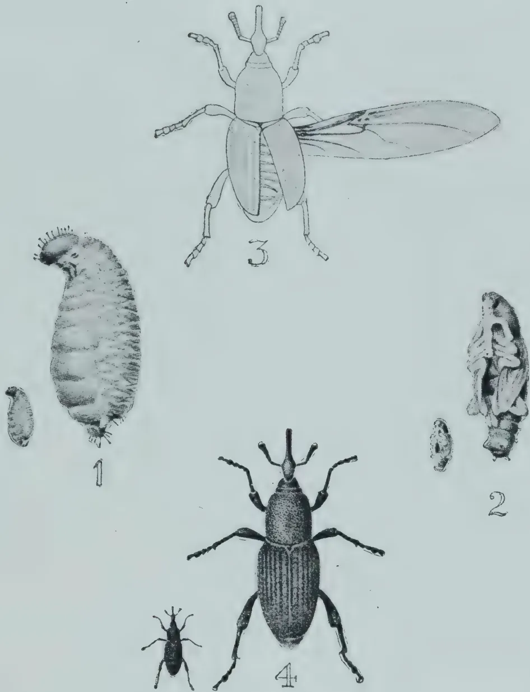The image contains four detailed scientific illustrations of a beetle, likely a species of weevil. Figure 1 (top left) depicts a larva, which is elongated and segmented, with a small head and a larger, segmented body. A smaller, separate head-like structure is shown to its left. Figure 2 (top right) shows a pupa, which is more compact and rounded than the larva, with visible developing wing pads. A small head-like structure is also shown to its left. Figure 3 (top center) illustrates an adult beetle with its wings fully extended, showing the intricate venation of the forewings. Figure 4 (bottom center) shows an adult beetle from a dorsal perspective, with its head and antennae clearly visible. A smaller, separate head-like structure is shown to its left. Each figure is labeled with a number (1, 2, 3, 4) below it.

Figure 1.—Larva  $\times 3$ .

Figure 2.—Pupa  $\times 3$ .

Figure 3.—Adult showing underwing extended  $\times 3$ .

Figure 4.—Adult  $\times 3$ .

345------------------------------------------------

This image is a scan of a blank page. The background is a uniform light beige or off-white color. There are several small, dark specks scattered across the surface, which appear to be dust or scanning artifacts. No text, lines, or other graphical elements are present.

346------------------------------------------------

JUNE, 1924.]373

# AGRICULTURAL SHOWS.

## TRINCOMALIE AGRICULTURAL AND INDUSTRIAL SHOW, 1924.

A. V. CHELVANAYAGAM,

*Agricultural Instructor, Trincomalie.*

The Agricultural and Industrial Show, organised by the Trincomalie Food Production Committee was held on 31st March, 1924, at the Trincomalie Central Market and was opened by MR. W. L. MURPHY, Assistant Government Agent, Trincomalie, in the presence of a large gathering of local residents, including villagers, Police Headmen and Vanniahs of the different pattus. The market buildings were kindly lent by the Chairman, Local Board, Trincomalie, and they were decorated with evergreens and flags. Two tents were pitched, one to accommodate exhibits of the Industrial Section and the other for the visitors. The Show was confined only to the Trincomalie District and exhibits of all the sections were fairly represented. There were fruits, vegetables (local and English,) yams, grains, and pulses, and exhibits of Industrial section. Fruits somewhat poor, except for some good specimens of oranges and sugar-cane. Vegetables were well exhibited and fine specimens of tomatos, chillies, brinjals, snake gourds, bottle gourds and pumpkins were shown. Yams and grains and pulses were fairly represented. Rice of different varieties, kurakkan, gingelly, black and green gram were particularly good. There were not many exhibits under Industrial section, but the few Katties, axes, mamoties and ploughs exhibited were fairly good. The fruit stall at the entrance of the market accommodated exhibits of the Department of Agriculture, which consisted of several varieties of dry grains, yams, tobacco, fibres, seeds of oil palm and green manures and fruits. These exhibits proved a great attraction and many enquiries were made regarding them. Publications of the Agricultural Department were also exhibited. The judges of the show were MR. W. L. MURPHY, Assistant Government Agent, Trincomalie, MR. G. HARBORD, Divisional Agricultural Officer, Northern Division, Jaffna, MR. A. R. HUGHES, District Engineer, Trincomalie and MR. W. G. VALLIPURAM, Police Magistrate, Trincomalie. Prizes, consisting mostly of cash and certificates, were distributed at the close of the Show by His Excellency SIR H. W. RICHMOND, Rear Admiral of the East Indies Squadron, who in a short and brief speech congratulated the prize winners and urged more to take part in the next show, instead of allowing only a few to carry off the prizes, and wished that, as the H. M. S. ships would be calling at Trincomalie very often, in future, more vegetables and fruits, might be grown locally, so that, fruits and vegetables of good quality might be supplied to them. In conclusion, he encouraged the people present to try to make the Show next year more successful.

347------------------------------------------------

374[JUNE, 1924.

# GENERAL.

---

## IMPORTANCE OF CHEMICAL TECHNOLOGY.

---

PROFESSOR F. HARDY.

Tropical agriculture differs materially from temperate agriculture in the nature of its end products. Whereas the interest of the plant-grower in temperate countries generally ends with the successful harvesting of grain, root and fodder grasses that comprise his main staples, that of the tropical planter must be extended beyond the mere growing of plants to the technological details of preparing from them diverse products that frequently require considerable skill in their elaboration. It is because of the intrinsic nature of his articles of merchandise, and because of geographical position of his plantations, that the tropical agriculturist has these additional responsibilities forced upon him.

The sap of the sugar-cane begins to alter in composition immediately the stems are severed, its content of sucrose rapidly decreasing. Steps must therefore at once be taken to recover the main component from the harvested plant. It would be disastrous, as well as costly, to transport the raw material to sugar factories located near the main markets or centres of consumption. The fruit of cacao or of coffee is perishable; it must be fermented and dried before it can safely be shipped for further treatment. Limes and lemons quickly rot after ripening; their juices must therefore be extracted soon after reaping, if losses of citric acid are to be avoided. Their rind cells must also immediately be punctured to save the essential oils from deterioration. Ripe palm nuts are bulky, and contain fatty oils that tend to become rancid. To lessen cost of transport, and to secure the best quality of fat, it is necessary to express these oils, or at least to desiccate the pulp, soon after the nuts have been gathered. Rubber latex, when intended as a source of crepe rubber, must be quickly coagulated to separate the valueless components which would unnecessarily increase freightage and introduce difficulties of handling.

These typical examples of the treatments that must be given to tropical crops in order to render their special products marketable, illustrate the two main objects of chemical technology as applied to tropical agriculture. They are, firstly, to prevent spontaneous loss or deterioration of the main product for which any particular crop is grown, and secondly, to reduce bulk by the elimination of valueless components, in order to lessen cost of transport.

The means whereby these objects are attained varies greatly with the different kinds of tropical plant products, but we may conveniently group the main operations under the following headings: (1) mechanical expression of plant saps, (2) mechanical separation of fibres, (3) dehydration or desiccation, (4) crystallization, (5) distillation and (6) extraction by solvents.

348------------------------------------------------

JUNE, 1924.]375

The mechanical expression of plant saps is usually a straightforward process, requiring only some type of roller machinery. It is entirely a problem for the engineer. So also is the separation of vegetable fibres, such as cotton and hemp, by ginning or beating.

Dehydration and crystallization are much troublesome operations because, during the removal of water from plants or plant saps, certain kinds of chemical and physical changes are likely to occur, that frequently result in the destruction of the very substance which it is intended to preserve. In order to understand the nature of these changes, as a prerequisite to their control or elimination, exact knowledge of the properties of the numerous and varied chemical substances present in plants must be obtained. It is here that physical and chemical investigations have done much to aid the technologist in elaborating efficient methods for the isolation of desirable components of plants. Perhaps no more striking example of this fact can be quoted than the case of the manufacture of sugar from sugar-cane juice. Little advance was made beyond the primitive methods of treatment, until chemists adequately demonstrated the importance of neutralizing the natural acidity of cane juice before evaporating, and of carefully removing the various colloidal substances present therein before attempting to crystallize out the sugar. It can safely be stated that even now we know very little about the complex relationships that exist between the various components of sugar-cane juice, and that much further research is needed if additional progress in sugar manufacture is to be made. Furthermore, when it is realized that of all tropical plant products, none has received so much attention as cane sugar, one must admit that great scope lies before the investigator in the bio-chemistry and physics of tropical plants.

Distillation is the method used for separating substances of different volatility, and has long been employed in the manufacture of certain plant products, notably alcohol and essential oils. The process is entirely physical, and is governed by certain laws which have been very completely studied in the laboratory. A thorough understanding of these laws is necessary for the correct designing of distillation apparatus, and for the attainment of economical working.

Most vegetable drugs are obtained by extraction with solvents from the plants that contain them. The extraction process must be carefully elaborated and great attention paid to the employment of the right kind of solvent. The specific properties of the substance it is desired to extract must therefore be accurately investigated, for the different drug compounds vary greatly in behaviour.

Sufficient has been written to demonstrate the fundamental bearing of chemistry and physics on the problems relating to the technology of tropical plant products. Indeed, it is patent that these problems do not greatly differ in kind from those that confront the chemical engineer in other industries. To be successful, the technologist merely has to apply certain well-established principles of science, with due consideration of the composition and properties of the substances with which he is dealing. This, however, is not all. He has also carefully to choose and co-ordinate suitable large-scale apparatus, and to employ only those methods that are

349------------------------------------------------

376[JUNE, 1924.

economically sound. The economic factor must never be left out of account. Management is just as important in the tropical plant products factory as in the field aspects of agriculture. A perusal of the immense amount of obsolete scientific and patent literature that has sprung up around the subject of chemical technology, will indicate the extremely exacting nature of this selective economic factor. Many technologists go so far as to maintain that management should be the main concern of the manufacturer. This cannot of course be entirely true, because the technologist has to handle materials as well as men, and a knowledge of the behaviour of the one is just as important for success as a knowledge of the behaviour of the other.

Many possible tropical plant products industries have remained undeveloped, or have failed to materialize soon after initiation, on account of a lack of appreciation on the part of tropical agriculturists of the importance of the fundamental sciences in chemical technology. The plant-grower who has no understanding of the profundities of physical and chemical processes, who beholds with a certain apprehension the vast amount of accumulated knowledge of the properties and behaviour of substances, is seldom willing to exploit crop plants with which he is unfamiliar, or to extend his technological activities to new ventures.

It should therefore be one of the main objects of a complete education for tropical agriculturists to remove this unfamiliarity with the fundamental facts and principles of chemical technology. Whilst it is recognised that the tropical agriculturist cannot hope to become a specialist both in the business of crop growing and also in that of plant products manufacture, much can be done by preliminary training to remove the lack of co-ordination between these two divergent types of activity. What has been accomplished in the sugur industry might profitably be extended to other tropical plant industries. Indeed, rapid strides have already been made in this direction in California, where citrus growers are working in complete accord with the manufacturers of certain by-products, under the guidance of the Director and Staff of the Laboratory of Fruit and Vegetable Chemistry recently established at Los Angeles by the United States Department of Agriculture. This is the line of development and organization which might well be followed up more generally to the benefit of tropical industry in many countries.—TROPICAL AGRICULTURE, Vol. I. No. 4.

## SISAL HEMP PLANTATIONS IN THE GOLD COAST.

Reference has already been made in this Bulletin (1920, 18, 560; 1922, 20, 312) to the efforts which are being made to create a Sisal hemp industry in the Gold Coast.

In a *Memorandum* issued by the Governor in January, 1922, on the Sisal plantation at Accra, it was pointed out that the chief object in starting the plantation was to establish a new industry for a part of the country which is not adapted to the growth of cacao and the oil-palm. The barren Accra plains were chosen for the plantation as they are unsuitable for most

350------------------------------------------------

JUNE, 1924.]377

other crops and afforded a site which was near to a port and also to a supply of water. It was hoped that the local chiefs and others would be willing to co-operate with the Government by forming a Company to work the plantation, but this hope was not realised as the Gold Coast native is cautious and conservative, and disinclined to undertake a new industry until he is convinced that it will prove successful. The original intention was to plant an area of 3,000 acres, but this was subsequently reduced to 1,000 acres. A suitable site was found on the southern side of the Waterworks Railway about two miles west of the Accra Lagoon, and by September, 1921 nearly the whole of the 1,000 acres had been planted. The plantation is intended to serve as the centre of an industry which it is hoped will be adopted by the local farmers as soon as they have appreciated the value of the crop. The plantation is to be provided with tram-lines for conveying the leaves to a central factory in which fibre-extracting machinery will be installed. It is considered that the crop of Sisal hemp, if sold at normal prices, should yield sufficient profit to enable the tramway system to be extended from the Government plantation to those of the local Sisal hemp farmers. In conjunction with the fibre plants, cassava and other food-crops are to be grown on the plantation for the provision of a food supply, and possibly for the production of power alcohol. The local farmers will be encouraged to plant Sisal hemp, especially in the neighbourhood of the Government plantation, and advice and assistance will be afforded to them. The Government would be prepared to hand the plantation over to private enterprise on condition that the rights of the natives were adequately safeguarded.

In concluding his *Memorandum*, the Governor announced the formation of a Committee to draw up a concrete scheme for the future of the plantation on the lines indicated above.

The Committee presented their *Report* on March 29, and this has now been published (Gold Coast: Government Press, Accra, 1922). A short summary of its main features are given below.

It is expected that leaves will be ready for cutting on the plantation on January 1, 1924. The expenditure from the date of starting the plantation to December 31st, 1921, was £14,609, and it is estimated that by the end of 1923 the expenditure will have amounted to £24,000. A portion of this will be recovered by the sale of food-stuffs which the Superintendent of the Plantation estimates will realise £1,000. (This estimate is regarded by the Committee as unduly optimistic.) The estimated expenditure of £24,000, however, does not include (1) compensation to farmers who were dislodged on the formation of the plantation, which will probably amount to £1,500, (2) the cost of building and equipping the factory, estimated at £5,941, (3) the cost of the tramways, £2,280, and (4) of water tanks and piping, £200, or (5) interest on the capital invested. These items will bring the total expenditure as at December 31, 1923, to about £35,000, after allowing for the revenue from food-stuffs.

It is estimated that the annual expenditure when the producing stage is reached will be £17,185, if a yield of 750 tons is obtained, or £19,485 in the case of a yield of 1,000 tons.

With regard to production, the majority of the Committee are of opinion that the annual yield of fibre will amount to  $\frac{3}{4}$  ton per acre, whence the total yield of the plantation would be 750 tons per annum. The President (MR. JOHN MAXWELL, C.M.G.) considers, however, that the yield will

351------------------------------------------------

378[JUNE, 1924.

be at least one ton per acre, or a total yield of 1,000 tons or more per annum, this view being based chiefly on the information given in the IMPERIAL INSTITUTE HANDBOOK on *Cotton and Other Vegetable Fibres*, by DR. ERNEST GOULDING.

The Committee consider it safe to assume that each plant will produce 170 leaves during a bearing life of four years, *i.e.*, an average of 42 leaves per annum. On this basis, the annual production of fibre per acre, assuming 888 plants to the acre and a yield of dry fibre of 3 per cent. of the weight of the leaves, would be almost exactly one ton. The cost of production, calculated from the annual expenditure mentioned above—which includes allowances for depreciation (10 per cent.), interest on capital (6 per cent.), and a sinking fund for repayment of capital (10 per cent.)—would thus amount to £19. 9s. 8d. per ton. If the yield per acre should amount to only  $\frac{3}{4}$  ton, the cost of production would be £22 18s. 3d. per ton.

The Committee are convinced that the climate and soil are quite suitable for Sisal hemp cultivation, but point out that the cost of labour is high and a supply is sometimes difficult to obtain. The plantation is favourably situated with regard to transport, and is in close proximity to the pipe-borne water supply for the town of Accra. It is felt, however, that although the quantity of water available will probably be adequate for the next few years, there is a danger that owing to the rapid increase in the population of the town it may not be sufficient subsequently, and it is recognised that in the event of a shortage the supply to the plantation would be among the first to be curtailed.

The Committee concur with the proposal that any profits which may be derived from the Government plantation should be utilised for the extension of the tramway system to the plantations of local farmers.

There is no prospect at present of the plantation being worked as a co-operative concern by African farmers. No definite suggestion has been received for private enterprise to take over the plantation, and, as the Government have agreed to return it to the chiefs as soon as the capital and interest have been recovered, such a proposal could not be considered unless the chiefs decline to take it over when the time comes. The Committee therefore recommend that the present system should be continued until the plantation is in bearing, when, with the results before them, the native farmers are likely to regard the proposition more favourably.

There are a number of appendixes to the *Report*, including the Minutes of the Meetings of the Committee, the Governor's *Memorandum* already referred to, statements and estimates of expenditure and revenue and copies of correspondence between the District Commissioner, Accra, and the Accra Chiefs.—BULL. OF THE IMP. INST., Vol. XXI. No. 3.

---

## CARNAUBA WAX.

---

There have been several enquiries recently regarding the possibility of growing Carnauba wax in Ceylon. Trials with this palm at Peradeniya have so far been unsuccessful, but it is possible that it might succeed better in the low-country, and further supplies of seed have been ordered for trial at Henaratgoda.

The following extract is taken from BRAZILIAN COTTON: Being the Report of the Journey of the International Cotton Mission through the Cotton States of Sao Paulo, Minas Geraes, Bahia, Alagoas, Sergipe, Pernambuco, Parahyba, Rio Grande Do Norte. By ARNO S. PEARSE, General Secretary of the International Federation of Master Cotton Spinners' and Manufacturers'

352------------------------------------------------

JUNE, 1924.]379

Association, Manchester :—

"During one of the breakdowns of our motors we had the pleasure of discussing with a number of small farmers in the Carnauba Palm district near Assu, the method of obtaining the wax. As this wax is being more and more used in the manufacture of gramophone records, in the making of varnishes and size, and as little is known of this primitive industry, the following notes may be of interest. These small farmers said: the Carnauba palms belong to those rich men who let out small lots to the poor people who pay the rent in wax after the year's crop, the annual charge depending on the value of the palm trees. No contract is made for longer than one year, but the old tenant always has preference over the area which he had hired the previous year. During the year the land owner, who has generally a shop, advances to his small tenants cash and the necessities of life.

One Carnauba tree gives from 10 to 14 leaves ("palhas") at the first cutting ("corte"), and five to six leaves at the second cutting. Generally three cuttings are made, the first in October, the second in December, and the third in February. The latter is sometimes omitted if rains set in. Four trees give about 100 leaves in the year and from 100 leaves is produced, more or less, one kilo of wax.

The leaves are classified into "palhas" and "olhos" (eyes). "Palhas" are the fully opened-up fan-shaped leaves, whilst "olhos" are the young, bright green leaves, standing upright and not yet opened up. The latter provide the best quality. Great care must be exercised in separating the young leaves from the old ones before preparing them.

The leaves are cut from the high trees by means of a knife ("clinchete" or "foice") attached to a long pole ("vara") composed of various lengths, each of which has a name, viz.: "pe da vara", the bottom length, "macaco" the second, "soin" the third, "guariba" the fourth, "crescentao" the fifth and "emmenda" the sixth. Two people will cut, collect and spread out 2,000 leaves in 12 hours. The leaves are dried in the sun during four days, when they are taken into a shed ("estalleiro") and slashed by a man into long strips and beaten by a woman. 2,000 leaves are treated in this way in 12 hours. The dust falling out from the cut leaves is taken in a clay bowl ("caco de barro") over a fire, where it is soaked with some water, or when the dust is put into the bowl in a dry state, it is heated to melting point. In both cases the wax, whilst still hot, is filtered. The caked wax is packed in strong jute bags.

This primitive method of extracting the wax ought to be replaced by some more advanced mechanical means.

The wax is graded into "Cera de 1a," "Cera de 2a" and "Cera Mediana," for which the local prices at the time of our visit (July, 1921) were 50 milreis 30 milreis and 20 milreis per unit.

Everything is used of the Carnauba palm.

1. 1. The leaves after the extraction of the dust are given to the cattle; houses are lined inside with the leaves, and hats and various paddings are made of them.

1. 2. The small black seed is much appreciated by man and animals.

1. 3. The stem ("pau") is excellent material in the construction of houses, fences, etc.

353------------------------------------------------

380[JUNE, 1924.

1. 4. The root is used in the preparation of medicine.
2. 5. The wax, besides being a commodity of export greatly in demand, is used as an illuminant in the houses. (Often our only lamps were small, open, flat, iron basins with a wick and dissolved Carnauba wax.)

Carnauba palms grow wild in silt land ("lama") and low-lying margins of rivers ("varzeas").

Recent enquiries made from the Director, Royal Botanic Gardens, Kew, have resulted in the information that the following market prices prevail for Carnauba wax at the present time:—

<table>
<tr>
<td>Fatty Grey</td>
<td>95 s. per cwt.</td>
</tr>
<tr>
<td>Chalky</td>
<td>90 s. ,,</td>
</tr>
</table>

It is further reported that there is a good market for the wax and that the demand is almost certain to continue.

## THE POMEGRANATE.

W. MOLEGODE,

*Agricultural Instructor.*

The Pomegranate (*Punica granatum*), Sinhalese *Delun*, deserves to be more widely known and more extensively cultivated for its refreshing fruit and for its well-known medicinal properties. The Pomegranate plant is easily cultivated. It is one of the few cultivated trees that will withstand drought—growing and fruiting in some of our driest regions such as Put-talam and Kalpentyn and also grows and fruits in the wettest part. It is indifferent as to the nature of the soil on which it will grow and does well on most Ceylon soils. It, however, grows best on deep soils of a fairly heavy nature. It is easily propagated from seed or cuttings. It is quick growing and fruits in a couple of years.

In most village compounds and backyards one of the principal plants we meet with is the pomegranate. It is considered to be a lucky tree to grow near houses and even in towns where there is a front compound—particularly along the West Coast—the pomegranate tree is a most prominent feature.

### USES.

The fruit, which sometimes attains to the size of a large orange, contain a large number of seeds covered with a bright-red, succulent sweet coatings. This juice is much valued as a cooling drink and is recommended by *Vedaralas* largely in cases of fever and other sicknesses to quench thirst. The fruit keeps well owing to the tough rind. Though sometimes when fruits are plentiful they can be had in our markets for 15 or 20 cents each one has often to pay 50 cents to Re. 1/- for a good fruit.

The rind of the fruit is a well recognised astringent and plays a very prominent part in the treatment of diarrhoea and dysentery. It is also used in tanning and dyeing and consists of about 25% of tannin. The rind can be preserved for a long time if hung over a fire or if dried and stored. Powdered and mixed with 50% of Camphor powder, the rind makes an excellent dentifrice.

The bark of the root is considered a specific against tape-worm.

The flowers are also used in medicine but perhaps the most generally and largely used part of the Pomegranate tree are the tender leaves which are boiled and used as a fomentation in cases of sore eyes.

354------------------------------------------------

JUNE, 1924.]381

## THE GOVERNMENT PRINTING OFFICE CO-OPERATIVE SOCIETY, LTD.

---

The following extract is taken from the Administration Report of the Government Printer for the year 1923:

The Government Printing Office Co-operative Society, Ltd. was started in October, 1917, with the object of the encouragement of thrift by affording a ready means of putting away a portion of one's income, on which a return in the way of annual bonuses might be reckoned on; and for the prevention of hopeless indebtedness by enabling members to obtain loans from the Society at a reasonable rate of interest. That the objects of the Society have been attained is proved by the very considerable reduction in the number of victims who fall into the clutches of the unscrupulous money-lender.

The total number of members on December 31, 1923, was 293, while the paid-up capital stood at the appreciable figure of Rs.13,120. This sum was saved by members buying shares and paying for them at the rate of Re. 1/-per mensem for each share.

From experience thus gained a Provident Fund, called "The G. P. O. Co-operative Society's Provident Fund" was started in 1921, with the object of ensuring to its members the benefit of a donation to be paid, on final retirement from the Government Service and the Society to themselves, and in case of death to their nominees or heirs-at-law. Out of the monthly deposits received from members, a total sum of Rs. 2,250 has been lent to members on mortgages of landed property, and a balance of Rs. 4,102'83 was, on December 31, lying to the credit of members in the Imperial Bank of India.

---

## ROZELLE OIL.

---

The MALAYAN AGRICULTURAL JOURNAL mentions that an investigation was recently carried out to determine the oil content of Rozelle seed (*Hibiscus Sabdariffa*) and the character of the oil. The suggestion came from Mr. E. MATHIEU, Superintendent of Government Plantation, who obtained the seed. The investigation showed that the seed contains about 17 per cent. oil, viz., similar to kapok and cotton seed. The residue is rich in albuminoids, the nitrogen being about 4.7 per cent. equal to 29 per cent. albuminoids. The plant, as is known, is valued primarily for its fibre.

355------------------------------------------------

382[JUNE, 1924.]

## A SIMPLE FORM OF BUDDING.

A method of budding which is practised with very successful results at the Foreign Seed and Plant Introduction Garden, Miami, Florida, and also by Mango and Avocado growers in that locality, is being recommended in Dominica.

Since this method gives quicker results, and is more simple of accomplishment than the usual method employed in that island the following directions for the carrying out of this form of budding are given.

For insertion into the stock, a semi-matured shoot from 2 to  $2\frac{1}{2}$  inches long, and with a plump bud as its apex, is chosen. The shoot, which should not be thicker than a lead pencil, (or thinner where the thickness of the stock employed is less than  $\frac{1}{2}$  an inch in diameter), is prepared by first carefully cutting away the leaves. Then with a sharp knife commencing the cut immediately under the base of the terminal bud, a diagonal cut is made extending from the bud to the base of the shoot. When prepared the shoot should have one of its sides intact, whilst the other will be cut away in such a manner as to give it a wedge-shaped appearance.

In regard to the stock, the best results are obtained with those not exceeding  $\frac{1}{2}$  an inch in diameter. Provided, however, that the part of the stock selected for budding is not too old, and that the bark parts readily from the wood—a necessary condition in all parts to be budded, regardless of their diameter—the thickness of the stock is not a matter of very great importance.

The stock is prepared by making incisions in the bark like the letter T with a long tail, the length of tail, or vertical incision, being made slightly shorter than the length of a shoot to be inserted.

In order that the plump terminal bud may fit in close to the stem of the stock, a piece of bark, and if necessary a piece of wood as well, is cut away immediately above, and over the centre of the horizontal incision.

Having prepared the stock and scion, the latter is inserted at the top of the vertical incision and gently pushed down until the bud fits snugly into the place prepared for it.

By making the vertical incision in the stock slightly shorter than the length of the shoot, there should be no difficulty in getting a snug fit, for if the bark is in the right condition, a sufficient lengthening of the cut will take place as the shoot is pushed into the position. Once the shoot is slipped into its place, a piece of bast, worsted, or narrow tape should be firmly wound once or twice round the stock, so that the two flaps of the T incision are held securely over the shoot.

A piece of waterproof paper, (oblong in shape), is then tied on to the budded stem to give protection from sun and rain, the paper being wrapped closely round the stem above the shoot, and there tied; whilst the lower edge of the paper is allowed to remain unfastened so as to hang out from the stem, and thus afford a cone-like covering to the shoot beneath.

With the paper fastened into position the operation is complete, and in about 20 days a perfect union should be effected.—REPORT OF AGRIC. DEPT., DOMINICA, 1922-23.

356------------------------------------------------

JUNE, 1924.]

383

# MARKET RATES.

## MARKET RATES FOR SOME CEYLON PRODUCTS.

(FROM THE CEYLON CHAMBER OF COMMERCE WEEKLY PRICE CURRENT, DATED 12th MAY, 1924.)

<table border="1">
<thead>
<tr>
<th colspan="2">NAME OF PRODUCE</th>
<th colspan="4">CURRENT PRICE</th>
<th>REMARKS</th>
</tr>
<tr>
<th colspan="2"></th>
<th>Rs.</th>
<th>cts.</th>
<th>at</th>
<th>Rs.</th>
<th>cts.</th>
</tr>
</thead>
<tbody>
<tr>
<td colspan="7"><b>CARDAMOMS</b></td>
</tr>
<tr>
<td>All round parcel well bleached</td>
<td>... per lb.</td>
<td>...</td>
<td>...</td>
<td>"</td>
<td>...</td>
<td>...</td>
</tr>
<tr>
<td>Do do medium</td>
<td>... do</td>
<td>...</td>
<td>...</td>
<td>"</td>
<td>...</td>
<td>...</td>
</tr>
<tr>
<td>Special assortment O &amp; I only</td>
<td>... do</td>
<td>...</td>
<td>...</td>
<td>"</td>
<td>...</td>
<td>...</td>
</tr>
<tr>
<td>Seeds</td>
<td>... do</td>
<td>...</td>
<td>...</td>
<td>"</td>
<td>...</td>
<td>...</td>
</tr>
<tr>
<td>Green</td>
<td>... do</td>
<td>2</td>
<td>60</td>
<td>"</td>
<td>2</td>
<td>75</td>
</tr>
<tr>
<td colspan="7"><b>CINNAMON QUILLS—[At Buyer's Stores]</b></td>
</tr>
<tr>
<td>Ordinary assortment (in bales of 100 lb. nett)</td>
<td>... per lb.</td>
<td>0</td>
<td>59</td>
<td>"</td>
<td>0</td>
<td>65</td>
</tr>
<tr>
<td>No. 1</td>
<td>... do</td>
<td>0</td>
<td>62</td>
<td>"</td>
<td>0</td>
<td>67</td>
</tr>
<tr>
<td>No. 2</td>
<td>... do</td>
<td>0</td>
<td>60</td>
<td>"</td>
<td>0</td>
<td>65</td>
</tr>
<tr>
<td>No. 3</td>
<td>... do</td>
<td>0</td>
<td>57</td>
<td>"</td>
<td>0</td>
<td>63</td>
</tr>
<tr>
<td>No. 4</td>
<td>... do</td>
<td>0</td>
<td>54</td>
<td>"</td>
<td>0</td>
<td>60</td>
</tr>
<tr>
<td colspan="7"><b>CINNAMON CHIPS—Maradana, (At Buyer's Stores in bags of 56 lb. nett) per candy of 560 lb.</b></td>
</tr>
<tr>
<td></td>
<td>...</td>
<td>55</td>
<td>00</td>
<td>"</td>
<td>65</td>
<td>00</td>
</tr>
<tr>
<td colspan="7"><b>CITRONELLA OIL—(ex-Seller's Stores without packages)</b></td>
</tr>
<tr>
<td></td>
<td>... per lb.</td>
<td>2</td>
<td>20</td>
<td></td>
<td>2</td>
<td>25</td>
</tr>
<tr>
<td colspan="7"><b>CACAO—(At Buyer's Stores)</b></td>
</tr>
<tr>
<td>Estate—Finest</td>
<td>... per cwt.</td>
<td>54</td>
<td>00</td>
<td>"</td>
<td>60</td>
<td>00</td>
</tr>
<tr>
<td>Do Medium</td>
<td>... do</td>
<td>30</td>
<td>00</td>
<td>"</td>
<td>45</td>
<td>00</td>
</tr>
<tr>
<td>Do Common (Black)</td>
<td>... do</td>
<td>10</td>
<td>00</td>
<td>"</td>
<td>20</td>
<td>00</td>
</tr>
<tr>
<td colspan="7"><b>COCONUT—(Desiccated) Granulated goods (Delivered at Wharf or Buyer's Stores)</b></td>
</tr>
<tr>
<td>Assortment: Medium 50 per cent. Fine 50 per cent.</td>
<td>... per lb.</td>
<td>0</td>
<td>19½</td>
<td>"</td>
<td>0</td>
<td>20½</td>
</tr>
<tr>
<td colspan="7"><b>COCONUT OIL—</b></td>
</tr>
<tr>
<td>White Oil f.o.b</td>
<td>... per ton</td>
<td>590</td>
<td>00</td>
<td>"</td>
<td>600</td>
<td>00</td>
</tr>
<tr>
<td>Ordinary Oil do</td>
<td>... do</td>
<td>545</td>
<td>00</td>
<td>"</td>
<td>555</td>
<td>00</td>
</tr>
<tr>
<td colspan="7"><b>COPRA—</b></td>
</tr>
<tr>
<td>Calpentyn</td>
<td>No. 1 quality</td>
<td rowspan="4">80</td>
<td rowspan="4">00</td>
<td rowspan="4">"</td>
<td rowspan="4">84</td>
<td rowspan="4">25</td>
</tr>
<tr>
<td>Estate</td>
<td>per candy of 560 lb.</td>
</tr>
<tr>
<td>Ordinary quality (Maravila)</td>
<td>" "</td>
</tr>
<tr>
<td>Cart Do do</td>
<td>" "</td>
</tr>
<tr>
<td colspan="7"><b>FIBRES—(At Buyer's Stores)</b></td>
</tr>
<tr>
<td>Coconut Bristle No. 1</td>
<td>... per cwt.</td>
<td rowspan="2">13</td>
<td rowspan="2">00</td>
<td rowspan="2">"</td>
<td rowspan="2">14</td>
<td rowspan="2">40</td>
</tr>
<tr>
<td>Do No. 2</td>
<td>... do</td>
</tr>
<tr>
<td>Coconut Mattress No. 1</td>
<td>... do</td>
<td rowspan="2">2</td>
<td rowspan="2">60</td>
<td rowspan="2">"</td>
<td rowspan="2">2</td>
<td rowspan="2">95</td>
</tr>
<tr>
<td>Do No. 2</td>
<td>... do</td>
</tr>
<tr>
<td>Coir yarn Kogalla Nos. 4 to 9</td>
<td>... do</td>
<td>12</td>
<td>50</td>
<td>"</td>
<td>25</td>
<td>00</td>
</tr>
<tr>
<td>Do Colombo Nos. 3 to 7</td>
<td>... do</td>
<td>12</td>
<td>50</td>
<td>"</td>
<td>25</td>
<td>00</td>
</tr>
<tr>
<td colspan="2"><b>PLUMBAGO</b></td>
<td colspan="2">X. B.</td>
<td colspan="2">B</td>
<td colspan="2">B. E.</td>
</tr>
<tr>
<td colspan="2"></td>
<td>Rs.</td>
<td>cts.</td>
<td>Rs.</td>
<td>cts.</td>
<td>Rs.</td>
<td>cts.</td>
<td>Rs.</td>
<td>cts.</td>
</tr>
<tr>
<td>Ordinary Lumps</td>
<td>... per ton</td>
<td>300</td>
<td>00</td>
<td>at</td>
<td>350</td>
<td>00</td>
<td>215</td>
<td>00</td>
<td>at</td>
<td>250</td>
<td>00</td>
<td>150</td>
<td>00</td>
<td>at</td>
<td>185</td>
<td>00</td>
</tr>
<tr>
<td>Chips</td>
<td>... do</td>
<td>175</td>
<td>00</td>
<td>"</td>
<td>250</td>
<td>00</td>
<td>150</td>
<td>00</td>
<td>"</td>
<td>200</td>
<td>00</td>
<td>100</td>
<td>00</td>
<td>"</td>
<td>150</td>
<td>00</td>
</tr>
<tr>
<td>Dust</td>
<td>... do</td>
<td>100</td>
<td>00</td>
<td>"</td>
<td>175</td>
<td>00</td>
<td>70</td>
<td>00</td>
<td>"</td>
<td>125</td>
<td>00</td>
<td>40</td>
<td>00</td>
<td>"</td>
<td>75</td>
<td>00</td>
</tr>
<tr>
<td>Do Flying</td>
<td>... do</td>
<td>60</td>
<td>00</td>
<td>"</td>
<td>145</td>
<td>00</td>
<td>40</td>
<td>00</td>
<td>"</td>
<td>95</td>
<td>00</td>
<td>25</td>
<td>00</td>
<td>"</td>
<td>60</td>
<td>00</td>
</tr>
</tbody>
</table>

357------------------------------------------------

384

[JUNE, 1924.]

**METEOROLOGICAL**  
MAY, 1924.

<table border="1">
<thead>
<tr>
<th rowspan="2">Station</th>
<th colspan="2">Temperature</th>
<th rowspan="2">Mean amount of Cloud 10 = overcast</th>
<th rowspan="2">Mean Wind Direction during Month</th>
<th rowspan="2">Daily Mean Velocity</th>
<th colspan="2">Rainfall</th>
</tr>
<tr>
<th>Mean Daily Shade</th>
<th>Dif- ference from Average</th>
<th>Mean Humidity %</th>
<th>Amount Inches</th>
<th>No. of Rainy Days</th>
<th>Difference from Average</th>
</tr>
</thead>
<tbody>
<tr>
<td>Colombo</td>
<td>82.2</td>
<td>-0.4</td>
<td>8.8</td>
<td>SW</td>
<td>126</td>
<td>21.74</td>
<td>29</td>
<td>+9.33</td>
</tr>
<tr>
<td>Observatory</td>
<td>83.2</td>
<td>0</td>
<td>4.6</td>
<td>SSW</td>
<td>196</td>
<td>5.16</td>
<td>9</td>
<td>+1.90</td>
</tr>
<tr>
<td>Puttalam</td>
<td>86.2</td>
<td>+0.4</td>
<td>7.6</td>
<td>SSW</td>
<td>215</td>
<td>2.13</td>
<td>7</td>
<td>+0.10</td>
</tr>
<tr>
<td>Mannar</td>
<td>86.2</td>
<td>+1.0</td>
<td>6.3</td>
<td>SSW</td>
<td>327</td>
<td>0.35</td>
<td>3</td>
<td>-1.38</td>
</tr>
<tr>
<td>Jaffna</td>
<td>86.5</td>
<td>+0.3</td>
<td>6.6</td>
<td>SW</td>
<td>184</td>
<td>0.58</td>
<td>6</td>
<td>-1.89</td>
</tr>
<tr>
<td>Trincomalee</td>
<td>84.7</td>
<td>+0.1</td>
<td>6.3</td>
<td>VAR.</td>
<td>95</td>
<td>2.21</td>
<td>9</td>
<td>+0.49</td>
</tr>
<tr>
<td>Batticaloa</td>
<td>82.0</td>
<td>-0.2</td>
<td>5.4</td>
<td>WSW</td>
<td>313</td>
<td>5.49</td>
<td>14</td>
<td>+2.38</td>
</tr>
<tr>
<td>Hambantota</td>
<td>81.0</td>
<td>-0.8</td>
<td>7.2</td>
<td>W</td>
<td>220</td>
<td>14.22</td>
<td>24</td>
<td>+2.97</td>
</tr>
<tr>
<td>Galle</td>
<td>81.6</td>
<td>-0.3</td>
<td>7.6</td>
<td>—</td>
<td>—</td>
<td>24.66</td>
<td>27</td>
<td>+7.03</td>
</tr>
<tr>
<td>Ratnapura</td>
<td>83.2</td>
<td>-0.4</td>
<td>6.6</td>
<td>—</td>
<td>—</td>
<td>3.01</td>
<td>11</td>
<td>-0.2</td>
</tr>
<tr>
<td>Anu'pura</td>
<td>83.0</td>
<td>+0.2</td>
<td>8.0</td>
<td>—</td>
<td>—</td>
<td>5.12</td>
<td>14</td>
<td>-1.15</td>
</tr>
<tr>
<td>Kurunegala</td>
<td>79.6</td>
<td>+0.9</td>
<td>7.1</td>
<td>—</td>
<td>—</td>
<td>2.61</td>
<td>13</td>
<td>-2.85</td>
</tr>
<tr>
<td>Kandy</td>
<td>75.8</td>
<td>-0.2</td>
<td>7.5</td>
<td>—</td>
<td>—</td>
<td>6.48</td>
<td>16</td>
<td>+2.03</td>
</tr>
<tr>
<td>Badulla</td>
<td>70.8</td>
<td>+0.2</td>
<td>7.7</td>
<td>—</td>
<td>—</td>
<td>7.49</td>
<td>15</td>
<td>+2.73</td>
</tr>
<tr>
<td>Diyalawa</td>
<td>64.2</td>
<td>+0.6</td>
<td>7.6</td>
<td>—</td>
<td>—</td>
<td>5.74</td>
<td>15</td>
<td>-1.00</td>
</tr>
<tr>
<td>Hakgala</td>
<td>63.4</td>
<td>+1.6</td>
<td>8.2</td>
<td>—</td>
<td>—</td>
<td>4.81</td>
<td>18</td>
<td>-1.83</td>
</tr>
<tr>
<td>N. Eliya</td>
<td></td>
<td></td>
<td></td>
<td></td>
<td></td>
<td></td>
<td></td>
<td></td>
</tr>
</tbody>
</table>

Throughout the Month the Air Pressure was higher in the South than in the North and resulted in the South westerly winds experienced. The typical distribution of the Isobars peculiar to the South-west Monsoon appeared on the fifteenth and persisted throughout the remainder of the month.

The South-westerly winds experienced yielded copious rainfall over the low-country to the South-west and West of the Hills. The whole of the country South of a line drawn from Mannar to Batticaloa excepting up-country and to the North of the Hills, experienced a rainfall above the average. Elsewhere the rainfall was deficient.

At several stations the rainfall for the month totalled over thirty inches. Sirikandura Estate, Matugama, with 37.85 inches falling on 30 days recorded most and was followed by Hiniduma with 33.94. Both Carney Estate, Kathapura, and Geekianakanda Estate, Neboda, experienced rain every day. The former recorded 32.67 and the latter 32.54 inches. At Maggona School it was 30.82, Anningkanda Estate, Deniyaya, 30.59, and Rayigam Estate, Padukka, 30.38.

With the appearance of the South-West gradient on the 15th heavy rain occurred and three stations then recorded over five inches in the twenty-four hours. The heaviest rains, however, were experienced during the last week of the month. The heaviest fall for any one day was at Maggona School where on the morning of the 24th 9.46 inches was measured. Other heavy falls in the twenty-four hours are Geekianakanda, 9.32; Kitulgala, 9.22; Kalutara, 8.33; Ingoya, 8.20 and Peimadulla, 8.15 inches. In all 32 stations recorded a rainfall of over 5 inches in the twenty-four hours.

Air Pressure was below normal.

Temperature did not vary much from the normal, but the tendency was for it to be slightly above up-country and slightly below the South-west.

The sky was clouded to an extent greater than is usual.

The wind as previously stated was for the South-west and about average strength.

J. E. EVANS,  
Actg. Supdt., Observatory.

**ANIMAL DISEASE RETURN FOR THE**  
MONTH ENDED 31st MAY, 1924.

<table border="1">
<thead>
<tr>
<th>Province, &amp;c.</th>
<th>Disease</th>
<th>No. of Cases up to date since Jan 1st, 1924</th>
<th>Fresh Cases</th>
<th>Recoveries</th>
<th>Deaths</th>
<th>Bal- ance Ill</th>
<th>No. Shot</th>
</tr>
</thead>
<tbody>
<tr>
<td rowspan="2">Western</td>
<td>Rinderpest</td>
<td>417</td>
<td>114</td>
<td>149</td>
<td>259</td>
<td>2</td>
<td>7</td>
</tr>
<tr>
<td>Foot-and-mouth disease</td>
<td>17</td>
<td>14</td>
<td>8</td>
<td>—</td>
<td>9</td>
<td>—</td>
</tr>
<tr>
<td rowspan="3">Colombo Municipality</td>
<td>Haemorrhagic Septicæmia</td>
<td>6</td>
<td>6</td>
<td>2</td>
<td>4</td>
<td>—</td>
<td>—</td>
</tr>
<tr>
<td>Rinderpest</td>
<td>259</td>
<td>23</td>
<td>(In April)</td>
<td>—</td>
<td>—</td>
<td>—</td>
</tr>
<tr>
<td>Foot-and-mouth disease</td>
<td>—</td>
<td>—</td>
<td>Figures for May</td>
<td>—</td>
<td>not to hand</td>
<td>—</td>
</tr>
<tr>
<td rowspan="3">Cattle Quarantine Station</td>
<td>Rinderpest</td>
<td>3</td>
<td>15</td>
<td>(In April)</td>
<td>—</td>
<td>Figures for May</td>
<td>—</td>
</tr>
<tr>
<td>Foot-and-mouth disease</td>
<td>23*</td>
<td>19</td>
<td>—</td>
<td>—</td>
<td>not to hand</td>
<td>—</td>
</tr>
<tr>
<td>Anthrax</td>
<td>94*</td>
<td>—</td>
<td>—</td>
<td>—</td>
<td>—</td>
<td>—</td>
</tr>
<tr>
<td rowspan="3">Central</td>
<td>Pleuro-pneumonia (in goats)</td>
<td>74†</td>
<td>—</td>
<td>—</td>
<td>—</td>
<td>—</td>
<td>—</td>
</tr>
<tr>
<td>* 2 cases amongst cattle, the rest amongst goats</td>
<td>—</td>
<td>—</td>
<td>—</td>
<td>—</td>
<td>—</td>
<td>—</td>
</tr>
<tr>
<td>Rinderpest</td>
<td>77*</td>
<td>43</td>
<td>37</td>
<td>2</td>
<td>38</td>
<td>—</td>
</tr>
<tr>
<td rowspan="3">Southern</td>
<td>Foot-and-mouth disease</td>
<td>7</td>
<td>4</td>
<td>4</td>
<td>—</td>
<td>—</td>
<td>—</td>
</tr>
<tr>
<td>Anthrax</td>
<td>4</td>
<td>1</td>
<td>—</td>
<td>—</td>
<td>1</td>
<td>—</td>
</tr>
<tr>
<td>Viriplasmosis</td>
<td>1</td>
<td>—</td>
<td>—</td>
<td>—</td>
<td>—</td>
<td>—</td>
</tr>
<tr>
<td rowspan="3">Northern</td>
<td>Mange</td>
<td>5</td>
<td>5</td>
<td>—</td>
<td>5</td>
<td>—</td>
<td>—</td>
</tr>
<tr>
<td>Rabies (Dogs)</td>
<td>—</td>
<td>—</td>
<td>—</td>
<td>—</td>
<td>—</td>
<td>—</td>
</tr>
<tr>
<td>* 39 cases amongst goats</td>
<td>—</td>
<td>—</td>
<td>—</td>
<td>—</td>
<td>—</td>
<td>—</td>
</tr>
<tr>
<td rowspan="3">Eastern</td>
<td>Rinderpest</td>
<td>2</td>
<td>—</td>
<td>2</td>
<td>—</td>
<td>—</td>
<td>—</td>
</tr>
<tr>
<td>Foot-and-mouth disease</td>
<td>—</td>
<td>—</td>
<td>—</td>
<td>—</td>
<td>—</td>
<td>—</td>
</tr>
<tr>
<td>Anthrax</td>
<td>—</td>
<td>—</td>
<td>—</td>
<td>—</td>
<td>—</td>
<td>—</td>
</tr>
<tr>
<td rowspan="3">North-Western</td>
<td>Rinderpest</td>
<td>98*</td>
<td>—</td>
<td>3</td>
<td>95</td>
<td>—</td>
<td>—</td>
</tr>
<tr>
<td>Foot-and-mouth disease</td>
<td>1</td>
<td>—</td>
<td>1</td>
<td>—</td>
<td>—</td>
<td>—</td>
</tr>
<tr>
<td>Anthrax</td>
<td>—</td>
<td>—</td>
<td>—</td>
<td>—</td>
<td>—</td>
<td>—</td>
</tr>
<tr>
<td rowspan="3">North-Central</td>
<td>Rinderpest</td>
<td>243</td>
<td>92</td>
<td>146</td>
<td>—</td>
<td>—</td>
<td>5</td>
</tr>
<tr>
<td>Foot-and-mouth disease</td>
<td>159</td>
<td>3</td>
<td>2</td>
<td>1</td>
<td>—</td>
<td>—</td>
</tr>
<tr>
<td>Anthrax</td>
<td>1</td>
<td>—</td>
<td>—</td>
<td>—</td>
<td>1</td>
<td>—</td>
</tr>
<tr>
<td rowspan="3">Uva</td>
<td>Rabies (Dogs)</td>
<td>—</td>
<td>—</td>
<td>—</td>
<td>—</td>
<td>—</td>
<td>—</td>
</tr>
<tr>
<td>Rinderpest</td>
<td>89</td>
<td>11</td>
<td>89</td>
<td>—</td>
<td>—</td>
<td>—</td>
</tr>
<tr>
<td>Foot-and-mouth disease</td>
<td>—</td>
<td>—</td>
<td>—</td>
<td>—</td>
<td>—</td>
<td>—</td>
</tr>
<tr>
<td rowspan="3">Sabaragamuwa</td>
<td>Anthrax</td>
<td>—</td>
<td>—</td>
<td>—</td>
<td>—</td>
<td>—</td>
<td>—</td>
</tr>
<tr>
<td>Rinderpest</td>
<td>—</td>
<td>—</td>
<td>—</td>
<td>—</td>
<td>—</td>
<td>—</td>
</tr>
<tr>
<td>Foot-and-mouth disease</td>
<td>3</td>
<td>—</td>
<td>3</td>
<td>—</td>
<td>—</td>
<td>—</td>
</tr>
<tr>
<td rowspan="3"></td>
<td>Black Quarter</td>
<td>15</td>
<td>4</td>
<td>15</td>
<td>—</td>
<td>—</td>
<td>—</td>
</tr>
<tr>
<td>Rinderpest</td>
<td>—</td>
<td>—</td>
<td>—</td>
<td>—</td>
<td>—</td>
<td>—</td>
</tr>
<tr>
<td>Foot-and-mouth disease</td>
<td>83</td>
<td>9</td>
<td>76</td>
<td>—</td>
<td>9</td>
<td>—</td>
</tr>
<tr>
<td rowspan="3"></td>
<td>Anthrax</td>
<td>12</td>
<td>6</td>
<td>12</td>
<td>—</td>
<td>—</td>
<td>—</td>
</tr>
<tr>
<td>Haemorrhagic Septicæmia</td>
<td>3</td>
<td>—</td>
<td>3</td>
<td>—</td>
<td>—</td>
<td>—</td>
</tr>
<tr>
<td>Rabies (Dogs)</td>
<td>2</td>
<td>1</td>
<td>1</td>
<td>—</td>
<td>—</td>
<td>1</td>
</tr>
</tbody>
</table>

† 54 amongst 9; goats imported by Mr. C. E. A. Dias on 5th March, 1924.

M. CRAWFORD,  
Acting Government Veterinary Surgeon.  
Colombo, 6th June, 1924.

358------------------------------------------------

359------------------------------------------------

360------------------------------------------------

361------------------------------------------------

