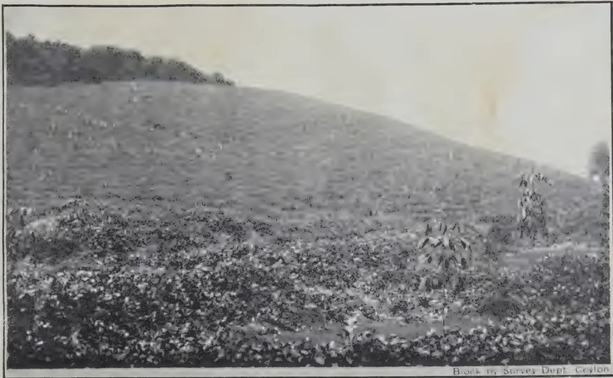
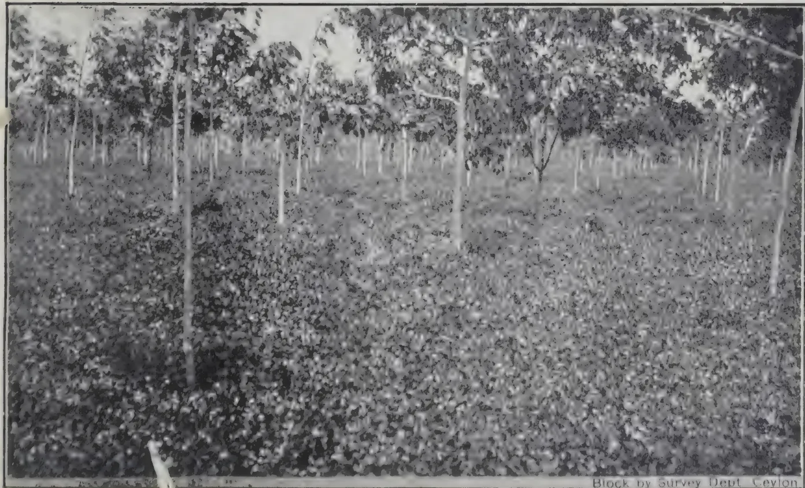
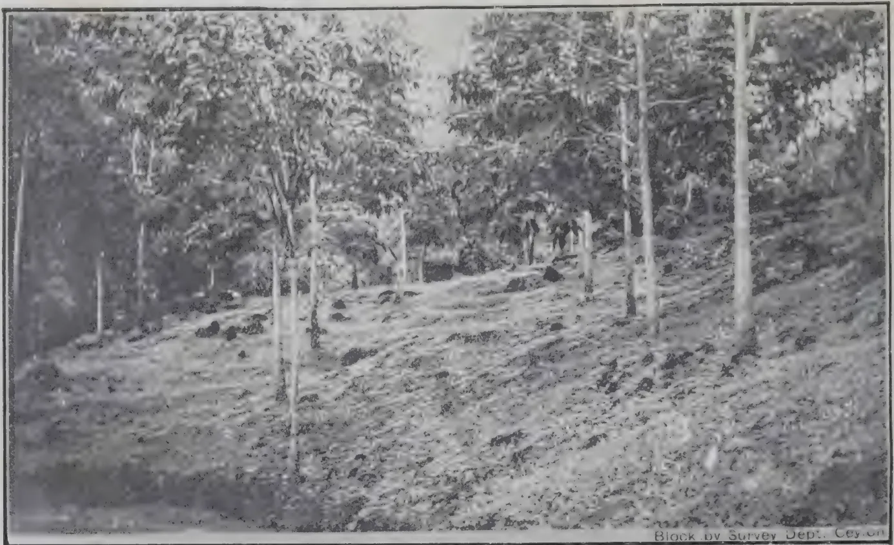
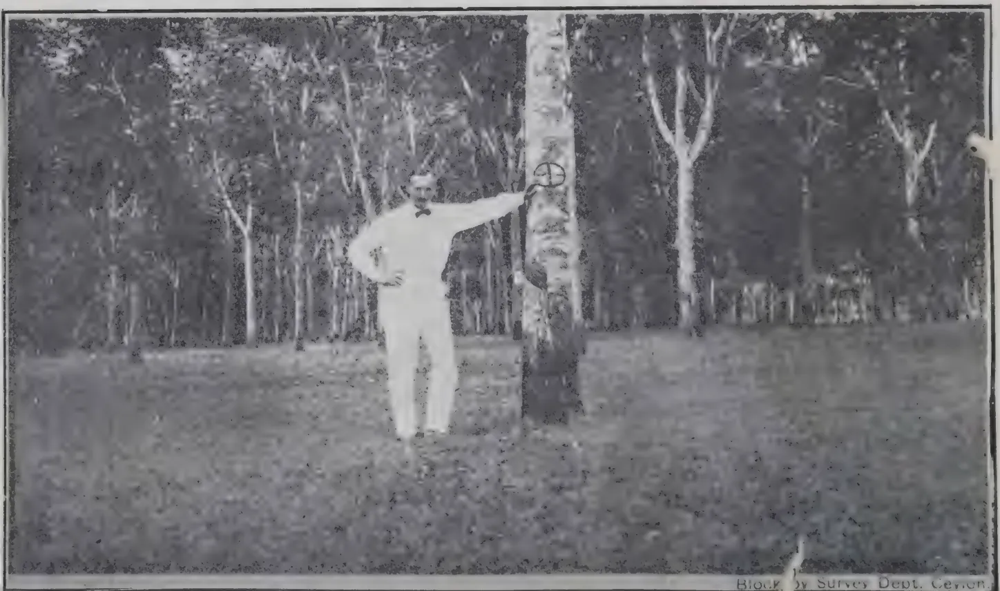
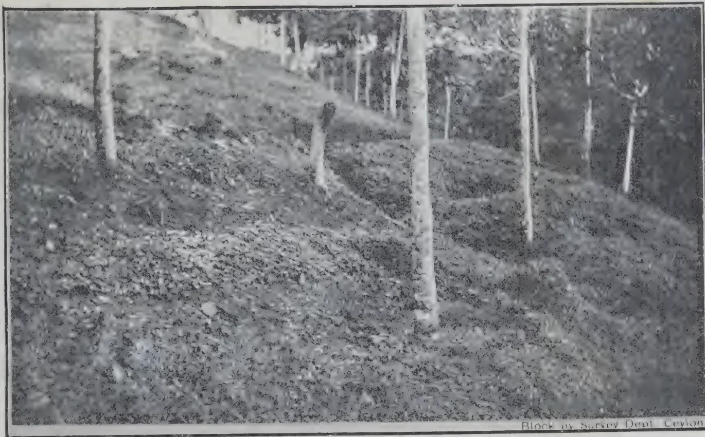
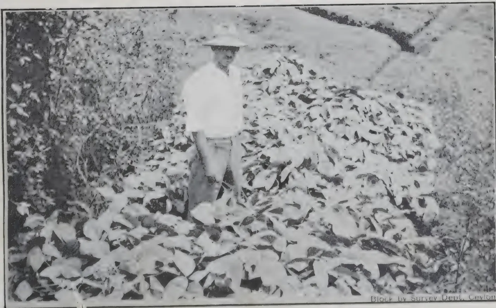
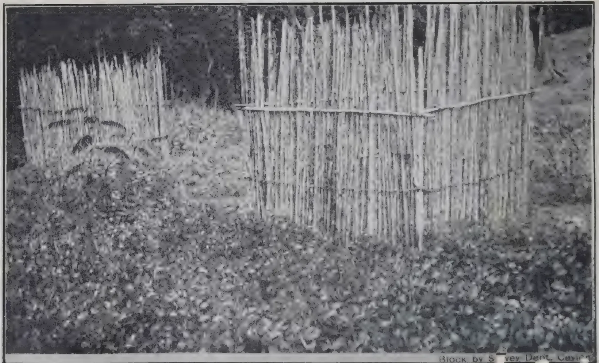
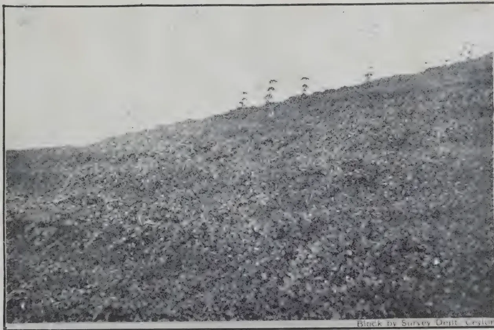
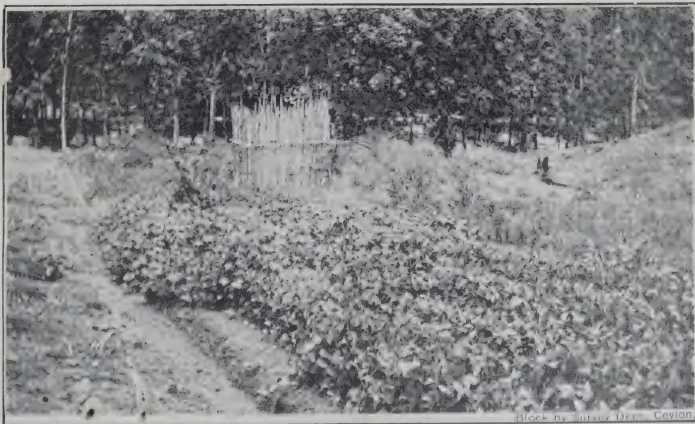
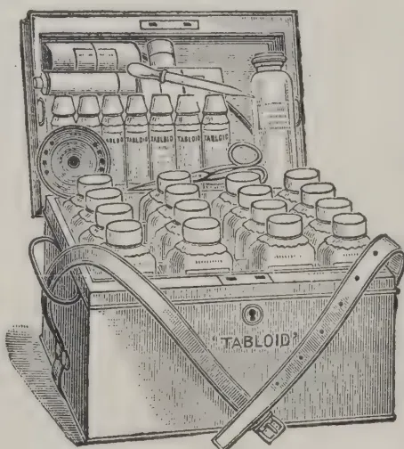

630.5  
TAC  
V.64

1------------------------------------------------

2------------------------------------------------

3------------------------------------------------

4------------------------------------------------

5------------------------------------------------

6------------------------------------------------

THE

# TROPICAL AGRICULTURIST

---

---

VOL. LXIV.

PERADENIYA, JANUARY, 1925.

No. 1.

---

---

## SOIL EROSION.

---

Rather more than a year ago, attention was directed in this Journal to the question of soil erosion, and the danger of serious deterioration of estate property through that agency. It was pointed out that the most valuable asset that a country possesses is its soil, and that it is essential that all agricultural operations should be directed towards the maintenance of its fertility. The removal of the surface soil, either by "dry wash," or by the action of the rains, deprives the land of its richest and most fertile part, and, if not arrested, will ultimately render its cultivation unremunerative.

It should be unnecessary to have to emphasise this fact in Ceylon. Land which was under coffee, and was abandoned after the failure of that product, still remains derelict in many cases, while in some parts the foot hills, cleared of jungle long ago, have become mere heaps of cabook.

In Ceylon, and in tropical planting countries generally, though dry wash occurs in a few places to a greater extent than has hitherto been recognised, the loss of surface soil is due chiefly to the action of the rains. This is true of all countries which are not so dry as to be almost desert, whether temperate or tropical. In the tropics, however, because of the heavier rainfall, the effect is naturally much more pronounced, though it is still sufficiently marked in the temperate zones to induce investigations into methods of prevention.

Much has already been done in Ceylon in a general way which directly or indirectly, tends to diminish the serious loss of soil which was taking place. The construction of terraces

7------------------------------------------------

2ANUARY 1925

on rubber estates, the alignment of drains with due regard to the contour of the land, and the provision of silt pits are all steps in the right direction. Further, the practice of growing green manure crops aids by diminishing the force of the rain on the surface of the soil, though, as has previously been pointed out, we have asked too much of our green manure plants in expecting that they would serve effectively the dual purpose of green manures and preventers of soil erosion.

There has been a tendency hitherto to confuse this question of soil erosion with others, such as the conservation of the water-supply of the country, which, though, like it, dependent upon the rainfall, will be seen on further consideration to be quite distinct, and, as far as planting interests are concerned, often diametrically opposed. It is not, in the average planting district of Ceylon, to the planter's interest to conserve water. His interest is rather that of the cultivator in most other countries, namely, to get it away as soon as possible, and it is in that process that the danger arises. It cannot be too strongly insisted upon, that, as far as regards the maintenance of the soil of estates, the dominant factor in the promotion of soil erosion is the run-off from cultivated land, that is the point at which the soil erosion question has to be attacked, and the responsibility for that rests with the estates themselves.

The determination of the amount of erosion which takes place from land cultivated in different ways is, at present, more or less of academic interest. We know that erosion is taking place, and the immediate problem is how best to stop it, or rather, to reduce it as much as possible. As will be seen from an abstract of American work on this problem, included in the last number of this Journal, the determination of the relative amounts of soil lost under different conditions would occupy several years, and, to be of value, would involve the construction of masonry work to such an extent as could only be contemplated on a tea experiment station. We write "tea" advisedly, for, as we see it at the moment, it is on up-country tea estates that this problem will prove the more difficult.

8------------------------------------------------

JANUARY, 1925.]3

There are two lines of action which can be taken up immediately. One is the establishment of contour belts of cover plants. These should be continuous bands of low-growing, preferably creeping, plants at intervals across the slope of the land. They require to be continuous, because gaps serve as passages which gradually deepen and cut out channels down the hill-side. For the latter reason, erect stout-stemmed plants are unsuitable, in addition to being a hindrance to working in tea if planted densely. By growing such plants in bands, cultivation can be carried on over the intervening areas without difficulty. Up to an elevation of 4000 feet, the smaller *Desmodium*s should prove suitable, while at the highest elevations, Dutch clover (*Trifolium repens*), which grows wild in Nuwara Eliya, should be tried.

The other step which can be taken at once is the protection of the sides of the main drains which run down the slope. In many instances, these are now deep ravines, owing to the constant erosion of their banks. This formation of ravines can be prevented by growing grass along the sides in the case of permanent streams, or over the whole drain, if it is usually dry. Here again, a creeping grass, such as *Paspalum conjugatum*, is required, rather than one which grows in tussocks.

For the permanence of the prosperity of this country, it is of the greatest importance that those responsible for the control of estates should realise the urgency of this problem, and should undertake trials to ascertain what plants can be grown on their properties in the manner indicated. Prevention of this form of soil erosion will in any case rest with the estate. The matter, however, is one of national, as well as of private, interest, and no country can continue to regard with equanimity the loss of its chief asset, especially when that loss is to a great extent preventable.

9------------------------------------------------

4[JANUARY, 1925.

# TEA.

---

## MANURING EXPERIMENTS ON TEA.

T. PETCH.

A series of trials with nitrogenous manures on tea was begun on the Experiment Station of the Indian Tea Association in 1920, and two accounts of these have been published, the first in the *Quarterly Journal*, Part I (1921), pp. 10-20, and the second in the same Journal, part II (1924), pp. 91-98.

The tea under experiment was planted as one-year-old stumps in 1916, collar pruned in 1918, and plucked from 1919. The plucking during 1919 was intended to show the relative value of the plots before manuring, but the yields were so small that "the error in the plucking and weighing of the leaf obtained at each plucking exceeded the difference between the plots, and in that year therefore no figures were obtained which could be considered of any value for measuring the initial fertility of the plots." As the tea was not pruned in 1919, the yields in 1920 were larger, and the first three pluckings in 1920 (April-May) were taken as showing the relative value of the plots. This point will be referred to later.

Each plot consisted of 54 bushes. Eighteen plots were taken for the experiment, three under each treatment and three as controls. The relative situations of the plots and the method of separation are not given. There were no vacancies in the plots, but there were several supplies and weak bushes which were not plucked in 1920. The numbers of these bushes and the dates when they were taken into plucking are not stated.

In 1919 all the plots received slaked lime at the rate of 800 lb. per acre. The manures under trial were applied in May 1920, and thence annually except in 1921. Three plots received nitrate of soda at the rate of 212 lb. per acre; three, sulphate of ammonia, 150 lb. per acre; three, mustard cake, 704 lb. per acre; three, nitrox, 320 lb. per acre; and three, green jungle, 3 tons per acre. All the plots, including the three controls, also received bone meal, in 1920, sufficient to make up a total of 35.6 lb. phosphoric acid per acre, but from 1922, the phosphoric acid in the mustard cake and nitrox was disregarded and bone meal added to all the plots at the rate of 162 lb. per acre. Nitrox is a mixture of sinews, hoofs and horns, as finely divided as is possible with such material.

From 1920, the bushes have been top-pruned to three-fingers of new wood each year. Cultivation consisted of a deep hoe at "a 15 null task" in November or December, followed by six light hoes during the year, of which at least three are put in before the break of the monsoon. In 1920, the bushes were plucked nine times, from April to November, and presumably similarly in subsequent years.

10------------------------------------------------

JANUARY, 1925.]5

The published table of results of the experiment is as follows, the yields being given as "Corrected yields in maunds pucca tea per acre."

<table border="1">
<thead>
<tr>
<th></th>
<th>1920</th>
<th>1921</th>
<th>1922</th>
<th>1923</th>
<th>Total</th>
<th>Percentage increase.</th>
</tr>
</thead>
<tbody>
<tr>
<td>Control</td>
<td>9.58</td>
<td>7.7</td>
<td>7.97</td>
<td>8.67</td>
<td>33.92</td>
<td>—</td>
</tr>
<tr>
<td>Nitrate of Soda</td>
<td>10.55</td>
<td>8.1</td>
<td>9.40</td>
<td>12.00</td>
<td>40.05</td>
<td>18.07</td>
</tr>
<tr>
<td>Green manure</td>
<td>10.01</td>
<td>8.4</td>
<td>8.45</td>
<td>10.22</td>
<td>37.08</td>
<td>9.31</td>
</tr>
<tr>
<td>Oilcake</td>
<td>9.86</td>
<td>7.6</td>
<td>9.95</td>
<td>10.50</td>
<td>36.91</td>
<td>8.81</td>
</tr>
<tr>
<td>Sulphate of Ammonia</td>
<td>10.24</td>
<td>7.5</td>
<td>8.09</td>
<td>10.04</td>
<td>35.87</td>
<td>5.75</td>
</tr>
<tr>
<td>Sinews</td>
<td>9.35</td>
<td>7.5</td>
<td>7.76</td>
<td>9.60</td>
<td>33.81</td>
<td>0.32</td>
</tr>
</tbody>
</table>

Unfortunately, these are all the figures given relating to the yields, except for some in the earlier paper relating to 1920. The actual yields are not stated. All these are calculated yields, and the basis of calculation or correction is not disclosed. In the first year's figures in the earlier paper, the yields were corrected for unplucked bushes and then raised to "yield per acre;" but how long this practice was continued is not recorded. It may be noted that the yields given above for the year 1920 cannot be harmonised with those given for the same year in the earlier paper.

The yields from the separate plots would no doubt be obtained as green leaf. It would have been of interest to know what factor was employed in converting those weights into the equivalent quantities of made tea. The "corrected" yield of green leaf from the control plots for the whole of 1920 was 3,063, and from the beginning of the experiment to the end of 1920, 2,465 lb. per acre. The equivalent yield of made tea (at 80 lb. to the maund) is given as 766 lb., which on the larger figure indicates a conversion factor of one-quarter. But on this basis, the yield of the nitrate of soda plots in 1920 should be 10.2 maunds, and that of the green manure plots 10.6 maunds.

As the yields of the separate plots are not given, it is not possible to ascertain what variation occurred between the three plots under each treatment. Each group of three plots is treated as one, and as far as the records show there was no advantage in calling them three.

It is now generally recognised that the plots of an agricultural experiment are not as a rule of equal value, and methods have been elaborated by which this variation can be calculated. Without such calculations, it is not possible to estimate what value can be assigned to the results obtained. As already stated, an attempt was made in the present case to ascertain the relative values of the plots by plucking each separately during the year previous to beginning the manuring, but owing to the small yield that was unsuccessful, and the only available data for this purpose are the yields of three pluckings at the beginning of the season of 1920. These, however,

11------------------------------------------------

6[JANUARY, 1925.

are obviously insufficient. As they stand, the initial yields of the separate plots vary from 8 lb. 8 oz. to 16 lb. 3 oz., a variation of nearly 100 per cent. These are the actual yields; but the variation is due, to an unrecorded extent, to the presence of bushes not yet fit for plucking. It is shown that the averages of each set of three do not differ by more than ten per cent. (there is an error in the average of the nitrate of soda plots), but unless the unplucked bushes were evenly distributed that scarcely meets the case. An attempt has been made to overcome the difficulty by adding a proportionate amount in each case for the unplucked bushes, but this again is inadmissible.

Taking the figures of the preliminary pluckings as they stand, they indicate that the plots subsequently manured with green manures were, on the average, initially the best plots; and those subsequently manured with ammonium sulphate were, on the average, initially the worst, the difference between the best and the worst set of three being about 10 per cent. But how far the differences depended on the number of bushes in plucking is not recorded. In any case, however, it would be expected that these bushes would be inferior to the others for some years after they were taken into plucking, so that the plots which contained the greater number would remain inferior.

The plots were left unmanured in 1921, in order to ascertain the residual effect of the manuring of the previous year. Since little residual effect, in the ordinary sense, could be expected from the soluble manures, it might be supposed that the yields of 1921 would serve to show the relative value of the control and the soluble manure plots when unmanured. In dealing with a crop like tea, however, there may be a "residual effect," other than the effect of unexpended manures, to which the term is usually applied. The previous manuring may have induced a greater production of branches, and consequently a greater plucking area, and this effect will be permanent, under the conditions of pruning of this experiment. Hence the yields of 1921 cannot be taken as indicating the original relative values of the plots. They can, however, as far as regards the three series of plots mentioned, be taken to indicate the relative values of the plots at the beginning of the second period of manuring, 1922-23. On that basis the initial value of the nitrate of soda plots for the second period is 5 per cent. greater than that of the control plots, and 8 per cent. greater than that of the sulphate of ammonia plots.

The experiment was evidently planned in such a way that the probable errors of the plots could be estimated, but unfortunately its subsequent treatment has rendered that impossible. It would have been preferable to have delayed the beginning of manuring for another two years, by which time the supplies might have been in bearing, and the bushes might, perhaps, have been pruned to a standard shape. As it stands, one cannot resist the conclusion that the experiment was begun too soon. That is always a temptation in the case of a crop which takes several years to come into bearing, and it may sometimes be forced on the experimenter by a demand for results. It cannot be too strongly insisted on that to begin an experiment of this nature before the plots are sufficiently mature, or before the necessary preliminary data have been secured, may render the whole

12------------------------------------------------

JANUARY, 1925.]7

experiment valueless. Two such instances come to mind. When the Chilaw Coconut Trial Ground was instituted, orders were given that the yields of the separate plots should be recorded before any manuring was begun. Shortly afterwards, however, the management passed into other hands, and in the desire to "get something done" the plots were manured, with the consequence that the results are inconclusive. Again, in response to a demand that something should be done on the Experiment Station, Peradeniya, young rubber was tapped before the plots were sufficiently mature to afford a reasonable number of trees; and the endeavours to correct that deficiency during the course of the experiments rendered the tapping of 1910-11 valueless, besides spoiling the trees for any experiment during the next four years.

As the results stand, the nitrate of soda plots show an increase of 9 per cent. over the green manure plots and 12 per cent. over the sulphate of ammonia plots, but the magnitude of the probable error of the experiment is not known. These results have been obtained with a system in which the bushes are plucked for a season of eight months in the year, and are pruned and manured annually.

An explanation is necessary as regards the green manures. In 1920, the green manure plots were sown with Sunn Hemp, but this failed owing to the attack of a root disease, and green jungle—thatch, *Melastoma*, and *Boga medeloa*—was cut from neighbouring waste land and lightly hoed in July at the rate of three tons per acre. The latter course has been followed in subsequent years, but the plants used are not specified. It is stated that by this method the tea does not suffer while the green crop is growing. Such an effect, however, has not yet been demonstrated. Indeed, it is claimed by some investigators that a leguminous intercrop exerts a favourable effect on the main crop while growing.

It was noted that the quick-acting manures gave a relatively heavy yield at the beginning of the season and a comparatively early close. The slower-acting organic manures were steadier yielders, and tended to give more leaf in the latter half of the season, that being particularly the case with the green manure.

In 1920, it was observed that the plots manured with nitrate of soda maintained their yield longer than those manured with sulphate of ammonia. As this was contrary to expectation, the sample of nitrate of soda was analysed, and was found to contain 5 per cent. of potash. The observed effect was attributed to that in part.

It is stated that "following the hoeing in of the 3 tons per acre of green stuff on July 17th (1920), the rise in the yield was almost immediate. The effect of the green stuff was in fact more rapid even than that of nitrate of soda. The green stuff was of course applied at a season when the effect would be expected to be more rapid. Temperature and soil moisture were both very favourable." It would scarcely seem probable that this effect was due to the green manure as such, and further investigation of this point is desirable.

13------------------------------------------------

8[JANUARY, 1925.

## SCHOOL OF TEA CULTIVATION IN BRAZIL.

For the encouragement of the development of the cultivation of the tea plant in the State, the Government of Minas Geraes has established in Ouro Preto in the grounds of the former botanical gardens an "Aprendizado Agricola," especially devoted to the cultivation of the tea plant and the working of the crops. Care has been taken to restore the existing plants; and, for establishing new plantations, one hundred thousand Assam and China plants have been provided.

The scientific preparation of the first crops with the use of simple machinery gave a perfect product as regards taste and aroma.—International Review of the Science and Practice of Agriculture, Vol. II, No. 3.

## TEA PLANTING IN KENYA.

In a recent issue of the *Farmers' Journal* a digest of London Tea Finance was published, giving the dividend declarations of all the principal Tea Companies of India and Ceylon, from which it can be seen that tea is enjoying an exceptionally prosperous time. Companies which had not paid a dividend for years were able to declare 15%; companies which had always paid a dividend, earned last year as much as 70%; on every hand the business of tea companies experienced a boom year. The causes underlying this sudden prosperity are difficult to define. The shortage of top quality coffee from Brazil, where only poor grades are available under the Government Valorization scheme, may have resulted in an increase in tea consumption in America. If this is so, that advertising campaign just started there by Sir Chas. Higham and Mr. Duncan of the Indian Tea Association will naturally help, especially when it is learned that 10,000,000 additional homes in America will be reached by specially prepared tea advertisements for which an appropriation of one million dollars has been made "to make Americans drink more tea, less coffee."

Under such prospects has the cultivation of tea come to Kenya. Well-defined areas in Kenya are eminently suited to tea production, as has been shown by reports published from time to time in this *Journal* of experiments made here, as well as reports from experts on samples of tea manufactured in this country. The prospects of tea cultivation in Kenya are sufficiently satisfactory to induce Messrs. Brooke Bond & Co., Ltd., the well-known tea firm, to launch a plan for the cultivation of tea at Limuru.

The draft scheme of this plan is published below for the information of readers. Apart from amateur efforts on a small scale the only large scale operations being conducted, besides Brooke Bond's, is at Kericho where a large company are at work, and the Kakonde Estate of Mr. Talbot in Uganda. Large scale operations require large capital because of the machinery required for manufacturing the tea, but plantations on a scale of 20 to 40 acres are quite possible to operate at a profit. It is some two years ago now since articles on tea production were first started in this *Journal* for the information of those wishing to start planting, but the time has arrived

14------------------------------------------------

JANUARY, 1925.]9

when fuller information will be required on the subject. The experimental stage has been passed and there is no doubt from the interest shown in tea production that in time to come tea will be a serious competitor of coffee. There is room for both in the country, and finance will be strengthened, as it is rarely that the world has experienced a slump in both commodities at the same time.

The following is a copy of the Draft Scheme proposed by Brooke Bond & Co., Ltd., for the introduction of Tea growing into Kenya Colony.

The Company has in mind the fact that certain parts of Kenya Colony, East Africa, are adaptable to the growth and production of tea, and to that intent the Company has purchased a certain holding of land, at Limuru, part of which it is proposed should be used for the planting and cultivation of tea plants, and another part shall be used for the erection and maintenance of a factory for the manufacture of tea from the green leaf produced on such estates; but inasmuch as it is desirable to interest surrounding farmers in tea production, it is proposed that the Company should make certain arrangements with farmers, in the locality, whereunder a suitable part of each farm should be prepared and used for the growth of tea plants and the production of green leaf eventually to be made into tea, and that the Company should provide seeds to a certain value to plant a maximum of about 250 acres on each farm, the work to be carried out under the instruction and directions of the Company's planting expert.

The scheme proposed has many advantages; it offers the farmer expert advice in the original selection and preparation of his land for tea planting, it provides him with suitable seed, it affords him facilities for obtaining expert assistance in the cultivation of the plants till the bearing period arrives, and thereafter general guidance will be forthcoming in the cultivation of the crop.

Later it effects all the selling arrangements necessary, basing its return on public sale price, less deductions for expenses of packing, transport, freight, insurance, brokerage, and other necessary charges (which are more or less constant).

The terms and conditions upon which this scheme is to operate are broadly as follows:—

1. 1. The Company will make such inspection of farms, adjoining their own property, as they may consider necessary with a view to ascertaining what, if any, parts of such farms are suitable for the growth of tea plants.

1. 2. As a result of such investigation the company may enter into negotiation with the owner of the farm who may either be a long leaseholder, but is more probably a free-holder, on the basis that the Company will supply seeds sufficient to plant not more than 250 acres in tea at cost to the farmer of £750 or proportionately less on smaller acreage.

1. 3. The Company will, then, by its planting expert, give full directions as to the cultivation and planting and subsequent cultivation of the tea bushes during their period of growth, the work and labour actually being done by the farmer and his employees at the farmer's expense, but in all cases under the direction of the Company's planting expert. The farmer will pay to the Company at the rate of 5 per acre per annum for the period of 4 years, for the services of the Company's planting expert, during the four years.

15------------------------------------------------

10[JANUARY, 1925]

in which the seeds should produce tea bushes capable of bearing. The approximate cost of the seeds and the charge for supervision over the first four years, which is expected not to exceed £1,000 on an acreage of 250 acres, shall be repaid by the farmer to the Company out of the proceeds of the tea produced during a period of ten years, commencing from the fourth year after the seed has been supplied. The farmer may repay such moneys at the rate of £8-6-8 per month in the case of a full 250 acreage or proportionately less for a smaller acreage, and the Company shall be at liberty to retain out of the proceeds provided by the sale of teas such monthly sum, if they in their discretion shall think fit so to do.

4. For a period of 15 years from the signing of the contemplated agreement the farmer will bind himself to deliver all green leaf and tea seed for sale produced by him to the Company, to be manufactured as hereinafter mentioned notwithstanding the fact that the farmer may before the expiration of such 15 years have repaid his whole debt to the Company.

5. The Company shall proceed to manufacture, in their central factory on their own land, the tea so delivered to them by the farmer, on the basis that a charge of 3*d.* per lb. of manufactured tea shall be made to the farmer and debited against his account in respect of such manufacture, but such charge of 3*d.* per lb. shall not include packing or any charges subsequent to the packing of the tea. In the event of it being found that, after the experimental stage has been passed, the above cost of 3*d.* per lb. is too heavy, the cost to the farmer of the manufacture of tea shall be a sum equal to the actual net cost to the Company of such manufacture plus  $\frac{1}{2}$ *d.* per lb. but not to exceed 3*d.* per lb., such nett cost to be ascertained by the accountants to the Company and to include all running cost, wages, overhead charges, rent, interest on capital, insurance, management and other charges of the like nature, usually incurred in the manufacture of tea from the green leaf, and shall be final and binding on the parties save for evident error discovered within two months of the date of any account. The packing charges shall be per lb. of manufactured tea.

6. It is estimated that the percentage of manufactured tea on the weight of average quality green leaf is about 20%, but except as later mentioned the actual outturn of manufactured tea is the basis of all calculations. Each farmer shall be credited with such proportion of the manufactured tea *in each week* which his inturn of green leaf during such week bears to the total inturn of green leaf during such week. It is further part of the above arrangement that the Company shall be at liberty to manufacture any green leaf which, in the opinion of the Company, may be badly plucked or not in good condition, by itself, and not in conjunction with other green leaf, in which event the charge for the manufacture of such tea shall be a fixed charge of 4*d.* per lb. notwithstanding the provisions of paragraph 5, and the amount of manufactured tea shall be the weight actually produced and the tea so produced shall be sold as a separate lot unassorted. In the case of any dispute the same shall be submitted to the arbitration of three other farmers, members of the scheme, one to be appointed by the Company and the other two by the whole of the other farmers by secret ballot.

16------------------------------------------------

JANUARY, 1925.]11

7. During the said 15 years, all tea thus manufactured and ready for sale, shall be sold under Agency of the Factory Management, through the ordinary channels for sale of tea in public sale in London, provided always that any farmer entering into the scheme may sell all, or any part of the tea so manufactured on his behalf to the Factory Management at such price as may be mutually agreed on, but in the absence of agreement such tea to be sold as above provided.

8. Each farmer will be entitled to be paid for made tea at the average price for which the invoice is sold in London public sale less the cost of manufacture, packing, transport, insurance, brokerage and cost of sale and all other charges of whatsoever nature incurred in selling of the tea.

9. The Company will undertake the payment for account of the farmer concerned of all charges or expenses in respect of tea after the tea has left the Factory including brokerage on sale.

10. Any farmer entering into the scheme shall, in the event of his desiring to sell his farm, first offer the farm to the Company; and the Company shall at all times have the option of first refusal of any such farm at a price equal to the highest actual bid received by such farmers.

11. So far as is allowed by law each farmer shall charge or mortgage his farm with the repayment of such amount as may be repayable by him to the Company or provide some other protection in respect of the money referred to in Clauses 2 and 3, it being especially agreed that the agreements constituted by Articles 4 and 10 shall be made the subject of a separate agreement between each such farmer and the Company.

12. The farmer shall further enter into such binding agreements as shall be necessary to prevent the farmer from selling or disposing in any way other than by planting and cultivating the same within the true intent of the arrangements constituted as above, any tea seeds or plants raised from seed supplied by the Company, and that any plantations raised from the Company's seed shall be cultivated and maintained in good heart and condition and good order until all sums due from the farmer to the Company shall have been paid.

13. In cases in which there shall already be any mortgage or charge over the farm of any farmer who may join the scheme, the farmer shall so arrange that the person, firm, or corporation holding any such mortgage or charge, or being entitled thereto, shall join in, confirm, and concur in all the arrangements contemplated by the above scheme, and such person, firm or corporation shall bind itself so far as may be necessary to that intent.

14. All matters of dispute not made the subject in this scheme of special arbitration shall be referred to arbitration in the usual way, the arbitrators to be appointed by a secret ballot of the whole of the farmers joining the scheme and the Company.

#### FARMERS' TEA PLANTING SCHEME.

At a meeting of Limuru Residents held to consider the terms of the above proposal the draft scheme was generally approved after discussion.

The following amendments however were recommended.

17------------------------------------------------

12[JANUARY, 1925.

Paragraph No. 4 (a) That to clause "will bind himself to deliver all green leaf" shall have added to it the words "and tea seed for sale." (b) The farmer will also bind himself during the afore-mentioned 15 years not to sell or give away any tea seed except through the Company.

Paragraph No. 10. It is proposed to do away with this paragraph as it stands as "the highest actual bid," except at auction sales, is considered impossible to determine. Further the paragraph creates a false impression in that it rather pre-supposes the eagerness of Messrs. Brooke Bond & Co., Ltd. to acquire farms in the vicinity which is quite incorrect. On the other hand the deletion of Paragraph 10 in its old form is not intended to exclude Brooke Bond & Co., Ltd., as possible buyers.

In place of the old paragraph 10 please read—(a) "Any farmer entering into the scheme shall agree not to sell his Farm to any third person, or persons who refuse to continue the original agreement with Messrs. Brooke Bond & Co., Ltd. in respect to the tea on the said property; (b) That any person, firm or corporation who may have lent money upon the property shall be called upon to agree and conform to the agreement between any land owner and Messrs. Brooke Bond & Co., Ltd. as detailed in paragraph 13. (c) That any person requiring a loan after entering upon the agreement shall state the case and give Messrs. Brooke Bond & Co., Ltd. the first refusal of making the necessary advance, on proposed security.

Paragraph 10 (c) shall be included or not in each case when drawing up the agreement, and shall not be made binding on all.

Paragraph 11. To prevent taking out a special mortgage on small amounts for tea seed and supervision expenses, where small acreages are contemplated, the words "or provide some protection" be inserted after the phrase "be payable by him to the Company."—Farmers' Journal, Vol. 6, No. 41.

---

## GREEN MANURES IN JAPAN.

---

Japanese tea farmers are prejudiced against green crops as manures on the grounds that quality will be lost if they are employed. Work at Kanaya has, however, shown that green manuring makes for quality. Vetch, Soya bean and Seradella (*Ornithopus sativus*, Brot.) have been used. Seradella, sown in September and cut in June, grows to a height of two feet and gives a crop of about six tons per acre. Soya bean, sown in April and cut in August, grows to a height of four to five feet and gives a crop of over two tons per acre. Vetch, resembling Seradella, grows to a height of five feet but climbs over the tea. The crop is about six tons per acre.

Red Clover is sometimes cultivated as a green crop and *Astragalus sinicus* is grown in the rice-fields in the winter months and transported to the tea gardens.—C. R. Harler, B.Sc., F.I.C., in Quarterly Journal, Scientific Department, Indian Tea Association, Part 1, 1924.

18------------------------------------------------

JANUARY, 1925.]13

# COCONUTS.

---

## MANUFACTURE OF COPRA IN THE PHILIPPINES.

P. J. WESTER.

The following extract is taken from the article on Manufacture of Copra in the Philippines by P. J. Wester in the *Philippine Agricultural Review*, Vol. XVII, No. 2.

Coconut growing is one of the most important industries in the Philippines. In 1922, 422,284 hectares were planted to coconuts with a total production of nearly one and a half billion nuts, of which the greater part were made into 351,151 tons of copra, valued at 44,000,000 pesos in round figures. Coconut products ranked third in importance among our industries, being exceeded only by rice and sugar. Among the exports they held the first place with copra, copra meal, and coconut oil exports totalling 62,100,000 pesos. The number of trees planted has about doubled in the last ten years.

While the Philippines is one of the principal producers of copra in the world, it is a distressing fact that the product from here fetches the lowest price. It is estimated that as compared with the price of Ceylon copra, the Philippine planters in 1922 sustained an economic loss of about nine million pesos. This amount would have more than paid for all the meat and dairy products imported in the same year. It is almost equal to the total exports of embroidery, hats, and lumber. This enormous loss is due to the poor grade of copra produced, largely because of insufficient and faulty drying and handling.

Somewhat more than one-half of the copra was *topahan* dried in 1922, and a correspondingly smaller part was sun-dried. Less than one-half of one per cent. was dried on modern driers.

Efforts have been made to induce the planters to improve their methods of drying, and good driers have been installed on a few plantations the owners of which were not satisfied with the low prices offered for copra made by the native methods. But little or no improvements have been effected among the rank and file. The individual holdings are small as a rule, and exporters and millers are not willing to pay an advanced price for superior copra in small lots. Under such circumstances, and where a majority of the planters are indifferent to the production of better copra, there is little or no inducement for those who realize the losses incurred because of the poor grade of copra produced to improve their own output. Unless concerted action is taken by the small planters of a district to induce improved methods of drying copra by a majority of the producers on a sufficiently large scale to demand recognition by exporters and local millers of copra we need expect little or no improvement either in the copra grades or the prices paid for the product until the production on the large plantations shall have reached such a figure that their copra is shipped out in, say,

19------------------------------------------------

14[JANUARY, 1925.

one thousand ton lots. Then the ambitious small planter will not be so dependent upon the action of his more indifferent neighbours as he is now.

Copra is the dried meat of the coconut, and at present constitutes the principal and the most important article derived from the coconut palm.

According to Preuss the fresh coconut meat analyses as follows :

<table>
<thead>
<tr>
<th></th>
<th>Per cent.</th>
</tr>
</thead>
<tbody>
<tr>
<td>Water</td>
<td>49.83</td>
</tr>
<tr>
<td>Oil</td>
<td>32.97</td>
</tr>
<tr>
<td>Albumen</td>
<td>2.89</td>
</tr>
<tr>
<td>Nitrogen free extract</td>
<td>4.62</td>
</tr>
<tr>
<td>Crude fibre</td>
<td>8.66</td>
</tr>
<tr>
<td>Ash</td>
<td>1.03</td>
</tr>
</tbody>
</table>

Clean, sun-dried copra analyses, 55 per cent. oil ; artificially dried copra 60 to 65 per cent.

The meat is dried in the sun or in artificial driers, among which may be classed the so-called "tapahan" driers, in which most of the Philippine copra is prepared.

In order to successfully resist deterioration from moulds and bacteria and so produce a first-grade oil and secure the highest price obtainable in the market, copra should be made only of fully matured or "cured" nuts ; it should be thoroughly dried so as to make a clean product, containing not more than 6 per cent. of water. Ordinary sun-dried copra contains about 9 per cent. and "tapahan" or smoke-dried copra frequently exceeding 20 per cent. of moisture, a condition that, particularly in long storage in a moist, damp atmosphere, is all too favourable for the growth of moulds, the foremost enemy of improperly prepared and improperly cared for copra, and the formation of fatty acids at the expense of the oil-content.

Knowing what constitutes good copra, a glance at the following table is a sufficient exhibit showing the reasons for the inferior price received for Philippine copra. This table is taken from "Copra and Coconut Oil," by H. C. Brill, H. O. Parker, and H. S. Yates, in *Philippine Journal of Science* (1917), Vol. XII A, p. 57:

**Table 1.—Moisture content of commercial copra in the Philippines.**

<table>
<thead>
<tr>
<th rowspan="3">Locality</th>
<th colspan="2">Water</th>
</tr>
<tr>
<th>Maximum</th>
<th>Minimum</th>
</tr>
<tr>
<th>Per cent.</th>
<th>Per cent.</th>
</tr>
</thead>
<tbody>
<tr>
<td>San Pablo, Laguna - -</td>
<td>29.1</td>
<td>18.8</td>
</tr>
<tr>
<td>Lucena, Tayabas - -</td>
<td>23.1</td>
<td>14.5</td>
</tr>
<tr>
<td>Atimonan, Tayabas - -</td>
<td>24.7</td>
<td>15.5</td>
</tr>
<tr>
<td>Legaspi, Albay - -</td>
<td>22.2</td>
<td>17.6</td>
</tr>
<tr>
<td>Tacloban, Leyte - -</td>
<td>20.7</td>
<td>14.4</td>
</tr>
</tbody>
</table>

Where the climate permits, the copra is dried in the sun in the Philippines. However, in the most prominent coconut regions, as in Laguna, Tayabas and Mindanao, the sky is often so overcast and rains are so frequent that sun-drying is out of the question. Here the copra is dried in the *tapahan*, which is an oblong pit on the top of which is built a grill of

20------------------------------------------------

JANUARY, 1925.]15

bamboo, leaving one end of the pit open, at the bottom of which a fire is made. The raw coconut meat is placed on the grill, the fire is lighted, and the hot air and smoke passes upward through the grill and so dries (and smokes) the meat. The copra made in this way is commonly insufficiently and unevenly dried, and as a matter of course, becomes dark and discoloured from the smoke. In other words, it is of inferior quality, and consequently fetches a low price.

At the present writing, in the local market *tapahan*-dried copra is sold at from 10'62 pesos to 11 pesos per picul, the sun-dried copra sells at 11'62 pesos to 11'75 pesos, and ex-godown copra at from 12 pesos to 12'25 pesos per picul (1 picul=63'25 kilos). Comparing now only the domestic grades, with an average yield of 24 piculs of copra to the hectare per annum, this represents an annual loss of 22'88 pesos per hectare per annum owing to the use of the *tapahan* drier. Since on an area of 200 hectare this amounts to 4,576 pesos, the installation of a Patalon drier at a cost of 2,800 pesos including bodega, would pay for itself and leave a profit of 1,776 pesos the first year.

On most coconut plantations in the Philippines the nuts are first husked by hand, and consequently split before drying, but at the Polo, Bioos, and the Montenegro plantations, Dumaguete, Oriental Negros, splitting the unhusked nut with a broad axe or a heavy bolo, after which the meat is pried out with a curved knife, has been adopted as being a more economical procedure, as it eliminates the cost of husking.

At the Polo Plantation, the expense of hauling the nuts from the field to the drier has been still further reduced by splitting the collected nuts in the fields, and removing the meat from them on portable platforms which are carried from one block to another as the work proceeds, after which the coconut meat is bagged and brought to the drier in wagons or trucks. The husks are scattered in the field, and ploughed under. In this way nothing is removed from the field except the coconut meat, which is a very light drain upon the fertility of the soil, the productivity of which, it would appear, could thus be maintained unimpaired for many years without the aid of fertiliser.

In drying by the sun the halved nuts usually are first spread on the ground, and as the drying proceeds the meat is collected and placed on palm-leaf mats.

In the rainy coconut districts artificial driers will, of course, be imperative, but in those regions where the bright days are sufficient to render the perfect drying of the meat practicable, for instance in Cebu and Bohol, sun-drying is particularly well adapted to the needs of the small, individual producer, for sunlight and heat may be had without the asking. However, in order to produce a better and cleaner copra, the present custom of spreading the coconut meat upon the ground should be discontinued. Trays should be made of bamboo, upon which to place the meat for exposure in the sun the same as is done in drying fish. Not only would copra prepared in this way command a premium because of its cleanliness, but the handling of the meat itself from the time of placing it in the sun until sacked would be facilitated; in the case of threatening rain it could easily and rapidly be placed under shelter. Such trays might be made of any convenient size for two men to carry, one at each end of the tray. Since bamboo grows everywhere the cost of making these trays would not be

21------------------------------------------------

16[JANUARY, 1925.

great. With reasonable care they would last a long time, and they could be made by the producer himself at a very low initial cost. A tray 2 by 1 meter is suggested as a suitable and convenient size. As these trays, filled with coconut meat, are placed in the sun for drying they should not be spread upon the ground, but raised therefrom by the means of scantlings or bamboo upon which they are placed; this would insure clean copra, and by the better circulation of air hasten the drying. The drying ground should of course have a shed where the trays can be stacked in case of a sudden rain and for the storage of the dried copra. The producer will do well to always keep in mind that dry, clean copra is equivalent to top prices. The floor of the copra bins should therefore always be well raised above the ground to prevent access of water, which induces the formation of moulds. The copra should never be stored on the ground, unless it be on a concrete floor. An open, ventilated bamboo floor, not less than 50 centimeters above the ground, would serve the purpose well.

In the largest coconut-growing areas, however, the planter must reckon on the installation of an artificial drier, if, as he should, he desires to produce a high-grade copra.

In the case of the small planter the obvious course to pursue would be either to sell his nuts or to organise a co-operative drying enterprise.

Before breaking ground for a co-operative drying plant, a careful estimate should be made of the annual yield of nuts in the prospective tributary area in order to avoid waste and the installation of a disproportionate amount of machinery. The importance of this preliminary work cannot be overestimated, since the more nicely the available supply of nuts is adjusted to the full capacity of the drying plant the lower will be the operating expenses. Distance and transportation costs should be carefully considered.

Attempts were made a few years ago by the Bureau of Science to dry copra by exposing the coconut meat to sulphur fumes, and while this attempt failed, it was found that the sulphuring of the meat was advantageous in that it prevented the formation of moulds and hastened the drying of the meat. The field experiments were conducted at Polo where the sulphuring of the coconut meat has become a part of the routine in the copra manufacture for more than a year, as it is also on the Montenegro plantation.

The sulphuring box, as built by Mr. Detrick, is 275 centimeters long, 125 centimeters wide, and 210 centimeters high. It has a false bottom, made of slats through which the fumes can pass easily, about 15 centimeters above the floor, under which there is space for a shallow tin pan containing the sulphur.

The gunny bags containing the coconut meat brought from the fields are piled in the box and the sulphur is ignited, after which the door is closed. The coconut meat is exposed to the sulphur fumes for 4 hours, after which it is run through a cutter to chop the meat into a smaller size, which permits uniform and more rapid drying of the copra than if the meat was dried as it comes removed from the nuts in large pieces.

The sulphuring box which is air-tight, of course, has been built at a cost of less than 40 pesos. With sulphur selling at 40 centavos per kilo, the meat from approximately 3,000 nuts can be treated at one time at a cost of less than five centavos (\$0.025 U.S. currency) per picul of dry copra, one and a half to two kilos of sulphur being required for each treatment.

Sulphuring is recommended as a cheap, effective, and practical preventative for moulds affecting copra and should be applied to the fresh meat before drying. It does not injure the quality of the coconut oil, and hastens the drying of the copra.

22------------------------------------------------

JANUARY, 1925.]17

# FIBRES.

---

## PRODUCTION OF HENEQUEN FIBRE IN YUCATAN AND CAMPECHE.

---

The following extracts are taken from the United States Department of Agriculture—Department Bulletin No. 1278 on “Production of Henequen Fibre in Yucatan and Campeche” by H. T. Edwards, Specialist in Fibre-Plant Production, Office of Fibre-Plant Investigations, Bureau of Plant Industry.

### INTRODUCTION.

Henequen (*Agave fourcroydes* Lem.) fibre has been imported in steadily increasing quantities into the United States during the past 40 years. The average annual imports of this fibre, which were 40,000 tons during the 5-year period 1887-1891, had increased to an annual average of 148,000 tons during the 4-year period 1918-1921.

The two features of the henequen situation of special interest to the American farmers are that this fibre constitutes the main source of supply of the raw material used for the manufacture of binder-twine and that practically all the henequen imported into the United States is obtained from the States of Yucatan and Campeche. The condition of their henequen industry therefore has a very important bearing on the welfare of the grain-producing industry of the United States.

### OUTLINE OF THE BINDER-TWINE FIBRE SITUATION.

The United States consumes annually from 100,000 to 150,000 tons of binder-twine and exports from 30,000 to 50,000 tons.

This twine is manufactured from henequen, sisal, abaca (pronounced a-ba-ka; Manila hemp), maguey, istle, and phormium (New Zealand flax) fibres. Henequen fibre, with the exception of a very small quantity, is obtained from Yucatan and Campeche; the sisal principally from Java, East Africa, and the Bahama Islands; the abaca and maguey from the Philippine Islands; the istle from Mexico; and the phormium from New Zealand.

During recent years, because of unsettled conditions both on the plantations and in the world markets there has been considerable variation in the relative quantities of these different fibres used for binder-twine purposes. For a long period, however, Yucatan henequen has been the principal fibre used for the manufacture of binder-twine.

During the 10-year period, 1911-1920, the average annual imports of henequen and sisal into the United States were 163,703 tons, valued at \$28,507,956. The greater part of this fibre was used for the manufacture of binder-twine, and for many years more than 90 per cent. of the combined total imports has been henequen.

From 1915 to 1921 the available supply of this fibre was irregular, there was a great fluctuation in the price, and the market was very unsettled.

23------------------------------------------------

18[JANUARY, 1925.

Since January 1, 1922, the production, although much less than that of earlier years, has been fairly regular, and a stable price has been maintained.

Even with a gradual improvement of conditions in Yucatan, there is likely to be a shortage of henequen fibre for several years. Since there is no probability of any marked decrease in the world consumption of binder-twine, any shortage in supply of henequen fibre must be met by an increased production of other fibres suitable for binder-twine purpose.

#### IMPORTANCE OF HENEQUEN IN YUCATAN.\*

The production of henequen is by far the leading industry of Yucatan. In value this fibre constitutes about 85 per cent. of the total exports, and others of importance being chicle gum and hides.

Both soil and climatic conditions are peculiarly well adapted to the cultivation of henequen, whereas they are ill adapted to the cultivation of most of the other staple crops of the Tropics. Under these circumstances the maintenance of the henequen industry in a prosperous condition is a matter of vital importance to the people.

#### CLIMATIC CONDITIONS.

The climate of Yucatan is tropical, the lowest recorded temperature being 48°F. The precipitation is relatively low, approximately 30 inches per annum, and there is a long dry season. These conditions are favourable for henequen, although occasionally during an exceptionally long dry season even this hardy plant suffers some injury. It would be difficult to find any other staple tropical crop so well adapted to the climatic conditions of the northern part of the State.

#### SOIL CONDITIONS.

In the area utilized for the production of henequen the surface is relatively flat, slightly rolling, and somewhat broken. The soil is largely composed of a porous, partially decomposed limestone in which there are numerous pockets and in places a thin fertile covering. The land is so rocky that trees cannot be planted until holes have been blasted for them to grow in, and frequently even the small henequen suckers are propped up with small stones in places where there is practically no soil. Under these conditions the profitable cultivation on a commercial scale of any other crop would be exceedingly difficult if not impossible. These unusual soil conditions, however, are practically ideal for henequen.

Although it will thrive on land having but little soil, there are kinds and degrees of "rockiness" favourable and unfavourable for this plant. For instance, the soil conditions in the vicinity of the town of Motul are regarded as exceptionally favourable, for the reason that in this section the soil is filled with medium-sized and small rocks rather than having the unbroken strata of rock found in certain other localities.

The soils found in the eastern and southern sections of the henequen areas of Yucatan and in Campeche are more fertile and less rocky than the soils of north-central Yucatan, which is the principal producing region. Most of the planters believe that the fertile soils are not favourable for henequen. One objection to its cultivation in such soils is the increased cost of keeping down the weeds and under-growth which grow very quickly in this country even on rocky lands.

---

\* This report is based on field investigations made in Yucatan and Campeche during June and July, 1923, by H. T. Edwards, who wrote it immediately upon his return. Important changes have taken place since.

24------------------------------------------------

JANUARY, 1925.]19

### GEOGRAPHICAL DISTRIBUTION

Henequen is widely distributed throughout a large portion of the States of Yucatan and Campeche, but the principal fibre-producing area is a district which extends for about 60 miles south of Progreso and approximately the same distance east of Progreso and Merida. The town of Motul, about 30 miles north-east of Merida, is the centre of one of the largest and most prosperous henequen-producing sections. The conditions in this district are specially favourable. Good yields are obtained, and the fibre is of excellent quality. Many of the lands lying between Merida and Progreso are planted to henequen, and there are a number of large plantations south of Merida. A large part of the lands lying on both sides of the railway between Merida and Temax is planted to henequen. To the north, between Temax and the sea, the henequen belt extends somewhat farther to the east. Along the seacoast east of Progreso and north of Merida, Motul, and Temax there is a belt of jungle land, roughly from 3 to 5 miles wide. Throughout this uncultivated area are many scattering plants of wild agaves, including henequen apparently introduced from the plantations and other species that may be indigenous. Henequen is not known as an indigenous plant.

### AREAS PLANTED

There is considerable variation in the figures furnished by different native authorities on the total area planted to henequen, the relative areas in large, medium, and small plantations, and the relative areas in old, medium, and young plantings.

The Comisión Exportadora de Yucatan, which handles all the fibre and is in closer touch with the industry in Yucatan and Campeche than any other agency, estimates the total area planted to henequen in these States as 5,400,000 mecates,\* which is equivalent to 216,000 hectares or approximately 540,000 acres, of which 40 per cent. is in large, 30 per cent. in medium, and 30 per cent. in small plantations. The large plantations range in size from 3,000 to 6,000 acres. The "San Francisco" in the Motul district, said to be the largest plantation in Yucatan, has approximately 6,500 acres planted to henequen.

Only an approximate estimate can be made of the relative areas in young, medium, or producing, and old plantings. Such an estimate in July, 1923, indicated that about 50 per cent. of the total area, or 270,000 acres, was in the producing state; about 40 per cent. or 216,000 acres, in plantings 2 to 6 years old; about 8 per cent. in plantings less than 2 years old; and about 2 per cent. in old fields that had ceased to be profitable.

The total number of henequen plantations in Yucatan is variously reported to be anywhere from 200 to 850, according to what is considered a "plantation." There are probably between 500 and 800 properties which may properly be so regarded. One report shows a total of 550 plantations, of which 19 have an annual production in excess of 500,000 kilos (over 1,000,000 pounds) of fibre, 75 an annual production in excess of 100,000 kilos of fibre (more than 200,000 pounds), and the remaining 456 a smaller production. The total exportation of henequen fibre from Yucatan during 1923 was 612,745 bales, or approximately 248,000,000 pounds, of fibre.

\* The mecate, which is approximately one-tenth of an acre, is the unit of surface measurement used in Yucatan.

25------------------------------------------------

20[JANUARY, 1925.

More accurate statistics of acreage with respect to the age of the plants would be desirable as a basis for estimating the production during the next six years. The young plants do not yield fibre until six or seven years after they set in the field, and the old plants yield reduced quantities, so that under normal conditions it is not profitable to harvest leaves from them.

### COST OF PRODUCING HENEQUEN FIBRE

With the fluctuating cost of labour and the wide variation in conditions on different plantations, it is difficult to obtain data that will satisfactorily show the average cost of producing henequen in Yucatan at the present time.

One itemized statement prepared by a planter shows a producing cost of 2'6 cents United States currency per pound. An estimate furnished by another planter shows a producing cost of 3 cents per pound. It has been stated that the producer who receives  $3\frac{1}{2}$  cents per pound for the fibre at the plantation can clean the fields already planted, harvest leaves, and prepare the fibre under existing conditions at a small profit. This profit, it is claimed by the planters, is not sufficient to provide funds for the planting of new areas or to encourage new planting.

### PRESENT PRODUCTION

The production of henequen fibre in Yucatan and Campeche during recent years, according to data furnished by the Comisión Exportadora, has been as follows :

#### PRODUCTION FROM 1912 TO 1923

<table>
<thead>
<tr>
<th></th>
<th></th>
<th>Bales</th>
<th></th>
<th></th>
<th>Bales</th>
</tr>
</thead>
<tbody>
<tr>
<td>1912</td>
<td>...</td>
<td>814,610</td>
<td>1918</td>
<td>...</td>
<td>768,723</td>
</tr>
<tr>
<td>1913</td>
<td>...</td>
<td>836,950</td>
<td>1919</td>
<td>...</td>
<td>664,972</td>
</tr>
<tr>
<td>1914</td>
<td>...</td>
<td>964,862</td>
<td>1920</td>
<td>...</td>
<td>953,034</td>
</tr>
<tr>
<td>1915</td>
<td>...</td>
<td>949,639</td>
<td>1921</td>
<td>...</td>
<td>626,980</td>
</tr>
<tr>
<td>1916</td>
<td>...</td>
<td>1,191,433</td>
<td>1922</td>
<td>...</td>
<td>434,038</td>
</tr>
<tr>
<td>1917</td>
<td>...</td>
<td>733,832</td>
<td>1923</td>
<td>...</td>
<td>612,745</td>
</tr>
</tbody>
</table>

### CONDITION OF PLANTATIONS

The condition of the plantations in Yucatan in July, 1923, although by no means all that could be desired, appeared to be improving. Work of cleaning the abandoned and semi-abandoned fields had been organized, funds had been obtained for financing this work, and considerable progress was being made. Large areas still remained to be cleaned, however, and there were many fields so badly overgrown that they would have to be either replanted or abandoned altogether. The Comisión Exportadora stated that it was not possible to furnish data showing the areas in satisfactory condition, in poor condition and considered as abandoned.

The situation with respect to the planting of new fields was less satisfactory than the degree of progress that had been made in cleaning the fields. There were relatively large areas of henequen from 2 to 5 years of age, but comparatively little planting had been done during the preceding 18 months.

### MARKET SITUATION

During the latter part of 1921 Yucatan henequen was selling at a price of  $2\frac{3}{4}$  cents Gulf, that is delivered at New Orleans or Mobile. The market was in a badly disorganised condition, there were large stocks of unsold

26------------------------------------------------

JANUARY, 1925.]21

fibre in the United States, the plantations in Yucatan were steadily deteriorating, and there existed a marked degree of uncertainty as to the future of the industry. Early in 1922 the Comision Exportadora de Yucatan, the selling agency of which in the United States is the Sisal Sales Corporation, assumed the direction and control of the marketing of practically the entire output of Yucatan and Campeche.

The efforts of these two organizations have served to stabilize the market and check the decline in production, at least for the time being. There has been collected, compiled, and co-ordinated a large mass of data regarding the henequen industry in Yucatan. These records show in great detail the organization, equipment, systems of management, and the results that are now being obtained on the plantations. The quality of fibre has been somewhat improved by maintaining in the warehouses at Progreso a system of grading and standardization. A considerable part of the stocks of old fibre has been sold, and a stable price in the world markets has been maintained.

The selling price of  $6\frac{1}{2}$  cents per pound for henequen, maintained with a variation of less than  $\frac{1}{4}$  cent in this country throughout the years 1922 and 1923, is about  $\frac{5}{8}$  cent above the average price during the years 1890 to 1914. The prices of other hard fibres, abaca, African and Java sisal, and Manila maguey, varied somewhat, with an average net increase of nearly 1 cent per pound during the two years. The price of henequen, in comparison with the prices of these other fibres, indicated a relative market value approximately the same as that shown by quotations in pre-war years, falling below somewhat toward the close of the period.

The planter in Yucatan has received  $3\frac{1}{2}$  to  $4\frac{1}{2}$  cents United States currency per pound for the fibre delivered at Progreso. An export duty ranging from 1 to  $1\frac{1}{2}$  cents per pound is collected by the Government of Yucatan. The freight, exclusive of lighterage, from Progreso to New Orleans or Mobile is between 15 and 20 cents per 100 pounds, and 7 to 10 cents more to Philadelphia, New York, or Boston.

#### FUTURE PRODUCTION OF FIBRE

It has been estimated by the Comisión Exportadora that the production of henequen fibre in Yucatan and Campeche will be approximately 600,000 bales for 1923, 700,000 bales for 1924, and 800,000 bales for 1925, with a continued production of about 800,000 bales per annum for a number of years. Other estimates indicate that production may either fall below or exceed these figures.

There are a number of different factors in the henequen industry concerning which there is an element of uncertainty, any one of which may materially affect the future production of this fibre. Many of the larger planters are heavily in debt and are without necessary capital for the efficient operation of their plantations. There is a shortage of labour, a marked degree of restlessness among the plantation labourers, and constant fluctuation in the wage scale. Any marked increase or decrease in the world consumption of henequen or in the production of the different fibres which compete with henequen will materially affect the situation in Yucatan.

#### HENEQUEN IN CAMPECHE.

The State of Campeche adjoins Yucatan, and the production of henequen in these two regions may be regarded as essentially one industry. Although there are certain differences in the soil conditions and in the system of cultivation, the situation in these two countries is practically the same.

27------------------------------------------------

22[JANUARY, 1925.

The henequen industry of Campeche has suffered even more severely than that of Yucatan during the past few years. The production of henequen fibre in Campeche, which was formerly about 50,000 bales per annum, is now only 20,000 to 25,000 bales, and the rehabilitation of the plantations in that State is proceeding rather more slowly than in Yucatan.

The soil is less rocky and more fertile than that of the henequen areas of Yucatan. In consequence, the Campeche plants grow more vigorously, but the weeds and brush also flourish. It is claimed by the Campeche planters that this fibre is in every respect as good as, if not superior to, the Yucatan fibre.

The labour situation is very unsatisfactory. There is a great shortage of plantation labour, and the wages are high. Many of the labourers who formerly lived in the country on the plantations are now moving into the towns. Increasing areas are being planted to food crops, and the labourers who have an abundant supply of food are not disposed to work on the henequen plantations.

An organized effort is being made to rehabilitate the industry. Funds have been loaned to the planters for cleaning and replanting their fields, and fairly satisfactory progress has been made in this work.

---

## DELINTED AND RECLEANED COTTON-SEED.

---

The ultimate value of any process of improving the physical condition of seed is measured by the agricultural advantages accruing to the farmer who plants such seeds. Commercially, any operation of this kind must pay its own way and to do this the results must be reflected in either increased or more economical yields. Results obtained by some of the largest cotton growers from planting delinted and recleaned cotton-seed over a period of from three to eight years indicate clearly that the practice is worthy of universal adoption.

The following paragraphs on the agricultural advantages of delinting are taken, with slight modification, from a United States Department of Agriculture Bulletin :—

Delinting promotes a uniform stand of plants by enabling the seeds to germinate more nearly simultaneously and with the aid of less moisture. There is a wide variation in the quantity of lint left on individual ginned seeds and when planted the seeds with the shortest lint on them come into closer contact with the soil moisture and germinate more quickly than those containing excessive lint.

Closely delinted seeds contain a very small, uniform quantity of short lint or fuzz, germinate at practically the same time, and produce a more nearly perfect stand of plants at least two or three days earlier. This is of value in growing cotton under conditions of boll-weevil infestation because every day gained in getting the plants above the ground increases the prospects of obtaining a profitable yield.

Delinting assists materially in the emergence of cotton seedlings. Cotton-seeds in germinating, are forced up through the soil on the cotyledons of the young seedlings and a closely delinted seed offers less resistance than ginned seed. Also the united action of the young seedlings, resulting from the simultaneous germination of the delinted seeds, enables

28------------------------------------------------

JANUARY, 1925.]23

them to break through soil that has been compacted by rains with comparatively little difficulty and helps to insure a stand of plants under adverse conditions.

Delinting effects an economy in the use of cotton-seed, as planting machines will distribute a smaller quantity per acre more evenly. It will eliminate the necessity of a force feed in planting machines and facilitate the single-seed distribution and the planting of cotton-seed in hills. The thin, uniform, and recleaned seed also may help to simplify the culture of cotton by what is known as the single-stalk method which, repeated experiments show, produces the highest yields and earliest maturity.

In few instances which have recently come to the writer's attention delinted and recleaned seed are being planted with corn, bean, or pea-nut planters now on the market in the South (United States) spacing the seeds the desired distance and effecting a saving of 25 to 50 per cent. of the seeds required per acre. Furthermore, the proper spacing of the seeds in the drill makes it easily possible to eliminate the expensive thinning or "chopping" operation in the cultivation of the crop. Thus the use of delinted and recleaned cotton-seed tend to lower the cost of production.

Any practice resulting in an increased yield with no additional cost also lowers the net cost of production per pound. In experiments conducted by the Bureau of Plant Industry in 1907 recleaned or graded seed produced from 8.25 to 10.9 per cent. more seed cotton per acre than seed not recleaned or graded. These seeds were rolled in some finely pulverised material sprinkled with water to paste down the lint or fuzz so that they would separate readily. The addition of water and foreign material introduces a possibility of error in separating the light-weight and heavy-weight seeds which is not encountered when recleaning seeds that have been delinted closely. With the added advantages accruing from planting delinted seed there is no apparent reason why such seed when efficiently recleaned should not give even greater results than those in the experiments referred to.

Thus it appears that delinted and recleaned cotton-seed may be made available to the farmer at no additional cost for the quantity required per acre and that the use of this seed adds to the net returns from the crop both reducing the cost of production and by increasing the yield per acre. However, satisfactory results may be expected only when the seeds are delinted closely and then recleaned efficiently. Delinting, although a valuable factor in improving cotton-seed for planting purposes, is not sufficient in itself, and recleaning cannot be done economically or efficiently unless the seeds are first delinted. The two processes are interdependent and when properly employed in conjunction with each other they offer marked possibilities for the advancement of the cotton-growing industry.

#### SUMMARY OF CONCLUSION.

Cotton-seed may be delinted very closely with not over 1 per cent. saw-cut injury. From 103 to 150 pounds of linters per ton of seed may be removed with safety. When delinted at the high rate very little linters or fuzz is left on the seeds and greater benefit is derived from the operation both as to duration required for germination and to efficiency in recleaning.

Delinting greatly accelerates the germination of cotton-seeds. Under ideal conditions of moisture and temperature a full germination may be obtained with delinted seeds in two days less time than with ginned seeds, while under conditions of a deficiency of moisture the difference in duration in favour of the delinted seed is much greater.—Farmers' Journal, Vol. VI. No. 46.

29------------------------------------------------

24[JANUARY, 1925.

# SOILS AND MANURES.

## ARTIFICIAL FARMYARD MANURE.

H. B. HUTCHINSON, Ph.D.,

and

E. H. RICHARDS, B.Sc., F.I.C.,

*Rothamsted Experimental Station.*

As a consequence of the campaign for increased production during the War, and the resulting extension of the area under cereal crops, it was thought that, even after making allowances for disposal through the usual channels, there might still remain a surplus of straw which could not be utilised for feeding or for conversion into manure. It was therefore determined to investigate the possibility of converting straw into manure without the intervention of live-stock, and a special grant in aid of the investigation was made to the Rothamsted Experimental Station by the late Food Production Department. Apart from war conditions, the possibility of adding to the supply of organic manure deserves consideration. In the case of market gardens particularly, the difficulty of obtaining adequate supplies of stable manure is increasing. The investigations described below indicate a method by which straw can be converted into a substance having many of the properties of stable manure. Further experiments to test the economic value of the process when conducted on a large scale are in progress at Rothamsted. Lord Elveden has also generously provided assistance and facilities for experimental work on his Pyrford Estate.

Of a considerable number of preliminary experiments to secure obvious breakdown and colour changes in fermenting straw, the most promising results were obtained when straw was subjected to the action of a culture of aerobic cellulose-decomposing organisms (e.g., *Spirochaeta cytophaga*). Further enquiry showed, however, that this effect was not due simply to the provision of an organism capable of breaking down cellulose, but rather to the indirect effect of the mineral substances contained in the culture fluid. From this point on, the question of food supply—as distinct from the addition of any particular species of organism—received special attention, and, as will be seen later, led to results possessing both theoretical and practical importance.

Without entering into a detailed account of the various stages of the investigation, we may state here that the most essential factors making for the production of well-rotted artificial farmyard manure are air supply, suitable temperature, and a suitable supply of soluble nitrogen compounds.

(1) *Air Supply.*—It has been found invariably that characteristic breakdown changes in straw remain suspended when a free supply of air is excluded either by intense consolidation or by immersion of the straw in liquid. The fermentation appears, therefore, to be an essentially aerobic one, at least in its early stages, and the typical disintegration of the straw

30------------------------------------------------

JANUARY, 1925.]25

with the production of dark-coloured plastic material does not take place in the absence of air. Moreover, the colour of aerobically produced manure is rapidly reduced when oxygen is excluded. The great importance of air supply is shown by the following experiment, in which four lots of straw were fermented under aerobic and anaerobic conditions for three months at 37°C. (99°F.).

Loss of dry matter.

<table>
<thead>
<tr>
<th></th>
<th>Straw without Nitrogen.</th>
<th>Straw with Nitrogen.</th>
</tr>
</thead>
<tbody>
<tr>
<td>Without Air Supply</td>
<td>16.3 per cent.</td>
<td>17.1 per cent.</td>
</tr>
<tr>
<td>With Air Supply</td>
<td>40.1 ,,</td>
<td>59.8 ,,</td>
</tr>
</tbody>
</table>

The data explain what may be seen in the ordinary heap of farmyard manure, viz., that straw submerged in liquid urine, and therefore protected from air, remains in an unchanged state for long periods. On the other hand, the practice of carting manure from the yards and boxes and storing it in heaps in the field, although carried out for other reasons, provides better conditions for rotting than are likely to prevail where the dung is consolidated by trampling and saturated with urine.

(2) *Suitable Temperature.*—Except in those cases where straw is being fermented under otherwise unfavourable conditions, special measures to maintain a favourable temperature for fermentation are not called for. In common with other fresh fermentable materials, moist straw rapidly undergoes a preliminary fermentation during which the temperature may rise to upwards of 65°C. (149°F.). It is, however, in the subsequent stages that the effect of treatment becomes most evident in maintaining the temperature. Experience has shown that a supply of nitrogen, by increasing the energy of fermentation, leads to an increase of 15-20°C. (59-68°F.) in favour of straw which has received a sufficient supply of nitrogen, as compared with untreated straw.

(3) *A Supply of Soluble Nitrogen Compounds in suitable Concentration, and possessing a neutral or slightly alkaline reaction.*—Repeated experiments have shown that the most rapid breakdown of straw occurs when some source of nitrogen in an available or indirectly available form was supplied, and then only in those cases where the reaction of the solution was neutral or slightly alkaline. Hence the supply of nitrogen in the ammonium sulphate alone fails to lead to definite breakdown since the medium soon becomes markedly acid, while, on the other hand, the supply of an alkaline compound alone, such as caustic soda, is equally ineffective, since a source of nitrogen is lacking. The addition of nitrogen in the form of urine, urea, ammonium carbonate, or peptone within certain concentrations immediately sets in train rapid decomposition changes, and results within the period of a few weeks in the production of dark-coloured, well-dis-integrated, structureless material closely resembling well-rotted manure. That this should be the case with urine was perhaps not remarkable, although the factors which operate in the essential dung-making process had not then been individually worked out, but that an essentially characteristic product could be obtained without the use of urine or of the faecal portion of the manure as ordinarily produced was at once suggestive. On the basis of subsequent work, it may indeed be claimed that, in the production of normally well-rotted farmyard manure, the mass inoculation

31------------------------------------------------

26[JANUARY, 1925.

of the litter with the large bacterial population of the faeces does not exert any marked contributory influence on breakdown changes; that the urine, as such, apart from being the carrier of nitrogen, does not induce any characteristic changes in the straw, while the typical smell and colour of stale urine from the manure heap may be successfully reproduced from straw treated with ammonium salts.

Although it is important that available nitrogen should be present for the rotting process, it is also not less essential that the quantity of nitrogen should not exceed a definite amount both actually as well as in concentration. In other words, if the concentration of ammonium carbonate produced from the decomposition of urine or urea exceeds a definite limit not only are straw-breakdown changes definitely held up, but they continue to be inoperative until by volatilisation, and consequently loss of nitrogen to the air, the concentration or alkalinity has been reduced to the upper limit of growth of micro-organisms. *This must be regarded as particularly important, since the highest concentration for rapid breakdown is appreciably below that of the weakest undiluted urine.*

It follows that it is quite impossible to produce well-rotted dung by the use of neat urine without considerable losses. This fact may be illustrated by the following table, and, incidentally, is shown by all the investigations that have been carried out on the making of farmyard manure.\* Three equal portions of straw were saturated either with water or urine and allowed to ferment for three months in the laboratory, the two portions with urine being subjected to different temperatures. As will be seen from the following table, these two portions fermented to different degrees—the dry matter losses being 49 and 60 per cent, respectively, *but the final nitrogen-content was almost identical*, and practically three-fourths of the nitrogen supplied as urine was lost.

<table border="1">
<thead>
<tr>
<th rowspan="3">Temp.</th>
<th colspan="2">Loss of dry</th>
<th rowspan="2">Nitrogen</th>
<th rowspan="2">Loss—or Gain + mgrm.</th>
</tr>
<tr>
<th>Matter.</th>
<th>Initial</th>
</tr>
<tr>
<th>per cent.</th>
<th>mgrm.</th>
<th>Final mgrm.</th>
</tr>
</thead>
<tbody>
<tr>
<td>Straw with water (36°C.=97°F.)</td>
<td>40.1</td>
<td>71</td>
<td>97</td>
<td>+ 26</td>
</tr>
<tr>
<td>Straw ,, urine (26°C.=80°F.)</td>
<td>49.1</td>
<td>507</td>
<td>178</td>
<td>—329</td>
</tr>
<tr>
<td>Straw ,, ,, (36°C.=97°F.)</td>
<td>59.8</td>
<td>507</td>
<td>176</td>
<td>—331</td>
</tr>
</tbody>
</table>

It would be erroneous, however, to assume that such losses are inevitably connected with a satisfactory breakdown of straw, or that the conditions ordinarily obtaining in the farmyard at all represent optimum proportions between the straw which is to be decomposed, and the concentration of nitrogen in the urine which eventually serves for this decomposition. That equally good rotting may be obtained without loss of nitrogen is shown by the cases given in the table below. In the experiments to which the table refers, straw was incubated with urine in different concentrations for periods up to 86 days. Even after this period the losses that occurred with satisfactory rotting and within the lower concentrations were only about 4 per cent. of the total nitrogen of the final product. The ordinary losses of the manure heap are frequently more than tenfold this amount.

\* See, for example, Russell & Richards, Journ. Agric. Sci., 1917, Vol. VIII, p. 495.

32------------------------------------------------

JANUARY, 1925.]27

<table border="1">
<thead>
<tr>
<th></th>
<th colspan="5">Number of Experiment.</th>
</tr>
<tr>
<th><i>At beginning</i></th>
<th>(1)</th>
<th>(2)</th>
<th>(3)</th>
<th>(4)</th>
<th>(5)</th>
</tr>
</thead>
<tbody>
<tr>
<td>Straw and urine nitrogen</td>
<td>77.5</td>
<td>157.6</td>
<td>237.6</td>
<td>317.6</td>
<td>397.6</td>
</tr>
<tr>
<td><i>After 86 days</i></td>
<td></td>
<td></td>
<td></td>
<td></td>
<td></td>
</tr>
<tr>
<td>Total nitrogen</td>
<td>77.3</td>
<td>153.1</td>
<td>226.8</td>
<td>262.1</td>
<td>308.0</td>
</tr>
</tbody>
</table>

In addition to the two phases already mentioned, (a) in which straw overloaded with nitrogen loses it to a definite degree, and (b) in which straw with the requisite amount of nitrogen may undergo rotting without appreciable loss and is therefore in a state of equilibrium, there exists a third phase in which under-saturated straw, by the agency of micro-organisms, exhibits a well-marked property of picking up nitrogen, particularly in the form of ammonia, until the same final content of nitrogen in the rotted product is attained. Hence we might expect that in two different but adjacent portions of fermenting straw, the one overloaded with, and the other lacking, nitrogen, the former portion loses and the latter accumulates nitrogen until a common level is approached. That such is actually the case is illustrated by the following data. Ten portions of straw were moistened to the same extent, and while one received water only, the others received additions of soluble nitrogen in the form of urea in varying quantities, until the last portion was saturated with a solution similar in concentration of nitrogen to that of horse urine (1 per cent. of nitrogen.) The different portions were then kept in an incubator for 3 months, at the end of which time it was evident that, contrary to expectation, the straw, without, or merely with low doses of nitrogen, had passed through a marked rotting process. On analysis, however, it was found that there had been a definite accumulation of nitrogen in the lower members of the series, while the higher members had lost in some cases the greater portion of their original nitrogen.

#### The Decomposition of Straw in the Presence of Varying Quantities of Nitrogen as Urea.

<table border="1">
<thead>
<tr>
<th></th>
<th colspan="10">Number of Experiment.</th>
</tr>
<tr>
<th>Treatment</th>
<th>1</th>
<th>2</th>
<th>3</th>
<th>4</th>
<th>5</th>
<th>6</th>
<th>7</th>
<th>8</th>
<th>9</th>
<th>10</th>
</tr>
</thead>
<tbody>
<tr>
<td><i>At beginning</i></td>
<td></td>
<td></td>
<td></td>
<td></td>
<td></td>
<td></td>
<td></td>
<td></td>
<td></td>
<td></td>
</tr>
<tr>
<td>Straw nitrogen mgrm.</td>
<td>71</td>
<td>71</td>
<td>71</td>
<td>71</td>
<td>71</td>
<td>71</td>
<td>71</td>
<td>71</td>
<td>71</td>
<td>71</td>
</tr>
<tr>
<td>Urea nitrogen ,,</td>
<td>—</td>
<td>5</td>
<td>10</td>
<td>24</td>
<td>48</td>
<td>97</td>
<td>243</td>
<td>486</td>
<td>729</td>
<td>973</td>
</tr>
<tr>
<td>Total nitrogen ,,</td>
<td>71</td>
<td>76</td>
<td>81</td>
<td>95</td>
<td>119</td>
<td>168</td>
<td>314</td>
<td>557</td>
<td>800</td>
<td>1,044</td>
</tr>
<tr>
<td></td>
<td>—</td>
<td>—</td>
<td>—</td>
<td>—</td>
<td>—</td>
<td>—</td>
<td>—</td>
<td>—</td>
<td>—</td>
<td>—</td>
</tr>
<tr>
<td><i>At end of 3 months</i></td>
<td></td>
<td></td>
<td></td>
<td></td>
<td></td>
<td></td>
<td></td>
<td></td>
<td></td>
<td></td>
</tr>
<tr>
<td>Organic nitrogen mgrm.</td>
<td>180</td>
<td>177</td>
<td>174</td>
<td>190</td>
<td>192</td>
<td>171</td>
<td>245</td>
<td>269</td>
<td>181</td>
<td>134</td>
</tr>
<tr>
<td>Ammonia ,, ,,</td>
<td>—</td>
<td>5</td>
<td>2</td>
<td>4</td>
<td>4</td>
<td>29</td>
<td>74</td>
<td>68</td>
<td>71</td>
<td>76</td>
</tr>
<tr>
<td>Total ,, ,,</td>
<td>180</td>
<td>182</td>
<td>176</td>
<td>194</td>
<td>196</td>
<td>200</td>
<td>319</td>
<td>337</td>
<td>252</td>
<td>210</td>
</tr>
<tr>
<td></td>
<td>—</td>
<td>—</td>
<td>—</td>
<td>—</td>
<td>—</td>
<td>—</td>
<td>—</td>
<td>—</td>
<td>—</td>
<td>—</td>
</tr>
<tr>
<td>Gain or loss ,,</td>
<td>109</td>
<td>106</td>
<td>95</td>
<td>99</td>
<td>77</td>
<td>32</td>
<td>5</td>
<td>220</td>
<td>548</td>
<td>134</td>
</tr>
<tr>
<td>Dry Matter, loss per cent.</td>
<td>49</td>
<td>46</td>
<td>45</td>
<td>49</td>
<td>47</td>
<td>53</td>
<td>51</td>
<td>48</td>
<td>19</td>
<td>14</td>
</tr>
</tbody>
</table>

In seven out of the ten cases the final nitrogen of the fermented straw varied only between 180 and 210 mgrm., irrespective of the nitrogen-content of the original mixture. It should also be noted that the extent of the rotting, *i. e.*, the loss of dry matter, in experiments 1-8 was very much

33------------------------------------------------

28[JANUARY, 1925.

greater than in 9 and 10 in which the straw was subjected to the action of solutions closely approaching the concentration of ordinary urine, the high alkalinity of the latter exercising a check on decomposition.

In the main, the nitrogen retained by super-saturated straw, or such as is accumulated by under-saturated straw, as in Nos. 1—6 in the above table, appears to be stored up in an organic or non-ammoniacal form. The maximum retention has been found to occur within the first four weeks, after which time breakdown of this organic nitrogen to ammonia and consequent loss by volatilisation seems to keep pace with loss of dry matter. Finally, the material assumes a "stabilised" condition—the loss of nitrogen becomes greatly diminished or may be absent altogether for long periods. Between the 60th and the 120th day little change is found to take place either in the amount of "stabilised" or "fixed" nitrogen or the proportion of this nitrogen and the ammonia which appears to be held by fermented material even at a high temperature ( $37^{\circ}\text{C.} = 99^{\circ}\text{F.}$ ), and in spite of the frequent handling and exposure associated with sampling operations. In general, it may be stated that when straw has worked from an unsaturated to a "stable" phase little or no free ammonia is to be found, but straw which commences with a super-abundance of nitrogen appears to hold, when in a fermented state, upwards of 14 per cent. of its nitrogen in the form of ammonia so long as the material is in a moist condition. Desiccation leads almost to complete loss of ammonia, and in this respect as well as in the proportion of ammonia in the moist material, the artificial resembles the natural manure.

From the study of the inter-relations between nitrogen and straw, we have come to the conclusion that the amount of nitrogen necessary for pronounced rotting, and the amount which straw is capable of "fixing" in the form of ammonia are identical, and that, in general, the figure varies only between 0.70 and 0.75 parts of nitrogen per 100 parts of dry straw. Within these limits fermentation proceeds without loss of nitrogen, and it is obvious that, except in so far as the nitrogen-content of the original straw varies, the final "stabilised" product obtained when rotting has proceeded to the extent of 40 to 45 per cent. of dry matter must likewise exhibit comparatively slight variation in its nitrogen-content. In our experiments the "stabilised" product obtained from the fermentation of straw under a variety of conditions possesses a nitrogen-content of about 2 per cent. calculated on the dry material.

It thus becomes possible to estimate fairly accurately what the nitrogen-content of any particular sample of fermented straw will be when rotting has proceeded to an appreciable extent. If, for example, the nitrogen-content of the original straw is equal to 0.50 per cent., and we assume that the theoretical amount of ammonia nitrogen, equal to 0.72 lb. or nitrogen for 100 lb. of straw, has been fixed, then, with a loss of 40 per cent. of dry matter during fermentation, the resultant-rotted straw will contain  $(0.50 + 0.72) \times 100 \div 60 = 2.03$  per cent. of organic nitrogen in the dry matter. An additional amount of ammonia nitrogen would probably result in a portion remaining as free ammonia which, as indicated above, would be liable to loss if the fermented straw were allowed to become dry. The data thus obtained enable us to turn to the process of

34------------------------------------------------

JANUARY, 1925.]29

inducing the fermentation of straw on a large scale, and are also capable of application to the conditions operating in the production of ordinary farmyard manure.

*Suggested Method for the Preparation of Artificial Manure.\**—As regards large scale work, a number of factors have to be taken into account which did not operate in the laboratory experiments. Experience has shown that urea and ammonium carbonate are the most suitable carriers of nitrogen since they ensure a favourable alkaline reaction, and lead to rapid breakdown, provided that they are not present in large excess. They are, however, far too expensive at the present time to admit of general use in farm work, although a reduction in the cost of manufacturing synthetic urea would create conditions favourable to its extended use. As an alternative source of nitrogen, cyanamide (nitrolim) and sulphate of ammonia have been used with success. Whilst cyanamide already contains sufficient free lime to keep in check any acid compounds formed during fermentation, sulphate of ammonia must be supplemented by the addition of a base, and for this purpose finely-ground chalk, ground limestone, or waste lime from causticising plant at soap works may be used. For general purposes it will be found that upwards of  $\frac{3}{4}$  cwt. of sulphate of ammonia and 1 cwt. of finely divided carbonate of lime per ton of straw are sufficient to induce fermentation. The main obstacles to large scale operations at the present time arise from the great tardiness with which raw straw takes up the moisture necessary for fermentation. Where pits are available this difficulty may be overcome by allowing the straw to remain immersed for 2 to 4 days, after which the free liquid may be drained off. In the case of heaps or stacks on open ground no advantage appears to be obtained by continued wetting with large quantities of water, and we suggest, as a more effective method of securing the necessary saturation of the straw, sprinkling the heap comparatively lightly with water and allowing a couple of days to elapse before a second sprinkling is given. During this time a slight fermentation with increase in temperature sets in, rendering the straw more capable of absorbing a second slight application of water than would otherwise be the case. When examination has shown that the interior of the heap has become uniformly moist, the source of nitrogen may be applied in the form of solution, or in the case of cyanamide and other products, this may be broadcasted over the surface of the heap and watered in. The most convenient method of making the heap, wetting the straw, and supplying the necessary nitrogen for fermentation depends so much on local conditions that much must be left to the initiative of the farmer himself.

*General Characteristics of Artificial Farmyard Manure.*—Artificial farmyard manure prepared from straw is a well-disintegrated plastic material in which the tubular character of the straw has been to a great extent destroyed. There is an almost complete absence of smell, the little there is being slightly fusty or mouldy in character. When prepared through the agency of a compound in the presence of free lime, there is a tendency towards the production of a blackish colour, while if prepared from soluble alkalies such as ammonium carbonate, liquid ammonia, or compounds giving free ammonia

---

\*This process, as well as its application to the purification of sewage, has been covered by letters Patent (British Pat: No. 152387).

35------------------------------------------------

30[JANUARY, 1925.

such as urea or peptone, or in the presence of sodium hydroxide or sodium carbonate, the colour is dark brown, and differs only slightly from the natural product. The liquid which is gradually expressed from the fermenting straw as more and more dry matter is lost by fermentation, has a dark-brown colour and a smell which is indistinguishable from stale urine.—The Journal of the Ministry of Agriculture, Vol. XXVIII, No. 5.

## SOME NITROGENOUS PLANTS.

G. J. PICKTHALL.

In publishing the following photographs of some nitrogenous plants from my collection taken in Java, Sumatra and latterly in Ceylon, I do so with the hope that they may help to stimulate the growing enthusiasm that is being shown over green manures and the vital questions of soil erosion and anti-wash in Ceylon.

It is not my intention to write fully on the merits of these different plants as much has already been done so by abler pens than mine.

I have waited until I was able to take photographs of some of these plants growing in Ceylon on washed out laterite soil in the Low Country, some of it old abandoned fern land, in contrast with the rich volcanic soil of the Dutch East Indies.

It is of course obvious that these plants must receive a certain amount of care and attention, coupled with a certain amount of expense during the initial stages of planting; but surely these are worth it when considering the vast sums that are annually spent on artificial manures which do not make soil but which nitrogenous plants do.

I have heard the contention that some of these plants may cause difficulties from snakes, leeches, snails, etc., etc. :—but on the estates on which these photographs were taken I have not as yet heard of any such complaints, even so I do not think that such difficulties would be altogether insurmountable.

### NOTES BY THE EDITOR.

*Centrosema Plumieri* (Plate I). This species has been naturalised in Ceylon for many years, and may be found growing wild in waste scrub from Colombo to Kandy. On the Experiment Station, Peradeniya, it grew rather slowly, but when once established it formed a satisfactory and permanent ground cover. It produces seeds somewhat sparsely at this elevation. It grows best in well-drained soil and will not stand water logging.

*Vigna oligosperma* (Plates II, III). When this plant was first used as a green manure, it was called *Dolichos Hosei*. Subsequently it was determined that it was a *Vigna*, which had been named *Vigna oligosperma*. Consequently these two names refer to the same plant. Recent writers, however, have used another combination, viz., *Vigna Hosei*. Whether this is correct or not depends on the relative dates of the two previous publications, and the information at our disposal is insufficient to decide the point.

36------------------------------------------------

Plate I.

Block by Survey Dept. Ceylon

CENTROSEMA PLUMIERI. JAVA.

Block by Survey Dept. Ceylon

CENTROSEMA PLUMIERI. 1 year old. JAVA.

37------------------------------------------------

Plate II.

A black and white photograph showing a plantation in Ceylon. The foreground is a cleared area with patches of grass and small rocks. In the background, there are several rows of tall, slender trees, likely Vigna oligosperma. A person is standing in the distance, near the center of the plantation. The image is framed by a thin black border. At the bottom right, there is a small caption: "Block by Survey Dept. Ceylon."

VIGNA OLIGOSPERMA. CEYLON. Laterite soil.

A black and white photograph showing a plantation in Sumatra. A man in a light-colored suit and bow tie is standing next to a tree, holding a small circular object. The background is a dense plantation of tall, slender trees. The image is framed by a thin black border. At the bottom right, there is a small caption: "Block by Survey Dept. Ceylon."

VIGNA OLIGOSPERMA. SUMATRA.

38------------------------------------------------

Plate III.

A black and white photograph showing a field of Vigna oligosperma growing on a sloping hillside. The plants are low-growing and cover the ground. Several tall, slender trees are visible in the background, and a small building is partially visible on the left. The caption at the bottom right of the image reads "Block by Survey Dept. Ceylon".

VIGNA OLIGOSPERMA. CEYLON. Laterite soil.

A black and white photograph of a person standing in a field of Mucuna capitata plants. The person is wearing a light-colored shirt, dark trousers, and a wide-brimmed hat. The plants are large and leafy, covering the ground. The caption at the bottom right of the image reads "Block by Survey Dept. Ceylon".

MUCUNA CAPITATA. CEYLON.

39------------------------------------------------

Plate IV.

A black and white photograph showing a person in a hat and light-colored clothing standing in a field of dense, low-lying plants. The person is holding a small object, possibly a camera or a specimen, near their face. The background consists of a dense forest of trees.

Block by Survey Dept. Ceylon

CALOPOGONIUM MUCUNOIDES. CEYLON.

A black and white photograph showing a dense field of low-lying plants, similar to the one in the first image. In the background, there is a fence made of vertical wooden stakes or bamboo poles.

Block by Survey Dept. Ceylon

CALOPOGONIUM MUCUNOIDES. CEYLON. Same as above, distant view.

40------------------------------------------------

Plate V.

A black and white photograph showing a wide, sloping hillside covered in dense, low-lying vegetation. The plants appear to be Calopogonium mucunoides. In the distance, along the crest of the hill, several tall, slender trees are visible against a light sky. The overall scene is a natural landscape.

Block by Survey Dept. Ceylon.

CALOPOGONIUM MUCUNOIDES. SUMATRA.

A black and white photograph of a field of Phaseolus lunatus plants. The plants are growing in a somewhat disorganized manner, with some taller stalks visible. In the background, there is a dense, dark forest. The foreground shows the textured leaves and stems of the Phaseolus lunatus plants.

Block by Survey Dept. Ceylon.

PHASEOLUS. LUNATUS. CEYLON.

41------------------------------------------------

Plate VI.

Block by Survey Dept. Ceylon.

PHASEOLUS LUNATUS. CEYLON

Block by Survey Dept. Ceylon

CROTALARIA ANAGYROIDES.  
(GIANT CROTALARIA). CEYLON

42------------------------------------------------

JANUARY, 1925.]31

The upper illustration on Plate II, shows this plant growing on old fern land on laterite soil. That on Plate III shows the plant on the same soil, belts of it having been taken up along the contour for propagation.

This plant is reported to grow well under old rubber.

*Mucuna capitata* (Plate III). This is one of the large-leaved beans a relative of the well-known Cowhage (*Mucuna pruriens*). It is closely allied to the latter, and is sometimes considered to be merely a cultivated form of it. It is found in India and Java, but has not been recorded for Ceylon. Four species of *Mucuna* occur in Ceylon, but not this one. It differs from *Mucuna pruriens* in that the bristles on the pod are shorter and deciduous. Whether the bristles on the pod of this species are irritating or not, as they are in *Mucuna pruriens*, does not appear to have been recorded.

*Calopogonium mucunoides* (Plates IV, V). When this plant was first proposed as a green manure, it was referred by mistake to *Glycine javanica*. The latter, which grows wild in Ceylon, is a different plant, and in Ceylon at least, scarcely affords sufficient material for the purpose. *Calopogonium mucunoides* is native to South America.

*Phaseolus lunatus* (Plates V, VI). This is known as Kratok in Java. It is the well-known Lima Bean, which is cultivated throughout the tropics.

*Crotalaria anagyroides* (Plate VI). This is known as the giant *Crotalaria*, and is said to give a larger weight of plant-food per acre than any of the other workable leguminous plants. It is a South American plant.

---

## INDIGOFERA ENDECAPHYLLA.

---

T. P. M. ALEXANDER.

There are thirty-one known species of *Indigofera* in South India which can all be classed as under-shrubs, some erect and some trailing. *Indigofera endecaphylla* is of the latter form.

The following is a brief description of the plant given by J. S. Gamble in his "Flora of the Presidency of Madras":—Leaves imparipinnate; Leaflets 7-13: side leaflets alternate, oblanceolate, up to 1 in. long, usually from 9 to 12: stipules lanceolate, scarious: racemes up to 4 in. long, many flowered, flowers small under 0.3 in. long: purple-pink in spikes, each flower pedicelled in the axil of a caducous bract: pod linear-cylindric, 0.75-1 in. long, much deflexed, tetragonous, straight, 6-10 seeded.

This plant sends out trailers of about 6 ft. in length having adventitious roots. Its natural habitat is at an elevation of about 3,000 ft. but is known to thrive well at varying altitudes from sea level to 6,000 ft. Of all cover plants yet discovered, it is probable that *Indigofera endecaphylla* gives the heaviest amount of green mulch. Being a trailing plant, it does not tend to climb up tea or rubber and does not interfere with coolies walking over the ground as it has no thorns. It offers a thick mat which protects the ground from the baking rays of the sun in dry weather and soil erosion in the monsoons. *Indigofera endecaphylla* is propagated either from seed or

43------------------------------------------------

32[JANUARY, 1925.

cuttings, but is established quicker from the latter. Cuttings of 6 inches in length dibbled into the ground at 2 ft. spacing should form a cover in 6 months. It stands heavy pruning at all times of the year, but preferably this should be done in April after the plant has seeded. Flowering takes place in November and seeds mature in January to February. From a field planted in June 1923 and pruned for the first time in November 1924, mulch to the extent of 11,157 lbs. has just been taken.

The method employed in cutting this in rubber is to get coolies with scythes who cut and roll the *Indigofera* trailers towards them. When a sufficient quantity of this is got, it is taken and put in level trenches or left on the ground in the form of a terrace. In tea one coolie per line is enough to roll and cut the trailers, which can either be buried or made into terraces. Grown in tea, this plant is kept low by pluckers walking over the ground.

## SILANI: A NEW COVER AND FORAGE CROP FROM THE PHILIPPINES.\*

P. J. WESTER.

During the early part of 1919 the writer first noted what to him was a new native legume, near Kawit, Zamboanga, and later a large patch of the same plant was found on the beach at the Patalon coconut plantation in the same province. Still later it was found in Basilan and in Dava and Cotabato. Herbarium specimens forwarded to Mr. E. D. Merrill, then botanist, Bureau of Science, were by him identified as *Vigna marina* Merr. According to Merrill it occurs throughout the tropics along the seashore. The plants noted were perennial, of vigorous growth and held their ground very well in competition with other native vegetation; on examination the vines were found to make roots quite freely, not only at the leaf axils, but on the stems between the leaves and the root system had a fairly large amount of nodules. Altogether the Silani appealed to the writer as a promising cover crop, and attention was called to its possibilities for this purpose in Bulletin No. 35, The Coconut Palm: Its Culture and Uses, 1920.

In 1919 seeds of the Silani were collected in Mindano and planted at the Lamao Experiment Station for further observation. It was found that the young seedlings were rather weak and required more care than ordinarily is given cover crops, such as the patani, *Phaseolus lunatus* L., or the different species of *Tephrosia* and *Crotalaria*, but that once established they made a vigorous growth and made a good cover.

By way of description it may be stated that the silani is a perennial, trailing, twining, branching, and, when given support, a climbing vine, glabrous throughout. The leaves are trifoliate, with petioles from 8 to more than 15 cm. long. The leaflets are broadly ovate to oblong-ovate, acute or rounded, 5 to 8 cm. long. The flowers are yellow and grow on

\* Silani is a contraction of a long native name of *Vigna marina* in a Mindanao dialect which has been adopted as a convenient common name for everyday use.

44------------------------------------------------

JANUARY, 1925.]33

erect stems in the axils of the leaves. The pods are cylinder shaped, slender and slightly curved, 4 to 7 cm. long and contain 3 to 8 seeds about 5 mm. long.

The pods are produced sparingly and it is difficult to obtain seeds in quantity. This defect would preclude the employment of the silani as a cover crop were it not for the fact that the plant can be propagated from cuttings like its relative the kudzu, *Pueraria thunbergiana* and the kamote, *Ipomoea batatas* L., which was demonstrated at Lamaso.

Inasmuch as it has been found that horses and cattle eat the silani cut as green forage, a sample thereof was submitted to the Bureau of Science for analysis, which was made by Mr. F. Agcaoili, chief, section of food analysis, division of organic chemistry, and is shown in the following table, together with analyses of alfalfa, cowpea, velvet bean, Guinea grass and Napier grass for comparison.

**Table showing analyses of Silani and other green forage plants.**

<table border="1">
<thead>
<tr>
<th>Constituents</th>
<th>Silani</th>
<th>Alfalfa</th>
<th>Cowpea</th>
<th>Velvet bean</th>
<th>Guinea grass</th>
<th>Napier grass</th>
</tr>
</thead>
<tbody>
<tr>
<td>Water</td>
<td>65.77</td>
<td>75.17</td>
<td>85.70</td>
<td>82.18</td>
<td>77.85</td>
<td>61.81</td>
</tr>
<tr>
<td>Protein</td>
<td>3.17</td>
<td>5.38</td>
<td>2.07</td>
<td>4.81</td>
<td>3.37</td>
<td>2.92</td>
</tr>
<tr>
<td>Carbohydrates</td>
<td>24.35</td>
<td>8.43</td>
<td>4.36</td>
<td>4.99</td>
<td>8.09</td>
<td>17.29</td>
</tr>
<tr>
<td>Sugar</td>
<td>—</td>
<td>—</td>
<td>1.25</td>
<td>0.58</td>
<td>—</td>
<td>—</td>
</tr>
<tr>
<td>Fat</td>
<td>0.83</td>
<td>0.70</td>
<td>0.59</td>
<td>0.94</td>
<td>.57</td>
<td>.29</td>
</tr>
<tr>
<td>Fibre</td>
<td>4.04</td>
<td>7.82</td>
<td>4.70</td>
<td>5.06</td>
<td>7.30</td>
<td>14.77</td>
</tr>
<tr>
<td>Ash</td>
<td>1.84</td>
<td>2.50</td>
<td>1.33</td>
<td>1.44</td>
<td>2.85</td>
<td>2.92</td>
</tr>
</tbody>
</table>

The nutritive value of the forages included in the foregoing table are as follows: Silani, 29.3; alfalfa, 15.3; cowpea, 11; velvet bean, 12.5; Guinea grass, 13.8; Napier grass, 20.8.

While the Silani is seen to have a lower protein content than the alfalfa and velvet bean it is so exceptionally rich in carbohydrates that it has nearly twice the nutritive value of alfalfa and comes near being three times as nutritious as its relative, the cowpea. It is true of course that no digestibility tests have been made with the silani, but considering its chemical analysis there is but little doubt that it has a high actual food value.

Dr. Stanton Youngberg, chief veterinarian of this Bureau, commenting on the value of the silani as a forage plant says: "On account of its high carbohydrate content this forage should be of special value for 'finishing off' cattle before taking them off the range and placing them on the market. Hitherto there has been no suitable forage for this purpose in these Islands. If the digestibility of the silani is reasonably good there is no question but that this new forage will fill a distinct want and be a valuable addition to those we now have."

• During the carnival in Manila in February, 1924, the writer met Mr. Fernando D. Luistro, in charge of a coconut plantation on the island of

45------------------------------------------------

34[JANUARY, 1925.

Basilan, near Zamboanga, who stated that he had used the silani successfully as a cover crop for an area of about 20 hectares. Mr. Luistro stated that according to his experience the only objectionable feature of the plants was their climbing habit which necessitated frequent clearing of the vines from the young coconut trees.

The silani makes the best growth where the rainfall is of equal distribution throughout the year, but also made a good growth at Lamaso during the rainy season, and during the following dry season with the aid of irrigation. Lacking rainfall, and without irrigation, the plants merely maintain themselves alive and make scarcely any growth, and it is questionable if this crop could be grown profitably where there is a prolonged dry season.

If the silani is of pantropic distribution there should be no difficulty in getting cultures thereof started throughout the tropics at least within reach of the coast.

As has previously been stated the silani is a sparse seeder and cuttings must be depended upon for planting the crop on a large scale. The planting should be done during the rainy season.

The cuttings should be made 40 to 50 centimeters long and should be well protected from drying out. Furrows should be opened about a meter apart and strong cuttings dropped therein about 30 centimeters apart which should be immediately covered by another furrow of soil so that the topmost leaf joint is about even with the surface of the ground. The last plough should be followed by a man with a hoe to adequately cover cuttings that have been insufficiently covered with soil, who then, as he passes on, should pack the soil firmly around the cuttings with his feet, for if the soil is not packed firmly around the cuttings many are apt to fail or to be slow in starting into growth. Once the plants are well established they make a rapid and vigorous growth and rapidly cover the ground and smother the weeds.

It is not known how long a cover crop of silani plants will persist after planting, but the writer has observed patches of wild plants maintaining a thick blanket for four years in full sun exposure. Being a strand plant, naturally adapted to a maximum of light, the silani probably would not maintain itself that long in a coconut or rubber plantation where the shade increases as the trees grow up.

The silani should undoubtedly be of value as a forage and cover crop plant in the moist districts of Hawaii and Porto Rico, but is unlikely to be of more than passing interest on the continental United States excepting possibly the southern part of Florida.

The hybridization of the perennial silani with its close annual relatives, the cowpea, *Vigna sinensis* Savi., and the sitao, *V. S. sesquipedalis* Fruw., should be of decided interest.—Sugar Central and Planters' News, Vol. V. No. 11.

46------------------------------------------------

JANUARY, 1925.]35

# PESTS AND DISEASES.

## PRESENT NEEDS IN CANE DISEASE CONTROL.

H. ATHERTON LEE.

*Pathologist,\* Hawaiian Sugar Planters' Association Experiment Station.*

An ounce of prevention is worth a thousand pounds of cure. This is the old Scotch epigram modified to fit the situation in regard to the curing of cane diseases, and it is not at all difficult to find instances to illustrate the truth of this old saying.

Take the case of mosaic disease: nearly all cane men know of the outbreak of this trouble in Porto Rico. There is considerable circumstantial evidence to indicate that mosaic disease has been well established in Oriental countries for years and that it is a trouble comparatively new to sugar countries of the Western Hemisphere. Mosaic disease was known in Java as early as 1890 and has existed in the Philippines for years; it was first noticed in Porto Rico in 1916. The disease is known to have spread to Egypt on cane cuttings imported from Java. Cuttings of cane from Java are also known to have been imported into the Argentine and it is known that cuttings with mosaic disease were introduced into Porto Rico and Cuba from the Argentine.

If we go back over this trail, therefore, it can be seen where mosaic disease could have been stopped inexpensively and easily. If the cane introduced into the Argentine had been carefully selected in Java, there would have been no mosaic disease in the Argentine. If the cane had been carefully selected in the Argentine before its introduction into Porto Rico, the trouble would have been prevented very economically in Porto Rico. Exclusion of mosaic disease would have saved Porto Rico from enormous expense, and expense which is being repeated year after year and probably will be repeated annually for some time to come. Exclusion of mosaic disease would have saved sugar yields for the Argentine and for Cuba and Louisiana, also, at practically no cost.

But there are other good illustrations of the way in which an ounce of prevention of cane diseases is worth many pounds of cure. Fiji disease, which is a comparatively new trouble in the Philippine Islands, is another good instance of how precautions to secure exclusion would have saved some of the growers considerable worry and added to their cane yields year after year. Fiji disease has been known in the Fiji Islands, Australia and New Guinea since the year 1910. In 1916 it was found in the Philippines and there is circumstantial evidence to indicate that it was introduced there on cane cuttings imported from Australia about the year 1912.

\*Formerly Director of Sugar Cane Investigations for the Philippine Sugar Association, and delegate for the Philippines to the Pan-Pacific Food Conservation Conference.

47------------------------------------------------

36[JANUARY, 1925.

There are many other examples: Downy mildew of sugar-cane is a disease carelessly imported into Formosa and later from Formosa into the Philippine Islands. A new trouble, known as red stripe, caused by bacteria, is an introduced disease in Hawaii; gum disease, also caused by bacteria, is an introduced trouble in Porto Rico; wilt, caused by a fungus, is an introduced disease in the Philippines.

There are two extreme views in regard to cane diseases. One class of cane men regards all cane diseases as devastating, calamitous troubles and the word "disease" to them brings up visions of blighted crops and bankruptcy. Another class looks upon all cane diseases as negligible troubles, similar in nature to leaf spots. There is a middle ground which regards cane diseases as having varying degrees of seriousness. Leaf spots, as a rule, are usually negligible except under extreme conditions favouring their development. On the other hand, there are more serious troubles, such as mosaic disease, Fiji disease, cane smut, downy mildew, and gum disease, which very materially lessen yields. Although entire destruction of a crop is a very rare thing, in some cases one or several of these diseases have been known to cause total failure in one or several fields. Whenever one of these troubles is at all common there is usually such a material reduction in yields as to form the difference between profit and loss, particularly in years of poor prices.

Probably the worst cane disease in the countries of the Western Hemisphere is mosaic disease. This is only one serious trouble, while in Oriental countries there are a number of diseases, any one of them often as serious as mosaic and sometimes more serious.

Fiji disease, for instance, is an infectious trouble, known to be transmitted by cane cuttings but the cause of which is unknown; it is now found in Fiji, Australia, New Guinea and the Philippines, and has not yet been introduced into cane countries of the Western Hemisphere, nor has it reached Java, India, Mauritius, Natal or Egypt as yet. This disease can be prevented with no cost at the present time in Hawaii, Cuba, Porto Rico, Louisiana, the Argentine, Mauritius, India, Egypt, and Java by entire exclusion. In other words, now is the time to exercise the ounce of prevention for Fiji disease. No canes should be imported into these countries from Australia, the Philippines, or Fiji except after personal inspection by a competent authority on cane, cane diseases and cane insects. Even after such selection the new cane varieties, when imported, should be kept in isolation for the plant crop and one ratoan crop. Distribution of cuttings of the new imported variety should not be made until the first ratoan crop has been harvested. We know of no cane varieties, as yet, with any high degree of resistance to this trouble. H 109, the Cheribon canes, Yellow Caledonia, Uba and all commonly grown varieties are susceptible.

Downy mildew is another trouble, caused by a fungus, and known to be transmitted by cane cuttings; it is only found in Formosa, the Philippines and Australia and has not reached the Western Hemisphere and is still unknown in Java, India, Mauritius, Natal and Egypt. In the Philippines, Uba cane is especially susceptible to downy mildew.

Cane smut, caused by a fungus, is known to be transmitted by cane cuttings; it is reported from India, Natal, Java, Italy, Mauritius, the

48------------------------------------------------

JANUARY, 1925.]37

Philippines and Australia, and two points in the Western Hemisphere, Trinidad and British Guiana. In the Philippines, Uba cane is also especially susceptible to cane smut.

Sereh is a trouble, the cause of which is unknown, but it is well established that it is transmitted by cuttings. It is authentically known only in Java as yet, although there are reports that it is also in Formosa. It is not known as yet in any of the other cane countries. It is probably only good fortune that it has not been introduced into the Argentine since cuttings were imported there direct from Java.

Gum disease, caused by a bacterial organism, was first known authentically from Brazil and later, in the year 1893, from Australia. It is also known in New Guinea, Mauritius, Reunion, and Porto Rico. What is considered a similar trouble is known in Java, Borneo and the Philippines. It is transmitted by cane cuttings. Gum disease is not known as yet in Hawaii, Formosa, India, Egypt, Natal, Louisiana nor Cuba. A new trouble is being reported from Australia, known as leaf scald, caused by a bacterial organism. It is not known in other countries, nor is red stripe disease, a new bacterial disease in Hawaii.

These are the more serious troubles, the most of which have not yet become established in the cane countries of the Western Hemisphere. The absence of these diseases is a considerable advantage to western countries in competition with oriental lands where labour is so much cheaper. This advantage may be maintained by the exclusion of these cane diseases. What is needed in cane countries of the Western Hemisphere is a considerable campaign of publicity concerning these well established and destructive cane diseases in the Orient. Every cane man should know of the existence of these diseases in other countries, and having such knowledge, should insist that no cane importations be made except by competent cane men working in close contact with men versed in cane diseases and cane insects. It is a sad fact to contemplate, but in the illustrations of the importance of cane diseases which have just been related, in four instances Government experiment stations and rather well-known cane men are implicated as having brought about the introduction and distribution of these diseases; inadvertently and innocently, it is true, but nevertheless the harm has been done.

To summarize: an ounce of prevention against cane diseases is worth many pounds of cure. Now is the time for cane sugar producers in the countries of the Western Hemisphere to exercise the ounce of prevention against Fiji disease, downy mildew, sereh, cane smut, gum disease, leaf scald and possibly other unknown troubles and numerous insect pests.

If new cane importations are to be made, and progress in cane production necessitates such importations, selection of the cane cuttings to be imported should be made by a competent authority. The imported cuttings should be grown in isolation under Government supervision for at least one plant crop and one ratoan crop. During this period of quarantine, inspection should be made several times each month by cane men working in close co-operation with cane entomologists and cane pathologists.—The International Sugar Journal, Vol. XXVI, No. 310.

49------------------------------------------------

38[JANUARY, 1925]

## THE CAUSE OF MOSAIC DISEASE OF SUGAR-CANE.

### A STEP TOWARD THE SOLUTION OF THIS MYSTERY. ARTHUR H. ROSENFELD,

*Special Technologist for Cane, Insular Experiment Station, Porto Rico.*

The term "germ" is very broad in its significance and is frequently employed as indicating practically any sort of organism causing infection or disease in animals or plants. It is, nevertheless, a far call from the bacteria, or minute vegetable organisms which reproduce themselves by fission, which are the cause of such human diseases as cholera, typhoid fever, leprosy or charbon, to the filamentous *moulds*, which are responsible for so many skin diseases in man as well as the domestic animals, or to certain forms of *yeasts*, which cause diseases amongst animals. In the Tropics the majority of the most dreaded diseases of human beings, such as malaria and sleeping sickness, are caused by the introduction into the system of a small animal organism composed of a single cell, and recent scientific investigations have tended to indicate that a considerable number of the diseases of cultivated plants may be due to this same class of "germ."

There are a number of diseases, human as well as plant, of which the causative organism is still not definitely determined, notwithstanding the fact that some of our most prominent bacteriologists and mycologists have dedicated entire decades to searching for them. Amongst the plants the group of diseases known as "Mosaics" from the form of the discolorations in the leaves of the affected plants, has received much attention and investigation without any definite isolation of the causative organisms being yet accomplished. To this class of disease belongs that affliction of sugar-cane which has been the cause of so much havoc in various sugar-producing countries—Sugar Cane Mosaic.

It is evident that this disease is caused by an organism, since it may be transmitted from infected to sound plants, as has been demonstrated by Brandes in Cuba, Kunkel in Hawaii, Chardon and Veve in Porto Rico and others. In recent years the consensus of opinion amongst the workers with this disease has tended to place the causative organism in that class of minute bodies generally denominated as *ultravisible* or *filtrable virus*. The term *filtrable* indicates that the virus or serum is so fine that it can be forced through the pores of the best cooked porcelain—pores so small that they can hardly be distinguished with the most powerful microscope—and yet retain their virulence, although this class of filtration will eliminate all organisms commonly visible under the microscope.

The well-known "Foot and Mouth Disease" of bovine animals also belongs to this class of diseases which is supposed to be caused by a *filtrable virus*, and it is with the organism causing this particular disease of perhaps the most important amongst domestic animals that discoveries have recently been made in Germany by the bacteriologists Doctor Paul Frosch and his colleague Prof. Dahmen which may throw considerable light in the path of future investigation of the causal agent of sugar-cane mosaic. Franz Schikora, associated with the two eminent bacteriologists above-mentioned in this piece of scientific research which may be epoch-making in its

50------------------------------------------------

JANUARY, 1925.]39

consequences, has written for the *Vossische Zeitung*\* under the striking title of "Our Most Minute Enemies Unmasked" a fascinating account of this discovery which admirably demonstrates not only the importance of the work of Doctors Frosch and Dahmen, but also the complete interdependence of the various branches of modern science.

In speaking of the invasion by the German bacteriologists of what he aptly calls "the hypothetical field of unknown vegetable life" and the annexation of this territory to the field of recognized bacteriology, Schikora says :—

"Dr. Frosch reasoned that the invisibility of these disease producers is the result of their extremely small size which inhibits our seeing them even with the most powerful of microscopes. It may be that the layman does not realize that even the microscope has its limitations. If an object be so small that it deflects or interrupts only a few rays of light of distinct lengths, which rays combine to form white light, the image which reaches the retina of the microscope observer is absolutely undefined ; or if the object is sufficiently small no image whatsoever is produced. Such objects are really invisible even to the best aided human eye. It was necessary to find some way of making them visible.

"It is the essence of scientific genius to be able to utilize a method developed in some other branch of science for solving a problem along the line of one's own particular speciality. To this inspiration we have to give thanks for many of our discoveries."

Dr. Frosch followed this procedure in utilizing a very original and ingenious microphotographic apparatus designed by Prof. Kohler of Jena, who had originated it with the idea of employing the ultraviolet rays, invisible to human sight, for increasing the clearness and definition of certain visible objects. The greatest contribution of Dr. Frosch, according to Schikora, was "the utilizing of this same apparatus and this same method in obtaining images of objects which were before invisible."

The first disease attacked by Dr. Frosch was bovine pneumonia, the causative "germ" of which had already been propagated by him and Prof. Löffler some time before, but the organism of which they had not yet been able actually to see, since it manifested itself in a sort of white cloud which up to that time they had not been able to resolve into its component parts. After long and patient experimentation Dr. Frosch succeeded in obtaining with the above-mentioned apparatus photographs of these organisms which proved to be inconceivably minute fungous structure.

Successful in this attempt, Dr. Frosch turned his attention to the "foot and mouth disease," the causative organism of which had never yet been cultivated in dry culture—something absolutely indispensable for Dr. Frosch's purposes. "Here," Schikora tells us

"Dr. Dahmen comes upon the scene. This expert bacteriologist devoted himself to discovering not only an appropriate culture medium, but also some method of propagation which would render it feasible to grow the organism outside of the body and without moisture. Only a specialist can

\* Berlin, 27th May, 1924.

51------------------------------------------------

40[JANUARY, 1925.

appreciate the difficulties here presented. Fortunately Dr. Dahmen not only settled this problem satisfactorily, but also made discoveries which will aid us materially in combating the pest."

In order not to enter into details of too complex a nature, it is sufficient to say that, as the result of long and patient endeavour, the enthusiastic scientists finally succeeded in obtaining microphotographs revealing the bodies causing "foot and mouth disease." It is a bacillus of a maximum length of not more than one ten-thousandth of a millimetre—about one quarter millionth of an inch! Schikora concludes:—

"The course to follow in future investigations has been plainly set. One of the great victories on the field of medical exploration has been won. Besides the term "ultravisible virus" now passes out of fashion."

It appears that, with the author of this interesting and suggestive article, we may have confidence, now that the black continent of unknown bacteriology has twice been crossed, that other of her secrets will be revealed to the man of science, and we hope that amongst these and perhaps at no far distant date we shall learn more of the mysterious secret of the organic cause of sugar-cane mosaic disease.—The International Sugar Journal, Vol. XXVI, No. 310.

## A SERIOUS PEST OF CARDAMOMS.

K. KUNHI KANNAN M.A., Ph.D., F.E.S.

*Entomologist to the Government of Mysore.*

Year after year for the past four or five years swarms of caterpillars have appeared on cardamom in Sakleshpur, Mudigere and neighbouring taluks, causing heavy loss to the growers. They were not noticed during the hot weather, but after the rains they were first seen in small numbers which, later during the cold weather, swelled into many millions. They start apparently in the forest, multiply there and defoliate practically every tree in the locality and when there is nothing more left to feed on, descend by long threads on to the cardamom and strip the leaves to the midribs. They do not appear to feed in the day-time when most of them may be found congregating in masses on the trunk of the trees, in the hollows of decayed logs or in other shelters to be found elsewhere. As soon as it darkens—sometimes a couple of hours earlier—they scatter, work their way back to the crop and feed on it all night.

The caterpillars are all of them wooly and more or less slaty or dark blue in colour with lac-red heads, stripped or mottled yellow. The body markings vary but usually there are lateral stripes with dark blotches on the back. These are, however, obscured by the numerous hairs, grey, or dark blue. These hairs are easily detached when touched and are poisonous causing irritation of the skin but nothing more serious. It is these hairs that give to the collections of worms the appearance of a blanket.

The caterpillars when full grown spin a thin dirt-coloured cocoon and turn into shining black inside. The moths emerge out of these. Very few have been successfully reared out. It is not possible, therefore, to determine their correct identity. Possibly they are *Euptorte minor* that appeared in similar swarms in Burma several decades ago. At any rate the habits are similar.

52------------------------------------------------

JANUARY, 1925.]41

The havoc caused is extremely severe and since it has appeared several years in succession something has to be done to control the pest. The start that it has in forest areas makes it difficult to locate it in the initial stages when control should be easy. The only resource left until more information can be obtained is to deal with it when it appears on the cardamom crop or in the immediate neighbourhood. Since the caterpillars remain together in masses in the day-time it should not be difficult to deal with them there. They could be burnt off with torches but there are obvious objections to the use of torches in estates with plenty of dry leaves and logs about. Two other methods were tried—one by spraying the colonies with kerosene and strong kerosene emulsion. A small tin syringe provided with a fine rose which can be made at a cost of eight annas would do or a hand syringe of brass strongly made could be obtained at a cost of about Rs. 7. The operation is easy and enormous numbers can be killed off easily. The other method is to dust the caterpillars with cyanide powder mixed with cyanide dust, chalk powder or any other fine carrier. The powder will lodge easily amidst the numerous hairs and the gas evolving would kill off caterpillars quickly. Both these methods have been tried and found effective but there are some difficulties. Not all caterpillars leave the cardamom to congregate in the situations described. Some remain in the under-side of the leaves where kerosening is out of the question, and dusting would be tedious without a duster but the number of such caterpillars is small and injury they may do may not be serious if caterpillars elsewhere have been accounted for. The more serious difficulty is that the invasion is sometimes in such countless hordes that even if all the masses in accessible situations have been killed off, there may be still many millions left on the trees above which may descend and complete the havoc. Spraying the cardamom with a stomach poison will avail little, for a whole crop so sprayed may poison but a fraction of the caterpillars. A repellent which when sprayed would keep them off the crop would be all right. But several were tried and found useless. There is some hope of one proving useful, but further tests have to be made to prove its worth. Even if it is found satisfactory it is not many owners who can find the labour to distribute it over the plants. It is likely, furthermore, that rains may not allow it to retain its property long. It seems, therefore, almost impossible in the present state of our knowledge of the pest to do anything useful if the caterpillars invade in many millions. But if they are in less formidable dimensions, as fortunately they are usually, the simple remedies described above of kerosening or dusting would suffice. For a few days when the damage threatened appears imminent the watchman usually stationed to look after the crop should be instructed to deal with the masses of caterpillars in the way described. Those that are found to remain on the cardamom may be dusted with cyanide or may be disturbed off when they also will try to congregate in situations where they can be more easily dealt with. It is possible also that thinning out the shade above the crop may make the shelter of cardamom leaves unattractive to the caterpillars by the greater heat and light which it would let in. This, however has yet to be tested.

The Department is continuing its investigations of the pest and further trials with repellants and other remedies will be made as soon as opportunity offers. In the meanwhile, it would urge on such of the members of the Union as own cardamom to test the remedies described and report results to the Department. A limited quantity of cyanide and carrier will be distributed free to them on request with full instructions as to how it should be used—The Journal of the Mysore Agricultural and Experimental Union, Vol. VI, Nos. 2 and 3.

53------------------------------------------------

42[JANUARY, 1925.

## IMPORT OF PLANTS INTO THE DUTCH EAST INDIES.

TRANSLATED FROM THE DUTCH BY H. L. LUDOWYK,

*Librarian, Department of Agriculture.*

The following regulations have been published regarding the importation of plants into the Dutch East Indies :—

### 1. CERTIFICATE FROM THE COUNTRY OF ORIGIN.

All consignments of living plants or living parts of plants (seeds included) from foreign countries (including Holland) to the Dutch East Indies—with the exception of the seeds and plants named below—must be accompanied by a certificate from the country of origin, stating the species to which the plant material belongs, the quantity, and a declaration by a Government expert that the consignment is free from diseases and pests.

In the case of postal parcels the certificate should be attached to the Customs declaration; in the case of letters and samples of no value, the certificate should be included in the envelope with the letter of sample; in the case of cargo, it should be sent to the importer, who must present it, on clearing the goods, to the Customs officer who is responsible for the examination.

### 2. PLACE OF EXAMINATION.

Since the examination of plants (including bulbs, tubers, cuttings and seeds) is not now carried out at Buitenzorg, but at Tandjong-Priok and Medan (Belawan Deli), the consignors of plants and seeds are requested not to address them to the Institute for Plant Diseases, but, in the usual way, to the consignee. It is, however, necessary to furnish all parcels which are subject to examination with the addition "*Via Medan (Plant Material)*" in case they are destined for Deli, and with the addition, "*Via Tandjong-Priok (Plant Material)*" in case they are destined for any other part of the Archipelago. The address labels of parcels should also be provided with these additions.

In the case of cargo, the contents of which are subject to examination, a request should be made to the Steamship Company to add this to the bill of lading for Deli if the goods are destined for Deli, and to the bill of lading for Tandjong-Priok if it is destined for any other part of the Archipelago, so that it may be unloaded either at Medan or at Tandjong-Priok for examination. The examination of plants, etc. conveyed as luggage is done only at Belawan Deli and at Tandjong-Priok: at Belawan Deli the examination of plants and seeds brought by passengers who disembark there, and at Tandjong-Priok the examination of the plants of all other passengers. Passengers who do not definitely disembark at Tandjong-Priok are particularly informed that they should allow their plants to be examined at Tandjong-Priok; at Semarang, Soerabaja or other ports there are no facilities for this.

The examination of fresh fruit intended for consumption takes place at Medan, Tandjong-Priok, Semarang, Soerabaja and Makassar, and provisionally at Padang.

54------------------------------------------------

JANUARY, 1925.]43

### 3. EXEMPTION FROM EXAMINATION

The following plants and seeds are exempted from certificate and examination:

(a) Seeds of the following species of vegetables and fruits: endive, asparagus, gherkin, brinjal, beet (including mangel-wurzel), turnip and rape, cucumber, cabbage species, lettuce, melon, parsley, Chinese cabbage (also called pak-choi), pumpkin, purslane, leek, radish, rhubarb, scorzonera, celery, spinach, tomato, nasturtium, onion, water-melon, chicory, carrot sorrel.

(b) Seeds of the species of plants belonging to the following families of ornamental plants: *acroclinium* (everlasting), *amaranthus*, *antirrhinum* (snapdragon), *aster*, *begonia*, *celosia*, *centaurea* (blue-bottle or corn-flower), *chrysanthemum* (ox-eye, dog-daisy, etc.), *coleus*, *coreopsis*, *cosmos* (or *cosmea*), *delphinium* (larkspur), *dianthus* (carnation), *gaillardia*, *gerbera*, *helianthus* (sunflower, etc.), *impatiens* (balsam), *lathyrus* (sweet peas) *myosotis* (forget-me-not), *papaver* (poppy), *pentstemon*, *petunia*, *phlox*, *rudbeckia*, *salvia* (sage), *tagetes* (African marigold), *viola* (heartsease, pansy) *verbena*, *zinnia*;

(c) Plants, cuttings, bulbs, tubers, seeds, etc. that are addressed to the Department of Agriculture or to the Institute for Plant Diseases.

(d) all seeds that are intended for direct consumption, such as split peas, brown beans, almonds, chestnuts, walnuts, lotus nuts.

(e) the following species of vegetables provided they are intended for direct consumption: endive, beet, garlic, cabbage, lettuce, potatoes, carrot, Chinese cabbage (also called pak choi), purslane, leek, spinach, tekie (*Cyperus tuberosus*), nasturtium, onions, sorrel;

(f) fruits of the coconut palm, with the husk removed. All the seeds and plants named above under (a), (b), (c), (d), (e) and (f) can thus be sent by a dealer in the Netherlands (or any other country) without any formality. The dealer, however, should see to it that, for the guidance of the postal service and the Customs the name of the species of seed which the letter, etc., contains is clearly stated on the letter, the sample, the Customs declaration of the parcel, or the bill of lading.

Dealers are notified to send separately:

1. a. seeds that are exempted from certificate and examination, and
2. b. seeds, cuttings, tubers, bulbs and rooted plants which must be accompanied by a certificate and are subject to examination.

### 4. IMPORT OF *HEVEA* PLANTS.

The import of *Hevea* plants or parts of *Hevea* plants (including *Hevea* seed) from South America is wholly and strictly prohibited.

### 5. IMPORT OF TEA SEED.

On the import of tea seed there exists a control which has been exercised for some years by the Adviser for Tea Cultivation.

### 6. INFORMATION.

All correspondence regarding the import of plants and seeds should be addressed direct to the Director of the Institute for Plant Diseases, Buitenzorg, who will gladly supply any information desired.

(Published by the Institute for Plant Diseases, Buitenzorg. 1 November, 1924; Ned-Ind. Rubber en Thee Tijdschrift, Nov. 1, 1924).

55------------------------------------------------

44[JANUARY, 1925.

# AGRICULTURAL EDUCATION.

## INSTITUTE OF PLANT INDUSTRY, INDORE.

A new Research Institute for the improvement of crops, at which special attention will be paid to cotton and to the fundamental problems underlying the production of this crop in India, was formally inaugurated at Indore in Central India on November 24th, 1924. The foundation of this new Institute has been rendered possible by the provision of a valuable site of 300 acres by the Indore Durbar, by a grant of two lakhs of rupees (about £15,000) for capital expenditure by the Indian Central Cotton Committee, and by an annual contribution of 120,800 rupees a year (a little more than £9,000) for current expenses in addition to the income derived from the land at the disposal of the Institute. This annual grant has been provided jointly by the Indian Central Cotton Committee and by seven of the Central India States (Indore, Dhar, Jaora, Datia, Rutlam, Dewas Senior Branch, Narsingharh and Sitamau.)

The control of the Institute has been vested in a Governing Body of six members with the Agent to the Governor-General in Central India as President. Three members of the Board of Governors are nominated by the Indian Central Cotton Committee, one by Indore Durbar and two by the rest of the contributing States. The Director of the Institute will act as Agricultural Adviser to the States and will in this way come in direct touch with the Malwa plateau, one of the most important cotton tracts in India.

The experimental area, which has been leased by the Indore Durbar to the Institute for 99 years at a nominal rent of £20 a year, embraces all the types of black cotton soil met with in India and is very favourably situated for research work on crops. It is close to the city of Indore, now rapidly growing in importance as a commercial, manufacturing and educational centre, and to the cotton mills.

The maintenance of an up-to-date library on crop-production and the training of post-graduate students, selected by the Indian Central Cotton Committee, will be features of the Institute. Mr. Albert Howard, C.I.E. (formerly Imperial Economic Botanist at the Agricultural Research Institute, Pusa) has been appointed Director of the Institute and Agricultural Adviser to States in Central India and Mrs. Howard (formerly Second Imperial Economic Botanist at Pusa) will be employed as Physiological Botanist at Indore.

56------------------------------------------------

JANUARY, 1925.]45

# CEYLON AGRICULTURE.

---

## ESTATE PRODUCTS COMMITTEE.

---

*Minutes of the Twenty-second meeting of the Estates Products Committee of the Board of Agriculture held at the School of Tropical Agriculture, Peradeniya, at 2-30 p.m., on Thursday, November 13th, 1924.*

*Present* :—The Acting Director of Agriculture (Chairman), the Acting Government Botanist and Mycologist, The Government Entomologist, The Acting Government Agricultural Chemist, Messrs. L. A. Wright, H. D. Garrick, J. B. Coles, E. W. Keith, N. G. Campbell, E. M. Windus, E. Maberley Byrde, Gate Mudaliyar A. E. Rajapakse, Messrs. J. Horsfall, J. W. Oldfield, T. A. de Mel, Wace de Niese, J. S. Patterson, R. G. Coombe, A. T. Sydney Smith, A. F. B. Smeaton, A. Coombe, R. P. Gorton, C. C. du Pre Moore, Graham Pandittasekera, J. W. Scott, M. H. Reeves, and H. A. Deutrom (Acting Secretary.)

*As Visitors* :—Messrs. Chas. Gibbon, J. Fergusson, and A. W. R. Joachim.

Letters and telegrams regretting inability to attend were received from the Hon. the Colonial Secretary, the Hon. the Controller of Revenue, Dr. W. P. Rodrigo, Messrs. D. S. Cameron, C. C. Durrant, H. L. De Mel, G. W. Hunter-Blair, N. D. S. Silva, and H. P. Daniell.

Before proceeding to the business on the Agenda the Chairman referred to the death of Mr. M. Kelway Bamber who had been a member of this Committee from its inception. Mr. Bamber was identified with Ceylon Agriculture for more than 25 years and a great measure of the progress which it had made in that time was due to his ability and enthusiasm. A vote of condolence and sincere sympathy with his widow and family was passed, all standing.

The minutes of the previous meeting, which had been circulated to members, were confirmed.

### **Agenda Item 1. Progress Report, Experiment Station, Peradeniya.**

The Chairman commented on a few items of interest in the report.

Mr. Horsfall enquired whether there was any seed of *Indigofera endecaphylla* available.

The Secretary replied that seed would not be available till about next March but a limited number of cuttings could be supplied to applicants for trial.

### **Agenda Item 2.—Soil Erosion.**

The Chairman stated that the Sub-Committee appointed to consider the question of soil erosion had submitted its report to Government and its recommendations had gone before the Committee, appointed to consider the amendments of the Forest Ordinance. The Estates Products Committee had taken a very broad view of the question of soil erosion, but the

57------------------------------------------------

46[JANUARY, 1925.

Committee appointed to consider the amendment of the Forest Ordinance were of opinion that the main point of the subject was the prevention of the surface wash from estates and cultivated lands generally. All, however, were in agreement that further experiments should be carried out by the Department of Agriculture to determine methods of checking soil erosion. These experiments would have to be carried out in up-country districts, and, in the absence of a tea research station, they could only be done in co-operation with planters on up-country estates. This would entail trials with different cover plants in different districts. Cover plants were available for the low country, but owing to greatly varying conditions up-country no definite cover crop could yet be suggested. Special experiments would have to be conducted before the most suitable cover crops for the different districts could be recommended. At present, efforts were being directed to securing as many up-country specimens of leguminous plants as possible, the idea being to grow them in contour belts through the tea on some up-country estates. The Chairman then enumerated the most likely cover plants for the various districts.

He then brought forward another aspect of soil erosion in the gradual widening of drains into ravines, which occurred on some up-country estates. A suitable plant would have to be found to protect these ravines from further erosion. The method adopted in Java was to grow grass on the sides of drains to prevent them from falling in.

In conclusion, the Chairman said Government viewed the question of soil erosion most seriously, although they did not agree with all the proposals of the Committee. The general opinion was that the report confused water conservation with soil erosion and that it rested with the Estates themselves to stop the surface wash of cultivated soil.

Mr. Horsfall said that he had *Indigofera endecaphylla* growing extremely well at 4,500 ft. It was put in only last April with seed from South India and was now a solid mat, 2 ft. wide and 18 inches high.

Mr. Sydney Smith enquired why the Chairman particularly emphasised that these cover crops should be grown in belts.

The Chairman replied that it was necessary to make a continuous line across a hill-side. If there was a gap in the belt the soil would wash through and that was the argument against plants that grew straight up instead of growing flat. If the belts were continuous, the soil in time would tend to form terraces.

Mr. L. A. Wright enquired whether *Oxalis* had an exhausting effect on the soil. The Chairman replied that there were no data on that point. It was now being allowed to grow in some cases to stop wash and no doubt we should know in a few years whether it was detrimental or not.

Mr. Wright stated he knew of many estates which were covered with *oxalis* but their yields had not dropped.

The Chairman stated that it was not desirable to recommend a cover crop which could not be eradicated if necessary.

A discussion followed on the method of planting in contour lines.

Mr. Allen Coombe enquired whether there were any records of the amount of soil wash under modern planting conditions. He thought that silt pits in use at the present day ought to prevent much loss of soil.

58------------------------------------------------

JANUARY, 1925.]47

The Chairman replied that any comparison between old and modern methods was only possible by conducting both methods on the same hill-side with properly cemented pits to measure the exact amount of wash.

The Chairman said that although they had not arrived at any definite conclusion, he would recommend planters to put into practice immediately the method obtaining in Java of protecting their ravines by growing grass along the sides.

**Agenda Item 3—Report on samples of cacao sent to Messrs. Cadbury Bros. Ltd.**

Samples of cacao, prepared in six different ways, had been submitted to Messrs. Cadbury Bros. Ltd., and the report received had been circulated to members. With regard to the reference in the report to a mixture of varieties the Chairman stated that the Cacao on the Experiment station, Gannoruwa, where these experiments were conducted, is almost entirely Forastero.

Dr. Lock, in 1904, found that in the Gannoruwa Forastero 63 per cent. of the seeds were purple and 37 per cent. white. The figures given in the report as the percentages of Forastero and Criollo in these samples totalled to 381 of the former and 219 of the latter, or a percentage of 63.5 of Forastero and 36.5 of Criollo. There was consequently little doubt that the samples were not mixed, but were ordinary Ceylon Estate Forastero, which contains purple beans and white beans in the same pod.

Mr. E. W. Keith proposed a vote of thanks to Mr. Knapp, the Chemist of Messrs. Cadbury Bros. Ltd., for the trouble he had taken in preparing the report. This was carried unanimously and the Chairman undertook to convey the thanks of the Committee to Mr. Knapp.

The Chairman said the remainder of the experiments would be held over until Mr. F. A. Stockdale had conferred with Mr. T. H. Holland and Mr. A. W. Knapp in London.

**Item 4—How much money will be available in the current year for Tortrix investigation and how much has been spent during the last year.**

The Chairman, in reply to the above question standing in Mr. L. A. Wright's name, said there was no allocation specially for Tortrix only, the vote for the Entomological division being a general one. It was not split up unless there is an officer specially appointed to investigate a particular pest. The previous Tortrix investigation cost Rs. 15,500.

Mr. Wright enquired how they were to proceed if any district wanted any information. The Chairman replied that either the Entomologist or his Assistant would visit the district.

**Item 5—Samples of made tea from Buitenzorg, Java.**

The Chairman handed round samples of made tea received from Buitenzorg, Java, which were examined by the members.

**Item 6—Relation of tea soils to quality.**

On this subject Mr. Bruce briefly explained the main differences between high and low elevation soils in different districts. He stated that one could not look to the soils for an explanation of quality.

H. A. DEUTROM,

Actg. Secretary,

Estates Products Committee.

59------------------------------------------------

48[JANUARY, 1925.

## DISTRICT AGRICULTURAL COMMITTEE, MATARA.

*Proceedings of the 2nd Meeting of the District Agricultural Committee held on 21st November at the Matara Kachcheri at 10 a.m.*

*Present:*—Mr. G. S. Wodeman, Asst. Govt. Agent, in the chair, and the following members:—Messrs. F. Burnett, Divisional Agricultural Officer. A. T. Reeve, Plant Pest Inspector, E. J. Buultjens, G. Altendorff, W. H. Schokman, D. Samuraweera, Mudaliyars W. A. Amarasekera, S. W. Illangakoon, H. E. Wickramaratne, W. A. Perera and W. A. Wijesinghe. Letters from Mr. C. B. Collisson, Mr. Kannangara and Mr. J. E. Wijesinghe, regretting their inability to be present at the meeting were read.

The minutes of meeting held on 26th August, 1924, were read and confirmed.

It was resolved that the Chairman shall have a casting vote as well as an original vote.

*Agricultural Competitions.*—The Divisional Agricultural Officer read out the results of transplanting and garden competitions of the Division for 1924, and remarked that the transplanting results were very appreciable, the yields amounting in some cases to over 100 fold, while the Garden Competitions in Wellaboda Pattu were remarkably good.

It was resolved that transplanting and vegetable competitions for 1925 be restricted to members of the Co-operative Societies, and that paddy transplanting competitions be held for the ensuing Yala in Four Gravets, Gangaboda Pattu and Wellaboda Pattu and Garden Competitions in Weligam Korale, Morowak Korale and Kandaboda Pattu.

It was further resolved that the existing conditions be observed, except in the case of transplanting competitions, in which the minimum area entering for competitions should be half an acre.

It was decided that intending competitors should give their names to the Secretaries of Societies on or before 30th June, 1925. Judging will take place between July and August. In case of unseasonable weather the judging will be deferred.

It was also decided that the following points be observed in judging:—

### TRANSPLANTING.

<table style="width: 100%; border-collapse: collapse;">
<tbody>
<tr>
<td>1. Yield</td>
<td>...</td>
<td>...</td>
<td>20 Marks</td>
</tr>
<tr>
<td>2. Cultivation</td>
<td>...</td>
<td>...</td>
<td>15 ..</td>
</tr>
<tr>
<td>3. Manuring</td>
<td>...</td>
<td>...</td>
<td>15 ..</td>
</tr>
<tr>
<td>4. Selection of seed</td>
<td>...</td>
<td>...</td>
<td>15 ..</td>
</tr>
<tr>
<td>5. Freedom of weeds and paddy fly</td>
<td>...</td>
<td>...</td>
<td>15 ..</td>
</tr>
<tr>
<td>6. Levelling</td>
<td>...</td>
<td>...</td>
<td>10 ..</td>
</tr>
<tr>
<td>7. State of bunds and attention to irrigation and drainage</td>
<td>...</td>
<td>...</td>
<td>10 ..</td>
</tr>
<tr>
<td colspan="3" style="text-align: right;">Total</td>
<td style="border-top: 1px solid black; border-bottom: 1px solid black;">100 marks.</td>
</tr>
</tbody>
</table>

### VEGETABLE PLOTS.

<table style="width: 100%; border-collapse: collapse;">
<tbody>
<tr>
<td>1. Vegetables grown, varieties</td>
<td>...</td>
<td>50 Marks</td>
</tr>
<tr>
<td>2. General arrangement of garden</td>
<td>...</td>
<td>10 ..</td>
</tr>
<tr>
<td>3. Cleanliness and draining</td>
<td>...</td>
<td>10 ..</td>
</tr>
<tr>
<td>4. System of rotation and manuring</td>
<td>...</td>
<td>10 ..</td>
</tr>
<tr>
<td>5. Tiltth of soil</td>
<td>...</td>
<td>10 ..</td>
</tr>
<tr>
<td>6. Evidence of marked originality</td>
<td>...</td>
<td>10 ..</td>
</tr>
<tr>
<td colspan="3" style="text-align: right; border-top: 1px solid black; border-bottom: 1px solid black;">Total</td>
<td style="border-top: 1px solid black; border-bottom: 1px solid black;">100 marks</td>
</tr>
</tbody>
</table>

60------------------------------------------------

JANUARY, 1925.]49

*Selection of Seed Paddy.*—Resolved that a start be made for selection of seed paddy from the crops of the ensuing Yala competition plots, and that the competitors of each division should produce a sheaf of not less than 20 lb. in weight for judging purposes at a place to be appointed by the Mudaliyar of the Division.

*Apportionment of Grants and Prizes.*—Resolved that the Government Grant of Rs. 360/- apportioned for prizes be supplemented by a contribution of Rs. 240/- from the Huwandiram Funds and the donations of Rs. 15/- promised by Mudaliyar H. E. Wickramaratne and the Chairman, and that the amount be divided as follows:—

(a) Transplanting in three divisions and Garden Competitions in three divisions, Rs. 95/- for prizes for each of the six divisions to be divided in 3 prizes of Rs. 50/-, Rs. 30/- and Rs. 15/-.

(b) *Seed Paddy.*—Rs. 20/- for prizes for each of the three divisions, viz., Four Gravets, Wellaboda Pattu and Gangaboda Pattu competing for best sheaf of 20 lb.

*Certificates.*—Resolved that the Secretaries of the Co-operative Credit Societies who take a keen interest in securing competitors be given certificates instead of monetary rewards of Rs. 5/- each.

*Representative to the Board of Agriculture.*—Resolved, *nem-con.*, that the Hony. Secretary Mudaliyar W. A. Amarasekera, the present representative, be re-nominated.

*Agricultural Experiments.*—The Divisional Agricultural Officer explained that as no reliable statistics of citronella cultivation are available in respect of cost of cultivation, upkeep, cost of manufacture of oil, etc., per acre an experimental garden had been opened at Borale in Weligam Korale to ascertain these particulars. The following varieties were cultivated on the plot.

<table border="1">
<thead>
<tr>
<th rowspan="2"></th>
<th rowspan="2">Variety</th>
<th rowspan="2"></th>
<th colspan="3">Extent</th>
</tr>
<tr>
<th>A.</th>
<th>R.</th>
<th>P.</th>
</tr>
</thead>
<tbody>
<tr>
<td>1.</td>
<td>Heen batu pengiri</td>
<td>— ...</td>
<td>2</td>
<td>0</td>
<td>0</td>
</tr>
<tr>
<td>2.</td>
<td>Mana</td>
<td>„ (Peradeniya) ...</td>
<td>-</td>
<td>2</td>
<td>0</td>
</tr>
<tr>
<td>3.</td>
<td>Maha</td>
<td>„ (Java) ...</td>
<td>1</td>
<td>0</td>
<td>0</td>
</tr>
<tr>
<td>4.</td>
<td>Maha</td>
<td>„ (Peradeniya) ...</td>
<td>-</td>
<td>2</td>
<td>0</td>
</tr>
<tr>
<td>5.</td>
<td>Maha</td>
<td>„ (Local) ...</td>
<td>1</td>
<td>0</td>
<td>0</td>
</tr>
</tbody>
</table>

The meeting was unanimously of opinion that the undertaking was very useful and suggested that the soil of each plot should be analysed now, and that analyses should be made annually to see to what extent the soil had been impoverished.

*Reports to Press.*—Resolved that no member should communicate any account of proceedings of meetings to the press, the representatives of newspapers being at liberty to obtain a copy of the official minutes of the proceedings from the Hony. Secretary.

*Irrigation.*—The motions of Mr. Wijesinghe regarding the deepening of Makawita Tank and erection of an embankment from Bandattara and Diyagaha were deferred owing to the absence of the mover. The Asst. Govt. Agent, however, said that he would look into the former, and that the latter proposal could be considered only in connection with the General Flood Protection scheme for the Nilwala Ganga Valley, which needed comprehensive preliminary investigation by an expert.

61------------------------------------------------

50[JANUARY, 1925.

## AGRICULTURAL COMPETITIONS IN GALLE DISTRICT.

The following prizes will be offered for competitions among the members of Co-operative Societies in the following four groups:—

1. 1. Akmimana, Talpe, Illuppitiya and Heenetigala
2. 2. Elpitiya, Batapola, Bentota, Kosgoda and Hikkaduwa
3. 3. Ganegama, Gangaboda Pattu, Akuratiya and Telikada
4. 4. Udugama, Nagoda, Hiniduma, Yatilamatta and Unanwitiya

### MAHA SEASON 1924-1925.

#### For the best Miscellaneous Garden.

<table style="width: 100%; border-collapse: collapse;">
<tr>
<td style="width: 40%;">First Prize</td>
<td style="width: 20%;">...</td>
<td style="width: 20%;">...</td>
<td style="width: 20%; text-align: right;">Rs. 25-00</td>
</tr>
<tr>
<td>Second Prize</td>
<td>...</td>
<td>...</td>
<td style="text-align: right;">,, 15-00</td>
</tr>
<tr>
<td>Third Prize</td>
<td>...</td>
<td>...</td>
<td style="text-align: right;">,, 5-00</td>
</tr>
</table>

### YALA SEASON 1925.

#### For the Best Plot of Paddy.

<table style="width: 100%; border-collapse: collapse;">
<tr>
<td style="width: 40%;">First Prize</td>
<td style="width: 20%;">...</td>
<td style="width: 20%;">...</td>
<td style="width: 20%; text-align: right;">Rs. 30-00</td>
</tr>
<tr>
<td>Second Prize</td>
<td>...</td>
<td>...</td>
<td style="text-align: right;">,, 20-00</td>
</tr>
</table>

#### Secretary's Prize.

A prize of Rs. 5 will be given to the Secretary obtaining the largest number of entries for both the competitions.

The Competitions will be subject to the following conditions:—

1. The extent of the land entered for the best plot of paddy competition must not be less than one acre; for the vegetable garden competition not less than  $\frac{1}{4}$  of an acre.

2. Entries for the competitions will be restricted to the members of Co-operative Societies.

3. Competitors for the Maha Season Garden Competition must send their names to the Secretary on or before the 31st January, 1925. Competitors for the Yala Season Paddy Competition must send their names to the Secretary on or before the 31st May, 1925.

4. The Secretary of each Society will then send the list of entries to the Divisional Agricultural Officer, Southern Division, Galle.

5. The following is a list of points on which the plots will be judged:—

<table style="width: 100%; border-collapse: collapse;">
<tr>
<td style="width: 40%;">Miscellaneous plot.—Vegetables grown, varieties</td>
<td style="width: 20%;"></td>
<td style="width: 20%;"></td>
<td style="width: 20%; text-align: right;">50</td>
</tr>
<tr>
<td>General arrangement of the garden</td>
<td></td>
<td></td>
<td style="text-align: right;">10</td>
</tr>
<tr>
<td>Cleanliness and draining</td>
<td>...</td>
<td></td>
<td style="text-align: right;">10</td>
</tr>
<tr>
<td>System of rotation and manuring</td>
<td></td>
<td></td>
<td style="text-align: right;">10</td>
</tr>
<tr>
<td>Tilth of the soil</td>
<td>...</td>
<td>...</td>
<td style="text-align: right;">10</td>
</tr>
<tr>
<td>Evidence of marked originality</td>
<td>...</td>
<td>...</td>
<td style="text-align: right;">10</td>
</tr>
<tr>
<td></td>
<td></td>
<td></td>
<td style="text-align: right; border-top: 1px solid black;">100</td>
</tr>
<tr>
<td>Paddy plot.—</td>
<td></td>
<td></td>
<td></td>
</tr>
<tr>
<td>Yield</td>
<td>...</td>
<td>...</td>
<td style="text-align: right;">20</td>
</tr>
<tr>
<td>Cultivation</td>
<td>...</td>
<td>..</td>
<td style="text-align: right;">15</td>
</tr>
<tr>
<td>Manuring</td>
<td>...</td>
<td>...</td>
<td style="text-align: right;">15</td>
</tr>
<tr>
<td>Selection of Seed</td>
<td>...</td>
<td>...</td>
<td style="text-align: right;">15</td>
</tr>
<tr>
<td>Freedom of weeds and paddy fly</td>
<td>...</td>
<td></td>
<td style="text-align: right;">15</td>
</tr>
<tr>
<td>Levelling</td>
<td>...</td>
<td>...</td>
<td style="text-align: right;">10</td>
</tr>
<tr>
<td>State of bunds and attention to irrigation and drainage</td>
<td>...</td>
<td>...</td>
<td style="text-align: right;">10</td>
</tr>
<tr>
<td></td>
<td></td>
<td></td>
<td style="text-align: right; border-top: 1px solid black;">100</td>
</tr>
</table>

6. The final judging will be carried out by officers of the Agricultural Department.

7. The results with distribution of prizes will be made at a special meeting of the Societies to be convened later.

F. BURNETT,  
Divisional Agricultural Officer,

62------------------------------------------------

JANUARY, 1925.]51

## AGRICULTURAL COMPETITIONS IN HAMBANTOTA DISTRICT.

The following competitions will take place in the Hambantota District during 1924—1925.

The Gold Medals are being given by Mr. E. S. Captain of the Ceylon Spinning and Weaving Co., Ltd., to encourage cotton growing.

### EAST GIRUWA PATTU.

#### Cotton Competition.

For the best three plots of cotton grown in :—

#### Paranagampalata.

<table style="width: 100%; border-collapse: collapse;">
<tr>
<td style="width: 30%;">First Prize</td>
<td style="width: 10%;">...</td>
<td style="width: 30%;">Gold Medal and Rs.</td>
<td style="width: 30%;">20'00</td>
</tr>
<tr>
<td>Second Prize</td>
<td>...</td>
<td>"</td>
<td>" 15'00</td>
</tr>
<tr>
<td>Third Prize</td>
<td>...</td>
<td>"</td>
<td>" 5'00</td>
</tr>
</table>

#### Wewgampalata and Pahalawalakada.

<table style="width: 100%; border-collapse: collapse;">
<tr>
<td style="width: 30%;">First Prize</td>
<td style="width: 10%;">...</td>
<td style="width: 30%;">Gold Medal and Rs.</td>
<td style="width: 30%;">20'00</td>
</tr>
<tr>
<td>Second Prize</td>
<td>...</td>
<td>"</td>
<td>" 15'00</td>
</tr>
<tr>
<td>Third Prize</td>
<td>...</td>
<td>"</td>
<td>" 5'00</td>
</tr>
</table>

#### Ihalawalakada and Modaragampalata.

<table style="width: 100%; border-collapse: collapse;">
<tr>
<td style="width: 30%;">First Prize</td>
<td style="width: 10%;">...</td>
<td style="width: 30%;">Gold Medal and Rs.</td>
<td style="width: 30%;">20'00</td>
</tr>
<tr>
<td>Second Prize</td>
<td>...</td>
<td>"</td>
<td>" 15'00</td>
</tr>
<tr>
<td>Third Prize</td>
<td>...</td>
<td>"</td>
<td>" 5'00</td>
</tr>
</table>

### MAGAM PATTU.

For the best three plots of cotton grown in :—

#### Magam Pattu.

<table style="width: 100%; border-collapse: collapse;">
<tr>
<td style="width: 30%;">First Prize</td>
<td style="width: 10%;">...</td>
<td style="width: 30%;">Gold Medal and Rs.</td>
<td style="width: 30%;">20'00</td>
</tr>
<tr>
<td>Second Prize</td>
<td>...</td>
<td>"</td>
<td>" 15'00</td>
</tr>
<tr>
<td>Third Prize</td>
<td>...</td>
<td>"</td>
<td>" 5'00</td>
</tr>
</table>

### WEST GIRUWA PATTU.

For the best three plots of cotton grown in :—

#### West Giruwa Pattu.

<table style="width: 100%; border-collapse: collapse;">
<tr>
<td style="width: 30%;">First Prize</td>
<td style="width: 10%;">...</td>
<td style="width: 30%;">Gold Medal and Rs.</td>
<td style="width: 30%;">20'00</td>
</tr>
<tr>
<td>Second Prize</td>
<td>...</td>
<td>"</td>
<td>" 15'00</td>
</tr>
<tr>
<td>Third Prize</td>
<td>...</td>
<td>"</td>
<td>" 5'00</td>
</tr>
</table>

1. Each plot entered for the competition must not be less than  $\frac{1}{2}$  of an acre in extent. Entries will close on February 28, 1925.

2. Competitors will give their names to the Mudaliyar of the Pattu or the Agricultural Officer1, Ambalantota.

3. Judging will take place in March, 1925, and will be carried out by officers of the Agricultural Department, Southern Division.

4. The following is a list of points on which gardens will be judged :—

<table style="width: 100%; border-collapse: collapse;">
<tr>
<td style="width: 30%;">1. Estimated yield</td>
<td style="width: 10%;">...</td>
<td style="width: 30%;"></td>
<td style="width: 30%;">40</td>
</tr>
<tr>
<td>2. Cleanliness (freedom from weeds)</td>
<td></td>
<td></td>
<td>20</td>
</tr>
<tr>
<td>3. Freedom from Pests and Diseases</td>
<td></td>
<td></td>
<td>20</td>
</tr>
<tr>
<td>4. Spacing</td>
<td>...</td>
<td>...</td>
<td>10</td>
</tr>
<tr>
<td>5. Tilt of the soil</td>
<td></td>
<td>...</td>
<td>10</td>
</tr>
</table>

---

100

---

F. BURNETT,

Divisional Agricultural Officer.

63------------------------------------------------

52[JANUARY, 1925.

# POULTRY.

## THE FEEDING AND REARING OF CHICKENS.

T. B. CROSS.

Chicks hatched artificially should not be fed for at least 36 hours, which did not necessarily mean that the chicks should be confined in the drying box of the incubator for that period, provided the weather was fine and warm, they might be placed in some sheltered corner or brooder, the floor of which should be covered with fine sand, at which they may peck away to their hearts' content.

The question of food for chicks is a much debated one, and many methods of feeding are claimed to be excellent. In this connection one may say right away that the method of feeding is almost as important as the actual food itself. In other words, success in chick rearing cannot be done by a book, but only by continual care and experience gained by actual practice.

Until quite recently the first meal for chicks was not considered complete unless it contained finely-chopped hard-boiled egg. This we find in actual practice is not at all necessary. In fact, we may go so far as to say that it is even not desirable.

We are frequently informed that the egg must be good for chicks, as it is their natural food. Quite so, but not hard boiled.

Shortly before the chick leaves the shell a quantity of yolk matter is absorbed into the body, traces of which may be found for five days, or even longer, and this is Nature's provision for the chicks, and the reason why food is not really necessary for some considerable time after hatching.

Though one, or even two feeds of hard-boiled eggs may not do any harm, more should certainly not be given, as constipation is invariably the result. The preparation of finely-chopped hard-boiled egg for a large number of chicks cannot be done quickly.

If egg matter must be fed, let it be given in the form of a custard, dried off with coarse oatmeal. This is much safer, and certainly better for them.

Coarse oatmeal is one of the best foods for newly-hatched chicks for the first few meals, and one that is readily picked up. Being white in colour it quickly claims their attention, and soon the whole brood will be busily employed.

### THE GOLDEN RULE.

"Little and often" is the golden rule in feeding chicks, and, if time permits, one cannot very well feed them too often, always provided only sufficient is given at one time to be readily cleared up. On no account should food be left about the floor of the brooder.

Until chicks are well grown (about 10 to 12 weeks old), I have no hesitation in saying that what is known as the "dry mash" method of

64------------------------------------------------

ANUARY, 1925.]53

feeding is by far the best. Not only does this method save labour, but it practically eliminates bowel trouble, provided of course, that the meals, etc., used are of good quality.

By this I do not mean to infer that an occasional feed of wet or moist mash should not be given; in fact I am of opinion that a feed once daily of this will prove more beneficial than otherwise, as it provides a change, and if mixed with milk or soup will do a lot of good. But, here, again, it is very essential that every scrap of the mash should be cleared up, and none left about to become sour and tainted.

Generally speaking, however, the beginner is strongly advised to feed his chicks on dry mash only until experience is gained.

Dry mash should be fed in hoppers, so constructed that all waste is prevented. Chicks will, if they can, get into the hoppers and scratch the contents about, picking here and there, usually wasting a considerable portion of it.

As to whether the hoppers should be open all day or not is a debatable point, but as the last meal of the day should be of grain it is advisable, in order to get the chicks to fill their crops well, to remove the hoppers by 2 o'clock in the afternoon.

The following dry mash for chickens has been found satisfactory.

One to three weeks :—

- 1 part by measure coarse oatmeal
- 1 part by measure wheaten bran
- 1 part by measure pollard
- 1 part by measure mealie meal
- $\frac{1}{4}$  part by measure crayferine, fish or meat meal.

Three to six weeks :—

- 2 parts by measure wheaten bran
- 2 parts by measure Sussex ground oats
- 1 part by measure pollard
- 1 part by measure mealie meal
- $\frac{1}{2}$  part by measure crayferine or meat meal

Six to twelve weeks :—

- 2 parts by measure wheaten bran
- 2 parts by measure pollard
- 1 part by measure Sussex ground oats
- 1 part by measure mealie meal
- $\frac{1}{2}$  part by measure crayferine or meat meal

Usually a certain amount of fine meal or residue is found at the bottom of each hopper in the evening that the chicks cannot or will not eat. To utilise this, in order to prevent waste, it may be mixed with milk and fed to them the following day.

Dry-mash hoppers should be so constructed as to be rat and mouse proof, also damp proof. Many types of hoppers are on the market but quite serviceable utensils can be made from petrol tins and cases.

Needless to say, only the very best meals should be used, as inferior and musty meals will quickly cause bowel trouble in the flocks.

65------------------------------------------------

54[JANUARY, 1925.

In addition to the above, two or three times weekly a little fine fresh green bone may be given. This is, without doubt, one of the best animal foods for chicks, but not easily obtainable away from towns.

Small grit should always be available, also granulated vegetable charcoal. The latter may be, if desired, mixed up with the dry mash feed in the hoppers.

#### GREEN FOOD.

To keep chicks in the best of health this is very necessary, and should be fed fresh and at least once daily, more often if possible.

Lucerne is excellent (nothing really better), but in most parts of Natal it is not always available. From the vegetable garden, however, quite a lot of stuff may be obtained that might otherwise be wasted, viz., carrot and onion tops, leeks, cabbage and lettuce leaves, etc. Willow leaves have been proved to be the most useful for this purpose.

The main thing, however, is to feed something fresh, green and succulent, and many common weeds, such as black jacks, pig weeds, etc., are considerably better than nothing at all.

Oats and other grains may be sprouted for chick feed quite successfully in mid-winter when little else is obtainable.

#### GRAIN.

In addition to the above a certain amount of grain feed is necessary. Two feeds of this daily will suffice, say, at 11 a.m. and again at 3 p.m., or later according to the time of the year. In other words the last feed of the day.

Good grain mixtures graded in three sizes are on the market, and generally give satisfaction, but can be made up as follows for chicks up to three weeks old :—

- 1 part by measure finely crushed maize (yellow)
- 1 part by measure finely crushed wheat
- 1 part by measure finely crushed kaffir corn
- 1 part by measure finely crushed millet

From 3 to 6 weeks :—

- 1 part by measure fine crushed maize (yellow)
- 1 part by measure fine crushed wheat
- 1 part by measure fine crushed kaffir corn
- In two inches of fine scratching litter.

From 6 to 12 weeks :—

- 1 part by measure crushed maize
- 1 part by measure kaffir corn
- 1 part by measure wheat

Usually a large amount of grain feed is wasted, doves and other wild birds getting a big share. In many bought mixtures grains are included such as buck wheat, etc., which are seldom picked up.

The grain feed must also be looked upon as a means of making the young stock exercise, and should therefore, after the first three weeks, be scattered in litter, the depth of which should be increased as the birds grow. Exercise aids in developing sturdy chicks that make rapid growth, and is one of the most valuable preventives of disease.

#### WATER.

How soon water should be supplied to young chicks is another much debated point. In early spring, when the weather is cool, the morning of the third day is quite soon enough, but in mid-September, when days are hot, water can be safely given on the second day. Chicks with hens have been, to my knowledge, without water for five days, but were in a shady run.

66------------------------------------------------

[JANUARY, 1925.]55

When water has been once supplied, however, it should be constantly available, and given in a chick fountain containing a round pan. This will prevent overcrowding into the water.

Fountains with conical tops are better than those with flat tops, because the chicks cannot perch on them and foul the fountain and water with droppings. Clean water should be supplied at least once a day.

#### MILK.

Nothing is better for growing stock than milk, but unfortunately during the hatching and rearing season milk is generally scarce. Should only a limited quantity be available, it is advisable to mix it with the dry mash, and given one feed in the form of a moist or wet mash in the forenoon. Care must be taken that only just sufficient be given for the chicks to clear readily up. This feed of wet mash will vary the daily diet, and be eagerly devoured.

If plenty of milk is available, then the amount of animal food should be somewhat reduced. Milk should be fed in enamelled or earthenware vessels, as the lactic acid corrodes galvanised iron dishes or pans. The former should be of the fountain pattern, otherwise the chicks are likely to become plastered and sticky with milk, which tends to make them dirty.

#### RUNS.

Chicks should be put on the ground as soon as possible, and needless to say, the fresher and cleaner the run the better. On a large plant a piece of ground should be specially reserved for chickens and after being vacated at the end of the breeding season should be allowed to rest until the following year. These runs are better if under grass, even though the grass is dry, as it is likely to be in winter and early spring. If the chicks can run in a pen or enclosure in which some growing crop exists so much the better.

Nothing is better for young stock than insect life, and this can only be obtained in some plant growth.

A lucerne patch may be considered the ideal run, but unfortunately these are few and far between in this Province.

In runs where no grass grows, the ground should be from time to time hoed over, otherwise the soil is apt to become sour and tainted and sickness results. Dry air and sunlight are powerful vermicides and disease-preventing agencies.

Another point of importance in this connection is that when the surface of the run is hard the chickens cannot enjoy a dust bath, which always tends to keep them free of lice and consequently in good health. A change of run should be given as frequently as possible.

#### SHADE.

Live shade, that is shade provided by trees, creepers, plants, etc., is much better than that artificially made. Shade from the hot sun is very necessary indeed, in fact essential in this part of the world.

Where no shade is provided chicks will remain still for a considerable period of the day, and consequently will not exercise, growth being therefore retarded.

Mealies, sunflowers, etc., can be planted in runs to be used for chicks and runner beans, etc., trained on the wire netting fences. On the other hand too much shade can be a source of danger as the ground is apt to remain damp and shuts out light and air.

67------------------------------------------------

56[JANUARY, 1925.

### OVERCROWDING.

To rear chicks successfully overcrowding must be carefully guarded against, and only chicks of the same age and size should be kept together in brooders and runs.

The majority of poultry keepers hatch out more chickens than they have space for, and this is frequently the cause of heavy mortality in flocks. It is much better to have a smaller number of sound, healthy stock than a large number of birds not even fit for the pot!

### CULLING.

This should commence right from the day the chicks are hatched and any deformed or crippled should be killed without delay. The process of culling must not stop here, but every day, if necessary, a sick or weakly chick should be destroyed. Remember that the health of the remainder depends to a great extent on this.

### SEPARATING THE SEXES.

This should be done as soon as possible with the light breeds, *viz.*, Utility Leghorns, Anconas, etc., usually about four to five weeks of age. In other breeds, Wyandottes particularly, it is often very difficult to determine the sex until the birds are three to four months old. Apart from giving the pullets more room, the cockerels, especially of the Light Breeds, are apt to take the greater part of the food, keeping the pullets away from the hoppers and otherwise interfering with them.

Unless a poultry-keeper has established a reputation as a breeder of high-class stock it is very doubtful whether more than a few cockerels should be reared. Light breeds are not good table birds, in fact seldom worth the food to bring to maturity.

### TOE-PICKING.

This habit or vice is not uncommon among newly-hatched chicks and may result from several causes. It does, however, undoubtedly happen on many occasions where chicks are put out for the first time by one accidentally picking the toes of another hard enough to draw blood.

One frequent cause is when toe-punching takes place and a little blood remains on the foot. Chicks have a natural taste for animal products and once they taste blood they will lose no opportunity in obtaining it.

Another cause is through injury to the foot or toes through scratching in the food hopper. Any chick injured in this manner or through careless toe-punching should be removed from the remainder without delay.

### FINAL CONCLUSIONS.

Brooders, coops, feed and water utensils must be kept perfectly clean. Inspections should be made as often as possible in case insect pests, such as red mite, sand fleas, etc., are causing trouble.

Give the chicks a change of run every now and then; change of environment works wonders. Don't overcrowd in runs or broods; cull severely when necessary. Remember a layer without stamina and constitution is useless. Separate the cockerels and pullets as early as the sex can be determined.

Don't be afraid to introduce a little novelty and change into the feed menu of growing chicks.

Chicks cannot be reared altogether by the book—it cannot tell you, for instance, when your chicks are beginning to flag or when they require a change of run.

Exercise is absolutely essential both for the chick and the laying hen. This must be provided by means of scratching litter, and last, but not least, remember that chicks require just as much care and attention on Saturday, afternoon and Sunday as at any other time.—South African Poultry Magazine and Small-Holder, Vol. XVIII, No. 154.

68------------------------------------------------

JANUARY, 1925.]57

# GENERAL.

## FORESTRY FOR WATER CONSERVATION.

C. S. JUDD,

*Superintendent of Forestry.*

In any discussion of the subject of food conservation it seems fitting to give some consideration to water conservation, for not only is water concomitant to food as a personal and domestic necessity, but in general, water also plays a very leading part in the irrigation of food crops, in moving food crops to the factory and the market and, to some extent, in supplying power for converting raw food materials to a state in which they are available for human consumption. Without water, therefore, human existence would be impossible and crop production very much handicapped.

The purpose of this paper is to set forth briefly some of the factors which tend to conserve this most necessary commodity and to describe more particularly the beneficial influence which forest growth exerts on a continuous supply of water here in the Territory of Hawaii.

In the first place, aside from the conservation of water, the beneficial influences which a forest growth exerts in the matter of windbreaks and in preventing erosion is well understood. Windbreaks, formed by planted trees, are found to be a necessity for the successful growing of cane crops close to the ocean shore on the windward side of these islands in order to intercept the salt content in the air and prevent it from burning the cane leaves. Further inland, planted windbreaks break the force of strong winds, retard rapid evaporation, and produce atmosphere and soil conditions more favourable to successful crop production. A satisfactory forest cover on the mountains, moreover, prevents erosion to some extent, and the washing of soil from agricultural fields by retarding a rapid runoff and holding floods back at their source.

The main purpose of the practice of forestry in the Territory of Hawaii is not for the production of timber or wood supplies, but for the conservation of water. The local government undertook real forestry work on an extensive and organized basis twenty years ago and it is specified in its statutes that the duty of the department intrusted with forestry work is to "devise ways and means of protecting, extending, increasing and utilizing the forests and forest reserves, more particularly for protecting and developing the springs, streams and sources of water-supply, so as to increase and make such water-supply available for use."

With the wide range of soil and altitude conditions found in various parts of these islands, it has been satisfactorily demonstrated that commercial timber can be grown here. On our best soil sites in protected regions the Australian red cedar of high timber value grows like a weed and the famous Rauri pine of Queensland and the araucarias flourish and grow rapidly. Various species of eucalyptus thrive under a wide range of our

69------------------------------------------------

58[JANUARY, 1925.

conditions and many successful plantations on gulch slopes and otherwise waste lands furnish fuel and minor wood supplies. Between the elevations of 6,500 and 8,000 feet on the slopes of Haleakala on Maui and on the slopes of Mauna Kea on Hawaii ten-year-old plantings of temperate zone coniferous trees have proved to be successful. Here, among other trees, the Coulter pine of Southern California, the incense cedar of the Pacific Coast, the white pine of New England and the deodar of India may be found growing as thriftily as in their native habitat.

But the necessary devotion of our valuable and limited lowlands to the raising of agricultural crops precludes their use for timber production to any extent and the cost of planting pine and cedar trees on the slopes of our high mountains is excessive and the expense of harvesting and manufacturing the crops of timber which could be produced there would far exceed, for some time to come, the price which we pay for Douglas fir and redwood lumber imported from the Pacific Coast States.

The extensive coastal forest of the mesquite or algaroba, which have been established and phenomenally extended through the medium of stock over an area of approximately 100,000 acres in less than 100 years on lands that originally were barren wastes, produce valuable supplies of wood for fuel, beans for fodder and blossoms for honey.

But pre-eminently the most valuable product of our main forest regions on the mountain slopes, which comprise about one-fourth of the total land area of the Territory, is water, and because of our comparatively limited terrain, short and steep water-sheds, heavy rainfall in certain regions and high value of water for irrigating the distant fertile, sun-warmed lowlands, the value of this liquid product of the forest, on which the prosperity of our community largely depends, is appreciated.

Moreover, the demonstrable beneficial effect of a satisfactory forest cover in holding back the runoff and feeding it slowly to the springs and streams and to the underground artesian basins is so apparent under our peculiar and limited conditions that it is readily understood by the intelligent members of our population. For this reason, a public opinion generally favourable to the protection of this water-bearing forest has been created and the practice of forestry here has been correspondingly supported.

Forest protection for water rather than forest production for wood supplies, therefore, constitute the main duty of the forester here, and his job is to maintain the forests so that they will function to the highest degree in conserving water, to build them up by artificial planting where they have been depleted, and protect them from destructive agencies such as grazing stock, fire, and injurious human trespass.

The native Hawaiian forest is peculiarly constituted in that it is readily susceptible to damage and deterioration. It is a delicate inter-dependent association of shallow-rooted trees, shrubs, vines, ferns and other forms of ground cover, often maintaining an existence under hostile conditions as to soil and exposure, and in which the balance of nature is very easily upset.

70------------------------------------------------

JANUARY, 1925.]59

In a healthy condition, this association of plants on our steep mountain slopes is admirably suited for holding back excessive rainfall. The foliage of the trees breaks the force of the rain and prevents the impacting of the soil by the rain drops. A considerable portion of the precipitation is let down to the ground slowly by this three-storied cover of trees, bushes, and floor plants. The soil is kept loose by the humus mulch formed of decayed leaves and fallen branches, and this factor combined with the network of penetrating roots affords better percolation and tends to convert excessive runoff to underground drainage. In this manner rainfall, dropping on a well forested area, is held back and instead of rushing down to the sea rapidly in the form of destructive freshets, is gradually fed to the springs and streams and even to the underground artesian basins where it is held for use over a much longer interval.

To function in this serviceable manner, however, the forests of this Territory must be maintained in the best possible condition, and to do this they must be given strict protection.

Fire, fortunately, is a minor factor in forest destruction throughout the forested regions of this Territory because of their generally moist condition. Only after a protracted drought of several weeks is a fire hazard created in most of our forest regions. A forest fire service composed of volunteer fire wardens works effectively in preventing and extinguishing forest and grass fires.

Far more damage has been done to the indigenous forest by stock grazing than by any other agency. This dates back many decades to the time when wild cattle roamed unconfined into the forest and has resulted in pushing back its natural boundaries.

The reason for forest destruction in this manner is not easily understood by the layman or by those who are familiar with permitted grazing allotments in the open pine forests of the National Forests in the western states of the mainland. Our forests here are constituted quite differently. The shallow-rooted trees depend for proper moisture and soil conditions on the undergrowth of bushes and ferns, and when the latter plants, the first to be attacked by stock, are removed, the tree roots dry out, the trees are weakened and begin to decline, and an opening is made for the invasion of destructive insects and fungi and of more vigorously growing foreign grasses and other plants which choke out native growth and prevent tree reproduction. It is always dangerous for this reason to make any opening in our native forest and the only safe way to keep it healthy and vigorous is to maintain it inviolable by keeping the ground well shaded and dark.

Fencing out stock, therefore, on exposed boundaries and shooting the trespassing outlaw cattle and other damaging stock are some of the main duties of the forest ranger in Hawaii, and the post-hole-digger and rifle rather than the saw and axe constitute his working tools.

In certain regions forest deterioration has resulted from adverse soil conditions, a much more difficult problem to solve, and here the strengthening of the forest by the introduction of vigorously growing trees and plants is being attempted by the planting of various species of ficus and other exotic trees. The suggestion of any trees or plants which promise to aid in this work will be greatly appreciated.

71------------------------------------------------

60[JANUARY, 1925.

Forest lands devoted to the purpose of water conservation are officially recognized as forest reserves by proclamation of the Governor of Hawaii. The demarcation of such lands began in 1904, and to date 50 of such reserves have been set aside on the five main islands of the group. These embrace a total area of 840,984 acres, of which 68 per cent. is land belonging to the Territory. The owners of the private lands within the proclaimed boundaries of these reserves usually recognize their value for strictly forest purpose and as a rule co-operate heartily in their protection from damage.

For the management of these reserves, funds for an inadequate force of only eight forest rangers, in addition to a score of tree planters, are now available, but it is confidently hoped that the finances of the Territory will soon permit of a generous extension of this service.

Where the native forest has been destroyed and is in need of rebuilding, artificial planting is resorted to and in fact was begun by the Government before the present forest service was organized. The native koa tree, which is easily handled in the nursery, is used on situations of good soil drainage. Kukui and other indigenous species are used to a minor extent depending on the available sites. A wide variety of introduced trees is being planted in the effort to determine on the proper trees to be used more extensively in reforestation work. In this respect the Hawaiian Sugar Planters' Association has been particularly active of late years by the raising and distributing from its several nurseries hundreds of thousands of trees and by extensive tree planting on private lands under its control within the forest reserve.

To raise trees for its own use and for general distribution for the encouragement of increased planting throughout the Territory the Government maintains four main nurseries on the largest islands. The output from these nurseries includes forest, shade and ornamental trees and also shrubs and vines in demand by the home builder.

Returns from tree planters throughout these islands show that 455,780 trees were planted during 1922 and 578,266 during the calendar year 1923.

A side issue in tree planting, but nevertheless considered important, has been the establishment by the Territory of a plantation of 3,000 chaulmoogra oil trees at Waiahole, Oahu.

The particular work in which the Division of Forestry is now engaged and on which the field work is about completed is the extension of the forest reserve system on the island of Oahu to embrace privately-owned forest lands. This will add many thousands of acres to the present system. As a result of the effort to place canned pine-apples in a high second position, next to sugar as the chief article of export from this Territory, the cultivation of the pine-apple is being extended particularly on the island of Oahu so that in places it is encroaching on areas where a forest cover is of greater importance. In the work of running these new forest reserve lines it has been the aim to strike a just and fair balance and judiciously to select a boundary below which pine-apple cultivation may and should be practised, but above which the forest should be given absolute protection.

The rapidly increasing population on the island of Oahu will eventually be limited by the amount of water available for its domestic use. In times of drought the pinch has already been felt. The effort is therefore now being made to demarcate once for all the boundaries of permanent reserves above which the forest cover should be built up and given absolute protection so that it may function to the highest degree as a conservor of water.—The Hawaiian Forester and Agriculturist, Vol. XXI, No. 3.

72------------------------------------------------

JANUARY, 1925.]61

## RICE IN CALIFORNIA.

The following extract is taken from the *Farmers' Bulletin* No. 1240, of the U. S. Department of Agriculture, on "How to Grow Rice in the Sacramento Valley" by Jenkin W. Jones, Agronomist, Office of Cereal Investigations, Bureau of Plant Industry.

Investigations begun by the United States Department of Agriculture in the spring of 1909 and continued for three years provided information which indicated the commercial possibilities of rice culture in California. The first commercial rice crop was grown in California in 1912 on Stockton clay—adobe soil in the Sacramento Valley, near Biggs. The high acre yields and large profits from this crop of 1,400 acres received wide publicity, which stimulated interest and resulted in the rapid expansion of the California rice industry. In 1914, 15,000 acres were sown, while in 1915 the crop was grown on 34,000 acres. The high price of rice during the World War naturally caused a further increase in acreage and production. The maximum so far was reached in 1920, when 9,720,000 bushels of rice were produced on 162,000 acres. The acreage in 1921 and 1922 was less than in 1920, the estimate for 1922 being 140,000 acres with a production of 8,260,000 bushels.

Rice is grown in California only in the San Joaquin and Sacramento Valleys. Most of the crop is produced in the Sacramento Valley in Butte, Glenn, Colusa, Sutter, and Yolo Counties.

The area on which rice can be profitably grown in the United States is much more limited than that on which most of the other cereal crops can be produced with profit. Rice is, however, well adapted to certain sections.

During the 5-year period from 1917 to 1921 the average annual area sown to rice in the United States was 1,083,000 acres and the average annual production 41,107,000 bushels. In the same period the average annual acreage sown to rice in California was 125,244 acres and the average annual production 7,481,000 bushels. During this period California has produced more than one-sixth of the total annual rice crop of the United States on less than one-eighth of the total annual acreage.

The average yield per acre in California is considerably higher than that obtained in other large rice-producing States. The 10-year average yield from 1910 to 1919 for California was 53.9 bushels; for Arkansas, 40.9 bushels; for Texas, 33.8 bushels; for Louisiana, 33.6 bushels; and for the United States, 35.7 bushels per acre.

In California barley is the leading cereal in total production and total value. Wheat ranks second and rice third. The average annual acreage sown to barley from 1919 to 1921, inclusive, was 1,141,000 acres; wheat, 786,000 acres; and rice, 146,000 acres. During this 3-year period the average annual production of barley was 28,525,000 bushels, valued at \$27,652,000; wheat, 11,529,000 bushels, valued at \$20,434,000; and rice 8,468,000 bushels, valued at \$13,486,000. For this period the average acre yield of barley was 1,200 pounds, valued at \$24.75; of wheat, 880 pounds, valued at \$22.66; and of rice, 2,610 pounds, valued at \$95.31. The average acre value of rice during this 3-year period has been 3.8 times that of barley, 4.2 times that of wheat, 2.3 times that of corn, 4.4 times that of oats, and 3.2 times that of grain sorghum.

73------------------------------------------------

62[JANUARY, 1925.

By contrast, rice sown on one-eighth of the average barley acreage has produced nearly half as much agricultural wealth. Sown on less than one-fifth of the average wheat acreage rice has produced nearly two-thirds as much agricultural wealth. Rice is grown chiefly on land which was used for wheat and barley culture prior to the introduction of rice, so under rice culture this land is much more productive than it was when wheat and barley were grown.

## A NEW USE FOR RUBBER.

### THE PRESERVATION OF FRUITS.

We extract from the *Bulletin de la Societe Nationale d'Acclimatation* for March 1924 the following passage which shows that it is possible to become acquainted in France with certain delicious fruits of the Far East which are too delicate to endure long voyages without preparation.

"Monsieur A. Chevalier shows mangosteens preserved according to the method of Dr. Cramer of Java. These fruits are opened at the meeting; they are in a perfect state of preservation and are declared excellent and very refreshing. Our colleague gives us some interesting details regarding the process of preservation. Dr. P. J. S.—Cramer, Director of the Plant Breeding Station at Buitenzorg, sought a practical method for facilitating the export to Europe of certain tropical fruits other than bananas and pine-apples, so much esteemed as dessert fruits in the colonies, but which do not usually reach France in a state of sufficient preservation for being put on the market.

"His method consists in coating the fruits, which are gathered a little before they are ripe, with a thin layer of rubber latex, which on coagulating forms a protective cover around the fruit. The changes attending the ripening of the fruit are thus retarded. The fruit is also, at least to a great extent, protected against organisms which bring about the decay of vegetable matter.

"In order to test his method, Dr. Cramer has just sent to the Laboratoire d'Agronomie coloniale a very interesting consignment of mangosteens (*Garcinia Mangostana*, L.)

"This consignment arrived on the 1st of December last after a voyage of about a month, brought over by a collaborator of Dr. Cramer in a small case which he kept in his cabin. The mangosteens were covered with a thin film of rubber and each fruit was wrapped up in a piece of greased paper. 60 per cent. of the fruits were in perfect condition; the pericarp had assumed the violaceous tint that is usual in the ripe fruits, and had become slightly soft under the pressure of the fingers. On opening it for extracting the pulp, it is noticed that this pulp has the same freshness and the same flavour as that of fruits recently gathered.

"Dr. Cramer's process of preservation is of great interest and it can be of practical application not only for the importation of seeds of fruit trees intended for experiments in cultivation and acclimatisation, but also for placing on the market new fruits from our colonies."

74------------------------------------------------

JANUARY, 1925.]

63

# MARKET RATES.

## MARKET RATES FOR SOME CEYLON PRODUCTS.

(FROM THE CEYLON CHAMBER OF COMMERCE WEEKLY PRICE  
CURRENT, DATED 15th DECEMBER, 1924.)

<table border="1" style="width: 100%; border-collapse: collapse;">
<thead>
<tr>
<th colspan="4" style="text-align: center;">NAME OF PRODUCE</th>
<th colspan="4" style="text-align: center;">CURRENT PRICE</th>
<th rowspan="2" style="text-align: center;">REMARKS</th>
</tr>
<tr>
<th colspan="4"></th>
<th style="text-align: center;">Rs.</th>
<th style="text-align: center;">cts.</th>
<th style="text-align: center;">at</th>
<th style="text-align: center;">Rs.</th>
<th style="text-align: center;">cts.</th>
</tr>
</thead>
<tbody>
<tr>
<td colspan="9"><b>CACAO—(At Buyer's Stores)</b></td>
</tr>
<tr>
<td>Estate—Finest</td>
<td>...</td>
<td>...</td>
<td>... per cwt.</td>
<td style="text-align: right;">55</td>
<td style="text-align: right;">00</td>
<td style="text-align: center;">"</td>
<td style="text-align: right;">63</td>
<td style="text-align: right;">00</td>
</tr>
<tr>
<td>Do Medium</td>
<td>...</td>
<td>...</td>
<td>... do</td>
<td style="text-align: right;">35</td>
<td style="text-align: right;">00</td>
<td style="text-align: center;">"</td>
<td style="text-align: right;">50</td>
<td style="text-align: right;">00</td>
</tr>
<tr>
<td>Do Common (Black)</td>
<td>...</td>
<td>...</td>
<td>... do</td>
<td style="text-align: right;">10</td>
<td style="text-align: right;">00</td>
<td style="text-align: center;">"</td>
<td style="text-align: right;">25</td>
<td style="text-align: right;">00</td>
</tr>
<tr>
<td colspan="9"><b>CARDAMOMS</b></td>
</tr>
<tr>
<td>All round parcel well bleached</td>
<td>...</td>
<td>...</td>
<td>... per lb.</td>
<td style="text-align: right;">...</td>
<td style="text-align: right;">...</td>
<td style="text-align: center;">"</td>
<td style="text-align: right;">...</td>
<td style="text-align: right;">...</td>
</tr>
<tr>
<td>Do do medium</td>
<td>...</td>
<td>...</td>
<td>... do</td>
<td style="text-align: right;">3</td>
<td style="text-align: right;">15</td>
<td style="text-align: center;">"</td>
<td style="text-align: right;">3</td>
<td style="text-align: right;">35</td>
</tr>
<tr>
<td>Special assortment 0 &amp; 1 only</td>
<td>...</td>
<td>...</td>
<td>... do</td>
<td style="text-align: right;">...</td>
<td style="text-align: right;">...</td>
<td style="text-align: center;">"</td>
<td style="text-align: right;">...</td>
<td style="text-align: right;">...</td>
</tr>
<tr>
<td>Seeds</td>
<td>...</td>
<td>...</td>
<td>... do</td>
<td style="text-align: right;">3</td>
<td style="text-align: right;">75</td>
<td style="text-align: center;">"</td>
<td style="text-align: right;">3</td>
<td style="text-align: right;">85</td>
</tr>
<tr>
<td>Green</td>
<td>...</td>
<td>...</td>
<td>... do</td>
<td style="text-align: right;">3</td>
<td style="text-align: right;">50</td>
<td style="text-align: center;">"</td>
<td style="text-align: right;">3</td>
<td style="text-align: right;">70</td>
</tr>
<tr>
<td colspan="9"><b>CINNAMON QUILLS—(At Buyer's Stores)</b></td>
</tr>
<tr>
<td>Ordinary assortment (in bales of 100 lb. nett)</td>
<td>...</td>
<td>...</td>
<td>... per lb.</td>
<td style="text-align: right;">0</td>
<td style="text-align: right;">88</td>
<td style="text-align: center;">"</td>
<td style="text-align: right;">0</td>
<td style="text-align: right;">95</td>
</tr>
<tr>
<td>No. 1</td>
<td>...</td>
<td>...</td>
<td>... do</td>
<td style="text-align: right;">0</td>
<td style="text-align: right;">90</td>
<td style="text-align: center;">"</td>
<td style="text-align: right;">0</td>
<td style="text-align: right;">97</td>
</tr>
<tr>
<td>No. 2</td>
<td>...</td>
<td>...</td>
<td>... do</td>
<td style="text-align: right;">0</td>
<td style="text-align: right;">88</td>
<td style="text-align: center;">"</td>
<td style="text-align: right;">0</td>
<td style="text-align: right;">95</td>
</tr>
<tr>
<td>No. 3</td>
<td>...</td>
<td>...</td>
<td>... do</td>
<td style="text-align: right;">0</td>
<td style="text-align: right;">85</td>
<td style="text-align: center;">"</td>
<td style="text-align: right;">0</td>
<td style="text-align: right;">91</td>
</tr>
<tr>
<td>No. 4</td>
<td>...</td>
<td>...</td>
<td>... do</td>
<td style="text-align: right;">0</td>
<td style="text-align: right;">80</td>
<td style="text-align: center;">"</td>
<td style="text-align: right;">0</td>
<td style="text-align: right;">86</td>
</tr>
<tr>
<td colspan="9"><b>CINNAMON CHIPS—Maradana, (At Buyer's Stores) (in bags of 56 lb. nett) per candy of 560 lb.</b></td>
</tr>
<tr>
<td>...</td>
<td>...</td>
<td>...</td>
<td>...</td>
<td style="text-align: right;">80</td>
<td style="text-align: right;">00</td>
<td style="text-align: center;">"</td>
<td style="text-align: right;">90</td>
<td style="text-align: right;">00</td>
</tr>
<tr>
<td colspan="9"><b>CITRONELLA OIL—(ex-Seller's Stores without packages)</b></td>
</tr>
<tr>
<td>...</td>
<td>...</td>
<td>...</td>
<td>... per lb.</td>
<td style="text-align: right;">1</td>
<td style="text-align: right;">90</td>
<td style="text-align: center;">"</td>
<td style="text-align: right;">2</td>
<td style="text-align: right;">00</td>
</tr>
<tr>
<td colspan="9"><b>COCONUT—(Desiccated) Granulated goods (Delivered at Wharf or Buyer's Stores)</b></td>
</tr>
<tr>
<td>Assortment: Medium 50 per cent. Fine 50 per cent.</td>
<td>...</td>
<td>...</td>
<td>... per lb.</td>
<td style="text-align: right;">0</td>
<td style="text-align: right;">19½</td>
<td style="text-align: center;">"</td>
<td style="text-align: right;">0</td>
<td style="text-align: right;">20</td>
</tr>
<tr>
<td colspan="9"><b>COCONUT OIL—</b></td>
</tr>
<tr>
<td>White Oil f.o.b</td>
<td>...</td>
<td>...</td>
<td>... per ton</td>
<td style="text-align: right;">...</td>
<td style="text-align: right;">...</td>
<td style="text-align: center;">"</td>
<td style="text-align: right;">610</td>
<td style="text-align: right;">00</td>
</tr>
<tr>
<td>Ordinary Oil do</td>
<td>...</td>
<td>...</td>
<td>... do</td>
<td style="text-align: right;">575</td>
<td style="text-align: right;">00</td>
<td style="text-align: center;">"</td>
<td style="text-align: right;">580</td>
<td style="text-align: right;">00</td>
</tr>
<tr>
<td colspan="9"><b>COPRA—</b></td>
</tr>
<tr>
<td>Calpentyn Estate</td>
<td>...</td>
<td>...</td>
<td>No. 1 quality per candy of 560 lb.</td>
<td style="text-align: right;">76</td>
<td style="text-align: right;">00</td>
<td style="text-align: center;">"</td>
<td style="text-align: right;">85</td>
<td style="text-align: right;">50</td>
</tr>
<tr>
<td>Ordinary quality (Maravila)</td>
<td>...</td>
<td>...</td>
<td>" "</td>
<td style="text-align: right;">"</td>
<td style="text-align: right;">"</td>
<td style="text-align: center;">"</td>
<td style="text-align: right;">"</td>
<td style="text-align: right;">"</td>
</tr>
<tr>
<td>Cart Do do</td>
<td>...</td>
<td>...</td>
<td>" "</td>
<td style="text-align: right;">"</td>
<td style="text-align: right;">"</td>
<td style="text-align: center;">"</td>
<td style="text-align: right;">"</td>
<td style="text-align: right;">"</td>
</tr>
<tr>
<td colspan="9"><b>FIBRES—(At Buyer's Stores)</b></td>
</tr>
<tr>
<td>Coconut Bristle No. 1</td>
<td>...</td>
<td>...</td>
<td>... per cwt.</td>
<td style="text-align: right;">}</td>
<td style="text-align: right;">7</td>
<td style="text-align: right;">50</td>
<td style="text-align: center;">"</td>
<td style="text-align: right;">10</td>
<td style="text-align: right;">20</td>
</tr>
<tr>
<td>Do No. 2</td>
<td>...</td>
<td>...</td>
<td>... do</td>
<td style="text-align: right;">}</td>
<td style="text-align: right;">2</td>
<td style="text-align: right;">60</td>
<td style="text-align: center;">"</td>
<td style="text-align: right;">3</td>
<td style="text-align: right;">00</td>
</tr>
<tr>
<td>Coconut Mattress No. 1</td>
<td>...</td>
<td>...</td>
<td>... do</td>
<td style="text-align: right;">}</td>
<td style="text-align: right;">12</td>
<td style="text-align: right;">50</td>
<td style="text-align: center;">"</td>
<td style="text-align: right;">25</td>
<td style="text-align: right;">00</td>
</tr>
<tr>
<td>Do No. 2</td>
<td>...</td>
<td>...</td>
<td>... do</td>
<td style="text-align: right;">}</td>
<td style="text-align: right;">"</td>
<td style="text-align: right;">"</td>
<td style="text-align: center;">"</td>
<td style="text-align: right;">"</td>
<td style="text-align: right;">"</td>
</tr>
<tr>
<td>Coir yarn, Kogalla Nos. 4 to 9</td>
<td>...</td>
<td>...</td>
<td>... do</td>
<td style="text-align: right;">}</td>
<td style="text-align: right;">"</td>
<td style="text-align: right;">"</td>
<td style="text-align: center;">"</td>
<td style="text-align: right;">"</td>
<td style="text-align: right;">"</td>
</tr>
<tr>
<td>Do Colombo Nos. 3 to 7</td>
<td>...</td>
<td>...</td>
<td>... do</td>
<td style="text-align: right;">}</td>
<td style="text-align: right;">"</td>
<td style="text-align: right;">"</td>
<td style="text-align: center;">"</td>
<td style="text-align: right;">"</td>
<td style="text-align: right;">"</td>
</tr>
</tbody>
</table>

<table border="1" style="width: 100%; border-collapse: collapse;">
<thead>
<tr>
<th rowspan="2" style="text-align: left;">PLUMBAGO</th>
<th colspan="4" style="text-align: center;">X. B.</th>
<th colspan="4" style="text-align: center;">- B.</th>
<th colspan="4" style="text-align: center;">B. E.</th>
</tr>
<tr>
<th style="text-align: center;">Rs.</th>
<th style="text-align: center;">cts.</th>
<th style="text-align: center;">Rs.</th>
<th style="text-align: center;">cts.</th>
<th style="text-align: center;">Rs.</th>
<th style="text-align: center;">cts.</th>
<th style="text-align: center;">Rs.</th>
<th style="text-align: center;">cts.</th>
<th style="text-align: center;">Rs.</th>
<th style="text-align: center;">cts.</th>
<th style="text-align: center;">Rs.</th>
<th style="text-align: center;">cts.</th>
</tr>
</thead>
<tbody>
<tr>
<td>Ordinary Lumps ...</td>
<td style="text-align: right;">260</td>
<td style="text-align: right;">00</td>
<td style="text-align: right;">at</td>
<td style="text-align: right;">325</td>
<td style="text-align: right;">...</td>
<td style="text-align: right;">at</td>
<td style="text-align: right;">275</td>
<td style="text-align: right;">00</td>
<td style="text-align: right;">...</td>
<td style="text-align: right;">at</td>
<td style="text-align: right;">200</td>
<td style="text-align: right;">00</td>
</tr>
<tr>
<td>Chips ...</td>
<td style="text-align: right;">185</td>
<td style="text-align: right;">00</td>
<td style="text-align: right;">..</td>
<td style="text-align: right;">275</td>
<td style="text-align: right;">...</td>
<td style="text-align: right;">..</td>
<td style="text-align: right;">200</td>
<td style="text-align: right;">00</td>
<td style="text-align: right;">140</td>
<td style="text-align: right;">00</td>
<td style="text-align: right;">..</td>
<td style="text-align: right;">160</td>
<td style="text-align: right;">00</td>
</tr>
<tr>
<td>Dust ...</td>
<td style="text-align: right;">140</td>
<td style="text-align: right;">00</td>
<td style="text-align: right;">..</td>
<td style="text-align: right;">200</td>
<td style="text-align: right;">...</td>
<td style="text-align: right;">..</td>
<td style="text-align: right;">125</td>
<td style="text-align: right;">00</td>
<td style="text-align: right;">75</td>
<td style="text-align: right;">00</td>
<td style="text-align: right;">..</td>
<td style="text-align: right;">90</td>
<td style="text-align: right;">00</td>
</tr>
<tr>
<td>Do Flying ...</td>
<td style="text-align: right;">...</td>
<td style="text-align: right;">..</td>
<td style="text-align: right;">145</td>
<td style="text-align: right;">00</td>
<td style="text-align: right;">...</td>
<td style="text-align: right;">..</td>
<td style="text-align: right;">95</td>
<td style="text-align: right;">00</td>
<td style="text-align: right;">...</td>
<td style="text-align: right;">..</td>
<td style="text-align: right;">60</td>
<td style="text-align: right;">00</td>
</tr>
</tbody>
</table>

75------------------------------------------------

64

[JANUARY, 1925.

**METEOROLOGICAL  
DECEMBER, 1924.**

<table border="1">
<thead>
<tr>
<th rowspan="2">Station</th>
<th colspan="2">Temperature</th>
<th rowspan="2">Mean Humidity %</th>
<th rowspan="2">Mean amount of Cloud 0=clear 10=overcast</th>
<th rowspan="2">Mean Wind Direction during Month</th>
<th rowspan="2">Daily Mean Velocity Miles</th>
<th colspan="2">Rainfall</th>
<th rowspan="2">Difference from Average Inches</th>
</tr>
<tr>
<th>Mean Daily Shade</th>
<th>Difference from Average</th>
<th>Amount Inches</th>
<th>No. of Rainy Days</th>
</tr>
</thead>
<tbody>
<tr>
<td>Colombo</td>
<td>79.6</td>
<td>0</td>
<td>78</td>
<td>3.8</td>
<td>N</td>
<td>131</td>
<td>10.83</td>
<td>11</td>
<td>+ 5.99</td>
</tr>
<tr>
<td>Observatory</td>
<td>77.9</td>
<td>+0.3</td>
<td>78</td>
<td>6.4</td>
<td>NNE</td>
<td>271</td>
<td>5.58</td>
<td>15</td>
<td>- 0.71</td>
</tr>
<tr>
<td>Puttalam</td>
<td>79.6</td>
<td>+0.8</td>
<td>77</td>
<td>6.2</td>
<td>NE</td>
<td>84</td>
<td>3.84</td>
<td>13</td>
<td>- 4.12</td>
</tr>
<tr>
<td>Mannar</td>
<td>78.4</td>
<td>+0.8</td>
<td>80</td>
<td>7.5</td>
<td>NNE</td>
<td>216</td>
<td>5.72</td>
<td>16</td>
<td>- 4.96</td>
</tr>
<tr>
<td>Jaffna</td>
<td>78.7</td>
<td>+0.1</td>
<td>84</td>
<td>5.4</td>
<td>Var:</td>
<td>209</td>
<td>10.09</td>
<td>24</td>
<td>- 4.36</td>
</tr>
<tr>
<td>Trincomalee-</td>
<td>78.0</td>
<td>0</td>
<td>84</td>
<td>4.4</td>
<td>NE</td>
<td>315</td>
<td>9.31</td>
<td>19</td>
<td>- 7.47</td>
</tr>
<tr>
<td>Batticaloa</td>
<td>78.7</td>
<td>+0.2</td>
<td>80</td>
<td>4.4</td>
<td>Calm</td>
<td>56</td>
<td>5.65</td>
<td>11</td>
<td>- 1.03</td>
</tr>
<tr>
<td>Hambantota</td>
<td>80.6</td>
<td>+1.2</td>
<td>76</td>
<td>5.6</td>
<td>—</td>
<td>—</td>
<td>16.84</td>
<td>19</td>
<td>+ 8.07</td>
</tr>
<tr>
<td>Galle</td>
<td>76.6</td>
<td>-0.4</td>
<td>82</td>
<td>5.9</td>
<td>—</td>
<td>—</td>
<td>4.30</td>
<td>15</td>
<td>- 4.67</td>
</tr>
<tr>
<td>Ratnapura</td>
<td>77.8</td>
<td>-0.2</td>
<td>78</td>
<td>5.1</td>
<td>—</td>
<td>—</td>
<td>3.08</td>
<td>14</td>
<td>- 3.97</td>
</tr>
<tr>
<td>Anu'pura</td>
<td>74.9</td>
<td>+0.4</td>
<td>78</td>
<td>6.3</td>
<td>—</td>
<td>—</td>
<td>5.02</td>
<td>17</td>
<td>- 4.10</td>
</tr>
<tr>
<td>Kurunegala</td>
<td>70.8</td>
<td>+0.2</td>
<td>85</td>
<td>7.0</td>
<td>—</td>
<td>—</td>
<td>9.48</td>
<td>24</td>
<td>- 2.95</td>
</tr>
<tr>
<td>Kandy</td>
<td>64.8</td>
<td>-0.2</td>
<td>82</td>
<td>7.6</td>
<td>—</td>
<td>—</td>
<td>5.19</td>
<td>21</td>
<td>- 2.92</td>
</tr>
<tr>
<td>Badulla</td>
<td>58.2</td>
<td>+0.2</td>
<td>92</td>
<td>8.6</td>
<td>—</td>
<td>—</td>
<td>11.63</td>
<td>25</td>
<td>- 0.84</td>
</tr>
<tr>
<td>Diyatalawa</td>
<td>58.2</td>
<td>+0.4</td>
<td>81</td>
<td>5.8</td>
<td>—</td>
<td>—</td>
<td>5.36</td>
<td>20</td>
<td>- 3.21</td>
</tr>
<tr>
<td>Hakgala</td>
<td></td>
<td></td>
<td></td>
<td></td>
<td></td>
<td></td>
<td></td>
<td></td>
<td></td>
</tr>
<tr>
<td>N. Eliya</td>
<td></td>
<td></td>
<td></td>
<td></td>
<td></td>
<td></td>
<td></td>
<td></td>
<td></td>
</tr>
</tbody>
</table>

The conditions during this month can be summarised roughly by saying that December is a month in which cyclonic depressions are sufficiently frequent to have a distinct effect on the rainfall averages, but that in the case of December 1924 freedom from any serious cyclonic movement over the island resulted in most stations having deficient rainfall even in cases where the number of days on which rain fell was up to its normal amount.

Local thunderstorms were responsible for several falls of over 3 inches in a day, but no falls of over 5 inches were reported. In particular rain was deficient during the last week of the month to the distinct gratification of many holiday makers.

Those stations at which the average rainfall was reached were chiefly in Sabaragamuwa and the Western Province.

The total wind movement was slightly above average at most stations, though in the case of Galle the word calm appears so often in the reports as to justify its use in the table above in the column for "mean wind direction."

Temperatures were slightly above average except in the case of three island stations, and Humidity was below average in nearly every case.

**A. J. BAMFORD,**  
Supdt. Observatory

**ANIMAL DISEASE RETURN FOR THE  
MONTH ENDED 31st DECEMBER, 1924.**

<table border="1">
<thead>
<tr>
<th>Province, etc.</th>
<th>Disease</th>
<th>No. of Cases up to date since Jan. 1st, 1924</th>
<th>Fresh Cases</th>
<th>Recoveries</th>
<th>Deaths</th>
<th>Bal- ance Ill</th>
<th>No. Shot</th>
</tr>
</thead>
<tbody>
<tr>
<td rowspan="3">Western</td>
<td>Rinderpest</td>
<td>1235</td>
<td>20</td>
<td>467</td>
<td>736</td>
<td>9</td>
<td>23</td>
</tr>
<tr>
<td>Foot-and-mouth disease</td>
<td>1965</td>
<td>21</td>
<td>1946</td>
<td>19</td>
<td>—</td>
<td>—</td>
</tr>
<tr>
<td>Anthrax</td>
<td>7</td>
<td>—</td>
<td>—</td>
<td>7</td>
<td>—</td>
<td>—</td>
</tr>
<tr>
<td rowspan="3">Colombo Municipality</td>
<td>Haemorrhagic Septicæmia Rabies</td>
<td>6</td>
<td>—</td>
<td>2</td>
<td>4</td>
<td>—</td>
<td>1</td>
</tr>
<tr>
<td>Rinderpest</td>
<td>1235</td>
<td>—</td>
<td>—</td>
<td>—</td>
<td>—</td>
<td>—</td>
</tr>
<tr>
<td>Foot-and-mouth disease</td>
<td>164</td>
<td>10</td>
<td>*</td>
<td>—</td>
<td>—</td>
<td>—</td>
</tr>
<tr>
<td rowspan="3">Cattle Quarantine Station</td>
<td>Anthrax Rabies</td>
<td>—</td>
<td>4</td>
<td>*</td>
<td>—</td>
<td>—</td>
<td>—</td>
</tr>
<tr>
<td>Rinderpest</td>
<td>10</td>
<td>—</td>
<td>—</td>
<td>—</td>
<td>—</td>
<td>—</td>
</tr>
<tr>
<td>Foot-and-mouth disease</td>
<td>35</td>
<td>8</td>
<td>*</td>
<td>—</td>
<td>—</td>
<td>—</td>
</tr>
<tr>
<td rowspan="3">Central</td>
<td>Anthrax</td>
<td>227†</td>
<td>40</td>
<td>*</td>
<td>—</td>
<td>—</td>
<td>—</td>
</tr>
<tr>
<td>Pleuro-Pneumonia (in goats)</td>
<td>115</td>
<td>—</td>
<td>—</td>
<td>—</td>
<td>—</td>
<td>—</td>
</tr>
<tr>
<td>Rabies (Dogs)</td>
<td>13</td>
<td>254</td>
<td>1020</td>
<td>13</td>
<td>182</td>
<td>—</td>
</tr>
<tr>
<td rowspan="3">Southern</td>
<td>Foot-and-mouth disease</td>
<td>1219‡</td>
<td>1</td>
<td>—</td>
<td>17</td>
<td>—</td>
<td>—</td>
</tr>
<tr>
<td>Anthrax</td>
<td>9</td>
<td>—</td>
<td>—</td>
<td>9</td>
<td>—</td>
<td>—</td>
</tr>
<tr>
<td>Haemorrhagic Septicæmia</td>
<td>1</td>
<td>—</td>
<td>—</td>
<td>1</td>
<td>—</td>
<td>—</td>
</tr>
<tr>
<td rowspan="3">Northern</td>
<td>Piroplasmosis</td>
<td>4</td>
<td>—</td>
<td>4</td>
<td>—</td>
<td>—</td>
<td>—</td>
</tr>
<tr>
<td>Mange (in Bunaloes)</td>
<td>6</td>
<td>—</td>
<td>6</td>
<td>—</td>
<td>—</td>
<td>—</td>
</tr>
<tr>
<td>Rinderpest</td>
<td>193</td>
<td>1</td>
<td>56</td>
<td>137</td>
<td>—</td>
<td>—</td>
</tr>
<tr>
<td rowspan="3">Eastern</td>
<td>Foot-and-mouth disease</td>
<td>2</td>
<td>—</td>
<td>2</td>
<td>—</td>
<td>—</td>
<td>—</td>
</tr>
<tr>
<td>Anthrax</td>
<td>—</td>
<td>—</td>
<td>—</td>
<td>—</td>
<td>—</td>
<td>—</td>
</tr>
<tr>
<td>Rinderpest</td>
<td>98§</td>
<td>—</td>
<td>—</td>
<td>3</td>
<td>—</td>
<td>—</td>
</tr>
<tr>
<td rowspan="3">North-Western</td>
<td>Foot-and-mouth disease</td>
<td>—</td>
<td>—</td>
<td>—</td>
<td>65</td>
<td>—</td>
<td>—</td>
</tr>
<tr>
<td>Anthrax</td>
<td>62</td>
<td>33</td>
<td>62</td>
<td>—</td>
<td>—</td>
<td>—</td>
</tr>
<tr>
<td>Rinderpest</td>
<td>348</td>
<td>10</td>
<td>126</td>
<td>200</td>
<td>2</td>
<td>20</td>
</tr>
<tr>
<td rowspan="3">Uva</td>
<td>Foot-and-mouth disease</td>
<td>1401</td>
<td>82</td>
<td>1362</td>
<td>9</td>
<td>29</td>
<td>1</td>
</tr>
<tr>
<td>Anthrax</td>
<td>12||</td>
<td>—</td>
<td>—</td>
<td>12</td>
<td>—</td>
<td>—</td>
</tr>
<tr>
<td>Rabies (Dogs)</td>
<td>2</td>
<td>—</td>
<td>—</td>
<td>—</td>
<td>—</td>
<td>2</td>
</tr>
<tr>
<td rowspan="3">Sabaragamuwa</td>
<td>Rinderpest</td>
<td>340</td>
<td>135</td>
<td>340</td>
<td>—</td>
<td>—</td>
<td>—</td>
</tr>
<tr>
<td>Foot-and-mouth disease</td>
<td>—</td>
<td>—</td>
<td>—</td>
<td>—</td>
<td>—</td>
<td>—</td>
</tr>
<tr>
<td>Anthrax</td>
<td>—</td>
<td>—</td>
<td>—</td>
<td>—</td>
<td>—</td>
<td>—</td>
</tr>
<tr>
<td rowspan="3">Uva</td>
<td>Rinderpest</td>
<td>—</td>
<td>—</td>
<td>—</td>
<td>—</td>
<td>—</td>
<td>—</td>
</tr>
<tr>
<td>Foot-and-mouth disease</td>
<td>56</td>
<td>45</td>
<td>11</td>
<td>3</td>
<td>45</td>
<td>—</td>
</tr>
<tr>
<td>Anthrax</td>
<td>3</td>
<td>—</td>
<td>—</td>
<td>—</td>
<td>—</td>
<td>—</td>
</tr>
<tr>
<td rowspan="3">Sabaragamuwa</td>
<td>Black Quarter</td>
<td>26</td>
<td>—</td>
<td>—</td>
<td>26</td>
<td>—</td>
<td>—</td>
</tr>
<tr>
<td>Rinderpest</td>
<td>35</td>
<td>10</td>
<td>4</td>
<td>25</td>
<td>—</td>
<td>6</td>
</tr>
<tr>
<td>Foot-and-mouth disease</td>
<td>2353</td>
<td>—</td>
<td>2348</td>
<td>5</td>
<td>—</td>
<td>—</td>
</tr>
<tr>
<td rowspan="3">Sabaragamuwa</td>
<td>Anthrax</td>
<td>12</td>
<td>—</td>
<td>—</td>
<td>12</td>
<td>—</td>
<td>—</td>
</tr>
<tr>
<td>Haemorrhagic Septicæmia</td>
<td>17</td>
<td>—</td>
<td>—</td>
<td>17</td>
<td>—</td>
<td>—</td>
</tr>
<tr>
<td>Rabies (Dogs)</td>
<td>2</td>
<td>—</td>
<td>—</td>
<td>1</td>
<td>—</td>
<td>1</td>
</tr>
</tbody>
</table>

\* In November & December.  
 † 2 cases amongst cattle, the rest amongst goats.  
 ‡ 39 cases mouth disease in goats.  
 || 1 dog  
 § 23 cases amongst goats.

**M. CRAWFORD,**  
Acting Government Veterinary Surgeon.

Colombo, 20th January, 1925.

76------------------------------------------------

# THE TROPICAL AGRICULTURIST

---

VOL. LXIV. PERADENIYA, FEBRUARY, 1925. No. 2.

---

## THE PAN-PACIFIC FOOD CONSERVATION CONFERENCE.

---

The Pan-Pacific Food Conservation Conference at Honolulu in the first half of August was, in many respects, a unique gathering. It was a conference in the very best sense. It was a coming together of scientific men, mainly specialists in branches of agriculture and fisheries, but it was not an occasion for the presentation of research papers. Instead, it was one for comparison and explanation of conditions, for exchange of information and views, and for bringing the best scientific knowledge to bear on subjects relating to the varied food problems of the great Pacific area. Its mission was a practical one; its method was essentially that of the symposium or round table, rather than of a learned society with a formal programme of new technical contributions.

Practically every country in the Pan-Pacific area was represented by one or more delegates. They came from Australia, New Zealand and Fiji, from Japan and Taiwan (Formosa), from China, French Indo-China and Siam, from Java, the Philippines, Mexico, and the United States. Altogether, some twenty countries were represented by upwards of 140 delegates.

The conference was organised in seven sections, prominent among which were Fisheries and Marine Biology, the Sugar Industry, Food Crop Production and Improvement, and Plant Quarantine, the latter including Entomology and plant Pathology. There were also sections on animal industry, food transportation and distribution, and international law and agreements. In the meetings of these sections, to which the afternoon was usually devoted, the detailed discussions were held, while the numerous general sessions in addition to business matters gave

77------------------------------------------------

66[FEBRUARY, 1925.]

opportunity for the presentation of subjects of broad general interest to the conference, and summaries from the deliberations of the sections.

The social features formed no small part in developing the friendly spirit of the conference. They brought the members together almost daily in pleasant relations with each other and with the local people of various organisations and races, at luncheons, banquets, and typical entertainments arranged for their benefit. These, with the unusually interesting character of the meetings, served to hold the attention and sustain the interest of the delegates through a continuous period of two weeks.

The atmosphere of the various Pacific countries, given by the different races resident in Hawaii who have preserved their native habits and traditions, made an appropriate setting for such a conference. And, what was quite as important, it helped to impress upon the delegates the human aspects of the food question as distinguished from purely those of production, a phase of no small importance as represented by deep-seated habit and the traditions of ages.

In his address opening the conference, Governor Farrington called attention to the steadily growing neighbourly sentiment prevailing among the races and nations of the Pacific, as illustrated by the wide-spread interest and hearty response to the call for the conference, and saw in it not only the determination to live and let live but to help others to live. It was thought appropriate that the first food conservation conference should be held in the Pacific, with the oldest civilisations and the greatest massing of population on the one side, and the greatest undeveloped areas and a development of science never equalled in history on the other. Citing the gigantic growth of production and trade in Pan-Pacific countries within the last ten years, the Governor showed that Hawaii's prosperity rests on the products of its soil which help to feed the world.

The address of Dr. L. O. Howard, of this Department, as chairman of the conference, dealt with the question of the future food supply viewed from the standpoint of increasing population. The world is not yet over-populated, he declared,

78------------------------------------------------

FEBRUARY, 1925.]67

and in a strictly biological sense it will never be over-populated by the human species or any other species. He explained that biologically the word "overpopulation" implies something unnatural, something beyond nature's laws, something impossible, since the old principle of the "balance of Nature" may be depended upon to prevail. But in maintaining his position in this balance of nature man must see to it that he retains control over other species, lest he suffer for food. A great advantage of the human species lies in a collective mind and ability for concerted action. Other species represented by thousands of species of insects, for example, are far better adapted to continued existence upon the earth than is the human species. It is the birth of intelligence, the human mind when put to collective use, that places man in control and enables him to assume the commanding place.

Referring to the apprehension for the future food supply unless the present increase in the world's population is checked, Doctor Howard cited the vast opportunities for increasing production, and the enormous losses from insects and plant diseases, losses which can and must be very greatly decreased. Apart from the possibility of introducing birth control to retard overcrowding, he prophesied that the co-operation of the best brains, the pushing of human inventiveness, will result not only in better conserving the world's resources for the benefit of humanity, but in increasing them in ways that are not dreamed about as yet. This was declared to be the controlling idea of the conference.

While food conservation and increased production to meet inevitable requirements was the central topic of the conference, it had many of the aspects of a peace gathering, for a fair division of food among peoples is a measure of peace, and already serious inequalities are being felt. Hence the means of mitigating these deficiencies, often through bringing to bear the results of scientific progress, are steps in the direction of peace. The spirit of informality, of mutual interest, of brotherhood, which was the real heart of the conference, early gave it a deeper significance than that of purely scientific deliberation. Furthermore, a series of popular evening lectures by noted specialists attending the conference was arranged which aroused much interest and attracted large audiences.

79------------------------------------------------

68[FEBRUARY, 1925.]

A notable feature of the conference was that it concerned itself with large problems, considered from a broad standpoint. In these considerations the international view-point was constantly maintained ; the participation of delegates from so many different countries did not permit it to be lost sight of. This fact compelled thinking in broad and sympathetic terms, and from the stand-point of international relations. In this way the inter-dependence of peoples, always recognised theoretically but lately emphasized by increasing intercourse and communication, gave colour and form to nearly every subject which came up for discussion. The result was a broadening of understanding, and as the days went by the effect became more evident in the discussions.

It is not too much to say that the conference gave such a survey and understanding of conditions of production and consumption in Pan-Pacific countries as has never before been effected. It developed an appreciation of many questions not generally realised, which are becoming of vital importance to their respective localities. It also clarified the reasons for policies and regulations of different countries and showed the obstacles to change.

Many interesting instances were brought out of the factors which have influenced the agriculture of particular sections to make it what it is, such as environment, transportation facilities, traditions, the food habits and the methods of life of the people. Labour conditions have, of course, a large influence in the farm practices followed, and account for the tremendous amount of hand labour frequently involved in tropical agriculture. This is illustrated, for example, by the continued practice in Java, in rice harvesting, of cutting off the heads by hand, favoured by the abundance and cheapness of labour. Many quaint examples of " moon farming " and various superstitions in connection with seeding and other processes were cited.

The fixed character of the diet of certain peoples and the extreme difficulty in changing the food habits has a great influence on the agriculture and on the adequacy of the food supply, preventing the partial substitution of new or unfamiliar materials. Objection to the cutting off of timber discourages

80------------------------------------------------

FEBRUARY, 1925.]69

the growing of upland rice, because that crop means the clearing of land which, after a few years, is abandoned and another tract denuded. The factor of transportation is responsible for shortage of food and famine as, for example, in China, where the extension of food production to large available areas and the movement of food supplies is prevented by the lack of modern transportation means.

While the present tendency of progressive agriculture is to take every advantage of favourable environmental conditions, in some instances this has not followed, for reasons cited, with the result that environment continues to dominate the people. They have worked out, in spite of it, systems and practices which are made to suffice under somewhat adverse conditions, and change is difficult to effect. These things, as in other parts of the world, are reflected in the degree of prosperity and development of the farming people. Along with a high degree of adaptability to conditions in certain lines, there has been a lack of adaptability or an adherence to adverse conditions, which in the course of generations has brought about the inevitable results.

Considerations of this sort were disclosed in connection with the discussion of agricultural research and extension, to which one session was devoted. They illustrate some of the handicaps and limitations in that direction. Much appreciation was expressed, however, of the experiment stations as a means of advancement in all parts of the Pacific areas. In all countries represented, such institutions were looked to as a main reliance in improving the practice and developing the efficiency of food production. The increase in the number and support of these agencies was strongly advocated and, in that connection the great advantage of central stations provided with adequate laboratories and trained experts to carry on the advanced lines of research was urged from widely separated quarters.

The importance of an adequate diversification of crops in the Pacific countries was shown, in order to give a greater measure of economic security and to better utilize the varied resources and conditions found in them. This is a matter which has not received adequate attention in some cases, with the result that agriculture has been mainly confined to a limited number of specialized crops, with the resulting effect on the local food supply and on the outlook for the general farmer.

81------------------------------------------------

70[FEBRUARY, 1925.

That the increase of food or changes in the type of production need to be undertaken with discrimination was maintained by several speakers. While advocating food conservation and increased production, a warning was sounded against enlarging the production of crops indiscriminately and without foreknowledge as to the effect upon the delicately adjusted agricultural balance. Similarly, the effect of upsetting the types of agricultural production by the introduction of other crops was illustrated by the present rice situation. Rice is the principal food-stuff in the Pacific, from the stand-point of consumption as well as of production and trade. It was estimated to form 50 per cent. of the daily food of some 500,000,000 people. It has been the principal crop of many of the Pacific nations, but there is a growing tendency for rice-using countries to import more and more every year, even among those that have been self-supporting in the past. This is because they have turned from rice culture to export crops, such as tobacco, coffee, tea, sugar, and rubber, yielding larger returns. As a result the rice question in that area is regarded as one of outstanding importance, deserving of close study. The difficulty of substituting other cereals was reported as causing concern for the future supply of the staple food.

The sugar section was one of the most active ones, and its deliberations were followed closely by a considerable group. This was natural from the prominence of this crop in many of the Pacific countries, the highly developed character of the practices relating to its cultivation and manufacture, and the economic questions surrounding it. From a technical stand-point, perhaps no section gave more pronounced results than the sugar section. The fact that the industry is on so large and efficient a scale locally and that a world-reputed experiment station has been provided to promote its advancement lent special interest and opportunity to this branch of the conference. Some of the large plantations and sugar mills were visited, where improved varieties of cane and the latest engineering and factory methods were interesting features.

So also was the opportunity to see thousands of acres in pine-apples, the effect of local environmental conditions on that crop, the successful use of sulphate of iron spray in adapting the crop to manganous soils, a product of the work of the Federal Experiment Station in the Islands, and the extensive pine-apple canneries equipped with the most modern appliances, which turn out a pack of approximately 6,000,000 cases a year.

Some of the special difficulties which have been encountered in the development of agriculture were strikingly illustrated by

82------------------------------------------------

FEBRUARY, 1925.]71

examples from Australia. Two pests in particular were mentioned by Sir Joseph Carruthers, heading the delegation from that country. One of these was the prickly-pear, which from a single specimen carried into the country to adorn a garden has spread to an impenetrable cactus maze, covering vast areas and increasing at the rate of a million acres a year. Methods of suppression or reclamation which are economically practicable have not yet been found, although prizes have been offered and many proposals tested. The aid of science in combating this pest is earnestly sought.

More familiar is the rabbit pest, in combating which success has been more promising. In New South Wales alone, 115,000 miles of rabbit-proof fences have been erected, at a cost of £6,800,000. A curious fact in the fighting of this pest was the development of a conflict of interest between land-owners who are endeavouring by every means to rid their lands of the pest, and trappers who discovered they could secure such returns from the skins that they opposed extermination. The profits from trapping drew labour from the farms where it was employed in fighting the pest. The industry of exporting skins and meat has grown to about £5,000,000 a year but fencing, digging out, poisoning, and other means are still employed to hold this enemy under control.

The subject of quarantine against plant pests, and the combating of these pests of various kinds, naturally had a large place in the conference. The representatives from this Department pointed out the large factor which these pests constitute in food production, and told of the steps taken to secure adequate inspection laws in the United States. The spread of pests was said to have kept pace with the advancement of transportation. Prompt notification to other countries of the discovery of a new pest was urged. This was cited as a type of co-operation which would mean much in preventing the spread of these enemies to agriculture.

A definite product of the conference was embodied in a series of resolutions covering a quite wide range of subjects and expressing the combined view of the conference as to advantageous procedure. These have been published, and in addition it is planned to issue a report of the proceedings, with abstracts of the various papers. Many of the papers will doubtless be printed in full in journals devoted to their special fields. On the whole, the tangible product of this conference of nearly 150 representatives is a highly creditable one and can hardly fail to mark a distinct step, not only in improved understanding but in a knowledge of problems and methods for their solution.—Experiment Station Record, Vol. LXI, No. 5.

83------------------------------------------------

72[FEBRUARY, 1925.

# TEA

## TEA IN THE EMPIRE.

The growth of the tea industry within the Empire during the past century is an example of agricultural and commercial development so rapid and, on the whole, so sound that it probably equals in importance any similar development on record.

The Empire exhibits at Wembley during the summer now ended have drawn attention to many aspects of colonial industry and prominent among them is the tea industry. In this connection there have appeared a number of articles on the subject in such journals as *Empire Production and Export* (July and September), *Imperial Commerce and Affairs* (July) and in the *Tea and Coffee Trade Journal* (August). These articles have been largely drawn on for the information in this article.

In the July number of this Journal an article on Tea in Jamaica referred briefly to the historical interest of the tea plant and to the development within the Empire of the modern industry and specially to the success that has attended a commercial attempt to produce tea in Jamaica.

Up to quite recent times tea was produced commercially almost entirely in China and Japan and at the present time in spite of greatly reduced exports, China is probably the premier tea producing country of the world. Statistics are difficult to prepare in a country like China and particularly for a product which, like tea, enters into the daily use of its enormous population.

China, where tea has been cultivated for a thousand years or more, was originally the only producer and consumer of the products of this plant. In the 13th century, it is said to have been introduced into Japan. About 100 years ago the Dutch established a commercial cultivation of tea in Java. At about the same time the East India Company began to experiment with tea cultivation in Assam and, in 1836, a pound sample was sent to London. In 1840, tea cultivation was started on a commercial basis in India and a few years later in Ceylon. At the present time, India and Ceylon are the principal producers of tea for export in the world. China, Japan, Formosa and the Dutch East Indies, Natal, Nyasaland and other British Colonies following.

India exported 294,700,000 lb. of tea during 1922, and of this 259,100,000 lb. went to England. Ceylon exported in that year 171,400,000 lb. of which 103,900,000 lb. was imported into England. As will be seen from these figures the United Kingdom is the greatest importer of the teas of India and Ceylon; China, Japan and Formosa teas provide the greater part of the teas consumed in the United States of America.

The tea plant although grown largely in the tropics is apparently a sub-tropical plant. A native of Assam, it has spread far from tropical borders in Japan and China and in Natal, and in South Carolina, it has proved its

84------------------------------------------------

FEBRUARY, 1925.]73

ability to withstand the comparative extremes of the American temperate climate. On the whole, however, the great development of the tea industry has been well within the tropics, and it would appear that many tropical localities not yet exploited are suitable for tea cultivation. The requirements as to temperature are not exacting, but the hot steamy atmosphere of Assam appears to be very favourable to the production of quantity and quality. Tea thrives on a variety of soils, but the careful selection of the most suitable soils and regard to manurial requirements of the crop will probably yield very satisfactory results both in the matter of quality of product and the health and longevity of the plants. A moderate to heavy rainfall well distributed, something over 70 inches with 200 or more rainy days in the year, is said to be necessary for best results. The one circumstance which would limit tea production in many parts of the Empire is the labour situation. For the successful cultivation, reaping and manufacture of tea an abundant supply of reliable labour is required. Much of the work can be performed by women and children, and is thus eminently suited to many tropical localities, but in such localities the people are often not sufficiently reliable.

The black and green tea come from the same bush, the difference between them being the results of different processes of manufacture.

The rate of consumption of tea varies greatly, the English speaking people using more tea than those of other races. In the United Kingdom the per capita consumption is put at about 9 lb. per annum. Australians and New Zealanders are also great tea drinkers, and they use about as much as the English people. In Canada the consumption is only about 5 lb. per head per annum.

In one day it is stated that two tons of tea were used in serving drinks in the restaurants of the British Empire Exhibition at Wembley.

America is not a great tea-consuming country but intensive advertising may result in increased consumption and by advertising also the British grown teas may be made to replace China and Japan varieties.

The Ceylon tea industry was built on the collapse of the coffee in that colony. During the '70's coffee was so severely ravaged by the Hemelia or bright leaf disease that the planters were faced with ruin. But the success of tea in India induced Ceylon planters to substitute it for their failing coffee with the result that a cultivation of over 500,000 acres has been developed, with a production which in certain years has gone over 200,000,000 lb.

In Natal, the failure of coffee was followed by a tea development and more recently the tea in this part of South Africa has been to some extent replaced by sugar-cane.

In Nyasaland tea cultivation has passed the experimental stage and in 1922 the imports from this colony into England amounted to 666,560 lb. of tea having a value of £33,080.

In Kenya and Uganda trials are now being made, which give promise of developing into satisfactory commercial propositions. The conditions in Malaya would seem favourable for tea cultivation also.

Information supplied to Kenya by the Director of Agriculture, Ceylon, for the guidance of planters who are making trial of tea cultivation includes

85------------------------------------------------

74[FEBRUARY, 1925.

the following:—Tea may give a serviceable yield in  $3\frac{1}{2}$  to 4 years from planting according to some authorities and in 6 or 7 years according to others. A good yield is 700 to 900 lb. made tea per acre.

In Assam it is estimated that to bring an estate of 400 acres into bearing, to build the necessary factory and other necessary permanent buildings, to purchase and erect the machinery and to import labour would cost from £80 to £100 per acre. In Ceylon, the cost of the machinery alone on an estate of 200 acres all in full bearing is estimated at £1,000 exclusive of power engines and buildings. Virgin soil is advised for planting tea but many tea gardens have been established on old coffee or flax lands.

The cultivation of tea would appear to be attractive to planters who need to find a new crop in localities where the climate and labour conditions are right for such a development. In the older tea districts where labourers are liable to become disaffected and seek higher pay, the expansion of the industry is likely to be at a much slower rate and in this, and in the prospect of greatly increased consumption in the future lies the safeguard of the planters who are minded to try it.—Tropical Agriculture. Vol. I, No. 12.

---

## SIAMESE TEA.

---

*The Record* (July, 1923) English edition, No. 9, P. 16, contains a report on the cultivation of "miang" or Siamese tea, which is of the same species as China and Assam tea viz. *Camellia Thea*. The Siamese tea plant has, however, certain varietal differences which distinguish it from China tea, chief among them being the large size to which it grows, and its larger leaves; it is much more closely related to Assam tea. Whereas the tea plant, subject to intense cultivation, has generally given rise to numbers of varieties, the Siamese tea plant, grown under almost wild conditions, has probably not shown much variation. The plant is found wild over a wide area extending from Upper Assam through Yunnan to Tonkin. In Siam the cultivation of "miang" seems to be wholly confined to the portion of the country north of latitude 18°. In some districts the "miang" is never planted, but when the trees are found in the forest a clearing is made round them. In districts where there are large "miang" gardens, the plant is grown from seed. The only care the trees receive is the cutting of the weeds and undergrowth around them about twice a year. The four recognised seasons for picking are June, August, October and December, and the picker removes about two-thirds of a leaf, leaving the basal portion attached to its stalk. In this way four or five terminal leaves of each twig are picked.

The preparation of "miang" consists of steaming the leaves for two hours, tightly pressing the cooled leaves into a container such as a bamboo joint or basket, and leaving the closed package for about a month, when fermentation is complete and the product is ready for use. The material is employed as a stimulant, being chewed and not used in the form of an infusion. The demand for "miang" exists only in Siam and to a small extent in Burma, and there is never likely to be any extension of the trade. There seems, however, to be no reason why, with proper methods, good tea should not be produced in the "miang" districts, and in almost unlimited quantities.—Bulletin of the Imperial Institute, Vol. XXII, No. 2.

86------------------------------------------------

FEBRUARY, 1925.]75

# COCONUTS.

## DWARF COCONUTS.

H. W. JACK, B.Sc., B.A.,

*Economic Botanist, Department of Agriculture, S.S. & F.M.S.*

Recently there have been so many enquiries regarding the economic aspects of the cultivation of the so-called dwarf coconut, that the following brief notes compiled from information which was kindly supplied from a few estates and from previous issues of the *Malayan Agricultural Journal* may be found useful.

In the *Agricultural Bulletin*, F.M.S., Vol. VII, No. 3, 1919, the late Mr. W. P. Handover invited attention to the commercial possibilities of the cultivation of the dwarf coconut known locally as the "nyior gading" and showed that the variety must have been imported into Malaya from the Dutch East Indies.

He described the general growth and productive characters of the variety as exemplified by palms up to six years old grown on Sungei Nipah Estate, where 500 acres were planted in 1912 from seed-nuts obtained in the District of Krian, where the dwarf variety has been known to be under cultivation for some 30 years as a popular variety amongst the Banjarese rice planters.

The estimates published at that time were based on only two years of production and were described as conservative.

In the *Malayan Agricultural Journal*, Vol. X, No. 1, 1922, Messrs. Jack and Sands described in detail the chief features of the fruits of the "dwarf" varieties and compared them with those of the "king" coconut of Ceylon and the "coco nino" of the Philippines from which they show decided differences. They pointed out that there were at least three distinct types of the local "dwarf" or "nyior gading" variety, recognisable by the colour of their fruits and grouped as (a) apricot, (b) green, and (c) ivory yellow. On existing plantations these types are intermingled with each other and with ordinary tall and semi-tall though the ivory-yellow type predominates. This admixture of varieties is no doubt due, in part, to the fact that in planting these areas, a very large number of fruits had to be obtained from various sources, and it was not always possible to ascertain definitely whether each fruit had been obtained from a typical dwarf ivory-yellow palm. It is quite evident that natural crossing takes place between the tall and dwarf races, so that the semi-talls, or intermediate forms, which occur, are probably first generation hybrids between the tall and dwarfs. At the same time it has been shown that the percentage of seeds which breed true to the fruit colour is very high—as high as 96% in the case of the ivory-yellow variety. The tall may also be hybrids, but they are at present regarded as pure dominants which have segregated out in the 2nd generation of a cross between two races. Only careful breeding experiments

87------------------------------------------------

76[FEBRUARY, 1925.

can clear up many of the doubtful points connected with the inheritance of these quantitative and colour characters. The different colour types can readily be selected by the colours of the young leaves of the germinating nuts in the nurseries, and this fact should assist planters very materially in planting out fields so that only the type desired is planted in each field. Not only can colour types be thus separated, but tall and semi-talls can be recognised by the growth characters of the young leaves fairly accurately.

The flowering characters of dwarf are also described by Messrs. Jack and Sands and they show that, in the lowlands of Malaya where growth is so rapid, self-pollination is of very frequent occurrence.

As regards the commercial or yielding characters of the dwarf as compared with the ordinary coconut, the following figures show the averages compiled from several estates under good average conditions.

<table border="1">
<thead>
<tr>
<th></th>
<th>Ordinary.</th>
<th>Dwarf.</th>
</tr>
</thead>
<tbody>
<tr>
<td>4th year-numbers of nuts per tree</td>
<td>0</td>
<td>15</td>
</tr>
<tr>
<td>5th " " " " " "</td>
<td>5</td>
<td>30</td>
</tr>
<tr>
<td>6th " " " " " "</td>
<td>20</td>
<td>55</td>
</tr>
<tr>
<td>7th " " " " " "</td>
<td>30</td>
<td>75</td>
</tr>
<tr>
<td>8th " " " " " "</td>
<td>40</td>
<td>90</td>
</tr>
<tr>
<td>10th " " " " " "</td>
<td>55</td>
<td>100</td>
</tr>
<tr>
<td>Number of nuts per pikul (133 lbs.) of copra</td>
<td>260</td>
<td>500</td>
</tr>
<tr>
<td>Yield of copra per acre in pikuls after 10 years</td>
<td>9</td>
<td>16</td>
</tr>
<tr>
<td>Cost of collection of nuts per 1,000</td>
<td>$ 1.20 cts.</td>
<td>.40 cts.</td>
</tr>
<tr>
<td>" " husking " " "</td>
<td>.65 cts.</td>
<td>.50 cts.</td>
</tr>
<tr>
<td>Number of trees per acre</td>
<td>48</td>
<td>90</td>
</tr>
<tr>
<td>" " nuts " "</td>
<td>2,500</td>
<td>9,000</td>
</tr>
<tr>
<td>Thickness of meat</td>
<td><math>\frac{5}{8}</math> inch</td>
<td><math>\frac{1}{2}</math> inch</td>
</tr>
<tr>
<td>Average amount of meat per nut</td>
<td>510 grms.</td>
<td>165 grms.</td>
</tr>
<tr>
<td>" " " copra " "</td>
<td>240 grms.</td>
<td>125 grms.</td>
</tr>
<tr>
<td>Average diameter of nut</td>
<td><math>5\frac{1}{2}</math> inch</td>
<td><math>4\frac{1}{3}</math> inch.</td>
</tr>
<tr>
<td>" length "</td>
<td><math>5\frac{1}{2}</math> inch</td>
<td><math>4\frac{1}{4}</math> inch.</td>
</tr>
</tbody>
</table>

It is generally taken for granted that the life of dwarf trees is only about half that of the ordinary variety, though this supposition is only based on the statements of Banjarese and other cultivators.

Dwarf trees, still bearing quite well though over 30 years old, can be seen occasionally in different parts of the country, but there is no plantation of dwarfs old enough yet to guide opinions, though there seems no reason why they should not produce for at least 30 years under good estate cultivation.

It is, as yet, unknown which type of dwarf is the most productive of copra though the ivory-yellow type is the most popular possibly only because its bright colour attracts the eye more than the duller red and green types do. Theoretically, the green type should be the hardiest and strongest growing type because of the abundance of chlorophyll contained in its leaf tissue, and the growth of young palms certainly bears out the theory, in practice, though it still remains to be proved whether the green and apricot-red types can compare favourably with the ivory-yellow type from the view

88------------------------------------------------

FEBRUARY, 1925.]77

point of yield of nuts or copra per tree. The green fruits are usually bigger than those of the ivory-yellow type. It has been suggested that dwarf palms are more susceptible to "spikemoth" attack, but this may only be an environmental effect and, in any case, the disease can be controlled.

Dwarf trees may also be used for the production of toddy, though it is said that the yield per flowering spike falls short by about one-third as compared with tall trees. At the same time, dwarf trees usually produce spikes in more rapid succession than tall trees and also they begin to produce spikes some 3-4 years earlier. Another consideration is that the spikes of dwarf trees, in being situated much nearer the ground, are easier to tap, though the cooly has to tap more spikes to get the same amount of liquid as he gets from spikes of tall trees, and therefore prefers to deal with tall rather than dwarf trees. It is said that Tamils prefer toddy from dwarf to that from ordinary trees, the beverage being sweeter in the former case.

The information contained in this note is purely of a general nature, yet it is hoped that it will supply some of the information which is often requested by those interested in coconut cultivation.—Malayan Agricultural Journal, Vol. XII No. II.

## COCONUT INDUSTRY IN SOUTHERN MEXICO.

One of the most important industries along the coastal sections of the Southern States of Mexico is the production of coconuts. The growth of this tree is natural to the soil and climate of the region, and when coconut groves are once started they need very little care.

In order to lay out a coconut plantation it is necessary to have sandy loamy soil, lying in the vicinity of the seacoast. The first bearing of the coconut trees takes place during the fifth year and full bearing is reached during the sixth year. Groves situated some distance from the seacoast do not bear until the ninth or tenth year. The trees then bear for about 50 years, and after this period of production the yield gradually decreases.

From a report by the United States Vice-Consul at Manzanillo it appears that there are at present in that district about 60,000 coconut trees in full bearing, and approximately 40,000 more trees that will bear within the next three or four years. It is estimated by the Manager of one of the large haciendas in the State of Colima that the annual production of all the trees in the State of Colima is approximately 2,500,000 to 3,000,000 nuts.

Of the annual production, fully 90 per cent. is consumed as a fruit and only a small percentage is used for the manufacture of copra. The majority of the nuts used as fruit are sold to the markets Guadalajara and Mexico City.

When the nuts are to be used in the manufacture of copra, they are left to mature and drop from the trees. The nuts are then split open and are left to dry in the sun for seven or eight days. Following the drying process the meat is then removed from the shell. It takes about seven nuts to make a kilo of dried copra (about 2.2 pounds). The dried copra yields about 50 per cent. oil, which is used chiefly in the manufacture of soap and other toilet articles.

At present the coconut oil is being used in the manufacture of butter substitutes, other edible fats and toilet articles, the use of which is gradually increasing in importance, and which would naturally tend to make this industry one of the most important, agriculturally, in the coastal sections of Southern Mexico.—India Scientific Agriculturist, Vol. V, No. 5.

89------------------------------------------------

78[FEBRUARY, 1925]

# TOBACCO.

## TOBACCO CULTIVATION FOR NICOTINE.

Being a Resume of a Paper\* by Cutler and Theron, Assistant Chemists, School of Agriculture, Potchefstroom, and Oosthuizen, late Assistant Chief of the Division of Tobacco and Cotton.

The increasing demand for nicotine products—tobacco extracts, etc.—for use as dips and sprays has caused attention to be directed to the production of tobacco solely on account of the nicotine it contains, and there now exists a local demand for tobacco bearing a high percentage of this content. Various papers † have been published in the *Journal* dealing with the nicotine content of tobacco with special reference to the utilisation of waste and to the growing of tobaccos high in nicotine. Among the former are the papers by Smit and Juritz, whereas the latter phase has been dealt with by Koch, Oosthuizen, and Juritz, who called attention to the possibility of the exploitation of the species *Nicotiana rustica* because of the high percentage nicotine in its leaves normally. The writers heard rumours of good profits being realised by growers of *Nicotiana rustica*, and wishing to ascertain the accuracy of these, they investigated the potentialities of the species as a source of nicotine.

### The Yields Obtainable

Definite and accurate information regarding yields is very meagre. Oosthuizen obtained yields of 1,880 to 2,600 lb. per acre of the dried plant. The writers estimated that yields varying from 3,600 lb. to 7,400 lb. of dried plants are obtainable per acre, the plants being set one foot apart in the row and the rows three feet apart. They consider that yields of from one to four thousand pounds of air-dry material should be obtained per acre on reasonably fertile soils and under normal conditions of rainfall stand, etc. The yields obtained by local growers indicate that the stand is poor or that the growth is very small compared to that obtained under the conditions described in the bulletin.

### Investigation of Nicotine and Dry Matter Contents.

Since the nicotine occurs for the greater part in the leaf and only in minor quantities in the stem, root, and flowering parts, it is necessary to ascertain what is the amount present in the various parts of the plant and in what proportions these are to each other. Again, since tobacco is bought not on the basis of its green weight, but on the basis of the nicotine present in the dried plant, it is necessary to know what is the amount of loss in weight entailed by drying.

\* Bulletin No. 2, 1924, "Tobacco Cultivation for Nicotine" obtainable from the Editor

† "Tobacco Cultivation for Nicotine," Journal Dept. of Agriculture, February, 1923 (6d.). "Tobacco Soils and Fertilisers Experiments," Reprint No. 58, 1923: price 3d. "*Nicotiana rustica* as a Possible Source of Tobacco Extract," Reprint No. 66, 1923; obtainable from the Editor (prepaid).

90------------------------------------------------

FEBRUARY, 1925.]79

*Moisture and Dry Matter.*—It was found that the mature plants contained from 40 to 50 per cent. of leaf, from 30 to 40 per cent. of stalk, and from 13 to 30 per cent. of the reproductive part of the plant in the shape of pods, flowers and their stems. When dried in the air the green plants lost from 82 to 88 per cent. of moisture. In other words, the air-dried plants weighed from 13 to 18 per cent. of the green plants.

*Nicotine.*—Although the nicotine content of the leaf is high, the stalk and pods contain very little of it, and these two latter occupy so large a proportion of the weight of the plant that the nicotine content of the whole plant is very low in relation to that of the leaf alone. The nicotine content of the entire plant varied from  $1\frac{1}{2}$  to  $4\frac{1}{2}$  per cent., the latter being the maximum. That in the leaf, at the time when the former was at its maximum, was from  $5\frac{1}{2}$  to 8 per cent. The stem contained from seven-tenths to one per cent., the contents of the pods being similar. These are results of analyses of tobacco obtained from various parts of the Transvaal and Cape Province, and may be taken to be representative. It was found that, as the plant matured, the nicotine increased until a maximum was reached. This stage can be determined by pressing a fold of the leaf between the finger and the thumb when a sharp crack will result. The immature leaf is more pliable and does not break readily. This point is coincident with the setting of the seed, and from this stage onwards there is a rapid falling off of the nicotine in the leaf. The time at which the nicotine is at its maximum in the plant is also the time when there is a maximum return of nicotine per acre.

#### TOPPING

Since the falling off of the nicotine is coincident with the setting of the seed, it might well be assumed that, by topping the plant, the nicotine will be increased. This was found to be so. Topping has a three-fold action; it prevents the plant from utilising the nicotine in the leaf for the formation of seeds; it increases the nicotine content of the plant by inducing it to send out new shoots; and it prevents decomposition of nicotine in the leaf during curing or drying. In order to obtain the maximum of nicotine per acre the plant should be topped as thoroughly as possible during growth, and should be cut at the stage when the maximum of nicotine is present.

#### RATOONING

*N. rustica* has a tendency to ratoon, provided there are a few green leaves or a shoot left on the base of the plants when the latter are cut. There is no reason why a second or third cutting should not be obtained if the length of the growing season permits, as it was found that there was no reduction in the percentage of nicotine in the subsequent growths. The profits from the second and third cutting should therefore compare very favourably with that of the first.

#### CURING

Oosthuizen found that the different methods of curing gave rise to differences in the amounts of nicotine in the final products. The plant is able to utilise the nicotine stored up in its system to supply energy for its metabolism when for any reason the food supply runs low, as in the case of cutting. In other words, the plant continues growth of the flowers, etc., and goes on forming seed after it is cut and hung up to dry; at the same time the nicotine is reduced.

91------------------------------------------------

80[FEBRUARY, 1925.]

To ensure that there is no loss of nicotine in the curing it is necessary to use means which will at once stop the process of growth in the cut plant which is so persistent in its efforts of flowering and seeding after cutting. Of the various methods of curing, viz, sun-drying, air-drying, green-sweating and air drying, flue-curing, the two latter are best for this purpose, but on account of the expense of flue-curing, green sweating and air-drying are to be recommended.

### FERTILISATION

In a series of experiments the application of nitrogenous manures seemed to hasten maturity and slightly increase the nicotine content of the plant. Topping increased the green weight per acre and also the nicotine content of the leaf, and consequently the weight of nicotine per acre. In a second series of experiments involving the application of complete fertilisers, the increase in yield per acre, nicotine in the plant and nicotine per acre was much more strongly marked.

The writers do not feel justified in recommending this crop (*N. rustica*) on account of the fact that, unless there is at least one ratoon crop obtained, the value of the crop on account of the low yield is not likely to be equal to that of *N. tabacum* on which the same cultural attention has been bestowed.—Journal of the Department of Agriculture, Union of South Africa, Vol. IX, No. 5.

---

## TOBACCO CULTIVATION IN SHANTUNG.

---

Cigarettes tobacco was first cultivated in Shantung in small quantities in 1915 by the farmers at Fangtze, to whom the British American Tobacco Company distributed seeds for the purpose. A growing demand for this tobacco has extended the planting not only in Fangtze, but also in the neighbouring districts of Ankieu, Changyi and Changlo.

Tobacco of the American variety is preferred by the Shantung farmers for its superior quality. The seeds are sown early in April and the leaves are gathered in September. The average yield of each mow is estimated at 200 pounds. From a report of the Chinese Government Bureau of Economic information, it appears that there are now about 200,000 mow planted in tobacco.

After harvesting, the leaves are treated to a process of curing in specially constructed curing barns before they are sold. The British-American Tobacco Company, the Nanyang Brothers Tobacco Company and Japanese tobacco companies are principal buyers. The local market is most active in October and the months immediately following.

Tobacco leaves are sold by the farmers to the exporters at forty cents per pound and the net profits realised by the Shantung farmers from their annual tobacco crop is fixed at so much per unit size curing barn. These barns are classified into three grades according to their capacity, and the duty is fixed on the scale of \$12, \$10, and \$8 per barn.—Indian Scientific Agriculturist, Vol. V, No. 6.

92------------------------------------------------

FEBRUARY, 1925.]81

# COTTON.

---

## THE SUPPLY OF COTTON SEED FOR PLANTING PURPOSES.

---

A. R. PULLEN, M. Sc. Agr.,

*Cotton Breeder, Tobacco and Cotton Experiment Station, Rustenburg.*

The rapid development of the cotton-growing industry in South Africa brings into prominence the question of seed supply; it is therefore expedient at this time to examine existing conditions and to consider how improvements can be brought about to meet the ever increasing demand for good seed. We are in the fortunate position of being able to learn from the experience of other countries and to adopt systems modified to suit our conditions which will be of inestimable help in the maintenance of good supplies of superior seed. In this discussion it is intended to present a few points concerning the seed question, which may be of some assistance in this direction.

The methods of improving agricultural crops may be grouped as follows :—(a) Soil fertility and its maintenance ; (b) crop rotation ; (c) the control of plant diseases and insect pests ; (d) the tillage of the soil ; and (e) the use of good seed. All of these are dependent on each other, and must be observed and put into practice in good farming. The maintenance of a highly productive soil without the use of good seed to make the best use of such a soil is poor practice, and moreover may turn the balance from profit to loss. In the same way, the use of good seed on land of low productivity or land poorly handled will lead to the harvesting of small crops. When one considers the expenses connected with the various farming operations in the production of a crop such as interest on land, cost of implements, cost of ploughing, cultivation, and fertilizers, and compares these with a relatively small amount invested for seed, it is evident that it should be the best obtainable.

The essential requirements of good seed will differ according to the variety, but in general they are :—Trueness to varietal name ; suitability to the conditions under which it is grown ; no mixing or crossing with other varieties or strains of the same crop ; the crop produced must be of good quality ; and resistance to disease and general hardiness. This much as far as the suitability of the variety is concerned. The seed itself should conform to the following essentials :—Maturity and plumpness ; vitality, which may be lost through disease, age, bad handling, bad storage ; freedom from seeds of other crops and from weed seeds ; and uniformity. From these definitions it is clear that to produce seed of this standard is no easy matter, and requires technical skill and extreme care. Referring to cotton seed in particular, special conditions and problems present themselves, and it is only by understanding these that a system of seed control can be satisfactorily established.

93------------------------------------------------

82[FEBRUARY, 1925.

The staple product of the cotton crops is the lint, the price of which is determined by grade. What spinners require most is uniformity in the lint they purchase. In order to secure the confidence of cotton buyers, cotton of uniform grade, character, and staple must be supplied in quantity. To accomplish this the combined efforts of farmer, cotton grader, and cotton breeder are essential. The present system of compulsory grading in this country has already gained a reputation for South African cotton on the European cotton markets; it now rests with the cotton farmer and his neighbour to grow as uniform a crop as possible and of good quality. To this end he must use good seed and confine his attention to only one variety which has proved itself to be suitable for that area. The growing of only one variety in a locality or even in a wide area is of great importance, as will be seen from the following discussion.

Cotton crosses (hybridizes) very readily. Should more than one variety, therefore, be grown in close proximity, they will commence to hybridize, and the uniformity of each will be lost. This is most marked when an Egyptian cotton crosses with an American-Upland, as their plant characters differ so widely that hybrids are easily recognized. Such hybrids again split up into a large number of divergent forms in the second generation of the cross and, if left in the field, will deteriorate rapidly, ultimately having to be discarded as "run out." Adjacent varieties will cross to the extent of 6 to 10 per cent. and even more in some cases; as the pollen of the flowers is carried mainly by bees, it is evident that, to prevent or minimize crossing, a distance of at least a mile should be allowed between two varieties. Further, most of the cotton of a community is likely to be ginned at the same gin, and however many precautions are taken, it is always possible, when two or more varieties are handled, that seed mixing will take place. Where small gins are established this may not be so serious, as they can be cleaned out more or less completely; but with the larger type of gin, where the seed is conveyed by the screw or pneumatic method, it is impossible to prevent mixing. This means that seed run through a commercial gin cannot be considered true to its varietal name, unless it is the only variety handled. Again, if a number of farmers have cotton of their own choice set apart for ginning separately, it creates an unnecessary expense by delaying regular ginning and having to clean out the gin thoroughly before each parcel passes through. Nevertheless, under our present conditions it is essential that small selected parcels should be treated in this way. In the more modern gins seeds from one bale may be found mixed with the seed from the third bale following. This can be overcome somewhat by first cleaning out the seed-roll and then shutting off the seed conveyors and collecting the seed directly under the gin. Even then some seeds will remain hidden in different parts of the machine and cause subsequent mixing.

It very often happens, too, that a special selection or variety of cotton will lose its identity during handling. It may be wrongly labelled, may be run together with other cottons, or may lose its label altogether. This leads to the loss of improved seed, an improbable occurrence if only one improved strain were being handled by the ginnery. The planting of a cotton field to a variety differing from the one grown the previous year may also lead to

94------------------------------------------------

FEBRUARY, 1925.]83

the new variety becoming crossed with the "volunteer" crop of the previous year's variety and to the mixing of the seed of the two varieties. With all these precautions to consider it must be evident to the cotton grower that a "one variety area" is essential for the maintenance of purity in the cotton crop.

Numerous benefits are derived from such a system. The cotton crop requires constant improvement, and perhaps changes in the type of cotton grown may become necessary to meet the demands of spinners. For these reasons the services of a fully qualified cotton breeder are required in order to maintain and improve any particular variety or strain. As only one variety can be successfully bred at any one breeding farm, it follows that it will be to the advantage of the cotton growers of that area to plant the cotton which is being improved. The expense of breeding is such that it cannot be undertaken by individual growers; the work is difficult, painstaking, and requires time. One of the world's most prominent cotton breeders has said: "To put on the market an appreciable quantity of any pedigree cotton seed requires at least five years from the time cotton selection work is started, and the constant service during that period of a technical plant breeder."

Once a pure improved strain of cotton has been produced, it should be propagated and distributed in such a way as to be of most service to the cotton farmers of the area served by the breeding-station. The efficiency of the method of distributing this seed and of keeping it pure will depend a great deal on the farmers themselves and on their whole-hearted co-operation and support of the undertaking. The persistence of a few in endeavouring to select and propagate their own variety will mar the efforts of the community as a whole. Not only would such a "one variety area" have the benefit of a supply of pure seed, but it would undoubtedly mean better returns for the farmers growing the improved cotton. The lint produced will be more nearly of the same grade and character, and will thus command the higher prices paid for "even running" lots of bales. A large and reliable supply of cotton of similar quality will soon bring the area producing it a good reputation and a ready market. In the case of large companies cultivating large areas of cotton this problem is not so acute, as probably only one variety will be grown and seed selection will no doubt be carried out. In a good many instances these companies would have their own gins in operation so that the gin mixing of varieties should not occur.

The benefits to be derived from one variety cotton areas may be summarized as follows:—(1) There would be no mixing of varieties through crossing in the field. (2) The danger of mixing seed at the gin would be minimized. (3) The mixing of lint of different lengths, quality, and character in the same bale would be reduced. (4) The bales of cotton produced would be more nearly of the same grade and would receive more favourable recognition. (5) By employing scientific methods of selection and production the chances of procuring improved seed would be enhanced. (6) Good seed would be less liable to deteriorate than in a "mixed variety area." Taking the foregoing as a basis to work on, the next consideration is the methods that should be adopted to ensure supplies of good cotton

95------------------------------------------------

84[FEBRUARY, 1925.]

seed. Assuming that small supplies of pure seed are coming from the breeder, they must be propagated carefully in order to produce larger quantities for more general distribution. Naturally, great care should be taken of the seed from the time it leaves the hands of the breeder in order to ensure that it shall not become lost through mixing, incorrect labelling, bad storage, or improper propagation methods. It has been demonstrated that an improved variety or strain cannot be successfully distributed by seeding out small parcels of the improved seed to a number of farmers, as it is very difficult to keep a record of such seed once it has left the hands of the producer, and much of it eventually becomes lost. This may be the result of bad methods of cultivation, mixing with other varieties in the field, or in handling, be due to carelessness or lack of sufficient knowledge on the part of the farmer. Improved seed is too expensive an article to be treated in this way, and once this is realized by farmers they will agree that some system of controlled propagation of their improved seed supplies is desirable.

Where the machinery of co-operation is already working, difficulties entailed in seed multiplication and distribution are largely reduced. It is necessary for the members to agree to the use of the same strain of seed and to have all their seed from one source. The work of seed multiplication might be delegated to one or more members chosen for their experience, reliability, carefulness, knowledge of cotton-growing, and the suitability of their farms for raising a good crop of cotton. The small supply of improved seed available would be handed over to these farmers to be propagated for distribution the following year, and there would be a definite understanding that no other cotton would be planted on these farms to avoid all chance of mixing. Careful methods of cultivation and rogueing (pulling out of inferior plants) would have to be resorted to. Even in the best of fields a few off-type plants are likely to be found. They should be discarded as soon as possible, preferably just before the flowering stage, if their inferiority can be detected then. Others will be eliminated when some of the lint has ripened and subjected to examination. It would be more difficult to successfully serve areas that do not grow cotton under co-operative methods with good seed; still, much benefit would result if such farmers would agree to purchase all their seed from one or more reliable farmers, who would be in charge of special seed farms.

Once a system of seed multiplication and distribution has been decided on, it will be necessary to keep a record of the seed handled by a system of registration. Such registration should be in the hands of the co-operative society or other association established for the purpose, or under Government control. Seed so produced by the breeder for distribution should be covered by a certificate of registration, and each parcel labelled as "pedigree seed" or "stock seed." The certificate should state, besides the varietal name, the name of the breeding farm, the locality where the seed was produced, the number of pounds of seed, the average staple length, the year of origin, and should bear a ginner's declaration of clean ginning.

The "pedigree" seed should in its turn be distributed to a few farms selected as seed farms, and there grown under supervision. The crop should be inspected in the field by recognized cotton experts for uniformity

96------------------------------------------------

FEBRUARY, 1925.]85

and trueness to type, and also for the purpose of seeing that the pulling out of inferior plants is carried out properly. During the picking season the farms should again be visited to determine whether the lint produced is of uniform length and quality. When the seed cotton has passed these tests it should be conveyed to the gin for special ginning under supervision in a thoroughly cleaned out machine to ensure that no mixing has occurred. Seed satisfactorily passed in this way should be registered and a certificate issued containing the following particulars :—Variety or strain ; name of grower ; locality of production ; year of production ; number of generations from stock or pedigree seed ; number of pounds of seed ; average length of lint ; it should also bear a ginner's declaration that the seed was kept pure during the ginning operations. Each bag of seed should be labelled as registered seed, and farmers should agree to purchase it in preference to ordinary "gin run" seed, which has been mixed during ginning operations and cannot be guaranteed as pure seed.

A farmer purchasing such seed should have enough for planting all his fields, and only the particular strain should be grown. In cases where the supply of seed is not sufficient for all the planting, some or all of it should be sown in an "increase" field, separated from the general crop of cotton to minimize the risk of contamination through crossing. This field should receive special treatment, all off-type plants being weeded out, and the seed harvested used for planting the main crop the following year. Where large supplies of seed are in urgent demand, it may be necessary to extend the certification to include seed two generations away from the original stock seed, but in all cases the inspection tests must be passed. By adopting a system as outlined above, a constant supply of seed would be available from the breeder for the farmer, and a constant improvement would result.

An idea, quite prevalent, is that once an improved strain of cotton has been produced and distributed, there is no further need for breeding or selection ; that henceforth the farmer can propagate his seed for future crops of cotton from the good seed he has obtained. It has, however, been proved over and over again that this is not the case ; it is only through constant renewal of seed periodically that good qualities can be maintained and improvement brought about. It may not be economically possible for a farmer to buy new improved seed from a seed farm every year. In such a case it is advisable to keep a few acres of the best cotton apart from the rest of the fields as an "increase" plot. The plants not true to type can be easily weeded out and the cotton kept uniform and of high quality. In general, however, this practice cannot be kept up long, as off-type plants are bound to appear and eventually bring down the value of the seed.

Until some efficient system of seed control and seed distribution has been worked out for the South African cotton growers, it is advised that farmers who cannot get pure seed should make the best of the seed they have at their disposal. Cotton seed of a mixed nature will produce some plants which are superior to others in desirable characters, and once the farmer recognizes these, he can pick them out from their neighbours and propagate them separately for seed. This is what is known as mass selection, and although it is not the best method of improving cotton, it is of great value, and will tend to produce greater uniformity. By this means a

97------------------------------------------------

86[FEBRUARY, 1925.]

large number of plants are selected in the field, taking a certain type as standard, embodying productivity linked with good quality. The number of plants chosen must be calculated according to the number of acres of cotton it is intended to plant two seasons later, reckoning that it takes the seed of about 100 plants to plant an acre, and that an acre will yield about 400 pounds of seed. An increase field from mass selected seed should be carefully examined to discover weak plants, which should be weeded out. By hand-planting the seed from selected plants and placing from three to five seeds at a distance of from one to one and a half feet in the row, a large area can be planted with a limited quantity of seed.

The production of cotton in the Union is increasing, and should the country's output reach, say, a quarter of a million bales in ten years, it would mean that the supply of seed for planting purposes alone would be about 200,000 bags of 100 pounds each. All of this seed must be produced from the seed we have in the country at present, as we cannot think of improving improved seed from other countries. The foundation of our future seed supply is being laid now, and it should be laid well. We should conserve all our improved seed and propagate it by the best methods possible; for this purpose the support of all cotton growers is required. Thus only can we hope to build up a permanent, high-grade cotton industry; one that shall be regarded with confidence and favour by the cotton buyers of Great Britain and the Continent.—Journal of the Department of Agriculture, Union of South Africa, Vol. IX, No. 4.

## IMPROVEMENT IN THE QUALITY OF COTTON

The following extract is taken from the Report of the Department of Agriculture, Tanganyika Territory, for the Year 1923-24:—

In 1921, the Department, which had then just begun, inherited the deteriorated seed which was found in the country at the close of the war. In 1922 an introduction of fresh seed was made from Uganda and a further introduction was made for the 1923 sowings. The districts chosen were, in 1922, Mwanza (in the north-west), and in 1923 Morogoro (central) and Lindi (in the south), and the object was to spread the fresh strain of seed from these points until the whole territory was covered. The old stocks of native-grown seed were eliminated from these districts and the greatest care was taken to ensure the separate ginning of native and non-native cotton. In the 1924 sowing season (February-March) the only parts of the Territory which had not received the fresh seed were the district of Kilwa, the western portion of the Rufiji District and the small-producing districts on the Tanga railway. The native sowings in these have been less than one-tenth of the total native sowings in the Territory. As yet, the fresh seed has not been available for all non-native growers, it being possible only to supply all planters in the Lindi District and 120 tons to planters in the Morogoro and Dar es Salaam Districts, but the supplies from the 1924 crop will be more than sufficient to permit the total elimination of old seed. In respect of the introduction into Mwanza and Shinyanga, the report of the Imperial Institute on the eight samples of seed-cotton sent for examination states that these are superior to those sent in previous years (from the old seed). The strength is described as good in all cases except one, which is noted as fairly good. The average length of staple was 1.2 inches and the uniformity in length was superior to that of previous years. The Imperial Institute's report on the Morogoro and Lindi cottons is not yet available, but it is possible to give the brokers'

98------------------------------------------------

FEBRUARY, 1925.]87

reports (with which the Department has been favoured by local buyers) of consignments to Liverpool of first quality cotton grown by natives from seed of the Uganda importation sown in these two districts in 1923. These are as follows:—

<table border="1">
<thead>
<tr>
<th>Source</th>
<th>No. of Bales</th>
<th>Report</th>
</tr>
</thead>
<tbody>
<tr>
<td>Kilosa</td>
<td>88</td>
<td>White colour, very clean, staple <math>1\frac{1}{4}</math> in.</td>
</tr>
<tr>
<td>Do</td>
<td>37</td>
<td>Nice white cotton, strong, <math>1\frac{1}{4}</math> in. staple.</td>
</tr>
<tr>
<td>Do</td>
<td>31</td>
<td>Nice clean cotton, strong, <math>13/16</math> in., regular</td>
</tr>
<tr>
<td>Do</td>
<td>23</td>
<td>Choice creamy cotton, even running, excellent grade, though small amount of seed and strain, staple strong, <math>1\frac{3}{16}</math> to <math>1\frac{5}{16}</math> in. some <math>1\frac{1}{2}</math> in.</td>
</tr>
<tr>
<td>Morogoro</td>
<td>10</td>
<td>Beautiful clean cotton, <math>1\frac{1}{4}</math> in., strong staple,</td>
</tr>
<tr>
<td>Do</td>
<td>26</td>
<td>Nice clean cotton, staple <math>1\frac{1}{8}</math> to <math>1\frac{3}{16}</math> in., slightly irregular.</td>
</tr>
<tr>
<td>Do</td>
<td>19</td>
<td>Beautiful clean cotton, 11 in., strong staple.</td>
</tr>
<tr>
<td>Tuliani</td>
<td>4</td>
<td>Choice creamy cotton, even running, excellent grade, though small amount of seed and strain, staple strong, <math>1\frac{3}{16}</math> to <math>1\frac{5}{16}</math> in., some <math>1\frac{1}{2}</math> in.</td>
</tr>
<tr>
<td>Lindi</td>
<td>74</td>
<td>Very nice lot, staple good, <math>1\frac{3}{16}</math> in.</td>
</tr>
<tr>
<td>Do</td>
<td>100</td>
<td>Choice creamy cotton, even running, excellent grade, containing a little leaf, Staple <math>1\frac{3}{16}</math> in., strong.</td>
</tr>
</tbody>
</table>

The special selection work of the Cotton Specialist at the Mpanganya Cotton Station in the Rufiji District reached a further stage in 1923 when, as a result of the examination of the progeny of the single plants chosen in 1922, thirteen selections, each representing the produce of a single plant, were sown. As a result, the purity of these unit strains was not definitely established, though the standard of purity of certain of them was found to be not inferior to that of American varieties received from the United States Department of Agriculture and sown in the same season for purposes of comparison. The selections finally chosen for expert examination in England, with a view to growing some or all of them in 1924, and the data on which the choice of these was based, are as follows:—

<table border="1">
<thead>
<tr>
<th rowspan="2">Strain</th>
<th>Mean of variation of four variants</th>
<th colspan="2">Length of Lint and coefficient of variation</th>
<th colspan="2">Lint index and co- efficient of variation</th>
</tr>
<tr>
<th>%</th>
<th>mm.</th>
<th>%</th>
<th>gm.</th>
<th>%</th>
</tr>
</thead>
<tbody>
<tr>
<td>M.</td>
<td>5.28</td>
<td>27.3</td>
<td>(2.90)</td>
<td>4.30</td>
<td>(8.08)</td>
</tr>
<tr>
<td>H.</td>
<td>6.00</td>
<td>26.1</td>
<td>(4.22)</td>
<td>4.44</td>
<td>(6.02)</td>
</tr>
<tr>
<td>D.</td>
<td>6.30</td>
<td>27.9</td>
<td>(3.76)</td>
<td>4.20</td>
<td>(10.10)</td>
</tr>
<tr>
<td>J.</td>
<td>8.06</td>
<td>27.6</td>
<td>(4.56)</td>
<td>4.04</td>
<td>(13.00)</td>
</tr>
<tr>
<td>N.</td>
<td>8.80</td>
<td>29.5</td>
<td>(6.20)</td>
<td>3.72</td>
<td>(13.60)</td>
</tr>
<tr>
<td>Mean of all selections</td>
<td>8.2</td>
<td>26.3</td>
<td>(5.81)</td>
<td>4.07</td>
<td>(11.10)</td>
</tr>
</tbody>
</table>

During 1923, the Cotton Specialist selected a large number of plants at different points in the Morogoro District and the produce of these was collected separately. Selections from among these plants, after a careful examination of the produce, will be grown in 1924, and the process and basis of future selections will be the same as has been described for those at the Mpanganya Station. The Cotton Specialist has also assisted the Department in the examination of local samples and in the preparation of instructions to District Agricultural Officers for field selection of cotton types.

99------------------------------------------------

88[FEBRUARY, 1925.

# OILS

## THE ESSENTIAL OIL INDUSTRY IN SEYCHELLES.

The following extract is taken from the Annual Report of the Department of Agriculture, Seychelles, for the year 1923.

The following is a tabulated return showing exports of essential oils during the year :—

<table>
<tr>
<td>Cinnamon bark</td>
<td>14,005</td>
<td>litres</td>
</tr>
<tr>
<td>Cinnamon leaf</td>
<td>284,512</td>
<td>„</td>
</tr>
<tr>
<td>Clove leaf</td>
<td>1,136</td>
<td>„</td>
</tr>
<tr>
<td>Basilic</td>
<td>106</td>
<td>„</td>
</tr>
<tr>
<td>Lemon grass</td>
<td>222</td>
<td>„</td>
</tr>
<tr>
<td>Patchouli</td>
<td>591</td>
<td>„</td>
</tr>
</table>

Cinnamon leaf oil is the article which is still produced on a greater scale than the other oils. Great progress has been made in the methods of distillation and in the treatment of plantations which are now clean weeded. A few planters have adopted the system of stripping the leaves by hand instead of pruning the bushes every year. Several strippings have already been done successfully on some estates ; but it has become evident lately that stripping cannot continue for a long time and that it has to be followed by pruning at periodical intervals, say every 2 to 4 years, to prevent the bushes from giving smaller leaves. Stripping can however in some cases be done nearly every 6 months while pruning takes a longer time (12 months) to give a crop. Planters are therefore justified in stripping and pruning alternatively. By pruning there are many twigs which are left with the leaves at the time of cropping and as the oil obtained from twigs is lighter and more valuable than leaf oil the two oils are sometimes separated and sold independently, although distilled at the same time. By stripping less weight per day's work is obtained than by pruning and the leaves being deprived of the twigs are packed more closely in the stills ; thus higher yields of oil are obtained per "*cuite*" when leaves are stripped. Each method has its supporters and detractors but the majority of planters have this year been in favour of stripping.

Clove oil has been produced on a small scale. This tree grows slowly in the poor laterite soils of the Colony and it will never be planted extensively. When the tree is pruned it does not put forth new growth as easily as cinnamon.

A little quantity of patchouli oil has been exported during the year. A few planters are becoming experts in the fermentation (2 days) and distillation of the leaves of this plant. The wet and warm climate of this colony allows it to be grown in the shade of coconut palms and bananas even near the sea and prevents it from flowering. The bushes become very thick after some time and produce abundant crops. The system of planting

100------------------------------------------------

FEBRUARY, 1925.]89

patchouli as an intercalary crop between coconut palms helps to ameliorate the conditions of growth of the coconut palms themselves which have so long been neglected in the past. Distillery refuse, ash, cattle manure are spread all over the field and holes dug for patchouli at 18 inches distance between the coconut palms which are 20-25 feet apart. Thus the coconut plantations are cleaned and manured. As it is the first time that coconut palms are treated in this way they show much better growth than formerly and they give more abundant crops. The yield per acre of patchouli (4 crops) per annum is 1,400 kilos of green leaves, or 200 kilos dry leaves or 8 to 10 litres of oil. *Ocimum viride* oil has not proved a success owing probably to the competition of synthetic thymol. This plant which grew up to 6 to 8 feet high even in poor soil is being abandoned and gradually replaced by another *Ocimum* from which basil oil is manufactured. This is *Ocimum basilicum* of which there are two varieties growing in the colony, one with purple inflorescences and purplish leaves and the other introduced from France by Mr. E. Boule with greenish-white inflorescences and pale-green leaves. The distillation of these two plants is not advanced enough to show which is the better. There is a marked difference between the smell of the leaves and their habit of growth, the purple variety being more hardy. They are unfortunately both attacked by the caterpillar of a moth of which specimens have been sent home for identification. It is a yellow moth which is very likely indigenous and which seems to be more abundant during the rainy season. By making plantations when the caterpillars are less abundant and eventually by treating attacked plants by lead arsenate, the culture of *Ocimum basilicum* will very likely emerge from the experimental stage. The purple variety has long been established in the colony and its seeds are used by Indians and turned into a refreshing drink. A pinch of seeds is simply poured into a glassful of water which assumes after a few minutes a mucilaginous consistency owing to an extraordinary swelling of the seeds themselves. The plant is called locally *Toc Maria*. The yield of the purple variety is much higher and amounts to 3 kilos per ton of green leaves while the oil from the green variety is reddish brown in colour.

An attempt to introduce *Cymbopogon Martini* from India has been successful and the two varieties of this plant are now established in many gardens of the Colony. This perfume plant which produces palmarosa oil seems of much poorer growth than other citronella and lemon grasses. It will have to be cultivated in the same way as patchouli and it will not likely withstand competition of other more powerful weeds if the latter are left unchecked. It should not be forgotten that much difference exists between the cost price of an oil obtained from a wild tree such as cinnamon and that of a herbaceous plant which has to be grown in a garden. The yield of palmarosa oil reaches 1% of the raw material, flowers and leaves, in India and if this high yield is obtained in Seychelles it will go far to compensate for the poor growth of the grass.

101------------------------------------------------

90[FEBRUARY, 1925.]

# LIVE STOCK

## UDDER DISEASES OF DAIRY COWS.

The following extract is taken from the Farmers' Bulletin No. 1422 on "Udder Diseases of Dairy Cows" by Hubert Bunyea, Veterinary Inspector, Pathological Division, Bureau of Animal Industry of the United States Department of Agriculture.

### INFLAMMATION OF THE UDDER (MAMMITIS, MASTITIS, GARGET).

By far the most important disease of the udder is that known as mammitis, mastitis, garget, or inflammation of the udder. The disease assumes three forms, namely, catarrhal, parenchymatous, and interstitial. The first attacks the mucous lining of the udder, the second the milk-secreting structures, and the last the frame work of the udder. These differ in some of their characteristics, and in an individual case all may appear at various stages of the disease.

*Causes.*—Inflammation of the udder may be due to any cause or combination of causes, such as exposure to cold or wet weather, sudden change of temperature, blows, kicks, bruises, or abrasions of the udder, an injudicious allowance of rich feed, the retention of milk, in frequent or irregular milking, the introduction of contaminated instruments into the udder, local infection, indigestion, or any serious disturbance of the animal's health.

The disease sometimes appears in a mild form which soon passes off, to recur at more or less regular intervals. Although the condition usually occurs about calving time there is no part of the milking period in which it may not appear.

*Symptoms.*—In different forms or stages of the disease there may be a variation in the symptoms. The usual ones are general depression and discomfiture. There is sometimes chill, but it may escape notice. Among the most conspicuous symptoms are a rough coat, dull eyes, loss of appetite, suspended rumination, and possibly constipation. The animal stands in an awkward, straddling position, and moves about or lies down with reluctance and great difficulty, owing to the soreness of the udder, which will usually be found to be hot and tense, very hard and tender. The fever, though sometimes local, is more likely to be general. A dropsical condition under the skin of the abdomen is sometimes observed.

The secretion of milk is partly or entirely suspended. The milk itself is lumpy or stringy, or its consistency may be altered to that of a serous fluid containing yellowish clots, caused by the coagulation and separation of the casein. The secretion may even become purulent and offensive. Severe inflammation of the udder may also bring about a rupturing of some of the capillaries, which makes the milk bloody.

Recovery may be slow or rapid, complete or incomplete. When the disease passes into a chronic stage there is small likelihood of complete

102------------------------------------------------

FEBRUARY, 1925.]91

restoration of function. Among the unfavourable results of the chronic condition are hardening of some of the udder tissues, abscess formation, milk fistula, and gangrene of the udder.

*Treatment.*—Chill, if observed, may be treated by the administration of large quantities of warm drinking water, or of cordial drenches or by hot bathing, or the use of hot blankets.

To reduce fever, give 1 ounce of spirits of nitrous ether three times daily. A full dose of Epsom salt (1 to 2 pounds) may be given at the onset of the disease, to be followed by daily doses of saltpetre, 1 ounce, and bisulphite of soda, 2 drams, in 1 quart of water, as a drench.

The udder should be completely emptied every two hours if possible, using extreme gentleness in the operation, especially if there are blood tinges in the milk. The presence of blood indicates a rupture of some capillaries. If the udder is very tender, it may be necessary to use a sterile milking tube so as to empty the organ with the least pain.

Twice daily, after milking, the udder should be bathed for about 20 minutes with water as hot as the hand can bear, and meanwhile the attendant should continue gently but firmly to massage the udder in a downward direction. All material brought down into the milk cistern by this manipulation should then be thoroughly stripped out, after which the udder should be dried and anointed with warm camphorated oil or an ointment composed of the fluid extracts of belladonna and phytolacca, 1 part each, and lard or lanolin, 8 parts. An excellent ointment may be prepared after the following formula:

<table>
<tr>
<td>Petrolatum</td>
<td>...</td>
<td>...</td>
<td>2 pounds</td>
</tr>
<tr>
<td>Spirits of camphor</td>
<td>...</td>
<td>...</td>
<td>2 ounces</td>
</tr>
<tr>
<td>Spirits of turpentine</td>
<td>...</td>
<td>...</td>
<td>2 ounces</td>
</tr>
<tr>
<td>Oil of peppermint</td>
<td>...</td>
<td>...</td>
<td><math>\frac{1}{2}</math> ounce</td>
</tr>
<tr>
<td>Carbolic acid</td>
<td>...</td>
<td>...</td>
<td><math>\frac{1}{2}</math> ounce</td>
</tr>
<tr>
<td>Powdered extract of Belladonna leaves</td>
<td></td>
<td></td>
<td>6 ounces</td>
</tr>
</table>

This is to be mixed thoroughly and applied with massage daily after bathing the udder with warm water. The ointment may be rubbed in thoroughly and the udder should be supported by a dry suspensory bandage having holes cut in the lower part for the teats. The udder may be irrigated daily by means of a sterile milking tube attached to a sterile fountain syringe containing a 1 per cent solution of table salt\* or a 4 per cent. solution of borax, or boric acid, sterilized by boiling and cooled to blood heat. The irrigating fluid may then be milked out with further massage.

In infectious mammitis beneficial results have been reported from the administration of one-half ounce of sodium salicylate and 2 drams of boric acid in 1 quart of water morning and night as a drench, and one-half to 1 ounce of formalin in 1 quart of milk or oil at noon for several days. Very frequent milking is also here recommended.

At every stage of the treatment of infectious mammitis a mild but effective antiseptic solution should be applied to the udder and adjacent parts of the affected cow, and also to the hands of the milkers and to the udders of other animals likely to be exposed in any way to the infection.

---

\* A 1 per cent. solution of common salt in boiled water at body temperature makes a suitable irrigating fluid. A heaping table-spoonful of dry salt weighs approximately 1 ounce and this amount in 1 gallon gives proper strength.

103------------------------------------------------

92[FEBRUARY, 1925.

Affected animals should be separated from the herd, and hand-milked last, or, better, by a separate attendant. They should be maintained under sanitary conditions in dry, comfortable quarters, with frequent change of clean bedding, and other attentions given in the proper care of sick animals. The ration should be regulated so as to include a sufficient allowance of nutritious roughage, such as clover, alfalfa, cowpea hay, and to reduce the concentrate ingredients, such as corn meal, cotton seed meal, linseed meal, gluten, and middlings. Clean drinking water should be accessible at all times and should be slightly warmed in cold weather. A moderate amount of bodily exercise is beneficial provided it is taken voluntarily by the cow. Compulsory exercise may be positively detrimental as well as painful to the animal.

### INDURATION, OR HARDENING OF THE UDDER.

Probably the most common of the results of mammitis or inflammation, is induration, or hardening of the udder. This condition is due to structural changes in the udder tissue. During mammitis the secreting portion of the udder is in a diseased and wasting condition and the inflammation present appears to establish an increase of the connective-tissue cells which go to make up the supporting framework of the organ. The result is likely to be a large, ill-shaped and pendulous udder. In a well-established case of induration the milk secretion is usually very greatly diminished for that period. Sometimes the secretory function is permanently lost, or decreased to such extent that the animal no longer will be profitable in a dairy herd.

*Treatment.*—Treatment consists mainly in prolonged hot bathing of the udder twice daily after milking, accompanied by gentle rubbing of the parts affected. After drying the udder thoroughly; apply an ointment composed of lanolin or lard into which has been incorporated 2 per cent. of iodin.

A rich diet, or one likely to stimulate milk secretion, should be avoided until inflammation has subsided, after which time the animal should be brought by degrees to a full, milk-producing ration. Maintain throughout a rather laxative condition of the bowels by an occasional dose of Epsom salt (about 1 pound).

### ABSCESS OF THE UDDER.

Abscess is also one of the possible results of infectious mammitis, and is due to infection of the organ by pus-producing germs. The abscess may work toward the surface of the udder, where it can be assisted to a head and lanced by the veterinarian, or it may be ruptured internally and discharge its creamy, liquid pus through the teat. In the event of both external and internal rupturing of an abscess of the udder, there is danger of establishing a milk fistula.

*Treatment.*—The abscess may be hastened to a head by hot fomentations or poultices. It is then ready to be opened and drained. The after-treatment usually consists of simple cleanliness in the general care of the animal and the dressing of the part twice daily with a watery solution containing 5 per cent. each of glycerin and phenol.

### GANGRENE OF THE UDDER.

Gangrene is caused by a serious interference with the blood circulation, as in some cases where the inflammatory swelling or distention with milk is so great as to produce intense pressure on the blood vessels of this region.

104------------------------------------------------

FEBRUARY, 1925.]93

The resulting slow, necrotic process causes the death and sloughing off of the affected quarter or quarters. This condition sometimes leads to fatal consequences, due to blood poisoning.

*Treatment.*—The raw surface should be thoroughly and frequently sponged with some good antiseptic, such as a one-half per cent. solution of chloride of zinc. If amputation of the gangrenous area becomes necessary it should be undertaken only by one skilled in surgical procedure.

### TUBERCULOSIS OF THE UDDER.

Usually tuberculous infection of the udder may be distinguished from other udder infections by its gradual onset and chronic course, as well as the fact that it rarely occasions the animal any pain or inconvenience. Tuberculosis of the udder usually commences well up in one or both rear quarters, and may involve the lymph glands situated above and back of the two rear quarters of the udder. The organ itself becomes progressively hard and swollen, sometimes acquiring enormous size. Milk secretion appears normal until the infection has progressed considerably, when the milk becomes thin, watery and scanty, and contains flaky and stringy material, and possibly blood and pus.

This disease, however, may go on unrecognized for years; meanwhile the animal continues to yield milk containing tubercle bacilli, thus endangering the health of other live-stock as well as human lives. In case of mammitis that is considered possibly of tuberculous origin, it is advisable to isolate the individual and have the tuberculin test applied at once.

There is no known cure for this disease. In the diagnosis of tuberculosis of the udder no single method is completely satisfactory. The tuberculin test may be relied upon to demonstrate the presence of the disease in the animal, but it is impossible by this means to detect the location of the infection. If a physical examination of the udder corroborates the positive tuberculin reaction, added significance may be attributed to the suspicion of udder tuberculosis. Finally, milk samples from suspected udders may be submitted to a bacteriological laboratory for examination.

Actinomycosis of the udder, caused by the same organism as lumpy jaw, is not so common as tuberculosis, but is sometimes mistaken for it. Definite diagnosis requires a bacteriological examination.

### COWPOX.

Cowpox is an acute, contagious disease, accompanied by a slight fever and a typical eruption which is usually confined to the teats and udder of the cow. The lesions first appear as small, red papules, or nodules, which later resemble blisters and are filled with a clear fluid. The third or pustular stage is marked by the change in the character of this fluid to a pus-like appearance and consistency. The fourth stage is that of drying or desiccation of the pustules.

This disease is usually spread by the hands of the milker and may break out on the cow about seven days after exposure. Cowpox is so mild and so lacking in serious consequences that in many herds its presence is either totally ignored or at least is taken for granted. Nevertheless the presence of the sores on the udders and teats renders milking somewhat painful

105------------------------------------------------

94[FEBRUARY, 1925.

to the cow. To avoid aggravating and prolonging the condition, therefore, the operation of milking should be accomplished with great gentleness, and may be facilitated by the use of the milking tube. The milk should be discarded.

*Treatment.*—The animal so affected should be isolated and milked last, with usual antiseptic precautions to protect the hands of the milker from the infection. Twice daily the affected area should be bathed with a 3 per cent. solution of granular hyposulphite of soda. Once every day or two the pustules may be touched with tincture of iodin or a 5 per cent. solution of silver nitrate.

#### CHAPPED TEATS.

Chapped teats are caused by any irritation, such as sudden chilling after the sucking of the calf, "wet milking" by the attendant, damp or filthy conditions in the stable, wet bedding, overstocking, exposure of tender skin to sun rays in summer, or freezing in winter, etc. The skin is first rough and inclined to scale, and later wrinkles are formed, which become hard and deep and presently break into raw fissures.

*Treatment.*—Favourable conditions, such as dry quarters and bedding, cleanliness of the udder, and "dry milking", should be assured. Some reliable antiseptic wash may be used, after which the chapped surface should be painted (once daily) with compound tincture of benzoin or a mixture of 1 part of tincture of iodin and 4 parts of glycerin. It may be advisable to anoint the teats with petrolatum before milking, and to use a sterile milking tube so that the milk may be drawn with the least pain to the animal.

#### WARTS.

Warts on the teats and udder form an annoying disfigurement as well as an obstacle to milking. While perhaps harmless themselves, they may lead to abrasions or fissures, thus exposing the skin of the animal to the invasion of blowflies or infections.

*Treatment.*—Long warts may be removed by twisting or tying a silk thread tightly about the base of the growth. The wart will eventually slough off.

Repeated applications of glacial acetic acid or other caustic to the body of the wart have been successfully used in the removal of such growths. Care must be observed, however, to restrict this treatment to the objectionable growth, as these chemicals are very injurious to healthy skin. As a precaution, the normal area around each wart may be previously coated with petrolatum or tallow. A safer treatment is to paint the warts with collodion containing 15 per cent. of salicylic acid. The collodion film is removed every 3 days and the growth is recoated until it finally sloughs off. The simple application of castor oil, at two-day intervals, is also said to be effective in killing warts.

Some warts require surgery for their removal. In such cases the after-treatment consists in painting the wound once or twice daily with tincture of iodin until well healed.

106------------------------------------------------

FEBRUARY, 1925.]95

### TUMOURS.

Tumors in the teat or milk cistern may be harmless growths or simple connective-tissue enlargements due to interstitial mammitis or to a degeneration of the gland accompanying age. As a rule these growths are better not interfered with unless they become so large as to obstruct the milk flow or otherwise inconvenience the cow. Sometimes they may be reduced by the persistent external application of the tincture of iodin or an iodin ointment. If their surgical removal becomes necessary it should be undertaken only by one skilled in the principles of veterinary surgery, and not until the cow has been dried off. Under the most favourable circumstances, surgical treatment of the udder involves the danger of a serious infection of the organ.

Tumors within the body of the udder, and sometimes in the milk cistern, may be tuberculous. Such a suspicion may be dispelled only by the animal's failing to react to the tuberculin test. A tuberculous growth in the udder is beyond remedy and constitutes a real menace to the health of persons and live-stock. Seek veterinary advice.

### STRICTURE OR HARD MILKING.

Hard milking is due to an obstruction or stricture, sometimes within the milk duct, but usually at the teat orifice. It may be brought about by a tenseness of the teat orifice, or by scar formation following an injury of the teat.

*Treatment.*—There are on the market several types of teat dilators, any one of which may be of benefit in correcting this condition. The dilator may be inserted an hour or two before milking, but the instrument should be sterile and the teat thoroughly cleansed before its insertion. After milking, the affected teat should be massaged with petrolatum into which 10 per cent. of the fluid extract of belladonna has been incorporated. The alternate use of the ointment and the dilator should be continued until the condition appears to be corrected.

When this treatment fails it may become expedient to resort to surgical measures for the relief of the stricture, but this is done to better advantage after the cow has been dried off, involving a better prospect of prompt healing, and less likelihood of causing a dangerous infection or a leaky teat. The instrument used for this operation is known as a teat bistoury, consisting of a small shaft containing a concealed blade. After the bistoury is thrust well into the teat the blade is uncovered and the instrument is rapidly withdrawn thus severing the obstructing tissues at one stroke. This procedure is usually repeated three or four times in each teat that is hard to milk, turning the blade in different angles each time. Great care must be exercised to have the instrument sterile for this operation, to avoid introducing infection into the udder. A word of caution to be taken into consideration is that this operation may result in an excessively large teat orifice, and is sometimes productive of the unfortunate condition known as leaky quarter.

### • ATRESIA (BLIND OR IMPERFORATE TEATS).

Atresia is a defect existing from birth, and is seldom, if ever, discovered until after the heifer has freshened. The owner's suspicion is first aroused

107------------------------------------------------

96[FEBRUARY, 1925.

when one or more quarters become abnormally large, hot, and painful, while the efforts of the calf to obtain nourishment are evidently unsuccessful. Examination usually reveals the fact that the teat orifice is wanting, but there will be seen clearly a distinct ring surrounding the slight depression where the teat orifice should be.

*Treatment.*—Treatment is obviously surgical. The orifice may be artificially established by means of a large, sterile needle or a small bladed knife thrust through the sterilized skin perpendicularly at the centre of the depression.

To prevent closure by healing, it is advisable to insert a milk tube, with usual precautions as to sterilization, at milking time, and to replace it between milkings with a sterile teat dilator, or even a strand of antiseptic tape, to act as a seton.

Healing may be promoted by the application of an ointment of the balsam of tolu, or the fluid extract of belladonna and glycerin. Should the opening become sealed during the healing process, it will become necessary to repeat the process already described.

#### INSECT STINGS.

Cattle are more or less liable to the stings of bees, wasps, or hornets while grazing among clover, alfalfa, or other blossoms. The udder is a frequent point of attack because it is not so well protected by hair as other parts of the body, and, on account of its pendulous position, is more readily accessible to the aroused insect. The sting injects beneath the victim's skin an actively poisonous secretion which is highly irritating and which may eventually prove detrimental to the health and life of the skin. Insect stings, when inflicted in sufficient numbers, have been known to produce a severe, nervous depression, or even the death of the victim.

*Treatment.*—The injured area should be bathed in a 4 per cent. solution of ammonia or a potassium permanganate solution. Internal stimulants may be administered in the form of fluid extract of nux vomica, one-half dram, three times daily.

#### SNAKE BITES.

The symptoms of snake bites are local swelling and inflammation, suppression of milk, fang wounds, systemic weakness, depression, blue membranes, and later coma or convulsions and possibly death. In the event of survival, abscess formation or sloughing of tissue at the point of injury may develop later.

*Treatment.*—Thoroughly cleanse the wound with dilute ammonia or one per cent. potassium permanganate solution. Endeavour to prevent the absorption of venom by the excision of the wound, cauterizing it, or painting it freshly with tincture of iodin. The effect of the toxin on the system should be combated with internal administrations of alcohol, coffee, digitalis, strychnin, or aromatic spirits of ammonia. An antitoxin for the counter-action of snake bites has been placed on the market.

#### WOUNDS OR CONTUSIONS.

Wounds of the udder may be caused by barbed-wire cuts, brier cuts, nail snags, long and jagged finger nails of milkers, bites of dogs, the trampling of teats under the hoofs of other cattle, high barn doorsills, fence jumping, goring, etc.

108------------------------------------------------

FEBRUARY, 1925.]97

*Treatment.*—Cleanse the wound and keep it clean. If the skin is laid open or the wound is gaping, the underlying tissue should be thoroughly cleansed with an antiseptic solution, the hair should be shaved or clipped from around the injury, and the lips of the wound should be brought together and held in position by means of sutures or strips of adhesive tape. Tincture of iodin should be applied at intervals. In case of pus formation, suitable drainage should be provided, and the wound dressed frequently to prevent the germ-laden discharge from reaching the teat orifices, as such a contingency might involve the infection of one or more quarters, with disastrous consequence.

### LEAKY QUARTER AND FISTULA.

When a heavy-milking cow comes up to the barn with milk dripping or streaming from one or more of her distended quarters, the wise keeper realizes that the animal should be milked three or even four times daily instead of twice. Cows of only moderate production may likewise leak milk at times if their milking is long delayed or their capacity of retention is otherwise abnormally taxed. Persistent loss of milk through teat leakage, however, is not only annoying but very unprofitable for the owner.

Chronic leaking is probably due in most cases to weakness of the teat orifice, to a fistula of the teat, or to the effects of a previous operation for the relief of stricture or other teat obstruction.

Weakness of the teat orifice may be overcome sometimes by the local application of tincture of iodin or saturated alum solution twice daily. The common practice of stopping a leaky teat with a rubber band or tape, or inserting a plug between milkings, is inadvisable, as it only tends to aggravate the weakness of the part or to increase the size of the opening. Flexible collodion, into which has been incorporated 1 or 2 per cent. of metallic iodin, may be used to seal the teat orifice, twice daily, or immediately after milking.

Teat fistula, due to injuries, constitutes a common and annoying form of teat leakage. Efforts to reduce a teat fistula, however, had better be postponed, if possible, until the milking period of the animal has been terminated. The procedure, which is a surgical one, consists in scarifying the edges of the fistulous opening, bringing the lips together, and suturing them into place to establish a closure of the aperture by healing. This operation should not be attempted by one unfamiliar with the principles of surgery, however, as skill and surgical cleanliness are absolutely necessary, while at the best there always remains the danger of establishing a serious infection of the gland. The after-care consists in bathing the wound several times daily with a sterile 1 per cent. solution of table salt or a mild antiseptic solution.

If a cow in full flow of milk should receive a barbed-wire cut or other injury to the teat which would probably develop into a fistula the correct procedure would be to suture the wound immediately rather than to await the drying off of the animal and risk the consequences of a leaky quarter. The milking tube under these circumstances should always be inserted before attempting to draw milk from an injured teat.

Rudimentary extra teats should never be removed surgically unless for a compelling reason, as it is a very common source of leaky udders.

109------------------------------------------------

98[FEBRUARY, 1925.

### BAD FLAVOURS AND ODOURS OF MILK.

Bad flavours and odours of milk are multitudinous in their nature and origin. Some cases are unquestionably brought about by unsuitable feed in the stall or pasture, others probably result directly from a diseased condition of the gland, while in many cases bad flavours and odours are caused by contaminated milk pails.

Occasionally a cow that is within from one to three months of calving yields milks that imparts a bitter taste when made into butter. Cattle on an impoverished pasture may yield bitter, bad-smelling milk as a result of consuming large quantities of some acrid or pungent weed. An excessively rich stall feeding, if long continued, may in time bring about undesirable flavours in the milk.

In case the milk of all cows in the herd is bad flavoured, the probability is that the feed is the cause. If on inspection only a few individual animals are found to be yielding milk that is off in flavour or odour, it is the condition of these animals that is most likely responsible. If, however, the odour and flavour are at first normal, and after the milk has been allowed to stand for a while become objectionable, the explanation will probably be found in infected milk pails or cans rather than on unsuitable feed or diseased udders.

To overcome such conditions it is first necessary to detect and remove the cause. If due to diseased udders, the animals may be isolated for treatment. If due to errors in feeding, the errors must be rectified. If due to bacterial contamination, it must be prevented by the thorough sterilization of receptacles, and other measures of sanitation in the routine operation of milking.

### BLOODY MILK.

Bloody milk is a symptom of any of the following conditions: Mammitis, injury to the udder, hardening or induration, tuberculous infection of the udder, the eating of acrid or irritant feed, or an excessive allowance of protein feed. The operation of milking also may aggravate a tendency to hæmorrhage if the udder is injured or inflamed.

Treatment consists in determining the cause, if possible, and in applying the remedial measures found elsewhere in this article. The application of the following general treatment may be sufficient to afford relief in mild cases:—

Completely milk out the udder at least four times daily, at regular intervals: bathe the udder with cold water, then dry and apply camphorated oil to the quarter with gentle massage; avoid an excessively rich diet; encourage the animal to utilize as bulky a ration as is consistent with her milk production; administer an occasional dose of Epsom salt (about 1 pound) as needed, also a half ounce of saltpetre once daily. Should the hæmorrhage persist, inject several ounces of a sterile 2 per cent. tannic acid solution at blood heat into the affected quarter by means of a milking tube attached to a fountain syringe.

Redness of milk which does not appear until several hours after milking is probably due to contamination of the milk with some one of the chromogenic (colour-producing) organisms.

110------------------------------------------------

FEBRUARY, 1925.]99

### ROPY MILK.

Milk sometimes is rosy, stringy or slimy. The cause may be in some irritant forage to which the cattle have access, or other error of feeding, or the condition may be of bacterial origin.

*Treatment.*—Affected animals should be stall-fed on a properly balanced ration, or pastured on an abundant, suitable growth in a well-drained meadow. Each animal may receive a daily drench of Epsom salt, 2 ounces, and bisulphite of soda, 2 drams, in 1 quart of water.

If the unnatural condition is found to be acquired after the milk is drawn, it is probably due to lack of cleanliness at some stage of the handling of the milk. In this event, efforts should be directed toward the disinfection of utensils, and other sanitary measures.

The prompt pasteurization of new milk at a temperature of 140°F for 30 minutes should protect it from becoming viscous or assuming other undesirable properties ordinarily attributable to bacterial action.

### MILK STONE, OR CALCULUS.

Milk stone, or calculus, is a term loosely applied to concretion in the udder. Some stones are formed by coagulated casein and may be an indirect result of udder inflammation, while others are simply accumulations of lime salts from the milk, which sometimes may be distinguished by the occasional discovery of gritty particles in the bottom of the milk pail or on the strainer cloth.

*Treatment.*—After a prolonged, gentle massaging of the teat extremity with an ointment containing 10 per cent. of the fluid extract of belladonna leaves, the concretions, if not very large, may be passed with the aid of a sterile spring teat dilator. The injection of a small quantity of sterile olive oil into the teat may assist materially in the removal of the obstructions. In case the stones can be removed in this way it may be necessary to remove them by means of an opening in the side of the teat. This operation should not be undertaken by the inexperienced layman, as the danger of seriously infecting the udder by insanitary procedure cannot be overestimated, as well as the extreme likelihood of leaving a fistulous, leaky teat. Unless the concretions are sufficiently large to constitute an obstruction, their surgical removal, even by a veterinary surgeon, had far better be postponed until the cow has been dried off.

### AGALACTIA, OR SUPPRESSION OF MILK.

The disease known as agalactia, or suppression of milk, is not infectious in cattle, as it is in sheep and goats. Neither is it so common. Occurring, as it usually does, at calving time, agalactia seems to be unfavourably influenced by such predisposing causes as indigestion, loss of appetite, mammitis, insufficient or unsuitable feed, plant poisoning, severe insect stings on the udder, thirst, enforced driving, fear or excitement, or the removal of the calf. Incidentally, agalactia is a reliable symptom seen in rabies in the cow.

*Treatment.*—The animal, if a heifer, should first be examined for the possibility of atresia, or imperforation, of the teats. Eliminating this possibility, the attention should be directed toward determining, if possible, the contributing cause or causes, which should receive prompt attention.

111------------------------------------------------

100[FEBRUARY, 1925.

The animal should be surrounded with an environment most conducive to her comfort and complete satisfaction. She should be supplied with an abundance of fresh, clean, drinking water, and have a generous allowance of a ration, preferably in the form of a warm mash, calculated to stimulate milk secretion. Milk secretion may be assisted by the repeated administration of strychnin, one-half grain, and pilocarpin, 1 grain, in water at five-hour intervals, until six doses have been given. Massaging the udder with lard or an ointment containing extract of belladonna leaves may assist in bringing her to her milk. Efforts should be made to milk her twice daily, at regular milking time, even though the efforts are unrewarded. If the calf is brought to her side shortly before milking time, this additional appeal to her maternal instinct may have the desired effect.

### **MILK FEVER, PUERPERAL FEVER, OR PARTURIENT APOPLEXY\***

Milk fever sometimes follows calving in fleshy or heavy-milking dairy cows. It is characterized by its sudden appearance and its acute course. The animal becomes paralyzed and passes into a semi-conscious or unconscious condition, which may terminate in death. The cause of the disease is unknown, but that it is predisposed by such causes as a highly developed milk production, an excessively nourished condition, and lack of exercise, is beyond question.

The symptoms of milk fever are characteristic and easily recognized. Soon after calving, the cow may exhibit signs of excitement and anxiety, after which constipation and colicky symptoms may be manifest. The owner may notice a staggering gait and weakness, especially of the hind quarters. Eventually the cow, no longer able to maintain the standing position, goes down and assumes the posture so characteristic of this disease with the hind legs extended forward and the head thrown back toward the flank. A comatose condition may ensue, during which there is danger in attempting to administer medicine by the mouth, as the throat muscles are temporarily paralyzed and the material may pass into the windpipe and lungs. Pulse and respiration are weak and the temperature is more frequently sub-normal than otherwise. Death or recovery will occur within two or three days, or even less.

Prevention may be favoured by the following measures. When the cow is dried off prior to calving she should be placed on a light ration of bran and a little oatmeal, supplemented with suitable hay and possibly some succulent roots or an occasional feed of silage, or beet pulp. She should be housed in a dry, comfortable, well-ventilated stable, amid sanitary surroundings, properly bedded, and given sufficient and regular exercise daily up to the time of calving. Several days prior to calving she should receive a full dose of Epsom salt.

*Treatment.*—This consists in the inflation of the quarters of the udder with sterile air and tying the teats with broad tapes until several hours after the animal regains its feet. The operation must be performed with the utmost regard for cleanliness. A clean cloth should be laid beneath the udder, which is then washed clean and sterilized with 5 per cent, carbolic-acid solution.

---

\* A fuller discussion of this disease is contained in Farmers' Bulletin 206, "Milk Fever, Its Simple and Successful Treatment," copies of which may be obtained from the Office of Publications, United States Department of Agriculture.

112------------------------------------------------

FEBRUARY, 1925.]101

The apparatus, used in treatment of milk fever, for injecting sterile air into the udder, consists of a rubber-bellows arrangement attached to a rubber tubing, which in turn is connected with a hollow-metal cylinder containing sterile cotton for the filtration of the air. Another rubber tube is attached to the other extremity of the metal cylinder, and at the other end of the rubber tube is the metal teat catheter. The last tube and metal catheter should be thoroughly sterilized by boiling and the hollow-metal cylinder should be loosely packed with sterile cotton.

The catheter is then inserted into one of the teats of the previously disinfected udder, and the rubber bulb is operated by repeated compression until the quarter is well inflated. Massage of the quarter during inflation will assist in filling the recesses of the gland with the sterile air. The catheter is then withdrawn and the teat tied with broad tape. After the inflation of all four of the quarters the veterinarian will have opportunity to attend to any complication which may have arisen, or to administer hypodermic doses of strychnin, caffeine, or other stimulants which may be indicated. Medicinal treatment is usually superfluous, however, in uncomplicated cases of milk fever. Following the sterile-air treatment alone, it is no uncommon experience to find the cow on her feet from 30 to 60 minutes later, eating hay as though there had never been the slightest disturbance of her normal condition.

Should the first treatment fail to give relief, the procedure should be repeated, as the air previously injected may have escaped or become absorbed. Following recovery, the tapes may be removed in about 5 hours. The air should remain in the udder for 24 hours, after which time it should be completely extracted by the manipulation used in milking. It is then safe to permit the calf to suck.

The milk-fever apparatus described above may now be obtained from many sources, as, for instance, dairy supply houses and mail-order concerns. Every herd owner should possess such an outfit as a matter of insurance.

## THE QUESTION OF WET OR DRY MILKING.

In the *Journal* of the Ministry of Agriculture ( London ), J. Mackintosh, N. D. A., National Institute for Research in Dairying, Reading, discusses the question of wet or dry milking. Much of the criticism of dry hand milking comes, he says, from those who have never tried that method in conjunction with systematic washing of the udder and teats. Where such a method is practised, it will be found that both milkers' hands and cows' teats become more flexible, and wet milking with milk as the lubricant becomes unnecessary and is soon recognised as a dirty habit. When a cow has sore teats, it is permissible to use vaseline during milking, but in such cases great care must be taken that the milk never touches the hands. In severe cases the milk thus obtained should not be mixed with that offered for sale.

From personal experience he has found that the adoption of dry milking, combined with careful cleaning, has resulted in the skin of the teats becoming of a soft yet tough texture, with a greater freedom from sores, and the whole operation of milking has become much more easy and pleasant. —The Agricultural Gazette, Vol. XXXV, Part 5.

113------------------------------------------------

102[FEBRUARY, 1925.]

# AGRICULTURAL EDUCATION

## ON THE TRAINING OF SCIENTIFIC OFFICERS FOR TROPICAL PLANTATION INDUSTRY.

J. B. FARMER. D.Sc., LL.D., F.R.S.

*Director of the Biological Laboratories, Imperial College of Science and Technology, London.*

The Chairman (Mr. P. J. Burgess) read the following paper by Prof. J. B. Farmer, at the Rubber Conference held in Brussels in connection with the Sixth International Exhibition of Rubber and other Tropical Products, April, 1924.

The training of a scientific officer for tropical plantation industries must necessarily vary to some extent in relation to the duties which he is ultimately to be called upon to discharge. Broadly speaking, these duties or functions resolve themselves into three classes, and the requirements of each should be met by the appointment of correspondingly different classes of officers, viz :—

(A) Purely scientific officers, mainly engaged in research. Nearly related to these, and perhaps selected from their ranks.

(B) Men of scientific training and outlook, but whose main object is to disseminate information and to give advice by means of visits to different plantations and factories, and in various other ways.

(C) Agricultural scientific officers.

Men qualified to discharge the duties of any one of these three posts ought to have received a thoroughly scientific training at least up to the standard of a high honours degree at a University. An agricultural officer should, in addition to this, have had training in the principles of agriculture as practised in the field.

It will be convenient to consider separately the three main classes indicated above.

A. *Purely Scientific Officers.*—These will chiefly consist of chemists and biologists (including mycologists, plant physiologists, plant breeders, and entomologists).

(1) A chemist, in addition to having received a broad general scientific training, should have specialised at the close of his University career for at least a year in the particular aspects of chemistry and physics which bear upon the problems that will lie before him, and should have also had training in research. I do not mean by this that he ought to confine his attention to rubber, or to any other single tropical product. He will be continually faced by problems the solution of which will depend upon knowledge outside the range of his immediate subject, and for this reason it is necessary for him to possess a good all-round training. Moreover, it is not even desirable that he should have devoted his earlier research experience merely to the "getting up" of the technique of such a subject

114------------------------------------------------

FEBRUARY, 1925.]103

as rubber. His time will have been better spent, from the point of view of the industry, in acquiring a knowledge of the methods and technique of physical and organic chemistry generally. Such training will be invaluable to him when he has to apply himself to the problems that will confront him in the laboratory and the factory. A man in a narrow groove is seldom or never an employee of the greatest value.

(2) Turning now to the biological staff, the training of these men should also, *mutatis mutandis*, be conducted on broad lines analogous to those insisted on for the chemists. It is essential that, in addition to their botanical acquirements, they should have had a sound training in chemistry, not to speak of other branches of science. It may be said generally that at least from two to two and a-half years are necessary to train a man properly for economic botany or entomology *after* he has received his general scientific groundwork. The particular line on which he is destined ultimately to specialise will appear during this period of his education. Thus a plant physiologist requires a much greater knowledge of chemistry and physics than a mycologist or entomologist who, on the other hand, needs to have at his fingers' ends a much more detailed knowledge of the actual plant diseases or insect pests and the technique for isolating and experimenting with them, than does the plant physiologist, and it is seldom that aptitude for both subjects is combined in one individual. A plant breeder, whose work is of a rather special kind, ought to have had practical training at one of the institutes that concern itself with this work, and he ought to have worked under the direction of a recognised leader in genetics.

From the point of view of usefulness to the industry, it is essential that every officer should be equipped with as wide a general knowledge as possible of the sciences bearing on his special subject, but it is important that during his course of training he should not be tied down in any way to the study of the particular kind of physiology or the kind of mycology or bacteriology which may appear most likely to be immediately useful to him on the plantation. In a word, a man's ultimate usefulness will depend more upon the *breadth of outlook* which he acquires during his period of training, rather than upon any *intensive knowledge of the problems which will confront him in the industry*. The latter knowledge will come soon enough when he gets to grips with the problems themselves, and the measure of success with which he is able to attack them will, other things being equal, chiefly depend upon the extent of general scientific knowledge which he is able to bring to bear upon them. Thus, I should entirely deprecate devoting a student's time to the study of rubber plantations problems. He will learn more about these problems, and learn it better (if his previous training has been what it ought to be), in two months on the plantations than he can possibly do in a year's work in Europe. As a student away from actual contact with the industry, his time will be far more usefully spent in laying a sound foundation of scientific knowledge and ideas, and of the technique and practice of research.

In addition, however, to laboratory experience, a good officer ought to have had, during his University training, some experience in the field, in order to enable him to grasp those fundamental principles which underlie so many of the reaction of plants to their environment.

115------------------------------------------------

104[FEBRUARY, 1925,

For example, many problems of disease often resolve themselves into problems of nutrition, or of raion of the soil, or of water-supply, etc. When any of these conditions are defective the plant easily may—and experience shows it actually does—lose the curious quality of *resistance* to *infection*, and this is equally true whether one is dealing with the infection of a fungus or with the depredations of an insect pest. For example, it is known that inadequate aeration of the soil through deposit of silt, as a consequence of defective or deficient drainage, may so reduce the vitality of the plant by affecting the supply of oxygen to its roots as to render it an easy prey to the attack of pests and diseases which, under better conditions it would successfully resist. In making these statements I am quoting from personal observation and experience, and they can easily be verified and amplified by any one who knows how and where to look for appropriate examples.

It may be of very great advantage to a scientific officer, and still more, to his employers, if, after being selected for a post but before he is sent to take up the duties attaching to it, he is afforded an opportunity of working say for six months, at some tropical institution such as the Imperial College of Tropical Agriculture in the West Indies. There are other institutions which are also capable of affording similar advantages. The increased value of a man who has had this additional experience will be due to the circumstance that he has learnt, under skilled guidance and under specially advantageous conditions, to focus his knowledge upon tropical agriculture in the wider sense, and thus he will be enabled to short-circuit the gap between work in a European laboratory and practice in the Tropics. He will get a wider outlook on tropical problems generally, and he ought to be able thereby—and far more effectively—to concentrate on the particular ones which will face him in any individual district. I have no hesitation in saying that any expense incurred in giving an officer this additional training will be repaid to his employers many times over.

It is, of course, clearly recognised that the troubles which arise from the actual pests on the plantation are largely fungal or bacterial on the one hand, and animal—chiefly insect—on the other. But it would be unreasonable to expect that a man can qualify as a specialist fitted to be entrusted with the responsibility of serving a plantation industry in dealing with pests both of animal and of vegetable origin alike. The field of knowledge is too wide for any one man to cover. But I should like to record it as my opinion that the entomologists, like the Botanists, in addition to having a sound knowledge of entomology together with the remedial measures which such knowledge indicates, should at the same time be keenly alive to the influence of agricultural conditions upon the incidence of insect epidemics. This aspect of an entomologist's scientific training too often escapes attention.

B. When a trained scientific officer reaches the district to which he is appointed, there appears to be two main types of work which may lie in front of him—namely, either that of scientific investigation, or that of the dissemination of information by means of visits to plantations, factories, and the like. Some men have greater aptitude for one kind of work than the other, and it ought to be clearly understood that it is a waste of effort, as well as of money, to be continually asking a man whose mind is set on

116------------------------------------------------

FEBRUARY, 1925.]105

investigation to leave his proper work in order to take over what might be described as "missionary work." By this I do not mean that a man whose main interest lies in research should be confined to his laboratory; some practical experience, such as visits to plantations or factories can afford, he ought certainly to have. What I do mean is that to take a man of the research type and continually to be calling him off from his proper work to visit plantations for the purpose of giving advice is to misuse him, and this means a waste of money. A good investigator is not necessarily a good adviser to a planter who wants quick results, and interruption of research too often involves unnecessary postponement, or even the loss, of results of far-reaching importance to industry. Naturally, it is not possible to lay down hard-and-fast rules, but the distinction I have here drawn is a real one, and wherever possible it should be kept in mind in organising a research staff.

It is also essential that a man whose time is mainly to be spent as a scientific adviser and in disseminating information should have had a sound preliminary scientific training similar to that already laid down for the investigator, but it will be turned to a different account. His material and point of view are different. His material is the plantation itself and the men who are employed in it, and he has to study both the one and the other. At the same time, it is necessary that he should be in close touch with the sources of that new knowledge which the scientific investigators are continually acquiring. Without this, and without an adequate initial training, his work may easily be worse than useless. With it, provided he has the necessary tact and possesses practical knowledge and sense, he should form an indispensable link between the research staff and the planter. The distinction I have here attempted to draw applies, though in somewhat different degree, to other cases. Probably the entomologist, more than any one else, can combine real research with advisory functions with least loss of general efficiency.

C. The higher agricultural officers will naturally be concerned mainly or entirely with administrative and advisory work, but in their case also a scientific foundation is absolutely essential. The kind of agriculturist who only has a "practical" knowledge of the land is not the kind of person, who in the long run, is at all likely to be of most use to the industry. There are already too many examples of mistakes in agricultural practice due to the lack of the right kind of preliminary scientific training. In a word, the agricultural officer must have been trained in the *principles* of agricultural science, as well as in the *practice* of agricultural art.

One further general remark I should like to make in conclusion. All scientific officers tied down to their own districts tend to become out of date, or at any rate "stale," unless they are given the opportunity at fairly frequent intervals (say, every four years) of coming into personal contact with the progress of work as it is going on in leading laboratories and institutes, whether in Europe or in America. It ought to be clearly recognised that it is of the greatest advantage to every employer to see to it that the scientific staff are sent at sufficiently frequent intervals to renew their acquaintance with men working at home, and thus to have an opportunity for acquiring experience of the new knowledge which is continually being made. "Study leave," as it is often called, is a first-class investment from the employers' point of view, whether that employer be an individual, a syndicate or a Colonial Government.

117------------------------------------------------

106[FEBRUARY, 1925.

# CEYLON AGRICULTURE.

## ESTATE PRODUCTS COMMITTEE.

*Minutes of the Twenty-third meeting of the Estate Products Committee of the Board of Agriculture held at the School of Tropical Agriculture, Peradeniya, at 2-30 p.m. on Thursday, January 8th, 1925.*

*Present.*—The Acting Director of Agriculture (Chairman), the Acting Government Botanist and Mycologist, the Acting Government Agricultural Chemist, Gate Mudaliyar A. E. Rajapakse, Messrs. R. P. Gorton, C. C. du Pre Moore, E. W. Keith, J. B. Coles, R. G. Coombe, J. W. Oldfield. Wace de Niese, A. T. Sydney Smith, T. A. de Mel, N. G. Campbell, H. D. Garrick, N. D. Stephen Silva, M. H. Reeves, R. F. Battams, H. B. Daniel. J. Horsfall. A. Coombe, E. Maberley Byrde, G. W. Hunter Blair, H. L. De Mel, D. S. Cameron, J. E. P. Rajapakse. W. R. Matthew, C. B. Loudon Shand and H. A. Deutrom (Acting Secretary).

*As Visitors.*—Messrs. F. P. Jepson, Huntley Wilkinson, Chas. Gibbon, Malcolm Park, R. V. Routledge, John Greig, J. A. M. Bond and B. A. Campbell.

The Chairman stated that letters and telegrams regretting inability to attend had been received from the Hon. the Controller of Revenue, the Hon. Mr. James Peiris, Messrs. J. W. Scott, A. F. B. Smeaton, J. S. Patterson and Dr. W. P. Rodrigo.

The Minutes of the previous meeting which had been circulated to members were confirmed.

### **Agenda Item 1—Progress Report, Experiment Station.**

The Chairman commented on a few points in the report. He stated that a report on tapping experiments would be published shortly, and that it would include a census of diseased trees. Cacao canker had been less prevalent owing to favourable weather conditions.

Mr. H. L. De Mel asked for information regarding the manurial treatment of plantain trees affected by "Bunchy top" disease. The Chairman replied that experiments were being conducted to ascertain whether any manurial treatment had an effect on the disease. The treatment was manuring with cattle manure together with Potash. These manurial experiments had been conducted in order to test a theory that bunchy top disease of plantains was due to deficiency of potash in the soil. Potash manuring was begun two years ago by the Department but so far there was no noticeable result, and he was induced to disagree with the theory in question. Australian experience was the same. There was no evidence that bunchy top disease could be overcome by manuring.

In reply to Mr. R. G. Coombe and Mr. H. L. De Mel, the Chairman stated that he could not agree that the disease was becoming less prevalent.

118------------------------------------------------

FEBRUARY, 1925.]107**Agenda Item 2—Application of Nitrate of Soda on Tea Soils.**

Mr. R. G. Coombe in introducing this subject said that it was with a certain amount of diffidence that he brought up the question again, as he understood that it had been before the Committee on more than one occasion during the last year. He had been away at Home and had not been able to follow current discussion and experiments. The reason that prompted him to re-introduce the subject was because he felt that some expression of opinion was required from the Committee with regard to the application of this manure on tea soils owing to the large extent to which it was being used in several districts. His own feelings from past experience were that this manure, except on very good tea and where the soil was good, gave no appreciable results. Arising out of the general question of its utility in tea soils was the point as to whether it had any beneficial effect in areas affected by Shot-hole Borer. He had with him some correspondence to the effect that the application of sodium nitrate was efficacious in inducing the flow of sap which enabled the bush to resist the attack of the borer.

In reply to the second part of Mr. Coombe's question, Mr. Jepson stated that nitrate of soda had been included in the Shot-hole Borer experiments and that it, and sulphate of ammonia, had given the best results. The experiments were still in progress, but so far as they had gone the results certainly seemed to indicate that these two manures had a beneficial effect.

The Chairman said that sodium nitrate was not a new manure. It had been used very many years and its defects and virtues were fairly well known. He quoted Russell on sodium nitrate as a manure and in conclusion said that the probable reason for the recommendation of sodium nitrate as a manure for tea was the apparent success that followed certain experiments carried out at the Indian Tea Association Experiment Station. These experiments had been written up for the *Tropical Agriculturist* and would appear in the January number.

Mr. Alexander Bruce read extracts from Bald and various other authors concerning the value of sodium nitrate as a fertilizer, and referred to the propaganda that was being conducted in the Island in support of Chilean nitrate.

Mudaliyar A. E. Rajapakse said that he had used nitrate of soda on the Manning Coconut Trial Ground but its application was unattended by any perceptible result. He would, therefore, not advise anybody to use nitrate of soda on coconuts.

Mr. R. G. Coombe in thanking the Chairman for the information given on the subject, said that he gathered from the Chairman's remarks that it was inadvisable to apply large quantities of nitrate of soda to tea.

The Chairman said that that was the opinion of the Department of Agriculture, but they were open to change that opinion if anybody would adduce evidence to the contrary. He pointed out that it was a subject for experiment on a Tea Experiment Station, and that the condition of the bushes, as well as the yield, must be taken into account.

**Agenda Item 3—Information Regarding "Thermogen" Mulch.**

Mr. T. A. de Mel enquired whether any member could give him any information on this subject.

119------------------------------------------------

108[FEBRUARY, 1925.

Mr. J. A. M. Bond said that he had just imported some which he had laid out on tea land between full-grown bushes. The mulch was put out in newly pruned tea, so that from the comparatively long period that must elapse before the field was again disturbed it might be possible to judge of the utility of the mulch. It was also being used over patches affected by *Rosellinia* and on new clearings. The planters of Hawaii claimed that it prevented wash and conserved moisture.

The Chairman said that Pabco mulch was a fibrous material made into a carpet with wax residues. It was manufactured in rolls three feet wide and in appearance resembled tarred paper. In Hawaii it was used chiefly in pine-apple cultivation where it was laid down between the rows of pine-apples. It was claimed that it resulted in a very much bigger yield of pine-apples, and that it obviated weeding and cultivation, and thus effected a large saving of money. It had also been tried in sugar-cane. The Department had been given a roll about a year ago but he thought that it had been distributed in such small pieces that they were unable to obtain any conclusive results. One piece at any rate was tried on a plot of pine-apples, but had to be taken up after a few weeks as the pine-apples were obviously suffering, probably because of the wet and compact nature of that particular soil. He did not think that there was any prospect of its use on a rubber estate. Apart from the question of cost, it would soon be broken by the coolies walking over it, owing to the presence of stones and surface roots. For the same reason it could not be used on tea. It might be applied to tobacco, but it was improbable that the tobacco grower could be persuaded to use it. With regard to its use in nurseries a minor difficulty arose, for it would be necessary to alter the Ceylon practice and to plant the seeds wider apart than was customary. It might be worth while trying an experiment with the mulch on a nursery. In Hawaii the mulch was renewed every two years.

Mr. Horsfall remarked that the mulch might be perforated so as to allow of seedlings growing through the perforation.

Mr. Chas. Gibbon enquired whether such covering of the soil was not opposed to the general principles of agriculture and whether it would not favour the development of fungi in the soil. The Chairman replied that fungi did not appear to grow on the mulch itself, and that it probably contained some preservative substance, but the exclusion of cultivation and aeration of the soil was contrary to accepted methods of agriculture.

Mr. Wace de Niese said that his experience of Pabco mulch was that it did not last three months.

Mr. Garrick suggested that the mulch might be tried in special cases such as supplying old tea etc.

The Chairman said that it was claimed that the increased yields obtained were due to retention of moisture and heat, and the prevention of weed. It was, however, possible that the mulch might furnish some substance which in very small quantities acted as a stimulant. Its method of action required investigation.

120------------------------------------------------

FEBRUARY, 1925.]109

**Agenda Item 4—The Latest Information on Grafting and Budding Rubber.**

Mr. N. G. Campbell asked for the latest information on this subject, stating that on his return to Ceylon he had noticed that interest in it appeared to have died out.

The Chairman said that budding appeared to be ignored and few estates were taking any interest in it. A summary of the work done in Sumatra and Java had been published in the October number of the *Tropical Agriculturist*, and it was evident from that that important advances had been made, more especially as regards the use of budded trees for obtaining pedigree seed.

Mr. Campbell asked whether that meant that budding had been abandoned, in answer to which the Chairman stated that that was not the case at present, but it was expected that ultimately pedigree seed would be obtained by crosses between budded trees and only such seedlings used for planting. He also stated that steps were being taken to secure a block of land for this work by the Rubber Research Scheme. He considered it urgently necessary that estates should immediately take steps to ascertain their best yielding trees and keep them under observation, both as regards yield and disease so that mother trees for budding material should be available when required.

**Agenda Item 5—*Taragama dorsalis*.**

Mr. E. W. Keith enquired whether information was available with regard to this pest which was attacking dadaps and cacao.

Mr. Jepson in the absence of Dr. Hutson read a memorandum written by the Entomologist. He said that *Taragama dorsalis* had been known as an occasionally serious pest of Dadap in Ceylon for many years. Dadap appeared to be the favourite food plants of the larvae in all stages, but the older caterpillars after stripping the dadaps will usually do more or less damage to the tea, rubber or cacao amongst which the dadaps are being grown. Records of previous outbreaks indicate that the pest may first become noticeable towards the end of September or early October, that it becomes serious in November and December and then gradually almost disappears, but may reappear again the following year in September. If the outbreak is noticed on the dadaps in the early stages it is safer to have the attacked dadaps lopped or partially lopped at once. Otherwise the pest increases rapidly and devastates large areas and lopping usually becomes necessary later on. The collection and destruction of caterpillars and cocoons is the only practicable method after the pest has become well established. A look-out should be kept for future outbreaks and these should be checked in the early stages.

H. A. DEUTROM,

Acting Secretary,

Estate Products Committee.

121------------------------------------------------

110[FEBRUARY, 1925.

## FOOD PRODUCTS COMMITTEE.

*Minutes of a meeting of the Food Products Committee of the Board of Agriculture held in the Legislative Council Chamber at 12 noon on Thursday, January 15th, 1925.*

*Present.*—Mr. T. Petch, Acting Director of Agriculture (Chairman), the Hon. Mr. James Peiris, the Hon. Mr. T. B. L. Moonemale, Gate Mudaliyars L. A. Dassanayake and Harry Jayawardene, Mudaliyars W. A. Amarasekera, G. Goonetilaka, Edmund Peiris, E. F. Edirisinha and S. Muttutamby, Messrs. C. Drieberg, H. L. De Mel, C. B. E., C. E. A. Dias, N. D. S. Silva, J. P., Dr. W. A. de Silva, T. Waloopillai and S. Tyagarajah, the Divisional Agricultural Officers Northern and Southern Divisions, the Economic Botanist and Muhandiram N. Wickramaratne (Secretary).

The Minutes of the meeting held on August 27, 1924, were confirmed.

### Agenda Item 2—Preparation of Lists of Crown Lands available in Villages.

Mudaliyar E. F. Edirisinha moved the following resolution, viz:—

"That it is desirable in the interests of Agriculturists that all available Crown Land (for sale outright or for lease) should be carefully defined for each Village, Korale or Division and that lists of such available lands should be distributed among villagers and those likely to be interested in the development of such lands."

and said that the villagers did not know what lands were available for sale and lease in the villages and there was considerable delay in obtaining lands for cultivation under the existing system. He suggested that lists of lands available for cultivation should be prepared giving boundaries, the probable extent and the locality through the Government Revenue Officers for the information of the villager and others. It should assist in obtaining lands without delay and the lands could be brought under cultivation almost immediately.

Mr. C. E. A. Dias in seconding said that even the Capitalist classes could not get applications for lands through for years and that a full enquiry into the question was essential.

The Chairman, Mudaliyar G. Goonetilaka, Mr. James Peiris, Mr. F. Burnett, Dr. W. A. de Silva and Mudaliyar Harry Jayawardene took part in the discussion which followed.

Mudaliyar Goonetilaka remarked that application for lands might be referred to the Forest Department who would report upon their availability.

Mr. James Peiris said that he was quite in sympathy with the object of the motion, but he thought that there was a difficulty to overcome, namely as to which of the Departments should be entrusted with the work.

Mudaliyar Jayawardene also wanted to know who would be asked to prepare the lists.

Mudaliyar Edirisinha replied that the Government Agents might be asked to prepare the lists and that lands be given on tickets of occupancy.

Dr. de Silva remarked that he knew of instances where villagers who had cultivated lands on tickets of occupancy were prosecuted.

122------------------------------------------------

FEBRUARY, 1925.]111

Mudaliyar Edirisinha moved the deletion of the words "carefully defined" from the motion.

The Chairman said that the resolution as amended might be forwarded to the Board of Agriculture for consideration. This was agreed to.

**Agenda Item 3.—Standardization of the "Kurunie."**

Mudaliyar W. A. Amarasekera moved for discussion the following resolution passed at a meeting of the Matara District Agricultural Committee:—

"The Kurunie being widely used as a measure of capacity of grain should be standardized by law as the equivalent of  $\frac{1}{8}$  bushel in view of the local variations in the capacity of the measure."

He said that the Sinhalese measure "Kurunie" was universally used in measuring paddy and other cereal grains. It differed in capacity, some being large and some small. A large "Kurunie" was used in buying and a small one in selling grains by unscrupulous men and the poor villagers were placed at a great disadvantage. It was therefore necessary to standardize or legalise the capacity of the "Kurunie."

Mr. T. Waloopillai seconded the motion. Mudaliyar Harry Jayawardene, Mr. James Peiris, the Chairman and Muhandiram Wickremaratne offered remarks.

Mudaliyar Jayawardene said that in some cases "full" kurunies and in other cases "cut" kurunies were used. Their probable capacity being  $\frac{1}{6}$  and  $\frac{1}{8}$  of a bushel respectively.

Mr. James Peiris agreed that the proposal was a good one.

The Chairman explained that similar differences existed in England and that the legal bushel did not agree with other bushels in use in the country and that standardization was a comparatively recent idea.

Dr. de Silva pointed out the difficulties in the way of standardizing the Kurunie to suit the bushel while the other measures were left as they are.

Mr. Wickremaratne said that the Kurunie or Laha was part of a Sinhalese measure and that it was not practicable or desirable to standardize a Sinhalese measure to the English standard of a bushel. What was desired was not to combine the bushel and the kurunie but to have a uniform kurunie measure for all districts. The kurunie should always be one-tenth part of a pela.

The Chairman suggested that the motion be amended by the deletion of the words "as the equivalent of  $\frac{1}{8}$  bushel." This was agreed to and the resolution amended as follows was adopted:

"The 'Kurunie' being widely used as a measure of capacity of grain should be standardized by law in view of the local variations in the capacity of the measure."

**Agenda Item 4.—Restoration of Akkatumurippu Scheme.**

Mudaliyar S. Muttutamby moved:

"That owing to the uncertainty of the local rainfall it is necessary to restore the Akkatumurippu Scheme."

Mudaliyar Muttutamby explained the difficulties in the way of proper cultivation in the district of Mannar owing to the uncertainty of local rainfall

123------------------------------------------------

112[FEBRUARY, 1925]

and the meagre water-supply available in village tanks. He said that the local people could not make any progress in the matter of paddy cultivation unless and until a larger scheme such as the one under discussion is restored so as to feed the village tanks in the district for the benefit of a population who were already there. He preferred this to the construction of big works for future development of land in the neighbourhood and a population to come.

Mr. S. Tyagarajah seconded.

The Chairman thought that the consideration of this scheme would entail the reversal of the present Government policy with regard to the suspension of construction of major works. A general discussion followed in which Mr. James Peiris, Dr. W. A. de Silva, Mr. H. L. De Mel, Mr. T. Waloopillai and Mr. C. Drieberg took part.

Mr. Waloopillai was of opinion that it was not necessary to wait for other schemes and that the present scheme was brought forward by one who knew the district, and it was up to the Committee to support it after considering whether it was deserving of support.

Mr. Drieberg suggested that the matter be referred to the Government Agent of the Province for his report.

The Chairman put this suggestion to the Committee and it was agreed to.

#### **Agenda Item 5.—Internal Communication.**

Mudaliyar Muttutamby next moved the following motion:

"That as the Mannar District is flat and becomes swampy in wet weather, Government be urged to pursue a liberal policy in improving the means of internal communication."

In support of the motion he said that the lack of communication in the Mannar District was a hindrance to the progress of agriculture, and there were not sufficient roads in the district and even these roads which were there were entirely bad. He urged that improvement of roads in the district should be undertaken.

Mudaliyar Goonetilaka referred to the vote allocated for the improvement of village roads.

The Chairman remarked that that was a matter for the Assistant Government Agent. He or the representative in the Council or other influential people should take the matter up.

#### **Agenda Item 6.—Encouragement of Growing of Plantains.**

Mr. H. L. De Mel, C. B. E. moved:

"That the growing of plantains be encouraged by Government in every possible way."

He spoke of the dietetic qualities of the plantain fruit, and stated that the price of plantains had gone up 400 per cent. and the demand for plantains was large. He said that Government should encourage the growing of plantains.

Mr. N. D. S. Silva, J. P. seconded the motion and said that plantain disease was spreading and that steps should be taken to check the spread of the disease.

124------------------------------------------------

FEBRUARY, 1925.]113

The Chairman explained the present position with regard to the existence of plantain disease. He said that the cause of the disease has not been traced as yet. The disease was known in various countries. In Australia research work was being extensively carried out and results are being awaited.

Mr. De Mel asked whether the Rambukkana District was immune from the disease, and the Chairman said it was not.

Mr. De Mel suggested that the lands allotted for food production such as were found in Hapitigam Korale might be utilized for growing of plantains.

Mudaliyar Dassanayake said that the lands in his Korale which were allotted for food production had been planted with jak plantations.

The Chairman put the resolution to the meeting and it was carried.

N. WICKRAMARATNE,  
Secretary,  
Food Products Committee.

---

## PROGRESS REPORT OF THE EXPERIMENT STATION, PERADENIYA.

---

*For the Months of November and December, 1924.*

### TEA.

The yield for the month of November was 3,590 lb. green leaf from 11 acres; that for December 4,280 lb.

The total output of green leaf for 1924 is 37,593½ lb. from 11 acres; and an average of 413,716 lb. green leaf equal to 825 lb. of made tea.

Plot 150 (Albizzia) has given the highest yield, 4,692 lb. green leaf equal to 1,133 lb. made tea per acre.

The young bushes in the Hillside tea have been topped at 15 inches; 34 diseased tea bushes from 11 acres were uprooted and burnt. The highest losses on this occasion occurred in the Assam Indigenous plots.

The tea drains were cleaned. Weeding which was in arrears was got up to date at the end of November. The nurseries look well and healthy and have had liquid manure applied to them.

### RUBBER.

The rubber trees in plots 63-67 above the young cacao planted in 1914 have been marked with a single cut at 20° on the half circumference at 24 inches from the ground, preparatory to bringing them into tapping for the first time from January, 1925.

The trees in plot 140 D behind the store lines planted in 1914 with two year old stumps from Dr. Lock's selected good latex yielder tree No. 39 at Heneratgoda have also been marked to be brought into tapping for the first time from 1st January, 1925. Individual yields will be kept from these trees.

A census of diseased trees is being taken to be included in the report on the tapping experiments for 1924.

125------------------------------------------------

114[FEBRUARY, 1925.]

### CACAO.

Two rounds of picking have taken place yielding a fair crop, the percentage of fungus pods being much less than in the previous two months.

Fifty-eight cwt. of Cacao have been sent for sale in Colombo, the highest offer being Rs. 55 per cwt. for unselected beans.

Branches of Red, Green and Crimson Nicaragua were layered for planting out in the Economic area.

### COFFEE.

Crop prospects appear very good. There is a large demand for Robusta and Quillou coffee seed and plants.

The upper and middle portion of the 6 acre coffee field has been planted with Quillou, Uganda and Hybrid coffee plants from the Experiment Station nurseries. The plants were removed with the aid of the transplanting tool.

The *Leucaena* and *Gliricidia* shade in plots 140 E, F, G, M and N have been lopped and mulched round the coffee trees. Every alternate shade tree in these plots has been uprooted as they were found to be too close. All the coffee trees, including those in the Economic area and under rubber, have been systematically pruned.

### COCONUTS.

A census of coconut trees was taken in December. There are in all 1,800 trees in bearing and 614 young trees not in bearing. The yield of nuts for 1924 is 48,497 being an average of 26.9 nuts per tree in bearing. The greater part of this crop was harvested from old palms scattered throughout the cacao and the old grass fields of the station.

The palms in the 10 acre block were weeded round and coconut husk and fallen branches, etc., mulched round some of the palms.

All couch and iluk have been eradicated from this area.

### FIBRES.

The following yields have been obtained from the plot of Rozelle fibre (*Hibiscus sabdariffa* var. *Altissima*) planted in the Annual Economic area in June and harvested in October, 1924 :—

Name of variety :—*Hibiscus sabdariffa* var. *Altissima*.

Date of sowing :—12th June, 1924.

Method of sowing :—In drills  $1\frac{1}{2}$  ft. apart.

Quantity of seed sown per acre :—12 lb.

Nature of soil :—Old cacao land of poor quality.

Date of harvesting :—30th October, 1924.

Weight of stalks per acre (lb.) :—15,640.

Average length of fibre :—8—9 ft.

Weight of clean fibre per acre :—948 lbs.

### FODDER GRASSES.

Of the five new fodder grasses received from the Department of Agriculture, Southern Rhodesia, and planted in the Fruit plots only two have germinated and are growing well, viz., Buffalo grass and Native *Paspalum*.

*Buffalo grass* is well spoken of in Rhodesia. It is stated that in either its green or dry state all stocks are extremely fond of it and that its feeding value is high. It is said to be a valuable pasture grass and well deserving of being laid down in large areas.

*Native Paspalum* is also said to be an excellent fodder when young and succulent, stock feeding on it readily. A full season's growth when cut has yielded 19,950 lb. of green fodder per acre in Rhodesia. It is said to grow best in swampy land.

126------------------------------------------------

FEBRUARY, 1925.]115

### ANNUAL ECONOMIC AREA.

Adlay (Coix lachrymæ, var. Bakindoun). A crop of this food grain harvested in December yielded well—82 bushels or 2,736 lb. of grain per acre, but with closer planting this might be greatly increased. Adlay may prove a valuable food asset as not only can it be eaten boiled, but it makes a most excellent flour of first-class strength.

Victor cowpea has been harvested, yielding 148 lb. of dry seed per acre.

### GREEN MANURES AND COVER PLANTS.

The new varieties received from Jamaica are all doing well with the exception of *Ghlorophera tinctoria*, seed of which did not germinate. Rooted cuttings of *Desmodium triflorum* and *Desmodium heterophyllum* were planted in contour belts under old rubber in plot 87.

*Indigofera endecaphylla* and *Centrosema pubescens* planted under Avenue rubber have completely covered the ground. A large number of cuttings for trial have been supplied to applicants. Seed will be available for distribution about February or March next.

The  $\frac{1}{2}$  acre plot of *Tephrosia candida* was cut for the second time, yielding 2,877 lb. of green material or 11,508 lb. per acre.

### GENERAL.

*Hubam Clover*.—The plot of Hubam clover has been resown.

*Bunchy-top Experiments*.—Holes have been dug between the existing rows of plantains for replanting with healthy suckers, and the manurial treatment will be repeated.

*Dioscorea Yams*.—The following varieties have been lifted. The calculated yields per acre are as follows:—

<table>
<thead>
<tr>
<th><i>Variety,</i></th>
<th></th>
<th><i>Yield.</i></th>
</tr>
</thead>
<tbody>
<tr>
<td>Angili-ala</td>
<td>...</td>
<td>19,598.4 lb.</td>
</tr>
<tr>
<td>Angelala</td>
<td>...</td>
<td>16,604.2 "</td>
</tr>
<tr>
<td>Kiri-kondol</td>
<td>...</td>
<td>7,077.2 "</td>
</tr>
<tr>
<td>Baeton</td>
<td>...</td>
<td>17,965.2 "</td>
</tr>
<tr>
<td>Klapa</td>
<td>...</td>
<td>20,405.0 "</td>
</tr>
<tr>
<td>Mauritius white yam</td>
<td>...</td>
<td>9,254.8 "</td>
</tr>
<tr>
<td>Kahata kondol</td>
<td>...</td>
<td>17,693.0 "</td>
</tr>
<tr>
<td>Kiri-kondol</td>
<td>...</td>
<td>9,527.0 "</td>
</tr>
<tr>
<td>Mauritius red yam</td>
<td>...</td>
<td>10,615.8 "</td>
</tr>
<tr>
<td>Vel-ala</td>
<td>...</td>
<td>7,621.6 "</td>
</tr>
<tr>
<td>Cush-cush</td>
<td>...</td>
<td>12,793.4 "</td>
</tr>
<tr>
<td>Kiri-vel-ala</td>
<td>...</td>
<td>4,083.0 "</td>
</tr>
<tr>
<td>Kahata ala</td>
<td>..</td>
<td>9,527.0 "</td>
</tr>
<tr>
<td>Hingurala</td>
<td>...</td>
<td>9,527.0 "</td>
</tr>
</tbody>
</table>

A small experiment has been initiated to eradicate Iluk by weeding the plot and pulling out the tender roots as they come up. Digging out the roots has proved expensive.

Branches of the following fruit trees were layered by the gootee method for supplying an order:—Sapodilla, Orange, Mandarin, Limes, Uguessa, China guava, Pomegranate and Lovi-lovi.

The low jungle along the river bank at the Getambe area is being cleared and burnt.

### RAINFALL.

<table>
<thead>
<tr>
<th></th>
<th></th>
<th><i>Inches.</i></th>
<th><i>Wet Days.</i></th>
</tr>
</thead>
<tbody>
<tr>
<td>November</td>
<td>...</td>
<td>6.48</td>
<td>17</td>
</tr>
<tr>
<td>December</td>
<td>...</td>
<td>5.24</td>
<td>11</td>
</tr>
</tbody>
</table>

H. A. DEUTROM.

Acting Manager,

Experiment Station, Peradeniya.

127------------------------------------------------

116[FEBRUARY, 1925]

Equip yourself with a  
 TRADE MARK **'TABLOID'** BRAND  
**MEDICAL OUTFIT**

Specially designed to provide for any emergency when far from medical aid. Each case is strongly

made and is fitted with a comprehensive equipment of 'TABLOID' Brand products, dressings, etc., always ready for use.

*Write for Booklets: "Modern Medical Equipments" and "Good Health," which describe them in detail. Free on request.*

BURROUGHS WELLCOME & CO.  
 SNOW HILL BUILDINGS, LONDON  
 AND HORNBY ROAD, BOMBAY

*All Rights Reserved*

xx 4194

# CO-OPERATION.

## THE CO-OPERATIVE MOVEMENT.

SIR LESLIE WILSON.\*

It is a great pleasure to me to come here this morning to inaugurate the 13th meeting of the Bombay Central Co-operative Conference. The movement is one with which I have very great sympathy, but before making any remarks about the movement as such, I should like to say a few words on the subject of co-operation, in its wider sense.

It is undoubtedly a fact that Co-operation is the basis of practically all useful endeavour—and this Co-operative movement has done more than anything else to give to the inhabitants of the towns and villages in the Presidency a real sense of responsibility, and has enabled them to realize how much they can do by self-reliance and mutual trust.

Co-operation is constructive and is progressive in every way. This movement has shown, more clearly perhaps than any other, the great results

\* Speech at the opening of the Bombay Provincial Co-operative Conference.

128------------------------------------------------

FEBRUARY, 1925.]117

which can be obtained by putting into the hands of those primarily interested in agriculture, the opportunity of assisting themselves and their fellow-men by accepting the responsibility of advancing money for essential agricultural purposes; and in few cases indeed have those in charge of Co-operative Village Societies found that the confidence they have placed in their fellow-villagers has been displaced.

I have on several occasions discussed the whole question with the Registrar, and I should like here to pay my tribute to the great services Mr. Madan is rendering to the movement. He has given me instances in which quite small villages have built up on their own initiative comparatively large reserves of money, available for assistance to the ryots of their village, by efforts entirely due to the personal enthusiasm and enterprise of one or two men in the village in whom their fellow-villagers have complete trust and confidence. There is a great deal in this—far more than would appear from the few words I have spoken. What seems to me to be wanted in this Presidency more than anything else is a feeling of self-reliance, self-confidence and a trust in others among the many instead of among the few. The Co-operative movement affords an opportunity to very many to bring into being those most essential attributes; and when, as is, I am glad to say, the case, the efforts of a few in the villages throughout the Presidency are so successful in proving that there does exist an initiative and sense of responsibility, this movement, even if it were unsuccessful, which it certainly is not, would have achieved much.

#### CREDITABLE ACHIEVEMENTS.

The Co-operative movement, which has now been in existence for some 20 years, has already to its credit very remarkable achievements. The results so far obtained are most encouraging, and I believe that the movement is now so popular that in many cases cultivators come forward themselves to join Co-operative Societies instead of waiting to be persuaded as was the case only a few years ago.

The Central Co-operative Institute, of which I am proud to be the President, has now reached the fourth year of its existence. It was clear that a movement which was expanding so rapidly required some central body to co-ordinate its activities, and I think you will agree with me that the Institute has already done much to justify its existence.

One of the most important questions which you will have to consider is that of the Co-operative Societies Bill which has been introduced into the Legislative Council. A very large number of amendments to the Bill have been proposed, and these will all have to come before the Select Committee. The delay which has taken place will probably be found to have been, in the end, of great advantage, for the Conference will now have an opportunity of discussing the provisions of the Bill, and the members of the Select Committee, whom, I am glad to find, you have invited to attend the Conference, will have an opportunity of ascertaining the views of representatives from all parts of the Presidency. I have every hope that, when the Bill again comes before the Council, it will be such as to satisfy all those who have the interests of the Co-operative movement at heart.

129------------------------------------------------

118[FEBRUARY, 1925.

I do not wish to go into the detailed activities of the Co-operative movement in this Presidency. There is, however, one point which I should like to mention. When I was recently at Dharwar it was brought to my notice that the procedure for placing at the disposal of agriculturists money advances out of the Tagavi grant was unnecessarily cumbrous, and that the rate of interest which members had to pay was rather heavy. I am glad to say that the whole question has been carefully discussed by the Registrar and the Provincial Bank, and steps have now been taken not only to expedite the disposal of such applications, but also to reduce the rate of interest, so that members of Co-operative Societies will be charged no more than a non-member borrowing directly from Government.

#### A CAUTIOUS POLICY.

Reviewing, however, as shortly as I can, the progress made by the movement during recent years, I find that in the last 3 or 4 years a cautious policy has been followed, and I think rightly followed, aimed at the consolidation, and improvement of the existing Societies rather than at their multiplication. During the last year, for instance, the total number of Societies showed an increase of only 210. The number could easily have been considerably increased, but it was thought that our energies could more usefully be concentrated on arranging for better supervision of existing Societies, and removing the defects which had grown up rather than at organizing new Societies. Although the increase in the number of Societies was small, the number of members went up by 21,000 and what is really more satisfactory is that the working capital increased from 533 lakhs to 619 lakhs, showing an increase of 16 per cent. in one year. When we consider that only 5 years ago the working capital was barely two crores, the fact that it has trebled itself in spite of adverse circumstances during that short period would go to show that the movement has gained very much in public confidence. Another noteworthy feature about this working capital is that nearly 50 per cent. of it is the members' own. The working capital in the movement is, as I stated above, now about 6 crores and 19 lakhs. Out of this, it is true, a part, about a crore or crore and a half, advanced by Central Banks to Societies and distributed by them amongst their members, is counted twice over. I find, however, that, out of the 6 $\frac{1}{4}$  crores, 2 $\frac{1}{4}$  crores represent members' deposits, 75 lakhs their share capital, and 32 lakhs the reserve fund. This increase in the Societies' own capital is undoubtedly a source of considerable strength and stability to the movement, which aims at being eventually entirely self-reliant.

#### A SOURCE OF ANXIETY.

One discouraging feature of the working of agricultural societies in recent years has been the growth in overdues. It requires little thought to see that a movement which depends on credit and on the confidence which it inspires in the public, would suffer very seriously if members cannot repay their dues promptly and punctually. The continual growth in the percentage of arrears during recent years has, therefore, become a source of anxiety, although it must be noted that this percentage in our Presidency has always been very much smaller than the percentage prevalent in most of the other major provinces in this country. In 1922, the arrears amounted to 12 per cent. of the working capital. This increased to 18 per cent. in 1923. Special efforts were, however, made to check this upward tendency, and although

130------------------------------------------------

FEBRUARY, 1925.]119

the last season was not favourable in several districts, the amount of overdues was reduced, and, with the favourable rains that we have had this year, it is hoped to reduce them still further. It is of course necessary, when the seasons are bad or unfavourable, to grant extensions, but the tendency in some of the societies to grant extensions wholesale, or to take no steps against recalcitrant members, must be checked if the movement is to grow on healthy lines.

With better supervision it is likely, almost certain, that not only will the overdues be considerably reduced, but the general tone and management of societies will improve. We have, in this Presidency, so far followed a policy of leaving the societies to themselves. So long as the societies follow their rules and bye-laws, there is little, if any, interference in their internal management from outside. Societies' accounts are audited every year by the Government Auditor. They may be visited occasionally by the Registrar or the Assistant Registrar or the Honorary Organizer. There are, however, several societies which do not receive any visit from any outsider, except the Auditor, during the course of the year. It is in these societies that very often slackness and deterioration set in. The question about arranging for supervision was, therefore, very carefully considered by a Committee appointed by this Conference, and acting on its recommendation, steps are being taken for the organization of Supervising Unions, which will appoint well-paid and well-trained Supervisors under the guidance of the Union Committee to inspect societies periodically. I attach very great importance to these measures, for I believe, and I am sure you will agree with me, that unless proper and regular supervision has been provided for, it will not be safe to go on increasing the number of societies, nor can we expect great progress in many of the existing ones. In our Presidency we have limited our official staff almost to the bare minimum required to carry out the duties required under the Act, and the best way, therefore, to provide for the supervision is to organize the societies themselves into Unions for the purpose, so that supervision will be internal, *i. e.*, by the societies themselves, and not from outside. I hope that the Institute and its Branches will pay special attention to the organization of such Supervising Unions during the current year.—Mysore Economic Journal, Vol. X, No. 12.

---

## WITHOUT THESE, NO CO-OPERATION.

---

The man who knows what co-operation means thinks, talks, and acts co-operation every day of his life. He is always building up a greater confidence in co-operation among his friends and neighbours through support of every co-operative effort. He counsels patience when others only criticise. He offers suggestions in a spirit of sympathy when others merely denounce. He shows a desire to understand the difficulties of co-operation instead of being over critical about details. There can be no co-operation without these three—Patience, Sympathy, and Understanding.—Agricultural Gazette of N. S. W., Vol. XXXV, Part 10.

131------------------------------------------------

120[FEBRUARY, 1925.

# GENERAL.

## HAWAIIAN SUGAR PLANTERS' EXPERIMENT STATION.

All Hawaii benefits by the activities of the experiment station of the Hawaiian Sugar Planters' Association.

Directly, in the increased yields of sugar and increased amount of money distributed among the thousands of employees and stock-holders of the plantations; indirectly through the increased purchasing power and distribution of money in all branches of trade and business.

Directly, too, Hawaii benefits by forestation, by control of insect pests, by assistance given to other industries and other enterprises by the sugar technologists and experts in various lines of science.

And so the experiment station of the sugar industry is a semi-public institution. It is conducted as such, with its doors always open to the serious seeker for information, and with a readiness to help Hawaii in a wide variety of ways.

The experiment station is essential to the sugar industry; its work is vital to the preservation of cane from Nature's enemies, and to the development of field and mill methods.

Due to the intensive nature under which sugar is grown in Hawaii the industry is naturally harassed by difficulties which are ordinarily not deemed of great consequence in countries where growing is of the more extensive nature. Fertility problems, insect enemies, labour saving devices, irrigation problems and a host of other considerations do not lend themselves as readily to solution and are of greater consequence here than under conditions where economy of production is not the paramount issue.

Naturally the activities of the experiment station are constantly engaged in those channels which will place the sugar industry of the Hawaiian Islands on a sounder basis with regard to economy of production, and those influences which are accountable for it.

### A PART OF PLANTATIONS.

The experiment station should not be regarded as a unit apart from the plantations themselves. It is rather a part of the plantations with which it co-operates and by which it is supported in accomplishing work which, through their collective aid and support, are made possible. In fact, much of the experimental work, particularly in the later phases, is carried on at the plantations. In addition to the central experiment station, at which laboratories, trial plots, the general offices and a library are maintained, there are several branch stations located at advantageous points throughout the islands.

Thus it may be seen that this collective effort becomes a striking example of the co-operation of business enterprise with science and its resultant application to an industry.

132------------------------------------------------

FEBRUARY, 1925.]121

The sugar industry of Hawaii is so closely allied with scientific development induced by the needs of the industry that there is little doubt it would long ago have been forced to retire from the field of agricultural effort here were it not for the foresight of early planters who recognized the necessity of coupling science so effectively with their plantation activities.

Recognition of this did not come, however, until in 1895, when the Hawaiian Planters' Labour and Supply Company was reorganized and became known as the Hawaiian Sugar Planters' Association, just as it is to-day. In 1895, to cope with the problems arising from the single crop system and resulting soil fertility depletion, Dr. Walter Maxwell, agricultural chemist, was secured to aid in the solution of this difficulty. The necessity for the use of commercial fertilisers was recognised to some degree as far back as 1878, and out of this problem arose the necessity of securing enlightened scientific knowledge as a guide to its use.

Before coming to Hawaii, Dr. Maxwell had already earned an enviable reputation as an agricultural chemist, and had, through his connection with the United States Department of Agriculture, worked extensively with sugar-growing problems.

#### FINE RECORD MADE.

Having laid the foundation of the scientific aspect of their industry, the Hawaiian Sugar Planters' Association aggressively pursued it to the end that at the present time it has extensive facilities for the promotion of this all-important branch of the sugar industry of Hawaii. To-day the experiment station can point to the past with pride in the knowledge that served well not only as a protective agency against insects and disease which have harassed the cane since its beginning, but to the results of the enlightenment cast by it upon the industry as a whole, from the development of new varieties of cane, and the solution of fertility and fertilizer problems, to its contribution all along the line from planting to milling.

Its growth may be shown in a general way by the cost of maintenance. In 1895, the cost of experimental work was only \$ 7,000. From then it made gradual increases each year, being double that amount five years later. In 1905 the expenditures reached a high point at approximately \$ 114,400 and dropped to \$2,500 in 1910. In 1920 the cost of maintaining the experiment station was \$197,000. For the years 1895 to 1920, inclusive, the cost totalled \$1,983,500.

One naturally questions whether this vast expenditure of nearly two millions of dollars justified itself. Answering that question, Director Agee, in his report of October 20, 1920, said:

"It is not feasible, of course, to be specific and prepare a summarised statement covering the value of the station to the sugar industry. Suffice it, therefore, to point out certain items of benefit which show, as we believe, that the annual gain now resulting and likely to continue year by year, offsets by far the total outlay for the entire twenty-five-year period:

#### PEST DAMAGE CHECKED.

"(1) The striking achievements in economic entomology deserve first consideration. The damage that was being done by the leafhopper at the time it was placed under parasitic control has been very conservatively estimated at three million dollars per year."

133------------------------------------------------

122[FEBRUARY, 1925.

"(2) The cane-borer damage up to the time of its subjection was hardly less than one million dollars annually. The Anomala-beetle damage was rising at a rate that promised to place it alongside of the borer in the seriousness of its menace, when it was wiped out as a pest through an introduced parasite."

Thus he outlines only a few of the contributions of the experiment station to the industry. He mentions also the aid given through protection from introduction of disease, knowledge disseminated in problems of fertility, and in factory lines.

One of the great contributions was made through the development of the H-109 variety of cane. Mr. Agee estimates that the gain yearly in income from this one source (the growing of H-109) approximates \$3,500,000.

He adds that projects of the experiment station are such that much of the work of to-day is not reflected in commercial advantages until 5 or 10 years from now; and even then the returns lack much in the way of precision.

Mr. Agee asserts that to-day, after 30 years of exhaustive scientific work in connection with Hawaii's sugar industry, several of the major problems have been solved. To be true, there is important work to be done, work which is always widening in aspect. For example, at the present time of importance is the development of a cane variety which will be well suited to the adverse conditions prevalent on the islands of Kauai and Hawaii, in relation to climate and soil. What is being sought is a variety which will ratoon well, retard the growth of weeds and which will not require replanting at frequent intervals. Effort is now being made in this direction.

#### SUBSTATION MAINTAINED.

The station maintains three substations on the island of Oahu, and on each of the islands in addition, it maintains an agriculturist, who co-operates with the various plantations in field experiments. Thus at the station itself, one gains only a limited view of the activities of the various departments. However, since it is at the experiment station that much of the experimental work is done, either in co-operation with the plantations or distinct from work which they are doing, a brief survey of the present activities of the various divisions of the station yields a wealth of information regarding the scope of the work which is being done by the plantations and by the station in co-operation with them.

Prevention of the introduction of new diseases is the important work which is being carried on in the pathology department under the direction of H. Atherton Lee. The assumption is, and it is quite true, that it is cheaper to exclude diseases than to fight them after their introduction.

"In Formosa, the Philippines, India, Java and Australia are a number of sugar-cane diseases which would cause us no end of grief if they were introduced here," Mr. Lee declares,— "While there is little doubt that we could cope with them, what we propose to do is to exclude them as far as possible.

"For example, at the present time in Australia and in the Philippines are two diseases to which our famous H—109 variety is particularly susceptible. If these diseases were allowed to gain a foothold here they would cause losses of millions of dollars a year."

134------------------------------------------------

FEBRUARY, 1925.]123

Attention of this department is also being given to a new disease at Kohala on Hawaii. Since effort has already been rewarded with the discovery and isolation of the casual organism, it is hoped soon to eliminate losses from this source by the development or introduction of restricted varieties of cane. These are now being tested.

#### WATER IS VITAL.

H. L. Lyon, who is in charge of the forestry division, believes that the conservation of water is the pre-eminent question of the day and future. The natural forests of the islands are rapidly being wiped out, and, although reforestation is being made a major project of the station, he believes that the seriousness of the water-supply factor cannot be over-emphasized.

The importance of getting forests on the watersheds, thus to serve as a retainer to prevent the rapid run-off is of first importance. To accomplish this, expensive experiment work has been done and is being pursued in bringing to the islands from elsewhere trees which will thrive under conditions here. At the present time the watersheds are rapidly becoming depleted of vegetation, and as a consequence the loss of water through run-off to the sea where it is irretrievably lost is tremendous.

The introduction of foreign vegetation is necessary because natural shrubbery and trees are decidedly of a sensitive nature. As a consequence, contact with man and domestic animals is constantly causing the depletion of native vegetation.

Work now being conducted under the direction of J. A. Verret, chief agriculturist, at the experiment station is chiefly concerned with the breeding of more hardy cane varieties. The effort is directed toward the development of varieties with strong root systems, good ratooning ability which will have a resultant effect of reducing labour requirements. Breeding work to introduce canes which have greater resistance to disease is closely associated with this effort.

Bud selection is another phase of the work which Verret and his staff of agriculturists are employing in their effort to develop improved qualities in standard varieties and thus prevent them from losing qualities which they now possess as they have a tendency of doing naturally.

The agriculturists are not confined to the station in this very important work. On each of the islands one of the agriculturists has supervision of the particular work being carried on there. They concern themselves with problems of fertilisation, liming, methods of cultivation, effect of elevation and other considerations.

#### SOIL CONDITIONS STUDIED.

One of the phases of the work which is being followed in the chemistry department is that which concerns itself with the relation of soil conditions to diseases of the cane. This department is under the direction of Guy R. Stewart, assisted by W. T. McGeorge, Fred Hanson, C. L. Crutchfield and F. R. Van Brocklin.

Soil conditions, it is held, predispose plants to invasion by disease organisms. The lack of some essential factor in the soil thus allows the entrance of the secondary factor, namely, disease organisms. With this knowledge as a working basis, the department is systematically endeavouring

135------------------------------------------------

124[FEBRUARY, 1925.

to determine definitely those factors lacking or prevalent in the soil which are causing this predisposition of the plant to yield to diseases, or are allowing the entrance and persistence of these disease organisms in the soil.

In addition to its disease control activities as stated above, the department conducts soil surveys and investigates problems concerning soils, and makes analyses of all fertilisers which are to be used on the plantations.

What are considered the most spectacular accomplishments made in connection with experimental work conducted by the station came through the efforts of the entomological division. This section is under the direction of O. H. Swezey and F. Muir. Swezey is now the oldest member of the station staff, in point of service, having joined the department in 1904. Muir entered the work the following year.

The introduction and establishment of parasitic insects to prey upon harmful insects is, briefly, a definition of the activities of the division of entomology. Through this work vast savings amounting to millions of dollars have been made possible in the sugar industry of the Hawaiian islands. Although its accomplishments have been many and spectacular, the department is not relinquishing its watchfulness in the slightest degree, and it is ever on the watch to cope with new problems which may arise.

The effective control of leafhopper, cane borer and the *Anomala* beetle are numbered among the outstandingly noteworthy accomplishments of the entomologists. Now, after years of constant vigil, they report that these three sources of at one time vast losses are now practically eliminated.

#### GO FAR AFIELD.

Among the late developments in this department is the return of F. X. Williams, assistant entomologist, from South America after two years' search for parasites of the wire worm. H. T. Osborne, also an assistant, has been in Mexico for the past three years endeavouring to secure parasites to prey upon the cane borer and army worm.

In all its effort to solve the difficulties facing the production end of the Hawaiian sugar industry, improvement in manufacturing is not allowed to become stagnant from neglect. A corps of workers under the leadership of W. R. McAllep, sugar technologist, is constantly active in experimental work in the milling processes and the analytical work connected with it and other processes which pertain to the transformation of the cane to the finished product.

Twigg Smith, illustrator, is working with several varieties of cane with a view to developing a hybrid which will possess high yielding qualities combined with the high disease resistance and remarkable vigour of the Uba variety. In this effort he is working with crosses of Uba with D1,135, Uba with H-109, and Uba with Badila. The experimental work has not been carried any further than the trial plots at the station, but if the possibilities of the hybrids developed appear great enough the work will be continued on the plantations.

Another phase of the work which Smith is conducting is a detailed morphological description of all canes for identification purposes. This work is based on the system of Dr. Jeswiet of Java.

136------------------------------------------------

FEBRUARY, 1925.]125

### STATION STAFF.

The experiment station staff at the present time includes the following : H. P. Agee, Director ; R. C. L. Perkins, Consulting Entomologist ; O. H. Swezey, entomologist ; F. Muir, entomologist ; C. E. Pemberton, associate entomologist ; H. T. Osborne, assistant entomologist ; F. X. Williams, assistant entomologist.

H. L. Lyon, in charge of botany and forestry ; G. A. Mc Eldowney, forest supervisor, Oahu project ; L. W. Bryan, forest supervisor, Hilo project ; Donald Forbes, superintendent, Vineyard street nursery.

W. R. McAllep, sugar technologist ; W. L. McCleery, associate sugar technologist ; Walter E. Smith, assistant sugar technologist ; A. Brodie, technical chemist ; H. A. Cook, assistant chemist ; R. H. King, assistant chemist ; H. F. Bomonti, assistant chemist.

G. R. Stewart, chemist ; W. T. McGeorge, assistant chemist ; Fred. Hansson, assistant chemist ; C. L. Crutchfield, assistant chemist ; F. R. Van Brocklin, assistant chemist.

J. A. Verrett, agriculturist ; F. A. Paris, associate agriculturist ; Y. Kutsunai, assistant agriculturist ; H. H. Stender, assistant agriculturist ; W. C. Jennings, assistant agriculturist ; O. C. Markwell, assistant agriculturist ; F. W. Broadbent, assistant agriculturist ; Neil Webster, assistant agriculturist ; Raymond Conant, assistant agriculturist ; F. C. Denison, assistant agriculturist ; T. K. Beveridge, assistant agriculturist.

H. A. Lee, pathologist ; J. P. Martin, assistant pathologist ; Clyde C. Barnum, assistant pathologist ; Twigg Smith, illustrator ; D. A. Meek, chief clerk ; and Mabel Fraser, librarian.—Louisiana Planter and Sugar Manufacturer, Vol. LXXIII, No. 21.

---

## TROPICAL PLANT RESEARCH FOUNDATION.

---

The Tropical Plant Research Foundation is an organisation formed under the auspices of the National Research Council, and incorporated under the laws of the District of Columbia for scientific and similar purposes. It has no capital stock and is not conducted for financial profit, but to advance knowledge.

The particular objects and business of this Foundation are to promote research for the advancement of knowledge of the plants and crops of the tropics ; to conduct investigations in plant pathology, entomology, plant breeding, botany and forestry, horticulture and agronomy, and to publish the results thereof ; and to establish and maintain such temporary or permanent stations and laboratories as may be necessary for the accomplishment of these objects, under the restrictions and regulations of its by-laws.

Some organisation such as this Foundation has long been needed in the tropics, where government agricultural departments, such as American Farmers have at their disposal, are for the most part not in existence. Tropical growers, especially Americans, have occasionally called on American investigators for assistance and advice, and, while suggestions

137------------------------------------------------

126[FEBRUARY, 1925.

have been given when possible, it has been very difficult for a man hundreds of miles from the scene of operations to be of any real assistance. The best advice that can usually be given is that the applicant hire an expert to investigate the problem in question. The Tropical Plant Research Foundation now steps in to supply the needed investigators, not at a profit but at the cost of the work done, such cost to be covered by the subscriptions of those benefited. It is quite likely, by the way, that investigations made in the United States would be more highly appreciated by the agricultural public if they were conducted on the basis of subscriptions for value to be received. As it is, the work done in the United States is free, and is consequently often neglected and its potential value never fully realised.

A list of the trustees of the Foundation is a sufficient guarantee of its responsibility. These are Prof. L. R. Jones, University of Wisconsin; Prof. Robert A. Harper, Columbia University; Dr. William Crocker, Thompson Institute for Plant Research; Prof. S. C. Prescott, Massachusetts Institute of Technology; Mr. V. M. Cutter, United Fruit Company; Mr H. C. Lakin, the Cuba Company; Major George P. Ahern, formerly Philippine Director of Forestry; Mr. J. T. Crawley, formerly Director, Cuban Experiment Station and Porto Rico Sugar Station. Dr. William A. Orton, formerly of the United States Department of Agriculture, is Scientific Director. Besides the entomologists there are on the staff Dr. James A. Faris, pathologist; Dr. Marion N. Walker, assistant pathologist; Dr. R. V. Allison, chemist and soil biologist.

The Cuban sugar-cane investigation is the first piece of work to be undertaken by the Foundation, but other projects dealing with tropical crop industries are under consideration.

The co-operation with the United States Sugar Cane Insect Laboratory, the address of which is 8203 Oak Street, New Orleans, is expected to be of benefit both to the laboratory and to the entomological service of the Foundation.—Louisiana Planter and Sugar Manufacturer, Vol. LXXIII, No. 21.

---

## ON PACKING PALM SEEDS.

---

It usually happens when fruits or seeds of Palms are sent home from tropical countries that they fail to germinate, yet, according to experiments\* by Mr. N. Damner, if properly packed they may be sent without losing their power of germination. The author recommends packing, say, two seeds in a small lead box, about four by three-and-a-half by one-and-a-quarter inches, filling in with sawdust or charcoal and inserting one piece of unglazed moistened paper. The box should be loosely covered so as to admit air. By adopting this method he has found it possible to germinate many species of Javan Palms.—Gardeners' Chronicle, Vol. LXXVI, No. 1982.

---

\* Notizblatt des Konigl botanischen Gartens, Berlin.

138------------------------------------------------

FEBRUARY, 1925.]

127

# MARKET RATES.

## MARKET RATES FOR SOME CEYLON PRODUCTS.

(FROM THE CEYLON CHAMBER OF COMMERCE WEEKLY PRICE CURRENT, DATED 12th JANUARY, 1925.)

<table border="1">
<thead>
<tr>
<th rowspan="2">NAME OF PRODUCE</th>
<th colspan="4">CURRENT PRICE</th>
<th rowspan="2">REMARKS</th>
</tr>
<tr>
<th>Rs.</th>
<th>cts.</th>
<th>at</th>
<th>Rs.</th>
<th>cts.</th>
</tr>
</thead>
<tbody>
<tr>
<td colspan="6"><b>CACAO—(At Buyer's Stores)</b></td>
</tr>
<tr>
<td>Estate—Finest ... .. per cwt.</td>
<td>50</td>
<td>00</td>
<td>"</td>
<td>55</td>
<td>00</td>
</tr>
<tr>
<td>Do Medium ... .. do</td>
<td>40</td>
<td>00</td>
<td>"</td>
<td>45</td>
<td>00</td>
</tr>
<tr>
<td>Do Common (Black) ... .. do</td>
<td>20</td>
<td>00</td>
<td>"</td>
<td>30</td>
<td>00</td>
</tr>
<tr>
<td colspan="6"><b>CARDAMOMS</b></td>
</tr>
<tr>
<td>All round parcel well bleached ... .. per lb.</td>
<td>...</td>
<td>...</td>
<td>"</td>
<td>...</td>
<td>...</td>
</tr>
<tr>
<td>Do do medium ... .. do</td>
<td>3</td>
<td>25</td>
<td>"</td>
<td>3</td>
<td>60</td>
</tr>
<tr>
<td>Special assortment 0 &amp; 1 only ... .. do</td>
<td>...</td>
<td>...</td>
<td>"</td>
<td>...</td>
<td>...</td>
</tr>
<tr>
<td>Seeds ... .. do</td>
<td>3</td>
<td>70</td>
<td>"</td>
<td>3</td>
<td>80</td>
</tr>
<tr>
<td>Green ... .. do</td>
<td>3</td>
<td>60</td>
<td>"</td>
<td>3</td>
<td>75</td>
</tr>
<tr>
<td colspan="6"><b>CINNAMON QUILLS—(At Buyer's Stores)</b></td>
</tr>
<tr>
<td>Ordinary assortment (in bales of 100 lb. nett) ... .. per lb.</td>
<td>0</td>
<td>85</td>
<td>"</td>
<td>0</td>
<td>90</td>
</tr>
<tr>
<td>No. 1 ... .. do</td>
<td>0</td>
<td>87</td>
<td>"</td>
<td>0</td>
<td>92</td>
</tr>
<tr>
<td>No. 2 ... .. do</td>
<td>0</td>
<td>86</td>
<td>"</td>
<td>0</td>
<td>90</td>
</tr>
<tr>
<td>No. 3 ... .. do</td>
<td>0</td>
<td>83</td>
<td>"</td>
<td>0</td>
<td>88</td>
</tr>
<tr>
<td>No. 4 ... .. do</td>
<td>0</td>
<td>79</td>
<td>"</td>
<td>0</td>
<td>82</td>
</tr>
<tr>
<td colspan="6"><b>CINNAMON CHIPS—Maradana, (At Buyer's Stores) (in bags of 56 lb. nett) per candy of 560 lb.</b></td>
</tr>
<tr>
<td>...</td>
<td>80</td>
<td>00</td>
<td>"</td>
<td>87</td>
<td>50</td>
</tr>
<tr>
<td colspan="6"><b>CITRONELLA OIL—(ex-Seller's Stores without packages) ... per lb.</b></td>
</tr>
<tr>
<td>...</td>
<td>1</td>
<td>80</td>
<td>"</td>
<td>2</td>
<td>00</td>
</tr>
<tr>
<td colspan="6"><b>COCONUT—(Desiccated) Granulated goods (Delivered at Wharf or Buyer's Stores)</b></td>
</tr>
<tr>
<td>Assortment: Medium 50 per cent. Fine 50 per cent. ... per lb.</td>
<td>0</td>
<td>21</td>
<td>"</td>
<td>0</td>
<td>21½</td>
</tr>
<tr>
<td colspan="6"><b>COCONUT OIL—</b></td>
</tr>
<tr>
<td>White Oil f.o.b ... .. per ton</td>
<td>...</td>
<td>...</td>
<td>"</td>
<td>610</td>
<td>00</td>
</tr>
<tr>
<td>Ordinary Oil do ... .. do</td>
<td>...</td>
<td>...</td>
<td>"</td>
<td>580</td>
<td>00</td>
</tr>
<tr>
<td colspan="6"><b>COPRA—</b></td>
</tr>
<tr>
<td>Calpentyn No. 1 quality per candy of 560 lb. ... ..</td>
<td>82</td>
<td>00</td>
<td>"</td>
<td>87</td>
<td>25</td>
</tr>
<tr>
<td>Estate " " ... ..</td>
<td>...</td>
<td>...</td>
<td>"</td>
<td>...</td>
<td>...</td>
</tr>
<tr>
<td>Ordinary quality (Maravila) " " ... ..</td>
<td>...</td>
<td>...</td>
<td>"</td>
<td>...</td>
<td>...</td>
</tr>
<tr>
<td>Cart Do do " " ... ..</td>
<td>...</td>
<td>...</td>
<td>"</td>
<td>...</td>
<td>...</td>
</tr>
<tr>
<td colspan="6"><b>FIBRES—(At Buyer's Stores)</b></td>
</tr>
<tr>
<td>Coconut Bristle No. 1 ... .. per cwt.</td>
<td>8</td>
<td>00</td>
<td>"</td>
<td>10</td>
<td>20</td>
</tr>
<tr>
<td>Do No. 2 ... .. do</td>
<td>...</td>
<td>...</td>
<td>"</td>
<td>...</td>
<td>...</td>
</tr>
<tr>
<td>Coconut Mattress No. 1 ... .. do</td>
<td>2</td>
<td>50</td>
<td>"</td>
<td>3</td>
<td>00</td>
</tr>
<tr>
<td>Do No. 2 ... .. do</td>
<td>...</td>
<td>...</td>
<td>"</td>
<td>...</td>
<td>...</td>
</tr>
<tr>
<td>Coir yarn, Kogalla Nos. 4 to 9 ... .. do</td>
<td>10</td>
<td>00</td>
<td>"</td>
<td>25</td>
<td>00</td>
</tr>
<tr>
<td>Do Colombo Nos. 3 to 7 ... .. do</td>
<td>...</td>
<td>...</td>
<td>"</td>
<td>...</td>
<td>...</td>
</tr>
<tr>
<td colspan="6"><b>PLUMBAGO</b></td>
</tr>
<tr>
<td></td>
<td colspan="2">X. B.</td>
<td colspan="2">B.</td>
<td colspan="2">B. E.</td>
</tr>
<tr>
<td></td>
<td>Rs.</td>
<td>cts.</td>
<td>Rs.</td>
<td>cts.</td>
<td>Rs.</td>
<td>cts.</td>
</tr>
<tr>
<td>Ordinary Lumps ... .. per ton</td>
<td>300</td>
<td>00</td>
<td>at</td>
<td>400</td>
<td>275</td>
<td>00</td>
</tr>
<tr>
<td>Chips ... .. do</td>
<td>230</td>
<td>00</td>
<td>"</td>
<td>325</td>
<td>200</td>
<td>00</td>
</tr>
<tr>
<td>Dust ... .. do</td>
<td>175</td>
<td>00</td>
<td>"</td>
<td>250</td>
<td>275</td>
<td>00</td>
</tr>
<tr>
<td>Do Flying ... .. do</td>
<td>100</td>
<td>00</td>
<td>"</td>
<td>145</td>
<td>175</td>
<td>00</td>
</tr>
<tr>
<td></td>
<td></td>
<td></td>
<td></td>
<td></td>
<td>95</td>
<td>00</td>
</tr>
<tr>
<td></td>
<td></td>
<td></td>
<td></td>
<td></td>
<td>...</td>
<td>"</td>
</tr>
<tr>
<td></td>
<td></td>
<td></td>
<td></td>
<td></td>
<td>65</td>
<td>00</td>
</tr>
</tbody>
</table>

139------------------------------------------------

128

FEBRUARY, 1925.

METEOROLOGICAL  
JANUARY, 1925.

<table border="1">
<thead>
<tr>
<th rowspan="2">Station</th>
<th colspan="2">Temperature</th>
<th rowspan="2">Mean Humidity %</th>
<th rowspan="2">Mean amount of Cloud 0=clear 10=overcast</th>
<th rowspan="2">Mean Wind Direction during Month</th>
<th rowspan="2">Daily Mean Velocity Miles</th>
<th colspan="2">Rainfall</th>
<th rowspan="2">Difference from Average Inches</th>
</tr>
<tr>
<th>Mean Daily Shade</th>
<th>Difference from Average</th>
<th>Amount Inches</th>
<th>No. of Rainy Days</th>
</tr>
</thead>
<tbody>
<tr>
<td>Colombo Observatory</td>
<td>77.5</td>
<td>-1.7</td>
<td>80</td>
<td>5.5</td>
<td>N</td>
<td>101</td>
<td>3.53</td>
<td>12</td>
<td>+ 0.03</td>
</tr>
<tr>
<td>Puttalam</td>
<td>76.6</td>
<td>-0.8</td>
<td>82</td>
<td>4.6</td>
<td>NNE</td>
<td>120</td>
<td>7.34</td>
<td>14</td>
<td>+ 4.67</td>
</tr>
<tr>
<td>Mannar</td>
<td>77.6</td>
<td>-1.2</td>
<td>80</td>
<td>6.2</td>
<td>NNE</td>
<td>208</td>
<td>4.67</td>
<td>7</td>
<td>+ 1.94</td>
</tr>
<tr>
<td>Jaffna</td>
<td>76.8</td>
<td>-0.7</td>
<td>78</td>
<td>6.1</td>
<td>NE</td>
<td>79</td>
<td>4.72</td>
<td>9</td>
<td>+ 2.17</td>
</tr>
<tr>
<td>Trincomalee</td>
<td>77.9</td>
<td>-0.8</td>
<td>80</td>
<td>6.2</td>
<td>NE</td>
<td>185</td>
<td>7.09</td>
<td>15</td>
<td>+ 0.53</td>
</tr>
<tr>
<td>Batticaloa</td>
<td>76.9</td>
<td>-0.9</td>
<td>84</td>
<td>4.9</td>
<td>NNE</td>
<td>184</td>
<td>9.09</td>
<td>13</td>
<td>+ 1.16</td>
</tr>
<tr>
<td>Hambantota</td>
<td>77.2</td>
<td>-1.2</td>
<td>83</td>
<td>5.0</td>
<td>ENE</td>
<td>252</td>
<td>7.50</td>
<td>9</td>
<td>+ 4.12</td>
</tr>
<tr>
<td>Galle</td>
<td>77.7</td>
<td>-0.6</td>
<td>85</td>
<td>5.7</td>
<td></td>
<td></td>
<td>5.26</td>
<td>14</td>
<td>+ 0.99</td>
</tr>
<tr>
<td>Ratnapura</td>
<td>78.6</td>
<td>-1.2</td>
<td>78</td>
<td>6.2</td>
<td></td>
<td></td>
<td>7.98</td>
<td>14</td>
<td>+ 2.65</td>
</tr>
<tr>
<td>Anu'pura</td>
<td>75.8</td>
<td>-0.7</td>
<td>82</td>
<td>6.0</td>
<td></td>
<td></td>
<td>6.56</td>
<td>13</td>
<td>+ 2.60</td>
</tr>
<tr>
<td>Kurunegala</td>
<td>76.2</td>
<td>-1.8</td>
<td>76</td>
<td>6.2</td>
<td></td>
<td></td>
<td>9.10</td>
<td>12</td>
<td>+ 5.52</td>
</tr>
<tr>
<td>Kandy</td>
<td>72.8</td>
<td>-1.7</td>
<td>78</td>
<td>6.8</td>
<td></td>
<td></td>
<td>8.74</td>
<td>15</td>
<td>+ 3.57</td>
</tr>
<tr>
<td>Badulla</td>
<td>69.0</td>
<td>-1.2</td>
<td>82</td>
<td>6.6</td>
<td></td>
<td></td>
<td>12.54</td>
<td>15</td>
<td>+ 2.90</td>
</tr>
<tr>
<td>Divatalawa</td>
<td>63.7</td>
<td>-0.9</td>
<td>76</td>
<td>6.9</td>
<td></td>
<td></td>
<td>7.73</td>
<td>14</td>
<td>+ 1.65</td>
</tr>
<tr>
<td>Hakgala</td>
<td>57.0</td>
<td>0</td>
<td>86</td>
<td>7.1</td>
<td></td>
<td></td>
<td>16.09</td>
<td>17</td>
<td>+ 6.50</td>
</tr>
<tr>
<td>N. Eliya</td>
<td>56.8</td>
<td>-0.6</td>
<td>76</td>
<td>6.0</td>
<td></td>
<td></td>
<td>12.10</td>
<td>15</td>
<td>+ 6.49</td>
</tr>
</tbody>
</table>

The total rainfall of January was well above average over the greater part of the island, and occurred chiefly during the first half of the month. On the 3rd several stations recorded over 5 inches but the wettest days were the 10th and 11th when a depression existed whose centre was south of the island, and general course westerly. Nilloomally 8.49 inches on the 10th, and Maturata 8.05 on the 11th, head the list for a single day's fall but Dooremadella with 17.33 inches for the three days 9th to 11th inclusive and 35.52 for the month is worthy of mention. as is Uva Estate, Madulsima, whose total of 34.23 for the month included over 20 inches in the five days 9th to 13th inclusive. The main area that failed to record its average was the southern half of the eastern province, though slight deficits were also noted at a number of inland stations in the south-western quadrant and immediately south of the main hill country e.g., Hiniduma, Carney, Rasagalla and Haldum-mulla. One or two stations in the North were also not quite up to their average but as they were chiefly new stations their averages are not yet very well determined.

The mean Humidity and Wind Velocity worked out to about normal for the month as a whole, though the depression referred to above was responsible for some rough weather about the 10th and 11th, and in particular its aftermath included some local whirls on the afternoon of the 14th, which, though confined to small areas, were intense enough to do considerable damage in those areas—notably in the neighbourhood of Hikkaduwa and slightly south of Mt. Lavinia.

Pressure and Mean Temperature were both below normal, the latter result was obtained chiefly on account of low night temperatures in the second half of the month.

A. J. BAMFORD,

Supdt. Observatory.

ANIMAL DISEASE RETURN FOR THE  
MONTH ENDED 31st JANUARY, 1925.

<table border="1">
<thead>
<tr>
<th>Province, etc.</th>
<th>Disease</th>
<th>No. of Cases up to date since Jan. 1st, 1925</th>
<th>Fresh Cases</th>
<th>Recoveries</th>
<th>Deaths</th>
<th>Bal-ance III</th>
<th>No. Shot</th>
</tr>
</thead>
<tbody>
<tr>
<td rowspan="2">Western</td>
<td>Rinderpest</td>
<td>21</td>
<td>21</td>
<td>4</td>
<td>10</td>
<td>1</td>
<td>6</td>
</tr>
<tr>
<td>Foot-and-mouth disease</td>
<td>10</td>
<td>10</td>
<td>2</td>
<td>—</td>
<td>7</td>
<td>1</td>
</tr>
<tr>
<td rowspan="2">Colombo Municipality</td>
<td>Anthrax</td>
<td>—</td>
<td>—</td>
<td>—</td>
<td>—</td>
<td>—</td>
<td>—</td>
</tr>
<tr>
<td>Rinderpest</td>
<td>65</td>
<td>65</td>
<td>—</td>
<td>—</td>
<td>—</td>
<td>—</td>
</tr>
<tr>
<td rowspan="2">Cattle Quarantine Station</td>
<td>Foot-and-mouth disease</td>
<td>1</td>
<td>1</td>
<td>—</td>
<td>—</td>
<td>—</td>
<td>—</td>
</tr>
<tr>
<td>Anthrax</td>
<td>45</td>
<td>45</td>
<td>—</td>
<td>—</td>
<td>—</td>
<td>—</td>
</tr>
<tr>
<td rowspan="2">Central</td>
<td>Rinderpest</td>
<td>—</td>
<td>—</td>
<td>—</td>
<td>—</td>
<td>—</td>
<td>—</td>
</tr>
<tr>
<td>Foot-and-mouth disease</td>
<td>184</td>
<td>184</td>
<td>47</td>
<td>—</td>
<td>137</td>
<td>—</td>
</tr>
<tr>
<td rowspan="2">Southern</td>
<td>Haemorrhagic Septicæmia</td>
<td>6</td>
<td>—</td>
<td>—</td>
<td>6</td>
<td>—</td>
<td>—</td>
</tr>
<tr>
<td>Rinderpest</td>
<td>Free</td>
<td>—</td>
<td>—</td>
<td>—</td>
<td>—</td>
<td>—</td>
</tr>
<tr>
<td rowspan="2">Northern</td>
<td>Foot-and-mouth disease</td>
<td>Free</td>
<td>—</td>
<td>—</td>
<td>—</td>
<td>—</td>
<td>—</td>
</tr>
<tr>
<td>Anthrax</td>
<td>—</td>
<td>—</td>
<td>—</td>
<td>—</td>
<td>—</td>
<td>—</td>
</tr>
<tr>
<td rowspan="2">Eastern</td>
<td>Rinderpest</td>
<td>34</td>
<td>34</td>
<td>—</td>
<td>—</td>
<td>34</td>
<td>—</td>
</tr>
<tr>
<td>Foot-and-mouth disease</td>
<td>—</td>
<td>—</td>
<td>—</td>
<td>—</td>
<td>—</td>
<td>—</td>
</tr>
<tr>
<td rowspan="2">North-Western</td>
<td>Rinderpest</td>
<td>3</td>
<td>3</td>
<td>3</td>
<td>—</td>
<td>—</td>
<td>—</td>
</tr>
<tr>
<td>Foot-and-mouth disease</td>
<td>—</td>
<td>—</td>
<td>—</td>
<td>—</td>
<td>—</td>
<td>—</td>
</tr>
<tr>
<td rowspan="2">North-Central</td>
<td>Anthrax</td>
<td>175</td>
<td>175</td>
<td>38</td>
<td>2</td>
<td>135</td>
<td>—</td>
</tr>
<tr>
<td>Rinderpest</td>
<td>—</td>
<td>—</td>
<td>—</td>
<td>—</td>
<td>—</td>
<td>—</td>
</tr>
<tr>
<td rowspan="2">Uva</td>
<td>Foot-and-mouth disease</td>
<td>399</td>
<td>399</td>
<td>220</td>
<td>6</td>
<td>173</td>
<td>—</td>
</tr>
<tr>
<td>Anthrax</td>
<td>—</td>
<td>—</td>
<td>—</td>
<td>—</td>
<td>—</td>
<td>—</td>
</tr>
<tr>
<td rowspan="2">Sabaragamuwa</td>
<td>Rinderpest</td>
<td>23</td>
<td>23</td>
<td>9</td>
<td>—</td>
<td>14</td>
<td>—</td>
</tr>
<tr>
<td>Foot-and-mouth disease</td>
<td>—</td>
<td>—</td>
<td>—</td>
<td>—</td>
<td>—</td>
<td>—</td>
</tr>
</tbody>
</table>

M. D. S. A. WIJAYANAYAKE,

Acting Government Veterinary Surgeon.

Colombo, 10th February, 1925.

140------------------------------------------------

# THE TROPICAL AGRICULTURIST

---

VOL. LXIV.

PERADENIYA, APRIL, 1925.

No. 4.

---

## RESEARCH FOR THE PLANTING INDUSTRIES.

---

In the present number is included the gist of an address which was given before the Annual General Meeting of the Planters' Association of Ceylon on the subject of the organization of scientific research for the Planting Industries—Tea, Rubber and Coconuts. An attempt was made to define where the duty of the State began and ended and what was the duty of an industry to itself. In proposing certain definite lines of work as the duty of the State and others as being the duty of the Industries, attention was given to the policy which has been followed in other parts of the Empire, and stress laid upon the particular requirements of Ceylon.

In the past it has been most frequently urged that the scientific assistance to the agricultural industries was the duty of the State. The Government of Ceylon has recognised its duty to agriculture in providing for agricultural research, but the demands of the industries have at times been in excess of what it was found possible to agree to. This was recognised when the Rubber Research Scheme was launched and was made plain when the Tea and Coconut Industries clearly indicated their desire for more work to be undertaken.

In Ceylon, the Government cannot overlook its duties to its agricultural industries in regard to pests and diseases. It has the history of the coffee disaster before it and it has to safeguard itself against any other disease becoming a danger to its main agricultural crops. There are some diseases in Ceylon which may become a menace to the welfare of some of its crops, and it is the duty of the Government to see that these are watched and that satisfactory control measures are enforced.

141------------------------------------------------

194[APRIL, 1925.

No State dependent upon its agricultural industries for its Revenue can shirk its duty in this direction and no industry should be entrusted with such a duty. It is neither good for the State nor for the Industry. Certain legislative enactments for the control of pests and diseases of agricultural crops are in force and these can only be administered through Government machinery.

The administration of these enactments depends upon an exact knowledge of the life histories of the various pests and diseases and thus fundamental research must be the duty of the State Department which is called upon to administer these legislative measures.

The Technology of an industry, especially of any manufactured product is, however, clearly the duty of the Industry itself. Here the industry should provide for research, and it should also provide for those investigations which are necessary in the application of control measures against pests and diseases upon particular areas or estates, and for the investigation of manuring problems.

The combination of the Government and the Industry appear to be most desirable under Ceylon conditions and it is expected that co-ordinated Research Schemes for the Tea, Rubber and Coconut Industries will be established.

The Rubber Research Scheme has now been in operation for a number of years. It is supported by Government, the Rubber Growers' Association, and by voluntary subscriptions from Ceylon estates. These latter subscriptions have increased in recent years but there is a strong feeling in certain quarters that the whole of the rubber industry should be called upon to contribute to such a scheme. This can best be done by means of a cess on exports and this is the policy which has been adopted by Malaya in connexion with its proposed Rubber Research Institute. In Malaya it has been decided that this additional cess on exports should not come into force during the period of Restriction, and it is probable that the same policy might be equally well adopted for Ceylon. In the meantime, the Tea and Coconut Research Schemes can be proceeded with.

142------------------------------------------------

APRIL, 1925.]195

# RUBBER.

---

## RESEARCH WORK ON THE PLANTATIONS.

MAJOR B. J. EATON, O.B.E., F.I.C.

Following is a part of a Paper read before the London Section of the Institution of the Rubber Industry, by Major B. J. Eaton, O. B. E., F. I. C., Chemist of the Department of Agriculture, S. S. and F. M. S., at its meeting on 1st December, 1924, Mr. P. J. Burgess presiding:—

Although no hard and fast lines can be drawn between certain branches of scientific work, and both field and laboratory experiment have frequently to be combined to obtain the results required, for the sake of convenience in discussing plantation research, it is desirable to adopt such distinctions, and I therefore propose to discuss briefly the various problems under different headings as follows:—

1. (1) Research in the field or agricultural research which involves.
   1. (a) Manurial or fertiliser trials with cover crops.
   2. (b) Experiments on methods of tapping.
   3. (c) Physiological experiment (requiring both field and laboratory experiment).
   4. (d) Field experiments on pests and diseases.
   5. (e) Field experiments on seed selection and vegetative reproduction.
2. (2) Laboratory research involving.
   1. (a) Methods of preparation of raw rubber and coagulation of latex.
   2. (b) Constitution of latex and influence of various constituents on the properties of raw rubber.
   3. (c) Vulcanization researches on latex and rubber.
   4. (d) Preservation and transport of latex.
   5. (e) Pests and diseases, *i. e.*, mycological, bacteriological and entomological researches.
   6. (f) Investigation of soils.

I have not tabulated the above in any definite sequence, either in respect of the crop with which we are dealing or of their relative importance.

In fact a problem of major importance to the industry at one period may become of minor importance at another, and *vice-versa*. For example, when I was first appointed in Malaya, the principal problem which was agitating both the rubber manufacturer and the producer was the variability of the raw plantation product. As far as I have been able to gather this particular problem is to-day by no means so acute, although I venture to suggest that our raw product to-day is much more uniform than it was about ten to fifteen years ago, and that the improvement has been effected by our knowledge of some of the causes of variability obtained by scientific research.

143------------------------------------------------

196[APRIL, 1925.

About six or seven years ago the life of the rubber scientist in Malaya—fortunately not the chemist in this case—was a burden, owing to the prevalence of the disease, the name of which I have no doubt is known to you all—brown bast.

Our botanists, physiologists and plant pathologists were maligned in the Press and by the planter, and generally considered to be a very ignorant lot of scientists. At present we hear very little of brown bast, and it would seem to be the case that this obscure disease is probably physiological in character, and was brought about or its incidence increased by our methods of tapping, which were excessive.

To-day the problem which is the "bugbear" of the scientist is vegetative reproduction and its probable effects. To-morrow who can say what may be our principal *piece de resistance*? However, this again is a digression, except that the problems to which I have referred indicate that problems are continually arising, and that scientific knowledge and research is always a progression.

Let us therefore deal briefly with a few of the problems which have been tackled scientifically on the plantation, as well as those which still require attack or further attack.

#### FIELD EXPERIMENTS ON FERTILISERS AND GREEN COVER CROPS.

The position to-day in respect of our knowledge of the effect of fertilisers in the field on yield of latex or the improvements in health and vigour of the rubber tree is not very advanced. Although very few systematic experiments have been carried out in any country in which rubber is at present grown such experiments as have been conducted do not indicate that any benefit has been derived from a general policy of applying manures. Unfortunately, owing to the large field experimental error and the variability in yield of individual rubber trees which we now know is so great, fertiliser trials require considerable duplication before reliable deductions can be drawn.

We know that very little is removed from the soil, in the harvesting of the rubber crop, and therefore the application of fertilisers must be effective chiefly in maintaining or increasing the natural vigour of the tree. I am also of opinion from my experience that where the rubber tree is growing on virgin soil, originally under jungle, and where soil erosion has been prevented from the early history of the estate, land under rubber should not deteriorate, and is unlikely to respond to any manurial treatment.

On the other hand we undoubtedly have cases in which the application of manures will be extremely beneficial, but these cases are usually exceptional, and due either to the planting of rubber on originally poor land, or on land which has been rendered poor by years of cultivation of other crops, with no treatment or amelioration. Such areas are to be found in the southerly parts of Johore and on the island of Singapore, in Malaya, where the land has a long previous history of cultivation with pine-apples, tapioca and gambier.

One of the most interesting cases of improvement of yield of rubber by manurial treatment has come under our notice recently, and this also is an exceptional case.

144------------------------------------------------

APRIL, 1925.]197

It has been proved by laboratory experiments that the soil in question has little or no powers of ammonification or nitrification, and the laboratory experiments have been confirmed by field experiments, in which it has been shown that the only fertilisers which were effective on the land in question are ammonium salts or nitrates.

The present yield of rubber from this soil is poor, and the field trials have shown that increases of 50 to 100 per cent. can be obtained by the application of ammonium salts or nitrates costing about £2 per acre per annum.

I have stated that this is a special case, and I want particularly to emphasise the fact that we cannot apply general principles loosely.

On theoretical grounds, in the absence of investigations, one would have thought that such easily soluble fertilisers as ammonium salts or nitrates would have been of little value in the tropics in the case of this crop, owing to the probable rapid loss by leaching, on account of the tropical rains.

Another interesting fact which emerged from these experiments was that the fertiliser had little or no effect when a green cover crop was present on the land. This is undoubtedly due to the preferential absorption of the fertiliser by the cover crop.

All experiments of this kind require rigid scientific control and analysis of results on a mathematical basis and the duplication of plots, as well as a prior knowledge of the comparative yields of all the plots on which the experiments are to be carried out, on account of the variability of the plants on the plots.

(Note.—Abstract of certain manurial experiments read and commented on and experiments shown to be valueless.)

### TAPPING EXPERIMENTS.

Tapping experiments are perhaps one of the principal field experiments which can be carried out by a careful, observant and keen planter, although there are many pitfalls, and only after some years of experience even are some of these realised. I believe Morgan first drew attention to the personal error of the tapping coolie in all tapping experiments, and yet many planters should have realised this factor at an early stage. Any tapping experiment is useless as a scientific experiment unless this factor is eliminated. This also applies to fertiliser trials and any other field experiments on the rubber tree, in which the result to be obtained has to be measured in terms of yield of latex or rubber, and illustrates one of the great difficulties of scientific field work on this crop.

Provided a planter has realised all the variable factors concerned, satisfactory tapping experiments can be carried out as well by the planter as by the scientifically-trained investigator.

### PHYSIOLOGICAL RESEARCH.

Physiological research is at present much needed in connection with research on the plantation. As I have already mentioned, it appears from evidence already obtained that the disease known as brown bast is a physiological disease, the incidence of which is related to the method of tapping.

145------------------------------------------------

198[APRIL, 1925.

Excessive tapping undoubtedly increases the incidence of brown bast, and, as would be expected in a disease of this character, some trees are more resistant than others.

Incidentally one might throw out the suggestion of the possibility of high yielding trees or their high yielding progeny obtained by vegetative reproduction being more susceptible to this disease, *i.e.*, if the actual yield of latex is in any way responsible for the condition. This, however, can only be proved by actual experience.

There is no doubt, however, that further knowledge of the physiology of the rubber tree will assist our investigations in numerous directions.

### INVESTIGATION OF PESTS AND DISEASES.

As we all know, the rubber tree, like all economic crops grown under artificial conditions in large contiguous areas, is subject to various physiological diseases and insect pests. Considerable investigation of a successful character has been carried out in all rubber-growing countries in the East, in connection with most of the diseases at present known to attack the tree.

Most of our diseases are indigenous to the country, and are relics of the original jungle. This also applies to various stem and branch diseases of the tree, as well as to root diseases.

So far, no great difficulties have been encountered in dealing with the fungoid diseases hitherto encountered, with the exception of mouldy rot (*Sphaeronema fimbriatum*) of the tapped surface, which has not yet yielded to treatment perhaps so readily. It must be remembered, however, that any disease attacking the trunk of the tree which is required for tapping purposes, can only be treated by antiseptic methods, *i.e.*, by painting or washing with fungicides, and tapping has to be stopped during treatment of the disease.

Although the period may come when the plant-breeder has produced disease-resistant strains of rubber trees as well as other economic plants, it can be stated I think with certainty that had the rubber plantations of the East not been assisted from the commencement almost by the scientific advice of the plant pathologist, the plantation industry would not have been the great success which it is to-day. This is probably forgotten or perhaps not often considered or realised by those whose principal interest is the money which they have invested in the industry.

At present perhaps our methods of treatment of diseases, especially of permanent crops like the rubber tree, savours rather much of drastic surgery rather than of preventive methods.

Fortunately, at present the rubber tree has not been attacked to any great extent by any serious insect pest, although such possibility must not be overlooked, especially when we realise the ravages and losses caused by insect pests on many other economic crops.

### FIELD EXPERIMENTATION ON SEED SELECTION AND VEGETATIVE REPRODUCTION.

I have mentioned previously that one problem may loom as the most important to the industry at one stage, and another problem may subsequently take the place of primary importance.

146------------------------------------------------

APRIL, 1925.]199

I think we must all admit that the great problem which is agitating the minds of all planters and scientific investigators concerned with the plantation rubber industry at the present is that of experimental work having as its object the production of trees giving an improved yield of latex and rubber.

It is perhaps strange that this important problem has only come to the fore during the last three or four years, although the big differences in yields of individual trees on any estate must have been known to the planter for years, yet few actual measurements were made which would indicate these differences till a number of years after the plantation industry became an assured success.

Several factors may be responsible for this. In the early days it was an invariable practice to add water to the tapping cups, and, this obscured variation in yield. Secondly, the industry grew so rapidly and scientific knowledge was not able at first to keep pace with it. Thirdly, it was realised that reproduction by seed selection must be a very slow process, and methinks our botanists perhaps shied at a problem which was not likely to be solved in their life time, or at any rate during their period of useful work in the tropics. It is perhaps curious, however, that no earlier attempts appear to have been made in vegetative reproduction by bud-grafting or other well-known methods. It is probable that most of our botanical and horticultural investigators were of opinion that since the trunk or the stem was the essential part of the plant required in this instance, and not the flower or fruit, as in most previous cases in which vegetative methods of reproduction have been applied, such methods might be of no practical utility.

Whatever the cause of the early failure to commence work of this character, we are at present all convinced of its necessity, although the scientific investigator still considers that the problem is entirely an experimental one, and that similar results can be obtained possibly by other methods.

In any case, although we are all convinced of the necessity of investigation and experiment on these lines, it must be realised that any individual syndicate or company having available capital and land, and desiring to plant bud-grafted trees, is doing so entirely as an experiment or speculation, since our present knowledge of the possible results is negligible.

The safest method of field experiment to adopt in such a case, even although it will cost rather more, is the system which has already been adopted by one large company, *viz.*, to plant alternate rows of stumps from "selected" seed and bud-grafts, and to plant at such a density that thinning-out can be carried out in the early stages of growth based on several methods of testing and experiment.

By this method we have two strings to our bow. In any case, in view of our present knowledge of variability in yield of individual trees, I am not an advocate of wide planting in the first instance, especially on virgin land, on which, unless the land has been thoroughly cleared of all jungle stumps and roots, losses due to root diseases are certain to occur. Such diseases are no respectors of the best trees, and it is therefore advisable to plant a sufficient stand of trees to allow for such losses, and to enable thinning-out

147------------------------------------------------

200[APRIL, 1925.

to be carried out at an early stage on the more scientific basis of yield data than by haphazard methods of appearance.

In concluding this brief *résumé* on field investigations I wish especially to emphasise the fact that any Institution of Rubber Research in a rubber-growing country should either possess a large area on which numerous types of such experiments can be conducted, or must obtain lien over areas on a number of estates belonging to companies or individuals.

There are no other companies which have the large areas owned by the H.A.P.M. in Sumatra, and that company is in a unique position to carry out field experiments. In its case, however, all field experiments are charged to research account, and all labour and other expenses incurred by the manager of any division of the area owned by this company are allocated to central research expenditure.

In the case of a Rubber Research Institute, in the absence of sufficiently large areas for field experiments which would involve large capital costs, the best solution of such problems would probably be the drawing up of definite agreement between the Institute of any particular estate in connection with the particular experiment involved, and the allocation of all expenditure on the area concerned, over and above the usual routine cost to the Institute. This would ensure continuity in the experiment, even in the event of change of management which might involve change of policy.

In the case of any loss of rubber, *e.g.*, due to a particular tapping experiment, the estate would have to be compensated, and the reparation or compensation included as a part of the cost of the experiment.

A Rubber Research Institute must have complete charge, if necessary, of such experiments.

#### LABORATORY INVESTIGATIONS.

In most branches of agricultural science, laboratory and field investigation must progress hand in hand. In some cases this is absolutely essential, while in others the combination is of great advantage.

In my own special branch of science and its application to the plantation rubber industry I have found this combination of laboratory investigation and field or factory observation of the greatest advantage.

I venture to suggest, for example, that the elucidation of the cause of variability of plantation rubber in respect of rate of cure would have been extremely difficult to any chemist not working on the spot. The great advantage in this particular piece of research was a knowledge of the history of the raw rubber, from the tree to the vulcanized product.

#### METHODS OF PREPARATION OF RAW RUBBER AND COAGULATION OF LATEX.

As we all know, the chemistry of rubber is still a very obscure problem, but as far as many of the vagaries of the raw material are concerned, which are caused by differences in the composition of the commercial product, which is not pure caoutchouc, we have a fairly delicate physical method of tracing certain of these chemical differences by means of the behaviour of the vulcanized product.

As in the case of many chemical changes which are accelerated by what we describe as catalysts, so in the case of the changes in raw rubber induced by its combination with sulphur under various conditions of

148------------------------------------------------

APRIL, 1925.]201

temperature, it has been found that certain catalysts, or, as they have been termed in the rubber industry, accelerators have a marked effect in increasing the rate of combination of sulphur with raw rubber, which is indicated not only by the vulcanization coefficient or ratio of combined sulphur in the vulcanized rubber but also readily by the physical characters of the product, unless these are obscured by the action of other substances. We also know that comparatively small proportions of these substances have a marked effect, which also means that the separation and identity of such substances when present or formed in the raw rubber is attended with considerable difficulty.

We also know, from our researches that some substances, especially "strong" acids such as the mineral acids, behave as negative catalysts, if such a term might be used, that is, their presence in rubber retards vulcanization.

Great care, therefore, has to be taken in all experiments on raw rubber in controlling the treatment to which it is subjected. I have recently shown, for example, the marked influence of comparatively small quantities of arsenic oxides on the vulcanization process.

Although we have already made considerable progress during the last ten years in our knowledge of the behaviour of the plantation product in the manufactory, we have still much to learn in various directions.

I am not sure at the moment whether the Institution of the Rubber Industry is a combined scientific and industrial institution which is concerned with all aspects of the rubber industry, or more particularly with the finished raw product, its preparation on the estate and the condition in which it reaches the market. If the latter, especially I should welcome its assistance in placing before us in the East any of the problems in connection with the raw product which interest or affect the rubber manufacturer and which may not be understood.

It must be remembered that as far as the finished raw product is concerned, our investigations in the East must be guided generally by the requirements of the manufacturer and his difficulties, if he has any; at the same time, for scientific investigators, there is also always plenty of what we might describe as pure research on this product, which we can carry on in the absence of any lead from the manufacturer, or without immediate application to any special problem which may concern him.

If no complaints are forthcoming, we can only assume that there is nothing wrong with the product which the estates are putting on the market, or that the manufacturer is too apathetic or busy to worry about them.

In our chemical investigations in the plantation rubber industry we have also to assist the planter to satisfy the buyer or broker. I hope if there are any present at this lecture they will forgive my remarks. In any case, I can state that the London market does not appear to be so severe on the producer as the Singapore market in respect of so-called or alleged defects in the raw product.

We all realise, of course, that the good appearance of the finished product indicates generally care in preparation; on the other hand, a finely-knit, very evenly finished thin crepe may indicate excessive working, or in any case has usually involved a waste of time on the estate, since colour in pale crepe and not such factors as closeness of texture is the quality required. In addition to other qualities such as adhesiveness, or strength after vulcanization.

The problems which I have indicated under the sub-headings:  
(a) Coagulation of latex and methods of preparation of raw rubber,

149------------------------------------------------

202[APRIL, 1925.

(b) Constitution of latex and influence of various constituents on the properties of raw rubber. (c) Vulcanization researches on latex and rubber, and (d) Preservation and transport of latex—are all closely connected problems requiring investigation by the chemist.

In dealing with the properties of raw rubber we must carry out vulcanization researches and also investigations on the effect of various methods of coagulation, in which investigation of the nature of the coagulation process itself is involved, and also investigations on the constitution of latex.

The comparatively recent application of the liquid latex in certain directions has also involved research on methods of preservation of this product for purposes of transport and storage.

This also requires investigation of the composition of the latex and the possible changes which may occur on storage.

The fact that in the transport of latex we are paying freight on 60 to 70 per cent. of water has also directed attention to the possibility of concentration of latex to a paste or dry powder capable of being reverted to latex of any desired concentration by the addition of water.

It is known that, when latex is evaporated, coagulation takes place, but recent investigations by Hauser have shown that by the addition of certain protective colloids latex can be evaporated and the evaporated product reverted to latex.

At the moment, therefore, we are not without problems which require investigation and which are of practical interest to the rubber manufacturer in many directions.

Investigations on the constitution of latex can be carried out most satisfactorily only in rubber-growing countries, owing to the changes which take place in preserved latex. There is no doubt that certain important changes do occur in latex which has been preserved with ammonia and stored for some time. Comparatively large quantities of ammonium magnesium phosphates separate, and this may be due to actual breaking down of some organic phosphorus compounds in the latex. Ammonia as a preservative also has an effect on the rate of vulcanization of the rubber, possibly due to its action on the natural accelerators present in the latex. We also know that the amount of ammonia required to preserve latex is considerably more than the amount required to neutralise any acidity present or likely to be formed by the decomposition by micro-organisms of the carbohydrates present in the latex into organic acids.

In my opinion the excess of ammonia required is an amount sufficient to destroy or inhibit the action of the micro-organisms present in all latex which is not collected under sterile conditions.

Further investigation which should yield results of value are required also on the lines of recent work carried out by Whitby on the "acidity" of raw rubber.

Finally, a problem which we understand causes trouble to the manufacturer at present is the variability in milling quality of the raw product, and I hope to be able to start some definite investigations on this problem from the plantation side of the industry.

The manufacturer is the only person who can supply information as to the variability in the raw material which he obtains on the market, and, on the plantation side of the industry, the scientific workers are in a good position to investigate the causes of such variability.

### SOIL INVESTIGATIONS.

I have left until last another problem with which the chemist and biologist has to deal in connection not only with the plantation rubber industry, but in the case of all agricultural practice in every country, namely, soil

150------------------------------------------------

APRIL, 1925.]203

investigations. In the older countries such as England, where the history of the cultivation of certain areas and soils is known over a period of years, and where scientific methods of investigation have also been applied for some years, we are aware both from practice and the correlation of certain scientific facts with such practice what certain soils are capable of growing.

Unfortunately, our knowledge of soils in any tropical country is at present meagre, since scientific investigation in the tropics is a thing of recent growth.

My experience also teaches me that in many respects the application of certain deductions from facts obtained from the investigation of soils in temperate climates is also inadmissible. We know, for instance, that, owing to the high humidity and temperature in a climate such as that of Malaya, the micro-flora and fauna of the soil must be very active at all times and that the problem of "available" plant food, produced by the activities of soil micro-organisms must be very different from that of a soil in a temperate climate.

Similarly, we know from experience the soils in our own climate in England, which are most suitable for a whole series of certain crops. We know, of course, now the soils which are most suitable for rubber cultivation but we have no very definite scientific facts in respect of such soils. We can definitely state what are undoubtedly bad soils, but this identification is based chiefly on the physical character of the soil.

Generally speaking, we know that "acidity" of a soil renders it unsuitable for most crops in this climate, while in Malaya most soils are "acidic" in character and free lime or calcium carbonate is conspicuous by its absence. We have no evidence from any experiments that liming is of any real value for rubber cultivation, apart from its physical action on certain "heavy soils.

There is thus much investigation of a fundamental character required in connection with soil problems in the tropics. As far as the Rubber Industry is concerned, however, if the rubber tree is planted on virgin soil and the soil is properly conserved in the first instance so that the valuable surface soil is not washed into the valleys from undulating or hilly areas by the heavy tropical rainfall, I am of opinion that the soil on a rubber estate should improve rather than deteriorate.

#### FURTHER OBSERVATIONS.

Since writing this paper one or two further observations have occurred to me to which I should like to make reference.

A problem with which we have had to deal recently is the investigation of "rubber" oil obtained by the dry or destructive distillation of lower-grade rubber, which under present restriction is not worth exporting. I am, however, not very optimistic in regard to the possibilities of such an oil as a fuel for internal combustion engines, *i. e.*, as a substitute for petrol, or kerosene except possibly for local use. The present price of petrol at 1s. 6d. per gallon, is equivalent to less than 3d. per lb. which means that the raw material from which the oil is obtained must be of little or no value if we take into account cost of manufacture, packing and freight charges on the oil. There may, of course, be other directions in which the oil can be used.

Recently, also, we have had to investigate samples of locally manufactured rubber goods, since questions of restriction and customs are involved in connection with the export of such goods and their rubber content.

The sale of latex from a number of estates has also provided us with further problems in connection with the "rubber" content of preserved latex, owing to changes which appear to take place in latex to which ammonia is added as a preservative.—The Malayan Tin and Rubber Journal, Vol. XIV. No. 3.

151------------------------------------------------

204[APRIL, 1925.

# OIL PALMS.

## ASSURED FUTURE FOR THE OIL PALM.

### A LARGE-SCALE PLANTATION CROP.

MAJOR B. J. EATON, F.I.C., F.C.S.,

*Government Agricultural Chemist, F.M.S. Department of Agriculture.*

During the last twenty years the principal agricultural industry in the Malaya has been the cultivation of the Para rubber tree as a plantation crop. Coconuts and rice are the two other most important crops, but the areas under cultivation are in each case much smaller than the area under rubber cultivation, while rice cultivation is entirely a native industry. Notwithstanding the marvellous and romantic success and progress of the plantation rubber industry it has been felt, however, that in respect of agricultural industries Malaya has far too long had all her eggs in one basket. A warning to this effect was expressed nearly twenty years ago by the late Sir John Anderson, then Governor of the Straits Settlements and High Commissioner of the Federated Malay States. Owing to the great financial success of the plantation rubber industry no attention was paid to this and subsequent warnings until the severe slump in the price of raw rubber during 1921-22. The possibilities of other crops were not considered, and any available capital for agriculture was still invested in the plantation rubber industry.

In 1918 the F.M.S. and S.S. Department of Agriculture, one of whose functions is to consider and advise on the possibilities of crops suitable to the conditions of the country, drew attention to the African oil palm as a crop suitable for cultivation under plantation conditions in Malaya. As is well known to all who are interested in tropical agriculture, this palm is indigenous to several of our West African colonies but like the Para rubber tree, which is indigenous to South America, no attempt appears to have been made to cultivate the crop in the African colonies, and until recently nothing was done to improve the native methods of extraction and preparation of palm oil—one of the products of the oil palm fruit—either in respect of increasing the yield of oil or improving the quality by the application of modern scientific methods. This is probably due chiefly to the fact that the application of scientific principles to the problems of agriculture in most of our tropical colonies is of recent growth. The consequent lack of information of suitable methods of dealing with such a crop has also without doubt retarded the cultivation of the crop on a plantation scale.

#### THE APPLICATION OF SCIENCE.

The shortage of animal fats during the war has given an impetus to the problem of the utilisation of vegetable oils and fats for edible purposes, and also for other important industrial applications. The application of scientific knowledge to the extraction and refining of vegetable fats and oils has also

152------------------------------------------------

APRIL, 1925.]205

resulted in a marked improvement in the quality of such oils and fats for edible purposes. The two principal vegetable oils or fats used for edible purposes are coconut oil and palm kernel oil (the oil obtained from the kernel of the nut of the oil palm fruit). Until recently palm oil, which is obtained from the fleshy fibrous pericarp (outer layers) of the oil palm fruit, has been used for various industrial purposes, such as the manufacture of soap, candles, lubricating greases, and in the manufacture of tinplate. The native-prepared palm oil, exported from the West African colonies, has been of inferior quality, due to the primitive methods of collection and extraction and unsuitable for edible purposes. Scientific investigation has shown, however, that a very high grade palm oil can be obtained by methods which are economical and especially suited to the collection and treatment of the crop on a plantation scale.

In 1918, when attention was first directed to the possibilities of this crop in Malaya, one small estate was already in existence in the Federated Malay States. The area under cultivation on this estate has since been increased, and at present nearly 1,000 acres are in bearing, while the area under cultivation on this estate is being increased to 2,000 acres. At the present time between 5,000 and 6,000 acres of oil palms have been planted in Malaya.

The oil palm was introduced into the Dutch East Indies (Java and Sumatra) as long ago as 1848, but, as in Malaya, did not receive any serious attention as a plantation crop until about ten years ago. Since this period, however, considerable extension in cultivation has taken place, and it is estimated by Dr. Rutgers, Director of Agriculture, Commerce, and Industries of the Dutch East Indies, that the area planted in the east coast district of Sumatra amounted to 28,000 acres early in 1922. These facts show that our Dutch agricultural friends have not been slow in investing capital in this enterprise.

As a major agricultural industry, the writer and others are of opinion, from the information already available, that the oil palm offers the most promising possibilities as a large-scale plantation crop for Malaya. One of the principal difficulties until recently has been the problem of extraction of a high-grade palm oil on a large scale, but this difficulty has now been solved by the construction of British machinery of a very satisfactory type for the extraction of oil on both a large and small scale, so that the cultivation of the crop can be undertaken by the individual proprietor with small capital as well as by a company or syndicate with sufficient capital for an estate of from 1,000 to 2,000 acres or more.

In this article it is not possible to enter into minute detail in respect of methods of cultivation, harvesting of the crop, and extraction and preparation of the oils, but to give an outline only of the procedure necessary. Further detailed information is contained in an article published recently in the *Malayan Agricultural Journal* (Vol. XII, Nos. 6-7, June-July, 1924) issued by the Department of Agriculture, F.M.S. and S.S., and obtainable at the Malay States Information Agency, 88, Cannon Street, London, E.C.4. Advice can also be obtained from the Secretary for Agriculture, F.M.S. and S.S., Kuala Lumpur, Federated Malay States. A pamphlet dealing with the land regulations and containing information in respect of premia and rent on

153------------------------------------------------

206[APRIL, 1925.

land can also be obtained from the Malay States Information Agency, while the assistance and advice of the Department of Agriculture is always available in connection with the selection of suitable available land and the investigation of soils suitable for the crop.

### SELECTION AND SUITABILITY OF LAND.

The most suitable soil for the cultivation of the oil palm is an alluvial loam with a clay subsoil. A light sandy soil and swampy soil are considered unsuitable. There is no doubt that the palm requires a good supply of water, and, if grown on undulating land, silt pits, blind contour drains, or terraces should be constructed in order to hold up the rainfall and prevent soil erosion, which results in the loss of valuable surface soil. The flat coastal areas of Malaya and similar land available along certain river banks are very suitable, if properly drained. In low-lying land it is advisable to cut suitable main drains through the area selected as soon as possible after the jungle is felled.

To those having capital but no knowledge of Malaya the best advice to offer in regard to the selection of land is that an experienced planter in the country should be employed and that his advice should be supplemented by advice from the Department of Agriculture in respect of the soil on any land prospected. It might be stated here that most of the suitable land available for planting is situated in the Federated Malay States, the State of Johore, and the Federated States. Little or no suitable land is likely to be available in any part of the colony of the Straits Settlements.

The cost of planting oil palms and bringing the crop into bearing will be very similar to the cost of planting coconuts, although returns from the oil palm will commence earlier than in the case of coconuts, since the palm comes into bearing in the third or fourth year, whereas coconuts, even in Malaya, do not usually commence to yield any crop till the sixth year. The cost of planting will include such operations as the felling, burning, and clearing of jungle, drainage, cost of seed or seedlings, preparation of nurseries, holing and planting, weeding, and general upkeep.

The ultimate aim in scientific work on this problem will be to produce fruit with a maximum amount of pericarp having a high palm oil content and a thin-shelled nut containing a large kernel with a high content of palm kernel oil.

### CULTIVATION AND PLANTING.

The palm is propagated from seed which is planted in suitably prepared nursery beds consisting of nearly pure sand about one foot deep. Ripe fruit only should be selected, and after removing the pericarp (outer fleshy and fibrous layers of the fruit) the nuts should be planted at once just below the surface of the soil. The seed germinates very slowly, even in the case of seed from fresh ripe fruits, so that unless seedlings can be purchased from other estates the preparation of nursery beds and the planting of seed should be one of the first operations on the estates. The nursery beds should be exposed to the sun and kept moist by constant watering.

When the two-leaf sheaths appear about the ground, which may not be for two to three months, the seedlings are removed from the nurseries and planted about 1 to 1½ feet apart in another prepared nursery bed on flat land,

154------------------------------------------------

APRIL, 1925.]207

where they remain until ready for transplanting in the field, which may be from eight to ten months later. After the jungle has been felled and burned and the land cleared the seedlings are planted in the field about 30 ft. by 30 ft. apart triangular, giving approximately 55 palms per acre. The holes for planting should be dug about 2 ft. square by 2 ft. deep and filled with good surface soil, and the seedlings should be planted so that the base of the leaves is just above the soil surface. The area for several feet round each palm should be forked three or four times per annum. The whole area should either be kept free from weeds or suitable green (leguminous) cover crops should be planted. If the land is clean-weeded and the area is flat and has been cleared of all timber, ploughing and harrowing can be done at intervals.

Although generally not much success has been obtained with catch crops on land under permanent tree crops (*e.g.*, rubber and coconuts) in Malaya, Robusta coffee can be grown for three to four years, or pine-apples for the same period, in order to produce revenue to assist in the upkeep of the estate before the palms come into bearing. After the palms come into bearing in the third to fourth year leaf pruning is usually carried out by removing the fronds below the bunches of fruit shortly before the fruit ripens. In no case should drastic pruning be adopted since this affects fruit production, and the palms are also liable to be attacked by beetles, resulting possibly in the death of the palm.

Male and female inflorescences (flowers) are borne by the same palm, but not necessarily at the same time, hence pollination of the female flowers is effected by pollen from the male flowers on other palms—*i. e.*, cross pollination takes place. The female flowers have been proved to be receptive for only two or three days, and only during this period can they be fertilised. Experience in the East has shown that natural pollination in the case of the young palms often fails, and this has led to experiments on artificial pollination by hand. The pollen is collected from the male flowers by shaking these over a funnel which is held over a suitable receptacle (a cigarette tin will meet the case) into which the pollen falls. The pollen should be collected preferably in the afternoon and dusted on the receptive female flowers during the following morning. The ripe inflorescences are noted by the distinctive odour of aniseed which is emitted, while the colour and other characters of the female flowers also indicate their receptivity.

Up to the present the cultivated palms have not suffered much from attack by pests or fungoid diseases, but the risk will increase with the planting of large contiguous areas, as in the case of most economic plants. The rhinoceros beetle and the red-stripe weevil, both of which are pests of the coconut palm, have also caused damage to oil palms. Rats, wild pigs, squirrels, and porcupines have also caused damage to the fruit of young palms. Fortunately, it has been found that the damage done to individual fruits has not affected the quality of the palm oil from such damaged fruit. Animals of this nature are destroyed by trapping and by means of poisoned baits.

#### COLLECTION OF CROPS.

The earliest stage at which the palms in Malaya have commenced to bear fruit is about three years after planting. The fruit, which is borne in

155------------------------------------------------

208[APRIL, 1925.

large bunches or "hands" ripens in about six months after pollination has been effected. The palms yield during the whole year although the maximum crop is obtained during the drier season and the maximum production per month is about double the average monthly production. This is a point of importance in connection with the factory operations involved in treating the fruit and extracting the oil.

The mature fruit bunches are cut and conveyed to collecting sheds in various parts of the estate, in which they are stored on racks for about three to four days to complete the ripening of immature fruit. The collecting sheds consist of long attap (palm) roofed sheds with open ends. Sloping racks constructed of bamboo or wood poles are placed along the sides of the shed to support the bunches of fruit, and the fruit as it ripens drops into trays placed beneath the racks. After three to four days all fruit which still adheres to the bunch is usually readily removed by hand after the bunches have been cut up. The fruit is then collected in large baskets and conveyed to the central factory for further treatment. On the one producing estate in Malaya at the present time a light Decauville rail track has been laid from different parts of the estate to the collecting sheds, and thence to the central factory, to facilitate transport of the fruit. In no case should the fruit be stored in heaps, otherwise fermentation soon takes place, and the palm oil in the pericarp of the fruit is deteriorated by the splitting up of the oil into free fatty acids and glycerine due to a fat-splitting enzyme (ferment) present in the fruit and also possibly by the action of micro-organisms. This is the principal cause of the inferior palm oil prepared and exported from the West African colonies.

Experiments have also been carried out with machines for the mechanical separation of the fruits from the bunches at the central factory, but so far this has not been very effective owing to the bruising of the fruit and the consequent deterioration of the palm oil. By a preliminary immersion of the fruit bunches in boiling water before such treatment, it has been found that the deterioration does not occur. A disadvantage, however, of this process is that about half the weight of the bunches which is waste material has to be transported to the factory, and also larger vessels for the preliminary sterilisation of the bunches are necessary. On the other hand, labour is saved and collecting sheds are unnecessary.

The fruit consists of an oily fibrous pericarp or outer layer, containing a small nut with a hard shell, which again encloses a small hard oil kernel. The nut resembles somewhat a miniature coconut, but the kernel is nearly always solid and not hollow like the kernel of the coconut, and is also much harder than the flesh or meat of the coconut kernel.

The fruit in Malaya has the following average composition :—

<table>
<tbody>
<tr>
<td rowspan="3">Fruit</td>
<td rowspan="3">Pericarp 58 %</td>
<td rowspan="3">{</td>
<td>Palm oil</td>
<td>...</td>
<td>53 %</td>
</tr>
<tr>
<td>Moisture</td>
<td>...</td>
<td>33 %</td>
</tr>
<tr>
<td>Fibre and residue</td>
<td>...</td>
<td>14 %</td>
</tr>
<tr>
<td rowspan="2">Nut</td>
<td rowspan="2">{</td>
<td rowspan="2">{</td>
<td>Kernel 15 %</td>
<td>Palm kernel oil</td>
<td>...</td>
<td>43 %</td>
</tr>
<tr>
<td>Shell 85 %</td>
<td>Moisture and residue</td>
<td>...</td>
<td>57 %</td>
</tr>
<tr>
<td colspan="2"></td>
<td colspan="2">Palm oil in whole fruit</td>
<td>31 %</td>
<td></td>
</tr>
<tr>
<td colspan="2"></td>
<td colspan="2">Kernel in whole fruit</td>
<td>7 %</td>
<td></td>
</tr>
</tbody>
</table>

156------------------------------------------------

APRIL, 1925.]209

### CROP YIELDS.

The number of bunches of fruit per palm per annum may vary from six to ten, and the weight of actual fruit per palm per annum may vary from about 50 lb. to 150 lb., according to the age of the palms. When the palms come into full bearing the yield of palm oil will amount to at least one ton per acre per annum, and the yield of kernels about a quarter ton per acre per annum. On one estate in Malaya at the present time, even with primitive methods of extraction, a yield of about three-quarters of a ton of palm oil per acre per annum is being obtained from palms about five to six years old. In figures of West African exports it will be seen that the weight of kernels exported is considerably higher than the weight of palm oil exported. This is probably due (1) to the wasteful native methods of extraction of the palm oil, and (2) to the local consumption of palm oil in the West African colonies.

It has been mentioned previously that the palm fruit contains two distinct oils—palm oil obtained from the pericarp of outer layers of the fruit surrounding the nut, and palm kernel oil obtained from the kernel. In the case of the indigenous palms in the West African colonies the native method of extraction of palm oil has been and is still of a very primitive character, resulting in the production of a very inferior oil. Scientific investigations have shown that the pericarp of the fruit contains a fat-splitting enzyme (ferment) which converts the oil into glycerine and free fatty acids. This results in (1) an inferior oil which is unsuitable for edible purposes; (2) loss of oil during extraction; (3) loss of a valuable by-product—glycerine. It has also been proved that by the collection of ripe fruit, prevention of bruising, and preliminary treatment of the fruit before the oil is expressed, an oil of very high quality, containing less than 3 per cent. of free fatty acids, can be obtained. West African oils frequently contain 50 per cent. or more of free fatty acids. In addition to the higher published market values of the palm oil, a premium of 1s. 9d. per unit of free fatty acids below 18 per cent. is paid on each ton of oil. Thus a premium of £1. 6s. 3d. ( $15 \times 1s. 9d.$ ) is obtained for an oil containing only 3 per cent. of free fatty acids.

### EXTRACTION OF PALM OIL.

Until recently, even under plantation conditions, palm oil has been expressed from the fruits by somewhat primitive methods which, although producing an oil of high quality, have been inefficient, resulting in an extraction of only 19 per cent. of oil from fruit containing an average oil content of 31 per cent. The remaining oil is left in the pericarp and is wasted. Much attention and investigation has been devoted for some years to the design of suitable machinery for the expression of palm oil. It has been proved that the hydraulic presses which are used for most oil-bearing seeds—copra, groundnuts, &c.,—are unsuitable for palm fruit, and machinery of this type has been purchased and "scrapped" in several instances. The construction of suitable machinery appears now to have been accomplished by British efforts, and the principal difficulty in connection with the production of the crop under plantation conditions has therefore been solved. The machinery designed is also suitable for both small and large estates, and appears to be very efficient. The following is a brief description of the process of extraction of palm oil by modern methods.

The whole fruits, after separation from the bunches, as described previously, are placed in large cylindrical steamers or kettles and steam heated for about fifteen minutes at a pressure of about 3 lb. above atmospheric. This sterilises the fruit, renders the oil more fluid and liberates it partly from the pericarp. The hot fruit is then transferred to steam-heated centrifugal machines, similar to those used for extracting sugar from the concentrated cane juice in sugar factories. The oil is very efficiently separated from the fibrous pericarp and nuts in these machines and is conducted into

157------------------------------------------------

210[APRIL, 1925.

settling tanks, where the water from the condensed steam "foots" (finely suspended matter), and any dirt are separated. The oil floats on top of any water and can be drawn off through pipes into barrels or tins. The residual pericarp and nuts from the centrifugals are then passed through a horizontal cylindrical rotary dryer, which is heated by exhaust gases from the boiler used for steam-raising. (Note : In the case of fresh fruit on an estate it may be found necessary to dry this material in the sun or on hot floors for a short time before passing it through the rotary drier.)

By this treatment the almost oil-free fibre of the pericarp is nearly completely separated from the nuts, but is transferred to rotary sieves in which the complete separation is effected. The fibre is used as a fuel in the boilers, while the nuts are transferred to nut-cracking machines. The cracked shells and whole kernels are then transferred to a brine bath of suitable density, in which the shells sink and the kernels float. The kernels are skimmed off by means of wire baskets and are transferred to a centrifugal machine in which the adhering brine is removed completely and is returned to the bath. The shells in the bottom of the bath are removed by a suitable conveyor and also transferred to a centrifugal machine in which the adhering brine is recovered and returned to the bath. The kernels from the centrifugal are ready for bagging and shipment, while the shells are used as fuel in the boiler. By the use of suitable mechanical conveyors and elevators the whole operation is almost automatic and continuous, and only a small factory labour force is required.

The oil from palm kernels has hitherto always been expressed by the use of hydraulic presses of various types, similar to those used for other oil seeds in Europe. The residual palm kernel cake, after most of the oil has been expressed from the kernels, is a valuable ingredient of cattle foods, and it is advisable therefore that the palm kernels be shipped direct to Europe or countries into which they have been imported hitherto rather than expressing the oil on the estate, which will involve the erection of additional expensive machinery.

Recent market quotations for oil palm products are as follows :—

<table>
<tr>
<td>Palm oil (Lagos)</td>
<td>...</td>
<td>£40</td>
<td>per ton.</td>
</tr>
<tr>
<td>Palm kernel</td>
<td>...</td>
<td>£20</td>
<td>„</td>
</tr>
<tr>
<td>Palm kernel oil</td>
<td>...</td>
<td>£45</td>
<td>„</td>
</tr>
<tr>
<td>Palm kernel cake</td>
<td>...</td>
<td>£7</td>
<td>„</td>
</tr>
</table>

Malayan palm oil will fetch about 25s. above the usual highest market quotation for West African oils.

From the experience already gained from Malaya and Sumatra, it is considered that the cultivation of the oil palm will yield a useful return to the investor. From the market quotations given above a return of between £40 and £45 per acre should be obtained, which is nearly twice the amount obtained per acre from coconuts. Additional capital cost of machinery is required, however, in the case of oil palm cultivation. This should not amount, however, to more than £10,000 for a 2,000 acre estate or, say, £5 per acre. The cost of bringing oil palms into bearing should not be as great as in the case of coconuts, and should not amount to more than £40 per acre inclusive of machinery. In the above return no account has been taken of factory costs of manufacture of palm oil, but even when allowance is made for this the gross profits per acre should be considerable, and, if the price of vegetable oils remains steady, as appears highly probable, a return of 20 per cent. on the capital expenditure should be easily obtained.—The Manchester Guardian Commercial, Feb. 19, 1925.

158------------------------------------------------

APRIL, 1925.]211

# AGRICULTURAL RESEARCH.

---

## THE OPENING OF THE NEW CHEMICAL LABORATORY AT PERADENIYA.

The new Chemical Laboratory of the Department of Agriculture was declared open by His Excellency the Governor, in the presence of the members of the Board of Agriculture, on March 12th, 1925.

The Director of Agriculture, in asking His Excellency to declare the Laboratory open, said :

YOUR EXCELLENCY,

Towards the end of 1922 you visited Peradeniya to open the Entomological and Mycological Laboratories and in asking you to declare these Laboratories open I expressed the hope that it would be possible to find funds at an early date for the establishment and equipment of an urgently required research laboratory for Agricultural Chemistry. The Legislative Council has been convinced of the necessity for this provision and to-day at this meeting of the Board of Agriculture, which will be the last over which Your Excellency will preside, it is my privilege to ask you to declare the recently erected Chemical Laboratory open.

During the period of your administration in this Colony you have taken an active part in strengthening the Department of Agriculture as you recognised from the beginning the necessity for adequate provision for scientific assistance to the agricultural industries. Tropical agriculture is in need of scientific research. The problems which require solution are many and without suitable provision for work solid progress cannot be expected. Laboratories were first erected for those branches of the Department dealing with Plant Pests and Diseases and now another laboratory has been completed for Agricultural Chemistry in which it is intended to make special investigations in regard to the soils of Ceylon and their manurial requirements.

On this occasion, I cannot but voice the feelings of regret of the whole agricultural country of Ceylon in not having in our midst Mr. Kelway Bamber. His sad death as the result of a motor accident whilst in England has left a void in our midst which cannot be filled. Mr. Bamber came to Ceylon in 1898 after some years at a Government Research Institute at Muktasar in Northern India and as Chemist to the Indian Tea Association and ultimately opened a laboratory in Colombo as an Analytical Chemist. From 1900 he was retained by Government as consulting Agricultural Chemist and from that date his knowledge and experience was whole-heartedly placed at the disposal of the Government and of the agricultural industries of the Colony. In the establishment of this new Laboratory, I received material assistance from him and I hope that it will be possible to raise a memorial to his name within the Laboratory now to be opened. Mr. Bamber's work on green manuring, upon tea and rubber, and also in connection with other industries, is well known in Ceylon and all of us in the Department of Agriculture know that we have lost a never-to-be-forgotten friend.

159------------------------------------------------

212[APRIL, 1925.

In this Laboratory, accommodation has been provided as in the other laboratories for post-graduate students and it is hoped that before long it may be possible for graduates from the University of Colombo to receive special post-graduate training in Agricultural Chemistry.

The progress of Agricultural Chemistry in recent years has been remarkable and the complexity of many agricultural problems has been established. These can only be solved by continued patient research. The number of problems in Ceylon is a large one, but I feel certain that the work of this laboratory will assist in the solution of some of them.

Mr. A. W. R. Joachim, a Ceylon Scholar who has taken a full specialized course in agricultural chemistry and soil science at the University of Cambridge, has been selected by the Secretary of State for the post of Agricultural Chemist and will take up duties in this connexion with effect from April 1st. His first work will be in connexion with Ceylon soils and with manuring problems. I hope that results of value and importance to the Agricultural Industries will be shortly forthcoming.

The building has been completed by the Kandy branch of Public Works Department and I desire to place on record my appreciation of the efforts of Mr. E. H. Van der Straaten and Messrs. Kirby and Scott, District Engineers, for their willing co-operation.

I have, Sir, great pleasure in asking you to declare open this laboratory, but before doing so I wish to thank you on behalf of the Board of Agriculture for the very great interest you have at all times taken in matters affecting the welfare of agricultural industries of the Island and to ask the Hon. Mr. T. Y. Wright and the Hon. Sir H. M. Fernando to supplement my brief remarks.

#### COL. WRIGHT'S SPEECH.

Col. Wright speaking in support said: I have been asked to say a few words on this occasion. The Director of Agriculture has very rightly told us that tropical agriculture is greatly in need of scientific research and Planters' Associations recognize the fact. During your term of office, Sir, Rubber Research Scheme has come into being and no one can blame you, Sir, that both Tea Research Scheme and Coconut Research Scheme have not come into being as well. We know full well that Your Excellency would have helped us in every possible way in our endeavours to get these schemes working and I have no doubt that they will come into being before long, but it would have been much nicer if all had been started during Your Excellency's term in Ceylon. These laboratories, one of which Your Excellency has declared open to-day, are undoubtedly needed not only for tea and rubber but also for the benefit of food production of the island. Your Excellency will I know be delighted, as we all, are that a young Ceylonese has been appointed to the post of Agricultural Chemist. It is a step in the right direction and I would like to take this opportunity of congratulating him. We planters very greatly appreciate the interest Your Excellency has taken in agriculture during your term of office in Ceylon.

#### SIR MARCUS FERNANDO'S SPEECH.

Sir Marcus Fernando said: Your Excellency,

We are assembled here for the opening of the new Chemical Laboratory, a very interesting and important occasion. The laboratory will be

160------------------------------------------------

APRIL, 1925.]213

devoted to the application of Chemical Science to elucidate the problems of agriculture. This, as the Director of Agriculture has pointed out, is one of a series of laboratories which have been built in recent years and it will be of the greatest importance to the work of the Agricultural Department. Moreover, they will be of still greater importance when the Ceylon University embraces within its folds the wider activities and start a faculty of agriculture. Although this is the third of the series of laboratories opened in your régime, I venture to think that it is by no means the least. Work in Entomology, work in Mycology were urgent, but work in Agricultural Chemistry is by no means the least important of the three. The Director of Agriculture has pointed out that during recent years great advances have been made in connection with the Science of Agricultural Chemistry. For the application of those advances to local problems of agriculture it is very essential that there should be laboratories like those fully equipped and under the guidance and direction of trained experts. Ceylon can no longer go on muddling its way simply on empirical methods. We cannot afford to do that because during recent years in the domain of tropical agriculture we find that we are faced with competition both in the East and the West. The Malay States, Java, the Philippines and in Trinidad there are highly equipped laboratories and fully equipped Agricultural Departments. Therefore it is necessary and essential that if Ceylon is going to maintain its position in tropical agriculture it should be fully armed with the weapons that science can give it. This is merely a general consideration pointing to the importance of the work that this Laboratory will have to do but we have also certain local problems which are always with us. Industries connected with tea, rubber and coconut spend annually, I find, an enormous sum in buying artificial fertilisers. Last year's Customs returns show that we had imported something like Rs. 9,700,000 worth of artificial manures. I don't contend that this money is thrown away. Our practical planters undoubtedly get full value for them—perhaps a little more—but the problem is this: Are we getting adequate value for this expenditure? Can we not get larger benefit perhaps by spending less by applying other methods in cultivation of the soil. Now, this is one of the problems which this institution will have to solve in the near future. We are assembled here again on this occasion with some regret because we find that this is the last occasion we of the Agricultural Board will see you as our President. During the term of your régime we have appreciated fully how well you have fulfilled the promises which you made on undertaking the Government of this country when you said that the advancement of agriculture will be one of the chief features of your policy. During these six years you have done a great deal. I don't want to give merely a list of the work that you have done in advancing agriculture in this Colony because the list is a long one and is well known to most of us here. I should like to state one fact—a concrete fact which bears eloquent tribute to the manner in which you have kept your promise. In 1918-19 you allocated to the Agricultural Department a little over 2½ lakhs. This year I find you have allocated something like 8½ lakhs—a three-fold increase in six years. I don't intend to state any more on this occasion. On behalf of the Agricultural Board, on behalf of the masses of the people of this country, I offer you our grateful thanks for the great work you have done in connection

161------------------------------------------------

214[APRIL, 1925.

with agriculture. The other day in one of your utterances you mentioned that you cherished the hope in the near future to return to this Island on a visit. When that hope is realised I shall assure you that you will receive a very hearty welcome from the grateful people of this country.

#### HIS EXCELLENCY'S REPLY.

His Excellency the Governor, in declaring open the Chemical Laboratory, said :—

Mr. Stockdale and members of the Agricultural Board of Ceylon, I must first thank Mr. Wright and Sir Marcus Fernando for their very kind remarks referring to me. In Mr. Stockdale's remarks you will see that he mentions my first visit, or rather my visit in 1922, when I opened two Laboratories that were built that year. If you will carry your minds back you will remember that on that occasion, I said that the value and importance of the great industries in Ceylon demanded that the Government of this country should do all that it could to prevent and avoid such a disaster as overwhelmed the chief industry of this country many years ago. I said then, and say so again to-day, that I believe that if we had had on that occasion such an equipped Agricultural Department as we have to-day, that disaster might have been avoided. But in all these things possibly, I should say, the hand of Providence moves.

I think you are more fortunate to-day, in that you have a great tea industry rather than a great coffee industry. To put it into simpler terms, I believe tea pays you better than coffee would have. We are, may I say, still on the threshold of what I hope may be the work of this Department. We are endeavouring, and we shall continue patiently to endeavour, to discover the remedy for all these ills and misfortunes which the great crops of this country are liable to. We have in the medical world our general practitioners who deal with common ailments of mankind, but there are certain ailments which require the specialist. As the general practitioner we would take the planter in this country who knows generally when something is wrong with his crop. He knows there are some conditions which are affecting his crop which he himself can very easily put to right, but when there appears, as appeared years ago in the great coffee days, a very very serious disaster which unless he is able to bring before the specialist and unless he is able to consult the specialist may end, as did in the days gone by in complete destruction of the crop on which his livelihood depends and on which the welfare of the country in which he lives depends. Therefore it is these Laboratories presided over by scientists at their head who are in a way specialists who will be able to deal, as I trust they will be able to deal successfully, with these greater disorders which threaten the very prosperity of the great industries of this Island. Therefore naturally I and you and the head of the Department are only too anxious that these Laboratories should be well equipped, that they shall have fully trained staffs to deal with all those important questions which I know must come up from time to time.

#### GOVERNMENT'S FIRST ENDEAVOUR.

As Sir Marcus Fernando has said this is my last appearance at a meeting of the Board of Agriculture. Sir Marcus Fernando and Col. Wright made very kind remarks in connection with what I promised and what I have

162------------------------------------------------

APRIL, 1925.]215

carried out as regards the Agricultural Department. I have recognized and I still recognize to-day that every Governor of Ceylon, which is an Agricultural country, must of necessity give his first endeavour and give his very first thoughts to work connected with the great industries in this country, the great and important industries without which this country would not be what it is.

During the few years that I have been here I have endeavoured humbly to carry out the promises that I made, and I have been most ably helped by the head of the Department here. He is a Government Servant upon whom I place the greatest reliance, I have always been to him year by year and said to him "have you got all that you want?" There are occasions when he has often said to me that he could do with more if I could find the men.

You will remember that when questions have been raised in the past as to why Government has not done more for the Agricultural Department, I have been able to give the reply that Government has only been too ready to supply funds for the development of the Department, but that unfortunately in those days after the war when scientifically trained officers were difficult to obtain the Department had not been able to obtain the scientists which it desired. Though I myself have been most anxious to move on, there have been occasions when I had to hold my hand because we could not obtain that staff that was necessary for the proper working of the Agricultural Department. Still, I honestly say that I have endeavoured to do all I could to ensure, as I trust is the case now, that this Department should be properly staffed and that its buildings, Laboratories and scientific work should be of the very best, and that its work should be carried out in the most thorough manner possible.

#### RUBBER RESEARCH SCHEME.

Col. Wright has mentioned a subject concerning which I am very considerably interested. It was during my term of Office that the Rubber Research Scheme came into being. I enquired last night from the Director of Agriculture whether he could say that those who have liberally supported the Scheme could state that they had received full value from the Scheme. He satisfied me that such was the case and that a great deal had been done during the last five years as to enable the Planter to undertake work which he could not do before on his estate, and enable him, when he found that there were matters beyond his scope, to refer those matters to the Department and get sound and useful advice. I do hope with Col. Wright, in fact I feel sure that in the coming year or the year after there will be established a Tea Research Scheme and a Coconut Research Scheme. I feel sure that the same benefits which the rubber industry has received from the Rubber Research Scheme will also be forthcoming for the tea and coconut industries. Should that be so I shall feel that at any rate the major industries of this Island are receiving their proper attention and the care which they rightly deserve.

#### SOIL ANALYSIS.

Sir Marcus has mentioned the great importance of this Chemical Laboratory and he has spoken scientifically in connection with the matter. He tells you what I should have told you myself that there are still in the

163------------------------------------------------

216[APRIL, 1925.

soils of Ceylon as in every other land properties and deficiencies which the soil Chemist alone can discover. It is wonderful to me that Ceylon has gone on so well as it has during all these years when the properties of the soil have not been thoroughly well recognized. The deficiencies of soil, which could be made up with proper manurial processes, have not yet received full attention which I trust they are now going to receive. I believe this Laboratory will have a great effect in the years to come upon the crops of this country, upon their yields and also upon the disorders which many plants are subject to owing to certain soil deficiencies which when discovered Chemically can be put to right by proper manurial processes.

#### OBITUARY.

I have to deplore the deaths of Mr. J. Graeme Sinclair, Mr. Kelway Bamber, Mr. A. W. Beven and Mr. H. W. Gavin. I deeply deplore the loss of Mr. Graeme Sinclair. I deplore his loss as a personal friend. I deplore his loss as a great planter. I deplore his loss as a very popular member of Society. He was a man who gave his time ungrudgingly not only for the benefit of the planting community, but also for the help of us all and the help of his country, in the Legislative Council and generally as a sportsman and a real good fellow. Mr. Kelway Bamber you know better possibly than I do. You know how deeply he was interested in agricultural problems here. You know his great scientific attainments. You know what a standby he was in all matters in connection with manurial questions in this country. You know what he did during his term of office here. As the Director of Agriculture says his death is a very great loss and he was one whose place it will be very difficult to fill. Of the other gentlemen I mentioned, I have not had close acquaintance with them, but their loss is also a loss to this Board. We who are here to-day do wish that they may rest in peace.

#### A CHAIR OF AGRICULTURE.

Another point which has been brought out is one which naturally must very greatly interest me. It is that in these Laboratories it will be possible for graduates of the Ceylon University of the future to take their post-graduate training courses in Agriculture in connection with the University of Ceylon. This has been from its very inception very near to my heart. We have always felt that in addition to the courses in the usual arts subject there must be a faculty, as Sir Marcus has said, a faculty of Agriculture, which it must will be one of the leading faculties in the University. The University will have its teachers, its technical professors and the graduates who will take up, as I trust many will, a course of agriculture in this University will find here in these buildings that very training which will fit them for actual work upon the estates in Ceylon. They will be able to learn and I trust they will be able to imbibe that knowledge, which, when they go out either as planters or Superintendents of estates, they will be able to apply with such success that the Ceylon University student who has taken a post-graduate course in this Laboratory will be eagerly sought after as scientifically trained in every industry, tea, rubber, or coconuts, and his value will be recognized by the fact that he has had his training in this institution here.

One hope which I expressed a good many years ago was that the Ceylonese student, as Col. Wright has said, should be able to take his

164------------------------------------------------

APRIL, 1925.]217

place in the Agricultural Department as a fully trained man. We have here that ideal in Mr. Joachim who is going to be placed in charge of this Laboratory and who is fully trained and has received Diploma in Agriculture. He has come here as an Agricultural Chemist to take charge of this Department. I trust that this will be to all Ceylonese students an incentive to follow in his footsteps.

There are openings—I have been criticised in the past, I don't mind criticism, and I say it again to-day—there are openings in the planting industries of this country for the Ceylonese if they would seize with both hands the opportunities that are being presented to them in these Laboratories, opportunities, which I trust, will later on be presented to them in the Ceylon University.

### THE STAFF

I must in conclusion say a few passing words in connection with the staff of this Department. I feel sure that you will re-echo my remarks. I have had experience of Agricultural Departments in other Colonies. I have had experience where there has been rub and friction between the Agricultural Department and the planters of that Colony. On one occasion, I will not mention where, in the earliest days of my Governorship there was demand that there should be a Commission of Enquiry into the working of the Agricultural Department. That Commission sat for a long time, but the result of the inquiry was not of great value to the Colony. There were reasons possibly for that friction. I say now as I said then that friction between the leading Department of the Colony and the planters of the Colony cannot possibly make for the good and the welfare of the industries of that Colony.

### CO-OPERATION.

It is my very pleasurable task to be able to say to-day that I have watched and recognized during these years that there is no such friction in Ceylon. On the contrary, there is a desire that there shall be co-operation between the Department and planters. There is a desire that the most pleasant and cordial relations shall exist. I honestly say and believe that the co-operation and those pleasant cordial relations have done more in the last six-and-half years that I have been here towards smoothing out difficulties which are bound to occur towards the betterment towards the advancement of agricultural science and towards the advancement of planting than you yourselves possibly recognize. I had asked, you will remember, some two-and-half years ago that planters would give to the Department that co-operation and support which I feel was so desirable if the work of the Department was to be efficiently and properly carried out.

I have to thank you, gentlemen, to-day for that co-operation and support you have so willingly given. I feel that the Director himself will agree that the Department has to thank you for all that you have done in making his way smooth and for endeavouring to support what he puts forward in the same way, as you, I feel sure, will thank him for all he has done.

After declaring the building open, there was an inspection of the same and subsequently an inspection of the work of the Entomological and Mycological Laboratories previous to proceeding to the Experiment station, Peradeniya, for the annual inspection of the work of that station.

165------------------------------------------------

218[APRIL, 1925.

# SOILS AND MANURES.

## THE UTILISATION OF SEEDLINGS IN THE ESTIMATION OF SOIL NUTRIENTS.

H. NEUBAUER,

*Agricultural Experiment Station, Dresden.*

The farmer has learnt how the yield of his cultivated areas can be increased annually by unremitting toil, attention and capability, better methods of tillage, use of improved seed, the prevention of plant diseases, and above all by the liberal application of fertilisers. The farmer used to follow the approved advice of Paul Wagner (Darmstadt) and gave his fields only a limited amount of nitrogen, which was expensive, and cannot be retained by the soil, while he applied an excess of potassium and phosphoric acid, without considering whether the repeated manuring with these fertilisers had not satisfied the potassic and phosphoric requirements of the soil to the extent of rendering it advisable to diminish the amount employed. This carelessness was due to the fact that the potassium and phosphoric acid were cheap and easily obtained. Those days are now past, and the universal economic depression has extended to agriculture, so that the farmer can no longer indulge in the luxury of wastefulness, but is obliged to exercise the strictest economy not only in the management of his capital above ground, but also in the use of the valuable stock of plant nutriment that lies hidden in the soil. To employ this treasure aright necessitates a thorough knowledge of its character and value, but unfortunately the agriculturist is still ignorant of its nature and importance in spite of all the efforts of science and of the practical investigations that have been carried out.

Hitherto, three methods have been employed for determining the nutritive substances present in the soil: pure chemical analysis, manurial field experiments and vegetative experiments with plants in pots. All these methods have proved inadequate for the purpose. Chemical analysis is in the first place far too rough a test, for the soil chemist can only analyse correctly up to a hundredths per cent., his results being inaccurate for thousandths per cent. Since, however, the soil over 1 hectare of surface taken to the depth of the plough furrow weighs about 3 million kilograms, one thousandth per cent. is 30 kg., and an error of five thousandths per cent., a mistake easily made, would give 150 kg. which is far too high a figure. Chemical analysis is also unreliable for another reason; the chemist can determine without difficulty the total amount of any nutritive substance contained in the soil, but he is unable to state how much of it can be taken up by the roots and assimilated by plants, which is the important point. No certain results have hitherto been obtained from the chemical soil analyses made for the purpose of ascertaining how much nutritive matter the weak efforts of plants have succeeded in wresting from the soil. If any chemist were to affirm to the contrary, he would probably not find a single practical

166------------------------------------------------

APRIL, 1925.]219

agriculturist ready to believe him, for unwavering confidence in the case of such predictions is more difficult than under any other circumstances, because the store of nutritive substances present in soil is not the only growth factor. The crop-yield depends upon other conditions, especially upon the weather, therefore even if the estimate of the amount of nutritive substances in the soil were correct, there would not infrequently occur a discrepancy between it and the harvest, and it would need great faith on the part of the practical agriculturist to realise that the difference in the theoretical and the calculated values, was not to be attributed to the mistake of the soil-analyst.

Therefore let us dispense with all chemical methods. Plants alone are able to give a reliable answer to our questions. Field manurial experiments and pot-cultures are the only forms in which the problem has hitherto been applied to plants, and such methods will always be valuable for soil investigation and throw light upon the subject of plant nutrition, but unfortunately, they are troublesome and lengthy. Any one who has conducted manurial experiments in the field is well aware of the difficulties they present. Very often these experiments are interfered with by the weather, so that accurate results are only obtained if the researches are extended over several years. Pot-culture experiments are less dependent upon weather and have reached a high stage of perfection, but they require an extensive and special equipment which few Institutions possess and could now only be purchased with difficulty owing to the high cost of material. Further, pot experiments are very long and troublesome and hence expensive; therefore, it is quite impossible for agriculturists to obtain by this means, and within reasonable time, any general information respecting the nutritive substances content of their cultivated soil. Hence there is urgent need of a method of mass experiment, by which any Experiment Station can carry out, without new, costly apparatus, hundreds and even thousands of soil sample analyses, to determine the nutritive substances present in them which can be assimilated by plants. Farmers should be given the opportunity of forwarding samples of their soil at all seasons, in summer as well as in winter and these samples must be quickly, cheaply and accurately investigated, just as fertilisers and stock-feeds are tested. In this way, it will be possible, not only for the few favoured individuals who are in a position to conduct plant experiments, but also for the great mass of agriculturists, to suit the fertilisers applied to the requirements of their various soils and thus to farm systematically, a result that is of paramount importance, both from the point of view of nation economy and the nation's food supply.

The principle upon which is based the carefully worked-out method\* devised by myself and my colleague Dr. Wilh. Schneider (Bonn), is the hitherto unknown fact that young seedlings do not live as long as possible upon the reserve materials of the seed, but employ their rootlets, as soon as they are developed, to obtain nutritive substances from the soil.

If a large number of young seedlings are planted in a small quantity of soil, the starving rootlets extract all the assimilable nutritive substances their strength permits, but leave untouched the non-assimilable matter. In

\* "Die Nährstoffaufnahme der Keimpflanzen und ihre Anwendung auf die Bestimmung der Nährstoffgehalts der Boden". *Zeitschrift für Pflanzenernährung und Düngung*, Part A 2, Year 1923, No. 5, Leipzig.

167------------------------------------------------

220[APRIL, 1925.

this manner, the plant rootlets separate out the soluble from the insoluble substances, thus rendering a valuable service also to the chemist, since their choice is certain and leaves no room for doubt.

Our experiments were conducted as follows:—Upon the level bottom of some small glass dishes measuring about 100 sq. cm. at the base and 6 cm. high, were spread 100 gm. of the soil to be tested, mixed with 50 gm. of pure quartz-sand, the so-called “glass-sand,” which is free from any nutritive substances. Over this was laid 250 gm. of damp glass-sand, and upon the smooth surface were planted 100 seeds of the best, heavy, seed-rye. The seedlings soon germinated; they were carefully tended, and removed with their rootlets after 17 to 18 days and analysed. Only part of the mineral substances entering into the composition of the seedlings thus came from the soils to be tested, for a considerable amount was derived from the reserve stores of the seed. For this reason, we also carried out a blank experiment on barren sand to which no soil had been added and subtracted the nutritive substances found from the total before obtained. The remainder was clearly derived from the soil.

So far, we have only used this method for the determination of potassium and of phosphoric acid, but we are convinced that it could also be employed in the case of other nutritive substances, such as nitrogen, for instance. The amount of phosphorus yielded up in this manner to young rye-seedlings by 100 gm. of soil, ranges, according to observations made, from 5 to 100 mg., while the phosphoric acid varies from 0 to 25 mg. Since 1 mg. per 100 gm. of soil is equivalent on an average to 30 kg. per hectare, the young seedlings on 1 hectare of soil abstract from the soil up to 3,000 kg. of potash and up to 750 kg. of phosphoric acid in 18 days. These amounts appear very large at first sight, but in reality they are very small. The seedlings used in the experiment were starving, which was necessary, otherwise they would not have exhausted the soil, but plants under natural conditions take up a much larger amount of nutritive substances in the same short space of time. The reason that they do not exhaust the soil to an equal extent is simply that our cropping plants naturally have a thousand times as much soil at their disposal. Parallel determinations made according to the new method agree as exactly as chemical analyses, provided they have been executed by skilful and trained persons.

As can be seen from this brief description, the new method not only has the advantage of being quickly carried out by means of small packets of soil samples that can easily be forwarded by post, but it also has another point in its favour. Whereas in other vegetation experiments it is necessary to insure the optimum condition of the growth factors that are not involved in the test, and to supply an excess of all the nutritive substances not under consideration, in this new method all that is required is water and warmth. Especially good illumination is not even essential. In this manner, the carrying out of the experiment is greatly simplified, there is no danger of producing unwelcome changes in the soil by the addition of other matters and it is thus possible to use the same material for the determination of the root-solubility of many nutritive substances instead of being necessary, as hitherto, to fit up the experiment anew for each fresh

168------------------------------------------------

APRIL, 1925.]221

compound. In the usual type of vegetation experiment, the amount of nutritive substances contained by the soil is estimated from the yield of plant substances when the plants are gathered. Therefore the nutritive substances in question must not only have been taken up by the plants, but also turned to excellent account, which according to the "law of minimum," or as it is now called the "law of the influence of growth factors," is only possible when all the growth factors not involved in the test are at their optimum. By this method, however, there is no need to ascertain what the plants do with the nutritive substances they have absorbed from the soil, it is sufficient to ascertain the amount they have abstracted. Fortunately, the law of the influence of growth factors, which is so troublesome in other experiments, does not appear to affect the mere abstraction of nutritive soil substances by very young seedlings that still possess a large store of reserve material. We may imagine the plants saying, "let us diligently collect only stones for building and we shall soon find means of using them." In the open fields also, the first efforts of the germinating seed in early spring, are directed to collecting building material to be used later, when the chlorophyll apparatus has become strong, under the influence of more intense irradiation.

From what has already been said, it is clear that a much larger number of tests can be made by the new method of vegetation experiments than was possible to carry out with the old systems; further, the experiments can be conducted at all seasons of the year. One important question, however, remains to be answered, *viz.*, is the new method accurate and trustworthy? That it is based upon existing laws has been shown by the agreement of parallel experiments and the great differences in the data obtained in the case of soils of unlike composition. How far this method is practically feasible must be decided by comparing the results obtained with those found by means of field manurial experiments, but as these are themselves affected by several sources of error, it is advisable to take the soil samples from experiment fields that have been long under observation. This has in fact been done, and I have always requested my colleagues when forwarding such samples, not to give me any information respecting the nature of the soil and its condition as regards fertilisers, until I have reported the findings of my experiments and made my calculations. They invariably complied with my wishes, with the result that will presently be given.

In order to determine by the seedling-method the nutritive substances required by a soil, it is needful to know how many mg. of each nutritive substance must be contained by an amount of the said soil, corresponding to 100 gm. of dry substance.

Judging from our present experience, we are of opinion that the *highest* yields can only be obtained from the plants in question (in the absence of potassic or phosphatic fertilisers). when it is possible for the seedlings to abstract, from a quantity of soil corresponding to 100 gm. dry substance, the following minimum amounts :

<table>
<thead>
<tr>
<th></th>
<th>Potassium</th>
<th>Phosphoric acid</th>
</tr>
<tr>
<th></th>
<th>mg.</th>
<th>mg.</th>
</tr>
</thead>
<tbody>
<tr>
<td>• Rye, Wheat</td>
<td>14</td>
<td>8</td>
</tr>
<tr>
<td>Barley, Oats</td>
<td>18</td>
<td>7</td>
</tr>
<tr>
<td>Red Clover</td>
<td>29</td>
<td>9</td>
</tr>
<tr>
<td>Lucerne</td>
<td>34</td>
<td>13</td>
</tr>
<tr>
<td>Meadow plants</td>
<td>38</td>
<td>10</td>
</tr>
<tr>
<td>Potatos</td>
<td>37</td>
<td>10</td>
</tr>
<tr>
<td>• Sugar-beets</td>
<td>39</td>
<td>12</td>
</tr>
<tr>
<td>Mangels</td>
<td>60</td>
<td>14</td>
</tr>
</tbody>
</table>

169------------------------------------------------

222[APRIL, 1925.

It is necessary to remark that these limits are based upon a general estimate and must be supported by the evidence of further experiment.

They apply to arable soil of the medium depth of 25 cm., where no nutritive substances have been added to the subsoil. It is of paramount importance that the amounts of nutritive substances supplied are enough to produce a maximum yield. Should it be impossible to obtain a maximum crop owing to the mechanical composition of the soil tested, or to the climate or lack of water, smaller quantities of nutritive substances that can be assimilated by plant roots will be sufficient. Therefore the data obtained from the seedling method cannot be used as a general scheme. This objection applies not only to our method, but also to all other artificial systems. Field manurial experiments are indeed free from this limitation, but they have many other drawbacks.

The testing of our new method by the investigation of soil samples from experiment fields of known condition as regards fertilisers, included 65 potassium and phosphoric acid determinations. Most of the data are given in the above-mentioned treatise and as space is lacking here to reproduce the tables, it is only necessary to state that the agreement between the figures found and the condition of the fertilised fields, was in every case very satisfactory.

The following facts have not hitherto been published. The figures represent the amounts (in mg.) of potassium and phosphoric acid found by means of the seedling method in a quantity of soil corresponding to 100 gm. of dry substance. The experiments were conducted in the experiment field of the University of Halls (Saale). This field had been planted with rye uninterruptedly since 1879; it was manured annually with stable manure and also with chemical fertilisers.

<table>
<thead>
<tr>
<th>Kind of Fertiliser.</th>
<th>Potassium.</th>
<th>Phosphoric acid.</th>
</tr>
</thead>
<tbody>
<tr>
<td>Unmanured - - - - -</td>
<td>9.9</td>
<td>5.1</td>
</tr>
<tr>
<td>Nitrogen alone - - - - -</td>
<td>7.2</td>
<td>3.5</td>
</tr>
<tr>
<td>8,000 kg. stable manure - - - - -</td>
<td>18.0</td>
<td>6.8</td>
</tr>
<tr>
<td>12,000 kg. ,, - - - - -</td>
<td>22.2</td>
<td>8.3</td>
</tr>
<tr>
<td>Complete mineral fertiliser without nitrogen - - - - -</td>
<td>35.0</td>
<td>15.0</td>
</tr>
<tr>
<td>Complete mineral fertiliser - - - - -</td>
<td>30.6</td>
<td>16.7</td>
</tr>
</tbody>
</table>

The figures agree very closely with the actual conditions.

#### EXPERIMENTAL FIELD OF GOTTINGEN UNIVERSITY.

The field had been planted with regular rotations of crops for 30 years and manured during that time as follows. No lack of potassium was noticeable (except, in the case of very exacting plants), even on the plots that had received no fertiliser.

<table>
<thead>
<tr>
<th>Kind of Fertiliser Used.</th>
<th>Potassium.</th>
<th>Phosphoric acid.</th>
</tr>
</thead>
<tbody>
<tr>
<td>Unmanured - - - - -</td>
<td>29.1</td>
<td>19.7</td>
</tr>
<tr>
<td>Nitrogen only - - - - -</td>
<td>21.7</td>
<td>14.8</td>
</tr>
<tr>
<td>Phosphoric acid only - - - - -</td>
<td>26.2</td>
<td>25.1</td>
</tr>
<tr>
<td>Potassium only - - - - -</td>
<td>56.0</td>
<td>19.5</td>
</tr>
<tr>
<td>Complete fertiliser without potassium - - - - -</td>
<td>25.5</td>
<td>17.4</td>
</tr>
<tr>
<td>Complete fertiliser without phosphoric acid - - - - -</td>
<td>57.5</td>
<td>19.3</td>
</tr>
<tr>
<td>Complete fertiliser without nitrogen - - - - -</td>
<td>61.9</td>
<td>22.0</td>
</tr>
<tr>
<td>Complete fertiliser - - - - -</td>
<td>59.4</td>
<td>21.4</td>
</tr>
</tbody>
</table>

Here again the experimental results were a true reflection of the soil conditions as regards manuring.

170------------------------------------------------

APRIL, 1925.]223

**Experiment Station of the Agricultural College ("Landwirtschaftliche Hochschule") of Bonn-Poppelsdorf, Bonn.**

The experiments have been in progress since 1896. No lack of phosphoric acid has been shown even on the unfertilised plots. On the plots without potassium, the yield was little decreased in the case of wheat, but was much lower than usual in some instances where the crops were of a more exacting character. The fertilisers were not heavily spread as in the case of the Gottingen experiments but the amounts given were calculated to replace, as far as possible, the substances abstracted by the crops.

<table border="0">
<thead>
<tr>
<th style="text-align: left;">Kind of Fertiliser.</th>
<th style="text-align: center;">Potassium</th>
<th style="text-align: center;">Phosphoric acid.</th>
</tr>
</thead>
<tbody>
<tr>
<td>Complete fertiliser without nitrogen</td>
<td style="text-align: center;">- 24.5</td>
<td style="text-align: center;">15.8</td>
</tr>
<tr>
<td>Complete fertiliser without potassium</td>
<td style="text-align: center;">- 14.8</td>
<td style="text-align: center;">14.9</td>
</tr>
<tr>
<td>Complete fertiliser without phosphoric acid</td>
<td style="text-align: center;">25.6</td>
<td style="text-align: center;">9.0</td>
</tr>
<tr>
<td>Complete fertiliser</td>
<td style="text-align: center;">- 22.3</td>
<td style="text-align: center;">11.3</td>
</tr>
</tbody>
</table>

The figures found gave a very accurate conception of the condition of the field as regards fertilisers.

*Soil composed of weathered Bunter sandstone : field manurial experiment with winter-barley ; previous crop five-year lucerne.* The figures obtained were : potassium 54.6 m.g., phosphoric acid only 4.0 mg., therefore the soil must be regarded as very rich in potassium, but poor in phosphoric acid. The field manurial experiments gave the following results :—

<table border="0">
<tbody>
<tr>
<td>Unmanured</td>
<td style="text-align: center;">- 2,950 kg. grain</td>
</tr>
<tr>
<td>Manured with nitrogen and potassium</td>
<td style="text-align: center;">3,090 ,, ,,</td>
</tr>
<tr>
<td>Manured with nitrogen, potassium and phosphoric acid</td>
<td style="text-align: center;">- 4,720 ,, ,,</td>
</tr>
</tbody>
</table>

Here again, the manurial condition as shown by the behaviour of the young seedling method was fully confirmed by the field manurial experiments.

The new method will be further extended with a view to the determination of the lowest values that will provide the amount of nutritive substances necessary to completely satisfy the requirements of different plants under various conditions of soil and climate, even in the case of a maximum yield. Whether rye is the best plant to use in these researches, will also be investigated, and whether it is sufficient to keep to a single variety of plant throughout the experiment.

The success already attained inspires us with the hope that this new method will be adopted in all Agricultural Experiment Stations as being a valuable aid to research, and useful in giving every farmer the opportunity of obtaining a clear idea of the store of nutritive substances present in his soils. It is hoped also that the scope of the new method will be further extended, for we believe it will prove of great service and enable us to penetrate quicker and deeper than heretofore into many of the domains of soil science and of plant physiology.—International Review of the Science and Practice of Agriculture, Vol. II, No. 4.

## •SOIL MANAGEMENT PROBLEMS.

PROFESSOR J. SYDNEY DASH, B. S. A.

Although our knowledge concerning soil fertility has undergone considerable change since the days of Van Helmont and his willow tree experiment, Tull and others, it is only during the last hundred years that the more fundamental contributions to the study of soil science and plant nutrition have been made; in this connection, such names as de Saussure,

171------------------------------------------------

224[APRIL, 1925.

Liebig, Hellriegel, Lawes, Gilbert, Cameron, Whitney, Hall and Russell—to mention only a few representing various schools of thought up to the present day—should be familiar to everyone. During the period previous to 1804, nitre, water, air, fire and earth had at various times been regarded as agents in the nourishment of plants. Readers may be reminded particularly of the conceptions of Tull who taught 200 years ago that soil particles constituted the real food of plants and that if these were made fine enough by cultivation, the plants could then absorb these fine particles and produce crops continuously. With the discovery that the food of plants was both mineral and gaseous, the former from the soil and the latter from the air, the belief soon grew as a result of chemical and mathematical considerations that soils would eventually become exhausted from cropping unless provided with new sources of plant food. Thus, the developments arising from the investigations of Lawes and Gilbert on the problem of providing readily available substances to be added to soils in order to satisfy crop demands, and which paved the way for the extensive use of commercial fertilizers, further emphasized the view among chemists and agriculturists that all that was necessary was to feed the plant.

Up to this point, the plant itself had received little attention; it is now recognized, however, owing largely to the researches of the geneticist, agronomist and physiologist, that soil, plant and climate must all be reckoned with as factors in crop production. This does not mean that the chemical aspect of soil treatment has lost in importance; to mention only one recent investigation bearing on this question, in Hawaii studies on potash requirements of cane soils indicate that those containing more than 0.3 per cent. of potassium oxide soluble in one per cent. citric acid will not give profitable returns from potash applications. On the other hand, it is certain that no one branch of agricultural science can claim a monopoly in what concerns the all-important question of raising crops plentifully and profitably. Indeed the more closely it is studied the more complicated the problem seems to become, and in the final stages the agricultural engineer may play not the least part.

As a result of field and laboratory investigations up to the present time, there emerges the general fact that the tiller of the soil need no longer be unduly worried over the probability of soil exhaustion to a point where it will cease to produce; rather, he should be concerned with maintaining fertility at a standard which will allow of crops being grown at maximum profits and minimum expense compatible with the requirements of permanent agriculture. In this connection what causes the greatest possible concern—and for which adequate remedies are not yet forthcoming—is the heavy soil losses, apart from crop demands, to which good agriculturists are subjected year in and year out. To suppose that because a careful planter, by sound methods of management, puts into his soil much more food materials than his crop needs must expect to lose that which is not wanted, is equivalent to supposing that because a millionaire banks much more money than is necessary for his needs, the surplus should be lost. Awaiting a satisfactory solution of this problem, the good agriculturist in order to keep fertility up to the standard already indicated, must not relinquish his efforts in respect to

172------------------------------------------------

APRIL, 1925.]225

tillage, manures, amendments, rotations and the like, and the use of every possible means to prevent erosion and soil wash—both responsible for heavy losses under tropical conditions.

Dealing first with tillage, we are reminded, forcibly of Tull's theory mentioned earlier and its corollary—tillage is manure. It is true to-day in the sense that tilling the soil helps to make potential plant food available and also provides better environmental conditions for plant growth. It is an aspect of soil management which is assuming increasing importance and must continue to do so in proportion as populations increase, sources of fertilizers become more and more exhausted, and with the growing recognition that crops need other things beside food. Slowly but surely these facts must reach the tropical planter who has hitherto depended too much on the natural conditions of soil and climate; he should understand that perfection of factory and technological methods in the preparation of his produce mean little or nothing in the long run if the fields are not producing the raw material, and further, it is a sound economic law that improvements in one direction invariably call for improvements in another. Thus, the agricultural engineer in the handling and development of power and implements for efficient tillage, cultivation, irrigation, &c., with a view to increasing production and lessening costs is equally as necessary as the factory engineer. Moreover, tropical soils by virtue of their often compact and heavy nature demand that greater attention be paid to tillage and such practices which improve texture and tilth rather than the mere application of fertilizers.

Of all the manures at the disposal of the agriculturist, farm manure is the most important; unfortunately, in many parts of the tropics labour, cost of making and applying is given as a reason for its limited use. Judged as a supplier of plant food only, this attitude is probably the correct one; as a tilth improver, however, there is scarcely anything to equal it. Measurements at Rothamsted have shown a saving of over 22 per cent. on the power consumption required for ploughing dunged as compared with undunged soil; added to this is the gain in moisture content of the soil as a result of dunging, 5 per cent. and even more being reported—an important consideration where droughty conditions have to be faced. Its influence on the microflora of the soil should also not be lost sight of. Balancing cost with benefits, we are inclined to think that taking into account all the circumstances of crop production in the tropics, expenditure on farm manure is justified. Green manures are useful aids in supplementing farm manures, but they are not suited to all soils, and under conditions of poor rainfall may be distinctly prejudicial where moisture is lost through excessive transpiration from the green crop. With regard to their disposal in the soil it is believed by some that the plants should be allowed to wither after cutting before being turned in. Obviously, the problem needs further investigation since when turned in withered much moisture will have been lost and the soil moisture drawn on to assist in decay, the succeeding crop not infrequently suffering as a result; on the other hand, if buried fresh in such a way that capillary action is interfered with and air excluded, as often happens where hand labour is practised, the early development of the crop that follows will be hindered. Passing a roller over the green growth and then discing in the material seems to offer the most efficient means of disposal. It is interesting to note that all crops do not appear to be able to make use of

173------------------------------------------------

226[APRIL, 1925.

the soil nitrogen accruing when legumes are grown ; for example, at Woburn Experimental Farm, investigations carried on year after year show that neither wheat nor barley seem to benefit from the nitrogen left by a tare crop, and the reason is not yet fully understood. Work of this kind on tropical crops should produce valuable results.

On fertilizers and amendments, little need be said of the substances usually employed as such and which are familiar to all agriculturists. Attention may, nevertheless, be drawn to the influence some exert in relation to tilth and resistance to passage of implements. At Rothamsted, a saving in power varying up to 15 per cent. was obtained by chalking heavy land ; in this connection, the use of ground limestone is becoming more general and recent results with it on a sugar estate in Trinidad were referred to in Vol. I, No. 11 of this Journal. It was also found in Rothamsted trials that sulphate of ammonia used along with minerals was beneficial in this respect but that nitrate of soda acted the opposite way and increased the power requirement. Crop plants themselves may act as tilth improvers or otherwise. On newly broken land for example, a deep rooting legume will be found most useful. In the West Indies, the growing of Uba cane on soils of poor physical texture thus replacing other varieties not adapted to such soils should prove beneficial. Unfortunately, as Uba cane has to be burnt before being harvested much organic matter is thereby lost ; to offset this to some extent, the last crop of ratoons might be turned in instead of being allowed to mature. On the other hand, the bad after-effects of a crop like sorghum both on the crops that follow and upon the physical condition of the soil have been frequently observed, especially under dry conditions. These bad effects, it may be noted, do not persist, else the growing of sorghum on a large scale would probably have long since ceased. Recent work on the problems as reported in the *Journal of the American Society of Agronomy*, Vol. XVI, No. 11, indicates that a toxic body is formed during the decomposition of the sorghum stubble which is soon volatilized or itself decomposed ; while it is active, however, the flora responsible for the generation of carbon dioxide is, to a large extent, killed off, and with accessation of carbon dioxide production, deflocculation of the soil takes place—the opposite effect of liming.

In respect of rotations generally, methods of crop production in the tropics do not often lend themselves to definite rotation practices similar to those favoured in temperate climates. The reasons are mainly economic in nature and it is hardly necessary to discuss them here. It is sufficient to say that the benefits to be derived from some form of crop rotation are no less in the tropics than elsewhere, from a soil management point of view. In any case, it may be confidently stated that the value of a practice so easy to adopt under most conditions as the growing of a leguminous cover crop periodically on soils subjected regularly to monocultural cropping, cannot be over-estimated, even as a weed control measure. This aspect of the subject was dealt with in *Tropical Agriculture*, Vol. I, No. 4.

Space permits only a brief reference to erosion and soil wash. When it is calculated that over 400,000,000 tons of soil is carried to the sea annually from American territory, that 11,000,000 acres of land have been abandoned and that over 4,000,000 acres have been actually destroyed by

174------------------------------------------------

APRIL, 1925.]227

erosion, the magnitude of similar losses in the tropics can scarcely be doubted. As the surface soil is principally involved under ordinary conditions of soil wash, the loss of humus and humic substances—by far the most important constituents of soils and the most difficult to replace—gives rise to the greatest anxiety. The problem is now receiving considerable attention, notably in Ceylon and the eastern tropics, where forest land has been cleared to make way for rubber, tea and other crops. Even under arable conditions such losses may assume important proportions where adequate measures are not taken to check the ravages of storm water and floods.

In conclusion, the system or systems of soil management adopted will always be influenced by the law of diminishing returns and the varying conditions governing crop production. Using sugar as an illustration, the two extremes of Cuba and Hawaii may be cited. In the former, no system of soil management may be said to exist and production per unit of land is low; in the latter, most intensive methods are practised and the yield per unit of land, high—18 tons of sugar per acre being recently reported. The future of the two methods both agriculturally and economically will be watched with very great interest. Between these extremes there are a large number of cases where economic conditions are not so clearly defined and where a middle course seems more desirable, in keeping also with the requirements of permanent agriculture. For them, the question of how much or how little to spend on the land in order to get the best results financially is not easily answered. In solving problems of this kind, the need is for the closest co-operation possible on the part of those concerned.—Tropical Agriculture, Vol. II, No. 2.

## SUPERPHOSPHATE FOR ROOTS.

A type of manuring that almost always pays for itself is the use of superphosphates for the root crop. This manure has a marked effect on the rate of root development; it causes the young plant to push ahead, and goes far to ensure a good growth in difficult seasons. Indeed, so successful has superphosphate proved in promoting root growth that farmers use it on all root crops, including mangels and potatoes, and sometimes apply considerable quantities per acre. There is evidence to show that these larger dressings are better split up over the rotation rather than given in one quantity to the roots. For superphosphate has another effect; besides increasing root development it promotes earlier seed formation. This property is of great value when cereals are grown in high-lying or backward districts; but it is not wanted for the root crop where, indeed, it would have the disadvantage of checking growth before the plant had really finished for the season. It appears wiser therefore, to give moderate but not large dressings of superphosphate to the root crop, and to give a dressing to the cereal crops, especially to the barley in which the seeds are to be sown.—Queensland Agricultural Journal, Vol. XXIII, Part 2.

175------------------------------------------------

228[APRIL, 1925.

# PESTS AND DISEASES.

## ERADICATION OF NUT GRASS.

N. A. R. POLLOCK,

*Northern Instructor in Agriculture.*

Nut Grass (*Cyperus rotundus*), Nat. Order Cyperaceae: One of a family of plants popularly known as Sedges.

Bailey, in his "Queensland Flora" describes some sixty-five species of *Cyperus*, several of which present a somewhat similar appearance, when growing, to nut grass, but fortunately are not pests like that species.

In the early stages of growth the appearance of several species is much alike, but later, when the flowering stems and flowers appear, the resemblance to a large extent ceases. Nut grass stems are rather slender, rising to a foot or a little higher, the upper portion of which is three-sided, the flowers being of a rich brown colour, the spikelets of which are borne in clusters on the stems. The species can always be distinguished by the nuts, which are bitter flavoured and borne on slender under-ground stems like widely separated beads on a string. Another species, *Cyperus esculentus*, or "Chufas" produces nuts somewhat similar to nut grass, but these are borne on single stems massed round the base of the plant and are sweet to taste, while the species is not a pest like nut grass but possesses economic value.

Nut grass is popularly supposed to reproduce from seed, but no authentic instance is recorded of plants being raised from seeds, which in many trials have been found infertile. Reproduction is effected from nuts and probably portions of the underground stem, which are distributed by the cultivating implements, the cloven hoofs of animals, or other mechanical agencies. It occurs widely in most tropical and sub-tropical climates over the globe and is more particularly plentiful on alluvial soils. Usually on virgin soils the nuts occur to within a few inches of the surface, but on cultivated lands will be found to the depth of the cultivated soil or as deep as the hole from which a stump has been taken and then filled in with soil. Nuts planted at a depth of some feet can be calculated to grow to reach the surface, so that no ploughing under can be considered as a means of extermination.

Nut grass is a decided menace to successful cultivation, since its growth is so rapid from the food supplies stored in the nuts as to smother out most crops, especially those of a low growth. Many strong-growing crops of more or less tall growth, such as sugar-cane, maize, sorghums, &c., are successfully grown in infested land, more especially in the cooler parts of the year, but their success is largely dependent on extra cultivation, which, in a wet season, cannot be effected as often as would be desirable.

The eradication of nut grass, economically, over an extended area is a problem which has not yet been solved and which does not appear possible of solution.

176------------------------------------------------

APRIL, 1925.]229

There are several means of eradication, but so far all are costly, or insist on a portion of the land whilst under treatment remaining unproductive or largely so over a term of years. Nut grass will thrive in dense shade and may be eventually smothered out by a dense-growing crop over two or more years. It may also be killed out by poisoning, fermentation, or burning processes which are only applicable to small patches on account of cost, but which, from the fact that from these patches a whole field would become infected, must be treated or fenced off to allow of the larger area being worked profitably. The following systems have been tried with success on small areas:—

#### SALT.

Apply the cheapest salt obtainable at the rate of 1 lb. to the square foot as a top dressing and allow it to remain undisturbed until all has been dissolved by rain and carried into the soil—repeat if any fresh shoot occurs. The effect of this treatment is that the land will be poisoned for other crops by the salt and the land will be of no value for some years until the major portion of the salt has been leached out.

#### ARSENIC.

The same remarks apply as to the effect of salt on the soil except that arsenic will be much more difficult to get rid of. Continued sprayings of the nut grass with a solution of arsenic or other weed killer would be prohibitive on account of the time necessarily taken up while the eradication of the arsenic from the soil would still have to be taken into consideration.

#### MOLASSES.

At the Agricultural Conference, at Gatton College in 1899, Mr. W. Gibson, of Bundaberg, is credited with the statement that he eradicated a patch of nut grass by pouring a few casks of molasses over it. Where the molasses is obtainable very cheaply, as in the case near a sugar-mill, its use in the eradication of nut grass is well worthy of trial. It is suggested, in applying molasses with this object in view, that the ground containing the nut grass be broken up for 6 in. or so in depth and molasses mixed with water in equal quantities, or two of water to one of molasses poured on until the soil is saturated. The fermentation of the water and molasses will be great and the destruction of the nuts might be expected.

#### STABLE MANURE.

A patch of nut grass was eradicated at the Acclimatisation Society's Gardens, Brisbane, years ago by placing a thick heap of fresh manure over it. The fermentation and heat engendered together with the total exclusion of light could be calculated to eradicate the pest, but some long time would necessarily be taken and the incident is merely related as one of passing interest.

#### PIGS AND POULTRY.

Any means whereby the foliage of nut grass can be entirely prevented must in time cause the death of all nuts and roots. Thus, if poultry are kept enclosed in sufficient numbers to eat off every green shoot as it appears, or if pigs are stied or the soil is so trampled that no green growth is possible, the same result would be achieved as if a floor or other light-obscuring structure was built over it.

177------------------------------------------------

230[APRIL, 1925.

### PAPER MULCH.

It is possible much assistance towards eradication may be possible by the use of paper mulch in growing certain crops, which system has been much extolled in the recent few years. This paper is bought in rolls, which are laid on the ground and pegged or weighed down, the plants to be grown being planted by making a small hole in the paper. The success of the system with pine-apples has been demonstrated, but it remains to be seen if the same measure of success will be achieved with other plants, since the pine-apple plant is partly epiphytical. The exclusion of light and the prevention of growth of the nut grass by means of the paper mulch should have some effect, and might be tried by farmers on infested patches with tomatos or crops grown similarly.

### FIRE.

At the State Farm, Home Hill, during clearing operations some time ago, a patch of nut grass some 20 ft. across was discovered, which was eradicated in the following manner :—The land had been ploughed before the nut grass had been observed. The soil of the infested part was dug up and turned over with shovels, and logs, branches, etc., from the clearing near by hauled on to the patch, making a good pile. This was then fired and resulted in the destruction of all nut grass on the burnt portion. It will be necessary where this is attempted to see that there is a certain amount of moisture in the soil, as it is considered the generation of steam assists in killing the nuts and roots.

### INSECTS.

Some species of a Coccid insect are parasitical on nut grass. One, *Antonina australis*, has been spoken of as successful in New South Wales, and it has been observed in operation at Home Hill. The *Antonina* is closely allied to the Cochineal insect, but performs its work below the ground on the nuts, on which it appears as a white dusty part, exuding a blood-coloured liquid on being pricked with a pin. The effect of the insect is to destroy the nuts and subsequently the plant, which, when attacked, shows a yellowing and unhealthy appearance of the leaves, which afterwards die off. To eradicate nut grass by infestation with this parasite, it must be left two or three, if not more, years undisturbed, and the patch must be thickly infested with nut grass in order that the insects can easily travel from nut to nut. The foregoing treatments are only applicable to small areas, since the cost would be prohibitive over any large area, wholly or partly infested. On such an area the only feasible method is to endeavour to smother the nut grass out by dense, quick-growing crops, occupying the ground for long periods or planted in quick succession.

### SMOTHER CROPS.

*Kikuyu Grass*.—*Pennisetum clandestinum* is considered to be the best grass to give success in this direction, but it must not be grazed or cut, and it must be allowed to occupy the ground at least three years.

*Buffalo Grass*.—*Stenotaphrum americanum* should also be successful. This grass, frequently used for lawns, must not be confused with Buffalo Couch, a name frequently given to Carpet grass, *Paspalum platycaule*, which latter is not recommended.

178------------------------------------------------

APRIL, 1925.]231

*Beans.*—The Lima Bean and also the Lab Lab, when grown without support, will cover the ground with a dense mass of vine and will last practically two years, smothering out any growth that does not grow higher than nut grass. A certain amount of profit might be derived from this crop by hand-picking the pods for use green, or in the case of the Lima or Haricot beans when ripe.

*Velvet Beans.*—Beans of this family form a dense growth and are valuable for hay or green forage. According to the variety they could be expected to cover the ground from five to eight months, when they should be ploughed under or harvested and another smother crop planted immediately.

*Sorghum.*—Sacchaline or other tall-growing varieties of sorghums sown broadcast rather thickly, using 30 to 40 lb. of seed to the acre, would form a dense growth and prevent any other growth while occupying the ground. In the North this crop could be expected to last uncut for two years.

*Field Peas or Vetches.*—These would be grown only in the winter months, when the nut grass does not make very much growth and would, with cereals such as wheat, barley, &c., be crops to grow between the crops previously mentioned, which succeed better in the warmer months.

When smothering out nut grass by growing crops, it is important that the crops be continuous, so that the nut grass has as little breathing space as possible.

#### ENTOMOLOGICAL CONTROL.

Mr. Edmund Jarvis, Entomologist, Bureau of Sugar Experiment Stations, Meringa, North Queensland, supplies the following additional information on the subject :— Whilst Acting State Entomologist for Queensland during 1913, I was asked to investigate certain methods of using a parasite (*Antonina australis* Green) for destroying nut grass at Bundaberg, where it was said to be doing excellent control work.

The following notes are from my report, published in December, 1913 :—

The introduction of this insect has evidently been attended with highly beneficial results, affording valuable evidence of its usefulness.

Mr. F. L. Nott states that, about three years ago, he obtained a small bag full of infested grass roots from Mr. E. Lane, who had told him of the insect's habits.

He planted pieces of these roots among his nut grass in a row, alongside a fence, at intervals of about 20 ft. apart, and finding upon examination a few months later that the parasites were spreading rapidly, was encouraged to infect other patches.

He started these experiments on  $1\frac{1}{2}$  acres, and at the present time has no continuous areas under this weed, and had practically destroyed all the nut grass on 20 acres of land. His soil is red volcanic, of a heavy nature.

Mr. Nott volunteered the following information, the truth of which was confirmed by my own observation :—

(1) That he has never found these coccids on roots of sugar-cane or fodder grasses, although often using the former as a smother crop.

179------------------------------------------------

232[APRIL, 1925.

(2) That the parasites thrive best on land that is fairly open and allowed to remain undisturbed; but in consolidated soils or roadways, &c., spread with difficulty.

The plan of procedure adopted and found successful is as follows:—

Pieces of infested nut grass are planted in rows across the area to be treated from 40 to 50 ft. apart, and 20 ft. from plant to plant each piece being placed about 3 in. below the surface against a flourishing clump of the weed. Operations are then suspended for a few months to allow the coccids to become established and extend a few feet from the infected centres, after which the ground is ploughed, harrowed, and planted with a cover crop of lucerne, sugar-cane, or pasture.

No cultivation is permitted until at least twelve months after the death of the green tops, as the parasites are still at work destroying the lower roots, and should be allowed time to reach and kill every nut.

Cultivating amongst the newly-established colonies is, I think, a drawback to the above method, but while doubtless killing a larger percentage of the insects, would, at the same time, ensure their even distribution to all parts of the field, thereby saving the hand labour entailed by closer planting.

(1) Why have several previous attempts to utilise this parasite for destroying nut grass proved unsatisfactory elsewhere?

(a) The land may have been disturbed too soon after treatment, thus causing exposure and death of the majority of coccids.

(b) Possibly soil conditions were unfavourable in some instances, the parasites are most likely unable to penetrate deeply in heavy, compact clays, or stiff wet soils, and in such cases the lower nuts might remain uninjured.

(c) Neglecting to plant a cover crop, or introducing the parasites during an unfavourable season, or when in a dying condition, brought about, perhaps, by prolonged exposure or damage during transit, would also tend to result in failure.

(2) Will these coccids, after exhausting the supply of nut grass attack other plants?

(d) This is a matter for further research, but evidence, so far seems to favour the supposition that their range of dietary is very limited. I examined the roots of sugar-cane and a few grasses, including "Buffalo Couch," growing among a mat consisting of dead nut grass leaves, which had been killed by this parasite, but found them unaffected.

(e) In 1904, Mr. W. W. Froggatt published the following information on this heading:—"Of course, there is always the danger that a root-infesting coccid may change its habits and attack other than its natural food-plant, and this was pointed out to our correspondents anxious to try experiments. To me this danger appears to be slight in this instance, as after two years the nut grass *Antonina* has not been found upon any other roots; and, secondly, that none of our grass or root crops are allied to or like the underground rhizomes of this obnoxious sedge. Again, among the described species of this genus, all of them seem to attack only one kind of food-plant."

180------------------------------------------------

APRIL, 1925.]233

(f) Many insects are very exclusive in matters of the diet, will sooner perish than eat unpalatable food. Some of the cochineal insects for example, which are closely related to the parasite under consideration, are confined to a single species of prickly-pear and cannot be induced to subsist on other species of genus *Opuntia*.

I see no reason why the services of this insect should not be successfully utilised for the purpose of destroying nut grass in Queensland in districts where soil conditions are favourable to its spread; and provided that Mr. Nott's method of treatment be adopted, it seems reasonable to assume that the results achieved at Bundaberg should be obtainable elsewhere. —Queensland Agricultural Journal, Vol. XXIII, Part 1.

## SOME NOTES ON RATS AND MICE AND THEIR SUPPRESSION.

The Ministry's Technical Adviser for Rat Destruction, Mr. E. C. Read, was invited to contribute a paper to be read before the Public Health Congress at Johannesburg in November, 1924. In the course of his paper Mr. Read remarked that rats and mice have always been amongst man's deadliest enemies, working silently in the dark to destroy his nourishment and damage his health. It is now known that the black rat was the cause of the frequent outbreaks of plague, which culminated in this country in the Great Plague of London in 1665. It was indeed long ago felt that some connection existed between rats and plague, and as early as the reigns of Henry VIII and Elizabeth statutes ordered rat and mouse destruction under the supervision of the church-wardens. In 1902 the Local Government Board ordered rat destruction in West Suffolk on account of a small outbreak of plague in the district.

A report by Major Kuhnhardt, of the Indian Medical Service, estimates that there are at least 800 millions of rats in India, each rat consuming at least 6 lb. of grain annually and defiling much more. Major Kuhnhardt estimates that in the last 20 years the loss to India is equal to £1,242,500,000, or five times India's national debt before the War, together with the death through plague of more than half a million people yearly.

Rats ruin furniture and clothing by gnawing holes for material for nest building, and cause fire through biting holes in gas pipes and destroying the insulating covering of electric wires. They also make holes in the embankments of waterworks, irrigation reservoirs and sea walls, thus leading to enormous damage and loss of life. Undoubtedly there will have to be a universal war against rats and mice, but the difficulties of such a campaign, are enormous. The rat is an ingenious creature that is not easy to catch and it is difficult to get people interested in a crusade against it. Even in England we know how indifferent many are as to their own welfare in the matter.

The important part that rats and mice play in the dissemination of disease amongst animals is now generally recognised. Trichinosis, etc., are spread by rats and mice, which harbour more parasites than any other known creature. It was not general knowledge until after the outbreak of the world conflagration that lice were the carriers of the germs of Spotted Fever (*Typhus exanthematis*.)

181------------------------------------------------

234[APRIL, 1925.

*Rat Destruction Orders in Great Britain.*—Owing to the submarine warfare a million acres of pasture were ploughed up in England and used for growing grain and other food-stuffs. It was, however, not at first realised that this new source of nourishment was the determining point for a large increase in the rat and mouse population of the country. It is well known that the natural density of the rat and mouse population of a given area is determined by the available food supply. The realisation of this fact led to the Rat Order of 1918, and the amended Rat Order of 1919, both issued by the Ministry of Food, and it was in connection with these Orders that the systematic destruction of rats was commenced in England in 1919. The Rats and Mice (Destruction) Act, 1919, which came into force on 1st January, 1920, is the resultant permanent legislative measure on the subject. It is the earnest desire of the Government to see that rats and mice are destroyed and to help those authorities entrusted with the enforcement of the Act.

To this end a research laboratory was established and a small staff of technical assistants engaged to visit all parts of England and advise and instruct local authorities and the public generally on the safest and most efficacious methods of destruction. In connection with the research laboratory was a small factory where baits were prepared, and arrangements were completed to supply H.M. Office of Works, controlling thousands of buildings throughout the country, the admiralty, the War Office, the Ministry of Munitions, and other Government Departments. The research laboratory and factory have now been closed.

Some years ago the destruction of rats and mice was discussed at the Royal Sanitary Congress at Birmingham, where the room provided for the purpose could only accommodate one-third of those who wished to be present. At an Annual Meeting of the Sanitary Inspectors' Association at Margate the interest in the subject was also so acute that a subsequent special meeting of officers under the Act was held to discuss matters. When the question of rats was first brought before the meeting of the various authorities interested it was generally greeted with laughter. There are still a number of local authorities in England whose members are chiefly recruited from the farming community and who have not hitherto realised the importance of the suppression of rats and mice in their own personal interest, but it is expected that in due course we shall have all the local authorities in England acting in uniformity. The Government has reserved to itself powers to enter in and have the destruction carried out in case of default, but it is hoped that such an extreme course will not arise.

Many English local authorities have appointed whole-time rat officers, all ex-Service men, and rat and mouse destruction is being carried out on sound economic lines. The onus of destruction is, of course, not removed from occupiers of premises. The rat officer's primary duty is to see that such destruction is effected. In some cases the local authority, which, in the case of a defaulting occupier, has power to enter and undertake the necessary destruction, keeps a small staff of trained ex-Service men for this purpose and the cost of the services rendered is borne by the occupier. Thus many such schemes are self-supporting.

182------------------------------------------------

APRIL, 1925.]235

Early in the campaign it was realised in England that modern methods of publicity and propaganda were essential to awaken general interest in the matter. In 1919 a small exhibition was held at the Royal Zoological Society's Gardens, of all known media for rat and mouse destruction. In connection with this exhibit hundreds of practical tests were made and it was conclusively proved that the raticides advocated by the Ministry of Agriculture and Fisheries, *viz.*, barium carbonate and red squill, were not only the safest poisons, but also the most efficacious. The results of these tests have been published in a brochure issued by the Royal Zoological Society.

*Rat weeks.*—Then "rat weeks" were inaugurated. Three rat weeks were held in the winter of 1919-1920. They were popular and successful. In one county over 30,000 dead rats were picked up, and as it is rarely more than 10 per cent. of the numbers actually killed that are found it can be reasonably assumed that over a quarter of a million rats were killed in this one county during the winter.

In order to obtain the greatest possible simultaneous action throughout England, and also to remind occupiers of their obligations, it was decided to hold a rat week annually, and the first week in November is the time for this slaughter. It is quite realised, however, that continuous war must be waged against the rapacious rats and mice and that our primary duty is to see that ships do not import fresh stocks into the country to take the places of those destroyed. To this end the Ministry of Agriculture is co-operating with the Ministry of Health as to the fumigation of ships.

A typical example of an infested area was a northern port frequented by food ships from the East. As soon as these ships were emptied the rats on board (they are black and straight from the endemic plague lands) left the ships and did not return because the outward freight consisted solely of iron and steel. In this port even the Post Office, a so-called "rat-proof" building, harboured destructive and dangerous black rats from the cellars to the attics.

*Examples of Rat Clearances and Damage Done.*—Detailed accounts of rats killed need not be given, but an example of a town near London may be quoted. The Town Clerk and the Chief Sanitary Inspector solemnly informed Mr. Read that the town was practically rat-free. Yet 8,000 rats have actually been picked up in 10 months in the town! As to damage done, many hundreds of pounds' worth of valuable foodstuffs were destroyed weekly in a foodstore in the Midlands. Under the Rat Officer's direction rats were destroyed and the place rat-proofed.

In a colliery town every roll of cloth in a large clothier's was recently bitten because the premises were not rat-proofed when re-built, although the local Rat Officer pointed out the necessity of this being done.

A Multiple shop concern states that 300 of their 400 shops were troubled through rats. Imagine the loss of good food when cheeses are hollowed out by rats in one night!

In a south midland town three shops were infested by rats—a corn chandler's, a grocer's and a shoe repairer's. The corn chandler said that loss through rats was at least £100 per annum. Destruction cost £1. The grocer's loss was put at £125 per annum, and destruction cost £2 2s. The shoe repairer said he did not think they did any damage. One night the uppers of three pairs of boots were eaten away. The shop owner suffered a loss of £7 10s.

183------------------------------------------------

236[APRIL, 1925.

On a large farm in Surrey the damage done by rats to corn alone 1918-1919 was at least £1,000. In addition there was damage to buildings. Systematic action was taken, and an average of 250 rats were killed in each of four stacks. In 1919-1920 an average of 8 rats were killed in four stacks; no damage to buildings. One can insure property against all kinds of risks, and should consider money spent on rat and mouse destruction as both a personal and national insurance. Each rat in the country costs £1 a year to keep. Imagine the personal and national loss of wealth occasioned by lack of vision in destroying these human enemies. The Consumers' Council of the Ministry of Food, in a considered report on the rat question said that £10,000,000 would be well spent in destroying this pest in England. Be that as it may, any money properly spent on such destruction bears immediate return to food saved and possible future loss through disease.

As will be seen from the foregoing the economic importance of rat repression is at the moment the chief incentive for action in England and Europe generally. It may not be long before proofs are forthcoming that rats and mice are also the carriers of other infections fatal to man and beast which should give a further impetus to rat and mouse eradication. We may now briefly describe on general lines, how such a campaign should be carried out.

*Methods of Destruction.*—A war against rats and mice is like every other conflict. Good staff work is essential to success, and the first step in the operations must be a survey. The rat infested area must be inspected and records made of the infested places. If dwelling houses, food stores, slaughter-houses or similar premises are the habitations of rats it is essential to render them as rat-proof as possible. Where the properties are drained the drains must be in order and not permit of rats entering the premises. The proper disposal of trade waste, such as empty food packages, is essential, as these often form attractive haunts and food supplies to rats and mice. House refuse and sewerage plants require constant vigilance. One must always bear in mind that the rat population of any area is determined by the amount of shelter for breeding purposes and of food supplies for existence. Not until the preliminary sanitary work is finished should systematic attempts be made to clear an area by poison, gas, etc.

Close co-operation with adjacent areas in any rat repressive work is imperative, and when the actual destruction is to take place work should commence from the confines of the infested area and proceed to the centre.

Of the various methods of killing rats and mice, poisoning and gassing are the most suitable for preliminary attacks, trapping and hunting being employed as supplementary methods.

Poisoning can be used with care almost anywhere, and if properly carried out is the surest way of quickly eliminating large numbers of rats. Until recently arsenic, phosphorus and strychnine were generally employed in baits, but such strong poison baits are not always desirable, especially if ignorant persons or animals can obtain access to them, or poultry, dogs, cats or pigs eat the poisoned rats. As a substitute for these poisons barium carbonate preparations in various forms have been found cheap, effective and comparatively safe, the poison itself having no repellent taste. Safer still is red squill, which is generally put on the market in the form of a

184------------------------------------------------

APRIL, 1925.]237

liquid extract and sold under various fancy names. Even better results have been obtained in many cases with squill preparations in biscuit, cake or powder form, and a combination of wet and dry red squill baits would probably be useful in a tropical climate.

The virus method, or artificial infection with disease, is one on which to keep an open mind, but at the moment, in Mr. Read's opinion, barium carbonate and red squill poisons give much better results.

Poisonous gases are being increasingly employed for rat destruction. Sulphur dioxide generators are used by local authorities to destroy rats on town refuse dumps, etc., in England. Under certain conditions calcium cyanide (very poisonous), calcium carbide and carbon bi-sulphide can be used for the purpose.

The success of any treatment must not be judged by the number of dead rats found, particularly when barium carbonate or red squill is used, but by the amount of bait taken, and by the gradual reduction of the nuisance.

Radical rat destruction entails great efforts and costs money. Unfortunately the serious damage done by these pests is often not realised either by the authorities concerned or the community at large. An efficient continuous campaign of repression is not only an economy but a necessity, with sustained effort it is possible to combat the rodent population, pitting human intelligence against the ubiquity, pertinacity and fecundity of these disease carriers.—The Journal of the Ministry of Agriculture, Vol. XXXI. No. 11.

## SOFT ROT OF PINE-APPLE.

The following is a Summary of an article on the "Soft Rot of Pine-apple in the Philippines and other Countries" by Emiliano F. Roldan of the Department of Plant Pathology, Philippine Islands, appearing in the Philippine Agriculturist, Vol. XIII. No. 9.

The results may be summarized as follows :

(1) The soft rot of pine-apple is a new disease in the Philippines.

(2) The disease is destructive to fruits in storage and to piles of slips when conditions are favourable. The disease, however, has not been found to cause much damage in the field, as yet.

(3) The fungus responsible for the pine-apple rot in the Philippines is identical with *Thielaviopsis paradoxa* von Hohnel, the cause of the pine-apple rot and pine-apple disease of sugar-cane in Java, and in the Hawaiian Islands, and the coconut stem-bleeding disease in Ceylon.

(4) The soft rot of pine-apple disease of sugar-cane, and coconut stem-bleeding disease caused by *T. paradoxa* are present in Hawaii, Java, West Indies, India, Ceylon, Southern United States, and the Philippines.

(5) The *Thielaviopsis* occurring in the Philippines is pathogenic on banana, mango and sugar-cane.

(6) The disease may be controlled chiefly by avoiding injuries and collecting and destroying suspected hosts infected with fungus and by handling the fruits carefully in order to avoid formation of bruises, scars, and wounds.

(7) The fungus is able to force its way into fruits with or without wounds if conditions are favourable.

(8) No test was made on varietal susceptibility of pine-apple in the Philippines.

185------------------------------------------------

238[APRIL, 1925.

# CEYLON AGRICULTURE.

---

## MATARA DISTRICT AGRICULTURAL COMMITTEE.

---

*Proceedings of the 3rd Meeting of the District Agricultural Committee held on 9th February, 1925, at the Matara Kachcheri at 10 a.m.*

*Present.*—Mr. G. S. Wodeman, Assistant Government Agent, in the Chair, and the following members:—Messrs. F. Burnett, Divisional Agricultural Officer, A. T. Reeve, Plant Pest Inspector, E. J. Buultjens, G. Altendorff, D. Samaraweera, Mudaliyars W. A. Amarasekera, S. W. Illangakoon, H. E. Wickramaratne, W. A. Perera and W. A. Wijesinha.

*Minutes.*—Read and confirmed Minutes of the meeting held on 21st November, 1924.

*Agricultural Experiments.*—The Divisional Agricultural Officer spoke at length on the desirability of opening experimental plots to try various methods for improving agriculture. The object he said could be best achieved by the members of the Committee undertaking experiments on their own lands as an object lesson to their neighbours, and communicating the practical results of these experiments at the meetings. He also explained that the results of different manures used should be recorded separately to ascertain their efficacy which varies according to the soil and plantation. This information would afford useful data especially in view of differences in soil and climatic conditions in different parts of this country.

*Paddy Experiments.*—Mr. Burnett also emphasized the point that the selection of seed paddy was an important factor in increasing the yields of crops. The best method of seed selection was to collect the best ears of paddy keeping the different varieties separate.

*Stagnant and Excessive Water.*—He also dwelt on the expediency of draining stagnant water in fields before cultivation commences to ensure a good crop.

The Chairman pointed out the necessity of instructing the Irrigation Headmen through the Mudaliyars as to the adoption of better methods of intensive cultivation and concentrate their duties to the improvement of paddy cultivation. He said that he had endeavoured to instil into them from time to time on circuit a sense of their duties and responsibilities towards the proprietors of lands who have elected them.

*Poultry Farming.*—He also dealt briefly on the subject of poultry farming which is a profitable concern and said that experiments in this line should be undertaken.

*Agricultural Competitions.*—Resolved that Mr. G. Altendorff and Mr. D. Samaraweera be associated with the Divisional Agricultural Officer in the final judging of paddy transplanting and garden competition plots.

186------------------------------------------------

APRIL, 1925.]239

*Pests and Diseases Proclaimed under the Plant Protection Ordinance.*—Mr. A. T. Reeve, Plant Pest Inspector, explained that kitul palms grown on gardens are also affected by the pests known as Red Weevil and Black Beetle, and suggested that the existing regulations published under Section 9 (2) of Ordinance 10 of 1924 in Gazette No. 7429 of 31st October, 1924, be amended so as to include any kind of palm.

(a) Resolved that steps be taken to recommend to Government the substitution of the word "palms" for a coconut palm in the regulations.

(b) Mr. Reeve further pointed out that only Weligam and Morawak Korales and Wellaboda Pattu have been proclaimed as infested areas in Gazette No. 7431 of 31-11-1924 for purposes of the regulations relating to the Black Beetle and Red Weevil and emphasized the necessity of bringing the rest of the division under the operation of the rules.

(c) Resolved that Four Gravets, Kandaboda Pattu and Gangaboda Pattu be brought under the operation of the rules.

*Kuruni Measure.*—Mudaliyar W. A. Amarasekera mentioned that the resolution passed by the Committee "that as the Kuruni is widely used as the measure of capacity it should be standardized by law as the equivalent of  $\frac{1}{8}$ th bushel" was submitted to the Food Products Committee of the Board of Agriculture, and that it was duly accepted, the words "as the equivalent of  $\frac{1}{8}$ th bushel" being deleted.

*Appreciation of the Services of the Chairman.*—Mr. Samaraweera expressed on behalf of the Committee their appreciation of the services of the Chairman and their regret at his impending departure. He stated that he had taken a keen interest in the work of the Committee and the development of all agricultural pursuits in the District.

The Chairman expressed his thanks for the sentiments expressed.

---

## NUWARA ELIYA DISTRICT AGRICULTURAL COMMITTEE.

Minutes of a meeting of the Nuwara Eliya District Agricultural Committee held at the Kachcheri on the 2nd March, 1925.

*Present.*—The Chairman, Messrs. S. W. Bennett, T. J. Wilson, Ratemahatmayas of Walapane, Kotmale and Uda Hewaheta, President, V. T., Uda Hewaheta and Walapane, Messrs. N. K. Jardine, Plant Pest Inspector, G. E. J. Hulugalle, Acting Divisional Agricultural Officer, and the Hon. Secretary.

Letters regretting absence were received from Messrs. C. C. Wilson and D. C. Jayawardena.

Minutes of meeting held on the 12th July, 1924, were read and confirmed.

Papers re (1) Constitution of the Board, (2) Co-operative Societies and (3) Agricultural Shows and Competitions were tabled.

Divisional Agricultural Officer's letter No. 2511 of 19.9.24 re school gardens was discussed and it was resolved that this Committee considers it

187------------------------------------------------

240[APRIL, 1925.

desirable that school gardens should have greater facilities afforded re water service, equipment, etc., and that Government be asked to provide the necessary funds to give effect to the proposal.

*Tea Gardens Competitions, Kotmale.*—Resolved that competitions be held for the whole of Kotmale and that the Ratemahatmaya and the Divisional Agricultural Officer be requested to report progress, with recommendations they may have to make with regard to future shows, for consideration at next meeting.

*Walapane Agricultural Show.*—The Chairman explained that the date fixed for the Show was the 25th April, 1925, at Harasbedde, and the progress made up to date.

*Experiment Station for Pundaluoya.*—Mudaliyar Edrisinghe dwelt at length on the subject giving details of the scheme. Resolved that this Committee is in entire agreement with the proposal and that the Chairman be requested to be good enough to take steps to acquire the necessary land from the proprietors of Sheen Estate for the erection of an experiment station at Pundaluoya.

*Cultivation of Cotton.*—Mr. T. B. Wettewe, Ratemahatmaya of Walapane, dealt on the satisfactory results obtained in 1922 and 1923 from the small areas planted in cotton and urged that Crown Chenas be given on easy terms to prospective cotton cultivators. After discussion in which the Chairman and the Divisional Agricultural Officer took part, it was resolved that one acre of Crown land, adjoining Udamadura circuit bungalow be set apart for experimental cotton cultivation, that the Walapane Village Committee do undertake to erect a barbed wire fence and that the D.A.O. be requested to put the Agricultural Instructor in charge—the bungalow-keeper to do the cultivation and to appropriate the profits. Further resolved that the D.A.O. be requested to report progress at the next meeting of the Committee.

*Jak Cultivation in Uda Hewaheta and Kotmale.*—Mr. P. B. Andarawewa, Ratemahatmaya, urged that jak be cultivated on road reservations. Mr. U. B. Unamboowe, Ratemahatmaya, detailed steps taken by the Kotmale V. C. to encourage the plantation of jak. Resolved that the V. C. C. of Kotmale, Uda Hewaheta and Walapane be requested to encourage the cultivation of jak on terms similar to those prevailing in Kotmale *i.e.* (1) 2 acre blocks, (2) Cost of fencing and plants to be met from V. C. funds, (3) Crown land to be given free for the purpose, (4) the plantation to be the property of the V. C. The Chairman explained that Mr. Andarawewa's proposal would, if adopted, cause damage to roads.

*Minutes of Meeting.*—On Mr. Jardine's proposition it was resolved to send copies of minutes to all members.

*Granary at Harasbedda.*—Mr. Bennett inquired how matters stood with regard to the proposed granary at Harasbedda. The Chairman explained that the scheme had not materialized, that he would go into the question and have contributions refunded, if it was not practicable to start the granary.

188------------------------------------------------

APRIL, 1925.]241

## PADDY CULTIVATION COMPETITION IN SIYANE KORALE EAST OF COLOMBO DISTRICT.

Mr. J. P. Obeyesekere of Batadola, Veyangoda, considered that the cultivators in the villages around Veyangoda did not give paddy cultivation the attention it requires, despite the assistance rendered them by the Agricultural Department and recommended that a Competition might stimulate better cultivation methods. He offered for the acceptance of the Department two prizes of Rs. 150/- to be offered annually for competition for a period of five years, to be continued for a further period, if found necessary.

This very generous offer was thankfully accepted and arrangements were made for a paddy cultivation competition for the villagers of Siyane Korale East in Colombo District, for the following prizes :—

<table style="width: 100%; border-collapse: collapse;">
<tbody>
<tr>
<td rowspan="2" style="vertical-align: middle; padding-right: 10px;">For cultivations of one acre or over in extent</td>
<td rowspan="2" style="vertical-align: middle; font-size: 2em;">}</td>
<td style="padding-right: 10px;">1st prize</td>
<td style="padding-right: 10px;">...</td>
<td style="padding-right: 10px;">Rs.</td>
<td>75'00</td>
</tr>
<tr>
<td style="padding-right: 10px;">2nd ,,</td>
<td style="padding-right: 10px;">...</td>
<td style="padding-right: 10px;">,,</td>
<td>25'00</td>
</tr>
<tr>
<td rowspan="2" style="vertical-align: middle; padding-right: 10px;">For cultivations of more than <math>\frac{1}{4}</math> acre in extent but less than one acre.</td>
<td rowspan="2" style="vertical-align: middle; font-size: 2em;">}</td>
<td style="padding-right: 10px;">1st prize</td>
<td style="padding-right: 10px;">...</td>
<td style="padding-right: 10px;">Rs.</td>
<td>30'00</td>
</tr>
<tr>
<td style="padding-right: 10px;">2nd ,,</td>
<td style="padding-right: 10px;">...</td>
<td style="padding-right: 10px;">,,</td>
<td>20'00</td>
</tr>
</tbody>
</table>

and the successful competitors to be also awarded certificates by the Department of Agriculture.

Eleven cultivators entered for the competition for 1924 and it is reported by the Agricultural Instructor, Veyangoda, who had the work in hand, that the competition was keen, and that good work had been done by the cultivators. The fields entered for the competition were regularly inspected by the Agricultural Instructor.

The judging was carried out by Mr. J. P. Obeyesekere, the Mudaliyar of the Korale, the Agricultural Instructor and Mr. Paulin E. Pieris.

At the final judging marks were allotted for the following agricultural operations, viz. ploughing, manuring, weeding, attention to ridges, levelling of fields and the general condition of crop at harvest.

The prizes were awarded to the following competitors :—

<table style="width: 100%; border-collapse: collapse;">
<tbody>
<tr>
<td style="padding-right: 20px;">1st set :</td>
<td style="padding-right: 20px;">R. M. Themis Appuhamy of Meegalla</td>
<td style="padding-right: 20px;">...</td>
<td>1st prize</td>
</tr>
<tr>
<td style="padding-right: 20px;">•</td>
<td style="padding-right: 20px;">C. P. Amerasinghe of Meddagama</td>
<td style="padding-right: 20px;">...</td>
<td>2nd ,,</td>
</tr>
<tr>
<td style="padding-right: 20px;">2nd set :</td>
<td style="padding-right: 20px;">D. B. Jayasinghe of Ellakkala</td>
<td style="padding-right: 20px;">..</td>
<td>1st prize</td>
</tr>
<tr>
<td></td>
<td style="padding-right: 20px;">W. D. Arnolis of Welegedera</td>
<td style="padding-right: 20px;">...</td>
<td>2nd ,,</td>
</tr>
</tbody>
</table>

The thanks of the cultivators and of the Department in particular, are due to Mr. Obeyesekere for this generous encouragement. Arrangements are being made to hold a similar competition this year and it is expected that the number of competitors will greatly increase.

189------------------------------------------------

242[APRIL, 1925.

*“To be prepared is  
half the victory”*

**If you have a**

TRADE MARK **‘TABLOID’® EMERGENCY OUTFIT**  
for use in

# MALARIA

You can deal with an attack immediately.  
It is indispensable to those who live a  
great distance from medical aid.

Price in Bombay, Rs. 6

All Chemists and Stores

**BURROUGHS WELLCOME & CO.**  
LONDON

xx 4251

All Rights Reserved

## CO-OPERATION.

### MODEL BY-LAWS FOR A PROVIDENT FUND OF A PRIMARY VILLAGE CO-OPERATIVE SOCIETY.

1. A fund shall be established to be called the Co-operative Society's Provident Fund under the auspices of the Society.

2. The objects of the Provident Fund shall be to promote thrift, and to give accumulated savings and a donation to its members at old age, viz., .....years or, in the case of death, to their nominees or heirs-at-law.

3. The Provident Fund may be raised in any or all of the following ways, viz., by entrance fees, by receiving deposits and by donations and any money received as interest on investment of the fund. This fund shall not be liable for the debts of the Society.

4. Only members of.....  
Co-operative Society who are under the age of.....years are eligible for election as members of the Provident Fund. Any member of .....  
.....Co-operative Society desirous of becoming a member shall make his application in the prescribed form

190------------------------------------------------

APRIL, 1925.]243

which can be had on application. The application should accompany the baptismal or birth certificate or the horoscope, and shall be elected by the majority of the votes of the Managing Committee.

5. Every member of the Provident Fund on being elected shall pay an entrance fee of.....cents (for working expenses), and thereafter a monthly deposit of.....during the term of his membership. The monthly contribution shall be payable at the end of each month.

6. A member shall be allowed one month's grace to pay his monthly contribution, after which he shall be liable to pay a fine of.....cents for each month in default which shall be debited to his account, and if he shall make default for six months, he shall cease to be a member and any money standing to his credit in the books of the Provident Fund shall be paid back to him without any profits or interest, provided in the event of sickness, a member with the written sanction of the Committee previously obtained may leave his monthly deposits unpaid for a period of six months; and on his recovery from illness his arrears shall be paid as determined by the Committee.

7. A subscriber who has ceased to be a member under by-law No. 6 may be re-elected under by-law No. 5 for valid reasons, and if he ceases to be a member by default again under by-law No. 6 he is not eligible for re-election again.

8. Every member of the Provident Fund shall be given a Pass Book in which all his transactions with the fund shall be entered.

9. A member of the Provident Fund of the age of.....years shall be paid, within three months of his attaining the.....year, in full the sum of money lying to his credit in the books of the Provident Fund, together with a donation to be computed at the rate of.....per each and every member of the Provident Fund.

10. In the event of the death of a member his nominee or heirs-at-law shall receive a donation of..... per head of members on the roll, who are liable for payment at the date of his death, provided that such a member shall have been a member of the Provident Fund for a period of twelve months, together with any moneys due to the credit of the member in the books of the fund. Donations paid under this by-law and by-law No. 9 shall be collected by special calls or debited to the amount standing to the credit of each member. If the funds standing to the credit of any member are not sufficient to meet the demand at any time, the Committee shall have power to make a special call.

11. Whenever the Committee of management after the decease of any member makes any payment under by-laws Nos. 9 and 10 to any person or persons who at the time appear to the Committee to be entitled to the same, such payment shall be valid and affectual against any demand made upon the fund or the Committee of management by any other person or persons.

12. On the death of a member the nominee or heirs-at-law of such deceased member shall be paid in advance a sum not exceeding half of the amount the member is entitled to have from the Society, or Rs. , whichever shall be the less, to meet the funeral expenses of the deceased member pending the settlement of the deceased member's claims on the fund, as per by-law No. 10.

13. The Provident Fund shall be managed by such members of the Managing Committee of.....Co-operative Society as become members of the Provident Fund; three shall form a quorum.

14. The Managing Committee of the Provident Fund shall transact business of the Provident Fund at meetings specially convened for the purpose, and the minutes of such meetings shall be written in a book kept

191------------------------------------------------

244

[APRIL, 1925.

for the purpose. The following books, viz., Minute Book, Members' Register, Cash Book, Ledger, Journal, and any other books as may be found necessary shall be kept under the direction of the Managing Committee in connection with the transactions of the Provident Fund.

15. The Secretary, the Treasurer, and the Auditors of the Society shall be the Secretary, Treasurer, and Auditors of the Provident Fund.

16. The books of the Provident Fund shall be open for inspection of any member of the Provident Fund on his giving three days' notice in writing to the Secretary.

17. The funds of the Provident Fund shall be deposited with a bank approved by the Registrar, and all withdrawals shall be signed by the President and Treasurer or Vice-President and Treasurer. No investments shall be made without the written sanction of the Registrar.

18. A statement showing the receipts and payments, profits and losses assets and liabilities of the Provident Fund shall be submitted to the Annual General Meeting of the Society.

19. Every person who ceases to be a member of..... Co-operative Society shall automatically cease to be a member of this fund save as provided in regulations 9 and 10, and every member who ceases to be a member of the fund by resignation or otherwise shall be entitled to receive only the sum of money lying to his credit within three months of his ceasing to be a member.

20. The power to alter, rescind, or amend a by-law or to enact a new one is invested in the Special General Meeting of..... Co-operative Society.

21. Two members of the Managing Committee or any two members of the Provident Fund shall have power to convene a General Meeting of the members of the Provident Fund through the Secretary of the Society for the discussion of any subject concerning the management of the Fund. Proceedings of such a meeting shall be placed before a General Meeting of the Society for consideration.

**MODEL BY-LAWS FOR A PROVIDENT FUND OF A CO-OPERATIVE SOCIETY IN A GOVERNMENT OFFICE.**

*By-laws as approved by the Managing Committee of the above Society.*

1. A fund shall be established to be called the..... Co-operative Society's Provident Fund under the auspices of the society.

2. The object of the Provident Fund shall be to ensure to its members the benefit of a donation to be paid on final retirement from the Government Service and the Society, to themselves or to their nominees or heirs-at-law.

3. The Provident Fund may be raised in any or all of the following ways, viz., by entrance fees, by receiving deposits and by donations, and any money received as interest on investment of the fund. This fund shall not be liable to the debts of the society.

4. Only members of the ..... Co-operative Society are eligible for election as members of the Provident Fund. Any such member of the..... Co-operative Society desirous of becoming a member shall make his application in the prescribed form and shall be elected by the majority of the votes of the Managing Committee.

192------------------------------------------------

APRIL, 1925.]

245

5. Every member of the Provident Fund on being elected shall pay an entrance fee of.....cents, and thereafter a monthly deposit of Re..... during the term of his membership. He shall also pay in accordance with by-law 8 such payments called special calls from time to time.

6. Any member of the Provident Fund who fails to pay his deposits for a period of three consecutive months and any special calls falling during the period, shall forthwith cease to be a member of the Provident Fund ; and any money standing to his credit in the books of the Provident Fund shall be paid back to him without any profits or interest, provided in the event of sickness or absence from the Island, a member with the written sanction of the Committee previously obtained may leave his monthly deposits and special calls unpaid for a period of six months ; and on his recovery from illness or return to the Island his arrears shall be paid as determined by the Committee.

7. Every member of the Provident Fund shall be given a pass book in which shall be entered all his deposits.

8. On the retirement of a member of the Provident Fund, from the Government Service, he shall be paid, within three months of his retirement, in full the sum of money lying to his credit in the books of the Provident Fund for a period of twelve months, and with a donation to be computed at the rate of.....per each and every member of the Provident Fund, and to be collected by special calls from them.

9. On the death of a member the nominees or heirs-at-law of such deceased member shall be paid in advance a sum not exceeding..... .....to meet the funeral expenses of the deceased member pending the settlement of the deceased member's claims on the fund as per by-law No. 8.

10. The Provident Fund shall be managed by such members of the Managing Committee of the..... Co-operative Society as become members of the Provident Fund.

11. The Managing Committee shall transact business of the Provident Fund at meetings specially convened for the purpose, and the minutes of such meetings shall be written in a book kept for the purpose. The following books, viz., Minute Book, Members' Register, Cash Book, Ledger, Journal, and any such other books as may be found necessary, shall be kept under the direction of the Managing Committee in connection with the transactions of the Provident Fund.

12. The Secretary, the Treasurer, and the Auditor of the Society shall be the Secretary, Treasurer, and Auditor of the Provident Fund.

13. The books of the Provident Fund shall be open for the inspection of any member of the Provident Fund on his giving one day's notice in writing to the Secretary.

14. The funds of the Provident Fund may be invested in a manner approved by the Managing Committee with the written sanction of the Registrar.

15. The Secretary, the Treasurer, or the Auditors may receive bonuses as authorized by the Annual General Meeting of the Society.

16. A statement showing the receipts and payments, profits and losses, assets and liabilities of the Provident Fund, shall be submitted to the Annual General Meeting of the Society.

17. Every person who ceases to be a member of the..... Co-operative Society shall automatically cease to be a member of this fund save as provided in regulations 8 and 9, and every person who cease to be a member of the fund by resignation or otherwise shall be entitled to receive only the sum of money lying to his credit within three months of his ceasing to be a member.

193------------------------------------------------

246[APRIL, 1925.

# GENERAL.

---

## ORGANIZATION OF SCIENTIFIC RESEARCH FOR THE PLANTING INDUSTRIES.\*

BY THE DIRECTOR OF AGRICULTURE

Your Excellency, the Chairman of the Planters' Association and Gentlemen,

I have to thank your Chairman for this opportunity to address you and I have chosen a subject which has been somewhat to the forefront during the past few months. In the short time at my disposal I propose to crystallize in brief the principles which should guide our policy in regard to the important subject of scientific research for the staple agricultural industries of the Colony. I shall confine myself this afternoon to the three main planting industries—Tea, Rubber and Coconuts.

There is general agreement that the development of the agricultural resources of any country is one of the functions of its Government. This duty of Government is the more necessary in a country where the main industries are agricultural and where the Revenue is derived chiefly from these industries. In Ceylon, this duty of the State to agriculture has been recognised. Provision has been made for agricultural research for the past twenty-five years and for the publication of the results obtained. Within the past few years additional provision has been made as the Government recognises that it is to its advantage to assist maximum crop production from any industry and that it is its duty to ensure that an agricultural industry is in a position to protect itself against epidemics of pests and diseases. There has however been a feeling in the Colony, and this feeling has been growing, that further provision for research is necessary and particularly for research applied to particular problems. In the tea industry, there is a recognition of the need of more fundamental research in connection with the physiology of the tea plant, soil investigations, manuring problems and with the use of leguminous cover or shade crops. There is also a demand for research on the manufacturing side of the industry and for investigations into various problems concerned with quality. In rubber, further information is demanded in connexion with the production of raw rubber, the budding of rubber and with various diseases—such as brown bast and leaf-fall—of the rubber tree. In the coconut industry the physiology of the palm requires investigation, the yielding capacity of different varieties should be investigated, the effects of manure studied and problems connected with the manufacture of copra, desiccated nuts and oil tackled.

A beginning has been made in connexion with the rubber industry under the Rubber Research Scheme, and proposals for the provision of research for the Tea and Coconut industries have been under discussion. The provision of funds for the Coconut Research Scheme was deleted from the

---

\* Address delivered before the Planters' Association of Ceylon at the Annual General Meeting held on March 13th, 1925.

194------------------------------------------------

APRIL, 1925.]247

last Budget and in consequence the Tea Industry has now under consideration the desirability of inaugurating a Scheme of Research independent of Government assistance or control.

It is well therefore at this stage to review the situation in regard to the respective responsibilities of Government and of the industries towards research. As stated previously, all modern Governments recognise their duty towards agricultural research. In most countries this is interpreted to mean that the State shall undertake investigations which will ensure maximum crop production by proper cultivation, selection of varieties and by the control of pests and diseases. It is held that the Industry should be responsible for the application of the results of research to its own needs and for all technological investigations connected with the manufacture and utilisation of the commercial product. When it is considered desirable that these two types of investigation should be conducted under one scheme of research, arrangements are invariably made for work on a co-operative basis. This co-operation takes the form either of a grants-in-aid by Government to Research Institutions or by grants from the industry concerned to official Departments of Agriculture. In the United Kingdom State assistance takes the form of grants to a number of independent Research Institutions governed by Boards of Governors or Trustees. The work is left to the institutions concerned and the State is content with the minimum of inspection. Sometimes these grants are for limited periods and are renewable only after reports of inspections made for the State have shown that the work accomplished has been satisfactory and the work in hand warrants the continuation of the grant. Such grants are made to Agricultural Research Institutions and have also within more recent years been issued through the Department of Scientific and Industrial Research to specialized Research organizations established by the various large industries of the country. For instance, the Rubber and Tyre Manufacturers have established a Research Institution. They have received a grant for 5 years and are likely to have this renewed for a further period. In such cases, it is the professed intention of Government gradually to reduce its financial contribution when the "Million Fund" becomes exhausted and as the industries become more and more organized in regard to Research. Grants to Agricultural Research Institutions are not expected to decrease if the finance remain satisfactory. Examples of industries making grants to official departments are to be found in the Empire Cotton Growing Corporation's grants to various tropical departments of agriculture, to the Indian Central Cotton Committee's contributions to Provincial Departments of Agriculture of India working on cotton and to some examples from Java, Mauritius, etc. The Tea Experiment Station in Java has risen from the beginning made in 1893 when certain tea estates guaranteed the salary of an agricultural chemist who worked exclusively on tea problems in the Government Laboratory for Agricultural Chemistry. The Rubber Research Scheme of Ceylon was likewise started by certain estates in this island who provided funds sufficient for the maintenance of a chemist to work solely upon rubber problems. The Mauritius sugar planters agreed to a special cess on sugar exports for the establishment of a College of Agriculture at which sugar chemists and technologists should be trained, and the agricultural industries of Trinidad offered a special cess on their products for the inauguration of the Imperial College of Tropical Agriculture.

195------------------------------------------------

248[APRIL, 1925.

Let us consider what has recently been done for agricultural research in countries close to us. In India, the cotton industry repeatedly urged the necessity for more agricultural and technological research for the improvement of cotton in India and a Government Committee urged that a central fund for cotton research be established by means of the levy of a cess of four annas per bale on cotton exported from British India. This has been agreed to by the Government of India and the Indian Central Cotton Committee has been legally incorporated by Ordinance and provision made for the collection of a cess upon all Indian cotton consumed in the Indian mills and upon all cotton exported. This committee is providing for the establishment of a Central Agricultural Research Institute for cotton work, for agricultural research in co-operation with Provincial Departments of Agriculture and other institutions and for Technological Research in a special Institute established in Bombay. In India, likewise there is the Scientific Department of the Indian Tea Association financed by the industry and subsidized by grants-in-aid by the Government of India and by the Governments of Bengal and Eastern Bengal and Assam.

In Malaya, the establishment of a Rubber Research Institute financed by a special export duty of 10 cents per picul on rubber exports has recently been sanctioned by the Secretary of State for the Colonies and the Federal Council. In Java the Central Rubber Station and the four district rubber Experiment Stations are financed by subscriptions from estates and similar financial arrangements exist for the Tea Experiment Station.

There are indications now-a-days that the commercial world is tending to move from an age of competition between firm and firm to one in which the element of competition will be merged in emulative co-operation. Industries are beginning to organize themselves and demand that the results of research work should be available for the whole. In consequence they feel that it should be paid for as a whole. When an industry is flourishing it is prepared to subsidize research to a considerable extent, but when times are bad and every item of expenditure has to be carefully scrutinized the subscription to a research association is often removed from the budget. The time is not yet when research will be recognised as an insurance and as such a first charge upon the budget. It is therefore necessary that the provision of funds for research work should not be solely dependent upon voluntary contributions.

Fundamental research in any industry often takes years and years of constant work before results can be secured. Sufficient provision for continuity of work has to be assured. Good work cannot be expected from short term grants nor from workers recruited only on short term agreements. It is therefore essential that before research work is undertaken for an industry security in regard to finance should be assured. It is likewise generally accepted that those responsible for the contribution of the funds should have the control of their expenditure.

In Ceylon, the Government is directly interested in the provision for agricultural research. Its revenue depends upon the condition of its main agricultural industries. It is incumbent upon the Government to assist in assuring maximum crop production and in protecting its Revenue from loss by reason of its agricultural export—industries being seriously affected by

196------------------------------------------------

APRIL, 1925.]249

pests and diseases. On the other hand, it is not called upon to undertake technological research or to provide the machinery for specially applied investigations. These should be provided by the industries themselves.

In Ceylon, it therefore appears to be necessary for co-operation between the industries concerned and the Government if full provision is to be made for the full measure of research demanded by the Industry and recognised as being essential. The ultimate form of such co-operation may be a question for discussion, but personally I favour the form of a grant-in-aid from Government funds and a special cess upon all exports. Such a proposal in respect of the coconut industry was not sanctioned by the Finance Committee at the last Budget, mainly I believe because certain members of the Legislature thought that the whole of the work should be carried out by Government and because others were jealous of passing out of their control any funds in the shape of grants-in-aid. Both these objections were legitimate criticisms but I am certain that it may be possible to convince those members that the whole of this work is not the duty of a Government Department of Agriculture without a special subsidy from the industry and that there are plenty of precedents for the payment to Research Institutes of Government subsidies in the form of grants-in-aid. There are adequate means whereby the rights of the tax-payers, as represented by their members in the Legislative Council, can be safeguarded and the expenditure of funds provided along proper channels can be assured. The grants-in-aid come up for scrutiny annually at every Budget and what better safeguard in regard to their expenditure can be required than the assurance that the funds will be expended by an Incorporated Board of Trustees selected by the industry itself and directly responsible to that industry for an account of its stewardship. The tea, rubber and coconut industries have reached such a stage of development that they now require separate research organizations if the whole of their needs are to be met. These I consider should be formed in co-operation with the existing Department of Agriculture which has already done much research work in connection with the pests and diseases of these crops and with green manure crops and has valuable records available. The establishment of special experimental stations for field experiments and trials and the provision of technological research are the most urgent requirements of the planting industries at the present time. Before these can be started special funds should be provided by the industries themselves. It is very essential that there should be no overlapping of work and it is likewise very essential that some assurance be given as to the amount of funds which will be available for a definite number of years. Problems of considerable complexity await solution and these will only be solved by uninterrupted work. If funds are likely to vary from year to year these problems will not be tackled and much fundamental research will in consequence be neglected. The industry may provide funds by means of special export duties but stability is more likely to be secured if Government co-operates by means of grants-in-aid. It is the duty of the Government to pay special attention to an agricultural industry when it makes out a good case for additional research and to assist it with funds in order to ensure continuity.

197------------------------------------------------

250[APRIL, 1925.

## FORESTRY AND ITS APPLICATION TO THE GOLD COAST.

H. W. MOORE,

*Assistant Conservator of Forests.*

Forestry is seldom a spectacular enterprise, and persons who come into contact with Forest Officers invariably put the question "What is Forestry?"

Forestry has been defined as the management of growing timber, in its broadest sense as the science, art and business of producing, reproducing and improving forests for forest purposes and of practising the most appropriate methods of harvesting, converting and disposing profitably of forest produce.

Apart from its business aspect, and particularly in the tropics forestry has a wider scope and is intimately bound up with the whole question of economic agriculture. So much has been written on the benefits indirectly derived from the existence of suitably situated forests and the influences they exert on the climate of a locality that it is only necessary to refer to them briefly here. Forests maintain, continuously, a higher atmospheric moisture content than any other crop; nothing has yet been discovered to surpass them either in their capacity for maintaining an equable flow in rivers and in protecting their sources or in protecting hill sides and preventing erosion and land slips; they make most suitable windbreaks and sanctuaries for bird friends of agriculture; they are the best means of reclaiming lands suffering from excessive aridity or denudation; in a one-crop country they are the best and cheapest means of preventing the spread of diseases injurious to that crop and, finally, they furnish the most convenient means of supplying the timber and firewood requirements of the population. Forestry, therefore, has a claim to consideration.

Man has been taught to believe that forest growth has been specially designed by an otherwise more or less beneficent Providence for his particular annoyance and so he designed the axe. There is no question about the utility of that particular implement but there is a possibility of its use being carried beyond the beneficial stage and becoming a menace to its users. Such a contingency is by no means unknown, time and again in the word's history has the excessive use of the axe taken away the means of livelihood from the people it has hitherto assisted. It is the function and privilege of forestry to step in before the axe recoils on its wielders or, to put it briefly, forestry and agriculture are interdependent and act conjointly in promoting and sustaining the progress of a country. It is not, therefore, in the best interests of any country to sacrifice the one wholly to the other.

Forestry, in spite of the benefits it may confer on the community is not popular and is generally looked on, if not as a menace to economic progress, at least as an unmitigated nuisance and its supporters as a band of ill-balanced fanatics. This may be due partly to the fact that while the occupation of large areas of land under forest is irritatingly obvious, the compensating advantages of conservation are not immediately apparent as long periods must often elapse before forests attain their maximum production, and partly to the general desire to exploit the land to the fullest extent, regardless of the consequences and of the interests of posterity.

198------------------------------------------------

APRIL, 1925.]251

In a country where there is no immediate shortage of forest produce or while the effects of excessive deforestation are not immediately apparent, forestry is of little interest and the general feeling is that the land can be more profitably utilised in growing other crops. Such a short-sighted policy may be successful for a time, but after the limit of useful deforestation is passed not only does indispensable forest produce commence to become scarce but the climate is progressively altered to the detriment of existing crops, necessitating the substitution of others. These substituted crops must be capable of surviving under more arid conditions and the process of substitution is repeated until the final effect of deforestation is attained, the production of desert conditions. The world is dotted with the results of excessive deforestation, examples of this progressive desiccation, are on record from Africa itself and may even be seen within the Gold Coast Colony where the gradual drying up of streams has necessitated the moving of whole villages.

Other countries have realised that forestry means something more than indiscriminate land grabbing in order to provide a play-ground for zealous foresters. Not only are its climatic effects recognised but also is the fact that the world consumes annually an enormous amount of timber and other forest produce and that this amount is steadily increasing with the general raising of the standard of living; this, in spite of the many materials now used where once timber and natural products were solely employed.

It does not require any strenuous mental effort to realise that if forests continue to be cut down without any attempt at conservation and replacement there will come a time when timber will be very scarce. This time is well within sight and as a result most countries have jettisoned their policies of indiscriminate deforestation and substituted policies of conservation. The United States of America, one of the most important sources of the world's timber supply has, for the last decade, prosecuted a vigorous policy of conservation and reafforestation; her neighbour and competitor, Canada, has taken stock of her resources with a careful eye to the future. France recognised the protective and productive value of forestry long before the war and her forests were a valuable asset during it, and it is well known that in her forest Germany had a valuable ally. England was handicapped by the meagreness of her home timber supply and the lessons then learnt have been subsequently applied.

The average inhabitant of this country who has travelled through the Colony and Ashanti and has seen what he supposes to be vast tracts of forest may be excused for believing that there is no great need at the moment for forest conservation. A closer investigation reveals the fact that many of these apparently forested areas are honeycombed with farms that are continually expanding, until now it may be generally said of the eastern half of this once wholly forested area that it is more farm than forest. This state of affairs appears to have been brought about since the introduction of cacao, *i. e.*, within the last 30-40 years. With the rate of expansion in the future being the same as it was in the past it is obvious that the coming generation will see the destruction of the remaining forests.

199------------------------------------------------

252[APRIL, 1925.

This country, for many years past and in spite of its vast resources of native timber, has been importing lumber. If that was necessary then how much more necessary will it be when all the accessible areas have been denuded of their forests and at how much greater cost when the world scarcity is more acute? It might be argued that because cacao is so much more valuable a product, bulk for bulk, than timber it is to the country's advantage to use all the available land for the cultivation of cacao. Lumber, however, is becoming increasingly expensive and all forecasts are unanimous in stating that it will continue to do so and it is conceivable that there may come a time when it might have paid this country better to have retained sufficient timber producing areas to meet the needs of its inhabitants.

Apart from the *L. s. d.* aspects of forests, they are necessary for the maintenance of the very industry they are being destroyed to make more room for. The influences that forests exert on the climate have already been mentioned and all these influences are necessary for the continued cultivation of cacao, a crop which cannot do without, a high atmospheric moisture content, suffers, in common with any other perennial crop, from alternating floods and drought, requires shelter from strong winds and is here subject to every disease known to science.

Continued deforestation has a cumulative effect on the climate and it is obvious that if cacao and allied crops are gradually deprived of the physical conditions necessary for their existence the desiccating process will bring the staple crops of the country to the point when they will begin to suffer and they will eventually die out altogether. The effects of excessive deforestation, it is believed, are apparent in some parts of the country already.

It seems so much simpler to maintain under forest certain areas that are necessary to protect the principal industry of the country and to supply locally the timber and firewood requirements of the people than either to exhaust that industry and then commence to establish another or to resort to costly reafforestation schemes after the damage is done and the country most needs its resources.—The Journal of the Gold Coast Agricultural and Commercial Society, Vol. III, No. 2.

## IMPROVED VARIETIES OF TOMATOS.

Experiments made at the Agricultural College, Poona, with two varieties of tomato, as inter-crops between young fruit trees (figs or chikoos) have shown such improvement in yield, in one case at any rate, over the variety usually grown that it would seem wise that they should be more generally known.

The two varieties were known as "Great Baltimore" and "Bonny Best." They gave fruits of high quality and of good form and size. The skin was smooth and the colour most attractive, being rich bright red. The flesh was solid and there were few seeds. The flavour was agreeable. The average weight per fruit was 13 tolas (5.3 ounces.)

200------------------------------------------------

APRIL, 1925.]253

The results in weight of crop in 1923, in comparison with the local variety usually grown were as follows :—

<table>
<thead>
<tr>
<th>Variety.</th>
<th>Yield per acre. pounds.</th>
</tr>
</thead>
<tbody>
<tr>
<td>1. "Great Baltimore "</td>
<td>8,376</td>
</tr>
<tr>
<td>2. "Bonny Best "</td>
<td>16,259</td>
</tr>
<tr>
<td>3. Local Variety</td>
<td>9,220</td>
</tr>
</tbody>
</table>

The Horticulturist to Government, Agricultural College, Poona, will be pleased to supply a limited quantity of the seeds of these two American varieties to applicants. The "Bonny Best" is particularly recommended on account both of quality and high yield.—Indian Scientific Agriculturist, Vol. VI, No. 2.

## VILLAGE CACAO GARDEN COMPETITION IN KANDY DISTRICT.

**W. MOLEGODE**

*Agricultural Instructor.*

During 1924 a Cacao garden competition was initiated for Harispattu—Tumpane Cacao area and the offer of two prizes of Rs. 60/- and Rs. 30/- respectively was made.

The competition was conducted under the rules governing the conduct of Cacao garden competitions of the Department of Agriculture.

Owners of more than 10 acres of land whether cultivated or uncultivated, nor Headmen above the rank of Aracies were eligible to compete.

In all 72 small gardens were registered as entering for the competition, but at the first visit of inspection 24 of these were rejected as not worth coming into the competition by reason of the very neglected conditions of the gardens and the Cacao. At a later stage the number of competing gardens were reduced to 28 by a process of elimination considering the amount of attention paid to the garden. For the final judging 12 gardens were selected and at the final judging the following two gardens were selected for the prizes.

Kumbukgahamula Watta, in Uduwawala, Harispattu, Cultivated by Theveren Kankany.....1st Prize

Kosgolle Watta in Dehideniya, Tumpane. Cultivated by Dehideniya Punchi Banda..... 2nd Prize

In awarding the prizes the following points were considered and marks awarded :—Pruning, Drainage, Shade, Loss by disease and squirrels, Method of planting, Method of Curing, Cleanliness of cultivation, Crop visible and admixture with other crops.

The object of the competition was to encourage better methods of cultivation and curing of village Cacao.

The competition aroused a fair measure of interest all round and great keenness on the part of a number of growers who entered their gardens for the competition. The fact that the competition is being repeated this year has added greater interest.

201------------------------------------------------

254[APRIL, 1925.

# LIBRARY.

---

## TROPICAL GARDENING AND PLANTING.\*

The third edition of this Handbook, which has special reference to Ceylon, has just been issued. It has been re-arranged and largely re-written and there is certain to be a considerable demand for what has been looked upon as a standard work which could be recommended with confidence.

The present volume is divided into five sections consisting of 37 Chapters and is profusely illustrated with 400 half-tone blocks and three coloured blocks. The first section includes ten chapters of a general character dealing with soils, manures, propagation and cultural operations. The second section deals with ornamental trees, shrubs, pot plants, annuals, etc., while section 3 is devoted to fruits and their cultivation. The fourth section is the economic section dealing in brief with estate products, drugs, fibres, dyes and fodder crops while the concluding section includes chapters on common pests and diseases, the transport and packing of seeds and plants, recipes for jams and a Calendar of work for Ceylon.

The present edition is full of useful and practical information and should prove to be of very considerable value to all interested in agriculture or horticulture in Ceylon or the tropics generally. Every endeavour has been made by Mr. Macmillan to bring it up-to-date and based as it is upon nearly 30 years of tropical experience in the Royal Botanic Gardens, Ceylon, it should command a place in the library of every estate and home in the East.

## CROP PRODUCTION IN INDIA.†

The volume by Mr. Albert Howard, the former Economic Botanist to the Government of India, is a record of the scientific work that has been done for the agriculture of India during the past twenty years. Many improvements in crop production has been made and sound work done in the distribution of seed and the investigation of many important agricultural problems. There remain, however, a number of problems which require solution before further advances can be made and these can only be dealt with if the active co-operation of the public is secured. Many of these problems are set out in detail as the object of the writer has been to stimulate further work and to attract enthusiastic investigators to these questions. The book is a most interesting one for those connected with agricultural investigations in the East and contains many indications as to lines of work which should prove to be productive of good. It is truly suggestive and should act as a stimulus to all workers who read it.

---

\* Tropical Gardening and Planting by H. F. Macmillan, F.L.S., F.R.H.S. Published by The Times of Ceylon, Rs. 25.00

† Crop Production in India by Albert Howard, C.I.E., M.A. Published by Oxford University Press, 10s. 6d.

202------------------------------------------------

APRIL, 1925.]255

# MARKET RATES.

## MARKET RATES FOR SOME CEYLON PRODUCTS.

(FROM THE CEYLON CHAMBER OF COMMERCE WEEKLY PRICE CURRENT, DATED 16th MARCH, 1925.)

<table border="1">
<thead>
<tr>
<th rowspan="2">NAME OF PRODUCE</th>
<th colspan="4">CURRENT PRICE</th>
<th rowspan="2">REMARKS</th>
</tr>
<tr>
<th>Rs.</th>
<th>cts.</th>
<th>at</th>
<th>Rs.</th>
<th>cts.</th>
</tr>
</thead>
<tbody>
<tr>
<td colspan="6"><b>CACAO—(At Buyer's Stores)</b></td>
</tr>
<tr>
<td>Estate—Finest ... .. per cwt.</td>
<td>51</td>
<td>00</td>
<td>..</td>
<td>56</td>
<td>00</td>
</tr>
<tr>
<td>Do Medium ... .. do</td>
<td>40</td>
<td>00</td>
<td>..</td>
<td>53</td>
<td>00</td>
</tr>
<tr>
<td>Do Common (Black) ... .. do</td>
<td>15</td>
<td>00</td>
<td>..</td>
<td>30</td>
<td>00</td>
</tr>
<tr>
<td colspan="6"><b>CARDAMOMS</b></td>
</tr>
<tr>
<td>All round parcel well bleached ... .. per lb.</td>
<td>3</td>
<td>60</td>
<td>..</td>
<td>3</td>
<td>75</td>
</tr>
<tr>
<td>Do do medium ... .. do</td>
<td>3</td>
<td>10</td>
<td>..</td>
<td>3</td>
<td>60</td>
</tr>
<tr>
<td>Special assortment 0 &amp; 1 only ... .. do</td>
<td>4</td>
<td>00</td>
<td>..</td>
<td>4</td>
<td>10</td>
</tr>
<tr>
<td>Seeds ... .. do</td>
<td>3</td>
<td>95</td>
<td>..</td>
<td>4</td>
<td>10</td>
</tr>
<tr>
<td>Green ... .. do</td>
<td>3</td>
<td>30</td>
<td>..</td>
<td>3</td>
<td>60</td>
</tr>
<tr>
<td colspan="6"><b>CINNAMON QUILLS—(At Buyer's Stores)</b></td>
</tr>
<tr>
<td>Ordinary assortment (in bales of 100 lb. nett) ... .. per lb.</td>
<td>0</td>
<td>68</td>
<td>..</td>
<td>0</td>
<td>75</td>
</tr>
<tr>
<td>No. 1 ... .. do</td>
<td>0</td>
<td>71</td>
<td>..</td>
<td>0</td>
<td>78</td>
</tr>
<tr>
<td>No. 2 ... .. do</td>
<td>0</td>
<td>69</td>
<td>..</td>
<td>0</td>
<td>76</td>
</tr>
<tr>
<td>No. 3 ... .. do</td>
<td>0</td>
<td>66</td>
<td>..</td>
<td>0</td>
<td>74</td>
</tr>
<tr>
<td>No. 4 ... .. do</td>
<td>0</td>
<td>63</td>
<td>..</td>
<td>0</td>
<td>71</td>
</tr>
<tr>
<td colspan="6"><b>CINNAMON CHIPS—Maradana, (At Buyer's Stores) (in bags of 56 lb. nett) per candy of 560 lb.</b></td>
</tr>
<tr>
<td>...</td>
<td>60</td>
<td>00</td>
<td>..</td>
<td>75</td>
<td>00</td>
</tr>
<tr>
<td colspan="6"><b>CITRONELLA OIL—(ex-Seller's Stores without packages) ... per lb.</b></td>
</tr>
<tr>
<td>...</td>
<td>1</td>
<td>50</td>
<td>..</td>
<td>1</td>
<td>65</td>
</tr>
<tr>
<td colspan="6"><b>COCONUT—(Desiccated) Granulated goods (Delivered at Wharf or Buyer's Stores)</b></td>
</tr>
<tr>
<td>Assortment: Medium 50 per cent. Fine 50 per cent. ... per lb.</td>
<td>0</td>
<td>19<math>\frac{1}{4}</math></td>
<td>..</td>
<td>0</td>
<td>20</td>
</tr>
<tr>
<td colspan="6"><b>COCONUT OIL—</b></td>
</tr>
<tr>
<td>White Oil o.b. ... .. per ton</td>
<td>...</td>
<td>...</td>
<td>..</td>
<td>575</td>
<td>00</td>
</tr>
<tr>
<td>Ordinary Oil do ... .. do</td>
<td>540</td>
<td>00</td>
<td>..</td>
<td>547</td>
<td>00</td>
</tr>
<tr>
<td colspan="6"><b>COPRA—</b></td>
</tr>
<tr>
<td>Calpentyn No. 1 quality per candy of 560 lb. ... ..</td>
<td>77</td>
<td>50</td>
<td>..</td>
<td>80</td>
<td>75</td>
</tr>
<tr>
<td>Estate ... ..</td>
<td>..</td>
<td>..</td>
<td>..</td>
<td>..</td>
<td>..</td>
</tr>
<tr>
<td>Ordinary quality (Maravila) ... ..</td>
<td>..</td>
<td>..</td>
<td>..</td>
<td>..</td>
<td>..</td>
</tr>
<tr>
<td>Cart Do do ... ..</td>
<td>..</td>
<td>..</td>
<td>..</td>
<td>..</td>
<td>..</td>
</tr>
<tr>
<td colspan="6"><b>FIBRES—(At Buyer's Stores)</b></td>
</tr>
<tr>
<td>Coconut Bristle No. 1 ... .. per cwt.</td>
<td>8</td>
<td>00</td>
<td>..</td>
<td>9</td>
<td>50</td>
</tr>
<tr>
<td>Do No. 2 ... .. do</td>
<td>..</td>
<td>..</td>
<td>..</td>
<td>..</td>
<td>..</td>
</tr>
<tr>
<td>Coconut Mattress No. 1 ... .. do</td>
<td>2</td>
<td>20</td>
<td>..</td>
<td>2</td>
<td>60</td>
</tr>
<tr>
<td>Do No. 2 ... .. do</td>
<td>..</td>
<td>..</td>
<td>..</td>
<td>..</td>
<td>..</td>
</tr>
<tr>
<td>Coir yarn, Koggala Nos. 4 to 9 ... .. do</td>
<td>10</td>
<td>00</td>
<td>..</td>
<td>25</td>
<td>00</td>
</tr>
<tr>
<td>Do Colombo Nos. 3 to 7 ... .. do</td>
<td>..</td>
<td>..</td>
<td>..</td>
<td>..</td>
<td>..</td>
</tr>
<tr>
<td colspan="6"><b>PLUMBAGO</b></td>
</tr>
<tr>
<td>...</td>
<td colspan="2">X. B.</td>
<td colspan="2">B.</td>
<td colspan="2">B. E.</td>
</tr>
<tr>
<td>Ordinary Lumps ... .. per ton</td>
<td>Rs.</td>
<td>cts.</td>
<td>Rs.</td>
<td>cts.</td>
<td>Rs.</td>
<td>cts.</td>
</tr>
<tr>
<td>Chips ... .. do</td>
<td>340</td>
<td>00</td>
<td>at</td>
<td>400</td>
<td>250</td>
<td>00</td>
</tr>
<tr>
<td>Dust ... .. do</td>
<td>250</td>
<td>00</td>
<td>..</td>
<td>350</td>
<td>200</td>
<td>00</td>
</tr>
<tr>
<td>Do Flying ... .. do</td>
<td>175</td>
<td>00</td>
<td>..</td>
<td>250</td>
<td>275</td>
<td>00</td>
</tr>
<tr>
<td>...</td>
<td>100</td>
<td>00</td>
<td>..</td>
<td>145</td>
<td>100</td>
<td>00</td>
</tr>
<tr>
<td>...</td>
<td>..</td>
<td>..</td>
<td>..</td>
<td>..</td>
<td>175</td>
<td>00</td>
</tr>
<tr>
<td>...</td>
<td>..</td>
<td>..</td>
<td>..</td>
<td>..</td>
<td>60</td>
<td>00</td>
</tr>
<tr>
<td>...</td>
<td>..</td>
<td>..</td>
<td>..</td>
<td>..</td>
<td>45</td>
<td>00</td>
</tr>
<tr>
<td>...</td>
<td>..</td>
<td>..</td>
<td>..</td>
<td>..</td>
<td>..</td>
<td>75</td>
</tr>
<tr>
<td>...</td>
<td>..</td>
<td>..</td>
<td>..</td>
<td>..</td>
<td>..</td>
<td>00</td>
</tr>
</tbody>
</table>

203------------------------------------------------

256

[APRIL, 1925.

**ANIMAL DISEASE RETURN FOR THE  
MONTH ENDED 31st MARCH, 1925.**

<table border="1">
<thead>
<tr>
<th>Province, &amp;c.</th>
<th>Disease</th>
<th>No. of Cases up to date since Jan. 1st, 1925</th>
<th>Fresh Cases</th>
<th>Reco- veries</th>
<th>Deaths</th>
<th>Bal- ance Ill</th>
<th>No. Shot</th>
</tr>
</thead>
<tbody>
<tr>
<td rowspan="2">Western</td>
<td>Rinderpest</td>
<td>75</td>
<td>17</td>
<td>25</td>
<td>24</td>
<td>—</td>
<td>26</td>
</tr>
<tr>
<td>Foot-and-mouth disease</td>
<td>473</td>
<td>308</td>
<td>395</td>
<td>1</td>
<td>76</td>
<td>1</td>
</tr>
<tr>
<td rowspan="2">Colombo Municipality</td>
<td>Rinderpest</td>
<td>—</td>
<td>—</td>
<td>—</td>
<td>—</td>
<td>—</td>
<td>—</td>
</tr>
<tr>
<td>Foot-and-mouth disease</td>
<td>250</td>
<td>60</td>
<td>—</td>
<td>—</td>
<td>—</td>
<td>—</td>
</tr>
<tr>
<td rowspan="2">Cattle Quarantine Station</td>
<td>Rinderpest</td>
<td>2</td>
<td>—</td>
<td>—</td>
<td>—</td>
<td>—</td>
<td>—</td>
</tr>
<tr>
<td>Foot-and-mouth disease</td>
<td>12</td>
<td>—</td>
<td>—</td>
<td>—</td>
<td>—</td>
<td>—</td>
</tr>
<tr>
<td rowspan="2">Central</td>
<td>Rinderpest</td>
<td>57</td>
<td>—</td>
<td>—</td>
<td>—</td>
<td>—</td>
<td>—</td>
</tr>
<tr>
<td>Foot-and-mouth disease</td>
<td>248</td>
<td>7</td>
<td>241</td>
<td>—</td>
<td>7</td>
<td>—</td>
</tr>
<tr>
<td rowspan="2">Southern</td>
<td>Rinderpest</td>
<td>—</td>
<td>—</td>
<td>—</td>
<td>7</td>
<td>—</td>
<td>—</td>
</tr>
<tr>
<td>Foot-and-mouth disease</td>
<td>7</td>
<td>—</td>
<td>1</td>
<td>—</td>
<td>—</td>
<td>—</td>
</tr>
<tr>
<td rowspan="2">Northern</td>
<td>Rinderpest</td>
<td>28</td>
<td>—</td>
<td>28</td>
<td>—</td>
<td>—</td>
<td>—</td>
</tr>
<tr>
<td>Foot-and-mouth disease</td>
<td>—</td>
<td>—</td>
<td>—</td>
<td>—</td>
<td>—</td>
<td>—</td>
</tr>
<tr>
<td rowspan="2">Eastern</td>
<td>Rinderpest</td>
<td>14</td>
<td>14</td>
<td>—</td>
<td>—</td>
<td>—</td>
<td>—</td>
</tr>
<tr>
<td>Foot-and-mouth disease</td>
<td>394</td>
<td>—</td>
<td>394</td>
<td>—</td>
<td>—</td>
<td>—</td>
</tr>
<tr>
<td rowspan="2">North-Western</td>
<td>Rinderpest</td>
<td>—</td>
<td>—</td>
<td>—</td>
<td>—</td>
<td>—</td>
<td>—</td>
</tr>
<tr>
<td>Foot-and-mouth disease</td>
<td>83</td>
<td>40</td>
<td>64</td>
<td>11</td>
<td>8</td>
<td>—</td>
</tr>
<tr>
<td rowspan="2">North-Central</td>
<td>Rinderpest</td>
<td>—</td>
<td>—</td>
<td>—</td>
<td>—</td>
<td>—</td>
<td>—</td>
</tr>
<tr>
<td>Foot-and-mouth disease</td>
<td>422</td>
<td>113</td>
<td>417</td>
<td>—</td>
<td>5</td>
<td>—</td>
</tr>
<tr>
<td rowspan="2">Uva</td>
<td>Rinderpest</td>
<td>—</td>
<td>—</td>
<td>—</td>
<td>—</td>
<td>—</td>
<td>—</td>
</tr>
<tr>
<td>Foot-and-mouth disease</td>
<td>911</td>
<td>205</td>
<td>732</td>
<td>33</td>
<td>146</td>
<td>—</td>
</tr>
<tr>
<td rowspan="2">Sabaragamuwa</td>
<td>Rinderpest</td>
<td>70</td>
<td>28</td>
<td>22</td>
<td>42</td>
<td>—</td>
<td>6</td>
</tr>
<tr>
<td>Foot-and-mouth disease</td>
<td>71</td>
<td>21</td>
<td>58</td>
<td>—</td>
<td>13</td>
<td>—</td>
</tr>
<tr>
<td></td>
<td>Haemorrhagic Septicæmia</td>
<td>6</td>
<td>—</td>
<td>—</td>
<td>6</td>
<td>—</td>
<td>—</td>
</tr>
</tbody>
</table>

\* Up to the end of February. Figures for March not yet to hand. † Figures for March not yet to hand.

M. CRAWFORD,

Acting Government Veterinary Surgeon.

**METEOROLOGICAL**

MARCH, 1925.

<table border="1">
<thead>
<tr>
<th rowspan="2">Station</th>
<th colspan="2">Temperature</th>
<th rowspan="2">Mean Humidity %</th>
<th rowspan="2">Mean amount of Cloud or clear 10 = overcast</th>
<th rowspan="2">Mean Wind Direction during Month</th>
<th rowspan="2">Daily Mean Velocity Miles</th>
<th colspan="2">Rainfall</th>
</tr>
<tr>
<th>Mean Daily Shade</th>
<th>Difference from Average</th>
<th>Amount Inches</th>
<th>No. of Rainy Days</th>
<th>Difference from Average</th>
</tr>
</thead>
<tbody>
<tr>
<td>Colombo</td>
<td>80.4</td>
<td>—1.0</td>
<td>81</td>
<td>6.8</td>
<td>W</td>
<td>77</td>
<td>7.33</td>
<td>15</td>
<td>2.82</td>
</tr>
<tr>
<td>Observatory</td>
<td>80.2</td>
<td>—1.0</td>
<td>80</td>
<td>4.4</td>
<td>Var.</td>
<td>117</td>
<td>9.61</td>
<td>11</td>
<td>6.66</td>
</tr>
<tr>
<td>Puttalam</td>
<td>82.6</td>
<td>—0.4</td>
<td>76</td>
<td>5.9</td>
<td>NE</td>
<td>164</td>
<td>2.88</td>
<td>8</td>
<td>1.46</td>
</tr>
<tr>
<td>Mannar</td>
<td>81.2</td>
<td>—1.6</td>
<td>76</td>
<td>5.8</td>
<td>SE</td>
<td>129</td>
<td>6.55</td>
<td>5</td>
<td>5.41</td>
</tr>
<tr>
<td>Jaffna</td>
<td>82.0</td>
<td>—0.6</td>
<td>76</td>
<td>6.2</td>
<td>E</td>
<td>154</td>
<td>4.82</td>
<td>9</td>
<td>3.18</td>
</tr>
<tr>
<td>Trincomalee-</td>
<td>80.8</td>
<td>0</td>
<td>82</td>
<td>4.0</td>
<td>NE</td>
<td>158</td>
<td>2.81</td>
<td>8</td>
<td>0.23</td>
</tr>
<tr>
<td>Batticaloa</td>
<td>79.0</td>
<td>—1.4</td>
<td>84</td>
<td>5.3</td>
<td>Var</td>
<td>206</td>
<td>6.59</td>
<td>18</td>
<td>4.30</td>
</tr>
<tr>
<td>Hambantota</td>
<td>79.4</td>
<td>—1.7</td>
<td>85</td>
<td>6.7</td>
<td>W</td>
<td>130</td>
<td>13.78</td>
<td>15</td>
<td>9.43</td>
</tr>
<tr>
<td>Galle</td>
<td>80.6</td>
<td>—1.6</td>
<td>80</td>
<td>6.3</td>
<td>—</td>
<td>—</td>
<td>18.41</td>
<td>23</td>
<td>9.61</td>
</tr>
<tr>
<td>Ratnapura</td>
<td>80.5</td>
<td>—1.5</td>
<td>78</td>
<td>5.0</td>
<td>—</td>
<td>—</td>
<td>4.97</td>
<td>12</td>
<td>2.25</td>
</tr>
<tr>
<td>Anu'pura</td>
<td>80.6</td>
<td>—2.3</td>
<td>74</td>
<td>7.4</td>
<td>—</td>
<td>—</td>
<td>13.48</td>
<td>15</td>
<td>8.59</td>
</tr>
<tr>
<td>Kurunegala</td>
<td>76.4</td>
<td>—2.0</td>
<td>78</td>
<td>7.5</td>
<td>—</td>
<td>—</td>
<td>9.65</td>
<td>19</td>
<td>5.75</td>
</tr>
<tr>
<td>Kandy</td>
<td>72.7</td>
<td>—0.7</td>
<td>82</td>
<td>7.0</td>
<td>—</td>
<td>—</td>
<td>11.88</td>
<td>21</td>
<td>7.46</td>
</tr>
<tr>
<td>Badulla</td>
<td>66.3</td>
<td>—1.1</td>
<td>76</td>
<td>7.8</td>
<td>—</td>
<td>—</td>
<td>11.13</td>
<td>22</td>
<td>7.11</td>
</tr>
<tr>
<td>Diyatalawa</td>
<td>60.0</td>
<td>—0.2</td>
<td>87</td>
<td>8.0</td>
<td>—</td>
<td>—</td>
<td>10.44</td>
<td>17</td>
<td>5.08</td>
</tr>
<tr>
<td>Hakgala</td>
<td>59.4</td>
<td>+0.3</td>
<td>78</td>
<td>7.2</td>
<td>—</td>
<td>—</td>
<td>5.60</td>
<td>18</td>
<td>2.21</td>
</tr>
<tr>
<td>N. Eliya</td>
<td></td>
<td></td>
<td></td>
<td></td>
<td></td>
<td></td>
<td></td>
<td></td>
<td></td>
</tr>
</tbody>
</table>

The first week of the month was comparatively dry, but a steady fall of barometer commenced on the 10th, and developed into a slight but fairly definite depression, with its centre south-west of the island, by the 12th. This moved northward and by the 14th afternoon was over the north of the island. It subsequently moved further north, causing appreciable damage in the Jaffna peninsula as it went. It was followed by the usual aftermath of local thunderstorms, which were most in evidence on the 19th, and gradually diminished in frequency until the end of the month, when nearly all stations reported fine weather.

Rainfall totals for the month were above average in practically all cases. The excess was most pronounced at inland stations on the outer limit of the main hill country, and particularly so in the south-east, where Meeria-bedde recorded 26.09 inches.

Stations in the Jaffna Peninsula were also well above their monthly average, with the help of some very heavy rain on the 13th.

In the central part of the hill-country and the remaining parts of the coastal low-country the rainfall was above average, but by less striking amounts. Noteworthy falls in a single day included Pallai, 15.12, Elephant, Pass P.W.D., 9.40, Chavakachcheri, 7.70, Point Pedro 7.50 and Vadamaradchi 7.26 inches.

The strength of the wind was on the whole above average and in a number of cases caused damage to property. In addition to the strong wind that occurred during the passage of the depression referred to above, noteworthy gusts were reported from Pathregalle (Kurunegale District) on the 7th, and from Palugasewewa (Chilaw District) on the 26th, the latter case, being accompanied by hail, which was also reported from the Ratnapura district on the 19th, and from the Deniyaye district on the 31st.

A. J. BAMFORD,

Sundt Ob...

204------------------------------------------------

# THE TROPICAL AGRICULTURIST

VOL. LXIV.

PERADENIYA, MAY, 1925.

No. 5.

## BUD-ROT OF COCONUT.

Interest has centred around the bud-rot of coconut and other palms for several years in all palm-growing countries and a considerable amount of work upon it has been done by several mycologists. At the Imperial Botanical Conference held in London in July, 1924 this subject was fully discussed and a series of papers were read dealing with the work done in different parts of the world.

As these are of considerable interest to coconut growers in Ceylon they are reproduced in the present number of the *Tropical Agriculturist*.

Dr. Butler, the Director of the Imperial Bureau of Mycology, presented a brief summary of the present position of our knowledge of this type of disease and indicated that he was of the opinion that *Phytophthora palmivora* was the only vegetable parasitic organism which had been proved to cause the destructive bud-rot of palms and was capable of attacking perfectly healthy palms and inducing severe epidemics of disease.

In Malaya, Mr. Sharples recognises the possibilities of damage to palms by species of *Phytophilota* but states that no records of such fungi being associated with "bud-rot" in Malaya exist. Factors definitely associated with severe attacks of bud-rot in Malaya are injuries caused by Black Beetle or Red Weevil and tidal floodings in fields adjacent to rivers where sufficient protection has not been made to prevent the entry of water.

In Jamaica and other islands in the West Indies a *Phytophthora* bud-rot exists and a similar disease has been worked out in the Philippines. In the West Indies also, bud-rot has been traced to be caused to a *Bacillus*—probably a strain of *Bacillus coli*, but there appears to be some doubt as to whether this has definitely proved.

205------------------------------------------------

258[MAY, 1925.]

In Ceylon, undoubted cases of bud-rot have been found which have been caused by a species of *Phytophthora* and other cases suspected as being of bacterial origin have been examined. The mycological division of the Department of Agriculture finds that there are bud-rots of coconuts and other palms in Ceylon which are caused either by a species of *Phytophthora* or by a bacterium.

The reports which were submitted to the Imperial Botanical Conference clearly indicate that bud-rot of palms may also be due to causes other than either *Phytophthora* or a *Bacillus*. Swampy conditions of the soil give rise to a condition which results in a bud-rot. Drought may give rise to a similar condition, and soils unsuitable for coconut cultivation also account for this same trouble. It is also asserted by others that the planting of immature nuts may cause a kind of bud-rot.

Two mycologists at the Conference urged that the term bud-rot should be discontinued and the disease should be classified as a Palm wilt. They both drew their comparisons from the Panama disease of plantains which has been shown to be probably due to the effects of toxic substances secreted at the base of the plant.

Growers of coconuts must not therefore rush to the conclusion that cases of bud rot on their estates may be caused solely by parasitic organisms. They should rather look to the general agricultural conditions of their estates.

Good cultivation, good drainage and satisfactory manuring are likely to result in a reduced number of cases of bud-rot in palms and all growers are directed to pay attention to these matters.

With the adoption of sound agricultural methods much loss is experienced from pests and diseases than when faulty agricultural methods are in vogue. If a disease or a pest occurs on a coconut estate let the superintendent ask himself whether his agricultural methods are sound and upon correct lines.

Epidemics of diseases and pests are bound to occur from time to time and will then have to receive special treatment, but it is becoming more and more recognised throughout the whole world that correct agricultural methods result in smaller losses from pests and diseases. Let us recognise that in the majority of cases where pests and diseases cause considerable trouble our agricultural methods may be faulty. Material progress in the cause of agriculture will then have been made.

206------------------------------------------------

MAY, 1925.]259

# COCONUTS.

---

## VARIATION IN COCONUTS WITH PARTICULAR REFERENCE TO FRUIT PRODUCTION.

The following is a summary of the article on "Variation in Coconuts with Particular Reference to Fruit Production" by H. W. Jack, appearing in the Malayan Agricultural Journal, Vol. XIII. No. 2.

The selection of seed nuts is probably of greater importance in the case of coconuts than any other crop grown on plantation lines when due consideration is given to the length of the profitable life of the palms which under good conditions should exceed fifty years.

The term "selected" as regards seed coconuts is misapplied to a very large extent as the methods of selecting them being far from scientific. The commonest method of selection is that of purchasing seed nuts from a well established estate known to produce a fair quantity of copra per acre. This method is tolerably sound in the absence of reliable tree data. A vast improvement on this method is that of examining and marking as parents the individual trees which show desirable characters. This method, if thoroughly performed, should result in a more uniform plantation than the more casual method. Trees which appear very much alike differ not only constitutionally, but seedlings from the same parent tree may be found to vary on account of cross-pollination.

For practical guidance in the matter of selecting parent trees the planter could not do better than study the lines indicated by Sampson in his book on "The Coconut." He maintains that a detailed cropping register of each tree is the ideal. A practical method for establishing a register of this nature is described in the *Malayan Agricultural Journal*, Vol. X. No. 5, 1922. This paper is based on the results obtained by the maintenance of systematic records extending over four years.

In coconut cultivation variation occurs in many characters such as colour, size and shape of fruit. Other characters such as seasonal variation in cropping, variation in root formation, variation in female flower production, and in the production of mature fruits per palm, variation in size and shape of nut, in thickness of meat, in oil content of the meat, etc. can only be revealed by careful investigations covering over an extended period.

The annual exports of copra published in the Report of the Commissioner, Trade and Customs, from the Federated Malay States reveal a seasonal variation of 12 % of cropping.

Coconut palms are not periodic as regards their annual production of fruits. Climate, cultural operations and environment are the chief causes for the variation in yields of coconuts.

For the individual palm, variation in fruit production, under ordinary cultural conditions, must be largely climatic because good and poor fruiting years for a mixed population argue against the tendency in the individual

207------------------------------------------------

260[MAY, 1925.

tree towards periodic fruiting. Annual variation in crops shows that fruiting has been determined by some extraneous circumstances which affect all the trees in a plantation alike, whereas if there was any innate tendency towards periodic fruiting it would be exhibited by different individuals in the same year, and consequently, in a plantation containing many palms, annual uniformity of production would result. This paper shows that uniform annual production is not achieved under normal conditions.

Sampson recorded wide variations in the number of roots formed per palm on palms growing under the same conditions. Six palms of the same age, growing in the same field, showed a range of variation in the number of roots per palm from 1,460 to 2,405.

Similarly, variations in female flower production amongst palms of the same age have been recorded by the same author. These he attributed as due to physiological and climatic changes. For instance, the number of female flowers per spathe on consecutive spathes of a single typical tree covering a two-year period were found to vary from 9—50 with an average of 18.

In a mixed plantation of 102 palms approximately 10 years old, growing on excellent coastal land, the number of spathes, *in situ* per palm was found to vary from 2 to 18 with an average of 9, all the palms receiving as nearly as possible the same treatment in cultivation and drainage.

Within the same variety, under the same conditions of climate and cultivation, enormous variation in the size of the kernel is found ranging from 0.4 to 0.6 of an inch as average limits. With heavy and exhaustive cover crops like sweet potato or tapioca the meat is frequently much thinner being less than 0.2 inch.

The oil content of the meat has also been found to vary between 52 to 80 per cent. Preliminary experiments show a variation in the oil content of nuts grown on the same tree of 11 per cent.

There is also a wide variation in the amount of (toddy) obtainable from the treated flower stalks of different palms. The flow is affected with the change of climate.

Young palms do not yield such a rich juice as older ones, and the tips of the spathes produce sap which is not so rich as the sap produced by the middle or lower parts of the spathe.

There exists a variation in the rate of germination of nuts of the same variety. In this instance, naturally, a certain proportion of the variation was due to differences in ripeness of the nuts.

Variations in the shape, size and weight of fruits and of kefnels, etc. due to varying environmental conditions, and as such these variations are found to fluctuate about the "mean" or "mode" for each character provided that observations are maintained for a sufficiently long period, that fair cultivation is maintained and that the trees are not too old. On the other hand, each tree will retain its own individuality as long as conditions favour a fair degree of development.

208------------------------------------------------

MAY, 1925.]261

In confirmation of this statement, it has been found that in mixed populations good producing trees on the average remain proportionately good yielders from year to year, while poor yielders continue to produce poorly.

These records do not cover a sufficiently long period to render the figures absolutely reliable but their comparative uniformity would definitely indicate that the ability to fruit, apart from seasonal variation, is an hereditary character.

A summary of records on which this study of variation in fruit production is based is given as an Appendix. The fruit was collected 39 times, or once every five weeks between 1-6-1920 and 31-5-1924, a period of four full years from a local coconut estate ( Jugra Lands and Carey United, Division 1 ) of fair average productive capacity as may be gauged from the following figures of copra production per acre per annum from the field in which the records were compiled ( the full year ended in April in each year ) :

<table>
<thead>
<tr>
<th>Year</th>
<th>Piculs.</th>
</tr>
</thead>
<tbody>
<tr>
<td>1915</td>
<td>3.21</td>
</tr>
<tr>
<td>1916</td>
<td>7.31</td>
</tr>
<tr>
<td>1917</td>
<td>8.88</td>
</tr>
<tr>
<td>1918</td>
<td>9.77</td>
</tr>
<tr>
<td>1919</td>
<td>11.74</td>
</tr>
<tr>
<td>1920</td>
<td>14.46</td>
</tr>
<tr>
<td>1921</td>
<td>13.35</td>
</tr>
<tr>
<td>1922</td>
<td>9.30</td>
</tr>
<tr>
<td>1923</td>
<td>12.97</td>
</tr>
</tbody>
</table>

A block of 480 trees growing in 20 rows was selected for experiments. Average age of the trees was just under 10 years ; the trees were planted 30 by 30 feet apart.

The soil consists of stiff alluvial clay loam uniform in texture and the estate was well drained. Estate was first clean weeded ; but later on a cover crop of *Centrosema Plumieri* was sown.

The rainfall during the four years was 95.89 inches per annum. Of the 480 trees 5 palms have not commenced bearing, therefore, the records were collected from a typical population of 475 palms growing under same conditions.

After 4 years' records, calculations showed a mean of 6 nuts per palm and a range of variation of from 1 - 12 nuts. Pickings occurred every 5 weeks. In 80 per cent. of the pickings nuts were only cut from a single spathe. The greatest number picked from tree No. 5 of row No. 6 gave up to 30 nuts with an average per picking over the 4 years of 11 nuts. Highest average picked was 12. Some trees failed to give any nuts. Majority of these had a habit of close branching. This upward branching apparently correlated with poor yield. These trees never produced any crop that could be classed as better than poor.

209------------------------------------------------

262[MAY, 1925.

The following table shows the yields per annum of the twenty-four palms to which reference has been made, together with notes of habit or other cause of poor yield. The first six trees in the table were favourably situated besides drains.

<table border="1">
<thead>
<tr>
<th>Row No.</th>
<th>Tree No.</th>
<th>No. of times no fruits were obtained</th>
<th>Yield of fruits in 1920</th>
<th>Average yield per annum over 4 years</th>
<th>Notes on Habits, &amp;c.</th>
</tr>
</thead>
<tbody>
<tr>
<td>1</td>
<td>13</td>
<td>4</td>
<td>3</td>
<td>20</td>
<td>Nut-fall</td>
</tr>
<tr>
<td>10</td>
<td>1</td>
<td>3</td>
<td>3</td>
<td>17</td>
<td>Up-branching</td>
</tr>
<tr>
<td>10</td>
<td>14</td>
<td>4</td>
<td>1</td>
<td>18</td>
<td>Over-Shaded</td>
</tr>
<tr>
<td>10</td>
<td>20</td>
<td>11</td>
<td>9</td>
<td>18</td>
<td>"</td>
</tr>
<tr>
<td>11</td>
<td>5</td>
<td>3</td>
<td>7</td>
<td>20</td>
<td>"</td>
</tr>
<tr>
<td>20</td>
<td>1</td>
<td>6</td>
<td>10</td>
<td>29</td>
<td>Up-branching</td>
</tr>
<tr>
<td>2</td>
<td>3</td>
<td>3</td>
<td>10</td>
<td>22</td>
<td>"</td>
</tr>
<tr>
<td>2</td>
<td>5</td>
<td>3</td>
<td>7</td>
<td>20</td>
<td>"</td>
</tr>
<tr>
<td>2</td>
<td>11</td>
<td>5</td>
<td>8</td>
<td>13</td>
<td>"</td>
</tr>
<tr>
<td>3</td>
<td>2</td>
<td>2</td>
<td>9</td>
<td>36</td>
<td>"</td>
</tr>
<tr>
<td>3</td>
<td>9</td>
<td>8</td>
<td>9</td>
<td>17</td>
<td>"</td>
</tr>
<tr>
<td>3</td>
<td>11</td>
<td>11</td>
<td>10</td>
<td>13</td>
<td>"</td>
</tr>
<tr>
<td>3</td>
<td>16</td>
<td>8</td>
<td>0</td>
<td>20</td>
<td>"</td>
</tr>
<tr>
<td>4</td>
<td>23</td>
<td>22</td>
<td>1</td>
<td>5</td>
<td>Deformed</td>
</tr>
<tr>
<td>5</td>
<td>15</td>
<td>16</td>
<td>4</td>
<td>8</td>
<td>Up-branching</td>
</tr>
<tr>
<td>5</td>
<td>19</td>
<td>14</td>
<td>0</td>
<td>7</td>
<td>"</td>
</tr>
<tr>
<td>6</td>
<td>15</td>
<td>16</td>
<td>1</td>
<td>6</td>
<td>"</td>
</tr>
<tr>
<td>6</td>
<td>16</td>
<td>2</td>
<td>6</td>
<td>27</td>
<td>"</td>
</tr>
<tr>
<td>8</td>
<td>24</td>
<td>13</td>
<td>0</td>
<td>6</td>
<td>"</td>
</tr>
<tr>
<td>9</td>
<td>16</td>
<td>3</td>
<td>6</td>
<td>26</td>
<td>Bent &amp; Shaded</td>
</tr>
<tr>
<td>9</td>
<td>17</td>
<td>2</td>
<td>8</td>
<td>37</td>
<td>Up-branching</td>
</tr>
<tr>
<td>13</td>
<td>14</td>
<td>3</td>
<td>8</td>
<td>24</td>
<td>"</td>
</tr>
<tr>
<td>14</td>
<td>4</td>
<td>16</td>
<td>4</td>
<td>13</td>
<td>"</td>
</tr>
<tr>
<td>18</td>
<td>16</td>
<td>13</td>
<td>4</td>
<td>9</td>
<td>"</td>
</tr>
<tr>
<td colspan="2">24 trees</td>
<td>191</td>
<td>—</td>
<td>431</td>
<td>—</td>
</tr>
</tbody>
</table>

Mean yield per annum per palm =  $\frac{431}{24} = 17.96$ —say 18 fruits.

#### VARIATION IN RATE OF REACHING MATURITY.

On flat alluvial land in this country, it is commonly noticed that young palms, usually about 10 years old, which have been yielding fairly well for 2-3 years, sustain a set-back and produce poorly for 1-2 years before again yielding good crops. This habit is possibly an environmental effect resulting

210------------------------------------------------

MAY, 1925.]263

from a high water table which probably arrests the development of the natural root system temporarily, causing a shock which retards growth for a time. The habit is, however, also recorded on estates which maintain a fairly low water table (four feet or more) so that it may be merely a growth character, marking the period, after which palms may be said to be mature.

#### VARIATION IN COPRA PER NUT.

Experiments are in operation on this question. The present data are not sufficient. Records from seventeen trees show a range of variation of 211-270 grammes in the average weight of copra per nut.

#### CONCLUSION.

The existence of variation in several characters of the coconut palm has long been recognised, but definite statistical proof of the degree of variation has been very scant. This paper shows definitely that there is a wide range of variation in fruit production per palm. The disposition of the palms from which the records were collected would indicate that the variation was not due to varying soil conditions, for good and poor producing palms stand side by side with great frequency; moreover, alluvial clay soils are notable locally for their general uniformity. Variation in other characters is also indicated.

The frequency curves show the variation in production graphically, and their inspection demonstrates the need for selection in this important branch of tropical agriculture, although results can only be obtained after many years of patient work.

---

### BUD-ROT OF COCONUT AND OTHER PALMS.

---

The following papers on "Bud-rot of Coconut and Other Palms" are taken from the Report of Proceedings of the Imperial Botanical Conference held in London in July, 1924.

**DR. E. J. BUTLER, C.I.E.**

A disease of palms, which was stated to have many points of similarity to that known as bud-rot in the West Indies, was described by the writer in 1906 and attributed by him to a species of *Pythium*, which was subsequently, in February, 1907, named *P. Palmivorum* n.sp. This was the first named cause of bud-rot which subsequent work has substantiated. The species is one of those forming a connecting link between the genera *Pythium* and *Phytophthora*, and in 1919, when knowledge of the latter genus had considerably advanced, the palm fungus was renamed by the writer *Phytophthora palmivora*.

In the West Indies the bud-rot of coconut palms seems to have been known for about a century, and was ascribed to various causes such as insects, bacteria, soil, and climate. Davalos believed that *Bacillus amylobacter*, which he isolated from the rotted tissues in 1886, was the cause in Cuba. Fawcett attributed it to "an organised ferment" in Jamaica in 1894. Earle also, in 1902, believed it to be a bacterial disease. In 1904 Dr. E. F. Smith definitely stated, as a result of his investigations on the spot, that the

211------------------------------------------------

264[MAY, 1925.

disease in Cuba was a bacterial soft-rot of the terminal bud and its wrappings, the causal organism probably entering through wounds, though no experimental evidence of these statements was given. Petch stated, in 1906, that bud-rot in Ceylon was due to bacteria. Smith induced his assistant, J. R. Johnston, to undertake the detailed study of the disease, and the results of four years' work in Cuba and elsewhere were published by Johnston in 1912. Successful inoculations were claimed with several varieties of bacteria. Only a few of these inoculations were done on the spot, the rest being on seedling coconuts under glass in Washington. The greater number of the inoculations were made with *Bacillus coli* or an organism indistinguishable from it, while *B. coli* from animals was found capable of setting up a soft-rot similar to that caused by the strains from coconut, when inoculated on green-house seedlings. A preliminary account of these inoculations was published in *Phytopathology* in 1911. It may be mentioned, in passing, that the isolations were made by the poured plate method, which would be unlikely to reveal the presence of such a fungus as *Phytophthora*, and that the bulk of the inoculations were made with a gouge or some such instrument penetrating at least 30 cm. into the bud. But in 1911 Rorer agreed with Johnston's findings and stated that pure cultures of a bacillus (which he isolated but did not identify) could cause bud-rot if poured into the crown without wounding.

In 1914 Shaw and Sundararaman published certain criticisms of Johnston's work and produced detailed evidence, founded on inoculations from pure cultures, that *Pythium palmivorum* (*Phytophthora palmivora*) caused coconut bud-rot in India. Further inoculation experiments, to meet objections raised by Sharples and Lambourne in Malaya, have been carried out by McRae and by Sundararaman in India, with the result that the earlier work was again confirmed. There is now not the slightest doubt that the epidemic outbreak of bud-rot in palms on the east coast of India was due to this fungus and only to this fungus, which is a true parasite capable of penetrating the uninjured tissues almost as readily as *P. infestans* does those of the potato.

In 1918 Ashby stated that there were two forms of bud-rot in Jamaica, one of which was due to the same *Phytophthora* as he had earlier found causing a leaf disease of coconuts. In 1920 this was identified as *Phytophthora palmivora*, the cause of the disease in India, and proof of its ability to penetrate the unwounded tissues was given. In the second type of bud-rot only bacteria were found, but some doubt is expressed as to their causal connection with the disease. In 1923, however, Nowell was still of opinion that after excluding the forms of bud-rot due to fungi there may still remain a large residue of bud-rot of bacterial origin in the West Indies.

In the Philippine Islands the study of coconut bud-rot was taken up by Reinking who, in 1918, believed it to be a bacterial disease. This view he soon abandoned and, in 1919, he stated that a *Phytophthora*, which he identified as *P. Faberi*, was the cause, the bacteria which are always present in severe cases being secondary agents. In 1923 further studies were published by Reinking which seem to leave no room for doubt that this fungus is a true parasite and is capable of infecting uninjured coconut palms, whether the organism is isolated from coconut or from cacao (the original host of *P. Faberi*).

212------------------------------------------------

MAY, 1925.]265

This at once raises the question whether *P. Faberi* is distinct from the earlier described *P. palmivora*. Reinking answers in the affirmative, but his argument is based on a misconception. No oospores were found in the Philippine fungus, whereas he states they occur in that in India. It is true that in my 1907 paper I stated that oospores were formed, but these were subsequently found to be chlamydospores or resting conidia, of a type previously unknown in *Phytophthora* but subsequently found to be not uncommon. From a careful study of Reinking's figures and description I am of opinion that his fungus is morphologically identical with my *P. palmivora*. Thus both in the west and in the east it has been established that this fungus is at least a chief cause of bud-rot.

As to Reinking's identification of this species with *P. Faberi*, widely known as a parasite of cacao and rubber, a few words more are required. Ashby admits that *P. palmivora* and *P. Faberi* are morphologically indistinguishable but, unlike Reinking, he finds biological differences. In his last paper on the subject, in 1922, he reports the discovery of oospores in mixed cultures of the cacao fungus with other morphologically similar strains from coconut and cotton and also with the distinct species *P. parasitica*. In view of the biological differences and the absence of oospores from all but the cacao strain he maintains *P. Faberi* and *P. palmivora* as distinct species. But it is clear from Reinking's work that the biological differences are not preserved in the Philippines and it is equally clear that oospore-formation is rare and difficult to induce in the cacao fungus, so that I prefer to regard the two as at most strains of the one species, less highly differentiated indeed than many of the strains of the rusts and Erysiphaceae.

Whether there is any such thing as a primary bacterial bud-rot of palms seems to me to be doubtful. Most of the successful inoculations have been carried out through wounds in the tender tissues of the interior of the bud, and with such methods not one but several distinct bacteria have been found capable of setting up a soft rot. Sharples and Lambourne have indeed shown that various common moulds, such as *Mucor*, can cause such a rot in wound inoculation. The same is well known to be the case with ripe fruit and young seeds, always only after injury. I do not regard the fungus as a primary parasite in such cases, and it is at least in a very different category from the parasitism of such organisms as *Phytophthora infestans* or *P. palmivora*. *P. palmivora* remains the only vegetable parasite that has been proved to cause a destructive bud-rot of palms, capable of attacking perfectly healthy trees and inducing severe epidemics of disease.

(A short account of the campaign against bud-rot of palms on the east coast of India was then given.)

## OBSERVATIONS ON BUD-ROT OF PALMS.

### • MR. A. SHARPLES.

The world-wide distribution of *Cocos nucifera* and its economic importance ensure interest in the pathological disturbances commonly met with in plantations. An epidemic disease in this important crop demands serious attention, and considerable time and energy over many years has been devoted

213------------------------------------------------

266[MAY, 1925.

to the question of the unmistakable rotting of the cabbage or bud, owing to the intrusion of various organisms causing decay, which in its most severe form results in the death of large numbers of trees wherever coconut plantations exist. At the present time, the usual conception of "bud-rot" takes the form of the possibility of large losses owing to epidemics caused by fungi belonging to the genus *Phytophthora*. Recently, a more reasoned statement has been issued respecting a more general conception.

### "BUD ROT" IN THE WEST INDIES.

Nowell, in his recently published book entitled *Diseases of Crop Plants in the Lesser Antilles* devotes considerable space to this subject and his observations are of much importance. His observations parallel those of the writer in Malaya, but as "bud-rot," associated with various *Phytophthora*, *sp.* appears a well-marked feature in the West Indies, this author adopts a cautious attitude. In Malaya, the writer has seen much "bud-rot" both in coconut and African oil-palms, which might have been considered epidemic and therefore caused by a species of *Phytophthora*, but in all cases a consideration of other factors suggested a more probable explanation, and the possibility that further spread of the disease need not be anticipated.

A few extracts from Nowell's book under the heading of "Bud-rot in General" might be given here:

Nematode infestation has been recently found to be responsible for a large amount of so-called "bud-rot" occurring in British Honduras and may be expected with confidence to account for a good deal more elsewhere. The writer (Nowell) has found that typical "bud-rot" of this kind, indistinguishable in appearance from the infectious forms, follows rapidly on the death of healthy trees from poisoning or severance of the stem. The fact is, that a characteristic stinking rot, dominated by bacterial putrefaction, forms the natural process of decay of the large amount of tender tissues, deeply enclosed by the successive sheathing bases of the leaves .... It is now becoming apparent that the true infectious "bud-rot" existing in the West Indies is of more than one kind.

### "BUD-ROT" IN MALAYA.

The writer was brought into contact with the "bud-rot" problem owing to an attempt made to establish plantations of African oil-palms (*Elaeis Guinensis*) in Malaya during the last few years. These palms appear to suffer more severely from "bud-rot" than coconut palms. Young oil-palms, 2-3 years old, show a 10% infection of a disease of the central leaves, the earlier stages of which might well be considered an incipient form of "bud-rot," while the older palms show numerous cases of typical "bud-rot."

The symptoms on the young oil-palms are well marked; the third or fourth leaf from the centre of the crown is attacked towards the base and the leaf tissue at this spot becomes water-logged, soft and transparent looking, the leaf quickly falling over. The outer leaves, in succession, are attacked and fall over. The appearance is then a series of collapsed outer leaves, with the light-green, tender looking young central leaves standing erect in the middle. In all cases, recovery of the young palms has been complete, the central meristematic parts of the bud remaining untouched. This feature is of interest, for the lines followed in nature practically parallel those demonstrated by inoculation experiments with *Phytophthora* *sp.*, *i. e.* that rotting of the bud does not necessarily follow even a severe infection of the young, tender heart-leaves.

214------------------------------------------------

MAY, 1925.]267

Little information could be found in the literature of palm diseases to help in the interpretation of the symptoms observed in the young oil-palms, but the writer's experience of coconut "bud-rot" led to the inception of experiments to test the significance of conclusions based on "stab inoculations" in the various researches published. Much importance has been assigned to the success of "stab inoculations" practically in all published works on "bud-rot" of palms, chiefly owing to the difficulty of obtaining definite results by other methods. The results of the experiments proved beyond doubt that numerous widely separated organisms, other than members of the genus *Phytophthora*, were capable of producing typical "bud-rot" symptoms when stab-inoculated directly into the cabbage or bud. The results provide strong indications that only carefully controlled inoculations conducted without injury to the bud could be of significance in interpreting experiments towards elucidating the true value of any organism as the causal agent in "bud-rot."

#### **PHYTOPHTHORA SPP. ASSOCIATED WITH "BUD-ROT" OF PALMS.**

*Phytophthora omnivora* var. *Arecae* has been shown to be associated with a disease of the crown of the areca palm (*Areca catechu*), though principally a nut disease, in India.

*Phytophthora palmivora* (Butler) = *Pythium palmivorum* (Butler) has been connected with "bud-rot" of palmyra palms (*Borassus flabillifera*) in India. Successful experimental inoculations of the young tender heart-leaves were recorded. The same fungus was shown by Shaw and Sundararaman to be associated with coconut "bud-rot" in India. Similar inoculation results to Butler's were recorded, but under conditions of extreme humidity, the falling over of the central leaves was brought about in a seedling plant grown under a bell-jar.

*Phytophthora Faberi* has been associated with coconut "bud-rot" in the Philippines by Prof. Reinking. His conclusions were based largely on stab inoculations.

*Phytophthora palmivora* has been shown to be associated with coconut "bud-rot" in the West Indies. Similar inoculation results to those obtained in India were recorded. Ashby specifically remarks that his artificially inoculated plants were not affected in the heart tissues.

*Phytophthora parasitica* has been shown to attack coconut palms in the West Indies but has not been associated with "bud-rot."

#### **FACTORS ASSOCIATED WITH "BUD-ROT" IN MALAYA.**

There are no records of *Phytophthora* sp. being associated with "bud-rot" in Malaya. Among planters, this disease naturally attracts attention in its later stages even if only a single tree is killed, without any sign of attack on neighbouring trees. As with *Hemileia vastatrix*, the cause of the Coffee Blight in Ceylon, it serves as a standard instance of the ravages caused by epidemics of plant disease.

Factors definitely associated with severe attacks of "bud-rot" of coconut palms in Malaya are: (a) injury caused by attacks of Black Beetle (*Oryctes Rhinoceros*); (b) entry of Red-stripe Weevil (*Rhyncophorus Schach*) into the presumably previously injured portions of the cabbage; (c) tidal floodings in fields adjacent to rivers where sufficient protection has not been given to prevent the entry of water.

215------------------------------------------------

268[MAY, 1925.

The above factors could not be confused with those which would have suggested epidemic "bud-rot" caused by a *Phytophthora* sp., but further field investigations have brought to light factors which lead the writer to emphasise the quotations from Nowell's book given above. A disease of coconuts has been under observation in Malaya over the last two years which parallels the red-ring disease caused by nematode infection and described by Nowell. The symptoms in the last stages of decay of the crown are typical of "bud-rot" and the disease has been reported as such from all parts of the country where coconuts are grown. In a few cases, it was noticed that the central leaves were the last to collapse, a feature directly opposed to the usual "bud-rot" symptoms, in which the central leaves collapse before the outer leaves. Careful cutting of the whole length of the stem of such cases shows the base of the stem with the internal tissues discoloured, a beautiful salmon-pink with patches of yellowish discoloured tissue. The bud is quite healthy in these specimens. Apart from a narrow external ring of healthy tissue, the whole stem in transverse section is discoloured. In Nowell's red-ring, the discoloured tissue forms a circular zone enclosing healthy tissue. The absence of nematodes has been carefully checked and no sign of nematode infection has been observed. The discoloured tissue is found passing to varying heights in the stem but usually there is some healthy stem tissue intervening between the upper limit of discoloration and the crown, even when the whole of the leaves have collapsed and the bud completely rotted.

The facts suggest a gradual cutting down of the water supplies, owing to the entry of an organism through the roots which gradually passes up the stem. The symptoms have been well established in a severe outbreak, in which every tree in a two acre block of 22-years old trees had to be cut out. Little has been done beyond field observations, but anatomical examinations of diseased tissue show a frequent occurrence of a coccus bacillus, while cells filled with packets of spores, suggesting algae rather than fungi, are fairly common. The symptoms described are invariably labelled "bud-rot" by the planter and until the occasional standing of the central leaves with healthy bud tissue had been observed, it would be difficult to contradict the suggestion.

Recently another variation of the above was discovered. The writer had successfully demonstrated the symptoms associated with the disease described above to a group of planters, when, walking from the main infection, a typical case of the erect central leaves with collapsed outer leaves was observed. The tree was cut down but there was no sign of discoloured tissue at the base of the stem. This was split from the base to the crown and for about 12 feet upwards the stem tissue was perfectly sound. About this height a typical bacterial soft-rot of the stem tissues became apparent and continued for 8 to 10 feet to within 9 inches of the crown; at this point there was a sharp line of demarcation between diseased and healthy tissue, and the stem tissue below the bud was still healthy. The bud showed no signs of attack. There is little doubt that if this case had not been examined until a few days later the bud would have been involved, and the verdict would have been typical "bud-rot," the organism passing downwards from the diseased bud into the stem. Bacteria were present in the affected tissues in enormous

216------------------------------------------------

MAY, 1925.]269

numbers, but proved difficult to culture. Morphological work shows a rod-like bacterium present in the cells of the ground tissue and in the intercellular spaces in large numbers, while there is no suggestion of fungus mycelium.

The facts elicited, coupled with Nowell's work in the West Indies afforded strong reasons for a change of policy respecting the drastic treatment of cutting out and burning all palms suffering, or suspected to be suffering, from "bud-rot." Coconut palms are difficult to treat because of their height, but African oil-palms can be got at more easily by cutting away some of the outer leaves. A group of mature oil-palms was cut out after being badly attacked and replaced in the centre of the rows of healthy palms. Treatment consisted in scraping out all the diseased bud tissue as completely as possible followed by placing a few handfuls of salt in the cavity. Oil-palms readily re-root in presence of plentiful supplies of water, but the crux of the matter was whether new leaves would appear: presumably the whole of the meristematic tissue comprised in the bud had been destroyed owing to the attack and it is usually taken for granted that with the death of the bud, no more leaves can be produced. However, in every case new leaves were produced and the palms recovered, a feature observed in many cases in the coconut palms artificially infected in the experiments mentioned above, though oil-palms recover comparatively rapidly. This method of treatment of oil-palms has been carried on since, and only one case, out of many dozens, has succumbed, the rot travelling down and completely killing the stem.

From the applied stand-point, it appears to the writer that too much stress is placed upon the epidemic form of "bud-rot" associated with *Phytophthora* spp., though during the last two or three years there has been more attention directed towards inoculation experiments conducted without injury to the bud. It is doubtful if a sharp distinction can be drawn between epidemic "bud-rot" associated with *Phytophthora* spp., and "bud-rot" due to other causes, for it is easy to imagine that with some appropriate change of conditions, the latter might cause much damage over large areas, instead of occurring sporadically as at present. Each addition to the list of agencies which cause symptoms simulating those described for epidemic "bud-rot" tends towards a decrease in confidence in the belief that a definite cause, or a cause which should have superior claims over others, has been established. Until exhaustive inoculation experiments without injury to the bud have been successfully carried out to prove undoubted rotting of the bud tissues, there appears little reason why we should accept the position usually taken up in connection with this problem. Much of the significance for the present attitude might be discounted did the fungi connected with the problem belong to a genus other than that of *Phytophthora*, but knowing the potentialities of the members of this genus, it is "playing safe" to exaggerate the possible effects, in the absence of exact knowledge. The writer is of the opinion that it would be advisable to consider rotting of the bud as a purely secondary phenomenon, following on attacks from widely different organisms, or resulting from changes in physiological conditions, small in themselves but which may release large potentialities. The acceptance of this view would lead to a careful

217------------------------------------------------

270[MAY, 1925.

investigation of points which might be otherwise neglected and which might be of much significance in a correct understanding of the present complicated position, besides being of much importance in the future development of industries dependent on successful palm cultivation.

Careful comparative inoculation experiments with *Phytophthora Faberi* obtained from Prof. Reinking and *Phytophthora palmivora* obtained from Dr. Butler have been carried out in Malaya, but no positive results have been obtained.

## BUD-ROT OF THE COCONUT PALM IN THE WEST INDIES.

PROF. S. F. ASHBY.

In a number of palms all the leaf-stalks pass downward into thin closed sheaths forming together a rigid cylindrical column several feet long. This is the case in the palmyra and the West Indian royal and cabbage palms (*Oreodoxa regia* and *O. oleracea*). In the coconut palm the column is confined to a restricted number of leaf-stalks in the centre of the crown, the closed sheathing portion being a thin fibrous lateral extension of the stout stalks above their enlarged bases. As the fibrous sheath or strainer ruptures the leaf-stalks bend away from the vertical and cease to be in close contact. Low down in the middle of the central column or central shoot is the bud consisting of the massive meristematic tender tissue at the apex of the stem surmounted by the primordial leaves and known commonly as the cabbage. In the West Indies the term "bud-rot" is taken to mean a rot of the tender non fibrous tissue at the apex of the stem; the growing-point being destroyed, further growth ceases and the tree dies. In order that the well-protected bud may be reached by a parasite it must either penetrate the central shoot laterally through the enveloping leaf-stalks or vertically downward by way of the folded central leaves or work upwards through the fibrous tissue of the stem. A specific primary bud-rot cannot therefore be recognised and it would appear equally justifiable to describe red-ring as bud-rot as the so-called bacterial disease in both of which marked symptoms are present in the outer crown before the bud is destroyed. From the stand-point of field observation the nearest approach to a specific bud-rot may be seen in the *Phytophthora* rot present in Jamaica and undoubtedly elsewhere in the West Indian region. Usually the first symptom noticed is the dead broken end of the youngest visible leaf; this leaf can be drawn out and shows a soft malodorous rot where the stalk has ruptured. If the tree is cut down and the central shoot split longitudinally, the bud will be found fully destroyed forming a pasty or semi-liquid mass. As a rule even when the youngest leaf or leaves are wilting and turning pale the bud will be found fully soft-rotted. On a few occasions, however, the bud has been found in a wilted but not disintegrated condition, its tissue being fully invaded by the mycelium of a *Phytophthora* with a soft-rot beginning at a few points on the surface.

In most instances where the bud was already fully soft-rotted spots were present going through the thick and thin parts of the successive leaf-stalks in the central shoot: the internal tissue of the spots was penetrated by a

218------------------------------------------------

MAY, 1925.]271

*Phytophthora* and felts of its mycelium were frequently developed on their faces; it was isolated (1) from the internal tissues and got into pure culture. Less frequently infection occurred also on the folded leaves within the shoot, resulting in the appearance of rows of spots on the pinnae when the leaves unfolded; the same fungus was isolated from webs on the inner faces of these spots. Observation showed that during the rainy season this symptom of leaf-spotting was often followed by bud-rot. In some instances the spots ceased to appear and the trees showed no further effects; this was the case when zoospore suspensions from pure cultures were poured into the hearts of young vigorous trees about four years of age; three or four successive leaves emerging from the shoot showed rows of spots, but later leaves were free from them and the trees were still healthy a year later. An inoculation experiment showed that mycelium from pure culture could penetrate an uninjured young leaf-stalk, and when a zoospore suspension (2) was introduced into the shoot of a seedling the bud was found rotted by the fungus at the end of a month.

The disease appears to be endemic in Jamaica in districts where there are considerable areas in coconuts, as most large plantations lose a few trees from it every year; during periods when rainfall exceeds the average, cases increase. In situations subject to flooding and difficult to drain, protracted rains have been followed after an interval of one to two months by serious losses in trees from two to twenty years of age. It is not believed that *Phytophthora* bud-rot is restricted in the West Indies to Jamaica; a mycelium of similar character has been found in tissues of specimens from cases of bud-rot in St. Lucia, the Virgin Islands and Trinidad, and a *Phytophthora* has been isolated recently from bud-rot in Porto Rico. Reinking's (3) observations in the Philippines show how easily the fungus infection can be masked by secondary bacterial soft-rot, in producing which species closely related to or identical with *B. coli* appear to be active.

The symptoms of this bud-rot in Jamaica are in agreement with the *Phytophthora* disease of coconuts in India (4, 5) and the Philippines (3) and the fungus seems to be the same species. Although the *Phytophthora* of pod-rot and canker of cacao in the West Indies appears to be the same species as that on the coconut, it is not believed to be the same strain, as the form from the palm has not been found able to rot cacao pods, and oospores (6) hitherto have been developed only by the strain from cacao.

Some years ago a disease showing different initial symptoms but terminating in a soft-rot of the bud received much attention in Cuba. The first indication was the shedding of young nuts followed by dark discoloration of successive flower-spikes as they emerged from the swords. The outer leaves turned yellow, died back and gave way at the base; finally the youngest visible leaves withered and growth ceased. Examination showed a wet rot near the bases of the opened and unopened swords, a decay at the bases of the leaves, a wet rot of the leaf-stalks in the central shoot and a soft-rot of the bud.

The succession of symptoms was seen mostly in large trees with trunks up to 60-80 ft. in length; in younger trees the failure of the heart-leaf was usually the first visible symptom. In the Baracoa district, a coastal strip about 30 miles long in North East Cuba, the losses were especially heavy

219------------------------------------------------

272[MAY, 1925.

during a period of about ten years. In 1912, J. R. Johnston (7) recorded his observations based mainly on four years' study of the disease in this district, but also on visits to other parts of the West Indies. He found *B. coli* and related bacteria regularly in the rotted tissues and succeeded in setting up a soft-rot by boring holes through the central shoot into the bud or adjacent leaf-stalks and injecting suspensions of pure cultures, anticipating Reinking's similar methods with similar bacteria on the bud-rot in the Philippines, which he recognised later to be due in the first instance to a *Phytophthora*.\* After 1912 the author in Jamaica saw large trees dying off with symptoms like those of the Cuban bud-rot. There were occasional cases in the same spots where trees had been recorded as dying ten years earlier. They could be interpreted as cases of premature senescence under unfavourable external conditions. Coconut palms are now known to die off with quite similar symptoms in red-ring disease, trunk rot, one or more ill-defined root troubles and severe drought.

It is difficult to estimate the significance of the external factors in the Cuban disease as Johnston's report is very bare of ecological data and his tendency to regard any condition of disease terminating in a soft-rot of the bud as due to a specific bacterium increases the difficulty. Some plantations in the affected district, stated to be well cared for, were practically free from the disease, but the usual condition was one of neglect. According to Horne (8) the disease progressed during a long period of severe drought which killed off numbers of the resistant royal palms.

The etiology of this disease must be regarded as still obscure; if a specific bacterial rot of the coconut palm exists it seems doubtful if the causative agent has been found. A bacterial bud-rot of *canna* has been described by Miss M. K. Bryan (9); the organism was able to infect uninjured rolled leaves in the shoot though the stomata and its cultural characters showed it to be unrelated to *B. coli*. Two clearly recognisable diseases of the central shoot which do not as a rule terminate in a rot of the bud, occur in the West Indies. These are the *Thielaviopsis* leaf-rot (10) and the little-leaf disease (10).

*Thielaviopsis paradoxa* is the cause of large wedge-shaped spots with broad dark margins which run across the folded segments of the young leaves in the shoot before they are pushed up into the light; as the leaves open out the mid-ribs of the pinnae break at the diseased places and the terminal parts wither or tear away, giving the crown a ragged appearance. The fungus is invariably present in the rotted spots and sporulates freely on and in the tissue. The disease was epidemic in Jamaica for some years on young bearing trees from 10-15 years of age in a coastal belt about 40 miles long, having a high to moderate rainfall. Natural recovery occurred, but many cases were cured by cutting back the central shoot below the spotted region and applying a dry mixture of lime and sulphate of copper to the severed surface. The strain of *Thielaveopsis* present was the same as that causing the rot of cane cuttings, pine-apples and banana suckers; it differs from the saprophytic strain common on recently cut surfaces of coconut trees in not developing coremia. The disease has been recorded also from Porto Rico (11).

\* Johnston also found *Diplodia*, *Pestalozzia* and an unnamed fungus, evidently *Thielaviopsis*, frequently present in the central shoot, and Fredholm attributed a disease with similar symptoms in Trinidad to *Diplodia*.

220------------------------------------------------

MAY, 1925.]273

In little-leaf disease the central shoot sends out a succession of crumpled and distorted leaves which become progressively smaller until they are completely dwarfed; the upper surfaces of the leaf-stalks show raised brown stripes and patches which become woody and cracked. The rigidity imparted to the central shoot by these indurated leaf stalks is apparently the cause of the crumpling and, in part, of the distortion of the young leaves. It is not clear how it can be the cause of the dwarfing. Spontaneous recovery not infrequently occurs, or occasionally the bud may wither up or soft-rot. Recovery is much facilitated by slitting the strainers of the central leaves and pouring into the heart a diluted Jeyes fluid or tobacco extract. The cause of this peculiar condition is obscure. F. S. Earle, (12) who studied little-leaf in Cuba, concluded (in 1912) that it was caused by an attack of aphids (*Ceraphis latania* Bdv. Per.) on the very young leaves in the shoot. The aphids were tended by ants which probably were responsible for transporting it. The dwarfing of the leaves would on this view be a case of stigmomycosis; it would also account for the efficacy of contact insecticides if they are an essential part of the treatment. Little-leaf occurs in Cuba, Jamaica, Trinidad, Tobago and Grenada and doubtless in other parts of the West Indian region.

A complication in which this disease was associated with beetle attack resulting in considerable rotting of the central shoot has been observed in Grenada. Some trees which were recovering naturally showed the development of a shoot having peculiarities resembling those described by Sharples in cases of beetle attack followed by central shoot rot in Malaya (13).

In addition to the bud-rot caused by *Phytophthora palmivora*, another species (1) of that genus has been found in the crowns of coconut palms in Jamaica. In this disease infection seems to start on the thick bases of leaf-stalks commencing to separate from the central shoot. Penetration progresses slowly so that the affected leaf has reached an intermediate position between the shoot and the outer fringe of leaves before it begins to turn yellow at the tip and gradually dry up. Large spots up to 3 inches in diameter or elongated patches are present on the stalk several inches above its attachment to the stem. The *Phytophthora* can be isolated at once in pure culture from the interior of these spots as the tissue is usually free from bacteria. Several leaves may become infected apparently independently as neither sporangia nor mycelium has been found on the surface of the spots. Bunches of fruit in the axils of these leaves are liable to drop the nuts before they are full grown owing to loss of support. This attack has not been found to result in bud-rot as the central shoot remains healthy. The fungus forms oospores in culture and agrees closely with *P. parasitica* Dastur. It was found also in Jamaica in a leaf-base rot of pine-apple plants, a foot and stem-rot of tobacco, and fruit rots of egg plant and tomato, and causes in the Lesser Antilles a boll-rot of cotton. It was present in leaf-stalk rot of coconut palms with trunks over 20 ft. long.

In Jamaica it has been customary for many years to cut down trees which have died or appeared to be dying with symptoms resembling those of the Cuban disease and to burn, at least, the central shoots. Since 1911 the treatment has been compulsory, and was later made to cover cases of *Phytophthora* bud-rot. In the earlier years there can be no doubt that many

221------------------------------------------------

274[MAY, 1925.

trees so treated were affected by the curable *Thielaviopsis* leaf-rot and little-leaf diseases as at that time almost any symptom of disease showing up in the crown was attributed to an infectious bud-rot. The procedure seems justified in cases of *Phytophthora* bud-rot in view of the evidence as to its infectious character obtained in India and should hold good for the complete destruction by fire of red-ring cases where that disease exists. In cases where the failure is of the Cuban type the presence of an infectious disease has been assumed without good grounds and what evidence there is as to the effect of this treatment on control seems to be a negative character(14).

#### LITERATURE CITED.

1. (1) Ashby, S. F. "Notes on two diseases of the Coconut Palm in Jamaica caused by fungi of the genus *Phytophthora*." *West Indian Bulletin*, XVIII. 1 and 2.
2. (2) Ashby, S. F. *Agr. News* (Barbados), XX.
3. (3) Reinking, O. A. "Philippine Economic Plant Diseases." *Philip. Journ. Science*, XVIII. Sect. A, 1918; also *Philip. Journ. Science*. XIV. No 1, 1919; also *Journ. Agric. Research*, XXV. No. 6 1923.
4. (4) Butler, E. J. "The Bud rot of Palms in India." *Mem. Dept. Agric. India*, Bot. Sect. III. No. 5, 1910.
5. (5) McRae, W. *Mem. Dept. Agric. India*, Bot. Sect. XII. No. 11, 1923,
6. (6) Ashby, S. F. "Oospores in cultures of *Phytophthora Faberi*." *Kew Bull.*
7. (7) Johnston, J. R. "History and cause of the Coconut Bud-rot." *U S. Dept. Agric. Bur. Plant Ind. Bull.*, 228.
8. (8) Horne, W. T. *Est. Agronom. Cuba, Bull.*, 15, 1908.
9. (9) Bryan, M. K. "A bacterial bud-rot of Cannas." *Journ. Agric. Research*, XXI, No. 3, 1921.
10. (10) Nowell, W. *Diseases of Crop Plants in the Lesser Antilles*, London, 1923.
11. (11) Fawcett, W. S. *Ann. Rep. Porto Rico Agric. Exp. Sta.*, 1910.
12. (12) Earle, F. S. *Cuba Magazine*, III. No. 10, 1912; also (8).
13. (13) Sharples, A. and Lambourne, J. "Observations in Malaya on Bud-rot of Coconuts," *Ann. Bot.*, XXXVI, Jan. 1922.
14. (14) Stahel, G. *Dept. Agric. Surinam Verslag*, 1922-23.

---

### SOME OBSERVATIONS ON THE BUD-ROT DISEASE OF COCONUT PALMS ON THE EAST COAST OF AFRICA.

MR. W. J. DOWSON.

This brief paper embodies some observations made and recorded during the years 1913 to 1920 in the vicinity of Mombasa on plantations of coconut palms laid out under European supervision. Many of these were examined on account of the presence of bud-rot disease, but two, in particular, were visited a considerable number of times. One of these lay

222------------------------------------------------

MAY, 1925.]275

30 miles to the north of Mombasa, about half-a-mile from the sea, and the other some 30 miles to the south and about the same distance from the sea. The first contained palms mostly of local origin, but a few acres had been laid out with palms raised from nuts imported from Ceylon. The second had been planted up with local African and with Zanzibar nuts.

The cultivation of both plantations can only be described as poor, as the palms were growing in rank grass and weeds, chief of which was the doum palm (*Hyphaene thebasca*). Occasionally these were cleared and burnt as labour became available, but cultivating was hardly ever done regularly. Under such conditions palms generally commenced to bear nuts in their seventh year, and it was just at this period that the disease made its appearance with devastating results. Older palms in full bearing, in either European or native owned plantations, were not attacked so far as we know, An early and striking symptom of the disease, obvious at a distance, was the bending downwards and yellowing of the outermost (and therefore the oldest) leaves. The appearance of the rest of the foliage was normal, with the exception of the innermost unexpanded frond or spear, the exposed portion of which was dried up, brown in colour, and dead. The concealed part, covered by leaf bases, exhibited various stages of rotting.

This part was soft and not firm, slimy, and when removed emitted a most offensive odour, indicating the presence of putrefactive bacteria. No spotting was observed on the leaf bases such as occurs in the Indian disease investigated by Butler(1), although the basal parts of the yellowish leaves were discoloured by large brown irregularly shaped blotches. These did not penetrate any depth into the tissues beneath. The facilities for a careful microscopical examination were insufficient to permit of a detailed study being attempted, but bacteria were found in the neighbourhood of the advancing edge of the rot, and copious mycelium was present in the more distal portions of the central unexpanded frond. Roots and stems, so far as could be ascertained, appeared healthy, and at the time I was of the opinion that infection had commenced somewhere on the youngest leaf, and had travelled downwards.

Apart from the examination of individual trees, data were collected in connection with the incidence of the disease which seem worth recording, particularly as they indicate the lines along which the control of the disease should be followed on the east coast of Africa.

Three observations were made which impressed me very much at the time as being connected with the occurrence and severity of the disease. One was the striking fact that whereas the doum-palm grew nearly everywhere along the coastal belt, the coconut palm did not, but occurred only in patches; some of these palmless areas which I examined were certainly swampy, but whatever the cause may be, the local Swahili natives asserted that they or their forefathers had tried to grow palms on these vacant spots, but always without success. Now it is largely these areas which are acquired by the European planters, and this brings me to my second observation.

In a number of instances which came under my notice, immature nuts had been planted, a practice which cannot be too strongly condemned. The planting out of young palms raised from immature nuts into swampy

223------------------------------------------------

276[MAY, 1925.

ground generally resulted in other diseases besides rot, such as foot-and root-rot, becoming prevalent.

The third and most important point was the effect of sanitation and drainage. On both the plantations mentioned, the manager's house and the huts of the native labourers were, for reasons of health, placed upon the highest and therefore the best drained ground. Palms planted round about the houses and between the huts were much larger, more vigorous and altogether better looking than any others planted at the same time. The former were *always* kept clean, in fact the ground was practically bare of other vegetation; the latter, as recorded above, were growing in rank grass. Furthermore, the former commenced to bear in the fifth year, whereas the latter never showed signs of bearing before the seventh year after planting. Bud-rot could not be found and had never been observed in the more vigorous palms about the houses and in the native encampment, whereas but a short distance away the disease was rife and the palms of Ceylon origin were without doubt the most susceptible.

From these facts, the conclusion may be drawn, that from every point of view, the planting of smaller areas and keeping them constantly clear of weeds is more profitable than laying out very large, sometimes swampy areas which cannot be kept properly cultivated for want of labour, and planting them up with immature nuts.

In conclusion, I would like to direct attention to the similarity between the bud-rot disease of coconuts in East Africa and the Panama disease of bananas, so far as outward symptoms go. In both diseases one of the earliest noticeable signs is the drooping and yellowing of the outer leaves, which in the banana disease Brandes (2) has shown is probably due to the effects of toxic substances secreted by *Fusarium cubense* at the base of the plants.

A similar thing may happen in the East African bud-rot, and a thorough examination for parasitic fungi in the stems and roots of affected palms is much to be desired as far as the east coast of Africa is concerned. At the same time, it is usually unsafe to argue from analogy, particularly in view of Dixon's (3) work on the *descent* of sap, indications of which have also been observed by Brooks (4) and myself (5). The yellowing of the outer leaves in the East African disease *may* be due to the downward movement of toxic substances emanating from an upper and more central seat of infection such as the youngest folded leaf.

#### REFERENCES.

1. (1) Butler, E. J. "Coconut Bud Rot". *Mem. Dept. Agric. India*, 1909.
2. (2) Brandes. "Banana Wilt." *Phytopath*, Vol. IX. 1919.
3. (3) Dixon, H. H. "Transport of Organic Substances in Plants." *Brit. Ass. Report* (Hull), 1922.
4. (4) Brooks, F. T. "Silver-Leaf Disease, IV". *Journ. Pom. and Hort. Sci.* Vol. III. 1923.
5. (5) Dowson, W. J. "The Wilt Disease of Michaelmas Daisies." *Journ. Roy. Hort. Soc.* Vol. XL VII. 1923.

224------------------------------------------------

May, 1925.]277

## COCONUT BUD-ROT IN TRINIDAD.

MR. W. NOWELL.

About fifteen years ago the U. S. Department of Agriculture issued a bulletin describing at considerable length the researches of Dr. J. R. Johnston into the nature and origin of coconut bud-rot as it had appeared in severely epidemic form in Cuba. The disease was attributed to infection of the crown with *Bacillus coli* or an organism closely resembling it. This conclusion has been generally accepted as applicable to losses of the general type described by Johnston taking place in other parts of Tropical America and the West Indies.

The position in Trinidad in recent years has been that after removing from the category of bud-rot the cases of the now well defined red-ring disease due to a nematode, there remains a very considerable amount of disease of which the symptoms have a strong resemblance to those described by Johnston. Loss of this kind has a scattered general incidence and in several areas has an intense local incidence amounting to an epidemic. Experience so far goes to show that with most of the scattered cases the usual remedy of cutting out the affected trees as soon as they appear is effective, but, in the special areas mentioned, has no visible effect on the steady march of the disease.

It is more than probable that the difference in incidence is associated with differences in causation, and it is in the scattered type that evidence, as yet indefinite, has been seen of the occurrence of *Phytophthora* bud-rot as described by Ashby in Jamaica. It is more or less characteristic of this type that rotting of the bud occurs before the outer leaves are visibly affected.

The epidemic form has been subjected to careful investigation for the last three or four years, with results almost entirely negative. All attempts at artificial transmission have failed, whether made by means of cultures of bacteria taken from freshly invaded bud material or by the application of small or large amounts of the affected tissues. These have been made on trees under varying conditions, including sections of the same plantation not reached by the disease but certain to be involved later. Transfer of decaying roots has similarly failed.

It has been established by cutting trees not visibly affected but near the margin of advance that the first visible symptom is the browning of the unopened inflorescence, followed by the shedding of young nuts and the yellowing of the outer leaves. In these early stages the central bud is found to be still quite sound and showing no sign of infection, although the tree is already certainly doomed. As the yellowing of the leaves progresses the bud is invaded by bacterial rot and death ensues.

Our researches so far have brought us to the conclusion that in this type of failure, as has been shown conclusively in red-ring disease, the failure of the bud is secondary and the term bud-rot a misnomer.

There is so close a resemblance in the incidence and symptoms of this affection to those of the Panama disease of bananas that of late I have been led to use for it the term coconut wilt to get away from the implications of the use of the word bud-rot. It is exceedingly interesting that as a result of Mr. Dowson's investigations in East Africa he has anticipated me by a few minutes in introducing the term to this conference. The conclusions so far reached by Mr. Dowson, by Mr. Sharples in Malaya, and by my colleague Mr. Snell and myself in Trinidad will be seen to have a very considerable and probably significant degree of similarity.

225------------------------------------------------

278[MAY, 1925.

# OIL PALMS

## THE AFRICAN OIL PALM.

LECTURE BY MR. T. D. MARSH.

At a meeting of the Central Perak P. A., held on Saturday, February 14, at No. 19, Hale Street, Ipoh, Mr. T. D. Marsh, of the Agricultural Department delivered an interesting lecture on the African Oil Palm and its cultivation in Malaya.

The paper he read was as follows:—

### THE OIL PALM (*Elaeis guineensis*.)

This palm which is indigenous to West Africa is gradually coming into great favour in the East as a main crop, and is being planted instead of Rubber or Coconuts. It is undoubtedly the best crop known in lieu of the staple rubber and coconuts and promises to give excellent returns.

It was reported that the area under oil palm in the East Coast of Sumatra had risen to about 35,000 acres in the beginning of 1923.

The palm has during the past ten years received considerable attention, principally because the demand for oils and fats has greatly increased throughout the world. Estates in Sumatra and Malaya that are in bearing are nearly all planting larger areas and more estates are rapidly being opened up.

There is planted in Malaya more than 10,000 acres of which about 1,000 acres are in bearing. Enquiries for land and information about the crop are constantly being received by the Government, indicating a realization by the Planters of Malaya of its value.

The palm is valuable for the two oils, known to commerce as palm oil and palm kernel oil. Authorities in West Africa are getting nervous regarding its gain in popularity in the East as the Plantation oil is cheaper to produce, the yields being higher and is far better in quality than the native product.

### VARIETIES.

Many varieties have been described and named, and several are being grown in the Kuala Lumpur, and Serdang Experimental Plantations. The Kuala Lumpur palms are in bearing, but the general impression throughout the East is that the Deli type which is being grown in the N. E. I. and Malaya is the best type to grow locally, it is *Elaeis guineensis* var. *dura*.

Lisomb type, *Elaeis guineensis* var. *tenera* appears to be the ideal type, it having a very thin shell but its drawback is that it does not breed true to type, and probably requires years of selection to make it safe for plantations.

It is doubtful whether there are any distinct varieties and, may be, they are only types of the one variety, showing variation in composition and character of the fruits.

Numerous experiments are being conducted on the palms on an area planted on the Government Experimental Plantation, Serdang, and the

226------------------------------------------------

MAY, 1925.]279

question of types and varieties and the production of more suitable strains will be investigated.

These variations consist principally in the percentage of the pericarp and its oil content, the percentage of kernel and its oil content and the thickness of the shell. What is required is a palm producing large crops of fruit with thick pericarp having a high percentage of oil together with a thin shell and high percentage of kernel of high oil content or in other words we want the strain of palm which will produce the maximum amount of oil of best quality with the lowest costs of collection and manufacture.

The Deli type produces the largest fruit of the types being tried in Sumatra and Malaya.

### CULTIVATION.

From observations made, the palm prefers alluvial soils that are well drained and will probably give best returns on coastal areas in the vicinity of the big rivers.

Palms grow very well on most soils except peaty, sandy or swampy areas. They will grow inland on gently undulating land and are being grown at an elevation of over 1,000 feet above sea level in Sumatra and are yielding well at over 2,000 feet in the Cameroons. Shallow peats overlying clays are not so objectionable.

It is necessary to prevent the loss of top soil by erosion from the time of clearing the jungle, and especially on undulating land, the usual precautions must be taken such as planting on contour, weeding systematically to eventually form terraces, silt pitting from which the soil is thrown above the pit to also form terraces and the growth of leguminous cover crops.

It is not usually recommended to grow catch crops although coffee or other suitable catch crops may be grown between the palms to provide revenue until the palms are in bearing.

The oil palm is propagated from seed, the time taken for germination varies considerably and when undertaking a planting programme it is necessary to help germination as far as possible so that plants may be available when required. Fresh seed is desirable and after removal of the pericarp, the seed is sown in pure sand in the sun and kept moist by constant watering, in this way a fairly high percentage of germination can be obtained in 2 to 3 months. Immediately the young leaf sheaths appear the seedlings are removed and transplanted in well prepared nursery beds about 12 to 18" apart each way, where they are left for a period of about 8 to 12 months until they are planted in the field. Many estates plant the seeds in well prepared nursery beds, rich in humus consisting of leaf mould and cowdung and without shade, the beds should always be kept moist, for convenience the beds should be close to water. Young seedlings without shade grow hardy and stocky whereas under shade the palms are inclined to get more leggy but make a faster growth. The plants may be put out in the field as small seedlings or up to 2 or 3 years old, but experience shows that 8 to 12 months old is best. Old seed is very slow in germinating and may take 12 months. All kinds of experiments are being conducted to find a method of quick germination. Hot fermentation, etc.

227------------------------------------------------

280[MAY, 1925.

The distance apart of planting recommended is 30 ft. by 30 ft. on the equilateral triangular system which gives about 55 palms per acre. Sumatra 9 to 10 meters which is 28 to 32 feet. Holes are dug deeper than necessary for the plant and partly filled in by surface soil and the seedlings planted with the base of the leaves just above ground—it is essential that the leaves of the plants be kept above the level of the ground and deep planting must be avoided. The young palms withstand transplanting fairly well if the operation is carried out when the land is moist and during rainy weather—if dry weather sets in, then it is advisable to shade the plants with a few leaves until they are established.

The after-treatment consists of preventing erosion of surface soil, growing cover crops, and I would say that during the first few years *Calapogonium mucunoides* is likely to give good results at least until the palms throw too much shade. Giant mimosa kept away from the young palms is very popular in Sumatra. Sarawak bean is a very fine cover and will continue to grow under shade, and *Centrosema plumieri* and *C. pubescens* are to be recommended. Any of these covers will give good results for a few years on soils suitable for the growth of oil palm if they are established immediately after clearing the jungle. At the same time when choosing a cover I would pay due attention to the class of soil suitable to each one.

On the coastal areas it is advisable to cut "rantas" through the virgin jungle before clearing, and cut main drains to lower the water table before felling and burning, afterwards it is essential that the subsidiary drains be cut as the palms will not thrive in stagnant water, and on such land weeding costs are much higher and covers do badly. On land with a high water table scupper drains may be cut between the rows of palms and the soil thrown towards the palms, and in the monthly round of weeding the soil should be gradually worked towards the palms forming a wide ridge and shallow furrow.

Very little has been done in the way of manuring, but in mature palms the soil could with advantage be enriched by the ploughing in of green manures, or the growth of such plants as the *Tephrosias* or *Crotalarías* which are periodically pruned and the leaves and stems allowed to cover the ground forming a green nitrogenous manure and mulch.

The palms come into bearing about the third or fourth year after planting in the field.

#### PRUNING.

It is customary to prune the leaves at the base of the crown of the palms, but the leaves below the bunches of fruit should not be cut until the fruit is ripe, and as this pruning, if excessive, is liable to limit the producing capacity of the palms, the leaves being the manufactories of the plant, very mild pruning is necessary. In the past it has been observed that severe pruning has resulted in smaller fruit and reduced crops. Pruning has the effect of stimulating production of fruit for a time, after which the yield falls off, also the trunk of the palm grows thinner during a period of severe pruning and the palm grows taller than usual. Various degrees of pruning are being tried at the Government Plantation, Serdang.

228------------------------------------------------

MAY, 1925.]281

### POLLINATION.

In Sumatra it was observed that many palms produce female flowers but little fruit and it was thought that the flowers were not fertilized by the pollen of the male flower. This has since been proved by experiments in Malaya and Sumatra to be the case. In Kuala Lumpur by artificial pollination the palm has been made to produce bunches containing over 50% by weight of fruit whereas under natural pollination the percentage of fruit on the bunches dropped to below 20%. It has become a recognised estate practice to artificially pollinate female flowers at least on young palms and regular patrols are organised to carry out this work, and it is usual to patrol the estate once every three days; a cooly can pollinate about 20 acres a day or 60 acres in the three days. The operation is as follows:—The male flowers are sought for and cut when ripe, that is when they emit a strong smell of aniseed and are shaken in a large funnel which is placed over a bottle or other receptacle. The pollen if kept dry will germinate for some time after collection but it is advisable to use it as fresh as possible. The female flowers also emit the same scent when in a receptive condition, they only remain in this condition for about three days. The pollen is dusted over the bunch of female flowers by a simple duster made from a tin with the lid perforated, the leaf stalk above the flower is marked with paint to record the operation, a different mark for each month is advisable; it facilitates harvesting. It is recommended in this way to breed from the best selected palms on the plantation for seed purposes by protecting the female flowers for a few days before and after fertilization. It is impossible to fertilise the flowers a day earlier or later than the receptive condition. Experiments and pollination are at present being conducted on young plants at the Government Plantation, Serdang.

### THE BUNCHES ARE RIPE ABOUT 6 MONTHS AFTER POLLINATION.

Experiments have shown that artificial pollination can be carried to excess, resulting in reduced size of fruits and a thinner pericarp; the extent to which this operation may be carried on will depend on the quality of the land, cultural methods, etc. It is a question that will have to be determined on each Estate.

The crop is not evenly distributed throughout the year, and it is reported that the maximum crop is obtained during the dry season so that when installing machinery for dealing with the crop it is necessary to have a plant that can deal with more than the average yield.

As the palms get older and taller the costs of harvesting become higher. The bunches are systematically cut when ripe, and placed in long collecting sheds, in which they are stored on open racks of bamboo or wood—the fruit falls into a sloping catchment shelf placed below. Many of the fruits ripen in a day or so and fall on to the shelves below, and the remainder is removed fairly easily by hand. The separated fruits are then taken to the factory and treated as soon as possible—the oil from fruit that is stored too long, especially in heaps, or damaged by careless handling, deteriorates and free fatty acids are rapidly produced by a fat splitting enzyme present in the pericarp.

229------------------------------------------------

282[MAY, 1925.

This is a very important point and the smaller the percentage of free fatty acid in the oil the greater its value. It must be the object of every estate to extract the oil from the fruit in the shortest space of time after it is ripe.

### YIELDS.

Individual palms may yield from 6 to 10 bunches per annum and the weight of picked fruit per palm may vary from 45 to 145 lbs. per annum according to age.

The following table gives conservative estimates based on palms planted 55 per acre and calculated on the average percentage of pericarp, palm oil and kernel.

#### Reference Bunting and Georgi—Malayan Agricultural Bulletin, June and July, 1924.

<table border="1">
<thead>
<tr>
<th>Age of Palm</th>
<th>Fruits per palm per annum</th>
<th>Fruit per acre</th>
<th>Pericarp per acre</th>
<th>Palm Oil per acre</th>
<th>Palm Oil Output per acre (85 % of total)</th>
<th>Palm Oil kernels per acre</th>
</tr>
</thead>
<tbody>
<tr>
<td>4th Year</td>
<td>45</td>
<td>2,475</td>
<td>1,436</td>
<td>767</td>
<td>652</td>
<td>173</td>
</tr>
<tr>
<td>5th to 7th</td>
<td>90</td>
<td>4,950</td>
<td>2,872</td>
<td>1,534</td>
<td>1,304</td>
<td>346</td>
</tr>
<tr>
<td>8th to 10th</td>
<td>100</td>
<td>5,500</td>
<td>3,190</td>
<td>1,705</td>
<td>1,449</td>
<td>385</td>
</tr>
<tr>
<td>11th to 15th</td>
<td>125</td>
<td>6,875</td>
<td>3,988</td>
<td>2,131</td>
<td>1,811</td>
<td>481</td>
</tr>
<tr>
<td>16th to 30th</td>
<td>145</td>
<td>7,975</td>
<td>4,626</td>
<td>2,472</td>
<td>2,101</td>
<td>558</td>
</tr>
</tbody>
</table>

#### The Composition of Oil Palm Fruit of Malaya.

<table border="0">
<tr>
<td rowspan="4">Fruit {</td>
<td rowspan="3">Pericarp 58 per Cent.</td>
<td rowspan="3">{</td>
<td>Moisture</td>
<td>33</td>
<td>per cent.</td>
</tr>
<tr>
<td>Palm Oil</td>
<td>53</td>
<td></td>
</tr>
<tr>
<td>Residue</td>
<td>14</td>
<td></td>
</tr>
<tr>
<td>Nut 42 per cent.</td>
<td rowspan="3">{</td>
<td>Shell 85 per cent.</td>
<td rowspan="3">{</td>
<td>Palm Kernel Oil</td>
<td>43</td>
<td>per cent.</td>
</tr>
<tr>
<td></td>
<td>Kernel 15 ,,</td>
<td>Moisture</td>
<td>15</td>
<td></td>
</tr>
<tr>
<td></td>
<td></td>
<td>Residue</td>
<td>42</td>
<td></td>
</tr>
</table>

Proportion of Palm Oil on whole fruit=31 per cent.

Proportion of Kernel on whole fruit=7 per cent.

Over the whole fruit there is about 3 % of Kernel Oil.

It will be seen that palms in full bearing will produce in round figures about 1 ton of oil, and about  $\frac{1}{4}$  ton of kernels per acre per annum and as the oil content of the pericarp is about 31 % roughly 3 tons of fruit must be treated per acre per annum.

On a 1,000 acre Estate about 3,000 tons of fruit would have to be treated. On a basis of 350 working days per annum, about 8 tons per day, or 1 ton per working hour would have to be treated, but as the crop varies monthly, some months producing twice as much as others, it would be necessary to instal a plant having the capacity for a larger output, and during some seasons it may be necessary to work overtime.

Experiments in Medan, Sumatra, were carried out with a mechanical threshing machine for separation of the fruits from the bunches. It was found that the bruising of the fruits produced a very high free fatty acid

230------------------------------------------------

MAY, 1925.]283

content of the oil, but by immersing of the bunches in boiling water before threshing the enzyme was destroyed and the chemical change was stopped and an oil with a low percentage of free fatty acid was produced.

Comparing the usual method with the threshing machine the disadvantages of the threshing machine method are that about twice the amount of material must be transported to the factory (about half of the bunches being waste) and that larger heating vessels are required.

The advantages are that no collecting sheds are necessary in the field and less labour is required. Reports state that the threshing machine method is the most economical.

In Sumatra I understand Estates have been satisfied with a percentage of free fatty acid not higher than 7% but the West African product is sold on a basis of 18% Free Fatty Acid, a premium is paid by the buyers for oil with a free fatty acid content below this amount at 1s. 9d. per cent. per ton. Free Fatty Acid in West African oil goes up to 50% — it should be brought down to 3 or 4% in the plantation product.

Up to recently the great problem with this crop has been machinery, which has been very expensive and inefficient, but Mr. B. J. Eaton describes two different makes of machinery in detail in the Agricultural Bulletin of December, 1924, one of which he has had the opportunity of observing at work at Wembley Exhibition and he states that the one he saw is a great improvement over earlier machinery, is almost automatic in action, is very efficient and simple in operation with prices comparatively moderate and can be supplied in any capacity even down to hand power. Tennamaram Estate in Salangor has one of these plants installed and in daily use. The one at Wembley having a capacity of 2 tons per hour had only two attendants.

The plant in question is being made by Messrs Manlove Alliot & Co. of Nottingham—for Nigerian Products, Ltd., the other plant is made by Culley Expressors, Ltd. This can also be supplied to treat 10 cwt. per hour down to hand power.

I would recommend any one interested to obtain the Malayan Agricultural Journal of December, 1924, and read Mr. Eaton's article. He describes both these makes of machinery in detail, giving the process in each case and comments on them.

The price of the Nigerian Products, Ltd., machine made by Messrs. Manlove Alliot & Co. Nottingham including engines, boilers, shafting and supports, packing and delivering to English port F.O.B. is about £6,500 for a plant having a capacity of about 2 tons per hour.

Culley Expressors, Ltd. supply a plant with a capacity of about 10 cwt. per hour packed and delivered F.O.B. English port £2,500, this does not include boilers, engines and shafting, etc.

Briefly the extraction of the oil and treatment of the fruit is as follows:—In the Manlove Alliot process the fruit is placed in a digester and treated direct with steam to destroy the ferment, then it is placed in a centrifuge and the pericarp oil is expelled from the whole fruit—this operation also partly separates the pericarp from the nut, this is completed by a rotary separator. The oil is pumped to settling tanks heated by steam

231------------------------------------------------

284[MAY, 1925.

coils to coagulate the suspended matter and afterwards run off into storage tanks from which casks are filled for shipment. It might be advisable to pass the oil through a filter press. The nuts are cracked by machines and the shells are separated from the kernels by immersion in brine, clay suspended in water acts equally as well as lime but is not so clean though it is cheaper, the shells sink and the kernels float. Tennamaram Estate have found it necessary to sterilize the fruit before using the M.A. & Co. Machinery.

In the Culley Expressors, Ltd., process, the fruit is placed in a steam jacket digester, and the steam does not come in contact with the fruit. It is afterwards depericarp in a patented machine without water, for which it is claimed the objections to former machines have been overcome. The oil is separated from the pericarp by a centrifugal extractor. It is then pumped into settling tanks and from this it is filtered into storage tanks, or casks for export. The nuts are cracked, and the kernels separated from the shells much the same as the former process.

The Culley people state that the water or steam direct on the fruits cause a development of Free Fatty Acid and glycerine which is lost in the water. Mr. B.J. Eaton is of opinion that this is of no consequence.

The kernels are exported in sacks and in view of the demand for them in the Home market it is unlikely that the oil will be extracted in this country. The kernel residue after the extraction of the oil is used as a food for stock.

One or more Sumatran estates are extracting the oil from the residue with a solvent instead of final pressing or centrifugal machinery. The solvent which is benzene is recovered, and used over and over again; I would say that if a solvent is used then the whole oil should be extracted in this way, and eliminate all the other machinery. The solvent extraction will remove all the oil from the pericarp.

#### BARRELS.

At present Californian fir and English oak casks are used costing about \$ 8 per cask. Experiments are being conducted in the Forests Departments of Malaya and Sumatra to endeavour to find suitable local woods. Metal containers have been used in the past with little success, they being more expensive than casks.

Palm oil is used in the manufacture of soaps, candles, lubricating greases, and in the manufacture of tin plate; high grade oil (that is pericarp oil) is used for edible fats. In view of the larger supplies of plantation produced palm oil which is as mentioned previously of higher quality than the native product—this market is likely to expand and palm oil will compete with coconut and palm kernel oil in the preparation of substitute butter and cooking fats.

Experiments in 1917 were being conducted in Belgium in running a crude oil engine on low grade oil with reported success.

Palm kernel oil is principally used for edible purposes. I might here mention that the F.M.S. Railways have reclassified palm oil freights from rates at  $\frac{4}{5}$  of a cent per picul per mile which is the ordinary freight on oils to  $\frac{2}{5}$  of a cent per picul per mile.

232------------------------------------------------

MAY, 1925.]285

### PESTS.

The pests so far have not been very serious, but, when large areas are planted we must expect more damage, and consequently greater costs will be involved in keeping them in check.

The pests so far noticed are the same as attack the coconut palm and, the principal ones are the coconut beetle (*Oryctes rhinoceros*) and Red striped weevil (*Rhynchophorus schach*).

There is a disease which affects young palms and is known as "Crown disease." This causes the leaves to fall down and the crown gets a twisted appearance. As a rule after some time the palm recovers and assumes the normal growth. This disease has not been investigated as far as I know, but it probably has a physiological origin and may be due to the overgrowth of the leaves in comparison with the roots.

Rats, pigs and porcupines have been observed to damage the bunches of fruit on young palms, and to pick out the seeds from the nurseries. Unripe fruits damaged by pigs may be harvested when ripe without fear of giving a high percentage of Free Fatty Acid.

Experience in Malaya has proved that this crop is well worth cultivating.

Tennamaram Estate expect to pay a dividend in 1925.

A comparison of coconuts and African oil palms at 10 years old will be of interest.

The yields of the oil palm are based on estimates only, as per the table mentioned earlier.

Coconuts, say yielding 60 nuts per palm per annum and 55 per acre gives 3,300 nuts per annum or about 16 cwt. of copra.

16 cwt. of copra at £29 10s. per ton = £23 12s. which is a very high yield and much above the average.

### OIL PALM RETURNS.

Say 10 year oil palms produce 16 cwt. of oil at 85% extraction and 4 cwt. of nuts.

<table>
<tbody>
<tr>
<td rowspan="4">London prices September, 24th</td>
<td rowspan="4">{</td>
<td>Sumatra oil</td>
<td>£36 2s. 6d. per ton</td>
</tr>
<tr>
<td>Palm kernels</td>
<td>£20 15s.</td>
</tr>
<tr>
<td>16 cwt. oil</td>
<td>£28. 18s</td>
</tr>
<tr>
<td>4 ,, kernels</td>
<td>£4 3s.</td>
</tr>
<tr>
<td colspan="3"></td>
<td>£33 1s.</td>
</tr>
</tbody>
</table>

The oil below 18% Free Fatty Acid would obtain a premium of 1s. 9d. per cent. per ton, for each per cent. below 18% as granted by the buyers, and with improved machinery this should be brought down to 3 or 4%. The yield of oil palms will increase probably for several years after the 10th.

The cost of depreciation and running machinery must be charged against the oil palm as no machinery is necessary in the preparation of copra.

The above estimates of oil palm returns are probably on the conservative side under good cultural methods.

I might here mention a few main points in the acquisition of State land for the cultivation of the African oil palms. Premium of \$3 per acre or such smaller sum as is approved by the Resident.

233------------------------------------------------

286[MAY, 1925.

Rent 50 cents per acre for 6 years and thereafter \$2 per acre. Export duty  $2\frac{1}{2}\%$  *ad valorem* or such other rate as is from time to time published in the *Government Gazette*.

Land shall be used solely for the growth of an oil palm or such catch crops as are approved of by the District Officers.

On areas over 200 acres 10% of the area must be reserved for food production.

There are also rates of planting per year and labour conditions.

For further information on African oil palm please refer to:—

*Malayan Agricultural Journal*, June and July, 1924, ; 'The Oil Palm in Malaya' (Bunting and Georgi).

*Malayan Agricultural Journal*, December, 1924, "Recent development in Oil Palm Machinery" (B. J. Eaton).

*Malayan Agricultural Journal*, April-June, 1921, "The Oil Palm in Sumatra," (J. N. Milsum).

—The Malayan Tin and Rubber Journal, Vol. XIV. No. 5.

---

## PALM-OIL AND ITS CONSTITUENTS.

---

The following extract is taken from "Vegetable Oil Notes" in *Tropical Life*, Vol. XX. No. 2.

Palm-oil, as it exists in the fresh fruit, is an almost neutral fat, consisting of 10 per cent. glycerin, in combination with various fatty acids. During the extraction from the fruit, fermentation inevitably occurs to some extent, and part of the oil is split up into glycerin and F.F.A. (free fatty acids); the oil then shows a marked acidity. The percentage of these f.f.a. in a sample depends on the extent to which fermentation has occurred; it is therefore an indication of the method by which the oil was prepared. The freed glycerin, unlike the f.f.a., is soluble in water and is believed to be lost during the extraction of the oil for this reason. It is assumed, therefore, that the f.f.a. content of an oil is inversely proportional to the glycerin content and that each 10 per cent. of f.f.a. indicates a 1 per cent. loss of glycerin.

In soap-making, only the f.f.a. are required, the glycerin being a by-product. It is, however, so valuable that oils with a high glycerin content, and so with a low percentage of f.f.a. command a higher market price chiefly on this account. In addition, very high grade oils (with not more than 8 per cent. f.f.a.) would have a special market, for, after the removal of the free acid, the oil can then be utilised as edible fats.

Quality in oils may be taken as referring to the percentage of f.f.a. The trade terms "Hard" and "Soft" being used in this respect. Actually, the melting-point of a sample is not always correlated with its f.f.a. content, though usually the two bear a superficial relationship, hence the origin of the trade terms. The term "Hard Oil" refers to oil prepared from fruits in which fermentation has been encouraged.—

234------------------------------------------------

MAY, 1925.]287

# RUBBER.

---

## LATEX PAPER

---

B. J. EATON.

Some three or four years ago, considerable interest was aroused in the rubber and paper and pulp world as a result of investigations carried out by Kaye on the addition of latex to pulp for the manufacture of paper.

It was originally suggested by Kaye that the addition of latex to pulp in the manufacture of paper reduced considerably the time of beating required for the manufacture of the pulp and it was considered possible to prepare a cheaper and stronger paper by the addition to the pulp of latex equivalent to 1 to 3 per cent. of rubber on the weight of pulp. Although no information as to cost is available at the moment, about a year ago, when our investigations were commenced, the price of latex paper was about 20 to 30 per cent. higher than that of similar grades of non-latex paper.

Except for (a) sentimental reasons, in respect of firms, estates and others who were interested in the consumption of more rubber and new uses for the commodity or (b) for special purposes in which a stronger or more durable type of paper was required, such as for documents which have to be stored or (c) unless the addition of latex cheapened the cost of manufacture, the use of latex in paper manufacture was not likely to be a success.

The application of latex to newsprint paper would only be successful, if the paper could be produced more cheaply, which does not appear to be the case up to the present. The use of latex paper therefore would be confined to paper required for special purposes, principally for documents which have to be stored. The most desirable property of such a paper is its keeping qualities or non-deterioration on storage. The results of several previous investigations carried out in the Bureau of Standards, United States of America, and by other workers indicate that any superior qualities conferred on paper by the addition of latex to the pulp are lost after the paper has been stored and this is attributed to the resinification of the rubber. Owing to the fact that the amount of latex or rubber originally added to the paper tested was unknown, as also the original resin content, no investigations were carried out by us to determine whether the rubber originally added to the papers in the form of latex was resinified since such an investigation would have been of no value in the absence of such figures. It seems highly probable however that the rubber would be converted into resinous substances during prolonged storage or under accelerated ageing conditions.

235------------------------------------------------

288[MAY, 1925.

In *The Rubber Age* (Volume V. No. 9, November, 1924) published in England, Kaye has replied to various criticisms of latex paper which were based on investigations on latex papers carried out in America, and elsewhere. The figures given in his reply however do not appear convincingly favourable to latex paper when compared to similar results quoted for non-latex papers, especially in regard to durability tests.

The deterioration on storage appears to be not less in the case of the latex papers than in the case of the non-latex papers.

The following tests in all cases show appreciable deterioration in the case of both latex and non-latex papers with no advantage to the former.

The bursting strength in both cases generally increases on storage, which appears somewhat unexpected, although the increases are comparatively as much in favour of the non-latex papers as of the latex papers.

The mean breaking lengths both before and after storage are somewhat in favour of the latex papers, while the breaking strains are slightly in favour of the latex papers. It would appear however that the original tests were carried out in the U. S. A. and the tests on the stored samples were carried out in England. The different conditions may account for the superior results shewn for the samples after storage.

The report contained in this journal on investigations carried out in The Chemical Division of the Department of Agriculture at the request of the Honourable the Chief Secretary to Government deals with various samples of paper received from the Government Printing Department and other samples obtained locally. Although it was not possible in every case to examine comparative samples, *i.e.* papers manufactured in a similar manner and containing similar constituents, apart from latex on rubber content, the results obtained, especially in the accelerated ageing tests, confirm those which have been published by other investigators and shew that, as far as these samples are concerned, the presence of latex in the paper does not appear to render the paper less susceptible to deterioration than papers which contain no latex.

Unfortunately owing to lack of paper testing apparatus it was not possible to carry out complete physical tests on the samples.

In our opinion the application of latex to the manufacture of paper does not appear to hold any very definite promise of success in respect of its utility, either for ordinary purposes or in the case of papers for documents which have to be stored, unless the application of latex lowers the cost of manufacture. The application of latex to pulp in the manufacture of paper does not appear to improve the surface for printing purposes, but it is probable that the demand for latex paper on account of this factor would be limited.

It seems probable however that the application of latex to the manufacture of latex boards for containers and other purposes, in which ordinary paper boards or cardboards are used, offers more promising possibilities. The vulcanisation of such mixtures of rubber (added in the form of latex) and pulp, after conversion into latex board will also probably increase the utility and application of rubber for such purposes.—The Malayan Agricultural Journal, Vol. XIII. No. 3.

236------------------------------------------------

MAY, 1925.]289

# CACAO.

## SOME BOTANICAL PROBLEMS OF CACAO.

S. C. HARLAND, D.Sc. (LONDON), F.L.S.

(The following article forms the substance of a recent address by Prof. Harland to the Trinidad and Tobago Agricultural Society.)

One of the most striking features of a cacao plantation is the enormous variation in yield from tree to tree. Of two trees both apparently similar in healthiness and vegetative vigour one will yield a hundred or more pods and the other few or none. A similar situation is characteristic of other tropical tree crops, for example, it has been noted in the East in rubber that 75 per cent. of the crop is often being produced by less than 30 per cent. of the trees. This means that a large number of trees are not paying for their keep and may be described as 'boarders.' The situation is most nearly analogous to that existing in a commercial herd of dairy cows. As long as the farmer is content to record the amount of milk he receives only in bulk, he cannot take any steps towards improvement, but when he begins to record the individual milk yields he soon discovers that certain cows are not worth keeping and replaces them by better animals. To analyse a little further, the low milk yield of some cows may be due to inadequate nourishment or to disease, but everyone knows that if a cow is inherently a poor yielder, no amount of care and attention will ever effect any improvement. As we say in Yorkshire, "You can't get a quart out of a pint pot."

It is enormously important for the cacao planter to eliminate the poor yielding trees, and to replace them with heavy bearing types. But before we can do this a certain amount of initial study is necessary on the way in which the yield of a cacao tree is built up. In the first place pods come from flowers, and we have to decide first whether the small yield of pods in some trees is due to a correspondingly small number of flowers. A little study will show that as a rule the number of flowers has very little, if at all, to do with the size of the crop, and it is often the case that the unproductive and barren trees are producing large flushes of flowers but are not setting any pods.

Since mere number of flowers is not of great importance it is clear that a study of the pollination and the setting of fruit in cacao is an essential preliminary to the wider question of how yield is built up. We have carried out an extensive series of experiments at the College on the question of pollination and our results may be briefly summarised as follows :—

1. 1. Direct observations by the microscope have shown that only about 5 per cent. of flowers ever received any pollen in their stigmas at all and 95 per cent. are therefore doomed to pass through their life history without any chance to set fruit.

1. 2. If flowers are hand-pollinated there is a survival of 5 per cent. of the flowers on the 10th day, at which time small fruits have developed of 2-3 mm. in diameter. After this period there is practically no further loss by

237------------------------------------------------

290[MAY, 1925.

mere shedding, though many fruits fail to reach maturity either through disease or lack of nutrition.

3. The setting percentage of 5 per cent. in hand-pollinated flowers should be compared with the figure 0.3 per cent. in non-pollinated flowers.

4. In flowers attended by ants and aphides, about 2 per cent. of setting occurs and we have calculated that efficient pollination takes place in about 35 per cent. of flowers attended by ants and aphides.

5. The results of flower examination, involving the recording of the history of nearly 4,500 flowers by my assistant Mr. G. O. Johnson, having established beyond reasonable doubt that either ants or aphides or both these insects, are responsible for a considerable amount of pollination, and the low percentage of setting on control flowers renders it likely that they constitute the chief pollinating agents at the St. Augustine Experiment Station where our experiments were carried out. It is conceivable that thrips of the flower-inhabiting type (not the injurious species), also play some role, but they were practically absent in our material.

6. Elimination of crawling insects by bands of an adhesive substance demonstrated the presence of another pollinating agent, probably a night-flying insect which efficiently pollinated about 1 per cent. of flowers.

We can now proceed a step further. Though the percentage of pollination is small and the percentage of flowers which set fruit seldom rises above 5 per cent. ; it is probable that lack of pollination is never the main cause of a poor crop, for nature provides such an enormous number of flowers that the setting of even one in a thousand would produce a heavy crop. Our experiments in hand-pollination led us, however, to an important conclusion. In certain trees—unproductive trees, several hundred flowers were pollinated without a single pod being set, but on other trees—good bearing trees, a large number of pods could be set at any time by hand pollination. We have thus arrived at what is probably the main factor distinguishing productive from unproductive trees; the former are good “setters” and the latter bad “setters.” It is clear that from the practical point of view the elimination of poor “setters” is entirely feasible, and the breeding out of a strain of high setting capacity could be done without the slightest difficulty. Certain varieties of cotton for example suffer unduly from the shedding of buds, flowers, and young fruits, and it has been possible to isolate strains comparatively free from shedding.

The breeding of a variety or varieties of cacao of uniformly high productivity offers a few difficulties which merit some discussion. A tree may be regarded as the resultant of the interaction of its hereditary factors plus its environment. There is no such thing as a cacao which breeds true to type, for we have shown by methods which are somewhat too detailed to relate here that cacao is cross-fertilised in Trinidad to the extent of about 30 per cent. There is a kind of tree which occurs sporadically on estates under the name of “Male Cacao,” which is characterised by complete sterility of the anthers and should therefore be more properly termed “Female Cacao.” Examination of the stigmas of flowers of such a tree will show that pollen is being conveyed from neighbouring trees, probably by an unknown night-flying insect.

The existence of such a large amount of natural crossing means that the cacao trees of Trinidad are a set of extremely complex hybrids, whose progeny show the usual type of Mendelian segregation. The main fact

238------------------------------------------------

MAY, 1925.]291

about a hybrid is that it cannot breed true, so that the mere taking of seed from high-bearing trees will not insure a high bearing progeny. Nevertheless, the progeny of some trees will show a higher mean yield than the progeny of other trees, and what must be looked for first is the ability to transmit yield rather than the actual yield of a tree itself. Boiled down, the theory of breeding cacao is this, that the value of a tree for seed purposes can only be estimated by taking the average yield of its daughter trees, and using this as a basis for selection. I need not elaborate the theory any further; its exact working out is somewhat difficult and demands a knowledge of the working principles of genetics. But in closing my remarks on breeding for high productivity in cacao I shall draw your serious attention to the fact that while the entomologist and mycologist have had a fair scope for their work, the specialist in plant breeding has never had a chance and it is time that he had one. If you had a cacao experiment station in which a hundred self-fertilised progeny were grown in rows from each of 500 high bearing parents from all over the island, it would not take more than a few years, say three generations, before trees guaranteed for high productivity would be available for wide distribution.

To turn for a moment to another aspect of yield, it has been thought that by using budded trees from known heavy bearers, fields of uniformly high productivity could be obtained. There are, however, difficulties in the way of such a supposition. In the first place, it has been shown that yield depends considerably on "setting capacity." When you bud a tree, does the "setting capacity" follow that of the stock which is an unknown quantity, or does it follow that of the scion? There are many reasons for believing that the stock in this connection is at least as important as the scion, and it has been shown in cotton that a shedder can be partially converted into a non-shedder by the employment of a suitable stock. The converse of this is also true. Experiments with grafted and budded rubber in the East have also led to the conclusion that the stock is of very great importance in influencing yield, and the Dutch workers are now of the opinion that the only test of the value of a tree for budding purposes must be based on an examination of its vegetative descendants. If a tree produces good vegetative offspring it is a good tree; if it does not, it is a bad tree. The figures obtained for the yields of budded cacao at River Estate indicate that some of the budded strains are good, while others are decidedly bad. I believe that there is room for both budded and seedling cacao in Trinidad, but the future for the latter is probably greater. It is important to note also that the seeds from budded cacao though uniform in size need not necessarily be uniform in quality, for if a budded Forestero is pollinated by Criollo pollen the resulting seeds will probably partake somewhat of the Criollo quality. That is, Mendelian segregation may take place in a single pod with respect to quality and there may be half-a-dozen qualities present in such a pod. The unit of quality must therefore be taken as the single bean.

Before closing, I should like to emphasize the point that the manufacturing end of the cacao industry is a quarter of a century behind that of the cotton industry in its attitude towards its raw material. The cotton spinner now realises that uniformity of quality is based on pure strains of cotton, and he realises that all his manufacturing processes are based on the behaviour of a single cotton hair as the unit. When the cacao manufacturer realises the importance of linking up his activities with those of the grower, we shall then, and not until then, be able to breed cacao for quality. At present we cannot do this because the manufacturer has not reduced definition of quality to exact scientific terms and until quality is analysed in a precise manner from the chemical, physical, and botanical points of view the plant breeder will continue to be held up.—Tropical Agriculture, Vol. II., No. 3.

239------------------------------------------------

292[MAY, 1925.

# SUGAR CANE.

---

## SUGAR CANE CULTIVATION IN LOUISIANA.

---

The following is a summary of the article on "Sugar Cane Cultivation in Louisiana" by C. A. B., which appears in the *International Sugar Journal*, Vol. XXIII. No. 314.

A Committee including members of the United States Bureau of Plant Industry, the Bureau of Agricultural Economics, the Louisiana Agricultural College, the Bureau of Entomology and that of Home Economics enquired into the environmental conditions of Louisiana with regard to the economic stability and the future prospects of the Sugar Industry, and especially, in view of labour stringency about the current agricultural practices—the results of many years of accumulated experience and scientific study—dealing primarily with the crop of 1922.

The report of the Committee deals with the production of sugar in the United States and confines its attention to the continental section. It is to the economic study of cane cultivation that the Committee chiefly devotes itself, all the phases of cultivation being considered in turn and set out in terms of crews employed, number of acres worked per day, etc. Although the sugar industry is dealt with from all aspects, the major portion deals with production in the field. The opinion of the Committee was based on the environmental conditions in Louisiana, the difficulties in which the industry finds itself placed, and its future prospects.

The sugar-cane is a tropical plant, which connotes certain requirements for optimum growth. These are briefly high temperature, ample sunshine and a continuous supply of water during the year round. The best growing conditions are such as those obtaining in hot humid climates, where torrential downpours quickly give place to periods of brilliant sunshine. It is a perennial tufted grass which has adapted itself to the usual seasonal changes of the year. Its individual shoots require one year to complete their growth, and end in a feathery plume of flowers at a certain period, more or less definite for each locality. As no further growth can be expected from the shoots that have flowered, fresh ones appear, chiefly at the base and form the canes for the next year, which in their turn mature and form flowers at a given time. These shoots always contain sugar instead of the more usual starch in their storage cells; but this is of two kinds, crystallizable and non-crystallizable which vary greatly in their relative proportions during growth. The amount of the latter is considerable during the earlier stages, but towards the end the former greatly preponderates, and yields the juice needed for the extraction of commercial sugar. The cane is called, technically, mature or ripe when this stage is reached, and the juice is called rich or pure; but this condition does not accurately coincide with the time of flowering, and full ripeness generally occurs some

240------------------------------------------------

MAY, 1925.]293

little time after the flowering period has ceased in a crop. While warm, humid weather is desirable throughout the growing period, cooler and drier air are more favourable to the process of ripening.

As Louisiana is well outside the tropics, the warm period is insufficient for the full development of the cane, although this is to a certain extent got over by the introduction of early maturing varieties, namely, the local Purple and Ribbon canes and a Demerara seedling, D 74. Even thus the canes reaped are unripe and flowering does not occur. During the short growing period, a well distributed rainfall gives the necessary humidity, and ample sunshine is available, stimulating conditions in the tropics. But it is obvious that any period of drought, which may occur in any crop solely dependent on rainfall, or even a succession of cloudy days although accompanied by rain, will check growth and decrease the crop. The cooling of the air and diminution of the rain in the autumn, while limiting the period of active growth, assist in the premature ripening of the canes. The main drawback in the United States cane sugar industry is thus seen to be in the climatic conditions.

In the locality marked out above, the soil appears to be exactly suited to the optimum growth of the sugar-cane; it is suggested that nowhere else does this plant grow more rapidly except in N. India where similar conditions prevail. The cane which chiefly grows on the Sharkey clay, which is rich, has its importance in that it is highly retentive of moisture. It is pointed out that wherever irrigation has been introduced it has proved economically sound not only on arid tracts but also where sufficient rain falls, the additional expenses being made up by the increased yields. But any such work would have to go hand-in-hand with a very thorough system of drainage. The cutting of drains is an important item in the preparation for planting and cultivation, but the keeping of the drains in order appears to be less carelessly attended to than it should be. The system used is one of open ditches, and all that is required is to enable the occasional torrential downpours to flow off rapidly. The sugar-cane will survive a flow of water over the surface without injury, but is peculiarly sensitive to stagnant water, which destroys the crop.

In the tropics the cropping season may be spread out for several months, but must be done very quickly in Louisiana. As soon as a forecast is issued indicating a fall of temperature to 26° or 27°F. all hands are turned to cutting the canes and hurrying them to the mills. If all the mass of canes rushed in is not dealt with, the surplus is "windrowed" or bedded in the ground and the temporary storage does not appear to decrease their sucrose contents.

In Java and Formosa the seed required for each crop is obtained from special nurseries; and the obvious advantages of disassociating planting from factory work is being widely canvassed in other countries. The two seasons for planting the cane in Louisiana are, in autumn, commencing about October 15th; in spring, in January up till, sometimes, April. The preparation of land is the same in both except that spring planting is more expensive due to the windrowing of the seed cane from the frost. There seems to be conflicting views as to which time for planting is really the best,

241------------------------------------------------

294[MAY, 1925.

A wet winter will cause much damage to the autumn-sown crop by rot, and if the soil becomes dry many young plants will wither and dry up, and the same effects are produced on the windrowed seed. But the sponsors for spring planting point out that they have a much better chance of obtaining a full stand of canes for the crop, in that they can select the seed which has come through safely—which suggests that a good deal of waste occurs in any case, in windrowing more seed cane than may be actually required. The Committee are justified in their conclusions that the work suffers from the rush and uncertainty at the end of the season, the scarcity of labour being mainly responsible for this state of affairs, a new adverse factor is introduced of almost equal importance as the climatic conditions.

A three-year rotation is usually practised in the cane fields; corn (maize) and cowpeas, plant cane, stubble cane (ratoons). The corn is planted early in spring, and peas are sown in between the rows at the last cultivation. The corn is not a profitable crop being planted at the usual cane row distance and little labour is devoted to it. It gives a certain quantity of grain and some fodder for the mules, and is useful in preparing the seed bed for the peas and in supporting them in their growth. The object of the peas is to replenish the soil with humus and nitrogen taken out of the soil by the two crops. In preparing the land for cane the whole of the vines is buried leaving a certain quantity to mix with the corn stalks as fodder. The deficiency in the quantity of nitrogen is made good by adding cotton seed meal as a manure. The quantity applied is 400-600 lb. for plant canes and somewhat more for ratoons. The whole or a part of the artificial manure is applied in the furrow at planting time; if a part, the rest is scattered along the sides of the young plants after the first cultivation.

The Committee note that the future of the Sugar Cane Industry in the United States, while limited climatically, is not necessarily so as regards area, and is capable of expansion even with the present varieties of cane.

The limiting factors appear to be rather economic than agronomic, labour supply, market price of sugar, and assurance of protection, all of equal importance.

No sugar producing country is without its own peculiar problems, which although very different from the United States, are just as difficult to solve, and the most successful ones in the future will be those which give the greatest attention to the systematic and intelligent study of the factors limiting production.

The total cost of manual labour necessary to produce the cane and deliver it to the factory is the largest single item of expense, and during 1922 reached 42 to 47 per cent. for plant cane and 53 to 58 per cent. for stubble. In a plantation with one quarter each of fall and spring planting and one-half stubble, the manual labour thus accounts for 48 to 52 per cent. of the cost. The cost of growing and harvesting a ton of cane, exclusive of overhead charges and interest on investment in land, was calculated for about 4,000 acres selected from individual plantations as typical of the 1922 crop; and came to \$ 5.32 for all planting, \$ 6.18 for spring planting, and \$ 4.42 for stubble, with a weighted average of \$ 5.08. These figures extracted from the various data should present the means of forming some idea as to costing in either parts of the world as compared with Louisiana. The Committee say that with heavy labour charges and the great outlays on the factories, railways and communications generally, cane sugar manufacture must be operated with the highest possible efficiency, both in the field administration and factory methods. But it may also be suggested that, but for a large measure of protection, open competition would involve the industry in considerable difficulties.

242------------------------------------------------

MAY, 1925.]295

# PADDY.

## SOME TRIALS WITH SELECTED SEED PADDY IN HARISPATTU.

W. MOLEGODE,

*Agricultural Instructor.*

During Maha season of 1922 a quantity of pure line seed paddy labelled B 12 Type, and since come to be known among cultivators as Peradeniya Hatiel, was supplied for trial by the Department of Agriculture and was tried at Katugastota on  $\frac{1}{4}$  acre of land in the Kondedeniya range of paddy fields. The trial was made on a field belonging to a villager and the cultivation was carried out by the owner himself. At first there was great reluctance on his part to "experiment" with an entirely unknown variety of seed paddy. But on giving an undertaking to recompense any loss he may sustain he consented to grow the paddy. The results turned out to be very good and in that year this paddy gave a crop quite 25% more than the village paddies.

It did not take long for the cultivators of the adjoining fields in the locality to realise that the paddy was not a foreign and doubtful variety but was exactly similar in its habits to the local Hatiel except that it tillered, bushed out and yielded better results.

In the Maha season of 1923 the extent under this paddy was increased to 4 acres. Though an unfortunate swelling of irrigation channels and bursting of bunds destroyed and damaged a very considerable portion of the growing paddy, the ultimate results of this season's trials showed that the paddy gave even better results than last year and compared most favourably with local paddies as the following tabulated statement would show:

<table border="1">
<thead>
<tr>
<th>Name of Paddy</th>
<th>Date Sown</th>
<th>Date Harvested</th>
<th>Extent Approx.</th>
<th>Yield in Bushels</th>
<th>Fold</th>
<th>Yield per Acre</th>
</tr>
</thead>
<tbody>
<tr>
<td>B 12 (Peradeniya Hatiel)</td>
<td>3-9-1923</td>
<td>11-3-1924</td>
<td><math>\frac{1}{4}</math> acre</td>
<td>15</td>
<td>30</td>
<td>60 bushels</td>
</tr>
<tr>
<td>Molecode Hatiel</td>
<td>5-9-1923</td>
<td>12-3-1924</td>
<td>do</td>
<td>12<math>\frac{1}{2}</math></td>
<td>25</td>
<td>50 ..</td>
</tr>
<tr>
<td>Village Hatiel</td>
<td>9-9-1923</td>
<td>13-3-1924</td>
<td>do</td>
<td>8</td>
<td>16</td>
<td>32 ..</td>
</tr>
<tr>
<td>Molecode Hatiel</td>
<td>9-9-1923</td>
<td>13-3-1924</td>
<td>do</td>
<td>11</td>
<td>22</td>
<td>44 ..</td>
</tr>
</tbody>
</table>

Owing to heavy silting and damage already referred to, the rest of the area cultivated with this paddy remained in patches and therefore statistics were not collected. But it was quite clear from what was left that the paddy

243------------------------------------------------

296[MAY, 1925.

tillered most beautifully and there were instances where 35 and 40 well filled earheads were counted in each bush as against 10 to 12 in local varieties. The growth and tillering habits and the heavy earheads attracted the attention of cultivators, so much so that before the harvest in March, 1924, there were many more cultivators anxious to secure seed of this paddy. All applications for seed were not, however, met as the writer decided to release this paddy for extensive and wide-spread cultivation gradually; for, from experience it has been found that if any new variety of paddy fails, even owing to the mistakes on the part of the cultivator, that paddy carries a reputation which is not easily removed.

In the Maha season of 1924, however, the extent under this paddy was increased to 8 acres in its "original home," *i.e.*, Kondedeniya and two further centres for "trial" cultivation were selected, viz., Ranavana and Dunuwila villages, also in Harispattu. From the following figures pertaining to this season's crop it will be seen that the results are once again convincing and, judging from the decisions of the cultivators in these villages to grow this paddy more largely next Maha season, there can be no doubt that they themselves are perfectly satisfied of the Peradeniya Hatiel as a heavy yielding paddy.

1924-1925 Maha.

<table border="1">
<thead>
<tr>
<th>Centre</th>
<th>Date Transplanted</th>
<th>Date Harvested</th>
<th>Extent Approx.</th>
<th>Yield in Bushels</th>
<th>Fold</th>
<th>Yield per acre</th>
</tr>
</thead>
<tbody>
<tr>
<td>Kondedeniya</td>
<td>5-10-1924</td>
<td>2-3-1925</td>
<td><math>\frac{1}{4}</math> acre</td>
<td>18</td>
<td>36</td>
<td>72 bushels</td>
</tr>
<tr>
<td>Kondedeniya</td>
<td>7-10-1924</td>
<td>3-3-1925</td>
<td>3/10 ,,</td>
<td>23</td>
<td>38<math>\frac{1}{2}</math></td>
<td>76 2/3 ,,</td>
</tr>
<tr>
<td>Kondedeniya</td>
<td>12-10-1924</td>
<td>6-3-1925</td>
<td><math>\frac{1}{2}</math> ,,</td>
<td>35</td>
<td>35</td>
<td>70 ,,</td>
</tr>
<tr>
<td>Kondedeniya</td>
<td>Broadcasted 28-8-1925</td>
<td>10-3-1925</td>
<td>2 ,,</td>
<td>124<math>\frac{1}{2}</math></td>
<td>31</td>
<td>62<math>\frac{1}{4}</math> ,,</td>
</tr>
<tr>
<td>Ranavana</td>
<td>13-9-1925</td>
<td>18-3-1925</td>
<td><math>\frac{1}{2}</math> ,,</td>
<td>28<math>\frac{1}{2}</math></td>
<td>28<math>\frac{1}{2}</math></td>
<td>57 ,,</td>
</tr>
<tr>
<td>Dunuwila</td>
<td>18-9-1925</td>
<td>21-3-1925</td>
<td><math>\frac{1}{2}</math> ,,</td>
<td>26 2/5</td>
<td>26</td>
<td>52 4/5 ,,</td>
</tr>
<tr>
<td>Kondedeniya</td>
<td>6-9-1925</td>
<td>22-3-1925</td>
<td>1 ,,</td>
<td>56</td>
<td>28</td>
<td>56 ,,</td>
</tr>
</tbody>
</table>

Two other items of interest concerning this variety of paddy may be mentioned. (1) That at the Kandy Agri-Horticultural and Industrial Exhibition of 1923 this paddy won the Silver Medal for the best sample of Maha paddy—the Judges having been confronted with the difficulty of selecting between four exhibits of equal merit from appearance acceded to the suggestions to weigh the paddy and it was found that this paddy weighed 48 pounds per bushel as against 42, and 43 pounds the other paddy. (2) At the same Show in 1924 the prize for the best paddy earhead was awarded to this paddy. A rather tedious nevertheless an interesting suggestion was made to count the grains of these earheads from each exhibit and the first three exhibits showed an average of 286 grains in this paddy, 211 in the next best and 188 in the third respectively.

244------------------------------------------------

MAY, 1925.]297

# DAIRYING.

---

## THE IMPORTANCE OF THE DEVELOPMENT OF THE DAIRY INDUSTRY IN INDIA.

WILLIAM SMITH:

*Imperial Dairy Expert in India.*

The dairy industry in India at the present moment is probably in a more backward and undeveloped state than in any other civilized country in the world. In the large cities of India to-day, the price of pure milk is 100 per cent. higher than it is in New York and Chicago and in many parts of India it is impossible to procure reasonably pure and clean milk at any price. The great majority of Indian inhabitants do not eat animal food of any kind, excepting milk and milk products, and the health and physical well-being of the nation demands improved methods of milk production, handling, and sale. India imports large quantities of condensed milk, dried milk, milk sugar, and tinned milk foods of various sorts, all of which she should herself manufacture, but up to the present there is not even a single modern milk pasteurizing plant at work in this country.

### INDIA'S PROBLEM.

The broad problem lying at the root of progress in India may be said to be the increase of the wealth earning power of the masses, and the insuring of the benefits of this increased wealth to those who earn it, or, in other words, the increase in the wealth-producing capacity of the man in the field, and the prevention of the grabbing of this increase by parasitical classes, who do not help to earn it. India is mainly an agricultural country, and to advance its real prosperity not only must the wealth-earning capacity of the cultivator be increased, but the productive capacity of the soil must be enlarged and the agricultural resources of the country developed.

I know of no sphere of agricultural development which offers such a promising field in this direction as the development of the great dairying industry, because, as I hope to show later, the progress or otherwise of this industry very seriously affects the greatest of all agricultural problems in this country—the cattle-breeding problem. The wisest of eastern monarchs has left it on record that “much increase is due to the strength of the ox” and this 3,000-year-old maxim may be taken as doubly applicable to India to-day. Every agricultural operation in this country, right up to and including the transport of produce to the rail, is dependent on the strength of the ox, and it follows that every addition we can make to the strength and efficiency of this animal is a direct increase to the wealth of the country, and if we can eliminate the money-lender there will be a corresponding advance in the standard of living of the man who owns and works the ox.

245------------------------------------------------

298[MAY, 1925.

### DECLINE OF STOCK.

It is my opinion, based on 18 years' close contact with cattle-breeding in all parts of the country, that the strength of the ox is decreasing in India, and that the country to-day does not breed the same quality of milk and draft stock it produced 12 to 14 years ago. This is due to a variety of causes, but principally, I believe, to the conserving of many of the old cattle-breeding jungles as forest reserves, and the spread of the canal irrigation system, thereby converting what were formerly cattle-breeding jungles into grain-producing areas. If this be so, and I think the fact is generally admitted by those who have studied the subject, then there is only one remedy, which every other country has had to adopt when it met a like problem, viz., the cattle must be bred on the cultivated lands. This can only be done, and will only be done, when it is economically sound for the cultivator to breed and rear cattle, and it is in order to make the breeding of cattle a payable proposition that the dairy industry must be developed.

### BREEDING GOOD DRAFT ANIMALS.

I have heard it stated by those in authority in India that you cannot produce a good class of draft bullock out of a first-class milch cow. My experience does not confirm this; rather, I maintain that you cannot possibly produce the very best class of draft bullock out of anything but a really good milking cow. The ability to produce milk, Nature's all suitable food for the young, is the strongest and best proof of maternity and the more efficient and perfect the dam, the more vigorous and healthy the offspring. The quality of yielding milk in no way clashes with draft points, and it can be proved that not only is there no antagonism between first-class draft qualities and the giving of milk, but they are identical, and in many parts of the world where oxen are used for tilling the soil the male offspring of the heavy milking breeds have been found satisfactory for this purpose. If, therefore, from the same dam we can produce the best draft cattle of any type required, from the heavy milkers of that particular type, it follows that the primary essential for successful cattle-breeding in India is the development of the dairy industry. To make it economically advantageous for the cultivator or the grazer to breed and rear cattle, they must first obtain and breed from the profitable milch cow. Not only so, but given the good milker, the income of the breeder must be assured from both sides; *i.e.*, the technical business part of the dairying industry must be developed so that the cow owner may manufacture and sell to advantage the milk or milk products from his cow as well as the male progeny which will become the draft animals of the future.

### DEVELOPMENT OF DAIRYING.

It is in connection with the development of the technical and business side of dairying that the most successful results have been obtained in the application of co-operative methods to productive agriculture. In most countries of the world which have a peasantry who cultivate their own lands, the manufacturing and distributing side of the dairy industry is done on co-operative lines, and the result has been that not only do the small cow owners reap the whole of the benefits of their industry, but the educative and moral effect of co-operative association in this class of

246------------------------------------------------

MAY, 1925.]299

business has been of great value in teaching the small farmers business methods, the value of combination, and in time eliminating the usurer. I know of no reason why the same results should not follow the development of co-operative dairying in India, and if by means of co-operative dairying, the Sowcar or Combeen man of the East can be eliminated and the actual producer get the great part of the fruits of his labour, this is in itself a strong reason for the necessity of the advancement of the industry in India.

As things are now, in many cases the cow is useless for anything but dropping a male calf, and as it may be assumed that half of the animals born yearly will be males and half females, the greater part of the female stock born are an incubus on the land and, in breeding parlance, "eat their heads off." In short, as cattle-breeding in India must in the future be done by the cultivator, it cannot be made really profitable outside of the dual-purpose cow, producing milk in the case of the female and efficient draft qualities in the case of the male. No other system is practicable, as heifers not required for breeding cannot be sold for beef in India, nor can they in many cases be killed off as useless. In districts where male buffalos are suitable for draft the same argument applies.

Every agricultural operation in India depends to some extent on the efficiency of the draft ox. This efficiency can only be increased and secured by the development and the fostering of breeding on dual-purpose lines : *i.e.*, dairying draft. From this point of view the development of dairying in India is of paramount importance, but there are other important reasons why the dairy industry in this country must be fostered, and of these I propose to touch on two only, viz., (1) the necessity for a cheap and plentiful supply of dairy produce as a food of the people, and (2) the value of dairying as a means of maintaining the fertility of the soil where general farming is practised.

#### PURE MILK NEEDED.

(1) India is a vegetarian country, the people generally do not eat meat, and I do not think there is anything which can take the place of ghee and the various products made from milk, either evaporated or curdled, as wholesome, strengthening, and easily assimilated foods for the people, to say nothing of the absolute necessity for fresh milk for children and aged and infirm persons. The children of the nation are the hope of the future, and in these modern days, when the mother is so often unable to suckle her offspring, a cheap, pure and plentiful milk supply will go a long way to reduce the heavy infant mortality in cities and large villages. At the present time in most large cities and many Indian villages, pure milk is a luxury of the rich, whereas it ought to be the common food of the poor. From the point of view of the health of the people at large and their food supply generally, the importance of the development of the dairying industry in India cannot be overstated. There is no nation in the world whose people appreciate the product of the cow so much as the people of India, and yet to-day Indian cows generally are 100 per cent. less efficient as milk producers than those of most civilized countries. That they can in time be made more efficient is a certainty, and it is a truism that the efficiency of the dairy cows of any country is a true indication of the general agricultural advancement of that country.

247------------------------------------------------

300[MAY, 1925,

### POVERTY OF THE SOIL.

(2) The problem in front of the agriculturist in India, especially in the irrigated areas where failure of rainfall does not enforce frequent fallow years, is how to best restore the nitrogen, potash, and phosphates to the soil which the crops have removed, and there is no doubt that the development of dairying amongst the cultivators would, to a large extent, solve this problem. The land suffers in India from the want of what may be classed as mixed farming, and until the man who tills the soil gets into the habit of rearing and keeping cattle on his land, which can only be profitably done on dairying lines, there is no hope of his adequately manuring the land. If every cultivator fed a large part of the fodder grown on his land and a small part of the grain he produced to cattle, housed on the land, the manure from the cattle, if carefully husbanded and scientifically applied, would greatly enhance the general richness of the soil and increase its productive capacity. It may be said here that the practice of burning manure so common in India would prevent this, but this factor also can only be altered on economic lines, and I believe that the introduction of general dairying would go a long way to prove to the cultivator that the value of cowdung as a manure was in many cases greater than its fuel value, and in any case it would increase the quantity available so that an appreciable quantity would be left for manure after meeting fuel requirements.

### CONCLUSIONS.

To sum up, from an agricultural point of view the development of the dairy industry in India is of the greatest importance, because —

(1) Only by this means can the greatest of all agricultural problems in India, the cattle-breeding problem, be placed on a sound economic basis.

(2) It particularly lends itself to development on co-operative lines; agricultural co-operation has been the business salvation of the small holder in many countries and it should be so in India.

(3) The solving of the cattle-breeding problem on dairying lines must at the same time enormously increase the productivity of the land, as the farmer will breed, rear, and feed his own animals on his own land, and their manure will be available to renew the fertility of the soil year by year.

From a general point of view, as apart from the purely agricultural aspect of the question, there remains the great and far-reaching effect of the development of this industry on the health of the common people. Cheap and pure dairy produce is essential to the health of the community; they cannot get it now, and nothing but the development of dairying as a national industry will give it to them.—The Planters' Journal and Agriculturist, Vol. I, No. 15.

### ESSENTIALS OF GOOD MILKING.

The essentials of good milking (points out a publication of the English Ministry of Agriculture) are that it should be performed quietly (that is, with no discomfort to the cow), quickly (rapid milking appearing to increase the flow), and thoroughly—the last milk, being the richest, should always be withdrawn.

In the milkers' contest held at the London Dairy Show, in which no competitor is allowed to milk his own or his employer's cows, the following are the points upon which competitors are judged:—(1) Manner of approaching the animal, and style of work, 20 points; (2) cleanliness, 10 points; (3) clean stripping, 10 points; total 40 points.—Agricultural Gazette of N. S. W., Vol. XXXVI. Part 1.

248------------------------------------------------

MAY, 1925.]301

# PESTS AND DISEASES.

## THE WORK OF THE IMPERIAL BUREAU OF MYCOLOGY.

E. J. BUTLER, C.I.E. D.Sc., M.B.,

*Director.*

The serious study of the depredations caused to cultivated crops by parasitic fungi and bacteria dates from comparatively recent times, and it was not until after the beginning of the present century that any organized attempt was made to ascertain the cause and seek methods of prevention of crop diseases in the tropical and sub-tropical parts of the Empire. As agricultural departments were established in the various dependencies, officers were appointed who were charged with the duty of investigating the diseases of plants and devising means for their prevention or control. These officers are usually termed "mycologists," though the names "plant pathologist" or "phytopathologist," used in other countries, more aptly describe their functions. There are not far short of 100 such experts at present at work in the overseas parts of the Empire, all, with very few exceptions, attached to Government Departments of Agriculture.

In some cases these workers enjoy facilities not inferior to those available in the best equipped laboratories and research stations in England. In others, and this applies particularly to the tropical areas, certain facilities are poor. The chief lacks in such cases are a good library and access to authentic specimens of the parasites known to cause disease in plants. There is nothing more discouraging than to find that work which has cost much time and labour has already been done somewhere else, or that a supposed new parasite has previously been studied and its ways are known. Even in the best equipped centres it is difficult to keep pace with the mass of research and practical work that is going on in many parts of the world, and to see and find time to read all the publications (many in obscure journals or difficult languages) that have a bearing on one's work.

In the past, assistance in such matters was provided by the Royal Botanic Gardens, Kew, and the British Museum of Natural History at South Kensington. Germany had carried the systematic study of the subject beyond the point reached by any other country, and German assistance was almost indispensable to the overseas worker. With the outbreak of war the inadequacy of these arrangements became painfully evident, and both in England and in the dependencies means were sought to satisfy the requirements of the scattered band of mycologists throughout the Empire. The Imperial Bureau of Mycology was the result.

The Bureau was founded in consequence of a resolution of the Imperial War Conference passed on July 8, 1918. The subject was brought to the notice of that body by the Colonial Office, which, impressed by the success which had attended the efforts of the Imperial Bureau of Entomology,

249------------------------------------------------

302[MAY, 1925.

founded five years earlier to meet a similar situation in regard to insect pests, thought that the time had come to establish a like organization to deal with the other great class of destructive agencies in agriculture—namely, the diseases of plants caused by fungi. A number of the overseas Governments expressed their readiness to contribute to the support of the Bureau, and work was eventually started in September, 1920. The affairs of the Bureau are managed by an honorary committee appointed by the Secretary of State for the Colonies, with Earl Buxton, G.C.M.G., as Chairman. Its finances are on a temporary footing, and negotiations are in progress to extend them for a period of five years from April 1, 1925.

The work of the Bureau falls naturally into two main divisions : it serves as a clearing-house for information on all aspects of plant pathology other than those concerned with insects and the like, and it examines and reports on specimens sent in from all parts of the Empire.

As a centre for information the Bureau endeavours to keep in touch with the work on the diseases of plants going on throughout the world. A staff of linguists is engaged in reading all the literature on the subject published in any part of the world to which access can be had, and in making abstracts of all original papers. These abstracts are printed monthly in a journal published by the Bureau, the *Review of Applied Mycology*. They are given in sufficient detail to enable workers in many cases to dispense with reference to the original paper, and are issued sufficiently promptly to keep up a survey of current activities in the whole field of plant pathology. The monthly numbers at present contain from 100 to 120 abstracts, and the volume for 1924 runs to 752 pages, exclusive of the index. The latter is in great detail, as the value of an abstracting journal in after years depends on the readiness with which references to particular matters may be looked up. No attempt is made to secure a satisfactory balance-sheet in regard to the *Review* : to do so would be impossible without charging a prohibitive price per copy, as the circulation is practically limited to the comparatively few who are directly interested in the subject. Hence an appreciable proportion of the Government grants is applied to the production of the *Review*, and copies are supplied free of charge to all the contributing Governments for the needs of their departments. At the recent Imperial Mycological Conference, held in London last July, a resolution was passed expressing appreciation of the service rendered by the *Review* to all workers on the subject, especially those in the overseas parts of the Empire. It is probable that no branch of the work of the Bureau has been more widely approved than the publication of this journal, and its reception has been scarcely less cordial in America and on the Continent than within the Empire.

Another aspect of the information service is the furnishing to enquirers of references regarding previous work on a problem. In order to deal with such enquiries the Bureau aims at keeping up a comprehensive card index to the literature on plant diseases, and in addition, maintains a large lending library of original papers in pamphlet form available for issue on demand. This library numbers over 6,000 items, cross-indexed by subject and author, and is increasingly being made use of by overseas mycologists. Extracts and translations from publications not easily available are also asked for at times, and requests for information of one kind or another are received in

250------------------------------------------------

MAY, 1925.]303

considerable numbers, almost by every mail. Recently a demand has arisen for copies of sections of the subject card index to be made available for some of the larger departments and these are being issued at cost price.

The examination of, and reporting on, specimens sent from overseas is the second main activity of the Bureau. Progress in this branch of mycology is less advanced than in regard to insects. The fungus flora of a great part of the British tropical and subtropical dependencies is not well known; an enormous amount of work remains to be done before an adequate account could be given of, say, the fungi of Tropical Africa. Plant disease surveys have been undertaken in some areas, but these are, as a rule, confined to recording the diseases which cause notable damage to important crops. Unfortunately, a parasite that may be inconspicuous and relatively harmless in one area may cause a major disease in another. Many years ago the writer collected an insignificant leaf-spotting fungus on cotton in Kashmir which proved to be new to science. Nothing more was heard of this until, in 1920, a severe outbreak of a new disease of cotton was reported from Arkansas, and on investigation was found to be due to the same fungus. How it got from Kashmir to Arkansas (or *vice versa*), and what countries in between it affects, are not known, but it is evident that every record of its distribution would be of importance.

Within the limits of the capacity of its small staff the Bureau tries to aid in gaining a more detailed knowledge of the fungi of the colonies. In some, such as Ceylon, little or no outside help is required, for such knowledge is already far advanced. In others, intensive collection is much needed, and it will be many years before the survey is completed. The number of systematic specialists available for the study of these collections in England is small, and progress is likely to be slow even with the aid of foreign workers.

In addition to this general systematic work a large amount of time is devoted to the examination of individual specimens, often of obscure diseases or of parasites whose identification is difficult. In regard to this part of the work the position of the Bureau is somewhat like that of a consulting physician, except that it does not aim at dealing with all such enquiries itself, but passes many of them on to other specialists. In every case the idea is to get the best advice available, whether in England or abroad. The organization of the information side of the work is called into service here, since it is through the latter that the Bureau keeps in touch with active workers in various parts of the world and is usually in a position to know at any given moment who are working on any disease or group of fungi that the specimen may belong to.

A couple of cases illustrating this branch of the work can be taken from enquiries regarding cotton diseases that have been dealt with during the past year or two. The outbreak of black arm disease, caused by *Bacterium malvacearum*, in the Sudan, is one of the serious problems which the Sudan Plantations Syndicate has to face. The Bureau has been in close touch throughout with Mr. R. E. Massey, the Sudan Government Botanist, in whose hands the investigation of this problem is placed. The first isolations of the parasite were sent to the Bureau to confirm its identity with *B. malvacearum*, and new cultures made from these were transmitted to Dr. Erwin Smith at Washington, the original describer of the parasite. He tested it fully, and reported that it was a variety of this organism, which was known also in the United States, but had not been described in detail. It is probable that without such an authoritative opinion there would still be doubt whether the disease was really black arm. Furthermore, the search for a satisfactory method of disinfecting the seed has been aided by the Bureau putting Mr. Massey in touch with institutions and firms most

251------------------------------------------------

304[MAY, 1925.]

likely to be of assistance to him. The recent promising trials of izar against the same disease in the West Indies were arranged entirely through the Bureau. The prevalence of black arm in Nigeria has just been reported to the Bureau, which is thus in a position to put the local mycologist in direct touch with practically all that is known about it elsewhere.

A second interesting case is concerned with an obscure fungus which has been known to attack cotton and other plants in India for a number of years. More recently Mr. Briton-James, the late Mycologist to the Ministry of Agriculture in Egypt, found a similar fungus injuring cotton in that country. Dr. Shaw of Pusa, India, suggested that the Bureau should compare the parasite with a fungus, *Sclerotium bataticola*, which attacks sweet potatoes in the United States. Cultures of the Indian, Egyptian, and American fungi were grown side by side at the Bureau and proved to be identical. The curious thing is that the fungus has not been reported on cotton in America, while in the other countries it has not been found on sweet potatoes. Quite recently all three strains have been tested on sweet potatoes in Uganda, and all were found to rot the tubers just as described in America. In Uganda the same fungus infects beans, and will doubtless be found on cotton too, while from Nigeria it has recently been received on cotton and ground-nuts.

It can easily be realized that a single enquiry of the nature of those mentioned above may occupy several months and involve, in such cases as the last, a good deal of laboratory research. Apart from this kind of work, however, the Bureau does no original research, since it has always maintained the view that research into the cause and control of plant diseases must be done on the spot.

While the Bureau, for obvious reasons, works as a rule through the local departments of agriculture, its services are freely available to non-official mycologists. These are fortunately few as yet, but the example set by the Indian Tea Association, the Rubber Growers' Association, and a few large corporations such as the Colonial Sugar Refining Company in Australia, in maintaining their own research staffs (including mycologists), is worthy of wider imitation. The existence of the central organization outlined above will undoubtedly make such a policy easier to adopt, and will smooth the path of the individual workers in small, isolated scientific centres, such as one may hope will be founded in increasing numbers by the plantation industries in the overseas parts of the Empire.—The Empire Cotton Growing Review, Vol. II. No. 1

---

## OIDIUM LEAF-FALL OF RUBBER.

---

The following extract is taken from the Report of the Botanist and Mycologist for the quarter ending March 31st, 1925:—

There has been an abnormal fall of young *Hevea* leaves this year after wintering. A species of *Oidium* has been found associated with this leaf-fall. This disease has previously been reported from Java, but this is the first time it has been found in Ceylon. Its occurrence this year does not appear to be restricted to definite localities. In the Kandy District it was fairly common; specimens have also been received from the Kegalle district, Rangalla and Bentota. The Mycologist of the Rubber Research Scheme has been informed of the presence of *Oidium* on the fallen leaves and the fungus was shown to him during his visit to Peradeniya.

252------------------------------------------------

MAY, 1925.]305

## IMPORTED BENEFICIAL INSECT.

The following extract is taken from the Progress Report of the Government Entomologist for the 1st Quarter, 1925:—

Towards the end of 1924 a consignment of the cochineal scale insect (*Dactylopius tomentosus*) was received from Australia on cactus (*Opuntia dillenii*) with the object of trying to get this enemy of the cactus, or prickly pear, established under field conditions to control the cactus pest in the Trincomalee district.

We have been able to breed up sufficient material of *Dactylopius* to send a small consignment to the Director of Irrigation, Trincomalee, about the middle of March for trial on the cactus in that district. The results of this experiment are being awaited with interest. It is hoped to have a further small consignment of *Dactylopius* available for distribution to the island of Delft at an early date.

## POISONING GREEN TIMBER WITH SODIUM ARSENITE.

Ordinary ringbarking is effective if done at the right time for the particular district, for it must be conceded that seasons vary considerably from year to year, making the operation an adjustable one. But ordinary ringbarking has one disadvantage—it is slow, often taking twelve or eighteen months before the trees can be burnt off.

Of late years, the action of arsenic has been introduced with marked success in hastening the killing by the ringbarking process, and trees that ordinarily take months to kill by the old method, are now killed in a few weeks, and frequently in a few days, by the application of arsenic.

The time to carry out the work of poisoning is when the tree is dormant—that is, when the sap movement is at its minimum and the sap right down in the roots and lower portions of the trunk. This occurs in the months of, say, March to July, according to the district. The main object in catching the sap to season is to prevent suckering. Trees can be killed by arsenic or ringbarking at practically any time of the year, but to prevent this suckering it is highly important to operate when the sap is down, or just completing its downward course.—Queensland Agricultural Journal, Vol. XXIII, Part 3.

## TO CONTROL CABBAGE MOTH. ✓ R

W. B. GURNEY,

*Government Entomologist.*

To keep cabbage plants free of cabbage moth (*Plutella maculipennis*) persistent spraying in the seed-beds, and later in the field, with kerosene emulsion or tobacco wash is useful. Experiments at Bathurst Experiment Farm, however, have shown that "Georgia mixture" is the most satisfactory spray to use. To make this mixture add 2 lb. of arsenate of lead to 50 gallons of water, and to this solution add one-sixth of a pint of a solution made up of 1 lb. resin and  $\frac{1}{2}$  lb. fresh washing soda boiled in a quart of water until a clear brown liquid is obtained. This mixture can be sprayed up to within five weeks of using the vegetables.—Agricultural Gazette, N. S. W., Vol. XXXV. Part 5.

253------------------------------------------------

306[MAY, 1925.

TRADE MARK **'TABLOID'** BRAND

# Quinine Products

Some outstanding advantages:

Reduced facsimile

xx 4212

1. (1) Exceptional purity and keeping quality
2. (2) Ready solubility and rapid action
3. (3) Compactness, portability and convenience in administration

'Tabloid' Quinine Bihydrochloride and 'Tabloid' Quinine Bisulphate, in bottles of 25 and 100, Plain or Sugar-coated, at all Chemists and Stores

**BURROUGHS WELLCOME & CO.**  
LONDON

All Rights Reserved

## CEYLON AGRICULTURE.

### BOARD OF AGRICULTURE.

*Minutes of a Meeting of the Board of Agriculture held at the New Chemical Laboratory, Peradeniya, at 9 a. m. on Thursday, March 12, 1925.*

His Excellency the Governor presided.

*Present:*—The Director of Agriculture, Sir H. Marcus Fernando, Hon. Lt.-Col. T. Y. Wright, Messrs. Graham Pandittasekera, T. Walloopillai, C. E. A. Dias, J. W. Oldfield, Allan Coombe, Hon. Mr. W. L. Kindersley, Government Agent, Central Province, Gate Mudaliyar A. E. Rajapakse, Messrs. N. D. S. Silva, C. C. du Pre Moore, C. B. Loudon Shand, T. A. de Mel, Acting Manager, Experiment Station, Peradeniya, Economic Botanist, Divisional Agricultural Officer, Southern, Entomologist, Botanist and Mycologist, Messrs. Alexander Bruce, A. A. Wickramasinghe, John Horsfall, T. J. Wilson, R. G. Coombe, E. W. Keith, Wace de Niese, R. Senior-White and A. W. R. Joachim (Secretary).

*Visitors:*—Messrs. A. R. Westrop, H. A. Webb, A. H. Van der Straaten, Jos. M. Malcolmson, N. K. Jardine, W. G. Scott, P. R. Shand, G. C. Slater, F. R. Senanayake, F. P. Jepson, Malcolm Park, C. H. Gadd, Huntley Wilkinson.

Letters and telegrams regretting inability to attend the meeting were received from the following gentlemen:—Hon. Mr. James Peiris, Messrs.

254------------------------------------------------

MAY, 1925.]307

Geo. Brown, S. P. Blackmore, H. B. Daniell, A. F. B. Smeaton, F. J. Smith, L. A. Dassanayake, M. Ramalingam, Hon. the Controller of Revenue, Messrs. C. W. Bibile, G. A. Gunatillake, S. Muttutamby and W. A. Amarasekera.

The Minutes of the previous meeting held on March 13, 1924, were taken as read and confirmed.

Before proceeding with the business of the day, the Director of Agriculture announced the deaths of the following members since the last meeting of the Board:—Messrs. J. Graeme Sinclair, M. Kelway Bamber, A. W. Beven and H. W. Gavin.

The Chairman made a few comments referring to the loss sustained by the Board by their deaths.

**Agenda Item No. 2 — Opening of Chemical Laboratory  
by His Excellency the Governor.**

The Hon. Mr. F. A. Stockdale in requesting His Excellency the Governor to open the Laboratory dealt with the importance of Agricultural Chemistry in the advancement of our knowledge of the science and practice of agriculture. He also made reference to the valuable work done by the late Mr. M. Kelway Bamber to whom Ceylon owed a great deal for the valuable information it possessed on the manuring of tea and rubber and the use of green manures. His Excellency followed with an interesting and eloquent address in which he emphasized the work being done by the Department of Agriculture. He also expressed satisfaction that he had, true to the promise he made when he first arrived in Ceylon, done everything in his power for the advancement of Ceylon Agriculture.

Lt.-Col. T. Y. Wright and Sir H. Marcus Fernando also spoke and thanked His Excellency the Governor for the great interest he had taken in developing the agriculture of the country.

**Agenda Item No. 3 — Inspection of the Work of the Mycological and  
Entomological Divisions of the Department.**

His Excellency accompanied by the Director of Agriculture and Officers of the Department of Agriculture then made an inspection of the work of the Mycological and Entomological Divisions and was greatly impressed with the research work that was carried on in these Laboratories.

**Agenda Item No. 4 — Inspection of Experiment Station, Peradeniya.**

As the weather turned out to be very wet the inspection of the Experiment Station, Peradeniya, had to be abandoned. Only the cover-crop plots were inspected.

**Agenda Item No. 5 -- Report on Work on Paddy Selection  
by the Economic Botanist.**

The Hon. Mr. F. A. Stockdale, Director of Agriculture, presided at a short meeting held at the Experiment Station, Peradeniya, at which Mr. R. O. Iliffe, Economic Botanist, read a report on the work of paddy selection. He outlined the various methods of paddy selection that had been adopted and the results he had obtained thereby. He urged that permanent and beneficial results could only be obtained by the establishment of several Paddy Experiment Stations where experiments in seed selection could be tried.

Mr. C. E. A. Dias proposed a vote of thanks to Mr. Iliffe and it was seconded by Mr. N. D. S. Silva.

A suggestion was made that the work of the Economic Botanist should be brought to the notice of the Unofficial Members of the Legislative Council, particularly as funds would be required in the next Budget for additional paddy stations.

A. W. R. JOACHIM,  
Secretary,  
Board of Agriculture.

255------------------------------------------------

308[MAY, 1925.

## FOOD PRODUCTION COMMITTEE, COLOMBO DISTRICT.

Minutes of a meeting of the Food Production Committee of the Colombo District held at the Colombo Kachcheri, on the 21st March, 1925, at 11 a.m.

Present.—The Government Agent, Western Province (in the Chair), Mr. D. C. Senanayake, Mudaliyars D. C. R. Wijesinghe, G. W. Fonseka, F. T. Abayakoon, A. E. Abeyratne, L. A. Dassenaike (Gate Mudaliyar), C. H. A. Samarakkody (Gate Mudaliyar), J. P. Obeyshekere, D. E. Wijesekere, and the Atapattu Mudaliyar, who acted as Secretary.

Minutes of the previous meeting were read and confirmed.

Considered the best method of expending the sum of Rs. 400/- allotted to the Hon. the Government Agent, W. P., from the vote of the Agricultural Department for Shows and Competitions.

Decided to utilise the whole vote in Prizes, to be awarded for Plantains with a view to encouraging Plantain Cultivation. The Competitions are to be held in the last week of August in each Korale, there being 3 prizes in each case, viz :—

<table style="margin-left: auto; margin-right: auto;">
<tr>
<td>Rs. 25/-</td>
<td>1st</td>
<td>Prize</td>
</tr>
<tr>
<td>Rs. 15/-</td>
<td>2nd</td>
<td>Prize</td>
</tr>
<tr>
<td>Rs. 10/-</td>
<td>3rd</td>
<td>Prize</td>
</tr>
</table>

Mudaliyars should appoint judges, and bunches for competition should be brought to one centre. Headmen should certify that each bunch entered for competition has been genuinely grown by the Competitor.

Resolved to ask the Director of Agriculture for suggestions as to the conditions for a Plantain Competition, to be held next year.

Mudaliyar Alutkuru Korale North announced that he is organising a Home Garden Competition among the school children of his Korale. He made no application for funds. Decided that a report on the competition be invited with a view to extending the idea, next year, if the competition proved a success.

Mudaliyar Salpiti Korale informed that he was organising a Show to be held at Piliyandala in August, 1925. It was to be financed by private subscription, but he would be glad to receive assistance from funds available to the Government Agent.

Resolved that a sum not exceeding Rs. 200/- be allowed from the Funds of the Colombo Agri-Horticultural Society in charge of the Government Agent, according as financial assistance should become necessary.a

Read letter from Mr. Bentley Buckle suggesting the encouragement of Papaw cultivation. Resolved that no action was called for at the present in this connection. It was pointed out that the cultivation of the fruit with a view to collection of Latex, did not fall within Food Production.

The meeting closed with a vote of thanks to the Chair.

256------------------------------------------------

MAY, 1925.]309

# CO-OPERATION.

## CO-OPERATIVE MARKETING AS A FACTOR IN IMPROVING OUR AGRICULTURAL CONDITIONS.

JOSE S. CAMUS.

*Acting Chief, Agricultural Extension Division.*

While every effort is exerted in developing our agriculture by increasing our production, the writer believes that the desired result cannot be obtained unless the farmers learn the methods of handling their products properly for the market through systematic co-operative marketing. A good farmer must not only know the best methods of farming; such as the proper preparation of the land, seed selection, crop rotation, the control and eradication of pests and diseases, but must also know the standardization of his products, as well as its proper packing and shipping before putting them on the market so that they may command a good price.

Our farmers to-day do not receive the full money value of their crops and find farming unprofitable for lack of systematic co-operative marketing. The introduction of this system into our farming activities would improve our agriculture in general, and would save our farmers from the usurers and speculators. Some farmers, especially those living in distant provinces, plant crops that will only supply home demand because they find it unprofitable to plant them in a large scale for lack of a good market, and, if there is any market at all, the price will not cover the cost of production and transportation. The marketing expenses, however, can be minimized if the farmers will only group themselves and sell together their farm produce at regulated prices.

Thus, while it is important that our farming methods should be developed, it is equally necessary that the marketing side be improved in order that the farmers may get the full money value of their crops.

Although the organization for co-operative marketing is comparatively recent in the Philippines, there is no doubt that it can be carried out here successfully as in other countries. It may take time, however, before good results can be obtained but it will not take long before our farmers will see its value.

### CO-OPERATIVE ORGANIZATIONS ABROAD.

The first agricultural co-operative organization formed was in Denmark, organized in the year 1860, with the object of improving the live-stock and grain industry in that country. That organization, though of a different type from that of the present agricultural co-operative organizations, served its purpose, for the interest of the farmers was better taken care of and a great deal of work was done in improving farm seeds by producing better strains of plants and making these improved seeds available to the members of the society. Originally, it was composed of small farmers but later on the big wealthy landowners in Denmark joined the organization when they realized

257------------------------------------------------

310[MAY, 1925]

the value of co-operation in solving their agricultural problems. Because of this movement much was accomplished in increasing production and in suppressing monopolies which existed in that country.

The work of developing agriculture through co-operative work among the farmers is being done more or less successfully in almost every country in Europe, in India, and in the United States. In the countries mentioned above there are but a few co-operative producers' associations at present that can be considered really successful. It was only in 1895 that the agricultural co-operative organization became an important factor in the United States in improving agriculture. One of the earliest co-operative marketing associations organized in that country was the Cranbery Growers' Association of New Jersey and Massachusetts. This association was not wholly co-operative as the product was sold separately and the returns were made to each member, on the basis of the sale of his individual crop. The products were sold under the brand of the individual grower and not of the association. After a few years this method proved to be wholly unsatisfactory, and so the members decided to form a central agency, known as the National Fruit Company, which handled all the products of the members under the company's name.

At present the most successful work in co-operative marketing in the United States is found on the Pacific Coast among the fruit growers of California, Washington, and Oregon. At the beginning the farmers found out that the method of marketing their crop was a very complex business because of the nature of the fruits, which is perishable. It was then impossible to distribute them to all parts of the United States and to export them to foreign countries. As the fruits produced varied in quality, the association took charge of standardizing the fruits handled and of packing and shipping them. By this process, grade and quality of the produce were assured and the association established a reputation. Later on a number of these local associations of growers grouped themselves into a central organization to handle their business on a more extensive scale. These organizations helped materially and were responsible for the success of the fruit industry in the United States to-day.

In 1914, an agricultural marketing society was organized in Burma to sell rice and pea-nuts direct to the wholesale dealers in Rangoon. The exporters protested to the Government of India claiming that the organized co-operative society had raised the prices of the products and as a result the merchants and consumers suffered. The committee assigned to investigate could not find any evidence to support the merchants' charges and the Government did not take further action. Due to the organization, unnecessary middlemen were eliminated and a better understanding between the wholesale dealers and the producers in India was established.

#### CO-OPERATIVE ORGANIZATIONS IN THE PHILIPPINES.

In the Philippines co-operation in various forms is part of the scheme of the work of our farmers, yet no efficient systematic organization on co-operative marketing was ever attempted until 1913 when work in this direction was started by the Bureau of Agriculture. Before this work was begun, the Director of Agriculture sent out letters to all provincial governors to find out what has been done along this line. From the replies

258------------------------------------------------

MAY, 1925.]311

received it appeared that no organization of this kind existed in the Islands except two of a quasi-co-operative character found in Bulacan Province, one operating a rice mill and another operating a rice-threshing machine. The Societies were both composed of farmers who put up these machines for milling their own rice and those of others, charging some money or palay for milling.

Another association found was the Davao Planters' Association organized to foster and stimulate the cultivation of hemp in that province and to defend the interests of its members.

In July, 1914, an office of co-operative organization was created in the Bureau of Agriculture to induce the farmers to group together in order to better their conditions, and to pave the way for the solution of their marketing problems.

Ex-Vice-Governor Martin during his administration started the movement. The initial work done was the organization of municipal and provincial agricultural societies. It was planned to have insular and provincial agricultural councils to look after the staple products such as abaca, tobacco, coconut, sugar and rice, and to organize the farmers according to their products. It was expected that through the organization of these co-operative agricultural societies the products of the members could be marketed co-operatively.

The support of the provincial and municipal authorities, the Constabulary and the schools, were secured in fostering this plan, and as a result there were 200 municipal agricultural societies organized by the Bureau of Agriculture in 22 provinces with a total membership of 15,000 in 1914 and a total of 286 municipal agricultural societies in 29 provinces at the close of 1918.

Of these associations but a few succeeded to come up to expectations. Among the municipal agricultural societies organized, the one in Pangil, Laguna, which has conducted co-operative marketing successfully is worth mentioning. This society started with small capital and gradually built up a fund amounting to P1,100. The members started the enterprise by buying the coconuts produced by the members and sold them direct to the wholesale dealers in Manila. Other societies which attained a similar success are the municipal agricultural society in Lumbang, Laguna and that in San Antonio, Zambales.

#### **CHAMBERS OF AGRICULTURE.**

In 1922 at the convention held in Manila during the Carnival by the provincial governors, the presidents of the Agricultural Congress and of the Philippine Chamber of Agriculture, and the Secretary of Agriculture and Natural Resources, it was agreed upon to organize in the provinces, provincial and municipal chambers of agriculture in order to develop among the farmers a simple co-operative system of buying and selling their products and placing them on the market with the least possible intervention of the middlemen and the speculators.

#### **• PRODUCERS' ASSOCIATIONS.**

This plan was carried out in some provinces but the results obtained were not promising and so in April, 1922, another campaign was started to organize producers' co-operative marketing organizations composed of

259------------------------------------------------

312[MAY, 1925.

farmers producing the same kind of crop only such as banana planters, vegetable raisers, poultry raisers, mango growers, tobacco producers, milk producers, etc. This plan was considered better than the previous ones for as the members produce the same kind of crops the association can handle the business better and the members will have one common interest.

At the start many difficulties were encountered in organizing these producers' associations and pessimism prevailed in some quarters because of the sad experiences of the people due to the mismanagement and abuse committed by officers and other members of previous organizations. The middlemen capitalized these failures and opposed the new organization, but in spite of these difficulties, thirty local co-operative producers' associations were organized in 1923 by the Bureau of Agriculture.

Efforts were also made by the Bureau of Agriculture to enable these associations to market their products direct to Manila. To start with, a central milk agency was established in the city which handled the products of four milk producers' associations in the provinces. Later on the Rizal Farm Mercantile Co-operative Association of Caloocan, Rizal, has also established an agency in Manila. Another milk agency was established in San Fernando, Pampanga, by the Pampanga Milk Producers' Association where milk prepared in a sanitary way was handled locally in a commercial scale.

The products of the Banana and Papaya Growers' Associations, however, were sold to the Manila Fruit Company and the National Fruit Company established in the city, as well as to other dealers.

The only Tobacco Co-operative Producers' Association so far organized by the Bureau of Agriculture is the one in Nemmatan, Jones, Isabela. This association will handle the tobacco crop of its members. The adoption of better methods of culture and better handling of tobacco are among the helpful activities of the association.

The Bureau of Commerce and Industry is also working along this line, and has so far, according to information, organized a tobacco association in Tuguegarao. With the combined efforts of these two bureaus and the co-operation of the Bureau of Internal Revenue, more of these associations can be established in the Cagayan Valley which may be depended upon to solve the present tobacco problems.

Under the present method of marketing there is absolutely no incentive for the planters to produce better crop. The buying and selling of unstandardized products is not conducive to the production of better crop, as no better price is paid by the tobacco buyers for quality.

The tobacco crop passes through many hands before it reaches the manufacturer or exporter. As a consequence, the compensation of the intermediaries is added to the price of the product. Their elimination through co-operative marketing organization will, it is believed, redound to the benefit of the planters and the exporters, as the former will get the full value of their product, and the latter will pay a reduced price for the reason that they will not employ too many buyers as they do at the present time.

#### CONCLUSION.

There is no reason why co-operative marketing cannot be developed in this country as with the development of co-operative marketing the farmers will undoubtedly get better price and will be able to dispose of

260------------------------------------------------

MAY, 1925.]313

their product more easily. They will also learn the standardization of the produce as to kind and quality; the proper distribution thereof to the market; the regulation of its supply and the proper method of selling and advertising, all of which are still not known to our farmers.

In the work of co-operative marketing three things can be demonstrated. First, agricultural co-operative marketing association creates a community spirit in any line they want to undertake; second, it serves as an important factor and as a medium in promoting agricultural interest in any province or municipality by increased production and by the standardization of products for the market; third, the success and failure of each association primarily depend upon the kind of management coupled with facilities.

Much has been said and written on the advantages of organizing co-operative associations with encouraging, instructive and convincing suggestions. People read and realize all these advantages, but when they are put into practice it is surprising to meet so many obstacles and difficulties in persuading farmers to engage on this profitable way of doing business.

A noted economist has said: "Of all the classes of society the farmers are the most easily divided, the most reluctant to stand together for their common defence and the promotion of their common interest."

So far as I have observed, the following are some of the obstacles which cause failures in co-operative marketing work in this country:

1. The ignorance of proper method of marketing the product as a limiting factor in the dissemination of the value of co-operative marketing organization.

2. The lack of business ability of the officers and frequent and systematic supervision and auditing of the accounts of the association.

3. The lack of economy as a cause of failures of co-operative organizations, especially those just starting. Oftentimes the officers forget to exercise all economy possible that what little income the association may gain is also lost. It is very essential for any young association that its expenses do not exceed the income.

4. The general weakness of the co-operative spirit and loyalty of the members to support the society. Every member exercises his individuality, feels independent and in cases where societies exist, the members do not look upon themselves in any other light than to throw his advantage and competition with each other in securing personal interest to the society.

5. *Opposition.*—The question of opposition is closely allied to that of loyalty; for while loyalty is maintained opposition is ineffective.—The Philippine Agricultural Review, Vol. XVII, No. 4.

## THE COLOMBO DISTRICT CO-OPERATIVE UNION, LIMITED.

This Union, the first of its kind in Ceylon, has been started with the following objects:— (a) to develop and organize Co-operative Societies within the area of operations, (b) to provide a means of assessing and guaranteeing the credit of Co-operative Societies affiliated to the Union, (c) to control affiliated societies by careful and regular supervision, (d) to advise and assist affiliated societies to further their interests and (e) to diffuse knowledge on Co-operation.

261------------------------------------------------

314[MAY, 1925.

# GENERAL.

## FORESTRY AND AGRICULTURE.

### THE ALLOCATION OF LAND.

R. C. MARSHALL, M. A. (OXON.), DIP. FORS.

*Conservator of Forests, Trinidad and Tobago.*

Manwood, in his treatise on "The Lawes of the Forest," 1598, defines a forest as follows "A forest is a certain territory of woody grounds, fruitful pastures, privileged for wild beasts and fowls of forest chase, and warren to nest and abide in, in the safe protection of the King for his princely delight and pleasure, which territory of ground, so privileged, is meered and bounded with unremovable marks, meers and boundaries, either known by matter of record or else by prescription."

This definition with its pleasing old world flavour is, however hardly applicable to modern conditions and for the purpose of this article a forest may be treated as it is regarded in popular opinion, *i. e.*, as an area more or less (chiefly more) covered with trees. Inasmuch as forestry and agriculture are both based on the yield capacity of the soil, questions arise periodically as to whether certain areas should be allocated to forestry or to agriculture. A correct appreciation of the various factors governing the answer to the above question although, unfortunately, very often lacking, is of decided importance in affecting the welfare of the community. Instead of merely asking "is this land suitable for growing coffee, or sugar-cane, or cotton or tea or cacao, &c., &c.," a sounder policy would first dictate consideration of the question, "is this land more suitable for agriculture or forestry?" The utility of agriculture is so far more self-evident than the utility of forestry that the case for forestry often goes by default. Before proceeding further it is therefore well to examine briefly the various ways in which forests are of utility, both directly, through the production of timber and various other products, and indirectly, through the influence they exert on what may, somewhat generally, be described as climatic conditions. It is convenient to deal with the latter first.

### THE INDIRECT UTILITY OF FORESTS.

Popularly, forests are supposed to increase very decidedly the rainfall and this question has been actively discussed for years past. The following evidence quoted from Schlich's *Manual of Forestry* Vol. I. (1922), is therefore of interest.

(1) Ebermayer's observations in Bavaria, started in 1867 and carried out with great care, do not justify any final conclusion as to an increase of the rainfall due to the action of forests. He states that in the plains the effect of forests is certainly very small, but that it increases with elevation.

(2) Extensive observations made in Sweden, on 400 stations during a period of 15 years, show that the difference between parts of the country with 56 per cent. of the land under forest and those with only 17 per cent. under forest is certainly not more than 3 per cent. increase in favour of the former.

262------------------------------------------------

MAY, 1925.]315

(3) The Government of India has during late years investigated the subject, and the results obtained do not justify any direct conclusions beyond the fact that, if forests influence the rainfall at all, the effect is insignificant."

It would seem, therefore, as if yet another popular fallacy must be disclosed—many popular opinions, however, while erroneous as they stand, often contain a grain of truth and if for rainfall, be substituted "effective rainfall" the subject is changed to the conservation of water, on which forests have a profound effect. It is also probable that whereas forests are the result and not the cause of rainfall, nevertheless various physical factors react towards rendering forests condensers of water vapour and thus producing small local precipitations.

The question cannot yet be considered as definitely closed. Having removed a claim for forestry which, though often made, is at least somewhat difficult to substantiate, it is now possible to consider briefly the effect of forest growth on factors which affect agricultural interests.

The temperature in forests is lower during the day and slightly higher during the night than on open ground, the mean annual temperature being slightly lower. This effect owing to constant interchange of air is communicated to the surrounding country, the effect of course varying with the distance and the extent of the forest. Observations too, have shown that the relative humidity of forest air is greater than that of air in the open, the effect being mainly due to temperature; near the 50th degree of northern latitude the increase was found to vary from about 5 per cent. in winter to 9 per cent. in summer.

The air being relatively somewhat moister and the temperature a little lower it follows that passing clouds would tend to have their moisture precipitated especially as the trees obstruct air movement. In this way local precipitation, referred to above, may be produced: on the other hand rain depends more on agencies such as the presence or otherwise of large shoots of water, mountain ranges, &c., by comparison with which the influence of the forest is but small. The relative humidity of the air being increased, it follows that evaporation from the soil tends to be less in and near to forests, than on open ground and thus on the whole it may be safely stated that forests preserve humidity to a considerable extent. Especially so is this true of mountain forests which from time immemorial have been regarded as the natural preservers of moisture.

To complete this brief survey of the indirect utility of forests it is necessary to refer to what may be termed the mechanical effect of forest growth—possibly its most important effect. A forest may be compared to a piece of blotting paper. If a drop of water is allowed to fall on a piece of blotting paper held at a slope the water will be absorbed; for the blotting paper substitute a piece of glossy paper and the water will run off. So it is with forested and bare land respectively. When heavy rain falls in the forest the mechanical force of the rain is largely broken by the trees and shrubs—so much so that in a dense forest most of the water reaches the soil either by dripping from the twigs and leaves or by running down the trunks of the trees. The surface soil in a forest consists of humus—decaying organic matter capable of absorbing large

263------------------------------------------------

316[MAY, 1925.

quantities of water. It is, in fact, really a colossal vegetable sponge capable of holding many times its own weight of water. When rain falls it is absorbed by this sponge and gradually given off to the mineral soil beneath passing out eventually as springs which yield a steady source of supply to streams and rivers. If on the other hand the forest cover be injudiciously removed a very different state of affairs is liable to be set up. A tropical rainstorm falling on a comparatively bare hill-side instead of being absorbed can be the direct cause of floods, erosion and landslips. Referring again to the investigation which the Government of India instigated on the effect of forests on atmospheric and soil moisture it is important to note that the Government of India arrived at the conclusion that "the denudation of the soil, owing to the destruction of forests, might, as far as India is concerned, be looked upon as an established fact." The importance of this statement to the agriculturist is, perhaps, so obvious, that it has tended to be overlooked. The mountain forest is, in brief, the natural regulator of stream flow, both preventing floods and consequent erosion during the rains and, from the underground reservoirs providing a steady flow during the dry season. Once this fact is fully realised it is unnecessary to labour certain obvious corollaries. It may not, however, be out of place to refer to the benefit of a pure and steady supply of drinking water such as is supplied by streams which rise and flow through forested country and also to the steady development of hydro-electric power which yearly is receiving more and more attention throughout the civilised world. So much for hill forests. Forests in the plains come under a different category, their value here being primarily as windbreaks. The protection afforded to agricultural crops by well located windbreaks is a question which might well receive more attention. Apart from windbreaks lessening damage from the mechanical force of the wind, the drying up of the soil is, on the whole, more influenced by wind than by sun and varies with the velocity of the wind. By a judicious arrangement of windbreaks conditions approximating to those which obtain in sheltered valleys may be brought about—an asset, the value of which is none the less real because it is difficult to reduce it to pounds, shillings and pence. Although the question of erosion has been dealt with very briefly it is, in practice, one of the worst evils resulting from unwise deforestation and the space devoted to this subject is no criterion of its importance; the action of the roots of trees in binding together the soil and preventing landslips and controlling shifting sands should also be noted. Having thus briefly reviewed some of the more outstanding indirect utilities of forestry it is possible to return to the question propounded at the commencement of this article, *i.e.*, the allocation of land to forestry or to agriculture. It is hoped that it is clear from the foregoing that, depending primarily on topographical considerations, there are certain areas which it is advisable should be retained under forests. Very often by their very nature, however, such forests are located in inaccessible places and it may often happen that, such being the case, they are not suited for the economic marketing of their various products.

#### THE DIRECT UTILITY OF FORESTS.

Forests produce timber (including pulpwood) and firewood as well as a variety of minor products such as barks for tanning, cork, turpentine,

264------------------------------------------------

MAY, 1925.]317

various dyestuffs, gums, oils, &c.—incidentally in 1913 the import of these minor products into the United Kingdom was valued at over £27,000,000. Agriculture, normally, needs first consideration from the point of view of food production, but timber and firewood cannot be overlooked and provision must be made for them. In the past the forest resources of the world have been regarded as illimitable and it is only in recent years that investigations into the world stock of timber have shown that the position as regards timber supply is already serious and is likely to grow still more so. In other words the time has come, is in fact, overdue, when unchecked forest destruction must cease and more attention be paid to keeping certain areas under properly managed timber crops. Fortunately trees are, on the whole, far less exacting in their soil requirements than are agricultural crops and can be grown successfully on areas, which are really unsuitable for agriculture. On such areas, in fact, forestry is usually a more profitable undertaking than agriculture, *i.e.*, yields a higher net rental of the soil. In countries where forestry has reached beyond the forest protection stage and forests are properly managed, yield tables are available and from them it is possible to work out the average annual return which may be expected from an acre of forest land.

The necessary formula being as follows :—

$$\text{Soil rental} = \left\{ \frac{\begin{matrix} r - a & r - q & r \\ \text{Yr} + \text{Ta} \times \text{l.op} + \dots + \text{Tq} \times \text{l.op} & -c \times \text{l.op} \times \text{E} & \end{matrix}}{r} \right\} \times \text{op} \\ \text{l.op} - 1$$

where  $r$  = rotation

$\text{Yr}$  = value of final yield

$\text{Ta}$  = value of thinning at age  $a$ .

$c$  = cost of formation

$E$  = capitalised value of annual expenses

$P$  = rate of interest.

The above formula may, for example, be assumed to work out at 18s. net an acre and unless at least this sum can be anticipated from agriculture it is clearly preferable to grow timber; incidentally, a similar formula is made use of by the Forestry Commission in England. Many estates to-day have fields under agricultural crops to which they are quite unsuited and it is not too much to say that the attention which has to be devoted to these poor soil areas absorbs all the profits from the truly agricultural lands. Of course, accurate book-keeping and costing is necessary to determine doubtful points but in many cases a cursory examination of the soil (not only the surface but down to the depth of a few feet) will give the required information in a very obvious manner. There are thus various poor soil areas on which forestry is a sounder financial proposition than agriculture. It is, however, useless to expect such results unless a correct appreciation of certain fundamental principles of forestry be obtained. Although, on the whole, trees will thrive on soils on which agriculture is not profitable there is a big difference in the conditions and treatment which various species require—even as in England oak thrives on clay, while pines will flourish on a practically pure sand on which no other economic crop can be grown.

265------------------------------------------------

318[MAY, 1925.

It is outside the scope of this article to elaborate such first principles as the difference between species which are light demanding and those which will bear shade, but a yield of about 3,000 cubic feet per acre after 50 years or so will not result if trees are merely planted and then left to find for themselves. On the other hand, if a plantation be formed either of a pure shade bearer or a mixture of a fast growing light demander with a slower growing shade bearer, trees spaced 4, 5, or 6 feet apart, as the case may be, and properly tended until the canopy be formed after a few years, then the plantation, to bring it to a profitable maturity, only requires periodic thinning—a matter, however, of great importance.

### CONCLUSION.

An American publication dealing with the Forests of Porto Rico summarises very aptly many of the foregoing points in the following words : " Every acre of land around the head-waters and along the banks of rivers on which a forest cover would offer a protection superior to the present cover against erosion and soil wastage should be forested. All forested lands and those to be forested should be so managed as to yield a maximum of the products most needed by the local communities and industries. The forestry programme should also provide protection to the birds, live-stock, and even man himself in the form respectively, of small groves at intervals throughout the cane and tobacco districts, open cover in the pastures, and shade trees along the roadsides." (*U.S.A. Dept. of Agriculture Bulletin 354*),

Without agricultural development we cannot even maintain our present state of civilization : and forests, as has been shown, are often of the very greatest indirect assistance to agriculture. As for timber—we had better be without gold than without timber.—*Tropical Agriculture*, Vol. II. No. 4.

## SPINNING TESTS OF CEYLON COTTON.

### 1924 CROP

<table border="1">
<thead>
<tr>
<th>Description of Sample</th>
<th>Total Waste, per Cent.</th>
<th>Nominal Counts</th>
<th>Strength at Nominal Counts</th>
<th>Product of Actual Strength x Count</th>
</tr>
</thead>
<tbody>
<tr>
<td>Zulu Hybrid</td>
<td>25.7</td>
<td>77's</td>
<td>27.0</td>
<td>2,069</td>
</tr>
<tr>
<td>Durango</td>
<td>26.0</td>
<td>"</td>
<td>27.3</td>
<td>2,112</td>
</tr>
<tr>
<td>Watts' Long Staple</td>
<td>30.2</td>
<td>"</td>
<td>26.2</td>
<td>2,007</td>
</tr>
<tr>
<td>Extra Uppers (Control)</td>
<td>29.3</td>
<td>"</td>
<td>25.2</td>
<td>1,882</td>
</tr>
<tr>
<td>Sea Island</td>
<td>24.2</td>
<td>95's</td>
<td>27.8</td>
<td>2,705</td>
</tr>
<tr>
<td>Zaga 310 (Control)</td>
<td>21.5</td>
<td>"</td>
<td>30.8</td>
<td>2,773 Ideal=2,500</td>
</tr>
</tbody>
</table>

Note by the Chief of the Spinning Section in the Experimental Department of the Fine Cotton Spinners' Association.

" On being opened these samples were pulled and commented on as follows :

<table>
<tbody>
<tr>
<td>Durango</td>
<td>1 3/16 inches</td>
<td>medium fine ; fairly strong</td>
</tr>
<tr>
<td>Zulu Hybrid</td>
<td>1 3/16 "</td>
<td>fine ; strong</td>
</tr>
<tr>
<td>Watts' Long Staple</td>
<td>1 5/16 "</td>
<td>fairly strong</td>
</tr>
<tr>
<td>Sea Island</td>
<td>1 5/8 "</td>
<td>strong</td>
</tr>
</tbody>
</table>

266------------------------------------------------

MAY, 1925.]319

"They were considered good specimens, clean in handling and easy to work. There should be no difficulty in selling at a good price on appearance in bulk, the first two as Oldham qualities, the two latter for Bolton spinnings.

"It should be remembered that the Card waste is disproportionately high with small samples such as these, representing only a quarter of the normal stripping periods, and would drop considerably in normal working."

The three cottons—Zulu Hybrid, Durango, and Watts' Long Staple—gave satisfactory results when spun to 80's in comparison with Extra Uppers, the yarn strength of all three being slightly better, while the waste of Durango and Zulu Hybrid was considerably less.

The Sea Island was considered to be equivalent to an Extra Sakel, not fine enough to spin Sea Island counts. It was tested against the Super Sakel No. 310, and gave practically the same yarn strength, although it made more waste.—The Empire Cotton Growing Review, Vol. LL, No. 1.

---

## CAPE GOOSEBERRY.

---

(*Physalis peruviana*).

The Cape Gooseberry may be grown in all but the coldest districts of the Union with a little care, and in view of its usefulness for jams and pies should be more extensively grown than is now done.

In the eastern districts of the Cape Province and eastern Transvaal, where large quantities of this fruit are grown, the growers have noticed that where the soil is rich in nitrogenous manures the plants go rank and produce little fruit. The soil requires liming every third or fourth year if continuous cropping is contemplated. The best results have been obtained from liberal dressings of stable and kraal manure, followed next year by a dressing of superphosphate at the rate of 400 lb. per acre, plus 150 lb. sulphate of potash, but no organic manures.

The seed should be sown in the same way as tomates, *i.e.* in shallow trays, or in covered beds, and it is an advantage to get the plants started in August. Transplanting should be done from October to December to get the maximum yield in the winter. The plants commence to bear about May. The usual spacing of the plants is six or seven feet between the rows and three feet between the plants. When the plants overlay they gain support against the wind. There is no need to cultivate after the plants commence bearing; tall weeds should always be removed.

The ordinary Cape Gooseberry, planted six feet by three feet, should allow 2,420 plants per acre. The average yield per plant is two pounds (approximately), but under good conditions it may be higher. The maximum yield is obtained during June-July. The time of planting has some bearing on the producing period.

New plants should be set out each year, as the yield from the old stools gradually declines and the fruit gets smaller. As regards irrigation after the summer rains have finished (in the Transvaal), a great deal depends upon the depth of the soil and the care used in preparation. Where irrigation is necessary, seven feet spacing between the rows would minimize lateral damage through cultivating and drawing a furrow with a light plough. A native cannot always regulate the water in the furrow by using a hoe or a spade.

The Large Blue Gooseberry (*Physalis irocarpa*) is a dwarf growing bush, and should be planted out four feet by four feet. The fruit is excellent for jams and preserves.—Journal of the Department of Agriculture, Union of South Africa, Vol. X, No. 3.

267------------------------------------------------

320

[MAY, 1925.

**ANIMAL DISEASE RETURN FOR THE MONTH ENDED 30th APRIL, 1925.**

<table border="1">
<thead>
<tr>
<th>Province, &amp;c.</th>
<th>Disease</th>
<th>No. of Cases up to date since Jan. 1st, 1925</th>
<th>Fresh Cases</th>
<th>Recoveries</th>
<th>Deaths</th>
<th>Bal- ance Ill</th>
<th>No. Shot</th>
</tr>
</thead>
<tbody>
<tr>
<td rowspan="2">Western</td>
<td>Rinderpest</td>
<td>75</td>
<td>—</td>
<td>25</td>
<td>24</td>
<td>—</td>
<td>26</td>
</tr>
<tr>
<td>Foot-and-mouth disease</td>
<td>849</td>
<td>376</td>
<td>746</td>
<td>1</td>
<td>101</td>
<td>1</td>
</tr>
<tr>
<td rowspan="2">Colombo Municipality</td>
<td>Anthrax</td>
<td>—</td>
<td>—</td>
<td>—</td>
<td>—</td>
<td>—</td>
<td>—</td>
</tr>
<tr>
<td>Rinderpest</td>
<td>1</td>
<td>1</td>
<td>—</td>
<td>—</td>
<td>—</td>
<td>—</td>
</tr>
<tr>
<td rowspan="2">Colombo</td>
<td>Foot-and-mouth disease</td>
<td>274</td>
<td>23</td>
<td>—</td>
<td>—</td>
<td>—</td>
<td>—</td>
</tr>
<tr>
<td>Rabies</td>
<td>—</td>
<td>—</td>
<td>—</td>
<td>—</td>
<td>—</td>
<td>—</td>
</tr>
<tr>
<td rowspan="2">Cattle Quarantine Station</td>
<td>Anthrax</td>
<td>3</td>
<td>—</td>
<td>—</td>
<td>—</td>
<td>—</td>
<td>—</td>
</tr>
<tr>
<td>Rinderpest</td>
<td>35</td>
<td>17</td>
<td>—</td>
<td>—</td>
<td>—</td>
<td>—</td>
</tr>
<tr>
<td rowspan="2">Central</td>
<td>Foot-and-mouth disease</td>
<td>97</td>
<td>19</td>
<td>—</td>
<td>—</td>
<td>—</td>
<td>—</td>
</tr>
<tr>
<td>Rinderpest</td>
<td>—</td>
<td>—</td>
<td>—</td>
<td>—</td>
<td>—</td>
<td>—</td>
</tr>
<tr>
<td rowspan="2">Southern</td>
<td>Foot-and-mouth disease</td>
<td>255</td>
<td>7</td>
<td>255</td>
<td>—</td>
<td>—</td>
<td>—</td>
</tr>
<tr>
<td>Anthrax</td>
<td>—</td>
<td>—</td>
<td>—</td>
<td>—</td>
<td>—</td>
<td>—</td>
</tr>
<tr>
<td rowspan="2">Southern</td>
<td>Hemorrhagic Septicæmia</td>
<td>9</td>
<td>2</td>
<td>—</td>
<td>9</td>
<td>—</td>
<td>—</td>
</tr>
<tr>
<td>Rinderpest</td>
<td>130</td>
<td>102</td>
<td>98</td>
<td>—</td>
<td>32</td>
<td>—</td>
</tr>
<tr>
<td rowspan="2">Northern</td>
<td>Foot-and-mouth disease</td>
<td>—</td>
<td>—</td>
<td>—</td>
<td>—</td>
<td>—</td>
<td>—</td>
</tr>
<tr>
<td>Anthrax</td>
<td>14</td>
<td>—</td>
<td>14</td>
<td>—</td>
<td>—</td>
<td>—</td>
</tr>
<tr>
<td rowspan="2">Eastern</td>
<td>Foot-and-mouth disease</td>
<td>—</td>
<td>—</td>
<td>—</td>
<td>—</td>
<td>—</td>
<td>—</td>
</tr>
<tr>
<td>Anthrax</td>
<td>394</td>
<td>—</td>
<td>394</td>
<td>—</td>
<td>—</td>
<td>—</td>
</tr>
<tr>
<td rowspan="2">North-Western</td>
<td>Foot-and-mouth disease</td>
<td>—</td>
<td>—</td>
<td>—</td>
<td>—</td>
<td>—</td>
<td>—</td>
</tr>
<tr>
<td>Anthrax</td>
<td>5</td>
<td>12</td>
<td>78</td>
<td>11</td>
<td>6</td>
<td>—</td>
</tr>
<tr>
<td rowspan="2">North-Central</td>
<td>Foot-and-mouth disease</td>
<td>44</td>
<td>19</td>
<td>437</td>
<td>—</td>
<td>4</td>
<td>—</td>
</tr>
<tr>
<td>Anthrax</td>
<td>—</td>
<td>—</td>
<td>—</td>
<td>—</td>
<td>—</td>
<td>—</td>
</tr>
<tr>
<td rowspan="2">Uva</td>
<td>Foot-and-mouth disease</td>
<td>937</td>
<td>26</td>
<td>865</td>
<td>33</td>
<td>39</td>
<td>—</td>
</tr>
<tr>
<td>Anthrax</td>
<td>—</td>
<td>—</td>
<td>—</td>
<td>—</td>
<td>—</td>
<td>—</td>
</tr>
<tr>
<td rowspan="2">Sabaragamuwa</td>
<td>Foot-and-mouth disease</td>
<td>112</td>
<td>42</td>
<td>24</td>
<td>62</td>
<td>—</td>
<td>26</td>
</tr>
<tr>
<td>Anthrax</td>
<td>284</td>
<td>213</td>
<td>167</td>
<td>—</td>
<td>110</td>
<td>2</td>
</tr>
<tr>
<td rowspan="2">Sabaragamuwa</td>
<td>Hemorrhagic Septicæmia</td>
<td>6</td>
<td>—</td>
<td>—</td>
<td>6</td>
<td>—</td>
<td>—</td>
</tr>
<tr>
<td>Rinderpest</td>
<td>—</td>
<td>—</td>
<td>—</td>
<td>—</td>
<td>—</td>
<td>—</td>
</tr>
</tbody>
</table>

M. CRAWFORD,  
Acting Government Veterinary Surgeon.

Colombo, 11th May, 1925.

**METEOROLOGICAL APRIL, 1925.**

<table border="1">
<thead>
<tr>
<th rowspan="2">Station</th>
<th colspan="2">Temperature</th>
<th rowspan="2">Mean Humidity %</th>
<th rowspan="2">Mean amount of Cloud 0 = clear 10 = overcast</th>
<th rowspan="2">Mean Wind Direction during Month</th>
<th rowspan="2">Daily Mean Velocity Miles</th>
<th colspan="2">Rainfall</th>
</tr>
<tr>
<th>Mean Daily Shade</th>
<th>Difference from Average</th>
<th>Amount Inches</th>
<th>No. of Rainy Days</th>
<th>Difference from Average Inches</th>
</tr>
</thead>
<tbody>
<tr>
<td>Colombo</td>
<td>82.0</td>
<td>—0.6</td>
<td>82</td>
<td>7.3</td>
<td>SW</td>
<td>92</td>
<td>15.95</td>
<td>14 + 8.11</td>
</tr>
<tr>
<td>Observatory</td>
<td>82.2</td>
<td>—0.6</td>
<td>80</td>
<td>3.6</td>
<td>SW</td>
<td>150</td>
<td>2.88</td>
<td>7 — 2.55</td>
</tr>
<tr>
<td>Puttalam</td>
<td>85.7</td>
<td>+0.3</td>
<td>74</td>
<td>4.8</td>
<td>SE</td>
<td>178</td>
<td>2.82</td>
<td>5 + 0.02</td>
</tr>
<tr>
<td>Mannar</td>
<td>85.8</td>
<td>0</td>
<td>72</td>
<td>4.6</td>
<td>S\W</td>
<td>260</td>
<td>0.66</td>
<td>1 — 1.27</td>
</tr>
<tr>
<td>Jaffna</td>
<td>85.8</td>
<td>+0.6</td>
<td>71</td>
<td>4.3</td>
<td>S</td>
<td>149</td>
<td>0.45</td>
<td>5 — 1.53</td>
</tr>
<tr>
<td>Trincomalee-</td>
<td>83.4</td>
<td>+0.2</td>
<td>73</td>
<td>3.4</td>
<td>NE</td>
<td>143</td>
<td>0.74</td>
<td>2 — 1.14</td>
</tr>
<tr>
<td>Batticaloa</td>
<td>82.0</td>
<td>+0.1</td>
<td>82</td>
<td>4.2</td>
<td>SW</td>
<td>248</td>
<td>2.21</td>
<td>9 — 1.08</td>
</tr>
<tr>
<td>Hambantota</td>
<td>81.6</td>
<td>—0.2</td>
<td>84</td>
<td>5.2</td>
<td>W</td>
<td>152</td>
<td>11.83</td>
<td>18 + 1.99</td>
</tr>
<tr>
<td>Galle</td>
<td>82.4</td>
<td>0</td>
<td>78</td>
<td>6.2</td>
<td>—</td>
<td>—</td>
<td>7.51</td>
<td>21 — 4.90</td>
</tr>
<tr>
<td>Ratnapura</td>
<td>83.4</td>
<td>—0.2</td>
<td>76</td>
<td>5.1</td>
<td>—</td>
<td>—</td>
<td>11.92</td>
<td>11 + 5.30</td>
</tr>
<tr>
<td>Anu'pura</td>
<td>82.5</td>
<td>—0.9</td>
<td>74</td>
<td>6.2</td>
<td>—</td>
<td>—</td>
<td>11.33</td>
<td>12 + 1.96</td>
</tr>
<tr>
<td>Kurunegala</td>
<td>80.4</td>
<td>+1.4</td>
<td>74</td>
<td>6.4</td>
<td>—</td>
<td>—</td>
<td>8.12</td>
<td>11 + 1.45</td>
</tr>
<tr>
<td>Kandy</td>
<td>75.3</td>
<td>—0.1</td>
<td>79</td>
<td>5.2</td>
<td>—</td>
<td>—</td>
<td>7.01</td>
<td>13 — 0.38</td>
</tr>
<tr>
<td>Badulla</td>
<td>69.2</td>
<td>—0.3</td>
<td>76</td>
<td>5.9</td>
<td>—</td>
<td>—</td>
<td>7.42</td>
<td>17 + 1.90</td>
</tr>
<tr>
<td>Diyatalawa</td>
<td>64.3</td>
<td>+2.0</td>
<td>80</td>
<td>5.8</td>
<td>—</td>
<td>—</td>
<td>7.00</td>
<td>14 0</td>
</tr>
<tr>
<td>Hakgala</td>
<td>59.8</td>
<td>—0.6</td>
<td>76</td>
<td>6.0</td>
<td>—</td>
<td>—</td>
<td>8.43</td>
<td>14 + 2.83</td>
</tr>
<tr>
<td>N.' Eliya</td>
<td>—</td>
<td>—</td>
<td>—</td>
<td>—</td>
<td>—</td>
<td>—</td>
<td>—</td>
<td>—</td>
</tr>
</tbody>
</table>

**April.** The first week of this month was one of almost continuous fine weather throughout the island but from the ninth onwards the distribution of pressure was extremely uniform and gave rise to a succession of local thunderstorms. These were irregularly distributed until the 25th when a very mild gradient from the South-west was just strong enough to concentrate the bulk of the rain near the South-west coast with a temporary decrease in rain at inland stations.

The resulting total rainfall for the month was appreciably above average over a narrow strip of country near the west coast from Chilaw to Galle. At inland stations offsets occurred both above and below average but were in most cases small.

Sirikandura (Matugama) recorded 25.39 inches including 8.5 inches on the 16th while other falls of over 5 inches in a day were at Negombo, Chilaw, Hiyare (twice) and Passara.

Pressure was slightly above average in most cases and Humidity almost as consistently below. The mean wind velocity for the month was above average in all cases except Colombo. The first occasion this year on which a south westerly wind at Colombo persisted throughout the night was the 23rd/24th. This distinction was almost, but not quite, achieved on the 8th/9th.

A. J. BAMFORD,  
Supdt. Observatory.

268------------------------------------------------

269------------------------------------------------

MEETING OF THE ESTATES PRODUCTS COMMITTEE  
OF THE BOARD OF AGRICULTURE—May 1925.

Mr. T. Petch, B A., B. Sc., who is retiring after twenty years' service from the post of Botanist and Mycologist in the Department of Agriculture, as the central figure.

270------------------------------------------------

# THE TROPICAL AGRICULTURIST

---

VOL. LXIV.

PERADENIYA, JUNE, 1925.

No. 6.

---

## BROWN BAST OF RUBBER.

---

For several years brown bast disease of rubber has received considerable attention and during some years it was so prevalent in some rubber-producing countries as to cause much alarm. It has been recorded from all rubber growing countries but appears to be more prevalent in some than it is in others.

The early investigations of the disease were directed towards the finding of a causal organism, but these researches resulted in no definite discovery of any fungus or bacterium which could be held to be the cause of the disease. KEUCHENIUS, working in Sumatra, held that a bacterium was the cause of the trouble, but his views have not been supported by other workers and the concensus of opinion is that the affection should be considered a "physiological disease of non-organic origin."

In the present number of the *Tropical Agriculturist* are reproduced a number of papers relating to Brown Bast, as it is thought that they will be of particular interest to rubber planters in Ceylon. The reasons for concluding that the disease is a physiological one are summarized and the association between brown bast and heavy tapping discussed. Heavy tapping experiments in Java and Malaya demonstrated the connection between heavy tapping and brown bast.

It then became necessary to consider whether brown bast resulted from excessive withdrawal of latex, from wounding during the tapping operation or from other factors connected with the soil. A considerable amount of evidence collected at the beginning of the investigations seemed to indicate that wounding during the tapping operation was a factor of importance but additional evidence proved otherwise. Similarly in Ceylon, soil

271------------------------------------------------

322[JUNE, 1925.

conditions are held to influence the incidence of brown bast, but investigations so far made have not produced any conclusive results.

There appears to be every season to suppose that brown bast results from the excessive withdrawal of latex and MR. SHARPLES in his paper presented to the Imperial Botanical Conference last year goes further and considers that "brown bast is a disease of purely physiological origin depending mainly on the question of water relations in the plant tissues" He gives his views for such an opinion and one awaits the confirmation of the same from other workers.

In regard to control measures, Ceylon has always advocated the light scraping method. Several estates have adopted the method with success, and a number of experimental areas have been dealt with in recent years. The experience of estates in this matter is of value, as it appears that results are frequently variable. It has been found, for instance, that better results are secured if the work is done at certain times of the year, while if it is done at others the results are not so favourable. Practical factors enter into the question and cannot be overlooked.

Other countries report success from the isolation method of treatment and it certainly is worthy of serious consideration. It is stated that in Sumatra over 40,000 acres have been so treated with beneficial results.

Other questions raised relate to the liability of heavy yielders to brown bast and the effect that such considerations must have upon the future policy of the rubber industry towards bud grafting and seed selection. At the present time, there is no experimental evidence to show that high-yielding trees are more susceptible to brown bast than others, but the possibility must not be overlooked.

The question of seed selection and bud-grafting is certain to receive additional attention and any factors which are likely to demand consideration must be kept in view. Brown bast is not so frequently discussed now as it was a few years ago, but the losses produced by it annually in rubber estates are considerable.

272------------------------------------------------

JUNE, 1925.]323

# RUBBER.

## BROWN BAST DISEASE OF RUBBER TREES.

The following papers on "Brown Bast Disease of Rubber Trees" are taken from the Report of Proceedings of the Imperial Botanical Conference held in London, July 1924.

### MR A. SHARPLES.

Brown Bast is the name given to a disease affecting the cortical tissues of the Para rubber tree. The common manifestation appears on the tapping cut, though it may make its appearance at places where large branches are broken by the wind or at the base of the stem where the bark has been eaten and injured by the gnawing of animals. On the tapping cut, the first undoubted symptom is the cessation of the latex flow from localised portions of the cortical tissues. These "dry" areas, on examination, are found to be discoloured, usually a brownish colour with variations towards a sepia colour, and when a substantial area of the cortex is suffering, the affected tissues are found to be water-logged. The affected tissues are not killed, but active secondary cambiums are formed in them; as a result of the meristematic activity of these extra cortical cambiums, nodules or "burrs" appear on the tapping surfaces, rendering them uneven and incapable of being tapped.

### OCCURRENCE OF BROWN BAST.

This affection, first definitely separated from other bark diseases of *Hevea brasiliensis* about 1917, has been recorded in all rubber-growing countries. During the years 1917-20 the disease became so prevalent as to cause much concern. During the last two years, since restricted tapping has been the rule, the affection has not caused planters much trouble, and as a practical method of control, suitable for present-day practice, has been evolved, less attention has been paid to the disease.

### BROWN BAST IN RELATION TO OTHER BARK DISEASES.

In 1914, this disease was lumped together with other bark diseases of *Hevea brasiliensis*, and all were supposed to be the result of the attacks of *Phytophthora faberi* (Maubl.). This position resulted from the investigations of Rutgers in Java, following on Petch's work in Ceylon; the latter showed the connection between the fungus demonstrated by Rorer as causing cacao canker in Trinidad, and that causing a bark disease of *Hevea brasiliensis*.

Under four headings Rutgers included:

1. (a) Black stripe disease of the tapping cut.
2. (b) Claret coloured bark canker.
3. (c) Brown bast in the early stages.
4. (d) Burrs, the final development of brown bast.

273------------------------------------------------

324[JUNE, 1925.

(a) and (b) are now known to be caused by different species of the genus *Phytophthora*, while the credit for classing brown bast as a separate disease belongs to Pratt, who was working in Sumatra.

#### CAUSE OF BROWN BAST.

The early investigations into the cause of brown bast were directed towards searching for a causal organism, fungal or bacterial. These investigations resulted in no definite finding. Attempts to artificially transmit the disease from tree to tree were next made. Exhaustive efforts met with no success, so Belgrave suggested that the affection should be considered a "physiological disease of non-organic origin." This view obtained substantial support as further work was carried out, but Keuchenius, working in Sumatra, always strongly supported a bacterial cause. His own inoculation results do not lend much support to a bacterial cause, and the extra evidence he adduces is purely negative, being based on certain features which he claims cannot well be accounted for by a physiological theory. The writer is at variance on these special points, and is definitely of the opinion that most of these features can be better accounted for by a physiological theory than by assuming a bacterial origin. After three years' experimental work in the field, the view is advanced that the affection is a purely physiological disturbance resulting from the extraction of excessive quantities of latex.

#### TAPPING EXPERIMENTS RELATING TO BROWN BAST.

Rands, in Java, was the first investigator to establish experimentally the connection between brown bast and heavy tapping. His experiments were similar to those carried out in Malaya, and his results practically identical. The heavy tapping experiments he conducted were limited because of the short period of heavy experimental tapping, but were of importance in so far as they demonstrated a method for controlled experiment. The experiments conducted by the writer and Mr. J. Lambourne over the last four years have been based on Rands' methods, and much significant evidence has been obtained.

The only sound view to adopt when inoculation experiments designed to establish an organic cause prove a failure is that of a "physiological disease of non-organic origin." Coupled with this was Rands' successful demonstration of the association between heavy tapping and brown bast, which made the foundation for future work a fairly solid one, not only for obtaining evidence regarding the probable influence resulting in the inception of the disease, but for testing the possible effects likely to accrue from the efforts being made to establish permanent, high-yielding trees by propagative methods. During this period of restriction the latter is of far greater importance than the former, for future improvements on plantations appear to lie in a reduction of costs of production, while yields may be successfully maintained or increased by establishing stands of high-yielding trees, with a considerable reduction in the number of trees per acre. Thus if brown bast can be shown to be a reaction following on the extraction of excessive quantities of latex, it may be expected to prove a most important factor when future developments of trees giving high yields are to be considered.

274------------------------------------------------

JUNE, 1925.]325

## POSSIBLE INFLUENCES OPERATING ON THE INCEPTION OF BROWN BAST.

Failing to establish an organic cause the investigation and correlation of factors influencing brown bast was of first importance. These influences were :—

- (a) Excessive withdrawal of latex.
- (b) Wounding during the tapping operation.
- (c) Dry and rainy periods.
- (d) Overcrowding.
- (e) Soil conditions.

Up to 1920 there was little definite information upon which to base any conclusions, but it was generally held that the trees yielding most latex were the first to be attacked. As yields appreciably increase during a change from a dry to a rainy period, brown bast might be expected to be more prevalent during a rainy period. Badly developed trees grown under poor soil conditions appear relatively hardy; again the yield factor supplies the probable explanation, as yields from trees grown under unfavourable conditions are comparatively poor.

The significant investigation was the separation of (a) and (b) influences. This separation is difficult to negotiate in practice, but we have obtained a large amount of indirect evidence to indicate that the wounding influence is comparatively of small importance. In one of our experimental plots, where trials were conducted over an extended period, there was a decided correlation between increase in percentage number of brown bast cases and a sudden increase in yield. In the first two years there appeared to be some correlation between increase in percentage number of brown bast cases and rainfall, but in the third year the increase in percentage number of brown bast cases and yield took place during a dry period.

Special features noted in our experiments were:

(a) There appears to be a fairly definite correlation between yield and percentage development of brown bast, without any reference to other influences.

(b) A brown bast phase may be divided into a resting and developmental period, *i. e.* a sudden-rise period follows on a period when practically no brown bast cases are developed.

(c) The sudden-rise periods are so noteworthy that they can be validly classed under the heading of "trigger action" phenomena. A plot of trees under experiment would not show any increase in number of brown bast cases over a period of three to four months, then in a day or two a rise of from 10 to 50% would be recorded.

(d) The passage of brown bast developed on the tapping cut, downwards, is localised in a large percentage of cases when it arrives at a panel of bark of apparently greater age. Further, in a large percentage of cases, if the affection is noted in the very earliest stages, no progress is made if tapping is stopped. With reference to this last observation, it may be stated that this will not be likely to prove of importance in the control of brown bast on the plantations, for the careful and skilled supervision necessary cannot be expected when large areas are under the control of a single European.

275------------------------------------------------

326[JUNE, 1925.

Information has been gained respecting Rands' endeavours to develop immune trees by selecting good yielding trees specially resistant to brown bast as judged by heavy tapping. The writer was of the opinion that immediate conditions might influence this matter to a considerable degree, and that with a slight change of conditions in other directions the so-called resistant trees might prove liable to attack. In this connection, a comparatively good yielding tree, which had previously suffered from an attack of brown bast, but had recovered, remained free from the affection over a twelve months' heavy tapping period, while trees giving less latex and not having suffered from brown bast developed the affection. Further, we have shown that plots specially resistant at one period, later behave normally as regards the appearance of the disease. Such observations undermine the possibility of positive results being gained along the lines indicated.

Under controlled experiments, the results obtained lend colour to the view that the various features emphasised as a result of general observations under routine tapping conditions, cannot be trusted to any extent. To test the connection between good yielders and brown bast, towards which most observers have given support, two plots of twenty-five trees, one of good and one of bad yielders as judged by yields under routine tapping, were selected. These trees were then put under brown bast experimental conditions, *i. e.* one cut on a full spiral daily, and yield records taken for a month. At the end of this period, seventeen trees in the good yielding plot were definitely high yielders and sixteen of the bad yielders were definitely bad. Eight of the good yielding plot, and nine of the bad yielding plot formed a middle class which fell between the above two classes. The final results in the good and bad classes were quite definite; in point of time, over a seven months period, the good yielders showed a much larger number of brown bast cases than the poor yielders, but at the end of twelve months the poor yielding plot showed as many cases of brown bast as the good yielding plot. Susceptibility as applied to good yielders and immunity as applied to bad, are terms which cannot be used happily in the face of such results. The fact that poor yielding trees become affected with brown bast may be considered an argument against an exhaustion hypothesis, but in our experiments it was a common feature that trees about to become affected with brown bast showed either a sudden increase or decrease in yield. Extremely high yielding trees are the first to be attacked, while those that remain unaffected under extreme tapping show a steady yield. The truth appears to be that any tree subject to sudden increase or decrease in yield is liable to an early attack of brown bast, and poor yielders at any particular period may have been good yielders at some time in their previous history. It is extremely probable that the rhythm noticeable in most plant functions is a feature in the tapping of *Hevea brasiliensis* under extreme conditions.

The writer considers that brown bast is a disease of purely "physiological origin", depending mainly on the question of water relations in the plant tissues. Many investigators have suggested an "exhaustion hypothesis," with leanings towards the importance of the extraction of elaborated food materials. Now, if equivalent amounts of brown bast bark and healthy bark are ground up and extracted as thoroughly as possible with petrol, it will be found that there is no significant difference in the amount of extracted rubber; in

276------------------------------------------------

[JUNE, 1925.]327

many cases more rubber can be extracted from brown bast bark than from healthy bark. Thus, as far as caoutchouc content, which is far and away the largest solid constituent of *Hevea* latex, is concerned, there seems no reason to assume that absence of elaborated food materials is of primary importance. The only other large constituent of latex is water, and the result of the disorganisation of water supplies to plant tissues is well known in plant pathology. The latex vessels are rich in osmotically active materials, and doubtless draw rapidly upon the supplies of water transmitted through the neighbouring cortical tissues. In the natural state the water relations between the varied parts of the cortical tissues are balanced, and under light tapping conditions this balance is not seriously affected, as the percentage content of solid and liquid in the extracted latex remains fairly constant. Under a system of heavy tapping the percentage caoutchouc content becomes considerably lower or remains low over long periods, with a resulting increase in percentage liquid content left after coagulation. Thus, under heavy tapping, extra water is extracted because of increased yields of latex, and the position is rendered more critical because the latex extracted contains more water in percentage volume than a similar amount extracted under lighter tapping operations. The greater strain involved in supplying such large extra demands for water must lead to a pathological condition in the transmitting tissues most immediately concerned, and as a result brown bast symptoms appear in the cortical tissues in the neighbourhood of the tapping cut.

The line taken throughout our investigations has been with reference to the disease factor influencing future policy in Malayan plantations. Much publicity recently has been given in the local press to the enthusiastic utterances of supporters of the policy of bud-grafting with a view to increasing the yielding power of the individual trees. The claim has been raised of a possible 1,500 lb. per acre from bud-grafted trees as against an average of 500 lb. per acre for Malayan estates planted in the ordinary way.

This pleasant picture has a reverse side which is not often turned to the light. Up-to-date, the rubber plantations of the Middle East have been fortunate with regard to disease, more especially as no serious leaf disease has yet been found. This indicates that the leaves of *Hevea brasiliensis* in Malaya are well adapted to resist attacks by parasitic organisms.

Our brown bast investigations show that excessive yielding will encourage pathological conditions. It is most certain that a tree of *Hevea brasiliensis* bred from a comparatively high yielder, but expected to be considerably better than the parent from the point of view of yield, will show physiological activities of a different order, and this change in physiological activity might result in important changes of leaf structure. Positive evidence to this effect has already been obtained in Malaya. On one estate bud-grafts were successfully established on three-year-old stocks. As is well recognised, root development is closely correlated with leaf development, and when the stock was topped the only draw on the nutrient supply from the roots was from the few dozen leaves of the bud-graft, which had to accept an excessive supply of nutriment. The result was a development of thin, flaccid leaves on the bud-grafts, which were being rapidly attacked and destroyed by several species of fungi, usually saprophytic.

277------------------------------------------------

328[JUNE, 1925.

Some change in physiological activities is a corollary of increased yields in bud-grafts, if the optimistic yields suggested materialise. A slight deficiency in development of leaf cuticle may bring momentous changes, as the parasitic alga, *Cephaluros myccidea* (Karsten), which is responsible for serious losses on tea, cloves and pepper, is commonly present as an epiphyte on rubber leaves, and it is only the strongly developed cuticle which prevents the entry of this organism into the tissues. The writer recently investigated the cause of the "black fruit" disease of pepper in Sarawak which has caused a decrease of revenue from \$2,733,301 in 1903 to \$712,122 in 1920, and found the cause to be this parasitic alga. Further, it is an established fact that rubber growing has been rendered unprofitable in British and Dutch Guiana owing to the attacks of a leaf fungus.

Apart from the brown bast factor, which is definitely connected with excessive yields, it would appear that the risks attendant upon developing high-yielding strains of *Hevea brasiliensis* are sufficiently great as to warrant excessive caution. It may be mentioned that the high-yielding "mother trees," from which the original bud-grafting experiments in Java started, have all developed brown bast since. Big claims have been advanced regarding increased yields as a result of these Javan experiments, but little attention has been directed towards the possibility of transmitting the disease factor, which might effectively put paid to any claims regarding increased yields.

One point remains to be mentioned as a result of Farmer and Horne's publications of the occurrence of degenerate "bast" elements in the phloem of *Hevea brasiliensis* affected by brown bast. As a result, brown bast is quite commonly regarded amongst European plant pathologists as a form of phloem necrosis, similar to that demonstrated by Quanjer in potatoes. The writer has been in close contact with this phase of the brown bast problem since 1920 and can state with confidence that such a conception is entirely at variance with the facts. Lignification of the phloem elements, as demonstrated by the usual reactions for lignin, is a common feature in the renewed bark of healthy trees of *Hevea brasiliensis*, which could not be suspected of brown bast. These variations in the phloem elements seem to be quite casual and can have no connection with the disease.

## FURTHER OBSERVATIONS ON PHLOEM NECROSIS (BROWN BAST DISEASE) IN *HEVEA BRASILIENSIS*.

DR. A. S. HORNE.

Since the publication of a preliminary paper on phloem necrosis in *Hevea brasiliensis* by the author (3) the work has received a certain amount of criticism which has emanated chiefly from workers and investigators who possess an intimate knowledge of the conditions under which the rubber tree is cultivated, and the diseases to which it is subject in tropical plantations, and whose opinions are for this reason entitled to consideration. It can be shown, however, that the criticisms are in the main founded upon misapprehensions as to the precise nature and significance of the special anatomical features briefly described in that paper for the first time.

278------------------------------------------------

JUNE, 1925.]329

It is believed that there are four counts in all which need to be dealt with by argument:

- (a). As to whether the microscopical phenomena observed in the phloem of tissues affected with brown bast have been correctly interpreted.
- (b) Do these phenomena bear a definite relation to the brown bast disease?
- (c) Is the use of the name phloem necrosis for the disease justifiable?
- (d) Are the deductions made by the author relevant?

(a) *Normal phloem.* The phloem of a fairly normally developed *Hevea* tree about six years old contains a number of concentric cylinders of laticiferous vessels separated from one another by tissue zones of varying width. These tissues are intersected by numerous medullary rays: the portions situated between the laticiferous vessels and medullary rays consisting of sieve tubes with their companion cells and phloem parenchyma. In the younger phloem the sieve tubes form the dominant feature, the parenchymatous cells are narrow and less prominent, but in the older phloem the position is reversed, the phloem parenchyma is prominently developed and the sieve tubes much less conspicuous. Scattered throughout the phloem occur lenticular pockets of stone-cells which vary in number and size according to the type of tree examined.

The sieve tubes in transverse sections show rather large outlines, and adjacent sieve tubes are separated by a partition wall usually directed more or less radially, which is in reality a section of a sieve plate. These sieve plates, which are long and almost vertical exhibit scalariform markings. On this account the sieve tubes exhibit a striking superficial resemblance to certain xylem elements. Upon treating with soluble blue, the areas of the plate between the sculpturing are stained, the coating of callus thus revealed in the youngest tubes being thin and appearing as a thin line on either side of the sieve plate when viewed in transverse section. Sieve tubes of this type extend to the third or fourth row of laticiferous vessels counting from the cambium. They are followed by a narrow belt of tubes which are strikingly conspicuous when stained with soluble blue, owing to the thickness of the callus. The companion cells associated with the sieve tubes are prominently developed. The sieve tubes immediately succeeding these in an outward direction are of a totally different character, the walls bulge inwards as if the tubes are plasmolysed and the sieve plates originally flat are curved, exhibiting in transverse section an outline resembling a more or less compressed letter S. The callus has practically disappeared. The companion cells associated with these tubes are with difficulty distinguishable. The phloem parenchyma is well developed and occupies the space yielded by the collapse of the sieve tubes and their companion cells. The appearance presented by the collapsed sieve tubes suggests that they are no longer functional, but it is difficult to ascertain from material preserved in formalin at what stage they cease to be living. The question of the period of functioning of the sieve tubes and their viability is of considerable importance in interpreting the microscopical appearance presented in tissues affected with brown bast. But these are matters which can be studied only in the tropics, since it is known that edaphic and climatic factors have a profound

279------------------------------------------------

330[JUNE, 1925.]

influence on the anatomical structure of the rubber tree, and as in the case of the development of the laticiferous system, the functioning of sieve tubes will probably vary with the seasonal and other conditions prevalent in different parts of the world where this tree is cultivated.

*Brown Bast.* (1) Very early stages prior to the occurrence of external or microscopical burr formation.

A microscopical examination of a transverse section of the phloem of tissue affected with brown bast, as evident in authentic material of brown bast received at the Imperial College of Science and Technology, reveals a number of minute, yellowish areas. These often occur generally distributed throughout the phloem in the tissue regions between the intersecting rows of laticiferous vessels and medullary ray elements within a zone often limited on the cambium side by the third or fourth row of laticiferous vessels—in a tree of average type-counting from the cambium. The outlines of the smallest yellow patches—those nearest to the cambium—are suggestive of gum-filled intercellular spaces, but if the preparations are suitably stained it is found that the apparent cavities are intersected by sinuous wall outlines similar in appearance but not in staining reaction to the S-shaped sieve plates present in the collapsed sieve tubes of the normal phloem. When the phloem is viewed in longitudinal section, more or less vertical yellow streaks corresponding to the areas present in the transverse section may be observed; these are clearly due to the presence of discoloured sieve tubes since the typical scalariform markings of the sieve plates can be easily distinguished. The sinuous outlines observed in transverse section are not restricted to the region, where collapsed sieve tubes are to be found in the normal phloem they may be observed nearer the cambium in younger and obviously plasmolysed tubes: tubes similarly situated in normal phloem would be considered functional. The narrow belt of sieve tubes with thick callus pads which forms such a characteristic feature of the normal phloem is not evident, or only a few sporadic elements of this type are present. Not only has the callus practically disappeared from the tubes in this region, but in addition callus is almost entirely absent from the tubes in the affected region of the phloem. In place of it there occurs a development of a substance which reacts strongly with ruthenium red, a useful reagent which was discovered by Mangin to possess a strong affinity for compounds of a pectic nature.

In 1921, Rands (8) working in Java, described a kind of gummosis of the intercellular spaces of the phloem of *Hevea brasiliensis*. The symptoms described, notably the occurrence of a yellowish substance in the supposed air spaces and the illustrations given in Rands' paper dealing with the subject, were strikingly similar to the appearances observed by the present writer in brown bast tissues. Since at the time of publishing his paper on phloem necrosis an element of doubt existed as to whether Rands was dealing with the same or a different problem, the question was left open and the present writer made it his principal object to show that similar gummy areas present in the phloem of trees affected with brown bast examined by him were not appearances due to gum-filled intercellular

280------------------------------------------------

JUNE, 1925.]331

spaces but, in reality, sections of yellow necrotic sieve tubes. At a later date, Rands, during a visit to this country, inspected the drawings made from the material in the possession of the Imperial College and agreed that the gummy areas were similar to those which had been under his observation in Java, and expressed the opinion that probably the writer's interpretation of the microscopical details was correct.

The gummy areas nearest to the cambium are composed of one or a pair of necrotic sieve tubes, but passing outwards, *i.e.* in the direction of the bark, they become larger owing to the fact that groups of cells including phloem parenchyma become involved in the tissue degeneration. In the region where the tissue necrosis is more advanced the laticiferous vessels are involved. The latex is yellow. Wound cambiums occur on either side of each row, often completely surrounding a number of elements in the row, and their activity has brought about displacement of the original tissues. The older cells derived from these wound cambiums become sclerotic with the result that plates of stone-cells occur in each zone of cambial activity.

(2) Early stages—microscopical burrs present but prior to the occurrence of external burrs.

Cambial activity has proceeded still further with the formation of new xylem and phloem elements: the latter include laticiferous vessels.

(3) Late stages. These have been dealt with in detail by Saunderson and Sutcliffe (10).

(b) The material in which phloem necrosis was first observed was obtained by Prof. J. B. Farmer from British North Borneo. It was collected from trees not definitely known to be affected with brown bast. The material showed no signs of even microscopical burrs. The microscopical features were thought to indicate very early stages of brown bast. In order to make sure Prof. Farmer obtained authentic material from Malaya and elsewhere. In every case phloem necrosis of a similar nature to that found in the original specimens was observed, and the conclusion was reached that the trees from which the Borneo material was collected were affected with incipient brown bast.

The recognition of the identity of the microscopical phenomena described by Rands and the present writer affords additional evidence of the association of the brown bast disease with necrotic phloem. Rands (9) states: "Brown bast is a non-parasitic disease of tapped trees characterised by discoloration and dryness of an area of bark extending below the tapping cut. The discoloration and cessation of latex flow are caused by the deposition of a yellowish gum-like substance in the tissues, impregnating many cell-membranes, filling the intercellular spaces and clogging the latex vessels.

(c) The name necrosis has been applied in the past to certain obscure diseases of plants characterised by the occurrence of necrotic tissue elements, and a special name has been employed when the necrosis is confined to particular elements. Thus the expression xylem necrosis has been applied to cases where degeneration of the xylem elements occurs (Kuster and other), and phloem necrosis in the case of degenerate phloem

281------------------------------------------------

332[JUNE, 1925.

(Quanjer). The name phloem necrosis was used to designate the leaf-roll disease of potatoes by Quanjer in 1913 (5). That the diseases had not been proved to be of an infectious nature at that time may be gathered from the following quotations from a later paper (6):—"This variety (Paul Kruger) under definite conditions of soil and climate must be so liable to the production of pathological bud variations that it is impossible to stop this process of degeneration. In his first paper on phloem necrosis, published in the winter 1912-1913, this stand-point had not yet been abandoned," and, "Forced to choose between these two explanations (which for the sake of brevity we shall call the mutation hypothesis and the infection hypothesis) we carried out systematically a series of experiments." The experiments were started in 1913.

Stahel (12), working in Surinam, has recorded phloem necrosis in the Liberian Coffee plant.

The discovery of sieve tube necrosis in *Hevea Brasiliensis* places the brown bast disease in the category of obscure diseases in which the occurrence of phloem necrosis is a prominent feature, and the use of the expression does not necessarily imply the agency of a causal organism.

(d) With regard to the conclusions which have been drawn, these do not appear to be at variance, at least in any fundamental detail, with the opinions expressed by investigators of the problem in different tropical countries. Although the view has been taken in some quarters that the disease is due to bacterial organisms, the general consensus of opinion attributes it to physiological causes. In 1921, Prof. Farmer and the writer (2) directed attention to the prevalence of diseased sieve tubes in the young phloem and stated that a necrotic development of this kind, whatever the circumstances bringing it about, must interfere with the normal metabolic processes of the rubber tree. Whilst the possibility of the agency of parasitic organisms was borne in mind, it was clearly stated that such a condition might be due to some ill-defined physiological disturbance of the normal functions within the tree.

During the last few years a great deal of work has been done by Quanjer and others on leaf-curl and allied diseases of the potato.

Until 1913, these diseases were attributed to physiological causes. Quanjer, Van der Lek and Oortwyn Botjes have now shown that certain of the diseases of this group, notably leaf-roll, mosaic, crinkle, etc., are of an infectious nature. This conclusion is also reached by Murphy (4). The investigators working on this problem have never succeeded in finding any causal organism and agree with Quanjer, who expressed the opinion that such a variety of symptoms can only be explained on the hypothesis that there are a number of micro-organisms causing them. According to Quanjer, phloem necrosis (necrosis of the sieve strands) occurs only in the case of leaf-roll, and he finds a definite correlation between leaf-roll, and phloem necrosis. This disease was found to be transmissible by aphides by Oortwyn Botjes in 1920 (1) and by Schultz and Folsom in 1921 (11). Some work in connection with the transmission of the leaf-roll virus has been done in this country by Whitehead (13). Taking into account the entirely different habits of the two plants, the parallel with *Hevea brasiliensis* is very striking. In

282------------------------------------------------

JUNE, 1925.]333

both, phloem necrosis is associated with a specific diseased condition of the plant; in both, sieve-tube necrosis is prevalent, and in neither case is any trace of parasitic organisms revealed by microscopical study. Nevertheless, it is not safe to assume from this parallelism that the brown bast disease is caused by a virus. A decision can be reached only as a result of investigations carried out in the tropics by competent specialists working with the definite object of settling the question.

#### LITERATURE CITED.

1. (1) Botjes, Oortwyn. *De bladrolziekte van de Aardappelplant*. Thesis accepted by the Landbouwhoogeschool, Wageningen, 1920.
2. (2) Farmer, J.B. and Horne, A.S. "On Brown Bast and its Immediate Cause." *India Rubber Journal*, p.25, June 18th, 1921.
3. (3) Horne, A.S. "Phloem necrosis (Brown Bast Disease) in *Hevea brasiliensis*". *Annals of Bot.* XXXV. July, 1921.
4. (4) Murphy, Paul A. "Some recent work on leaf-roll and mosaic." *Report of the International Potato Conference*, p.145, London, 1921
5. (5) Quanjer, H.M. "Die Nekrose des Phloems der Kartoffelpflanze, die Ursache der Blattrollkrankheit" *Mededeelingen van de Landbouwhoogeschool*, VI, p.41, Wageningen, 1913.
6. (6) Quanjer, van der Lek and Oortwyn Botjes. "Nature, mode of dissemination and Control of phloem necrosis (leaf-roll) and related Diseases (i.e. Sereh)." *Mededeelingen van de Landbouwhoogeschool*, X,p.1., Wageningen, 1916.
7. (7) Quanjer, H.M. "New Work in Leaf-curl and allied Diseases in Holland." *Report of the International Potato Conference*, p.127, London, 1921.
8. (8) Rands, R.D. "Brown Bast Disease of Plantation Rubber, Its Cause and Prevention." *Mededeelingen van het Instituut voor Plantenziekten*, No. 47, 1921.
9. (9) ..... "Histological Studies on the Brown Bast Disease of Plantation Rubber." *Mededeeling van het Instituut voor Plantenziekten*, No. 49.
10. (10) Saunderson, A.R. and Sutcliffe, H. "Brown Bast." *The Rubber Growers' Assoc.*, May, 1921.
11. (11) Schultz and Folsom. "Leaf-roll, net-necrosis and spindling-sprout of the Irish Potato." *Journ. of Agric. Res.* XIX. p.315, Washington, 1921.
12. (12) Stahel, G. "De zeefvatenziekte (phloem necrose) van de Liberiakoffie in Suriname (koffiewortelziekte)." *Meded. Dept. Landb. Suriname*, XII. 1917.
13. (13) Whitehead, I. "Transmission of Leaf-roll of Potatoes" *Rep. of the Intern. Conf. of Phytopathology and Economic Entomology*, p. 147, Holland, 1923.

283------------------------------------------------

334[JUNE, 1925.

## BROWN BAST—AN ENQUIRY INTO THE KEUCHENIUS TREATMENT.

The following article is taken from *Recent Developments in the Rubber Planting Industry with special reference to Budding, Brown Bast Treatment, Manuring of Rubber, Etc.*, by Herbert Ashplant, A.R.C.S., *Government Rubber Mycologist, South India*.

The mycologist of the Holland-America Plantations in Sumatra, Mr. Keuchenius, who has been working on the Brown Bast problem continuously since 1917, issued some time ago the results of his investigations. The original paper was written in German, and has appeared only in a German scientific journal. Owing to this, and to the fact that the one other account—a short summary—was published in Dutch, British rubber planters, with few exceptions, have remained in entire ignorance of work which may be regarded as the latest real contribution to our knowledge of Brown Bast.

Some of the results of the above-mentioned investigations appeared to me to be of such importance that I lost no time in bringing them to the notice of South Indian rubber planters. A few estates took up the new treatment straightway, and on others preparations were made for doing so. Disappointment with the results of past Brown-Bast work had, however, made planters generally somewhat sceptical of the value of any measure against Brown Bast, and it was felt by certain planters who were keen enough to begin, that before committing themselves to further expense, it would be a good thing to get some first-hand information as to the effectiveness of the Keuchenius treatment. It was one of the objects of the writer's recent tour to obtain this fuller information.

Thanks to the courtesy of the H.A.P.M. Authorities, who gave me every facility, I was able to spend several days on their properties looking into the results of the Keuchenius Treatment. During my visit I was fortunate in meeting Mr. Keuchenius himself, and in being shown by him over the treated area. Mr. Keuchenius demonstrated the method of applying the Isolation Treatment under different conditions and cleared up certain difficulties. Together with him, I inspected treated trees, new and old, and witnessed the Brown Bast gangs in operation.

As it is difficult to give my impressions of the results of the Isolation Treatment without reference to the details of treatment I have thought it advisable to repeat here the summary of Mr. Keuchenius's views of Brown Bast, and method of treatment previously circularised to South Indian planters. Comments on the treatment are made in the course of the description, and further comments follow at the end.

### THE KEUCHENIUS THEORY OF BROWN BAST.

Dealing first with the nature and behaviour of the disease (which Keuchenius still holds is of bacterial origin) briefly, the investigations referred to show:—

(1) That Brown Bast is essentially an affection of the latex tubes, and is propagated from point to point in the tree solely along the latex tubes.

(2) In its original incidence, the affection is exceedingly local, and is limited to a very small area.

284------------------------------------------------

JUNE, 1925.]335

(3) The subsequent spread of Brown Bast, until it assumes the dimensions usually met with, is due to continued tapping on or in the vicinity of the diseased area. (This transference of the affection from diseased to healthy regions is termed by botanists "metastasis").

(4) The extension of the disease can be prevented entirely by the isolation of the affected zone by means of a deep channel to the cambium.

(5) Provided the isolation is efficiently carried out, tapping can be proceeded with anywhere outside the isolated zone, without any danger of the Brown Bast spreading thereto from the old patch.

That the continued tapping of a diseased tree would be likely to lead to the extension of the affected area is, of course, really implied in point (1), for if Brown Bast is a disease of the latex tubes, and is propagated solely along these tubes, it is easy to understand that tapping, by causing the movement of contaminated latex from diseased to healthy tubes, will, in all probability, set up the affection in these as well. It follows, also, from the same theory that the complete severance of all connections between the latex tubes in the Brown Bast affected zone, and those outside, would prevent the disease passing over.

There is, however, one difficulty which will arise in the minds of most people, and this difficulty I will now anticipate. Admitting, in the light of the theory expressed, the impossibility of the disease crossing the isolation gap, what, it may be asked, is going to happen when the gap has, in the course of time, been bridged by the development of new tissue? Once the connections are re-established, will not the danger of Brown Bast spreading be as great as before?

In answer to this question, it may be pointed out that contrary to popular belief, the latex tube connections, sundered by deep channels of this sort, are never re-established. Latex tubes are slowly regenerated in the new tissue behind the wound, but these are not continuous with the old ones on either side of the gap, and are quite unconnected therewith. The wound tissue, termed by botanists, "callus," which fills the gap, is distinguished entirely from the tissue cut away, and, as one would expect from theory and Keuchenius's observations, confirm, this "callus" forms just as effective a barrier to the passage of Brown Bast as an actual gap.

Keuchenius stated in his original paper, that out of the many thousand diseased trees so treated on the five thousand acres embraced in his experiments, not one case has been observed where the Brown Bast has spread from the isolated patch first affected, to the tissue outside. This statement is not wholly correct, for the writer, during his recent visit, found several instances in which the disease re-appeared outside the isolated zone. The number of cases in which this had happened was, however, infinitesimal, compared with the scores of thousands of trees on which isolation had effectively checked the spread of the Brown Bast, and when looked into, the apparent failures could nearly always be traced to imperfect isolation in the first instance.

Many of these failures find their explanation, it seems to me, in the procedure followed on the H.A.P.M. The control measures against Brown Bast on the H.A.P.M. are so contrived that the outbreaks of the disease

285------------------------------------------------

336[JUNE, 1925.

are spotted in the very earliest stages, and treated before they have involved large areas of cortex. Such stress is laid upon promptitude in treatment that at one time it was the custom to gauge the efficiency of the staff (both European and Native) by the proportion of large-area-infections recorded in the fields under their supervision. Where the supervision is good the majority of cases of Brown Bast are spotted and treated before they have spread beyond an area of a square inch or so. Should many cases be found in which the affection has extended, to say, three square inches in area, faulty supervision is suspected.

It is perhaps to be expected that on estates where the principle of keeping the affection to the smallest possible dimensions is constantly insisted upon, the Brown Bast coolies endeavour to make the isolation channel as near to the limits of the disease as possible. The result of this (since Brown Bast in its incipient stages is scarcely visible to the naked eye) is that, in a small percentage of cases the isolation is imperfect.

I draw attention to this feature of the procedure merely in explanation of the misses. I do not criticise it, because this policy of restricting Brown Bast damage to the narrowest possible limits, though risky, has much to be said for it under the conditions of the estates described. The policy insures that the minimum area of bark is wasted, and as the Brown Bast gang returns every 14 days, any imperfectly isolated examples can be dealt with in the following round before they have spread to a serious extent.

It is necessary to say that the policy of running things fine is only applicable under conditions akin to those on the H.A.P.M., where the isolation gangs return frequently and regularly. The irregularity of the disease work on most estates and the lack of the efficient control possible on the H.A.P.M., make it desirable to insist on the isolation channel being cut well to the outside of the disease. The first isolation should be the last one.

### HOW TREES ARE RID OF BROWN BAST.

There are three conceivable ways in which a tree may be rid of Brown Bast:—

One is to strip the tree bare to the cambium, thus removing all unhealthy tissues. The stripping operation is drastic, but where it has been successfully performed, the new tissues which arise have been found to be free from disease. The defect of the stripping method is that it involves the entire destruction of all the laticiferous layers. As these are only replaced slowly the yields obtained from the renewals after stripping are exceedingly poor.

The second method is the familiar scraping treatment. Although, as originally carried out, this was a drastic operation, aiming also at nothing less than the complete removal of all diseased tissues, scraping seldom achieved its aim in practice, and such scraping as has been performed of late has consisted in the removal of the outer diseased layers only. The deeper layers are left for the tree to throw off—a process which has occasionally been assisted by the application of tar and such like medicaments.

The other conceivable method which is really no method at all, is where the tree is left to cure itself by the unaided agency of its own natural healing forces. Left alone, the tree naturally endeavours to throw off the affection. This it does by forming a layer of cork between the

286------------------------------------------------

JUNE, 1925.]337

healthy and diseased tissue. The formation of this cork layer leads to the drying up of the tissues external thereto, and they tend in the course of time to scale off.

Whether there is such a thing as "self-healing" in the case of a *Hevea* tree, affected by Brown Bast, has always been seriously doubted. Keuchenius, however, contends that trees do certainly cure themselves, provided "metastasis" is prevented by the isolation of the affected area, and provided also that tapping is limited to the unconnected zone without. Apart from the isolation operation referred to all that is necessary, in his opinion, is the excision of the burrs which occur occasionally as a secondary phase of the disease.

According to this view the curing process may be left to the tree itself. The repeated scaling off of the outer bark, initiated by the formation of wound cork, will, in time, rid the tree of most of the diseased latex tubes. A few will remain for years, but these gradually undergo necrosis, and after a short, though undefined period, become as so much dead harmless tissue. The position of these necrotic latex tubes quite near to the surface, and the fact that they are functionally unconnected with the newer series of latex tubes, prevents the further spread of the disease from the old degenerated layers to the healthy tubes within. The time taken for the complete necrosis of the Brown Bast tubes may be three, or it may be five or six years, but as soon as this has taken place, the tree may be regarded as cured, and tapping can be resumed with safety on the seat of the old affection.

#### DOES THE ISOLATION TREATMENT CURE THE AFFECTION?

Remembering the miraculously rapid cures, claimed by Harmsen and others, as a result of applying hot tar, etc., many planters will be disposed to be sceptical of alleged Brown Bast cures. The more simple a cure professes to be, the more it is suspect. The fact that the treatment described is being practised daily on what are not only the largest, but the most scientifically-run estates in the world would, however, be a guarantee of soundness of the Isolation Treatment, even did not the theoretical case advanced for the treatment hang together.

Whether the cures claimed are beyond all doubt complete cures, only prolonged tapping on the treated zones will finally decide. Since treatment was not commenced until about five years ago, general tapping has not yet been resumed on the sites of the old disease on the treated trees. This much can be said, however, that wherever trial tappings have been carried out on zones, isolated, and believed to be cured, the yield of latex has been good, and the Brown Bast has shown no signs of reappearing.

Such a result, which has been repeated over and over again, is justification for thinking that trees on which Brown Bast is immobilized, so to speak, and prevented by means of an isolation channel from spreading to fresh fields, do throw off the disease in from four to six years. The disease seems to work itself out in the circumscribed patch. The appearance of the cortex, after this period, supports this view, as also do the tappings which many estates are now carrying out on areas formerly scraped for Brown Bast, and rested for years. Cases have come within the writer's experience in which trees scraped for Brown Bast six years ago, and since rested, are, to-day, yielding latex freely on the zones previously diseased.

287------------------------------------------------

338[JUNE, 1925.

These trees, if one may judge from their yield recovery, and the non-recurrence of Brown Bast must be regarded as cured.

### WHAT DO WE MEAN BY A BROWN BAST CURE?

The statement just made raises the question as to exactly what one means by "cure." If asked the question, a few years ago, one would have replied that by a Brown Bast "cure," one meant the complete restoration of the healthy tint to the bark as well as yield recovery.

When the problem is looked at a little more rationally, it is clear that this is rather an impossible demand. Once the tissue elements of a tree have been disorganized or converted into permanent structures (as happens, for instance, in Brown Bast cortex wherein the latex vessels degenerate, and many of the surrounding elements become dead stone cells), by no possible manner of means can a tree restore these altered tissues to their original condition. A tree can only recover by replacing all the altered elements by an entirely fresh set through the activity of its cambium. From this new tissue, and not from the rejuvenation of the old Brown Bast affected layers, the latex which we get when trees have "recovered from Brown Bast" is drawn.

With regard to the diseased elements, the tree has no blood to absorb them. They can only be got rid of by scaling. A tree, however, is unable to scale off useless layers in the rapid way animals throw off their old skins after cuticular affections. The scaling in trees is brought about by two factors—one physiological, and the other mechanical. Physiologically, a tree's chief reaction to wounds or disease stimulus is the production of cork. By the production of successive cork layers it continually endeavours to insulate its healthy cortex from the injurious influence of the overlying Brown Bast tissue. Since cork is impervious to water, and prevents the passage of food-stuffs, the effect of these corky barriers is to bring about the starvation of the external tissues.

The reaction described ends the direct physiological attempts of the tree to throw off the disease. The actual scaling off of the diseased layers is an indirect result of further growth. As the tree grows, by the addition of new tissues on either side of the cambium, the outer layers are compelled to spread themselves out over an ever-lengthening periphery. Being unable, owing to the presence of so many dead and inelastic elements, to expand in unison with the internal expansion, like healthy tissues, these layers have to give way.

In this way, through the production of cork, the Brown Bast layers are rendered innocuous; and gradually, under the tangential stresses created by the continued growth of the tree, become scaled off. Although the scaling process can be accelerated by bark scraping, which, as has been described, stimulates the production of a fresh cork cambium every time it is applied, the complete removal of tissues, which in bad cases of Brown Bast, may be half-an-inch in thickness, necessarily takes many years.

I have given this description of the healing process because, without some knowledge of what takes place, one's ideas of what constitutes a cure in the case of Brown Bast, must be rather cloudy. It will be evident from the foregoing, that, in demanding as a proof of cure, the complete removal of

288------------------------------------------------

JUNE, 1925.]339

every trace of diseases from the cortex, we have been demanding the impossible. For five, and possibly ten years (more where growth is slow) after the treatment, the bark will still contain discoloured elements.

The existence of mottled elements in the cortices of trees formerly affected with Brown Bast is then not to be interpreted as evidence of "non-cure." Keuchenius's definition of a cure from Brown Bast is the absence of metastasis. If, when the tree is again tapped, no further spread of Brown Bast occurs, the tree is held to be cured. His view, that the old Brown Bast layers become, after a number of years, necrotized, and incapable of setting up further infection, has already been fully explained. Experience of the isolation method on H. A. P. M., and the experience elsewhere of the scraping method, indicate the substantial truth of this view.

Since one must still expect to find in the outer cortex of a cured tree the residual traces of the old Brown Bast, the difficult practical point arises as to how one can tell when these discoloured elements have reached the harmless stage, and tapping can be resumed with safety. Though it is possible to get a fair idea of the stage reached towards recovery by inspecting the outer cortex, and noting whether it still retains the moist rotten apple appearance, which is the active condition, or has attained the dry brown mottled stage, indicative of innocence, the only real test of a cure is to tap the tree and see whether the disease spreads. The application of this test is more easily advised than carried out, and in practice, the best plan will, probably, be to fix a definite period like six years before recovery is assumed, and tapping recommended on the sites of former Brown Bast.

#### **SUCCESS OF THE ISOLATION CHANNEL IN PREVENTING THE FURTHER SPREAD OF BROWN BAST.**

So much for the curative aspects. With regard to the effect of the isolation channel in limiting the extension of the disease, the wide experience of the H. A. Plantations where the treatment has been applied over 20,000 acres or more amply confirm its value: The writer is satisfied from his recent visit and inspection of trees so treated, that the isolation channel, when properly made, entirely arrests the spread of Brown Bast. The great merit of the isolation method, apart from any question of cure, is that it permits of the continued tapping of the tree, whereas, with all other proposed remedies for Brown Bast, trees must be rested indefinitely.

#### **DANGERS OF DOING NOTHING FOR BROWN BAST.**

The foregoing general summary of the isolation treatment and its advantages will, it is hoped, be found useful by estates. For those planters who are still unconvinced of its value, or who prefer to do nothing, the following considerations are suggested:

Brown Bast has been proved to occur in much higher percentages on good than on poor soils. Appreciable additions to the number of affected trees are made regularly, even with alternate-day tapping. Brown Bast, indeed, seems to be an inseparable concomitant of tapping in any form we know of. It must, therefore, eventually involve a larger percentage of trees on the best than on the worst estates. Since the disease is propagated throughout the tree by the latex movements induced by tapping; a policy of *laissez faire* in regard to the trouble will only mean that the Brown Bast, which is increasing every year, will, by and by be spread all over the tapping

289------------------------------------------------

340[JUNE, 1925.

surfaces of the trees. The treatment proposed is so simple, and so inexpensive, that it would be foolish not to take advantage of the promise which it offers. The percentage of Brown Bast on the average rubber estate is high, higher, probably, than is generally supposed, and whenever the financial situation justifies it, I would seriously urge upon planters the desirability of taking up the systematic treatment of this trouble. Adverse climatic conditions have hitherto been a barrier to Brown Bast treatment, during the greater part of the year, and the stripping method is totally impracticable in countries like South India, but climate, obviously, is no obstacle to the newer method above outlined.

More or less what the treatment involves will have been gathered from the foregoing, but for convenience the procedure is recapitulated below :—

#### **PRACTICAL TIPS FOR THE TREATMENT OF BROWN BAST.**

(1) With a scraping instrument, determine the outermost margins of the disease. In order to do this, it is necessary to scrape as deeply as is possible without wounding, for frequently, in Brown Bast trees, traces of the disease are met with quite near the cambium.

(2) Having determined, with very great care, the zone where Brown Bast tissue fades into healthy bark, make with a gouge knife, a deep channel around the diseased patch, almost to the cambium. This done, run a sharp knife—a penknife for preference—along the bottom of the channel, severing tissues right to cambium, and completely isolating the disease. A fine knife is used for finally severing tissues to cambium, since this avoids the bad wounding and bumpy renewal which occurs when the gouge tapping knife alone is employed for the purpose. This isolation channel should, for safety, be made a little outside the area actually found diseased. In fact, where there is any doubt about the exact limits of the disease, it is best to go two inches or more outside. *The importance of complete isolation must be emphasized, for if any diseased tissue is left outside the delimited zone the isolation cut is utterly useless.*

Where a lateral root is affected by Brown Bast, it will suffice to isolate it by making a circular cut on the tap root. Once the disease has been isolated, tapping can be proceeded with on a fresh surface outside.

Old cases in which the disease is confined to one half or one sector of the tree, but continues underground, present difficulties, since the removal of the soil from around the roots in order to make the isolation cut below takes time. The most practicable rule to follow here, is to isolate the diseased area completely (top, bottom and sides) only when this can be done without digging away of soil. Where the Brown Bast obviously extends far down into the tap root, the most economical solution is (after isolation of the tap region and sides of affected area above ground), to continue isolation channel right around the base of tree to other side, this isolating part below ground, and preventing disease being drawn up here. To avoid unduly depressing the yield from the healthy sector, the isolation channel made to keep disease from ascending to this region should be made as near to ground as possible. It should follow the outlines of the large laterals where they emerge from ground.

(3) In very old cases, where the disease is found to have extended almost completely around the tree, isolation can be accomplished by a

290------------------------------------------------

JUNE, 1925.]341

circular cut, e.g., by ringing the tree above the affected zone. Tapping can afterwards be carried out with safety anywhere above the isolated area, but since the latex tubes have been cut through it will now be necessary to make the cut at least two feet above the isolation channel in order to get a good flow.

(4) Every few months, all treated trees should be inspected for traces of burring, any burrs discovered being removed straightway before they have got too large.

(5) Such portions of the treatment as are indispensable have been described in (1) to (4). Those who so desire, however, can assist the natural tendencies of the tree to self-healing, and bring about a more rapid cure by scraping away all the superficially attacked bark. Although scraping is not absolutely essential, it is always recommended since recovery will thereby be accelerated. The more of the outer diseased layers the tree can be encouraged to throw off, the better, and "scraping" induces bark scaling.

As to the kind of scraping desirable, deep scraping, aiming at complete elimination of all diseased layers, and which requires skilful, trustworthy coolies, is not called for. The rule followed should be to scrape down until slight bleeding shows healthy zone to be reached. Don't worry about the discoloured tissue still remaining. This will scale off in time. Scraping of the kind described can be done by any untrained coolies, and allows of the skilled men being kept wholly on the recognition and isolation work.

(6) Once the treatment of the accumulated arrears of Brown Bast has been accomplished, it will be easy to keep pace with the new infections. For bringing these to light quickly, before the disease has involved a patch larger than a square inch or so, a fortnightly inspection is recommended, or instead of this, tappers could be given some encouragement to report all suspected cases immediately.

#### **COST OF BROWN BAST TREATMENT.**

On the H.A.P.M. Estates, regular gangs are employed for Brown Bast detection and treatment. These follow the tappers in the mornings and mark the trees diseased, returning in the afternoons and carrying out the isolation work. The skill and speed acquired by coolies after they have been employed a short time at this work are surprising. A gang of ten men with maistry suffices to detect and check in its very earliest stages all the Brown Bast occurring on 1,600 acres. This will give some idea of the modest outlay necessary for controlling Brown Bast, when once the arrears have been attended to. An expenditure of one cooly per 160 acres is surely not much to pay for freedom from such a serious disease, particularly when this immediate treatment keeps every tree in the tapping round.

#### **WILL THE SYSTEMATIC TREATMENT OF BROWN BAST INVOLVE LOSS OF CROP.**

The fear has been expressed that the adoption by estates with much Brown Bast of the curative measures suggested will lead to a serious drop in output. Where the work is done unintelligently, of course, this will happen, but there is absolutely no reason why crops should fall to any extent if the new cuts are properly placed, since the great advantage of the isolation method of treatment is that it enables every tree to be kept in tapping.

291------------------------------------------------

342[JUNE, 1925.

It is difficult to lay down rules for the subsequent tapping of Brown Bast isolated trees, but the principle followed when placing new cuts, should be to place them at such a height as to give an extra area of tappable bark equal to that temporarily out of access through disease. Where, for instance, Brown Bast has involved the remaining twelve inches of tappable bark on one sector, and this has been isolated, the cut should be changed to the opposite sector at a height at least twelve inches above that at which tapping would normally start. Better perhaps open cut 15 inches higher since the 3 inches of bark above the isolation gap will have little yield value, and is best pared away when reached.

In cases where the whole base of a tree is affected, and has been isolated, a fresh tapping area should be projected above, and the cuts placed at such a height as to permit of eight years' tapping before coming on to the old Brown Bast affected zone.

One may leave out of consideration here trees freshly attacked by Brown Bast, and in which there is plenty of healthy bark below the isolation channel on the sector affected, for it should be clear that in such cases, tapping will be resumed below, after isolation.

From these examples, planters should have no difficulty in placing the new cuts on Brown Bast treated trees in any of the cases which are likely to arise. It may be mentioned that there is no objection to using the vertical isolation groove as the run-off channel for latex in cases where its position will serve that purpose.

If the new cuts are suitably placed on the lines suggested, the amount of crop loss through Brown Bast treatment should be negligible. The high cuts will, of course, yield less than the former low cuts when healthy, but they will in most cases yield as much, or more, than these cuts have done latterly, since becoming diseased. Then, too, must be remembered the fact that many trees which had gone completely dry on their normal cuts, are now, subsequent to isolation, and the opening of new cuts, contributing to the output once more (*Vide Appendix*).

## APPENDIX.

### Brown Bast.

Since the writer's visit to the H. A. P. M., a slight modification in the method of treating light cases of Brown Bast has been introduced. The modification has to do with the fresh cases met in routine inspection only, and not with the arrears of advanced cases which have to be dealt with first on all old estates.

The treatment prescribed for such early detected cases depends upon the position of the infection.

(a) When a small infected area is found at either end of the tapping cut, the isolation is effected as described earlier on, e.g., first with gouge knife, and subsequently with penknife.

(b) All other small cases more towards middle of tapping cut, are isolated by means of a V shaped cut, the top of V being left open. In making these cuts, a pen-knife or sharp-pointed knife only should be used (not tapping knife).

The cuts must reach to the wood.

292------------------------------------------------

JUNE, 1925.]343

The object of this form of isolation (which is found to be satisfactory for the special cases described) is to permit of tapping being carried out over the entire length of the cut, just as on undiseased cuts.

It is important that the coolie employed in the routine detection and treatment of new cases should follow close behind the tapper, and inspect the cuts before the latex has ceased running.

It is desirable to say that the modifications introduced do not affect the mode of treatment for the outstanding arrears of Brown Bast, which should be dealt with in the manner already described.

As it is difficult to explain clearly, without diagrams, the procedure to be followed in all the special cases encountered in routine inspection for new infections, a separate circular setting forth this will be issued later on to South Indian Rubber Estates.

## REPORT ON RUBBER TAPPING EXPERIMENTS AT THE EXPERIMENT STATION, PERADENIYA FOR 1924.

*The old two versus three-day tapping trials on Plots 151-154.*

The following table gives the yields per tree from the start in 1919 up to the end of 1924:—

<table border="1">
<thead>
<tr>
<th colspan="9">Two-day tapping.</th>
<th colspan="8">Three-day tapping.</th>
</tr>
<tr>
<th colspan="9">Yields per tree</th>
<th colspan="8">Yields per tree</th>
</tr>
<tr>
<th></th>
<th colspan="2">Series 1</th>
<th colspan="2">Series 3</th>
<th colspan="2">Series 5</th>
<th colspan="2">Average</th>
<th colspan="2">Series 2</th>
<th colspan="2">Series 4</th>
<th colspan="2">Series 6</th>
<th colspan="2">Average of two-day tapping yields.</th>
<th>Percentage</th>
</tr>
<tr>
<th></th>
<th>lb.</th>
<th>oz.</th>
<th>lb.</th>
<th>oz.</th>
<th>lb.</th>
<th>oz.</th>
<th>lb.</th>
<th>oz.</th>
<th>lb.</th>
<th>oz.</th>
<th>lb.</th>
<th>oz.</th>
<th>lb.</th>
<th>oz.</th>
<th>lb.</th>
<th>oz.</th>
<th></th>
</tr>
</thead>
<tbody>
<tr>
<td>1919</td>
<td>3</td>
<td>2</td>
<td>3</td>
<td>4</td>
<td>3</td>
<td>4</td>
<td>3</td>
<td>3</td>
<td>2</td>
<td>5</td>
<td>2</td>
<td>4</td>
<td>2</td>
<td>8</td>
<td>2</td>
<td>6</td>
<td>73.6%</td>
</tr>
<tr>
<td>1920</td>
<td>3</td>
<td>12</td>
<td>3</td>
<td>7</td>
<td>3</td>
<td>7</td>
<td>3</td>
<td>8</td>
<td>2</td>
<td>7</td>
<td>2</td>
<td>10</td>
<td>2</td>
<td>8</td>
<td>2</td>
<td>8</td>
<td>70.9%</td>
</tr>
<tr>
<td>1921</td>
<td>4</td>
<td>3</td>
<td>4</td>
<td>2</td>
<td>4</td>
<td>5</td>
<td>4</td>
<td>3</td>
<td>2</td>
<td>15</td>
<td>2</td>
<td>12</td>
<td>3</td>
<td>3</td>
<td>2</td>
<td>15</td>
<td>69.6%</td>
</tr>
<tr>
<td>1922</td>
<td>4</td>
<td>0</td>
<td>4</td>
<td>5</td>
<td>5</td>
<td>1</td>
<td>4</td>
<td>7</td>
<td>3</td>
<td>4</td>
<td>3</td>
<td>5</td>
<td>4</td>
<td>3</td>
<td>3</td>
<td>9</td>
<td>80.3%</td>
</tr>
<tr>
<td>1923</td>
<td>3</td>
<td>9</td>
<td>4</td>
<td>7</td>
<td>3</td>
<td>13</td>
<td>4</td>
<td>4</td>
<td>1</td>
<td>15</td>
<td>2</td>
<td>6</td>
<td>3</td>
<td>1</td>
<td>2</td>
<td>7</td>
<td>57.5%</td>
</tr>
<tr>
<td>1924</td>
<td>3</td>
<td>14</td>
<td>4</td>
<td>13</td>
<td>5</td>
<td>6</td>
<td>4</td>
<td>12</td>
<td>3</td>
<td>3</td>
<td>3</td>
<td>2</td>
<td>3</td>
<td>14</td>
<td>3</td>
<td>8</td>
<td>66.6%</td>
</tr>
<tr>
<td>Total</td>
<td>22</td>
<td>8</td>
<td>24</td>
<td>6</td>
<td>25</td>
<td>4</td>
<td>24</td>
<td>5</td>
<td>16</td>
<td>1</td>
<td>16</td>
<td>7</td>
<td>19</td>
<td>5</td>
<td>17</td>
<td>6</td>
<td>71.2%</td>
</tr>
</tbody>
</table>

Tapping was started in 1919 on 180 trees within narrow limits of girth dimensions. Since then 13 trees have been lost through *Fomes lignosus*, one casualty occurring in 1924. These losses have made the number of trees in tapping in each block very uneven and have somewhat vitiated the value of the figures. The first tapping cut was in all cases a single cut to the left at 30 inches from the ground at an angle of 22°.

The original bark allowance was 9.1 inches per annum for the alternate day tapping, allowing a 6-year renewal, and 6 inches for the three-day tapping allowing a 9 years' renewal. When the experiment was planned the Bowman-

293------------------------------------------------

344[JUNE, 1925.

Northway No. 2 channelling knife was in use. The Michie-Golledge knife was adopted in 1920, and the bark allowance subsequently reduced to 8 and 5 inches per annum respectively. As the 6 and 9 year renewal programme has been adhered to, a good deal of untapped bark remains at the bottom of the trees in both methods of tapping.

As the cuts in both cases were started at the same height from the ground, the proportion of the alternate-day tapping yield obtained by the three-day tapping has fluctuated in accordance with the relative heights of the two cuts. Thus up to the end of 1921 the percentage gradually dropped, rising again in 1922 when the change-over to the top of the second panel was made on the trees under alternate-day tapping.

The change-over was made on the trees tapped every three days in July 1923. In 1924 therefore—the sixth year of the experiment—the alternate-day cut was on the lowest part of its second panel, while the three-day tapping cut (changed over in July 1923) was high up on its second panel. One would therefore expect the percentage this year to be the lowest recorded, and this is so with the exception of 1925 when a sudden and largely unexplained drop of yield in Series 2 threw the figures out of proportion. In 1924 just two-thirds of the two-day tapping yield was obtained.

During 1924 the alternate-day trees received 176 tappings and the three-day trees 118 tappings.

A census of diseased trees taken in December 1924 revealed the following incidence:—

<table border="1">
<thead>
<tr>
<th></th>
<th>Canker Percentage trees affected</th>
<th>Bark-rot Percentage trees affected</th>
<th>Brown Bast Percentage trees affected</th>
</tr>
</thead>
<tbody>
<tr>
<td>Two-day tapping</td>
<td>12.3 %</td>
<td>8.6 %</td>
<td>3.7 %</td>
</tr>
<tr>
<td>Three-day tapping</td>
<td>1.2 %</td>
<td>4.7 %</td>
<td>1.2 %</td>
</tr>
</tbody>
</table>

In this case the incidence is in every case lower among the trees tapped every three days.

#### THE HILL TOP RUBBER

These simultaneous and overlapping experiments are here in progress:—

1. 1. Comparison of three methods of planting.
2. 2. Comparison of V cut with single cut.
3. 3. New two- versus three-day tapping trials.

1. *Comparison of three methods of planting.*

Tapping was started on April 7th, 1922. The following table gives only yields of those trees in each block which are tapped by the same method: i.e. a single cut to the left at 24 inches from the ground at an angle of 16°; half the tapped trees in each block are thus tapped.

294------------------------------------------------

JUNE, 1925.]345

<table border="1">
<thead>
<tr>
<th rowspan="2">No. of block</th>
<th rowspan="2">Method of planting</th>
<th rowspan="2">No. of trees per acre</th>
<th rowspan="2">Yield per tree April 7th 1922 to Dec. 1923</th>
<th>Yield 1924.</th>
<th>Total to date</th>
<th>Calculated yield per acre. 1924</th>
<th>Whole period</th>
<th rowspan="2">Nature of land</th>
</tr>
<tr>
<th><i>lb. oz.</i></th>
<th><i>lb. oz.</i></th>
<th><i>lb.</i></th>
<th><i>lb.</i></th>
</tr>
</thead>
<tbody>
<tr>
<td>A</td>
<td>Clumps of 4 trees 12 ft. by 12 ft. with 40 ft. between the clumps</td>
<td>69</td>
<td>6. 2</td>
<td>4. 14</td>
<td>11. 0</td>
<td>282</td>
<td>759</td>
<td>Sloping</td>
</tr>
<tr>
<td>B</td>
<td>Avenues Trees 15 ft. by 12 ft. with 40 ft. between the avenues</td>
<td>112</td>
<td>4. 0</td>
<td>2. 13</td>
<td>6. 13</td>
<td>315</td>
<td>763</td>
<td>Flat</td>
</tr>
<tr>
<td>C</td>
<td>20 ft. by 20 ft. on the square</td>
<td>109</td>
<td>4. 15</td>
<td>3. 9</td>
<td>8. 8</td>
<td>388</td>
<td>899</td>
<td>Steep and rocky.</td>
</tr>
</tbody>
</table>

The superiority of the yields per tree of the trees planted in widely spaced clumps is marked, but is not sufficient to balance the fewer number of trees per acre.

The average girths of all the trees in tapping are as follows :—

December 1923. December 1924.

<table>
<tbody>
<tr>
<td>Group A</td>
<td>33.33</td>
<td>36.64</td>
</tr>
<tr>
<td>Group B</td>
<td>34.12</td>
<td>36.44</td>
</tr>
<tr>
<td>Group C</td>
<td>32.69</td>
<td>34.98</td>
</tr>
</tbody>
</table>

Up to 1923 the growth as measured by girth appeared to conform to the nature of the land. Now the trees widely spaced in clumps have shown an increased girth and a higher average than those planted in avenues on flat land.

Disease incidence was as follows :—

<table>
<thead>
<tr>
<th></th>
<th>Canker</th>
<th>Bark rot</th>
<th>Brown Bast</th>
</tr>
</thead>
<tbody>
<tr>
<td>Block A</td>
<td>7.3 %</td>
<td>19.1 %</td>
<td>Nil</td>
</tr>
<tr>
<td>Block B</td>
<td>3.8 %</td>
<td>22.0 %</td>
<td>1.7 %</td>
</tr>
<tr>
<td>Block C</td>
<td>9.5 %</td>
<td>20.5 %</td>
<td>2.3 %</td>
</tr>
</tbody>
</table>

These figures include all tapped trees : in Block A part are tapped with a V cut and part with a single cut, and Block C part are tapped on alternate days and part on every third day so that the figures are not of special significance.

295------------------------------------------------

346[JUNE, 1925.

## 2. Comparison of V cut and single cut.

Half the trees in Blocks A and B are tapped with a V cut and half with a single cut. Both cuts are at 16° at 24 inches from the ground on the half circumference. All the trees are tapped by the same man.

<table border="1">
<thead>
<tr>
<th rowspan="2">Period</th>
<th colspan="3">Single cut</th>
<th colspan="3">V cut</th>
</tr>
<tr>
<th colspan="3">Yields per tree</th>
<th colspan="3">Yields per tree</th>
</tr>
<tr>
<th></th>
<th>Block A lb. oz.</th>
<th>Block B lb. oz.</th>
<th>Average lb. oz.</th>
<th>Block A lb. oz.</th>
<th>Block B lb. oz.</th>
<th>Average lb. oz.</th>
</tr>
</thead>
<tbody>
<tr>
<td>April 1922 to end of 1923.</td>
<td>6.2</td>
<td>4.0</td>
<td>5.1</td>
<td>6.5</td>
<td>4.8</td>
<td>5.6</td>
</tr>
<tr>
<td>1924</td>
<td>4.14</td>
<td>2.13</td>
<td>3.9</td>
<td>5.10</td>
<td>3.7</td>
<td>4.8</td>
</tr>
<tr>
<td>Total</td>
<td>11.0</td>
<td>6.13</td>
<td>8.14</td>
<td>11.15</td>
<td>7.15</td>
<td>9.15</td>
</tr>
</tbody>
</table>

The slight difference in yield in favour of the V cut has been increased in 1924 and now amounts to 1 lb. 1 oz. per tree for the whole period.

The disease census does not show any significant figures with regard to these two methods of tapping.

## 3. New two- versus three-day tapping trials, Block C.

In this experiment the cuts on the trees tapped every three days were started at 16 in. from the ground while the cuts on the trees tapped on alternate days were started at 24 in. from the ground.

Tapping was started on April 7th, 1922. A single cut to the left at 16° on the half circumference is used

The block is divided into six series, series 1, 3 and 5 being tapped on alternate days and the remainder every three days. Two tappers are employed, but their tasks are changed over monthly in order to equalise the personal factor. The trees tapped on alternate days received 174 tappings in 1924, and those tapped every three days 117 tappings. The average bark consumption figures were 7¾ inches and 5 inches respectively.

<table border="1">
<thead>
<tr>
<th rowspan="2">Period</th>
<th colspan="4">Two-day tapping cut</th>
<th colspan="5">Three-day tapping.</th>
<th rowspan="2">Percentage of two day tapping yields.</th>
</tr>
<tr>
<th>Series 1</th>
<th>Series 3</th>
<th>Series 5</th>
<th>Average</th>
<th>Series 2</th>
<th>Series 4</th>
<th>Series 6</th>
<th>Aver- age</th>
<th></th>
</tr>
<tr>
<th></th>
<th>lb. oz</th>
<th>lb. oz</th>
<th>lb. oz</th>
<th>lb. oz</th>
<th>lb. oz</th>
<th>lb. oz</th>
<th>lb. oz</th>
<th>lb. oz</th>
<th></th>
<th></th>
</tr>
</thead>
<tbody>
<tr>
<td>April 1922 to end of 1923.</td>
<td>5 2</td>
<td>5 5</td>
<td>4 7</td>
<td>5 0</td>
<td>4 4</td>
<td>3 13</td>
<td>4 3</td>
<td>4 1</td>
<td></td>
<td>81.1%</td>
</tr>
<tr>
<td>1924.</td>
<td>3 6</td>
<td>4 1</td>
<td>3 5</td>
<td>3 9</td>
<td>2 12</td>
<td>2 13</td>
<td>2 15</td>
<td>2 13</td>
<td></td>
<td>79.0%</td>
</tr>
<tr>
<td>Total</td>
<td>8 8</td>
<td>9 6</td>
<td>7 12</td>
<td>8 8</td>
<td>7 0</td>
<td>6 10</td>
<td>7 2</td>
<td>6 13</td>
<td></td>
<td>80.1%</td>
</tr>
</tbody>
</table>

The percentages in the last column are generally larger than those obtained in the old two- and three-day tapping trials in plots 151-154.

296------------------------------------------------

JUNE, 1925.]347

The disease census shows no significant figures in the case of canker and Bark rot but in the trees tapped on alternate days 8 trees or 47% are affected with Brown Bast while none of the trees tapped every three days are attacked.

### THE HILL SIDE RUBBER.

*Tapping on alternate days throughout the year vs. tapping daily on alternate months.*

This block of 7½ acres is divided into six series, two of which are tapped on alternate days throughout the year, two daily in January, March, May, etc., and two daily in February, April, June, etc.

The method in all cases is a single cut to the left at 16° on the half circumference starting at 24" from the ground.

Tapping was started on April 7th, 1922, but the yields are given from May, giving four tapping months for each of the daily tapped series.

<table border="1">
<thead>
<tr>
<th rowspan="3">Period</th>
<th colspan="6">Alternate day tapping</th>
<th colspan="4">Daily tapping</th>
<th colspan="4">Daily tapping</th>
<th rowspan="3">Average of 2 daily tapped blocks lb. oz</th>
</tr>
<tr>
<th colspan="2">Series 1</th>
<th colspan="2">Series 6</th>
<th colspan="2">Average</th>
<th colspan="2">Jan. March. May, etc.</th>
<th colspan="2">Feb. April, etc.</th>
<th colspan="2">Jan. March. May, etc.</th>
<th colspan="2">Feb. April, etc.</th>
</tr>
<tr>
<th>lb. oz.</th>
<th>lb. oz.</th>
<th>lb. oz.</th>
<th>lb. oz.</th>
<th>lb. oz.</th>
<th>lb. oz.</th>
<th>Series 2 lb. oz</th>
<th>Series 4 lb. oz</th>
<th>aver- age lb. oz</th>
<th>Series 3 lb. oz</th>
<th>Series 5 lb. oz</th>
<th>aver- age lb. oz</th>
<th>Series 2 lb. oz</th>
<th>Series 4 lb. oz</th>
<th>aver- age lb. oz</th>
</tr>
</thead>
<tbody>
<tr>
<td>May 1922 to end of 1923</td>
<td>5</td>
<td>6</td>
<td>4</td>
<td>14</td>
<td>5</td>
<td>2</td>
<td>4</td>
<td>13</td>
<td>5. 3</td>
<td>5</td>
<td>0</td>
<td>4</td>
<td>13</td>
<td>4</td>
<td>15</td>
<td>4</td>
<td>14</td>
<td>4</td>
<td>15</td>
</tr>
<tr>
<td>1924</td>
<td>4</td>
<td>1</td>
<td>3</td>
<td>11</td>
<td>3</td>
<td>14</td>
<td>3</td>
<td>9</td>
<td>3</td>
<td>8</td>
<td>5</td>
<td>8</td>
<td>3</td>
<td>13</td>
<td>3</td>
<td>14</td>
<td>3</td>
<td>13</td>
<td>3</td>
<td>11</td>
</tr>
<tr>
<td>Total</td>
<td>9</td>
<td>7</td>
<td>8</td>
<td>9</td>
<td>9</td>
<td>0</td>
<td>8</td>
<td>6</td>
<td>8</td>
<td>11</td>
<td>8</td>
<td>8</td>
<td>8</td>
<td>10</td>
<td>8</td>
<td>13</td>
<td>8</td>
<td>11</td>
<td>8</td>
<td>10</td>
</tr>
</tbody>
</table>

A superiority of 3 oz. per tree up to the end of 1923 in favour of the alternate day tapping has been maintained in 1924; and the gain is now 6 oz. per tree for the whole period of the experiment.

The incidence of disease is interesting in this experiment. At the end of 1923, including suspected cases 13% of the daily tapped trees were affected with Brown Bast against 4% of the trees tapped on alternate days. Some of the suspected trees have not developed further symptoms and in December 1924 11.8% of the daily tapped trees were considered to be affected with Brown Bast and 7.0% of the trees tapped on alternate days. The significance of the 1923 figures therefore has not been maintained.

The incidence of Bark rot on the other hand is 27.3% in the trees tapped on alternate days and 12.1% in the trees tapped daily for a month and then rested for a month.

#### *Individual yields*

Individual yields of dry rubber per tree have been kept in plots 14 and 15 since April, 1921, and in plots 11 to 13 since April, 1924.

T. H. HOLLAND

Manager,  
Experiment Station,  
Peradeniya.

297------------------------------------------------

348[JUNE, 1925.

## THE USE OF MANURES IN THE GROWING OF *HEVEA BRASILIENSIS*.

The following is a report forwarded by Mr. H. C. Pinching, Association's Senior Scientific Officer in Malaya to Rubber Growers' Association, London:—

The value of manures in the rubber growing industry is a matter upon which there is a considerable diversity of opinion in planting circles. Even in Ceylon, where on certain rubber estates the annual application of artificial chemical manures has always been the custom, there still exist planters in that country who question whether such a procedure is advisable. Reference to the Rubber Growers' Association "Bulletin" for July, 1920, will show that as a result of my visit to that island in February and March of that year I reported as follows:—"The general concensus of opinion among the planters of Ceylon is that the satisfactory returns per acre, which many estates are now giving, are greatly due to the use of manures. A few of the people interested in rubber are somewhat sceptical of the benefits of manuring rubber, as they say that up to the present *reliable* data as to the effects of manuring are difficult to obtain and, therefore, the matter is still open to question. Of course, there is a certain amount of prejudice among planters in favour of the use of manures on account of the experience with manures in tea cultivation."

In the writer's opinion it is natural that there should exist this diversity of opinions for the following reasons:—

(1) Very few comparative experiments have been carried out whereby reliable results have been obtained showing the true results (as measured in effect upon girth of trees and yields) of the manuring. General casual observations have been made and these observations may or may not have been influenced by prejudice or by preconceived ideas of what the results should be.

(2) The differences which occur in soils, when considered from the chemical, physical and biological stand-point, have received scant, if any, attention in discussing the results of such manuring work as has been carried out. Thus Mr. X has used basic slag for manurial purposes and from general observations he is certain that marked benefits have been received from that work. On the strength of Mr. X's success, Mr. Y tries basic slag as a manure and finds it resulted in no benefits to the trees, indeed, possibly the trees look poorer for the treatment. Mr. Y therefore makes a general statement that manuring is of no use for rubber growing. Mr. Y has overlooked the fact, however, that he has been treating a different kind of soil, a different lie of land, etc., to that treated by Mr. X.

Grantham, discussing the results of the manurial work on the properties of the H. A. P. M. in Sumatra is careful to point out in his summary (*Archief Voor de Rubber Cultuur*, August, 1914) that "Attention must be directed to the fact that the results described have been obtained on the special soil types peculiar to a part of the East Coast of Sumatra, and it by no means necessarily follows that similar results will be obtained on other "soil types."

298------------------------------------------------

JUNE, 1925.]349

With reference to Malayan soils, either taken as a whole or even in special cases it is still unproven whether it would be a profit-bearing procedure to use chemical manures in the growing of *Hevea*. Green manures, since they serve a dual purpose, cannot be viewed quite in the same light as chemical manures. Analysis of the soil does not assist greatly in finding out what kind of chemical manure it is advisable to apply to rectify deficiencies in the soil from its rubber-growing fertility stand-point. The following statement from the Chief Secretary's Annual Report for 1920 of the F. M. S. is of considerable interest in connection with the question of the analysis of soils of Malayan rubber estates:—

"The conclusions arrived at by collating the results of soil analyses for rubber estates are recorded by the Director of Agriculture in the following terms:

"It appears from the results of chemical analyses, that much of the soil now carrying rubber is exceedingly poor, and is losing its virginal fertility with such rapidity that artificial compensating elements must shortly be resorted to on a large scale. In many cases, not only is the surface soil being denuded of its plant nutrients more quickly than weathering can replenish the supply, but the underlying subsoil is in an unhealthy condition, and likely to become more so on account of the water table and the character of the subsoil water.

"No definite data have been obtained to show the actual relationship between soil acidity and rubber yields, but the high order of acidity exhibited by the majority of estate soils shows that an unhealthy condition for root development is the rule rather than the exception.

"In connection with soil analyses for the estates, it must be recorded that there is a lamentable lack of interest displayed by the planting community in the whole subject of soil investigation, and there appears to be no desire to improve soil conditions by following up analyses with experimental work or fertilisation."

The only remark which one can make in comment of the above statement is that generally speaking the growth of the rubber trees in Malaya, their yields and general development have been of such a nature to satisfy up to the present, those who have invested their money in the rubber growing industry. At the same time, however, several hundreds of acres of land unsuitable for the growing of rubber (to judge from the results obtained) have been planted up and, further, no one will deny that the rigid clean weeding method of dealing with areas under *Hevea* which was carried out for many years on the older estates has resulted in a great loss of fertility to the soil. In many cases the gradual retardation of the rate of growth of the trees planted on such areas has been very noticeable. To what extent this retardation is due to the gradual decrease in fertility or diminution of plant food in the soil is difficult to say, as in most cases of old areas two other factors, viz: Overtapping and overcrowding of the trees have also played a part. In the more recent years efforts have been made on estates to reduce the effects of these last two factors by tapping more lightly, by resting the trees from tapping for periods to allow a better bark renewal, by thinning out so that the improved spacing might cause an improvement in the branching of the trees which would stimulate growth and

299------------------------------------------------

350[JUNE, 1925.

improve the rate and nature of the renewal of the bark. Efforts have also been made to improve the soil conditions on many of these old areas by attempting to grow green manures and cover crops. Experience has shown that in many cases the establishment of cover crops or green manures on these old areas under rubber is very difficult, both the poverty of the soil and also the shade of the trees preventing satisfactory growth.

This naturally brings one to the question of the advisability of using chemical manures in the growing of rubber and this question seems to divide itself into the following sections:—

(1) The use of chemical manures to improve the fertility of impoverished soils which originally were fertile. The impoverishment can be produced either by "wash" and loss of plant nutrients by leaching or by the land having been planted with some other crop prior to the planting of rubber.

(2) The use of chemical manures on naturally unsuitable soils to render them suitable for rubber growing.

(3) The use of chemical manures on ordinary fertile soils to give an increased return.

(4) In all the above instances what manures should be applied? In connection with the first section I would suggest, that in view of our ignorance upon the matter, it would be highly advisable for estates possessing such areas under *Hevea* to carry out properly conducted manurial experiments with different chemical manures. Different soils may respond to different manures and until experiments have been carried out no practical manuring scheme should be entertained. That improvement in growth, in appearance and, what is most important, in yield, can be obtained by the use of chemical manures with rubber trees growing on impoverished soils has been clearly demonstrated by the careful experimental work, and the consequent field work carried out on the properties of the H. A. P. M. in Sumatra. A full account of this manurial work is given by Grantham in the *Archief Voor de Rubber Cultuur* for August, 1924. Accepting the possibility of producing an improvement in growth, vitality and yield of rubber trees by using chemical manures, the great question, with which one is confronted is whether this improvement, when measured in terms of increased latex yields or increased longevity (that is in terms of revenue bearing potentiality) is commensurable with the expenditure necessitated by the work. The late Mr. Kelway Bamber, in discussing the statements made in the Chief Secretary's Annual Report for 1920 with reference to Malayan soils (c. f. *The Planter*, Vol. II, No. 2, p. 50) stated:—

" . . . . . he was aware that very little manuring was done in the F.M.S. His experience was that the planting community there was rather averse to it, as manuring did not increase the yield of latex to any appreciable extent, and, therefore it was considered that it did not pay.

" Manuring was practised much more generally in Ceylon than in Malaya because it had been found that though it did not necessarily increase the yield, it kept the trees in a healthy condition. One of the chief results was the ensurance of healthy bark renewal. In a poor soil, where cultivation and fertilisation were neglected, the bark recovery was liable to be

300------------------------------------------------

JUNE, 1925.]351

poor. The effect of manuring was mainly on the tree itself. It was an excellent preventative of disease, as it kept trees strong and healthy.

"But," added Mr. Bamber, "manuring in the Malay States is absolutely out of the question from a financial point of view. There would be plenty of indications if this inability to manure was affecting the trees to any great extent. As I have said, the bark renewal would be poor, the leaves would be smaller and lose colour, and the whole appearance of the trees would show that they were not receiving sufficient nourishment. These possible ill-effects of non-manuring could, however, be prevented to a very great extent by proper cultivation, thinning out, and the prevention of wash."

With reference to manuring in Ceylon and maintaining the trees strong and healthy, Reeve, then Physiological Botanist to the Association in Ceylon, informed me when I paid the visit to the island, referred to above, that he considered that manuring had a marked beneficial effect in combating "secondary leaf fall" and "pod" diseases. It cannot be denied that repeated attacks by "secondary leaf fall" on the trees, have a marked detrimental effect upon the vitality of the trees, their yields and the rate of bark renewal. Hence if the application of manure to the soil can only cause the trees to withstand these attacks so that the trees can continue their normal rate of growth and yield, then the value of the manuring is a measurable quantity.

As has been already stated above, very little data is available expressing in a measurable quantity the value of using chemical manures for *Hevea* growing soils. Reference to my Report on my visit to Sumatra East Coast made in October and November, 1923, will show that I was informed by Mr. Grantham, that in some cases over 100 per cent. increase of yield was obtained as a result of the application of certain manures. Yields at the rate of between 500-600 lb. per acre were being harvested from the plots manured with sodium nitrate as against a yield of 280 lb. per acre from the unmanured plots. Further, no guide was necessary to inform a stranger which plots had received the sodium nitrate manures, for the effects of this manure upon the growth of the trees, their leaves and latex yield were remarkable. The growth of the trees on the unmanured control areas was poor, their branching scanty, and the comparatively few leaves they bore were of a sickly yellowish colour. On the other hand the trees on the manured plots had a much more vigorous growth, their leaves were plentiful and of a dark olive-green colour. According to Yates (*Archief Voor de Rubber Cultuur*, September, 1923), the rate of formation of latex vessel rings was accelerated by the application of various manures (sodium nitrate, calcium-nitrate and ammonium sulphate) to the soils with which he was experimenting. It is essential to emphasize here that, according to Grantham, the use of basic slag, potassium chloride and lime was without effect on the two classes of soils experimented with, while superphosphate was actually harmful.

It was found on the H.A.P.M. that manuring with the sodium nitrate or ammonium sulphate every other year had nearly the same beneficial effect as a yearly application. About 5 lb. of manure was applied per tree around which it was merely broadcasted. Mr. Grantham informed me that the manurial work cost about Gls. 40 per acre, i.e. Gls. 20 per acre

301------------------------------------------------

352[JUNE, 1925.

per annum. Thus, assuming that the average increase of crop per acre when the work is carried out on a large scale is 200 lb., then the extra crop costs ten cents (guilder) per pound for manure or if the cost is taken over the total crop per acre it works out at about 4 guilder cents per lb. of rubber harvested. Where an estate output is unhampered by respective legislation then the work of manuring giving such beneficial results as obtained on the properties of the H.A.P.M. is certainly justifiable from the increased revenue stand-point. Where "restriction of output" legislation operates and where the ordinary cost of tapping per pound from unmanured fields is under four cents per pound, then viewed purely from a yield return stand-point, the manuring work would be hardly justifiable.

To Malayan estates the cost of manurial work with chemicals would exceed, in all probability, that stated above. The H.A.P.M. operates very large areas and purchases the manures in very large quantities. As far as I can gather the present prices of chemical nitrogenous manures are as follows :—

A local Kuala Lumpur firm quotes \$ 210 per ton for sodium nitrate (16% nitrogen) and \$ 240 per ton for ammonium sulphate (20—21% nitrogen). I have received another quotation of about \$ 133 per ton c.i.f. Penang or Singapore for ammonium sulphate. The Singapore Gas Co.'s price for ammonium sulphate is, I understand \$ 250 per ton f.o.r. The Chilean Nitrate Producers' Association quote the following selling prices for nitrate of soda for the year 1924-25. In July, 1924, the price will be £9 15s. 10d. per ton, delivered free at Chilean ports. The price will rise by small half monthly increments until January, 1925, when it will be £10 10s. 10d. per ton, at which figure it will remain until May 31st, 1925.

Thus applying about 5 lb. of manure per tree, *i.e.* approx. 4 cwt. per acre, the cost of the work, using locally procured chemicals, will be about \$ 50 per acre per application.

According to the late Mr. Bamber the rubber tree does not demand a rich soil and the physical character of the soil is more important than its chemical character. In spite of this, however, I do not think it would be a commercial proposition to try to grow *Hevea* on naturally unsuitable soils (say, tin mine tailings) with the hope that the application of chemical manures will assist the growth. Neither do I consider it advisable where companies possess areas in which, by the failure of the present planting of *Hevea* to grow satisfactorily, the unsuitability and poverty of the soil has been clearly demonstrated, to uproot the present poorly grown trees, apply chemical manures to the soil and then replant the area.

Sufficient evidence is to hand to demonstrate the possibility of improving the growth and yields of trees growing on impoverished soil by the use of chemical manures and one is naturally led to enquire whether an advantage commensurable with the outlay would be obtained by using such manures in good soils, where the growth of the tree is satisfactory and the yields per acre over, say, 500 lb. per acre. Unfortunately no information is to hand as to the possibilities on this score. It is probable that the improvement might not be so great and further, by stimulating the growth of the tree to too great a degree, the possibility of rendering it more liable to attack by disease naturally arises. Still without a carefully planned experimental

302------------------------------------------------

JUNE, 1925.]353

enquiry nothing definite can be stated on this question. The possibility of rendering the soil toxic to the rubber tree by over manuring must not be lost sight of.

The question of what manures to use must necessarily depend upon the results of experimental work. Neither chemical nor mechanical analysis would render much assistance in settling this question. Chemical analysis indicates that many Malayan soils exhibit a high order of acidity and that they are poor in nitrogen. Most old estates have carried out a certain amount of liming of the soil in view of this natural acidity of the soil, but, writing generally, I have never seen any marked benefits resulting from such work. It might be added that usually the amount of lime applied per acre in these cases was not sufficient to neutralise the natural acidity of the soil. According to Barrowcliff (*Agricultural Bulletin*, F.M.S., November, 1914) the inland undulating land of the Peninsula has an acidity corresponding to 2-3 tons of lime per acre whilst the clays and peaty clays found near the West Coast would require 5-6½ tons to produce neutrality. Still it would appear that as some of the best rubber is to be found growing on distinctly acid soils, the question of acidity is not so important.

Having once found by experiment a chemical manure which is capable of stimulating the growth and yield of the rubber trees, either in the case of trees growing on impoverished or on good fertile soils, it is necessary, in my opinion to continue such manuring in these areas. Otherwise when the stock of extra supplied plant food is exhausted the trees will have to go back to their premanurial days supply of food. Hence they will not be able to maintain the same extent of leaf and branch as they required with the increased food supply. The trees will then show signs of dieback and be very susceptible to attacks by different fungi which may do considerable harm. Thus any company in deciding to carry out any manurial work must be prepared to continue such work. Without such a provision I would suggest that it is better to leave the trees to make the best of the natural supply of plant food existing in the soil, or to try some green manure, the effects of which will be more lasting.—The Malayan Tin and Rubber Journal, Vol. XIV, No. 7.

## “BUBBLES” IN SHEET RUBBER.

In a paper published in a recent issue of the *Rubber Growers' Association Bulletin* (Vol. 6, 10, p. 625) Mr. H. C. Pinching, A. R. C., Sc., Senior Scientific Officer in Malaya, ascribes the formation of “bubbles” in sheet mainly to fermentation of the latex caused by micro-organisms prior to coagulation. If, for various reasons, bubble formation is to be feared, sodium sulphite as an antiseptic should be employed, but otherwise there is no reason for the use of this anticoagulant. Is it quite certain that premature coagulation may not take place irrespective of “bubble” formation, and if so, is it generally accepted that the use of “feld-sulphite” is limited to the prevention of the particular “fermentation” which causes bubbles. Dr. Philip Schidrowitz, In the *India-Rubber Journal*, Vol. LXIX, No. 17.

303------------------------------------------------

354[JUNE, 1925.

# COTTON

## COTTON GROWING IN MADRAS.

C. A. BARBER, C.I.E., Sc.D.,

*Lecturer in Tropical Agriculture in the University of Cambridge.*

The Madras Presidency, covering over 90 million acres, extends, as far as cotton is concerned, from 8° to 16° north latitude, and is thus well within the tropics. Its boundaries are, however, irregular through the inclusion of the large native states of Mysore, Cochin, and Travancore; and in configuration it is broken up by two ranges of mountains passing generally north and south. On the west, close to the coast, is the continuous rampart of the Western Ghauts from 4,000 to close on 9,000 feet high; and on the east the Eastern Ghauts, close to the coast in the north, gradually recede from it till they are lost in isolated masses about halfway down. This configuration makes the Presidency one of the most delightful parts of India from the scenic point of view.

The indigenous cotton varieties are entirely rain-fed, and the annual fall in the cotton tracts roughly varies from 20 to 40 inches, this, considering the great heat of the tropical sun, is distinctly on the low side. As in all regions of periodic rains, the year is divided into "wet" and "dry" periods. The bulk of the rain falls between May and November, and it is not infrequent for the remainder of the year, December to April, to suffer from a spell of continuous drought for five consecutive months. The growing period for cotton is therefore somewhat strictly limited, and there are other factors which prevent the full rainy period from being completely utilized for this crop. In these conditions it is only possible to mature the crop because of the presence of a peculiar type of soil, specially fitted in all respects for the growth of the indigenous types. This is termed locally the "black cotton soil," and a brief description of it will be necessary in order to understand the Madras conditions.

This soil covers large areas between the mountain ranges, either in great plains or on slightly undulating land, and is intensely black in colour. It is not met with in Northern India, but covers immense areas slightly on the western side of the main axis of the peninsula. Its origin is rather mysterious, but the northern portion (Bombay, etc.) appears to have been derived from the trap formation, and the southern (Madras) from the prevailing gneiss. It is very uniform in texture, so as to show little difference between soil and subsoil, and remarkably retentive of moisture. It cracks deeply during the dry part of the year, but readily breaks down to a fine powdery mulch, especially under repeated shallow cultivation. The Madras black cotton soil is said to be rather poorer than that derived from the trap, is often slightly saline, and generally underlain by a layer of limestone concretions known as "kankar," which provides an excellent road material. The indigenous Indian cottons are distinctly deep rooting, and so possess a

304------------------------------------------------

JUNE, 1925.]355

considerable degree of drought resistance; they can thus, on this soil, go on growing and mature their bolls long after the last rains of the year have fallen. Lastly, the black cotton soil is markedly free from weeds of cultivation, and only a few kinds of trees are met with on it; so that the larger cotton areas present, during the off season, the appearance of boundless black desert plains, without the clumps of trees and scattered villages so characteristic of Southern India. Weeding costs are greatly reduced, a surface mulch is rendered easy, and we have here a fine example of dry farming, evolved by the cultivators in their ancient indigenous agricultural system.

Another factor of extreme importance which must be further discussed before we can form an opinion as to the Madras cotton conditions is the length of the growing period. In North India cotton is grown as a summer crop because of the winter cold; in the south of Madras it is a winter crop; and in the northern part of Madras a transition between these two extremes is met with. In the Madras Presidency cold is no longer a factor of importance; the incidence and duration of the rains dominate the position. The rainfall in the northern part, commencing in May, makes it possible to plant the crop during July and August, whereas in the extreme south it is necessary to wait till October. In both cases, because of the absence of rain after December, picking begins in February, and this leaves very little time in the south for cotton to grow. India is noted throughout the world for its short growing period for cotton, and this is shorter in the south of Madras than elsewhere in India with the exception of the extreme north-west. Nothing but the retentive nature of the black cotton soil, the drought-resistant character of the Indian species, and the intelligent labour of the ryot could enable the crop to survive.

On the average there are in Madras over 2,300,000 acres grown under cotton each year. There are five main tracts distinguishable, primarily dependent on the distribution of the black cotton soil, but also separated by the trade into time-honoured grades of lint. In the northern section, adjoining similar areas in Bombay and Hyderabad, a broad band extends from east to west and is divided into three tracts, termed Westerns, Northerns, and Coconadas respectively, diminishing in acreage, the first two together covering over 1,000,000 acres and the last under 250,000. The species of cotton grown are, in the Western tract, almost pure *Gossypium herbaceum*, with a rather short, harsh lint of a pure white colour; in the Northerns *G. herbaceum* with a considerable admixture of *G. indicum*, with a lint as a rule less white in colour but of distinctly superior length and softness; and in the Coconadas tract, which is less clearly defined in area, but has its focus near to the Northerns and extends in a north-eastern direction, an entirely new species is grown, named *G. obtusifolium*, with soft lint, often of a distinct khaki colour, irregular in length, and inferior in staple to Northerns. In the southern part of the Presidency there are two main tracts, known as Salems and Tinnevellies. The former is again less clearly defined, having its focus in the extreme west (Coimbatore) and extending in a south-easterly direction, while the latter forms a compact area in the extreme south of the Presidency. These two areas comprise 360,000 and 660,000 acres respectively; the predominating species is *G. herbaceum*, but towards

305------------------------------------------------

356[JUNE, 1925.

the south *G. indicum* comes in till, in the extreme south, it is the species almost exclusively grown. The lint varies with the species as in the northern region, but is, on the whole, of a better class. Included in the acreage of the southern tract, there is a newly introduced American species (*G. hirsutum*) grown under special conditions which will be referred to later.

Coupled with and dependent on the geographical distribution of these cotton in Madras, there are marked differences in elevation and climate. In the northern half we have the highest and driest cultivated land in the Presidency. In the heart of the Westerns tract, which has an elevation of from 2,000 to 3,000 feet above sea-level, less than 20 inches of rainfall on the average during the year, which means that in alternate years the total is less or more than this. Extreme dry heat is experienced during the early summer (April to June) while during the rest of the year the air is pleasantly cool. Much of the Coconadas tract lies little above sea-level, and the rainfall averages 40 inches; the weather, although often hot and steamy, has none of the great heat further west. The Northern area, although broken up by ranges of hills, lies between the two in these respects, with a rainfall a little over 30 inches. Similar differences are met with in the southern region. The elevation is about 1,200 feet in the west of the Salems tract and sinks in a south-easterly direction to near sea-level, the rainfall increasing from about 22 to 30 inches or more. Most of the Tinnevellies tract is little above sea-level, and the rainfall is about 28 inches. The weather in the south is more insular in character, and, while there is a short cool season at Coimbatore, the rest of the tract is uniformly hot, but the heat of summer is less intense than further north.

Cotton cultivation in Madras is of a high order, but, as the cotton tracts are occupied by three different races, there are variations, sometimes of a substantial character. In all alike, as elsewhere in India, the "plough" is merely a heavy cultivator, and there is no attempt to turn the sod; indeed, such a thing as a sod is practically unknown. There is little difference between soil and subsoil, and this shallow cultivating action of the plough is not so primitive as would appear, when we consider that the conservation of moisture is the main aim in all field cultivation in this hot, dry country. In the Westerns and Northern tracts and in the main portion of the Coconadas the cultivation of the Canarese and Telugus is often very good; and its chief distinction from that in the southern area is that the crops are drill-sown. The drill itself, a contraption of bamboos and ropes and bits of wood and iron, is, according to competent agriculturists, one of the most efficient and economical in the world; and the sowing in lines has given rise to a whole series of cultivators, harrows, and hoes, of very light draught, which can be run over a number of rows of the crop at the same time. Three-tyne implements are the rule, but they vary from one to twelve, all except the latter being easily drawn by a single pair of bullocks, and they are much simpler than the drill in structure, being made for a few shillings by the village carpenter and blacksmith.

In the south of Madras the Tamils are noted for their agricultural efficiency, and this is well seen in the cotton cultivation in the Tinnevellies

306------------------------------------------------

JUNE, 1925.]357

tract, although some very good work can be seen in the western focus of the Salems. But the drill is unknown to the Tamils, the seed being broadcast or dropped in the plough furrows; and this difference carries with it a world of others, the details of which cannot be even touched upon here. In place of the multitude of special implements in vogue in the northern region, the indigenous plough and hoe, with the right men behind them, are fully capable of dealing with all the needs of the crop.

The preparation of the ground is very carefully attended to, for the cultivators are well acquainted with the necessity of a perfect seed bed for germination and early growth. Cotton seedlings, because of their long tap root and large ear-like cotyledons, are specially liable to injury before the root branches, and foliage leaves appear. No manure is, however, given to the crop, because experience has taught the ryot that the rank growth thus induced during the warm, moist growing period would prevent the bolls from ripening before the hot, dry, early summer, when all immature flowers and bolls are quickly shed. Any manure that has been got together—cattle droppings, ashes, domestic rubbish, and crop residues—is given to the previous crop of the rotation; and this manure being of a slow-acting nature, while the rotation crop is a short one, much of it remains over unutilized.

Except in the case of poor farmers who, for financial reasons are, compelled to sow their cotton year after year, rotation is universally practised in Madras cotton cultivation; and the general selection of a cereal crop for this purpose is agriculturally sound. The cereal, besides being only for a short time in the ground, is shallow-rooted, and contrasts well with the deep-rooting cotton in its soil demands. The kind of cereal varies with the locality; but it is usually some form of millet, the staple rain-fed grain crop of the tropics of the old World; the great millet (*Sorghum*), Italian millet (*Setaria*), and spiked millet (*Pennisetum*) are the most important as regards rotation with cotton. Leguminous plants often enter the cotton fields, but this is more the case in the drill-sown tract; cotton is usually sown pure in the south.

Weeding, as already noted, is not a serious item, at any rate in the later stages of growth, but the land is continuously worked over after the rains have ceased, until the desired fine mulch of the black cotton soil is obtained, when the fields may be safely left for the maturing of the crop. Picking is not such a difficulty in India as elsewhere, and is usually done by gangs of women and children. It is, however, very badly done in the northern tracts, and, after close study, it has been found very difficult to see how this can be altered for the following reasons: In the Indian climate, where the sun becomes very hot soon after rising, it is most desirable that the cotton should be picked while the leaves and bracts are still pliable after the night's dew; for if this be neglected it is almost impossible for the pickers not to break off small bits when pulling the lint out of the bolls. According to the economic arrangements in the northern villages, picking falls to the lot of the women: these are quicker and better pickers than the men, and so have complete charge of the situation. As they have first to attend to the preparation and cooking of the day's food,

307------------------------------------------------

358[JUNE, 1925.

they are unable to enter the fields until the sun is well up, and the cotton suffers in consequence. The difficulty, moreover, appears to be a local one ; the pickers spend the day in the field and rely mainly on the evening meal, while in other parts the midday meal is the rule.

The marketing of the cotton leaves much to be desired, although improvements are being gradually introduced by the Agricultural Department in co-operation with the larger cultivators and merchants, and with the Indian Central Cotton Committee, which is devoting special attention to the prevention of the mixture of inferior cottons with good kinds that goes on so largely, and damages the reputation of the latter. The poorer cultivators—who constitute the bulk of the growers—always in need of money, are more or less in the hands of middlemen and money lenders, both functions being often performed by the same individual. Without external help, it is thus idle to expect the ryots to make any change in their time-honoured customs, although they may be very well aware that they do not receive the full value of their produce. The explanation of the anomaly is, however, fairly simple, in that mixing of inferior lint is a well-established practice in most parts of India, the idea being to do this so circumspectly that it will either not be noticed and the value of a superior kind obtained, or that the fine imposed will not be large enough to equal the gain obtained by this fraudulent practice. The introduction of co-operative selling, the establishment of regular buying markets, and the formation of buyers' associations, which would remedy these defects are not easy matters, because of the vested interests involved. And there is always the fact that the local middleman will go from door to door and pay cash down, knowing that the poor growers often cannot afford to wait, even if he be free to sell where he likes—which is not often the case. But improvements are gradually making headway, especially in those areas where new and better kinds of cotton have gained a definite status on the Liverpool market. In general, the local practice of judging the value of the cotton by its place of origin, using past experience for thus classifying it, makes it almost impossible for any improvement to be made in quality unless this is done on a large scale by co-operation.

A considerable amount of research work has been devoted to cotton in Madras since the formation of the Agricultural Department about twenty years ago : and in various directions marked success has been obtained in improving the character of the lint. The problem is, however, a different one in each tract, and a description of the way in which favourable results have been obtained would necessitate a much longer article than the present. Good work has been done in both the Westerns and Northern tracts in selection among the indigenous varieties, but it is in the Tinnevellyies that the most outstanding success has been obtained, after years of patient separation in the fields, mass selection, and selection along progeny lines ; and, when a good strain has been evolved, by introducing co-operative growing and selling among the larger cultivators and influencing the firms buying the cotton. The net result of this work, started in 1905, is that at the present time there is a grade of superior cotton sometimes known as "Tinnevelly American," but better known as "Pure Karunganni."

308------------------------------------------------

JUNE, 1925.]359

which is well known and appreciated on the Liverpool market. The length of lint is  $\frac{9}{10}$  to 1 inch, and the ginning percentage 25 to 26, as against  $\frac{3}{4}$  to  $\frac{7}{8}$  inch and 27 for ordinary Tinnevellies.

A further success has been obtained along an entirely different line—that of the introduction of a form of American Uplands, first grown in Tinnevelly, but reaching its greatest development in the western focus of the Salems, round Coimbatore. The Uplands type of cotton has not the deep-rooting system of the indigenous Indian species and does not, therefore, succeed in growing on the exiguous rainfall and in the black cotton soil; but, with occasional irrigation from wells, in land of lighter texture and colour devoted to the intensive growth of food grains and vegetables—land that is well manured and carefully cultivated—this cotton, called after its place of origin “Cambodia,” has spread right over the southern part of Madras. The length of lint of this type is a little over 1 inch, and the ginning percentage 33, and it fetches a price equal to or slightly higher than ordinary Uplands cotton.—The Empire Cotton Growing Review, Vol. II. No. 2.

## RECENT RESEARCH WORK ON COTTON.

An inspection was made by the cotton specialist (Mr. Wells) recently, of the Cotton Research Station at Melton, where the Department of Agriculture, in conjunction with the Empire Cotton Corporation and the Commonwealth Government, is conducting experiments to ascertain the cultural methods most suitable for the growing of Durango cotton in that area. A striking illustration of the effect on the growth of a cotton plant, that thinning has at different stages of the plant's development, was shown in an experiment in which small blocks of the plants were thinned when they were 4, 6, 8, 10, 12 and 15 inches in height respectively. The plants in the blocks which were thinned when the plants were 4 inches to 6 inches in height were of a blocky, thick-stalked nature—well laden with squares which were soon to commence flowering, while the plants which were thinned when 12 inches and 15 inches high were of a slender, spindly stalked type, with just a few squares developing in the top of the plant.

Another experiment of decided interest was that demonstrating the value of cross-harrowing in the early stages of the development of the plant. Material advantage had been obtained by cross-harrowing with a spike-toothed harrow, in that the amount of cultivating with a machine and hand clipping had been greatly reduced in the period before the plants were thinned, and if the season had been less favourable it is believed that the extra mulching in the row around the plants would have been shown to be of decided assistance in conserving the moisture. Close examination of the plants failed to show any signs of injury having been done to the plants, even where harrowed once a week, and from the results obtained in the experiment and also from the experiences of growers in other districts it appears that where the grower has a good strike he may do very efficient work with the spike-tooth harrow up to time of thinning when the plants are 4 to 6 inches in height.—Queensland Agricultural Journal, Vol. XXIII. Part 1.

309------------------------------------------------

360[JUNE, 1925.

# SOILS AND MANURES.

## SOIL EROSION EXPERIMENTS ON EXPERIMENT STATION, PERADENIYA.

T. H. HOLLAND M.S.E.A.C.,

*Manager, Experiment Station, Peradeniya.*

There are two areas in which the slope appears sufficiently uniform for practicable purposes, and each area could be divided into a maximum of 6 plots 15 ft.  $\times$  96 ft.—1/30th acre.

Six methods of treatment could thus be duplicated. In addition to the above plots one or more extra plots on rocky ground could be provided.

It is assured that this question is mainly of interest with regard to tea land. The two areas chosen were planted in tea in June 1919 but owing to poor soil and adverse conditions a great deal of supplying has been required, and there are a number of young supplies among the older bushes. Both areas are at present shaded with *Gliricidia maculata* 16 ft. by 16 ft. and possess the normal contour drains.

The following possible methods of treatment suggest themselves, and, if this ground is used, and the treatments are duplicated, not more than six must be selected for adoption.

1. 1. Bare land, no tea, no drains, clean weeding.
2. 2. " " " " clean weeding, ordinary contour drains.
3. 3. Tea, clean weeding, no shade trees, no drains.
4. 4. Tea, clean weeding, no shade, ordinary contour drains.
5. 5. Tea, no drains, shade trees, no weeding.
6. 6. Tea, no drains, shade trees, selective weeding.
7. 7. Tea, clean weeding, drains, shade trees.
8. 8. Tea, clean weeding, drains, no shade.
9. 9. Tea, clean weeding, shade, stone terraces, drains.
10. 10. Tea, clean weeding, shade, stone terraces, no drains.
11. 11. Tea, continuous cover of *Indigofera endecaphylla*.
12. 12. Tea, contour belts of *Indigofera endecaphylla*.
13. 13. Tea, continuous cover of *Centrosema pubescens* or *Vigna oligosperma*.
14. 14. Tea, with contour belts of *Centrosema pubescens* or *Vigna oligosperma*.
15. 15. Tea, with contour hedges of *Clitoria cajanifolia*.
16. 16. Tea, with contour hedges of *Tephrosia candida*.
17. 17. Tea, in contour hedges, no cover crops, no drains, clean weeding.

Nos. 11 to 16 no drains, weeding between cover plants; all shade or all no shade as desired.

It is proposed to build cemented pits of a size to be determined by previous experiment with earth pits, to catch the wash at the bottom of each

310------------------------------------------------

JUNE, 1925.]361

plot. Whether individual pits higher up the slope should be added is a point that needs discussion.

The pits must be fully large enough to take all water and silt which comes down the slope and roofed in to prevent direct entrance of water. They must be impervious, but provided with a drain plug; absolutely level and of uniform cross section.

The suggested method of measurement of results is to (1) measure the height of the puddled water and silt in the pits; (2) take an average sample of this material and determine the dry weight of a measured quantity in the Laboratory. Experience must be gained with this method before the experiment is commenced. In addition separate yields of the plots under tea would be recorded.

It is proposed to isolate each plot with a serviceable bank or low wall.

Drains are certainly a difficulty. In the plots which are to have drains, the drains would have to be led across the plot at a normal gradient and then straight down the side of the plot into the pit. This would not be representative of normal draining, and it is a question whether drains would not be better left out altogether. One of the areas is very steep and is composed of poor soil; the establishment of cover crops here would be a difficult and slow proceeding. It will be a good many months before all the desired conditions could be established, whichever treatments are chosen, but experience in methods of recording etc., could be gained in the meantime.

## PREVENTION OF SOIL EROSION UP-COUNTRY.

HUNTLEY WILKINSON.

Having been furnished with seed of 9 varieties of leguminous plants in order to test their growth up-country by the Superintendent of the Experiment Station, Peredaniya, some six months ago, I am now in a position to make a short report upon them, showing their growth on Talankande Estate at 4,600 ft. Mr. Holland sent me 9 Cigarette tins full of seed of the following varieties which I carefully put out along the top sides of 8 different drains and 1 road in a 26 acre Field of tea, as follows.—

<table>
<tbody>
<tr>
<td>Drain No. 1.</td>
<td><i>Crotalaria Incana</i></td>
</tr>
<tr>
<td>" 2.</td>
<td><i>Tephrosia candida</i>.</td>
</tr>
<tr>
<td>Road</td>
<td><i>Leucaena glauca</i></td>
</tr>
<tr>
<td>Drain No. 3.</td>
<td><i>Crotalaria Striata</i>.</td>
</tr>
<tr>
<td>" 4.</td>
<td><i>Clitoria cajanifolia</i></td>
</tr>
<tr>
<td>" 5.</td>
<td><i>Sesbania aculeata</i></td>
</tr>
<tr>
<td>" 6.</td>
<td><i>Indigofera arrecta</i></td>
</tr>
<tr>
<td>" 7.</td>
<td><i>Crotalaria muijussi</i> (<i>Crotalaria usaramoensis</i>).</td>
</tr>
<tr>
<td>" 8.</td>
<td><i>Cassia Hirsuta</i>.</td>
</tr>
</tbody>
</table>

The only three which have shown any kind of establishment worth mention are in order of merit:—

- • *Crotalaria muijussi*.
- • " *striata*,
- • *Clitoria cajanifolia*.

311------------------------------------------------

362[JUNE, 1925.

Of these, the growth of the former is far and away better than that of the other two. the height now averages about 4 ft. I am now pruning some of this at 6 in. from the ground to see how it will stand this treatment at my elevation.

I also received from Peradeniya about the same time 12 cuttings of Napier grass cut from about a 12 foot growth.

Half of these I planted in an exposed place in the teeth of the South West Winds and half in a less exposed place. The average height of the former is  $6\frac{1}{2}$  ft. and of the latter only  $4\frac{1}{2}$  ft. I intend to establish this also on the top sides of drains and to keep it cropped in the way in which *Paspalum* is treated in this District.

I have also established *Paspalum* above my roads and drains throughout a steep 25 acre field in order to watch its efficiency as a wash preventative and to see whether the tea in its vicinity will suffer at all from sourness of soil.

When this estate was originally planted in Tea, Tea hedges were established above certain of the roads—the nursery plants with twisted roots being probably used for this purpose.

The efficiency of these hedges as soil “holders” is most marked and this method has the advantage over other methods in that these said hedges are plucked from in the usual plucking rounds.

On Middleton estate some 500 ft. lower in elevation, Guinea grass was planted on the top side of the watercourse at least 20 years ago to my certain knowledge—evidently for the purpose of holding up soil. Where this is still existent the soil collection is very marked and the tea in the vicinity does not appear to have suffered.

To my mind the order of merit of wash preservative methods is as follows:—

<table>
<tbody>
<tr>
<td>Easily first.</td>
<td>...</td>
<td>...</td>
<td>Tea hedges.</td>
</tr>
<tr>
<td>Second.</td>
<td>...</td>
<td>...</td>
<td>Grass establishment</td>
</tr>
<tr>
<td>Third</td>
<td>...</td>
<td>...</td>
<td>Stone terracing</td>
</tr>
<tr>
<td>Fourth.</td>
<td>...</td>
<td>...</td>
<td>A nitrogenous plant which thrives at the elevation required.</td>
</tr>
</tbody>
</table>

The objections to stone terracing are that there is no end to this work because, as the soil rises the top of the wall has to be continually added to Grasses on the other hand rise with the soil as it collects.

The objections to these leguminous plants appear to be that they are not in any sense *perennial*, and when they die off the bank of earth which has been formed breaks down again.

It is hard to see why such a point is made in Ceylon that after a field is pruned, the earth collected on the top side of the bushes should be carefully removed. Surely the collection of this earth in steep fields at any rate, is what is required?

Too diligent a removal of “root suckers” too on steep land is perhaps being resorted to? The benefit of their establishment surely outweighs the other evils?

312------------------------------------------------

JUNE, 1925.]363

*Oxalis*.—There is a very steep 25 acre Tea field on Talankande Estate (which the late Mr. Bamber inspected about 3 years ago) where *Oxalis corimbosa* is prolific and has been so to my knowledge for at least 20 years. During the last 8 years I have encouraged its growth, hand weeding through it only and only clean weeding it at times when drought kills all its foliage, which happens perhaps only once a year.

Here is a Graph showing clearly the yield of this field as opposed to the Average Yield of the whole estate since 1912. The pruning programme has been a three yearly one and it has not received any special manurial treatment whatever.

On the average I think it will be agreed that it has held its own well.

The *Oxalis* is responsible for the abundance of soil on this steep field which, had there been no cover plant at all, is bound to have suffered to a very considerable extent from soil erosion.

I have not as yet had any experience of planting out leguminous cover plants in this district but understand that *Indigofera endecaphylla* grows well.

I am trying a dadap hedge above some drains now—it, being a perennial, might be the very thing we are looking for.

Yield per acre

<table border="1">
<thead>
<tr>
<th>Year</th>
<th>Oxalis Field (Solid Line)</th>
<th>Average Yield of Estate (Dashed Line)</th>
</tr>
</thead>
<tbody>
<tr>
<td>1924</td>
<td>630</td>
<td>670</td>
</tr>
<tr>
<td>1923</td>
<td>299</td>
<td>660</td>
</tr>
<tr>
<td>1922</td>
<td>620</td>
<td>550</td>
</tr>
<tr>
<td>1921</td>
<td>660</td>
<td>570</td>
</tr>
<tr>
<td>1920</td>
<td>770</td>
<td>660</td>
</tr>
<tr>
<td>1919</td>
<td>340</td>
<td>610</td>
</tr>
<tr>
<td>1918</td>
<td>610</td>
<td>690</td>
</tr>
<tr>
<td>1917</td>
<td>330</td>
<td>590</td>
</tr>
<tr>
<td>1916</td>
<td>750</td>
<td>620</td>
</tr>
<tr>
<td>1915</td>
<td>660</td>
<td>690</td>
</tr>
<tr>
<td>1914</td>
<td>590</td>
<td>570</td>
</tr>
<tr>
<td>1913</td>
<td>690</td>
<td>660</td>
</tr>
<tr>
<td>1912</td>
<td>610</td>
<td>650</td>
</tr>
</tbody>
</table>

Annotations: To end Nov. (1924), To end Nov. (1923), Pruned (1924), Pruned (early) (1920), Pruned (1917), Pruned (1914).

Legend: — Yield of Oxalis Field, - - - Average Yield of Estate

313------------------------------------------------

364[JUNE, 1925.

# PESTS AND DISEASES.

## THE TEA TORTRIX PEST.

*Report of Sub-committee appointed by the Maskeliya P. A. to enquire into methods of dealing with the Tortrix Pest.*

It is agreed that to eradicate a pest it is essential to attack the source of supply. In the case of the Tortrix all known means of ensnaring it in the moth stage by traps of dry leaves, etc., having proved impracticable, it remains to attack it when immobile.

We therefore make the following recommendations to be tried over a period of three years by all Estates in the District :—

1. 1. The collection of egg masses.
2. 2. The taking of all flush attacked by caterpillars as soon as possible.
3. 3. Intensive cultivation generally which tends to alleviate the after effects of attacks.
4. 4. High shade. This can best be obtained by growing Albizzias and Dadaps, and in lopping the latter, care should be taken only to cut alternate lines.
5. 5. Encouragement of bird life, by planting trees such as wax trees and Madras thorn for roosting and breeding, cover in ravines, keeping them distributed as evenly as possible over the whole area.

It must be understood that to make these recommendations productive of good results it is essential that all estates should comply with them; in fact it is almost safe to say that those who do not will soon find themselves the host of the pest which has passed their neighbours by.

C. B. PRETTIJOHN.

Chairman.

R. MURDOCH.

Hony. Secy.

## HOUSE FLIES.

*Extract from Report of Government Entomologist for 1st quarter 1925.*

“As the results of complaints from some estates that flies breed in manure before its arrival at the estates, the Assistant Entomologist, at the request of one of the Colombo firms interested in the sale of artificial manure undertook the investigation of this problem. This investigation has occupied most of the first quarter and has included extensive breeding experiments of house-flies on an estate, in manure works and in the Laboratory. A full report on the subject will be issued later. Meanwhile the Assistant Entomologist is of opinion that house-flies do not breed in the manure under the conditions in which it is mixed, bagged and despatched from the works of the firm in question nor, under usual conditions, while in transit to estates, but that flies do breed in certain mixtures immediately following their application in the field giving rise to a new generation of adult flies in the course of about 12 to 15 days under suitable weather conditions. Succeeding generations may follow at intervals as long as sufficient manure remains in the soil in a condition in which it will provide food for the developing larvae.”

314------------------------------------------------

JUNE, 1925.]365

TRADE MARK 'TABLOID' BRAND

# Quinine Products

Some outstanding advantages :

Reduced facsimile

xx 4212

1. (1) Exceptional purity and keeping quality
2. (2) Ready solubility and rapid action
3. (3) Compactness, portability and convenience in administration

'Tabloid' Quinine Bihydrochloride and 'Tabloid' Quinine Bisulphate, in bottles of 25 and 100, Plain or Sugar-coated, at all Chemists and Stores

BURROUGHS WELLCOME & CO.  
LONDON

All Rights Reserved

## CEYLON AGRICULTURE.

### ESTATES PRODUCTS COMMITTEE.

*Minutes of the Twenty-fourth meeting of the Estates Products Committee of the Board of Agriculture held at the School of Tropical Agriculture, Peradeniya, at 9 a.m. on Saturday, May 9, 1925.*

*Present* :—The Director of Agriculture (Chairman), The Government Mycologist, The Government Entomologist, The Government Agricultural Chemist, Lieut.-Col. T. Y. Wright, Sir Solomon Dias Bandaranaike, K.C.M.G., Dr. W. P. Rodrigo, Messrs. A. S. Long Price, H. W. Wilkinson, E. C. Villiers, J. W. Oldfield, D. S. Cameron, R. G. Coombe, C. B. Loudoun Shand, C. C. Du Pre Moore, D. S. Senanayake, J. E. P. Rajapakse, J. Ferguson, H. B. Daniel, M. H. Reeves, C. E. A. Dias, G. E. Jayatilleke-Hulugalle, and T. H. Holland (Secretary).

*As visitors* :—Dr. C. H. Gadd, Messrs. N. K. Jardine, F. P. Jepson, A. A. E. Beck, V. Canagaretnem, Chas. Gibbon, Felix R. Dias and P. A. Keiller.

Letters or telegrams expressing regret of inability to attend were received from the Hon. the Colonial Secretary, the Hon. the Controller of Revenue, Messrs. N. D. S. Silva, S. P. Blackmore, George Brown and Wace De Niese.

315------------------------------------------------

366[JUNE, 1925.

The minutes of the last meeting were confirmed.

Dr. W. P. Rodrigo made an enquiry regarding the alteration of the date of this meeting.

The Chairman in reply said that he had meant to open the meeting by an apology for the alteration of the date. Wesak had fallen on the proper day for the holding of the meeting and the date and time were altered solely on that account.

The Chairman then read a letter from Mrs. M. Kelway Bamber thanking the members of the Committee for their expression of sympathy on the death of her husband.

**Agenda Item 1—Progress Report of the Experiment Station, Peradeniya.**

Two reports were presented to the meeting; one for the months of January and February 1925 and one for March and April.

The Chairman briefly commented on these reports. With regard to green manures he said that the areas were being increased in order to cope with the demand for seed which at present greatly exceeded the supply.

He invited questions on the reports.

Mr. D. S. Senanayake suggested that the progress and other reports should in future be printed instead of duplicated.

Dr. W. P. Rodrigo supported this suggestion.

The Chairman replied that if the papers were to be printed by the Government Printer he thought there would be considerable difficulty in getting the work done in the time available. He promised however to consider how best the suggestion could be given effect to.

**Agenda Item 2—Rubber Tapping Experiments on Experiment Station, Peradeniya.**

Mr. Holland reviewed the report which had been circulated to members.

The Chairman then invited discussion.

Mr. R. G. Coombe enquired whether Brunolinum was used.

Mr. Holland replied that a 5% solution of Brunolinum was applied immediately before tapping in wet or doubtful weather; and in positive cases a 10% solution was applied in the afternoons.

Lieut.-Col. T. Y. Wright, referring to the old 2- vs. 3-day-tapping experiment, enquired if, when losses occurred on a plot, other trees were taken out of the experiment to equalise the number of trees in each plot.

The Chairman replied that this was not necessary as the results were expressed in yields per tree.

Lieut.-Col. T. Y. Wright further commented on the fact that in the case of some series a higher yield had been obtained from the higher portion of the panel than from the lower portion. He asked if any figures were available on the comparison of yields at different heights of the tree.

The Chairman promised to ascertain what figures were available.

Referring to the experiment in tapping on alternate days throughout the year and tapping daily in alternate months, Mr. Oldfield drew attention to the striking difference in the incidence of bark rot in the two methods of tapping and asked whether the Chairman drew any deductions from the figures.

316------------------------------------------------

JUNE, 1925.]367

The Chairman replied that he would not draw any definite conclusions from the results of a single experiment.

Mr. C. E. A. Dias proposed that the results of the experiment in tapping on alternate days throughout the year and tapping daily in alternate months should be sent to the Rubber Controller for his information and possible guidance in assessing production.

Several members questioned the utility of this procedure, while some members considered that all available figures should be sent.

A resolution that figures of rubber tapping experiments dealing with yields from trees tapped daily as against those tapped on alternate days should be forwarded to the Rubber Controller was eventually carried. 7 voting in favour and 4 against.

### **Agenda Item 3—Proposed Soil Erosion Experiments.**

The Chairman reminded members that a Sub-Committee had issued a report on this matter last year. One of the recommendations of the Sub-Committee was that further experiments should be carried out by the Department of Agriculture. He thought it desirable that before starting on estates a trial set of experiments should be started on the Experiment Station. He had asked Mr. Holland to consider possible available areas.

Mr. Holland had drafted some suggestions as to these experiments and had some further remarks to make. The Committee should then decide which of the suggested methods of treatment should be adopted for the 6 plots available.

Mr. Holland said that the paper circulated to members was intended only as a basis for discussion. He reviewed some of the difficulties that would be encountered and gave his opinion as to the methods of treatment which he considered would be most usefully included.

Mr. R. G. Coombe enquired how far off one another the two suggested areas were, and if there was any possibility of the rainfall being different.

Mr. Holland replied that the areas were only about 200 yards apart.

The Chairman asked members to give their opinions as to which of the various suggested methods of treatment should be adopted.

Lieut.-Col. T. Y. Wright suggested that the plots should be manured and the silt analysed to determine the losses in manurial ingredients.

The Chairman did not think that any results of value would be obtained from such small quantities of manures.

Mr. Coombe desired that a plot planted with Grevilleas should be included.

Mr. Cameron supported the suggestion and said that the Grevillea was the finest wash preventing plant we have.

The Chairman did not think that Grevilleas would be likely to be successful at Peradeniya but agreed to consider the proposal.

Mr. Oldfield thought that all plots should have drains, since drains were always found under working conditions.

Mr. Wilkinson advocated hedges of crossed dadap stumps.

The Chairman mentioned that in a previous set of experiments the least soil was lost from a plot covered with desmodium.

317------------------------------------------------

368[JUNE, 1925.

Mr. Holland said that selective weeding had been carried out over the plots in question for about 2 years; *Oxalis corniculata* was left untouched and now afforded a fair cover.

Mr. C. E. A. Dias advocated the trial of *Vigna oligosperma* as well as *Centrosema pubescens*.

The Chairman thought that only one plot under a creeping cover plant could be included.

After some further discussion it was agreed that it was desirable to try the following methods of treatment:—

Silt pits, envelope forking, Dadap hedges, a creeping leguminous plant, hedges of an erect leguminous plant, Grevilleas, contour lines of grass. The Chairman promised to consult with Mr. Holland and formulate a final scheme.

The Chairman then asked Mr. Wilkinson to speak on experiments on wash prevention that he had carried out on Talankande Estate, Lindula.

Mr. Wilkinson said that the paper which had been circulated to members had been originally written four months ago and he had since modified some of his opinions. He reviewed the contents of his paper.

The Chairman said that the Committee were very much indebted to Mr. Wilkinson for giving them the results of his trials. It was often difficult to answer questions as to the suitability of green manure plants for different districts and such information was of great value.

#### **Agenda Item 4—The Control of Shot-Hole Borer by Manures.**

Mr. Jepson reviewed the results of the experiments up to date which showed that manures, particularly nitrogenous manures, had a marked influence on gallery healing. The experiments bore out the general belief that the pest could be controlled up to a certain point by good cultivation and liberal manuring.

Mr. Chas. Gibbon suggested that the presence of Dadaps was the factor which had actually exerted the controlling influence.

The Chairman was not inclined to fully agree with this view.

Mr. Coombe expressed great appreciation of Mr. Jepson's work on Shot-hole Borer, and asked that a record be made of this appreciation by the planting community. He suggested that the various publications on the subject should be brought out in book form.

Mr. Daniel supported Mr. Coombe and said that Sarnia Estate had greatly benefitted by Mr. Jepson's work.

The Chairman associated himself with the appreciative remarks made on Mr. Jepson's work and promised to consider the possibility of bringing out a summary of all the departmental publications on Shot-Hole Borer.

#### **Agenda Item 5—Tea Tortrix: the Present Position.**

Copies of the reports received from the District Planters' Associations which had been circularised on this subject had been circulated to members.

The Chairman said that Mr. Jardine had consistently recommended the system of flight breaks and it was the intention of the Department to arrange trials of the efficiency of flight breaks by means of jute hessian screens or similar contrivance during the coming Tortrix season.

318------------------------------------------------

JUNE, 1925.]369

Mr. Oldfield said that the report of the Maskeliya Planters' Association Sub-Committee had been adopted by the Planters' Association and had been forwarded to the Ceylon Estates Proprietary Association, which body was issuing instructions to the estates controlled by their members to carry out the recommendations.

#### **Agenda Item 6—Supplying Old Tea.**

The discussion of this item was postponed owing to the absence of Mr. George Brown.

#### **Agenda Item 7—Breeding of Flies in Manures.**

Mr. Jepson reviewed the results of his experiments at Hunupitiya Works and elsewhere which showed conclusively that flies did not breed in dry manures in the condition in which they were despatched from the Works, but that after spreading on the estate flies were bred in large numbers in mixtures containing fish. If the manures got wet in transit the result might be different.

Mr. P. A. Keiller of the Colombo Commercial Company, who had been associated with Mr. Jepson on the conduct of the experiments, made a few remarks on his experiences. He was carrying out further experiments which tended to show that the presence or absence of fish guano was the controlling factor in attracting flies.

Mr. Coombe gave it as his opinion that owing to the difficulty in obtaining fish guano this year the plague of flies in Badulla was very much lessened.

Lieut.-Col. T. Y. Wright suggested that the attention of the General Manager of the Railways be drawn to the possibility of the breeding of flies resulting from manures getting wet in transit.

The Chairman said that the final results of the experiments were now being written up but he had asked Mr. Jepson to make a brief statement as he thought the early publication of the results would be of interest to Agriculturists. The Department was much indebted to the Colombo Commercial Company and in particular to Mr. Keiller for the assistance given.

#### **Agenda Item 8—Report on Oil Palm Nuts from Ceylon.**

The Chairman commented on the report of the Crown Agents for the Colonies which had been circulated to members. The report dealt with the handling of a consignment of oil palm nuts from the Anuradhapura Experiment Station by machinery erected by the Nigerian Products Company, Ltd., at Wembley.

The Chairman gave it as his opinion that the oil palm required practically the same conditions as the coconut palm and it was unlikely that any advantage could be gained by substituting the former. The native method of dealing with Palm Kernels on the west coast of Africa was a tedious and laborious business and was not likely ever to become popular locally. The overhead charges for machinery, etc., were so high that it would not be profitable to plant less than a thousand acres. He thought that possibly some of the land along the new Batticaloa railway might be suitable for oil palms and he was proposing to Government the establishment of some trial plots.

319------------------------------------------------

370[JUNE, 1925.**Agenda Item 9—Bud-Rot of Coconuts.**

Dr. W. P. Rodrigo asked for information as to the causes of Bud-rot of coconuts and possible remedies.

Mr. Petch replied that there were two kinds of Bud-rot, one caused by a strain of the bacillus coli and one by a Phytophthora fungus. He gave reference to works on the disease in other countries and said that Dr. Gadd was now working on the bud-rot of areca and coconut palms.

Dr. Rodrigo asked if there was any truth in the belief that the dung of the jungle crow was responsible for the disease.

Mr. Petch did not think so.

Dr. Rodrigo asked if any inoculation experiments had been carried out.

Mr. Petch replied that none had been carried out in Ceylon.

Dr. Rodrigo asked if the disease was infectious or contagious.

Mr. Petch replied in the affirmative. With regard to remedies it was possible to trim up the crown and remove the diseased tissue.

Dr. Rodrigo said that he had observed that part of his estate which was under mimosa was free from bud-rot, while the disease had occurred in a portion which was clean weeded.

Mr. C. E. A. Dias professed to have cured bud-rot by the application of copper sulphate.

Dr. Rodrigo objected that the disease was not observed till the tree was dying.

Mr. Petch said that once the bud was attacked the tree was doomed and should be cut out and burnt, but the disease first attacked the central spike, and if it was then observed it might be possible to save the tree.

**Agenda Item 10—Nitrogenous Manures for Coconuts.**

Mr. J. E. P. Rajapakse said that owing to the high prices of nitrogenous manures he was anxious to obtain the opinion of members as to the most economical manure at present on the market.

Mr. Joachim said that the choice of a manure depended on soil and climatic conditions. Nitrogenous manures could be divided into organic and inorganic manures. He explained the unit system of estimating the value of manures and said that, at present prices, of the inorganic manures, Calcium cyanamide provided nitrogen at the cheapest unit cost, while, of the organic manures, blood meal was the cheapest.

Mr. Dias made some observations on a disease of coconuts which had appeared to be attributable to the application of fish guano.

Mr. Rajapakse on the other hand attributed good crops and healthy trees to fish guano.

The Chairman said that in the absence of any Coconut Experiment Station the Department of Agriculture was unable to give any further information on the subject.

At the conclusion of the agenda the Chairman said that this was the last meeting at which Mr. Petch would be present. He wished to move that the Committee expresses its high appreciation of the services rendered by Mr. Petch to the Agricultural Community over a period of 20 years and tenders its best wishes for his period of retirement. He thought that a

320------------------------------------------------

JUNE, 1925.]371

group photograph would form a suitable memento to Mr. Petch and had made arrangement for one to be taken at the conclusion of the meeting.

Mr. Oldfield on behalf of the Planters' Association paid a warm tribute to Mr. Petch's work for the Planting Community.

Mr. Dias on behalf of the Low Country Products Association endorsed Mr. Oldfield's remarks.

Mr. Petch in reply expressed his regret at leaving his work and his indebtedness to the Planting Community and to Agriculturists in general for the assistance they had always given him.

A group photograph was then taken with Mr. Petch as central figure.

T. H. HOLLAND  
Secretary,  
Estates Products Committee.

## PROGRESS REPORT OF THE EXPERIMENT STATION, PERADENIYA.

*For the Months of January and February, 1925.*

### TEA.

The crop has been poor. 2,696 lb. of green leaf was plucked from 11 acres in January and 2,426 lb. in February, a total of 5,122 lb. against 7,870 lb. in the two previous months.

The dadaps in plot 144 and 149 have been cut and mulched after an interval of three months yielding 6,460 lb. and 2,040 lb. green mulch respectively. The *Glicidia maculata* in the half-acre plot was lopped and yielded 7,140 lb. of mulch per acre equal to 42 lb. per tree. The dadaps in the  $\frac{1}{2}$ -acre plot was lopped and yielded 4,080 lb. of mulch per acre equal to 24 lb. per tree.

The  $\frac{1}{2}$ -acre tea plot was manured for the 2nd time in January according to the scheme. A census of vacancies has been taken for planting up during the monsoon rains.

All drains and boundaries have been cleaned.

### RUBBER.

Tapping was commenced on January 2nd on 11-year-old trees in plots 63-67 above the B cacao and plot 140 D behind the store lines. Individual tree yields are being recorded in plot 140 D.

In plot 151-154 Series 1, 3 and 5 (alternate-day tapping) the tapping has been changed over to a new panel on renewed bark after six years from 1st February. A complete census of trees affected by Brown Bast and other diseases was taken in January. These will appear in the reports on the experiments concerned at the end of March.

### CACAO.

Two pickings have been taken. The autumn crop is nearly finished and the prospects of a spring crop are good.

Three blocks of 10 acres each have been treated for stem cancer

321------------------------------------------------

372[JUNE, 1925.

as follows :—

1st block by lightly scraping off the cankered bark and rubbing on crystals of copper sulphate.

2nd block by scraping and painting with 10 % Brunolinum.

3rd block by scraping and applying a standard solution of copper sulphate.

Comparative costs have been kept.

### COFFEE.

The demand for seeds and plants of the Robusta types continue. Dry berry fetched 29 cents per lb. at the last auction sale. This was the highest offer received. Over a 1,000 lb. have been sold. The small manuring experiment instituted in plot 140 E was reported in January, Plot 1 was manured with cattle manure forked in all over the ground—200 lb. per tree or approximately 15 tons per acre.

Plot 2 was mulched with dadap leaves, 200 lb. per tree or approximately 15 tons per acre. Plot 3. Plain forking with burial of existing mulch.

All die backs and suckers on the main stem have been regularly removed.

### COCONUTS.

The young palms along the river bank are making vigorous progress. The dwarf palms planted near the ferry are not looking healthy.

### FODDER GRASSES.

Buffalo grass and native paspalum received from the Department of Agriculture, Southern Rhodesia and planted in nursery beds in the Fruit plots are growing well. The plot of Efwatakala grass (*Melinis minutiflora*) planted near the Bandaratenne culvert has been extended. The grass is doing well and appears to be promising.

A plot of *Pennisetum purpuriscens* has been planted along the river bank near the Getambe ferry.

### GREEN MANURES AND COVER PLANTS.

*Indigofera endecaphylla*.—The plot of *Indigofera endecaphylla* planted in the avenue rubber has been extended up the steep portion. The seed is being collected and supplied to applicants in limited quantities for trial.

*Vigna oligosperma*.—A plot of *Vigna oligosperma* has been planted from cuttings in the avenue rubber.

*Pueraria javanica*.—Two plants have been found to be growing in this Show plot—one with a yellow flower and the other with a red flower. These were sent to the Botanist and Mycologist who identified them as *Phaseolus calcaratus* (yellow flower) and *Pueraria phaseoloides* (red flower). He recommended that a plot of the former be established.

*Crotalaria anagyroides* is doing well and has reached a height of 9-10 feet. It has begun to flower and seed four months from planting.

*Centrosema pubescens*.—A small quantity of seed of this quick growing cover crop is available.

*Tephrosia vogelli* seems very promising. It has made quick growth and formed a dense leafy cover, effectively checking the growth of weeds. The plants will be cut before flowering.

322------------------------------------------------

JUNE, 1925.]373

New beds have been planted with *Crotalaria laburnifolia*, *Indigofera hirsuta* and *Phaseolus calcaratus*.

Two plots of *Clitoria cajanifolia* have been cut for the first time and yielded 31,800 lb. and 36,700 lb. of green material per acre respectively.

#### GENERAL.

*Bunchy top experiments.* Healthy plantain suckers were replanted between the old rows of plantains and the manurial treatment repeated.

*Manioc.* Two rows of each of the following manioc varieties have been replanted in the plot near the Bandarattenne culvert :—

Ubi Putch, Cassava Beureum, Mama Lenfi (Trinidad), Trinidad Smallings, Singapore, Trinidad Butter stick.

The weather has been very dry.

Rainfall for January was 10.27 inches in 10 days and for February 2.42 inches in 6 days.

(Sgd.) H. A. DEUTROM,

Acting Manager, Experiment Station, Peradeniya.

## PROGRESS REPORT OF THE EXPERIMENT STATION, PERADENIYA.

*For the Months of March and April, 1925.*

#### TEA.

Manures were applied to the plots under experiment in favourable weather in April. The tea is looking well.

#### RUBBER.

In the experiments started in April, 1922, in the Hill-top and Hill-side rubber the first change-over was made in April after 3 years' tapping.

Manuring of the plots under experiment was started at the end of April. Up to 1923 the manures were applied in trenches 3 ft. wide and 6 in. deep between the two rows of trees under one treatment; in 1923 the trenches were dug across the rows between alternate trees; in 1924 across the rows in the spaces not manured in 1923. This year the trenches have been dug down the rows again.

#### CACAO.

Lopping of dadap shade was completed. Pruning was started in March and finished at the end of April.

The crop from the whole cacao area of  $39\frac{1}{2}$  acres for the year ending March 31st, 1924, as measured by actual crops of dry cacao in store was 2.26 cwt. per acre of good cacao and .82 cwt. of black cacao, a total of 3.08 cwt. per acre. If the crop of good cacao is calculated at 1,300 good pods = 1 cwt. of dry cacao—the method used in past experiments—a total of 2.50 cwt. of good cacao is arrived at; showing that last year the pods must have been bigger, and therefore fewer were required to make 1 cwt. of dry cacao. The numbers of good pods actually required to make 1 cwt. of good cacao in the three previous years were 1,328, 1,391 and 1,593 (in the wet year 1923-24).

#### COFFEE.

Cattle manure at the rate of 1 basket per bush was applied to a portion of the 6-acre coffee field. It is intended to manure the whole field when labour allows.

#### GREEN MANURES AND COVER PLANTS.

The following is a summary of the present position of some of the cover plants now being grown on the station :—

323------------------------------------------------

374[JUNE, 1925.

### CREEPING PLANTS.

*Indigofera endecaphylla*.—Excellent cover has been formed under young rubber in the New Avenue rubber : the plant is easy to propagate from cuttings. Limited number of cuttings are available. It seeds freely but no seed is at present available.

*Centrosema pubescens*.—A good cover has been established from seed in the New Avenue rubber, but germination was patchy, and growth slow. Seed has been obtained but all is required at present for multiplication.

*Vigna oligosperma*.—Affords an excellent cover when established. Establishment of cuttings was at first unsuccessful ; later whole bunches of cuttings were put in June, 1924, and though in August the plot appeared practically a failure, good growth was made in the north-east monsoon and a thick cover is now established. Seeds only very sparsely at Peradeniya. Establishment in the New Avenue rubber from seed was a partial failure ; the block is now being replanted from cuttings. No seed, and only a very limited supply of cuttings at present available.

*Pueraria phaseoloides*.—*Pueraria javanica* has a vigorous leafy growth and seems likely to prove one of the most valuable cover plants we have. It has been successfully propagated from cuttings. Multiplication from cuttings is in progress.

### SHRUBBY PLANTS.

*Crotalaria angyroides* has produced a magnificent growth 7 ft. to 9 ft. high and very leafy. It appears superior to *Crotalaria usaramcensis* which has given such excellent results on the station. Seed is now being collected.

*Desmodium gurdoides*.—The growth though healthy is poor and patchy. The plant appears to have two habits ; where germination has been thin it creeps and roots at the nodes, where germination has been thick it grows erect.

*Clitoria cajanifolia*.—Certainly one of the most hardy and valuable plants on the station. Contour hedges have been successfully established on two very poor bare washed banks where nothing else could be induced to grow. Will stand constant lopping at any time of year. Very deep rooted.

*Tephrosia Vogelii* has produced in 5 months a very fine leafy growth 8 ft. to 7 ft. high in a show plot and a fair growth in the Annual Economic area. Has not flowered yet. Appears superior to *Tephrosia candida*.

The following plants have been tried under old rubber but, though in some cases a certain amount of early growth was made and though in many cases of protection from snails was given (which would not be possible under estate conditions), in no case has sufficient cover been formed to be of the slightest use. The soil is good and the land almost flat :—

*Indigofera endecaphylla*  
*Centrosema pubescens*  
*Vigna oligosperma*  
*Desmodium triflorum*  
*Desmodium heterophyllum*

### GENERAL.

Mr. T. H. Holland resumed charge of the station in April. The position as regards couch and illuk is slightly improved as the result of an increased grant at the end of the financial year 1923/24. It will however be difficult to maintain this improvement with the present funds. The labour force has been suffering from a prolonged epidemic of chicken pox entailing an average absence of 10 coolies per day.

T. H. HOLLAND,  
 Manager, Experiment Station, Peradeniya.

324------------------------------------------------

JUNE, 1925.]375

# GENERAL.

## THE EFFECT OF GRASS ON TREES.

A. HOWARD, C.I.E., M.A.

*Summarised for the Tropical Agriculturist by A.W.R. Joachim, B.Sc., Chemist,  
Department of Agriculture, Ceylon.*

### I. INTRODUCTION.

Although trees flourish generally when surrounded by communities of grasses and herbs, cases have been known to occur in which grass is able to suppress certain species of trees. One such example is that investigated by Bedford and Pickering at the Woburn Experiment Station where it was found that fruit trees such as apples, pears, plums and cherries failed to flourish under grass on a heavy clay soil. Forest trees are better able to resist the effect of grass than fruit trees. Thus in the tropics, grass-land after enclosure becomes covered by shrubs and trees with remarkable rapidity.

The injurious effect of grass on trees was attributed by Bedford and Pickering to a soil toxin produced by the growth of grass and which acted as a poison towards the roots of trees. This soil toxin has never been isolated. It was found to disappear in a very short time when the drainage water containing it was aerated, and was not observed on permeable, well-aerated soils. The problem therefore needed further investigation. Since 1914 the influence of grass on trees has been the subject of investigation at the Pusa Research Institute. Two problems have been kept in view, namely, (1) why grass is so injurious to fruit trees; (2) the nature of the weapons by which forest trees vanquish grass.

(1) *The factors.*—Pusa is situated on the old alluvium of the Gangetic plain. The soil is a highly calcareous, silt-like loam. There is no line of demarcation between soil and sub-soil. The percentage of Calcium Carbonate is over 30. The phosphate content is below the average. Nitrogen shortage is rectified by the addition of organic matter. The water level is 20 feet below the surface. The average rainfall is 47.5 in., most of which falls during the monsoon period (June 15th to October 15th). The temperatures of air and soil begin to rise from about the middle of February till the end of May.

(2) *Growth of Trees and Grass at Pusa.*—In the case of trees flowering the production of new leaves and shoots takes place during the hot season (March to May). The growth of grass corresponds, with one exception, to the growth of trees. In the hot dry months of March, April and May, grasses cease to grow when there is no competition between the grass and trees.

(3) *The Experimental Fruit Plot.*—In 1914, eight species of fruit trees were planted out in three acres of uniform land. Twenty-four trees of each kind, raised from a single parent were set out 20 feet apart each way. The trees

325------------------------------------------------

376[JUNE, 1925.

were:—1. Plum, 2. Peach, 3. Custard apple, 4. Guava, 5. Mango, 6. Litchi, 7. Sour lime, 8. Loquat. Two years after planting (1916) when the trees were fully established, a strip about the middle of the plot comprising nine trees of each of the eight species was laid down to grass—*Cynodon dactylon*. The two end plots served as controls.

In 1917, three years after planting, when the grass was well established and its injurious effects on the young trees was clearly marked, the three southern trees of the grass plot were provided with aeration trenches, 18 inches wide and 24 inches deep, filled with broken bricks. Three trenches were made at equal distances between the lines of trees. In 1921 to ascertain the effect of grass on established trees in full bearing, the southern strip of the northern control plot was grassed over and has been so since.

The harmful effect of grass on fruit trees at Pusa was found to be more intense than on clay soils like those of Woburn in Great Britain. Several species were destroyed altogether within a few years. As great differences in root development were observed between the trees under grass, under grass with aeration trenches, and under clean cultivation, the first step in investigating the causes of the harmful effect of grass was a study of the root-system (under clean cultivation) and correlation of this with the growth of the above-ground portion of the trees. Detailed work was carried out in 1921 and was repeated in 1922 and 1923.

## II. THE ROOT SYSTEMS OF FRUIT TREES UNDER CLEAN CULTIVATION.

The root systems of three deciduous trees, the plum, peach and custard apple were studied.

The plum has a two-root system firstly the superficial and consisting of large, freely branching roots running more or less parallel to the surface in the upper 18 inches of soil. From the under side smaller members are given off which grow vertically downwards to just above the water-table. During the hot period root absorption is confined entirely to the deeper layers of soil. In heavy monsoonic weather only the surface roots are active.

The root system of the Peach is similar to that of the Plum.

The Custard apple flowers in early April and the fruit ripens in August and September. The root system is similar to that of the plum and the peach.

*The root systems of the Mango, Guava and Litchi—ever-greens—resemble in many respects those of the three deciduous species already described. The large superficial roots give off smaller branches to the deep soil layers which maintain the growth in hot season. The early rains bring the surface roots into action.*

In the Guava the reddish roots are very strongly developed. There is an abundant superficial system which gives off numerous branches which grow vertically downwards. As in the plum, peach and custard apple the whole of the root system was found to be active at the beginning of the hot weather. Irrigation during hot weather is a decided advantage.

New growth of the Litchi begins in December, flowering takes place in February and the fruit ripens in May. As in the mango, the extensive

326------------------------------------------------

JUNE, 1925.]377

superficial roots give off branches which pass down into the deep soil layers. The deep root system, however, is not so strongly developed as in the mango, hence it is grown where the ground water is comparatively near the surface.

The root system of the Lime is similar to that of the Litchi.

The Loquat flowers twice a year, first in August and again in January and February. Only the latter flowers set fruit. The loquat has two root systems and the periodicity of root activity closely resembles that of the Mango.

### III. THE INJURIOUS EFFECT OF GRASS ON FRUIT TREES.

This varies with the species and with the period of life of the trees when grass was planted. Young trees are more adversely affected than fully developed individuals. Deciduous species suffer more than evergreens.

(1) *The Effect of Grass on Young Trees.*—The custard apple is the most sensitive of the young trees studied. The trees were killed within two years after the grass was planted. Next in order of susceptibility were the loquat, plum and the lime, all of which were killed by grass. The peach, litchi, mango and guava are the most resistant. In addition to restricting the amount of growth, grass affects the leaves, branches, old wood and fruit, as well as the root system. The foliage produced under grass appear smaller, yellower and fall prematurely. The trees under grass flower late and sparingly. The fruit is small, tough, very highly coloured and ripens earlier than usual.

The effect of grass, except in the guava, on the superficial system is to restrict greatly the total amount of root development, to force the roots downwards below the grass, and to reduce the amount of active rootlets during the monsoon.

The grass has no appreciable effect on (either) the development or the activity of the deep roots.

Grass not only affects the roots underneath, but also the development of those of the neighbouring trees under cultivation. Such roots either turn away from the grass, or else turn sharply downwards before they reach it.

Two conclusions can be drawn from a study of the root system.—(1) Trees under grass are able to form the deep root-system and to make use of the moisture and minerals in the lower soil layers as in case of trees under clean cultivation. (2) In the second place, trees under grass (except in the case of the guava) form a very weak superficial system and produce but few active rootlets in the surface soil. The contrast between the trees under cultivation in this respect is very striking and significant.

*The Effect of Grass on Established Trees.*—The damage is less than in the case of young trees but the order of susceptibility is very much the same. At first the grass grew poorly, but with the rains a carpet was formed, and the effect became more marked.

Similar effects were observed as in the case of young trees under grass, viz., a greatly restricted development of absorbing roots on the surface

327------------------------------------------------

378[JUNE, 1925.

system compared with the controls. There were no differences in the dormancy or activity of the deep root-system.

*The Effect of Aeration Trenches on Young Trees under Grass.*—There was no effect on the custard apple or lime, both of which died. The aeration trenches markedly increased growth in the litchi and the mango. The root-system showed superficial roots much larger and better developed than those under grass, except in the guava where no difference in size could be detected. The roots were attracted towards the trenches. The trenches develop the deep-root system, as is to be expected. Even the temporary removal of the grass leads to a profound effect, viz., an immediate increase in growth, accompanied by the formation of larger and darker coloured leaves.

The experiments showed—

1. (1) The extremely deleterious effect of grass on young trees.
2. (2) The less harmful effect of the same treatment on mature trees.
3. (3) The partial recovery which resulted from the aeration trenches particularly in the case of loquat, mango and litchi.
4. (4) The failure of the aeration trenches to save plums, limes and custard apples.
5. (5) The exceptional nature of the results with the guava, where the trees were able to grow under grass, but with reduced vigour and where the aeration trenches had little or no effect.

#### IV THE CAUSE OF THE HARMFUL EFFECT OF GRASS.

A study of the root-system showed— (1) the grass affected the superficial system only and had little or no effect on the deep roots. Only in the guava, which is the least susceptible to grass, was anything like a normal superficial system developed. The general effect of grass was to check the growth of the surface roots and to reduce greatly the number of active rootlets.

(2) The various root systems exhibited a remarkable reaction to improved aeration.

(3) As soon as the surface system become active in the early rains, there was a marked increase in the growth of the leaves and shoots. This was a period of active nitrification. A similar, but far less pronounced increase took place in the trees under grass. Grass was harmful in two ways (1) by restricting aeration of the surface roots in the monsoon, (2) reducing the supply of combined nitrogen.

The effect of two other factors—soil temperature and soil moisture—which may possibly have operated were examined, but gave negative results.

The advantage to the trees of the increased aeration provided by the trenches suggested that an examination be made of the soil gases. Determinations of the amounts of Carbon dioxide in the soil air at a depth of from 9 to 12 inches were carried out during 1919 under grass, under grass with aeration trenches and under cultivated soil.

It was found that the grass increased the amount of Carbon dioxide in the soil air and particularly during the rains, at a time when the superficial root system was most active. The trenches improved the aeration. The

328------------------------------------------------

JUNE, 1925.]379

presence of Carbon dioxide, and not the diminished oxygen supply, was therefore the harmful factor. During the monsoon the volume of Carbon dioxide in the pore spaces under grass was increased about five-fold in comparison with the soil air of cultivated land. Carbon dioxide being far more soluble in water than oxygen, it is probable that the root-hairs are actually subjected to a very much higher percentage of Carbon dioxide. This is but one factor of several which might cause the harmful effect on the fruit trees. Apart from this the presence of grass is bound to influence the supply of food materials. On analysis of the nitric nitrogen in the top 18 inches of soil, it was found that the combined nitrogen was defective. The grass carpet does reduce very considerably the amount of nitric nitrogen. This in land under grass was found to be only 10 to 20% of that in clean cultivated land. The second effect of grass on fruit trees therefore was the diminishing of available nitric nitrogen in the soil.

A third possible reason for the harmful effect of grass on fruit trees was the presence of a soil toxin produced by the grass. An experiment was tried with the guava—the roots of which could withstand large quantities of Carbon dioxide in the soil air—to ascertain whether the harmful effect of the grass was due to a soil toxin. The defect due to the nitric nitrogen factor was eliminated by the addition of sulphate of ammonia at the rate of 10 cwt. to an acre. The response was immediate—the leaves increased in size, the internodes lengthened and the colour of the foliage deepened in tone. This proved that no soil toxin was formed, but that in the guava the harmful effect of grass was due to its interference with the supply of combined nitrogen.

In the case of the litchi and the loquat the roots of which are unable to aerate themselves during the rains, the harmful effect remained even after the addition of nitrate of soda at the rate of 900 lb. per acre.

The harmful effect of grass on fruit trees seemed to be due therefore to two causes, both of which were related to the aeration of the soil. (1) The direct effect due to accumulation of large quantities of Carbon dioxide in soil; (2) the greatly diminished supply of combined nitrogen—one of the consequences of the long continued growth of grass.

#### V. FOREST TREES AND GRASS.

The relations between grass and a number of common Indian Forest trees were under observation at Pusa for the last three years, and an attempt was made to ascertain the nature of the weapons by which these trees were not only able to thrive under grass but to vanquish the grass in free competition.

The trees flower and come into new leaf in the hot weather, but a distinctible change is noticeable in the colour and appearance of the foliage after the first rains. A study of the root system showed:—(1) that the superficial roots functioned in wet weather, (2) abundant active, normally developed rootlets in the upper two or three inches of soil which competed successfully with grass for minerals and oxygen, (3) that the deep root system functioned in the dry weather.

The chief weapons of forest trees to oust grasses and herbs are therefore (1) the deep root system which admits of growth during the dry

329------------------------------------------------

380[JUNE, 1925.

season when the grass is dormant and enables the trees to utilise moisture and food materials in the soil down to at least 20 feet: (2) The habit of the trees—a great advantage in the struggle for light. (3) The active roots of the surface system which are resistant to poor soil aeration and are able to successfully compete with grass for oxygen and minerals.

The surface roots of forest trees resist the harmful effects of the atmosphere of Carbon dioxide, unlike those of fruit trees.

### SUMMARY.

Experiments carried out at Fusa since 1914 by A. Howard to test the effect of grass on fruit trees have demonstrated the following:—

(1) That grass is injurious to fruit trees, several species of the latter being killed as a result of establishing a cover of grass on an area of young fruit trees, some of the species being more susceptible than others.

(2) Young trees are more susceptible to the harmful effects of the grass than those fully established.

(3) Aeration trenches in the case of some of the species render the effect of the grass less injurious.

The causes of the harmful effect of grass were ascertained by (1) a study of the root systems of the different species under clean cultivation, under grass, and under grass with aeration trenches; (2) the analysis of the soil air, (3) manurial experiments.

This harmful effect has been ascribed to the following causes:—

(1) The accumulation of large quantities of Carbon dioxide in soil under grass.

(2) The greatly diminished supply of combined nitrogen.

The injurious effect of grass is not due to the presence of soil toxins. Forest trees are able to flourish in soil under grass, as their surface roots are able to resist the harmful effects of the Carbon dioxide of the soil, and their natural habit enables them to take full advantage of the light.

## RAILWAY STATION GARDENS.

### THEIR MAKING AND UPKEEP.

H. F. MACMILLAN, F.L.S., F.R.H.S.

*Superintendent of Botanic Gardens.*

Railway Stations are often capable of affording, in addition to their primary objects of utility and attractiveness to the railway, excellent opportunities of establishing useful little gardens, sometimes in isolated or sparsely cultivated localities, which serve as object-lessons to the neighbours or travellers. Moreover, the most cheerless and bleak situation may be converted into an attractive and interesting home by due attention to the cultivation of flowering or ornamental plants, trees, &c., suited to the locality, whilst the effect of such gardens in rendering a vicinity salubrious and agreeable can be readily conceived.

330------------------------------------------------

JUNE, 1925.]381

**Planting Boundary Trees for Shade or Shelter.**—The outline of the garden having been decided upon, the boundary should be planted with suitable trees for the purpose of providing shade, or shelter if in a windy situation. These must not be planted too close to the platform, as otherwise the branches may interrupt the view of the drivers, and are, therefore, liable to be hacked or mutilated. Evergreen, rather than deciduous, trees should, as a rule, be planted for shade, as the latter are liable to drop their leaves when shade is most required. It is not sufficient merely to plant these out and then allow them to look after themselves. Large deep holes filled with good soil and some well decomposed manure should be prepared before planting out, which should be done in wet weather. Each plant should afterwards be staked, shaded and fenced. Watering, morning and evening, must be attended to if the weather is dry, until the plants are well established.

**Laying out the Garden.**—First sketch on paper the general scheme it is proposed to follow; then mark this off on the ground with string and pegs. The plan should, of course, depend on the extent and nature of the ground as well as on the permanent staff available for carrying on the work. Never make a garden larger than you are likely to be able to maintain in good condition. A small garden well kept is obviously preferable to a larger one which always presents an untidy or neglected appearance. Station Masters in Ceylon frequently overlook this fact and seem to have a preference for numerous miniature beds and borders, often but a few inches in width, clustered round each other. For beds and borders, manuring is essential, and although manure is often scarce a resourceful Station Master can usually manage to obtain his requirements. A supply of water is also of course indispensable.

Complicated geometrical figures or fantastic designs are neither ornamental nor practical, being unsuitable for the growth of ornamental plants and too small and intricate to allow of their being properly worked. These should be discouraged in favour of beds of moderate dimensions and simple outline, as round, oval, square, or diamond shapes.

Borders, which are often more suitable for station gardens than beds, should not be more than about  $4\frac{1}{2}$  feet in width. They form a striking background if planted with tall shrubs at the back and with gradually smaller plants in front. Care should be taken to keep the foreground as open as possible and to avoid obstructing the view.

**Importance of a Lawn.**—Whenever the area is sufficiently spacious, as much lawn as possible should be introduced, in fact it is hardly possible to have too much lawn. A well-kept piece of lawn, in which are dotted a few beds of flowering plants, has a special charm. A lawn, moreover, is easily made, and does not involve much labour in upkeep. Yet it is seldom seen at stations in Ceylon. In making a lawn, the ground should be dug and the surface uniformly levelled and made smooth; roots of any fine grass obtainable in the vicinity may be dibbled in 3 or 4 inches apart, watering the ground well afterwards, as well as before planting if dry. When the turf is well established the grass must be kept short, which can easily be done with an edged bamboo splint if a lawn-mower is not available.

**General Design or Plan.**—Where only a narrow strip of ground along the platform is available, no elaborate design should be attempted. In this case a mixed border,  $3\frac{1}{2}$  to  $4\frac{1}{2}$  feet wide, consisting of ornamental shrubs for a background, and finishing with smaller plants in front, is the most practical and effective arrangement. The ideal station garden should present a striking background of ornamental shrubs, backed by shady flowering

331------------------------------------------------

382[JUNE, 1925.]

trees, with, if space permits, a few beds of small showy plants in the foreground set out in a smooth, level lawn. This will present the best effect as seen from the platform or the Railway carriages.

**Paths.**—These should not be less than  $3\frac{1}{2}$  feet in width, and may be either straight or gracefully curved. It must be remembered that they are meant for convenience rather than ornament; therefore avoid having any more than are necessary. Smooth lawn looks better than paths, and is easier to keep in order. In some places, however, paths are a necessity, and when these are of uniform and ample width, with neatly trimmed edges, they add to the general effect of a garden.

**Hedges and Fences.**—It is essential at the outset to guard against vermin and wandering cattle, also, in some places, against deer, porcupine, &c, so that protection by means of a wall, a paling of old sleepers, or a good barbed-wire fence is usually indispensable. When such is employed it should be concealed and beautified by showy climbers, or by a neat hedge of ornamental shrubs. A live double hedge of some formidable prickly plant, as Bromelia, Thorny Agave, &c., may, in some cases, afford an efficient barrier when well established, but it is usually necessary to reinforce it with a wire or other fence of some kind. It is well to remember, however, that no fences may be put up by the Railway staff without the sanction of the superior officer in charge.

**Climbers.**—Ornamental climbers can be used with charming effect over arches of bamboo or old rails or sleepers, or they may be made to twine round tree trunks or trained in festoons between pillars. They may also serve useful purposes in screening off an unsightly outhouse or shading an exposed verandah. Climbers, however, like trees may be injurious to buildings if allowed to grow unchecked over the roof, and should, therefore be kept within bounds.

**Upkeep.**—However well a garden may be laid out and planted, its attractiveness will depend entirely upon how it is looked after or kept up, and as a rule it may be accepted that the condition of a garden invariably reflects the extent of personal interest of the person in charge. Keeping the grass short and the turf uniformly level, the paths and platform clean-weeded and rolled, with neatly cut edges, hedges neatly trimmed, attention to weeding, forking, and mulching the soil, all go far to make a perfect garden.

**Propagation.**—There is no reason why each Station Garden should not do simple propagation by cuttings or by division of roots or bulbs, instead of allowing valuable plants to die or run out of stock and expect the Botanic Gardens to replace them when required. All that is necessary is a bed of loose rich soil in a shady corner. This should be dug to about 2 feet deep, so as to afford good drainage and retain moisture in the soil during dry weather. On the top, place a layer of fine soil, to which some leaf mould and fine river sand should be added. Very little attention is required beyond shading and watering, when necessary, and frequently forking up the surface soil. The advantages of having one's own little nursery are obvious, for not only are the plants ready to hand when required for planting out or for filling vacancies, but the supply of special kinds suitable for definite purposes or locality can be relied upon. Some plants, as Coleus, Alternathera &c., strike roots so readily that they may be planted out from cuttings where intended to grow.

The following selections of plants are intended to serve as a guide as to the kinds that may be chosen for the gardens at different elevations. To these many others may be added to suit the circumstances of special

332------------------------------------------------

JUNE, 1925.]

383

locality. For larger selections, with illustrations and fuller descriptions, classified according to elevation and climate, the reader is referred to Macmillan's *Tropical Gardening and Planting*, 3rd edition :—

### Selected Flowering and Foliage Plants, Annuals, Climbers, &c.

(Suitable for Gardens from Sea-level to 6,000 ft. Elevation.)

#### FLOWERING AND FOLIAGE SHRUBS, 5 ft. to 8 ft. HIGH.

**Lagerstroemia indica.**—“Indian Lilac.”  
Flowers pink.

**Tabernaemontana coronaria.**—  
Flowers pure white. Known as  
“Wax-flower.”

**Croton.**—Different varieties. Ornamental foliage; suited for hedges, &c.

**Palms.**—Different kinds. Handsome graceful foliage.

**Acalypha.**—Different varieties. Large coloured leaves,—crimson, bronze, yellow, &c.

**Pisonia alba** (Lettuce-tree).—Greenish-yellow foliage; specially suited to seaside.

**Arundo Donax**—Large variegated grass.

**Hibiscus.**—Different varieties. Showy flowers; suited to seacoast.

**Amomum magnificum.**—Ornamental leaves, showy flowers.

**Poinsettia pulcherrima.**—Showy scarlet flowers; very striking, lasts long in blossom.

**Heliconia aureo-striata.**—Large ornamental plantain-like leaves.

**Panax fruticosum.**—Ornamental feathery leaves.

**Cordylina (Dracaena).**—Ornamental, bronze, or crimson leaves.

**Aralia filicifolia.**—Ornamental feathery leaves, yellow when young.

**Mussaenda erythrophylla.**—Showy scarlet flowers; lasts long in blossom.

**Gardenia florida.**—White, scented flowers; a general favourite.

**Kopsia fruticosa.**—Pink and white flowers.

**Plumeria rubra.**—Temple-tree. Crimson flowers; suited to seacoast as well as inland.

#### CLIMBERS.

**Solanum Wendlandii.**—Giant potato-creeper, blue flowers; very showy.

**Allamanda Hendersonii.**—Large yellow bell-shaped flowers.

**Begonia magnifica.**—Beautiful marbled flowers.

**B. linguis.**—Bright yellow flowers.

**Cissus discolor.**—Pretty, satiny-coloured leaves.

**Antigonon leptopus.**—Pink flowers.

**Clerodendron Thorsenae.**—Beautiful white flowers with scarlet corolla tips.

**Pilea volubilis.**—Beautiful blue and violet flowers.

**Concea tomentosa.**—Showy pink flowers in large sprays.

Sea Level

1,500 ft

#### LOW PLANTS SUITABLE FOR BEDS, FRONT ROWS, OR EDGING.

**Cannas.**—Numerous varieties. Flowers yellow, scarlet, pink, &c. Leaves large, green, or bronze.

**Vinca rosea.**—Pink or white flowers.

**Coleus.**—Different varieties. Ornamental foliage. Fresh cuttings should be planted at frequent intervals.

**Caladiums.**—Different varieties. Ornamental foliage.

**Aster** or “Michelmas Daisy.”

**Alternathera.**—Several varieties. Dwarf plants, useful for edging.

**Ageratum.**—Blue flowers.

**Angelonia.**—Bluish-purple flowers.

**Cosmos.**—Pink and white flowers.

**Ananas variegata.**—Ornamental variegated foliage.

**Turnera elegans.**—Creamy-white flowers, closing in afternoon.

**Gynandropsis.**—Large pink blossom.

**Torenia Fournieri.**—Small plant, violet-blue and white flowers.

**Chrysanthemum, perennial.**—White-flowered varieties the best.

**Gomphrena globosa.**—Purple flowers.

**Phrynium variegatum.**—Ornamental variegated foliage.

**Pentas carnea.**—Free-flowering, different shades.

**Ruellia colorata.**—Purple leaves, perennial, creeping.

**Salvia farinacea.**—Blue flowers.

**Salvia splendens** and **var's**—Scarlet, blue, or purple varieties.

**Petunia.**—Showy purple or white flowers.

**Cuphea jorullensis.**—Flowers orange yellow.

**Marigolds.**—Flowers showy, yellow, orange, &c.

#### SHOWY FLOWERING ANNUALS.

**Acroclinium.**—Everlastings, pink and white.

**Asters** (Annuals), different shades.

**Balsams.**

**Browallia.**

**Celosia**, or Cock's Comb.

**Chrysanthemums** (Annual).

**Clarkia.**—Pink flowers

**Candytuft.**—White or purple

333------------------------------------------------

384[JUNE, 1925.

## FLOWERING AND FOLIAGE SHRUBS.

^ 3,500 ft.  
 V  
 ^ 4,500 ft.  
 V  
 ^  
 V 6,000 ft.

- **Pavetta indica.**—Flowers white.
- **Russellia juncea.**—Flowers scarlet.
- **Sanchezia nobilis.**—Ornamental variegated leaves
- **Strobilanthes coloratus.**—Flowers dark purple.
- **Montanoa bipinnatifida** (Daisy-tree).—Flowers white.
- **Graptophyllum hortense.**—"Caricature plant." Variegated foliage.
- **Tecoma Stans.**—Yellow flowers.
- **Beloperone oblongata.**—Pink flowers
- **Duranta Plumieri.**—Pale blue flowers.
- **Plumbago capensis.**—Pretty blue flowers.
- **Berberis cristata.**—Yellow flowers.
- **Pleroma macranthum.**—Large violet flowers.
- **Bocconia frutescens.**—Large ornamental leaves.
- **Iresine Herbstii.**—Ornamental variegated foliage.
- **Musa coccinea.**—Flowering-banana, Scarlet flowers.
- **Streptosolen Jamesoni.**—Showy orange-red flowers.
- **Brunfelsia uniflora.**—Bluish-white flowers, scented.
- **Hedychium coronarium.**—Flowers white, scented
- **Duranta fastuosa.**—Flowers large, white.
- **Habrothamnus (Cestrum) elegans.**—Bears bright crimson berries.
- **Hydrangea.**—Flowers blue, pink or white.
- **Libonia floribunda.**—Orange-red flowers.
- **Fuchsia arborescens.**—Showy lilac flowers.
- **Heliotrope.**—Blue flowers.
- **Roses.**—Different varieties.
- **Vinca.**—(Periwinkle) Blue or white.
- **Spiroea peruviana.**—Creamy-white flowers.

## ORNAMENTAL CLIMBERS.

- **Coboea scandens.**—Large plant; flowers purplish white.
- **Mandevillea suaveolens.**—Chili Jasmine. Flowers large, pure white.
- **Solanum jasminoides.**—Flowers white, showy.

- **Coreopsis.**
- **Cosmos.**—Pink and white.
- **Dianthus.**—Indian pink.
- **Exacum macranthum.**
- **Larkspur.**
- **Linaria.**
- **Linum.**
- **Mignonette.**
- **Nemesia.**—Six to eight inches high.
- **Nicotiana.**—White, pink, &c.
- **Petunia.**—Single, different shades.
- **Phlox Drummondii.**—Different shades.
- **Poppies.**—Different shades.
- **Portulaca.**—"Sun Plant"; dwarf.
- **Salpiglossus.**
- **Schizanthus.**
- **Verbena.**
- **Zinnia.**

## CLIMBERS.

- **Ipomoea Briggsii.**—Dark-crimson flowers.
- **Bignonia venusta** ("Tanga-poo")—Flowers orange-yellow.
- **Solanum seaforthianum.**—Blue flowers

## BULBOUS AND TUBEROUS PLANTS.

- **Agapanthus umbellatus.**—Lovely blue flowers.
- **Cyrtanthus.**—("African Bride").—White or pink, scented.
- **Dahlias.**—Purple, yellow, scarlet, &c.
- **Hippeastrum.**—Different varieties; large showy flowers.
- **Ixia pendula.**—Orange-yellow.
- **Tritonia aurea.**—Orange-yellow.
- **Cannas.**—Yellow, scarlet, &c. Numerous varieties, very showy.

## POT-BORDER-PLANTS, &c.

- **Cineraria.**—Blue, white, scarlet, &c.
- **Violets.**—Blue, violet, purple, white.
- **Daisies.**—White, scarlet, &c.
- **Geraniums.**—Scarlet, pink, white, &c.
- **Santolina** ("Cotton Lavender").—White cottony foliage, scented.
- **Pansies.**—Different colours.
- **Sweet Pea.**—Various shades.

## CLIMBERS.

- **Thunbergia wightiana.**—Flowers yellow and brown.
- **Tacsonia.**—Different varieties. Flowers showy.
- **Tropaeolum (Nasturtium).**—Flowers yellow, &c.
- **Wistaria sinensis.**—Flowers beautiful, pale-purple.

334------------------------------------------------

1925.]

385

# MARKET RATES.

## MARKET RATES FOR SOME CEYLON PRODUCTS.

(FROM THE CEYLON CHAMBER OF COMMERCE WEEKLY PRICE CURRENT, DATED 11th MAY, 1925.)

<table border="1">
<thead>
<tr>
<th rowspan="2">NAME OF PRODUCE</th>
<th colspan="4">CURRENT PRICE</th>
<th rowspan="2">REMARKS</th>
</tr>
<tr>
<th>Rs.</th>
<th>cts.</th>
<th>at</th>
<th>Rs.</th>
<th>cts.</th>
</tr>
</thead>
<tbody>
<tr>
<td colspan="6"><b>CAO—(At Buyer's Stores)</b></td>
</tr>
<tr>
<td>Estate—Finest</td>
<td>47</td>
<td>00</td>
<td>"</td>
<td>54</td>
<td>00</td>
</tr>
<tr>
<td>Do Medium</td>
<td>38</td>
<td>00</td>
<td>"</td>
<td>48</td>
<td>00</td>
</tr>
<tr>
<td>Do Common (Black)</td>
<td>15</td>
<td>00</td>
<td>"</td>
<td>30</td>
<td>00</td>
</tr>
<tr>
<td colspan="6"><b>ARDAMOMS—</b></td>
</tr>
<tr>
<td>All round parcel well bleached</td>
<td>...</td>
<td>...</td>
<td>"</td>
<td>...</td>
<td>...</td>
</tr>
<tr>
<td>Do do medium</td>
<td>...</td>
<td>...</td>
<td>"</td>
<td>...</td>
<td>...</td>
</tr>
<tr>
<td>Special assortment 0 &amp; 1 only</td>
<td>...</td>
<td>...</td>
<td>"</td>
<td>...</td>
<td>...</td>
</tr>
<tr>
<td>Seeds</td>
<td>...</td>
<td>...</td>
<td>"</td>
<td>...</td>
<td>...</td>
</tr>
<tr>
<td>Green</td>
<td>...</td>
<td>...</td>
<td>"</td>
<td>...</td>
<td>...</td>
</tr>
<tr>
<td colspan="6"><b>NNAMON QUILLS—(At Buyer's Stores)</b></td>
</tr>
<tr>
<td>Ordinary assortment (in bales of 100 lb. nett)</td>
<td>0</td>
<td>84</td>
<td>"</td>
<td>0</td>
<td>90</td>
</tr>
<tr>
<td>No. 1</td>
<td>0</td>
<td>88</td>
<td>"</td>
<td>0</td>
<td>94</td>
</tr>
<tr>
<td>No. 2</td>
<td>0</td>
<td>85</td>
<td>"</td>
<td>0</td>
<td>91</td>
</tr>
<tr>
<td>No. 3</td>
<td>0</td>
<td>82</td>
<td>"</td>
<td>0</td>
<td>88</td>
</tr>
<tr>
<td>No. 4</td>
<td>0</td>
<td>78</td>
<td>"</td>
<td>0</td>
<td>83</td>
</tr>
<tr>
<td colspan="6"><b>NNAMON CHIPS—Maradana, (At Buyer's Stores) (in bags of 56 lb. nett) per candy of 560 lb.</b></td>
</tr>
<tr>
<td></td>
<td>70</td>
<td>00</td>
<td>"</td>
<td>80</td>
<td>00</td>
</tr>
<tr>
<td colspan="6"><b>IRONELLA OIL—(ex-Seller's Stores without packages)</b></td>
</tr>
<tr>
<td></td>
<td>1</td>
<td>60</td>
<td>"</td>
<td>1</td>
<td>70</td>
</tr>
<tr>
<td colspan="6"><b>COCONUT—(Desiccated) Granulated goods (Delivered at Wharf or Buyer's Stores)</b></td>
</tr>
<tr>
<td>Assortment: Medium 50 per cent. Fine 50 per cent.</td>
<td>0</td>
<td>19½</td>
<td>"</td>
<td>0</td>
<td>20</td>
</tr>
<tr>
<td colspan="6"><b>COCONUT OIL—</b></td>
</tr>
<tr>
<td>White Oil F.o.b</td>
<td>575</td>
<td>00</td>
<td>"</td>
<td>577</td>
<td>00</td>
</tr>
<tr>
<td>Ordinary Oil do</td>
<td>555</td>
<td>00</td>
<td>"</td>
<td>557</td>
<td>50</td>
</tr>
<tr>
<td colspan="6"><b>COPRA—</b></td>
</tr>
<tr>
<td>Calpentyn No. 1 quality per candy of 560 lb.</td>
<td>82</td>
<td>00</td>
<td>"</td>
<td>84</td>
<td>00</td>
</tr>
<tr>
<td>Estate</td>
<td>..</td>
<td>..</td>
<td>..</td>
<td>..</td>
<td>..</td>
</tr>
<tr>
<td>Ordinary quality (Maravila)</td>
<td>..</td>
<td>..</td>
<td>..</td>
<td>..</td>
<td>..</td>
</tr>
<tr>
<td>Cart Do do</td>
<td>..</td>
<td>..</td>
<td>..</td>
<td>..</td>
<td>..</td>
</tr>
<tr>
<td colspan="6"><b>BRES—(At Buyer's Stores)</b></td>
</tr>
<tr>
<td>Coconut Bristles No. 1</td>
<td>8</td>
<td>00</td>
<td>"</td>
<td>8</td>
<td>50</td>
</tr>
<tr>
<td>Do No. 2</td>
<td>..</td>
<td>..</td>
<td>..</td>
<td>..</td>
<td>..</td>
</tr>
<tr>
<td>Coconut Mattres No. 1</td>
<td>1</td>
<td>90</td>
<td>"</td>
<td>2</td>
<td>50</td>
</tr>
<tr>
<td>Do No. 2</td>
<td>..</td>
<td>..</td>
<td>..</td>
<td>..</td>
<td>..</td>
</tr>
<tr>
<td>Coir Yarn, Kogall. Nos. 4 to 9</td>
<td>10</td>
<td>00</td>
<td>"</td>
<td>25</td>
<td>00</td>
</tr>
<tr>
<td>Do Colombo Nos. 3 to 7</td>
<td>..</td>
<td>..</td>
<td>..</td>
<td>..</td>
<td>..</td>
</tr>
<tr>
<td colspan="6"><b>LUMBER</b></td>
</tr>
<tr>
<td></td>
<td>X. B.</td>
<td></td>
<td>B.</td>
<td></td>
<td>B. F.</td>
</tr>
<tr>
<td></td>
<td>Rs. cts.</td>
<td>Rs. cts.</td>
<td>Rs. cts.</td>
<td>Rs. cts.</td>
<td>Rs. cts.</td>
</tr>
<tr>
<td>Drum 1/2 cwt. per ton</td>
<td>300 00</td>
<td>415 00</td>
<td>250 00</td>
<td>at 350 00</td>
<td>200 00</td>
</tr>
<tr>
<td>Chips</td>
<td>200 00</td>
<td>325 00</td>
<td>200 00</td>
<td>at 260 00</td>
<td>110 00</td>
</tr>
<tr>
<td>Just</td>
<td>125 00</td>
<td>225 00</td>
<td>125 00</td>
<td>at 175 00</td>
<td>60 00</td>
</tr>
<tr>
<td>Flying</td>
<td>100 00</td>
<td>145 00</td>
<td>75 00</td>
<td>at 100 00</td>
<td>45 00</td>
</tr>
</tbody>
</table>

335------------------------------------------------

386

[JUNE, 1925]

## ANIMAL DISEASE RETURN FOR THE MONTH ENDED 31st MAY, 1925.

<table border="1">
<thead>
<tr>
<th>Province, &amp;c.</th>
<th>Disease</th>
<th>No. of Cases up to date since Jan. 1st, 1925</th>
<th>Fresh Cases</th>
<th>Recoveries</th>
<th>Deaths</th>
<th>Balance Ill</th>
<th>No. Shot</th>
</tr>
</thead>
<tbody>
<tr>
<td rowspan="2">Western</td>
<td>Rinderpest</td>
<td>75</td>
<td>—</td>
<td>25</td>
<td>24</td>
<td>—</td>
<td>26</td>
</tr>
<tr>
<td>Foot-and-mouth disease</td>
<td>1289</td>
<td>440</td>
<td>1229</td>
<td>4</td>
<td>55</td>
<td>1</td>
</tr>
<tr>
<td rowspan="2">Colombo Municipality</td>
<td>Rinderpest</td>
<td>1</td>
<td>—</td>
<td>—</td>
<td>—</td>
<td>—</td>
<td>—</td>
</tr>
<tr>
<td>Foot-and-mouth disease</td>
<td>275</td>
<td>1</td>
<td>—</td>
<td>—</td>
<td>—</td>
<td>—</td>
</tr>
<tr>
<td rowspan="2">Cattle Quarantine Station</td>
<td>Rabies</td>
<td>3</td>
<td>—</td>
<td>—</td>
<td>—</td>
<td>—</td>
<td>—</td>
</tr>
<tr>
<td>Rinderpest</td>
<td>—</td>
<td>—</td>
<td>—</td>
<td>—</td>
<td>—</td>
<td>—</td>
</tr>
<tr>
<td rowspan="2">Central</td>
<td>Foot-and-mouth disease</td>
<td>36</td>
<td>1</td>
<td>—</td>
<td>—</td>
<td>—</td>
<td>—</td>
</tr>
<tr>
<td>Rinderpest</td>
<td>109</td>
<td>12</td>
<td>—</td>
<td>—</td>
<td>—</td>
<td>—</td>
</tr>
<tr>
<td rowspan="2">Southern</td>
<td>Rinderpest</td>
<td>—</td>
<td>—</td>
<td>—</td>
<td>—</td>
<td>—</td>
<td>—</td>
</tr>
<tr>
<td>Foot-and-mouth disease</td>
<td>257</td>
<td>2</td>
<td>257</td>
<td>—</td>
<td>—</td>
<td>—</td>
</tr>
<tr>
<td rowspan="2">Northern</td>
<td>Haemorrhagic Septicaemia</td>
<td>9</td>
<td>—</td>
<td>—</td>
<td>9</td>
<td>—</td>
<td>—</td>
</tr>
<tr>
<td>Piroplasmosis</td>
<td>1</td>
<td>1</td>
<td>—</td>
<td>1</td>
<td>—</td>
<td>—</td>
</tr>
<tr>
<td rowspan="2">Eastern</td>
<td>Rinderpest</td>
<td>—</td>
<td>—</td>
<td>—</td>
<td>—</td>
<td>—</td>
<td>—</td>
</tr>
<tr>
<td>Foot-and-mouth disease</td>
<td>256</td>
<td>126</td>
<td>256</td>
<td>—</td>
<td>—</td>
<td>—</td>
</tr>
<tr>
<td rowspan="2">North-Western</td>
<td>Rinderpest</td>
<td>14</td>
<td>—</td>
<td>14</td>
<td>—</td>
<td>—</td>
<td>—</td>
</tr>
<tr>
<td>Foot-and-mouth disease</td>
<td>443</td>
<td>49</td>
<td>443</td>
<td>—</td>
<td>—</td>
<td>—</td>
</tr>
<tr>
<td rowspan="2">North-Central</td>
<td>Rinderpest</td>
<td>155</td>
<td>60</td>
<td>95</td>
<td>11</td>
<td>49</td>
<td>—</td>
</tr>
<tr>
<td>Foot-and-mouth disease</td>
<td>444</td>
<td>3</td>
<td>441</td>
<td>—</td>
<td>3</td>
<td>—</td>
</tr>
<tr>
<td rowspan="2">Uva</td>
<td>Rinderpest</td>
<td>990</td>
<td>53</td>
<td>909</td>
<td>33</td>
<td>48</td>
<td>—</td>
</tr>
<tr>
<td>Foot-and-mouth disease</td>
<td>144</td>
<td>32</td>
<td>24</td>
<td>74</td>
<td>—</td>
<td>46</td>
</tr>
<tr>
<td rowspan="2">Sabaragamuwa</td>
<td>Haemorrhagic Septicaemia</td>
<td>451</td>
<td>167</td>
<td>343</td>
<td>7</td>
<td>99</td>
<td>2</td>
</tr>
<tr>
<td>Rinderpest</td>
<td>6</td>
<td>—</td>
<td>—</td>
<td>6</td>
<td>—</td>
<td>—</td>
</tr>
</tbody>
</table>

G. 7. STURGE

## METEOROLOGICAL MAY, 1925.

<table border="1">
<thead>
<tr>
<th rowspan="2">Station</th>
<th colspan="2">Temperature</th>
<th rowspan="2">Mean Humidity %</th>
<th rowspan="2">Mean amount of Cloud 0=clear 10=overcast</th>
<th rowspan="2">Mean Wind Direction during Month</th>
<th rowspan="2">Daily Mean Velocity Miles</th>
<th colspan="2">Rainfall</th>
<th rowspan="2">Difference from Average Inches</th>
</tr>
<tr>
<th>Mean Daily Shade</th>
<th>Difference from Average</th>
<th>Amount Inches</th>
<th>No. of Rainy Days</th>
</tr>
</thead>
<tbody>
<tr>
<td>Colombo</td>
<td>82.6</td>
<td>0</td>
<td>82</td>
<td>8.2</td>
<td>SW</td>
<td>142</td>
<td>8.02</td>
<td>29</td>
<td>4.94</td>
</tr>
<tr>
<td>Observatory</td>
<td>83.2</td>
<td>0</td>
<td>78</td>
<td>5.0</td>
<td>SW</td>
<td>240</td>
<td>1.26</td>
<td>8</td>
<td>2.03</td>
</tr>
<tr>
<td>Puttalam</td>
<td>86.4</td>
<td>+0.6</td>
<td>74</td>
<td>6.6</td>
<td>SSW</td>
<td>242</td>
<td>0.17</td>
<td>5</td>
<td>1.86</td>
</tr>
<tr>
<td>Mannar</td>
<td>84.6</td>
<td>-0.6</td>
<td>77</td>
<td>6.7</td>
<td>SW</td>
<td>399</td>
<td>0.78</td>
<td>4</td>
<td>0.92</td>
</tr>
<tr>
<td>Jaffna</td>
<td>85.8</td>
<td>-0.4</td>
<td>69</td>
<td>5.6</td>
<td>SW</td>
<td>231</td>
<td>0.99</td>
<td>6</td>
<td>1.45</td>
</tr>
<tr>
<td>Trincomalee</td>
<td>84.2</td>
<td>-0.4</td>
<td>78</td>
<td>4.4</td>
<td>—</td>
<td>154</td>
<td>3.12</td>
<td>7</td>
<td>1.39</td>
</tr>
<tr>
<td>Batticaloa</td>
<td>82.4</td>
<td>+0.2</td>
<td>82</td>
<td>4.8</td>
<td>SW</td>
<td>340</td>
<td>1.03</td>
<td>8</td>
<td>2.12</td>
</tr>
<tr>
<td>Hambantota</td>
<td>81.4</td>
<td>-0.4</td>
<td>84</td>
<td>6.4</td>
<td>W</td>
<td>224</td>
<td>10.75</td>
<td>26</td>
<td>0.55</td>
</tr>
<tr>
<td>Galle</td>
<td>81.6</td>
<td>-0.3</td>
<td>82</td>
<td>6.9</td>
<td>—</td>
<td>—</td>
<td>18.79</td>
<td>27</td>
<td>1.03</td>
</tr>
<tr>
<td>Ratnapura</td>
<td>82.9</td>
<td>-0.7</td>
<td>78</td>
<td>5.8</td>
<td>—</td>
<td>—</td>
<td>0.70</td>
<td>7</td>
<td>2.56</td>
</tr>
<tr>
<td>Anu'pura</td>
<td>81.8</td>
<td>-1.0</td>
<td>78</td>
<td>7.8</td>
<td>—</td>
<td>—</td>
<td>7.64</td>
<td>18</td>
<td>1.40</td>
</tr>
<tr>
<td>Kurunegala</td>
<td>78.1</td>
<td>-0.6</td>
<td>81</td>
<td>7.7</td>
<td>—</td>
<td>—</td>
<td>10.82</td>
<td>19</td>
<td>4.44</td>
</tr>
<tr>
<td>Kandy</td>
<td>75.6</td>
<td>-0.4</td>
<td>80</td>
<td>5.2</td>
<td>—</td>
<td>—</td>
<td>6.03</td>
<td>11</td>
<td>1.54</td>
</tr>
<tr>
<td>Badulla</td>
<td>70.8</td>
<td>+0.2</td>
<td>74</td>
<td>6.6</td>
<td>—</td>
<td>—</td>
<td>6.06</td>
<td>13</td>
<td>1.16</td>
</tr>
<tr>
<td>Diyatalawa</td>
<td>65.1</td>
<td>+1.4</td>
<td>81</td>
<td>6.8</td>
<td>—</td>
<td>—</td>
<td>7.60</td>
<td>18</td>
<td>0.86</td>
</tr>
<tr>
<td>Hakgala</td>
<td>62.3</td>
<td>+0.5</td>
<td>82</td>
<td>8.0</td>
<td>—</td>
<td>—</td>
<td>9.31</td>
<td>25</td>
<td>2.70</td>
</tr>
<tr>
<td>N. Eliya</td>
<td></td>
<td></td>
<td></td>
<td></td>
<td></td>
<td></td>
<td></td>
<td></td>
<td></td>
</tr>
</tbody>
</table>

The total rainfall for May, 1925, did not vary greatly from the average for the month. The chief differences, both above and below, occurred in the South-West quarter of the island. The average was passed at nearly all stations (except Galle) south of a line from Kalutara to Kandy (inclusive) while between this line and the west coast was the area in which deficits were most marked.

Carney had, once again, the highest total, namely 40.16 inches but the biggest offsets from average were in the Deniyaya district where Panilkanda with 25.05 had more than double its average for May.

In the north of the island small deficits were recorded at most stations and in the East and South-East there were small offsets both above and below average, the latter being slightly the more common.

The heaviest rain was in the Matara and Ambegamuwa districts on the 12th-14th, when Ceylon got some of the early effects of a storm that subsequently did a good deal of damage further north. On the 12th Hali-Ela reported 8.4 inches and Morawaka and Mawarella both had over 6 inches. On the 13th Blackwater was the highest with 6.2, but on the 14th Ellawella had 8.6, and Denagama 8.3, while on each of these days falls of over 5 inches were too numerous to mention in detail.

336------------------------------------------------

<!-- stage4: FAINT old-images-only -->

[Faint page: no legible print of its own could be verified; text withheld (stage 4 review list)]

337------------------------------------------------

<!-- stage4: FAINT old-images-only -->

[Faint page: no legible print of its own could be verified; text withheld (stage 4 review list)]

338------------------------------------------------

339------------------------------------------------

340------------------------------------------------

341------------------------------------------------

