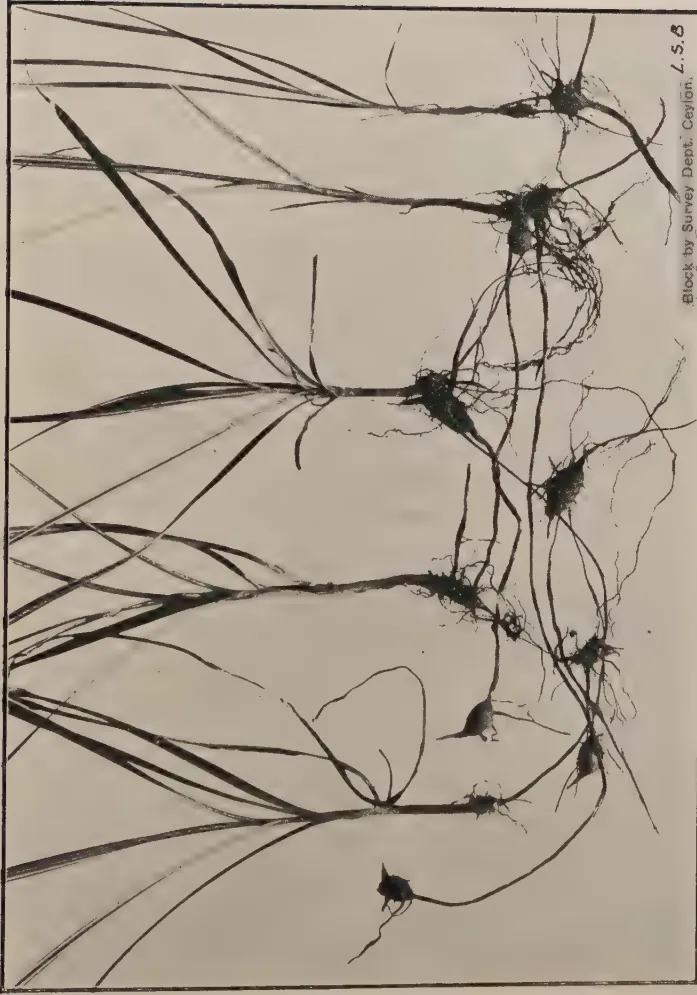
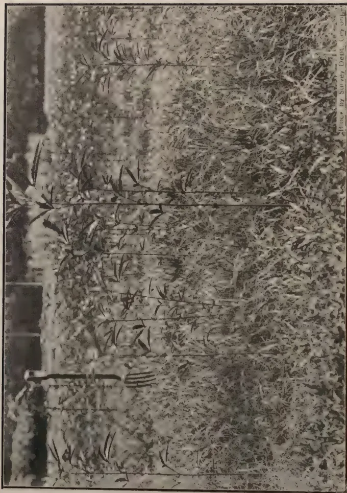
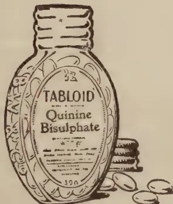
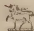
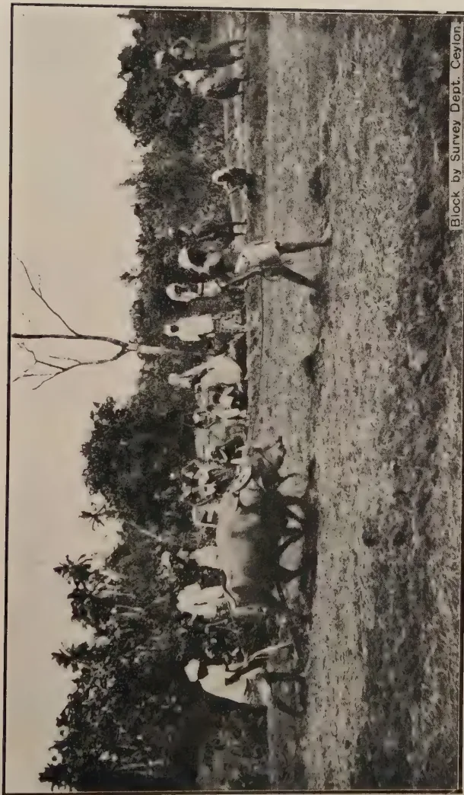

# THE TROPICAL AGRICULTURIST

---

VOL. LXV. PERADENIYA, SEPTEMBER, 1925. No. 3.

---

## FODDER FOR CATTLE.

---

The issue of the report of the Government Committee on communal pastures has revived interest in this question of importance to Ceylon's rural life. The village cultivator requires his buffalos for his paddy cultivation as well as a certain number of neat cattle.

These are grazed upon lands which carry but a poor herbage, upon paddy fields when they are not under cultivation and are also allowed to graze along the sides of roads and in jungles.

Headmen and cattle-owners generally have little faith in any attempt to convert forest land into grass. It is expensive and owners are unwilling to contribute to the cost of such undertakings. There is, however, a great dearth of good pasturage and it is possible that the colony now has a cattle population which is the maximum that it can maintain with the existing pastures. There is, however, a distinct need for more milk and for better cattle for agricultural purposes. Unless grazing lands can be extended, or pastures improved or further attention given to stall feeding and to the growing of fodder grasses, little progress will be made.

The Committee make a number of recommendations, some of which concern directly the Agricultural Department.

It is suggested that for the Jaffna Peninsula the question of the baling of paddy straw should be seriously considered. The preliminary investigations on this question have already been made and the results will be placed before the Board of Agriculture. Experiments are required in order to ascertain if patanas can be economically improved. These will be made but results cannot be expected from such experiments for some time.

1------------------------------------------------

132[SEPTEMBER, 1925.

It is also proposed to make a careful systematic study of the grasses growing in the Tamankaduwa district—the best grazing country in the Island—in order to ascertain which, if any, of these grasses will be suitable for trial in other areas.

Trials with various fodder grasses have now been made on the Experiment Stations for several years and cattle owners and dairymen have definite information available for their guidance. The results of four years' trials on the Experiment Station, Peradeniya, are included in the present number of the *Tropical Agriculturist* and should be given careful attention. This report indicates the yields obtained from the various grasses under trial and their feeding value. It also shows that cultivation and manuring is required if yields are to be maintained.

Other trials have been made at the Anuradhapura and Jaffna Experiment Stations, whilst preparations are being made for a more extensive trial of using various types of silos at the latter station.

All these experiments have been designed to afford information which would be of value to cattle-owners in the colony and there can be no doubt as to their value. The interest in dairying has been increasing in recent years and the detailed accounts of the work of the Peradeniya Farm School Dairy should be of value. In the present number is an account of the analyses of milks and in a later number the expenditure accounts will be presented.

It is by studies of this nature alone that progress can be made and there is no doubt that in the future Ceylon will have to pay greater attention to its milk supplies and to the stall feeding of cattle and the proper growing of fodders.

Improvement in cattle in Ceylon is not likely to make much material progress until improvements in feeding can be effected. The village cultivator cannot as a general rule afford to feed his cattle. He must depend upon grazing grounds and therefore it is all the more important that the recommendations made by the Committee above referred to should receive early attention.

2------------------------------------------------

SEPTEMBER, 1925.]133

# DAIRYING.

## AN INVESTIGATION INTO THE YIELD AND COMPOSITION OF MILK FROM THE FARM SCHOOL DAIRY, PERADENIYA.

A, W. R. JOACHIM, B. Sc., Dip. Ag. (Cantab.)

*Chemist, Dept. of Agriculture, Peradeniya.*

About the beginning of 1924 the Department imported from India a herd of Scindi dairy cattle for the dairy in connection with the Farm School at Peradeniya. These cattle were all of the Scindi breed, and were specially selected by the Dairy Expert to the Government of India for their good milking qualities. On their arrival in Ceylon, however, it was thought necessary to investigate their milks from the point of view of both quantity and quality. An investigation was therefore undertaken to ascertain the 'quality' of the milk of these cows (as represented by the fat content), and at the same time the relation, if any, between yield and quality.

At the time the investigation was started only six of the cows were yielding milk, and the analyses had necessarily to be confined to milk from these six animals.

The cows were milked at the same times every day—viz. at 4-30 a.m. and 1 p.m. They were fed at 8-30 in the morning and at 2-30 in the afternoon. Well mixed samples of the milk of the individual cows were obtained every morning and afternoon, and these were analysed for their fat contents by the Gerber method. The analyses were done daily during four weeks, except on Sundays. The rations which under normal circumstances would have been the same during the whole of the investigation, had to be slightly altered twice owing to the running short of the required provisions.

The investigation was started on the 21st April, when the animals were each receiving a daily ration of

<table>
<tr>
<td>Pollards</td>
<td>3 lb.</td>
</tr>
<tr>
<td>Dhal husks</td>
<td>2 ,,</td>
</tr>
<tr>
<td>Coconut Poonac</td>
<td>2 ,, and 50 lb. grass.</td>
</tr>
</table>

On May 1, however, the dhal husks had to be replaced by ulundu, 2 lb. of this being given. On the 10th May again, dhal husk took its old place in the ration replacing ulundu. This ration was being maintained for 5 days when another change was effected by the further addition of 1 lb. of ulundu to the existing ration. It was unfortunate that so many changes in the diet were made, as otherwise more definite results might have been obtained.

Table 1 gives the yields of the individual cows during the whole period of the investigation, the morning and evening yields being separately stated. A glance at the table will show that in all cases the morning yields are greater than those in the evening. The reverse holds in the case of the

3------------------------------------------------

134[SEPTEMBER, 1925]

fat content, this being much higher in evening milk. This is evident from Table II. The reason for this is the unequal intervals between the morning and afternoon milking and vice versa, in the case of the former the interval being  $8\frac{1}{2}$  hours and in the latter  $15\frac{1}{2}$  hours.

Further examination of Table I shows that the daily variation in the individual yields is not as a rule, very great, but that there is a tendency for these to fall off towards the end of the investigation. This may partly be due to advancing lactation, but the curve shows clearly that some other factor is at work tending to lower the yield. This seems to be no other than the change of rations. The probability is that too frequent changes of rations disturb the ordinary metabolism of lactation. It cannot however be definitely ascertained to what extent specific feeding-stuffs alter the yields, and why these yields are so affected.

From Figure 1, it appears as if dhal husks in the rations have a beneficial effect on yields, and that this good effect is maintained by the replacement of dhal husks by ulundu. A reverting to the dhal husk however results in diminished yields. It is obvious therefore that frequent changes in diet produce anything but good results so far as yields are concerned.

One other fact is apparent from Table I. Each individual animal has a more or less definite yielding capacity, that is to say there are high yielders and low yielders. Thus cows Nos. 26 and 29 may be called the high yielders of the herd, with average daily yields of 18.84 and 15.34 pints respectively, while cows Nos. 31, 33, and 67 are low yielders with average daily yields of 10.18, 10.5, and 9.9 pints respectively. Cow No. 24 is an average yielder with an average yield of 13.54 pints per day. These variations may be due, to a small extent, to the different stages in the lactation periods of the cows.

To turn now to Table II which gives morning and evening fat percentages and the total 'average' fat content or weighted mean of the total morning and evening's supply. This figure is obtained by calculation thus:—

$$\frac{\text{Morning Fat \%} \times \text{M. Yield} + \text{Evening. (Fat \%} \times \text{E. Yield)}}{(M + E) \text{ Yields.}}$$

This is a far more accurate measure of the 'quality' of the milk than the ordinary arithmetic mean.

An examination of the table shows that the 'average' fat contents vary and that the variations do not appear to be governed to any extent by the changes in rations. The mean of the total average fat is 4.9%. The frequency curve in Figure 2 illustrates this very clearly. Along the abscissae are plotted the ranges in fat content and along the ordinates the number of observations or frequency of the fat contents for these ranges. The curve shows that for the largest number of determinations viz., 41 out of the total of 150, the fat content varies from 4.9 to 5.1%. Thus we might safely assert that the average fat content of the daily supply of milk from the Farm School Dairy is 4.9%.

4------------------------------------------------

**Figure I.**

**Change in Rations** (indicated at Day 10)

**Mean Yields** (indicated at Day 15)

**Mean Daily Yields in Pints.** (Left Y-axis, 11.5 to 14)

**Mean Fat Percent.** (Right Y-axis, 4.0 to 6)

**Mean Fat Per Cent** (Right Y-axis, 12 to 13.5)

**Days** (X-axis, 1 to 25)

**Series A (Dashed line):**

<table border="1">
<thead>
<tr>
<th>Day</th>
<th>Mean Daily Yield (Pints)</th>
<th>Mean Fat Percent</th>
</tr>
</thead>
<tbody>
<tr><td>1</td><td>13.5</td><td>12.2</td></tr>
<tr><td>2</td><td>13.5</td><td>12.2</td></tr>
<tr><td>3</td><td>13.5</td><td>12.2</td></tr>
<tr><td>4</td><td>13.5</td><td>12.2</td></tr>
<tr><td>5</td><td>13.5</td><td>12.2</td></tr>
<tr><td>6</td><td>13.5</td><td>12.2</td></tr>
<tr><td>7</td><td>13.5</td><td>12.2</td></tr>
<tr><td>8</td><td>13.5</td><td>12.2</td></tr>
<tr><td>9</td><td>13.5</td><td>12.2</td></tr>
<tr><td>10</td><td>13.5</td><td>12.2</td></tr>
<tr><td>11</td><td>13.5</td><td>12.2</td></tr>
<tr><td>12</td><td>13.5</td><td>12.2</td></tr>
<tr><td>13</td><td>13.5</td><td>12.2</td></tr>
<tr><td>14</td><td>13.5</td><td>12.2</td></tr>
<tr><td>15</td><td>13.5</td><td>12.2</td></tr>
<tr><td>16</td><td>13.5</td><td>12.2</td></tr>
<tr><td>17</td><td>13.5</td><td>12.2</td></tr>
<tr><td>18</td><td>13.5</td><td>12.2</td></tr>
<tr><td>19</td><td>13.5</td><td>12.2</td></tr>
<tr><td>20</td><td>13.5</td><td>12.2</td></tr>
<tr><td>21</td><td>13.5</td><td>12.2</td></tr>
<tr><td>22</td><td>13.5</td><td>12.2</td></tr>
<tr><td>23</td><td>13.5</td><td>12.2</td></tr>
<tr><td>24</td><td>13.5</td><td>12.2</td></tr>
<tr><td>25</td><td>13.5</td><td>12.2</td></tr>
</tbody>
</table>

**Series B (Solid line):**

<table border="1">
<thead>
<tr>
<th>Day</th>
<th>Mean Daily Yield (Pints)</th>
<th>Mean Fat Percent</th>
</tr>
</thead>
<tbody>
<tr><td>1</td><td>13.5</td><td>4.8</td></tr>
<tr><td>2</td><td>13.5</td><td>4.8</td></tr>
<tr><td>3</td><td>13.5</td><td>4.8</td></tr>
<tr><td>4</td><td>13.5</td><td>4.8</td></tr>
<tr><td>5</td><td>13.5</td><td>4.8</td></tr>
<tr><td>6</td><td>13.5</td><td>4.8</td></tr>
<tr><td>7</td><td>13.5</td><td>4.8</td></tr>
<tr><td>8</td><td>13.5</td><td>4.8</td></tr>
<tr><td>9</td><td>13.5</td><td>4.8</td></tr>
<tr><td>10</td><td>13.5</td><td>4.8</td></tr>
<tr><td>11</td><td>13.5</td><td>4.8</td></tr>
<tr><td>12</td><td>13.5</td><td>4.8</td></tr>
<tr><td>13</td><td>13.5</td><td>4.8</td></tr>
<tr><td>14</td><td>13.5</td><td>4.8</td></tr>
<tr><td>15</td><td>13.5</td><td>4.8</td></tr>
<tr><td>16</td><td>13.5</td><td>4.8</td></tr>
<tr><td>17</td><td>13.5</td><td>4.8</td></tr>
<tr><td>18</td><td>13.5</td><td>4.8</td></tr>
<tr><td>19</td><td>13.5</td><td>4.8</td></tr>
<tr><td>20</td><td>13.5</td><td>4.8</td></tr>
<tr><td>21</td><td>13.5</td><td>4.8</td></tr>
<tr><td>22</td><td>13.5</td><td>4.8</td></tr>
<tr><td>23</td><td>13.5</td><td>4.8</td></tr>
<tr><td>24</td><td>13.5</td><td>4.8</td></tr>
<tr><td>25</td><td>13.5</td><td>4.8</td></tr>
</tbody>
</table>

5------------------------------------------------

![Figure III: A line graph showing the number of observations versus fat percentages for Evening Milk and Morning Milk. The y-axis represents the 'No. of Observations' from 0 to 50. The x-axis represents 'Fat Percentages' with various ranges. A vertical dashed line is drawn at 50% fat percentage. The Evening Milk data shows a peak at 6.6% fat (30 observations) and a secondary peak at 6.3% fat (22 observations). The Morning Milk data shows a peak at 3.8% fat (37 observations) and a secondary peak at 4.4% fat (15 observations).](c7c46adcaf27bb8523f1180b53b659b3_1_img.webp)

**Figure III.**

**Evening Milk.**

<table border="1">
<thead>
<tr>
<th>Fat Percentages</th>
<th>No. of Observations</th>
</tr>
</thead>
<tbody>
<tr><td>&lt; 5.1</td><td>0</td></tr>
<tr><td>5.1</td><td>0</td></tr>
<tr><td>5.3</td><td>0</td></tr>
<tr><td>5.4</td><td>0</td></tr>
<tr><td>5.6</td><td>0</td></tr>
<tr><td>5.7</td><td>0</td></tr>
<tr><td>5.9</td><td>0</td></tr>
<tr><td>6.0</td><td>0</td></tr>
<tr><td>6.2</td><td>0</td></tr>
<tr><td>6.3</td><td>22</td></tr>
<tr><td>6.5</td><td>0</td></tr>
<tr><td>6.6</td><td>30</td></tr>
<tr><td>6.8</td><td>0</td></tr>
<tr><td>6.9</td><td>0</td></tr>
<tr><td>7.1</td><td>0</td></tr>
<tr><td>7.2</td><td>0</td></tr>
<tr><td>7.4</td><td>0</td></tr>
<tr><td>7.5</td><td>0</td></tr>
<tr><td>7.7</td><td>0</td></tr>
</tbody>
</table>

**Morning Milk.**

<table border="1">
<thead>
<tr>
<th>Fat Percentages</th>
<th>No. of Observations</th>
</tr>
</thead>
<tbody>
<tr><td>&lt; 2.9</td><td>0</td></tr>
<tr><td>2.9</td><td>0</td></tr>
<tr><td>3.1</td><td>0</td></tr>
<tr><td>3.2</td><td>0</td></tr>
<tr><td>3.4</td><td>0</td></tr>
<tr><td>3.5</td><td>0</td></tr>
<tr><td>3.7</td><td>0</td></tr>
<tr><td>3.8</td><td>37</td></tr>
<tr><td>4.0</td><td>0</td></tr>
<tr><td>4.1</td><td>0</td></tr>
<tr><td>4.3</td><td>0</td></tr>
<tr><td>4.4</td><td>15</td></tr>
<tr><td>4.6</td><td>0</td></tr>
</tbody>
</table>

6------------------------------------------------

SEPTEMBER, 1925.]135

Other inferences one could draw from Table II are :—

(1) That the morning milk is poorer in fat content than the evening supply. Figure 3 illustrates this. Thus the average percentage of fat in the morning milk is 3.5-3.7% and in the evening milk 6.3-6.8%.

(2) That there is great variation in the composition of the milk of individual animals.

For comparative purposes the average daily yields and fat percentage of milk of the different breeds is given below :—

The figures are quoted from Bruce—‘*A tropical milk supply*’

<table>
<thead>
<tr>
<th><i>Breed,</i></th>
<th><i>Average daily yield in pints.</i></th>
<th><i>Fat %.</i></th>
</tr>
</thead>
<tbody>
<tr>
<td>Scind</td>
<td>7.34</td>
<td>4.92</td>
</tr>
<tr>
<td>South Indian</td>
<td>6.46</td>
<td>5.02</td>
</tr>
<tr>
<td>Native</td>
<td>2.92</td>
<td>4.49</td>
</tr>
<tr>
<td>Nellore</td>
<td>5.86</td>
<td>4.85</td>
</tr>
</tbody>
</table>

It will thus be noted that the Scind cows imported from India for the Farm School Dairy are certainly good yielders considering the breed, the daily average obtained at Peradeniya being 13.05 pints per day as against an average for the breed of 7.34 pints. Thus even the lowest yielder of the lot gives over  $1\frac{1}{2}$  pints daily above the average for the breed. The fat content in the milk supplied by the Farm School cows is almost exactly the average for the breed.

Having analysed Tables I and II separately, it now remains to ascertain whether there exists any relation between the two sets of figures, viz. the yield and the ‘quality’ of the milk (as represented by fat %). Several investigators, e.g., Hammond and Hawke (J. Ag. Sc., 1917), Taylor and Husband (J. Ag. Sc., 1922), Tocher (Trans. High. Soc. of Scotland, 1919) have shown that an inverse relationship exists between the percentage of fat and the daily volume of milk secreted *on the average*, when the animal is fed on a low diet of constant composition. An analysis of Tables I and II shows that this relationship does hold in this instance as well. During the present investigation, however, the diet was not kept constant throughout, but for about half the time the same diet was maintained. A glance at Figure 1 will show that during this period, marked A-B on the Figure, it certainly appears as if an inverse relation between the total mean fat and the total yield does exist. It is also evident that no sooner is the diet altered than the relationship ceases to exist. Further on plotting fat percentages against yields for *individual* cows, it was found that the same relationship did not hold. No relationship exists between the separate morning and evening yields and their respective fat contents.

7------------------------------------------------

136[SEPTEMBER, 1925]Table III.

<table>
<thead>
<tr>
<th><i>Hydrometer Readings.</i></th>
<th><i>Mean Fat %.</i></th>
</tr>
</thead>
<tbody>
<tr>
<td>31</td>
<td>3.27</td>
</tr>
<tr>
<td>30</td>
<td>3.72</td>
</tr>
<tr>
<td>29</td>
<td>3.93</td>
</tr>
<tr>
<td>28</td>
<td>4.24</td>
</tr>
<tr>
<td>27</td>
<td>5.16</td>
</tr>
<tr>
<td>26</td>
<td>5.76</td>
</tr>
<tr>
<td>25</td>
<td>6.35</td>
</tr>
<tr>
<td>24</td>
<td>6.7</td>
</tr>
<tr>
<td>23</td>
<td>7.1</td>
</tr>
<tr>
<td>21</td>
<td>8.5</td>
</tr>
</tbody>
</table>

In addition to the determination of the percentage of fat in the samples of milk, daily records were made of the specific gravities of the samples as determined by the lactometer, with a view to ascertaining whether any figures could be obtained showing the connection between hydrometer readings and fat percentages. It is obvious that the specific gravity of milk will depend in addition to its fat content on the amount of water present in the sample and the percentage of total solids. But when no less than 300 samples of genuine milk from cows of the same breed have been examined, and their specific gravities determined it is possible that the figures obtained for the mean specific gravity and the corresponding mean fat percentage will be as close an approximation to the correct value as can possibly be expected. These figures have been collated together, and the results are given in Table III, and plotted in Figure 4. It thus appears that for genuine milk there is almost a direct relationship between its fat content and hydrometer reading.

#### SUMMARY.

As a result of an investigation carried out during a period of four weeks on the yield and 'quality' of cows' milk from the Farm School Dairy at the Chemical Laboratory, Peradeniya, it has been shown that—

(1) The cows which had the reputation of being good milkers for their breed (the Scindi), amply justify this reputation, the average daily yield of the herd being 13.05 pints as against 7.34 pints for the average yield of the breed.

(2) The average fat percentage in the milk is quite up to the average standard for the breed and shows the greatest frequency for a fat % of 4.9.

(3) Morning yields are greater, though of poorer quality, than evening yields.

(4) Frequent changes in rations result in a variation in the yield and composition of milk, the yield tending to fall off. It is, however, not possible to state on the results of this investigation alone what the effects of particular foods on the yield and fat content of milk are.

(5) When the diet remains constant, there exists *on the average*, an inverse relationship between the fat content and the yield.

(6) There seems to be almost a direct relationship between fat percentage and hydrometer readings, for genuine milk.

8------------------------------------------------

### Figure IV.

<table border="1">
<thead>
<tr>
<th>Hydrometer Reading</th>
<th>Mean Fat Percent (Solid Line)</th>
<th>Mean Fat Percent (Dashed Line)</th>
</tr>
</thead>
<tbody>
<tr><td>31</td><td>3.5</td><td>7.5</td></tr>
<tr><td>30</td><td>3.8</td><td>7.4</td></tr>
<tr><td>29</td><td>4.2</td><td>7.2</td></tr>
<tr><td>28</td><td>4.5</td><td>6.8</td></tr>
<tr><td>27</td><td>4.8</td><td>6.2</td></tr>
<tr><td>26</td><td>5.2</td><td>5.8</td></tr>
<tr><td>25</td><td>5.5</td><td>5.5</td></tr>
<tr><td>24</td><td>5.8</td><td>7.8</td></tr>
<tr><td>23</td><td>6.2</td><td>7.5</td></tr>
<tr><td>22</td><td>6.5</td><td>7.2</td></tr>
<tr><td>21</td><td>0</td><td>3.5</td></tr>
</tbody>
</table>

Mean Fat Percent.

Hydrometer Readings.

### Figure II.

<table border="1">
<thead>
<tr>
<th>Fat Percentages</th>
<th>Number of Observations (Solid Line)</th>
<th>Number of Observations (Dashed Line)</th>
</tr>
</thead>
<tbody>
<tr><td>&lt; 4.0</td><td>40</td><td>40</td></tr>
<tr><td>4.0 to 4.3</td><td>35</td><td>40</td></tr>
<tr><td>4.3 to 4.6</td><td>25</td><td>40</td></tr>
<tr><td>4.6 to 4.9</td><td>15</td><td>40</td></tr>
<tr><td>4.9 to 5.2</td><td>10</td><td>40</td></tr>
<tr><td>5.2 to 5.5</td><td>5</td><td>40</td></tr>
<tr><td>5.5 to 5.8</td><td>2</td><td>40</td></tr>
<tr><td>5.8 to 6.0</td><td>1</td><td>40</td></tr>
<tr><td>&gt; 6.0</td><td>0</td><td>40</td></tr>
</tbody>
</table>

Number of Observations.

Fat Percentages.

9------------------------------------------------

This image shows a blank, aged, cream-colored page, likely an endpaper or flyleaf from an old book. The paper has a slightly textured appearance with some minor discoloration and faint smudges, characteristic of old paper. There is no text or other markings on the page.

10------------------------------------------------

SEPTEMBER, 1925.]

137

**DAILY YIELDS IN PINTS.**

<table border="1">
<thead>
<tr>
<th rowspan="2">Cow No.</th>
<th>21/4</th>
<th>22/4</th>
<th>23/4</th>
<th>24/4</th>
<th>25/4</th>
<th>26/4</th>
<th>27/4</th>
<th>28/4</th>
<th>29/4</th>
<th>30/4</th>
<th>1/5</th>
<th>2/5</th>
<th>3/5</th>
<th>4/5</th>
<th>5/5</th>
<th>6/5</th>
<th>7/5</th>
<th>8/5</th>
<th>9/5</th>
<th>10/5</th>
<th>11/5</th>
<th>12/5</th>
<th>13/5</th>
<th>14/5</th>
<th>15/5</th>
<th>16/5</th>
<th>17/5</th>
<th>18/5</th>
<th>19/5</th>
<th rowspan="2">Total Individual Yields</th>
<th rowspan="2">Average Daily Individual Yields</th>
</tr>
<tr>
<th>M E</th>
<th>M E</th>
<th>M E</th>
<th>M E</th>
<th>M E</th>
<th>M E</th>
<th>M E</th>
<th>M E</th>
<th>M E</th>
<th>M E</th>
<th>M E</th>
<th>M E</th>
<th>M E</th>
<th>M E</th>
<th>M E</th>
<th>M E</th>
<th>M E</th>
<th>M E</th>
<th>M E</th>
<th>M E</th>
<th>M E</th>
<th>M E</th>
<th>M E</th>
<th>M E</th>
<th>M E</th>
<th>M E</th>
<th>M E</th>
<th>M E</th>
</tr>
</thead>
<tbody>
<tr>
<td>33</td>
<td>6 4.5</td>
<td>6 4.5</td>
<td>7 5.5</td>
<td>6 4.5</td>
<td>6 5</td>
<td></td>
<td>6 4.5</td>
<td>6 5</td>
<td>6 4.5</td>
<td>6 4</td>
<td>6 4.5</td>
<td>6 4</td>
<td></td>
<td>6 4</td>
<td>7 4</td>
<td>6.5 4</td>
<td>7 4</td>
<td>6 4.5</td>
<td>6 5</td>
<td></td>
<td>6 4</td>
<td>5.5 5</td>
<td>6 4</td>
<td>5.5 4</td>
<td>5.5 4</td>
<td>5 4</td>
<td></td>
<td>6 4</td>
<td>7.5 4</td>
<td></td>
<td></td>
</tr>
<tr>
<td>Total</td>
<td>10.5</td>
<td>10.5</td>
<td>12.5</td>
<td>10.5</td>
<td>11</td>
<td></td>
<td>10.5</td>
<td>11</td>
<td>10.5</td>
<td>10</td>
<td>10.5</td>
<td>10</td>
<td></td>
<td>10</td>
<td>11</td>
<td>10.5</td>
<td>11</td>
<td>10.5</td>
<td>11</td>
<td></td>
<td>10</td>
<td>10.5</td>
<td>10</td>
<td>9.5</td>
<td>9.5</td>
<td>10</td>
<td></td>
<td>10</td>
<td>11.5</td>
<td>262.5</td>
<td>10.5</td>
</tr>
<tr>
<td>26</td>
<td>11 7</td>
<td>10.5 7.5</td>
<td>11 6.5</td>
<td>10.5 8</td>
<td>10.5 8</td>
<td></td>
<td>10 8</td>
<td>10.5 9</td>
<td>11.5 8</td>
<td>12 7.5</td>
<td>11 8</td>
<td>11 8</td>
<td></td>
<td>10 8</td>
<td>10 8</td>
<td>12 7</td>
<td>10.5 8</td>
<td>11.5 8</td>
<td>11.5 8</td>
<td></td>
<td>11 8.5</td>
<td>8.5 8.5</td>
<td>10.5 8</td>
<td>10.5 7</td>
<td>11.5 7.5</td>
<td>10.5 7</td>
<td></td>
<td>10 7</td>
<td>10.5 7</td>
<td></td>
<td></td>
</tr>
<tr>
<td>Total</td>
<td>18</td>
<td>18</td>
<td>17.5</td>
<td>18.5</td>
<td>18.5</td>
<td></td>
<td>18</td>
<td>19.5</td>
<td>19.5</td>
<td>19.5</td>
<td>19</td>
<td>19</td>
<td></td>
<td>18</td>
<td>18</td>
<td>19</td>
<td>18.5</td>
<td>19.5</td>
<td>19.5</td>
<td></td>
<td>19.5</td>
<td>17</td>
<td>18.5</td>
<td>17.5</td>
<td>19</td>
<td>17.5</td>
<td></td>
<td>17</td>
<td>17.5</td>
<td>471</td>
<td>18.84</td>
</tr>
<tr>
<td>24</td>
<td>8 5.5</td>
<td>8 6</td>
<td>8 5</td>
<td>7.5 5.5</td>
<td>7.5 6</td>
<td></td>
<td>8 6.5</td>
<td>8 6</td>
<td>8 6</td>
<td>9 5.5</td>
<td>9 6</td>
<td>9 6</td>
<td></td>
<td>8 6</td>
<td>8 5</td>
<td>8.5 5.5</td>
<td>8.5 6</td>
<td>8.5 6</td>
<td>8 6</td>
<td></td>
<td>7.5 5.5</td>
<td>6 6</td>
<td>9 5</td>
<td>7 5</td>
<td>7 5</td>
<td>7 5.5</td>
<td></td>
<td>7.5 5</td>
<td>7.5 5</td>
<td></td>
<td></td>
</tr>
<tr>
<td>Total</td>
<td>13.5</td>
<td>14</td>
<td>13</td>
<td>13</td>
<td>13.5</td>
<td></td>
<td>14.5</td>
<td>14</td>
<td>14</td>
<td>14.5</td>
<td>15</td>
<td>15</td>
<td></td>
<td>14</td>
<td>13</td>
<td>14</td>
<td>14.5</td>
<td>14.5</td>
<td>14</td>
<td></td>
<td>13</td>
<td>12</td>
<td>14</td>
<td>12</td>
<td>12</td>
<td>12.5</td>
<td></td>
<td>12.5</td>
<td>12.5</td>
<td>338.5</td>
<td>13.54</td>
</tr>
<tr>
<td>31</td>
<td>7 4.5</td>
<td>7.5 4.5</td>
<td>7.5 3.5</td>
<td>7 4</td>
<td>7 4</td>
<td>SUNDAY</td>
<td>6.5 4</td>
<td>6.5 4.5</td>
<td>8 4</td>
<td>6 4</td>
<td>6 4</td>
<td>6 4</td>
<td>SUNDAY</td>
<td>6 4</td>
<td>6 4</td>
<td>7 3.5</td>
<td>6 3.5</td>
<td>5.5 5</td>
<td>6 4</td>
<td>SUNDAY</td>
<td>6 3.5</td>
<td>5 4</td>
<td>6 3.5</td>
<td>5.5 3</td>
<td>5.5 3</td>
<td>5.5 3.5</td>
<td></td>
<td>6 3.5</td>
<td>5.5 3</td>
<td></td>
<td></td>
</tr>
<tr>
<td>Total</td>
<td>11.5</td>
<td>12</td>
<td>11</td>
<td>11</td>
<td>11</td>
<td></td>
<td>10.5</td>
<td>11</td>
<td>12</td>
<td>10</td>
<td>10</td>
<td>10</td>
<td></td>
<td>10</td>
<td>10</td>
<td>10.5</td>
<td>9.5</td>
<td>10.5</td>
<td>10</td>
<td></td>
<td>9.5</td>
<td>9</td>
<td>9.5</td>
<td>8.5</td>
<td>8.5</td>
<td>9</td>
<td></td>
<td>9.5</td>
<td>8.5</td>
<td>254.5</td>
<td>10.18</td>
</tr>
<tr>
<td>67</td>
<td>7 4.5</td>
<td>6 4.5</td>
<td>6 4.5</td>
<td>6 4.5</td>
<td>6.5 4</td>
<td></td>
<td>6.5 5</td>
<td>6.5 4.5</td>
<td>6 4.5</td>
<td>7 4</td>
<td>6.5 5</td>
<td>7 4</td>
<td></td>
<td>5 4</td>
<td>6.5 4</td>
<td>6.5 4</td>
<td>6.5 4</td>
<td>5.5 4</td>
<td>5 4</td>
<td></td>
<td>5.5 3.5</td>
<td>4 4</td>
<td>4 2.5</td>
<td>4.5 3.5</td>
<td>5.5 3.5</td>
<td>5.5 4.5</td>
<td></td>
<td>5.5 4</td>
<td>5 4</td>
<td></td>
<td></td>
</tr>
<tr>
<td>Total</td>
<td>11.5</td>
<td>10.5</td>
<td>10.5</td>
<td>10.5</td>
<td>10.5</td>
<td></td>
<td>11.5</td>
<td>11.0</td>
<td>10.5</td>
<td>11</td>
<td>11.5</td>
<td>11</td>
<td></td>
<td>9</td>
<td>10.5</td>
<td>10.5</td>
<td>10.5</td>
<td>9.5</td>
<td>9</td>
<td></td>
<td>9</td>
<td>8</td>
<td>6.5</td>
<td>8.0</td>
<td>9</td>
<td>10</td>
<td></td>
<td>9.5</td>
<td>9</td>
<td>247.5</td>
<td>9.9</td>
</tr>
<tr>
<td>29</td>
<td>11 5.3</td>
<td>10 6</td>
<td>10.5 6</td>
<td>10.5 6</td>
<td>9.5 6.5</td>
<td></td>
<td>10 7.5</td>
<td>8 6</td>
<td>10 6</td>
<td>9.5 5.5</td>
<td>9 6</td>
<td>10 6</td>
<td></td>
<td>9 7</td>
<td>10 7</td>
<td>9 6</td>
<td>9.5 6</td>
<td>9 7</td>
<td>9 6</td>
<td></td>
<td>8.5 5.5</td>
<td>7.5 6</td>
<td>9 5.5</td>
<td>8 5.5</td>
<td>8.5 5.5</td>
<td>8 6</td>
<td></td>
<td>8.5 6.5</td>
<td>9 6.5</td>
<td></td>
<td></td>
</tr>
<tr>
<td>Total</td>
<td>16.5</td>
<td>16</td>
<td>16.5</td>
<td>16.5</td>
<td>16</td>
<td></td>
<td>17.5</td>
<td>14</td>
<td>16</td>
<td>15</td>
<td>15</td>
<td>16</td>
<td></td>
<td>16</td>
<td>17</td>
<td>15</td>
<td>15.5</td>
<td>16</td>
<td>15</td>
<td></td>
<td>14</td>
<td>13.5</td>
<td>14.5</td>
<td>13.5</td>
<td>14</td>
<td>14</td>
<td></td>
<td>15</td>
<td>15.5</td>
<td>383.5</td>
<td>15.34</td>
</tr>
<tr>
<td>Mean Total Daily Yield</td>
<td>13.6</td>
<td>13.5</td>
<td>13.5</td>
<td>13.3</td>
<td>13.4</td>
<td></td>
<td>13.8</td>
<td>13.3</td>
<td>13.8</td>
<td>13.3</td>
<td>13.5</td>
<td>13.5</td>
<td></td>
<td>13.0</td>
<td>13.3</td>
<td>13.3</td>
<td>13.3</td>
<td>13.4</td>
<td>13.1</td>
<td></td>
<td>12.5</td>
<td>11.7</td>
<td>12.2</td>
<td>11.7</td>
<td>12.2</td>
<td>12.2</td>
<td></td>
<td>12.3</td>
<td>12.4</td>
<td></td>
<td>13.05</td>
</tr>
</tbody>
</table>

TABLE I

11------------------------------------------------

138

[SEPTEMBER, 1925.

**FAT PERCENTAGES.**

<table border="1">
<thead>
<tr>
<th rowspan="2">Cow No.</th>
<th>21/4</th>
<th>22/4</th>
<th>23/4</th>
<th>24/4</th>
<th>25/4</th>
<th>26/4</th>
<th>27/4</th>
<th>28/4</th>
<th>29/4</th>
<th>30/4</th>
<th>1/5</th>
<th>2/5</th>
<th>3/5</th>
<th>4/5</th>
<th>5/5</th>
<th>6/5</th>
<th>7/5</th>
<th>8/5</th>
<th>9/5</th>
<th>10/5</th>
<th>11/5</th>
<th>12/5</th>
<th>13/5</th>
<th>14/5</th>
<th>15/5</th>
<th>16/5</th>
<th>17/5</th>
<th>18/5</th>
<th>19/5</th>
</tr>
<tr>
<th>M E</th>
<th>M E</th>
<th>M E</th>
<th>M E</th>
<th>M E</th>
<th>M E</th>
<th>M E</th>
<th>M E</th>
<th>M E</th>
<th>M E</th>
<th>M E</th>
<th>M E</th>
<th>M E</th>
<th>M E</th>
<th>M E</th>
<th>M E</th>
<th>M E</th>
<th>M E</th>
<th>M E</th>
<th>M E</th>
<th>M E</th>
<th>M E</th>
<th>M E</th>
<th>M E</th>
<th>M E</th>
<th>M E</th>
<th>M E</th>
<th>M E</th>
<th>M E</th>
</tr>
</thead>
<tbody>
<tr>
<td>33</td>
<td>47 61</td>
<td>41 62</td>
<td>46 57</td>
<td>36 66</td>
<td>40 65</td>
<td></td>
<td>32 51</td>
<td>34 65</td>
<td>35 63</td>
<td>47 68</td>
<td>34 66</td>
<td>45 57</td>
<td></td>
<td>39 57</td>
<td>41 61</td>
<td>39 61</td>
<td>46 62</td>
<td>33 60</td>
<td>35 60</td>
<td></td>
<td>38 60</td>
<td>30 61</td>
<td>46 65</td>
<td>35 61</td>
<td>36 62</td>
<td>39 52</td>
<td></td>
<td>42 63</td>
<td>69 35</td>
</tr>
<tr>
<td>Mean Fat.</td>
<td><b>33</b></td>
<td><b>50</b></td>
<td><b>476</b></td>
<td><b>48</b></td>
<td><b>51</b></td>
<td></td>
<td><b>401</b></td>
<td><b>48</b></td>
<td><b>47</b></td>
<td><b>554</b></td>
<td><b>47</b></td>
<td><b>498</b></td>
<td></td>
<td><b>463</b></td>
<td><b>48</b></td>
<td><b>47</b></td>
<td><b>52</b></td>
<td><b>44</b></td>
<td><b>46</b></td>
<td></td>
<td><b>468</b></td>
<td><b>44</b></td>
<td><b>53</b></td>
<td><b>46</b></td>
<td><b>49</b></td>
<td><b>44</b></td>
<td></td>
<td><b>504</b></td>
<td><b>468</b></td>
</tr>
<tr>
<td>26</td>
<td>36 60</td>
<td>46 60</td>
<td>38 67</td>
<td>37 68</td>
<td>46 69</td>
<td></td>
<td>31 58</td>
<td>33 66</td>
<td>39 68</td>
<td>41 68</td>
<td>36 56</td>
<td>43 67</td>
<td></td>
<td>32 68</td>
<td>36 66</td>
<td>39 66</td>
<td>45 69</td>
<td>37 61</td>
<td>36 59</td>
<td></td>
<td>36 67</td>
<td>32 70</td>
<td>40 90</td>
<td>39 61</td>
<td>34 74</td>
<td>39 56</td>
<td></td>
<td>37 67</td>
<td>68 40</td>
</tr>
<tr>
<td>Mean Fat.</td>
<td><b>45</b></td>
<td><b>52</b></td>
<td><b>49</b></td>
<td><b>505</b></td>
<td><b>55</b></td>
<td></td>
<td><b>43</b></td>
<td><b>48</b></td>
<td><b>508</b></td>
<td><b>51</b></td>
<td><b>44</b></td>
<td><b>53</b></td>
<td></td>
<td><b>48</b></td>
<td><b>49</b></td>
<td><b>47</b></td>
<td><b>55</b></td>
<td><b>66</b></td>
<td><b>45</b></td>
<td></td>
<td><b>52</b></td>
<td><b>51</b></td>
<td><b>61</b></td>
<td><b>48</b></td>
<td><b>51</b></td>
<td><b>45</b></td>
<td></td>
<td><b>49</b></td>
<td><b>51</b></td>
</tr>
<tr>
<td>24</td>
<td>33 58</td>
<td>38 72</td>
<td>32 73</td>
<td>36 66</td>
<td>30 72</td>
<td></td>
<td>30 73</td>
<td>40 75</td>
<td>40 70</td>
<td>41 69</td>
<td>39 68</td>
<td>43 64</td>
<td></td>
<td>43 75</td>
<td>40 69</td>
<td>39 67</td>
<td>45 72</td>
<td>38 69</td>
<td>36 80</td>
<td></td>
<td>32 61</td>
<td>29 71</td>
<td>41 76</td>
<td>38 68</td>
<td>34 74</td>
<td>36 71</td>
<td></td>
<td>45 73</td>
<td>73 41</td>
</tr>
<tr>
<td>Mean Fat.</td>
<td><b>43</b></td>
<td><b>535</b></td>
<td><b>477</b></td>
<td><b>48</b></td>
<td><b>49</b></td>
<td></td>
<td><b>49</b></td>
<td><b>55</b></td>
<td><b>52</b></td>
<td><b>59</b></td>
<td><b>406</b></td>
<td><b>51</b></td>
<td></td>
<td><b>57</b></td>
<td><b>51</b></td>
<td><b>50</b></td>
<td><b>55</b></td>
<td><b>508</b></td>
<td><b>55</b></td>
<td></td>
<td><b>46</b></td>
<td><b>5</b></td>
<td><b>53</b></td>
<td><b>506</b></td>
<td><b>506</b></td>
<td><b>51</b></td>
<td></td>
<td><b>56</b></td>
<td><b>54</b></td>
</tr>
<tr>
<td>31</td>
<td>34 50</td>
<td>32 56</td>
<td>36 60</td>
<td>33 61</td>
<td>36 59</td>
<td>SUNDAY</td>
<td>31 57</td>
<td>35 52</td>
<td>35 56</td>
<td>35 65</td>
<td>32 54</td>
<td>33 58</td>
<td>SUNDAY</td>
<td>40 65</td>
<td>41 58</td>
<td>37 51</td>
<td>36 60</td>
<td>23 63</td>
<td>37 62</td>
<td>SUNDAY</td>
<td>35 55</td>
<td>36 60</td>
<td>46 66</td>
<td>43 57</td>
<td>37 57</td>
<td>40 62</td>
<td>SUNDAY</td>
<td>38 70</td>
<td>50 41</td>
</tr>
<tr>
<td>Mean Fat.</td>
<td><b>40</b></td>
<td><b>41</b></td>
<td><b>436</b></td>
<td><b>43</b></td>
<td><b>44</b></td>
<td>SUNDAY</td>
<td><b>408</b></td>
<td><b>42</b></td>
<td><b>42</b></td>
<td><b>47</b></td>
<td><b>408</b></td>
<td><b>43</b></td>
<td>SUNDAY</td>
<td><b>50</b></td>
<td><b>47</b></td>
<td><b>41</b></td>
<td><b>44</b></td>
<td><b>42</b></td>
<td><b>47</b></td>
<td>SUNDAY</td>
<td><b>42</b></td>
<td><b>46</b></td>
<td><b>53</b></td>
<td><b>43</b></td>
<td><b>38</b></td>
<td><b>48</b></td>
<td>SUNDAY</td>
<td><b>56</b></td>
<td><b>41</b></td>
</tr>
<tr>
<td>67</td>
<td>37 68</td>
<td>35 65</td>
<td>34 67</td>
<td>30 63</td>
<td>39 63</td>
<td></td>
<td>38 57</td>
<td>41 74</td>
<td>32 64</td>
<td>39 78</td>
<td>36 69</td>
<td>35 68</td>
<td></td>
<td>34 71</td>
<td>35 61</td>
<td>39 70</td>
<td>44 75</td>
<td>35 70</td>
<td>29 69</td>
<td></td>
<td>38 36</td>
<td>27 85</td>
<td>75 79</td>
<td>44 75</td>
<td>36 68</td>
<td>41 71</td>
<td></td>
<td>37 75</td>
<td>52 36</td>
</tr>
<tr>
<td>Mean Fat.</td>
<td><b>49</b></td>
<td><b>50</b></td>
<td><b>50</b></td>
<td><b>44</b></td>
<td><b>48</b></td>
<td></td>
<td><b>46</b></td>
<td><b>57</b></td>
<td><b>45</b></td>
<td><b>53</b></td>
<td><b>50</b></td>
<td><b>47</b></td>
<td></td>
<td><b>504</b></td>
<td><b>44</b></td>
<td><b>507</b></td>
<td><b>55</b></td>
<td><b>50</b></td>
<td><b>47</b></td>
<td></td>
<td><b>38</b></td>
<td><b>56</b></td>
<td><b>76</b></td>
<td><b>57</b></td>
<td><b>48</b></td>
<td><b>54</b></td>
<td></td>
<td><b>53</b></td>
<td><b>43</b></td>
</tr>
<tr>
<td>29</td>
<td>67 57</td>
<td>39 41</td>
<td>29 61</td>
<td>40 53</td>
<td>37 67</td>
<td></td>
<td>26 58</td>
<td>40 62</td>
<td>30 58</td>
<td>58 74</td>
<td>28 64</td>
<td>43 68</td>
<td></td>
<td>36 66</td>
<td>35 68</td>
<td>36 71</td>
<td>46 70</td>
<td>45 60</td>
<td>36 68</td>
<td></td>
<td>39 65</td>
<td>29 63</td>
<td>56 64</td>
<td>43 75</td>
<td>36 65</td>
<td>35 58</td>
<td></td>
<td>31 73</td>
<td>67 45</td>
</tr>
<tr>
<td>Mean Fat.</td>
<td><b>64</b></td>
<td><b>396</b></td>
<td><b>40</b></td>
<td><b>447</b></td>
<td><b>48</b></td>
<td></td>
<td><b>40</b></td>
<td><b>49</b></td>
<td><b>40</b></td>
<td><b>64</b></td>
<td><b>42</b></td>
<td><b>52</b></td>
<td></td>
<td><b>49</b></td>
<td><b>49</b></td>
<td><b>50</b></td>
<td><b>55</b></td>
<td><b>51</b></td>
<td><b>49</b></td>
<td></td>
<td><b>49</b></td>
<td><b>44</b></td>
<td><b>59</b></td>
<td><b>58</b></td>
<td><b>474</b></td>
<td><b>45</b></td>
<td></td>
<td><b>49</b></td>
<td><b>54</b></td>
</tr>
<tr>
<td>Total Average Fat %</td>
<td><b>49</b></td>
<td><b>48</b></td>
<td><b>465</b></td>
<td><b>47</b></td>
<td><b>49</b></td>
<td></td>
<td><b>43</b></td>
<td><b>50</b></td>
<td><b>46</b></td>
<td><b>55</b></td>
<td><b>46</b></td>
<td><b>493</b></td>
<td></td>
<td><b>50</b></td>
<td><b>48</b></td>
<td><b>48</b></td>
<td><b>53</b></td>
<td><b>47</b></td>
<td><b>48</b></td>
<td></td>
<td><b>46</b></td>
<td><b>48</b></td>
<td><b>59</b></td>
<td><b>505</b></td>
<td><b>47</b></td>
<td><b>48</b></td>
<td></td>
<td><b>54</b></td>
<td><b>49</b></td>
</tr>
</tbody>
</table>

TABLE II.

12------------------------------------------------

SEPTEMBER, 1925.]139

# COTTON.

## THE IMPROVEMENT OF THE COTTON CROP.

G. R. HILSON,

*Cotton Specialist, Madras.*

This article embodies a survey, in some detail, of the problem of the improvement in yield and quality of the cotton crop. This survey was prepared with special reference to conditions in India, but as in its broader aspects it is of more general application, it may be of interest to others outside that country.

### ANALYSIS OF THE PROBLEM.

Beginning at the point in which the grower is most interested, and which it is the final aim of research work to influence favourably—viz., the value of the crop per acre—and working backwards, the following analysis of the problem is arrived at.

*Value of Crop.*—The value of the crop per acre depends upon the yield per acre and the price, which, in the main, depends upon the quality of the produce (lint).

*Yield per Acre.*—This depends upon the number of plants per acre and the yield per plant. Each of these factors in turn depends upon the interplay of hereditary characters and environmental factors.

*Quality.*—The quality of the produce similarly depends upon the interplay of hereditary characters and environmental factors.

*Hereditary Characters.*—1. Those which affect the yield per plant are:

- (a) The number of bolls per plant.
- (b) The number of loculi per boll.
- (c) The number of seeds per loculus.
- (d) The weight per seed.
- (e) The weight of lint per seed.

(a) The number of bolls per plant depends upon the habit of the plant, the length of term, and the vigour of the plant.

*The Habit of the Plant.*—Under this head are included the height of the plant, the number of vegetative branches developed from the axillary buds on the main stem and from the accessory buds if such develop, the number of fruiting branches borne on the main stem and on the vegetative branches, the number of nodes on the fruiting branches, the length of the internodes, the angle at which the branches are carried in relation to the main stem, and the toughness of the wood. The last three characters affect the ability of the plant to carry its crop to harvest without breaking down before the bolls mature and burst. The others determine the number of flower-buds produced.

13------------------------------------------------

140[SEPTEMBER, 1925.

*The Length of Term.*—This is affected by the habit of the plant (a plant which produces its first flowering branch low down the main stem will flower earlier than one which does so high up the stem), but also depends upon the rate of growth of the main stem, the vegetative branches, and the fruiting branches; the interval between the appearance of the bud and the opening of the flower, and the interval between the opening of the flower and the bursting of the boll.

*The Vigour of the Plant.*—By this general term may be described the constitutional ability of the plant to withstand excess or defect of moisture, to resist the attack of pests and diseases, and to mature a high proportion of bolls to buds produced. In this connection the rooting system of the plant and the development of the anthers are probably factors of importance. The presence or absence of hairs on the leaves is certainly of importance in relation to the attack of the Jassid (*Empoasca devastans*).

(c) *The Number of Seeds per Loculus.*—This is affected by the number of loculi boll, and may depend on the number of ovules per loculus and on the size of the loculus.

(d) *The Weight of Lint per Seed.*—This depends upon the number of hairs per seed and the weight per hair. The latter depends upon the length, cross-section, and specific gravity, characters of importance affecting the quality of the lint.

2. Characters which affect the number of plants per acre are the habit of the plant, which determines the amount of space required by the plant in order to develop fully; length of term, which affects the amount of space desirable to allow the plant under given conditions; and vigour, which affects the ability of the plant to survive.

3. Characters which affect the quality of the lint.

The most important of these, from the point of view of the producer of raw cotton, are: length, strength, fineness, colour, lustre, and uniformity in each of these. The other characters, such as porosity, extensibility, etc., are not such as are simple of determination, and are better dealt with in a technological laboratory.

4. Other characters. Besides the above-mentioned characters there are others, such as the colour and the size of the flower, the size and shape of the leaf, the presence or absence of nectaries, etc., which may or may not have any connection with the yield of the plant or the quality of the lint, but which are useful identification marks, and enable workers to judge easily whether mixture is taking place either in the breeding plots or in the cultivators' fields.

*Environmental Factors.*—These affect the yield per plant, the number of plants per acre, and the quality of the lint. They are:

- (a) Climatic conditions.
- (b) Pests.
- (c) Diseases.
- (d) Water.
- (e) Soil.
- (f) Manure.
- (g) Methods of cultivation.

14------------------------------------------------

SEPTEMBER, 1925.]141

(a) *Climatic Conditions*.—Under this head are included rainfall, temperature, humidity, sunshine, cloud, and wind.

(b) *Pests*.—The chief pests are : The pink and the spotted boll worms the stem weevil, the stem borer, jassids, aphids, the dusky and red cotton bugs, and certain other sucking insects which are probably instrumental in spreading fungoid and bacterial diseases.

(c) *Diseases*.—These are fungoid—e.g., wilt (*Rhizoctonia*); bacterial—e.g., black-arm (*B. Malvacearum*); and physiological—e.g., red leaf disease.

(d) *Water*.—The effect of irrigation on a cotton crop depends on the amount of water given, the time and method of application, and on the composition of the water.

(e) *Soil*.—The fertility of a soil depends on its texture, depth, and composition, which last term covers the whole soil complex, organic and inorganic ingredients, and living organisms.

(f) *Manure*.—The effect of manure on a cotton crop depends on the kind and quantity applied, and on the time and method of application.

(g) *Methods of Cultivation*.—Under this term are included the various methods of preparing the land for the crop, sowing the seed, cultivating the crop after the seed has germinated, and the various rotations of which the cotton crop forms a constituent.

From the foregoing it is evident that a complete scheme of agricultural research, aiming at the improvement of the cotton crop in regard to yield and quality of produce, may be divided into two main divisions. In the one will be included matters concerning the heritable characters of the plant, and their mode of inheritance, and in the other matters concerned with the environment.

Before proceeding to discuss in detail these two divisions, it is well to draw attention to two important considerations. First in the case of the heritable characters, while their expression in the plant is affected by the environment, and while as characters they cannot be altered by human agency, yet they can be manipulated and made to combine in a manner which will result in some degree in the improvement aimed at. Secondly, in the case of the environment, though some of the factors are within human control and can be varied so as to bring about the desired improvement, others are not. In their case, however, a knowledge of the effect of variations in them is of importance in estimating the effect of variations made in those under control. This knowledge is also necessary to prepare a forecast of the time at which a crop will come to harvest, the yield it is likely to give, and the quality of the produce which will be marketed. The more exact this information is, the more likely is the forecast to be correct.

Turning now to the consideration of these two main divisions, heredity and environment, matters concerned with the former will be taken first.

### HEREDITY.

In a study of the inheritance of the cotton plant, there are three processes to be gone through.

1. The recognition of the heritable characters and their definition or method of measurement.

2. The isolation of pure strains in which the heritable characters are combined in various ways.

15------------------------------------------------

142[SEPTEMBER, 1925.

3. The manipulation of these characters by crossing strains with the object of forming new combinations of characters, and the study of the results obtained.

Items 1 and 2 are generally carried out simultaneously, and together form the foundation of all plant-breeding work on cotton. Item 3 is carried out by making crosses between strains of the same or of different species and applying ordinary plant-breeding methods.

The more important heritable characters, having an obvious bearing on the economic position, and upon which research should be first directed, are :

*Lint*.—Length, strength, fineness, colour, lustre, uniformity in each of these, and weight per seed.

*Seed*.—Weight, size, presence or absence of fuzz, number per loculus.

*Boll*.—Number of loculi, size, shape, manner of opening.

*Leaf*.—Presence or absence of hairs.

*Plant*.—Habit, length of term, vigour.

Other characters, such as colour of flower, type of leaf, presence or absence of nectaries, colour of the fuzz on the seed, etc., are in the light of present knowledge of less importance. Many of them can be studied while dealing with the other important characters.

The chief defects from which Indian cotton suffers are that the staple is short, the average yield per acre is low, and there is frequently too high a percentage of leaf present in the sample. A considerable improvement in the last-named detail could be brought about if the size of the boll were increased and the sectors of the capsule opened more widely. Work on the inheritance of characters should therefore aim at the removal of these defects.

### ENVIRONMENT.

*Climatic Conditions*.—It is well known to everyone who has experience of cotton that variations in climatic conditions have an enormous influence on the yield and quality of the cotton crop. As an extreme example it may be quoted that Cambodia cotton grown under fair conditions in South India will grow to a height of 4 to 5 feet, and will give a yield of 1,000 lb. of seed cotton per acre, whereas if grown in North India it tends to grow to a much greater height and give no yield. This knowledge of the effect of season on the cotton crop exists, but it is too general and needs to be systematized. As a means of doing this it is suggested that the following scheme should be carried out each year for a number of years.

1. At each Agricultural Station in each important cotton tract a plot of the particular pure strain of cotton evolved at and distributed from that station should be grown as far as possible on similar land and under similar cultural conditions.

2. Throughout the year a daily record of rainfall, temperature, humidity, etc., should be maintained at each of these stations.

3. Throughout the growing season a daily record of flower buds produced and shed, flowers opened, bolls shed and burst, should be kept for a group of plants in each of the plots.

16------------------------------------------------

SEPTEMBER, 1925.]143

1. 4. A record of the treatment given to the plot and of any occurrence, such as an attack of pest or disease, should be maintained.
2. 5. The yield obtained from the plot should be recorded.
3. 6. A sample of the seed-cotton obtained should be sent to the technological laboratory for a detailed examination of the lint to be made and for a spinning test to be carried out.

By doing this an exceedingly valuable set of records would be obtained. After some years the information collected would make it possible to interpret more accurately the effect of seasonal variations in different parts of the same tract. As a result a more reliable forecast of the probable yield and quality of the cotton from that tract could be arrived at than is the case at present. Moreover, such information is very necessary if the results obtained from experimental work affecting other environmental conditions under human control are to be correctly interpreted. Also this information would be a distinct aid in calculating the chances of success of the introduction of a variety into a new tract.

*Pests.*—The problem of insect attack offers the following main lines of investigation :

1. 1. Description and life-history of the pest.
2. 2. Habits of the pest, how it spreads, and how it carries over from one crop to the next.
3. 3. The amount of damage caused.
4. 4. Means of control, by enemies, poisons, or manipulation of the crop.

The description and life-histories of the more important of the insect pests of cotton in India are fairly well known. More detailed information in regard to items 2, 3, and 4 is needed, more particularly if local authorities are to be convinced of the need for legislative measures.

Except in the case of the Jassid, where the possession of hairs on its leaves affords to the plant a distinct measure of immunity from attack, breeding with the object of evolving resistant strains does not at present seem hopeful. It is, however, definitely known in Madras Presidency that the stem weevil and the spotted boll worm, and possibly the pink boll worm, show a decided preference for *Hirtutum* cottons as compared with the indigenous species. The reason for this is not known, but must lie in some constitutional difference between the two species, as both are sown at the same time and are equally exposed to attack. This information, if known, would be a distinct aid to selection and breeding work aiming at the isolation of resistant strains.

*Diseases* —Investigation of disease follows similar lines to those indicated for pests.

Where the disease is definitely known to be due to an organism, the most hopeful solution of the problem appears to lie in plant-breeding work aiming at the isolation of resistant strains.

Where the disease is known to be definitely physiological, detailed investigation of the soil, the plant, and the conditions of growth is necessary. It may also be possible to attack this problem by evolving strains which are not, or are only slightly, affected by the disease.

17------------------------------------------------

144[SEPTEMBER, 1925.

*Water.*—A certain amount of work on the use of water for the cotton crop has been done in India. Where, however, the crop has to depend mainly on the supply of irrigation water, more information as to the quantity of water to be given per irrigation, the number of irrigation to be given in all, and the interval which should elapse between successive irrigations is needed. This problem is, however, inextricably bound up with problems of soil, manure, and methods of cultivation, and has to be considered along with them.

*Soil.*—As yet only the fringe of the work lying waiting to be done on cotton soils in India has been touched. Broadly speaking, the problem may be considered as falling under the four following heads:

1. 1. Mechanical and chemical analysis.
2. 2. Fauna and flora.
3. 3. Physical properties.
4. 4. Climate.

It is not suggested that definite schemes should be formulated, having as their object the carrying out of wholesale surveys all over India along these four lines. Each may be approached through some definite problem the solution of which will yield results of economic importance. For example, under—

1. There are indications that there is a relation between the quality of a lint, and (*a*) its chemical composition, and (*b*) the chemical composition of the soil on which the crop was grown. Further enquiry is needed to establish definitely the existence of this relationship. If the result confirms this point, the fact will be of importance in devising manurial experiments, and a step towards the solution of the problem of levelling up the quality of the cotton of a tract to a fairly uniform condition will have been taken.

2. The relationship between the soil organisms and the production of nitrates in the soil needs investigation. After soil moisture lack of nitrogen in the soil is the most important factor in limiting the yield of the cotton crop in India. Artificial manures to remedy this defect have either proved uneconomical or involve the possession of more capital than the average cultivator has at his disposal. Experimental work to discover cheap methods of increasing the efficiency of beneficial soil organisms is needed.

3. The investigation of the physical properties of the soil should go hand in hand with the investigation of problems of plant growth, and of cultural and irrigation problems.

4. The examination of the soil climate is necessary in investigating problems of plant growth—e.g., bud and boll shedding. A knowledge of the relationship between the climate above ground and the soil climate, and the effect of variations in the latter on the plant, would lead to a better understanding of the causes of variation in yield and quality of the crop, the first step in devising means of control.

Other problems will occur to other investigators as the work proceeds. In time the whole field will be covered.

*Manure.*—A considerable amount of work on the kind and quality of manure for the cotton crop has been done in India, and some work on the time and method of application. Much work, however, remains to be done

18------------------------------------------------

SEPTEMBER, 1925.]145

One of the outstanding manurial problems which has as yet not been solved is the economical manuring of black cotton soil. In certain parts on this soil an increase in the yield of the cotton crop of from 50 to 60 per cent. can be obtained by growing it after a leguminous crop. The introduction of this procedure in practice, however, cannot be recommended. If adopted the area under cotton and grain crops on the cultivator's holding would be reduced from one-half to one-third, and unfortunately the legume cannot always be depended upon to make up the loss on the grain crop. Along this line of attack the problem is bound up with the improvement of the other crops in the rotation. Some other solution may, however, be possible.

*Methods of Cultivation.*—Much work has already been done in India on (a) preparatory cultivation, (b) methods of sowing, (c) spacing, (d) after-cultivation, and some work has been done on rotations and mixed cropping as compared with pure cropping. There is, however, still work to be done along these lines.

A problem of some urgency is that of seed storage and the preparation of seed for sowing. Unaccountable failures of seed sometimes occur. The explanation for this may be in—

- (a) The condition of the seed when put into the store.
- (b) The conditions of storage.
- (c) The treatment given prior to sowing.
- (d) Soil moisture conditions at the time of sowing.
- (e) The seed itself.

The question is of importance in connection with the distribution of seed to cultivators.—The Empire Cotton Growing Review, Vol. II, No. 3.

## MANURING FOR COTTON PRODUCTION.

G. N. BLACKSHAW,

*Chief Chemist, Department of Agriculture, Rhodesia.*

Cotton can be grown on many varieties of soil, but the land must not be too rich, or vegetative growth is encouraged at the expense of fruit. Land which will yield more than eight bags of maize per acre is inclined to be too rich for cotton, whereas soils which are incapable of giving six bags in a normal season should generally be given a dressing of fertiliser for cotton.

The following scheme of manuring is suggested :

*Sandy soils of good type* : 200 lb. of high grade superphosphate per acre.

*Sandy soils of poor type* : 100 lb. of a complete fertiliser, containing 4% N, 20% soluble  $P_2O_5$ , 6%  $K_2O$  per acre.

*Light sandy loams of good type* : 100-150 lb. high grade phosphate.

*Light sandy loams of poor type* : 75-100 lb. of complete fertiliser, containing 4% N, 20% soluble  $P_2O_5$ , 6%  $K_2O$ .

*Heavier soils* : 150 lb. high grade superphosphate per acre.

Farmyard manure hinders ripening of the crop and is not recommended.—International Review of Science and Practice of Agriculture, Vol. III No. 2.

19------------------------------------------------

146[SEPTEMBER, 1925.

# FODDER.

## FODDER GRASS TRIALS AT PERADENIYA EXPERIMENT STATION, 1924-25.

T. H. HOLLAND, M.S.E.A.C.,

*Manager.*

These trials have been in progress since August 1921. The year for this purpose is from August 1st to July 31st.

The factors taken into consideration are:—

1. 1. Yield
2. 2. Feeding value
3. 3. Palatability

The grasses originally included in the trials were:—

1. 1. Guinea grass "A," *Panicum maximum*
2. 2. Guinea grass "B," *Panicum maximum*
3. 3. Prostrate Paspalum, *Paspalum dilatatum* "A"
4. 4. Upright Paspalum, *Paspalum dilatatum* "B"
5. 5. Water grass, *Panicum muticum*
6. 6. Rhodes grass, *Chloris gayana*

Water grass became so mixed with *Mimosa pudica* and other weeds that after the first year the grass was uprooted.

Kikuyu grass, *Pennisetum longistylum*, was introduced but abandoned for the same reason.

The yield of Rhodes grass was inferior from the start: it was moreover very mixed with another grass, *Tricholoena rosca*, which repeated attempts failed to eradicate. Rhodes grass was dropped out of the trials after 1923-24 and the plot is now being cleaned up for the reception of a new grass. Napier grass, *Pennisetum typhoidium*, was included in the trials from August 1924. The plots, which are situated along the banks of the river, are either one acre or half an acre in each case. They are single plots and the yields therefore are not scientifically strictly comparable. In the absence of other definite information in Ceylon however the individual performance of each grass over a known area is of interest.

The soil is sandy, especially towards the southern end. Analyses of the grasses were made by the Government Agricultural Chemist and the relative feeding value of the grasses determined.

The graph shows the yields of the grasses from the start of the trials

The rapid decline in yield in every case indicates the necessity for regular and liberal manuring. Cattle manure was applied in early 1924 to all the plots at the rate of 10 cart-loads per acre. Labour was not then available to fork in this manure so that possibly the full value was not obtained. The application, however, except in the case of Guinea grass "B," resulted in increased yields or an arrest in the decline in yield. In the table will be found the results of the analyses by the Government Agricultural Chemist, the average annual yields of the grasses, and the number of food units per acre, based on these average yields.

20------------------------------------------------

SEPTEMBER, 1925.]147

It will be seen that the highest feeding value per acre is given by the Prostrate Paspalum, while Guinea grass "B" comes second. The food unit figures are obtained from single analysis and it would be well when opportunity occurs to carry out a series of analyses for each grass at different stages of growth.

Another factor of some importance is the distance of planting. The planting distance was decided in accordance with the size and habit of the grass. The Prostrate Paspalum clumps were planted 9" x 18" and a continuous cover is now formed. All the other grasses were planted at greater distances—up to 3' x 3' in the case of Guinea grass "A." It is more than possible that in some cases closer planting would have resulted in heavier yields, and when space allows a "distance of planting" experiment with some representative grass might be interesting.

Another factor to be taken into consideration is that in every plot except the Prostrate Paspalum plot coconuts have been planted in varying numbers from 1922 onwards. The space taken up by these palms is in the aggregate considerable and as the palms grow they are likely to exert an increasingly depressing influence on the yield of grass. The Prostrate Paspalum plot thus enjoys advantage in this respect, but on the other hand the plot is steeper than the others.

#### *Palatability.*

Attempts have been made from time to time to determine the relative palatability of these grasses. The matter is a difficult one to determine with any degree of accuracy and it is sufficient to state that all the grasses at present included in the trials are readily eaten by cattle.

### REMARKS ON GRASSES.

#### *Guinea grass "A."*

This is a coarse very vigorous grass found growing apparently wild on parts of the Experiment Station. It is a heavy yielder and if cut before it becomes too coarse makes a suitable fodder. If left too long cattle will reject a good deal of it. It is quite distinct in appearance from the ordinary Guinea grass, Guinea grass "B," though both have been botanically identified as *Panicum maximum*. Bulletin No. 416 of the Rhodesian Department of Agriculture mentions that there are four widely differing grasses identified under the botanical name of *Panicum maximum*.

#### *Guinea grass "B."*

This is the grass ordinarily known as Guinea grass. It has finer lighter coloured leaves than Guinea grass "A." The appearance of this plot has somewhat declined in the last few years and the need for manuring is indicated.

#### *Upright Paspalum.*

This grass was known as *Paspalum virgatum* until identified at Kew as *Paspalum dilatatum* after which it has been known as *Paspalum dilatatum* "B." It has an upright habit.

21------------------------------------------------

148[SEPTEMBER, 1925.*Prostrate Paspalum.*

This is the grass usually known as "Paspalum" and now widely used as a wash-preventer on road-sides and ravines on up-country estates. Its exceptionally high feeding value on the analysis made has brought it into first place as regards food units per acre.

*Napier grass.*

This is a very popular grass in East Africa, Australia, Madras and elsewhere. When left uncut the stems attain a height of 8 to 10 ft. From these cuttings can be taken which may be planted in the same manner as sugarcane. The yield promised to be heavy but for the first year has not come up to expectations. The clumps spread in an irregular fashion which renders weeding rather difficult. Propagation can also be effected by division of the clumps.

**OTHER GRASSES NOT YET INCLUDED IN THE TRIALS***Buffalo grass, Setaria sulcata.*

Seed of this grass was obtained from the Rhodesian Department of Agriculture in November 1924. Exceptionally vigorous growth was made and the grass was planted out for multiplication in May 1925 in the former water-grass plot. So rapid was the growth that by the middle of July the grass was again ready to be divided out. The grass shows every prospect of being a heavy yielder and if the nutrient value is satisfactory should prove a valuable fodder plant.

*Paspalum scrobiculatum.*

This grass was introduced from Rhodesia at the same time as Buffalo grass under the name of "Native Paspalum." In habit it appears intermediate between the Upright and the Prostrate Paspalums but promises possibly heavier yield than either. It has been planted out for multiplication and will be transplanted again in the North-East monsoon.

*Efwatakala grass—Melis minutiflora.*

Seed of this grass was obtained through Kew in 1923. It is a hairy grass much resembling water-grass in habit. A portion of Plot 167 is planted up with this grass. It has a pungent smell discernible from a considerable distance.

Several palatability trials have shown that most cattle do not take readily to it and many refuse it altogether. When this grass alone was given to the Experiment Station cattle the native cows and calves finally ate what was given them, but the Coast bulls left it untouched although given no other fodder. The grass is said to grow wild over certain areas in Brazil and cattle and horses are there said to be very fond of it. It also covers considerable areas of country in West Africa. The yield is certainly heavy and such a close mat is formed as to effectively smother out weeds. Unless however some outstanding merit is discovered there would appear to be no advantage in growing this grass when several good grasses which are relished by cattle are available. It is however worthy of trial where other grasses which thrive at Peradeniya do not succeed.

22------------------------------------------------

Yields of fodder grasses in tons per acre at Peradeniya Experiment Station 1921-25.

10 cart loads per acre of cattle manure applied in 1924 to all plots

<table border="1">
<thead>
<tr>
<th>Year</th>
<th>Guinea grass A, <i>Panicum maximum</i></th>
<th>Guinea grass B, do do</th>
<th>Upright <i>Paspalum</i>, <i>Paspalum dilatatum</i> B.</th>
<th>Prostrate <i>Paspalum</i>, do do A.</th>
<th>Rhodes grass, <i>Chloris gayana</i></th>
<th>Abandoned</th>
</tr>
</thead>
<tbody>
<tr>
<td>1921-22</td>
<td>40</td>
<td>38</td>
<td>30</td>
<td>28</td>
<td>25</td>
<td>10</td>
</tr>
<tr>
<td>1922-23</td>
<td>42</td>
<td>39</td>
<td>32</td>
<td>29</td>
<td>26</td>
<td>12</td>
</tr>
<tr>
<td>1923-24</td>
<td>44</td>
<td>40</td>
<td>34</td>
<td>30</td>
<td>27</td>
<td>14</td>
</tr>
<tr>
<td>1924-25</td>
<td>45</td>
<td>41</td>
<td>35</td>
<td>31</td>
<td>28</td>
<td>15</td>
</tr>
</tbody>
</table>

23------------------------------------------------

This image is a scan of a blank page. The paper has a light beige or cream-colored tint. There are a few very small, dark specks scattered across the surface, which appear to be scanning artifacts or dust particles. No text, lines, or other markings are present on the page.

24------------------------------------------------

SEPTEMBER, 1925.]

149

ANALYSES AND AVERAGE ANNUAL YIELDS OF GRASSES.

*Analyses.*

<table border="1">
<thead>
<tr>
<th rowspan="2">Variety</th>
<th rowspan="2">Size of Plot</th>
<th rowspan="2">Moisture %</th>
<th rowspan="2">Ash %</th>
<th rowspan="2">Ether extract %</th>
<th rowspan="2">Woody fibre %</th>
<th rowspan="2">Carbohydrates %</th>
<th rowspan="2">Proteids %</th>
<th rowspan="2">Nitrogen %</th>
<th rowspan="2">Food units %</th>
<th rowspan="2">Albuminoid ratio %</th>
<th>Average annual yield Tons per acre</th>
<th>Food units per acre on average yield</th>
</tr>
<tr>
<th>(3 years only)</th>
<th>(1 year only)</th>
</tr>
</thead>
<tbody>
<tr>
<td>Guinea grass "A" Panicum maximum</td>
<td>- 1 acre</td>
<td>80.60</td>
<td>4.85</td>
<td>1.02</td>
<td>4.80</td>
<td>6.78</td>
<td>1.95</td>
<td>0.31</td>
<td>14.20</td>
<td>1:42</td>
<td>31.2</td>
<td>4.43</td>
</tr>
<tr>
<td>Guinea grass "B" Panicum maximum</td>
<td>- 1 acre</td>
<td>77.26</td>
<td>3.30</td>
<td>0.60</td>
<td>6.53</td>
<td>8.90</td>
<td>3.47</td>
<td>0.55</td>
<td>19.07</td>
<td>1:6</td>
<td>27.5</td>
<td>5.24</td>
</tr>
<tr>
<td>Upright Paspalum Paspalum dilatatum "B"</td>
<td>- ½ acre</td>
<td>76.30</td>
<td>4.00</td>
<td>0.50</td>
<td>7.20</td>
<td>9.60</td>
<td>2.4</td>
<td>0.40</td>
<td>16.9</td>
<td>1:42</td>
<td>22.8</td>
<td>3.38</td>
</tr>
<tr>
<td>Prostrate Paspalum Paspalum dilatatum "A"</td>
<td>- ½ acre</td>
<td>64.40</td>
<td>3.18</td>
<td>1.03</td>
<td>10.00</td>
<td>18.36</td>
<td>3.03</td>
<td>0.48</td>
<td>28.51</td>
<td>1:13</td>
<td>21.8</td>
<td>6.22</td>
</tr>
<tr>
<td>Napier grass Pennisetum typhoidium</td>
<td>- 1 acre</td>
<td>78.19</td>
<td>3.21</td>
<td>0.42</td>
<td>5.67</td>
<td>10.16</td>
<td>2.35</td>
<td>0.38</td>
<td>17.08</td>
<td>1:4.8</td>
<td>21.3</td>
<td>3.64</td>
</tr>
</tbody>
</table>

25------------------------------------------------

150[SEPTEMBER, 1925.

# SOILS AND MANURES.

## SOIL ACIDITY AND THE USE OF LIME ON TEA SOILS.

P. H. CARPENTER, F.I.C. F.C.S.

*Chief Scientific Officer.*

H. R. COOPER, B.Sc., F.C.S., and C. R. HARLER, B.Sc., F.I.C.

*Chemists of the Indian Tea Association.*

Lime is a necessary plant food, but practically all soils contain sufficient lime to supply the needs of plants for lime as food.

When lime is used in agriculture it is applied for the purpose of reducing the acidity\* of over-acid soils. If it is applied in excess, the soil is then said to be alkaline. An alkaline soil will turn red litmus blue, while an acid soil will turn blue litmus red. If just sufficient lime is added to an acid soil so that it will not redden blue litmus, nor turn red litmus blue, but changes either to a purple colour, then it is said to be neutral.

Most farm crops do best on soils which are only slightly acid. When soil acidity is excessive the soil is said to be "sour," a condition readily recognised by practical farmers, for example on grazing land from the disappearance of clover and appearance of sorrel, and on arable land by the appearance of the disease known as "finger and toe" in turnips. In such cases the land may be made "sweet" again by liming. Even if an excess of lime is applied so that the soil becomes neutral or faintly alkaline, it is still better for most crops than an over-acid soil. In general therefore farms on acid soils are improved by liming, and the condition of soil acidity has been associated with the need of the soil for lime.

When it became known that lime favoured nitrification, that is, the formation of soluble plant food from crude insoluble organic matter, the general need for lime on all acid soils came to be considered an established fact.

The enormous majority of Indian tea soils are exceedingly low in lime, and when samples are submitted to British analysts this fact has always been (and still is) very strongly emphasised, and the use of lime has been advised. Mann, however, in spite of general home experience gives his opinion very definitely that tea soils in general do not need lime. In fact he expresses his conviction that: "The presence of more than a very small quantity of lime must always be regarded as evidence of unsuitability of the land (for tea)," and he also writes: "Small as the percentage (of lime) usually is in Assam soil, I think there is hardly any case where lime manuring is necessary because the soil is exhausted of this constituent. It

\* The term acidity in reference to soil is used very loosely and is made to cover several phenomena such as the amount of lime that a soil can absorb and also the actual acidity in the soil or what might be called the intensity of the acidity in the soil. In this paper the reference is more particularly to the actual acidity of the soil rather than to its time requirement.

26------------------------------------------------

SEPTEMBER, 1925.]151

may be applied . . . . . to improve the physical condition of the land, . . . . . to eradicate blight, or it may even be put on to correct the acidity of soils, although acidity is unknown in India except in peat bheels. At this time methods of determination of the acidity of soils were not highly developed. We know, now, that tea soils with rare exceptions are acid, and many of the best relatively highly acid. Still, although Mann's facts with regard to the acidity of Assam soils were inaccurate, his advice (probably founded on observation in the field), was as usual very sound, and it is the object of this note to produce evidence in support of his opinion that tea soils in general do not need lime.

The evidence comes under two heads :—

Laboratory work.

Field Experiments.

The laboratory work includes a large number of determinations of acidity of soils from many districts.

The actual lime content of the soil appears to be of small importance. Soils of high lime content are found to do well under tea so long as they are sufficiently acid. Mann for example quotes a good soil from Jafflong containing 0.77 per cent. lime while many good tea soils in the Dooars approach 0.5 per cent. in total lime. These soils, however, contain sufficient acid clay to make the soil reaction definitely acid. The lime soluble in citric acid is a better indication of the actual basic lime present, and this figure for "available lime" rarely exceeds 0.5 per cent. in a good tea soil even when the total lime is high. When, however, the total lime is much higher than about 0.3 per cent. the "available lime" is often in the neighbourhood of 1 per cent., and in such cases the soil may be found to be not acid enough for vigorous tea, or may be even alkaline in which case it has always been found impossible to establish tea. Knowledge of the lime content of the soil is therefore only of value as an indication of the probable acidity of the soil, and hence we get more information from direct measurements of acidity than from measurements of lime content, though the latter are valuable as corroborative evidence. Many methods have been proposed for estimating the acidity of soils, and much time has been spent in trying various methods and modifying them if necessary to see which best serves our purpose, and in this direction much remains to be done.

These facts, however, are already clear, than in general :—

1. (1) The most acid soils grow the best crops of tea.
2. (2) Soils of low acidity grow poorer tea.
3. (3) On soils which are not acid but are neutral or alkaline the attempt to establish tea has always failed.

It will be understood of course that soil acidity is not by a long way the only factor determining the fertility of a soil for tea, so that a slightly acid soil may prove more fertile than a more highly acid soil which is not so good in other respects. Nor, probably, is it true that no tea soil requires lime.

Planters frequently connect soil acidity with water-logging but so far as our experience goes there is no connection between the two. A water-logged area is improved by drainage and not necessarily by liming.

27------------------------------------------------

152[SEPTEMBER, 1925.FIELD TRIALS.

1. *Experiments with Heavy Dressings of Lime at Tocklai.*—For this experiment eight plots planted with three-year old tea, were treated respectively with crushed limestone at the rate of 50, 100, 150, 200, 300 and 400 maunds per acre of crushed lime stone and 100 and 200 maunds per acre of quicklime, while a ninth plot was left untreated. At the end of 1921 all the more heavily limed plots were giving greatly reduced crops compared to the crop from the unlimed plot. Even the most heavily limed plot, however, was growing tea which looked quite fair.

This tea was then uprooted and one-year old plants put in on the same plots without further treatment. Differences in growth very soon began to be apparent. Two years after planting the following remarks applied.

<table>
<tbody>
<tr>
<td>Plot 1.</td>
<td>No lime</td>
<td>... good tea</td>
</tr>
<tr>
<td>" 2.</td>
<td>50 mds. lime</td>
<td>... good tea but poorer than 1</td>
</tr>
<tr>
<td>" 3.</td>
<td>100 mds. lime</td>
<td>... poor tea, noticeably worse than 2</td>
</tr>
<tr>
<td>" 4.</td>
<td>150 mds. lime</td>
<td>... distinctly poor tea</td>
</tr>
<tr>
<td>" 5.</td>
<td>200 mds. lime</td>
<td>... still poorer</td>
</tr>
<tr>
<td>" 6.</td>
<td>300 mds. lime</td>
<td>... very bad</td>
</tr>
<tr>
<td>" 7.</td>
<td>400 mds. lime</td>
<td>... very bad indeed, very little growth since tea was planted</td>
</tr>
</tbody>
</table>

The plots receiving quicklime behaved similarly but were each a little better than the plot receiving the same quantity of lime as crushed limestone.

When young tea was planted on land limed five years previously, then the bad effect on tea of excessive lime in the soil becomes very noticeable; whereas there had been no effect very striking to the eye, on the tea previously planted on these same plots.

From other trials it appears that this is not only because newly planted tea is more susceptible, but also that it takes some time for the effect of excessive lime in the soil to exert its maximum effect on tea.

2. *The Use of Sulphur on Soils of Insufficient Acidity.*—If soils of excessive lime content are bad simply because insufficiently acid, then it should be possible to improve them by using an acid substance to neutralise the alkaline lime. For this purpose there are not many substances which are cheap and convenient in application. Powdered sulphur appeared likely to answer the purpose best. Sulphur is known to be slowly oxidised in the soil to give sulphuric acid. An application of sulphur therefore slowly increases the acidity of an acid soil, or reduces the alkalinity of an alkaline soil.

In the Spring of 1924, each of the plots referred to in experiment (1) was therefore divided into two halves, and to one of the halves sufficient powdered sulphur was added to produce sulphuric acid enough to neutralize the lime originally added.

By the end of 1924, the improvement on the tea which had been thus sulphured was striking. Bushes which were already nearly dead, did not suddenly become first class tea; but plants which had received only lime to slow down growth, had made improvement within a year after application of sulphur.

To one of the plots an extra quantity of sulphur was added by mistake so that instead of changing the soil from alkalinity to an acidity of about 450 (Hopkins method) which is the normal for a soil of the Tocklai type, an acidity of over 7,000 was obtained. This figure is about double that shown by the heaviest clays of North-East India, yet the bushes are improving.

Indeed it appears that the range of acidity which the tea bush will tolerate is fairly wide both when measured by the Hopkins method or when the actual acidity (hydrogen-ion concentration) is considered.

28------------------------------------------------

SEPTEMBER, 1925.]153

Good tea is found on soils with pH varying between about 4.5 and 6.0 yet at Rothamsted it has been shown that a variation of hydrogen-ion concentration from 4.4 to 4.8 is sufficient to distinguish between bad and good wheat.

3. *Trials of smaller quantities of lime at Borbhetta.*

A block of tea was selected which had been planted with 15 months plants in 1919, and had received no manurial treatment either before planting or during 1919, 1920 or 1921.

In 1921 the block was divided into 64 plots of about  $\frac{1}{20}$  th acre each and five plots evenly distributed about the block were used for each treatment.

The treatment under trial is a rotation of manuring covering four years.—

<table>
<tr>
<td>First year</td>
<td>...</td>
<td>...</td>
<td>lime (1922).</td>
</tr>
<tr>
<td>Second year</td>
<td>...</td>
<td>...</td>
<td>phosphate and cowpeas (1923).</td>
</tr>
<tr>
<td>Third year</td>
<td>...</td>
<td>...</td>
<td>Complete artificial mixture (1924)</td>
</tr>
<tr>
<td>Fourth year</td>
<td>...</td>
<td>...</td>
<td>rahur (1925).</td>
</tr>
</table>

The treatment is the same for all plots during the second, third and fourth years; but the quantity of lime applied in the first year varies in each series. By "series" is meant a set of five plots receiving the same treatment.

The doses of lime applied in 1922 included—

<table>
<thead>
<tr>
<th colspan="4"><i>Slaked lime.</i></th>
<th colspan="4"><i>Crushed limestone.</i></th>
</tr>
<tr>
<th colspan="4">6<math>\frac{1}{4}</math> mds. per acre</th>
<th colspan="4">7<math>\frac{1}{2}</math> mds. per acre</th>
</tr>
</thead>
<tbody>
<tr>
<td>12<math>\frac{1}{2}</math></td>
<td>"</td>
<td>"</td>
<td>"</td>
<td>15</td>
<td>"</td>
<td>"</td>
<td>"</td>
</tr>
<tr>
<td>do</td>
<td>"</td>
<td>"</td>
<td>"</td>
<td>do</td>
<td>"</td>
<td>"</td>
<td>"</td>
</tr>
<tr>
<td>25</td>
<td>"</td>
<td>"</td>
<td>"</td>
<td>30</td>
<td>"</td>
<td>"</td>
<td>"</td>
</tr>
<tr>
<td></td>
<td></td>
<td></td>
<td></td>
<td>80</td>
<td>"</td>
<td>"</td>
<td>"</td>
</tr>
</tbody>
</table>

The slaked lime applied was such that 6 $\frac{1}{4}$  maunds supplied the same quantity of basic lime as 7 $\frac{1}{2}$  maunds crushed limestone. Twelve and a half maunds and 25 maunds slaked lime are similarly equivalent in acidity reducing power to 15 and 30 maunds crushed limestone respectively.

Taking the yield of the plots receiving no lime as 100, the following relative yields were obtained:—

<table border="1">
<thead>
<tr>
<th></th>
<th>1921 before liming</th>
<th>1922 lime applied in March</th>
<th>1923 bone meal and cow- peas</th>
<th>1924 complete manure</th>
</tr>
</thead>
<tbody>
<tr>
<td>No lime</td>
<td>100</td>
<td>100</td>
<td>100</td>
<td>100</td>
</tr>
<tr>
<td>6<math>\frac{1}{4}</math> mds. slaked lime</td>
<td>105</td>
<td>108</td>
<td>105</td>
<td>100</td>
</tr>
<tr>
<td>7<math>\frac{1}{2}</math> mds. slaked lime</td>
<td>106</td>
<td>98</td>
<td>96</td>
<td>98</td>
</tr>
<tr>
<td>12<math>\frac{1}{2}</math> mds. slaked lime</td>
<td>103</td>
<td>108</td>
<td>97</td>
<td>94</td>
</tr>
<tr>
<td>12<math>\frac{1}{2}</math> mds. slaked lime</td>
<td>107</td>
<td>105</td>
<td>102</td>
<td>103</td>
</tr>
<tr>
<td>15 mds. crushed limestone</td>
<td>109</td>
<td>105</td>
<td>101</td>
<td>102</td>
</tr>
<tr>
<td>15 mds. crushed limestone</td>
<td>105</td>
<td>108</td>
<td>105</td>
<td>100</td>
</tr>
<tr>
<td>25 mds. slaked lime</td>
<td>110</td>
<td>114</td>
<td>101</td>
<td>100</td>
</tr>
<tr>
<td>30 mds. crushed limestone</td>
<td>113</td>
<td>108</td>
<td>93</td>
<td>93</td>
</tr>
<tr>
<td>80 mds. crushed limestone</td>
<td>103</td>
<td>115</td>
<td>104</td>
<td>97</td>
</tr>
</tbody>
</table>

29------------------------------------------------

154[SEPTEMBER, 1925.

The figures for 1921 were obtained from plucking records for two months only in a year when the young tea gave only  $5\frac{1}{2}$  maunds of tea per acre for the whole year. These figures are therefore not reliable. The 1922 figures were from pluckings from the whole season, and the tea in that year yielded 7 maunds per acre. It will be noticed that there is still a loss in yield in every case where lime was applied if the yield in 1924 be compared with that in 1922.

The losses however are in general small only, with regard to small dressings of lime, it may be said that they do little harm. This is quite clear since even the plots which received 80 maunds of crushed limestone per acre averaged  $12\frac{1}{2}$  maunds pucca tea per acre in 1924. The point is that these small dressings give no increase in crop, and the expenditure on liming shows no return.

Another experiment was tried using no other manures except lime with the following relative results:—Results are again averages from five plots for each treatment.

<table>
<thead>
<tr>
<th></th>
<th>1922</th>
<th>1923</th>
<th>1924</th>
</tr>
</thead>
<tbody>
<tr>
<td>15 maunds crushed limestone per acre</td>
<td>100</td>
<td>94</td>
<td>93</td>
</tr>
<tr>
<td>No lime ... ..</td>
<td>100</td>
<td>100</td>
<td>100</td>
</tr>
</tbody>
</table>

Again there is a decrease from the use of lime.

Further experiments were tried using small annual dressings of lime, both alone and in conjunction with mineral manures.

The quantities used were approximately—

<table>
<tbody>
<tr>
<td>Crushed limestone</td>
<td>... ..</td>
<td>224</td>
<td>lb. per annum per acre.</td>
</tr>
<tr>
<td>Sulphate of potash</td>
<td>... ..</td>
<td>396</td>
<td>" " " " "</td>
</tr>
<tr>
<td>Superphosphate</td>
<td>... ..</td>
<td>473</td>
<td>" " " " "</td>
</tr>
<tr>
<td>Sulphate of lime</td>
<td>... ..</td>
<td>272</td>
<td>" " " " "</td>
</tr>
</tbody>
</table>

The actual quantities were applied after analysis so that they were exactly chemically equivalent. The sulphate of lime is a neutral salt which supplies lime with only very slight change in the acidity of the soil.

Results are again averages from five plots receiving the same treatment

<table>
<thead>
<tr>
<th></th>
<th>1921 before manuring.</th>
<th>1922</th>
<th>1923</th>
<th>1924</th>
</tr>
</thead>
<tbody>
<tr>
<td>No manure</td>
<td>100</td>
<td>100</td>
<td>100</td>
<td>100</td>
</tr>
<tr>
<td>Limestone only</td>
<td>113</td>
<td>112</td>
<td>112</td>
<td>104</td>
</tr>
<tr>
<td>Potash only</td>
<td>91</td>
<td>95</td>
<td>100</td>
<td>101</td>
</tr>
<tr>
<td>Potash and limestone</td>
<td>118</td>
<td>107</td>
<td>111</td>
<td>101</td>
</tr>
<tr>
<td>Super. only</td>
<td>113</td>
<td>111</td>
<td>113</td>
<td>99</td>
</tr>
<tr>
<td>Super and limestone</td>
<td>111</td>
<td>108</td>
<td>108</td>
<td>96</td>
</tr>
<tr>
<td>Super, and potash</td>
<td>95</td>
<td>96</td>
<td>108</td>
<td>95</td>
</tr>
<tr>
<td>Super., potash and limestone</td>
<td>104</td>
<td>101</td>
<td>105</td>
<td>95</td>
</tr>
<tr>
<td>Sulphate of lime</td>
<td>108</td>
<td>106</td>
<td>103</td>
<td>97</td>
</tr>
</tbody>
</table>

The differences are small, and irregular, but it is clear that in every case where limestone is used the crop is reduced. The use of the neutral sulphate of lime also reduces the crop.

30------------------------------------------------

SEPTEMBER, 1925.]155

The results from all these experiments are irregular, and not as concordant as could be desired. Variation due to differences in fertility of the different plots before treatment are not eliminated even by averaging from five plots for each treatment. Still in every case where lime is used the crop is definitely reduced and the number of cases where this occurs is too large to be put down to coincidence.

In our opinion it is already clear that the use of lime on Borbhetta and Tocklai soils gives no increase of crop, but a definite loss of crop, which is at present small.

This is the more remarkable since the soil is relatively highly acid, and liming would undoubtedly prove beneficial for most crops. On the very plots on which lime caused a depression of the tea crop, the cowpeas grown in 1923 showed a decided preference for the limed plots in that the more heavy the dose of lime the heavier was the crop of cowpeas grown. The cowpeas crop from the most heavily limed plots averaged just about double that from the unlimed plots. On adjoining land we had previously found that both guinea grass and maize were benefitted by lime, while jowar could not be made to grow at all without the use of lime (see Q. J. 1919). On the Government Experimental Farm just over our fence all crops tried including sugar, cowpeas, mustard and rahar benefit markedly from lime, while oats would not grow at all without it. It is clear then that different plants show different requirements for lime on the same soil, and that here is one case at any rate when tea requires no lime on a soil where most plants do require fair quantities of lime.

#### EXPERIMENTS ON GARDENS.

In addition to the experiments described there are about 60 other experiments on the use of lime on different tea estates mainly in the Dooars. These have been in progress for three years only, in which case initial differences in the fertility of the soil before it was under experiment make exact comparisons extremely difficult.

The results therefore are not yet worth quoting in full. Records however are being carefully kept and in no case has a limed plot shown an increase over an unlimed plot sufficiently great to be considered significant, while in the great majority of cases, the evidence pointing to a small depression in crop from the use of lime is fairly clear.

There is a certain amount of evidence that soil acidity may be associated with increased liability to attack by mosquito blight, and on two classes of soil the use of lime appears to give very slightly increased crop when mosquito blight is present. These are the heavy acid red clays of the Dooars Red Bank and the dark acid sands ("Mal sands") of the Western Dooars. On other soils this increase has not been observed, while it is still doubtful whether the apparent increase on these two classes of soil is really significant.

Other cases where lime appears at first to give increased crop are where lime is used in conjunction with either an organic manure (like oilcake or animal meal) or with sulphate of ammonia. In such cases the use of lime often gives a small increase in the year of application. The increases so obtained, however, are not equal to the increase

31------------------------------------------------

156[SEPTEMBER, 1925.

obtainable by the same expenditure on additional nitrogen. It appears probable that the increase obtained is due to the increased immediate availability of the nitrogenous manures, and is not due to the lowered acidity of the soil. These cases also will be watched and further investigated.

The chief exceptions to these observations come from gardens in the Doom Dooma district where carefully conducted experiments show that liming has an undoubtedly beneficial effect on certain soils. Here a dose of 80 maunds lime per acre generally depresses the crop or gives a small increase but smaller doses of 60, 40 or 20 maunds, give increases varying from 10 to 16 per cent. above the non-limed plots. An application of 10 maunds gives an increase of about 3 per cent.

### CONCLUSIONS.

Our opinions, on the evidence available may be briefly expressed thus :

Tea only grows well in soils which are definitely acid, and a relatively high degree of acidity appears to favour rapid growth, a high degree of acidity appears to act as a stimulant to tea, but stimulants in excess may prove harmful and such an excess is reached when very heavy top-dressings of acid peat-bheel are applied to sandy soils very low in lime as are Surma Valley teelas. In such cases the first effect has always been an enormous increase in crop, which is followed in later years by serious deterioration of the tea due to attack by disease. In such cases lime has often proved useful ; and although we have no definite experiments in support of the supposition, it is probable that lime would in some cases, prove useful on very acid peat-bheel soils which are suffering from diseases.

Certain root diseases also are encouraged by excessive soil acidity, and will not grow in alkaline soil ; these diseases may be usefully treated with lime.

On excessively heavy soils an application of lime will render the soil more permeable to water and to plant roots : in such cases lime may often prove valuable if used in quantities which still leave the soil definitely acid.

With the exception of such cases, lime on tea soils in small quantities is likely to have generally no good effect, while in quantities large enough to reduce the soil acidity greatly, it will cause definite loss of crop.—Quarterly Journal of the Indian Tea Association, Part 1, 1925

---

## THE CONTROL OF THE BIOLOGICAL FACTOR IN SOIL FERTILITY BY IRRIGATION.

C. M. HUTCHINSON, C.I.E., B.A.

*Imperial Agricultural Bacteriologist.*

Recent advances in our knowledge of the science of soil biology have led to the general conclusion that the relationship between soil fertility and the bacterial action upon which this depends, is mainly determined by the water-supply in the soil. The aim, generally unconscious, of the cultivator in this respect is in most cases to secure nitrification of the organic nitrogenous matter either present in, or added to, the soil, and the measure of

32------------------------------------------------

SEPTEMBER, 1925.]157

his success will depend upon the provision of appropriate moisture conditions for the various stages of the process. Under natural conditions, therefore, he is dependent firstly upon the amount, and secondly, upon the incidence of the rainfall, and most of the management of the soil, in which the art of agriculture mainly consists, is directed towards making the most of such rainfall as occurs. In irrigated areas, however, the uncertainty attendant upon this natural water-supply is to a large extent done away with, and it is therefore precisely in such districts that we have an opportunity, not only of making use of such knowledge as we possess of the water requirements of soil bacteria, but of adding enormously to our, at present, comparatively scanty stock of information on this point. The gap in our information comes at present between our knowledge gained in the laboratory and the conditions obtaining in the field, and it is this gap which research, carried out under proper conditions, should be able to fill. The necessary conditions, in my opinion, would involve the close collaboration of an experienced laboratory worker (a soil bacteriologist) and an agricultural expert fully experienced in irrigation methods, and the chances of successful and rapid advance in this line of research would be greatly increased by the inclusion in this collaboration of a soil physicist on the one hand and probably an irrigation engineer on the other.

The importance of this line of research is overwhelmingly great; it may be partly gauged from the large volume of discussion ranging round about such subjects as soil aeration, drainage, and irrigation, and based almost entirely on empirical experiment or more dogmatic statements of the water requirements or air requirements of crops. Of real knowledge, even of optima, we have at present but little, and although research on soil biology is continually adding to it, such advance is necessarily slow, very largely on account of the small number of centres where such research is being carried out, and the small number of workers on the subject. In India we are especially well situated for such work in respect of the high soil temperature obtaining in most districts, with the consequent greatly increased rate and amount of bacterial action going on in the soil; in addition to this we have enormous irrigation areas where knowledge of the optimal conditions of soil moisture is of incalculable importance because of the possibility of approximating to them by means within direct control.

Not only is it of great importance to know how best to secure nitrification of organic nitrogen present in the soil, but the actual increase in the amount of the latter by natural fixation processes may be said to be of equal consequence, especially in India. There can be no doubt that such processes, whether symbiotic or asymbiotic, depend largely upon proper water conditions being maintained in the soil, and I am at present of opinion that the amount of nitrogen fixed by a soil is largely determined, *coeteris paribus*, not so much by the amount of water in the soil as by its continuous movement therein. In any case it is of prime importance to ascertain, as nearly as possible, the optimal methods of applying water to a soil so as to secure nitrogen fixation therein, as, in practically every Indian soil with which I am acquainted, the supply of nitrogen and the exhaustion of that supply by over-cropping or intensive cultivation, is the most important problem to be

33------------------------------------------------

158[SEPTEMBER, 1925.

dealt with. It may be of interest to mention here some of the particular problems arising out of investigations dealing with the relation between bacterial action and water-supply in soils.

(a) In the conversion of buried organic matter such as green manures, oilcake, etc., into available plant food, the various stages of decomposition are carried out by different classes of bacteria requiring different soil conditions for their successful operation. Thus during the earliest stage when it is advantageous to provide for the breaking down of the cell walls of the vegetable tissues present, a high moisture percentage will conduce to completeness of this action; later, ammonification is promoted by a smaller amount of soil water, and lastly nitrification of the ammonia and amino acids will be secured by a still further reduction of the water-supply. Such control as this implies could only be secured under irrigation, although a well-distributed rainfall would produce similar results. In the above operation it is necessary for success to avoid certain extremes, such as the loss of nitrogen as gas under excessive flooding, the formation of soil colloids due to prolonged high moisture conditions, and the reduction of nitrates during the later stages due to the same cause. It is obvious not only that further research is necessary to determine more fully the conditions underlying such results, but to apply the knowledge gained to soils of varying type. It is also obvious that at present we are not possessed of sufficient information to lay down any hard and fast rules as to the number of waterings which will give the best results for any particular crop or soil. It has been demonstrated at Pusa that the transpiration requirements of various crops may be modified by adequate provision of plant food; such provision is partly dependent upon bacterial action, so that proper control of the water supply not only implies provision of the minimum requirement of the crop, but the possibility of reducing this amount by proper attention to that of the soil bacteria.

(b) In unirrigated soils of the Gangetic alluvium the growth of cold weather crops is sometimes considerably prejudiced by the undue concentration of nitrates in the surface layer, leading to the formation of a highly superficial root system incapable in many cases of obtaining sufficient moisture from the subsoil to secure complete growth. In Pusa soil this phenomenon is sometimes so marked as to lead to the concentration in the first inch of soil of over 90 per cent. of the total nitrate nitrogen in the first eighteen inches, with the result that careful cultivation is necessary to avoid the formation of a highly superficial root system in the *rabi* crop. With irrigation it is possible to keep down the nitrate to a suitable level and to secure its more even distribution, but it will be necessary to make careful experiments in order to determine the best manner of securing this result, without incurring the danger either of removing the nitrate out of root range or of promoting its reduction by bacteria.

(c) An interesting case in point is the practice, known in the Shahabad District as "Nigar," of running off the water from the rice fields some time before maturation of the crop; it appears probable that this method results in the formation of nitrates which are supposed to conduce to proper ripening of this crop although fatal in the earlier stages. This case is cited

34------------------------------------------------

SEPTEMBER, 1925.]159

as one of many which proper investigation would help to place on a sound basis of scientifically ascertained fact. In this connection it may be pointed out that problems of great economic importance are connected with the irrigation of rice, and should be included in any scheme of scientific investigation of the biology of soil under irrigation.

In considering the possibilities of controlling nitrification by suitable irrigation practice it is important to realize the fact that the amount of nitrate actually accumulating in a soil is the algebraic sum of two opposite sets of bacterial processes, namely, those producing nitrate as their end reaction and those either preventing the nitrification of nitrogenous organic matter or reducing nitrate already formed. The balance of these opposite processes is largely determined by moisture conditions in the soil, and so irrigation practice must be regulated in accordance with the information on this point obtained by biological investigation. Furthermore, the importance of such regulation lies not so much in the ability to produce large total amounts of nitrate during the season, but in the possibility of ensuring their presence in sufficient quantity at definite points in the growing period of the crop. It is well known to agriculturists that the success of a crop so far as nitrogen supply can secure it, depends upon such supply being present in an available form at certain stages of growth. It is obvious therefore that incalculable advantage must accrue from the combination of knowledge of how to obtain and regulate this supply of nitrate and the power of doing so. It is such knowledge as this that can be obtained by researches in soil biology as applied to irrigation practice.

It may then be emphasized that an investigation into methods of irrigation, if it is to have any chance of providing really fundamental information, must include, and indeed mainly depend upon, research into the biological conditions obtaining in the soil.—The Agricultural Journal of India, Vol. XX, Part 4.

## THE SOIL WITH SPECIAL REFERENCE TO SOME OF ITS INORGANIC CONSTITUENTS.\*

M. CARBERY, D. S. O., M. C., M. A., B. Sc.,

*Agricultural Chemist to Government, Bengal.*

From the earliest times till some sixty or seventy years ago agriculture was carried out by crude methods which had been handed down from father to son with little improvement. The latter half of last century, however, brought tremendous changes so that now agriculture is universally regarded as a science requiring all the skill and knowledge of a trained research worker to unravel the many factors affecting the production of crops.

The whole business of agriculture is founded on the soil, and on the skill in making use of its inherent capacities depends the outturn of crops which the cultivator will obtain.

\* Paper read at the Agricultural Section of the Indian Science Congress, Benares, 1925.

35------------------------------------------------

160[SEPTEMBER, 1925]

The study of the soil and its function with relation to plant growth naturally, therefore, formed a starting point for the earlier investigators. Many factors were found to enter into the problem, and of these not the least were the inorganic constituents which the plant required and abstracted from the soil. The more important are potash, phosphate, lime, and nitrogen, while to a much less extent sulphur, magnesium manganese, iron, aluminium, etc., play some part. Thus one of the first means of studying the capabilities of a soil is to have a chemical analysis made of it to discover what amounts of inorganic plant food are present.

The value of these results, however, especially in India, is apt to be over-estimated, for it has been found from practical experience that, because a soil possesses a sufficiency of one constituent, it is no justification for saying that that substance should not be applied as a manure. While a sufficiency of plant food may be present in the soil it may not all be in a form which the plant can assimilate, and no really accurate method has yet been evolved to determine what percentage is readily available for plant food. Again it was originally thought that the plant absorbed the necessary substances in the form of a solution, but it is quite possible that colloids can pass through the cell wall, while it is also likely that salts in contact with the root hairs may be dissolved by the organic matter present in the latter.

Thus it will be seen that in this one function of the soil, *i. e.*, the supplying of inorganic plant food, the investigator is faced with a most intricate problem where not only known but many undiscovered agents play a part—a problem amongst the most difficult that any scientist has to face.

If then, we accept the theory that the plant feeds from a soil solution it must always be borne in mind that this so-called soil solution is continually changing, being considerably affected even by cultivation. Much more, then, will it change by the introduction of one or more of the necessary plant foods in the form of a chemical manure. A typical example of this is seen in the case of the red laterite soil round Dacca. This particular soil which is characteristic, in modified forms, of large tracts of Bengal is of a fairly acid nature containing large percentages of iron and aluminium with more than sufficiency of potash.

It lacks, however phosphate and nitrogen in sufficient quantities to produce crops which will pay for their cultivation. It was found that an addition of phosphate in the form of bone was very efficient, while liming was more or less a necessity. Difficulties soon arose, however, regarding the quantities to be used particularly of lime of which a fairly heavy dose was usually given to counteract the soil acidity, and after many field trials the Fibre Expert found that an application of potash to his jute produced very good results. This, however, did not agree with the chemical analyses which showed an ample supply of this plant food. Numerous experiments have now been conducted in the laboratory with results not only of interest but of economic importance. Thus it has been found that the application of increasing doses of lime means a corresponding decrease in available potash. Hence when the soil was heavily limed the potash available was insufficient for such a crop as jute, and so the results obtained by the

36------------------------------------------------

SEPTEMBER, 1925.]161

application of potash to this crop are explained. Again, to a lesser extent, lime affected the phosphate in solution, so that here again a maximum point was reached though much later than in the case of potash—after which an increase of lime meant a decrease of phosphate. Thus to put the results on an economic basis it would seem that the application of 10 mds. of lime per acre was ample though this quantity is far below that required to bring the soil to neutrality. Results in the field are corroborating these laboratory experiments; while preliminary hydrogen-ion determinations on soils which have been treated with varying doses of lime over a number of years also point to the same economic result.

Many other points have arisen during these investigations, for instance, the quantity of iron was found to decrease considerably both through cultivation and the application of fertilizers. Again the quantities of water-soluble phosphate and potash fluctuate very considerably, and there seems here again to be a maximum, in some conditions in the case of phosphate at some three weeks after a bonemeal application. But this maximum is not stable either, as weather and other conditions must necessarily affect it.

Thus it will be seen that even in the investigation of some one or two plant foods in the soil, the worker is faced with many intricate difficulties, and even when some results have been obtained these have again got to be correlated with the crops themselves where new factors and conditions come in, not the least of which is that different plants do not by any means require the same quantities of the various inorganic constituents. Other factors are organic matter in the soil, soil bacteria, temperature and moisture conditions, all of which play a definite part in the ultimate production of crops.—The Agricultural Journal of India, Vol. XX, Part 4.

## COVER CROPS ON ESTATES.

The following extract is taken from the Annual Report of the Department of Agriculture, S. S. and F. M. S., for the year 1924 :—

The use of cover crops is becoming more general and considerable attention was given to this subject at the Experimental Plantation, Serdang. A circular was issued by the Agriculturist's Division as a guide to Planters. At the Experimental Plantation, Serdang, 30 cover and green manure plants are under trial. Of these the following are so far considered to be of first importance :

<table>
<thead>
<tr>
<th>Purpose.</th>
<th>Plant.</th>
</tr>
</thead>
<tbody>
<tr>
<td>Cover for open clearings</td>
<td>
<i>Centrosema Plumieri</i> 
<i>Calopogonium mucunoides</i>
</td>
</tr>
<tr>
<td>Cover under shade</td>
<td><i>Vigna oligosperma</i>. Sarawak bean</td>
</tr>
<tr>
<td>Soil renovators</td>
<td>
<i>Tephrosia candida</i>. " Boga "
        </td>
</tr>
<tr>
<td>Green manure (for turning into the soil)</td>
<td>
<i>Crotalaria usaramoensis</i> 
<i>Dolichos biflorus</i>. Horse Gram.
        </td>
</tr>
</tbody>
</table>

37------------------------------------------------

162[SEPTEMBER, 1925.

# PESTS AND DISEASES.

## CORA GRASS, *CYPERUS ROTUNDUS*, SINH. KALANDURU.

T. H. HOLLAND, M.S.E.A.C.,

*Manager, Experiment Station, Peradeniya.*

"Cora" which belongs to the sedge family is, in districts where it has become established, one of the most pernicious weeds to be met with in Ceylon.

The plant sends down slender underground stems on which, at widely separated intervals, are found the "nuts" by which reproduction is effected. These "nuts" are found in the soil at depths up to two feet. The plant is used to a considerable extent in native medicine.

"Cora" has long been firmly established on the Experiment Station, Peradeniya, and no thoroughly satisfactory method of eradication has yet been devised.

Up to the present the methods tried may be divided into

1. (1) Shading out with high shade.
2. (2) Smothering out with a low growing cover crop.
3. (3) Constant scraping of the soil to cut off the leaves as they appear.
4. (4) Forking out.
5. (5) Sowing mustard in infested patches.
6. (6) Smothering the weed with coconut husks.

### 1. SHADING OUT THE WEED BY MEANS OF DADAPS.

This was tried (a) in a badly infested patch of tea and (b) on the roadside edge of a cacao plot. In the first case the dadaps were planted sufficiently close to form dense and continuous shade. The date of planting of the dadaps is not on record but it is believed they were left growing at least three years. In November 1923 the dense shade was adversely affecting the tea and the dadaps were removed. The "cora" had been kept down by the shade but not killed out. After the removal of the Dadaps the cora revived and is now again fairly thick and vigorous.

(b) In the second case, the main crop being cacao, it was possible to let the thick Dadap shade remain and there is now practically no sign of "cora," in the shaded area.

(2) In 1914 attempts were made (a) in a plot of tea and (b) in a plot recently planted with Papaw to smother out the weed by planting sweet potatoes. The sweet potatoes formed a thick cover which it is believed was left down for about two years and which appeared to have smothered out the "cora." On the removal of the cover however the weed reappeared.

(3) In 1922 a badly infested patch of tea land was scraped weekly for a period of three months. At the end of the period the individual plants presented a weak and sickly appearance but their number was not diminished.

38------------------------------------------------

A detailed botanical illustration of several 'CORA' plants, likely a species of grass or sedge. The illustration shows the above-ground parts, including long, slender, blade-like leaves and thin, upright stems. The most prominent feature is the underground system, which consists of a network of rhizomes and stolons. These underground stems are shown with small, dark, oval-shaped structures attached to them, which are identified as 'nuts' or seed pods. The plants are arranged in a cluster, showing the complexity of their underground growth habit. The illustration is rendered in a fine-lined, etched style, typical of scientific botanical drawings from the early 20th century.

Block by Survey Dept. Ceylon. L.S.B.

"CORA" PLANTS SHOWING THE UNDERGROUND STEMS AND "NUTS."

39------------------------------------------------

A black and white photograph showing a dense growth of tall, thin, grass-like plants, identified as 'CORA' in the caption. The plants are growing in a field, and the background is dark and indistinct. The image is framed by a thin black border.

Photo. by Survey Dept. Coy. only.

A THICK GROWTH OF "CORA" ON THE EXPERIMENT STATION,  
PERADENIYA.

40------------------------------------------------

SEPTEMBER, 1925.]163

(4) Forking has been tried from time to time but owing to impossibility of removing all the nuts from soil only a temporary reduction has been found to result, and the method is slow and expensive.

(5) In 1916 or 1917, at the suggestion of Mr. Beddewela, mustard was sown among the "cora." Apparently the growth of the mustard was not sufficiently vigorous to have any effect on the weed.

(6) Attempts to smother out the weed with coconut husks are reported to have been only partially successful.

It is also recorded that attempts to kill out the weed with a thick growth of crotalaria ended in failure.

It has been stated that "cora," will kill out tea, and in certain bare patches in the Experiment Station tea plots the death of the bushes have been attributed to the influence of this weed. The present writer does not agree with this contention. There is healthy tea growing on the Experiment Station in areas which have for years been badly infested with cora. It appears more probable that the tea bushes have died out from other causes and that with the additional light and air afforded by their removal the "cora" has made specially vigorous growth.

An article by Mr. N. A. R. Pollock, reprinted from the *Queensland Agricultural Journal*, appeared in the *Tropical Agriculturist* for April, 1925. Many of the measures mentioned entail rendering the soil unfit for crop production for a considerable period. Other measures show more promise but an economic method applicable over a large area does not yet appear to have been discovered in Queensland.

A Ceylon planter claims to have completely eradicated "cora" in small patches by folding pigs on the land. This would hardly however be a practical measure in tea land.

The experience of the Experiment Station, Peradeniya, may be summarised as follows:—

1. "Cora" can be controlled by shade but the shade must be dense and permanent, or at all events it must be maintained over a considerable number of years.

2. Constant scraping off of the leaves of the weed would probably result in its ultimate destruction, but the treatment would have to be maintained for a considerable number of months and would not be practicable over a large area.

3. Forking out is never completely successful.

In Ceylon in most cases the land to be treated is occupied by a permanent crop and the effect of any measure on the main crop must be considered. Probably the most promising solution is the smothering out of the weed by the planting of a creeping leguminous cover crop suitable to the district concerned, though even in thick low covers a few cora plants will usually make their way through. The behaviour of tea under such a crop in Ceylon has as yet to be ascertained. It is intended next year to plant up a considerable area of tea on the Experiment Station—much of it infested with cora—with *Indigofera endecaphylla*. From this valuable experience should be gained both in the measure of success achieved and the time taken in smothering the cora, and in the effect of the treatment on the tea.

41------------------------------------------------

164[SEPTEMBER, 1925.

# AGRICULTURAL EDUCATION

## THE DESIRABILITY OF TEACHING AGRICULTURE IN THE COLLEGE AS AN ELECTIVE SUBJECT.

LAL SINGH, B.Sc., (HONS.) M.Sc., (CALIF.)

*Professor of Agriculture, Khalsa College, Amritsar.*

### GENERAL CRY FOR INTRODUCTION OF INDUSTRIAL COURSES IN OUR COLLEGES.

There is a general feeling amongst intelligent people throughout India that our present system of education has not proved a success. It has tended to produce merely one type of young men who are mostly dependent on service. Some people say that it has outgrown its usefulness while others declare that it has proved a curse rather than a blessing. Let the individuals hold whatever opinion they may on this point, one prominent fact remains, that there is general dissatisfaction with the present system of education. And that industrial and technical education should to a large extent supplement Art and Science Courses is the general cry that we hear from all quarters.

#### SCOPE OF IMPROVEMENT IN AGRICULTURE.

India is an agricultural country. 90 per cent. of her people depend directly or indirectly upon agriculture. It is our mainstay. In fact upon agriculture depends our very existence. We should pause for a moment to see if there are any possibilities of improvement in this very line and what part can our educational institutions play in bringing them about. Anybody who has got any experience worth the name of foreign agricultural conditions knows well that our agriculture is still in a very primitive and archaic stage. There is an immense scope for improvement in practically every branch of agriculture as can be readily seen by glancing over the agricultural condition of other countries. Take for instance the case of the United States of America.

#### FARMING OCCUPATION IN AMERICA COMPARED WITH THAT IN INDIA.

She has all its industries and trade in a flourishing condition and hence does not entirely depend upon agriculture as is the case with India. But if we compare our standard of farming with those of America whether it is dairy farming, sheep or animal husbandry; poultry farming or bee-keeping; fruit farming, or growing of ordinary farm crops, vegetable gardening or floriculture, or any other branch whatsoever, we find ourselves miserably lagging behind. Although manual labour in America is at least 20 times dearer than it is in India yet an American farmer by growing almost the same crops as we grow here and selling his produce generally at no higher price than we do in India, is able to make much more profit per acre than we do here. Because of better seed, better farming methods, better implements and better co-operation largely brought about by the helping hand of

42------------------------------------------------

SEPTEMBER, 1925.]165

educational institutions in America, the production per acre of ordinary farm crop like cotton, maize and sugar-cane averages from 50 to 200 per cent. higher, while in vegetable and fruit gardening there is hardly any comparison at all. An average American fruit grower makes to 20 times more income per acre than our average fruit grower does here. And whatever little fruit of poor quality we grow is to a considerable extent allowed to be wasted because we have yet to learn that there exists a Science of Fruit preservation whereby surplus fruit can be utilized for various profitable by-products. We know very little indeed of Poultry and Dairy Farming while we are total strangers to Bee-keeping as a large scale industry. And yet these very industries bring crores of rupees to the farmers in America. No wonder that a farmer in Western countries is so prosperous, happy and contented, while a farmer in India is leading a life of drudgery and poverty.

#### **REASONS FOR HIGHER CROPS IN AMERICA AND AGENCIES RESPONSIBLE FOR DEVELOPMENT OF AGRICULTURE.**

The main reason for this sad state of affairs is that in the United States of America not only do the National and State Governments spend enormous amounts of money for the development of Agriculture—some of the States are spending more money on the teaching of Agriculture than all other professions put together—but the one paramount duty of all Schools and Universities is “the development of Agriculture.” The best brains of the country are devoted to this object. Farming is in the hands of highly educated and intelligent people. What a pitiable contrast with our country? Our Government, which for its income mainly depends on the farmers, is none too lavish in its expenditure on the development of Agriculture. The schools and colleges care more for general culture and have not yet turned their attention towards industries and trades. Can general culture alone save a man from starvation? Even the local bodies into whose hands the system of present day education rests to a certain extent continue to imitate the Government models and show extreme indifference towards the development of agriculture. No wonder then if agriculture has so far remained mostly in the hands of illiterates. The present system of education, divorced as it is from any vocational, industrial or technical training, has produced a strong repugnance, even among the sons of agriculturists, to take up the work of their forefathers. They have one and only ambition, and that is to get some sort of service. A youth possessing fifty or a hundred acres of land would prefer to serve as a clerk on a petty salary rather than settle down on his land and carry on the occupation of his forefathers while the sons of big landlords possessing thousands of acres, which if properly managed could bring in an income of lacs of rupees, are proving themselves still worse. After giving the entire management of their lands into the hands of illiterate tenants they themselves are running after Government Service. It is here that the writer sympathises with those who feel that our present system of education has proved a curse rather than a blessing especially in the case of Agriculturists because it has tended to make them give up their own occupation without providing any other satisfactory field for their activities.

43------------------------------------------------

166[SEPTEMBER, 1925.

### WHAT PART SCHOOLS AND COLLEGES IN AMERICA HAVE PLAYED IN AGRICULTURAL DEVELOPMENTS AND SOME LESSONS FOR OUR COLLEGE.

The writer feels that Schools and Colleges have played more important part in the development of agriculture in the United States of America than any other agency. Facilities for teaching agriculture are provided from elementary Schools right up to the colleges. While the children are yet learning the spelling of cat and mouse, they are at the same time taught how to plant potatoes, onions and flowers. A deep interest in agriculture is created in them from their very childhood. The students have facilities for learning agriculture in high schools where efficient arrangement is made to teach the fundamental principles of agriculture. Then in the College a large number of students take up agriculture as their main study. At the same time there is nothing to prevent an Art and Science student from taking a few elementary courses of agriculture as an elective subject if he so desires. This arrangement is possible because of the character of residential Universities where all the colleges are located on the same campus and Art and Science students find no difficulty in taking a few courses of agriculture. This makes a student well-fitted to take up the profession of agriculture in the absence of any other occupation at whatever stage he gives up his studies. I think this should form the central idea of our educational system because our very existence depends upon agriculture. The sons of agriculturists should be persuaded to join a College of Agriculture and those, who for one reason or another, cannot take up agriculture as a main study, should have facilities for learning something of agriculture in Colleges by taking it as an elective subject. In our present system a student has either to take up agriculture as a Profession and join an agricultural college or he must remain perfectly ignorant of it by pursuing purely Art and Science courses. The writer has been shocked to see the lamentable ignorance of most of our graduates even in the elementary principles of agriculture although they are the sons of landlords and have their money invested in land.

### THE ADVANTAGE OF MAKING AGRICULTURE AN ELECTIVE SUBJECT IN THE COLLEGE.

If agriculture is made an elective subject in the College and its teaching is encouraged by the University it will be productive of extremely valuable results. It will first of all create a deep interest in agriculture amongst our students. Those taking up agriculture would when they go to their respective villages in the vacation, not only be able to appreciate the profession of their parents but would be in a position to offer some really valuable suggestions to their relatives and others at least on such elementary operations of farming as seed selection, the use of improved varieties of crops, use and advantage of cheap but improved type of implements and on other innumerable points which really go a long way towards raising the general standard of farming in our province. Instead of entirely devoting themselves to the acquirement of a theoretical knowledge of pure arts and science which perhaps they are never going to utilise in practice

44------------------------------------------------

SEPTEMBER, 1925.]167

in their whole life, they would at least be learning something which they can readily take advantage of, because agriculture is fortunately a subject in which theory and practice go hand in hand and in which 'every little' knowledge gained can at once be put into practice with great benefit to all.

Secondly these very students after their College life, even though following some profession other than agriculture, would in their leisure or on their retirement from active service, be able to manage intelligently their landed property and not depend entirely upon the good-will of their tenants. They will be able to appreciate the work and follow the suggestions of the Agricultural Department for the improvement of their land instead of leading a dull and useless life on their estates. Our present day graduates, of whom a large number possess land, can hardly give to their workmen any advice or guidance because they themselves do not know even the alphabet of agriculture and hence are as much strangers to their own interests as any one could possibly be.

Thirdly in the absence of any good occupation or decent salary these graduates would be inclined to go back to their land and not beg from door to door for employment, or rot on petty salaries. On the other hand, to those who are able to get into service as I. C. S., P. C. S., Co-operative Societies, Ziladars, Tehsildars and in other posts of Revenue Department, knowledge of agriculture gained at the College would prove to be of immense value in the efficient discharge of these duties.

Lastly agriculture is at least as good a subject as any other which forms a part of our College curriculum to raise the general standard of intelligence of our students.

The University by encouraging the teaching of agriculture in our Colleges would be rendering a unique service to the economic uplift of this province.

In the end, the writer wishes to emphasise the fact that in a big agricultural province like the Punjab we want men by the hundred and thousand to devote themselves to agriculture as a profession. But unfortunately there is only one agricultural college at Lyallpur which, though it is doing most excellent work is quite unable to cope with the requirements of the province. This college turns out not more than 20 graduates of agriculture every year and it is really not possible for one college to attempt to do more under the existing circumstances. The establishment of the Lyallpur agricultural college has cost many lacs already, and its maintenance also several lacs annually. It is obvious that the Punjab Government, particularly during the present financial stringency, cannot open many more Agricultural Colleges of the Lyallpur type. The next best thing then is the adoption of the suggestion given above, *viz.*, the making of agriculture an elective subject in the colleges and to devise means for encouraging its study.—Indian Scientific Agriculturist, Vol. VI, No. 7.

45------------------------------------------------

168[SEPTEMBER, 1925.

# CEYLON AGRICULTURE.

## MATARA DISTRICT AGRICULTURAL COMMITTEE.

Proceedings of the 5th meeting of the District Agricultural Committee held at the Kachcheri on 4th August, 1925, at 10 a.m.

1. *Attendance*.—Present Mr. A. N. Strong, Asst. Government Agent, in the Chair, and the following members:—Messrs. F. Burnett, Divisional Agricultural Officer, G. H. Altendorf, D. Samaraweera, E. J. Buultjens, Mudaliyars W. A. Amarasekara, S. W. Illangakoon, P. W. F. de Livera, H. E. Wickremaratna, W. A. Perera, W. A. Wijesinhe and Mr. W. P. Karanangoda, Agricultural Instructor (visitor).

2. *Absent members*.—Read letters from Messrs. R. C. Kannangara and J. E. Wijesinghe regretting their inability to be present at the meeting.

3. *Minutes*.—Read and confirmed minutes of the meeting held on 12th May, 1925.

4. *Results of Transplanting and Vegetable Garden Competition*.—Mr. Burnett, D. A. O., next tabled the results of the transplanting paddy competitions in Four Gravets, Gangaboda Pattu and Wellaboda Pattu. The prize winners were :

<table>
<tbody>
<tr>
<td>Four Gravets—1st Prize.</td>
<td>K. L. D. D. Weerasinghe</td>
</tr>
<tr>
<td>2nd Prize.</td>
<td>M. C. D. Hendrick</td>
</tr>
<tr>
<td>3rd Prize.</td>
<td>D. T. Weeratunga</td>
</tr>
<tr>
<td>Wellaboda Pattu—1st Prize.</td>
<td>Don Deonis Ranasinghe</td>
</tr>
<tr>
<td>2nd Prize.</td>
<td>W. D. D. Abeygunawardana</td>
</tr>
<tr>
<td>Gangaboda Pattu—1st Prize.</td>
<td>D. T. Wanigasekera</td>
</tr>
<tr>
<td>2nd Prize.</td>
<td>D. H. Abeysiriwardana</td>
</tr>
<tr>
<td>3rd Prize.</td>
<td>D. A. de Silva</td>
</tr>
</tbody>
</table>

On the recommendation of Mudaliyar of Wellaboda Pattu and the Agricultural Instructor it was decided to award the 3rd prize for Wellaboda Pattu to Hiyaderis Muttukumaru. The crop had been harvested before the inspection of the judges, but had been inspected by the Inspector.

Mr. Burnett also notified the results of the Paddy Sheaf Competition which were as follows:

Gangaboda Pattu.—D. T. Wanigasekera  
Wellaboda Pattu.—D. T. Abeysekera

The sheafs of the Four Gravets have not been examined yet as the crops have not yet matured. Vegetable garden competitions of other divisions—Kandaboda Pattu, Weligam Korale and Morawak Korale will be ready for final judging next month.

5. *Vote of thanks to the judges*.—A vote of thanks was passed to the judges in appreciation of their services,

46------------------------------------------------

SEPTEMBER, 1925.]169

6. *Obeyesekere Prizes for Garden Competitions.*—(a) Mr. Burnett tabled his suggestions which were duly approved and it was decided to send the particulars of the Scheme to the Hon. Mr. F. A. Obeyesekere for his final approval.

(b) Resolved that the competition be open to all and not restricted to members of Co-operative Societies.

7. *Paddy Experimental Station at Tihagoda.*—The Divisional Agricultural Officer informed the committee that a Government Paddy Experimental Station is being started on a 5-acre block at Tihagoda and that selected pure-line paddy from Anuradhapura will be obtained for the purpose and he asked for the co-operation of the members to make it a success and would be glad of any criticisms or suggestions from them.

8. *Particulars of Citronella Yield at Borala Station.*—Tabled results of citronella experiments at Borala. The species cultivated were,—

Lena Batu or Heenpengiri  
 Mana Pengiri, Peradeniya  
 Maha Pengiri, Java  
 Maha Pengiri, Peradeniya  
 Maha Pengiri, Local

The crops of the above 5 varieties disclosed the following results:—

<table>
<thead>
<tr>
<th>Variety</th>
<th>Extent</th>
<th>Weight of leaves</th>
<th>Quantity of oil.</th>
</tr>
</thead>
<tbody>
<tr>
<td>1</td>
<td>2</td>
<td>7910 lb.</td>
<td>39 bottles</td>
</tr>
<tr>
<td>2</td>
<td>2</td>
<td>2460 "</td>
<td>21 "</td>
</tr>
<tr>
<td>3</td>
<td>2</td>
<td>1684 "</td>
<td>24 "</td>
</tr>
<tr>
<td>4</td>
<td>2</td>
<td>2560 "</td>
<td>19 "</td>
</tr>
<tr>
<td>5</td>
<td>2</td>
<td>6815 "</td>
<td>35 "</td>
</tr>
</tbody>
</table>

Lena Batu gives the highest yield in oil content.

After some discussion Mr. Samaraweera proposed that an improved type of still would be desirable for the use of the experimental station at Borala to enable correct yields of the various species to be obtained. Such a still will in course of time replace the crude one now in use. This was unanimously carried.

9. *Snail Pest at Deniyaya.*—The Divisional Agricultural Officer informed the Committee of the result of the Snail Pest Campaign at Deniyaya. The methods employed to eradicate the pest were hand collecting and sanitation. He said that 65,000 snails had already been collected and destroyed by immersing the snail in a solution of sulphate of copper and burying it. There had been some difficulty in obtaining labour for the purpose but Mr. D. M. Rajapakse and Mr. R. C. Kannangara came to his assistance and kindly lent him Tamil labour from their estates.

The Pest is now well in hand and the only way to maintain this standard was to keep premises in a sanitary condition. A letter was received from Mr. Collisson in which he referred to the excellent work done in this connection by Mr. Burnett.

10. *School Gardens.* (a) The existing method of organisation of School gardens was next detailed by the Divisional Agricultural Officer.

(b) Discussion followed as to the usefulness of school gardens and the Divisional Agricultural Officer urged the necessity of supplying implements to unregistered school gardens.

47------------------------------------------------

170[SEPTEMBER, 1925.

(c) The Mudaliyar, Weligam Korale, submitted the desirability of teachers giving a share of the produce to the children.

A prize of Rs. 15'00 was offered by Mudaliyar, Wellaboda Pattu, for his division for the best school garden and the largest number of home gardens attached to it. Similar prizes were offered by Mr. E. J. Buultjens and Mr. D. Samaraweera for Morawak Korale and Weligam Korale.

11. *Clearing of Atmagas on Crown Land.*—The motion brought forward by Mr. J. E. Wijesinghe regarding the clearing of atmagas by cultivators on direct application to the Mudaliyar instead of through the Assistant Government Agent was submitted to the meeting by the Hon. Secretary in the absence of the mover. After some discussion it was decided to defer the question for a future occasion when the mover would personally explain his meaning, as it was not apparent at present that any hardship had been caused to the villager.

12. *Training Classes for Hon. Secretaries, and Hon. Workers of Co-operative Societies.*—The Divisional Agricultural Officer informed the meeting that training classes will be held on 26th and 27th August at Matara and sought the co-operation of the meeting and solicited the presence of the Chairman at one of the meetings.

13. *Selected Seed Paddy.*—Notice regarding 300 bushels of long-aged ( $5\frac{1}{2}$ — $6\frac{1}{2}$  months) seed paddy available for sale at Anuradhapura was circulated amongst the members.

14. *Facilities for transplanting Paddy.*—The last item for discussion was put forward by Mr. Altendorf re closing of schools during the cultivation season for a period of 10 days so that the children can help cultivators in transplanting paddy as there is a great scarcity of labour.

Resolved that the suggestion be put before the Chairman of the District School Committee.

## MANNAR DISTRICT FOOD PRODUCTION COMMITTEE.

Minutes of the Mannar District Food Production Committee meeting held at the Mannar Kachcheri on 6th August, 1925.

*Present.*—Mr. C. L. Wickremesinghe, Assistant Government Agent (in the Chair), Mr. W. P. A. Cooke, Divisional Agricultural Officer, N. D., Jaffna, Mudaliyar S. Muttutamby, District Adigar, Mannar, Mr. A. R. James, District Adigar, Mantai, Mr. S. M. P. Arulappah, District Adigar, Musali, Mr. G. Syms, Assistant Irrigation Engineer, Giant's Tank, Mr. A. E. Scheffer, Irrigation Superintendent, Giant's Tank, Mr. V. Ramanathan, Agricultural Instructor, Mannar, Messrs. M. S. Hamid, I. Vinasitampi, K. Neina Muhamado, M. R. A. M. Muhamadaliyar, Ana. Una. Habibu Muhamado, Marisal Santhan and the Acting Secretary, Mr. S. Kandiah, Native Writer.

1. Read and confirmed minutes of meeting held on 3rd October, 1924.

2. Tabled papers regarding restoration of Kurai Tank. The Chairman intimated that further action will be taken on receipt of the report of a meeting of the proprietors to be held on the 8th instant.

3. Tabled papers regarding Stud bulls. The Committee was of opinion that no further action be taken. Regarding the desire of the Nanaddan East Village Committee to procure Stud bulls it was resolved that the matter be referred to the Divisional Agricultural Officer, N. D.,

48------------------------------------------------

SEPTEMBER, 1925.]171

for a report on:—

- (a) Whether he could arrange to secure a suitable bull
- (b) Its probable cost
- (c) Whether free Railway transport could be provided, and
- (d) Further suggestions.

4. Resolved that competitions in paddy cultivation by green manuring (Kalaporam 1925-1926) and for gardens be held in Mantai and Nanaddan divisions in accordance with the rules received with Divisional Agricultural Officer's letter No. 833 of 25th July, 1925, and that three prizes of Rs. 25, Rs. 15 and Rs. 10 be offered for each competition in respect of each of the two areas.

5. Resolved that enquiries be made with a view to holding an Agri-Horticultural Show during 1926. A sub-committee consisting of Mudaliyar S. M. Muttutamby (convener), Mr. A. R. James, Mr. V. Ramanathan, and Mr. M. R. A. M. Muhamadaliyar was appointed to institute necessary enquiries and forward recommendations by 26th instant. The Chairman intimated that this report would be forwarded to the Divisional Agricultural Officer, N. D. for comments and the committee decided to meet on the 31st instant to consider it.

The Divisional Agricultural Officer, N. D., informed members of the opening of an Agricultural School at Jaffna. The committee enquired from the Divisional Agricultural Officer whether free Railway warrants would be available to cultivators and planters of this district to visit the Dry Zone Experiment Station at Anuradhapura and Agricultural Farm at Jaffna. He promised to consider the suggestion and make a report.

## **TRINCOMALIE DISTRICT FOOD PRODUCTION COMMITTEE.**

Minutes of a Committee Meeting of the Food Production Committee, Trincomalie District, held at 11 a.m. on 29th July, 1925, at the Trincomalie Kachcheri.

Present.—The Assistant Government Agent, Trincomalie (Chairman), the Office Assistant (Secretary), the Divisional Agricultural Officer, Northern, the Town Vanniya, the Vanniya of Koddiyar, the Vanniya Tamblegam and the Agricultural Instructor.

1. Resolved to have competitions

- (I) For Manavari cultivation \*
- (II) For tank water pinmari cultivation
- (III) For plantain gardens.

2. Resolved to have 3 prizes of Rs. 30/., Rs. 20/- and Rs. 10/- for each of the two paddy competitions and two prizes of Rs. 30/- and Rs. 20/- for the plantain gardens.

Competitors should send in their applications before 5th September, 1925, for manavari cultivation and before 1st April, 1926, for pinmari cultivation.

3 Judges to be—

- (I) The Assistant Government Agent, Trincomalie
- (II) The Kachcheri Mudaliyar
- (III) The Agricultural Instructor, Trincomalie

4. Results of competition to be announced in February, 1926 for manavari cultivation; in August, 1926 for pinmari cultivation.

5. Applications for competing in plantain gardens should be made before 31st August, 1925.

6. Judges to be the same as for paddy competition.

7. Results to be announced in August, 1926.

8. Area of each garden entered must be not less than  $\frac{1}{2}$  an acre.

49------------------------------------------------

172[SEPTEMBER, 1925.

# APICULTURE.

## THE WONDERFUL ORGANISATION OF THE HIVE.

W. A. GOODACRE,

*Senior Apiary Instructor.*

A close study of bees reveals a multitude of interesting facts, and the closer the study the more wonderful it all appears, but there is nothing which impresses the ordinary observer more than their remarkable instinct for organisation. Considering the number of bees in the hive—probably forty thousand of them—and the numerous duties, large and small, which have to be performed, the functioning under normal conditions of this army of workers appeals to one as almost perfect.

How the bees direct their large working force is, of course, somewhat of a mystery. We can understand that the young bees, when they first emerge from their cells, would for the time being take on nurse work, such as the preparation of food and feeding of the larvae, and other light home duties. Then at the next stage they would gather pollen (the lighter load from the field) and later on nectar—the heavier work. Of course there are numerous other duties, but we are for the moment considering the probability of the age of the bees having some connection with the distribution of work. It is quite evident that, under normal conditions and with regular forces of young bees emerging the work of the colony is facilitated by bees of certain age doing work for which they are best suited. The colony, however, does not rely entirely on this principle, for we can remove a queen from the hive for a time and have no young bees emerging over a fair period, and on the return of the queen and the energetic resumption of work by the colony, the organisation does not appear to be much upset.

It is often thought that the queen bee governs the colony, but such is not the case; the worker bees are the ones that hold the reins of management, and to a large extent they control even the queen's particular work. Everything done is for the future welfare of the colony, and every worker is prepared to make a sacrifice toward that end. Should the queen be failing, or not carrying out her duties as they should be carried out in the opinion of the worker bees, then for the colony welfare the bees will usually supersede her, and rear another queen in the hope of obtaining better results. The drone bees, too, are controlled by the workers. They are reared in large numbers during prosperous times when a force of them is considered necessary, but during adverse periods the worker bees usually destroy the majority of them, as it would be against the best interests of the colony to keep them, consuming large quantities of food as they do.

50------------------------------------------------

SEPTEMBER, 1925.]173

There is wonderful organisation when a colony is preparing to swarm—preparation of queen cells to provide a mother in the old hive when the swarm leaves, selection of the period for the issue of the swarm, and the taking in of a supply of food to cover the swarm's journey to the new home, and to give them a good start there. In many cases the bees find and prepare a new home previous to issuing pell mell from the hive.

The developments just previous to issue are very interesting to watch. A number of workers will run about buzzing and dancing. Other bees on the trail of the dancers will take up the call, and so on, until a general excitement prevails, and out goes the swarm. The queen answers the call, but she does not lead the swarm as is often supposed.

The organisation of the smaller duties about the hive is of much interest. It is not uncommon to find, perhaps, five or six bees right on the outside of the hive busily engaged in blocking up a crack between the supers, using propolis (a gum usually obtained from trees) mixed with wax for this work. How is the organisation so controlled that a few bees will separate themselves from forty thousand to carry out a small operation such as this, and on the outside of the hive? Perhaps a thousand or more bees were aware that the crack in the hive was causing some inconvenience, yet only five or six—just enough for the task—are attending to it.

A colony preparing for the winter months must properly organise its forces to obtain the best results. With the approach of cooler weather the bees contract their sphere of operations—by this clustering together they are better enabled to keep up the temperature of the hive. The brood nest is reduced, too, and the empty cells there are filled with unsealed honey, if procurable, for use as convenient—during the cold weather. The bees commence to reserve their vitality by resting so that their life will be lengthened and they will be able to survive the long winter period, and be in a condition to make a good start during the following spring.

A good knowledge of bees and their work enables the apiarist to work out many problems himself. Get to know what the bees do, and one is on the right track to knowing what is to be done for them.—Agricultural Gazette of N.S.W., Vol. XXXVI, Part 6.

## THE THREE-PLY COMB FOUNDATION.

The A. I. Root Co have successfully developed in the course of their long experiments this unique wax comb foundation, which consists of three layers: a central one—or midrib—made of vegetable fat embossed with the cell bases, and two outer covering layers, one on either side, made of pure beeswax. No mineral wax whatever enters into its composition. The result is a creditable and a strong foundation which is indistinguishable from one made of pure beeswax, and furthermore is claimed to be: (1) non-sagging; (2) non-warping; (3) non-stretching; (4) all worker cells; (5) not gnawed by the bees, and (6) non-breakable in the extractor.

We believe this unique foundation is deserving of trials, and we should say of comparative trials with other renowned products and particularly with Dadant's Wired Foundation, which has revolutionised the manufacture of comb foundation.—The Bee World, Vol. V. No. 9.

51------------------------------------------------

174[SEPTEMBER, 1925.

# CO-OPERATION.

## CO-OPERATION: AN ATTEMPT AT A DEFINITION\*

C. S. RANGASWAMI.

It would be hard to give a ready definition for the term. Combination is the underlying principle of human society. A delimitation will therefore have to be carefully explained. Again, the principle of co-operation is differently applied in different countries. Therefore, writers on the subject have often contended themselves with definitions that bring out the distinguishing characteristics in co-operative institutions of their own country. For example, a recent writer from the United Kingdom defined a co-operative society as "an association of shareholders, usually described as members, who, as individuals, have contributed a fund of capital to be employed under their collective direction for trading purposes in providing for their needs as consumers or as producers." Here we find the specialities of British co-operation brought out. In Britain, societies are chiefly distributive (consumers' societies) or productive in a restricted sense (Workers' societies). That was the turn given to the great movement by the Rochdale Pioneers, whose 'objects' and work chiefly led in those directions; and the Pioneers' ideas and methods even to-day dominate co-operative activities in that country. Other countries have developed other kinds of societies and, though the word 'Co-operative' was added to the economic vocabulary first by an Englishman, Robert Owen, in 1821, it is a meaning far more extensive than the one given in that definition that we will have to seek.

The meaning of the word 'co-operation,' as given in the Concise Oxford Dictionary, is 'working together to the same end.' It is quite comprehensive. A number of people working together to produce a thing—a pen, paper, an issue of a magazine—do co-operate in such a production. The conveyance say, of a parcel from a Madras Firm to a Cuddalore address requires the combination of a number of people and institutions for its carrying out.

Such combination is not technically co-operation. In those instances, people do indeed combine together to achieve an object, but their combination ceases as soon as that object is achieved. There is no continuity of combination with reference to those objects, because there is no need. The combination is casual.

But, in the case under consideration, co-operation means much more. It is a combination of persons, poor persons as will be shown later, into an association called a co-operative society. They combine for the attainment

\* This article has been written as the result of my study of some co-operative literature. There is nothing original in it except part of the treatment; but I do not intend to acknowledge sources of information farther than I have done. Quotation marks and names of authorities in brackets or footnotes have constantly distorted my studies. I wish to spare my readers, if any.

52------------------------------------------------

SEPTEMBER, 1925.]175

of a *business or trade* purpose and agree to act in the interests of the society—regulate their action in those matters for which they formed the society so as not to run counter to its interest.

There are other combinations which possess one or more of the qualifications of co-operative societies, but yet do not come within the category of co-operation for lack of some essential characteristic. Such are for example, poor men's combinations into Labour or Trade Unions; Nidhis or Chit Fund societies in our province and capitalist combinations into Trusts and Rings and Joint Stock Companies.

Thus, in Trades Unions, we find workmen, employees, united together for the protection of their interests as against employers. But they do not engage in trade. They are not unions for the attainment of a business purpose.

The Nidhis in our province are associations where people join together to pool their savings. They cannot be called co-operative societies, although as they are actually conducted, they have several functions in common with popular banks. But their avowed object is to 'enable subscribers to save money' and to find safe investments for such saving. They are not concerned with the business of the members, only with the successful result of such business. Even in lending, they do not care to see if the loan is put to a productive purpose; their concern is to effectively secure the loan by mortgage on land or deposit of valuable collaterals.

Capitalist combinations into Trusts, Rings and Karfells (in Germany) are not co-operative. They are big associations of very rich businessmen and corporations. The combination is for a definite object, *viz.* to dominate business in their line. They regulate output and prices. They are in the hands of very powerful syndicates, and, in America for example, the Standard Oil Company has throttled all competition in oil. Here strong people join together to make themselves irresistible. The object is huge profits. Having killed competition, the trust can fix its own prices. Any person that wants the thing manufactured and sold by a Trust will have to pay the price fixed by it.

But a co-operative society cannot be true to its principles and at the same time fleece the public even if it is able to do so. Justice and generosity to the public should be its watchwords. It is an unselfish organisation to bring about public good.

Again the idea of co-operation had its birth in the mind of a philanthropist. He wanted to make weak men strong. Robert Owen was preaching that the unhappy lot of the factory hand could be made better by paying him better wages and making him 'happy, prosperous and educated.' The Pioneers worked only to make his lot—their lot—better. Schulze Delitsch, Raiffeisen and their imitators all over Europe were moved to action by the miseries of the poor. With them, a co-operative society was an association of the weak in order that they may defend their business interests against the strong, by making themselves strong. "The rich are, by law, excluded from co-operative societies in England and Italy."

But, sometimes it happens, as in the case of certain Schulze Delitsch Societies of Germany, that the small man grows prosperous and then does

53------------------------------------------------

176[SEPTEMBER, 1925.

not care for his less fortunate brother. Small accounts are not profitable and are therefore refused. But safeguards are always provided and such un-co-operative selfishness is not common.

It is these characteristics that also distinguish a co-operative society from a joint stock company. There are points of agreement between both. Both are unions of individuals who pool capital for business. But a co-operative society is a union of members. Its members unite by reason of the personal confidence which they feel in each other. The co-operative share is in the nature of an entrance fee to a personal union and is generally very small. The workmen, the petty producer, the landholding agriculturist cannot afford to pay much. He cannot lock up his capital in the society. Having paid the minimum of subscription prescribed, he has to reserve the remainder for his other wants.

A joint stock company is a union of capitalists. So long as the necessary amount is forthcoming, it does not matter as to who holds shares in the business or how much he holds. In both, the statutory minimum of membership is seven. A co-operative concern increases its capital by setting no limit to membership. It cannot pull on with the capital subscribed by the minimum number of members. But, in a joint stock concern seven shareholders can subscribe all the amount they require. Since the individual does not matter, shares can be held by anybody in a joint stock company and there is no restraint on transfer of shares. In addition, the concern of capital is profits. In co-operation, profits go often in full or in great part to strengthen the society by accumulating reserves.

To sum up:—A society should possess certain special features to entitle it to be called 'co-operative.' It should be an association of poor men. The object should be business or trade which will help to lift them from poverty. It should not be a benevolent organisation but should be self-dependent. It should be self reliant, the management being in the hands of the members. It will have to be worked in an unselfish public spirit. It cannot, for example, close its doors upon new members because it has obtained some success and they are poor. Here are a few definitions.

A co-operative society is an association for purposes of joint trading, originating among the weak, and conducted always in an unselfish spirit, on such terms that all who are prepared to assume the duties of membership share in its rewards in proportion to the degree in which they make use of their association (C. R. Fay).

Co-operative societies are 'associations with an open membership list which have in view the furtherance of the craft or occupation of their members by means of a business conducted in common' (German Law, 1889).

Co-operation is the name given to an industrial system, self-governed, and organised for the mutual benefit of its members. It does not admit of the authority of the private capitalist. (Joseph Blayton).

Co-operative societies are personal unions, which, without belonging to (joint stock) associations, pursue, in common, business transactions. (Swiss Law, 1881).

A co-operative society is one which is composed of members, whose number and holdings are variable and whose shares are not transferable to third parties (Belgian Law).—The Madras Bulletin of Co-operation, Vol. XVII, No. 1.

54------------------------------------------------

SEPTEMBER, 1925 ]177

**Pure  
Soluble  
Compact**

TRADE  
MARK

**'TABLOID' BRAND  
QUININE**

*Reduced facsimile*

The solubility of sugar-coated 'Tabloid' Quinine is ensured by the use of pure sugar only. Talc and other insoluble and deleterious substances are not, and never have been, used.

'Tabloid' Quinine Bihydrochloride and 'Tabloid' Quinine Bisulphate, in bottles of 25 and 100, plain or sugar-coated, at all Chemists and Stores

**BURROUGHS WELLCOME & CO.**  
LONDON

*All Rights Reserved*

x.r 4340

## GENERAL.

### THE PRINCIPLES OF AGRICULTURAL EXPERIMENTS.

**SIR A. D. HALL, K.C.B., L.L.D., F.R.S.\***

*Chief Scientific Adviser to the Ministry of Agriculture and Fisheries.*

The particular point to which I am going to address myself can best be phrased in the famous introduction to one of Bacon's Essays: "What is Truth." How are we going to get at truth in our experiments? We find that we have to examine our experiments very carefully before they will yield us truth. In agriculture we have particularly tried to arrive at results by experiments, and one of the earliest forms which our experiments have taken has been to try and show upon the land how much better one variety of a farm crop, like wheat, may be than another, or how much better one treatment—be it by manure or by cultivation—may be than another, by putting down plots, side by side. We have the replica of the plot experiment when we come to examine questions of feeding. We have been accustomed to put a certain number of pigs or bullocks on one kind of diet and compare their rate of increase with that on another kind of diet. It will be familiar to many that the results obtained by this method of

\* Discourse delivered at the Conference of Agricultural Organisers at Oxford, April, 1925,

55------------------------------------------------

178[SEPTEMBER, 1925.

putting down plots and measuring the weights of their crops, are rather apt to be disappointing and sometimes confusing, for when we design the experiment we have a pretty clear idea of what the results ought to be and yet the results have often not come out right. Various devices have been adopted by myself and my colleagues for camouflaging these kinds of results. Sometimes we have tried to explain them away, and given reasons for their occurrence. We have not always realised, I think, that those irregular results, as we might call them, were only to be expected. The present conference has been called to deal with this point. The central idea that I want you to perceive is that error is a normal circumstance of human life. We must accept this error but we can discount it and we can reduce it to reasonable dimensions. The necessity of taking error into account arises from the fact that we are dealing, in agriculture, with living organisms, either plants or animals, and they are susceptible to an amount of variability that does not appertain to steel or iron or materials of that description. Even in the study of these latter materials we have to expect errors, and make allowances for them, but in agricultural work, simply because we are dealing with living organisms, we have to expect much wider margins of error and take precautions to deal with them.

This error is inherent in all our work, and conclusions can only be reached from our experiments by submitting our results to a more or less statistical review. We want to get, as it were, the statistical frame of mind, and when I say that I mean something of this kind. We say, for instance, that men are taller than women. Well, that is true, statistically, but it has nothing to do with the fact that a particular man—any odd man you may meet in the street at any odd moment—may not be so tall as the next woman you meet. You have to take a certain number or "sample" of men and a "sample" of women, and these samples must be fairly large and taken without any bias, before you can verify the conclusion that men are taller than women. There is no certainty about particular instances, and, moreover, you may easily deceive yourself if the sample upon which you try to found your conclusion is not a true sample but badly selected. That is the kind of view which we have always to take into account, that before you arrive at your conclusion where material varies you have to make sure that you are reviewing a big enough sample and an honest one.

*Casual Error.*—Now let me come back to the important point of the question of the yields from plots. I can best illustrate my point by an examination of the records of some of our oldest experiments, the Rothamsted experiments. We may take a couple of plots on the barley field, plots that are fully manured, the only difference being that one has nitrate of soda and the other sulphate of ammonia. Now it happens that on the particular Rothamsted soil, on that particular field (well supplied with carbonate of lime) and for the barley crop these two sources of fertility are practically equivalent to one another. If we take the average results of those two plots in comparison with one another over the period of 70 years, we shall find that the superiority of the nitrate of soda plot over the sulphate of ammonia plot is only in the order of 1 per cent. It is no more than just perceptible. Suppose, however, that we look at the individual

56------------------------------------------------

SEPTEMBER, 1925.]179

years, we then begin to find that the yields from these plots are very irregular. There are times when one plot is better than the other, and sometimes the reverse. One method of comparison is to take the mean of the yields of the two plots and express the yields of one or other in individual years as percentages of those means. Well, if I take the very first three years I find the yields differ as follows:—

<table>
<thead>
<tr>
<th><i>Plot 1.</i></th>
<th><i>Plot 2.</i></th>
</tr>
</thead>
<tbody>
<tr>
<td>95</td>
<td>105</td>
</tr>
<tr>
<td><math>92\frac{1}{2}</math></td>
<td><math>107\frac{1}{2}</math></td>
</tr>
<tr>
<td>99</td>
<td>101</td>
</tr>
</tbody>
</table>

There are these great differences at the outset between plots whose average yields are practically identical. Other years in which there were great differences between the two plots gave the following comparisons:—

<table>
<thead>
<tr>
<th><i>Plot 1.</i></th>
<th><i>Plot 2.</i></th>
</tr>
</thead>
<tbody>
<tr>
<td>89</td>
<td>111</td>
</tr>
<tr>
<td>112</td>
<td>88</td>
</tr>
<tr>
<td>97</td>
<td>113</td>
</tr>
</tbody>
</table>

This phenomenon may be traced through all the Rothamsted experiments in which the same treatment is repeated year after year, upon the same land, and where the very greatest care has been taken to avoid mechanical errors. In the case of the grass plots you may find in any year that a plot may vary by 20 per cent. from the position you would expect it to occupy relative to others. You must take that as a general phenomenon attaching to the very nature of the work which we are trying to do. You might, of course, look very intimately into the circumstances of any particular year and you might perhaps find some reason for the abnormality—some effect of weather, subsoil, disease, etc., which was reflected on one plot and not on the other. These variables are so numerous and so irregular in their action that you can only give a probability that a certain result will be obtained in a particular year.

Suppose we look at another type of experiment. I would ask you to study rather carefully some figures which were set out in the *Journal of Agricultural Science* about 1911. About that time two papers were published, one by Professor Wood and Mr. Stratton\* and one by Mr. Mercer and myself †, both of which attack the same problem but from a rather different angle. The plan we adopted was to take a normal, fairly uniform, crop sown on a uniform field in the ordinary way of business, and to divide that crop up into a series of plots. We weighed the yield of each of those plots with as great accuracy as we could. Two of the experiments dealt with the growth of mangolds, and one with wheat (at Rothamsted). The mangold field was divided into two-hundredths of an acre, and the roots and leaves were weighed separately. In the case of wheat an acre was divided into 500 separate plots. The grain from each plot was thrashed out and the grain and the straw were weighed separately. The average weight of the mangold crop in the  $\frac{1}{200}$ th acre plot was of the order of 360 to 370 lb. but we got a weight as high in one case as 384 lb. and as low in another

\* Vol. III., Pt. 4, December, 1910, p. 417.

† Vol. IV., Pt. 2, October, 1911, p. 107.

57------------------------------------------------

180[SEPTEMBER, 1925.

case as 267 lb. The variation in yields may be illustrated by the following weights of adjoining plots "across" the field: 376, 371, 355, 356, 335, 332 lb., and the following weights of adjoining plots "down" the field: 376, 316, 326, 317, 321, 335, 341 lb. A close examination of the trend of the weights did show that the yields might be a little better on one side of the field than the other, but there was no great difference from top to bottom of the field. There was irregular variability which could not be assigned to any cause. A little group of plots gave yields of 324, 316, 342, 300, 286, 330, 317, 295, 308 lb. In close juxtaposition yields as high as 342 and as low as 286 lb. were obtained. The same results were obtained from still smaller plots on the wheat field. The variation in these cases was as follows. The average weight of grain per plot was about 4 lb., but individual yields as high as 5.16 lb. and as low as 2.73 lb. were obtained. These were variations of 30 per cent. on either side of the average.

The objection may be raised that variations of the kind were to be expected in dealing with that acre of land, or that errors were introduced as a result of the small size of the plots. There was nothing to indicate in the look of the fields that they were irregular. The areas in both cases were picked out as seeming by eye to be very uniform. I would like to digress here to ask if you have ever tried to consider what kind of differences in crops you can estimate by eye. We had a very good chance of testing this point at Rothamsted. We made a practice of asking farmers well accustomed to judge to estimate the differences in yields between plots on the Little Hoos field and of comparing these estimates later with the actual yields. As a result we came to the conclusion that it was practically impossible to detect by eye differences of less than 20 per cent. in yields. Only differences of this order came to the eye, so that when a difference of 5 per cent. was estimated by the eye it was actually 25 per cent. It is very difficult to detect differences in root crops, because a small difference in diameter makes a large difference in weight of root. Psychologists have told me that it is a general law that if by your judgment alone you are going to sort out things into a series of classes you cannot make more than five such classes, *e.g.*, very good, good, middling, bad, very bad.

Now let us come back to the mangold and wheat plots. We wanted to see if there was any fundamental source of error affecting the results, that is whether the variations were of a "normal" or an "abnormal" character. Now we might take another set of numbers instead of these results. Suppose you want to find the kind of variation in the weight of something that grows naturally? We used to speak of the weight of a barley corn as a unit of weight, but if you examine a thousand barley grains you find the same kind of variation of which I am speaking, you get a lot of grain falling about the mean in weight, but a few varying widely from the "legal" barley grain in weight. How should we proceed to examine this variation? The first thing is to throw your material into a curve, and see how far that curve agrees with the "normal curve of error." You must classify your figures into groups. We can class the mangold weights into groups by every 10 lb. Our lowest weight was about 280 lb. We find the numbers of results falling into the groups 280-289 lb., 290-299 lb., etc., and a plot

58------------------------------------------------

SEPTEMBER, 1925.]181

curve of the results in the following way.

![A line graph showing two frequency curves for 200 plots of Mangold root. The x-axis represents the frequency of the root, ranging from 270 to 380. The y-axis represents the frequency count, ranging from 0 to 40. A solid line represents the 'Actual' data, and a dotted line represents the 'Theoretical' data. Both curves are bell-shaped and very similar, peaking at a frequency of 330 with a count of approximately 38. The theoretical curve is slightly higher than the actual curve at the peak and on the right side of the distribution.](c9bfbbf68333ad0a4972ddc045c6409b_4_img.webp)

<table border="1">
<caption>Estimated data points from the frequency curve graph</caption>
<thead>
<tr>
<th>Frequency (X)</th>
<th>Actual (Solid Line)</th>
<th>Theoretical (Dotted Line)</th>
</tr>
</thead>
<tbody>
<tr><td>270</td><td>1</td><td>1</td></tr>
<tr><td>280</td><td>2</td><td>2</td></tr>
<tr><td>290</td><td>2</td><td>3</td></tr>
<tr><td>300</td><td>8</td><td>8</td></tr>
<tr><td>310</td><td>22</td><td>22</td></tr>
<tr><td>320</td><td>24</td><td>35</td></tr>
<tr><td>330</td><td>38</td><td>37</td></tr>
<tr><td>340</td><td>36</td><td>34</td></tr>
<tr><td>350</td><td>30</td><td>28</td></tr>
<tr><td>360</td><td>18</td><td>18</td></tr>
<tr><td>370</td><td>8</td><td>8</td></tr>
<tr><td>380</td><td>2</td><td>2</td></tr>
</tbody>
</table>

*Frequency curve for 200 Plots of Mangold root; actual and theoretical.*

This curve approximates closely to the normal curve of error or frequency curve which is shown in the above figure by a dotted line.

A curve approximating to this shape at once gives us the information that we are dealing with uniform material, that our sample is a proper one and that our variations are casual. You may sometimes find your curve not one of this description. You may find that the curve is not symmetrical on both sides of the apex, in which case your material is not homogenous or you may get two peaks, which shows mixed material, the curve being the resultant of two curves, each with peaks of its own. In the case of the mangold and wheat plots we were therefore able to satisfy ourselves that we were dealing with quite uniform material. You can find just the same kind of thing if you take a very large number of beans and sort them out by weights. With such material if you tabulate deviations from the mean they will always fall into a curve of this description. This is a test that your material is uniform.

*Method of Finding Probable Error.*—Now, how are we to get at truth in our experimental work? We cannot have in our ordinary experimental work 200 or 500 plots. We have to know how small a number it is safe to deal with. We therefore apply a further test to our experiment. We ought to be able to calculate out our expectancies, our belief, in the results. We know results are subject to error, but how big is that error likely to be? Mathematicians have adopted a method by which the probable error can be calculated when there are a number of experiments. The actual process is a very simple one, find the mean of results, find the difference; of each result from the mean; square each difference; add the squares of the differences; divide by one less than the number of results; find the square root of that result; and that gives what is called the "standard deviation."

59------------------------------------------------

182[SEPTEMBER, 1925.

Two-thirds (or .6745) of that standard deviation gives what we call the "probable error." By the probable error we mean that it is even betting whether any result falls inside or outside the probable error on either side of the mean. That is the treatment which every scientific man doing experiments wants to arrive at. Suppose in a comparison of Yeoman wheat with Squarehead's Master in a ten plot experiment the mean yield of Yeoman was (say) 103.4 per cent, of that of Squarehead's Master, with a probable error of 2 per cent. This would mean that it is even betting that the real difference between the two is something more than 1.4 per cent. and something less than 5.4 per cent. The difference per cent. between the two is less than twice the probable error. That means that we must not bet on our results. We want to get the probability of our result large enough to make it safe to trust it. We can accept our results when our difference is at least three times the probable error. Even this, of course, is not a certainty.

Let us come back to a consideration of our plots. We find, on examination, that we must expect differences of at least 10 per cent. and possibly 20 per cent. between plots that should be alike. We have to keep this at the back of our minds when we are designing our experiments, and when we are interpreting them. It is no good designing an experiment if the expected differences are less than the probable error. If the probable error is of the order of 10 per cent. then it is useless to put down an experiment to show that the superiority of A over B is 10 per cent. or not much over. Now, in a great number of our agricultural experiments we cannot expect a 10 per cent. difference of yield. We are all familiar with the hundreds of experiments up and down the country, designed to compare the relative values of sulphate of ammonia and nitrate of soda as fertilisers. What good is there in putting down two such plots side by side when we know that the largest difference that we can expect in the results is only of the same magnitude as the error that we must expect in such plots? In the same way, suppose we are dealing with cereals, and are going to try to compare some of the well-known varieties; we do not expect very large differences between varieties—they do not exist. A 10 per cent. superiority of one over another is rather an outstanding difference. It will probably be more like 5 per cent. or 3 per cent. A pair of plots side by side is much too coarse a measuring machine to measure such a superiority. The casual variability is necessarily greater and no amount of skill and care on our part can reduce or obliterate it.

That is the kind of statistical idea which I think every organiser, every experimenter, has got to have at the back of his mind. He must have, first of all, in designing an experiment, an idea what degree of accuracy will be required, and next how to design his experiment so as to measure to this degree of accuracy. Plots, however, can be useful for demonstration purposes when they are of no value as measures, and we must be clear at the outset which of the two purposes they are going to serve. In designing your experiment do not ask your experimental plots a question which is too subtle. In presenting your results give an indication of the degree of confidence that can be attached to them. You do

60------------------------------------------------

SEPTEMBER, 1925.]183

not want to tell the farmer about probable errors, but you must give him the odds on or the odds against these results being true and worth adopting in his own practice.

*Uniformity of Material-Variety Tests.*—I now turn to other pitfalls in experimental work. It is necessary to inquire into the uniformity of material and the origin of material, especially that used in variety tests. You may be putting down plots to compare varieties of wheat or of barley. Now the place of the origin of the seed, and the conditions under which it was harvested, make a good deal of difference to the yield, and if we are going to get our variety trials sound we have not to send for seed to a seedsman and trust to it being reasonably uniform material. We must really make an effort to see that we are getting the same stocks on all our plots, grown and harvested under the same conditions the previous year. Again, when we are dealing with variety tests we have to be extraordinarily careful that the varieties agree with the names under which we are testing. I remember barley trials in particular where the varieties were wrongly named. This caution is much needed now that trials with market-garden crops are beginning to become general. Different seedsmen give the same name to entirely different stocks. Variety testing will have to be carried out in more specialised fashion in future than in the past. Some of us have tried to tabulate the results of county and college experiments with varieties, but the mass of results examined have never seemed to lend themselves to such treatment. We came to the conclusion that the great mass of the work, while useful as demonstrations, had no value whatever as measures.

So impressed have we been of late by the fact that the ordinary plot experiment that we can put down at a farm, or even at a college or institute farm is subject to so large an experimental error that we are setting up some six centres where we will really get very elaborate and careful measures of the standard English varieties of our farm crops. The experimental methods at these centres will be fully dealt with by Mr. W. H. Parker later on during this Conference. I may say, however, that a special drill is divided into two so that it sows two varieties side by side. The drill turns back at the end of the row so that the rows across the field are A, B, B, A, A, B, B, etc. Everybody knows that in experimental plots the outside plants are taller than those inside, because they have more space air and water, and so forth. In these experimental plots, therefore the outside rows are disregarded, and only the centre ones measured. In this way we can hope to reduce the experimental error to something in the order of between 1 and 2 per cent. That is to say that for that particular soil and for that season, the two varieties can be compared with an accuracy of between 1 per cent. and 2 per cent. Well, we hope to carry on the experiments with particular varieties for at least three seasons at each of the six stations, and to set out the relative merits of the varieties with an accuracy of 1 per cent. When it has been shown that a new barley or wheat variety has a valid claim to be, we will say, 10 per cent. better than another variety. I trust that agricultural organisers will carry on the work by organising a complementary system of demonstrations. As regards demonstrations it is not worth while putting farmers to the trouble of carrying out strip or plot work; the demonstrations should be on half fields. These are much more impressive to the farmer; and points such as differences in standing capacity are brought out much better.

61------------------------------------------------

184[SEPTEMBER, 1925.

In all this work the Ministry appeals very strongly for the utmost co-operation between research stations, advisory officers and agricultural organisers. This is an example of the co-operation we hope to get between all branches of the research, advisory, and educational service. The agricultural organiser cannot ask the farmer to do the measurement work; this can be done by headquarters, and the organiser can pick up the results and ask farmers to do large scale demonstrations.

I conclude by reiterating that we must not expect to get absolute truth; what we can do is to collect sufficient particulars to be able to arrive at a result which is true as a whole though it may be contradicted by parts of the whole.—The Journal of the Ministry of Agriculture, Vol. XXXII, No. 3.

## **PLOUGHING DEMONSTRATIONS.**

**C. P. CRISPEYN,**

*Agricultural Instructor.*

A ploughing demonstration was held at Ambepussa, Messrs. Senanayake having kindly allowed the use of one of their paddy fields for the occasion.

The demonstration was carried out in the presence of a large gathering of cultivators and headmen who had assembled at the spot from Ambepussa and the neighbouring villages.

The demonstration began at 9-30 a.m. with the arrival of the Hon. Mr. F. A. Stockdale, Director of Agriculture and Messrs. F. R. Senanayake and A. P. Goonatilleke. The Director of Agriculture was introduced to the gathering after which he addressed them on the advantages of good ploughing.

The working of five different makes of ploughs, viz., the Oliver, Meston, Goiya, Molegode and village plough was demonstrated. The plots on which the ploughs were used adjoined each other. All superfluous water was drained off the plots so as to make the working of these different ploughs clearly visible to those present.

### **OLIVER.**

The Oliver plough was worked on a soil of a soft clayey nature. It was noticeable that this plough was too heavy for use in paddy fields where the ploughing was done with buffalos.

### **MESTON.**

The Meston plough was used on a clayey soil which was harder than that in which the Oliver plough was tried. This plough worked well, throwing up a well turned furrow and working to a depth of several inches. It is however of heavy draught in a wet soil and is more suitable for dry lands or sandy soils.

### **GOIYA.**

The Goiya plough worked on very much the same soil as the Meston. The work done by this plough was much the same as that of the Meston. The difference between this plough and the Meston is that it is lighter and is possessed of a more pointed share.

62------------------------------------------------

A black and white photograph showing a group of people working in a field, likely ploughing, with several oxen visible in the foreground and background. The scene is set in a rural area with trees and a clear sky. The people are dressed in traditional attire, and the oxen are harnessed to the ploughs. The ground appears to be a mix of soil and vegetation.

Block by Survey Dept. Ceylon.

GOIYA PLOUGH.

63------------------------------------------------

Block by Survey Dept. Ceylon

OLIVER PLOUGH.

Block by Survey Dept. Ceylon

MOLEGODA PLOUGH.

64------------------------------------------------

SEPTEMBER, 1925.]185

### MOLEGODE.

On soil more clayey than the rest of the plots the Molegode plough gave satisfactory results.

An Improvement on the village plough with a share and moleboard with a satisfactory curve is the Molegode plough, which is of very much lighter draught than the other ploughs mentioned above.

### THE VILLAGE PLOUGH.

The village plough was used on clayey soil similar to that on which the Molegode plough was used. It did decidedly inferior work in comparison to the work of the others. This was quite obvious and the cultivators agreed that the work done by the other ploughs was superior to that of the village plough.

This demonstration showed that the Oliver plough was hardly suitable for work on paddy fields on account of its heavy draught. The buffalos drawing this plough quickly wearied and showed signs of fatigue.

The Meston plough is of fairly suitable draught for certain parts of the district where strong and healthy buffalos are found. Of the two ploughs Goiya and Meston the work done by them is almost the same but the Goiya plough is lighter.

It has been found that the cost of working the Goiya and Meston ploughs is exactly half the cost of working the village plough. Better work is also performed.

The plough found to be most suitable for the district is the Molegode plough. It has been found to plough one and half to two pelas of paddy field a day against one pela with the village plough.

All those assembled at the demonstration were of opinion that the Molegode plough was the most suitable of the ploughs demonstrated on for work in paddy fields with buffalos. It is possible however that improvements can yet be made on the present model.

---

## A PRELIMINARY PAPER ON THE RIPENING OF OIL-PALM FRUITS.

Ir. H. N. BLOMMENDAHL.

In this paper is summarised the results of investigations started in 1921 at the General Experimental Station of the A.V.R.O.S. on the ripening process of the oil-palm fruits. The objects of the investigations were to ascertain (1) the rapidity of formation of the oil in the fruit, (2) the losses in oil contents due to premature picking of the bunches, (3) the effects on the oil content of over-ripening, (4) the period of retention of the maximum oil content after ripening of the fruit and the changes that arise in the quality of the oil by so keeping.

The results obtained are of the greatest importance to the Oil-Palm industry and illustrate the important part played by nature in providing in the oil-palm, unlike in the sugar-cane and other crops, an external indicator by which full maturity may be recognised.

65------------------------------------------------

186[SEPTEMBER, 1925.

The writer first describes the anatomy of the oil-palm fruit, and the part played by "fat" in its structure. He points out that as the ripening of the fruit takes place, a simultaneous change in colour is noticeable—from light green to purple and dark violet, at which stage fat first begins to form, and then to yellow and orange-red when the fruit reaches full maturity. He states that the first oil formed about  $4\frac{1}{2}$  months after fertilisation is colourless, but that this turns into the well-known yellow colour soon after, due to the formation of the colouring matter "carotin." The physiological functions of carotin in the metabolism of the plant are then discussed. The writer observes that at the moment the fruit detaches itself from the bunch, full maturity has been reached. The original hard and tough exocarp becomes much softer and the fruits either fall or remain in the bunch.

As regards the quality of the oil during ripening, the free fatty acid content is of primary importance. Unlike other ripening oil seeds where the free acid content decreases during ripening, and is reduced to a minimum at the moment of full ripeness, the writer finds that the acid content of the palm oil is more or less constant during the whole ripening process, increasing slowly in over-ripe fruits. Two methods have been adopted for determining the free fatty acids: (1) by extraction with gasoline as solvent, (2) by pressure. The figures obtained by pressing were always higher and tend to show a greater difference at higher acid content. He concludes that in general "the oil obtained from bunches 5 days after reaching full maturity does not differ very much in quality from the oil of ripe or not fully ripe bunches. The difference is about 1 per cent."

In order to study to what extent losses in fat content occurred if bunches were not collected daily, as in estate practice daily picking was considered very expensive, three oil palms were sampled daily for two years and analysed for oil content to ascertain the increase during ripening. The fat was extracted with gasoline. In the course of the experiment the following interesting observations were also made:—(1) the loss of weight in the fruit during storage may be quite considerable amounting to 25 per cent. in the fortnight, (2) the loss of weight of stored nuts was negligible. Great attention was paid to sampling. As a result of investigation it was shown that the position "centre-front" is the one where the difference in oil contents between the outer and inner fruits is at a minimum. The exocarp at the outer fruits had a somewhat less per cent. of fat than that of the inner fruits. It has however been shown by the writer "that in general, the figures obtained by the analysis of the outer fruits calculated in per cent. of the fruit weight represent fairly well the average oil content of the whole bunch."

He also showed that "the maximum oil content (judged by the quantity of oil calculated in percentages of the weight of the nut) is reached when the fruits start to loosen in the bunches"—and that the oil content increases during ripening, "all the oil being formed in a period of 24 days."

The oil contents of fruits of the same tree remains constant within certain limits—in this particular investigation from 20 to 30 per cent. of the average value. The writer however confirms the previous view held that it is very dangerous to judge a tree from its oil content only, if only a few

66------------------------------------------------

SEPTEMBER, 1925.]187

analytical figures are available as this characteristic is of minor importance when compared with the wider variations which exist in the weight of the fruit.

The experimenter then discusses the effect of after-ripening. He has found that with the oil palm, in contrast to other fruits, if an unripe bunch is cut and preserved for 'ripening' the oil content, if calculated on the nut, shows no apparent increase with keeping.

As regards losses in gathering the fruits over-ripe, it was observed that the greatest losses occur from the dropping of the fruits from the bunch. It was also found that 'the oil content in the *outer* fruits decreased after reaching the maximum. The same loss of oil content was also found in some cases for the inner fruits. In other cases, however, an increase of oil content was noticed, after the outer fruits had reached their maximum.' From his figures he deduces that the oil content remains constant for 3 days, after full ripeness

The writer finally investigates the problem of the most economical collecting period. This obviously would depend on the age of the plantation. By calculation from the figures at his disposal he arrived at the conclusion that by using a 5 days' harvesting frequency the maximum productiveness has been obtained.

#### SUMMARY.

The general conclusions arrived at are as follows:—

1. (1) The formation of oil in oil-palm fruits takes place very quickly; under the conditions found around Medan, within 24 days.
2. (2) Losses caused by harvesting unripe bunches cannot be compensated by ripening after plucking.
3. (3) There is no objection to harvesting over-ripe fruits, provided that not more than 3 days have elapsed since the fruits have reached their full maturity.
4. (4) The maximum oil content is reached at the moment that several outer fruits loosen naturally in the bunch.
5. (5) The free fatty acid content in undeveloped bunches is about the same as that of ripe bunches.
6. (6) After reaching full maturity the free fatty acid content slowly begins to increase, but after 3 days this increase amounts to 0.6 per cent. only.
7. (7) An economical harvesting—frequency for the conditions around Medan—is one of 5 days."

Abstracted by A. W. R. Joachim, Agricultural Chemist.

## THE CASHEW NUT.

As the Imperial Institute said in a Bulletin of theirs, *i.e.*, of the first quarter of 1916, the cashew nut is worthy of note as one that has been attracting increasing attention in England, besides other countries of Europe and America. The export of the nut was seriously hit by the war, but the trade is now slowly but steadily reviving and its commercial possibilities are also generally recognised.

67------------------------------------------------

188[SEPTEMBER, 1925.

The cashew tree (*Anacardium occidentale*, Linn) was introduced into India from America. It is native to South and Central America and the West Indies, but is now flourishing on the West Coast of India, and in Indo-China, the Malay Peninsula, the Philippine Islands, West and East Africa and Madagascar. On the Malabar Coast it appears to have been introduced by the Portuguese after whom its fruit is called. The tree in its wild state is of somewhat irregular and spreading habit but under cultivation its growth is more upright. In India it grows best in sandy places, where it is often gregarious, and in South India it thrives in coast-dune reclamation. One satisfactory feature is that it withstands drought well, though its productiveness may sometimes be increased by suitable irrigation. It prefers low altitudes, but in the immediate neighbourhood of the sea its form tends to be stunted, and it does not flourish so well if it is exposed to excessive wind. It is quick growing, and may bear fruit as early as the third or fourth year, though generally not in great quantity till its eighth or tenth year. On the West Coast the flowering begins about January and the fruit ripens in about three months, it being a seasonal crop.

#### ITS PRINCIPAL SEAT IN INDIA.

In South Kanara, the principal seat of the cashew nut exporting industry of Western India, the tree can be seen growing on the hillslopes in a low bushy form. In shady and sheltered situations, however, it sometimes attains a height of 30 to 40 feet and lives longer than the trees growing in exposed places. Here it throws out its branches in oblique tiers, which drooping under their own weight, impart to the tree the form of a huge bush easily identified by its shining light-coloured foliage. A cashew plantation does not involve much capital outlay. The seeds sprout wherever they drop. The life of the trees being very short, they have to be constantly renewed, but no pruning or manuring is necessary, though they (trees) might improve by systematic cultivation. Scientific cultivation of the tree has yet to be tried. No labour also need be employed in the case of small and compact estates, so that the investment on a cashew plantation is very small compared to tea or coffee.

The cashew tree yields gum, oils, medicine, dentifrice and foodstuffs, and, of course timber for packing cases, boat building and charcoal, a feature of the gum being that it is obnoxious to insects. The fisher folk have found the tree a good friend, as the bark and the pericarp yield an oil which is used to tan their nets, but the business man will be more interested in the oil obtained from the shell of the nuts, for this is an effective preventive of white ants when used on furniture, books and stationery. A fine light yellow oil can also be obtained from the pressed kernels, which, if properly prepared, is equal to almond oil and is used as sweet or salad oil. Doctors and dentists, too, will find the industry interesting, the fruit having anti-scorbuting properties. In villages not yet invaded by the scented tooth-pastes and powders which at once flood a city market and confuse the buyers, cashew leaves serve the double purpose of tooth-powder and brush, and the users are known to retain their teeth in a healthy condition to a ripe old age, the acrid principle of the leaves acting as a toning agent on the gums.

68------------------------------------------------

SEPTEMBER, 1925.]189

### MEDICINAL PROPERTIE

Before the Abkari Act was passed, every owner of a cashew garden distilled a wholesome liquor from the "apples" and used it for the diuretic properties which it possessed. Administered in advanced cases of cholera, it corrected the kidneys and restored their normal action. Even now, in spite of the vigilance of the preventive force, illicit distillation of the liquor is, from time to time, reported from the outlying parts of the country, furnishing a proof, if proof were necessary, that the people have not yet lost their faith in the medicinal virtues of a spirit now no longer permitted to be manufactured.

The pear-shaped juicy cashew "apple" is valued solely for the kidney-shaped nut which it carried at the lower end of it. The value of the nut consists in its turn in its edible kernel forming the commodity of export to Europe and America. This, raw or roasted, possesses a bland pleasant taste not unlike that of almond or walnuts, though inferior in dietetic value. The cashew kernels are esteemed as a dessert in Europe. They are also used after roasting, as a constituent of nut chocolate, and have other uses, similar to those of the almond, in confectionery.

The earliest use of the kernels on record was for flavouring Madeira wine, but the inventive faculty of the modern confectioner has created many a new use for them. Like coffee, the nut is to be prepared or cured for export, the process being however shorter and simpler. No machinery is required, women garblers alone being employed. As the roasted nuts are delivered at a curing factory they are exposed to the sun until the last vestige of moisture in them is removed, and until the skin sheathing them is brittle enough to yield between the peelers' fingers. The skin being removed, the condition of the kernels is indicated by the colour which, in the case of fresh ones, is slightly yellowish white, spoiled ones being black or brown. The product passed for export is packed in deal-wood boxes lined with tin to prevent it from being adversely affected by the moisture during the long voyage to Europe or America.—The Planters' Journal and Agriculturist, Vol. II. No. 6.

---

### THE NUTRITION OF CATTLE.

---

The subject of the feeding of cattle assumes importance from the large part their products play in human diets. An accurate knowledge of their metabolism and nutritive requirements, apart from its intrinsic scientific interest, may lead both to more economical methods of feeding and at the same time to an improvement in the quality and quantity of the products, meat and milk, obtained from them. In this survey a brief account will be given of some recent work on the energy, protein and mineral requirements of these animals, with special reference to the production of milk in dairy cows.

69------------------------------------------------

190[SEPTEMBER, 1925.

The measurement of the energy requirement resolves itself into the problem of estimating the heat given out by the animal, since to maintain the body in equilibrium a similar amount of energy must be taken in the food. The output of heat can be measured directly by placing the animal in a calorimeter, or chamber in which the heat emitted is measured by the amount absorbed by a current of cold water circulating through the chamber; the analysis of the ingoing and outgoing air at the same time will give the consumption of oxygen and output of carbon dioxide during the experimental period. The method requires the use of elaborate apparatus, so that in practice the indirect method of determination of the heat output is more frequently employed. In this the output of carbon dioxide and consumption of oxygen are determined over a short period, and from these data, together with the value of the respiratory quotient, *i.e.* the ratio of carbon dioxide produced to oxygen consumed, a value can be found for the heat production which is sufficiently accurate for most purposes. The respiratory quotient conveys information as to the types of foodstuffs which are being oxidised in the body, and this information is essential since the heat produced varies according to the type of foodstuff, protein, fat or carbohydrate utilised.

The problem of estimating the heat output in the case of cattle has been still further simplified by W. W. Braman (*J. Biol. Chem.*, 1924, Vol. 60, p. 79): the only data required are the output of carbon dioxide and the amount of food taken. In a large number of experiments he has found that the ratio heat/carbon dioxide is highest in starvation and falls steadily with increase in the amount of food eaten, the heat production increasing more slowly than the carbon dioxide formed. The change is due to the fact that in starvation most of the heat produced comes from the oxidation of fat, which has a high calorie value, whereas the food is chiefly carbohydrate with a relatively low calorie value. These experiments enable an investigator, by estimating the carbon dioxide production and noting the food consumption, to determine the approximate heat output by applying the formula given by the author or by reading from the graph relating the ratio/heat carbon dioxide to the food consumption, which is approximately a straight line. The heat output thus calculated agrees closely with that actually observed in a calorimeter.

A more elaborate, but more accurate, indirect method of estimating the heat output of cows has been utilised by J. A. Fries, W. W. Braman, and D. C. Cochrane (U.S. Dept. of Agricult. Bull. No. 1281, 1924). The method depends on the fact that in an animal which is maintaining its weight, the heat output must equal the energy of the food actually utilised by the body during the experimental period. Of the food taken, some is not absorbed and some is excreted in an incompletely oxidised form. The digestibility of the food is usually estimated by taking the difference between the amount eaten and the amount excreted in the faeces, but the authors point out that in cattle, bacteria in the intestine play an important part in digestion. At the same time, one of the products of their fermentative action is a gas, methane, whilst the process itself is accompanied by an output of heat. The methane produced has been estimated in the respiration calorimeter, and the heat of fermentation from the ratio of

70------------------------------------------------

SEPTEMBER, 1925.]191

methane to carbon dioxide in the products of fermentation. The results show that whereas the digestible portion of the food appears to be about 66 per cent. of that taken by estimation by the usual method, by taking account of the above two factors also, only about 50 per cent. of the food consumed is actually absorbed and available for energy and heat production. The actual energy of the food was determined directly by the bomb calorimeter, and thus the actual energy available to the body is known. Nearly all this energy is available for maintenance, growth (for increase of protein or fat in the body), work, and the production of milk, about 10 per cent. being lost in the processes of digestion and in the formation and elimination of the excreta. The authors have compared the heat production calculated from the available energy of the food with that actually observed during the same period in the respiration calorimeter and have obtained a very good agreement. The result indicates, in their opinion, that this method of "indirect calorimetry is sufficiently accurate for purposes of research in the feeding of farm animals."

Of the energy available to the body in the food, about half is required to maintain the body-weight constant: the remainder can be utilised for increase in body-weight or for milk production. The data show that a large proportion of the energy available is found as energy in the milk than in any increase of body-weight; the process of milk formation appears to be more economical than that of body tissue and fat formation. The result suggests that the food materials are available directly for milk formation and do not have to become body tissue first and milk later. Of the available energy, 90 per cent. or more can, under certain conditions, be utilised in milk production.

It is of course essential that the conditions of the experiment should be kept as constant as possible in different experiments. One factor which may introduce a disturbing element is the relative amount of time spent by the animal in the standing and lying positions. This subject has been considered in more detail by J. A. Fries and M. Kriss (*Amer. Journ. Physiol.*, 1924, Vol. 71, p. 60). They found that allowance must be made for the taking up of heat by the floor on which the animal lies in the respiration calorimeter, this heat being afterwards given up when the animal stands, making the heat output of this period too high. The magnitude of this error can be ascertained by estimating the carbon dioxide output and assuming that the ratio heat, carbon dioxide is a constant. Making this allowance, it was found that the heat output of a 400 kgm. cow increased by about 25 calories per hour on standing. The authors recommend that the heat production be calculated to a standard day of twelve hours lying and twelve hours standing, so as to obtain uniformity in the expression of the results obtained by different observers.

It is of interest to note that in the later stages of gestation, a cow appears to require about 2 per cent. more food for maintenance than a non-pregnant animal of the same weight.

The utilisation of protein in milk production has been considered by J. A. Fries, W. W. Braman, and M. Kriss, and also more recently by E. B. Forbes and R. W. Swift (*Journ. of Dairy Science*, 1924, Vol. 7, p. 11, and 1925, Vol. 8, p. 15). The two sets of experiments agree fairly well in

71------------------------------------------------

192[SEPTEMBER, 1925.

showing that in well-fed animals the utilisation of protein for milk production is about 40 per cent. of that available for this purpose (that is, the digestible protein of the food less than required for maintenance). With decrease in the protein intake, however, the former authors found that a larger proportion of the available protein, up to 85 per cent., became available for milk production, since the nitrogen excretion falls *pari passu* with the drop in nitrogen intake, whilst the nitrogen in the milk remains almost constant. With a higher percentage utilisation, however, the amount of milk produced tends to fall off, being increased again with increase in the protein intake. The optimum nitrogen intake was an amount of available nitrogen about 10 per cent. greater than the nitrogen found in the milk produced. The animals maintained their weight, whereas with a larger protein intake the animals gained in weight by the deposition of fat, together with an increased formation of body tissue. The fact that with low nitrogen intakes the quantity of milk produced tends to fall off in a cow producing a large amount daily, suggests that the level of optimum intake of nitrogen as regards the nitrogen of the milk is not the optimum level for the production of a large quantity of milk, which contains both fats and carbohydrates as well as protein, and therefore that the animals should be well fed, if the best results as regards milk production are to be obtained.

In addition to the proteins, fats and carbohydrates present in milk, account should also be taken of its vitamin and mineral content in estimating its quality. Ultimately these factors come from the food, in which they should therefore be present, but the amounts passed into the milk may be greater than can be absorbed in the food, leading to a depletion of the animal's own stores. This appears to occur especially in the case of the calcium of the milk. During liberal milk production on winter foodstuffs there may be a definite loss of calcium from the body; on fresh foodstuffs this loss is less or may be absent (E. B. Forbes, Washington Government Printing Office, 1924). This effect is quite probably to be related to different amounts of vitamin A present in the dry and fresh green foodstuffs, but it seems to be clear that the cow should be encouraged to store as much calcium as possible in her body during her dry periods by the giving of calcium, for example, in the form of bone meal, in addition to an adequate supply of fresh green foodstuffs. It is possible also that the addition of sodium phosphate to a dried ration may increase the milk yield after parturition, suggesting that this food may be deficient not only in calcium but also in phosphorus, or that the availability of these elements present in the food is impaired by a deficiency in the fat-soluble vitamin A.

The general result of all these investigations is that a dairy cow should be fed on an abundance of fresh green food, containing a supply of protein, etc., which is sufficient to maintain both the quantity of the milk produced at a high level as well as its protein, mineral and vitamin content. If this be done, the supply of energy will certainly be adequate also.—Nature Vol. 116, No. 2909.

72------------------------------------------------

SEPTEMBER, 1925.]

193

# MARKET RATES.

## MARKET RATES FOR SOME CEYLON PRODUCTS.

(FROM THE CEYLON CHAMBER OF COMMERCE WEEKLY PRICE CURRENT, DATED 17th AUGUST, 1925.)

<table border="1">
<thead>
<tr>
<th rowspan="2">NAME OF PRODUCE</th>
<th colspan="3">CURRENT PRICE</th>
<th rowspan="2">REMARKS</th>
</tr>
<tr>
<th>Rs.</th>
<th>cts.</th>
<th>at</th>
</tr>
</thead>
<tbody>
<tr>
<td colspan="5"><b>CACAO—(At Buyer's Stores)</b></td>
</tr>
<tr>
<td>Estate—Finest</td>
<td>49</td>
<td>00</td>
<td>"</td>
<td>54 00</td>
</tr>
<tr>
<td>Do Medium</td>
<td>36</td>
<td>00</td>
<td>"</td>
<td>49 00</td>
</tr>
<tr>
<td>Do Common (Black)</td>
<td>12</td>
<td>00</td>
<td>"</td>
<td>18 00</td>
</tr>
<tr>
<td colspan="5"><b>CARDAMOMS—</b></td>
</tr>
<tr>
<td>All round parcel well bleached</td>
<td>...</td>
<td>...</td>
<td>...</td>
<td>...</td>
</tr>
<tr>
<td>Do do medium</td>
<td>3</td>
<td>00</td>
<td>"</td>
<td>3 20</td>
</tr>
<tr>
<td>Special assortment 0 &amp; 1 only</td>
<td>...</td>
<td>...</td>
<td>"</td>
<td>...</td>
</tr>
<tr>
<td>Seeds</td>
<td>...</td>
<td>...</td>
<td>"</td>
<td>...</td>
</tr>
<tr>
<td>Green</td>
<td>3</td>
<td>40</td>
<td>"</td>
<td>3 72</td>
</tr>
<tr>
<td colspan="5"><b>CINNAMON QUILLS—(At Buyer's Stores)</b></td>
</tr>
<tr>
<td>Ordinary assortment (in bales of 100 lb. nett)</td>
<td>0</td>
<td>85</td>
<td>"</td>
<td>0 87</td>
</tr>
<tr>
<td>No. 1</td>
<td>0</td>
<td>89</td>
<td>"</td>
<td>0 91</td>
</tr>
<tr>
<td>No. 2</td>
<td>0</td>
<td>86</td>
<td>"</td>
<td>0 88</td>
</tr>
<tr>
<td>No. 3</td>
<td>0</td>
<td>83</td>
<td>"</td>
<td>0 85</td>
</tr>
<tr>
<td>No. 4</td>
<td>0</td>
<td>80</td>
<td>"</td>
<td>0 82</td>
</tr>
<tr>
<td colspan="5"><b>CINNAMON CHIPS—Maradana, (At Buyer's Stores) (in bags of 56 lb. nett) per candy of 560 lb.</b></td>
</tr>
<tr>
<td></td>
<td>85</td>
<td>00</td>
<td>"</td>
<td>90 00</td>
</tr>
<tr>
<td colspan="5"><b>CITRONELLA OIL—(ex-Seller's Stores without packages)</b></td>
</tr>
<tr>
<td></td>
<td>1</td>
<td>05</td>
<td>"</td>
<td>1 10</td>
</tr>
<tr>
<td colspan="5"><b>COCONUT—(Desiccated) Granulated goods (Delivered at Wharf or Buyer's Stores)</b></td>
</tr>
<tr>
<td>Assortment: Medium 50 per cent. Fine 50 per cent.</td>
<td>0</td>
<td>19½</td>
<td>"</td>
<td>0 19¾</td>
</tr>
<tr>
<td colspan="5"><b>COCONUT OIL—</b></td>
</tr>
<tr>
<td>White Oil f.o.b</td>
<td>...</td>
<td>...</td>
<td>...</td>
<td>555 00</td>
</tr>
<tr>
<td>Ordinary Oil do</td>
<td>...</td>
<td>...</td>
<td>...</td>
<td>537 50</td>
</tr>
<tr>
<td colspan="5"><b>COPRA—</b></td>
</tr>
<tr>
<td>Calpentyn</td>
<td>79</td>
<td>00</td>
<td>"</td>
<td>83 50</td>
</tr>
<tr>
<td>Estate</td>
<td>"</td>
<td>"</td>
<td>"</td>
<td>"</td>
</tr>
<tr>
<td>Ordinary quality (Maravila)</td>
<td>"</td>
<td>"</td>
<td>"</td>
<td>"</td>
</tr>
<tr>
<td>Cart Do do</td>
<td>"</td>
<td>"</td>
<td>"</td>
<td>"</td>
</tr>
<tr>
<td colspan="5"><b>FIBRES—(At Buyer's Stores)</b></td>
</tr>
<tr>
<td>Coconut Bristle No. 1</td>
<td>6</td>
<td>00</td>
<td>"</td>
<td>7 50</td>
</tr>
<tr>
<td>Do No. 2</td>
<td>...</td>
<td>...</td>
<td>"</td>
<td>...</td>
</tr>
<tr>
<td>Coconut Mattress No. 1</td>
<td>2</td>
<td>20</td>
<td>"</td>
<td>2 50</td>
</tr>
<tr>
<td>Do No. 2</td>
<td>...</td>
<td>...</td>
<td>"</td>
<td>...</td>
</tr>
<tr>
<td>Coir Yarn, Kogalla Nos. 4 to 9</td>
<td>8</td>
<td>00</td>
<td>"</td>
<td>22 00</td>
</tr>
<tr>
<td>Do Colombo Nos. 3 to 7</td>
<td>...</td>
<td>...</td>
<td>"</td>
<td>...</td>
</tr>
</tbody>
</table>

No quotations available

<table border="1">
<thead>
<tr>
<th rowspan="2">PLUMBAGO</th>
<th colspan="2">X. B.</th>
<th colspan="2">B.</th>
<th colspan="2">B. E.</th>
</tr>
<tr>
<th>Rs.</th>
<th>cts.</th>
<th>Rs.</th>
<th>cts.</th>
<th>Rs.</th>
<th>cts.</th>
</tr>
</thead>
<tbody>
<tr>
<td>Ordinary Lumps</td>
<td>300</td>
<td>00</td>
<td>250</td>
<td>00</td>
<td>200</td>
<td>00</td>
</tr>
<tr>
<td>Chips</td>
<td>250</td>
<td>00</td>
<td>200</td>
<td>00</td>
<td>175</td>
<td>00</td>
</tr>
<tr>
<td>Dust</td>
<td>175</td>
<td>00</td>
<td>150</td>
<td>00</td>
<td>60</td>
<td>00</td>
</tr>
<tr>
<td>Do Flying</td>
<td>100</td>
<td>00</td>
<td>75</td>
<td>00</td>
<td>60</td>
<td>00</td>
</tr>
<tr>
<td></td>
<td>at</td>
<td>400</td>
<td>at</td>
<td>350</td>
<td>at</td>
<td>250</td>
</tr>
<tr>
<td></td>
<td>do</td>
<td>325</td>
<td>do</td>
<td>290</td>
<td>do</td>
<td>210</td>
</tr>
<tr>
<td></td>
<td>do</td>
<td>225</td>
<td>do</td>
<td>175</td>
<td>do</td>
<td>125</td>
</tr>
<tr>
<td></td>
<td>do</td>
<td>175</td>
<td>do</td>
<td>125</td>
<td>do</td>
<td>80</td>
</tr>
</tbody>
</table>

73------------------------------------------------

194

[SEPTEMBER, 1925.

**METEOROLOGICAL  
AUGUST, 1925.**

<table border="1">
<thead>
<tr>
<th rowspan="2">Station</th>
<th colspan="2">Temperature</th>
<th rowspan="2">Mean Humidity %</th>
<th rowspan="2">Mean amount of Cloud 0=clear 10=overcast</th>
<th rowspan="2">Mean Wind Direction during Month</th>
<th rowspan="2">Daily Mean Velocity Miles</th>
<th colspan="2">Rainfall</th>
<th rowspan="2">Difference from Average Inches</th>
</tr>
<tr>
<th>Mean Daily Shade</th>
<th>Difference from Average</th>
<th>Amount Inches</th>
<th>No. of Rainy Days</th>
</tr>
</thead>
<tbody>
<tr>
<td>Colombo</td>
<td>81°0</td>
<td>0</td>
<td>80</td>
<td>9.0</td>
<td>SW</td>
<td>162</td>
<td>4.80</td>
<td>12</td>
<td>+ 1.77</td>
</tr>
<tr>
<td>Observatory</td>
<td>82°0</td>
<td>+0.4</td>
<td>76</td>
<td>5.0</td>
<td>SW</td>
<td>281</td>
<td>0.08</td>
<td>2</td>
<td>- 0.64</td>
</tr>
<tr>
<td>Puttalam</td>
<td>82°7</td>
<td>-0.6</td>
<td>78</td>
<td>7.6</td>
<td>SW</td>
<td>238</td>
<td>4.17</td>
<td>4</td>
<td>+ 3.57</td>
</tr>
<tr>
<td>Mannar</td>
<td>83°0</td>
<td>+0.2</td>
<td>78</td>
<td>6.9</td>
<td>SW</td>
<td>368</td>
<td>0.78</td>
<td>4</td>
<td>- 0.76</td>
</tr>
<tr>
<td>Jaffna</td>
<td>85°4</td>
<td>+0.6</td>
<td>62</td>
<td>7.3</td>
<td>WSW</td>
<td>152</td>
<td>0.76</td>
<td>4</td>
<td>- 3.34</td>
</tr>
<tr>
<td>Trincomalee</td>
<td>84°6</td>
<td>+0.6</td>
<td>67</td>
<td>6.4</td>
<td>Var.</td>
<td>165</td>
<td>0.84</td>
<td>2</td>
<td>- 1.38</td>
</tr>
<tr>
<td>Batticaloa</td>
<td>81°9</td>
<td>+0.5</td>
<td>76</td>
<td>5.8</td>
<td>WSW</td>
<td>409</td>
<td>0.97</td>
<td>9</td>
<td>- 0.24</td>
</tr>
<tr>
<td>Hambantota</td>
<td>79°4</td>
<td>-0.6</td>
<td>78</td>
<td>6.2</td>
<td>W</td>
<td>279</td>
<td>3.92</td>
<td>15</td>
<td>- 1.48</td>
</tr>
<tr>
<td>Galle</td>
<td>80°5</td>
<td>+0.3</td>
<td>80</td>
<td>7.2</td>
<td>—</td>
<td>—</td>
<td>10.74</td>
<td>23</td>
<td>- 1.41</td>
</tr>
<tr>
<td>Ratnapura</td>
<td>83°6</td>
<td>0</td>
<td>68</td>
<td>6.5</td>
<td>—</td>
<td>—</td>
<td>0.80</td>
<td>2</td>
<td>- 0.98</td>
</tr>
<tr>
<td>Anu'pura</td>
<td>80°7</td>
<td>-0.2</td>
<td>74</td>
<td>8.0</td>
<td>—</td>
<td>—</td>
<td>2.01</td>
<td>11</td>
<td>- 1.53</td>
</tr>
<tr>
<td>Kurunegala</td>
<td>76°1</td>
<td>+0.3</td>
<td>80</td>
<td>8.6</td>
<td>—</td>
<td>—</td>
<td>6.19</td>
<td>22</td>
<td>+ 0.40</td>
</tr>
<tr>
<td>Kandy</td>
<td>75°8</td>
<td>+0.4</td>
<td>72</td>
<td>6.4</td>
<td>—</td>
<td>—</td>
<td>1.83</td>
<td>3</td>
<td>- 1.44</td>
</tr>
<tr>
<td>Badulla</td>
<td>70°9</td>
<td>+0.7</td>
<td>72</td>
<td>7.2</td>
<td>—</td>
<td>—</td>
<td>0.53</td>
<td>4</td>
<td>- 2.88</td>
</tr>
<tr>
<td>Diyalawala</td>
<td>62°2</td>
<td>+0.4</td>
<td>84</td>
<td>7.2</td>
<td>—</td>
<td>—</td>
<td>7.66</td>
<td>21</td>
<td>+ 3.09</td>
</tr>
<tr>
<td>Hakgala</td>
<td>60°3</td>
<td>+0.8</td>
<td>85</td>
<td>8.8</td>
<td>—</td>
<td>—</td>
<td>12.23</td>
<td>24</td>
<td>+ 4.25</td>
</tr>
<tr>
<td>N. Eliya</td>
<td></td>
<td></td>
<td></td>
<td></td>
<td></td>
<td></td>
<td></td>
<td></td>
<td></td>
</tr>
</tbody>
</table>

The rainfall in August was slightly below average over the greater part of the island, but by no means the whole of it.

The area in which more than the average amount fell included practically all the southern half of the Central Province and extended northward over a good deal of the remainder of that province, and southward to Deniyaya.

At Hatton and the neighbouring stations the excess was over ten inches for the month—an appreciable amount, but not a large enough one to bring the totals from January 1st to date up to the corresponding average at those stations. The highest total for the month reported as yet is 35.5 inches at Watawala in which case the offset above average is 6.9 inches.

From the table above it will be seen that both Colombo and Mannar reached their average for the month but in neither case are these figures typical of a large area, as nearly all the low country stations along the west coast were below average.

The 13th stands out as a peculiarly interesting day meteorologically. On it the normal pressure gradient entirely disappeared and as a result local thunderstorms occurred, particularly at inland stations. Oonangalla (Madulkele) recorded 6.04 inches on that day which was the highest figure reported for any one day during the month.

A. J. BAMFORD,  
Supdt. Observatory.

**ANIMAL DISEASE RETURN FOR THE  
MONTH ENDED 31st AUGUST, 1925.**

<table border="1">
<thead>
<tr>
<th>Province, &amp;c.</th>
<th>Disease</th>
<th>No. of Cases up to date since Jan. 1st, 1925</th>
<th>Fresh Cases</th>
<th>Recovered</th>
<th>Deaths</th>
<th>Bal- ance Ill</th>
<th>No. Shot</th>
</tr>
</thead>
<tbody>
<tr>
<td rowspan="3">Western</td>
<td>Rinderpest</td>
<td>75</td>
<td>—</td>
<td>25</td>
<td>24</td>
<td>—</td>
<td>26</td>
</tr>
<tr>
<td>Foot-and-mouth disease</td>
<td>1774</td>
<td>33</td>
<td>1725</td>
<td>2</td>
<td>46</td>
<td>1</td>
</tr>
<tr>
<td>Anthrax</td>
<td>2</td>
<td>2</td>
<td>—</td>
<td>2</td>
<td>—</td>
<td>—</td>
</tr>
<tr>
<td rowspan="3">Colombo Municipality</td>
<td>Rabies</td>
<td>—</td>
<td>—</td>
<td>—</td>
<td>—</td>
<td>—</td>
<td>—</td>
</tr>
<tr>
<td>Rinderpest</td>
<td>1</td>
<td>46</td>
<td>362</td>
<td>1</td>
<td>—</td>
<td>—</td>
</tr>
<tr>
<td>Foot-and-mouth disease</td>
<td>367</td>
<td>5</td>
<td>—</td>
<td>—</td>
<td>—</td>
<td>—</td>
</tr>
<tr>
<td rowspan="3">Cattle Quarantine Station</td>
<td>Rabies</td>
<td>14</td>
<td>—</td>
<td>—</td>
<td>14</td>
<td>—</td>
<td>—</td>
</tr>
<tr>
<td>Rinderpest</td>
<td>45</td>
<td>—</td>
<td>45</td>
<td>—</td>
<td>—</td>
<td>—</td>
</tr>
<tr>
<td>Foot-and-mouth disease</td>
<td>138</td>
<td>11</td>
<td>—</td>
<td>138</td>
<td>—</td>
<td>—</td>
</tr>
<tr>
<td rowspan="3">Central</td>
<td>Rinderpest</td>
<td>—</td>
<td>—</td>
<td>—</td>
<td>—</td>
<td>—</td>
<td>—</td>
</tr>
<tr>
<td>Foot-and-mouth disease</td>
<td>294</td>
<td>14</td>
<td>294</td>
<td>—</td>
<td>—</td>
<td>—</td>
</tr>
<tr>
<td>Anthrax</td>
<td>14</td>
<td>9</td>
<td>—</td>
<td>9</td>
<td>—</td>
<td>—</td>
</tr>
<tr>
<td rowspan="3">Southern</td>
<td>Hemorrhagic Septicæmia</td>
<td>1</td>
<td>—</td>
<td>—</td>
<td>1</td>
<td>—</td>
<td>—</td>
</tr>
<tr>
<td>Proplasmosis</td>
<td>—</td>
<td>—</td>
<td>—</td>
<td>—</td>
<td>—</td>
<td>—</td>
</tr>
<tr>
<td>Rinderpest</td>
<td>175</td>
<td>65</td>
<td>12</td>
<td>96</td>
<td>—</td>
<td>67°</td>
</tr>
<tr>
<td rowspan="3">Northern</td>
<td>Foot-and-mouth disease</td>
<td>269</td>
<td>—</td>
<td>269</td>
<td>—</td>
<td>—</td>
<td>—</td>
</tr>
<tr>
<td>Anthrax</td>
<td>51</td>
<td>1</td>
<td>10</td>
<td>37</td>
<td>—</td>
<td>4</td>
</tr>
<tr>
<td>Surra</td>
<td>—</td>
<td>—</td>
<td>—</td>
<td>—</td>
<td>—</td>
<td>—</td>
</tr>
<tr>
<td rowspan="3">Eastern</td>
<td>Rinderpest</td>
<td>14</td>
<td>—</td>
<td>14</td>
<td>—</td>
<td>—</td>
<td>—</td>
</tr>
<tr>
<td>Foot-and-mouth disease</td>
<td>—</td>
<td>—</td>
<td>—</td>
<td>—</td>
<td>—</td>
<td>—</td>
</tr>
<tr>
<td>Anthrax</td>
<td>—</td>
<td>—</td>
<td>—</td>
<td>—</td>
<td>—</td>
<td>—</td>
</tr>
<tr>
<td rowspan="3">North-Western</td>
<td>Rinderpest</td>
<td>555</td>
<td>—</td>
<td>555</td>
<td>24</td>
<td>—</td>
<td>1</td>
</tr>
<tr>
<td>Foot-and-mouth disease</td>
<td>25</td>
<td>25</td>
<td>—</td>
<td>—</td>
<td>—</td>
<td>—</td>
</tr>
<tr>
<td>Surra</td>
<td>—</td>
<td>—</td>
<td>—</td>
<td>—</td>
<td>—</td>
<td>—</td>
</tr>
<tr>
<td rowspan="3">North-Central</td>
<td>Rinderpest</td>
<td>419</td>
<td>—</td>
<td>335</td>
<td>—</td>
<td>—</td>
<td>84</td>
</tr>
<tr>
<td>Foot-and-mouth disease</td>
<td>—</td>
<td>—</td>
<td>—</td>
<td>—</td>
<td>—</td>
<td>—</td>
</tr>
<tr>
<td>Anthrax</td>
<td>—</td>
<td>—</td>
<td>—</td>
<td>—</td>
<td>—</td>
<td>—</td>
</tr>
<tr>
<td rowspan="3">Uva</td>
<td>Rinderpest</td>
<td>460</td>
<td>—</td>
<td>460</td>
<td>—</td>
<td>—</td>
<td>—</td>
</tr>
<tr>
<td>Foot-and-mouth disease</td>
<td>—</td>
<td>—</td>
<td>—</td>
<td>—</td>
<td>—</td>
<td>—</td>
</tr>
<tr>
<td>Anthrax</td>
<td>—</td>
<td>—</td>
<td>—</td>
<td>—</td>
<td>—</td>
<td>—</td>
</tr>
<tr>
<td rowspan="3">Sabaraeamuwa</td>
<td>Rinderpest</td>
<td>26</td>
<td>6</td>
<td>6</td>
<td>16</td>
<td>—</td>
<td>4*</td>
</tr>
<tr>
<td>Foot-and-mouth disease</td>
<td>1134</td>
<td>51</td>
<td>997</td>
<td>43</td>
<td>94</td>
<td>—</td>
</tr>
<tr>
<td>Anthrax</td>
<td>—</td>
<td>—</td>
<td>—</td>
<td>—</td>
<td>—</td>
<td>—</td>
</tr>
<tr>
<td rowspan="3"></td>
<td>Rinderpest</td>
<td>211</td>
<td>—</td>
<td>25</td>
<td>111</td>
<td>—</td>
<td>75</td>
</tr>
<tr>
<td>Foot-and-mouth disease</td>
<td>751</td>
<td>54</td>
<td>716</td>
<td>12</td>
<td>21</td>
<td>2</td>
</tr>
<tr>
<td>Anthrax</td>
<td>8</td>
<td>2</td>
<td>—</td>
<td>8</td>
<td>—</td>
<td>—</td>
</tr>
<tr>
<td></td>
<td>Hemorrhagic Septicæmia</td>
<td>2</td>
<td>—</td>
<td>—</td>
<td>2</td>
<td>—</td>
<td>—</td>
</tr>
<tr>
<td></td>
<td>Rabies</td>
<td>—</td>
<td>—</td>
<td>—</td>
<td>—</td>
<td>—</td>
<td>—</td>
</tr>
</tbody>
</table>

\* (Still infected)

G. W. STURGESS,  
Government Veterinary Surgeon.

Colombo, 12th September, 1925.