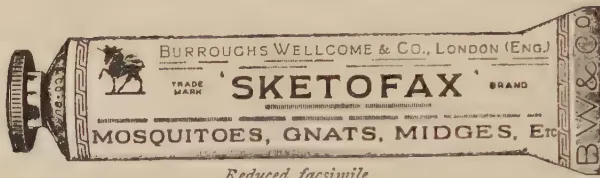
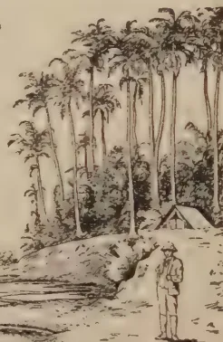

# THE TROPICAL AGRICULTURIST

---

VOL. LXV.

PERADENIYA, DECEMBER, 1925.

No. 6.

---

## GREEN MANURING.

---

For many years now the Department of Agriculture has been advocating the increased use of Green Manures in the more important cultivations of the island. The use of green leaves as manure and the value of growing green crops in rotations have been known to agriculturists in the island for generations and the advantages that result from such practices have been recognised.

In some areas the use of green leaves as manure for paddy fields is now the general practice whilst in others special leguminous crops are grown and ploughed in. Both of these practices have increased considerably in recent years as the result of propaganda and assistance from the Department. A large number of manurial trials and demonstrations have been held in many parts of the island and increased crops have almost invariably followed upon the applications of green leaves or manures. These results have been noted by paddy growers. A change has resulted in the general practice in not a small number of instances.

Similarly, in coconut cultivations the growing of green manure crops is gradually becoming a more general practice and various methods of handling these crops have been experimented with. In tea, the value of dadap as a green manure crop was one of the first things demonstrated by the tea plots on the Peradeniya Experiment Station and in recent years the value of *Gliricidia* as a green manure for tea has been demonstrated and a large demand for planting material of this plant created thereby. As a means of preventing the loss of soil by erosion,

1------------------------------------------------

324[DECEMBER, 1925.]

the value of contour hedges of leguminous plants has been indicated and the use of creeping leguminous plants advocated. The demand for seed and planting material from estates has been greater during the past year than ever before and this shows that many are making serious attempts to deal with a matter of the greatest importance. In rubber cultivation, the use of leguminous cover crops is also increasing and these appear to be giving satisfactory results.

Although Ceylon has done much in making use of green manures in its agriculture and has seen the beneficial results which follow the adoption of this practice it has done but little work on the scientific aspect of the question. There is a vast number of problems for the solution of which exact data based upon scientific investigations are necessary. Such questions as the varying contents of nitrates in Ceylon soils, the rate of nitrification of green manures in different types of soils and the relationship of climate to the decomposition of organic matter have to be settled, before exact advice based upon scientifically ascertained data can be given to the agricultural community.

A certain amount of information has been gathered by observation and experience, but it is essential that scientific investigations should be undertaken. A beginning on some of these problems has been made by the Agricultural Chemist and it is hoped before long results which will be of value to the practical agriculturist will be obtained and published.

In our present number is included a Review by the Agricultural Chemist of the Scientific investigations on green manuring in India and this will indicate some of the lines on which information regarding Ceylon conditions are required. In India a considerable amount of investigational work has already been done, but the end of these investigations is not yet in sight. So complex are some of the problems, that it may take some years of further investigations before definite results can be secured. The whole question is, however, of such importance that it must be investigated to the fullest extent possible.

2------------------------------------------------

DECEMBER, 1925.]325

# SOILS AND MANURES.

## A REVIEW OF SCIENTIFIC INVESTIGATIONS ON GREEN MANURING IN INDIA.

A. W. R. JOACHIM, B. Sc., Dip. Agric. (Cantab.),

*Chemist, Department of Agriculture, Ceylon.*

Few agricultural operations have become more universally adopted and increasingly popular in India than 'green manuring.' The advantages derived from the practice of burying into the soil the green material of plants have been so marked, that it has become an essential part of both plantation and village agriculture. Green manuring in India is no modern innovation. However "The use of vegetation of all kinds for manure," says Dobbs (4)\* "when it could not be turned to any better account has indeed been perfectly familiar to Indian cultivators from time immemorial, and has been variously embodied in agricultural practice." Obviously, the practice of green manuring admits of great latitude both as regards the crops and plants grown for use as green manures and the times and methods of their application, in a country which differs so widely in the variety of its climates and soils. It is not proposed, however, to deal in this article with this aspect of green manuring, but merely with the results of scientific investigations that have been undertaken by the several Departments of Agriculture in India on this important subject.

Of the importance and advantages of green manuring in India all scientific workers are convinced, but as to which factors contribute to the beneficial results accruing to the soil and the succeeding crop consequent on green manuring, and of the conditions that must hold for optimum results to be obtained, there is not so complete an unanimity of opinion. That different conditions are necessary in different districts for securing the best results possible by green manuring is what is to be expected, when one considers that the decomposition of green manures in soils is the resultant of the chemical, physical and biological factors of the soils with which they are incorporated on the one hand, and the meteorological conditions of the districts in which they are found on the other.

Scientific workers have attempted to approach the subject each from a different standpoint, and much has been done thereby to elucidate the intricate changes that green manures undergo in the soil before being utilised by the plant. Of these workers it is necessary to mention the names of Hutchinson and Milligan, Harrison and Aiyer, Dobbs, Joshi, Howard, Taylor and Ghose, Allan, Bal, and Lander, Wilsdon and Lal as having contributed a great deal towards our scientific knowledge of the subject. Dobbs' Bulletin on 'Green Manuring in India' (4) details the work that has been done in India up to 1915 chiefly from the agricultural standpoint. To those readers of this Journal who are interested in the practical side of

\* Reference is made by number in brackets to "Literature Cited."

3------------------------------------------------

326[DECEMBER, 1925.

green manuring, this bulletin will be of considerable value.

Among the first to work within comparatively recent times on the subject of green manuring were Howard, Hutchinson and Milligan at Pusa. In 1912-1913 working on Pusa soils which are highly calcareous and contain over 30 per cent. of Calcium carbonate, the two latter workers started a series of field and laboratory experiments to determine the various factors—soil, crop and meteorological—that affected the successful use of green manures under Pusa conditions (2). Their work in this field of research was of the greatest value to all agriculturists in India, and demonstrated the conditions that were essential for securing optimum results through green manuring.

The decomposition of plant tissue in soil, as is well known, is carried out by various organisms all working together. Hutchinson and Milligan were of opinion that complete decomposition resulting in ammonification and nitrification depends upon varying moisture and air conditions in the soil. The ideal conditions are a semi-anaerobic (*i.e.* with only a very slight access of air resulting in partial reduction) fermentation of the cellulose and breaking down of the more resistant cell walls and lignified tissues, followed by aerobic conditions (*i.e.* by a full supply of air resulting in complete oxidation) on which ammonification and nitrification of nitrogenous tissue depends.

Moisture, they found, was essential for the decomposition of green manures in soil. A green manure plant of *Crotalaria juncea* was kept in a soil containing only 5 per cent. moisture. After 9 months, only the leaves and soft parts of the stem had been decomposed. Water supply is therefore the limiting factor in the successful use of green manures. To quote Hutchinson (2) "Any shortness of rainfall after burying a green manure such as *Crotalaria juncea* would not only prejudice the growth of the succeeding *rabi* (winter) crop by preventing proper decomposition of the buried plants, but would do so as well by failing to make up for the soil moisture removed by the green crop by transpiration." Allan (10) too points out the intimate relationship between the rainfall subsequent to the ploughing in the green manure and the yield of the following *rabi* crop. He is of opinion that a minimum rainfall of 35 inches is necessary for successful green manuring for *rabi* crops.

Aeration of soil is an additional factor for the quick decomposition of a green crop in a soil. When sunn hemp was buried in soil in which the water content was 20 per cent., but without stirring the soil, no decomposition had taken place after 12 weeks, whereas 16 per cent. of water was sufficient to produce a complete disintegration when the soil was stirred once a week.

The authors confirm the opinion of Howard (11) that too long an interval between burying a green manure and sowing the succeeding *rabi* crop has had disadvantageous effects. Howard found that an interval of eight weeks is the optimum in this respect, thus agreeing with the observed period of maximum nitrate occurrence in the laboratory experiments.

As regards the decomposition of green manures under anaerobic conditions, the authors suggest that in the initial stage a "toxin" is formed which may have a harmful effect on the seedlings of the crops succeeding

4------------------------------------------------

DECEMBER, 1925.]327

the green manures, if planted at this period. In this connection it is of interest to note that Harrison and Aiyer as a result of their work on "The Gases of Swamp Rice Soils" (1) conclude that "certain of the substances produced by the decomposition of green manures are "toxic" to the crop, and must be removed in the drainage water, or destroyed by prolonged decomposition before the seedlings are transplanted, otherwise the crop will suffer. The application of green manures to badly drained areas must therefore be undertaken with circumspection and caution." Harrison further concludes that the "surface film" covering the surface of the swamp paddy soils is necessary for the healthy growth of the rice plant, and Hutchinson suggests the probability that one of its principal functions is to neutralize the toxins produced by the decomposition of the green manure buried in the soil in which the rice is growing.

The authors further investigated the best age at which to bury the green manure plants, the depth and mode of burial, and the subsequent treatment of soil. As regards 'nitrification' which according to some workers is the chief factor in the efficiency of green manures, they found that  $\frac{3}{8}$  saturation was the optimum moisture content for nitrification of green manure in Pusa soil. They found that the amount of nitrate formed by turning in 4 and 6 weeks' old plants was the same though the percentage nitrified was considerably higher for younger plants; with mature plants of 10 weeks' growth only 34.5% nitrified. After 12 weeks the amount of nitrate found was less than after 8 weeks, due they think, to some biological change in the soil complex or the production of toxins. The early turning in of green manures is therefore seen to be advantageous. Bal (12) too arrived at this conclusion as a result of his experiments on the Black Cotton Soils of the Central Provinces.

As regards the optimum depth for burial of the green manure Hutchinson and Milligan found that it varied with the age of the plant and probably the character of the soil and its subsequent treatment. Generally they think that the more mature plants should be buried at a lesser depth to ensure nitrification. By retarding the rate of decomposition of green manures by deep burial, they suggest that the optimum period of nitrification may be extended.

They advocate the burying in of a green manure as soon as possible after cutting. They found that by burying in green manures at various stages of desiccation, those that were dried most nitrified to the smallest extent.

The effect of the addition of green manure upon the biological activity of the soil as measured by the quantity of Carbon dioxide produced was also studied, and it was found that an optimum moisture content of 16 per cent. was necessary for the maximum production of Carbon dioxide.

The results of the investigation led to the suggestion from Hutchinson that a partial decomposition of the green material be initiated before it be applied to the soil. In his papers on "A Modified Method of Green Manuring" (3) and "Value of Fermented Green Manures" (8) Hutchinson describes how the green material can be treated to attain this partial decomposition, and the advantageous results in crop yields obtained by its application in this condition to the soil. This treatment he considered of

5------------------------------------------------

328[DECEMBER, 1925.

advantage especially in districts where the rainfall was deficient. His method, as finally modified, was to cut the green manure and stack it in heaps. Water was then added and the heaps left to ferment. The heaps were at first occasionally watered to prevent drying but this was subsequently avoided by plastering the outsides with clay.

Great increases in yield as compared with that given by untreated green manures, and almost immediate returns were obtained by the application to soils of this fermented material. Care had to be taken though that the proper stage of decomposition was arrived at, for in certain cases fertilizing action was delayed, due probably to toxins formed during fermentation, inimical to nitrification and fertility.

With superphosphate and the fermented material greatly increased yields over the use of either alone were obtained by their application to crops such as tobacco and indigo. Hutchinson attributes the efficacy of the green manure with "super" to a probable bacterial intervention, and the persistence of the "super" effect which his experiments disclosed, to the possible formation by bacterial activity of relatively available organic phosphorous compounds. The decided advantageous results obtained by the application of phosphatic manures along with green manures has also been demonstrated by Somers-Taylor and Ghose in their experiments on "Green Manuring of Rice" (7).

Experiments were also made in connection with the preparation of this decomposed material under (1) aerobic (2) anaerobic conditions. The superiority of the aerobically fermented manure over that prepared anaerobically was shown; but in the latter case when aerobic conditions were introduced again, more complete nitrification of the organic nitrogen present was obtained than of the aerobically prepared material. Where irrigation was practised the method of application was different. The fermenting material was allowed to remain in a soaking pit, and decomposition proceeded with liberation of ammonia which went into solution. In Bihar this ammoniacal water is known as "*seel water*" and is of great fertilizing value. The residue was found to resemble well-rotted farmyard manure and to contain a fair percentage of nitrogen. One drawback was the odour produced. This was overcome by the successful addition of Copper Sulphate (0.25%) and Potassium Cyanide. The disadvantage of the method detailed by Hutchinson lies in the great amount of labour involved, which may not make it an economic possibility. The reader will, however, if he has followed up recent agricultural developments in England, be reminded of the similarity of the method discovered by Richards and H. B. Hutchinson for preparing artificial farmyard manure from straw to the one adopted by Hutchinson with green manures.

In connection with the green manuring of paddy lands, mention must be made of the classical work of Harrison and Aiyer on "The Gases of Swamp Rice Soils" (1). They point out in this paper that "owing to the anaerobic conditions of the soil immediately after water is admitted to the fields, nitrification is impossible and the nitrates produced during the dry season are quickly denitrified so that the nitrogen required by the crop is obtained from the Ammonia and nitrogenous organic compounds produced by the anaerobic decomposition of the proteids of the green manure." Thus, if manuring of paddy by artificial fertilisers is carried out, the fertiliser should be ammoniacal in nature.

6------------------------------------------------

DECEMBER, 1925.]329

Apart from the "nitrogen" factor they assert that "the use of green manures in drained paddy soils induces a greater activity on the part of the "surface film," thus leading to a better aeration of the roots" with consequent beneficial effects on the crop.

To turn now to the work of Joshi who set out to ascertain the comparative manurial value and rates of nitrification of the whole plants and different parts of green manures (5,6). His results are of very great interest inasmuch as they point out which part of a green manure plant contributes most towards the efficacy of green manures to crops. Working with six different species of green manure plants, some of which were succulent and others somewhat woody, he found that for Pusa soil, and under the optimum conditions that obtain there the rate of nitrate formation or accumulation of nitrate through nitrification of succulent plants was, contrary to general expectation, in inverse ratio to the succulence of the stem, viz., the more tender and more easily decomposable the tissue, the slower was the nitrification. He suggests as an explanation for this phenomenon that the slower rate of nitrification in the case of succulent plants is due to an excess of easily oxidisable carbonaceous materials, the production of "bacterio-toxins" retarding nitrate formation, to denitrification, and to the assimilation of nitrates by bacteria for their own growth. The results obtained by Joshi are not quite in agreement with those obtained by Bal (12) who, working on Black Cotton Soil found that the earlier the green plants were ploughed in the better was the succeeding *rabi* crop, whilst Joshi (6) showed that a more tender plant produced a smaller accumulation of nitrate than a woody plant. These differences are probably due to differences in soil conditions and climate.

As regards the rate of nitrification of the different parts of plants, both Joshi and Bal have found that the nitrogen of the leaves of green manures is most easily nitrified, whilst roots and stems practically do not show any nitrification.

Further, Joshi's pot and field experiments demonstrated that burying the whole plant was less advantageous to the soil than burying the leaf alone. The stems and roots if added directly to the soil were found to be injurious to the crop grown in the soil after treatment. Various theories are put forward to explain this, but of these it is only necessary to mention one, viz, that the failure to nitrify is probably due to nitrate reduction in the presence of large quantities of cellulosic and woody tissue. One fact however remains clear, and that is, the use of leaves as green manure produces the quickest and best results.

A new line of approach to the subject of green manures was initiated by Lander, Wilsdon and Lal. Their work was to ascertain which of the two factors contributes more to the efficacy of green manuring—"the nitrogen factor and the influence of green manures on the biological conditions of the soil or the physical factor, viz., the effect of organic matter resulting in an improvement of moisture and nutrient holding power of a sandy soil with a probable beneficial effect on [the Hydrogen ion

7------------------------------------------------

330[DECEMBER, 1925.

concentration of the soil solution." The nitrogen factor comprises—

- "(a) Symbiotic fixation with the leguminous crop.
- (b) Fixation by azotobacter or similar organisms—under stimulus of the carbohydrates of the green manure and by anaerobic bacteria.
- (c) Denitrification—induced by fermentation of the green manure.
- (d) Possible development of a Bacterial toxin.

The physical factor includes:—

- (a) Improvement of moisture-holding power.
- (b) Improved retention of plant nutrients.
- (c) Possibly improved aeration.
- (d) Change in soil aeration with possible increased solubility of phosphate."

Experiments were carried out at Lyallpur and Gardarpur in the Punjab, from 1918 to 1922 on both sandy and heavy clay-land. The green manure plants were grown elsewhere and buried in the soil plots. The crop grown was wheat. There was no rotation followed. Their results showed that

"(1) the response to green manures was much greater in sandy soils than in stiff soils.

(2) Increase in yield in sandy soils is much greater in the green manured plots than in the plots having received quantities of artificial manures equivalent to those developed by the green manured plots.

(3) The main factor responsible for the increase in yield is the improvement in physical texture of soils due to the addition of green manure.

(4) That when the above ground portion of a leguminous crop is removed the yield is diminished to a remarkable degree.

(5) That non-leguminous dressings are as effective as leguminous dressings."

The last conclusion arrived at is one of great interest and ought certainly to be an inducement to all interested in agricultural practice to utilise what green material is available on, and in the neighbourhood of their plantations to renew the fast depleting store of organic matter of their soils, brought about by tropical conditions.

In Ceylon but little work on the scientific aspect of green-manuring has been done up to the present. The varying nitrate contents of Ceylon soils, the rates of nitrification of green manures in the different types of soils found, the relation of rainfall and temperature to decomposition of the organic matter buried—these are but a few of the investigations that might be undertaken with advantage. A beginning has been made, and it is hoped that before long, results of practical value will be placed at the disposal of the agriculturist which will enlighten him considerably on the subject of green manuring in all its aspects.

For the benefit of the reader who desires to acquaint himself further

8------------------------------------------------

DECEMBER, 1925.]331

with scientific investigations on green manuring in India, a list of references is given below.

#### LITERATURE CITED.

1. 1. *Harrison and Aiyer*.—"The Gases of Swamp Rice Soils." Memoirs of the Department of Agriculture, India, Chem. Series Vol. III, No. 3.
2. 2. *Hutchinson and Milligan*.—Green Manuring Experiment 1912-1913—Agric. Res. Inst., Pusa. Bulletin No. 40, 1914.
3. 3. *Hutchinson*. A modified Method of Green Manuring—Agric. Res. Inst., Pusa. Bulletin No. 63, 1916.
4. 4. *Dobbs*. Green Manuring in India—Agric. Res. Ins., Pusa. Bulletin No. 56, 1915.
5. 5. *Joshi*—Comparative Manurial Value of the Whole Plants and Different Parts of Green Manures—Agric. Res. Ins., Pusa. Bulletin No. 141, 1922.
6. 6. *Joshi*—Rate of Nitrification of Different Green Manures and parts of Green Manures and the Influence of Crop Residues on Nitrification—Agric. Journ. of India, Vol. XIV, Part III, 1919.
7. 7. *Somers-Taylor and Ghose*.—Experiments on Green Manuring of Rice—Agric. Journ. of India, Vol. XVIII, Part II, 1923.
8. 8. *Hutchinson*. Value of Fermented Green Manures—Agric. Journ. of India, Vol. XVIII, Part III, 1923.
9. 9. *Lander, Wilsdon and Lal*—A Study of the Factors Operative in the Value of Green Manures—Agric. Res. Inst., Pusa. Bulletin No. 149, 1923.
10. 10. *Allan*—Green Manuring in the Central Provinces—Agric. Journ. of India, Vol. X, Part IV, 1915.
11. 11. *Howard*—Green Manuring with Sann—Agric. Journ. of India. Vol. VII, Part I, 1912.
12. 12. *Bal*—Studies on the Decomposition of Some Common Green Manuring Plants at different Stages of Growth in the Black Cotton Soil of the Central Provinces—Agric. Journ. of India, Vol. XVII, 1922.

---

## THE WATER-HYACINTH AND ITS UTILIZATION.

---

In a recent review\* of the work done by the Agricultural Department in India during the last twenty years, attention was directed to the profitable utilization of the water-hyacinth in increasing crop-production in Bengal. The suggestion was thrown out that this water weed should no longer be regarded as a pest to be destroyed but should be converted into valuable manure for jute and rice by means of the Chinese methods of composting crop residues described by King in *Farmers of Forty Centuries*. The matter was referred to in *Capital* of January 22nd last (p. 131) and again on February 5th. by Dr. Gilbert Fowler in his article on the water-hyacinth problem (p. 242.)

---

\* *Crop-production in India*, Oxford University Press, 1924.

9------------------------------------------------

332[DECEMBER, 1925.

In connection with a series of experiments at the Institute of Plant Industry, Indore, on the conversion of crop residues into finely divided organic matter suitable for the cotton crop, results have just been obtained which leave no doubt that the profitable utilization of the water-hyacinth in Bengal and in Burma is a practical proposition. In the Indore experiments, one of the materials employed was water weed obtained from the local river. This was mixed in the fresh condition with earth, cow-dung and wood ashes in the Chinese fashion in a compost heap. To begin the heap five cart loads of the weed were spread on the ground in the form of a rectangle—eighteen feet by twelve—and about nine inches deep. Half a cart load of earth, half a cart load of ordinary farm-yard-manure and two baskets of wood ashes were then spread uniformly on the weed, moistened with water and the whole mixed. A second layer of water weed was added and again mixed with moistened earth, cow-dung and wood ashes as before. This procedure was continued till the heap contained from thirty to forty cart loads of the weed. The heap was then lightly covered with earth to prevent excessive drying and left for a month. An active fermentation at once began and the water weed was rapidly broken down into a damp moist mass. At the end of the first month the heap was turned to promote thorough aeration. By the end of the second month the fermentation was completed and the water weed was converted into finely divided organic matter resembling moist leaf mould. This material when added to the soil stimulates growth in a remarkable manner and is proving a valuable manure.

There is every reason to believe that the above treatment would produce similar results if applied to the water-hyacinth in Bengal and Burma. The only modification likely to be necessary is to adjust the moisture in the water-hyacinth before composting so as to prevent water oozing from the heap. If this takes place a loss of valuable material would result. This loss could easily be prevented by allowing the weed to wither for a few hours in the sun before being used for the compost. The best time of the year to convert water-hyacinth into Chinese compost would be after the monsoon between October and March when the work could be carried out in the open air. During this period a large volume of compost could be prepared for the cold weather crops, for the jute areas, for rice nurseries and for vegetable and fruit gardens.

It will naturally take some years before the ryots of Bengal realize the great value of the water hyacinth in increasing crop production. A beginning however can be made at once by many private individuals interested in gardening and fruit growing. The experience thus obtained will soon begin to filter down to the people. If at the same time organizations like the Universities, the Agricultural and Co-operative Departments and Agricultural Associations take up the work, progress will be rapid. At all Agricultural Exhibitions in Bengal substantial prizes should be offered for the best compost made from the water-hyacinth and for produce raised with this manure. [Albert Howard in *Capital*, dated 18th June, 1925 ]

—Agricultural Journal of India, Vol. XX, Part V.

10------------------------------------------------

DECEMBER, 1925.]333

# RUBBER.

## PARA NITROPHENOL AS A PREVENTIVE OF MOULD ON SHEET RUBBER.

T. E. H. O'BRIEN,

*Chemist, Rubber Research Scheme, Ceylon.*

One of the most common troubles which occur in connection with smoked sheet manufacture is that, under adverse conditions, the sheets are liable to become mouldy while in transit from producer to consumer. While it has many times been shown that a light growth of mould has no harmful effect on the rubber, this defect is frequently made an excuse by the broker for claiming a reduction in price.

During the past two years experiments have been in progress at the Research Scheme Laboratories to determine whether conditions of smoking can be so arranged that mould is entirely prevented. It has been shown that liability to mould can be minimised by attention to certain points in manufacture (see Chemist's Report for 1924), and that in cases where an estate has abnormal trouble with mould it can usually be traced to incorrect methods of manufacture. It is equally clear however that sheet rubber cannot be made entirely immune to mould by smoking. The conclusion is therefore reached that if it is desired to make smoked sheet quite free from liability to mould, the question of adding some disinfectant to the rubber must be considered.

Rubber scientists have for a long time been looking for some suitable chemical for this purpose. Many substances have been tried, but until recently none had been tested which was altogether satisfactory. The Scientific Officers of the Rubber Growers' Association have recently experimented with a substance called *para* nitrophenol, and results of tests indicate that this chemical is likely to be of great value as a preventive of the chief defect of smoked sheet.

The essential qualities of a substance for this purpose are as follows:—

1. 1. It must be cheap - Commercial *para* nitrophenol should not exceed Rs. 1-50 per pound in Colombo.
2. 2. It must be effective - 0·1% (calculated on weight of rubber) in small quantities. appears to be sufficient to prevent mould.
3. 3. It must be easy to handle and should preferably be soluble in water. *Para* nitrophenol is a stable solid and is sufficiently soluble in water for the purpose.

11------------------------------------------------

334[DECEMBER, 1925.

4. It must have no harmful effect on the rubber. - Vulcanisation tests carried out by the Rubber Growers' Association show that it has no appreciable effect on the rubber. Dr. H. P. Stevens concludes a recent report as follows: "Once more the conclusion is reached that *para* nitrophenol can be safely used as a fungicide without any deteriorating effect on the rubber." (R.G.A. Bulletin, Vol. VII, p. 498)

5. It should not affect the appearance of the rubber. - *Para* nitrophenol has no effect on the appearance of smoked sheet.

According to reports from Malaya the substance can be used in two ways:—

1. 1. An appropriate quantity can be dissolved in the acid used for coagulation and thus introduced into the latex.
2. 2. The sheets after rolling and washing can be soaked in a dilute solution of the disinfectant.

Tests carried out in these laboratories show that the first method would probably not prove altogether satisfactory under Ceylon conditions. One of the disadvantages of *para* nitrophenol is that it has a slight clotting effect on latex. This is not of importance under Malayan conditions where coagulation is carried out in tanks and after addition of acid it remains only to place partitions in position. In Ceylon, however, after addition of acid, the latex has to be transferred to pans or troughs, and there is a danger that clotting might set in before this is complete, thereby spoiling the appearance of some of the sheets. In a test in which *para* nitrophenol was used in the proportion of 0·1—it was found that clotting started about 10 minutes after addition of the acid.

The second method therefore appears to be most suitable for adoption in Ceylon. The sheets, after rolling and washing in the usual way, are soaked in a weak solution of the disinfectant for  $\frac{1}{2}$ —1 hour and then hung to drain and removed to the smoke-house. It is important that while the sheets are being soaked they should be turned over at intervals; otherwise parts of the sheet might not come in contact with the disinfectant and would naturally not be protected against mould.

Tests have been carried out in these laboratories which fully confirm the results reported by the R. G. A. Officers in Malaya. Results of one series of experiments are given below. Samples of sheet were prepared in which different amounts of *para* nitrophenol were added to the latex with the coagulating acid. Other sheets were washed after rolling, in solutions of *para* nitrophenol of various concentrations. The sheets were then smoked and tested for liability to mould by the standard test devised by Dr. De Vries; *i.e.*, pieces of sheets are inoculated with mould and placed in a vessel over a 7% solution of common salt which provides a very moist atmosphere. A comparison is made of the amount of mould on different samples after a certain length of time. These tests were repeated on samples which had been hung to air dry for 8 days after smoking.

12------------------------------------------------

DECEMBER, 1925.]335

### 1. PARA NITROPHENOL ADDED TO THE LATEX.

Appearance of sheet after 21 days in mould testing chamber.

<table border="1">
<thead>
<tr>
<th rowspan="2">Amount Added.</th>
<th>1st Test.</th>
<th>2nd Test.</th>
</tr>
<tr>
<th>(after smoking.)</th>
<th>(8 days after smoking.)</th>
</tr>
</thead>
<tbody>
<tr>
<td>Nil</td>
<td>- Sheet covered with mould</td>
<td>- Sheet covered with mould</td>
</tr>
<tr>
<td>0.05 %</td>
<td>- Patches of mould</td>
<td>- Patches of mould</td>
</tr>
<tr>
<td>0.1 %</td>
<td>- No mould</td>
<td>- No mould</td>
</tr>
<tr>
<td>0.15 %</td>
<td>- do</td>
<td>- do</td>
</tr>
<tr>
<td>0.2 %</td>
<td>- do</td>
<td>- do</td>
</tr>
</tbody>
</table>

### 2. SHEETS SOAKED IN PARA NITROPHENOL

<table border="1">
<thead>
<tr>
<th rowspan="2">Strength of Solution.</th>
<th>1st Test.</th>
<th>2nd Test.</th>
</tr>
<tr>
<th>(after smoking.)</th>
<th>(8 days after smoking.)</th>
</tr>
</thead>
<tbody>
<tr>
<td>Nil</td>
<td>- Sheets covered with mould</td>
<td>- Sheets covered with mould</td>
</tr>
<tr>
<td>0.05 %</td>
<td>- No mould</td>
<td>- No mould</td>
</tr>
<tr>
<td>0.1 %</td>
<td>- do</td>
<td>- do</td>
</tr>
<tr>
<td>0.15 %</td>
<td>- do</td>
<td>- do</td>
</tr>
<tr>
<td>0.2 %</td>
<td>- do</td>
<td>- do</td>
</tr>
</tbody>
</table>

It is also reported by the R.G.A. Officers that *para* nitrophenol is of value in crepe manufacture as a preventive of spots. It is recommended by them that the thin crepe after rolling should be soaked in a dilute solution of the chemical. This method appears to have the distinct disadvantage that a considerable amount of liquid would be held by the crepe and would be transferred to the drying sheds. Tests were made here to determine whether the chemical could be incorporated in the latex in the manner suggested for sheet manufacture, but in each case the colour of the finished blanket crepe was poor. The former method would doubtless merit consideration by any estate which had serious trouble with spotted crepe.

### USE OF PARA NITROPHENOL.

It is considered by the Research Scheme that *para* nitrophenol is likely to be of considerable value as a disinfectant in rubber manufacture.

For mould prevention *para* nitrophenol should be dissolved in water in the proportion of 1 lb. to 100 gallons water. The freshly rolled sheets after washing should be soaked in the solution for  $\frac{1}{2}$ —1 hour, taking care that the sheets are turned over at intervals. They should then be hung to drip and transferred to the smoke-house. It is stated by the R. G. A. Officers that the solution can be used for 2 days in succession and should then be thrown away.

Arrangements are being made for a Colombo firm to obtain stocks of *para* nitrophenol. In the meantime a few  $\frac{1}{4}$  lb. samples are available on application to the laboratories. If any estate contemplates ordering the chemical direct from England, it would be advisable to communicate with the writer, in order to obtain a specification of a grade suitable for the purpose.

For full details of tests carried out by the Officers of the Rubber Growers' Association the reader is referred to R. G. A. Bulletins, February, 1924 to August, 1925.—Third Quarterly Circular of the Rubber Research Scheme (Ceylon) for 1925.

13------------------------------------------------

336[DECEMBER, 1925.

# TEA.

---

## COMMERCIAL CLASSIFICATION OF TEA.\*

### PREPARATION AND CHARACTERISTICS.

Generally speaking, teas may be divided into three classes,—1, fermented or black; 2, unfermented or green; 3, the semi-fermented or oolong teas. The tea plant is practically the same plant in all countries, the differences in the various classes mentioned being due to methods of manufacture and local climatic soil and cultivation conditions. There are 1,300 specimens and over 2,000 possible blends.

The fermented or black teas include the China congou or "English breakfast" teas, subdivided into North China congou (black leaf) from Hankow and the South China congou (red leaf) from Foochow; India, Ceylon, and Java blacks.

The unfermented or green teas include two main varieties,—Chinas and Japans,—also such green teas as may be manufactured in India, Ceylon and Java.

The semi-fermented (oolong, meaning literally "black dragon") teas are obtained from Formosa and Foochow.

There may be uninformed people who still believe that black and green teas are grown on different varieties of tea bushes, but tea buyers do not have to be told that the two classes result from different manufacturing processes applied to the same leaf.

### HOW BLACK TEA IS MADE.

After plucking, if black tea is desired, the leaves are first withered on wire or cloth "tats" and then rolled by either hand or machine. The object of the rolling process is to break open the leaf cells in order to liberate the tea juices.

Oxidation (fermentation) starts as soon as the juices exposed by rolling come in contact with the air. The leaf is fermented on tile or cement floors or on zinc, glass, cement or tiled withering tables. In this process the tea assumes a bright copper colour. Fermentation is said to reduce the astringency of the leaf, thereby developing the colour and flavour of the liquor. The firing process follows. This may be done in baskets over charcoal fires or in tea-firing machines. The final process is sifting and sorting.

### HOW GREEN TEA IS MADE.

If green tea is desired, fermentation is forestalled by panning or steaming soon after plucking. There is no withering or fermenting in the process of green tea manufacture. In Ceylon and India, the steaming is accomplished in revolving perforated cylinders, while in China, Japan and

---

\* Extracts from "All about Tea in a Nutshell," published in *The Tea and Coffee Trade Journal*.

14------------------------------------------------

DECEMBER, 1925.]337

Formosa, where hand manufacture is more common, the leaves are tossed about by hand in a big iron basin built into a charcoal stove, then taken out steaming hot and rolled by hand, only to be returned to the pan in a few minutes. The steaming and rolling are alternated until the leaves begin to "crisp," when they are put upon trays and thoroughly dried over charcoal fires. In Japan much of this work is also done by machinery. The final process is sifting and sorting.

#### SEMI-FERMENTED TEAS.

Semi-fermented or oolong teas have some of the characteristics of both black and green teas. They are allowed to wither in the process of manufacture and partly ferment.

#### SCENTED TEAS.

Chinese tea growers have an adage that "only common teas require scenting." Nevertheless, there are many scented teas, highly esteemed in China, that are far from being inferior or inexpensive. Tea that is to be scented is taken hot from the final firing, and poured into a chest, so as to form a layer of two inches from the bottom. A handful, or so, of freshly plucked gardenia, or jasmine flowers are then strewn over the tea. In this way the tea and the flowers are spread in alternate layers until the chest is filled. It is then covered and allowed to stand for twenty-four hours. The correct proportion is three catties (a catty is one and one-third pounds) of flowers to 100 catties of tea. On the succeeding day the tea and flowers, mixed together, are roasted in sieves, about three catties at a time, for a period of one to two hours. The flowers are then sifted out and the tea is ready for packing.

#### SEASONS AND QUALITIES.

The teas that grow and are plucked the year round are those of Southern India, Ceylon, Java and Sumatra. The best qualities in Southern India are the fermented teas produced in December and January. In Ceylon the finest-quality fermented teas are produced in February, March, April, July, August and September. The fermented teas of Java and Sumatra are at their best in July, August and September.

The seasonal teas are those of Northern India, China, Japan and Formosa. Northern India's fermented teas are best when made from the second flushes of July, August and September. In Assam and the Dooars, however, the finest teas are made in November and December. The first pickings from April to October of the North and South China blacks are the best. The best China greens are made in June and July, although they are obtainable from June to December. In Japan the season is from May to October. There are several crops, but the first and the second (May and June) are best. In Formosa there are five recognized crops; *viz.*, (1), spring summer (2), autumn and winter. The season extends from April to November. The first and second summer-crop teas (June and July) are the finest.

#### BLACK TEA CHARACTERISTICS.

In a brief discussion of trade characteristics, it is to be observed that in Class I (fermented teas) the North China congous (the "English breakfast" teas) are strong, full bodied, fragrant, and sweet-liquoring, particularly

15------------------------------------------------

338[DECEMBER, 1925.

those from the Moning, Ningchow, and Keemun districts. The dry leaves are hard black, and aromatic. These teas are the "burgundies" of China teas. The South China red leaf congous are light in the cup, with small, reddish, and tippy leaf. The best-known districts are Pakling, Paklum, and Panyong. These are the "clarets" of China teas.

Fermented Indias, Ceylons, and Javas are graded according to leaf styles, as follows: Broken Orange Pekoe, Orange Pekoe, Flowery Orange Pekoe, Pekoe one and two, Broken Pekoe, Pekoe Souchong.

#### INDIAN TEAS.

India teas are named after certain districts, the best known being Darjeeling, the finest and the most delicately flavoured; Assam, a hard, flinty, well-made leaf with plenty of golden tip and a strong, pungent, colourful liquor; Travancore, resembling Ceylon tea; and Dooars, a tea much used for blending because of its soft mellow liquor.

Ceylon teas are known chiefly by their garden marks. They are also divided into high-grown and low-grown. Generally speaking, the former are of fine flavour and aroma, while the latter have a common rough liquor and are lacking in flavour. The Ceylon dry leaf is soft, brown and tippy.

Java and Sumatra teas are also known by the names of the gardens or estates producing them. In cup quality they grade very well, being soft and of medium strength. The leaf is black, well made, and tippy.

#### GREEN TEA CHARACTERISTICS.

In Class II (unfermented or green teas), those coming from Japan are prepared in several styles of leaf,—sun-dried, pan-fired (short leaf), basket-fired (longer spider-leg leaf), and porcelain fired (an arbitrary term of no particular significance except to distinguish the leaf which is not rolled or manipulated like pan-fired). Japans are graded in district types as well as for style and cup quality. These are generally recognised in the trade: Extra choicest, choicest, choice, finest, fine, good medium, medium, good common, common. There are also nibs, dust and fannings. Japans are the "white wines" of teas.

China greens are divided into country greens (Moyunes, Teenkais, Fychows, Soeyans, Wenchows, and local packs), Hoochows, and ping-sueys. All are prepared in the following styles or makes: Gunpowder (extra, first, second, third), rolled round, "fine shotty" to medium, pea leaf (first and second), a bold, round-rolled leaf; Imperial (first, second, third), large size, round rolled; young hyson (long, rough, bold, and twisted leaf); and hyson (small, well made curly leaf).

The China country greens have rich, clear, and fragrant cup qualities. The Hoochows are flavourless and neutral. The ping-sueys are light coloured and rank in the cup.

The India, Ceylon, and Java greens produce a pungent light liquor and are usually made up into young hyson and hyson styles.

#### OOLONG TEA CHARACTERISTICS.

In Class III (semi-fermented teas) the Formosa oolongs are of fine flavour and very fragrant. They are known by district names, such as Chap Ko Hoon, Paichie, Sinteam, and Chuitngka, and are graded as fancy,

16------------------------------------------------

DECEMBER, 1925.]339

choicest, choice, finest, fine, fully superior, superior, fully good, good, good cargo, fair cargo, common. The leaf is greenish brown and tippy. Sometimes Formosas are blended with gunpowders or Japans to make a mixed (green and black) tea.

The Foochow oolong have thin medium flavour and toasty cup qualities. The leaf is long, rough, coarse appearing, and blackish.—Planters' Journal and Agriculturist, Vol. II, No. 19.

## BLACK ROT DISEASE OF TEA.

DR. W. S. SHAW,

*Tea Specialist (now under training at Tocklai) to the Scientific Department of the U.P.A.S.I., India.*

*Introductory.*—Before commencing a detailed account of the fungus causing Black Rot of Tea, it would be advisable to have some small grasp of the relation of the organisms causing fungal diseases to other living beings. It is usual to divide living beings into the large kingdoms, two, animal and vegetable, the differentiation between the two being sharp except in the case of the lower representatives. We are concerned with the vegetable kingdom, which is divided into two divisions:—

The flowering plants, and those such as Algae, Mosses, Ferns, etc., which do not flower.

A further division is necessary based upon the reproductive characteristics of the individuals of the non-flowering division, the two classes being—

1. 1. those whose organs have no characteristic distinctions in form, e.g., Algae.
2. 2. those which show a marked distinction in the form of their various organs, e.g., Mosses and Ferns.

The former class is represented by 14 sub-divisions, which include all the lower forms of vegetable life. Four of these sub-divisions, the algae, fungi, slime, moulds and bacteria are responsible for most of the diseases of plants.

The Fungi, Slime, Moulds, and Bacteria, differ from other vegetable organisms in possessing none of the green colouring matter (chlorophyll) of green plants and hence though most of their natural functions are the same as those of green plants, they are incapable of forming starch material. As a consequence of this inability to obtain organic food material the fungi are forced to thrive on the organic reserves, elaborated by green plants, either in the form of decaying tissue after death or on the living individual itself. Fungi are therefore classed as Parasitic, if growing on living organisms as hosts, and Saprophytic, if living on dead tissue. Another type of fungus frequently met with in the diseases of plants is one, which, after living on dead organic matter, can adapt itself to a living plant as host. An example of this type we have in the Red Rust disease of Tea. The methods of reproduction and dissemination amongst the fungi group is of vital importance for it is by a study of these processes that we are enabled to deal

17------------------------------------------------

340[DECEMBER, 1925.

with the eradication of the diseases caused by them. The mode of reproduction is by means of spores, of which there is a large diversity of types. These spores are formed either asexually by the mere cutting off of a portion of the fungus, and sexually as the result of the fusion of two portions, followed subsequently by division. These spores germinate to give new individuals. Some spores can remain dormant for many months, and in some cases are very resistant to adverse conditions. Thus any method for the eradication of a fungal disease must take this fact into account. Dissemination of a fungus is brought about by the threads of the fungus or by the spores; the former can be carried with the material on which it is growing, the latter by natural means, principally the wind.

The fungi include a large number of individuals which are divided into three classes; this division depends upon the appearance of the threads, on the type of fructification and on the prevalence of sexual reproduction. Thus we have the following scheme:—

*Fungi*—

- I. Threads not interwoven; sexual reproduction distinct; sexual reproduction by spores.
- II. Threads interwoven; sexual reproduction obscure; asexual reproduction by spores.
- III. Threads interwoven; sexual reproduction frequently absent; asexual reproduction by spores.

It is to this last group, termed the Basidiomycetes, to which the species of fungus causing Black Rot belong. The Hyphae (or threads) are interwoven, resulting in a fine mesh which to the naked eye appears to be a whitish film; the type of spores by means of which dissemination takes place is termed the basidiospore. In getting rid of the fungus it is necessary to destroy both the threads and the basidiospores, as both are capable of reproducing the species.

Some of the fungi now accepted as belonging to the Genus *Corticium* were originally held to belong to the Genus *Hypochnus*. For example, *Corticium Theae* was originally called *Hypochnus Theae*. This was probably due to the difficulty in distinguishing the two types which only vary in the characteristics of the organs on which the spores are borne. It is now agreed that the Black Rots of Tea are caused by species of *Corticium*, viz. *C. Invisum* and *C. Theae*.

Black Rot was first observed on tea in Java in the year 1907 and in 1916 a similar disease was found in Ceylon. The fungus does not confine itself to tea but in addition, in Ceylon, coffee and cacao are attacked. In South India besides, a black rot was found in coffee which appeared to differ from the disease found in Ceylon. It is also definitely known that many jungle plants are not immune from its attacks.

#### LIFE HISTORIES OF *C. INVISUM* AND *C. THEAE*.

1. *Corticium Invisum*.—This fungus consists of very fine, almost invisible threads (hyphae) which proceed along the stems and spread over the under-surface of the leaves. Once on the leaf, these threads unite to form a delicate film. A premature hardening of the stem owing to such film formation is also caused resulting in the production of scaly, grey patches. Spore

18------------------------------------------------

DECEMBER, 1925.]341

formation in Ceylon commences in the dry weather, and it is at this stage in the development of the fungus that it becomes visible to the naked eye. The spores are formed in clusters of 2, 3 or 4 and owing to their development the films and threads become powdery and white, or pale pink.

As a result of this the under-surface of the leaf becomes covered, either completely, or in patches, with a thick whitish film; the patches may extend from the leaf stalk, or in circular patches anywhere on the leaf. The threads do not appear to penetrate the living tissue, and the evil results of the disease has been attributed to the blocking of the breathing apparatus of the leaf, but this is not entirely confirmed by observations. When the spores are ripe, they are broadcasted and come in contact with a healthy bush, on which they commence to develop, and this is one of the causes of the spread of this disease. Owing to the close proximity of the tea bushes, not much opposition to the spread of the disease is encountered.

*Symptoms of C. Invisum.*—The attack in Ceylon is only noticeable on the advent of dry weather. During the wet weather the mycelium of the fungus spreads over the bush, but owing to its delicate structure, it is practically invisible to the eye and therefore remains unnoticed. The first indication of the attack is given by a number of bunched up, small, blackish brown or chocolate spots on the young leaves. The spots appear to be in small depressions and as the disease develops, these spots combine forming patches which gradually cover the whole surface of the leaf. This causes the blackening of the younger and tenderer parts of the bush, which, however, do not fall off immediately but remain attached to the stem, to which they adhere for a considerable period. The affected leaves hang vertically and adhere firmly to any other part of the bush with which it may come in contact. Hence a dead leaf attached to a stem, or clusters of dead leaves, are often found.

On older leaves the attack is not quite so general; in cases where the whole of the leaf is not attacked, the visible spots may be either large, depressed, and black, or chocolate brown with a blackish margin, or mottled, on the upper surface. When dry, the spots are grey and may easily be mistaken by grey blight unless a microscopic examination be made.

In order to ascertain whether the death of a leaf is due to a *Corticium* attack, or simply due to a physiological cause, the dead leaf should be pulled off carefully in a direction parallel to the stem. If the cause of death is *Corticium Invisum* a thin transparent film of interwoven threads peels off the stem. This test also serves as a distinction between Black Rot and a severe attack of Grey Blight.

*Mode of Attack.*—The fungus reaches the leaves by means of the threads which travel along the stem, finally arriving at the leaf, *via* the leaf stalk. The threads do not attempt to mount to the upper side of the leaf. It seems from observation, that the fungus cannot do any harm to the leaf from the upper surface, for no ill-effects were seen when a diseased leaf fell on to the upper surface of a healthy one. The spots do not necessarily appear at the stalk end of the leaf first, but may appear at any part to begin with. Occasionally the fungus may accumulate in the junction between the stem and the leaf, in which case it forms a fairly dense, white or yellowish cushion.

19------------------------------------------------

342[DECEMBER, 1925.

Healthy leaves may be infected by coming in contact with diseased leaves, or by the adherence of diseased leaves which fall from the top of the bush.

Favourable conditions for the spread of the fungus seem to be a saturated atmosphere and a high temperature.

*Dissemination* takes place by the wind, which broadcasts the spores and by the carrying of the threads to other parts, such as, for example, during the transport of infected prunings for burning.

2. *Corticium Theæ*.—This is the name given to a species of corticium found in Java. It also forms white or pinkish cords which run along the branches, ramifying and uniting indiscriminately everywhere. The disease is only found on young branches, e. g., 2 to 3 years of age. The cords are usually from  $\frac{1}{2}$  to 2 mms. broad and occasionally form a film by expansion. On its coming in contact with a leaf stalk the cord proceeds along the stalk and covers the under-surface of the leaf with a thin pink film

*Corticium Theæ* does not cause very much damage to teas but it is advisable to eradicate it promptly. It varies from *C. Invisum* in having a conspicuous cord on the stem, and it is this fact which makes it difficult to distinguish from Thread Blight.

*Treatment of Black Rot*.—The method of eradication of Black Rot is the same for both species of *Corticium*. The fungus usually attacks tea nearer the time for pruning, and the prunings of the infected and the neighbouring bushes should be collected, and burnt. A certain amount of the fungus will still remain on the parts of the bushes unpruned and it is therefore essential that the bushes should be well sprayed with lime sulphur solution, (see later) after pruning.

In parts where the infection is great it is recommended that the areas should be thoroughly sprayed with lime sulphur solution. The small patches showing the least infection should be sprayed first, together with three rows of bushes round the diseased ones. The larger areas should be isolated and sprayed as soon as the time permits. The treatment should be repeated a week or so after the first spraying.

*Preparation of the Lime Sulphur*.—This is best carried out according to the following formula:—

<table>
<tr>
<td>Quicklime</td>
<td>...</td>
<td>...</td>
<td>20 lb.</td>
</tr>
<tr>
<td>Sulphur</td>
<td>...</td>
<td>...</td>
<td><math>22\frac{1}{2}</math> lb.</td>
</tr>
<tr>
<td>Water</td>
<td>...</td>
<td>...</td>
<td>50 gallons</td>
</tr>
</table>

The lime should be placed in a drum of 50 gallons capacity and water gradually added to slake the lime. When the lime is completely slaked, 30 gallons of water are added, and the mixture boiled. While the solution is boiling, the sulphur is added gradually, with vigorous stirring the whole time, after which the volume is made up to 50 gallons with water and the boiling continued for an hour. The volume is kept at 50 gallons throughout the boiling. The mixture thus obtained is the stock solution, which, when cool, should be diluted with seven times the volume of water, when required for use in the sprayer and should be used immediately.

20------------------------------------------------

DECEMBER, 1925.]343

The stock solution should be stored in full, air-tight vessels or, if the vessel is not full with a layer of oil on the surface. The solution should not be stored in copper vessels owing to chemical interaction between the lime sulphur products and the copper, and for the same reason the spraying machines should be thoroughly cleaned out after use.

*Note on Spraying.*—The most satisfactory results in spraying have been obtained with the Four Oaks Pneumatic Knapsack Sprayers. These sprayers consist of a central charge Pump No. 1, 6 Battery Sprayers with necessary connections. 6-4 nozzle I. T. A. attachments and has an approximate cost of Rs. 1,200 (exclusive of freight and packing). More than 6 sprayers may be used with the single charge pump. The Container can be filled in about two minutes.

It is important that immediately after use, the sprayers should be thoroughly cleaned out.

*References—*

Petch, *Diseases of Tea Bush*.

Stevens, *Fungi causing Plant Disease*.

Masse, *Text-book of Fungi*.

Butler, *Fungi Disease of Plants*.

Tunstall, *I. T. A. Journals*.

Engler-Gild, *Syllabus des Pflanzen Familien*.

—Planters' Chronicle, Vol. XX, No. 43.

## VITALITY AND AGE OF TEA SEED.

The following extract is taken from the Report on the Assam Tour of Mr. D. G. Munro, General Scientific Officer in the Planters Journal and Agriculturist, Vol. II, No. 19.

It is found that the vitality of the tea seed is quickly lowered with age and the sooner the seed is germinated after picking the better are the chances of getting a high percentage germination.

The seed is germinated in pure sand, care being taken to eliminate the organic matter which when rotting produces Carbon Dioxide gas which hinders germination.

The distance apart at which seed is planted in the nursery depends on the age at which the young plants are to be put out. If six months' plants are to be used four inches in the nursery are allowed but with older plants six to nine inches are allowed. With ball planting as is practised in Northern India it is found that with closer planting in the nursery, a considerable proportion of the plants have to be discarded, but with wider planting the proportion is reduced.

21------------------------------------------------

344[DECEMBER, 1925.

# TOBACCO.

## THE EFFECT OF "TOPPING" AND "SPIKING" ON THE YIELD AND QUALITY OF TOBACCO.

The following extract is taken from the *Memoirs of the Department of Agriculture in India* (Chemical Series), Vol. VIII, No. 1 (1925) on "The Quality and Yield of Tobacco as Influenced by Manurial and other Operations" by J. N. Mukerji, B.A., B.Sc., *First Assistant to the Imperial Agricultural Chemist*.

"Topping" is an operation which consists in breaking the top at the growing point, when tobacco plants are 2 ft. to 2 ft. 6 in. high and when the bunch of young flowers has well put out. The object of this operation is to prevent plants wasting their energies in sprouts, shoots, sucklings, flowers and seeds.

"Spiking" is an operation which consists in breaking the top at the growing point, inserting a little skewer at the fracture and pushing it a little way down when the tobacco plants are about 1 ft. to 1 ft. 6 in. high. The object of this operation is to *dwarf* the plant, to prevent it throwing out more shoots, and to produce broad and coarse leaves, about ten of which constitute the crop.

"Topping" as described above is practised in America and all other tobacco-growing countries except India where over a considerable tobacco-growing area spiking is more commonly adopted. In the Madras Presidency, however, where a good deal of tobacco is used for cigar making, topping as practised in America is carried on. The mass of the tobacco grown in India is consumed in the country by the people themselves for chewing purpose. The object of the cultivator is to grow a heavy crop of coarse tobacco, attention is never paid towards producing a better quality of tobacco suitable for cigar or cigarette making. The reason for this is obvious; there is little or no demand for tobacco of better quality within the country, neither are there agencies for supplying raw materials of better quality in large quantities to Great Britain and other countries for their tobacco factories.

The growers of tobacco are relatively poor men with small capital, their ideas are primitive, they have a greater faith in their old practice of spiking because they believe that it brings forth a greater yield of the crop and consequently will fetch more price. The object of the experiment detailed below is to throw light on these two operations by making a study of their comparative effect on the yield and quality of tobacco.

In 1916-17 a number of plants in each of the fourteen plots were simply topped, while others were spiked. Since spiking was carried on earlier than topping, for each spiked plant chosen for this experiment, another one of the same size and in close proximity to it was selected for topping. All such pairs of spiked and topped plants for experimental

22------------------------------------------------

DECEMBER, 1925.]345

purposes were marked with proper labels and consequently there was no difficulty in identifying them when the crop was cut.

The dry weight of leaves and stems of plants from each of the various plots and of each variety (Pusa Type 28 and Surujmukhi) obtained by the two operations are set forth in Table I given below :—

Table I.

<table border="1">
<thead>
<tr>
<th rowspan="3">Plot</th>
<th rowspan="3">Variety</th>
<th colspan="2">Spiked</th>
<th colspan="2">Topped</th>
</tr>
<tr>
<th>Dry weight of leaves</th>
<th>Dry weight of stems</th>
<th>Dry weight of leaves</th>
<th>Dry weight of stems</th>
</tr>
<tr>
<th>Grm.</th>
<th>Grm.</th>
<th>Grm.</th>
<th>Grm.</th>
</tr>
</thead>
<tbody>
<tr>
<td>A</td>
<td>Pusa Type 28</td>
<td>202.3</td>
<td>36.5</td>
<td>187.0</td>
<td>61.7</td>
</tr>
<tr>
<td>AI</td>
<td>Pusa Type 28</td>
<td>195.1</td>
<td>38.3</td>
<td>199.9</td>
<td>42.3</td>
</tr>
<tr>
<td>AI</td>
<td>Surujmukhi</td>
<td>179.5</td>
<td>56.7</td>
<td>147.1</td>
<td>44.4</td>
</tr>
<tr>
<td>D</td>
<td>Pusa Type 28</td>
<td>301.5</td>
<td>52.6</td>
<td>247.8</td>
<td>59.0</td>
</tr>
<tr>
<td>DI</td>
<td>Pusa Type 28</td>
<td>149.5</td>
<td>21.4</td>
<td>177.2</td>
<td>29.0</td>
</tr>
<tr>
<td>DI</td>
<td>Surujmukhi</td>
<td>188.6</td>
<td>55.4</td>
<td>168.3</td>
<td>74.3</td>
</tr>
<tr>
<td>EI</td>
<td>Pusa Type 28</td>
<td>204.0</td>
<td>50.7</td>
<td>213.6</td>
<td>50.4</td>
</tr>
<tr>
<td>EI</td>
<td>Surujmukhi</td>
<td>294.4</td>
<td>80.6</td>
<td>259.8</td>
<td>113.0</td>
</tr>
<tr>
<td>EI</td>
<td>Surujmukhi</td>
<td>191.8</td>
<td>72.5</td>
<td>234.0</td>
<td>79.5</td>
</tr>
<tr>
<td colspan="2">Total</td>
<td>1906.7</td>
<td>464.7</td>
<td>1834.7</td>
<td>553.6</td>
</tr>
</tbody>
</table>

An examination of the figures in the above statement will show that in 5 cases the spiked plants gave a higher yield in leaves and in 4 cases the topped ones gave a higher yield. Taking the results as a whole, we find that the effect of spiking has been to increase the yield of leaves to a very small extent (4 per cent.) over topping, and the effect of topping has been to increase the weight of stems by 20 per cent. over spiking.

In 1917-18, a plot of 30 ft. by 24 ft. was manured with superphosphate and farmyard manure. The manured plot was divided into 4 quadrants each 12 ft. by 15 ft. and in each of these 4 plots, a variety known as Kawnia was transplanted. In two of the diagonally situated plots, all the plants were topped. The spiking was carried on when the plants were 1 $\frac{1}{4}$  ft. high as is the common practice in the country. Topping was carried on

23------------------------------------------------

346[DECEMBER, 1925.

when the plants were 2 ft. high and young flowers were showing. The average number of leaves to each plant was 12 in case of spiked ones and 14 in case of topped ones.

The results obtained are set out below—

**Table II.**

<table border="1">
<thead>
<tr>
<th colspan="2">Kawnia Spiked</th>
<th colspan="2">Kawnia Topped</th>
</tr>
<tr>
<th>Dry weight of leaves</th>
<th>Dry weight of stems</th>
<th>Dry weight of leaves</th>
<th>Dry weight of stems</th>
</tr>
<tr>
<th>Kilos</th>
<th>Kilos</th>
<th>Kilos</th>
<th>Kilos</th>
</tr>
</thead>
<tbody>
<tr>
<td>3.58</td>
<td>1.039</td>
<td>3.82</td>
<td>1.456</td>
</tr>
<tr>
<td>3.37</td>
<td>1.016</td>
<td>3.03</td>
<td>1.337</td>
</tr>
<tr>
<td>6.95</td>
<td>2.055</td>
<td>6.85</td>
<td>2.793</td>
</tr>
</tbody>
</table>

An examination of the figures in the above table will show that the yield of tobacco leaves by both the operations (spiking and topping) are almost identical and that the effect of topping has been to increase the yield of stems by about 36 per cent. over spiking. It thus confirms previous year's results.

So far as the quality of tobacco in respect of texture, colour, elasticity, etc., is concerned, Mr. A. C. Acree, Director of the Indian Leaf Tobacco Department Company, Dalsing, Sarai, reported the topped ones as decidedly superior to the spiked ones. His report runs as follows:—"In regard to the four samples of Kawnia tobacco my opinion is the tobaccos which have been topped are the best." In the first year three samples of tobacco which were topped and the corresponding three samples which were spiked were submitted to a chemical analysis for those constituents which are commonly recognized as affecting the quality of tobacco. In the following year 1917-18 all the four samples of spiked and topped tobaccos were examined for the same constituents. The analytical figures obtained in 1917-18 confirmed the previous year's result which points to the conclusion that the relative effects of either topping or spiking on the ash, potash, chlorine and protein contents of tobacco are in no way appreciable, and that topped plants in majority of cases gives a higher nicotine content. These will be evident from an examination of Table III.

24------------------------------------------------

DECEMBER, 1925.]

347

TABLE III.

<table border="1">
<thead>
<tr>
<th rowspan="2">Samples</th>
<th colspan="6">Spiked</th>
<th colspan="6">Topped</th>
</tr>
<tr>
<th>Pure ash</th>
<th>Potash (K2O)</th>
<th>Chlorine (Cl)</th>
<th>Amido nitrogen</th>
<th>Albd. nitrogen</th>
<th>Nicotine</th>
<th>Pure ash</th>
<th>Potash (K2O)</th>
<th>Chlorine (Cl)</th>
<th>Amido nitrogen</th>
<th>Albd. nitrogen</th>
<th>Nicotine</th>
</tr>
<tr>
<th></th>
<th>Per cent.</th>
<th>Per cent.</th>
<th>Per cent.</th>
<th>Per cent.</th>
<th>Per cent.</th>
<th>Per cent.</th>
<th>Per cent.</th>
<th>Per cent.</th>
<th>Per cent.</th>
<th>Per cent.</th>
<th>Per cent.</th>
<th>Per cent.</th>
</tr>
</thead>
<tbody>
<tr>
<td>Average sample of Pusa 28 and Surujmukhi from plots AI &amp; DI.</td>
<td>-</td>
<td>19.87</td>
<td>2.35</td>
<td>0.19</td>
<td>0.277</td>
<td>1.301</td>
<td>3.54</td>
<td>19.74</td>
<td>2.69</td>
<td>0.19</td>
<td>0.248</td>
<td>1.437</td>
<td>4.08</td>
</tr>
<tr>
<td>Average samples of Pusa 28 from plots A &amp; D. -</td>
<td>-</td>
<td>18.74</td>
<td>3.18</td>
<td>0.68</td>
<td>0.280</td>
<td>1.004</td>
<td>4.60</td>
<td>19.34</td>
<td>3.71</td>
<td>0.84</td>
<td>0.260</td>
<td>0.943</td>
<td>4.29</td>
</tr>
<tr>
<td>Average samples of Surujmukhi from plots EI &amp; FI. -</td>
<td>-</td>
<td>19.62</td>
<td>2.82</td>
<td>0.68</td>
<td>0.292</td>
<td>1.195</td>
<td>3.61</td>
<td>19.04</td>
<td>2.30</td>
<td>0.53</td>
<td>0.254</td>
<td>1.290</td>
<td>3.97</td>
</tr>
<tr>
<td>Kawnia No. 1, 1917-18 -</td>
<td>-</td>
<td>17.50</td>
<td>1.82</td>
<td>0.42</td>
<td>0.210</td>
<td>1.080</td>
<td>4.64</td>
<td>16.02</td>
<td>1.80</td>
<td>0.56</td>
<td>0.210</td>
<td>1.090</td>
<td>5.09</td>
</tr>
<tr>
<td>Kawnia No. 2, 1917-18 -</td>
<td>-</td>
<td>15.89</td>
<td>1.93</td>
<td>0.16</td>
<td>0.270</td>
<td>1.100</td>
<td>4.46</td>
<td>16.35</td>
<td>1.81</td>
<td>0.17</td>
<td>0.280</td>
<td>0.970</td>
<td>4.92</td>
</tr>
</tbody>
</table>

25------------------------------------------------

348[DECEMBER, 1925]

A comparative test on the burning capacities of topped and spiked samples of *Kawnia* grown in the experimental plot were made by Toth's apparatus. The topped sample gave a higher combustion value (650) against the spiked one with a value of 500. When smoked the topped ones burnt better than the spiked ones.

The results of the comparative effect of topping and spiking obtained during two successive years' experiments therefore show that :—

(1) The yield of tobacco leaves by both the operations topping and spiking are almost identical.

(2) Topping has the effect of increasing the outturn of stalk and stem, which apart from its value as fuel, has a manurial value too. The stems are also used in snuff making.

(3) Topping has the effect of improving the quality of a tobacco and making it suitable for cigar and cigarette making whereas spiking produces a tobacco of a coarse, inferior quality and not so suitable for cigar or cigarette making.

(4) There is hardly any difference between topped and spiked tobacco, so far as their ash, potash, chlorine, and protein contents are concerned.

(5) Topped plants in a majority of cases give a higher nicotine content.

(6) Topping produces tobacco of a better burning quality than spiking.

If topping has the effect of improving the quality of a tobacco to such an extent how is it that the Indian ryots and cultivators do not adopt this practice? The reasons are obvious. Firstly, there is little or no demand for such tobacco in this country. Only a few cigarette manufacturing companies now established in India, such as the Peninsular Tobacco Company, Monghyr, are the only concerns which appreciate and demand such a product. Apart from these there are very few agencies in India at present who would deal with such an improved product in the way of supplying other countries. The bulk of tobacco grown is consumed in the country by the people themselves for chewing purpose and topped tobaccos do not as a rule appeal to their tastes. Secondly, the cultivators are under a misapprehension that topped tobacco will always give a lesser yield of leaves by weight and so will fetch a lesser price. In fact, if topping is carried on properly and if on the average fourteen leaves are kept to each plant, topping gives as good a yield as spiking. Pitsch\* from his experiments conducted at Wageningen, to ascertain the effect on the size and fineness of the leaves of topping to ten, twelve and fourteen leaves per plant, has shown that the total weight of dried leaves on 10 plants topped to ten, twelve and fourteen leaves, were 422.5, 564.1 and 875.9 grm. respectively. Not only were the total leaves with fourteen leaves the largest but these plants also gave the largest yield of high grade tobacco. He further noticed that the leaves were as a rule larger and thicker when fourteen leaves remained than when twelve were left. In the present experiment 14 leaves were kept to each plant when topped and the size of the leaves of the resulting plants were in no way inferior to the leaves from spiked plants. Thirdly, the cultivators here have no idea that topped plants give a much higher outturn of stems which has got a good manurial value as the following

\* Deut Landev. Presse-. 20 (1895), No. 76.

26------------------------------------------------

DECEMBER, 1925.]349

analysis of two samples of stems indicate :—

<table border="1">
<thead>
<tr>
<th></th>
<th>Air-dry Tobacco stems, 1917</th>
<th>Air-dry tobacco stems 1918.</th>
</tr>
</thead>
<tbody>
<tr>
<td>Organic nitrogen</td>
<td>Per cent. 3.07</td>
<td>Per cent. 2.53</td>
</tr>
<tr>
<td>Phosphoric acid (<math>P_2O_5</math>)</td>
<td>0.98</td>
<td>0.54</td>
</tr>
<tr>
<td>Potash (<math>K_2O</math>)</td>
<td>4.65</td>
<td>4.43</td>
</tr>
</tbody>
</table>

In this connection, Davidson,† from his examination of 4 varieties of tobacco, has shown that about one-third of the fertilizing constituents are lost in tobacco stems and roots which should be returned to the soil. Lastly strong tobacco having a high nicotine content finds a good market in this country ; the cultivators are under a misapprehension that topping has the effect of always reducing the nicotine content to a great extent : this is hardly the case, as the results of the present experiment indicated.

## TOBACCO FERTILISERS.

A. N. J. BEETS.

The following are the results of the tests made with various fertilisers:

*Lime.* Its value as a fertiliser in heavy soils is shown by the good results obtained at Dijoewiring.

*Dessa earth and stable manure.* They have a considerable and beneficial influence on the total yield, the length of the leaves and the quality of the crop, but may, in certain surroundings, cause infection by *Phytophthora nicotianæ*.

*Ammonium sulphate.* Has no effect on length of leaves if applied when the soil has been fertilised with Dessa earth and stable manure, which are necessary for light soils and which cannot be substituted by sulphate of ammonia.

*Nitrate of soda.* The above remarks also apply to this fertiliser.

*Urea.* Urea contains up to 45% of nitrogen and would be more economical than sulphate of ammonia. Compared with the latter, on light soils it gave sometimes better, sometimes similar and sometimes inferior results.

*Phosphates.* The results did not indicate that a better yield was obtained by the application of phosphates.

*Tobacco-seed cake.* This cake gave good results, comparable to those obtained with Dessa earth and stable manure. In practice, however, it is not possible to obtain a sufficient quantity for plant requirements.

*Ground-nut cake* gave good results as regards length of leaves.

*Guano* (from bats) contains too low a percentage of nitrogen to be suitable.—International Review of Science and Practice of Agriculture, Vol. III, No. 2.

† Virginia State Bull. 14, 1892.

27------------------------------------------------

350[DECEMBER, 1925.

# COTTON.

## INSECT PESTS AND COTTON DEVELOPMENT.

BY PROFESSOR H. A. BALLOU.

Cotton as a crop has always been very subject to the attacks of insect pests. All parts of this plant are attacked, some insects affecting the life and health of the plant by injuring or destroying leaf, stem, or root, and others directly injuring the prospects of the crop by feeding on flowers and fruits. Of these two kinds of attack, the second appears to be the more serious, because of the direct effect on that part of the plant producing the marketable product, and also because insects which can penetrate into a mass of tissue, such as the developing boll, are hidden from view and out of reach of poisons. Anything which adversely affects the health of the plant also exerts an influence on its ability to produce a crop, and therefore insects affecting the leaf, stem, and root are important and often serious pests.

So far as past experience indicates, however, it would appear that the insects which will influence the development of the cotton growing industry in new localities in the near future are those which attack the bolls, and of these, the cotton stainers and plant bugs are probably the most important.

At the present time, the three great insect pests of cotton are the Mexican Boll Weevil, the Pink Boll Worm, and the Cotton Stainers.

The Mexican Boll Weevil owes its reputation to its persistent invasion of the American cotton fields; the Pink Boll Worm to its sudden leap into prominence and its menace to cotton growing throughout the world; while Cotton Stainers by their insidious attacks and their association with the organisms causing internal boll disease are of much greater importance than is generally recognized.

The Mexican Boll Weevil (*Anthonomus grandis*) is eminently an American pest. Crossing the border from Mexico into Texas in the early nineties of the last century, it has been for nearly thirty-five years steadily and irresistibly invading the cotton belt, until now the entire area of more than 700,000 square miles in which the 30,000,000 acres of United States cotton cultivation are located is infested with this pest, which has caused, and is still causing, great losses to the cotton grower and to every branch of the cotton industry. The farmer loses his crop, the manufacturer feels the shortage of cotton, and the consumer is affected by the increased prices.

The United States farmer has not abandoned cotton cultivation as a result of the ravages of this pest, but he has been able to continue only because the interests involved are so large. The world's manufacturers and consumers cannot get along without the American cotton, and as the price of cotton depends on the American crop, the effect of boll weevil attack has been to increase the price as well as to reduce the output, the farmer selling his smaller crop at a higher rate. If the boll weevil had

28------------------------------------------------

DECEMBER, 1925]351

invaded a district where cotton growing was in a state of development, where the amount of the crop produced was too small to affect the world's markets materially, and where the agricultural population had not learned to depend on cotton as a crop, it is safe to say that such considerable losses in yield would have resulted in the industry being abandoned.

For many years most careful study of the boll weevil problem yielded no indication of any adequate means of control. The natural enemies, predaceous and parasitic, of the boll weevil were not effective, and none of the insecticides tried gave satisfactory results in poisoning the weevils, while the grubs feeding within the bolls were beyond the reach of poisons. Recently calcium arsenate applied as a dust by means of powerful blowers has been found effective in giving some protection to the growing crop.

The Pink Boll Worm (*Platyedra gossypiella*) is becoming the most cosmopolitan of all the various pests of cotton. It was known to occur on cotton in India for many years before it was recognized as a major pest. It was introduced into Egypt about 1910, where it very shortly became the most serious insect pest of the cotton crop.

At the present time it occurs in almost every important cotton-growing locality in the world; it is established in Mexico, South America, the West Indies, in most parts of Africa, in certain sections of Australia, in India, Ceylon, China, the Hawaiian Islands, and Fiji.

The Pink Boll Worm is difficult of control by any direct methods. The tiny caterpillar penetrates into the boll as soon as it is hatched, and during the whole of the time it is feeding inside the seed in the boll. Its natural enemies are not effective in controlling it, and so far the use of poisons has not produced any satisfactory results.

At the end of the crop season many caterpillars remain in the seed. These are full-grown and capable of existing without feeding, in a resting condition, for periods ranging from a few weeks to many months. It is in this condition that the insect lives over the winter, or from one cotton season to another, and in this condition also that it is transported from one country to another.

The thorough cleaning up of all old cotton, and the treatment of the seed by heat or fumigation, to kill the insects resting in the seed, are the most effective means of dealing with this pest.

Cotton stainers are indigenous to all warm countries, and are actual or potential pests of cotton in nearly every locality where cotton is or may be grown. They are plant-sucking bugs which attack the bolls. The staining of the lint is due to the action of the internal boll disease, which is caused by certain fungoid or bacterial organisms which invade developing bolls when these are attacked by stainers.

The cotton stainers are usually distinguished by a general reddish colour, from which they derive a name common in many places, the Cotton Red Bug. The young insects are of a bright red colour. Other plant bugs—green bugs—attack cotton bolls in many localities, with the same effect of producing an internal boll disease.

The amount of stained lint is often an index of the severity of stainer attack, but in many instances of severe manifestation very large numbers of

29------------------------------------------------

352[DECEMBER, 1925.

bolls are completely destroyed, and the crop greatly reduced. The percentage of stained cotton ginned only shows the injured lint in the crop that has been reaped, and does not represent the portion of the crop that was totally destroyed.

Let us now consider how these insects, and others like them, may be expected to manifest themselves in connection with the development of new cotton areas.

The boll weevil is an American insect. Even after more than thirty years' activity it has not become established in other countries. The other species of the genus, which attack cotton in South America, have not attained to the status of pests of the first order. In only one locality do the records show that a weevil of similar habits—that is to say, a boll weevil—has appeared as a serious pest of cotton. This occurrence has been in the Philippine Islands, where a weevil (*Amorphoidea*) is reported to be a serious pest of cotton bolls. In all other regions where trials in the growing of cotton have been made, and careful observations on the insect pest have been carried on, boll weevils have not appeared. These trials have been so extensive and under such varying conditions that it would appear that the boll weevil problem is not likely to arise in the new localities where this crop may be experimented with.

The boll worms, however, present a different case. Of one kind or another they occur at present in all cotton-growing localities, and many other caterpillars not now known as cotton pests may be expected to attack this crop when it is grown on a large area, particularly if the cotton lands are obtained by cutting down forest and bush, thereby greatly reducing the native food plants, and planting in their stead such an attractive plant as cotton.

The American Boll Worm (*Heliothis obsoleta*) has been for many years a serious pest in the United States of America, and it is found in most parts of the world where agricultural crops are grown. Its food plants are many and cover a wide range, and it has a great variety of common names, many of them indicating the plants which it attacks, such as Cotton Boll Worm, Corn Earworm, Tomato Worm, Tobacco Bud Worm, and many others. It is extensively and effectively parasitized, and on this account its occurrence is sporadic. It occurs at times in some abundance, and then disappears for a while.

The Egyptian Boll Worm (*Earias insulana*), which occurs in many parts of Africa, in India, Ceylon, and other Eastern localities, is a pest of long standing.

The Sudan, or Red Boll Worm (*Diparopsis castanea*), has proved to be a very serious pest in some districts of Nyasaland, where cotton has been tried on fairly large areas. In Australia a boll worm (*Dichocrocis punctiferalis*), well known as a pest of other crops, has attacked cotton to some extent, and even in Trinidad, where there is no cultivation of cotton, a boll worm attacks the bolls of wild or native cotton, and may prove to be a pest of importance if, and when, cotton is cultivated, year after year on large areas.

30------------------------------------------------

DECEMBER, 1925.]353

In the case of cotton stainers another aspect is presented. These insects occur in all localities where cotton is grown or is likely to be grown, and in most instances are indigenous there. Their natural food is cotton and related plants of the order Malvaceae. Their attacks on the young bolls are followed by the development of the internal boll disease, which may completely destroy the boll and its contents, or injure the lint so that it can only be sold as stained.

The organisms which cause internal boll disease have been recorded from several widely separated localities, and will probably be found over as great a geographical range as that covered by the cotton stainers. There is every likelihood that the stainers will appear as pests of cotton wherever cotton is grown. They may not be so serious as to attract much attention for several seasons, but, on the other hand, they may quickly become abundant and destructive.

The development of a cotton-growing industry in any new locality will have to take into account the prospect of attacks by boll worms and stainers, in addition to the many pests which may affect the other parts of the plant. Some of the latter are important—caterpillars, grasshoppers, thrips, and aphids on the leaves, scale insects and mealy bugs on the stem, borers in the stem, and grubs in the soil at the roots of the plant. Any or all of these may appear as pests, but the insects which will probably determine the fate of the new cotton industry will be the boll worms—the Pink Boll Worm, the Sudan Boll Worm, or possibly some unknown species, and the cotton stainers.

One of the first essentials in developing a new area for cotton growing is a thorough survey by entomologists to provide a record of the indigenous insects and their wild food plants, and when planting begins this should be followed by careful watching of the growing plants for the first possible records of insects appearing on them. If this course is followed, methods for dealing with most insects will be devised, and if pests which cannot be controlled appear in any locality, it will be of interest and great economic value to be aware of them at the earliest possible moment.

The experience gained in the West Indies in the establishment of the Sea Island cotton industry during the past twenty years may be of interest in this connection. The planters, the local Departments of Agriculture, and the Imperial Department of Agriculture, working together in close co-operation, developed the cotton industry as a community interest in each of the islands where this work was started. This resulted in uniformity in (*a*) the kind of seed planted; (*b*) the kind of preparation and cultivation; (*c*) the control of pests; (*d*) the establishment of the close season; and (*e*) the legislation necessary to deal with certain insect pests and plant diseases.

The close season has played a most important part in the work in the West Indies. It is a period of one or two months at the end of the crop season, during which there should be no cotton growing in the field in any locality. Usually one month serves as a close season for an island.

Before the first day of the close season all cotton plants should be pulled or cut, and either buried or burned, and no planting of seed for the next crop should be made. During the close season all cotton should be

31------------------------------------------------

354[DECEMBER, 1925.

ginned, all scattered seed and fallen bolls cleaned up in the fields and in and about the store-houses and all buildings and places where cotton has been handled or stored during the season.

When the first plantings of cotton were made, nothing was known about the insect pests which might make their appearance in the fields. It was fully expected that some form of leaf-eating caterpillar would attack the cotton, but when the Cotton Worm (*Alabama argillacea*) arrived in enormous numbers in the first season of planting on an estate scale, the amount of insecticide available was quite inadequate. In the following season large stocks of Paris Green and London Purple were laid in in advance, and from that time the cotton worm has been under control.

The Leaf Blister Mite (*Eriophyes gossypii*) suddenly appeared and destroyed considerable areas of growing cotton. This was a new pest, unlike anything that had been recorded as attacking cotton, and up to the present it has not appeared anywhere else as a cotton pest. This new and alarming pest was given various treatments, until it was found that thorough cleaning up at the end of each crop season was an effective control measure.

The Flower Bud Maggot (*Contarinia gossypii*) was a serious pest in only one island, and the effects of its attacks were noticed at certain seasons only. The attacked flower buds dropped from the plants, and in certain instances all the flower buds were destroyed over long periods. The control measures were found to consist of planting at such a season that the bolls were formed before the time for the flower-bud maggot attack to commence.

The Black Scale (*Saissetia nigra*), which completely destroyed entire fields of cotton, was in time partially controlled by its parasites. The practice of thorough cleaning up after the crop was found to be effective in completing the control of this pest.

The cotton stainers present in all the West Indian islands except Barbados, where this pest has never appeared. In St. Vincent the cotton stainer (*Dysdercus delauneyi*) persistently recurred year after year as a serious pest, and the losses which resulted from its attacks were so great that the very existence of the cotton industry was threatened.

The Northern Islands stainer (*Dysdercus andrea*) varied in the time of its appearance, and there was a lack of uniformity in the relation between the abundance of the insect and the amount of damage done.

When, in 1916, the relation between the feeding of the stainer and the incidence of internal boll disease was definitely established, and an account given of the specific organisms concerned in the production of the disease, the real damage done by the insects was recognized.

In St. Vincent, where a large part of the crop was being lost each year from stainer attack, and a large proportion of the crop reaped consisted of stained cotton of very low value, it was plain that more vigorous efforts must be made to control the pest.

In addition to the cleaning up methods and the close season, a campaign for the destruction of wild food plants of the insect was instituted. This measure was very successful, the numbers of the stainers being greatly reduced, and the amount of the crop increased, while the proportion of stained cotton was very much reduced.

32------------------------------------------------

DECEMBER, 1925.]355

Then, in 1920, the Pink Boll Worm arrived in the West Indies. It had been feared that if and when this greatly dreaded pest should appear the growing of cotton would become impossible. Thanks to the knowledge on the part of the cotton growers of the value of the clean up policy and of the close season, no time was lost in adopting the necessary measures for a fairly successful control of this pest. The first bearing of the crop came through without much loss. The second bearing, however, was lost. In some districts, where the seasons were unfavourable, it has been found impossible to grow cotton, since it is not possible to plant at the proper time. With favourable weather for early planting and for continuous and vigorous growth it has been possible to produce reasonably good crops, even since the Pink Boll Worm became well established.

In the case of new developments in cotton growing the probability of insect attacks must be borne in mind. Careful observation of the insects of the neighbourhood likely to attack cotton and of the insects which come to the cotton fields should make it possible to prepare for serious outbreaks of pests and to institute the necessary measures for the protection of the crop. A knowledge of food plants and habits of the insects is essential, and for this purpose the presence of an entomologist is necessary. If a pest which cannot be controlled appears in any locality, it is better that the difficulties should be recognized as early as possible before large sums have been expended in cultivation. Many pests which are very troublesome when they first manifest themselves gradually become less and less so, as has been the case in the West Indies, since cotton growers have paid more and more attention to the cleaning up for sanitation of fields and farm premises. The natural enemies tend to increase as the pest becomes more abundant, and this helps to keep its numbers down.

To be forewarned is to be forearmed. The greatest possible knowledge of the probable or possible insect difficulties, together with an understanding of what can be done by way of control under the peculiar conditions of the locality, provide the best insurance against failure. Knowledge and organization have made it possible to establish cotton-growing as an industry in the face of unknown and serious pests, and they will always be essential to success.—The Empire Cotton Growing Review, Vol. II, No. 4.

## PINK BOLLWORM CONTROL.

The following extract is taken from Cotton Notes in the *Agricultural Journal of India*, Vol. XX, Part 5.

Experiments on the thermal death point of the pest and the temperature injurious to the germination of the cotton seed are reported upon. All seed masses must be broken up and each individual seed come in contact with the heating medium if the heat treatment is to be effective. Cotton seed uniformly heated to 145°F., with 3.5 minutes' exposure, will be rendered free of living pink bollworms. Cotton seed may be heated to 165°F. without injury to germination. Disinfecting machinery should be equipped with reliable heat control apparatus and a good recording thermometer (*Expt. Sta. Rec.*, 1924, 50, 53; from *Texas Dept. Agri. Bull.* 71, 1922, pp. 38. R. E. McDonald and G. J. Scholl).

33------------------------------------------------

356[DECEMBER, 1925.

# PESTS AND DISEASES.

## FORMULAE OF SOME COMMON INSECTICIDES AND WASHES EMPLOYED AGAINST VARIOUS INSECT PESTS, WITH DIRECTIONS FOR THEIR USE.

The following extract is taken from Bulletin No. 31 of the Department of Agriculture, Mauritius, on "Hints on the General Treatment of Insect Pests in Mauritius" by D. D'Emmerez De Charmoy, *Assistant Director and Entomologist* and A. Moutia, *Scientific Assistant*.

### CONTACT INSECTICIDES.

#### 1.—Kerosene Emulsion.

<table>
<tr>
<td>Soap (Ordinary hard soap)</td>
<td>...</td>
<td>...</td>
<td>30 grams.</td>
</tr>
<tr>
<td>Kerosene</td>
<td>...</td>
<td>...</td>
<td>1 litre</td>
</tr>
<tr>
<td>Water</td>
<td>...</td>
<td>...</td>
<td><math>\frac{1}{2}</math> litre</td>
</tr>
</table>

Dissolve the soap in boiling water and add the Kerosene gradually, a little at a time, churning violently all the while with a pump or a paddle until a creamy liquid results. For use, dilute one part of emulsion with 20 to 30 parts of water and spray over plants affected. This is specially useful against Aphids and soft bodied scale insects.

#### 2.—Kerosene Emulsion and Creoline.

Prepare a Kerosene emulsion as described above, using:—

<table>
<tr>
<td>Soap (Ordinary hard soap),</td>
<td>...</td>
<td>...</td>
<td>75 grams</td>
</tr>
<tr>
<td>Kerosene</td>
<td>...</td>
<td>...</td>
<td>1 litre</td>
</tr>
<tr>
<td>Water</td>
<td>...</td>
<td>...</td>
<td><math>\frac{1}{2}</math> litre</td>
</tr>
</table>

Add  $\frac{1}{2}$  litre of Creoline per litre of this emulsion. The mixture thus obtained is employed successfully against Red Ants and is of considerable value against Lawn-cut-worms.

For Red Ants it is used by diluting 1 litre with 50 litres and should be poured slowly in their nests; for Lawn-cut-worm it is employed at the strength of 1 to 2% according to the state of the lawn and its degree of infection. Eight to 10 litres are necessary for 16 square feet of space, and it is better sprayed after sunset and after the lawn has been watered.

#### 3.—Carbon Bisulphide Emulsion.

Mix 20 c.c. of Carbon Bisulphide with 20 c.c. of coconut oil in one container, and dissolve 1 lb. of soap in 20 litres of water in another, then emulsify. This emulsion is intended for use against insects living underground, larvae of moths attacking lawn grass as *Crambus Seychellarum*, against various scale insects and grubs, etc. It owes its effect to the poisonous action of the Carbon di-sulphide which slowly diffuses in the soil.

#### 4.—Tobacco Wash.

One pound of Tobacco refuse is boiled in 9 litres of water for one hour or soaked in cold water for 48 hours. The Wash is then ready for use. It

34------------------------------------------------

DECEMBER, 1925.]357

is employed with much success against Aphids and soft bodied scale insects attacking the root systems of plants, and also against caterpillars attacking fruits and vegetables, when the use of mineral poison is precluded.

#### 5.—*Soap Wash.*

Dissolve one pound of ordinary Soap in 9 litres of water. This solution can be used warm against soft bodied scale insects attacking stems, and cold and diluted against Aphids attacking rose trees and vegetables with fair results.

#### 6.—*Whale Oil Soap.*

This insecticide is used specially against plant-lice, mealy bugs and certain scale insects. It may also be used with success on caterpillars and soft bodied insects.

It is used in solution at various strengths, and is prepared by merely dissolving the soap in water, the usual strength being 50 grams for 1 litre of water.

#### 7.—*Rosin.*

This substance is useful in combating unarmoured scale insects. It is most commonly used in combination with other materials in the form of a wash. The most common Rosin compound is composed of :—

<table>
<tr>
<td>Powdered Rosin</td>
<td>...</td>
<td>...</td>
<td>180 grams</td>
</tr>
<tr>
<td>Powdered washing soda ..</td>
<td>...</td>
<td>...</td>
<td>140 grams</td>
</tr>
</table>

Mix the constituents thoroughly and dissolve by boiling in 500 c. c. of water, adding more water from time to time so as to make 2½ litres. This is the stock solution, and should be of a clear brown colour when cold. For use, add 5 parts of water to 1 of the stock solution.

#### 8.—*Rosin and Oil.*

This insecticide is similar to the preceding one, but contains an oil which has a more penetrating effect. It is composed as follows :

<table>
<tr>
<td>Powdered Rosin</td>
<td>...</td>
<td>...</td>
<td>1 Kg.</td>
<td>250 grams</td>
</tr>
<tr>
<td>Caustic Soda</td>
<td>...</td>
<td>...</td>
<td>...</td>
<td>250 grams</td>
</tr>
<tr>
<td>Fish Oil</td>
<td>...</td>
<td>...</td>
<td>...</td>
<td>250 grams</td>
</tr>
</table>

Mix these materials and cover with about 2 inches of water and boil.

When the liquid is clear add water slowly still boiling the mixture until the whole is made up to 10 litres. This is kept as Stock solution. Dilute 1 part with 7 of water before use.

#### 9. *Rosin and Whale Oil Soap Compound.*

This is a more general insecticide and is useful against unarmoured scales ; it consists of :—

<table>
<tr>
<td>Powdered washing soda</td>
<td>...</td>
<td>...</td>
<td>150 grams</td>
</tr>
<tr>
<td>Powdered Rosin</td>
<td>...</td>
<td>...</td>
<td>200 grams</td>
</tr>
<tr>
<td>Whale Oil Soap</td>
<td>...</td>
<td>...</td>
<td>500 grams</td>
</tr>
</table>

Boil the soda and Rosin in about 500 c. c. water until the whole is dissolved, then add water slowly so as to make 2 litres and continue boiling. Dissolve separately the soap in 2 litres of water by boiling. Mix the two solutions together and keep as a stock solution when required for use, dilute 1 part of solution with 5 parts of water.

35------------------------------------------------

358[DECEMBER, 1925.10. *Soft Soap and Naphthalene.*

<table>
<tr>
<td>Coconut Oil</td>
<td>...</td>
<td>...</td>
<td>...</td>
<td>300 c.c.</td>
</tr>
<tr>
<td>Soft Soap</td>
<td>..</td>
<td>..</td>
<td>..</td>
<td>450 grams</td>
</tr>
<tr>
<td>Naphthalene</td>
<td>...</td>
<td>...</td>
<td>...</td>
<td>20 grams</td>
</tr>
</table>

Dissolve the Naphthalene in the Coconut Oil which has been previously melted. Add this mixture to the soft soap, and thoroughly mix the whole by stirring.

A nearly solid substance is produced which is prepared for use by stirring in water. It is used generally at the rate of 1 to 2 lb. in 10 gallons or 45 litres of water. This is a very useful general insecticide and at varying dilutions can be made to answer requirements for dealing with a large range of sucking insects. The fact that it is semi solid greatly enhances its keeping properties and facilitates storage; while it is simple and convenient to use.

11.—*Sulphur.*

Sulphur may be used either dry or as a spray. When used dry it may be dusted by itself or mixed with Lime. When sprayed it is used at the rate of 100 grams of Sulphur for 1 litre of water. It must be applied in the early morning, as its insecticidal action is due to its oxidation under the influence of sunlight.

It has special value in combating mites, ticks, and leaf-blister mites (Sulphur is also applied as an ointment in the case of mange and itch affecting domestic animals).

12.—*Lime-Sulphur.*

This is prepared and used as a spray against various insects affecting the foliage. It is composed of the following:—

<table>
<tr>
<td>Quick Lime</td>
<td>..</td>
<td>..</td>
<td>..</td>
<td>2 lb.</td>
</tr>
<tr>
<td>Sulphur</td>
<td>...</td>
<td>..</td>
<td>..</td>
<td>2 lb.</td>
</tr>
<tr>
<td>Cold Water</td>
<td>...</td>
<td>...</td>
<td>...</td>
<td>15 litres</td>
</tr>
</table>

The quick lime is placed in a barrel or other suitable vessel—(copper vessels must not be used) and the required amount of cold water added. As soon as the slaking is well started, sift in the two pounds of sulphur and stir the mixture well.

The heat generated by the slaking of the lime brings about a chemical combination between the lime and the sulphur. More cold water is added until the mass has assumed a pasty consistency, this solution is then diluted to form 45 litres and used for spraying.

**STOMACH INSECTICIDES.**

*Arsenate of Lead.*—Arsenate of Lead contains 22% Arsenious Oxide. It comes on the market in the form of a whitish paste and is one of the best Stomach Insecticides. For use it may be employed as follows:—

<table>
<tr>
<td>Commercial Lead Arsenate paste</td>
<td>...</td>
<td>5 grams</td>
</tr>
<tr>
<td>Water</td>
<td>...</td>
<td>2 litres</td>
</tr>
</table>

The paste is simply diluted in water and the mixture sprayed over the foliage of plants attacked by beetles, caterpillars and other chewing insects. Its use with garden vegetables and fruits is however not possible.

36------------------------------------------------

DECEMBER, 1925.]359

*Colloidal Arsenate of Lead.*—The formula found to be most satisfactory as given by J. F. Brinley is as follows:—

<table>
<tr>
<td>Lead Nitrate</td>
<td>...</td>
<td>...</td>
<td>331</td>
<td>grams</td>
</tr>
<tr>
<td>Disodium Arsenate</td>
<td>...</td>
<td>...</td>
<td>311</td>
<td>grams</td>
</tr>
<tr>
<td>Gelatine</td>
<td>...</td>
<td>..</td>
<td>17.4</td>
<td>grams</td>
</tr>
</table>

The Gelatine is mixed with the crystals of Sodium Arsenate and dissolved in a small quantity of hot water. The whole is then diluted to 10 litres. The lead salt is likewise dissolved in hot water and diluted to make 10 litres; the Lead Nitrate is then passed into the solution of Sodium Arsenate and Gelatine, stirring continuously.

The mixture is tested with Potassium Iodide paper to ascertain whether or not the lead salt is in excess, an excess of lead salt is indicated by the paper turning yellow. In that case more solution of disodium arsenate is added. The Arsenate of lead thus formed is a colloid, *i.e.*, it is composed of very fine particles which will remain in suspension for several days. When sprayed upon a leaf it forms a thin film, which is not easily washed off.

*Paris Green.*—Paris Green is an aceto-arsenate of Copper and is put on the market as a bright green powder.

For use it can be employed as follows:—

<table>
<tr>
<td>Paris Green</td>
<td>...</td>
<td>...</td>
<td>...</td>
<td>5 grains</td>
</tr>
<tr>
<td>Lime</td>
<td>...</td>
<td>...</td>
<td>...</td>
<td>10 grams</td>
</tr>
<tr>
<td>Water</td>
<td>..</td>
<td>...</td>
<td>...</td>
<td>10 litres</td>
</tr>
</table>

A paste is made with the Lime and Paris Green, which is diluted in 10 litres of water. The precautions required in using this insecticide are the same as those observed with Arsenate of Lead. The insecticide may be used mixed with Bordeaux mixture when the plants are suffering from fungoid diseases as well as insect attack. In some cases this substance is used dry in the proportion of 1 part of Paris Green to 6 parts of lime by weight. The mixture is applied as a dust distributed from a muslin or an osnaberg bag attached to the end of a rod. It may also be applied by means of some form of powder distributor.

*London Purple* is Calcium Arsenate coloured with aniline dye and is used in the same way as Paris Green.

*Pyrethrum.*—This insecticide can be used both as a stomach and contact poison. It is used in the form of spray or wash for killing caterpillars and other soft-bodied insects, and also dusted as a powder.

About 30 grams of the substance is dissolved in 1 litre of hot water and then diluted to make 4 litres before spraying.

A mixture of 1 part of Pyrethrum with 2 parts of flour makes a good stomach poison.

*Hellebore.*—This substance is obtained from the roots of *Veratrum album*. It is used for the control of soft-bodied slugs and caterpillars on certain plants. Its effects are similar to those of Pyrethrum.

#### POISON BAITS.

These are employed particularly against insects and other forms of animals which do not pass the whole of their life on the plants which they attack. The principle involved is to spread poisoned material, in places

37------------------------------------------------

360[DECEMBER, 1925.

likely to be visited, composed of substances which are more attractive than the crop which it is desired to protect.

<table>
<tr>
<td>1. Arsenate of Soda</td>
<td>...</td>
<td>1 lb.</td>
</tr>
<tr>
<td>Sugar or Molasses</td>
<td>.</td>
<td>2—4 lb.</td>
</tr>
<tr>
<td>Water</td>
<td>...</td>
<td>16 gallons</td>
</tr>
</table>

This solution is used chiefly against locusts and other chewing insects and is sprayed on crop plants attacked by those insects.

<table>
<tr>
<td>2. Fruit Fly Bait</td>
<td>...</td>
<td>Molasses</td>
<td>...</td>
<td>2½ gallons or 11½ litres</td>
</tr>
<tr>
<td></td>
<td></td>
<td>Arsenate of</td>
<td></td>
<td></td>
</tr>
<tr>
<td></td>
<td></td>
<td>Soda</td>
<td>...</td>
<td>1 lb. or 450 Kg.</td>
</tr>
<tr>
<td></td>
<td></td>
<td>Water</td>
<td>...</td>
<td>25 gallons or 112½ litres</td>
</tr>
</table>

This is used against fruit flies such as the orange fly, and the Cucurbitacean flies. It is sprayed over the bearing trees and surrounding plants by means of a garden syringe, in such a manner as to get a few drops here and there on the foliage.

#### CUT WORM BAIT.

<table>
<tr>
<td>1 Sodium Arsenate</td>
<td>...</td>
<td>...</td>
<td>1 lb.</td>
</tr>
<tr>
<td>Treacle or Brown Sugar</td>
<td>...</td>
<td>...</td>
<td>8 lb.</td>
</tr>
<tr>
<td>Water</td>
<td>...</td>
<td>...</td>
<td>10 gallons</td>
</tr>
</table>

For use, refuse vegetable material such as cabbage, potato, etc., is cut in pieces and soaked in or sprayed with the mixture, and pieces scattered about the infested fields. It may also be used against snails—*Achatina Ponderosa*.

<table>
<tr>
<td>2 Arsenate of lead</td>
<td>...</td>
<td>...</td>
<td>1 lb.</td>
</tr>
<tr>
<td>Treacle</td>
<td>...</td>
<td>...</td>
<td>8 lb.</td>
</tr>
<tr>
<td>Wheat Bran...</td>
<td>...</td>
<td>...</td>
<td>50 lb.</td>
</tr>
</table>

It is usually spread over the ground in infested fields before planting.

#### GASEOUS INSECTICIDES.

*Carbon Bi-Sulphide.*—This substance is ordinarily used against insects attacking stored grains, such as the weevils and the larvae of Tineid moth. It is employed at the rate of 1—1½ lb. per 1,000 cu. feet of space of grains stored in air-tight bins.

*Petrol.*—This substance can be used in place of Carbon Bi-Sulphide against the same insects under the same conditions.

*Hydrocyanic Acid.*—The gaseous insecticide most unusually employed is Hydrocyanic Acid; it is prepared by treating potassium Cyanide with Sulphuric Acid, when Hydrocyanic gas is evolved. It is extremely toxic and should only be made use of in special cases as in the treatment of ferns and other plants which are spoiled when treated with oily or powdered substances. In treating plants the following procedure should be observed:

The plant to be treated is placed under an impermeable tent or in an air-tight box in which a small opening has been left to enable one to place the Cyanide in the vessel containing the diluted acid readily.

<table>
<tr>
<td>For a charge, take;—</td>
<td>Potassium Cyanide</td>
<td>...</td>
<td>30 grams</td>
</tr>
<tr>
<td></td>
<td>Sulphuric acid</td>
<td>...</td>
<td>30 c.c.</td>
</tr>
<tr>
<td></td>
<td>Water</td>
<td>...</td>
<td>90 c.c.</td>
</tr>
</table>

38------------------------------------------------

DECEMBER, 1925.]361

Pour the Sulphuric acid into a glazed earthenware vessel ; an evaporating basin answers well. Place the powdered Potassium Cyanide in a muslin bag and when all is ready, drop it into the acid and leave the plant in contact with the insecticide for one hour. The case should be opened in the open air, and in so doing care should be taken not to inhale the gas.

#### REPELLANTS.

Tobacco dust, and Aloe Juice are sometimes sprayed on ornamental plants to protect their leaves and flowers. Of all repellants Lead Chromate is probably by far the most efficient. A suitable formula is:—

<table>
<tr>
<td>Chromate of Lead</td>
<td>...</td>
<td>...</td>
<td>5 grams</td>
</tr>
<tr>
<td>Water</td>
<td>...</td>
<td>...</td>
<td>1 litre</td>
</tr>
</table>

#### ADHESIVE SUBSTANCES.

In order to render insecticides more adhesive, Wheat Flour or mucilaginous substances such as cactus juice are sometimes employed with excellent results.

To prepare a suitable solution soak 1 lb. of sliced cactus stems in 10 litres of water for 24 hours; filter and add the mucilaginous substance thus obtained to the insecticide.

#### CONTROL OF HOUSEHOLD INSECTS.

*Ants.*—Various species of ants frequent houses and are often a source of much trouble. To get rid of them it is necessary to locate the nest ; the latter is then destroyed by pouring kerosene emulsion or any similar insecticide into it. In case the nest cannot be found, the ants may be attracted by means of a sponge or similar absorbent which has been soaked with sweetened arsenical mixture and placed in a tin with a perforated cover. The ants enter the tin through the holes and carry off the poisoned syrup to their nest, thereby poisoning the young brood. A suitable formula for such a sweetened mixture is the following:—

<table>
<tr>
<td>Honey, Syrup or Treacle</td>
<td>...</td>
<td>...</td>
<td>100 grams</td>
</tr>
<tr>
<td>Potassium Arsenate</td>
<td>...</td>
<td>...</td>
<td>1 gram</td>
</tr>
</table>

*Cockroaches.*—Cockroaches are very common in houses. They are specially conspicuous on warm nights, they attack food and clothing and impart their offensive odours to foods and utensils. They can be poisoned by a mixture of Boracic acid with syrup or Molasses, or by a mixture of finely powdered Borax or Sodium Fluoride with flour.

*House Flies.*—The control of these objectionable insects may be facilitated by the use of the following bait mixtures.

<table>
<tr>
<td>1.....Milk</td>
<td>...</td>
<td>35 c.c.</td>
<td>2</td>
<td>...</td>
<td>Arsenate of Soda</td>
<td>1 lb.</td>
</tr>
<tr>
<td></td>
<td>Formalin</td>
<td>...</td>
<td>15 grams</td>
<td></td>
<td>Sugar</td>
<td>10 lb.</td>
</tr>
<tr>
<td></td>
<td>Water</td>
<td>...</td>
<td>60 c.c.</td>
<td></td>
<td>Water</td>
<td>10 gallons</td>
</tr>
</table>

No. 1 is to be preferred as it is non-poisonous. The mixture is placed about infested rooms in dishes or in trays.

3.....Fly Papers can be prepared as follows:—Dissolve in 60 c.c. of castor oil or in linseed oil 60 grams of rosin, add a spoonful of honey and boil until the mixture acquires a sticky consistency. The resulting sticky mixture is then spread on sheets of paper.

39------------------------------------------------

362[DECEMBER, 1925.

4.....Cattle-Fly Repellant. For repelling flies from cattle, horses and mules the following may be used:—

<table>
<tr>
<td>Fish Oil</td>
<td>...</td>
<td>...</td>
<td>...</td>
<td>4 litres</td>
</tr>
<tr>
<td>Tar</td>
<td>...</td>
<td>...</td>
<td>...</td>
<td>60 c.c.</td>
</tr>
<tr>
<td>Kerosene</td>
<td>...</td>
<td>...</td>
<td>...</td>
<td>500 c.c.</td>
</tr>
</table>

The mixture is lightly smeared over the limbs and back of the animal.

*Silver Fish.*—(Lepisma) This insect infests books and papers and often prove very destructive. Books may be protected from their attacks by applying to the cloth-binding, the following mixture:—

<table>
<tr>
<td>Corrosive Sublimite</td>
<td>...</td>
<td>...</td>
<td>1 oz.</td>
</tr>
<tr>
<td>Carbolic acid</td>
<td>...</td>
<td>...</td>
<td>1 oz.</td>
</tr>
<tr>
<td>Methylated Spirit</td>
<td>...</td>
<td>...</td>
<td>4 oz.</td>
</tr>
</table>

The mixture should be painted on with a broad flat camel hair brush and should not be allowed to come in contact with the hands.

## A RHIZOCTONIA DISEASE OF VIGNA.

BY JOHANNES GANDRUP, Mag. Sci.

*Translated from the Dutch,\* by H. L. Ludowyk, Librarian, Agric. Dept.*

In 1922, I discovered on a plot of *Vigna oligosperma*† in the Coffee Garden of the Experiment Station, some patches on which the plants were infected by a disease which totally destroyed the leaves. The patches were not large—about a metre in diameter. The disease had then just appeared, and its first appearance was noticed after some heavy showers. Soon after the disease had attracted my attention, it was found in other places; and the same disease symptoms were observed later on several estates. The disease then prevailed right to the end of the rainy season, at which time it disappeared and the plants began to recover. As the disease reappeared with the first showers of the rainy season, and it appeared that, on some estates, the infected areas were large—some 10 sq. metres—it seemed worth the trouble to investigate the disease more closely. In the following pages this investigation is briefly described.

### THE DISEASE SYMPTOMS.

The character of the disease varies somewhat according to the degree of dampness. During heavy rains the disease may occur at once over a fairly wide area on which the leaves appear as though hot water had been poured over them. The leaf tissue becomes a slimy mass that cannot be lifted without breaking the leaves. This slimy mass has a green colour, somewhat darker than the colour of a healthy *Vigna* leaf. The shape of the leaves is still quite apparent. As soon as the drought commences, the dead leaves dry up and form a very thin and brittle layer which either lies flat on the ground or hangs on the surviving leaves and branches. The colour of this residual of leaves is yellowish to gray. When the leaves are killed at once through quickly spreading infection, the slimy consistency comes more

\* Archief voor de Rubbercultuur Vol. IX, No. 4 (1925).

† The proper name is *Vigna Hosci* (Craib) Backer. Since the plant is known to planters by the name of *Vigna oligosperma*, we have used this name so as to prevent confusion.

40------------------------------------------------

DECEMBER, 1925.]363

to light. Often, at first, especially if the drying up has been rapid, the withered leaves are found to be of a colour resembling that of lead. Later, they become yellow. If infection takes place during a less rainy period, it is often not possible to find the slimy mass of leaves, for the shrivelling up and dying off of the leaves then involve but one process, and a yellow layer of leaf is directly formed. Then the patches too are generally smaller and recover more easily. If, after a severe infection, a long drought prevails, and the disease spreads no further, the *Vigna* branches generally begin to put forth new shoots, and then traces of the disease may soon disappear. If, however, the rains were to continue, it may even happen that the young shoots too may get infected and die. The older twigs offer greater resistance, but where the disease has prevailed for a long time the older twigs are also killed. They are then black to dark-brown in colour.

The infection of the leaves, which is the chief feature of the disease, occurs generally at a place where two leaves touch each other. The infected leaves become flaccid and lie on healthy leaves before they perish. A healthy leaf upon which a completely, or partly, perished leaf lies is always infected if the weather conditions are favourable to the spread of the disease. Very often we have been able to find leaves, one half of which had already been killed whilst the other half seemed to be still living and healthy. The fact that the infected portion of one leaf touches a leaf already dead often shows that the disease has passed over from the one to the other. When leaves thus touching each other are separated, they are found to be connected to each other by hyphæ. Where the disease has had rather a rapid course it is even possible to separate whole masses of adhering leaves.

In places that are more or less cut off from sunlight and drought, e.g. under the fallen leaves of Hevea or coffee or under a layer of withered *Vigna* leaves, there are found rather frequently on the infected leaves small white globules of flocculent hyphæ. In other cases the under surfaces of the leaves are covered with something like a wad of mycelium. Very often white strands of aggregated hyphæ are found traversing the leaves. Further, there are found here and there small hard bodies, in colour nearly resembling that of dry clay. These may be attached to leaves that have been infected a long time as well as to twigs and petioles that have been killed by the disease. Since they are not very striking and are also easily separated from the surface on which they occur, it is often quite difficult to discover them except with a magnifying lens. These small bodies are sclerotia—the resting bodies of the fungus, by the aid of which they are able to withstand protracted drought.

In very damp weather large portions of the infected plantations are sometimes covered with a very vigorous growth of white mycelium which looks like a thin layer of wadding spread over the plants.

#### THE CAUSE OF THE DISEASE.

The fungus that causes the disease belongs to the genus *Rhizoctonia*. It has not been ascertained whether this species is identical with the well-known *Rhizoctonia solani*, or is one that is closely related to it. The taxonomy of this difficult fungus has not yet been worked out. It may perhaps be necessary to create a new species of the fungus that has been

41------------------------------------------------

364[DECEMBER, 1925]

discovered here. However, since such species are of very little importance to botanical science, we have refrained from undertaking the protracted and, in the absence of comparative material from other countries, very difficult work of determining by what species of *Rhizoctonia* the *Vigna* in this country is infected. Besides, the literature regarding this genus is so widely scattered, that it has not been possible to collate even a considerable portion of it.

The hyphæ of this fungus are colourless and septate. Clamp formations often occur at the septa. These clamps have also been noticed in other species. The branching of the hyphæ show the same peculiarities as other species of *Rhizoctonia*. The branches are thinner at the base than higher up and arise from the primary hypha nearly at right angles to it. The hyphæ grow chiefly on the exterior of the leaves, but are also to be found in the leaf tissue. The latter occurrence seems to be more a secondary one. As said above, during the heavy rains there is noticed to occur much superficial growth that lies like a cobweb over the infected portions. This is often found to occur especially when a portion of a *Vigna* plantation that has so far remained healthy is infected for the first time.

The formation of sclerotia generally begins at the time when the dead leaves begin to dry. They originate from the above-described white globules of hyphæ. At the spot where a sclerotium arises the hyphæ begin to swell and to branch out more vigorously. The branches remain closely aggregated. Later, the more or less globular masses of hyphæ assume the shape of the sclerotium and become light brown in colour. When ripe they form a pseudoparenchymatous tissue of which the hyphæ of the outermost layer have thinner walls and larger cells. The outermost layer of hyphæ gives the brown colour to the sclerotia. These hyphæ form a protecting crust by the aid of which the sclerotia can withstand very long drought without losing their germinating power.

In shape and size the sclerotia of this species do not differ considerably from those of *Rhizoctonia solani*. It should be mentioned that they may sometimes be differentiated into a lower somewhat stick-like part and a more or less irregular spherical head. When the sclerotia fall off the thin white little stems remain on the host and they are but little noticeable.

#### CULTURE EXPERIMENTS.

It was necessary to observe whether the fungus that had been discovered was the cause of the disease, or whether it was only a fungus that occurred secondarily. Some sclerotia were isolated and examined under the microscope in order to ascertain whether there were even the most minute portions of the hyphæ adhering to them. The suitable sclerotia were then washed a few times in distilled water and then put in culture tubes with distilled extract of ripe plantain. After a day a countless number of hyphæ had sprouted from the sclerotia. These grew out radially in all directions, and, after two days, the fungus colonies seemed like white globules. The diameter would then have been as much as 5.8 millimetres. On plantain-extract agar the growth was less vigorous. The hyphæ did not penetrate into the agar. In none of these cultures were sclerotia formed. They were never found even when the agar cultures had slowly dried out.

42------------------------------------------------

DECEMBER, 1925.]365

In order to test the virulence of the fungus young twigs of *Vigna* were put in a glass box with  $\frac{1}{2}$  a centimetre of water at the bottom in order to keep the plants fresh. The ends of the stalks lay dipped in the water while care was taken to see to it that none of the leaves came in contact with it. A smaller glass box was placed upside down in the former box and on top of it was spread a piece of damp filter paper. The leaves of the *Vigna* branches were made to rest with their tips on this paper, and close to the edge of it. On one of the leaves or in the middle of the filter paper was placed a sclerotium which had already been growing for two days in the above-named cultures. Naturally, when transferring the sclerotium, the addition of a small quantity of the nutritive solution could not be avoided. The mycelia grew radially in all directions on the paper and reached the edges of the leaves that were supported by the paper. As soon as the leaves came in contact with the mycelium they directly began to show disease symptoms which were the same as those noticed on the plantation. The disease spread quickly through the leaf and was conveyed to other leaves that chanced to be in contact with one of those that had been first infected. Here and there—especially in the beginning—much superficial mycelia was formed in the cultures. This superficial growth too formed a connection along which the disease could spread. Finally all the leaves, some young shoots and stalks were killed by the fungus. The experiment was repeated several times and in no case did infection fail. There were always two glass boxes set up near each other at the same time, and of these at least one was infected. In all the control boxes the plants remained healthy until, in the course of time, they died for want of nutrition. Thus the infection experiments were quite successful, more successful than is generally the case with most disease-causing fungi. This shows that the fungus is very virulent. Only uninjured branches were used in these experiments. If a leaf bore a small injury caused by insects the whole branch was rejected. The disease thus occurs under the given conditions, even when the leaves have no mechanical injury on them.

Since the method of infection did not permit of working with pure cultures of this fungus, and since it is very difficult to make perfectly pure cultures of fungi that bear no spores, it was necessary to observe whether the fungus which showed so much virulence in the experiment box was the same as that which gave rise to the cultures prepared in artificial nutrient solutions.

The leaves that were killed in the infection experiment appeared, on microscopical examination, to be covered by hyphæ which wholly corresponded with those found in nature. The agreement in the presence of clamp connections was of very great importance in this case, for the majority of parasitic fungi do not possess such clamps. Besides, large numbers of bacteria that strongly accelerated the process of decomposition were present. In the decomposed parts of the plants nematodes were found. Even on the leaves of the plants that died in the control glasses for want of food, eelworms were sometimes found as well as bacteria; but, since the control leaves did not in a single instance show disease symptoms, it is not possible that the eelworms that were present caused the disease. The hyphæ that were typical of the diseased plants were never found on the control leaves.

43------------------------------------------------

366[DECEMBER, 1925.

It was only as an exception that fungi other than the species cultivated were present. As the cultures grew older various species appeared, but this occurred only after certain mites that live on fungi had stolen into the glass boxes, and this was when the original culture was beginning to wither. They occurred also on the dead leaves in the control boxes.

In the course of time sclerotia appeared in nearly all the infection cultures. It seemed as if their occurrence was dependent on the available quantities of nutrient matter in the cultures. It has already been stated above that these were never found in the cultures that were prepared in artificial nutrients. In the infection experiments they occurred only when the majority of the leaves had become slimy. In a culture in which a very prolific formation of sclerotia had developed, the infection took place not on the paper, but directly on the leaf. Further, the hyphæ formed strands and ran over the paper. At the centre of the paper a large cushion of hyphæ was formed. This occurred in this particular culture only. Possibly that was a foreign fungus that had got in by chance. The culture was already very old at this stage. The hyphæ too did not seem altogether to be hyphæ of the infection fungus. The *Vigna* leaves were found to be in a slimy condition. The rotten leaves drooped and rested on the stalks. The pressure within the sclerotia is so high that water is pressed out through the walls just as in *Pilobolus* and other species of fungi.

The shape of the sclerotia found in this case agreed with that of the sclerotia of the fungus from which the culture was made.

The culture which has just been dealt with is the first culture that was prepared and sclerotia from this were taken for all the cultures made afterwards. The type remained consistent throughout.

We have thus been able to follow up the development of the fungus from sclerotium to sclerotium. In this manner we have been able to produce the same disease symptoms as those found in nature. We have found in culture the same form of hyphæ too as those occurring in nature, and disease symptoms, sclerotia, or hyphæ with clamp formations were never found in the control experiments. There is, therefore, no reason to doubt that the fungus is really the cause of the disease.

#### SPREAD OF THE DISEASE.

The disease described above evidently occurs over the whole of Java. In Besoeki it is fairly widespread over all estates in which *Vigna* is planted. According to the monthly reports, the disease occurs largely in Malang too. Last year we had the opportunity of seeing the infected plantations there. We found the disease symptoms quite in agreement with those observed in Djember. The disease is very probably present in West Java also. We repeatedly heard that in West Java *Vigna* had been attacked by a slimy disease. Since the slimy formation on the *Vigna* leaves is one of the most striking symptoms of the disease which is described in this publication, there can hardly be any doubt that the disease reported in West Java is also a *Rhizoctonia* disease. The description of the disease in "Het Handboek der Javaansche Theekonkruiden,"\* is well in agreement with that of the *Rhizoctonia* disease.

\* Baclor, C. A. and Van Sloten. Het Handboek der Javaansche Theekonkruiden Batavia, 1925.

44------------------------------------------------

DECEMBER, 1925.]367

In places other than the Dutch East Indies too the disease has been found to affect leguminous crops. Lately there was a description by Cipriano G. Nacion of a similar disease which occurred in the Philippine Islands.\* There the disease infects *Phaseolus mungo* and is particularly injurious to plants that have a mat-forming habit, i. e., plants that grow in the same manner as *Vigna*. The identical disease was studied by Shaw† in British India. Here too leguminous crops were severely infected. It would hardly be relevant to pursue in this article the very widely scattered literature farther and cite literature regarding the *Rhizoctonia* disease of potatoes.

### IMPORTANCE OF THE DISEASE IN THE PLANTING OF *VIGNA*.

The *Rhizoctonia* disease when it attacks *Vigna* is not of such a nature that it compels planters to delete the name of this fine plant from the list of useful ground-cover plants, but, on the other hand, one cannot foretell what the position will be in a few years. When the gaps in a *Vigna* cover had become very large we noticed that they were not able to grow and close up again during the course of the rainy period. While the young shoots of *Vigna* are generally killed, or, in the most favourable circumstances, defoliated, by the fungus, all sorts of weeds spring up from the ground. After the rainy season has passed, the disease ceases to spread and the plants again begin to recuperate, but this takes place very slowly, and, in the event of intervening showers, just as the plants begin to thrive, the disease often occurs heavily again. If the gaps are smaller in area they may disappear, but in the next rainy season the gaps again become apparent on the identical spots. The larger gaps are generally to be found in shady places, the smaller on surfaces on which sunlight is able to play for a good length of time during the day.

The behaviour of other green manures with regard to the disease has to be considered. We had the opportunity of seeing *Centrocema pubescens*, on a land on which the *Vigna* plantings were suffering rather heavily from the disease. The disease infected the *Centrocema* too, but the gaps were not large and, further, the planting recovered considerably fast. This has given us the impression that this plant (*Centrocema*) is remarkably less susceptible to *Rhizoctonia* infection than is *Vigna*.

We have not yet made any experiments on this important point, but we regard it necessary that all new and already known green manures be separately investigated as regards their susceptibility to *Rhizoctonia* before these are used on a large scale for plantation. In any case, it is a fact that there are large portions of some of the earliest plantings of *Vigna*, that succeeded very well at that time, where, during the drought of 1924, hardly a single *Vigna* plant was to be found. These portions just referred to give one the impression more of a clean weeding that has not been very well maintained than of a cover planting.

\* Nacion, Cipriano G. Study of *Rhizoctonia* blight of beans. The Philippine Agriculturist. Jan. 1924.

† Shaw, F. J. F. The Morphology and Parasitism of *Rhizoctonia*. Memoirs of the Dept. of Agric. India, Bot. Ser., Vol. IV, 1912.

45------------------------------------------------

368[DECEMBER, 1925.

### REMEDIAL MEASURES.

It will not be possible, very probably, to put into practice a direct method for combating the disease since one of the aims, among others, of cover planting is to keep down the cost of garden up-keep as low as possible. The treatment of the fungus will certainly be very expensive. The only thing that can be done then is to help the *Vigna* plants so that they may be able to grow and close up the gaps with the healthiest plants possible during the dry season and the beginning of the rainy season. This can perhaps be attained by giving the ground a good tilling in the places where the disease has prevailed.

## THE SOUTH ANDAMAN COCONUT SLUG-CATERPILLAR.

### *Thosea unifascia.* Wlk.

BY P. V. ISAAC B.A., M.Sc., (Lond.), D.I.C., F.E.S.

*Summarised for the Tropical Agriculturist by J. C. Hulson, Entomologist, Department of Agriculture, Ceylon.*

In the Agricultural Journal of India, Vol. XX, Part 5, September, 1925, there is an article, bearing the above title, which may be of interest to tea and coconut planters in view of the fact that several species of slug-caterpillars, or nettle-grubs, are known to attack tea and at least two species are minor pests of coconut in Ceylon. The South Andaman species of *Thosea* is not known to occur in Ceylon, but we have here at least three species of *Thosea* on tea, namely *Thosea recta*, the Morawak Korale nettle-grub, *T. cana*, the green nettle-grub, and *T. cervina*, while another species *T. aperiens* is occasionally found on coconuts.

### OCCURRENCE OF *THOSEA UNIFASCI*A IN SOUTH ANDAMAN.

It was in February, 1922, that *Thosea unifascia* was first noticed as a pest of coconut palms in South Andaman, where an outbreak occurred during the dry weather on an estate near Port Blair after the estate had been thoroughly weeded. The damaged leaves were removed and the treated palms recovered after the monsoon rains had started. During 1924 the pest reappeared on the same estate and attacked a number of palms on other estates near Port Blair.

Mr. A. T. Weringg, the lessee of the estate where the first outbreak occurred, after persistent efforts to check the pest, approached the Imperial Entomologist with the request for the scientific investigation of the pest. At the suggestion of the Imperial Entomologist this investigation was taken up by Mr. P. V. Isaac who spent about six weeks from the middle of February, 1925, in the South Andamans and neighbouring islands in studying the habits of the insect and trying control measures.

The investigator gives the following description of the conditions under which coconuts are grown in South Andaman :—“The coconut plantations in South Andaman of any magnitude are all within the settlement of Port Blair. There are about 3,850 acres of land under coconut cultivation. The plantations belong to and were till recently managed by Government, but since

46------------------------------------------------

DECEMBER, 1925.]369

1922 nearly 3,200 acres have been leased out to free settlers. The land was originally under forest and was cleared for coconuts. The plantations are some about fifty, some about thirty-five, some about nine years old. There are also a few acres which have been only recently planted. In most places there has been a good deal of undergrowth and there was hardly any attempt at cultivating the soil. The plantations are all along the coast and on small hills or sides of hills which rise up to about 300 feet from the sea. The soil is rather close in texture. As there is no system of terracing, there is nothing to prevent surface wash, and since Port Blair receives a rainfall of about 115 inches in the year the soil denudation is considerable and consequently the land is extremely poor in organic matter. The coconut palm is an introduced plant in South Andaman and observations show that it is not grown under satisfactory soil conditions. Besides, there are about one hundred palms planted to the acre, whereas the ideal recommended by experienced farmers is about sixty to the acre. The average yield of nuts has therefore been low."

#### THE LIFE-HISTORY AND HABITS OF *THOSEA UNIFASCIA*. WIK.

Mr. Isaac states that owing to the shortness of the period spent on the study of this pest there are many points on which information is lacking and that a full knowledge of this pest can be arrived at only after continuous research. Meanwhile he gives some notes (here summarised) on the life-history and habits of the insect.

*Egg*.—A female moth lays about 400 eggs usually scattered singly on the lower surface of the leaves. The eggs are oval and scale like, lying flat on the leaf. They hatch in about five days.

*Larva*.—The young caterpillar at first eats a small surface patch, but later consumes portions of the leaf-blade, avoiding the midrib. The full-grown larva, or nettle-grub, is about one inch long and two-fifths of an inch broad. It is leaf-green in colour with a yellowish stripe down the middle of the back; the sides and back are covered with regular rows of branching spines which have a very slightly irritating effect on the human skin. The larval stage lasts about eight weeks.

*Pupa*.—When full grown the coconut slug-caterpillar may form its cocoon in the internal axil of the leaf-stalk or it may crawl down the trunk and burrow up to four inches deep into the soil at the base. The larva then spins around itself an almost globular, brownish black cocoon with a cap at one end. The pupal period is about three weeks, after which the moth pushes open the lid and emerges.

*Moth*.—The moths are nocturnal and powerful fliers. They have no proboscis and do not feed. They are reddish brown in colour. The female has a very stout abdomen and is generally larger than the male. The antennae of the female are very slender while those of the male are feathery. Wing expanse: male 30 mm. female 36 mm.

The total period occupied by each generation is about 12 weeks and there appear to be four generations in the year.

*Food Plants*.—Besides attacking coconut palms, the nettle-grubs feed on leaves of *Barringtonia racemosa*, Roxb. This and perhaps one or more other non-cultivated plants are very likely the natural food plants of the caterpillars.

47------------------------------------------------

370[DECEMBER, 1925.

### NATURE OF INJURY.

"These caterpillars feed voraciously and at times may occur in such large numbers in coconut plantations that a great many trees over a restricted area may be almost entirely defoliated. The mature spread-out leaves are preferred to the more tender central ones, and the caterpillars eat almost the whole of the green blade, leaving only the bare thin mid-ribs on the leaf-stalks. At first only a few trees are attacked, but these caterpillars turn into moths and successive generations of caterpillars in increased numbers are produced and the pest in a few months spreads over a large area, infesting every tree, and the injury done to the trees becomes both extensive and acute."

### DISCUSSION OF REMEDIAL MEASURES.

The investigator states that although there is no previous record either of this caterpillar pest or of the occurrence of the moth in the Andaman Islands, there is no reason to think that it is an introduced insect. He suggests the likelihood that it is indigenous and that it fed normally on some wild plants and that the balance of life between this and other forms of life associated with it was maintained by natural forces. Mr. Isaac further points out that the appearance of this insect as a pest in all the three plantations in Port Blair followed extensive and thorough weeding operations. It is suggested that the moths took to the coconut palms after the removal of the shade and protection afforded by the low-growing bushes of wild undergrowth. Or possibly the weeding may have temporarily reduced the number of the Braconid parasite and thereby relaxed one important check on the caterpillars. But further investigation is needed to bring speculations of this nature to any reasonable conclusion.

*Suggested control measures.*—After a study of the life history and habits of this pest it was possible to devise methods for checking any outbreak in its initial stage and preventing widespread damage. Since the larvae stick to the under-surface of the leaflets, and since young palms are the first to be attacked they are easily noticed. The injured leaves or portions of leaves with the caterpillars can be removed and burnt. The cocoons may be destroyed in the crowns of the palms by means of long knives or they may be collected from the soil by digging lightly. The moths are attracted to artificial light on dark nights in numbers, and simple light traps consisting of a hurricane lantern over a tub of water with a film of kerosene oil on it are suggested for places where an emergence of moths may be expected after an attack of caterpillars.

The control measures may be summarised as follows:—

1. 1. Cut and burn infested leaves or portions of leaves as soon as the caterpillars are noticed.
2. 2. Destroy the cocoons to be found within the leaf-axils or in the soil close to the tree trunk.
3. 3. Use light traps and kill the moths.

*Natural enemies.*—These include a small wasp-like insect belonging to the family Braconidae which parasitises the caterpillars; birds, mainly crows and mynahs, which devour the larvae; and a wilt disease which kills the caterpillars when they are numerous. The Braconid parasite could be bred and distributed where required. Crows and mynahs are at present

48------------------------------------------------

DECEMBER, 1925.]371

rare and it may be an advantage to increase the mynah population. As regards the wilt disease past experience has indicated the impracticability of finding in a bacterial or fungoid disease a possible control method against any insect.

*Conclusion.*—In conclusion the investigator indicates the need for further research into the bionomics of *Thosea unifascia*. This is the first time that this insect has been known to occur as a pest. Moths of this species have been collected from Rangoon, Moulmein and Bhamo, but there is no record of its habits or of the appearance and food plants of the caterpillar. Since the problem of this insect is confined to the South Andaman Island, which is about 500 square miles in area, it is suggested by the investigator that a further study of this pest would open a very fruitful field for entomological work.

## XYLEBORUS FORNICATUS IN INDIA.

DR. C. F. C. BEESON, I.F.S., F.E.S.,

*Forest Entomologist, Forest Research Institute, Dehra Dun, India.*

In his account of the distribution of *Xyleborus fornicatus* Eichh.,—the shot-hole borer of tea—Speyer reviews the previous records of the occurrence of this species in India and concludes that “authorities in India have recorded this insect in that country on the slenderest ground” (Dept. Agri. Ceylon, Bull. 39 (1918) p. 7). He admits only one record as authentic *i.e.*, Bangalore, in castor oil tree, *Ricinus communis*.\*

In the 59th Annual Report of the Government Cinchona plantations and Factory in Bengal for 1920-21, p. 2, *Xyleborus fornicatus* is recorded from Mungpoo, Bengal, in Cinchona bushes.

In the Zoologische Mededeelingen' Rijks Museum, Leiden, Deel VII, p. 184 (published April 1923) Eggers refers to specimens from the Nilgiri Hills in the Hagedorn collection.

To these I am able to add the following records made personally in 1924 and 1925, which may be taken as proof that the species is indigenous in India.

MADRAS : 1. Nilambur Forest Division, 300 feet, in an unidentified timber.

2. Nadghani Ghat Road, 1,500 feet, Nilambur District in logs of *Ixora parviflora*.

3. Hillgrove, 4,000 feet, Nilgiris in logs of *Odina wodier* and *Erythrina indica*.

4. Coonoor River, 2,500 feet, Nilgiris in cut branchlets of *Albizia odoratissima*.

MYSORE : 5. Bangalore, 3,000 feet, in living *Ricinus communis* trees.

BENGAL : 6. Chittagong Hill Tracts, 500 feet in suppressed *Gmelina arborea* saplings.

\*. Incidentally Speyer (l. c. p. 7) incorrectly ascribes to the present writer the statement that *Xyleborus fornicatus* attacks *Shorea robusta* in India, an error which occurs in the abstract of the paper given in the Review of Applied Entomology, IV., p. 316, but not in the original article, (Indian Forester, XLII., (1916) pp. 216-223). *Xyleborus fornicatus* is not known to breed in *Shorea robusta*.

49------------------------------------------------

372[DECEMBER, 1925.

In addition, the Forest Research Institute collection has one specimen in poor condition collected in 1912 in Katha Division. Burma ex *Tectona grandis* saplings.

All the Indian specimens are slightly more robust and less convex in the basal third of the elytra than the specimens of shot-hole borer occurring in tea in Ceylon. The males, of which several were obtained in each locality in Madras and Mysore, are also generally broader and larger than males from Ceylon tea plants, but the other characters cited by Eggers do not hold good.

The Indian form of *fornicatus* apparently corresponds to the large Ceylon race referred to by Speyer in Bull. Ent. Res. XIV, (1923), p. 15, and also agrees with the form found in forest regions in Java. The slightly smaller form with a more convex elytral curve and a more parallel-sided prothorax, which occurs in tea in Ceylon, was described by Eggers (l.c.p. 184) as a new species, *fornicator*; but in a polyphagous species of wide distribution such slight morphological differences scarcely justify a higher rank than that of biological race. I agree with Winn-Sampson (Ann. Mag. Nat. Hist. (9) XI, (1923) 270) that *Xyleborus fornicator* Eggers should not be accepted as a good morphological species; on biological evidence, however, the retention of the name in subspecific rank is desirable.

No predators or parasites were reared with South Indian *fornicatus* in the Insectary at Dehra Dun. As with most species of the genus *Xyleborus* parasitism of the broods is under normal conditions a negligible factor. Hundreds of broods of different species of *Xyleborus* from all parts of India have been reared at Dehra Dun during the last ten years without the discovery of economically important natural checks. It is therefore improbable that a search in India for an effective parasite of the shot-hole borer of tea will yield more satisfactory results than those obtained so far in Java.

## DERRIS.

The great value of Derris powder as an insecticide has been proved in recent years in this country, while in Sumatra it has long been used to kill caterpillars on Tobacco plants. There are two species with insecticidal properties, *Derris elliptica* and *D. uliginosa*; but apparently the former species is the most effective. According to *The Pharmaceutical Journal and Pharmacist* *D. elliptica* is cultivated in the state of Perak, and is indigenous to Malaya, Burma, Java, Sumatra, the Philippine Islands, China, Siam, Cochin China and Laos, and has been used for a long time as a fish poison in Eastern Asia and the Malay Archipelago, one part of the root in 3,000 parts of water being sufficient for the purpose. The plant forms a large, robust liane, seven to ten metres high, with blackish, warty branches, the young twigs being velvety and silky. The powder is obtained from the root, but in the case of *Derris uliginosa* the parts used are the stems and rhizome. The active property is derrid, an acid resin which yields salicylic acid and pyrocatechin when heated with an alkali. That portion of the resin that is soluble in chloroform is the active principle. It exerts its action upon insects either through the stomach or by simple contact. It is also efficacious for dog fleas, chicken lice and house flies. The propagation of Derris by means of cuttings is simple, and may be carried out in the shade furnished by cacao or rubber trees.—The Gardeners' Chronicle, Vol. LXXVIII, No. 2024.

50------------------------------------------------

DECEMBER, 1925.]373

# LIVE STOCK.

## THE MINERAL ELEMENTS IN ANIMAL NUTRITION.\*

BY DR. J. B. ORR.

Since the time of Lavoisier, research in nutrition has been directed chiefly to the chemistry and metabolism of organic compounds, *i.e.* proteins, fats, carbohydrates and allied substances, and in tables of rations the food requirements of animals have been expressed in terms of these or their equivalents. During the past half-century, however, an increasing number of workers have become interested in the role played by inorganic salts in nutrition. The information being yielded by the researches of these workers is throwing new light on many fundamental problems of biology, and some of it appears to be of potential economic value in animal husbandry.

From 10 to 25 per cent. of living matter consists of organic compounds of which the colloidal material of the protoplasm is formed. The remaining 75 to 90 per cent. consists of water and inorganic salts. In the recent literature of animal husbandry, the elements of these salts have been somewhat loosely termed "the mineral elements," to distinguish them from the carbon, hydrogen, oxygen and nitrogen of the organic compounds. In living matter these mineral elements are present; partly in chemical combination with, and forming an integral part of, organic compounds, and partly free or potentially free, either in solution as salts or ions in the water of the protoplasm, or in a temporary loose union with the colloids.

The fundamental nature of the functions of the so-called mineral or inorganic salts in life processes is at once apparent when we consider the part played by them in the origin of the cycle of energy exchanges which occur in the "organic world." All forms of life depend ultimately upon the transformation of the energy of sunlight into chemical energy. The power of carrying out this fundamental process, which can be regarded as the real origin of life, is possessed by inorganic salts in colloidal solution. Photosynthesis with the production of formaldehyde, which contains the trapped energy of the sunlight, arises from the action of sunlight and inorganic salts on water and carbon dioxide. According to Moore, chlorophyll itself is a product of photosynthesis, and its chief function is probably not the primary one of deoxidising the carbon dioxide and thus charging the carbon with energy, but of changing the formaldehyde into higher carbon compounds. Hence the beginning of life-processes lies in the action of radiant energy on inorganic salts. The carbon atom is harnessed as the most suitable vehicle for conveying the chemical energy formed. The giant molecules and colloidal aggregates with their complex carbon-containing compounds, which have been regarded as the fundamental

\* From the presidential address delivered at Southampton on August 31st before Section M (Agriculture) of the British Association.

51------------------------------------------------

374[DECEMBER, 1925.

organic substances, are really secondary developments to secure that degree of stability and complexity required for the evolution of higher forms of life. Thus the true basis of protoplasm is the saline solution which forms from 75 to 90 per cent, of its bulk and still resembles the sea-water from which it originated.

It is impossible here to do more than refer briefly to the nature of the functions of the inorganic salts and ions. As has been already indicated, these functions are intimately connected with colloidal activities. The visible phenomena of life are the resultants of an enormous number of chemical and physical changes in the colloids of protoplasm and of exchanges between masses of protoplasm separated by membranes or interfaces. But these changes in the physical state of colloids are determined by the association and disassociation of colloids and inorganic ions. These ions also affect the permeability of membranes and the tensions at interfaces. Hence, in a real sense, protoplasmic activity is regulated by the action of the mineral elements in solution in the protoplasm or attached to its colloids. Thus, in the contraction of muscle, though the ultimate source of energy is the oxidation of organic compounds, the initiation of the process, the mechanism by which it is carried through and the factors by which it is controlled, depend on the action of the ions and salts present, which involve changes in osmotic pressure and other physical forces.

The foregoing considerations suggest that definite degrees of concentration of the various inorganic ions in the cell fluids are necessary for the maintenance of normal protoplasmic activity. This has been fully demonstrated by work done to determine the effect of changes in the normal concentration of the different ions. The results of experiments with unicellular organisms and with isolated organs such as the perfused heart have been shown that slight alterations either in the absolute or relative concentrations of any of the inorganic ions may accelerate, retard, or even reverse processes being carried out by means of the colloidal mechanism.

In the animal body these changes in the concentration of the inorganic ions can be correlated with changes in the functions of the organs. Thus, all the organs regulated by the central nervous system depend for the integrity of their functions upon the maintenance of definite ratios of calcium, potassium, and sodium in the fluids within the nerve tissues. Changes in the relative proportions of these are accompanied by alteration in the excitability of nerve and in the irritability of muscle. The classical experiments of Ringer on the perfused heart show that minute changes in the concentrations of calcium or potassium in the perfusing fluids have a profound effect on the activity of the heart. These examples are merely illustrations of the general law that any disturbance of the normal physiological balance of the salt solution of the body is accompanied by a correlated impairment of function.

The body is remarkably efficient in maintaining this balance, in spite of the fact that there is a continuous loss in the excreta, and the mineral matter of the food is liable to be very different in composition from that found in the blood. Within the limits, the elements present in excess tend to be excreted and those deficient to be conserved. The bones act as a reservoir, especially for calcium and phosphorus, the two required in

52------------------------------------------------

DECEMBER, 1925.]375

largest amounts. Reserves can be deposited in the bones when the supply is ample, and mobilised in times of need. It is probable that this function of the bones, namely, regulating the supply of mineral elements to the body fluids, is as important as the more obvious one of providing a rigid framework. It is probably more fundamental, for, when the available mineral matter is insufficient to maintain both the physiological balance in the blood and the rigidity of the skeleton, it is rigidity which is sacrificed. There is little doubt that in most diseases affecting the bones the skeletal symptoms are only secondary manifestations of the influence of some factor, often a dietary one, which upsets the balance of mineral elements in the blood.

Under experimental conditions it is possible by feeding diets with marked deficiencies or excesses of some of the mineral elements to produce conditions of malnutrition which are so definite and marked that they are as easily recognised as definite diseases; indeed similar conditions occurring in practice are regarded as definite diseases. Thus, primary anaemia, simple goitre and rickets are produced by deficiency of iron, iodine and either calcium or phosphorus respectively. An interesting case of a disease due to an excess of a mineral element is reported by McCollum, who regards an inflammatory condition of the eyes, resembling xerophthalmia, which he calls "salt ophthalmia," as due to excess of chlorine in the food.

In addition to these diseases due to excesses or deficiencies of mineral elements in the diet, in which the symptoms form a definite and easily recognised picture, and the cause is admitted, there are conditions of malnutrition due to the lack of balance of the mineral elements in the diet, where the signs are much less obvious. In young animals there may be retarded growth without any definite pathological symptoms. The only reason for supposing that such animals are not in perfect state of health is that their rate of growth is not optimal, as is shown by the fact that improvement follows the adjustment of the mineral balance in the food. Thus, Kellner obtained an increased rate of growth in calves by the addition of a calcium salt to a diet on which the animals grew at an average rate and showed no signs of obvious ill-health. In some work, not yet reported, we have found that the addition of traces of iodine to the diet of stall-fed calves in winter increased the rate of growth as compared with that of control animals whose condition would be regarded as normal. Further, it has been shown recently that the supply of minerals in the food of the mother may have a profound influence on the vitality of the young at birth and for some time after, even where there may be no obvious effect on the mother. Thus Hart, Steenbock and Humphrey have noted that deficiency of calcium in the diet of cows may lead to the birth of dead or weakly calves, and Ennis Smith has shown that deficiency of iodine in the food of pigs may lead to the birth of dead young, although there is not in either case, any obvious pathological condition apparent in the mothers.

Some attention has recently been devoted to the question of an increased susceptibility to certain infectious diseases in cases of malnutrition due to deficiencies of minerals. We have noted in feeding experiments that the mortality from intercurrent infections is much higher in the groups fed on

53------------------------------------------------

376[DECEMBER, 1925.

diets which, for experimental reasons, are ill-balanced or deficient in mineral matter. Meigs has noted a similar increased incidence of diseases in cows on diets deficient in calcium.

It may be of interest to consider some reasons which can be adduced for believing that the danger of deficiencies of minerals in the food of farm animals has been increasing in recent years. During the past half-century, the types of animals after which breeders have been striving are those whose young have a very rapid rate of growth, or whose females have a great capacity for producing the constructive materials required for growth. A remarkable degree of success has attended these efforts of the breeders. Some breeds of pigs will increase in weight from 2 lb. to 2 cwt. in six months. There are dairy cows which can secrete in their milk as much as 10-12 lb. of solid matter per day. There are hens that lay 200 to 300 eggs in a year. Now, the faster the rate of growth, the greater must be both the absolute amount of mineral matter required in a given time and the proportion of mineral matter per unit of energy in the food. The following table shows that the percentage of mineral matter in the milk of different species, and also the amount relative to the energy values, are in proportion to the rate of growth.

**Table I.**

<table border="1">
<thead>
<tr>
<th rowspan="2"></th>
<th rowspan="2">Number of days in which weight of New-born Animal is doubled</th>
<th colspan="2">Milk of Species contains</th>
</tr>
<tr>
<th>Ash per cent.</th>
<th>Ash per 1,000 Calories.</th>
</tr>
<tr>
<th></th>
<th>Days</th>
<th></th>
<th>Grams</th>
</tr>
</thead>
<tbody>
<tr>
<td>Man</td>
<td>180</td>
<td>0.25</td>
<td>3.7</td>
</tr>
<tr>
<td>Cow</td>
<td>47</td>
<td>0.72</td>
<td>10.5</td>
</tr>
<tr>
<td>Pig</td>
<td>14</td>
<td>1.03</td>
<td>10.9</td>
</tr>
<tr>
<td>Rabbit</td>
<td>6</td>
<td>2.50</td>
<td>15</td>
</tr>
</tbody>
</table>

Hence, in modern types of animals the mineral requirements have been increased *pari passu* with increased capacity for growth, and the danger of malnutrition through an absolute deficiency of any of the mineral elements, or a lack of balance of these constituents of the food, is correspondingly increased. As a matter of fact, it is found that malnutrition due to disordered mineral metabolism occurs most readily in those animals that are growing fastest. In experiments with both dogs and pigs it has been found that symptoms of rickets tend to appear earliest in those that are growing most rapidly.

Concurrently with the evolution of these faster growing types, with their greater need for each of the essential mineral elements in their food, and for a more perfect balance of these elements, there has been an increasing use of concentrates to support rapid growth. These concentrates, which consist chiefly of commercial by-products of cereal grains and tropical seeds and nuts, are markedly deficient in some of those mineral elements which are required for growth, or for the production of growth material. The

54------------------------------------------------

DECEMBER, 1925.]377

following table compares the mineral matter of some of these artificial feeding stuffs with that of milk and good mixed pasture, the only two foodstuffs of which the mineral content corresponds approximately with the requirements of herbivora.

Table II.

<table border="1">
<thead>
<tr>
<th rowspan="3"></th>
<th colspan="6">1,000 Caloric Portions contain</th>
</tr>
<tr>
<th>Protein</th>
<th>Calcium</th>
<th>Phosphorus</th>
<th>Sodium</th>
<th>Potassium</th>
<th>Chlorine</th>
</tr>
<tr>
<th>Gm.</th>
<th>Gm.</th>
<th>Gm.</th>
<th>Gm.</th>
<th>Gm.</th>
<th>Gm.</th>
</tr>
</thead>
<tbody>
<tr>
<td>Cultivated pasture</td>
<td>- 65.3</td>
<td>2.65</td>
<td>1.18</td>
<td>0.69</td>
<td>9.58</td>
<td>3.52</td>
</tr>
<tr>
<td>Cow's milk</td>
<td>- 51.6</td>
<td>1.73</td>
<td>1.52</td>
<td>0.58</td>
<td>2.66</td>
<td>1.39</td>
</tr>
<tr>
<td>Potatos</td>
<td>- 21.4</td>
<td>0.19</td>
<td>0.65</td>
<td>0.29</td>
<td>4.61</td>
<td>0.32</td>
</tr>
<tr>
<td>Maize</td>
<td>- 28.6</td>
<td>0.02</td>
<td>0.76</td>
<td>0.08</td>
<td>1.13</td>
<td>0.0003</td>
</tr>
<tr>
<td>Wheat</td>
<td>- 35.0</td>
<td>0.13</td>
<td>1.18</td>
<td>0.11</td>
<td>1.32</td>
<td>0.15</td>
</tr>
</tbody>
</table>

It is seen from the table that foodstuffs such as tubers and cereals are deficient especially in calcium, chlorine and sodium. Most concentrates resemble cereals in their mineral composition.

A third factor with an adverse effect on mineral metabolism is the increasing tendency to feed large numbers of animals together. This necessitates for practical purposes the adoption of fixed standard rations, which may be fed with little or no change for months on end, or even through the whole life-cycle of the animal. Unless such rations are almost perfectly constituted with regard to their mineral content, there must be a cumulative effect of any deficiency or lack of balance which would not occur in the case of either single animals or small groups, fed in a more haphazard fashion. As a matter of fact, in practice, the cottager's pig, with a varying diet consisting largely of scraps, differing in kind from day to day, seems less liable to disease and more successful in bearing and rearing large litters than pigs fed in large numbers under what might almost be termed factory conditions.

The reasons adduced above seem valid enough to justify the fear that, under modern conditions of intensive production in animal husbandry, there is a danger of malnutrition and disease arising on account of defects in the inorganic portion of the ration. Acting on this belief, attempts have recently been made to increase the rate of growth and improve the condition of animals by the addition of various mineral salts thought to be present in their rations in insufficient amounts. In many cases marked beneficial effects

55------------------------------------------------

378[DECEMBER, 1925.

have been noted. Thus in pig-feeding, the cereal grains and most other food-stuffs commonly used in making up rations are deficient in calcium, sodium, chlorine and, in some cases, iron and iodine, and it has been found that growth, health and reproductive capacity all tend to be improved by the addition to the food of salt mixtures or foodstuffs such as fish meal or meat meal which are rich in these elements.

In poultry it has been found, in experiments carried out at Ohio and at stations in Scotland and Northern Ireland, that even though the birds have access to green food and lime or oyster-shell, egg-production can be increased by the addition to the cereal rations usually fed to poultry of a mixture of those salts which are present in the ration in smaller proportions than in egg.

Of all farm animals, the stall-fed heavy-milking cow is the one most likely to suffer from depletion of minerals from the tissues and consequent malnutrition, on account of the fact that it loses from its body such relatively large quantities of mineral matter in the milk. In short tests, running for a few days or weeks, the adjustment of the mineral matter of the ration is not usually followed by increased milk production, because the cow will continue to give milk even though the body is being depleted of minerals. But the influence of adjusting the ration is seen towards the end of a long lactation or in a subsequent lactation. In recent tests at Beltsville and Ohio and at Aberdeen, which have been carried over one or more complete lactation periods, it has been found that the adjustment of the ration by the addition of salts present in too small amounts has resulted in a rather greater yield of milk and in an increase in breeding capacity and decrease in disease.

Some interesting cases of deficiencies of one or more minerals in natural pastures have been discovered. In an investigation being carried on partly at the Rowett Institute and partly at the Nutrition Institute at Cambridge, it has been found that there are marked differences in the mineral content of uncultivated pastures grown in different localities, and that there appears to be a correlation between the mineral content of the pasture and its feeding value, as determined by the number of stock it can carry, and the health and breeding capacity of the stock. An interesting fact brought out is that where the sheep have a choice of pastures, they actually eat the herbage the mineral composition of which most closely approximates to that of good cultivated pasture. As we saw above, good pasture contains the various elements in proportions somewhat similar to those which are found in milk, and might therefore be presumed to be suitable for growth and the maintenance of health, as indeed is found to be the case in practice.

In various countries where the modern type of rapidly growing animal has been put to graze on uncultivated pastures, malnutrition, as shown by stunted growth, low milk yield, or increased liability to disease, has appeared. Thus, in South Africa, Sir Arnold Theiler and his associates have shown that deficiency of phosphorus in the pastures is the cause of pica (depraved appetite), which is prevalent in cattle in certain districts there and leads to the ingestion of the organism which causes lamziekte, and that the condition can be prevented by feeding bone-meal, or any food-stuff rich in phosphorus. Not only does this adjustment of the mineral intake prevent the disease, but the general condition of the animals is also improved.

56------------------------------------------------

DECEMBER, 1925.]379

The two elements most frequently deficient in pasture are probably calcium and phosphorus. Malnutrition due to deficiency of these has been noted in various districts in Australia, New Zeland and India, and in the Falkland Islands. Other minerals may, however, also be deficient. Thus, in the North Island, New Zeland, Aston has found that deficiency of iron is the cause of malnutrition in animals which are grazed continuously on certain areas. The condition is avoided if the animals are transferred for a time to an area where the pasture is richer in iron. The symptoms of the disease can be relieved by feeding iron salts. It is probable that a similar condition occurs in parts of the Cheviots where soil conditions are similar and the sheep show symptoms which resemble those described by Aston.

These examples of malnutrition in stock, associated with deficiency of one or more mineral elements in the food, are sufficient to show that the dietary conditions which produce such forms of malnutrition are fairly widespread. They also show that there is a possibility of remedying the defects if the nature of the deficiencies be known.

In order to be able to make the necessary adjustments, it is necessary to know the amounts of each of the minerals which should be present in the ration to meet the requirements of the animal. But this depends on the extent to which they are absorbed from the alimentary canal. There might be an abundance in the food, but owing to factors which affect absorption adversely, only a small proportion of what is present in the food may pass through the wall of the intestine into the metabolic field. For example, in the case of calcium, which is probably the element which involves most difficulty in this respect, the amount absorbed, as calculated from the intake in the food minus the output in the faeces, may vary from nil to over 80 per cent. of the amount ingested.

Excess or deficiency of one mineral element may interfere not only with the absorption but also with the utilisation of another. Thus, for example, excess of magnesium interferes with the assimilation of calcium, the ratio of sodium to potassium affects the assimilation of both calcium and phosphorus, either too much or too little oil in the diet decreases the amount of calcium absorbed from the intestine. So the ratios of the different minerals to each other and to the organic constituents of the food are almost as important as their absolute amounts.

Recent work on the ultra-violet irradiation of animals is of great importance in this connexion. The beneficial effects of sunlight have been recognised for many generations. Within the past few years it has been shown that the beneficial effect of sunlight in nutritional diseases such as rickets can be obtained from artificially produced ultra-violet rays.

At the Rowett Institute we have found that when animals are subjected to the influence of these rays the amounts of calcium and phosphorus from the intestine tend to be increased, or at least the amount excreted in the faeces is decreased, even though at the same time the amount excreted in the urine may be increased. This result, which has an important bearing on mineral metabolism, has also been obtained by other workers. It is of interest to note that the influence of irradiation on the absorption of minerals from the intestine appears to be greatest when the diet is badly balanced.

57------------------------------------------------

380[DECEMBER, 1925.

Ultra-violet irradiation is probably of very great practical importance in milk production. It has been shown by balance experiments that there is difficulty in preventing a loss of calcium from the body of the cow at the height of lactation, when the cow is fed indoors, and there is reason to believe that this loss of calcium is a predisposing cause of some of the diseases prevalent among high-milking cows. It has been found that irradiation at the height of lactation can decrease the loss of calcium in goats, or even convert a negative balance into a positive. The practical value of irradiation will, however, not be demonstrated until experiments have been carried out with large groups of stall-fed cows in winter, to determine whether the irradiation will favourably affect milk yield, breeding capacity and health.

From what has been said regarding factors which affect the assimilation of minerals, it will be readily understood that, before the mineral content of a ration be adjusted, it is necessary to consider all the existing dietary factors. Even when all this has been done, it is impossible, in the present state of our knowledge, to do more than make an empirical adjustment by adding inorganic salts, containing elements thought to be deficient in the ration. In a few cases we can predict, with some degree of certainty, that beneficial results will follow such adjustments, but in most cases the attempt must be regarded as an experiment, the results of which may or may not justify the continued use of the salt mixture tried.

It is obvious that the use of a stereotyped salt mixture with different rations, and for animals of different ages, and even of different species, is not warranted. In feeding experiments errors arise from the assumption that the addition of such mixtures obviates any necessity for further consideration of the mineral requirements of the animal, or of the influence which may be exercised by inorganic salts present in foodstuffs, the value of which is being tested. Under practical conditions, the use of such fixed mineral mixtures proves beneficial in many cases because they are rich in those inorganic constituents which are most frequently deficient in concentrates, but in cases where the ration is already rich in some of the minerals present in the mixture, the resulting excess may be harmful. No mineral mixture is a panacea.

Our knowledge of this subject is, therefore, still so scanty that it forms a very uncertain guide to the stock-farmer. It is sufficient, however, to warrant his testing, under practical conditions, some of the results which have been obtained under experimental conditions. The results of such tests, if positive, would secure the early application in practice of information which we already possess, and, whether positive or negative, would be a valuable guide to further efforts to increase that part of our knowledge which is of immediate practical value.

Though this practical experimental work is important because it may yield results of immediate economic value, yet with regard to the future it is not more important than academic research. Valuable results are likely to be yielded by further investigations being carried out on the interactions of colloids and inorganic ions, on the influence of the electrical charge and chemical characteristics of the ion on these reactions, on the effects of radiant energy on the processes associated with mineral metabolism, and on the relationship of these to both normal and pathological processes in the body. In this region, which we have only begun to explore, there seems to lie the key to the solution of many obscure problems, both of the normal metabolism of health and the abnormal metabolism of disease.—Nature, Vol. CVI., No. 2918.

58------------------------------------------------

DECEMBER, 1925.]381

# CO-OPERATION.

## CO-OPERATION IN THE BATTICALOA DISTRICT.

**N. WICKRAMARATNE,**

*Secretary, Board of Control, Co-operative Societies.*

The first Co-operative Society was started in Batticaloa in the year 1913 with an influential and educated Committee and Office-bearers, with its office in the town of Batticaloa, and with the whole district as its area of operations.

This Society was not able to do anything more than collecting a hundred rupees as share capital and was ultimately wound up by the consent of members. Some of the reasons for its untimely demise were the unwillingness of some of its members to work the Society without making provision for declaring annual dividends to shareholders from the very first year of its working, as this was not allowed by the then existing Ordinance, and the absence of any provision for granting financial support from Government irrespective of the amount of its paid-up share capital for transactions of the Society.

The second effort to start societies in the district was made in 1917 when two societies were started in two outlying places. One of these societies was successful in the collection of a small share capital and doing some work, and the other failed to do any work. The failure of these attempts to introduce co-operation into the district was due to several causes. The majority of the people did not know the practical working of co-operation, the system of land tenure existing in the district in the cultivation of paddy was peculiar to the district, and the majority of landlords did not wish to combine for mutual benefit, and the support expected from local residents—official and unofficial—was not forthcoming in any tangible form.

In 1921 the Government Agent of the Province devised means of presenting the co-operative movement in a more acceptable form to the cultivators, and in consultation with the Registrar of Co-operative Societies a special set of by-laws for societies in this district was prepared. One of the most urgent needs of the people who wished any kind of co-operation was capital, and the Government Agent made matters easy in this respect by starting the so-called Batticaloa Paddy Bank. Armed with these and with the influence of the chief and minor headmen he set out to start societies. Several societies were started at various centres. These were highly financed, lands were given to those who had no lands, and every facility for the *asweddumization* of these lands was also given to them. The cultivation of paddy is the main and only cultivation of these people. The seasons are often unfavourable and the acreage owned by any individual cultivator is above the average of other Provinces. Thus the members' requirements are rather large.

59------------------------------------------------

382[DECEMBER, 1925.

The efforts of the Government Agent and his co-workers have met with some success. Members of societies in some centres are beginning to realize the benefits of co-operation and are taking an interest in the work. The necessary share capital is being formed by degrees, and the profits are being set apart as Reserve Fund. Some of the older societies are being wound up in order to makeroom for the establishment of smaller societies for individual villages. The position of the societies in the district during the last four years is as follows :—

<table border="1">
<thead>
<tr>
<th rowspan="2">Year</th>
<th rowspan="2">Number of Societies</th>
<th colspan="2">Paid-up Share Capital</th>
<th colspan="2">Profits</th>
<th colspan="2">Loans taken by societies.</th>
</tr>
<tr>
<th>Rs.</th>
<th>cts.</th>
<th>Rs.</th>
<th>cts.</th>
<th>Rs.</th>
<th>cts.</th>
</tr>
</thead>
<tbody>
<tr>
<td>1921-22</td>
<td>9</td>
<td>1,146</td>
<td>00</td>
<td>99</td>
<td>25</td>
<td>8,575</td>
<td>00</td>
</tr>
<tr>
<td>1922-23</td>
<td>33</td>
<td>14,867</td>
<td>00</td>
<td>741</td>
<td>51</td>
<td>84,987</td>
<td>58</td>
</tr>
<tr>
<td>1923-24</td>
<td>33</td>
<td>24,510</td>
<td>00</td>
<td>7473</td>
<td>74</td>
<td>132,904</td>
<td>86</td>
</tr>
<tr>
<td>1924-25</td>
<td>55</td>
<td>26,142</td>
<td>00</td>
<td>17556</td>
<td>09</td>
<td>125,512</td>
<td>49</td>
</tr>
</tbody>
</table>

These figures will show the gradual increase of societies, share capital and the loans contracted by the societies. The loans taken by members in many instances have not been repaid at due dates and a large number of loans have fallen overdue. This is one of the unsatisfactory features of the working of these societies. This, in many cases, was unavoidable owing to the failure of crops, but in certain cases it was due to the negligence of the borrowers, and the insufficient interest taken by them. The knowledge on co-operation and co-operative methods of working these societies are not quite known to many workers. As they gather more knowledge on co-operation they will appreciate these societies and will begin to take more interest in them.

Since the launching of this new effort to establish co-operation the Government Agent has spared no pains to make the movement to take root in the district. He gives constant attention to their work and has done more for the spread of co-operation than any other Government Agent has ever done in any other part of the country. The results are encouraging, more and more lands are being brought under paddy, more and more people who were in the habit of living on chena crops are taking to paddy cultivation and settling down permanently in villages. The village of Lhugala, which did not possess a single ploughing buffalo or a paddy-field, is having a herd of 50 buffalos and nearly a hundred acres of *asweddumised* paddy-fields. In this way colonization is also being carried on with good results. What is wanted are co-operative workers. The assistance rendered by the unofficial leading residents in the district is quite inadequate. If willing co-operative workers are forthcoming more good work can be accomplished.

The object of a village society formed as laid down in the specimen by-laws are :—

(a) to encourage and finance village agriculture and industries.

(b) to organise and encourage saving and the accumulation of working capital by persons engaged in village agriculture and industries.

(c) to work for these objects by obtaining loans, by granting loans in money or kind to its members, receiving deposits from them, and assisting them in obtaining cattle, seed, manure, implements, or any other materials necessary for their agriculture or industry, and in disposing of their produce."

60------------------------------------------------

DECEMBER, 1925.]383

All loans are at present given for agricultural purposes. The special by-laws formed for this purpose will be of interest. They are framed in such a way as to increase the assets in a society as its liabilities are increased, *viz* :

“Loans of money, seed, agricultural implements, manure or materials may be granted to members applying therefor for agricultural or other productive and useful purposes by the Society on interest at the rate of one cent per month repayable on such conditions as are agreed upon between the Committee and applicants for any period not exceeding one year.

“No loans shall be granted to any persons who are not members of the Society.

“No loan shall be granted which raises the indebtedness of any one member to the Society to a total of over Rs. 200 without the sanction of the Government Agent.

“No loan shall be granted to any member of the Society who shall not have paid for share capital in the Society up to the following amounts :—

<table>
<tr>
<td>For a loan of Rs. 50/- or under</td>
<td>...</td>
<td>1 share</td>
</tr>
<tr>
<td>For a loan of Rs. 50/- to Rs. 100/-</td>
<td>...</td>
<td>2 shares</td>
</tr>
<tr>
<td>For a loan of Rs. 100/- to Rs. 150/-</td>
<td>...</td>
<td>3 shares</td>
</tr>
<tr>
<td colspan="3"><i>e. g.</i> to obtain a loan of Rs. 300/- a member must have paid for at least six shares.</td>
</tr>
</table>

“A further similar subscription of share capital shall be required each time as a condition precedent to the granting of a second or any subsequent loan. Provided that no member shall be required to pay for further share capital when the total of his debts to the Society including the loan applied for does not exceed the total of his paid up share capital. Provided that the operation of this by-law may be relaxed with the previous approval of the Government Agent in special cases of failure of crops or other misfortunes by a special general meeting.”

The working of co-operative movement in the district is an uphill task, but the Government Agent and his co-workers have done the spade work with success. The prospects are good for the villagers. Societies have also been formed for weavers. It has also been proposed to start new types of societies for encouraging home industries such as mat-weaving, basket-making, etc.

## CO-OPERATION IN BOMBAY.

A noticeable feature has been the organisation of five fencing societies in the Southern Division which have enclosed 5,400 acres of land and protected them from the ravages of wild animals. A large part of this area was uncultivable before owing to the enormous damage done by these wild animals. Even in the remaining area the cultivator could secure for himself only a part of the produce.—Indian Scientific Agriculturist, Vol. VI, No. 9,

61------------------------------------------------

384[DECEMBER, 1925.

Provide yourself with protection against insects and insect-borne disease.

TRADE MARK **'SKETOFAK'** BRAND  
ANTISEPTIC CREAM

A fragrant, non-staining cream which gives protection against attacks of Mosquitoes, Gnats and Midges.

*In convenient collapsible tubes*

BURROUGHS WELLCOME & CO.  
LONDON

nr 4360

All Rights Reserved

## GENERAL.

### NOTES ON THE CULTIVATION OF ANNATTO.

B. BUNTING, N.D.A.,

*Agriculturist, Department of Agriculture, S.S. & F.M.S.*

Annatto, *Bixa orellana*, is a large quick-growing shrub or small tree, native of tropical America.

The plant is cultivated on a small scale in India, Ceylon, the West Indies and other tropical countries for the dye afforded by its seeds. It also makes a good hedge, screen or windbreak.

#### CULTIVATION.

The tree is readily propagated from seed which is sown broadcast in slightly raised nursery beds about 5 feet wide. As soon as the seedlings appear they should be thinned out to about 6 inches apart. When the young plants are from 9 to 15 inches high they should be planted out in the field at distances of from 15 to 18 feet apart. The plant is very hardy indeed and requires no shade either in the nursery or when transplanted in the field.

The tree makes rapid growth in the open and under ordinary conditions will attain a height of 10 to 12 feet at the age of about two years, when it will begin producing fruit. It will continue to fruit for a number of years and the only attention it requires is systematic weeding and pruning of any dead branches.

62------------------------------------------------

DECEMBER, 1925.]385

There are apparently two varieties, one with a white flower with greenish capsules and the other with a pink flower and reddish capsules, the latter being the one usually cultivated. The flowers occur in terminal clusters while the fruits are ovoid, spiny, two-valved pods, containing from 30 to 50 seeds. The seeds are surrounded by a scarlet tissue from which the dye is obtained.

#### YIELD.

The fruits are collected when nearly ripe and as the shells dry they burst open. The seeds are separated from the pods and after being thoroughly dried in the sun they are screened and shipped without removing the scarlet covering containing the dye. In this condition they are packed in double gunny bags and marketed as Annatto "seed." Unfortunately the seed does not keep well and old stock is worth very little compared with fresh seed.

The yield is somewhat variable, but records from the Government Experimental Plantation, Serdang, show that the plant commences to fruit at about two years from the date of planting. The first year's crop gave an output of 5 cwt. of dry seed per acre and it is probable that this yield will be exceeded as the trees become older. Although the tree continues to produce fruit all the year round the heaviest crops are obtained in the months of March and September, following the dry periods. The market price fluctuates considerably and it has been known to vary from 3*d.* per lb. up to as high as 1*s.* 6*d.* per lb. C. I. F. London. The present price is about 8*d.* per lb.

#### USES.

Annatto dye is used to a small extent in colouring lacquer, silk, calico and wool, but its principal use is as a colouring matter for various foodstuffs, more particularly butter and cheese, and there is a regular demand for the product for this purpose. The active principle of annatto is annatoin.

#### MARKETS.

Hitherto there has only been a limited demand for this product and the consumption for the United Kingdom was within the region of 100 tons per annum, whilst a corresponding quantity was imported into the United States. The whole business is a comparatively small one and the chief supplies come from Jamaica and Southern India, where the crop apparently grows wild.

If the food preservative proposals issued by the Ministry of Health are put into operation the use of gamboge and a number of coal-tar dyes giving a yellow colour, will be prohibited. This might mean that annatto seed, which at the present time is only used in very small quantities, will probably find a greater outlet, as this is one of the very few yellow dyes upon which a veto has not been placed. This would of course have the effect of stimulating interest in the Annato market.

In connection with a suggestion that annato might be cultivated in Malaya as a commercial crop, enquiries have been made by the Imperial Institute, at the request of the Malay States Information Agency, regarding the present position of the market for annato and the chief industries in which the product is now used.

63------------------------------------------------

386[DECEMBER, 1925.

As a result of these enquiries one firm of merchants stated that the demand for annatto appears to be increasing but in their opinion it is doubtful whether the total present consumption would warrant the seed being produced as a cultivated crop. They considered that the demand would require to be quadrupled before such a course would be worth while.

If the producer were in a position to hold over his stock and to distribute it evenly over the year the business would be more profitable, but the lack of keeping quality of the product prevents this with the result that there is either too much on the market or none at all.

The wild crop from Southern India is rushed home as early as possible, usually about the end of February and early arrivals realise good prices. If a cultivated crop could be placed on the market earlier than the wild crop an increased price would be obtainable.

Further, a firm of manufacturers of cheese and butter colours, etc., who use annatto seed for the purpose, stated that the price of the best annatto still remains at a high figure ranging from 1s. to 1s. 3d. per lb. according to the quality and colour of the seed.

#### GENERAL.

The information obtained from leading firms of merchants, brokers, and consumers suggests that no great increase in the demand for annatto is expected by the trade in consequence of the proposed new regulations of the Ministry of Health, but the possibility of marketing a cultivated crop earlier than the wild crop may be worth consideration.

A sample consignment of 10 cwts. of seed produced from a cultivated plot at the Government Experimental Plantation, Serdang, will shortly be forwarded home and, with the object of finding the most suitable market, it is hoped that it will be possible in future to make regular quarterly shipments of about this size.—The Malayan Agricultura Journal, Vol. XIII, No. 10.

### RESULTS OF EXPERIMENTS REGARDING THE COMPARATIVE MERITS OF PROPAGATING PEPPER BY MEANS OF CUTTINGS GOT FROM TOP VERSUS FROM BOTTOM OF THE MOTHER VINES.\*

BY THENGINAKERE SUBRAHMANYABHATTA.

1. 1. The vines propagated from top cuttings require greater care.
2. 2. Vines from top cuttings begin to bear very early, *i.e.*, within a year of their planting in their permanent places while other vines take about three years.
3. 3. The vines from top cuttings are somewhat late bearers maturing their fruits in April. while other variety does so in March. Fruits of the latter drop off easily from their bunches as soon as they ripen while those from top cuttings do not so shed.
4. 4. *Nature of Bunch.*—In the vines from top cuttings the fruits are more numerous and are closely set in the bunch and in others fertilization is less and fruits are further apart. The fruits in the latter are, however, a bit bigger in size.

5. *Yield of Crop.*—The quantity of pepper produced by the vines from top cuttings is about 3 seers as against  $1\frac{3}{4}$  seers got from those of the other type. The above decidedly show the advantages of propagating pepper from cuttings taken at the top.—The Journal of the Mysore Agricultural and Experimental Union, Vol. VII, No. 2.

\* Received from the Director of Agriculture in Mysore, for publication.

64------------------------------------------------

DECEMBER, 1925.]

387

# MARKET RATES.

## MARKET RATES FOR SOME CEYLON PRODUCTS.

(FROM THE CEYLON CHAMBER OF COMMERCE WEEKLY PRICE CURRENT, DATED 16th NOVEMBER, 1925.)

<table border="1">
<thead>
<tr>
<th rowspan="2">NAME OF PRODUCE</th>
<th colspan="4">CURRENT PRICE</th>
<th rowspan="2">REMARKS</th>
</tr>
<tr>
<th>Rs.</th>
<th>cts.</th>
<th>at</th>
<th>Rs.</th>
<th>cts.</th>
</tr>
</thead>
<tbody>
<tr>
<td colspan="6"><b>CACAO—(At Buyer's Stores)</b></td>
</tr>
<tr>
<td>Estate—Finest</td>
<td>48</td>
<td>00</td>
<td>"</td>
<td>53</td>
<td>00</td>
</tr>
<tr>
<td>Do Medium</td>
<td>37</td>
<td>00</td>
<td>"</td>
<td>47</td>
<td>00</td>
</tr>
<tr>
<td>Do Common (Black)</td>
<td>10</td>
<td>00</td>
<td>"</td>
<td>20</td>
<td>00</td>
</tr>
<tr>
<td colspan="6"><b>CARDAMOMS—</b></td>
</tr>
<tr>
<td>All round parcel well bleached</td>
<td>...</td>
<td>...</td>
<td>"</td>
<td>...</td>
<td>...</td>
</tr>
<tr>
<td>Do do medium</td>
<td>...</td>
<td>...</td>
<td>"</td>
<td>...</td>
<td>...</td>
</tr>
<tr>
<td>Special assortment 0 &amp; 1 only</td>
<td>...</td>
<td>...</td>
<td>"</td>
<td>...</td>
<td>...</td>
</tr>
<tr>
<td>Seeds</td>
<td>3</td>
<td>30</td>
<td>"</td>
<td>3</td>
<td>60</td>
</tr>
<tr>
<td>Green</td>
<td>2</td>
<td>00</td>
<td>"</td>
<td>2</td>
<td>30</td>
</tr>
<tr>
<td colspan="6"><b>CINNAMON QUILLS—(At Buyer's Stores)</b></td>
</tr>
<tr>
<td>Ordinary assortment (in bales of 100 lb. nett)</td>
<td>1</td>
<td>05</td>
<td>"</td>
<td>1</td>
<td>10</td>
</tr>
<tr>
<td>No. 1</td>
<td>1</td>
<td>08</td>
<td>"</td>
<td>1</td>
<td>12</td>
</tr>
<tr>
<td>No. 2</td>
<td>1</td>
<td>05</td>
<td>"</td>
<td>1</td>
<td>10</td>
</tr>
<tr>
<td>No. 3</td>
<td>1</td>
<td>00</td>
<td>"</td>
<td>1</td>
<td>06</td>
</tr>
<tr>
<td>No. 4</td>
<td>0</td>
<td>94</td>
<td>"</td>
<td>1</td>
<td>00</td>
</tr>
<tr>
<td colspan="6"><b>CINNAMON CHIPS—Maradana, (At Buyer's Stores) (in bags of 56 lb. nett) per candy of 560 lb.</b></td>
</tr>
<tr>
<td></td>
<td>90</td>
<td>00</td>
<td>"</td>
<td>110</td>
<td>00</td>
</tr>
<tr>
<td colspan="6"><b>CITRONELLA OIL—(ex-Seller's Stores without packages)</b></td>
</tr>
<tr>
<td></td>
<td>1</td>
<td>02</td>
<td>"</td>
<td>1</td>
<td>10</td>
</tr>
<tr>
<td colspan="6"><b>COCONUT—(Desiccated) Granulated goods (Delivered at Wharf or Buyer's Stores)</b></td>
</tr>
<tr>
<td>Assortment: Medium 50 per cent. Fine 50 per cent.</td>
<td>0</td>
<td>19</td>
<td>"</td>
<td>0</td>
<td>19½</td>
</tr>
<tr>
<td colspan="6"><b>COCONUT OIL—</b></td>
</tr>
<tr>
<td>White Oil f.o.b</td>
<td>...</td>
<td>...</td>
<td>"</td>
<td>...</td>
<td>...</td>
</tr>
<tr>
<td>Ordinary Oil do</td>
<td>542</td>
<td>50</td>
<td>"</td>
<td>550</td>
<td>00</td>
</tr>
<tr>
<td colspan="6"><b>COPRA—</b></td>
</tr>
<tr>
<td>Calpenty</td>
<td>77</td>
<td>25</td>
<td>"</td>
<td>80</td>
<td>25</td>
</tr>
<tr>
<td>Estate</td>
<td>"</td>
<td>"</td>
<td>"</td>
<td>"</td>
<td>"</td>
</tr>
<tr>
<td>Ordinary quality (Maravila)</td>
<td>"</td>
<td>"</td>
<td>"</td>
<td>"</td>
<td>"</td>
</tr>
<tr>
<td>Cart Do do</td>
<td>"</td>
<td>"</td>
<td>"</td>
<td>"</td>
<td>"</td>
</tr>
<tr>
<td colspan="6"><b>FIBRES—(At Buyer's Stores)</b></td>
</tr>
<tr>
<td>Coconut Bristle No. 1</td>
<td>6</td>
<td>00</td>
<td>"</td>
<td>7</td>
<td>50</td>
</tr>
<tr>
<td>Do No. 2</td>
<td>...</td>
<td>...</td>
<td>"</td>
<td>...</td>
<td>...</td>
</tr>
<tr>
<td>Coconut Mattress No. 1</td>
<td>2</td>
<td>15</td>
<td>"</td>
<td>2</td>
<td>60</td>
</tr>
<tr>
<td>Do No. 2</td>
<td>...</td>
<td>...</td>
<td>"</td>
<td>...</td>
<td>...</td>
</tr>
<tr>
<td>Coir Yarn, Kogalla Nos. 4 to 9</td>
<td>9</td>
<td>00</td>
<td>"</td>
<td>22</td>
<td>00</td>
</tr>
<tr>
<td>Do Colombo Nos. 3 to 7</td>
<td>...</td>
<td>...</td>
<td>"</td>
<td>...</td>
<td>...</td>
</tr>
<tr>
<td colspan="6"><b>PLUMBAGO</b></td>
</tr>
<tr>
<td></td>
<td>Rs.</td>
<td>cts.</td>
<td>Rs.</td>
<td>cts.</td>
<td>Rs.</td>
<td>cts.</td>
<td>Rs.</td>
<td>cts.</td>
</tr>
<tr>
<td>Ordinary Lumps</td>
<td>350</td>
<td>00</td>
<td>at</td>
<td>425</td>
<td>00</td>
<td>250</td>
<td>00</td>
<td>at</td>
<td>360</td>
<td>00</td>
</tr>
<tr>
<td>Chips</td>
<td>275</td>
<td>00</td>
<td>"</td>
<td>325</td>
<td>00</td>
<td>225</td>
<td>00</td>
<td>"</td>
<td>300</td>
<td>00</td>
</tr>
<tr>
<td>Dust</td>
<td>175</td>
<td>00</td>
<td>"</td>
<td>250</td>
<td>00</td>
<td>150</td>
<td>00</td>
<td>"</td>
<td>200</td>
<td>00</td>
</tr>
<tr>
<td>Do Flying</td>
<td>125</td>
<td>00</td>
<td>"</td>
<td>175</td>
<td>00</td>
<td>75</td>
<td>00</td>
<td>"</td>
<td>125</td>
<td>00</td>
</tr>
</tbody>
</table>

65------------------------------------------------

388

[DECEMBER, 1925.

**METEOROLOGICAL**  
NOVEMBER, 1925.

<table border="1">
<thead>
<tr>
<th rowspan="2">Station</th>
<th colspan="2">Temperature</th>
<th rowspan="2">Mean Humidity %</th>
<th rowspan="2">Mean amount of cloud 10-overshadow</th>
<th rowspan="2">Mean Wind Direction during Month</th>
<th rowspan="2">Daily Mean Velocity Miles</th>
<th colspan="2">Rainfall</th>
<th rowspan="2">Difference from Average</th>
</tr>
<tr>
<th>Mean Daily</th>
<th>Difference from Average</th>
<th>Amount Inches</th>
<th>No. of Rainy Days</th>
</tr>
</thead>
<tbody>
<tr>
<td>Colombo</td>
<td>79.8</td>
<td>+0.2</td>
<td>84</td>
<td>8.2</td>
<td>Var.</td>
<td>78</td>
<td>25.21</td>
<td>22</td>
<td>+14.21</td>
</tr>
<tr>
<td>Observatory</td>
<td>79.4</td>
<td>+0.2</td>
<td>80</td>
<td>5.5</td>
<td>NNE</td>
<td>108</td>
<td>5.95</td>
<td>21</td>
<td>-4.21</td>
</tr>
<tr>
<td>Puttalam</td>
<td>80.6</td>
<td>+0.2</td>
<td>83</td>
<td>7.6</td>
<td>NE</td>
<td>178</td>
<td>8.31</td>
<td>22</td>
<td>-1.91</td>
</tr>
<tr>
<td>Mannar</td>
<td>79.6</td>
<td>+0.1</td>
<td>82</td>
<td>8.2</td>
<td>ENE</td>
<td>93</td>
<td>9.16</td>
<td>21</td>
<td>-5.30</td>
</tr>
<tr>
<td>Jaffna</td>
<td>80.0</td>
<td>-0.1</td>
<td>82</td>
<td>7.2</td>
<td>N E</td>
<td>159</td>
<td>19.13</td>
<td>24</td>
<td>+5.19</td>
</tr>
<tr>
<td>Trincomalee-</td>
<td>79.1</td>
<td>-0.5</td>
<td>84</td>
<td>6.8</td>
<td>NNW</td>
<td>156</td>
<td>17.22</td>
<td>18</td>
<td>+4.12</td>
</tr>
<tr>
<td>Batticaloa</td>
<td>79.2</td>
<td>-0.4</td>
<td>85</td>
<td>5.6</td>
<td>Var.</td>
<td>134</td>
<td>9.84</td>
<td>17</td>
<td>+3.08</td>
</tr>
<tr>
<td>Hambantota-</td>
<td>79.2</td>
<td>0</td>
<td>89</td>
<td>7.5</td>
<td>Var.</td>
<td>161</td>
<td>10.59</td>
<td>21</td>
<td>-0.87</td>
</tr>
<tr>
<td>Galle</td>
<td>79.8</td>
<td>-0.1</td>
<td>81</td>
<td>6.8</td>
<td>—</td>
<td>—</td>
<td>28.38</td>
<td>24</td>
<td>+14.04</td>
</tr>
<tr>
<td>Ratnapura</td>
<td>78.8</td>
<td>0</td>
<td>80</td>
<td>7.2</td>
<td>—</td>
<td>—</td>
<td>8.11</td>
<td>17</td>
<td>-2.51</td>
</tr>
<tr>
<td>Anu pura</td>
<td>79.1</td>
<td>-0.3</td>
<td>82</td>
<td>7.4</td>
<td>—</td>
<td>—</td>
<td>17.16</td>
<td>19</td>
<td>+5.72</td>
</tr>
<tr>
<td>Kurunegala</td>
<td>75.1</td>
<td>-0.3</td>
<td>83</td>
<td>8.1</td>
<td>—</td>
<td>—</td>
<td>16.46</td>
<td>23</td>
<td>+5.99</td>
</tr>
<tr>
<td>Kandy</td>
<td>72.0</td>
<td>-0.5</td>
<td>86</td>
<td>7.2</td>
<td>—</td>
<td>—</td>
<td>14.79</td>
<td>24</td>
<td>+4.48</td>
</tr>
<tr>
<td>Badulla</td>
<td>66.9</td>
<td>-0.1</td>
<td>82</td>
<td>8.0</td>
<td>—</td>
<td>—</td>
<td>12.90</td>
<td>19</td>
<td>+3.40</td>
</tr>
<tr>
<td>Diyalawaa</td>
<td>61.9</td>
<td>+2.2</td>
<td>86</td>
<td>8.0</td>
<td>—</td>
<td>—</td>
<td>16.41</td>
<td>25</td>
<td>+5.15</td>
</tr>
<tr>
<td>Hakgala</td>
<td>60.0</td>
<td>+0.8</td>
<td>82</td>
<td>8.2</td>
<td>—</td>
<td>—</td>
<td>15.35</td>
<td>21</td>
<td>+6.40</td>
</tr>
<tr>
<td>N. Eliya</td>
<td></td>
<td></td>
<td></td>
<td></td>
<td></td>
<td></td>
<td></td>
<td></td>
<td></td>
</tr>
</tbody>
</table>

The rainfall of November was above average throughout the greater part of the island. The excess amounted to more than fifteen inches at several stations in the Kolan Valley. The areas below average may be summarised roughly as the North-Western Province, the Western half of the Northern Province, and the extreme South of the Southern Province.

Rain was chiefly associated with two depressions. The first crossed the island on the 7th from east to west, the trough being over Haputale about 11 a.m. and over Colombo about 9 p.m. Over 50 stations (out of 329) recorded more than 5 inches on that day. These were for the most part in the Southern half of the island and included Rayigam with 13.34 inches, while Ingoya, Keragala and West Haputale had over 11 inches each.

The depression itself was of sufficient strength to continue its course westward after crossing the coast, but the usual aftermath of local thunderstorms gave a good deal of rain in the next few days.

Another depression was due east of the island on the 23rd—25th and was responsible for a good deal of rain. Fortunately its centre moved North-West rather than West, and so kept North of Ceylon, and allowed the last few days of the month to be comparatively dry.

Humidity and amount of cloud were both about normal with a slight tendency to be above rather than below.

A. J. BAMFORD,  
Subdt. Observatory.

**ANIMAL DISEASE RETURN FOR THE**  
MONTH ENDED 30th NOVEMBER, 1925.

<table border="1">
<thead>
<tr>
<th>Province, &amp;c.</th>
<th>Disease</th>
<th>No. of Cases up to date since Jan. 1st, 1925</th>
<th>Fres Cases</th>
<th>Reco- veries</th>
<th>Deaths</th>
<th>Bal- ance Till</th>
<th>No. Shot</th>
</tr>
</thead>
<tbody>
<tr>
<td rowspan="2">Western</td>
<td>Rinderpest</td>
<td>75</td>
<td>—</td>
<td>23</td>
<td>24</td>
<td>—</td>
<td>26</td>
</tr>
<tr>
<td>Foot-and-mouth disease</td>
<td>18.6</td>
<td>1</td>
<td>18.3</td>
<td>2</td>
<td>—</td>
<td>1</td>
</tr>
<tr>
<td rowspan="3">Colombo Municipality</td>
<td>Plasmosis Rabies</td>
<td>1</td>
<td>2</td>
<td>—</td>
<td>1</td>
<td>—</td>
<td>—</td>
</tr>
<tr>
<td>Rinderpest</td>
<td>11</td>
<td>—</td>
<td>2</td>
<td>8</td>
<td>—</td>
<td>4</td>
</tr>
<tr>
<td>Foot-and-mouth disease Anthrax Rabies</td>
<td>367</td>
<td>—</td>
<td>354</td>
<td>9</td>
<td>—</td>
<td>1</td>
</tr>
<tr>
<td rowspan="2">Cattle Quarantine Station</td>
<td>Rinderpest</td>
<td>37</td>
<td>2</td>
<td>—</td>
<td>2</td>
<td>—</td>
<td>35</td>
</tr>
<tr>
<td>Foot-and-mouth disease Anthrax</td>
<td>45</td>
<td>—</td>
<td>43</td>
<td>2</td>
<td>—</td>
<td>—</td>
</tr>
<tr>
<td rowspan="3">Central</td>
<td>Rinderpest</td>
<td>219</td>
<td>45</td>
<td>—</td>
<td>219</td>
<td>—</td>
<td>—</td>
</tr>
<tr>
<td>Foot-and-mouth disease Anthrax</td>
<td>438</td>
<td>37</td>
<td>403</td>
<td>—</td>
<td>35</td>
<td>—</td>
</tr>
<tr>
<td>Hemorrhagic Septicæmia</td>
<td>25</td>
<td>9</td>
<td>—</td>
<td>25</td>
<td>—</td>
<td>—</td>
</tr>
<tr>
<td rowspan="2">Southern</td>
<td>Plasmosis Rabies</td>
<td>10</td>
<td>—</td>
<td>—</td>
<td>10</td>
<td>—</td>
<td>—</td>
</tr>
<tr>
<td>Rinderpest</td>
<td>2</td>
<td>—</td>
<td>—</td>
<td>2</td>
<td>—</td>
<td>—</td>
</tr>
<tr>
<td rowspan="2">Northern</td>
<td>Foot-and-mouth disease Anthrax</td>
<td>1181</td>
<td>625</td>
<td>23</td>
<td>1017</td>
<td>2</td>
<td>139</td>
</tr>
<tr>
<td>Suira</td>
<td>317</td>
<td>—</td>
<td>317</td>
<td>—</td>
<td>—</td>
<td>—</td>
</tr>
<tr>
<td rowspan="2">Eastern</td>
<td>Rinderpest</td>
<td>51</td>
<td>—</td>
<td>10</td>
<td>37</td>
<td>—</td>
<td>4</td>
</tr>
<tr>
<td>Foot-and-mouth disease Anthrax</td>
<td>14</td>
<td>—</td>
<td>14</td>
<td>—</td>
<td>—</td>
<td>—</td>
</tr>
<tr>
<td rowspan="2">North-Western</td>
<td>Rinderpest</td>
<td>956</td>
<td>299</td>
<td>935</td>
<td>—</td>
<td>21</td>
<td>—</td>
</tr>
<tr>
<td>Foot-and-mouth disease Anthrax Suira</td>
<td>35</td>
<td>—</td>
<td>3</td>
<td>27</td>
<td>—</td>
<td>5</td>
</tr>
<tr>
<td rowspan="2">North-Central</td>
<td>Rinderpest</td>
<td>443</td>
<td>—</td>
<td>442</td>
<td>—</td>
<td>—</td>
<td>1</td>
</tr>
<tr>
<td>Foot-and-mouth disease Anthrax</td>
<td>492</td>
<td>23</td>
<td>487</td>
<td>1</td>
<td>4</td>
<td>—</td>
</tr>
<tr>
<td rowspan="2">Uva</td>
<td>Rinderpest</td>
<td>77</td>
<td>8</td>
<td>6</td>
<td>42</td>
<td>—</td>
<td>29</td>
</tr>
<tr>
<td>Foot-and-mouth disease Anthrax</td>
<td>1151</td>
<td>8</td>
<td>1106</td>
<td>45</td>
<td>—</td>
<td>—</td>
</tr>
<tr>
<td rowspan="3">Sabaragamuwa</td>
<td>Rinderpest</td>
<td>297</td>
<td>36</td>
<td>25</td>
<td>165</td>
<td>—</td>
<td>107</td>
</tr>
<tr>
<td>Foot-and-mouth disease Anthrax</td>
<td>793</td>
<td>—</td>
<td>772</td>
<td>19</td>
<td>—</td>
<td>2</td>
</tr>
<tr>
<td>Hemorrhagic Septicæmia Rabies</td>
<td>8</td>
<td>—</td>
<td>—</td>
<td>8</td>
<td>—</td>
<td>—</td>
</tr>
</tbody>
</table>

G. W. STURGES,

Government Veterinary Surgeon.

Colombo, 14th December, 1925.

66------------------------------------------------

This image shows a blank, aged, light brown page, likely an endpaper or flyleaf from an old book. The paper has a slightly textured appearance with some minor discoloration and faint smudges, characteristic of old paper. There is no text or other markings on the page.

67------------------------------------------------

This image shows a single, blank page of aged paper. The paper has a warm, light brown or tan color, characteristic of old documents. The surface is not perfectly smooth; it shows subtle variations in tone and texture, with some faint creases and small, dark spots that suggest age and handling. There is no text, handwriting, or any other markings on the page.

68------------------------------------------------

69------------------------------------------------

